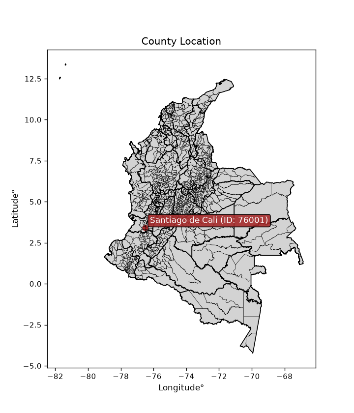
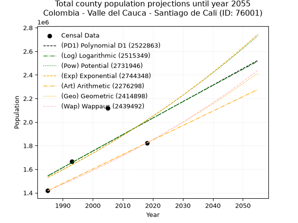
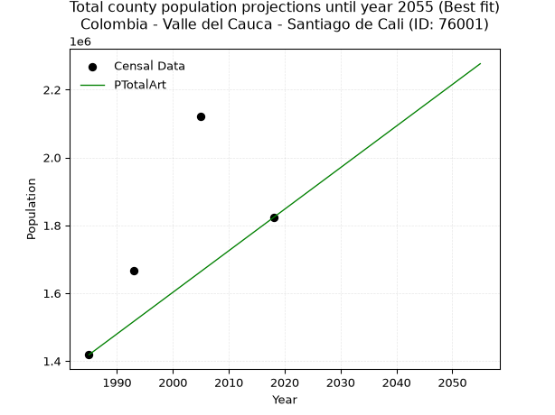
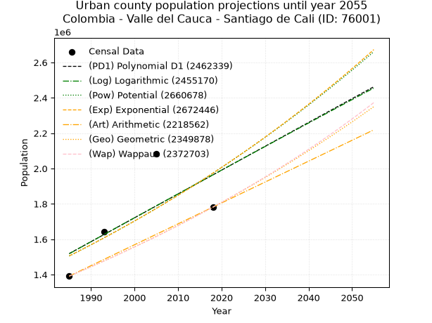
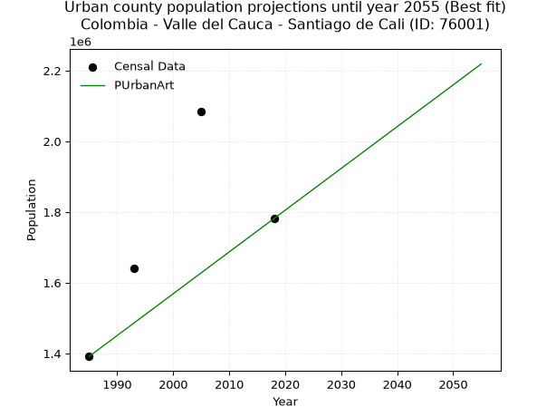
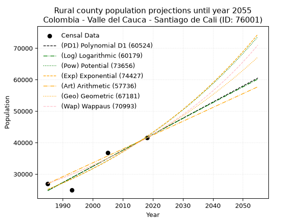
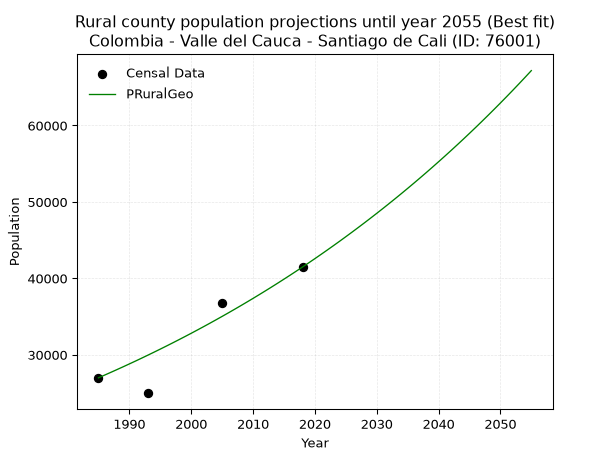

<div align="center">


</div>

# _“Population and Public Services Demand Projections (PPSD) until Year 2050 for Colombia - Valle del Cauca - Santiago de Cali (ID: 76001)”_
Keywords: `population` `public-service` `projection` `lineal` `polynomial` `logarithmic` `potential` `exponential` `arithmetic` `geometric` `wappaus` `dane` `colombia` `south-america`

PPSD are analytical estimates used by governments and planners to anticipate future changes in population size, age distribution, and the resulting community needs for utilities, healthcare, education, and infrastructure as sizing future water treatment facilities, electrical grids, and road networks based on spatial growth.

<div align="center">

</img>

</div>


> **General running parameters**: • app_version: _v20260806_. • Python version: _3.14.7_. • Pandas version: _3.0.5_. • NumPy version: _2.5.1_. • Creates, save and include plots into reports (create_plot): _False_. • Projection until year: _2050_. • Process polynomial degree 2 and up: _False_. • Process Wappaus: _True_. • Process Wappaus: _True_. • Set negative values to zero: _True_. • Set infinite values to zero: _True_. • Drop dataset notes: _True_. 
<div align="center">

Dynamic map: [:earth_americas:Google](http://maps.google.com/maps?q=3.413685885,-76.52133) [:earth_americas:OSM](https://www.openstreetmap.org/#map=18/3.413685885/-76.52133&layers=P) [:earth_americas:Bing](https://www.bing.com/maps?cp=3.413685885~-76.52133&lvl=18) [:earth_americas:Apple](https://maps.apple.com/frame?center=3.413685885%2C-76.52133&span=0.003%2C0.006)

</div>


<div align="center">

```geojson
{
  "type": "Feature",
  "geometry": {
    "type": "Point", 
    "coordinates": [-76.52133, 3.413685885]
  }, 
  "properties": {
    "Name": "Colombia - Valle del Cauca - Santiago de Cali (ID: 76001)"
  }
}
```

</div>


## 0. Census Data (4 records)

Census data are official statistics collected by a government about the people and housing in a country. They usually include counts of total population, age, sex, race, income, education, and jobs.

📅Global census file: [Population.xlsx](../data/Population.xlsx)

| Source   |   Year |   CountryID | CountryName   |   StateID | StateName       |   CountyID | CountyName       |   PTotal |   PUrban |   PRural |
|:---------|-------:|------------:|:--------------|----------:|:----------------|-----------:|:-----------------|---------:|---------:|---------:|
| DANE     |   1985 |          57 | Colombia      |        76 | Valle del Cauca |      76001 | Santiago de Cali |  1418459 |  1391476 |    26983 |
| DANE     |   1993 |          57 | Colombia      |        76 | Valle del Cauca |      76001 | Santiago de Cali |  1666468 |  1641498 |    24970 |
| DANE     |   2005 |          57 | Colombia      |        76 | Valle del Cauca |      76001 | Santiago de Cali |  2119908 |  2083171 |    36737 |
| DANE     |   2018 |          57 | Colombia      |        76 | Valle del Cauca |      76001 | Santiago de Cali |  1822869 |  1781388 |    41481 |

> 🔥Some records could had specific notes about the registered values or the corresponding urban or rural distribution.

## 1. Total

### 1.1. Coefficients and Parameters

* (PD1) Polynomial Deg 1: 13989.714973906219, -26226001.376555912 (lineal)
* (Log) Logarithmic: 28065709.904297765, -211570759.88705167
* (Pow) Potential: 16.726368300031428, -48.97483867901099
* (Exp) Exponential: 0.008338412565802015, 0.09922316998350945
* (Art) Arithmetic: Year diff. 2018 - 1985 = 33, Population diff. 1822869 - 1418459 = 404410, Annual growth = 12254.848484848484
* (Geo) Geometric: Year diff. 2018 - 1985 = 33, Population diff. 1822869 - 1418459 = 404410, Annual growth % = 0.007630191845498846
* (Wap) Wappaus: i = 0.7561621955475339, Condition values only valid for < 200)

<sub>
Wappaus condition values: ['0.00', '0.76', '1.51', '2.27', '3.02', '3.78', '4.54', '5.29', '6.05', '6.81', '7.56', '8.32', '9.07', '9.83', '10.59', '11.34', '12.10', '12.85', '13.61', '14.37', '15.12', '15.88', '16.64', '17.39', '18.15', '18.90', '19.66', '20.42', '21.17', '21.93', '22.68', '23.44', '24.20', '24.95', '25.71', '26.47', '27.22', '27.98', '28.73', '29.49', '30.25', '31.00', '31.76', '32.51', '33.27', '34.03', '34.78', '35.54', '36.30', '37.05', '37.81', '38.56', '39.32', '40.08', '40.83', '41.59', '42.35', '43.10', '43.86', '44.61', '45.37', '46.13', '46.88', '47.64', '48.39', '49.15']
</sub>


### 1.2. Projected Dataset

|   Year |   CountyID |   PTotalPD1 |   PTotalLog |   PTotalPow |   PTotalExp |   PTotalArt |   PTotalGeo |   PTotalWap |
|-------:|-----------:|------------:|------------:|------------:|------------:|------------:|------------:|------------:|
|   1985 |      76001 | 1.54358e+06 | 1.54268e+06 | 1.53009e+06 | 1.5309e+06  | 1.41846e+06 | 1.41846e+06 | 1.41846e+06 |
|   1986 |      76001 | 1.55757e+06 | 1.55681e+06 | 1.54304e+06 | 1.54372e+06 | 1.43071e+06 | 1.42928e+06 | 1.42923e+06 |
|   1987 |      76001 | 1.57156e+06 | 1.57094e+06 | 1.55609e+06 | 1.55664e+06 | 1.44297e+06 | 1.44019e+06 | 1.44007e+06 |
|   1988 |      76001 | 1.58555e+06 | 1.58506e+06 | 1.56924e+06 | 1.56968e+06 | 1.45522e+06 | 1.45118e+06 | 1.45101e+06 |
|   1989 |      76001 | 1.59954e+06 | 1.59918e+06 | 1.58249e+06 | 1.58282e+06 | 1.46748e+06 | 1.46225e+06 | 1.46202e+06 |
|   1990 |      76001 | 1.61353e+06 | 1.61328e+06 | 1.59585e+06 | 1.59607e+06 | 1.47973e+06 | 1.47341e+06 | 1.47312e+06 |
|   1991 |      76001 | 1.62752e+06 | 1.62738e+06 | 1.60932e+06 | 1.60944e+06 | 1.49199e+06 | 1.48465e+06 | 1.48431e+06 |
|   1992 |      76001 | 1.64151e+06 | 1.64148e+06 | 1.62289e+06 | 1.62291e+06 | 1.50424e+06 | 1.49598e+06 | 1.49558e+06 |
|   1993 |      76001 | 1.6555e+06  | 1.65556e+06 | 1.63657e+06 | 1.6365e+06  | 1.5165e+06  | 1.50739e+06 | 1.50694e+06 |
|   1994 |      76001 | 1.66949e+06 | 1.66964e+06 | 1.65036e+06 | 1.65021e+06 | 1.52875e+06 | 1.51889e+06 | 1.51839e+06 |
|   1995 |      76001 | 1.68348e+06 | 1.68371e+06 | 1.66426e+06 | 1.66402e+06 | 1.54101e+06 | 1.53048e+06 | 1.52993e+06 |
|   1996 |      76001 | 1.69747e+06 | 1.69778e+06 | 1.67827e+06 | 1.67796e+06 | 1.55326e+06 | 1.54216e+06 | 1.54156e+06 |
|   1997 |      76001 | 1.71146e+06 | 1.71183e+06 | 1.69239e+06 | 1.69201e+06 | 1.56552e+06 | 1.55393e+06 | 1.55329e+06 |
|   1998 |      76001 | 1.72545e+06 | 1.72588e+06 | 1.70662e+06 | 1.70618e+06 | 1.57777e+06 | 1.56578e+06 | 1.5651e+06  |
|   1999 |      76001 | 1.73944e+06 | 1.73993e+06 | 1.72096e+06 | 1.72046e+06 | 1.59003e+06 | 1.57773e+06 | 1.57701e+06 |
|   2000 |      76001 | 1.75343e+06 | 1.75396e+06 | 1.73542e+06 | 1.73487e+06 | 1.60228e+06 | 1.58977e+06 | 1.58902e+06 |
|   2001 |      76001 | 1.76742e+06 | 1.76799e+06 | 1.74999e+06 | 1.74939e+06 | 1.61454e+06 | 1.6019e+06  | 1.60112e+06 |
|   2002 |      76001 | 1.78141e+06 | 1.78202e+06 | 1.76468e+06 | 1.76404e+06 | 1.62679e+06 | 1.61412e+06 | 1.61332e+06 |
|   2003 |      76001 | 1.7954e+06  | 1.79603e+06 | 1.77948e+06 | 1.77881e+06 | 1.63905e+06 | 1.62644e+06 | 1.62562e+06 |
|   2004 |      76001 | 1.80939e+06 | 1.81004e+06 | 1.7944e+06  | 1.79371e+06 | 1.6513e+06  | 1.63885e+06 | 1.63802e+06 |
|   2005 |      76001 | 1.82338e+06 | 1.82404e+06 | 1.80943e+06 | 1.80873e+06 | 1.66356e+06 | 1.65135e+06 | 1.65052e+06 |
|   2006 |      76001 | 1.83737e+06 | 1.83804e+06 | 1.82459e+06 | 1.82387e+06 | 1.67581e+06 | 1.66395e+06 | 1.66313e+06 |
|   2007 |      76001 | 1.85136e+06 | 1.85202e+06 | 1.83986e+06 | 1.83914e+06 | 1.68807e+06 | 1.67665e+06 | 1.67584e+06 |
|   2008 |      76001 | 1.86535e+06 | 1.866e+06   | 1.85526e+06 | 1.85454e+06 | 1.70032e+06 | 1.68944e+06 | 1.68865e+06 |
|   2009 |      76001 | 1.87934e+06 | 1.87998e+06 | 1.87077e+06 | 1.87007e+06 | 1.71258e+06 | 1.70234e+06 | 1.70157e+06 |
|   2010 |      76001 | 1.89333e+06 | 1.89394e+06 | 1.88641e+06 | 1.88573e+06 | 1.72483e+06 | 1.71532e+06 | 1.7146e+06  |
|   2011 |      76001 | 1.90732e+06 | 1.9079e+06  | 1.90216e+06 | 1.90152e+06 | 1.73708e+06 | 1.72841e+06 | 1.72773e+06 |
|   2012 |      76001 | 1.9213e+06  | 1.92186e+06 | 1.91805e+06 | 1.91744e+06 | 1.74934e+06 | 1.7416e+06  | 1.74098e+06 |
|   2013 |      76001 | 1.9353e+06  | 1.9358e+06  | 1.93406e+06 | 1.9335e+06  | 1.7616e+06  | 1.75489e+06 | 1.75434e+06 |
|   2014 |      76001 | 1.94928e+06 | 1.94974e+06 | 1.95019e+06 | 1.94969e+06 | 1.77385e+06 | 1.76828e+06 | 1.76781e+06 |
|   2015 |      76001 | 1.96327e+06 | 1.96367e+06 | 1.96645e+06 | 1.96601e+06 | 1.7861e+06  | 1.78177e+06 | 1.7814e+06  |
|   2016 |      76001 | 1.97726e+06 | 1.9776e+06  | 1.98284e+06 | 1.98247e+06 | 1.79836e+06 | 1.79537e+06 | 1.7951e+06  |
|   2017 |      76001 | 1.99125e+06 | 1.99151e+06 | 1.99935e+06 | 1.99907e+06 | 1.81061e+06 | 1.80906e+06 | 1.80893e+06 |
|   2018 |      76001 | 2.00524e+06 | 2.00542e+06 | 2.016e+06   | 2.01581e+06 | 1.82287e+06 | 1.82287e+06 | 1.82287e+06 |
|   2019 |      76001 | 2.01923e+06 | 2.01933e+06 | 2.03277e+06 | 2.03269e+06 | 1.83512e+06 | 1.83678e+06 | 1.83693e+06 |
|   2020 |      76001 | 2.03322e+06 | 2.03323e+06 | 2.04968e+06 | 2.04971e+06 | 1.84738e+06 | 1.85079e+06 | 1.85112e+06 |
|   2021 |      76001 | 2.04721e+06 | 2.04712e+06 | 2.06672e+06 | 2.06687e+06 | 1.85963e+06 | 1.86492e+06 | 1.86543e+06 |
|   2022 |      76001 | 2.0612e+06  | 2.061e+06   | 2.08389e+06 | 2.08418e+06 | 1.87189e+06 | 1.87914e+06 | 1.87986e+06 |
|   2023 |      76001 | 2.07519e+06 | 2.07488e+06 | 2.10119e+06 | 2.10163e+06 | 1.88414e+06 | 1.89348e+06 | 1.89442e+06 |
|   2024 |      76001 | 2.08918e+06 | 2.08875e+06 | 2.11863e+06 | 2.11923e+06 | 1.8964e+06  | 1.90793e+06 | 1.90912e+06 |
|   2025 |      76001 | 2.10317e+06 | 2.10261e+06 | 2.13621e+06 | 2.13698e+06 | 1.90865e+06 | 1.92249e+06 | 1.92394e+06 |
|   2026 |      76001 | 2.11716e+06 | 2.11647e+06 | 2.15392e+06 | 2.15487e+06 | 1.92091e+06 | 1.93716e+06 | 1.93889e+06 |
|   2027 |      76001 | 2.13115e+06 | 2.13032e+06 | 2.17178e+06 | 2.17291e+06 | 1.93316e+06 | 1.95194e+06 | 1.95398e+06 |
|   2028 |      76001 | 2.14514e+06 | 2.14416e+06 | 2.18977e+06 | 2.19111e+06 | 1.94542e+06 | 1.96683e+06 | 1.96921e+06 |
|   2029 |      76001 | 2.15913e+06 | 2.15799e+06 | 2.2079e+06  | 2.20945e+06 | 1.95767e+06 | 1.98184e+06 | 1.98457e+06 |
|   2030 |      76001 | 2.17312e+06 | 2.17182e+06 | 2.22617e+06 | 2.22795e+06 | 1.96993e+06 | 1.99696e+06 | 2.00008e+06 |
|   2031 |      76001 | 2.18711e+06 | 2.18564e+06 | 2.24458e+06 | 2.24661e+06 | 1.98218e+06 | 2.0122e+06  | 2.01572e+06 |
|   2032 |      76001 | 2.2011e+06  | 2.19946e+06 | 2.26314e+06 | 2.26542e+06 | 1.99444e+06 | 2.02755e+06 | 2.03151e+06 |
|   2033 |      76001 | 2.21509e+06 | 2.21327e+06 | 2.28184e+06 | 2.28439e+06 | 2.00669e+06 | 2.04302e+06 | 2.04745e+06 |
|   2034 |      76001 | 2.22908e+06 | 2.22707e+06 | 2.30069e+06 | 2.30352e+06 | 2.01895e+06 | 2.05861e+06 | 2.06353e+06 |
|   2035 |      76001 | 2.24307e+06 | 2.24086e+06 | 2.31968e+06 | 2.3228e+06  | 2.0312e+06  | 2.07432e+06 | 2.07976e+06 |
|   2036 |      76001 | 2.25706e+06 | 2.25465e+06 | 2.33882e+06 | 2.34225e+06 | 2.04346e+06 | 2.09015e+06 | 2.09615e+06 |
|   2037 |      76001 | 2.27105e+06 | 2.26844e+06 | 2.35811e+06 | 2.36187e+06 | 2.05571e+06 | 2.10609e+06 | 2.11269e+06 |
|   2038 |      76001 | 2.28504e+06 | 2.28221e+06 | 2.37755e+06 | 2.38164e+06 | 2.06797e+06 | 2.12216e+06 | 2.12939e+06 |
|   2039 |      76001 | 2.29903e+06 | 2.29598e+06 | 2.39714e+06 | 2.40158e+06 | 2.08022e+06 | 2.13836e+06 | 2.14624e+06 |
|   2040 |      76001 | 2.31302e+06 | 2.30974e+06 | 2.41688e+06 | 2.42169e+06 | 2.09248e+06 | 2.15467e+06 | 2.16326e+06 |
|   2041 |      76001 | 2.32701e+06 | 2.32349e+06 | 2.43677e+06 | 2.44197e+06 | 2.10473e+06 | 2.17111e+06 | 2.18044e+06 |
|   2042 |      76001 | 2.341e+06   | 2.33724e+06 | 2.45682e+06 | 2.46242e+06 | 2.11698e+06 | 2.18768e+06 | 2.19778e+06 |
|   2043 |      76001 | 2.35499e+06 | 2.35098e+06 | 2.47702e+06 | 2.48304e+06 | 2.12924e+06 | 2.20437e+06 | 2.21529e+06 |
|   2044 |      76001 | 2.36898e+06 | 2.36472e+06 | 2.49738e+06 | 2.50383e+06 | 2.1415e+06  | 2.22119e+06 | 2.23298e+06 |
|   2045 |      76001 | 2.38297e+06 | 2.37844e+06 | 2.51789e+06 | 2.52479e+06 | 2.15375e+06 | 2.23814e+06 | 2.25083e+06 |
|   2046 |      76001 | 2.39696e+06 | 2.39216e+06 | 2.53856e+06 | 2.54594e+06 | 2.166e+06   | 2.25522e+06 | 2.26886e+06 |
|   2047 |      76001 | 2.41094e+06 | 2.40588e+06 | 2.5594e+06  | 2.56725e+06 | 2.17826e+06 | 2.27242e+06 | 2.28707e+06 |
|   2048 |      76001 | 2.42494e+06 | 2.41958e+06 | 2.58039e+06 | 2.58875e+06 | 2.19051e+06 | 2.28976e+06 | 2.30546e+06 |
|   2049 |      76001 | 2.43892e+06 | 2.43328e+06 | 2.60155e+06 | 2.61042e+06 | 2.20277e+06 | 2.30724e+06 | 2.32404e+06 |
|   2050 |      76001 | 2.45291e+06 | 2.44698e+06 | 2.62287e+06 | 2.63228e+06 | 2.21502e+06 | 2.32484e+06 | 2.3428e+06  |
<div align="center">

</img>

</div>


### 1.3. Best fit with absolute and relative error (%)

Relative error puts that difference into context by dividing the absolute error by the true value, creating a unitless ratio or percentage that shows the scale of the mistake.

Absolute and relative error

|   Year | Source   |   CountryID | CountryName   |   StateID | StateName       |   CountyID_x | CountyName       |   PTotal |   PUrban |   PRural |   CountyID_y |   PTotalPD1 |   PTotalLog |   PTotalPow |   PTotalExp |   PTotalArt |   PTotalGeo |   PTotalWap |   PTotalPD1AbsError |   PTotalLogAbsError |   PTotalPowAbsError |   PTotalExpAbsError |   PTotalArtAbsError |   PTotalGeoAbsError |   PTotalWapAbsError |   PTotalPD1RelError |   PTotalLogRelError |   PTotalPowRelError |   PTotalExpRelError |   PTotalArtRelError |   PTotalGeoRelError |   PTotalWapRelError |
|-------:|:---------|------------:|:--------------|----------:|:----------------|-------------:|:-----------------|---------:|---------:|---------:|-------------:|------------:|------------:|------------:|------------:|------------:|------------:|------------:|--------------------:|--------------------:|--------------------:|--------------------:|--------------------:|--------------------:|--------------------:|--------------------:|--------------------:|--------------------:|--------------------:|--------------------:|--------------------:|--------------------:|
|   1985 | DANE     |          57 | Colombia      |        76 | Valle del Cauca |        76001 | Santiago de Cali |  1418459 |  1391476 |    26983 |        76001 | 1.54358e+06 | 1.54268e+06 | 1.53009e+06 | 1.5309e+06  | 1.41846e+06 | 1.41846e+06 | 1.41846e+06 |              125124 |              124218 |              111635 |              112439 |                   0 |                   0 |                   0 |            8.82112  |            8.75725  |             7.87016 |             7.92684 |             0       |              0      |              0      |
|   1993 | DANE     |          57 | Colombia      |        76 | Valle del Cauca |        76001 | Santiago de Cali |  1666468 |  1641498 |    24970 |        76001 | 1.6555e+06  | 1.65556e+06 | 1.63657e+06 | 1.6365e+06  | 1.5165e+06  | 1.50739e+06 | 1.50694e+06 |               10967 |               10907 |               29894 |               29964 |              149970 |              159076 |              159526 |            0.658098 |            0.654498 |             1.79385 |             1.79805 |             8.99927 |              9.5457 |              9.5727 |
|   2005 | DANE     |          57 | Colombia      |        76 | Valle del Cauca |        76001 | Santiago de Cali |  2119908 |  2083171 |    36737 |        76001 | 1.82338e+06 | 1.82404e+06 | 1.80943e+06 | 1.80873e+06 | 1.66356e+06 | 1.65135e+06 | 1.65052e+06 |              296531 |              295868 |              310475 |              311182 |              456352 |              468554 |              469384 |           13.9879   |           13.9566   |            14.6457  |            14.679   |            21.527   |             22.1026 |             22.1417 |
|   2018 | DANE     |          57 | Colombia      |        76 | Valle del Cauca |        76001 | Santiago de Cali |  1822869 |  1781388 |    41481 |        76001 | 2.00524e+06 | 2.00542e+06 | 2.016e+06   | 2.01581e+06 | 1.82287e+06 | 1.82287e+06 | 1.82287e+06 |              182374 |              182556 |              193128 |              192943 |                   0 |                   0 |                   0 |           10.0048   |           10.0148   |            10.5947  |            10.5846  |             0       |              0      |              0      |

Relative error mean

| Method    |   RelError | Best   |
|:----------|-----------:|:-------|
| PTotalPD1 |    8.36798 |        |
| PTotalLog |    8.34579 |        |
| PTotalPow |    8.72611 |        |
| PTotalExp |    8.74713 |        |
| PTotalArt |    7.63156 | True   |
| PTotalGeo |    7.91207 |        |
| PTotalWap |    7.9286  |        |

💙Best method: _**PTotalArt**_
<div align="center">

</img>

</div>


### 1.4. Fresh water supply demand in liters per capita per day (lpcd)

The fresh water supply demand typically ranges from 100 to 300 liters per capita per day (lpcd) for standard domestic and municipal planning, though absolute survival minimums set by the World Health Organization are as low as 7.5 to 20 liters per day, and total consumption in high-income nations can exceed 400 liters.

> `CZ`: Level in meters above the sea level (masl)<br> `WS`: Fresh water supply demand in liters per capita per day (lpcd or l/h/d)<br> `WSAll`: Zonal fresh water supply demand in liters per second (l/s)<br> `A`: Zonal area in square meters<br> `DP`: Population density (people/hectare or p/ha)

Reference values (RAS Colombia)

|    CZ |   WS |
|------:|-----:|
|  1000 |  120 |
|  2000 |  130 |
| 99999 |  140 |

County shapefile geometry properties and water supply values

|   CountyID |      ATotal |   CZTotal |   WSTotal |
|-----------:|------------:|----------:|----------:|
|      76001 | 5.64139e+08 |   1530.77 |       130 |

Projected values for best method: PTotalArt

|   CountyID |   Year |   PTotalArt |   DPTotal |   WSTotal |   WSTotalAll |
|-----------:|-------:|------------:|----------:|----------:|-------------:|
|      76001 |   1985 | 1.41846e+06 |     25.14 |       130 |      2134.26 |
|      76001 |   1986 | 1.43071e+06 |     25.36 |       130 |      2152.69 |
|      76001 |   1987 | 1.44297e+06 |     25.58 |       130 |      2171.13 |
|      76001 |   1988 | 1.45522e+06 |     25.8  |       130 |      2189.57 |
|      76001 |   1989 | 1.46748e+06 |     26.01 |       130 |      2208.01 |
|      76001 |   1990 | 1.47973e+06 |     26.23 |       130 |      2226.45 |
|      76001 |   1991 | 1.49199e+06 |     26.45 |       130 |      2244.89 |
|      76001 |   1992 | 1.50424e+06 |     26.66 |       130 |      2263.33 |
|      76001 |   1993 | 1.5165e+06  |     26.88 |       130 |      2281.77 |
|      76001 |   1994 | 1.52875e+06 |     27.1  |       130 |      2300.21 |
|      76001 |   1995 | 1.54101e+06 |     27.32 |       130 |      2318.64 |
|      76001 |   1996 | 1.55326e+06 |     27.53 |       130 |      2337.08 |
|      76001 |   1997 | 1.56552e+06 |     27.75 |       130 |      2355.52 |
|      76001 |   1998 | 1.57777e+06 |     27.97 |       130 |      2373.96 |
|      76001 |   1999 | 1.59003e+06 |     28.19 |       130 |      2392.4  |
|      76001 |   2000 | 1.60228e+06 |     28.4  |       130 |      2410.84 |
|      76001 |   2001 | 1.61454e+06 |     28.62 |       130 |      2429.28 |
|      76001 |   2002 | 1.62679e+06 |     28.84 |       130 |      2447.72 |
|      76001 |   2003 | 1.63905e+06 |     29.05 |       130 |      2466.16 |
|      76001 |   2004 | 1.6513e+06  |     29.27 |       130 |      2484.6  |
|      76001 |   2005 | 1.66356e+06 |     29.49 |       130 |      2503.04 |
|      76001 |   2006 | 1.67581e+06 |     29.71 |       130 |      2521.47 |
|      76001 |   2007 | 1.68807e+06 |     29.92 |       130 |      2539.91 |
|      76001 |   2008 | 1.70032e+06 |     30.14 |       130 |      2558.35 |
|      76001 |   2009 | 1.71258e+06 |     30.36 |       130 |      2576.79 |
|      76001 |   2010 | 1.72483e+06 |     30.57 |       130 |      2595.23 |
|      76001 |   2011 | 1.73708e+06 |     30.79 |       130 |      2613.67 |
|      76001 |   2012 | 1.74934e+06 |     31.01 |       130 |      2632.11 |
|      76001 |   2013 | 1.7616e+06  |     31.23 |       130 |      2650.55 |
|      76001 |   2014 | 1.77385e+06 |     31.44 |       130 |      2668.99 |
|      76001 |   2015 | 1.7861e+06  |     31.66 |       130 |      2687.43 |
|      76001 |   2016 | 1.79836e+06 |     31.88 |       130 |      2705.86 |
|      76001 |   2017 | 1.81061e+06 |     32.1  |       130 |      2724.3  |
|      76001 |   2018 | 1.82287e+06 |     32.31 |       130 |      2742.74 |
|      76001 |   2019 | 1.83512e+06 |     32.53 |       130 |      2761.18 |
|      76001 |   2020 | 1.84738e+06 |     32.75 |       130 |      2779.62 |
|      76001 |   2021 | 1.85963e+06 |     32.96 |       130 |      2798.06 |
|      76001 |   2022 | 1.87189e+06 |     33.18 |       130 |      2816.5  |
|      76001 |   2023 | 1.88414e+06 |     33.4  |       130 |      2834.94 |
|      76001 |   2024 | 1.8964e+06  |     33.62 |       130 |      2853.38 |
|      76001 |   2025 | 1.90865e+06 |     33.83 |       130 |      2871.82 |
|      76001 |   2026 | 1.92091e+06 |     34.05 |       130 |      2890.26 |
|      76001 |   2027 | 1.93316e+06 |     34.27 |       130 |      2908.69 |
|      76001 |   2028 | 1.94542e+06 |     34.48 |       130 |      2927.13 |
|      76001 |   2029 | 1.95767e+06 |     34.7  |       130 |      2945.57 |
|      76001 |   2030 | 1.96993e+06 |     34.92 |       130 |      2964.01 |
|      76001 |   2031 | 1.98218e+06 |     35.14 |       130 |      2982.45 |
|      76001 |   2032 | 1.99444e+06 |     35.35 |       130 |      3000.89 |
|      76001 |   2033 | 2.00669e+06 |     35.57 |       130 |      3019.33 |
|      76001 |   2034 | 2.01895e+06 |     35.79 |       130 |      3037.77 |
|      76001 |   2035 | 2.0312e+06  |     36.01 |       130 |      3056.21 |
|      76001 |   2036 | 2.04346e+06 |     36.22 |       130 |      3074.64 |
|      76001 |   2037 | 2.05571e+06 |     36.44 |       130 |      3093.08 |
|      76001 |   2038 | 2.06797e+06 |     36.66 |       130 |      3111.52 |
|      76001 |   2039 | 2.08022e+06 |     36.87 |       130 |      3129.96 |
|      76001 |   2040 | 2.09248e+06 |     37.09 |       130 |      3148.4  |
|      76001 |   2041 | 2.10473e+06 |     37.31 |       130 |      3166.84 |
|      76001 |   2042 | 2.11698e+06 |     37.53 |       130 |      3185.28 |
|      76001 |   2043 | 2.12924e+06 |     37.74 |       130 |      3203.72 |
|      76001 |   2044 | 2.1415e+06  |     37.96 |       130 |      3222.16 |
|      76001 |   2045 | 2.15375e+06 |     38.18 |       130 |      3240.6  |
|      76001 |   2046 | 2.166e+06   |     38.39 |       130 |      3259.04 |
|      76001 |   2047 | 2.17826e+06 |     38.61 |       130 |      3277.47 |
|      76001 |   2048 | 2.19051e+06 |     38.83 |       130 |      3295.91 |
|      76001 |   2049 | 2.20277e+06 |     39.05 |       130 |      3314.35 |
|      76001 |   2050 | 2.21502e+06 |     39.26 |       130 |      3332.79 |

## 2. Urban

### 2.1. Coefficients and Parameters

* (PD1) Polynomial Deg 1: 13478.650742673783, -25236287.898033235 (lineal)
* (Log) Logarithmic: 27043007.587055296, -203829734.12826964
* (Pow) Potential: 16.440235648511887, -48.03841477620692
* (Exp) Exponential: 0.008195057754985162, 0.12972491343187742
* (Art) Arithmetic: Year diff. 2018 - 1985 = 33, Population diff. 1781388 - 1391476 = 389912, Annual growth = 11815.515151515152
* (Geo) Geometric: Year diff. 2018 - 1985 = 33, Population diff. 1781388 - 1391476 = 389912, Annual growth % = 0.00751377816902421
* (Wap) Wappaus: i = 0.7447854778216243, Condition values only valid for < 200)

<sub>
Wappaus condition values: ['0.00', '0.74', '1.49', '2.23', '2.98', '3.72', '4.47', '5.21', '5.96', '6.70', '7.45', '8.19', '8.94', '9.68', '10.43', '11.17', '11.92', '12.66', '13.41', '14.15', '14.90', '15.64', '16.39', '17.13', '17.87', '18.62', '19.36', '20.11', '20.85', '21.60', '22.34', '23.09', '23.83', '24.58', '25.32', '26.07', '26.81', '27.56', '28.30', '29.05', '29.79', '30.54', '31.28', '32.03', '32.77', '33.52', '34.26', '35.00', '35.75', '36.49', '37.24', '37.98', '38.73', '39.47', '40.22', '40.96', '41.71', '42.45', '43.20', '43.94', '44.69', '45.43', '46.18', '46.92', '47.67', '48.41']
</sub>


### 2.2. Projected Dataset

|   Year |   CountyID |   PUrbanPD1 |   PUrbanLog |   PUrbanPow |   PUrbanExp |   PUrbanArt |   PUrbanGeo |   PUrbanWap |
|-------:|-----------:|------------:|------------:|------------:|------------:|------------:|------------:|------------:|
|   1985 |      76001 | 1.51883e+06 | 1.51794e+06 | 1.50503e+06 | 1.50582e+06 | 1.39148e+06 | 1.39148e+06 | 1.39148e+06 |
|   1986 |      76001 | 1.53231e+06 | 1.53156e+06 | 1.51754e+06 | 1.51822e+06 | 1.40329e+06 | 1.40193e+06 | 1.40188e+06 |
|   1987 |      76001 | 1.54579e+06 | 1.54518e+06 | 1.53016e+06 | 1.53071e+06 | 1.41511e+06 | 1.41246e+06 | 1.41236e+06 |
|   1988 |      76001 | 1.55927e+06 | 1.55878e+06 | 1.54286e+06 | 1.5433e+06  | 1.42692e+06 | 1.42308e+06 | 1.42292e+06 |
|   1989 |      76001 | 1.57275e+06 | 1.57238e+06 | 1.55567e+06 | 1.556e+06   | 1.43874e+06 | 1.43377e+06 | 1.43356e+06 |
|   1990 |      76001 | 1.58623e+06 | 1.58598e+06 | 1.56858e+06 | 1.56881e+06 | 1.45055e+06 | 1.44454e+06 | 1.44428e+06 |
|   1991 |      76001 | 1.59971e+06 | 1.59956e+06 | 1.58159e+06 | 1.58172e+06 | 1.46237e+06 | 1.4554e+06  | 1.45508e+06 |
|   1992 |      76001 | 1.61318e+06 | 1.61314e+06 | 1.5947e+06  | 1.59473e+06 | 1.47418e+06 | 1.46633e+06 | 1.46596e+06 |
|   1993 |      76001 | 1.62666e+06 | 1.62671e+06 | 1.60791e+06 | 1.60785e+06 | 1.486e+06   | 1.47735e+06 | 1.47693e+06 |
|   1994 |      76001 | 1.64014e+06 | 1.64028e+06 | 1.62123e+06 | 1.62108e+06 | 1.49782e+06 | 1.48845e+06 | 1.48798e+06 |
|   1995 |      76001 | 1.65362e+06 | 1.65384e+06 | 1.63465e+06 | 1.63442e+06 | 1.50963e+06 | 1.49964e+06 | 1.49912e+06 |
|   1996 |      76001 | 1.6671e+06  | 1.66739e+06 | 1.64817e+06 | 1.64787e+06 | 1.52145e+06 | 1.5109e+06  | 1.51034e+06 |
|   1997 |      76001 | 1.68058e+06 | 1.68093e+06 | 1.6618e+06  | 1.66143e+06 | 1.53326e+06 | 1.52226e+06 | 1.52166e+06 |
|   1998 |      76001 | 1.69406e+06 | 1.69447e+06 | 1.67553e+06 | 1.6751e+06  | 1.54508e+06 | 1.53369e+06 | 1.53306e+06 |
|   1999 |      76001 | 1.70754e+06 | 1.708e+06   | 1.68937e+06 | 1.68889e+06 | 1.55689e+06 | 1.54522e+06 | 1.54454e+06 |
|   2000 |      76001 | 1.72101e+06 | 1.72153e+06 | 1.70332e+06 | 1.70279e+06 | 1.56871e+06 | 1.55683e+06 | 1.55613e+06 |
|   2001 |      76001 | 1.73449e+06 | 1.73505e+06 | 1.71738e+06 | 1.7168e+06  | 1.58052e+06 | 1.56853e+06 | 1.5678e+06  |
|   2002 |      76001 | 1.74797e+06 | 1.74856e+06 | 1.73154e+06 | 1.73092e+06 | 1.59234e+06 | 1.58031e+06 | 1.57956e+06 |
|   2003 |      76001 | 1.76145e+06 | 1.76206e+06 | 1.74581e+06 | 1.74517e+06 | 1.60416e+06 | 1.59218e+06 | 1.59142e+06 |
|   2004 |      76001 | 1.77493e+06 | 1.77556e+06 | 1.7602e+06  | 1.75953e+06 | 1.61597e+06 | 1.60415e+06 | 1.60338e+06 |
|   2005 |      76001 | 1.78841e+06 | 1.78905e+06 | 1.7747e+06  | 1.77401e+06 | 1.62779e+06 | 1.6162e+06  | 1.61543e+06 |
|   2006 |      76001 | 1.80188e+06 | 1.80254e+06 | 1.7893e+06  | 1.7886e+06  | 1.6396e+06  | 1.62835e+06 | 1.62757e+06 |
|   2007 |      76001 | 1.81536e+06 | 1.81601e+06 | 1.80402e+06 | 1.80332e+06 | 1.65142e+06 | 1.64058e+06 | 1.63982e+06 |
|   2008 |      76001 | 1.82884e+06 | 1.82948e+06 | 1.81886e+06 | 1.81816e+06 | 1.66323e+06 | 1.65291e+06 | 1.65216e+06 |
|   2009 |      76001 | 1.84232e+06 | 1.84295e+06 | 1.83381e+06 | 1.83312e+06 | 1.67505e+06 | 1.66533e+06 | 1.66461e+06 |
|   2010 |      76001 | 1.8558e+06  | 1.85641e+06 | 1.84887e+06 | 1.84821e+06 | 1.68686e+06 | 1.67784e+06 | 1.67716e+06 |
|   2011 |      76001 | 1.86928e+06 | 1.86986e+06 | 1.86405e+06 | 1.86342e+06 | 1.69868e+06 | 1.69045e+06 | 1.68981e+06 |
|   2012 |      76001 | 1.88276e+06 | 1.8833e+06  | 1.87935e+06 | 1.87875e+06 | 1.7105e+06  | 1.70315e+06 | 1.70257e+06 |
|   2013 |      76001 | 1.89624e+06 | 1.89674e+06 | 1.89476e+06 | 1.89421e+06 | 1.72231e+06 | 1.71595e+06 | 1.71543e+06 |
|   2014 |      76001 | 1.90972e+06 | 1.91017e+06 | 1.9103e+06  | 1.9098e+06  | 1.73413e+06 | 1.72884e+06 | 1.7284e+06  |
|   2015 |      76001 | 1.92319e+06 | 1.9236e+06  | 1.92595e+06 | 1.92551e+06 | 1.74594e+06 | 1.74183e+06 | 1.74148e+06 |
|   2016 |      76001 | 1.93667e+06 | 1.93701e+06 | 1.94173e+06 | 1.94136e+06 | 1.75776e+06 | 1.75492e+06 | 1.75467e+06 |
|   2017 |      76001 | 1.95015e+06 | 1.95042e+06 | 1.95762e+06 | 1.95733e+06 | 1.76957e+06 | 1.7681e+06  | 1.76797e+06 |
|   2018 |      76001 | 1.96363e+06 | 1.96383e+06 | 1.97364e+06 | 1.97344e+06 | 1.78139e+06 | 1.78139e+06 | 1.78139e+06 |
|   2019 |      76001 | 1.97711e+06 | 1.97722e+06 | 1.98978e+06 | 1.98968e+06 | 1.7932e+06  | 1.79477e+06 | 1.79492e+06 |
|   2020 |      76001 | 1.99059e+06 | 1.99062e+06 | 2.00604e+06 | 2.00605e+06 | 1.80502e+06 | 1.80826e+06 | 1.80856e+06 |
|   2021 |      76001 | 2.00406e+06 | 2.004e+06   | 2.02243e+06 | 2.02256e+06 | 1.81684e+06 | 1.82184e+06 | 1.82232e+06 |
|   2022 |      76001 | 2.01754e+06 | 2.01738e+06 | 2.03895e+06 | 2.0392e+06  | 1.82865e+06 | 1.83553e+06 | 1.8362e+06  |
|   2023 |      76001 | 2.03102e+06 | 2.03075e+06 | 2.05559e+06 | 2.05598e+06 | 1.84047e+06 | 1.84933e+06 | 1.8502e+06  |
|   2024 |      76001 | 2.0445e+06  | 2.04411e+06 | 2.07236e+06 | 2.0729e+06  | 1.85228e+06 | 1.86322e+06 | 1.86433e+06 |
|   2025 |      76001 | 2.05798e+06 | 2.05747e+06 | 2.08926e+06 | 2.08995e+06 | 1.8641e+06  | 1.87722e+06 | 1.87857e+06 |
|   2026 |      76001 | 2.07146e+06 | 2.07082e+06 | 2.10628e+06 | 2.10715e+06 | 1.87591e+06 | 1.89133e+06 | 1.89294e+06 |
|   2027 |      76001 | 2.08494e+06 | 2.08417e+06 | 2.12344e+06 | 2.12449e+06 | 1.88773e+06 | 1.90554e+06 | 1.90744e+06 |
|   2028 |      76001 | 2.09842e+06 | 2.0975e+06  | 2.14073e+06 | 2.14197e+06 | 1.89954e+06 | 1.91986e+06 | 1.92207e+06 |
|   2029 |      76001 | 2.11189e+06 | 2.11084e+06 | 2.15815e+06 | 2.1596e+06  | 1.91136e+06 | 1.93428e+06 | 1.93683e+06 |
|   2030 |      76001 | 2.12537e+06 | 2.12416e+06 | 2.1757e+06  | 2.17737e+06 | 1.92317e+06 | 1.94881e+06 | 1.95172e+06 |
|   2031 |      76001 | 2.13885e+06 | 2.13748e+06 | 2.19339e+06 | 2.19529e+06 | 1.93499e+06 | 1.96346e+06 | 1.96674e+06 |
|   2032 |      76001 | 2.15233e+06 | 2.15079e+06 | 2.21121e+06 | 2.21335e+06 | 1.9468e+06  | 1.97821e+06 | 1.9819e+06  |
|   2033 |      76001 | 2.16581e+06 | 2.1641e+06  | 2.22917e+06 | 2.23156e+06 | 1.95862e+06 | 1.99307e+06 | 1.9972e+06  |
|   2034 |      76001 | 2.17929e+06 | 2.1774e+06  | 2.24727e+06 | 2.24993e+06 | 1.97044e+06 | 2.00805e+06 | 2.01263e+06 |
|   2035 |      76001 | 2.19277e+06 | 2.19069e+06 | 2.2655e+06  | 2.26844e+06 | 1.98225e+06 | 2.02314e+06 | 2.02821e+06 |
|   2036 |      76001 | 2.20624e+06 | 2.20397e+06 | 2.28387e+06 | 2.28711e+06 | 1.99407e+06 | 2.03834e+06 | 2.04393e+06 |
|   2037 |      76001 | 2.21972e+06 | 2.21725e+06 | 2.30238e+06 | 2.30593e+06 | 2.00588e+06 | 2.05366e+06 | 2.0598e+06  |
|   2038 |      76001 | 2.2332e+06  | 2.23053e+06 | 2.32104e+06 | 2.3249e+06  | 2.0177e+06  | 2.06908e+06 | 2.07581e+06 |
|   2039 |      76001 | 2.24668e+06 | 2.24379e+06 | 2.33983e+06 | 2.34403e+06 | 2.02951e+06 | 2.08463e+06 | 2.09197e+06 |
|   2040 |      76001 | 2.26016e+06 | 2.25705e+06 | 2.35877e+06 | 2.36332e+06 | 2.04133e+06 | 2.1003e+06  | 2.10828e+06 |
|   2041 |      76001 | 2.27364e+06 | 2.2703e+06  | 2.37785e+06 | 2.38277e+06 | 2.05314e+06 | 2.11608e+06 | 2.12475e+06 |
|   2042 |      76001 | 2.28712e+06 | 2.28355e+06 | 2.39708e+06 | 2.40238e+06 | 2.06496e+06 | 2.13198e+06 | 2.14137e+06 |
|   2043 |      76001 | 2.3006e+06  | 2.29679e+06 | 2.41645e+06 | 2.42214e+06 | 2.07678e+06 | 2.148e+06   | 2.15815e+06 |
|   2044 |      76001 | 2.31407e+06 | 2.31002e+06 | 2.43597e+06 | 2.44208e+06 | 2.08859e+06 | 2.16414e+06 | 2.17509e+06 |
|   2045 |      76001 | 2.32755e+06 | 2.32325e+06 | 2.45563e+06 | 2.46217e+06 | 2.10041e+06 | 2.1804e+06  | 2.1922e+06  |
|   2046 |      76001 | 2.34103e+06 | 2.33647e+06 | 2.47545e+06 | 2.48243e+06 | 2.11222e+06 | 2.19678e+06 | 2.20946e+06 |
|   2047 |      76001 | 2.35451e+06 | 2.34969e+06 | 2.49542e+06 | 2.50286e+06 | 2.12404e+06 | 2.21328e+06 | 2.2269e+06  |
|   2048 |      76001 | 2.36799e+06 | 2.3629e+06  | 2.51553e+06 | 2.52345e+06 | 2.13585e+06 | 2.22992e+06 | 2.2445e+06  |
|   2049 |      76001 | 2.38147e+06 | 2.3761e+06  | 2.5358e+06  | 2.54422e+06 | 2.14767e+06 | 2.24667e+06 | 2.26228e+06 |
|   2050 |      76001 | 2.39495e+06 | 2.38929e+06 | 2.55622e+06 | 2.56516e+06 | 2.15948e+06 | 2.26355e+06 | 2.28023e+06 |
<div align="center">

</img>

</div>


### 2.3. Best fit with absolute and relative error (%)

Relative error puts that difference into context by dividing the absolute error by the true value, creating a unitless ratio or percentage that shows the scale of the mistake.

Absolute and relative error

|   Year | Source   |   CountryID | CountryName   |   StateID | StateName       |   CountyID_x | CountyName       |   PTotal |   PUrban |   PRural |   CountyID_y |   PUrbanPD1 |   PUrbanLog |   PUrbanPow |   PUrbanExp |   PUrbanArt |   PUrbanGeo |   PUrbanWap |   PUrbanPD1AbsError |   PUrbanLogAbsError |   PUrbanPowAbsError |   PUrbanExpAbsError |   PUrbanArtAbsError |   PUrbanGeoAbsError |   PUrbanWapAbsError |   PUrbanPD1RelError |   PUrbanLogRelError |   PUrbanPowRelError |   PUrbanExpRelError |   PUrbanArtRelError |   PUrbanGeoRelError |   PUrbanWapRelError |
|-------:|:---------|------------:|:--------------|----------:|:----------------|-------------:|:-----------------|---------:|---------:|---------:|-------------:|------------:|------------:|------------:|------------:|------------:|------------:|------------:|--------------------:|--------------------:|--------------------:|--------------------:|--------------------:|--------------------:|--------------------:|--------------------:|--------------------:|--------------------:|--------------------:|--------------------:|--------------------:|--------------------:|
|   1985 | DANE     |          57 | Colombia      |        76 | Valle del Cauca |        76001 | Santiago de Cali |  1418459 |  1391476 |    26983 |        76001 | 1.51883e+06 | 1.51794e+06 | 1.50503e+06 | 1.50582e+06 | 1.39148e+06 | 1.39148e+06 | 1.39148e+06 |              127358 |              126466 |              113554 |              114348 |                   0 |                   0 |                   0 |            9.15273  |            9.08862  |             8.16069 |             8.21775 |             0       |             0       |              0      |
|   1993 | DANE     |          57 | Colombia      |        76 | Valle del Cauca |        76001 | Santiago de Cali |  1666468 |  1641498 |    24970 |        76001 | 1.62666e+06 | 1.62671e+06 | 1.60791e+06 | 1.60785e+06 | 1.486e+06   | 1.47735e+06 | 1.47693e+06 |               14835 |               14786 |               33584 |               33644 |              155498 |              164147 |              164568 |            0.903748 |            0.900763 |             2.04594 |             2.04959 |             9.47293 |             9.99983 |             10.0255 |
|   2005 | DANE     |          57 | Colombia      |        76 | Valle del Cauca |        76001 | Santiago de Cali |  2119908 |  2083171 |    36737 |        76001 | 1.78841e+06 | 1.78905e+06 | 1.7747e+06  | 1.77401e+06 | 1.62779e+06 | 1.6162e+06  | 1.61543e+06 |              294764 |              294119 |              308476 |              309163 |              455385 |              466969 |              467745 |           14.1498   |           14.1188   |            14.808   |            14.841   |            21.8602  |            22.4163  |             22.4535 |
|   2018 | DANE     |          57 | Colombia      |        76 | Valle del Cauca |        76001 | Santiago de Cali |  1822869 |  1781388 |    41481 |        76001 | 1.96363e+06 | 1.96383e+06 | 1.97364e+06 | 1.97344e+06 | 1.78139e+06 | 1.78139e+06 | 1.78139e+06 |              182241 |              182439 |              192252 |              192049 |                   0 |                   0 |                   0 |           10.2303   |           10.2414   |            10.7923  |            10.7809  |             0       |             0       |              0      |

Relative error mean

| Method    |   RelError | Best   |
|:----------|-----------:|:-------|
| PUrbanPD1 |    8.60913 |        |
| PUrbanLog |    8.5874  |        |
| PUrbanPow |    8.95172 |        |
| PUrbanExp |    8.9723  |        |
| PUrbanArt |    7.83328 | True   |
| PUrbanGeo |    8.10402 |        |
| PUrbanWap |    8.11975 |        |

💙Best method: _**PUrbanArt**_
<div align="center">

</img>

</div>


### 2.4. Fresh water supply demand in liters per capita per day (lpcd)

The fresh water supply demand typically ranges from 100 to 300 liters per capita per day (lpcd) for standard domestic and municipal planning, though absolute survival minimums set by the World Health Organization are as low as 7.5 to 20 liters per day, and total consumption in high-income nations can exceed 400 liters.

> `CZ`: Level in meters above the sea level (masl)<br> `WS`: Fresh water supply demand in liters per capita per day (lpcd or l/h/d)<br> `WSAll`: Zonal fresh water supply demand in liters per second (l/s)<br> `A`: Zonal area in square meters<br> `DP`: Population density (people/hectare or p/ha)

Reference values (RAS Colombia)

|    CZ |   WS |
|------:|-----:|
|  1000 |  120 |
|  2000 |  130 |
| 99999 |  140 |

County shapefile geometry properties and water supply values

|   CountyID |      AUrban |   CZUrban |   WSUrban |
|-----------:|------------:|----------:|----------:|
|      76001 | 1.48602e+08 |   988.487 |       120 |

Projected values for best method: PUrbanArt

|   CountyID |   Year |   PUrbanArt |   DPUrban |   WSUrban |   WSUrbanAll |
|-----------:|-------:|------------:|----------:|----------:|-------------:|
|      76001 |   1985 | 1.39148e+06 |     93.64 |       120 |      1932.61 |
|      76001 |   1986 | 1.40329e+06 |     94.43 |       120 |      1949.02 |
|      76001 |   1987 | 1.41511e+06 |     95.23 |       120 |      1965.43 |
|      76001 |   1988 | 1.42692e+06 |     96.02 |       120 |      1981.84 |
|      76001 |   1989 | 1.43874e+06 |     96.82 |       120 |      1998.25 |
|      76001 |   1990 | 1.45055e+06 |     97.61 |       120 |      2014.66 |
|      76001 |   1991 | 1.46237e+06 |     98.41 |       120 |      2031.07 |
|      76001 |   1992 | 1.47418e+06 |     99.2  |       120 |      2047.48 |
|      76001 |   1993 | 1.486e+06   |    100    |       120 |      2063.89 |
|      76001 |   1994 | 1.49782e+06 |    100.79 |       120 |      2080.3  |
|      76001 |   1995 | 1.50963e+06 |    101.59 |       120 |      2096.71 |
|      76001 |   1996 | 1.52145e+06 |    102.38 |       120 |      2113.12 |
|      76001 |   1997 | 1.53326e+06 |    103.18 |       120 |      2129.53 |
|      76001 |   1998 | 1.54508e+06 |    103.97 |       120 |      2145.94 |
|      76001 |   1999 | 1.55689e+06 |    104.77 |       120 |      2162.35 |
|      76001 |   2000 | 1.56871e+06 |    105.56 |       120 |      2178.76 |
|      76001 |   2001 | 1.58052e+06 |    106.36 |       120 |      2195.17 |
|      76001 |   2002 | 1.59234e+06 |    107.15 |       120 |      2211.58 |
|      76001 |   2003 | 1.60416e+06 |    107.95 |       120 |      2227.99 |
|      76001 |   2004 | 1.61597e+06 |    108.74 |       120 |      2244.4  |
|      76001 |   2005 | 1.62779e+06 |    109.54 |       120 |      2260.81 |
|      76001 |   2006 | 1.6396e+06  |    110.33 |       120 |      2277.22 |
|      76001 |   2007 | 1.65142e+06 |    111.13 |       120 |      2293.63 |
|      76001 |   2008 | 1.66323e+06 |    111.93 |       120 |      2310.05 |
|      76001 |   2009 | 1.67505e+06 |    112.72 |       120 |      2326.46 |
|      76001 |   2010 | 1.68686e+06 |    113.52 |       120 |      2342.87 |
|      76001 |   2011 | 1.69868e+06 |    114.31 |       120 |      2359.28 |
|      76001 |   2012 | 1.7105e+06  |    115.11 |       120 |      2375.69 |
|      76001 |   2013 | 1.72231e+06 |    115.9  |       120 |      2392.1  |
|      76001 |   2014 | 1.73413e+06 |    116.7  |       120 |      2408.51 |
|      76001 |   2015 | 1.74594e+06 |    117.49 |       120 |      2424.92 |
|      76001 |   2016 | 1.75776e+06 |    118.29 |       120 |      2441.33 |
|      76001 |   2017 | 1.76957e+06 |    119.08 |       120 |      2457.74 |
|      76001 |   2018 | 1.78139e+06 |    119.88 |       120 |      2474.15 |
|      76001 |   2019 | 1.7932e+06  |    120.67 |       120 |      2490.56 |
|      76001 |   2020 | 1.80502e+06 |    121.47 |       120 |      2506.97 |
|      76001 |   2021 | 1.81684e+06 |    122.26 |       120 |      2523.38 |
|      76001 |   2022 | 1.82865e+06 |    123.06 |       120 |      2539.79 |
|      76001 |   2023 | 1.84047e+06 |    123.85 |       120 |      2556.2  |
|      76001 |   2024 | 1.85228e+06 |    124.65 |       120 |      2572.61 |
|      76001 |   2025 | 1.8641e+06  |    125.44 |       120 |      2589.02 |
|      76001 |   2026 | 1.87591e+06 |    126.24 |       120 |      2605.43 |
|      76001 |   2027 | 1.88773e+06 |    127.03 |       120 |      2621.84 |
|      76001 |   2028 | 1.89954e+06 |    127.83 |       120 |      2638.25 |
|      76001 |   2029 | 1.91136e+06 |    128.62 |       120 |      2654.67 |
|      76001 |   2030 | 1.92317e+06 |    129.42 |       120 |      2671.07 |
|      76001 |   2031 | 1.93499e+06 |    130.21 |       120 |      2687.49 |
|      76001 |   2032 | 1.9468e+06  |    131.01 |       120 |      2703.9  |
|      76001 |   2033 | 1.95862e+06 |    131.8  |       120 |      2720.31 |
|      76001 |   2034 | 1.97044e+06 |    132.6  |       120 |      2736.72 |
|      76001 |   2035 | 1.98225e+06 |    133.39 |       120 |      2753.13 |
|      76001 |   2036 | 1.99407e+06 |    134.19 |       120 |      2769.54 |
|      76001 |   2037 | 2.00588e+06 |    134.98 |       120 |      2785.95 |
|      76001 |   2038 | 2.0177e+06  |    135.78 |       120 |      2802.36 |
|      76001 |   2039 | 2.02951e+06 |    136.57 |       120 |      2818.77 |
|      76001 |   2040 | 2.04133e+06 |    137.37 |       120 |      2835.18 |
|      76001 |   2041 | 2.05314e+06 |    138.16 |       120 |      2851.59 |
|      76001 |   2042 | 2.06496e+06 |    138.96 |       120 |      2868    |
|      76001 |   2043 | 2.07678e+06 |    139.75 |       120 |      2884.41 |
|      76001 |   2044 | 2.08859e+06 |    140.55 |       120 |      2900.82 |
|      76001 |   2045 | 2.10041e+06 |    141.34 |       120 |      2917.23 |
|      76001 |   2046 | 2.11222e+06 |    142.14 |       120 |      2933.64 |
|      76001 |   2047 | 2.12404e+06 |    142.93 |       120 |      2950.05 |
|      76001 |   2048 | 2.13585e+06 |    143.73 |       120 |      2966.46 |
|      76001 |   2049 | 2.14767e+06 |    144.52 |       120 |      2982.87 |
|      76001 |   2050 | 2.15948e+06 |    145.32 |       120 |      2999.28 |

## 3. Rural

### 3.1. Coefficients and Parameters

* (PD1) Polynomial Deg 1: 511.0642312324331, -989713.4785226743 (lineal)
* (Log) Logarithmic: 1022702.3172424721, -7741025.758782064
* (Pow) Potential: 31.045100131526294, -97.97936448613858
* (Exp) Exponential: 0.015513214182784793, 1.0631008422480443e-09
* (Art) Arithmetic: Year diff. 2018 - 1985 = 33, Population diff. 41481 - 26983 = 14498, Annual growth = 439.3333333333333
* (Geo) Geometric: Year diff. 2018 - 1985 = 33, Population diff. 41481 - 26983 = 14498, Annual growth % = 0.013116440887288361
* (Wap) Wappaus: i = 1.2833995481810392, Condition values only valid for < 200)

<sub>
Wappaus condition values: ['0.00', '1.28', '2.57', '3.85', '5.13', '6.42', '7.70', '8.98', '10.27', '11.55', '12.83', '14.12', '15.40', '16.68', '17.97', '19.25', '20.53', '21.82', '23.10', '24.38', '25.67', '26.95', '28.23', '29.52', '30.80', '32.08', '33.37', '34.65', '35.94', '37.22', '38.50', '39.79', '41.07', '42.35', '43.64', '44.92', '46.20', '47.49', '48.77', '50.05', '51.34', '52.62', '53.90', '55.19', '56.47', '57.75', '59.04', '60.32', '61.60', '62.89', '64.17', '65.45', '66.74', '68.02', '69.30', '70.59', '71.87', '73.15', '74.44', '75.72', '77.00', '78.29', '79.57', '80.85', '82.14', '83.42']
</sub>


### 3.2. Projected Dataset

|   Year |   CountyID |   PRuralPD1 |   PRuralLog |   PRuralPow |   PRuralExp |   PRuralArt |   PRuralGeo |   PRuralWap |
|-------:|-----------:|------------:|------------:|------------:|------------:|------------:|------------:|------------:|
|   1985 |      76001 |       24749 |       24736 |       25115 |       25126 |       26983 |       26983 |       26983 |
|   1986 |      76001 |       25260 |       25251 |       25511 |       25519 |       27422 |       27337 |       27332 |
|   1987 |      76001 |       25771 |       25766 |       25913 |       25918 |       27862 |       27695 |       27685 |
|   1988 |      76001 |       26282 |       26280 |       26321 |       26323 |       28301 |       28059 |       28042 |
|   1989 |      76001 |       26793 |       26794 |       26735 |       26734 |       28740 |       28427 |       28405 |
|   1990 |      76001 |       27304 |       27308 |       27156 |       27152 |       29180 |       28800 |       28772 |
|   1991 |      76001 |       27815 |       27822 |       27582 |       27577 |       29619 |       29177 |       29144 |
|   1992 |      76001 |       28326 |       28336 |       28016 |       28008 |       30058 |       29560 |       29521 |
|   1993 |      76001 |       28838 |       28849 |       28456 |       28446 |       30498 |       29948 |       29903 |
|   1994 |      76001 |       29349 |       29362 |       28902 |       28891 |       30937 |       30341 |       30291 |
|   1995 |      76001 |       29860 |       29875 |       29356 |       29342 |       31376 |       30739 |       30683 |
|   1996 |      76001 |       30371 |       30387 |       29816 |       29801 |       31816 |       31142 |       31082 |
|   1997 |      76001 |       30882 |       30900 |       30283 |       30267 |       32255 |       31550 |       31485 |
|   1998 |      76001 |       31393 |       31412 |       30758 |       30740 |       32694 |       31964 |       31895 |
|   1999 |      76001 |       31904 |       31923 |       31239 |       31221 |       33134 |       32383 |       32310 |
|   2000 |      76001 |       32415 |       32435 |       31728 |       31709 |       33573 |       32808 |       32731 |
|   2001 |      76001 |       32926 |       32946 |       32224 |       32205 |       34012 |       33238 |       33158 |
|   2002 |      76001 |       33437 |       33457 |       32728 |       32708 |       34452 |       33674 |       33591 |
|   2003 |      76001 |       33948 |       33968 |       33239 |       33219 |       34891 |       34116 |       34030 |
|   2004 |      76001 |       34459 |       34478 |       33758 |       33739 |       35330 |       34564 |       34476 |
|   2005 |      76001 |       34970 |       34988 |       34285 |       34266 |       35770 |       35017 |       34929 |
|   2006 |      76001 |       35481 |       35498 |       34820 |       34802 |       36209 |       35476 |       35388 |
|   2007 |      76001 |       35992 |       36008 |       35363 |       35346 |       36648 |       35942 |       35854 |
|   2008 |      76001 |       36503 |       36517 |       35914 |       35899 |       37088 |       36413 |       36327 |
|   2009 |      76001 |       37015 |       37027 |       36474 |       36460 |       37527 |       36891 |       36807 |
|   2010 |      76001 |       37526 |       37536 |       37041 |       37030 |       37966 |       37374 |       37295 |
|   2011 |      76001 |       38037 |       38044 |       37618 |       37609 |       38406 |       37865 |       37790 |
|   2012 |      76001 |       38548 |       38553 |       38203 |       38197 |       38845 |       38361 |       38293 |
|   2013 |      76001 |       39059 |       39061 |       38797 |       38794 |       39284 |       38864 |       38803 |
|   2014 |      76001 |       39570 |       39569 |       39400 |       39401 |       39724 |       39374 |       39322 |
|   2015 |      76001 |       40081 |       40076 |       40012 |       40017 |       40163 |       39891 |       39849 |
|   2016 |      76001 |       40592 |       40584 |       40633 |       40642 |       40602 |       40414 |       40384 |
|   2017 |      76001 |       41103 |       41091 |       41263 |       41278 |       41042 |       40944 |       40928 |
|   2018 |      76001 |       41614 |       41598 |       41903 |       41923 |       41481 |       41481 |       41481 |
|   2019 |      76001 |       42125 |       42105 |       42552 |       42578 |       41920 |       42025 |       42043 |
|   2020 |      76001 |       42636 |       42611 |       43212 |       43244 |       42360 |       42576 |       42614 |
|   2021 |      76001 |       43147 |       43117 |       43881 |       43920 |       42799 |       43135 |       43195 |
|   2022 |      76001 |       43658 |       43623 |       44560 |       44607 |       43238 |       43701 |       43785 |
|   2023 |      76001 |       44169 |       44129 |       45249 |       45304 |       43678 |       44274 |       44386 |
|   2024 |      76001 |       44681 |       44634 |       45949 |       46013 |       44117 |       44854 |       44997 |
|   2025 |      76001 |       45192 |       45139 |       46659 |       46732 |       44556 |       45443 |       45618 |
|   2026 |      76001 |       45703 |       45644 |       47379 |       47463 |       44996 |       46039 |       46251 |
|   2027 |      76001 |       46214 |       46149 |       48111 |       48205 |       45435 |       46643 |       46894 |
|   2028 |      76001 |       46725 |       46653 |       48853 |       48958 |       45874 |       47254 |       47549 |
|   2029 |      76001 |       47236 |       47157 |       49606 |       49724 |       46314 |       47874 |       48215 |
|   2030 |      76001 |       47747 |       47661 |       50371 |       50501 |       46753 |       48502 |       48893 |
|   2031 |      76001 |       48258 |       48165 |       51147 |       51291 |       47192 |       49138 |       49584 |
|   2032 |      76001 |       48769 |       48669 |       51935 |       52092 |       47632 |       49783 |       50288 |
|   2033 |      76001 |       49280 |       49172 |       52734 |       52907 |       48071 |       50436 |       51004 |
|   2034 |      76001 |       49791 |       49675 |       53545 |       53734 |       48510 |       51097 |       51734 |
|   2035 |      76001 |       50302 |       50177 |       54369 |       54574 |       48950 |       51768 |       52478 |
|   2036 |      76001 |       50813 |       50680 |       55204 |       55427 |       49389 |       52447 |       53236 |
|   2037 |      76001 |       51324 |       51182 |       56052 |       56294 |       49828 |       53135 |       54009 |
|   2038 |      76001 |       51835 |       51684 |       56913 |       57174 |       50268 |       53831 |       54796 |
|   2039 |      76001 |       52346 |       52186 |       57786 |       58068 |       50707 |       54538 |       55599 |
|   2040 |      76001 |       52858 |       52687 |       58673 |       58976 |       51146 |       55253 |       56418 |
|   2041 |      76001 |       53369 |       53188 |       59572 |       59898 |       51586 |       55978 |       57254 |
|   2042 |      76001 |       53880 |       53689 |       60485 |       60834 |       52025 |       56712 |       58106 |
|   2043 |      76001 |       54391 |       54190 |       61411 |       61785 |       52464 |       57456 |       58976 |
|   2044 |      76001 |       54902 |       54690 |       62351 |       62751 |       52904 |       58209 |       59863 |
|   2045 |      76001 |       55413 |       55191 |       63305 |       63732 |       53343 |       58973 |       60769 |
|   2046 |      76001 |       55924 |       55691 |       64274 |       64729 |       53782 |       59746 |       61695 |
|   2047 |      76001 |       56435 |       56190 |       65256 |       65741 |       54222 |       60530 |       62640 |
|   2048 |      76001 |       56946 |       56690 |       66253 |       66769 |       54661 |       61324 |       63605 |
|   2049 |      76001 |       57457 |       57189 |       67265 |       67812 |       55100 |       62128 |       64592 |
|   2050 |      76001 |       57968 |       57688 |       68291 |       68873 |       55540 |       62943 |       65600 |
<div align="center">

</img>

</div>


### 3.3. Best fit with absolute and relative error (%)

Relative error puts that difference into context by dividing the absolute error by the true value, creating a unitless ratio or percentage that shows the scale of the mistake.

Absolute and relative error

|   Year | Source   |   CountryID | CountryName   |   StateID | StateName       |   CountyID_x | CountyName       |   PTotal |   PUrban |   PRural |   CountyID_y |   PRuralPD1 |   PRuralLog |   PRuralPow |   PRuralExp |   PRuralArt |   PRuralGeo |   PRuralWap |   PRuralPD1AbsError |   PRuralLogAbsError |   PRuralPowAbsError |   PRuralExpAbsError |   PRuralArtAbsError |   PRuralGeoAbsError |   PRuralWapAbsError |   PRuralPD1RelError |   PRuralLogRelError |   PRuralPowRelError |   PRuralExpRelError |   PRuralArtRelError |   PRuralGeoRelError |   PRuralWapRelError |
|-------:|:---------|------------:|:--------------|----------:|:----------------|-------------:|:-----------------|---------:|---------:|---------:|-------------:|------------:|------------:|------------:|------------:|------------:|------------:|------------:|--------------------:|--------------------:|--------------------:|--------------------:|--------------------:|--------------------:|--------------------:|--------------------:|--------------------:|--------------------:|--------------------:|--------------------:|--------------------:|--------------------:|
|   1985 | DANE     |          57 | Colombia      |        76 | Valle del Cauca |        76001 | Santiago de Cali |  1418459 |  1391476 |    26983 |        76001 |       24749 |       24736 |       25115 |       25126 |       26983 |       26983 |       26983 |                2234 |                2247 |                1868 |                1857 |                   0 |                   0 |                   0 |            8.27929  |            8.32747  |             6.92288 |             6.88211 |             0       |             0       |             0       |
|   1993 | DANE     |          57 | Colombia      |        76 | Valle del Cauca |        76001 | Santiago de Cali |  1666468 |  1641498 |    24970 |        76001 |       28838 |       28849 |       28456 |       28446 |       30498 |       29948 |       29903 |                3868 |                3879 |                3486 |                3476 |                5528 |                4978 |                4933 |           15.4906   |           15.5346   |            13.9608  |            13.9207  |            22.1386  |            19.9359  |            19.7557  |
|   2005 | DANE     |          57 | Colombia      |        76 | Valle del Cauca |        76001 | Santiago de Cali |  2119908 |  2083171 |    36737 |        76001 |       34970 |       34988 |       34285 |       34266 |       35770 |       35017 |       34929 |                1767 |                1749 |                2452 |                2471 |                 967 |                1720 |                1808 |            4.80986  |            4.76087  |             6.67447 |             6.72619 |             2.63222 |             4.68193 |             4.92147 |
|   2018 | DANE     |          57 | Colombia      |        76 | Valle del Cauca |        76001 | Santiago de Cali |  1822869 |  1781388 |    41481 |        76001 |       41614 |       41598 |       41903 |       41923 |       41481 |       41481 |       41481 |                 133 |                 117 |                 422 |                 442 |                   0 |                   0 |                   0 |            0.320629 |            0.282057 |             1.01733 |             1.06555 |             0       |             0       |             0       |

Relative error mean

| Method    |   RelError | Best   |
|:----------|-----------:|:-------|
| PRuralPD1 |    7.22509 |        |
| PRuralLog |    7.22626 |        |
| PRuralPow |    7.14386 |        |
| PRuralExp |    7.14864 |        |
| PRuralArt |    6.1927  |        |
| PRuralGeo |    6.15446 | True   |
| PRuralWap |    6.16929 |        |

💙Best method: _**PRuralGeo**_
<div align="center">

</img>

</div>


### 3.4. Fresh water supply demand in liters per capita per day (lpcd)

The fresh water supply demand typically ranges from 100 to 300 liters per capita per day (lpcd) for standard domestic and municipal planning, though absolute survival minimums set by the World Health Organization are as low as 7.5 to 20 liters per day, and total consumption in high-income nations can exceed 400 liters.

> `CZ`: Level in meters above the sea level (masl)<br> `WS`: Fresh water supply demand in liters per capita per day (lpcd or l/h/d)<br> `WSAll`: Zonal fresh water supply demand in liters per second (l/s)<br> `A`: Zonal area in square meters<br> `DP`: Population density (people/hectare or p/ha)

Reference values (RAS Colombia)

|    CZ |   WS |
|------:|-----:|
|  1000 |  120 |
|  2000 |  130 |
| 99999 |  140 |

County shapefile geometry properties and water supply values

|   CountyID |      ARural |   CZRural |   WSRural |
|-----------:|------------:|----------:|----------:|
|      76001 | 4.15536e+08 |   1724.89 |       130 |

Projected values for best method: PRuralGeo

|   CountyID |   Year |   PRuralGeo |   DPRural |   WSRural |   WSRuralAll |
|-----------:|-------:|------------:|----------:|----------:|-------------:|
|      76001 |   1985 |       26983 |      0.65 |       130 |      40.5994 |
|      76001 |   1986 |       27337 |      0.66 |       130 |      41.1321 |
|      76001 |   1987 |       27695 |      0.67 |       130 |      41.6707 |
|      76001 |   1988 |       28059 |      0.68 |       130 |      42.2184 |
|      76001 |   1989 |       28427 |      0.68 |       130 |      42.7721 |
|      76001 |   1990 |       28800 |      0.69 |       130 |      43.3333 |
|      76001 |   1991 |       29177 |      0.7  |       130 |      43.9006 |
|      76001 |   1992 |       29560 |      0.71 |       130 |      44.4769 |
|      76001 |   1993 |       29948 |      0.72 |       130 |      45.0606 |
|      76001 |   1994 |       30341 |      0.73 |       130 |      45.652  |
|      76001 |   1995 |       30739 |      0.74 |       130 |      46.2508 |
|      76001 |   1996 |       31142 |      0.75 |       130 |      46.8572 |
|      76001 |   1997 |       31550 |      0.76 |       130 |      47.4711 |
|      76001 |   1998 |       31964 |      0.77 |       130 |      48.094  |
|      76001 |   1999 |       32383 |      0.78 |       130 |      48.7244 |
|      76001 |   2000 |       32808 |      0.79 |       130 |      49.3639 |
|      76001 |   2001 |       33238 |      0.8  |       130 |      50.0109 |
|      76001 |   2002 |       33674 |      0.81 |       130 |      50.6669 |
|      76001 |   2003 |       34116 |      0.82 |       130 |      51.3319 |
|      76001 |   2004 |       34564 |      0.83 |       130 |      52.006  |
|      76001 |   2005 |       35017 |      0.84 |       130 |      52.6876 |
|      76001 |   2006 |       35476 |      0.85 |       130 |      53.3782 |
|      76001 |   2007 |       35942 |      0.86 |       130 |      54.0794 |
|      76001 |   2008 |       36413 |      0.88 |       130 |      54.7881 |
|      76001 |   2009 |       36891 |      0.89 |       130 |      55.5073 |
|      76001 |   2010 |       37374 |      0.9  |       130 |      56.234  |
|      76001 |   2011 |       37865 |      0.91 |       130 |      56.9728 |
|      76001 |   2012 |       38361 |      0.92 |       130 |      57.7191 |
|      76001 |   2013 |       38864 |      0.94 |       130 |      58.4759 |
|      76001 |   2014 |       39374 |      0.95 |       130 |      59.2433 |
|      76001 |   2015 |       39891 |      0.96 |       130 |      60.0212 |
|      76001 |   2016 |       40414 |      0.97 |       130 |      60.8081 |
|      76001 |   2017 |       40944 |      0.99 |       130 |      61.6056 |
|      76001 |   2018 |       41481 |      1    |       130 |      62.4135 |
|      76001 |   2019 |       42025 |      1.01 |       130 |      63.2321 |
|      76001 |   2020 |       42576 |      1.02 |       130 |      64.0611 |
|      76001 |   2021 |       43135 |      1.04 |       130 |      64.9022 |
|      76001 |   2022 |       43701 |      1.05 |       130 |      65.7538 |
|      76001 |   2023 |       44274 |      1.07 |       130 |      66.616  |
|      76001 |   2024 |       44854 |      1.08 |       130 |      67.4887 |
|      76001 |   2025 |       45443 |      1.09 |       130 |      68.3749 |
|      76001 |   2026 |       46039 |      1.11 |       130 |      69.2716 |
|      76001 |   2027 |       46643 |      1.12 |       130 |      70.1804 |
|      76001 |   2028 |       47254 |      1.14 |       130 |      71.0998 |
|      76001 |   2029 |       47874 |      1.15 |       130 |      72.0326 |
|      76001 |   2030 |       48502 |      1.17 |       130 |      72.9775 |
|      76001 |   2031 |       49138 |      1.18 |       130 |      73.9345 |
|      76001 |   2032 |       49783 |      1.2  |       130 |      74.905  |
|      76001 |   2033 |       50436 |      1.21 |       130 |      75.8875 |
|      76001 |   2034 |       51097 |      1.23 |       130 |      76.8821 |
|      76001 |   2035 |       51768 |      1.25 |       130 |      77.8917 |
|      76001 |   2036 |       52447 |      1.26 |       130 |      78.9133 |
|      76001 |   2037 |       53135 |      1.28 |       130 |      79.9485 |
|      76001 |   2038 |       53831 |      1.3  |       130 |      80.9957 |
|      76001 |   2039 |       54538 |      1.31 |       130 |      82.0595 |
|      76001 |   2040 |       55253 |      1.33 |       130 |      83.1353 |
|      76001 |   2041 |       55978 |      1.35 |       130 |      84.2262 |
|      76001 |   2042 |       56712 |      1.36 |       130 |      85.3306 |
|      76001 |   2043 |       57456 |      1.38 |       130 |      86.45   |
|      76001 |   2044 |       58209 |      1.4  |       130 |      87.583  |
|      76001 |   2045 |       58973 |      1.42 |       130 |      88.7325 |
|      76001 |   2046 |       59746 |      1.44 |       130 |      89.8956 |
|      76001 |   2047 |       60530 |      1.46 |       130 |      91.0752 |
|      76001 |   2048 |       61324 |      1.48 |       130 |      92.2699 |
|      76001 |   2049 |       62128 |      1.5  |       130 |      93.4796 |
|      76001 |   2050 |       62943 |      1.51 |       130 |      94.7059 |

<div align="center"><br><sub>Share this research</sub></div><br>

<sub>**APPS & TOOLS & CONTENT DISCLAIMER**: • NO WARRANTY - This content and software is provided by <a href="https://github.com/rcfdtools" target="_blank">github.com/rcfdtools</a> "as is", without any express or implied warranty, including warranties of merchantability, fitness for a particular purpose, or non-infringement. There is no guarantee that the software will be error-free or operate without interruption. • LIMITATION OF LIABILITY - Neither the authors nor copyright holders will be liable for claims or damages arising from the software or its use. You are responsible for determining if the software is appropriate for your use and assume all associated risks, including errors, legal compliance, and data loss. • NO PROFESSIONAL ADVICE - The software provides general information and does not offer professional advice. It should not replace consultation with professional advisors. [Clauses and global license for rcfdtools use.](https://github.com/rcfdtools/rcfdtools/blob/main/LICENSE.md)</sub>

| [:house: Home](Readme.md)  | [:beginner: Help / Collab](https://github.com/rcfdtools/R.HydroTools/discussions/31) |
|----------------------------|-------------------------------------------------------------------------------------------|