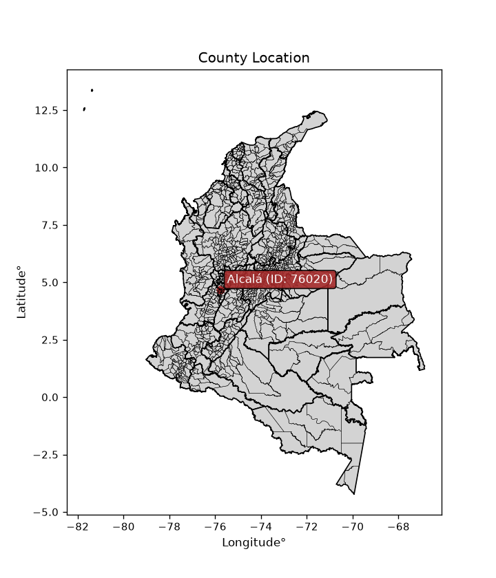
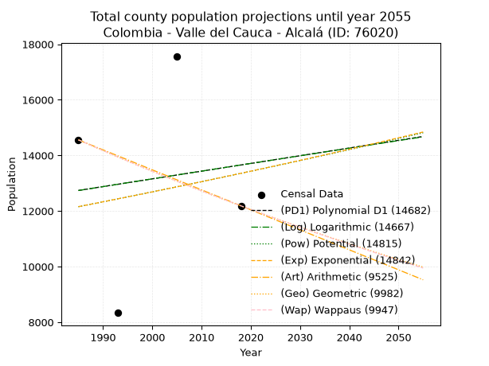
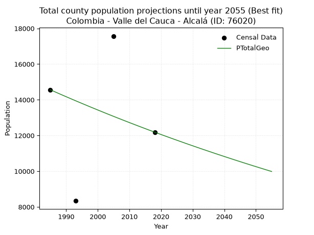
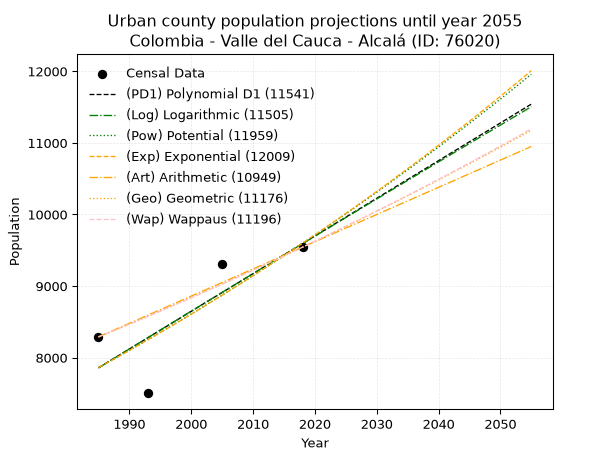
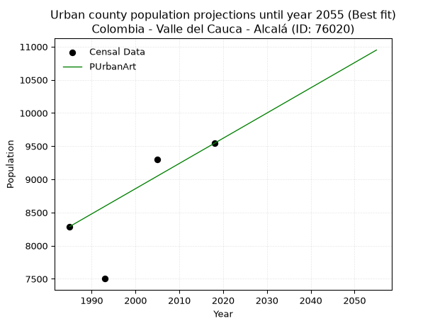
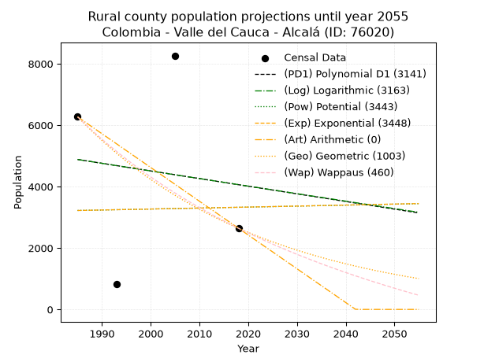
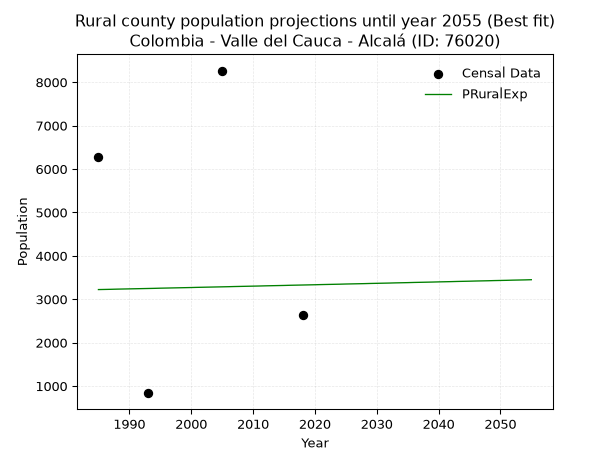

<div align="center">


</div>

# _“Population and Public Services Demand Projections (PPSD) until Year 2050 for Colombia - Valle del Cauca - Alcalá (ID: 76020)”_
Keywords: `population` `public-service` `projection` `lineal` `polynomial` `logarithmic` `potential` `exponential` `arithmetic` `geometric` `wappaus` `dane` `colombia` `south-america`

PPSD are analytical estimates used by governments and planners to anticipate future changes in population size, age distribution, and the resulting community needs for utilities, healthcare, education, and infrastructure as sizing future water treatment facilities, electrical grids, and road networks based on spatial growth.

<div align="center">

</img>

</div>


> **General running parameters**: • app_version: _v20260806_. • Python version: _3.14.7_. • Pandas version: _3.0.5_. • NumPy version: _2.5.1_. • Creates, save and include plots into reports (create_plot): _False_. • Projection until year: _2050_. • Process polynomial degree 2 and up: _False_. • Process Wappaus: _True_. • Process Wappaus: _True_. • Set negative values to zero: _True_. • Set infinite values to zero: _True_. • Drop dataset notes: _True_. 
<div align="center">

Dynamic map: [:earth_americas:Google](http://maps.google.com/maps?q=4.674994014,-75.7797919) [:earth_americas:OSM](https://www.openstreetmap.org/#map=18/4.674994014/-75.7797919&layers=P) [:earth_americas:Bing](https://www.bing.com/maps?cp=4.674994014~-75.7797919&lvl=18) [:earth_americas:Apple](https://maps.apple.com/frame?center=4.674994014%2C-75.7797919&span=0.003%2C0.006)

</div>


<div align="center">

```geojson
{
  "type": "Feature",
  "geometry": {
    "type": "Point", 
    "coordinates": [-75.7797919, 4.674994014]
  }, 
  "properties": {
    "Name": "Colombia - Valle del Cauca - Alcalá (ID: 76020)"
  }
}
```

</div>


## 0. Census Data (4 records)

Census data are official statistics collected by a government about the people and housing in a country. They usually include counts of total population, age, sex, race, income, education, and jobs.

📅Global census file: [Population.xlsx](../data/Population.xlsx)

| Source   |   Year |   CountryID | CountryName   |   StateID | StateName       |   CountyID | CountyName   |   PTotal |   PUrban |   PRural |
|:---------|-------:|------------:|:--------------|----------:|:----------------|-----------:|:-------------|---------:|---------:|---------:|
| DANE     |   1985 |          57 | Colombia      |        76 | Valle del Cauca |      76020 | Alcalá       |    14559 |     8289 |     6270 |
| DANE     |   1993 |          57 | Colombia      |        76 | Valle del Cauca |      76020 | Alcalá       |     8337 |     7503 |      834 |
| DANE     |   2005 |          57 | Colombia      |        76 | Valle del Cauca |      76020 | Alcalá       |    17568 |     9303 |     8265 |
| DANE     |   2018 |          57 | Colombia      |        76 | Valle del Cauca |      76020 | Alcalá       |    12186 |     9543 |     2643 |

> 🔥Some records could had specific notes about the registered values or the corresponding urban or rural distribution.

📅[SUI-RUPS](https://www.datos.gov.co/Hacienda-y-Cr-dito-P-blico/Registro-nico-de-Prestadores-de-Servicios-P-blicos/4qkq-csdn/about_data) - Local public utility companies: [RUPS.csv](../data/RUPS.xlsx)

 | SERVICIO       | ESTADO    | NOMBRE                                                                            | NIT         | DEPARTAMENTO_DOMICILIO   | MUNICIPIO_DOMICILIO   | DIRECCION              |   TELEFONO | EMAIL                     | TIPO_PRESTADOR                             | CLASIFICACION                 |
|:---------------|:----------|:----------------------------------------------------------------------------------|:------------|:-------------------------|:----------------------|:-----------------------|-----------:|:--------------------------|:-------------------------------------------|:------------------------------|
| ACUEDUCTO      | OPERATIVA | SOCIEDAD DE ACUEDUCTOS Y ALCANTARILLADOS DEL VALLE DEL CAUCA S.A.  E.S.P.         | 890399032-8 | VALLE DEL CAUCA          | CALI                  | AVENIDA 5 N # 23 AN 41 |    6203400 | rosemary@acuavalle.gov.co | SOCIEDADES (EMPRESA DE SERVICIOS PUBLICOS) | MAYOR O IGUAL A 5001 USUARIOS |
| ALCANTARILLADO | OPERATIVA | SOCIEDAD DE ACUEDUCTOS Y ALCANTARILLADOS DEL VALLE DEL CAUCA S.A.  E.S.P.         | 890399032-8 | VALLE DEL CAUCA          | CALI                  | AVENIDA 5 N # 23 AN 41 |    6203400 | rosemary@acuavalle.gov.co | SOCIEDADES (EMPRESA DE SERVICIOS PUBLICOS) | MAYOR O IGUAL A 5001 USUARIOS |
| ACUEDUCTO      | OPERATIVA | ADMINISTRACION COOPERATIVA MARAVELEZ - ALCALA E.S.P.                              | 821001139-8 | VALLE DEL CAUCA          | ALCALA                | CALLE 4 N° 9-28        |    2004668 | dianaguiotc@hotmail.com   | ORGANIZACION AUTORIZADA                    | MENOR O IGUAL A 2500 USUARIOS |
| ACUEDUCTO      | OPERATIVA | ASOCIACION DE USUARIOS DEL ACUEDUCTO RURAL COMUNITARIO DE LA VEREDA CUCHILLA ALTA | 900471779-3 | VALLE DEL CAUCA          | ALCALA                | VEREDA LA CUCHILLA     |    3113060 | albertinfinito@gmail.com  | ORGANIZACION AUTORIZADA                    | HASTA 2500 SUSCRIPTORES       |

## 1. Total

### 1.1. Coefficients and Parameters

* (PD1) Polynomial Deg 1: 27.75030108390492, -42345.03974308082 (lineal)
* (Log) Logarithmic: 55692.0308897601, -410153.0730809934
* (Pow) Potential: 5.709454564302451, -14.743661294582946
* (Exp) Exponential: 0.0028521726105559812, 42.267434460353655
* (Art) Arithmetic: Year diff. 2018 - 1985 = 33, Population diff. 12186 - 14559 = -2373, Annual growth = -71.9090909090909
* (Geo) Geometric: Year diff. 2018 - 1985 = 33, Population diff. 12186 - 14559 = -2373, Annual growth % = -0.005377055462124747
* (Wap) Wappaus: i = -0.5377385747548394, Condition values only valid for < 200)

<sub>
Wappaus condition values: ['-0.00', '-0.54', '-1.08', '-1.61', '-2.15', '-2.69', '-3.23', '-3.76', '-4.30', '-4.84', '-5.38', '-5.92', '-6.45', '-6.99', '-7.53', '-8.07', '-8.60', '-9.14', '-9.68', '-10.22', '-10.75', '-11.29', '-11.83', '-12.37', '-12.91', '-13.44', '-13.98', '-14.52', '-15.06', '-15.59', '-16.13', '-16.67', '-17.21', '-17.75', '-18.28', '-18.82', '-19.36', '-19.90', '-20.43', '-20.97', '-21.51', '-22.05', '-22.59', '-23.12', '-23.66', '-24.20', '-24.74', '-25.27', '-25.81', '-26.35', '-26.89', '-27.42', '-27.96', '-28.50', '-29.04', '-29.58', '-30.11', '-30.65', '-31.19', '-31.73', '-32.26', '-32.80', '-33.34', '-33.88', '-34.42', '-34.95']
</sub>


### 1.2. Projected Dataset

|   Year |   CountyID |   PTotalPD1 |   PTotalLog |   PTotalPow |   PTotalExp |   PTotalArt |   PTotalGeo |   PTotalWap |
|-------:|-----------:|------------:|------------:|------------:|------------:|------------:|------------:|------------:|
|   1985 |      76020 |       12739 |       12737 |       12155 |       12156 |       14559 |       14559 |       14559 |
|   1986 |      76020 |       12767 |       12765 |       12190 |       12191 |       14487 |       14481 |       14481 |
|   1987 |      76020 |       12795 |       12793 |       12225 |       12226 |       14415 |       14403 |       14403 |
|   1988 |      76020 |       12823 |       12821 |       12260 |       12260 |       14343 |       14325 |       14326 |
|   1989 |      76020 |       12850 |       12849 |       12295 |       12295 |       14271 |       14248 |       14249 |
|   1990 |      76020 |       12878 |       12877 |       12331 |       12331 |       14199 |       14172 |       14173 |
|   1991 |      76020 |       12906 |       12905 |       12366 |       12366 |       14128 |       14096 |       14097 |
|   1992 |      76020 |       12934 |       12933 |       12402 |       12401 |       14056 |       14020 |       14021 |
|   1993 |      76020 |       12961 |       12961 |       12437 |       12437 |       13984 |       13944 |       13946 |
|   1994 |      76020 |       12989 |       12989 |       12473 |       12472 |       13912 |       13869 |       13871 |
|   1995 |      76020 |       13017 |       13017 |       12509 |       12508 |       13840 |       13795 |       13797 |
|   1996 |      76020 |       13045 |       13045 |       12545 |       12543 |       13768 |       13721 |       13723 |
|   1997 |      76020 |       13072 |       13073 |       12580 |       12579 |       13696 |       13647 |       13649 |
|   1998 |      76020 |       13100 |       13101 |       12616 |       12615 |       13624 |       13573 |       13576 |
|   1999 |      76020 |       13128 |       13129 |       12653 |       12651 |       13552 |       13501 |       13503 |
|   2000 |      76020 |       13156 |       13157 |       12689 |       12687 |       13480 |       13428 |       13430 |
|   2001 |      76020 |       13183 |       13184 |       12725 |       12724 |       13408 |       13356 |       13358 |
|   2002 |      76020 |       13211 |       13212 |       12761 |       12760 |       13337 |       13284 |       13286 |
|   2003 |      76020 |       13239 |       13240 |       12798 |       12796 |       13265 |       13212 |       13215 |
|   2004 |      76020 |       13267 |       13268 |       12834 |       12833 |       13193 |       13141 |       13144 |
|   2005 |      76020 |       13294 |       13296 |       12871 |       12870 |       13121 |       13071 |       13073 |
|   2006 |      76020 |       13322 |       13323 |       12908 |       12906 |       13049 |       13000 |       13003 |
|   2007 |      76020 |       13350 |       13351 |       12944 |       12943 |       12977 |       12931 |       12933 |
|   2008 |      76020 |       13378 |       13379 |       12981 |       12980 |       12905 |       12861 |       12863 |
|   2009 |      76020 |       13405 |       13407 |       13018 |       13017 |       12833 |       12792 |       12794 |
|   2010 |      76020 |       13433 |       13434 |       13055 |       13054 |       12761 |       12723 |       12725 |
|   2011 |      76020 |       13461 |       13462 |       13092 |       13092 |       12689 |       12655 |       12656 |
|   2012 |      76020 |       13489 |       13490 |       13130 |       13129 |       12617 |       12587 |       12588 |
|   2013 |      76020 |       13516 |       13517 |       13167 |       13167 |       12546 |       12519 |       12520 |
|   2014 |      76020 |       13544 |       13545 |       13204 |       13204 |       12474 |       12452 |       12453 |
|   2015 |      76020 |       13572 |       13573 |       13242 |       13242 |       12402 |       12385 |       12386 |
|   2016 |      76020 |       13600 |       13600 |       13279 |       13280 |       12330 |       12318 |       12319 |
|   2017 |      76020 |       13627 |       13628 |       13317 |       13318 |       12258 |       12252 |       12252 |
|   2018 |      76020 |       13655 |       13656 |       13355 |       13356 |       12186 |       12186 |       12186 |
|   2019 |      76020 |       13683 |       13683 |       13393 |       13394 |       12114 |       12120 |       12120 |
|   2020 |      76020 |       13711 |       13711 |       13430 |       13432 |       12042 |       12055 |       12055 |
|   2021 |      76020 |       13738 |       13738 |       13469 |       13471 |       11970 |       11990 |       11989 |
|   2022 |      76020 |       13766 |       13766 |       13507 |       13509 |       11898 |       11926 |       11924 |
|   2023 |      76020 |       13794 |       13793 |       13545 |       13548 |       11826 |       11862 |       11860 |
|   2024 |      76020 |       13822 |       13821 |       13583 |       13586 |       11755 |       11798 |       11795 |
|   2025 |      76020 |       13849 |       13848 |       13621 |       13625 |       11683 |       11735 |       11732 |
|   2026 |      76020 |       13877 |       13876 |       13660 |       13664 |       11611 |       11672 |       11668 |
|   2027 |      76020 |       13905 |       13903 |       13698 |       13703 |       11539 |       11609 |       11604 |
|   2028 |      76020 |       13933 |       13931 |       13737 |       13742 |       11467 |       11546 |       11541 |
|   2029 |      76020 |       13960 |       13958 |       13776 |       13781 |       11395 |       11484 |       11479 |
|   2030 |      76020 |       13988 |       13986 |       13815 |       13821 |       11323 |       11423 |       11416 |
|   2031 |      76020 |       14016 |       14013 |       13853 |       13860 |       11251 |       11361 |       11354 |
|   2032 |      76020 |       14044 |       14041 |       13892 |       13900 |       11179 |       11300 |       11292 |
|   2033 |      76020 |       14071 |       14068 |       13932 |       13940 |       11107 |       11239 |       11231 |
|   2034 |      76020 |       14099 |       14095 |       13971 |       13979 |       11035 |       11179 |       11169 |
|   2035 |      76020 |       14127 |       14123 |       14010 |       14019 |       10964 |       11119 |       11108 |
|   2036 |      76020 |       14155 |       14150 |       14049 |       14059 |       10892 |       11059 |       11048 |
|   2037 |      76020 |       14182 |       14178 |       14089 |       14099 |       10820 |       10999 |       10987 |
|   2038 |      76020 |       14210 |       14205 |       14128 |       14140 |       10748 |       10940 |       10927 |
|   2039 |      76020 |       14238 |       14232 |       14168 |       14180 |       10676 |       10882 |       10867 |
|   2040 |      76020 |       14266 |       14259 |       14208 |       14221 |       10604 |       10823 |       10808 |
|   2041 |      76020 |       14293 |       14287 |       14247 |       14261 |       10532 |       10765 |       10749 |
|   2042 |      76020 |       14321 |       14314 |       14287 |       14302 |       10460 |       10707 |       10690 |
|   2043 |      76020 |       14349 |       14341 |       14327 |       14343 |       10388 |       10649 |       10631 |
|   2044 |      76020 |       14377 |       14369 |       14367 |       14384 |       10316 |       10592 |       10572 |
|   2045 |      76020 |       14404 |       14396 |       14408 |       14425 |       10244 |       10535 |       10514 |
|   2046 |      76020 |       14432 |       14423 |       14448 |       14466 |       10173 |       10478 |       10456 |
|   2047 |      76020 |       14460 |       14450 |       14488 |       14507 |       10101 |       10422 |       10399 |
|   2048 |      76020 |       14488 |       14477 |       14529 |       14549 |       10029 |       10366 |       10341 |
|   2049 |      76020 |       14515 |       14505 |       14569 |       14590 |        9957 |       10310 |       10284 |
|   2050 |      76020 |       14543 |       14532 |       14610 |       14632 |        9885 |       10255 |       10227 |
<div align="center">

</img>

</div>


### 1.3. Best fit with absolute and relative error (%)

Relative error puts that difference into context by dividing the absolute error by the true value, creating a unitless ratio or percentage that shows the scale of the mistake.

Absolute and relative error

|   Year | Source   |   CountryID | CountryName   |   StateID | StateName       |   CountyID_x | CountyName   |   PTotal |   PUrban |   PRural |   CountyID_y |   PTotalPD1 |   PTotalLog |   PTotalPow |   PTotalExp |   PTotalArt |   PTotalGeo |   PTotalWap |   PTotalPD1AbsError |   PTotalLogAbsError |   PTotalPowAbsError |   PTotalExpAbsError |   PTotalArtAbsError |   PTotalGeoAbsError |   PTotalWapAbsError |   PTotalPD1RelError |   PTotalLogRelError |   PTotalPowRelError |   PTotalExpRelError |   PTotalArtRelError |   PTotalGeoRelError |   PTotalWapRelError |
|-------:|:---------|------------:|:--------------|----------:|:----------------|-------------:|:-------------|---------:|---------:|---------:|-------------:|------------:|------------:|------------:|------------:|------------:|------------:|------------:|--------------------:|--------------------:|--------------------:|--------------------:|--------------------:|--------------------:|--------------------:|--------------------:|--------------------:|--------------------:|--------------------:|--------------------:|--------------------:|--------------------:|
|   1985 | DANE     |          57 | Colombia      |        76 | Valle del Cauca |        76020 | Alcalá       |    14559 |     8289 |     6270 |        76020 |       12739 |       12737 |       12155 |       12156 |       14559 |       14559 |       14559 |                1820 |                1822 |                2404 |                2403 |                   0 |                   0 |                   0 |             12.5009 |             12.5146 |            16.5121  |            16.5053  |              0      |              0      |              0      |
|   1993 | DANE     |          57 | Colombia      |        76 | Valle del Cauca |        76020 | Alcalá       |     8337 |     7503 |      834 |        76020 |       12961 |       12961 |       12437 |       12437 |       13984 |       13944 |       13946 |                4624 |                4624 |                4100 |                4100 |                5647 |                5607 |                5609 |             55.4636 |             55.4636 |            49.1784  |            49.1784  |             67.7342 |             67.2544 |             67.2784 |
|   2005 | DANE     |          57 | Colombia      |        76 | Valle del Cauca |        76020 | Alcalá       |    17568 |     9303 |     8265 |        76020 |       13294 |       13296 |       12871 |       12870 |       13121 |       13071 |       13073 |                4274 |                4272 |                4697 |                4698 |                4447 |                4497 |                4495 |             24.3283 |             24.3169 |            26.7361  |            26.7418  |             25.3131 |             25.5977 |             25.5863 |
|   2018 | DANE     |          57 | Colombia      |        76 | Valle del Cauca |        76020 | Alcalá       |    12186 |     9543 |     2643 |        76020 |       13655 |       13656 |       13355 |       13356 |       12186 |       12186 |       12186 |                1469 |                1470 |                1169 |                1170 |                   0 |                   0 |                   0 |             12.0548 |             12.063  |             9.59298 |             9.60118 |              0      |              0      |              0      |

Relative error mean

| Method    |   RelError | Best   |
|:----------|-----------:|:-------|
| PTotalPD1 |    26.0869 |        |
| PTotalLog |    26.0895 |        |
| PTotalPow |    25.5049 |        |
| PTotalExp |    25.5067 |        |
| PTotalArt |    23.2618 |        |
| PTotalGeo |    23.213  | True   |
| PTotalWap |    23.2162 |        |

💙Best method: _**PTotalGeo**_
<div align="center">

</img>

</div>


### 1.4. Fresh water supply demand in liters per capita per day (lpcd)

The fresh water supply demand typically ranges from 100 to 300 liters per capita per day (lpcd) for standard domestic and municipal planning, though absolute survival minimums set by the World Health Organization are as low as 7.5 to 20 liters per day, and total consumption in high-income nations can exceed 400 liters.

> `CZ`: Level in meters above the sea level (masl)<br> `WS`: Fresh water supply demand in liters per capita per day (lpcd or l/h/d)<br> `WSAll`: Zonal fresh water supply demand in liters per second (l/s)<br> `A`: Zonal area in square meters<br> `DP`: Population density (people/hectare or p/ha)

Reference values (RAS Colombia)

|    CZ |   WS |
|------:|-----:|
|  1000 |  120 |
|  2000 |  130 |
| 99999 |  140 |

County shapefile geometry properties and water supply values

|   CountyID |      ATotal |   CZTotal |   WSTotal |
|-----------:|------------:|----------:|----------:|
|      76020 | 6.23361e+07 |   1255.22 |       130 |

Projected values for best method: PTotalGeo

|   CountyID |   Year |   PTotalGeo |   DPTotal |   WSTotal |   WSTotalAll |
|-----------:|-------:|------------:|----------:|----------:|-------------:|
|      76020 |   1985 |       14559 |      2.34 |       130 |      21.9059 |
|      76020 |   1986 |       14481 |      2.32 |       130 |      21.7885 |
|      76020 |   1987 |       14403 |      2.31 |       130 |      21.6712 |
|      76020 |   1988 |       14325 |      2.3  |       130 |      21.5538 |
|      76020 |   1989 |       14248 |      2.29 |       130 |      21.438  |
|      76020 |   1990 |       14172 |      2.27 |       130 |      21.3236 |
|      76020 |   1991 |       14096 |      2.26 |       130 |      21.2093 |
|      76020 |   1992 |       14020 |      2.25 |       130 |      21.0949 |
|      76020 |   1993 |       13944 |      2.24 |       130 |      20.9806 |
|      76020 |   1994 |       13869 |      2.22 |       130 |      20.8677 |
|      76020 |   1995 |       13795 |      2.21 |       130 |      20.7564 |
|      76020 |   1996 |       13721 |      2.2  |       130 |      20.645  |
|      76020 |   1997 |       13647 |      2.19 |       130 |      20.5337 |
|      76020 |   1998 |       13573 |      2.18 |       130 |      20.4223 |
|      76020 |   1999 |       13501 |      2.17 |       130 |      20.314  |
|      76020 |   2000 |       13428 |      2.15 |       130 |      20.2042 |
|      76020 |   2001 |       13356 |      2.14 |       130 |      20.0958 |
|      76020 |   2002 |       13284 |      2.13 |       130 |      19.9875 |
|      76020 |   2003 |       13212 |      2.12 |       130 |      19.8792 |
|      76020 |   2004 |       13141 |      2.11 |       130 |      19.7723 |
|      76020 |   2005 |       13071 |      2.1  |       130 |      19.667  |
|      76020 |   2006 |       13000 |      2.09 |       130 |      19.5602 |
|      76020 |   2007 |       12931 |      2.07 |       130 |      19.4564 |
|      76020 |   2008 |       12861 |      2.06 |       130 |      19.351  |
|      76020 |   2009 |       12792 |      2.05 |       130 |      19.2472 |
|      76020 |   2010 |       12723 |      2.04 |       130 |      19.1434 |
|      76020 |   2011 |       12655 |      2.03 |       130 |      19.0411 |
|      76020 |   2012 |       12587 |      2.02 |       130 |      18.9388 |
|      76020 |   2013 |       12519 |      2.01 |       130 |      18.8365 |
|      76020 |   2014 |       12452 |      2    |       130 |      18.7356 |
|      76020 |   2015 |       12385 |      1.99 |       130 |      18.6348 |
|      76020 |   2016 |       12318 |      1.98 |       130 |      18.534  |
|      76020 |   2017 |       12252 |      1.97 |       130 |      18.4347 |
|      76020 |   2018 |       12186 |      1.95 |       130 |      18.3354 |
|      76020 |   2019 |       12120 |      1.94 |       130 |      18.2361 |
|      76020 |   2020 |       12055 |      1.93 |       130 |      18.1383 |
|      76020 |   2021 |       11990 |      1.92 |       130 |      18.0405 |
|      76020 |   2022 |       11926 |      1.91 |       130 |      17.9442 |
|      76020 |   2023 |       11862 |      1.9  |       130 |      17.8479 |
|      76020 |   2024 |       11798 |      1.89 |       130 |      17.7516 |
|      76020 |   2025 |       11735 |      1.88 |       130 |      17.6568 |
|      76020 |   2026 |       11672 |      1.87 |       130 |      17.562  |
|      76020 |   2027 |       11609 |      1.86 |       130 |      17.4672 |
|      76020 |   2028 |       11546 |      1.85 |       130 |      17.3725 |
|      76020 |   2029 |       11484 |      1.84 |       130 |      17.2792 |
|      76020 |   2030 |       11423 |      1.83 |       130 |      17.1874 |
|      76020 |   2031 |       11361 |      1.82 |       130 |      17.0941 |
|      76020 |   2032 |       11300 |      1.81 |       130 |      17.0023 |
|      76020 |   2033 |       11239 |      1.8  |       130 |      16.9105 |
|      76020 |   2034 |       11179 |      1.79 |       130 |      16.8203 |
|      76020 |   2035 |       11119 |      1.78 |       130 |      16.73   |
|      76020 |   2036 |       11059 |      1.77 |       130 |      16.6397 |
|      76020 |   2037 |       10999 |      1.76 |       130 |      16.5494 |
|      76020 |   2038 |       10940 |      1.76 |       130 |      16.4606 |
|      76020 |   2039 |       10882 |      1.75 |       130 |      16.3734 |
|      76020 |   2040 |       10823 |      1.74 |       130 |      16.2846 |
|      76020 |   2041 |       10765 |      1.73 |       130 |      16.1973 |
|      76020 |   2042 |       10707 |      1.72 |       130 |      16.1101 |
|      76020 |   2043 |       10649 |      1.71 |       130 |      16.0228 |
|      76020 |   2044 |       10592 |      1.7  |       130 |      15.937  |
|      76020 |   2045 |       10535 |      1.69 |       130 |      15.8513 |
|      76020 |   2046 |       10478 |      1.68 |       130 |      15.7655 |
|      76020 |   2047 |       10422 |      1.67 |       130 |      15.6813 |
|      76020 |   2048 |       10366 |      1.66 |       130 |      15.597  |
|      76020 |   2049 |       10310 |      1.65 |       130 |      15.5127 |
|      76020 |   2050 |       10255 |      1.65 |       130 |      15.43   |

## 2. Urban

### 2.1. Coefficients and Parameters

* (PD1) Polynomial Deg 1: 52.627057406663795, -96607.77157767926 (lineal)
* (Log) Logarithmic: 105296.66410125032, -791701.287628114
* (Pow) Potential: 12.115463375090467, -36.058552145841126
* (Exp) Exponential: 0.006055515038666594, 0.04732604973336658
* (Art) Arithmetic: Year diff. 2018 - 1985 = 33, Population diff. 9543 - 8289 = 1254, Annual growth = 38.0
* (Geo) Geometric: Year diff. 2018 - 1985 = 33, Population diff. 9543 - 8289 = 1254, Annual growth % = 0.004278172843675376
* (Wap) Wappaus: i = 0.42620008972633466, Condition values only valid for < 200)

<sub>
Wappaus condition values: ['0.00', '0.43', '0.85', '1.28', '1.70', '2.13', '2.56', '2.98', '3.41', '3.84', '4.26', '4.69', '5.11', '5.54', '5.97', '6.39', '6.82', '7.25', '7.67', '8.10', '8.52', '8.95', '9.38', '9.80', '10.23', '10.66', '11.08', '11.51', '11.93', '12.36', '12.79', '13.21', '13.64', '14.06', '14.49', '14.92', '15.34', '15.77', '16.20', '16.62', '17.05', '17.47', '17.90', '18.33', '18.75', '19.18', '19.61', '20.03', '20.46', '20.88', '21.31', '21.74', '22.16', '22.59', '23.01', '23.44', '23.87', '24.29', '24.72', '25.15', '25.57', '26.00', '26.42', '26.85', '27.28', '27.70']
</sub>


### 2.2. Projected Dataset

|   Year |   CountyID |   PUrbanPD1 |   PUrbanLog |   PUrbanPow |   PUrbanExp |   PUrbanArt |   PUrbanGeo |   PUrbanWap |
|-------:|-----------:|------------:|------------:|------------:|------------:|------------:|------------:|------------:|
|   1985 |      76020 |        7857 |        7856 |        7859 |        7860 |        8289 |        8289 |        8289 |
|   1986 |      76020 |        7910 |        7909 |        7907 |        7907 |        8327 |        8324 |        8324 |
|   1987 |      76020 |        7962 |        7962 |        7955 |        7955 |        8365 |        8360 |        8360 |
|   1988 |      76020 |        8015 |        8015 |        8004 |        8004 |        8403 |        8396 |        8396 |
|   1989 |      76020 |        8067 |        8068 |        8053 |        8052 |        8441 |        8432 |        8432 |
|   1990 |      76020 |        8120 |        8121 |        8102 |        8101 |        8479 |        8468 |        8468 |
|   1991 |      76020 |        8173 |        8173 |        8151 |        8151 |        8517 |        8504 |        8504 |
|   1992 |      76020 |        8225 |        8226 |        8201 |        8200 |        8555 |        8540 |        8540 |
|   1993 |      76020 |        8278 |        8279 |        8251 |        8250 |        8593 |        8577 |        8577 |
|   1994 |      76020 |        8331 |        8332 |        8301 |        8300 |        8631 |        8614 |        8613 |
|   1995 |      76020 |        8383 |        8385 |        8352 |        8350 |        8669 |        8651 |        8650 |
|   1996 |      76020 |        8436 |        8438 |        8403 |        8401 |        8707 |        8688 |        8687 |
|   1997 |      76020 |        8488 |        8490 |        8454 |        8452 |        8745 |        8725 |        8724 |
|   1998 |      76020 |        8541 |        8543 |        8505 |        8503 |        8783 |        8762 |        8761 |
|   1999 |      76020 |        8594 |        8596 |        8557 |        8555 |        8821 |        8800 |        8799 |
|   2000 |      76020 |        8646 |        8648 |        8609 |        8607 |        8859 |        8837 |        8836 |
|   2001 |      76020 |        8699 |        8701 |        8661 |        8659 |        8897 |        8875 |        8874 |
|   2002 |      76020 |        8752 |        8754 |        8714 |        8712 |        8935 |        8913 |        8912 |
|   2003 |      76020 |        8804 |        8806 |        8767 |        8765 |        8973 |        8951 |        8950 |
|   2004 |      76020 |        8857 |        8859 |        8820 |        8818 |        9011 |        8989 |        8989 |
|   2005 |      76020 |        8909 |        8911 |        8873 |        8872 |        9049 |        9028 |        9027 |
|   2006 |      76020 |        8962 |        8964 |        8927 |        8926 |        9087 |        9066 |        9066 |
|   2007 |      76020 |        9015 |        9016 |        8981 |        8980 |        9125 |        9105 |        9104 |
|   2008 |      76020 |        9067 |        9069 |        9036 |        9034 |        9163 |        9144 |        9143 |
|   2009 |      76020 |        9120 |        9121 |        9090 |        9089 |        9201 |        9183 |        9183 |
|   2010 |      76020 |        9173 |        9174 |        9145 |        9144 |        9239 |        9223 |        9222 |
|   2011 |      76020 |        9225 |        9226 |        9201 |        9200 |        9277 |        9262 |        9261 |
|   2012 |      76020 |        9278 |        9278 |        9256 |        9256 |        9315 |        9302 |        9301 |
|   2013 |      76020 |        9330 |        9331 |        9312 |        9312 |        9353 |        9341 |        9341 |
|   2014 |      76020 |        9383 |        9383 |        9368 |        9369 |        9391 |        9381 |        9381 |
|   2015 |      76020 |        9436 |        9435 |        9425 |        9425 |        9429 |        9422 |        9421 |
|   2016 |      76020 |        9488 |        9487 |        9482 |        9483 |        9467 |        9462 |        9462 |
|   2017 |      76020 |        9541 |        9540 |        9539 |        9540 |        9505 |        9502 |        9502 |
|   2018 |      76020 |        9594 |        9592 |        9596 |        9598 |        9543 |        9543 |        9543 |
|   2019 |      76020 |        9646 |        9644 |        9654 |        9657 |        9581 |        9584 |        9584 |
|   2020 |      76020 |        9699 |        9696 |        9712 |        9715 |        9619 |        9625 |        9625 |
|   2021 |      76020 |        9752 |        9748 |        9770 |        9774 |        9657 |        9666 |        9666 |
|   2022 |      76020 |        9804 |        9800 |        9829 |        9834 |        9695 |        9707 |        9708 |
|   2023 |      76020 |        9857 |        9852 |        9888 |        9893 |        9733 |        9749 |        9750 |
|   2024 |      76020 |        9909 |        9904 |        9948 |        9953 |        9771 |        9791 |        9792 |
|   2025 |      76020 |        9962 |        9956 |       10007 |       10014 |        9809 |        9832 |        9834 |
|   2026 |      76020 |       10015 |       10008 |       10067 |       10075 |        9847 |        9875 |        9876 |
|   2027 |      76020 |       10067 |       10060 |       10128 |       10136 |        9885 |        9917 |        9919 |
|   2028 |      76020 |       10120 |       10112 |       10188 |       10197 |        9923 |        9959 |        9961 |
|   2029 |      76020 |       10173 |       10164 |       10249 |       10259 |        9961 |       10002 |       10004 |
|   2030 |      76020 |       10225 |       10216 |       10311 |       10322 |        9999 |       10045 |       10047 |
|   2031 |      76020 |       10278 |       10268 |       10373 |       10384 |       10037 |       10088 |       10091 |
|   2032 |      76020 |       10330 |       10320 |       10435 |       10447 |       10075 |       10131 |       10134 |
|   2033 |      76020 |       10383 |       10372 |       10497 |       10511 |       10113 |       10174 |       10178 |
|   2034 |      76020 |       10436 |       10423 |       10560 |       10575 |       10151 |       10218 |       10222 |
|   2035 |      76020 |       10488 |       10475 |       10623 |       10639 |       10189 |       10261 |       10266 |
|   2036 |      76020 |       10541 |       10527 |       10686 |       10704 |       10227 |       10305 |       10310 |
|   2037 |      76020 |       10594 |       10579 |       10750 |       10769 |       10265 |       10349 |       10355 |
|   2038 |      76020 |       10646 |       10630 |       10814 |       10834 |       10303 |       10394 |       10400 |
|   2039 |      76020 |       10699 |       10682 |       10879 |       10900 |       10341 |       10438 |       10445 |
|   2040 |      76020 |       10751 |       10734 |       10943 |       10966 |       10379 |       10483 |       10490 |
|   2041 |      76020 |       10804 |       10785 |       11009 |       11033 |       10417 |       10528 |       10535 |
|   2042 |      76020 |       10857 |       10837 |       11074 |       11100 |       10455 |       10573 |       10581 |
|   2043 |      76020 |       10909 |       10888 |       11140 |       11167 |       10493 |       10618 |       10627 |
|   2044 |      76020 |       10962 |       10940 |       11206 |       11235 |       10531 |       10663 |       10673 |
|   2045 |      76020 |       11015 |       10991 |       11273 |       11303 |       10569 |       10709 |       10719 |
|   2046 |      76020 |       11067 |       11043 |       11340 |       11372 |       10607 |       10755 |       10766 |
|   2047 |      76020 |       11120 |       11094 |       11407 |       11441 |       10645 |       10801 |       10813 |
|   2048 |      76020 |       11172 |       11146 |       11475 |       11510 |       10683 |       10847 |       10860 |
|   2049 |      76020 |       11225 |       11197 |       11543 |       11580 |       10721 |       10893 |       10907 |
|   2050 |      76020 |       11278 |       11248 |       11611 |       11651 |       10759 |       10940 |       10955 |
<div align="center">

</img>

</div>


### 2.3. Best fit with absolute and relative error (%)

Relative error puts that difference into context by dividing the absolute error by the true value, creating a unitless ratio or percentage that shows the scale of the mistake.

Absolute and relative error

|   Year | Source   |   CountryID | CountryName   |   StateID | StateName       |   CountyID_x | CountyName   |   PTotal |   PUrban |   PRural |   CountyID_y |   PUrbanPD1 |   PUrbanLog |   PUrbanPow |   PUrbanExp |   PUrbanArt |   PUrbanGeo |   PUrbanWap |   PUrbanPD1AbsError |   PUrbanLogAbsError |   PUrbanPowAbsError |   PUrbanExpAbsError |   PUrbanArtAbsError |   PUrbanGeoAbsError |   PUrbanWapAbsError |   PUrbanPD1RelError |   PUrbanLogRelError |   PUrbanPowRelError |   PUrbanExpRelError |   PUrbanArtRelError |   PUrbanGeoRelError |   PUrbanWapRelError |
|-------:|:---------|------------:|:--------------|----------:|:----------------|-------------:|:-------------|---------:|---------:|---------:|-------------:|------------:|------------:|------------:|------------:|------------:|------------:|------------:|--------------------:|--------------------:|--------------------:|--------------------:|--------------------:|--------------------:|--------------------:|--------------------:|--------------------:|--------------------:|--------------------:|--------------------:|--------------------:|--------------------:|
|   1985 | DANE     |          57 | Colombia      |        76 | Valle del Cauca |        76020 | Alcalá       |    14559 |     8289 |     6270 |        76020 |        7857 |        7856 |        7859 |        7860 |        8289 |        8289 |        8289 |                 432 |                 433 |                 430 |                 429 |                   0 |                   0 |                   0 |            5.21173  |            5.22379  |            5.1876   |            5.17553  |              0      |             0       |             0       |
|   1993 | DANE     |          57 | Colombia      |        76 | Valle del Cauca |        76020 | Alcalá       |     8337 |     7503 |      834 |        76020 |        8278 |        8279 |        8251 |        8250 |        8593 |        8577 |        8577 |                 775 |                 776 |                 748 |                 747 |                1090 |                1074 |                1074 |           10.3292   |           10.3425   |            9.96935  |            9.95602  |             14.5275 |            14.3143  |            14.3143  |
|   2005 | DANE     |          57 | Colombia      |        76 | Valle del Cauca |        76020 | Alcalá       |    17568 |     9303 |     8265 |        76020 |        8909 |        8911 |        8873 |        8872 |        9049 |        9028 |        9027 |                 394 |                 392 |                 430 |                 431 |                 254 |                 275 |                 276 |            4.23519  |            4.21369  |            4.62216  |            4.63291  |              2.7303 |             2.95604 |             2.96678 |
|   2018 | DANE     |          57 | Colombia      |        76 | Valle del Cauca |        76020 | Alcalá       |    12186 |     9543 |     2643 |        76020 |        9594 |        9592 |        9596 |        9598 |        9543 |        9543 |        9543 |                  51 |                  49 |                  53 |                  55 |                   0 |                   0 |                   0 |            0.534423 |            0.513465 |            0.555381 |            0.576339 |              0      |             0       |             0       |

Relative error mean

| Method    |   RelError | Best   |
|:----------|-----------:|:-------|
| PUrbanPD1 |    5.07764 |        |
| PUrbanLog |    5.07337 |        |
| PUrbanPow |    5.08362 |        |
| PUrbanExp |    5.0852  |        |
| PUrbanArt |    4.31446 | True   |
| PUrbanGeo |    4.31758 |        |
| PUrbanWap |    4.32026 |        |

💙Best method: _**PUrbanArt**_
<div align="center">

</img>

</div>


### 2.4. Fresh water supply demand in liters per capita per day (lpcd)

The fresh water supply demand typically ranges from 100 to 300 liters per capita per day (lpcd) for standard domestic and municipal planning, though absolute survival minimums set by the World Health Organization are as low as 7.5 to 20 liters per day, and total consumption in high-income nations can exceed 400 liters.

> `CZ`: Level in meters above the sea level (masl)<br> `WS`: Fresh water supply demand in liters per capita per day (lpcd or l/h/d)<br> `WSAll`: Zonal fresh water supply demand in liters per second (l/s)<br> `A`: Zonal area in square meters<br> `DP`: Population density (people/hectare or p/ha)

Reference values (RAS Colombia)

|    CZ |   WS |
|------:|-----:|
|  1000 |  120 |
|  2000 |  130 |
| 99999 |  140 |

County shapefile geometry properties and water supply values

|   CountyID |      AUrban |   CZUrban |   WSUrban |
|-----------:|------------:|----------:|----------:|
|      76020 | 1.12718e+06 |   1240.88 |       130 |

Projected values for best method: PUrbanArt

|   CountyID |   Year |   PUrbanArt |   DPUrban |   WSUrban |   WSUrbanAll |
|-----------:|-------:|------------:|----------:|----------:|-------------:|
|      76020 |   1985 |        8289 |     73.54 |       130 |      12.4719 |
|      76020 |   1986 |        8327 |     73.87 |       130 |      12.5291 |
|      76020 |   1987 |        8365 |     74.21 |       130 |      12.5862 |
|      76020 |   1988 |        8403 |     74.55 |       130 |      12.6434 |
|      76020 |   1989 |        8441 |     74.89 |       130 |      12.7006 |
|      76020 |   1990 |        8479 |     75.22 |       130 |      12.7578 |
|      76020 |   1991 |        8517 |     75.56 |       130 |      12.8149 |
|      76020 |   1992 |        8555 |     75.9  |       130 |      12.8721 |
|      76020 |   1993 |        8593 |     76.23 |       130 |      12.9293 |
|      76020 |   1994 |        8631 |     76.57 |       130 |      12.9865 |
|      76020 |   1995 |        8669 |     76.91 |       130 |      13.0436 |
|      76020 |   1996 |        8707 |     77.25 |       130 |      13.1008 |
|      76020 |   1997 |        8745 |     77.58 |       130 |      13.158  |
|      76020 |   1998 |        8783 |     77.92 |       130 |      13.2152 |
|      76020 |   1999 |        8821 |     78.26 |       130 |      13.2723 |
|      76020 |   2000 |        8859 |     78.59 |       130 |      13.3295 |
|      76020 |   2001 |        8897 |     78.93 |       130 |      13.3867 |
|      76020 |   2002 |        8935 |     79.27 |       130 |      13.4439 |
|      76020 |   2003 |        8973 |     79.61 |       130 |      13.501  |
|      76020 |   2004 |        9011 |     79.94 |       130 |      13.5582 |
|      76020 |   2005 |        9049 |     80.28 |       130 |      13.6154 |
|      76020 |   2006 |        9087 |     80.62 |       130 |      13.6726 |
|      76020 |   2007 |        9125 |     80.95 |       130 |      13.7297 |
|      76020 |   2008 |        9163 |     81.29 |       130 |      13.7869 |
|      76020 |   2009 |        9201 |     81.63 |       130 |      13.8441 |
|      76020 |   2010 |        9239 |     81.97 |       130 |      13.9013 |
|      76020 |   2011 |        9277 |     82.3  |       130 |      13.9584 |
|      76020 |   2012 |        9315 |     82.64 |       130 |      14.0156 |
|      76020 |   2013 |        9353 |     82.98 |       130 |      14.0728 |
|      76020 |   2014 |        9391 |     83.31 |       130 |      14.13   |
|      76020 |   2015 |        9429 |     83.65 |       130 |      14.1872 |
|      76020 |   2016 |        9467 |     83.99 |       130 |      14.2443 |
|      76020 |   2017 |        9505 |     84.33 |       130 |      14.3015 |
|      76020 |   2018 |        9543 |     84.66 |       130 |      14.3587 |
|      76020 |   2019 |        9581 |     85    |       130 |      14.4159 |
|      76020 |   2020 |        9619 |     85.34 |       130 |      14.473  |
|      76020 |   2021 |        9657 |     85.67 |       130 |      14.5302 |
|      76020 |   2022 |        9695 |     86.01 |       130 |      14.5874 |
|      76020 |   2023 |        9733 |     86.35 |       130 |      14.6446 |
|      76020 |   2024 |        9771 |     86.69 |       130 |      14.7017 |
|      76020 |   2025 |        9809 |     87.02 |       130 |      14.7589 |
|      76020 |   2026 |        9847 |     87.36 |       130 |      14.8161 |
|      76020 |   2027 |        9885 |     87.7  |       130 |      14.8733 |
|      76020 |   2028 |        9923 |     88.03 |       130 |      14.9304 |
|      76020 |   2029 |        9961 |     88.37 |       130 |      14.9876 |
|      76020 |   2030 |        9999 |     88.71 |       130 |      15.0448 |
|      76020 |   2031 |       10037 |     89.05 |       130 |      15.102  |
|      76020 |   2032 |       10075 |     89.38 |       130 |      15.1591 |
|      76020 |   2033 |       10113 |     89.72 |       130 |      15.2163 |
|      76020 |   2034 |       10151 |     90.06 |       130 |      15.2735 |
|      76020 |   2035 |       10189 |     90.39 |       130 |      15.3307 |
|      76020 |   2036 |       10227 |     90.73 |       130 |      15.3878 |
|      76020 |   2037 |       10265 |     91.07 |       130 |      15.445  |
|      76020 |   2038 |       10303 |     91.41 |       130 |      15.5022 |
|      76020 |   2039 |       10341 |     91.74 |       130 |      15.5594 |
|      76020 |   2040 |       10379 |     92.08 |       130 |      15.6166 |
|      76020 |   2041 |       10417 |     92.42 |       130 |      15.6737 |
|      76020 |   2042 |       10455 |     92.75 |       130 |      15.7309 |
|      76020 |   2043 |       10493 |     93.09 |       130 |      15.7881 |
|      76020 |   2044 |       10531 |     93.43 |       130 |      15.8453 |
|      76020 |   2045 |       10569 |     93.77 |       130 |      15.9024 |
|      76020 |   2046 |       10607 |     94.1  |       130 |      15.9596 |
|      76020 |   2047 |       10645 |     94.44 |       130 |      16.0168 |
|      76020 |   2048 |       10683 |     94.78 |       130 |      16.074  |
|      76020 |   2049 |       10721 |     95.11 |       130 |      16.1311 |
|      76020 |   2050 |       10759 |     95.45 |       130 |      16.1883 |

## 3. Rural

### 3.1. Coefficients and Parameters

* (PD1) Polynomial Deg 1: -24.87675632275888, 54262.731834598446 (lineal)
* (Log) Logarithmic: -49604.6332114899, 381548.2145471182
* (Pow) Potential: 1.9151516278551548, -2.807617360091387
* (Exp) Exponential: 0.0009700043404675615, 469.68103162277555
* (Art) Arithmetic: Year diff. 2018 - 1985 = 33, Population diff. 2643 - 6270 = -3627, Annual growth = -109.9090909090909
* (Geo) Geometric: Year diff. 2018 - 1985 = 33, Population diff. 2643 - 6270 = -3627, Annual growth % = -0.02583796406755956
* (Wap) Wappaus: i = -2.4662648021786358, Condition values only valid for < 200)

<sub>
Wappaus condition values: ['-0.00', '-2.47', '-4.93', '-7.40', '-9.87', '-12.33', '-14.80', '-17.26', '-19.73', '-22.20', '-24.66', '-27.13', '-29.60', '-32.06', '-34.53', '-36.99', '-39.46', '-41.93', '-44.39', '-46.86', '-49.33', '-51.79', '-54.26', '-56.72', '-59.19', '-61.66', '-64.12', '-66.59', '-69.06', '-71.52', '-73.99', '-76.45', '-78.92', '-81.39', '-83.85', '-86.32', '-88.79', '-91.25', '-93.72', '-96.18', '-98.65', '-101.12', '-103.58', '-106.05', '-108.52', '-110.98', '-113.45', '-115.91', '-118.38', '-120.85', '-123.31', '-125.78', '-128.25', '-130.71', '-133.18', '-135.64', '-138.11', '-140.58', '-143.04', '-145.51', '-147.98', '-150.44', '-152.91', '-155.37', '-157.84', '-160.31']
</sub>


### 3.2. Projected Dataset

|   Year |   CountyID |   PRuralPD1 |   PRuralLog |   PRuralPow |   PRuralExp |   PRuralArt |   PRuralGeo |   PRuralWap |
|-------:|-----------:|------------:|------------:|------------:|------------:|------------:|------------:|------------:|
|   1985 |      76020 |        4882 |        4882 |        3222 |        3221 |        6270 |        6270 |        6270 |
|   1986 |      76020 |        4857 |        4857 |        3225 |        3224 |        6160 |        6108 |        6117 |
|   1987 |      76020 |        4833 |        4832 |        3228 |        3227 |        6050 |        5950 |        5968 |
|   1988 |      76020 |        4808 |        4807 |        3231 |        3231 |        5940 |        5796 |        5823 |
|   1989 |      76020 |        4783 |        4782 |        3234 |        3234 |        5830 |        5647 |        5681 |
|   1990 |      76020 |        4758 |        4757 |        3237 |        3237 |        5720 |        5501 |        5542 |
|   1991 |      76020 |        4733 |        4732 |        3240 |        3240 |        5611 |        5359 |        5406 |
|   1992 |      76020 |        4708 |        4707 |        3244 |        3243 |        5501 |        5220 |        5274 |
|   1993 |      76020 |        4683 |        4682 |        3247 |        3246 |        5391 |        5085 |        5144 |
|   1994 |      76020 |        4658 |        4657 |        3250 |        3249 |        5281 |        4954 |        5017 |
|   1995 |      76020 |        4634 |        4632 |        3253 |        3253 |        5171 |        4826 |        4893 |
|   1996 |      76020 |        4609 |        4608 |        3256 |        3256 |        5061 |        4701 |        4772 |
|   1997 |      76020 |        4584 |        4583 |        3259 |        3259 |        4951 |        4580 |        4654 |
|   1998 |      76020 |        4559 |        4558 |        3262 |        3262 |        4841 |        4461 |        4537 |
|   1999 |      76020 |        4534 |        4533 |        3265 |        3265 |        4731 |        4346 |        4424 |
|   2000 |      76020 |        4509 |        4508 |        3269 |        3268 |        4621 |        4234 |        4313 |
|   2001 |      76020 |        4484 |        4483 |        3272 |        3272 |        4511 |        4124 |        4204 |
|   2002 |      76020 |        4459 |        4459 |        3275 |        3275 |        4402 |        4018 |        4097 |
|   2003 |      76020 |        4435 |        4434 |        3278 |        3278 |        4292 |        3914 |        3992 |
|   2004 |      76020 |        4410 |        4409 |        3281 |        3281 |        4182 |        3813 |        3890 |
|   2005 |      76020 |        4385 |        4384 |        3284 |        3284 |        4072 |        3714 |        3789 |
|   2006 |      76020 |        4360 |        4360 |        3287 |        3287 |        3962 |        3618 |        3691 |
|   2007 |      76020 |        4335 |        4335 |        3290 |        3291 |        3852 |        3525 |        3594 |
|   2008 |      76020 |        4310 |        4310 |        3294 |        3294 |        3742 |        3434 |        3499 |
|   2009 |      76020 |        4285 |        4286 |        3297 |        3297 |        3632 |        3345 |        3406 |
|   2010 |      76020 |        4260 |        4261 |        3300 |        3300 |        3522 |        3259 |        3315 |
|   2011 |      76020 |        4236 |        4236 |        3303 |        3303 |        3412 |        3175 |        3226 |
|   2012 |      76020 |        4211 |        4211 |        3306 |        3307 |        3302 |        3093 |        3138 |
|   2013 |      76020 |        4186 |        4187 |        3309 |        3310 |        3193 |        3013 |        3051 |
|   2014 |      76020 |        4161 |        4162 |        3313 |        3313 |        3083 |        2935 |        2967 |
|   2015 |      76020 |        4136 |        4138 |        3316 |        3316 |        2973 |        2859 |        2884 |
|   2016 |      76020 |        4111 |        4113 |        3319 |        3320 |        2863 |        2785 |        2802 |
|   2017 |      76020 |        4086 |        4088 |        3322 |        3323 |        2753 |        2713 |        2722 |
|   2018 |      76020 |        4061 |        4064 |        3325 |        3326 |        2643 |        2643 |        2643 |
|   2019 |      76020 |        4037 |        4039 |        3328 |        3329 |        2533 |        2575 |        2566 |
|   2020 |      76020 |        4012 |        4015 |        3331 |        3332 |        2423 |        2508 |        2489 |
|   2021 |      76020 |        3987 |        3990 |        3335 |        3336 |        2313 |        2443 |        2415 |
|   2022 |      76020 |        3962 |        3966 |        3338 |        3339 |        2203 |        2380 |        2341 |
|   2023 |      76020 |        3937 |        3941 |        3341 |        3342 |        2093 |        2319 |        2269 |
|   2024 |      76020 |        3912 |        3917 |        3344 |        3345 |        1984 |        2259 |        2198 |
|   2025 |      76020 |        3887 |        3892 |        3347 |        3349 |        1874 |        2200 |        2128 |
|   2026 |      76020 |        3862 |        3868 |        3350 |        3352 |        1764 |        2144 |        2059 |
|   2027 |      76020 |        3838 |        3843 |        3354 |        3355 |        1654 |        2088 |        1991 |
|   2028 |      76020 |        3813 |        3819 |        3357 |        3358 |        1544 |        2034 |        1925 |
|   2029 |      76020 |        3788 |        3794 |        3360 |        3362 |        1434 |        1982 |        1859 |
|   2030 |      76020 |        3763 |        3770 |        3363 |        3365 |        1324 |        1931 |        1795 |
|   2031 |      76020 |        3738 |        3745 |        3366 |        3368 |        1214 |        1881 |        1731 |
|   2032 |      76020 |        3713 |        3721 |        3369 |        3371 |        1104 |        1832 |        1669 |
|   2033 |      76020 |        3688 |        3696 |        3373 |        3375 |         994 |        1785 |        1607 |
|   2034 |      76020 |        3663 |        3672 |        3376 |        3378 |         884 |        1739 |        1547 |
|   2035 |      76020 |        3639 |        3648 |        3379 |        3381 |         775 |        1694 |        1487 |
|   2036 |      76020 |        3614 |        3623 |        3382 |        3385 |         665 |        1650 |        1428 |
|   2037 |      76020 |        3589 |        3599 |        3385 |        3388 |         555 |        1607 |        1371 |
|   2038 |      76020 |        3564 |        3575 |        3389 |        3391 |         445 |        1566 |        1314 |
|   2039 |      76020 |        3539 |        3550 |        3392 |        3394 |         335 |        1525 |        1258 |
|   2040 |      76020 |        3514 |        3526 |        3395 |        3398 |         225 |        1486 |        1202 |
|   2041 |      76020 |        3489 |        3502 |        3398 |        3401 |         115 |        1447 |        1148 |
|   2042 |      76020 |        3464 |        3477 |        3401 |        3404 |           5 |        1410 |        1094 |
|   2043 |      76020 |        3440 |        3453 |        3404 |        3408 |           0 |        1374 |        1041 |
|   2044 |      76020 |        3415 |        3429 |        3408 |        3411 |           0 |        1338 |         989 |
|   2045 |      76020 |        3390 |        3405 |        3411 |        3414 |           0 |        1304 |         937 |
|   2046 |      76020 |        3365 |        3380 |        3414 |        3418 |           0 |        1270 |         887 |
|   2047 |      76020 |        3340 |        3356 |        3417 |        3421 |           0 |        1237 |         837 |
|   2048 |      76020 |        3315 |        3332 |        3420 |        3424 |           0 |        1205 |         787 |
|   2049 |      76020 |        3290 |        3308 |        3424 |        3428 |           0 |        1174 |         739 |
|   2050 |      76020 |        3265 |        3283 |        3427 |        3431 |           0 |        1144 |         691 |
<div align="center">

</img>

</div>


### 3.3. Best fit with absolute and relative error (%)

Relative error puts that difference into context by dividing the absolute error by the true value, creating a unitless ratio or percentage that shows the scale of the mistake.

Absolute and relative error

|   Year | Source   |   CountryID | CountryName   |   StateID | StateName       |   CountyID_x | CountyName   |   PTotal |   PUrban |   PRural |   CountyID_y |   PRuralPD1 |   PRuralLog |   PRuralPow |   PRuralExp |   PRuralArt |   PRuralGeo |   PRuralWap |   PRuralPD1AbsError |   PRuralLogAbsError |   PRuralPowAbsError |   PRuralExpAbsError |   PRuralArtAbsError |   PRuralGeoAbsError |   PRuralWapAbsError |   PRuralPD1RelError |   PRuralLogRelError |   PRuralPowRelError |   PRuralExpRelError |   PRuralArtRelError |   PRuralGeoRelError |   PRuralWapRelError |
|-------:|:---------|------------:|:--------------|----------:|:----------------|-------------:|:-------------|---------:|---------:|---------:|-------------:|------------:|------------:|------------:|------------:|------------:|------------:|------------:|--------------------:|--------------------:|--------------------:|--------------------:|--------------------:|--------------------:|--------------------:|--------------------:|--------------------:|--------------------:|--------------------:|--------------------:|--------------------:|--------------------:|
|   1985 | DANE     |          57 | Colombia      |        76 | Valle del Cauca |        76020 | Alcalá       |    14559 |     8289 |     6270 |        76020 |        4882 |        4882 |        3222 |        3221 |        6270 |        6270 |        6270 |                1388 |                1388 |                3048 |                3049 |                   0 |                   0 |                   0 |             22.1372 |             22.1372 |             48.6124 |             48.6284 |               0     |              0      |              0      |
|   1993 | DANE     |          57 | Colombia      |        76 | Valle del Cauca |        76020 | Alcalá       |     8337 |     7503 |      834 |        76020 |        4683 |        4682 |        3247 |        3246 |        5391 |        5085 |        5144 |                3849 |                3848 |                2413 |                2412 |                4557 |                4251 |                4310 |            461.511  |            461.391  |            289.329  |            289.209  |             546.403 |            509.712  |            516.787  |
|   2005 | DANE     |          57 | Colombia      |        76 | Valle del Cauca |        76020 | Alcalá       |    17568 |     9303 |     8265 |        76020 |        4385 |        4384 |        3284 |        3284 |        4072 |        3714 |        3789 |                3880 |                3881 |                4981 |                4981 |                4193 |                4551 |                4476 |             46.9449 |             46.957  |             60.2662 |             60.2662 |              50.732 |             55.0635 |             54.1561 |
|   2018 | DANE     |          57 | Colombia      |        76 | Valle del Cauca |        76020 | Alcalá       |    12186 |     9543 |     2643 |        76020 |        4061 |        4064 |        3325 |        3326 |        2643 |        2643 |        2643 |                1418 |                1421 |                 682 |                 683 |                   0 |                   0 |                   0 |             53.6512 |             53.7647 |             25.804  |             25.8418 |               0     |              0      |              0      |

Relative error mean

| Method    |   RelError | Best   |
|:----------|-----------:|:-------|
| PRuralPD1 |    146.061 |        |
| PRuralLog |    146.062 |        |
| PRuralPow |    106.003 |        |
| PRuralExp |    105.986 | True   |
| PRuralArt |    149.284 |        |
| PRuralGeo |    141.194 |        |
| PRuralWap |    142.736 |        |

💙Best method: _**PRuralExp**_
<div align="center">

</img>

</div>


### 3.4. Fresh water supply demand in liters per capita per day (lpcd)

The fresh water supply demand typically ranges from 100 to 300 liters per capita per day (lpcd) for standard domestic and municipal planning, though absolute survival minimums set by the World Health Organization are as low as 7.5 to 20 liters per day, and total consumption in high-income nations can exceed 400 liters.

> `CZ`: Level in meters above the sea level (masl)<br> `WS`: Fresh water supply demand in liters per capita per day (lpcd or l/h/d)<br> `WSAll`: Zonal fresh water supply demand in liters per second (l/s)<br> `A`: Zonal area in square meters<br> `DP`: Population density (people/hectare or p/ha)

Reference values (RAS Colombia)

|    CZ |   WS |
|------:|-----:|
|  1000 |  120 |
|  2000 |  130 |
| 99999 |  140 |

County shapefile geometry properties and water supply values

|   CountyID |      ARural |   CZRural |   WSRural |
|-----------:|------------:|----------:|----------:|
|      76020 | 6.12089e+07 |   1255.49 |       130 |

Projected values for best method: PRuralExp

|   CountyID |   Year |   PRuralExp |   DPRural |   WSRural |   WSRuralAll |
|-----------:|-------:|------------:|----------:|----------:|-------------:|
|      76020 |   1985 |        3221 |      0.53 |       130 |      4.84641 |
|      76020 |   1986 |        3224 |      0.53 |       130 |      4.85093 |
|      76020 |   1987 |        3227 |      0.53 |       130 |      4.85544 |
|      76020 |   1988 |        3231 |      0.53 |       130 |      4.86146 |
|      76020 |   1989 |        3234 |      0.53 |       130 |      4.86597 |
|      76020 |   1990 |        3237 |      0.53 |       130 |      4.87049 |
|      76020 |   1991 |        3240 |      0.53 |       130 |      4.875   |
|      76020 |   1992 |        3243 |      0.53 |       130 |      4.87951 |
|      76020 |   1993 |        3246 |      0.53 |       130 |      4.88403 |
|      76020 |   1994 |        3249 |      0.53 |       130 |      4.88854 |
|      76020 |   1995 |        3253 |      0.53 |       130 |      4.89456 |
|      76020 |   1996 |        3256 |      0.53 |       130 |      4.89907 |
|      76020 |   1997 |        3259 |      0.53 |       130 |      4.90359 |
|      76020 |   1998 |        3262 |      0.53 |       130 |      4.9081  |
|      76020 |   1999 |        3265 |      0.53 |       130 |      4.91262 |
|      76020 |   2000 |        3268 |      0.53 |       130 |      4.91713 |
|      76020 |   2001 |        3272 |      0.53 |       130 |      4.92315 |
|      76020 |   2002 |        3275 |      0.54 |       130 |      4.92766 |
|      76020 |   2003 |        3278 |      0.54 |       130 |      4.93218 |
|      76020 |   2004 |        3281 |      0.54 |       130 |      4.93669 |
|      76020 |   2005 |        3284 |      0.54 |       130 |      4.9412  |
|      76020 |   2006 |        3287 |      0.54 |       130 |      4.94572 |
|      76020 |   2007 |        3291 |      0.54 |       130 |      4.95174 |
|      76020 |   2008 |        3294 |      0.54 |       130 |      4.95625 |
|      76020 |   2009 |        3297 |      0.54 |       130 |      4.96076 |
|      76020 |   2010 |        3300 |      0.54 |       130 |      4.96528 |
|      76020 |   2011 |        3303 |      0.54 |       130 |      4.96979 |
|      76020 |   2012 |        3307 |      0.54 |       130 |      4.97581 |
|      76020 |   2013 |        3310 |      0.54 |       130 |      4.98032 |
|      76020 |   2014 |        3313 |      0.54 |       130 |      4.98484 |
|      76020 |   2015 |        3316 |      0.54 |       130 |      4.98935 |
|      76020 |   2016 |        3320 |      0.54 |       130 |      4.99537 |
|      76020 |   2017 |        3323 |      0.54 |       130 |      4.99988 |
|      76020 |   2018 |        3326 |      0.54 |       130 |      5.0044  |
|      76020 |   2019 |        3329 |      0.54 |       130 |      5.00891 |
|      76020 |   2020 |        3332 |      0.54 |       130 |      5.01343 |
|      76020 |   2021 |        3336 |      0.55 |       130 |      5.01944 |
|      76020 |   2022 |        3339 |      0.55 |       130 |      5.02396 |
|      76020 |   2023 |        3342 |      0.55 |       130 |      5.02847 |
|      76020 |   2024 |        3345 |      0.55 |       130 |      5.03299 |
|      76020 |   2025 |        3349 |      0.55 |       130 |      5.039   |
|      76020 |   2026 |        3352 |      0.55 |       130 |      5.04352 |
|      76020 |   2027 |        3355 |      0.55 |       130 |      5.04803 |
|      76020 |   2028 |        3358 |      0.55 |       130 |      5.05255 |
|      76020 |   2029 |        3362 |      0.55 |       130 |      5.05856 |
|      76020 |   2030 |        3365 |      0.55 |       130 |      5.06308 |
|      76020 |   2031 |        3368 |      0.55 |       130 |      5.06759 |
|      76020 |   2032 |        3371 |      0.55 |       130 |      5.07211 |
|      76020 |   2033 |        3375 |      0.55 |       130 |      5.07812 |
|      76020 |   2034 |        3378 |      0.55 |       130 |      5.08264 |
|      76020 |   2035 |        3381 |      0.55 |       130 |      5.08715 |
|      76020 |   2036 |        3385 |      0.55 |       130 |      5.09317 |
|      76020 |   2037 |        3388 |      0.55 |       130 |      5.09769 |
|      76020 |   2038 |        3391 |      0.55 |       130 |      5.1022  |
|      76020 |   2039 |        3394 |      0.55 |       130 |      5.10671 |
|      76020 |   2040 |        3398 |      0.56 |       130 |      5.11273 |
|      76020 |   2041 |        3401 |      0.56 |       130 |      5.11725 |
|      76020 |   2042 |        3404 |      0.56 |       130 |      5.12176 |
|      76020 |   2043 |        3408 |      0.56 |       130 |      5.12778 |
|      76020 |   2044 |        3411 |      0.56 |       130 |      5.13229 |
|      76020 |   2045 |        3414 |      0.56 |       130 |      5.13681 |
|      76020 |   2046 |        3418 |      0.56 |       130 |      5.14282 |
|      76020 |   2047 |        3421 |      0.56 |       130 |      5.14734 |
|      76020 |   2048 |        3424 |      0.56 |       130 |      5.15185 |
|      76020 |   2049 |        3428 |      0.56 |       130 |      5.15787 |
|      76020 |   2050 |        3431 |      0.56 |       130 |      5.16238 |

#

<div align="center"><br><sub>Share this research</sub></div><br>

<sub>**APPS & TOOLS & CONTENT DISCLAIMER**: • NO WARRANTY - This content and software is provided by <a href="https://github.com/rcfdtools" target="_blank">github.com/rcfdtools</a> "as is", without any express or implied warranty, including warranties of merchantability, fitness for a particular purpose, or non-infringement. There is no guarantee that the software will be error-free or operate without interruption. • LIMITATION OF LIABILITY - Neither the authors nor copyright holders will be liable for claims or damages arising from the software or its use. You are responsible for determining if the software is appropriate for your use and assume all associated risks, including errors, legal compliance, and data loss. • NO PROFESSIONAL ADVICE - The software provides general information and does not offer professional advice. It should not replace consultation with professional advisors. [Clauses and global license for rcfdtools use.](https://github.com/rcfdtools/rcfdtools/blob/main/LICENSE.md)</sub>

| [:house: Home](Readme.md)  | [:beginner: Help / Collab](https://github.com/rcfdtools/R.HydroTools/discussions/31) |
|----------------------------|-------------------------------------------------------------------------------------------|