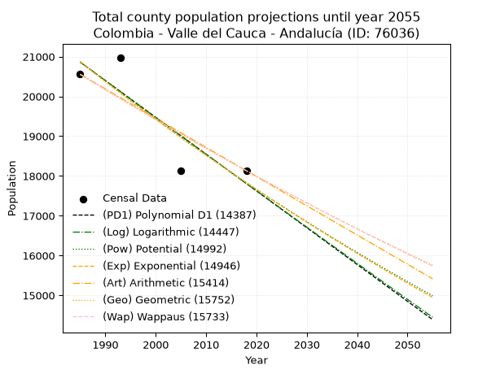
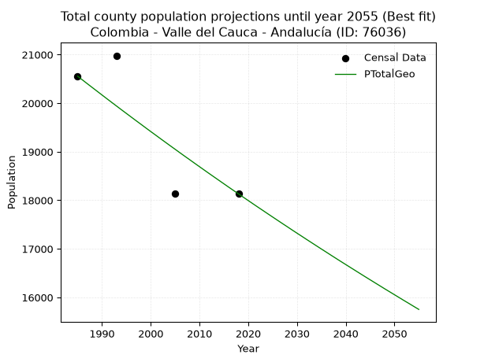
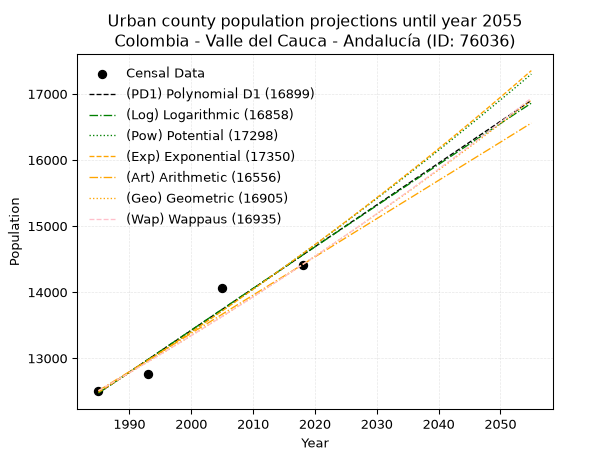
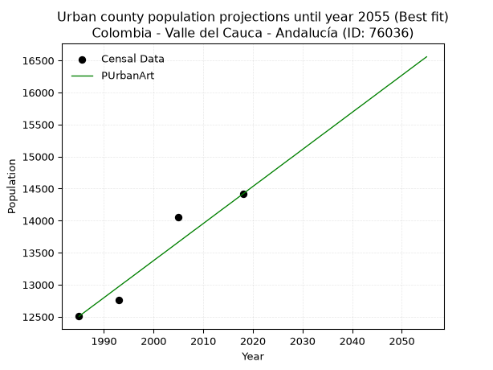
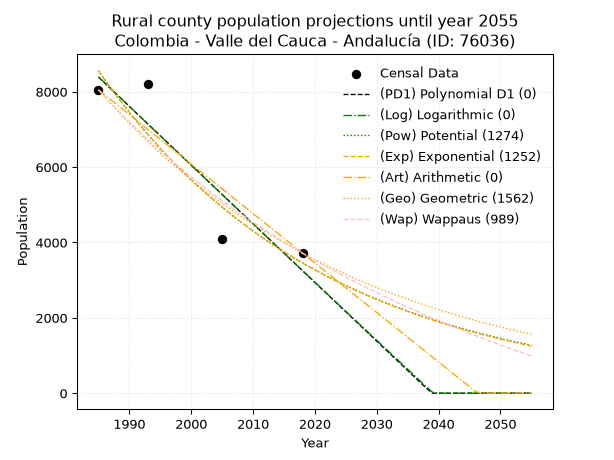
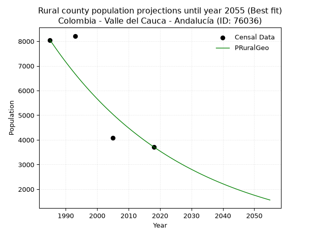

<div align="center">


</div>

# 📜 _“Population and Public Services Demand Projections (PPSD) until Year 2050 for Colombia - Valle del Cauca - Andalucía (ID: 76036)”_
Keywords: `population` `public-service` `projection` `lineal` `polynomial` `logarithmic` `potential` `exponential` `arithmetic` `geometric` `wappaus` `dane` `colombia` `south-america`

PPSD are analytical estimates used by governments and planners to anticipate future changes in population size, age distribution, and the resulting community needs for utilities, healthcare, education, and infrastructure as sizing future water treatment facilities, electrical grids, and road networks based on spatial growth.

<div align="center">

</img>

</div>


> **General running parameters**: • app_version: _v20260806_. • Python version: _3.14.7_. • Pandas version: _3.0.5_. • NumPy version: _2.5.1_. • Creates, save and include plots into reports (create_plot): _False_. • Projection until year: _2050_. • Process polynomial degree 2 and up: _False_. • Process Wappaus: _True_. • Process Wappaus: _True_. • Set negative values to zero: _True_. • Set infinite values to zero: _True_. • Drop dataset notes: _True_. 
<div align="center">

Maps & GIS Layers: [:earth_americas:Google](http://maps.google.com/maps?q=4.171713197,-76.1679246) [:earth_americas:OSM](https://www.openstreetmap.org/#map=18/4.171713197/-76.1679246&layers=P) [:earth_americas:Bing](https://www.bing.com/maps?cp=4.171713197~-76.1679246&lvl=18) [:earth_americas:Apple](https://maps.apple.com/frame?center=4.171713197%2C-76.1679246&span=0.003%2C0.006) [:earth_americas:GISMobile](https://github.com/rcfdtools/R.GISMobile/blob/main/file/gis/CountyLayer_CO/Readme.md)

</div>


<div align="center">

```geojson
{
  "type": "Feature",
  "geometry": {
    "type": "Point", 
    "coordinates": [-76.1679246, 4.171713197]
  }, 
  "properties": {
    "Name": "Colombia - Valle del Cauca - Andalucía (ID: 76036)"
  }
}
```

</div>


## 0. Census Data (4 records)

Census data are official statistics collected by a government about the people and housing in a country. They usually include counts of total population, age, sex, race, income, education, and jobs.

📅Global census file: [Population.xlsx](../data/Population.xlsx)

| Source   |   Year |   CountryID | CountryName   |   StateID | StateName       |   CountyID | CountyName   |   PTotal |   PUrban |   PRural |
|:---------|-------:|------------:|:--------------|----------:|:----------------|-----------:|:-------------|---------:|---------:|---------:|
| DANE     |   1985 |          57 | Colombia      |        76 | Valle del Cauca |      76036 | Andalucía    |    20556 |    12507 |     8049 |
| DANE     |   1993 |          57 | Colombia      |        76 | Valle del Cauca |      76036 | Andalucía    |    20980 |    12765 |     8215 |
| DANE     |   2005 |          57 | Colombia      |        76 | Valle del Cauca |      76036 | Andalucía    |    18136 |    14058 |     4078 |
| DANE     |   2018 |          57 | Colombia      |        76 | Valle del Cauca |      76036 | Andalucía    |    18132 |    14416 |     3716 |

> 🔥Some records could had specific notes about the registered values or the corresponding urban or rural distribution.

📅[SUI-RUPS](https://www.datos.gov.co/Hacienda-y-Cr-dito-P-blico/Registro-nico-de-Prestadores-de-Servicios-P-blicos/4qkq-csdn/about_data) - Local public utility companies: [RUPS.csv](../data/RUPS.csv)

 | SERVICIO       | ESTADO    | NOMBRE                                                                    | NIT         | DEPARTAMENTO_DOMICILIO   | MUNICIPIO_DOMICILIO   | DIRECCION              |   TELEFONO | EMAIL                     | TIPO_PRESTADOR                             | CLASIFICACION                 |
|:---------------|:----------|:--------------------------------------------------------------------------|:------------|:-------------------------|:----------------------|:-----------------------|-----------:|:--------------------------|:-------------------------------------------|:------------------------------|
| ACUEDUCTO      | OPERATIVA | SOCIEDAD DE ACUEDUCTOS Y ALCANTARILLADOS DEL VALLE DEL CAUCA S.A.  E.S.P. | 890399032-8 | VALLE DEL CAUCA          | CALI                  | AVENIDA 5 N # 23 AN 41 |    6203400 | rosemary@acuavalle.gov.co | SOCIEDADES (EMPRESA DE SERVICIOS PUBLICOS) | MAYOR O IGUAL A 5001 USUARIOS |
| ALCANTARILLADO | OPERATIVA | SOCIEDAD DE ACUEDUCTOS Y ALCANTARILLADOS DEL VALLE DEL CAUCA S.A.  E.S.P. | 890399032-8 | VALLE DEL CAUCA          | CALI                  | AVENIDA 5 N # 23 AN 41 |    6203400 | rosemary@acuavalle.gov.co | SOCIEDADES (EMPRESA DE SERVICIOS PUBLICOS) | MAYOR O IGUAL A 5001 USUARIOS |

## 1. Total

### 1.1. Coefficients and Parameters

* (PD1) Polynomial Deg 1: -92.48494580489742, 204444.0128462461 (lineal)
* (Log) Logarithmic: -185164.14261453782, 1426885.131825418
* (Pow) Potential: -9.548948171737527, 35.809734907649755
* (Exp) Exponential: -0.004769410880580183, 269841234.1809513
* (Art) Arithmetic: Year diff. 2018 - 1985 = 33, Population diff. 18132 - 20556 = -2424, Annual growth = -73.45454545454545
* (Geo) Geometric: Year diff. 2018 - 1985 = 33, Population diff. 18132 - 20556 = -2424, Annual growth % = -0.0037950392356821405
* (Wap) Wappaus: i = -0.3797277990826378, Condition values only valid for < 200)

<sub>
Wappaus condition values: ['-0.00', '-0.38', '-0.76', '-1.14', '-1.52', '-1.90', '-2.28', '-2.66', '-3.04', '-3.42', '-3.80', '-4.18', '-4.56', '-4.94', '-5.32', '-5.70', '-6.08', '-6.46', '-6.84', '-7.21', '-7.59', '-7.97', '-8.35', '-8.73', '-9.11', '-9.49', '-9.87', '-10.25', '-10.63', '-11.01', '-11.39', '-11.77', '-12.15', '-12.53', '-12.91', '-13.29', '-13.67', '-14.05', '-14.43', '-14.81', '-15.19', '-15.57', '-15.95', '-16.33', '-16.71', '-17.09', '-17.47', '-17.85', '-18.23', '-18.61', '-18.99', '-19.37', '-19.75', '-20.13', '-20.51', '-20.89', '-21.26', '-21.64', '-22.02', '-22.40', '-22.78', '-23.16', '-23.54', '-23.92', '-24.30', '-24.68']
</sub>


### 1.2. Projected Dataset

|   Year |   CountyID |   PTotalPD1 |   PTotalLog |   PTotalPow |   PTotalExp |   PTotalArt |   PTotalGeo |   PTotalWap |
|-------:|-----------:|------------:|------------:|------------:|------------:|------------:|------------:|------------:|
|   1985 |      76036 |       20861 |       20865 |       20873 |       20870 |       20556 |       20556 |       20556 |
|   1986 |      76036 |       20769 |       20771 |       20773 |       20771 |       20483 |       20478 |       20478 |
|   1987 |      76036 |       20676 |       20678 |       20674 |       20672 |       20409 |       20400 |       20400 |
|   1988 |      76036 |       20584 |       20585 |       20574 |       20573 |       20336 |       20323 |       20323 |
|   1989 |      76036 |       20491 |       20492 |       20476 |       20476 |       20262 |       20246 |       20246 |
|   1990 |      76036 |       20399 |       20399 |       20378 |       20378 |       20189 |       20169 |       20169 |
|   1991 |      76036 |       20306 |       20306 |       20280 |       20281 |       20115 |       20092 |       20093 |
|   1992 |      76036 |       20214 |       20213 |       20183 |       20185 |       20042 |       20016 |       20017 |
|   1993 |      76036 |       20122 |       20120 |       20087 |       20089 |       19968 |       19940 |       19941 |
|   1994 |      76036 |       20029 |       20027 |       19991 |       19993 |       19895 |       19864 |       19865 |
|   1995 |      76036 |       19937 |       19934 |       19895 |       19898 |       19821 |       19789 |       19790 |
|   1996 |      76036 |       19844 |       19841 |       19800 |       19803 |       19748 |       19714 |       19715 |
|   1997 |      76036 |       19752 |       19748 |       19706 |       19709 |       19675 |       19639 |       19640 |
|   1998 |      76036 |       19659 |       19656 |       19612 |       19615 |       19601 |       19565 |       19566 |
|   1999 |      76036 |       19567 |       19563 |       19518 |       19522 |       19528 |       19490 |       19491 |
|   2000 |      76036 |       19474 |       19471 |       19425 |       19429 |       19454 |       19416 |       19418 |
|   2001 |      76036 |       19382 |       19378 |       19333 |       19337 |       19381 |       19343 |       19344 |
|   2002 |      76036 |       19289 |       19285 |       19241 |       19245 |       19307 |       19269 |       19271 |
|   2003 |      76036 |       19197 |       19193 |       19149 |       19153 |       19234 |       19196 |       19197 |
|   2004 |      76036 |       19104 |       19101 |       19058 |       19062 |       19160 |       19123 |       19125 |
|   2005 |      76036 |       19012 |       19008 |       18968 |       18971 |       19087 |       19051 |       19052 |
|   2006 |      76036 |       18919 |       18916 |       18878 |       18881 |       19013 |       18978 |       18980 |
|   2007 |      76036 |       18827 |       18824 |       18788 |       18791 |       18940 |       18906 |       18908 |
|   2008 |      76036 |       18734 |       18731 |       18699 |       18702 |       18867 |       18835 |       18836 |
|   2009 |      76036 |       18642 |       18639 |       18610 |       18613 |       18793 |       18763 |       18764 |
|   2010 |      76036 |       18549 |       18547 |       18522 |       18524 |       18720 |       18692 |       18693 |
|   2011 |      76036 |       18457 |       18455 |       18434 |       18436 |       18646 |       18621 |       18622 |
|   2012 |      76036 |       18364 |       18363 |       18347 |       18348 |       18573 |       18550 |       18551 |
|   2013 |      76036 |       18272 |       18271 |       18260 |       18261 |       18499 |       18480 |       18481 |
|   2014 |      76036 |       18179 |       18179 |       18174 |       18174 |       18426 |       18410 |       18410 |
|   2015 |      76036 |       18087 |       18087 |       18088 |       18088 |       18352 |       18340 |       18340 |
|   2016 |      76036 |       17994 |       17995 |       18002 |       18002 |       18279 |       18270 |       18271 |
|   2017 |      76036 |       17902 |       17903 |       17917 |       17916 |       18205 |       18201 |       18201 |
|   2018 |      76036 |       17809 |       17812 |       17833 |       17831 |       18132 |       18132 |       18132 |
|   2019 |      76036 |       17717 |       17720 |       17748 |       17746 |       18059 |       18063 |       18063 |
|   2020 |      76036 |       17624 |       17628 |       17665 |       17661 |       17985 |       17995 |       17994 |
|   2021 |      76036 |       17532 |       17536 |       17581 |       17577 |       17912 |       17926 |       17926 |
|   2022 |      76036 |       17439 |       17445 |       17499 |       17494 |       17838 |       17858 |       17857 |
|   2023 |      76036 |       17347 |       17353 |       17416 |       17410 |       17765 |       17791 |       17789 |
|   2024 |      76036 |       17254 |       17262 |       17334 |       17328 |       17691 |       17723 |       17722 |
|   2025 |      76036 |       17162 |       17170 |       17253 |       17245 |       17618 |       17656 |       17654 |
|   2026 |      76036 |       17070 |       17079 |       17171 |       17163 |       17544 |       17589 |       17587 |
|   2027 |      76036 |       16977 |       16988 |       17091 |       17081 |       17471 |       17522 |       17520 |
|   2028 |      76036 |       16885 |       16896 |       17010 |       17000 |       17397 |       17456 |       17453 |
|   2029 |      76036 |       16792 |       16805 |       16931 |       16919 |       17324 |       17389 |       17386 |
|   2030 |      76036 |       16700 |       16714 |       16851 |       16839 |       17251 |       17323 |       17320 |
|   2031 |      76036 |       16607 |       16623 |       16772 |       16759 |       17177 |       17258 |       17254 |
|   2032 |      76036 |       16515 |       16531 |       16693 |       16679 |       17104 |       17192 |       17188 |
|   2033 |      76036 |       16422 |       16440 |       16615 |       16600 |       17030 |       17127 |       17122 |
|   2034 |      76036 |       16330 |       16349 |       16537 |       16521 |       16957 |       17062 |       17057 |
|   2035 |      76036 |       16237 |       16258 |       16460 |       16442 |       16883 |       16997 |       16992 |
|   2036 |      76036 |       16145 |       16167 |       16383 |       16364 |       16810 |       16933 |       16927 |
|   2037 |      76036 |       16052 |       16076 |       16306 |       16286 |       16736 |       16868 |       16862 |
|   2038 |      76036 |       15960 |       15985 |       16230 |       16208 |       16663 |       16804 |       16797 |
|   2039 |      76036 |       15867 |       15895 |       16154 |       16131 |       16589 |       16740 |       16733 |
|   2040 |      76036 |       15775 |       15804 |       16079 |       16055 |       16516 |       16677 |       16669 |
|   2041 |      76036 |       15682 |       15713 |       16004 |       15978 |       16443 |       16614 |       16605 |
|   2042 |      76036 |       15590 |       15622 |       15929 |       15902 |       16369 |       16551 |       16541 |
|   2043 |      76036 |       15497 |       15532 |       15855 |       15826 |       16296 |       16488 |       16478 |
|   2044 |      76036 |       15405 |       15441 |       15781 |       15751 |       16222 |       16425 |       16415 |
|   2045 |      76036 |       15312 |       15351 |       15707 |       15676 |       16149 |       16363 |       16352 |
|   2046 |      76036 |       15220 |       15260 |       15634 |       15602 |       16075 |       16301 |       16289 |
|   2047 |      76036 |       15127 |       15170 |       15561 |       15527 |       16002 |       16239 |       16226 |
|   2048 |      76036 |       15035 |       15079 |       15489 |       15454 |       15928 |       16177 |       16164 |
|   2049 |      76036 |       14942 |       14989 |       15417 |       15380 |       15855 |       16116 |       16102 |
|   2050 |      76036 |       14850 |       14898 |       15345 |       15307 |       15781 |       16055 |       16040 |
<div align="center">

</img>

</div>


### 1.3. Best fit with absolute and relative error (%)

Relative error puts that difference into context by dividing the absolute error by the true value, creating a unitless ratio or percentage that shows the scale of the mistake.

Absolute and relative error

|   Year | Source   |   CountryID | CountryName   |   StateID | StateName       |   CountyID_x | CountyName   |   PTotal |   PUrban |   PRural |   CountyID_y |   PTotalPD1 |   PTotalLog |   PTotalPow |   PTotalExp |   PTotalArt |   PTotalGeo |   PTotalWap |   PTotalPD1AbsError |   PTotalLogAbsError |   PTotalPowAbsError |   PTotalExpAbsError |   PTotalArtAbsError |   PTotalGeoAbsError |   PTotalWapAbsError |   PTotalPD1RelError |   PTotalLogRelError |   PTotalPowRelError |   PTotalExpRelError |   PTotalArtRelError |   PTotalGeoRelError |   PTotalWapRelError |
|-------:|:---------|------------:|:--------------|----------:|:----------------|-------------:|:-------------|---------:|---------:|---------:|-------------:|------------:|------------:|------------:|------------:|------------:|------------:|------------:|--------------------:|--------------------:|--------------------:|--------------------:|--------------------:|--------------------:|--------------------:|--------------------:|--------------------:|--------------------:|--------------------:|--------------------:|--------------------:|--------------------:|
|   1985 | DANE     |          57 | Colombia      |        76 | Valle del Cauca |        76036 | Andalucía    |    20556 |    12507 |     8049 |        76036 |       20861 |       20865 |       20873 |       20870 |       20556 |       20556 |       20556 |                 305 |                 309 |                 317 |                 314 |                   0 |                   0 |                   0 |             1.48375 |             1.50321 |             1.54213 |             1.52753 |             0       |             0       |             0       |
|   1993 | DANE     |          57 | Colombia      |        76 | Valle del Cauca |        76036 | Andalucía    |    20980 |    12765 |     8215 |        76036 |       20122 |       20120 |       20087 |       20089 |       19968 |       19940 |       19941 |                 858 |                 860 |                 893 |                 891 |                1012 |                1040 |                1039 |             4.08961 |             4.09914 |             4.25643 |             4.2469  |             4.82364 |             4.9571  |             4.95234 |
|   2005 | DANE     |          57 | Colombia      |        76 | Valle del Cauca |        76036 | Andalucía    |    18136 |    14058 |     4078 |        76036 |       19012 |       19008 |       18968 |       18971 |       19087 |       19051 |       19052 |                 876 |                 872 |                 832 |                 835 |                 951 |                 915 |                 916 |             4.83017 |             4.80812 |             4.58756 |             4.6041  |             5.24371 |             5.04521 |             5.05073 |
|   2018 | DANE     |          57 | Colombia      |        76 | Valle del Cauca |        76036 | Andalucía    |    18132 |    14416 |     3716 |        76036 |       17809 |       17812 |       17833 |       17831 |       18132 |       18132 |       18132 |                 323 |                 320 |                 299 |                 301 |                   0 |                   0 |                   0 |             1.78138 |             1.76484 |             1.64902 |             1.66005 |             0       |             0       |             0       |

Relative error mean

| Method    |   RelError | Best   |
|:----------|-----------:|:-------|
| PTotalPD1 |    3.04623 |        |
| PTotalLog |    3.04383 |        |
| PTotalPow |    3.00879 |        |
| PTotalExp |    3.00965 |        |
| PTotalArt |    2.51684 |        |
| PTotalGeo |    2.50058 | True   |
| PTotalWap |    2.50077 |        |

💙Best method: _**PTotalGeo**_
<div align="center">

</img>

</div>


### 1.4. Fresh water supply demand in liters per capita per day (lpcd)

The fresh water supply demand typically ranges from 100 to 300 liters per capita per day (lpcd) for standard domestic and municipal planning, though absolute survival minimums set by the World Health Organization are as low as 7.5 to 20 liters per day, and total consumption in high-income nations can exceed 400 liters.

> `CZ`: Level in meters above the sea level (masl)<br> `WS`: Fresh water supply demand in liters per capita per day (lpcd or l/h/d)<br> `WSAll`: Zonal fresh water supply demand in liters per second (l/s)<br> `A`: Zonal area in square meters<br> `DP`: Population density (people/hectare or p/ha)

Reference values (RAS Colombia)

|    CZ |   WS |
|------:|-----:|
|  1000 |  120 |
|  2000 |  130 |
| 99999 |  140 |

County shapefile geometry properties and water supply values

|   CountyID |      ATotal |   CZTotal |   WSTotal |
|-----------:|------------:|----------:|----------:|
|      76036 | 1.10434e+08 |   1045.04 |       130 |

Projected values for best method: PTotalGeo

|   CountyID |   Year |   PTotalGeo |   DPTotal |   WSTotal |   WSTotalAll |
|-----------:|-------:|------------:|----------:|----------:|-------------:|
|      76036 |   1985 |       20556 |      1.86 |       130 |      30.9292 |
|      76036 |   1986 |       20478 |      1.85 |       130 |      30.8118 |
|      76036 |   1987 |       20400 |      1.85 |       130 |      30.6944 |
|      76036 |   1988 |       20323 |      1.84 |       130 |      30.5786 |
|      76036 |   1989 |       20246 |      1.83 |       130 |      30.4627 |
|      76036 |   1990 |       20169 |      1.83 |       130 |      30.3469 |
|      76036 |   1991 |       20092 |      1.82 |       130 |      30.231  |
|      76036 |   1992 |       20016 |      1.81 |       130 |      30.1167 |
|      76036 |   1993 |       19940 |      1.81 |       130 |      30.0023 |
|      76036 |   1994 |       19864 |      1.8  |       130 |      29.888  |
|      76036 |   1995 |       19789 |      1.79 |       130 |      29.7751 |
|      76036 |   1996 |       19714 |      1.79 |       130 |      29.6623 |
|      76036 |   1997 |       19639 |      1.78 |       130 |      29.5494 |
|      76036 |   1998 |       19565 |      1.77 |       130 |      29.4381 |
|      76036 |   1999 |       19490 |      1.76 |       130 |      29.3252 |
|      76036 |   2000 |       19416 |      1.76 |       130 |      29.2139 |
|      76036 |   2001 |       19343 |      1.75 |       130 |      29.1041 |
|      76036 |   2002 |       19269 |      1.74 |       130 |      28.9927 |
|      76036 |   2003 |       19196 |      1.74 |       130 |      28.8829 |
|      76036 |   2004 |       19123 |      1.73 |       130 |      28.773  |
|      76036 |   2005 |       19051 |      1.73 |       130 |      28.6647 |
|      76036 |   2006 |       18978 |      1.72 |       130 |      28.5549 |
|      76036 |   2007 |       18906 |      1.71 |       130 |      28.4465 |
|      76036 |   2008 |       18835 |      1.71 |       130 |      28.3397 |
|      76036 |   2009 |       18763 |      1.7  |       130 |      28.2314 |
|      76036 |   2010 |       18692 |      1.69 |       130 |      28.1245 |
|      76036 |   2011 |       18621 |      1.69 |       130 |      28.0177 |
|      76036 |   2012 |       18550 |      1.68 |       130 |      27.9109 |
|      76036 |   2013 |       18480 |      1.67 |       130 |      27.8056 |
|      76036 |   2014 |       18410 |      1.67 |       130 |      27.7002 |
|      76036 |   2015 |       18340 |      1.66 |       130 |      27.5949 |
|      76036 |   2016 |       18270 |      1.65 |       130 |      27.4896 |
|      76036 |   2017 |       18201 |      1.65 |       130 |      27.3858 |
|      76036 |   2018 |       18132 |      1.64 |       130 |      27.2819 |
|      76036 |   2019 |       18063 |      1.64 |       130 |      27.1781 |
|      76036 |   2020 |       17995 |      1.63 |       130 |      27.0758 |
|      76036 |   2021 |       17926 |      1.62 |       130 |      26.972  |
|      76036 |   2022 |       17858 |      1.62 |       130 |      26.8697 |
|      76036 |   2023 |       17791 |      1.61 |       130 |      26.7689 |
|      76036 |   2024 |       17723 |      1.6  |       130 |      26.6666 |
|      76036 |   2025 |       17656 |      1.6  |       130 |      26.5657 |
|      76036 |   2026 |       17589 |      1.59 |       130 |      26.4649 |
|      76036 |   2027 |       17522 |      1.59 |       130 |      26.3641 |
|      76036 |   2028 |       17456 |      1.58 |       130 |      26.2648 |
|      76036 |   2029 |       17389 |      1.57 |       130 |      26.164  |
|      76036 |   2030 |       17323 |      1.57 |       130 |      26.0647 |
|      76036 |   2031 |       17258 |      1.56 |       130 |      25.9669 |
|      76036 |   2032 |       17192 |      1.56 |       130 |      25.8676 |
|      76036 |   2033 |       17127 |      1.55 |       130 |      25.7698 |
|      76036 |   2034 |       17062 |      1.54 |       130 |      25.672  |
|      76036 |   2035 |       16997 |      1.54 |       130 |      25.5742 |
|      76036 |   2036 |       16933 |      1.53 |       130 |      25.4779 |
|      76036 |   2037 |       16868 |      1.53 |       130 |      25.3801 |
|      76036 |   2038 |       16804 |      1.52 |       130 |      25.2838 |
|      76036 |   2039 |       16740 |      1.52 |       130 |      25.1875 |
|      76036 |   2040 |       16677 |      1.51 |       130 |      25.0927 |
|      76036 |   2041 |       16614 |      1.5  |       130 |      24.9979 |
|      76036 |   2042 |       16551 |      1.5  |       130 |      24.9031 |
|      76036 |   2043 |       16488 |      1.49 |       130 |      24.8083 |
|      76036 |   2044 |       16425 |      1.49 |       130 |      24.7135 |
|      76036 |   2045 |       16363 |      1.48 |       130 |      24.6203 |
|      76036 |   2046 |       16301 |      1.48 |       130 |      24.527  |
|      76036 |   2047 |       16239 |      1.47 |       130 |      24.4337 |
|      76036 |   2048 |       16177 |      1.46 |       130 |      24.3404 |
|      76036 |   2049 |       16116 |      1.46 |       130 |      24.2486 |
|      76036 |   2050 |       16055 |      1.45 |       130 |      24.1568 |

## 2. Urban

### 2.1. Coefficients and Parameters

* (PD1) Polynomial Deg 1: 63.23805700521848, -113055.42352468826 (lineal)
* (Log) Logarithmic: 126611.26702669656, -948936.755268939
* (Pow) Potential: 9.41583794431684, -26.954909554237492
* (Exp) Exponential: 0.004702764550831905, 1.1020608788282322
* (Art) Arithmetic: Year diff. 2018 - 1985 = 33, Population diff. 14416 - 12507 = 1909, Annual growth = 57.84848484848485
* (Geo) Geometric: Year diff. 2018 - 1985 = 33, Population diff. 14416 - 12507 = 1909, Annual growth % = 0.004313829809377445
* (Wap) Wappaus: i = 0.4297328295396861, Condition values only valid for < 200)

<sub>
Wappaus condition values: ['0.00', '0.43', '0.86', '1.29', '1.72', '2.15', '2.58', '3.01', '3.44', '3.87', '4.30', '4.73', '5.16', '5.59', '6.02', '6.45', '6.88', '7.31', '7.74', '8.16', '8.59', '9.02', '9.45', '9.88', '10.31', '10.74', '11.17', '11.60', '12.03', '12.46', '12.89', '13.32', '13.75', '14.18', '14.61', '15.04', '15.47', '15.90', '16.33', '16.76', '17.19', '17.62', '18.05', '18.48', '18.91', '19.34', '19.77', '20.20', '20.63', '21.06', '21.49', '21.92', '22.35', '22.78', '23.21', '23.64', '24.07', '24.49', '24.92', '25.35', '25.78', '26.21', '26.64', '27.07', '27.50', '27.93']
</sub>


### 2.2. Projected Dataset

|   Year |   CountyID |   PUrbanPD1 |   PUrbanLog |   PUrbanPow |   PUrbanExp |   PUrbanArt |   PUrbanGeo |   PUrbanWap |
|-------:|-----------:|------------:|------------:|------------:|------------:|------------:|------------:|------------:|
|   1985 |      76036 |       12472 |       12470 |       12482 |       12484 |       12507 |       12507 |       12507 |
|   1986 |      76036 |       12535 |       12534 |       12541 |       12542 |       12565 |       12561 |       12561 |
|   1987 |      76036 |       12599 |       12597 |       12600 |       12602 |       12623 |       12615 |       12615 |
|   1988 |      76036 |       12662 |       12661 |       12660 |       12661 |       12681 |       12670 |       12669 |
|   1989 |      76036 |       12725 |       12725 |       12720 |       12721 |       12738 |       12724 |       12724 |
|   1990 |      76036 |       12788 |       12788 |       12781 |       12781 |       12796 |       12779 |       12779 |
|   1991 |      76036 |       12852 |       12852 |       12841 |       12841 |       12854 |       12834 |       12834 |
|   1992 |      76036 |       12915 |       12916 |       12902 |       12901 |       12912 |       12890 |       12889 |
|   1993 |      76036 |       12978 |       12979 |       12963 |       12962 |       12970 |       12945 |       12944 |
|   1994 |      76036 |       13041 |       13043 |       13025 |       13023 |       13028 |       13001 |       13000 |
|   1995 |      76036 |       13105 |       13106 |       13086 |       13085 |       13085 |       13057 |       13056 |
|   1996 |      76036 |       13168 |       13170 |       13148 |       13146 |       13143 |       13113 |       13113 |
|   1997 |      76036 |       13231 |       13233 |       13210 |       13208 |       13201 |       13170 |       13169 |
|   1998 |      76036 |       13294 |       13296 |       13273 |       13271 |       13259 |       13227 |       13226 |
|   1999 |      76036 |       13357 |       13360 |       13335 |       13333 |       13317 |       13284 |       13283 |
|   2000 |      76036 |       13421 |       13423 |       13398 |       13396 |       13375 |       13341 |       13340 |
|   2001 |      76036 |       13484 |       13486 |       13462 |       13459 |       13433 |       13399 |       13398 |
|   2002 |      76036 |       13547 |       13550 |       13525 |       13523 |       13490 |       13457 |       13455 |
|   2003 |      76036 |       13610 |       13613 |       13589 |       13586 |       13548 |       13515 |       13513 |
|   2004 |      76036 |       13674 |       13676 |       13653 |       13650 |       13606 |       13573 |       13572 |
|   2005 |      76036 |       13737 |       13739 |       13717 |       13715 |       13664 |       13631 |       13630 |
|   2006 |      76036 |       13800 |       13802 |       13782 |       13779 |       13722 |       13690 |       13689 |
|   2007 |      76036 |       13863 |       13866 |       13847 |       13844 |       13780 |       13749 |       13748 |
|   2008 |      76036 |       13927 |       13929 |       13912 |       13910 |       13838 |       13809 |       13807 |
|   2009 |      76036 |       13990 |       13992 |       13977 |       13975 |       13895 |       13868 |       13867 |
|   2010 |      76036 |       14053 |       14055 |       14043 |       14041 |       13953 |       13928 |       13927 |
|   2011 |      76036 |       14116 |       14118 |       14109 |       14107 |       14011 |       13988 |       13987 |
|   2012 |      76036 |       14180 |       14181 |       14175 |       14174 |       14069 |       14048 |       14048 |
|   2013 |      76036 |       14243 |       14243 |       14241 |       14241 |       14127 |       14109 |       14108 |
|   2014 |      76036 |       14306 |       14306 |       14308 |       14308 |       14185 |       14170 |       14169 |
|   2015 |      76036 |       14369 |       14369 |       14375 |       14375 |       14242 |       14231 |       14230 |
|   2016 |      76036 |       14432 |       14432 |       14442 |       14443 |       14300 |       14292 |       14292 |
|   2017 |      76036 |       14496 |       14495 |       14510 |       14511 |       14358 |       14354 |       14354 |
|   2018 |      76036 |       14559 |       14558 |       14578 |       14579 |       14416 |       14416 |       14416 |
|   2019 |      76036 |       14622 |       14620 |       14646 |       14648 |       14474 |       14478 |       14478 |
|   2020 |      76036 |       14685 |       14683 |       14714 |       14717 |       14532 |       14541 |       14541 |
|   2021 |      76036 |       14749 |       14746 |       14783 |       14786 |       14590 |       14603 |       14604 |
|   2022 |      76036 |       14812 |       14808 |       14852 |       14856 |       14647 |       14666 |       14667 |
|   2023 |      76036 |       14875 |       14871 |       14921 |       14926 |       14705 |       14730 |       14731 |
|   2024 |      76036 |       14938 |       14933 |       14991 |       14997 |       14763 |       14793 |       14795 |
|   2025 |      76036 |       15002 |       14996 |       15061 |       15067 |       14821 |       14857 |       14859 |
|   2026 |      76036 |       15065 |       15058 |       15131 |       15138 |       14879 |       14921 |       14923 |
|   2027 |      76036 |       15128 |       15121 |       15202 |       15210 |       14937 |       14985 |       14988 |
|   2028 |      76036 |       15191 |       15183 |       15272 |       15281 |       14994 |       15050 |       15053 |
|   2029 |      76036 |       15255 |       15246 |       15343 |       15353 |       15052 |       15115 |       15119 |
|   2030 |      76036 |       15318 |       15308 |       15415 |       15426 |       15110 |       15180 |       15184 |
|   2031 |      76036 |       15381 |       15371 |       15486 |       15498 |       15168 |       15246 |       15251 |
|   2032 |      76036 |       15444 |       15433 |       15558 |       15572 |       15226 |       15311 |       15317 |
|   2033 |      76036 |       15508 |       15495 |       15631 |       15645 |       15284 |       15378 |       15384 |
|   2034 |      76036 |       15571 |       15557 |       15703 |       15719 |       15342 |       15444 |       15450 |
|   2035 |      76036 |       15634 |       15620 |       15776 |       15793 |       15399 |       15510 |       15518 |
|   2036 |      76036 |       15697 |       15682 |       15849 |       15867 |       15457 |       15577 |       15585 |
|   2037 |      76036 |       15760 |       15744 |       15923 |       15942 |       15515 |       15645 |       15653 |
|   2038 |      76036 |       15824 |       15806 |       15996 |       16017 |       15573 |       15712 |       15722 |
|   2039 |      76036 |       15887 |       15868 |       16070 |       16093 |       15631 |       15780 |       15790 |
|   2040 |      76036 |       15950 |       15930 |       16145 |       16169 |       15689 |       15848 |       15859 |
|   2041 |      76036 |       16013 |       15992 |       16219 |       16245 |       15747 |       15916 |       15929 |
|   2042 |      76036 |       16077 |       16054 |       16294 |       16321 |       15804 |       15985 |       15998 |
|   2043 |      76036 |       16140 |       16116 |       16370 |       16398 |       15862 |       16054 |       16068 |
|   2044 |      76036 |       16203 |       16178 |       16445 |       16476 |       15920 |       16123 |       16138 |
|   2045 |      76036 |       16266 |       16240 |       16521 |       16553 |       15978 |       16193 |       16209 |
|   2046 |      76036 |       16330 |       16302 |       16597 |       16631 |       16036 |       16263 |       16280 |
|   2047 |      76036 |       16393 |       16364 |       16674 |       16710 |       16094 |       16333 |       16351 |
|   2048 |      76036 |       16456 |       16426 |       16751 |       16788 |       16151 |       16403 |       16423 |
|   2049 |      76036 |       16519 |       16488 |       16828 |       16868 |       16209 |       16474 |       16495 |
|   2050 |      76036 |       16583 |       16549 |       16906 |       16947 |       16267 |       16545 |       16568 |
<div align="center">

</img>

</div>


### 2.3. Best fit with absolute and relative error (%)

Relative error puts that difference into context by dividing the absolute error by the true value, creating a unitless ratio or percentage that shows the scale of the mistake.

Absolute and relative error

|   Year | Source   |   CountryID | CountryName   |   StateID | StateName       |   CountyID_x | CountyName   |   PTotal |   PUrban |   PRural |   CountyID_y |   PUrbanPD1 |   PUrbanLog |   PUrbanPow |   PUrbanExp |   PUrbanArt |   PUrbanGeo |   PUrbanWap |   PUrbanPD1AbsError |   PUrbanLogAbsError |   PUrbanPowAbsError |   PUrbanExpAbsError |   PUrbanArtAbsError |   PUrbanGeoAbsError |   PUrbanWapAbsError |   PUrbanPD1RelError |   PUrbanLogRelError |   PUrbanPowRelError |   PUrbanExpRelError |   PUrbanArtRelError |   PUrbanGeoRelError |   PUrbanWapRelError |
|-------:|:---------|------------:|:--------------|----------:|:----------------|-------------:|:-------------|---------:|---------:|---------:|-------------:|------------:|------------:|------------:|------------:|------------:|------------:|------------:|--------------------:|--------------------:|--------------------:|--------------------:|--------------------:|--------------------:|--------------------:|--------------------:|--------------------:|--------------------:|--------------------:|--------------------:|--------------------:|--------------------:|
|   1985 | DANE     |          57 | Colombia      |        76 | Valle del Cauca |        76036 | Andalucía    |    20556 |    12507 |     8049 |        76036 |       12472 |       12470 |       12482 |       12484 |       12507 |       12507 |       12507 |                  35 |                  37 |                  25 |                  23 |                   0 |                   0 |                   0 |            0.279843 |            0.295834 |            0.199888 |            0.183897 |             0       |             0       |             0       |
|   1993 | DANE     |          57 | Colombia      |        76 | Valle del Cauca |        76036 | Andalucía    |    20980 |    12765 |     8215 |        76036 |       12978 |       12979 |       12963 |       12962 |       12970 |       12945 |       12944 |                 213 |                 214 |                 198 |                 197 |                 205 |                 180 |                 179 |            1.66863  |            1.67646  |            1.55112  |            1.54328  |             1.60595 |             1.41011 |             1.40227 |
|   2005 | DANE     |          57 | Colombia      |        76 | Valle del Cauca |        76036 | Andalucía    |    18136 |    14058 |     4078 |        76036 |       13737 |       13739 |       13717 |       13715 |       13664 |       13631 |       13630 |                 321 |                 319 |                 341 |                 343 |                 394 |                 427 |                 428 |            2.2834   |            2.26917  |            2.42567  |            2.43989  |             2.80267 |             3.03742 |             3.04453 |
|   2018 | DANE     |          57 | Colombia      |        76 | Valle del Cauca |        76036 | Andalucía    |    18132 |    14416 |     3716 |        76036 |       14559 |       14558 |       14578 |       14579 |       14416 |       14416 |       14416 |                 143 |                 142 |                 162 |                 163 |                   0 |                   0 |                   0 |            0.991953 |            0.985017 |            1.12375  |            1.13069  |             0       |             0       |             0       |

Relative error mean

| Method    |   RelError | Best   |
|:----------|-----------:|:-------|
| PUrbanPD1 |    1.30595 |        |
| PUrbanLog |    1.30662 |        |
| PUrbanPow |    1.32511 |        |
| PUrbanExp |    1.32444 |        |
| PUrbanArt |    1.10216 | True   |
| PUrbanGeo |    1.11188 |        |
| PUrbanWap |    1.1117  |        |

💙Best method: _**PUrbanArt**_
<div align="center">

</img>

</div>


### 2.4. Fresh water supply demand in liters per capita per day (lpcd)

The fresh water supply demand typically ranges from 100 to 300 liters per capita per day (lpcd) for standard domestic and municipal planning, though absolute survival minimums set by the World Health Organization are as low as 7.5 to 20 liters per day, and total consumption in high-income nations can exceed 400 liters.

> `CZ`: Level in meters above the sea level (masl)<br> `WS`: Fresh water supply demand in liters per capita per day (lpcd or l/h/d)<br> `WSAll`: Zonal fresh water supply demand in liters per second (l/s)<br> `A`: Zonal area in square meters<br> `DP`: Population density (people/hectare or p/ha)

Reference values (RAS Colombia)

|    CZ |   WS |
|------:|-----:|
|  1000 |  120 |
|  2000 |  130 |
| 99999 |  140 |

County shapefile geometry properties and water supply values

|   CountyID |      AUrban |   CZUrban |   WSUrban |
|-----------:|------------:|----------:|----------:|
|      76036 | 3.07037e+06 |   955.587 |       120 |

Projected values for best method: PUrbanArt

|   CountyID |   Year |   PUrbanArt |   DPUrban |   WSUrban |   WSUrbanAll |
|-----------:|-------:|------------:|----------:|----------:|-------------:|
|      76036 |   1985 |       12507 |     40.73 |       120 |      17.3708 |
|      76036 |   1986 |       12565 |     40.92 |       120 |      17.4514 |
|      76036 |   1987 |       12623 |     41.11 |       120 |      17.5319 |
|      76036 |   1988 |       12681 |     41.3  |       120 |      17.6125 |
|      76036 |   1989 |       12738 |     41.49 |       120 |      17.6917 |
|      76036 |   1990 |       12796 |     41.68 |       120 |      17.7722 |
|      76036 |   1991 |       12854 |     41.86 |       120 |      17.8528 |
|      76036 |   1992 |       12912 |     42.05 |       120 |      17.9333 |
|      76036 |   1993 |       12970 |     42.24 |       120 |      18.0139 |
|      76036 |   1994 |       13028 |     42.43 |       120 |      18.0944 |
|      76036 |   1995 |       13085 |     42.62 |       120 |      18.1736 |
|      76036 |   1996 |       13143 |     42.81 |       120 |      18.2542 |
|      76036 |   1997 |       13201 |     42.99 |       120 |      18.3347 |
|      76036 |   1998 |       13259 |     43.18 |       120 |      18.4153 |
|      76036 |   1999 |       13317 |     43.37 |       120 |      18.4958 |
|      76036 |   2000 |       13375 |     43.56 |       120 |      18.5764 |
|      76036 |   2001 |       13433 |     43.75 |       120 |      18.6569 |
|      76036 |   2002 |       13490 |     43.94 |       120 |      18.7361 |
|      76036 |   2003 |       13548 |     44.12 |       120 |      18.8167 |
|      76036 |   2004 |       13606 |     44.31 |       120 |      18.8972 |
|      76036 |   2005 |       13664 |     44.5  |       120 |      18.9778 |
|      76036 |   2006 |       13722 |     44.69 |       120 |      19.0583 |
|      76036 |   2007 |       13780 |     44.88 |       120 |      19.1389 |
|      76036 |   2008 |       13838 |     45.07 |       120 |      19.2194 |
|      76036 |   2009 |       13895 |     45.26 |       120 |      19.2986 |
|      76036 |   2010 |       13953 |     45.44 |       120 |      19.3792 |
|      76036 |   2011 |       14011 |     45.63 |       120 |      19.4597 |
|      76036 |   2012 |       14069 |     45.82 |       120 |      19.5403 |
|      76036 |   2013 |       14127 |     46.01 |       120 |      19.6208 |
|      76036 |   2014 |       14185 |     46.2  |       120 |      19.7014 |
|      76036 |   2015 |       14242 |     46.39 |       120 |      19.7806 |
|      76036 |   2016 |       14300 |     46.57 |       120 |      19.8611 |
|      76036 |   2017 |       14358 |     46.76 |       120 |      19.9417 |
|      76036 |   2018 |       14416 |     46.95 |       120 |      20.0222 |
|      76036 |   2019 |       14474 |     47.14 |       120 |      20.1028 |
|      76036 |   2020 |       14532 |     47.33 |       120 |      20.1833 |
|      76036 |   2021 |       14590 |     47.52 |       120 |      20.2639 |
|      76036 |   2022 |       14647 |     47.7  |       120 |      20.3431 |
|      76036 |   2023 |       14705 |     47.89 |       120 |      20.4236 |
|      76036 |   2024 |       14763 |     48.08 |       120 |      20.5042 |
|      76036 |   2025 |       14821 |     48.27 |       120 |      20.5847 |
|      76036 |   2026 |       14879 |     48.46 |       120 |      20.6653 |
|      76036 |   2027 |       14937 |     48.65 |       120 |      20.7458 |
|      76036 |   2028 |       14994 |     48.83 |       120 |      20.825  |
|      76036 |   2029 |       15052 |     49.02 |       120 |      20.9056 |
|      76036 |   2030 |       15110 |     49.21 |       120 |      20.9861 |
|      76036 |   2031 |       15168 |     49.4  |       120 |      21.0667 |
|      76036 |   2032 |       15226 |     49.59 |       120 |      21.1472 |
|      76036 |   2033 |       15284 |     49.78 |       120 |      21.2278 |
|      76036 |   2034 |       15342 |     49.97 |       120 |      21.3083 |
|      76036 |   2035 |       15399 |     50.15 |       120 |      21.3875 |
|      76036 |   2036 |       15457 |     50.34 |       120 |      21.4681 |
|      76036 |   2037 |       15515 |     50.53 |       120 |      21.5486 |
|      76036 |   2038 |       15573 |     50.72 |       120 |      21.6292 |
|      76036 |   2039 |       15631 |     50.91 |       120 |      21.7097 |
|      76036 |   2040 |       15689 |     51.1  |       120 |      21.7903 |
|      76036 |   2041 |       15747 |     51.29 |       120 |      21.8708 |
|      76036 |   2042 |       15804 |     51.47 |       120 |      21.95   |
|      76036 |   2043 |       15862 |     51.66 |       120 |      22.0306 |
|      76036 |   2044 |       15920 |     51.85 |       120 |      22.1111 |
|      76036 |   2045 |       15978 |     52.04 |       120 |      22.1917 |
|      76036 |   2046 |       16036 |     52.23 |       120 |      22.2722 |
|      76036 |   2047 |       16094 |     52.42 |       120 |      22.3528 |
|      76036 |   2048 |       16151 |     52.6  |       120 |      22.4319 |
|      76036 |   2049 |       16209 |     52.79 |       120 |      22.5125 |
|      76036 |   2050 |       16267 |     52.98 |       120 |      22.5931 |

## 3. Rural

### 3.1. Coefficients and Parameters

* (PD1) Polynomial Deg 1: -155.72300281011596, 317499.4363709345 (lineal)
* (Log) Logarithmic: -311775.4096412343, 2375821.8870943575
* (Pow) Potential: -54.962606377969124, 185.18594996736124
* (Exp) Exponential: -0.027453548053608477, 3.9723517058499615e+27
* (Art) Arithmetic: Year diff. 2018 - 1985 = 33, Population diff. 3716 - 8049 = -4333, Annual growth = -131.3030303030303
* (Geo) Geometric: Year diff. 2018 - 1985 = 33, Population diff. 3716 - 8049 = -4333, Annual growth % = -0.023149065509077027
* (Wap) Wappaus: i = -2.2320957127586962, Condition values only valid for < 200)

<sub>
Wappaus condition values: ['-0.00', '-2.23', '-4.46', '-6.70', '-8.93', '-11.16', '-13.39', '-15.62', '-17.86', '-20.09', '-22.32', '-24.55', '-26.79', '-29.02', '-31.25', '-33.48', '-35.71', '-37.95', '-40.18', '-42.41', '-44.64', '-46.87', '-49.11', '-51.34', '-53.57', '-55.80', '-58.03', '-60.27', '-62.50', '-64.73', '-66.96', '-69.19', '-71.43', '-73.66', '-75.89', '-78.12', '-80.36', '-82.59', '-84.82', '-87.05', '-89.28', '-91.52', '-93.75', '-95.98', '-98.21', '-100.44', '-102.68', '-104.91', '-107.14', '-109.37', '-111.60', '-113.84', '-116.07', '-118.30', '-120.53', '-122.77', '-125.00', '-127.23', '-129.46', '-131.69', '-133.93', '-136.16', '-138.39', '-140.62', '-142.85', '-145.09']
</sub>


### 3.2. Projected Dataset

|   Year |   CountyID |   PRuralPD1 |   PRuralLog |   PRuralPow |   PRuralExp |   PRuralArt |   PRuralGeo |   PRuralWap |
|-------:|-----------:|------------:|------------:|------------:|------------:|------------:|------------:|------------:|
|   1985 |      76036 |        8389 |        8395 |        8559 |        8552 |        8049 |        8049 |        8049 |
|   1986 |      76036 |        8234 |        8238 |        8326 |        8320 |        7918 |        7863 |        7871 |
|   1987 |      76036 |        8078 |        8081 |        8098 |        8095 |        7786 |        7681 |        7698 |
|   1988 |      76036 |        7922 |        7924 |        7878 |        7875 |        7655 |        7503 |        7527 |
|   1989 |      76036 |        7766 |        7767 |        7663 |        7662 |        7524 |        7329 |        7361 |
|   1990 |      76036 |        7611 |        7610 |        7454 |        7455 |        7392 |        7160 |        7198 |
|   1991 |      76036 |        7455 |        7454 |        7251 |        7253 |        7261 |        6994 |        7039 |
|   1992 |      76036 |        7299 |        7297 |        7054 |        7056 |        7130 |        6832 |        6883 |
|   1993 |      76036 |        7143 |        7141 |        6862 |        6865 |        6999 |        6674 |        6730 |
|   1994 |      76036 |        6988 |        6984 |        6675 |        6679 |        6867 |        6519 |        6580 |
|   1995 |      76036 |        6832 |        6828 |        6494 |        6499 |        6736 |        6368 |        6433 |
|   1996 |      76036 |        6676 |        6672 |        6317 |        6323 |        6605 |        6221 |        6289 |
|   1997 |      76036 |        6521 |        6515 |        6146 |        6151 |        6473 |        6077 |        6148 |
|   1998 |      76036 |        6365 |        6359 |        5979 |        5985 |        6342 |        5936 |        6009 |
|   1999 |      76036 |        6209 |        6203 |        5817 |        5823 |        6211 |        5799 |        5874 |
|   2000 |      76036 |        6053 |        6047 |        5659 |        5665 |        6079 |        5665 |        5741 |
|   2001 |      76036 |        5898 |        5892 |        5506 |        5512 |        5948 |        5533 |        5610 |
|   2002 |      76036 |        5742 |        5736 |        5356 |        5362 |        5817 |        5405 |        5482 |
|   2003 |      76036 |        5586 |        5580 |        5211 |        5217 |        5686 |        5280 |        5356 |
|   2004 |      76036 |        5431 |        5424 |        5070 |        5076 |        5554 |        5158 |        5233 |
|   2005 |      76036 |        5275 |        5269 |        4933 |        4938 |        5423 |        5039 |        5111 |
|   2006 |      76036 |        5119 |        5113 |        4800 |        4805 |        5292 |        4922 |        4992 |
|   2007 |      76036 |        4963 |        4958 |        4670 |        4675 |        5160 |        4808 |        4876 |
|   2008 |      76036 |        4808 |        4803 |        4544 |        4548 |        5029 |        4697 |        4761 |
|   2009 |      76036 |        4652 |        4648 |        4421 |        4425 |        4898 |        4588 |        4648 |
|   2010 |      76036 |        4496 |        4492 |        4302 |        4305 |        4766 |        4482 |        4537 |
|   2011 |      76036 |        4340 |        4337 |        4186 |        4188 |        4635 |        4378 |        4428 |
|   2012 |      76036 |        4185 |        4182 |        4073 |        4075 |        4504 |        4277 |        4321 |
|   2013 |      76036 |        4029 |        4027 |        3964 |        3965 |        4373 |        4178 |        4216 |
|   2014 |      76036 |        3873 |        3873 |        3857 |        3857 |        4241 |        4081 |        4113 |
|   2015 |      76036 |        3718 |        3718 |        3753 |        3753 |        4110 |        3986 |        4011 |
|   2016 |      76036 |        3562 |        3563 |        3652 |        3651 |        3979 |        3894 |        3911 |
|   2017 |      76036 |        3406 |        3409 |        3554 |        3552 |        3847 |        3804 |        3813 |
|   2018 |      76036 |        3250 |        3254 |        3458 |        3456 |        3716 |        3716 |        3716 |
|   2019 |      76036 |        3095 |        3100 |        3365 |        3363 |        3585 |        3630 |        3621 |
|   2020 |      76036 |        2939 |        2945 |        3275 |        3271 |        3453 |        3546 |        3527 |
|   2021 |      76036 |        2783 |        2791 |        3187 |        3183 |        3322 |        3464 |        3435 |
|   2022 |      76036 |        2628 |        2637 |        3102 |        3097 |        3191 |        3384 |        3344 |
|   2023 |      76036 |        2472 |        2482 |        3019 |        3013 |        3059 |        3305 |        3255 |
|   2024 |      76036 |        2316 |        2328 |        2938 |        2931 |        2928 |        3229 |        3167 |
|   2025 |      76036 |        2160 |        2174 |        2859 |        2852 |        2797 |        3154 |        3081 |
|   2026 |      76036 |        2005 |        2020 |        2782 |        2775 |        2666 |        3081 |        2995 |
|   2027 |      76036 |        1849 |        1867 |        2708 |        2699 |        2534 |        3010 |        2911 |
|   2028 |      76036 |        1693 |        1713 |        2636 |        2626 |        2403 |        2940 |        2829 |
|   2029 |      76036 |        1537 |        1559 |        2565 |        2555 |        2272 |        2872 |        2747 |
|   2030 |      76036 |        1382 |        1406 |        2497 |        2486 |        2140 |        2806 |        2667 |
|   2031 |      76036 |        1226 |        1252 |        2430 |        2419 |        2009 |        2741 |        2588 |
|   2032 |      76036 |        1070 |        1098 |        2365 |        2353 |        1878 |        2677 |        2510 |
|   2033 |      76036 |         915 |         945 |        2302 |        2290 |        1746 |        2615 |        2433 |
|   2034 |      76036 |         759 |         792 |        2241 |        2228 |        1615 |        2555 |        2358 |
|   2035 |      76036 |         603 |         639 |        2181 |        2167 |        1484 |        2495 |        2283 |
|   2036 |      76036 |         447 |         485 |        2123 |        2108 |        1353 |        2438 |        2210 |
|   2037 |      76036 |         292 |         332 |        2066 |        2051 |        1221 |        2381 |        2137 |
|   2038 |      76036 |         136 |         179 |        2011 |        1996 |        1090 |        2326 |        2066 |
|   2039 |      76036 |           0 |          26 |        1958 |        1942 |         959 |        2272 |        1996 |
|   2040 |      76036 |           0 |           0 |        1906 |        1889 |         827 |        2220 |        1926 |
|   2041 |      76036 |           0 |           0 |        1855 |        1838 |         696 |        2168 |        1858 |
|   2042 |      76036 |           0 |           0 |        1806 |        1788 |         565 |        2118 |        1790 |
|   2043 |      76036 |           0 |           0 |        1758 |        1740 |         433 |        2069 |        1723 |
|   2044 |      76036 |           0 |           0 |        1711 |        1693 |         302 |        2021 |        1658 |
|   2045 |      76036 |           0 |           0 |        1666 |        1647 |         171 |        1974 |        1593 |
|   2046 |      76036 |           0 |           0 |        1622 |        1602 |          40 |        1929 |        1529 |
|   2047 |      76036 |           0 |           0 |        1579 |        1559 |           0 |        1884 |        1465 |
|   2048 |      76036 |           0 |           0 |        1537 |        1517 |           0 |        1840 |        1403 |
|   2049 |      76036 |           0 |           0 |        1496 |        1476 |           0 |        1798 |        1342 |
|   2050 |      76036 |           0 |           0 |        1457 |        1436 |           0 |        1756 |        1281 |
<div align="center">

</img>

</div>


### 3.3. Best fit with absolute and relative error (%)

Relative error puts that difference into context by dividing the absolute error by the true value, creating a unitless ratio or percentage that shows the scale of the mistake.

Absolute and relative error

|   Year | Source   |   CountryID | CountryName   |   StateID | StateName       |   CountyID_x | CountyName   |   PTotal |   PUrban |   PRural |   CountyID_y |   PRuralPD1 |   PRuralLog |   PRuralPow |   PRuralExp |   PRuralArt |   PRuralGeo |   PRuralWap |   PRuralPD1AbsError |   PRuralLogAbsError |   PRuralPowAbsError |   PRuralExpAbsError |   PRuralArtAbsError |   PRuralGeoAbsError |   PRuralWapAbsError |   PRuralPD1RelError |   PRuralLogRelError |   PRuralPowRelError |   PRuralExpRelError |   PRuralArtRelError |   PRuralGeoRelError |   PRuralWapRelError |
|-------:|:---------|------------:|:--------------|----------:|:----------------|-------------:|:-------------|---------:|---------:|---------:|-------------:|------------:|------------:|------------:|------------:|------------:|------------:|------------:|--------------------:|--------------------:|--------------------:|--------------------:|--------------------:|--------------------:|--------------------:|--------------------:|--------------------:|--------------------:|--------------------:|--------------------:|--------------------:|--------------------:|
|   1985 | DANE     |          57 | Colombia      |        76 | Valle del Cauca |        76036 | Andalucía    |    20556 |    12507 |     8049 |        76036 |        8389 |        8395 |        8559 |        8552 |        8049 |        8049 |        8049 |                 340 |                 346 |                 510 |                 503 |                   0 |                   0 |                   0 |             4.22413 |             4.29867 |             6.33619 |             6.24922 |              0      |              0      |              0      |
|   1993 | DANE     |          57 | Colombia      |        76 | Valle del Cauca |        76036 | Andalucía    |    20980 |    12765 |     8215 |        76036 |        7143 |        7141 |        6862 |        6865 |        6999 |        6674 |        6730 |                1072 |                1074 |                1353 |                1350 |                1216 |                1541 |                1485 |            13.0493  |            13.0736  |            16.4699  |            16.4334  |             14.8022 |             18.7584 |             18.0767 |
|   2005 | DANE     |          57 | Colombia      |        76 | Valle del Cauca |        76036 | Andalucía    |    18136 |    14058 |     4078 |        76036 |        5275 |        5269 |        4933 |        4938 |        5423 |        5039 |        5111 |                1197 |                1191 |                 855 |                 860 |                1345 |                 961 |                1033 |            29.3526  |            29.2055  |            20.9662  |            21.0888  |             32.9819 |             23.5655 |             25.331  |
|   2018 | DANE     |          57 | Colombia      |        76 | Valle del Cauca |        76036 | Andalucía    |    18132 |    14416 |     3716 |        76036 |        3250 |        3254 |        3458 |        3456 |        3716 |        3716 |        3716 |                 466 |                 462 |                 258 |                 260 |                   0 |                   0 |                   0 |            12.5404  |            12.4327  |             6.94295 |             6.99677 |              0      |              0      |              0      |

Relative error mean

| Method    |   RelError | Best   |
|:----------|-----------:|:-------|
| PRuralPD1 |    14.7916 |        |
| PRuralLog |    14.7526 |        |
| PRuralPow |    12.6788 |        |
| PRuralExp |    12.692  |        |
| PRuralArt |    11.946  |        |
| PRuralGeo |    10.581  | True   |
| PRuralWap |    10.8519 |        |

💙Best method: _**PRuralGeo**_
<div align="center">

</img>

</div>


### 3.4. Fresh water supply demand in liters per capita per day (lpcd)

The fresh water supply demand typically ranges from 100 to 300 liters per capita per day (lpcd) for standard domestic and municipal planning, though absolute survival minimums set by the World Health Organization are as low as 7.5 to 20 liters per day, and total consumption in high-income nations can exceed 400 liters.

> `CZ`: Level in meters above the sea level (masl)<br> `WS`: Fresh water supply demand in liters per capita per day (lpcd or l/h/d)<br> `WSAll`: Zonal fresh water supply demand in liters per second (l/s)<br> `A`: Zonal area in square meters<br> `DP`: Population density (people/hectare or p/ha)

Reference values (RAS Colombia)

|    CZ |   WS |
|------:|-----:|
|  1000 |  120 |
|  2000 |  130 |
| 99999 |  140 |

County shapefile geometry properties and water supply values

|   CountyID |      ARural |   CZRural |   WSRural |
|-----------:|------------:|----------:|----------:|
|      76036 | 1.07363e+08 |   1047.61 |       130 |

Projected values for best method: PRuralGeo

|   CountyID |   Year |   PRuralGeo |   DPRural |   WSRural |   WSRuralAll |
|-----------:|-------:|------------:|----------:|----------:|-------------:|
|      76036 |   1985 |        8049 |      0.75 |       130 |     12.1108  |
|      76036 |   1986 |        7863 |      0.73 |       130 |     11.8309  |
|      76036 |   1987 |        7681 |      0.72 |       130 |     11.5571  |
|      76036 |   1988 |        7503 |      0.7  |       130 |     11.2892  |
|      76036 |   1989 |        7329 |      0.68 |       130 |     11.0274  |
|      76036 |   1990 |        7160 |      0.67 |       130 |     10.7731  |
|      76036 |   1991 |        6994 |      0.65 |       130 |     10.5234  |
|      76036 |   1992 |        6832 |      0.64 |       130 |     10.2796  |
|      76036 |   1993 |        6674 |      0.62 |       130 |     10.0419  |
|      76036 |   1994 |        6519 |      0.61 |       130 |      9.80868 |
|      76036 |   1995 |        6368 |      0.59 |       130 |      9.58148 |
|      76036 |   1996 |        6221 |      0.58 |       130 |      9.3603  |
|      76036 |   1997 |        6077 |      0.57 |       130 |      9.14363 |
|      76036 |   1998 |        5936 |      0.55 |       130 |      8.93148 |
|      76036 |   1999 |        5799 |      0.54 |       130 |      8.72535 |
|      76036 |   2000 |        5665 |      0.53 |       130 |      8.52373 |
|      76036 |   2001 |        5533 |      0.52 |       130 |      8.32512 |
|      76036 |   2002 |        5405 |      0.5  |       130 |      8.13252 |
|      76036 |   2003 |        5280 |      0.49 |       130 |      7.94444 |
|      76036 |   2004 |        5158 |      0.48 |       130 |      7.76088 |
|      76036 |   2005 |        5039 |      0.47 |       130 |      7.58183 |
|      76036 |   2006 |        4922 |      0.46 |       130 |      7.40579 |
|      76036 |   2007 |        4808 |      0.45 |       130 |      7.23426 |
|      76036 |   2008 |        4697 |      0.44 |       130 |      7.06725 |
|      76036 |   2009 |        4588 |      0.43 |       130 |      6.90324 |
|      76036 |   2010 |        4482 |      0.42 |       130 |      6.74375 |
|      76036 |   2011 |        4378 |      0.41 |       130 |      6.58727 |
|      76036 |   2012 |        4277 |      0.4  |       130 |      6.4353  |
|      76036 |   2013 |        4178 |      0.39 |       130 |      6.28634 |
|      76036 |   2014 |        4081 |      0.38 |       130 |      6.14039 |
|      76036 |   2015 |        3986 |      0.37 |       130 |      5.99745 |
|      76036 |   2016 |        3894 |      0.36 |       130 |      5.85903 |
|      76036 |   2017 |        3804 |      0.35 |       130 |      5.72361 |
|      76036 |   2018 |        3716 |      0.35 |       130 |      5.5912  |
|      76036 |   2019 |        3630 |      0.34 |       130 |      5.46181 |
|      76036 |   2020 |        3546 |      0.33 |       130 |      5.33542 |
|      76036 |   2021 |        3464 |      0.32 |       130 |      5.21204 |
|      76036 |   2022 |        3384 |      0.32 |       130 |      5.09167 |
|      76036 |   2023 |        3305 |      0.31 |       130 |      4.9728  |
|      76036 |   2024 |        3229 |      0.3  |       130 |      4.85845 |
|      76036 |   2025 |        3154 |      0.29 |       130 |      4.7456  |
|      76036 |   2026 |        3081 |      0.29 |       130 |      4.63576 |
|      76036 |   2027 |        3010 |      0.28 |       130 |      4.52894 |
|      76036 |   2028 |        2940 |      0.27 |       130 |      4.42361 |
|      76036 |   2029 |        2872 |      0.27 |       130 |      4.3213  |
|      76036 |   2030 |        2806 |      0.26 |       130 |      4.22199 |
|      76036 |   2031 |        2741 |      0.26 |       130 |      4.12419 |
|      76036 |   2032 |        2677 |      0.25 |       130 |      4.02789 |
|      76036 |   2033 |        2615 |      0.24 |       130 |      3.93461 |
|      76036 |   2034 |        2555 |      0.24 |       130 |      3.84433 |
|      76036 |   2035 |        2495 |      0.23 |       130 |      3.75405 |
|      76036 |   2036 |        2438 |      0.23 |       130 |      3.66829 |
|      76036 |   2037 |        2381 |      0.22 |       130 |      3.58252 |
|      76036 |   2038 |        2326 |      0.22 |       130 |      3.49977 |
|      76036 |   2039 |        2272 |      0.21 |       130 |      3.41852 |
|      76036 |   2040 |        2220 |      0.21 |       130 |      3.34028 |
|      76036 |   2041 |        2168 |      0.2  |       130 |      3.26204 |
|      76036 |   2042 |        2118 |      0.2  |       130 |      3.18681 |
|      76036 |   2043 |        2069 |      0.19 |       130 |      3.11308 |
|      76036 |   2044 |        2021 |      0.19 |       130 |      3.04086 |
|      76036 |   2045 |        1974 |      0.18 |       130 |      2.97014 |
|      76036 |   2046 |        1929 |      0.18 |       130 |      2.90243 |
|      76036 |   2047 |        1884 |      0.18 |       130 |      2.83472 |
|      76036 |   2048 |        1840 |      0.17 |       130 |      2.76852 |
|      76036 |   2049 |        1798 |      0.17 |       130 |      2.70532 |
|      76036 |   2050 |        1756 |      0.16 |       130 |      2.64213 |

#

<div align="center"><br><sub>Share this research</sub></div><br>

<sub>**APPS & TOOLS & CONTENT DISCLAIMER**: • NO WARRANTY - This content and software is provided by <a href="https://github.com/rcfdtools" target="_blank">github.com/rcfdtools</a> "as is", without any express or implied warranty, including warranties of merchantability, fitness for a particular purpose, or non-infringement. There is no guarantee that the software will be error-free or operate without interruption. • LIMITATION OF LIABILITY - Neither the authors nor copyright holders will be liable for claims or damages arising from the software or its use. You are responsible for determining if the software is appropriate for your use and assume all associated risks, including errors, legal compliance, and data loss. • NO PROFESSIONAL ADVICE - The software provides general information and does not offer professional advice. It should not replace consultation with professional advisors. [Clauses and global license for rcfdtools use.](https://github.com/rcfdtools/rcfdtools/blob/main/LICENSE.md)</sub>

| [:house: Home](Readme.md)  | [:beginner: Help / Collab](https://github.com/rcfdtools/R.HydroTools/discussions/31) |
|----------------------------|-------------------------------------------------------------------------------------------|