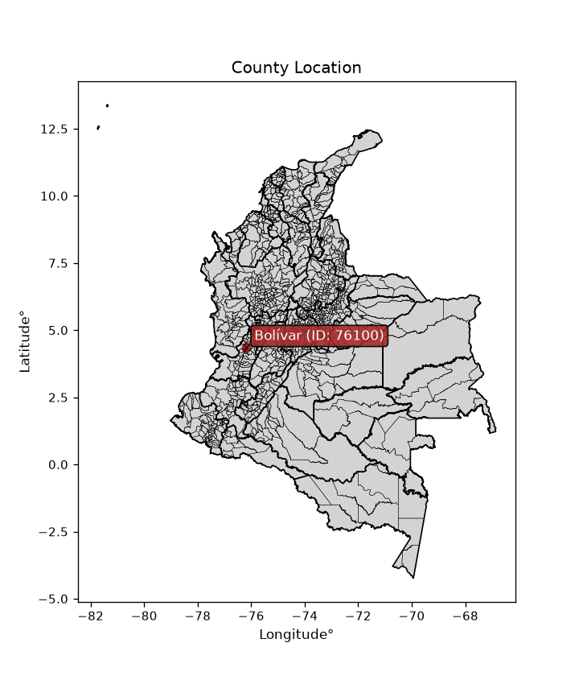
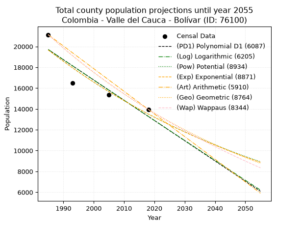
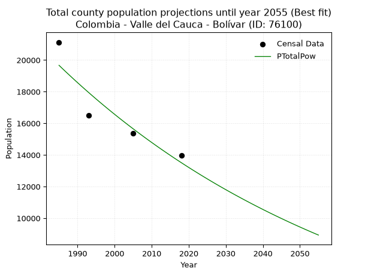
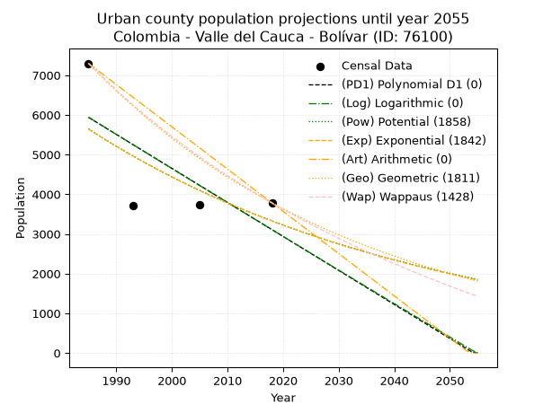
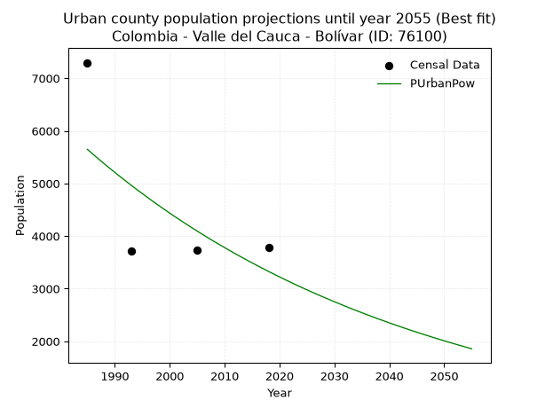
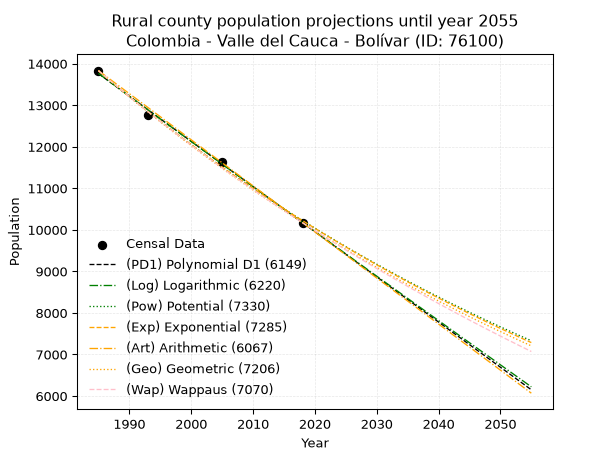
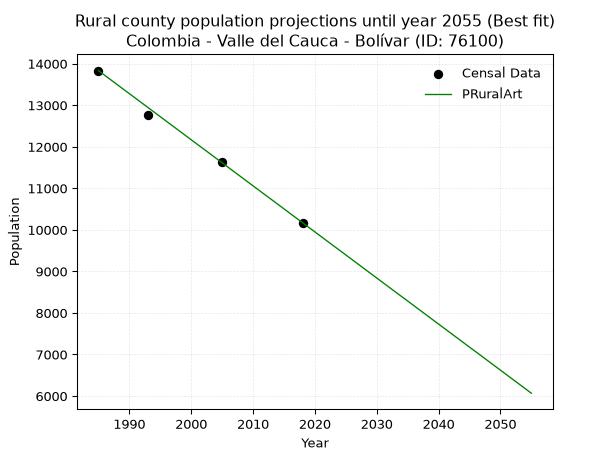

<div align="center">


</div>

# _“Population and Public Services Demand Projections (PPSD) until Year 2050 for Colombia - Valle del Cauca - Bolívar (ID: 76100)”_
Keywords: `population` `public-service` `projection` `lineal` `polynomial` `logarithmic` `potential` `exponential` `arithmetic` `geometric` `wappaus` `dane` `colombia` `south-america`

PPSD are analytical estimates used by governments and planners to anticipate future changes in population size, age distribution, and the resulting community needs for utilities, healthcare, education, and infrastructure as sizing future water treatment facilities, electrical grids, and road networks based on spatial growth.

<div align="center">

</img>

</div>


> **General running parameters**: • app_version: _v20260806_. • Python version: _3.14.7_. • Pandas version: _3.0.5_. • NumPy version: _2.5.1_. • Creates, save and include plots into reports (create_plot): _False_. • Projection until year: _2050_. • Process polynomial degree 2 and up: _False_. • Process Wappaus: _True_. • Process Wappaus: _True_. • Set negative values to zero: _True_. • Set infinite values to zero: _True_. • Drop dataset notes: _True_. 
<div align="center">

Dynamic map: [:earth_americas:Google](http://maps.google.com/maps?q=4.337846076,-76.1835827) [:earth_americas:OSM](https://www.openstreetmap.org/#map=18/4.337846076/-76.1835827&layers=P) [:earth_americas:Bing](https://www.bing.com/maps?cp=4.337846076~-76.1835827&lvl=18) [:earth_americas:Apple](https://maps.apple.com/frame?center=4.337846076%2C-76.1835827&span=0.003%2C0.006)

</div>


<div align="center">

```geojson
{
  "type": "Feature",
  "geometry": {
    "type": "Point", 
    "coordinates": [-76.1835827, 4.337846076]
  }, 
  "properties": {
    "Name": "Colombia - Valle del Cauca - Bolívar (ID: 76100)"
  }
}
```

</div>


## 0. Census Data (4 records)

Census data are official statistics collected by a government about the people and housing in a country. They usually include counts of total population, age, sex, race, income, education, and jobs.

📅Global census file: [Population.xlsx](../data/Population.xlsx)

| Source   |   Year |   CountryID | CountryName   |   StateID | StateName       |   CountyID | CountyName   |   PTotal |   PUrban |   PRural |
|:---------|-------:|------------:|:--------------|----------:|:----------------|-----------:|:-------------|---------:|---------:|---------:|
| DANE     |   1985 |          57 | Colombia      |        76 | Valle del Cauca |      76100 | Bolívar      |    21128 |     7297 |    13831 |
| DANE     |   1993 |          57 | Colombia      |        76 | Valle del Cauca |      76100 | Bolívar      |    16486 |     3716 |    12770 |
| DANE     |   2005 |          57 | Colombia      |        76 | Valle del Cauca |      76100 | Bolívar      |    15360 |     3726 |    11634 |
| DANE     |   2018 |          57 | Colombia      |        76 | Valle del Cauca |      76100 | Bolívar      |    13954 |     3783 |    10171 |

> 🔥Some records could had specific notes about the registered values or the corresponding urban or rural distribution.

📅[SUI-RUPS](https://www.datos.gov.co/Hacienda-y-Cr-dito-P-blico/Registro-nico-de-Prestadores-de-Servicios-P-blicos/4qkq-csdn/about_data) - Local public utility companies: [RUPS.csv](../data/RUPS.xlsx)

 | SERVICIO       | ESTADO    | NOMBRE                                                                                       | NIT         | DEPARTAMENTO_DOMICILIO   | MUNICIPIO_DOMICILIO   | DIRECCION                                                      |   TELEFONO | EMAIL                                   | TIPO_PRESTADOR                             | CLASIFICACION                 |
|:---------------|:----------|:---------------------------------------------------------------------------------------------|:------------|:-------------------------|:----------------------|:---------------------------------------------------------------|-----------:|:----------------------------------------|:-------------------------------------------|:------------------------------|
| ACUEDUCTO      | OPERATIVA | SOCIEDAD DE ACUEDUCTOS Y ALCANTARILLADOS DEL VALLE DEL CAUCA S.A.  E.S.P.                    | 890399032-8 | VALLE DEL CAUCA          | CALI                  | AVENIDA 5 N # 23 AN 41                                         |    6203400 | rosemary@acuavalle.gov.co               | SOCIEDADES (EMPRESA DE SERVICIOS PUBLICOS) | MAYOR O IGUAL A 5001 USUARIOS |
| ALCANTARILLADO | OPERATIVA | SOCIEDAD DE ACUEDUCTOS Y ALCANTARILLADOS DEL VALLE DEL CAUCA S.A.  E.S.P.                    | 890399032-8 | VALLE DEL CAUCA          | CALI                  | AVENIDA 5 N # 23 AN 41                                         |    6203400 | rosemary@acuavalle.gov.co               | SOCIEDADES (EMPRESA DE SERVICIOS PUBLICOS) | MAYOR O IGUAL A 5001 USUARIOS |
| ACUEDUCTO      | OPERATIVA | ASOCIACION DE USUARIOS ACUEDUCTO NARANJAL                                                    | 900182536-0 | VALLE DEL CAUCA          | BOLIVAR               | CALLE 5 NO. 5-23 NARANJAL                                      |    2224166 | ASOACUEDUCTONARANJAL@HOTMAIL.COM        | ORGANIZACION AUTORIZADA                    | HASTA 2500 SUSCRIPTORES       |
| ACUEDUCTO      | OPERATIVA | ASOCIACION DE USUARIOS DEL ACUEDUCTO RURAL COMUNITARIO DE LA VEREDA LA PLAZUELA              | 900332662-5 | VALLE DEL CAUCA          | BOLIVAR               | VEREDA LA PLAZUELA                                             |    3174378 | jcardona121058@hotmail.com              | ORGANIZACION AUTORIZADA                    | HASTA 2500 SUSCRIPTORES       |
| ACUEDUCTO      | OPERATIVA | ASOCIACION DE USUARIOS DEL SERVICIO COMUNITARIO RURAL DE AGUA Y ALCANTARILLADO LA MONTAÑUELA | 900225766-4 | VALLE DEL CAUCA          | BOLIVAR               | VEREDA LA MONTAÑUELA                                           |    3156343 | asociacionaguayalcantarillado@yahoo.com | ORGANIZACION AUTORIZADA                    | HASTA 2500 SUSCRIPTORES       |
| ACUEDUCTO      | OPERATIVA | ASOCIACION DE USUARIOS DEL ACUEDUCTO RURAL DE LAS VEREDAS EL BOSQUE LA ALDANA                | 900342940-0 | VALLE DEL CAUCA          | BOLIVAR               | CORREGIMIENTO DE LA TULIA MUNICIPIO DE BOLIVAR VALLE DEL CAUCA |    2297945 | contactenos@bolivar-valle.gov.co        | ORGANIZACION AUTORIZADA                    | HASTA 2500 SUSCRIPTORES       |

## 1. Total

### 1.1. Coefficients and Parameters

* (PD1) Polynomial Deg 1: -194.43115214773093, 405642.91208349884 (lineal)
* (Log) Logarithmic: -389537.61320273223, 2977610.5195124936
* (Pow) Potential: -22.771148693209895, 79.38755464013914
* (Exp) Exponential: -0.011367489280266336, 123929828587597.36
* (Art) Arithmetic: Year diff. 2018 - 1985 = 33, Population diff. 13954 - 21128 = -7174, Annual growth = -217.3939393939394
* (Geo) Geometric: Year diff. 2018 - 1985 = 33, Population diff. 13954 - 21128 = -7174, Annual growth % = -0.012492014882662827
* (Wap) Wappaus: i = -1.2393474681827683, Condition values only valid for < 200)

<sub>
Wappaus condition values: ['-0.00', '-1.24', '-2.48', '-3.72', '-4.96', '-6.20', '-7.44', '-8.68', '-9.91', '-11.15', '-12.39', '-13.63', '-14.87', '-16.11', '-17.35', '-18.59', '-19.83', '-21.07', '-22.31', '-23.55', '-24.79', '-26.03', '-27.27', '-28.50', '-29.74', '-30.98', '-32.22', '-33.46', '-34.70', '-35.94', '-37.18', '-38.42', '-39.66', '-40.90', '-42.14', '-43.38', '-44.62', '-45.86', '-47.10', '-48.33', '-49.57', '-50.81', '-52.05', '-53.29', '-54.53', '-55.77', '-57.01', '-58.25', '-59.49', '-60.73', '-61.97', '-63.21', '-64.45', '-65.69', '-66.92', '-68.16', '-69.40', '-70.64', '-71.88', '-73.12', '-74.36', '-75.60', '-76.84', '-78.08', '-79.32', '-80.56']
</sub>


### 1.2. Projected Dataset

|   Year |   CountyID |   PTotalPD1 |   PTotalLog |   PTotalPow |   PTotalExp |   PTotalArt |   PTotalGeo |   PTotalWap |
|-------:|-----------:|------------:|------------:|------------:|------------:|------------:|------------:|------------:|
|   1985 |      76100 |       19697 |       19706 |       19668 |       19659 |       21128 |       21128 |       21128 |
|   1986 |      76100 |       19503 |       19509 |       19444 |       19436 |       20911 |       20864 |       20868 |
|   1987 |      76100 |       19308 |       19313 |       19222 |       19217 |       20693 |       20603 |       20611 |
|   1988 |      76100 |       19114 |       19117 |       19003 |       18999 |       20476 |       20346 |       20357 |
|   1989 |      76100 |       18919 |       18921 |       18787 |       18785 |       20258 |       20092 |       20106 |
|   1990 |      76100 |       18725 |       18726 |       18573 |       18572 |       20041 |       19841 |       19858 |
|   1991 |      76100 |       18530 |       18530 |       18362 |       18362 |       19824 |       19593 |       19613 |
|   1992 |      76100 |       18336 |       18334 |       18153 |       18155 |       19606 |       19348 |       19371 |
|   1993 |      76100 |       18142 |       18139 |       17947 |       17950 |       19389 |       19107 |       19132 |
|   1994 |      76100 |       17947 |       17943 |       17743 |       17747 |       19171 |       18868 |       18896 |
|   1995 |      76100 |       17753 |       17748 |       17541 |       17546 |       18954 |       18632 |       18662 |
|   1996 |      76100 |       17558 |       17553 |       17342 |       17348 |       18737 |       18399 |       18431 |
|   1997 |      76100 |       17364 |       17358 |       17146 |       17152 |       18519 |       18170 |       18203 |
|   1998 |      76100 |       17169 |       17163 |       16951 |       16958 |       18302 |       17943 |       17978 |
|   1999 |      76100 |       16975 |       16968 |       16759 |       16766 |       18084 |       17719 |       17755 |
|   2000 |      76100 |       16781 |       16773 |       16570 |       16577 |       17867 |       17497 |       17534 |
|   2001 |      76100 |       16586 |       16578 |       16382 |       16389 |       17650 |       17279 |       17316 |
|   2002 |      76100 |       16392 |       16384 |       16197 |       16204 |       17432 |       17063 |       17101 |
|   2003 |      76100 |       16197 |       16189 |       16014 |       16021 |       17215 |       16850 |       16888 |
|   2004 |      76100 |       16003 |       15995 |       15833 |       15840 |       16998 |       16639 |       16677 |
|   2005 |      76100 |       15808 |       15800 |       15654 |       15661 |       16780 |       16431 |       16468 |
|   2006 |      76100 |       15614 |       15606 |       15477 |       15484 |       16563 |       16226 |       16262 |
|   2007 |      76100 |       15420 |       15412 |       15302 |       15309 |       16345 |       16023 |       16058 |
|   2008 |      76100 |       15225 |       15218 |       15130 |       15136 |       16128 |       15823 |       15857 |
|   2009 |      76100 |       15031 |       15024 |       14959 |       14965 |       15911 |       15625 |       15657 |
|   2010 |      76100 |       14836 |       14830 |       14791 |       14796 |       15693 |       15430 |       15460 |
|   2011 |      76100 |       14642 |       14637 |       14624 |       14628 |       15476 |       15238 |       15265 |
|   2012 |      76100 |       14447 |       14443 |       14459 |       14463 |       15258 |       15047 |       15071 |
|   2013 |      76100 |       14253 |       14249 |       14297 |       14300 |       15041 |       14859 |       14880 |
|   2014 |      76100 |       14059 |       14056 |       14136 |       14138 |       14824 |       14674 |       14691 |
|   2015 |      76100 |       13864 |       13862 |       13977 |       13978 |       14606 |       14490 |       14504 |
|   2016 |      76100 |       13670 |       13669 |       13820 |       13820 |       14389 |       14309 |       14319 |
|   2017 |      76100 |       13475 |       13476 |       13665 |       13664 |       14171 |       14131 |       14135 |
|   2018 |      76100 |       13281 |       13283 |       13511 |       13509 |       13954 |       13954 |       13954 |
|   2019 |      76100 |       13086 |       13090 |       13360 |       13357 |       13737 |       13780 |       13774 |
|   2020 |      76100 |       12892 |       12897 |       13210 |       13206 |       13519 |       13608 |       13597 |
|   2021 |      76100 |       12698 |       12704 |       13062 |       13056 |       13302 |       13438 |       13421 |
|   2022 |      76100 |       12503 |       12512 |       12916 |       12909 |       13084 |       13270 |       13247 |
|   2023 |      76100 |       12309 |       12319 |       12771 |       12763 |       12867 |       13104 |       13074 |
|   2024 |      76100 |       12114 |       12126 |       12628 |       12619 |       12650 |       12940 |       12904 |
|   2025 |      76100 |       11920 |       11934 |       12487 |       12476 |       12432 |       12779 |       12735 |
|   2026 |      76100 |       11725 |       11742 |       12347 |       12335 |       12215 |       12619 |       12567 |
|   2027 |      76100 |       11531 |       11550 |       12209 |       12196 |       11997 |       12461 |       12402 |
|   2028 |      76100 |       11337 |       11357 |       12073 |       12058 |       11780 |       12306 |       12237 |
|   2029 |      76100 |       11142 |       11165 |       11938 |       11922 |       11563 |       12152 |       12075 |
|   2030 |      76100 |       10948 |       10973 |       11805 |       11787 |       11345 |       12000 |       11914 |
|   2031 |      76100 |       10753 |       10782 |       11673 |       11654 |       11128 |       11850 |       11755 |
|   2032 |      76100 |       10559 |       10590 |       11543 |       11522 |       10910 |       11702 |       11597 |
|   2033 |      76100 |       10364 |       10398 |       11415 |       11392 |       10693 |       11556 |       11441 |
|   2034 |      76100 |       10170 |       10207 |       11288 |       11263 |       10476 |       11412 |       11286 |
|   2035 |      76100 |        9976 |       10015 |       11162 |       11136 |       10258 |       11269 |       11133 |
|   2036 |      76100 |        9781 |        9824 |       11038 |       11010 |       10041 |       11128 |       10981 |
|   2037 |      76100 |        9587 |        9633 |       10915 |       10885 |        9824 |       10989 |       10830 |
|   2038 |      76100 |        9392 |        9441 |       10794 |       10762 |        9606 |       10852 |       10681 |
|   2039 |      76100 |        9198 |        9250 |       10674 |       10641 |        9389 |       10716 |       10533 |
|   2040 |      76100 |        9003 |        9059 |       10555 |       10520 |        9171 |       10583 |       10387 |
|   2041 |      76100 |        8809 |        8868 |       10438 |       10401 |        8954 |       10450 |       10242 |
|   2042 |      76100 |        8614 |        8678 |       10322 |       10284 |        8737 |       10320 |       10098 |
|   2043 |      76100 |        8420 |        8487 |       10208 |       10168 |        8519 |       10191 |        9956 |
|   2044 |      76100 |        8226 |        8296 |       10095 |       10053 |        8302 |       10064 |        9815 |
|   2045 |      76100 |        8031 |        8106 |        9983 |        9939 |        8084 |        9938 |        9675 |
|   2046 |      76100 |        7837 |        7915 |        9873 |        9827 |        7867 |        9814 |        9537 |
|   2047 |      76100 |        7642 |        7725 |        9763 |        9716 |        7650 |        9691 |        9399 |
|   2048 |      76100 |        7448 |        7535 |        9655 |        9606 |        7432 |        9570 |        9263 |
|   2049 |      76100 |        7253 |        7344 |        9549 |        9497 |        7215 |        9451 |        9129 |
|   2050 |      76100 |        7059 |        7154 |        9443 |        9390 |        6997 |        9333 |        8995 |
<div align="center">

</img>

</div>


### 1.3. Best fit with absolute and relative error (%)

Relative error puts that difference into context by dividing the absolute error by the true value, creating a unitless ratio or percentage that shows the scale of the mistake.

Absolute and relative error

|   Year | Source   |   CountryID | CountryName   |   StateID | StateName       |   CountyID_x | CountyName   |   PTotal |   PUrban |   PRural |   CountyID_y |   PTotalPD1 |   PTotalLog |   PTotalPow |   PTotalExp |   PTotalArt |   PTotalGeo |   PTotalWap |   PTotalPD1AbsError |   PTotalLogAbsError |   PTotalPowAbsError |   PTotalExpAbsError |   PTotalArtAbsError |   PTotalGeoAbsError |   PTotalWapAbsError |   PTotalPD1RelError |   PTotalLogRelError |   PTotalPowRelError |   PTotalExpRelError |   PTotalArtRelError |   PTotalGeoRelError |   PTotalWapRelError |
|-------:|:---------|------------:|:--------------|----------:|:----------------|-------------:|:-------------|---------:|---------:|---------:|-------------:|------------:|------------:|------------:|------------:|------------:|------------:|------------:|--------------------:|--------------------:|--------------------:|--------------------:|--------------------:|--------------------:|--------------------:|--------------------:|--------------------:|--------------------:|--------------------:|--------------------:|--------------------:|--------------------:|
|   1985 | DANE     |          57 | Colombia      |        76 | Valle del Cauca |        76100 | Bolívar      |    21128 |     7297 |    13831 |        76100 |       19697 |       19706 |       19668 |       19659 |       21128 |       21128 |       21128 |                1431 |                1422 |                1460 |                1469 |                   0 |                   0 |                   0 |             6.773   |             6.73041 |             6.91026 |             6.95286 |             0       |             0       |             0       |
|   1993 | DANE     |          57 | Colombia      |        76 | Valle del Cauca |        76100 | Bolívar      |    16486 |     3716 |    12770 |        76100 |       18142 |       18139 |       17947 |       17950 |       19389 |       19107 |       19132 |                1656 |                1653 |                1461 |                1464 |                2903 |                2621 |                2646 |            10.0449  |            10.0267  |             8.86206 |             8.88026 |            17.6089  |            15.8983  |            16.05    |
|   2005 | DANE     |          57 | Colombia      |        76 | Valle del Cauca |        76100 | Bolívar      |    15360 |     3726 |    11634 |        76100 |       15808 |       15800 |       15654 |       15661 |       16780 |       16431 |       16468 |                 448 |                 440 |                 294 |                 301 |                1420 |                1071 |                1108 |             2.91667 |             2.86458 |             1.91406 |             1.95964 |             9.24479 |             6.97266 |             7.21354 |
|   2018 | DANE     |          57 | Colombia      |        76 | Valle del Cauca |        76100 | Bolívar      |    13954 |     3783 |    10171 |        76100 |       13281 |       13283 |       13511 |       13509 |       13954 |       13954 |       13954 |                 673 |                 671 |                 443 |                 445 |                   0 |                   0 |                   0 |             4.82299 |             4.80866 |             3.17472 |             3.18905 |             0       |             0       |             0       |

Relative error mean

| Method    |   RelError | Best   |
|:----------|-----------:|:-------|
| PTotalPD1 |    6.13939 |        |
| PTotalLog |    6.10758 |        |
| PTotalPow |    5.21528 | True   |
| PTotalExp |    5.24545 |        |
| PTotalArt |    6.71342 |        |
| PTotalGeo |    5.71775 |        |
| PTotalWap |    5.81588 |        |

💙Best method: _**PTotalPow**_
<div align="center">

</img>

</div>


### 1.4. Fresh water supply demand in liters per capita per day (lpcd)

The fresh water supply demand typically ranges from 100 to 300 liters per capita per day (lpcd) for standard domestic and municipal planning, though absolute survival minimums set by the World Health Organization are as low as 7.5 to 20 liters per day, and total consumption in high-income nations can exceed 400 liters.

> `CZ`: Level in meters above the sea level (masl)<br> `WS`: Fresh water supply demand in liters per capita per day (lpcd or l/h/d)<br> `WSAll`: Zonal fresh water supply demand in liters per second (l/s)<br> `A`: Zonal area in square meters<br> `DP`: Population density (people/hectare or p/ha)

Reference values (RAS Colombia)

|    CZ |   WS |
|------:|-----:|
|  1000 |  120 |
|  2000 |  130 |
| 99999 |  140 |

County shapefile geometry properties and water supply values

|   CountyID |      ATotal |   CZTotal |   WSTotal |
|-----------:|------------:|----------:|----------:|
|      76100 | 7.43778e+08 |    1460.8 |       130 |

Projected values for best method: PTotalPow

|   CountyID |   Year |   PTotalPow |   DPTotal |   WSTotal |   WSTotalAll |
|-----------:|-------:|------------:|----------:|----------:|-------------:|
|      76100 |   1985 |       19668 |      0.26 |       130 |      29.5931 |
|      76100 |   1986 |       19444 |      0.26 |       130 |      29.256  |
|      76100 |   1987 |       19222 |      0.26 |       130 |      28.922  |
|      76100 |   1988 |       19003 |      0.26 |       130 |      28.5925 |
|      76100 |   1989 |       18787 |      0.25 |       130 |      28.2675 |
|      76100 |   1990 |       18573 |      0.25 |       130 |      27.9455 |
|      76100 |   1991 |       18362 |      0.25 |       130 |      27.628  |
|      76100 |   1992 |       18153 |      0.24 |       130 |      27.3135 |
|      76100 |   1993 |       17947 |      0.24 |       130 |      27.0036 |
|      76100 |   1994 |       17743 |      0.24 |       130 |      26.6966 |
|      76100 |   1995 |       17541 |      0.24 |       130 |      26.3927 |
|      76100 |   1996 |       17342 |      0.23 |       130 |      26.0933 |
|      76100 |   1997 |       17146 |      0.23 |       130 |      25.7984 |
|      76100 |   1998 |       16951 |      0.23 |       130 |      25.505  |
|      76100 |   1999 |       16759 |      0.23 |       130 |      25.2161 |
|      76100 |   2000 |       16570 |      0.22 |       130 |      24.9317 |
|      76100 |   2001 |       16382 |      0.22 |       130 |      24.6488 |
|      76100 |   2002 |       16197 |      0.22 |       130 |      24.3705 |
|      76100 |   2003 |       16014 |      0.22 |       130 |      24.0951 |
|      76100 |   2004 |       15833 |      0.21 |       130 |      23.8228 |
|      76100 |   2005 |       15654 |      0.21 |       130 |      23.5535 |
|      76100 |   2006 |       15477 |      0.21 |       130 |      23.2872 |
|      76100 |   2007 |       15302 |      0.21 |       130 |      23.0238 |
|      76100 |   2008 |       15130 |      0.2  |       130 |      22.765  |
|      76100 |   2009 |       14959 |      0.2  |       130 |      22.5078 |
|      76100 |   2010 |       14791 |      0.2  |       130 |      22.255  |
|      76100 |   2011 |       14624 |      0.2  |       130 |      22.0037 |
|      76100 |   2012 |       14459 |      0.19 |       130 |      21.7554 |
|      76100 |   2013 |       14297 |      0.19 |       130 |      21.5117 |
|      76100 |   2014 |       14136 |      0.19 |       130 |      21.2694 |
|      76100 |   2015 |       13977 |      0.19 |       130 |      21.0302 |
|      76100 |   2016 |       13820 |      0.19 |       130 |      20.794  |
|      76100 |   2017 |       13665 |      0.18 |       130 |      20.5608 |
|      76100 |   2018 |       13511 |      0.18 |       130 |      20.3291 |
|      76100 |   2019 |       13360 |      0.18 |       130 |      20.1019 |
|      76100 |   2020 |       13210 |      0.18 |       130 |      19.8762 |
|      76100 |   2021 |       13062 |      0.18 |       130 |      19.6535 |
|      76100 |   2022 |       12916 |      0.17 |       130 |      19.4338 |
|      76100 |   2023 |       12771 |      0.17 |       130 |      19.2156 |
|      76100 |   2024 |       12628 |      0.17 |       130 |      19.0005 |
|      76100 |   2025 |       12487 |      0.17 |       130 |      18.7883 |
|      76100 |   2026 |       12347 |      0.17 |       130 |      18.5777 |
|      76100 |   2027 |       12209 |      0.16 |       130 |      18.37   |
|      76100 |   2028 |       12073 |      0.16 |       130 |      18.1654 |
|      76100 |   2029 |       11938 |      0.16 |       130 |      17.9623 |
|      76100 |   2030 |       11805 |      0.16 |       130 |      17.7622 |
|      76100 |   2031 |       11673 |      0.16 |       130 |      17.5635 |
|      76100 |   2032 |       11543 |      0.16 |       130 |      17.3679 |
|      76100 |   2033 |       11415 |      0.15 |       130 |      17.1753 |
|      76100 |   2034 |       11288 |      0.15 |       130 |      16.9843 |
|      76100 |   2035 |       11162 |      0.15 |       130 |      16.7947 |
|      76100 |   2036 |       11038 |      0.15 |       130 |      16.6081 |
|      76100 |   2037 |       10915 |      0.15 |       130 |      16.423  |
|      76100 |   2038 |       10794 |      0.15 |       130 |      16.241  |
|      76100 |   2039 |       10674 |      0.14 |       130 |      16.0604 |
|      76100 |   2040 |       10555 |      0.14 |       130 |      15.8814 |
|      76100 |   2041 |       10438 |      0.14 |       130 |      15.7053 |
|      76100 |   2042 |       10322 |      0.14 |       130 |      15.5308 |
|      76100 |   2043 |       10208 |      0.14 |       130 |      15.3593 |
|      76100 |   2044 |       10095 |      0.14 |       130 |      15.1892 |
|      76100 |   2045 |        9983 |      0.13 |       130 |      15.0207 |
|      76100 |   2046 |        9873 |      0.13 |       130 |      14.8552 |
|      76100 |   2047 |        9763 |      0.13 |       130 |      14.6897 |
|      76100 |   2048 |        9655 |      0.13 |       130 |      14.5272 |
|      76100 |   2049 |        9549 |      0.13 |       130 |      14.3677 |
|      76100 |   2050 |        9443 |      0.13 |       130 |      14.2082 |

## 2. Urban

### 2.1. Coefficients and Parameters

* (PD1) Polynomial Deg 1: -85.70614211160174, 176064.21075873135 (lineal)
* (Log) Logarithmic: -171902.29116329778, 1311261.1926707348
* (Pow) Potential: -32.08277257511488, 109.55324014780213
* (Exp) Exponential: -0.01599516125522551, 3.471618579884817e+17
* (Art) Arithmetic: Year diff. 2018 - 1985 = 33, Population diff. 3783 - 7297 = -3514, Annual growth = -106.48484848484848
* (Geo) Geometric: Year diff. 2018 - 1985 = 33, Population diff. 3783 - 7297 = -3514, Annual growth % = -0.01971060834981786
* (Wap) Wappaus: i = -1.922109178426868, Condition values only valid for < 200)

<sub>
Wappaus condition values: ['-0.00', '-1.92', '-3.84', '-5.77', '-7.69', '-9.61', '-11.53', '-13.45', '-15.38', '-17.30', '-19.22', '-21.14', '-23.07', '-24.99', '-26.91', '-28.83', '-30.75', '-32.68', '-34.60', '-36.52', '-38.44', '-40.36', '-42.29', '-44.21', '-46.13', '-48.05', '-49.97', '-51.90', '-53.82', '-55.74', '-57.66', '-59.59', '-61.51', '-63.43', '-65.35', '-67.27', '-69.20', '-71.12', '-73.04', '-74.96', '-76.88', '-78.81', '-80.73', '-82.65', '-84.57', '-86.49', '-88.42', '-90.34', '-92.26', '-94.18', '-96.11', '-98.03', '-99.95', '-101.87', '-103.79', '-105.72', '-107.64', '-109.56', '-111.48', '-113.40', '-115.33', '-117.25', '-119.17', '-121.09', '-123.01', '-124.94']
</sub>


### 2.2. Projected Dataset

|   Year |   CountyID |   PUrbanPD1 |   PUrbanLog |   PUrbanPow |   PUrbanExp |   PUrbanArt |   PUrbanGeo |   PUrbanWap |
|-------:|-----------:|------------:|------------:|------------:|------------:|------------:|------------:|------------:|
|   1985 |      76100 |        5938 |        5943 |        5649 |        5643 |        7297 |        7297 |        7297 |
|   1986 |      76100 |        5852 |        5856 |        5558 |        5553 |        7191 |        7153 |        7158 |
|   1987 |      76100 |        5766 |        5770 |        5469 |        5465 |        7084 |        7012 |        7022 |
|   1988 |      76100 |        5680 |        5683 |        5381 |        5379 |        6978 |        6874 |        6888 |
|   1989 |      76100 |        5595 |        5597 |        5295 |        5293 |        6871 |        6738 |        6757 |
|   1990 |      76100 |        5509 |        5510 |        5211 |        5209 |        6765 |        6606 |        6628 |
|   1991 |      76100 |        5423 |        5424 |        5127 |        5127 |        6658 |        6475 |        6501 |
|   1992 |      76100 |        5338 |        5338 |        5045 |        5045 |        6552 |        6348 |        6377 |
|   1993 |      76100 |        5252 |        5251 |        4965 |        4965 |        6445 |        6223 |        6255 |
|   1994 |      76100 |        5166 |        5165 |        4885 |        4886 |        6339 |        6100 |        6135 |
|   1995 |      76100 |        5080 |        5079 |        4808 |        4809 |        6232 |        5980 |        6017 |
|   1996 |      76100 |        4995 |        4993 |        4731 |        4733 |        6126 |        5862 |        5902 |
|   1997 |      76100 |        4909 |        4907 |        4655 |        4657 |        6019 |        5746 |        5788 |
|   1998 |      76100 |        4823 |        4821 |        4581 |        4584 |        5913 |        5633 |        5676 |
|   1999 |      76100 |        4738 |        4735 |        4508 |        4511 |        5806 |        5522 |        5566 |
|   2000 |      76100 |        4652 |        4649 |        4437 |        4439 |        5700 |        5413 |        5458 |
|   2001 |      76100 |        4566 |        4563 |        4366 |        4369 |        5593 |        5307 |        5352 |
|   2002 |      76100 |        4481 |        4477 |        4297 |        4300 |        5487 |        5202 |        5247 |
|   2003 |      76100 |        4395 |        4391 |        4228 |        4231 |        5380 |        5099 |        5145 |
|   2004 |      76100 |        4309 |        4305 |        4161 |        4164 |        5274 |        4999 |        5044 |
|   2005 |      76100 |        4223 |        4219 |        4095 |        4098 |        5167 |        4900 |        4944 |
|   2006 |      76100 |        4138 |        4134 |        4030 |        4033 |        5061 |        4804 |        4846 |
|   2007 |      76100 |        4052 |        4048 |        3966 |        3969 |        4954 |        4709 |        4750 |
|   2008 |      76100 |        3966 |        3962 |        3903 |        3906 |        4848 |        4616 |        4655 |
|   2009 |      76100 |        3881 |        3877 |        3841 |        3844 |        4741 |        4525 |        4562 |
|   2010 |      76100 |        3795 |        3791 |        3781 |        3783 |        4635 |        4436 |        4470 |
|   2011 |      76100 |        3709 |        3706 |        3721 |        3723 |        4528 |        4349 |        4379 |
|   2012 |      76100 |        3623 |        3620 |        3662 |        3664 |        4422 |        4263 |        4290 |
|   2013 |      76100 |        3538 |        3535 |        3604 |        3606 |        4315 |        4179 |        4203 |
|   2014 |      76100 |        3452 |        3450 |        3547 |        3549 |        4209 |        4097 |        4116 |
|   2015 |      76100 |        3366 |        3364 |        3491 |        3492 |        4102 |        4016 |        4031 |
|   2016 |      76100 |        3281 |        3279 |        3436 |        3437 |        3996 |        3937 |        3947 |
|   2017 |      76100 |        3195 |        3194 |        3382 |        3382 |        3889 |        3859 |        3864 |
|   2018 |      76100 |        3109 |        3108 |        3328 |        3329 |        3783 |        3783 |        3783 |
|   2019 |      76100 |        3024 |        3023 |        3276 |        3276 |        3677 |        3708 |        3703 |
|   2020 |      76100 |        2938 |        2938 |        3224 |        3224 |        3570 |        3635 |        3624 |
|   2021 |      76100 |        2852 |        2853 |        3173 |        3173 |        3464 |        3564 |        3546 |
|   2022 |      76100 |        2766 |        2768 |        3123 |        3122 |        3357 |        3493 |        3469 |
|   2023 |      76100 |        2681 |        2683 |        3074 |        3073 |        3251 |        3425 |        3393 |
|   2024 |      76100 |        2595 |        2598 |        3026 |        3024 |        3144 |        3357 |        3318 |
|   2025 |      76100 |        2509 |        2513 |        2978 |        2976 |        3038 |        3291 |        3245 |
|   2026 |      76100 |        2424 |        2428 |        2931 |        2929 |        2931 |        3226 |        3172 |
|   2027 |      76100 |        2338 |        2343 |        2885 |        2882 |        2825 |        3162 |        3100 |
|   2028 |      76100 |        2252 |        2259 |        2840 |        2837 |        2718 |        3100 |        3030 |
|   2029 |      76100 |        2166 |        2174 |        2796 |        2792 |        2612 |        3039 |        2960 |
|   2030 |      76100 |        2081 |        2089 |        2752 |        2747 |        2505 |        2979 |        2891 |
|   2031 |      76100 |        1995 |        2005 |        2709 |        2704 |        2399 |        2920 |        2823 |
|   2032 |      76100 |        1909 |        1920 |        2666 |        2661 |        2292 |        2863 |        2756 |
|   2033 |      76100 |        1824 |        1835 |        2624 |        2619 |        2186 |        2806 |        2690 |
|   2034 |      76100 |        1738 |        1751 |        2583 |        2577 |        2079 |        2751 |        2625 |
|   2035 |      76100 |        1652 |        1666 |        2543 |        2536 |        1973 |        2697 |        2560 |
|   2036 |      76100 |        1567 |        1582 |        2503 |        2496 |        1866 |        2644 |        2497 |
|   2037 |      76100 |        1481 |        1498 |        2464 |        2456 |        1760 |        2592 |        2434 |
|   2038 |      76100 |        1395 |        1413 |        2425 |        2417 |        1653 |        2541 |        2372 |
|   2039 |      76100 |        1309 |        1329 |        2388 |        2379 |        1547 |        2490 |        2311 |
|   2040 |      76100 |        1224 |        1245 |        2350 |        2341 |        1440 |        2441 |        2250 |
|   2041 |      76100 |        1138 |        1160 |        2314 |        2304 |        1334 |        2393 |        2191 |
|   2042 |      76100 |        1052 |        1076 |        2278 |        2268 |        1227 |        2346 |        2132 |
|   2043 |      76100 |         967 |         992 |        2242 |        2232 |        1121 |        2300 |        2074 |
|   2044 |      76100 |         881 |         908 |        2207 |        2196 |        1014 |        2254 |        2016 |
|   2045 |      76100 |         795 |         824 |        2173 |        2161 |         908 |        2210 |        1959 |
|   2046 |      76100 |         709 |         740 |        2139 |        2127 |         801 |        2166 |        1903 |
|   2047 |      76100 |         624 |         656 |        2106 |        2093 |         695 |        2124 |        1848 |
|   2048 |      76100 |         538 |         572 |        2073 |        2060 |         588 |        2082 |        1793 |
|   2049 |      76100 |         452 |         488 |        2041 |        2027 |         482 |        2041 |        1739 |
|   2050 |      76100 |         367 |         404 |        2009 |        1995 |         375 |        2001 |        1686 |
<div align="center">

</img>

</div>


### 2.3. Best fit with absolute and relative error (%)

Relative error puts that difference into context by dividing the absolute error by the true value, creating a unitless ratio or percentage that shows the scale of the mistake.

Absolute and relative error

|   Year | Source   |   CountryID | CountryName   |   StateID | StateName       |   CountyID_x | CountyName   |   PTotal |   PUrban |   PRural |   CountyID_y |   PUrbanPD1 |   PUrbanLog |   PUrbanPow |   PUrbanExp |   PUrbanArt |   PUrbanGeo |   PUrbanWap |   PUrbanPD1AbsError |   PUrbanLogAbsError |   PUrbanPowAbsError |   PUrbanExpAbsError |   PUrbanArtAbsError |   PUrbanGeoAbsError |   PUrbanWapAbsError |   PUrbanPD1RelError |   PUrbanLogRelError |   PUrbanPowRelError |   PUrbanExpRelError |   PUrbanArtRelError |   PUrbanGeoRelError |   PUrbanWapRelError |
|-------:|:---------|------------:|:--------------|----------:|:----------------|-------------:|:-------------|---------:|---------:|---------:|-------------:|------------:|------------:|------------:|------------:|------------:|------------:|------------:|--------------------:|--------------------:|--------------------:|--------------------:|--------------------:|--------------------:|--------------------:|--------------------:|--------------------:|--------------------:|--------------------:|--------------------:|--------------------:|--------------------:|
|   1985 | DANE     |          57 | Colombia      |        76 | Valle del Cauca |        76100 | Bolívar      |    21128 |     7297 |    13831 |        76100 |        5938 |        5943 |        5649 |        5643 |        7297 |        7297 |        7297 |                1359 |                1354 |                1648 |                1654 |                   0 |                   0 |                   0 |             18.6241 |             18.5556 |            22.5846  |             22.6668 |              0      |              0      |              0      |
|   1993 | DANE     |          57 | Colombia      |        76 | Valle del Cauca |        76100 | Bolívar      |    16486 |     3716 |    12770 |        76100 |        5252 |        5251 |        4965 |        4965 |        6445 |        6223 |        6255 |                1536 |                1535 |                1249 |                1249 |                2729 |                2507 |                2539 |             41.3348 |             41.3079 |            33.6114  |             33.6114 |             73.4392 |             67.465  |             68.3262 |
|   2005 | DANE     |          57 | Colombia      |        76 | Valle del Cauca |        76100 | Bolívar      |    15360 |     3726 |    11634 |        76100 |        4223 |        4219 |        4095 |        4098 |        5167 |        4900 |        4944 |                 497 |                 493 |                 369 |                 372 |                1441 |                1174 |                1218 |             13.3387 |             13.2313 |             9.90338 |              9.9839 |             38.6742 |             31.5083 |             32.6892 |
|   2018 | DANE     |          57 | Colombia      |        76 | Valle del Cauca |        76100 | Bolívar      |    13954 |     3783 |    10171 |        76100 |        3109 |        3108 |        3328 |        3329 |        3783 |        3783 |        3783 |                 674 |                 675 |                 455 |                 454 |                   0 |                   0 |                   0 |             17.8165 |             17.843  |            12.0275  |             12.0011 |              0      |              0      |              0      |

Relative error mean

| Method    |   RelError | Best   |
|:----------|-----------:|:-------|
| PUrbanPD1 |    22.7785 |        |
| PUrbanLog |    22.7344 |        |
| PUrbanPow |    19.5317 | True   |
| PUrbanExp |    19.5658 |        |
| PUrbanArt |    28.0283 |        |
| PUrbanGeo |    24.7433 |        |
| PUrbanWap |    25.2538 |        |

💙Best method: _**PUrbanPow**_
<div align="center">

</img>

</div>


### 2.4. Fresh water supply demand in liters per capita per day (lpcd)

The fresh water supply demand typically ranges from 100 to 300 liters per capita per day (lpcd) for standard domestic and municipal planning, though absolute survival minimums set by the World Health Organization are as low as 7.5 to 20 liters per day, and total consumption in high-income nations can exceed 400 liters.

> `CZ`: Level in meters above the sea level (masl)<br> `WS`: Fresh water supply demand in liters per capita per day (lpcd or l/h/d)<br> `WSAll`: Zonal fresh water supply demand in liters per second (l/s)<br> `A`: Zonal area in square meters<br> `DP`: Population density (people/hectare or p/ha)

Reference values (RAS Colombia)

|    CZ |   WS |
|------:|-----:|
|  1000 |  120 |
|  2000 |  130 |
| 99999 |  140 |

County shapefile geometry properties and water supply values

|   CountyID |      AUrban |   CZUrban |   WSUrban |
|-----------:|------------:|----------:|----------:|
|      76100 | 1.10561e+06 |   932.869 |       120 |

Projected values for best method: PUrbanPow

|   CountyID |   Year |   PUrbanPow |   DPUrban |   WSUrban |   WSUrbanAll |
|-----------:|-------:|------------:|----------:|----------:|-------------:|
|      76100 |   1985 |        5649 |     51.09 |       120 |      7.84583 |
|      76100 |   1986 |        5558 |     50.27 |       120 |      7.71944 |
|      76100 |   1987 |        5469 |     49.47 |       120 |      7.59583 |
|      76100 |   1988 |        5381 |     48.67 |       120 |      7.47361 |
|      76100 |   1989 |        5295 |     47.89 |       120 |      7.35417 |
|      76100 |   1990 |        5211 |     47.13 |       120 |      7.2375  |
|      76100 |   1991 |        5127 |     46.37 |       120 |      7.12083 |
|      76100 |   1992 |        5045 |     45.63 |       120 |      7.00694 |
|      76100 |   1993 |        4965 |     44.91 |       120 |      6.89583 |
|      76100 |   1994 |        4885 |     44.18 |       120 |      6.78472 |
|      76100 |   1995 |        4808 |     43.49 |       120 |      6.67778 |
|      76100 |   1996 |        4731 |     42.79 |       120 |      6.57083 |
|      76100 |   1997 |        4655 |     42.1  |       120 |      6.46528 |
|      76100 |   1998 |        4581 |     41.43 |       120 |      6.3625  |
|      76100 |   1999 |        4508 |     40.77 |       120 |      6.26111 |
|      76100 |   2000 |        4437 |     40.13 |       120 |      6.1625  |
|      76100 |   2001 |        4366 |     39.49 |       120 |      6.06389 |
|      76100 |   2002 |        4297 |     38.87 |       120 |      5.96806 |
|      76100 |   2003 |        4228 |     38.24 |       120 |      5.87222 |
|      76100 |   2004 |        4161 |     37.64 |       120 |      5.77917 |
|      76100 |   2005 |        4095 |     37.04 |       120 |      5.6875  |
|      76100 |   2006 |        4030 |     36.45 |       120 |      5.59722 |
|      76100 |   2007 |        3966 |     35.87 |       120 |      5.50833 |
|      76100 |   2008 |        3903 |     35.3  |       120 |      5.42083 |
|      76100 |   2009 |        3841 |     34.74 |       120 |      5.33472 |
|      76100 |   2010 |        3781 |     34.2  |       120 |      5.25139 |
|      76100 |   2011 |        3721 |     33.66 |       120 |      5.16806 |
|      76100 |   2012 |        3662 |     33.12 |       120 |      5.08611 |
|      76100 |   2013 |        3604 |     32.6  |       120 |      5.00556 |
|      76100 |   2014 |        3547 |     32.08 |       120 |      4.92639 |
|      76100 |   2015 |        3491 |     31.58 |       120 |      4.84861 |
|      76100 |   2016 |        3436 |     31.08 |       120 |      4.77222 |
|      76100 |   2017 |        3382 |     30.59 |       120 |      4.69722 |
|      76100 |   2018 |        3328 |     30.1  |       120 |      4.62222 |
|      76100 |   2019 |        3276 |     29.63 |       120 |      4.55    |
|      76100 |   2020 |        3224 |     29.16 |       120 |      4.47778 |
|      76100 |   2021 |        3173 |     28.7  |       120 |      4.40694 |
|      76100 |   2022 |        3123 |     28.25 |       120 |      4.3375  |
|      76100 |   2023 |        3074 |     27.8  |       120 |      4.26944 |
|      76100 |   2024 |        3026 |     27.37 |       120 |      4.20278 |
|      76100 |   2025 |        2978 |     26.94 |       120 |      4.13611 |
|      76100 |   2026 |        2931 |     26.51 |       120 |      4.07083 |
|      76100 |   2027 |        2885 |     26.09 |       120 |      4.00694 |
|      76100 |   2028 |        2840 |     25.69 |       120 |      3.94444 |
|      76100 |   2029 |        2796 |     25.29 |       120 |      3.88333 |
|      76100 |   2030 |        2752 |     24.89 |       120 |      3.82222 |
|      76100 |   2031 |        2709 |     24.5  |       120 |      3.7625  |
|      76100 |   2032 |        2666 |     24.11 |       120 |      3.70278 |
|      76100 |   2033 |        2624 |     23.73 |       120 |      3.64444 |
|      76100 |   2034 |        2583 |     23.36 |       120 |      3.5875  |
|      76100 |   2035 |        2543 |     23    |       120 |      3.53194 |
|      76100 |   2036 |        2503 |     22.64 |       120 |      3.47639 |
|      76100 |   2037 |        2464 |     22.29 |       120 |      3.42222 |
|      76100 |   2038 |        2425 |     21.93 |       120 |      3.36806 |
|      76100 |   2039 |        2388 |     21.6  |       120 |      3.31667 |
|      76100 |   2040 |        2350 |     21.26 |       120 |      3.26389 |
|      76100 |   2041 |        2314 |     20.93 |       120 |      3.21389 |
|      76100 |   2042 |        2278 |     20.6  |       120 |      3.16389 |
|      76100 |   2043 |        2242 |     20.28 |       120 |      3.11389 |
|      76100 |   2044 |        2207 |     19.96 |       120 |      3.06528 |
|      76100 |   2045 |        2173 |     19.65 |       120 |      3.01806 |
|      76100 |   2046 |        2139 |     19.35 |       120 |      2.97083 |
|      76100 |   2047 |        2106 |     19.05 |       120 |      2.925   |
|      76100 |   2048 |        2073 |     18.75 |       120 |      2.87917 |
|      76100 |   2049 |        2041 |     18.46 |       120 |      2.83472 |
|      76100 |   2050 |        2009 |     18.17 |       120 |      2.79028 |

## 3. Rural

### 3.1. Coefficients and Parameters

* (PD1) Polynomial Deg 1: -108.72501003612906, 229578.70132476717 (lineal)
* (Log) Logarithmic: -217635.32203943457, 1666349.32684176
* (Pow) Potential: -18.31586010576747, 64.54207753011853
* (Exp) Exponential: -0.009151119191696942, 1070505750637.1376
* (Art) Arithmetic: Year diff. 2018 - 1985 = 33, Population diff. 10171 - 13831 = -3660, Annual growth = -110.9090909090909
* (Geo) Geometric: Year diff. 2018 - 1985 = 33, Population diff. 10171 - 13831 = -3660, Annual growth % = -0.009271056753910156
* (Wap) Wappaus: i = -0.9241654104582194, Condition values only valid for < 200)

<sub>
Wappaus condition values: ['-0.00', '-0.92', '-1.85', '-2.77', '-3.70', '-4.62', '-5.54', '-6.47', '-7.39', '-8.32', '-9.24', '-10.17', '-11.09', '-12.01', '-12.94', '-13.86', '-14.79', '-15.71', '-16.63', '-17.56', '-18.48', '-19.41', '-20.33', '-21.26', '-22.18', '-23.10', '-24.03', '-24.95', '-25.88', '-26.80', '-27.72', '-28.65', '-29.57', '-30.50', '-31.42', '-32.35', '-33.27', '-34.19', '-35.12', '-36.04', '-36.97', '-37.89', '-38.81', '-39.74', '-40.66', '-41.59', '-42.51', '-43.44', '-44.36', '-45.28', '-46.21', '-47.13', '-48.06', '-48.98', '-49.90', '-50.83', '-51.75', '-52.68', '-53.60', '-54.53', '-55.45', '-56.37', '-57.30', '-58.22', '-59.15', '-60.07']
</sub>


### 3.2. Projected Dataset

|   Year |   CountyID |   PRuralPD1 |   PRuralLog |   PRuralPow |   PRuralExp |   PRuralArt |   PRuralGeo |   PRuralWap |
|-------:|-----------:|------------:|------------:|------------:|------------:|------------:|------------:|------------:|
|   1985 |      76100 |       13760 |       13763 |       13828 |       13824 |       13831 |       13831 |       13831 |
|   1986 |      76100 |       13651 |       13653 |       13701 |       13698 |       13720 |       13703 |       13704 |
|   1987 |      76100 |       13542 |       13544 |       13575 |       13574 |       13609 |       13576 |       13578 |
|   1988 |      76100 |       13433 |       13434 |       13451 |       13450 |       13498 |       13450 |       13453 |
|   1989 |      76100 |       13325 |       13325 |       13327 |       13327 |       13387 |       13325 |       13329 |
|   1990 |      76100 |       13216 |       13215 |       13205 |       13206 |       13276 |       13202 |       13206 |
|   1991 |      76100 |       13107 |       13106 |       13084 |       13086 |       13166 |       13079 |       13085 |
|   1992 |      76100 |       12998 |       12997 |       12964 |       12966 |       13055 |       12958 |       12964 |
|   1993 |      76100 |       12890 |       12888 |       12846 |       12848 |       12944 |       12838 |       12845 |
|   1994 |      76100 |       12781 |       12778 |       12728 |       12731 |       12833 |       12719 |       12727 |
|   1995 |      76100 |       12672 |       12669 |       12612 |       12615 |       12722 |       12601 |       12609 |
|   1996 |      76100 |       12564 |       12560 |       12497 |       12500 |       12611 |       12484 |       12493 |
|   1997 |      76100 |       12455 |       12451 |       12383 |       12387 |       12500 |       12368 |       12378 |
|   1998 |      76100 |       12346 |       12342 |       12270 |       12274 |       12389 |       12254 |       12263 |
|   1999 |      76100 |       12237 |       12233 |       12158 |       12162 |       12278 |       12140 |       12150 |
|   2000 |      76100 |       12129 |       12124 |       12047 |       12051 |       12167 |       12028 |       12038 |
|   2001 |      76100 |       12020 |       12016 |       11937 |       11941 |       12056 |       11916 |       11927 |
|   2002 |      76100 |       11911 |       11907 |       11828 |       11833 |       11946 |       11806 |       11816 |
|   2003 |      76100 |       11803 |       11798 |       11721 |       11725 |       11835 |       11696 |       11707 |
|   2004 |      76100 |       11694 |       11690 |       11614 |       11618 |       11724 |       11588 |       11598 |
|   2005 |      76100 |       11585 |       11581 |       11508 |       11512 |       11613 |       11480 |       11491 |
|   2006 |      76100 |       11476 |       11473 |       11404 |       11407 |       11502 |       11374 |       11384 |
|   2007 |      76100 |       11368 |       11364 |       11300 |       11303 |       11391 |       11268 |       11278 |
|   2008 |      76100 |       11259 |       11256 |       11197 |       11200 |       11280 |       11164 |       11174 |
|   2009 |      76100 |       11150 |       11147 |       11096 |       11098 |       11169 |       11060 |       11070 |
|   2010 |      76100 |       11041 |       11039 |       10995 |       10997 |       11058 |       10958 |       10966 |
|   2011 |      76100 |       10933 |       10931 |       10895 |       10897 |       10947 |       10856 |       10864 |
|   2012 |      76100 |       10824 |       10823 |       10797 |       10798 |       10836 |       10756 |       10763 |
|   2013 |      76100 |       10715 |       10714 |       10699 |       10699 |       10726 |       10656 |       10662 |
|   2014 |      76100 |       10607 |       10606 |       10602 |       10602 |       10615 |       10557 |       10562 |
|   2015 |      76100 |       10498 |       10498 |       10506 |       10505 |       10504 |       10459 |       10463 |
|   2016 |      76100 |       10389 |       10390 |       10411 |       10410 |       10393 |       10362 |       10365 |
|   2017 |      76100 |       10280 |       10282 |       10317 |       10315 |       10282 |       10266 |       10268 |
|   2018 |      76100 |       10172 |       10175 |       10224 |       10221 |       10171 |       10171 |       10171 |
|   2019 |      76100 |       10063 |       10067 |       10131 |       10128 |       10060 |       10077 |       10075 |
|   2020 |      76100 |        9954 |        9959 |       10040 |       10036 |        9949 |        9983 |        9980 |
|   2021 |      76100 |        9845 |        9851 |        9949 |        9944 |        9838 |        9891 |        9886 |
|   2022 |      76100 |        9737 |        9744 |        9859 |        9854 |        9727 |        9799 |        9792 |
|   2023 |      76100 |        9628 |        9636 |        9771 |        9764 |        9616 |        9708 |        9699 |
|   2024 |      76100 |        9519 |        9528 |        9683 |        9675 |        9506 |        9618 |        9607 |
|   2025 |      76100 |        9411 |        9421 |        9595 |        9587 |        9395 |        9529 |        9516 |
|   2026 |      76100 |        9302 |        9313 |        9509 |        9499 |        9284 |        9441 |        9425 |
|   2027 |      76100 |        9193 |        9206 |        9423 |        9413 |        9173 |        9353 |        9335 |
|   2028 |      76100 |        9084 |        9099 |        9339 |        9327 |        9062 |        9266 |        9246 |
|   2029 |      76100 |        8976 |        8991 |        9255 |        9242 |        8951 |        9181 |        9157 |
|   2030 |      76100 |        8867 |        8884 |        9172 |        9158 |        8840 |        9095 |        9069 |
|   2031 |      76100 |        8758 |        8777 |        9089 |        9075 |        8729 |        9011 |        8982 |
|   2032 |      76100 |        8649 |        8670 |        9008 |        8992 |        8618 |        8928 |        8895 |
|   2033 |      76100 |        8541 |        8563 |        8927 |        8910 |        8507 |        8845 |        8809 |
|   2034 |      76100 |        8432 |        8456 |        8847 |        8829 |        8396 |        8763 |        8724 |
|   2035 |      76100 |        8323 |        8349 |        8767 |        8748 |        8286 |        8682 |        8639 |
|   2036 |      76100 |        8215 |        8242 |        8689 |        8669 |        8175 |        8601 |        8555 |
|   2037 |      76100 |        8106 |        8135 |        8611 |        8590 |        8064 |        8521 |        8472 |
|   2038 |      76100 |        7997 |        8028 |        8534 |        8511 |        7953 |        8442 |        8389 |
|   2039 |      76100 |        7888 |        7921 |        8458 |        8434 |        7842 |        8364 |        8307 |
|   2040 |      76100 |        7780 |        7815 |        8382 |        8357 |        7731 |        8286 |        8225 |
|   2041 |      76100 |        7671 |        7708 |        8307 |        8281 |        7620 |        8210 |        8144 |
|   2042 |      76100 |        7562 |        7601 |        8233 |        8206 |        7509 |        8134 |        8064 |
|   2043 |      76100 |        7454 |        7495 |        8160 |        8131 |        7398 |        8058 |        7984 |
|   2044 |      76100 |        7345 |        7388 |        8087 |        8057 |        7287 |        7983 |        7905 |
|   2045 |      76100 |        7236 |        7282 |        8015 |        7983 |        7176 |        7909 |        7826 |
|   2046 |      76100 |        7127 |        7176 |        7943 |        7911 |        7066 |        7836 |        7748 |
|   2047 |      76100 |        7019 |        7069 |        7872 |        7839 |        6955 |        7763 |        7671 |
|   2048 |      76100 |        6910 |        6963 |        7802 |        7767 |        6844 |        7691 |        7594 |
|   2049 |      76100 |        6801 |        6857 |        7733 |        7696 |        6733 |        7620 |        7518 |
|   2050 |      76100 |        6692 |        6750 |        7664 |        7626 |        6622 |        7550 |        7442 |
<div align="center">

</img>

</div>


### 3.3. Best fit with absolute and relative error (%)

Relative error puts that difference into context by dividing the absolute error by the true value, creating a unitless ratio or percentage that shows the scale of the mistake.

Absolute and relative error

|   Year | Source   |   CountryID | CountryName   |   StateID | StateName       |   CountyID_x | CountyName   |   PTotal |   PUrban |   PRural |   CountyID_y |   PRuralPD1 |   PRuralLog |   PRuralPow |   PRuralExp |   PRuralArt |   PRuralGeo |   PRuralWap |   PRuralPD1AbsError |   PRuralLogAbsError |   PRuralPowAbsError |   PRuralExpAbsError |   PRuralArtAbsError |   PRuralGeoAbsError |   PRuralWapAbsError |   PRuralPD1RelError |   PRuralLogRelError |   PRuralPowRelError |   PRuralExpRelError |   PRuralArtRelError |   PRuralGeoRelError |   PRuralWapRelError |
|-------:|:---------|------------:|:--------------|----------:|:----------------|-------------:|:-------------|---------:|---------:|---------:|-------------:|------------:|------------:|------------:|------------:|------------:|------------:|------------:|--------------------:|--------------------:|--------------------:|--------------------:|--------------------:|--------------------:|--------------------:|--------------------:|--------------------:|--------------------:|--------------------:|--------------------:|--------------------:|--------------------:|
|   1985 | DANE     |          57 | Colombia      |        76 | Valle del Cauca |        76100 | Bolívar      |    21128 |     7297 |    13831 |        76100 |       13760 |       13763 |       13828 |       13824 |       13831 |       13831 |       13831 |                  71 |                  68 |                   3 |                   7 |                   0 |                   0 |                   0 |          0.51334    |           0.491649  |           0.0216904 |           0.0506109 |            0        |            0        |            0        |
|   1993 | DANE     |          57 | Colombia      |        76 | Valle del Cauca |        76100 | Bolívar      |    16486 |     3716 |    12770 |        76100 |       12890 |       12888 |       12846 |       12848 |       12944 |       12838 |       12845 |                 120 |                 118 |                  76 |                  78 |                 174 |                  68 |                  75 |          0.939702   |           0.924041  |           0.595145  |           0.610807  |            1.36257  |            0.532498 |            0.587314 |
|   2005 | DANE     |          57 | Colombia      |        76 | Valle del Cauca |        76100 | Bolívar      |    15360 |     3726 |    11634 |        76100 |       11585 |       11581 |       11508 |       11512 |       11613 |       11480 |       11491 |                  49 |                  53 |                 126 |                 122 |                  21 |                 154 |                 143 |          0.421179   |           0.455561  |           1.08303   |           1.04865   |            0.180505 |            1.32371  |            1.22916  |
|   2018 | DANE     |          57 | Colombia      |        76 | Valle del Cauca |        76100 | Bolívar      |    13954 |     3783 |    10171 |        76100 |       10172 |       10175 |       10224 |       10221 |       10171 |       10171 |       10171 |                   1 |                   4 |                  53 |                  50 |                   0 |                   0 |                   0 |          0.00983187 |           0.0393275 |           0.521089  |           0.491594  |            0        |            0        |            0        |

Relative error mean

| Method    |   RelError | Best   |
|:----------|-----------:|:-------|
| PRuralPD1 |   0.471013 |        |
| PRuralLog |   0.477645 |        |
| PRuralPow |   0.555239 |        |
| PRuralExp |   0.550415 |        |
| PRuralArt |   0.385768 | True   |
| PRuralGeo |   0.464051 |        |
| PRuralWap |   0.454117 |        |

💙Best method: _**PRuralArt**_
<div align="center">

</img>

</div>


### 3.4. Fresh water supply demand in liters per capita per day (lpcd)

The fresh water supply demand typically ranges from 100 to 300 liters per capita per day (lpcd) for standard domestic and municipal planning, though absolute survival minimums set by the World Health Organization are as low as 7.5 to 20 liters per day, and total consumption in high-income nations can exceed 400 liters.

> `CZ`: Level in meters above the sea level (masl)<br> `WS`: Fresh water supply demand in liters per capita per day (lpcd or l/h/d)<br> `WSAll`: Zonal fresh water supply demand in liters per second (l/s)<br> `A`: Zonal area in square meters<br> `DP`: Population density (people/hectare or p/ha)

Reference values (RAS Colombia)

|    CZ |   WS |
|------:|-----:|
|  1000 |  120 |
|  2000 |  130 |
| 99999 |  140 |

County shapefile geometry properties and water supply values

|   CountyID |      ARural |   CZRural |   WSRural |
|-----------:|------------:|----------:|----------:|
|      76100 | 7.42673e+08 |   1461.56 |       130 |

Projected values for best method: PRuralArt

|   CountyID |   Year |   PRuralArt |   DPRural |   WSRural |   WSRuralAll |
|-----------:|-------:|------------:|----------:|----------:|-------------:|
|      76100 |   1985 |       13831 |      0.19 |       130 |     20.8105  |
|      76100 |   1986 |       13720 |      0.18 |       130 |     20.6435  |
|      76100 |   1987 |       13609 |      0.18 |       130 |     20.4765  |
|      76100 |   1988 |       13498 |      0.18 |       130 |     20.3095  |
|      76100 |   1989 |       13387 |      0.18 |       130 |     20.1425  |
|      76100 |   1990 |       13276 |      0.18 |       130 |     19.9755  |
|      76100 |   1991 |       13166 |      0.18 |       130 |     19.81    |
|      76100 |   1992 |       13055 |      0.18 |       130 |     19.6429  |
|      76100 |   1993 |       12944 |      0.17 |       130 |     19.4759  |
|      76100 |   1994 |       12833 |      0.17 |       130 |     19.3089  |
|      76100 |   1995 |       12722 |      0.17 |       130 |     19.1419  |
|      76100 |   1996 |       12611 |      0.17 |       130 |     18.9749  |
|      76100 |   1997 |       12500 |      0.17 |       130 |     18.8079  |
|      76100 |   1998 |       12389 |      0.17 |       130 |     18.6409  |
|      76100 |   1999 |       12278 |      0.17 |       130 |     18.4738  |
|      76100 |   2000 |       12167 |      0.16 |       130 |     18.3068  |
|      76100 |   2001 |       12056 |      0.16 |       130 |     18.1398  |
|      76100 |   2002 |       11946 |      0.16 |       130 |     17.9743  |
|      76100 |   2003 |       11835 |      0.16 |       130 |     17.8073  |
|      76100 |   2004 |       11724 |      0.16 |       130 |     17.6403  |
|      76100 |   2005 |       11613 |      0.16 |       130 |     17.4733  |
|      76100 |   2006 |       11502 |      0.15 |       130 |     17.3062  |
|      76100 |   2007 |       11391 |      0.15 |       130 |     17.1392  |
|      76100 |   2008 |       11280 |      0.15 |       130 |     16.9722  |
|      76100 |   2009 |       11169 |      0.15 |       130 |     16.8052  |
|      76100 |   2010 |       11058 |      0.15 |       130 |     16.6382  |
|      76100 |   2011 |       10947 |      0.15 |       130 |     16.4712  |
|      76100 |   2012 |       10836 |      0.15 |       130 |     16.3042  |
|      76100 |   2013 |       10726 |      0.14 |       130 |     16.1387  |
|      76100 |   2014 |       10615 |      0.14 |       130 |     15.9716  |
|      76100 |   2015 |       10504 |      0.14 |       130 |     15.8046  |
|      76100 |   2016 |       10393 |      0.14 |       130 |     15.6376  |
|      76100 |   2017 |       10282 |      0.14 |       130 |     15.4706  |
|      76100 |   2018 |       10171 |      0.14 |       130 |     15.3036  |
|      76100 |   2019 |       10060 |      0.14 |       130 |     15.1366  |
|      76100 |   2020 |        9949 |      0.13 |       130 |     14.9696  |
|      76100 |   2021 |        9838 |      0.13 |       130 |     14.8025  |
|      76100 |   2022 |        9727 |      0.13 |       130 |     14.6355  |
|      76100 |   2023 |        9616 |      0.13 |       130 |     14.4685  |
|      76100 |   2024 |        9506 |      0.13 |       130 |     14.303   |
|      76100 |   2025 |        9395 |      0.13 |       130 |     14.136   |
|      76100 |   2026 |        9284 |      0.13 |       130 |     13.969   |
|      76100 |   2027 |        9173 |      0.12 |       130 |     13.802   |
|      76100 |   2028 |        9062 |      0.12 |       130 |     13.635   |
|      76100 |   2029 |        8951 |      0.12 |       130 |     13.4679  |
|      76100 |   2030 |        8840 |      0.12 |       130 |     13.3009  |
|      76100 |   2031 |        8729 |      0.12 |       130 |     13.1339  |
|      76100 |   2032 |        8618 |      0.12 |       130 |     12.9669  |
|      76100 |   2033 |        8507 |      0.11 |       130 |     12.7999  |
|      76100 |   2034 |        8396 |      0.11 |       130 |     12.6329  |
|      76100 |   2035 |        8286 |      0.11 |       130 |     12.4674  |
|      76100 |   2036 |        8175 |      0.11 |       130 |     12.3003  |
|      76100 |   2037 |        8064 |      0.11 |       130 |     12.1333  |
|      76100 |   2038 |        7953 |      0.11 |       130 |     11.9663  |
|      76100 |   2039 |        7842 |      0.11 |       130 |     11.7993  |
|      76100 |   2040 |        7731 |      0.1  |       130 |     11.6323  |
|      76100 |   2041 |        7620 |      0.1  |       130 |     11.4653  |
|      76100 |   2042 |        7509 |      0.1  |       130 |     11.2983  |
|      76100 |   2043 |        7398 |      0.1  |       130 |     11.1312  |
|      76100 |   2044 |        7287 |      0.1  |       130 |     10.9642  |
|      76100 |   2045 |        7176 |      0.1  |       130 |     10.7972  |
|      76100 |   2046 |        7066 |      0.1  |       130 |     10.6317  |
|      76100 |   2047 |        6955 |      0.09 |       130 |     10.4647  |
|      76100 |   2048 |        6844 |      0.09 |       130 |     10.2977  |
|      76100 |   2049 |        6733 |      0.09 |       130 |     10.1307  |
|      76100 |   2050 |        6622 |      0.09 |       130 |      9.96366 |

#

<div align="center"><br><sub>Share this research</sub></div><br>

<sub>**APPS & TOOLS & CONTENT DISCLAIMER**: • NO WARRANTY - This content and software is provided by <a href="https://github.com/rcfdtools" target="_blank">github.com/rcfdtools</a> "as is", without any express or implied warranty, including warranties of merchantability, fitness for a particular purpose, or non-infringement. There is no guarantee that the software will be error-free or operate without interruption. • LIMITATION OF LIABILITY - Neither the authors nor copyright holders will be liable for claims or damages arising from the software or its use. You are responsible for determining if the software is appropriate for your use and assume all associated risks, including errors, legal compliance, and data loss. • NO PROFESSIONAL ADVICE - The software provides general information and does not offer professional advice. It should not replace consultation with professional advisors. [Clauses and global license for rcfdtools use.](https://github.com/rcfdtools/rcfdtools/blob/main/LICENSE.md)</sub>

| [:house: Home](Readme.md)  | [:beginner: Help / Collab](https://github.com/rcfdtools/R.HydroTools/discussions/31) |
|----------------------------|-------------------------------------------------------------------------------------------|