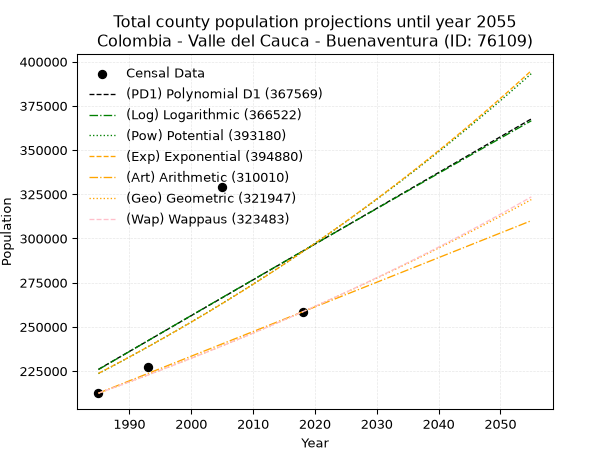
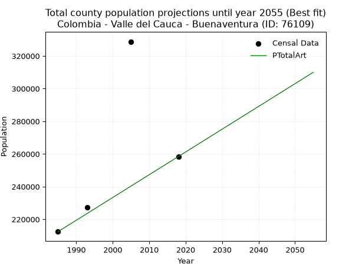
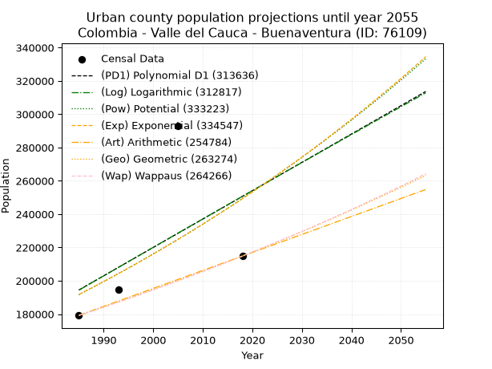
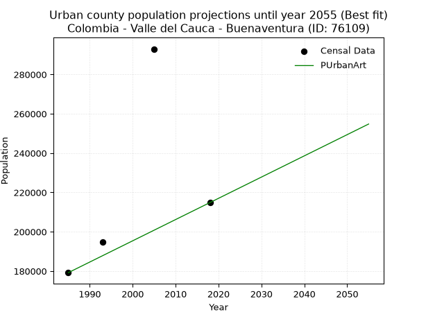
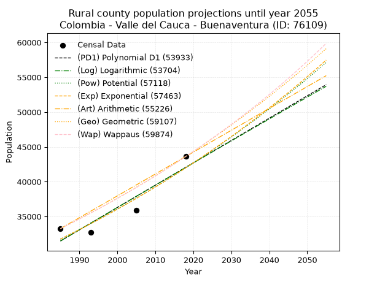
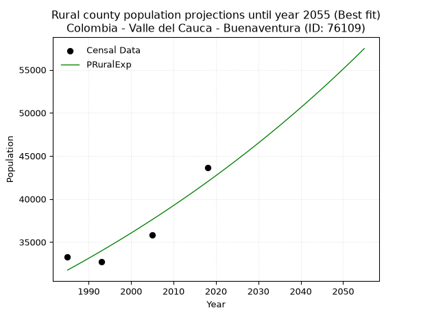

<div align="center">


</div>

# 📜 _“Population and Public Services Demand Projections (PPSD) until Year 2050 for Colombia - Valle del Cauca - Buenaventura (ID: 76109)”_
Keywords: `population` `public-service` `projection` `lineal` `polynomial` `logarithmic` `potential` `exponential` `arithmetic` `geometric` `wappaus` `dane` `colombia` `south-america`

PPSD are analytical estimates used by governments and planners to anticipate future changes in population size, age distribution, and the resulting community needs for utilities, healthcare, education, and infrastructure as sizing future water treatment facilities, electrical grids, and road networks based on spatial growth.

<div align="center">

</img>

</div>


> **General running parameters**: • app_version: _v20260806_. • Python version: _3.14.7_. • Pandas version: _3.0.5_. • NumPy version: _2.5.1_. • Creates, save and include plots into reports (create_plot): _False_. • Projection until year: _2050_. • Process polynomial degree 2 and up: _False_. • Process Wappaus: _True_. • Process Wappaus: _True_. • Set negative values to zero: _True_. • Set infinite values to zero: _True_. • Drop dataset notes: _True_. 
<div align="center">

Maps & GIS Layers: [:earth_americas:Google](http://maps.google.com/maps?q=3.875708204,-77.0107396) [:earth_americas:OSM](https://www.openstreetmap.org/#map=18/3.875708204/-77.0107396&layers=P) [:earth_americas:Bing](https://www.bing.com/maps?cp=3.875708204~-77.0107396&lvl=18) [:earth_americas:Apple](https://maps.apple.com/frame?center=3.875708204%2C-77.0107396&span=0.003%2C0.006) [:earth_americas:GISMobile](https://github.com/rcfdtools/R.GISMobile/blob/main/file/gis/CountyLayer_CO/Readme.md)

</div>


<div align="center">

```geojson
{
  "type": "Feature",
  "geometry": {
    "type": "Point", 
    "coordinates": [-77.0107396, 3.875708204]
  }, 
  "properties": {
    "Name": "Colombia - Valle del Cauca - Buenaventura (ID: 76109)"
  }
}
```

</div>


## 0. Census Data (4 records)

Census data are official statistics collected by a government about the people and housing in a country. They usually include counts of total population, age, sex, race, income, education, and jobs.

📅Global census file: [Population.xlsx](../data/Population.xlsx)

| Source   |   Year |   CountryID | CountryName   |   StateID | StateName       |   CountyID | CountyName   |   PTotal |   PUrban |   PRural |
|:---------|-------:|------------:|:--------------|----------:|:----------------|-----------:|:-------------|---------:|---------:|---------:|
| DANE     |   1985 |          57 | Colombia      |        76 | Valle del Cauca |      76109 | Buenaventura |   212455 |   179201 |    33254 |
| DANE     |   1993 |          57 | Colombia      |        76 | Valle del Cauca |      76109 | Buenaventura |   227478 |   194727 |    32751 |
| DANE     |   2005 |          57 | Colombia      |        76 | Valle del Cauca |      76109 | Buenaventura |   328794 |   292947 |    35847 |
| DANE     |   2018 |          57 | Colombia      |        76 | Valle del Cauca |      76109 | Buenaventura |   258445 |   214833 |    43612 |

> 🔥Some records could had specific notes about the registered values or the corresponding urban or rural distribution.

📅[SUI-RUPS](https://www.datos.gov.co/Hacienda-y-Cr-dito-P-blico/Registro-nico-de-Prestadores-de-Servicios-P-blicos/4qkq-csdn/about_data) - Local public utility companies: [RUPS.csv](../data/RUPS.csv)

 | SERVICIO       | ESTADO    | NOMBRE                                                                                        | NIT         | DEPARTAMENTO_DOMICILIO   | MUNICIPIO_DOMICILIO   | DIRECCION                                             |   TELEFONO | EMAIL                                 | TIPO_PRESTADOR                             | CLASIFICACION                 |
|:---------------|:----------|:----------------------------------------------------------------------------------------------|:------------|:-------------------------|:----------------------|:------------------------------------------------------|-----------:|:--------------------------------------|:-------------------------------------------|:------------------------------|
| ACUEDUCTO      | OPERATIVA | HIDROPACIFICO SAS ESP                                                                         | 835001396-5 | VALLE DEL CAUCA          | BUENAVENTURA          | Diagonal 3a carrera 4a esquina                        |    2405000 | coor_admin@hidropacifico.com          | SOCIEDADES (EMPRESA DE SERVICIOS PUBLICOS) | MAYOR O IGUAL A 5001 USUARIOS |
| ALCANTARILLADO | OPERATIVA | HIDROPACIFICO SAS ESP                                                                         | 835001396-5 | VALLE DEL CAUCA          | BUENAVENTURA          | Diagonal 3a carrera 4a esquina                        |    2405000 | coor_admin@hidropacifico.com          | SOCIEDADES (EMPRESA DE SERVICIOS PUBLICOS) | MAYOR O IGUAL A 5001 USUARIOS |
| ACUEDUCTO      | OPERATIVA | SOCIEDAD DE ACUEDUCTO Y ALCANTARILLADO  DE BUENAVENTURA S.A. E.S.P.                           | 835001290-3 | VALLE DEL CAUCA          | BUENAVENTURA          | Calle 2 con carrera 3 Centro Administrativo Distrital |    2410990 | casquetejames@hotmail.com             | SOCIEDADES (EMPRESA DE SERVICIOS PUBLICOS) | MAS DE 2500 SUSCRIPTORES      |
| ALCANTARILLADO | OPERATIVA | SOCIEDAD DE ACUEDUCTO Y ALCANTARILLADO  DE BUENAVENTURA S.A. E.S.P.                           | 835001290-3 | VALLE DEL CAUCA          | BUENAVENTURA          | Calle 2 con carrera 3 Centro Administrativo Distrital |    2410990 | casquetejames@hotmail.com             | SOCIEDADES (EMPRESA DE SERVICIOS PUBLICOS) | MAS DE 2500 SUSCRIPTORES      |
| ACUEDUCTO      | OPERATIVA | ASOCIACION DE USUARIOS DEL ACUEDUCTO DEL CORREGIMIENTO DE CHORRERAS MUNICIPIO DE BUGALAGRANDE | 900318287-8 | VALLE DEL CAUCA          | SEVILLA               | CARRERA 52 No 48 - 09                                 |    2237403 | contactenos@bugalagrande-valle.gov.co | ORGANIZACION AUTORIZADA                    | HASTA 2500 SUSCRIPTORES       |

## 1. Total

### 1.1. Coefficients and Parameters

* (PD1) Polynomial Deg 1: 2023.3095142513425, -3790331.8558812477 (lineal)
* (Log) Logarithmic: 4060550.4962643893, -30607483.86131517
* (Pow) Potential: 16.293243837704093, -48.38185894769683
* (Exp) Exponential: 0.008120669813200164, 0.022334113815432675
* (Art) Arithmetic: Year diff. 2018 - 1985 = 33, Population diff. 258445 - 212455 = 45990, Annual growth = 1393.6363636363637
* (Geo) Geometric: Year diff. 2018 - 1985 = 33, Population diff. 258445 - 212455 = 45990, Annual growth % = 0.005955625366388606
* (Wap) Wappaus: i = 0.5919033185968842, Condition values only valid for < 200)

<sub>
Wappaus condition values: ['0.00', '0.59', '1.18', '1.78', '2.37', '2.96', '3.55', '4.14', '4.74', '5.33', '5.92', '6.51', '7.10', '7.69', '8.29', '8.88', '9.47', '10.06', '10.65', '11.25', '11.84', '12.43', '13.02', '13.61', '14.21', '14.80', '15.39', '15.98', '16.57', '17.17', '17.76', '18.35', '18.94', '19.53', '20.12', '20.72', '21.31', '21.90', '22.49', '23.08', '23.68', '24.27', '24.86', '25.45', '26.04', '26.64', '27.23', '27.82', '28.41', '29.00', '29.60', '30.19', '30.78', '31.37', '31.96', '32.55', '33.15', '33.74', '34.33', '34.92', '35.51', '36.11', '36.70', '37.29', '37.88', '38.47']
</sub>


### 1.2. Projected Dataset

|   Year |   CountyID |   PTotalPD1 |   PTotalLog |   PTotalPow |   PTotalExp |   PTotalArt |   PTotalGeo |   PTotalWap |
|-------:|-----------:|------------:|------------:|------------:|------------:|------------:|------------:|------------:|
|   1985 |      76109 |      225938 |      225795 |      223541 |      223662 |      212455 |      212455 |      212455 |
|   1986 |      76109 |      227961 |      227841 |      225383 |      225485 |      213849 |      213720 |      213716 |
|   1987 |      76109 |      229984 |      229885 |      227239 |      227324 |      215242 |      214993 |      214985 |
|   1988 |      76109 |      232007 |      231928 |      229110 |      229177 |      216636 |      216274 |      216261 |
|   1989 |      76109 |      234031 |      233970 |      230995 |      231046 |      218030 |      217562 |      217545 |
|   1990 |      76109 |      236054 |      236011 |      232894 |      232930 |      219423 |      218857 |      218837 |
|   1991 |      76109 |      238077 |      238051 |      234808 |      234829 |      220817 |      220161 |      220137 |
|   1992 |      76109 |      240101 |      240090 |      236737 |      236744 |      222210 |      221472 |      221444 |
|   1993 |      76109 |      242124 |      242128 |      238681 |      238674 |      223604 |      222791 |      222759 |
|   1994 |      76109 |      244147 |      244164 |      240640 |      240620 |      224998 |      224118 |      224082 |
|   1995 |      76109 |      246171 |      246200 |      242614 |      242582 |      226391 |      225453 |      225414 |
|   1996 |      76109 |      248194 |      248235 |      244603 |      244560 |      227785 |      226795 |      226753 |
|   1997 |      76109 |      250217 |      250269 |      246607 |      246554 |      229179 |      228146 |      228101 |
|   1998 |      76109 |      252241 |      252302 |      248627 |      248565 |      230572 |      229505 |      229457 |
|   1999 |      76109 |      254264 |      254334 |      250662 |      250591 |      231966 |      230872 |      230821 |
|   2000 |      76109 |      256287 |      256364 |      252713 |      252635 |      233360 |      232247 |      232194 |
|   2001 |      76109 |      258310 |      258394 |      254780 |      254695 |      234753 |      233630 |      233576 |
|   2002 |      76109 |      260334 |      260423 |      256862 |      256771 |      236147 |      235021 |      234966 |
|   2003 |      76109 |      262357 |      262451 |      258961 |      258865 |      237540 |      236421 |      236364 |
|   2004 |      76109 |      264380 |      264477 |      261075 |      260976 |      238934 |      237829 |      237772 |
|   2005 |      76109 |      266404 |      266503 |      263206 |      263104 |      240328 |      239245 |      239188 |
|   2006 |      76109 |      268427 |      268528 |      265353 |      265249 |      241721 |      240670 |      240613 |
|   2007 |      76109 |      270450 |      270552 |      267517 |      267412 |      243115 |      242104 |      242047 |
|   2008 |      76109 |      272474 |      272574 |      269697 |      269592 |      244509 |      243545 |      243491 |
|   2009 |      76109 |      274497 |      274596 |      271893 |      271790 |      245902 |      244996 |      244943 |
|   2010 |      76109 |      276520 |      276617 |      274107 |      274006 |      247296 |      246455 |      246405 |
|   2011 |      76109 |      278544 |      278636 |      276337 |      276240 |      248690 |      247923 |      247876 |
|   2012 |      76109 |      280567 |      280655 |      278585 |      278493 |      250083 |      249399 |      249357 |
|   2013 |      76109 |      282590 |      282673 |      280849 |      280764 |      251477 |      250885 |      250847 |
|   2014 |      76109 |      284614 |      284689 |      283131 |      283053 |      252870 |      252379 |      252347 |
|   2015 |      76109 |      286637 |      286705 |      285430 |      285361 |      254264 |      253882 |      253857 |
|   2016 |      76109 |      288660 |      288720 |      287747 |      287688 |      255658 |      255394 |      255376 |
|   2017 |      76109 |      290683 |      290733 |      290082 |      290033 |      257051 |      256915 |      256906 |
|   2018 |      76109 |      292707 |      292746 |      292434 |      292398 |      258445 |      258445 |      258445 |
|   2019 |      76109 |      294730 |      294758 |      294804 |      294782 |      259839 |      259984 |      259995 |
|   2020 |      76109 |      296753 |      296768 |      297192 |      297186 |      261232 |      261533 |      261554 |
|   2021 |      76109 |      298777 |      298778 |      299598 |      299609 |      262626 |      263090 |      263124 |
|   2022 |      76109 |      300800 |      300787 |      302023 |      302052 |      264020 |      264657 |      264705 |
|   2023 |      76109 |      302823 |      302794 |      304466 |      304515 |      265413 |      266233 |      266296 |
|   2024 |      76109 |      304847 |      304801 |      306927 |      306998 |      266807 |      267819 |      267898 |
|   2025 |      76109 |      306870 |      306807 |      309407 |      309501 |      268200 |      269414 |      269510 |
|   2026 |      76109 |      308893 |      308811 |      311906 |      312025 |      269594 |      271018 |      271134 |
|   2027 |      76109 |      310917 |      310815 |      314424 |      314569 |      270988 |      272632 |      272768 |
|   2028 |      76109 |      312940 |      312818 |      316961 |      317134 |      272381 |      274256 |      274414 |
|   2029 |      76109 |      314963 |      314820 |      319517 |      319719 |      273775 |      275890 |      276070 |
|   2030 |      76109 |      316986 |      316820 |      322092 |      322326 |      275169 |      277533 |      277738 |
|   2031 |      76109 |      319010 |      318820 |      324687 |      324954 |      276562 |      279185 |      279417 |
|   2032 |      76109 |      321033 |      320819 |      327302 |      327604 |      277956 |      280848 |      281108 |
|   2033 |      76109 |      323056 |      322817 |      329936 |      330275 |      279350 |      282521 |      282811 |
|   2034 |      76109 |      325080 |      324814 |      332590 |      332968 |      280743 |      284203 |      284525 |
|   2035 |      76109 |      327103 |      326809 |      335265 |      335683 |      282137 |      285896 |      286252 |
|   2036 |      76109 |      329126 |      328804 |      337959 |      338420 |      283530 |      287599 |      287990 |
|   2037 |      76109 |      331150 |      330798 |      340674 |      341180 |      284924 |      289312 |      289740 |
|   2038 |      76109 |      333173 |      332791 |      343409 |      343962 |      286318 |      291035 |      291503 |
|   2039 |      76109 |      335196 |      334783 |      346165 |      346766 |      287711 |      292768 |      293278 |
|   2040 |      76109 |      337220 |      336774 |      348941 |      349594 |      289105 |      294511 |      295066 |
|   2041 |      76109 |      339243 |      338764 |      351739 |      352444 |      290499 |      296265 |      296866 |
|   2042 |      76109 |      341266 |      340753 |      354557 |      355318 |      291892 |      298030 |      298680 |
|   2043 |      76109 |      343289 |      342741 |      357397 |      358215 |      293286 |      299805 |      300506 |
|   2044 |      76109 |      345313 |      344728 |      360258 |      361136 |      294680 |      301590 |      302345 |
|   2045 |      76109 |      347336 |      346714 |      363140 |      364080 |      296073 |      303387 |      304197 |
|   2046 |      76109 |      349359 |      348699 |      366044 |      367049 |      297467 |      305193 |      306063 |
|   2047 |      76109 |      351383 |      350683 |      368970 |      370042 |      298860 |      307011 |      307943 |
|   2048 |      76109 |      353406 |      352667 |      371918 |      373059 |      300254 |      308840 |      309836 |
|   2049 |      76109 |      355429 |      354649 |      374888 |      376101 |      301648 |      310679 |      311743 |
|   2050 |      76109 |      357453 |      356630 |      377880 |      379167 |      303041 |      312529 |      313664 |
<div align="center">

</img>

</div>


### 1.3. Best fit with absolute and relative error (%)

Relative error puts that difference into context by dividing the absolute error by the true value, creating a unitless ratio or percentage that shows the scale of the mistake.

Absolute and relative error

|   Year | Source   |   CountryID | CountryName   |   StateID | StateName       |   CountyID_x | CountyName   |   PTotal |   PUrban |   PRural |   CountyID_y |   PTotalPD1 |   PTotalLog |   PTotalPow |   PTotalExp |   PTotalArt |   PTotalGeo |   PTotalWap |   PTotalPD1AbsError |   PTotalLogAbsError |   PTotalPowAbsError |   PTotalExpAbsError |   PTotalArtAbsError |   PTotalGeoAbsError |   PTotalWapAbsError |   PTotalPD1RelError |   PTotalLogRelError |   PTotalPowRelError |   PTotalExpRelError |   PTotalArtRelError |   PTotalGeoRelError |   PTotalWapRelError |
|-------:|:---------|------------:|:--------------|----------:|:----------------|-------------:|:-------------|---------:|---------:|---------:|-------------:|------------:|------------:|------------:|------------:|------------:|------------:|------------:|--------------------:|--------------------:|--------------------:|--------------------:|--------------------:|--------------------:|--------------------:|--------------------:|--------------------:|--------------------:|--------------------:|--------------------:|--------------------:|--------------------:|
|   1985 | DANE     |          57 | Colombia      |        76 | Valle del Cauca |        76109 | Buenaventura |   212455 |   179201 |    33254 |        76109 |      225938 |      225795 |      223541 |      223662 |      212455 |      212455 |      212455 |               13483 |               13340 |               11086 |               11207 |                   0 |                   0 |                   0 |             6.34629 |             6.27898 |             5.21805 |             5.275   |             0       |             0       |             0       |
|   1993 | DANE     |          57 | Colombia      |        76 | Valle del Cauca |        76109 | Buenaventura |   227478 |   194727 |    32751 |        76109 |      242124 |      242128 |      238681 |      238674 |      223604 |      222791 |      222759 |               14646 |               14650 |               11203 |               11196 |                3874 |                4687 |                4719 |             6.43842 |             6.44018 |             4.92487 |             4.92179 |             1.70302 |             2.06042 |             2.07449 |
|   2005 | DANE     |          57 | Colombia      |        76 | Valle del Cauca |        76109 | Buenaventura |   328794 |   292947 |    35847 |        76109 |      266404 |      266503 |      263206 |      263104 |      240328 |      239245 |      239188 |               62390 |               62291 |               65588 |               65690 |               88466 |               89549 |               89606 |            18.9754  |            18.9453  |            19.9481  |            19.9791  |            26.9062  |            27.2356  |            27.2529  |
|   2018 | DANE     |          57 | Colombia      |        76 | Valle del Cauca |        76109 | Buenaventura |   258445 |   214833 |    43612 |        76109 |      292707 |      292746 |      292434 |      292398 |      258445 |      258445 |      258445 |               34262 |               34301 |               33989 |               33953 |                   0 |                   0 |                   0 |            13.257   |            13.2721  |            13.1513  |            13.1374  |             0       |             0       |             0       |

Relative error mean

| Method    |   RelError | Best   |
|:----------|-----------:|:-------|
| PTotalPD1 |   11.2543  |        |
| PTotalLog |   11.2341  |        |
| PTotalPow |   10.8106  |        |
| PTotalExp |   10.8283  |        |
| PTotalArt |    7.15231 | True   |
| PTotalGeo |    7.324   |        |
| PTotalWap |    7.33185 |        |

💙Best method: _**PTotalArt**_
<div align="center">

</img>

</div>


### 1.4. Fresh water supply demand in liters per capita per day (lpcd)

The fresh water supply demand typically ranges from 100 to 300 liters per capita per day (lpcd) for standard domestic and municipal planning, though absolute survival minimums set by the World Health Organization are as low as 7.5 to 20 liters per day, and total consumption in high-income nations can exceed 400 liters.

> `CZ`: Level in meters above the sea level (masl)<br> `WS`: Fresh water supply demand in liters per capita per day (lpcd or l/h/d)<br> `WSAll`: Zonal fresh water supply demand in liters per second (l/s)<br> `A`: Zonal area in square meters<br> `DP`: Population density (people/hectare or p/ha)

Reference values (RAS Colombia)

|    CZ |   WS |
|------:|-----:|
|  1000 |  120 |
|  2000 |  130 |
| 99999 |  140 |

County shapefile geometry properties and water supply values

|   CountyID |      ATotal |   CZTotal |   WSTotal |
|-----------:|------------:|----------:|----------:|
|      76109 | 6.29594e+09 |   406.139 |       120 |

Projected values for best method: PTotalArt

|   CountyID |   Year |   PTotalArt |   DPTotal |   WSTotal |   WSTotalAll |
|-----------:|-------:|------------:|----------:|----------:|-------------:|
|      76109 |   1985 |      212455 |      0.34 |       120 |      295.076 |
|      76109 |   1986 |      213849 |      0.34 |       120 |      297.012 |
|      76109 |   1987 |      215242 |      0.34 |       120 |      298.947 |
|      76109 |   1988 |      216636 |      0.34 |       120 |      300.883 |
|      76109 |   1989 |      218030 |      0.35 |       120 |      302.819 |
|      76109 |   1990 |      219423 |      0.35 |       120 |      304.754 |
|      76109 |   1991 |      220817 |      0.35 |       120 |      306.69  |
|      76109 |   1992 |      222210 |      0.35 |       120 |      308.625 |
|      76109 |   1993 |      223604 |      0.36 |       120 |      310.561 |
|      76109 |   1994 |      224998 |      0.36 |       120 |      312.497 |
|      76109 |   1995 |      226391 |      0.36 |       120 |      314.432 |
|      76109 |   1996 |      227785 |      0.36 |       120 |      316.368 |
|      76109 |   1997 |      229179 |      0.36 |       120 |      318.304 |
|      76109 |   1998 |      230572 |      0.37 |       120 |      320.239 |
|      76109 |   1999 |      231966 |      0.37 |       120 |      322.175 |
|      76109 |   2000 |      233360 |      0.37 |       120 |      324.111 |
|      76109 |   2001 |      234753 |      0.37 |       120 |      326.046 |
|      76109 |   2002 |      236147 |      0.38 |       120 |      327.982 |
|      76109 |   2003 |      237540 |      0.38 |       120 |      329.917 |
|      76109 |   2004 |      238934 |      0.38 |       120 |      331.853 |
|      76109 |   2005 |      240328 |      0.38 |       120 |      333.789 |
|      76109 |   2006 |      241721 |      0.38 |       120 |      335.724 |
|      76109 |   2007 |      243115 |      0.39 |       120 |      337.66  |
|      76109 |   2008 |      244509 |      0.39 |       120 |      339.596 |
|      76109 |   2009 |      245902 |      0.39 |       120 |      341.531 |
|      76109 |   2010 |      247296 |      0.39 |       120 |      343.467 |
|      76109 |   2011 |      248690 |      0.4  |       120 |      345.403 |
|      76109 |   2012 |      250083 |      0.4  |       120 |      347.337 |
|      76109 |   2013 |      251477 |      0.4  |       120 |      349.274 |
|      76109 |   2014 |      252870 |      0.4  |       120 |      351.208 |
|      76109 |   2015 |      254264 |      0.4  |       120 |      353.144 |
|      76109 |   2016 |      255658 |      0.41 |       120 |      355.081 |
|      76109 |   2017 |      257051 |      0.41 |       120 |      357.015 |
|      76109 |   2018 |      258445 |      0.41 |       120 |      358.951 |
|      76109 |   2019 |      259839 |      0.41 |       120 |      360.887 |
|      76109 |   2020 |      261232 |      0.41 |       120 |      362.822 |
|      76109 |   2021 |      262626 |      0.42 |       120 |      364.758 |
|      76109 |   2022 |      264020 |      0.42 |       120 |      366.694 |
|      76109 |   2023 |      265413 |      0.42 |       120 |      368.629 |
|      76109 |   2024 |      266807 |      0.42 |       120 |      370.565 |
|      76109 |   2025 |      268200 |      0.43 |       120 |      372.5   |
|      76109 |   2026 |      269594 |      0.43 |       120 |      374.436 |
|      76109 |   2027 |      270988 |      0.43 |       120 |      376.372 |
|      76109 |   2028 |      272381 |      0.43 |       120 |      378.307 |
|      76109 |   2029 |      273775 |      0.43 |       120 |      380.243 |
|      76109 |   2030 |      275169 |      0.44 |       120 |      382.179 |
|      76109 |   2031 |      276562 |      0.44 |       120 |      384.114 |
|      76109 |   2032 |      277956 |      0.44 |       120 |      386.05  |
|      76109 |   2033 |      279350 |      0.44 |       120 |      387.986 |
|      76109 |   2034 |      280743 |      0.45 |       120 |      389.921 |
|      76109 |   2035 |      282137 |      0.45 |       120 |      391.857 |
|      76109 |   2036 |      283530 |      0.45 |       120 |      393.792 |
|      76109 |   2037 |      284924 |      0.45 |       120 |      395.728 |
|      76109 |   2038 |      286318 |      0.45 |       120 |      397.664 |
|      76109 |   2039 |      287711 |      0.46 |       120 |      399.599 |
|      76109 |   2040 |      289105 |      0.46 |       120 |      401.535 |
|      76109 |   2041 |      290499 |      0.46 |       120 |      403.471 |
|      76109 |   2042 |      291892 |      0.46 |       120 |      405.406 |
|      76109 |   2043 |      293286 |      0.47 |       120 |      407.342 |
|      76109 |   2044 |      294680 |      0.47 |       120 |      409.278 |
|      76109 |   2045 |      296073 |      0.47 |       120 |      411.212 |
|      76109 |   2046 |      297467 |      0.47 |       120 |      413.149 |
|      76109 |   2047 |      298860 |      0.47 |       120 |      415.083 |
|      76109 |   2048 |      300254 |      0.48 |       120 |      417.019 |
|      76109 |   2049 |      301648 |      0.48 |       120 |      418.956 |
|      76109 |   2050 |      303041 |      0.48 |       120 |      420.89  |

## 2. Urban

### 2.1. Coefficients and Parameters

* (PD1) Polynomial Deg 1: 1702.4456041750718, -3184889.8197511877 (lineal)
* (Log) Logarithmic: 3418936.258285925, -25766934.896867037
* (Pow) Potential: 15.961263388176578, -47.35392673884745
* (Exp) Exponential: 0.007950469869627667, 0.026844824269185438
* (Art) Arithmetic: Year diff. 2018 - 1985 = 33, Population diff. 214833 - 179201 = 35632, Annual growth = 1079.7575757575758
* (Geo) Geometric: Year diff. 2018 - 1985 = 33, Population diff. 214833 - 179201 = 35632, Annual growth % = 0.005510670655052952
* (Wap) Wappaus: i = 0.5480529983491657, Condition values only valid for < 200)

<sub>
Wappaus condition values: ['0.00', '0.55', '1.10', '1.64', '2.19', '2.74', '3.29', '3.84', '4.38', '4.93', '5.48', '6.03', '6.58', '7.12', '7.67', '8.22', '8.77', '9.32', '9.86', '10.41', '10.96', '11.51', '12.06', '12.61', '13.15', '13.70', '14.25', '14.80', '15.35', '15.89', '16.44', '16.99', '17.54', '18.09', '18.63', '19.18', '19.73', '20.28', '20.83', '21.37', '21.92', '22.47', '23.02', '23.57', '24.11', '24.66', '25.21', '25.76', '26.31', '26.85', '27.40', '27.95', '28.50', '29.05', '29.59', '30.14', '30.69', '31.24', '31.79', '32.34', '32.88', '33.43', '33.98', '34.53', '35.08', '35.62']
</sub>


### 2.2. Projected Dataset

|   Year |   CountyID |   PUrbanPD1 |   PUrbanLog |   PUrbanPow |   PUrbanExp |   PUrbanArt |   PUrbanGeo |   PUrbanWap |
|-------:|-----------:|------------:|------------:|------------:|------------:|------------:|------------:|------------:|
|   1985 |      76109 |      194465 |      194327 |      191645 |      191760 |      179201 |      179201 |      179201 |
|   1986 |      76109 |      196167 |      196049 |      193192 |      193291 |      180281 |      180189 |      180186 |
|   1987 |      76109 |      197870 |      197770 |      194750 |      194834 |      181361 |      181181 |      181176 |
|   1988 |      76109 |      199572 |      199491 |      196321 |      196389 |      182440 |      182180 |      182172 |
|   1989 |      76109 |      201274 |      201210 |      197903 |      197956 |      183520 |      183184 |      183173 |
|   1990 |      76109 |      202977 |      202929 |      199497 |      199537 |      184600 |      184193 |      184180 |
|   1991 |      76109 |      204679 |      204646 |      201103 |      201129 |      185680 |      185208 |      185192 |
|   1992 |      76109 |      206382 |      206363 |      202721 |      202735 |      186759 |      186229 |      186210 |
|   1993 |      76109 |      208084 |      208079 |      204352 |      204353 |      187839 |      187255 |      187234 |
|   1994 |      76109 |      209787 |      209794 |      205994 |      205984 |      188919 |      188287 |      188264 |
|   1995 |      76109 |      211489 |      211508 |      207650 |      207628 |      189999 |      189325 |      189299 |
|   1996 |      76109 |      213192 |      213221 |      209317 |      209286 |      191078 |      190368 |      190340 |
|   1997 |      76109 |      214894 |      214934 |      210997 |      210956 |      192158 |      191417 |      191387 |
|   1998 |      76109 |      216596 |      216645 |      212690 |      212640 |      193238 |      192472 |      192440 |
|   1999 |      76109 |      218299 |      218356 |      214395 |      214337 |      194318 |      193533 |      193499 |
|   2000 |      76109 |      220001 |      220066 |      216114 |      216048 |      195397 |      194599 |      194564 |
|   2001 |      76109 |      221704 |      221775 |      217845 |      217773 |      196477 |      195671 |      195635 |
|   2002 |      76109 |      223406 |      223483 |      219589 |      219511 |      197557 |      196750 |      196713 |
|   2003 |      76109 |      225109 |      225191 |      221346 |      221263 |      198637 |      197834 |      197796 |
|   2004 |      76109 |      226811 |      226897 |      223117 |      223030 |      199716 |      198924 |      198886 |
|   2005 |      76109 |      228514 |      228603 |      224901 |      224810 |      200796 |      200020 |      199982 |
|   2006 |      76109 |      230216 |      230308 |      226698 |      226604 |      201876 |      201123 |      201085 |
|   2007 |      76109 |      231919 |      232012 |      228508 |      228413 |      202956 |      202231 |      202194 |
|   2008 |      76109 |      233621 |      233715 |      230332 |      230236 |      204035 |      203345 |      203309 |
|   2009 |      76109 |      235323 |      235417 |      232170 |      232074 |      205115 |      204466 |      204431 |
|   2010 |      76109 |      237026 |      237118 |      234021 |      233926 |      206195 |      205593 |      205560 |
|   2011 |      76109 |      238728 |      238819 |      235887 |      235794 |      207275 |      206726 |      206695 |
|   2012 |      76109 |      240431 |      240518 |      237766 |      237676 |      208354 |      207865 |      207837 |
|   2013 |      76109 |      242133 |      242217 |      239659 |      239573 |      209434 |      209010 |      208986 |
|   2014 |      76109 |      243836 |      243915 |      241566 |      241485 |      210514 |      210162 |      210141 |
|   2015 |      76109 |      245538 |      245612 |      243488 |      243413 |      211594 |      211320 |      211304 |
|   2016 |      76109 |      247241 |      247309 |      245424 |      245356 |      212673 |      212485 |      212473 |
|   2017 |      76109 |      248943 |      249004 |      247374 |      247314 |      213753 |      213656 |      213649 |
|   2018 |      76109 |      250645 |      250699 |      249339 |      249288 |      214833 |      214833 |      214833 |
|   2019 |      76109 |      252348 |      252393 |      251319 |      251278 |      215913 |      216017 |      216024 |
|   2020 |      76109 |      254050 |      254086 |      253313 |      253284 |      216993 |      217207 |      217222 |
|   2021 |      76109 |      255753 |      255778 |      255322 |      255306 |      218072 |      218404 |      218427 |
|   2022 |      76109 |      257455 |      257469 |      257346 |      257344 |      219152 |      219608 |      219639 |
|   2023 |      76109 |      259158 |      259160 |      259385 |      259398 |      220232 |      220818 |      220859 |
|   2024 |      76109 |      260860 |      260849 |      261439 |      261468 |      221312 |      222035 |      222087 |
|   2025 |      76109 |      262563 |      262538 |      263508 |      263555 |      222391 |      223258 |      223322 |
|   2026 |      76109 |      264265 |      264226 |      265593 |      265659 |      223471 |      224489 |      224564 |
|   2027 |      76109 |      265967 |      265913 |      267693 |      267780 |      224551 |      225726 |      225815 |
|   2028 |      76109 |      267670 |      267599 |      269809 |      269917 |      225631 |      226970 |      227073 |
|   2029 |      76109 |      269372 |      269285 |      271940 |      272072 |      226710 |      228220 |      228339 |
|   2030 |      76109 |      271075 |      270969 |      274087 |      274243 |      227790 |      229478 |      229613 |
|   2031 |      76109 |      272777 |      272653 |      276250 |      276433 |      228870 |      230743 |      230894 |
|   2032 |      76109 |      274480 |      274336 |      278429 |      278639 |      229950 |      232014 |      232184 |
|   2033 |      76109 |      276182 |      276018 |      280624 |      280863 |      231029 |      233293 |      233482 |
|   2034 |      76109 |      277885 |      277700 |      282836 |      283105 |      232109 |      234578 |      234789 |
|   2035 |      76109 |      279587 |      279380 |      285063 |      285365 |      233189 |      235871 |      236103 |
|   2036 |      76109 |      281289 |      281060 |      287307 |      287643 |      234269 |      237171 |      237426 |
|   2037 |      76109 |      282992 |      282738 |      289568 |      289939 |      235348 |      238478 |      238757 |
|   2038 |      76109 |      284694 |      284416 |      291845 |      292253 |      236428 |      239792 |      240097 |
|   2039 |      76109 |      286397 |      286094 |      294139 |      294586 |      237508 |      241113 |      241446 |
|   2040 |      76109 |      288099 |      287770 |      296450 |      296937 |      238588 |      242442 |      242803 |
|   2041 |      76109 |      289802 |      289446 |      298778 |      299308 |      239667 |      243778 |      244169 |
|   2042 |      76109 |      291504 |      291120 |      301124 |      301697 |      240747 |      245121 |      245544 |
|   2043 |      76109 |      293207 |      292794 |      303486 |      304105 |      241827 |      246472 |      246928 |
|   2044 |      76109 |      294909 |      294467 |      305866 |      306532 |      242907 |      247831 |      248321 |
|   2045 |      76109 |      296611 |      296140 |      308263 |      308979 |      243986 |      249196 |      249723 |
|   2046 |      76109 |      298314 |      297811 |      310678 |      311445 |      245066 |      250569 |      251134 |
|   2047 |      76109 |      300016 |      299482 |      313110 |      313931 |      246146 |      251950 |      252555 |
|   2048 |      76109 |      301719 |      301151 |      315561 |      316437 |      247226 |      253339 |      253985 |
|   2049 |      76109 |      303421 |      302820 |      318029 |      318963 |      248305 |      254735 |      255424 |
|   2050 |      76109 |      305124 |      304489 |      320515 |      321509 |      249385 |      256139 |      256873 |
<div align="center">

</img>

</div>


### 2.3. Best fit with absolute and relative error (%)

Relative error puts that difference into context by dividing the absolute error by the true value, creating a unitless ratio or percentage that shows the scale of the mistake.

Absolute and relative error

|   Year | Source   |   CountryID | CountryName   |   StateID | StateName       |   CountyID_x | CountyName   |   PTotal |   PUrban |   PRural |   CountyID_y |   PUrbanPD1 |   PUrbanLog |   PUrbanPow |   PUrbanExp |   PUrbanArt |   PUrbanGeo |   PUrbanWap |   PUrbanPD1AbsError |   PUrbanLogAbsError |   PUrbanPowAbsError |   PUrbanExpAbsError |   PUrbanArtAbsError |   PUrbanGeoAbsError |   PUrbanWapAbsError |   PUrbanPD1RelError |   PUrbanLogRelError |   PUrbanPowRelError |   PUrbanExpRelError |   PUrbanArtRelError |   PUrbanGeoRelError |   PUrbanWapRelError |
|-------:|:---------|------------:|:--------------|----------:|:----------------|-------------:|:-------------|---------:|---------:|---------:|-------------:|------------:|------------:|------------:|------------:|------------:|------------:|------------:|--------------------:|--------------------:|--------------------:|--------------------:|--------------------:|--------------------:|--------------------:|--------------------:|--------------------:|--------------------:|--------------------:|--------------------:|--------------------:|--------------------:|
|   1985 | DANE     |          57 | Colombia      |        76 | Valle del Cauca |        76109 | Buenaventura |   212455 |   179201 |    33254 |        76109 |      194465 |      194327 |      191645 |      191760 |      179201 |      179201 |      179201 |               15264 |               15126 |               12444 |               12559 |                   0 |                   0 |                   0 |             8.51781 |             8.4408  |             6.94416 |             7.00833 |             0       |             0       |             0       |
|   1993 | DANE     |          57 | Colombia      |        76 | Valle del Cauca |        76109 | Buenaventura |   227478 |   194727 |    32751 |        76109 |      208084 |      208079 |      204352 |      204353 |      187839 |      187255 |      187234 |               13357 |               13352 |                9625 |                9626 |                6888 |                7472 |                7493 |             6.85935 |             6.85678 |             4.94282 |             4.94333 |             3.53726 |             3.83717 |             3.84795 |
|   2005 | DANE     |          57 | Colombia      |        76 | Valle del Cauca |        76109 | Buenaventura |   328794 |   292947 |    35847 |        76109 |      228514 |      228603 |      224901 |      224810 |      200796 |      200020 |      199982 |               64433 |               64344 |               68046 |               68137 |               92151 |               92927 |               92965 |            21.9948  |            21.9644  |            23.2281  |            23.2592  |            31.4565  |            31.7214  |            31.7344  |
|   2018 | DANE     |          57 | Colombia      |        76 | Valle del Cauca |        76109 | Buenaventura |   258445 |   214833 |    43612 |        76109 |      250645 |      250699 |      249339 |      249288 |      214833 |      214833 |      214833 |               35812 |               35866 |               34506 |               34455 |                   0 |                   0 |                   0 |            16.6697  |            16.6948  |            16.0618  |            16.038   |             0       |             0       |             0       |

Relative error mean

| Method    |   RelError | Best   |
|:----------|-----------:|:-------|
| PUrbanPD1 |   13.5104  |        |
| PUrbanLog |   13.4892  |        |
| PUrbanPow |   12.7942  |        |
| PUrbanExp |   12.8122  |        |
| PUrbanArt |    8.74845 | True   |
| PUrbanGeo |    8.88965 |        |
| PUrbanWap |    8.89559 |        |

💙Best method: _**PUrbanArt**_
<div align="center">

</img>

</div>


### 2.4. Fresh water supply demand in liters per capita per day (lpcd)

The fresh water supply demand typically ranges from 100 to 300 liters per capita per day (lpcd) for standard domestic and municipal planning, though absolute survival minimums set by the World Health Organization are as low as 7.5 to 20 liters per day, and total consumption in high-income nations can exceed 400 liters.

> `CZ`: Level in meters above the sea level (masl)<br> `WS`: Fresh water supply demand in liters per capita per day (lpcd or l/h/d)<br> `WSAll`: Zonal fresh water supply demand in liters per second (l/s)<br> `A`: Zonal area in square meters<br> `DP`: Population density (people/hectare or p/ha)

Reference values (RAS Colombia)

|    CZ |   WS |
|------:|-----:|
|  1000 |  120 |
|  2000 |  130 |
| 99999 |  140 |

County shapefile geometry properties and water supply values

|   CountyID |      AUrban |   CZUrban |   WSUrban |
|-----------:|------------:|----------:|----------:|
|      76109 | 3.31151e+07 |    20.222 |       120 |

Projected values for best method: PUrbanArt

|   CountyID |   Year |   PUrbanArt |   DPUrban |   WSUrban |   WSUrbanAll |
|-----------:|-------:|------------:|----------:|----------:|-------------:|
|      76109 |   1985 |      179201 |     54.11 |       120 |      248.89  |
|      76109 |   1986 |      180281 |     54.44 |       120 |      250.39  |
|      76109 |   1987 |      181361 |     54.77 |       120 |      251.89  |
|      76109 |   1988 |      182440 |     55.09 |       120 |      253.389 |
|      76109 |   1989 |      183520 |     55.42 |       120 |      254.889 |
|      76109 |   1990 |      184600 |     55.74 |       120 |      256.389 |
|      76109 |   1991 |      185680 |     56.07 |       120 |      257.889 |
|      76109 |   1992 |      186759 |     56.4  |       120 |      259.387 |
|      76109 |   1993 |      187839 |     56.72 |       120 |      260.887 |
|      76109 |   1994 |      188919 |     57.05 |       120 |      262.387 |
|      76109 |   1995 |      189999 |     57.38 |       120 |      263.887 |
|      76109 |   1996 |      191078 |     57.7  |       120 |      265.386 |
|      76109 |   1997 |      192158 |     58.03 |       120 |      266.886 |
|      76109 |   1998 |      193238 |     58.35 |       120 |      268.386 |
|      76109 |   1999 |      194318 |     58.68 |       120 |      269.886 |
|      76109 |   2000 |      195397 |     59.01 |       120 |      271.385 |
|      76109 |   2001 |      196477 |     59.33 |       120 |      272.885 |
|      76109 |   2002 |      197557 |     59.66 |       120 |      274.385 |
|      76109 |   2003 |      198637 |     59.98 |       120 |      275.885 |
|      76109 |   2004 |      199716 |     60.31 |       120 |      277.383 |
|      76109 |   2005 |      200796 |     60.64 |       120 |      278.883 |
|      76109 |   2006 |      201876 |     60.96 |       120 |      280.383 |
|      76109 |   2007 |      202956 |     61.29 |       120 |      281.883 |
|      76109 |   2008 |      204035 |     61.61 |       120 |      283.382 |
|      76109 |   2009 |      205115 |     61.94 |       120 |      284.882 |
|      76109 |   2010 |      206195 |     62.27 |       120 |      286.382 |
|      76109 |   2011 |      207275 |     62.59 |       120 |      287.882 |
|      76109 |   2012 |      208354 |     62.92 |       120 |      289.381 |
|      76109 |   2013 |      209434 |     63.24 |       120 |      290.881 |
|      76109 |   2014 |      210514 |     63.57 |       120 |      292.381 |
|      76109 |   2015 |      211594 |     63.9  |       120 |      293.881 |
|      76109 |   2016 |      212673 |     64.22 |       120 |      295.379 |
|      76109 |   2017 |      213753 |     64.55 |       120 |      296.879 |
|      76109 |   2018 |      214833 |     64.87 |       120 |      298.379 |
|      76109 |   2019 |      215913 |     65.2  |       120 |      299.879 |
|      76109 |   2020 |      216993 |     65.53 |       120 |      301.379 |
|      76109 |   2021 |      218072 |     65.85 |       120 |      302.878 |
|      76109 |   2022 |      219152 |     66.18 |       120 |      304.378 |
|      76109 |   2023 |      220232 |     66.5  |       120 |      305.878 |
|      76109 |   2024 |      221312 |     66.83 |       120 |      307.378 |
|      76109 |   2025 |      222391 |     67.16 |       120 |      308.876 |
|      76109 |   2026 |      223471 |     67.48 |       120 |      310.376 |
|      76109 |   2027 |      224551 |     67.81 |       120 |      311.876 |
|      76109 |   2028 |      225631 |     68.14 |       120 |      313.376 |
|      76109 |   2029 |      226710 |     68.46 |       120 |      314.875 |
|      76109 |   2030 |      227790 |     68.79 |       120 |      316.375 |
|      76109 |   2031 |      228870 |     69.11 |       120 |      317.875 |
|      76109 |   2032 |      229950 |     69.44 |       120 |      319.375 |
|      76109 |   2033 |      231029 |     69.77 |       120 |      320.874 |
|      76109 |   2034 |      232109 |     70.09 |       120 |      322.374 |
|      76109 |   2035 |      233189 |     70.42 |       120 |      323.874 |
|      76109 |   2036 |      234269 |     70.74 |       120 |      325.374 |
|      76109 |   2037 |      235348 |     71.07 |       120 |      326.872 |
|      76109 |   2038 |      236428 |     71.4  |       120 |      328.372 |
|      76109 |   2039 |      237508 |     71.72 |       120 |      329.872 |
|      76109 |   2040 |      238588 |     72.05 |       120 |      331.372 |
|      76109 |   2041 |      239667 |     72.37 |       120 |      332.871 |
|      76109 |   2042 |      240747 |     72.7  |       120 |      334.371 |
|      76109 |   2043 |      241827 |     73.03 |       120 |      335.871 |
|      76109 |   2044 |      242907 |     73.35 |       120 |      337.371 |
|      76109 |   2045 |      243986 |     73.68 |       120 |      338.869 |
|      76109 |   2046 |      245066 |     74    |       120 |      340.369 |
|      76109 |   2047 |      246146 |     74.33 |       120 |      341.869 |
|      76109 |   2048 |      247226 |     74.66 |       120 |      343.369 |
|      76109 |   2049 |      248305 |     74.98 |       120 |      344.868 |
|      76109 |   2050 |      249385 |     75.31 |       120 |      346.368 |

## 3. Rural

### 3.1. Coefficients and Parameters

* (PD1) Polynomial Deg 1: 320.8639100762695, -605442.0361300581 (lineal)
* (Log) Logarithmic: 641614.237978467, -4840548.96444815
* (Pow) Potential: 16.9555378464205, -51.4137344717571
* (Exp) Exponential: 0.008478837390357893, 0.00155681374729338
* (Art) Arithmetic: Year diff. 2018 - 1985 = 33, Population diff. 43612 - 33254 = 10358, Annual growth = 313.8787878787879
* (Geo) Geometric: Year diff. 2018 - 1985 = 33, Population diff. 43612 - 33254 = 10358, Annual growth % = 0.008250738582250117
* (Wap) Wappaus: i = 0.8166908330829961, Condition values only valid for < 200)

<sub>
Wappaus condition values: ['0.00', '0.82', '1.63', '2.45', '3.27', '4.08', '4.90', '5.72', '6.53', '7.35', '8.17', '8.98', '9.80', '10.62', '11.43', '12.25', '13.07', '13.88', '14.70', '15.52', '16.33', '17.15', '17.97', '18.78', '19.60', '20.42', '21.23', '22.05', '22.87', '23.68', '24.50', '25.32', '26.13', '26.95', '27.77', '28.58', '29.40', '30.22', '31.03', '31.85', '32.67', '33.48', '34.30', '35.12', '35.93', '36.75', '37.57', '38.38', '39.20', '40.02', '40.83', '41.65', '42.47', '43.28', '44.10', '44.92', '45.73', '46.55', '47.37', '48.18', '49.00', '49.82', '50.63', '51.45', '52.27', '53.08']
</sub>


### 3.2. Projected Dataset

|   Year |   CountyID |   PRuralPD1 |   PRuralLog |   PRuralPow |   PRuralExp |   PRuralArt |   PRuralGeo |   PRuralWap |
|-------:|-----------:|------------:|------------:|------------:|------------:|------------:|------------:|------------:|
|   1985 |      76109 |       31473 |       31468 |       31737 |       31741 |       33254 |       33254 |       33254 |
|   1986 |      76109 |       31794 |       31791 |       32009 |       32012 |       33568 |       33528 |       33527 |
|   1987 |      76109 |       32115 |       32114 |       32284 |       32284 |       33882 |       33805 |       33802 |
|   1988 |      76109 |       32435 |       32437 |       32560 |       32559 |       34196 |       34084 |       34079 |
|   1989 |      76109 |       32756 |       32760 |       32839 |       32836 |       34510 |       34365 |       34358 |
|   1990 |      76109 |       33077 |       33082 |       33120 |       33116 |       34823 |       34649 |       34640 |
|   1991 |      76109 |       33398 |       33404 |       33404 |       33398 |       35137 |       34935 |       34924 |
|   1992 |      76109 |       33719 |       33727 |       33689 |       33682 |       35451 |       35223 |       35211 |
|   1993 |      76109 |       34040 |       34049 |       33977 |       33969 |       35765 |       35513 |       35500 |
|   1994 |      76109 |       34361 |       34371 |       34267 |       34258 |       36079 |       35806 |       35791 |
|   1995 |      76109 |       34681 |       34692 |       34560 |       34550 |       36393 |       36102 |       36085 |
|   1996 |      76109 |       35002 |       35014 |       34855 |       34844 |       36707 |       36400 |       36382 |
|   1997 |      76109 |       35323 |       35335 |       35152 |       35141 |       37021 |       36700 |       36681 |
|   1998 |      76109 |       35644 |       35656 |       35452 |       35440 |       37334 |       37003 |       36982 |
|   1999 |      76109 |       35965 |       35977 |       35754 |       35742 |       37648 |       37308 |       37287 |
|   2000 |      76109 |       36286 |       36298 |       36058 |       36046 |       37962 |       37616 |       37594 |
|   2001 |      76109 |       36607 |       36619 |       36365 |       36353 |       38276 |       37926 |       37903 |
|   2002 |      76109 |       36928 |       36940 |       36675 |       36663 |       38590 |       38239 |       38215 |
|   2003 |      76109 |       37248 |       37260 |       36986 |       36975 |       38904 |       38555 |       38530 |
|   2004 |      76109 |       37569 |       37580 |       37301 |       37290 |       39218 |       38873 |       38848 |
|   2005 |      76109 |       37890 |       37900 |       37618 |       37607 |       39532 |       39194 |       39169 |
|   2006 |      76109 |       38211 |       38220 |       37937 |       37928 |       39845 |       39517 |       39492 |
|   2007 |      76109 |       38532 |       38540 |       38259 |       38251 |       40159 |       39843 |       39819 |
|   2008 |      76109 |       38853 |       38860 |       38583 |       38576 |       40473 |       40172 |       40148 |
|   2009 |      76109 |       39174 |       39179 |       38911 |       38905 |       40787 |       40503 |       40480 |
|   2010 |      76109 |       39494 |       39498 |       39240 |       39236 |       41101 |       40837 |       40815 |
|   2011 |      76109 |       39815 |       39817 |       39573 |       39570 |       41415 |       41174 |       41154 |
|   2012 |      76109 |       40136 |       40136 |       39908 |       39907 |       41729 |       41514 |       41495 |
|   2013 |      76109 |       40457 |       40455 |       40245 |       40247 |       42043 |       41857 |       41840 |
|   2014 |      76109 |       40778 |       40774 |       40585 |       40589 |       42356 |       42202 |       42188 |
|   2015 |      76109 |       41099 |       41092 |       40929 |       40935 |       42670 |       42550 |       42539 |
|   2016 |      76109 |       41420 |       41411 |       41274 |       41284 |       42984 |       42901 |       42893 |
|   2017 |      76109 |       41740 |       41729 |       41623 |       41635 |       43298 |       43255 |       43251 |
|   2018 |      76109 |       42061 |       42047 |       41974 |       41990 |       43612 |       43612 |       43612 |
|   2019 |      76109 |       42382 |       42365 |       42328 |       42347 |       43926 |       43972 |       43976 |
|   2020 |      76109 |       42703 |       42683 |       42685 |       42708 |       44240 |       44335 |       44344 |
|   2021 |      76109 |       43024 |       43000 |       43045 |       43071 |       44554 |       44700 |       44716 |
|   2022 |      76109 |       43345 |       43317 |       43407 |       43438 |       44868 |       45069 |       45091 |
|   2023 |      76109 |       43666 |       43635 |       43773 |       43808 |       45181 |       45441 |       45470 |
|   2024 |      76109 |       43987 |       43952 |       44141 |       44181 |       45495 |       45816 |       45852 |
|   2025 |      76109 |       44307 |       44269 |       44512 |       44557 |       45809 |       46194 |       46238 |
|   2026 |      76109 |       44628 |       44586 |       44886 |       44937 |       46123 |       46575 |       46628 |
|   2027 |      76109 |       44949 |       44902 |       45264 |       45319 |       46437 |       46959 |       47022 |
|   2028 |      76109 |       45270 |       45219 |       45644 |       45705 |       46751 |       47347 |       47419 |
|   2029 |      76109 |       45591 |       45535 |       46027 |       46094 |       47065 |       47738 |       47821 |
|   2030 |      76109 |       45912 |       45851 |       46413 |       46487 |       47379 |       48131 |       48226 |
|   2031 |      76109 |       46233 |       46167 |       46802 |       46883 |       47692 |       48529 |       48636 |
|   2032 |      76109 |       46553 |       46483 |       47194 |       47282 |       48006 |       48929 |       49050 |
|   2033 |      76109 |       46874 |       46799 |       47590 |       47685 |       48320 |       49333 |       49468 |
|   2034 |      76109 |       47195 |       47114 |       47988 |       48091 |       48634 |       49740 |       49890 |
|   2035 |      76109 |       47516 |       47429 |       48390 |       48500 |       48948 |       50150 |       50317 |
|   2036 |      76109 |       47837 |       47745 |       48795 |       48913 |       49262 |       50564 |       50748 |
|   2037 |      76109 |       48158 |       48060 |       49203 |       49330 |       49576 |       50981 |       51183 |
|   2038 |      76109 |       48479 |       48375 |       49614 |       49750 |       49890 |       51402 |       51623 |
|   2039 |      76109 |       48799 |       48689 |       50028 |       50173 |       50203 |       51826 |       52068 |
|   2040 |      76109 |       49120 |       49004 |       50446 |       50600 |       50517 |       52253 |       52517 |
|   2041 |      76109 |       49441 |       49318 |       50867 |       51031 |       50831 |       52684 |       52971 |
|   2042 |      76109 |       49762 |       49633 |       51291 |       51466 |       51145 |       53119 |       53430 |
|   2043 |      76109 |       50083 |       49947 |       51719 |       51904 |       51459 |       53557 |       53894 |
|   2044 |      76109 |       50404 |       50261 |       52149 |       52346 |       51773 |       53999 |       54363 |
|   2045 |      76109 |       50725 |       50575 |       52584 |       52792 |       52087 |       54445 |       54837 |
|   2046 |      76109 |       51046 |       50888 |       53021 |       53241 |       52401 |       54894 |       55316 |
|   2047 |      76109 |       51366 |       51202 |       53463 |       53695 |       52714 |       55347 |       55800 |
|   2048 |      76109 |       51687 |       51515 |       53907 |       54152 |       53028 |       55804 |       56290 |
|   2049 |      76109 |       52008 |       51828 |       54355 |       54613 |       53342 |       56264 |       56785 |
|   2050 |      76109 |       52329 |       52141 |       54807 |       55078 |       53656 |       56728 |       57285 |
<div align="center">

</img>

</div>


### 3.3. Best fit with absolute and relative error (%)

Relative error puts that difference into context by dividing the absolute error by the true value, creating a unitless ratio or percentage that shows the scale of the mistake.

Absolute and relative error

|   Year | Source   |   CountryID | CountryName   |   StateID | StateName       |   CountyID_x | CountyName   |   PTotal |   PUrban |   PRural |   CountyID_y |   PRuralPD1 |   PRuralLog |   PRuralPow |   PRuralExp |   PRuralArt |   PRuralGeo |   PRuralWap |   PRuralPD1AbsError |   PRuralLogAbsError |   PRuralPowAbsError |   PRuralExpAbsError |   PRuralArtAbsError |   PRuralGeoAbsError |   PRuralWapAbsError |   PRuralPD1RelError |   PRuralLogRelError |   PRuralPowRelError |   PRuralExpRelError |   PRuralArtRelError |   PRuralGeoRelError |   PRuralWapRelError |
|-------:|:---------|------------:|:--------------|----------:|:----------------|-------------:|:-------------|---------:|---------:|---------:|-------------:|------------:|------------:|------------:|------------:|------------:|------------:|------------:|--------------------:|--------------------:|--------------------:|--------------------:|--------------------:|--------------------:|--------------------:|--------------------:|--------------------:|--------------------:|--------------------:|--------------------:|--------------------:|--------------------:|
|   1985 | DANE     |          57 | Colombia      |        76 | Valle del Cauca |        76109 | Buenaventura |   212455 |   179201 |    33254 |        76109 |       31473 |       31468 |       31737 |       31741 |       33254 |       33254 |       33254 |                1781 |                1786 |                1517 |                1513 |                   0 |                   0 |                   0 |             5.35575 |             5.37078 |             4.56186 |             4.54983 |             0       |             0       |             0       |
|   1993 | DANE     |          57 | Colombia      |        76 | Valle del Cauca |        76109 | Buenaventura |   227478 |   194727 |    32751 |        76109 |       34040 |       34049 |       33977 |       33969 |       35765 |       35513 |       35500 |                1289 |                1298 |                1226 |                1218 |                3014 |                2762 |                2749 |             3.93576 |             3.96324 |             3.7434  |             3.71897 |             9.20277 |             8.43333 |             8.39364 |
|   2005 | DANE     |          57 | Colombia      |        76 | Valle del Cauca |        76109 | Buenaventura |   328794 |   292947 |    35847 |        76109 |       37890 |       37900 |       37618 |       37607 |       39532 |       39194 |       39169 |                2043 |                2053 |                1771 |                1760 |                3685 |                3347 |                3322 |             5.69922 |             5.72712 |             4.94044 |             4.90976 |            10.2798  |             9.3369  |             9.26716 |
|   2018 | DANE     |          57 | Colombia      |        76 | Valle del Cauca |        76109 | Buenaventura |   258445 |   214833 |    43612 |        76109 |       42061 |       42047 |       41974 |       41990 |       43612 |       43612 |       43612 |                1551 |                1565 |                1638 |                1622 |                   0 |                   0 |                   0 |             3.55636 |             3.58846 |             3.75585 |             3.71916 |             0       |             0       |             0       |

Relative error mean

| Method    |   RelError | Best   |
|:----------|-----------:|:-------|
| PRuralPD1 |    4.63677 |        |
| PRuralLog |    4.6624  |        |
| PRuralPow |    4.25039 |        |
| PRuralExp |    4.22443 | True   |
| PRuralArt |    4.87064 |        |
| PRuralGeo |    4.44256 |        |
| PRuralWap |    4.4152  |        |

💙Best method: _**PRuralExp**_
<div align="center">

</img>

</div>


### 3.4. Fresh water supply demand in liters per capita per day (lpcd)

The fresh water supply demand typically ranges from 100 to 300 liters per capita per day (lpcd) for standard domestic and municipal planning, though absolute survival minimums set by the World Health Organization are as low as 7.5 to 20 liters per day, and total consumption in high-income nations can exceed 400 liters.

> `CZ`: Level in meters above the sea level (masl)<br> `WS`: Fresh water supply demand in liters per capita per day (lpcd or l/h/d)<br> `WSAll`: Zonal fresh water supply demand in liters per second (l/s)<br> `A`: Zonal area in square meters<br> `DP`: Population density (people/hectare or p/ha)

Reference values (RAS Colombia)

|    CZ |   WS |
|------:|-----:|
|  1000 |  120 |
|  2000 |  130 |
| 99999 |  140 |

County shapefile geometry properties and water supply values

|   CountyID |      ARural |   CZRural |   WSRural |
|-----------:|------------:|----------:|----------:|
|      76109 | 6.26282e+09 |   408.181 |       120 |

Projected values for best method: PRuralExp

|   CountyID |   Year |   PRuralExp |   DPRural |   WSRural |   WSRuralAll |
|-----------:|-------:|------------:|----------:|----------:|-------------:|
|      76109 |   1985 |       31741 |      0.05 |       120 |      44.0847 |
|      76109 |   1986 |       32012 |      0.05 |       120 |      44.4611 |
|      76109 |   1987 |       32284 |      0.05 |       120 |      44.8389 |
|      76109 |   1988 |       32559 |      0.05 |       120 |      45.2208 |
|      76109 |   1989 |       32836 |      0.05 |       120 |      45.6056 |
|      76109 |   1990 |       33116 |      0.05 |       120 |      45.9944 |
|      76109 |   1991 |       33398 |      0.05 |       120 |      46.3861 |
|      76109 |   1992 |       33682 |      0.05 |       120 |      46.7806 |
|      76109 |   1993 |       33969 |      0.05 |       120 |      47.1792 |
|      76109 |   1994 |       34258 |      0.05 |       120 |      47.5806 |
|      76109 |   1995 |       34550 |      0.06 |       120 |      47.9861 |
|      76109 |   1996 |       34844 |      0.06 |       120 |      48.3944 |
|      76109 |   1997 |       35141 |      0.06 |       120 |      48.8069 |
|      76109 |   1998 |       35440 |      0.06 |       120 |      49.2222 |
|      76109 |   1999 |       35742 |      0.06 |       120 |      49.6417 |
|      76109 |   2000 |       36046 |      0.06 |       120 |      50.0639 |
|      76109 |   2001 |       36353 |      0.06 |       120 |      50.4903 |
|      76109 |   2002 |       36663 |      0.06 |       120 |      50.9208 |
|      76109 |   2003 |       36975 |      0.06 |       120 |      51.3542 |
|      76109 |   2004 |       37290 |      0.06 |       120 |      51.7917 |
|      76109 |   2005 |       37607 |      0.06 |       120 |      52.2319 |
|      76109 |   2006 |       37928 |      0.06 |       120 |      52.6778 |
|      76109 |   2007 |       38251 |      0.06 |       120 |      53.1264 |
|      76109 |   2008 |       38576 |      0.06 |       120 |      53.5778 |
|      76109 |   2009 |       38905 |      0.06 |       120 |      54.0347 |
|      76109 |   2010 |       39236 |      0.06 |       120 |      54.4944 |
|      76109 |   2011 |       39570 |      0.06 |       120 |      54.9583 |
|      76109 |   2012 |       39907 |      0.06 |       120 |      55.4264 |
|      76109 |   2013 |       40247 |      0.06 |       120 |      55.8986 |
|      76109 |   2014 |       40589 |      0.06 |       120 |      56.3736 |
|      76109 |   2015 |       40935 |      0.07 |       120 |      56.8542 |
|      76109 |   2016 |       41284 |      0.07 |       120 |      57.3389 |
|      76109 |   2017 |       41635 |      0.07 |       120 |      57.8264 |
|      76109 |   2018 |       41990 |      0.07 |       120 |      58.3194 |
|      76109 |   2019 |       42347 |      0.07 |       120 |      58.8153 |
|      76109 |   2020 |       42708 |      0.07 |       120 |      59.3167 |
|      76109 |   2021 |       43071 |      0.07 |       120 |      59.8208 |
|      76109 |   2022 |       43438 |      0.07 |       120 |      60.3306 |
|      76109 |   2023 |       43808 |      0.07 |       120 |      60.8444 |
|      76109 |   2024 |       44181 |      0.07 |       120 |      61.3625 |
|      76109 |   2025 |       44557 |      0.07 |       120 |      61.8847 |
|      76109 |   2026 |       44937 |      0.07 |       120 |      62.4125 |
|      76109 |   2027 |       45319 |      0.07 |       120 |      62.9431 |
|      76109 |   2028 |       45705 |      0.07 |       120 |      63.4792 |
|      76109 |   2029 |       46094 |      0.07 |       120 |      64.0194 |
|      76109 |   2030 |       46487 |      0.07 |       120 |      64.5653 |
|      76109 |   2031 |       46883 |      0.07 |       120 |      65.1153 |
|      76109 |   2032 |       47282 |      0.08 |       120 |      65.6694 |
|      76109 |   2033 |       47685 |      0.08 |       120 |      66.2292 |
|      76109 |   2034 |       48091 |      0.08 |       120 |      66.7931 |
|      76109 |   2035 |       48500 |      0.08 |       120 |      67.3611 |
|      76109 |   2036 |       48913 |      0.08 |       120 |      67.9347 |
|      76109 |   2037 |       49330 |      0.08 |       120 |      68.5139 |
|      76109 |   2038 |       49750 |      0.08 |       120 |      69.0972 |
|      76109 |   2039 |       50173 |      0.08 |       120 |      69.6847 |
|      76109 |   2040 |       50600 |      0.08 |       120 |      70.2778 |
|      76109 |   2041 |       51031 |      0.08 |       120 |      70.8764 |
|      76109 |   2042 |       51466 |      0.08 |       120 |      71.4806 |
|      76109 |   2043 |       51904 |      0.08 |       120 |      72.0889 |
|      76109 |   2044 |       52346 |      0.08 |       120 |      72.7028 |
|      76109 |   2045 |       52792 |      0.08 |       120 |      73.3222 |
|      76109 |   2046 |       53241 |      0.09 |       120 |      73.9458 |
|      76109 |   2047 |       53695 |      0.09 |       120 |      74.5764 |
|      76109 |   2048 |       54152 |      0.09 |       120 |      75.2111 |
|      76109 |   2049 |       54613 |      0.09 |       120 |      75.8514 |
|      76109 |   2050 |       55078 |      0.09 |       120 |      76.4972 |

#

<div align="center"><br><sub>Share this research</sub></div><br>

<sub>**APPS & TOOLS & CONTENT DISCLAIMER**: • NO WARRANTY - This content and software is provided by <a href="https://github.com/rcfdtools" target="_blank">github.com/rcfdtools</a> "as is", without any express or implied warranty, including warranties of merchantability, fitness for a particular purpose, or non-infringement. There is no guarantee that the software will be error-free or operate without interruption. • LIMITATION OF LIABILITY - Neither the authors nor copyright holders will be liable for claims or damages arising from the software or its use. You are responsible for determining if the software is appropriate for your use and assume all associated risks, including errors, legal compliance, and data loss. • NO PROFESSIONAL ADVICE - The software provides general information and does not offer professional advice. It should not replace consultation with professional advisors. [Clauses and global license for rcfdtools use.](https://github.com/rcfdtools/rcfdtools/blob/main/LICENSE.md)</sub>

| [:house: Home](Readme.md)  | [:beginner: Help / Collab](https://github.com/rcfdtools/R.HydroTools/discussions/31) |
|----------------------------|-------------------------------------------------------------------------------------------|