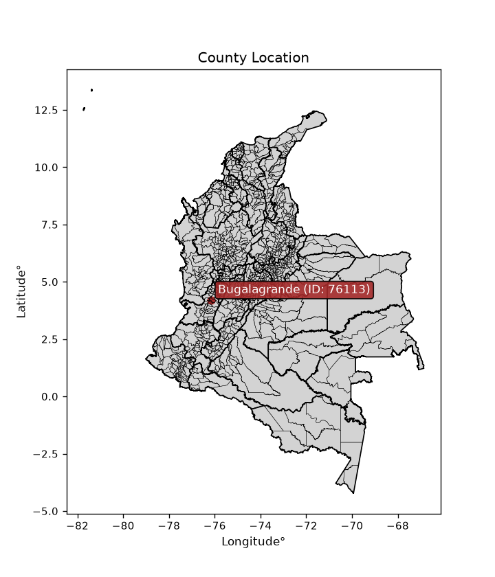
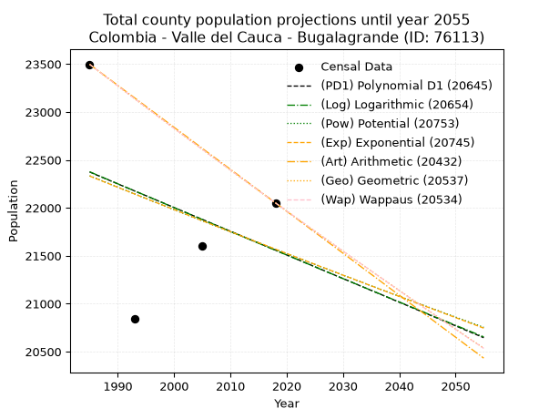
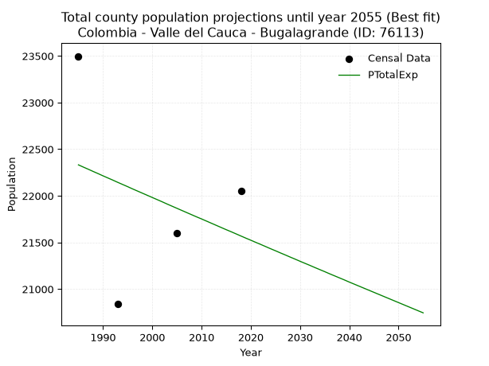
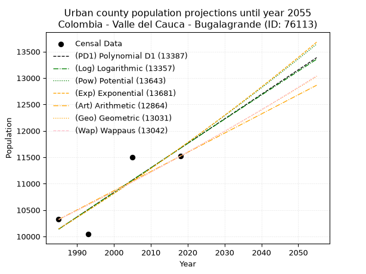
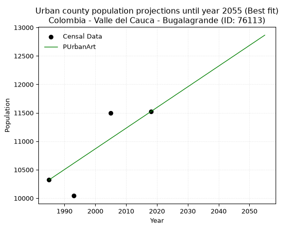
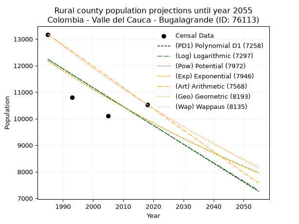
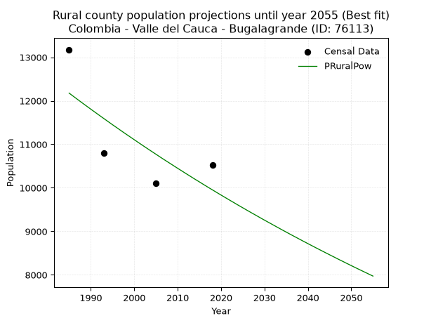

<div align="center">


</div>

# _“Population and Public Services Demand Projections (PPSD) until Year 2050 for Colombia - Valle del Cauca - Bugalagrande (ID: 76113)”_
Keywords: `population` `public-service` `projection` `lineal` `polynomial` `logarithmic` `potential` `exponential` `arithmetic` `geometric` `wappaus` `dane` `colombia` `south-america`

PPSD are analytical estimates used by governments and planners to anticipate future changes in population size, age distribution, and the resulting community needs for utilities, healthcare, education, and infrastructure as sizing future water treatment facilities, electrical grids, and road networks based on spatial growth.

<div align="center">

</img>

</div>


> **General running parameters**: • app_version: _v20260806_. • Python version: _3.14.7_. • Pandas version: _3.0.5_. • NumPy version: _2.5.1_. • Creates, save and include plots into reports (create_plot): _False_. • Projection until year: _2050_. • Process polynomial degree 2 and up: _False_. • Process Wappaus: _True_. • Process Wappaus: _True_. • Set negative values to zero: _True_. • Set infinite values to zero: _True_. • Drop dataset notes: _True_. 
<div align="center">

Dynamic map: [:earth_americas:Google](http://maps.google.com/maps?q=4.208358351,-76.1568201) [:earth_americas:OSM](https://www.openstreetmap.org/#map=18/4.208358351/-76.1568201&layers=P) [:earth_americas:Bing](https://www.bing.com/maps?cp=4.208358351~-76.1568201&lvl=18) [:earth_americas:Apple](https://maps.apple.com/frame?center=4.208358351%2C-76.1568201&span=0.003%2C0.006)

</div>


<div align="center">

```geojson
{
  "type": "Feature",
  "geometry": {
    "type": "Point", 
    "coordinates": [-76.1568201, 4.208358351]
  }, 
  "properties": {
    "Name": "Colombia - Valle del Cauca - Bugalagrande (ID: 76113)"
  }
}
```

</div>


## 0. Census Data (4 records)

Census data are official statistics collected by a government about the people and housing in a country. They usually include counts of total population, age, sex, race, income, education, and jobs.

📅Global census file: [Population.xlsx](../data/Population.xlsx)

| Source   |   Year |   CountryID | CountryName   |   StateID | StateName       |   CountyID | CountyName   |   PTotal |   PUrban |   PRural |
|:---------|-------:|------------:|:--------------|----------:|:----------------|-----------:|:-------------|---------:|---------:|---------:|
| DANE     |   1985 |          57 | Colombia      |        76 | Valle del Cauca |      76113 | Bugalagrande |    23497 |    10321 |    13176 |
| DANE     |   1993 |          57 | Colombia      |        76 | Valle del Cauca |      76113 | Bugalagrande |    20838 |    10042 |    10796 |
| DANE     |   2005 |          57 | Colombia      |        76 | Valle Del Cauca |      76113 | Bugalagrande |    21601 |    11500 |    10101 |
| DANE     |   2018 |          57 | Colombia      |        76 | Valle del Cauca |      76113 | Bugalagrande |    22052 |    11520 |    10532 |

> 🔥Some records could had specific notes about the registered values or the corresponding urban or rural distribution.

📅   [RUPS](https://www.datos.gov.co/Hacienda-y-Cr-dito-P-blico/Registro-nico-de-Prestadores-de-Servicios-P-blicos/4qkq-csdn/about_data) - Local public utility companies: [RUPS.csv](../data/RUPS.xlsx)

 | SERVICIO       | ESTADO    | NOMBRE                                                                                              | NIT         | DEPARTAMENTO_DOMICILIO   | MUNICIPIO_DOMICILIO   | DIRECCION                                   |   TELEFONO | EMAIL                                 | TIPO_PRESTADOR                             | CLASIFICACION                 |
|:---------------|:----------|:----------------------------------------------------------------------------------------------------|:------------|:-------------------------|:----------------------|:--------------------------------------------|-----------:|:--------------------------------------|:-------------------------------------------|:------------------------------|
| ACUEDUCTO      | OPERATIVA | SOCIEDAD DE ACUEDUCTOS Y ALCANTARILLADOS DEL VALLE DEL CAUCA S.A.  E.S.P.                           | 890399032-8 | VALLE DEL CAUCA          | CALI                  | AVENIDA 5 N # 23 AN 41                      |    6203400 | rosemary@acuavalle.gov.co             | SOCIEDADES (EMPRESA DE SERVICIOS PUBLICOS) | MAYOR O IGUAL A 5001 USUARIOS |
| ALCANTARILLADO | OPERATIVA | SOCIEDAD DE ACUEDUCTOS Y ALCANTARILLADOS DEL VALLE DEL CAUCA S.A.  E.S.P.                           | 890399032-8 | VALLE DEL CAUCA          | CALI                  | AVENIDA 5 N # 23 AN 41                      |    6203400 | rosemary@acuavalle.gov.co             | SOCIEDADES (EMPRESA DE SERVICIOS PUBLICOS) | MAYOR O IGUAL A 5001 USUARIOS |
| ACUEDUCTO      | OPERATIVA | ASOCIACION DE USUARIOS DEL SERVICIO DE AGUA POTABLE  Y ALCANTARILLADO DE SAN ANTONIO                | 821000642-7 | VALLE DEL CAUCA          | BUGALAGRANDE          | CARRERA 6 No 5 - 65 PISO  PALACIO MUNICIPAL |    2236235 | contactenos@bugalagrande-valle.gov.co | ORGANIZACION AUTORIZADA                    | HASTA 2500 SUSCRIPTORES       |
| ACUEDUCTO      | OPERATIVA | ASOCIACION DE USUARIOS DEL SERVICIO DE AGUA POTABLE DEL ACUEDUCTO Y ALCANTARILLADO DE MESTIZAL      | 821000561-9 | VALLE DEL CAUCA          | BUGALAGRANDE          | CALLE 6 # 5-68                              |    2957720 | oscarpavas@hotmail.com                | ORGANIZACION AUTORIZADA                    | HASTA 2500 SUSCRIPTORES       |
| ACUEDUCTO      | OPERATIVA | ASOCIACION DE USUARIOS DE LOS SERVICIOS PUBLICOS DEL CORREGIMIENTO DE CEILAN MUNICIPIO BUGALAGRANDE | 821000380-2 | VALLE DEL CAUCA          | BUGALAGRANDE          | CALLE 6 N° 4 - 34                           |    2012014 | servipublicos.ceilan@gmail.com        | ORGANIZACION AUTORIZADA                    | HASTA 2500 SUSCRIPTORES       |
| ALCANTARILLADO | OPERATIVA | ASOCIACION DE USUARIOS DE LOS SERVICIOS PUBLICOS DEL CORREGIMIENTO DE CEILAN MUNICIPIO BUGALAGRANDE | 821000380-2 | VALLE DEL CAUCA          | BUGALAGRANDE          | CALLE 6 N° 4 - 34                           |    2012014 | servipublicos.ceilan@gmail.com        | ORGANIZACION AUTORIZADA                    | HASTA 2500 SUSCRIPTORES       |

## 1. Total

### 1.1. Coefficients and Parameters

* (PD1) Polynomial Deg 1: -24.692091529506477, 71387.35608189533 (lineal)
* (Log) Logarithmic: -49697.828161942816, 399750.5901123282
* (Pow) Potential: -2.1193199497112856, 11.33798345003618
* (Exp) Exponential: -0.0010526375213551055, 180455.94552239584
* (Art) Arithmetic: Year diff. 2018 - 1985 = 33, Population diff. 22052 - 23497 = -1445, Annual growth = -43.78787878787879
* (Geo) Geometric: Year diff. 2018 - 1985 = 33, Population diff. 22052 - 23497 = -1445, Annual growth % = -0.001921468360000067
* (Wap) Wappaus: i = -0.19226713555897512, Condition values only valid for < 200)

<sub>
Wappaus condition values: ['-0.00', '-0.19', '-0.38', '-0.58', '-0.77', '-0.96', '-1.15', '-1.35', '-1.54', '-1.73', '-1.92', '-2.11', '-2.31', '-2.50', '-2.69', '-2.88', '-3.08', '-3.27', '-3.46', '-3.65', '-3.85', '-4.04', '-4.23', '-4.42', '-4.61', '-4.81', '-5.00', '-5.19', '-5.38', '-5.58', '-5.77', '-5.96', '-6.15', '-6.34', '-6.54', '-6.73', '-6.92', '-7.11', '-7.31', '-7.50', '-7.69', '-7.88', '-8.08', '-8.27', '-8.46', '-8.65', '-8.84', '-9.04', '-9.23', '-9.42', '-9.61', '-9.81', '-10.00', '-10.19', '-10.38', '-10.57', '-10.77', '-10.96', '-11.15', '-11.34', '-11.54', '-11.73', '-11.92', '-12.11', '-12.31', '-12.50']
</sub>


### 1.2. Projected Dataset

|   Year |   CountyID |   PTotalPD1 |   PTotalLog |   PTotalPow |   PTotalExp |   PTotalArt |   PTotalGeo |   PTotalWap |
|-------:|-----------:|------------:|------------:|------------:|------------:|------------:|------------:|------------:|
|   1985 |      76113 |       22374 |       22376 |       22334 |       22332 |       23497 |       23497 |       23497 |
|   1986 |      76113 |       22349 |       22351 |       22311 |       22308 |       23453 |       23452 |       23452 |
|   1987 |      76113 |       22324 |       22326 |       22287 |       22285 |       23409 |       23407 |       23407 |
|   1988 |      76113 |       22299 |       22301 |       22263 |       22261 |       23366 |       23362 |       23362 |
|   1989 |      76113 |       22275 |       22276 |       22239 |       22238 |       23322 |       23317 |       23317 |
|   1990 |      76113 |       22250 |       22251 |       22216 |       22214 |       23278 |       23272 |       23272 |
|   1991 |      76113 |       22225 |       22226 |       22192 |       22191 |       23234 |       23227 |       23227 |
|   1992 |      76113 |       22201 |       22201 |       22168 |       22168 |       23190 |       23183 |       23183 |
|   1993 |      76113 |       22176 |       22176 |       22145 |       22144 |       23147 |       23138 |       23138 |
|   1994 |      76113 |       22151 |       22152 |       22121 |       22121 |       23103 |       23094 |       23094 |
|   1995 |      76113 |       22127 |       22127 |       22098 |       22098 |       23059 |       23049 |       23050 |
|   1996 |      76113 |       22102 |       22102 |       22074 |       22074 |       23015 |       23005 |       23005 |
|   1997 |      76113 |       22077 |       22077 |       22051 |       22051 |       22972 |       22961 |       22961 |
|   1998 |      76113 |       22053 |       22052 |       22028 |       22028 |       22928 |       22917 |       22917 |
|   1999 |      76113 |       22028 |       22027 |       22004 |       22005 |       22884 |       22873 |       22873 |
|   2000 |      76113 |       22003 |       22002 |       21981 |       21982 |       22840 |       22829 |       22829 |
|   2001 |      76113 |       21978 |       21977 |       21958 |       21959 |       22796 |       22785 |       22785 |
|   2002 |      76113 |       21954 |       21953 |       21934 |       21936 |       22753 |       22741 |       22741 |
|   2003 |      76113 |       21929 |       21928 |       21911 |       21912 |       22709 |       22697 |       22698 |
|   2004 |      76113 |       21904 |       21903 |       21888 |       21889 |       22665 |       22654 |       22654 |
|   2005 |      76113 |       21880 |       21878 |       21865 |       21866 |       22621 |       22610 |       22611 |
|   2006 |      76113 |       21855 |       21853 |       21842 |       21843 |       22577 |       22567 |       22567 |
|   2007 |      76113 |       21830 |       21829 |       21819 |       21820 |       22534 |       22524 |       22524 |
|   2008 |      76113 |       21806 |       21804 |       21796 |       21797 |       22490 |       22480 |       22480 |
|   2009 |      76113 |       21781 |       21779 |       21773 |       21774 |       22446 |       22437 |       22437 |
|   2010 |      76113 |       21756 |       21754 |       21750 |       21752 |       22402 |       22394 |       22394 |
|   2011 |      76113 |       21732 |       21730 |       21727 |       21729 |       22359 |       22351 |       22351 |
|   2012 |      76113 |       21707 |       21705 |       21704 |       21706 |       22315 |       22308 |       22308 |
|   2013 |      76113 |       21682 |       21680 |       21681 |       21683 |       22271 |       22265 |       22265 |
|   2014 |      76113 |       21657 |       21656 |       21658 |       21660 |       22227 |       22222 |       22222 |
|   2015 |      76113 |       21633 |       21631 |       21636 |       21637 |       22183 |       22180 |       22180 |
|   2016 |      76113 |       21608 |       21606 |       21613 |       21615 |       22140 |       22137 |       22137 |
|   2017 |      76113 |       21583 |       21582 |       21590 |       21592 |       22096 |       22094 |       22094 |
|   2018 |      76113 |       21559 |       21557 |       21567 |       21569 |       22052 |       22052 |       22052 |
|   2019 |      76113 |       21534 |       21532 |       21545 |       21546 |       22008 |       22010 |       22010 |
|   2020 |      76113 |       21509 |       21508 |       21522 |       21524 |       21964 |       21967 |       21967 |
|   2021 |      76113 |       21485 |       21483 |       21500 |       21501 |       21921 |       21925 |       21925 |
|   2022 |      76113 |       21460 |       21459 |       21477 |       21479 |       21877 |       21883 |       21883 |
|   2023 |      76113 |       21435 |       21434 |       21455 |       21456 |       21833 |       21841 |       21841 |
|   2024 |      76113 |       21411 |       21409 |       21432 |       21433 |       21789 |       21799 |       21799 |
|   2025 |      76113 |       21386 |       21385 |       21410 |       21411 |       21745 |       21757 |       21757 |
|   2026 |      76113 |       21361 |       21360 |       21387 |       21388 |       21702 |       21715 |       21715 |
|   2027 |      76113 |       21336 |       21336 |       21365 |       21366 |       21658 |       21674 |       21673 |
|   2028 |      76113 |       21312 |       21311 |       21343 |       21343 |       21614 |       21632 |       21632 |
|   2029 |      76113 |       21287 |       21287 |       21320 |       21321 |       21570 |       21590 |       21590 |
|   2030 |      76113 |       21262 |       21262 |       21298 |       21298 |       21527 |       21549 |       21548 |
|   2031 |      76113 |       21238 |       21238 |       21276 |       21276 |       21483 |       21507 |       21507 |
|   2032 |      76113 |       21213 |       21213 |       21254 |       21254 |       21439 |       21466 |       21465 |
|   2033 |      76113 |       21188 |       21189 |       21232 |       21231 |       21395 |       21425 |       21424 |
|   2034 |      76113 |       21164 |       21164 |       21209 |       21209 |       21351 |       21384 |       21383 |
|   2035 |      76113 |       21139 |       21140 |       21187 |       21187 |       21308 |       21343 |       21342 |
|   2036 |      76113 |       21114 |       21116 |       21165 |       21164 |       21264 |       21302 |       21301 |
|   2037 |      76113 |       21090 |       21091 |       21143 |       21142 |       21220 |       21261 |       21260 |
|   2038 |      76113 |       21065 |       21067 |       21121 |       21120 |       21176 |       21220 |       21219 |
|   2039 |      76113 |       21040 |       21042 |       21099 |       21098 |       21132 |       21179 |       21178 |
|   2040 |      76113 |       21015 |       21018 |       21077 |       21075 |       21089 |       21138 |       21137 |
|   2041 |      76113 |       20991 |       20994 |       21056 |       21053 |       21045 |       21098 |       21096 |
|   2042 |      76113 |       20966 |       20969 |       21034 |       21031 |       21001 |       21057 |       21056 |
|   2043 |      76113 |       20941 |       20945 |       21012 |       21009 |       20957 |       21017 |       21015 |
|   2044 |      76113 |       20917 |       20921 |       20990 |       20987 |       20914 |       20976 |       20975 |
|   2045 |      76113 |       20892 |       20896 |       20968 |       20965 |       20870 |       20936 |       20934 |
|   2046 |      76113 |       20867 |       20872 |       20947 |       20943 |       20826 |       20896 |       20894 |
|   2047 |      76113 |       20843 |       20848 |       20925 |       20921 |       20782 |       20856 |       20854 |
|   2048 |      76113 |       20818 |       20824 |       20903 |       20899 |       20738 |       20816 |       20813 |
|   2049 |      76113 |       20793 |       20799 |       20882 |       20877 |       20695 |       20776 |       20773 |
|   2050 |      76113 |       20769 |       20775 |       20860 |       20855 |       20651 |       20736 |       20733 |
<div align="center">

</img>

</div>


### 1.3. Best fit with absolute and relative error (%)

Relative error puts that difference into context by dividing the absolute error by the true value, creating a unitless ratio or percentage that shows the scale of the mistake.

Absolute and relative error

|   Year | Source   |   CountryID | CountryName   |   StateID | StateName       |   CountyID_x | CountyName   |   PTotal |   PUrban |   PRural |   CountyID_y |   PTotalPD1 |   PTotalLog |   PTotalPow |   PTotalExp |   PTotalArt |   PTotalGeo |   PTotalWap |   PTotalPD1AbsError |   PTotalLogAbsError |   PTotalPowAbsError |   PTotalExpAbsError |   PTotalArtAbsError |   PTotalGeoAbsError |   PTotalWapAbsError |   PTotalPD1RelError |   PTotalLogRelError |   PTotalPowRelError |   PTotalExpRelError |   PTotalArtRelError |   PTotalGeoRelError |   PTotalWapRelError |
|-------:|:---------|------------:|:--------------|----------:|:----------------|-------------:|:-------------|---------:|---------:|---------:|-------------:|------------:|------------:|------------:|------------:|------------:|------------:|------------:|--------------------:|--------------------:|--------------------:|--------------------:|--------------------:|--------------------:|--------------------:|--------------------:|--------------------:|--------------------:|--------------------:|--------------------:|--------------------:|--------------------:|
|   1985 | DANE     |          57 | Colombia      |        76 | Valle del Cauca |        76113 | Bugalagrande |    23497 |    10321 |    13176 |        76113 |       22374 |       22376 |       22334 |       22332 |       23497 |       23497 |       23497 |                1123 |                1121 |                1163 |                1165 |                   0 |                   0 |                   0 |             4.77933 |             4.77082 |             4.94957 |             4.95808 |              0      |             0       |             0       |
|   1993 | DANE     |          57 | Colombia      |        76 | Valle del Cauca |        76113 | Bugalagrande |    20838 |    10042 |    10796 |        76113 |       22176 |       22176 |       22145 |       22144 |       23147 |       23138 |       23138 |                1338 |                1338 |                1307 |                1306 |                2309 |                2300 |                2300 |             6.42096 |             6.42096 |             6.2722  |             6.2674  |             11.0807 |            11.0375  |            11.0375  |
|   2005 | DANE     |          57 | Colombia      |        76 | Valle Del Cauca |        76113 | Bugalagrande |    21601 |    11500 |    10101 |        76113 |       21880 |       21878 |       21865 |       21866 |       22621 |       22610 |       22611 |                 279 |                 277 |                 264 |                 265 |                1020 |                1009 |                1010 |             1.29161 |             1.28235 |             1.22217 |             1.2268  |              4.722  |             4.67108 |             4.67571 |
|   2018 | DANE     |          57 | Colombia      |        76 | Valle del Cauca |        76113 | Bugalagrande |    22052 |    11520 |    10532 |        76113 |       21559 |       21557 |       21567 |       21569 |       22052 |       22052 |       22052 |                 493 |                 495 |                 485 |                 483 |                   0 |                   0 |                   0 |             2.23562 |             2.24469 |             2.19935 |             2.19028 |              0      |             0       |             0       |

Relative error mean

| Method    |   RelError | Best   |
|:----------|-----------:|:-------|
| PTotalPD1 |    3.68188 |        |
| PTotalLog |    3.67971 |        |
| PTotalPow |    3.66082 |        |
| PTotalExp |    3.66064 | True   |
| PTotalArt |    3.95068 |        |
| PTotalGeo |    3.92715 |        |
| PTotalWap |    3.92831 |        |

💙Best method: _**PTotalExp**_
<div align="center">

</img>

</div>


### 1.4. Fresh water supply demand in liters per capita per day (lpcd)

The fresh water supply demand typically ranges from 100 to 300 liters per capita per day (lpcd) for standard domestic and municipal planning, though absolute survival minimums set by the World Health Organization are as low as 7.5 to 20 liters per day, and total consumption in high-income nations can exceed 400 liters.

> `CZ`: Level in meters above the sea level (masl)<br> `WS`: Fresh water supply demand in liters per capita per day (lpcd or l/h/d)<br> `WSAll`: Zonal fresh water supply demand in liters per second (l/s)<br> `A`: Zonal area in square meters<br> `DP`: Population density (people/hectare or p/ha)

Reference values (RAS Colombia)

|    CZ |   WS |
|------:|-----:|
|  1000 |  120 |
|  2000 |  130 |
| 99999 |  140 |

County shapefile geometry properties and water supply values

|   CountyID |      ATotal |   CZTotal |   WSTotal |
|-----------:|------------:|----------:|----------:|
|      76113 | 3.96849e+08 |   1119.48 |       130 |

Projected values for best method: PTotalExp

|   CountyID |   Year |   PTotalExp |   DPTotal |   WSTotal |   WSTotalAll |
|-----------:|-------:|------------:|----------:|----------:|-------------:|
|      76113 |   1985 |       22332 |      0.56 |       130 |      33.6014 |
|      76113 |   1986 |       22308 |      0.56 |       130 |      33.5653 |
|      76113 |   1987 |       22285 |      0.56 |       130 |      33.5307 |
|      76113 |   1988 |       22261 |      0.56 |       130 |      33.4946 |
|      76113 |   1989 |       22238 |      0.56 |       130 |      33.46   |
|      76113 |   1990 |       22214 |      0.56 |       130 |      33.4238 |
|      76113 |   1991 |       22191 |      0.56 |       130 |      33.3892 |
|      76113 |   1992 |       22168 |      0.56 |       130 |      33.3546 |
|      76113 |   1993 |       22144 |      0.56 |       130 |      33.3185 |
|      76113 |   1994 |       22121 |      0.56 |       130 |      33.2839 |
|      76113 |   1995 |       22098 |      0.56 |       130 |      33.2493 |
|      76113 |   1996 |       22074 |      0.56 |       130 |      33.2132 |
|      76113 |   1997 |       22051 |      0.56 |       130 |      33.1786 |
|      76113 |   1998 |       22028 |      0.56 |       130 |      33.144  |
|      76113 |   1999 |       22005 |      0.55 |       130 |      33.1094 |
|      76113 |   2000 |       21982 |      0.55 |       130 |      33.0748 |
|      76113 |   2001 |       21959 |      0.55 |       130 |      33.0402 |
|      76113 |   2002 |       21936 |      0.55 |       130 |      33.0056 |
|      76113 |   2003 |       21912 |      0.55 |       130 |      32.9694 |
|      76113 |   2004 |       21889 |      0.55 |       130 |      32.9348 |
|      76113 |   2005 |       21866 |      0.55 |       130 |      32.9002 |
|      76113 |   2006 |       21843 |      0.55 |       130 |      32.8656 |
|      76113 |   2007 |       21820 |      0.55 |       130 |      32.831  |
|      76113 |   2008 |       21797 |      0.55 |       130 |      32.7964 |
|      76113 |   2009 |       21774 |      0.55 |       130 |      32.7618 |
|      76113 |   2010 |       21752 |      0.55 |       130 |      32.7287 |
|      76113 |   2011 |       21729 |      0.55 |       130 |      32.6941 |
|      76113 |   2012 |       21706 |      0.55 |       130 |      32.6595 |
|      76113 |   2013 |       21683 |      0.55 |       130 |      32.6249 |
|      76113 |   2014 |       21660 |      0.55 |       130 |      32.5903 |
|      76113 |   2015 |       21637 |      0.55 |       130 |      32.5557 |
|      76113 |   2016 |       21615 |      0.54 |       130 |      32.5226 |
|      76113 |   2017 |       21592 |      0.54 |       130 |      32.488  |
|      76113 |   2018 |       21569 |      0.54 |       130 |      32.4534 |
|      76113 |   2019 |       21546 |      0.54 |       130 |      32.4188 |
|      76113 |   2020 |       21524 |      0.54 |       130 |      32.3856 |
|      76113 |   2021 |       21501 |      0.54 |       130 |      32.351  |
|      76113 |   2022 |       21479 |      0.54 |       130 |      32.3179 |
|      76113 |   2023 |       21456 |      0.54 |       130 |      32.2833 |
|      76113 |   2024 |       21433 |      0.54 |       130 |      32.2487 |
|      76113 |   2025 |       21411 |      0.54 |       130 |      32.2156 |
|      76113 |   2026 |       21388 |      0.54 |       130 |      32.181  |
|      76113 |   2027 |       21366 |      0.54 |       130 |      32.1479 |
|      76113 |   2028 |       21343 |      0.54 |       130 |      32.1133 |
|      76113 |   2029 |       21321 |      0.54 |       130 |      32.0802 |
|      76113 |   2030 |       21298 |      0.54 |       130 |      32.0456 |
|      76113 |   2031 |       21276 |      0.54 |       130 |      32.0125 |
|      76113 |   2032 |       21254 |      0.54 |       130 |      31.9794 |
|      76113 |   2033 |       21231 |      0.53 |       130 |      31.9448 |
|      76113 |   2034 |       21209 |      0.53 |       130 |      31.9117 |
|      76113 |   2035 |       21187 |      0.53 |       130 |      31.8786 |
|      76113 |   2036 |       21164 |      0.53 |       130 |      31.844  |
|      76113 |   2037 |       21142 |      0.53 |       130 |      31.8109 |
|      76113 |   2038 |       21120 |      0.53 |       130 |      31.7778 |
|      76113 |   2039 |       21098 |      0.53 |       130 |      31.7447 |
|      76113 |   2040 |       21075 |      0.53 |       130 |      31.7101 |
|      76113 |   2041 |       21053 |      0.53 |       130 |      31.677  |
|      76113 |   2042 |       21031 |      0.53 |       130 |      31.6439 |
|      76113 |   2043 |       21009 |      0.53 |       130 |      31.6108 |
|      76113 |   2044 |       20987 |      0.53 |       130 |      31.5777 |
|      76113 |   2045 |       20965 |      0.53 |       130 |      31.5446 |
|      76113 |   2046 |       20943 |      0.53 |       130 |      31.5115 |
|      76113 |   2047 |       20921 |      0.53 |       130 |      31.4784 |
|      76113 |   2048 |       20899 |      0.53 |       130 |      31.4453 |
|      76113 |   2049 |       20877 |      0.53 |       130 |      31.4122 |
|      76113 |   2050 |       20855 |      0.53 |       130 |      31.3791 |

## 2. Urban

### 2.1. Coefficients and Parameters

* (PD1) Polynomial Deg 1: 46.41549578482526, -81996.84544359671 (lineal)
* (Log) Logarithmic: 92921.42878623746, -695450.7748297892
* (Pow) Potential: 8.561463815290498, -24.227618252778353
* (Exp) Exponential: 0.004276624502469053, 2.0860749347383276
* (Art) Arithmetic: Year diff. 2018 - 1985 = 33, Population diff. 11520 - 10321 = 1199, Annual growth = 36.333333333333336
* (Geo) Geometric: Year diff. 2018 - 1985 = 33, Population diff. 11520 - 10321 = 1199, Annual growth % = 0.003335976287857978
* (Wap) Wappaus: i = 0.3327075988584161, Condition values only valid for < 200)

<sub>
Wappaus condition values: ['0.00', '0.33', '0.67', '1.00', '1.33', '1.66', '2.00', '2.33', '2.66', '2.99', '3.33', '3.66', '3.99', '4.33', '4.66', '4.99', '5.32', '5.66', '5.99', '6.32', '6.65', '6.99', '7.32', '7.65', '7.98', '8.32', '8.65', '8.98', '9.32', '9.65', '9.98', '10.31', '10.65', '10.98', '11.31', '11.64', '11.98', '12.31', '12.64', '12.98', '13.31', '13.64', '13.97', '14.31', '14.64', '14.97', '15.30', '15.64', '15.97', '16.30', '16.64', '16.97', '17.30', '17.63', '17.97', '18.30', '18.63', '18.96', '19.30', '19.63', '19.96', '20.30', '20.63', '20.96', '21.29', '21.63']
</sub>


### 2.2. Projected Dataset

|   Year |   CountyID |   PUrbanPD1 |   PUrbanLog |   PUrbanPow |   PUrbanExp |   PUrbanArt |   PUrbanGeo |   PUrbanWap |
|-------:|-----------:|------------:|------------:|------------:|------------:|------------:|------------:|------------:|
|   1985 |      76113 |       10138 |       10136 |       10140 |       10141 |       10321 |       10321 |       10321 |
|   1986 |      76113 |       10184 |       10183 |       10184 |       10185 |       10357 |       10355 |       10355 |
|   1987 |      76113 |       10231 |       10230 |       10228 |       10229 |       10394 |       10390 |       10390 |
|   1988 |      76113 |       10277 |       10277 |       10272 |       10272 |       10430 |       10425 |       10425 |
|   1989 |      76113 |       10324 |       10323 |       10316 |       10316 |       10466 |       10459 |       10459 |
|   1990 |      76113 |       10370 |       10370 |       10361 |       10361 |       10503 |       10494 |       10494 |
|   1991 |      76113 |       10416 |       10417 |       10405 |       10405 |       10539 |       10529 |       10529 |
|   1992 |      76113 |       10463 |       10464 |       10450 |       10450 |       10575 |       10564 |       10564 |
|   1993 |      76113 |       10509 |       10510 |       10495 |       10494 |       10612 |       10600 |       10599 |
|   1994 |      76113 |       10556 |       10557 |       10540 |       10539 |       10648 |       10635 |       10635 |
|   1995 |      76113 |       10602 |       10603 |       10586 |       10585 |       10684 |       10671 |       10670 |
|   1996 |      76113 |       10648 |       10650 |       10631 |       10630 |       10721 |       10706 |       10706 |
|   1997 |      76113 |       10695 |       10696 |       10677 |       10675 |       10757 |       10742 |       10741 |
|   1998 |      76113 |       10741 |       10743 |       10723 |       10721 |       10793 |       10778 |       10777 |
|   1999 |      76113 |       10788 |       10789 |       10769 |       10767 |       10830 |       10814 |       10813 |
|   2000 |      76113 |       10834 |       10836 |       10815 |       10813 |       10866 |       10850 |       10849 |
|   2001 |      76113 |       10881 |       10882 |       10861 |       10860 |       10902 |       10886 |       10885 |
|   2002 |      76113 |       10927 |       10929 |       10908 |       10906 |       10939 |       10922 |       10922 |
|   2003 |      76113 |       10973 |       10975 |       10955 |       10953 |       10975 |       10959 |       10958 |
|   2004 |      76113 |       11020 |       11022 |       11002 |       11000 |       11011 |       10995 |       10995 |
|   2005 |      76113 |       11066 |       11068 |       11049 |       11047 |       11048 |       11032 |       11031 |
|   2006 |      76113 |       11113 |       11114 |       11096 |       11094 |       11084 |       11069 |       11068 |
|   2007 |      76113 |       11159 |       11161 |       11143 |       11142 |       11120 |       11106 |       11105 |
|   2008 |      76113 |       11205 |       11207 |       11191 |       11190 |       11157 |       11143 |       11142 |
|   2009 |      76113 |       11252 |       11253 |       11239 |       11238 |       11193 |       11180 |       11179 |
|   2010 |      76113 |       11298 |       11299 |       11287 |       11286 |       11229 |       11217 |       11217 |
|   2011 |      76113 |       11345 |       11346 |       11335 |       11334 |       11266 |       11255 |       11254 |
|   2012 |      76113 |       11391 |       11392 |       11383 |       11383 |       11302 |       11292 |       11292 |
|   2013 |      76113 |       11438 |       11438 |       11432 |       11432 |       11338 |       11330 |       11329 |
|   2014 |      76113 |       11484 |       11484 |       11481 |       11481 |       11375 |       11368 |       11367 |
|   2015 |      76113 |       11530 |       11530 |       11530 |       11530 |       11411 |       11405 |       11405 |
|   2016 |      76113 |       11577 |       11576 |       11579 |       11579 |       11447 |       11444 |       11443 |
|   2017 |      76113 |       11623 |       11622 |       11628 |       11629 |       11484 |       11482 |       11482 |
|   2018 |      76113 |       11670 |       11668 |       11677 |       11679 |       11520 |       11520 |       11520 |
|   2019 |      76113 |       11716 |       11715 |       11727 |       11729 |       11556 |       11558 |       11559 |
|   2020 |      76113 |       11762 |       11761 |       11777 |       11779 |       11593 |       11597 |       11597 |
|   2021 |      76113 |       11809 |       11807 |       11827 |       11829 |       11629 |       11636 |       11636 |
|   2022 |      76113 |       11855 |       11852 |       11877 |       11880 |       11665 |       11674 |       11675 |
|   2023 |      76113 |       11902 |       11898 |       11927 |       11931 |       11702 |       11713 |       11714 |
|   2024 |      76113 |       11948 |       11944 |       11978 |       11982 |       11738 |       11753 |       11753 |
|   2025 |      76113 |       11995 |       11990 |       12029 |       12033 |       11774 |       11792 |       11792 |
|   2026 |      76113 |       12041 |       12036 |       12080 |       12085 |       11811 |       11831 |       11832 |
|   2027 |      76113 |       12087 |       12082 |       12131 |       12137 |       11847 |       11871 |       11872 |
|   2028 |      76113 |       12134 |       12128 |       12182 |       12189 |       11883 |       11910 |       11911 |
|   2029 |      76113 |       12180 |       12174 |       12234 |       12241 |       11920 |       11950 |       11951 |
|   2030 |      76113 |       12227 |       12219 |       12285 |       12294 |       11956 |       11990 |       11991 |
|   2031 |      76113 |       12273 |       12265 |       12337 |       12346 |       11992 |       12030 |       12031 |
|   2032 |      76113 |       12319 |       12311 |       12389 |       12399 |       12029 |       12070 |       12072 |
|   2033 |      76113 |       12366 |       12357 |       12442 |       12452 |       12065 |       12110 |       12112 |
|   2034 |      76113 |       12412 |       12402 |       12494 |       12506 |       12101 |       12151 |       12153 |
|   2035 |      76113 |       12459 |       12448 |       12547 |       12559 |       12138 |       12191 |       12194 |
|   2036 |      76113 |       12505 |       12494 |       12600 |       12613 |       12174 |       12232 |       12235 |
|   2037 |      76113 |       12552 |       12539 |       12653 |       12667 |       12210 |       12273 |       12276 |
|   2038 |      76113 |       12598 |       12585 |       12706 |       12721 |       12247 |       12313 |       12317 |
|   2039 |      76113 |       12644 |       12630 |       12760 |       12776 |       12283 |       12355 |       12358 |
|   2040 |      76113 |       12691 |       12676 |       12813 |       12831 |       12319 |       12396 |       12400 |
|   2041 |      76113 |       12737 |       12722 |       12867 |       12886 |       12356 |       12437 |       12442 |
|   2042 |      76113 |       12784 |       12767 |       12921 |       12941 |       12392 |       12479 |       12483 |
|   2043 |      76113 |       12830 |       12813 |       12976 |       12996 |       12428 |       12520 |       12525 |
|   2044 |      76113 |       12876 |       12858 |       13030 |       13052 |       12465 |       12562 |       12567 |
|   2045 |      76113 |       12923 |       12904 |       13085 |       13108 |       12501 |       12604 |       12610 |
|   2046 |      76113 |       12969 |       12949 |       13140 |       13164 |       12537 |       12646 |       12652 |
|   2047 |      76113 |       13016 |       12994 |       13195 |       13221 |       12574 |       12688 |       12695 |
|   2048 |      76113 |       13062 |       13040 |       13250 |       13277 |       12610 |       12730 |       12738 |
|   2049 |      76113 |       13109 |       13085 |       13305 |       13334 |       12646 |       12773 |       12781 |
|   2050 |      76113 |       13155 |       13130 |       13361 |       13391 |       12683 |       12816 |       12824 |
<div align="center">

</img>

</div>


### 2.3. Best fit with absolute and relative error (%)

Relative error puts that difference into context by dividing the absolute error by the true value, creating a unitless ratio or percentage that shows the scale of the mistake.

Absolute and relative error

|   Year | Source   |   CountryID | CountryName   |   StateID | StateName       |   CountyID_x | CountyName   |   PTotal |   PUrban |   PRural |   CountyID_y |   PUrbanPD1 |   PUrbanLog |   PUrbanPow |   PUrbanExp |   PUrbanArt |   PUrbanGeo |   PUrbanWap |   PUrbanPD1AbsError |   PUrbanLogAbsError |   PUrbanPowAbsError |   PUrbanExpAbsError |   PUrbanArtAbsError |   PUrbanGeoAbsError |   PUrbanWapAbsError |   PUrbanPD1RelError |   PUrbanLogRelError |   PUrbanPowRelError |   PUrbanExpRelError |   PUrbanArtRelError |   PUrbanGeoRelError |   PUrbanWapRelError |
|-------:|:---------|------------:|:--------------|----------:|:----------------|-------------:|:-------------|---------:|---------:|---------:|-------------:|------------:|------------:|------------:|------------:|------------:|------------:|------------:|--------------------:|--------------------:|--------------------:|--------------------:|--------------------:|--------------------:|--------------------:|--------------------:|--------------------:|--------------------:|--------------------:|--------------------:|--------------------:|--------------------:|
|   1985 | DANE     |          57 | Colombia      |        76 | Valle del Cauca |        76113 | Bugalagrande |    23497 |    10321 |    13176 |        76113 |       10138 |       10136 |       10140 |       10141 |       10321 |       10321 |       10321 |                 183 |                 185 |                 181 |                 180 |                   0 |                   0 |                   0 |             1.77308 |             1.79246 |             1.75371 |             1.74402 |             0       |             0       |             0       |
|   1993 | DANE     |          57 | Colombia      |        76 | Valle del Cauca |        76113 | Bugalagrande |    20838 |    10042 |    10796 |        76113 |       10509 |       10510 |       10495 |       10494 |       10612 |       10600 |       10599 |                 467 |                 468 |                 453 |                 452 |                 570 |                 558 |                 557 |             4.65047 |             4.66043 |             4.51105 |             4.5011  |             5.67616 |             5.55666 |             5.5467  |
|   2005 | DANE     |          57 | Colombia      |        76 | Valle Del Cauca |        76113 | Bugalagrande |    21601 |    11500 |    10101 |        76113 |       11066 |       11068 |       11049 |       11047 |       11048 |       11032 |       11031 |                 434 |                 432 |                 451 |                 453 |                 452 |                 468 |                 469 |             3.77391 |             3.75652 |             3.92174 |             3.93913 |             3.93043 |             4.06957 |             4.07826 |
|   2018 | DANE     |          57 | Colombia      |        76 | Valle del Cauca |        76113 | Bugalagrande |    22052 |    11520 |    10532 |        76113 |       11670 |       11668 |       11677 |       11679 |       11520 |       11520 |       11520 |                 150 |                 148 |                 157 |                 159 |                   0 |                   0 |                   0 |             1.30208 |             1.28472 |             1.36285 |             1.38021 |             0       |             0       |             0       |

Relative error mean

| Method    |   RelError | Best   |
|:----------|-----------:|:-------|
| PUrbanPD1 |    2.87489 |        |
| PUrbanLog |    2.87353 |        |
| PUrbanPow |    2.88734 |        |
| PUrbanExp |    2.89111 |        |
| PUrbanArt |    2.40165 | True   |
| PUrbanGeo |    2.40656 |        |
| PUrbanWap |    2.40624 |        |

💙Best method: _**PUrbanArt**_
<div align="center">

</img>

</div>


### 2.4. Fresh water supply demand in liters per capita per day (lpcd)

The fresh water supply demand typically ranges from 100 to 300 liters per capita per day (lpcd) for standard domestic and municipal planning, though absolute survival minimums set by the World Health Organization are as low as 7.5 to 20 liters per day, and total consumption in high-income nations can exceed 400 liters.

> `CZ`: Level in meters above the sea level (masl)<br> `WS`: Fresh water supply demand in liters per capita per day (lpcd or l/h/d)<br> `WSAll`: Zonal fresh water supply demand in liters per second (l/s)<br> `A`: Zonal area in square meters<br> `DP`: Population density (people/hectare or p/ha)

Reference values (RAS Colombia)

|    CZ |   WS |
|------:|-----:|
|  1000 |  120 |
|  2000 |  130 |
| 99999 |  140 |

County shapefile geometry properties and water supply values

|   CountyID |      AUrban |   CZUrban |   WSUrban |
|-----------:|------------:|----------:|----------:|
|      76113 | 2.90211e+06 |   946.402 |       120 |

Projected values for best method: PUrbanArt

|   CountyID |   Year |   PUrbanArt |   DPUrban |   WSUrban |   WSUrbanAll |
|-----------:|-------:|------------:|----------:|----------:|-------------:|
|      76113 |   1985 |       10321 |     35.56 |       120 |      14.3347 |
|      76113 |   1986 |       10357 |     35.69 |       120 |      14.3847 |
|      76113 |   1987 |       10394 |     35.82 |       120 |      14.4361 |
|      76113 |   1988 |       10430 |     35.94 |       120 |      14.4861 |
|      76113 |   1989 |       10466 |     36.06 |       120 |      14.5361 |
|      76113 |   1990 |       10503 |     36.19 |       120 |      14.5875 |
|      76113 |   1991 |       10539 |     36.32 |       120 |      14.6375 |
|      76113 |   1992 |       10575 |     36.44 |       120 |      14.6875 |
|      76113 |   1993 |       10612 |     36.57 |       120 |      14.7389 |
|      76113 |   1994 |       10648 |     36.69 |       120 |      14.7889 |
|      76113 |   1995 |       10684 |     36.81 |       120 |      14.8389 |
|      76113 |   1996 |       10721 |     36.94 |       120 |      14.8903 |
|      76113 |   1997 |       10757 |     37.07 |       120 |      14.9403 |
|      76113 |   1998 |       10793 |     37.19 |       120 |      14.9903 |
|      76113 |   1999 |       10830 |     37.32 |       120 |      15.0417 |
|      76113 |   2000 |       10866 |     37.44 |       120 |      15.0917 |
|      76113 |   2001 |       10902 |     37.57 |       120 |      15.1417 |
|      76113 |   2002 |       10939 |     37.69 |       120 |      15.1931 |
|      76113 |   2003 |       10975 |     37.82 |       120 |      15.2431 |
|      76113 |   2004 |       11011 |     37.94 |       120 |      15.2931 |
|      76113 |   2005 |       11048 |     38.07 |       120 |      15.3444 |
|      76113 |   2006 |       11084 |     38.19 |       120 |      15.3944 |
|      76113 |   2007 |       11120 |     38.32 |       120 |      15.4444 |
|      76113 |   2008 |       11157 |     38.44 |       120 |      15.4958 |
|      76113 |   2009 |       11193 |     38.57 |       120 |      15.5458 |
|      76113 |   2010 |       11229 |     38.69 |       120 |      15.5958 |
|      76113 |   2011 |       11266 |     38.82 |       120 |      15.6472 |
|      76113 |   2012 |       11302 |     38.94 |       120 |      15.6972 |
|      76113 |   2013 |       11338 |     39.07 |       120 |      15.7472 |
|      76113 |   2014 |       11375 |     39.2  |       120 |      15.7986 |
|      76113 |   2015 |       11411 |     39.32 |       120 |      15.8486 |
|      76113 |   2016 |       11447 |     39.44 |       120 |      15.8986 |
|      76113 |   2017 |       11484 |     39.57 |       120 |      15.95   |
|      76113 |   2018 |       11520 |     39.7  |       120 |      16      |
|      76113 |   2019 |       11556 |     39.82 |       120 |      16.05   |
|      76113 |   2020 |       11593 |     39.95 |       120 |      16.1014 |
|      76113 |   2021 |       11629 |     40.07 |       120 |      16.1514 |
|      76113 |   2022 |       11665 |     40.19 |       120 |      16.2014 |
|      76113 |   2023 |       11702 |     40.32 |       120 |      16.2528 |
|      76113 |   2024 |       11738 |     40.45 |       120 |      16.3028 |
|      76113 |   2025 |       11774 |     40.57 |       120 |      16.3528 |
|      76113 |   2026 |       11811 |     40.7  |       120 |      16.4042 |
|      76113 |   2027 |       11847 |     40.82 |       120 |      16.4542 |
|      76113 |   2028 |       11883 |     40.95 |       120 |      16.5042 |
|      76113 |   2029 |       11920 |     41.07 |       120 |      16.5556 |
|      76113 |   2030 |       11956 |     41.2  |       120 |      16.6056 |
|      76113 |   2031 |       11992 |     41.32 |       120 |      16.6556 |
|      76113 |   2032 |       12029 |     41.45 |       120 |      16.7069 |
|      76113 |   2033 |       12065 |     41.57 |       120 |      16.7569 |
|      76113 |   2034 |       12101 |     41.7  |       120 |      16.8069 |
|      76113 |   2035 |       12138 |     41.82 |       120 |      16.8583 |
|      76113 |   2036 |       12174 |     41.95 |       120 |      16.9083 |
|      76113 |   2037 |       12210 |     42.07 |       120 |      16.9583 |
|      76113 |   2038 |       12247 |     42.2  |       120 |      17.0097 |
|      76113 |   2039 |       12283 |     42.32 |       120 |      17.0597 |
|      76113 |   2040 |       12319 |     42.45 |       120 |      17.1097 |
|      76113 |   2041 |       12356 |     42.58 |       120 |      17.1611 |
|      76113 |   2042 |       12392 |     42.7  |       120 |      17.2111 |
|      76113 |   2043 |       12428 |     42.82 |       120 |      17.2611 |
|      76113 |   2044 |       12465 |     42.95 |       120 |      17.3125 |
|      76113 |   2045 |       12501 |     43.08 |       120 |      17.3625 |
|      76113 |   2046 |       12537 |     43.2  |       120 |      17.4125 |
|      76113 |   2047 |       12574 |     43.33 |       120 |      17.4639 |
|      76113 |   2048 |       12610 |     43.45 |       120 |      17.5139 |
|      76113 |   2049 |       12646 |     43.58 |       120 |      17.5639 |
|      76113 |   2050 |       12683 |     43.7  |       120 |      17.6153 |

## 3. Rural

### 3.1. Coefficients and Parameters

* (PD1) Polynomial Deg 1: -71.1075873143318, 153384.20152549216 (lineal)
* (Log) Logarithmic: -142619.2569481802, 1095201.3649421171
* (Pow) Potential: -12.218311706180321, 44.378553965109084
* (Exp) Exponential: -0.006091755287354656, 2172067100.900151
* (Art) Arithmetic: Year diff. 2018 - 1985 = 33, Population diff. 10532 - 13176 = -2644, Annual growth = -80.12121212121212
* (Geo) Geometric: Year diff. 2018 - 1985 = 33, Population diff. 10532 - 13176 = -2644, Annual growth % = -0.006764253629855221
* (Wap) Wappaus: i = -0.6759002203577874, Condition values only valid for < 200)

<sub>
Wappaus condition values: ['-0.00', '-0.68', '-1.35', '-2.03', '-2.70', '-3.38', '-4.06', '-4.73', '-5.41', '-6.08', '-6.76', '-7.43', '-8.11', '-8.79', '-9.46', '-10.14', '-10.81', '-11.49', '-12.17', '-12.84', '-13.52', '-14.19', '-14.87', '-15.55', '-16.22', '-16.90', '-17.57', '-18.25', '-18.93', '-19.60', '-20.28', '-20.95', '-21.63', '-22.30', '-22.98', '-23.66', '-24.33', '-25.01', '-25.68', '-26.36', '-27.04', '-27.71', '-28.39', '-29.06', '-29.74', '-30.42', '-31.09', '-31.77', '-32.44', '-33.12', '-33.80', '-34.47', '-35.15', '-35.82', '-36.50', '-37.17', '-37.85', '-38.53', '-39.20', '-39.88', '-40.55', '-41.23', '-41.91', '-42.58', '-43.26', '-43.93']
</sub>


### 3.2. Projected Dataset

|   Year |   CountyID |   PRuralPD1 |   PRuralLog |   PRuralPow |   PRuralExp |   PRuralArt |   PRuralGeo |   PRuralWap |
|-------:|-----------:|------------:|------------:|------------:|------------:|------------:|------------:|------------:|
|   1985 |      76113 |       12236 |       12240 |       12176 |       12171 |       13176 |       13176 |       13176 |
|   1986 |      76113 |       12165 |       12168 |       12101 |       12097 |       13096 |       13087 |       13087 |
|   1987 |      76113 |       12093 |       12096 |       12027 |       12024 |       13016 |       12998 |       12999 |
|   1988 |      76113 |       12022 |       12025 |       11953 |       11951 |       12936 |       12910 |       12912 |
|   1989 |      76113 |       11951 |       11953 |       11880 |       11878 |       12856 |       12823 |       12825 |
|   1990 |      76113 |       11880 |       11881 |       11807 |       11806 |       12775 |       12736 |       12738 |
|   1991 |      76113 |       11809 |       11810 |       11735 |       11734 |       12695 |       12650 |       12652 |
|   1992 |      76113 |       11738 |       11738 |       11663 |       11663 |       12615 |       12565 |       12567 |
|   1993 |      76113 |       11667 |       11666 |       11592 |       11592 |       12535 |       12480 |       12482 |
|   1994 |      76113 |       11596 |       11595 |       11521 |       11522 |       12455 |       12395 |       12398 |
|   1995 |      76113 |       11525 |       11523 |       11450 |       11452 |       12375 |       12311 |       12315 |
|   1996 |      76113 |       11453 |       11452 |       11381 |       11382 |       12295 |       12228 |       12231 |
|   1997 |      76113 |       11382 |       11380 |       11311 |       11313 |       12215 |       12145 |       12149 |
|   1998 |      76113 |       11311 |       11309 |       11242 |       11244 |       12134 |       12063 |       12067 |
|   1999 |      76113 |       11240 |       11238 |       11174 |       11176 |       12054 |       11982 |       11986 |
|   2000 |      76113 |       11169 |       11166 |       11106 |       11108 |       11974 |       11901 |       11905 |
|   2001 |      76113 |       11098 |       11095 |       11038 |       11041 |       11894 |       11820 |       11824 |
|   2002 |      76113 |       11027 |       11024 |       10971 |       10974 |       11814 |       11740 |       11744 |
|   2003 |      76113 |       10956 |       10953 |       10904 |       10907 |       11734 |       11661 |       11665 |
|   2004 |      76113 |       10885 |       10881 |       10838 |       10841 |       11654 |       11582 |       11586 |
|   2005 |      76113 |       10813 |       10810 |       10772 |       10775 |       11574 |       11504 |       11508 |
|   2006 |      76113 |       10742 |       10739 |       10706 |       10709 |       11493 |       11426 |       11430 |
|   2007 |      76113 |       10671 |       10668 |       10641 |       10644 |       11413 |       11348 |       11352 |
|   2008 |      76113 |       10600 |       10597 |       10577 |       10580 |       11333 |       11272 |       11275 |
|   2009 |      76113 |       10529 |       10526 |       10513 |       10516 |       11253 |       11195 |       11199 |
|   2010 |      76113 |       10458 |       10455 |       10449 |       10452 |       11173 |       11120 |       11123 |
|   2011 |      76113 |       10387 |       10384 |       10386 |       10388 |       11093 |       11044 |       11048 |
|   2012 |      76113 |       10316 |       10313 |       10323 |       10325 |       11013 |       10970 |       10973 |
|   2013 |      76113 |       10245 |       10242 |       10260 |       10262 |       10933 |       10896 |       10898 |
|   2014 |      76113 |       10174 |       10171 |       10198 |       10200 |       10852 |       10822 |       10824 |
|   2015 |      76113 |       10102 |       10101 |       10137 |       10138 |       10772 |       10749 |       10750 |
|   2016 |      76113 |       10031 |       10030 |       10075 |       10077 |       10692 |       10676 |       10677 |
|   2017 |      76113 |        9960 |        9959 |       10014 |       10015 |       10612 |       10604 |       10604 |
|   2018 |      76113 |        9889 |        9888 |        9954 |        9955 |       10532 |       10532 |       10532 |
|   2019 |      76113 |        9818 |        9818 |        9894 |        9894 |       10452 |       10461 |       10460 |
|   2020 |      76113 |        9747 |        9747 |        9834 |        9834 |       10372 |       10390 |       10389 |
|   2021 |      76113 |        9676 |        9677 |        9775 |        9774 |       10292 |       10320 |       10318 |
|   2022 |      76113 |        9605 |        9606 |        9716 |        9715 |       10212 |       10250 |       10247 |
|   2023 |      76113 |        9534 |        9536 |        9658 |        9656 |       10131 |       10181 |       10177 |
|   2024 |      76113 |        9462 |        9465 |        9599 |        9597 |       10051 |       10112 |       10107 |
|   2025 |      76113 |        9391 |        9395 |        9542 |        9539 |        9971 |       10043 |       10038 |
|   2026 |      76113 |        9320 |        9324 |        9484 |        9481 |        9891 |        9975 |        9969 |
|   2027 |      76113 |        9249 |        9254 |        9427 |        9423 |        9811 |        9908 |        9901 |
|   2028 |      76113 |        9178 |        9183 |        9371 |        9366 |        9731 |        9841 |        9832 |
|   2029 |      76113 |        9107 |        9113 |        9314 |        9309 |        9651 |        9774 |        9765 |
|   2030 |      76113 |        9036 |        9043 |        9258 |        9253 |        9571 |        9708 |        9697 |
|   2031 |      76113 |        8965 |        8973 |        9203 |        9197 |        9490 |        9643 |        9631 |
|   2032 |      76113 |        8894 |        8902 |        9148 |        9141 |        9410 |        9577 |        9564 |
|   2033 |      76113 |        8822 |        8832 |        9093 |        9085 |        9330 |        9513 |        9498 |
|   2034 |      76113 |        8751 |        8762 |        9038 |        9030 |        9250 |        9448 |        9432 |
|   2035 |      76113 |        8680 |        8692 |        8984 |        8975 |        9170 |        9384 |        9367 |
|   2036 |      76113 |        8609 |        8622 |        8930 |        8921 |        9090 |        9321 |        9302 |
|   2037 |      76113 |        8538 |        8552 |        8877 |        8867 |        9010 |        9258 |        9237 |
|   2038 |      76113 |        8467 |        8482 |        8824 |        8813 |        8930 |        9195 |        9173 |
|   2039 |      76113 |        8396 |        8412 |        8771 |        8759 |        8849 |        9133 |        9109 |
|   2040 |      76113 |        8325 |        8342 |        8719 |        8706 |        8769 |        9071 |        9046 |
|   2041 |      76113 |        8254 |        8272 |        8667 |        8653 |        8689 |        9010 |        8982 |
|   2042 |      76113 |        8183 |        8202 |        8615 |        8601 |        8609 |        8949 |        8920 |
|   2043 |      76113 |        8111 |        8132 |        8564 |        8548 |        8529 |        8888 |        8857 |
|   2044 |      76113 |        8040 |        8063 |        8513 |        8496 |        8449 |        8828 |        8795 |
|   2045 |      76113 |        7969 |        7993 |        8462 |        8445 |        8369 |        8768 |        8733 |
|   2046 |      76113 |        7898 |        7923 |        8412 |        8394 |        8289 |        8709 |        8672 |
|   2047 |      76113 |        7827 |        7854 |        8361 |        8343 |        8208 |        8650 |        8611 |
|   2048 |      76113 |        7756 |        7784 |        8312 |        8292 |        8128 |        8592 |        8550 |
|   2049 |      76113 |        7685 |        7714 |        8262 |        8242 |        8048 |        8534 |        8490 |
|   2050 |      76113 |        7614 |        7645 |        8213 |        8191 |        7968 |        8476 |        8430 |
<div align="center">

</img>

</div>


### 3.3. Best fit with absolute and relative error (%)

Relative error puts that difference into context by dividing the absolute error by the true value, creating a unitless ratio or percentage that shows the scale of the mistake.

Absolute and relative error

|   Year | Source   |   CountryID | CountryName   |   StateID | StateName       |   CountyID_x | CountyName   |   PTotal |   PUrban |   PRural |   CountyID_y |   PRuralPD1 |   PRuralLog |   PRuralPow |   PRuralExp |   PRuralArt |   PRuralGeo |   PRuralWap |   PRuralPD1AbsError |   PRuralLogAbsError |   PRuralPowAbsError |   PRuralExpAbsError |   PRuralArtAbsError |   PRuralGeoAbsError |   PRuralWapAbsError |   PRuralPD1RelError |   PRuralLogRelError |   PRuralPowRelError |   PRuralExpRelError |   PRuralArtRelError |   PRuralGeoRelError |   PRuralWapRelError |
|-------:|:---------|------------:|:--------------|----------:|:----------------|-------------:|:-------------|---------:|---------:|---------:|-------------:|------------:|------------:|------------:|------------:|------------:|------------:|------------:|--------------------:|--------------------:|--------------------:|--------------------:|--------------------:|--------------------:|--------------------:|--------------------:|--------------------:|--------------------:|--------------------:|--------------------:|--------------------:|--------------------:|
|   1985 | DANE     |          57 | Colombia      |        76 | Valle del Cauca |        76113 | Bugalagrande |    23497 |    10321 |    13176 |        76113 |       12236 |       12240 |       12176 |       12171 |       13176 |       13176 |       13176 |                 940 |                 936 |                1000 |                1005 |                   0 |                   0 |                   0 |             7.13418 |             7.10383 |             7.58956 |             7.6275  |              0      |              0      |              0      |
|   1993 | DANE     |          57 | Colombia      |        76 | Valle del Cauca |        76113 | Bugalagrande |    20838 |    10042 |    10796 |        76113 |       11667 |       11666 |       11592 |       11592 |       12535 |       12480 |       12482 |                 871 |                 870 |                 796 |                 796 |                1739 |                1684 |                1686 |             8.0678  |             8.05854 |             7.3731  |             7.3731  |             16.1078 |             15.5984 |             15.6169 |
|   2005 | DANE     |          57 | Colombia      |        76 | Valle Del Cauca |        76113 | Bugalagrande |    21601 |    11500 |    10101 |        76113 |       10813 |       10810 |       10772 |       10775 |       11574 |       11504 |       11508 |                 712 |                 709 |                 671 |                 674 |                1473 |                1403 |                1407 |             7.04881 |             7.01911 |             6.64291 |             6.67261 |             14.5827 |             13.8897 |             13.9293 |
|   2018 | DANE     |          57 | Colombia      |        76 | Valle del Cauca |        76113 | Bugalagrande |    22052 |    11520 |    10532 |        76113 |        9889 |        9888 |        9954 |        9955 |       10532 |       10532 |       10532 |                 643 |                 644 |                 578 |                 577 |                   0 |                   0 |                   0 |             6.1052  |             6.1147  |             5.48804 |             5.47854 |              0      |              0      |              0      |

Relative error mean

| Method    |   RelError | Best   |
|:----------|-----------:|:-------|
| PRuralPD1 |    7.089   |        |
| PRuralLog |    7.07404 |        |
| PRuralPow |    6.7734  | True   |
| PRuralExp |    6.78794 |        |
| PRuralArt |    7.67263 |        |
| PRuralGeo |    7.37202 |        |
| PRuralWap |    7.38655 |        |

💙Best method: _**PRuralPow**_
<div align="center">

</img>

</div>


### 3.4. Fresh water supply demand in liters per capita per day (lpcd)

The fresh water supply demand typically ranges from 100 to 300 liters per capita per day (lpcd) for standard domestic and municipal planning, though absolute survival minimums set by the World Health Organization are as low as 7.5 to 20 liters per day, and total consumption in high-income nations can exceed 400 liters.

> `CZ`: Level in meters above the sea level (masl)<br> `WS`: Fresh water supply demand in liters per capita per day (lpcd or l/h/d)<br> `WSAll`: Zonal fresh water supply demand in liters per second (l/s)<br> `A`: Zonal area in square meters<br> `DP`: Population density (people/hectare or p/ha)

Reference values (RAS Colombia)

|    CZ |   WS |
|------:|-----:|
|  1000 |  120 |
|  2000 |  130 |
| 99999 |  140 |

County shapefile geometry properties and water supply values

|   CountyID |      ARural |   CZRural |   WSRural |
|-----------:|------------:|----------:|----------:|
|      76113 | 3.93947e+08 |   1120.77 |       130 |

Projected values for best method: PRuralPow

|   CountyID |   Year |   PRuralPow |   DPRural |   WSRural |   WSRuralAll |
|-----------:|-------:|------------:|----------:|----------:|-------------:|
|      76113 |   1985 |       12176 |      0.31 |       130 |      18.3204 |
|      76113 |   1986 |       12101 |      0.31 |       130 |      18.2075 |
|      76113 |   1987 |       12027 |      0.31 |       130 |      18.0962 |
|      76113 |   1988 |       11953 |      0.3  |       130 |      17.9848 |
|      76113 |   1989 |       11880 |      0.3  |       130 |      17.875  |
|      76113 |   1990 |       11807 |      0.3  |       130 |      17.7652 |
|      76113 |   1991 |       11735 |      0.3  |       130 |      17.6568 |
|      76113 |   1992 |       11663 |      0.3  |       130 |      17.5485 |
|      76113 |   1993 |       11592 |      0.29 |       130 |      17.4417 |
|      76113 |   1994 |       11521 |      0.29 |       130 |      17.3348 |
|      76113 |   1995 |       11450 |      0.29 |       130 |      17.228  |
|      76113 |   1996 |       11381 |      0.29 |       130 |      17.1242 |
|      76113 |   1997 |       11311 |      0.29 |       130 |      17.0189 |
|      76113 |   1998 |       11242 |      0.29 |       130 |      16.915  |
|      76113 |   1999 |       11174 |      0.28 |       130 |      16.8127 |
|      76113 |   2000 |       11106 |      0.28 |       130 |      16.7104 |
|      76113 |   2001 |       11038 |      0.28 |       130 |      16.6081 |
|      76113 |   2002 |       10971 |      0.28 |       130 |      16.5073 |
|      76113 |   2003 |       10904 |      0.28 |       130 |      16.4065 |
|      76113 |   2004 |       10838 |      0.28 |       130 |      16.3072 |
|      76113 |   2005 |       10772 |      0.27 |       130 |      16.2079 |
|      76113 |   2006 |       10706 |      0.27 |       130 |      16.1086 |
|      76113 |   2007 |       10641 |      0.27 |       130 |      16.0108 |
|      76113 |   2008 |       10577 |      0.27 |       130 |      15.9145 |
|      76113 |   2009 |       10513 |      0.27 |       130 |      15.8182 |
|      76113 |   2010 |       10449 |      0.27 |       130 |      15.7219 |
|      76113 |   2011 |       10386 |      0.26 |       130 |      15.6271 |
|      76113 |   2012 |       10323 |      0.26 |       130 |      15.5323 |
|      76113 |   2013 |       10260 |      0.26 |       130 |      15.4375 |
|      76113 |   2014 |       10198 |      0.26 |       130 |      15.3442 |
|      76113 |   2015 |       10137 |      0.26 |       130 |      15.2524 |
|      76113 |   2016 |       10075 |      0.26 |       130 |      15.1591 |
|      76113 |   2017 |       10014 |      0.25 |       130 |      15.0674 |
|      76113 |   2018 |        9954 |      0.25 |       130 |      14.9771 |
|      76113 |   2019 |        9894 |      0.25 |       130 |      14.8868 |
|      76113 |   2020 |        9834 |      0.25 |       130 |      14.7965 |
|      76113 |   2021 |        9775 |      0.25 |       130 |      14.7078 |
|      76113 |   2022 |        9716 |      0.25 |       130 |      14.619  |
|      76113 |   2023 |        9658 |      0.25 |       130 |      14.5317 |
|      76113 |   2024 |        9599 |      0.24 |       130 |      14.4429 |
|      76113 |   2025 |        9542 |      0.24 |       130 |      14.3572 |
|      76113 |   2026 |        9484 |      0.24 |       130 |      14.2699 |
|      76113 |   2027 |        9427 |      0.24 |       130 |      14.1841 |
|      76113 |   2028 |        9371 |      0.24 |       130 |      14.0999 |
|      76113 |   2029 |        9314 |      0.24 |       130 |      14.0141 |
|      76113 |   2030 |        9258 |      0.24 |       130 |      13.9299 |
|      76113 |   2031 |        9203 |      0.23 |       130 |      13.8471 |
|      76113 |   2032 |        9148 |      0.23 |       130 |      13.7644 |
|      76113 |   2033 |        9093 |      0.23 |       130 |      13.6816 |
|      76113 |   2034 |        9038 |      0.23 |       130 |      13.5988 |
|      76113 |   2035 |        8984 |      0.23 |       130 |      13.5176 |
|      76113 |   2036 |        8930 |      0.23 |       130 |      13.4363 |
|      76113 |   2037 |        8877 |      0.23 |       130 |      13.3566 |
|      76113 |   2038 |        8824 |      0.22 |       130 |      13.2769 |
|      76113 |   2039 |        8771 |      0.22 |       130 |      13.1971 |
|      76113 |   2040 |        8719 |      0.22 |       130 |      13.1189 |
|      76113 |   2041 |        8667 |      0.22 |       130 |      13.0406 |
|      76113 |   2042 |        8615 |      0.22 |       130 |      12.9624 |
|      76113 |   2043 |        8564 |      0.22 |       130 |      12.8856 |
|      76113 |   2044 |        8513 |      0.22 |       130 |      12.8089 |
|      76113 |   2045 |        8462 |      0.21 |       130 |      12.7322 |
|      76113 |   2046 |        8412 |      0.21 |       130 |      12.6569 |
|      76113 |   2047 |        8361 |      0.21 |       130 |      12.5802 |
|      76113 |   2048 |        8312 |      0.21 |       130 |      12.5065 |
|      76113 |   2049 |        8262 |      0.21 |       130 |      12.4313 |
|      76113 |   2050 |        8213 |      0.21 |       130 |      12.3575 |

<div align="center"><br><sub>Share this research</sub></div><br>

<sub>**APPS & TOOLS & CONTENT DISCLAIMER**: • NO WARRANTY - This content and software is provided by <a href="https://github.com/rcfdtools" target="_blank">github.com/rcfdtools</a> "as is", without any express or implied warranty, including warranties of merchantability, fitness for a particular purpose, or non-infringement. There is no guarantee that the software will be error-free or operate without interruption. • LIMITATION OF LIABILITY - Neither the authors nor copyright holders will be liable for claims or damages arising from the software or its use. You are responsible for determining if the software is appropriate for your use and assume all associated risks, including errors, legal compliance, and data loss. • NO PROFESSIONAL ADVICE - The software provides general information and does not offer professional advice. It should not replace consultation with professional advisors. [Clauses and global license for rcfdtools use.](https://github.com/rcfdtools/rcfdtools/blob/main/LICENSE.md)</sub>

| [:house: Home](Readme.md)  | [:beginner: Help / Collab](https://github.com/rcfdtools/R.HydroTools/discussions/31) |
|----------------------------|-------------------------------------------------------------------------------------------|