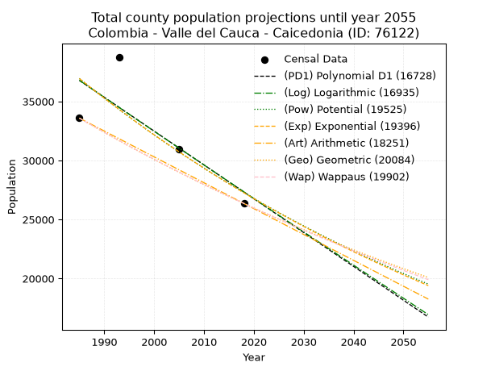
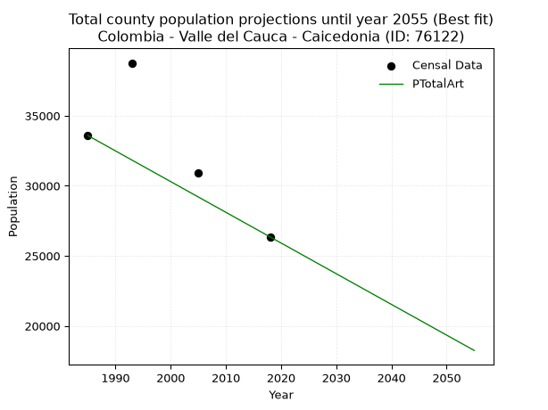
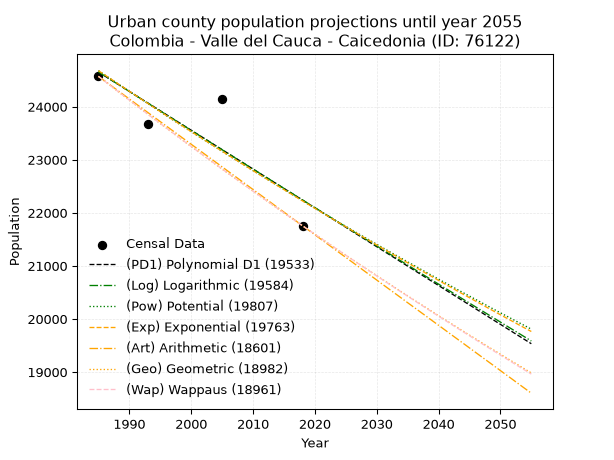
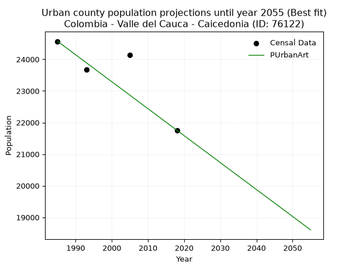
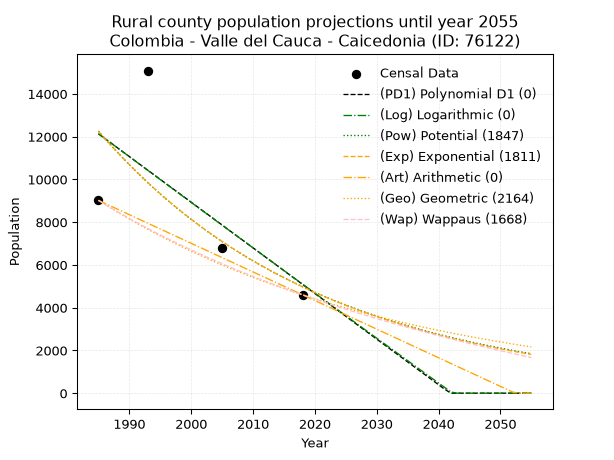
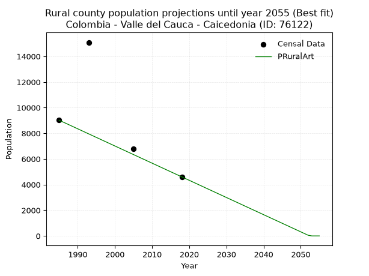

<div align="center">


</div>

# _“Population and Public Services Demand Projections (PPSD) until Year 2050 for Colombia - Valle del Cauca - Caicedonia (ID: 76122)”_
Keywords: `population` `public-service` `projection` `lineal` `polynomial` `logarithmic` `potential` `exponential` `arithmetic` `geometric` `wappaus` `dane` `colombia` `south-america`

PPSD are analytical estimates used by governments and planners to anticipate future changes in population size, age distribution, and the resulting community needs for utilities, healthcare, education, and infrastructure as sizing future water treatment facilities, electrical grids, and road networks based on spatial growth.

> **General running parameters**: • app_version: _v20260806_. • Python version: _3.14.7_. • Pandas version: _3.0.5_. • NumPy version: _2.5.1_. • Creates, save and include plots into reports (create_plot): _False_. • Projection until year: _2050_. • Process polynomial degree 2 and up: _False_. • Process Wappaus: _True_. • Process Wappaus: _True_. • Set negative values to zero: _True_. • Set infinite values to zero: _True_. • Drop dataset notes: _True_. 
<div align="center">

Dynamic map: [:earth_americas:Google](http://maps.google.com/maps?q=4.334808208,-75.8305937) [:earth_americas:OSM](https://www.openstreetmap.org/#map=18/4.334808208/-75.8305937&layers=P) [:earth_americas:Bing](https://www.bing.com/maps?cp=4.334808208~-75.8305937&lvl=18) [:earth_americas:Apple](https://maps.apple.com/frame?center=4.334808208%2C-75.8305937&span=0.003%2C0.006)

</div>


<div align="center">

```geojson
{
  "type": "Feature",
  "geometry": {
    "type": "Point", 
    "coordinates": [-75.8305937, 4.334808208]
  }, 
  "properties": {
    "Name": "Colombia - Valle del Cauca - Caicedonia (ID: 76122)"
  }
}
```

</div>


## 0. Census Data (4 records)

Census data are official statistics collected by a government about the people and housing in a country. They usually include counts of total population, age, sex, race, income, education, and jobs.

📅Global census file: [Population.xlsx](../data/Population.xlsx)

| Source   |   Year |   CountryID | CountryName   |   StateID | StateName       |   CountyID | CountyName   |   PTotal |   PUrban |   PRural |
|:---------|-------:|------------:|:--------------|----------:|:----------------|-----------:|:-------------|---------:|---------:|---------:|
| DANE     |   1985 |          57 | Colombia      |        76 | Valle del Cauca |      76122 | Caicedonia   |    33587 |    24570 |     9017 |
| DANE     |   1993 |          57 | Colombia      |        76 | Valle del Cauca |      76122 | Caicedonia   |    38766 |    23681 |    15085 |
| DANE     |   2005 |          57 | Colombia      |        76 | Valle Del Cauca |      76122 | Caicedonia   |    30947 |    24140 |     6807 |
| DANE     |   2018 |          57 | Colombia      |        76 | Valle del Cauca |      76122 | Caicedonia   |    26357 |    21756 |     4601 |

> 🔥Some records could had specific notes about the registered values or the corresponding urban or rural distribution.

📅   [RUPS](https://www.datos.gov.co/Hacienda-y-Cr-dito-P-blico/Registro-nico-de-Prestadores-de-Servicios-P-blicos/4qkq-csdn/about_data) - Local public utility companies: [RUPS.csv](../data/RUPS.xlsx)

 | SERVICIO       | ESTADO    | NOMBRE                                                                    | NIT         | DEPARTAMENTO_DOMICILIO   | MUNICIPIO_DOMICILIO   | DIRECCION              |   TELEFONO | EMAIL                        | TIPO_INSCRIPCION    | REPRESENTANTE_LEGAL           | TIPO_PRESTADOR                             | CLASIFICACION                 |
|:---------------|:----------|:--------------------------------------------------------------------------|:------------|:-------------------------|:----------------------|:-----------------------|-----------:|:-----------------------------|:--------------------|:------------------------------|:-------------------------------------------|:------------------------------|
| ACUEDUCTO      | OPERATIVA | SOCIEDAD DE ACUEDUCTOS Y ALCANTARILLADOS DEL VALLE DEL CAUCA S.A.  E.S.P. | 890399032-8 | VALLE DEL CAUCA          | CALI                  | AVENIDA 5 N # 23 AN 41 |    6203400 | rosemary@acuavalle.gov.co    | Registro por la ESP | JORGE ENRIQUE SANCHEZ CERON   | SOCIEDADES (EMPRESA DE SERVICIOS PUBLICOS) | MAYOR O IGUAL A 5001 USUARIOS |
| ALCANTARILLADO | OPERATIVA | EMPRESAS PUBLICAS DE CAICEDONIA E.S.P.                                    | 821001449-6 | VALLE DEL CAUCA          | CAICEDONIA            | Carrera 16 No  5-37    |    2161696 | gestionsui@egcconsultores.co | Registro por la ESP | EFREN OCTAVIO  RESTREPO VELEZ | EMPRESA INDUSTRIAL Y COMERCIAL DEL ESTADO  | MAYOR O IGUAL A 5001 USUARIOS |

## 1. Total

### 1.1. Coefficients and Parameters

* (PD1) Polynomial Deg 1: -286.5038137294225, 605493.5034122774 (lineal)
* (Log) Logarithmic: -572805.7045180177, 4386315.000218294
* (Pow) Potential: -18.399988784547485, 65.24629256505938
* (Exp) Exponential: -0.009203089624522027, 3171286493123.45
* (Art) Arithmetic: Year diff. 2018 - 1985 = 33, Population diff. 26357 - 33587 = -7230, Annual growth = -219.0909090909091
* (Geo) Geometric: Year diff. 2018 - 1985 = 33, Population diff. 26357 - 33587 = -7230, Annual growth % = -0.007318698839419824
* (Wap) Wappaus: i = -0.7309852832340488, Condition values only valid for < 200)

<sub>
Wappaus condition values: ['-0.00', '-0.73', '-1.46', '-2.19', '-2.92', '-3.65', '-4.39', '-5.12', '-5.85', '-6.58', '-7.31', '-8.04', '-8.77', '-9.50', '-10.23', '-10.96', '-11.70', '-12.43', '-13.16', '-13.89', '-14.62', '-15.35', '-16.08', '-16.81', '-17.54', '-18.27', '-19.01', '-19.74', '-20.47', '-21.20', '-21.93', '-22.66', '-23.39', '-24.12', '-24.85', '-25.58', '-26.32', '-27.05', '-27.78', '-28.51', '-29.24', '-29.97', '-30.70', '-31.43', '-32.16', '-32.89', '-33.63', '-34.36', '-35.09', '-35.82', '-36.55', '-37.28', '-38.01', '-38.74', '-39.47', '-40.20', '-40.94', '-41.67', '-42.40', '-43.13', '-43.86', '-44.59', '-45.32', '-46.05', '-46.78', '-47.51']
</sub>


### 1.2. Projected Dataset

|   Year |   CountyID |   PTotalPD1 |   PTotalLog |   PTotalPow |   PTotalExp |   PTotalArt |   PTotalGeo |   PTotalWap |
|-------:|-----------:|------------:|------------:|------------:|------------:|------------:|------------:|------------:|
|   1985 |      76122 |       36783 |       36787 |       36943 |       36939 |       33587 |       33587 |       33587 |
|   1986 |      76122 |       36497 |       36498 |       36603 |       36601 |       33368 |       33341 |       33342 |
|   1987 |      76122 |       36210 |       36210 |       36265 |       36265 |       33149 |       33097 |       33100 |
|   1988 |      76122 |       35924 |       35922 |       35931 |       35933 |       32930 |       32855 |       32858 |
|   1989 |      76122 |       35637 |       35634 |       35600 |       35604 |       32711 |       32614 |       32619 |
|   1990 |      76122 |       35351 |       35346 |       35272 |       35278 |       32492 |       32376 |       32381 |
|   1991 |      76122 |       35064 |       35058 |       34948 |       34955 |       32272 |       32139 |       32146 |
|   1992 |      76122 |       34778 |       34771 |       34626 |       34634 |       32053 |       31904 |       31911 |
|   1993 |      76122 |       34491 |       34483 |       34308 |       34317 |       31834 |       31670 |       31679 |
|   1994 |      76122 |       34205 |       34196 |       33993 |       34003 |       31615 |       31438 |       31448 |
|   1995 |      76122 |       33918 |       33909 |       33681 |       33691 |       31396 |       31208 |       31218 |
|   1996 |      76122 |       33632 |       33621 |       33371 |       33383 |       31177 |       30980 |       30991 |
|   1997 |      76122 |       33345 |       33335 |       33065 |       33077 |       30958 |       30753 |       30765 |
|   1998 |      76122 |       33059 |       33048 |       32762 |       32774 |       30739 |       30528 |       30540 |
|   1999 |      76122 |       32772 |       32761 |       32462 |       32474 |       30520 |       30305 |       30317 |
|   2000 |      76122 |       32486 |       32475 |       32165 |       32176 |       30301 |       30083 |       30096 |
|   2001 |      76122 |       32199 |       32188 |       31870 |       31881 |       30082 |       29863 |       29876 |
|   2002 |      76122 |       31913 |       31902 |       31578 |       31589 |       29862 |       29644 |       29657 |
|   2003 |      76122 |       31626 |       31616 |       31290 |       31300 |       29643 |       29427 |       29441 |
|   2004 |      76122 |       31340 |       31330 |       31004 |       31013 |       29424 |       29212 |       29225 |
|   2005 |      76122 |       31053 |       31044 |       30720 |       30729 |       29205 |       28998 |       29011 |
|   2006 |      76122 |       30767 |       30759 |       30440 |       30448 |       28986 |       28786 |       28799 |
|   2007 |      76122 |       30480 |       30473 |       30162 |       30169 |       28767 |       28575 |       28588 |
|   2008 |      76122 |       30194 |       30188 |       29887 |       29892 |       28548 |       28366 |       28378 |
|   2009 |      76122 |       29907 |       29903 |       29614 |       29618 |       28329 |       28158 |       28170 |
|   2010 |      76122 |       29621 |       29618 |       29344 |       29347 |       28110 |       27952 |       27963 |
|   2011 |      76122 |       29334 |       29333 |       29077 |       29078 |       27891 |       27748 |       27758 |
|   2012 |      76122 |       29048 |       29048 |       28812 |       28812 |       27672 |       27545 |       27553 |
|   2013 |      76122 |       28761 |       28764 |       28550 |       28548 |       27452 |       27343 |       27351 |
|   2014 |      76122 |       28475 |       28479 |       28290 |       28286 |       27233 |       27143 |       27149 |
|   2015 |      76122 |       28188 |       28195 |       28033 |       28027 |       27014 |       26944 |       26949 |
|   2016 |      76122 |       27902 |       27910 |       27778 |       27771 |       26795 |       26747 |       26751 |
|   2017 |      76122 |       27615 |       27626 |       27526 |       27516 |       26576 |       26551 |       26553 |
|   2018 |      76122 |       27329 |       27343 |       27276 |       27264 |       26357 |       26357 |       26357 |
|   2019 |      76122 |       27042 |       27059 |       27028 |       27014 |       26138 |       26164 |       26162 |
|   2020 |      76122 |       26756 |       26775 |       26783 |       26767 |       25919 |       25973 |       25969 |
|   2021 |      76122 |       26469 |       26492 |       26541 |       26522 |       25700 |       25783 |       25776 |
|   2022 |      76122 |       26183 |       26208 |       26300 |       26279 |       25481 |       25594 |       25585 |
|   2023 |      76122 |       25896 |       25925 |       26062 |       26038 |       25262 |       25407 |       25395 |
|   2024 |      76122 |       25610 |       25642 |       25826 |       25799 |       25042 |       25221 |       25206 |
|   2025 |      76122 |       25323 |       25359 |       25592 |       25563 |       24823 |       25036 |       25019 |
|   2026 |      76122 |       25037 |       25076 |       25361 |       25329 |       24604 |       24853 |       24833 |
|   2027 |      76122 |       24750 |       24794 |       25132 |       25097 |       24385 |       24671 |       24648 |
|   2028 |      76122 |       24464 |       24511 |       24905 |       24867 |       24166 |       24490 |       24464 |
|   2029 |      76122 |       24177 |       24229 |       24680 |       24639 |       23947 |       24311 |       24281 |
|   2030 |      76122 |       23891 |       23946 |       24457 |       24413 |       23728 |       24133 |       24099 |
|   2031 |      76122 |       23604 |       23664 |       24236 |       24190 |       23509 |       23957 |       23919 |
|   2032 |      76122 |       23318 |       23382 |       24018 |       23968 |       23290 |       23781 |       23739 |
|   2033 |      76122 |       23031 |       23101 |       23801 |       23749 |       23071 |       23607 |       23561 |
|   2034 |      76122 |       22745 |       22819 |       23587 |       23531 |       22852 |       23434 |       23384 |
|   2035 |      76122 |       22458 |       22537 |       23375 |       23315 |       22632 |       23263 |       23208 |
|   2036 |      76122 |       22172 |       22256 |       23164 |       23102 |       22413 |       23093 |       23033 |
|   2037 |      76122 |       21885 |       21975 |       22956 |       22890 |       22194 |       22924 |       22859 |
|   2038 |      76122 |       21599 |       21694 |       22750 |       22681 |       21975 |       22756 |       22686 |
|   2039 |      76122 |       21312 |       21413 |       22545 |       22473 |       21756 |       22589 |       22514 |
|   2040 |      76122 |       21026 |       21132 |       22343 |       22267 |       21537 |       22424 |       22344 |
|   2041 |      76122 |       20739 |       20851 |       22142 |       22063 |       21318 |       22260 |       22174 |
|   2042 |      76122 |       20453 |       20570 |       21943 |       21861 |       21099 |       22097 |       22005 |
|   2043 |      76122 |       20166 |       20290 |       21747 |       21661 |       20880 |       21935 |       21838 |
|   2044 |      76122 |       19880 |       20010 |       21552 |       21462 |       20661 |       21775 |       21671 |
|   2045 |      76122 |       19593 |       19729 |       21359 |       21265 |       20442 |       21615 |       21505 |
|   2046 |      76122 |       19307 |       19449 |       21167 |       21071 |       20222 |       21457 |       21341 |
|   2047 |      76122 |       19020 |       19170 |       20978 |       20878 |       20003 |       21300 |       21177 |
|   2048 |      76122 |       18734 |       18890 |       20790 |       20686 |       19784 |       21144 |       21014 |
|   2049 |      76122 |       18447 |       18610 |       20604 |       20497 |       19565 |       20989 |       20853 |
|   2050 |      76122 |       18161 |       18331 |       20420 |       20309 |       19346 |       20836 |       20692 |
<div align="center">

</img>

</div>


### 1.3. Best fit with absolute and relative error (%)

Relative error puts that difference into context by dividing the absolute error by the true value, creating a unitless ratio or percentage that shows the scale of the mistake.

Absolute and relative error

|   Year | Source   |   CountryID | CountryName   |   StateID | StateName       |   CountyID_x | CountyName   |   PTotal |   PUrban |   PRural |   CountyID_y |   PTotalPD1 |   PTotalLog |   PTotalPow |   PTotalExp |   PTotalArt |   PTotalGeo |   PTotalWap |   PTotalPD1AbsError |   PTotalLogAbsError |   PTotalPowAbsError |   PTotalExpAbsError |   PTotalArtAbsError |   PTotalGeoAbsError |   PTotalWapAbsError |   PTotalPD1RelError |   PTotalLogRelError |   PTotalPowRelError |   PTotalExpRelError |   PTotalArtRelError |   PTotalGeoRelError |   PTotalWapRelError |
|-------:|:---------|------------:|:--------------|----------:|:----------------|-------------:|:-------------|---------:|---------:|---------:|-------------:|------------:|------------:|------------:|------------:|------------:|------------:|------------:|--------------------:|--------------------:|--------------------:|--------------------:|--------------------:|--------------------:|--------------------:|--------------------:|--------------------:|--------------------:|--------------------:|--------------------:|--------------------:|--------------------:|
|   1985 | DANE     |          57 | Colombia      |        76 | Valle del Cauca |        76122 | Caicedonia   |    33587 |    24570 |     9017 |        76122 |       36783 |       36787 |       36943 |       36939 |       33587 |       33587 |       33587 |                3196 |                3200 |                3356 |                3352 |                   0 |                   0 |                   0 |            9.51559  |            9.5275   |            9.99196  |             9.98005 |             0       |             0       |             0       |
|   1993 | DANE     |          57 | Colombia      |        76 | Valle del Cauca |        76122 | Caicedonia   |    38766 |    23681 |    15085 |        76122 |       34491 |       34483 |       34308 |       34317 |       31834 |       31670 |       31679 |                4275 |                4283 |                4458 |                4449 |                6932 |                7096 |                7087 |           11.0277   |           11.0483   |           11.4998   |            11.4766  |            17.8816  |            18.3047  |            18.2815  |
|   2005 | DANE     |          57 | Colombia      |        76 | Valle Del Cauca |        76122 | Caicedonia   |    30947 |    24140 |     6807 |        76122 |       31053 |       31044 |       30720 |       30729 |       29205 |       28998 |       29011 |                 106 |                  97 |                 227 |                 218 |                1742 |                1949 |                1936 |            0.342521 |            0.313439 |            0.733512 |             0.70443 |             5.62898 |             6.29786 |             6.25586 |
|   2018 | DANE     |          57 | Colombia      |        76 | Valle del Cauca |        76122 | Caicedonia   |    26357 |    21756 |     4601 |        76122 |       27329 |       27343 |       27276 |       27264 |       26357 |       26357 |       26357 |                 972 |                 986 |                 919 |                 907 |                   0 |                   0 |                   0 |            3.68782  |            3.74094  |            3.48674  |             3.44121 |             0       |             0       |             0       |

Relative error mean

| Method    |   RelError | Best   |
|:----------|-----------:|:-------|
| PTotalPD1 |    6.14341 |        |
| PTotalLog |    6.15755 |        |
| PTotalPow |    6.428   |        |
| PTotalExp |    6.40056 |        |
| PTotalArt |    5.87766 | True   |
| PTotalGeo |    6.15064 |        |
| PTotalWap |    6.13434 |        |

💙Best method: _**PTotalArt**_
<div align="center">

</img>

</div>


### 1.4. Fresh water supply demand in liters per capita per day (lpcd)

The fresh water supply demand typically ranges from 100 to 300 liters per capita per day (lpcd) for standard domestic and municipal planning, though absolute survival minimums set by the World Health Organization are as low as 7.5 to 20 liters per day, and total consumption in high-income nations can exceed 400 liters.

> `CZ`: Level in meters above the sea level (masl)<br> `WS`: Fresh water supply demand in liters per capita per day (lpcd or l/h/d)<br> `WSAll`: Zonal fresh water supply demand in liters per second (l/s)<br> `A`: Zonal area in square meters<br> `DP`: Population density (people/hectare or p/ha)

Reference values (RAS Colombia)

|    CZ |   WS |
|------:|-----:|
|  1000 |  120 |
|  2000 |  130 |
| 99999 |  140 |

County shapefile geometry properties and water supply values

|   CountyID |      ATotal |   CZTotal |   WSTotal |
|-----------:|------------:|----------:|----------:|
|      76122 | 1.67137e+08 |   1404.47 |       130 |

Projected values for best method: PTotalArt

|   CountyID |   Year |   PTotalArt |   DPTotal |   WSTotal |   WSTotalAll |
|-----------:|-------:|------------:|----------:|----------:|-------------:|
|      76122 |   1985 |       33587 |      2.01 |       130 |      50.536  |
|      76122 |   1986 |       33368 |      2    |       130 |      50.2065 |
|      76122 |   1987 |       33149 |      1.98 |       130 |      49.877  |
|      76122 |   1988 |       32930 |      1.97 |       130 |      49.5475 |
|      76122 |   1989 |       32711 |      1.96 |       130 |      49.2179 |
|      76122 |   1990 |       32492 |      1.94 |       130 |      48.8884 |
|      76122 |   1991 |       32272 |      1.93 |       130 |      48.5574 |
|      76122 |   1992 |       32053 |      1.92 |       130 |      48.2279 |
|      76122 |   1993 |       31834 |      1.9  |       130 |      47.8984 |
|      76122 |   1994 |       31615 |      1.89 |       130 |      47.5689 |
|      76122 |   1995 |       31396 |      1.88 |       130 |      47.2394 |
|      76122 |   1996 |       31177 |      1.87 |       130 |      46.9098 |
|      76122 |   1997 |       30958 |      1.85 |       130 |      46.5803 |
|      76122 |   1998 |       30739 |      1.84 |       130 |      46.2508 |
|      76122 |   1999 |       30520 |      1.83 |       130 |      45.9213 |
|      76122 |   2000 |       30301 |      1.81 |       130 |      45.5918 |
|      76122 |   2001 |       30082 |      1.8  |       130 |      45.2623 |
|      76122 |   2002 |       29862 |      1.79 |       130 |      44.9312 |
|      76122 |   2003 |       29643 |      1.77 |       130 |      44.6017 |
|      76122 |   2004 |       29424 |      1.76 |       130 |      44.2722 |
|      76122 |   2005 |       29205 |      1.75 |       130 |      43.9427 |
|      76122 |   2006 |       28986 |      1.73 |       130 |      43.6132 |
|      76122 |   2007 |       28767 |      1.72 |       130 |      43.2837 |
|      76122 |   2008 |       28548 |      1.71 |       130 |      42.9542 |
|      76122 |   2009 |       28329 |      1.69 |       130 |      42.6247 |
|      76122 |   2010 |       28110 |      1.68 |       130 |      42.2951 |
|      76122 |   2011 |       27891 |      1.67 |       130 |      41.9656 |
|      76122 |   2012 |       27672 |      1.66 |       130 |      41.6361 |
|      76122 |   2013 |       27452 |      1.64 |       130 |      41.3051 |
|      76122 |   2014 |       27233 |      1.63 |       130 |      40.9756 |
|      76122 |   2015 |       27014 |      1.62 |       130 |      40.6461 |
|      76122 |   2016 |       26795 |      1.6  |       130 |      40.3166 |
|      76122 |   2017 |       26576 |      1.59 |       130 |      39.987  |
|      76122 |   2018 |       26357 |      1.58 |       130 |      39.6575 |
|      76122 |   2019 |       26138 |      1.56 |       130 |      39.328  |
|      76122 |   2020 |       25919 |      1.55 |       130 |      38.9985 |
|      76122 |   2021 |       25700 |      1.54 |       130 |      38.669  |
|      76122 |   2022 |       25481 |      1.52 |       130 |      38.3395 |
|      76122 |   2023 |       25262 |      1.51 |       130 |      38.01   |
|      76122 |   2024 |       25042 |      1.5  |       130 |      37.6789 |
|      76122 |   2025 |       24823 |      1.49 |       130 |      37.3494 |
|      76122 |   2026 |       24604 |      1.47 |       130 |      37.0199 |
|      76122 |   2027 |       24385 |      1.46 |       130 |      36.6904 |
|      76122 |   2028 |       24166 |      1.45 |       130 |      36.3609 |
|      76122 |   2029 |       23947 |      1.43 |       130 |      36.0314 |
|      76122 |   2030 |       23728 |      1.42 |       130 |      35.7019 |
|      76122 |   2031 |       23509 |      1.41 |       130 |      35.3723 |
|      76122 |   2032 |       23290 |      1.39 |       130 |      35.0428 |
|      76122 |   2033 |       23071 |      1.38 |       130 |      34.7133 |
|      76122 |   2034 |       22852 |      1.37 |       130 |      34.3838 |
|      76122 |   2035 |       22632 |      1.35 |       130 |      34.0528 |
|      76122 |   2036 |       22413 |      1.34 |       130 |      33.7233 |
|      76122 |   2037 |       22194 |      1.33 |       130 |      33.3937 |
|      76122 |   2038 |       21975 |      1.31 |       130 |      33.0642 |
|      76122 |   2039 |       21756 |      1.3  |       130 |      32.7347 |
|      76122 |   2040 |       21537 |      1.29 |       130 |      32.4052 |
|      76122 |   2041 |       21318 |      1.28 |       130 |      32.0757 |
|      76122 |   2042 |       21099 |      1.26 |       130 |      31.7462 |
|      76122 |   2043 |       20880 |      1.25 |       130 |      31.4167 |
|      76122 |   2044 |       20661 |      1.24 |       130 |      31.0872 |
|      76122 |   2045 |       20442 |      1.22 |       130 |      30.7576 |
|      76122 |   2046 |       20222 |      1.21 |       130 |      30.4266 |
|      76122 |   2047 |       20003 |      1.2  |       130 |      30.0971 |
|      76122 |   2048 |       19784 |      1.18 |       130 |      29.7676 |
|      76122 |   2049 |       19565 |      1.17 |       130 |      29.4381 |
|      76122 |   2050 |       19346 |      1.16 |       130 |      29.1086 |

## 2. Urban

### 2.1. Coefficients and Parameters

* (PD1) Polynomial Deg 1: -73.13649136892674, 169828.0168606957 (lineal)
* (Log) Logarithmic: -146255.43942114135, 1135225.5170576323
* (Pow) Potential: -6.344225185078969, 25.314048841539318
* (Exp) Exponential: -0.0031725897698722774, 13406064.294303095
* (Art) Arithmetic: Year diff. 2018 - 1985 = 33, Population diff. 21756 - 24570 = -2814, Annual growth = -85.27272727272727
* (Geo) Geometric: Year diff. 2018 - 1985 = 33, Population diff. 21756 - 24570 = -2814, Annual growth % = -0.0036791729229811443
* (Wap) Wappaus: i = -0.3681419819225803, Condition values only valid for < 200)

<sub>
Wappaus condition values: ['-0.00', '-0.37', '-0.74', '-1.10', '-1.47', '-1.84', '-2.21', '-2.58', '-2.95', '-3.31', '-3.68', '-4.05', '-4.42', '-4.79', '-5.15', '-5.52', '-5.89', '-6.26', '-6.63', '-6.99', '-7.36', '-7.73', '-8.10', '-8.47', '-8.84', '-9.20', '-9.57', '-9.94', '-10.31', '-10.68', '-11.04', '-11.41', '-11.78', '-12.15', '-12.52', '-12.88', '-13.25', '-13.62', '-13.99', '-14.36', '-14.73', '-15.09', '-15.46', '-15.83', '-16.20', '-16.57', '-16.93', '-17.30', '-17.67', '-18.04', '-18.41', '-18.78', '-19.14', '-19.51', '-19.88', '-20.25', '-20.62', '-20.98', '-21.35', '-21.72', '-22.09', '-22.46', '-22.82', '-23.19', '-23.56', '-23.93']
</sub>


### 2.2. Projected Dataset

|   Year |   CountyID |   PUrbanPD1 |   PUrbanLog |   PUrbanPow |   PUrbanExp |   PUrbanArt |   PUrbanGeo |   PUrbanWap |
|-------:|-----------:|------------:|------------:|------------:|------------:|------------:|------------:|------------:|
|   1985 |      76122 |       24652 |       24653 |       24678 |       24677 |       24570 |       24570 |       24570 |
|   1986 |      76122 |       24579 |       24580 |       24599 |       24599 |       24485 |       24480 |       24480 |
|   1987 |      76122 |       24506 |       24506 |       24521 |       24521 |       24399 |       24390 |       24390 |
|   1988 |      76122 |       24433 |       24432 |       24443 |       24443 |       24314 |       24300 |       24300 |
|   1989 |      76122 |       24360 |       24359 |       24365 |       24366 |       24229 |       24210 |       24211 |
|   1990 |      76122 |       24286 |       24285 |       24287 |       24289 |       24144 |       24121 |       24122 |
|   1991 |      76122 |       24213 |       24212 |       24210 |       24212 |       24058 |       24033 |       24033 |
|   1992 |      76122 |       24140 |       24138 |       24133 |       24135 |       23973 |       23944 |       23945 |
|   1993 |      76122 |       24067 |       24065 |       24056 |       24059 |       23888 |       23856 |       23857 |
|   1994 |      76122 |       23994 |       23992 |       23980 |       23982 |       23803 |       23768 |       23769 |
|   1995 |      76122 |       23921 |       23918 |       23904 |       23906 |       23717 |       23681 |       23682 |
|   1996 |      76122 |       23848 |       23845 |       23828 |       23831 |       23632 |       23594 |       23595 |
|   1997 |      76122 |       23774 |       23772 |       23752 |       23755 |       23547 |       23507 |       23508 |
|   1998 |      76122 |       23701 |       23699 |       23677 |       23680 |       23461 |       23420 |       23422 |
|   1999 |      76122 |       23628 |       23625 |       23602 |       23605 |       23376 |       23334 |       23335 |
|   2000 |      76122 |       23555 |       23552 |       23527 |       23530 |       23291 |       23248 |       23250 |
|   2001 |      76122 |       23482 |       23479 |       23453 |       23456 |       23206 |       23163 |       23164 |
|   2002 |      76122 |       23409 |       23406 |       23379 |       23381 |       23120 |       23078 |       23079 |
|   2003 |      76122 |       23336 |       23333 |       23305 |       23307 |       23035 |       22993 |       22994 |
|   2004 |      76122 |       23262 |       23260 |       23231 |       23233 |       22950 |       22908 |       22909 |
|   2005 |      76122 |       23189 |       23187 |       23157 |       23160 |       22865 |       22824 |       22825 |
|   2006 |      76122 |       23116 |       23114 |       23084 |       23086 |       22779 |       22740 |       22741 |
|   2007 |      76122 |       23043 |       23041 |       23011 |       23013 |       22694 |       22656 |       22657 |
|   2008 |      76122 |       22970 |       22968 |       22939 |       22940 |       22609 |       22573 |       22574 |
|   2009 |      76122 |       22897 |       22896 |       22867 |       22868 |       22523 |       22490 |       22491 |
|   2010 |      76122 |       22824 |       22823 |       22794 |       22795 |       22438 |       22407 |       22408 |
|   2011 |      76122 |       22751 |       22750 |       22723 |       22723 |       22353 |       22325 |       22326 |
|   2012 |      76122 |       22677 |       22677 |       22651 |       22651 |       22268 |       22243 |       22243 |
|   2013 |      76122 |       22604 |       22605 |       22580 |       22579 |       22182 |       22161 |       22161 |
|   2014 |      76122 |       22531 |       22532 |       22509 |       22508 |       22097 |       22079 |       22080 |
|   2015 |      76122 |       22458 |       22459 |       22438 |       22437 |       22012 |       21998 |       21998 |
|   2016 |      76122 |       22385 |       22387 |       22367 |       22366 |       21927 |       21917 |       21917 |
|   2017 |      76122 |       22312 |       22314 |       22297 |       22295 |       21841 |       21836 |       21837 |
|   2018 |      76122 |       22239 |       22242 |       22227 |       22224 |       21756 |       21756 |       21756 |
|   2019 |      76122 |       22165 |       22169 |       22157 |       22154 |       21671 |       21676 |       21676 |
|   2020 |      76122 |       22092 |       22097 |       22088 |       22084 |       21585 |       21596 |       21596 |
|   2021 |      76122 |       22019 |       22025 |       22019 |       22014 |       21500 |       21517 |       21516 |
|   2022 |      76122 |       21946 |       21952 |       21950 |       21944 |       21415 |       21438 |       21437 |
|   2023 |      76122 |       21873 |       21880 |       21881 |       21874 |       21330 |       21359 |       21358 |
|   2024 |      76122 |       21800 |       21808 |       21812 |       21805 |       21244 |       21280 |       21279 |
|   2025 |      76122 |       21727 |       21735 |       21744 |       21736 |       21159 |       21202 |       21200 |
|   2026 |      76122 |       21653 |       21663 |       21676 |       21667 |       21074 |       21124 |       21122 |
|   2027 |      76122 |       21580 |       21591 |       21608 |       21598 |       20989 |       21046 |       21044 |
|   2028 |      76122 |       21507 |       21519 |       21541 |       21530 |       20903 |       20969 |       20966 |
|   2029 |      76122 |       21434 |       21447 |       21474 |       21462 |       20818 |       20892 |       20888 |
|   2030 |      76122 |       21361 |       21375 |       21407 |       21394 |       20733 |       20815 |       20811 |
|   2031 |      76122 |       21288 |       21303 |       21340 |       21326 |       20647 |       20738 |       20734 |
|   2032 |      76122 |       21215 |       21231 |       21273 |       21259 |       20562 |       20662 |       20657 |
|   2033 |      76122 |       21142 |       21159 |       21207 |       21191 |       20477 |       20586 |       20581 |
|   2034 |      76122 |       21068 |       21087 |       21141 |       21124 |       20392 |       20510 |       20505 |
|   2035 |      76122 |       20995 |       21015 |       21075 |       21057 |       20306 |       20435 |       20429 |
|   2036 |      76122 |       20922 |       20943 |       21010 |       20990 |       20221 |       20359 |       20353 |
|   2037 |      76122 |       20849 |       20871 |       20944 |       20924 |       20136 |       20284 |       20277 |
|   2038 |      76122 |       20776 |       20799 |       20879 |       20858 |       20051 |       20210 |       20202 |
|   2039 |      76122 |       20703 |       20728 |       20814 |       20792 |       19965 |       20136 |       20127 |
|   2040 |      76122 |       20630 |       20656 |       20750 |       20726 |       19880 |       20061 |       20052 |
|   2041 |      76122 |       20556 |       20584 |       20685 |       20660 |       19795 |       19988 |       19978 |
|   2042 |      76122 |       20483 |       20513 |       20621 |       20595 |       19709 |       19914 |       19904 |
|   2043 |      76122 |       20410 |       20441 |       20557 |       20529 |       19624 |       19841 |       19830 |
|   2044 |      76122 |       20337 |       20369 |       20493 |       20464 |       19539 |       19768 |       19756 |
|   2045 |      76122 |       20264 |       20298 |       20430 |       20400 |       19454 |       19695 |       19683 |
|   2046 |      76122 |       20191 |       20226 |       20367 |       20335 |       19368 |       19623 |       19609 |
|   2047 |      76122 |       20118 |       20155 |       20304 |       20271 |       19283 |       19550 |       19536 |
|   2048 |      76122 |       20044 |       20084 |       20241 |       20206 |       19198 |       19478 |       19464 |
|   2049 |      76122 |       19971 |       20012 |       20178 |       20142 |       19113 |       19407 |       19391 |
|   2050 |      76122 |       19898 |       19941 |       20116 |       20079 |       19027 |       19335 |       19319 |
<div align="center">

</img>

</div>


### 2.3. Best fit with absolute and relative error (%)

Relative error puts that difference into context by dividing the absolute error by the true value, creating a unitless ratio or percentage that shows the scale of the mistake.

Absolute and relative error

|   Year | Source   |   CountryID | CountryName   |   StateID | StateName       |   CountyID_x | CountyName   |   PTotal |   PUrban |   PRural |   CountyID_y |   PUrbanPD1 |   PUrbanLog |   PUrbanPow |   PUrbanExp |   PUrbanArt |   PUrbanGeo |   PUrbanWap |   PUrbanPD1AbsError |   PUrbanLogAbsError |   PUrbanPowAbsError |   PUrbanExpAbsError |   PUrbanArtAbsError |   PUrbanGeoAbsError |   PUrbanWapAbsError |   PUrbanPD1RelError |   PUrbanLogRelError |   PUrbanPowRelError |   PUrbanExpRelError |   PUrbanArtRelError |   PUrbanGeoRelError |   PUrbanWapRelError |
|-------:|:---------|------------:|:--------------|----------:|:----------------|-------------:|:-------------|---------:|---------:|---------:|-------------:|------------:|------------:|------------:|------------:|------------:|------------:|------------:|--------------------:|--------------------:|--------------------:|--------------------:|--------------------:|--------------------:|--------------------:|--------------------:|--------------------:|--------------------:|--------------------:|--------------------:|--------------------:|--------------------:|
|   1985 | DANE     |          57 | Colombia      |        76 | Valle del Cauca |        76122 | Caicedonia   |    33587 |    24570 |     9017 |        76122 |       24652 |       24653 |       24678 |       24677 |       24570 |       24570 |       24570 |                  82 |                  83 |                 108 |                 107 |                   0 |                   0 |                   0 |             0.33374 |             0.33781 |             0.43956 |             0.43549 |            0        |            0        |            0        |
|   1993 | DANE     |          57 | Colombia      |        76 | Valle del Cauca |        76122 | Caicedonia   |    38766 |    23681 |    15085 |        76122 |       24067 |       24065 |       24056 |       24059 |       23888 |       23856 |       23857 |                 386 |                 384 |                 375 |                 378 |                 207 |                 175 |                 176 |             1.63    |             1.62155 |             1.58355 |             1.59622 |            0.874118 |            0.738989 |            0.743212 |
|   2005 | DANE     |          57 | Colombia      |        76 | Valle Del Cauca |        76122 | Caicedonia   |    30947 |    24140 |     6807 |        76122 |       23189 |       23187 |       23157 |       23160 |       22865 |       22824 |       22825 |                 951 |                 953 |                 983 |                 980 |                1275 |                1316 |                1315 |             3.93952 |             3.9478  |             4.07208 |             4.05965 |            5.28169  |            5.45153  |            5.44739  |
|   2018 | DANE     |          57 | Colombia      |        76 | Valle del Cauca |        76122 | Caicedonia   |    26357 |    21756 |     4601 |        76122 |       22239 |       22242 |       22227 |       22224 |       21756 |       21756 |       21756 |                 483 |                 486 |                 471 |                 468 |                   0 |                   0 |                   0 |             2.22008 |             2.23387 |             2.16492 |             2.15113 |            0        |            0        |            0        |

Relative error mean

| Method    |   RelError | Best   |
|:----------|-----------:|:-------|
| PUrbanPD1 |    2.03083 |        |
| PUrbanLog |    2.03526 |        |
| PUrbanPow |    2.06503 |        |
| PUrbanExp |    2.06062 |        |
| PUrbanArt |    1.53895 | True   |
| PUrbanGeo |    1.54763 |        |
| PUrbanWap |    1.54765 |        |

💙Best method: _**PUrbanArt**_
<div align="center">

</img>

</div>


### 2.4. Fresh water supply demand in liters per capita per day (lpcd)

The fresh water supply demand typically ranges from 100 to 300 liters per capita per day (lpcd) for standard domestic and municipal planning, though absolute survival minimums set by the World Health Organization are as low as 7.5 to 20 liters per day, and total consumption in high-income nations can exceed 400 liters.

> `CZ`: Level in meters above the sea level (masl)<br> `WS`: Fresh water supply demand in liters per capita per day (lpcd or l/h/d)<br> `WSAll`: Zonal fresh water supply demand in liters per second (l/s)<br> `A`: Zonal area in square meters<br> `DP`: Population density (people/hectare or p/ha)

Reference values (RAS Colombia)

|    CZ |   WS |
|------:|-----:|
|  1000 |  120 |
|  2000 |  130 |
| 99999 |  140 |

County shapefile geometry properties and water supply values

|   CountyID |      AUrban |   CZUrban |   WSUrban |
|-----------:|------------:|----------:|----------:|
|      76122 | 2.88827e+06 |   1152.44 |       130 |

Projected values for best method: PUrbanArt

|   CountyID |   Year |   PUrbanArt |   DPUrban |   WSUrban |   WSUrbanAll |
|-----------:|-------:|------------:|----------:|----------:|-------------:|
|      76122 |   1985 |       24570 |     85.07 |       130 |      36.9688 |
|      76122 |   1986 |       24485 |     84.77 |       130 |      36.8409 |
|      76122 |   1987 |       24399 |     84.48 |       130 |      36.7115 |
|      76122 |   1988 |       24314 |     84.18 |       130 |      36.5836 |
|      76122 |   1989 |       24229 |     83.89 |       130 |      36.4557 |
|      76122 |   1990 |       24144 |     83.59 |       130 |      36.3278 |
|      76122 |   1991 |       24058 |     83.3  |       130 |      36.1984 |
|      76122 |   1992 |       23973 |     83    |       130 |      36.0705 |
|      76122 |   1993 |       23888 |     82.71 |       130 |      35.9426 |
|      76122 |   1994 |       23803 |     82.41 |       130 |      35.8147 |
|      76122 |   1995 |       23717 |     82.11 |       130 |      35.6853 |
|      76122 |   1996 |       23632 |     81.82 |       130 |      35.5574 |
|      76122 |   1997 |       23547 |     81.53 |       130 |      35.4295 |
|      76122 |   1998 |       23461 |     81.23 |       130 |      35.3001 |
|      76122 |   1999 |       23376 |     80.93 |       130 |      35.1722 |
|      76122 |   2000 |       23291 |     80.64 |       130 |      35.0443 |
|      76122 |   2001 |       23206 |     80.35 |       130 |      34.9164 |
|      76122 |   2002 |       23120 |     80.05 |       130 |      34.787  |
|      76122 |   2003 |       23035 |     79.75 |       130 |      34.6591 |
|      76122 |   2004 |       22950 |     79.46 |       130 |      34.5312 |
|      76122 |   2005 |       22865 |     79.16 |       130 |      34.4034 |
|      76122 |   2006 |       22779 |     78.87 |       130 |      34.274  |
|      76122 |   2007 |       22694 |     78.57 |       130 |      34.1461 |
|      76122 |   2008 |       22609 |     78.28 |       130 |      34.0182 |
|      76122 |   2009 |       22523 |     77.98 |       130 |      33.8888 |
|      76122 |   2010 |       22438 |     77.69 |       130 |      33.7609 |
|      76122 |   2011 |       22353 |     77.39 |       130 |      33.633  |
|      76122 |   2012 |       22268 |     77.1  |       130 |      33.5051 |
|      76122 |   2013 |       22182 |     76.8  |       130 |      33.3757 |
|      76122 |   2014 |       22097 |     76.51 |       130 |      33.2478 |
|      76122 |   2015 |       22012 |     76.21 |       130 |      33.1199 |
|      76122 |   2016 |       21927 |     75.92 |       130 |      32.992  |
|      76122 |   2017 |       21841 |     75.62 |       130 |      32.8626 |
|      76122 |   2018 |       21756 |     75.33 |       130 |      32.7347 |
|      76122 |   2019 |       21671 |     75.03 |       130 |      32.6068 |
|      76122 |   2020 |       21585 |     74.73 |       130 |      32.4774 |
|      76122 |   2021 |       21500 |     74.44 |       130 |      32.3495 |
|      76122 |   2022 |       21415 |     74.14 |       130 |      32.2216 |
|      76122 |   2023 |       21330 |     73.85 |       130 |      32.0938 |
|      76122 |   2024 |       21244 |     73.55 |       130 |      31.9644 |
|      76122 |   2025 |       21159 |     73.26 |       130 |      31.8365 |
|      76122 |   2026 |       21074 |     72.96 |       130 |      31.7086 |
|      76122 |   2027 |       20989 |     72.67 |       130 |      31.5807 |
|      76122 |   2028 |       20903 |     72.37 |       130 |      31.4513 |
|      76122 |   2029 |       20818 |     72.08 |       130 |      31.3234 |
|      76122 |   2030 |       20733 |     71.78 |       130 |      31.1955 |
|      76122 |   2031 |       20647 |     71.49 |       130 |      31.0661 |
|      76122 |   2032 |       20562 |     71.19 |       130 |      30.9382 |
|      76122 |   2033 |       20477 |     70.9  |       130 |      30.8103 |
|      76122 |   2034 |       20392 |     70.6  |       130 |      30.6824 |
|      76122 |   2035 |       20306 |     70.31 |       130 |      30.553  |
|      76122 |   2036 |       20221 |     70.01 |       130 |      30.4251 |
|      76122 |   2037 |       20136 |     69.72 |       130 |      30.2972 |
|      76122 |   2038 |       20051 |     69.42 |       130 |      30.1693 |
|      76122 |   2039 |       19965 |     69.12 |       130 |      30.0399 |
|      76122 |   2040 |       19880 |     68.83 |       130 |      29.912  |
|      76122 |   2041 |       19795 |     68.54 |       130 |      29.7841 |
|      76122 |   2042 |       19709 |     68.24 |       130 |      29.6547 |
|      76122 |   2043 |       19624 |     67.94 |       130 |      29.5269 |
|      76122 |   2044 |       19539 |     67.65 |       130 |      29.399  |
|      76122 |   2045 |       19454 |     67.36 |       130 |      29.2711 |
|      76122 |   2046 |       19368 |     67.06 |       130 |      29.1417 |
|      76122 |   2047 |       19283 |     66.76 |       130 |      29.0138 |
|      76122 |   2048 |       19198 |     66.47 |       130 |      28.8859 |
|      76122 |   2049 |       19113 |     66.17 |       130 |      28.758  |
|      76122 |   2050 |       19027 |     65.88 |       130 |      28.6286 |

## 3. Rural

### 3.1. Coefficients and Parameters

* (PD1) Polynomial Deg 1: -213.36732236049593, 435665.486551582 (lineal)
* (Log) Logarithmic: -426550.2650968764, 3251089.4831606615
* (Pow) Potential: -54.610215154492266, 184.17981555084532
* (Exp) Exponential: -0.02731297832723643, 4.305968561782231e+27
* (Art) Arithmetic: Year diff. 2018 - 1985 = 33, Population diff. 4601 - 9017 = -4416, Annual growth = -133.8181818181818
* (Geo) Geometric: Year diff. 2018 - 1985 = 33, Population diff. 4601 - 9017 = -4416, Annual growth % = -0.0201825799121077
* (Wap) Wappaus: i = -1.96531328856193, Condition values only valid for < 200)

<sub>
Wappaus condition values: ['-0.00', '-1.97', '-3.93', '-5.90', '-7.86', '-9.83', '-11.79', '-13.76', '-15.72', '-17.69', '-19.65', '-21.62', '-23.58', '-25.55', '-27.51', '-29.48', '-31.45', '-33.41', '-35.38', '-37.34', '-39.31', '-41.27', '-43.24', '-45.20', '-47.17', '-49.13', '-51.10', '-53.06', '-55.03', '-56.99', '-58.96', '-60.92', '-62.89', '-64.86', '-66.82', '-68.79', '-70.75', '-72.72', '-74.68', '-76.65', '-78.61', '-80.58', '-82.54', '-84.51', '-86.47', '-88.44', '-90.40', '-92.37', '-94.34', '-96.30', '-98.27', '-100.23', '-102.20', '-104.16', '-106.13', '-108.09', '-110.06', '-112.02', '-113.99', '-115.95', '-117.92', '-119.88', '-121.85', '-123.81', '-125.78', '-127.75']
</sub>


### 3.2. Projected Dataset

|   Year |   CountyID |   PRuralPD1 |   PRuralLog |   PRuralPow |   PRuralExp |   PRuralArt |   PRuralGeo |   PRuralWap |
|-------:|-----------:|------------:|------------:|------------:|------------:|------------:|------------:|------------:|
|   1985 |      76122 |       12131 |       12134 |       12258 |       12253 |        9017 |        9017 |        9017 |
|   1986 |      76122 |       11918 |       11919 |       11925 |       11923 |        8883 |        8835 |        8842 |
|   1987 |      76122 |       11705 |       11704 |       11602 |       11602 |        8749 |        8657 |        8669 |
|   1988 |      76122 |       11491 |       11490 |       11287 |       11289 |        8616 |        8482 |        8501 |
|   1989 |      76122 |       11278 |       11275 |       10981 |       10985 |        8482 |        8311 |        8335 |
|   1990 |      76122 |       11065 |       11061 |       10684 |       10689 |        8348 |        8143 |        8172 |
|   1991 |      76122 |       10851 |       10846 |       10395 |       10401 |        8214 |        7979 |        8013 |
|   1992 |      76122 |       10638 |       10632 |       10114 |       10121 |        8080 |        7818 |        7856 |
|   1993 |      76122 |       10424 |       10418 |        9840 |        9848 |        7946 |        7660 |        7703 |
|   1994 |      76122 |       10211 |       10204 |        9574 |        9583 |        7813 |        7505 |        7552 |
|   1995 |      76122 |        9998 |        9990 |        9316 |        9325 |        7679 |        7354 |        7403 |
|   1996 |      76122 |        9784 |        9776 |        9064 |        9073 |        7545 |        7205 |        7258 |
|   1997 |      76122 |        9571 |        9563 |        8820 |        8829 |        7411 |        7060 |        7115 |
|   1998 |      76122 |        9358 |        9349 |        8582 |        8591 |        7277 |        6917 |        6974 |
|   1999 |      76122 |        9144 |        9136 |        8351 |        8360 |        7144 |        6778 |        6836 |
|   2000 |      76122 |        8931 |        8923 |        8126 |        8134 |        7010 |        6641 |        6700 |
|   2001 |      76122 |        8717 |        8709 |        7907 |        7915 |        6876 |        6507 |        6567 |
|   2002 |      76122 |        8504 |        8496 |        7694 |        7702 |        6742 |        6376 |        6436 |
|   2003 |      76122 |        8291 |        8283 |        7487 |        7494 |        6608 |        6247 |        6307 |
|   2004 |      76122 |        8077 |        8070 |        7286 |        7292 |        6474 |        6121 |        6180 |
|   2005 |      76122 |        7864 |        7857 |        7090 |        7096 |        6341 |        5997 |        6055 |
|   2006 |      76122 |        7651 |        7645 |        6899 |        6905 |        6207 |        5876 |        5932 |
|   2007 |      76122 |        7437 |        7432 |        6714 |        6719 |        6073 |        5758 |        5811 |
|   2008 |      76122 |        7224 |        7220 |        6534 |        6538 |        5939 |        5642 |        5692 |
|   2009 |      76122 |        7011 |        7007 |        6359 |        6362 |        5805 |        5528 |        5576 |
|   2010 |      76122 |        6797 |        6795 |        6188 |        6190 |        5672 |        5416 |        5460 |
|   2011 |      76122 |        6584 |        6583 |        6022 |        6023 |        5538 |        5307 |        5347 |
|   2012 |      76122 |        6370 |        6371 |        5861 |        5861 |        5404 |        5200 |        5236 |
|   2013 |      76122 |        6157 |        6159 |        5704 |        5703 |        5270 |        5095 |        5126 |
|   2014 |      76122 |        5944 |        5947 |        5552 |        5549 |        5136 |        4992 |        5018 |
|   2015 |      76122 |        5730 |        5735 |        5403 |        5400 |        5002 |        4891 |        4911 |
|   2016 |      76122 |        5517 |        5524 |        5259 |        5254 |        4869 |        4792 |        4806 |
|   2017 |      76122 |        5304 |        5312 |        5118 |        5113 |        4735 |        4696 |        4703 |
|   2018 |      76122 |        5090 |        5101 |        4981 |        4975 |        4601 |        4601 |        4601 |
|   2019 |      76122 |        4877 |        4889 |        4849 |        4841 |        4467 |        4508 |        4501 |
|   2020 |      76122 |        4663 |        4678 |        4719 |        4711 |        4333 |        4417 |        4402 |
|   2021 |      76122 |        4450 |        4467 |        4593 |        4584 |        4200 |        4328 |        4304 |
|   2022 |      76122 |        4237 |        4256 |        4471 |        4460 |        4066 |        4241 |        4208 |
|   2023 |      76122 |        4023 |        4045 |        4352 |        4340 |        3932 |        4155 |        4114 |
|   2024 |      76122 |        3810 |        3834 |        4236 |        4223 |        3798 |        4071 |        4021 |
|   2025 |      76122 |        3597 |        3624 |        4123 |        4109 |        3664 |        3989 |        3929 |
|   2026 |      76122 |        3383 |        3413 |        4014 |        3999 |        3530 |        3909 |        3838 |
|   2027 |      76122 |        3170 |        3203 |        3907 |        3891 |        3397 |        3830 |        3748 |
|   2028 |      76122 |        2957 |        2992 |        3803 |        3786 |        3263 |        3752 |        3660 |
|   2029 |      76122 |        2743 |        2782 |        3702 |        3684 |        3129 |        3677 |        3573 |
|   2030 |      76122 |        2530 |        2572 |        3604 |        3585 |        2995 |        3602 |        3488 |
|   2031 |      76122 |        2316 |        2362 |        3508 |        3488 |        2861 |        3530 |        3403 |
|   2032 |      76122 |        2103 |        2152 |        3415 |        3394 |        2728 |        3458 |        3319 |
|   2033 |      76122 |        1890 |        1942 |        3324 |        3303 |        2594 |        3389 |        3237 |
|   2034 |      76122 |        1676 |        1732 |        3236 |        3214 |        2460 |        3320 |        3156 |
|   2035 |      76122 |        1463 |        1522 |        3151 |        3127 |        2326 |        3253 |        3076 |
|   2036 |      76122 |        1250 |        1313 |        3067 |        3043 |        2192 |        3188 |        2996 |
|   2037 |      76122 |        1036 |        1103 |        2986 |        2961 |        2058 |        3123 |        2918 |
|   2038 |      76122 |         823 |         894 |        2907 |        2881 |        1925 |        3060 |        2841 |
|   2039 |      76122 |         610 |         685 |        2830 |        2804 |        1791 |        2998 |        2765 |
|   2040 |      76122 |         396 |         476 |        2755 |        2728 |        1657 |        2938 |        2690 |
|   2041 |      76122 |         183 |         267 |        2683 |        2654 |        1523 |        2879 |        2616 |
|   2042 |      76122 |           0 |          58 |        2612 |        2583 |        1389 |        2821 |        2542 |
|   2043 |      76122 |           0 |           0 |        2543 |        2513 |        1256 |        2764 |        2470 |
|   2044 |      76122 |           0 |           0 |        2476 |        2446 |        1122 |        2708 |        2399 |
|   2045 |      76122 |           0 |           0 |        2411 |        2380 |         988 |        2653 |        2328 |
|   2046 |      76122 |           0 |           0 |        2347 |        2316 |         854 |        2600 |        2258 |
|   2047 |      76122 |           0 |           0 |        2285 |        2253 |         720 |        2547 |        2189 |
|   2048 |      76122 |           0 |           0 |        2225 |        2193 |         586 |        2496 |        2121 |
|   2049 |      76122 |           0 |           0 |        2167 |        2133 |         453 |        2445 |        2054 |
|   2050 |      76122 |           0 |           0 |        2110 |        2076 |         319 |        2396 |        1988 |
<div align="center">

</img>

</div>


### 3.3. Best fit with absolute and relative error (%)

Relative error puts that difference into context by dividing the absolute error by the true value, creating a unitless ratio or percentage that shows the scale of the mistake.

Absolute and relative error

|   Year | Source   |   CountryID | CountryName   |   StateID | StateName       |   CountyID_x | CountyName   |   PTotal |   PUrban |   PRural |   CountyID_y |   PRuralPD1 |   PRuralLog |   PRuralPow |   PRuralExp |   PRuralArt |   PRuralGeo |   PRuralWap |   PRuralPD1AbsError |   PRuralLogAbsError |   PRuralPowAbsError |   PRuralExpAbsError |   PRuralArtAbsError |   PRuralGeoAbsError |   PRuralWapAbsError |   PRuralPD1RelError |   PRuralLogRelError |   PRuralPowRelError |   PRuralExpRelError |   PRuralArtRelError |   PRuralGeoRelError |   PRuralWapRelError |
|-------:|:---------|------------:|:--------------|----------:|:----------------|-------------:|:-------------|---------:|---------:|---------:|-------------:|------------:|------------:|------------:|------------:|------------:|------------:|------------:|--------------------:|--------------------:|--------------------:|--------------------:|--------------------:|--------------------:|--------------------:|--------------------:|--------------------:|--------------------:|--------------------:|--------------------:|--------------------:|--------------------:|
|   1985 | DANE     |          57 | Colombia      |        76 | Valle del Cauca |        76122 | Caicedonia   |    33587 |    24570 |     9017 |        76122 |       12131 |       12134 |       12258 |       12253 |        9017 |        9017 |        9017 |                3114 |                3117 |                3241 |                3236 |                   0 |                   0 |                   0 |             34.5348 |             34.568  |            35.9432  |            35.8878  |             0       |              0      |              0      |
|   1993 | DANE     |          57 | Colombia      |        76 | Valle del Cauca |        76122 | Caicedonia   |    38766 |    23681 |    15085 |        76122 |       10424 |       10418 |        9840 |        9848 |        7946 |        7660 |        7703 |                4661 |                4667 |                5245 |                5237 |                7139 |                7425 |                7382 |             30.8982 |             30.938  |            34.7696  |            34.7166  |            47.3252  |             49.2211 |             48.936  |
|   2005 | DANE     |          57 | Colombia      |        76 | Valle Del Cauca |        76122 | Caicedonia   |    30947 |    24140 |     6807 |        76122 |        7864 |        7857 |        7090 |        7096 |        6341 |        5997 |        6055 |                1057 |                1050 |                 283 |                 289 |                 466 |                 810 |                 752 |             15.5281 |             15.4253 |             4.15748 |             4.24563 |             6.84589 |             11.8995 |             11.0475 |
|   2018 | DANE     |          57 | Colombia      |        76 | Valle del Cauca |        76122 | Caicedonia   |    26357 |    21756 |     4601 |        76122 |        5090 |        5101 |        4981 |        4975 |        4601 |        4601 |        4601 |                 489 |                 500 |                 380 |                 374 |                   0 |                   0 |                   0 |             10.6281 |             10.8672 |             8.25907 |             8.12867 |             0       |              0      |              0      |

Relative error mean

| Method    |   RelError | Best   |
|:----------|-----------:|:-------|
| PRuralPD1 |    22.8973 |        |
| PRuralLog |    22.9496 |        |
| PRuralPow |    20.7824 |        |
| PRuralExp |    20.7447 |        |
| PRuralArt |    13.5428 | True   |
| PRuralGeo |    15.2801 |        |
| PRuralWap |    14.9959 |        |

💙Best method: _**PRuralArt**_
<div align="center">

</img>

</div>


### 3.4. Fresh water supply demand in liters per capita per day (lpcd)

The fresh water supply demand typically ranges from 100 to 300 liters per capita per day (lpcd) for standard domestic and municipal planning, though absolute survival minimums set by the World Health Organization are as low as 7.5 to 20 liters per day, and total consumption in high-income nations can exceed 400 liters.

> `CZ`: Level in meters above the sea level (masl)<br> `WS`: Fresh water supply demand in liters per capita per day (lpcd or l/h/d)<br> `WSAll`: Zonal fresh water supply demand in liters per second (l/s)<br> `A`: Zonal area in square meters<br> `DP`: Population density (people/hectare or p/ha)

Reference values (RAS Colombia)

|    CZ |   WS |
|------:|-----:|
|  1000 |  120 |
|  2000 |  130 |
| 99999 |  140 |

County shapefile geometry properties and water supply values

|   CountyID |      ARural |   CZRural |   WSRural |
|-----------:|------------:|----------:|----------:|
|      76122 | 1.64249e+08 |   1408.95 |       130 |

Projected values for best method: PRuralArt

|   CountyID |   Year |   PRuralArt |   DPRural |   WSRural |   WSRuralAll |
|-----------:|-------:|------------:|----------:|----------:|-------------:|
|      76122 |   1985 |        9017 |      0.55 |       130 |    13.5672   |
|      76122 |   1986 |        8883 |      0.54 |       130 |    13.3656   |
|      76122 |   1987 |        8749 |      0.53 |       130 |    13.164    |
|      76122 |   1988 |        8616 |      0.52 |       130 |    12.9639   |
|      76122 |   1989 |        8482 |      0.52 |       130 |    12.7623   |
|      76122 |   1990 |        8348 |      0.51 |       130 |    12.5606   |
|      76122 |   1991 |        8214 |      0.5  |       130 |    12.359    |
|      76122 |   1992 |        8080 |      0.49 |       130 |    12.1574   |
|      76122 |   1993 |        7946 |      0.48 |       130 |    11.9558   |
|      76122 |   1994 |        7813 |      0.48 |       130 |    11.7557   |
|      76122 |   1995 |        7679 |      0.47 |       130 |    11.5541   |
|      76122 |   1996 |        7545 |      0.46 |       130 |    11.3524   |
|      76122 |   1997 |        7411 |      0.45 |       130 |    11.1508   |
|      76122 |   1998 |        7277 |      0.44 |       130 |    10.9492   |
|      76122 |   1999 |        7144 |      0.43 |       130 |    10.7491   |
|      76122 |   2000 |        7010 |      0.43 |       130 |    10.5475   |
|      76122 |   2001 |        6876 |      0.42 |       130 |    10.3458   |
|      76122 |   2002 |        6742 |      0.41 |       130 |    10.1442   |
|      76122 |   2003 |        6608 |      0.4  |       130 |     9.94259  |
|      76122 |   2004 |        6474 |      0.39 |       130 |     9.74097  |
|      76122 |   2005 |        6341 |      0.39 |       130 |     9.54086  |
|      76122 |   2006 |        6207 |      0.38 |       130 |     9.33924  |
|      76122 |   2007 |        6073 |      0.37 |       130 |     9.13762  |
|      76122 |   2008 |        5939 |      0.36 |       130 |     8.936    |
|      76122 |   2009 |        5805 |      0.35 |       130 |     8.73438  |
|      76122 |   2010 |        5672 |      0.35 |       130 |     8.53426  |
|      76122 |   2011 |        5538 |      0.34 |       130 |     8.33264  |
|      76122 |   2012 |        5404 |      0.33 |       130 |     8.13102  |
|      76122 |   2013 |        5270 |      0.32 |       130 |     7.9294   |
|      76122 |   2014 |        5136 |      0.31 |       130 |     7.72778  |
|      76122 |   2015 |        5002 |      0.3  |       130 |     7.52616  |
|      76122 |   2016 |        4869 |      0.3  |       130 |     7.32604  |
|      76122 |   2017 |        4735 |      0.29 |       130 |     7.12442  |
|      76122 |   2018 |        4601 |      0.28 |       130 |     6.9228   |
|      76122 |   2019 |        4467 |      0.27 |       130 |     6.72118  |
|      76122 |   2020 |        4333 |      0.26 |       130 |     6.51956  |
|      76122 |   2021 |        4200 |      0.26 |       130 |     6.31944  |
|      76122 |   2022 |        4066 |      0.25 |       130 |     6.11782  |
|      76122 |   2023 |        3932 |      0.24 |       130 |     5.9162   |
|      76122 |   2024 |        3798 |      0.23 |       130 |     5.71458  |
|      76122 |   2025 |        3664 |      0.22 |       130 |     5.51296  |
|      76122 |   2026 |        3530 |      0.21 |       130 |     5.31134  |
|      76122 |   2027 |        3397 |      0.21 |       130 |     5.11123  |
|      76122 |   2028 |        3263 |      0.2  |       130 |     4.90961  |
|      76122 |   2029 |        3129 |      0.19 |       130 |     4.70799  |
|      76122 |   2030 |        2995 |      0.18 |       130 |     4.50637  |
|      76122 |   2031 |        2861 |      0.17 |       130 |     4.30475  |
|      76122 |   2032 |        2728 |      0.17 |       130 |     4.10463  |
|      76122 |   2033 |        2594 |      0.16 |       130 |     3.90301  |
|      76122 |   2034 |        2460 |      0.15 |       130 |     3.70139  |
|      76122 |   2035 |        2326 |      0.14 |       130 |     3.49977  |
|      76122 |   2036 |        2192 |      0.13 |       130 |     3.29815  |
|      76122 |   2037 |        2058 |      0.13 |       130 |     3.09653  |
|      76122 |   2038 |        1925 |      0.12 |       130 |     2.89641  |
|      76122 |   2039 |        1791 |      0.11 |       130 |     2.69479  |
|      76122 |   2040 |        1657 |      0.1  |       130 |     2.49317  |
|      76122 |   2041 |        1523 |      0.09 |       130 |     2.29155  |
|      76122 |   2042 |        1389 |      0.08 |       130 |     2.08993  |
|      76122 |   2043 |        1256 |      0.08 |       130 |     1.88981  |
|      76122 |   2044 |        1122 |      0.07 |       130 |     1.68819  |
|      76122 |   2045 |         988 |      0.06 |       130 |     1.48657  |
|      76122 |   2046 |         854 |      0.05 |       130 |     1.28495  |
|      76122 |   2047 |         720 |      0.04 |       130 |     1.08333  |
|      76122 |   2048 |         586 |      0.04 |       130 |     0.881713 |
|      76122 |   2049 |         453 |      0.03 |       130 |     0.681597 |
|      76122 |   2050 |         319 |      0.02 |       130 |     0.479977 |

<div align="center"><br><sub>Share this research</sub></div><br>

<sub>**APPS & TOOLS & CONTENT DISCLAIMER**: • NO WARRANTY - This content and software is provided by <a href="https://github.com/rcfdtools" target="_blank">github.com/rcfdtools</a> "as is", without any express or implied warranty, including warranties of merchantability, fitness for a particular purpose, or non-infringement. There is no guarantee that the software will be error-free or operate without interruption. • LIMITATION OF LIABILITY - Neither the authors nor copyright holders will be liable for claims or damages arising from the software or its use. You are responsible for determining if the software is appropriate for your use and assume all associated risks, including errors, legal compliance, and data loss. • NO PROFESSIONAL ADVICE - The software provides general information and does not offer professional advice. It should not replace consultation with professional advisors. [Clauses and global license for rcfdtools use.](https://github.com/rcfdtools/rcfdtools/blob/main/LICENSE.md)</sub>

| [:house: Home](Readme.md)  | [:beginner: Help / Collaborate](https://github.com/rcfdtools/R.HydroTools/discussions/31) |
|----------------------------|-------------------------------------------------------------------------------------------|