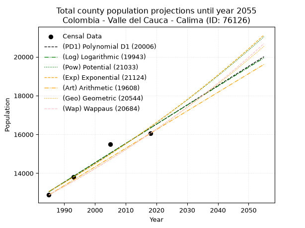
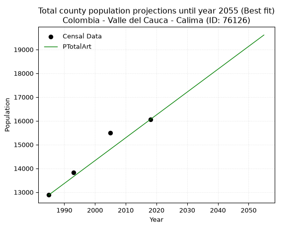
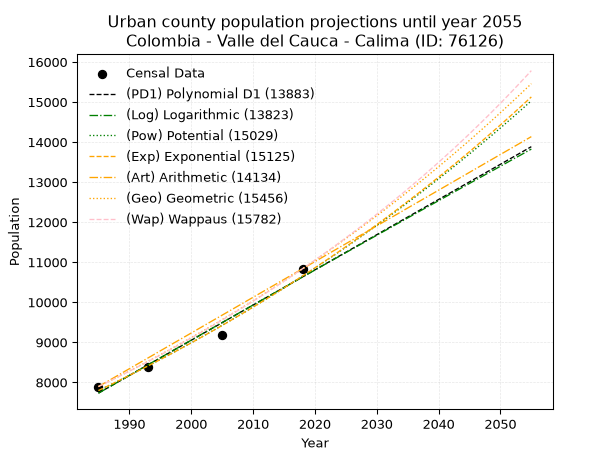
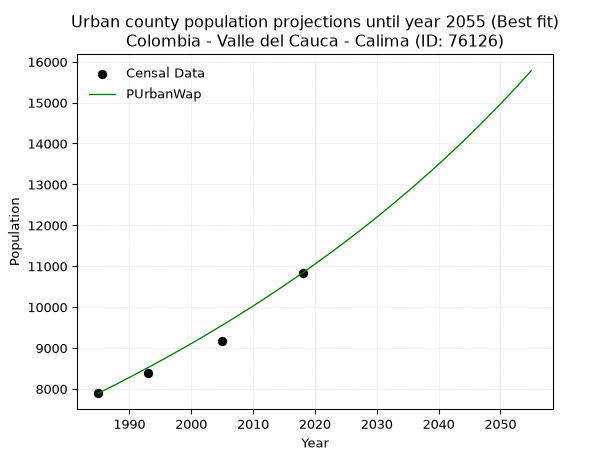
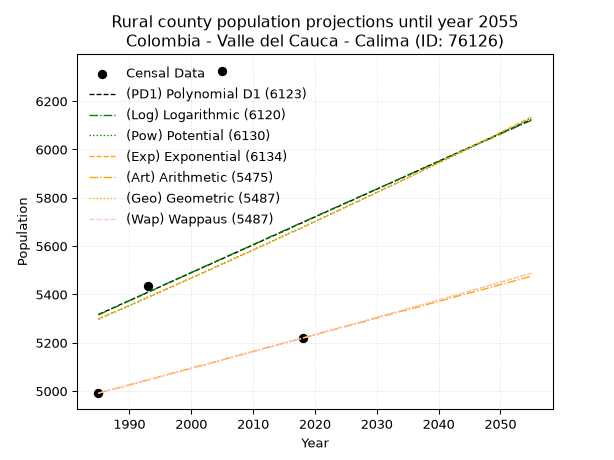
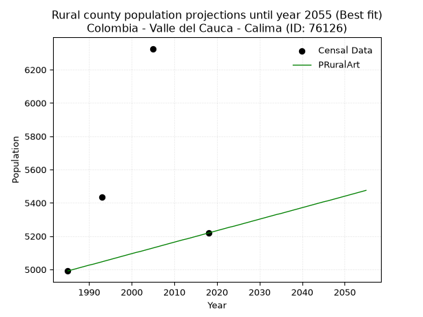

<div align="center">


</div>

# 📜 _“Population and Public Services Demand Projections (PPSD) until Year 2050 for Colombia - Valle del Cauca - Calima (ID: 76126)”_
Keywords: `population` `public-service` `projection` `lineal` `polynomial` `logarithmic` `potential` `exponential` `arithmetic` `geometric` `wappaus` `dane` `colombia` `south-america`

PPSD are analytical estimates used by governments and planners to anticipate future changes in population size, age distribution, and the resulting community needs for utilities, healthcare, education, and infrastructure as sizing future water treatment facilities, electrical grids, and road networks based on spatial growth.

<div align="center">

</img>

</div>


> **General running parameters**: • app_version: _v20260806_. • Python version: _3.14.7_. • Pandas version: _3.0.5_. • NumPy version: _2.5.1_. • Creates, save and include plots into reports (create_plot): _False_. • Projection until year: _2050_. • Process polynomial degree 2 and up: _False_. • Process Wappaus: _True_. • Process Wappaus: _True_. • Set negative values to zero: _True_. • Set infinite values to zero: _True_. • Drop dataset notes: _True_. 
<div align="center">

Dynamic map: [:earth_americas:Google](http://maps.google.com/maps?q=3.933664265,-76.4841316) [:earth_americas:OSM](https://www.openstreetmap.org/#map=18/3.933664265/-76.4841316&layers=P) [:earth_americas:Bing](https://www.bing.com/maps?cp=3.933664265~-76.4841316&lvl=18) [:earth_americas:Apple](https://maps.apple.com/frame?center=3.933664265%2C-76.4841316&span=0.003%2C0.006)

</div>


<div align="center">

```geojson
{
  "type": "Feature",
  "geometry": {
    "type": "Point", 
    "coordinates": [-76.4841316, 3.933664265]
  }, 
  "properties": {
    "Name": "Colombia - Valle del Cauca - Calima (ID: 76126)"
  }
}
```

</div>


## 0. Census Data (4 records)

Census data are official statistics collected by a government about the people and housing in a country. They usually include counts of total population, age, sex, race, income, education, and jobs.

📅Global census file: [Population.xlsx](../data/Population.xlsx)

| Source   |   Year |   CountryID | CountryName   |   StateID | StateName       |   CountyID | CountyName   |   PTotal |   PUrban |   PRural |
|:---------|-------:|------------:|:--------------|----------:|:----------------|-----------:|:-------------|---------:|---------:|---------:|
| DANE     |   1985 |          57 | Colombia      |        76 | Valle del Cauca |      76126 | Calima       |    12884 |     7893 |     4991 |
| DANE     |   1993 |          57 | Colombia      |        76 | Valle del Cauca |      76126 | Calima       |    13818 |     8384 |     5434 |
| DANE     |   2005 |          57 | Colombia      |        76 | Valle del Cauca |      76126 | Calima       |    15497 |     9171 |     6326 |
| DANE     |   2018 |          57 | Colombia      |        76 | Valle del Cauca |      76126 | Calima       |    16054 |    10835 |     5219 |

> 🔥Some records could had specific notes about the registered values or the corresponding urban or rural distribution.

📅[SUI-RUPS](https://www.datos.gov.co/Hacienda-y-Cr-dito-P-blico/Registro-nico-de-Prestadores-de-Servicios-P-blicos/4qkq-csdn/about_data) - Local public utility companies: [RUPS.csv](../data/RUPS.csv)

 | SERVICIO       | ESTADO    | NOMBRE                                                        | NIT         | DEPARTAMENTO_DOMICILIO   | MUNICIPIO_DOMICILIO   | DIRECCION                                  |   TELEFONO | EMAIL                    | TIPO_PRESTADOR                             | CLASIFICACION                  |
|:---------------|:----------|:--------------------------------------------------------------|:------------|:-------------------------|:----------------------|:-------------------------------------------|-----------:|:-------------------------|:-------------------------------------------|:-------------------------------|
| ACUEDUCTO      | OPERATIVA | EMPRESA DE SERVICIOS PÚBLICOS MUNICIPALES DE CALIMA EL DARIEN | 805011107-7 | VALLE DEL CAUCA          | CALIMA                | CL 10 #14-63 Colinas 3                     |    2534538 | emcalima@hotmail.com     | EMPRESA INDUSTRIAL Y COMERCIAL DEL ESTADO  | DESDE 2501 HASTA 5000 USUARIOS |
| ALCANTARILLADO | OPERATIVA | EMPRESA DE SERVICIOS PÚBLICOS MUNICIPALES DE CALIMA EL DARIEN | 805011107-7 | VALLE DEL CAUCA          | CALIMA                | CL 10 #14-63 Colinas 3                     |    2534538 | emcalima@hotmail.com     | EMPRESA INDUSTRIAL Y COMERCIAL DEL ESTADO  | DESDE 2501 HASTA 5000 USUARIOS |
| ACUEDUCTO      | OPERATIVA | ACUALLANITOS S.A.S.                                           | 901167094-8 | VALLE DEL CAUCA          | CALIMA                | Kilómetro 10 vía La Represa Centro Nautico |    8898048 | josealonso2010@gmail.com | SOCIEDADES (EMPRESA DE SERVICIOS PUBLICOS) | MENOR O IGUAL A 2500 USUARIOS  |

## 1. Total

### 1.1. Coefficients and Parameters

* (PD1) Polynomial Deg 1: 99.41027699718947, -184282.15656362823 (lineal)
* (Log) Logarithmic: 199073.98024656906, -1498599.6691329307
* (Pow) Potential: 13.74524563838959, -41.21251655373058
* (Exp) Exponential: 0.006863489669661727, 0.015822865077839945
* (Art) Arithmetic: Year diff. 2018 - 1985 = 33, Population diff. 16054 - 12884 = 3170, Annual growth = 96.06060606060606
* (Geo) Geometric: Year diff. 2018 - 1985 = 33, Population diff. 16054 - 12884 = 3170, Annual growth % = 0.006688078344310622
* (Wap) Wappaus: i = 0.6639063242836828, Condition values only valid for < 200)

<sub>
Wappaus condition values: ['0.00', '0.66', '1.33', '1.99', '2.66', '3.32', '3.98', '4.65', '5.31', '5.98', '6.64', '7.30', '7.97', '8.63', '9.29', '9.96', '10.62', '11.29', '11.95', '12.61', '13.28', '13.94', '14.61', '15.27', '15.93', '16.60', '17.26', '17.93', '18.59', '19.25', '19.92', '20.58', '21.25', '21.91', '22.57', '23.24', '23.90', '24.56', '25.23', '25.89', '26.56', '27.22', '27.88', '28.55', '29.21', '29.88', '30.54', '31.20', '31.87', '32.53', '33.20', '33.86', '34.52', '35.19', '35.85', '36.51', '37.18', '37.84', '38.51', '39.17', '39.83', '40.50', '41.16', '41.83', '42.49', '43.15']
</sub>


### 1.2. Projected Dataset

|   Year |   CountyID |   PTotalPD1 |   PTotalLog |   PTotalPow |   PTotalExp |   PTotalArt |   PTotalGeo |   PTotalWap |
|-------:|-----------:|------------:|------------:|------------:|------------:|------------:|------------:|------------:|
|   1985 |      76126 |       13047 |       13044 |       13062 |       13065 |       12884 |       12884 |       12884 |
|   1986 |      76126 |       13147 |       13144 |       13153 |       13155 |       12980 |       12970 |       12970 |
|   1987 |      76126 |       13246 |       13244 |       13244 |       13246 |       13076 |       13057 |       13056 |
|   1988 |      76126 |       13345 |       13344 |       13336 |       13337 |       13172 |       13144 |       13143 |
|   1989 |      76126 |       13445 |       13444 |       13429 |       13429 |       13268 |       13232 |       13231 |
|   1990 |      76126 |       13544 |       13544 |       13522 |       13522 |       13364 |       13321 |       13319 |
|   1991 |      76126 |       13644 |       13644 |       13615 |       13615 |       13460 |       13410 |       13408 |
|   1992 |      76126 |       13743 |       13744 |       13710 |       13709 |       13556 |       13499 |       13497 |
|   1993 |      76126 |       13843 |       13844 |       13805 |       13803 |       13652 |       13590 |       13587 |
|   1994 |      76126 |       13942 |       13944 |       13900 |       13898 |       13749 |       13681 |       13678 |
|   1995 |      76126 |       14041 |       14044 |       13996 |       13994 |       13845 |       13772 |       13769 |
|   1996 |      76126 |       14141 |       14144 |       14093 |       14090 |       13941 |       13864 |       13861 |
|   1997 |      76126 |       14240 |       14243 |       14190 |       14187 |       14037 |       13957 |       13953 |
|   1998 |      76126 |       14340 |       14343 |       14288 |       14285 |       14133 |       14050 |       14046 |
|   1999 |      76126 |       14439 |       14443 |       14387 |       14383 |       14229 |       14144 |       14140 |
|   2000 |      76126 |       14538 |       14542 |       14486 |       14482 |       14325 |       14239 |       14234 |
|   2001 |      76126 |       14638 |       14642 |       14586 |       14582 |       14421 |       14334 |       14329 |
|   2002 |      76126 |       14737 |       14741 |       14686 |       14682 |       14517 |       14430 |       14425 |
|   2003 |      76126 |       14837 |       14841 |       14788 |       14784 |       14613 |       14526 |       14522 |
|   2004 |      76126 |       14936 |       14940 |       14889 |       14885 |       14709 |       14624 |       14619 |
|   2005 |      76126 |       15035 |       15039 |       14992 |       14988 |       14805 |       14721 |       14716 |
|   2006 |      76126 |       15135 |       15139 |       15095 |       15091 |       14901 |       14820 |       14815 |
|   2007 |      76126 |       15234 |       15238 |       15199 |       15195 |       14997 |       14919 |       14914 |
|   2008 |      76126 |       15334 |       15337 |       15303 |       15300 |       15093 |       15019 |       15014 |
|   2009 |      76126 |       15433 |       15436 |       15408 |       15405 |       15189 |       15119 |       15115 |
|   2010 |      76126 |       15533 |       15535 |       15514 |       15511 |       15286 |       15220 |       15216 |
|   2011 |      76126 |       15632 |       15634 |       15620 |       15618 |       15382 |       15322 |       15318 |
|   2012 |      76126 |       15731 |       15733 |       15728 |       15726 |       15478 |       15425 |       15421 |
|   2013 |      76126 |       15831 |       15832 |       15835 |       15834 |       15574 |       15528 |       15524 |
|   2014 |      76126 |       15930 |       15931 |       15944 |       15943 |       15670 |       15632 |       15629 |
|   2015 |      76126 |       16030 |       16030 |       16053 |       16053 |       15766 |       15736 |       15734 |
|   2016 |      76126 |       16129 |       16128 |       16163 |       16163 |       15862 |       15841 |       15840 |
|   2017 |      76126 |       16228 |       16227 |       16273 |       16275 |       15958 |       15947 |       15947 |
|   2018 |      76126 |       16328 |       16326 |       16385 |       16387 |       16054 |       16054 |       16054 |
|   2019 |      76126 |       16427 |       16425 |       16497 |       16500 |       16150 |       16161 |       16162 |
|   2020 |      76126 |       16527 |       16523 |       16609 |       16613 |       16246 |       16269 |       16271 |
|   2021 |      76126 |       16626 |       16622 |       16723 |       16728 |       16342 |       16378 |       16381 |
|   2022 |      76126 |       16725 |       16720 |       16837 |       16843 |       16438 |       16488 |       16492 |
|   2023 |      76126 |       16825 |       16819 |       16952 |       16959 |       16534 |       16598 |       16604 |
|   2024 |      76126 |       16924 |       16917 |       17067 |       17076 |       16630 |       16709 |       16716 |
|   2025 |      76126 |       17024 |       17015 |       17183 |       17193 |       16726 |       16821 |       16829 |
|   2026 |      76126 |       17123 |       17114 |       17300 |       17312 |       16822 |       16933 |       16944 |
|   2027 |      76126 |       17222 |       17212 |       17418 |       17431 |       16919 |       17047 |       17059 |
|   2028 |      76126 |       17322 |       17310 |       17537 |       17551 |       17015 |       17161 |       17175 |
|   2029 |      76126 |       17421 |       17408 |       17656 |       17672 |       17111 |       17275 |       17291 |
|   2030 |      76126 |       17521 |       17506 |       17776 |       17793 |       17207 |       17391 |       17409 |
|   2031 |      76126 |       17620 |       17604 |       17897 |       17916 |       17303 |       17507 |       17528 |
|   2032 |      76126 |       17720 |       17702 |       18018 |       18039 |       17399 |       17624 |       17647 |
|   2033 |      76126 |       17819 |       17800 |       18140 |       18164 |       17495 |       17742 |       17768 |
|   2034 |      76126 |       17918 |       17898 |       18263 |       18289 |       17591 |       17861 |       17890 |
|   2035 |      76126 |       18018 |       17996 |       18387 |       18415 |       17687 |       17980 |       18012 |
|   2036 |      76126 |       18117 |       18094 |       18512 |       18541 |       17783 |       18101 |       18135 |
|   2037 |      76126 |       18217 |       18191 |       18637 |       18669 |       17879 |       18222 |       18260 |
|   2038 |      76126 |       18316 |       18289 |       18763 |       18798 |       17975 |       18343 |       18385 |
|   2039 |      76126 |       18415 |       18387 |       18890 |       18927 |       18071 |       18466 |       18512 |
|   2040 |      76126 |       18515 |       18484 |       19018 |       19058 |       18167 |       18590 |       18639 |
|   2041 |      76126 |       18614 |       18582 |       19146 |       19189 |       18263 |       18714 |       18768 |
|   2042 |      76126 |       18714 |       18679 |       19276 |       19321 |       18359 |       18839 |       18897 |
|   2043 |      76126 |       18813 |       18777 |       19406 |       19454 |       18456 |       18965 |       19028 |
|   2044 |      76126 |       18912 |       18874 |       19537 |       19588 |       18552 |       19092 |       19160 |
|   2045 |      76126 |       19012 |       18972 |       19669 |       19723 |       18648 |       19220 |       19293 |
|   2046 |      76126 |       19111 |       19069 |       19801 |       19859 |       18744 |       19348 |       19427 |
|   2047 |      76126 |       19211 |       19166 |       19935 |       19996 |       18840 |       19478 |       19562 |
|   2048 |      76126 |       19310 |       19264 |       20069 |       20133 |       18936 |       19608 |       19698 |
|   2049 |      76126 |       19410 |       19361 |       20204 |       20272 |       19032 |       19739 |       19835 |
|   2050 |      76126 |       19509 |       19458 |       20340 |       20412 |       19128 |       19871 |       19974 |
<div align="center">

</img>

</div>


### 1.3. Best fit with absolute and relative error (%)

Relative error puts that difference into context by dividing the absolute error by the true value, creating a unitless ratio or percentage that shows the scale of the mistake.

Absolute and relative error

|   Year | Source   |   CountryID | CountryName   |   StateID | StateName       |   CountyID_x | CountyName   |   PTotal |   PUrban |   PRural |   CountyID_y |   PTotalPD1 |   PTotalLog |   PTotalPow |   PTotalExp |   PTotalArt |   PTotalGeo |   PTotalWap |   PTotalPD1AbsError |   PTotalLogAbsError |   PTotalPowAbsError |   PTotalExpAbsError |   PTotalArtAbsError |   PTotalGeoAbsError |   PTotalWapAbsError |   PTotalPD1RelError |   PTotalLogRelError |   PTotalPowRelError |   PTotalExpRelError |   PTotalArtRelError |   PTotalGeoRelError |   PTotalWapRelError |
|-------:|:---------|------------:|:--------------|----------:|:----------------|-------------:|:-------------|---------:|---------:|---------:|-------------:|------------:|------------:|------------:|------------:|------------:|------------:|------------:|--------------------:|--------------------:|--------------------:|--------------------:|--------------------:|--------------------:|--------------------:|--------------------:|--------------------:|--------------------:|--------------------:|--------------------:|--------------------:|--------------------:|
|   1985 | DANE     |          57 | Colombia      |        76 | Valle del Cauca |        76126 | Calima       |    12884 |     7893 |     4991 |        76126 |       13047 |       13044 |       13062 |       13065 |       12884 |       12884 |       12884 |                 163 |                 160 |                 178 |                 181 |                   0 |                   0 |                   0 |            1.26514  |             1.24185 |           1.38156   |            1.40484  |             0       |             0       |             0       |
|   1993 | DANE     |          57 | Colombia      |        76 | Valle del Cauca |        76126 | Calima       |    13818 |     8384 |     5434 |        76126 |       13843 |       13844 |       13805 |       13803 |       13652 |       13590 |       13587 |                  25 |                  26 |                  13 |                  15 |                 166 |                 228 |                 231 |            0.180923 |             0.18816 |           0.0940802 |            0.108554 |             1.20133 |             1.65002 |             1.67173 |
|   2005 | DANE     |          57 | Colombia      |        76 | Valle del Cauca |        76126 | Calima       |    15497 |     9171 |     6326 |        76126 |       15035 |       15039 |       14992 |       14988 |       14805 |       14721 |       14716 |                 462 |                 458 |                 505 |                 509 |                 692 |                 776 |                 781 |            2.98122  |             2.95541 |           3.2587    |            3.28451  |             4.46538 |             5.00742 |             5.03969 |
|   2018 | DANE     |          57 | Colombia      |        76 | Valle del Cauca |        76126 | Calima       |    16054 |    10835 |     5219 |        76126 |       16328 |       16326 |       16385 |       16387 |       16054 |       16054 |       16054 |                 274 |                 272 |                 331 |                 333 |                   0 |                   0 |                   0 |            1.70674  |             1.69428 |           2.06179   |            2.07425  |             0       |             0       |             0       |

Relative error mean

| Method    |   RelError | Best   |
|:----------|-----------:|:-------|
| PTotalPD1 |    1.53351 |        |
| PTotalLog |    1.51993 |        |
| PTotalPow |    1.69903 |        |
| PTotalExp |    1.71804 |        |
| PTotalArt |    1.41668 | True   |
| PTotalGeo |    1.66436 |        |
| PTotalWap |    1.67785 |        |

💙Best method: _**PTotalArt**_
<div align="center">

</img>

</div>


### 1.4. Fresh water supply demand in liters per capita per day (lpcd)

The fresh water supply demand typically ranges from 100 to 300 liters per capita per day (lpcd) for standard domestic and municipal planning, though absolute survival minimums set by the World Health Organization are as low as 7.5 to 20 liters per day, and total consumption in high-income nations can exceed 400 liters.

> `CZ`: Level in meters above the sea level (masl)<br> `WS`: Fresh water supply demand in liters per capita per day (lpcd or l/h/d)<br> `WSAll`: Zonal fresh water supply demand in liters per second (l/s)<br> `A`: Zonal area in square meters<br> `DP`: Population density (people/hectare or p/ha)

Reference values (RAS Colombia)

|    CZ |   WS |
|------:|-----:|
|  1000 |  120 |
|  2000 |  130 |
| 99999 |  140 |

County shapefile geometry properties and water supply values

|   CountyID |      ATotal |   CZTotal |   WSTotal |
|-----------:|------------:|----------:|----------:|
|      76126 | 7.93846e+08 |   1368.45 |       130 |

Projected values for best method: PTotalArt

|   CountyID |   Year |   PTotalArt |   DPTotal |   WSTotal |   WSTotalAll |
|-----------:|-------:|------------:|----------:|----------:|-------------:|
|      76126 |   1985 |       12884 |      0.16 |       130 |      19.3856 |
|      76126 |   1986 |       12980 |      0.16 |       130 |      19.5301 |
|      76126 |   1987 |       13076 |      0.16 |       130 |      19.6745 |
|      76126 |   1988 |       13172 |      0.17 |       130 |      19.819  |
|      76126 |   1989 |       13268 |      0.17 |       130 |      19.9634 |
|      76126 |   1990 |       13364 |      0.17 |       130 |      20.1079 |
|      76126 |   1991 |       13460 |      0.17 |       130 |      20.2523 |
|      76126 |   1992 |       13556 |      0.17 |       130 |      20.3968 |
|      76126 |   1993 |       13652 |      0.17 |       130 |      20.5412 |
|      76126 |   1994 |       13749 |      0.17 |       130 |      20.6872 |
|      76126 |   1995 |       13845 |      0.17 |       130 |      20.8316 |
|      76126 |   1996 |       13941 |      0.18 |       130 |      20.976  |
|      76126 |   1997 |       14037 |      0.18 |       130 |      21.1205 |
|      76126 |   1998 |       14133 |      0.18 |       130 |      21.2649 |
|      76126 |   1999 |       14229 |      0.18 |       130 |      21.4094 |
|      76126 |   2000 |       14325 |      0.18 |       130 |      21.5538 |
|      76126 |   2001 |       14421 |      0.18 |       130 |      21.6983 |
|      76126 |   2002 |       14517 |      0.18 |       130 |      21.8427 |
|      76126 |   2003 |       14613 |      0.18 |       130 |      21.9872 |
|      76126 |   2004 |       14709 |      0.19 |       130 |      22.1316 |
|      76126 |   2005 |       14805 |      0.19 |       130 |      22.276  |
|      76126 |   2006 |       14901 |      0.19 |       130 |      22.4205 |
|      76126 |   2007 |       14997 |      0.19 |       130 |      22.5649 |
|      76126 |   2008 |       15093 |      0.19 |       130 |      22.7094 |
|      76126 |   2009 |       15189 |      0.19 |       130 |      22.8538 |
|      76126 |   2010 |       15286 |      0.19 |       130 |      22.9998 |
|      76126 |   2011 |       15382 |      0.19 |       130 |      23.1442 |
|      76126 |   2012 |       15478 |      0.19 |       130 |      23.2887 |
|      76126 |   2013 |       15574 |      0.2  |       130 |      23.4331 |
|      76126 |   2014 |       15670 |      0.2  |       130 |      23.5775 |
|      76126 |   2015 |       15766 |      0.2  |       130 |      23.722  |
|      76126 |   2016 |       15862 |      0.2  |       130 |      23.8664 |
|      76126 |   2017 |       15958 |      0.2  |       130 |      24.0109 |
|      76126 |   2018 |       16054 |      0.2  |       130 |      24.1553 |
|      76126 |   2019 |       16150 |      0.2  |       130 |      24.2998 |
|      76126 |   2020 |       16246 |      0.2  |       130 |      24.4442 |
|      76126 |   2021 |       16342 |      0.21 |       130 |      24.5887 |
|      76126 |   2022 |       16438 |      0.21 |       130 |      24.7331 |
|      76126 |   2023 |       16534 |      0.21 |       130 |      24.8775 |
|      76126 |   2024 |       16630 |      0.21 |       130 |      25.022  |
|      76126 |   2025 |       16726 |      0.21 |       130 |      25.1664 |
|      76126 |   2026 |       16822 |      0.21 |       130 |      25.3109 |
|      76126 |   2027 |       16919 |      0.21 |       130 |      25.4568 |
|      76126 |   2028 |       17015 |      0.21 |       130 |      25.6013 |
|      76126 |   2029 |       17111 |      0.22 |       130 |      25.7457 |
|      76126 |   2030 |       17207 |      0.22 |       130 |      25.8902 |
|      76126 |   2031 |       17303 |      0.22 |       130 |      26.0346 |
|      76126 |   2032 |       17399 |      0.22 |       130 |      26.1791 |
|      76126 |   2033 |       17495 |      0.22 |       130 |      26.3235 |
|      76126 |   2034 |       17591 |      0.22 |       130 |      26.4679 |
|      76126 |   2035 |       17687 |      0.22 |       130 |      26.6124 |
|      76126 |   2036 |       17783 |      0.22 |       130 |      26.7568 |
|      76126 |   2037 |       17879 |      0.23 |       130 |      26.9013 |
|      76126 |   2038 |       17975 |      0.23 |       130 |      27.0457 |
|      76126 |   2039 |       18071 |      0.23 |       130 |      27.1902 |
|      76126 |   2040 |       18167 |      0.23 |       130 |      27.3346 |
|      76126 |   2041 |       18263 |      0.23 |       130 |      27.4791 |
|      76126 |   2042 |       18359 |      0.23 |       130 |      27.6235 |
|      76126 |   2043 |       18456 |      0.23 |       130 |      27.7694 |
|      76126 |   2044 |       18552 |      0.23 |       130 |      27.9139 |
|      76126 |   2045 |       18648 |      0.23 |       130 |      28.0583 |
|      76126 |   2046 |       18744 |      0.24 |       130 |      28.2028 |
|      76126 |   2047 |       18840 |      0.24 |       130 |      28.3472 |
|      76126 |   2048 |       18936 |      0.24 |       130 |      28.4917 |
|      76126 |   2049 |       19032 |      0.24 |       130 |      28.6361 |
|      76126 |   2050 |       19128 |      0.24 |       130 |      28.7806 |

## 2. Urban

### 2.1. Coefficients and Parameters

* (PD1) Polynomial Deg 1: 87.88639100762646, -166724.0036130048 (lineal)
* (Log) Logarithmic: 175841.0917847561, -1327498.7977580067
* (Pow) Potential: 18.953041930875376, -58.61094401338556
* (Exp) Exponential: 0.00947185626256359, 5.324839663370809e-05
* (Art) Arithmetic: Year diff. 2018 - 1985 = 33, Population diff. 10835 - 7893 = 2942, Annual growth = 89.15151515151516
* (Geo) Geometric: Year diff. 2018 - 1985 = 33, Population diff. 10835 - 7893 = 2942, Annual growth % = 0.009646391320104142
* (Wap) Wappaus: i = 0.9520665864108837, Condition values only valid for < 200)

<sub>
Wappaus condition values: ['0.00', '0.95', '1.90', '2.86', '3.81', '4.76', '5.71', '6.66', '7.62', '8.57', '9.52', '10.47', '11.42', '12.38', '13.33', '14.28', '15.23', '16.19', '17.14', '18.09', '19.04', '19.99', '20.95', '21.90', '22.85', '23.80', '24.75', '25.71', '26.66', '27.61', '28.56', '29.51', '30.47', '31.42', '32.37', '33.32', '34.27', '35.23', '36.18', '37.13', '38.08', '39.03', '39.99', '40.94', '41.89', '42.84', '43.80', '44.75', '45.70', '46.65', '47.60', '48.56', '49.51', '50.46', '51.41', '52.36', '53.32', '54.27', '55.22', '56.17', '57.12', '58.08', '59.03', '59.98', '60.93', '61.88']
</sub>


### 2.2. Projected Dataset

|   Year |   CountyID |   PUrbanPD1 |   PUrbanLog |   PUrbanPow |   PUrbanExp |   PUrbanArt |   PUrbanGeo |   PUrbanWap |
|-------:|-----------:|------------:|------------:|------------:|------------:|------------:|------------:|------------:|
|   1985 |      76126 |        7730 |        7728 |        7792 |        7794 |        7893 |        7893 |        7893 |
|   1986 |      76126 |        7818 |        7817 |        7867 |        7868 |        7982 |        7969 |        7969 |
|   1987 |      76126 |        7906 |        7905 |        7942 |        7943 |        8071 |        8046 |        8045 |
|   1988 |      76126 |        7994 |        7994 |        8018 |        8019 |        8160 |        8124 |        8122 |
|   1989 |      76126 |        8082 |        8082 |        8095 |        8095 |        8250 |        8202 |        8199 |
|   1990 |      76126 |        8170 |        8171 |        8173 |        8172 |        8339 |        8281 |        8278 |
|   1991 |      76126 |        8258 |        8259 |        8251 |        8250 |        8428 |        8361 |        8357 |
|   1992 |      76126 |        8346 |        8347 |        8330 |        8328 |        8517 |        8442 |        8437 |
|   1993 |      76126 |        8434 |        8436 |        8409 |        8407 |        8606 |        8523 |        8518 |
|   1994 |      76126 |        8521 |        8524 |        8490 |        8487 |        8695 |        8605 |        8600 |
|   1995 |      76126 |        8609 |        8612 |        8571 |        8568 |        8785 |        8688 |        8682 |
|   1996 |      76126 |        8697 |        8700 |        8652 |        8650 |        8874 |        8772 |        8765 |
|   1997 |      76126 |        8785 |        8788 |        8735 |        8732 |        8963 |        8857 |        8849 |
|   1998 |      76126 |        8873 |        8876 |        8818 |        8815 |        9052 |        8942 |        8934 |
|   1999 |      76126 |        8961 |        8964 |        8902 |        8899 |        9141 |        9028 |        9020 |
|   2000 |      76126 |        9049 |        9052 |        8987 |        8984 |        9230 |        9116 |        9107 |
|   2001 |      76126 |        9137 |        9140 |        9073 |        9069 |        9319 |        9203 |        9194 |
|   2002 |      76126 |        9225 |        9228 |        9159 |        9156 |        9409 |        9292 |        9283 |
|   2003 |      76126 |        9312 |        9316 |        9246 |        9243 |        9498 |        9382 |        9372 |
|   2004 |      76126 |        9400 |        9404 |        9334 |        9331 |        9587 |        9472 |        9463 |
|   2005 |      76126 |        9488 |        9491 |        9423 |        9419 |        9676 |        9564 |        9554 |
|   2006 |      76126 |        9576 |        9579 |        9512 |        9509 |        9765 |        9656 |        9646 |
|   2007 |      76126 |        9664 |        9667 |        9602 |        9600 |        9854 |        9749 |        9740 |
|   2008 |      76126 |        9752 |        9754 |        9693 |        9691 |        9943 |        9843 |        9834 |
|   2009 |      76126 |        9840 |        9842 |        9785 |        9783 |       10033 |        9938 |        9929 |
|   2010 |      76126 |        9928 |        9929 |        9878 |        9876 |       10122 |       10034 |       10025 |
|   2011 |      76126 |       10016 |       10017 |        9972 |        9970 |       10211 |       10131 |       10123 |
|   2012 |      76126 |       10103 |       10104 |       10066 |       10065 |       10300 |       10229 |       10221 |
|   2013 |      76126 |       10191 |       10191 |       10161 |       10161 |       10389 |       10327 |       10321 |
|   2014 |      76126 |       10279 |       10279 |       10257 |       10258 |       10478 |       10427 |       10421 |
|   2015 |      76126 |       10367 |       10366 |       10354 |       10355 |       10568 |       10527 |       10523 |
|   2016 |      76126 |       10455 |       10453 |       10452 |       10454 |       10657 |       10629 |       10626 |
|   2017 |      76126 |       10543 |       10541 |       10551 |       10553 |       10746 |       10731 |       10730 |
|   2018 |      76126 |       10631 |       10628 |       10650 |       10654 |       10835 |       10835 |       10835 |
|   2019 |      76126 |       10719 |       10715 |       10751 |       10755 |       10924 |       10940 |       10941 |
|   2020 |      76126 |       10807 |       10802 |       10852 |       10857 |       11013 |       11045 |       11049 |
|   2021 |      76126 |       10894 |       10889 |       10955 |       10961 |       11102 |       11152 |       11158 |
|   2022 |      76126 |       10982 |       10976 |       11058 |       11065 |       11192 |       11259 |       11268 |
|   2023 |      76126 |       11070 |       11063 |       11162 |       11170 |       11281 |       11368 |       11379 |
|   2024 |      76126 |       11158 |       11150 |       11267 |       11277 |       11370 |       11477 |       11492 |
|   2025 |      76126 |       11246 |       11237 |       11373 |       11384 |       11459 |       11588 |       11606 |
|   2026 |      76126 |       11334 |       11323 |       11480 |       11492 |       11548 |       11700 |       11721 |
|   2027 |      76126 |       11422 |       11410 |       11588 |       11602 |       11637 |       11813 |       11838 |
|   2028 |      76126 |       11510 |       11497 |       11696 |       11712 |       11727 |       11927 |       11956 |
|   2029 |      76126 |       11597 |       11584 |       11806 |       11824 |       11816 |       12042 |       12075 |
|   2030 |      76126 |       11685 |       11670 |       11917 |       11936 |       11905 |       12158 |       12196 |
|   2031 |      76126 |       11773 |       11757 |       12029 |       12050 |       11994 |       12275 |       12319 |
|   2032 |      76126 |       11861 |       11843 |       12142 |       12164 |       12083 |       12394 |       12443 |
|   2033 |      76126 |       11949 |       11930 |       12255 |       12280 |       12172 |       12513 |       12568 |
|   2034 |      76126 |       12037 |       12016 |       12370 |       12397 |       12261 |       12634 |       12695 |
|   2035 |      76126 |       12125 |       12103 |       12486 |       12515 |       12351 |       12756 |       12824 |
|   2036 |      76126 |       12213 |       12189 |       12603 |       12634 |       12440 |       12879 |       12954 |
|   2037 |      76126 |       12301 |       12276 |       12720 |       12754 |       12529 |       13003 |       13086 |
|   2038 |      76126 |       12388 |       12362 |       12839 |       12876 |       12618 |       13128 |       13220 |
|   2039 |      76126 |       12476 |       12448 |       12959 |       12998 |       12707 |       13255 |       13355 |
|   2040 |      76126 |       12564 |       12534 |       13080 |       13122 |       12796 |       13383 |       13492 |
|   2041 |      76126 |       12652 |       12620 |       13202 |       13247 |       12885 |       13512 |       13631 |
|   2042 |      76126 |       12740 |       12707 |       13325 |       13373 |       12975 |       13642 |       13771 |
|   2043 |      76126 |       12828 |       12793 |       13450 |       13500 |       13064 |       13774 |       13914 |
|   2044 |      76126 |       12916 |       12879 |       13575 |       13629 |       13153 |       13907 |       14058 |
|   2045 |      76126 |       13004 |       12965 |       13701 |       13758 |       13242 |       14041 |       14204 |
|   2046 |      76126 |       13092 |       13051 |       13829 |       13889 |       13331 |       14177 |       14353 |
|   2047 |      76126 |       13179 |       13137 |       13958 |       14021 |       13420 |       14313 |       14503 |
|   2048 |      76126 |       13267 |       13223 |       14087 |       14155 |       13510 |       14451 |       14655 |
|   2049 |      76126 |       13355 |       13308 |       14218 |       14290 |       13599 |       14591 |       14810 |
|   2050 |      76126 |       13443 |       13394 |       14350 |       14426 |       13688 |       14731 |       14966 |
<div align="center">

</img>

</div>


### 2.3. Best fit with absolute and relative error (%)

Relative error puts that difference into context by dividing the absolute error by the true value, creating a unitless ratio or percentage that shows the scale of the mistake.

Absolute and relative error

|   Year | Source   |   CountryID | CountryName   |   StateID | StateName       |   CountyID_x | CountyName   |   PTotal |   PUrban |   PRural |   CountyID_y |   PUrbanPD1 |   PUrbanLog |   PUrbanPow |   PUrbanExp |   PUrbanArt |   PUrbanGeo |   PUrbanWap |   PUrbanPD1AbsError |   PUrbanLogAbsError |   PUrbanPowAbsError |   PUrbanExpAbsError |   PUrbanArtAbsError |   PUrbanGeoAbsError |   PUrbanWapAbsError |   PUrbanPD1RelError |   PUrbanLogRelError |   PUrbanPowRelError |   PUrbanExpRelError |   PUrbanArtRelError |   PUrbanGeoRelError |   PUrbanWapRelError |
|-------:|:---------|------------:|:--------------|----------:|:----------------|-------------:|:-------------|---------:|---------:|---------:|-------------:|------------:|------------:|------------:|------------:|------------:|------------:|------------:|--------------------:|--------------------:|--------------------:|--------------------:|--------------------:|--------------------:|--------------------:|--------------------:|--------------------:|--------------------:|--------------------:|--------------------:|--------------------:|--------------------:|
|   1985 | DANE     |          57 | Colombia      |        76 | Valle del Cauca |        76126 | Calima       |    12884 |     7893 |     4991 |        76126 |        7730 |        7728 |        7792 |        7794 |        7893 |        7893 |        7893 |                 163 |                 165 |                 101 |                  99 |                   0 |                   0 |                   0 |            2.06512  |            2.09046  |            1.27961  |            1.25428  |             0       |             0       |             0       |
|   1993 | DANE     |          57 | Colombia      |        76 | Valle del Cauca |        76126 | Calima       |    13818 |     8384 |     5434 |        76126 |        8434 |        8436 |        8409 |        8407 |        8606 |        8523 |        8518 |                  50 |                  52 |                  25 |                  23 |                 222 |                 139 |                 134 |            0.596374 |            0.620229 |            0.298187 |            0.274332 |             2.6479  |             1.65792 |             1.59828 |
|   2005 | DANE     |          57 | Colombia      |        76 | Valle del Cauca |        76126 | Calima       |    15497 |     9171 |     6326 |        76126 |        9488 |        9491 |        9423 |        9419 |        9676 |        9564 |        9554 |                 317 |                 320 |                 252 |                 248 |                 505 |                 393 |                 383 |            3.45655  |            3.48926  |            2.74779  |            2.70418  |             5.50649 |             4.28525 |             4.17621 |
|   2018 | DANE     |          57 | Colombia      |        76 | Valle del Cauca |        76126 | Calima       |    16054 |    10835 |     5219 |        76126 |       10631 |       10628 |       10650 |       10654 |       10835 |       10835 |       10835 |                 204 |                 207 |                 185 |                 181 |                   0 |                   0 |                   0 |            1.88279  |            1.91048  |            1.70743  |            1.67051  |             0       |             0       |             0       |

Relative error mean

| Method    |   RelError | Best   |
|:----------|-----------:|:-------|
| PUrbanPD1 |    2.00021 |        |
| PUrbanLog |    2.02761 |        |
| PUrbanPow |    1.50826 |        |
| PUrbanExp |    1.47582 |        |
| PUrbanArt |    2.0386  |        |
| PUrbanGeo |    1.48579 |        |
| PUrbanWap |    1.44362 | True   |

💙Best method: _**PUrbanWap**_
<div align="center">

</img>

</div>


### 2.4. Fresh water supply demand in liters per capita per day (lpcd)

The fresh water supply demand typically ranges from 100 to 300 liters per capita per day (lpcd) for standard domestic and municipal planning, though absolute survival minimums set by the World Health Organization are as low as 7.5 to 20 liters per day, and total consumption in high-income nations can exceed 400 liters.

> `CZ`: Level in meters above the sea level (masl)<br> `WS`: Fresh water supply demand in liters per capita per day (lpcd or l/h/d)<br> `WSAll`: Zonal fresh water supply demand in liters per second (l/s)<br> `A`: Zonal area in square meters<br> `DP`: Population density (people/hectare or p/ha)

Reference values (RAS Colombia)

|    CZ |   WS |
|------:|-----:|
|  1000 |  120 |
|  2000 |  130 |
| 99999 |  140 |

County shapefile geometry properties and water supply values

|   CountyID |      AUrban |   CZUrban |   WSUrban |
|-----------:|------------:|----------:|----------:|
|      76126 | 1.95666e+06 |   1524.49 |       130 |

Projected values for best method: PUrbanWap

|   CountyID |   Year |   PUrbanWap |   DPUrban |   WSUrban |   WSUrbanAll |
|-----------:|-------:|------------:|----------:|----------:|-------------:|
|      76126 |   1985 |        7893 |     40.34 |       130 |      11.876  |
|      76126 |   1986 |        7969 |     40.73 |       130 |      11.9904 |
|      76126 |   1987 |        8045 |     41.12 |       130 |      12.1047 |
|      76126 |   1988 |        8122 |     41.51 |       130 |      12.2206 |
|      76126 |   1989 |        8199 |     41.9  |       130 |      12.3365 |
|      76126 |   1990 |        8278 |     42.31 |       130 |      12.4553 |
|      76126 |   1991 |        8357 |     42.71 |       130 |      12.5742 |
|      76126 |   1992 |        8437 |     43.12 |       130 |      12.6946 |
|      76126 |   1993 |        8518 |     43.53 |       130 |      12.8164 |
|      76126 |   1994 |        8600 |     43.95 |       130 |      12.9398 |
|      76126 |   1995 |        8682 |     44.37 |       130 |      13.0632 |
|      76126 |   1996 |        8765 |     44.8  |       130 |      13.1881 |
|      76126 |   1997 |        8849 |     45.23 |       130 |      13.3145 |
|      76126 |   1998 |        8934 |     45.66 |       130 |      13.4424 |
|      76126 |   1999 |        9020 |     46.1  |       130 |      13.5718 |
|      76126 |   2000 |        9107 |     46.54 |       130 |      13.7027 |
|      76126 |   2001 |        9194 |     46.99 |       130 |      13.8336 |
|      76126 |   2002 |        9283 |     47.44 |       130 |      13.9675 |
|      76126 |   2003 |        9372 |     47.9  |       130 |      14.1014 |
|      76126 |   2004 |        9463 |     48.36 |       130 |      14.2383 |
|      76126 |   2005 |        9554 |     48.83 |       130 |      14.3752 |
|      76126 |   2006 |        9646 |     49.3  |       130 |      14.5137 |
|      76126 |   2007 |        9740 |     49.78 |       130 |      14.6551 |
|      76126 |   2008 |        9834 |     50.26 |       130 |      14.7965 |
|      76126 |   2009 |        9929 |     50.74 |       130 |      14.9395 |
|      76126 |   2010 |       10025 |     51.24 |       130 |      15.0839 |
|      76126 |   2011 |       10123 |     51.74 |       130 |      15.2314 |
|      76126 |   2012 |       10221 |     52.24 |       130 |      15.3788 |
|      76126 |   2013 |       10321 |     52.75 |       130 |      15.5293 |
|      76126 |   2014 |       10421 |     53.26 |       130 |      15.6797 |
|      76126 |   2015 |       10523 |     53.78 |       130 |      15.8332 |
|      76126 |   2016 |       10626 |     54.31 |       130 |      15.9882 |
|      76126 |   2017 |       10730 |     54.84 |       130 |      16.1447 |
|      76126 |   2018 |       10835 |     55.37 |       130 |      16.3027 |
|      76126 |   2019 |       10941 |     55.92 |       130 |      16.4622 |
|      76126 |   2020 |       11049 |     56.47 |       130 |      16.6247 |
|      76126 |   2021 |       11158 |     57.03 |       130 |      16.7887 |
|      76126 |   2022 |       11268 |     57.59 |       130 |      16.9542 |
|      76126 |   2023 |       11379 |     58.16 |       130 |      17.1212 |
|      76126 |   2024 |       11492 |     58.73 |       130 |      17.2912 |
|      76126 |   2025 |       11606 |     59.32 |       130 |      17.4627 |
|      76126 |   2026 |       11721 |     59.9  |       130 |      17.6358 |
|      76126 |   2027 |       11838 |     60.5  |       130 |      17.8118 |
|      76126 |   2028 |       11956 |     61.1  |       130 |      17.9894 |
|      76126 |   2029 |       12075 |     61.71 |       130 |      18.1684 |
|      76126 |   2030 |       12196 |     62.33 |       130 |      18.3505 |
|      76126 |   2031 |       12319 |     62.96 |       130 |      18.5355 |
|      76126 |   2032 |       12443 |     63.59 |       130 |      18.7221 |
|      76126 |   2033 |       12568 |     64.23 |       130 |      18.9102 |
|      76126 |   2034 |       12695 |     64.88 |       130 |      19.1013 |
|      76126 |   2035 |       12824 |     65.54 |       130 |      19.2954 |
|      76126 |   2036 |       12954 |     66.2  |       130 |      19.491  |
|      76126 |   2037 |       13086 |     66.88 |       130 |      19.6896 |
|      76126 |   2038 |       13220 |     67.56 |       130 |      19.8912 |
|      76126 |   2039 |       13355 |     68.25 |       130 |      20.0943 |
|      76126 |   2040 |       13492 |     68.95 |       130 |      20.3005 |
|      76126 |   2041 |       13631 |     69.66 |       130 |      20.5096 |
|      76126 |   2042 |       13771 |     70.38 |       130 |      20.7203 |
|      76126 |   2043 |       13914 |     71.11 |       130 |      20.9354 |
|      76126 |   2044 |       14058 |     71.85 |       130 |      21.1521 |
|      76126 |   2045 |       14204 |     72.59 |       130 |      21.3718 |
|      76126 |   2046 |       14353 |     73.35 |       130 |      21.5959 |
|      76126 |   2047 |       14503 |     74.12 |       130 |      21.8216 |
|      76126 |   2048 |       14655 |     74.9  |       130 |      22.0503 |
|      76126 |   2049 |       14810 |     75.69 |       130 |      22.2836 |
|      76126 |   2050 |       14966 |     76.49 |       130 |      22.5183 |

## 3. Rural

### 3.1. Coefficients and Parameters

* (PD1) Polynomial Deg 1: 11.523885989563043, -17558.152950623476 (lineal)
* (Log) Logarithmic: 23232.88846181293, -171100.8713749239
* (Pow) Potential: 4.2152590872034095, -10.176883998058118
* (Exp) Exponential: 0.0020911294792774764, 83.4539491734759
* (Art) Arithmetic: Year diff. 2018 - 1985 = 33, Population diff. 5219 - 4991 = 228, Annual growth = 6.909090909090909
* (Geo) Geometric: Year diff. 2018 - 1985 = 33, Population diff. 5219 - 4991 = 228, Annual growth % = 0.0013545384436688401
* (Wap) Wappaus: i = 0.13533968480099723, Condition values only valid for < 200)

<sub>
Wappaus condition values: ['0.00', '0.14', '0.27', '0.41', '0.54', '0.68', '0.81', '0.95', '1.08', '1.22', '1.35', '1.49', '1.62', '1.76', '1.89', '2.03', '2.17', '2.30', '2.44', '2.57', '2.71', '2.84', '2.98', '3.11', '3.25', '3.38', '3.52', '3.65', '3.79', '3.92', '4.06', '4.20', '4.33', '4.47', '4.60', '4.74', '4.87', '5.01', '5.14', '5.28', '5.41', '5.55', '5.68', '5.82', '5.95', '6.09', '6.23', '6.36', '6.50', '6.63', '6.77', '6.90', '7.04', '7.17', '7.31', '7.44', '7.58', '7.71', '7.85', '7.99', '8.12', '8.26', '8.39', '8.53', '8.66', '8.80']
</sub>


### 3.2. Projected Dataset

|   Year |   CountyID |   PRuralPD1 |   PRuralLog |   PRuralPow |   PRuralExp |   PRuralArt |   PRuralGeo |   PRuralWap |
|-------:|-----------:|------------:|------------:|------------:|------------:|------------:|------------:|------------:|
|   1985 |      76126 |        5317 |        5315 |        5297 |        5299 |        4991 |        4991 |        4991 |
|   1986 |      76126 |        5328 |        5327 |        5308 |        5310 |        4998 |        4998 |        4998 |
|   1987 |      76126 |        5340 |        5339 |        5320 |        5321 |        5005 |        5005 |        5005 |
|   1988 |      76126 |        5351 |        5350 |        5331 |        5332 |        5012 |        5011 |        5011 |
|   1989 |      76126 |        5363 |        5362 |        5342 |        5343 |        5019 |        5018 |        5018 |
|   1990 |      76126 |        5374 |        5374 |        5353 |        5354 |        5026 |        5025 |        5025 |
|   1991 |      76126 |        5386 |        5385 |        5365 |        5365 |        5032 |        5032 |        5032 |
|   1992 |      76126 |        5397 |        5397 |        5376 |        5377 |        5039 |        5039 |        5039 |
|   1993 |      76126 |        5409 |        5409 |        5388 |        5388 |        5046 |        5045 |        5045 |
|   1994 |      76126 |        5420 |        5420 |        5399 |        5399 |        5053 |        5052 |        5052 |
|   1995 |      76126 |        5432 |        5432 |        5410 |        5411 |        5060 |        5059 |        5059 |
|   1996 |      76126 |        5444 |        5444 |        5422 |        5422 |        5067 |        5066 |        5066 |
|   1997 |      76126 |        5455 |        5455 |        5433 |        5433 |        5074 |        5073 |        5073 |
|   1998 |      76126 |        5467 |        5467 |        5445 |        5445 |        5081 |        5080 |        5080 |
|   1999 |      76126 |        5478 |        5478 |        5456 |        5456 |        5088 |        5086 |        5086 |
|   2000 |      76126 |        5490 |        5490 |        5468 |        5467 |        5095 |        5093 |        5093 |
|   2001 |      76126 |        5501 |        5502 |        5479 |        5479 |        5102 |        5100 |        5100 |
|   2002 |      76126 |        5513 |        5513 |        5491 |        5490 |        5108 |        5107 |        5107 |
|   2003 |      76126 |        5524 |        5525 |        5502 |        5502 |        5115 |        5114 |        5114 |
|   2004 |      76126 |        5536 |        5536 |        5514 |        5513 |        5122 |        5121 |        5121 |
|   2005 |      76126 |        5547 |        5548 |        5526 |        5525 |        5129 |        5128 |        5128 |
|   2006 |      76126 |        5559 |        5560 |        5537 |        5536 |        5136 |        5135 |        5135 |
|   2007 |      76126 |        5570 |        5571 |        5549 |        5548 |        5143 |        5142 |        5142 |
|   2008 |      76126 |        5582 |        5583 |        5561 |        5560 |        5150 |        5149 |        5149 |
|   2009 |      76126 |        5593 |        5594 |        5572 |        5571 |        5157 |        5156 |        5156 |
|   2010 |      76126 |        5605 |        5606 |        5584 |        5583 |        5164 |        5163 |        5163 |
|   2011 |      76126 |        5616 |        5617 |        5596 |        5595 |        5171 |        5170 |        5170 |
|   2012 |      76126 |        5628 |        5629 |        5607 |        5606 |        5178 |        5177 |        5177 |
|   2013 |      76126 |        5639 |        5641 |        5619 |        5618 |        5184 |        5184 |        5184 |
|   2014 |      76126 |        5651 |        5652 |        5631 |        5630 |        5191 |        5191 |        5191 |
|   2015 |      76126 |        5662 |        5664 |        5643 |        5642 |        5198 |        5198 |        5198 |
|   2016 |      76126 |        5674 |        5675 |        5655 |        5653 |        5205 |        5205 |        5205 |
|   2017 |      76126 |        5686 |        5687 |        5666 |        5665 |        5212 |        5212 |        5212 |
|   2018 |      76126 |        5697 |        5698 |        5678 |        5677 |        5219 |        5219 |        5219 |
|   2019 |      76126 |        5709 |        5710 |        5690 |        5689 |        5226 |        5226 |        5226 |
|   2020 |      76126 |        5720 |        5721 |        5702 |        5701 |        5233 |        5233 |        5233 |
|   2021 |      76126 |        5732 |        5733 |        5714 |        5713 |        5240 |        5240 |        5240 |
|   2022 |      76126 |        5743 |        5744 |        5726 |        5725 |        5247 |        5247 |        5247 |
|   2023 |      76126 |        5755 |        5756 |        5738 |        5737 |        5254 |        5254 |        5254 |
|   2024 |      76126 |        5766 |        5767 |        5750 |        5749 |        5260 |        5262 |        5262 |
|   2025 |      76126 |        5778 |        5779 |        5762 |        5761 |        5267 |        5269 |        5269 |
|   2026 |      76126 |        5789 |        5790 |        5774 |        5773 |        5274 |        5276 |        5276 |
|   2027 |      76126 |        5801 |        5802 |        5786 |        5785 |        5281 |        5283 |        5283 |
|   2028 |      76126 |        5812 |        5813 |        5798 |        5797 |        5288 |        5290 |        5290 |
|   2029 |      76126 |        5824 |        5825 |        5810 |        5809 |        5295 |        5297 |        5297 |
|   2030 |      76126 |        5835 |        5836 |        5822 |        5821 |        5302 |        5304 |        5305 |
|   2031 |      76126 |        5847 |        5847 |        5834 |        5834 |        5309 |        5312 |        5312 |
|   2032 |      76126 |        5858 |        5859 |        5846 |        5846 |        5316 |        5319 |        5319 |
|   2033 |      76126 |        5870 |        5870 |        5858 |        5858 |        5323 |        5326 |        5326 |
|   2034 |      76126 |        5881 |        5882 |        5870 |        5870 |        5330 |        5333 |        5333 |
|   2035 |      76126 |        5893 |        5893 |        5883 |        5883 |        5336 |        5340 |        5341 |
|   2036 |      76126 |        5904 |        5905 |        5895 |        5895 |        5343 |        5348 |        5348 |
|   2037 |      76126 |        5916 |        5916 |        5907 |        5907 |        5350 |        5355 |        5355 |
|   2038 |      76126 |        5928 |        5927 |        5919 |        5920 |        5357 |        5362 |        5362 |
|   2039 |      76126 |        5939 |        5939 |        5932 |        5932 |        5364 |        5369 |        5370 |
|   2040 |      76126 |        5951 |        5950 |        5944 |        5944 |        5371 |        5377 |        5377 |
|   2041 |      76126 |        5962 |        5962 |        5956 |        5957 |        5378 |        5384 |        5384 |
|   2042 |      76126 |        5974 |        5973 |        5968 |        5969 |        5385 |        5391 |        5391 |
|   2043 |      76126 |        5985 |        5984 |        5981 |        5982 |        5392 |        5399 |        5399 |
|   2044 |      76126 |        5997 |        5996 |        5993 |        5994 |        5399 |        5406 |        5406 |
|   2045 |      76126 |        6008 |        6007 |        6005 |        6007 |        5406 |        5413 |        5413 |
|   2046 |      76126 |        6020 |        6018 |        6018 |        6019 |        5412 |        5421 |        5421 |
|   2047 |      76126 |        6031 |        6030 |        6030 |        6032 |        5419 |        5428 |        5428 |
|   2048 |      76126 |        6043 |        6041 |        6043 |        6045 |        5426 |        5435 |        5436 |
|   2049 |      76126 |        6054 |        6052 |        6055 |        6057 |        5433 |        5443 |        5443 |
|   2050 |      76126 |        6066 |        6064 |        6068 |        6070 |        5440 |        5450 |        5450 |
<div align="center">

</img>

</div>


### 3.3. Best fit with absolute and relative error (%)

Relative error puts that difference into context by dividing the absolute error by the true value, creating a unitless ratio or percentage that shows the scale of the mistake.

Absolute and relative error

|   Year | Source   |   CountryID | CountryName   |   StateID | StateName       |   CountyID_x | CountyName   |   PTotal |   PUrban |   PRural |   CountyID_y |   PRuralPD1 |   PRuralLog |   PRuralPow |   PRuralExp |   PRuralArt |   PRuralGeo |   PRuralWap |   PRuralPD1AbsError |   PRuralLogAbsError |   PRuralPowAbsError |   PRuralExpAbsError |   PRuralArtAbsError |   PRuralGeoAbsError |   PRuralWapAbsError |   PRuralPD1RelError |   PRuralLogRelError |   PRuralPowRelError |   PRuralExpRelError |   PRuralArtRelError |   PRuralGeoRelError |   PRuralWapRelError |
|-------:|:---------|------------:|:--------------|----------:|:----------------|-------------:|:-------------|---------:|---------:|---------:|-------------:|------------:|------------:|------------:|------------:|------------:|------------:|------------:|--------------------:|--------------------:|--------------------:|--------------------:|--------------------:|--------------------:|--------------------:|--------------------:|--------------------:|--------------------:|--------------------:|--------------------:|--------------------:|--------------------:|
|   1985 | DANE     |          57 | Colombia      |        76 | Valle del Cauca |        76126 | Calima       |    12884 |     7893 |     4991 |        76126 |        5317 |        5315 |        5297 |        5299 |        4991 |        4991 |        4991 |                 326 |                 324 |                 306 |                 308 |                   0 |                   0 |                   0 |            6.53176  |            6.49169  |            6.13104  |            6.17111  |             0       |             0       |             0       |
|   1993 | DANE     |          57 | Colombia      |        76 | Valle del Cauca |        76126 | Calima       |    13818 |     8384 |     5434 |        76126 |        5409 |        5409 |        5388 |        5388 |        5046 |        5045 |        5045 |                  25 |                  25 |                  46 |                  46 |                 388 |                 389 |                 389 |            0.460066 |            0.460066 |            0.846522 |            0.846522 |             7.14023 |             7.15863 |             7.15863 |
|   2005 | DANE     |          57 | Colombia      |        76 | Valle del Cauca |        76126 | Calima       |    15497 |     9171 |     6326 |        76126 |        5547 |        5548 |        5526 |        5525 |        5129 |        5128 |        5128 |                 779 |                 778 |                 800 |                 801 |                1197 |                1198 |                1198 |           12.3143   |           12.2985   |           12.6462   |           12.662    |            18.9219  |            18.9377  |            18.9377  |
|   2018 | DANE     |          57 | Colombia      |        76 | Valle del Cauca |        76126 | Calima       |    16054 |    10835 |     5219 |        76126 |        5697 |        5698 |        5678 |        5677 |        5219 |        5219 |        5219 |                 478 |                 479 |                 459 |                 458 |                   0 |                   0 |                   0 |            9.15884  |            9.178    |            8.79479  |            8.77563  |             0       |             0       |             0       |

Relative error mean

| Method    |   RelError | Best   |
|:----------|-----------:|:-------|
| PRuralPD1 |    7.11623 |        |
| PRuralLog |    7.10705 |        |
| PRuralPow |    7.10464 |        |
| PRuralExp |    7.11382 |        |
| PRuralArt |    6.51553 | True   |
| PRuralGeo |    6.52409 |        |
| PRuralWap |    6.52409 |        |

💙Best method: _**PRuralArt**_
<div align="center">

</img>

</div>


### 3.4. Fresh water supply demand in liters per capita per day (lpcd)

The fresh water supply demand typically ranges from 100 to 300 liters per capita per day (lpcd) for standard domestic and municipal planning, though absolute survival minimums set by the World Health Organization are as low as 7.5 to 20 liters per day, and total consumption in high-income nations can exceed 400 liters.

> `CZ`: Level in meters above the sea level (masl)<br> `WS`: Fresh water supply demand in liters per capita per day (lpcd or l/h/d)<br> `WSAll`: Zonal fresh water supply demand in liters per second (l/s)<br> `A`: Zonal area in square meters<br> `DP`: Population density (people/hectare or p/ha)

Reference values (RAS Colombia)

|    CZ |   WS |
|------:|-----:|
|  1000 |  120 |
|  2000 |  130 |
| 99999 |  140 |

County shapefile geometry properties and water supply values

|   CountyID |      ARural |   CZRural |   WSRural |
|-----------:|------------:|----------:|----------:|
|      76126 | 7.91889e+08 |   1368.06 |       130 |

Projected values for best method: PRuralArt

|   CountyID |   Year |   PRuralArt |   DPRural |   WSRural |   WSRuralAll |
|-----------:|-------:|------------:|----------:|----------:|-------------:|
|      76126 |   1985 |        4991 |      0.06 |       130 |      7.50961 |
|      76126 |   1986 |        4998 |      0.06 |       130 |      7.52014 |
|      76126 |   1987 |        5005 |      0.06 |       130 |      7.53067 |
|      76126 |   1988 |        5012 |      0.06 |       130 |      7.5412  |
|      76126 |   1989 |        5019 |      0.06 |       130 |      7.55174 |
|      76126 |   1990 |        5026 |      0.06 |       130 |      7.56227 |
|      76126 |   1991 |        5032 |      0.06 |       130 |      7.5713  |
|      76126 |   1992 |        5039 |      0.06 |       130 |      7.58183 |
|      76126 |   1993 |        5046 |      0.06 |       130 |      7.59236 |
|      76126 |   1994 |        5053 |      0.06 |       130 |      7.60289 |
|      76126 |   1995 |        5060 |      0.06 |       130 |      7.61343 |
|      76126 |   1996 |        5067 |      0.06 |       130 |      7.62396 |
|      76126 |   1997 |        5074 |      0.06 |       130 |      7.63449 |
|      76126 |   1998 |        5081 |      0.06 |       130 |      7.64502 |
|      76126 |   1999 |        5088 |      0.06 |       130 |      7.65556 |
|      76126 |   2000 |        5095 |      0.06 |       130 |      7.66609 |
|      76126 |   2001 |        5102 |      0.06 |       130 |      7.67662 |
|      76126 |   2002 |        5108 |      0.06 |       130 |      7.68565 |
|      76126 |   2003 |        5115 |      0.06 |       130 |      7.69618 |
|      76126 |   2004 |        5122 |      0.06 |       130 |      7.70671 |
|      76126 |   2005 |        5129 |      0.06 |       130 |      7.71725 |
|      76126 |   2006 |        5136 |      0.06 |       130 |      7.72778 |
|      76126 |   2007 |        5143 |      0.06 |       130 |      7.73831 |
|      76126 |   2008 |        5150 |      0.07 |       130 |      7.74884 |
|      76126 |   2009 |        5157 |      0.07 |       130 |      7.75938 |
|      76126 |   2010 |        5164 |      0.07 |       130 |      7.76991 |
|      76126 |   2011 |        5171 |      0.07 |       130 |      7.78044 |
|      76126 |   2012 |        5178 |      0.07 |       130 |      7.79097 |
|      76126 |   2013 |        5184 |      0.07 |       130 |      7.8     |
|      76126 |   2014 |        5191 |      0.07 |       130 |      7.81053 |
|      76126 |   2015 |        5198 |      0.07 |       130 |      7.82106 |
|      76126 |   2016 |        5205 |      0.07 |       130 |      7.8316  |
|      76126 |   2017 |        5212 |      0.07 |       130 |      7.84213 |
|      76126 |   2018 |        5219 |      0.07 |       130 |      7.85266 |
|      76126 |   2019 |        5226 |      0.07 |       130 |      7.86319 |
|      76126 |   2020 |        5233 |      0.07 |       130 |      7.87373 |
|      76126 |   2021 |        5240 |      0.07 |       130 |      7.88426 |
|      76126 |   2022 |        5247 |      0.07 |       130 |      7.89479 |
|      76126 |   2023 |        5254 |      0.07 |       130 |      7.90532 |
|      76126 |   2024 |        5260 |      0.07 |       130 |      7.91435 |
|      76126 |   2025 |        5267 |      0.07 |       130 |      7.92488 |
|      76126 |   2026 |        5274 |      0.07 |       130 |      7.93542 |
|      76126 |   2027 |        5281 |      0.07 |       130 |      7.94595 |
|      76126 |   2028 |        5288 |      0.07 |       130 |      7.95648 |
|      76126 |   2029 |        5295 |      0.07 |       130 |      7.96701 |
|      76126 |   2030 |        5302 |      0.07 |       130 |      7.97755 |
|      76126 |   2031 |        5309 |      0.07 |       130 |      7.98808 |
|      76126 |   2032 |        5316 |      0.07 |       130 |      7.99861 |
|      76126 |   2033 |        5323 |      0.07 |       130 |      8.00914 |
|      76126 |   2034 |        5330 |      0.07 |       130 |      8.01968 |
|      76126 |   2035 |        5336 |      0.07 |       130 |      8.0287  |
|      76126 |   2036 |        5343 |      0.07 |       130 |      8.03924 |
|      76126 |   2037 |        5350 |      0.07 |       130 |      8.04977 |
|      76126 |   2038 |        5357 |      0.07 |       130 |      8.0603  |
|      76126 |   2039 |        5364 |      0.07 |       130 |      8.07083 |
|      76126 |   2040 |        5371 |      0.07 |       130 |      8.08137 |
|      76126 |   2041 |        5378 |      0.07 |       130 |      8.0919  |
|      76126 |   2042 |        5385 |      0.07 |       130 |      8.10243 |
|      76126 |   2043 |        5392 |      0.07 |       130 |      8.11296 |
|      76126 |   2044 |        5399 |      0.07 |       130 |      8.1235  |
|      76126 |   2045 |        5406 |      0.07 |       130 |      8.13403 |
|      76126 |   2046 |        5412 |      0.07 |       130 |      8.14306 |
|      76126 |   2047 |        5419 |      0.07 |       130 |      8.15359 |
|      76126 |   2048 |        5426 |      0.07 |       130 |      8.16412 |
|      76126 |   2049 |        5433 |      0.07 |       130 |      8.17465 |
|      76126 |   2050 |        5440 |      0.07 |       130 |      8.18519 |

#

<div align="center"><br><sub>Share this research</sub></div><br>

<sub>**APPS & TOOLS & CONTENT DISCLAIMER**: • NO WARRANTY - This content and software is provided by <a href="https://github.com/rcfdtools" target="_blank">github.com/rcfdtools</a> "as is", without any express or implied warranty, including warranties of merchantability, fitness for a particular purpose, or non-infringement. There is no guarantee that the software will be error-free or operate without interruption. • LIMITATION OF LIABILITY - Neither the authors nor copyright holders will be liable for claims or damages arising from the software or its use. You are responsible for determining if the software is appropriate for your use and assume all associated risks, including errors, legal compliance, and data loss. • NO PROFESSIONAL ADVICE - The software provides general information and does not offer professional advice. It should not replace consultation with professional advisors. [Clauses and global license for rcfdtools use.](https://github.com/rcfdtools/rcfdtools/blob/main/LICENSE.md)</sub>

| [:house: Home](Readme.md)  | [:beginner: Help / Collab](https://github.com/rcfdtools/R.HydroTools/discussions/31) |
|----------------------------|-------------------------------------------------------------------------------------------|