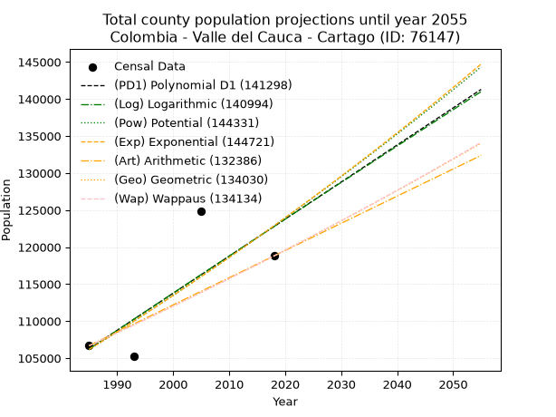
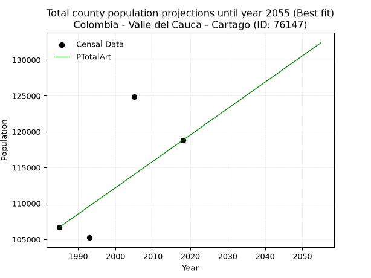
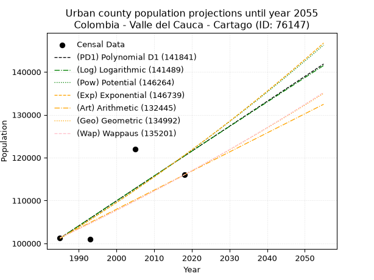
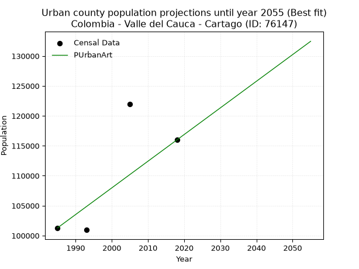
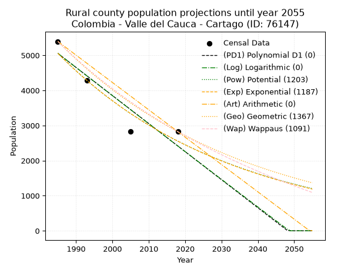
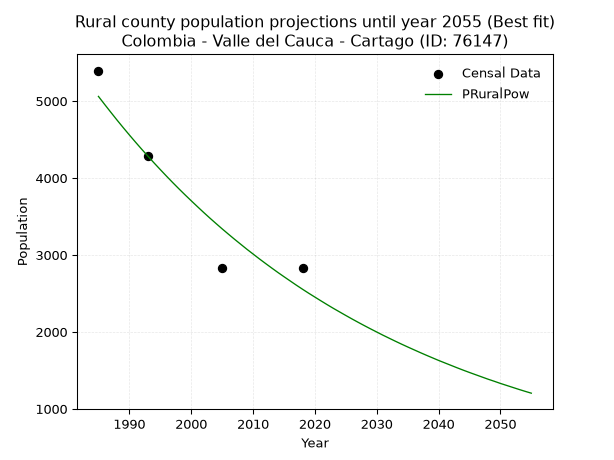

<div align="center">


</div>

# _“Population and Public Services Demand Projections (PPSD) until Year 2050 for Colombia - Valle del Cauca - Cartago (ID: 76147)”_
Keywords: `population` `public-service` `projection` `lineal` `polynomial` `logarithmic` `potential` `exponential` `arithmetic` `geometric` `wappaus` `dane` `colombia` `south-america`

PPSD are analytical estimates used by governments and planners to anticipate future changes in population size, age distribution, and the resulting community needs for utilities, healthcare, education, and infrastructure as sizing future water treatment facilities, electrical grids, and road networks based on spatial growth.

> **General running parameters**: • app_version: _v20260806_. • Python version: _3.14.7_. • Pandas version: _3.0.5_. • NumPy version: _2.5.1_. • Creates, save and include plots into reports (create_plot): _True_. • Projection until year: _2050_. • Process polynomial degree 2 and up: _False_. • Process Wappaus: _True_. • Process Wappaus: _True_. • Set negative values to zero: _True_. • Set infinite values to zero: _True_. • Drop dataset notes: _True_. 
<div align="center">

Dynamic map: [:earth_americas:Google](http://maps.google.com/maps?q=4.742192277,-75.9243739) [:earth_americas:OSM](https://www.openstreetmap.org/#map=18/4.742192277/-75.9243739&layers=P) [:earth_americas:Bing](https://www.bing.com/maps?cp=4.742192277~-75.9243739&lvl=18) [:earth_americas:Apple](https://maps.apple.com/frame?center=4.742192277%2C-75.9243739&span=0.003%2C0.006)

</div>


<div align="center">

```geojson
{
  "type": "Feature",
  "geometry": {
    "type": "Point", 
    "coordinates": [-75.9243739, 4.742192277]
  }, 
  "properties": {
    "Name": "Colombia - Valle del Cauca - Cartago (ID: 76147)"
  }
}
```

</div>


## 0. Census Data (4 records)

Census data are official statistics collected by a government about the people and housing in a country. They usually include counts of total population, age, sex, race, income, education, and jobs.

📅Global census file: [Population.xlsx](../data/Population.xlsx)

| Source   |   Year |   CountryID | CountryName   |   StateID | StateName       |   CountyID | CountyName   |   PTotal |   PUrban |   PRural |
|:---------|-------:|------------:|:--------------|----------:|:----------------|-----------:|:-------------|---------:|---------:|---------:|
| DANE     |   1985 |          57 | Colombia      |        76 | Valle del Cauca |      76147 | Cartago      |   106688 |   101293 |     5395 |
| DANE     |   1993 |          57 | Colombia      |        76 | Valle del Cauca |      76147 | Cartago      |   105234 |   100946 |     4288 |
| DANE     |   2005 |          57 | Colombia      |        76 | Valle Del Cauca |      76147 | Cartago      |   124831 |   122001 |     2830 |
| DANE     |   2018 |          57 | Colombia      |        76 | Valle del Cauca |      76147 | Cartago      |   118803 |   115979 |     2824 |

> 🔥Some records could had specific notes about the registered values or the corresponding urban or rural distribution.

## 1. Total

### 1.1. Coefficients and Parameters

* (PD1) Polynomial Deg 1: 500.62143717382827, -887479.0297069501 (lineal)
* (Log) Logarithmic: 1003030.8351567588, -7510156.415811192
* (Pow) Potential: 8.862001877536564, -24.1987848894865
* (Exp) Exponential: 0.00442334471843606, 16.323253048563334
* (Art) Arithmetic: Year diff. 2018 - 1985 = 33, Population diff. 118803 - 106688 = 12115, Annual growth = 367.1212121212121
* (Geo) Geometric: Year diff. 2018 - 1985 = 33, Population diff. 118803 - 106688 = 12115, Annual growth % = 0.0032646498846617966
* (Wap) Wappaus: i = 0.3256193924557629, Condition values only valid for < 200)

<sub>
Wappaus condition values: ['0.00', '0.33', '0.65', '0.98', '1.30', '1.63', '1.95', '2.28', '2.60', '2.93', '3.26', '3.58', '3.91', '4.23', '4.56', '4.88', '5.21', '5.54', '5.86', '6.19', '6.51', '6.84', '7.16', '7.49', '7.81', '8.14', '8.47', '8.79', '9.12', '9.44', '9.77', '10.09', '10.42', '10.75', '11.07', '11.40', '11.72', '12.05', '12.37', '12.70', '13.02', '13.35', '13.68', '14.00', '14.33', '14.65', '14.98', '15.30', '15.63', '15.96', '16.28', '16.61', '16.93', '17.26', '17.58', '17.91', '18.23', '18.56', '18.89', '19.21', '19.54', '19.86', '20.19', '20.51', '20.84', '21.17']
</sub>


### 1.2. Projected Dataset

|   Year |   CountyID |   PTotalPD1 |   PTotalLog |   PTotalPow |   PTotalExp |   PTotalArt |   PTotalGeo |   PTotalWap |
|-------:|-----------:|------------:|------------:|------------:|------------:|------------:|------------:|------------:|
|   1985 |      76147 |      106255 |      106232 |      106163 |      106184 |      106688 |      106688 |      106688 |
|   1986 |      76147 |      106755 |      106737 |      106638 |      106655 |      107055 |      107036 |      107036 |
|   1987 |      76147 |      107256 |      107242 |      107115 |      107128 |      107422 |      107386 |      107385 |
|   1988 |      76147 |      107756 |      107747 |      107594 |      107603 |      107789 |      107736 |      107735 |
|   1989 |      76147 |      108257 |      108251 |      108074 |      108080 |      108156 |      108088 |      108087 |
|   1990 |      76147 |      108758 |      108755 |      108557 |      108559 |      108524 |      108441 |      108439 |
|   1991 |      76147 |      109258 |      109259 |      109041 |      109040 |      108891 |      108795 |      108793 |
|   1992 |      76147 |      109759 |      109763 |      109528 |      109523 |      109258 |      109150 |      109148 |
|   1993 |      76147 |      110259 |      110266 |      110016 |      110009 |      109625 |      109506 |      109504 |
|   1994 |      76147 |      110760 |      110770 |      110506 |      110497 |      109992 |      109864 |      109861 |
|   1995 |      76147 |      111261 |      111272 |      110998 |      110986 |      110359 |      110223 |      110219 |
|   1996 |      76147 |      111761 |      111775 |      111492 |      111478 |      110726 |      110582 |      110579 |
|   1997 |      76147 |      112262 |      112277 |      111988 |      111973 |      111093 |      110943 |      110940 |
|   1998 |      76147 |      112763 |      112780 |      112486 |      112469 |      111461 |      111306 |      111302 |
|   1999 |      76147 |      113263 |      113281 |      112986 |      112968 |      111828 |      111669 |      111665 |
|   2000 |      76147 |      113764 |      113783 |      113488 |      113468 |      112195 |      112034 |      112029 |
|   2001 |      76147 |      114264 |      114285 |      113992 |      113971 |      112562 |      112399 |      112395 |
|   2002 |      76147 |      114765 |      114786 |      114497 |      114477 |      112929 |      112766 |      112762 |
|   2003 |      76147 |      115266 |      115287 |      115005 |      114984 |      113296 |      113134 |      113130 |
|   2004 |      76147 |      115766 |      115787 |      115515 |      115494 |      113663 |      113504 |      113499 |
|   2005 |      76147 |      116267 |      116288 |      116027 |      116006 |      114030 |      113874 |      113870 |
|   2006 |      76147 |      116768 |      116788 |      116541 |      116520 |      114398 |      114246 |      114242 |
|   2007 |      76147 |      117268 |      117288 |      117057 |      117037 |      114765 |      114619 |      114615 |
|   2008 |      76147 |      117769 |      117787 |      117575 |      117556 |      115132 |      114993 |      114989 |
|   2009 |      76147 |      118269 |      118287 |      118094 |      118077 |      115499 |      115369 |      115365 |
|   2010 |      76147 |      118770 |      118786 |      118616 |      118600 |      115866 |      115745 |      115741 |
|   2011 |      76147 |      119271 |      119285 |      119140 |      119126 |      116233 |      116123 |      116120 |
|   2012 |      76147 |      119771 |      119783 |      119666 |      119654 |      116600 |      116502 |      116499 |
|   2013 |      76147 |      120272 |      120282 |      120195 |      120185 |      116967 |      116883 |      116880 |
|   2014 |      76147 |      120773 |      120780 |      120725 |      120717 |      117335 |      117264 |      117262 |
|   2015 |      76147 |      121273 |      121278 |      121257 |      121252 |      117702 |      117647 |      117645 |
|   2016 |      76147 |      121774 |      121775 |      121791 |      121790 |      118069 |      118031 |      118030 |
|   2017 |      76147 |      122274 |      122273 |      122328 |      122330 |      118436 |      118416 |      118416 |
|   2018 |      76147 |      122775 |      122770 |      122866 |      122872 |      118803 |      118803 |      118803 |
|   2019 |      76147 |      123276 |      123267 |      123407 |      123417 |      119170 |      119191 |      119192 |
|   2020 |      76147 |      123776 |      123764 |      123950 |      123964 |      119537 |      119580 |      119582 |
|   2021 |      76147 |      124277 |      124260 |      124494 |      124514 |      119904 |      119970 |      119973 |
|   2022 |      76147 |      124778 |      124756 |      125041 |      125066 |      120271 |      120362 |      120366 |
|   2023 |      76147 |      125278 |      125252 |      125591 |      125620 |      120639 |      120755 |      120760 |
|   2024 |      76147 |      125779 |      125748 |      126142 |      126177 |      121006 |      121149 |      121155 |
|   2025 |      76147 |      126279 |      126243 |      126695 |      126736 |      121373 |      121545 |      121552 |
|   2026 |      76147 |      126780 |      126738 |      127251 |      127298 |      121740 |      121941 |      121950 |
|   2027 |      76147 |      127281 |      127233 |      127808 |      127862 |      122107 |      122340 |      122350 |
|   2028 |      76147 |      127781 |      127728 |      128368 |      128429 |      122474 |      122739 |      122751 |
|   2029 |      76147 |      128282 |      128223 |      128930 |      128999 |      122841 |      123140 |      123153 |
|   2030 |      76147 |      128782 |      128717 |      129494 |      129571 |      123208 |      123542 |      123557 |
|   2031 |      76147 |      129283 |      129211 |      130061 |      130145 |      123576 |      123945 |      123962 |
|   2032 |      76147 |      129784 |      129705 |      130629 |      130722 |      123943 |      124350 |      124369 |
|   2033 |      76147 |      130284 |      130198 |      131200 |      131301 |      124310 |      124756 |      124777 |
|   2034 |      76147 |      130785 |      130691 |      131773 |      131883 |      124677 |      125163 |      125186 |
|   2035 |      76147 |      131286 |      131184 |      132349 |      132468 |      125044 |      125571 |      125597 |
|   2036 |      76147 |      131786 |      131677 |      132926 |      133055 |      125411 |      125981 |      126010 |
|   2037 |      76147 |      132287 |      132170 |      133506 |      133645 |      125778 |      126393 |      126423 |
|   2038 |      76147 |      132787 |      132662 |      134088 |      134238 |      126145 |      126805 |      126839 |
|   2039 |      76147 |      133288 |      133154 |      134672 |      134833 |      126513 |      127219 |      127256 |
|   2040 |      76147 |      133789 |      133646 |      135258 |      135431 |      126880 |      127635 |      127674 |
|   2041 |      76147 |      134289 |      134137 |      135847 |      136031 |      127247 |      128051 |      128094 |
|   2042 |      76147 |      134790 |      134629 |      136438 |      136634 |      127614 |      128469 |      128515 |
|   2043 |      76147 |      135291 |      135120 |      137031 |      137240 |      127981 |      128889 |      128938 |
|   2044 |      76147 |      135791 |      135611 |      137627 |      137848 |      128348 |      129310 |      129362 |
|   2045 |      76147 |      136292 |      136101 |      138225 |      138459 |      128715 |      129732 |      129788 |
|   2046 |      76147 |      136792 |      136592 |      138825 |      139073 |      129082 |      130155 |      130216 |
|   2047 |      76147 |      137293 |      137082 |      139427 |      139689 |      129450 |      130580 |      130645 |
|   2048 |      76147 |      137794 |      137572 |      140032 |      140309 |      129817 |      131006 |      131075 |
|   2049 |      76147 |      138294 |      138061 |      140639 |      140931 |      130184 |      131434 |      131508 |
|   2050 |      76147 |      138795 |      138551 |      141249 |      141556 |      130551 |      131863 |      131941 |
<div align="center">

</img>

</div>


### 1.3. Best fit with absolute error and relative error (%)

Relative error puts that difference into context by dividing the absolute error by the true value, creating a unitless ratio or percentage that shows the scale of the mistake.

Absolute and relative error

|   Year | Source   |   CountryID | CountryName   |   StateID | StateName       |   CountyID_x | CountyName   |   PTotal |   PUrban |   PRural |   CountyID_y |   PTotalPD1 |   PTotalLog |   PTotalPow |   PTotalExp |   PTotalArt |   PTotalGeo |   PTotalWap |   PTotalPD1AbsError |   PTotalLogAbsError |   PTotalPowAbsError |   PTotalExpAbsError |   PTotalArtAbsError |   PTotalGeoAbsError |   PTotalWapAbsError |   PTotalPD1RelError |   PTotalLogRelError |   PTotalPowRelError |   PTotalExpRelError |   PTotalArtRelError |   PTotalGeoRelError |   PTotalWapRelError |
|-------:|:---------|------------:|:--------------|----------:|:----------------|-------------:|:-------------|---------:|---------:|---------:|-------------:|------------:|------------:|------------:|------------:|------------:|------------:|------------:|--------------------:|--------------------:|--------------------:|--------------------:|--------------------:|--------------------:|--------------------:|--------------------:|--------------------:|--------------------:|--------------------:|--------------------:|--------------------:|--------------------:|
|   1985 | DANE     |          57 | Colombia      |        76 | Valle del Cauca |        76147 | Cartago      |   106688 |   101293 |     5395 |        76147 |      106255 |      106232 |      106163 |      106184 |      106688 |      106688 |      106688 |                 433 |                 456 |                 525 |                 504 |                   0 |                   0 |                   0 |            0.405856 |            0.427415 |            0.492089 |            0.472406 |             0       |             0       |             0       |
|   1993 | DANE     |          57 | Colombia      |        76 | Valle del Cauca |        76147 | Cartago      |   105234 |   100946 |     4288 |        76147 |      110259 |      110266 |      110016 |      110009 |      109625 |      109506 |      109504 |                5025 |                5032 |                4782 |                4775 |                4391 |                4272 |                4270 |            4.77507  |            4.78172  |            4.54416  |            4.53751  |             4.17261 |             4.05952 |             4.05762 |
|   2005 | DANE     |          57 | Colombia      |        76 | Valle Del Cauca |        76147 | Cartago      |   124831 |   122001 |     2830 |        76147 |      116267 |      116288 |      116027 |      116006 |      114030 |      113874 |      113870 |                8564 |                8543 |                8804 |                8825 |               10801 |               10957 |               10961 |            6.86048  |            6.84365  |            7.05274  |            7.06956  |             8.6525  |             8.77747 |             8.78067 |
|   2018 | DANE     |          57 | Colombia      |        76 | Valle del Cauca |        76147 | Cartago      |   118803 |   115979 |     2824 |        76147 |      122775 |      122770 |      122866 |      122872 |      118803 |      118803 |      118803 |                3972 |                3967 |                4063 |                4069 |                   0 |                   0 |                   0 |            3.34335  |            3.33914  |            3.41995  |            3.425    |             0       |             0       |             0       |

Relative error mean

| Method    |   RelError | Best   |
|:----------|-----------:|:-------|
| PTotalPD1 |    3.84619 |        |
| PTotalLog |    3.84798 |        |
| PTotalPow |    3.87723 |        |
| PTotalExp |    3.87612 |        |
| PTotalArt |    3.20628 | True   |
| PTotalGeo |    3.20925 |        |
| PTotalWap |    3.20957 |        |

💙Best method: _**PTotalArt**_
<div align="center">

</img>

</div>


### 1.4. Fresh water supply demand in liters per capita per day (lpcd)

The fresh water supply demand typically ranges from 100 to 300 liters per capita per day (lpcd) for standard domestic and municipal planning, though absolute survival minimums set by the World Health Organization are as low as 7.5 to 20 liters per day, and total consumption in high-income nations can exceed 400 liters.

> `CZ`: Level in meters above the sea level (masl).<br> `WS`: Fresh water supply demand in liters per capita per day (lpcd or l/h/d).<br> `WSAll`: Zonal fresh water supply demand in liters per second (l/s).<br> `A`: Zonal area in square meters.

Reference values (RAS Colombia)

|    CZ |   WS |
|------:|-----:|
|  1000 |  120 |
|  2000 |  130 |
| 99999 |  140 |

County shapefile geometry properties and water supply values

|   CountyID |      ATotal |   CZTotal |   WSTotal |
|-----------:|------------:|----------:|----------:|
|      76147 | 2.48187e+08 |   1004.31 |       130 |

Projected values for best method: PTotalArt

|   CountyID |   Year |   PTotalArt |   WSTotal |   WSTotalAll |
|-----------:|-------:|------------:|----------:|-------------:|
|      76147 |   1985 |      106688 |       130 |      160.526 |
|      76147 |   1986 |      107055 |       130 |      161.078 |
|      76147 |   1987 |      107422 |       130 |      161.63  |
|      76147 |   1988 |      107789 |       130 |      162.183 |
|      76147 |   1989 |      108156 |       130 |      162.735 |
|      76147 |   1990 |      108524 |       130 |      163.288 |
|      76147 |   1991 |      108891 |       130 |      163.841 |
|      76147 |   1992 |      109258 |       130 |      164.393 |
|      76147 |   1993 |      109625 |       130 |      164.945 |
|      76147 |   1994 |      109992 |       130 |      165.497 |
|      76147 |   1995 |      110359 |       130 |      166.049 |
|      76147 |   1996 |      110726 |       130 |      166.602 |
|      76147 |   1997 |      111093 |       130 |      167.154 |
|      76147 |   1998 |      111461 |       130 |      167.708 |
|      76147 |   1999 |      111828 |       130 |      168.26  |
|      76147 |   2000 |      112195 |       130 |      168.812 |
|      76147 |   2001 |      112562 |       130 |      169.364 |
|      76147 |   2002 |      112929 |       130 |      169.916 |
|      76147 |   2003 |      113296 |       130 |      170.469 |
|      76147 |   2004 |      113663 |       130 |      171.021 |
|      76147 |   2005 |      114030 |       130 |      171.573 |
|      76147 |   2006 |      114398 |       130 |      172.127 |
|      76147 |   2007 |      114765 |       130 |      172.679 |
|      76147 |   2008 |      115132 |       130 |      173.231 |
|      76147 |   2009 |      115499 |       130 |      173.783 |
|      76147 |   2010 |      115866 |       130 |      174.335 |
|      76147 |   2011 |      116233 |       130 |      174.888 |
|      76147 |   2012 |      116600 |       130 |      175.44  |
|      76147 |   2013 |      116967 |       130 |      175.992 |
|      76147 |   2014 |      117335 |       130 |      176.546 |
|      76147 |   2015 |      117702 |       130 |      177.098 |
|      76147 |   2016 |      118069 |       130 |      177.65  |
|      76147 |   2017 |      118436 |       130 |      178.202 |
|      76147 |   2018 |      118803 |       130 |      178.755 |
|      76147 |   2019 |      119170 |       130 |      179.307 |
|      76147 |   2020 |      119537 |       130 |      179.859 |
|      76147 |   2021 |      119904 |       130 |      180.411 |
|      76147 |   2022 |      120271 |       130 |      180.963 |
|      76147 |   2023 |      120639 |       130 |      181.517 |
|      76147 |   2024 |      121006 |       130 |      182.069 |
|      76147 |   2025 |      121373 |       130 |      182.621 |
|      76147 |   2026 |      121740 |       130 |      183.174 |
|      76147 |   2027 |      122107 |       130 |      183.726 |
|      76147 |   2028 |      122474 |       130 |      184.278 |
|      76147 |   2029 |      122841 |       130 |      184.83  |
|      76147 |   2030 |      123208 |       130 |      185.382 |
|      76147 |   2031 |      123576 |       130 |      185.936 |
|      76147 |   2032 |      123943 |       130 |      186.488 |
|      76147 |   2033 |      124310 |       130 |      187.041 |
|      76147 |   2034 |      124677 |       130 |      187.593 |
|      76147 |   2035 |      125044 |       130 |      188.145 |
|      76147 |   2036 |      125411 |       130 |      188.697 |
|      76147 |   2037 |      125778 |       130 |      189.249 |
|      76147 |   2038 |      126145 |       130 |      189.802 |
|      76147 |   2039 |      126513 |       130 |      190.355 |
|      76147 |   2040 |      126880 |       130 |      190.907 |
|      76147 |   2041 |      127247 |       130 |      191.46  |
|      76147 |   2042 |      127614 |       130 |      192.012 |
|      76147 |   2043 |      127981 |       130 |      192.564 |
|      76147 |   2044 |      128348 |       130 |      193.116 |
|      76147 |   2045 |      128715 |       130 |      193.668 |
|      76147 |   2046 |      129082 |       130 |      194.221 |
|      76147 |   2047 |      129450 |       130 |      194.774 |
|      76147 |   2048 |      129817 |       130 |      195.327 |
|      76147 |   2049 |      130184 |       130 |      195.879 |
|      76147 |   2050 |      130551 |       130 |      196.431 |

## 2. Urban

### 2.1. Coefficients and Parameters

* (PD1) Polynomial Deg 1: 580.5784825371361, -1051247.3596949063 (lineal)
* (Log) Logarithmic: 1163225.0282538717, -8731628.011258047
* (Pow) Potential: 10.653956921183585, -30.129416938015304
* (Exp) Exponential: 0.005317769134332207, 2.6337216457492567
* (Art) Arithmetic: Year diff. 2018 - 1985 = 33, Population diff. 115979 - 101293 = 14686, Annual growth = 445.030303030303
* (Geo) Geometric: Year diff. 2018 - 1985 = 33, Population diff. 115979 - 101293 = 14686, Annual growth % = 0.004111210755064487
* (Wap) Wappaus: i = 0.4096526961875465, Condition values only valid for < 200)

<sub>
Wappaus condition values: ['0.00', '0.41', '0.82', '1.23', '1.64', '2.05', '2.46', '2.87', '3.28', '3.69', '4.10', '4.51', '4.92', '5.33', '5.74', '6.14', '6.55', '6.96', '7.37', '7.78', '8.19', '8.60', '9.01', '9.42', '9.83', '10.24', '10.65', '11.06', '11.47', '11.88', '12.29', '12.70', '13.11', '13.52', '13.93', '14.34', '14.75', '15.16', '15.57', '15.98', '16.39', '16.80', '17.21', '17.62', '18.02', '18.43', '18.84', '19.25', '19.66', '20.07', '20.48', '20.89', '21.30', '21.71', '22.12', '22.53', '22.94', '23.35', '23.76', '24.17', '24.58', '24.99', '25.40', '25.81', '26.22', '26.63']
</sub>


### 2.2. Projected Dataset

|   Year |   CountyID |   PUrbanPD1 |   PUrbanLog |   PUrbanPow |   PUrbanExp |   PUrbanArt |   PUrbanGeo |   PUrbanWap |
|-------:|-----------:|------------:|------------:|------------:|------------:|------------:|------------:|------------:|
|   1985 |      76147 |      101201 |      101175 |      101107 |      101131 |      101293 |      101293 |      101293 |
|   1986 |      76147 |      101782 |      101761 |      101651 |      101670 |      101738 |      101709 |      101709 |
|   1987 |      76147 |      102362 |      102346 |      102198 |      102212 |      102183 |      102128 |      102126 |
|   1988 |      76147 |      102943 |      102932 |      102747 |      102757 |      102628 |      102547 |      102546 |
|   1989 |      76147 |      103523 |      103517 |      103299 |      103305 |      103073 |      102969 |      102967 |
|   1990 |      76147 |      104104 |      104101 |      103854 |      103856 |      103518 |      103392 |      103389 |
|   1991 |      76147 |      104684 |      104686 |      104411 |      104410 |      103963 |      103817 |      103814 |
|   1992 |      76147 |      105265 |      105270 |      104971 |      104966 |      104408 |      104244 |      104240 |
|   1993 |      76147 |      105846 |      105854 |      105534 |      105526 |      104853 |      104673 |      104668 |
|   1994 |      76147 |      106426 |      106437 |      106099 |      106089 |      105298 |      105103 |      105098 |
|   1995 |      76147 |      107007 |      107020 |      106668 |      106654 |      105743 |      105535 |      105529 |
|   1996 |      76147 |      107587 |      107603 |      107239 |      107223 |      106188 |      105969 |      105963 |
|   1997 |      76147 |      108168 |      108186 |      107812 |      107795 |      106633 |      106405 |      106398 |
|   1998 |      76147 |      108748 |      108768 |      108389 |      108369 |      107078 |      106842 |      106835 |
|   1999 |      76147 |      109329 |      109350 |      108968 |      108947 |      107523 |      107282 |      107274 |
|   2000 |      76147 |      109910 |      109932 |      109551 |      109528 |      107968 |      107723 |      107715 |
|   2001 |      76147 |      110490 |      110513 |      110136 |      110112 |      108413 |      108165 |      108157 |
|   2002 |      76147 |      111071 |      111095 |      110723 |      110699 |      108859 |      108610 |      108602 |
|   2003 |      76147 |      111651 |      111675 |      111314 |      111289 |      109304 |      109057 |      109048 |
|   2004 |      76147 |      112232 |      112256 |      111907 |      111883 |      109749 |      109505 |      109496 |
|   2005 |      76147 |      112812 |      112836 |      112504 |      112479 |      110194 |      109955 |      109946 |
|   2006 |      76147 |      113393 |      113416 |      113103 |      113079 |      110639 |      110407 |      110399 |
|   2007 |      76147 |      113974 |      113996 |      113705 |      113682 |      111084 |      110861 |      110853 |
|   2008 |      76147 |      114554 |      114576 |      114310 |      114288 |      111529 |      111317 |      111309 |
|   2009 |      76147 |      115135 |      115155 |      114918 |      114898 |      111974 |      111775 |      111767 |
|   2010 |      76147 |      115715 |      115734 |      115529 |      115510 |      112419 |      112234 |      112227 |
|   2011 |      76147 |      116296 |      116312 |      116143 |      116126 |      112864 |      112696 |      112689 |
|   2012 |      76147 |      116877 |      116890 |      116760 |      116745 |      113309 |      113159 |      113153 |
|   2013 |      76147 |      117457 |      117468 |      117380 |      117368 |      113754 |      113624 |      113618 |
|   2014 |      76147 |      118038 |      118046 |      118002 |      117994 |      114199 |      114091 |      114086 |
|   2015 |      76147 |      118618 |      118624 |      118628 |      118623 |      114644 |      114560 |      114556 |
|   2016 |      76147 |      119199 |      119201 |      119257 |      119255 |      115089 |      115031 |      115029 |
|   2017 |      76147 |      119779 |      119778 |      119888 |      119891 |      115534 |      115504 |      115503 |
|   2018 |      76147 |      120360 |      120354 |      120523 |      120530 |      115979 |      115979 |      115979 |
|   2019 |      76147 |      120941 |      120930 |      121161 |      121173 |      116424 |      116456 |      116457 |
|   2020 |      76147 |      121521 |      121506 |      121802 |      121819 |      116869 |      116935 |      116938 |
|   2021 |      76147 |      122102 |      122082 |      122446 |      122469 |      117314 |      117415 |      117420 |
|   2022 |      76147 |      122682 |      122658 |      123093 |      123122 |      117759 |      117898 |      117905 |
|   2023 |      76147 |      123263 |      123233 |      123743 |      123778 |      118204 |      118383 |      118392 |
|   2024 |      76147 |      123843 |      123808 |      124396 |      124438 |      118649 |      118869 |      118881 |
|   2025 |      76147 |      124424 |      124382 |      125053 |      125101 |      119094 |      119358 |      119372 |
|   2026 |      76147 |      125005 |      124956 |      125712 |      125768 |      119539 |      119849 |      119866 |
|   2027 |      76147 |      125585 |      125530 |      126375 |      126439 |      119984 |      120342 |      120361 |
|   2028 |      76147 |      126166 |      126104 |      127041 |      127113 |      120429 |      120836 |      120859 |
|   2029 |      76147 |      126746 |      126678 |      127710 |      127791 |      120874 |      121333 |      121359 |
|   2030 |      76147 |      127327 |      127251 |      128382 |      128472 |      121319 |      121832 |      121862 |
|   2031 |      76147 |      127908 |      127824 |      129057 |      129157 |      121764 |      122333 |      122366 |
|   2032 |      76147 |      128488 |      128396 |      129736 |      129846 |      122209 |      122836 |      122873 |
|   2033 |      76147 |      129069 |      128969 |      130418 |      130538 |      122654 |      123341 |      123382 |
|   2034 |      76147 |      129649 |      129541 |      131103 |      131234 |      123099 |      123848 |      123894 |
|   2035 |      76147 |      130230 |      130112 |      131791 |      131934 |      123545 |      124357 |      124408 |
|   2036 |      76147 |      130810 |      130684 |      132483 |      132638 |      123990 |      124868 |      124924 |
|   2037 |      76147 |      131391 |      131255 |      133178 |      133345 |      124435 |      125382 |      125443 |
|   2038 |      76147 |      131972 |      131826 |      133876 |      134056 |      124880 |      125897 |      125964 |
|   2039 |      76147 |      132552 |      132397 |      134577 |      134771 |      125325 |      126415 |      126487 |
|   2040 |      76147 |      133133 |      132967 |      135282 |      135489 |      125770 |      126934 |      127013 |
|   2041 |      76147 |      133713 |      133537 |      135990 |      136212 |      126215 |      127456 |      127541 |
|   2042 |      76147 |      134294 |      134107 |      136702 |      136938 |      126660 |      127980 |      128072 |
|   2043 |      76147 |      134874 |      134676 |      137417 |      137668 |      127105 |      128506 |      128605 |
|   2044 |      76147 |      135455 |      135245 |      138135 |      138402 |      127550 |      129035 |      129140 |
|   2045 |      76147 |      136036 |      135814 |      138857 |      139140 |      127995 |      129565 |      129678 |
|   2046 |      76147 |      136616 |      136383 |      139582 |      139882 |      128440 |      130098 |      130219 |
|   2047 |      76147 |      137197 |      136952 |      140310 |      140628 |      128885 |      130633 |      130762 |
|   2048 |      76147 |      137777 |      137520 |      141042 |      141378 |      129330 |      131170 |      131308 |
|   2049 |      76147 |      138358 |      138087 |      141778 |      142131 |      129775 |      131709 |      131856 |
|   2050 |      76147 |      138939 |      138655 |      142517 |      142889 |      130220 |      132251 |      132407 |
<div align="center">

</img>

</div>


### 2.3. Best fit with absolute error and relative error (%)

Relative error puts that difference into context by dividing the absolute error by the true value, creating a unitless ratio or percentage that shows the scale of the mistake.

Absolute and relative error

|   Year | Source   |   CountryID | CountryName   |   StateID | StateName       |   CountyID_x | CountyName   |   PTotal |   PUrban |   PRural |   CountyID_y |   PUrbanPD1 |   PUrbanLog |   PUrbanPow |   PUrbanExp |   PUrbanArt |   PUrbanGeo |   PUrbanWap |   PUrbanPD1AbsError |   PUrbanLogAbsError |   PUrbanPowAbsError |   PUrbanExpAbsError |   PUrbanArtAbsError |   PUrbanGeoAbsError |   PUrbanWapAbsError |   PUrbanPD1RelError |   PUrbanLogRelError |   PUrbanPowRelError |   PUrbanExpRelError |   PUrbanArtRelError |   PUrbanGeoRelError |   PUrbanWapRelError |
|-------:|:---------|------------:|:--------------|----------:|:----------------|-------------:|:-------------|---------:|---------:|---------:|-------------:|------------:|------------:|------------:|------------:|------------:|------------:|------------:|--------------------:|--------------------:|--------------------:|--------------------:|--------------------:|--------------------:|--------------------:|--------------------:|--------------------:|--------------------:|--------------------:|--------------------:|--------------------:|--------------------:|
|   1985 | DANE     |          57 | Colombia      |        76 | Valle del Cauca |        76147 | Cartago      |   106688 |   101293 |     5395 |        76147 |      101201 |      101175 |      101107 |      101131 |      101293 |      101293 |      101293 |                  92 |                 118 |                 186 |                 162 |                   0 |                   0 |                   0 |           0.0908256 |            0.116494 |            0.183626 |            0.159932 |             0       |             0       |             0       |
|   1993 | DANE     |          57 | Colombia      |        76 | Valle del Cauca |        76147 | Cartago      |   105234 |   100946 |     4288 |        76147 |      105846 |      105854 |      105534 |      105526 |      104853 |      104673 |      104668 |                4900 |                4908 |                4588 |                4580 |                3907 |                3727 |                3722 |           4.85408   |            4.86201  |            4.545    |            4.53708  |             3.87039 |             3.69207 |             3.68712 |
|   2005 | DANE     |          57 | Colombia      |        76 | Valle Del Cauca |        76147 | Cartago      |   124831 |   122001 |     2830 |        76147 |      112812 |      112836 |      112504 |      112479 |      110194 |      109955 |      109946 |                9189 |                9165 |                9497 |                9522 |               11807 |               12046 |               12055 |           7.53191   |            7.51223  |            7.78436  |            7.80485  |             9.67779 |             9.87369 |             9.88107 |
|   2018 | DANE     |          57 | Colombia      |        76 | Valle del Cauca |        76147 | Cartago      |   118803 |   115979 |     2824 |        76147 |      120360 |      120354 |      120523 |      120530 |      115979 |      115979 |      115979 |                4381 |                4375 |                4544 |                4551 |                   0 |                   0 |                   0 |           3.77741   |            3.77223  |            3.91795  |            3.92399  |             0       |             0       |             0       |

Relative error mean

| Method    |   RelError | Best   |
|:----------|-----------:|:-------|
| PUrbanPD1 |    4.06355 |        |
| PUrbanLog |    4.06574 |        |
| PUrbanPow |    4.10774 |        |
| PUrbanExp |    4.10646 |        |
| PUrbanArt |    3.38704 | True   |
| PUrbanGeo |    3.39144 |        |
| PUrbanWap |    3.39205 |        |

💙Best method: _**PUrbanArt**_
<div align="center">

</img>

</div>


### 2.4. Fresh water supply demand in liters per capita per day (lpcd)

The fresh water supply demand typically ranges from 100 to 300 liters per capita per day (lpcd) for standard domestic and municipal planning, though absolute survival minimums set by the World Health Organization are as low as 7.5 to 20 liters per day, and total consumption in high-income nations can exceed 400 liters.

> `CZ`: Level in meters above the sea level (masl).<br> `WS`: Fresh water supply demand in liters per capita per day (lpcd or l/h/d).<br> `WSAll`: Zonal fresh water supply demand in liters per second (l/s).<br> `A`: Zonal area in square meters.

Reference values (RAS Colombia)

|    CZ |   WS |
|------:|-----:|
|  1000 |  120 |
|  2000 |  130 |
| 99999 |  140 |

County shapefile geometry properties and water supply values

|   CountyID |      AUrban |   CZUrban |   WSUrban |
|-----------:|------------:|----------:|----------:|
|      76147 | 1.93673e+07 |   920.329 |       120 |

Projected values for best method: PUrbanArt

|   CountyID |   Year |   PUrbanArt |   WSUrban |   WSUrbanAll |
|-----------:|-------:|------------:|----------:|-------------:|
|      76147 |   1985 |      101293 |       120 |      140.685 |
|      76147 |   1986 |      101738 |       120 |      141.303 |
|      76147 |   1987 |      102183 |       120 |      141.921 |
|      76147 |   1988 |      102628 |       120 |      142.539 |
|      76147 |   1989 |      103073 |       120 |      143.157 |
|      76147 |   1990 |      103518 |       120 |      143.775 |
|      76147 |   1991 |      103963 |       120 |      144.393 |
|      76147 |   1992 |      104408 |       120 |      145.011 |
|      76147 |   1993 |      104853 |       120 |      145.629 |
|      76147 |   1994 |      105298 |       120 |      146.247 |
|      76147 |   1995 |      105743 |       120 |      146.865 |
|      76147 |   1996 |      106188 |       120 |      147.483 |
|      76147 |   1997 |      106633 |       120 |      148.101 |
|      76147 |   1998 |      107078 |       120 |      148.719 |
|      76147 |   1999 |      107523 |       120 |      149.338 |
|      76147 |   2000 |      107968 |       120 |      149.956 |
|      76147 |   2001 |      108413 |       120 |      150.574 |
|      76147 |   2002 |      108859 |       120 |      151.193 |
|      76147 |   2003 |      109304 |       120 |      151.811 |
|      76147 |   2004 |      109749 |       120 |      152.429 |
|      76147 |   2005 |      110194 |       120 |      153.047 |
|      76147 |   2006 |      110639 |       120 |      153.665 |
|      76147 |   2007 |      111084 |       120 |      154.283 |
|      76147 |   2008 |      111529 |       120 |      154.901 |
|      76147 |   2009 |      111974 |       120 |      155.519 |
|      76147 |   2010 |      112419 |       120 |      156.137 |
|      76147 |   2011 |      112864 |       120 |      156.756 |
|      76147 |   2012 |      113309 |       120 |      157.374 |
|      76147 |   2013 |      113754 |       120 |      157.992 |
|      76147 |   2014 |      114199 |       120 |      158.61  |
|      76147 |   2015 |      114644 |       120 |      159.228 |
|      76147 |   2016 |      115089 |       120 |      159.846 |
|      76147 |   2017 |      115534 |       120 |      160.464 |
|      76147 |   2018 |      115979 |       120 |      161.082 |
|      76147 |   2019 |      116424 |       120 |      161.7   |
|      76147 |   2020 |      116869 |       120 |      162.318 |
|      76147 |   2021 |      117314 |       120 |      162.936 |
|      76147 |   2022 |      117759 |       120 |      163.554 |
|      76147 |   2023 |      118204 |       120 |      164.172 |
|      76147 |   2024 |      118649 |       120 |      164.79  |
|      76147 |   2025 |      119094 |       120 |      165.408 |
|      76147 |   2026 |      119539 |       120 |      166.026 |
|      76147 |   2027 |      119984 |       120 |      166.644 |
|      76147 |   2028 |      120429 |       120 |      167.262 |
|      76147 |   2029 |      120874 |       120 |      167.881 |
|      76147 |   2030 |      121319 |       120 |      168.499 |
|      76147 |   2031 |      121764 |       120 |      169.117 |
|      76147 |   2032 |      122209 |       120 |      169.735 |
|      76147 |   2033 |      122654 |       120 |      170.353 |
|      76147 |   2034 |      123099 |       120 |      170.971 |
|      76147 |   2035 |      123545 |       120 |      171.59  |
|      76147 |   2036 |      123990 |       120 |      172.208 |
|      76147 |   2037 |      124435 |       120 |      172.826 |
|      76147 |   2038 |      124880 |       120 |      173.444 |
|      76147 |   2039 |      125325 |       120 |      174.062 |
|      76147 |   2040 |      125770 |       120 |      174.681 |
|      76147 |   2041 |      126215 |       120 |      175.299 |
|      76147 |   2042 |      126660 |       120 |      175.917 |
|      76147 |   2043 |      127105 |       120 |      176.535 |
|      76147 |   2044 |      127550 |       120 |      177.153 |
|      76147 |   2045 |      127995 |       120 |      177.771 |
|      76147 |   2046 |      128440 |       120 |      178.389 |
|      76147 |   2047 |      128885 |       120 |      179.007 |
|      76147 |   2048 |      129330 |       120 |      179.625 |
|      76147 |   2049 |      129775 |       120 |      180.243 |
|      76147 |   2050 |      130220 |       120 |      180.861 |

## 3. Rural

### 3.1. Coefficients and Parameters

* (PD1) Polynomial Deg 1: -79.95704536330777, 163768.3299879564 (lineal)
* (Log) Logarithmic: -160194.19309711267, 1221471.595446852
* (Pow) Potential: -41.46385204520861, 140.44204444059056
* (Exp) Exponential: -0.02069787498809869, 3.5230383485346303e+21
* (Art) Arithmetic: Year diff. 2018 - 1985 = 33, Population diff. 2824 - 5395 = -2571, Annual growth = -77.9090909090909
* (Geo) Geometric: Year diff. 2018 - 1985 = 33, Population diff. 2824 - 5395 = -2571, Annual growth % = -0.019424569273998604
* (Wap) Wappaus: i = -1.8958289550819056, Condition values only valid for < 200)

<sub>
Wappaus condition values: ['-0.00', '-1.90', '-3.79', '-5.69', '-7.58', '-9.48', '-11.37', '-13.27', '-15.17', '-17.06', '-18.96', '-20.85', '-22.75', '-24.65', '-26.54', '-28.44', '-30.33', '-32.23', '-34.12', '-36.02', '-37.92', '-39.81', '-41.71', '-43.60', '-45.50', '-47.40', '-49.29', '-51.19', '-53.08', '-54.98', '-56.87', '-58.77', '-60.67', '-62.56', '-64.46', '-66.35', '-68.25', '-70.15', '-72.04', '-73.94', '-75.83', '-77.73', '-79.62', '-81.52', '-83.42', '-85.31', '-87.21', '-89.10', '-91.00', '-92.90', '-94.79', '-96.69', '-98.58', '-100.48', '-102.37', '-104.27', '-106.17', '-108.06', '-109.96', '-111.85', '-113.75', '-115.65', '-117.54', '-119.44', '-121.33', '-123.23']
</sub>


### 3.2. Projected Dataset

|   Year |   CountyID |   PRuralPD1 |   PRuralLog |   PRuralPow |   PRuralExp |   PRuralArt |   PRuralGeo |   PRuralWap |
|-------:|-----------:|------------:|------------:|------------:|------------:|------------:|------------:|------------:|
|   1985 |      76147 |        5054 |        5057 |        5060 |        5056 |        5395 |        5395 |        5395 |
|   1986 |      76147 |        4974 |        4976 |        4956 |        4952 |        5317 |        5290 |        5294 |
|   1987 |      76147 |        4894 |        4896 |        4854 |        4851 |        5239 |        5187 |        5194 |
|   1988 |      76147 |        4814 |        4815 |        4753 |        4752 |        5161 |        5087 |        5097 |
|   1989 |      76147 |        4734 |        4735 |        4655 |        4654 |        5083 |        4988 |        5001 |
|   1990 |      76147 |        4654 |        4654 |        4559 |        4559 |        5005 |        4891 |        4907 |
|   1991 |      76147 |        4574 |        4574 |        4465 |        4466 |        4928 |        4796 |        4814 |
|   1992 |      76147 |        4494 |        4493 |        4373 |        4374 |        4850 |        4703 |        4724 |
|   1993 |      76147 |        4414 |        4413 |        4283 |        4284 |        4772 |        4611 |        4634 |
|   1994 |      76147 |        4334 |        4332 |        4195 |        4197 |        4694 |        4522 |        4547 |
|   1995 |      76147 |        4254 |        4252 |        4109 |        4111 |        4616 |        4434 |        4461 |
|   1996 |      76147 |        4174 |        4172 |        4024 |        4026 |        4538 |        4348 |        4376 |
|   1997 |      76147 |        4094 |        4092 |        3941 |        3944 |        4460 |        4263 |        4293 |
|   1998 |      76147 |        4014 |        4011 |        3860 |        3863 |        4382 |        4181 |        4211 |
|   1999 |      76147 |        3934 |        3931 |        3781 |        3784 |        4304 |        4099 |        4131 |
|   2000 |      76147 |        3854 |        3851 |        3704 |        3707 |        4226 |        4020 |        4052 |
|   2001 |      76147 |        3774 |        3771 |        3628 |        3631 |        4148 |        3942 |        3974 |
|   2002 |      76147 |        3694 |        3691 |        3553 |        3556 |        4071 |        3865 |        3898 |
|   2003 |      76147 |        3614 |        3611 |        3480 |        3483 |        3993 |        3790 |        3822 |
|   2004 |      76147 |        3534 |        3531 |        3409 |        3412 |        3915 |        3716 |        3748 |
|   2005 |      76147 |        3454 |        3451 |        3339 |        3342 |        3837 |        3644 |        3675 |
|   2006 |      76147 |        3374 |        3371 |        3271 |        3274 |        3759 |        3573 |        3604 |
|   2007 |      76147 |        3295 |        3291 |        3204 |        3207 |        3681 |        3504 |        3533 |
|   2008 |      76147 |        3215 |        3212 |        3139 |        3141 |        3603 |        3436 |        3464 |
|   2009 |      76147 |        3135 |        3132 |        3074 |        3077 |        3525 |        3369 |        3395 |
|   2010 |      76147 |        3055 |        3052 |        3012 |        3014 |        3447 |        3304 |        3328 |
|   2011 |      76147 |        2975 |        2973 |        2950 |        2952 |        3369 |        3240 |        3262 |
|   2012 |      76147 |        2895 |        2893 |        2890 |        2891 |        3291 |        3177 |        3196 |
|   2013 |      76147 |        2815 |        2813 |        2831 |        2832 |        3214 |        3115 |        3132 |
|   2014 |      76147 |        2735 |        2734 |        2773 |        2774 |        3136 |        3055 |        3068 |
|   2015 |      76147 |        2655 |        2654 |        2717 |        2717 |        3058 |        2995 |        3006 |
|   2016 |      76147 |        2575 |        2575 |        2662 |        2662 |        2980 |        2937 |        2944 |
|   2017 |      76147 |        2495 |        2495 |        2607 |        2607 |        2902 |        2880 |        2884 |
|   2018 |      76147 |        2415 |        2416 |        2554 |        2554 |        2824 |        2824 |        2824 |
|   2019 |      76147 |        2335 |        2336 |        2502 |        2501 |        2746 |        2769 |        2765 |
|   2020 |      76147 |        2255 |        2257 |        2452 |        2450 |        2668 |        2715 |        2707 |
|   2021 |      76147 |        2175 |        2178 |        2402 |        2400 |        2590 |        2663 |        2650 |
|   2022 |      76147 |        2095 |        2099 |        2353 |        2351 |        2512 |        2611 |        2593 |
|   2023 |      76147 |        2015 |        2019 |        2305 |        2303 |        2434 |        2560 |        2538 |
|   2024 |      76147 |        1935 |        1940 |        2259 |        2255 |        2357 |        2510 |        2483 |
|   2025 |      76147 |        1855 |        1861 |        2213 |        2209 |        2279 |        2462 |        2429 |
|   2026 |      76147 |        1775 |        1782 |        2168 |        2164 |        2201 |        2414 |        2375 |
|   2027 |      76147 |        1695 |        1703 |        2124 |        2120 |        2123 |        2367 |        2322 |
|   2028 |      76147 |        1615 |        1624 |        2081 |        2076 |        2045 |        2321 |        2271 |
|   2029 |      76147 |        1535 |        1545 |        2039 |        2034 |        1967 |        2276 |        2219 |
|   2030 |      76147 |        1456 |        1466 |        1998 |        1992 |        1889 |        2232 |        2169 |
|   2031 |      76147 |        1376 |        1387 |        1957 |        1951 |        1811 |        2188 |        2119 |
|   2032 |      76147 |        1296 |        1308 |        1918 |        1911 |        1733 |        2146 |        2069 |
|   2033 |      76147 |        1216 |        1230 |        1879 |        1872 |        1655 |        2104 |        2021 |
|   2034 |      76147 |        1136 |        1151 |        1841 |        1834 |        1577 |        2063 |        1973 |
|   2035 |      76147 |        1056 |        1072 |        1804 |        1796 |        1500 |        2023 |        1925 |
|   2036 |      76147 |         976 |         993 |        1768 |        1759 |        1422 |        1984 |        1879 |
|   2037 |      76147 |         896 |         915 |        1732 |        1723 |        1344 |        1945 |        1832 |
|   2038 |      76147 |         816 |         836 |        1697 |        1688 |        1266 |        1908 |        1787 |
|   2039 |      76147 |         736 |         757 |        1663 |        1653 |        1188 |        1871 |        1742 |
|   2040 |      76147 |         656 |         679 |        1629 |        1620 |        1110 |        1834 |        1697 |
|   2041 |      76147 |         576 |         600 |        1597 |        1586 |        1032 |        1799 |        1653 |
|   2042 |      76147 |         496 |         522 |        1565 |        1554 |         954 |        1764 |        1610 |
|   2043 |      76147 |         416 |         443 |        1533 |        1522 |         876 |        1729 |        1567 |
|   2044 |      76147 |         336 |         365 |        1502 |        1491 |         798 |        1696 |        1525 |
|   2045 |      76147 |         256 |         287 |        1472 |        1460 |         720 |        1663 |        1483 |
|   2046 |      76147 |         176 |         208 |        1443 |        1430 |         643 |        1631 |        1442 |
|   2047 |      76147 |          96 |         130 |        1414 |        1401 |         565 |        1599 |        1401 |
|   2048 |      76147 |          16 |          52 |        1385 |        1372 |         487 |        1568 |        1361 |
|   2049 |      76147 |           0 |           0 |        1358 |        1344 |         409 |        1537 |        1321 |
|   2050 |      76147 |           0 |           0 |        1330 |        1317 |         331 |        1507 |        1281 |
<div align="center">

</img>

</div>


### 3.3. Best fit with absolute error and relative error (%)

Relative error puts that difference into context by dividing the absolute error by the true value, creating a unitless ratio or percentage that shows the scale of the mistake.

Absolute and relative error

|   Year | Source   |   CountryID | CountryName   |   StateID | StateName       |   CountyID_x | CountyName   |   PTotal |   PUrban |   PRural |   CountyID_y |   PRuralPD1 |   PRuralLog |   PRuralPow |   PRuralExp |   PRuralArt |   PRuralGeo |   PRuralWap |   PRuralPD1AbsError |   PRuralLogAbsError |   PRuralPowAbsError |   PRuralExpAbsError |   PRuralArtAbsError |   PRuralGeoAbsError |   PRuralWapAbsError |   PRuralPD1RelError |   PRuralLogRelError |   PRuralPowRelError |   PRuralExpRelError |   PRuralArtRelError |   PRuralGeoRelError |   PRuralWapRelError |
|-------:|:---------|------------:|:--------------|----------:|:----------------|-------------:|:-------------|---------:|---------:|---------:|-------------:|------------:|------------:|------------:|------------:|------------:|------------:|------------:|--------------------:|--------------------:|--------------------:|--------------------:|--------------------:|--------------------:|--------------------:|--------------------:|--------------------:|--------------------:|--------------------:|--------------------:|--------------------:|--------------------:|
|   1985 | DANE     |          57 | Colombia      |        76 | Valle del Cauca |        76147 | Cartago      |   106688 |   101293 |     5395 |        76147 |        5054 |        5057 |        5060 |        5056 |        5395 |        5395 |        5395 |                 341 |                 338 |                 335 |                 339 |                   0 |                   0 |                   0 |             6.32067 |             6.26506 |            6.20945  |           6.2836    |              0      |             0       |             0       |
|   1993 | DANE     |          57 | Colombia      |        76 | Valle del Cauca |        76147 | Cartago      |   105234 |   100946 |     4288 |        76147 |        4414 |        4413 |        4283 |        4284 |        4772 |        4611 |        4634 |                 126 |                 125 |                   5 |                   4 |                 484 |                 323 |                 346 |             2.93843 |             2.91511 |            0.116604 |           0.0932836 |             11.2873 |             7.53265 |             8.06903 |
|   2005 | DANE     |          57 | Colombia      |        76 | Valle Del Cauca |        76147 | Cartago      |   124831 |   122001 |     2830 |        76147 |        3454 |        3451 |        3339 |        3342 |        3837 |        3644 |        3675 |                 624 |                 621 |                 509 |                 512 |                1007 |                 814 |                 845 |            22.0495  |            21.9435  |           17.9859   |          18.0919    |             35.583  |            28.7633  |            29.8587  |
|   2018 | DANE     |          57 | Colombia      |        76 | Valle del Cauca |        76147 | Cartago      |   118803 |   115979 |     2824 |        76147 |        2415 |        2416 |        2554 |        2554 |        2824 |        2824 |        2824 |                 409 |                 408 |                 270 |                 270 |                   0 |                   0 |                   0 |            14.483   |            14.4476  |            9.56091  |           9.56091   |              0      |             0       |             0       |

Relative error mean

| Method    |   RelError | Best   |
|:----------|-----------:|:-------|
| PRuralPD1 |   11.4479  |        |
| PRuralLog |   11.3928  |        |
| PRuralPow |    8.46821 | True   |
| PRuralExp |    8.50741 |        |
| PRuralArt |   11.7176  |        |
| PRuralGeo |    9.07398 |        |
| PRuralWap |    9.48192 |        |

💙Best method: _**PRuralPow**_
<div align="center">

</img>

</div>


### 3.4. Fresh water supply demand in liters per capita per day (lpcd)

The fresh water supply demand typically ranges from 100 to 300 liters per capita per day (lpcd) for standard domestic and municipal planning, though absolute survival minimums set by the World Health Organization are as low as 7.5 to 20 liters per day, and total consumption in high-income nations can exceed 400 liters.

> `CZ`: Level in meters above the sea level (masl).<br> `WS`: Fresh water supply demand in liters per capita per day (lpcd or l/h/d).<br> `WSAll`: Zonal fresh water supply demand in liters per second (l/s).<br> `A`: Zonal area in square meters.

Reference values (RAS Colombia)

|    CZ |   WS |
|------:|-----:|
|  1000 |  120 |
|  2000 |  130 |
| 99999 |  140 |

County shapefile geometry properties and water supply values

|   CountyID |     ARural |   CZRural |   WSRural |
|-----------:|-----------:|----------:|----------:|
|      76147 | 2.2882e+08 |   1011.39 |       130 |

Projected values for best method: PRuralPow

|   CountyID |   Year |   PRuralPow |   WSRural |   WSRuralAll |
|-----------:|-------:|------------:|----------:|-------------:|
|      76147 |   1985 |        5060 |       130 |      7.61343 |
|      76147 |   1986 |        4956 |       130 |      7.45694 |
|      76147 |   1987 |        4854 |       130 |      7.30347 |
|      76147 |   1988 |        4753 |       130 |      7.1515  |
|      76147 |   1989 |        4655 |       130 |      7.00405 |
|      76147 |   1990 |        4559 |       130 |      6.85961 |
|      76147 |   1991 |        4465 |       130 |      6.71817 |
|      76147 |   1992 |        4373 |       130 |      6.57975 |
|      76147 |   1993 |        4283 |       130 |      6.44433 |
|      76147 |   1994 |        4195 |       130 |      6.31192 |
|      76147 |   1995 |        4109 |       130 |      6.18252 |
|      76147 |   1996 |        4024 |       130 |      6.05463 |
|      76147 |   1997 |        3941 |       130 |      5.92975 |
|      76147 |   1998 |        3860 |       130 |      5.80787 |
|      76147 |   1999 |        3781 |       130 |      5.689   |
|      76147 |   2000 |        3704 |       130 |      5.57315 |
|      76147 |   2001 |        3628 |       130 |      5.4588  |
|      76147 |   2002 |        3553 |       130 |      5.34595 |
|      76147 |   2003 |        3480 |       130 |      5.23611 |
|      76147 |   2004 |        3409 |       130 |      5.12928 |
|      76147 |   2005 |        3339 |       130 |      5.02396 |
|      76147 |   2006 |        3271 |       130 |      4.92164 |
|      76147 |   2007 |        3204 |       130 |      4.82083 |
|      76147 |   2008 |        3139 |       130 |      4.72303 |
|      76147 |   2009 |        3074 |       130 |      4.62523 |
|      76147 |   2010 |        3012 |       130 |      4.53194 |
|      76147 |   2011 |        2950 |       130 |      4.43866 |
|      76147 |   2012 |        2890 |       130 |      4.34838 |
|      76147 |   2013 |        2831 |       130 |      4.25961 |
|      76147 |   2014 |        2773 |       130 |      4.17234 |
|      76147 |   2015 |        2717 |       130 |      4.08808 |
|      76147 |   2016 |        2662 |       130 |      4.00532 |
|      76147 |   2017 |        2607 |       130 |      3.92257 |
|      76147 |   2018 |        2554 |       130 |      3.84282 |
|      76147 |   2019 |        2502 |       130 |      3.76458 |
|      76147 |   2020 |        2452 |       130 |      3.68935 |
|      76147 |   2021 |        2402 |       130 |      3.61412 |
|      76147 |   2022 |        2353 |       130 |      3.54039 |
|      76147 |   2023 |        2305 |       130 |      3.46817 |
|      76147 |   2024 |        2259 |       130 |      3.39896 |
|      76147 |   2025 |        2213 |       130 |      3.32975 |
|      76147 |   2026 |        2168 |       130 |      3.26204 |
|      76147 |   2027 |        2124 |       130 |      3.19583 |
|      76147 |   2028 |        2081 |       130 |      3.13113 |
|      76147 |   2029 |        2039 |       130 |      3.06794 |
|      76147 |   2030 |        1998 |       130 |      3.00625 |
|      76147 |   2031 |        1957 |       130 |      2.94456 |
|      76147 |   2032 |        1918 |       130 |      2.88588 |
|      76147 |   2033 |        1879 |       130 |      2.8272  |
|      76147 |   2034 |        1841 |       130 |      2.77002 |
|      76147 |   2035 |        1804 |       130 |      2.71435 |
|      76147 |   2036 |        1768 |       130 |      2.66019 |
|      76147 |   2037 |        1732 |       130 |      2.60602 |
|      76147 |   2038 |        1697 |       130 |      2.55336 |
|      76147 |   2039 |        1663 |       130 |      2.5022  |
|      76147 |   2040 |        1629 |       130 |      2.45104 |
|      76147 |   2041 |        1597 |       130 |      2.40289 |
|      76147 |   2042 |        1565 |       130 |      2.35475 |
|      76147 |   2043 |        1533 |       130 |      2.3066  |
|      76147 |   2044 |        1502 |       130 |      2.25995 |
|      76147 |   2045 |        1472 |       130 |      2.21481 |
|      76147 |   2046 |        1443 |       130 |      2.17118 |
|      76147 |   2047 |        1414 |       130 |      2.12755 |
|      76147 |   2048 |        1385 |       130 |      2.08391 |
|      76147 |   2049 |        1358 |       130 |      2.04329 |
|      76147 |   2050 |        1330 |       130 |      2.00116 |

<div align="center"><br><sub>Share this research</sub></div><br>

<sub>**APPS & TOOLS & CONTENT DISCLAIMER**: • NO WARRANTY - This content and software is provided by <a href="https://github.com/rcfdtools" target="_blank">github.com/rcfdtools</a> "as is", without any express or implied warranty, including warranties of merchantability, fitness for a particular purpose, or non-infringement. There is no guarantee that the software will be error-free or operate without interruption. • LIMITATION OF LIABILITY - Neither the authors nor copyright holders will be liable for claims or damages arising from the software or its use. You are responsible for determining if the software is appropriate for your use and assume all associated risks, including errors, legal compliance, and data loss. • NO PROFESSIONAL ADVICE - The software provides general information and does not offer professional advice. It should not replace consultation with professional advisors. [Clauses and global license for rcfdtools use.](https://github.com/rcfdtools/rcfdtools/blob/main/LICENSE.md)</sub>