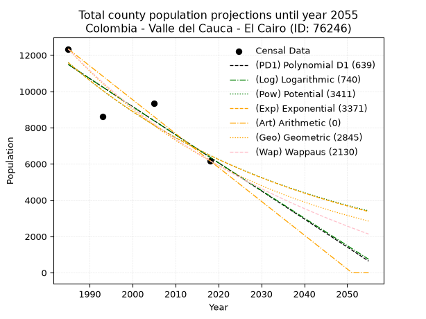
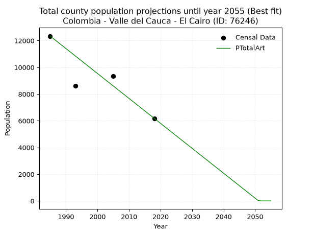
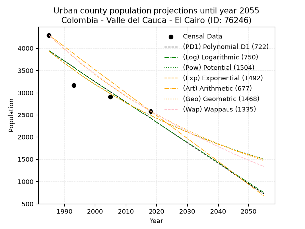
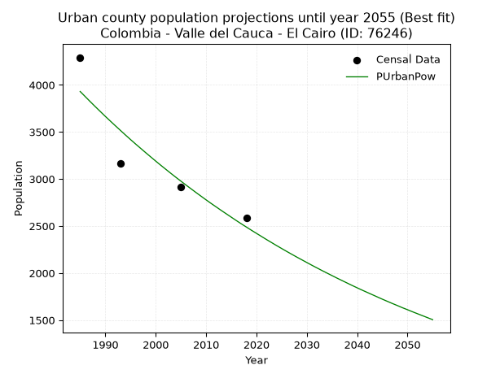
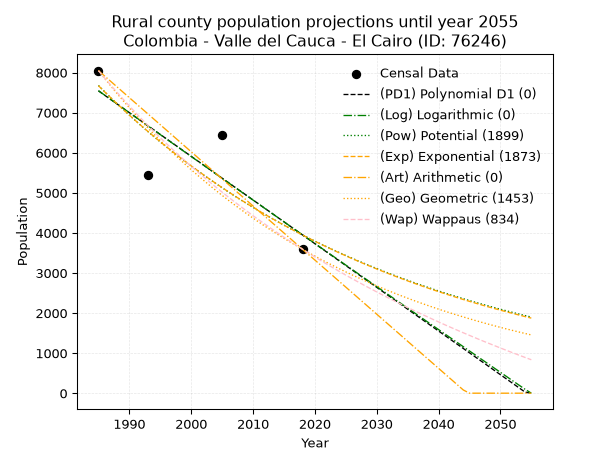
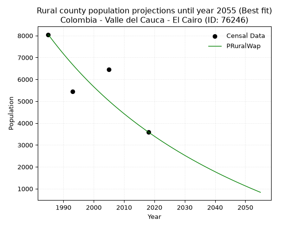

<div align="center">


</div>

# 📜 _“Population and Public Services Demand Projections (PPSD) until Year 2050 for Colombia - Valle del Cauca - El Cairo (ID: 76246)”_
Keywords: `population` `public-service` `projection` `lineal` `polynomial` `logarithmic` `potential` `exponential` `arithmetic` `geometric` `wappaus` `dane` `colombia` `south-america`

PPSD are analytical estimates used by governments and planners to anticipate future changes in population size, age distribution, and the resulting community needs for utilities, healthcare, education, and infrastructure as sizing future water treatment facilities, electrical grids, and road networks based on spatial growth.

<div align="center">

</img>

</div>


> **General running parameters**: • app_version: _v20260806_. • Python version: _3.14.7_. • Pandas version: _3.0.5_. • NumPy version: _2.5.1_. • Creates, save and include plots into reports (create_plot): _False_. • Projection until year: _2050_. • Process polynomial degree 2 and up: _False_. • Process Wappaus: _True_. • Process Wappaus: _True_. • Set negative values to zero: _True_. • Set infinite values to zero: _True_. • Drop dataset notes: _True_. 
<div align="center">

Maps & GIS Layers: [:earth_americas:Google](http://maps.google.com/maps?q=4.760873834,-76.2216111) [:earth_americas:OSM](https://www.openstreetmap.org/#map=18/4.760873834/-76.2216111&layers=P) [:earth_americas:Bing](https://www.bing.com/maps?cp=4.760873834~-76.2216111&lvl=18) [:earth_americas:Apple](https://maps.apple.com/frame?center=4.760873834%2C-76.2216111&span=0.003%2C0.006) [:earth_americas:GISMobile](https://github.com/rcfdtools/R.GISMobile/blob/main/file/gis/CountyLayer_CO/Readme.md)

</div>


<div align="center">

```geojson
{
  "type": "Feature",
  "geometry": {
    "type": "Point", 
    "coordinates": [-76.2216111, 4.760873834]
  }, 
  "properties": {
    "Name": "Colombia - Valle del Cauca - El Cairo (ID: 76246)"
  }
}
```

</div>


## 0. Census Data (4 records)

Census data are official statistics collected by a government about the people and housing in a country. They usually include counts of total population, age, sex, race, income, education, and jobs.

📅Global census file: [Population.xlsx](../data/Population.xlsx)

| Source   |   Year |   CountryID | CountryName   |   StateID | StateName       |   CountyID | CountyName   |   PTotal |   PUrban |   PRural |
|:---------|-------:|------------:|:--------------|----------:|:----------------|-----------:|:-------------|---------:|---------:|---------:|
| DANE     |   1985 |          57 | Colombia      |        76 | Valle del Cauca |      76246 | El Cairo     |    12339 |     4292 |     8047 |
| DANE     |   1993 |          57 | Colombia      |        76 | Valle del Cauca |      76246 | El Cairo     |     8610 |     3165 |     5445 |
| DANE     |   2005 |          57 | Colombia      |        76 | Valle del Cauca |      76246 | El Cairo     |     9356 |     2912 |     6444 |
| DANE     |   2018 |          57 | Colombia      |        76 | Valle del Cauca |      76246 | El Cairo     |     6179 |     2588 |     3591 |

> 🔥Some records could had specific notes about the registered values or the corresponding urban or rural distribution.

📅[SUI-RUPS](https://www.datos.gov.co/Hacienda-y-Cr-dito-P-blico/Registro-nico-de-Prestadores-de-Servicios-P-blicos/4qkq-csdn/about_data) - Local public utility companies: [RUPS.csv](../data/RUPS.csv)

 | SERVICIO       | ESTADO    | NOMBRE                                                                    | NIT         | DEPARTAMENTO_DOMICILIO   | MUNICIPIO_DOMICILIO   | DIRECCION              |   TELEFONO | EMAIL                     | TIPO_PRESTADOR                             | CLASIFICACION                 |
|:---------------|:----------|:--------------------------------------------------------------------------|:------------|:-------------------------|:----------------------|:-----------------------|-----------:|:--------------------------|:-------------------------------------------|:------------------------------|
| ACUEDUCTO      | OPERATIVA | SOCIEDAD DE ACUEDUCTOS Y ALCANTARILLADOS DEL VALLE DEL CAUCA S.A.  E.S.P. | 890399032-8 | VALLE DEL CAUCA          | CALI                  | AVENIDA 5 N # 23 AN 41 |    6203400 | rosemary@acuavalle.gov.co | SOCIEDADES (EMPRESA DE SERVICIOS PUBLICOS) | MAYOR O IGUAL A 5001 USUARIOS |
| ALCANTARILLADO | OPERATIVA | SOCIEDAD DE ACUEDUCTOS Y ALCANTARILLADOS DEL VALLE DEL CAUCA S.A.  E.S.P. | 890399032-8 | VALLE DEL CAUCA          | CALI                  | AVENIDA 5 N # 23 AN 41 |    6203400 | rosemary@acuavalle.gov.co | SOCIEDADES (EMPRESA DE SERVICIOS PUBLICOS) | MAYOR O IGUAL A 5001 USUARIOS |

## 1. Total

### 1.1. Coefficients and Parameters

* (PD1) Polynomial Deg 1: -154.91609795262747, 318991.9249297431 (lineal)
* (Log) Logarithmic: -310144.01462484227, 2366528.140501582
* (Pow) Potential: -35.29323269687576, 120.45271055207787
* (Exp) Exponential: -0.017634292288371996, 1.844756996678162e+19
* (Art) Arithmetic: Year diff. 2018 - 1985 = 33, Population diff. 6179 - 12339 = -6160, Annual growth = -186.66666666666666
* (Geo) Geometric: Year diff. 2018 - 1985 = 33, Population diff. 6179 - 12339 = -6160, Annual growth % = -0.020739745105081475
* (Wap) Wappaus: i = -2.016056449580588, Condition values only valid for < 200)

<sub>
Wappaus condition values: ['-0.00', '-2.02', '-4.03', '-6.05', '-8.06', '-10.08', '-12.10', '-14.11', '-16.13', '-18.14', '-20.16', '-22.18', '-24.19', '-26.21', '-28.22', '-30.24', '-32.26', '-34.27', '-36.29', '-38.31', '-40.32', '-42.34', '-44.35', '-46.37', '-48.39', '-50.40', '-52.42', '-54.43', '-56.45', '-58.47', '-60.48', '-62.50', '-64.51', '-66.53', '-68.55', '-70.56', '-72.58', '-74.59', '-76.61', '-78.63', '-80.64', '-82.66', '-84.67', '-86.69', '-88.71', '-90.72', '-92.74', '-94.75', '-96.77', '-98.79', '-100.80', '-102.82', '-104.83', '-106.85', '-108.87', '-110.88', '-112.90', '-114.92', '-116.93', '-118.95', '-120.96', '-122.98', '-125.00', '-127.01', '-129.03', '-131.04']
</sub>


### 1.2. Projected Dataset

|   Year |   CountyID |   PTotalPD1 |   PTotalLog |   PTotalPow |   PTotalExp |   PTotalArt |   PTotalGeo |   PTotalWap |
|-------:|-----------:|------------:|------------:|------------:|------------:|------------:|------------:|------------:|
|   1985 |      76246 |       11483 |       11489 |       11590 |       11584 |       12339 |       12339 |       12339 |
|   1986 |      76246 |       11329 |       11332 |       11386 |       11382 |       12152 |       12083 |       12093 |
|   1987 |      76246 |       11174 |       11176 |       11185 |       11183 |       11966 |       11832 |       11851 |
|   1988 |      76246 |       11019 |       11020 |       10988 |       10987 |       11779 |       11587 |       11615 |
|   1989 |      76246 |       10864 |       10864 |       10795 |       10795 |       11592 |       11347 |       11383 |
|   1990 |      76246 |       10709 |       10708 |       10605 |       10607 |       11406 |       11111 |       11155 |
|   1991 |      76246 |       10554 |       10553 |       10419 |       10421 |       11219 |       10881 |       10932 |
|   1992 |      76246 |       10399 |       10397 |       10236 |       10239 |       11032 |       10655 |       10712 |
|   1993 |      76246 |       10244 |       10241 |       10056 |       10060 |       10846 |       10434 |       10497 |
|   1994 |      76246 |       10089 |       10086 |        9880 |        9884 |       10659 |       10218 |       10286 |
|   1995 |      76246 |        9934 |        9930 |        9706 |        9711 |       10472 |       10006 |       10079 |
|   1996 |      76246 |        9779 |        9775 |        9536 |        9542 |       10286 |        9798 |        9876 |
|   1997 |      76246 |        9624 |        9619 |        9369 |        9375 |       10099 |        9595 |        9676 |
|   1998 |      76246 |        9470 |        9464 |        9205 |        9211 |        9912 |        9396 |        9480 |
|   1999 |      76246 |        9315 |        9309 |        9044 |        9050 |        9726 |        9201 |        9287 |
|   2000 |      76246 |        9160 |        9154 |        8886 |        8892 |        9539 |        9011 |        9098 |
|   2001 |      76246 |        9005 |        8999 |        8730 |        8736 |        9352 |        8824 |        8912 |
|   2002 |      76246 |        8850 |        8844 |        8578 |        8584 |        9166 |        8641 |        8729 |
|   2003 |      76246 |        8695 |        8689 |        8428 |        8434 |        8979 |        8461 |        8549 |
|   2004 |      76246 |        8540 |        8534 |        8281 |        8286 |        8792 |        8286 |        8372 |
|   2005 |      76246 |        8385 |        8379 |        8136 |        8141 |        8606 |        8114 |        8199 |
|   2006 |      76246 |        8230 |        8225 |        7994 |        7999 |        8419 |        7946 |        8028 |
|   2007 |      76246 |        8075 |        8070 |        7855 |        7859 |        8232 |        7781 |        7860 |
|   2008 |      76246 |        7920 |        7916 |        7718 |        7722 |        8046 |        7620 |        7694 |
|   2009 |      76246 |        7765 |        7761 |        7584 |        7587 |        7859 |        7462 |        7532 |
|   2010 |      76246 |        7611 |        7607 |        7451 |        7454 |        7672 |        7307 |        7372 |
|   2011 |      76246 |        7456 |        7453 |        7322 |        7324 |        7486 |        7155 |        7214 |
|   2012 |      76246 |        7301 |        7298 |        7194 |        7196 |        7299 |        7007 |        7059 |
|   2013 |      76246 |        7146 |        7144 |        7069 |        7070 |        7112 |        6862 |        6907 |
|   2014 |      76246 |        6991 |        6990 |        6947 |        6947 |        6926 |        6719 |        6757 |
|   2015 |      76246 |        6836 |        6836 |        6826 |        6825 |        6739 |        6580 |        6609 |
|   2016 |      76246 |        6681 |        6682 |        6707 |        6706 |        6552 |        6444 |        6463 |
|   2017 |      76246 |        6526 |        6529 |        6591 |        6589 |        6366 |        6310 |        6320 |
|   2018 |      76246 |        6371 |        6375 |        6477 |        6473 |        6179 |        6179 |        6179 |
|   2019 |      76246 |        6216 |        6221 |        6365 |        6360 |        5992 |        6051 |        6040 |
|   2020 |      76246 |        6061 |        6068 |        6254 |        6249 |        5806 |        5925 |        5903 |
|   2021 |      76246 |        5906 |        5914 |        6146 |        6140 |        5619 |        5802 |        5768 |
|   2022 |      76246 |        5752 |        5761 |        6040 |        6033 |        5432 |        5682 |        5635 |
|   2023 |      76246 |        5597 |        5607 |        5935 |        5927 |        5246 |        5564 |        5504 |
|   2024 |      76246 |        5442 |        5454 |        5832 |        5824 |        5059 |        5449 |        5375 |
|   2025 |      76246 |        5287 |        5301 |        5732 |        5722 |        4872 |        5336 |        5248 |
|   2026 |      76246 |        5132 |        5148 |        5633 |        5622 |        4686 |        5225 |        5122 |
|   2027 |      76246 |        4977 |        4995 |        5535 |        5523 |        4499 |        5117 |        4999 |
|   2028 |      76246 |        4822 |        4842 |        5440 |        5427 |        4312 |        5011 |        4877 |
|   2029 |      76246 |        4667 |        4689 |        5346 |        5332 |        4126 |        4907 |        4757 |
|   2030 |      76246 |        4512 |        4536 |        5254 |        5239 |        3939 |        4805 |        4638 |
|   2031 |      76246 |        4357 |        4383 |        5163 |        5147 |        3752 |        4705 |        4521 |
|   2032 |      76246 |        4202 |        4231 |        5074 |        5057 |        3566 |        4608 |        4406 |
|   2033 |      76246 |        4047 |        4078 |        4987 |        4969 |        3379 |        4512 |        4292 |
|   2034 |      76246 |        3893 |        3926 |        4901 |        4882 |        3192 |        4419 |        4180 |
|   2035 |      76246 |        3738 |        3773 |        4817 |        4797 |        3006 |        4327 |        4069 |
|   2036 |      76246 |        3583 |        3621 |        4734 |        4713 |        2819 |        4237 |        3960 |
|   2037 |      76246 |        3428 |        3469 |        4653 |        4630 |        2632 |        4149 |        3852 |
|   2038 |      76246 |        3273 |        3316 |        4573 |        4550 |        2446 |        4063 |        3746 |
|   2039 |      76246 |        3118 |        3164 |        4494 |        4470 |        2259 |        3979 |        3641 |
|   2040 |      76246 |        2963 |        3012 |        4417 |        4392 |        2072 |        3897 |        3537 |
|   2041 |      76246 |        2808 |        2860 |        4342 |        4315 |        1886 |        3816 |        3435 |
|   2042 |      76246 |        2653 |        2708 |        4267 |        4240 |        1699 |        3737 |        3334 |
|   2043 |      76246 |        2498 |        2556 |        4194 |        4166 |        1512 |        3659 |        3234 |
|   2044 |      76246 |        2343 |        2405 |        4122 |        4093 |        1326 |        3583 |        3136 |
|   2045 |      76246 |        2189 |        2253 |        4052 |        4021 |        1139 |        3509 |        3038 |
|   2046 |      76246 |        2034 |        2101 |        3982 |        3951 |         952 |        3436 |        2942 |
|   2047 |      76246 |        1879 |        1950 |        3914 |        3882 |         766 |        3365 |        2848 |
|   2048 |      76246 |        1724 |        1798 |        3847 |        3814 |         579 |        3295 |        2754 |
|   2049 |      76246 |        1569 |        1647 |        3782 |        3747 |         392 |        3227 |        2662 |
|   2050 |      76246 |        1414 |        1495 |        3717 |        3682 |         206 |        3160 |        2570 |
<div align="center">

</img>

</div>


### 1.3. Best fit with absolute and relative error (%)

Relative error puts that difference into context by dividing the absolute error by the true value, creating a unitless ratio or percentage that shows the scale of the mistake.

Absolute and relative error

|   Year | Source   |   CountryID | CountryName   |   StateID | StateName       |   CountyID_x | CountyName   |   PTotal |   PUrban |   PRural |   CountyID_y |   PTotalPD1 |   PTotalLog |   PTotalPow |   PTotalExp |   PTotalArt |   PTotalGeo |   PTotalWap |   PTotalPD1AbsError |   PTotalLogAbsError |   PTotalPowAbsError |   PTotalExpAbsError |   PTotalArtAbsError |   PTotalGeoAbsError |   PTotalWapAbsError |   PTotalPD1RelError |   PTotalLogRelError |   PTotalPowRelError |   PTotalExpRelError |   PTotalArtRelError |   PTotalGeoRelError |   PTotalWapRelError |
|-------:|:---------|------------:|:--------------|----------:|:----------------|-------------:|:-------------|---------:|---------:|---------:|-------------:|------------:|------------:|------------:|------------:|------------:|------------:|------------:|--------------------:|--------------------:|--------------------:|--------------------:|--------------------:|--------------------:|--------------------:|--------------------:|--------------------:|--------------------:|--------------------:|--------------------:|--------------------:|--------------------:|
|   1985 | DANE     |          57 | Colombia      |        76 | Valle del Cauca |        76246 | El Cairo     |    12339 |     4292 |     8047 |        76246 |       11483 |       11489 |       11590 |       11584 |       12339 |       12339 |       12339 |                 856 |                 850 |                 749 |                 755 |                   0 |                   0 |                   0 |             6.93735 |             6.88873 |             6.07018 |             6.11881 |             0       |              0      |              0      |
|   1993 | DANE     |          57 | Colombia      |        76 | Valle del Cauca |        76246 | El Cairo     |     8610 |     3165 |     5445 |        76246 |       10244 |       10241 |       10056 |       10060 |       10846 |       10434 |       10497 |                1634 |                1631 |                1446 |                1450 |                2236 |                1824 |                1887 |            18.9779  |            18.9431  |            16.7944  |            16.8409  |            25.9698  |             21.1847 |             21.9164 |
|   2005 | DANE     |          57 | Colombia      |        76 | Valle del Cauca |        76246 | El Cairo     |     9356 |     2912 |     6444 |        76246 |        8385 |        8379 |        8136 |        8141 |        8606 |        8114 |        8199 |                 971 |                 977 |                1220 |                1215 |                 750 |                1242 |                1157 |            10.3784  |            10.4425  |            13.0398  |            12.9863  |             8.01625 |             13.2749 |             12.3664 |
|   2018 | DANE     |          57 | Colombia      |        76 | Valle del Cauca |        76246 | El Cairo     |     6179 |     2588 |     3591 |        76246 |        6371 |        6375 |        6477 |        6473 |        6179 |        6179 |        6179 |                 192 |                 196 |                 298 |                 294 |                   0 |                   0 |                   0 |             3.1073  |             3.17203 |             4.82279 |             4.75805 |             0       |              0      |              0      |

Relative error mean

| Method    |   RelError | Best   |
|:----------|-----------:|:-------|
| PTotalPD1 |    9.85024 |        |
| PTotalLog |    9.86159 |        |
| PTotalPow |   10.1818  |        |
| PTotalExp |   10.176   |        |
| PTotalArt |    8.49651 | True   |
| PTotalGeo |    8.61489 |        |
| PTotalWap |    8.57069 |        |

💙Best method: _**PTotalArt**_
<div align="center">

</img>

</div>


### 1.4. Fresh water supply demand in liters per capita per day (lpcd)

The fresh water supply demand typically ranges from 100 to 300 liters per capita per day (lpcd) for standard domestic and municipal planning, though absolute survival minimums set by the World Health Organization are as low as 7.5 to 20 liters per day, and total consumption in high-income nations can exceed 400 liters.

> `CZ`: Level in meters above the sea level (masl)<br> `WS`: Fresh water supply demand in liters per capita per day (lpcd or l/h/d)<br> `WSAll`: Zonal fresh water supply demand in liters per second (l/s)<br> `A`: Zonal area in square meters<br> `DP`: Population density (people/hectare or p/ha)

Reference values (RAS Colombia)

|    CZ |   WS |
|------:|-----:|
|  1000 |  120 |
|  2000 |  130 |
| 99999 |  140 |

County shapefile geometry properties and water supply values

|   CountyID |      ATotal |   CZTotal |   WSTotal |
|-----------:|------------:|----------:|----------:|
|      76246 | 2.14237e+08 |   1861.79 |       130 |

Projected values for best method: PTotalArt

|   CountyID |   Year |   PTotalArt |   DPTotal |   WSTotal |   WSTotalAll |
|-----------:|-------:|------------:|----------:|----------:|-------------:|
|      76246 |   1985 |       12339 |      0.58 |       130 |    18.5656   |
|      76246 |   1986 |       12152 |      0.57 |       130 |    18.2843   |
|      76246 |   1987 |       11966 |      0.56 |       130 |    18.0044   |
|      76246 |   1988 |       11779 |      0.55 |       130 |    17.723    |
|      76246 |   1989 |       11592 |      0.54 |       130 |    17.4417   |
|      76246 |   1990 |       11406 |      0.53 |       130 |    17.1618   |
|      76246 |   1991 |       11219 |      0.52 |       130 |    16.8804   |
|      76246 |   1992 |       11032 |      0.51 |       130 |    16.5991   |
|      76246 |   1993 |       10846 |      0.51 |       130 |    16.3192   |
|      76246 |   1994 |       10659 |      0.5  |       130 |    16.0378   |
|      76246 |   1995 |       10472 |      0.49 |       130 |    15.7565   |
|      76246 |   1996 |       10286 |      0.48 |       130 |    15.4766   |
|      76246 |   1997 |       10099 |      0.47 |       130 |    15.1953   |
|      76246 |   1998 |        9912 |      0.46 |       130 |    14.9139   |
|      76246 |   1999 |        9726 |      0.45 |       130 |    14.634    |
|      76246 |   2000 |        9539 |      0.45 |       130 |    14.3527   |
|      76246 |   2001 |        9352 |      0.44 |       130 |    14.0713   |
|      76246 |   2002 |        9166 |      0.43 |       130 |    13.7914   |
|      76246 |   2003 |        8979 |      0.42 |       130 |    13.5101   |
|      76246 |   2004 |        8792 |      0.41 |       130 |    13.2287   |
|      76246 |   2005 |        8606 |      0.4  |       130 |    12.9488   |
|      76246 |   2006 |        8419 |      0.39 |       130 |    12.6675   |
|      76246 |   2007 |        8232 |      0.38 |       130 |    12.3861   |
|      76246 |   2008 |        8046 |      0.38 |       130 |    12.1062   |
|      76246 |   2009 |        7859 |      0.37 |       130 |    11.8249   |
|      76246 |   2010 |        7672 |      0.36 |       130 |    11.5435   |
|      76246 |   2011 |        7486 |      0.35 |       130 |    11.2637   |
|      76246 |   2012 |        7299 |      0.34 |       130 |    10.9823   |
|      76246 |   2013 |        7112 |      0.33 |       130 |    10.7009   |
|      76246 |   2014 |        6926 |      0.32 |       130 |    10.4211   |
|      76246 |   2015 |        6739 |      0.31 |       130 |    10.1397   |
|      76246 |   2016 |        6552 |      0.31 |       130 |     9.85833  |
|      76246 |   2017 |        6366 |      0.3  |       130 |     9.57847  |
|      76246 |   2018 |        6179 |      0.29 |       130 |     9.29711  |
|      76246 |   2019 |        5992 |      0.28 |       130 |     9.01574  |
|      76246 |   2020 |        5806 |      0.27 |       130 |     8.73588  |
|      76246 |   2021 |        5619 |      0.26 |       130 |     8.45451  |
|      76246 |   2022 |        5432 |      0.25 |       130 |     8.17315  |
|      76246 |   2023 |        5246 |      0.24 |       130 |     7.89329  |
|      76246 |   2024 |        5059 |      0.24 |       130 |     7.61192  |
|      76246 |   2025 |        4872 |      0.23 |       130 |     7.33056  |
|      76246 |   2026 |        4686 |      0.22 |       130 |     7.05069  |
|      76246 |   2027 |        4499 |      0.21 |       130 |     6.76933  |
|      76246 |   2028 |        4312 |      0.2  |       130 |     6.48796  |
|      76246 |   2029 |        4126 |      0.19 |       130 |     6.2081   |
|      76246 |   2030 |        3939 |      0.18 |       130 |     5.92674  |
|      76246 |   2031 |        3752 |      0.18 |       130 |     5.64537  |
|      76246 |   2032 |        3566 |      0.17 |       130 |     5.36551  |
|      76246 |   2033 |        3379 |      0.16 |       130 |     5.08414  |
|      76246 |   2034 |        3192 |      0.15 |       130 |     4.80278  |
|      76246 |   2035 |        3006 |      0.14 |       130 |     4.52292  |
|      76246 |   2036 |        2819 |      0.13 |       130 |     4.24155  |
|      76246 |   2037 |        2632 |      0.12 |       130 |     3.96019  |
|      76246 |   2038 |        2446 |      0.11 |       130 |     3.68032  |
|      76246 |   2039 |        2259 |      0.11 |       130 |     3.39896  |
|      76246 |   2040 |        2072 |      0.1  |       130 |     3.11759  |
|      76246 |   2041 |        1886 |      0.09 |       130 |     2.83773  |
|      76246 |   2042 |        1699 |      0.08 |       130 |     2.55637  |
|      76246 |   2043 |        1512 |      0.07 |       130 |     2.275    |
|      76246 |   2044 |        1326 |      0.06 |       130 |     1.99514  |
|      76246 |   2045 |        1139 |      0.05 |       130 |     1.71377  |
|      76246 |   2046 |         952 |      0.04 |       130 |     1.43241  |
|      76246 |   2047 |         766 |      0.04 |       130 |     1.15255  |
|      76246 |   2048 |         579 |      0.03 |       130 |     0.871181 |
|      76246 |   2049 |         392 |      0.02 |       130 |     0.589815 |
|      76246 |   2050 |         206 |      0.01 |       130 |     0.309954 |

## 2. Urban

### 2.1. Coefficients and Parameters

* (PD1) Polynomial Deg 1: -45.973906061822326, 95198.5556001601 (lineal)
* (Log) Logarithmic: -92110.67286129225, 703373.2125472903
* (Pow) Potential: -27.706505262503534, 94.96382232188381
* (Exp) Exponential: -0.013831207027484771, 3293690233224403.5
* (Art) Arithmetic: Year diff. 2018 - 1985 = 33, Population diff. 2588 - 4292 = -1704, Annual growth = -51.63636363636363
* (Geo) Geometric: Year diff. 2018 - 1985 = 33, Population diff. 2588 - 4292 = -1704, Annual growth % = -0.015212420709801222
* (Wap) Wappaus: i = -1.5010570824524312, Condition values only valid for < 200)

<sub>
Wappaus condition values: ['-0.00', '-1.50', '-3.00', '-4.50', '-6.00', '-7.51', '-9.01', '-10.51', '-12.01', '-13.51', '-15.01', '-16.51', '-18.01', '-19.51', '-21.01', '-22.52', '-24.02', '-25.52', '-27.02', '-28.52', '-30.02', '-31.52', '-33.02', '-34.52', '-36.03', '-37.53', '-39.03', '-40.53', '-42.03', '-43.53', '-45.03', '-46.53', '-48.03', '-49.53', '-51.04', '-52.54', '-54.04', '-55.54', '-57.04', '-58.54', '-60.04', '-61.54', '-63.04', '-64.55', '-66.05', '-67.55', '-69.05', '-70.55', '-72.05', '-73.55', '-75.05', '-76.55', '-78.05', '-79.56', '-81.06', '-82.56', '-84.06', '-85.56', '-87.06', '-88.56', '-90.06', '-91.56', '-93.07', '-94.57', '-96.07', '-97.57']
</sub>


### 2.2. Projected Dataset

|   Year |   CountyID |   PUrbanPD1 |   PUrbanLog |   PUrbanPow |   PUrbanExp |   PUrbanArt |   PUrbanGeo |   PUrbanWap |
|-------:|-----------:|------------:|------------:|------------:|------------:|------------:|------------:|------------:|
|   1985 |      76246 |        3940 |        3942 |        3930 |        3928 |        4292 |        4292 |        4292 |
|   1986 |      76246 |        3894 |        3896 |        3876 |        3874 |        4240 |        4227 |        4228 |
|   1987 |      76246 |        3848 |        3850 |        3822 |        3821 |        4189 |        4162 |        4165 |
|   1988 |      76246 |        3802 |        3803 |        3769 |        3768 |        4137 |        4099 |        4103 |
|   1989 |      76246 |        3756 |        3757 |        3717 |        3716 |        4085 |        4037 |        4042 |
|   1990 |      76246 |        3710 |        3711 |        3665 |        3665 |        4034 |        3975 |        3982 |
|   1991 |      76246 |        3665 |        3664 |        3615 |        3615 |        3982 |        3915 |        3922 |
|   1992 |      76246 |        3619 |        3618 |        3565 |        3565 |        3931 |        3855 |        3864 |
|   1993 |      76246 |        3573 |        3572 |        3516 |        3516 |        3879 |        3797 |        3806 |
|   1994 |      76246 |        3527 |        3526 |        3467 |        3468 |        3827 |        3739 |        3749 |
|   1995 |      76246 |        3481 |        3480 |        3419 |        3420 |        3776 |        3682 |        3693 |
|   1996 |      76246 |        3435 |        3433 |        3372 |        3373 |        3724 |        3626 |        3637 |
|   1997 |      76246 |        3389 |        3387 |        3326 |        3327 |        3672 |        3571 |        3583 |
|   1998 |      76246 |        3343 |        3341 |        3280 |        3281 |        3621 |        3517 |        3529 |
|   1999 |      76246 |        3297 |        3295 |        3235 |        3236 |        3569 |        3463 |        3476 |
|   2000 |      76246 |        3251 |        3249 |        3190 |        3192 |        3517 |        3410 |        3423 |
|   2001 |      76246 |        3205 |        3203 |        3146 |        3148 |        3466 |        3358 |        3372 |
|   2002 |      76246 |        3159 |        3157 |        3103 |        3105 |        3414 |        3307 |        3321 |
|   2003 |      76246 |        3113 |        3111 |        3060 |        3062 |        3363 |        3257 |        3270 |
|   2004 |      76246 |        3067 |        3065 |        3018 |        3020 |        3311 |        3208 |        3221 |
|   2005 |      76246 |        3021 |        3019 |        2977 |        2979 |        3259 |        3159 |        3172 |
|   2006 |      76246 |        2975 |        2973 |        2936 |        2938 |        3208 |        3111 |        3123 |
|   2007 |      76246 |        2929 |        2927 |        2896 |        2897 |        3156 |        3063 |        3076 |
|   2008 |      76246 |        2883 |        2881 |        2856 |        2858 |        3104 |        3017 |        3028 |
|   2009 |      76246 |        2837 |        2835 |        2817 |        2818 |        3053 |        2971 |        2982 |
|   2010 |      76246 |        2791 |        2790 |        2778 |        2780 |        3001 |        2926 |        2936 |
|   2011 |      76246 |        2745 |        2744 |        2740 |        2741 |        2949 |        2881 |        2890 |
|   2012 |      76246 |        2699 |        2698 |        2703 |        2704 |        2898 |        2837 |        2846 |
|   2013 |      76246 |        2653 |        2652 |        2666 |        2667 |        2846 |        2794 |        2801 |
|   2014 |      76246 |        2607 |        2606 |        2630 |        2630 |        2795 |        2752 |        2758 |
|   2015 |      76246 |        2561 |        2561 |        2594 |        2594 |        2743 |        2710 |        2714 |
|   2016 |      76246 |        2515 |        2515 |        2558 |        2558 |        2691 |        2669 |        2672 |
|   2017 |      76246 |        2469 |        2469 |        2523 |        2523 |        2640 |        2628 |        2630 |
|   2018 |      76246 |        2423 |        2424 |        2489 |        2488 |        2588 |        2588 |        2588 |
|   2019 |      76246 |        2377 |        2378 |        2455 |        2454 |        2536 |        2549 |        2547 |
|   2020 |      76246 |        2331 |        2332 |        2422 |        2421 |        2485 |        2510 |        2506 |
|   2021 |      76246 |        2285 |        2287 |        2389 |        2387 |        2433 |        2472 |        2466 |
|   2022 |      76246 |        2239 |        2241 |        2356 |        2355 |        2381 |        2434 |        2426 |
|   2023 |      76246 |        2193 |        2196 |        2324 |        2322 |        2330 |        2397 |        2387 |
|   2024 |      76246 |        2147 |        2150 |        2292 |        2290 |        2278 |        2361 |        2348 |
|   2025 |      76246 |        2101 |        2105 |        2261 |        2259 |        2227 |        2325 |        2310 |
|   2026 |      76246 |        2055 |        2059 |        2230 |        2228 |        2175 |        2289 |        2272 |
|   2027 |      76246 |        2009 |        2014 |        2200 |        2197 |        2123 |        2254 |        2235 |
|   2028 |      76246 |        1963 |        1968 |        2170 |        2167 |        2072 |        2220 |        2198 |
|   2029 |      76246 |        1918 |        1923 |        2141 |        2137 |        2020 |        2186 |        2161 |
|   2030 |      76246 |        1872 |        1878 |        2112 |        2108 |        1968 |        2153 |        2125 |
|   2031 |      76246 |        1826 |        1832 |        2083 |        2079 |        1917 |        2120 |        2089 |
|   2032 |      76246 |        1780 |        1787 |        2055 |        2050 |        1865 |        2088 |        2054 |
|   2033 |      76246 |        1734 |        1742 |        2027 |        2022 |        1813 |        2056 |        2019 |
|   2034 |      76246 |        1688 |        1696 |        2000 |        1994 |        1762 |        2025 |        1984 |
|   2035 |      76246 |        1642 |        1651 |        1973 |        1967 |        1710 |        1994 |        1950 |
|   2036 |      76246 |        1596 |        1606 |        1946 |        1940 |        1659 |        1964 |        1916 |
|   2037 |      76246 |        1550 |        1560 |        1920 |        1913 |        1607 |        1934 |        1882 |
|   2038 |      76246 |        1504 |        1515 |        1894 |        1887 |        1555 |        1905 |        1849 |
|   2039 |      76246 |        1458 |        1470 |        1868 |        1861 |        1504 |        1876 |        1816 |
|   2040 |      76246 |        1412 |        1425 |        1843 |        1836 |        1452 |        1847 |        1784 |
|   2041 |      76246 |        1366 |        1380 |        1818 |        1810 |        1400 |        1819 |        1752 |
|   2042 |      76246 |        1320 |        1335 |        1794 |        1786 |        1349 |        1791 |        1720 |
|   2043 |      76246 |        1274 |        1290 |        1770 |        1761 |        1297 |        1764 |        1689 |
|   2044 |      76246 |        1228 |        1245 |        1746 |        1737 |        1245 |        1737 |        1657 |
|   2045 |      76246 |        1182 |        1199 |        1722 |        1713 |        1194 |        1711 |        1627 |
|   2046 |      76246 |        1136 |        1154 |        1699 |        1689 |        1142 |        1685 |        1596 |
|   2047 |      76246 |        1090 |        1109 |        1676 |        1666 |        1091 |        1659 |        1566 |
|   2048 |      76246 |        1044 |        1064 |        1654 |        1643 |        1039 |        1634 |        1536 |
|   2049 |      76246 |         998 |        1019 |        1631 |        1621 |         987 |        1609 |        1507 |
|   2050 |      76246 |         952 |         975 |        1610 |        1598 |         936 |        1585 |        1477 |
<div align="center">

</img>

</div>


### 2.3. Best fit with absolute and relative error (%)

Relative error puts that difference into context by dividing the absolute error by the true value, creating a unitless ratio or percentage that shows the scale of the mistake.

Absolute and relative error

|   Year | Source   |   CountryID | CountryName   |   StateID | StateName       |   CountyID_x | CountyName   |   PTotal |   PUrban |   PRural |   CountyID_y |   PUrbanPD1 |   PUrbanLog |   PUrbanPow |   PUrbanExp |   PUrbanArt |   PUrbanGeo |   PUrbanWap |   PUrbanPD1AbsError |   PUrbanLogAbsError |   PUrbanPowAbsError |   PUrbanExpAbsError |   PUrbanArtAbsError |   PUrbanGeoAbsError |   PUrbanWapAbsError |   PUrbanPD1RelError |   PUrbanLogRelError |   PUrbanPowRelError |   PUrbanExpRelError |   PUrbanArtRelError |   PUrbanGeoRelError |   PUrbanWapRelError |
|-------:|:---------|------------:|:--------------|----------:|:----------------|-------------:|:-------------|---------:|---------:|---------:|-------------:|------------:|------------:|------------:|------------:|------------:|------------:|------------:|--------------------:|--------------------:|--------------------:|--------------------:|--------------------:|--------------------:|--------------------:|--------------------:|--------------------:|--------------------:|--------------------:|--------------------:|--------------------:|--------------------:|
|   1985 | DANE     |          57 | Colombia      |        76 | Valle del Cauca |        76246 | El Cairo     |    12339 |     4292 |     8047 |        76246 |        3940 |        3942 |        3930 |        3928 |        4292 |        4292 |        4292 |                 352 |                 350 |                 362 |                 364 |                   0 |                   0 |                   0 |             8.2013  |             8.15471 |             8.4343  |             8.48089 |              0      |             0       |             0       |
|   1993 | DANE     |          57 | Colombia      |        76 | Valle del Cauca |        76246 | El Cairo     |     8610 |     3165 |     5445 |        76246 |        3573 |        3572 |        3516 |        3516 |        3879 |        3797 |        3806 |                 408 |                 407 |                 351 |                 351 |                 714 |                 632 |                 641 |            12.891   |            12.8594  |            11.09    |            11.09    |             22.5592 |            19.9684  |            20.2528  |
|   2005 | DANE     |          57 | Colombia      |        76 | Valle del Cauca |        76246 | El Cairo     |     9356 |     2912 |     6444 |        76246 |        3021 |        3019 |        2977 |        2979 |        3259 |        3159 |        3172 |                 109 |                 107 |                  65 |                  67 |                 347 |                 247 |                 260 |             3.74313 |             3.67445 |             2.23214 |             2.30082 |             11.9162 |             8.48214 |             8.92857 |
|   2018 | DANE     |          57 | Colombia      |        76 | Valle del Cauca |        76246 | El Cairo     |     6179 |     2588 |     3591 |        76246 |        2423 |        2424 |        2489 |        2488 |        2588 |        2588 |        2588 |                 165 |                 164 |                  99 |                 100 |                   0 |                   0 |                   0 |             6.37558 |             6.33694 |             3.82535 |             3.86399 |              0      |             0       |             0       |

Relative error mean

| Method    |   RelError | Best   |
|:----------|-----------:|:-------|
| PUrbanPD1 |    7.80275 |        |
| PUrbanLog |    7.75637 |        |
| PUrbanPow |    6.39546 | True   |
| PUrbanExp |    6.43394 |        |
| PUrbanArt |    8.61886 |        |
| PUrbanGeo |    7.11264 |        |
| PUrbanWap |    7.29533 |        |

💙Best method: _**PUrbanPow**_
<div align="center">

</img>

</div>


### 2.4. Fresh water supply demand in liters per capita per day (lpcd)

The fresh water supply demand typically ranges from 100 to 300 liters per capita per day (lpcd) for standard domestic and municipal planning, though absolute survival minimums set by the World Health Organization are as low as 7.5 to 20 liters per day, and total consumption in high-income nations can exceed 400 liters.

> `CZ`: Level in meters above the sea level (masl)<br> `WS`: Fresh water supply demand in liters per capita per day (lpcd or l/h/d)<br> `WSAll`: Zonal fresh water supply demand in liters per second (l/s)<br> `A`: Zonal area in square meters<br> `DP`: Population density (people/hectare or p/ha)

Reference values (RAS Colombia)

|    CZ |   WS |
|------:|-----:|
|  1000 |  120 |
|  2000 |  130 |
| 99999 |  140 |

County shapefile geometry properties and water supply values

|   CountyID |   AUrban |   CZUrban |   WSUrban |
|-----------:|---------:|----------:|----------:|
|      76246 |   396997 |   1907.66 |       130 |

Projected values for best method: PUrbanPow

|   CountyID |   Year |   PUrbanPow |   DPUrban |   WSUrban |   WSUrbanAll |
|-----------:|-------:|------------:|----------:|----------:|-------------:|
|      76246 |   1985 |        3930 |     98.99 |       130 |      5.91319 |
|      76246 |   1986 |        3876 |     97.63 |       130 |      5.83194 |
|      76246 |   1987 |        3822 |     96.27 |       130 |      5.75069 |
|      76246 |   1988 |        3769 |     94.94 |       130 |      5.67095 |
|      76246 |   1989 |        3717 |     93.63 |       130 |      5.59271 |
|      76246 |   1990 |        3665 |     92.32 |       130 |      5.51447 |
|      76246 |   1991 |        3615 |     91.06 |       130 |      5.43924 |
|      76246 |   1992 |        3565 |     89.8  |       130 |      5.364   |
|      76246 |   1993 |        3516 |     88.56 |       130 |      5.29028 |
|      76246 |   1994 |        3467 |     87.33 |       130 |      5.21655 |
|      76246 |   1995 |        3419 |     86.12 |       130 |      5.14433 |
|      76246 |   1996 |        3372 |     84.94 |       130 |      5.07361 |
|      76246 |   1997 |        3326 |     83.78 |       130 |      5.0044  |
|      76246 |   1998 |        3280 |     82.62 |       130 |      4.93519 |
|      76246 |   1999 |        3235 |     81.49 |       130 |      4.86748 |
|      76246 |   2000 |        3190 |     80.35 |       130 |      4.79977 |
|      76246 |   2001 |        3146 |     79.24 |       130 |      4.73356 |
|      76246 |   2002 |        3103 |     78.16 |       130 |      4.66887 |
|      76246 |   2003 |        3060 |     77.08 |       130 |      4.60417 |
|      76246 |   2004 |        3018 |     76.02 |       130 |      4.54097 |
|      76246 |   2005 |        2977 |     74.99 |       130 |      4.47928 |
|      76246 |   2006 |        2936 |     73.96 |       130 |      4.41759 |
|      76246 |   2007 |        2896 |     72.95 |       130 |      4.35741 |
|      76246 |   2008 |        2856 |     71.94 |       130 |      4.29722 |
|      76246 |   2009 |        2817 |     70.96 |       130 |      4.23854 |
|      76246 |   2010 |        2778 |     69.98 |       130 |      4.17986 |
|      76246 |   2011 |        2740 |     69.02 |       130 |      4.12269 |
|      76246 |   2012 |        2703 |     68.09 |       130 |      4.06701 |
|      76246 |   2013 |        2666 |     67.15 |       130 |      4.01134 |
|      76246 |   2014 |        2630 |     66.25 |       130 |      3.95718 |
|      76246 |   2015 |        2594 |     65.34 |       130 |      3.90301 |
|      76246 |   2016 |        2558 |     64.43 |       130 |      3.84884 |
|      76246 |   2017 |        2523 |     63.55 |       130 |      3.79618 |
|      76246 |   2018 |        2489 |     62.7  |       130 |      3.74502 |
|      76246 |   2019 |        2455 |     61.84 |       130 |      3.69387 |
|      76246 |   2020 |        2422 |     61.01 |       130 |      3.64421 |
|      76246 |   2021 |        2389 |     60.18 |       130 |      3.59456 |
|      76246 |   2022 |        2356 |     59.35 |       130 |      3.54491 |
|      76246 |   2023 |        2324 |     58.54 |       130 |      3.49676 |
|      76246 |   2024 |        2292 |     57.73 |       130 |      3.44861 |
|      76246 |   2025 |        2261 |     56.95 |       130 |      3.40197 |
|      76246 |   2026 |        2230 |     56.17 |       130 |      3.35532 |
|      76246 |   2027 |        2200 |     55.42 |       130 |      3.31019 |
|      76246 |   2028 |        2170 |     54.66 |       130 |      3.26505 |
|      76246 |   2029 |        2141 |     53.93 |       130 |      3.22141 |
|      76246 |   2030 |        2112 |     53.2  |       130 |      3.17778 |
|      76246 |   2031 |        2083 |     52.47 |       130 |      3.13414 |
|      76246 |   2032 |        2055 |     51.76 |       130 |      3.09201 |
|      76246 |   2033 |        2027 |     51.06 |       130 |      3.04988 |
|      76246 |   2034 |        2000 |     50.38 |       130 |      3.00926 |
|      76246 |   2035 |        1973 |     49.7  |       130 |      2.96863 |
|      76246 |   2036 |        1946 |     49.02 |       130 |      2.92801 |
|      76246 |   2037 |        1920 |     48.36 |       130 |      2.88889 |
|      76246 |   2038 |        1894 |     47.71 |       130 |      2.84977 |
|      76246 |   2039 |        1868 |     47.05 |       130 |      2.81065 |
|      76246 |   2040 |        1843 |     46.42 |       130 |      2.77303 |
|      76246 |   2041 |        1818 |     45.79 |       130 |      2.73542 |
|      76246 |   2042 |        1794 |     45.19 |       130 |      2.69931 |
|      76246 |   2043 |        1770 |     44.58 |       130 |      2.66319 |
|      76246 |   2044 |        1746 |     43.98 |       130 |      2.62708 |
|      76246 |   2045 |        1722 |     43.38 |       130 |      2.59097 |
|      76246 |   2046 |        1699 |     42.8  |       130 |      2.55637 |
|      76246 |   2047 |        1676 |     42.22 |       130 |      2.52176 |
|      76246 |   2048 |        1654 |     41.66 |       130 |      2.48866 |
|      76246 |   2049 |        1631 |     41.08 |       130 |      2.45405 |
|      76246 |   2050 |        1610 |     40.55 |       130 |      2.42245 |

## 3. Rural

### 3.1. Coefficients and Parameters

* (PD1) Polynomial Deg 1: -108.94219189080516, 223793.36932958305 (lineal)
* (Log) Logarithmic: -218033.34176355, 1663154.927954291
* (Pow) Potential: -40.30418642988933, 136.79867666584101
* (Exp) Exponential: -0.020144951719335915, 1.7839006171593169e+21
* (Art) Arithmetic: Year diff. 2018 - 1985 = 33, Population diff. 3591 - 8047 = -4456, Annual growth = -135.03030303030303
* (Geo) Geometric: Year diff. 2018 - 1985 = 33, Population diff. 3591 - 8047 = -4456, Annual growth % = -0.024154071061980753
* (Wap) Wappaus: i = -2.3205070120347657, Condition values only valid for < 200)

<sub>
Wappaus condition values: ['-0.00', '-2.32', '-4.64', '-6.96', '-9.28', '-11.60', '-13.92', '-16.24', '-18.56', '-20.88', '-23.21', '-25.53', '-27.85', '-30.17', '-32.49', '-34.81', '-37.13', '-39.45', '-41.77', '-44.09', '-46.41', '-48.73', '-51.05', '-53.37', '-55.69', '-58.01', '-60.33', '-62.65', '-64.97', '-67.29', '-69.62', '-71.94', '-74.26', '-76.58', '-78.90', '-81.22', '-83.54', '-85.86', '-88.18', '-90.50', '-92.82', '-95.14', '-97.46', '-99.78', '-102.10', '-104.42', '-106.74', '-109.06', '-111.38', '-113.70', '-116.03', '-118.35', '-120.67', '-122.99', '-125.31', '-127.63', '-129.95', '-132.27', '-134.59', '-136.91', '-139.23', '-141.55', '-143.87', '-146.19', '-148.51', '-150.83']
</sub>


### 3.2. Projected Dataset

|   Year |   CountyID |   PRuralPD1 |   PRuralLog |   PRuralPow |   PRuralExp |   PRuralArt |   PRuralGeo |   PRuralWap |
|-------:|-----------:|------------:|------------:|------------:|------------:|------------:|------------:|------------:|
|   1985 |      76246 |        7543 |        7546 |        7676 |        7672 |        8047 |        8047 |        8047 |
|   1986 |      76246 |        7434 |        7436 |        7522 |        7519 |        7912 |        7853 |        7862 |
|   1987 |      76246 |        7325 |        7327 |        7370 |        7369 |        7777 |        7663 |        7682 |
|   1988 |      76246 |        7216 |        7217 |        7223 |        7222 |        7642 |        7478 |        7506 |
|   1989 |      76246 |        7107 |        7107 |        7078 |        7078 |        7507 |        7297 |        7333 |
|   1990 |      76246 |        6998 |        6998 |        6936 |        6937 |        7372 |        7121 |        7165 |
|   1991 |      76246 |        6889 |        6888 |        6797 |        6799 |        7237 |        6949 |        7000 |
|   1992 |      76246 |        6781 |        6779 |        6660 |        6663 |        7102 |        6781 |        6838 |
|   1993 |      76246 |        6672 |        6669 |        6527 |        6530 |        6967 |        6617 |        6680 |
|   1994 |      76246 |        6563 |        6560 |        6396 |        6400 |        6832 |        6458 |        6525 |
|   1995 |      76246 |        6454 |        6451 |        6268 |        6272 |        6697 |        6302 |        6374 |
|   1996 |      76246 |        6345 |        6341 |        6143 |        6147 |        6562 |        6149 |        6225 |
|   1997 |      76246 |        6236 |        6232 |        6020 |        6025 |        6427 |        6001 |        6080 |
|   1998 |      76246 |        6127 |        6123 |        5900 |        5905 |        6292 |        5856 |        5938 |
|   1999 |      76246 |        6018 |        6014 |        5782 |        5787 |        6157 |        5714 |        5798 |
|   2000 |      76246 |        5909 |        5905 |        5667 |        5671 |        6022 |        5576 |        5661 |
|   2001 |      76246 |        5800 |        5796 |        5554 |        5558 |        5887 |        5442 |        5527 |
|   2002 |      76246 |        5691 |        5687 |        5443 |        5447 |        5751 |        5310 |        5396 |
|   2003 |      76246 |        5582 |        5578 |        5335 |        5339 |        5616 |        5182 |        5267 |
|   2004 |      76246 |        5473 |        5469 |        5228 |        5232 |        5481 |        5057 |        5140 |
|   2005 |      76246 |        5364 |        5360 |        5124 |        5128 |        5346 |        4935 |        5016 |
|   2006 |      76246 |        5255 |        5252 |        5022 |        5026 |        5211 |        4815 |        4894 |
|   2007 |      76246 |        5146 |        5143 |        4923 |        4925 |        5076 |        4699 |        4774 |
|   2008 |      76246 |        5037 |        5034 |        4825 |        4827 |        4941 |        4586 |        4657 |
|   2009 |      76246 |        4929 |        4926 |        4729 |        4731 |        4806 |        4475 |        4542 |
|   2010 |      76246 |        4820 |        4817 |        4635 |        4637 |        4671 |        4367 |        4428 |
|   2011 |      76246 |        4711 |        4709 |        4543 |        4544 |        4536 |        4261 |        4317 |
|   2012 |      76246 |        4602 |        4600 |        4453 |        4454 |        4401 |        4158 |        4208 |
|   2013 |      76246 |        4493 |        4492 |        4365 |        4365 |        4266 |        4058 |        4101 |
|   2014 |      76246 |        4384 |        4384 |        4278 |        4278 |        4131 |        3960 |        3995 |
|   2015 |      76246 |        4275 |        4276 |        4193 |        4192 |        3996 |        3864 |        3891 |
|   2016 |      76246 |        4166 |        4167 |        4110 |        4109 |        3861 |        3771 |        3790 |
|   2017 |      76246 |        4057 |        4059 |        4029 |        4027 |        3726 |        3680 |        3689 |
|   2018 |      76246 |        3948 |        3951 |        3949 |        3946 |        3591 |        3591 |        3591 |
|   2019 |      76246 |        3839 |        3843 |        3871 |        3868 |        3456 |        3504 |        3494 |
|   2020 |      76246 |        3730 |        3735 |        3795 |        3791 |        3321 |        3420 |        3399 |
|   2021 |      76246 |        3621 |        3627 |        3720 |        3715 |        3186 |        3337 |        3305 |
|   2022 |      76246 |        3512 |        3519 |        3646 |        3641 |        3051 |        3256 |        3213 |
|   2023 |      76246 |        3403 |        3412 |        3574 |        3568 |        2916 |        3178 |        3122 |
|   2024 |      76246 |        3294 |        3304 |        3504 |        3497 |        2781 |        3101 |        3033 |
|   2025 |      76246 |        3185 |        3196 |        3435 |        3427 |        2646 |        3026 |        2945 |
|   2026 |      76246 |        3076 |        3089 |        3367 |        3359 |        2511 |        2953 |        2859 |
|   2027 |      76246 |        2968 |        2981 |        3301 |        3292 |        2376 |        2882 |        2774 |
|   2028 |      76246 |        2859 |        2873 |        3236 |        3226 |        2241 |        2812 |        2690 |
|   2029 |      76246 |        2750 |        2766 |        3172 |        3162 |        2106 |        2744 |        2608 |
|   2030 |      76246 |        2641 |        2659 |        3110 |        3099 |        1971 |        2678 |        2526 |
|   2031 |      76246 |        2532 |        2551 |        3049 |        3037 |        1836 |        2613 |        2446 |
|   2032 |      76246 |        2423 |        2444 |        2989 |        2977 |        1701 |        2550 |        2368 |
|   2033 |      76246 |        2314 |        2337 |        2930 |        2917 |        1566 |        2488 |        2290 |
|   2034 |      76246 |        2205 |        2229 |        2873 |        2859 |        1431 |        2428 |        2214 |
|   2035 |      76246 |        2096 |        2122 |        2816 |        2802 |        1295 |        2370 |        2138 |
|   2036 |      76246 |        1987 |        2015 |        2761 |        2746 |        1160 |        2312 |        2064 |
|   2037 |      76246 |        1878 |        1908 |        2707 |        2691 |        1025 |        2257 |        1991 |
|   2038 |      76246 |        1769 |        1801 |        2654 |        2638 |         890 |        2202 |        1919 |
|   2039 |      76246 |        1660 |        1694 |        2602 |        2585 |         755 |        2149 |        1848 |
|   2040 |      76246 |        1551 |        1587 |        2551 |        2534 |         620 |        2097 |        1778 |
|   2041 |      76246 |        1442 |        1480 |        2501 |        2483 |         485 |        2046 |        1708 |
|   2042 |      76246 |        1333 |        1373 |        2452 |        2434 |         350 |        1997 |        1640 |
|   2043 |      76246 |        1224 |        1267 |        2404 |        2385 |         215 |        1949 |        1573 |
|   2044 |      76246 |        1116 |        1160 |        2357 |        2337 |          80 |        1902 |        1507 |
|   2045 |      76246 |        1007 |        1053 |        2311 |        2291 |           0 |        1856 |        1442 |
|   2046 |      76246 |         898 |         947 |        2266 |        2245 |           0 |        1811 |        1377 |
|   2047 |      76246 |         789 |         840 |        2222 |        2200 |           0 |        1767 |        1313 |
|   2048 |      76246 |         680 |         734 |        2179 |        2156 |           0 |        1724 |        1251 |
|   2049 |      76246 |         571 |         627 |        2136 |        2113 |           0 |        1683 |        1189 |
|   2050 |      76246 |         462 |         521 |        2095 |        2071 |           0 |        1642 |        1128 |
<div align="center">

</img>

</div>


### 3.3. Best fit with absolute and relative error (%)

Relative error puts that difference into context by dividing the absolute error by the true value, creating a unitless ratio or percentage that shows the scale of the mistake.

Absolute and relative error

|   Year | Source   |   CountryID | CountryName   |   StateID | StateName       |   CountyID_x | CountyName   |   PTotal |   PUrban |   PRural |   CountyID_y |   PRuralPD1 |   PRuralLog |   PRuralPow |   PRuralExp |   PRuralArt |   PRuralGeo |   PRuralWap |   PRuralPD1AbsError |   PRuralLogAbsError |   PRuralPowAbsError |   PRuralExpAbsError |   PRuralArtAbsError |   PRuralGeoAbsError |   PRuralWapAbsError |   PRuralPD1RelError |   PRuralLogRelError |   PRuralPowRelError |   PRuralExpRelError |   PRuralArtRelError |   PRuralGeoRelError |   PRuralWapRelError |
|-------:|:---------|------------:|:--------------|----------:|:----------------|-------------:|:-------------|---------:|---------:|---------:|-------------:|------------:|------------:|------------:|------------:|------------:|------------:|------------:|--------------------:|--------------------:|--------------------:|--------------------:|--------------------:|--------------------:|--------------------:|--------------------:|--------------------:|--------------------:|--------------------:|--------------------:|--------------------:|--------------------:|
|   1985 | DANE     |          57 | Colombia      |        76 | Valle del Cauca |        76246 | El Cairo     |    12339 |     4292 |     8047 |        76246 |        7543 |        7546 |        7676 |        7672 |        8047 |        8047 |        8047 |                 504 |                 501 |                 371 |                 375 |                   0 |                   0 |                   0 |             6.2632  |             6.22592 |             4.61041 |             4.66012 |              0      |              0      |              0      |
|   1993 | DANE     |          57 | Colombia      |        76 | Valle del Cauca |        76246 | El Cairo     |     8610 |     3165 |     5445 |        76246 |        6672 |        6669 |        6527 |        6530 |        6967 |        6617 |        6680 |                1227 |                1224 |                1082 |                1085 |                1522 |                1172 |                1235 |            22.5344  |            22.4793  |            19.8714  |            19.9265  |             27.9522 |             21.5243 |             22.6814 |
|   2005 | DANE     |          57 | Colombia      |        76 | Valle del Cauca |        76246 | El Cairo     |     9356 |     2912 |     6444 |        76246 |        5364 |        5360 |        5124 |        5128 |        5346 |        4935 |        5016 |                1080 |                1084 |                1320 |                1316 |                1098 |                1509 |                1428 |            16.7598  |            16.8218  |            20.4842  |            20.4221  |             17.0391 |             23.4171 |             22.1601 |
|   2018 | DANE     |          57 | Colombia      |        76 | Valle del Cauca |        76246 | El Cairo     |     6179 |     2588 |     3591 |        76246 |        3948 |        3951 |        3949 |        3946 |        3591 |        3591 |        3591 |                 357 |                 360 |                 358 |                 355 |                   0 |                   0 |                   0 |             9.94152 |            10.0251  |             9.96937 |             9.88583 |              0      |              0      |              0      |

Relative error mean

| Method    |   RelError | Best   |
|:----------|-----------:|:-------|
| PRuralPD1 |    13.8747 |        |
| PRuralLog |    13.888  |        |
| PRuralPow |    13.7338 |        |
| PRuralExp |    13.7236 |        |
| PRuralArt |    11.2478 |        |
| PRuralGeo |    11.2354 |        |
| PRuralWap |    11.2104 | True   |

💙Best method: _**PRuralWap**_
<div align="center">

</img>

</div>


### 3.4. Fresh water supply demand in liters per capita per day (lpcd)

The fresh water supply demand typically ranges from 100 to 300 liters per capita per day (lpcd) for standard domestic and municipal planning, though absolute survival minimums set by the World Health Organization are as low as 7.5 to 20 liters per day, and total consumption in high-income nations can exceed 400 liters.

> `CZ`: Level in meters above the sea level (masl)<br> `WS`: Fresh water supply demand in liters per capita per day (lpcd or l/h/d)<br> `WSAll`: Zonal fresh water supply demand in liters per second (l/s)<br> `A`: Zonal area in square meters<br> `DP`: Population density (people/hectare or p/ha)

Reference values (RAS Colombia)

|    CZ |   WS |
|------:|-----:|
|  1000 |  120 |
|  2000 |  130 |
| 99999 |  140 |

County shapefile geometry properties and water supply values

|   CountyID |     ARural |   CZRural |   WSRural |
|-----------:|-----------:|----------:|----------:|
|      76246 | 2.1384e+08 |   1861.71 |       130 |

Projected values for best method: PRuralWap

|   CountyID |   Year |   PRuralWap |   DPRural |   WSRural |   WSRuralAll |
|-----------:|-------:|------------:|----------:|----------:|-------------:|
|      76246 |   1985 |        8047 |      0.38 |       130 |     12.1078  |
|      76246 |   1986 |        7862 |      0.37 |       130 |     11.8294  |
|      76246 |   1987 |        7682 |      0.36 |       130 |     11.5586  |
|      76246 |   1988 |        7506 |      0.35 |       130 |     11.2937  |
|      76246 |   1989 |        7333 |      0.34 |       130 |     11.0334  |
|      76246 |   1990 |        7165 |      0.34 |       130 |     10.7807  |
|      76246 |   1991 |        7000 |      0.33 |       130 |     10.5324  |
|      76246 |   1992 |        6838 |      0.32 |       130 |     10.2887  |
|      76246 |   1993 |        6680 |      0.31 |       130 |     10.0509  |
|      76246 |   1994 |        6525 |      0.31 |       130 |      9.81771 |
|      76246 |   1995 |        6374 |      0.3  |       130 |      9.59051 |
|      76246 |   1996 |        6225 |      0.29 |       130 |      9.36632 |
|      76246 |   1997 |        6080 |      0.28 |       130 |      9.14815 |
|      76246 |   1998 |        5938 |      0.28 |       130 |      8.93449 |
|      76246 |   1999 |        5798 |      0.27 |       130 |      8.72384 |
|      76246 |   2000 |        5661 |      0.26 |       130 |      8.51771 |
|      76246 |   2001 |        5527 |      0.26 |       130 |      8.31609 |
|      76246 |   2002 |        5396 |      0.25 |       130 |      8.11898 |
|      76246 |   2003 |        5267 |      0.25 |       130 |      7.92488 |
|      76246 |   2004 |        5140 |      0.24 |       130 |      7.7338  |
|      76246 |   2005 |        5016 |      0.23 |       130 |      7.54722 |
|      76246 |   2006 |        4894 |      0.23 |       130 |      7.36366 |
|      76246 |   2007 |        4774 |      0.22 |       130 |      7.1831  |
|      76246 |   2008 |        4657 |      0.22 |       130 |      7.00706 |
|      76246 |   2009 |        4542 |      0.21 |       130 |      6.83403 |
|      76246 |   2010 |        4428 |      0.21 |       130 |      6.6625  |
|      76246 |   2011 |        4317 |      0.2  |       130 |      6.49549 |
|      76246 |   2012 |        4208 |      0.2  |       130 |      6.33148 |
|      76246 |   2013 |        4101 |      0.19 |       130 |      6.17049 |
|      76246 |   2014 |        3995 |      0.19 |       130 |      6.011   |
|      76246 |   2015 |        3891 |      0.18 |       130 |      5.85451 |
|      76246 |   2016 |        3790 |      0.18 |       130 |      5.70255 |
|      76246 |   2017 |        3689 |      0.17 |       130 |      5.55058 |
|      76246 |   2018 |        3591 |      0.17 |       130 |      5.40313 |
|      76246 |   2019 |        3494 |      0.16 |       130 |      5.25718 |
|      76246 |   2020 |        3399 |      0.16 |       130 |      5.11424 |
|      76246 |   2021 |        3305 |      0.15 |       130 |      4.9728  |
|      76246 |   2022 |        3213 |      0.15 |       130 |      4.83437 |
|      76246 |   2023 |        3122 |      0.15 |       130 |      4.69745 |
|      76246 |   2024 |        3033 |      0.14 |       130 |      4.56354 |
|      76246 |   2025 |        2945 |      0.14 |       130 |      4.43113 |
|      76246 |   2026 |        2859 |      0.13 |       130 |      4.30174 |
|      76246 |   2027 |        2774 |      0.13 |       130 |      4.17384 |
|      76246 |   2028 |        2690 |      0.13 |       130 |      4.04745 |
|      76246 |   2029 |        2608 |      0.12 |       130 |      3.92407 |
|      76246 |   2030 |        2526 |      0.12 |       130 |      3.80069 |
|      76246 |   2031 |        2446 |      0.11 |       130 |      3.68032 |
|      76246 |   2032 |        2368 |      0.11 |       130 |      3.56296 |
|      76246 |   2033 |        2290 |      0.11 |       130 |      3.4456  |
|      76246 |   2034 |        2214 |      0.1  |       130 |      3.33125 |
|      76246 |   2035 |        2138 |      0.1  |       130 |      3.2169  |
|      76246 |   2036 |        2064 |      0.1  |       130 |      3.10556 |
|      76246 |   2037 |        1991 |      0.09 |       130 |      2.99572 |
|      76246 |   2038 |        1919 |      0.09 |       130 |      2.88738 |
|      76246 |   2039 |        1848 |      0.09 |       130 |      2.78056 |
|      76246 |   2040 |        1778 |      0.08 |       130 |      2.67523 |
|      76246 |   2041 |        1708 |      0.08 |       130 |      2.56991 |
|      76246 |   2042 |        1640 |      0.08 |       130 |      2.46759 |
|      76246 |   2043 |        1573 |      0.07 |       130 |      2.36678 |
|      76246 |   2044 |        1507 |      0.07 |       130 |      2.26748 |
|      76246 |   2045 |        1442 |      0.07 |       130 |      2.16968 |
|      76246 |   2046 |        1377 |      0.06 |       130 |      2.07187 |
|      76246 |   2047 |        1313 |      0.06 |       130 |      1.97558 |
|      76246 |   2048 |        1251 |      0.06 |       130 |      1.88229 |
|      76246 |   2049 |        1189 |      0.06 |       130 |      1.789   |
|      76246 |   2050 |        1128 |      0.05 |       130 |      1.69722 |

#

<div align="center"><br><sub>Share this research</sub></div><br>

<sub>**APPS & TOOLS & CONTENT DISCLAIMER**: • NO WARRANTY - This content and software is provided by <a href="https://github.com/rcfdtools" target="_blank">github.com/rcfdtools</a> "as is", without any express or implied warranty, including warranties of merchantability, fitness for a particular purpose, or non-infringement. There is no guarantee that the software will be error-free or operate without interruption. • LIMITATION OF LIABILITY - Neither the authors nor copyright holders will be liable for claims or damages arising from the software or its use. You are responsible for determining if the software is appropriate for your use and assume all associated risks, including errors, legal compliance, and data loss. • NO PROFESSIONAL ADVICE - The software provides general information and does not offer professional advice. It should not replace consultation with professional advisors. [Clauses and global license for rcfdtools use.](https://github.com/rcfdtools/rcfdtools/blob/main/LICENSE.md)</sub>

| [:house: Home](Readme.md)  | [:beginner: Help / Collab](https://github.com/rcfdtools/R.HydroTools/discussions/31) |
|----------------------------|-------------------------------------------------------------------------------------------|