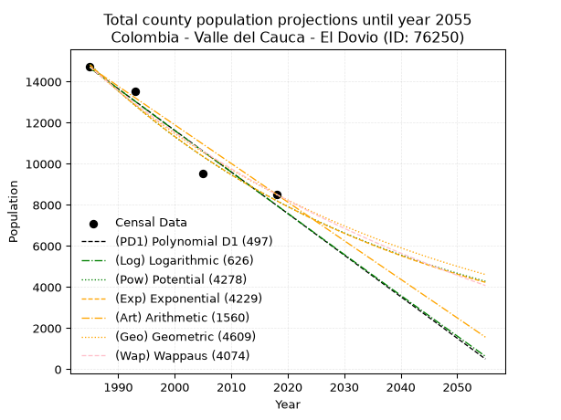
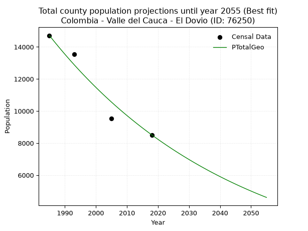
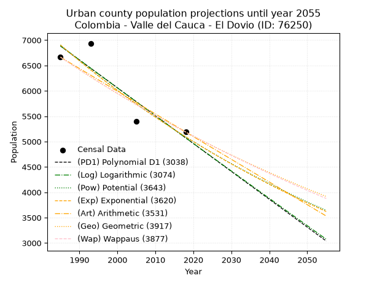
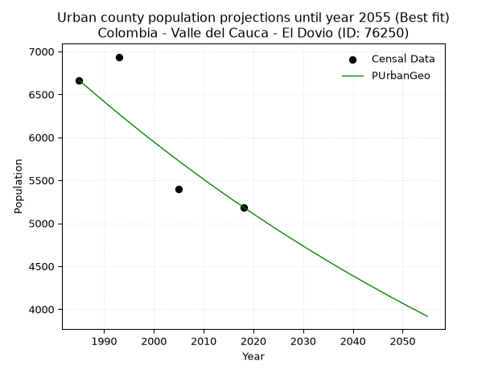
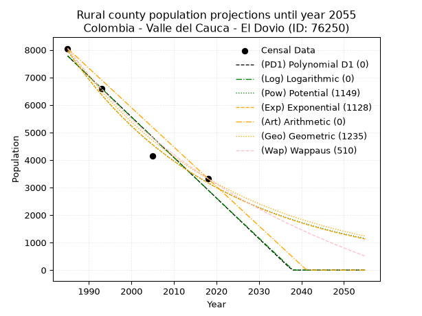
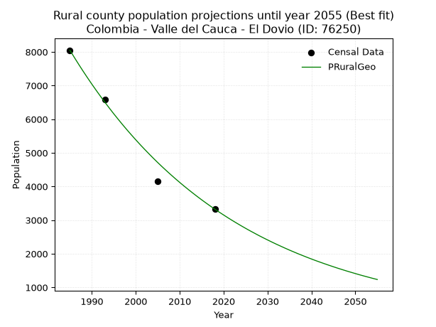

<div align="center">


</div>

# _“Population and Public Services Demand Projections (PPSD) until Year 2050 for Colombia - Valle del Cauca - El Dovio (ID: 76250)”_
Keywords: `population` `public-service` `projection` `lineal` `polynomial` `logarithmic` `potential` `exponential` `arithmetic` `geometric` `wappaus` `dane` `colombia` `south-america`

PPSD are analytical estimates used by governments and planners to anticipate future changes in population size, age distribution, and the resulting community needs for utilities, healthcare, education, and infrastructure as sizing future water treatment facilities, electrical grids, and road networks based on spatial growth.

> **General running parameters**: • app_version: _v20260806_. • Python version: _3.14.7_. • Pandas version: _3.0.5_. • NumPy version: _2.5.1_. • Creates, save and include plots into reports (create_plot): _True_. • Projection until year: _2050_. • Process polynomial degree 2 and up: _False_. • Process Wappaus: _True_. • Process Wappaus: _True_. • Set negative values to zero: _True_. • Set infinite values to zero: _True_. • Drop dataset notes: _True_. 
<div align="center">

Dynamic map: [:earth_americas:Google](http://maps.google.com/maps?q=4.510451889,-76.2370839) [:earth_americas:OSM](https://www.openstreetmap.org/#map=18/4.510451889/-76.2370839&layers=P) [:earth_americas:Bing](https://www.bing.com/maps?cp=4.510451889~-76.2370839&lvl=18) [:earth_americas:Apple](https://maps.apple.com/frame?center=4.510451889%2C-76.2370839&span=0.003%2C0.006)

</div>


<div align="center">

```geojson
{
  "type": "Feature",
  "geometry": {
    "type": "Point", 
    "coordinates": [-76.2370839, 4.510451889]
  }, 
  "properties": {
    "Name": "Colombia - Valle del Cauca - El Dovio (ID: 76250)"
  }
}
```

</div>


## 0. Census Data (4 records)

Census data are official statistics collected by a government about the people and housing in a country. They usually include counts of total population, age, sex, race, income, education, and jobs.

📅Global census file: [Population.xlsx](../data/Population.xlsx)

| Source   |   Year |   CountryID | CountryName   |   StateID | StateName       |   CountyID | CountyName   |   PTotal |   PUrban |   PRural |
|:---------|-------:|------------:|:--------------|----------:|:----------------|-----------:|:-------------|---------:|---------:|---------:|
| DANE     |   1985 |          57 | Colombia      |        76 | Valle del Cauca |      76250 | El Dovio     |    14714 |     6664 |     8050 |
| DANE     |   1993 |          57 | Colombia      |        76 | Valle del Cauca |      76250 | El Dovio     |    13530 |     6937 |     6593 |
| DANE     |   2005 |          57 | Colombia      |        76 | Valle Del Cauca |      76250 | El Dovio     |     9548 |     5396 |     4152 |
| DANE     |   2018 |          57 | Colombia      |        76 | Valle del Cauca |      76250 | El Dovio     |     8513 |     5187 |     3326 |

> 🔥Some records could had specific notes about the registered values or the corresponding urban or rural distribution.

## 1. Total

### 1.1. Coefficients and Parameters

* (PD1) Polynomial Deg 1: -202.3641107988749, 416355.06262544956 (lineal)
* (Log) Logarithmic: -405200.35715754144, 3091507.4118263507
* (Pow) Potential: -35.87516311336941, 122.47889000587519
* (Exp) Exponential: -0.017918760812654002, 4.151827390460305e+19
* (Art) Arithmetic: Year diff. 2018 - 1985 = 33, Population diff. 8513 - 14714 = -6201, Annual growth = -187.9090909090909
* (Geo) Geometric: Year diff. 2018 - 1985 = 33, Population diff. 8513 - 14714 = -6201, Annual growth % = -0.01644524603424824
* (Wap) Wappaus: i = -1.6180229122064056, Condition values only valid for < 200)

<sub>
Wappaus condition values: ['-0.00', '-1.62', '-3.24', '-4.85', '-6.47', '-8.09', '-9.71', '-11.33', '-12.94', '-14.56', '-16.18', '-17.80', '-19.42', '-21.03', '-22.65', '-24.27', '-25.89', '-27.51', '-29.12', '-30.74', '-32.36', '-33.98', '-35.60', '-37.21', '-38.83', '-40.45', '-42.07', '-43.69', '-45.30', '-46.92', '-48.54', '-50.16', '-51.78', '-53.39', '-55.01', '-56.63', '-58.25', '-59.87', '-61.48', '-63.10', '-64.72', '-66.34', '-67.96', '-69.57', '-71.19', '-72.81', '-74.43', '-76.05', '-77.67', '-79.28', '-80.90', '-82.52', '-84.14', '-85.76', '-87.37', '-88.99', '-90.61', '-92.23', '-93.85', '-95.46', '-97.08', '-98.70', '-100.32', '-101.94', '-103.55', '-105.17']
</sub>


### 1.2. Projected Dataset

|   Year |   CountyID |   PTotalPD1 |   PTotalLog |   PTotalPow |   PTotalExp |   PTotalArt |   PTotalGeo |   PTotalWap |
|-------:|-----------:|------------:|------------:|------------:|------------:|------------:|------------:|------------:|
|   1985 |      76250 |       14662 |       14669 |       14832 |       14823 |       14714 |       14714 |       14714 |
|   1986 |      76250 |       14460 |       14465 |       14566 |       14560 |       14526 |       14472 |       14478 |
|   1987 |      76250 |       14258 |       14261 |       14306 |       14301 |       14338 |       14234 |       14245 |
|   1988 |      76250 |       14055 |       14058 |       14050 |       14047 |       14150 |       14000 |       14017 |
|   1989 |      76250 |       13853 |       13854 |       13798 |       13798 |       13962 |       13770 |       13792 |
|   1990 |      76250 |       13650 |       13650 |       13552 |       13553 |       13774 |       13543 |       13570 |
|   1991 |      76250 |       13448 |       13447 |       13310 |       13312 |       13587 |       13321 |       13352 |
|   1992 |      76250 |       13246 |       13243 |       13072 |       13075 |       13399 |       13101 |       13137 |
|   1993 |      76250 |       13043 |       13040 |       12839 |       12843 |       13211 |       12886 |       12925 |
|   1994 |      76250 |       12841 |       12836 |       12610 |       12615 |       13023 |       12674 |       12717 |
|   1995 |      76250 |       12639 |       12633 |       12385 |       12391 |       12835 |       12466 |       12511 |
|   1996 |      76250 |       12436 |       12430 |       12164 |       12171 |       12647 |       12261 |       12309 |
|   1997 |      76250 |       12234 |       12227 |       11948 |       11955 |       12459 |       12059 |       12110 |
|   1998 |      76250 |       12032 |       12024 |       11735 |       11743 |       12271 |       11861 |       11914 |
|   1999 |      76250 |       11829 |       11822 |       11526 |       11534 |       12083 |       11666 |       11720 |
|   2000 |      76250 |       11627 |       11619 |       11321 |       11329 |       11895 |       11474 |       11529 |
|   2001 |      76250 |       11424 |       11416 |       11120 |       11128 |       11707 |       11285 |       11341 |
|   2002 |      76250 |       11222 |       11214 |       10923 |       10930 |       11520 |       11100 |       11156 |
|   2003 |      76250 |       11020 |       11012 |       10729 |       10736 |       11332 |       10917 |       10973 |
|   2004 |      76250 |       10817 |       10809 |       10538 |       10546 |       11144 |       10737 |       10793 |
|   2005 |      76250 |       10615 |       10607 |       10351 |       10358 |       10956 |       10561 |       10616 |
|   2006 |      76250 |       10413 |       10405 |       10168 |       10174 |       10768 |       10387 |       10440 |
|   2007 |      76250 |       10210 |       10203 |        9988 |        9994 |       10580 |       10216 |       10268 |
|   2008 |      76250 |       10008 |       10001 |        9811 |        9816 |       10392 |       10048 |       10097 |
|   2009 |      76250 |        9806 |        9800 |        9637 |        9642 |       10204 |        9883 |        9929 |
|   2010 |      76250 |        9603 |        9598 |        9467 |        9471 |       10016 |        9721 |        9763 |
|   2011 |      76250 |        9401 |        9397 |        9299 |        9302 |        9828 |        9561 |        9600 |
|   2012 |      76250 |        9198 |        9195 |        9135 |        9137 |        9640 |        9404 |        9438 |
|   2013 |      76250 |        8996 |        8994 |        8973 |        8975 |        9453 |        9249 |        9279 |
|   2014 |      76250 |        8794 |        8792 |        8815 |        8816 |        9265 |        9097 |        9122 |
|   2015 |      76250 |        8591 |        8591 |        8659 |        8659 |        9077 |        8947 |        8967 |
|   2016 |      76250 |        8389 |        8390 |        8507 |        8505 |        8889 |        8800 |        8813 |
|   2017 |      76250 |        8187 |        8189 |        8357 |        8354 |        8701 |        8655 |        8662 |
|   2018 |      76250 |        7984 |        7989 |        8209 |        8206 |        8513 |        8513 |        8513 |
|   2019 |      76250 |        7782 |        7788 |        8065 |        8060 |        8325 |        8373 |        8366 |
|   2020 |      76250 |        7580 |        7587 |        7923 |        7917 |        8137 |        8235 |        8220 |
|   2021 |      76250 |        7377 |        7387 |        7783 |        7776 |        7949 |        8100 |        8076 |
|   2022 |      76250 |        7175 |        7186 |        7646 |        7638 |        7761 |        7967 |        7935 |
|   2023 |      76250 |        6972 |        6986 |        7512 |        7503 |        7573 |        7836 |        7794 |
|   2024 |      76250 |        6770 |        6786 |        7380 |        7369 |        7386 |        7707 |        7656 |
|   2025 |      76250 |        6568 |        6585 |        7250 |        7239 |        7198 |        7580 |        7519 |
|   2026 |      76250 |        6365 |        6385 |        7123 |        7110 |        7010 |        7455 |        7384 |
|   2027 |      76250 |        6163 |        6185 |        6998 |        6984 |        6822 |        7333 |        7251 |
|   2028 |      76250 |        5961 |        5986 |        6875 |        6860 |        6634 |        7212 |        7119 |
|   2029 |      76250 |        5758 |        5786 |        6755 |        6738 |        6446 |        7094 |        6989 |
|   2030 |      76250 |        5556 |        5586 |        6636 |        6618 |        6258 |        6977 |        6860 |
|   2031 |      76250 |        5354 |        5387 |        6520 |        6501 |        6070 |        6862 |        6733 |
|   2032 |      76250 |        5151 |        5187 |        6406 |        6385 |        5882 |        6749 |        6607 |
|   2033 |      76250 |        4949 |        4988 |        6294 |        6272 |        5694 |        6638 |        6483 |
|   2034 |      76250 |        4746 |        4789 |        6184 |        6160 |        5506 |        6529 |        6360 |
|   2035 |      76250 |        4544 |        4589 |        6076 |        6051 |        5319 |        6422 |        6239 |
|   2036 |      76250 |        4342 |        4390 |        5970 |        5944 |        5131 |        6316 |        6119 |
|   2037 |      76250 |        4139 |        4191 |        5865 |        5838 |        4943 |        6212 |        6000 |
|   2038 |      76250 |        3937 |        3992 |        5763 |        5734 |        4755 |        6110 |        5883 |
|   2039 |      76250 |        3735 |        3794 |        5662 |        5633 |        4567 |        6010 |        5767 |
|   2040 |      76250 |        3532 |        3595 |        5564 |        5532 |        4379 |        5911 |        5652 |
|   2041 |      76250 |        3330 |        3396 |        5467 |        5434 |        4191 |        5814 |        5539 |
|   2042 |      76250 |        3128 |        3198 |        5372 |        5338 |        4003 |        5718 |        5426 |
|   2043 |      76250 |        2925 |        3000 |        5278 |        5243 |        3815 |        5624 |        5316 |
|   2044 |      76250 |        2723 |        2801 |        5186 |        5150 |        3627 |        5532 |        5206 |
|   2045 |      76250 |        2520 |        2603 |        5096 |        5058 |        3439 |        5441 |        5097 |
|   2046 |      76250 |        2318 |        2405 |        5007 |        4969 |        3252 |        5351 |        4990 |
|   2047 |      76250 |        2116 |        2207 |        4920 |        4880 |        3064 |        5263 |        4884 |
|   2048 |      76250 |        1913 |        2009 |        4835 |        4794 |        2876 |        5177 |        4779 |
|   2049 |      76250 |        1711 |        1811 |        4751 |        4708 |        2688 |        5091 |        4675 |
|   2050 |      76250 |        1509 |        1614 |        4669 |        4625 |        2500 |        5008 |        4572 |
<div align="center">

</img>

</div>


### 1.3. Best fit with absolute error and relative error (%)

Relative error puts that difference into context by dividing the absolute error by the true value, creating a unitless ratio or percentage that shows the scale of the mistake.

Absolute and relative error

|   Year | Source   |   CountryID | CountryName   |   StateID | StateName       |   CountyID_x | CountyName   |   PTotal |   PUrban |   PRural |   CountyID_y |   PTotalPD1 |   PTotalLog |   PTotalPow |   PTotalExp |   PTotalArt |   PTotalGeo |   PTotalWap |   PTotalPD1AbsError |   PTotalLogAbsError |   PTotalPowAbsError |   PTotalExpAbsError |   PTotalArtAbsError |   PTotalGeoAbsError |   PTotalWapAbsError |   PTotalPD1RelError |   PTotalLogRelError |   PTotalPowRelError |   PTotalExpRelError |   PTotalArtRelError |   PTotalGeoRelError |   PTotalWapRelError |
|-------:|:---------|------------:|:--------------|----------:|:----------------|-------------:|:-------------|---------:|---------:|---------:|-------------:|------------:|------------:|------------:|------------:|------------:|------------:|------------:|--------------------:|--------------------:|--------------------:|--------------------:|--------------------:|--------------------:|--------------------:|--------------------:|--------------------:|--------------------:|--------------------:|--------------------:|--------------------:|--------------------:|
|   1985 | DANE     |          57 | Colombia      |        76 | Valle del Cauca |        76250 | El Dovio     |    14714 |     6664 |     8050 |        76250 |       14662 |       14669 |       14832 |       14823 |       14714 |       14714 |       14714 |                  52 |                  45 |                 118 |                 109 |                   0 |                   0 |                   0 |            0.353405 |            0.305831 |            0.801957 |            0.740791 |             0       |             0       |             0       |
|   1993 | DANE     |          57 | Colombia      |        76 | Valle del Cauca |        76250 | El Dovio     |    13530 |     6937 |     6593 |        76250 |       13043 |       13040 |       12839 |       12843 |       13211 |       12886 |       12925 |                 487 |                 490 |                 691 |                 687 |                 319 |                 644 |                 605 |            3.59941  |            3.62158  |            5.10717  |            5.07761  |             2.35772 |             4.75979 |             4.47154 |
|   2005 | DANE     |          57 | Colombia      |        76 | Valle Del Cauca |        76250 | El Dovio     |     9548 |     5396 |     4152 |        76250 |       10615 |       10607 |       10351 |       10358 |       10956 |       10561 |       10616 |                1067 |                1059 |                 803 |                 810 |                1408 |                1013 |                1068 |           11.1751   |           11.0913   |            8.41014  |            8.48345  |            14.7465  |            10.6096  |            11.1856  |
|   2018 | DANE     |          57 | Colombia      |        76 | Valle del Cauca |        76250 | El Dovio     |     8513 |     5187 |     3326 |        76250 |        7984 |        7989 |        8209 |        8206 |        8513 |        8513 |        8513 |                 529 |                 524 |                 304 |                 307 |                   0 |                   0 |                   0 |            6.21403  |            6.15529  |            3.57101  |            3.60625  |             0       |             0       |             0       |

Relative error mean

| Method    |   RelError | Best   |
|:----------|-----------:|:-------|
| PTotalPD1 |    5.33549 |        |
| PTotalLog |    5.29351 |        |
| PTotalPow |    4.47257 |        |
| PTotalExp |    4.47702 |        |
| PTotalArt |    4.27607 |        |
| PTotalGeo |    3.84234 | True   |
| PTotalWap |    3.91428 |        |

💙Best method: _**PTotalGeo**_
<div align="center">

</img>

</div>


### 1.4. Fresh water supply demand in liters per capita per day (lpcd)

The fresh water supply demand typically ranges from 100 to 300 liters per capita per day (lpcd) for standard domestic and municipal planning, though absolute survival minimums set by the World Health Organization are as low as 7.5 to 20 liters per day, and total consumption in high-income nations can exceed 400 liters.

> `CZ`: Level in meters above the sea level (masl).<br> `WS`: Fresh water supply demand in liters per capita per day (lpcd or l/h/d).<br> `WSAll`: Zonal fresh water supply demand in liters per second (l/s).<br> `A`: Zonal area in square meters.

Reference values (RAS Colombia)

|    CZ |   WS |
|------:|-----:|
|  1000 |  120 |
|  2000 |  130 |
| 99999 |  140 |

County shapefile geometry properties and water supply values

|   CountyID |      ATotal |   CZTotal |   WSTotal |
|-----------:|------------:|----------:|----------:|
|      76250 | 2.36029e+08 |   1510.41 |       130 |

Projected values for best method: PTotalGeo

|   CountyID |   Year |   PTotalGeo |   WSTotal |   WSTotalAll |
|-----------:|-------:|------------:|----------:|-------------:|
|      76250 |   1985 |       14714 |       130 |     22.1391  |
|      76250 |   1986 |       14472 |       130 |     21.775   |
|      76250 |   1987 |       14234 |       130 |     21.4169  |
|      76250 |   1988 |       14000 |       130 |     21.0648  |
|      76250 |   1989 |       13770 |       130 |     20.7188  |
|      76250 |   1990 |       13543 |       130 |     20.3772  |
|      76250 |   1991 |       13321 |       130 |     20.0432  |
|      76250 |   1992 |       13101 |       130 |     19.7122  |
|      76250 |   1993 |       12886 |       130 |     19.3887  |
|      76250 |   1994 |       12674 |       130 |     19.0697  |
|      76250 |   1995 |       12466 |       130 |     18.7567  |
|      76250 |   1996 |       12261 |       130 |     18.4483  |
|      76250 |   1997 |       12059 |       130 |     18.1443  |
|      76250 |   1998 |       11861 |       130 |     17.8464  |
|      76250 |   1999 |       11666 |       130 |     17.553   |
|      76250 |   2000 |       11474 |       130 |     17.2641  |
|      76250 |   2001 |       11285 |       130 |     16.9797  |
|      76250 |   2002 |       11100 |       130 |     16.7014  |
|      76250 |   2003 |       10917 |       130 |     16.426   |
|      76250 |   2004 |       10737 |       130 |     16.1552  |
|      76250 |   2005 |       10561 |       130 |     15.8904  |
|      76250 |   2006 |       10387 |       130 |     15.6286  |
|      76250 |   2007 |       10216 |       130 |     15.3713  |
|      76250 |   2008 |       10048 |       130 |     15.1185  |
|      76250 |   2009 |        9883 |       130 |     14.8703  |
|      76250 |   2010 |        9721 |       130 |     14.6265  |
|      76250 |   2011 |        9561 |       130 |     14.3858  |
|      76250 |   2012 |        9404 |       130 |     14.1495  |
|      76250 |   2013 |        9249 |       130 |     13.9163  |
|      76250 |   2014 |        9097 |       130 |     13.6876  |
|      76250 |   2015 |        8947 |       130 |     13.4619  |
|      76250 |   2016 |        8800 |       130 |     13.2407  |
|      76250 |   2017 |        8655 |       130 |     13.0226  |
|      76250 |   2018 |        8513 |       130 |     12.8089  |
|      76250 |   2019 |        8373 |       130 |     12.5983  |
|      76250 |   2020 |        8235 |       130 |     12.3906  |
|      76250 |   2021 |        8100 |       130 |     12.1875  |
|      76250 |   2022 |        7967 |       130 |     11.9874  |
|      76250 |   2023 |        7836 |       130 |     11.7903  |
|      76250 |   2024 |        7707 |       130 |     11.5962  |
|      76250 |   2025 |        7580 |       130 |     11.4051  |
|      76250 |   2026 |        7455 |       130 |     11.217   |
|      76250 |   2027 |        7333 |       130 |     11.0334  |
|      76250 |   2028 |        7212 |       130 |     10.8514  |
|      76250 |   2029 |        7094 |       130 |     10.6738  |
|      76250 |   2030 |        6977 |       130 |     10.4978  |
|      76250 |   2031 |        6862 |       130 |     10.3248  |
|      76250 |   2032 |        6749 |       130 |     10.1547  |
|      76250 |   2033 |        6638 |       130 |      9.98773 |
|      76250 |   2034 |        6529 |       130 |      9.82373 |
|      76250 |   2035 |        6422 |       130 |      9.66273 |
|      76250 |   2036 |        6316 |       130 |      9.50324 |
|      76250 |   2037 |        6212 |       130 |      9.34676 |
|      76250 |   2038 |        6110 |       130 |      9.19329 |
|      76250 |   2039 |        6010 |       130 |      9.04282 |
|      76250 |   2040 |        5911 |       130 |      8.89387 |
|      76250 |   2041 |        5814 |       130 |      8.74792 |
|      76250 |   2042 |        5718 |       130 |      8.60347 |
|      76250 |   2043 |        5624 |       130 |      8.46204 |
|      76250 |   2044 |        5532 |       130 |      8.32361 |
|      76250 |   2045 |        5441 |       130 |      8.18669 |
|      76250 |   2046 |        5351 |       130 |      8.05127 |
|      76250 |   2047 |        5263 |       130 |      7.91887 |
|      76250 |   2048 |        5177 |       130 |      7.78947 |
|      76250 |   2049 |        5091 |       130 |      7.66007 |
|      76250 |   2050 |        5008 |       130 |      7.53519 |

## 2. Urban

### 2.1. Coefficients and Parameters

* (PD1) Polynomial Deg 1: -54.94821356884761, 115956.16419108745 (lineal)
* (Log) Logarithmic: -109987.26658524679, 842060.0946971005
* (Pow) Potential: -18.453224753824617, 64.69346807058328
* (Exp) Exponential: -0.009219022852126259, 611668572577.9131
* (Art) Arithmetic: Year diff. 2018 - 1985 = 33, Population diff. 5187 - 6664 = -1477, Annual growth = -44.75757575757576
* (Geo) Geometric: Year diff. 2018 - 1985 = 33, Population diff. 5187 - 6664 = -1477, Annual growth % = -0.00756410794392548
* (Wap) Wappaus: i = -0.7553383808552149, Condition values only valid for < 200)

<sub>
Wappaus condition values: ['-0.00', '-0.76', '-1.51', '-2.27', '-3.02', '-3.78', '-4.53', '-5.29', '-6.04', '-6.80', '-7.55', '-8.31', '-9.06', '-9.82', '-10.57', '-11.33', '-12.09', '-12.84', '-13.60', '-14.35', '-15.11', '-15.86', '-16.62', '-17.37', '-18.13', '-18.88', '-19.64', '-20.39', '-21.15', '-21.90', '-22.66', '-23.42', '-24.17', '-24.93', '-25.68', '-26.44', '-27.19', '-27.95', '-28.70', '-29.46', '-30.21', '-30.97', '-31.72', '-32.48', '-33.23', '-33.99', '-34.75', '-35.50', '-36.26', '-37.01', '-37.77', '-38.52', '-39.28', '-40.03', '-40.79', '-41.54', '-42.30', '-43.05', '-43.81', '-44.56', '-45.32', '-46.08', '-46.83', '-47.59', '-48.34', '-49.10']
</sub>


### 2.2. Projected Dataset

|   Year |   CountyID |   PUrbanPD1 |   PUrbanLog |   PUrbanPow |   PUrbanExp |   PUrbanArt |   PUrbanGeo |   PUrbanWap |
|-------:|-----------:|------------:|------------:|------------:|------------:|------------:|------------:|------------:|
|   1985 |      76250 |        6884 |        6886 |        6905 |        6903 |        6664 |        6664 |        6664 |
|   1986 |      76250 |        6829 |        6830 |        6841 |        6840 |        6619 |        6614 |        6614 |
|   1987 |      76250 |        6774 |        6775 |        6778 |        6777 |        6574 |        6564 |        6564 |
|   1988 |      76250 |        6719 |        6720 |        6715 |        6715 |        6530 |        6514 |        6515 |
|   1989 |      76250 |        6664 |        6664 |        6653 |        6653 |        6485 |        6465 |        6466 |
|   1990 |      76250 |        6609 |        6609 |        6592 |        6592 |        6440 |        6416 |        6417 |
|   1991 |      76250 |        6554 |        6554 |        6531 |        6531 |        6395 |        6367 |        6369 |
|   1992 |      76250 |        6499 |        6498 |        6471 |        6471 |        6351 |        6319 |        6321 |
|   1993 |      76250 |        6444 |        6443 |        6411 |        6412 |        6306 |        6271 |        6273 |
|   1994 |      76250 |        6389 |        6388 |        6352 |        6353 |        6261 |        6224 |        6226 |
|   1995 |      76250 |        6334 |        6333 |        6293 |        6295 |        6216 |        6177 |        6179 |
|   1996 |      76250 |        6280 |        6278 |        6235 |        6237 |        6172 |        6130 |        6132 |
|   1997 |      76250 |        6225 |        6223 |        6178 |        6180 |        6127 |        6084 |        6086 |
|   1998 |      76250 |        6170 |        6168 |        6121 |        6123 |        6082 |        6038 |        6040 |
|   1999 |      76250 |        6115 |        6113 |        6065 |        6067 |        6037 |        5992 |        5995 |
|   2000 |      76250 |        6060 |        6058 |        6009 |        6011 |        5993 |        5947 |        5949 |
|   2001 |      76250 |        6005 |        6003 |        5954 |        5956 |        5948 |        5902 |        5905 |
|   2002 |      76250 |        5950 |        5948 |        5899 |        5902 |        5903 |        5857 |        5860 |
|   2003 |      76250 |        5895 |        5893 |        5845 |        5847 |        5858 |        5813 |        5816 |
|   2004 |      76250 |        5840 |        5838 |        5792 |        5794 |        5814 |        5769 |        5772 |
|   2005 |      76250 |        5785 |        5783 |        5739 |        5741 |        5769 |        5725 |        5728 |
|   2006 |      76250 |        5730 |        5728 |        5686 |        5688 |        5724 |        5682 |        5685 |
|   2007 |      76250 |        5675 |        5673 |        5634 |        5636 |        5679 |        5639 |        5642 |
|   2008 |      76250 |        5620 |        5619 |        5582 |        5584 |        5635 |        5596 |        5599 |
|   2009 |      76250 |        5565 |        5564 |        5531 |        5533 |        5590 |        5554 |        5556 |
|   2010 |      76250 |        5510 |        5509 |        5481 |        5482 |        5545 |        5512 |        5514 |
|   2011 |      76250 |        5455 |        5454 |        5431 |        5432 |        5500 |        5470 |        5472 |
|   2012 |      76250 |        5400 |        5400 |        5381 |        5382 |        5456 |        5429 |        5431 |
|   2013 |      76250 |        5345 |        5345 |        5332 |        5332 |        5411 |        5388 |        5389 |
|   2014 |      76250 |        5290 |        5290 |        5283 |        5284 |        5366 |        5347 |        5348 |
|   2015 |      76250 |        5236 |        5236 |        5235 |        5235 |        5321 |        5307 |        5308 |
|   2016 |      76250 |        5181 |        5181 |        5188 |        5187 |        5277 |        5266 |        5267 |
|   2017 |      76250 |        5126 |        5127 |        5140 |        5139 |        5232 |        5227 |        5227 |
|   2018 |      76250 |        5071 |        5072 |        5093 |        5092 |        5187 |        5187 |        5187 |
|   2019 |      76250 |        5016 |        5018 |        5047 |        5045 |        5142 |        5148 |        5147 |
|   2020 |      76250 |        4961 |        4963 |        5001 |        4999 |        5097 |        5109 |        5108 |
|   2021 |      76250 |        4906 |        4909 |        4956 |        4953 |        5053 |        5070 |        5069 |
|   2022 |      76250 |        4851 |        4854 |        4911 |        4908 |        5008 |        5032 |        5030 |
|   2023 |      76250 |        4796 |        4800 |        4866 |        4863 |        4963 |        4994 |        4991 |
|   2024 |      76250 |        4741 |        4746 |        4822 |        4818 |        4918 |        4956 |        4953 |
|   2025 |      76250 |        4686 |        4691 |        4778 |        4774 |        4874 |        4919 |        4915 |
|   2026 |      76250 |        4631 |        4637 |        4735 |        4730 |        4829 |        4881 |        4877 |
|   2027 |      76250 |        4576 |        4583 |        4692 |        4687 |        4784 |        4844 |        4839 |
|   2028 |      76250 |        4521 |        4528 |        4649 |        4644 |        4739 |        4808 |        4802 |
|   2029 |      76250 |        4466 |        4474 |        4607 |        4601 |        4695 |        4771 |        4765 |
|   2030 |      76250 |        4411 |        4420 |        4566 |        4559 |        4650 |        4735 |        4728 |
|   2031 |      76250 |        4356 |        4366 |        4524 |        4517 |        4605 |        4699 |        4691 |
|   2032 |      76250 |        4301 |        4312 |        4483 |        4476 |        4560 |        4664 |        4655 |
|   2033 |      76250 |        4246 |        4258 |        4443 |        4435 |        4516 |        4629 |        4619 |
|   2034 |      76250 |        4191 |        4204 |        4403 |        4394 |        4471 |        4594 |        4583 |
|   2035 |      76250 |        4137 |        4149 |        4363 |        4354 |        4426 |        4559 |        4547 |
|   2036 |      76250 |        4082 |        4095 |        4324 |        4314 |        4381 |        4524 |        4511 |
|   2037 |      76250 |        4027 |        4041 |        4285 |        4274 |        4337 |        4490 |        4476 |
|   2038 |      76250 |        3972 |        3987 |        4246 |        4235 |        4292 |        4456 |        4441 |
|   2039 |      76250 |        3917 |        3934 |        4208 |        4196 |        4247 |        4423 |        4406 |
|   2040 |      76250 |        3862 |        3880 |        4170 |        4157 |        4202 |        4389 |        4372 |
|   2041 |      76250 |        3807 |        3826 |        4132 |        4119 |        4158 |        4356 |        4337 |
|   2042 |      76250 |        3752 |        3772 |        4095 |        4081 |        4113 |        4323 |        4303 |
|   2043 |      76250 |        3697 |        3718 |        4058 |        4044 |        4068 |        4290 |        4269 |
|   2044 |      76250 |        3642 |        3664 |        4022 |        4007 |        4023 |        4258 |        4235 |
|   2045 |      76250 |        3587 |        3610 |        3986 |        3970 |        3979 |        4226 |        4202 |
|   2046 |      76250 |        3532 |        3557 |        3950 |        3934 |        3934 |        4194 |        4168 |
|   2047 |      76250 |        3477 |        3503 |        3914 |        3898 |        3889 |        4162 |        4135 |
|   2048 |      76250 |        3422 |        3449 |        3879 |        3862 |        3844 |        4130 |        4102 |
|   2049 |      76250 |        3367 |        3395 |        3845 |        3826 |        3800 |        4099 |        4070 |
|   2050 |      76250 |        3312 |        3342 |        3810 |        3791 |        3755 |        4068 |        4037 |
<div align="center">

</img>

</div>


### 2.3. Best fit with absolute error and relative error (%)

Relative error puts that difference into context by dividing the absolute error by the true value, creating a unitless ratio or percentage that shows the scale of the mistake.

Absolute and relative error

|   Year | Source   |   CountryID | CountryName   |   StateID | StateName       |   CountyID_x | CountyName   |   PTotal |   PUrban |   PRural |   CountyID_y |   PUrbanPD1 |   PUrbanLog |   PUrbanPow |   PUrbanExp |   PUrbanArt |   PUrbanGeo |   PUrbanWap |   PUrbanPD1AbsError |   PUrbanLogAbsError |   PUrbanPowAbsError |   PUrbanExpAbsError |   PUrbanArtAbsError |   PUrbanGeoAbsError |   PUrbanWapAbsError |   PUrbanPD1RelError |   PUrbanLogRelError |   PUrbanPowRelError |   PUrbanExpRelError |   PUrbanArtRelError |   PUrbanGeoRelError |   PUrbanWapRelError |
|-------:|:---------|------------:|:--------------|----------:|:----------------|-------------:|:-------------|---------:|---------:|---------:|-------------:|------------:|------------:|------------:|------------:|------------:|------------:|------------:|--------------------:|--------------------:|--------------------:|--------------------:|--------------------:|--------------------:|--------------------:|--------------------:|--------------------:|--------------------:|--------------------:|--------------------:|--------------------:|--------------------:|
|   1985 | DANE     |          57 | Colombia      |        76 | Valle del Cauca |        76250 | El Dovio     |    14714 |     6664 |     8050 |        76250 |        6884 |        6886 |        6905 |        6903 |        6664 |        6664 |        6664 |                 220 |                 222 |                 241 |                 239 |                   0 |                   0 |                   0 |             3.30132 |             3.33133 |             3.61645 |             3.58643 |             0       |             0       |             0       |
|   1993 | DANE     |          57 | Colombia      |        76 | Valle del Cauca |        76250 | El Dovio     |    13530 |     6937 |     6593 |        76250 |        6444 |        6443 |        6411 |        6412 |        6306 |        6271 |        6273 |                 493 |                 494 |                 526 |                 525 |                 631 |                 666 |                 664 |             7.10682 |             7.12123 |             7.58253 |             7.56811 |             9.09615 |             9.60069 |             9.57186 |
|   2005 | DANE     |          57 | Colombia      |        76 | Valle Del Cauca |        76250 | El Dovio     |     9548 |     5396 |     4152 |        76250 |        5785 |        5783 |        5739 |        5741 |        5769 |        5725 |        5728 |                 389 |                 387 |                 343 |                 345 |                 373 |                 329 |                 332 |             7.20904 |             7.17198 |             6.35656 |             6.39362 |             6.91253 |             6.09711 |             6.15271 |
|   2018 | DANE     |          57 | Colombia      |        76 | Valle del Cauca |        76250 | El Dovio     |     8513 |     5187 |     3326 |        76250 |        5071 |        5072 |        5093 |        5092 |        5187 |        5187 |        5187 |                 116 |                 115 |                  94 |                  95 |                   0 |                   0 |                   0 |             2.23636 |             2.21708 |             1.81222 |             1.8315  |             0       |             0       |             0       |

Relative error mean

| Method    |   RelError | Best   |
|:----------|-----------:|:-------|
| PUrbanPD1 |    4.96339 |        |
| PUrbanLog |    4.96041 |        |
| PUrbanPow |    4.84194 |        |
| PUrbanExp |    4.84492 |        |
| PUrbanArt |    4.00217 |        |
| PUrbanGeo |    3.92445 | True   |
| PUrbanWap |    3.93114 |        |

💙Best method: _**PUrbanGeo**_
<div align="center">

</img>

</div>


### 2.4. Fresh water supply demand in liters per capita per day (lpcd)

The fresh water supply demand typically ranges from 100 to 300 liters per capita per day (lpcd) for standard domestic and municipal planning, though absolute survival minimums set by the World Health Organization are as low as 7.5 to 20 liters per day, and total consumption in high-income nations can exceed 400 liters.

> `CZ`: Level in meters above the sea level (masl).<br> `WS`: Fresh water supply demand in liters per capita per day (lpcd or l/h/d).<br> `WSAll`: Zonal fresh water supply demand in liters per second (l/s).<br> `A`: Zonal area in square meters.

Reference values (RAS Colombia)

|    CZ |   WS |
|------:|-----:|
|  1000 |  120 |
|  2000 |  130 |
| 99999 |  140 |

County shapefile geometry properties and water supply values

|   CountyID |   AUrban |   CZUrban |   WSUrban |
|-----------:|---------:|----------:|----------:|
|      76250 |   974312 |   1434.88 |       130 |

Projected values for best method: PUrbanGeo

|   CountyID |   Year |   PUrbanGeo |   WSUrban |   WSUrbanAll |
|-----------:|-------:|------------:|----------:|-------------:|
|      76250 |   1985 |        6664 |       130 |     10.0269  |
|      76250 |   1986 |        6614 |       130 |      9.95162 |
|      76250 |   1987 |        6564 |       130 |      9.87639 |
|      76250 |   1988 |        6514 |       130 |      9.80116 |
|      76250 |   1989 |        6465 |       130 |      9.72743 |
|      76250 |   1990 |        6416 |       130 |      9.6537  |
|      76250 |   1991 |        6367 |       130 |      9.57998 |
|      76250 |   1992 |        6319 |       130 |      9.50775 |
|      76250 |   1993 |        6271 |       130 |      9.43553 |
|      76250 |   1994 |        6224 |       130 |      9.36481 |
|      76250 |   1995 |        6177 |       130 |      9.2941  |
|      76250 |   1996 |        6130 |       130 |      9.22338 |
|      76250 |   1997 |        6084 |       130 |      9.15417 |
|      76250 |   1998 |        6038 |       130 |      9.08495 |
|      76250 |   1999 |        5992 |       130 |      9.01574 |
|      76250 |   2000 |        5947 |       130 |      8.94803 |
|      76250 |   2001 |        5902 |       130 |      8.88032 |
|      76250 |   2002 |        5857 |       130 |      8.81262 |
|      76250 |   2003 |        5813 |       130 |      8.74641 |
|      76250 |   2004 |        5769 |       130 |      8.68021 |
|      76250 |   2005 |        5725 |       130 |      8.614   |
|      76250 |   2006 |        5682 |       130 |      8.54931 |
|      76250 |   2007 |        5639 |       130 |      8.48461 |
|      76250 |   2008 |        5596 |       130 |      8.41991 |
|      76250 |   2009 |        5554 |       130 |      8.35671 |
|      76250 |   2010 |        5512 |       130 |      8.29352 |
|      76250 |   2011 |        5470 |       130 |      8.23032 |
|      76250 |   2012 |        5429 |       130 |      8.16863 |
|      76250 |   2013 |        5388 |       130 |      8.10694 |
|      76250 |   2014 |        5347 |       130 |      8.04525 |
|      76250 |   2015 |        5307 |       130 |      7.98507 |
|      76250 |   2016 |        5266 |       130 |      7.92338 |
|      76250 |   2017 |        5227 |       130 |      7.8647  |
|      76250 |   2018 |        5187 |       130 |      7.80451 |
|      76250 |   2019 |        5148 |       130 |      7.74583 |
|      76250 |   2020 |        5109 |       130 |      7.68715 |
|      76250 |   2021 |        5070 |       130 |      7.62847 |
|      76250 |   2022 |        5032 |       130 |      7.5713  |
|      76250 |   2023 |        4994 |       130 |      7.51412 |
|      76250 |   2024 |        4956 |       130 |      7.45694 |
|      76250 |   2025 |        4919 |       130 |      7.40127 |
|      76250 |   2026 |        4881 |       130 |      7.3441  |
|      76250 |   2027 |        4844 |       130 |      7.28843 |
|      76250 |   2028 |        4808 |       130 |      7.23426 |
|      76250 |   2029 |        4771 |       130 |      7.17859 |
|      76250 |   2030 |        4735 |       130 |      7.12442 |
|      76250 |   2031 |        4699 |       130 |      7.07025 |
|      76250 |   2032 |        4664 |       130 |      7.01759 |
|      76250 |   2033 |        4629 |       130 |      6.96493 |
|      76250 |   2034 |        4594 |       130 |      6.91227 |
|      76250 |   2035 |        4559 |       130 |      6.85961 |
|      76250 |   2036 |        4524 |       130 |      6.80694 |
|      76250 |   2037 |        4490 |       130 |      6.75579 |
|      76250 |   2038 |        4456 |       130 |      6.70463 |
|      76250 |   2039 |        4423 |       130 |      6.65498 |
|      76250 |   2040 |        4389 |       130 |      6.60382 |
|      76250 |   2041 |        4356 |       130 |      6.55417 |
|      76250 |   2042 |        4323 |       130 |      6.50451 |
|      76250 |   2043 |        4290 |       130 |      6.45486 |
|      76250 |   2044 |        4258 |       130 |      6.40671 |
|      76250 |   2045 |        4226 |       130 |      6.35856 |
|      76250 |   2046 |        4194 |       130 |      6.31042 |
|      76250 |   2047 |        4162 |       130 |      6.26227 |
|      76250 |   2048 |        4130 |       130 |      6.21412 |
|      76250 |   2049 |        4099 |       130 |      6.16748 |
|      76250 |   2050 |        4068 |       130 |      6.12083 |

## 3. Rural

### 3.1. Coefficients and Parameters

* (PD1) Polynomial Deg 1: -147.41589723002744, 300398.8984343624 (lineal)
* (Log) Logarithmic: -295213.0905722946, 2249447.317129251
* (Pow) Potential: -55.897210853355794, 188.23719674934296
* (Exp) Exponential: -0.027919042029278106, 9.321111318351467e+27
* (Art) Arithmetic: Year diff. 2018 - 1985 = 33, Population diff. 3326 - 8050 = -4724, Annual growth = -143.15151515151516
* (Geo) Geometric: Year diff. 2018 - 1985 = 33, Population diff. 3326 - 8050 = -4724, Annual growth % = -0.026429366267737953
* (Wap) Wappaus: i = -2.5167284660955547, Condition values only valid for < 200)

<sub>
Wappaus condition values: ['-0.00', '-2.52', '-5.03', '-7.55', '-10.07', '-12.58', '-15.10', '-17.62', '-20.13', '-22.65', '-25.17', '-27.68', '-30.20', '-32.72', '-35.23', '-37.75', '-40.27', '-42.78', '-45.30', '-47.82', '-50.33', '-52.85', '-55.37', '-57.88', '-60.40', '-62.92', '-65.43', '-67.95', '-70.47', '-72.99', '-75.50', '-78.02', '-80.54', '-83.05', '-85.57', '-88.09', '-90.60', '-93.12', '-95.64', '-98.15', '-100.67', '-103.19', '-105.70', '-108.22', '-110.74', '-113.25', '-115.77', '-118.29', '-120.80', '-123.32', '-125.84', '-128.35', '-130.87', '-133.39', '-135.90', '-138.42', '-140.94', '-143.45', '-145.97', '-148.49', '-151.00', '-153.52', '-156.04', '-158.55', '-161.07', '-163.59']
</sub>


### 3.2. Projected Dataset

|   Year |   CountyID |   PRuralPD1 |   PRuralLog |   PRuralPow |   PRuralExp |   PRuralArt |   PRuralGeo |   PRuralWap |
|-------:|-----------:|------------:|------------:|------------:|------------:|------------:|------------:|------------:|
|   1985 |      76250 |        7778 |        7784 |        7972 |        7965 |        8050 |        8050 |        8050 |
|   1986 |      76250 |        7631 |        7635 |        7751 |        7745 |        7907 |        7837 |        7850 |
|   1987 |      76250 |        7484 |        7487 |        7536 |        7532 |        7764 |        7630 |        7655 |
|   1988 |      76250 |        7336 |        7338 |        7327 |        7325 |        7621 |        7428 |        7464 |
|   1989 |      76250 |        7189 |        7190 |        7124 |        7123 |        7477 |        7232 |        7278 |
|   1990 |      76250 |        7041 |        7041 |        6926 |        6927 |        7334 |        7041 |        7097 |
|   1991 |      76250 |        6894 |        6893 |        6735 |        6736 |        7191 |        6855 |        6920 |
|   1992 |      76250 |        6746 |        6745 |        6548 |        6551 |        7048 |        6674 |        6747 |
|   1993 |      76250 |        6599 |        6596 |        6367 |        6370 |        6905 |        6497 |        6577 |
|   1994 |      76250 |        6452 |        6448 |        6191 |        6195 |        6762 |        6326 |        6412 |
|   1995 |      76250 |        6304 |        6300 |        6020 |        6025 |        6618 |        6158 |        6250 |
|   1996 |      76250 |        6157 |        6152 |        5854 |        5859 |        6475 |        5996 |        6092 |
|   1997 |      76250 |        6009 |        6005 |        5692 |        5697 |        6332 |        5837 |        5938 |
|   1998 |      76250 |        5862 |        5857 |        5535 |        5540 |        6189 |        5683 |        5787 |
|   1999 |      76250 |        5715 |        5709 |        5382 |        5388 |        6046 |        5533 |        5638 |
|   2000 |      76250 |        5567 |        5561 |        5234 |        5240 |        5903 |        5387 |        5494 |
|   2001 |      76250 |        5420 |        5414 |        5090 |        5095 |        5760 |        5244 |        5352 |
|   2002 |      76250 |        5272 |        5266 |        4950 |        4955 |        5616 |        5106 |        5213 |
|   2003 |      76250 |        5125 |        5119 |        4813 |        4819 |        5473 |        4971 |        5077 |
|   2004 |      76250 |        4977 |        4972 |        4681 |        4686 |        5330 |        4839 |        4943 |
|   2005 |      76250 |        4830 |        4824 |        4552 |        4557 |        5187 |        4711 |        4813 |
|   2006 |      76250 |        4683 |        4677 |        4427 |        4431 |        5044 |        4587 |        4685 |
|   2007 |      76250 |        4535 |        4530 |        4305 |        4309 |        4901 |        4466 |        4559 |
|   2008 |      76250 |        4388 |        4383 |        4187 |        4191 |        4758 |        4348 |        4436 |
|   2009 |      76250 |        4240 |        4236 |        4072 |        4075 |        4614 |        4233 |        4316 |
|   2010 |      76250 |        4093 |        4089 |        3961 |        3963 |        4471 |        4121 |        4197 |
|   2011 |      76250 |        3946 |        3942 |        3852 |        3854 |        4328 |        4012 |        4081 |
|   2012 |      76250 |        3798 |        3795 |        3746 |        3748 |        4185 |        3906 |        3967 |
|   2013 |      76250 |        3651 |        3649 |        3644 |        3645 |        4042 |        3803 |        3855 |
|   2014 |      76250 |        3503 |        3502 |        3544 |        3544 |        3899 |        3702 |        3746 |
|   2015 |      76250 |        3356 |        3356 |        3447 |        3447 |        3755 |        3604 |        3638 |
|   2016 |      76250 |        3208 |        3209 |        3353 |        3352 |        3612 |        3509 |        3532 |
|   2017 |      76250 |        3061 |        3063 |        3261 |        3260 |        3469 |        3416 |        3428 |
|   2018 |      76250 |        2914 |        2916 |        3172 |        3170 |        3326 |        3326 |        3326 |
|   2019 |      76250 |        2766 |        2770 |        3085 |        3083 |        3183 |        3238 |        3226 |
|   2020 |      76250 |        2619 |        2624 |        3001 |        2998 |        3040 |        3153 |        3127 |
|   2021 |      76250 |        2471 |        2478 |        2919 |        2915 |        2897 |        3069 |        3030 |
|   2022 |      76250 |        2324 |        2332 |        2840 |        2835 |        2753 |        2988 |        2935 |
|   2023 |      76250 |        2177 |        2186 |        2762 |        2757 |        2610 |        2909 |        2842 |
|   2024 |      76250 |        2029 |        2040 |        2687 |        2681 |        2467 |        2832 |        2750 |
|   2025 |      76250 |        1882 |        1894 |        2614 |        2607 |        2324 |        2757 |        2659 |
|   2026 |      76250 |        1734 |        1748 |        2543 |        2535 |        2181 |        2684 |        2571 |
|   2027 |      76250 |        1587 |        1603 |        2473 |        2466 |        2038 |        2614 |        2483 |
|   2028 |      76250 |        1439 |        1457 |        2406 |        2398 |        1894 |        2544 |        2397 |
|   2029 |      76250 |        1292 |        1312 |        2341 |        2332 |        1751 |        2477 |        2312 |
|   2030 |      76250 |        1145 |        1166 |        2277 |        2267 |        1608 |        2412 |        2229 |
|   2031 |      76250 |         997 |        1021 |        2215 |        2205 |        1465 |        2348 |        2147 |
|   2032 |      76250 |         850 |         875 |        2155 |        2144 |        1322 |        2286 |        2067 |
|   2033 |      76250 |         702 |         730 |        2097 |        2085 |        1179 |        2226 |        1987 |
|   2034 |      76250 |         555 |         585 |        2040 |        2028 |        1036 |        2167 |        1909 |
|   2035 |      76250 |         408 |         440 |        1985 |        1972 |         892 |        2109 |        1832 |
|   2036 |      76250 |         260 |         295 |        1931 |        1918 |         749 |        2054 |        1757 |
|   2037 |      76250 |         113 |         150 |        1879 |        1865 |         606 |        1999 |        1682 |
|   2038 |      76250 |           0 |           5 |        1828 |        1814 |         463 |        1947 |        1608 |
|   2039 |      76250 |           0 |           0 |        1778 |        1764 |         320 |        1895 |        1536 |
|   2040 |      76250 |           0 |           0 |        1730 |        1715 |         177 |        1845 |        1465 |
|   2041 |      76250 |           0 |           0 |        1683 |        1668 |          34 |        1796 |        1395 |
|   2042 |      76250 |           0 |           0 |        1638 |        1622 |           0 |        1749 |        1325 |
|   2043 |      76250 |           0 |           0 |        1594 |        1577 |           0 |        1703 |        1257 |
|   2044 |      76250 |           0 |           0 |        1551 |        1534 |           0 |        1658 |        1190 |
|   2045 |      76250 |           0 |           0 |        1509 |        1492 |           0 |        1614 |        1124 |
|   2046 |      76250 |           0 |           0 |        1468 |        1451 |           0 |        1571 |        1058 |
|   2047 |      76250 |           0 |           0 |        1429 |        1411 |           0 |        1530 |         994 |
|   2048 |      76250 |           0 |           0 |        1390 |        1372 |           0 |        1489 |         931 |
|   2049 |      76250 |           0 |           0 |        1353 |        1334 |           0 |        1450 |         868 |
|   2050 |      76250 |           0 |           0 |        1316 |        1297 |           0 |        1412 |         806 |
<div align="center">

</img>

</div>


### 3.3. Best fit with absolute error and relative error (%)

Relative error puts that difference into context by dividing the absolute error by the true value, creating a unitless ratio or percentage that shows the scale of the mistake.

Absolute and relative error

|   Year | Source   |   CountryID | CountryName   |   StateID | StateName       |   CountyID_x | CountyName   |   PTotal |   PUrban |   PRural |   CountyID_y |   PRuralPD1 |   PRuralLog |   PRuralPow |   PRuralExp |   PRuralArt |   PRuralGeo |   PRuralWap |   PRuralPD1AbsError |   PRuralLogAbsError |   PRuralPowAbsError |   PRuralExpAbsError |   PRuralArtAbsError |   PRuralGeoAbsError |   PRuralWapAbsError |   PRuralPD1RelError |   PRuralLogRelError |   PRuralPowRelError |   PRuralExpRelError |   PRuralArtRelError |   PRuralGeoRelError |   PRuralWapRelError |
|-------:|:---------|------------:|:--------------|----------:|:----------------|-------------:|:-------------|---------:|---------:|---------:|-------------:|------------:|------------:|------------:|------------:|------------:|------------:|------------:|--------------------:|--------------------:|--------------------:|--------------------:|--------------------:|--------------------:|--------------------:|--------------------:|--------------------:|--------------------:|--------------------:|--------------------:|--------------------:|--------------------:|
|   1985 | DANE     |          57 | Colombia      |        76 | Valle del Cauca |        76250 | El Dovio     |    14714 |     6664 |     8050 |        76250 |        7778 |        7784 |        7972 |        7965 |        8050 |        8050 |        8050 |                 272 |                 266 |                  78 |                  85 |                   0 |                   0 |                   0 |           3.37888   |           3.30435   |            0.968944 |             1.0559  |             0       |             0       |            0        |
|   1993 | DANE     |          57 | Colombia      |        76 | Valle del Cauca |        76250 | El Dovio     |    13530 |     6937 |     6593 |        76250 |        6599 |        6596 |        6367 |        6370 |        6905 |        6497 |        6577 |                   6 |                   3 |                 226 |                 223 |                 312 |                  96 |                  16 |           0.0910056 |           0.0455028 |            3.42788  |             3.38238 |             4.73229 |             1.45609 |            0.242682 |
|   2005 | DANE     |          57 | Colombia      |        76 | Valle Del Cauca |        76250 | El Dovio     |     9548 |     5396 |     4152 |        76250 |        4830 |        4824 |        4552 |        4557 |        5187 |        4711 |        4813 |                 678 |                 672 |                 400 |                 405 |                1035 |                 559 |                 661 |          16.3295    |          16.185     |            9.63391  |             9.75434 |            24.9277  |            13.4634  |           15.92     |
|   2018 | DANE     |          57 | Colombia      |        76 | Valle del Cauca |        76250 | El Dovio     |     8513 |     5187 |     3326 |        76250 |        2914 |        2916 |        3172 |        3170 |        3326 |        3326 |        3326 |                 412 |                 410 |                 154 |                 156 |                   0 |                   0 |                   0 |          12.3873    |          12.3271    |            4.63019  |             4.69032 |             0       |             0       |            0        |

Relative error mean

| Method    |   RelError | Best   |
|:----------|-----------:|:-------|
| PRuralPD1 |    8.04665 |        |
| PRuralLog |    7.96549 |        |
| PRuralPow |    4.66523 |        |
| PRuralExp |    4.72073 |        |
| PRuralArt |    7.41501 |        |
| PRuralGeo |    3.72987 | True   |
| PRuralWap |    4.04068 |        |

💙Best method: _**PRuralGeo**_
<div align="center">

</img>

</div>


### 3.4. Fresh water supply demand in liters per capita per day (lpcd)

The fresh water supply demand typically ranges from 100 to 300 liters per capita per day (lpcd) for standard domestic and municipal planning, though absolute survival minimums set by the World Health Organization are as low as 7.5 to 20 liters per day, and total consumption in high-income nations can exceed 400 liters.

> `CZ`: Level in meters above the sea level (masl).<br> `WS`: Fresh water supply demand in liters per capita per day (lpcd or l/h/d).<br> `WSAll`: Zonal fresh water supply demand in liters per second (l/s).<br> `A`: Zonal area in square meters.

Reference values (RAS Colombia)

|    CZ |   WS |
|------:|-----:|
|  1000 |  120 |
|  2000 |  130 |
| 99999 |  140 |

County shapefile geometry properties and water supply values

|   CountyID |      ARural |   CZRural |   WSRural |
|-----------:|------------:|----------:|----------:|
|      76250 | 2.35055e+08 |   1510.73 |       130 |

Projected values for best method: PRuralGeo

|   CountyID |   Year |   PRuralGeo |   WSRural |   WSRuralAll |
|-----------:|-------:|------------:|----------:|-------------:|
|      76250 |   1985 |        8050 |       130 |     12.1123  |
|      76250 |   1986 |        7837 |       130 |     11.7918  |
|      76250 |   1987 |        7630 |       130 |     11.4803  |
|      76250 |   1988 |        7428 |       130 |     11.1764  |
|      76250 |   1989 |        7232 |       130 |     10.8815  |
|      76250 |   1990 |        7041 |       130 |     10.5941  |
|      76250 |   1991 |        6855 |       130 |     10.3142  |
|      76250 |   1992 |        6674 |       130 |     10.0419  |
|      76250 |   1993 |        6497 |       130 |      9.77558 |
|      76250 |   1994 |        6326 |       130 |      9.51829 |
|      76250 |   1995 |        6158 |       130 |      9.26551 |
|      76250 |   1996 |        5996 |       130 |      9.02176 |
|      76250 |   1997 |        5837 |       130 |      8.78252 |
|      76250 |   1998 |        5683 |       130 |      8.55081 |
|      76250 |   1999 |        5533 |       130 |      8.32512 |
|      76250 |   2000 |        5387 |       130 |      8.10544 |
|      76250 |   2001 |        5244 |       130 |      7.89028 |
|      76250 |   2002 |        5106 |       130 |      7.68264 |
|      76250 |   2003 |        4971 |       130 |      7.47951 |
|      76250 |   2004 |        4839 |       130 |      7.2809  |
|      76250 |   2005 |        4711 |       130 |      7.08831 |
|      76250 |   2006 |        4587 |       130 |      6.90174 |
|      76250 |   2007 |        4466 |       130 |      6.71968 |
|      76250 |   2008 |        4348 |       130 |      6.54213 |
|      76250 |   2009 |        4233 |       130 |      6.3691  |
|      76250 |   2010 |        4121 |       130 |      6.20058 |
|      76250 |   2011 |        4012 |       130 |      6.03657 |
|      76250 |   2012 |        3906 |       130 |      5.87708 |
|      76250 |   2013 |        3803 |       130 |      5.72211 |
|      76250 |   2014 |        3702 |       130 |      5.57014 |
|      76250 |   2015 |        3604 |       130 |      5.42269 |
|      76250 |   2016 |        3509 |       130 |      5.27975 |
|      76250 |   2017 |        3416 |       130 |      5.13981 |
|      76250 |   2018 |        3326 |       130 |      5.0044  |
|      76250 |   2019 |        3238 |       130 |      4.87199 |
|      76250 |   2020 |        3153 |       130 |      4.7441  |
|      76250 |   2021 |        3069 |       130 |      4.61771 |
|      76250 |   2022 |        2988 |       130 |      4.49583 |
|      76250 |   2023 |        2909 |       130 |      4.37697 |
|      76250 |   2024 |        2832 |       130 |      4.26111 |
|      76250 |   2025 |        2757 |       130 |      4.14826 |
|      76250 |   2026 |        2684 |       130 |      4.03843 |
|      76250 |   2027 |        2614 |       130 |      3.9331  |
|      76250 |   2028 |        2544 |       130 |      3.82778 |
|      76250 |   2029 |        2477 |       130 |      3.72697 |
|      76250 |   2030 |        2412 |       130 |      3.62917 |
|      76250 |   2031 |        2348 |       130 |      3.53287 |
|      76250 |   2032 |        2286 |       130 |      3.43958 |
|      76250 |   2033 |        2226 |       130 |      3.34931 |
|      76250 |   2034 |        2167 |       130 |      3.26053 |
|      76250 |   2035 |        2109 |       130 |      3.17326 |
|      76250 |   2036 |        2054 |       130 |      3.09051 |
|      76250 |   2037 |        1999 |       130 |      3.00775 |
|      76250 |   2038 |        1947 |       130 |      2.92951 |
|      76250 |   2039 |        1895 |       130 |      2.85127 |
|      76250 |   2040 |        1845 |       130 |      2.77604 |
|      76250 |   2041 |        1796 |       130 |      2.70231 |
|      76250 |   2042 |        1749 |       130 |      2.6316  |
|      76250 |   2043 |        1703 |       130 |      2.56238 |
|      76250 |   2044 |        1658 |       130 |      2.49468 |
|      76250 |   2045 |        1614 |       130 |      2.42847 |
|      76250 |   2046 |        1571 |       130 |      2.36377 |
|      76250 |   2047 |        1530 |       130 |      2.30208 |
|      76250 |   2048 |        1489 |       130 |      2.24039 |
|      76250 |   2049 |        1450 |       130 |      2.18171 |
|      76250 |   2050 |        1412 |       130 |      2.12454 |

<div align="center"><br><sub>Share this research</sub></div><br>

<sub>**APPS & TOOLS & CONTENT DISCLAIMER**: • NO WARRANTY - This content and software is provided by <a href="https://github.com/rcfdtools" target="_blank">github.com/rcfdtools</a> "as is", without any express or implied warranty, including warranties of merchantability, fitness for a particular purpose, or non-infringement. There is no guarantee that the software will be error-free or operate without interruption. • LIMITATION OF LIABILITY - Neither the authors nor copyright holders will be liable for claims or damages arising from the software or its use. You are responsible for determining if the software is appropriate for your use and assume all associated risks, including errors, legal compliance, and data loss. • NO PROFESSIONAL ADVICE - The software provides general information and does not offer professional advice. It should not replace consultation with professional advisors. [Clauses and global license for rcfdtools use.](https://github.com/rcfdtools/rcfdtools/blob/main/LICENSE.md)</sub>