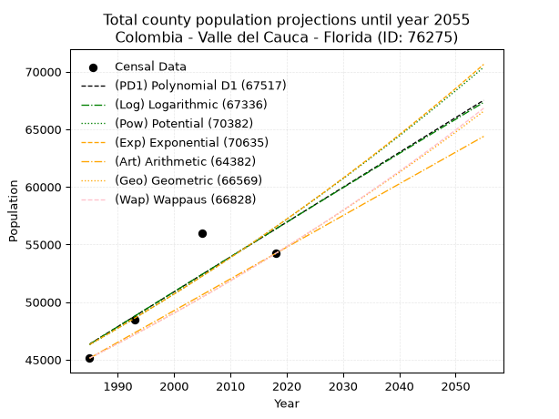
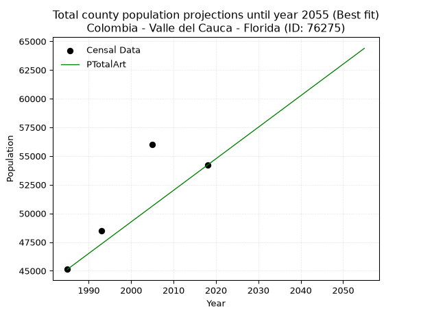
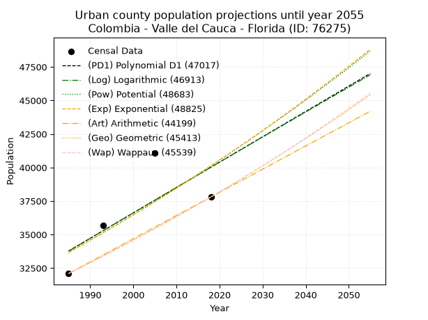
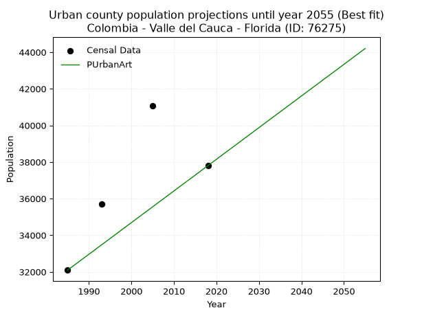
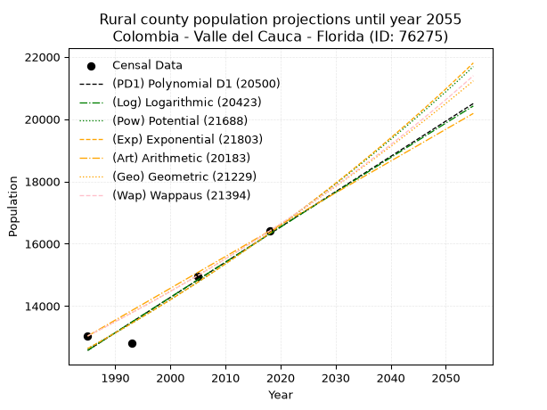
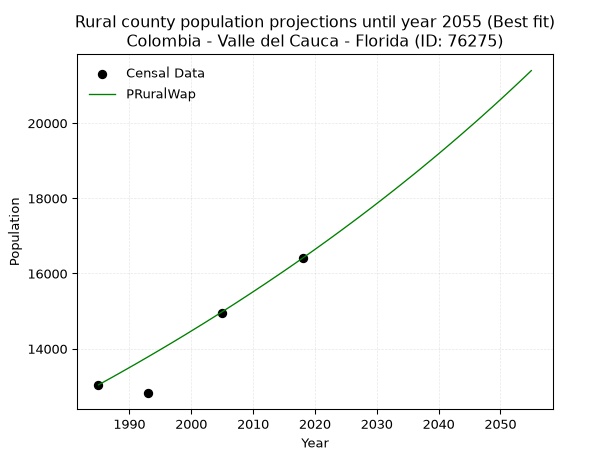

<div align="center">


</div>

# _“Population and Public Services Demand Projections (PPSD) until Year 2050 for Colombia - Valle del Cauca - Florida (ID: 76275)”_
Keywords: `population` `public-service` `projection` `lineal` `polynomial` `logarithmic` `potential` `exponential` `arithmetic` `geometric` `wappaus` `dane` `colombia` `south-america`

PPSD are analytical estimates used by governments and planners to anticipate future changes in population size, age distribution, and the resulting community needs for utilities, healthcare, education, and infrastructure as sizing future water treatment facilities, electrical grids, and road networks based on spatial growth.

> **General running parameters**: • app_version: _v20260806_. • Python version: _3.14.7_. • Pandas version: _3.0.5_. • NumPy version: _2.5.1_. • Creates, save and include plots into reports (create_plot): _False_. • Projection until year: _2050_. • Process polynomial degree 2 and up: _False_. • Process Wappaus: _True_. • Process Wappaus: _True_. • Set negative values to zero: _True_. • Set infinite values to zero: _True_. • Drop dataset notes: _True_. 
<div align="center">

Dynamic map: [:earth_americas:Google](http://maps.google.com/maps?q=3.324117744,-76.2341987) [:earth_americas:OSM](https://www.openstreetmap.org/#map=18/3.324117744/-76.2341987&layers=P) [:earth_americas:Bing](https://www.bing.com/maps?cp=3.324117744~-76.2341987&lvl=18) [:earth_americas:Apple](https://maps.apple.com/frame?center=3.324117744%2C-76.2341987&span=0.003%2C0.006)

</div>


<div align="center">

```geojson
{
  "type": "Feature",
  "geometry": {
    "type": "Point", 
    "coordinates": [-76.2341987, 3.324117744]
  }, 
  "properties": {
    "Name": "Colombia - Valle del Cauca - Florida (ID: 76275)"
  }
}
```

</div>


## 0. Census Data (4 records)

Census data are official statistics collected by a government about the people and housing in a country. They usually include counts of total population, age, sex, race, income, education, and jobs.

📅Global census file: [Population.xlsx](../data/Population.xlsx)

| Source   |   Year |   CountryID | CountryName   |   StateID | StateName       |   CountyID | CountyName   |   PTotal |   PUrban |   PRural |
|:---------|-------:|------------:|:--------------|----------:|:----------------|-----------:|:-------------|---------:|---------:|---------:|
| DANE     |   1985 |          57 | Colombia      |        76 | Valle del Cauca |      76275 | Florida      |    45132 |    32095 |    13037 |
| DANE     |   1993 |          57 | Colombia      |        76 | Valle del Cauca |      76275 | Florida      |    48505 |    35689 |    12816 |
| DANE     |   2005 |          57 | Colombia      |        76 | Valle Del Cauca |      76275 | Florida      |    56008 |    41057 |    14951 |
| DANE     |   2018 |          57 | Colombia      |        76 | Valle del Cauca |      76275 | Florida      |    54207 |    37801 |    16406 |

> 🔥Some records could had specific notes about the registered values or the corresponding urban or rural distribution.

📅   [RUPS](https://www.datos.gov.co/Hacienda-y-Cr-dito-P-blico/Registro-nico-de-Prestadores-de-Servicios-P-blicos/4qkq-csdn/about_data) - Local public utility companies: [RUPS.csv](../data/RUPS.xlsx)

 | SERVICIO       | ESTADO    | NOMBRE                                                                    | NIT         | DEPARTAMENTO_DOMICILIO   | MUNICIPIO_DOMICILIO   | DIRECCION              |   TELEFONO | EMAIL                     | TIPO_PRESTADOR                             | CLASIFICACION                 |
|:---------------|:----------|:--------------------------------------------------------------------------|:------------|:-------------------------|:----------------------|:-----------------------|-----------:|:--------------------------|:-------------------------------------------|:------------------------------|
| ACUEDUCTO      | OPERATIVA | SOCIEDAD DE ACUEDUCTOS Y ALCANTARILLADOS DEL VALLE DEL CAUCA S.A.  E.S.P. | 890399032-8 | VALLE DEL CAUCA          | CALI                  | AVENIDA 5 N # 23 AN 41 |    6203400 | rosemary@acuavalle.gov.co | SOCIEDADES (EMPRESA DE SERVICIOS PUBLICOS) | MAYOR O IGUAL A 5001 USUARIOS |
| ALCANTARILLADO | OPERATIVA | SOCIEDAD DE ACUEDUCTOS Y ALCANTARILLADOS DEL VALLE DEL CAUCA S.A.  E.S.P. | 890399032-8 | VALLE DEL CAUCA          | CALI                  | AVENIDA 5 N # 23 AN 41 |    6203400 | rosemary@acuavalle.gov.co | SOCIEDADES (EMPRESA DE SERVICIOS PUBLICOS) | MAYOR O IGUAL A 5001 USUARIOS |
| ALCANTARILLADO | OPERATIVA | ASOCIACION DE SERVICIOS PUBLICOS ALCANTARILLADO Y OTROS                   | 900208510-4 | VALLE DEL CAUCA          | FLORIDA               | calle 7 numero 4 71    |    2627198 | ledis55@hotmail.com       | ORGANIZACION AUTORIZADA                    | HASTA 2500 SUSCRIPTORES       |

## 1. Total

### 1.1. Coefficients and Parameters

* (PD1) Polynomial Deg 1: 302.34925732637566, -553811.1019670829 (lineal)
* (Log) Logarithmic: 605898.3181667592, -4554474.971749941
* (Pow) Potential: 12.083740472450817, -35.183699564758896
* (Exp) Exponential: 0.006029902409568383, 0.2934153007561687
* (Art) Arithmetic: Year diff. 2018 - 1985 = 33, Population diff. 54207 - 45132 = 9075, Annual growth = 275.0
* (Geo) Geometric: Year diff. 2018 - 1985 = 33, Population diff. 54207 - 45132 = 9075, Annual growth % = 0.005567517768198416
* (Wap) Wappaus: i = 0.5536596905545657, Condition values only valid for < 200)

<sub>
Wappaus condition values: ['0.00', '0.55', '1.11', '1.66', '2.21', '2.77', '3.32', '3.88', '4.43', '4.98', '5.54', '6.09', '6.64', '7.20', '7.75', '8.30', '8.86', '9.41', '9.97', '10.52', '11.07', '11.63', '12.18', '12.73', '13.29', '13.84', '14.40', '14.95', '15.50', '16.06', '16.61', '17.16', '17.72', '18.27', '18.82', '19.38', '19.93', '20.49', '21.04', '21.59', '22.15', '22.70', '23.25', '23.81', '24.36', '24.91', '25.47', '26.02', '26.58', '27.13', '27.68', '28.24', '28.79', '29.34', '29.90', '30.45', '31.00', '31.56', '32.11', '32.67', '33.22', '33.77', '34.33', '34.88', '35.43', '35.99']
</sub>


### 1.2. Projected Dataset

|   Year |   CountyID |   PTotalPD1 |   PTotalLog |   PTotalPow |   PTotalExp |   PTotalArt |   PTotalGeo |   PTotalWap |
|-------:|-----------:|------------:|------------:|------------:|------------:|------------:|------------:|------------:|
|   1985 |      76275 |       46352 |       46338 |       46300 |       46314 |       45132 |       45132 |       45132 |
|   1986 |      76275 |       46655 |       46643 |       46583 |       46594 |       45407 |       45383 |       45383 |
|   1987 |      76275 |       46957 |       46948 |       46867 |       46875 |       45682 |       45636 |       45635 |
|   1988 |      76275 |       47259 |       47253 |       47153 |       47159 |       45957 |       45890 |       45888 |
|   1989 |      76275 |       47562 |       47557 |       47440 |       47444 |       46232 |       46146 |       46143 |
|   1990 |      76275 |       47864 |       47862 |       47729 |       47731 |       46507 |       46402 |       46399 |
|   1991 |      76275 |       48166 |       48166 |       48020 |       48020 |       46782 |       46661 |       46657 |
|   1992 |      76275 |       48469 |       48471 |       48312 |       48310 |       47057 |       46921 |       46916 |
|   1993 |      76275 |       48771 |       48775 |       48606 |       48602 |       47332 |       47182 |       47176 |
|   1994 |      76275 |       49073 |       49079 |       48902 |       48896 |       47607 |       47444 |       47438 |
|   1995 |      76275 |       49376 |       49382 |       49199 |       49192 |       47882 |       47709 |       47702 |
|   1996 |      76275 |       49678 |       49686 |       49498 |       49490 |       48157 |       47974 |       47967 |
|   1997 |      76275 |       49980 |       49990 |       49798 |       49789 |       48432 |       48241 |       48234 |
|   1998 |      76275 |       50283 |       50293 |       50100 |       50090 |       48707 |       48510 |       48502 |
|   1999 |      76275 |       50585 |       50596 |       50404 |       50393 |       48982 |       48780 |       48771 |
|   2000 |      76275 |       50887 |       50899 |       50710 |       50698 |       49257 |       49052 |       49043 |
|   2001 |      76275 |       51190 |       51202 |       51017 |       51004 |       49532 |       49325 |       49315 |
|   2002 |      76275 |       51492 |       51505 |       51326 |       51313 |       49807 |       49599 |       49590 |
|   2003 |      76275 |       51794 |       51807 |       51636 |       51623 |       50082 |       49875 |       49866 |
|   2004 |      76275 |       52097 |       52110 |       51949 |       51936 |       50357 |       50153 |       50143 |
|   2005 |      76275 |       52399 |       52412 |       52263 |       52250 |       50632 |       50432 |       50422 |
|   2006 |      76275 |       52702 |       52714 |       52579 |       52566 |       50907 |       50713 |       50703 |
|   2007 |      76275 |       53004 |       53016 |       52896 |       52884 |       51182 |       50995 |       50986 |
|   2008 |      76275 |       53306 |       53318 |       53216 |       53203 |       51457 |       51279 |       51270 |
|   2009 |      76275 |       53609 |       53619 |       53537 |       53525 |       51732 |       51565 |       51556 |
|   2010 |      76275 |       53911 |       53921 |       53860 |       53849 |       52007 |       51852 |       51843 |
|   2011 |      76275 |       54213 |       54222 |       54184 |       54175 |       52282 |       52141 |       52133 |
|   2012 |      76275 |       54516 |       54524 |       54511 |       54502 |       52557 |       52431 |       52424 |
|   2013 |      76275 |       54818 |       54825 |       54839 |       54832 |       52832 |       52723 |       52716 |
|   2014 |      76275 |       55120 |       55126 |       55169 |       55164 |       53107 |       53016 |       53011 |
|   2015 |      76275 |       55423 |       55426 |       55501 |       55497 |       53382 |       53312 |       53307 |
|   2016 |      76275 |       55725 |       55727 |       55835 |       55833 |       53657 |       53608 |       53605 |
|   2017 |      76275 |       56027 |       56027 |       56171 |       56170 |       53932 |       53907 |       53905 |
|   2018 |      76275 |       56330 |       56328 |       56508 |       56510 |       54207 |       54207 |       54207 |
|   2019 |      76275 |       56632 |       56628 |       56847 |       56852 |       54482 |       54509 |       54511 |
|   2020 |      76275 |       56934 |       56928 |       57188 |       57196 |       54757 |       54812 |       54816 |
|   2021 |      76275 |       57237 |       57228 |       57532 |       57542 |       55032 |       55117 |       55123 |
|   2022 |      76275 |       57539 |       57528 |       57876 |       57890 |       55307 |       55424 |       55433 |
|   2023 |      76275 |       57841 |       57827 |       58223 |       58240 |       55582 |       55733 |       55744 |
|   2024 |      76275 |       58144 |       58127 |       58572 |       58592 |       55857 |       56043 |       56057 |
|   2025 |      76275 |       58446 |       58426 |       58923 |       58947 |       56132 |       56355 |       56372 |
|   2026 |      76275 |       58748 |       58725 |       59275 |       59303 |       56407 |       56669 |       56689 |
|   2027 |      76275 |       59051 |       59024 |       59630 |       59662 |       56682 |       56984 |       57008 |
|   2028 |      76275 |       59353 |       59323 |       59986 |       60023 |       56957 |       57302 |       57329 |
|   2029 |      76275 |       59656 |       59621 |       60345 |       60386 |       57232 |       57621 |       57652 |
|   2030 |      76275 |       59958 |       59920 |       60705 |       60751 |       57507 |       57942 |       57977 |
|   2031 |      76275 |       60260 |       60218 |       61067 |       61118 |       57782 |       58264 |       58304 |
|   2032 |      76275 |       60563 |       60517 |       61432 |       61488 |       58057 |       58589 |       58633 |
|   2033 |      76275 |       60865 |       60815 |       61798 |       61860 |       58332 |       58915 |       58964 |
|   2034 |      76275 |       61167 |       61113 |       62166 |       62234 |       58607 |       59243 |       59298 |
|   2035 |      76275 |       61470 |       61411 |       62537 |       62610 |       58882 |       59573 |       59633 |
|   2036 |      76275 |       61772 |       61708 |       62909 |       62989 |       59157 |       59904 |       59971 |
|   2037 |      76275 |       62074 |       62006 |       63283 |       63370 |       59432 |       60238 |       60311 |
|   2038 |      76275 |       62377 |       62303 |       63660 |       63753 |       59707 |       60573 |       60653 |
|   2039 |      76275 |       62679 |       62600 |       64038 |       64139 |       59982 |       60910 |       60997 |
|   2040 |      76275 |       62981 |       62897 |       64419 |       64527 |       60257 |       61250 |       61344 |
|   2041 |      76275 |       63284 |       63194 |       64801 |       64917 |       60532 |       61591 |       61692 |
|   2042 |      76275 |       63586 |       63491 |       65186 |       65310 |       60807 |       61933 |       62044 |
|   2043 |      76275 |       63888 |       63788 |       65573 |       65705 |       61082 |       62278 |       62397 |
|   2044 |      76275 |       64191 |       64084 |       65962 |       66102 |       61357 |       62625 |       62753 |
|   2045 |      76275 |       64493 |       64381 |       66353 |       66502 |       61632 |       62974 |       63111 |
|   2046 |      76275 |       64795 |       64677 |       66746 |       66904 |       61907 |       63324 |       63471 |
|   2047 |      76275 |       65098 |       64973 |       67141 |       67309 |       62182 |       63677 |       63834 |
|   2048 |      76275 |       65400 |       65269 |       67539 |       67716 |       62457 |       64031 |       64200 |
|   2049 |      76275 |       65703 |       65565 |       67938 |       68125 |       62732 |       64388 |       64568 |
|   2050 |      76275 |       66005 |       65860 |       68340 |       68537 |       63007 |       64746 |       64938 |
<div align="center">

</img>

</div>


### 1.3. Best fit with absolute and relative error (%)

Relative error puts that difference into context by dividing the absolute error by the true value, creating a unitless ratio or percentage that shows the scale of the mistake.

Absolute and relative error

|   Year | Source   |   CountryID | CountryName   |   StateID | StateName       |   CountyID_x | CountyName   |   PTotal |   PUrban |   PRural |   CountyID_y |   PTotalPD1 |   PTotalLog |   PTotalPow |   PTotalExp |   PTotalArt |   PTotalGeo |   PTotalWap |   PTotalPD1AbsError |   PTotalLogAbsError |   PTotalPowAbsError |   PTotalExpAbsError |   PTotalArtAbsError |   PTotalGeoAbsError |   PTotalWapAbsError |   PTotalPD1RelError |   PTotalLogRelError |   PTotalPowRelError |   PTotalExpRelError |   PTotalArtRelError |   PTotalGeoRelError |   PTotalWapRelError |
|-------:|:---------|------------:|:--------------|----------:|:----------------|-------------:|:-------------|---------:|---------:|---------:|-------------:|------------:|------------:|------------:|------------:|------------:|------------:|------------:|--------------------:|--------------------:|--------------------:|--------------------:|--------------------:|--------------------:|--------------------:|--------------------:|--------------------:|--------------------:|--------------------:|--------------------:|--------------------:|--------------------:|
|   1985 | DANE     |          57 | Colombia      |        76 | Valle del Cauca |        76275 | Florida      |    45132 |    32095 |    13037 |        76275 |       46352 |       46338 |       46300 |       46314 |       45132 |       45132 |       45132 |                1220 |                1206 |                1168 |                1182 |                   0 |                   0 |                   0 |            2.70318  |            2.67216  |            2.58796  |            2.61898  |             0       |             0       |             0       |
|   1993 | DANE     |          57 | Colombia      |        76 | Valle del Cauca |        76275 | Florida      |    48505 |    35689 |    12816 |        76275 |       48771 |       48775 |       48606 |       48602 |       47332 |       47182 |       47176 |                 266 |                 270 |                 101 |                  97 |                1173 |                1323 |                1329 |            0.548397 |            0.556644 |            0.208226 |            0.199979 |             2.41831 |             2.72755 |             2.73992 |
|   2005 | DANE     |          57 | Colombia      |        76 | Valle Del Cauca |        76275 | Florida      |    56008 |    41057 |    14951 |        76275 |       52399 |       52412 |       52263 |       52250 |       50632 |       50432 |       50422 |                3609 |                3596 |                3745 |                3758 |                5376 |                5576 |                5586 |            6.44372  |            6.42051  |            6.68654  |            6.70976  |             9.59863 |             9.95572 |             9.97358 |
|   2018 | DANE     |          57 | Colombia      |        76 | Valle del Cauca |        76275 | Florida      |    54207 |    37801 |    16406 |        76275 |       56330 |       56328 |       56508 |       56510 |       54207 |       54207 |       54207 |                2123 |                2121 |                2301 |                2303 |                   0 |                   0 |                   0 |            3.91647  |            3.91278  |            4.24484  |            4.24853  |             0       |             0       |             0       |

Relative error mean

| Method    |   RelError | Best   |
|:----------|-----------:|:-------|
| PTotalPD1 |    3.40294 |        |
| PTotalLog |    3.39052 |        |
| PTotalPow |    3.43189 |        |
| PTotalExp |    3.44431 |        |
| PTotalArt |    3.00423 | True   |
| PTotalGeo |    3.17082 |        |
| PTotalWap |    3.17837 |        |

💙Best method: _**PTotalArt**_
<div align="center">

</img>

</div>


### 1.4. Fresh water supply demand in liters per capita per day (lpcd)

The fresh water supply demand typically ranges from 100 to 300 liters per capita per day (lpcd) for standard domestic and municipal planning, though absolute survival minimums set by the World Health Organization are as low as 7.5 to 20 liters per day, and total consumption in high-income nations can exceed 400 liters.

> `CZ`: Level in meters above the sea level (masl)<br> `WS`: Fresh water supply demand in liters per capita per day (lpcd or l/h/d)<br> `WSAll`: Zonal fresh water supply demand in liters per second (l/s)<br> `A`: Zonal area in square meters<br> `DP`: Population density (people/hectare or p/ha)

Reference values (RAS Colombia)

|    CZ |   WS |
|------:|-----:|
|  1000 |  120 |
|  2000 |  130 |
| 99999 |  140 |

County shapefile geometry properties and water supply values

|   CountyID |      ATotal |   CZTotal |   WSTotal |
|-----------:|------------:|----------:|----------:|
|      76275 | 4.01595e+08 |    2251.1 |       140 |

Projected values for best method: PTotalArt

|   CountyID |   Year |   PTotalArt |   DPTotal |   WSTotal |   WSTotalAll |
|-----------:|-------:|------------:|----------:|----------:|-------------:|
|      76275 |   1985 |       45132 |      1.12 |       140 |      73.1306 |
|      76275 |   1986 |       45407 |      1.13 |       140 |      73.5762 |
|      76275 |   1987 |       45682 |      1.14 |       140 |      74.0218 |
|      76275 |   1988 |       45957 |      1.14 |       140 |      74.4674 |
|      76275 |   1989 |       46232 |      1.15 |       140 |      74.913  |
|      76275 |   1990 |       46507 |      1.16 |       140 |      75.3586 |
|      76275 |   1991 |       46782 |      1.16 |       140 |      75.8042 |
|      76275 |   1992 |       47057 |      1.17 |       140 |      76.2498 |
|      76275 |   1993 |       47332 |      1.18 |       140 |      76.6954 |
|      76275 |   1994 |       47607 |      1.19 |       140 |      77.141  |
|      76275 |   1995 |       47882 |      1.19 |       140 |      77.5866 |
|      76275 |   1996 |       48157 |      1.2  |       140 |      78.0322 |
|      76275 |   1997 |       48432 |      1.21 |       140 |      78.4778 |
|      76275 |   1998 |       48707 |      1.21 |       140 |      78.9234 |
|      76275 |   1999 |       48982 |      1.22 |       140 |      79.369  |
|      76275 |   2000 |       49257 |      1.23 |       140 |      79.8146 |
|      76275 |   2001 |       49532 |      1.23 |       140 |      80.2602 |
|      76275 |   2002 |       49807 |      1.24 |       140 |      80.7058 |
|      76275 |   2003 |       50082 |      1.25 |       140 |      81.1514 |
|      76275 |   2004 |       50357 |      1.25 |       140 |      81.597  |
|      76275 |   2005 |       50632 |      1.26 |       140 |      82.0426 |
|      76275 |   2006 |       50907 |      1.27 |       140 |      82.4882 |
|      76275 |   2007 |       51182 |      1.27 |       140 |      82.9338 |
|      76275 |   2008 |       51457 |      1.28 |       140 |      83.3794 |
|      76275 |   2009 |       51732 |      1.29 |       140 |      83.825  |
|      76275 |   2010 |       52007 |      1.3  |       140 |      84.2706 |
|      76275 |   2011 |       52282 |      1.3  |       140 |      84.7162 |
|      76275 |   2012 |       52557 |      1.31 |       140 |      85.1618 |
|      76275 |   2013 |       52832 |      1.32 |       140 |      85.6074 |
|      76275 |   2014 |       53107 |      1.32 |       140 |      86.053  |
|      76275 |   2015 |       53382 |      1.33 |       140 |      86.4986 |
|      76275 |   2016 |       53657 |      1.34 |       140 |      86.9442 |
|      76275 |   2017 |       53932 |      1.34 |       140 |      87.3898 |
|      76275 |   2018 |       54207 |      1.35 |       140 |      87.8354 |
|      76275 |   2019 |       54482 |      1.36 |       140 |      88.281  |
|      76275 |   2020 |       54757 |      1.36 |       140 |      88.7266 |
|      76275 |   2021 |       55032 |      1.37 |       140 |      89.1722 |
|      76275 |   2022 |       55307 |      1.38 |       140 |      89.6178 |
|      76275 |   2023 |       55582 |      1.38 |       140 |      90.0634 |
|      76275 |   2024 |       55857 |      1.39 |       140 |      90.509  |
|      76275 |   2025 |       56132 |      1.4  |       140 |      90.9546 |
|      76275 |   2026 |       56407 |      1.4  |       140 |      91.4002 |
|      76275 |   2027 |       56682 |      1.41 |       140 |      91.8458 |
|      76275 |   2028 |       56957 |      1.42 |       140 |      92.2914 |
|      76275 |   2029 |       57232 |      1.43 |       140 |      92.737  |
|      76275 |   2030 |       57507 |      1.43 |       140 |      93.1826 |
|      76275 |   2031 |       57782 |      1.44 |       140 |      93.6282 |
|      76275 |   2032 |       58057 |      1.45 |       140 |      94.0738 |
|      76275 |   2033 |       58332 |      1.45 |       140 |      94.5194 |
|      76275 |   2034 |       58607 |      1.46 |       140 |      94.965  |
|      76275 |   2035 |       58882 |      1.47 |       140 |      95.4106 |
|      76275 |   2036 |       59157 |      1.47 |       140 |      95.8563 |
|      76275 |   2037 |       59432 |      1.48 |       140 |      96.3019 |
|      76275 |   2038 |       59707 |      1.49 |       140 |      96.7475 |
|      76275 |   2039 |       59982 |      1.49 |       140 |      97.1931 |
|      76275 |   2040 |       60257 |      1.5  |       140 |      97.6387 |
|      76275 |   2041 |       60532 |      1.51 |       140 |      98.0843 |
|      76275 |   2042 |       60807 |      1.51 |       140 |      98.5299 |
|      76275 |   2043 |       61082 |      1.52 |       140 |      98.9755 |
|      76275 |   2044 |       61357 |      1.53 |       140 |      99.4211 |
|      76275 |   2045 |       61632 |      1.53 |       140 |      99.8667 |
|      76275 |   2046 |       61907 |      1.54 |       140 |     100.312  |
|      76275 |   2047 |       62182 |      1.55 |       140 |     100.758  |
|      76275 |   2048 |       62457 |      1.56 |       140 |     101.203  |
|      76275 |   2049 |       62732 |      1.56 |       140 |     101.649  |
|      76275 |   2050 |       63007 |      1.57 |       140 |     102.095  |

## 2. Urban

### 2.1. Coefficients and Parameters

* (PD1) Polynomial Deg 1: 189.15214773183635, -341691.08350060566 (lineal)
* (Log) Logarithmic: 379404.75757175154, -2847198.1026618006
* (Pow) Potential: 10.643671064979529, -30.573099806100227
* (Exp) Exponential: 0.005306680674971697, 0.8965306282046165
* (Art) Arithmetic: Year diff. 2018 - 1985 = 33, Population diff. 37801 - 32095 = 5706, Annual growth = 172.9090909090909
* (Geo) Geometric: Year diff. 2018 - 1985 = 33, Population diff. 37801 - 32095 = 5706, Annual growth % = 0.0049709599600997745
* (Wap) Wappaus: i = 0.49476104758238215, Condition values only valid for < 200)

<sub>
Wappaus condition values: ['0.00', '0.49', '0.99', '1.48', '1.98', '2.47', '2.97', '3.46', '3.96', '4.45', '4.95', '5.44', '5.94', '6.43', '6.93', '7.42', '7.92', '8.41', '8.91', '9.40', '9.90', '10.39', '10.88', '11.38', '11.87', '12.37', '12.86', '13.36', '13.85', '14.35', '14.84', '15.34', '15.83', '16.33', '16.82', '17.32', '17.81', '18.31', '18.80', '19.30', '19.79', '20.29', '20.78', '21.27', '21.77', '22.26', '22.76', '23.25', '23.75', '24.24', '24.74', '25.23', '25.73', '26.22', '26.72', '27.21', '27.71', '28.20', '28.70', '29.19', '29.69', '30.18', '30.68', '31.17', '31.66', '32.16']
</sub>


### 2.2. Projected Dataset

|   Year |   CountyID |   PUrbanPD1 |   PUrbanLog |   PUrbanPow |   PUrbanExp |   PUrbanArt |   PUrbanGeo |   PUrbanWap |
|-------:|-----------:|------------:|------------:|------------:|------------:|------------:|------------:|------------:|
|   1985 |      76275 |       33776 |       33764 |       33665 |       33676 |       32095 |       32095 |       32095 |
|   1986 |      76275 |       33965 |       33955 |       33846 |       33855 |       32268 |       32255 |       32254 |
|   1987 |      76275 |       34154 |       34146 |       34028 |       34035 |       32441 |       32415 |       32414 |
|   1988 |      76275 |       34343 |       34337 |       34210 |       34216 |       32614 |       32576 |       32575 |
|   1989 |      76275 |       34533 |       34528 |       34394 |       34398 |       32787 |       32738 |       32737 |
|   1990 |      76275 |       34722 |       34719 |       34579 |       34581 |       32960 |       32901 |       32899 |
|   1991 |      76275 |       34911 |       34909 |       34764 |       34765 |       33132 |       33064 |       33062 |
|   1992 |      76275 |       35100 |       35100 |       34950 |       34950 |       33305 |       33229 |       33226 |
|   1993 |      76275 |       35289 |       35290 |       35137 |       35136 |       33478 |       33394 |       33391 |
|   1994 |      76275 |       35478 |       35481 |       35326 |       35323 |       33651 |       33560 |       33557 |
|   1995 |      76275 |       35667 |       35671 |       35515 |       35511 |       33824 |       33727 |       33723 |
|   1996 |      76275 |       35857 |       35861 |       35705 |       35700 |       33997 |       33894 |       33891 |
|   1997 |      76275 |       36046 |       36051 |       35895 |       35890 |       34170 |       34063 |       34059 |
|   1998 |      76275 |       36235 |       36241 |       36087 |       36081 |       34343 |       34232 |       34228 |
|   1999 |      76275 |       36424 |       36431 |       36280 |       36273 |       34516 |       34402 |       34398 |
|   2000 |      76275 |       36613 |       36620 |       36474 |       36466 |       34689 |       34573 |       34569 |
|   2001 |      76275 |       36802 |       36810 |       36668 |       36660 |       34862 |       34745 |       34740 |
|   2002 |      76275 |       36992 |       37000 |       36864 |       36855 |       35034 |       34918 |       34913 |
|   2003 |      76275 |       37181 |       37189 |       37060 |       37051 |       35207 |       35091 |       35086 |
|   2004 |      76275 |       37370 |       37379 |       37257 |       37248 |       35380 |       35266 |       35261 |
|   2005 |      76275 |       37559 |       37568 |       37456 |       37447 |       35553 |       35441 |       35436 |
|   2006 |      76275 |       37748 |       37757 |       37655 |       37646 |       35726 |       35617 |       35612 |
|   2007 |      76275 |       37937 |       37946 |       37855 |       37846 |       35899 |       35794 |       35790 |
|   2008 |      76275 |       38126 |       38135 |       38057 |       38048 |       36072 |       35972 |       35968 |
|   2009 |      76275 |       38316 |       38324 |       38259 |       38250 |       36245 |       36151 |       36147 |
|   2010 |      76275 |       38505 |       38513 |       38462 |       38454 |       36418 |       36331 |       36327 |
|   2011 |      76275 |       38694 |       38701 |       38666 |       38658 |       36591 |       36511 |       36507 |
|   2012 |      76275 |       38883 |       38890 |       38871 |       38864 |       36764 |       36693 |       36689 |
|   2013 |      76275 |       39072 |       39079 |       39077 |       39071 |       36936 |       36875 |       36872 |
|   2014 |      76275 |       39261 |       39267 |       39285 |       39278 |       37109 |       37059 |       37056 |
|   2015 |      76275 |       39450 |       39455 |       39493 |       39487 |       37282 |       37243 |       37241 |
|   2016 |      76275 |       39640 |       39644 |       39702 |       39698 |       37455 |       37428 |       37426 |
|   2017 |      76275 |       39829 |       39832 |       39912 |       39909 |       37628 |       37614 |       37613 |
|   2018 |      76275 |       40018 |       40020 |       40123 |       40121 |       37801 |       37801 |       37801 |
|   2019 |      76275 |       40207 |       40208 |       40335 |       40335 |       37974 |       37989 |       37990 |
|   2020 |      76275 |       40396 |       40396 |       40548 |       40549 |       38147 |       38178 |       38180 |
|   2021 |      76275 |       40585 |       40583 |       40762 |       40765 |       38320 |       38368 |       38370 |
|   2022 |      76275 |       40775 |       40771 |       40978 |       40982 |       38493 |       38558 |       38562 |
|   2023 |      76275 |       40964 |       40959 |       41194 |       41200 |       38666 |       38750 |       38755 |
|   2024 |      76275 |       41153 |       41146 |       41411 |       41419 |       38838 |       38943 |       38949 |
|   2025 |      76275 |       41342 |       41334 |       41629 |       41640 |       39011 |       39136 |       39144 |
|   2026 |      76275 |       41531 |       41521 |       41849 |       41861 |       39184 |       39331 |       39340 |
|   2027 |      76275 |       41720 |       41708 |       42069 |       42084 |       39357 |       39526 |       39538 |
|   2028 |      76275 |       41909 |       41895 |       42291 |       42308 |       39530 |       39723 |       39736 |
|   2029 |      76275 |       42099 |       42082 |       42513 |       42533 |       39703 |       39920 |       39935 |
|   2030 |      76275 |       42288 |       42269 |       42737 |       42759 |       39876 |       40119 |       40136 |
|   2031 |      76275 |       42477 |       42456 |       42961 |       42987 |       40049 |       40318 |       40337 |
|   2032 |      76275 |       42666 |       42643 |       43187 |       43215 |       40222 |       40518 |       40540 |
|   2033 |      76275 |       42855 |       42830 |       43414 |       43445 |       40395 |       40720 |       40744 |
|   2034 |      76275 |       43044 |       43016 |       43641 |       43677 |       40568 |       40922 |       40949 |
|   2035 |      76275 |       43234 |       43203 |       43870 |       43909 |       40740 |       41126 |       41155 |
|   2036 |      76275 |       43423 |       43389 |       44100 |       44143 |       40913 |       41330 |       41363 |
|   2037 |      76275 |       43612 |       43575 |       44331 |       44377 |       41086 |       41536 |       41571 |
|   2038 |      76275 |       43801 |       43762 |       44564 |       44614 |       41259 |       41742 |       41781 |
|   2039 |      76275 |       43990 |       43948 |       44797 |       44851 |       41432 |       41950 |       41992 |
|   2040 |      76275 |       44179 |       44134 |       45031 |       45090 |       41605 |       42158 |       42204 |
|   2041 |      76275 |       44368 |       44320 |       45267 |       45329 |       41778 |       42368 |       42417 |
|   2042 |      76275 |       44558 |       44505 |       45503 |       45571 |       41951 |       42578 |       42632 |
|   2043 |      76275 |       44747 |       44691 |       45741 |       45813 |       42124 |       42790 |       42848 |
|   2044 |      76275 |       44936 |       44877 |       45980 |       46057 |       42297 |       43003 |       43065 |
|   2045 |      76275 |       45125 |       45062 |       46220 |       46302 |       42470 |       43216 |       43283 |
|   2046 |      76275 |       45314 |       45248 |       46461 |       46548 |       42642 |       43431 |       43503 |
|   2047 |      76275 |       45503 |       45433 |       46703 |       46796 |       42815 |       43647 |       43724 |
|   2048 |      76275 |       45693 |       45619 |       46947 |       47045 |       42988 |       43864 |       43946 |
|   2049 |      76275 |       45882 |       45804 |       47191 |       47295 |       43161 |       44082 |       44169 |
|   2050 |      76275 |       46071 |       45989 |       47437 |       47547 |       43334 |       44301 |       44394 |
<div align="center">

</img>

</div>


### 2.3. Best fit with absolute and relative error (%)

Relative error puts that difference into context by dividing the absolute error by the true value, creating a unitless ratio or percentage that shows the scale of the mistake.

Absolute and relative error

|   Year | Source   |   CountryID | CountryName   |   StateID | StateName       |   CountyID_x | CountyName   |   PTotal |   PUrban |   PRural |   CountyID_y |   PUrbanPD1 |   PUrbanLog |   PUrbanPow |   PUrbanExp |   PUrbanArt |   PUrbanGeo |   PUrbanWap |   PUrbanPD1AbsError |   PUrbanLogAbsError |   PUrbanPowAbsError |   PUrbanExpAbsError |   PUrbanArtAbsError |   PUrbanGeoAbsError |   PUrbanWapAbsError |   PUrbanPD1RelError |   PUrbanLogRelError |   PUrbanPowRelError |   PUrbanExpRelError |   PUrbanArtRelError |   PUrbanGeoRelError |   PUrbanWapRelError |
|-------:|:---------|------------:|:--------------|----------:|:----------------|-------------:|:-------------|---------:|---------:|---------:|-------------:|------------:|------------:|------------:|------------:|------------:|------------:|------------:|--------------------:|--------------------:|--------------------:|--------------------:|--------------------:|--------------------:|--------------------:|--------------------:|--------------------:|--------------------:|--------------------:|--------------------:|--------------------:|--------------------:|
|   1985 | DANE     |          57 | Colombia      |        76 | Valle del Cauca |        76275 | Florida      |    45132 |    32095 |    13037 |        76275 |       33776 |       33764 |       33665 |       33676 |       32095 |       32095 |       32095 |                1681 |                1669 |                1570 |                1581 |                   0 |                   0 |                   0 |             5.23758 |             5.20019 |             4.89173 |             4.926   |             0       |             0       |             0       |
|   1993 | DANE     |          57 | Colombia      |        76 | Valle del Cauca |        76275 | Florida      |    48505 |    35689 |    12816 |        76275 |       35289 |       35290 |       35137 |       35136 |       33478 |       33394 |       33391 |                 400 |                 399 |                 552 |                 553 |                2211 |                2295 |                2298 |             1.12079 |             1.11799 |             1.5467  |             1.5495  |             6.19519 |             6.43055 |             6.43896 |
|   2005 | DANE     |          57 | Colombia      |        76 | Valle Del Cauca |        76275 | Florida      |    56008 |    41057 |    14951 |        76275 |       37559 |       37568 |       37456 |       37447 |       35553 |       35441 |       35436 |                3498 |                3489 |                3601 |                3610 |                5504 |                5616 |                5621 |             8.51986 |             8.49794 |             8.77073 |             8.79265 |            13.4058  |            13.6785  |            13.6907  |
|   2018 | DANE     |          57 | Colombia      |        76 | Valle del Cauca |        76275 | Florida      |    54207 |    37801 |    16406 |        76275 |       40018 |       40020 |       40123 |       40121 |       37801 |       37801 |       37801 |                2217 |                2219 |                2322 |                2320 |                   0 |                   0 |                   0 |             5.86492 |             5.87022 |             6.14269 |             6.1374  |             0       |             0       |             0       |

Relative error mean

| Method    |   RelError | Best   |
|:----------|-----------:|:-------|
| PUrbanPD1 |    5.18579 |        |
| PUrbanLog |    5.17158 |        |
| PUrbanPow |    5.33796 |        |
| PUrbanExp |    5.35139 |        |
| PUrbanArt |    4.90023 | True   |
| PUrbanGeo |    5.02727 |        |
| PUrbanWap |    5.03242 |        |

💙Best method: _**PUrbanArt**_
<div align="center">

</img>

</div>


### 2.4. Fresh water supply demand in liters per capita per day (lpcd)

The fresh water supply demand typically ranges from 100 to 300 liters per capita per day (lpcd) for standard domestic and municipal planning, though absolute survival minimums set by the World Health Organization are as low as 7.5 to 20 liters per day, and total consumption in high-income nations can exceed 400 liters.

> `CZ`: Level in meters above the sea level (masl)<br> `WS`: Fresh water supply demand in liters per capita per day (lpcd or l/h/d)<br> `WSAll`: Zonal fresh water supply demand in liters per second (l/s)<br> `A`: Zonal area in square meters<br> `DP`: Population density (people/hectare or p/ha)

Reference values (RAS Colombia)

|    CZ |   WS |
|------:|-----:|
|  1000 |  120 |
|  2000 |  130 |
| 99999 |  140 |

County shapefile geometry properties and water supply values

|   CountyID |     AUrban |   CZUrban |   WSUrban |
|-----------:|-----------:|----------:|----------:|
|      76275 | 3.4797e+06 |   1042.25 |       130 |

Projected values for best method: PUrbanArt

|   CountyID |   Year |   PUrbanArt |   DPUrban |   WSUrban |   WSUrbanAll |
|-----------:|-------:|------------:|----------:|----------:|-------------:|
|      76275 |   1985 |       32095 |     92.23 |       130 |      48.2911 |
|      76275 |   1986 |       32268 |     92.73 |       130 |      48.5514 |
|      76275 |   1987 |       32441 |     93.23 |       130 |      48.8117 |
|      76275 |   1988 |       32614 |     93.73 |       130 |      49.072  |
|      76275 |   1989 |       32787 |     94.22 |       130 |      49.3323 |
|      76275 |   1990 |       32960 |     94.72 |       130 |      49.5926 |
|      76275 |   1991 |       33132 |     95.22 |       130 |      49.8514 |
|      76275 |   1992 |       33305 |     95.71 |       130 |      50.1117 |
|      76275 |   1993 |       33478 |     96.21 |       130 |      50.372  |
|      76275 |   1994 |       33651 |     96.71 |       130 |      50.6323 |
|      76275 |   1995 |       33824 |     97.2  |       130 |      50.8926 |
|      76275 |   1996 |       33997 |     97.7  |       130 |      51.1529 |
|      76275 |   1997 |       34170 |     98.2  |       130 |      51.4132 |
|      76275 |   1998 |       34343 |     98.7  |       130 |      51.6735 |
|      76275 |   1999 |       34516 |     99.19 |       130 |      51.9338 |
|      76275 |   2000 |       34689 |     99.69 |       130 |      52.1941 |
|      76275 |   2001 |       34862 |    100.19 |       130 |      52.4544 |
|      76275 |   2002 |       35034 |    100.68 |       130 |      52.7132 |
|      76275 |   2003 |       35207 |    101.18 |       130 |      52.9735 |
|      76275 |   2004 |       35380 |    101.68 |       130 |      53.2338 |
|      76275 |   2005 |       35553 |    102.17 |       130 |      53.4941 |
|      76275 |   2006 |       35726 |    102.67 |       130 |      53.7544 |
|      76275 |   2007 |       35899 |    103.17 |       130 |      54.0147 |
|      76275 |   2008 |       36072 |    103.66 |       130 |      54.275  |
|      76275 |   2009 |       36245 |    104.16 |       130 |      54.5353 |
|      76275 |   2010 |       36418 |    104.66 |       130 |      54.7956 |
|      76275 |   2011 |       36591 |    105.16 |       130 |      55.0559 |
|      76275 |   2012 |       36764 |    105.65 |       130 |      55.3162 |
|      76275 |   2013 |       36936 |    106.15 |       130 |      55.575  |
|      76275 |   2014 |       37109 |    106.64 |       130 |      55.8353 |
|      76275 |   2015 |       37282 |    107.14 |       130 |      56.0956 |
|      76275 |   2016 |       37455 |    107.64 |       130 |      56.3559 |
|      76275 |   2017 |       37628 |    108.14 |       130 |      56.6162 |
|      76275 |   2018 |       37801 |    108.63 |       130 |      56.8765 |
|      76275 |   2019 |       37974 |    109.13 |       130 |      57.1368 |
|      76275 |   2020 |       38147 |    109.63 |       130 |      57.3971 |
|      76275 |   2021 |       38320 |    110.12 |       130 |      57.6574 |
|      76275 |   2022 |       38493 |    110.62 |       130 |      57.9177 |
|      76275 |   2023 |       38666 |    111.12 |       130 |      58.178  |
|      76275 |   2024 |       38838 |    111.61 |       130 |      58.4368 |
|      76275 |   2025 |       39011 |    112.11 |       130 |      58.6971 |
|      76275 |   2026 |       39184 |    112.61 |       130 |      58.9574 |
|      76275 |   2027 |       39357 |    113.1  |       130 |      59.2177 |
|      76275 |   2028 |       39530 |    113.6  |       130 |      59.478  |
|      76275 |   2029 |       39703 |    114.1  |       130 |      59.7383 |
|      76275 |   2030 |       39876 |    114.6  |       130 |      59.9986 |
|      76275 |   2031 |       40049 |    115.09 |       130 |      60.2589 |
|      76275 |   2032 |       40222 |    115.59 |       130 |      60.5192 |
|      76275 |   2033 |       40395 |    116.09 |       130 |      60.7795 |
|      76275 |   2034 |       40568 |    116.58 |       130 |      61.0398 |
|      76275 |   2035 |       40740 |    117.08 |       130 |      61.2986 |
|      76275 |   2036 |       40913 |    117.58 |       130 |      61.5589 |
|      76275 |   2037 |       41086 |    118.07 |       130 |      61.8192 |
|      76275 |   2038 |       41259 |    118.57 |       130 |      62.0795 |
|      76275 |   2039 |       41432 |    119.07 |       130 |      62.3398 |
|      76275 |   2040 |       41605 |    119.56 |       130 |      62.6001 |
|      76275 |   2041 |       41778 |    120.06 |       130 |      62.8604 |
|      76275 |   2042 |       41951 |    120.56 |       130 |      63.1207 |
|      76275 |   2043 |       42124 |    121.06 |       130 |      63.381  |
|      76275 |   2044 |       42297 |    121.55 |       130 |      63.6413 |
|      76275 |   2045 |       42470 |    122.05 |       130 |      63.9016 |
|      76275 |   2046 |       42642 |    122.55 |       130 |      64.1604 |
|      76275 |   2047 |       42815 |    123.04 |       130 |      64.4207 |
|      76275 |   2048 |       42988 |    123.54 |       130 |      64.681  |
|      76275 |   2049 |       43161 |    124.04 |       130 |      64.9413 |
|      76275 |   2050 |       43334 |    124.53 |       130 |      65.2016 |

## 3. Rural

### 3.1. Coefficients and Parameters

* (PD1) Polynomial Deg 1: 113.19710959453936, -212120.01846647734 (lineal)
* (Log) Logarithmic: 226493.56059500776, -1707276.8690881405
* (Pow) Potential: 15.598290780673095, -47.337990018898616
* (Exp) Exponential: 0.0077953891130671926, 0.0024061098579510223
* (Art) Arithmetic: Year diff. 2018 - 1985 = 33, Population diff. 16406 - 13037 = 3369, Annual growth = 102.0909090909091
* (Geo) Geometric: Year diff. 2018 - 1985 = 33, Population diff. 16406 - 13037 = 3369, Annual growth % = 0.006989637095596857
* (Wap) Wappaus: i = 0.6934817042482702, Condition values only valid for < 200)

<sub>
Wappaus condition values: ['0.00', '0.69', '1.39', '2.08', '2.77', '3.47', '4.16', '4.85', '5.55', '6.24', '6.93', '7.63', '8.32', '9.02', '9.71', '10.40', '11.10', '11.79', '12.48', '13.18', '13.87', '14.56', '15.26', '15.95', '16.64', '17.34', '18.03', '18.72', '19.42', '20.11', '20.80', '21.50', '22.19', '22.88', '23.58', '24.27', '24.97', '25.66', '26.35', '27.05', '27.74', '28.43', '29.13', '29.82', '30.51', '31.21', '31.90', '32.59', '33.29', '33.98', '34.67', '35.37', '36.06', '36.75', '37.45', '38.14', '38.83', '39.53', '40.22', '40.92', '41.61', '42.30', '43.00', '43.69', '44.38', '45.08']
</sub>


### 3.2. Projected Dataset

|   Year |   CountyID |   PRuralPD1 |   PRuralLog |   PRuralPow |   PRuralExp |   PRuralArt |   PRuralGeo |   PRuralWap |
|-------:|-----------:|------------:|------------:|------------:|------------:|------------:|------------:|------------:|
|   1985 |      76275 |       12576 |       12573 |       12631 |       12633 |       13037 |       13037 |       13037 |
|   1986 |      76275 |       12689 |       12688 |       12731 |       12732 |       13139 |       13128 |       13128 |
|   1987 |      76275 |       12803 |       12802 |       12831 |       12832 |       13241 |       13220 |       13219 |
|   1988 |      76275 |       12916 |       12916 |       12932 |       12932 |       13343 |       13312 |       13311 |
|   1989 |      76275 |       13029 |       13029 |       13034 |       13034 |       13445 |       13405 |       13404 |
|   1990 |      76275 |       13142 |       13143 |       13136 |       13136 |       13547 |       13499 |       13497 |
|   1991 |      76275 |       13255 |       13257 |       13240 |       13238 |       13650 |       13593 |       13591 |
|   1992 |      76275 |       13369 |       13371 |       13344 |       13342 |       13752 |       13688 |       13686 |
|   1993 |      76275 |       13482 |       13484 |       13449 |       13446 |       13854 |       13784 |       13781 |
|   1994 |      76275 |       13595 |       13598 |       13554 |       13552 |       13956 |       13880 |       13877 |
|   1995 |      76275 |       13708 |       13712 |       13661 |       13658 |       14058 |       13977 |       13974 |
|   1996 |      76275 |       13821 |       13825 |       13768 |       13765 |       14160 |       14075 |       14071 |
|   1997 |      76275 |       13935 |       13939 |       13876 |       13872 |       14262 |       14174 |       14169 |
|   1998 |      76275 |       14048 |       14052 |       13985 |       13981 |       14364 |       14273 |       14268 |
|   1999 |      76275 |       14161 |       14165 |       14094 |       14090 |       14466 |       14372 |       14367 |
|   2000 |      76275 |       14274 |       14279 |       14205 |       14201 |       14568 |       14473 |       14468 |
|   2001 |      76275 |       14387 |       14392 |       14316 |       14312 |       14670 |       14574 |       14569 |
|   2002 |      76275 |       14501 |       14505 |       14428 |       14424 |       14773 |       14676 |       14670 |
|   2003 |      76275 |       14614 |       14618 |       14541 |       14537 |       14875 |       14778 |       14773 |
|   2004 |      76275 |       14727 |       14731 |       14654 |       14650 |       14977 |       14882 |       14876 |
|   2005 |      76275 |       14840 |       14844 |       14769 |       14765 |       15079 |       14986 |       14980 |
|   2006 |      76275 |       14953 |       14957 |       14884 |       14880 |       15181 |       15090 |       15085 |
|   2007 |      76275 |       15067 |       15070 |       15000 |       14997 |       15283 |       15196 |       15190 |
|   2008 |      76275 |       15180 |       15183 |       15117 |       15114 |       15385 |       15302 |       15297 |
|   2009 |      76275 |       15293 |       15296 |       15235 |       15233 |       15487 |       15409 |       15404 |
|   2010 |      76275 |       15406 |       15408 |       15354 |       15352 |       15589 |       15517 |       15512 |
|   2011 |      76275 |       15519 |       15521 |       15474 |       15472 |       15691 |       15625 |       15621 |
|   2012 |      76275 |       15633 |       15633 |       15594 |       15593 |       15793 |       15734 |       15730 |
|   2013 |      76275 |       15746 |       15746 |       15715 |       15715 |       15896 |       15844 |       15841 |
|   2014 |      76275 |       15859 |       15859 |       15838 |       15838 |       15998 |       15955 |       15952 |
|   2015 |      76275 |       15972 |       15971 |       15961 |       15962 |       16100 |       16067 |       16064 |
|   2016 |      76275 |       16085 |       16083 |       16085 |       16087 |       16202 |       16179 |       16177 |
|   2017 |      76275 |       16199 |       16196 |       16210 |       16213 |       16304 |       16292 |       16291 |
|   2018 |      76275 |       16312 |       16308 |       16335 |       16340 |       16406 |       16406 |       16406 |
|   2019 |      76275 |       16425 |       16420 |       16462 |       16468 |       16508 |       16521 |       16522 |
|   2020 |      76275 |       16538 |       16532 |       16590 |       16596 |       16610 |       16636 |       16638 |
|   2021 |      76275 |       16651 |       16644 |       16718 |       16726 |       16712 |       16752 |       16756 |
|   2022 |      76275 |       16765 |       16756 |       16848 |       16857 |       16814 |       16870 |       16874 |
|   2023 |      76275 |       16878 |       16868 |       16978 |       16989 |       16916 |       16987 |       16994 |
|   2024 |      76275 |       16991 |       16980 |       17110 |       17122 |       17019 |       17106 |       17114 |
|   2025 |      76275 |       17104 |       17092 |       17242 |       17256 |       17121 |       17226 |       17236 |
|   2026 |      76275 |       17217 |       17204 |       17375 |       17391 |       17223 |       17346 |       17358 |
|   2027 |      76275 |       17331 |       17316 |       17510 |       17527 |       17325 |       17467 |       17481 |
|   2028 |      76275 |       17444 |       17428 |       17645 |       17664 |       17427 |       17589 |       17606 |
|   2029 |      76275 |       17557 |       17539 |       17781 |       17803 |       17529 |       17712 |       17731 |
|   2030 |      76275 |       17670 |       17651 |       17918 |       17942 |       17631 |       17836 |       17858 |
|   2031 |      76275 |       17783 |       17762 |       18056 |       18082 |       17733 |       17961 |       17985 |
|   2032 |      76275 |       17897 |       17874 |       18196 |       18224 |       17835 |       18086 |       18114 |
|   2033 |      76275 |       18010 |       17985 |       18336 |       18366 |       17937 |       18213 |       18243 |
|   2034 |      76275 |       18123 |       18097 |       18477 |       18510 |       18039 |       18340 |       18374 |
|   2035 |      76275 |       18236 |       18208 |       18619 |       18655 |       18142 |       18468 |       18506 |
|   2036 |      76275 |       18349 |       18319 |       18762 |       18801 |       18244 |       18597 |       18638 |
|   2037 |      76275 |       18462 |       18430 |       18907 |       18948 |       18346 |       18727 |       18772 |
|   2038 |      76275 |       18576 |       18542 |       19052 |       19096 |       18448 |       18858 |       18908 |
|   2039 |      76275 |       18689 |       18653 |       19198 |       19246 |       18550 |       18990 |       19044 |
|   2040 |      76275 |       18802 |       18764 |       19346 |       19397 |       18652 |       19123 |       19181 |
|   2041 |      76275 |       18915 |       18875 |       19494 |       19548 |       18754 |       19257 |       19320 |
|   2042 |      76275 |       19028 |       18986 |       19644 |       19701 |       18856 |       19391 |       19460 |
|   2043 |      76275 |       19142 |       19097 |       19794 |       19855 |       18958 |       19527 |       19601 |
|   2044 |      76275 |       19255 |       19207 |       19946 |       20011 |       19060 |       19663 |       19743 |
|   2045 |      76275 |       19368 |       19318 |       20099 |       20167 |       19162 |       19801 |       19887 |
|   2046 |      76275 |       19481 |       19429 |       20253 |       20325 |       19265 |       19939 |       20031 |
|   2047 |      76275 |       19594 |       19540 |       20407 |       20484 |       19367 |       20078 |       20177 |
|   2048 |      76275 |       19708 |       19650 |       20564 |       20645 |       19469 |       20219 |       20325 |
|   2049 |      76275 |       19821 |       19761 |       20721 |       20806 |       19571 |       20360 |       20473 |
|   2050 |      76275 |       19934 |       19871 |       20879 |       20969 |       19673 |       20502 |       20623 |
<div align="center">

</img>

</div>


### 3.3. Best fit with absolute and relative error (%)

Relative error puts that difference into context by dividing the absolute error by the true value, creating a unitless ratio or percentage that shows the scale of the mistake.

Absolute and relative error

|   Year | Source   |   CountryID | CountryName   |   StateID | StateName       |   CountyID_x | CountyName   |   PTotal |   PUrban |   PRural |   CountyID_y |   PRuralPD1 |   PRuralLog |   PRuralPow |   PRuralExp |   PRuralArt |   PRuralGeo |   PRuralWap |   PRuralPD1AbsError |   PRuralLogAbsError |   PRuralPowAbsError |   PRuralExpAbsError |   PRuralArtAbsError |   PRuralGeoAbsError |   PRuralWapAbsError |   PRuralPD1RelError |   PRuralLogRelError |   PRuralPowRelError |   PRuralExpRelError |   PRuralArtRelError |   PRuralGeoRelError |   PRuralWapRelError |
|-------:|:---------|------------:|:--------------|----------:|:----------------|-------------:|:-------------|---------:|---------:|---------:|-------------:|------------:|------------:|------------:|------------:|------------:|------------:|------------:|--------------------:|--------------------:|--------------------:|--------------------:|--------------------:|--------------------:|--------------------:|--------------------:|--------------------:|--------------------:|--------------------:|--------------------:|--------------------:|--------------------:|
|   1985 | DANE     |          57 | Colombia      |        76 | Valle del Cauca |        76275 | Florida      |    45132 |    32095 |    13037 |        76275 |       12576 |       12573 |       12631 |       12633 |       13037 |       13037 |       13037 |                 461 |                 464 |                 406 |                 404 |                   0 |                   0 |                   0 |            3.53609  |            3.5591   |            3.11421  |            3.09887  |             0       |            0        |            0        |
|   1993 | DANE     |          57 | Colombia      |        76 | Valle del Cauca |        76275 | Florida      |    48505 |    35689 |    12816 |        76275 |       13482 |       13484 |       13449 |       13446 |       13854 |       13784 |       13781 |                 666 |                 668 |                 633 |                 630 |                1038 |                 968 |                 965 |            5.19663  |            5.21223  |            4.93914  |            4.91573  |             8.09925 |            7.55306  |            7.52965  |
|   2005 | DANE     |          57 | Colombia      |        76 | Valle Del Cauca |        76275 | Florida      |    56008 |    41057 |    14951 |        76275 |       14840 |       14844 |       14769 |       14765 |       15079 |       14986 |       14980 |                 111 |                 107 |                 182 |                 186 |                 128 |                  35 |                  29 |            0.742425 |            0.715671 |            1.21731  |            1.24406  |             0.85613 |            0.234098 |            0.193967 |
|   2018 | DANE     |          57 | Colombia      |        76 | Valle del Cauca |        76275 | Florida      |    54207 |    37801 |    16406 |        76275 |       16312 |       16308 |       16335 |       16340 |       16406 |       16406 |       16406 |                  94 |                  98 |                  71 |                  66 |                   0 |                   0 |                   0 |            0.572961 |            0.597342 |            0.432768 |            0.402292 |             0       |            0        |            0        |

Relative error mean

| Method    |   RelError | Best   |
|:----------|-----------:|:-------|
| PRuralPD1 |    2.51203 |        |
| PRuralLog |    2.52109 |        |
| PRuralPow |    2.42586 |        |
| PRuralExp |    2.41524 |        |
| PRuralArt |    2.23885 |        |
| PRuralGeo |    1.94679 |        |
| PRuralWap |    1.9309  | True   |

💙Best method: _**PRuralWap**_
<div align="center">

</img>

</div>


### 3.4. Fresh water supply demand in liters per capita per day (lpcd)

The fresh water supply demand typically ranges from 100 to 300 liters per capita per day (lpcd) for standard domestic and municipal planning, though absolute survival minimums set by the World Health Organization are as low as 7.5 to 20 liters per day, and total consumption in high-income nations can exceed 400 liters.

> `CZ`: Level in meters above the sea level (masl)<br> `WS`: Fresh water supply demand in liters per capita per day (lpcd or l/h/d)<br> `WSAll`: Zonal fresh water supply demand in liters per second (l/s)<br> `A`: Zonal area in square meters<br> `DP`: Population density (people/hectare or p/ha)

Reference values (RAS Colombia)

|    CZ |   WS |
|------:|-----:|
|  1000 |  120 |
|  2000 |  130 |
| 99999 |  140 |

County shapefile geometry properties and water supply values

|   CountyID |      ARural |   CZRural |   WSRural |
|-----------:|------------:|----------:|----------:|
|      76275 | 3.98116e+08 |   2261.68 |       140 |

Projected values for best method: PRuralWap

|   CountyID |   Year |   PRuralWap |   DPRural |   WSRural |   WSRuralAll |
|-----------:|-------:|------------:|----------:|----------:|-------------:|
|      76275 |   1985 |       13037 |      0.33 |       140 |      21.1248 |
|      76275 |   1986 |       13128 |      0.33 |       140 |      21.2722 |
|      76275 |   1987 |       13219 |      0.33 |       140 |      21.4197 |
|      76275 |   1988 |       13311 |      0.33 |       140 |      21.5688 |
|      76275 |   1989 |       13404 |      0.34 |       140 |      21.7194 |
|      76275 |   1990 |       13497 |      0.34 |       140 |      21.8701 |
|      76275 |   1991 |       13591 |      0.34 |       140 |      22.0225 |
|      76275 |   1992 |       13686 |      0.34 |       140 |      22.1764 |
|      76275 |   1993 |       13781 |      0.35 |       140 |      22.3303 |
|      76275 |   1994 |       13877 |      0.35 |       140 |      22.4859 |
|      76275 |   1995 |       13974 |      0.35 |       140 |      22.6431 |
|      76275 |   1996 |       14071 |      0.35 |       140 |      22.8002 |
|      76275 |   1997 |       14169 |      0.36 |       140 |      22.959  |
|      76275 |   1998 |       14268 |      0.36 |       140 |      23.1194 |
|      76275 |   1999 |       14367 |      0.36 |       140 |      23.2799 |
|      76275 |   2000 |       14468 |      0.36 |       140 |      23.4435 |
|      76275 |   2001 |       14569 |      0.37 |       140 |      23.6072 |
|      76275 |   2002 |       14670 |      0.37 |       140 |      23.7708 |
|      76275 |   2003 |       14773 |      0.37 |       140 |      23.9377 |
|      76275 |   2004 |       14876 |      0.37 |       140 |      24.1046 |
|      76275 |   2005 |       14980 |      0.38 |       140 |      24.2731 |
|      76275 |   2006 |       15085 |      0.38 |       140 |      24.4433 |
|      76275 |   2007 |       15190 |      0.38 |       140 |      24.6134 |
|      76275 |   2008 |       15297 |      0.38 |       140 |      24.7868 |
|      76275 |   2009 |       15404 |      0.39 |       140 |      24.9602 |
|      76275 |   2010 |       15512 |      0.39 |       140 |      25.1352 |
|      76275 |   2011 |       15621 |      0.39 |       140 |      25.3118 |
|      76275 |   2012 |       15730 |      0.4  |       140 |      25.4884 |
|      76275 |   2013 |       15841 |      0.4  |       140 |      25.6683 |
|      76275 |   2014 |       15952 |      0.4  |       140 |      25.8481 |
|      76275 |   2015 |       16064 |      0.4  |       140 |      26.0296 |
|      76275 |   2016 |       16177 |      0.41 |       140 |      26.2127 |
|      76275 |   2017 |       16291 |      0.41 |       140 |      26.3975 |
|      76275 |   2018 |       16406 |      0.41 |       140 |      26.5838 |
|      76275 |   2019 |       16522 |      0.42 |       140 |      26.7718 |
|      76275 |   2020 |       16638 |      0.42 |       140 |      26.9597 |
|      76275 |   2021 |       16756 |      0.42 |       140 |      27.1509 |
|      76275 |   2022 |       16874 |      0.42 |       140 |      27.3421 |
|      76275 |   2023 |       16994 |      0.43 |       140 |      27.5366 |
|      76275 |   2024 |       17114 |      0.43 |       140 |      27.731  |
|      76275 |   2025 |       17236 |      0.43 |       140 |      27.9287 |
|      76275 |   2026 |       17358 |      0.44 |       140 |      28.1264 |
|      76275 |   2027 |       17481 |      0.44 |       140 |      28.3257 |
|      76275 |   2028 |       17606 |      0.44 |       140 |      28.5282 |
|      76275 |   2029 |       17731 |      0.45 |       140 |      28.7308 |
|      76275 |   2030 |       17858 |      0.45 |       140 |      28.9366 |
|      76275 |   2031 |       17985 |      0.45 |       140 |      29.1424 |
|      76275 |   2032 |       18114 |      0.45 |       140 |      29.3514 |
|      76275 |   2033 |       18243 |      0.46 |       140 |      29.5604 |
|      76275 |   2034 |       18374 |      0.46 |       140 |      29.7727 |
|      76275 |   2035 |       18506 |      0.46 |       140 |      29.9866 |
|      76275 |   2036 |       18638 |      0.47 |       140 |      30.2005 |
|      76275 |   2037 |       18772 |      0.47 |       140 |      30.4176 |
|      76275 |   2038 |       18908 |      0.47 |       140 |      30.638  |
|      76275 |   2039 |       19044 |      0.48 |       140 |      30.8583 |
|      76275 |   2040 |       19181 |      0.48 |       140 |      31.0803 |
|      76275 |   2041 |       19320 |      0.49 |       140 |      31.3056 |
|      76275 |   2042 |       19460 |      0.49 |       140 |      31.5324 |
|      76275 |   2043 |       19601 |      0.49 |       140 |      31.7609 |
|      76275 |   2044 |       19743 |      0.5  |       140 |      31.991  |
|      76275 |   2045 |       19887 |      0.5  |       140 |      32.2243 |
|      76275 |   2046 |       20031 |      0.5  |       140 |      32.4576 |
|      76275 |   2047 |       20177 |      0.51 |       140 |      32.6942 |
|      76275 |   2048 |       20325 |      0.51 |       140 |      32.934  |
|      76275 |   2049 |       20473 |      0.51 |       140 |      33.1738 |
|      76275 |   2050 |       20623 |      0.52 |       140 |      33.4169 |

<div align="center"><br><sub>Share this research</sub></div><br>

<sub>**APPS & TOOLS & CONTENT DISCLAIMER**: • NO WARRANTY - This content and software is provided by <a href="https://github.com/rcfdtools" target="_blank">github.com/rcfdtools</a> "as is", without any express or implied warranty, including warranties of merchantability, fitness for a particular purpose, or non-infringement. There is no guarantee that the software will be error-free or operate without interruption. • LIMITATION OF LIABILITY - Neither the authors nor copyright holders will be liable for claims or damages arising from the software or its use. You are responsible for determining if the software is appropriate for your use and assume all associated risks, including errors, legal compliance, and data loss. • NO PROFESSIONAL ADVICE - The software provides general information and does not offer professional advice. It should not replace consultation with professional advisors. [Clauses and global license for rcfdtools use.](https://github.com/rcfdtools/rcfdtools/blob/main/LICENSE.md)</sub>

| [:house: Home](Readme.md)  | [:beginner: Help / Collab](https://github.com/rcfdtools/R.HydroTools/discussions/31) |
|----------------------------|-------------------------------------------------------------------------------------------|