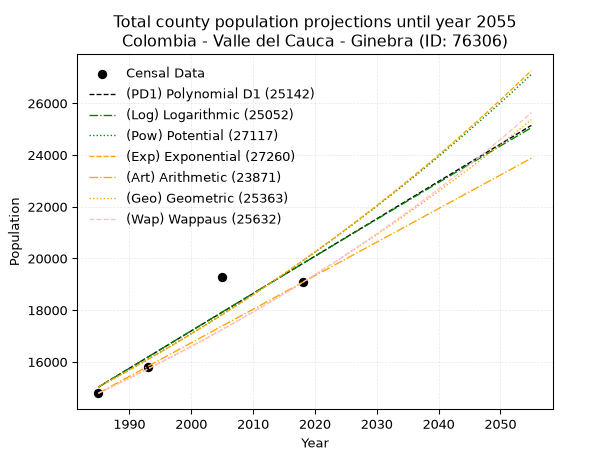
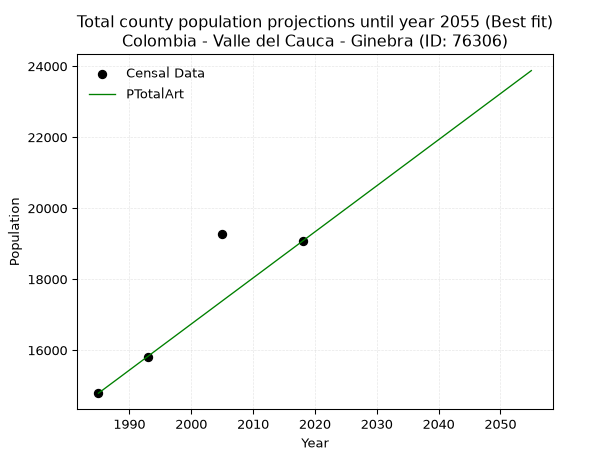
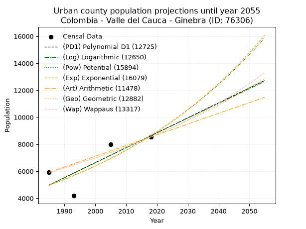
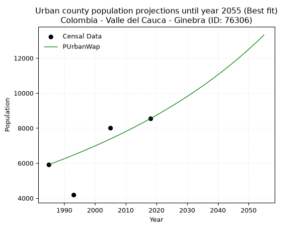
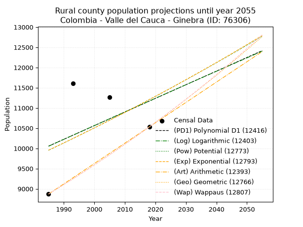
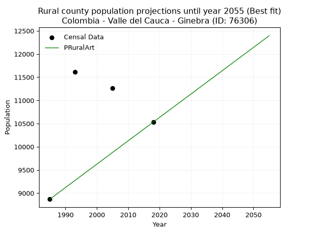

<div align="center">


</div>

# 📜 _“Population and Public Services Demand Projections (PPSD) until Year 2050 for Colombia - Valle del Cauca - Ginebra (ID: 76306)”_
Keywords: `population` `public-service` `projection` `lineal` `polynomial` `logarithmic` `potential` `exponential` `arithmetic` `geometric` `wappaus` `dane` `colombia` `south-america`

PPSD are analytical estimates used by governments and planners to anticipate future changes in population size, age distribution, and the resulting community needs for utilities, healthcare, education, and infrastructure as sizing future water treatment facilities, electrical grids, and road networks based on spatial growth.

<div align="center">

</img>

</div>


> **General running parameters**: • app_version: _v20260806_. • Python version: _3.14.7_. • Pandas version: _3.0.5_. • NumPy version: _2.5.1_. • Creates, save and include plots into reports (create_plot): _False_. • Projection until year: _2050_. • Process polynomial degree 2 and up: _False_. • Process Wappaus: _True_. • Process Wappaus: _True_. • Set negative values to zero: _True_. • Set infinite values to zero: _True_. • Drop dataset notes: _True_. 
<div align="center">

Maps & GIS Layers: [:earth_americas:Google](http://maps.google.com/maps?q=3.724181146,-76.2680678) [:earth_americas:OSM](https://www.openstreetmap.org/#map=18/3.724181146/-76.2680678&layers=P) [:earth_americas:Bing](https://www.bing.com/maps?cp=3.724181146~-76.2680678&lvl=18) [:earth_americas:Apple](https://maps.apple.com/frame?center=3.724181146%2C-76.2680678&span=0.003%2C0.006) [:earth_americas:GISMobile](https://github.com/rcfdtools/R.GISMobile/blob/main/file/gis/CountyLayer_CO/Readme.md)

</div>


<div align="center">

```geojson
{
  "type": "Feature",
  "geometry": {
    "type": "Point", 
    "coordinates": [-76.2680678, 3.724181146]
  }, 
  "properties": {
    "Name": "Colombia - Valle del Cauca - Ginebra (ID: 76306)"
  }
}
```

</div>


## 0. Census Data (4 records)

Census data are official statistics collected by a government about the people and housing in a country. They usually include counts of total population, age, sex, race, income, education, and jobs.

📅Global census file: [Population.xlsx](../data/Population.xlsx)

| Source   |   Year |   CountryID | CountryName   |   StateID | StateName       |   CountyID | CountyName   |   PTotal |   PUrban |   PRural |
|:---------|-------:|------------:|:--------------|----------:|:----------------|-----------:|:-------------|---------:|---------:|---------:|
| DANE     |   1985 |          57 | Colombia      |        76 | Valle del Cauca |      76306 | Ginebra      |    14786 |     5916 |     8870 |
| DANE     |   1993 |          57 | Colombia      |        76 | Valle del Cauca |      76306 | Ginebra      |    15795 |     4184 |    11611 |
| DANE     |   2005 |          57 | Colombia      |        76 | Valle del Cauca |      76306 | Ginebra      |    19268 |     8000 |    11268 |
| DANE     |   2018 |          57 | Colombia      |        76 | Valle del Cauca |      76306 | Ginebra      |    19069 |     8538 |    10531 |

> 🔥Some records could had specific notes about the registered values or the corresponding urban or rural distribution.

📅[SUI-RUPS](https://www.datos.gov.co/Hacienda-y-Cr-dito-P-blico/Registro-nico-de-Prestadores-de-Servicios-P-blicos/4qkq-csdn/about_data) - Local public utility companies: [RUPS.csv](../data/RUPS.csv)

 | SERVICIO       | ESTADO    | NOMBRE                                                                                                                                 | NIT         | DEPARTAMENTO_DOMICILIO   | MUNICIPIO_DOMICILIO   | DIRECCION              |   TELEFONO | EMAIL                     | TIPO_PRESTADOR                             | CLASIFICACION                 |
|:---------------|:----------|:---------------------------------------------------------------------------------------------------------------------------------------|:------------|:-------------------------|:----------------------|:-----------------------|-----------:|:--------------------------|:-------------------------------------------|:------------------------------|
| ACUEDUCTO      | OPERATIVA | SOCIEDAD DE ACUEDUCTOS Y ALCANTARILLADOS DEL VALLE DEL CAUCA S.A.  E.S.P.                                                              | 890399032-8 | VALLE DEL CAUCA          | CALI                  | AVENIDA 5 N # 23 AN 41 |    6203400 | rosemary@acuavalle.gov.co | SOCIEDADES (EMPRESA DE SERVICIOS PUBLICOS) | MAYOR O IGUAL A 5001 USUARIOS |
| ALCANTARILLADO | OPERATIVA | SOCIEDAD DE ACUEDUCTOS Y ALCANTARILLADOS DEL VALLE DEL CAUCA S.A.  E.S.P.                                                              | 890399032-8 | VALLE DEL CAUCA          | CALI                  | AVENIDA 5 N # 23 AN 41 |    6203400 | rosemary@acuavalle.gov.co | SOCIEDADES (EMPRESA DE SERVICIOS PUBLICOS) | MAYOR O IGUAL A 5001 USUARIOS |
| ACUEDUCTO      | OPERATIVA | ASOCIACION DE USUARIOS DEL SERVICIO DE AGUA POTABLE Y/O ALCANTARILLADO Y/O ASEO DEL CORREGIMIENTO DE COSTA RICA - MUNICIPIO DE GINEBRA | 815000916-8 | VALLE DEL CAUCA          | GINEBRA               | Carrera 7 No. 11 - 23  |    2550110 | luisalvaronorena@yahoo.es | ORGANIZACION AUTORIZADA                    | HASTA 2500 SUSCRIPTORES       |
| ALCANTARILLADO | OPERATIVA | ASOCIACION DE USUARIOS DEL SERVICIO DE AGUA POTABLE Y/O ALCANTARILLADO Y/O ASEO DEL CORREGIMIENTO DE COSTA RICA - MUNICIPIO DE GINEBRA | 815000916-8 | VALLE DEL CAUCA          | GINEBRA               | Carrera 7 No. 11 - 23  |    2550110 | luisalvaronorena@yahoo.es | ORGANIZACION AUTORIZADA                    | HASTA 2500 SUSCRIPTORES       |
| ACUEDUCTO      | OPERATIVA | LA ASOCIACION DE USUARIOS DEL SERVICIO DE ACUEDUCTO DE LA VEREDA BARRANCO BAJO-MUNICIPIO DE GINEBRA                                    | 900377348-0 | VALLE DEL CAUCA          | GINEBRA               | VEREDA BARRANCO BAJO   |    3104640 | omaira_calero@hotmail.com | ORGANIZACION AUTORIZADA                    | HASTA 2500 SUSCRIPTORES       |

## 1. Total

### 1.1. Coefficients and Parameters

* (PD1) Polynomial Deg 1: 144.51625853071062, -271839.146126054 (lineal)
* (Log) Logarithmic: 289486.4156206783, -2183159.0649313214
* (Pow) Potential: 17.030172060408376, -51.9845057692394
* (Exp) Exponential: 0.00850155481634737, 0.0007048618231353562
* (Art) Arithmetic: Year diff. 2018 - 1985 = 33, Population diff. 19069 - 14786 = 4283, Annual growth = 129.78787878787878
* (Geo) Geometric: Year diff. 2018 - 1985 = 33, Population diff. 19069 - 14786 = 4283, Annual growth % = 0.0077383692034957985
* (Wap) Wappaus: i = 0.7667279798427339, Condition values only valid for < 200)

<sub>
Wappaus condition values: ['0.00', '0.77', '1.53', '2.30', '3.07', '3.83', '4.60', '5.37', '6.13', '6.90', '7.67', '8.43', '9.20', '9.97', '10.73', '11.50', '12.27', '13.03', '13.80', '14.57', '15.33', '16.10', '16.87', '17.63', '18.40', '19.17', '19.93', '20.70', '21.47', '22.24', '23.00', '23.77', '24.54', '25.30', '26.07', '26.84', '27.60', '28.37', '29.14', '29.90', '30.67', '31.44', '32.20', '32.97', '33.74', '34.50', '35.27', '36.04', '36.80', '37.57', '38.34', '39.10', '39.87', '40.64', '41.40', '42.17', '42.94', '43.70', '44.47', '45.24', '46.00', '46.77', '47.54', '48.30', '49.07', '49.84']
</sub>


### 1.2. Projected Dataset

|   Year |   CountyID |   PTotalPD1 |   PTotalLog |   PTotalPow |   PTotalExp |   PTotalArt |   PTotalGeo |   PTotalWap |
|-------:|-----------:|------------:|------------:|------------:|------------:|------------:|------------:|------------:|
|   1985 |      76306 |       15026 |       15020 |       15029 |       15034 |       14786 |       14786 |       14786 |
|   1986 |      76306 |       15170 |       15165 |       15158 |       15162 |       14916 |       14900 |       14900 |
|   1987 |      76306 |       15315 |       15311 |       15289 |       15292 |       15046 |       15016 |       15014 |
|   1988 |      76306 |       15459 |       15457 |       15420 |       15422 |       15175 |       15132 |       15130 |
|   1989 |      76306 |       15604 |       15602 |       15553 |       15554 |       15305 |       15249 |       15247 |
|   1990 |      76306 |       15748 |       15748 |       15687 |       15687 |       15435 |       15367 |       15364 |
|   1991 |      76306 |       15893 |       15893 |       15821 |       15821 |       15565 |       15486 |       15482 |
|   1992 |      76306 |       16037 |       16039 |       15957 |       15956 |       15695 |       15606 |       15601 |
|   1993 |      76306 |       16182 |       16184 |       16094 |       16092 |       15824 |       15727 |       15722 |
|   1994 |      76306 |       16326 |       16329 |       16232 |       16230 |       15954 |       15848 |       15843 |
|   1995 |      76306 |       16471 |       16474 |       16372 |       16368 |       16084 |       15971 |       15965 |
|   1996 |      76306 |       16615 |       16619 |       16512 |       16508 |       16214 |       16094 |       16088 |
|   1997 |      76306 |       16760 |       16764 |       16653 |       16649 |       16343 |       16219 |       16212 |
|   1998 |      76306 |       16904 |       16909 |       16796 |       16791 |       16473 |       16345 |       16337 |
|   1999 |      76306 |       17049 |       17054 |       16940 |       16934 |       16603 |       16471 |       16463 |
|   2000 |      76306 |       17193 |       17199 |       17085 |       17079 |       16733 |       16598 |       16590 |
|   2001 |      76306 |       17338 |       17344 |       17231 |       17225 |       16863 |       16727 |       16718 |
|   2002 |      76306 |       17482 |       17488 |       17378 |       17372 |       16992 |       16856 |       16848 |
|   2003 |      76306 |       17627 |       17633 |       17526 |       17520 |       17122 |       16987 |       16978 |
|   2004 |      76306 |       17771 |       17777 |       17676 |       17670 |       17252 |       17118 |       17109 |
|   2005 |      76306 |       17916 |       17922 |       17827 |       17821 |       17382 |       17251 |       17242 |
|   2006 |      76306 |       18060 |       18066 |       17979 |       17973 |       17512 |       17384 |       17375 |
|   2007 |      76306 |       18205 |       18210 |       18132 |       18126 |       17641 |       17519 |       17510 |
|   2008 |      76306 |       18350 |       18355 |       18286 |       18281 |       17771 |       17654 |       17646 |
|   2009 |      76306 |       18494 |       18499 |       18442 |       18437 |       17901 |       17791 |       17783 |
|   2010 |      76306 |       18639 |       18643 |       18599 |       18594 |       18031 |       17929 |       17921 |
|   2011 |      76306 |       18783 |       18787 |       18757 |       18753 |       18160 |       18067 |       18060 |
|   2012 |      76306 |       18928 |       18931 |       18917 |       18913 |       18290 |       18207 |       18200 |
|   2013 |      76306 |       19072 |       19075 |       19078 |       19075 |       18420 |       18348 |       18342 |
|   2014 |      76306 |       19217 |       19218 |       19240 |       19238 |       18550 |       18490 |       18485 |
|   2015 |      76306 |       19361 |       19362 |       19403 |       19402 |       18680 |       18633 |       18629 |
|   2016 |      76306 |       19506 |       19506 |       19568 |       19568 |       18809 |       18777 |       18774 |
|   2017 |      76306 |       19650 |       19649 |       19734 |       19735 |       18939 |       18923 |       18921 |
|   2018 |      76306 |       19795 |       19793 |       19901 |       19903 |       19069 |       19069 |       19069 |
|   2019 |      76306 |       19939 |       19936 |       20069 |       20073 |       19199 |       19217 |       19218 |
|   2020 |      76306 |       20084 |       20079 |       20239 |       20244 |       19329 |       19365 |       19369 |
|   2021 |      76306 |       20228 |       20223 |       20411 |       20417 |       19458 |       19515 |       19521 |
|   2022 |      76306 |       20373 |       20366 |       20583 |       20592 |       19588 |       19666 |       19674 |
|   2023 |      76306 |       20517 |       20509 |       20757 |       20767 |       19718 |       19818 |       19829 |
|   2024 |      76306 |       20662 |       20652 |       20933 |       20945 |       19848 |       19972 |       19985 |
|   2025 |      76306 |       20806 |       20795 |       21110 |       21123 |       19978 |       20126 |       20142 |
|   2026 |      76306 |       20951 |       20938 |       21288 |       21304 |       20107 |       20282 |       20301 |
|   2027 |      76306 |       21095 |       21081 |       21468 |       21486 |       20237 |       20439 |       20461 |
|   2028 |      76306 |       21240 |       21224 |       21649 |       21669 |       20367 |       20597 |       20623 |
|   2029 |      76306 |       21384 |       21366 |       21831 |       21854 |       20497 |       20756 |       20786 |
|   2030 |      76306 |       21529 |       21509 |       22015 |       22041 |       20626 |       20917 |       20951 |
|   2031 |      76306 |       21673 |       21652 |       22201 |       22229 |       20756 |       21079 |       21117 |
|   2032 |      76306 |       21818 |       21794 |       22387 |       22419 |       20886 |       21242 |       21285 |
|   2033 |      76306 |       21962 |       21936 |       22576 |       22610 |       21016 |       21406 |       21455 |
|   2034 |      76306 |       22107 |       22079 |       22766 |       22803 |       21146 |       21572 |       21626 |
|   2035 |      76306 |       22251 |       22221 |       22957 |       22998 |       21275 |       21739 |       21799 |
|   2036 |      76306 |       22396 |       22363 |       23150 |       23194 |       21405 |       21907 |       21973 |
|   2037 |      76306 |       22540 |       22506 |       23344 |       23392 |       21535 |       22077 |       22149 |
|   2038 |      76306 |       22685 |       22648 |       23540 |       23592 |       21665 |       22248 |       22327 |
|   2039 |      76306 |       22830 |       22790 |       23738 |       23793 |       21795 |       22420 |       22506 |
|   2040 |      76306 |       22974 |       22932 |       23937 |       23996 |       21924 |       22593 |       22687 |
|   2041 |      76306 |       23119 |       23073 |       24137 |       24201 |       22054 |       22768 |       22870 |
|   2042 |      76306 |       23263 |       23215 |       24340 |       24408 |       22184 |       22944 |       23055 |
|   2043 |      76306 |       23408 |       23357 |       24543 |       24616 |       22314 |       23122 |       23241 |
|   2044 |      76306 |       23552 |       23499 |       24749 |       24827 |       22443 |       23301 |       23430 |
|   2045 |      76306 |       23697 |       23640 |       24956 |       25039 |       22573 |       23481 |       23620 |
|   2046 |      76306 |       23841 |       23782 |       25164 |       25252 |       22703 |       23663 |       23812 |
|   2047 |      76306 |       23986 |       23923 |       25375 |       25468 |       22833 |       23846 |       24006 |
|   2048 |      76306 |       24130 |       24065 |       25587 |       25685 |       22963 |       24030 |       24202 |
|   2049 |      76306 |       24275 |       24206 |       25800 |       25905 |       23092 |       24216 |       24401 |
|   2050 |      76306 |       24419 |       24347 |       26016 |       26126 |       23222 |       24404 |       24601 |
<div align="center">

</img>

</div>


### 1.3. Best fit with absolute and relative error (%)

Relative error puts that difference into context by dividing the absolute error by the true value, creating a unitless ratio or percentage that shows the scale of the mistake.

Absolute and relative error

|   Year | Source   |   CountryID | CountryName   |   StateID | StateName       |   CountyID_x | CountyName   |   PTotal |   PUrban |   PRural |   CountyID_y |   PTotalPD1 |   PTotalLog |   PTotalPow |   PTotalExp |   PTotalArt |   PTotalGeo |   PTotalWap |   PTotalPD1AbsError |   PTotalLogAbsError |   PTotalPowAbsError |   PTotalExpAbsError |   PTotalArtAbsError |   PTotalGeoAbsError |   PTotalWapAbsError |   PTotalPD1RelError |   PTotalLogRelError |   PTotalPowRelError |   PTotalExpRelError |   PTotalArtRelError |   PTotalGeoRelError |   PTotalWapRelError |
|-------:|:---------|------------:|:--------------|----------:|:----------------|-------------:|:-------------|---------:|---------:|---------:|-------------:|------------:|------------:|------------:|------------:|------------:|------------:|------------:|--------------------:|--------------------:|--------------------:|--------------------:|--------------------:|--------------------:|--------------------:|--------------------:|--------------------:|--------------------:|--------------------:|--------------------:|--------------------:|--------------------:|
|   1985 | DANE     |          57 | Colombia      |        76 | Valle del Cauca |        76306 | Ginebra      |    14786 |     5916 |     8870 |        76306 |       15026 |       15020 |       15029 |       15034 |       14786 |       14786 |       14786 |                 240 |                 234 |                 243 |                 248 |                   0 |                   0 |                   0 |             1.62316 |             1.58258 |             1.64345 |             1.67726 |            0        |            0        |            0        |
|   1993 | DANE     |          57 | Colombia      |        76 | Valle del Cauca |        76306 | Ginebra      |    15795 |     4184 |    11611 |        76306 |       16182 |       16184 |       16094 |       16092 |       15824 |       15727 |       15722 |                 387 |                 389 |                 299 |                 297 |                  29 |                  68 |                  73 |             2.45014 |             2.4628  |             1.893   |             1.88034 |            0.183602 |            0.430516 |            0.462172 |
|   2005 | DANE     |          57 | Colombia      |        76 | Valle del Cauca |        76306 | Ginebra      |    19268 |     8000 |    11268 |        76306 |       17916 |       17922 |       17827 |       17821 |       17382 |       17251 |       17242 |                1352 |                1346 |                1441 |                1447 |                1886 |                2017 |                2026 |             7.01682 |             6.98568 |             7.47872 |             7.50986 |            9.78825  |           10.4681   |           10.5148   |
|   2018 | DANE     |          57 | Colombia      |        76 | Valle del Cauca |        76306 | Ginebra      |    19069 |     8538 |    10531 |        76306 |       19795 |       19793 |       19901 |       19903 |       19069 |       19069 |       19069 |                 726 |                 724 |                 832 |                 834 |                   0 |                   0 |                   0 |             3.80723 |             3.79674 |             4.3631  |             4.37359 |            0        |            0        |            0        |

Relative error mean

| Method    |   RelError | Best   |
|:----------|-----------:|:-------|
| PTotalPD1 |    3.72434 |        |
| PTotalLog |    3.70695 |        |
| PTotalPow |    3.84457 |        |
| PTotalExp |    3.86026 |        |
| PTotalArt |    2.49296 | True   |
| PTotalGeo |    2.72466 |        |
| PTotalWap |    2.74425 |        |

💙Best method: _**PTotalArt**_
<div align="center">

</img>

</div>


### 1.4. Fresh water supply demand in liters per capita per day (lpcd)

The fresh water supply demand typically ranges from 100 to 300 liters per capita per day (lpcd) for standard domestic and municipal planning, though absolute survival minimums set by the World Health Organization are as low as 7.5 to 20 liters per day, and total consumption in high-income nations can exceed 400 liters.

> `CZ`: Level in meters above the sea level (masl)<br> `WS`: Fresh water supply demand in liters per capita per day (lpcd or l/h/d)<br> `WSAll`: Zonal fresh water supply demand in liters per second (l/s)<br> `A`: Zonal area in square meters<br> `DP`: Population density (people/hectare or p/ha)

Reference values (RAS Colombia)

|    CZ |   WS |
|------:|-----:|
|  1000 |  120 |
|  2000 |  130 |
| 99999 |  140 |

County shapefile geometry properties and water supply values

|   CountyID |      ATotal |   CZTotal |   WSTotal |
|-----------:|------------:|----------:|----------:|
|      76306 | 2.68767e+08 |   2004.04 |       140 |

Projected values for best method: PTotalArt

|   CountyID |   Year |   PTotalArt |   DPTotal |   WSTotal |   WSTotalAll |
|-----------:|-------:|------------:|----------:|----------:|-------------:|
|      76306 |   1985 |       14786 |      0.55 |       140 |      23.9588 |
|      76306 |   1986 |       14916 |      0.55 |       140 |      24.1694 |
|      76306 |   1987 |       15046 |      0.56 |       140 |      24.3801 |
|      76306 |   1988 |       15175 |      0.56 |       140 |      24.5891 |
|      76306 |   1989 |       15305 |      0.57 |       140 |      24.7998 |
|      76306 |   1990 |       15435 |      0.57 |       140 |      25.0104 |
|      76306 |   1991 |       15565 |      0.58 |       140 |      25.2211 |
|      76306 |   1992 |       15695 |      0.58 |       140 |      25.4317 |
|      76306 |   1993 |       15824 |      0.59 |       140 |      25.6407 |
|      76306 |   1994 |       15954 |      0.59 |       140 |      25.8514 |
|      76306 |   1995 |       16084 |      0.6  |       140 |      26.062  |
|      76306 |   1996 |       16214 |      0.6  |       140 |      26.2727 |
|      76306 |   1997 |       16343 |      0.61 |       140 |      26.4817 |
|      76306 |   1998 |       16473 |      0.61 |       140 |      26.6924 |
|      76306 |   1999 |       16603 |      0.62 |       140 |      26.903  |
|      76306 |   2000 |       16733 |      0.62 |       140 |      27.1137 |
|      76306 |   2001 |       16863 |      0.63 |       140 |      27.3243 |
|      76306 |   2002 |       16992 |      0.63 |       140 |      27.5333 |
|      76306 |   2003 |       17122 |      0.64 |       140 |      27.744  |
|      76306 |   2004 |       17252 |      0.64 |       140 |      27.9546 |
|      76306 |   2005 |       17382 |      0.65 |       140 |      28.1653 |
|      76306 |   2006 |       17512 |      0.65 |       140 |      28.3759 |
|      76306 |   2007 |       17641 |      0.66 |       140 |      28.585  |
|      76306 |   2008 |       17771 |      0.66 |       140 |      28.7956 |
|      76306 |   2009 |       17901 |      0.67 |       140 |      29.0063 |
|      76306 |   2010 |       18031 |      0.67 |       140 |      29.2169 |
|      76306 |   2011 |       18160 |      0.68 |       140 |      29.4259 |
|      76306 |   2012 |       18290 |      0.68 |       140 |      29.6366 |
|      76306 |   2013 |       18420 |      0.69 |       140 |      29.8472 |
|      76306 |   2014 |       18550 |      0.69 |       140 |      30.0579 |
|      76306 |   2015 |       18680 |      0.7  |       140 |      30.2685 |
|      76306 |   2016 |       18809 |      0.7  |       140 |      30.4775 |
|      76306 |   2017 |       18939 |      0.7  |       140 |      30.6882 |
|      76306 |   2018 |       19069 |      0.71 |       140 |      30.8988 |
|      76306 |   2019 |       19199 |      0.71 |       140 |      31.1095 |
|      76306 |   2020 |       19329 |      0.72 |       140 |      31.3201 |
|      76306 |   2021 |       19458 |      0.72 |       140 |      31.5292 |
|      76306 |   2022 |       19588 |      0.73 |       140 |      31.7398 |
|      76306 |   2023 |       19718 |      0.73 |       140 |      31.9505 |
|      76306 |   2024 |       19848 |      0.74 |       140 |      32.1611 |
|      76306 |   2025 |       19978 |      0.74 |       140 |      32.3718 |
|      76306 |   2026 |       20107 |      0.75 |       140 |      32.5808 |
|      76306 |   2027 |       20237 |      0.75 |       140 |      32.7914 |
|      76306 |   2028 |       20367 |      0.76 |       140 |      33.0021 |
|      76306 |   2029 |       20497 |      0.76 |       140 |      33.2127 |
|      76306 |   2030 |       20626 |      0.77 |       140 |      33.4218 |
|      76306 |   2031 |       20756 |      0.77 |       140 |      33.6324 |
|      76306 |   2032 |       20886 |      0.78 |       140 |      33.8431 |
|      76306 |   2033 |       21016 |      0.78 |       140 |      34.0537 |
|      76306 |   2034 |       21146 |      0.79 |       140 |      34.2644 |
|      76306 |   2035 |       21275 |      0.79 |       140 |      34.4734 |
|      76306 |   2036 |       21405 |      0.8  |       140 |      34.684  |
|      76306 |   2037 |       21535 |      0.8  |       140 |      34.8947 |
|      76306 |   2038 |       21665 |      0.81 |       140 |      35.1053 |
|      76306 |   2039 |       21795 |      0.81 |       140 |      35.316  |
|      76306 |   2040 |       21924 |      0.82 |       140 |      35.525  |
|      76306 |   2041 |       22054 |      0.82 |       140 |      35.7356 |
|      76306 |   2042 |       22184 |      0.83 |       140 |      35.9463 |
|      76306 |   2043 |       22314 |      0.83 |       140 |      36.1569 |
|      76306 |   2044 |       22443 |      0.84 |       140 |      36.366  |
|      76306 |   2045 |       22573 |      0.84 |       140 |      36.5766 |
|      76306 |   2046 |       22703 |      0.84 |       140 |      36.7873 |
|      76306 |   2047 |       22833 |      0.85 |       140 |      36.9979 |
|      76306 |   2048 |       22963 |      0.85 |       140 |      37.2086 |
|      76306 |   2049 |       23092 |      0.86 |       140 |      37.4176 |
|      76306 |   2050 |       23222 |      0.86 |       140 |      37.6282 |

## 2. Urban

### 2.1. Coefficients and Parameters

* (PD1) Polynomial Deg 1: 110.7932557205936, -214954.70975511734 (lineal)
* (Log) Logarithmic: 221666.55361167586, -1678229.7503266283
* (Pow) Potential: 33.589839759401634, -107.07559190931639
* (Exp) Exponential: 0.01679114169083847, 1.6618547289189462e-11
* (Art) Arithmetic: Year diff. 2018 - 1985 = 33, Population diff. 8538 - 5916 = 2622, Annual growth = 79.45454545454545
* (Geo) Geometric: Year diff. 2018 - 1985 = 33, Population diff. 8538 - 5916 = 2622, Annual growth % = 0.011179184139560094
* (Wap) Wappaus: i = 1.099412556448671, Condition values only valid for < 200)

<sub>
Wappaus condition values: ['0.00', '1.10', '2.20', '3.30', '4.40', '5.50', '6.60', '7.70', '8.80', '9.89', '10.99', '12.09', '13.19', '14.29', '15.39', '16.49', '17.59', '18.69', '19.79', '20.89', '21.99', '23.09', '24.19', '25.29', '26.39', '27.49', '28.58', '29.68', '30.78', '31.88', '32.98', '34.08', '35.18', '36.28', '37.38', '38.48', '39.58', '40.68', '41.78', '42.88', '43.98', '45.08', '46.18', '47.27', '48.37', '49.47', '50.57', '51.67', '52.77', '53.87', '54.97', '56.07', '57.17', '58.27', '59.37', '60.47', '61.57', '62.67', '63.77', '64.87', '65.96', '67.06', '68.16', '69.26', '70.36', '71.46']
</sub>


### 2.2. Projected Dataset

|   Year |   CountyID |   PUrbanPD1 |   PUrbanLog |   PUrbanPow |   PUrbanExp |   PUrbanArt |   PUrbanGeo |   PUrbanWap |
|-------:|-----------:|------------:|------------:|------------:|------------:|------------:|------------:|------------:|
|   1985 |      76306 |        4970 |        4967 |        4962 |        4964 |        5916 |        5916 |        5916 |
|   1986 |      76306 |        5081 |        5079 |        5047 |        5048 |        5995 |        5982 |        5981 |
|   1987 |      76306 |        5191 |        5191 |        5133 |        5133 |        6075 |        6049 |        6048 |
|   1988 |      76306 |        5302 |        5302 |        5220 |        5220 |        6154 |        6117 |        6114 |
|   1989 |      76306 |        5413 |        5414 |        5309 |        5309 |        6234 |        6185 |        6182 |
|   1990 |      76306 |        5524 |        5525 |        5400 |        5398 |        6313 |        6254 |        6250 |
|   1991 |      76306 |        5635 |        5636 |        5491 |        5490 |        6393 |        6324 |        6320 |
|   1992 |      76306 |        5745 |        5748 |        5585 |        5583 |        6472 |        6395 |        6390 |
|   1993 |      76306 |        5856 |        5859 |        5680 |        5677 |        6552 |        6466 |        6460 |
|   1994 |      76306 |        5967 |        5970 |        5776 |        5774 |        6631 |        6539 |        6532 |
|   1995 |      76306 |        6078 |        6081 |        5874 |        5871 |        6711 |        6612 |        6604 |
|   1996 |      76306 |        6189 |        6192 |        5974 |        5971 |        6790 |        6686 |        6677 |
|   1997 |      76306 |        6299 |        6303 |        6075 |        6072 |        6869 |        6760 |        6752 |
|   1998 |      76306 |        6410 |        6414 |        6178 |        6175 |        6949 |        6836 |        6827 |
|   1999 |      76306 |        6521 |        6525 |        6283 |        6279 |        7028 |        6912 |        6902 |
|   2000 |      76306 |        6632 |        6636 |        6390 |        6385 |        7108 |        6990 |        6979 |
|   2001 |      76306 |        6743 |        6747 |        6498 |        6494 |        7187 |        7068 |        7057 |
|   2002 |      76306 |        6853 |        6858 |        6608 |        6604 |        7267 |        7147 |        7136 |
|   2003 |      76306 |        6964 |        6968 |        6720 |        6715 |        7346 |        7227 |        7215 |
|   2004 |      76306 |        7075 |        7079 |        6833 |        6829 |        7426 |        7307 |        7296 |
|   2005 |      76306 |        7186 |        7190 |        6949 |        6945 |        7505 |        7389 |        7378 |
|   2006 |      76306 |        7297 |        7300 |        7066 |        7062 |        7585 |        7472 |        7460 |
|   2007 |      76306 |        7407 |        7411 |        7185 |        7182 |        7664 |        7555 |        7544 |
|   2008 |      76306 |        7518 |        7521 |        7307 |        7304 |        7743 |        7640 |        7628 |
|   2009 |      76306 |        7629 |        7631 |        7430 |        7427 |        7823 |        7725 |        7714 |
|   2010 |      76306 |        7740 |        7742 |        7555 |        7553 |        7902 |        7811 |        7801 |
|   2011 |      76306 |        7851 |        7852 |        7682 |        7681 |        7982 |        7899 |        7889 |
|   2012 |      76306 |        7961 |        7962 |        7812 |        7811 |        8061 |        7987 |        7978 |
|   2013 |      76306 |        8072 |        8072 |        7943 |        7943 |        8141 |        8076 |        8068 |
|   2014 |      76306 |        8183 |        8182 |        8077 |        8078 |        8220 |        8167 |        8160 |
|   2015 |      76306 |        8294 |        8292 |        8213 |        8214 |        8300 |        8258 |        8253 |
|   2016 |      76306 |        8404 |        8402 |        8351 |        8354 |        8379 |        8350 |        8346 |
|   2017 |      76306 |        8515 |        8512 |        8491 |        8495 |        8459 |        8444 |        8442 |
|   2018 |      76306 |        8626 |        8622 |        8633 |        8639 |        8538 |        8538 |        8538 |
|   2019 |      76306 |        8737 |        8732 |        8778 |        8785 |        8617 |        8633 |        8636 |
|   2020 |      76306 |        8848 |        8842 |        8925 |        8934 |        8697 |        8730 |        8735 |
|   2021 |      76306 |        8958 |        8951 |        9075 |        9085 |        8776 |        8828 |        8835 |
|   2022 |      76306 |        9069 |        9061 |        9227 |        9239 |        8856 |        8926 |        8937 |
|   2023 |      76306 |        9180 |        9171 |        9382 |        9395 |        8935 |        9026 |        9040 |
|   2024 |      76306 |        9291 |        9280 |        9539 |        9555 |        9015 |        9127 |        9145 |
|   2025 |      76306 |        9402 |        9390 |        9698 |        9716 |        9094 |        9229 |        9251 |
|   2026 |      76306 |        9512 |        9499 |        9860 |        9881 |        9174 |        9332 |        9359 |
|   2027 |      76306 |        9623 |        9609 |       10025 |       10048 |        9253 |        9436 |        9468 |
|   2028 |      76306 |        9734 |        9718 |       10193 |       10218 |        9333 |        9542 |        9578 |
|   2029 |      76306 |        9845 |        9827 |       10363 |       10391 |        9412 |        9649 |        9691 |
|   2030 |      76306 |        9956 |        9936 |       10536 |       10567 |        9491 |        9756 |        9805 |
|   2031 |      76306 |       10066 |       10046 |       10712 |       10746 |        9571 |        9866 |        9920 |
|   2032 |      76306 |       10177 |       10155 |       10890 |       10928 |        9650 |        9976 |       10038 |
|   2033 |      76306 |       10288 |       10264 |       11072 |       11113 |        9730 |       10087 |       10157 |
|   2034 |      76306 |       10399 |       10373 |       11256 |       11301 |        9809 |       10200 |       10278 |
|   2035 |      76306 |       10510 |       10482 |       11443 |       11493 |        9889 |       10314 |       10401 |
|   2036 |      76306 |       10620 |       10591 |       11634 |       11687 |        9968 |       10429 |       10525 |
|   2037 |      76306 |       10731 |       10699 |       11827 |       11885 |       10048 |       10546 |       10652 |
|   2038 |      76306 |       10842 |       10808 |       12024 |       12087 |       10127 |       10664 |       10780 |
|   2039 |      76306 |       10953 |       10917 |       12224 |       12291 |       10207 |       10783 |       10911 |
|   2040 |      76306 |       11064 |       11026 |       12427 |       12499 |       10286 |       10904 |       11044 |
|   2041 |      76306 |       11174 |       11134 |       12633 |       12711 |       10365 |       11026 |       11178 |
|   2042 |      76306 |       11285 |       11243 |       12843 |       12926 |       10445 |       11149 |       11315 |
|   2043 |      76306 |       11396 |       11351 |       13055 |       13145 |       10524 |       11274 |       11454 |
|   2044 |      76306 |       11507 |       11460 |       13272 |       13368 |       10604 |       11400 |       11595 |
|   2045 |      76306 |       11617 |       11568 |       13492 |       13594 |       10683 |       11527 |       11739 |
|   2046 |      76306 |       11728 |       11677 |       13715 |       13824 |       10763 |       11656 |       11885 |
|   2047 |      76306 |       11839 |       11785 |       13942 |       14058 |       10842 |       11786 |       12034 |
|   2048 |      76306 |       11950 |       11893 |       14173 |       14296 |       10922 |       11918 |       12184 |
|   2049 |      76306 |       12061 |       12001 |       14407 |       14538 |       11001 |       12051 |       12338 |
|   2050 |      76306 |       12171 |       12110 |       14645 |       14785 |       11081 |       12186 |       12494 |
<div align="center">

</img>

</div>


### 2.3. Best fit with absolute and relative error (%)

Relative error puts that difference into context by dividing the absolute error by the true value, creating a unitless ratio or percentage that shows the scale of the mistake.

Absolute and relative error

|   Year | Source   |   CountryID | CountryName   |   StateID | StateName       |   CountyID_x | CountyName   |   PTotal |   PUrban |   PRural |   CountyID_y |   PUrbanPD1 |   PUrbanLog |   PUrbanPow |   PUrbanExp |   PUrbanArt |   PUrbanGeo |   PUrbanWap |   PUrbanPD1AbsError |   PUrbanLogAbsError |   PUrbanPowAbsError |   PUrbanExpAbsError |   PUrbanArtAbsError |   PUrbanGeoAbsError |   PUrbanWapAbsError |   PUrbanPD1RelError |   PUrbanLogRelError |   PUrbanPowRelError |   PUrbanExpRelError |   PUrbanArtRelError |   PUrbanGeoRelError |   PUrbanWapRelError |
|-------:|:---------|------------:|:--------------|----------:|:----------------|-------------:|:-------------|---------:|---------:|---------:|-------------:|------------:|------------:|------------:|------------:|------------:|------------:|------------:|--------------------:|--------------------:|--------------------:|--------------------:|--------------------:|--------------------:|--------------------:|--------------------:|--------------------:|--------------------:|--------------------:|--------------------:|--------------------:|--------------------:|
|   1985 | DANE     |          57 | Colombia      |        76 | Valle del Cauca |        76306 | Ginebra      |    14786 |     5916 |     8870 |        76306 |        4970 |        4967 |        4962 |        4964 |        5916 |        5916 |        5916 |                 946 |                 949 |                 954 |                 952 |                   0 |                   0 |                   0 |            15.9905  |           16.0412   |            16.1258  |            16.092   |              0      |              0      |              0      |
|   1993 | DANE     |          57 | Colombia      |        76 | Valle del Cauca |        76306 | Ginebra      |    15795 |     4184 |    11611 |        76306 |        5856 |        5859 |        5680 |        5677 |        6552 |        6466 |        6460 |                1672 |                1675 |                1496 |                1493 |                2368 |                2282 |                2276 |            39.9618  |           40.0335   |            35.7553  |            35.6836  |             56.5966 |             54.5411 |             54.3977 |
|   2005 | DANE     |          57 | Colombia      |        76 | Valle del Cauca |        76306 | Ginebra      |    19268 |     8000 |    11268 |        76306 |        7186 |        7190 |        6949 |        6945 |        7505 |        7389 |        7378 |                 814 |                 810 |                1051 |                1055 |                 495 |                 611 |                 622 |            10.175   |           10.125    |            13.1375  |            13.1875  |              6.1875 |              7.6375 |              7.775  |
|   2018 | DANE     |          57 | Colombia      |        76 | Valle del Cauca |        76306 | Ginebra      |    19069 |     8538 |    10531 |        76306 |        8626 |        8622 |        8633 |        8639 |        8538 |        8538 |        8538 |                  88 |                  84 |                  95 |                 101 |                   0 |                   0 |                   0 |             1.03069 |            0.983837 |             1.11267 |             1.18295 |              0      |              0      |              0      |

Relative error mean

| Method    |   RelError | Best   |
|:----------|-----------:|:-------|
| PUrbanPD1 |    16.7895 |        |
| PUrbanLog |    16.7959 |        |
| PUrbanPow |    16.5328 |        |
| PUrbanExp |    16.5365 |        |
| PUrbanArt |    15.696  |        |
| PUrbanGeo |    15.5447 |        |
| PUrbanWap |    15.5432 | True   |

💙Best method: _**PUrbanWap**_
<div align="center">

</img>

</div>


### 2.4. Fresh water supply demand in liters per capita per day (lpcd)

The fresh water supply demand typically ranges from 100 to 300 liters per capita per day (lpcd) for standard domestic and municipal planning, though absolute survival minimums set by the World Health Organization are as low as 7.5 to 20 liters per day, and total consumption in high-income nations can exceed 400 liters.

> `CZ`: Level in meters above the sea level (masl)<br> `WS`: Fresh water supply demand in liters per capita per day (lpcd or l/h/d)<br> `WSAll`: Zonal fresh water supply demand in liters per second (l/s)<br> `A`: Zonal area in square meters<br> `DP`: Population density (people/hectare or p/ha)

Reference values (RAS Colombia)

|    CZ |   WS |
|------:|-----:|
|  1000 |  120 |
|  2000 |  130 |
| 99999 |  140 |

County shapefile geometry properties and water supply values

|   CountyID |      AUrban |   CZUrban |   WSUrban |
|-----------:|------------:|----------:|----------:|
|      76306 | 1.32327e+06 |   1028.51 |       130 |

Projected values for best method: PUrbanWap

|   CountyID |   Year |   PUrbanWap |   DPUrban |   WSUrban |   WSUrbanAll |
|-----------:|-------:|------------:|----------:|----------:|-------------:|
|      76306 |   1985 |        5916 |     44.71 |       130 |      8.90139 |
|      76306 |   1986 |        5981 |     45.2  |       130 |      8.99919 |
|      76306 |   1987 |        6048 |     45.7  |       130 |      9.1     |
|      76306 |   1988 |        6114 |     46.2  |       130 |      9.19931 |
|      76306 |   1989 |        6182 |     46.72 |       130 |      9.30162 |
|      76306 |   1990 |        6250 |     47.23 |       130 |      9.40394 |
|      76306 |   1991 |        6320 |     47.76 |       130 |      9.50926 |
|      76306 |   1992 |        6390 |     48.29 |       130 |      9.61458 |
|      76306 |   1993 |        6460 |     48.82 |       130 |      9.71991 |
|      76306 |   1994 |        6532 |     49.36 |       130 |      9.82824 |
|      76306 |   1995 |        6604 |     49.91 |       130 |      9.93657 |
|      76306 |   1996 |        6677 |     50.46 |       130 |     10.0464  |
|      76306 |   1997 |        6752 |     51.02 |       130 |     10.1593  |
|      76306 |   1998 |        6827 |     51.59 |       130 |     10.2721  |
|      76306 |   1999 |        6902 |     52.16 |       130 |     10.385   |
|      76306 |   2000 |        6979 |     52.74 |       130 |     10.5008  |
|      76306 |   2001 |        7057 |     53.33 |       130 |     10.6182  |
|      76306 |   2002 |        7136 |     53.93 |       130 |     10.737   |
|      76306 |   2003 |        7215 |     54.52 |       130 |     10.8559  |
|      76306 |   2004 |        7296 |     55.14 |       130 |     10.9778  |
|      76306 |   2005 |        7378 |     55.76 |       130 |     11.1012  |
|      76306 |   2006 |        7460 |     56.38 |       130 |     11.2245  |
|      76306 |   2007 |        7544 |     57.01 |       130 |     11.3509  |
|      76306 |   2008 |        7628 |     57.64 |       130 |     11.4773  |
|      76306 |   2009 |        7714 |     58.29 |       130 |     11.6067  |
|      76306 |   2010 |        7801 |     58.95 |       130 |     11.7376  |
|      76306 |   2011 |        7889 |     59.62 |       130 |     11.87    |
|      76306 |   2012 |        7978 |     60.29 |       130 |     12.0039  |
|      76306 |   2013 |        8068 |     60.97 |       130 |     12.1394  |
|      76306 |   2014 |        8160 |     61.67 |       130 |     12.2778  |
|      76306 |   2015 |        8253 |     62.37 |       130 |     12.4177  |
|      76306 |   2016 |        8346 |     63.07 |       130 |     12.5576  |
|      76306 |   2017 |        8442 |     63.8  |       130 |     12.7021  |
|      76306 |   2018 |        8538 |     64.52 |       130 |     12.8465  |
|      76306 |   2019 |        8636 |     65.26 |       130 |     12.994   |
|      76306 |   2020 |        8735 |     66.01 |       130 |     13.1429  |
|      76306 |   2021 |        8835 |     66.77 |       130 |     13.2934  |
|      76306 |   2022 |        8937 |     67.54 |       130 |     13.4469  |
|      76306 |   2023 |        9040 |     68.32 |       130 |     13.6019  |
|      76306 |   2024 |        9145 |     69.11 |       130 |     13.7598  |
|      76306 |   2025 |        9251 |     69.91 |       130 |     13.9193  |
|      76306 |   2026 |        9359 |     70.73 |       130 |     14.0818  |
|      76306 |   2027 |        9468 |     71.55 |       130 |     14.2458  |
|      76306 |   2028 |        9578 |     72.38 |       130 |     14.4113  |
|      76306 |   2029 |        9691 |     73.24 |       130 |     14.5814  |
|      76306 |   2030 |        9805 |     74.1  |       130 |     14.7529  |
|      76306 |   2031 |        9920 |     74.97 |       130 |     14.9259  |
|      76306 |   2032 |       10038 |     75.86 |       130 |     15.1035  |
|      76306 |   2033 |       10157 |     76.76 |       130 |     15.2825  |
|      76306 |   2034 |       10278 |     77.67 |       130 |     15.4646  |
|      76306 |   2035 |       10401 |     78.6  |       130 |     15.6497  |
|      76306 |   2036 |       10525 |     79.54 |       130 |     15.8362  |
|      76306 |   2037 |       10652 |     80.5  |       130 |     16.0273  |
|      76306 |   2038 |       10780 |     81.46 |       130 |     16.2199  |
|      76306 |   2039 |       10911 |     82.45 |       130 |     16.417   |
|      76306 |   2040 |       11044 |     83.46 |       130 |     16.6171  |
|      76306 |   2041 |       11178 |     84.47 |       130 |     16.8188  |
|      76306 |   2042 |       11315 |     85.51 |       130 |     17.0249  |
|      76306 |   2043 |       11454 |     86.56 |       130 |     17.234   |
|      76306 |   2044 |       11595 |     87.62 |       130 |     17.4462  |
|      76306 |   2045 |       11739 |     88.71 |       130 |     17.6628  |
|      76306 |   2046 |       11885 |     89.82 |       130 |     17.8825  |
|      76306 |   2047 |       12034 |     90.94 |       130 |     18.1067  |
|      76306 |   2048 |       12184 |     92.07 |       130 |     18.3324  |
|      76306 |   2049 |       12338 |     93.24 |       130 |     18.5641  |
|      76306 |   2050 |       12494 |     94.42 |       130 |     18.7988  |

## 3. Rural

### 3.1. Coefficients and Parameters

* (PD1) Polynomial Deg 1: 33.72300281011689, -56884.43637093631 (lineal)
* (Log) Logarithmic: 67819.86200900206, -504929.3146046908
* (Pow) Potential: 7.202277676635897, -19.753487386896463
* (Exp) Exponential: 0.0035827082441778823, 8.1187205856052
* (Art) Arithmetic: Year diff. 2018 - 1985 = 33, Population diff. 10531 - 8870 = 1661, Annual growth = 50.333333333333336
* (Geo) Geometric: Year diff. 2018 - 1985 = 33, Population diff. 10531 - 8870 = 1661, Annual growth % = 0.005215020584203867
* (Wap) Wappaus: i = 0.5188735975808807, Condition values only valid for < 200)

<sub>
Wappaus condition values: ['0.00', '0.52', '1.04', '1.56', '2.08', '2.59', '3.11', '3.63', '4.15', '4.67', '5.19', '5.71', '6.23', '6.75', '7.26', '7.78', '8.30', '8.82', '9.34', '9.86', '10.38', '10.90', '11.42', '11.93', '12.45', '12.97', '13.49', '14.01', '14.53', '15.05', '15.57', '16.09', '16.60', '17.12', '17.64', '18.16', '18.68', '19.20', '19.72', '20.24', '20.75', '21.27', '21.79', '22.31', '22.83', '23.35', '23.87', '24.39', '24.91', '25.42', '25.94', '26.46', '26.98', '27.50', '28.02', '28.54', '29.06', '29.58', '30.09', '30.61', '31.13', '31.65', '32.17', '32.69', '33.21', '33.73']
</sub>


### 3.2. Projected Dataset

|   Year |   CountyID |   PRuralPD1 |   PRuralLog |   PRuralPow |   PRuralExp |   PRuralArt |   PRuralGeo |   PRuralWap |
|-------:|-----------:|------------:|------------:|------------:|------------:|------------:|------------:|------------:|
|   1985 |      76306 |       10056 |       10052 |        9952 |        9955 |        8870 |        8870 |        8870 |
|   1986 |      76306 |       10089 |       10086 |        9988 |        9991 |        8920 |        8916 |        8916 |
|   1987 |      76306 |       10123 |       10121 |       10024 |       10027 |        8971 |        8963 |        8963 |
|   1988 |      76306 |       10157 |       10155 |       10061 |       10063 |        9021 |        9009 |        9009 |
|   1989 |      76306 |       10191 |       10189 |       10097 |       10099 |        9071 |        9056 |        9056 |
|   1990 |      76306 |       10224 |       10223 |       10134 |       10135 |        9122 |        9104 |        9103 |
|   1991 |      76306 |       10258 |       10257 |       10170 |       10171 |        9172 |        9151 |        9151 |
|   1992 |      76306 |       10292 |       10291 |       10207 |       10208 |        9222 |        9199 |        9198 |
|   1993 |      76306 |       10326 |       10325 |       10244 |       10245 |        9273 |        9247 |        9246 |
|   1994 |      76306 |       10359 |       10359 |       10281 |       10281 |        9323 |        9295 |        9294 |
|   1995 |      76306 |       10393 |       10393 |       10319 |       10318 |        9373 |        9344 |        9342 |
|   1996 |      76306 |       10427 |       10427 |       10356 |       10355 |        9424 |        9392 |        9391 |
|   1997 |      76306 |       10460 |       10461 |       10393 |       10393 |        9474 |        9441 |        9440 |
|   1998 |      76306 |       10494 |       10495 |       10431 |       10430 |        9524 |        9491 |        9489 |
|   1999 |      76306 |       10528 |       10529 |       10468 |       10467 |        9575 |        9540 |        9539 |
|   2000 |      76306 |       10562 |       10563 |       10506 |       10505 |        9625 |        9590 |        9588 |
|   2001 |      76306 |       10595 |       10597 |       10544 |       10543 |        9675 |        9640 |        9638 |
|   2002 |      76306 |       10629 |       10631 |       10582 |       10580 |        9726 |        9690 |        9689 |
|   2003 |      76306 |       10663 |       10664 |       10620 |       10618 |        9776 |        9741 |        9739 |
|   2004 |      76306 |       10696 |       10698 |       10659 |       10656 |        9826 |        9791 |        9790 |
|   2005 |      76306 |       10730 |       10732 |       10697 |       10695 |        9877 |        9842 |        9841 |
|   2006 |      76306 |       10764 |       10766 |       10735 |       10733 |        9927 |        9894 |        9892 |
|   2007 |      76306 |       10798 |       10800 |       10774 |       10772 |        9977 |        9945 |        9944 |
|   2008 |      76306 |       10831 |       10834 |       10813 |       10810 |       10028 |        9997 |        9996 |
|   2009 |      76306 |       10865 |       10867 |       10852 |       10849 |       10078 |       10049 |       10048 |
|   2010 |      76306 |       10899 |       10901 |       10891 |       10888 |       10128 |       10102 |       10100 |
|   2011 |      76306 |       10933 |       10935 |       10930 |       10927 |       10179 |       10154 |       10153 |
|   2012 |      76306 |       10966 |       10969 |       10969 |       10966 |       10229 |       10207 |       10206 |
|   2013 |      76306 |       11000 |       11002 |       11008 |       11006 |       10279 |       10261 |       10260 |
|   2014 |      76306 |       11034 |       11036 |       11048 |       11045 |       10330 |       10314 |       10313 |
|   2015 |      76306 |       11067 |       11070 |       11087 |       11085 |       10380 |       10368 |       10367 |
|   2016 |      76306 |       11101 |       11103 |       11127 |       11125 |       10430 |       10422 |       10422 |
|   2017 |      76306 |       11135 |       11137 |       11167 |       11165 |       10481 |       10476 |       10476 |
|   2018 |      76306 |       11169 |       11170 |       11207 |       11205 |       10531 |       10531 |       10531 |
|   2019 |      76306 |       11202 |       11204 |       11247 |       11245 |       10581 |       10586 |       10586 |
|   2020 |      76306 |       11236 |       11238 |       11287 |       11285 |       10632 |       10641 |       10642 |
|   2021 |      76306 |       11270 |       11271 |       11327 |       11326 |       10682 |       10697 |       10698 |
|   2022 |      76306 |       11303 |       11305 |       11368 |       11366 |       10732 |       10752 |       10754 |
|   2023 |      76306 |       11337 |       11338 |       11408 |       11407 |       10783 |       10808 |       10810 |
|   2024 |      76306 |       11371 |       11372 |       11449 |       11448 |       10833 |       10865 |       10867 |
|   2025 |      76306 |       11405 |       11405 |       11490 |       11489 |       10883 |       10922 |       10924 |
|   2026 |      76306 |       11438 |       11439 |       11530 |       11530 |       10934 |       10978 |       10982 |
|   2027 |      76306 |       11472 |       11472 |       11572 |       11572 |       10984 |       11036 |       11039 |
|   2028 |      76306 |       11506 |       11506 |       11613 |       11613 |       11034 |       11093 |       11098 |
|   2029 |      76306 |       11540 |       11539 |       11654 |       11655 |       11085 |       11151 |       11156 |
|   2030 |      76306 |       11573 |       11573 |       11695 |       11697 |       11135 |       11209 |       11215 |
|   2031 |      76306 |       11607 |       11606 |       11737 |       11739 |       11185 |       11268 |       11274 |
|   2032 |      76306 |       11641 |       11639 |       11779 |       11781 |       11236 |       11326 |       11334 |
|   2033 |      76306 |       11674 |       11673 |       11821 |       11823 |       11286 |       11386 |       11393 |
|   2034 |      76306 |       11708 |       11706 |       11862 |       11866 |       11336 |       11445 |       11454 |
|   2035 |      76306 |       11742 |       11739 |       11905 |       11908 |       11387 |       11505 |       11514 |
|   2036 |      76306 |       11776 |       11773 |       11947 |       11951 |       11437 |       11565 |       11575 |
|   2037 |      76306 |       11809 |       11806 |       11989 |       11994 |       11487 |       11625 |       11636 |
|   2038 |      76306 |       11843 |       11839 |       12032 |       12037 |       11538 |       11686 |       11698 |
|   2039 |      76306 |       11877 |       11873 |       12074 |       12080 |       11588 |       11746 |       11760 |
|   2040 |      76306 |       11910 |       11906 |       12117 |       12123 |       11638 |       11808 |       11823 |
|   2041 |      76306 |       11944 |       11939 |       12160 |       12167 |       11689 |       11869 |       11885 |
|   2042 |      76306 |       11978 |       11972 |       12203 |       12211 |       11739 |       11931 |       11949 |
|   2043 |      76306 |       12012 |       12006 |       12246 |       12254 |       11789 |       11993 |       12012 |
|   2044 |      76306 |       12045 |       12039 |       12289 |       12298 |       11840 |       12056 |       12076 |
|   2045 |      76306 |       12079 |       12072 |       12332 |       12343 |       11890 |       12119 |       12141 |
|   2046 |      76306 |       12113 |       12105 |       12376 |       12387 |       11940 |       12182 |       12205 |
|   2047 |      76306 |       12147 |       12138 |       12419 |       12431 |       11991 |       12246 |       12270 |
|   2048 |      76306 |       12180 |       12171 |       12463 |       12476 |       12041 |       12309 |       12336 |
|   2049 |      76306 |       12214 |       12204 |       12507 |       12521 |       12091 |       12374 |       12402 |
|   2050 |      76306 |       12248 |       12237 |       12551 |       12566 |       12142 |       12438 |       12468 |
<div align="center">

</img>

</div>


### 3.3. Best fit with absolute and relative error (%)

Relative error puts that difference into context by dividing the absolute error by the true value, creating a unitless ratio or percentage that shows the scale of the mistake.

Absolute and relative error

|   Year | Source   |   CountryID | CountryName   |   StateID | StateName       |   CountyID_x | CountyName   |   PTotal |   PUrban |   PRural |   CountyID_y |   PRuralPD1 |   PRuralLog |   PRuralPow |   PRuralExp |   PRuralArt |   PRuralGeo |   PRuralWap |   PRuralPD1AbsError |   PRuralLogAbsError |   PRuralPowAbsError |   PRuralExpAbsError |   PRuralArtAbsError |   PRuralGeoAbsError |   PRuralWapAbsError |   PRuralPD1RelError |   PRuralLogRelError |   PRuralPowRelError |   PRuralExpRelError |   PRuralArtRelError |   PRuralGeoRelError |   PRuralWapRelError |
|-------:|:---------|------------:|:--------------|----------:|:----------------|-------------:|:-------------|---------:|---------:|---------:|-------------:|------------:|------------:|------------:|------------:|------------:|------------:|------------:|--------------------:|--------------------:|--------------------:|--------------------:|--------------------:|--------------------:|--------------------:|--------------------:|--------------------:|--------------------:|--------------------:|--------------------:|--------------------:|--------------------:|
|   1985 | DANE     |          57 | Colombia      |        76 | Valle del Cauca |        76306 | Ginebra      |    14786 |     5916 |     8870 |        76306 |       10056 |       10052 |        9952 |        9955 |        8870 |        8870 |        8870 |                1186 |                1182 |                1082 |                1085 |                   0 |                   0 |                   0 |            13.3709  |            13.3258  |            12.1984  |            12.2322  |              0      |              0      |              0      |
|   1993 | DANE     |          57 | Colombia      |        76 | Valle del Cauca |        76306 | Ginebra      |    15795 |     4184 |    11611 |        76306 |       10326 |       10325 |       10244 |       10245 |        9273 |        9247 |        9246 |                1285 |                1286 |                1367 |                1366 |                2338 |                2364 |                2365 |            11.0671  |            11.0757  |            11.7733  |            11.7647  |             20.1361 |             20.36   |             20.3686 |
|   2005 | DANE     |          57 | Colombia      |        76 | Valle del Cauca |        76306 | Ginebra      |    19268 |     8000 |    11268 |        76306 |       10730 |       10732 |       10697 |       10695 |        9877 |        9842 |        9841 |                 538 |                 536 |                 571 |                 573 |                1391 |                1426 |                1427 |             4.77458 |             4.75683 |             5.06745 |             5.0852  |             12.3447 |             12.6553 |             12.6642 |
|   2018 | DANE     |          57 | Colombia      |        76 | Valle del Cauca |        76306 | Ginebra      |    19069 |     8538 |    10531 |        76306 |       11169 |       11170 |       11207 |       11205 |       10531 |       10531 |       10531 |                 638 |                 639 |                 676 |                 674 |                   0 |                   0 |                   0 |             6.0583  |             6.0678  |             6.41914 |             6.40015 |              0      |              0      |              0      |

Relative error mean

| Method    |   RelError | Best   |
|:----------|-----------:|:-------|
| PRuralPD1 |    8.81772 |        |
| PRuralLog |    8.80654 |        |
| PRuralPow |    8.86458 |        |
| PRuralExp |    8.87057 |        |
| PRuralArt |    8.12019 | True   |
| PRuralGeo |    8.25383 |        |
| PRuralWap |    8.2582  |        |

💙Best method: _**PRuralArt**_
<div align="center">

</img>

</div>


### 3.4. Fresh water supply demand in liters per capita per day (lpcd)

The fresh water supply demand typically ranges from 100 to 300 liters per capita per day (lpcd) for standard domestic and municipal planning, though absolute survival minimums set by the World Health Organization are as low as 7.5 to 20 liters per day, and total consumption in high-income nations can exceed 400 liters.

> `CZ`: Level in meters above the sea level (masl)<br> `WS`: Fresh water supply demand in liters per capita per day (lpcd or l/h/d)<br> `WSAll`: Zonal fresh water supply demand in liters per second (l/s)<br> `A`: Zonal area in square meters<br> `DP`: Population density (people/hectare or p/ha)

Reference values (RAS Colombia)

|    CZ |   WS |
|------:|-----:|
|  1000 |  120 |
|  2000 |  130 |
| 99999 |  140 |

County shapefile geometry properties and water supply values

|   CountyID |      ARural |   CZRural |   WSRural |
|-----------:|------------:|----------:|----------:|
|      76306 | 2.67444e+08 |   2008.87 |       140 |

Projected values for best method: PRuralArt

|   CountyID |   Year |   PRuralArt |   DPRural |   WSRural |   WSRuralAll |
|-----------:|-------:|------------:|----------:|----------:|-------------:|
|      76306 |   1985 |        8870 |      0.33 |       140 |      14.3727 |
|      76306 |   1986 |        8920 |      0.33 |       140 |      14.4537 |
|      76306 |   1987 |        8971 |      0.34 |       140 |      14.5363 |
|      76306 |   1988 |        9021 |      0.34 |       140 |      14.6174 |
|      76306 |   1989 |        9071 |      0.34 |       140 |      14.6984 |
|      76306 |   1990 |        9122 |      0.34 |       140 |      14.781  |
|      76306 |   1991 |        9172 |      0.34 |       140 |      14.862  |
|      76306 |   1992 |        9222 |      0.34 |       140 |      14.9431 |
|      76306 |   1993 |        9273 |      0.35 |       140 |      15.0257 |
|      76306 |   1994 |        9323 |      0.35 |       140 |      15.1067 |
|      76306 |   1995 |        9373 |      0.35 |       140 |      15.1877 |
|      76306 |   1996 |        9424 |      0.35 |       140 |      15.2704 |
|      76306 |   1997 |        9474 |      0.35 |       140 |      15.3514 |
|      76306 |   1998 |        9524 |      0.36 |       140 |      15.4324 |
|      76306 |   1999 |        9575 |      0.36 |       140 |      15.515  |
|      76306 |   2000 |        9625 |      0.36 |       140 |      15.5961 |
|      76306 |   2001 |        9675 |      0.36 |       140 |      15.6771 |
|      76306 |   2002 |        9726 |      0.36 |       140 |      15.7597 |
|      76306 |   2003 |        9776 |      0.37 |       140 |      15.8407 |
|      76306 |   2004 |        9826 |      0.37 |       140 |      15.9218 |
|      76306 |   2005 |        9877 |      0.37 |       140 |      16.0044 |
|      76306 |   2006 |        9927 |      0.37 |       140 |      16.0854 |
|      76306 |   2007 |        9977 |      0.37 |       140 |      16.1664 |
|      76306 |   2008 |       10028 |      0.37 |       140 |      16.2491 |
|      76306 |   2009 |       10078 |      0.38 |       140 |      16.3301 |
|      76306 |   2010 |       10128 |      0.38 |       140 |      16.4111 |
|      76306 |   2011 |       10179 |      0.38 |       140 |      16.4937 |
|      76306 |   2012 |       10229 |      0.38 |       140 |      16.5748 |
|      76306 |   2013 |       10279 |      0.38 |       140 |      16.6558 |
|      76306 |   2014 |       10330 |      0.39 |       140 |      16.7384 |
|      76306 |   2015 |       10380 |      0.39 |       140 |      16.8194 |
|      76306 |   2016 |       10430 |      0.39 |       140 |      16.9005 |
|      76306 |   2017 |       10481 |      0.39 |       140 |      16.9831 |
|      76306 |   2018 |       10531 |      0.39 |       140 |      17.0641 |
|      76306 |   2019 |       10581 |      0.4  |       140 |      17.1451 |
|      76306 |   2020 |       10632 |      0.4  |       140 |      17.2278 |
|      76306 |   2021 |       10682 |      0.4  |       140 |      17.3088 |
|      76306 |   2022 |       10732 |      0.4  |       140 |      17.3898 |
|      76306 |   2023 |       10783 |      0.4  |       140 |      17.4725 |
|      76306 |   2024 |       10833 |      0.41 |       140 |      17.5535 |
|      76306 |   2025 |       10883 |      0.41 |       140 |      17.6345 |
|      76306 |   2026 |       10934 |      0.41 |       140 |      17.7171 |
|      76306 |   2027 |       10984 |      0.41 |       140 |      17.7981 |
|      76306 |   2028 |       11034 |      0.41 |       140 |      17.8792 |
|      76306 |   2029 |       11085 |      0.41 |       140 |      17.9618 |
|      76306 |   2030 |       11135 |      0.42 |       140 |      18.0428 |
|      76306 |   2031 |       11185 |      0.42 |       140 |      18.1238 |
|      76306 |   2032 |       11236 |      0.42 |       140 |      18.2065 |
|      76306 |   2033 |       11286 |      0.42 |       140 |      18.2875 |
|      76306 |   2034 |       11336 |      0.42 |       140 |      18.3685 |
|      76306 |   2035 |       11387 |      0.43 |       140 |      18.4512 |
|      76306 |   2036 |       11437 |      0.43 |       140 |      18.5322 |
|      76306 |   2037 |       11487 |      0.43 |       140 |      18.6132 |
|      76306 |   2038 |       11538 |      0.43 |       140 |      18.6958 |
|      76306 |   2039 |       11588 |      0.43 |       140 |      18.7769 |
|      76306 |   2040 |       11638 |      0.44 |       140 |      18.8579 |
|      76306 |   2041 |       11689 |      0.44 |       140 |      18.9405 |
|      76306 |   2042 |       11739 |      0.44 |       140 |      19.0215 |
|      76306 |   2043 |       11789 |      0.44 |       140 |      19.1025 |
|      76306 |   2044 |       11840 |      0.44 |       140 |      19.1852 |
|      76306 |   2045 |       11890 |      0.44 |       140 |      19.2662 |
|      76306 |   2046 |       11940 |      0.45 |       140 |      19.3472 |
|      76306 |   2047 |       11991 |      0.45 |       140 |      19.4299 |
|      76306 |   2048 |       12041 |      0.45 |       140 |      19.5109 |
|      76306 |   2049 |       12091 |      0.45 |       140 |      19.5919 |
|      76306 |   2050 |       12142 |      0.45 |       140 |      19.6745 |

#

<div align="center"><br><sub>Share this research</sub></div><br>

<sub>**APPS & TOOLS & CONTENT DISCLAIMER**: • NO WARRANTY - This content and software is provided by <a href="https://github.com/rcfdtools" target="_blank">github.com/rcfdtools</a> "as is", without any express or implied warranty, including warranties of merchantability, fitness for a particular purpose, or non-infringement. There is no guarantee that the software will be error-free or operate without interruption. • LIMITATION OF LIABILITY - Neither the authors nor copyright holders will be liable for claims or damages arising from the software or its use. You are responsible for determining if the software is appropriate for your use and assume all associated risks, including errors, legal compliance, and data loss. • NO PROFESSIONAL ADVICE - The software provides general information and does not offer professional advice. It should not replace consultation with professional advisors. [Clauses and global license for rcfdtools use.](https://github.com/rcfdtools/rcfdtools/blob/main/LICENSE.md)</sub>

| [:house: Home](Readme.md)  | [:beginner: Help / Collab](https://github.com/rcfdtools/R.HydroTools/discussions/31) |
|----------------------------|-------------------------------------------------------------------------------------------|