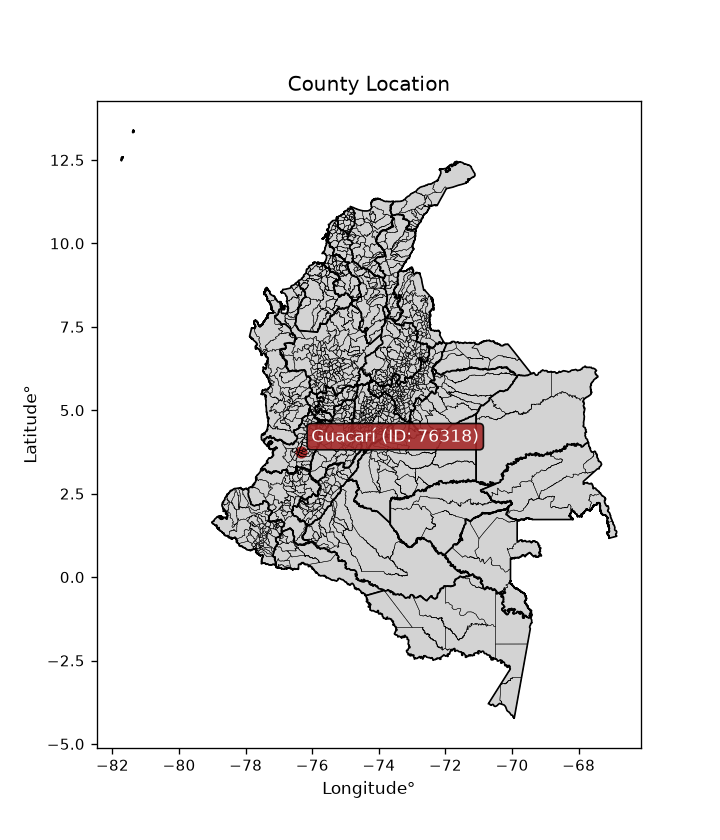
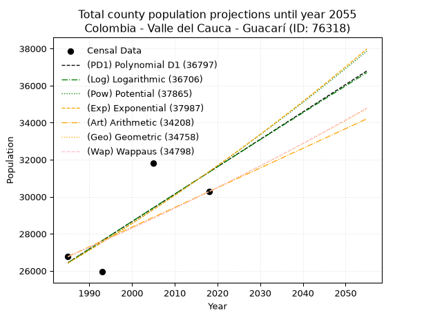
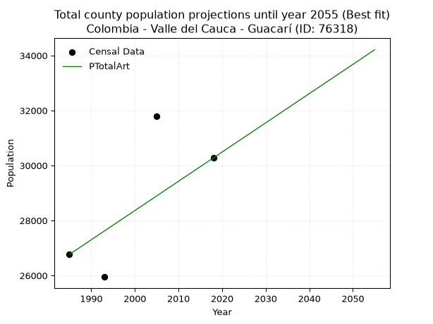
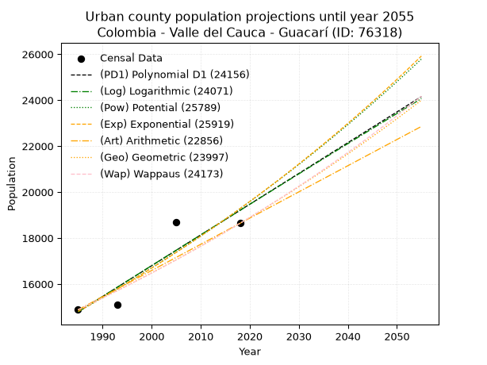
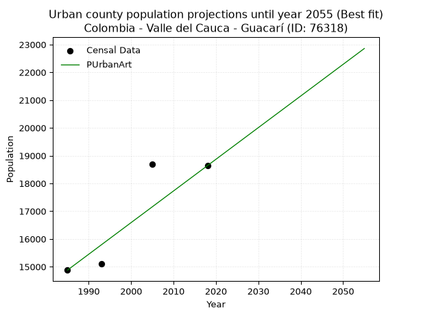
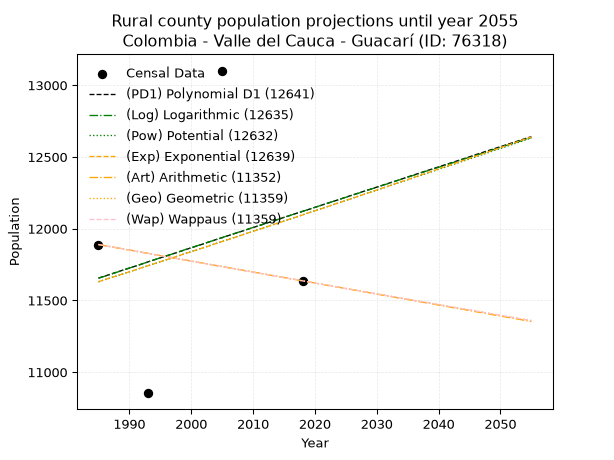
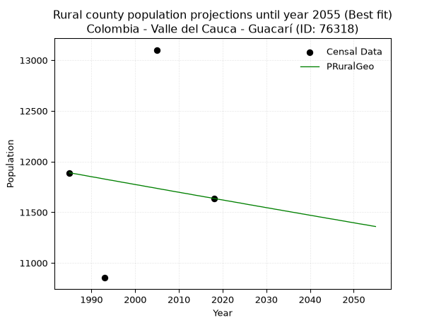

<div align="center">


</div>

# _“Population and Public Services Demand Projections (PPSD) until Year 2050 for Colombia - Valle del Cauca - Guacarí (ID: 76318)”_
Keywords: `population` `public-service` `projection` `lineal` `polynomial` `logarithmic` `potential` `exponential` `arithmetic` `geometric` `wappaus` `dane` `colombia` `south-america`

PPSD are analytical estimates used by governments and planners to anticipate future changes in population size, age distribution, and the resulting community needs for utilities, healthcare, education, and infrastructure as sizing future water treatment facilities, electrical grids, and road networks based on spatial growth.

> **General running parameters**: • app_version: _v20260806_. • Python version: _3.14.7_. • Pandas version: _3.0.5_. • NumPy version: _2.5.1_. • Creates, save and include plots into reports (create_plot): _False_. • Projection until year: _2050_. • Process polynomial degree 2 and up: _False_. • Process Wappaus: _True_. • Process Wappaus: _True_. • Set negative values to zero: _True_. • Set infinite values to zero: _True_. • Drop dataset notes: _True_. 
<div align="center">

Dynamic map: [:earth_americas:Google](http://maps.google.com/maps?q=3.761815322,-76.3309105) [:earth_americas:OSM](https://www.openstreetmap.org/#map=18/3.761815322/-76.3309105&layers=P) [:earth_americas:Bing](https://www.bing.com/maps?cp=3.761815322~-76.3309105&lvl=18) [:earth_americas:Apple](https://maps.apple.com/frame?center=3.761815322%2C-76.3309105&span=0.003%2C0.006)

</div>


<div align="center">

```geojson
{
  "type": "Feature",
  "geometry": {
    "type": "Point", 
    "coordinates": [-76.3309105, 3.761815322]
  }, 
  "properties": {
    "Name": "Colombia - Valle del Cauca - Guacarí (ID: 76318)"
  }
}
```

</div>


<div align="center">

</img>

</div>


## 0. Census Data (4 records)

Census data are official statistics collected by a government about the people and housing in a country. They usually include counts of total population, age, sex, race, income, education, and jobs.

📅Global census file: [Population.xlsx](../data/Population.xlsx)

| Source   |   Year |   CountryID | CountryName   |   StateID | StateName       |   CountyID | CountyName   |   PTotal |   PUrban |   PRural |
|:---------|-------:|------------:|:--------------|----------:|:----------------|-----------:|:-------------|---------:|---------:|---------:|
| DANE     |   1985 |          57 | Colombia      |        76 | Valle del Cauca |      76318 | Guacarí      |    26767 |    14878 |    11889 |
| DANE     |   1993 |          57 | Colombia      |        76 | Valle del Cauca |      76318 | Guacarí      |    25948 |    15095 |    10853 |
| DANE     |   2005 |          57 | Colombia      |        76 | Valle Del Cauca |      76318 | Guacarí      |    31802 |    18701 |    13101 |
| DANE     |   2018 |          57 | Colombia      |        76 | Valle del Cauca |      76318 | Guacarí      |    30275 |    18639 |    11636 |

> 🔥Some records could had specific notes about the registered values or the corresponding urban or rural distribution.

📅   [RUPS](https://www.datos.gov.co/Hacienda-y-Cr-dito-P-blico/Registro-nico-de-Prestadores-de-Servicios-P-blicos/4qkq-csdn/about_data) - Local public utility companies: [RUPS.csv](../data/RUPS.xlsx)

 | SERVICIO       | ESTADO    | NOMBRE                                                                                                          | NIT         | DEPARTAMENTO_DOMICILIO   | MUNICIPIO_DOMICILIO   | DIRECCION              |   TELEFONO | EMAIL                            | TIPO_PRESTADOR                             | CLASIFICACION                 |
|:---------------|:----------|:----------------------------------------------------------------------------------------------------------------|:------------|:-------------------------|:----------------------|:-----------------------|-----------:|:---------------------------------|:-------------------------------------------|:------------------------------|
| ACUEDUCTO      | OPERATIVA | SOCIEDAD DE ACUEDUCTOS Y ALCANTARILLADOS DEL VALLE DEL CAUCA S.A.  E.S.P.                                       | 890399032-8 | VALLE DEL CAUCA          | CALI                  | AVENIDA 5 N # 23 AN 41 |    6203400 | rosemary@acuavalle.gov.co        | SOCIEDADES (EMPRESA DE SERVICIOS PUBLICOS) | MAYOR O IGUAL A 5001 USUARIOS |
| ALCANTARILLADO | OPERATIVA | SOCIEDAD DE ACUEDUCTOS Y ALCANTARILLADOS DEL VALLE DEL CAUCA S.A.  E.S.P.                                       | 890399032-8 | VALLE DEL CAUCA          | CALI                  | AVENIDA 5 N # 23 AN 41 |    6203400 | rosemary@acuavalle.gov.co        | SOCIEDADES (EMPRESA DE SERVICIOS PUBLICOS) | MAYOR O IGUAL A 5001 USUARIOS |
| ACUEDUCTO      | OPERATIVA | ASOCIACION ADMINITRADORA DEL ACUEDUCTO RURAL COMUNITARIO DEL CORREGIMIENTO DE PUENTE ROJO ACUASALUD PUENTE ROJO | 815005131-6 | VALLE DEL CAUCA          | GUACARI               | ALCALDIA MUNICIPAL     |    2538646 | contactenos@guacari-valle.gov.co | ORGANIZACION AUTORIZADA                    | HASTA 2500 SUSCRIPTORES       |

## 1. Total

### 1.1. Coefficients and Parameters

* (PD1) Polynomial Deg 1: 147.92613408269827, -267191.24969891715 (lineal)
* (Log) Logarithmic: 296322.62432909134, -2223652.6421059077
* (Pow) Potential: 10.389044538784514, -29.838713354893518
* (Exp) Exponential: 0.005186607204328341, 0.8927248773228985
* (Art) Arithmetic: Year diff. 2018 - 1985 = 33, Population diff. 30275 - 26767 = 3508, Annual growth = 106.3030303030303
* (Geo) Geometric: Year diff. 2018 - 1985 = 33, Population diff. 30275 - 26767 = 3508, Annual growth % = 0.0037388662456330213
* (Wap) Wappaus: i = 0.3727184541321493, Condition values only valid for < 200)

<sub>
Wappaus condition values: ['0.00', '0.37', '0.75', '1.12', '1.49', '1.86', '2.24', '2.61', '2.98', '3.35', '3.73', '4.10', '4.47', '4.85', '5.22', '5.59', '5.96', '6.34', '6.71', '7.08', '7.45', '7.83', '8.20', '8.57', '8.95', '9.32', '9.69', '10.06', '10.44', '10.81', '11.18', '11.55', '11.93', '12.30', '12.67', '13.05', '13.42', '13.79', '14.16', '14.54', '14.91', '15.28', '15.65', '16.03', '16.40', '16.77', '17.15', '17.52', '17.89', '18.26', '18.64', '19.01', '19.38', '19.75', '20.13', '20.50', '20.87', '21.24', '21.62', '21.99', '22.36', '22.74', '23.11', '23.48', '23.85', '24.23']
</sub>


### 1.2. Projected Dataset

|   Year |   CountyID |   PTotalPD1 |   PTotalLog |   PTotalPow |   PTotalExp |   PTotalArt |   PTotalGeo |   PTotalWap |
|-------:|-----------:|------------:|------------:|------------:|------------:|------------:|------------:|------------:|
|   1985 |      76318 |       26442 |       26436 |       26416 |       26422 |       26767 |       26767 |       26767 |
|   1986 |      76318 |       26590 |       26585 |       26555 |       26559 |       26873 |       26867 |       26867 |
|   1987 |      76318 |       26738 |       26734 |       26694 |       26697 |       26980 |       26968 |       26967 |
|   1988 |      76318 |       26886 |       26883 |       26834 |       26836 |       27086 |       27068 |       27068 |
|   1989 |      76318 |       27034 |       27032 |       26974 |       26976 |       27192 |       27170 |       27169 |
|   1990 |      76318 |       27182 |       27181 |       27116 |       27116 |       27299 |       27271 |       27271 |
|   1991 |      76318 |       27330 |       27330 |       27257 |       27257 |       27405 |       27373 |       27372 |
|   1992 |      76318 |       27478 |       27479 |       27400 |       27399 |       27511 |       27475 |       27475 |
|   1993 |      76318 |       27626 |       27628 |       27543 |       27541 |       27617 |       27578 |       27577 |
|   1994 |      76318 |       27773 |       27776 |       27687 |       27684 |       27724 |       27681 |       27680 |
|   1995 |      76318 |       27921 |       27925 |       27832 |       27828 |       27830 |       27785 |       27784 |
|   1996 |      76318 |       28069 |       28073 |       27977 |       27973 |       27936 |       27889 |       27887 |
|   1997 |      76318 |       28217 |       28222 |       28123 |       28118 |       28043 |       27993 |       27992 |
|   1998 |      76318 |       28365 |       28370 |       28270 |       28265 |       28149 |       28098 |       28096 |
|   1999 |      76318 |       28513 |       28519 |       28417 |       28412 |       28255 |       28203 |       28201 |
|   2000 |      76318 |       28661 |       28667 |       28565 |       28559 |       28362 |       28308 |       28307 |
|   2001 |      76318 |       28809 |       28815 |       28714 |       28708 |       28468 |       28414 |       28412 |
|   2002 |      76318 |       28957 |       28963 |       28863 |       28857 |       28574 |       28520 |       28519 |
|   2003 |      76318 |       29105 |       29111 |       29013 |       29007 |       28680 |       28627 |       28625 |
|   2004 |      76318 |       29253 |       29259 |       29164 |       29158 |       28787 |       28734 |       28732 |
|   2005 |      76318 |       29401 |       29407 |       29316 |       29310 |       28893 |       28841 |       28840 |
|   2006 |      76318 |       29549 |       29554 |       29468 |       29462 |       28999 |       28949 |       28947 |
|   2007 |      76318 |       29697 |       29702 |       29621 |       29615 |       29106 |       29057 |       29056 |
|   2008 |      76318 |       29844 |       29850 |       29775 |       29769 |       29212 |       29166 |       29164 |
|   2009 |      76318 |       29992 |       29997 |       29929 |       29924 |       29318 |       29275 |       29273 |
|   2010 |      76318 |       30140 |       30145 |       30084 |       30080 |       29425 |       29384 |       29383 |
|   2011 |      76318 |       30288 |       30292 |       30240 |       30236 |       29531 |       29494 |       29493 |
|   2012 |      76318 |       30436 |       30439 |       30397 |       30393 |       29637 |       29605 |       29603 |
|   2013 |      76318 |       30584 |       30587 |       30554 |       30551 |       29743 |       29715 |       29714 |
|   2014 |      76318 |       30732 |       30734 |       30712 |       30710 |       29850 |       29826 |       29825 |
|   2015 |      76318 |       30880 |       30881 |       30871 |       30870 |       29956 |       29938 |       29937 |
|   2016 |      76318 |       31028 |       31028 |       31030 |       31030 |       30062 |       30050 |       30049 |
|   2017 |      76318 |       31176 |       31175 |       31191 |       31192 |       30169 |       30162 |       30162 |
|   2018 |      76318 |       31324 |       31322 |       31352 |       31354 |       30275 |       30275 |       30275 |
|   2019 |      76318 |       31472 |       31468 |       31513 |       31517 |       30381 |       30388 |       30388 |
|   2020 |      76318 |       31620 |       31615 |       31676 |       31681 |       30488 |       30502 |       30502 |
|   2021 |      76318 |       31767 |       31762 |       31839 |       31846 |       30594 |       30616 |       30617 |
|   2022 |      76318 |       31915 |       31908 |       32003 |       32011 |       30700 |       30730 |       30732 |
|   2023 |      76318 |       32063 |       32055 |       32168 |       32178 |       30807 |       30845 |       30847 |
|   2024 |      76318 |       32211 |       32201 |       32334 |       32345 |       30913 |       30961 |       30963 |
|   2025 |      76318 |       32359 |       32348 |       32500 |       32513 |       31019 |       31076 |       31079 |
|   2026 |      76318 |       32507 |       32494 |       32667 |       32682 |       31125 |       31192 |       31196 |
|   2027 |      76318 |       32655 |       32640 |       32835 |       32852 |       31232 |       31309 |       31313 |
|   2028 |      76318 |       32803 |       32786 |       33004 |       33023 |       31338 |       31426 |       31431 |
|   2029 |      76318 |       32951 |       32933 |       33173 |       33195 |       31444 |       31544 |       31549 |
|   2030 |      76318 |       33099 |       33079 |       33343 |       33367 |       31551 |       31662 |       31667 |
|   2031 |      76318 |       33247 |       33224 |       33514 |       33541 |       31657 |       31780 |       31787 |
|   2032 |      76318 |       33395 |       33370 |       33686 |       33715 |       31763 |       31899 |       31906 |
|   2033 |      76318 |       33543 |       33516 |       33859 |       33891 |       31870 |       32018 |       32026 |
|   2034 |      76318 |       33691 |       33662 |       34032 |       34067 |       31976 |       32138 |       32147 |
|   2035 |      76318 |       33838 |       33808 |       34207 |       34244 |       32082 |       32258 |       32268 |
|   2036 |      76318 |       33986 |       33953 |       34382 |       34422 |       32188 |       32379 |       32389 |
|   2037 |      76318 |       34134 |       34099 |       34557 |       34601 |       32295 |       32500 |       32511 |
|   2038 |      76318 |       34282 |       34244 |       34734 |       34781 |       32401 |       32621 |       32634 |
|   2039 |      76318 |       34430 |       34389 |       34912 |       34962 |       32507 |       32743 |       32757 |
|   2040 |      76318 |       34578 |       34535 |       35090 |       35144 |       32614 |       32866 |       32881 |
|   2041 |      76318 |       34726 |       34680 |       35269 |       35326 |       32720 |       32988 |       33005 |
|   2042 |      76318 |       34874 |       34825 |       35449 |       35510 |       32826 |       33112 |       33129 |
|   2043 |      76318 |       35022 |       34970 |       35630 |       35695 |       32933 |       33236 |       33255 |
|   2044 |      76318 |       35170 |       35115 |       35811 |       35880 |       33039 |       33360 |       33380 |
|   2045 |      76318 |       35318 |       35260 |       35994 |       36067 |       33145 |       33485 |       33507 |
|   2046 |      76318 |       35466 |       35405 |       36177 |       36255 |       33251 |       33610 |       33633 |
|   2047 |      76318 |       35614 |       35550 |       36361 |       36443 |       33358 |       33735 |       33761 |
|   2048 |      76318 |       35761 |       35694 |       36546 |       36633 |       33464 |       33862 |       33888 |
|   2049 |      76318 |       35909 |       35839 |       36732 |       36823 |       33570 |       33988 |       34017 |
|   2050 |      76318 |       36057 |       35984 |       36919 |       37015 |       33677 |       34115 |       34146 |
<div align="center">

</img>

</div>


### 1.3. Best fit with absolute and relative error (%)

Relative error puts that difference into context by dividing the absolute error by the true value, creating a unitless ratio or percentage that shows the scale of the mistake.

Absolute and relative error

|   Year | Source   |   CountryID | CountryName   |   StateID | StateName       |   CountyID_x | CountyName   |   PTotal |   PUrban |   PRural |   CountyID_y |   PTotalPD1 |   PTotalLog |   PTotalPow |   PTotalExp |   PTotalArt |   PTotalGeo |   PTotalWap |   PTotalPD1AbsError |   PTotalLogAbsError |   PTotalPowAbsError |   PTotalExpAbsError |   PTotalArtAbsError |   PTotalGeoAbsError |   PTotalWapAbsError |   PTotalPD1RelError |   PTotalLogRelError |   PTotalPowRelError |   PTotalExpRelError |   PTotalArtRelError |   PTotalGeoRelError |   PTotalWapRelError |
|-------:|:---------|------------:|:--------------|----------:|:----------------|-------------:|:-------------|---------:|---------:|---------:|-------------:|------------:|------------:|------------:|------------:|------------:|------------:|------------:|--------------------:|--------------------:|--------------------:|--------------------:|--------------------:|--------------------:|--------------------:|--------------------:|--------------------:|--------------------:|--------------------:|--------------------:|--------------------:|--------------------:|
|   1985 | DANE     |          57 | Colombia      |        76 | Valle del Cauca |        76318 | Guacarí      |    26767 |    14878 |    11889 |        76318 |       26442 |       26436 |       26416 |       26422 |       26767 |       26767 |       26767 |                 325 |                 331 |                 351 |                 345 |                   0 |                   0 |                   0 |             1.21418 |             1.2366  |             1.31132 |             1.2889  |             0       |             0       |             0       |
|   1993 | DANE     |          57 | Colombia      |        76 | Valle del Cauca |        76318 | Guacarí      |    25948 |    15095 |    10853 |        76318 |       27626 |       27628 |       27543 |       27541 |       27617 |       27578 |       27577 |                1678 |                1680 |                1595 |                1593 |                1669 |                1630 |                1629 |             6.46678 |             6.47449 |             6.14691 |             6.1392  |             6.43209 |             6.28179 |             6.27794 |
|   2005 | DANE     |          57 | Colombia      |        76 | Valle Del Cauca |        76318 | Guacarí      |    31802 |    18701 |    13101 |        76318 |       29401 |       29407 |       29316 |       29310 |       28893 |       28841 |       28840 |                2401 |                2395 |                2486 |                2492 |                2909 |                2961 |                2962 |             7.54984 |             7.53097 |             7.81712 |             7.83599 |             9.14722 |             9.31074 |             9.31388 |
|   2018 | DANE     |          57 | Colombia      |        76 | Valle del Cauca |        76318 | Guacarí      |    30275 |    18639 |    11636 |        76318 |       31324 |       31322 |       31352 |       31354 |       30275 |       30275 |       30275 |                1049 |                1047 |                1077 |                1079 |                   0 |                   0 |                   0 |             3.46491 |             3.4583  |             3.55739 |             3.564   |             0       |             0       |             0       |

Relative error mean

| Method    |   RelError | Best   |
|:----------|-----------:|:-------|
| PTotalPD1 |    4.67393 |        |
| PTotalLog |    4.67509 |        |
| PTotalPow |    4.70818 |        |
| PTotalExp |    4.70702 |        |
| PTotalArt |    3.89483 | True   |
| PTotalGeo |    3.89813 |        |
| PTotalWap |    3.89796 |        |

💙Best method: _**PTotalArt**_
<div align="center">

</img>

</div>


### 1.4. Fresh water supply demand in liters per capita per day (lpcd)

The fresh water supply demand typically ranges from 100 to 300 liters per capita per day (lpcd) for standard domestic and municipal planning, though absolute survival minimums set by the World Health Organization are as low as 7.5 to 20 liters per day, and total consumption in high-income nations can exceed 400 liters.

> `CZ`: Level in meters above the sea level (masl)<br> `WS`: Fresh water supply demand in liters per capita per day (lpcd or l/h/d)<br> `WSAll`: Zonal fresh water supply demand in liters per second (l/s)<br> `A`: Zonal area in square meters<br> `DP`: Population density (people/hectare or p/ha)

Reference values (RAS Colombia)

|    CZ |   WS |
|------:|-----:|
|  1000 |  120 |
|  2000 |  130 |
| 99999 |  140 |

County shapefile geometry properties and water supply values

|   CountyID |      ATotal |   CZTotal |   WSTotal |
|-----------:|------------:|----------:|----------:|
|      76318 | 1.62524e+08 |   1197.45 |       130 |

Projected values for best method: PTotalArt

|   CountyID |   Year |   PTotalArt |   DPTotal |   WSTotal |   WSTotalAll |
|-----------:|-------:|------------:|----------:|----------:|-------------:|
|      76318 |   1985 |       26767 |      1.65 |       130 |      40.2744 |
|      76318 |   1986 |       26873 |      1.65 |       130 |      40.4339 |
|      76318 |   1987 |       26980 |      1.66 |       130 |      40.5949 |
|      76318 |   1988 |       27086 |      1.67 |       130 |      40.7544 |
|      76318 |   1989 |       27192 |      1.67 |       130 |      40.9139 |
|      76318 |   1990 |       27299 |      1.68 |       130 |      41.0749 |
|      76318 |   1991 |       27405 |      1.69 |       130 |      41.2344 |
|      76318 |   1992 |       27511 |      1.69 |       130 |      41.3939 |
|      76318 |   1993 |       27617 |      1.7  |       130 |      41.5534 |
|      76318 |   1994 |       27724 |      1.71 |       130 |      41.7144 |
|      76318 |   1995 |       27830 |      1.71 |       130 |      41.8738 |
|      76318 |   1996 |       27936 |      1.72 |       130 |      42.0333 |
|      76318 |   1997 |       28043 |      1.73 |       130 |      42.1943 |
|      76318 |   1998 |       28149 |      1.73 |       130 |      42.3538 |
|      76318 |   1999 |       28255 |      1.74 |       130 |      42.5133 |
|      76318 |   2000 |       28362 |      1.75 |       130 |      42.6743 |
|      76318 |   2001 |       28468 |      1.75 |       130 |      42.8338 |
|      76318 |   2002 |       28574 |      1.76 |       130 |      42.9933 |
|      76318 |   2003 |       28680 |      1.76 |       130 |      43.1528 |
|      76318 |   2004 |       28787 |      1.77 |       130 |      43.3138 |
|      76318 |   2005 |       28893 |      1.78 |       130 |      43.4733 |
|      76318 |   2006 |       28999 |      1.78 |       130 |      43.6328 |
|      76318 |   2007 |       29106 |      1.79 |       130 |      43.7938 |
|      76318 |   2008 |       29212 |      1.8  |       130 |      43.9532 |
|      76318 |   2009 |       29318 |      1.8  |       130 |      44.1127 |
|      76318 |   2010 |       29425 |      1.81 |       130 |      44.2737 |
|      76318 |   2011 |       29531 |      1.82 |       130 |      44.4332 |
|      76318 |   2012 |       29637 |      1.82 |       130 |      44.5927 |
|      76318 |   2013 |       29743 |      1.83 |       130 |      44.7522 |
|      76318 |   2014 |       29850 |      1.84 |       130 |      44.9132 |
|      76318 |   2015 |       29956 |      1.84 |       130 |      45.0727 |
|      76318 |   2016 |       30062 |      1.85 |       130 |      45.2322 |
|      76318 |   2017 |       30169 |      1.86 |       130 |      45.3932 |
|      76318 |   2018 |       30275 |      1.86 |       130 |      45.5527 |
|      76318 |   2019 |       30381 |      1.87 |       130 |      45.7122 |
|      76318 |   2020 |       30488 |      1.88 |       130 |      45.8731 |
|      76318 |   2021 |       30594 |      1.88 |       130 |      46.0326 |
|      76318 |   2022 |       30700 |      1.89 |       130 |      46.1921 |
|      76318 |   2023 |       30807 |      1.9  |       130 |      46.3531 |
|      76318 |   2024 |       30913 |      1.9  |       130 |      46.5126 |
|      76318 |   2025 |       31019 |      1.91 |       130 |      46.6721 |
|      76318 |   2026 |       31125 |      1.92 |       130 |      46.8316 |
|      76318 |   2027 |       31232 |      1.92 |       130 |      46.9926 |
|      76318 |   2028 |       31338 |      1.93 |       130 |      47.1521 |
|      76318 |   2029 |       31444 |      1.93 |       130 |      47.3116 |
|      76318 |   2030 |       31551 |      1.94 |       130 |      47.4726 |
|      76318 |   2031 |       31657 |      1.95 |       130 |      47.6321 |
|      76318 |   2032 |       31763 |      1.95 |       130 |      47.7916 |
|      76318 |   2033 |       31870 |      1.96 |       130 |      47.9525 |
|      76318 |   2034 |       31976 |      1.97 |       130 |      48.112  |
|      76318 |   2035 |       32082 |      1.97 |       130 |      48.2715 |
|      76318 |   2036 |       32188 |      1.98 |       130 |      48.431  |
|      76318 |   2037 |       32295 |      1.99 |       130 |      48.592  |
|      76318 |   2038 |       32401 |      1.99 |       130 |      48.7515 |
|      76318 |   2039 |       32507 |      2    |       130 |      48.911  |
|      76318 |   2040 |       32614 |      2.01 |       130 |      49.072  |
|      76318 |   2041 |       32720 |      2.01 |       130 |      49.2315 |
|      76318 |   2042 |       32826 |      2.02 |       130 |      49.391  |
|      76318 |   2043 |       32933 |      2.03 |       130 |      49.552  |
|      76318 |   2044 |       33039 |      2.03 |       130 |      49.7115 |
|      76318 |   2045 |       33145 |      2.04 |       130 |      49.8709 |
|      76318 |   2046 |       33251 |      2.05 |       130 |      50.0304 |
|      76318 |   2047 |       33358 |      2.05 |       130 |      50.1914 |
|      76318 |   2048 |       33464 |      2.06 |       130 |      50.3509 |
|      76318 |   2049 |       33570 |      2.07 |       130 |      50.5104 |
|      76318 |   2050 |       33677 |      2.07 |       130 |      50.6714 |

## 2. Urban

### 2.1. Coefficients and Parameters

* (PD1) Polynomial Deg 1: 133.83179446005587, -250868.7968687268 (lineal)
* (Log) Logarithmic: 268015.59535258834, -2020360.4380172144
* (Pow) Potential: 16.020074328380712, -48.66006399742082
* (Exp) Exponential: 0.007999480795531097, 0.0018805592010200415
* (Art) Arithmetic: Year diff. 2018 - 1985 = 33, Population diff. 18639 - 14878 = 3761, Annual growth = 113.96969696969697
* (Geo) Geometric: Year diff. 2018 - 1985 = 33, Population diff. 18639 - 14878 = 3761, Annual growth % = 0.006852845169456723
* (Wap) Wappaus: i = 0.6800709906596472, Condition values only valid for < 200)

<sub>
Wappaus condition values: ['0.00', '0.68', '1.36', '2.04', '2.72', '3.40', '4.08', '4.76', '5.44', '6.12', '6.80', '7.48', '8.16', '8.84', '9.52', '10.20', '10.88', '11.56', '12.24', '12.92', '13.60', '14.28', '14.96', '15.64', '16.32', '17.00', '17.68', '18.36', '19.04', '19.72', '20.40', '21.08', '21.76', '22.44', '23.12', '23.80', '24.48', '25.16', '25.84', '26.52', '27.20', '27.88', '28.56', '29.24', '29.92', '30.60', '31.28', '31.96', '32.64', '33.32', '34.00', '34.68', '35.36', '36.04', '36.72', '37.40', '38.08', '38.76', '39.44', '40.12', '40.80', '41.48', '42.16', '42.84', '43.52', '44.20']
</sub>


### 2.2. Projected Dataset

|   Year |   CountyID |   PUrbanPD1 |   PUrbanLog |   PUrbanPow |   PUrbanExp |   PUrbanArt |   PUrbanGeo |   PUrbanWap |
|-------:|-----------:|------------:|------------:|------------:|------------:|------------:|------------:|------------:|
|   1985 |      76318 |       14787 |       14782 |       14801 |       14806 |       14878 |       14878 |       14878 |
|   1986 |      76318 |       14921 |       14917 |       14921 |       14925 |       14992 |       14980 |       14980 |
|   1987 |      76318 |       15055 |       15052 |       15042 |       15045 |       15106 |       15083 |       15082 |
|   1988 |      76318 |       15189 |       15187 |       15164 |       15166 |       15220 |       15186 |       15185 |
|   1989 |      76318 |       15323 |       15322 |       15287 |       15287 |       15334 |       15290 |       15288 |
|   1990 |      76318 |       15456 |       15457 |       15410 |       15410 |       15448 |       15395 |       15393 |
|   1991 |      76318 |       15590 |       15591 |       15535 |       15534 |       15562 |       15500 |       15498 |
|   1992 |      76318 |       15724 |       15726 |       15660 |       15659 |       15676 |       15607 |       15604 |
|   1993 |      76318 |       15858 |       15860 |       15787 |       15784 |       15790 |       15713 |       15710 |
|   1994 |      76318 |       15992 |       15995 |       15914 |       15911 |       15904 |       15821 |       15817 |
|   1995 |      76318 |       16126 |       16129 |       16042 |       16039 |       16018 |       15930 |       15925 |
|   1996 |      76318 |       16259 |       16263 |       16172 |       16168 |       16132 |       16039 |       16034 |
|   1997 |      76318 |       16393 |       16398 |       16302 |       16298 |       16246 |       16149 |       16144 |
|   1998 |      76318 |       16527 |       16532 |       16433 |       16429 |       16360 |       16259 |       16254 |
|   1999 |      76318 |       16661 |       16666 |       16565 |       16561 |       16474 |       16371 |       16365 |
|   2000 |      76318 |       16795 |       16800 |       16699 |       16694 |       16588 |       16483 |       16477 |
|   2001 |      76318 |       16929 |       16934 |       16833 |       16828 |       16702 |       16596 |       16590 |
|   2002 |      76318 |       17062 |       17068 |       16968 |       16963 |       16815 |       16710 |       16704 |
|   2003 |      76318 |       17196 |       17202 |       17104 |       17099 |       16929 |       16824 |       16818 |
|   2004 |      76318 |       17330 |       17335 |       17242 |       17236 |       17043 |       16939 |       16933 |
|   2005 |      76318 |       17464 |       17469 |       17380 |       17375 |       17157 |       17056 |       17049 |
|   2006 |      76318 |       17598 |       17603 |       17520 |       17514 |       17271 |       17172 |       17166 |
|   2007 |      76318 |       17732 |       17736 |       17660 |       17655 |       17385 |       17290 |       17284 |
|   2008 |      76318 |       17865 |       17870 |       17801 |       17797 |       17499 |       17409 |       17403 |
|   2009 |      76318 |       17999 |       18003 |       17944 |       17940 |       17613 |       17528 |       17522 |
|   2010 |      76318 |       18133 |       18137 |       18088 |       18084 |       17727 |       17648 |       17643 |
|   2011 |      76318 |       18267 |       18270 |       18232 |       18229 |       17841 |       17769 |       17764 |
|   2012 |      76318 |       18401 |       18403 |       18378 |       18375 |       17955 |       17891 |       17886 |
|   2013 |      76318 |       18535 |       18536 |       18525 |       18523 |       18069 |       18013 |       18009 |
|   2014 |      76318 |       18668 |       18670 |       18673 |       18672 |       18183 |       18137 |       18133 |
|   2015 |      76318 |       18802 |       18803 |       18822 |       18822 |       18297 |       18261 |       18258 |
|   2016 |      76318 |       18936 |       18936 |       18972 |       18973 |       18411 |       18386 |       18384 |
|   2017 |      76318 |       19070 |       19068 |       19124 |       19125 |       18525 |       18512 |       18511 |
|   2018 |      76318 |       19204 |       19201 |       19276 |       19279 |       18639 |       18639 |       18639 |
|   2019 |      76318 |       19338 |       19334 |       19430 |       19434 |       18753 |       18767 |       18768 |
|   2020 |      76318 |       19471 |       19467 |       19584 |       19590 |       18867 |       18895 |       18898 |
|   2021 |      76318 |       19605 |       19599 |       19740 |       19747 |       18981 |       19025 |       19029 |
|   2022 |      76318 |       19739 |       19732 |       19897 |       19906 |       19095 |       19155 |       19160 |
|   2023 |      76318 |       19873 |       19865 |       20056 |       20066 |       19209 |       19286 |       19293 |
|   2024 |      76318 |       20007 |       19997 |       20215 |       20227 |       19323 |       19419 |       19427 |
|   2025 |      76318 |       20141 |       20129 |       20376 |       20389 |       19437 |       19552 |       19562 |
|   2026 |      76318 |       20274 |       20262 |       20537 |       20553 |       19551 |       19686 |       19698 |
|   2027 |      76318 |       20408 |       20394 |       20700 |       20718 |       19665 |       19821 |       19836 |
|   2028 |      76318 |       20542 |       20526 |       20865 |       20884 |       19779 |       19956 |       19974 |
|   2029 |      76318 |       20676 |       20658 |       21030 |       21052 |       19893 |       20093 |       20113 |
|   2030 |      76318 |       20810 |       20790 |       21197 |       21221 |       20007 |       20231 |       20254 |
|   2031 |      76318 |       20944 |       20922 |       21365 |       21392 |       20121 |       20370 |       20395 |
|   2032 |      76318 |       21077 |       21054 |       21534 |       21564 |       20235 |       20509 |       20538 |
|   2033 |      76318 |       21211 |       21186 |       21704 |       21737 |       20349 |       20650 |       20682 |
|   2034 |      76318 |       21345 |       21318 |       21876 |       21911 |       20463 |       20791 |       20827 |
|   2035 |      76318 |       21479 |       21450 |       22049 |       22087 |       20576 |       20934 |       20973 |
|   2036 |      76318 |       21613 |       21581 |       22223 |       22265 |       20690 |       21077 |       21121 |
|   2037 |      76318 |       21747 |       21713 |       22398 |       22443 |       20804 |       21222 |       21270 |
|   2038 |      76318 |       21880 |       21844 |       22575 |       22624 |       20918 |       21367 |       21419 |
|   2039 |      76318 |       22014 |       21976 |       22753 |       22805 |       21032 |       21513 |       21571 |
|   2040 |      76318 |       22148 |       22107 |       22933 |       22989 |       21146 |       21661 |       21723 |
|   2041 |      76318 |       22282 |       22239 |       23114 |       23173 |       21260 |       21809 |       21877 |
|   2042 |      76318 |       22416 |       22370 |       23296 |       23359 |       21374 |       21959 |       22032 |
|   2043 |      76318 |       22550 |       22501 |       23479 |       23547 |       21488 |       22109 |       22188 |
|   2044 |      76318 |       22683 |       22632 |       23664 |       23736 |       21602 |       22261 |       22346 |
|   2045 |      76318 |       22817 |       22763 |       23850 |       23927 |       21716 |       22413 |       22505 |
|   2046 |      76318 |       22951 |       22894 |       24038 |       24119 |       21830 |       22567 |       22665 |
|   2047 |      76318 |       23085 |       23025 |       24226 |       24313 |       21944 |       22721 |       22827 |
|   2048 |      76318 |       23219 |       23156 |       24417 |       24508 |       22058 |       22877 |       22990 |
|   2049 |      76318 |       23353 |       23287 |       24608 |       24705 |       22172 |       23034 |       23155 |
|   2050 |      76318 |       23486 |       23418 |       24802 |       24903 |       22286 |       23192 |       23321 |
<div align="center">

</img>

</div>


### 2.3. Best fit with absolute and relative error (%)

Relative error puts that difference into context by dividing the absolute error by the true value, creating a unitless ratio or percentage that shows the scale of the mistake.

Absolute and relative error

|   Year | Source   |   CountryID | CountryName   |   StateID | StateName       |   CountyID_x | CountyName   |   PTotal |   PUrban |   PRural |   CountyID_y |   PUrbanPD1 |   PUrbanLog |   PUrbanPow |   PUrbanExp |   PUrbanArt |   PUrbanGeo |   PUrbanWap |   PUrbanPD1AbsError |   PUrbanLogAbsError |   PUrbanPowAbsError |   PUrbanExpAbsError |   PUrbanArtAbsError |   PUrbanGeoAbsError |   PUrbanWapAbsError |   PUrbanPD1RelError |   PUrbanLogRelError |   PUrbanPowRelError |   PUrbanExpRelError |   PUrbanArtRelError |   PUrbanGeoRelError |   PUrbanWapRelError |
|-------:|:---------|------------:|:--------------|----------:|:----------------|-------------:|:-------------|---------:|---------:|---------:|-------------:|------------:|------------:|------------:|------------:|------------:|------------:|------------:|--------------------:|--------------------:|--------------------:|--------------------:|--------------------:|--------------------:|--------------------:|--------------------:|--------------------:|--------------------:|--------------------:|--------------------:|--------------------:|--------------------:|
|   1985 | DANE     |          57 | Colombia      |        76 | Valle del Cauca |        76318 | Guacarí      |    26767 |    14878 |    11889 |        76318 |       14787 |       14782 |       14801 |       14806 |       14878 |       14878 |       14878 |                  91 |                  96 |                  77 |                  72 |                   0 |                   0 |                   0 |            0.611641 |            0.645248 |            0.517543 |            0.483936 |             0       |             0       |             0       |
|   1993 | DANE     |          57 | Colombia      |        76 | Valle del Cauca |        76318 | Guacarí      |    25948 |    15095 |    10853 |        76318 |       15858 |       15860 |       15787 |       15784 |       15790 |       15713 |       15710 |                 763 |                 765 |                 692 |                 689 |                 695 |                 618 |                 615 |            5.05465  |            5.0679   |            4.5843   |            4.56443  |             4.60417 |             4.09407 |             4.0742  |
|   2005 | DANE     |          57 | Colombia      |        76 | Valle Del Cauca |        76318 | Guacarí      |    31802 |    18701 |    13101 |        76318 |       17464 |       17469 |       17380 |       17375 |       17157 |       17056 |       17049 |                1237 |                1232 |                1321 |                1326 |                1544 |                1645 |                1652 |            6.61462  |            6.58788  |            7.06379  |            7.09053  |             8.25624 |             8.79632 |             8.83375 |
|   2018 | DANE     |          57 | Colombia      |        76 | Valle del Cauca |        76318 | Guacarí      |    30275 |    18639 |    11636 |        76318 |       19204 |       19201 |       19276 |       19279 |       18639 |       18639 |       18639 |                 565 |                 562 |                 637 |                 640 |                   0 |                   0 |                   0 |            3.03128  |            3.01518  |            3.41757  |            3.43366  |             0       |             0       |             0       |

Relative error mean

| Method    |   RelError | Best   |
|:----------|-----------:|:-------|
| PUrbanPD1 |    3.82805 |        |
| PUrbanLog |    3.82905 |        |
| PUrbanPow |    3.8958  |        |
| PUrbanExp |    3.89314 |        |
| PUrbanArt |    3.2151  | True   |
| PUrbanGeo |    3.2226  |        |
| PUrbanWap |    3.22699 |        |

💙Best method: _**PUrbanArt**_
<div align="center">

</img>

</div>


### 2.4. Fresh water supply demand in liters per capita per day (lpcd)

The fresh water supply demand typically ranges from 100 to 300 liters per capita per day (lpcd) for standard domestic and municipal planning, though absolute survival minimums set by the World Health Organization are as low as 7.5 to 20 liters per day, and total consumption in high-income nations can exceed 400 liters.

> `CZ`: Level in meters above the sea level (masl)<br> `WS`: Fresh water supply demand in liters per capita per day (lpcd or l/h/d)<br> `WSAll`: Zonal fresh water supply demand in liters per second (l/s)<br> `A`: Zonal area in square meters<br> `DP`: Population density (people/hectare or p/ha)

Reference values (RAS Colombia)

|    CZ |   WS |
|------:|-----:|
|  1000 |  120 |
|  2000 |  130 |
| 99999 |  140 |

County shapefile geometry properties and water supply values

|   CountyID |      AUrban |   CZUrban |   WSUrban |
|-----------:|------------:|----------:|----------:|
|      76318 | 2.55652e+06 |   972.482 |       120 |

Projected values for best method: PUrbanArt

|   CountyID |   Year |   PUrbanArt |   DPUrban |   WSUrban |   WSUrbanAll |
|-----------:|-------:|------------:|----------:|----------:|-------------:|
|      76318 |   1985 |       14878 |     58.2  |       120 |      20.6639 |
|      76318 |   1986 |       14992 |     58.64 |       120 |      20.8222 |
|      76318 |   1987 |       15106 |     59.09 |       120 |      20.9806 |
|      76318 |   1988 |       15220 |     59.53 |       120 |      21.1389 |
|      76318 |   1989 |       15334 |     59.98 |       120 |      21.2972 |
|      76318 |   1990 |       15448 |     60.43 |       120 |      21.4556 |
|      76318 |   1991 |       15562 |     60.87 |       120 |      21.6139 |
|      76318 |   1992 |       15676 |     61.32 |       120 |      21.7722 |
|      76318 |   1993 |       15790 |     61.76 |       120 |      21.9306 |
|      76318 |   1994 |       15904 |     62.21 |       120 |      22.0889 |
|      76318 |   1995 |       16018 |     62.66 |       120 |      22.2472 |
|      76318 |   1996 |       16132 |     63.1  |       120 |      22.4056 |
|      76318 |   1997 |       16246 |     63.55 |       120 |      22.5639 |
|      76318 |   1998 |       16360 |     63.99 |       120 |      22.7222 |
|      76318 |   1999 |       16474 |     64.44 |       120 |      22.8806 |
|      76318 |   2000 |       16588 |     64.89 |       120 |      23.0389 |
|      76318 |   2001 |       16702 |     65.33 |       120 |      23.1972 |
|      76318 |   2002 |       16815 |     65.77 |       120 |      23.3542 |
|      76318 |   2003 |       16929 |     66.22 |       120 |      23.5125 |
|      76318 |   2004 |       17043 |     66.66 |       120 |      23.6708 |
|      76318 |   2005 |       17157 |     67.11 |       120 |      23.8292 |
|      76318 |   2006 |       17271 |     67.56 |       120 |      23.9875 |
|      76318 |   2007 |       17385 |     68    |       120 |      24.1458 |
|      76318 |   2008 |       17499 |     68.45 |       120 |      24.3042 |
|      76318 |   2009 |       17613 |     68.89 |       120 |      24.4625 |
|      76318 |   2010 |       17727 |     69.34 |       120 |      24.6208 |
|      76318 |   2011 |       17841 |     69.79 |       120 |      24.7792 |
|      76318 |   2012 |       17955 |     70.23 |       120 |      24.9375 |
|      76318 |   2013 |       18069 |     70.68 |       120 |      25.0958 |
|      76318 |   2014 |       18183 |     71.12 |       120 |      25.2542 |
|      76318 |   2015 |       18297 |     71.57 |       120 |      25.4125 |
|      76318 |   2016 |       18411 |     72.02 |       120 |      25.5708 |
|      76318 |   2017 |       18525 |     72.46 |       120 |      25.7292 |
|      76318 |   2018 |       18639 |     72.91 |       120 |      25.8875 |
|      76318 |   2019 |       18753 |     73.35 |       120 |      26.0458 |
|      76318 |   2020 |       18867 |     73.8  |       120 |      26.2042 |
|      76318 |   2021 |       18981 |     74.25 |       120 |      26.3625 |
|      76318 |   2022 |       19095 |     74.69 |       120 |      26.5208 |
|      76318 |   2023 |       19209 |     75.14 |       120 |      26.6792 |
|      76318 |   2024 |       19323 |     75.58 |       120 |      26.8375 |
|      76318 |   2025 |       19437 |     76.03 |       120 |      26.9958 |
|      76318 |   2026 |       19551 |     76.48 |       120 |      27.1542 |
|      76318 |   2027 |       19665 |     76.92 |       120 |      27.3125 |
|      76318 |   2028 |       19779 |     77.37 |       120 |      27.4708 |
|      76318 |   2029 |       19893 |     77.81 |       120 |      27.6292 |
|      76318 |   2030 |       20007 |     78.26 |       120 |      27.7875 |
|      76318 |   2031 |       20121 |     78.7  |       120 |      27.9458 |
|      76318 |   2032 |       20235 |     79.15 |       120 |      28.1042 |
|      76318 |   2033 |       20349 |     79.6  |       120 |      28.2625 |
|      76318 |   2034 |       20463 |     80.04 |       120 |      28.4208 |
|      76318 |   2035 |       20576 |     80.48 |       120 |      28.5778 |
|      76318 |   2036 |       20690 |     80.93 |       120 |      28.7361 |
|      76318 |   2037 |       20804 |     81.38 |       120 |      28.8944 |
|      76318 |   2038 |       20918 |     81.82 |       120 |      29.0528 |
|      76318 |   2039 |       21032 |     82.27 |       120 |      29.2111 |
|      76318 |   2040 |       21146 |     82.71 |       120 |      29.3694 |
|      76318 |   2041 |       21260 |     83.16 |       120 |      29.5278 |
|      76318 |   2042 |       21374 |     83.61 |       120 |      29.6861 |
|      76318 |   2043 |       21488 |     84.05 |       120 |      29.8444 |
|      76318 |   2044 |       21602 |     84.5  |       120 |      30.0028 |
|      76318 |   2045 |       21716 |     84.94 |       120 |      30.1611 |
|      76318 |   2046 |       21830 |     85.39 |       120 |      30.3194 |
|      76318 |   2047 |       21944 |     85.84 |       120 |      30.4778 |
|      76318 |   2048 |       22058 |     86.28 |       120 |      30.6361 |
|      76318 |   2049 |       22172 |     86.73 |       120 |      30.7944 |
|      76318 |   2050 |       22286 |     87.17 |       120 |      30.9528 |

## 3. Rural

### 3.1. Coefficients and Parameters

* (PD1) Polynomial Deg 1: 14.094339622642291, -16322.452830190243 (lineal)
* (Log) Logarithmic: 28307.02897650336, -203292.20408869607
* (Pow) Potential: 2.386669601993656, -3.8051265321155223
* (Exp) Exponential: 0.0011887651004760622, 1098.432835881711
* (Art) Arithmetic: Year diff. 2018 - 1985 = 33, Population diff. 11636 - 11889 = -253, Annual growth = -7.666666666666667
* (Geo) Geometric: Year diff. 2018 - 1985 = 33, Population diff. 11636 - 11889 = -253, Annual growth % = -0.0006516016227747778
* (Wap) Wappaus: i = -0.06517888770811193, Condition values only valid for < 200)

<sub>
Wappaus condition values: ['-0.00', '-0.07', '-0.13', '-0.20', '-0.26', '-0.33', '-0.39', '-0.46', '-0.52', '-0.59', '-0.65', '-0.72', '-0.78', '-0.85', '-0.91', '-0.98', '-1.04', '-1.11', '-1.17', '-1.24', '-1.30', '-1.37', '-1.43', '-1.50', '-1.56', '-1.63', '-1.69', '-1.76', '-1.83', '-1.89', '-1.96', '-2.02', '-2.09', '-2.15', '-2.22', '-2.28', '-2.35', '-2.41', '-2.48', '-2.54', '-2.61', '-2.67', '-2.74', '-2.80', '-2.87', '-2.93', '-3.00', '-3.06', '-3.13', '-3.19', '-3.26', '-3.32', '-3.39', '-3.45', '-3.52', '-3.58', '-3.65', '-3.72', '-3.78', '-3.85', '-3.91', '-3.98', '-4.04', '-4.11', '-4.17', '-4.24']
</sub>


### 3.2. Projected Dataset

|   Year |   CountyID |   PRuralPD1 |   PRuralLog |   PRuralPow |   PRuralExp |   PRuralArt |   PRuralGeo |   PRuralWap |
|-------:|-----------:|------------:|------------:|------------:|------------:|------------:|------------:|------------:|
|   1985 |      76318 |       11655 |       11654 |       11629 |       11630 |       11889 |       11889 |       11889 |
|   1986 |      76318 |       11669 |       11668 |       11643 |       11644 |       11881 |       11881 |       11881 |
|   1987 |      76318 |       11683 |       11682 |       11657 |       11658 |       11874 |       11874 |       11874 |
|   1988 |      76318 |       11697 |       11696 |       11671 |       11671 |       11866 |       11866 |       11866 |
|   1989 |      76318 |       11711 |       11711 |       11685 |       11685 |       11858 |       11858 |       11858 |
|   1990 |      76318 |       11725 |       11725 |       11699 |       11699 |       11851 |       11850 |       11850 |
|   1991 |      76318 |       11739 |       11739 |       11713 |       11713 |       11843 |       11843 |       11843 |
|   1992 |      76318 |       11753 |       11753 |       11727 |       11727 |       11835 |       11835 |       11835 |
|   1993 |      76318 |       11768 |       11768 |       11741 |       11741 |       11828 |       11827 |       11827 |
|   1994 |      76318 |       11782 |       11782 |       11755 |       11755 |       11820 |       11819 |       11819 |
|   1995 |      76318 |       11796 |       11796 |       11769 |       11769 |       11812 |       11812 |       11812 |
|   1996 |      76318 |       11810 |       11810 |       11783 |       11783 |       11805 |       11804 |       11804 |
|   1997 |      76318 |       11824 |       11824 |       11797 |       11797 |       11797 |       11796 |       11796 |
|   1998 |      76318 |       11838 |       11838 |       11811 |       11811 |       11789 |       11789 |       11789 |
|   1999 |      76318 |       11852 |       11853 |       11826 |       11825 |       11782 |       11781 |       11781 |
|   2000 |      76318 |       11866 |       11867 |       11840 |       11839 |       11774 |       11773 |       11773 |
|   2001 |      76318 |       11880 |       11881 |       11854 |       11853 |       11766 |       11766 |       11766 |
|   2002 |      76318 |       11894 |       11895 |       11868 |       11867 |       11759 |       11758 |       11758 |
|   2003 |      76318 |       11909 |       11909 |       11882 |       11881 |       11751 |       11750 |       11750 |
|   2004 |      76318 |       11923 |       11923 |       11896 |       11896 |       11743 |       11743 |       11743 |
|   2005 |      76318 |       11937 |       11937 |       11910 |       11910 |       11736 |       11735 |       11735 |
|   2006 |      76318 |       11951 |       11952 |       11925 |       11924 |       11728 |       11727 |       11727 |
|   2007 |      76318 |       11965 |       11966 |       11939 |       11938 |       11720 |       11720 |       11720 |
|   2008 |      76318 |       11979 |       11980 |       11953 |       11952 |       11713 |       11712 |       11712 |
|   2009 |      76318 |       11993 |       11994 |       11967 |       11967 |       11705 |       11704 |       11704 |
|   2010 |      76318 |       12007 |       12008 |       11981 |       11981 |       11697 |       11697 |       11697 |
|   2011 |      76318 |       12021 |       12022 |       11996 |       11995 |       11690 |       11689 |       11689 |
|   2012 |      76318 |       12035 |       12036 |       12010 |       12009 |       11682 |       11682 |       11682 |
|   2013 |      76318 |       12049 |       12050 |       12024 |       12024 |       11674 |       11674 |       11674 |
|   2014 |      76318 |       12064 |       12064 |       12038 |       12038 |       11667 |       11666 |       11666 |
|   2015 |      76318 |       12078 |       12078 |       12053 |       12052 |       11659 |       11659 |       11659 |
|   2016 |      76318 |       12092 |       12092 |       12067 |       12067 |       11651 |       11651 |       11651 |
|   2017 |      76318 |       12106 |       12106 |       12081 |       12081 |       11644 |       11644 |       11644 |
|   2018 |      76318 |       12120 |       12120 |       12096 |       12095 |       11636 |       11636 |       11636 |
|   2019 |      76318 |       12134 |       12134 |       12110 |       12110 |       11628 |       11628 |       11628 |
|   2020 |      76318 |       12148 |       12148 |       12124 |       12124 |       11621 |       11621 |       11621 |
|   2021 |      76318 |       12162 |       12162 |       12139 |       12138 |       11613 |       11613 |       11613 |
|   2022 |      76318 |       12176 |       12176 |       12153 |       12153 |       11605 |       11606 |       11606 |
|   2023 |      76318 |       12190 |       12190 |       12167 |       12167 |       11598 |       11598 |       11598 |
|   2024 |      76318 |       12204 |       12204 |       12182 |       12182 |       11590 |       11591 |       11591 |
|   2025 |      76318 |       12219 |       12218 |       12196 |       12196 |       11582 |       11583 |       11583 |
|   2026 |      76318 |       12233 |       12232 |       12210 |       12211 |       11575 |       11575 |       11575 |
|   2027 |      76318 |       12247 |       12246 |       12225 |       12225 |       11567 |       11568 |       11568 |
|   2028 |      76318 |       12261 |       12260 |       12239 |       12240 |       11559 |       11560 |       11560 |
|   2029 |      76318 |       12275 |       12274 |       12254 |       12254 |       11552 |       11553 |       11553 |
|   2030 |      76318 |       12289 |       12288 |       12268 |       12269 |       11544 |       11545 |       11545 |
|   2031 |      76318 |       12303 |       12302 |       12282 |       12284 |       11536 |       11538 |       11538 |
|   2032 |      76318 |       12317 |       12316 |       12297 |       12298 |       11529 |       11530 |       11530 |
|   2033 |      76318 |       12331 |       12330 |       12311 |       12313 |       11521 |       11523 |       11523 |
|   2034 |      76318 |       12345 |       12344 |       12326 |       12328 |       11513 |       11515 |       11515 |
|   2035 |      76318 |       12360 |       12358 |       12340 |       12342 |       11506 |       11508 |       11508 |
|   2036 |      76318 |       12374 |       12372 |       12355 |       12357 |       11498 |       11500 |       11500 |
|   2037 |      76318 |       12388 |       12386 |       12369 |       12372 |       11490 |       11493 |       11493 |
|   2038 |      76318 |       12402 |       12400 |       12384 |       12386 |       11483 |       11485 |       11485 |
|   2039 |      76318 |       12416 |       12413 |       12398 |       12401 |       11475 |       11478 |       11478 |
|   2040 |      76318 |       12430 |       12427 |       12413 |       12416 |       11467 |       11470 |       11470 |
|   2041 |      76318 |       12444 |       12441 |       12427 |       12431 |       11460 |       11463 |       11463 |
|   2042 |      76318 |       12458 |       12455 |       12442 |       12445 |       11452 |       11455 |       11455 |
|   2043 |      76318 |       12472 |       12469 |       12456 |       12460 |       11444 |       11448 |       11448 |
|   2044 |      76318 |       12486 |       12483 |       12471 |       12475 |       11437 |       11440 |       11440 |
|   2045 |      76318 |       12500 |       12497 |       12485 |       12490 |       11429 |       11433 |       11433 |
|   2046 |      76318 |       12515 |       12510 |       12500 |       12505 |       11421 |       11426 |       11426 |
|   2047 |      76318 |       12529 |       12524 |       12515 |       12519 |       11414 |       11418 |       11418 |
|   2048 |      76318 |       12543 |       12538 |       12529 |       12534 |       11406 |       11411 |       11411 |
|   2049 |      76318 |       12557 |       12552 |       12544 |       12549 |       11398 |       11403 |       11403 |
|   2050 |      76318 |       12571 |       12566 |       12558 |       12564 |       11391 |       11396 |       11396 |
<div align="center">

</img>

</div>


### 3.3. Best fit with absolute and relative error (%)

Relative error puts that difference into context by dividing the absolute error by the true value, creating a unitless ratio or percentage that shows the scale of the mistake.

Absolute and relative error

|   Year | Source   |   CountryID | CountryName   |   StateID | StateName       |   CountyID_x | CountyName   |   PTotal |   PUrban |   PRural |   CountyID_y |   PRuralPD1 |   PRuralLog |   PRuralPow |   PRuralExp |   PRuralArt |   PRuralGeo |   PRuralWap |   PRuralPD1AbsError |   PRuralLogAbsError |   PRuralPowAbsError |   PRuralExpAbsError |   PRuralArtAbsError |   PRuralGeoAbsError |   PRuralWapAbsError |   PRuralPD1RelError |   PRuralLogRelError |   PRuralPowRelError |   PRuralExpRelError |   PRuralArtRelError |   PRuralGeoRelError |   PRuralWapRelError |
|-------:|:---------|------------:|:--------------|----------:|:----------------|-------------:|:-------------|---------:|---------:|---------:|-------------:|------------:|------------:|------------:|------------:|------------:|------------:|------------:|--------------------:|--------------------:|--------------------:|--------------------:|--------------------:|--------------------:|--------------------:|--------------------:|--------------------:|--------------------:|--------------------:|--------------------:|--------------------:|--------------------:|
|   1985 | DANE     |          57 | Colombia      |        76 | Valle del Cauca |        76318 | Guacarí      |    26767 |    14878 |    11889 |        76318 |       11655 |       11654 |       11629 |       11630 |       11889 |       11889 |       11889 |                 234 |                 235 |                 260 |                 259 |                   0 |                   0 |                   0 |             1.96821 |             1.97662 |             2.1869  |             2.17848 |             0       |             0       |             0       |
|   1993 | DANE     |          57 | Colombia      |        76 | Valle del Cauca |        76318 | Guacarí      |    25948 |    15095 |    10853 |        76318 |       11768 |       11768 |       11741 |       11741 |       11828 |       11827 |       11827 |                 915 |                 915 |                 888 |                 888 |                 975 |                 974 |                 974 |             8.43085 |             8.43085 |             8.18207 |             8.18207 |             8.98369 |             8.97448 |             8.97448 |
|   2005 | DANE     |          57 | Colombia      |        76 | Valle Del Cauca |        76318 | Guacarí      |    31802 |    18701 |    13101 |        76318 |       11937 |       11937 |       11910 |       11910 |       11736 |       11735 |       11735 |                1164 |                1164 |                1191 |                1191 |                1365 |                1366 |                1366 |             8.88482 |             8.88482 |             9.09091 |             9.09091 |            10.4191  |            10.4267  |            10.4267  |
|   2018 | DANE     |          57 | Colombia      |        76 | Valle del Cauca |        76318 | Guacarí      |    30275 |    18639 |    11636 |        76318 |       12120 |       12120 |       12096 |       12095 |       11636 |       11636 |       11636 |                 484 |                 484 |                 460 |                 459 |                   0 |                   0 |                   0 |             4.1595  |             4.1595  |             3.95325 |             3.94465 |             0       |             0       |             0       |

Relative error mean

| Method    |   RelError | Best   |
|:----------|-----------:|:-------|
| PRuralPD1 |    5.86084 |        |
| PRuralLog |    5.86295 |        |
| PRuralPow |    5.85328 |        |
| PRuralExp |    5.84903 |        |
| PRuralArt |    4.85069 |        |
| PRuralGeo |    4.85029 | True   |
| PRuralWap |    4.85029 | True   |

💙Best method: _**PRuralGeo**_
<div align="center">

</img>

</div>


### 3.4. Fresh water supply demand in liters per capita per day (lpcd)

The fresh water supply demand typically ranges from 100 to 300 liters per capita per day (lpcd) for standard domestic and municipal planning, though absolute survival minimums set by the World Health Organization are as low as 7.5 to 20 liters per day, and total consumption in high-income nations can exceed 400 liters.

> `CZ`: Level in meters above the sea level (masl)<br> `WS`: Fresh water supply demand in liters per capita per day (lpcd or l/h/d)<br> `WSAll`: Zonal fresh water supply demand in liters per second (l/s)<br> `A`: Zonal area in square meters<br> `DP`: Population density (people/hectare or p/ha)

Reference values (RAS Colombia)

|    CZ |   WS |
|------:|-----:|
|  1000 |  120 |
|  2000 |  130 |
| 99999 |  140 |

County shapefile geometry properties and water supply values

|   CountyID |      ARural |   CZRural |   WSRural |
|-----------:|------------:|----------:|----------:|
|      76318 | 1.59967e+08 |    1201.1 |       130 |

Projected values for best method: PRuralGeo

|   CountyID |   Year |   PRuralGeo |   DPRural |   WSRural |   WSRuralAll |
|-----------:|-------:|------------:|----------:|----------:|-------------:|
|      76318 |   1985 |       11889 |      0.74 |       130 |      17.8885 |
|      76318 |   1986 |       11881 |      0.74 |       130 |      17.8765 |
|      76318 |   1987 |       11874 |      0.74 |       130 |      17.866  |
|      76318 |   1988 |       11866 |      0.74 |       130 |      17.8539 |
|      76318 |   1989 |       11858 |      0.74 |       130 |      17.8419 |
|      76318 |   1990 |       11850 |      0.74 |       130 |      17.8299 |
|      76318 |   1991 |       11843 |      0.74 |       130 |      17.8193 |
|      76318 |   1992 |       11835 |      0.74 |       130 |      17.8073 |
|      76318 |   1993 |       11827 |      0.74 |       130 |      17.7953 |
|      76318 |   1994 |       11819 |      0.74 |       130 |      17.7832 |
|      76318 |   1995 |       11812 |      0.74 |       130 |      17.7727 |
|      76318 |   1996 |       11804 |      0.74 |       130 |      17.7606 |
|      76318 |   1997 |       11796 |      0.74 |       130 |      17.7486 |
|      76318 |   1998 |       11789 |      0.74 |       130 |      17.7381 |
|      76318 |   1999 |       11781 |      0.74 |       130 |      17.726  |
|      76318 |   2000 |       11773 |      0.74 |       130 |      17.714  |
|      76318 |   2001 |       11766 |      0.74 |       130 |      17.7035 |
|      76318 |   2002 |       11758 |      0.74 |       130 |      17.6914 |
|      76318 |   2003 |       11750 |      0.73 |       130 |      17.6794 |
|      76318 |   2004 |       11743 |      0.73 |       130 |      17.6689 |
|      76318 |   2005 |       11735 |      0.73 |       130 |      17.6568 |
|      76318 |   2006 |       11727 |      0.73 |       130 |      17.6448 |
|      76318 |   2007 |       11720 |      0.73 |       130 |      17.6343 |
|      76318 |   2008 |       11712 |      0.73 |       130 |      17.6222 |
|      76318 |   2009 |       11704 |      0.73 |       130 |      17.6102 |
|      76318 |   2010 |       11697 |      0.73 |       130 |      17.5997 |
|      76318 |   2011 |       11689 |      0.73 |       130 |      17.5876 |
|      76318 |   2012 |       11682 |      0.73 |       130 |      17.5771 |
|      76318 |   2013 |       11674 |      0.73 |       130 |      17.565  |
|      76318 |   2014 |       11666 |      0.73 |       130 |      17.553  |
|      76318 |   2015 |       11659 |      0.73 |       130 |      17.5425 |
|      76318 |   2016 |       11651 |      0.73 |       130 |      17.5304 |
|      76318 |   2017 |       11644 |      0.73 |       130 |      17.5199 |
|      76318 |   2018 |       11636 |      0.73 |       130 |      17.5079 |
|      76318 |   2019 |       11628 |      0.73 |       130 |      17.4958 |
|      76318 |   2020 |       11621 |      0.73 |       130 |      17.4853 |
|      76318 |   2021 |       11613 |      0.73 |       130 |      17.4733 |
|      76318 |   2022 |       11606 |      0.73 |       130 |      17.4627 |
|      76318 |   2023 |       11598 |      0.73 |       130 |      17.4507 |
|      76318 |   2024 |       11591 |      0.72 |       130 |      17.4402 |
|      76318 |   2025 |       11583 |      0.72 |       130 |      17.4281 |
|      76318 |   2026 |       11575 |      0.72 |       130 |      17.4161 |
|      76318 |   2027 |       11568 |      0.72 |       130 |      17.4056 |
|      76318 |   2028 |       11560 |      0.72 |       130 |      17.3935 |
|      76318 |   2029 |       11553 |      0.72 |       130 |      17.383  |
|      76318 |   2030 |       11545 |      0.72 |       130 |      17.3709 |
|      76318 |   2031 |       11538 |      0.72 |       130 |      17.3604 |
|      76318 |   2032 |       11530 |      0.72 |       130 |      17.3484 |
|      76318 |   2033 |       11523 |      0.72 |       130 |      17.3378 |
|      76318 |   2034 |       11515 |      0.72 |       130 |      17.3258 |
|      76318 |   2035 |       11508 |      0.72 |       130 |      17.3153 |
|      76318 |   2036 |       11500 |      0.72 |       130 |      17.3032 |
|      76318 |   2037 |       11493 |      0.72 |       130 |      17.2927 |
|      76318 |   2038 |       11485 |      0.72 |       130 |      17.2807 |
|      76318 |   2039 |       11478 |      0.72 |       130 |      17.2701 |
|      76318 |   2040 |       11470 |      0.72 |       130 |      17.2581 |
|      76318 |   2041 |       11463 |      0.72 |       130 |      17.2476 |
|      76318 |   2042 |       11455 |      0.72 |       130 |      17.2355 |
|      76318 |   2043 |       11448 |      0.72 |       130 |      17.225  |
|      76318 |   2044 |       11440 |      0.72 |       130 |      17.213  |
|      76318 |   2045 |       11433 |      0.71 |       130 |      17.2024 |
|      76318 |   2046 |       11426 |      0.71 |       130 |      17.1919 |
|      76318 |   2047 |       11418 |      0.71 |       130 |      17.1799 |
|      76318 |   2048 |       11411 |      0.71 |       130 |      17.1693 |
|      76318 |   2049 |       11403 |      0.71 |       130 |      17.1573 |
|      76318 |   2050 |       11396 |      0.71 |       130 |      17.1468 |

<div align="center"><br><sub>Share this research</sub></div><br>

<sub>**APPS & TOOLS & CONTENT DISCLAIMER**: • NO WARRANTY - This content and software is provided by <a href="https://github.com/rcfdtools" target="_blank">github.com/rcfdtools</a> "as is", without any express or implied warranty, including warranties of merchantability, fitness for a particular purpose, or non-infringement. There is no guarantee that the software will be error-free or operate without interruption. • LIMITATION OF LIABILITY - Neither the authors nor copyright holders will be liable for claims or damages arising from the software or its use. You are responsible for determining if the software is appropriate for your use and assume all associated risks, including errors, legal compliance, and data loss. • NO PROFESSIONAL ADVICE - The software provides general information and does not offer professional advice. It should not replace consultation with professional advisors. [Clauses and global license for rcfdtools use.](https://github.com/rcfdtools/rcfdtools/blob/main/LICENSE.md)</sub>

| [:house: Home](Readme.md)  | [:beginner: Help / Collab](https://github.com/rcfdtools/R.HydroTools/discussions/31) |
|----------------------------|-------------------------------------------------------------------------------------------|