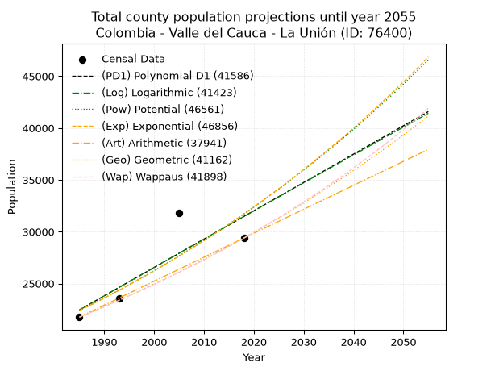
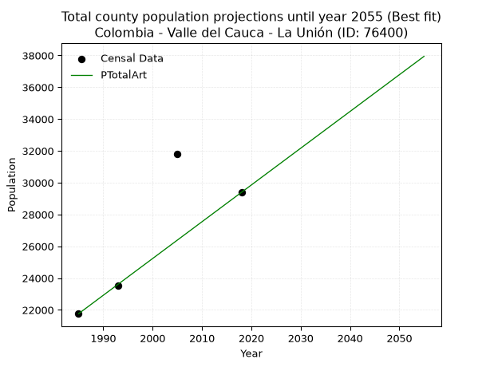
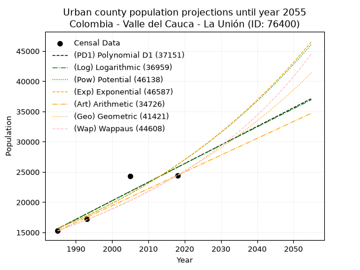
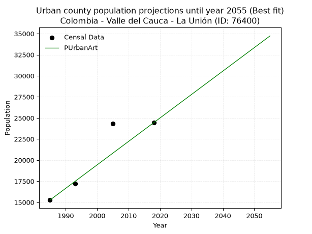
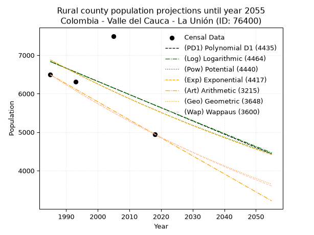
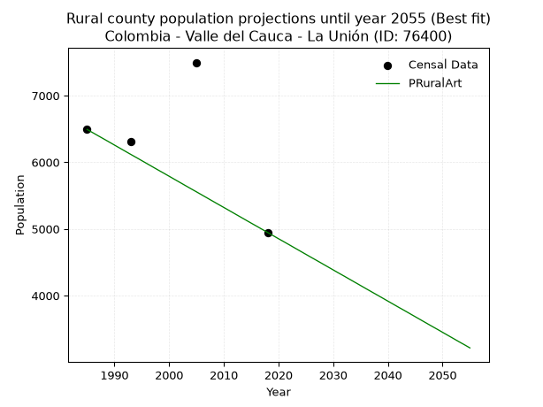

<div align="center">


</div>

# _“Population and Public Services Demand Projections (PPSD) until Year 2050 for Colombia - Valle del Cauca - La Unión (ID: 76400)”_
Keywords: `population` `public-service` `projection` `lineal` `polynomial` `logarithmic` `potential` `exponential` `arithmetic` `geometric` `wappaus` `dane` `colombia` `south-america`

PPSD are analytical estimates used by governments and planners to anticipate future changes in population size, age distribution, and the resulting community needs for utilities, healthcare, education, and infrastructure as sizing future water treatment facilities, electrical grids, and road networks based on spatial growth.

> **General running parameters**: • app_version: _v20260806_. • Python version: _3.14.7_. • Pandas version: _3.0.5_. • NumPy version: _2.5.1_. • Creates, save and include plots into reports (create_plot): _False_. • Projection until year: _2050_. • Process polynomial degree 2 and up: _False_. • Process Wappaus: _True_. • Process Wappaus: _True_. • Set negative values to zero: _True_. • Set infinite values to zero: _True_. • Drop dataset notes: _True_. 
<div align="center">

Dynamic map: [:earth_americas:Google](http://maps.google.com/maps?q=4.533868803,-76.0996606) [:earth_americas:OSM](https://www.openstreetmap.org/#map=18/4.533868803/-76.0996606&layers=P) [:earth_americas:Bing](https://www.bing.com/maps?cp=4.533868803~-76.0996606&lvl=18) [:earth_americas:Apple](https://maps.apple.com/frame?center=4.533868803%2C-76.0996606&span=0.003%2C0.006)

</div>


<div align="center">

```geojson
{
  "type": "Feature",
  "geometry": {
    "type": "Point", 
    "coordinates": [-76.0996606, 4.533868803]
  }, 
  "properties": {
    "Name": "Colombia - Valle del Cauca - La Unión (ID: 76400)"
  }
}
```

</div>


## 0. Census Data (4 records)

Census data are official statistics collected by a government about the people and housing in a country. They usually include counts of total population, age, sex, race, income, education, and jobs.

📅Global census file: [Population.xlsx](../data/Population.xlsx)

| Source   |   Year |   CountryID | CountryName   |   StateID | StateName       |   CountyID | CountyName   |   PTotal |   PUrban |   PRural |
|:---------|-------:|------------:|:--------------|----------:|:----------------|-----------:|:-------------|---------:|---------:|---------:|
| DANE     |   1985 |          57 | Colombia      |        76 | Valle del Cauca |      76400 | La Unión     |    21760 |    15268 |     6492 |
| DANE     |   1993 |          57 | Colombia      |        76 | Valle del Cauca |      76400 | La Unión     |    23531 |    17219 |     6312 |
| DANE     |   2005 |          57 | Colombia      |        76 | Valle Del Cauca |      76400 | La Unión     |    31798 |    24302 |     7496 |
| DANE     |   2018 |          57 | Colombia      |        76 | Valle del Cauca |      76400 | La Unión     |    29388 |    24441 |     4947 |

> 🔥Some records could had specific notes about the registered values or the corresponding urban or rural distribution.

**Local public utility companies (RUPS)**

 | SERVICIO       | ESTADO    | NOMBRE                                                                                                                                                 | NIT         | DEPARTAMENTO_DOMICILIO   | MUNICIPIO_DOMICILIO   | DIRECCION                                     |   TELEFONO | EMAIL                        | TIPO_INSCRIPCION    | REPRESENTANTE_LEGAL           | TIPO_PRESTADOR                             | CLASIFICACION                  |
|:---------------|:----------|:-------------------------------------------------------------------------------------------------------------------------------------------------------|:------------|:-------------------------|:----------------------|:----------------------------------------------|-----------:|:-----------------------------|:--------------------|:------------------------------|:-------------------------------------------|:-------------------------------|
| ACUEDUCTO      | OPERATIVA | SOCIEDAD DE ACUEDUCTOS Y ALCANTARILLADOS DEL VALLE DEL CAUCA S.A.  E.S.P.                                                                              | 890399032-8 | VALLE DEL CAUCA          | CALI                  | AVENIDA 5 N # 23 AN 41                        |    6203400 | rosemary@acuavalle.gov.co    | Registro por la ESP | JORGE ENRIQUE SANCHEZ CERON   | SOCIEDADES (EMPRESA DE SERVICIOS PUBLICOS) | MAYOR O IGUAL A 5001 USUARIOS  |
| ALCANTARILLADO | OPERATIVA | SOCIEDAD DE ACUEDUCTOS Y ALCANTARILLADOS DEL VALLE DEL CAUCA S.A.  E.S.P.                                                                              | 890399032-8 | VALLE DEL CAUCA          | CALI                  | AVENIDA 5 N # 23 AN 41                        |    6203400 | rosemary@acuavalle.gov.co    | Registro por la ESP | JORGE ENRIQUE SANCHEZ CERON   | SOCIEDADES (EMPRESA DE SERVICIOS PUBLICOS) | MAYOR O IGUAL A 5001 USUARIOS  |
| ASEO           | OPERATIVA | VEOLIA ASEO BUGA  S.A.  E.S.P.                                                                                                                         | 815000649-6 | VALLE DEL CAUCA          | GUADALAJARA DE BUGA   | Calle 6 No. 10 - 80                           |    2283583 | jose.carmona@veolia.com      | Registro por la ESP | HECTOR GIRALDO AVILA          | SOCIEDADES (EMPRESA DE SERVICIOS PUBLICOS) | MAYOR O IGUAL A 5001 USUARIOS  |
| ASEO           | OPERATIVA | VEOLIA ASEO SUR OCCIDENTE S.A.  E.S.P.                                                                                                                 | 805015900-1 | VALLE DEL CAUCA          | PALMIRA               | Carrera 32 No. 18-14, Barrio La Independencia |    2688000 | pilar.landazury@veolia.com   | Registro por la ESP | HECTOR GIRALDO AVILA          | SOCIEDADES (EMPRESA DE SERVICIOS PUBLICOS) | MAYOR O IGUAL A 5001 USUARIOS  |
| ACUEDUCTO      | OPERATIVA | ASOCIACION DE USUARIOS ACUEDUCTO SAN PEDRO Y SAN LUIS                                                                                                  | 900002521-1 | VALLE DEL CAUCA          | LA UNION              | CL 22 No 22 49                                |    2293805 | imalo23@hotmail.com          | Registro por la ESP | JAMES ELIECER RAMIREZ VINASCO | ORGANIZACION AUTORIZADA                    | MENOR O IGUAL A 2500 USUARIOS  |
| ACUEDUCTO      | OPERATIVA | ASOCIACION COMUNITARIA ADMINISTRADORA DEL ACUEDUCTO DE QUEBRADA GRANDE DEL MUNICIPIO DE LA UNION                                                       | 900058085-0 | VALLE DEL CAUCA          | LA UNION              | corregimiento quebradagrande la union valle   |    2213150 | dimirri1972@hotmail.com      | Registro por la ESP | MARIA ELENA RAMIREZ CARDONA   | ORGANIZACION AUTORIZADA                    | HASTA 2500 SUSCRIPTORES        |
| ASEO           | OPERATIVA | GRUPO EMPRESARIAL DE LA RECUPERACION Y TRANSFORMACION DE MATERIALES S.A.  E.S.P.                                                                       | 900206793-2 | VALLE DEL CAUCA          | CALI                  | CALLE 50 # 3N-01 Barrio Evaristo Garcia       |    4466806 | franciahelenagert@gmail.com  | Registro por la ESP | FABIO LOZANO HURTADO          | SOCIEDADES (EMPRESA DE SERVICIOS PUBLICOS) | MAYOR O IGUAL A 5001 USUARIOS  |
| ACUEDUCTO      | OPERATIVA | ASOCIACION DE SUSCRIPTORES  DEL ACUEDUCTO RURAL COMUNITARIO  DE LOS CORREGIMIENTOS: ISUGU, EL SILENCIO, PUERTO QUINTERO, CANDELARIA  Y  LAS VEREDAS, P | 900027830-9 | VALLE DEL CAUCA          | ROLDANILLO            | Vereda Simon Bolivar                          |    2294413 | acuacampo@gmail.com          | Registro por la ESP | BERNARDO MILLAN  MAYOR        | ORGANIZACION AUTORIZADA                    | MENOR O IGUAL A 2500 USUARIOS  |
| ASEO           | OPERATIVA | FUNDACION AMBIENTAL Y SOCIAL ONG SAN MIGUEL                                                                                                            | 900304705-4 | RISARALDA                | PEREIRA               | CARRERA 11 #80-52                             |    3200710 | fundacion-s-m@outlook.com    | Registro por la ESP | CARLOS ENRIQUE RODAS CASTANO  | ORGANIZACION AUTORIZADA                    | DESDE 2501 HASTA 5000 USUARIOS |
| ASEO           | OPERATIVA | ECOVIDA COLOMBIA SAS ESP                                                                                                                               | 901284649-6 | VALLE DEL CAUCA          | TULUA                 | CALLEJON CORINTO # 31-32 VIA FERREA           |    9999999 | ecovidacolombiasas@gmail.com | Registro por la ESP | DIEGO FERNANDO GIL MURCIA     | SOCIEDADES (EMPRESA DE SERVICIOS PUBLICOS) | MAYOR O IGUAL A 5001 USUARIOS  |

> [📅RUPS Database: Registro Único de Prestadores de Servicios Públicos de Colombia Suramérica - RUPS](https://www.datos.gov.co/Hacienda-y-Cr-dito-P-blico/Registro-nico-de-Prestadores-de-Servicios-P-blicos/4qkq-csdn/about_data)

## 1. Total

### 1.1. Coefficients and Parameters

* (PD1) Polynomial Deg 1: 273.36451224407955, -520178.1156162201 (lineal)
* (Log) Logarithmic: 547803.1006196432, -4137236.5076284544
* (Pow) Potential: 21.13623264263075, -65.35233958750827
* (Exp) Exponential: 0.01054780401723532, 1.8076564815748894e-05
* (Art) Arithmetic: Year diff. 2018 - 1985 = 33, Population diff. 29388 - 21760 = 7628, Annual growth = 231.15151515151516
* (Geo) Geometric: Year diff. 2018 - 1985 = 33, Population diff. 29388 - 21760 = 7628, Annual growth % = 0.009148044628775498
* (Wap) Wappaus: i = 0.9038535823551855, Condition values only valid for < 200)

<sub>
Wappaus condition values: ['0.00', '0.90', '1.81', '2.71', '3.62', '4.52', '5.42', '6.33', '7.23', '8.13', '9.04', '9.94', '10.85', '11.75', '12.65', '13.56', '14.46', '15.37', '16.27', '17.17', '18.08', '18.98', '19.88', '20.79', '21.69', '22.60', '23.50', '24.40', '25.31', '26.21', '27.12', '28.02', '28.92', '29.83', '30.73', '31.63', '32.54', '33.44', '34.35', '35.25', '36.15', '37.06', '37.96', '38.87', '39.77', '40.67', '41.58', '42.48', '43.38', '44.29', '45.19', '46.10', '47.00', '47.90', '48.81', '49.71', '50.62', '51.52', '52.42', '53.33', '54.23', '55.14', '56.04', '56.94', '57.85', '58.75']
</sub>


### 1.2. Projected Dataset

|   Year |   CountyID |   PTotalPD1 |   PTotalLog |   PTotalPow |   PTotalExp |   PTotalArt |   PTotalGeo |   PTotalWap |
|-------:|-----------:|------------:|------------:|------------:|------------:|------------:|------------:|------------:|
|   1985 |      76400 |       22450 |       22437 |       22382 |       22393 |       21760 |       21760 |       21760 |
|   1986 |      76400 |       22724 |       22713 |       22621 |       22630 |       21991 |       21959 |       21958 |
|   1987 |      76400 |       22997 |       22989 |       22863 |       22870 |       22222 |       22160 |       22157 |
|   1988 |      76400 |       23271 |       23265 |       23108 |       23113 |       22453 |       22363 |       22358 |
|   1989 |      76400 |       23544 |       23540 |       23355 |       23358 |       22685 |       22567 |       22561 |
|   1990 |      76400 |       23817 |       23816 |       23604 |       23606 |       22916 |       22774 |       22766 |
|   1991 |      76400 |       24091 |       24091 |       23856 |       23856 |       23147 |       22982 |       22973 |
|   1992 |      76400 |       24364 |       24366 |       24111 |       24109 |       23378 |       23192 |       23182 |
|   1993 |      76400 |       24637 |       24641 |       24368 |       24364 |       23609 |       23404 |       23392 |
|   1994 |      76400 |       24911 |       24916 |       24627 |       24623 |       23840 |       23619 |       23605 |
|   1995 |      76400 |       25184 |       25190 |       24890 |       24884 |       24072 |       23835 |       23820 |
|   1996 |      76400 |       25457 |       25465 |       25155 |       25148 |       24303 |       24053 |       24037 |
|   1997 |      76400 |       25731 |       25739 |       25423 |       25414 |       24534 |       24273 |       24255 |
|   1998 |      76400 |       26004 |       26013 |       25693 |       25684 |       24765 |       24495 |       24476 |
|   1999 |      76400 |       26278 |       26287 |       25966 |       25956 |       24996 |       24719 |       24699 |
|   2000 |      76400 |       26551 |       26561 |       26242 |       26231 |       25227 |       24945 |       24925 |
|   2001 |      76400 |       26824 |       26835 |       26521 |       26510 |       25458 |       25173 |       25152 |
|   2002 |      76400 |       27098 |       27109 |       26802 |       26791 |       25690 |       25403 |       25382 |
|   2003 |      76400 |       27371 |       27383 |       27087 |       27075 |       25921 |       25636 |       25614 |
|   2004 |      76400 |       27644 |       27656 |       27374 |       27362 |       26152 |       25870 |       25848 |
|   2005 |      76400 |       27918 |       27929 |       27664 |       27652 |       26383 |       26107 |       26084 |
|   2006 |      76400 |       28191 |       28202 |       27957 |       27945 |       26614 |       26346 |       26323 |
|   2007 |      76400 |       28464 |       28475 |       28253 |       28242 |       26845 |       26587 |       26565 |
|   2008 |      76400 |       28738 |       28748 |       28552 |       28541 |       27076 |       26830 |       26808 |
|   2009 |      76400 |       29011 |       29021 |       28854 |       28844 |       27308 |       27075 |       27055 |
|   2010 |      76400 |       29285 |       29294 |       29160 |       29149 |       27539 |       27323 |       27303 |
|   2011 |      76400 |       29558 |       29566 |       29468 |       29459 |       27770 |       27573 |       27555 |
|   2012 |      76400 |       29831 |       29838 |       29779 |       29771 |       28001 |       27825 |       27808 |
|   2013 |      76400 |       30105 |       30111 |       30093 |       30087 |       28232 |       28080 |       28065 |
|   2014 |      76400 |       30378 |       30383 |       30411 |       30406 |       28463 |       28337 |       28324 |
|   2015 |      76400 |       30651 |       30655 |       30732 |       30728 |       28695 |       28596 |       28586 |
|   2016 |      76400 |       30925 |       30926 |       31056 |       31054 |       28926 |       28858 |       28850 |
|   2017 |      76400 |       31198 |       31198 |       31383 |       31383 |       29157 |       29122 |       29118 |
|   2018 |      76400 |       31471 |       31470 |       31713 |       31716 |       29388 |       29388 |       29388 |
|   2019 |      76400 |       31745 |       31741 |       32047 |       32052 |       29619 |       29657 |       29661 |
|   2020 |      76400 |       32018 |       32012 |       32384 |       32392 |       29850 |       29928 |       29937 |
|   2021 |      76400 |       32292 |       32283 |       32725 |       32736 |       30081 |       30202 |       30216 |
|   2022 |      76400 |       32565 |       32554 |       33069 |       33083 |       30313 |       30478 |       30498 |
|   2023 |      76400 |       32838 |       32825 |       33416 |       33433 |       30544 |       30757 |       30783 |
|   2024 |      76400 |       33112 |       33096 |       33767 |       33788 |       30775 |       31038 |       31072 |
|   2025 |      76400 |       33385 |       33367 |       34122 |       34146 |       31006 |       31322 |       31363 |
|   2026 |      76400 |       33658 |       33637 |       34479 |       34508 |       31237 |       31609 |       31658 |
|   2027 |      76400 |       33932 |       33907 |       34841 |       34874 |       31468 |       31898 |       31956 |
|   2028 |      76400 |       34205 |       34177 |       35206 |       35244 |       31700 |       32190 |       32257 |
|   2029 |      76400 |       34478 |       34448 |       35575 |       35618 |       31931 |       32484 |       32562 |
|   2030 |      76400 |       34752 |       34717 |       35947 |       35995 |       32162 |       32781 |       32870 |
|   2031 |      76400 |       35025 |       34987 |       36323 |       36377 |       32393 |       33081 |       33182 |
|   2032 |      76400 |       35299 |       35257 |       36703 |       36763 |       32624 |       33384 |       33497 |
|   2033 |      76400 |       35572 |       35526 |       37087 |       37153 |       32855 |       33689 |       33816 |
|   2034 |      76400 |       35845 |       35796 |       37474 |       37547 |       33086 |       33998 |       34138 |
|   2035 |      76400 |       36119 |       36065 |       37866 |       37945 |       33318 |       34309 |       34465 |
|   2036 |      76400 |       36392 |       36334 |       38261 |       38347 |       33549 |       34622 |       34795 |
|   2037 |      76400 |       36665 |       36603 |       38660 |       38754 |       33780 |       34939 |       35129 |
|   2038 |      76400 |       36939 |       36872 |       39063 |       39165 |       34011 |       35259 |       35467 |
|   2039 |      76400 |       37212 |       37141 |       39471 |       39580 |       34242 |       35581 |       35809 |
|   2040 |      76400 |       37485 |       37409 |       39882 |       40000 |       34473 |       35907 |       36155 |
|   2041 |      76400 |       37759 |       37678 |       40297 |       40424 |       34704 |       36235 |       36506 |
|   2042 |      76400 |       38032 |       37946 |       40716 |       40852 |       34936 |       36567 |       36861 |
|   2043 |      76400 |       38306 |       38214 |       41140 |       41286 |       35167 |       36901 |       37220 |
|   2044 |      76400 |       38579 |       38482 |       41568 |       41723 |       35398 |       37239 |       37583 |
|   2045 |      76400 |       38852 |       38750 |       42000 |       42166 |       35629 |       37580 |       37951 |
|   2046 |      76400 |       39126 |       39018 |       42436 |       42613 |       35860 |       37923 |       38324 |
|   2047 |      76400 |       39399 |       39286 |       42876 |       43065 |       36091 |       38270 |       38701 |
|   2048 |      76400 |       39672 |       39553 |       43321 |       43521 |       36323 |       38620 |       39083 |
|   2049 |      76400 |       39946 |       39821 |       43771 |       43983 |       36554 |       38974 |       39470 |
|   2050 |      76400 |       40219 |       40088 |       44224 |       44449 |       36785 |       39330 |       39861 |
<div align="center">

</img>

</div>


### 1.3. Best fit with absolute and relative error (%)

Relative error puts that difference into context by dividing the absolute error by the true value, creating a unitless ratio or percentage that shows the scale of the mistake.

Absolute and relative error

|   Year | Source   |   CountryID | CountryName   |   StateID | StateName       |   CountyID_x | CountyName   |   PTotal |   PUrban |   PRural |   CountyID_y |   PTotalPD1 |   PTotalLog |   PTotalPow |   PTotalExp |   PTotalArt |   PTotalGeo |   PTotalWap |   PTotalPD1AbsError |   PTotalLogAbsError |   PTotalPowAbsError |   PTotalExpAbsError |   PTotalArtAbsError |   PTotalGeoAbsError |   PTotalWapAbsError |   PTotalPD1RelError |   PTotalLogRelError |   PTotalPowRelError |   PTotalExpRelError |   PTotalArtRelError |   PTotalGeoRelError |   PTotalWapRelError |
|-------:|:---------|------------:|:--------------|----------:|:----------------|-------------:|:-------------|---------:|---------:|---------:|-------------:|------------:|------------:|------------:|------------:|------------:|------------:|------------:|--------------------:|--------------------:|--------------------:|--------------------:|--------------------:|--------------------:|--------------------:|--------------------:|--------------------:|--------------------:|--------------------:|--------------------:|--------------------:|--------------------:|
|   1985 | DANE     |          57 | Colombia      |        76 | Valle del Cauca |        76400 | La Unión     |    21760 |    15268 |     6492 |        76400 |       22450 |       22437 |       22382 |       22393 |       21760 |       21760 |       21760 |                 690 |                 677 |                 622 |                 633 |                   0 |                   0 |                   0 |             3.17096 |             3.11121 |             2.85846 |             2.90901 |            0        |            0        |             0       |
|   1993 | DANE     |          57 | Colombia      |        76 | Valle del Cauca |        76400 | La Unión     |    23531 |    17219 |     6312 |        76400 |       24637 |       24641 |       24368 |       24364 |       23609 |       23404 |       23392 |                1106 |                1110 |                 837 |                 833 |                  78 |                 127 |                 139 |             4.70018 |             4.71718 |             3.55701 |             3.54001 |            0.331478 |            0.539714 |             0.59071 |
|   2005 | DANE     |          57 | Colombia      |        76 | Valle Del Cauca |        76400 | La Unión     |    31798 |    24302 |     7496 |        76400 |       27918 |       27929 |       27664 |       27652 |       26383 |       26107 |       26084 |                3880 |                3869 |                4134 |                4146 |                5415 |                5691 |                5714 |            12.202   |            12.1674  |            13.0008  |            13.0386  |           17.0294   |           17.8974   |            17.9697  |
|   2018 | DANE     |          57 | Colombia      |        76 | Valle del Cauca |        76400 | La Unión     |    29388 |    24441 |     4947 |        76400 |       31471 |       31470 |       31713 |       31716 |       29388 |       29388 |       29388 |                2083 |                2082 |                2325 |                2328 |                   0 |                   0 |                   0 |             7.08793 |             7.08452 |             7.91139 |             7.9216  |            0        |            0        |             0       |

Relative error mean

| Method    |   RelError | Best   |
|:----------|-----------:|:-------|
| PTotalPD1 |    6.79027 |        |
| PTotalLog |    6.77009 |        |
| PTotalPow |    6.83192 |        |
| PTotalExp |    6.85229 |        |
| PTotalArt |    4.34021 | True   |
| PTotalGeo |    4.60927 |        |
| PTotalWap |    4.6401  |        |

💙Best method: _**PTotalArt**_
<div align="center">

</img>

</div>


### 1.4. Fresh water supply demand in liters per capita per day (lpcd)

The fresh water supply demand typically ranges from 100 to 300 liters per capita per day (lpcd) for standard domestic and municipal planning, though absolute survival minimums set by the World Health Organization are as low as 7.5 to 20 liters per day, and total consumption in high-income nations can exceed 400 liters.

> `CZ`: Level in meters above the sea level (masl)<br> `WS`: Fresh water supply demand in liters per capita per day (lpcd or l/h/d)<br> `WSAll`: Zonal fresh water supply demand in liters per second (l/s)<br> `A`: Zonal area in square meters<br> `DP`: Population density (people/hectare or p/ha)

Reference values (RAS Colombia)

|    CZ |   WS |
|------:|-----:|
|  1000 |  120 |
|  2000 |  130 |
| 99999 |  140 |

County shapefile geometry properties and water supply values

|   CountyID |      ATotal |   CZTotal |   WSTotal |
|-----------:|------------:|----------:|----------:|
|      76400 | 1.20873e+08 |      1170 |       130 |

Projected values for best method: PTotalArt

|   CountyID |   Year |   PTotalArt |   DPTotal |   WSTotal |   WSTotalAll |
|-----------:|-------:|------------:|----------:|----------:|-------------:|
|      76400 |   1985 |       21760 |      1.8  |       130 |      32.7407 |
|      76400 |   1986 |       21991 |      1.82 |       130 |      33.0883 |
|      76400 |   1987 |       22222 |      1.84 |       130 |      33.4359 |
|      76400 |   1988 |       22453 |      1.86 |       130 |      33.7834 |
|      76400 |   1989 |       22685 |      1.88 |       130 |      34.1325 |
|      76400 |   1990 |       22916 |      1.9  |       130 |      34.4801 |
|      76400 |   1991 |       23147 |      1.91 |       130 |      34.8277 |
|      76400 |   1992 |       23378 |      1.93 |       130 |      35.1752 |
|      76400 |   1993 |       23609 |      1.95 |       130 |      35.5228 |
|      76400 |   1994 |       23840 |      1.97 |       130 |      35.8704 |
|      76400 |   1995 |       24072 |      1.99 |       130 |      36.2194 |
|      76400 |   1996 |       24303 |      2.01 |       130 |      36.567  |
|      76400 |   1997 |       24534 |      2.03 |       130 |      36.9146 |
|      76400 |   1998 |       24765 |      2.05 |       130 |      37.2622 |
|      76400 |   1999 |       24996 |      2.07 |       130 |      37.6097 |
|      76400 |   2000 |       25227 |      2.09 |       130 |      37.9573 |
|      76400 |   2001 |       25458 |      2.11 |       130 |      38.3049 |
|      76400 |   2002 |       25690 |      2.13 |       130 |      38.6539 |
|      76400 |   2003 |       25921 |      2.14 |       130 |      39.0015 |
|      76400 |   2004 |       26152 |      2.16 |       130 |      39.3491 |
|      76400 |   2005 |       26383 |      2.18 |       130 |      39.6966 |
|      76400 |   2006 |       26614 |      2.2  |       130 |      40.0442 |
|      76400 |   2007 |       26845 |      2.22 |       130 |      40.3918 |
|      76400 |   2008 |       27076 |      2.24 |       130 |      40.7394 |
|      76400 |   2009 |       27308 |      2.26 |       130 |      41.0884 |
|      76400 |   2010 |       27539 |      2.28 |       130 |      41.436  |
|      76400 |   2011 |       27770 |      2.3  |       130 |      41.7836 |
|      76400 |   2012 |       28001 |      2.32 |       130 |      42.1311 |
|      76400 |   2013 |       28232 |      2.34 |       130 |      42.4787 |
|      76400 |   2014 |       28463 |      2.35 |       130 |      42.8263 |
|      76400 |   2015 |       28695 |      2.37 |       130 |      43.1753 |
|      76400 |   2016 |       28926 |      2.39 |       130 |      43.5229 |
|      76400 |   2017 |       29157 |      2.41 |       130 |      43.8705 |
|      76400 |   2018 |       29388 |      2.43 |       130 |      44.2181 |
|      76400 |   2019 |       29619 |      2.45 |       130 |      44.5656 |
|      76400 |   2020 |       29850 |      2.47 |       130 |      44.9132 |
|      76400 |   2021 |       30081 |      2.49 |       130 |      45.2608 |
|      76400 |   2022 |       30313 |      2.51 |       130 |      45.6098 |
|      76400 |   2023 |       30544 |      2.53 |       130 |      45.9574 |
|      76400 |   2024 |       30775 |      2.55 |       130 |      46.305  |
|      76400 |   2025 |       31006 |      2.57 |       130 |      46.6525 |
|      76400 |   2026 |       31237 |      2.58 |       130 |      47.0001 |
|      76400 |   2027 |       31468 |      2.6  |       130 |      47.3477 |
|      76400 |   2028 |       31700 |      2.62 |       130 |      47.6968 |
|      76400 |   2029 |       31931 |      2.64 |       130 |      48.0443 |
|      76400 |   2030 |       32162 |      2.66 |       130 |      48.3919 |
|      76400 |   2031 |       32393 |      2.68 |       130 |      48.7395 |
|      76400 |   2032 |       32624 |      2.7  |       130 |      49.087  |
|      76400 |   2033 |       32855 |      2.72 |       130 |      49.4346 |
|      76400 |   2034 |       33086 |      2.74 |       130 |      49.7822 |
|      76400 |   2035 |       33318 |      2.76 |       130 |      50.1313 |
|      76400 |   2036 |       33549 |      2.78 |       130 |      50.4788 |
|      76400 |   2037 |       33780 |      2.79 |       130 |      50.8264 |
|      76400 |   2038 |       34011 |      2.81 |       130 |      51.174  |
|      76400 |   2039 |       34242 |      2.83 |       130 |      51.5215 |
|      76400 |   2040 |       34473 |      2.85 |       130 |      51.8691 |
|      76400 |   2041 |       34704 |      2.87 |       130 |      52.2167 |
|      76400 |   2042 |       34936 |      2.89 |       130 |      52.5657 |
|      76400 |   2043 |       35167 |      2.91 |       130 |      52.9133 |
|      76400 |   2044 |       35398 |      2.93 |       130 |      53.2609 |
|      76400 |   2045 |       35629 |      2.95 |       130 |      53.6084 |
|      76400 |   2046 |       35860 |      2.97 |       130 |      53.956  |
|      76400 |   2047 |       36091 |      2.99 |       130 |      54.3036 |
|      76400 |   2048 |       36323 |      3.01 |       130 |      54.6527 |
|      76400 |   2049 |       36554 |      3.02 |       130 |      55.0002 |
|      76400 |   2050 |       36785 |      3.04 |       130 |      55.3478 |

## 2. Urban

### 2.1. Coefficients and Parameters

* (PD1) Polynomial Deg 1: 307.6475311120026, -595064.4741067833 (lineal)
* (Log) Logarithmic: 616183.7700035208, -4663310.273583604
* (Pow) Potential: 31.15835278010472, -98.55769772202383
* (Exp) Exponential: 0.015555810263477344, 6.096684170739318e-10
* (Art) Arithmetic: Year diff. 2018 - 1985 = 33, Population diff. 24441 - 15268 = 9173, Annual growth = 277.969696969697
* (Geo) Geometric: Year diff. 2018 - 1985 = 33, Population diff. 24441 - 15268 = 9173, Annual growth % = 0.014359789365786968
* (Wap) Wappaus: i = 1.4000337302359513, Condition values only valid for < 200)

<sub>
Wappaus condition values: ['0.00', '1.40', '2.80', '4.20', '5.60', '7.00', '8.40', '9.80', '11.20', '12.60', '14.00', '15.40', '16.80', '18.20', '19.60', '21.00', '22.40', '23.80', '25.20', '26.60', '28.00', '29.40', '30.80', '32.20', '33.60', '35.00', '36.40', '37.80', '39.20', '40.60', '42.00', '43.40', '44.80', '46.20', '47.60', '49.00', '50.40', '51.80', '53.20', '54.60', '56.00', '57.40', '58.80', '60.20', '61.60', '63.00', '64.40', '65.80', '67.20', '68.60', '70.00', '71.40', '72.80', '74.20', '75.60', '77.00', '78.40', '79.80', '81.20', '82.60', '84.00', '85.40', '86.80', '88.20', '89.60', '91.00']
</sub>


### 2.2. Projected Dataset

|   Year |   CountyID |   PUrbanPD1 |   PUrbanLog |   PUrbanPow |   PUrbanExp |   PUrbanArt |   PUrbanGeo |   PUrbanWap |
|-------:|-----------:|------------:|------------:|------------:|------------:|------------:|------------:|------------:|
|   1985 |      76400 |       15616 |       15604 |       15671 |       15681 |       15268 |       15268 |       15268 |
|   1986 |      76400 |       15924 |       15914 |       15919 |       15926 |       15546 |       15487 |       15483 |
|   1987 |      76400 |       16231 |       16224 |       16170 |       16176 |       15824 |       15710 |       15702 |
|   1988 |      76400 |       16539 |       16534 |       16426 |       16430 |       16102 |       15935 |       15923 |
|   1989 |      76400 |       16846 |       16844 |       16685 |       16687 |       16380 |       16164 |       16148 |
|   1990 |      76400 |       17154 |       17154 |       16948 |       16949 |       16658 |       16396 |       16376 |
|   1991 |      76400 |       17462 |       17463 |       17216 |       17215 |       16936 |       16632 |       16607 |
|   1992 |      76400 |       17769 |       17773 |       17487 |       17484 |       17214 |       16870 |       16841 |
|   1993 |      76400 |       18077 |       18082 |       17763 |       17759 |       17492 |       17113 |       17080 |
|   1994 |      76400 |       18385 |       18391 |       18043 |       18037 |       17770 |       17358 |       17321 |
|   1995 |      76400 |       18692 |       18700 |       18327 |       18320 |       18048 |       17608 |       17566 |
|   1996 |      76400 |       19000 |       19009 |       18615 |       18607 |       18326 |       17861 |       17815 |
|   1997 |      76400 |       19308 |       19317 |       18908 |       18899 |       18604 |       18117 |       18068 |
|   1998 |      76400 |       19615 |       19626 |       19205 |       19195 |       18882 |       18377 |       18325 |
|   1999 |      76400 |       19923 |       19934 |       19507 |       19496 |       19160 |       18641 |       18586 |
|   2000 |      76400 |       20231 |       20242 |       19813 |       19802 |       19438 |       18909 |       18851 |
|   2001 |      76400 |       20538 |       20550 |       20124 |       20112 |       19716 |       19180 |       19119 |
|   2002 |      76400 |       20846 |       20858 |       20440 |       20427 |       19993 |       19456 |       19393 |
|   2003 |      76400 |       21154 |       21166 |       20761 |       20748 |       20271 |       19735 |       19670 |
|   2004 |      76400 |       21461 |       21474 |       21086 |       21073 |       20549 |       20018 |       19952 |
|   2005 |      76400 |       21769 |       21781 |       21416 |       21403 |       20827 |       20306 |       20239 |
|   2006 |      76400 |       22076 |       22088 |       21752 |       21739 |       21105 |       20598 |       20531 |
|   2007 |      76400 |       22384 |       22395 |       22092 |       22080 |       21383 |       20893 |       20827 |
|   2008 |      76400 |       22692 |       22702 |       22438 |       22426 |       21661 |       21193 |       21128 |
|   2009 |      76400 |       22999 |       23009 |       22789 |       22777 |       21939 |       21498 |       21434 |
|   2010 |      76400 |       23307 |       23316 |       23145 |       23134 |       22217 |       21806 |       21746 |
|   2011 |      76400 |       23615 |       23622 |       23506 |       23497 |       22495 |       22119 |       22062 |
|   2012 |      76400 |       23922 |       23929 |       23873 |       23865 |       22773 |       22437 |       22384 |
|   2013 |      76400 |       24230 |       24235 |       24246 |       24240 |       23051 |       22759 |       22712 |
|   2014 |      76400 |       24538 |       24541 |       24624 |       24620 |       23329 |       23086 |       23046 |
|   2015 |      76400 |       24845 |       24847 |       25007 |       25006 |       23607 |       23418 |       23385 |
|   2016 |      76400 |       25153 |       25152 |       25397 |       25398 |       23885 |       23754 |       23731 |
|   2017 |      76400 |       25461 |       25458 |       25793 |       25796 |       24163 |       24095 |       24083 |
|   2018 |      76400 |       25768 |       25763 |       26194 |       26200 |       24441 |       24441 |       24441 |
|   2019 |      76400 |       26076 |       26069 |       26601 |       26611 |       24719 |       24792 |       24806 |
|   2020 |      76400 |       26384 |       26374 |       27015 |       27028 |       24997 |       25148 |       25177 |
|   2021 |      76400 |       26691 |       26679 |       27435 |       27452 |       25275 |       25509 |       25556 |
|   2022 |      76400 |       26999 |       26983 |       27861 |       27882 |       25553 |       25875 |       25942 |
|   2023 |      76400 |       27306 |       27288 |       28294 |       28319 |       25831 |       26247 |       26335 |
|   2024 |      76400 |       27614 |       27593 |       28733 |       28763 |       26109 |       26624 |       26735 |
|   2025 |      76400 |       27922 |       27897 |       29178 |       29214 |       26387 |       27006 |       27144 |
|   2026 |      76400 |       28229 |       28201 |       29631 |       29672 |       26665 |       27394 |       27560 |
|   2027 |      76400 |       28537 |       28505 |       30090 |       30137 |       26943 |       27787 |       27985 |
|   2028 |      76400 |       28845 |       28809 |       30556 |       30610 |       27221 |       28186 |       28418 |
|   2029 |      76400 |       29152 |       29113 |       31029 |       31090 |       27499 |       28591 |       28860 |
|   2030 |      76400 |       29460 |       29417 |       31509 |       31577 |       27777 |       29002 |       29311 |
|   2031 |      76400 |       29768 |       29720 |       31996 |       32072 |       28055 |       29418 |       29771 |
|   2032 |      76400 |       30075 |       30023 |       32490 |       32575 |       28333 |       29841 |       30241 |
|   2033 |      76400 |       30383 |       30327 |       32992 |       33086 |       28611 |       30269 |       30721 |
|   2034 |      76400 |       30691 |       30630 |       33502 |       33604 |       28889 |       30704 |       31211 |
|   2035 |      76400 |       30998 |       30932 |       34019 |       34131 |       29166 |       31145 |       31711 |
|   2036 |      76400 |       31306 |       31235 |       34544 |       34666 |       29444 |       31592 |       32223 |
|   2037 |      76400 |       31614 |       31538 |       35076 |       35210 |       29722 |       32046 |       32745 |
|   2038 |      76400 |       31921 |       31840 |       35617 |       35762 |       30000 |       32506 |       33280 |
|   2039 |      76400 |       32229 |       32142 |       36165 |       36322 |       30278 |       32972 |       33826 |
|   2040 |      76400 |       32536 |       32445 |       36722 |       36892 |       30556 |       33446 |       34385 |
|   2041 |      76400 |       32844 |       32746 |       37287 |       37470 |       30834 |       33926 |       34956 |
|   2042 |      76400 |       33152 |       33048 |       37861 |       38058 |       31112 |       34413 |       35541 |
|   2043 |      76400 |       33459 |       33350 |       38443 |       38654 |       31390 |       34908 |       36140 |
|   2044 |      76400 |       33767 |       33652 |       39033 |       39260 |       31668 |       35409 |       36753 |
|   2045 |      76400 |       34075 |       33953 |       39633 |       39876 |       31946 |       35917 |       37381 |
|   2046 |      76400 |       34382 |       34254 |       40241 |       40501 |       32224 |       36433 |       38024 |
|   2047 |      76400 |       34690 |       34555 |       40858 |       41136 |       32502 |       36956 |       38684 |
|   2048 |      76400 |       34998 |       34856 |       41485 |       41781 |       32780 |       37487 |       39359 |
|   2049 |      76400 |       35305 |       35157 |       42121 |       42436 |       33058 |       38025 |       40052 |
|   2050 |      76400 |       35613 |       35458 |       42766 |       43101 |       33336 |       38571 |       40762 |
<div align="center">

</img>

</div>


### 2.3. Best fit with absolute and relative error (%)

Relative error puts that difference into context by dividing the absolute error by the true value, creating a unitless ratio or percentage that shows the scale of the mistake.

Absolute and relative error

|   Year | Source   |   CountryID | CountryName   |   StateID | StateName       |   CountyID_x | CountyName   |   PTotal |   PUrban |   PRural |   CountyID_y |   PUrbanPD1 |   PUrbanLog |   PUrbanPow |   PUrbanExp |   PUrbanArt |   PUrbanGeo |   PUrbanWap |   PUrbanPD1AbsError |   PUrbanLogAbsError |   PUrbanPowAbsError |   PUrbanExpAbsError |   PUrbanArtAbsError |   PUrbanGeoAbsError |   PUrbanWapAbsError |   PUrbanPD1RelError |   PUrbanLogRelError |   PUrbanPowRelError |   PUrbanExpRelError |   PUrbanArtRelError |   PUrbanGeoRelError |   PUrbanWapRelError |
|-------:|:---------|------------:|:--------------|----------:|:----------------|-------------:|:-------------|---------:|---------:|---------:|-------------:|------------:|------------:|------------:|------------:|------------:|------------:|------------:|--------------------:|--------------------:|--------------------:|--------------------:|--------------------:|--------------------:|--------------------:|--------------------:|--------------------:|--------------------:|--------------------:|--------------------:|--------------------:|--------------------:|
|   1985 | DANE     |          57 | Colombia      |        76 | Valle del Cauca |        76400 | La Unión     |    21760 |    15268 |     6492 |        76400 |       15616 |       15604 |       15671 |       15681 |       15268 |       15268 |       15268 |                 348 |                 336 |                 403 |                 413 |                   0 |                   0 |                   0 |             2.27928 |             2.20068 |             2.63951 |             2.705   |             0       |            0        |            0        |
|   1993 | DANE     |          57 | Colombia      |        76 | Valle del Cauca |        76400 | La Unión     |    23531 |    17219 |     6312 |        76400 |       18077 |       18082 |       17763 |       17759 |       17492 |       17113 |       17080 |                 858 |                 863 |                 544 |                 540 |                 273 |                 106 |                 139 |             4.98287 |             5.01191 |             3.1593  |             3.13607 |             1.58546 |            0.615599 |            0.807248 |
|   2005 | DANE     |          57 | Colombia      |        76 | Valle Del Cauca |        76400 | La Unión     |    31798 |    24302 |     7496 |        76400 |       21769 |       21781 |       21416 |       21403 |       20827 |       20306 |       20239 |                2533 |                2521 |                2886 |                2899 |                3475 |                3996 |                4063 |            10.423   |            10.3736  |            11.8756  |            11.9291  |            14.2992  |           16.4431   |           16.7188   |
|   2018 | DANE     |          57 | Colombia      |        76 | Valle del Cauca |        76400 | La Unión     |    29388 |    24441 |     4947 |        76400 |       25768 |       25763 |       26194 |       26200 |       24441 |       24441 |       24441 |                1327 |                1322 |                1753 |                1759 |                   0 |                   0 |                   0 |             5.4294  |             5.40894 |             7.17237 |             7.19692 |             0       |            0        |            0        |

Relative error mean

| Method    |   RelError | Best   |
|:----------|-----------:|:-------|
| PUrbanPD1 |    5.77864 |        |
| PUrbanLog |    5.74879 |        |
| PUrbanPow |    6.21169 |        |
| PUrbanExp |    6.24176 |        |
| PUrbanArt |    3.97117 | True   |
| PUrbanGeo |    4.26467 |        |
| PUrbanWap |    4.38151 |        |

💙Best method: _**PUrbanArt**_
<div align="center">

</img>

</div>


### 2.4. Fresh water supply demand in liters per capita per day (lpcd)

The fresh water supply demand typically ranges from 100 to 300 liters per capita per day (lpcd) for standard domestic and municipal planning, though absolute survival minimums set by the World Health Organization are as low as 7.5 to 20 liters per day, and total consumption in high-income nations can exceed 400 liters.

> `CZ`: Level in meters above the sea level (masl)<br> `WS`: Fresh water supply demand in liters per capita per day (lpcd or l/h/d)<br> `WSAll`: Zonal fresh water supply demand in liters per second (l/s)<br> `A`: Zonal area in square meters<br> `DP`: Population density (people/hectare or p/ha)

Reference values (RAS Colombia)

|    CZ |   WS |
|------:|-----:|
|  1000 |  120 |
|  2000 |  130 |
| 99999 |  140 |

County shapefile geometry properties and water supply values

|   CountyID |     AUrban |   CZUrban |   WSUrban |
|-----------:|-----------:|----------:|----------:|
|      76400 | 4.1669e+06 |   952.836 |       120 |

Projected values for best method: PUrbanArt

|   CountyID |   Year |   PUrbanArt |   DPUrban |   WSUrban |   WSUrbanAll |
|-----------:|-------:|------------:|----------:|----------:|-------------:|
|      76400 |   1985 |       15268 |     36.64 |       120 |      21.2056 |
|      76400 |   1986 |       15546 |     37.31 |       120 |      21.5917 |
|      76400 |   1987 |       15824 |     37.98 |       120 |      21.9778 |
|      76400 |   1988 |       16102 |     38.64 |       120 |      22.3639 |
|      76400 |   1989 |       16380 |     39.31 |       120 |      22.75   |
|      76400 |   1990 |       16658 |     39.98 |       120 |      23.1361 |
|      76400 |   1991 |       16936 |     40.64 |       120 |      23.5222 |
|      76400 |   1992 |       17214 |     41.31 |       120 |      23.9083 |
|      76400 |   1993 |       17492 |     41.98 |       120 |      24.2944 |
|      76400 |   1994 |       17770 |     42.65 |       120 |      24.6806 |
|      76400 |   1995 |       18048 |     43.31 |       120 |      25.0667 |
|      76400 |   1996 |       18326 |     43.98 |       120 |      25.4528 |
|      76400 |   1997 |       18604 |     44.65 |       120 |      25.8389 |
|      76400 |   1998 |       18882 |     45.31 |       120 |      26.225  |
|      76400 |   1999 |       19160 |     45.98 |       120 |      26.6111 |
|      76400 |   2000 |       19438 |     46.65 |       120 |      26.9972 |
|      76400 |   2001 |       19716 |     47.32 |       120 |      27.3833 |
|      76400 |   2002 |       19993 |     47.98 |       120 |      27.7681 |
|      76400 |   2003 |       20271 |     48.65 |       120 |      28.1542 |
|      76400 |   2004 |       20549 |     49.31 |       120 |      28.5403 |
|      76400 |   2005 |       20827 |     49.98 |       120 |      28.9264 |
|      76400 |   2006 |       21105 |     50.65 |       120 |      29.3125 |
|      76400 |   2007 |       21383 |     51.32 |       120 |      29.6986 |
|      76400 |   2008 |       21661 |     51.98 |       120 |      30.0847 |
|      76400 |   2009 |       21939 |     52.65 |       120 |      30.4708 |
|      76400 |   2010 |       22217 |     53.32 |       120 |      30.8569 |
|      76400 |   2011 |       22495 |     53.98 |       120 |      31.2431 |
|      76400 |   2012 |       22773 |     54.65 |       120 |      31.6292 |
|      76400 |   2013 |       23051 |     55.32 |       120 |      32.0153 |
|      76400 |   2014 |       23329 |     55.99 |       120 |      32.4014 |
|      76400 |   2015 |       23607 |     56.65 |       120 |      32.7875 |
|      76400 |   2016 |       23885 |     57.32 |       120 |      33.1736 |
|      76400 |   2017 |       24163 |     57.99 |       120 |      33.5597 |
|      76400 |   2018 |       24441 |     58.66 |       120 |      33.9458 |
|      76400 |   2019 |       24719 |     59.32 |       120 |      34.3319 |
|      76400 |   2020 |       24997 |     59.99 |       120 |      34.7181 |
|      76400 |   2021 |       25275 |     60.66 |       120 |      35.1042 |
|      76400 |   2022 |       25553 |     61.32 |       120 |      35.4903 |
|      76400 |   2023 |       25831 |     61.99 |       120 |      35.8764 |
|      76400 |   2024 |       26109 |     62.66 |       120 |      36.2625 |
|      76400 |   2025 |       26387 |     63.33 |       120 |      36.6486 |
|      76400 |   2026 |       26665 |     63.99 |       120 |      37.0347 |
|      76400 |   2027 |       26943 |     64.66 |       120 |      37.4208 |
|      76400 |   2028 |       27221 |     65.33 |       120 |      37.8069 |
|      76400 |   2029 |       27499 |     65.99 |       120 |      38.1931 |
|      76400 |   2030 |       27777 |     66.66 |       120 |      38.5792 |
|      76400 |   2031 |       28055 |     67.33 |       120 |      38.9653 |
|      76400 |   2032 |       28333 |     68    |       120 |      39.3514 |
|      76400 |   2033 |       28611 |     68.66 |       120 |      39.7375 |
|      76400 |   2034 |       28889 |     69.33 |       120 |      40.1236 |
|      76400 |   2035 |       29166 |     69.99 |       120 |      40.5083 |
|      76400 |   2036 |       29444 |     70.66 |       120 |      40.8944 |
|      76400 |   2037 |       29722 |     71.33 |       120 |      41.2806 |
|      76400 |   2038 |       30000 |     72    |       120 |      41.6667 |
|      76400 |   2039 |       30278 |     72.66 |       120 |      42.0528 |
|      76400 |   2040 |       30556 |     73.33 |       120 |      42.4389 |
|      76400 |   2041 |       30834 |     74    |       120 |      42.825  |
|      76400 |   2042 |       31112 |     74.66 |       120 |      43.2111 |
|      76400 |   2043 |       31390 |     75.33 |       120 |      43.5972 |
|      76400 |   2044 |       31668 |     76    |       120 |      43.9833 |
|      76400 |   2045 |       31946 |     76.67 |       120 |      44.3694 |
|      76400 |   2046 |       32224 |     77.33 |       120 |      44.7556 |
|      76400 |   2047 |       32502 |     78    |       120 |      45.1417 |
|      76400 |   2048 |       32780 |     78.67 |       120 |      45.5278 |
|      76400 |   2049 |       33058 |     79.33 |       120 |      45.9139 |
|      76400 |   2050 |       33336 |     80    |       120 |      46.3    |

## 3. Rural

### 3.1. Coefficients and Parameters

* (PD1) Polynomial Deg 1: -34.28301886792297, 74886.35849056292 (lineal)
* (Log) Logarithmic: -68380.66938387792, 526073.7659551505
* (Pow) Potential: -12.616556580177747, 45.44363932243935
* (Exp) Exponential: -0.006322536575003754, 1939997634.5713782
* (Art) Arithmetic: Year diff. 2018 - 1985 = 33, Population diff. 4947 - 6492 = -1545, Annual growth = -46.81818181818182
* (Geo) Geometric: Year diff. 2018 - 1985 = 33, Population diff. 4947 - 6492 = -1545, Annual growth % = -0.0082022166648833
* (Wap) Wappaus: i = -0.8185712355657281, Condition values only valid for < 200)

<sub>
Wappaus condition values: ['-0.00', '-0.82', '-1.64', '-2.46', '-3.27', '-4.09', '-4.91', '-5.73', '-6.55', '-7.37', '-8.19', '-9.00', '-9.82', '-10.64', '-11.46', '-12.28', '-13.10', '-13.92', '-14.73', '-15.55', '-16.37', '-17.19', '-18.01', '-18.83', '-19.65', '-20.46', '-21.28', '-22.10', '-22.92', '-23.74', '-24.56', '-25.38', '-26.19', '-27.01', '-27.83', '-28.65', '-29.47', '-30.29', '-31.11', '-31.92', '-32.74', '-33.56', '-34.38', '-35.20', '-36.02', '-36.84', '-37.65', '-38.47', '-39.29', '-40.11', '-40.93', '-41.75', '-42.57', '-43.38', '-44.20', '-45.02', '-45.84', '-46.66', '-47.48', '-48.30', '-49.11', '-49.93', '-50.75', '-51.57', '-52.39', '-53.21']
</sub>


### 3.2. Projected Dataset

|   Year |   CountyID |   PRuralPD1 |   PRuralLog |   PRuralPow |   PRuralExp |   PRuralArt |   PRuralGeo |   PRuralWap |
|-------:|-----------:|------------:|------------:|------------:|------------:|------------:|------------:|------------:|
|   1985 |      76400 |        6835 |        6834 |        6875 |        6875 |        6492 |        6492 |        6492 |
|   1986 |      76400 |        6800 |        6799 |        6831 |        6832 |        6445 |        6439 |        6439 |
|   1987 |      76400 |        6766 |        6765 |        6788 |        6789 |        6398 |        6386 |        6387 |
|   1988 |      76400 |        6732 |        6730 |        6745 |        6746 |        6352 |        6334 |        6335 |
|   1989 |      76400 |        6697 |        6696 |        6702 |        6704 |        6305 |        6282 |        6283 |
|   1990 |      76400 |        6663 |        6662 |        6660 |        6662 |        6258 |        6230 |        6232 |
|   1991 |      76400 |        6629 |        6627 |        6618 |        6620 |        6211 |        6179 |        6181 |
|   1992 |      76400 |        6595 |        6593 |        6576 |        6578 |        6164 |        6128 |        6130 |
|   1993 |      76400 |        6560 |        6559 |        6535 |        6536 |        6117 |        6078 |        6080 |
|   1994 |      76400 |        6526 |        6524 |        6493 |        6495 |        6071 |        6028 |        6031 |
|   1995 |      76400 |        6492 |        6490 |        6452 |        6454 |        6024 |        5979 |        5981 |
|   1996 |      76400 |        6457 |        6456 |        6412 |        6414 |        5977 |        5930 |        5933 |
|   1997 |      76400 |        6423 |        6422 |        6371 |        6373 |        5930 |        5881 |        5884 |
|   1998 |      76400 |        6389 |        6387 |        6331 |        6333 |        5883 |        5833 |        5836 |
|   1999 |      76400 |        6355 |        6353 |        6291 |        6293 |        5837 |        5785 |        5788 |
|   2000 |      76400 |        6320 |        6319 |        6252 |        6253 |        5790 |        5738 |        5741 |
|   2001 |      76400 |        6286 |        6285 |        6213 |        6214 |        5743 |        5690 |        5694 |
|   2002 |      76400 |        6252 |        6251 |        6173 |        6175 |        5696 |        5644 |        5647 |
|   2003 |      76400 |        6217 |        6216 |        6135 |        6136 |        5649 |        5598 |        5601 |
|   2004 |      76400 |        6183 |        6182 |        6096 |        6097 |        5602 |        5552 |        5555 |
|   2005 |      76400 |        6149 |        6148 |        6058 |        6059 |        5556 |        5506 |        5510 |
|   2006 |      76400 |        6115 |        6114 |        6020 |        6021 |        5509 |        5461 |        5464 |
|   2007 |      76400 |        6080 |        6080 |        5982 |        5983 |        5462 |        5416 |        5419 |
|   2008 |      76400 |        6046 |        6046 |        5945 |        5945 |        5415 |        5372 |        5375 |
|   2009 |      76400 |        6012 |        6012 |        5908 |        5907 |        5368 |        5328 |        5331 |
|   2010 |      76400 |        5977 |        5978 |        5871 |        5870 |        5322 |        5284 |        5287 |
|   2011 |      76400 |        5943 |        5944 |        5834 |        5833 |        5275 |        5241 |        5243 |
|   2012 |      76400 |        5909 |        5910 |        5797 |        5796 |        5228 |        5198 |        5200 |
|   2013 |      76400 |        5875 |        5876 |        5761 |        5760 |        5181 |        5155 |        5157 |
|   2014 |      76400 |        5840 |        5842 |        5725 |        5724 |        5134 |        5113 |        5114 |
|   2015 |      76400 |        5806 |        5808 |        5689 |        5688 |        5087 |        5071 |        5072 |
|   2016 |      76400 |        5772 |        5774 |        5654 |        5652 |        5041 |        5029 |        5030 |
|   2017 |      76400 |        5738 |        5740 |        5619 |        5616 |        4994 |        4988 |        4988 |
|   2018 |      76400 |        5703 |        5706 |        5584 |        5581 |        4947 |        4947 |        4947 |
|   2019 |      76400 |        5669 |        5672 |        5549 |        5546 |        4900 |        4906 |        4906 |
|   2020 |      76400 |        5635 |        5639 |        5514 |        5511 |        4853 |        4866 |        4865 |
|   2021 |      76400 |        5600 |        5605 |        5480 |        5476 |        4807 |        4826 |        4825 |
|   2022 |      76400 |        5566 |        5571 |        5446 |        5441 |        4760 |        4787 |        4784 |
|   2023 |      76400 |        5532 |        5537 |        5412 |        5407 |        4713 |        4747 |        4744 |
|   2024 |      76400 |        5498 |        5503 |        5378 |        5373 |        4666 |        4708 |        4705 |
|   2025 |      76400 |        5463 |        5470 |        5345 |        5339 |        4619 |        4670 |        4665 |
|   2026 |      76400 |        5429 |        5436 |        5312 |        5305 |        4572 |        4632 |        4626 |
|   2027 |      76400 |        5395 |        5402 |        5279 |        5272 |        4526 |        4594 |        4587 |
|   2028 |      76400 |        5360 |        5368 |        5246 |        5239 |        4479 |        4556 |        4549 |
|   2029 |      76400 |        5326 |        5335 |        5213 |        5206 |        4432 |        4519 |        4511 |
|   2030 |      76400 |        5292 |        5301 |        5181 |        5173 |        4385 |        4481 |        4473 |
|   2031 |      76400 |        5258 |        5267 |        5149 |        5140 |        4338 |        4445 |        4435 |
|   2032 |      76400 |        5223 |        5234 |        5117 |        5108 |        4292 |        4408 |        4397 |
|   2033 |      76400 |        5189 |        5200 |        5086 |        5076 |        4245 |        4372 |        4360 |
|   2034 |      76400 |        5155 |        5166 |        5054 |        5044 |        4198 |        4336 |        4323 |
|   2035 |      76400 |        5120 |        5133 |        5023 |        5012 |        4151 |        4301 |        4286 |
|   2036 |      76400 |        5086 |        5099 |        4992 |        4980 |        4104 |        4265 |        4250 |
|   2037 |      76400 |        5052 |        5065 |        4961 |        4949 |        4057 |        4230 |        4214 |
|   2038 |      76400 |        5018 |        5032 |        4930 |        4918 |        4011 |        4196 |        4178 |
|   2039 |      76400 |        4983 |        4998 |        4900 |        4887 |        3964 |        4161 |        4142 |
|   2040 |      76400 |        4949 |        4965 |        4870 |        4856 |        3917 |        4127 |        4106 |
|   2041 |      76400 |        4915 |        4931 |        4840 |        4825 |        3870 |        4093 |        4071 |
|   2042 |      76400 |        4880 |        4898 |        4810 |        4795 |        3823 |        4060 |        4036 |
|   2043 |      76400 |        4846 |        4864 |        4780 |        4765 |        3777 |        4026 |        4001 |
|   2044 |      76400 |        4812 |        4831 |        4751 |        4735 |        3730 |        3993 |        3966 |
|   2045 |      76400 |        4778 |        4797 |        4722 |        4705 |        3683 |        3961 |        3932 |
|   2046 |      76400 |        4743 |        4764 |        4693 |        4675 |        3636 |        3928 |        3898 |
|   2047 |      76400 |        4709 |        4731 |        4664 |        4646 |        3589 |        3896 |        3864 |
|   2048 |      76400 |        4675 |        4697 |        4635 |        4617 |        3542 |        3864 |        3830 |
|   2049 |      76400 |        4640 |        4664 |        4607 |        4587 |        3496 |        3832 |        3797 |
|   2050 |      76400 |        4606 |        4630 |        4578 |        4559 |        3449 |        3801 |        3764 |
<div align="center">

</img>

</div>


### 3.3. Best fit with absolute and relative error (%)

Relative error puts that difference into context by dividing the absolute error by the true value, creating a unitless ratio or percentage that shows the scale of the mistake.

Absolute and relative error

|   Year | Source   |   CountryID | CountryName   |   StateID | StateName       |   CountyID_x | CountyName   |   PTotal |   PUrban |   PRural |   CountyID_y |   PRuralPD1 |   PRuralLog |   PRuralPow |   PRuralExp |   PRuralArt |   PRuralGeo |   PRuralWap |   PRuralPD1AbsError |   PRuralLogAbsError |   PRuralPowAbsError |   PRuralExpAbsError |   PRuralArtAbsError |   PRuralGeoAbsError |   PRuralWapAbsError |   PRuralPD1RelError |   PRuralLogRelError |   PRuralPowRelError |   PRuralExpRelError |   PRuralArtRelError |   PRuralGeoRelError |   PRuralWapRelError |
|-------:|:---------|------------:|:--------------|----------:|:----------------|-------------:|:-------------|---------:|---------:|---------:|-------------:|------------:|------------:|------------:|------------:|------------:|------------:|------------:|--------------------:|--------------------:|--------------------:|--------------------:|--------------------:|--------------------:|--------------------:|--------------------:|--------------------:|--------------------:|--------------------:|--------------------:|--------------------:|--------------------:|
|   1985 | DANE     |          57 | Colombia      |        76 | Valle del Cauca |        76400 | La Unión     |    21760 |    15268 |     6492 |        76400 |        6835 |        6834 |        6875 |        6875 |        6492 |        6492 |        6492 |                 343 |                 342 |                 383 |                 383 |                   0 |                   0 |                   0 |             5.28343 |             5.26802 |             5.89957 |             5.89957 |             0       |             0       |             0       |
|   1993 | DANE     |          57 | Colombia      |        76 | Valle del Cauca |        76400 | La Unión     |    23531 |    17219 |     6312 |        76400 |        6560 |        6559 |        6535 |        6536 |        6117 |        6078 |        6080 |                 248 |                 247 |                 223 |                 224 |                 195 |                 234 |                 232 |             3.92902 |             3.91318 |             3.53295 |             3.5488  |             3.08935 |             3.70722 |             3.67554 |
|   2005 | DANE     |          57 | Colombia      |        76 | Valle Del Cauca |        76400 | La Unión     |    31798 |    24302 |     7496 |        76400 |        6149 |        6148 |        6058 |        6059 |        5556 |        5506 |        5510 |                1347 |                1348 |                1438 |                1437 |                1940 |                1990 |                1986 |            17.9696  |            17.9829  |            19.1836  |            19.1702  |            25.8805  |            26.5475  |            26.4941  |
|   2018 | DANE     |          57 | Colombia      |        76 | Valle del Cauca |        76400 | La Unión     |    29388 |    24441 |     4947 |        76400 |        5703 |        5706 |        5584 |        5581 |        4947 |        4947 |        4947 |                 756 |                 759 |                 637 |                 634 |                   0 |                   0 |                   0 |            15.282   |            15.3426  |            12.8765  |            12.8158  |             0       |             0       |             0       |

Relative error mean

| Method    |   RelError | Best   |
|:----------|-----------:|:-------|
| PRuralPD1 |   10.616   |        |
| PRuralLog |   10.6267  |        |
| PRuralPow |   10.3731  |        |
| PRuralExp |   10.3586  |        |
| PRuralArt |    7.24246 | True   |
| PRuralGeo |    7.56368 |        |
| PRuralWap |    7.54242 |        |

💙Best method: _**PRuralArt**_
<div align="center">

</img>

</div>


### 3.4. Fresh water supply demand in liters per capita per day (lpcd)

The fresh water supply demand typically ranges from 100 to 300 liters per capita per day (lpcd) for standard domestic and municipal planning, though absolute survival minimums set by the World Health Organization are as low as 7.5 to 20 liters per day, and total consumption in high-income nations can exceed 400 liters.

> `CZ`: Level in meters above the sea level (masl)<br> `WS`: Fresh water supply demand in liters per capita per day (lpcd or l/h/d)<br> `WSAll`: Zonal fresh water supply demand in liters per second (l/s)<br> `A`: Zonal area in square meters<br> `DP`: Population density (people/hectare or p/ha)

Reference values (RAS Colombia)

|    CZ |   WS |
|------:|-----:|
|  1000 |  120 |
|  2000 |  130 |
| 99999 |  140 |

County shapefile geometry properties and water supply values

|   CountyID |      ARural |   CZRural |   WSRural |
|-----------:|------------:|----------:|----------:|
|      76400 | 1.16706e+08 |   1177.85 |       130 |

Projected values for best method: PRuralArt

|   CountyID |   Year |   PRuralArt |   DPRural |   WSRural |   WSRuralAll |
|-----------:|-------:|------------:|----------:|----------:|-------------:|
|      76400 |   1985 |        6492 |      0.56 |       130 |      9.76806 |
|      76400 |   1986 |        6445 |      0.55 |       130 |      9.69734 |
|      76400 |   1987 |        6398 |      0.55 |       130 |      9.62662 |
|      76400 |   1988 |        6352 |      0.54 |       130 |      9.55741 |
|      76400 |   1989 |        6305 |      0.54 |       130 |      9.48669 |
|      76400 |   1990 |        6258 |      0.54 |       130 |      9.41597 |
|      76400 |   1991 |        6211 |      0.53 |       130 |      9.34525 |
|      76400 |   1992 |        6164 |      0.53 |       130 |      9.27454 |
|      76400 |   1993 |        6117 |      0.52 |       130 |      9.20382 |
|      76400 |   1994 |        6071 |      0.52 |       130 |      9.13461 |
|      76400 |   1995 |        6024 |      0.52 |       130 |      9.06389 |
|      76400 |   1996 |        5977 |      0.51 |       130 |      8.99317 |
|      76400 |   1997 |        5930 |      0.51 |       130 |      8.92245 |
|      76400 |   1998 |        5883 |      0.5  |       130 |      8.85174 |
|      76400 |   1999 |        5837 |      0.5  |       130 |      8.78252 |
|      76400 |   2000 |        5790 |      0.5  |       130 |      8.71181 |
|      76400 |   2001 |        5743 |      0.49 |       130 |      8.64109 |
|      76400 |   2002 |        5696 |      0.49 |       130 |      8.57037 |
|      76400 |   2003 |        5649 |      0.48 |       130 |      8.49965 |
|      76400 |   2004 |        5602 |      0.48 |       130 |      8.42894 |
|      76400 |   2005 |        5556 |      0.48 |       130 |      8.35972 |
|      76400 |   2006 |        5509 |      0.47 |       130 |      8.289   |
|      76400 |   2007 |        5462 |      0.47 |       130 |      8.21829 |
|      76400 |   2008 |        5415 |      0.46 |       130 |      8.14757 |
|      76400 |   2009 |        5368 |      0.46 |       130 |      8.07685 |
|      76400 |   2010 |        5322 |      0.46 |       130 |      8.00764 |
|      76400 |   2011 |        5275 |      0.45 |       130 |      7.93692 |
|      76400 |   2012 |        5228 |      0.45 |       130 |      7.8662  |
|      76400 |   2013 |        5181 |      0.44 |       130 |      7.79549 |
|      76400 |   2014 |        5134 |      0.44 |       130 |      7.72477 |
|      76400 |   2015 |        5087 |      0.44 |       130 |      7.65405 |
|      76400 |   2016 |        5041 |      0.43 |       130 |      7.58484 |
|      76400 |   2017 |        4994 |      0.43 |       130 |      7.51412 |
|      76400 |   2018 |        4947 |      0.42 |       130 |      7.4434  |
|      76400 |   2019 |        4900 |      0.42 |       130 |      7.37269 |
|      76400 |   2020 |        4853 |      0.42 |       130 |      7.30197 |
|      76400 |   2021 |        4807 |      0.41 |       130 |      7.23275 |
|      76400 |   2022 |        4760 |      0.41 |       130 |      7.16204 |
|      76400 |   2023 |        4713 |      0.4  |       130 |      7.09132 |
|      76400 |   2024 |        4666 |      0.4  |       130 |      7.0206  |
|      76400 |   2025 |        4619 |      0.4  |       130 |      6.94988 |
|      76400 |   2026 |        4572 |      0.39 |       130 |      6.87917 |
|      76400 |   2027 |        4526 |      0.39 |       130 |      6.80995 |
|      76400 |   2028 |        4479 |      0.38 |       130 |      6.73924 |
|      76400 |   2029 |        4432 |      0.38 |       130 |      6.66852 |
|      76400 |   2030 |        4385 |      0.38 |       130 |      6.5978  |
|      76400 |   2031 |        4338 |      0.37 |       130 |      6.52708 |
|      76400 |   2032 |        4292 |      0.37 |       130 |      6.45787 |
|      76400 |   2033 |        4245 |      0.36 |       130 |      6.38715 |
|      76400 |   2034 |        4198 |      0.36 |       130 |      6.31644 |
|      76400 |   2035 |        4151 |      0.36 |       130 |      6.24572 |
|      76400 |   2036 |        4104 |      0.35 |       130 |      6.175   |
|      76400 |   2037 |        4057 |      0.35 |       130 |      6.10428 |
|      76400 |   2038 |        4011 |      0.34 |       130 |      6.03507 |
|      76400 |   2039 |        3964 |      0.34 |       130 |      5.96435 |
|      76400 |   2040 |        3917 |      0.34 |       130 |      5.89363 |
|      76400 |   2041 |        3870 |      0.33 |       130 |      5.82292 |
|      76400 |   2042 |        3823 |      0.33 |       130 |      5.7522  |
|      76400 |   2043 |        3777 |      0.32 |       130 |      5.68299 |
|      76400 |   2044 |        3730 |      0.32 |       130 |      5.61227 |
|      76400 |   2045 |        3683 |      0.32 |       130 |      5.54155 |
|      76400 |   2046 |        3636 |      0.31 |       130 |      5.47083 |
|      76400 |   2047 |        3589 |      0.31 |       130 |      5.40012 |
|      76400 |   2048 |        3542 |      0.3  |       130 |      5.3294  |
|      76400 |   2049 |        3496 |      0.3  |       130 |      5.26019 |
|      76400 |   2050 |        3449 |      0.3  |       130 |      5.18947 |

<div align="center"><br><sub>Share this research</sub></div><br>

<sub>**APPS & TOOLS & CONTENT DISCLAIMER**: • NO WARRANTY - This content and software is provided by <a href="https://github.com/rcfdtools" target="_blank">github.com/rcfdtools</a> "as is", without any express or implied warranty, including warranties of merchantability, fitness for a particular purpose, or non-infringement. There is no guarantee that the software will be error-free or operate without interruption. • LIMITATION OF LIABILITY - Neither the authors nor copyright holders will be liable for claims or damages arising from the software or its use. You are responsible for determining if the software is appropriate for your use and assume all associated risks, including errors, legal compliance, and data loss. • NO PROFESSIONAL ADVICE - The software provides general information and does not offer professional advice. It should not replace consultation with professional advisors. [Clauses and global license for rcfdtools use.](https://github.com/rcfdtools/rcfdtools/blob/main/LICENSE.md)</sub>

| [:house: Home](Readme.md)  | [:beginner: Help / Collaborate](https://github.com/rcfdtools/R.HydroTools/discussions/31) |
|----------------------------|-------------------------------------------------------------------------------------------|