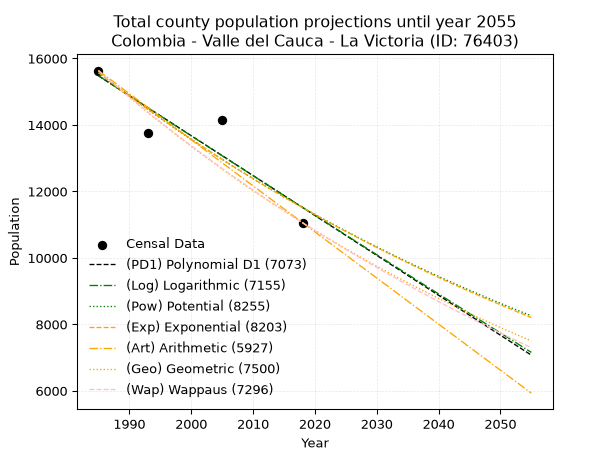
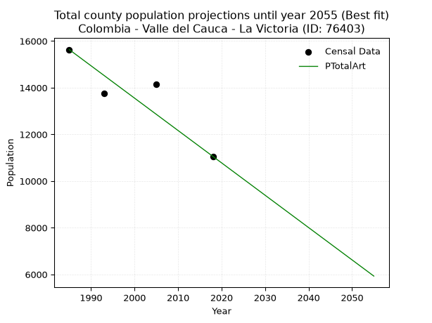
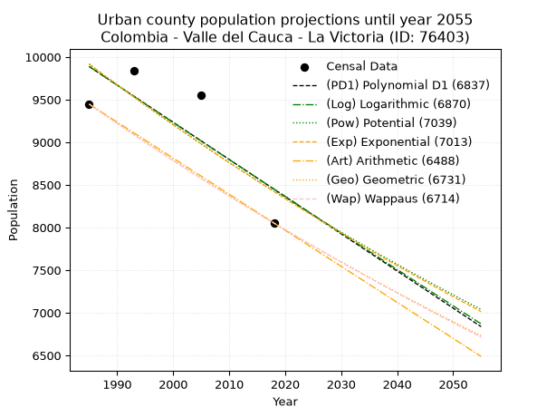
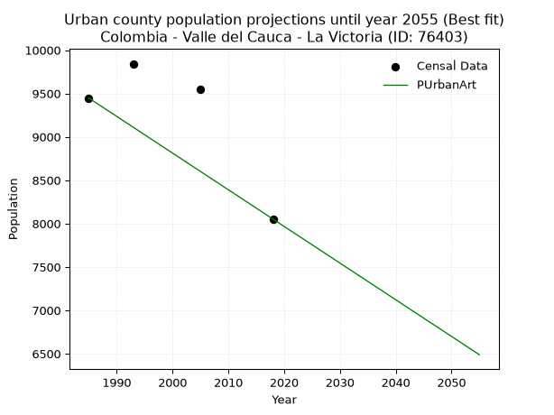
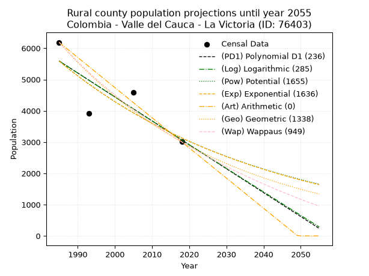
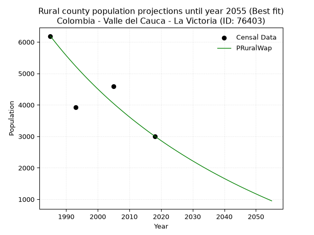

<div align="center">


</div>

# 📜 _“Population and Public Services Demand Projections (PPSD) until Year 2050 for Colombia - Valle del Cauca - La Victoria (ID: 76403)”_
Keywords: `population` `public-service` `projection` `lineal` `polynomial` `logarithmic` `potential` `exponential` `arithmetic` `geometric` `wappaus` `dane` `colombia` `south-america`

PPSD are analytical estimates used by governments and planners to anticipate future changes in population size, age distribution, and the resulting community needs for utilities, healthcare, education, and infrastructure as sizing future water treatment facilities, electrical grids, and road networks based on spatial growth.

<div align="center">

</img>

</div>


> **General running parameters**: • app_version: _v20260806_. • Python version: _3.14.7_. • Pandas version: _3.0.5_. • NumPy version: _2.5.1_. • Creates, save and include plots into reports (create_plot): _False_. • Projection until year: _2050_. • Process polynomial degree 2 and up: _False_. • Process Wappaus: _True_. • Process Wappaus: _True_. • Set negative values to zero: _True_. • Set infinite values to zero: _True_. • Drop dataset notes: _True_. 
<div align="center">

Maps & GIS Layers: [:earth_americas:Google](http://maps.google.com/maps?q=4.523603263,-76.0365287) [:earth_americas:OSM](https://www.openstreetmap.org/#map=18/4.523603263/-76.0365287&layers=P) [:earth_americas:Bing](https://www.bing.com/maps?cp=4.523603263~-76.0365287&lvl=18) [:earth_americas:Apple](https://maps.apple.com/frame?center=4.523603263%2C-76.0365287&span=0.003%2C0.006) [:earth_americas:GISMobile](https://github.com/rcfdtools/R.GISMobile/blob/main/file/gis/CountyLayer_CO/Readme.md)

</div>


<div align="center">

```geojson
{
  "type": "Feature",
  "geometry": {
    "type": "Point", 
    "coordinates": [-76.0365287, 4.523603263]
  }, 
  "properties": {
    "Name": "Colombia - Valle del Cauca - La Victoria (ID: 76403)"
  }
}
```

</div>


## 0. Census Data (4 records)

Census data are official statistics collected by a government about the people and housing in a country. They usually include counts of total population, age, sex, race, income, education, and jobs.

📅Global census file: [Population.xlsx](../data/Population.xlsx)

| Source   |   Year |   CountryID | CountryName   |   StateID | StateName       |   CountyID | CountyName   |   PTotal |   PUrban |   PRural |
|:---------|-------:|------------:|:--------------|----------:|:----------------|-----------:|:-------------|---------:|---------:|---------:|
| DANE     |   1985 |          57 | Colombia      |        76 | Valle del Cauca |      76403 | La Victoria  |    15634 |     9447 |     6187 |
| DANE     |   1993 |          57 | Colombia      |        76 | Valle del Cauca |      76403 | La Victoria  |    13762 |     9843 |     3919 |
| DANE     |   2005 |          57 | Colombia      |        76 | Valle del Cauca |      76403 | La Victoria  |    14134 |     9550 |     4584 |
| DANE     |   2018 |          57 | Colombia      |        76 | Valle del Cauca |      76403 | La Victoria  |    11058 |     8052 |     3006 |

> 🔥Some records could had specific notes about the registered values or the corresponding urban or rural distribution.

📅[SUI-RUPS](https://www.datos.gov.co/Hacienda-y-Cr-dito-P-blico/Registro-nico-de-Prestadores-de-Servicios-P-blicos/4qkq-csdn/about_data) - Local public utility companies: [RUPS.csv](../data/RUPS.csv)

 | SERVICIO       | ESTADO    | NOMBRE                                                                    | NIT         | DEPARTAMENTO_DOMICILIO   | MUNICIPIO_DOMICILIO   | DIRECCION              |   TELEFONO | EMAIL                     | TIPO_PRESTADOR                             | CLASIFICACION                 |
|:---------------|:----------|:--------------------------------------------------------------------------|:------------|:-------------------------|:----------------------|:-----------------------|-----------:|:--------------------------|:-------------------------------------------|:------------------------------|
| ACUEDUCTO      | OPERATIVA | SOCIEDAD DE ACUEDUCTOS Y ALCANTARILLADOS DEL VALLE DEL CAUCA S.A.  E.S.P. | 890399032-8 | VALLE DEL CAUCA          | CALI                  | AVENIDA 5 N # 23 AN 41 |    6203400 | rosemary@acuavalle.gov.co | SOCIEDADES (EMPRESA DE SERVICIOS PUBLICOS) | MAYOR O IGUAL A 5001 USUARIOS |
| ALCANTARILLADO | OPERATIVA | SOCIEDAD DE ACUEDUCTOS Y ALCANTARILLADOS DEL VALLE DEL CAUCA S.A.  E.S.P. | 890399032-8 | VALLE DEL CAUCA          | CALI                  | AVENIDA 5 N # 23 AN 41 |    6203400 | rosemary@acuavalle.gov.co | SOCIEDADES (EMPRESA DE SERVICIOS PUBLICOS) | MAYOR O IGUAL A 5001 USUARIOS |

## 1. Total

### 1.1. Coefficients and Parameters

* (PD1) Polynomial Deg 1: -120.0754716981114, 253827.96226414733 (lineal)
* (Log) Logarithmic: -240246.74589863123, 1839764.440792093
* (Pow) Potential: -18.314630072380368, 64.58965613196348
* (Exp) Exponential: -0.009154848520751558, 1214696272885.2388
* (Art) Arithmetic: Year diff. 2018 - 1985 = 33, Population diff. 11058 - 15634 = -4576, Annual growth = -138.66666666666666
* (Geo) Geometric: Year diff. 2018 - 1985 = 33, Population diff. 11058 - 15634 = -4576, Annual growth % = -0.010438886649162926
* (Wap) Wappaus: i = -1.0390129377091764, Condition values only valid for < 200)

<sub>
Wappaus condition values: ['-0.00', '-1.04', '-2.08', '-3.12', '-4.16', '-5.20', '-6.23', '-7.27', '-8.31', '-9.35', '-10.39', '-11.43', '-12.47', '-13.51', '-14.55', '-15.59', '-16.62', '-17.66', '-18.70', '-19.74', '-20.78', '-21.82', '-22.86', '-23.90', '-24.94', '-25.98', '-27.01', '-28.05', '-29.09', '-30.13', '-31.17', '-32.21', '-33.25', '-34.29', '-35.33', '-36.37', '-37.40', '-38.44', '-39.48', '-40.52', '-41.56', '-42.60', '-43.64', '-44.68', '-45.72', '-46.76', '-47.79', '-48.83', '-49.87', '-50.91', '-51.95', '-52.99', '-54.03', '-55.07', '-56.11', '-57.15', '-58.18', '-59.22', '-60.26', '-61.30', '-62.34', '-63.38', '-64.42', '-65.46', '-66.50', '-67.54']
</sub>


### 1.2. Projected Dataset

|   Year |   CountyID |   PTotalPD1 |   PTotalLog |   PTotalPow |   PTotalExp |   PTotalArt |   PTotalGeo |   PTotalWap |
|-------:|-----------:|------------:|------------:|------------:|------------:|------------:|------------:|------------:|
|   1985 |      76403 |       15478 |       15481 |       15574 |       15571 |       15634 |       15634 |       15634 |
|   1986 |      76403 |       15358 |       15360 |       15431 |       15429 |       15495 |       15471 |       15472 |
|   1987 |      76403 |       15238 |       15239 |       15289 |       15288 |       15357 |       15309 |       15312 |
|   1988 |      76403 |       15118 |       15118 |       15149 |       15149 |       15218 |       15149 |       15154 |
|   1989 |      76403 |       14998 |       14997 |       15010 |       15011 |       15079 |       14991 |       14997 |
|   1990 |      76403 |       14878 |       14877 |       14872 |       14874 |       14941 |       14835 |       14842 |
|   1991 |      76403 |       14758 |       14756 |       14736 |       14738 |       14802 |       14680 |       14689 |
|   1992 |      76403 |       14638 |       14635 |       14601 |       14604 |       14663 |       14527 |       14537 |
|   1993 |      76403 |       14518 |       14515 |       14468 |       14471 |       14525 |       14375 |       14386 |
|   1994 |      76403 |       14397 |       14394 |       14335 |       14339 |       14386 |       14225 |       14237 |
|   1995 |      76403 |       14277 |       14274 |       14204 |       14208 |       14247 |       14077 |       14090 |
|   1996 |      76403 |       14157 |       14153 |       14075 |       14079 |       14109 |       13930 |       13944 |
|   1997 |      76403 |       14037 |       14033 |       13946 |       13951 |       13970 |       13784 |       13799 |
|   1998 |      76403 |       13917 |       13913 |       13819 |       13824 |       13831 |       13640 |       13656 |
|   1999 |      76403 |       13797 |       13793 |       13693 |       13698 |       13693 |       13498 |       13514 |
|   2000 |      76403 |       13677 |       13672 |       13568 |       13573 |       13554 |       13357 |       13374 |
|   2001 |      76403 |       13557 |       13552 |       13444 |       13449 |       13415 |       13218 |       13234 |
|   2002 |      76403 |       13437 |       13432 |       13322 |       13326 |       13277 |       13080 |       13097 |
|   2003 |      76403 |       13317 |       13312 |       13201 |       13205 |       13138 |       12943 |       12960 |
|   2004 |      76403 |       13197 |       13192 |       13080 |       13085 |       12999 |       12808 |       12825 |
|   2005 |      76403 |       13077 |       13072 |       12961 |       12965 |       12861 |       12674 |       12691 |
|   2006 |      76403 |       12957 |       12953 |       12844 |       12847 |       12722 |       12542 |       12558 |
|   2007 |      76403 |       12836 |       12833 |       12727 |       12730 |       12583 |       12411 |       12427 |
|   2008 |      76403 |       12716 |       12713 |       12611 |       12614 |       12445 |       12281 |       12297 |
|   2009 |      76403 |       12596 |       12594 |       12497 |       12499 |       12306 |       12153 |       12168 |
|   2010 |      76403 |       12476 |       12474 |       12383 |       12385 |       12167 |       12026 |       12040 |
|   2011 |      76403 |       12356 |       12355 |       12271 |       12272 |       12029 |       11901 |       11913 |
|   2012 |      76403 |       12236 |       12235 |       12160 |       12161 |       11890 |       11777 |       11788 |
|   2013 |      76403 |       12116 |       12116 |       12050 |       12050 |       11751 |       11654 |       11663 |
|   2014 |      76403 |       11996 |       11996 |       11941 |       11940 |       11613 |       11532 |       11540 |
|   2015 |      76403 |       11876 |       11877 |       11833 |       11831 |       11474 |       11412 |       11418 |
|   2016 |      76403 |       11756 |       11758 |       11726 |       11723 |       11335 |       11293 |       11297 |
|   2017 |      76403 |       11636 |       11639 |       11620 |       11617 |       11197 |       11175 |       11177 |
|   2018 |      76403 |       11516 |       11520 |       11515 |       11511 |       11058 |       11058 |       11058 |
|   2019 |      76403 |       11396 |       11401 |       11411 |       11406 |       10919 |       10943 |       10940 |
|   2020 |      76403 |       11276 |       11282 |       11308 |       11302 |       10781 |       10828 |       10823 |
|   2021 |      76403 |       11155 |       11163 |       11206 |       11199 |       10642 |       10715 |       10708 |
|   2022 |      76403 |       11035 |       11044 |       11104 |       11097 |       10503 |       10603 |       10593 |
|   2023 |      76403 |       10915 |       10925 |       11004 |       10996 |       10365 |       10493 |       10479 |
|   2024 |      76403 |       10795 |       10807 |       10905 |       10895 |       10226 |       10383 |       10366 |
|   2025 |      76403 |       10675 |       10688 |       10807 |       10796 |       10087 |       10275 |       10254 |
|   2026 |      76403 |       10555 |       10569 |       10710 |       10698 |        9949 |       10168 |       10143 |
|   2027 |      76403 |       10435 |       10451 |       10613 |       10600 |        9810 |       10061 |       10034 |
|   2028 |      76403 |       10315 |       10332 |       10518 |       10504 |        9671 |        9956 |        9925 |
|   2029 |      76403 |       10195 |       10214 |       10423 |       10408 |        9533 |        9852 |        9816 |
|   2030 |      76403 |       10075 |       10095 |       10330 |       10313 |        9394 |        9750 |        9709 |
|   2031 |      76403 |        9955 |        9977 |       10237 |       10219 |        9255 |        9648 |        9603 |
|   2032 |      76403 |        9835 |        9859 |       10145 |       10126 |        9117 |        9547 |        9498 |
|   2033 |      76403 |        9715 |        9741 |       10054 |       10034 |        8978 |        9447 |        9393 |
|   2034 |      76403 |        9594 |        9622 |        9964 |        9942 |        8839 |        9349 |        9290 |
|   2035 |      76403 |        9474 |        9504 |        9875 |        9852 |        8701 |        9251 |        9187 |
|   2036 |      76403 |        9354 |        9386 |        9786 |        9762 |        8562 |        9155 |        9085 |
|   2037 |      76403 |        9234 |        9268 |        9699 |        9673 |        8423 |        9059 |        8984 |
|   2038 |      76403 |        9114 |        9150 |        9612 |        9585 |        8285 |        8965 |        8883 |
|   2039 |      76403 |        8994 |        9033 |        9526 |        9497 |        8146 |        8871 |        8784 |
|   2040 |      76403 |        8874 |        8915 |        9441 |        9411 |        8007 |        8778 |        8685 |
|   2041 |      76403 |        8754 |        8797 |        9356 |        9325 |        7869 |        8687 |        8587 |
|   2042 |      76403 |        8634 |        8679 |        9273 |        9240 |        7730 |        8596 |        8490 |
|   2043 |      76403 |        8514 |        8562 |        9190 |        9156 |        7591 |        8506 |        8394 |
|   2044 |      76403 |        8394 |        8444 |        9108 |        9073 |        7453 |        8418 |        8298 |
|   2045 |      76403 |        8274 |        8327 |        9027 |        8990 |        7314 |        8330 |        8204 |
|   2046 |      76403 |        8154 |        8209 |        8946 |        8908 |        7175 |        8243 |        8110 |
|   2047 |      76403 |        8033 |        8092 |        8867 |        8827 |        7037 |        8157 |        8016 |
|   2048 |      76403 |        7913 |        7975 |        8788 |        8746 |        6898 |        8072 |        7924 |
|   2049 |      76403 |        7793 |        7857 |        8709 |        8667 |        6759 |        7987 |        7832 |
|   2050 |      76403 |        7673 |        7740 |        8632 |        8588 |        6621 |        7904 |        7741 |
<div align="center">

</img>

</div>


### 1.3. Best fit with absolute and relative error (%)

Relative error puts that difference into context by dividing the absolute error by the true value, creating a unitless ratio or percentage that shows the scale of the mistake.

Absolute and relative error

|   Year | Source   |   CountryID | CountryName   |   StateID | StateName       |   CountyID_x | CountyName   |   PTotal |   PUrban |   PRural |   CountyID_y |   PTotalPD1 |   PTotalLog |   PTotalPow |   PTotalExp |   PTotalArt |   PTotalGeo |   PTotalWap |   PTotalPD1AbsError |   PTotalLogAbsError |   PTotalPowAbsError |   PTotalExpAbsError |   PTotalArtAbsError |   PTotalGeoAbsError |   PTotalWapAbsError |   PTotalPD1RelError |   PTotalLogRelError |   PTotalPowRelError |   PTotalExpRelError |   PTotalArtRelError |   PTotalGeoRelError |   PTotalWapRelError |
|-------:|:---------|------------:|:--------------|----------:|:----------------|-------------:|:-------------|---------:|---------:|---------:|-------------:|------------:|------------:|------------:|------------:|------------:|------------:|------------:|--------------------:|--------------------:|--------------------:|--------------------:|--------------------:|--------------------:|--------------------:|--------------------:|--------------------:|--------------------:|--------------------:|--------------------:|--------------------:|--------------------:|
|   1985 | DANE     |          57 | Colombia      |        76 | Valle del Cauca |        76403 | La Victoria  |    15634 |     9447 |     6187 |        76403 |       15478 |       15481 |       15574 |       15571 |       15634 |       15634 |       15634 |                 156 |                 153 |                  60 |                  63 |                   0 |                   0 |                   0 |            0.997825 |            0.978636 |            0.383779 |            0.402968 |             0       |             0       |             0       |
|   1993 | DANE     |          57 | Colombia      |        76 | Valle del Cauca |        76403 | La Victoria  |    13762 |     9843 |     3919 |        76403 |       14518 |       14515 |       14468 |       14471 |       14525 |       14375 |       14386 |                 756 |                 753 |                 706 |                 709 |                 763 |                 613 |                 624 |            5.49339  |            5.47159  |            5.13007  |            5.15187  |             5.54425 |             4.45429 |             4.53422 |
|   2005 | DANE     |          57 | Colombia      |        76 | Valle del Cauca |        76403 | La Victoria  |    14134 |     9550 |     4584 |        76403 |       13077 |       13072 |       12961 |       12965 |       12861 |       12674 |       12691 |                1057 |                1062 |                1173 |                1169 |                1273 |                1460 |                1443 |            7.47842  |            7.5138   |            8.29914  |            8.27084  |             9.00665 |            10.3297  |            10.2094  |
|   2018 | DANE     |          57 | Colombia      |        76 | Valle del Cauca |        76403 | La Victoria  |    11058 |     8052 |     3006 |        76403 |       11516 |       11520 |       11515 |       11511 |       11058 |       11058 |       11058 |                 458 |                 462 |                 457 |                 453 |                   0 |                   0 |                   0 |            4.1418   |            4.17797  |            4.13275  |            4.09658  |             0       |             0       |             0       |

Relative error mean

| Method    |   RelError | Best   |
|:----------|-----------:|:-------|
| PTotalPD1 |    4.52786 |        |
| PTotalLog |    4.5355  |        |
| PTotalPow |    4.48643 |        |
| PTotalExp |    4.48056 |        |
| PTotalArt |    3.63773 | True   |
| PTotalGeo |    3.696   |        |
| PTotalWap |    3.68591 |        |

💙Best method: _**PTotalArt**_
<div align="center">

</img>

</div>


### 1.4. Fresh water supply demand in liters per capita per day (lpcd)

The fresh water supply demand typically ranges from 100 to 300 liters per capita per day (lpcd) for standard domestic and municipal planning, though absolute survival minimums set by the World Health Organization are as low as 7.5 to 20 liters per day, and total consumption in high-income nations can exceed 400 liters.

> `CZ`: Level in meters above the sea level (masl)<br> `WS`: Fresh water supply demand in liters per capita per day (lpcd or l/h/d)<br> `WSAll`: Zonal fresh water supply demand in liters per second (l/s)<br> `A`: Zonal area in square meters<br> `DP`: Population density (people/hectare or p/ha)

Reference values (RAS Colombia)

|    CZ |   WS |
|------:|-----:|
|  1000 |  120 |
|  2000 |  130 |
| 99999 |  140 |

County shapefile geometry properties and water supply values

|   CountyID |      ATotal |   CZTotal |   WSTotal |
|-----------:|------------:|----------:|----------:|
|      76403 | 2.64719e+08 |   1039.44 |       130 |

Projected values for best method: PTotalArt

|   CountyID |   Year |   PTotalArt |   DPTotal |   WSTotal |   WSTotalAll |
|-----------:|-------:|------------:|----------:|----------:|-------------:|
|      76403 |   1985 |       15634 |      0.59 |       130 |     23.5234  |
|      76403 |   1986 |       15495 |      0.59 |       130 |     23.3142  |
|      76403 |   1987 |       15357 |      0.58 |       130 |     23.1066  |
|      76403 |   1988 |       15218 |      0.57 |       130 |     22.8975  |
|      76403 |   1989 |       15079 |      0.57 |       130 |     22.6883  |
|      76403 |   1990 |       14941 |      0.56 |       130 |     22.4807  |
|      76403 |   1991 |       14802 |      0.56 |       130 |     22.2715  |
|      76403 |   1992 |       14663 |      0.55 |       130 |     22.0624  |
|      76403 |   1993 |       14525 |      0.55 |       130 |     21.8547  |
|      76403 |   1994 |       14386 |      0.54 |       130 |     21.6456  |
|      76403 |   1995 |       14247 |      0.54 |       130 |     21.4365  |
|      76403 |   1996 |       14109 |      0.53 |       130 |     21.2288  |
|      76403 |   1997 |       13970 |      0.53 |       130 |     21.0197  |
|      76403 |   1998 |       13831 |      0.52 |       130 |     20.8105  |
|      76403 |   1999 |       13693 |      0.52 |       130 |     20.6029  |
|      76403 |   2000 |       13554 |      0.51 |       130 |     20.3938  |
|      76403 |   2001 |       13415 |      0.51 |       130 |     20.1846  |
|      76403 |   2002 |       13277 |      0.5  |       130 |     19.977   |
|      76403 |   2003 |       13138 |      0.5  |       130 |     19.7678  |
|      76403 |   2004 |       12999 |      0.49 |       130 |     19.5587  |
|      76403 |   2005 |       12861 |      0.49 |       130 |     19.351   |
|      76403 |   2006 |       12722 |      0.48 |       130 |     19.1419  |
|      76403 |   2007 |       12583 |      0.48 |       130 |     18.9328  |
|      76403 |   2008 |       12445 |      0.47 |       130 |     18.7251  |
|      76403 |   2009 |       12306 |      0.46 |       130 |     18.516   |
|      76403 |   2010 |       12167 |      0.46 |       130 |     18.3068  |
|      76403 |   2011 |       12029 |      0.45 |       130 |     18.0992  |
|      76403 |   2012 |       11890 |      0.45 |       130 |     17.89    |
|      76403 |   2013 |       11751 |      0.44 |       130 |     17.6809  |
|      76403 |   2014 |       11613 |      0.44 |       130 |     17.4733  |
|      76403 |   2015 |       11474 |      0.43 |       130 |     17.2641  |
|      76403 |   2016 |       11335 |      0.43 |       130 |     17.055   |
|      76403 |   2017 |       11197 |      0.42 |       130 |     16.8473  |
|      76403 |   2018 |       11058 |      0.42 |       130 |     16.6382  |
|      76403 |   2019 |       10919 |      0.41 |       130 |     16.4291  |
|      76403 |   2020 |       10781 |      0.41 |       130 |     16.2214  |
|      76403 |   2021 |       10642 |      0.4  |       130 |     16.0123  |
|      76403 |   2022 |       10503 |      0.4  |       130 |     15.8031  |
|      76403 |   2023 |       10365 |      0.39 |       130 |     15.5955  |
|      76403 |   2024 |       10226 |      0.39 |       130 |     15.3863  |
|      76403 |   2025 |       10087 |      0.38 |       130 |     15.1772  |
|      76403 |   2026 |        9949 |      0.38 |       130 |     14.9696  |
|      76403 |   2027 |        9810 |      0.37 |       130 |     14.7604  |
|      76403 |   2028 |        9671 |      0.37 |       130 |     14.5513  |
|      76403 |   2029 |        9533 |      0.36 |       130 |     14.3436  |
|      76403 |   2030 |        9394 |      0.35 |       130 |     14.1345  |
|      76403 |   2031 |        9255 |      0.35 |       130 |     13.9253  |
|      76403 |   2032 |        9117 |      0.34 |       130 |     13.7177  |
|      76403 |   2033 |        8978 |      0.34 |       130 |     13.5086  |
|      76403 |   2034 |        8839 |      0.33 |       130 |     13.2994  |
|      76403 |   2035 |        8701 |      0.33 |       130 |     13.0918  |
|      76403 |   2036 |        8562 |      0.32 |       130 |     12.8826  |
|      76403 |   2037 |        8423 |      0.32 |       130 |     12.6735  |
|      76403 |   2038 |        8285 |      0.31 |       130 |     12.4659  |
|      76403 |   2039 |        8146 |      0.31 |       130 |     12.2567  |
|      76403 |   2040 |        8007 |      0.3  |       130 |     12.0476  |
|      76403 |   2041 |        7869 |      0.3  |       130 |     11.8399  |
|      76403 |   2042 |        7730 |      0.29 |       130 |     11.6308  |
|      76403 |   2043 |        7591 |      0.29 |       130 |     11.4216  |
|      76403 |   2044 |        7453 |      0.28 |       130 |     11.214   |
|      76403 |   2045 |        7314 |      0.28 |       130 |     11.0049  |
|      76403 |   2046 |        7175 |      0.27 |       130 |     10.7957  |
|      76403 |   2047 |        7037 |      0.27 |       130 |     10.5881  |
|      76403 |   2048 |        6898 |      0.26 |       130 |     10.3789  |
|      76403 |   2049 |        6759 |      0.26 |       130 |     10.1698  |
|      76403 |   2050 |        6621 |      0.25 |       130 |      9.96215 |

## 2. Urban

### 2.1. Coefficients and Parameters

* (PD1) Polynomial Deg 1: -43.5857085507819, 96405.31352870149 (lineal)
* (Log) Logarithmic: -87081.72969895137, 671131.9252709161
* (Pow) Potential: -9.888851011637946, 36.60742926640014
* (Exp) Exponential: -0.004949397361383338, 183278463.00308338
* (Art) Arithmetic: Year diff. 2018 - 1985 = 33, Population diff. 8052 - 9447 = -1395, Annual growth = -42.27272727272727
* (Geo) Geometric: Year diff. 2018 - 1985 = 33, Population diff. 8052 - 9447 = -1395, Annual growth % = -0.004830016652137781
* (Wap) Wappaus: i = -0.48314449137353305, Condition values only valid for < 200)

<sub>
Wappaus condition values: ['-0.00', '-0.48', '-0.97', '-1.45', '-1.93', '-2.42', '-2.90', '-3.38', '-3.87', '-4.35', '-4.83', '-5.31', '-5.80', '-6.28', '-6.76', '-7.25', '-7.73', '-8.21', '-8.70', '-9.18', '-9.66', '-10.15', '-10.63', '-11.11', '-11.60', '-12.08', '-12.56', '-13.04', '-13.53', '-14.01', '-14.49', '-14.98', '-15.46', '-15.94', '-16.43', '-16.91', '-17.39', '-17.88', '-18.36', '-18.84', '-19.33', '-19.81', '-20.29', '-20.78', '-21.26', '-21.74', '-22.22', '-22.71', '-23.19', '-23.67', '-24.16', '-24.64', '-25.12', '-25.61', '-26.09', '-26.57', '-27.06', '-27.54', '-28.02', '-28.51', '-28.99', '-29.47', '-29.95', '-30.44', '-30.92', '-31.40']
</sub>


### 2.2. Projected Dataset

|   Year |   CountyID |   PUrbanPD1 |   PUrbanLog |   PUrbanPow |   PUrbanExp |   PUrbanArt |   PUrbanGeo |   PUrbanWap |
|-------:|-----------:|------------:|------------:|------------:|------------:|------------:|------------:|------------:|
|   1985 |      76403 |        9888 |        9888 |        9917 |        9917 |        9447 |        9447 |        9447 |
|   1986 |      76403 |        9844 |        9844 |        9867 |        9868 |        9405 |        9401 |        9401 |
|   1987 |      76403 |        9801 |        9800 |        9818 |        9819 |        9362 |        9356 |        9356 |
|   1988 |      76403 |        9757 |        9756 |        9770 |        9770 |        9320 |        9311 |        9311 |
|   1989 |      76403 |        9713 |        9712 |        9721 |        9722 |        9278 |        9266 |        9266 |
|   1990 |      76403 |        9670 |        9669 |        9673 |        9674 |        9236 |        9221 |        9222 |
|   1991 |      76403 |        9626 |        9625 |        9625 |        9626 |        9193 |        9177 |        9177 |
|   1992 |      76403 |        9583 |        9581 |        9577 |        9579 |        9151 |        9132 |        9133 |
|   1993 |      76403 |        9539 |        9538 |        9530 |        9532 |        9109 |        9088 |        9089 |
|   1994 |      76403 |        9495 |        9494 |        9483 |        9485 |        9067 |        9044 |        9045 |
|   1995 |      76403 |        9452 |        9450 |        9436 |        9438 |        9024 |        9000 |        9001 |
|   1996 |      76403 |        9408 |        9407 |        9389 |        9391 |        8982 |        8957 |        8958 |
|   1997 |      76403 |        9365 |        9363 |        9343 |        9345 |        8940 |        8914 |        8915 |
|   1998 |      76403 |        9321 |        9319 |        9297 |        9299 |        8897 |        8871 |        8872 |
|   1999 |      76403 |        9277 |        9276 |        9251 |        9253 |        8855 |        8828 |        8829 |
|   2000 |      76403 |        9234 |        9232 |        9205 |        9207 |        8813 |        8785 |        8786 |
|   2001 |      76403 |        9190 |        9189 |        9160 |        9162 |        8771 |        8743 |        8744 |
|   2002 |      76403 |        9147 |        9145 |        9115 |        9116 |        8728 |        8701 |        8702 |
|   2003 |      76403 |        9103 |        9102 |        9070 |        9071 |        8686 |        8659 |        8660 |
|   2004 |      76403 |        9060 |        9058 |        9025 |        9027 |        8644 |        8617 |        8618 |
|   2005 |      76403 |        9016 |        9015 |        8981 |        8982 |        8602 |        8575 |        8576 |
|   2006 |      76403 |        8972 |        8971 |        8937 |        8938 |        8559 |        8534 |        8535 |
|   2007 |      76403 |        8929 |        8928 |        8893 |        8894 |        8517 |        8492 |        8494 |
|   2008 |      76403 |        8885 |        8885 |        8849 |        8850 |        8475 |        8451 |        8452 |
|   2009 |      76403 |        8842 |        8841 |        8805 |        8806 |        8432 |        8411 |        8412 |
|   2010 |      76403 |        8798 |        8798 |        8762 |        8762 |        8390 |        8370 |        8371 |
|   2011 |      76403 |        8754 |        8755 |        8719 |        8719 |        8348 |        8330 |        8330 |
|   2012 |      76403 |        8711 |        8711 |        8676 |        8676 |        8306 |        8289 |        8290 |
|   2013 |      76403 |        8667 |        8668 |        8634 |        8633 |        8263 |        8249 |        8250 |
|   2014 |      76403 |        8624 |        8625 |        8592 |        8591 |        8221 |        8209 |        8210 |
|   2015 |      76403 |        8580 |        8582 |        8550 |        8548 |        8179 |        8170 |        8170 |
|   2016 |      76403 |        8537 |        8538 |        8508 |        8506 |        8137 |        8130 |        8131 |
|   2017 |      76403 |        8493 |        8495 |        8466 |        8464 |        8094 |        8091 |        8091 |
|   2018 |      76403 |        8449 |        8452 |        8425 |        8422 |        8052 |        8052 |        8052 |
|   2019 |      76403 |        8406 |        8409 |        8384 |        8381 |        8010 |        8013 |        8013 |
|   2020 |      76403 |        8362 |        8366 |        8343 |        8339 |        7967 |        7974 |        7974 |
|   2021 |      76403 |        8319 |        8323 |        8302 |        8298 |        7925 |        7936 |        7935 |
|   2022 |      76403 |        8275 |        8280 |        8261 |        8257 |        7883 |        7898 |        7897 |
|   2023 |      76403 |        8231 |        8236 |        8221 |        8216 |        7841 |        7859 |        7858 |
|   2024 |      76403 |        8188 |        8193 |        8181 |        8176 |        7798 |        7821 |        7820 |
|   2025 |      76403 |        8144 |        8150 |        8141 |        8135 |        7756 |        7784 |        7782 |
|   2026 |      76403 |        8101 |        8107 |        8101 |        8095 |        7714 |        7746 |        7744 |
|   2027 |      76403 |        8057 |        8064 |        8062 |        8055 |        7672 |        7709 |        7707 |
|   2028 |      76403 |        8013 |        8022 |        8023 |        8016 |        7629 |        7671 |        7669 |
|   2029 |      76403 |        7970 |        7979 |        7984 |        7976 |        7587 |        7634 |        7632 |
|   2030 |      76403 |        7926 |        7936 |        7945 |        7937 |        7545 |        7598 |        7594 |
|   2031 |      76403 |        7883 |        7893 |        7906 |        7897 |        7502 |        7561 |        7557 |
|   2032 |      76403 |        7839 |        7850 |        7868 |        7858 |        7460 |        7524 |        7521 |
|   2033 |      76403 |        7796 |        7807 |        7830 |        7820 |        7418 |        7488 |        7484 |
|   2034 |      76403 |        7752 |        7764 |        7792 |        7781 |        7376 |        7452 |        7447 |
|   2035 |      76403 |        7708 |        7721 |        7754 |        7743 |        7333 |        7416 |        7411 |
|   2036 |      76403 |        7665 |        7679 |        7716 |        7704 |        7291 |        7380 |        7375 |
|   2037 |      76403 |        7621 |        7636 |        7679 |        7666 |        7249 |        7344 |        7338 |
|   2038 |      76403 |        7578 |        7593 |        7642 |        7628 |        7207 |        7309 |        7303 |
|   2039 |      76403 |        7534 |        7550 |        7605 |        7591 |        7164 |        7274 |        7267 |
|   2040 |      76403 |        7490 |        7508 |        7568 |        7553 |        7122 |        7238 |        7231 |
|   2041 |      76403 |        7447 |        7465 |        7532 |        7516 |        7080 |        7203 |        7196 |
|   2042 |      76403 |        7403 |        7422 |        7495 |        7479 |        7037 |        7169 |        7160 |
|   2043 |      76403 |        7360 |        7380 |        7459 |        7442 |        6995 |        7134 |        7125 |
|   2044 |      76403 |        7316 |        7337 |        7423 |        7405 |        6953 |        7100 |        7090 |
|   2045 |      76403 |        7273 |        7295 |        7387 |        7369 |        6911 |        7065 |        7055 |
|   2046 |      76403 |        7229 |        7252 |        7352 |        7332 |        6868 |        7031 |        7020 |
|   2047 |      76403 |        7185 |        7209 |        7316 |        7296 |        6826 |        6997 |        6986 |
|   2048 |      76403 |        7142 |        7167 |        7281 |        7260 |        6784 |        6963 |        6951 |
|   2049 |      76403 |        7098 |        7124 |        7246 |        7224 |        6742 |        6930 |        6917 |
|   2050 |      76403 |        7055 |        7082 |        7211 |        7189 |        6699 |        6896 |        6883 |
<div align="center">

</img>

</div>


### 2.3. Best fit with absolute and relative error (%)

Relative error puts that difference into context by dividing the absolute error by the true value, creating a unitless ratio or percentage that shows the scale of the mistake.

Absolute and relative error

|   Year | Source   |   CountryID | CountryName   |   StateID | StateName       |   CountyID_x | CountyName   |   PTotal |   PUrban |   PRural |   CountyID_y |   PUrbanPD1 |   PUrbanLog |   PUrbanPow |   PUrbanExp |   PUrbanArt |   PUrbanGeo |   PUrbanWap |   PUrbanPD1AbsError |   PUrbanLogAbsError |   PUrbanPowAbsError |   PUrbanExpAbsError |   PUrbanArtAbsError |   PUrbanGeoAbsError |   PUrbanWapAbsError |   PUrbanPD1RelError |   PUrbanLogRelError |   PUrbanPowRelError |   PUrbanExpRelError |   PUrbanArtRelError |   PUrbanGeoRelError |   PUrbanWapRelError |
|-------:|:---------|------------:|:--------------|----------:|:----------------|-------------:|:-------------|---------:|---------:|---------:|-------------:|------------:|------------:|------------:|------------:|------------:|------------:|------------:|--------------------:|--------------------:|--------------------:|--------------------:|--------------------:|--------------------:|--------------------:|--------------------:|--------------------:|--------------------:|--------------------:|--------------------:|--------------------:|--------------------:|
|   1985 | DANE     |          57 | Colombia      |        76 | Valle del Cauca |        76403 | La Victoria  |    15634 |     9447 |     6187 |        76403 |        9888 |        9888 |        9917 |        9917 |        9447 |        9447 |        9447 |                 441 |                 441 |                 470 |                 470 |                   0 |                   0 |                   0 |             4.66815 |             4.66815 |             4.97512 |             4.97512 |             0       |             0       |             0       |
|   1993 | DANE     |          57 | Colombia      |        76 | Valle del Cauca |        76403 | La Victoria  |    13762 |     9843 |     3919 |        76403 |        9539 |        9538 |        9530 |        9532 |        9109 |        9088 |        9089 |                 304 |                 305 |                 313 |                 311 |                 734 |                 755 |                 754 |             3.08849 |             3.09865 |             3.17992 |             3.15961 |             7.45708 |             7.67043 |             7.66027 |
|   2005 | DANE     |          57 | Colombia      |        76 | Valle del Cauca |        76403 | La Victoria  |    14134 |     9550 |     4584 |        76403 |        9016 |        9015 |        8981 |        8982 |        8602 |        8575 |        8576 |                 534 |                 535 |                 569 |                 568 |                 948 |                 975 |                 974 |             5.59162 |             5.60209 |             5.95812 |             5.94764 |             9.9267  |            10.2094  |            10.199   |
|   2018 | DANE     |          57 | Colombia      |        76 | Valle del Cauca |        76403 | La Victoria  |    11058 |     8052 |     3006 |        76403 |        8449 |        8452 |        8425 |        8422 |        8052 |        8052 |        8052 |                 397 |                 400 |                 373 |                 370 |                   0 |                   0 |                   0 |             4.93045 |             4.96771 |             4.63239 |             4.59513 |             0       |             0       |             0       |

Relative error mean

| Method    |   RelError | Best   |
|:----------|-----------:|:-------|
| PUrbanPD1 |    4.56968 |        |
| PUrbanLog |    4.58415 |        |
| PUrbanPow |    4.68639 |        |
| PUrbanExp |    4.66938 |        |
| PUrbanArt |    4.34594 | True   |
| PUrbanGeo |    4.46996 |        |
| PUrbanWap |    4.4648  |        |

💙Best method: _**PUrbanArt**_
<div align="center">

</img>

</div>


### 2.4. Fresh water supply demand in liters per capita per day (lpcd)

The fresh water supply demand typically ranges from 100 to 300 liters per capita per day (lpcd) for standard domestic and municipal planning, though absolute survival minimums set by the World Health Organization are as low as 7.5 to 20 liters per day, and total consumption in high-income nations can exceed 400 liters.

> `CZ`: Level in meters above the sea level (masl)<br> `WS`: Fresh water supply demand in liters per capita per day (lpcd or l/h/d)<br> `WSAll`: Zonal fresh water supply demand in liters per second (l/s)<br> `A`: Zonal area in square meters<br> `DP`: Population density (people/hectare or p/ha)

Reference values (RAS Colombia)

|    CZ |   WS |
|------:|-----:|
|  1000 |  120 |
|  2000 |  130 |
| 99999 |  140 |

County shapefile geometry properties and water supply values

|   CountyID |      AUrban |   CZUrban |   WSUrban |
|-----------:|------------:|----------:|----------:|
|      76403 | 2.31849e+06 |   924.185 |       120 |

Projected values for best method: PUrbanArt

|   CountyID |   Year |   PUrbanArt |   DPUrban |   WSUrban |   WSUrbanAll |
|-----------:|-------:|------------:|----------:|----------:|-------------:|
|      76403 |   1985 |        9447 |     40.75 |       120 |     13.1208  |
|      76403 |   1986 |        9405 |     40.57 |       120 |     13.0625  |
|      76403 |   1987 |        9362 |     40.38 |       120 |     13.0028  |
|      76403 |   1988 |        9320 |     40.2  |       120 |     12.9444  |
|      76403 |   1989 |        9278 |     40.02 |       120 |     12.8861  |
|      76403 |   1990 |        9236 |     39.84 |       120 |     12.8278  |
|      76403 |   1991 |        9193 |     39.65 |       120 |     12.7681  |
|      76403 |   1992 |        9151 |     39.47 |       120 |     12.7097  |
|      76403 |   1993 |        9109 |     39.29 |       120 |     12.6514  |
|      76403 |   1994 |        9067 |     39.11 |       120 |     12.5931  |
|      76403 |   1995 |        9024 |     38.92 |       120 |     12.5333  |
|      76403 |   1996 |        8982 |     38.74 |       120 |     12.475   |
|      76403 |   1997 |        8940 |     38.56 |       120 |     12.4167  |
|      76403 |   1998 |        8897 |     38.37 |       120 |     12.3569  |
|      76403 |   1999 |        8855 |     38.19 |       120 |     12.2986  |
|      76403 |   2000 |        8813 |     38.01 |       120 |     12.2403  |
|      76403 |   2001 |        8771 |     37.83 |       120 |     12.1819  |
|      76403 |   2002 |        8728 |     37.65 |       120 |     12.1222  |
|      76403 |   2003 |        8686 |     37.46 |       120 |     12.0639  |
|      76403 |   2004 |        8644 |     37.28 |       120 |     12.0056  |
|      76403 |   2005 |        8602 |     37.1  |       120 |     11.9472  |
|      76403 |   2006 |        8559 |     36.92 |       120 |     11.8875  |
|      76403 |   2007 |        8517 |     36.74 |       120 |     11.8292  |
|      76403 |   2008 |        8475 |     36.55 |       120 |     11.7708  |
|      76403 |   2009 |        8432 |     36.37 |       120 |     11.7111  |
|      76403 |   2010 |        8390 |     36.19 |       120 |     11.6528  |
|      76403 |   2011 |        8348 |     36.01 |       120 |     11.5944  |
|      76403 |   2012 |        8306 |     35.83 |       120 |     11.5361  |
|      76403 |   2013 |        8263 |     35.64 |       120 |     11.4764  |
|      76403 |   2014 |        8221 |     35.46 |       120 |     11.4181  |
|      76403 |   2015 |        8179 |     35.28 |       120 |     11.3597  |
|      76403 |   2016 |        8137 |     35.1  |       120 |     11.3014  |
|      76403 |   2017 |        8094 |     34.91 |       120 |     11.2417  |
|      76403 |   2018 |        8052 |     34.73 |       120 |     11.1833  |
|      76403 |   2019 |        8010 |     34.55 |       120 |     11.125   |
|      76403 |   2020 |        7967 |     34.36 |       120 |     11.0653  |
|      76403 |   2021 |        7925 |     34.18 |       120 |     11.0069  |
|      76403 |   2022 |        7883 |     34    |       120 |     10.9486  |
|      76403 |   2023 |        7841 |     33.82 |       120 |     10.8903  |
|      76403 |   2024 |        7798 |     33.63 |       120 |     10.8306  |
|      76403 |   2025 |        7756 |     33.45 |       120 |     10.7722  |
|      76403 |   2026 |        7714 |     33.27 |       120 |     10.7139  |
|      76403 |   2027 |        7672 |     33.09 |       120 |     10.6556  |
|      76403 |   2028 |        7629 |     32.91 |       120 |     10.5958  |
|      76403 |   2029 |        7587 |     32.72 |       120 |     10.5375  |
|      76403 |   2030 |        7545 |     32.54 |       120 |     10.4792  |
|      76403 |   2031 |        7502 |     32.36 |       120 |     10.4194  |
|      76403 |   2032 |        7460 |     32.18 |       120 |     10.3611  |
|      76403 |   2033 |        7418 |     31.99 |       120 |     10.3028  |
|      76403 |   2034 |        7376 |     31.81 |       120 |     10.2444  |
|      76403 |   2035 |        7333 |     31.63 |       120 |     10.1847  |
|      76403 |   2036 |        7291 |     31.45 |       120 |     10.1264  |
|      76403 |   2037 |        7249 |     31.27 |       120 |     10.0681  |
|      76403 |   2038 |        7207 |     31.08 |       120 |     10.0097  |
|      76403 |   2039 |        7164 |     30.9  |       120 |      9.95    |
|      76403 |   2040 |        7122 |     30.72 |       120 |      9.89167 |
|      76403 |   2041 |        7080 |     30.54 |       120 |      9.83333 |
|      76403 |   2042 |        7037 |     30.35 |       120 |      9.77361 |
|      76403 |   2043 |        6995 |     30.17 |       120 |      9.71528 |
|      76403 |   2044 |        6953 |     29.99 |       120 |      9.65694 |
|      76403 |   2045 |        6911 |     29.81 |       120 |      9.59861 |
|      76403 |   2046 |        6868 |     29.62 |       120 |      9.53889 |
|      76403 |   2047 |        6826 |     29.44 |       120 |      9.48056 |
|      76403 |   2048 |        6784 |     29.26 |       120 |      9.42222 |
|      76403 |   2049 |        6742 |     29.08 |       120 |      9.36389 |
|      76403 |   2050 |        6699 |     28.89 |       120 |      9.30417 |

## 3. Rural

### 3.1. Coefficients and Parameters

* (PD1) Polynomial Deg 1: -76.48976314732941, 157422.64873544566 (lineal)
* (Log) Logarithmic: -153165.0161996798, 1168632.5155211766
* (Pow) Potential: -35.122580112689974, 119.57327279004105
* (Exp) Exponential: -0.017545776825959404, 7.463548548365853e+18
* (Art) Arithmetic: Year diff. 2018 - 1985 = 33, Population diff. 3006 - 6187 = -3181, Annual growth = -96.39393939393939
* (Geo) Geometric: Year diff. 2018 - 1985 = 33, Population diff. 3006 - 6187 = -3181, Annual growth % = -0.021636440366466614
* (Wap) Wappaus: i = -2.097116053387129, Condition values only valid for < 200)

<sub>
Wappaus condition values: ['-0.00', '-2.10', '-4.19', '-6.29', '-8.39', '-10.49', '-12.58', '-14.68', '-16.78', '-18.87', '-20.97', '-23.07', '-25.17', '-27.26', '-29.36', '-31.46', '-33.55', '-35.65', '-37.75', '-39.85', '-41.94', '-44.04', '-46.14', '-48.23', '-50.33', '-52.43', '-54.53', '-56.62', '-58.72', '-60.82', '-62.91', '-65.01', '-67.11', '-69.20', '-71.30', '-73.40', '-75.50', '-77.59', '-79.69', '-81.79', '-83.88', '-85.98', '-88.08', '-90.18', '-92.27', '-94.37', '-96.47', '-98.56', '-100.66', '-102.76', '-104.86', '-106.95', '-109.05', '-111.15', '-113.24', '-115.34', '-117.44', '-119.54', '-121.63', '-123.73', '-125.83', '-127.92', '-130.02', '-132.12', '-134.22', '-136.31']
</sub>


### 3.2. Projected Dataset

|   Year |   CountyID |   PRuralPD1 |   PRuralLog |   PRuralPow |   PRuralExp |   PRuralArt |   PRuralGeo |   PRuralWap |
|-------:|-----------:|------------:|------------:|------------:|------------:|------------:|------------:|------------:|
|   1985 |      76403 |        5590 |        5593 |        5590 |        5587 |        6187 |        6187 |        6187 |
|   1986 |      76403 |        5514 |        5516 |        5492 |        5490 |        6091 |        6053 |        6059 |
|   1987 |      76403 |        5437 |        5439 |        5396 |        5394 |        5994 |        5922 |        5933 |
|   1988 |      76403 |        5361 |        5362 |        5301 |        5301 |        5898 |        5794 |        5810 |
|   1989 |      76403 |        5285 |        5285 |        5208 |        5208 |        5801 |        5669 |        5689 |
|   1990 |      76403 |        5208 |        5208 |        5117 |        5118 |        5705 |        5546 |        5571 |
|   1991 |      76403 |        5132 |        5131 |        5028 |        5029 |        5609 |        5426 |        5455 |
|   1992 |      76403 |        5055 |        5054 |        4940 |        4941 |        5512 |        5309 |        5341 |
|   1993 |      76403 |        4979 |        4977 |        4854 |        4855 |        5416 |        5194 |        5229 |
|   1994 |      76403 |        4902 |        4900 |        4769 |        4771 |        5319 |        5081 |        5120 |
|   1995 |      76403 |        4826 |        4824 |        4686 |        4688 |        5223 |        4971 |        5013 |
|   1996 |      76403 |        4749 |        4747 |        4604 |        4606 |        5127 |        4864 |        4907 |
|   1997 |      76403 |        4673 |        4670 |        4524 |        4526 |        5030 |        4759 |        4804 |
|   1998 |      76403 |        4596 |        4593 |        4445 |        4448 |        4934 |        4656 |        4703 |
|   1999 |      76403 |        4520 |        4517 |        4367 |        4370 |        4837 |        4555 |        4603 |
|   2000 |      76403 |        4443 |        4440 |        4291 |        4294 |        4741 |        4456 |        4505 |
|   2001 |      76403 |        4367 |        4364 |        4217 |        4219 |        4645 |        4360 |        4409 |
|   2002 |      76403 |        4290 |        4287 |        4143 |        4146 |        4548 |        4266 |        4315 |
|   2003 |      76403 |        4214 |        4211 |        4071 |        4074 |        4452 |        4173 |        4222 |
|   2004 |      76403 |        4137 |        4134 |        4000 |        4003 |        4356 |        4083 |        4131 |
|   2005 |      76403 |        4061 |        4058 |        3931 |        3933 |        4259 |        3995 |        4042 |
|   2006 |      76403 |        3984 |        3981 |        3863 |        3865 |        4163 |        3908 |        3954 |
|   2007 |      76403 |        3908 |        3905 |        3796 |        3798 |        4066 |        3824 |        3868 |
|   2008 |      76403 |        3831 |        3829 |        3730 |        3732 |        3970 |        3741 |        3783 |
|   2009 |      76403 |        3755 |        3752 |        3665 |        3667 |        3874 |        3660 |        3699 |
|   2010 |      76403 |        3678 |        3676 |        3602 |        3603 |        3777 |        3581 |        3617 |
|   2011 |      76403 |        3602 |        3600 |        3539 |        3540 |        3681 |        3503 |        3536 |
|   2012 |      76403 |        3525 |        3524 |        3478 |        3479 |        3584 |        3428 |        3457 |
|   2013 |      76403 |        3449 |        3448 |        3418 |        3418 |        3488 |        3353 |        3379 |
|   2014 |      76403 |        3372 |        3372 |        3359 |        3359 |        3392 |        3281 |        3302 |
|   2015 |      76403 |        3296 |        3296 |        3301 |        3300 |        3295 |        3210 |        3226 |
|   2016 |      76403 |        3219 |        3220 |        3244 |        3243 |        3199 |        3140 |        3151 |
|   2017 |      76403 |        3143 |        3144 |        3188 |        3187 |        3102 |        3072 |        3078 |
|   2018 |      76403 |        3066 |        3068 |        3133 |        3131 |        3006 |        3006 |        3006 |
|   2019 |      76403 |        2990 |        2992 |        3079 |        3077 |        2910 |        2941 |        2935 |
|   2020 |      76403 |        2913 |        2916 |        3026 |        3023 |        2813 |        2877 |        2865 |
|   2021 |      76403 |        2837 |        2840 |        2973 |        2971 |        2717 |        2815 |        2796 |
|   2022 |      76403 |        2760 |        2765 |        2922 |        2919 |        2620 |        2754 |        2728 |
|   2023 |      76403 |        2684 |        2689 |        2872 |        2868 |        2524 |        2695 |        2661 |
|   2024 |      76403 |        2607 |        2613 |        2822 |        2818 |        2428 |        2636 |        2596 |
|   2025 |      76403 |        2531 |        2537 |        2774 |        2769 |        2331 |        2579 |        2531 |
|   2026 |      76403 |        2454 |        2462 |        2726 |        2721 |        2235 |        2523 |        2467 |
|   2027 |      76403 |        2378 |        2386 |        2679 |        2674 |        2138 |        2469 |        2404 |
|   2028 |      76403 |        2301 |        2311 |        2633 |        2627 |        2042 |        2415 |        2342 |
|   2029 |      76403 |        2225 |        2235 |        2588 |        2582 |        1946 |        2363 |        2280 |
|   2030 |      76403 |        2148 |        2160 |        2544 |        2537 |        1849 |        2312 |        2220 |
|   2031 |      76403 |        2072 |        2084 |        2500 |        2493 |        1753 |        2262 |        2161 |
|   2032 |      76403 |        1995 |        2009 |        2457 |        2449 |        1656 |        2213 |        2102 |
|   2033 |      76403 |        1919 |        1934 |        2415 |        2407 |        1560 |        2165 |        2044 |
|   2034 |      76403 |        1842 |        1858 |        2374 |        2365 |        1464 |        2118 |        1987 |
|   2035 |      76403 |        1766 |        1783 |        2333 |        2324 |        1367 |        2072 |        1931 |
|   2036 |      76403 |        1689 |        1708 |        2293 |        2283 |        1271 |        2028 |        1875 |
|   2037 |      76403 |        1613 |        1633 |        2254 |        2244 |        1175 |        1984 |        1821 |
|   2038 |      76403 |        1537 |        1557 |        2216 |        2205 |        1078 |        1941 |        1767 |
|   2039 |      76403 |        1460 |        1482 |        2178 |        2166 |         982 |        1899 |        1714 |
|   2040 |      76403 |        1384 |        1407 |        2141 |        2129 |         885 |        1858 |        1661 |
|   2041 |      76403 |        1307 |        1332 |        2104 |        2091 |         789 |        1818 |        1609 |
|   2042 |      76403 |        1231 |        1257 |        2068 |        2055 |         693 |        1778 |        1558 |
|   2043 |      76403 |        1154 |        1182 |        2033 |        2019 |         596 |        1740 |        1507 |
|   2044 |      76403 |        1078 |        1107 |        1998 |        1984 |         500 |        1702 |        1458 |
|   2045 |      76403 |        1001 |        1032 |        1964 |        1950 |         403 |        1665 |        1408 |
|   2046 |      76403 |         925 |         957 |        1931 |        1916 |         307 |        1629 |        1360 |
|   2047 |      76403 |         848 |         882 |        1898 |        1883 |         211 |        1594 |        1312 |
|   2048 |      76403 |         772 |         808 |        1866 |        1850 |         114 |        1560 |        1265 |
|   2049 |      76403 |         695 |         733 |        1834 |        1818 |          18 |        1526 |        1218 |
|   2050 |      76403 |         619 |         658 |        1803 |        1786 |           0 |        1493 |        1172 |
<div align="center">

</img>

</div>


### 3.3. Best fit with absolute and relative error (%)

Relative error puts that difference into context by dividing the absolute error by the true value, creating a unitless ratio or percentage that shows the scale of the mistake.

Absolute and relative error

|   Year | Source   |   CountryID | CountryName   |   StateID | StateName       |   CountyID_x | CountyName   |   PTotal |   PUrban |   PRural |   CountyID_y |   PRuralPD1 |   PRuralLog |   PRuralPow |   PRuralExp |   PRuralArt |   PRuralGeo |   PRuralWap |   PRuralPD1AbsError |   PRuralLogAbsError |   PRuralPowAbsError |   PRuralExpAbsError |   PRuralArtAbsError |   PRuralGeoAbsError |   PRuralWapAbsError |   PRuralPD1RelError |   PRuralLogRelError |   PRuralPowRelError |   PRuralExpRelError |   PRuralArtRelError |   PRuralGeoRelError |   PRuralWapRelError |
|-------:|:---------|------------:|:--------------|----------:|:----------------|-------------:|:-------------|---------:|---------:|---------:|-------------:|------------:|------------:|------------:|------------:|------------:|------------:|------------:|--------------------:|--------------------:|--------------------:|--------------------:|--------------------:|--------------------:|--------------------:|--------------------:|--------------------:|--------------------:|--------------------:|--------------------:|--------------------:|--------------------:|
|   1985 | DANE     |          57 | Colombia      |        76 | Valle del Cauca |        76403 | La Victoria  |    15634 |     9447 |     6187 |        76403 |        5590 |        5593 |        5590 |        5587 |        6187 |        6187 |        6187 |                 597 |                 594 |                 597 |                 600 |                   0 |                   0 |                   0 |             9.64926 |             9.60078 |             9.64926 |             9.69775 |             0       |              0      |              0      |
|   1993 | DANE     |          57 | Colombia      |        76 | Valle del Cauca |        76403 | La Victoria  |    13762 |     9843 |     3919 |        76403 |        4979 |        4977 |        4854 |        4855 |        5416 |        5194 |        5229 |                1060 |                1058 |                 935 |                 936 |                1497 |                1275 |                1310 |            27.0477  |            26.9967  |            23.8581  |            23.8836  |            38.1985  |             32.5338 |             33.4269 |
|   2005 | DANE     |          57 | Colombia      |        76 | Valle del Cauca |        76403 | La Victoria  |    14134 |     9550 |     4584 |        76403 |        4061 |        4058 |        3931 |        3933 |        4259 |        3995 |        4042 |                 523 |                 526 |                 653 |                 651 |                 325 |                 589 |                 542 |            11.4092  |            11.4747  |            14.2452  |            14.2016  |             7.08988 |             12.849  |             11.8237 |
|   2018 | DANE     |          57 | Colombia      |        76 | Valle del Cauca |        76403 | La Victoria  |    11058 |     8052 |     3006 |        76403 |        3066 |        3068 |        3133 |        3131 |        3006 |        3006 |        3006 |                  60 |                  62 |                 127 |                 125 |                   0 |                   0 |                   0 |             1.99601 |             2.06254 |             4.22488 |             4.15835 |             0       |              0      |              0      |

Relative error mean

| Method    |   RelError | Best   |
|:----------|-----------:|:-------|
| PRuralPD1 |    12.5256 |        |
| PRuralLog |    12.5337 |        |
| PRuralPow |    12.9944 |        |
| PRuralExp |    12.9853 |        |
| PRuralArt |    11.3221 |        |
| PRuralGeo |    11.3457 |        |
| PRuralWap |    11.3127 | True   |

💙Best method: _**PRuralWap**_
<div align="center">

</img>

</div>


### 3.4. Fresh water supply demand in liters per capita per day (lpcd)

The fresh water supply demand typically ranges from 100 to 300 liters per capita per day (lpcd) for standard domestic and municipal planning, though absolute survival minimums set by the World Health Organization are as low as 7.5 to 20 liters per day, and total consumption in high-income nations can exceed 400 liters.

> `CZ`: Level in meters above the sea level (masl)<br> `WS`: Fresh water supply demand in liters per capita per day (lpcd or l/h/d)<br> `WSAll`: Zonal fresh water supply demand in liters per second (l/s)<br> `A`: Zonal area in square meters<br> `DP`: Population density (people/hectare or p/ha)

Reference values (RAS Colombia)

|    CZ |   WS |
|------:|-----:|
|  1000 |  120 |
|  2000 |  130 |
| 99999 |  140 |

County shapefile geometry properties and water supply values

|   CountyID |    ARural |   CZRural |   WSRural |
|-----------:|----------:|----------:|----------:|
|      76403 | 2.624e+08 |   1040.46 |       130 |

Projected values for best method: PRuralWap

|   CountyID |   Year |   PRuralWap |   DPRural |   WSRural |   WSRuralAll |
|-----------:|-------:|------------:|----------:|----------:|-------------:|
|      76403 |   1985 |        6187 |      0.24 |       130 |      9.30914 |
|      76403 |   1986 |        6059 |      0.23 |       130 |      9.11655 |
|      76403 |   1987 |        5933 |      0.23 |       130 |      8.92697 |
|      76403 |   1988 |        5810 |      0.22 |       130 |      8.7419  |
|      76403 |   1989 |        5689 |      0.22 |       130 |      8.55984 |
|      76403 |   1990 |        5571 |      0.21 |       130 |      8.38229 |
|      76403 |   1991 |        5455 |      0.21 |       130 |      8.20775 |
|      76403 |   1992 |        5341 |      0.2  |       130 |      8.03623 |
|      76403 |   1993 |        5229 |      0.2  |       130 |      7.86771 |
|      76403 |   1994 |        5120 |      0.2  |       130 |      7.7037  |
|      76403 |   1995 |        5013 |      0.19 |       130 |      7.54271 |
|      76403 |   1996 |        4907 |      0.19 |       130 |      7.38322 |
|      76403 |   1997 |        4804 |      0.18 |       130 |      7.22824 |
|      76403 |   1998 |        4703 |      0.18 |       130 |      7.07627 |
|      76403 |   1999 |        4603 |      0.18 |       130 |      6.92581 |
|      76403 |   2000 |        4505 |      0.17 |       130 |      6.77836 |
|      76403 |   2001 |        4409 |      0.17 |       130 |      6.63391 |
|      76403 |   2002 |        4315 |      0.16 |       130 |      6.49248 |
|      76403 |   2003 |        4222 |      0.16 |       130 |      6.35255 |
|      76403 |   2004 |        4131 |      0.16 |       130 |      6.21563 |
|      76403 |   2005 |        4042 |      0.15 |       130 |      6.08171 |
|      76403 |   2006 |        3954 |      0.15 |       130 |      5.94931 |
|      76403 |   2007 |        3868 |      0.15 |       130 |      5.81991 |
|      76403 |   2008 |        3783 |      0.14 |       130 |      5.69201 |
|      76403 |   2009 |        3699 |      0.14 |       130 |      5.56562 |
|      76403 |   2010 |        3617 |      0.14 |       130 |      5.44225 |
|      76403 |   2011 |        3536 |      0.13 |       130 |      5.32037 |
|      76403 |   2012 |        3457 |      0.13 |       130 |      5.2015  |
|      76403 |   2013 |        3379 |      0.13 |       130 |      5.08414 |
|      76403 |   2014 |        3302 |      0.13 |       130 |      4.96829 |
|      76403 |   2015 |        3226 |      0.12 |       130 |      4.85394 |
|      76403 |   2016 |        3151 |      0.12 |       130 |      4.74109 |
|      76403 |   2017 |        3078 |      0.12 |       130 |      4.63125 |
|      76403 |   2018 |        3006 |      0.11 |       130 |      4.52292 |
|      76403 |   2019 |        2935 |      0.11 |       130 |      4.41609 |
|      76403 |   2020 |        2865 |      0.11 |       130 |      4.31076 |
|      76403 |   2021 |        2796 |      0.11 |       130 |      4.20694 |
|      76403 |   2022 |        2728 |      0.1  |       130 |      4.10463 |
|      76403 |   2023 |        2661 |      0.1  |       130 |      4.00382 |
|      76403 |   2024 |        2596 |      0.1  |       130 |      3.90602 |
|      76403 |   2025 |        2531 |      0.1  |       130 |      3.80822 |
|      76403 |   2026 |        2467 |      0.09 |       130 |      3.71192 |
|      76403 |   2027 |        2404 |      0.09 |       130 |      3.61713 |
|      76403 |   2028 |        2342 |      0.09 |       130 |      3.52384 |
|      76403 |   2029 |        2280 |      0.09 |       130 |      3.43056 |
|      76403 |   2030 |        2220 |      0.08 |       130 |      3.34028 |
|      76403 |   2031 |        2161 |      0.08 |       130 |      3.2515  |
|      76403 |   2032 |        2102 |      0.08 |       130 |      3.16273 |
|      76403 |   2033 |        2044 |      0.08 |       130 |      3.07546 |
|      76403 |   2034 |        1987 |      0.08 |       130 |      2.9897  |
|      76403 |   2035 |        1931 |      0.07 |       130 |      2.90544 |
|      76403 |   2036 |        1875 |      0.07 |       130 |      2.82118 |
|      76403 |   2037 |        1821 |      0.07 |       130 |      2.73993 |
|      76403 |   2038 |        1767 |      0.07 |       130 |      2.65868 |
|      76403 |   2039 |        1714 |      0.07 |       130 |      2.57894 |
|      76403 |   2040 |        1661 |      0.06 |       130 |      2.49919 |
|      76403 |   2041 |        1609 |      0.06 |       130 |      2.42095 |
|      76403 |   2042 |        1558 |      0.06 |       130 |      2.34421 |
|      76403 |   2043 |        1507 |      0.06 |       130 |      2.26748 |
|      76403 |   2044 |        1458 |      0.06 |       130 |      2.19375 |
|      76403 |   2045 |        1408 |      0.05 |       130 |      2.11852 |
|      76403 |   2046 |        1360 |      0.05 |       130 |      2.0463  |
|      76403 |   2047 |        1312 |      0.05 |       130 |      1.97407 |
|      76403 |   2048 |        1265 |      0.05 |       130 |      1.90336 |
|      76403 |   2049 |        1218 |      0.05 |       130 |      1.83264 |
|      76403 |   2050 |        1172 |      0.04 |       130 |      1.76343 |

#

<div align="center"><br><sub>Share this research</sub></div><br>

<sub>**APPS & TOOLS & CONTENT DISCLAIMER**: • NO WARRANTY - This content and software is provided by <a href="https://github.com/rcfdtools" target="_blank">github.com/rcfdtools</a> "as is", without any express or implied warranty, including warranties of merchantability, fitness for a particular purpose, or non-infringement. There is no guarantee that the software will be error-free or operate without interruption. • LIMITATION OF LIABILITY - Neither the authors nor copyright holders will be liable for claims or damages arising from the software or its use. You are responsible for determining if the software is appropriate for your use and assume all associated risks, including errors, legal compliance, and data loss. • NO PROFESSIONAL ADVICE - The software provides general information and does not offer professional advice. It should not replace consultation with professional advisors. [Clauses and global license for rcfdtools use.](https://github.com/rcfdtools/rcfdtools/blob/main/LICENSE.md)</sub>

| [:house: Home](Readme.md)  | [:beginner: Help / Collab](https://github.com/rcfdtools/R.HydroTools/discussions/31) |
|----------------------------|-------------------------------------------------------------------------------------------|