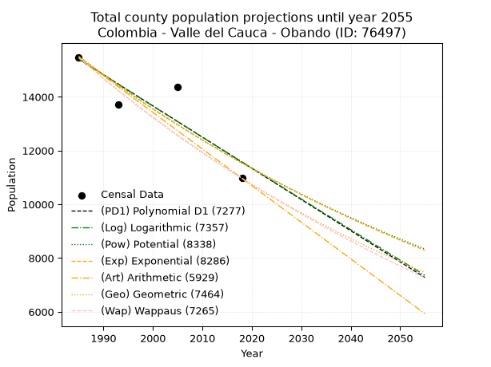
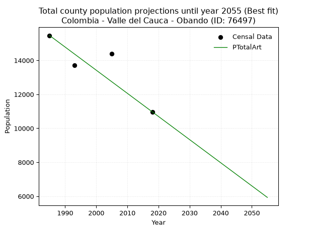
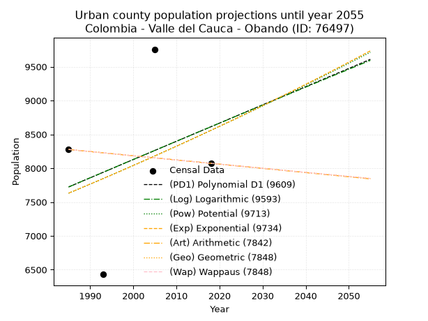
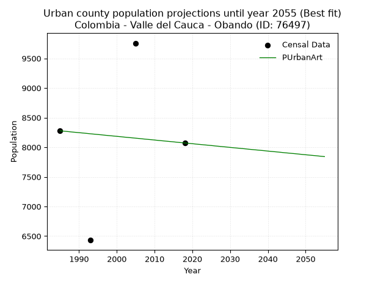
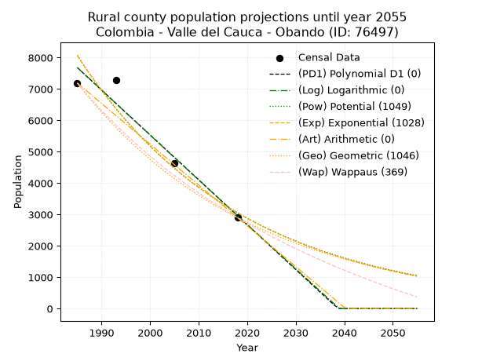
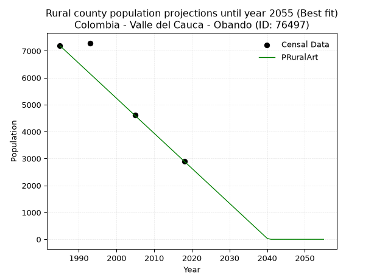

<div align="center">


</div>

# _“Population and Public Services Demand Projections (PPSD) until Year 2050 for Colombia - Valle del Cauca - Obando (ID: 76497)”_
Keywords: `population` `public-service` `projection` `lineal` `polynomial` `logarithmic` `potential` `exponential` `arithmetic` `geometric` `wappaus` `dane` `colombia` `south-america`

PPSD are analytical estimates used by governments and planners to anticipate future changes in population size, age distribution, and the resulting community needs for utilities, healthcare, education, and infrastructure as sizing future water treatment facilities, electrical grids, and road networks based on spatial growth.

> **General running parameters**: • app_version: _v20260806_. • Python version: _3.14.7_. • Pandas version: _3.0.5_. • NumPy version: _2.5.1_. • Creates, save and include plots into reports (create_plot): _False_. • Projection until year: _2050_. • Process polynomial degree 2 and up: _False_. • Process Wappaus: _True_. • Process Wappaus: _True_. • Set negative values to zero: _True_. • Set infinite values to zero: _True_. • Drop dataset notes: _True_. 
<div align="center">

Dynamic map: [:earth_americas:Google](http://maps.google.com/maps?q=4.575712107,-75.9747094) [:earth_americas:OSM](https://www.openstreetmap.org/#map=18/4.575712107/-75.9747094&layers=P) [:earth_americas:Bing](https://www.bing.com/maps?cp=4.575712107~-75.9747094&lvl=18) [:earth_americas:Apple](https://maps.apple.com/frame?center=4.575712107%2C-75.9747094&span=0.003%2C0.006)

</div>


<div align="center">

```geojson
{
  "type": "Feature",
  "geometry": {
    "type": "Point", 
    "coordinates": [-75.9747094, 4.575712107]
  }, 
  "properties": {
    "Name": "Colombia - Valle del Cauca - Obando (ID: 76497)"
  }
}
```

</div>


## 0. Census Data (4 records)

Census data are official statistics collected by a government about the people and housing in a country. They usually include counts of total population, age, sex, race, income, education, and jobs.

📅Global census file: [Population.xlsx](../data/Population.xlsx)

| Source   |   Year |   CountryID | CountryName   |   StateID | StateName       |   CountyID | CountyName   |   PTotal |   PUrban |   PRural |
|:---------|-------:|------------:|:--------------|----------:|:----------------|-----------:|:-------------|---------:|---------:|---------:|
| DANE     |   1985 |          57 | Colombia      |        76 | Valle del Cauca |      76497 | Obando       |    15466 |     8277 |     7189 |
| DANE     |   1993 |          57 | Colombia      |        76 | Valle del Cauca |      76497 | Obando       |    13722 |     6431 |     7291 |
| DANE     |   2005 |          57 | Colombia      |        76 | Valle Del Cauca |      76497 | Obando       |    14380 |     9757 |     4623 |
| DANE     |   2018 |          57 | Colombia      |        76 | Valle del Cauca |      76497 | Obando       |    10970 |     8072 |     2898 |

> 🔥Some records could had specific notes about the registered values or the corresponding urban or rural distribution.

📅   [RUPS](https://www.datos.gov.co/Hacienda-y-Cr-dito-P-blico/Registro-nico-de-Prestadores-de-Servicios-P-blicos/4qkq-csdn/about_data) - Local public utility companies: [RUPS.csv](../data/RUPS.xlsx)

 | SERVICIO       | ESTADO    | NOMBRE                                                                                                                 | NIT         | DEPARTAMENTO_DOMICILIO   | MUNICIPIO_DOMICILIO   | DIRECCION                                     |   TELEFONO | EMAIL                     | TIPO_PRESTADOR                             | CLASIFICACION                 |
|:---------------|:----------|:-----------------------------------------------------------------------------------------------------------------------|:------------|:-------------------------|:----------------------|:----------------------------------------------|-----------:|:--------------------------|:-------------------------------------------|:------------------------------|
| ACUEDUCTO      | OPERATIVA | SOCIEDAD DE ACUEDUCTOS Y ALCANTARILLADOS DEL VALLE DEL CAUCA S.A.  E.S.P.                                              | 890399032-8 | VALLE DEL CAUCA          | CALI                  | AVENIDA 5 N # 23 AN 41                        |    6203400 | rosemary@acuavalle.gov.co | SOCIEDADES (EMPRESA DE SERVICIOS PUBLICOS) | MAYOR O IGUAL A 5001 USUARIOS |
| ALCANTARILLADO | OPERATIVA | SOCIEDAD DE ACUEDUCTOS Y ALCANTARILLADOS DEL VALLE DEL CAUCA S.A.  E.S.P.                                              | 890399032-8 | VALLE DEL CAUCA          | CALI                  | AVENIDA 5 N # 23 AN 41                        |    6203400 | rosemary@acuavalle.gov.co | SOCIEDADES (EMPRESA DE SERVICIOS PUBLICOS) | MAYOR O IGUAL A 5001 USUARIOS |
| ACUEDUCTO      | OPERATIVA | ASOCIACIÓN DE USUARIOS DEL ACUEDUCTO RURAL COMUNITARIO DE LA VEREDA BUENOS AIRES, MUNICIPIO DE OBANDO, VALLE DEL CAUCA | 900478538-7 | VALLE DEL CAUCA          | OBANDO                | VEREDA BUENOS AIRES CORREGIMIENTO VILLA RODAS |    0000000 | nelsontaborda@hotmail.com | ORGANIZACION AUTORIZADA                    | HASTA 2500 SUSCRIPTORES       |

## 1. Total

### 1.1. Coefficients and Parameters

* (PD1) Polynomial Deg 1: -116.12765957446602, 245918.85106382566 (lineal)
* (Log) Logarithmic: -232294.54493898526, 1779307.1975728846
* (Pow) Potential: -17.90605220602889, 63.24042650993581
* (Exp) Exponential: -0.008952511847947561, 809496974122.2118
* (Art) Arithmetic: Year diff. 2018 - 1985 = 33, Population diff. 10970 - 15466 = -4496, Annual growth = -136.24242424242425
* (Geo) Geometric: Year diff. 2018 - 1985 = 33, Population diff. 10970 - 15466 = -4496, Annual growth % = -0.010354497777841809
* (Wap) Wappaus: i = -1.0307340311879576, Condition values only valid for < 200)

<sub>
Wappaus condition values: ['-0.00', '-1.03', '-2.06', '-3.09', '-4.12', '-5.15', '-6.18', '-7.22', '-8.25', '-9.28', '-10.31', '-11.34', '-12.37', '-13.40', '-14.43', '-15.46', '-16.49', '-17.52', '-18.55', '-19.58', '-20.61', '-21.65', '-22.68', '-23.71', '-24.74', '-25.77', '-26.80', '-27.83', '-28.86', '-29.89', '-30.92', '-31.95', '-32.98', '-34.01', '-35.04', '-36.08', '-37.11', '-38.14', '-39.17', '-40.20', '-41.23', '-42.26', '-43.29', '-44.32', '-45.35', '-46.38', '-47.41', '-48.44', '-49.48', '-50.51', '-51.54', '-52.57', '-53.60', '-54.63', '-55.66', '-56.69', '-57.72', '-58.75', '-59.78', '-60.81', '-61.84', '-62.87', '-63.91', '-64.94', '-65.97', '-67.00']
</sub>


### 1.2. Projected Dataset

|   Year |   CountyID |   PTotalPD1 |   PTotalLog |   PTotalPow |   PTotalExp |   PTotalArt |   PTotalGeo |   PTotalWap |
|-------:|-----------:|------------:|------------:|------------:|------------:|------------:|------------:|------------:|
|   1985 |      76497 |       15405 |       15408 |       15508 |       15505 |       15466 |       15466 |       15466 |
|   1986 |      76497 |       15289 |       15291 |       15369 |       15367 |       15330 |       15306 |       15307 |
|   1987 |      76497 |       15173 |       15174 |       15231 |       15230 |       15194 |       15147 |       15150 |
|   1988 |      76497 |       15057 |       15057 |       15094 |       15094 |       15057 |       14991 |       14995 |
|   1989 |      76497 |       14941 |       14940 |       14959 |       14960 |       14921 |       14835 |       14841 |
|   1990 |      76497 |       14825 |       14823 |       14825 |       14827 |       14785 |       14682 |       14689 |
|   1991 |      76497 |       14709 |       14707 |       14692 |       14694 |       14649 |       14530 |       14538 |
|   1992 |      76497 |       14593 |       14590 |       14561 |       14564 |       14512 |       14379 |       14389 |
|   1993 |      76497 |       14476 |       14473 |       14430 |       14434 |       14376 |       14230 |       14241 |
|   1994 |      76497 |       14360 |       14357 |       14301 |       14305 |       14240 |       14083 |       14095 |
|   1995 |      76497 |       14244 |       14240 |       14173 |       14178 |       14104 |       13937 |       13950 |
|   1996 |      76497 |       14128 |       14124 |       14047 |       14051 |       13967 |       13793 |       13807 |
|   1997 |      76497 |       14012 |       14008 |       13921 |       13926 |       13831 |       13650 |       13664 |
|   1998 |      76497 |       13896 |       13891 |       13797 |       13802 |       13695 |       13509 |       13524 |
|   1999 |      76497 |       13780 |       13775 |       13674 |       13679 |       13559 |       13369 |       13384 |
|   2000 |      76497 |       13664 |       13659 |       13552 |       13557 |       13422 |       13230 |       13246 |
|   2001 |      76497 |       13547 |       13543 |       13431 |       13436 |       13286 |       13093 |       13110 |
|   2002 |      76497 |       13431 |       13427 |       13312 |       13316 |       13150 |       12958 |       12974 |
|   2003 |      76497 |       13315 |       13311 |       13193 |       13198 |       13014 |       12824 |       12840 |
|   2004 |      76497 |       13199 |       13195 |       13076 |       13080 |       12877 |       12691 |       12707 |
|   2005 |      76497 |       13083 |       13079 |       12960 |       12963 |       12741 |       12559 |       12576 |
|   2006 |      76497 |       12967 |       12963 |       12844 |       12848 |       12605 |       12429 |       12445 |
|   2007 |      76497 |       12851 |       12847 |       12730 |       12733 |       12469 |       12301 |       12316 |
|   2008 |      76497 |       12735 |       12732 |       12617 |       12620 |       12332 |       12173 |       12188 |
|   2009 |      76497 |       12618 |       12616 |       12505 |       12507 |       12196 |       12047 |       12061 |
|   2010 |      76497 |       12502 |       12500 |       12394 |       12396 |       12060 |       11923 |       11936 |
|   2011 |      76497 |       12386 |       12385 |       12285 |       12286 |       11924 |       11799 |       11811 |
|   2012 |      76497 |       12270 |       12269 |       12176 |       12176 |       11787 |       11677 |       11688 |
|   2013 |      76497 |       12154 |       12154 |       12068 |       12068 |       11651 |       11556 |       11565 |
|   2014 |      76497 |       12038 |       12039 |       11961 |       11960 |       11515 |       11436 |       11444 |
|   2015 |      76497 |       11922 |       11923 |       11855 |       11853 |       11379 |       11318 |       11324 |
|   2016 |      76497 |       11805 |       11808 |       11750 |       11748 |       11242 |       11201 |       11205 |
|   2017 |      76497 |       11689 |       11693 |       11646 |       11643 |       11106 |       11085 |       11087 |
|   2018 |      76497 |       11573 |       11578 |       11543 |       11539 |       10970 |       10970 |       10970 |
|   2019 |      76497 |       11457 |       11463 |       11442 |       11436 |       10834 |       10856 |       10854 |
|   2020 |      76497 |       11341 |       11348 |       11341 |       11334 |       10698 |       10744 |       10739 |
|   2021 |      76497 |       11225 |       11233 |       11240 |       11233 |       10561 |       10633 |       10625 |
|   2022 |      76497 |       11109 |       11118 |       11141 |       11133 |       10425 |       10523 |       10512 |
|   2023 |      76497 |       10993 |       11003 |       11043 |       11034 |       10289 |       10414 |       10400 |
|   2024 |      76497 |       10876 |       10888 |       10946 |       10936 |       10153 |       10306 |       10289 |
|   2025 |      76497 |       10760 |       10773 |       10849 |       10838 |       10016 |       10199 |       10179 |
|   2026 |      76497 |       10644 |       10659 |       10754 |       10742 |        9880 |       10094 |       10070 |
|   2027 |      76497 |       10528 |       10544 |       10659 |       10646 |        9744 |        9989 |        9962 |
|   2028 |      76497 |       10412 |       10429 |       10566 |       10551 |        9608 |        9886 |        9855 |
|   2029 |      76497 |       10296 |       10315 |       10473 |       10457 |        9471 |        9783 |        9748 |
|   2030 |      76497 |       10180 |       10200 |       10381 |       10364 |        9335 |        9682 |        9643 |
|   2031 |      76497 |       10064 |       10086 |       10290 |       10271 |        9199 |        9582 |        9538 |
|   2032 |      76497 |        9947 |        9972 |       10199 |       10180 |        9063 |        9482 |        9435 |
|   2033 |      76497 |        9831 |        9857 |       10110 |       10089 |        8926 |        9384 |        9332 |
|   2034 |      76497 |        9715 |        9743 |       10021 |        9999 |        8790 |        9287 |        9230 |
|   2035 |      76497 |        9599 |        9629 |        9933 |        9910 |        8654 |        9191 |        9128 |
|   2036 |      76497 |        9483 |        9515 |        9846 |        9822 |        8518 |        9096 |        9028 |
|   2037 |      76497 |        9367 |        9401 |        9760 |        9734 |        8381 |        9002 |        8928 |
|   2038 |      76497 |        9251 |        9287 |        9675 |        9648 |        8245 |        8908 |        8830 |
|   2039 |      76497 |        9135 |        9173 |        9590 |        9562 |        8109 |        8816 |        8732 |
|   2040 |      76497 |        9018 |        9059 |        9506 |        9476 |        7973 |        8725 |        8635 |
|   2041 |      76497 |        8902 |        8945 |        9423 |        9392 |        7836 |        8635 |        8538 |
|   2042 |      76497 |        8786 |        8831 |        9341 |        9308 |        7700 |        8545 |        8443 |
|   2043 |      76497 |        8670 |        8718 |        9260 |        9225 |        7564 |        8457 |        8348 |
|   2044 |      76497 |        8554 |        8604 |        9179 |        9143 |        7428 |        8369 |        8254 |
|   2045 |      76497 |        8438 |        8490 |        9099 |        9062 |        7291 |        8282 |        8160 |
|   2046 |      76497 |        8322 |        8377 |        9019 |        8981 |        7155 |        8197 |        8068 |
|   2047 |      76497 |        8206 |        8263 |        8941 |        8901 |        7019 |        8112 |        7976 |
|   2048 |      76497 |        8089 |        8150 |        8863 |        8821 |        6883 |        8028 |        7885 |
|   2049 |      76497 |        7973 |        8036 |        8786 |        8743 |        6746 |        7945 |        7794 |
|   2050 |      76497 |        7857 |        7923 |        8709 |        8665 |        6610 |        7862 |        7704 |
<div align="center">

</img>

</div>


### 1.3. Best fit with absolute and relative error (%)

Relative error puts that difference into context by dividing the absolute error by the true value, creating a unitless ratio or percentage that shows the scale of the mistake.

Absolute and relative error

|   Year | Source   |   CountryID | CountryName   |   StateID | StateName       |   CountyID_x | CountyName   |   PTotal |   PUrban |   PRural |   CountyID_y |   PTotalPD1 |   PTotalLog |   PTotalPow |   PTotalExp |   PTotalArt |   PTotalGeo |   PTotalWap |   PTotalPD1AbsError |   PTotalLogAbsError |   PTotalPowAbsError |   PTotalExpAbsError |   PTotalArtAbsError |   PTotalGeoAbsError |   PTotalWapAbsError |   PTotalPD1RelError |   PTotalLogRelError |   PTotalPowRelError |   PTotalExpRelError |   PTotalArtRelError |   PTotalGeoRelError |   PTotalWapRelError |
|-------:|:---------|------------:|:--------------|----------:|:----------------|-------------:|:-------------|---------:|---------:|---------:|-------------:|------------:|------------:|------------:|------------:|------------:|------------:|------------:|--------------------:|--------------------:|--------------------:|--------------------:|--------------------:|--------------------:|--------------------:|--------------------:|--------------------:|--------------------:|--------------------:|--------------------:|--------------------:|--------------------:|
|   1985 | DANE     |          57 | Colombia      |        76 | Valle del Cauca |        76497 | Obando       |    15466 |     8277 |     7189 |        76497 |       15405 |       15408 |       15508 |       15505 |       15466 |       15466 |       15466 |                  61 |                  58 |                  42 |                  39 |                   0 |                   0 |                   0 |            0.394414 |            0.375016 |            0.271563 |            0.252166 |             0       |             0       |             0       |
|   1993 | DANE     |          57 | Colombia      |        76 | Valle del Cauca |        76497 | Obando       |    13722 |     6431 |     7291 |        76497 |       14476 |       14473 |       14430 |       14434 |       14376 |       14230 |       14241 |                 754 |                 751 |                 708 |                 712 |                 654 |                 508 |                 519 |            5.49483  |            5.47296  |            5.1596   |            5.18875  |             4.76607 |             3.70208 |             3.78225 |
|   2005 | DANE     |          57 | Colombia      |        76 | Valle Del Cauca |        76497 | Obando       |    14380 |     9757 |     4623 |        76497 |       13083 |       13079 |       12960 |       12963 |       12741 |       12559 |       12576 |                1297 |                1301 |                1420 |                1417 |                1639 |                1821 |                1804 |            9.01947  |            9.04729  |            9.87483  |            9.85396  |            11.3978  |            12.6634  |            12.5452  |
|   2018 | DANE     |          57 | Colombia      |        76 | Valle del Cauca |        76497 | Obando       |    10970 |     8072 |     2898 |        76497 |       11573 |       11578 |       11543 |       11539 |       10970 |       10970 |       10970 |                 603 |                 608 |                 573 |                 569 |                   0 |                   0 |                   0 |            5.49681  |            5.54239  |            5.22334  |            5.18687  |             0       |             0       |             0       |

Relative error mean

| Method    |   RelError | Best   |
|:----------|-----------:|:-------|
| PTotalPD1 |    5.10138 |        |
| PTotalLog |    5.10941 |        |
| PTotalPow |    5.13233 |        |
| PTotalExp |    5.12044 |        |
| PTotalArt |    4.04096 | True   |
| PTotalGeo |    4.09138 |        |
| PTotalWap |    4.08186 |        |

💙Best method: _**PTotalArt**_
<div align="center">

</img>

</div>


### 1.4. Fresh water supply demand in liters per capita per day (lpcd)

The fresh water supply demand typically ranges from 100 to 300 liters per capita per day (lpcd) for standard domestic and municipal planning, though absolute survival minimums set by the World Health Organization are as low as 7.5 to 20 liters per day, and total consumption in high-income nations can exceed 400 liters.

> `CZ`: Level in meters above the sea level (masl)<br> `WS`: Fresh water supply demand in liters per capita per day (lpcd or l/h/d)<br> `WSAll`: Zonal fresh water supply demand in liters per second (l/s)<br> `A`: Zonal area in square meters<br> `DP`: Population density (people/hectare or p/ha)

Reference values (RAS Colombia)

|    CZ |   WS |
|------:|-----:|
|  1000 |  120 |
|  2000 |  130 |
| 99999 |  140 |

County shapefile geometry properties and water supply values

|   CountyID |      ATotal |   CZTotal |   WSTotal |
|-----------:|------------:|----------:|----------:|
|      76497 | 2.14675e+08 |   1057.11 |       130 |

Projected values for best method: PTotalArt

|   CountyID |   Year |   PTotalArt |   DPTotal |   WSTotal |   WSTotalAll |
|-----------:|-------:|------------:|----------:|----------:|-------------:|
|      76497 |   1985 |       15466 |      0.72 |       130 |      23.2706 |
|      76497 |   1986 |       15330 |      0.71 |       130 |      23.066  |
|      76497 |   1987 |       15194 |      0.71 |       130 |      22.8613 |
|      76497 |   1988 |       15057 |      0.7  |       130 |      22.6552 |
|      76497 |   1989 |       14921 |      0.7  |       130 |      22.4506 |
|      76497 |   1990 |       14785 |      0.69 |       130 |      22.2459 |
|      76497 |   1991 |       14649 |      0.68 |       130 |      22.0413 |
|      76497 |   1992 |       14512 |      0.68 |       130 |      21.8352 |
|      76497 |   1993 |       14376 |      0.67 |       130 |      21.6306 |
|      76497 |   1994 |       14240 |      0.66 |       130 |      21.4259 |
|      76497 |   1995 |       14104 |      0.66 |       130 |      21.2213 |
|      76497 |   1996 |       13967 |      0.65 |       130 |      21.0152 |
|      76497 |   1997 |       13831 |      0.64 |       130 |      20.8105 |
|      76497 |   1998 |       13695 |      0.64 |       130 |      20.6059 |
|      76497 |   1999 |       13559 |      0.63 |       130 |      20.4013 |
|      76497 |   2000 |       13422 |      0.63 |       130 |      20.1951 |
|      76497 |   2001 |       13286 |      0.62 |       130 |      19.9905 |
|      76497 |   2002 |       13150 |      0.61 |       130 |      19.7859 |
|      76497 |   2003 |       13014 |      0.61 |       130 |      19.5813 |
|      76497 |   2004 |       12877 |      0.6  |       130 |      19.3751 |
|      76497 |   2005 |       12741 |      0.59 |       130 |      19.1705 |
|      76497 |   2006 |       12605 |      0.59 |       130 |      18.9659 |
|      76497 |   2007 |       12469 |      0.58 |       130 |      18.7612 |
|      76497 |   2008 |       12332 |      0.57 |       130 |      18.5551 |
|      76497 |   2009 |       12196 |      0.57 |       130 |      18.3505 |
|      76497 |   2010 |       12060 |      0.56 |       130 |      18.1458 |
|      76497 |   2011 |       11924 |      0.56 |       130 |      17.9412 |
|      76497 |   2012 |       11787 |      0.55 |       130 |      17.7351 |
|      76497 |   2013 |       11651 |      0.54 |       130 |      17.5304 |
|      76497 |   2014 |       11515 |      0.54 |       130 |      17.3258 |
|      76497 |   2015 |       11379 |      0.53 |       130 |      17.1212 |
|      76497 |   2016 |       11242 |      0.52 |       130 |      16.915  |
|      76497 |   2017 |       11106 |      0.52 |       130 |      16.7104 |
|      76497 |   2018 |       10970 |      0.51 |       130 |      16.5058 |
|      76497 |   2019 |       10834 |      0.5  |       130 |      16.3012 |
|      76497 |   2020 |       10698 |      0.5  |       130 |      16.0965 |
|      76497 |   2021 |       10561 |      0.49 |       130 |      15.8904 |
|      76497 |   2022 |       10425 |      0.49 |       130 |      15.6858 |
|      76497 |   2023 |       10289 |      0.48 |       130 |      15.4811 |
|      76497 |   2024 |       10153 |      0.47 |       130 |      15.2765 |
|      76497 |   2025 |       10016 |      0.47 |       130 |      15.0704 |
|      76497 |   2026 |        9880 |      0.46 |       130 |      14.8657 |
|      76497 |   2027 |        9744 |      0.45 |       130 |      14.6611 |
|      76497 |   2028 |        9608 |      0.45 |       130 |      14.4565 |
|      76497 |   2029 |        9471 |      0.44 |       130 |      14.2503 |
|      76497 |   2030 |        9335 |      0.43 |       130 |      14.0457 |
|      76497 |   2031 |        9199 |      0.43 |       130 |      13.8411 |
|      76497 |   2032 |        9063 |      0.42 |       130 |      13.6365 |
|      76497 |   2033 |        8926 |      0.42 |       130 |      13.4303 |
|      76497 |   2034 |        8790 |      0.41 |       130 |      13.2257 |
|      76497 |   2035 |        8654 |      0.4  |       130 |      13.0211 |
|      76497 |   2036 |        8518 |      0.4  |       130 |      12.8164 |
|      76497 |   2037 |        8381 |      0.39 |       130 |      12.6103 |
|      76497 |   2038 |        8245 |      0.38 |       130 |      12.4057 |
|      76497 |   2039 |        8109 |      0.38 |       130 |      12.201  |
|      76497 |   2040 |        7973 |      0.37 |       130 |      11.9964 |
|      76497 |   2041 |        7836 |      0.37 |       130 |      11.7903 |
|      76497 |   2042 |        7700 |      0.36 |       130 |      11.5856 |
|      76497 |   2043 |        7564 |      0.35 |       130 |      11.381  |
|      76497 |   2044 |        7428 |      0.35 |       130 |      11.1764 |
|      76497 |   2045 |        7291 |      0.34 |       130 |      10.9703 |
|      76497 |   2046 |        7155 |      0.33 |       130 |      10.7656 |
|      76497 |   2047 |        7019 |      0.33 |       130 |      10.561  |
|      76497 |   2048 |        6883 |      0.32 |       130 |      10.3564 |
|      76497 |   2049 |        6746 |      0.31 |       130 |      10.1502 |
|      76497 |   2050 |        6610 |      0.31 |       130 |       9.9456 |

## 2. Urban

### 2.1. Coefficients and Parameters

* (PD1) Polynomial Deg 1: 26.93657165796958, -45745.627458853654 (lineal)
* (Log) Logarithmic: 53985.65863431753, -402211.1738933653
* (Pow) Potential: 6.965884393415347, -19.089300424832352
* (Exp) Exponential: 0.003477767425734923, 7.664507124846701
* (Art) Arithmetic: Year diff. 2018 - 1985 = 33, Population diff. 8072 - 8277 = -205, Annual growth = -6.212121212121212
* (Geo) Geometric: Year diff. 2018 - 1985 = 33, Population diff. 8072 - 8277 = -205, Annual growth % = -0.0007596901029395253
* (Wap) Wappaus: i = -0.07599389824602376, Condition values only valid for < 200)

<sub>
Wappaus condition values: ['-0.00', '-0.08', '-0.15', '-0.23', '-0.30', '-0.38', '-0.46', '-0.53', '-0.61', '-0.68', '-0.76', '-0.84', '-0.91', '-0.99', '-1.06', '-1.14', '-1.22', '-1.29', '-1.37', '-1.44', '-1.52', '-1.60', '-1.67', '-1.75', '-1.82', '-1.90', '-1.98', '-2.05', '-2.13', '-2.20', '-2.28', '-2.36', '-2.43', '-2.51', '-2.58', '-2.66', '-2.74', '-2.81', '-2.89', '-2.96', '-3.04', '-3.12', '-3.19', '-3.27', '-3.34', '-3.42', '-3.50', '-3.57', '-3.65', '-3.72', '-3.80', '-3.88', '-3.95', '-4.03', '-4.10', '-4.18', '-4.26', '-4.33', '-4.41', '-4.48', '-4.56', '-4.64', '-4.71', '-4.79', '-4.86', '-4.94']
</sub>


### 2.2. Projected Dataset

|   Year |   CountyID |   PUrbanPD1 |   PUrbanLog |   PUrbanPow |   PUrbanExp |   PUrbanArt |   PUrbanGeo |   PUrbanWap |
|-------:|-----------:|------------:|------------:|------------:|------------:|------------:|------------:|------------:|
|   1985 |      76497 |        7723 |        7722 |        7630 |        7631 |        8277 |        8277 |        8277 |
|   1986 |      76497 |        7750 |        7749 |        7657 |        7658 |        8271 |        8271 |        8271 |
|   1987 |      76497 |        7777 |        7776 |        7684 |        7684 |        8265 |        8264 |        8264 |
|   1988 |      76497 |        7804 |        7804 |        7711 |        7711 |        8258 |        8258 |        8258 |
|   1989 |      76497 |        7831 |        7831 |        7738 |        7738 |        8252 |        8252 |        8252 |
|   1990 |      76497 |        7858 |        7858 |        7765 |        7765 |        8246 |        8246 |        8246 |
|   1991 |      76497 |        7885 |        7885 |        7792 |        7792 |        8240 |        8239 |        8239 |
|   1992 |      76497 |        7912 |        7912 |        7819 |        7819 |        8234 |        8233 |        8233 |
|   1993 |      76497 |        7939 |        7939 |        7847 |        7846 |        8227 |        8227 |        8227 |
|   1994 |      76497 |        7966 |        7966 |        7874 |        7874 |        8221 |        8221 |        8221 |
|   1995 |      76497 |        7993 |        7993 |        7902 |        7901 |        8215 |        8214 |        8214 |
|   1996 |      76497 |        8020 |        8020 |        7929 |        7929 |        8209 |        8208 |        8208 |
|   1997 |      76497 |        8047 |        8048 |        7957 |        7956 |        8202 |        8202 |        8202 |
|   1998 |      76497 |        8074 |        8075 |        7985 |        7984 |        8196 |        8196 |        8196 |
|   1999 |      76497 |        8101 |        8102 |        8013 |        8012 |        8190 |        8189 |        8189 |
|   2000 |      76497 |        8128 |        8129 |        8041 |        8040 |        8184 |        8183 |        8183 |
|   2001 |      76497 |        8154 |        8156 |        8069 |        8068 |        8178 |        8177 |        8177 |
|   2002 |      76497 |        8181 |        8183 |        8097 |        8096 |        8171 |        8171 |        8171 |
|   2003 |      76497 |        8208 |        8209 |        8125 |        8124 |        8165 |        8165 |        8165 |
|   2004 |      76497 |        8235 |        8236 |        8153 |        8152 |        8159 |        8158 |        8158 |
|   2005 |      76497 |        8262 |        8263 |        8182 |        8181 |        8153 |        8152 |        8152 |
|   2006 |      76497 |        8289 |        8290 |        8210 |        8209 |        8147 |        8146 |        8146 |
|   2007 |      76497 |        8316 |        8317 |        8239 |        8238 |        8140 |        8140 |        8140 |
|   2008 |      76497 |        8343 |        8344 |        8267 |        8266 |        8134 |        8134 |        8134 |
|   2009 |      76497 |        8370 |        8371 |        8296 |        8295 |        8128 |        8127 |        8127 |
|   2010 |      76497 |        8397 |        8398 |        8325 |        8324 |        8122 |        8121 |        8121 |
|   2011 |      76497 |        8424 |        8425 |        8354 |        8353 |        8115 |        8115 |        8115 |
|   2012 |      76497 |        8451 |        8451 |        8383 |        8382 |        8109 |        8109 |        8109 |
|   2013 |      76497 |        8478 |        8478 |        8412 |        8411 |        8103 |        8103 |        8103 |
|   2014 |      76497 |        8505 |        8505 |        8441 |        8441 |        8097 |        8097 |        8097 |
|   2015 |      76497 |        8532 |        8532 |        8470 |        8470 |        8091 |        8090 |        8090 |
|   2016 |      76497 |        8559 |        8559 |        8500 |        8500 |        8084 |        8084 |        8084 |
|   2017 |      76497 |        8585 |        8585 |        8529 |        8529 |        8078 |        8078 |        8078 |
|   2018 |      76497 |        8612 |        8612 |        8559 |        8559 |        8072 |        8072 |        8072 |
|   2019 |      76497 |        8639 |        8639 |        8588 |        8589 |        8066 |        8066 |        8066 |
|   2020 |      76497 |        8666 |        8666 |        8618 |        8619 |        8060 |        8060 |        8060 |
|   2021 |      76497 |        8693 |        8692 |        8648 |        8649 |        8053 |        8054 |        8054 |
|   2022 |      76497 |        8720 |        8719 |        8677 |        8679 |        8047 |        8047 |        8047 |
|   2023 |      76497 |        8747 |        8746 |        8707 |        8709 |        8041 |        8041 |        8041 |
|   2024 |      76497 |        8774 |        8773 |        8737 |        8739 |        8035 |        8035 |        8035 |
|   2025 |      76497 |        8801 |        8799 |        8767 |        8770 |        8029 |        8029 |        8029 |
|   2026 |      76497 |        8828 |        8826 |        8798 |        8800 |        8022 |        8023 |        8023 |
|   2027 |      76497 |        8855 |        8852 |        8828 |        8831 |        8016 |        8017 |        8017 |
|   2028 |      76497 |        8882 |        8879 |        8858 |        8862 |        8010 |        8011 |        8011 |
|   2029 |      76497 |        8909 |        8906 |        8889 |        8893 |        8004 |        8005 |        8005 |
|   2030 |      76497 |        8936 |        8932 |        8919 |        8924 |        7997 |        7999 |        7999 |
|   2031 |      76497 |        8963 |        8959 |        8950 |        8955 |        7991 |        7993 |        7993 |
|   2032 |      76497 |        8989 |        8985 |        8981 |        8986 |        7985 |        7987 |        7987 |
|   2033 |      76497 |        9016 |        9012 |        9012 |        9017 |        7979 |        7981 |        7980 |
|   2034 |      76497 |        9043 |        9039 |        9043 |        9049 |        7973 |        7974 |        7974 |
|   2035 |      76497 |        9070 |        9065 |        9074 |        9080 |        7966 |        7968 |        7968 |
|   2036 |      76497 |        9097 |        9092 |        9105 |        9112 |        7960 |        7962 |        7962 |
|   2037 |      76497 |        9124 |        9118 |        9136 |        9144 |        7954 |        7956 |        7956 |
|   2038 |      76497 |        9151 |        9145 |        9167 |        9175 |        7948 |        7950 |        7950 |
|   2039 |      76497 |        9178 |        9171 |        9199 |        9207 |        7942 |        7944 |        7944 |
|   2040 |      76497 |        9205 |        9198 |        9230 |        9240 |        7935 |        7938 |        7938 |
|   2041 |      76497 |        9232 |        9224 |        9262 |        9272 |        7929 |        7932 |        7932 |
|   2042 |      76497 |        9259 |        9251 |        9293 |        9304 |        7923 |        7926 |        7926 |
|   2043 |      76497 |        9286 |        9277 |        9325 |        9336 |        7917 |        7920 |        7920 |
|   2044 |      76497 |        9313 |        9303 |        9357 |        9369 |        7910 |        7914 |        7914 |
|   2045 |      76497 |        9340 |        9330 |        9389 |        9402 |        7904 |        7908 |        7908 |
|   2046 |      76497 |        9367 |        9356 |        9421 |        9434 |        7898 |        7902 |        7902 |
|   2047 |      76497 |        9394 |        9383 |        9453 |        9467 |        7892 |        7896 |        7896 |
|   2048 |      76497 |        9420 |        9409 |        9485 |        9500 |        7886 |        7890 |        7890 |
|   2049 |      76497 |        9447 |        9435 |        9517 |        9533 |        7879 |        7884 |        7884 |
|   2050 |      76497 |        9474 |        9462 |        9550 |        9567 |        7873 |        7878 |        7878 |
<div align="center">

</img>

</div>


### 2.3. Best fit with absolute and relative error (%)

Relative error puts that difference into context by dividing the absolute error by the true value, creating a unitless ratio or percentage that shows the scale of the mistake.

Absolute and relative error

|   Year | Source   |   CountryID | CountryName   |   StateID | StateName       |   CountyID_x | CountyName   |   PTotal |   PUrban |   PRural |   CountyID_y |   PUrbanPD1 |   PUrbanLog |   PUrbanPow |   PUrbanExp |   PUrbanArt |   PUrbanGeo |   PUrbanWap |   PUrbanPD1AbsError |   PUrbanLogAbsError |   PUrbanPowAbsError |   PUrbanExpAbsError |   PUrbanArtAbsError |   PUrbanGeoAbsError |   PUrbanWapAbsError |   PUrbanPD1RelError |   PUrbanLogRelError |   PUrbanPowRelError |   PUrbanExpRelError |   PUrbanArtRelError |   PUrbanGeoRelError |   PUrbanWapRelError |
|-------:|:---------|------------:|:--------------|----------:|:----------------|-------------:|:-------------|---------:|---------:|---------:|-------------:|------------:|------------:|------------:|------------:|------------:|------------:|------------:|--------------------:|--------------------:|--------------------:|--------------------:|--------------------:|--------------------:|--------------------:|--------------------:|--------------------:|--------------------:|--------------------:|--------------------:|--------------------:|--------------------:|
|   1985 | DANE     |          57 | Colombia      |        76 | Valle del Cauca |        76497 | Obando       |    15466 |     8277 |     7189 |        76497 |        7723 |        7722 |        7630 |        7631 |        8277 |        8277 |        8277 |                 554 |                 555 |                 647 |                 646 |                   0 |                   0 |                   0 |             6.69325 |             6.70533 |             7.81684 |             7.80476 |              0      |              0      |              0      |
|   1993 | DANE     |          57 | Colombia      |        76 | Valle del Cauca |        76497 | Obando       |    13722 |     6431 |     7291 |        76497 |        7939 |        7939 |        7847 |        7846 |        8227 |        8227 |        8227 |                1508 |                1508 |                1416 |                1415 |                1796 |                1796 |                1796 |            23.4489  |            23.4489  |            22.0183  |            22.0028  |             27.9272 |             27.9272 |             27.9272 |
|   2005 | DANE     |          57 | Colombia      |        76 | Valle Del Cauca |        76497 | Obando       |    14380 |     9757 |     4623 |        76497 |        8262 |        8263 |        8182 |        8181 |        8153 |        8152 |        8152 |                1495 |                1494 |                1575 |                1576 |                1604 |                1605 |                1605 |            15.3223  |            15.3121  |            16.1423  |            16.1525  |             16.4395 |             16.4497 |             16.4497 |
|   2018 | DANE     |          57 | Colombia      |        76 | Valle del Cauca |        76497 | Obando       |    10970 |     8072 |     2898 |        76497 |        8612 |        8612 |        8559 |        8559 |        8072 |        8072 |        8072 |                 540 |                 540 |                 487 |                 487 |                   0 |                   0 |                   0 |             6.68979 |             6.68979 |             6.0332  |             6.0332  |              0      |              0      |              0      |

Relative error mean

| Method    |   RelError | Best   |
|:----------|-----------:|:-------|
| PUrbanPD1 |    13.0386 |        |
| PUrbanLog |    13.039  |        |
| PUrbanPow |    13.0027 |        |
| PUrbanExp |    12.9983 |        |
| PUrbanArt |    11.0917 | True   |
| PUrbanGeo |    11.0942 |        |
| PUrbanWap |    11.0942 |        |

💙Best method: _**PUrbanArt**_
<div align="center">

</img>

</div>


### 2.4. Fresh water supply demand in liters per capita per day (lpcd)

The fresh water supply demand typically ranges from 100 to 300 liters per capita per day (lpcd) for standard domestic and municipal planning, though absolute survival minimums set by the World Health Organization are as low as 7.5 to 20 liters per day, and total consumption in high-income nations can exceed 400 liters.

> `CZ`: Level in meters above the sea level (masl)<br> `WS`: Fresh water supply demand in liters per capita per day (lpcd or l/h/d)<br> `WSAll`: Zonal fresh water supply demand in liters per second (l/s)<br> `A`: Zonal area in square meters<br> `DP`: Population density (people/hectare or p/ha)

Reference values (RAS Colombia)

|    CZ |   WS |
|------:|-----:|
|  1000 |  120 |
|  2000 |  130 |
| 99999 |  140 |

County shapefile geometry properties and water supply values

|   CountyID |      AUrban |   CZUrban |   WSUrban |
|-----------:|------------:|----------:|----------:|
|      76497 | 2.08751e+06 |   935.243 |       120 |

Projected values for best method: PUrbanArt

|   CountyID |   Year |   PUrbanArt |   DPUrban |   WSUrban |   WSUrbanAll |
|-----------:|-------:|------------:|----------:|----------:|-------------:|
|      76497 |   1985 |        8277 |     39.65 |       120 |      11.4958 |
|      76497 |   1986 |        8271 |     39.62 |       120 |      11.4875 |
|      76497 |   1987 |        8265 |     39.59 |       120 |      11.4792 |
|      76497 |   1988 |        8258 |     39.56 |       120 |      11.4694 |
|      76497 |   1989 |        8252 |     39.53 |       120 |      11.4611 |
|      76497 |   1990 |        8246 |     39.5  |       120 |      11.4528 |
|      76497 |   1991 |        8240 |     39.47 |       120 |      11.4444 |
|      76497 |   1992 |        8234 |     39.44 |       120 |      11.4361 |
|      76497 |   1993 |        8227 |     39.41 |       120 |      11.4264 |
|      76497 |   1994 |        8221 |     39.38 |       120 |      11.4181 |
|      76497 |   1995 |        8215 |     39.35 |       120 |      11.4097 |
|      76497 |   1996 |        8209 |     39.32 |       120 |      11.4014 |
|      76497 |   1997 |        8202 |     39.29 |       120 |      11.3917 |
|      76497 |   1998 |        8196 |     39.26 |       120 |      11.3833 |
|      76497 |   1999 |        8190 |     39.23 |       120 |      11.375  |
|      76497 |   2000 |        8184 |     39.2  |       120 |      11.3667 |
|      76497 |   2001 |        8178 |     39.18 |       120 |      11.3583 |
|      76497 |   2002 |        8171 |     39.14 |       120 |      11.3486 |
|      76497 |   2003 |        8165 |     39.11 |       120 |      11.3403 |
|      76497 |   2004 |        8159 |     39.08 |       120 |      11.3319 |
|      76497 |   2005 |        8153 |     39.06 |       120 |      11.3236 |
|      76497 |   2006 |        8147 |     39.03 |       120 |      11.3153 |
|      76497 |   2007 |        8140 |     38.99 |       120 |      11.3056 |
|      76497 |   2008 |        8134 |     38.97 |       120 |      11.2972 |
|      76497 |   2009 |        8128 |     38.94 |       120 |      11.2889 |
|      76497 |   2010 |        8122 |     38.91 |       120 |      11.2806 |
|      76497 |   2011 |        8115 |     38.87 |       120 |      11.2708 |
|      76497 |   2012 |        8109 |     38.85 |       120 |      11.2625 |
|      76497 |   2013 |        8103 |     38.82 |       120 |      11.2542 |
|      76497 |   2014 |        8097 |     38.79 |       120 |      11.2458 |
|      76497 |   2015 |        8091 |     38.76 |       120 |      11.2375 |
|      76497 |   2016 |        8084 |     38.73 |       120 |      11.2278 |
|      76497 |   2017 |        8078 |     38.7  |       120 |      11.2194 |
|      76497 |   2018 |        8072 |     38.67 |       120 |      11.2111 |
|      76497 |   2019 |        8066 |     38.64 |       120 |      11.2028 |
|      76497 |   2020 |        8060 |     38.61 |       120 |      11.1944 |
|      76497 |   2021 |        8053 |     38.58 |       120 |      11.1847 |
|      76497 |   2022 |        8047 |     38.55 |       120 |      11.1764 |
|      76497 |   2023 |        8041 |     38.52 |       120 |      11.1681 |
|      76497 |   2024 |        8035 |     38.49 |       120 |      11.1597 |
|      76497 |   2025 |        8029 |     38.46 |       120 |      11.1514 |
|      76497 |   2026 |        8022 |     38.43 |       120 |      11.1417 |
|      76497 |   2027 |        8016 |     38.4  |       120 |      11.1333 |
|      76497 |   2028 |        8010 |     38.37 |       120 |      11.125  |
|      76497 |   2029 |        8004 |     38.34 |       120 |      11.1167 |
|      76497 |   2030 |        7997 |     38.31 |       120 |      11.1069 |
|      76497 |   2031 |        7991 |     38.28 |       120 |      11.0986 |
|      76497 |   2032 |        7985 |     38.25 |       120 |      11.0903 |
|      76497 |   2033 |        7979 |     38.22 |       120 |      11.0819 |
|      76497 |   2034 |        7973 |     38.19 |       120 |      11.0736 |
|      76497 |   2035 |        7966 |     38.16 |       120 |      11.0639 |
|      76497 |   2036 |        7960 |     38.13 |       120 |      11.0556 |
|      76497 |   2037 |        7954 |     38.1  |       120 |      11.0472 |
|      76497 |   2038 |        7948 |     38.07 |       120 |      11.0389 |
|      76497 |   2039 |        7942 |     38.05 |       120 |      11.0306 |
|      76497 |   2040 |        7935 |     38.01 |       120 |      11.0208 |
|      76497 |   2041 |        7929 |     37.98 |       120 |      11.0125 |
|      76497 |   2042 |        7923 |     37.95 |       120 |      11.0042 |
|      76497 |   2043 |        7917 |     37.93 |       120 |      10.9958 |
|      76497 |   2044 |        7910 |     37.89 |       120 |      10.9861 |
|      76497 |   2045 |        7904 |     37.86 |       120 |      10.9778 |
|      76497 |   2046 |        7898 |     37.83 |       120 |      10.9694 |
|      76497 |   2047 |        7892 |     37.81 |       120 |      10.9611 |
|      76497 |   2048 |        7886 |     37.78 |       120 |      10.9528 |
|      76497 |   2049 |        7879 |     37.74 |       120 |      10.9431 |
|      76497 |   2050 |        7873 |     37.71 |       120 |      10.9347 |

## 3. Rural

### 3.1. Coefficients and Parameters

* (PD1) Polynomial Deg 1: -143.06423123243545, 291664.478522679 (lineal)
* (Log) Logarithmic: -286280.2035733026, 2181518.3714662488
* (Pow) Potential: -58.87349937315898, 198.05750569414056
* (Exp) Exponential: -0.029427115424368107, 1.8831380854618106e+29
* (Art) Arithmetic: Year diff. 2018 - 1985 = 33, Population diff. 2898 - 7189 = -4291, Annual growth = -130.03030303030303
* (Geo) Geometric: Year diff. 2018 - 1985 = 33, Population diff. 2898 - 7189 = -4291, Annual growth % = -0.027155718895666148
* (Wap) Wappaus: i = -2.5781759300149307, Condition values only valid for < 200)

<sub>
Wappaus condition values: ['-0.00', '-2.58', '-5.16', '-7.73', '-10.31', '-12.89', '-15.47', '-18.05', '-20.63', '-23.20', '-25.78', '-28.36', '-30.94', '-33.52', '-36.09', '-38.67', '-41.25', '-43.83', '-46.41', '-48.99', '-51.56', '-54.14', '-56.72', '-59.30', '-61.88', '-64.45', '-67.03', '-69.61', '-72.19', '-74.77', '-77.35', '-79.92', '-82.50', '-85.08', '-87.66', '-90.24', '-92.81', '-95.39', '-97.97', '-100.55', '-103.13', '-105.71', '-108.28', '-110.86', '-113.44', '-116.02', '-118.60', '-121.17', '-123.75', '-126.33', '-128.91', '-131.49', '-134.07', '-136.64', '-139.22', '-141.80', '-144.38', '-146.96', '-149.53', '-152.11', '-154.69', '-157.27', '-159.85', '-162.43', '-165.00', '-167.58']
</sub>


### 3.2. Projected Dataset

|   Year |   CountyID |   PRuralPD1 |   PRuralLog |   PRuralPow |   PRuralExp |   PRuralArt |   PRuralGeo |   PRuralWap |
|-------:|-----------:|------------:|------------:|------------:|------------:|------------:|------------:|------------:|
|   1985 |      76497 |        7682 |        7686 |        8069 |        8063 |        7189 |        7189 |        7189 |
|   1986 |      76497 |        7539 |        7541 |        7833 |        7830 |        7059 |        6994 |        7006 |
|   1987 |      76497 |        7396 |        7397 |        7604 |        7602 |        6929 |        6804 |        6828 |
|   1988 |      76497 |        7253 |        7253 |        7382 |        7382 |        6799 |        6619 |        6654 |
|   1989 |      76497 |        7110 |        7109 |        7167 |        7168 |        6669 |        6439 |        6484 |
|   1990 |      76497 |        6967 |        6965 |        6958 |        6960 |        6539 |        6264 |        6318 |
|   1991 |      76497 |        6824 |        6822 |        6755 |        6758 |        6409 |        6094 |        6157 |
|   1992 |      76497 |        6681 |        6678 |        6558 |        6562 |        6279 |        5929 |        5999 |
|   1993 |      76497 |        6537 |        6534 |        6367 |        6372 |        6149 |        5768 |        5845 |
|   1994 |      76497 |        6394 |        6391 |        6182 |        6187 |        6019 |        5611 |        5694 |
|   1995 |      76497 |        6251 |        6247 |        6002 |        6008 |        5889 |        5459 |        5547 |
|   1996 |      76497 |        6108 |        6104 |        5828 |        5834 |        5759 |        5311 |        5403 |
|   1997 |      76497 |        5965 |        5960 |        5658 |        5664 |        5629 |        5166 |        5263 |
|   1998 |      76497 |        5822 |        5817 |        5494 |        5500 |        5499 |        5026 |        5125 |
|   1999 |      76497 |        5679 |        5674 |        5335 |        5341 |        5369 |        4890 |        4991 |
|   2000 |      76497 |        5536 |        5530 |        5180 |        5186 |        5239 |        4757 |        4859 |
|   2001 |      76497 |        5393 |        5387 |        5030 |        5035 |        5109 |        4628 |        4731 |
|   2002 |      76497 |        5250 |        5244 |        4884 |        4889 |        4978 |        4502 |        4605 |
|   2003 |      76497 |        5107 |        5101 |        4742 |        4748 |        4848 |        4380 |        4481 |
|   2004 |      76497 |        4964 |        4958 |        4605 |        4610 |        4718 |        4261 |        4360 |
|   2005 |      76497 |        4821 |        4816 |        4472 |        4476 |        4588 |        4145 |        4242 |
|   2006 |      76497 |        4678 |        4673 |        4342 |        4346 |        4458 |        4033 |        4126 |
|   2007 |      76497 |        4535 |        4530 |        4217 |        4220 |        4328 |        3923 |        4012 |
|   2008 |      76497 |        4392 |        4388 |        4095 |        4098 |        4198 |        3816 |        3901 |
|   2009 |      76497 |        4248 |        4245 |        3977 |        3979 |        4068 |        3713 |        3792 |
|   2010 |      76497 |        4105 |        4103 |        3862 |        3864 |        3938 |        3612 |        3685 |
|   2011 |      76497 |        3962 |        3960 |        3750 |        3752 |        3808 |        3514 |        3580 |
|   2012 |      76497 |        3819 |        3818 |        3642 |        3643 |        3678 |        3419 |        3477 |
|   2013 |      76497 |        3676 |        3676 |        3537 |        3537 |        3548 |        3326 |        3376 |
|   2014 |      76497 |        3533 |        3533 |        3435 |        3435 |        3418 |        3235 |        3277 |
|   2015 |      76497 |        3390 |        3391 |        3336 |        3335 |        3288 |        3148 |        3179 |
|   2016 |      76497 |        3247 |        3249 |        3240 |        3238 |        3158 |        3062 |        3084 |
|   2017 |      76497 |        3104 |        3107 |        3147 |        3145 |        3028 |        2979 |        2990 |
|   2018 |      76497 |        2961 |        2965 |        3057 |        3053 |        2898 |        2898 |        2898 |
|   2019 |      76497 |        2818 |        2824 |        2969 |        2965 |        2768 |        2819 |        2808 |
|   2020 |      76497 |        2675 |        2682 |        2883 |        2879 |        2638 |        2743 |        2719 |
|   2021 |      76497 |        2532 |        2540 |        2801 |        2795 |        2508 |        2668 |        2632 |
|   2022 |      76497 |        2389 |        2399 |        2720 |        2714 |        2378 |        2596 |        2546 |
|   2023 |      76497 |        2246 |        2257 |        2642 |        2636 |        2248 |        2525 |        2462 |
|   2024 |      76497 |        2102 |        2116 |        2566 |        2559 |        2118 |        2457 |        2379 |
|   2025 |      76497 |        1959 |        1974 |        2493 |        2485 |        1988 |        2390 |        2297 |
|   2026 |      76497 |        1816 |        1833 |        2421 |        2413 |        1858 |        2325 |        2217 |
|   2027 |      76497 |        1673 |        1692 |        2352 |        2343 |        1728 |        2262 |        2139 |
|   2028 |      76497 |        1530 |        1550 |        2285 |        2275 |        1598 |        2201 |        2061 |
|   2029 |      76497 |        1387 |        1409 |        2219 |        2209 |        1468 |        2141 |        1985 |
|   2030 |      76497 |        1244 |        1268 |        2156 |        2145 |        1338 |        2083 |        1910 |
|   2031 |      76497 |        1101 |        1127 |        2094 |        2083 |        1208 |        2026 |        1837 |
|   2032 |      76497 |         958 |         986 |        2035 |        2022 |        1078 |        1971 |        1764 |
|   2033 |      76497 |         815 |         845 |        1976 |        1964 |         948 |        1918 |        1693 |
|   2034 |      76497 |         672 |         705 |        1920 |        1907 |         818 |        1865 |        1623 |
|   2035 |      76497 |         529 |         564 |        1865 |        1851 |         687 |        1815 |        1554 |
|   2036 |      76497 |         386 |         423 |        1812 |        1798 |         557 |        1766 |        1486 |
|   2037 |      76497 |         243 |         283 |        1760 |        1746 |         427 |        1718 |        1419 |
|   2038 |      76497 |         100 |         142 |        1710 |        1695 |         297 |        1671 |        1353 |
|   2039 |      76497 |           0 |           2 |        1662 |        1646 |         167 |        1626 |        1288 |
|   2040 |      76497 |           0 |           0 |        1614 |        1598 |          37 |        1581 |        1224 |
|   2041 |      76497 |           0 |           0 |        1568 |        1552 |           0 |        1538 |        1161 |
|   2042 |      76497 |           0 |           0 |        1524 |        1507 |           0 |        1497 |        1099 |
|   2043 |      76497 |           0 |           0 |        1481 |        1463 |           0 |        1456 |        1038 |
|   2044 |      76497 |           0 |           0 |        1439 |        1421 |           0 |        1417 |         978 |
|   2045 |      76497 |           0 |           0 |        1398 |        1379 |           0 |        1378 |         918 |
|   2046 |      76497 |           0 |           0 |        1358 |        1339 |           0 |        1341 |         860 |
|   2047 |      76497 |           0 |           0 |        1320 |        1301 |           0 |        1304 |         802 |
|   2048 |      76497 |           0 |           0 |        1282 |        1263 |           0 |        1269 |         745 |
|   2049 |      76497 |           0 |           0 |        1246 |        1226 |           0 |        1234 |         689 |
|   2050 |      76497 |           0 |           0 |        1211 |        1191 |           0 |        1201 |         634 |
<div align="center">

</img>

</div>


### 3.3. Best fit with absolute and relative error (%)

Relative error puts that difference into context by dividing the absolute error by the true value, creating a unitless ratio or percentage that shows the scale of the mistake.

Absolute and relative error

|   Year | Source   |   CountryID | CountryName   |   StateID | StateName       |   CountyID_x | CountyName   |   PTotal |   PUrban |   PRural |   CountyID_y |   PRuralPD1 |   PRuralLog |   PRuralPow |   PRuralExp |   PRuralArt |   PRuralGeo |   PRuralWap |   PRuralPD1AbsError |   PRuralLogAbsError |   PRuralPowAbsError |   PRuralExpAbsError |   PRuralArtAbsError |   PRuralGeoAbsError |   PRuralWapAbsError |   PRuralPD1RelError |   PRuralLogRelError |   PRuralPowRelError |   PRuralExpRelError |   PRuralArtRelError |   PRuralGeoRelError |   PRuralWapRelError |
|-------:|:---------|------------:|:--------------|----------:|:----------------|-------------:|:-------------|---------:|---------:|---------:|-------------:|------------:|------------:|------------:|------------:|------------:|------------:|------------:|--------------------:|--------------------:|--------------------:|--------------------:|--------------------:|--------------------:|--------------------:|--------------------:|--------------------:|--------------------:|--------------------:|--------------------:|--------------------:|--------------------:|
|   1985 | DANE     |          57 | Colombia      |        76 | Valle del Cauca |        76497 | Obando       |    15466 |     8277 |     7189 |        76497 |        7682 |        7686 |        8069 |        8063 |        7189 |        7189 |        7189 |                 493 |                 497 |                 880 |                 874 |                   0 |                   0 |                   0 |             6.8577  |             6.91334 |            12.2409  |            12.1575  |            0        |              0      |              0      |
|   1993 | DANE     |          57 | Colombia      |        76 | Valle del Cauca |        76497 | Obando       |    13722 |     6431 |     7291 |        76497 |        6537 |        6534 |        6367 |        6372 |        6149 |        5768 |        5845 |                 754 |                 757 |                 924 |                 919 |                1142 |                1523 |                1446 |            10.3415  |            10.3827  |            12.6732  |            12.6046  |           15.6631   |             20.8888 |             19.8327 |
|   2005 | DANE     |          57 | Colombia      |        76 | Valle Del Cauca |        76497 | Obando       |    14380 |     9757 |     4623 |        76497 |        4821 |        4816 |        4472 |        4476 |        4588 |        4145 |        4242 |                 198 |                 193 |                 151 |                 147 |                  35 |                 478 |                 381 |             4.28293 |             4.17478 |             3.26628 |             3.17975 |            0.757084 |             10.3396 |              8.2414 |
|   2018 | DANE     |          57 | Colombia      |        76 | Valle del Cauca |        76497 | Obando       |    10970 |     8072 |     2898 |        76497 |        2961 |        2965 |        3057 |        3053 |        2898 |        2898 |        2898 |                  63 |                  67 |                 159 |                 155 |                   0 |                   0 |                   0 |             2.17391 |             2.31194 |             5.48654 |             5.34852 |            0        |              0      |              0      |

Relative error mean

| Method    |   RelError | Best   |
|:----------|-----------:|:-------|
| PRuralPD1 |    5.91402 |        |
| PRuralLog |    5.94568 |        |
| PRuralPow |    8.41673 |        |
| PRuralExp |    8.32258 |        |
| PRuralArt |    4.10506 | True   |
| PRuralGeo |    7.80709 |        |
| PRuralWap |    7.01852 |        |

💙Best method: _**PRuralArt**_
<div align="center">

</img>

</div>


### 3.4. Fresh water supply demand in liters per capita per day (lpcd)

The fresh water supply demand typically ranges from 100 to 300 liters per capita per day (lpcd) for standard domestic and municipal planning, though absolute survival minimums set by the World Health Organization are as low as 7.5 to 20 liters per day, and total consumption in high-income nations can exceed 400 liters.

> `CZ`: Level in meters above the sea level (masl)<br> `WS`: Fresh water supply demand in liters per capita per day (lpcd or l/h/d)<br> `WSAll`: Zonal fresh water supply demand in liters per second (l/s)<br> `A`: Zonal area in square meters<br> `DP`: Population density (people/hectare or p/ha)

Reference values (RAS Colombia)

|    CZ |   WS |
|------:|-----:|
|  1000 |  120 |
|  2000 |  130 |
| 99999 |  140 |

County shapefile geometry properties and water supply values

|   CountyID |      ARural |   CZRural |   WSRural |
|-----------:|------------:|----------:|----------:|
|      76497 | 2.12587e+08 |    1058.3 |       130 |

Projected values for best method: PRuralArt

|   CountyID |   Year |   PRuralArt |   DPRural |   WSRural |   WSRuralAll |
|-----------:|-------:|------------:|----------:|----------:|-------------:|
|      76497 |   1985 |        7189 |      0.34 |       130 |   10.8168    |
|      76497 |   1986 |        7059 |      0.33 |       130 |   10.6212    |
|      76497 |   1987 |        6929 |      0.33 |       130 |   10.4256    |
|      76497 |   1988 |        6799 |      0.32 |       130 |   10.23      |
|      76497 |   1989 |        6669 |      0.31 |       130 |   10.0344    |
|      76497 |   1990 |        6539 |      0.31 |       130 |    9.83877   |
|      76497 |   1991 |        6409 |      0.3  |       130 |    9.64317   |
|      76497 |   1992 |        6279 |      0.3  |       130 |    9.44757   |
|      76497 |   1993 |        6149 |      0.29 |       130 |    9.25197   |
|      76497 |   1994 |        6019 |      0.28 |       130 |    9.05637   |
|      76497 |   1995 |        5889 |      0.28 |       130 |    8.86076   |
|      76497 |   1996 |        5759 |      0.27 |       130 |    8.66516   |
|      76497 |   1997 |        5629 |      0.26 |       130 |    8.46956   |
|      76497 |   1998 |        5499 |      0.26 |       130 |    8.27396   |
|      76497 |   1999 |        5369 |      0.25 |       130 |    8.07836   |
|      76497 |   2000 |        5239 |      0.25 |       130 |    7.88275   |
|      76497 |   2001 |        5109 |      0.24 |       130 |    7.68715   |
|      76497 |   2002 |        4978 |      0.23 |       130 |    7.49005   |
|      76497 |   2003 |        4848 |      0.23 |       130 |    7.29444   |
|      76497 |   2004 |        4718 |      0.22 |       130 |    7.09884   |
|      76497 |   2005 |        4588 |      0.22 |       130 |    6.90324   |
|      76497 |   2006 |        4458 |      0.21 |       130 |    6.70764   |
|      76497 |   2007 |        4328 |      0.2  |       130 |    6.51204   |
|      76497 |   2008 |        4198 |      0.2  |       130 |    6.31644   |
|      76497 |   2009 |        4068 |      0.19 |       130 |    6.12083   |
|      76497 |   2010 |        3938 |      0.19 |       130 |    5.92523   |
|      76497 |   2011 |        3808 |      0.18 |       130 |    5.72963   |
|      76497 |   2012 |        3678 |      0.17 |       130 |    5.53403   |
|      76497 |   2013 |        3548 |      0.17 |       130 |    5.33843   |
|      76497 |   2014 |        3418 |      0.16 |       130 |    5.14282   |
|      76497 |   2015 |        3288 |      0.15 |       130 |    4.94722   |
|      76497 |   2016 |        3158 |      0.15 |       130 |    4.75162   |
|      76497 |   2017 |        3028 |      0.14 |       130 |    4.55602   |
|      76497 |   2018 |        2898 |      0.14 |       130 |    4.36042   |
|      76497 |   2019 |        2768 |      0.13 |       130 |    4.16481   |
|      76497 |   2020 |        2638 |      0.12 |       130 |    3.96921   |
|      76497 |   2021 |        2508 |      0.12 |       130 |    3.77361   |
|      76497 |   2022 |        2378 |      0.11 |       130 |    3.57801   |
|      76497 |   2023 |        2248 |      0.11 |       130 |    3.38241   |
|      76497 |   2024 |        2118 |      0.1  |       130 |    3.18681   |
|      76497 |   2025 |        1988 |      0.09 |       130 |    2.9912    |
|      76497 |   2026 |        1858 |      0.09 |       130 |    2.7956    |
|      76497 |   2027 |        1728 |      0.08 |       130 |    2.6       |
|      76497 |   2028 |        1598 |      0.08 |       130 |    2.4044    |
|      76497 |   2029 |        1468 |      0.07 |       130 |    2.2088    |
|      76497 |   2030 |        1338 |      0.06 |       130 |    2.01319   |
|      76497 |   2031 |        1208 |      0.06 |       130 |    1.81759   |
|      76497 |   2032 |        1078 |      0.05 |       130 |    1.62199   |
|      76497 |   2033 |         948 |      0.04 |       130 |    1.42639   |
|      76497 |   2034 |         818 |      0.04 |       130 |    1.23079   |
|      76497 |   2035 |         687 |      0.03 |       130 |    1.03368   |
|      76497 |   2036 |         557 |      0.03 |       130 |    0.838079  |
|      76497 |   2037 |         427 |      0.02 |       130 |    0.642477  |
|      76497 |   2038 |         297 |      0.01 |       130 |    0.446875  |
|      76497 |   2039 |         167 |      0.01 |       130 |    0.251273  |
|      76497 |   2040 |          37 |      0    |       130 |    0.0556713 |
|      76497 |   2041 |           0 |      0    |       130 |    0         |
|      76497 |   2042 |           0 |      0    |       130 |    0         |
|      76497 |   2043 |           0 |      0    |       130 |    0         |
|      76497 |   2044 |           0 |      0    |       130 |    0         |
|      76497 |   2045 |           0 |      0    |       130 |    0         |
|      76497 |   2046 |           0 |      0    |       130 |    0         |
|      76497 |   2047 |           0 |      0    |       130 |    0         |
|      76497 |   2048 |           0 |      0    |       130 |    0         |
|      76497 |   2049 |           0 |      0    |       130 |    0         |
|      76497 |   2050 |           0 |      0    |       130 |    0         |

<div align="center"><br><sub>Share this research</sub></div><br>

<sub>**APPS & TOOLS & CONTENT DISCLAIMER**: • NO WARRANTY - This content and software is provided by <a href="https://github.com/rcfdtools" target="_blank">github.com/rcfdtools</a> "as is", without any express or implied warranty, including warranties of merchantability, fitness for a particular purpose, or non-infringement. There is no guarantee that the software will be error-free or operate without interruption. • LIMITATION OF LIABILITY - Neither the authors nor copyright holders will be liable for claims or damages arising from the software or its use. You are responsible for determining if the software is appropriate for your use and assume all associated risks, including errors, legal compliance, and data loss. • NO PROFESSIONAL ADVICE - The software provides general information and does not offer professional advice. It should not replace consultation with professional advisors. [Clauses and global license for rcfdtools use.](https://github.com/rcfdtools/rcfdtools/blob/main/LICENSE.md)</sub>

| [:house: Home](Readme.md)  | [:beginner: Help / Collab](https://github.com/rcfdtools/R.HydroTools/discussions/31) |
|----------------------------|-------------------------------------------------------------------------------------------|