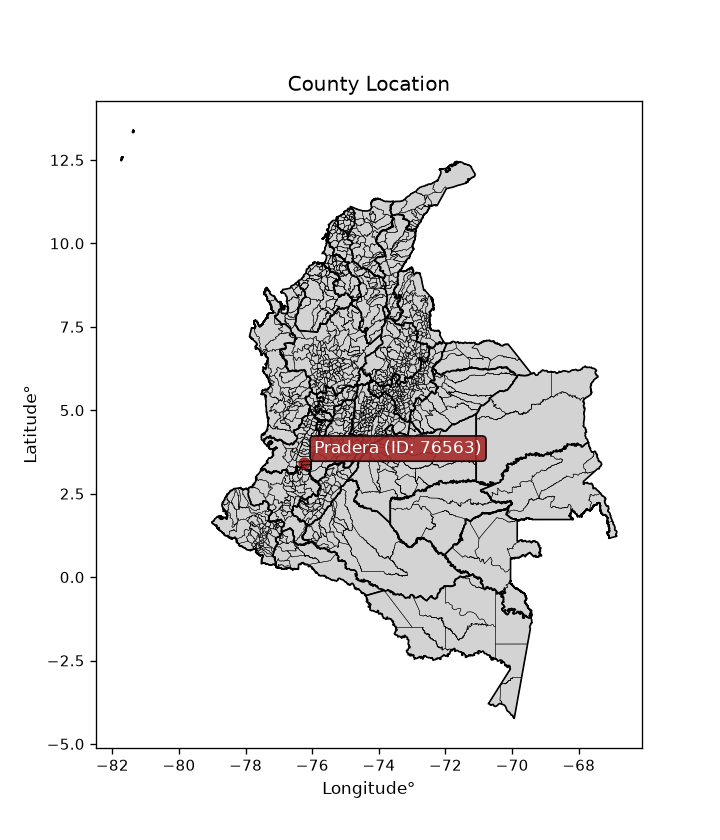
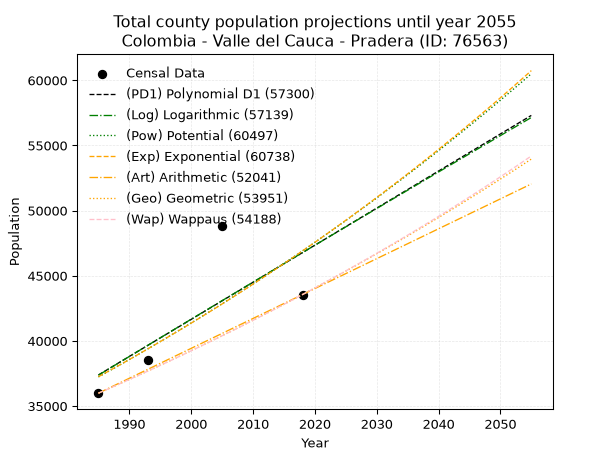
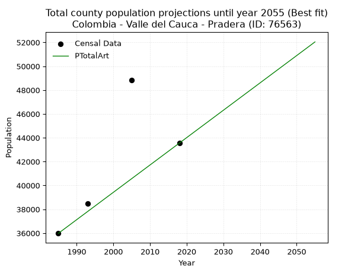
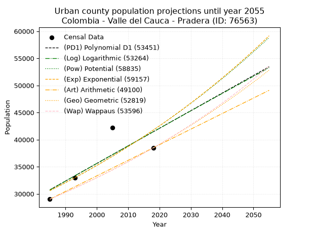
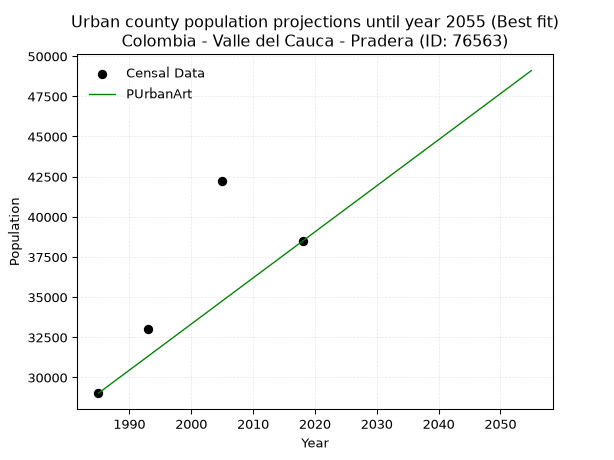
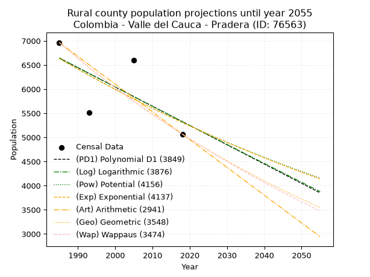
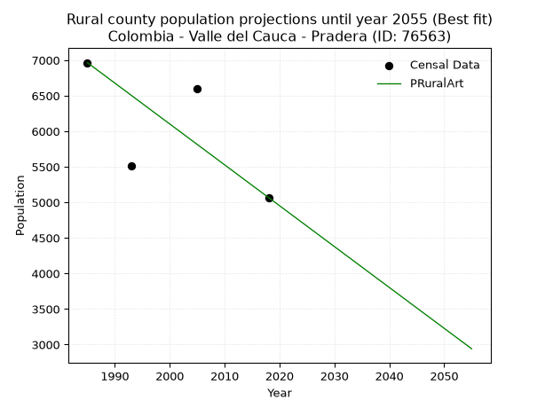

<div align="center">


</div>

# _“Population and Public Services Demand Projections (PPSD) until Year 2050 for Colombia - Valle del Cauca - Pradera (ID: 76563)”_
Keywords: `population` `public-service` `projection` `lineal` `polynomial` `logarithmic` `potential` `exponential` `arithmetic` `geometric` `wappaus` `dane` `colombia` `south-america`

PPSD are analytical estimates used by governments and planners to anticipate future changes in population size, age distribution, and the resulting community needs for utilities, healthcare, education, and infrastructure as sizing future water treatment facilities, electrical grids, and road networks based on spatial growth.

<div align="center">

</img>

</div>


> **General running parameters**: • app_version: _v20260806_. • Python version: _3.14.7_. • Pandas version: _3.0.5_. • NumPy version: _2.5.1_. • Creates, save and include plots into reports (create_plot): _False_. • Projection until year: _2050_. • Process polynomial degree 2 and up: _False_. • Process Wappaus: _True_. • Process Wappaus: _True_. • Set negative values to zero: _True_. • Set infinite values to zero: _True_. • Drop dataset notes: _True_. 
<div align="center">

Dynamic map: [:earth_americas:Google](http://maps.google.com/maps?q=3.41979305,-76.2417991) [:earth_americas:OSM](https://www.openstreetmap.org/#map=18/3.41979305/-76.2417991&layers=P) [:earth_americas:Bing](https://www.bing.com/maps?cp=3.41979305~-76.2417991&lvl=18) [:earth_americas:Apple](https://maps.apple.com/frame?center=3.41979305%2C-76.2417991&span=0.003%2C0.006)

</div>


<div align="center">

```geojson
{
  "type": "Feature",
  "geometry": {
    "type": "Point", 
    "coordinates": [-76.2417991, 3.41979305]
  }, 
  "properties": {
    "Name": "Colombia - Valle del Cauca - Pradera (ID: 76563)"
  }
}
```

</div>


## 0. Census Data (4 records)

Census data are official statistics collected by a government about the people and housing in a country. They usually include counts of total population, age, sex, race, income, education, and jobs.

📅Global census file: [Population.xlsx](../data/Population.xlsx)

| Source   |   Year |   CountryID | CountryName   |   StateID | StateName       |   CountyID | CountyName   |   PTotal |   PUrban |   PRural |
|:---------|-------:|------------:|:--------------|----------:|:----------------|-----------:|:-------------|---------:|---------:|---------:|
| DANE     |   1985 |          57 | Colombia      |        76 | Valle del Cauca |      76563 | Pradera      |    35981 |    29016 |     6965 |
| DANE     |   1993 |          57 | Colombia      |        76 | Valle del Cauca |      76563 | Pradera      |    38499 |    32990 |     5509 |
| DANE     |   2005 |          57 | Colombia      |        76 | Valle del Cauca |      76563 | Pradera      |    48843 |    42246 |     6597 |
| DANE     |   2018 |          57 | Colombia      |        76 | Valle del Cauca |      76563 | Pradera      |    43552 |    38484 |     5068 |

> 🔥Some records could had specific notes about the registered values or the corresponding urban or rural distribution.

📅[SUI-RUPS](https://www.datos.gov.co/Hacienda-y-Cr-dito-P-blico/Registro-nico-de-Prestadores-de-Servicios-P-blicos/4qkq-csdn/about_data) - Local public utility companies: [RUPS.csv](../data/RUPS.xlsx)

 | SERVICIO       | ESTADO    | NOMBRE                                                                    | NIT         | DEPARTAMENTO_DOMICILIO   | MUNICIPIO_DOMICILIO   | DIRECCION              |   TELEFONO | EMAIL                     | TIPO_PRESTADOR                             | CLASIFICACION                 |
|:---------------|:----------|:--------------------------------------------------------------------------|:------------|:-------------------------|:----------------------|:-----------------------|-----------:|:--------------------------|:-------------------------------------------|:------------------------------|
| ACUEDUCTO      | OPERATIVA | SOCIEDAD DE ACUEDUCTOS Y ALCANTARILLADOS DEL VALLE DEL CAUCA S.A.  E.S.P. | 890399032-8 | VALLE DEL CAUCA          | CALI                  | AVENIDA 5 N # 23 AN 41 |    6203400 | rosemary@acuavalle.gov.co | SOCIEDADES (EMPRESA DE SERVICIOS PUBLICOS) | MAYOR O IGUAL A 5001 USUARIOS |
| ALCANTARILLADO | OPERATIVA | SOCIEDAD DE ACUEDUCTOS Y ALCANTARILLADOS DEL VALLE DEL CAUCA S.A.  E.S.P. | 890399032-8 | VALLE DEL CAUCA          | CALI                  | AVENIDA 5 N # 23 AN 41 |    6203400 | rosemary@acuavalle.gov.co | SOCIEDADES (EMPRESA DE SERVICIOS PUBLICOS) | MAYOR O IGUAL A 5001 USUARIOS |

## 1. Total

### 1.1. Coefficients and Parameters

* (PD1) Polynomial Deg 1: 284.58329987956915, -527518.995584108 (lineal)
* (Log) Logarithmic: 570645.3850048136, -4295761.394286714
* (Pow) Potential: 14.008296536752967, -41.6251159391031
* (Exp) Exponential: 0.006986620558659669, 0.035324270677955585
* (Art) Arithmetic: Year diff. 2018 - 1985 = 33, Population diff. 43552 - 35981 = 7571, Annual growth = 229.42424242424244
* (Geo) Geometric: Year diff. 2018 - 1985 = 33, Population diff. 43552 - 35981 = 7571, Annual growth % = 0.005803582122707596
* (Wap) Wappaus: i = 0.5769284257458978, Condition values only valid for < 200)

<sub>
Wappaus condition values: ['0.00', '0.58', '1.15', '1.73', '2.31', '2.88', '3.46', '4.04', '4.62', '5.19', '5.77', '6.35', '6.92', '7.50', '8.08', '8.65', '9.23', '9.81', '10.38', '10.96', '11.54', '12.12', '12.69', '13.27', '13.85', '14.42', '15.00', '15.58', '16.15', '16.73', '17.31', '17.88', '18.46', '19.04', '19.62', '20.19', '20.77', '21.35', '21.92', '22.50', '23.08', '23.65', '24.23', '24.81', '25.38', '25.96', '26.54', '27.12', '27.69', '28.27', '28.85', '29.42', '30.00', '30.58', '31.15', '31.73', '32.31', '32.88', '33.46', '34.04', '34.62', '35.19', '35.77', '36.35', '36.92', '37.50']
</sub>


### 1.2. Projected Dataset

|   Year |   CountyID |   PTotalPD1 |   PTotalLog |   PTotalPow |   PTotalExp |   PTotalArt |   PTotalGeo |   PTotalWap |
|-------:|-----------:|------------:|------------:|------------:|------------:|------------:|------------:|------------:|
|   1985 |      76563 |       37379 |       37363 |       37230 |       37244 |       35981 |       35981 |       35981 |
|   1986 |      76563 |       37663 |       37650 |       37493 |       37506 |       36210 |       36190 |       36189 |
|   1987 |      76563 |       37948 |       37937 |       37759 |       37768 |       36440 |       36400 |       36399 |
|   1988 |      76563 |       38233 |       38224 |       38026 |       38033 |       36669 |       36611 |       36609 |
|   1989 |      76563 |       38517 |       38511 |       38295 |       38300 |       36899 |       36824 |       36821 |
|   1990 |      76563 |       38802 |       38798 |       38565 |       38568 |       37128 |       37037 |       37034 |
|   1991 |      76563 |       39086 |       39085 |       38838 |       38839 |       37358 |       37252 |       37248 |
|   1992 |      76563 |       39371 |       39371 |       39112 |       39111 |       37587 |       37468 |       37464 |
|   1993 |      76563 |       39656 |       39658 |       39388 |       39385 |       37816 |       37686 |       37681 |
|   1994 |      76563 |       39940 |       39944 |       39665 |       39662 |       38046 |       37905 |       37899 |
|   1995 |      76563 |       40225 |       40230 |       39945 |       39940 |       38275 |       38125 |       38119 |
|   1996 |      76563 |       40509 |       40516 |       40226 |       40220 |       38505 |       38346 |       38339 |
|   1997 |      76563 |       40794 |       40802 |       40510 |       40502 |       38734 |       38568 |       38561 |
|   1998 |      76563 |       41078 |       41088 |       40795 |       40786 |       38964 |       38792 |       38785 |
|   1999 |      76563 |       41363 |       41373 |       41082 |       41071 |       39193 |       39017 |       39009 |
|   2000 |      76563 |       41648 |       41659 |       41371 |       41359 |       39422 |       39244 |       39236 |
|   2001 |      76563 |       41932 |       41944 |       41661 |       41649 |       39652 |       39472 |       39463 |
|   2002 |      76563 |       42217 |       42229 |       41954 |       41941 |       39881 |       39701 |       39692 |
|   2003 |      76563 |       42501 |       42514 |       42248 |       42235 |       40111 |       39931 |       39922 |
|   2004 |      76563 |       42786 |       42799 |       42545 |       42532 |       40340 |       40163 |       40154 |
|   2005 |      76563 |       43071 |       43083 |       42843 |       42830 |       40569 |       40396 |       40387 |
|   2006 |      76563 |       43355 |       43368 |       43143 |       43130 |       40799 |       40630 |       40621 |
|   2007 |      76563 |       43640 |       43652 |       43446 |       43432 |       41028 |       40866 |       40857 |
|   2008 |      76563 |       43924 |       43937 |       43750 |       43737 |       41258 |       41103 |       41095 |
|   2009 |      76563 |       44209 |       44221 |       44056 |       44044 |       41487 |       41342 |       41334 |
|   2010 |      76563 |       44493 |       44505 |       44364 |       44352 |       41717 |       41582 |       41574 |
|   2011 |      76563 |       44778 |       44788 |       44675 |       44663 |       41946 |       41823 |       41816 |
|   2012 |      76563 |       45063 |       45072 |       44987 |       44977 |       42175 |       42066 |       42059 |
|   2013 |      76563 |       45347 |       45356 |       45301 |       45292 |       42405 |       42310 |       42304 |
|   2014 |      76563 |       45632 |       45639 |       45617 |       45609 |       42634 |       42555 |       42551 |
|   2015 |      76563 |       45916 |       45922 |       45936 |       45929 |       42864 |       42802 |       42799 |
|   2016 |      76563 |       46201 |       46206 |       46256 |       46251 |       43093 |       43051 |       43048 |
|   2017 |      76563 |       46486 |       46489 |       46578 |       46575 |       43323 |       43301 |       43299 |
|   2018 |      76563 |       46770 |       46771 |       46903 |       46902 |       43552 |       43552 |       43552 |
|   2019 |      76563 |       47055 |       47054 |       47230 |       47231 |       43781 |       43805 |       43806 |
|   2020 |      76563 |       47339 |       47337 |       47558 |       47562 |       44011 |       44059 |       44062 |
|   2021 |      76563 |       47624 |       47619 |       47889 |       47895 |       44240 |       44315 |       44320 |
|   2022 |      76563 |       47908 |       47901 |       48222 |       48231 |       44470 |       44572 |       44579 |
|   2023 |      76563 |       48193 |       48183 |       48557 |       48569 |       44699 |       44831 |       44840 |
|   2024 |      76563 |       48478 |       48466 |       48895 |       48910 |       44929 |       45091 |       45103 |
|   2025 |      76563 |       48762 |       48747 |       49234 |       49253 |       45158 |       45352 |       45367 |
|   2026 |      76563 |       49047 |       49029 |       49576 |       49598 |       45387 |       45616 |       45634 |
|   2027 |      76563 |       49331 |       49311 |       49920 |       49946 |       45617 |       45880 |       45901 |
|   2028 |      76563 |       49616 |       49592 |       50266 |       50296 |       45846 |       46147 |       46171 |
|   2029 |      76563 |       49901 |       49873 |       50614 |       50649 |       46076 |       46414 |       46443 |
|   2030 |      76563 |       50185 |       50155 |       50965 |       51004 |       46305 |       46684 |       46716 |
|   2031 |      76563 |       50470 |       50436 |       51318 |       51361 |       46535 |       46955 |       46991 |
|   2032 |      76563 |       50754 |       50717 |       51673 |       51721 |       46764 |       47227 |       47268 |
|   2033 |      76563 |       51039 |       50997 |       52030 |       52084 |       46993 |       47501 |       47546 |
|   2034 |      76563 |       51323 |       51278 |       52390 |       52449 |       47223 |       47777 |       47827 |
|   2035 |      76563 |       51608 |       51558 |       52752 |       52817 |       47452 |       48054 |       48110 |
|   2036 |      76563 |       51893 |       51839 |       53116 |       53187 |       47682 |       48333 |       48394 |
|   2037 |      76563 |       52177 |       52119 |       53482 |       53560 |       47911 |       48614 |       48680 |
|   2038 |      76563 |       52462 |       52399 |       53851 |       53936 |       48140 |       48896 |       48969 |
|   2039 |      76563 |       52746 |       52679 |       54223 |       54314 |       48370 |       49180 |       49259 |
|   2040 |      76563 |       53031 |       52959 |       54597 |       54695 |       48599 |       49465 |       49551 |
|   2041 |      76563 |       53316 |       53238 |       54973 |       55078 |       48829 |       49752 |       49845 |
|   2042 |      76563 |       53600 |       53518 |       55351 |       55464 |       49058 |       50041 |       50142 |
|   2043 |      76563 |       53885 |       53797 |       55732 |       55853 |       49288 |       50331 |       50440 |
|   2044 |      76563 |       54169 |       54077 |       56115 |       56245 |       49517 |       50623 |       50740 |
|   2045 |      76563 |       54454 |       54356 |       56501 |       56639 |       49746 |       50917 |       51043 |
|   2046 |      76563 |       54738 |       54635 |       56889 |       57036 |       49976 |       51213 |       51348 |
|   2047 |      76563 |       55023 |       54914 |       57280 |       57436 |       50205 |       51510 |       51654 |
|   2048 |      76563 |       55308 |       55192 |       57673 |       57839 |       50435 |       51809 |       51963 |
|   2049 |      76563 |       55592 |       55471 |       58069 |       58244 |       50664 |       52109 |       52274 |
|   2050 |      76563 |       55877 |       55749 |       58467 |       58653 |       50894 |       52412 |       52588 |
<div align="center">

</img>

</div>


### 1.3. Best fit with absolute and relative error (%)

Relative error puts that difference into context by dividing the absolute error by the true value, creating a unitless ratio or percentage that shows the scale of the mistake.

Absolute and relative error

|   Year | Source   |   CountryID | CountryName   |   StateID | StateName       |   CountyID_x | CountyName   |   PTotal |   PUrban |   PRural |   CountyID_y |   PTotalPD1 |   PTotalLog |   PTotalPow |   PTotalExp |   PTotalArt |   PTotalGeo |   PTotalWap |   PTotalPD1AbsError |   PTotalLogAbsError |   PTotalPowAbsError |   PTotalExpAbsError |   PTotalArtAbsError |   PTotalGeoAbsError |   PTotalWapAbsError |   PTotalPD1RelError |   PTotalLogRelError |   PTotalPowRelError |   PTotalExpRelError |   PTotalArtRelError |   PTotalGeoRelError |   PTotalWapRelError |
|-------:|:---------|------------:|:--------------|----------:|:----------------|-------------:|:-------------|---------:|---------:|---------:|-------------:|------------:|------------:|------------:|------------:|------------:|------------:|------------:|--------------------:|--------------------:|--------------------:|--------------------:|--------------------:|--------------------:|--------------------:|--------------------:|--------------------:|--------------------:|--------------------:|--------------------:|--------------------:|--------------------:|
|   1985 | DANE     |          57 | Colombia      |        76 | Valle del Cauca |        76563 | Pradera      |    35981 |    29016 |     6965 |        76563 |       37379 |       37363 |       37230 |       37244 |       35981 |       35981 |       35981 |                1398 |                1382 |                1249 |                1263 |                   0 |                   0 |                   0 |             3.88538 |             3.84092 |             3.47128 |             3.51019 |             0       |             0       |             0       |
|   1993 | DANE     |          57 | Colombia      |        76 | Valle del Cauca |        76563 | Pradera      |    38499 |    32990 |     5509 |        76563 |       39656 |       39658 |       39388 |       39385 |       37816 |       37686 |       37681 |                1157 |                1159 |                 889 |                 886 |                 683 |                 813 |                 818 |             3.00527 |             3.01047 |             2.30915 |             2.30136 |             1.77407 |             2.11174 |             2.12473 |
|   2005 | DANE     |          57 | Colombia      |        76 | Valle del Cauca |        76563 | Pradera      |    48843 |    42246 |     6597 |        76563 |       43071 |       43083 |       42843 |       42830 |       40569 |       40396 |       40387 |                5772 |                5760 |                6000 |                6013 |                8274 |                8447 |                8456 |            11.8175  |            11.7929  |            12.2843  |            12.3109  |            16.94    |            17.2942  |            17.3126  |
|   2018 | DANE     |          57 | Colombia      |        76 | Valle del Cauca |        76563 | Pradera      |    43552 |    38484 |     5068 |        76563 |       46770 |       46771 |       46903 |       46902 |       43552 |       43552 |       43552 |                3218 |                3219 |                3351 |                3350 |                   0 |                   0 |                   0 |             7.38887 |             7.39116 |             7.69425 |             7.69195 |             0       |             0       |             0       |

Relative error mean

| Method    |   RelError | Best   |
|:----------|-----------:|:-------|
| PTotalPD1 |    6.52425 |        |
| PTotalLog |    6.50886 |        |
| PTotalPow |    6.43973 |        |
| PTotalExp |    6.45359 |        |
| PTotalArt |    4.67852 | True   |
| PTotalGeo |    4.85148 |        |
| PTotalWap |    4.85934 |        |

💙Best method: _**PTotalArt**_
<div align="center">

</img>

</div>


### 1.4. Fresh water supply demand in liters per capita per day (lpcd)

The fresh water supply demand typically ranges from 100 to 300 liters per capita per day (lpcd) for standard domestic and municipal planning, though absolute survival minimums set by the World Health Organization are as low as 7.5 to 20 liters per day, and total consumption in high-income nations can exceed 400 liters.

> `CZ`: Level in meters above the sea level (masl)<br> `WS`: Fresh water supply demand in liters per capita per day (lpcd or l/h/d)<br> `WSAll`: Zonal fresh water supply demand in liters per second (l/s)<br> `A`: Zonal area in square meters<br> `DP`: Population density (people/hectare or p/ha)

Reference values (RAS Colombia)

|    CZ |   WS |
|------:|-----:|
|  1000 |  120 |
|  2000 |  130 |
| 99999 |  140 |

County shapefile geometry properties and water supply values

|   CountyID |      ATotal |   CZTotal |   WSTotal |
|-----------:|------------:|----------:|----------:|
|      76563 | 3.56775e+08 |   1956.83 |       130 |

Projected values for best method: PTotalArt

|   CountyID |   Year |   PTotalArt |   DPTotal |   WSTotal |   WSTotalAll |
|-----------:|-------:|------------:|----------:|----------:|-------------:|
|      76563 |   1985 |       35981 |      1.01 |       130 |      54.1381 |
|      76563 |   1986 |       36210 |      1.01 |       130 |      54.4826 |
|      76563 |   1987 |       36440 |      1.02 |       130 |      54.8287 |
|      76563 |   1988 |       36669 |      1.03 |       130 |      55.1733 |
|      76563 |   1989 |       36899 |      1.03 |       130 |      55.5193 |
|      76563 |   1990 |       37128 |      1.04 |       130 |      55.8639 |
|      76563 |   1991 |       37358 |      1.05 |       130 |      56.21   |
|      76563 |   1992 |       37587 |      1.05 |       130 |      56.5545 |
|      76563 |   1993 |       37816 |      1.06 |       130 |      56.8991 |
|      76563 |   1994 |       38046 |      1.07 |       130 |      57.2451 |
|      76563 |   1995 |       38275 |      1.07 |       130 |      57.5897 |
|      76563 |   1996 |       38505 |      1.08 |       130 |      57.9358 |
|      76563 |   1997 |       38734 |      1.09 |       130 |      58.2803 |
|      76563 |   1998 |       38964 |      1.09 |       130 |      58.6264 |
|      76563 |   1999 |       39193 |      1.1  |       130 |      58.9709 |
|      76563 |   2000 |       39422 |      1.1  |       130 |      59.3155 |
|      76563 |   2001 |       39652 |      1.11 |       130 |      59.6616 |
|      76563 |   2002 |       39881 |      1.12 |       130 |      60.0061 |
|      76563 |   2003 |       40111 |      1.12 |       130 |      60.3522 |
|      76563 |   2004 |       40340 |      1.13 |       130 |      60.6968 |
|      76563 |   2005 |       40569 |      1.14 |       130 |      61.0413 |
|      76563 |   2006 |       40799 |      1.14 |       130 |      61.3874 |
|      76563 |   2007 |       41028 |      1.15 |       130 |      61.7319 |
|      76563 |   2008 |       41258 |      1.16 |       130 |      62.078  |
|      76563 |   2009 |       41487 |      1.16 |       130 |      62.4226 |
|      76563 |   2010 |       41717 |      1.17 |       130 |      62.7686 |
|      76563 |   2011 |       41946 |      1.18 |       130 |      63.1132 |
|      76563 |   2012 |       42175 |      1.18 |       130 |      63.4578 |
|      76563 |   2013 |       42405 |      1.19 |       130 |      63.8038 |
|      76563 |   2014 |       42634 |      1.19 |       130 |      64.1484 |
|      76563 |   2015 |       42864 |      1.2  |       130 |      64.4944 |
|      76563 |   2016 |       43093 |      1.21 |       130 |      64.839  |
|      76563 |   2017 |       43323 |      1.21 |       130 |      65.1851 |
|      76563 |   2018 |       43552 |      1.22 |       130 |      65.5296 |
|      76563 |   2019 |       43781 |      1.23 |       130 |      65.8742 |
|      76563 |   2020 |       44011 |      1.23 |       130 |      66.2203 |
|      76563 |   2021 |       44240 |      1.24 |       130 |      66.5648 |
|      76563 |   2022 |       44470 |      1.25 |       130 |      66.9109 |
|      76563 |   2023 |       44699 |      1.25 |       130 |      67.2554 |
|      76563 |   2024 |       44929 |      1.26 |       130 |      67.6015 |
|      76563 |   2025 |       45158 |      1.27 |       130 |      67.9461 |
|      76563 |   2026 |       45387 |      1.27 |       130 |      68.2906 |
|      76563 |   2027 |       45617 |      1.28 |       130 |      68.6367 |
|      76563 |   2028 |       45846 |      1.29 |       130 |      68.9813 |
|      76563 |   2029 |       46076 |      1.29 |       130 |      69.3273 |
|      76563 |   2030 |       46305 |      1.3  |       130 |      69.6719 |
|      76563 |   2031 |       46535 |      1.3  |       130 |      70.0179 |
|      76563 |   2032 |       46764 |      1.31 |       130 |      70.3625 |
|      76563 |   2033 |       46993 |      1.32 |       130 |      70.7071 |
|      76563 |   2034 |       47223 |      1.32 |       130 |      71.0531 |
|      76563 |   2035 |       47452 |      1.33 |       130 |      71.3977 |
|      76563 |   2036 |       47682 |      1.34 |       130 |      71.7438 |
|      76563 |   2037 |       47911 |      1.34 |       130 |      72.0883 |
|      76563 |   2038 |       48140 |      1.35 |       130 |      72.4329 |
|      76563 |   2039 |       48370 |      1.36 |       130 |      72.7789 |
|      76563 |   2040 |       48599 |      1.36 |       130 |      73.1235 |
|      76563 |   2041 |       48829 |      1.37 |       130 |      73.4696 |
|      76563 |   2042 |       49058 |      1.38 |       130 |      73.8141 |
|      76563 |   2043 |       49288 |      1.38 |       130 |      74.1602 |
|      76563 |   2044 |       49517 |      1.39 |       130 |      74.5047 |
|      76563 |   2045 |       49746 |      1.39 |       130 |      74.8493 |
|      76563 |   2046 |       49976 |      1.4  |       130 |      75.1954 |
|      76563 |   2047 |       50205 |      1.41 |       130 |      75.5399 |
|      76563 |   2048 |       50435 |      1.41 |       130 |      75.886  |
|      76563 |   2049 |       50664 |      1.42 |       130 |      76.2306 |
|      76563 |   2050 |       50894 |      1.43 |       130 |      76.5766 |

## 2. Urban

### 2.1. Coefficients and Parameters

* (PD1) Polynomial Deg 1: 324.50903251706296, -613415.1922922552 (lineal)
* (Log) Logarithmic: 650536.0575656914, -4909045.786625619
* (Pow) Potential: 18.88333772041943, -57.78730845918857
* (Exp) Exponential: 0.009420025986822796, 0.00023166906049735387
* (Art) Arithmetic: Year diff. 2018 - 1985 = 33, Population diff. 38484 - 29016 = 9468, Annual growth = 286.90909090909093
* (Geo) Geometric: Year diff. 2018 - 1985 = 33, Population diff. 38484 - 29016 = 9468, Annual growth % = 0.008594148814248914
* (Wap) Wappaus: i = 0.8501010101010101, Condition values only valid for < 200)

<sub>
Wappaus condition values: ['0.00', '0.85', '1.70', '2.55', '3.40', '4.25', '5.10', '5.95', '6.80', '7.65', '8.50', '9.35', '10.20', '11.05', '11.90', '12.75', '13.60', '14.45', '15.30', '16.15', '17.00', '17.85', '18.70', '19.55', '20.40', '21.25', '22.10', '22.95', '23.80', '24.65', '25.50', '26.35', '27.20', '28.05', '28.90', '29.75', '30.60', '31.45', '32.30', '33.15', '34.00', '34.85', '35.70', '36.55', '37.40', '38.25', '39.10', '39.95', '40.80', '41.65', '42.51', '43.36', '44.21', '45.06', '45.91', '46.76', '47.61', '48.46', '49.31', '50.16', '51.01', '51.86', '52.71', '53.56', '54.41', '55.26']
</sub>


### 2.2. Projected Dataset

|   Year |   CountyID |   PUrbanPD1 |   PUrbanLog |   PUrbanPow |   PUrbanExp |   PUrbanArt |   PUrbanGeo |   PUrbanWap |
|-------:|-----------:|------------:|------------:|------------:|------------:|------------:|------------:|------------:|
|   1985 |      76563 |       30735 |       30718 |       30579 |       30594 |       29016 |       29016 |       29016 |
|   1986 |      76563 |       31060 |       31046 |       30871 |       30883 |       29303 |       29265 |       29264 |
|   1987 |      76563 |       31384 |       31373 |       31166 |       31176 |       29590 |       29517 |       29514 |
|   1988 |      76563 |       31709 |       31700 |       31463 |       31471 |       29877 |       29771 |       29766 |
|   1989 |      76563 |       32033 |       32028 |       31763 |       31769 |       30164 |       30026 |       30020 |
|   1990 |      76563 |       32358 |       32354 |       32066 |       32069 |       30451 |       30284 |       30276 |
|   1991 |      76563 |       32682 |       32681 |       32372 |       32373 |       30737 |       30545 |       30535 |
|   1992 |      76563 |       33007 |       33008 |       32680 |       32679 |       31024 |       30807 |       30796 |
|   1993 |      76563 |       33331 |       33334 |       32992 |       32988 |       31311 |       31072 |       31059 |
|   1994 |      76563 |       33656 |       33661 |       33306 |       33301 |       31598 |       31339 |       31324 |
|   1995 |      76563 |       33980 |       33987 |       33622 |       33616 |       31885 |       31608 |       31592 |
|   1996 |      76563 |       34305 |       34313 |       33942 |       33934 |       32172 |       31880 |       31862 |
|   1997 |      76563 |       34629 |       34639 |       34265 |       34255 |       32459 |       32154 |       32135 |
|   1998 |      76563 |       34954 |       34964 |       34590 |       34579 |       32746 |       32430 |       32410 |
|   1999 |      76563 |       35278 |       35290 |       34918 |       34907 |       33033 |       32709 |       32688 |
|   2000 |      76563 |       35603 |       35615 |       35250 |       35237 |       33320 |       32990 |       32968 |
|   2001 |      76563 |       35927 |       35941 |       35584 |       35570 |       33607 |       33274 |       33251 |
|   2002 |      76563 |       36252 |       36266 |       35921 |       35907 |       33893 |       33560 |       33536 |
|   2003 |      76563 |       36576 |       36590 |       36262 |       36247 |       34180 |       33848 |       33824 |
|   2004 |      76563 |       36901 |       36915 |       36605 |       36590 |       34467 |       34139 |       34114 |
|   2005 |      76563 |       37225 |       37240 |       36952 |       36936 |       34754 |       34432 |       34408 |
|   2006 |      76563 |       37550 |       37564 |       37301 |       37286 |       35041 |       34728 |       34704 |
|   2007 |      76563 |       37874 |       37888 |       37654 |       37639 |       35328 |       35027 |       35002 |
|   2008 |      76563 |       38199 |       38212 |       38010 |       37995 |       35615 |       35328 |       35304 |
|   2009 |      76563 |       38523 |       38536 |       38369 |       38355 |       35902 |       35631 |       35608 |
|   2010 |      76563 |       38848 |       38860 |       38731 |       38718 |       36189 |       35938 |       35916 |
|   2011 |      76563 |       39172 |       39183 |       39096 |       39084 |       36476 |       36246 |       36226 |
|   2012 |      76563 |       39497 |       39507 |       39465 |       39454 |       36763 |       36558 |       36539 |
|   2013 |      76563 |       39821 |       39830 |       39837 |       39827 |       37049 |       36872 |       36856 |
|   2014 |      76563 |       40146 |       40153 |       40213 |       40204 |       37336 |       37189 |       37175 |
|   2015 |      76563 |       40471 |       40476 |       40591 |       40585 |       37623 |       37509 |       37497 |
|   2016 |      76563 |       40795 |       40799 |       40973 |       40969 |       37910 |       37831 |       37823 |
|   2017 |      76563 |       41120 |       41122 |       41359 |       41357 |       38197 |       38156 |       38152 |
|   2018 |      76563 |       41444 |       41444 |       41748 |       41748 |       38484 |       38484 |       38484 |
|   2019 |      76563 |       41769 |       41766 |       42140 |       42143 |       38771 |       38815 |       38819 |
|   2020 |      76563 |       42093 |       42088 |       42536 |       42542 |       39058 |       39148 |       39158 |
|   2021 |      76563 |       42418 |       42410 |       42936 |       42945 |       39345 |       39485 |       39500 |
|   2022 |      76563 |       42742 |       42732 |       43338 |       43351 |       39632 |       39824 |       39846 |
|   2023 |      76563 |       43067 |       43054 |       43745 |       43762 |       39919 |       40166 |       40195 |
|   2024 |      76563 |       43391 |       43375 |       44155 |       44176 |       40205 |       40512 |       40548 |
|   2025 |      76563 |       43716 |       43697 |       44569 |       44594 |       40492 |       40860 |       40904 |
|   2026 |      76563 |       44040 |       44018 |       44986 |       45016 |       40779 |       41211 |       41264 |
|   2027 |      76563 |       44365 |       44339 |       45408 |       45442 |       41066 |       41565 |       41627 |
|   2028 |      76563 |       44689 |       44660 |       45832 |       45872 |       41353 |       41922 |       41995 |
|   2029 |      76563 |       45014 |       44980 |       46261 |       46306 |       41640 |       42283 |       42366 |
|   2030 |      76563 |       45338 |       45301 |       46693 |       46745 |       41927 |       42646 |       42741 |
|   2031 |      76563 |       45663 |       45621 |       47130 |       47187 |       42214 |       43012 |       43120 |
|   2032 |      76563 |       45987 |       45942 |       47570 |       47634 |       42501 |       43382 |       43503 |
|   2033 |      76563 |       46312 |       46262 |       48014 |       48084 |       42788 |       43755 |       43891 |
|   2034 |      76563 |       46636 |       46581 |       48462 |       48539 |       43075 |       44131 |       44282 |
|   2035 |      76563 |       46961 |       46901 |       48914 |       48999 |       43361 |       44510 |       44678 |
|   2036 |      76563 |       47285 |       47221 |       49370 |       49463 |       43648 |       44893 |       45078 |
|   2037 |      76563 |       47610 |       47540 |       49830 |       49931 |       43935 |       45279 |       45482 |
|   2038 |      76563 |       47934 |       47860 |       50293 |       50403 |       44222 |       45668 |       45891 |
|   2039 |      76563 |       48259 |       48179 |       50762 |       50880 |       44509 |       46060 |       46304 |
|   2040 |      76563 |       48583 |       48498 |       51234 |       51362 |       44796 |       46456 |       46722 |
|   2041 |      76563 |       48908 |       48816 |       51710 |       51848 |       45083 |       46855 |       47144 |
|   2042 |      76563 |       49232 |       49135 |       52191 |       52339 |       45370 |       47258 |       47572 |
|   2043 |      76563 |       49557 |       49454 |       52675 |       52834 |       45657 |       47664 |       48004 |
|   2044 |      76563 |       49881 |       49772 |       53164 |       53334 |       45944 |       48074 |       48441 |
|   2045 |      76563 |       50206 |       50090 |       53658 |       53839 |       46231 |       48487 |       48882 |
|   2046 |      76563 |       50530 |       50408 |       54155 |       54349 |       46517 |       48904 |       49329 |
|   2047 |      76563 |       50855 |       50726 |       54657 |       54863 |       46804 |       49324 |       49782 |
|   2048 |      76563 |       51179 |       51044 |       55164 |       55382 |       47091 |       49748 |       50239 |
|   2049 |      76563 |       51504 |       51361 |       55675 |       55906 |       47378 |       50175 |       50702 |
|   2050 |      76563 |       51828 |       51679 |       56190 |       56435 |       47665 |       50607 |       51170 |
<div align="center">

</img>

</div>


### 2.3. Best fit with absolute and relative error (%)

Relative error puts that difference into context by dividing the absolute error by the true value, creating a unitless ratio or percentage that shows the scale of the mistake.

Absolute and relative error

|   Year | Source   |   CountryID | CountryName   |   StateID | StateName       |   CountyID_x | CountyName   |   PTotal |   PUrban |   PRural |   CountyID_y |   PUrbanPD1 |   PUrbanLog |   PUrbanPow |   PUrbanExp |   PUrbanArt |   PUrbanGeo |   PUrbanWap |   PUrbanPD1AbsError |   PUrbanLogAbsError |   PUrbanPowAbsError |   PUrbanExpAbsError |   PUrbanArtAbsError |   PUrbanGeoAbsError |   PUrbanWapAbsError |   PUrbanPD1RelError |   PUrbanLogRelError |   PUrbanPowRelError |   PUrbanExpRelError |   PUrbanArtRelError |   PUrbanGeoRelError |   PUrbanWapRelError |
|-------:|:---------|------------:|:--------------|----------:|:----------------|-------------:|:-------------|---------:|---------:|---------:|-------------:|------------:|------------:|------------:|------------:|------------:|------------:|------------:|--------------------:|--------------------:|--------------------:|--------------------:|--------------------:|--------------------:|--------------------:|--------------------:|--------------------:|--------------------:|--------------------:|--------------------:|--------------------:|--------------------:|
|   1985 | DANE     |          57 | Colombia      |        76 | Valle del Cauca |        76563 | Pradera      |    35981 |    29016 |     6965 |        76563 |       30735 |       30718 |       30579 |       30594 |       29016 |       29016 |       29016 |                1719 |                1702 |                1563 |                1578 |                   0 |                   0 |                   0 |             5.92432 |             5.86573 |          5.38668    |          5.43838    |             0       |             0       |             0       |
|   1993 | DANE     |          57 | Colombia      |        76 | Valle del Cauca |        76563 | Pradera      |    38499 |    32990 |     5509 |        76563 |       33331 |       33334 |       32992 |       32988 |       31311 |       31072 |       31059 |                 341 |                 344 |                   2 |                   2 |                1679 |                1918 |                1931 |             1.03365 |             1.04274 |          0.00606244 |          0.00606244 |             5.08942 |             5.81388 |             5.85329 |
|   2005 | DANE     |          57 | Colombia      |        76 | Valle del Cauca |        76563 | Pradera      |    48843 |    42246 |     6597 |        76563 |       37225 |       37240 |       36952 |       36936 |       34754 |       34432 |       34408 |                5021 |                5006 |                5294 |                5310 |                7492 |                7814 |                7838 |            11.8851  |            11.8496  |         12.5314     |         12.5692     |            17.7342  |            18.4964  |            18.5532  |
|   2018 | DANE     |          57 | Colombia      |        76 | Valle del Cauca |        76563 | Pradera      |    43552 |    38484 |     5068 |        76563 |       41444 |       41444 |       41748 |       41748 |       38484 |       38484 |       38484 |                2960 |                2960 |                3264 |                3264 |                   0 |                   0 |                   0 |             7.69151 |             7.69151 |          8.48145    |          8.48145    |             0       |             0       |             0       |

Relative error mean

| Method    |   RelError | Best   |
|:----------|-----------:|:-------|
| PUrbanPD1 |    6.63366 |        |
| PUrbanLog |    6.61241 |        |
| PUrbanPow |    6.60139 |        |
| PUrbanExp |    6.62378 |        |
| PUrbanArt |    5.70591 | True   |
| PUrbanGeo |    6.07758 |        |
| PUrbanWap |    6.10163 |        |

💙Best method: _**PUrbanArt**_
<div align="center">

</img>

</div>


### 2.4. Fresh water supply demand in liters per capita per day (lpcd)

The fresh water supply demand typically ranges from 100 to 300 liters per capita per day (lpcd) for standard domestic and municipal planning, though absolute survival minimums set by the World Health Organization are as low as 7.5 to 20 liters per day, and total consumption in high-income nations can exceed 400 liters.

> `CZ`: Level in meters above the sea level (masl)<br> `WS`: Fresh water supply demand in liters per capita per day (lpcd or l/h/d)<br> `WSAll`: Zonal fresh water supply demand in liters per second (l/s)<br> `A`: Zonal area in square meters<br> `DP`: Population density (people/hectare or p/ha)

Reference values (RAS Colombia)

|    CZ |   WS |
|------:|-----:|
|  1000 |  120 |
|  2000 |  130 |
| 99999 |  140 |

County shapefile geometry properties and water supply values

|   CountyID |      AUrban |   CZUrban |   WSUrban |
|-----------:|------------:|----------:|----------:|
|      76563 | 3.09068e+06 |   1059.14 |       130 |

Projected values for best method: PUrbanArt

|   CountyID |   Year |   PUrbanArt |   DPUrban |   WSUrban |   WSUrbanAll |
|-----------:|-------:|------------:|----------:|----------:|-------------:|
|      76563 |   1985 |       29016 |     93.88 |       130 |      43.6583 |
|      76563 |   1986 |       29303 |     94.81 |       130 |      44.0902 |
|      76563 |   1987 |       29590 |     95.74 |       130 |      44.522  |
|      76563 |   1988 |       29877 |     96.67 |       130 |      44.9538 |
|      76563 |   1989 |       30164 |     97.6  |       130 |      45.3856 |
|      76563 |   1990 |       30451 |     98.53 |       130 |      45.8175 |
|      76563 |   1991 |       30737 |     99.45 |       130 |      46.2478 |
|      76563 |   1992 |       31024 |    100.38 |       130 |      46.6796 |
|      76563 |   1993 |       31311 |    101.31 |       130 |      47.1115 |
|      76563 |   1994 |       31598 |    102.24 |       130 |      47.5433 |
|      76563 |   1995 |       31885 |    103.16 |       130 |      47.9751 |
|      76563 |   1996 |       32172 |    104.09 |       130 |      48.4069 |
|      76563 |   1997 |       32459 |    105.02 |       130 |      48.8388 |
|      76563 |   1998 |       32746 |    105.95 |       130 |      49.2706 |
|      76563 |   1999 |       33033 |    106.88 |       130 |      49.7024 |
|      76563 |   2000 |       33320 |    107.81 |       130 |      50.1343 |
|      76563 |   2001 |       33607 |    108.74 |       130 |      50.5661 |
|      76563 |   2002 |       33893 |    109.66 |       130 |      50.9964 |
|      76563 |   2003 |       34180 |    110.59 |       130 |      51.4282 |
|      76563 |   2004 |       34467 |    111.52 |       130 |      51.8601 |
|      76563 |   2005 |       34754 |    112.45 |       130 |      52.2919 |
|      76563 |   2006 |       35041 |    113.38 |       130 |      52.7237 |
|      76563 |   2007 |       35328 |    114.3  |       130 |      53.1556 |
|      76563 |   2008 |       35615 |    115.23 |       130 |      53.5874 |
|      76563 |   2009 |       35902 |    116.16 |       130 |      54.0192 |
|      76563 |   2010 |       36189 |    117.09 |       130 |      54.451  |
|      76563 |   2011 |       36476 |    118.02 |       130 |      54.8829 |
|      76563 |   2012 |       36763 |    118.95 |       130 |      55.3147 |
|      76563 |   2013 |       37049 |    119.87 |       130 |      55.745  |
|      76563 |   2014 |       37336 |    120.8  |       130 |      56.1769 |
|      76563 |   2015 |       37623 |    121.73 |       130 |      56.6087 |
|      76563 |   2016 |       37910 |    122.66 |       130 |      57.0405 |
|      76563 |   2017 |       38197 |    123.59 |       130 |      57.4723 |
|      76563 |   2018 |       38484 |    124.52 |       130 |      57.9042 |
|      76563 |   2019 |       38771 |    125.44 |       130 |      58.336  |
|      76563 |   2020 |       39058 |    126.37 |       130 |      58.7678 |
|      76563 |   2021 |       39345 |    127.3  |       130 |      59.1997 |
|      76563 |   2022 |       39632 |    128.23 |       130 |      59.6315 |
|      76563 |   2023 |       39919 |    129.16 |       130 |      60.0633 |
|      76563 |   2024 |       40205 |    130.08 |       130 |      60.4936 |
|      76563 |   2025 |       40492 |    131.01 |       130 |      60.9255 |
|      76563 |   2026 |       40779 |    131.94 |       130 |      61.3573 |
|      76563 |   2027 |       41066 |    132.87 |       130 |      61.7891 |
|      76563 |   2028 |       41353 |    133.8  |       130 |      62.2209 |
|      76563 |   2029 |       41640 |    134.73 |       130 |      62.6528 |
|      76563 |   2030 |       41927 |    135.66 |       130 |      63.0846 |
|      76563 |   2031 |       42214 |    136.58 |       130 |      63.5164 |
|      76563 |   2032 |       42501 |    137.51 |       130 |      63.9483 |
|      76563 |   2033 |       42788 |    138.44 |       130 |      64.3801 |
|      76563 |   2034 |       43075 |    139.37 |       130 |      64.8119 |
|      76563 |   2035 |       43361 |    140.3  |       130 |      65.2422 |
|      76563 |   2036 |       43648 |    141.22 |       130 |      65.6741 |
|      76563 |   2037 |       43935 |    142.15 |       130 |      66.1059 |
|      76563 |   2038 |       44222 |    143.08 |       130 |      66.5377 |
|      76563 |   2039 |       44509 |    144.01 |       130 |      66.9696 |
|      76563 |   2040 |       44796 |    144.94 |       130 |      67.4014 |
|      76563 |   2041 |       45083 |    145.87 |       130 |      67.8332 |
|      76563 |   2042 |       45370 |    146.8  |       130 |      68.265  |
|      76563 |   2043 |       45657 |    147.72 |       130 |      68.6969 |
|      76563 |   2044 |       45944 |    148.65 |       130 |      69.1287 |
|      76563 |   2045 |       46231 |    149.58 |       130 |      69.5605 |
|      76563 |   2046 |       46517 |    150.51 |       130 |      69.9909 |
|      76563 |   2047 |       46804 |    151.44 |       130 |      70.4227 |
|      76563 |   2048 |       47091 |    152.36 |       130 |      70.8545 |
|      76563 |   2049 |       47378 |    153.29 |       130 |      71.2863 |
|      76563 |   2050 |       47665 |    154.22 |       130 |      71.7182 |

## 3. Rural

### 3.1. Coefficients and Parameters

* (PD1) Polynomial Deg 1: -39.92573263749411, 85896.1967081476 (lineal)
* (Log) Logarithmic: -79890.67256087733, 613284.3923388997
* (Pow) Potential: -13.497725555894553, 48.33405993509323
* (Exp) Exponential: -0.006746284559698529, 4340352776.332861
* (Art) Arithmetic: Year diff. 2018 - 1985 = 33, Population diff. 5068 - 6965 = -1897, Annual growth = -57.484848484848484
* (Geo) Geometric: Year diff. 2018 - 1985 = 33, Population diff. 5068 - 6965 = -1897, Annual growth % = -0.009588622401420666
* (Wap) Wappaus: i = -0.9554533114742538, Condition values only valid for < 200)

<sub>
Wappaus condition values: ['-0.00', '-0.96', '-1.91', '-2.87', '-3.82', '-4.78', '-5.73', '-6.69', '-7.64', '-8.60', '-9.55', '-10.51', '-11.47', '-12.42', '-13.38', '-14.33', '-15.29', '-16.24', '-17.20', '-18.15', '-19.11', '-20.06', '-21.02', '-21.98', '-22.93', '-23.89', '-24.84', '-25.80', '-26.75', '-27.71', '-28.66', '-29.62', '-30.57', '-31.53', '-32.49', '-33.44', '-34.40', '-35.35', '-36.31', '-37.26', '-38.22', '-39.17', '-40.13', '-41.08', '-42.04', '-43.00', '-43.95', '-44.91', '-45.86', '-46.82', '-47.77', '-48.73', '-49.68', '-50.64', '-51.59', '-52.55', '-53.51', '-54.46', '-55.42', '-56.37', '-57.33', '-58.28', '-59.24', '-60.19', '-61.15', '-62.10']
</sub>


### 3.2. Projected Dataset

|   Year |   CountyID |   PRuralPD1 |   PRuralLog |   PRuralPow |   PRuralExp |   PRuralArt |   PRuralGeo |   PRuralWap |
|-------:|-----------:|------------:|------------:|------------:|------------:|------------:|------------:|------------:|
|   1985 |      76563 |        6644 |        6645 |        6634 |        6633 |        6965 |        6965 |        6965 |
|   1986 |      76563 |        6604 |        6604 |        6589 |        6589 |        6908 |        6898 |        6899 |
|   1987 |      76563 |        6564 |        6564 |        6545 |        6544 |        6850 |        6832 |        6833 |
|   1988 |      76563 |        6524 |        6524 |        6500 |        6500 |        6793 |        6767 |        6768 |
|   1989 |      76563 |        6484 |        6484 |        6456 |        6457 |        6735 |        6702 |        6704 |
|   1990 |      76563 |        6444 |        6444 |        6413 |        6413 |        6678 |        6637 |        6640 |
|   1991 |      76563 |        6404 |        6404 |        6369 |        6370 |        6620 |        6574 |        6577 |
|   1992 |      76563 |        6364 |        6363 |        6326 |        6327 |        6563 |        6511 |        6514 |
|   1993 |      76563 |        6324 |        6323 |        6284 |        6285 |        6505 |        6448 |        6452 |
|   1994 |      76563 |        6284 |        6283 |        6241 |        6242 |        6448 |        6386 |        6391 |
|   1995 |      76563 |        6244 |        6243 |        6199 |        6200 |        6390 |        6325 |        6330 |
|   1996 |      76563 |        6204 |        6203 |        6157 |        6159 |        6333 |        6265 |        6270 |
|   1997 |      76563 |        6165 |        6163 |        6116 |        6117 |        6275 |        6205 |        6210 |
|   1998 |      76563 |        6125 |        6123 |        6075 |        6076 |        6218 |        6145 |        6150 |
|   1999 |      76563 |        6085 |        6083 |        6034 |        6035 |        6160 |        6086 |        6092 |
|   2000 |      76563 |        6045 |        6043 |        5993 |        5995 |        6103 |        6028 |        6034 |
|   2001 |      76563 |        6005 |        6003 |        5953 |        5955 |        6045 |        5970 |        5976 |
|   2002 |      76563 |        5965 |        5963 |        5913 |        5914 |        5988 |        5913 |        5919 |
|   2003 |      76563 |        5925 |        5923 |        5873 |        5875 |        5930 |        5856 |        5862 |
|   2004 |      76563 |        5885 |        5884 |        5834 |        5835 |        5873 |        5800 |        5806 |
|   2005 |      76563 |        5845 |        5844 |        5795 |        5796 |        5815 |        5744 |        5750 |
|   2006 |      76563 |        5805 |        5804 |        5756 |        5757 |        5758 |        5689 |        5695 |
|   2007 |      76563 |        5765 |        5764 |        5717 |        5718 |        5700 |        5635 |        5640 |
|   2008 |      76563 |        5725 |        5724 |        5679 |        5680 |        5643 |        5581 |        5586 |
|   2009 |      76563 |        5685 |        5684 |        5641 |        5642 |        5585 |        5527 |        5532 |
|   2010 |      76563 |        5645 |        5645 |        5603 |        5604 |        5528 |        5474 |        5479 |
|   2011 |      76563 |        5606 |        5605 |        5566 |        5566 |        5470 |        5422 |        5426 |
|   2012 |      76563 |        5566 |        5565 |        5528 |        5529 |        5413 |        5370 |        5374 |
|   2013 |      76563 |        5526 |        5526 |        5491 |        5491 |        5355 |        5318 |        5322 |
|   2014 |      76563 |        5486 |        5486 |        5455 |        5455 |        5298 |        5267 |        5270 |
|   2015 |      76563 |        5446 |        5446 |        5418 |        5418 |        5240 |        5217 |        5219 |
|   2016 |      76563 |        5406 |        5407 |        5382 |        5381 |        5183 |        5167 |        5168 |
|   2017 |      76563 |        5366 |        5367 |        5346 |        5345 |        5125 |        5117 |        5118 |
|   2018 |      76563 |        5326 |        5327 |        5311 |        5309 |        5068 |        5068 |        5068 |
|   2019 |      76563 |        5286 |        5288 |        5275 |        5274 |        5011 |        5019 |        5019 |
|   2020 |      76563 |        5246 |        5248 |        5240 |        5238 |        4953 |        4971 |        4969 |
|   2021 |      76563 |        5206 |        5209 |        5205 |        5203 |        4896 |        4924 |        4921 |
|   2022 |      76563 |        5166 |        5169 |        5171 |        5168 |        4838 |        4876 |        4873 |
|   2023 |      76563 |        5126 |        5130 |        5136 |        5133 |        4781 |        4830 |        4825 |
|   2024 |      76563 |        5087 |        5090 |        5102 |        5099 |        4723 |        4783 |        4777 |
|   2025 |      76563 |        5047 |        5051 |        5068 |        5064 |        4666 |        4737 |        4730 |
|   2026 |      76563 |        5007 |        5011 |        5034 |        5030 |        4608 |        4692 |        4683 |
|   2027 |      76563 |        4967 |        4972 |        5001 |        4997 |        4551 |        4647 |        4637 |
|   2028 |      76563 |        4927 |        4932 |        4968 |        4963 |        4493 |        4602 |        4591 |
|   2029 |      76563 |        4887 |        4893 |        4935 |        4930 |        4436 |        4558 |        4545 |
|   2030 |      76563 |        4847 |        4854 |        4902 |        4896 |        4378 |        4515 |        4500 |
|   2031 |      76563 |        4807 |        4814 |        4870 |        4864 |        4321 |        4471 |        4455 |
|   2032 |      76563 |        4767 |        4775 |        4837 |        4831 |        4263 |        4428 |        4411 |
|   2033 |      76563 |        4727 |        4736 |        4805 |        4798 |        4206 |        4386 |        4367 |
|   2034 |      76563 |        4687 |        4696 |        4774 |        4766 |        4148 |        4344 |        4323 |
|   2035 |      76563 |        4647 |        4657 |        4742 |        4734 |        4091 |        4302 |        4279 |
|   2036 |      76563 |        4607 |        4618 |        4711 |        4702 |        4033 |        4261 |        4236 |
|   2037 |      76563 |        4567 |        4579 |        4680 |        4671 |        3976 |        4220 |        4193 |
|   2038 |      76563 |        4528 |        4540 |        4649 |        4639 |        3918 |        4180 |        4151 |
|   2039 |      76563 |        4488 |        4500 |        4618 |        4608 |        3861 |        4140 |        4108 |
|   2040 |      76563 |        4448 |        4461 |        4588 |        4577 |        3803 |        4100 |        4066 |
|   2041 |      76563 |        4408 |        4422 |        4557 |        4546 |        3746 |        4061 |        4025 |
|   2042 |      76563 |        4368 |        4383 |        4527 |        4516 |        3688 |        4022 |        3984 |
|   2043 |      76563 |        4328 |        4344 |        4497 |        4485 |        3631 |        3983 |        3943 |
|   2044 |      76563 |        4288 |        4305 |        4468 |        4455 |        3573 |        3945 |        3902 |
|   2045 |      76563 |        4248 |        4266 |        4438 |        4425 |        3516 |        3907 |        3862 |
|   2046 |      76563 |        4208 |        4227 |        4409 |        4395 |        3458 |        3870 |        3822 |
|   2047 |      76563 |        4168 |        4187 |        4380 |        4366 |        3401 |        3833 |        3782 |
|   2048 |      76563 |        4128 |        4148 |        4351 |        4337 |        3343 |        3796 |        3742 |
|   2049 |      76563 |        4088 |        4109 |        4323 |        4307 |        3286 |        3759 |        3703 |
|   2050 |      76563 |        4048 |        4070 |        4295 |        4278 |        3228 |        3723 |        3664 |
<div align="center">

</img>

</div>


### 3.3. Best fit with absolute and relative error (%)

Relative error puts that difference into context by dividing the absolute error by the true value, creating a unitless ratio or percentage that shows the scale of the mistake.

Absolute and relative error

|   Year | Source   |   CountryID | CountryName   |   StateID | StateName       |   CountyID_x | CountyName   |   PTotal |   PUrban |   PRural |   CountyID_y |   PRuralPD1 |   PRuralLog |   PRuralPow |   PRuralExp |   PRuralArt |   PRuralGeo |   PRuralWap |   PRuralPD1AbsError |   PRuralLogAbsError |   PRuralPowAbsError |   PRuralExpAbsError |   PRuralArtAbsError |   PRuralGeoAbsError |   PRuralWapAbsError |   PRuralPD1RelError |   PRuralLogRelError |   PRuralPowRelError |   PRuralExpRelError |   PRuralArtRelError |   PRuralGeoRelError |   PRuralWapRelError |
|-------:|:---------|------------:|:--------------|----------:|:----------------|-------------:|:-------------|---------:|---------:|---------:|-------------:|------------:|------------:|------------:|------------:|------------:|------------:|------------:|--------------------:|--------------------:|--------------------:|--------------------:|--------------------:|--------------------:|--------------------:|--------------------:|--------------------:|--------------------:|--------------------:|--------------------:|--------------------:|--------------------:|
|   1985 | DANE     |          57 | Colombia      |        76 | Valle del Cauca |        76563 | Pradera      |    35981 |    29016 |     6965 |        76563 |        6644 |        6645 |        6634 |        6633 |        6965 |        6965 |        6965 |                 321 |                 320 |                 331 |                 332 |                   0 |                   0 |                   0 |             4.60876 |              4.5944 |             4.75233 |             4.76669 |              0      |              0      |              0      |
|   1993 | DANE     |          57 | Colombia      |        76 | Valle del Cauca |        76563 | Pradera      |    38499 |    32990 |     5509 |        76563 |        6324 |        6323 |        6284 |        6285 |        6505 |        6448 |        6452 |                 815 |                 814 |                 775 |                 776 |                 996 |                 939 |                 943 |            14.794   |             14.7758 |            14.0679  |            14.086   |             18.0795 |             17.0448 |             17.1174 |
|   2005 | DANE     |          57 | Colombia      |        76 | Valle del Cauca |        76563 | Pradera      |    48843 |    42246 |     6597 |        76563 |        5845 |        5844 |        5795 |        5796 |        5815 |        5744 |        5750 |                 752 |                 753 |                 802 |                 801 |                 782 |                 853 |                 847 |            11.3991  |             11.4143 |            12.157   |            12.1419  |             11.8539 |             12.9301 |             12.8392 |
|   2018 | DANE     |          57 | Colombia      |        76 | Valle del Cauca |        76563 | Pradera      |    43552 |    38484 |     5068 |        76563 |        5326 |        5327 |        5311 |        5309 |        5068 |        5068 |        5068 |                 258 |                 259 |                 243 |                 241 |                   0 |                   0 |                   0 |             5.09077 |              5.1105 |             4.79479 |             4.75533 |              0      |              0      |              0      |

Relative error mean

| Method    |   RelError | Best   |
|:----------|-----------:|:-------|
| PRuralPD1 |    8.97315 |        |
| PRuralLog |    8.97375 |        |
| PRuralPow |    8.94301 |        |
| PRuralExp |    8.93749 |        |
| PRuralArt |    7.48334 | True   |
| PRuralGeo |    7.49374 |        |
| PRuralWap |    7.48915 |        |

💙Best method: _**PRuralArt**_
<div align="center">

</img>

</div>


### 3.4. Fresh water supply demand in liters per capita per day (lpcd)

The fresh water supply demand typically ranges from 100 to 300 liters per capita per day (lpcd) for standard domestic and municipal planning, though absolute survival minimums set by the World Health Organization are as low as 7.5 to 20 liters per day, and total consumption in high-income nations can exceed 400 liters.

> `CZ`: Level in meters above the sea level (masl)<br> `WS`: Fresh water supply demand in liters per capita per day (lpcd or l/h/d)<br> `WSAll`: Zonal fresh water supply demand in liters per second (l/s)<br> `A`: Zonal area in square meters<br> `DP`: Population density (people/hectare or p/ha)

Reference values (RAS Colombia)

|    CZ |   WS |
|------:|-----:|
|  1000 |  120 |
|  2000 |  130 |
| 99999 |  140 |

County shapefile geometry properties and water supply values

|   CountyID |      ARural |   CZRural |   WSRural |
|-----------:|------------:|----------:|----------:|
|      76563 | 3.53684e+08 |   1964.55 |       130 |

Projected values for best method: PRuralArt

|   CountyID |   Year |   PRuralArt |   DPRural |   WSRural |   WSRuralAll |
|-----------:|-------:|------------:|----------:|----------:|-------------:|
|      76563 |   1985 |        6965 |      0.2  |       130 |     10.4797  |
|      76563 |   1986 |        6908 |      0.2  |       130 |     10.394   |
|      76563 |   1987 |        6850 |      0.19 |       130 |     10.3067  |
|      76563 |   1988 |        6793 |      0.19 |       130 |     10.2209  |
|      76563 |   1989 |        6735 |      0.19 |       130 |     10.1337  |
|      76563 |   1990 |        6678 |      0.19 |       130 |     10.0479  |
|      76563 |   1991 |        6620 |      0.19 |       130 |      9.96065 |
|      76563 |   1992 |        6563 |      0.19 |       130 |      9.87488 |
|      76563 |   1993 |        6505 |      0.18 |       130 |      9.78762 |
|      76563 |   1994 |        6448 |      0.18 |       130 |      9.70185 |
|      76563 |   1995 |        6390 |      0.18 |       130 |      9.61458 |
|      76563 |   1996 |        6333 |      0.18 |       130 |      9.52882 |
|      76563 |   1997 |        6275 |      0.18 |       130 |      9.44155 |
|      76563 |   1998 |        6218 |      0.18 |       130 |      9.35579 |
|      76563 |   1999 |        6160 |      0.17 |       130 |      9.26852 |
|      76563 |   2000 |        6103 |      0.17 |       130 |      9.18275 |
|      76563 |   2001 |        6045 |      0.17 |       130 |      9.09549 |
|      76563 |   2002 |        5988 |      0.17 |       130 |      9.00972 |
|      76563 |   2003 |        5930 |      0.17 |       130 |      8.92245 |
|      76563 |   2004 |        5873 |      0.17 |       130 |      8.83669 |
|      76563 |   2005 |        5815 |      0.16 |       130 |      8.74942 |
|      76563 |   2006 |        5758 |      0.16 |       130 |      8.66366 |
|      76563 |   2007 |        5700 |      0.16 |       130 |      8.57639 |
|      76563 |   2008 |        5643 |      0.16 |       130 |      8.49062 |
|      76563 |   2009 |        5585 |      0.16 |       130 |      8.40336 |
|      76563 |   2010 |        5528 |      0.16 |       130 |      8.31759 |
|      76563 |   2011 |        5470 |      0.15 |       130 |      8.23032 |
|      76563 |   2012 |        5413 |      0.15 |       130 |      8.14456 |
|      76563 |   2013 |        5355 |      0.15 |       130 |      8.05729 |
|      76563 |   2014 |        5298 |      0.15 |       130 |      7.97153 |
|      76563 |   2015 |        5240 |      0.15 |       130 |      7.88426 |
|      76563 |   2016 |        5183 |      0.15 |       130 |      7.7985  |
|      76563 |   2017 |        5125 |      0.14 |       130 |      7.71123 |
|      76563 |   2018 |        5068 |      0.14 |       130 |      7.62546 |
|      76563 |   2019 |        5011 |      0.14 |       130 |      7.5397  |
|      76563 |   2020 |        4953 |      0.14 |       130 |      7.45243 |
|      76563 |   2021 |        4896 |      0.14 |       130 |      7.36667 |
|      76563 |   2022 |        4838 |      0.14 |       130 |      7.2794  |
|      76563 |   2023 |        4781 |      0.14 |       130 |      7.19363 |
|      76563 |   2024 |        4723 |      0.13 |       130 |      7.10637 |
|      76563 |   2025 |        4666 |      0.13 |       130 |      7.0206  |
|      76563 |   2026 |        4608 |      0.13 |       130 |      6.93333 |
|      76563 |   2027 |        4551 |      0.13 |       130 |      6.84757 |
|      76563 |   2028 |        4493 |      0.13 |       130 |      6.7603  |
|      76563 |   2029 |        4436 |      0.13 |       130 |      6.67454 |
|      76563 |   2030 |        4378 |      0.12 |       130 |      6.58727 |
|      76563 |   2031 |        4321 |      0.12 |       130 |      6.5015  |
|      76563 |   2032 |        4263 |      0.12 |       130 |      6.41424 |
|      76563 |   2033 |        4206 |      0.12 |       130 |      6.32847 |
|      76563 |   2034 |        4148 |      0.12 |       130 |      6.2412  |
|      76563 |   2035 |        4091 |      0.12 |       130 |      6.15544 |
|      76563 |   2036 |        4033 |      0.11 |       130 |      6.06817 |
|      76563 |   2037 |        3976 |      0.11 |       130 |      5.98241 |
|      76563 |   2038 |        3918 |      0.11 |       130 |      5.89514 |
|      76563 |   2039 |        3861 |      0.11 |       130 |      5.80938 |
|      76563 |   2040 |        3803 |      0.11 |       130 |      5.72211 |
|      76563 |   2041 |        3746 |      0.11 |       130 |      5.63634 |
|      76563 |   2042 |        3688 |      0.1  |       130 |      5.54907 |
|      76563 |   2043 |        3631 |      0.1  |       130 |      5.46331 |
|      76563 |   2044 |        3573 |      0.1  |       130 |      5.37604 |
|      76563 |   2045 |        3516 |      0.1  |       130 |      5.29028 |
|      76563 |   2046 |        3458 |      0.1  |       130 |      5.20301 |
|      76563 |   2047 |        3401 |      0.1  |       130 |      5.11725 |
|      76563 |   2048 |        3343 |      0.09 |       130 |      5.02998 |
|      76563 |   2049 |        3286 |      0.09 |       130 |      4.94421 |
|      76563 |   2050 |        3228 |      0.09 |       130 |      4.85694 |

#

<div align="center"><br><sub>Share this research</sub></div><br>

<sub>**APPS & TOOLS & CONTENT DISCLAIMER**: • NO WARRANTY - This content and software is provided by <a href="https://github.com/rcfdtools" target="_blank">github.com/rcfdtools</a> "as is", without any express or implied warranty, including warranties of merchantability, fitness for a particular purpose, or non-infringement. There is no guarantee that the software will be error-free or operate without interruption. • LIMITATION OF LIABILITY - Neither the authors nor copyright holders will be liable for claims or damages arising from the software or its use. You are responsible for determining if the software is appropriate for your use and assume all associated risks, including errors, legal compliance, and data loss. • NO PROFESSIONAL ADVICE - The software provides general information and does not offer professional advice. It should not replace consultation with professional advisors. [Clauses and global license for rcfdtools use.](https://github.com/rcfdtools/rcfdtools/blob/main/LICENSE.md)</sub>

| [:house: Home](Readme.md)  | [:beginner: Help / Collab](https://github.com/rcfdtools/R.HydroTools/discussions/31) |
|----------------------------|-------------------------------------------------------------------------------------------|