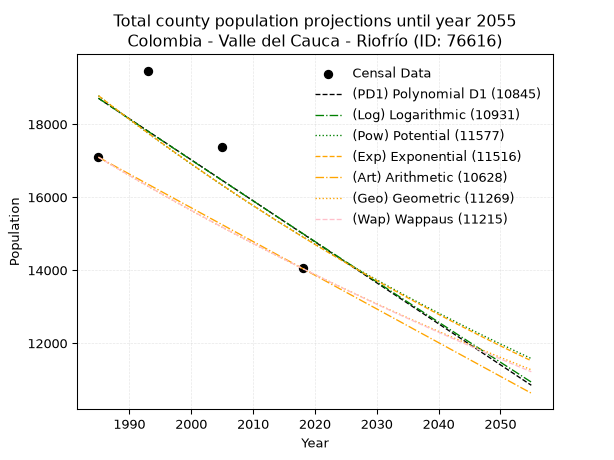
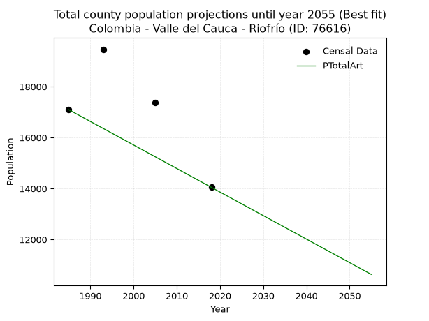
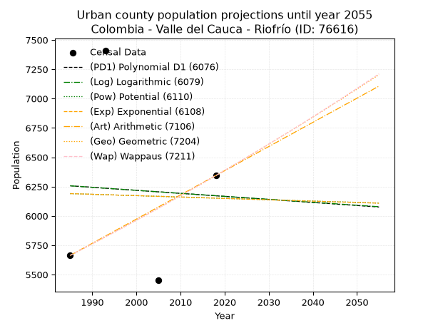
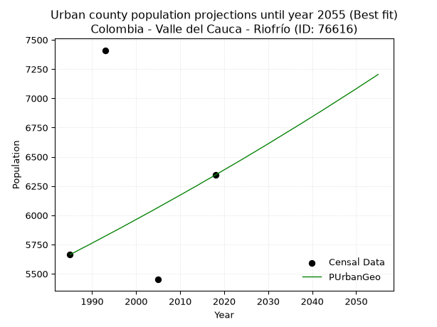
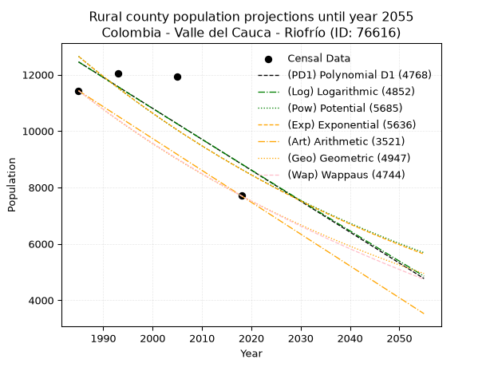
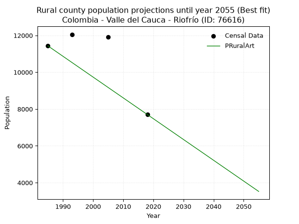

<div align="center">


</div>

# 📜 _“Population and Public Services Demand Projections (PPSD) until Year 2050 for Colombia - Valle del Cauca - Riofrío (ID: 76616)”_
Keywords: `population` `public-service` `projection` `lineal` `polynomial` `logarithmic` `potential` `exponential` `arithmetic` `geometric` `wappaus` `dane` `colombia` `south-america`

PPSD are analytical estimates used by governments and planners to anticipate future changes in population size, age distribution, and the resulting community needs for utilities, healthcare, education, and infrastructure as sizing future water treatment facilities, electrical grids, and road networks based on spatial growth.

<div align="center">

</img>

</div>


> **General running parameters**: • app_version: _v20260806_. • Python version: _3.14.7_. • Pandas version: _3.0.5_. • NumPy version: _2.5.1_. • Creates, save and include plots into reports (create_plot): _False_. • Projection until year: _2050_. • Process polynomial degree 2 and up: _False_. • Process Wappaus: _True_. • Process Wappaus: _True_. • Set negative values to zero: _True_. • Set infinite values to zero: _True_. • Drop dataset notes: _True_. 
<div align="center">

Dynamic map: [:earth_americas:Google](http://maps.google.com/maps?q=4.156907646,-76.2883131) [:earth_americas:OSM](https://www.openstreetmap.org/#map=18/4.156907646/-76.2883131&layers=P) [:earth_americas:Bing](https://www.bing.com/maps?cp=4.156907646~-76.2883131&lvl=18) [:earth_americas:Apple](https://maps.apple.com/frame?center=4.156907646%2C-76.2883131&span=0.003%2C0.006)

</div>


<div align="center">

```geojson
{
  "type": "Feature",
  "geometry": {
    "type": "Point", 
    "coordinates": [-76.2883131, 4.156907646]
  }, 
  "properties": {
    "Name": "Colombia - Valle del Cauca - Riofrío (ID: 76616)"
  }
}
```

</div>


## 0. Census Data (4 records)

Census data are official statistics collected by a government about the people and housing in a country. They usually include counts of total population, age, sex, race, income, education, and jobs.

📅Global census file: [Population.xlsx](../data/Population.xlsx)

| Source   |   Year |   CountryID | CountryName   |   StateID | StateName       |   CountyID | CountyName   |   PTotal |   PUrban |   PRural |
|:---------|-------:|------------:|:--------------|----------:|:----------------|-----------:|:-------------|---------:|---------:|---------:|
| DANE     |   1985 |          57 | Colombia      |        76 | Valle del Cauca |      76616 | Riofrío      |    17093 |     5664 |    11429 |
| DANE     |   1993 |          57 | Colombia      |        76 | Valle del Cauca |      76616 | Riofrío      |    19465 |     7411 |    12054 |
| DANE     |   2005 |          57 | Colombia      |        76 | Valle del Cauca |      76616 | Riofrío      |    17376 |     5451 |    11925 |
| DANE     |   2018 |          57 | Colombia      |        76 | Valle del Cauca |      76616 | Riofrío      |    14045 |     6344 |     7701 |

> 🔥Some records could had specific notes about the registered values or the corresponding urban or rural distribution.

📅[SUI-RUPS](https://www.datos.gov.co/Hacienda-y-Cr-dito-P-blico/Registro-nico-de-Prestadores-de-Servicios-P-blicos/4qkq-csdn/about_data) - Local public utility companies: [RUPS.csv](../data/RUPS.csv)

 | SERVICIO       | ESTADO    | NOMBRE                                                                    | NIT         | DEPARTAMENTO_DOMICILIO   | MUNICIPIO_DOMICILIO   | DIRECCION              |   TELEFONO | EMAIL                     | TIPO_PRESTADOR                             | CLASIFICACION                 |
|:---------------|:----------|:--------------------------------------------------------------------------|:------------|:-------------------------|:----------------------|:-----------------------|-----------:|:--------------------------|:-------------------------------------------|:------------------------------|
| ACUEDUCTO      | OPERATIVA | SOCIEDAD DE ACUEDUCTOS Y ALCANTARILLADOS DEL VALLE DEL CAUCA S.A.  E.S.P. | 890399032-8 | VALLE DEL CAUCA          | CALI                  | AVENIDA 5 N # 23 AN 41 |    6203400 | rosemary@acuavalle.gov.co | SOCIEDADES (EMPRESA DE SERVICIOS PUBLICOS) | MAYOR O IGUAL A 5001 USUARIOS |
| ALCANTARILLADO | OPERATIVA | SOCIEDAD DE ACUEDUCTOS Y ALCANTARILLADOS DEL VALLE DEL CAUCA S.A.  E.S.P. | 890399032-8 | VALLE DEL CAUCA          | CALI                  | AVENIDA 5 N # 23 AN 41 |    6203400 | rosemary@acuavalle.gov.co | SOCIEDADES (EMPRESA DE SERVICIOS PUBLICOS) | MAYOR O IGUAL A 5001 USUARIOS |
| ACUEDUCTO      | OPERATIVA | FUNDACION DE USUARIOS DEL ACUEDUCTO DEL CORREGIMIENTO DE SALONICA         | 821000404-0 | VALLE DEL CAUCA          | RIOFRIO               | carrera  3 NO. 10 - 22 |    2008013 | lissetteha2015@gmail.com  | ORGANIZACION AUTORIZADA                    | MENOR O IGUAL A 2500 USUARIOS |
| ALCANTARILLADO | OPERATIVA | FUNDACION DE USUARIOS DEL ACUEDUCTO DEL CORREGIMIENTO DE SALONICA         | 821000404-0 | VALLE DEL CAUCA          | RIOFRIO               | carrera  3 NO. 10 - 22 |    2008013 | lissetteha2015@gmail.com  | ORGANIZACION AUTORIZADA                    | MENOR O IGUAL A 2500 USUARIOS |

## 1. Total

### 1.1. Coefficients and Parameters

* (PD1) Polynomial Deg 1: -112.33199518265539, 241686.8233641064 (lineal)
* (Log) Logarithmic: -224388.5876633206, 1722574.2029661918
* (Pow) Potential: -13.95476198413153, 50.29311366222581
* (Exp) Exponential: -0.006985589811907701, 19758352540.553196
* (Art) Arithmetic: Year diff. 2018 - 1985 = 33, Population diff. 14045 - 17093 = -3048, Annual growth = -92.36363636363636
* (Geo) Geometric: Year diff. 2018 - 1985 = 33, Population diff. 14045 - 17093 = -3048, Annual growth % = -0.005933917155576562
* (Wap) Wappaus: i = -0.5932534932470702, Condition values only valid for < 200)

<sub>
Wappaus condition values: ['-0.00', '-0.59', '-1.19', '-1.78', '-2.37', '-2.97', '-3.56', '-4.15', '-4.75', '-5.34', '-5.93', '-6.53', '-7.12', '-7.71', '-8.31', '-8.90', '-9.49', '-10.09', '-10.68', '-11.27', '-11.87', '-12.46', '-13.05', '-13.64', '-14.24', '-14.83', '-15.42', '-16.02', '-16.61', '-17.20', '-17.80', '-18.39', '-18.98', '-19.58', '-20.17', '-20.76', '-21.36', '-21.95', '-22.54', '-23.14', '-23.73', '-24.32', '-24.92', '-25.51', '-26.10', '-26.70', '-27.29', '-27.88', '-28.48', '-29.07', '-29.66', '-30.26', '-30.85', '-31.44', '-32.04', '-32.63', '-33.22', '-33.82', '-34.41', '-35.00', '-35.60', '-36.19', '-36.78', '-37.37', '-37.97', '-38.56']
</sub>


### 1.2. Projected Dataset

|   Year |   CountyID |   PTotalPD1 |   PTotalLog |   PTotalPow |   PTotalExp |   PTotalArt |   PTotalGeo |   PTotalWap |
|-------:|-----------:|------------:|------------:|------------:|------------:|------------:|------------:|------------:|
|   1985 |      76616 |       18708 |       18708 |       18778 |       18778 |       17093 |       17093 |       17093 |
|   1986 |      76616 |       18595 |       18595 |       18647 |       18647 |       17001 |       16992 |       16992 |
|   1987 |      76616 |       18483 |       18482 |       18516 |       18518 |       16908 |       16891 |       16891 |
|   1988 |      76616 |       18371 |       18369 |       18386 |       18389 |       16816 |       16791 |       16791 |
|   1989 |      76616 |       18258 |       18256 |       18258 |       18261 |       16724 |       16691 |       16692 |
|   1990 |      76616 |       18146 |       18143 |       18130 |       18134 |       16631 |       16592 |       16593 |
|   1991 |      76616 |       18034 |       18030 |       18004 |       18007 |       16539 |       16493 |       16495 |
|   1992 |      76616 |       17921 |       17918 |       17878 |       17882 |       16446 |       16396 |       16398 |
|   1993 |      76616 |       17809 |       17805 |       17753 |       17757 |       16354 |       16298 |       16301 |
|   1994 |      76616 |       17697 |       17693 |       17629 |       17634 |       16262 |       16202 |       16204 |
|   1995 |      76616 |       17584 |       17580 |       17506 |       17511 |       16169 |       16105 |       16108 |
|   1996 |      76616 |       17472 |       17468 |       17384 |       17389 |       16077 |       16010 |       16013 |
|   1997 |      76616 |       17360 |       17355 |       17263 |       17268 |       15985 |       15915 |       15918 |
|   1998 |      76616 |       17247 |       17243 |       17143 |       17148 |       15892 |       15820 |       15824 |
|   1999 |      76616 |       17135 |       17131 |       17024 |       17029 |       15800 |       15726 |       15730 |
|   2000 |      76616 |       17023 |       17018 |       16905 |       16910 |       15708 |       15633 |       15637 |
|   2001 |      76616 |       16911 |       16906 |       16788 |       16792 |       15615 |       15540 |       15544 |
|   2002 |      76616 |       16798 |       16794 |       16671 |       16675 |       15523 |       15448 |       15452 |
|   2003 |      76616 |       16686 |       16682 |       16555 |       16559 |       15430 |       15357 |       15360 |
|   2004 |      76616 |       16574 |       16570 |       16441 |       16444 |       15338 |       15265 |       15269 |
|   2005 |      76616 |       16461 |       16458 |       16327 |       16330 |       15246 |       15175 |       15178 |
|   2006 |      76616 |       16349 |       16346 |       16213 |       16216 |       15153 |       15085 |       15088 |
|   2007 |      76616 |       16237 |       16234 |       16101 |       16103 |       15061 |       14995 |       14999 |
|   2008 |      76616 |       16124 |       16123 |       15989 |       15991 |       14969 |       14906 |       14910 |
|   2009 |      76616 |       16012 |       16011 |       15879 |       15880 |       14876 |       14818 |       14821 |
|   2010 |      76616 |       15900 |       15899 |       15769 |       15769 |       14784 |       14730 |       14733 |
|   2011 |      76616 |       15787 |       15788 |       15660 |       15659 |       14692 |       14642 |       14645 |
|   2012 |      76616 |       15675 |       15676 |       15551 |       15550 |       14599 |       14556 |       14558 |
|   2013 |      76616 |       15563 |       15565 |       15444 |       15442 |       14507 |       14469 |       14471 |
|   2014 |      76616 |       15450 |       15453 |       15337 |       15335 |       14414 |       14383 |       14385 |
|   2015 |      76616 |       15338 |       15342 |       15231 |       15228 |       14322 |       14298 |       14299 |
|   2016 |      76616 |       15226 |       15230 |       15126 |       15122 |       14230 |       14213 |       14214 |
|   2017 |      76616 |       15113 |       15119 |       15022 |       15017 |       14137 |       14129 |       14129 |
|   2018 |      76616 |       15001 |       15008 |       14919 |       14912 |       14045 |       14045 |       14045 |
|   2019 |      76616 |       14889 |       14897 |       14816 |       14808 |       13953 |       13962 |       13961 |
|   2020 |      76616 |       14776 |       14786 |       14714 |       14705 |       13860 |       13879 |       13878 |
|   2021 |      76616 |       14664 |       14675 |       14612 |       14603 |       13768 |       13796 |       13795 |
|   2022 |      76616 |       14552 |       14564 |       14512 |       14501 |       13676 |       13715 |       13712 |
|   2023 |      76616 |       14439 |       14453 |       14412 |       14400 |       13583 |       13633 |       13630 |
|   2024 |      76616 |       14327 |       14342 |       14313 |       14300 |       13491 |       13552 |       13548 |
|   2025 |      76616 |       14215 |       14231 |       14215 |       14200 |       13398 |       13472 |       13467 |
|   2026 |      76616 |       14102 |       14120 |       14117 |       14102 |       13306 |       13392 |       13386 |
|   2027 |      76616 |       13990 |       14009 |       14020 |       14003 |       13214 |       13312 |       13306 |
|   2028 |      76616 |       13878 |       13899 |       13924 |       13906 |       13121 |       13233 |       13226 |
|   2029 |      76616 |       13765 |       13788 |       13829 |       13809 |       13029 |       13155 |       13146 |
|   2030 |      76616 |       13653 |       13678 |       13734 |       13713 |       12937 |       13077 |       13067 |
|   2031 |      76616 |       13541 |       13567 |       13640 |       13617 |       12844 |       12999 |       12988 |
|   2032 |      76616 |       13428 |       13457 |       13546 |       13523 |       12752 |       12922 |       12910 |
|   2033 |      76616 |       13316 |       13346 |       13454 |       13429 |       12660 |       12845 |       12832 |
|   2034 |      76616 |       13204 |       13236 |       13362 |       13335 |       12567 |       12769 |       12755 |
|   2035 |      76616 |       13091 |       13126 |       13270 |       13242 |       12475 |       12693 |       12678 |
|   2036 |      76616 |       12979 |       13015 |       13180 |       13150 |       12382 |       12618 |       12601 |
|   2037 |      76616 |       12867 |       12905 |       13090 |       13059 |       12290 |       12543 |       12525 |
|   2038 |      76616 |       12754 |       12795 |       13000 |       12968 |       12198 |       12469 |       12449 |
|   2039 |      76616 |       12642 |       12685 |       12912 |       12877 |       12105 |       12395 |       12373 |
|   2040 |      76616 |       12530 |       12575 |       12824 |       12788 |       12013 |       12321 |       12298 |
|   2041 |      76616 |       12417 |       12465 |       12736 |       12699 |       11921 |       12248 |       12223 |
|   2042 |      76616 |       12305 |       12355 |       12650 |       12610 |       11828 |       12176 |       12149 |
|   2043 |      76616 |       12193 |       12245 |       12563 |       12522 |       11736 |       12103 |       12075 |
|   2044 |      76616 |       12080 |       12135 |       12478 |       12435 |       11644 |       12031 |       12001 |
|   2045 |      76616 |       11968 |       12026 |       12393 |       12349 |       11551 |       11960 |       11928 |
|   2046 |      76616 |       11856 |       11916 |       12309 |       12263 |       11459 |       11889 |       11855 |
|   2047 |      76616 |       11743 |       11806 |       12225 |       12177 |       11366 |       11819 |       11783 |
|   2048 |      76616 |       11631 |       11697 |       12142 |       12093 |       11274 |       11748 |       11710 |
|   2049 |      76616 |       11519 |       11587 |       12060 |       12008 |       11182 |       11679 |       11639 |
|   2050 |      76616 |       11406 |       11478 |       11978 |       11925 |       11089 |       11609 |       11567 |
<div align="center">

</img>

</div>


### 1.3. Best fit with absolute and relative error (%)

Relative error puts that difference into context by dividing the absolute error by the true value, creating a unitless ratio or percentage that shows the scale of the mistake.

Absolute and relative error

|   Year | Source   |   CountryID | CountryName   |   StateID | StateName       |   CountyID_x | CountyName   |   PTotal |   PUrban |   PRural |   CountyID_y |   PTotalPD1 |   PTotalLog |   PTotalPow |   PTotalExp |   PTotalArt |   PTotalGeo |   PTotalWap |   PTotalPD1AbsError |   PTotalLogAbsError |   PTotalPowAbsError |   PTotalExpAbsError |   PTotalArtAbsError |   PTotalGeoAbsError |   PTotalWapAbsError |   PTotalPD1RelError |   PTotalLogRelError |   PTotalPowRelError |   PTotalExpRelError |   PTotalArtRelError |   PTotalGeoRelError |   PTotalWapRelError |
|-------:|:---------|------------:|:--------------|----------:|:----------------|-------------:|:-------------|---------:|---------:|---------:|-------------:|------------:|------------:|------------:|------------:|------------:|------------:|------------:|--------------------:|--------------------:|--------------------:|--------------------:|--------------------:|--------------------:|--------------------:|--------------------:|--------------------:|--------------------:|--------------------:|--------------------:|--------------------:|--------------------:|
|   1985 | DANE     |          57 | Colombia      |        76 | Valle del Cauca |        76616 | Riofrío      |    17093 |     5664 |    11429 |        76616 |       18708 |       18708 |       18778 |       18778 |       17093 |       17093 |       17093 |                1615 |                1615 |                1685 |                1685 |                   0 |                   0 |                   0 |             9.44831 |             9.44831 |             9.85784 |             9.85784 |              0      |              0      |              0      |
|   1993 | DANE     |          57 | Colombia      |        76 | Valle del Cauca |        76616 | Riofrío      |    19465 |     7411 |    12054 |        76616 |       17809 |       17805 |       17753 |       17757 |       16354 |       16298 |       16301 |                1656 |                1660 |                1712 |                1708 |                3111 |                3167 |                3164 |             8.50758 |             8.52813 |             8.79527 |             8.77472 |             15.9825 |             16.2702 |             16.2548 |
|   2005 | DANE     |          57 | Colombia      |        76 | Valle del Cauca |        76616 | Riofrío      |    17376 |     5451 |    11925 |        76616 |       16461 |       16458 |       16327 |       16330 |       15246 |       15175 |       15178 |                 915 |                 918 |                1049 |                1046 |                2130 |                2201 |                2198 |             5.26588 |             5.28315 |             6.03706 |             6.0198  |             12.2583 |             12.6669 |             12.6496 |
|   2018 | DANE     |          57 | Colombia      |        76 | Valle del Cauca |        76616 | Riofrío      |    14045 |     6344 |     7701 |        76616 |       15001 |       15008 |       14919 |       14912 |       14045 |       14045 |       14045 |                 956 |                 963 |                 874 |                 867 |                   0 |                   0 |                   0 |             6.80669 |             6.85653 |             6.22286 |             6.17302 |              0      |              0      |              0      |

Relative error mean

| Method    |   RelError | Best   |
|:----------|-----------:|:-------|
| PTotalPD1 |    7.50712 |        |
| PTotalLog |    7.52903 |        |
| PTotalPow |    7.72826 |        |
| PTotalExp |    7.70634 |        |
| PTotalArt |    7.06021 | True   |
| PTotalGeo |    7.23428 |        |
| PTotalWap |    7.22611 |        |

💙Best method: _**PTotalArt**_
<div align="center">

</img>

</div>


### 1.4. Fresh water supply demand in liters per capita per day (lpcd)

The fresh water supply demand typically ranges from 100 to 300 liters per capita per day (lpcd) for standard domestic and municipal planning, though absolute survival minimums set by the World Health Organization are as low as 7.5 to 20 liters per day, and total consumption in high-income nations can exceed 400 liters.

> `CZ`: Level in meters above the sea level (masl)<br> `WS`: Fresh water supply demand in liters per capita per day (lpcd or l/h/d)<br> `WSAll`: Zonal fresh water supply demand in liters per second (l/s)<br> `A`: Zonal area in square meters<br> `DP`: Population density (people/hectare or p/ha)

Reference values (RAS Colombia)

|    CZ |   WS |
|------:|-----:|
|  1000 |  120 |
|  2000 |  130 |
| 99999 |  140 |

County shapefile geometry properties and water supply values

|   CountyID |      ATotal |   CZTotal |   WSTotal |
|-----------:|------------:|----------:|----------:|
|      76616 | 3.08163e+08 |    1538.3 |       130 |

Projected values for best method: PTotalArt

|   CountyID |   Year |   PTotalArt |   DPTotal |   WSTotal |   WSTotalAll |
|-----------:|-------:|------------:|----------:|----------:|-------------:|
|      76616 |   1985 |       17093 |      0.55 |       130 |      25.7186 |
|      76616 |   1986 |       17001 |      0.55 |       130 |      25.5802 |
|      76616 |   1987 |       16908 |      0.55 |       130 |      25.4403 |
|      76616 |   1988 |       16816 |      0.55 |       130 |      25.3019 |
|      76616 |   1989 |       16724 |      0.54 |       130 |      25.1634 |
|      76616 |   1990 |       16631 |      0.54 |       130 |      25.0235 |
|      76616 |   1991 |       16539 |      0.54 |       130 |      24.8851 |
|      76616 |   1992 |       16446 |      0.53 |       130 |      24.7451 |
|      76616 |   1993 |       16354 |      0.53 |       130 |      24.6067 |
|      76616 |   1994 |       16262 |      0.53 |       130 |      24.4683 |
|      76616 |   1995 |       16169 |      0.52 |       130 |      24.3284 |
|      76616 |   1996 |       16077 |      0.52 |       130 |      24.1899 |
|      76616 |   1997 |       15985 |      0.52 |       130 |      24.0515 |
|      76616 |   1998 |       15892 |      0.52 |       130 |      23.9116 |
|      76616 |   1999 |       15800 |      0.51 |       130 |      23.7731 |
|      76616 |   2000 |       15708 |      0.51 |       130 |      23.6347 |
|      76616 |   2001 |       15615 |      0.51 |       130 |      23.4948 |
|      76616 |   2002 |       15523 |      0.5  |       130 |      23.3564 |
|      76616 |   2003 |       15430 |      0.5  |       130 |      23.2164 |
|      76616 |   2004 |       15338 |      0.5  |       130 |      23.078  |
|      76616 |   2005 |       15246 |      0.49 |       130 |      22.9396 |
|      76616 |   2006 |       15153 |      0.49 |       130 |      22.7997 |
|      76616 |   2007 |       15061 |      0.49 |       130 |      22.6612 |
|      76616 |   2008 |       14969 |      0.49 |       130 |      22.5228 |
|      76616 |   2009 |       14876 |      0.48 |       130 |      22.3829 |
|      76616 |   2010 |       14784 |      0.48 |       130 |      22.2444 |
|      76616 |   2011 |       14692 |      0.48 |       130 |      22.106  |
|      76616 |   2012 |       14599 |      0.47 |       130 |      21.9661 |
|      76616 |   2013 |       14507 |      0.47 |       130 |      21.8277 |
|      76616 |   2014 |       14414 |      0.47 |       130 |      21.6877 |
|      76616 |   2015 |       14322 |      0.46 |       130 |      21.5493 |
|      76616 |   2016 |       14230 |      0.46 |       130 |      21.4109 |
|      76616 |   2017 |       14137 |      0.46 |       130 |      21.2709 |
|      76616 |   2018 |       14045 |      0.46 |       130 |      21.1325 |
|      76616 |   2019 |       13953 |      0.45 |       130 |      20.9941 |
|      76616 |   2020 |       13860 |      0.45 |       130 |      20.8542 |
|      76616 |   2021 |       13768 |      0.45 |       130 |      20.7157 |
|      76616 |   2022 |       13676 |      0.44 |       130 |      20.5773 |
|      76616 |   2023 |       13583 |      0.44 |       130 |      20.4374 |
|      76616 |   2024 |       13491 |      0.44 |       130 |      20.299  |
|      76616 |   2025 |       13398 |      0.43 |       130 |      20.159  |
|      76616 |   2026 |       13306 |      0.43 |       130 |      20.0206 |
|      76616 |   2027 |       13214 |      0.43 |       130 |      19.8822 |
|      76616 |   2028 |       13121 |      0.43 |       130 |      19.7422 |
|      76616 |   2029 |       13029 |      0.42 |       130 |      19.6038 |
|      76616 |   2030 |       12937 |      0.42 |       130 |      19.4654 |
|      76616 |   2031 |       12844 |      0.42 |       130 |      19.3255 |
|      76616 |   2032 |       12752 |      0.41 |       130 |      19.187  |
|      76616 |   2033 |       12660 |      0.41 |       130 |      19.0486 |
|      76616 |   2034 |       12567 |      0.41 |       130 |      18.9087 |
|      76616 |   2035 |       12475 |      0.4  |       130 |      18.7703 |
|      76616 |   2036 |       12382 |      0.4  |       130 |      18.6303 |
|      76616 |   2037 |       12290 |      0.4  |       130 |      18.4919 |
|      76616 |   2038 |       12198 |      0.4  |       130 |      18.3535 |
|      76616 |   2039 |       12105 |      0.39 |       130 |      18.2135 |
|      76616 |   2040 |       12013 |      0.39 |       130 |      18.0751 |
|      76616 |   2041 |       11921 |      0.39 |       130 |      17.9367 |
|      76616 |   2042 |       11828 |      0.38 |       130 |      17.7968 |
|      76616 |   2043 |       11736 |      0.38 |       130 |      17.6583 |
|      76616 |   2044 |       11644 |      0.38 |       130 |      17.5199 |
|      76616 |   2045 |       11551 |      0.37 |       130 |      17.38   |
|      76616 |   2046 |       11459 |      0.37 |       130 |      17.2416 |
|      76616 |   2047 |       11366 |      0.37 |       130 |      17.1016 |
|      76616 |   2048 |       11274 |      0.37 |       130 |      16.9632 |
|      76616 |   2049 |       11182 |      0.36 |       130 |      16.8248 |
|      76616 |   2050 |       11089 |      0.36 |       130 |      16.6848 |

## 2. Urban

### 2.1. Coefficients and Parameters

* (PD1) Polynomial Deg 1: -2.5812926535532563, 11380.730630269902 (lineal)
* (Log) Logarithmic: -5134.848497776789, 45247.524579694815
* (Pow) Potential: -0.3778579361625006, 5.037797556518186
* (Exp) Exponential: -0.0001905226715424981, 9035.796245837175
* (Art) Arithmetic: Year diff. 2018 - 1985 = 33, Population diff. 6344 - 5664 = 680, Annual growth = 20.606060606060606
* (Geo) Geometric: Year diff. 2018 - 1985 = 33, Population diff. 6344 - 5664 = 680, Annual growth % = 0.003441640039178351
* (Wap) Wappaus: i = 0.3432055397411826, Condition values only valid for < 200)

<sub>
Wappaus condition values: ['0.00', '0.34', '0.69', '1.03', '1.37', '1.72', '2.06', '2.40', '2.75', '3.09', '3.43', '3.78', '4.12', '4.46', '4.80', '5.15', '5.49', '5.83', '6.18', '6.52', '6.86', '7.21', '7.55', '7.89', '8.24', '8.58', '8.92', '9.27', '9.61', '9.95', '10.30', '10.64', '10.98', '11.33', '11.67', '12.01', '12.36', '12.70', '13.04', '13.39', '13.73', '14.07', '14.41', '14.76', '15.10', '15.44', '15.79', '16.13', '16.47', '16.82', '17.16', '17.50', '17.85', '18.19', '18.53', '18.88', '19.22', '19.56', '19.91', '20.25', '20.59', '20.94', '21.28', '21.62', '21.97', '22.31']
</sub>


### 2.2. Projected Dataset

|   Year |   CountyID |   PUrbanPD1 |   PUrbanLog |   PUrbanPow |   PUrbanExp |   PUrbanArt |   PUrbanGeo |   PUrbanWap |
|-------:|-----------:|------------:|------------:|------------:|------------:|------------:|------------:|------------:|
|   1985 |      76616 |        6257 |        6257 |        6190 |        6190 |        5664 |        5664 |        5664 |
|   1986 |      76616 |        6254 |        6254 |        6189 |        6189 |        5685 |        5683 |        5683 |
|   1987 |      76616 |        6252 |        6252 |        6188 |        6188 |        5705 |        5703 |        5703 |
|   1988 |      76616 |        6249 |        6249 |        6187 |        6187 |        5726 |        5723 |        5723 |
|   1989 |      76616 |        6247 |        6246 |        6186 |        6186 |        5746 |        5742 |        5742 |
|   1990 |      76616 |        6244 |        6244 |        6184 |        6185 |        5767 |        5762 |        5762 |
|   1991 |      76616 |        6241 |        6241 |        6183 |        6183 |        5788 |        5782 |        5782 |
|   1992 |      76616 |        6239 |        6239 |        6182 |        6182 |        5808 |        5802 |        5802 |
|   1993 |      76616 |        6236 |        6236 |        6181 |        6181 |        5829 |        5822 |        5822 |
|   1994 |      76616 |        6234 |        6233 |        6180 |        6180 |        5849 |        5842 |        5842 |
|   1995 |      76616 |        6231 |        6231 |        6179 |        6179 |        5870 |        5862 |        5862 |
|   1996 |      76616 |        6228 |        6228 |        6177 |        6177 |        5891 |        5882 |        5882 |
|   1997 |      76616 |        6226 |        6226 |        6176 |        6176 |        5911 |        5902 |        5902 |
|   1998 |      76616 |        6223 |        6223 |        6175 |        6175 |        5932 |        5923 |        5922 |
|   1999 |      76616 |        6221 |        6221 |        6174 |        6174 |        5952 |        5943 |        5943 |
|   2000 |      76616 |        6218 |        6218 |        6173 |        6173 |        5973 |        5964 |        5963 |
|   2001 |      76616 |        6216 |        6215 |        6172 |        6172 |        5994 |        5984 |        5984 |
|   2002 |      76616 |        6213 |        6213 |        6170 |        6170 |        6014 |        6005 |        6004 |
|   2003 |      76616 |        6210 |        6210 |        6169 |        6169 |        6035 |        6025 |        6025 |
|   2004 |      76616 |        6208 |        6208 |        6168 |        6168 |        6056 |        6046 |        6046 |
|   2005 |      76616 |        6205 |        6205 |        6167 |        6167 |        6076 |        6067 |        6067 |
|   2006 |      76616 |        6203 |        6203 |        6166 |        6166 |        6097 |        6088 |        6087 |
|   2007 |      76616 |        6200 |        6200 |        6165 |        6165 |        6117 |        6109 |        6108 |
|   2008 |      76616 |        6197 |        6198 |        6163 |        6163 |        6138 |        6130 |        6129 |
|   2009 |      76616 |        6195 |        6195 |        6162 |        6162 |        6159 |        6151 |        6151 |
|   2010 |      76616 |        6192 |        6192 |        6161 |        6161 |        6179 |        6172 |        6172 |
|   2011 |      76616 |        6190 |        6190 |        6160 |        6160 |        6200 |        6193 |        6193 |
|   2012 |      76616 |        6187 |        6187 |        6159 |        6159 |        6220 |        6215 |        6214 |
|   2013 |      76616 |        6185 |        6185 |        6158 |        6158 |        6241 |        6236 |        6236 |
|   2014 |      76616 |        6182 |        6182 |        6156 |        6156 |        6262 |        6257 |        6257 |
|   2015 |      76616 |        6179 |        6180 |        6155 |        6155 |        6282 |        6279 |        6279 |
|   2016 |      76616 |        6177 |        6177 |        6154 |        6154 |        6303 |        6301 |        6300 |
|   2017 |      76616 |        6174 |        6175 |        6153 |        6153 |        6323 |        6322 |        6322 |
|   2018 |      76616 |        6172 |        6172 |        6152 |        6152 |        6344 |        6344 |        6344 |
|   2019 |      76616 |        6169 |        6169 |        6151 |        6150 |        6365 |        6366 |        6366 |
|   2020 |      76616 |        6167 |        6167 |        6150 |        6149 |        6385 |        6388 |        6388 |
|   2021 |      76616 |        6164 |        6164 |        6148 |        6148 |        6406 |        6410 |        6410 |
|   2022 |      76616 |        6161 |        6162 |        6147 |        6147 |        6426 |        6432 |        6432 |
|   2023 |      76616 |        6159 |        6159 |        6146 |        6146 |        6447 |        6454 |        6454 |
|   2024 |      76616 |        6156 |        6157 |        6145 |        6145 |        6468 |        6476 |        6477 |
|   2025 |      76616 |        6154 |        6154 |        6144 |        6143 |        6488 |        6498 |        6499 |
|   2026 |      76616 |        6151 |        6152 |        6143 |        6142 |        6509 |        6521 |        6521 |
|   2027 |      76616 |        6148 |        6149 |        6142 |        6141 |        6529 |        6543 |        6544 |
|   2028 |      76616 |        6146 |        6147 |        6140 |        6140 |        6550 |        6566 |        6566 |
|   2029 |      76616 |        6143 |        6144 |        6139 |        6139 |        6571 |        6588 |        6589 |
|   2030 |      76616 |        6141 |        6142 |        6138 |        6138 |        6591 |        6611 |        6612 |
|   2031 |      76616 |        6138 |        6139 |        6137 |        6136 |        6612 |        6634 |        6635 |
|   2032 |      76616 |        6136 |        6137 |        6136 |        6135 |        6632 |        6657 |        6658 |
|   2033 |      76616 |        6133 |        6134 |        6135 |        6134 |        6653 |        6680 |        6681 |
|   2034 |      76616 |        6130 |        6131 |        6134 |        6133 |        6674 |        6703 |        6704 |
|   2035 |      76616 |        6128 |        6129 |        6132 |        6132 |        6694 |        6726 |        6727 |
|   2036 |      76616 |        6125 |        6126 |        6131 |        6131 |        6715 |        6749 |        6750 |
|   2037 |      76616 |        6123 |        6124 |        6130 |        6129 |        6736 |        6772 |        6774 |
|   2038 |      76616 |        6120 |        6121 |        6129 |        6128 |        6756 |        6795 |        6797 |
|   2039 |      76616 |        6117 |        6119 |        6128 |        6127 |        6777 |        6819 |        6821 |
|   2040 |      76616 |        6115 |        6116 |        6127 |        6126 |        6797 |        6842 |        6845 |
|   2041 |      76616 |        6112 |        6114 |        6126 |        6125 |        6818 |        6866 |        6868 |
|   2042 |      76616 |        6110 |        6111 |        6124 |        6124 |        6839 |        6889 |        6892 |
|   2043 |      76616 |        6107 |        6109 |        6123 |        6122 |        6859 |        6913 |        6916 |
|   2044 |      76616 |        6105 |        6106 |        6122 |        6121 |        6880 |        6937 |        6940 |
|   2045 |      76616 |        6102 |        6104 |        6121 |        6120 |        6900 |        6961 |        6964 |
|   2046 |      76616 |        6099 |        6101 |        6120 |        6119 |        6921 |        6985 |        6988 |
|   2047 |      76616 |        6097 |        6099 |        6119 |        6118 |        6942 |        7009 |        7013 |
|   2048 |      76616 |        6094 |        6096 |        6118 |        6117 |        6962 |        7033 |        7037 |
|   2049 |      76616 |        6092 |        6094 |        6117 |        6115 |        6983 |        7057 |        7062 |
|   2050 |      76616 |        6089 |        6091 |        6115 |        6114 |        7003 |        7081 |        7086 |
<div align="center">

</img>

</div>


### 2.3. Best fit with absolute and relative error (%)

Relative error puts that difference into context by dividing the absolute error by the true value, creating a unitless ratio or percentage that shows the scale of the mistake.

Absolute and relative error

|   Year | Source   |   CountryID | CountryName   |   StateID | StateName       |   CountyID_x | CountyName   |   PTotal |   PUrban |   PRural |   CountyID_y |   PUrbanPD1 |   PUrbanLog |   PUrbanPow |   PUrbanExp |   PUrbanArt |   PUrbanGeo |   PUrbanWap |   PUrbanPD1AbsError |   PUrbanLogAbsError |   PUrbanPowAbsError |   PUrbanExpAbsError |   PUrbanArtAbsError |   PUrbanGeoAbsError |   PUrbanWapAbsError |   PUrbanPD1RelError |   PUrbanLogRelError |   PUrbanPowRelError |   PUrbanExpRelError |   PUrbanArtRelError |   PUrbanGeoRelError |   PUrbanWapRelError |
|-------:|:---------|------------:|:--------------|----------:|:----------------|-------------:|:-------------|---------:|---------:|---------:|-------------:|------------:|------------:|------------:|------------:|------------:|------------:|------------:|--------------------:|--------------------:|--------------------:|--------------------:|--------------------:|--------------------:|--------------------:|--------------------:|--------------------:|--------------------:|--------------------:|--------------------:|--------------------:|--------------------:|
|   1985 | DANE     |          57 | Colombia      |        76 | Valle del Cauca |        76616 | Riofrío      |    17093 |     5664 |    11429 |        76616 |        6257 |        6257 |        6190 |        6190 |        5664 |        5664 |        5664 |                 593 |                 593 |                 526 |                 526 |                   0 |                   0 |                   0 |            10.4696  |            10.4696  |             9.28672 |             9.28672 |              0      |              0      |              0      |
|   1993 | DANE     |          57 | Colombia      |        76 | Valle del Cauca |        76616 | Riofrío      |    19465 |     7411 |    12054 |        76616 |        6236 |        6236 |        6181 |        6181 |        5829 |        5822 |        5822 |                1175 |                1175 |                1230 |                1230 |                1582 |                1589 |                1589 |            15.8548  |            15.8548  |            16.597   |            16.597   |             21.3466 |             21.4411 |             21.4411 |
|   2005 | DANE     |          57 | Colombia      |        76 | Valle del Cauca |        76616 | Riofrío      |    17376 |     5451 |    11925 |        76616 |        6205 |        6205 |        6167 |        6167 |        6076 |        6067 |        6067 |                 754 |                 754 |                 716 |                 716 |                 625 |                 616 |                 616 |            13.8323  |            13.8323  |            13.1352  |            13.1352  |             11.4658 |             11.3007 |             11.3007 |
|   2018 | DANE     |          57 | Colombia      |        76 | Valle del Cauca |        76616 | Riofrío      |    14045 |     6344 |     7701 |        76616 |        6172 |        6172 |        6152 |        6152 |        6344 |        6344 |        6344 |                 172 |                 172 |                 192 |                 192 |                   0 |                   0 |                   0 |             2.71122 |             2.71122 |             3.02648 |             3.02648 |              0      |              0      |              0      |

Relative error mean

| Method    |   RelError | Best   |
|:----------|-----------:|:-------|
| PUrbanPD1 |   10.717   |        |
| PUrbanLog |   10.717   |        |
| PUrbanPow |   10.5113  |        |
| PUrbanExp |   10.5113  |        |
| PUrbanArt |    8.20311 |        |
| PUrbanGeo |    8.18544 | True   |
| PUrbanWap |    8.18544 | True   |

💙Best method: _**PUrbanGeo**_
<div align="center">

</img>

</div>


### 2.4. Fresh water supply demand in liters per capita per day (lpcd)

The fresh water supply demand typically ranges from 100 to 300 liters per capita per day (lpcd) for standard domestic and municipal planning, though absolute survival minimums set by the World Health Organization are as low as 7.5 to 20 liters per day, and total consumption in high-income nations can exceed 400 liters.

> `CZ`: Level in meters above the sea level (masl)<br> `WS`: Fresh water supply demand in liters per capita per day (lpcd or l/h/d)<br> `WSAll`: Zonal fresh water supply demand in liters per second (l/s)<br> `A`: Zonal area in square meters<br> `DP`: Population density (people/hectare or p/ha)

Reference values (RAS Colombia)

|    CZ |   WS |
|------:|-----:|
|  1000 |  120 |
|  2000 |  130 |
| 99999 |  140 |

County shapefile geometry properties and water supply values

|   CountyID |   AUrban |   CZUrban |   WSUrban |
|-----------:|---------:|----------:|----------:|
|      76616 |   671438 |   942.899 |       120 |

Projected values for best method: PUrbanGeo

|   CountyID |   Year |   PUrbanGeo |   DPUrban |   WSUrban |   WSUrbanAll |
|-----------:|-------:|------------:|----------:|----------:|-------------:|
|      76616 |   1985 |        5664 |     84.36 |       120 |      7.86667 |
|      76616 |   1986 |        5683 |     84.64 |       120 |      7.89306 |
|      76616 |   1987 |        5703 |     84.94 |       120 |      7.92083 |
|      76616 |   1988 |        5723 |     85.23 |       120 |      7.94861 |
|      76616 |   1989 |        5742 |     85.52 |       120 |      7.975   |
|      76616 |   1990 |        5762 |     85.82 |       120 |      8.00278 |
|      76616 |   1991 |        5782 |     86.11 |       120 |      8.03056 |
|      76616 |   1992 |        5802 |     86.41 |       120 |      8.05833 |
|      76616 |   1993 |        5822 |     86.71 |       120 |      8.08611 |
|      76616 |   1994 |        5842 |     87.01 |       120 |      8.11389 |
|      76616 |   1995 |        5862 |     87.31 |       120 |      8.14167 |
|      76616 |   1996 |        5882 |     87.6  |       120 |      8.16944 |
|      76616 |   1997 |        5902 |     87.9  |       120 |      8.19722 |
|      76616 |   1998 |        5923 |     88.21 |       120 |      8.22639 |
|      76616 |   1999 |        5943 |     88.51 |       120 |      8.25417 |
|      76616 |   2000 |        5964 |     88.82 |       120 |      8.28333 |
|      76616 |   2001 |        5984 |     89.12 |       120 |      8.31111 |
|      76616 |   2002 |        6005 |     89.43 |       120 |      8.34028 |
|      76616 |   2003 |        6025 |     89.73 |       120 |      8.36806 |
|      76616 |   2004 |        6046 |     90.05 |       120 |      8.39722 |
|      76616 |   2005 |        6067 |     90.36 |       120 |      8.42639 |
|      76616 |   2006 |        6088 |     90.67 |       120 |      8.45556 |
|      76616 |   2007 |        6109 |     90.98 |       120 |      8.48472 |
|      76616 |   2008 |        6130 |     91.3  |       120 |      8.51389 |
|      76616 |   2009 |        6151 |     91.61 |       120 |      8.54306 |
|      76616 |   2010 |        6172 |     91.92 |       120 |      8.57222 |
|      76616 |   2011 |        6193 |     92.23 |       120 |      8.60139 |
|      76616 |   2012 |        6215 |     92.56 |       120 |      8.63194 |
|      76616 |   2013 |        6236 |     92.88 |       120 |      8.66111 |
|      76616 |   2014 |        6257 |     93.19 |       120 |      8.69028 |
|      76616 |   2015 |        6279 |     93.52 |       120 |      8.72083 |
|      76616 |   2016 |        6301 |     93.84 |       120 |      8.75139 |
|      76616 |   2017 |        6322 |     94.16 |       120 |      8.78056 |
|      76616 |   2018 |        6344 |     94.48 |       120 |      8.81111 |
|      76616 |   2019 |        6366 |     94.81 |       120 |      8.84167 |
|      76616 |   2020 |        6388 |     95.14 |       120 |      8.87222 |
|      76616 |   2021 |        6410 |     95.47 |       120 |      8.90278 |
|      76616 |   2022 |        6432 |     95.79 |       120 |      8.93333 |
|      76616 |   2023 |        6454 |     96.12 |       120 |      8.96389 |
|      76616 |   2024 |        6476 |     96.45 |       120 |      8.99444 |
|      76616 |   2025 |        6498 |     96.78 |       120 |      9.025   |
|      76616 |   2026 |        6521 |     97.12 |       120 |      9.05694 |
|      76616 |   2027 |        6543 |     97.45 |       120 |      9.0875  |
|      76616 |   2028 |        6566 |     97.79 |       120 |      9.11944 |
|      76616 |   2029 |        6588 |     98.12 |       120 |      9.15    |
|      76616 |   2030 |        6611 |     98.46 |       120 |      9.18194 |
|      76616 |   2031 |        6634 |     98.8  |       120 |      9.21389 |
|      76616 |   2032 |        6657 |     99.15 |       120 |      9.24583 |
|      76616 |   2033 |        6680 |     99.49 |       120 |      9.27778 |
|      76616 |   2034 |        6703 |     99.83 |       120 |      9.30972 |
|      76616 |   2035 |        6726 |    100.17 |       120 |      9.34167 |
|      76616 |   2036 |        6749 |    100.52 |       120 |      9.37361 |
|      76616 |   2037 |        6772 |    100.86 |       120 |      9.40556 |
|      76616 |   2038 |        6795 |    101.2  |       120 |      9.4375  |
|      76616 |   2039 |        6819 |    101.56 |       120 |      9.47083 |
|      76616 |   2040 |        6842 |    101.9  |       120 |      9.50278 |
|      76616 |   2041 |        6866 |    102.26 |       120 |      9.53611 |
|      76616 |   2042 |        6889 |    102.6  |       120 |      9.56806 |
|      76616 |   2043 |        6913 |    102.96 |       120 |      9.60139 |
|      76616 |   2044 |        6937 |    103.32 |       120 |      9.63472 |
|      76616 |   2045 |        6961 |    103.67 |       120 |      9.66806 |
|      76616 |   2046 |        6985 |    104.03 |       120 |      9.70139 |
|      76616 |   2047 |        7009 |    104.39 |       120 |      9.73472 |
|      76616 |   2048 |        7033 |    104.75 |       120 |      9.76806 |
|      76616 |   2049 |        7057 |    105.1  |       120 |      9.80139 |
|      76616 |   2050 |        7081 |    105.46 |       120 |      9.83472 |

## 3. Rural

### 3.1. Coefficients and Parameters

* (PD1) Polynomial Deg 1: -109.75070252910213, 230306.09273383653 (lineal)
* (Log) Logarithmic: -219253.73916554402, 1677326.6783864987
* (Pow) Potential: -23.07318557613825, 80.19187162453265
* (Exp) Exponential: -0.011548745864447355, 114262395708256.62
* (Art) Arithmetic: Year diff. 2018 - 1985 = 33, Population diff. 7701 - 11429 = -3728, Annual growth = -112.96969696969697
* (Geo) Geometric: Year diff. 2018 - 1985 = 33, Population diff. 7701 - 11429 = -3728, Annual growth % = -0.011892470217482964
* (Wap) Wappaus: i = -1.181073674539435, Condition values only valid for < 200)

<sub>
Wappaus condition values: ['-0.00', '-1.18', '-2.36', '-3.54', '-4.72', '-5.91', '-7.09', '-8.27', '-9.45', '-10.63', '-11.81', '-12.99', '-14.17', '-15.35', '-16.54', '-17.72', '-18.90', '-20.08', '-21.26', '-22.44', '-23.62', '-24.80', '-25.98', '-27.16', '-28.35', '-29.53', '-30.71', '-31.89', '-33.07', '-34.25', '-35.43', '-36.61', '-37.79', '-38.98', '-40.16', '-41.34', '-42.52', '-43.70', '-44.88', '-46.06', '-47.24', '-48.42', '-49.61', '-50.79', '-51.97', '-53.15', '-54.33', '-55.51', '-56.69', '-57.87', '-59.05', '-60.23', '-61.42', '-62.60', '-63.78', '-64.96', '-66.14', '-67.32', '-68.50', '-69.68', '-70.86', '-72.05', '-73.23', '-74.41', '-75.59', '-76.77']
</sub>


### 3.2. Projected Dataset

|   Year |   CountyID |   PRuralPD1 |   PRuralLog |   PRuralPow |   PRuralExp |   PRuralArt |   PRuralGeo |   PRuralWap |
|-------:|-----------:|------------:|------------:|------------:|------------:|------------:|------------:|------------:|
|   1985 |      76616 |       12451 |       12451 |       12648 |       12648 |       11429 |       11429 |       11429 |
|   1986 |      76616 |       12341 |       12341 |       12502 |       12503 |       11316 |       11293 |       11295 |
|   1987 |      76616 |       12231 |       12230 |       12358 |       12359 |       11203 |       11159 |       11162 |
|   1988 |      76616 |       12122 |       12120 |       12215 |       12217 |       11090 |       11026 |       11031 |
|   1989 |      76616 |       12012 |       12010 |       12074 |       12077 |       10977 |       10895 |       10902 |
|   1990 |      76616 |       11902 |       11899 |       11935 |       11938 |       10864 |       10765 |       10773 |
|   1991 |      76616 |       11792 |       11789 |       11797 |       11801 |       10751 |       10637 |       10647 |
|   1992 |      76616 |       11683 |       11679 |       11662 |       11666 |       10638 |       10511 |       10522 |
|   1993 |      76616 |       11573 |       11569 |       11527 |       11532 |       10525 |       10386 |       10398 |
|   1994 |      76616 |       11463 |       11459 |       11395 |       11399 |       10412 |       10262 |       10275 |
|   1995 |      76616 |       11353 |       11349 |       11264 |       11269 |       10299 |       10140 |       10154 |
|   1996 |      76616 |       11244 |       11239 |       11134 |       11139 |       10186 |       10020 |       10035 |
|   1997 |      76616 |       11134 |       11130 |       11006 |       11011 |       10073 |        9901 |        9916 |
|   1998 |      76616 |       11024 |       11020 |       10880 |       10885 |        9960 |        9783 |        9799 |
|   1999 |      76616 |       10914 |       10910 |       10755 |       10760 |        9847 |        9666 |        9684 |
|   2000 |      76616 |       10805 |       10800 |       10631 |       10636 |        9734 |        9551 |        9569 |
|   2001 |      76616 |       10695 |       10691 |       10510 |       10514 |        9621 |        9438 |        9456 |
|   2002 |      76616 |       10585 |       10581 |       10389 |       10393 |        9509 |        9326 |        9344 |
|   2003 |      76616 |       10475 |       10472 |       10270 |       10274 |        9396 |        9215 |        9233 |
|   2004 |      76616 |       10366 |       10362 |       10152 |       10156 |        9283 |        9105 |        9123 |
|   2005 |      76616 |       10256 |       10253 |       10036 |       10040 |        9170 |        8997 |        9014 |
|   2006 |      76616 |       10146 |       10144 |        9921 |        9924 |        9057 |        8890 |        8907 |
|   2007 |      76616 |       10036 |       10034 |        9808 |        9810 |        8944 |        8784 |        8801 |
|   2008 |      76616 |        9927 |        9925 |        9696 |        9698 |        8831 |        8680 |        8696 |
|   2009 |      76616 |        9817 |        9816 |        9585 |        9586 |        8718 |        8576 |        8592 |
|   2010 |      76616 |        9707 |        9707 |        9476 |        9476 |        8605 |        8474 |        8488 |
|   2011 |      76616 |        9597 |        9598 |        9368 |        9367 |        8492 |        8374 |        8387 |
|   2012 |      76616 |        9488 |        9489 |        9261 |        9260 |        8379 |        8274 |        8286 |
|   2013 |      76616 |        9378 |        9380 |        9155 |        9154 |        8266 |        8176 |        8186 |
|   2014 |      76616 |        9268 |        9271 |        9051 |        9048 |        8153 |        8078 |        8087 |
|   2015 |      76616 |        9158 |        9162 |        8948 |        8945 |        8040 |        7982 |        7989 |
|   2016 |      76616 |        9049 |        9053 |        8846 |        8842 |        7927 |        7887 |        7892 |
|   2017 |      76616 |        8939 |        8945 |        8745 |        8740 |        7814 |        7794 |        7796 |
|   2018 |      76616 |        8829 |        8836 |        8646 |        8640 |        7701 |        7701 |        7701 |
|   2019 |      76616 |        8719 |        8727 |        8548 |        8541 |        7588 |        7609 |        7607 |
|   2020 |      76616 |        8610 |        8619 |        8451 |        8443 |        7475 |        7519 |        7514 |
|   2021 |      76616 |        8500 |        8510 |        8355 |        8346 |        7362 |        7430 |        7422 |
|   2022 |      76616 |        8390 |        8402 |        8260 |        8250 |        7249 |        7341 |        7330 |
|   2023 |      76616 |        8280 |        8293 |        8166 |        8155 |        7136 |        7254 |        7240 |
|   2024 |      76616 |        8171 |        8185 |        8074 |        8062 |        7023 |        7168 |        7150 |
|   2025 |      76616 |        8061 |        8077 |        7982 |        7969 |        6910 |        7082 |        7061 |
|   2026 |      76616 |        7951 |        7968 |        7892 |        7877 |        6797 |        6998 |        6973 |
|   2027 |      76616 |        7841 |        7860 |        7802 |        7787 |        6684 |        6915 |        6886 |
|   2028 |      76616 |        7732 |        7752 |        7714 |        7698 |        6571 |        6833 |        6800 |
|   2029 |      76616 |        7622 |        7644 |        7627 |        7609 |        6458 |        6751 |        6715 |
|   2030 |      76616 |        7512 |        7536 |        7541 |        7522 |        6345 |        6671 |        6630 |
|   2031 |      76616 |        7402 |        7428 |        7455 |        7435 |        6232 |        6592 |        6546 |
|   2032 |      76616 |        7293 |        7320 |        7371 |        7350 |        6119 |        6513 |        6463 |
|   2033 |      76616 |        7183 |        7212 |        7288 |        7266 |        6006 |        6436 |        6381 |
|   2034 |      76616 |        7073 |        7104 |        7206 |        7182 |        5893 |        6359 |        6299 |
|   2035 |      76616 |        6963 |        6997 |        7124 |        7100 |        5781 |        6284 |        6218 |
|   2036 |      76616 |        6854 |        6889 |        7044 |        7018 |        5668 |        6209 |        6138 |
|   2037 |      76616 |        6744 |        6781 |        6965 |        6938 |        5555 |        6135 |        6059 |
|   2038 |      76616 |        6634 |        6674 |        6886 |        6858 |        5442 |        6062 |        5980 |
|   2039 |      76616 |        6524 |        6566 |        6809 |        6779 |        5329 |        5990 |        5902 |
|   2040 |      76616 |        6415 |        6459 |        6732 |        6701 |        5216 |        5919 |        5825 |
|   2041 |      76616 |        6305 |        6351 |        6657 |        6624 |        5103 |        5848 |        5748 |
|   2042 |      76616 |        6195 |        6244 |        6582 |        6548 |        4990 |        5779 |        5673 |
|   2043 |      76616 |        6085 |        6136 |        6508 |        6473 |        4877 |        5710 |        5597 |
|   2044 |      76616 |        5976 |        6029 |        6435 |        6399 |        4764 |        5642 |        5523 |
|   2045 |      76616 |        5866 |        5922 |        6363 |        6325 |        4651 |        5575 |        5449 |
|   2046 |      76616 |        5756 |        5815 |        6291 |        6253 |        4538 |        5509 |        5376 |
|   2047 |      76616 |        5646 |        5708 |        6221 |        6181 |        4425 |        5443 |        5303 |
|   2048 |      76616 |        5537 |        5600 |        6151 |        6110 |        4312 |        5379 |        5231 |
|   2049 |      76616 |        5427 |        5493 |        6082 |        6040 |        4199 |        5315 |        5159 |
|   2050 |      76616 |        5317 |        5386 |        6014 |        5971 |        4086 |        5251 |        5089 |
<div align="center">

</img>

</div>


### 3.3. Best fit with absolute and relative error (%)

Relative error puts that difference into context by dividing the absolute error by the true value, creating a unitless ratio or percentage that shows the scale of the mistake.

Absolute and relative error

|   Year | Source   |   CountryID | CountryName   |   StateID | StateName       |   CountyID_x | CountyName   |   PTotal |   PUrban |   PRural |   CountyID_y |   PRuralPD1 |   PRuralLog |   PRuralPow |   PRuralExp |   PRuralArt |   PRuralGeo |   PRuralWap |   PRuralPD1AbsError |   PRuralLogAbsError |   PRuralPowAbsError |   PRuralExpAbsError |   PRuralArtAbsError |   PRuralGeoAbsError |   PRuralWapAbsError |   PRuralPD1RelError |   PRuralLogRelError |   PRuralPowRelError |   PRuralExpRelError |   PRuralArtRelError |   PRuralGeoRelError |   PRuralWapRelError |
|-------:|:---------|------------:|:--------------|----------:|:----------------|-------------:|:-------------|---------:|---------:|---------:|-------------:|------------:|------------:|------------:|------------:|------------:|------------:|------------:|--------------------:|--------------------:|--------------------:|--------------------:|--------------------:|--------------------:|--------------------:|--------------------:|--------------------:|--------------------:|--------------------:|--------------------:|--------------------:|--------------------:|
|   1985 | DANE     |          57 | Colombia      |        76 | Valle del Cauca |        76616 | Riofrío      |    17093 |     5664 |    11429 |        76616 |       12451 |       12451 |       12648 |       12648 |       11429 |       11429 |       11429 |                1022 |                1022 |                1219 |                1219 |                   0 |                   0 |                   0 |             8.94216 |             8.94216 |            10.6659  |            10.6659  |              0      |              0      |              0      |
|   1993 | DANE     |          57 | Colombia      |        76 | Valle del Cauca |        76616 | Riofrío      |    19465 |     7411 |    12054 |        76616 |       11573 |       11569 |       11527 |       11532 |       10525 |       10386 |       10398 |                 481 |                 485 |                 527 |                 522 |                1529 |                1668 |                1656 |             3.99038 |             4.02356 |             4.37199 |             4.33051 |             12.6846 |             13.8377 |             13.7382 |
|   2005 | DANE     |          57 | Colombia      |        76 | Valle del Cauca |        76616 | Riofrío      |    17376 |     5451 |    11925 |        76616 |       10256 |       10253 |       10036 |       10040 |        9170 |        8997 |        9014 |                1669 |                1672 |                1889 |                1885 |                2755 |                2928 |                2911 |            13.9958  |            14.021   |            15.8407  |            15.8071  |             23.1027 |             24.5535 |             24.4109 |
|   2018 | DANE     |          57 | Colombia      |        76 | Valle del Cauca |        76616 | Riofrío      |    14045 |     6344 |     7701 |        76616 |        8829 |        8836 |        8646 |        8640 |        7701 |        7701 |        7701 |                1128 |                1135 |                 945 |                 939 |                   0 |                   0 |                   0 |            14.6474  |            14.7383  |            12.2711  |            12.1932  |              0      |              0      |              0      |

Relative error mean

| Method    |   RelError | Best   |
|:----------|-----------:|:-------|
| PRuralPD1 |   10.3939  |        |
| PRuralLog |   10.4313  |        |
| PRuralPow |   10.7874  |        |
| PRuralExp |   10.7492  |        |
| PRuralArt |    8.94683 | True   |
| PRuralGeo |    9.5978  |        |
| PRuralWap |    9.53727 |        |

💙Best method: _**PRuralArt**_
<div align="center">

</img>

</div>


### 3.4. Fresh water supply demand in liters per capita per day (lpcd)

The fresh water supply demand typically ranges from 100 to 300 liters per capita per day (lpcd) for standard domestic and municipal planning, though absolute survival minimums set by the World Health Organization are as low as 7.5 to 20 liters per day, and total consumption in high-income nations can exceed 400 liters.

> `CZ`: Level in meters above the sea level (masl)<br> `WS`: Fresh water supply demand in liters per capita per day (lpcd or l/h/d)<br> `WSAll`: Zonal fresh water supply demand in liters per second (l/s)<br> `A`: Zonal area in square meters<br> `DP`: Population density (people/hectare or p/ha)

Reference values (RAS Colombia)

|    CZ |   WS |
|------:|-----:|
|  1000 |  120 |
|  2000 |  130 |
| 99999 |  140 |

County shapefile geometry properties and water supply values

|   CountyID |      ARural |   CZRural |   WSRural |
|-----------:|------------:|----------:|----------:|
|      76616 | 3.07491e+08 |   1539.57 |       130 |

Projected values for best method: PRuralArt

|   CountyID |   Year |   PRuralArt |   DPRural |   WSRural |   WSRuralAll |
|-----------:|-------:|------------:|----------:|----------:|-------------:|
|      76616 |   1985 |       11429 |      0.37 |       130 |     17.1964  |
|      76616 |   1986 |       11316 |      0.37 |       130 |     17.0264  |
|      76616 |   1987 |       11203 |      0.36 |       130 |     16.8564  |
|      76616 |   1988 |       11090 |      0.36 |       130 |     16.6863  |
|      76616 |   1989 |       10977 |      0.36 |       130 |     16.5163  |
|      76616 |   1990 |       10864 |      0.35 |       130 |     16.3463  |
|      76616 |   1991 |       10751 |      0.35 |       130 |     16.1763  |
|      76616 |   1992 |       10638 |      0.35 |       130 |     16.0063  |
|      76616 |   1993 |       10525 |      0.34 |       130 |     15.8362  |
|      76616 |   1994 |       10412 |      0.34 |       130 |     15.6662  |
|      76616 |   1995 |       10299 |      0.33 |       130 |     15.4962  |
|      76616 |   1996 |       10186 |      0.33 |       130 |     15.3262  |
|      76616 |   1997 |       10073 |      0.33 |       130 |     15.1561  |
|      76616 |   1998 |        9960 |      0.32 |       130 |     14.9861  |
|      76616 |   1999 |        9847 |      0.32 |       130 |     14.8161  |
|      76616 |   2000 |        9734 |      0.32 |       130 |     14.6461  |
|      76616 |   2001 |        9621 |      0.31 |       130 |     14.476   |
|      76616 |   2002 |        9509 |      0.31 |       130 |     14.3075  |
|      76616 |   2003 |        9396 |      0.31 |       130 |     14.1375  |
|      76616 |   2004 |        9283 |      0.3  |       130 |     13.9675  |
|      76616 |   2005 |        9170 |      0.3  |       130 |     13.7975  |
|      76616 |   2006 |        9057 |      0.29 |       130 |     13.6274  |
|      76616 |   2007 |        8944 |      0.29 |       130 |     13.4574  |
|      76616 |   2008 |        8831 |      0.29 |       130 |     13.2874  |
|      76616 |   2009 |        8718 |      0.28 |       130 |     13.1174  |
|      76616 |   2010 |        8605 |      0.28 |       130 |     12.9473  |
|      76616 |   2011 |        8492 |      0.28 |       130 |     12.7773  |
|      76616 |   2012 |        8379 |      0.27 |       130 |     12.6073  |
|      76616 |   2013 |        8266 |      0.27 |       130 |     12.4373  |
|      76616 |   2014 |        8153 |      0.27 |       130 |     12.2672  |
|      76616 |   2015 |        8040 |      0.26 |       130 |     12.0972  |
|      76616 |   2016 |        7927 |      0.26 |       130 |     11.9272  |
|      76616 |   2017 |        7814 |      0.25 |       130 |     11.7572  |
|      76616 |   2018 |        7701 |      0.25 |       130 |     11.5872  |
|      76616 |   2019 |        7588 |      0.25 |       130 |     11.4171  |
|      76616 |   2020 |        7475 |      0.24 |       130 |     11.2471  |
|      76616 |   2021 |        7362 |      0.24 |       130 |     11.0771  |
|      76616 |   2022 |        7249 |      0.24 |       130 |     10.9071  |
|      76616 |   2023 |        7136 |      0.23 |       130 |     10.737   |
|      76616 |   2024 |        7023 |      0.23 |       130 |     10.567   |
|      76616 |   2025 |        6910 |      0.22 |       130 |     10.397   |
|      76616 |   2026 |        6797 |      0.22 |       130 |     10.227   |
|      76616 |   2027 |        6684 |      0.22 |       130 |     10.0569  |
|      76616 |   2028 |        6571 |      0.21 |       130 |      9.88692 |
|      76616 |   2029 |        6458 |      0.21 |       130 |      9.7169  |
|      76616 |   2030 |        6345 |      0.21 |       130 |      9.54688 |
|      76616 |   2031 |        6232 |      0.2  |       130 |      9.37685 |
|      76616 |   2032 |        6119 |      0.2  |       130 |      9.20683 |
|      76616 |   2033 |        6006 |      0.2  |       130 |      9.03681 |
|      76616 |   2034 |        5893 |      0.19 |       130 |      8.86678 |
|      76616 |   2035 |        5781 |      0.19 |       130 |      8.69826 |
|      76616 |   2036 |        5668 |      0.18 |       130 |      8.52824 |
|      76616 |   2037 |        5555 |      0.18 |       130 |      8.35822 |
|      76616 |   2038 |        5442 |      0.18 |       130 |      8.18819 |
|      76616 |   2039 |        5329 |      0.17 |       130 |      8.01817 |
|      76616 |   2040 |        5216 |      0.17 |       130 |      7.84815 |
|      76616 |   2041 |        5103 |      0.17 |       130 |      7.67812 |
|      76616 |   2042 |        4990 |      0.16 |       130 |      7.5081  |
|      76616 |   2043 |        4877 |      0.16 |       130 |      7.33808 |
|      76616 |   2044 |        4764 |      0.15 |       130 |      7.16806 |
|      76616 |   2045 |        4651 |      0.15 |       130 |      6.99803 |
|      76616 |   2046 |        4538 |      0.15 |       130 |      6.82801 |
|      76616 |   2047 |        4425 |      0.14 |       130 |      6.65799 |
|      76616 |   2048 |        4312 |      0.14 |       130 |      6.48796 |
|      76616 |   2049 |        4199 |      0.14 |       130 |      6.31794 |
|      76616 |   2050 |        4086 |      0.13 |       130 |      6.14792 |

#

<div align="center"><br><sub>Share this research</sub></div><br>

<sub>**APPS & TOOLS & CONTENT DISCLAIMER**: • NO WARRANTY - This content and software is provided by <a href="https://github.com/rcfdtools" target="_blank">github.com/rcfdtools</a> "as is", without any express or implied warranty, including warranties of merchantability, fitness for a particular purpose, or non-infringement. There is no guarantee that the software will be error-free or operate without interruption. • LIMITATION OF LIABILITY - Neither the authors nor copyright holders will be liable for claims or damages arising from the software or its use. You are responsible for determining if the software is appropriate for your use and assume all associated risks, including errors, legal compliance, and data loss. • NO PROFESSIONAL ADVICE - The software provides general information and does not offer professional advice. It should not replace consultation with professional advisors. [Clauses and global license for rcfdtools use.](https://github.com/rcfdtools/rcfdtools/blob/main/LICENSE.md)</sub>

| [:house: Home](Readme.md)  | [:beginner: Help / Collab](https://github.com/rcfdtools/R.HydroTools/discussions/31) |
|----------------------------|-------------------------------------------------------------------------------------------|