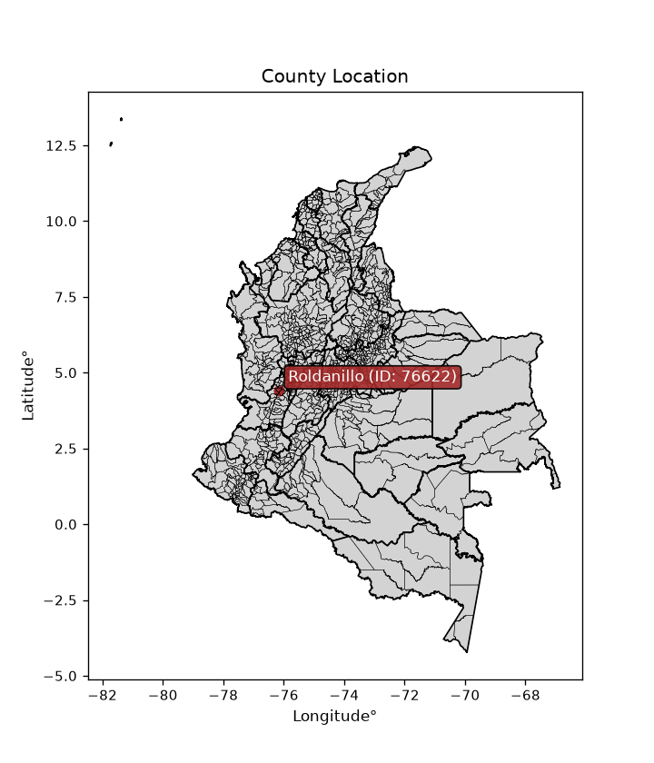
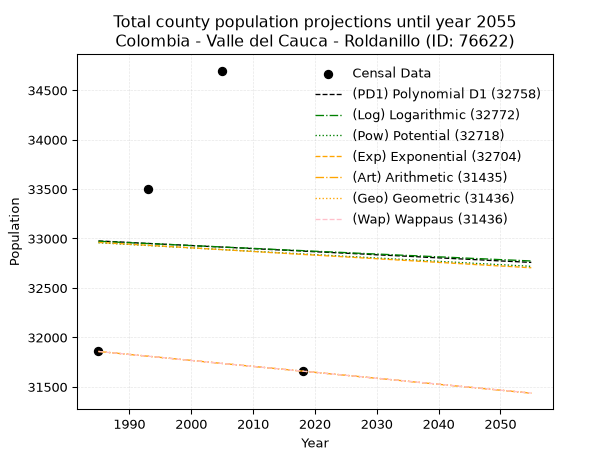
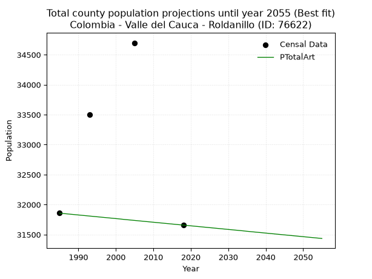
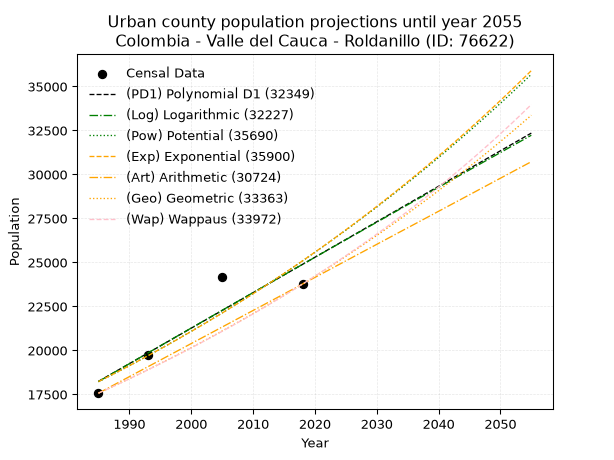
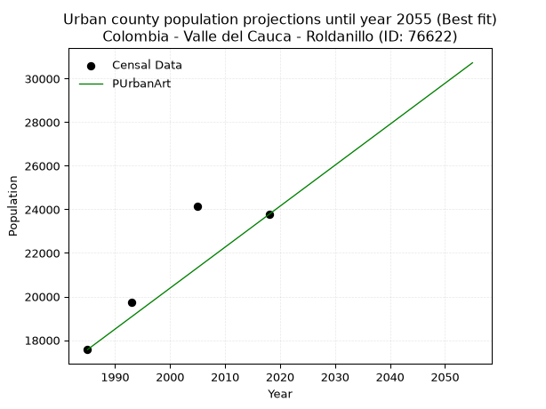
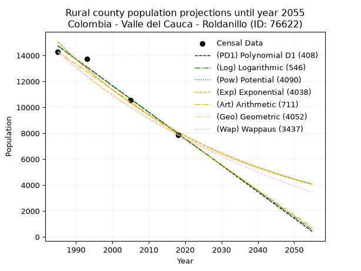
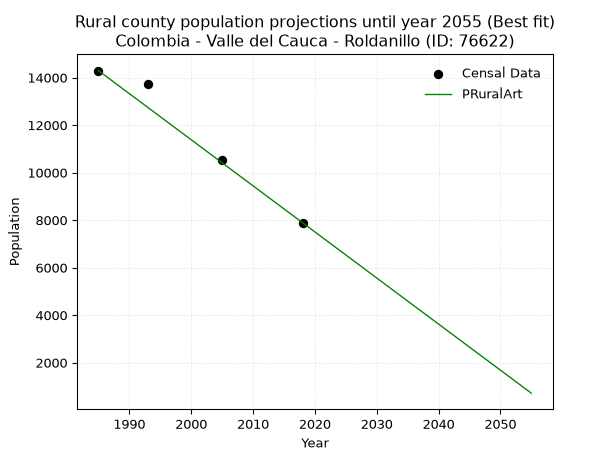

<div align="center">


</div>

# _“Population and Public Services Demand Projections (PPSD) until Year 2050 for Colombia - Valle del Cauca - Roldanillo (ID: 76622)”_
Keywords: `population` `public-service` `projection` `lineal` `polynomial` `logarithmic` `potential` `exponential` `arithmetic` `geometric` `wappaus` `dane` `colombia` `south-america`

PPSD are analytical estimates used by governments and planners to anticipate future changes in population size, age distribution, and the resulting community needs for utilities, healthcare, education, and infrastructure as sizing future water treatment facilities, electrical grids, and road networks based on spatial growth.

<div align="center">

</img>

</div>


> **General running parameters**: • app_version: _v20260806_. • Python version: _3.14.7_. • Pandas version: _3.0.5_. • NumPy version: _2.5.1_. • Creates, save and include plots into reports (create_plot): _False_. • Projection until year: _2050_. • Process polynomial degree 2 and up: _False_. • Process Wappaus: _True_. • Process Wappaus: _True_. • Set negative values to zero: _True_. • Set infinite values to zero: _True_. • Drop dataset notes: _True_. 
<div align="center">

Dynamic map: [:earth_americas:Google](http://maps.google.com/maps?q=4.413601438,-76.1522768) [:earth_americas:OSM](https://www.openstreetmap.org/#map=18/4.413601438/-76.1522768&layers=P) [:earth_americas:Bing](https://www.bing.com/maps?cp=4.413601438~-76.1522768&lvl=18) [:earth_americas:Apple](https://maps.apple.com/frame?center=4.413601438%2C-76.1522768&span=0.003%2C0.006)

</div>


<div align="center">

```geojson
{
  "type": "Feature",
  "geometry": {
    "type": "Point", 
    "coordinates": [-76.1522768, 4.413601438]
  }, 
  "properties": {
    "Name": "Colombia - Valle del Cauca - Roldanillo (ID: 76622)"
  }
}
```

</div>


## 0. Census Data (4 records)

Census data are official statistics collected by a government about the people and housing in a country. They usually include counts of total population, age, sex, race, income, education, and jobs.

📅Global census file: [Population.xlsx](../data/Population.xlsx)

| Source   |   Year |   CountryID | CountryName   |   StateID | StateName       |   CountyID | CountyName   |   PTotal |   PUrban |   PRural |
|:---------|-------:|------------:|:--------------|----------:|:----------------|-----------:|:-------------|---------:|---------:|---------:|
| DANE     |   1985 |          57 | Colombia      |        76 | Valle del Cauca |      76622 | Roldanillo   |    31857 |    17566 |    14291 |
| DANE     |   1993 |          57 | Colombia      |        76 | Valle del Cauca |      76622 | Roldanillo   |    33498 |    19750 |    13748 |
| DANE     |   2005 |          57 | Colombia      |        76 | Valle del Cauca |      76622 | Roldanillo   |    34698 |    24155 |    10543 |
| DANE     |   2018 |          57 | Colombia      |        76 | Valle del Cauca |      76622 | Roldanillo   |    31658 |    23769 |     7889 |

> 🔥Some records could had specific notes about the registered values or the corresponding urban or rural distribution.

📅[SUI-RUPS](https://www.datos.gov.co/Hacienda-y-Cr-dito-P-blico/Registro-nico-de-Prestadores-de-Servicios-P-blicos/4qkq-csdn/about_data) - Local public utility companies: [RUPS.csv](../data/RUPS.xlsx)

 | SERVICIO       | ESTADO    | NOMBRE                                                                                                                                                 | NIT         | DEPARTAMENTO_DOMICILIO   | MUNICIPIO_DOMICILIO   | DIRECCION              |   TELEFONO | EMAIL                     | TIPO_PRESTADOR                             | CLASIFICACION                 |
|:---------------|:----------|:-------------------------------------------------------------------------------------------------------------------------------------------------------|:------------|:-------------------------|:----------------------|:-----------------------|-----------:|:--------------------------|:-------------------------------------------|:------------------------------|
| ACUEDUCTO      | OPERATIVA | SOCIEDAD DE ACUEDUCTOS Y ALCANTARILLADOS DEL VALLE DEL CAUCA S.A.  E.S.P.                                                                              | 890399032-8 | VALLE DEL CAUCA          | CALI                  | AVENIDA 5 N # 23 AN 41 |    6203400 | rosemary@acuavalle.gov.co | SOCIEDADES (EMPRESA DE SERVICIOS PUBLICOS) | MAYOR O IGUAL A 5001 USUARIOS |
| ALCANTARILLADO | OPERATIVA | SOCIEDAD DE ACUEDUCTOS Y ALCANTARILLADOS DEL VALLE DEL CAUCA S.A.  E.S.P.                                                                              | 890399032-8 | VALLE DEL CAUCA          | CALI                  | AVENIDA 5 N # 23 AN 41 |    6203400 | rosemary@acuavalle.gov.co | SOCIEDADES (EMPRESA DE SERVICIOS PUBLICOS) | MAYOR O IGUAL A 5001 USUARIOS |
| ACUEDUCTO      | OPERATIVA | ASOCIACION DE SUSCRIPTORES  DEL ACUEDUCTO RURAL COMUNITARIO  DE LOS CORREGIMIENTOS: ISUGU, EL SILENCIO, PUERTO QUINTERO, CANDELARIA  Y  LAS VEREDAS, P | 900027830-9 | VALLE DEL CAUCA          | ROLDANILLO            | Vereda Simon Bolivar   |    2294413 | acuacampo@gmail.com       | ORGANIZACION AUTORIZADA                    | MENOR O IGUAL A 2500 USUARIOS |
| ACUEDUCTO      | OPERATIVA | ASOCIACION DE USUARIOS DEL ACUEDUCTO DE MORELIA                                                                                                        | 900322809-8 | VALLE DEL CAUCA          | ROLDANILLO            | PROVIVIENDA CASA No. 5 |    2490203 | julianruiz1@hotmail.com   | ORGANIZACION AUTORIZADA                    | HASTA 2500 SUSCRIPTORES       |

## 1. Total

### 1.1. Coefficients and Parameters

* (PD1) Polynomial Deg 1: -3.106784423924417, 39142.09554395482 (lineal)
* (Log) Logarithmic: -5758.1388839103, 76695.40979943132
* (Pow) Potential: -0.20982501217316663, 5.209901195517712
* (Exp) Exponential: -0.00011178653762373302, 41149.2200333069
* (Art) Arithmetic: Year diff. 2018 - 1985 = 33, Population diff. 31658 - 31857 = -199, Annual growth = -6.03030303030303
* (Geo) Geometric: Year diff. 2018 - 1985 = 33, Population diff. 31658 - 31857 = -199, Annual growth % = -0.0001898685431793723
* (Wap) Wappaus: i = -0.018988594915541307, Condition values only valid for < 200)

<sub>
Wappaus condition values: ['-0.00', '-0.02', '-0.04', '-0.06', '-0.08', '-0.09', '-0.11', '-0.13', '-0.15', '-0.17', '-0.19', '-0.21', '-0.23', '-0.25', '-0.27', '-0.28', '-0.30', '-0.32', '-0.34', '-0.36', '-0.38', '-0.40', '-0.42', '-0.44', '-0.46', '-0.47', '-0.49', '-0.51', '-0.53', '-0.55', '-0.57', '-0.59', '-0.61', '-0.63', '-0.65', '-0.66', '-0.68', '-0.70', '-0.72', '-0.74', '-0.76', '-0.78', '-0.80', '-0.82', '-0.84', '-0.85', '-0.87', '-0.89', '-0.91', '-0.93', '-0.95', '-0.97', '-0.99', '-1.01', '-1.03', '-1.04', '-1.06', '-1.08', '-1.10', '-1.12', '-1.14', '-1.16', '-1.18', '-1.20', '-1.22', '-1.23']
</sub>


### 1.2. Projected Dataset

|   Year |   CountyID |   PTotalPD1 |   PTotalLog |   PTotalPow |   PTotalExp |   PTotalArt |   PTotalGeo |   PTotalWap |
|-------:|-----------:|------------:|------------:|------------:|------------:|------------:|------------:|------------:|
|   1985 |      76622 |       32975 |       32972 |       32957 |       32960 |       31857 |       31857 |       31857 |
|   1986 |      76622 |       32972 |       32969 |       32954 |       32957 |       31851 |       31851 |       31851 |
|   1987 |      76622 |       32969 |       32966 |       32950 |       32953 |       31845 |       31845 |       31845 |
|   1988 |      76622 |       32966 |       32963 |       32947 |       32949 |       31839 |       31839 |       31839 |
|   1989 |      76622 |       32963 |       32960 |       32943 |       32946 |       31833 |       31833 |       31833 |
|   1990 |      76622 |       32960 |       32957 |       32940 |       32942 |       31827 |       31827 |       31827 |
|   1991 |      76622 |       32956 |       32954 |       32936 |       32938 |       31821 |       31821 |       31821 |
|   1992 |      76622 |       32953 |       32951 |       32933 |       32935 |       31815 |       31815 |       31815 |
|   1993 |      76622 |       32950 |       32949 |       32929 |       32931 |       31809 |       31809 |       31809 |
|   1994 |      76622 |       32947 |       32946 |       32926 |       32927 |       31803 |       31803 |       31803 |
|   1995 |      76622 |       32944 |       32943 |       32922 |       32924 |       31797 |       31797 |       31797 |
|   1996 |      76622 |       32941 |       32940 |       32919 |       32920 |       31791 |       31791 |       31791 |
|   1997 |      76622 |       32938 |       32937 |       32915 |       32916 |       31785 |       31784 |       31784 |
|   1998 |      76622 |       32935 |       32934 |       32912 |       32913 |       31779 |       31778 |       31778 |
|   1999 |      76622 |       32932 |       32931 |       32909 |       32909 |       31773 |       31772 |       31772 |
|   2000 |      76622 |       32929 |       32928 |       32905 |       32905 |       31767 |       31766 |       31766 |
|   2001 |      76622 |       32925 |       32925 |       32902 |       32902 |       31761 |       31760 |       31760 |
|   2002 |      76622 |       32922 |       32923 |       32898 |       32898 |       31754 |       31754 |       31754 |
|   2003 |      76622 |       32919 |       32920 |       32895 |       32894 |       31748 |       31748 |       31748 |
|   2004 |      76622 |       32916 |       32917 |       32891 |       32891 |       31742 |       31742 |       31742 |
|   2005 |      76622 |       32913 |       32914 |       32888 |       32887 |       31736 |       31736 |       31736 |
|   2006 |      76622 |       32910 |       32911 |       32884 |       32883 |       31730 |       31730 |       31730 |
|   2007 |      76622 |       32907 |       32908 |       32881 |       32880 |       31724 |       31724 |       31724 |
|   2008 |      76622 |       32904 |       32905 |       32877 |       32876 |       31718 |       31718 |       31718 |
|   2009 |      76622 |       32901 |       32903 |       32874 |       32872 |       31712 |       31712 |       31712 |
|   2010 |      76622 |       32897 |       32900 |       32871 |       32868 |       31706 |       31706 |       31706 |
|   2011 |      76622 |       32894 |       32897 |       32867 |       32865 |       31700 |       31700 |       31700 |
|   2012 |      76622 |       32891 |       32894 |       32864 |       32861 |       31694 |       31694 |       31694 |
|   2013 |      76622 |       32888 |       32891 |       32860 |       32857 |       31688 |       31688 |       31688 |
|   2014 |      76622 |       32885 |       32888 |       32857 |       32854 |       31682 |       31682 |       31682 |
|   2015 |      76622 |       32882 |       32885 |       32853 |       32850 |       31676 |       31676 |       31676 |
|   2016 |      76622 |       32879 |       32882 |       32850 |       32846 |       31670 |       31670 |       31670 |
|   2017 |      76622 |       32876 |       32880 |       32847 |       32843 |       31664 |       31664 |       31664 |
|   2018 |      76622 |       32873 |       32877 |       32843 |       32839 |       31658 |       31658 |       31658 |
|   2019 |      76622 |       32869 |       32874 |       32840 |       32835 |       31652 |       31652 |       31652 |
|   2020 |      76622 |       32866 |       32871 |       32836 |       32832 |       31646 |       31646 |       31646 |
|   2021 |      76622 |       32863 |       32868 |       32833 |       32828 |       31640 |       31640 |       31640 |
|   2022 |      76622 |       32860 |       32865 |       32830 |       32824 |       31634 |       31634 |       31634 |
|   2023 |      76622 |       32857 |       32863 |       32826 |       32821 |       31628 |       31628 |       31628 |
|   2024 |      76622 |       32854 |       32860 |       32823 |       32817 |       31622 |       31622 |       31622 |
|   2025 |      76622 |       32851 |       32857 |       32819 |       32813 |       31616 |       31616 |       31616 |
|   2026 |      76622 |       32848 |       32854 |       32816 |       32810 |       31610 |       31610 |       31610 |
|   2027 |      76622 |       32845 |       32851 |       32813 |       32806 |       31604 |       31604 |       31604 |
|   2028 |      76622 |       32842 |       32848 |       32809 |       32802 |       31598 |       31598 |       31598 |
|   2029 |      76622 |       32838 |       32845 |       32806 |       32799 |       31592 |       31592 |       31592 |
|   2030 |      76622 |       32835 |       32843 |       32802 |       32795 |       31586 |       31586 |       31586 |
|   2031 |      76622 |       32832 |       32840 |       32799 |       32791 |       31580 |       31580 |       31580 |
|   2032 |      76622 |       32829 |       32837 |       32796 |       32788 |       31574 |       31574 |       31574 |
|   2033 |      76622 |       32826 |       32834 |       32792 |       32784 |       31568 |       31568 |       31568 |
|   2034 |      76622 |       32823 |       32831 |       32789 |       32780 |       31562 |       31562 |       31562 |
|   2035 |      76622 |       32820 |       32828 |       32785 |       32777 |       31555 |       31556 |       31556 |
|   2036 |      76622 |       32817 |       32826 |       32782 |       32773 |       31549 |       31550 |       31550 |
|   2037 |      76622 |       32814 |       32823 |       32779 |       32769 |       31543 |       31544 |       31544 |
|   2038 |      76622 |       32810 |       32820 |       32775 |       32766 |       31537 |       31538 |       31538 |
|   2039 |      76622 |       32807 |       32817 |       32772 |       32762 |       31531 |       31532 |       31532 |
|   2040 |      76622 |       32804 |       32814 |       32769 |       32758 |       31525 |       31526 |       31526 |
|   2041 |      76622 |       32801 |       32812 |       32765 |       32755 |       31519 |       31520 |       31520 |
|   2042 |      76622 |       32798 |       32809 |       32762 |       32751 |       31513 |       31514 |       31514 |
|   2043 |      76622 |       32795 |       32806 |       32759 |       32747 |       31507 |       31508 |       31508 |
|   2044 |      76622 |       32792 |       32803 |       32755 |       32744 |       31501 |       31502 |       31502 |
|   2045 |      76622 |       32789 |       32800 |       32752 |       32740 |       31495 |       31496 |       31496 |
|   2046 |      76622 |       32786 |       32797 |       32748 |       32736 |       31489 |       31490 |       31490 |
|   2047 |      76622 |       32783 |       32795 |       32745 |       32733 |       31483 |       31484 |       31484 |
|   2048 |      76622 |       32779 |       32792 |       32742 |       32729 |       31477 |       31478 |       31478 |
|   2049 |      76622 |       32776 |       32789 |       32738 |       32725 |       31471 |       31472 |       31472 |
|   2050 |      76622 |       32773 |       32786 |       32735 |       32722 |       31465 |       31466 |       31466 |
<div align="center">

</img>

</div>


### 1.3. Best fit with absolute and relative error (%)

Relative error puts that difference into context by dividing the absolute error by the true value, creating a unitless ratio or percentage that shows the scale of the mistake.

Absolute and relative error

|   Year | Source   |   CountryID | CountryName   |   StateID | StateName       |   CountyID_x | CountyName   |   PTotal |   PUrban |   PRural |   CountyID_y |   PTotalPD1 |   PTotalLog |   PTotalPow |   PTotalExp |   PTotalArt |   PTotalGeo |   PTotalWap |   PTotalPD1AbsError |   PTotalLogAbsError |   PTotalPowAbsError |   PTotalExpAbsError |   PTotalArtAbsError |   PTotalGeoAbsError |   PTotalWapAbsError |   PTotalPD1RelError |   PTotalLogRelError |   PTotalPowRelError |   PTotalExpRelError |   PTotalArtRelError |   PTotalGeoRelError |   PTotalWapRelError |
|-------:|:---------|------------:|:--------------|----------:|:----------------|-------------:|:-------------|---------:|---------:|---------:|-------------:|------------:|------------:|------------:|------------:|------------:|------------:|------------:|--------------------:|--------------------:|--------------------:|--------------------:|--------------------:|--------------------:|--------------------:|--------------------:|--------------------:|--------------------:|--------------------:|--------------------:|--------------------:|--------------------:|
|   1985 | DANE     |          57 | Colombia      |        76 | Valle del Cauca |        76622 | Roldanillo   |    31857 |    17566 |    14291 |        76622 |       32975 |       32972 |       32957 |       32960 |       31857 |       31857 |       31857 |                1118 |                1115 |                1100 |                1103 |                   0 |                   0 |                   0 |             3.50943 |             3.50002 |             3.45293 |             3.46235 |             0       |             0       |             0       |
|   1993 | DANE     |          57 | Colombia      |        76 | Valle del Cauca |        76622 | Roldanillo   |    33498 |    19750 |    13748 |        76622 |       32950 |       32949 |       32929 |       32931 |       31809 |       31809 |       31809 |                 548 |                 549 |                 569 |                 567 |                1689 |                1689 |                1689 |             1.63592 |             1.6389  |             1.69861 |             1.69264 |             5.04209 |             5.04209 |             5.04209 |
|   2005 | DANE     |          57 | Colombia      |        76 | Valle del Cauca |        76622 | Roldanillo   |    34698 |    24155 |    10543 |        76622 |       32913 |       32914 |       32888 |       32887 |       31736 |       31736 |       31736 |                1785 |                1784 |                1810 |                1811 |                2962 |                2962 |                2962 |             5.14439 |             5.14151 |             5.21644 |             5.21932 |             8.53652 |             8.53652 |             8.53652 |
|   2018 | DANE     |          57 | Colombia      |        76 | Valle del Cauca |        76622 | Roldanillo   |    31658 |    23769 |     7889 |        76622 |       32873 |       32877 |       32843 |       32839 |       31658 |       31658 |       31658 |                1215 |                1219 |                1185 |                1181 |                   0 |                   0 |                   0 |             3.83789 |             3.85053 |             3.74313 |             3.73049 |             0       |             0       |             0       |

Relative error mean

| Method    |   RelError | Best   |
|:----------|-----------:|:-------|
| PTotalPD1 |    3.53191 |        |
| PTotalLog |    3.53274 |        |
| PTotalPow |    3.52778 |        |
| PTotalExp |    3.5262  |        |
| PTotalArt |    3.39465 | True   |
| PTotalGeo |    3.39465 | True   |
| PTotalWap |    3.39465 | True   |

💙Best method: _**PTotalArt**_
<div align="center">

</img>

</div>


### 1.4. Fresh water supply demand in liters per capita per day (lpcd)

The fresh water supply demand typically ranges from 100 to 300 liters per capita per day (lpcd) for standard domestic and municipal planning, though absolute survival minimums set by the World Health Organization are as low as 7.5 to 20 liters per day, and total consumption in high-income nations can exceed 400 liters.

> `CZ`: Level in meters above the sea level (masl)<br> `WS`: Fresh water supply demand in liters per capita per day (lpcd or l/h/d)<br> `WSAll`: Zonal fresh water supply demand in liters per second (l/s)<br> `A`: Zonal area in square meters<br> `DP`: Population density (people/hectare or p/ha)

Reference values (RAS Colombia)

|    CZ |   WS |
|------:|-----:|
|  1000 |  120 |
|  2000 |  130 |
| 99999 |  140 |

County shapefile geometry properties and water supply values

|   CountyID |      ATotal |   CZTotal |   WSTotal |
|-----------:|------------:|----------:|----------:|
|      76622 | 2.35167e+08 |   1350.13 |       130 |

Projected values for best method: PTotalArt

|   CountyID |   Year |   PTotalArt |   DPTotal |   WSTotal |   WSTotalAll |
|-----------:|-------:|------------:|----------:|----------:|-------------:|
|      76622 |   1985 |       31857 |      1.35 |       130 |      47.933  |
|      76622 |   1986 |       31851 |      1.35 |       130 |      47.924  |
|      76622 |   1987 |       31845 |      1.35 |       130 |      47.9149 |
|      76622 |   1988 |       31839 |      1.35 |       130 |      47.9059 |
|      76622 |   1989 |       31833 |      1.35 |       130 |      47.8969 |
|      76622 |   1990 |       31827 |      1.35 |       130 |      47.8878 |
|      76622 |   1991 |       31821 |      1.35 |       130 |      47.8788 |
|      76622 |   1992 |       31815 |      1.35 |       130 |      47.8698 |
|      76622 |   1993 |       31809 |      1.35 |       130 |      47.8608 |
|      76622 |   1994 |       31803 |      1.35 |       130 |      47.8517 |
|      76622 |   1995 |       31797 |      1.35 |       130 |      47.8427 |
|      76622 |   1996 |       31791 |      1.35 |       130 |      47.8337 |
|      76622 |   1997 |       31785 |      1.35 |       130 |      47.8247 |
|      76622 |   1998 |       31779 |      1.35 |       130 |      47.8156 |
|      76622 |   1999 |       31773 |      1.35 |       130 |      47.8066 |
|      76622 |   2000 |       31767 |      1.35 |       130 |      47.7976 |
|      76622 |   2001 |       31761 |      1.35 |       130 |      47.7885 |
|      76622 |   2002 |       31754 |      1.35 |       130 |      47.778  |
|      76622 |   2003 |       31748 |      1.35 |       130 |      47.769  |
|      76622 |   2004 |       31742 |      1.35 |       130 |      47.76   |
|      76622 |   2005 |       31736 |      1.35 |       130 |      47.7509 |
|      76622 |   2006 |       31730 |      1.35 |       130 |      47.7419 |
|      76622 |   2007 |       31724 |      1.35 |       130 |      47.7329 |
|      76622 |   2008 |       31718 |      1.35 |       130 |      47.7238 |
|      76622 |   2009 |       31712 |      1.35 |       130 |      47.7148 |
|      76622 |   2010 |       31706 |      1.35 |       130 |      47.7058 |
|      76622 |   2011 |       31700 |      1.35 |       130 |      47.6968 |
|      76622 |   2012 |       31694 |      1.35 |       130 |      47.6877 |
|      76622 |   2013 |       31688 |      1.35 |       130 |      47.6787 |
|      76622 |   2014 |       31682 |      1.35 |       130 |      47.6697 |
|      76622 |   2015 |       31676 |      1.35 |       130 |      47.6606 |
|      76622 |   2016 |       31670 |      1.35 |       130 |      47.6516 |
|      76622 |   2017 |       31664 |      1.35 |       130 |      47.6426 |
|      76622 |   2018 |       31658 |      1.35 |       130 |      47.6336 |
|      76622 |   2019 |       31652 |      1.35 |       130 |      47.6245 |
|      76622 |   2020 |       31646 |      1.35 |       130 |      47.6155 |
|      76622 |   2021 |       31640 |      1.35 |       130 |      47.6065 |
|      76622 |   2022 |       31634 |      1.35 |       130 |      47.5975 |
|      76622 |   2023 |       31628 |      1.34 |       130 |      47.5884 |
|      76622 |   2024 |       31622 |      1.34 |       130 |      47.5794 |
|      76622 |   2025 |       31616 |      1.34 |       130 |      47.5704 |
|      76622 |   2026 |       31610 |      1.34 |       130 |      47.5613 |
|      76622 |   2027 |       31604 |      1.34 |       130 |      47.5523 |
|      76622 |   2028 |       31598 |      1.34 |       130 |      47.5433 |
|      76622 |   2029 |       31592 |      1.34 |       130 |      47.5343 |
|      76622 |   2030 |       31586 |      1.34 |       130 |      47.5252 |
|      76622 |   2031 |       31580 |      1.34 |       130 |      47.5162 |
|      76622 |   2032 |       31574 |      1.34 |       130 |      47.5072 |
|      76622 |   2033 |       31568 |      1.34 |       130 |      47.4981 |
|      76622 |   2034 |       31562 |      1.34 |       130 |      47.4891 |
|      76622 |   2035 |       31555 |      1.34 |       130 |      47.4786 |
|      76622 |   2036 |       31549 |      1.34 |       130 |      47.4696 |
|      76622 |   2037 |       31543 |      1.34 |       130 |      47.4605 |
|      76622 |   2038 |       31537 |      1.34 |       130 |      47.4515 |
|      76622 |   2039 |       31531 |      1.34 |       130 |      47.4425 |
|      76622 |   2040 |       31525 |      1.34 |       130 |      47.4334 |
|      76622 |   2041 |       31519 |      1.34 |       130 |      47.4244 |
|      76622 |   2042 |       31513 |      1.34 |       130 |      47.4154 |
|      76622 |   2043 |       31507 |      1.34 |       130 |      47.4064 |
|      76622 |   2044 |       31501 |      1.34 |       130 |      47.3973 |
|      76622 |   2045 |       31495 |      1.34 |       130 |      47.3883 |
|      76622 |   2046 |       31489 |      1.34 |       130 |      47.3793 |
|      76622 |   2047 |       31483 |      1.34 |       130 |      47.3703 |
|      76622 |   2048 |       31477 |      1.34 |       130 |      47.3612 |
|      76622 |   2049 |       31471 |      1.34 |       130 |      47.3522 |
|      76622 |   2050 |       31465 |      1.34 |       130 |      47.3432 |

## 2. Urban

### 2.1. Coefficients and Parameters

* (PD1) Polynomial Deg 1: 201.63307908470486, -382006.56643918087 (lineal)
* (Log) Logarithmic: 403970.72332578164, -3049274.705217478
* (Pow) Potential: 19.404356018259907, -59.73043630489724
* (Exp) Exponential: 0.00968492337378569, 8.157280524820401e-05
* (Art) Arithmetic: Year diff. 2018 - 1985 = 33, Population diff. 23769 - 17566 = 6203, Annual growth = 187.96969696969697
* (Geo) Geometric: Year diff. 2018 - 1985 = 33, Population diff. 23769 - 17566 = 6203, Annual growth % = 0.0092062707680578
* (Wap) Wappaus: i = 0.9094941186389112, Condition values only valid for < 200)

<sub>
Wappaus condition values: ['0.00', '0.91', '1.82', '2.73', '3.64', '4.55', '5.46', '6.37', '7.28', '8.19', '9.09', '10.00', '10.91', '11.82', '12.73', '13.64', '14.55', '15.46', '16.37', '17.28', '18.19', '19.10', '20.01', '20.92', '21.83', '22.74', '23.65', '24.56', '25.47', '26.38', '27.28', '28.19', '29.10', '30.01', '30.92', '31.83', '32.74', '33.65', '34.56', '35.47', '36.38', '37.29', '38.20', '39.11', '40.02', '40.93', '41.84', '42.75', '43.66', '44.57', '45.47', '46.38', '47.29', '48.20', '49.11', '50.02', '50.93', '51.84', '52.75', '53.66', '54.57', '55.48', '56.39', '57.30', '58.21', '59.12']
</sub>


### 2.2. Projected Dataset

|   Year |   CountyID |   PUrbanPD1 |   PUrbanLog |   PUrbanPow |   PUrbanExp |   PUrbanArt |   PUrbanGeo |   PUrbanWap |
|-------:|-----------:|------------:|------------:|------------:|------------:|------------:|------------:|------------:|
|   1985 |      76622 |       18235 |       18226 |       18217 |       18225 |       17566 |       17566 |       17566 |
|   1986 |      76622 |       18437 |       18430 |       18396 |       18403 |       17754 |       17728 |       17726 |
|   1987 |      76622 |       18638 |       18633 |       18577 |       18582 |       17942 |       17891 |       17888 |
|   1988 |      76622 |       18840 |       18836 |       18759 |       18762 |       18130 |       18056 |       18052 |
|   1989 |      76622 |       19042 |       19039 |       18943 |       18945 |       18318 |       18222 |       18217 |
|   1990 |      76622 |       19243 |       19242 |       19129 |       19129 |       18506 |       18390 |       18383 |
|   1991 |      76622 |       19445 |       19445 |       19316 |       19316 |       18694 |       18559 |       18551 |
|   1992 |      76622 |       19647 |       19648 |       19505 |       19504 |       18882 |       18730 |       18721 |
|   1993 |      76622 |       19848 |       19851 |       19696 |       19693 |       19070 |       18902 |       18892 |
|   1994 |      76622 |       20050 |       20054 |       19889 |       19885 |       19258 |       19076 |       19065 |
|   1995 |      76622 |       20251 |       20256 |       20083 |       20079 |       19446 |       19252 |       19240 |
|   1996 |      76622 |       20453 |       20459 |       20279 |       20274 |       19634 |       19429 |       19416 |
|   1997 |      76622 |       20655 |       20661 |       20477 |       20471 |       19822 |       19608 |       19594 |
|   1998 |      76622 |       20856 |       20863 |       20677 |       20670 |       20010 |       19788 |       19773 |
|   1999 |      76622 |       21058 |       21065 |       20879 |       20872 |       20198 |       19971 |       19955 |
|   2000 |      76622 |       21260 |       21267 |       21083 |       21075 |       20386 |       20154 |       20138 |
|   2001 |      76622 |       21461 |       21469 |       21288 |       21280 |       20574 |       20340 |       20323 |
|   2002 |      76622 |       21663 |       21671 |       21496 |       21487 |       20761 |       20527 |       20510 |
|   2003 |      76622 |       21864 |       21873 |       21705 |       21696 |       20949 |       20716 |       20698 |
|   2004 |      76622 |       22066 |       22074 |       21916 |       21907 |       21137 |       20907 |       20889 |
|   2005 |      76622 |       22268 |       22276 |       22129 |       22120 |       21325 |       21099 |       21081 |
|   2006 |      76622 |       22469 |       22477 |       22344 |       22336 |       21513 |       21294 |       21275 |
|   2007 |      76622 |       22671 |       22679 |       22562 |       22553 |       21701 |       21490 |       21471 |
|   2008 |      76622 |       22873 |       22880 |       22781 |       22773 |       21889 |       21688 |       21670 |
|   2009 |      76622 |       23074 |       23081 |       23002 |       22994 |       22077 |       21887 |       21870 |
|   2010 |      76622 |       23276 |       23282 |       23225 |       23218 |       22265 |       22089 |       22072 |
|   2011 |      76622 |       23478 |       23483 |       23450 |       23444 |       22453 |       22292 |       22277 |
|   2012 |      76622 |       23679 |       23684 |       23678 |       23672 |       22641 |       22497 |       22483 |
|   2013 |      76622 |       23881 |       23885 |       23907 |       23902 |       22829 |       22704 |       22692 |
|   2014 |      76622 |       24082 |       24085 |       24138 |       24135 |       23017 |       22913 |       22903 |
|   2015 |      76622 |       24284 |       24286 |       24372 |       24370 |       23205 |       23124 |       23116 |
|   2016 |      76622 |       24486 |       24486 |       24608 |       24607 |       23393 |       23337 |       23331 |
|   2017 |      76622 |       24687 |       24687 |       24846 |       24847 |       23581 |       23552 |       23549 |
|   2018 |      76622 |       24889 |       24887 |       25086 |       25088 |       23769 |       23769 |       23769 |
|   2019 |      76622 |       25091 |       25087 |       25328 |       25333 |       23957 |       23988 |       23991 |
|   2020 |      76622 |       25292 |       25287 |       25573 |       25579 |       24145 |       24209 |       24216 |
|   2021 |      76622 |       25494 |       25487 |       25820 |       25828 |       24333 |       24432 |       24443 |
|   2022 |      76622 |       25696 |       25687 |       26069 |       26079 |       24521 |       24656 |       24673 |
|   2023 |      76622 |       25897 |       25887 |       26320 |       26333 |       24709 |       24883 |       24905 |
|   2024 |      76622 |       26099 |       26086 |       26574 |       26589 |       24897 |       25113 |       25140 |
|   2025 |      76622 |       26300 |       26286 |       26829 |       26848 |       25085 |       25344 |       25377 |
|   2026 |      76622 |       26502 |       26485 |       27088 |       27110 |       25273 |       25577 |       25617 |
|   2027 |      76622 |       26704 |       26684 |       27348 |       27373 |       25461 |       25813 |       25860 |
|   2028 |      76622 |       26905 |       26884 |       27611 |       27640 |       25649 |       26050 |       26106 |
|   2029 |      76622 |       27107 |       27083 |       27877 |       27909 |       25837 |       26290 |       26354 |
|   2030 |      76622 |       27309 |       27282 |       28145 |       28180 |       26025 |       26532 |       26605 |
|   2031 |      76622 |       27510 |       27481 |       28415 |       28455 |       26213 |       26776 |       26859 |
|   2032 |      76622 |       27712 |       27680 |       28688 |       28732 |       26401 |       27023 |       27116 |
|   2033 |      76622 |       27913 |       27878 |       28963 |       29011 |       26589 |       27272 |       27376 |
|   2034 |      76622 |       28115 |       28077 |       29240 |       29293 |       26777 |       27523 |       27639 |
|   2035 |      76622 |       28317 |       28276 |       29521 |       29579 |       26964 |       27776 |       27905 |
|   2036 |      76622 |       28518 |       28474 |       29803 |       29866 |       27152 |       28032 |       28174 |
|   2037 |      76622 |       28720 |       28673 |       30089 |       30157 |       27340 |       28290 |       28447 |
|   2038 |      76622 |       28922 |       28871 |       30377 |       30451 |       27528 |       28550 |       28722 |
|   2039 |      76622 |       29123 |       29069 |       30667 |       30747 |       27716 |       28813 |       29001 |
|   2040 |      76622 |       29325 |       29267 |       30960 |       31046 |       27904 |       29078 |       29284 |
|   2041 |      76622 |       29527 |       29465 |       31256 |       31348 |       28092 |       29346 |       29569 |
|   2042 |      76622 |       29728 |       29663 |       31555 |       31653 |       28280 |       29616 |       29859 |
|   2043 |      76622 |       29930 |       29861 |       31856 |       31961 |       28468 |       29889 |       30152 |
|   2044 |      76622 |       30131 |       30058 |       32160 |       32272 |       28656 |       30164 |       30448 |
|   2045 |      76622 |       30333 |       30256 |       32466 |       32587 |       28844 |       30442 |       30749 |
|   2046 |      76622 |       30535 |       30453 |       32776 |       32904 |       29032 |       30722 |       31053 |
|   2047 |      76622 |       30736 |       30651 |       33088 |       33224 |       29220 |       31005 |       31360 |
|   2048 |      76622 |       30938 |       30848 |       33403 |       33547 |       29408 |       31290 |       31672 |
|   2049 |      76622 |       31140 |       31045 |       33721 |       33874 |       29596 |       31578 |       31988 |
|   2050 |      76622 |       31341 |       31242 |       34042 |       34203 |       29784 |       31869 |       32308 |
<div align="center">

</img>

</div>


### 2.3. Best fit with absolute and relative error (%)

Relative error puts that difference into context by dividing the absolute error by the true value, creating a unitless ratio or percentage that shows the scale of the mistake.

Absolute and relative error

|   Year | Source   |   CountryID | CountryName   |   StateID | StateName       |   CountyID_x | CountyName   |   PTotal |   PUrban |   PRural |   CountyID_y |   PUrbanPD1 |   PUrbanLog |   PUrbanPow |   PUrbanExp |   PUrbanArt |   PUrbanGeo |   PUrbanWap |   PUrbanPD1AbsError |   PUrbanLogAbsError |   PUrbanPowAbsError |   PUrbanExpAbsError |   PUrbanArtAbsError |   PUrbanGeoAbsError |   PUrbanWapAbsError |   PUrbanPD1RelError |   PUrbanLogRelError |   PUrbanPowRelError |   PUrbanExpRelError |   PUrbanArtRelError |   PUrbanGeoRelError |   PUrbanWapRelError |
|-------:|:---------|------------:|:--------------|----------:|:----------------|-------------:|:-------------|---------:|---------:|---------:|-------------:|------------:|------------:|------------:|------------:|------------:|------------:|------------:|--------------------:|--------------------:|--------------------:|--------------------:|--------------------:|--------------------:|--------------------:|--------------------:|--------------------:|--------------------:|--------------------:|--------------------:|--------------------:|--------------------:|
|   1985 | DANE     |          57 | Colombia      |        76 | Valle del Cauca |        76622 | Roldanillo   |    31857 |    17566 |    14291 |        76622 |       18235 |       18226 |       18217 |       18225 |       17566 |       17566 |       17566 |                 669 |                 660 |                 651 |                 659 |                   0 |                   0 |                   0 |            3.80849  |            3.75726  |            3.70602  |            3.75157  |             0       |             0       |              0      |
|   1993 | DANE     |          57 | Colombia      |        76 | Valle del Cauca |        76622 | Roldanillo   |    33498 |    19750 |    13748 |        76622 |       19848 |       19851 |       19696 |       19693 |       19070 |       18902 |       18892 |                  98 |                 101 |                  54 |                  57 |                 680 |                 848 |                 858 |            0.496203 |            0.511392 |            0.273418 |            0.288608 |             3.44304 |             4.29367 |              4.3443 |
|   2005 | DANE     |          57 | Colombia      |        76 | Valle del Cauca |        76622 | Roldanillo   |    34698 |    24155 |    10543 |        76622 |       22268 |       22276 |       22129 |       22120 |       21325 |       21099 |       21081 |                1887 |                1879 |                2026 |                2035 |                2830 |                3056 |                3074 |            7.81205  |            7.77893  |            8.3875   |            8.42476  |            11.716   |            12.6516  |             12.7261 |
|   2018 | DANE     |          57 | Colombia      |        76 | Valle del Cauca |        76622 | Roldanillo   |    31658 |    23769 |     7889 |        76622 |       24889 |       24887 |       25086 |       25088 |       23769 |       23769 |       23769 |                1120 |                1118 |                1317 |                1319 |                   0 |                   0 |                   0 |            4.71202  |            4.70361  |            5.54083  |            5.54924  |             0       |             0       |              0      |

Relative error mean

| Method    |   RelError | Best   |
|:----------|-----------:|:-------|
| PUrbanPD1 |    4.20719 |        |
| PUrbanLog |    4.1878  |        |
| PUrbanPow |    4.47694 |        |
| PUrbanExp |    4.50354 |        |
| PUrbanArt |    3.78976 | True   |
| PUrbanGeo |    4.23632 |        |
| PUrbanWap |    4.26761 |        |

💙Best method: _**PUrbanArt**_
<div align="center">

</img>

</div>


### 2.4. Fresh water supply demand in liters per capita per day (lpcd)

The fresh water supply demand typically ranges from 100 to 300 liters per capita per day (lpcd) for standard domestic and municipal planning, though absolute survival minimums set by the World Health Organization are as low as 7.5 to 20 liters per day, and total consumption in high-income nations can exceed 400 liters.

> `CZ`: Level in meters above the sea level (masl)<br> `WS`: Fresh water supply demand in liters per capita per day (lpcd or l/h/d)<br> `WSAll`: Zonal fresh water supply demand in liters per second (l/s)<br> `A`: Zonal area in square meters<br> `DP`: Population density (people/hectare or p/ha)

Reference values (RAS Colombia)

|    CZ |   WS |
|------:|-----:|
|  1000 |  120 |
|  2000 |  130 |
| 99999 |  140 |

County shapefile geometry properties and water supply values

|   CountyID |      AUrban |   CZUrban |   WSUrban |
|-----------:|------------:|----------:|----------:|
|      76622 | 4.57846e+06 |   944.287 |       120 |

Projected values for best method: PUrbanArt

|   CountyID |   Year |   PUrbanArt |   DPUrban |   WSUrban |   WSUrbanAll |
|-----------:|-------:|------------:|----------:|----------:|-------------:|
|      76622 |   1985 |       17566 |     38.37 |       120 |      24.3972 |
|      76622 |   1986 |       17754 |     38.78 |       120 |      24.6583 |
|      76622 |   1987 |       17942 |     39.19 |       120 |      24.9194 |
|      76622 |   1988 |       18130 |     39.6  |       120 |      25.1806 |
|      76622 |   1989 |       18318 |     40.01 |       120 |      25.4417 |
|      76622 |   1990 |       18506 |     40.42 |       120 |      25.7028 |
|      76622 |   1991 |       18694 |     40.83 |       120 |      25.9639 |
|      76622 |   1992 |       18882 |     41.24 |       120 |      26.225  |
|      76622 |   1993 |       19070 |     41.65 |       120 |      26.4861 |
|      76622 |   1994 |       19258 |     42.06 |       120 |      26.7472 |
|      76622 |   1995 |       19446 |     42.47 |       120 |      27.0083 |
|      76622 |   1996 |       19634 |     42.88 |       120 |      27.2694 |
|      76622 |   1997 |       19822 |     43.29 |       120 |      27.5306 |
|      76622 |   1998 |       20010 |     43.7  |       120 |      27.7917 |
|      76622 |   1999 |       20198 |     44.12 |       120 |      28.0528 |
|      76622 |   2000 |       20386 |     44.53 |       120 |      28.3139 |
|      76622 |   2001 |       20574 |     44.94 |       120 |      28.575  |
|      76622 |   2002 |       20761 |     45.34 |       120 |      28.8347 |
|      76622 |   2003 |       20949 |     45.76 |       120 |      29.0958 |
|      76622 |   2004 |       21137 |     46.17 |       120 |      29.3569 |
|      76622 |   2005 |       21325 |     46.58 |       120 |      29.6181 |
|      76622 |   2006 |       21513 |     46.99 |       120 |      29.8792 |
|      76622 |   2007 |       21701 |     47.4  |       120 |      30.1403 |
|      76622 |   2008 |       21889 |     47.81 |       120 |      30.4014 |
|      76622 |   2009 |       22077 |     48.22 |       120 |      30.6625 |
|      76622 |   2010 |       22265 |     48.63 |       120 |      30.9236 |
|      76622 |   2011 |       22453 |     49.04 |       120 |      31.1847 |
|      76622 |   2012 |       22641 |     49.45 |       120 |      31.4458 |
|      76622 |   2013 |       22829 |     49.86 |       120 |      31.7069 |
|      76622 |   2014 |       23017 |     50.27 |       120 |      31.9681 |
|      76622 |   2015 |       23205 |     50.68 |       120 |      32.2292 |
|      76622 |   2016 |       23393 |     51.09 |       120 |      32.4903 |
|      76622 |   2017 |       23581 |     51.5  |       120 |      32.7514 |
|      76622 |   2018 |       23769 |     51.91 |       120 |      33.0125 |
|      76622 |   2019 |       23957 |     52.33 |       120 |      33.2736 |
|      76622 |   2020 |       24145 |     52.74 |       120 |      33.5347 |
|      76622 |   2021 |       24333 |     53.15 |       120 |      33.7958 |
|      76622 |   2022 |       24521 |     53.56 |       120 |      34.0569 |
|      76622 |   2023 |       24709 |     53.97 |       120 |      34.3181 |
|      76622 |   2024 |       24897 |     54.38 |       120 |      34.5792 |
|      76622 |   2025 |       25085 |     54.79 |       120 |      34.8403 |
|      76622 |   2026 |       25273 |     55.2  |       120 |      35.1014 |
|      76622 |   2027 |       25461 |     55.61 |       120 |      35.3625 |
|      76622 |   2028 |       25649 |     56.02 |       120 |      35.6236 |
|      76622 |   2029 |       25837 |     56.43 |       120 |      35.8847 |
|      76622 |   2030 |       26025 |     56.84 |       120 |      36.1458 |
|      76622 |   2031 |       26213 |     57.25 |       120 |      36.4069 |
|      76622 |   2032 |       26401 |     57.66 |       120 |      36.6681 |
|      76622 |   2033 |       26589 |     58.07 |       120 |      36.9292 |
|      76622 |   2034 |       26777 |     58.48 |       120 |      37.1903 |
|      76622 |   2035 |       26964 |     58.89 |       120 |      37.45   |
|      76622 |   2036 |       27152 |     59.3  |       120 |      37.7111 |
|      76622 |   2037 |       27340 |     59.71 |       120 |      37.9722 |
|      76622 |   2038 |       27528 |     60.12 |       120 |      38.2333 |
|      76622 |   2039 |       27716 |     60.54 |       120 |      38.4944 |
|      76622 |   2040 |       27904 |     60.95 |       120 |      38.7556 |
|      76622 |   2041 |       28092 |     61.36 |       120 |      39.0167 |
|      76622 |   2042 |       28280 |     61.77 |       120 |      39.2778 |
|      76622 |   2043 |       28468 |     62.18 |       120 |      39.5389 |
|      76622 |   2044 |       28656 |     62.59 |       120 |      39.8    |
|      76622 |   2045 |       28844 |     63    |       120 |      40.0611 |
|      76622 |   2046 |       29032 |     63.41 |       120 |      40.3222 |
|      76622 |   2047 |       29220 |     63.82 |       120 |      40.5833 |
|      76622 |   2048 |       29408 |     64.23 |       120 |      40.8444 |
|      76622 |   2049 |       29596 |     64.64 |       120 |      41.1056 |
|      76622 |   2050 |       29784 |     65.05 |       120 |      41.3667 |

## 3. Rural

### 3.1. Coefficients and Parameters

* (PD1) Polynomial Deg 1: -204.73986350862904, 421148.6619831352 (lineal)
* (Log) Logarithmic: -409728.8622096922, 3125970.1150169107
* (Pow) Potential: -37.62526664890182, 128.2571806778659
* (Exp) Exponential: -0.018804186550701592, 2.4460910930008234e+20
* (Art) Arithmetic: Year diff. 2018 - 1985 = 33, Population diff. 7889 - 14291 = -6402, Annual growth = -194.0
* (Geo) Geometric: Year diff. 2018 - 1985 = 33, Population diff. 7889 - 14291 = -6402, Annual growth % = -0.0178437470157381
* (Wap) Wappaus: i = -1.7493237150586114, Condition values only valid for < 200)

<sub>
Wappaus condition values: ['-0.00', '-1.75', '-3.50', '-5.25', '-7.00', '-8.75', '-10.50', '-12.25', '-13.99', '-15.74', '-17.49', '-19.24', '-20.99', '-22.74', '-24.49', '-26.24', '-27.99', '-29.74', '-31.49', '-33.24', '-34.99', '-36.74', '-38.49', '-40.23', '-41.98', '-43.73', '-45.48', '-47.23', '-48.98', '-50.73', '-52.48', '-54.23', '-55.98', '-57.73', '-59.48', '-61.23', '-62.98', '-64.72', '-66.47', '-68.22', '-69.97', '-71.72', '-73.47', '-75.22', '-76.97', '-78.72', '-80.47', '-82.22', '-83.97', '-85.72', '-87.47', '-89.22', '-90.96', '-92.71', '-94.46', '-96.21', '-97.96', '-99.71', '-101.46', '-103.21', '-104.96', '-106.71', '-108.46', '-110.21', '-111.96', '-113.71']
</sub>


### 3.2. Projected Dataset

|   Year |   CountyID |   PRuralPD1 |   PRuralLog |   PRuralPow |   PRuralExp |   PRuralArt |   PRuralGeo |   PRuralWap |
|-------:|-----------:|------------:|------------:|------------:|------------:|------------:|------------:|------------:|
|   1985 |      76622 |       14740 |       14746 |       15068 |       15061 |       14291 |       14291 |       14291 |
|   1986 |      76622 |       14535 |       14539 |       14785 |       14781 |       14097 |       14036 |       14043 |
|   1987 |      76622 |       14331 |       14333 |       14508 |       14505 |       13903 |       13786 |       13800 |
|   1988 |      76622 |       14126 |       14127 |       14236 |       14235 |       13709 |       13540 |       13560 |
|   1989 |      76622 |       13921 |       13921 |       13969 |       13970 |       13515 |       13298 |       13325 |
|   1990 |      76622 |       13716 |       13715 |       13707 |       13710 |       13321 |       13061 |       13093 |
|   1991 |      76622 |       13512 |       13509 |       13451 |       13454 |       13127 |       12828 |       12866 |
|   1992 |      76622 |       13307 |       13303 |       13199 |       13204 |       12933 |       12599 |       12642 |
|   1993 |      76622 |       13102 |       13098 |       12952 |       12958 |       12739 |       12374 |       12422 |
|   1994 |      76622 |       12897 |       12892 |       12710 |       12716 |       12545 |       12153 |       12205 |
|   1995 |      76622 |       12693 |       12687 |       12472 |       12479 |       12351 |       11936 |       11992 |
|   1996 |      76622 |       12488 |       12481 |       12239 |       12247 |       12157 |       11723 |       11782 |
|   1997 |      76622 |       12283 |       12276 |       12011 |       12019 |       11963 |       11514 |       11576 |
|   1998 |      76622 |       12078 |       12071 |       11787 |       11795 |       11769 |       11309 |       11373 |
|   1999 |      76622 |       11874 |       11866 |       11567 |       11575 |       11575 |       11107 |       11173 |
|   2000 |      76622 |       11669 |       11661 |       11351 |       11360 |       11381 |       10909 |       10976 |
|   2001 |      76622 |       11464 |       11456 |       11140 |       11148 |       11187 |       10714 |       10782 |
|   2002 |      76622 |       11259 |       11251 |       10932 |       10940 |       10993 |       10523 |       10591 |
|   2003 |      76622 |       11055 |       11047 |       10729 |       10737 |       10799 |       10335 |       10403 |
|   2004 |      76622 |       10850 |       10842 |       10529 |       10537 |       10605 |       10151 |       10218 |
|   2005 |      76622 |       10645 |       10638 |       10333 |       10340 |       10411 |        9970 |       10036 |
|   2006 |      76622 |       10440 |       10434 |       10141 |       10148 |       10217 |        9792 |        9856 |
|   2007 |      76622 |       10236 |       10229 |        9953 |        9959 |       10023 |        9617 |        9679 |
|   2008 |      76622 |       10031 |       10025 |        9768 |        9773 |        9829 |        9445 |        9504 |
|   2009 |      76622 |        9826 |        9821 |        9587 |        9591 |        9635 |        9277 |        9332 |
|   2010 |      76622 |        9622 |        9617 |        9409 |        9412 |        9441 |        9111 |        9163 |
|   2011 |      76622 |        9417 |        9414 |        9235 |        9237 |        9247 |        8949 |        8995 |
|   2012 |      76622 |        9212 |        9210 |        9064 |        9065 |        9053 |        8789 |        8831 |
|   2013 |      76622 |        9007 |        9006 |        8896 |        8896 |        8859 |        8632 |        8668 |
|   2014 |      76622 |        8803 |        8803 |        8731 |        8730 |        8665 |        8478 |        8508 |
|   2015 |      76622 |        8598 |        8599 |        8569 |        8568 |        8471 |        8327 |        8350 |
|   2016 |      76622 |        8393 |        8396 |        8411 |        8408 |        8277 |        8178 |        8194 |
|   2017 |      76622 |        8188 |        8193 |        8255 |        8251 |        8083 |        8032 |        8041 |
|   2018 |      76622 |        7984 |        7990 |        8103 |        8098 |        7889 |        7889 |        7889 |
|   2019 |      76622 |        7779 |        7787 |        7953 |        7947 |        7695 |        7748 |        7739 |
|   2020 |      76622 |        7574 |        7584 |        7806 |        7799 |        7501 |        7610 |        7592 |
|   2021 |      76622 |        7369 |        7381 |        7662 |        7654 |        7307 |        7474 |        7446 |
|   2022 |      76622 |        7165 |        7179 |        7521 |        7511 |        7113 |        7341 |        7303 |
|   2023 |      76622 |        6960 |        6976 |        7383 |        7371 |        6919 |        7210 |        7161 |
|   2024 |      76622 |        6755 |        6774 |        7247 |        7234 |        6725 |        7081 |        7021 |
|   2025 |      76622 |        6550 |        6571 |        7113 |        7099 |        6531 |        6955 |        6883 |
|   2026 |      76622 |        6346 |        6369 |        6982 |        6967 |        6337 |        6831 |        6747 |
|   2027 |      76622 |        6141 |        6167 |        6854 |        6837 |        6143 |        6709 |        6612 |
|   2028 |      76622 |        5936 |        5965 |        6728 |        6710 |        5949 |        6589 |        6479 |
|   2029 |      76622 |        5731 |        5763 |        6604 |        6585 |        5755 |        6472 |        6348 |
|   2030 |      76622 |        5527 |        5561 |        6483 |        6462 |        5561 |        6356 |        6219 |
|   2031 |      76622 |        5322 |        5359 |        6364 |        6342 |        5367 |        6243 |        6091 |
|   2032 |      76622 |        5117 |        5157 |        6247 |        6223 |        5173 |        6131 |        5964 |
|   2033 |      76622 |        4913 |        4956 |        6132 |        6108 |        4979 |        6022 |        5839 |
|   2034 |      76622 |        4708 |        4754 |        6020 |        5994 |        4785 |        5914 |        5716 |
|   2035 |      76622 |        4503 |        4553 |        5910 |        5882 |        4591 |        5809 |        5594 |
|   2036 |      76622 |        4298 |        4351 |        5801 |        5773 |        4397 |        5705 |        5474 |
|   2037 |      76622 |        4094 |        4150 |        5695 |        5665 |        4203 |        5603 |        5355 |
|   2038 |      76622 |        3889 |        3949 |        5591 |        5559 |        4009 |        5503 |        5238 |
|   2039 |      76622 |        3684 |        3748 |        5489 |        5456 |        3815 |        5405 |        5122 |
|   2040 |      76622 |        3479 |        3547 |        5388 |        5354 |        3621 |        5309 |        5007 |
|   2041 |      76622 |        3275 |        3346 |        5290 |        5255 |        3427 |        5214 |        4894 |
|   2042 |      76622 |        3070 |        3146 |        5193 |        5157 |        3233 |        5121 |        4782 |
|   2043 |      76622 |        2865 |        2945 |        5099 |        5061 |        3039 |        5030 |        4671 |
|   2044 |      76622 |        2660 |        2745 |        5006 |        4966 |        2845 |        4940 |        4562 |
|   2045 |      76622 |        2456 |        2544 |        4914 |        4874 |        2651 |        4852 |        4454 |
|   2046 |      76622 |        2251 |        2344 |        4825 |        4783 |        2457 |        4765 |        4347 |
|   2047 |      76622 |        2046 |        2144 |        4737 |        4694 |        2263 |        4680 |        4241 |
|   2048 |      76622 |        1841 |        1944 |        4651 |        4606 |        2069 |        4597 |        4137 |
|   2049 |      76622 |        1637 |        1744 |        4566 |        4521 |        1875 |        4515 |        4033 |
|   2050 |      76622 |        1432 |        1544 |        4483 |        4436 |        1681 |        4434 |        3931 |
<div align="center">

</img>

</div>


### 3.3. Best fit with absolute and relative error (%)

Relative error puts that difference into context by dividing the absolute error by the true value, creating a unitless ratio or percentage that shows the scale of the mistake.

Absolute and relative error

|   Year | Source   |   CountryID | CountryName   |   StateID | StateName       |   CountyID_x | CountyName   |   PTotal |   PUrban |   PRural |   CountyID_y |   PRuralPD1 |   PRuralLog |   PRuralPow |   PRuralExp |   PRuralArt |   PRuralGeo |   PRuralWap |   PRuralPD1AbsError |   PRuralLogAbsError |   PRuralPowAbsError |   PRuralExpAbsError |   PRuralArtAbsError |   PRuralGeoAbsError |   PRuralWapAbsError |   PRuralPD1RelError |   PRuralLogRelError |   PRuralPowRelError |   PRuralExpRelError |   PRuralArtRelError |   PRuralGeoRelError |   PRuralWapRelError |
|-------:|:---------|------------:|:--------------|----------:|:----------------|-------------:|:-------------|---------:|---------:|---------:|-------------:|------------:|------------:|------------:|------------:|------------:|------------:|------------:|--------------------:|--------------------:|--------------------:|--------------------:|--------------------:|--------------------:|--------------------:|--------------------:|--------------------:|--------------------:|--------------------:|--------------------:|--------------------:|--------------------:|
|   1985 | DANE     |          57 | Colombia      |        76 | Valle del Cauca |        76622 | Roldanillo   |    31857 |    17566 |    14291 |        76622 |       14740 |       14746 |       15068 |       15061 |       14291 |       14291 |       14291 |                 449 |                 455 |                 777 |                 770 |                   0 |                   0 |                   0 |            3.14184  |            3.18382  |             5.43699 |             5.38801 |             0       |             0       |             0       |
|   1993 | DANE     |          57 | Colombia      |        76 | Valle del Cauca |        76622 | Roldanillo   |    33498 |    19750 |    13748 |        76622 |       13102 |       13098 |       12952 |       12958 |       12739 |       12374 |       12422 |                 646 |                 650 |                 796 |                 790 |                1009 |                1374 |                1326 |            4.69887  |            4.72796  |             5.78993 |             5.74629 |             7.33925 |             9.99418 |             9.64504 |
|   2005 | DANE     |          57 | Colombia      |        76 | Valle del Cauca |        76622 | Roldanillo   |    34698 |    24155 |    10543 |        76622 |       10645 |       10638 |       10333 |       10340 |       10411 |        9970 |       10036 |                 102 |                  95 |                 210 |                 203 |                 132 |                 573 |                 507 |            0.967467 |            0.901072 |             1.99184 |             1.92545 |             1.25202 |             5.43489 |             4.80888 |
|   2018 | DANE     |          57 | Colombia      |        76 | Valle del Cauca |        76622 | Roldanillo   |    31658 |    23769 |     7889 |        76622 |        7984 |        7990 |        8103 |        8098 |        7889 |        7889 |        7889 |                  95 |                 101 |                 214 |                 209 |                   0 |                   0 |                   0 |            1.20421  |            1.28026  |             2.71264 |             2.64926 |             0       |             0       |             0       |

Relative error mean

| Method    |   RelError | Best   |
|:----------|-----------:|:-------|
| PRuralPD1 |    2.50309 |        |
| PRuralLog |    2.52328 |        |
| PRuralPow |    3.98285 |        |
| PRuralExp |    3.92725 |        |
| PRuralArt |    2.14782 | True   |
| PRuralGeo |    3.85727 |        |
| PRuralWap |    3.61348 |        |

💙Best method: _**PRuralArt**_
<div align="center">

</img>

</div>


### 3.4. Fresh water supply demand in liters per capita per day (lpcd)

The fresh water supply demand typically ranges from 100 to 300 liters per capita per day (lpcd) for standard domestic and municipal planning, though absolute survival minimums set by the World Health Organization are as low as 7.5 to 20 liters per day, and total consumption in high-income nations can exceed 400 liters.

> `CZ`: Level in meters above the sea level (masl)<br> `WS`: Fresh water supply demand in liters per capita per day (lpcd or l/h/d)<br> `WSAll`: Zonal fresh water supply demand in liters per second (l/s)<br> `A`: Zonal area in square meters<br> `DP`: Population density (people/hectare or p/ha)

Reference values (RAS Colombia)

|    CZ |   WS |
|------:|-----:|
|  1000 |  120 |
|  2000 |  130 |
| 99999 |  140 |

County shapefile geometry properties and water supply values

|   CountyID |      ARural |   CZRural |   WSRural |
|-----------:|------------:|----------:|----------:|
|      76622 | 2.30588e+08 |   1358.12 |       130 |

Projected values for best method: PRuralArt

|   CountyID |   Year |   PRuralArt |   DPRural |   WSRural |   WSRuralAll |
|-----------:|-------:|------------:|----------:|----------:|-------------:|
|      76622 |   1985 |       14291 |      0.62 |       130 |     21.5027  |
|      76622 |   1986 |       14097 |      0.61 |       130 |     21.2108  |
|      76622 |   1987 |       13903 |      0.6  |       130 |     20.9189  |
|      76622 |   1988 |       13709 |      0.59 |       130 |     20.627   |
|      76622 |   1989 |       13515 |      0.59 |       130 |     20.3351  |
|      76622 |   1990 |       13321 |      0.58 |       130 |     20.0432  |
|      76622 |   1991 |       13127 |      0.57 |       130 |     19.7513  |
|      76622 |   1992 |       12933 |      0.56 |       130 |     19.4594  |
|      76622 |   1993 |       12739 |      0.55 |       130 |     19.1675  |
|      76622 |   1994 |       12545 |      0.54 |       130 |     18.8756  |
|      76622 |   1995 |       12351 |      0.54 |       130 |     18.5837  |
|      76622 |   1996 |       12157 |      0.53 |       130 |     18.2918  |
|      76622 |   1997 |       11963 |      0.52 |       130 |     17.9999  |
|      76622 |   1998 |       11769 |      0.51 |       130 |     17.708   |
|      76622 |   1999 |       11575 |      0.5  |       130 |     17.4161  |
|      76622 |   2000 |       11381 |      0.49 |       130 |     17.1242  |
|      76622 |   2001 |       11187 |      0.49 |       130 |     16.8323  |
|      76622 |   2002 |       10993 |      0.48 |       130 |     16.5404  |
|      76622 |   2003 |       10799 |      0.47 |       130 |     16.2485  |
|      76622 |   2004 |       10605 |      0.46 |       130 |     15.9566  |
|      76622 |   2005 |       10411 |      0.45 |       130 |     15.6647  |
|      76622 |   2006 |       10217 |      0.44 |       130 |     15.3728  |
|      76622 |   2007 |       10023 |      0.43 |       130 |     15.0809  |
|      76622 |   2008 |        9829 |      0.43 |       130 |     14.789   |
|      76622 |   2009 |        9635 |      0.42 |       130 |     14.4971  |
|      76622 |   2010 |        9441 |      0.41 |       130 |     14.2052  |
|      76622 |   2011 |        9247 |      0.4  |       130 |     13.9133  |
|      76622 |   2012 |        9053 |      0.39 |       130 |     13.6214  |
|      76622 |   2013 |        8859 |      0.38 |       130 |     13.3295  |
|      76622 |   2014 |        8665 |      0.38 |       130 |     13.0376  |
|      76622 |   2015 |        8471 |      0.37 |       130 |     12.7457  |
|      76622 |   2016 |        8277 |      0.36 |       130 |     12.4538  |
|      76622 |   2017 |        8083 |      0.35 |       130 |     12.1619  |
|      76622 |   2018 |        7889 |      0.34 |       130 |     11.87    |
|      76622 |   2019 |        7695 |      0.33 |       130 |     11.5781  |
|      76622 |   2020 |        7501 |      0.33 |       130 |     11.2862  |
|      76622 |   2021 |        7307 |      0.32 |       130 |     10.9943  |
|      76622 |   2022 |        7113 |      0.31 |       130 |     10.7024  |
|      76622 |   2023 |        6919 |      0.3  |       130 |     10.4105  |
|      76622 |   2024 |        6725 |      0.29 |       130 |     10.1186  |
|      76622 |   2025 |        6531 |      0.28 |       130 |      9.82674 |
|      76622 |   2026 |        6337 |      0.27 |       130 |      9.53484 |
|      76622 |   2027 |        6143 |      0.27 |       130 |      9.24294 |
|      76622 |   2028 |        5949 |      0.26 |       130 |      8.95104 |
|      76622 |   2029 |        5755 |      0.25 |       130 |      8.65914 |
|      76622 |   2030 |        5561 |      0.24 |       130 |      8.36725 |
|      76622 |   2031 |        5367 |      0.23 |       130 |      8.07535 |
|      76622 |   2032 |        5173 |      0.22 |       130 |      7.78345 |
|      76622 |   2033 |        4979 |      0.22 |       130 |      7.49155 |
|      76622 |   2034 |        4785 |      0.21 |       130 |      7.19965 |
|      76622 |   2035 |        4591 |      0.2  |       130 |      6.90775 |
|      76622 |   2036 |        4397 |      0.19 |       130 |      6.61586 |
|      76622 |   2037 |        4203 |      0.18 |       130 |      6.32396 |
|      76622 |   2038 |        4009 |      0.17 |       130 |      6.03206 |
|      76622 |   2039 |        3815 |      0.17 |       130 |      5.74016 |
|      76622 |   2040 |        3621 |      0.16 |       130 |      5.44826 |
|      76622 |   2041 |        3427 |      0.15 |       130 |      5.15637 |
|      76622 |   2042 |        3233 |      0.14 |       130 |      4.86447 |
|      76622 |   2043 |        3039 |      0.13 |       130 |      4.57257 |
|      76622 |   2044 |        2845 |      0.12 |       130 |      4.28067 |
|      76622 |   2045 |        2651 |      0.11 |       130 |      3.98877 |
|      76622 |   2046 |        2457 |      0.11 |       130 |      3.69687 |
|      76622 |   2047 |        2263 |      0.1  |       130 |      3.40498 |
|      76622 |   2048 |        2069 |      0.09 |       130 |      3.11308 |
|      76622 |   2049 |        1875 |      0.08 |       130 |      2.82118 |
|      76622 |   2050 |        1681 |      0.07 |       130 |      2.52928 |

<div align="center"><br><sub>Share this research</sub></div><br>

<sub>**APPS & TOOLS & CONTENT DISCLAIMER**: • NO WARRANTY - This content and software is provided by <a href="https://github.com/rcfdtools" target="_blank">github.com/rcfdtools</a> "as is", without any express or implied warranty, including warranties of merchantability, fitness for a particular purpose, or non-infringement. There is no guarantee that the software will be error-free or operate without interruption. • LIMITATION OF LIABILITY - Neither the authors nor copyright holders will be liable for claims or damages arising from the software or its use. You are responsible for determining if the software is appropriate for your use and assume all associated risks, including errors, legal compliance, and data loss. • NO PROFESSIONAL ADVICE - The software provides general information and does not offer professional advice. It should not replace consultation with professional advisors. [Clauses and global license for rcfdtools use.](https://github.com/rcfdtools/rcfdtools/blob/main/LICENSE.md)</sub>

| [:house: Home](Readme.md)  | [:beginner: Help / Collab](https://github.com/rcfdtools/R.HydroTools/discussions/31) |
|----------------------------|-------------------------------------------------------------------------------------------|