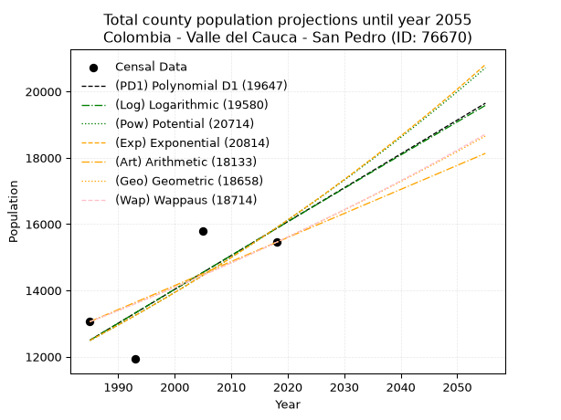
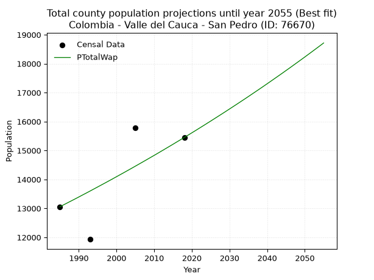
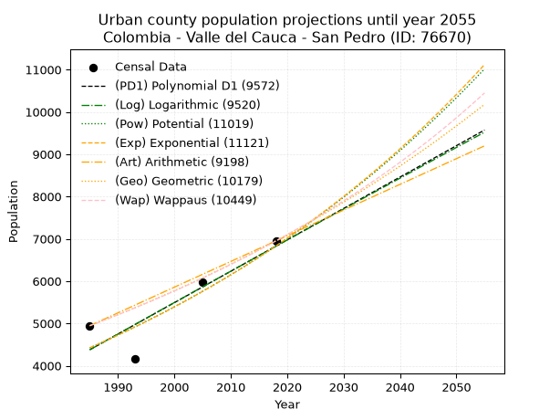
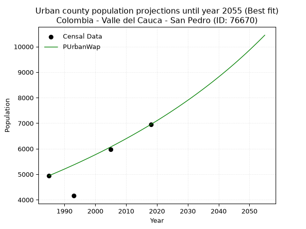
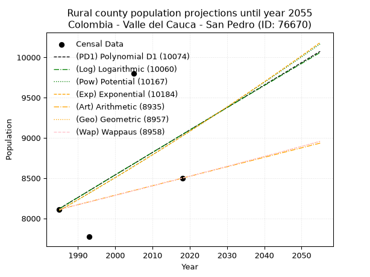
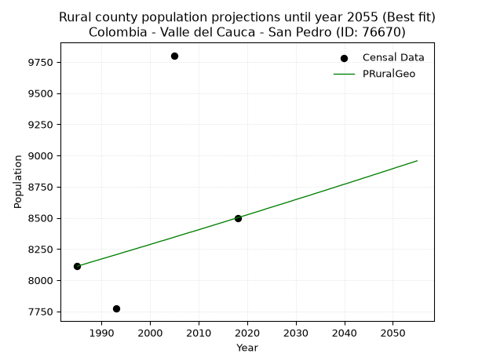

<div align="center">


</div>

# _“Population and Public Services Demand Projections (PPSD) until Year 2050 for Colombia - Valle del Cauca - San Pedro (ID: 76670)”_
Keywords: `population` `public-service` `projection` `lineal` `polynomial` `logarithmic` `potential` `exponential` `arithmetic` `geometric` `wappaus` `dane` `colombia` `south-america`

PPSD are analytical estimates used by governments and planners to anticipate future changes in population size, age distribution, and the resulting community needs for utilities, healthcare, education, and infrastructure as sizing future water treatment facilities, electrical grids, and road networks based on spatial growth.

> **General running parameters**: • app_version: _v20260806_. • Python version: _3.14.7_. • Pandas version: _3.0.5_. • NumPy version: _2.5.1_. • Creates, save and include plots into reports (create_plot): _True_. • Projection until year: _2050_. • Process polynomial degree 2 and up: _False_. • Process Wappaus: _True_. • Process Wappaus: _True_. • Set negative values to zero: _True_. • Set infinite values to zero: _True_. • Drop dataset notes: _True_. 
<div align="center">

Dynamic map: [:earth_americas:Google](http://maps.google.com/maps?q=3.995073115,-76.2286918) [:earth_americas:OSM](https://www.openstreetmap.org/#map=18/3.995073115/-76.2286918&layers=P) [:earth_americas:Bing](https://www.bing.com/maps?cp=3.995073115~-76.2286918&lvl=18) [:earth_americas:Apple](https://maps.apple.com/frame?center=3.995073115%2C-76.2286918&span=0.003%2C0.006)

</div>


<div align="center">

```geojson
{
  "type": "Feature",
  "geometry": {
    "type": "Point", 
    "coordinates": [-76.2286918, 3.995073115]
  }, 
  "properties": {
    "Name": "Colombia - Valle del Cauca - San Pedro (ID: 76670)"
  }
}
```

</div>


## 0. Census Data (4 records)

Census data are official statistics collected by a government about the people and housing in a country. They usually include counts of total population, age, sex, race, income, education, and jobs.

📅Global census file: [Population.xlsx](../data/Population.xlsx)

| Source   |   Year |   CountryID | CountryName   |   StateID | StateName       |   CountyID | CountyName   |   PTotal |   PUrban |   PRural |
|:---------|-------:|------------:|:--------------|----------:|:----------------|-----------:|:-------------|---------:|---------:|---------:|
| DANE     |   1985 |          57 | Colombia      |        76 | Valle del Cauca |      76670 | San Pedro    |    13057 |     4945 |     8112 |
| DANE     |   1993 |          57 | Colombia      |        76 | Valle del Cauca |      76670 | San Pedro    |    11930 |     4158 |     7772 |
| DANE     |   2005 |          57 | Colombia      |        76 | Valle Del Cauca |      76670 | San Pedro    |    15784 |     5982 |     9802 |
| DANE     |   2018 |          57 | Colombia      |        76 | Valle del Cauca |      76670 | San Pedro    |    15450 |     6950 |     8500 |

> 🔥Some records could had specific notes about the registered values or the corresponding urban or rural distribution.

## 1. Total

### 1.1. Coefficients and Parameters

* (PD1) Polynomial Deg 1: 102.12725812926533, -190224.798073063 (lineal)
* (Log) Logarithmic: 204456.35541675778, -1540019.145933183
* (Pow) Potential: 14.60172109898883, -44.05648134993537
* (Exp) Exponential: 0.007294162706514551, 0.006434075758168714
* (Art) Arithmetic: Year diff. 2018 - 1985 = 33, Population diff. 15450 - 13057 = 2393, Annual growth = 72.51515151515152
* (Geo) Geometric: Year diff. 2018 - 1985 = 33, Population diff. 15450 - 13057 = 2393, Annual growth % = 0.005112558538447942
* (Wap) Wappaus: i = 0.508753299295973, Condition values only valid for < 200)

<sub>
Wappaus condition values: ['0.00', '0.51', '1.02', '1.53', '2.04', '2.54', '3.05', '3.56', '4.07', '4.58', '5.09', '5.60', '6.11', '6.61', '7.12', '7.63', '8.14', '8.65', '9.16', '9.67', '10.18', '10.68', '11.19', '11.70', '12.21', '12.72', '13.23', '13.74', '14.25', '14.75', '15.26', '15.77', '16.28', '16.79', '17.30', '17.81', '18.32', '18.82', '19.33', '19.84', '20.35', '20.86', '21.37', '21.88', '22.39', '22.89', '23.40', '23.91', '24.42', '24.93', '25.44', '25.95', '26.46', '26.96', '27.47', '27.98', '28.49', '29.00', '29.51', '30.02', '30.53', '31.03', '31.54', '32.05', '32.56', '33.07']
</sub>


### 1.2. Projected Dataset

|   Year |   CountyID |   PTotalPD1 |   PTotalLog |   PTotalPow |   PTotalExp |   PTotalArt |   PTotalGeo |   PTotalWap |
|-------:|-----------:|------------:|------------:|------------:|------------:|------------:|------------:|------------:|
|   1985 |      76670 |       12498 |       12494 |       12488 |       12491 |       13057 |       13057 |       13057 |
|   1986 |      76670 |       12600 |       12597 |       12580 |       12582 |       13130 |       13124 |       13124 |
|   1987 |      76670 |       12702 |       12700 |       12673 |       12675 |       13202 |       13191 |       13191 |
|   1988 |      76670 |       12804 |       12803 |       12767 |       12767 |       13275 |       13258 |       13258 |
|   1989 |      76670 |       12906 |       12906 |       12861 |       12861 |       13347 |       13326 |       13325 |
|   1990 |      76670 |       13008 |       13009 |       12955 |       12955 |       13420 |       13394 |       13393 |
|   1991 |      76670 |       13111 |       13112 |       13051 |       13050 |       13492 |       13463 |       13462 |
|   1992 |      76670 |       13213 |       13214 |       13147 |       13145 |       13565 |       13532 |       13530 |
|   1993 |      76670 |       13315 |       13317 |       13244 |       13242 |       13637 |       13601 |       13599 |
|   1994 |      76670 |       13417 |       13419 |       13341 |       13339 |       13710 |       13670 |       13669 |
|   1995 |      76670 |       13519 |       13522 |       13439 |       13436 |       13782 |       13740 |       13739 |
|   1996 |      76670 |       13621 |       13624 |       13538 |       13535 |       13855 |       13810 |       13809 |
|   1997 |      76670 |       13723 |       13727 |       13637 |       13634 |       13927 |       13881 |       13879 |
|   1998 |      76670 |       13825 |       13829 |       13737 |       13733 |       14000 |       13952 |       13950 |
|   1999 |      76670 |       13928 |       13931 |       13838 |       13834 |       14072 |       14023 |       14021 |
|   2000 |      76670 |       14030 |       14034 |       13939 |       13935 |       14145 |       14095 |       14093 |
|   2001 |      76670 |       14132 |       14136 |       14041 |       14037 |       14217 |       14167 |       14165 |
|   2002 |      76670 |       14234 |       14238 |       14144 |       14140 |       14290 |       14239 |       14237 |
|   2003 |      76670 |       14336 |       14340 |       14248 |       14244 |       14362 |       14312 |       14310 |
|   2004 |      76670 |       14438 |       14442 |       14352 |       14348 |       14435 |       14385 |       14383 |
|   2005 |      76670 |       14540 |       14544 |       14457 |       14453 |       14507 |       14459 |       14457 |
|   2006 |      76670 |       14642 |       14646 |       14562 |       14559 |       14580 |       14533 |       14531 |
|   2007 |      76670 |       14745 |       14748 |       14669 |       14665 |       14652 |       14607 |       14605 |
|   2008 |      76670 |       14847 |       14850 |       14776 |       14773 |       14725 |       14682 |       14680 |
|   2009 |      76670 |       14949 |       14952 |       14884 |       14881 |       14797 |       14757 |       14755 |
|   2010 |      76670 |       15051 |       15053 |       14992 |       14990 |       14870 |       14832 |       14830 |
|   2011 |      76670 |       15153 |       15155 |       15102 |       15099 |       14942 |       14908 |       14906 |
|   2012 |      76670 |       15255 |       15257 |       15212 |       15210 |       15015 |       14984 |       14983 |
|   2013 |      76670 |       15357 |       15358 |       15322 |       15321 |       15087 |       15061 |       15060 |
|   2014 |      76670 |       15459 |       15460 |       15434 |       15434 |       15160 |       15138 |       15137 |
|   2015 |      76670 |       15562 |       15561 |       15546 |       15546 |       15232 |       15215 |       15214 |
|   2016 |      76670 |       15664 |       15663 |       15659 |       15660 |       15305 |       15293 |       15293 |
|   2017 |      76670 |       15766 |       15764 |       15773 |       15775 |       15377 |       15371 |       15371 |
|   2018 |      76670 |       15868 |       15866 |       15888 |       15890 |       15450 |       15450 |       15450 |
|   2019 |      76670 |       15970 |       15967 |       16003 |       16007 |       15523 |       15529 |       15529 |
|   2020 |      76670 |       16072 |       16068 |       16119 |       16124 |       15595 |       15608 |       15609 |
|   2021 |      76670 |       16174 |       16169 |       16236 |       16242 |       15668 |       15688 |       15689 |
|   2022 |      76670 |       16277 |       16270 |       16354 |       16361 |       15740 |       15768 |       15770 |
|   2023 |      76670 |       16379 |       16371 |       16472 |       16481 |       15813 |       15849 |       15851 |
|   2024 |      76670 |       16481 |       16473 |       16591 |       16601 |       15885 |       15930 |       15933 |
|   2025 |      76670 |       16583 |       16574 |       16711 |       16723 |       15958 |       16011 |       16015 |
|   2026 |      76670 |       16685 |       16674 |       16832 |       16845 |       16030 |       16093 |       16098 |
|   2027 |      76670 |       16787 |       16775 |       16954 |       16969 |       16103 |       16176 |       16181 |
|   2028 |      76670 |       16889 |       16876 |       17077 |       17093 |       16175 |       16258 |       16264 |
|   2029 |      76670 |       16991 |       16977 |       17200 |       17218 |       16248 |       16341 |       16348 |
|   2030 |      76670 |       17094 |       17078 |       17324 |       17344 |       16320 |       16425 |       16433 |
|   2031 |      76670 |       17196 |       17178 |       17449 |       17471 |       16393 |       16509 |       16518 |
|   2032 |      76670 |       17298 |       17279 |       17575 |       17599 |       16465 |       16593 |       16603 |
|   2033 |      76670 |       17400 |       17380 |       17702 |       17728 |       16538 |       16678 |       16689 |
|   2034 |      76670 |       17502 |       17480 |       17829 |       17858 |       16610 |       16763 |       16775 |
|   2035 |      76670 |       17604 |       17581 |       17958 |       17988 |       16683 |       16849 |       16862 |
|   2036 |      76670 |       17706 |       17681 |       18087 |       18120 |       16755 |       16935 |       16950 |
|   2037 |      76670 |       17808 |       17782 |       18217 |       18253 |       16828 |       17022 |       17038 |
|   2038 |      76670 |       17911 |       17882 |       18348 |       18386 |       16900 |       17109 |       17126 |
|   2039 |      76670 |       18013 |       17982 |       18480 |       18521 |       16973 |       17196 |       17215 |
|   2040 |      76670 |       18115 |       18082 |       18613 |       18656 |       17045 |       17284 |       17305 |
|   2041 |      76670 |       18217 |       18183 |       18747 |       18793 |       17118 |       17373 |       17395 |
|   2042 |      76670 |       18319 |       18283 |       18881 |       18931 |       17190 |       17461 |       17486 |
|   2043 |      76670 |       18421 |       18383 |       19017 |       19069 |       17263 |       17551 |       17577 |
|   2044 |      76670 |       18523 |       18483 |       19153 |       19209 |       17335 |       17640 |       17668 |
|   2045 |      76670 |       18625 |       18583 |       19290 |       19349 |       17408 |       17731 |       17761 |
|   2046 |      76670 |       18728 |       18683 |       19428 |       19491 |       17480 |       17821 |       17853 |
|   2047 |      76670 |       18830 |       18783 |       19568 |       19634 |       17553 |       17912 |       17947 |
|   2048 |      76670 |       18932 |       18883 |       19708 |       19777 |       17625 |       18004 |       18041 |
|   2049 |      76670 |       19034 |       18982 |       19849 |       19922 |       17698 |       18096 |       18135 |
|   2050 |      76670 |       19136 |       19082 |       19991 |       20068 |       17770 |       18189 |       18230 |
<div align="center">

</img>

</div>


### 1.3. Best fit with absolute error and relative error (%)

Relative error puts that difference into context by dividing the absolute error by the true value, creating a unitless ratio or percentage that shows the scale of the mistake.

Absolute and relative error

|   Year | Source   |   CountryID | CountryName   |   StateID | StateName       |   CountyID_x | CountyName   |   PTotal |   PUrban |   PRural |   CountyID_y |   PTotalPD1 |   PTotalLog |   PTotalPow |   PTotalExp |   PTotalArt |   PTotalGeo |   PTotalWap |   PTotalPD1AbsError |   PTotalLogAbsError |   PTotalPowAbsError |   PTotalExpAbsError |   PTotalArtAbsError |   PTotalGeoAbsError |   PTotalWapAbsError |   PTotalPD1RelError |   PTotalLogRelError |   PTotalPowRelError |   PTotalExpRelError |   PTotalArtRelError |   PTotalGeoRelError |   PTotalWapRelError |
|-------:|:---------|------------:|:--------------|----------:|:----------------|-------------:|:-------------|---------:|---------:|---------:|-------------:|------------:|------------:|------------:|------------:|------------:|------------:|------------:|--------------------:|--------------------:|--------------------:|--------------------:|--------------------:|--------------------:|--------------------:|--------------------:|--------------------:|--------------------:|--------------------:|--------------------:|--------------------:|--------------------:|
|   1985 | DANE     |          57 | Colombia      |        76 | Valle del Cauca |        76670 | San Pedro    |    13057 |     4945 |     8112 |        76670 |       12498 |       12494 |       12488 |       12491 |       13057 |       13057 |       13057 |                 559 |                 563 |                 569 |                 566 |                   0 |                   0 |                   0 |             4.28123 |             4.31186 |             4.35782 |             4.33484 |             0       |             0       |             0       |
|   1993 | DANE     |          57 | Colombia      |        76 | Valle del Cauca |        76670 | San Pedro    |    11930 |     4158 |     7772 |        76670 |       13315 |       13317 |       13244 |       13242 |       13637 |       13601 |       13599 |                1385 |                1387 |                1314 |                1312 |                1707 |                1671 |                1669 |            11.6094  |            11.6262  |            11.0142  |            10.9975  |            14.3085  |            14.0067  |            13.9899  |
|   2005 | DANE     |          57 | Colombia      |        76 | Valle Del Cauca |        76670 | San Pedro    |    15784 |     5982 |     9802 |        76670 |       14540 |       14544 |       14457 |       14453 |       14507 |       14459 |       14457 |                1244 |                1240 |                1327 |                1331 |                1277 |                1325 |                1327 |             7.8814  |             7.85606 |             8.40725 |             8.43259 |             8.09047 |             8.39458 |             8.40725 |
|   2018 | DANE     |          57 | Colombia      |        76 | Valle del Cauca |        76670 | San Pedro    |    15450 |     6950 |     8500 |        76670 |       15868 |       15866 |       15888 |       15890 |       15450 |       15450 |       15450 |                 418 |                 416 |                 438 |                 440 |                   0 |                   0 |                   0 |             2.7055  |             2.69256 |             2.83495 |             2.8479  |             0       |             0       |             0       |

Relative error mean

| Method    |   RelError | Best   |
|:----------|-----------:|:-------|
| PTotalPD1 |    6.61938 |        |
| PTotalLog |    6.62166 |        |
| PTotalPow |    6.65357 |        |
| PTotalExp |    6.6532  |        |
| PTotalArt |    5.59973 |        |
| PTotalGeo |    5.60032 |        |
| PTotalWap |    5.5993  | True   |

💙Best method: _**PTotalWap**_
<div align="center">

</img>

</div>


### 1.4. Fresh water supply demand in liters per capita per day (lpcd)

The fresh water supply demand typically ranges from 100 to 300 liters per capita per day (lpcd) for standard domestic and municipal planning, though absolute survival minimums set by the World Health Organization are as low as 7.5 to 20 liters per day, and total consumption in high-income nations can exceed 400 liters.

> `CZ`: Level in meters above the sea level (masl).<br> `WS`: Fresh water supply demand in liters per capita per day (lpcd or l/h/d).<br> `WSAll`: Zonal fresh water supply demand in liters per second (l/s).<br> `A`: Zonal area in square meters.

Reference values (RAS Colombia)

|    CZ |   WS |
|------:|-----:|
|  1000 |  120 |
|  2000 |  130 |
| 99999 |  140 |

County shapefile geometry properties and water supply values

|   CountyID |      ATotal |   CZTotal |   WSTotal |
|-----------:|------------:|----------:|----------:|
|      76670 | 2.02227e+08 |   1279.23 |       130 |

Projected values for best method: PTotalWap

|   CountyID |   Year |   PTotalWap |   WSTotal |   WSTotalAll |
|-----------:|-------:|------------:|----------:|-------------:|
|      76670 |   1985 |       13057 |       130 |      19.6459 |
|      76670 |   1986 |       13124 |       130 |      19.7468 |
|      76670 |   1987 |       13191 |       130 |      19.8476 |
|      76670 |   1988 |       13258 |       130 |      19.9484 |
|      76670 |   1989 |       13325 |       130 |      20.0492 |
|      76670 |   1990 |       13393 |       130 |      20.1515 |
|      76670 |   1991 |       13462 |       130 |      20.2553 |
|      76670 |   1992 |       13530 |       130 |      20.3576 |
|      76670 |   1993 |       13599 |       130 |      20.4615 |
|      76670 |   1994 |       13669 |       130 |      20.5668 |
|      76670 |   1995 |       13739 |       130 |      20.6721 |
|      76670 |   1996 |       13809 |       130 |      20.7774 |
|      76670 |   1997 |       13879 |       130 |      20.8828 |
|      76670 |   1998 |       13950 |       130 |      20.9896 |
|      76670 |   1999 |       14021 |       130 |      21.0964 |
|      76670 |   2000 |       14093 |       130 |      21.2047 |
|      76670 |   2001 |       14165 |       130 |      21.3131 |
|      76670 |   2002 |       14237 |       130 |      21.4214 |
|      76670 |   2003 |       14310 |       130 |      21.5312 |
|      76670 |   2004 |       14383 |       130 |      21.6411 |
|      76670 |   2005 |       14457 |       130 |      21.7524 |
|      76670 |   2006 |       14531 |       130 |      21.8638 |
|      76670 |   2007 |       14605 |       130 |      21.9751 |
|      76670 |   2008 |       14680 |       130 |      22.088  |
|      76670 |   2009 |       14755 |       130 |      22.2008 |
|      76670 |   2010 |       14830 |       130 |      22.3137 |
|      76670 |   2011 |       14906 |       130 |      22.428  |
|      76670 |   2012 |       14983 |       130 |      22.5439 |
|      76670 |   2013 |       15060 |       130 |      22.6597 |
|      76670 |   2014 |       15137 |       130 |      22.7756 |
|      76670 |   2015 |       15214 |       130 |      22.8914 |
|      76670 |   2016 |       15293 |       130 |      23.0103 |
|      76670 |   2017 |       15371 |       130 |      23.1277 |
|      76670 |   2018 |       15450 |       130 |      23.2465 |
|      76670 |   2019 |       15529 |       130 |      23.3654 |
|      76670 |   2020 |       15609 |       130 |      23.4858 |
|      76670 |   2021 |       15689 |       130 |      23.6061 |
|      76670 |   2022 |       15770 |       130 |      23.728  |
|      76670 |   2023 |       15851 |       130 |      23.8499 |
|      76670 |   2024 |       15933 |       130 |      23.9733 |
|      76670 |   2025 |       16015 |       130 |      24.0966 |
|      76670 |   2026 |       16098 |       130 |      24.2215 |
|      76670 |   2027 |       16181 |       130 |      24.3464 |
|      76670 |   2028 |       16264 |       130 |      24.4713 |
|      76670 |   2029 |       16348 |       130 |      24.5977 |
|      76670 |   2030 |       16433 |       130 |      24.7256 |
|      76670 |   2031 |       16518 |       130 |      24.8535 |
|      76670 |   2032 |       16603 |       130 |      24.9814 |
|      76670 |   2033 |       16689 |       130 |      25.1108 |
|      76670 |   2034 |       16775 |       130 |      25.2402 |
|      76670 |   2035 |       16862 |       130 |      25.3711 |
|      76670 |   2036 |       16950 |       130 |      25.5035 |
|      76670 |   2037 |       17038 |       130 |      25.6359 |
|      76670 |   2038 |       17126 |       130 |      25.7683 |
|      76670 |   2039 |       17215 |       130 |      25.9022 |
|      76670 |   2040 |       17305 |       130 |      26.0376 |
|      76670 |   2041 |       17395 |       130 |      26.173  |
|      76670 |   2042 |       17486 |       130 |      26.31   |
|      76670 |   2043 |       17577 |       130 |      26.4469 |
|      76670 |   2044 |       17668 |       130 |      26.5838 |
|      76670 |   2045 |       17761 |       130 |      26.7237 |
|      76670 |   2046 |       17853 |       130 |      26.8622 |
|      76670 |   2047 |       17947 |       130 |      27.0036 |
|      76670 |   2048 |       18041 |       130 |      27.145  |
|      76670 |   2049 |       18135 |       130 |      27.2865 |
|      76670 |   2050 |       18230 |       130 |      27.4294 |

## 2. Urban

### 2.1. Coefficients and Parameters

* (PD1) Polynomial Deg 1: 74.21959052589249, -142948.98594941644 (lineal)
* (Log) Logarithmic: 148453.76151285815, -1122889.4808930194
* (Pow) Potential: 26.345287070011366, -83.23482007141487
* (Exp) Exponential: 0.013171423408550266, 1.9542828423017462e-08
* (Art) Arithmetic: Year diff. 2018 - 1985 = 33, Population diff. 6950 - 4945 = 2005, Annual growth = 60.75757575757576
* (Geo) Geometric: Year diff. 2018 - 1985 = 33, Population diff. 6950 - 4945 = 2005, Annual growth % = 0.01036745513338988
* (Wap) Wappaus: i = 1.0215649559911855, Condition values only valid for < 200)

<sub>
Wappaus condition values: ['0.00', '1.02', '2.04', '3.06', '4.09', '5.11', '6.13', '7.15', '8.17', '9.19', '10.22', '11.24', '12.26', '13.28', '14.30', '15.32', '16.35', '17.37', '18.39', '19.41', '20.43', '21.45', '22.47', '23.50', '24.52', '25.54', '26.56', '27.58', '28.60', '29.63', '30.65', '31.67', '32.69', '33.71', '34.73', '35.75', '36.78', '37.80', '38.82', '39.84', '40.86', '41.88', '42.91', '43.93', '44.95', '45.97', '46.99', '48.01', '49.04', '50.06', '51.08', '52.10', '53.12', '54.14', '55.16', '56.19', '57.21', '58.23', '59.25', '60.27', '61.29', '62.32', '63.34', '64.36', '65.38', '66.40']
</sub>


### 2.2. Projected Dataset

|   Year |   CountyID |   PUrbanPD1 |   PUrbanLog |   PUrbanPow |   PUrbanExp |   PUrbanArt |   PUrbanGeo |   PUrbanWap |
|-------:|-----------:|------------:|------------:|------------:|------------:|------------:|------------:|------------:|
|   1985 |      76670 |        4377 |        4375 |        4422 |        4423 |        4945 |        4945 |        4945 |
|   1986 |      76670 |        4451 |        4450 |        4481 |        4482 |        5006 |        4996 |        4996 |
|   1987 |      76670 |        4525 |        4525 |        4541 |        4541 |        5067 |        5048 |        5047 |
|   1988 |      76670 |        4600 |        4600 |        4602 |        4601 |        5127 |        5100 |        5099 |
|   1989 |      76670 |        4674 |        4674 |        4663 |        4662 |        5188 |        5153 |        5151 |
|   1990 |      76670 |        4748 |        4749 |        4725 |        4724 |        5249 |        5207 |        5204 |
|   1991 |      76670 |        4822 |        4824 |        4788 |        4787 |        5310 |        5261 |        5258 |
|   1992 |      76670 |        4896 |        4898 |        4852 |        4850 |        5370 |        5315 |        5312 |
|   1993 |      76670 |        4971 |        4973 |        4916 |        4915 |        5431 |        5370 |        5366 |
|   1994 |      76670 |        5045 |        5047 |        4982 |        4980 |        5492 |        5426 |        5422 |
|   1995 |      76670 |        5119 |        5121 |        5048 |        5046 |        5553 |        5482 |        5477 |
|   1996 |      76670 |        5193 |        5196 |        5115 |        5113 |        5613 |        5539 |        5534 |
|   1997 |      76670 |        5268 |        5270 |        5183 |        5181 |        5674 |        5597 |        5591 |
|   1998 |      76670 |        5342 |        5345 |        5252 |        5249 |        5735 |        5655 |        5648 |
|   1999 |      76670 |        5416 |        5419 |        5322 |        5319 |        5796 |        5713 |        5707 |
|   2000 |      76670 |        5490 |        5493 |        5392 |        5389 |        5856 |        5772 |        5766 |
|   2001 |      76670 |        5564 |        5567 |        5464 |        5461 |        5917 |        5832 |        5825 |
|   2002 |      76670 |        5639 |        5641 |        5536 |        5533 |        5978 |        5893 |        5885 |
|   2003 |      76670 |        5713 |        5716 |        5609 |        5607 |        6039 |        5954 |        5946 |
|   2004 |      76670 |        5787 |        5790 |        5684 |        5681 |        6099 |        6016 |        6008 |
|   2005 |      76670 |        5861 |        5864 |        5759 |        5756 |        6160 |        6078 |        6070 |
|   2006 |      76670 |        5936 |        5938 |        5835 |        5833 |        6221 |        6141 |        6133 |
|   2007 |      76670 |        6010 |        6012 |        5912 |        5910 |        6282 |        6205 |        6197 |
|   2008 |      76670 |        6084 |        6086 |        5990 |        5988 |        6342 |        6269 |        6262 |
|   2009 |      76670 |        6158 |        6160 |        6069 |        6068 |        6403 |        6334 |        6327 |
|   2010 |      76670 |        6232 |        6233 |        6149 |        6148 |        6464 |        6400 |        6393 |
|   2011 |      76670 |        6307 |        6307 |        6230 |        6230 |        6525 |        6466 |        6460 |
|   2012 |      76670 |        6381 |        6381 |        6313 |        6312 |        6585 |        6533 |        6527 |
|   2013 |      76670 |        6455 |        6455 |        6396 |        6396 |        6646 |        6601 |        6596 |
|   2014 |      76670 |        6529 |        6529 |        6480 |        6481 |        6707 |        6669 |        6665 |
|   2015 |      76670 |        6603 |        6602 |        6565 |        6567 |        6768 |        6738 |        6735 |
|   2016 |      76670 |        6678 |        6676 |        6652 |        6654 |        6828 |        6808 |        6806 |
|   2017 |      76670 |        6752 |        6750 |        6739 |        6742 |        6889 |        6879 |        6877 |
|   2018 |      76670 |        6826 |        6823 |        6828 |        6831 |        6950 |        6950 |        6950 |
|   2019 |      76670 |        6900 |        6897 |        6917 |        6922 |        7011 |        7022 |        7024 |
|   2020 |      76670 |        6975 |        6970 |        7008 |        7014 |        7072 |        7095 |        7098 |
|   2021 |      76670 |        7049 |        7044 |        7100 |        7107 |        7132 |        7168 |        7173 |
|   2022 |      76670 |        7123 |        7117 |        7193 |        7201 |        7193 |        7243 |        7250 |
|   2023 |      76670 |        7197 |        7191 |        7288 |        7296 |        7254 |        7318 |        7327 |
|   2024 |      76670 |        7271 |        7264 |        7383 |        7393 |        7315 |        7394 |        7405 |
|   2025 |      76670 |        7346 |        7337 |        7480 |        7491 |        7375 |        7470 |        7485 |
|   2026 |      76670 |        7420 |        7411 |        7578 |        7590 |        7436 |        7548 |        7565 |
|   2027 |      76670 |        7494 |        7484 |        7677 |        7691 |        7497 |        7626 |        7646 |
|   2028 |      76670 |        7568 |        7557 |        7777 |        7793 |        7558 |        7705 |        7729 |
|   2029 |      76670 |        7643 |        7630 |        7879 |        7896 |        7618 |        7785 |        7812 |
|   2030 |      76670 |        7717 |        7703 |        7982 |        8001 |        7679 |        7866 |        7897 |
|   2031 |      76670 |        7791 |        7776 |        8086 |        8107 |        7740 |        7947 |        7982 |
|   2032 |      76670 |        7865 |        7850 |        8192 |        8215 |        7801 |        8030 |        8069 |
|   2033 |      76670 |        7939 |        7923 |        8299 |        8324 |        7861 |        8113 |        8157 |
|   2034 |      76670 |        8014 |        7996 |        8407 |        8434 |        7922 |        8197 |        8247 |
|   2035 |      76670 |        8088 |        8069 |        8516 |        8546 |        7983 |        8282 |        8337 |
|   2036 |      76670 |        8162 |        8141 |        8627 |        8659 |        8044 |        8368 |        8429 |
|   2037 |      76670 |        8236 |        8214 |        8740 |        8774 |        8104 |        8455 |        8522 |
|   2038 |      76670 |        8311 |        8287 |        8853 |        8890 |        8165 |        8542 |        8616 |
|   2039 |      76670 |        8385 |        8360 |        8969 |        9008 |        8226 |        8631 |        8712 |
|   2040 |      76670 |        8459 |        8433 |        9085 |        9127 |        8287 |        8720 |        8809 |
|   2041 |      76670 |        8533 |        8506 |        9203 |        9249 |        8347 |        8811 |        8907 |
|   2042 |      76670 |        8607 |        8578 |        9323 |        9371 |        8408 |        8902 |        9007 |
|   2043 |      76670 |        8682 |        8651 |        9444 |        9495 |        8469 |        8994 |        9108 |
|   2044 |      76670 |        8756 |        8724 |        9566 |        9621 |        8530 |        9088 |        9211 |
|   2045 |      76670 |        8830 |        8796 |        9690 |        9749 |        8590 |        9182 |        9315 |
|   2046 |      76670 |        8904 |        8869 |        9816 |        9878 |        8651 |        9277 |        9421 |
|   2047 |      76670 |        8979 |        8941 |        9943 |       10009 |        8712 |        9373 |        9529 |
|   2048 |      76670 |        9053 |        9014 |       10072 |       10142 |        8773 |        9470 |        9638 |
|   2049 |      76670 |        9127 |        9086 |       10202 |       10276 |        8833 |        9569 |        9748 |
|   2050 |      76670 |        9201 |        9159 |       10334 |       10412 |        8894 |        9668 |        9861 |
<div align="center">

</img>

</div>


### 2.3. Best fit with absolute error and relative error (%)

Relative error puts that difference into context by dividing the absolute error by the true value, creating a unitless ratio or percentage that shows the scale of the mistake.

Absolute and relative error

|   Year | Source   |   CountryID | CountryName   |   StateID | StateName       |   CountyID_x | CountyName   |   PTotal |   PUrban |   PRural |   CountyID_y |   PUrbanPD1 |   PUrbanLog |   PUrbanPow |   PUrbanExp |   PUrbanArt |   PUrbanGeo |   PUrbanWap |   PUrbanPD1AbsError |   PUrbanLogAbsError |   PUrbanPowAbsError |   PUrbanExpAbsError |   PUrbanArtAbsError |   PUrbanGeoAbsError |   PUrbanWapAbsError |   PUrbanPD1RelError |   PUrbanLogRelError |   PUrbanPowRelError |   PUrbanExpRelError |   PUrbanArtRelError |   PUrbanGeoRelError |   PUrbanWapRelError |
|-------:|:---------|------------:|:--------------|----------:|:----------------|-------------:|:-------------|---------:|---------:|---------:|-------------:|------------:|------------:|------------:|------------:|------------:|------------:|------------:|--------------------:|--------------------:|--------------------:|--------------------:|--------------------:|--------------------:|--------------------:|--------------------:|--------------------:|--------------------:|--------------------:|--------------------:|--------------------:|--------------------:|
|   1985 | DANE     |          57 | Colombia      |        76 | Valle del Cauca |        76670 | San Pedro    |    13057 |     4945 |     8112 |        76670 |        4377 |        4375 |        4422 |        4423 |        4945 |        4945 |        4945 |                 568 |                 570 |                 523 |                 522 |                   0 |                   0 |                   0 |            11.4863  |            11.5268  |            10.5763  |            10.5561  |             0       |             0       |             0       |
|   1993 | DANE     |          57 | Colombia      |        76 | Valle del Cauca |        76670 | San Pedro    |    11930 |     4158 |     7772 |        76670 |        4971 |        4973 |        4916 |        4915 |        5431 |        5370 |        5366 |                 813 |                 815 |                 758 |                 757 |                1273 |                1212 |                1208 |            19.5527  |            19.6008  |            18.2299  |            18.2059  |            30.6157  |            29.1486  |            29.0524  |
|   2005 | DANE     |          57 | Colombia      |        76 | Valle Del Cauca |        76670 | San Pedro    |    15784 |     5982 |     9802 |        76670 |        5861 |        5864 |        5759 |        5756 |        6160 |        6078 |        6070 |                 121 |                 118 |                 223 |                 226 |                 178 |                  96 |                  88 |             2.02273 |             1.97258 |             3.72785 |             3.778   |             2.97559 |             1.60481 |             1.47108 |
|   2018 | DANE     |          57 | Colombia      |        76 | Valle del Cauca |        76670 | San Pedro    |    15450 |     6950 |     8500 |        76670 |        6826 |        6823 |        6828 |        6831 |        6950 |        6950 |        6950 |                 124 |                 127 |                 122 |                 119 |                   0 |                   0 |                   0 |             1.78417 |             1.82734 |             1.7554  |             1.71223 |             0       |             0       |             0       |

Relative error mean

| Method    |   RelError | Best   |
|:----------|-----------:|:-------|
| PUrbanPD1 |    8.71148 |        |
| PUrbanLog |    8.73187 |        |
| PUrbanPow |    8.57238 |        |
| PUrbanExp |    8.56305 |        |
| PUrbanArt |    8.39782 |        |
| PUrbanGeo |    7.68836 |        |
| PUrbanWap |    7.63088 | True   |

💙Best method: _**PUrbanWap**_
<div align="center">

</img>

</div>


### 2.4. Fresh water supply demand in liters per capita per day (lpcd)

The fresh water supply demand typically ranges from 100 to 300 liters per capita per day (lpcd) for standard domestic and municipal planning, though absolute survival minimums set by the World Health Organization are as low as 7.5 to 20 liters per day, and total consumption in high-income nations can exceed 400 liters.

> `CZ`: Level in meters above the sea level (masl).<br> `WS`: Fresh water supply demand in liters per capita per day (lpcd or l/h/d).<br> `WSAll`: Zonal fresh water supply demand in liters per second (l/s).<br> `A`: Zonal area in square meters.

Reference values (RAS Colombia)

|    CZ |   WS |
|------:|-----:|
|  1000 |  120 |
|  2000 |  130 |
| 99999 |  140 |

County shapefile geometry properties and water supply values

|   CountyID |      AUrban |   CZUrban |   WSUrban |
|-----------:|------------:|----------:|----------:|
|      76670 | 1.11634e+06 |   986.997 |       120 |

Projected values for best method: PUrbanWap

|   CountyID |   Year |   PUrbanWap |   WSUrban |   WSUrbanAll |
|-----------:|-------:|------------:|----------:|-------------:|
|      76670 |   1985 |        4945 |       120 |      6.86806 |
|      76670 |   1986 |        4996 |       120 |      6.93889 |
|      76670 |   1987 |        5047 |       120 |      7.00972 |
|      76670 |   1988 |        5099 |       120 |      7.08194 |
|      76670 |   1989 |        5151 |       120 |      7.15417 |
|      76670 |   1990 |        5204 |       120 |      7.22778 |
|      76670 |   1991 |        5258 |       120 |      7.30278 |
|      76670 |   1992 |        5312 |       120 |      7.37778 |
|      76670 |   1993 |        5366 |       120 |      7.45278 |
|      76670 |   1994 |        5422 |       120 |      7.53056 |
|      76670 |   1995 |        5477 |       120 |      7.60694 |
|      76670 |   1996 |        5534 |       120 |      7.68611 |
|      76670 |   1997 |        5591 |       120 |      7.76528 |
|      76670 |   1998 |        5648 |       120 |      7.84444 |
|      76670 |   1999 |        5707 |       120 |      7.92639 |
|      76670 |   2000 |        5766 |       120 |      8.00833 |
|      76670 |   2001 |        5825 |       120 |      8.09028 |
|      76670 |   2002 |        5885 |       120 |      8.17361 |
|      76670 |   2003 |        5946 |       120 |      8.25833 |
|      76670 |   2004 |        6008 |       120 |      8.34444 |
|      76670 |   2005 |        6070 |       120 |      8.43056 |
|      76670 |   2006 |        6133 |       120 |      8.51806 |
|      76670 |   2007 |        6197 |       120 |      8.60694 |
|      76670 |   2008 |        6262 |       120 |      8.69722 |
|      76670 |   2009 |        6327 |       120 |      8.7875  |
|      76670 |   2010 |        6393 |       120 |      8.87917 |
|      76670 |   2011 |        6460 |       120 |      8.97222 |
|      76670 |   2012 |        6527 |       120 |      9.06528 |
|      76670 |   2013 |        6596 |       120 |      9.16111 |
|      76670 |   2014 |        6665 |       120 |      9.25694 |
|      76670 |   2015 |        6735 |       120 |      9.35417 |
|      76670 |   2016 |        6806 |       120 |      9.45278 |
|      76670 |   2017 |        6877 |       120 |      9.55139 |
|      76670 |   2018 |        6950 |       120 |      9.65278 |
|      76670 |   2019 |        7024 |       120 |      9.75556 |
|      76670 |   2020 |        7098 |       120 |      9.85833 |
|      76670 |   2021 |        7173 |       120 |      9.9625  |
|      76670 |   2022 |        7250 |       120 |     10.0694  |
|      76670 |   2023 |        7327 |       120 |     10.1764  |
|      76670 |   2024 |        7405 |       120 |     10.2847  |
|      76670 |   2025 |        7485 |       120 |     10.3958  |
|      76670 |   2026 |        7565 |       120 |     10.5069  |
|      76670 |   2027 |        7646 |       120 |     10.6194  |
|      76670 |   2028 |        7729 |       120 |     10.7347  |
|      76670 |   2029 |        7812 |       120 |     10.85    |
|      76670 |   2030 |        7897 |       120 |     10.9681  |
|      76670 |   2031 |        7982 |       120 |     11.0861  |
|      76670 |   2032 |        8069 |       120 |     11.2069  |
|      76670 |   2033 |        8157 |       120 |     11.3292  |
|      76670 |   2034 |        8247 |       120 |     11.4542  |
|      76670 |   2035 |        8337 |       120 |     11.5792  |
|      76670 |   2036 |        8429 |       120 |     11.7069  |
|      76670 |   2037 |        8522 |       120 |     11.8361  |
|      76670 |   2038 |        8616 |       120 |     11.9667  |
|      76670 |   2039 |        8712 |       120 |     12.1     |
|      76670 |   2040 |        8809 |       120 |     12.2347  |
|      76670 |   2041 |        8907 |       120 |     12.3708  |
|      76670 |   2042 |        9007 |       120 |     12.5097  |
|      76670 |   2043 |        9108 |       120 |     12.65    |
|      76670 |   2044 |        9211 |       120 |     12.7931  |
|      76670 |   2045 |        9315 |       120 |     12.9375  |
|      76670 |   2046 |        9421 |       120 |     13.0847  |
|      76670 |   2047 |        9529 |       120 |     13.2347  |
|      76670 |   2048 |        9638 |       120 |     13.3861  |
|      76670 |   2049 |        9748 |       120 |     13.5389  |
|      76670 |   2050 |        9861 |       120 |     13.6958  |

## 3. Rural

### 3.1. Coefficients and Parameters

* (PD1) Polynomial Deg 1: 27.90766760337279, -47275.81212364642 (lineal)
* (Log) Logarithmic: 56002.59390389972, -417129.6650401645
* (Pow) Potential: 6.567801786847873, -17.750713192395253
* (Exp) Exponential: 0.0032735971175334535, 12.199241671368412
* (Art) Arithmetic: Year diff. 2018 - 1985 = 33, Population diff. 8500 - 8112 = 388, Annual growth = 11.757575757575758
* (Geo) Geometric: Year diff. 2018 - 1985 = 33, Population diff. 8500 - 8112 = 388, Annual growth % = 0.0014168123269520105
* (Wap) Wappaus: i = 0.14155521018030048, Condition values only valid for < 200)

<sub>
Wappaus condition values: ['0.00', '0.14', '0.28', '0.42', '0.57', '0.71', '0.85', '0.99', '1.13', '1.27', '1.42', '1.56', '1.70', '1.84', '1.98', '2.12', '2.26', '2.41', '2.55', '2.69', '2.83', '2.97', '3.11', '3.26', '3.40', '3.54', '3.68', '3.82', '3.96', '4.11', '4.25', '4.39', '4.53', '4.67', '4.81', '4.95', '5.10', '5.24', '5.38', '5.52', '5.66', '5.80', '5.95', '6.09', '6.23', '6.37', '6.51', '6.65', '6.79', '6.94', '7.08', '7.22', '7.36', '7.50', '7.64', '7.79', '7.93', '8.07', '8.21', '8.35', '8.49', '8.63', '8.78', '8.92', '9.06', '9.20']
</sub>


### 3.2. Projected Dataset

|   Year |   CountyID |   PRuralPD1 |   PRuralLog |   PRuralPow |   PRuralExp |   PRuralArt |   PRuralGeo |   PRuralWap |
|-------:|-----------:|------------:|------------:|------------:|------------:|------------:|------------:|------------:|
|   1985 |      76670 |        8121 |        8119 |        8097 |        8099 |        8112 |        8112 |        8112 |
|   1986 |      76670 |        8149 |        8147 |        8124 |        8125 |        8124 |        8123 |        8123 |
|   1987 |      76670 |        8177 |        8175 |        8151 |        8152 |        8136 |        8135 |        8135 |
|   1988 |      76670 |        8205 |        8204 |        8178 |        8179 |        8147 |        8147 |        8147 |
|   1989 |      76670 |        8233 |        8232 |        8205 |        8205 |        8159 |        8158 |        8158 |
|   1990 |      76670 |        8260 |        8260 |        8232 |        8232 |        8171 |        8170 |        8170 |
|   1991 |      76670 |        8288 |        8288 |        8259 |        8259 |        8183 |        8181 |        8181 |
|   1992 |      76670 |        8316 |        8316 |        8286 |        8286 |        8194 |        8193 |        8193 |
|   1993 |      76670 |        8344 |        8344 |        8314 |        8314 |        8206 |        8204 |        8204 |
|   1994 |      76670 |        8372 |        8372 |        8341 |        8341 |        8218 |        8216 |        8216 |
|   1995 |      76670 |        8400 |        8400 |        8369 |        8368 |        8230 |        8228 |        8228 |
|   1996 |      76670 |        8428 |        8428 |        8396 |        8396 |        8241 |        8239 |        8239 |
|   1997 |      76670 |        8456 |        8457 |        8424 |        8423 |        8253 |        8251 |        8251 |
|   1998 |      76670 |        8484 |        8485 |        8452 |        8451 |        8265 |        8263 |        8263 |
|   1999 |      76670 |        8512 |        8513 |        8480 |        8479 |        8277 |        8274 |        8274 |
|   2000 |      76670 |        8540 |        8541 |        8507 |        8506 |        8288 |        8286 |        8286 |
|   2001 |      76670 |        8567 |        8569 |        8535 |        8534 |        8300 |        8298 |        8298 |
|   2002 |      76670 |        8595 |        8597 |        8563 |        8562 |        8312 |        8310 |        8310 |
|   2003 |      76670 |        8623 |        8625 |        8592 |        8590 |        8324 |        8321 |        8321 |
|   2004 |      76670 |        8651 |        8652 |        8620 |        8618 |        8335 |        8333 |        8333 |
|   2005 |      76670 |        8679 |        8680 |        8648 |        8647 |        8347 |        8345 |        8345 |
|   2006 |      76670 |        8707 |        8708 |        8676 |        8675 |        8359 |        8357 |        8357 |
|   2007 |      76670 |        8735 |        8736 |        8705 |        8704 |        8371 |        8369 |        8369 |
|   2008 |      76670 |        8763 |        8764 |        8733 |        8732 |        8382 |        8381 |        8380 |
|   2009 |      76670 |        8791 |        8792 |        8762 |        8761 |        8394 |        8392 |        8392 |
|   2010 |      76670 |        8819 |        8820 |        8791 |        8789 |        8406 |        8404 |        8404 |
|   2011 |      76670 |        8847 |        8848 |        8819 |        8818 |        8418 |        8416 |        8416 |
|   2012 |      76670 |        8874 |        8876 |        8848 |        8847 |        8429 |        8428 |        8428 |
|   2013 |      76670 |        8902 |        8903 |        8877 |        8876 |        8441 |        8440 |        8440 |
|   2014 |      76670 |        8930 |        8931 |        8906 |        8905 |        8453 |        8452 |        8452 |
|   2015 |      76670 |        8958 |        8959 |        8935 |        8934 |        8465 |        8464 |        8464 |
|   2016 |      76670 |        8986 |        8987 |        8964 |        8964 |        8476 |        8476 |        8476 |
|   2017 |      76670 |        9014 |        9015 |        8994 |        8993 |        8488 |        8488 |        8488 |
|   2018 |      76670 |        9042 |        9042 |        9023 |        9023 |        8500 |        8500 |        8500 |
|   2019 |      76670 |        9070 |        9070 |        9052 |        9052 |        8512 |        8512 |        8512 |
|   2020 |      76670 |        9098 |        9098 |        9082 |        9082 |        8524 |        8524 |        8524 |
|   2021 |      76670 |        9126 |        9126 |        9112 |        9112 |        8535 |        8536 |        8536 |
|   2022 |      76670 |        9153 |        9153 |        9141 |        9142 |        8547 |        8548 |        8548 |
|   2023 |      76670 |        9181 |        9181 |        9171 |        9172 |        8559 |        8560 |        8560 |
|   2024 |      76670 |        9209 |        9209 |        9201 |        9202 |        8571 |        8573 |        8573 |
|   2025 |      76670 |        9237 |        9236 |        9231 |        9232 |        8582 |        8585 |        8585 |
|   2026 |      76670 |        9265 |        9264 |        9261 |        9262 |        8594 |        8597 |        8597 |
|   2027 |      76670 |        9293 |        9292 |        9291 |        9292 |        8606 |        8609 |        8609 |
|   2028 |      76670 |        9321 |        9319 |        9321 |        9323 |        8618 |        8621 |        8621 |
|   2029 |      76670 |        9349 |        9347 |        9351 |        9353 |        8629 |        8633 |        8633 |
|   2030 |      76670 |        9377 |        9374 |        9381 |        9384 |        8641 |        8646 |        8646 |
|   2031 |      76670 |        9405 |        9402 |        9412 |        9415 |        8653 |        8658 |        8658 |
|   2032 |      76670 |        9433 |        9430 |        9442 |        9446 |        8665 |        8670 |        8670 |
|   2033 |      76670 |        9460 |        9457 |        9473 |        9477 |        8676 |        8682 |        8683 |
|   2034 |      76670 |        9488 |        9485 |        9503 |        9508 |        8688 |        8695 |        8695 |
|   2035 |      76670 |        9516 |        9512 |        9534 |        9539 |        8700 |        8707 |        8707 |
|   2036 |      76670 |        9544 |        9540 |        9565 |        9570 |        8712 |        8719 |        8720 |
|   2037 |      76670 |        9572 |        9567 |        9596 |        9602 |        8723 |        8732 |        8732 |
|   2038 |      76670 |        9600 |        9595 |        9627 |        9633 |        8735 |        8744 |        8744 |
|   2039 |      76670 |        9628 |        9622 |        9658 |        9665 |        8747 |        8757 |        8757 |
|   2040 |      76670 |        9656 |        9650 |        9689 |        9696 |        8759 |        8769 |        8769 |
|   2041 |      76670 |        9684 |        9677 |        9720 |        9728 |        8770 |        8781 |        8782 |
|   2042 |      76670 |        9712 |        9704 |        9752 |        9760 |        8782 |        8794 |        8794 |
|   2043 |      76670 |        9740 |        9732 |        9783 |        9792 |        8794 |        8806 |        8807 |
|   2044 |      76670 |        9767 |        9759 |        9815 |        9824 |        8806 |        8819 |        8819 |
|   2045 |      76670 |        9795 |        9787 |        9846 |        9856 |        8817 |        8831 |        8832 |
|   2046 |      76670 |        9823 |        9814 |        9878 |        9889 |        8829 |        8844 |        8844 |
|   2047 |      76670 |        9851 |        9841 |        9910 |        9921 |        8841 |        8856 |        8857 |
|   2048 |      76670 |        9879 |        9869 |        9941 |        9954 |        8853 |        8869 |        8869 |
|   2049 |      76670 |        9907 |        9896 |        9973 |        9986 |        8864 |        8881 |        8882 |
|   2050 |      76670 |        9935 |        9923 |       10005 |       10019 |        8876 |        8894 |        8894 |
<div align="center">

</img>

</div>


### 3.3. Best fit with absolute error and relative error (%)

Relative error puts that difference into context by dividing the absolute error by the true value, creating a unitless ratio or percentage that shows the scale of the mistake.

Absolute and relative error

|   Year | Source   |   CountryID | CountryName   |   StateID | StateName       |   CountyID_x | CountyName   |   PTotal |   PUrban |   PRural |   CountyID_y |   PRuralPD1 |   PRuralLog |   PRuralPow |   PRuralExp |   PRuralArt |   PRuralGeo |   PRuralWap |   PRuralPD1AbsError |   PRuralLogAbsError |   PRuralPowAbsError |   PRuralExpAbsError |   PRuralArtAbsError |   PRuralGeoAbsError |   PRuralWapAbsError |   PRuralPD1RelError |   PRuralLogRelError |   PRuralPowRelError |   PRuralExpRelError |   PRuralArtRelError |   PRuralGeoRelError |   PRuralWapRelError |
|-------:|:---------|------------:|:--------------|----------:|:----------------|-------------:|:-------------|---------:|---------:|---------:|-------------:|------------:|------------:|------------:|------------:|------------:|------------:|------------:|--------------------:|--------------------:|--------------------:|--------------------:|--------------------:|--------------------:|--------------------:|--------------------:|--------------------:|--------------------:|--------------------:|--------------------:|--------------------:|--------------------:|
|   1985 | DANE     |          57 | Colombia      |        76 | Valle del Cauca |        76670 | San Pedro    |    13057 |     4945 |     8112 |        76670 |        8121 |        8119 |        8097 |        8099 |        8112 |        8112 |        8112 |                   9 |                   7 |                  15 |                  13 |                   0 |                   0 |                   0 |            0.110947 |           0.0862919 |            0.184911 |            0.160256 |             0       |             0       |             0       |
|   1993 | DANE     |          57 | Colombia      |        76 | Valle del Cauca |        76670 | San Pedro    |    11930 |     4158 |     7772 |        76670 |        8344 |        8344 |        8314 |        8314 |        8206 |        8204 |        8204 |                 572 |                 572 |                 542 |                 542 |                 434 |                 432 |                 432 |            7.35975  |           7.35975   |            6.97375  |            6.97375  |             5.58415 |             5.55841 |             5.55841 |
|   2005 | DANE     |          57 | Colombia      |        76 | Valle Del Cauca |        76670 | San Pedro    |    15784 |     5982 |     9802 |        76670 |        8679 |        8680 |        8648 |        8647 |        8347 |        8345 |        8345 |                1123 |                1122 |                1154 |                1155 |                1455 |                1457 |                1457 |           11.4568   |          11.4466    |           11.7731   |           11.7833   |            14.8439  |            14.8643  |            14.8643  |
|   2018 | DANE     |          57 | Colombia      |        76 | Valle del Cauca |        76670 | San Pedro    |    15450 |     6950 |     8500 |        76670 |        9042 |        9042 |        9023 |        9023 |        8500 |        8500 |        8500 |                 542 |                 542 |                 523 |                 523 |                   0 |                   0 |                   0 |            6.37647  |           6.37647   |            6.15294  |            6.15294  |             0       |             0       |             0       |

Relative error mean

| Method    |   RelError | Best   |
|:----------|-----------:|:-------|
| PRuralPD1 |    6.326   |        |
| PRuralLog |    6.31729 |        |
| PRuralPow |    6.27118 |        |
| PRuralExp |    6.26756 |        |
| PRuralArt |    5.10701 |        |
| PRuralGeo |    5.10568 | True   |
| PRuralWap |    5.10568 | True   |

💙Best method: _**PRuralGeo**_
<div align="center">

</img>

</div>


### 3.4. Fresh water supply demand in liters per capita per day (lpcd)

The fresh water supply demand typically ranges from 100 to 300 liters per capita per day (lpcd) for standard domestic and municipal planning, though absolute survival minimums set by the World Health Organization are as low as 7.5 to 20 liters per day, and total consumption in high-income nations can exceed 400 liters.

> `CZ`: Level in meters above the sea level (masl).<br> `WS`: Fresh water supply demand in liters per capita per day (lpcd or l/h/d).<br> `WSAll`: Zonal fresh water supply demand in liters per second (l/s).<br> `A`: Zonal area in square meters.

Reference values (RAS Colombia)

|    CZ |   WS |
|------:|-----:|
|  1000 |  120 |
|  2000 |  130 |
| 99999 |  140 |

County shapefile geometry properties and water supply values

|   CountyID |      ARural |   CZRural |   WSRural |
|-----------:|------------:|----------:|----------:|
|      76670 | 2.01111e+08 |   1280.82 |       130 |

Projected values for best method: PRuralGeo

|   CountyID |   Year |   PRuralGeo |   WSRural |   WSRuralAll |
|-----------:|-------:|------------:|----------:|-------------:|
|      76670 |   1985 |        8112 |       130 |      12.2056 |
|      76670 |   1986 |        8123 |       130 |      12.2221 |
|      76670 |   1987 |        8135 |       130 |      12.2402 |
|      76670 |   1988 |        8147 |       130 |      12.2582 |
|      76670 |   1989 |        8158 |       130 |      12.2748 |
|      76670 |   1990 |        8170 |       130 |      12.2928 |
|      76670 |   1991 |        8181 |       130 |      12.3094 |
|      76670 |   1992 |        8193 |       130 |      12.3274 |
|      76670 |   1993 |        8204 |       130 |      12.344  |
|      76670 |   1994 |        8216 |       130 |      12.362  |
|      76670 |   1995 |        8228 |       130 |      12.3801 |
|      76670 |   1996 |        8239 |       130 |      12.3966 |
|      76670 |   1997 |        8251 |       130 |      12.4147 |
|      76670 |   1998 |        8263 |       130 |      12.4328 |
|      76670 |   1999 |        8274 |       130 |      12.4493 |
|      76670 |   2000 |        8286 |       130 |      12.4674 |
|      76670 |   2001 |        8298 |       130 |      12.4854 |
|      76670 |   2002 |        8310 |       130 |      12.5035 |
|      76670 |   2003 |        8321 |       130 |      12.52   |
|      76670 |   2004 |        8333 |       130 |      12.5381 |
|      76670 |   2005 |        8345 |       130 |      12.5561 |
|      76670 |   2006 |        8357 |       130 |      12.5742 |
|      76670 |   2007 |        8369 |       130 |      12.5922 |
|      76670 |   2008 |        8381 |       130 |      12.6103 |
|      76670 |   2009 |        8392 |       130 |      12.6269 |
|      76670 |   2010 |        8404 |       130 |      12.6449 |
|      76670 |   2011 |        8416 |       130 |      12.663  |
|      76670 |   2012 |        8428 |       130 |      12.681  |
|      76670 |   2013 |        8440 |       130 |      12.6991 |
|      76670 |   2014 |        8452 |       130 |      12.7171 |
|      76670 |   2015 |        8464 |       130 |      12.7352 |
|      76670 |   2016 |        8476 |       130 |      12.7532 |
|      76670 |   2017 |        8488 |       130 |      12.7713 |
|      76670 |   2018 |        8500 |       130 |      12.7894 |
|      76670 |   2019 |        8512 |       130 |      12.8074 |
|      76670 |   2020 |        8524 |       130 |      12.8255 |
|      76670 |   2021 |        8536 |       130 |      12.8435 |
|      76670 |   2022 |        8548 |       130 |      12.8616 |
|      76670 |   2023 |        8560 |       130 |      12.8796 |
|      76670 |   2024 |        8573 |       130 |      12.8992 |
|      76670 |   2025 |        8585 |       130 |      12.9172 |
|      76670 |   2026 |        8597 |       130 |      12.9353 |
|      76670 |   2027 |        8609 |       130 |      12.9534 |
|      76670 |   2028 |        8621 |       130 |      12.9714 |
|      76670 |   2029 |        8633 |       130 |      12.9895 |
|      76670 |   2030 |        8646 |       130 |      13.009  |
|      76670 |   2031 |        8658 |       130 |      13.0271 |
|      76670 |   2032 |        8670 |       130 |      13.0451 |
|      76670 |   2033 |        8682 |       130 |      13.0632 |
|      76670 |   2034 |        8695 |       130 |      13.0828 |
|      76670 |   2035 |        8707 |       130 |      13.1008 |
|      76670 |   2036 |        8719 |       130 |      13.1189 |
|      76670 |   2037 |        8732 |       130 |      13.1384 |
|      76670 |   2038 |        8744 |       130 |      13.1565 |
|      76670 |   2039 |        8757 |       130 |      13.176  |
|      76670 |   2040 |        8769 |       130 |      13.1941 |
|      76670 |   2041 |        8781 |       130 |      13.2122 |
|      76670 |   2042 |        8794 |       130 |      13.2317 |
|      76670 |   2043 |        8806 |       130 |      13.2498 |
|      76670 |   2044 |        8819 |       130 |      13.2693 |
|      76670 |   2045 |        8831 |       130 |      13.2874 |
|      76670 |   2046 |        8844 |       130 |      13.3069 |
|      76670 |   2047 |        8856 |       130 |      13.325  |
|      76670 |   2048 |        8869 |       130 |      13.3446 |
|      76670 |   2049 |        8881 |       130 |      13.3626 |
|      76670 |   2050 |        8894 |       130 |      13.3822 |

<div align="center"><br><sub>Share this research</sub></div><br>

<sub>**APPS & TOOLS & CONTENT DISCLAIMER**: • NO WARRANTY - This content and software is provided by <a href="https://github.com/rcfdtools" target="_blank">github.com/rcfdtools</a> "as is", without any express or implied warranty, including warranties of merchantability, fitness for a particular purpose, or non-infringement. There is no guarantee that the software will be error-free or operate without interruption. • LIMITATION OF LIABILITY - Neither the authors nor copyright holders will be liable for claims or damages arising from the software or its use. You are responsible for determining if the software is appropriate for your use and assume all associated risks, including errors, legal compliance, and data loss. • NO PROFESSIONAL ADVICE - The software provides general information and does not offer professional advice. It should not replace consultation with professional advisors. [Clauses and global license for rcfdtools use.](https://github.com/rcfdtools/rcfdtools/blob/main/LICENSE.md)</sub>