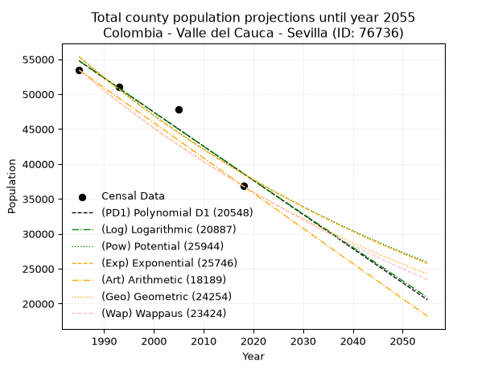
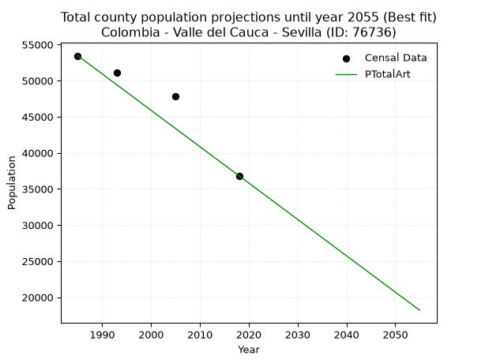
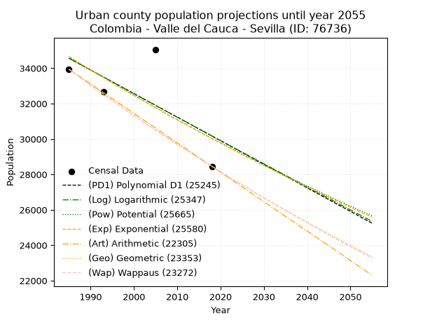
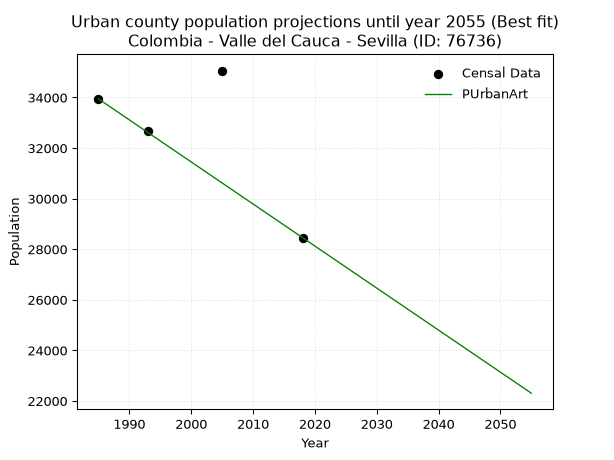
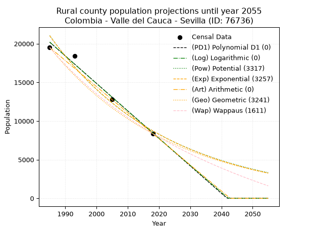
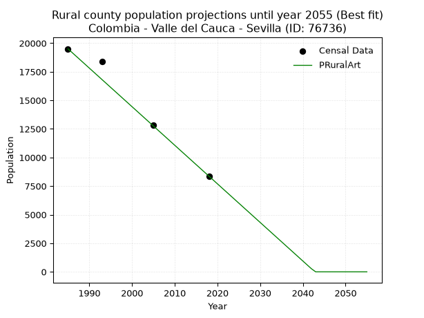

<div align="center">


</div>

# 📜 _“Population and Public Services Demand Projections (PPSD) until Year 2050 for Colombia - Valle del Cauca - Sevilla (ID: 76736)”_
Keywords: `population` `public-service` `projection` `lineal` `polynomial` `logarithmic` `potential` `exponential` `arithmetic` `geometric` `wappaus` `dane` `colombia` `south-america`

PPSD are analytical estimates used by governments and planners to anticipate future changes in population size, age distribution, and the resulting community needs for utilities, healthcare, education, and infrastructure as sizing future water treatment facilities, electrical grids, and road networks based on spatial growth.

<div align="center">

</img>

</div>


> **General running parameters**: • app_version: _v20260806_. • Python version: _3.14.7_. • Pandas version: _3.0.5_. • NumPy version: _2.5.1_. • Creates, save and include plots into reports (create_plot): _False_. • Projection until year: _2050_. • Process polynomial degree 2 and up: _False_. • Process Wappaus: _True_. • Process Wappaus: _True_. • Set negative values to zero: _True_. • Set infinite values to zero: _True_. • Drop dataset notes: _True_. 
<div align="center">

Maps & GIS Layers: [:earth_americas:Google](http://maps.google.com/maps?q=4.270714166,-75.9316287) [:earth_americas:OSM](https://www.openstreetmap.org/#map=18/4.270714166/-75.9316287&layers=P) [:earth_americas:Bing](https://www.bing.com/maps?cp=4.270714166~-75.9316287&lvl=18) [:earth_americas:Apple](https://maps.apple.com/frame?center=4.270714166%2C-75.9316287&span=0.003%2C0.006) [:earth_americas:GISMobile](https://github.com/rcfdtools/R.GISMobile/blob/main/file/gis/CountyLayer_CO/Readme.md)

</div>


<div align="center">

```geojson
{
  "type": "Feature",
  "geometry": {
    "type": "Point", 
    "coordinates": [-75.9316287, 4.270714166]
  }, 
  "properties": {
    "Name": "Colombia - Valle del Cauca - Sevilla (ID: 76736)"
  }
}
```

</div>


## 0. Census Data (4 records)

Census data are official statistics collected by a government about the people and housing in a country. They usually include counts of total population, age, sex, race, income, education, and jobs.

📅Global census file: [Population.xlsx](../data/Population.xlsx)

| Source   |   Year |   CountryID | CountryName   |   StateID | StateName       |   CountyID | CountyName   |   PTotal |   PUrban |   PRural |
|:---------|-------:|------------:|:--------------|----------:|:----------------|-----------:|:-------------|---------:|---------:|---------:|
| DANE     |   1985 |          57 | Colombia      |        76 | Valle del Cauca |      76736 | Sevilla      |    53450 |    33944 |    19506 |
| DANE     |   1993 |          57 | Colombia      |        76 | Valle del Cauca |      76736 | Sevilla      |    51081 |    32680 |    18401 |
| DANE     |   2005 |          57 | Colombia      |        76 | Valle del Cauca |      76736 | Sevilla      |    47872 |    35061 |    12811 |
| DANE     |   2018 |          57 | Colombia      |        76 | Valle del Cauca |      76736 | Sevilla      |    36827 |    28457 |     8370 |

> 🔥Some records could had specific notes about the registered values or the corresponding urban or rural distribution.

📅[SUI-RUPS](https://www.datos.gov.co/Hacienda-y-Cr-dito-P-blico/Registro-nico-de-Prestadores-de-Servicios-P-blicos/4qkq-csdn/about_data) - Local public utility companies: [RUPS.csv](../data/RUPS.csv)

 | SERVICIO       | ESTADO    | NOMBRE                                                                     | NIT         | DEPARTAMENTO_DOMICILIO   | MUNICIPIO_DOMICILIO   | DIRECCION                                        |   TELEFONO | EMAIL                                            | TIPO_PRESTADOR                             | CLASIFICACION                 |
|:---------------|:----------|:---------------------------------------------------------------------------|:------------|:-------------------------|:----------------------|:-------------------------------------------------|-----------:|:-------------------------------------------------|:-------------------------------------------|:------------------------------|
| ACUEDUCTO      | OPERATIVA | SOCIEDAD DE ACUEDUCTOS Y ALCANTARILLADOS DEL VALLE DEL CAUCA S.A.  E.S.P.  | 890399032-8 | VALLE DEL CAUCA          | CALI                  | AVENIDA 5 N # 23 AN 41                           |    6203400 | rosemary@acuavalle.gov.co                        | SOCIEDADES (EMPRESA DE SERVICIOS PUBLICOS) | MAYOR O IGUAL A 5001 USUARIOS |
| ALCANTARILLADO | OPERATIVA | SOCIEDAD DE ACUEDUCTOS Y ALCANTARILLADOS DEL VALLE DEL CAUCA S.A.  E.S.P.  | 890399032-8 | VALLE DEL CAUCA          | CALI                  | AVENIDA 5 N # 23 AN 41                           |    6203400 | rosemary@acuavalle.gov.co                        | SOCIEDADES (EMPRESA DE SERVICIOS PUBLICOS) | MAYOR O IGUAL A 5001 USUARIOS |
| ACUEDUCTO      | OPERATIVA | ADMINISTRACION COOPERATIVA SEVILLA E.S.P.                                  | 821001404-5 | VALLE DEL CAUCA          | SEVILLA               | CLL 49 N 47-57 P3 EDIFICIO DEL CAFE              |    2196144 | gerencia@administracioncooperativasevilla.com.co | ORGANIZACION AUTORIZADA                    | MENOR O IGUAL A 2500 USUARIOS |
| ACUEDUCTO      | OPERATIVA | ASOCIACION DE USUARIOS DEL ACUEDUCTO DE LAS VEREDAS LA CRISTALINA Y PURNIO | 900389331-8 | VALLE DEL CAUCA          | SEVILLA               | VEREDA PURNIO                                    |    3207829 | acueductoveredapurnio@yahoo.com                  | ORGANIZACION AUTORIZADA                    | HASTA 2500 SUSCRIPTORES       |
| ACUEDUCTO      | OPERATIVA | ASOCIACION DE USUARIOS DEL CORREGIMIENTO DE COROZAL                        | 900368980-8 | VALLE DEL CAUCA          | SEVILLA               | CORREGIMIENTO COROZAL BARRIO GUAYABAL CASA N° 8A |    3122586 | usuariosaguavital@yahoo.com                      | ORGANIZACION AUTORIZADA                    | HASTA 2500 SUSCRIPTORES       |

## 1. Total

### 1.1. Coefficients and Parameters

* (PD1) Polynomial Deg 1: -488.7651545563956, 1024960.0004014303 (lineal)
* (Log) Logarithmic: -977683.5807560836, 7478688.231991511
* (Pow) Potential: -21.862249002393305, 76.83955568135569
* (Exp) Exponential: -0.010930552130893128, 146540433623369.9
* (Art) Arithmetic: Year diff. 2018 - 1985 = 33, Population diff. 36827 - 53450 = -16623, Annual growth = -503.72727272727275
* (Geo) Geometric: Year diff. 2018 - 1985 = 33, Population diff. 36827 - 53450 = -16623, Annual growth % = -0.011224870118756392
* (Wap) Wappaus: i = -1.1159592647679315, Condition values only valid for < 200)

<sub>
Wappaus condition values: ['-0.00', '-1.12', '-2.23', '-3.35', '-4.46', '-5.58', '-6.70', '-7.81', '-8.93', '-10.04', '-11.16', '-12.28', '-13.39', '-14.51', '-15.62', '-16.74', '-17.86', '-18.97', '-20.09', '-21.20', '-22.32', '-23.44', '-24.55', '-25.67', '-26.78', '-27.90', '-29.01', '-30.13', '-31.25', '-32.36', '-33.48', '-34.59', '-35.71', '-36.83', '-37.94', '-39.06', '-40.17', '-41.29', '-42.41', '-43.52', '-44.64', '-45.75', '-46.87', '-47.99', '-49.10', '-50.22', '-51.33', '-52.45', '-53.57', '-54.68', '-55.80', '-56.91', '-58.03', '-59.15', '-60.26', '-61.38', '-62.49', '-63.61', '-64.73', '-65.84', '-66.96', '-68.07', '-69.19', '-70.31', '-71.42', '-72.54']
</sub>


### 1.2. Projected Dataset

|   Year |   CountyID |   PTotalPD1 |   PTotalLog |   PTotalPow |   PTotalExp |   PTotalArt |   PTotalGeo |   PTotalWap |
|-------:|-----------:|------------:|------------:|------------:|------------:|------------:|------------:|------------:|
|   1985 |      76736 |       54761 |       54771 |       55347 |       55336 |       53450 |       53450 |       53450 |
|   1986 |      76736 |       54272 |       54279 |       54741 |       54734 |       52946 |       52850 |       52857 |
|   1987 |      76736 |       53784 |       53786 |       54142 |       54139 |       52443 |       52257 |       52270 |
|   1988 |      76736 |       53295 |       53294 |       53550 |       53551 |       51939 |       51670 |       51690 |
|   1989 |      76736 |       52806 |       52803 |       52964 |       52969 |       51435 |       51090 |       51116 |
|   1990 |      76736 |       52317 |       52311 |       52385 |       52393 |       50931 |       50517 |       50549 |
|   1991 |      76736 |       51829 |       51820 |       51813 |       51823 |       50428 |       49950 |       49987 |
|   1992 |      76736 |       51340 |       51329 |       51247 |       51260 |       49924 |       49389 |       49432 |
|   1993 |      76736 |       50851 |       50839 |       50688 |       50703 |       49420 |       48835 |       48882 |
|   1994 |      76736 |       50362 |       50348 |       50135 |       50151 |       48916 |       48286 |       48338 |
|   1995 |      76736 |       49874 |       49858 |       49589 |       49606 |       48413 |       47744 |       47800 |
|   1996 |      76736 |       49385 |       49368 |       49048 |       49067 |       47909 |       47209 |       47268 |
|   1997 |      76736 |       48896 |       48878 |       48514 |       48534 |       47405 |       46679 |       46741 |
|   1998 |      76736 |       48407 |       48389 |       47986 |       48006 |       46902 |       46155 |       46220 |
|   1999 |      76736 |       47918 |       47900 |       47464 |       47484 |       46398 |       45637 |       45704 |
|   2000 |      76736 |       47430 |       47411 |       46948 |       46968 |       45894 |       45124 |       45194 |
|   2001 |      76736 |       46941 |       46922 |       46438 |       46457 |       45390 |       44618 |       44689 |
|   2002 |      76736 |       46452 |       46434 |       45933 |       45952 |       44887 |       44117 |       44188 |
|   2003 |      76736 |       45963 |       45945 |       45434 |       45453 |       44383 |       43622 |       43693 |
|   2004 |      76736 |       45475 |       45457 |       44941 |       44959 |       43879 |       43132 |       43203 |
|   2005 |      76736 |       44986 |       44970 |       44454 |       44470 |       43375 |       42648 |       42718 |
|   2006 |      76736 |       44497 |       44482 |       43972 |       43986 |       42872 |       42169 |       42238 |
|   2007 |      76736 |       44008 |       43995 |       43495 |       43508 |       42368 |       41696 |       41762 |
|   2008 |      76736 |       43520 |       43508 |       43024 |       43035 |       41864 |       41228 |       41291 |
|   2009 |      76736 |       43031 |       43021 |       42558 |       42567 |       41361 |       40765 |       40825 |
|   2010 |      76736 |       42542 |       42534 |       42098 |       42105 |       40857 |       40308 |       40363 |
|   2011 |      76736 |       42053 |       42048 |       41643 |       41647 |       40353 |       39855 |       39906 |
|   2012 |      76736 |       41565 |       41562 |       41193 |       41194 |       39849 |       39408 |       39454 |
|   2013 |      76736 |       41076 |       41076 |       40747 |       40746 |       39346 |       38965 |       39005 |
|   2014 |      76736 |       40587 |       40591 |       40307 |       40303 |       38842 |       38528 |       38561 |
|   2015 |      76736 |       40098 |       40105 |       39872 |       39865 |       38338 |       38096 |       38121 |
|   2016 |      76736 |       39609 |       39620 |       39442 |       39432 |       37834 |       37668 |       37686 |
|   2017 |      76736 |       39121 |       39136 |       39017 |       39003 |       37331 |       37245 |       37254 |
|   2018 |      76736 |       38632 |       38651 |       38596 |       38579 |       36827 |       36827 |       36827 |
|   2019 |      76736 |       38143 |       38167 |       38181 |       38160 |       36323 |       36414 |       36404 |
|   2020 |      76736 |       37654 |       37682 |       37769 |       37745 |       35820 |       36005 |       35984 |
|   2021 |      76736 |       37166 |       37199 |       37363 |       37335 |       35316 |       35601 |       35569 |
|   2022 |      76736 |       36677 |       36715 |       36961 |       36929 |       34812 |       35201 |       35157 |
|   2023 |      76736 |       36188 |       36231 |       36564 |       36527 |       34308 |       34806 |       34749 |
|   2024 |      76736 |       35699 |       35748 |       36171 |       36130 |       33805 |       34415 |       34345 |
|   2025 |      76736 |       35211 |       35265 |       35782 |       35737 |       33301 |       34029 |       33944 |
|   2026 |      76736 |       34722 |       34783 |       35398 |       35349 |       32797 |       33647 |       33547 |
|   2027 |      76736 |       34233 |       34300 |       35018 |       34965 |       32293 |       33269 |       33154 |
|   2028 |      76736 |       33744 |       33818 |       34643 |       34585 |       31790 |       32896 |       32764 |
|   2029 |      76736 |       33256 |       33336 |       34271 |       34209 |       31286 |       32527 |       32378 |
|   2030 |      76736 |       32767 |       32854 |       33904 |       33837 |       30782 |       32162 |       31995 |
|   2031 |      76736 |       32278 |       32373 |       33541 |       33469 |       30279 |       31801 |       31616 |
|   2032 |      76736 |       31789 |       31892 |       33182 |       33105 |       29775 |       31444 |       31240 |
|   2033 |      76736 |       31300 |       31411 |       32827 |       32745 |       29271 |       31091 |       30867 |
|   2034 |      76736 |       30812 |       30930 |       32476 |       32389 |       28767 |       30742 |       30498 |
|   2035 |      76736 |       30323 |       30449 |       32129 |       32037 |       28264 |       30397 |       30132 |
|   2036 |      76736 |       29834 |       29969 |       31786 |       31689 |       27760 |       30055 |       29769 |
|   2037 |      76736 |       29345 |       29489 |       31446 |       31344 |       27256 |       29718 |       29409 |
|   2038 |      76736 |       28857 |       29009 |       31111 |       31004 |       26752 |       29384 |       29052 |
|   2039 |      76736 |       28368 |       28529 |       30779 |       30667 |       26249 |       29055 |       28698 |
|   2040 |      76736 |       27879 |       28050 |       30451 |       30333 |       25745 |       28728 |       28347 |
|   2041 |      76736 |       27390 |       27571 |       30126 |       30003 |       25241 |       28406 |       28000 |
|   2042 |      76736 |       26902 |       27092 |       29805 |       29677 |       24738 |       28087 |       27655 |
|   2043 |      76736 |       26413 |       26613 |       29488 |       29355 |       24234 |       27772 |       27313 |
|   2044 |      76736 |       25924 |       26135 |       29174 |       29035 |       23730 |       27460 |       26974 |
|   2045 |      76736 |       25435 |       25657 |       28864 |       28720 |       23226 |       27152 |       26638 |
|   2046 |      76736 |       24946 |       25179 |       28557 |       28408 |       22723 |       26847 |       26304 |
|   2047 |      76736 |       24458 |       24701 |       28254 |       28099 |       22219 |       26546 |       25974 |
|   2048 |      76736 |       23969 |       24223 |       27953 |       27793 |       21715 |       26248 |       25646 |
|   2049 |      76736 |       23480 |       23746 |       27657 |       27491 |       21211 |       25953 |       25321 |
|   2050 |      76736 |       22991 |       23269 |       27363 |       27192 |       20708 |       25662 |       24998 |
<div align="center">

</img>

</div>


### 1.3. Best fit with absolute and relative error (%)

Relative error puts that difference into context by dividing the absolute error by the true value, creating a unitless ratio or percentage that shows the scale of the mistake.

Absolute and relative error

|   Year | Source   |   CountryID | CountryName   |   StateID | StateName       |   CountyID_x | CountyName   |   PTotal |   PUrban |   PRural |   CountyID_y |   PTotalPD1 |   PTotalLog |   PTotalPow |   PTotalExp |   PTotalArt |   PTotalGeo |   PTotalWap |   PTotalPD1AbsError |   PTotalLogAbsError |   PTotalPowAbsError |   PTotalExpAbsError |   PTotalArtAbsError |   PTotalGeoAbsError |   PTotalWapAbsError |   PTotalPD1RelError |   PTotalLogRelError |   PTotalPowRelError |   PTotalExpRelError |   PTotalArtRelError |   PTotalGeoRelError |   PTotalWapRelError |
|-------:|:---------|------------:|:--------------|----------:|:----------------|-------------:|:-------------|---------:|---------:|---------:|-------------:|------------:|------------:|------------:|------------:|------------:|------------:|------------:|--------------------:|--------------------:|--------------------:|--------------------:|--------------------:|--------------------:|--------------------:|--------------------:|--------------------:|--------------------:|--------------------:|--------------------:|--------------------:|--------------------:|
|   1985 | DANE     |          57 | Colombia      |        76 | Valle del Cauca |        76736 | Sevilla      |    53450 |    33944 |    19506 |        76736 |       54761 |       54771 |       55347 |       55336 |       53450 |       53450 |       53450 |                1311 |                1321 |                1897 |                1886 |                   0 |                   0 |                   0 |            2.45276  |            2.47147  |            3.54911  |            3.52853  |              0      |             0       |             0       |
|   1993 | DANE     |          57 | Colombia      |        76 | Valle del Cauca |        76736 | Sevilla      |    51081 |    32680 |    18401 |        76736 |       50851 |       50839 |       50688 |       50703 |       49420 |       48835 |       48882 |                 230 |                 242 |                 393 |                 378 |                1661 |                2246 |                2199 |            0.450265 |            0.473757 |            0.769366 |            0.740001 |              3.2517 |             4.39694 |             4.30493 |
|   2005 | DANE     |          57 | Colombia      |        76 | Valle del Cauca |        76736 | Sevilla      |    47872 |    35061 |    12811 |        76736 |       44986 |       44970 |       44454 |       44470 |       43375 |       42648 |       42718 |                2886 |                2902 |                3418 |                3402 |                4497 |                5224 |                5154 |            6.02858  |            6.062    |            7.13987  |            7.10645  |              9.3938 |            10.9124  |            10.7662  |
|   2018 | DANE     |          57 | Colombia      |        76 | Valle del Cauca |        76736 | Sevilla      |    36827 |    28457 |     8370 |        76736 |       38632 |       38651 |       38596 |       38579 |       36827 |       36827 |       36827 |                1805 |                1824 |                1769 |                1752 |                   0 |                   0 |                   0 |            4.9013   |            4.95289  |            4.80354  |            4.75738  |              0      |             0       |             0       |

Relative error mean

| Method    |   RelError | Best   |
|:----------|-----------:|:-------|
| PTotalPD1 |    3.45822 |        |
| PTotalLog |    3.49003 |        |
| PTotalPow |    4.06547 |        |
| PTotalExp |    4.03309 |        |
| PTotalArt |    3.16137 | True   |
| PTotalGeo |    3.82734 |        |
| PTotalWap |    3.76778 |        |

💙Best method: _**PTotalArt**_
<div align="center">

</img>

</div>


### 1.4. Fresh water supply demand in liters per capita per day (lpcd)

The fresh water supply demand typically ranges from 100 to 300 liters per capita per day (lpcd) for standard domestic and municipal planning, though absolute survival minimums set by the World Health Organization are as low as 7.5 to 20 liters per day, and total consumption in high-income nations can exceed 400 liters.

> `CZ`: Level in meters above the sea level (masl)<br> `WS`: Fresh water supply demand in liters per capita per day (lpcd or l/h/d)<br> `WSAll`: Zonal fresh water supply demand in liters per second (l/s)<br> `A`: Zonal area in square meters<br> `DP`: Population density (people/hectare or p/ha)

Reference values (RAS Colombia)

|    CZ |   WS |
|------:|-----:|
|  1000 |  120 |
|  2000 |  130 |
| 99999 |  140 |

County shapefile geometry properties and water supply values

|   CountyID |      ATotal |   CZTotal |   WSTotal |
|-----------:|------------:|----------:|----------:|
|      76736 | 5.37173e+08 |   2006.13 |       140 |

Projected values for best method: PTotalArt

|   CountyID |   Year |   PTotalArt |   DPTotal |   WSTotal |   WSTotalAll |
|-----------:|-------:|------------:|----------:|----------:|-------------:|
|      76736 |   1985 |       53450 |      1    |       140 |      86.6088 |
|      76736 |   1986 |       52946 |      0.99 |       140 |      85.7921 |
|      76736 |   1987 |       52443 |      0.98 |       140 |      84.9771 |
|      76736 |   1988 |       51939 |      0.97 |       140 |      84.1604 |
|      76736 |   1989 |       51435 |      0.96 |       140 |      83.3438 |
|      76736 |   1990 |       50931 |      0.95 |       140 |      82.5271 |
|      76736 |   1991 |       50428 |      0.94 |       140 |      81.712  |
|      76736 |   1992 |       49924 |      0.93 |       140 |      80.8954 |
|      76736 |   1993 |       49420 |      0.92 |       140 |      80.0787 |
|      76736 |   1994 |       48916 |      0.91 |       140 |      79.262  |
|      76736 |   1995 |       48413 |      0.9  |       140 |      78.447  |
|      76736 |   1996 |       47909 |      0.89 |       140 |      77.6303 |
|      76736 |   1997 |       47405 |      0.88 |       140 |      76.8137 |
|      76736 |   1998 |       46902 |      0.87 |       140 |      75.9986 |
|      76736 |   1999 |       46398 |      0.86 |       140 |      75.1819 |
|      76736 |   2000 |       45894 |      0.85 |       140 |      74.3653 |
|      76736 |   2001 |       45390 |      0.84 |       140 |      73.5486 |
|      76736 |   2002 |       44887 |      0.84 |       140 |      72.7336 |
|      76736 |   2003 |       44383 |      0.83 |       140 |      71.9169 |
|      76736 |   2004 |       43879 |      0.82 |       140 |      71.1002 |
|      76736 |   2005 |       43375 |      0.81 |       140 |      70.2836 |
|      76736 |   2006 |       42872 |      0.8  |       140 |      69.4685 |
|      76736 |   2007 |       42368 |      0.79 |       140 |      68.6519 |
|      76736 |   2008 |       41864 |      0.78 |       140 |      67.8352 |
|      76736 |   2009 |       41361 |      0.77 |       140 |      67.0201 |
|      76736 |   2010 |       40857 |      0.76 |       140 |      66.2035 |
|      76736 |   2011 |       40353 |      0.75 |       140 |      65.3868 |
|      76736 |   2012 |       39849 |      0.74 |       140 |      64.5701 |
|      76736 |   2013 |       39346 |      0.73 |       140 |      63.7551 |
|      76736 |   2014 |       38842 |      0.72 |       140 |      62.9384 |
|      76736 |   2015 |       38338 |      0.71 |       140 |      62.1218 |
|      76736 |   2016 |       37834 |      0.7  |       140 |      61.3051 |
|      76736 |   2017 |       37331 |      0.69 |       140 |      60.49   |
|      76736 |   2018 |       36827 |      0.69 |       140 |      59.6734 |
|      76736 |   2019 |       36323 |      0.68 |       140 |      58.8567 |
|      76736 |   2020 |       35820 |      0.67 |       140 |      58.0417 |
|      76736 |   2021 |       35316 |      0.66 |       140 |      57.225  |
|      76736 |   2022 |       34812 |      0.65 |       140 |      56.4083 |
|      76736 |   2023 |       34308 |      0.64 |       140 |      55.5917 |
|      76736 |   2024 |       33805 |      0.63 |       140 |      54.7766 |
|      76736 |   2025 |       33301 |      0.62 |       140 |      53.96   |
|      76736 |   2026 |       32797 |      0.61 |       140 |      53.1433 |
|      76736 |   2027 |       32293 |      0.6  |       140 |      52.3266 |
|      76736 |   2028 |       31790 |      0.59 |       140 |      51.5116 |
|      76736 |   2029 |       31286 |      0.58 |       140 |      50.6949 |
|      76736 |   2030 |       30782 |      0.57 |       140 |      49.8782 |
|      76736 |   2031 |       30279 |      0.56 |       140 |      49.0632 |
|      76736 |   2032 |       29775 |      0.55 |       140 |      48.2465 |
|      76736 |   2033 |       29271 |      0.54 |       140 |      47.4299 |
|      76736 |   2034 |       28767 |      0.54 |       140 |      46.6132 |
|      76736 |   2035 |       28264 |      0.53 |       140 |      45.7981 |
|      76736 |   2036 |       27760 |      0.52 |       140 |      44.9815 |
|      76736 |   2037 |       27256 |      0.51 |       140 |      44.1648 |
|      76736 |   2038 |       26752 |      0.5  |       140 |      43.3481 |
|      76736 |   2039 |       26249 |      0.49 |       140 |      42.5331 |
|      76736 |   2040 |       25745 |      0.48 |       140 |      41.7164 |
|      76736 |   2041 |       25241 |      0.47 |       140 |      40.8998 |
|      76736 |   2042 |       24738 |      0.46 |       140 |      40.0847 |
|      76736 |   2043 |       24234 |      0.45 |       140 |      39.2681 |
|      76736 |   2044 |       23730 |      0.44 |       140 |      38.4514 |
|      76736 |   2045 |       23226 |      0.43 |       140 |      37.6347 |
|      76736 |   2046 |       22723 |      0.42 |       140 |      36.8197 |
|      76736 |   2047 |       22219 |      0.41 |       140 |      36.003  |
|      76736 |   2048 |       21715 |      0.4  |       140 |      35.1863 |
|      76736 |   2049 |       21211 |      0.39 |       140 |      34.3697 |
|      76736 |   2050 |       20708 |      0.39 |       140 |      33.5546 |

## 2. Urban

### 2.1. Coefficients and Parameters

* (PD1) Polynomial Deg 1: -133.15857085507434, 298885.9313528625 (lineal)
* (Log) Logarithmic: -266006.6025340791, 2054453.8175046677
* (Pow) Potential: -8.663885798108199, 33.11115868389822
* (Exp) Exponential: -0.004336767677534863, 189825267.99246368
* (Art) Arithmetic: Year diff. 2018 - 1985 = 33, Population diff. 28457 - 33944 = -5487, Annual growth = -166.27272727272728
* (Geo) Geometric: Year diff. 2018 - 1985 = 33, Population diff. 28457 - 33944 = -5487, Annual growth % = -0.0053287193689999235
* (Wap) Wappaus: i = -0.5329168675909914, Condition values only valid for < 200)

<sub>
Wappaus condition values: ['-0.00', '-0.53', '-1.07', '-1.60', '-2.13', '-2.66', '-3.20', '-3.73', '-4.26', '-4.80', '-5.33', '-5.86', '-6.40', '-6.93', '-7.46', '-7.99', '-8.53', '-9.06', '-9.59', '-10.13', '-10.66', '-11.19', '-11.72', '-12.26', '-12.79', '-13.32', '-13.86', '-14.39', '-14.92', '-15.45', '-15.99', '-16.52', '-17.05', '-17.59', '-18.12', '-18.65', '-19.19', '-19.72', '-20.25', '-20.78', '-21.32', '-21.85', '-22.38', '-22.92', '-23.45', '-23.98', '-24.51', '-25.05', '-25.58', '-26.11', '-26.65', '-27.18', '-27.71', '-28.24', '-28.78', '-29.31', '-29.84', '-30.38', '-30.91', '-31.44', '-31.98', '-32.51', '-33.04', '-33.57', '-34.11', '-34.64']
</sub>


### 2.2. Projected Dataset

|   Year |   CountyID |   PUrbanPD1 |   PUrbanLog |   PUrbanPow |   PUrbanExp |   PUrbanArt |   PUrbanGeo |   PUrbanWap |
|-------:|-----------:|------------:|------------:|------------:|------------:|------------:|------------:|------------:|
|   1985 |      76736 |       34566 |       34566 |       34653 |       34653 |       33944 |       33944 |       33944 |
|   1986 |      76736 |       34433 |       34432 |       34502 |       34503 |       33778 |       33763 |       33764 |
|   1987 |      76736 |       34300 |       34298 |       34352 |       34353 |       33611 |       33583 |       33584 |
|   1988 |      76736 |       34167 |       34164 |       34202 |       34205 |       33445 |       33404 |       33406 |
|   1989 |      76736 |       34034 |       34031 |       34054 |       34057 |       33279 |       33226 |       33228 |
|   1990 |      76736 |       33900 |       33897 |       33906 |       33909 |       33113 |       33049 |       33051 |
|   1991 |      76736 |       33767 |       33763 |       33758 |       33763 |       32946 |       32873 |       32876 |
|   1992 |      76736 |       33634 |       33630 |       33612 |       33617 |       32780 |       32698 |       32701 |
|   1993 |      76736 |       33501 |       33496 |       33466 |       33471 |       32614 |       32524 |       32527 |
|   1994 |      76736 |       33368 |       33363 |       33321 |       33326 |       32448 |       32350 |       32354 |
|   1995 |      76736 |       33235 |       33229 |       33176 |       33182 |       32281 |       32178 |       32182 |
|   1996 |      76736 |       33101 |       33096 |       33033 |       33038 |       32115 |       32007 |       32011 |
|   1997 |      76736 |       32968 |       32963 |       32890 |       32895 |       31949 |       31836 |       31841 |
|   1998 |      76736 |       32835 |       32830 |       32747 |       32753 |       31782 |       31666 |       31671 |
|   1999 |      76736 |       32702 |       32697 |       32606 |       32611 |       31616 |       31498 |       31503 |
|   2000 |      76736 |       32569 |       32564 |       32465 |       32470 |       31450 |       31330 |       31335 |
|   2001 |      76736 |       32436 |       32431 |       32324 |       32330 |       31284 |       31163 |       31168 |
|   2002 |      76736 |       32302 |       32298 |       32185 |       32190 |       31117 |       30997 |       31002 |
|   2003 |      76736 |       32169 |       32165 |       32046 |       32051 |       30951 |       30832 |       30837 |
|   2004 |      76736 |       32036 |       32032 |       31908 |       31912 |       30785 |       30667 |       30673 |
|   2005 |      76736 |       31903 |       31899 |       31770 |       31774 |       30619 |       30504 |       30509 |
|   2006 |      76736 |       31770 |       31767 |       31633 |       31636 |       30452 |       30341 |       30347 |
|   2007 |      76736 |       31637 |       31634 |       31497 |       31499 |       30286 |       30180 |       30185 |
|   2008 |      76736 |       31504 |       31502 |       31361 |       31363 |       30120 |       30019 |       30024 |
|   2009 |      76736 |       31370 |       31369 |       31226 |       31227 |       29953 |       29859 |       29864 |
|   2010 |      76736 |       31237 |       31237 |       31092 |       31092 |       29787 |       29700 |       29704 |
|   2011 |      76736 |       31104 |       31105 |       30958 |       30958 |       29621 |       29541 |       29545 |
|   2012 |      76736 |       30971 |       30972 |       30825 |       30824 |       29455 |       29384 |       29388 |
|   2013 |      76736 |       30838 |       30840 |       30693 |       30690 |       29288 |       29227 |       29231 |
|   2014 |      76736 |       30705 |       30708 |       30561 |       30557 |       29122 |       29072 |       29074 |
|   2015 |      76736 |       30571 |       30576 |       30430 |       30425 |       28956 |       28917 |       28919 |
|   2016 |      76736 |       30438 |       30444 |       30299 |       30294 |       28790 |       28763 |       28764 |
|   2017 |      76736 |       30305 |       30312 |       30169 |       30162 |       28623 |       28609 |       28610 |
|   2018 |      76736 |       30172 |       30180 |       30040 |       30032 |       28457 |       28457 |       28457 |
|   2019 |      76736 |       30039 |       30048 |       29911 |       29902 |       28291 |       28305 |       28305 |
|   2020 |      76736 |       29906 |       29917 |       29783 |       29773 |       28124 |       28155 |       28153 |
|   2021 |      76736 |       29772 |       29785 |       29656 |       29644 |       27958 |       28005 |       28002 |
|   2022 |      76736 |       29639 |       29653 |       29529 |       29515 |       27792 |       27855 |       27852 |
|   2023 |      76736 |       29506 |       29522 |       29403 |       29388 |       27626 |       27707 |       27702 |
|   2024 |      76736 |       29373 |       29390 |       29277 |       29261 |       27459 |       27559 |       27553 |
|   2025 |      76736 |       29240 |       29259 |       29152 |       29134 |       27293 |       27412 |       27405 |
|   2026 |      76736 |       29107 |       29128 |       29028 |       29008 |       27127 |       27266 |       27258 |
|   2027 |      76736 |       28974 |       28997 |       28904 |       28882 |       26961 |       27121 |       27111 |
|   2028 |      76736 |       28840 |       28865 |       28781 |       28757 |       26794 |       26976 |       26965 |
|   2029 |      76736 |       28707 |       28734 |       28658 |       28633 |       26628 |       26833 |       26820 |
|   2030 |      76736 |       28574 |       28603 |       28536 |       28509 |       26462 |       26690 |       26675 |
|   2031 |      76736 |       28441 |       28472 |       28414 |       28386 |       26295 |       26548 |       26531 |
|   2032 |      76736 |       28308 |       28341 |       28293 |       28263 |       26129 |       26406 |       26388 |
|   2033 |      76736 |       28175 |       28210 |       28173 |       28141 |       25963 |       26265 |       26246 |
|   2034 |      76736 |       28041 |       28079 |       28053 |       28019 |       25797 |       26125 |       26104 |
|   2035 |      76736 |       27908 |       27949 |       27934 |       27897 |       25630 |       25986 |       25963 |
|   2036 |      76736 |       27775 |       27818 |       27815 |       27777 |       25464 |       25848 |       25822 |
|   2037 |      76736 |       27642 |       27687 |       27697 |       27657 |       25298 |       25710 |       25682 |
|   2038 |      76736 |       27509 |       27557 |       27580 |       27537 |       25132 |       25573 |       25543 |
|   2039 |      76736 |       27376 |       27426 |       27463 |       27418 |       24965 |       25437 |       25404 |
|   2040 |      76736 |       27242 |       27296 |       27346 |       27299 |       24799 |       25301 |       25267 |
|   2041 |      76736 |       27109 |       27166 |       27231 |       27181 |       24633 |       25166 |       25129 |
|   2042 |      76736 |       26976 |       27035 |       27115 |       27063 |       24466 |       25032 |       24993 |
|   2043 |      76736 |       26843 |       26905 |       27000 |       26946 |       24300 |       24899 |       24857 |
|   2044 |      76736 |       26710 |       26775 |       26886 |       26830 |       24134 |       24766 |       24721 |
|   2045 |      76736 |       26577 |       26645 |       26773 |       26714 |       23968 |       24634 |       24586 |
|   2046 |      76736 |       26443 |       26515 |       26659 |       26598 |       23801 |       24503 |       24452 |
|   2047 |      76736 |       26310 |       26385 |       26547 |       26483 |       23635 |       24372 |       24319 |
|   2048 |      76736 |       26177 |       26255 |       26435 |       26368 |       23469 |       24242 |       24186 |
|   2049 |      76736 |       26044 |       26125 |       26323 |       26254 |       23303 |       24113 |       24053 |
|   2050 |      76736 |       25911 |       25995 |       26212 |       26140 |       23136 |       23985 |       23922 |
<div align="center">

</img>

</div>


### 2.3. Best fit with absolute and relative error (%)

Relative error puts that difference into context by dividing the absolute error by the true value, creating a unitless ratio or percentage that shows the scale of the mistake.

Absolute and relative error

|   Year | Source   |   CountryID | CountryName   |   StateID | StateName       |   CountyID_x | CountyName   |   PTotal |   PUrban |   PRural |   CountyID_y |   PUrbanPD1 |   PUrbanLog |   PUrbanPow |   PUrbanExp |   PUrbanArt |   PUrbanGeo |   PUrbanWap |   PUrbanPD1AbsError |   PUrbanLogAbsError |   PUrbanPowAbsError |   PUrbanExpAbsError |   PUrbanArtAbsError |   PUrbanGeoAbsError |   PUrbanWapAbsError |   PUrbanPD1RelError |   PUrbanLogRelError |   PUrbanPowRelError |   PUrbanExpRelError |   PUrbanArtRelError |   PUrbanGeoRelError |   PUrbanWapRelError |
|-------:|:---------|------------:|:--------------|----------:|:----------------|-------------:|:-------------|---------:|---------:|---------:|-------------:|------------:|------------:|------------:|------------:|------------:|------------:|------------:|--------------------:|--------------------:|--------------------:|--------------------:|--------------------:|--------------------:|--------------------:|--------------------:|--------------------:|--------------------:|--------------------:|--------------------:|--------------------:|--------------------:|
|   1985 | DANE     |          57 | Colombia      |        76 | Valle del Cauca |        76736 | Sevilla      |    53450 |    33944 |    19506 |        76736 |       34566 |       34566 |       34653 |       34653 |       33944 |       33944 |       33944 |                 622 |                 622 |                 709 |                 709 |                   0 |                   0 |                   0 |             1.83243 |             1.83243 |             2.08873 |             2.08873 |            0        |            0        |            0        |
|   1993 | DANE     |          57 | Colombia      |        76 | Valle del Cauca |        76736 | Sevilla      |    51081 |    32680 |    18401 |        76736 |       33501 |       33496 |       33466 |       33471 |       32614 |       32524 |       32527 |                 821 |                 816 |                 786 |                 791 |                  66 |                 156 |                 153 |             2.51224 |             2.49694 |             2.40514 |             2.42044 |            0.201958 |            0.477356 |            0.468176 |
|   2005 | DANE     |          57 | Colombia      |        76 | Valle del Cauca |        76736 | Sevilla      |    47872 |    35061 |    12811 |        76736 |       31903 |       31899 |       31770 |       31774 |       30619 |       30504 |       30509 |                3158 |                3162 |                3291 |                3287 |                4442 |                4557 |                4552 |             9.00716 |             9.01857 |             9.3865  |             9.37509 |           12.6693   |           12.9973   |           12.9831   |
|   2018 | DANE     |          57 | Colombia      |        76 | Valle del Cauca |        76736 | Sevilla      |    36827 |    28457 |     8370 |        76736 |       30172 |       30180 |       30040 |       30032 |       28457 |       28457 |       28457 |                1715 |                1723 |                1583 |                1575 |                   0 |                   0 |                   0 |             6.02664 |             6.05475 |             5.56278 |             5.53467 |            0        |            0        |            0        |

Relative error mean

| Method    |   RelError | Best   |
|:----------|-----------:|:-------|
| PUrbanPD1 |    4.84462 |        |
| PUrbanLog |    4.85067 |        |
| PUrbanPow |    4.86079 |        |
| PUrbanExp |    4.85473 |        |
| PUrbanArt |    3.21783 | True   |
| PUrbanGeo |    3.36868 |        |
| PUrbanWap |    3.36282 |        |

💙Best method: _**PUrbanArt**_
<div align="center">

</img>

</div>


### 2.4. Fresh water supply demand in liters per capita per day (lpcd)

The fresh water supply demand typically ranges from 100 to 300 liters per capita per day (lpcd) for standard domestic and municipal planning, though absolute survival minimums set by the World Health Organization are as low as 7.5 to 20 liters per day, and total consumption in high-income nations can exceed 400 liters.

> `CZ`: Level in meters above the sea level (masl)<br> `WS`: Fresh water supply demand in liters per capita per day (lpcd or l/h/d)<br> `WSAll`: Zonal fresh water supply demand in liters per second (l/s)<br> `A`: Zonal area in square meters<br> `DP`: Population density (people/hectare or p/ha)

Reference values (RAS Colombia)

|    CZ |   WS |
|------:|-----:|
|  1000 |  120 |
|  2000 |  130 |
| 99999 |  140 |

County shapefile geometry properties and water supply values

|   CountyID |      AUrban |   CZUrban |   WSUrban |
|-----------:|------------:|----------:|----------:|
|      76736 | 4.04885e+06 |   1623.01 |       130 |

Projected values for best method: PUrbanArt

|   CountyID |   Year |   PUrbanArt |   DPUrban |   WSUrban |   WSUrbanAll |
|-----------:|-------:|------------:|----------:|----------:|-------------:|
|      76736 |   1985 |       33944 |     83.84 |       130 |      51.0731 |
|      76736 |   1986 |       33778 |     83.43 |       130 |      50.8234 |
|      76736 |   1987 |       33611 |     83.01 |       130 |      50.5721 |
|      76736 |   1988 |       33445 |     82.6  |       130 |      50.3223 |
|      76736 |   1989 |       33279 |     82.19 |       130 |      50.0726 |
|      76736 |   1990 |       33113 |     81.78 |       130 |      49.8228 |
|      76736 |   1991 |       32946 |     81.37 |       130 |      49.5715 |
|      76736 |   1992 |       32780 |     80.96 |       130 |      49.3218 |
|      76736 |   1993 |       32614 |     80.55 |       130 |      49.072  |
|      76736 |   1994 |       32448 |     80.14 |       130 |      48.8222 |
|      76736 |   1995 |       32281 |     79.73 |       130 |      48.5709 |
|      76736 |   1996 |       32115 |     79.32 |       130 |      48.3212 |
|      76736 |   1997 |       31949 |     78.91 |       130 |      48.0714 |
|      76736 |   1998 |       31782 |     78.5  |       130 |      47.8201 |
|      76736 |   1999 |       31616 |     78.09 |       130 |      47.5704 |
|      76736 |   2000 |       31450 |     77.68 |       130 |      47.3206 |
|      76736 |   2001 |       31284 |     77.27 |       130 |      47.0708 |
|      76736 |   2002 |       31117 |     76.85 |       130 |      46.8196 |
|      76736 |   2003 |       30951 |     76.44 |       130 |      46.5698 |
|      76736 |   2004 |       30785 |     76.03 |       130 |      46.32   |
|      76736 |   2005 |       30619 |     75.62 |       130 |      46.0703 |
|      76736 |   2006 |       30452 |     75.21 |       130 |      45.819  |
|      76736 |   2007 |       30286 |     74.8  |       130 |      45.5692 |
|      76736 |   2008 |       30120 |     74.39 |       130 |      45.3194 |
|      76736 |   2009 |       29953 |     73.98 |       130 |      45.0682 |
|      76736 |   2010 |       29787 |     73.57 |       130 |      44.8184 |
|      76736 |   2011 |       29621 |     73.16 |       130 |      44.5686 |
|      76736 |   2012 |       29455 |     72.75 |       130 |      44.3189 |
|      76736 |   2013 |       29288 |     72.34 |       130 |      44.0676 |
|      76736 |   2014 |       29122 |     71.93 |       130 |      43.8178 |
|      76736 |   2015 |       28956 |     71.52 |       130 |      43.5681 |
|      76736 |   2016 |       28790 |     71.11 |       130 |      43.3183 |
|      76736 |   2017 |       28623 |     70.69 |       130 |      43.067  |
|      76736 |   2018 |       28457 |     70.28 |       130 |      42.8172 |
|      76736 |   2019 |       28291 |     69.87 |       130 |      42.5675 |
|      76736 |   2020 |       28124 |     69.46 |       130 |      42.3162 |
|      76736 |   2021 |       27958 |     69.05 |       130 |      42.0664 |
|      76736 |   2022 |       27792 |     68.64 |       130 |      41.8167 |
|      76736 |   2023 |       27626 |     68.23 |       130 |      41.5669 |
|      76736 |   2024 |       27459 |     67.82 |       130 |      41.3156 |
|      76736 |   2025 |       27293 |     67.41 |       130 |      41.0659 |
|      76736 |   2026 |       27127 |     67    |       130 |      40.8161 |
|      76736 |   2027 |       26961 |     66.59 |       130 |      40.5663 |
|      76736 |   2028 |       26794 |     66.18 |       130 |      40.315  |
|      76736 |   2029 |       26628 |     65.77 |       130 |      40.0653 |
|      76736 |   2030 |       26462 |     65.36 |       130 |      39.8155 |
|      76736 |   2031 |       26295 |     64.94 |       130 |      39.5642 |
|      76736 |   2032 |       26129 |     64.53 |       130 |      39.3145 |
|      76736 |   2033 |       25963 |     64.12 |       130 |      39.0647 |
|      76736 |   2034 |       25797 |     63.71 |       130 |      38.8149 |
|      76736 |   2035 |       25630 |     63.3  |       130 |      38.5637 |
|      76736 |   2036 |       25464 |     62.89 |       130 |      38.3139 |
|      76736 |   2037 |       25298 |     62.48 |       130 |      38.0641 |
|      76736 |   2038 |       25132 |     62.07 |       130 |      37.8144 |
|      76736 |   2039 |       24965 |     61.66 |       130 |      37.5631 |
|      76736 |   2040 |       24799 |     61.25 |       130 |      37.3133 |
|      76736 |   2041 |       24633 |     60.84 |       130 |      37.0635 |
|      76736 |   2042 |       24466 |     60.43 |       130 |      36.8123 |
|      76736 |   2043 |       24300 |     60.02 |       130 |      36.5625 |
|      76736 |   2044 |       24134 |     59.61 |       130 |      36.3127 |
|      76736 |   2045 |       23968 |     59.2  |       130 |      36.063  |
|      76736 |   2046 |       23801 |     58.78 |       130 |      35.8117 |
|      76736 |   2047 |       23635 |     58.37 |       130 |      35.5619 |
|      76736 |   2048 |       23469 |     57.96 |       130 |      35.3122 |
|      76736 |   2049 |       23303 |     57.55 |       130 |      35.0624 |
|      76736 |   2050 |       23136 |     57.14 |       130 |      34.8111 |

## 3. Rural

### 3.1. Coefficients and Parameters

* (PD1) Polynomial Deg 1: -355.6065837013216, 726074.0690485686 (lineal)
* (Log) Logarithmic: -711676.9782220024, 5424234.414486827
* (Pow) Potential: -53.30845671731619, 180.1215879196433
* (Exp) Exponential: -0.02664295018116877, 1.954315811707795e+27
* (Art) Arithmetic: Year diff. 2018 - 1985 = 33, Population diff. 8370 - 19506 = -11136, Annual growth = -337.45454545454544
* (Geo) Geometric: Year diff. 2018 - 1985 = 33, Population diff. 8370 - 19506 = -11136, Annual growth % = -0.02531255742114147
* (Wap) Wappaus: i = -2.42111167638503, Condition values only valid for < 200)

<sub>
Wappaus condition values: ['-0.00', '-2.42', '-4.84', '-7.26', '-9.68', '-12.11', '-14.53', '-16.95', '-19.37', '-21.79', '-24.21', '-26.63', '-29.05', '-31.47', '-33.90', '-36.32', '-38.74', '-41.16', '-43.58', '-46.00', '-48.42', '-50.84', '-53.26', '-55.69', '-58.11', '-60.53', '-62.95', '-65.37', '-67.79', '-70.21', '-72.63', '-75.05', '-77.48', '-79.90', '-82.32', '-84.74', '-87.16', '-89.58', '-92.00', '-94.42', '-96.84', '-99.27', '-101.69', '-104.11', '-106.53', '-108.95', '-111.37', '-113.79', '-116.21', '-118.63', '-121.06', '-123.48', '-125.90', '-128.32', '-130.74', '-133.16', '-135.58', '-138.00', '-140.42', '-142.85', '-145.27', '-147.69', '-150.11', '-152.53', '-154.95', '-157.37']
</sub>


### 3.2. Projected Dataset

|   Year |   CountyID |   PRuralPD1 |   PRuralLog |   PRuralPow |   PRuralExp |   PRuralArt |   PRuralGeo |   PRuralWap |
|-------:|-----------:|------------:|------------:|------------:|------------:|------------:|------------:|------------:|
|   1985 |      76736 |       20195 |       20205 |       21041 |       21027 |       19506 |       19506 |       19506 |
|   1986 |      76736 |       19839 |       19846 |       20483 |       20475 |       19169 |       19012 |       19039 |
|   1987 |      76736 |       19484 |       19488 |       19941 |       19936 |       18831 |       18531 |       18584 |
|   1988 |      76736 |       19128 |       19130 |       19413 |       19412 |       18494 |       18062 |       18139 |
|   1989 |      76736 |       18773 |       18772 |       18900 |       18902 |       18156 |       17605 |       17704 |
|   1990 |      76736 |       18417 |       18414 |       18400 |       18405 |       17819 |       17159 |       17279 |
|   1991 |      76736 |       18061 |       18057 |       17914 |       17921 |       17481 |       16725 |       16864 |
|   1992 |      76736 |       17706 |       17700 |       17441 |       17450 |       17144 |       16301 |       16458 |
|   1993 |      76736 |       17350 |       17342 |       16980 |       16991 |       16806 |       15889 |       16061 |
|   1994 |      76736 |       16995 |       16985 |       16532 |       16544 |       16469 |       15487 |       15673 |
|   1995 |      76736 |       16639 |       16629 |       16096 |       16109 |       16131 |       15095 |       15293 |
|   1996 |      76736 |       16283 |       16272 |       15672 |       15686 |       15794 |       14713 |       14922 |
|   1997 |      76736 |       15928 |       15915 |       15259 |       15273 |       15457 |       14340 |       14558 |
|   1998 |      76736 |       15572 |       15559 |       14857 |       14872 |       15119 |       13977 |       14201 |
|   1999 |      76736 |       15217 |       15203 |       14466 |       14481 |       14782 |       13623 |       13852 |
|   2000 |      76736 |       14861 |       14847 |       14086 |       14100 |       14444 |       13278 |       13511 |
|   2001 |      76736 |       14505 |       14491 |       13715 |       13729 |       14107 |       12942 |       13176 |
|   2002 |      76736 |       14150 |       14136 |       13355 |       13368 |       13769 |       12615 |       12848 |
|   2003 |      76736 |       13794 |       13780 |       13004 |       13017 |       13432 |       12295 |       12526 |
|   2004 |      76736 |       13438 |       13425 |       12662 |       12675 |       13094 |       11984 |       12211 |
|   2005 |      76736 |       13083 |       13070 |       12330 |       12341 |       12757 |       11681 |       11902 |
|   2006 |      76736 |       12727 |       12715 |       12007 |       12017 |       12419 |       11385 |       11599 |
|   2007 |      76736 |       12372 |       12361 |       11692 |       11701 |       12082 |       11097 |       11301 |
|   2008 |      76736 |       12016 |       12006 |       11385 |       11393 |       11745 |       10816 |       11010 |
|   2009 |      76736 |       11660 |       11652 |       11087 |       11094 |       11407 |       10542 |       10723 |
|   2010 |      76736 |       11305 |       11298 |       10797 |       10802 |       11070 |       10275 |       10442 |
|   2011 |      76736 |       10949 |       10944 |       10514 |       10518 |       10732 |       10015 |       10167 |
|   2012 |      76736 |       10594 |       10590 |       10240 |       10242 |       10395 |        9762 |        9896 |
|   2013 |      76736 |       10238 |       10236 |        9972 |        9972 |       10057 |        9515 |        9630 |
|   2014 |      76736 |        9882 |        9883 |        9711 |        9710 |        9720 |        9274 |        9369 |
|   2015 |      76736 |        9527 |        9529 |        9458 |        9455 |        9382 |        9039 |        9113 |
|   2016 |      76736 |        9171 |        9176 |        9211 |        9206 |        9045 |        8810 |        8861 |
|   2017 |      76736 |        8816 |        8823 |        8970 |        8964 |        8707 |        8587 |        8613 |
|   2018 |      76736 |        8460 |        8471 |        8737 |        8729 |        8370 |        8370 |        8370 |
|   2019 |      76736 |        8104 |        8118 |        8509 |        8499 |        8033 |        8158 |        8131 |
|   2020 |      76736 |        7749 |        7766 |        8287 |        8276 |        7695 |        7952 |        7896 |
|   2021 |      76736 |        7393 |        7413 |        8071 |        8058 |        7358 |        7750 |        7665 |
|   2022 |      76736 |        7038 |        7061 |        7861 |        7846 |        7020 |        7554 |        7438 |
|   2023 |      76736 |        6682 |        6710 |        7657 |        7640 |        6683 |        7363 |        7214 |
|   2024 |      76736 |        6326 |        6358 |        7458 |        7439 |        6345 |        7177 |        6995 |
|   2025 |      76736 |        5971 |        6006 |        7264 |        7244 |        6008 |        6995 |        6778 |
|   2026 |      76736 |        5615 |        5655 |        7075 |        7053 |        5670 |        6818 |        6566 |
|   2027 |      76736 |        5260 |        5304 |        6892 |        6868 |        5333 |        6645 |        6357 |
|   2028 |      76736 |        4904 |        4953 |        6713 |        6687 |        4995 |        6477 |        6151 |
|   2029 |      76736 |        4548 |        4602 |        6539 |        6511 |        4658 |        6313 |        5948 |
|   2030 |      76736 |        4193 |        4251 |        6369 |        6340 |        4321 |        6153 |        5749 |
|   2031 |      76736 |        3837 |        3901 |        6204 |        6173 |        3983 |        5998 |        5552 |
|   2032 |      76736 |        3481 |        3550 |        6043 |        6011 |        3646 |        5846 |        5359 |
|   2033 |      76736 |        3126 |        3200 |        5887 |        5853 |        3308 |        5698 |        5168 |
|   2034 |      76736 |        2770 |        2850 |        5735 |        5699 |        2971 |        5554 |        4981 |
|   2035 |      76736 |        2415 |        2500 |        5586 |        5549 |        2633 |        5413 |        4796 |
|   2036 |      76736 |        2059 |        2151 |        5442 |        5403 |        2296 |        5276 |        4614 |
|   2037 |      76736 |        1703 |        1801 |        5301 |        5261 |        1958 |        5142 |        4435 |
|   2038 |      76736 |        1348 |        1452 |        5164 |        5123 |        1621 |        5012 |        4259 |
|   2039 |      76736 |         992 |        1103 |        5031 |        4988 |        1283 |        4885 |        4085 |
|   2040 |      76736 |         637 |         754 |        4901 |        4857 |         946 |        4762 |        3913 |
|   2041 |      76736 |         281 |         405 |        4775 |        4730 |         609 |        4641 |        3744 |
|   2042 |      76736 |           0 |          57 |        4652 |        4605 |         271 |        4524 |        3578 |
|   2043 |      76736 |           0 |           0 |        4532 |        4484 |           0 |        4409 |        3414 |
|   2044 |      76736 |           0 |           0 |        4415 |        4366 |           0 |        4298 |        3252 |
|   2045 |      76736 |           0 |           0 |        4302 |        4251 |           0 |        4189 |        3092 |
|   2046 |      76736 |           0 |           0 |        4191 |        4140 |           0 |        4083 |        2935 |
|   2047 |      76736 |           0 |           0 |        4083 |        4031 |           0 |        3979 |        2780 |
|   2048 |      76736 |           0 |           0 |        3978 |        3925 |           0 |        3879 |        2627 |
|   2049 |      76736 |           0 |           0 |        3876 |        3822 |           0 |        3781 |        2476 |
|   2050 |      76736 |           0 |           0 |        3777 |        3721 |           0 |        3685 |        2327 |
<div align="center">

</img>

</div>


### 3.3. Best fit with absolute and relative error (%)

Relative error puts that difference into context by dividing the absolute error by the true value, creating a unitless ratio or percentage that shows the scale of the mistake.

Absolute and relative error

|   Year | Source   |   CountryID | CountryName   |   StateID | StateName       |   CountyID_x | CountyName   |   PTotal |   PUrban |   PRural |   CountyID_y |   PRuralPD1 |   PRuralLog |   PRuralPow |   PRuralExp |   PRuralArt |   PRuralGeo |   PRuralWap |   PRuralPD1AbsError |   PRuralLogAbsError |   PRuralPowAbsError |   PRuralExpAbsError |   PRuralArtAbsError |   PRuralGeoAbsError |   PRuralWapAbsError |   PRuralPD1RelError |   PRuralLogRelError |   PRuralPowRelError |   PRuralExpRelError |   PRuralArtRelError |   PRuralGeoRelError |   PRuralWapRelError |
|-------:|:---------|------------:|:--------------|----------:|:----------------|-------------:|:-------------|---------:|---------:|---------:|-------------:|------------:|------------:|------------:|------------:|------------:|------------:|------------:|--------------------:|--------------------:|--------------------:|--------------------:|--------------------:|--------------------:|--------------------:|--------------------:|--------------------:|--------------------:|--------------------:|--------------------:|--------------------:|--------------------:|
|   1985 | DANE     |          57 | Colombia      |        76 | Valle del Cauca |        76736 | Sevilla      |    53450 |    33944 |    19506 |        76736 |       20195 |       20205 |       21041 |       21027 |       19506 |       19506 |       19506 |                 689 |                 699 |                1535 |                1521 |                   0 |                   0 |                   0 |             3.53225 |             3.58351 |             7.86937 |             7.7976  |            0        |             0       |             0       |
|   1993 | DANE     |          57 | Colombia      |        76 | Valle del Cauca |        76736 | Sevilla      |    51081 |    32680 |    18401 |        76736 |       17350 |       17342 |       16980 |       16991 |       16806 |       15889 |       16061 |                1051 |                1059 |                1421 |                1410 |                1595 |                2512 |                2340 |             5.71165 |             5.75512 |             7.72241 |             7.66263 |            8.66801  |            13.6514  |            12.7167  |
|   2005 | DANE     |          57 | Colombia      |        76 | Valle del Cauca |        76736 | Sevilla      |    47872 |    35061 |    12811 |        76736 |       13083 |       13070 |       12330 |       12341 |       12757 |       11681 |       11902 |                 272 |                 259 |                 481 |                 470 |                  54 |                1130 |                 909 |             2.12318 |             2.0217  |             3.75459 |             3.66872 |            0.421513 |             8.82054 |             7.09546 |
|   2018 | DANE     |          57 | Colombia      |        76 | Valle del Cauca |        76736 | Sevilla      |    36827 |    28457 |     8370 |        76736 |        8460 |        8471 |        8737 |        8729 |        8370 |        8370 |        8370 |                  90 |                 101 |                 367 |                 359 |                   0 |                   0 |                   0 |             1.07527 |             1.20669 |             4.38471 |             4.28913 |            0        |             0       |             0       |

Relative error mean

| Method    |   RelError | Best   |
|:----------|-----------:|:-------|
| PRuralPD1 |    3.11058 |        |
| PRuralLog |    3.14176 |        |
| PRuralPow |    5.93277 |        |
| PRuralExp |    5.85452 |        |
| PRuralArt |    2.27238 | True   |
| PRuralGeo |    5.61799 |        |
| PRuralWap |    4.95304 |        |

💙Best method: _**PRuralArt**_
<div align="center">

</img>

</div>


### 3.4. Fresh water supply demand in liters per capita per day (lpcd)

The fresh water supply demand typically ranges from 100 to 300 liters per capita per day (lpcd) for standard domestic and municipal planning, though absolute survival minimums set by the World Health Organization are as low as 7.5 to 20 liters per day, and total consumption in high-income nations can exceed 400 liters.

> `CZ`: Level in meters above the sea level (masl)<br> `WS`: Fresh water supply demand in liters per capita per day (lpcd or l/h/d)<br> `WSAll`: Zonal fresh water supply demand in liters per second (l/s)<br> `A`: Zonal area in square meters<br> `DP`: Population density (people/hectare or p/ha)

Reference values (RAS Colombia)

|    CZ |   WS |
|------:|-----:|
|  1000 |  120 |
|  2000 |  130 |
| 99999 |  140 |

County shapefile geometry properties and water supply values

|   CountyID |      ARural |   CZRural |   WSRural |
|-----------:|------------:|----------:|----------:|
|      76736 | 5.33124e+08 |   2009.07 |       140 |

Projected values for best method: PRuralArt

|   CountyID |   Year |   PRuralArt |   DPRural |   WSRural |   WSRuralAll |
|-----------:|-------:|------------:|----------:|----------:|-------------:|
|      76736 |   1985 |       19506 |      0.37 |       140 |    31.6069   |
|      76736 |   1986 |       19169 |      0.36 |       140 |    31.0609   |
|      76736 |   1987 |       18831 |      0.35 |       140 |    30.5132   |
|      76736 |   1988 |       18494 |      0.35 |       140 |    29.9671   |
|      76736 |   1989 |       18156 |      0.34 |       140 |    29.4194   |
|      76736 |   1990 |       17819 |      0.33 |       140 |    28.8734   |
|      76736 |   1991 |       17481 |      0.33 |       140 |    28.3257   |
|      76736 |   1992 |       17144 |      0.32 |       140 |    27.7796   |
|      76736 |   1993 |       16806 |      0.32 |       140 |    27.2319   |
|      76736 |   1994 |       16469 |      0.31 |       140 |    26.6859   |
|      76736 |   1995 |       16131 |      0.3  |       140 |    26.1382   |
|      76736 |   1996 |       15794 |      0.3  |       140 |    25.5921   |
|      76736 |   1997 |       15457 |      0.29 |       140 |    25.0461   |
|      76736 |   1998 |       15119 |      0.28 |       140 |    24.4984   |
|      76736 |   1999 |       14782 |      0.28 |       140 |    23.9523   |
|      76736 |   2000 |       14444 |      0.27 |       140 |    23.4046   |
|      76736 |   2001 |       14107 |      0.26 |       140 |    22.8586   |
|      76736 |   2002 |       13769 |      0.26 |       140 |    22.3109   |
|      76736 |   2003 |       13432 |      0.25 |       140 |    21.7648   |
|      76736 |   2004 |       13094 |      0.25 |       140 |    21.2171   |
|      76736 |   2005 |       12757 |      0.24 |       140 |    20.6711   |
|      76736 |   2006 |       12419 |      0.23 |       140 |    20.1234   |
|      76736 |   2007 |       12082 |      0.23 |       140 |    19.5773   |
|      76736 |   2008 |       11745 |      0.22 |       140 |    19.0312   |
|      76736 |   2009 |       11407 |      0.21 |       140 |    18.4836   |
|      76736 |   2010 |       11070 |      0.21 |       140 |    17.9375   |
|      76736 |   2011 |       10732 |      0.2  |       140 |    17.3898   |
|      76736 |   2012 |       10395 |      0.19 |       140 |    16.8438   |
|      76736 |   2013 |       10057 |      0.19 |       140 |    16.2961   |
|      76736 |   2014 |        9720 |      0.18 |       140 |    15.75     |
|      76736 |   2015 |        9382 |      0.18 |       140 |    15.2023   |
|      76736 |   2016 |        9045 |      0.17 |       140 |    14.6562   |
|      76736 |   2017 |        8707 |      0.16 |       140 |    14.1086   |
|      76736 |   2018 |        8370 |      0.16 |       140 |    13.5625   |
|      76736 |   2019 |        8033 |      0.15 |       140 |    13.0164   |
|      76736 |   2020 |        7695 |      0.14 |       140 |    12.4688   |
|      76736 |   2021 |        7358 |      0.14 |       140 |    11.9227   |
|      76736 |   2022 |        7020 |      0.13 |       140 |    11.375    |
|      76736 |   2023 |        6683 |      0.13 |       140 |    10.8289   |
|      76736 |   2024 |        6345 |      0.12 |       140 |    10.2812   |
|      76736 |   2025 |        6008 |      0.11 |       140 |     9.73519  |
|      76736 |   2026 |        5670 |      0.11 |       140 |     9.1875   |
|      76736 |   2027 |        5333 |      0.1  |       140 |     8.64144  |
|      76736 |   2028 |        4995 |      0.09 |       140 |     8.09375  |
|      76736 |   2029 |        4658 |      0.09 |       140 |     7.54769  |
|      76736 |   2030 |        4321 |      0.08 |       140 |     7.00162  |
|      76736 |   2031 |        3983 |      0.07 |       140 |     6.45394  |
|      76736 |   2032 |        3646 |      0.07 |       140 |     5.90787  |
|      76736 |   2033 |        3308 |      0.06 |       140 |     5.36019  |
|      76736 |   2034 |        2971 |      0.06 |       140 |     4.81412  |
|      76736 |   2035 |        2633 |      0.05 |       140 |     4.26644  |
|      76736 |   2036 |        2296 |      0.04 |       140 |     3.72037  |
|      76736 |   2037 |        1958 |      0.04 |       140 |     3.17269  |
|      76736 |   2038 |        1621 |      0.03 |       140 |     2.62662  |
|      76736 |   2039 |        1283 |      0.02 |       140 |     2.07894  |
|      76736 |   2040 |         946 |      0.02 |       140 |     1.53287  |
|      76736 |   2041 |         609 |      0.01 |       140 |     0.986806 |
|      76736 |   2042 |         271 |      0.01 |       140 |     0.43912  |
|      76736 |   2043 |           0 |      0    |       140 |     0        |
|      76736 |   2044 |           0 |      0    |       140 |     0        |
|      76736 |   2045 |           0 |      0    |       140 |     0        |
|      76736 |   2046 |           0 |      0    |       140 |     0        |
|      76736 |   2047 |           0 |      0    |       140 |     0        |
|      76736 |   2048 |           0 |      0    |       140 |     0        |
|      76736 |   2049 |           0 |      0    |       140 |     0        |
|      76736 |   2050 |           0 |      0    |       140 |     0        |

#

<div align="center"><br><sub>Share this research</sub></div><br>

<sub>**APPS & TOOLS & CONTENT DISCLAIMER**: • NO WARRANTY - This content and software is provided by <a href="https://github.com/rcfdtools" target="_blank">github.com/rcfdtools</a> "as is", without any express or implied warranty, including warranties of merchantability, fitness for a particular purpose, or non-infringement. There is no guarantee that the software will be error-free or operate without interruption. • LIMITATION OF LIABILITY - Neither the authors nor copyright holders will be liable for claims or damages arising from the software or its use. You are responsible for determining if the software is appropriate for your use and assume all associated risks, including errors, legal compliance, and data loss. • NO PROFESSIONAL ADVICE - The software provides general information and does not offer professional advice. It should not replace consultation with professional advisors. [Clauses and global license for rcfdtools use.](https://github.com/rcfdtools/rcfdtools/blob/main/LICENSE.md)</sub>

| [:house: Home](Readme.md)  | [:beginner: Help / Collab](https://github.com/rcfdtools/R.HydroTools/discussions/31) |
|----------------------------|-------------------------------------------------------------------------------------------|