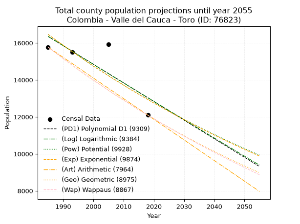
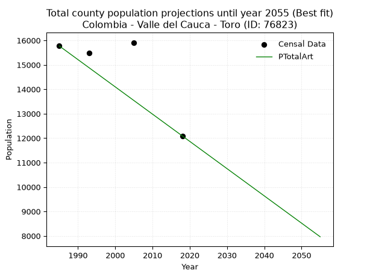
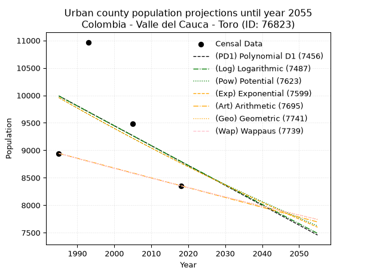
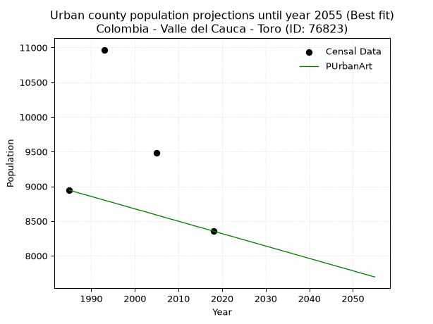
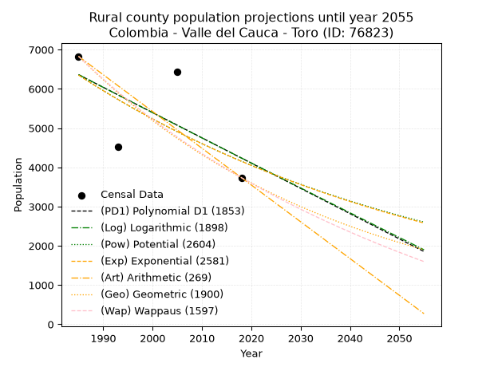
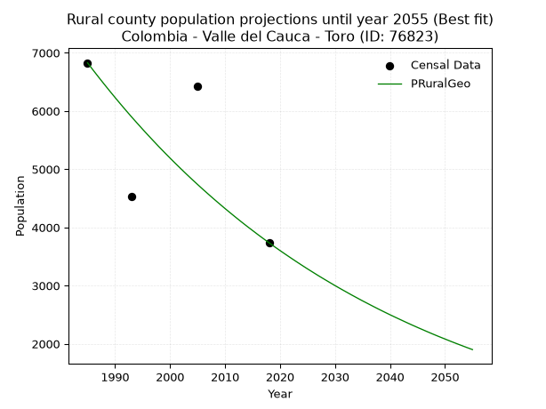

<div align="center">


</div>

# 📜 _“Population and Public Services Demand Projections (PPSD) until Year 2050 for Colombia - Valle del Cauca - Toro (ID: 76823)”_
Keywords: `population` `public-service` `projection` `lineal` `polynomial` `logarithmic` `potential` `exponential` `arithmetic` `geometric` `wappaus` `dane` `colombia` `south-america`

PPSD are analytical estimates used by governments and planners to anticipate future changes in population size, age distribution, and the resulting community needs for utilities, healthcare, education, and infrastructure as sizing future water treatment facilities, electrical grids, and road networks based on spatial growth.

<div align="center">

</img>

</div>


> **General running parameters**: • app_version: _v20260806_. • Python version: _3.14.7_. • Pandas version: _3.0.5_. • NumPy version: _2.5.1_. • Creates, save and include plots into reports (create_plot): _False_. • Projection until year: _2050_. • Process polynomial degree 2 and up: _False_. • Process Wappaus: _True_. • Process Wappaus: _True_. • Set negative values to zero: _True_. • Set infinite values to zero: _True_. • Drop dataset notes: _True_. 
<div align="center">

Maps & GIS Layers: [:earth_americas:Google](http://maps.google.com/maps?q=4.608085092,-76.076859) [:earth_americas:OSM](https://www.openstreetmap.org/#map=18/4.608085092/-76.076859&layers=P) [:earth_americas:Bing](https://www.bing.com/maps?cp=4.608085092~-76.076859&lvl=18) [:earth_americas:Apple](https://maps.apple.com/frame?center=4.608085092%2C-76.076859&span=0.003%2C0.006) [:earth_americas:GISMobile](https://github.com/rcfdtools/R.GISMobile/blob/main/file/gis/CountyLayer_CO/Readme.md)

</div>


<div align="center">

```geojson
{
  "type": "Feature",
  "geometry": {
    "type": "Point", 
    "coordinates": [-76.076859, 4.608085092]
  }, 
  "properties": {
    "Name": "Colombia - Valle del Cauca - Toro (ID: 76823)"
  }
}
```

</div>


## 0. Census Data (4 records)

Census data are official statistics collected by a government about the people and housing in a country. They usually include counts of total population, age, sex, race, income, education, and jobs.

📅Global census file: [Population.xlsx](../data/Population.xlsx)

| Source   |   Year |   CountryID | CountryName   |   StateID | StateName       |   CountyID | CountyName   |   PTotal |   PUrban |   PRural |
|:---------|-------:|------------:|:--------------|----------:|:----------------|-----------:|:-------------|---------:|---------:|---------:|
| DANE     |   1985 |          57 | Colombia      |        76 | Valle del Cauca |      76823 | Toro         |    15772 |     8944 |     6828 |
| DANE     |   1993 |          57 | Colombia      |        76 | Valle del Cauca |      76823 | Toro         |    15494 |    10968 |     4526 |
| DANE     |   2005 |          57 | Colombia      |        76 | Valle del Cauca |      76823 | Toro         |    15913 |     9487 |     6426 |
| DANE     |   2018 |          57 | Colombia      |        76 | Valle del Cauca |      76823 | Toro         |    12091 |     8355 |     3736 |

> 🔥Some records could had specific notes about the registered values or the corresponding urban or rural distribution.

📅[SUI-RUPS](https://www.datos.gov.co/Hacienda-y-Cr-dito-P-blico/Registro-nico-de-Prestadores-de-Servicios-P-blicos/4qkq-csdn/about_data) - Local public utility companies: [RUPS.csv](../data/RUPS.csv)

 | SERVICIO       | ESTADO    | NOMBRE                                                                                                               | NIT         | DEPARTAMENTO_DOMICILIO   | MUNICIPIO_DOMICILIO   | DIRECCION              |   TELEFONO | EMAIL                        | TIPO_PRESTADOR                             | CLASIFICACION                 |
|:---------------|:----------|:---------------------------------------------------------------------------------------------------------------------|:------------|:-------------------------|:----------------------|:-----------------------|-----------:|:-----------------------------|:-------------------------------------------|:------------------------------|
| ACUEDUCTO      | OPERATIVA | SOCIEDAD DE ACUEDUCTOS Y ALCANTARILLADOS DEL VALLE DEL CAUCA S.A.  E.S.P.                                            | 890399032-8 | VALLE DEL CAUCA          | CALI                  | AVENIDA 5 N # 23 AN 41 |    6203400 | rosemary@acuavalle.gov.co    | SOCIEDADES (EMPRESA DE SERVICIOS PUBLICOS) | MAYOR O IGUAL A 5001 USUARIOS |
| ALCANTARILLADO | OPERATIVA | SOCIEDAD DE ACUEDUCTOS Y ALCANTARILLADOS DEL VALLE DEL CAUCA S.A.  E.S.P.                                            | 890399032-8 | VALLE DEL CAUCA          | CALI                  | AVENIDA 5 N # 23 AN 41 |    6203400 | rosemary@acuavalle.gov.co    | SOCIEDADES (EMPRESA DE SERVICIOS PUBLICOS) | MAYOR O IGUAL A 5001 USUARIOS |
| ACUEDUCTO      | OPERATIVA | ASOCIACION CIVICA JUNTA ADMINISTRADORA DEL ACUEDUCTO DEL CORREGIMIENTO DE SAN FRANCISCO (CABECERA) MUNICIPIO DE TORO | 821002579-1 | VALLE DEL CAUCA          | TORO                  | CALLE 1 # 8-48         |    2210552 | asocsanfrancisco@hotmail.com | ORGANIZACION AUTORIZADA                    | MENOR O IGUAL A 2500 USUARIOS |

## 1. Total

### 1.1. Coefficients and Parameters

* (PD1) Polynomial Deg 1: -100.60618225611971, 216055.01605780347 (lineal)
* (Log) Logarithmic: -201055.8301946905, 1543044.4764701505
* (Pow) Potential: -14.58947193752814, 52.32901944095369
* (Exp) Exponential: -0.007300358492190602, 32349650686.72775
* (Art) Arithmetic: Year diff. 2018 - 1985 = 33, Population diff. 12091 - 15772 = -3681, Annual growth = -111.54545454545455
* (Geo) Geometric: Year diff. 2018 - 1985 = 33, Population diff. 12091 - 15772 = -3681, Annual growth % = -0.008021438265526926
* (Wap) Wappaus: i = -0.8006708146678717, Condition values only valid for < 200)

<sub>
Wappaus condition values: ['-0.00', '-0.80', '-1.60', '-2.40', '-3.20', '-4.00', '-4.80', '-5.60', '-6.41', '-7.21', '-8.01', '-8.81', '-9.61', '-10.41', '-11.21', '-12.01', '-12.81', '-13.61', '-14.41', '-15.21', '-16.01', '-16.81', '-17.61', '-18.42', '-19.22', '-20.02', '-20.82', '-21.62', '-22.42', '-23.22', '-24.02', '-24.82', '-25.62', '-26.42', '-27.22', '-28.02', '-28.82', '-29.62', '-30.43', '-31.23', '-32.03', '-32.83', '-33.63', '-34.43', '-35.23', '-36.03', '-36.83', '-37.63', '-38.43', '-39.23', '-40.03', '-40.83', '-41.63', '-42.44', '-43.24', '-44.04', '-44.84', '-45.64', '-46.44', '-47.24', '-48.04', '-48.84', '-49.64', '-50.44', '-51.24', '-52.04']
</sub>


### 1.2. Projected Dataset

|   Year |   CountyID |   PTotalPD1 |   PTotalLog |   PTotalPow |   PTotalExp |   PTotalArt |   PTotalGeo |   PTotalWap |
|-------:|-----------:|------------:|------------:|------------:|------------:|------------:|------------:|------------:|
|   1985 |      76823 |       16352 |       16352 |       16460 |       16459 |       15772 |       15772 |       15772 |
|   1986 |      76823 |       16251 |       16251 |       16340 |       16340 |       15660 |       15645 |       15646 |
|   1987 |      76823 |       16151 |       16150 |       16220 |       16221 |       15549 |       15520 |       15521 |
|   1988 |      76823 |       16050 |       16049 |       16101 |       16103 |       15437 |       15395 |       15398 |
|   1989 |      76823 |       15949 |       15948 |       15984 |       15986 |       15326 |       15272 |       15275 |
|   1990 |      76823 |       15849 |       15847 |       15867 |       15870 |       15214 |       15149 |       15153 |
|   1991 |      76823 |       15748 |       15746 |       15751 |       15754 |       15103 |       15028 |       15032 |
|   1992 |      76823 |       15648 |       15645 |       15636 |       15639 |       14991 |       14907 |       14912 |
|   1993 |      76823 |       15547 |       15544 |       15522 |       15526 |       14880 |       14788 |       14793 |
|   1994 |      76823 |       15446 |       15443 |       15409 |       15413 |       14768 |       14669 |       14675 |
|   1995 |      76823 |       15346 |       15342 |       15297 |       15301 |       14657 |       14552 |       14558 |
|   1996 |      76823 |       15245 |       15241 |       15185 |       15189 |       14545 |       14435 |       14441 |
|   1997 |      76823 |       15144 |       15141 |       15075 |       15079 |       14433 |       14319 |       14326 |
|   1998 |      76823 |       15044 |       15040 |       14965 |       14969 |       14322 |       14204 |       14212 |
|   1999 |      76823 |       14943 |       14939 |       14856 |       14860 |       14210 |       14090 |       14098 |
|   2000 |      76823 |       14843 |       14839 |       14748 |       14752 |       14099 |       13977 |       13985 |
|   2001 |      76823 |       14742 |       14738 |       14641 |       14645 |       13987 |       13865 |       13873 |
|   2002 |      76823 |       14641 |       14638 |       14535 |       14538 |       13876 |       13754 |       13762 |
|   2003 |      76823 |       14541 |       14537 |       14429 |       14433 |       13764 |       13644 |       13652 |
|   2004 |      76823 |       14440 |       14437 |       14324 |       14328 |       13653 |       13534 |       13542 |
|   2005 |      76823 |       14340 |       14337 |       14220 |       14223 |       13541 |       13426 |       13434 |
|   2006 |      76823 |       14239 |       14236 |       14117 |       14120 |       13430 |       13318 |       13326 |
|   2007 |      76823 |       14138 |       14136 |       14015 |       14017 |       13318 |       13211 |       13219 |
|   2008 |      76823 |       14038 |       14036 |       13914 |       13915 |       13206 |       13105 |       13112 |
|   2009 |      76823 |       13937 |       13936 |       13813 |       13814 |       13095 |       13000 |       13007 |
|   2010 |      76823 |       13837 |       13836 |       13713 |       13714 |       12983 |       12896 |       12902 |
|   2011 |      76823 |       13736 |       13736 |       13614 |       13614 |       12872 |       12792 |       12798 |
|   2012 |      76823 |       13635 |       13636 |       13515 |       13515 |       12760 |       12690 |       12695 |
|   2013 |      76823 |       13535 |       13536 |       13418 |       13417 |       12649 |       12588 |       12593 |
|   2014 |      76823 |       13434 |       13436 |       13321 |       13319 |       12537 |       12487 |       12491 |
|   2015 |      76823 |       13334 |       13336 |       13225 |       13222 |       12426 |       12387 |       12390 |
|   2016 |      76823 |       13233 |       13237 |       13129 |       13126 |       12314 |       12287 |       12289 |
|   2017 |      76823 |       13132 |       13137 |       13035 |       13030 |       12203 |       12189 |       12190 |
|   2018 |      76823 |       13032 |       13037 |       12941 |       12936 |       12091 |       12091 |       12091 |
|   2019 |      76823 |       12931 |       12938 |       12848 |       12842 |       11979 |       11994 |       11993 |
|   2020 |      76823 |       12831 |       12838 |       12755 |       12748 |       11868 |       11898 |       11895 |
|   2021 |      76823 |       12730 |       12739 |       12663 |       12655 |       11756 |       11802 |       11799 |
|   2022 |      76823 |       12629 |       12639 |       12572 |       12563 |       11645 |       11708 |       11702 |
|   2023 |      76823 |       12529 |       12540 |       12482 |       12472 |       11533 |       11614 |       11607 |
|   2024 |      76823 |       12428 |       12440 |       12392 |       12381 |       11422 |       11521 |       11512 |
|   2025 |      76823 |       12327 |       12341 |       12303 |       12291 |       11310 |       11428 |       11418 |
|   2026 |      76823 |       12227 |       12242 |       12215 |       12202 |       11199 |       11337 |       11324 |
|   2027 |      76823 |       12126 |       12143 |       12127 |       12113 |       11087 |       11246 |       11232 |
|   2028 |      76823 |       12026 |       12043 |       12040 |       12025 |       10976 |       11155 |       11139 |
|   2029 |      76823 |       11925 |       11944 |       11954 |       11938 |       10864 |       11066 |       11048 |
|   2030 |      76823 |       11824 |       11845 |       11869 |       11851 |       10752 |       10977 |       10957 |
|   2031 |      76823 |       11724 |       11746 |       11784 |       11764 |       10641 |       10889 |       10866 |
|   2032 |      76823 |       11623 |       11647 |       11699 |       11679 |       10529 |       10802 |       10777 |
|   2033 |      76823 |       11523 |       11548 |       11616 |       11594 |       10418 |       10715 |       10688 |
|   2034 |      76823 |       11422 |       11450 |       11533 |       11510 |       10306 |       10629 |       10599 |
|   2035 |      76823 |       11321 |       11351 |       11450 |       11426 |       10195 |       10544 |       10511 |
|   2036 |      76823 |       11221 |       11252 |       11368 |       11343 |       10083 |       10459 |       10424 |
|   2037 |      76823 |       11120 |       11153 |       11287 |       11260 |        9972 |       10375 |       10337 |
|   2038 |      76823 |       11020 |       11054 |       11207 |       11178 |        9860 |       10292 |       10251 |
|   2039 |      76823 |       10919 |       10956 |       11127 |       11097 |        9749 |       10210 |       10165 |
|   2040 |      76823 |       10818 |       10857 |       11047 |       11016 |        9637 |       10128 |       10080 |
|   2041 |      76823 |       10718 |       10759 |       10969 |       10936 |        9525 |       10047 |        9995 |
|   2042 |      76823 |       10617 |       10660 |       10891 |       10857 |        9414 |        9966 |        9911 |
|   2043 |      76823 |       10517 |       10562 |       10813 |       10778 |        9302 |        9886 |        9828 |
|   2044 |      76823 |       10416 |       10463 |       10736 |       10699 |        9191 |        9807 |        9745 |
|   2045 |      76823 |       10315 |       10365 |       10660 |       10622 |        9079 |        9728 |        9663 |
|   2046 |      76823 |       10215 |       10267 |       10584 |       10544 |        8968 |        9650 |        9581 |
|   2047 |      76823 |       10114 |       10169 |       10509 |       10468 |        8856 |        9573 |        9499 |
|   2048 |      76823 |       10014 |       10070 |       10434 |       10391 |        8745 |        9496 |        9419 |
|   2049 |      76823 |        9913 |        9972 |       10360 |       10316 |        8633 |        9420 |        9338 |
|   2050 |      76823 |        9812 |        9874 |       10287 |       10241 |        8522 |        9344 |        9259 |
<div align="center">

</img>

</div>


### 1.3. Best fit with absolute and relative error (%)

Relative error puts that difference into context by dividing the absolute error by the true value, creating a unitless ratio or percentage that shows the scale of the mistake.

Absolute and relative error

|   Year | Source   |   CountryID | CountryName   |   StateID | StateName       |   CountyID_x | CountyName   |   PTotal |   PUrban |   PRural |   CountyID_y |   PTotalPD1 |   PTotalLog |   PTotalPow |   PTotalExp |   PTotalArt |   PTotalGeo |   PTotalWap |   PTotalPD1AbsError |   PTotalLogAbsError |   PTotalPowAbsError |   PTotalExpAbsError |   PTotalArtAbsError |   PTotalGeoAbsError |   PTotalWapAbsError |   PTotalPD1RelError |   PTotalLogRelError |   PTotalPowRelError |   PTotalExpRelError |   PTotalArtRelError |   PTotalGeoRelError |   PTotalWapRelError |
|-------:|:---------|------------:|:--------------|----------:|:----------------|-------------:|:-------------|---------:|---------:|---------:|-------------:|------------:|------------:|------------:|------------:|------------:|------------:|------------:|--------------------:|--------------------:|--------------------:|--------------------:|--------------------:|--------------------:|--------------------:|--------------------:|--------------------:|--------------------:|--------------------:|--------------------:|--------------------:|--------------------:|
|   1985 | DANE     |          57 | Colombia      |        76 | Valle del Cauca |        76823 | Toro         |    15772 |     8944 |     6828 |        76823 |       16352 |       16352 |       16460 |       16459 |       15772 |       15772 |       15772 |                 580 |                 580 |                 688 |                 687 |                   0 |                   0 |                   0 |            3.6774   |            3.6774   |            4.36216  |            4.35582  |             0       |              0      |             0       |
|   1993 | DANE     |          57 | Colombia      |        76 | Valle del Cauca |        76823 | Toro         |    15494 |    10968 |     4526 |        76823 |       15547 |       15544 |       15522 |       15526 |       14880 |       14788 |       14793 |                  53 |                  50 |                  28 |                  32 |                 614 |                 706 |                 701 |            0.342068 |            0.322706 |            0.180715 |            0.206532 |             3.96282 |              4.5566 |             4.52433 |
|   2005 | DANE     |          57 | Colombia      |        76 | Valle del Cauca |        76823 | Toro         |    15913 |     9487 |     6426 |        76823 |       14340 |       14337 |       14220 |       14223 |       13541 |       13426 |       13434 |                1573 |                1576 |                1693 |                1690 |                2372 |                2487 |                2479 |            9.885    |            9.90385  |           10.6391   |           10.6202   |            14.9061  |             15.6287 |            15.5785  |
|   2018 | DANE     |          57 | Colombia      |        76 | Valle del Cauca |        76823 | Toro         |    12091 |     8355 |     3736 |        76823 |       13032 |       13037 |       12941 |       12936 |       12091 |       12091 |       12091 |                 941 |                 946 |                 850 |                 845 |                   0 |                   0 |                   0 |            7.78265  |            7.824    |            7.03002  |            6.98867  |             0       |              0      |             0       |

Relative error mean

| Method    |   RelError | Best   |
|:----------|-----------:|:-------|
| PTotalPD1 |    5.42178 |        |
| PTotalLog |    5.43199 |        |
| PTotalPow |    5.553   |        |
| PTotalExp |    5.54282 |        |
| PTotalArt |    4.71722 | True   |
| PTotalGeo |    5.04633 |        |
| PTotalWap |    5.0257  |        |

💙Best method: _**PTotalArt**_
<div align="center">

</img>

</div>


### 1.4. Fresh water supply demand in liters per capita per day (lpcd)

The fresh water supply demand typically ranges from 100 to 300 liters per capita per day (lpcd) for standard domestic and municipal planning, though absolute survival minimums set by the World Health Organization are as low as 7.5 to 20 liters per day, and total consumption in high-income nations can exceed 400 liters.

> `CZ`: Level in meters above the sea level (masl)<br> `WS`: Fresh water supply demand in liters per capita per day (lpcd or l/h/d)<br> `WSAll`: Zonal fresh water supply demand in liters per second (l/s)<br> `A`: Zonal area in square meters<br> `DP`: Population density (people/hectare or p/ha)

Reference values (RAS Colombia)

|    CZ |   WS |
|------:|-----:|
|  1000 |  120 |
|  2000 |  130 |
| 99999 |  140 |

County shapefile geometry properties and water supply values

|   CountyID |      ATotal |   CZTotal |   WSTotal |
|-----------:|------------:|----------:|----------:|
|      76823 | 1.75756e+08 |   1233.08 |       130 |

Projected values for best method: PTotalArt

|   CountyID |   Year |   PTotalArt |   DPTotal |   WSTotal |   WSTotalAll |
|-----------:|-------:|------------:|----------:|----------:|-------------:|
|      76823 |   1985 |       15772 |      0.9  |       130 |      23.731  |
|      76823 |   1986 |       15660 |      0.89 |       130 |      23.5625 |
|      76823 |   1987 |       15549 |      0.88 |       130 |      23.3955 |
|      76823 |   1988 |       15437 |      0.88 |       130 |      23.227  |
|      76823 |   1989 |       15326 |      0.87 |       130 |      23.06   |
|      76823 |   1990 |       15214 |      0.87 |       130 |      22.8914 |
|      76823 |   1991 |       15103 |      0.86 |       130 |      22.7244 |
|      76823 |   1992 |       14991 |      0.85 |       130 |      22.5559 |
|      76823 |   1993 |       14880 |      0.85 |       130 |      22.3889 |
|      76823 |   1994 |       14768 |      0.84 |       130 |      22.2204 |
|      76823 |   1995 |       14657 |      0.83 |       130 |      22.0534 |
|      76823 |   1996 |       14545 |      0.83 |       130 |      21.8848 |
|      76823 |   1997 |       14433 |      0.82 |       130 |      21.7163 |
|      76823 |   1998 |       14322 |      0.81 |       130 |      21.5493 |
|      76823 |   1999 |       14210 |      0.81 |       130 |      21.3808 |
|      76823 |   2000 |       14099 |      0.8  |       130 |      21.2138 |
|      76823 |   2001 |       13987 |      0.8  |       130 |      21.0453 |
|      76823 |   2002 |       13876 |      0.79 |       130 |      20.8782 |
|      76823 |   2003 |       13764 |      0.78 |       130 |      20.7097 |
|      76823 |   2004 |       13653 |      0.78 |       130 |      20.5427 |
|      76823 |   2005 |       13541 |      0.77 |       130 |      20.3742 |
|      76823 |   2006 |       13430 |      0.76 |       130 |      20.2072 |
|      76823 |   2007 |       13318 |      0.76 |       130 |      20.0387 |
|      76823 |   2008 |       13206 |      0.75 |       130 |      19.8701 |
|      76823 |   2009 |       13095 |      0.75 |       130 |      19.7031 |
|      76823 |   2010 |       12983 |      0.74 |       130 |      19.5346 |
|      76823 |   2011 |       12872 |      0.73 |       130 |      19.3676 |
|      76823 |   2012 |       12760 |      0.73 |       130 |      19.1991 |
|      76823 |   2013 |       12649 |      0.72 |       130 |      19.0321 |
|      76823 |   2014 |       12537 |      0.71 |       130 |      18.8635 |
|      76823 |   2015 |       12426 |      0.71 |       130 |      18.6965 |
|      76823 |   2016 |       12314 |      0.7  |       130 |      18.528  |
|      76823 |   2017 |       12203 |      0.69 |       130 |      18.361  |
|      76823 |   2018 |       12091 |      0.69 |       130 |      18.1925 |
|      76823 |   2019 |       11979 |      0.68 |       130 |      18.024  |
|      76823 |   2020 |       11868 |      0.68 |       130 |      17.8569 |
|      76823 |   2021 |       11756 |      0.67 |       130 |      17.6884 |
|      76823 |   2022 |       11645 |      0.66 |       130 |      17.5214 |
|      76823 |   2023 |       11533 |      0.66 |       130 |      17.3529 |
|      76823 |   2024 |       11422 |      0.65 |       130 |      17.1859 |
|      76823 |   2025 |       11310 |      0.64 |       130 |      17.0174 |
|      76823 |   2026 |       11199 |      0.64 |       130 |      16.8503 |
|      76823 |   2027 |       11087 |      0.63 |       130 |      16.6818 |
|      76823 |   2028 |       10976 |      0.62 |       130 |      16.5148 |
|      76823 |   2029 |       10864 |      0.62 |       130 |      16.3463 |
|      76823 |   2030 |       10752 |      0.61 |       130 |      16.1778 |
|      76823 |   2031 |       10641 |      0.61 |       130 |      16.0108 |
|      76823 |   2032 |       10529 |      0.6  |       130 |      15.8422 |
|      76823 |   2033 |       10418 |      0.59 |       130 |      15.6752 |
|      76823 |   2034 |       10306 |      0.59 |       130 |      15.5067 |
|      76823 |   2035 |       10195 |      0.58 |       130 |      15.3397 |
|      76823 |   2036 |       10083 |      0.57 |       130 |      15.1712 |
|      76823 |   2037 |        9972 |      0.57 |       130 |      15.0042 |
|      76823 |   2038 |        9860 |      0.56 |       130 |      14.8356 |
|      76823 |   2039 |        9749 |      0.55 |       130 |      14.6686 |
|      76823 |   2040 |        9637 |      0.55 |       130 |      14.5001 |
|      76823 |   2041 |        9525 |      0.54 |       130 |      14.3316 |
|      76823 |   2042 |        9414 |      0.54 |       130 |      14.1646 |
|      76823 |   2043 |        9302 |      0.53 |       130 |      13.9961 |
|      76823 |   2044 |        9191 |      0.52 |       130 |      13.8291 |
|      76823 |   2045 |        9079 |      0.52 |       130 |      13.6605 |
|      76823 |   2046 |        8968 |      0.51 |       130 |      13.4935 |
|      76823 |   2047 |        8856 |      0.5  |       130 |      13.325  |
|      76823 |   2048 |        8745 |      0.5  |       130 |      13.158  |
|      76823 |   2049 |        8633 |      0.49 |       130 |      12.9895 |
|      76823 |   2050 |        8522 |      0.48 |       130 |      12.8225 |

## 2. Urban

### 2.1. Coefficients and Parameters

* (PD1) Polynomial Deg 1: -36.209554395824114, 81866.66118024717 (lineal)
* (Log) Logarithmic: -72227.75463882255, 558442.2418065912
* (Pow) Potential: -7.713918119803431, 29.436912361929515
* (Exp) Exponential: -0.0038670559428145806, 21477593.650380924
* (Art) Arithmetic: Year diff. 2018 - 1985 = 33, Population diff. 8355 - 8944 = -589, Annual growth = -17.848484848484848
* (Geo) Geometric: Year diff. 2018 - 1985 = 33, Population diff. 8355 - 8944 = -589, Annual growth % = -0.0020621966345814036
* (Wap) Wappaus: i = -0.2063527932075247, Condition values only valid for < 200)

<sub>
Wappaus condition values: ['-0.00', '-0.21', '-0.41', '-0.62', '-0.83', '-1.03', '-1.24', '-1.44', '-1.65', '-1.86', '-2.06', '-2.27', '-2.48', '-2.68', '-2.89', '-3.10', '-3.30', '-3.51', '-3.71', '-3.92', '-4.13', '-4.33', '-4.54', '-4.75', '-4.95', '-5.16', '-5.37', '-5.57', '-5.78', '-5.98', '-6.19', '-6.40', '-6.60', '-6.81', '-7.02', '-7.22', '-7.43', '-7.64', '-7.84', '-8.05', '-8.25', '-8.46', '-8.67', '-8.87', '-9.08', '-9.29', '-9.49', '-9.70', '-9.90', '-10.11', '-10.32', '-10.52', '-10.73', '-10.94', '-11.14', '-11.35', '-11.56', '-11.76', '-11.97', '-12.17', '-12.38', '-12.59', '-12.79', '-13.00', '-13.21', '-13.41']
</sub>


### 2.2. Projected Dataset

|   Year |   CountyID |   PUrbanPD1 |   PUrbanLog |   PUrbanPow |   PUrbanExp |   PUrbanArt |   PUrbanGeo |   PUrbanWap |
|-------:|-----------:|------------:|------------:|------------:|------------:|------------:|------------:|------------:|
|   1985 |      76823 |        9991 |        9990 |        9960 |        9961 |        8944 |        8944 |        8944 |
|   1986 |      76823 |        9954 |        9953 |        9921 |        9922 |        8926 |        8926 |        8926 |
|   1987 |      76823 |        9918 |        9917 |        9883 |        9884 |        8908 |        8907 |        8907 |
|   1988 |      76823 |        9882 |        9881 |        9845 |        9846 |        8890 |        8889 |        8889 |
|   1989 |      76823 |        9846 |        9844 |        9806 |        9808 |        8873 |        8870 |        8870 |
|   1990 |      76823 |        9810 |        9808 |        9769 |        9770 |        8855 |        8852 |        8852 |
|   1991 |      76823 |        9773 |        9772 |        9731 |        9732 |        8837 |        8834 |        8834 |
|   1992 |      76823 |        9737 |        9736 |        9693 |        9695 |        8819 |        8816 |        8816 |
|   1993 |      76823 |        9701 |        9699 |        9656 |        9657 |        8801 |        8798 |        8798 |
|   1994 |      76823 |        9665 |        9663 |        9618 |        9620 |        8783 |        8779 |        8779 |
|   1995 |      76823 |        9629 |        9627 |        9581 |        9583 |        8766 |        8761 |        8761 |
|   1996 |      76823 |        9592 |        9591 |        9544 |        9546 |        8748 |        8743 |        8743 |
|   1997 |      76823 |        9556 |        9555 |        9507 |        9509 |        8730 |        8725 |        8725 |
|   1998 |      76823 |        9520 |        9518 |        9471 |        9472 |        8712 |        8707 |        8707 |
|   1999 |      76823 |        9484 |        9482 |        9434 |        9436 |        8694 |        8689 |        8689 |
|   2000 |      76823 |        9448 |        9446 |        9398 |        9399 |        8676 |        8671 |        8671 |
|   2001 |      76823 |        9411 |        9410 |        9362 |        9363 |        8658 |        8653 |        8653 |
|   2002 |      76823 |        9375 |        9374 |        9326 |        9327 |        8641 |        8636 |        8636 |
|   2003 |      76823 |        9339 |        9338 |        9290 |        9291 |        8623 |        8618 |        8618 |
|   2004 |      76823 |        9303 |        9302 |        9254 |        9255 |        8605 |        8600 |        8600 |
|   2005 |      76823 |        9267 |        9266 |        9219 |        9219 |        8587 |        8582 |        8582 |
|   2006 |      76823 |        9230 |        9230 |        9183 |        9184 |        8569 |        8565 |        8565 |
|   2007 |      76823 |        9194 |        9194 |        9148 |        9148 |        8551 |        8547 |        8547 |
|   2008 |      76823 |        9158 |        9158 |        9113 |        9113 |        8533 |        8529 |        8529 |
|   2009 |      76823 |        9122 |        9122 |        9078 |        9078 |        8516 |        8512 |        8512 |
|   2010 |      76823 |        9085 |        9086 |        9043 |        9043 |        8498 |        8494 |        8494 |
|   2011 |      76823 |        9049 |        9050 |        9009 |        9008 |        8480 |        8477 |        8477 |
|   2012 |      76823 |        9013 |        9014 |        8974 |        8973 |        8462 |        8459 |        8459 |
|   2013 |      76823 |        8977 |        8978 |        8940 |        8939 |        8444 |        8442 |        8442 |
|   2014 |      76823 |        8941 |        8942 |        8906 |        8904 |        8426 |        8424 |        8424 |
|   2015 |      76823 |        8904 |        8906 |        8872 |        8870 |        8409 |        8407 |        8407 |
|   2016 |      76823 |        8868 |        8871 |        8838 |        8836 |        8391 |        8390 |        8390 |
|   2017 |      76823 |        8832 |        8835 |        8804 |        8801 |        8373 |        8372 |        8372 |
|   2018 |      76823 |        8796 |        8799 |        8770 |        8767 |        8355 |        8355 |        8355 |
|   2019 |      76823 |        8760 |        8763 |        8737 |        8734 |        8337 |        8338 |        8338 |
|   2020 |      76823 |        8723 |        8727 |        8704 |        8700 |        8319 |        8321 |        8321 |
|   2021 |      76823 |        8687 |        8692 |        8671 |        8666 |        8301 |        8303 |        8303 |
|   2022 |      76823 |        8651 |        8656 |        8637 |        8633 |        8284 |        8286 |        8286 |
|   2023 |      76823 |        8615 |        8620 |        8605 |        8600 |        8266 |        8269 |        8269 |
|   2024 |      76823 |        8579 |        8585 |        8572 |        8566 |        8248 |        8252 |        8252 |
|   2025 |      76823 |        8542 |        8549 |        8539 |        8533 |        8230 |        8235 |        8235 |
|   2026 |      76823 |        8506 |        8513 |        8507 |        8500 |        8212 |        8218 |        8218 |
|   2027 |      76823 |        8470 |        8478 |        8474 |        8468 |        8194 |        8201 |        8201 |
|   2028 |      76823 |        8434 |        8442 |        8442 |        8435 |        8177 |        8184 |        8184 |
|   2029 |      76823 |        8397 |        8406 |        8410 |        8402 |        8159 |        8167 |        8167 |
|   2030 |      76823 |        8361 |        8371 |        8378 |        8370 |        8141 |        8151 |        8150 |
|   2031 |      76823 |        8325 |        8335 |        8347 |        8338 |        8123 |        8134 |        8133 |
|   2032 |      76823 |        8289 |        8300 |        8315 |        8305 |        8105 |        8117 |        8117 |
|   2033 |      76823 |        8253 |        8264 |        8283 |        8273 |        8087 |        8100 |        8100 |
|   2034 |      76823 |        8216 |        8229 |        8252 |        8241 |        8069 |        8084 |        8083 |
|   2035 |      76823 |        8180 |        8193 |        8221 |        8210 |        8052 |        8067 |        8066 |
|   2036 |      76823 |        8144 |        8158 |        8190 |        8178 |        8034 |        8050 |        8050 |
|   2037 |      76823 |        8108 |        8122 |        8159 |        8146 |        8016 |        8034 |        8033 |
|   2038 |      76823 |        8072 |        8087 |        8128 |        8115 |        7998 |        8017 |        8017 |
|   2039 |      76823 |        8035 |        8051 |        8097 |        8084 |        7980 |        8001 |        8000 |
|   2040 |      76823 |        7999 |        8016 |        8067 |        8052 |        7962 |        7984 |        7983 |
|   2041 |      76823 |        7963 |        7980 |        8036 |        8021 |        7944 |        7968 |        7967 |
|   2042 |      76823 |        7927 |        7945 |        8006 |        7990 |        7927 |        7951 |        7950 |
|   2043 |      76823 |        7891 |        7910 |        7976 |        7960 |        7909 |        7935 |        7934 |
|   2044 |      76823 |        7854 |        7874 |        7946 |        7929 |        7891 |        7918 |        7918 |
|   2045 |      76823 |        7818 |        7839 |        7916 |        7898 |        7873 |        7902 |        7901 |
|   2046 |      76823 |        7782 |        7804 |        7886 |        7868 |        7855 |        7886 |        7885 |
|   2047 |      76823 |        7746 |        7768 |        7856 |        7837 |        7837 |        7870 |        7869 |
|   2048 |      76823 |        7709 |        7733 |        7827 |        7807 |        7820 |        7853 |        7852 |
|   2049 |      76823 |        7673 |        7698 |        7797 |        7777 |        7802 |        7837 |        7836 |
|   2050 |      76823 |        7637 |        7663 |        7768 |        7747 |        7784 |        7821 |        7820 |
<div align="center">

</img>

</div>


### 2.3. Best fit with absolute and relative error (%)

Relative error puts that difference into context by dividing the absolute error by the true value, creating a unitless ratio or percentage that shows the scale of the mistake.

Absolute and relative error

|   Year | Source   |   CountryID | CountryName   |   StateID | StateName       |   CountyID_x | CountyName   |   PTotal |   PUrban |   PRural |   CountyID_y |   PUrbanPD1 |   PUrbanLog |   PUrbanPow |   PUrbanExp |   PUrbanArt |   PUrbanGeo |   PUrbanWap |   PUrbanPD1AbsError |   PUrbanLogAbsError |   PUrbanPowAbsError |   PUrbanExpAbsError |   PUrbanArtAbsError |   PUrbanGeoAbsError |   PUrbanWapAbsError |   PUrbanPD1RelError |   PUrbanLogRelError |   PUrbanPowRelError |   PUrbanExpRelError |   PUrbanArtRelError |   PUrbanGeoRelError |   PUrbanWapRelError |
|-------:|:---------|------------:|:--------------|----------:|:----------------|-------------:|:-------------|---------:|---------:|---------:|-------------:|------------:|------------:|------------:|------------:|------------:|------------:|------------:|--------------------:|--------------------:|--------------------:|--------------------:|--------------------:|--------------------:|--------------------:|--------------------:|--------------------:|--------------------:|--------------------:|--------------------:|--------------------:|--------------------:|
|   1985 | DANE     |          57 | Colombia      |        76 | Valle del Cauca |        76823 | Toro         |    15772 |     8944 |     6828 |        76823 |        9991 |        9990 |        9960 |        9961 |        8944 |        8944 |        8944 |                1047 |                1046 |                1016 |                1017 |                   0 |                   0 |                   0 |            11.7062  |            11.695   |            11.3596  |            11.3708  |             0       |             0       |             0       |
|   1993 | DANE     |          57 | Colombia      |        76 | Valle del Cauca |        76823 | Toro         |    15494 |    10968 |     4526 |        76823 |        9701 |        9699 |        9656 |        9657 |        8801 |        8798 |        8798 |                1267 |                1269 |                1312 |                1311 |                2167 |                2170 |                2170 |            11.5518  |            11.57    |            11.9621  |            11.953   |            19.7575  |            19.7848  |            19.7848  |
|   2005 | DANE     |          57 | Colombia      |        76 | Valle del Cauca |        76823 | Toro         |    15913 |     9487 |     6426 |        76823 |        9267 |        9266 |        9219 |        9219 |        8587 |        8582 |        8582 |                 220 |                 221 |                 268 |                 268 |                 900 |                 905 |                 905 |             2.31896 |             2.3295  |             2.82492 |             2.82492 |             9.48667 |             9.53937 |             9.53937 |
|   2018 | DANE     |          57 | Colombia      |        76 | Valle del Cauca |        76823 | Toro         |    12091 |     8355 |     3736 |        76823 |        8796 |        8799 |        8770 |        8767 |        8355 |        8355 |        8355 |                 441 |                 444 |                 415 |                 412 |                   0 |                   0 |                   0 |             5.27828 |             5.31418 |             4.96709 |             4.93118 |             0       |             0       |             0       |

Relative error mean

| Method    |   RelError | Best   |
|:----------|-----------:|:-------|
| PUrbanPD1 |    7.7138  |        |
| PUrbanLog |    7.72717 |        |
| PUrbanPow |    7.77841 |        |
| PUrbanExp |    7.76995 |        |
| PUrbanArt |    7.31104 | True   |
| PUrbanGeo |    7.33105 |        |
| PUrbanWap |    7.33105 |        |

💙Best method: _**PUrbanArt**_
<div align="center">

</img>

</div>


### 2.4. Fresh water supply demand in liters per capita per day (lpcd)

The fresh water supply demand typically ranges from 100 to 300 liters per capita per day (lpcd) for standard domestic and municipal planning, though absolute survival minimums set by the World Health Organization are as low as 7.5 to 20 liters per day, and total consumption in high-income nations can exceed 400 liters.

> `CZ`: Level in meters above the sea level (masl)<br> `WS`: Fresh water supply demand in liters per capita per day (lpcd or l/h/d)<br> `WSAll`: Zonal fresh water supply demand in liters per second (l/s)<br> `A`: Zonal area in square meters<br> `DP`: Population density (people/hectare or p/ha)

Reference values (RAS Colombia)

|    CZ |   WS |
|------:|-----:|
|  1000 |  120 |
|  2000 |  130 |
| 99999 |  140 |

County shapefile geometry properties and water supply values

|   CountyID |      AUrban |   CZUrban |   WSUrban |
|-----------:|------------:|----------:|----------:|
|      76823 | 1.95159e+06 |   951.277 |       120 |

Projected values for best method: PUrbanArt

|   CountyID |   Year |   PUrbanArt |   DPUrban |   WSUrban |   WSUrbanAll |
|-----------:|-------:|------------:|----------:|----------:|-------------:|
|      76823 |   1985 |        8944 |     45.83 |       120 |      12.4222 |
|      76823 |   1986 |        8926 |     45.74 |       120 |      12.3972 |
|      76823 |   1987 |        8908 |     45.64 |       120 |      12.3722 |
|      76823 |   1988 |        8890 |     45.55 |       120 |      12.3472 |
|      76823 |   1989 |        8873 |     45.47 |       120 |      12.3236 |
|      76823 |   1990 |        8855 |     45.37 |       120 |      12.2986 |
|      76823 |   1991 |        8837 |     45.28 |       120 |      12.2736 |
|      76823 |   1992 |        8819 |     45.19 |       120 |      12.2486 |
|      76823 |   1993 |        8801 |     45.1  |       120 |      12.2236 |
|      76823 |   1994 |        8783 |     45    |       120 |      12.1986 |
|      76823 |   1995 |        8766 |     44.92 |       120 |      12.175  |
|      76823 |   1996 |        8748 |     44.83 |       120 |      12.15   |
|      76823 |   1997 |        8730 |     44.73 |       120 |      12.125  |
|      76823 |   1998 |        8712 |     44.64 |       120 |      12.1    |
|      76823 |   1999 |        8694 |     44.55 |       120 |      12.075  |
|      76823 |   2000 |        8676 |     44.46 |       120 |      12.05   |
|      76823 |   2001 |        8658 |     44.36 |       120 |      12.025  |
|      76823 |   2002 |        8641 |     44.28 |       120 |      12.0014 |
|      76823 |   2003 |        8623 |     44.18 |       120 |      11.9764 |
|      76823 |   2004 |        8605 |     44.09 |       120 |      11.9514 |
|      76823 |   2005 |        8587 |     44    |       120 |      11.9264 |
|      76823 |   2006 |        8569 |     43.91 |       120 |      11.9014 |
|      76823 |   2007 |        8551 |     43.82 |       120 |      11.8764 |
|      76823 |   2008 |        8533 |     43.72 |       120 |      11.8514 |
|      76823 |   2009 |        8516 |     43.64 |       120 |      11.8278 |
|      76823 |   2010 |        8498 |     43.54 |       120 |      11.8028 |
|      76823 |   2011 |        8480 |     43.45 |       120 |      11.7778 |
|      76823 |   2012 |        8462 |     43.36 |       120 |      11.7528 |
|      76823 |   2013 |        8444 |     43.27 |       120 |      11.7278 |
|      76823 |   2014 |        8426 |     43.18 |       120 |      11.7028 |
|      76823 |   2015 |        8409 |     43.09 |       120 |      11.6792 |
|      76823 |   2016 |        8391 |     43    |       120 |      11.6542 |
|      76823 |   2017 |        8373 |     42.9  |       120 |      11.6292 |
|      76823 |   2018 |        8355 |     42.81 |       120 |      11.6042 |
|      76823 |   2019 |        8337 |     42.72 |       120 |      11.5792 |
|      76823 |   2020 |        8319 |     42.63 |       120 |      11.5542 |
|      76823 |   2021 |        8301 |     42.53 |       120 |      11.5292 |
|      76823 |   2022 |        8284 |     42.45 |       120 |      11.5056 |
|      76823 |   2023 |        8266 |     42.36 |       120 |      11.4806 |
|      76823 |   2024 |        8248 |     42.26 |       120 |      11.4556 |
|      76823 |   2025 |        8230 |     42.17 |       120 |      11.4306 |
|      76823 |   2026 |        8212 |     42.08 |       120 |      11.4056 |
|      76823 |   2027 |        8194 |     41.99 |       120 |      11.3806 |
|      76823 |   2028 |        8177 |     41.9  |       120 |      11.3569 |
|      76823 |   2029 |        8159 |     41.81 |       120 |      11.3319 |
|      76823 |   2030 |        8141 |     41.71 |       120 |      11.3069 |
|      76823 |   2031 |        8123 |     41.62 |       120 |      11.2819 |
|      76823 |   2032 |        8105 |     41.53 |       120 |      11.2569 |
|      76823 |   2033 |        8087 |     41.44 |       120 |      11.2319 |
|      76823 |   2034 |        8069 |     41.35 |       120 |      11.2069 |
|      76823 |   2035 |        8052 |     41.26 |       120 |      11.1833 |
|      76823 |   2036 |        8034 |     41.17 |       120 |      11.1583 |
|      76823 |   2037 |        8016 |     41.07 |       120 |      11.1333 |
|      76823 |   2038 |        7998 |     40.98 |       120 |      11.1083 |
|      76823 |   2039 |        7980 |     40.89 |       120 |      11.0833 |
|      76823 |   2040 |        7962 |     40.8  |       120 |      11.0583 |
|      76823 |   2041 |        7944 |     40.71 |       120 |      11.0333 |
|      76823 |   2042 |        7927 |     40.62 |       120 |      11.0097 |
|      76823 |   2043 |        7909 |     40.53 |       120 |      10.9847 |
|      76823 |   2044 |        7891 |     40.43 |       120 |      10.9597 |
|      76823 |   2045 |        7873 |     40.34 |       120 |      10.9347 |
|      76823 |   2046 |        7855 |     40.25 |       120 |      10.9097 |
|      76823 |   2047 |        7837 |     40.16 |       120 |      10.8847 |
|      76823 |   2048 |        7820 |     40.07 |       120 |      10.8611 |
|      76823 |   2049 |        7802 |     39.98 |       120 |      10.8361 |
|      76823 |   2050 |        7784 |     39.89 |       120 |      10.8111 |

## 3. Rural

### 3.1. Coefficients and Parameters

* (PD1) Polynomial Deg 1: -64.39662786029548, 134188.35487755603 (lineal)
* (Log) Logarithmic: -128828.0755558681, 984602.2346635608
* (Pow) Potential: -25.729273899280965, 88.65187328940411
* (Exp) Exponential: -0.012863293083413895, 779650456424620.5
* (Art) Arithmetic: Year diff. 2018 - 1985 = 33, Population diff. 3736 - 6828 = -3092, Annual growth = -93.6969696969697
* (Geo) Geometric: Year diff. 2018 - 1985 = 33, Population diff. 3736 - 6828 = -3092, Annual growth % = -0.01810727775447929
* (Wap) Wappaus: i = -1.7738918912716717, Condition values only valid for < 200)

<sub>
Wappaus condition values: ['-0.00', '-1.77', '-3.55', '-5.32', '-7.10', '-8.87', '-10.64', '-12.42', '-14.19', '-15.97', '-17.74', '-19.51', '-21.29', '-23.06', '-24.83', '-26.61', '-28.38', '-30.16', '-31.93', '-33.70', '-35.48', '-37.25', '-39.03', '-40.80', '-42.57', '-44.35', '-46.12', '-47.90', '-49.67', '-51.44', '-53.22', '-54.99', '-56.76', '-58.54', '-60.31', '-62.09', '-63.86', '-65.63', '-67.41', '-69.18', '-70.96', '-72.73', '-74.50', '-76.28', '-78.05', '-79.83', '-81.60', '-83.37', '-85.15', '-86.92', '-88.69', '-90.47', '-92.24', '-94.02', '-95.79', '-97.56', '-99.34', '-101.11', '-102.89', '-104.66', '-106.43', '-108.21', '-109.98', '-111.76', '-113.53', '-115.30']
</sub>


### 3.2. Projected Dataset

|   Year |   CountyID |   PRuralPD1 |   PRuralLog |   PRuralPow |   PRuralExp |   PRuralArt |   PRuralGeo |   PRuralWap |
|-------:|-----------:|------------:|------------:|------------:|------------:|------------:|------------:|------------:|
|   1985 |      76823 |        6361 |        6362 |        6352 |        6350 |        6828 |        6828 |        6828 |
|   1986 |      76823 |        6297 |        6298 |        6270 |        6269 |        6734 |        6704 |        6708 |
|   1987 |      76823 |        6232 |        6233 |        6189 |        6189 |        6641 |        6583 |        6590 |
|   1988 |      76823 |        6168 |        6168 |        6110 |        6110 |        6547 |        6464 |        6474 |
|   1989 |      76823 |        6103 |        6103 |        6031 |        6032 |        6453 |        6347 |        6360 |
|   1990 |      76823 |        6039 |        6038 |        5954 |        5955 |        6360 |        6232 |        6248 |
|   1991 |      76823 |        5975 |        5974 |        5877 |        5878 |        6266 |        6119 |        6138 |
|   1992 |      76823 |        5910 |        5909 |        5802 |        5803 |        6172 |        6008 |        6030 |
|   1993 |      76823 |        5846 |        5844 |        5727 |        5729 |        6078 |        5899 |        5923 |
|   1994 |      76823 |        5781 |        5780 |        5654 |        5656 |        5985 |        5793 |        5818 |
|   1995 |      76823 |        5717 |        5715 |        5581 |        5584 |        5891 |        5688 |        5715 |
|   1996 |      76823 |        5653 |        5651 |        5510 |        5512 |        5797 |        5585 |        5614 |
|   1997 |      76823 |        5588 |        5586 |        5439 |        5442 |        5704 |        5484 |        5514 |
|   1998 |      76823 |        5524 |        5521 |        5370 |        5372 |        5610 |        5384 |        5416 |
|   1999 |      76823 |        5459 |        5457 |        5301 |        5304 |        5516 |        5287 |        5320 |
|   2000 |      76823 |        5395 |        5393 |        5233 |        5236 |        5423 |        5191 |        5225 |
|   2001 |      76823 |        5331 |        5328 |        5166 |        5169 |        5329 |        5097 |        5131 |
|   2002 |      76823 |        5266 |        5264 |        5100 |        5103 |        5235 |        5005 |        5039 |
|   2003 |      76823 |        5202 |        5200 |        5035 |        5038 |        5141 |        4914 |        4948 |
|   2004 |      76823 |        5138 |        5135 |        4971 |        4973 |        5048 |        4825 |        4859 |
|   2005 |      76823 |        5073 |        5071 |        4908 |        4910 |        4954 |        4738 |        4771 |
|   2006 |      76823 |        5009 |        5007 |        4845 |        4847 |        4860 |        4652 |        4684 |
|   2007 |      76823 |        4944 |        4942 |        4783 |        4785 |        4767 |        4568 |        4598 |
|   2008 |      76823 |        4880 |        4878 |        4722 |        4724 |        4673 |        4485 |        4514 |
|   2009 |      76823 |        4816 |        4814 |        4662 |        4663 |        4579 |        4404 |        4431 |
|   2010 |      76823 |        4751 |        4750 |        4603 |        4604 |        4486 |        4324 |        4350 |
|   2011 |      76823 |        4687 |        4686 |        4544 |        4545 |        4392 |        4246 |        4269 |
|   2012 |      76823 |        4622 |        4622 |        4487 |        4487 |        4298 |        4169 |        4190 |
|   2013 |      76823 |        4558 |        4558 |        4430 |        4430 |        4204 |        4093 |        4111 |
|   2014 |      76823 |        4494 |        4494 |        4373 |        4373 |        4111 |        4019 |        4034 |
|   2015 |      76823 |        4429 |        4430 |        4318 |        4317 |        4017 |        3947 |        3958 |
|   2016 |      76823 |        4365 |        4366 |        4263 |        4262 |        3923 |        3875 |        3883 |
|   2017 |      76823 |        4300 |        4302 |        4209 |        4207 |        3830 |        3805 |        3809 |
|   2018 |      76823 |        4236 |        4238 |        4156 |        4154 |        3736 |        3736 |        3736 |
|   2019 |      76823 |        4172 |        4175 |        4103 |        4101 |        3642 |        3668 |        3664 |
|   2020 |      76823 |        4107 |        4111 |        4051 |        4048 |        3549 |        3602 |        3593 |
|   2021 |      76823 |        4043 |        4047 |        4000 |        3996 |        3455 |        3537 |        3523 |
|   2022 |      76823 |        3978 |        3983 |        3949 |        3945 |        3361 |        3473 |        3454 |
|   2023 |      76823 |        3914 |        3920 |        3899 |        3895 |        3268 |        3410 |        3386 |
|   2024 |      76823 |        3850 |        3856 |        3850 |        3845 |        3174 |        3348 |        3318 |
|   2025 |      76823 |        3785 |        3792 |        3802 |        3796 |        3080 |        3287 |        3252 |
|   2026 |      76823 |        3721 |        3729 |        3754 |        3747 |        2986 |        3228 |        3186 |
|   2027 |      76823 |        3656 |        3665 |        3706 |        3700 |        2893 |        3169 |        3122 |
|   2028 |      76823 |        3592 |        3602 |        3659 |        3652 |        2799 |        3112 |        3058 |
|   2029 |      76823 |        3528 |        3538 |        3613 |        3606 |        2705 |        3056 |        2995 |
|   2030 |      76823 |        3463 |        3475 |        3568 |        3560 |        2612 |        3000 |        2932 |
|   2031 |      76823 |        3399 |        3411 |        3523 |        3514 |        2518 |        2946 |        2871 |
|   2032 |      76823 |        3334 |        3348 |        3479 |        3469 |        2424 |        2893 |        2810 |
|   2033 |      76823 |        3270 |        3284 |        3435 |        3425 |        2331 |        2840 |        2750 |
|   2034 |      76823 |        3206 |        3221 |        3392 |        3381 |        2237 |        2789 |        2691 |
|   2035 |      76823 |        3141 |        3158 |        3349 |        3338 |        2143 |        2738 |        2633 |
|   2036 |      76823 |        3077 |        3094 |        3307 |        3295 |        2049 |        2689 |        2575 |
|   2037 |      76823 |        3012 |        3031 |        3265 |        3253 |        1956 |        2640 |        2518 |
|   2038 |      76823 |        2948 |        2968 |        3224 |        3211 |        1862 |        2592 |        2461 |
|   2039 |      76823 |        2884 |        2905 |        3184 |        3170 |        1768 |        2545 |        2406 |
|   2040 |      76823 |        2819 |        2841 |        3144 |        3130 |        1675 |        2499 |        2351 |
|   2041 |      76823 |        2755 |        2778 |        3105 |        3090 |        1581 |        2454 |        2296 |
|   2042 |      76823 |        2690 |        2715 |        3066 |        3050 |        1487 |        2410 |        2242 |
|   2043 |      76823 |        2626 |        2652 |        3027 |        3011 |        1394 |        2366 |        2189 |
|   2044 |      76823 |        2562 |        2589 |        2990 |        2973 |        1300 |        2323 |        2137 |
|   2045 |      76823 |        2497 |        2526 |        2952 |        2935 |        1206 |        2281 |        2085 |
|   2046 |      76823 |        2433 |        2463 |        2915 |        2897 |        1112 |        2240 |        2034 |
|   2047 |      76823 |        2368 |        2400 |        2879 |        2860 |        1019 |        2199 |        1983 |
|   2048 |      76823 |        2304 |        2337 |        2843 |        2824 |         925 |        2159 |        1933 |
|   2049 |      76823 |        2240 |        2274 |        2807 |        2788 |         831 |        2120 |        1883 |
|   2050 |      76823 |        2175 |        2211 |        2772 |        2752 |         738 |        2082 |        1834 |
<div align="center">

</img>

</div>


### 3.3. Best fit with absolute and relative error (%)

Relative error puts that difference into context by dividing the absolute error by the true value, creating a unitless ratio or percentage that shows the scale of the mistake.

Absolute and relative error

|   Year | Source   |   CountryID | CountryName   |   StateID | StateName       |   CountyID_x | CountyName   |   PTotal |   PUrban |   PRural |   CountyID_y |   PRuralPD1 |   PRuralLog |   PRuralPow |   PRuralExp |   PRuralArt |   PRuralGeo |   PRuralWap |   PRuralPD1AbsError |   PRuralLogAbsError |   PRuralPowAbsError |   PRuralExpAbsError |   PRuralArtAbsError |   PRuralGeoAbsError |   PRuralWapAbsError |   PRuralPD1RelError |   PRuralLogRelError |   PRuralPowRelError |   PRuralExpRelError |   PRuralArtRelError |   PRuralGeoRelError |   PRuralWapRelError |
|-------:|:---------|------------:|:--------------|----------:|:----------------|-------------:|:-------------|---------:|---------:|---------:|-------------:|------------:|------------:|------------:|------------:|------------:|------------:|------------:|--------------------:|--------------------:|--------------------:|--------------------:|--------------------:|--------------------:|--------------------:|--------------------:|--------------------:|--------------------:|--------------------:|--------------------:|--------------------:|--------------------:|
|   1985 | DANE     |          57 | Colombia      |        76 | Valle del Cauca |        76823 | Toro         |    15772 |     8944 |     6828 |        76823 |        6361 |        6362 |        6352 |        6350 |        6828 |        6828 |        6828 |                 467 |                 466 |                 476 |                 478 |                   0 |                   0 |                   0 |             6.83948 |             6.82484 |             6.97129 |             7.00059 |              0      |              0      |              0      |
|   1993 | DANE     |          57 | Colombia      |        76 | Valle del Cauca |        76823 | Toro         |    15494 |    10968 |     4526 |        76823 |        5846 |        5844 |        5727 |        5729 |        6078 |        5899 |        5923 |                1320 |                1318 |                1201 |                1203 |                1552 |                1373 |                1397 |            29.1648  |            29.1206  |            26.5356  |            26.5798  |             34.2908 |             30.3358 |             30.8661 |
|   2005 | DANE     |          57 | Colombia      |        76 | Valle del Cauca |        76823 | Toro         |    15913 |     9487 |     6426 |        76823 |        5073 |        5071 |        4908 |        4910 |        4954 |        4738 |        4771 |                1353 |                1355 |                1518 |                1516 |                1472 |                1688 |                1655 |            21.0551  |            21.0862  |            23.6228  |            23.5917  |             22.9069 |             26.2683 |             25.7547 |
|   2018 | DANE     |          57 | Colombia      |        76 | Valle del Cauca |        76823 | Toro         |    12091 |     8355 |     3736 |        76823 |        4236 |        4238 |        4156 |        4154 |        3736 |        3736 |        3736 |                 500 |                 502 |                 420 |                 418 |                   0 |                   0 |                   0 |            13.3833  |            13.4368  |            11.242   |            11.1884  |              0      |              0      |              0      |

Relative error mean

| Method    |   RelError | Best   |
|:----------|-----------:|:-------|
| PRuralPD1 |    17.6107 |        |
| PRuralLog |    17.6171 |        |
| PRuralPow |    17.0929 |        |
| PRuralExp |    17.0901 |        |
| PRuralArt |    14.2994 |        |
| PRuralGeo |    14.151  | True   |
| PRuralWap |    14.1552 |        |

💙Best method: _**PRuralGeo**_
<div align="center">

</img>

</div>


### 3.4. Fresh water supply demand in liters per capita per day (lpcd)

The fresh water supply demand typically ranges from 100 to 300 liters per capita per day (lpcd) for standard domestic and municipal planning, though absolute survival minimums set by the World Health Organization are as low as 7.5 to 20 liters per day, and total consumption in high-income nations can exceed 400 liters.

> `CZ`: Level in meters above the sea level (masl)<br> `WS`: Fresh water supply demand in liters per capita per day (lpcd or l/h/d)<br> `WSAll`: Zonal fresh water supply demand in liters per second (l/s)<br> `A`: Zonal area in square meters<br> `DP`: Population density (people/hectare or p/ha)

Reference values (RAS Colombia)

|    CZ |   WS |
|------:|-----:|
|  1000 |  120 |
|  2000 |  130 |
| 99999 |  140 |

County shapefile geometry properties and water supply values

|   CountyID |      ARural |   CZRural |   WSRural |
|-----------:|------------:|----------:|----------:|
|      76823 | 1.73804e+08 |   1236.25 |       130 |

Projected values for best method: PRuralGeo

|   CountyID |   Year |   PRuralGeo |   DPRural |   WSRural |   WSRuralAll |
|-----------:|-------:|------------:|----------:|----------:|-------------:|
|      76823 |   1985 |        6828 |      0.39 |       130 |     10.2736  |
|      76823 |   1986 |        6704 |      0.39 |       130 |     10.087   |
|      76823 |   1987 |        6583 |      0.38 |       130 |      9.90498 |
|      76823 |   1988 |        6464 |      0.37 |       130 |      9.72593 |
|      76823 |   1989 |        6347 |      0.37 |       130 |      9.54988 |
|      76823 |   1990 |        6232 |      0.36 |       130 |      9.37685 |
|      76823 |   1991 |        6119 |      0.35 |       130 |      9.20683 |
|      76823 |   1992 |        6008 |      0.35 |       130 |      9.03981 |
|      76823 |   1993 |        5899 |      0.34 |       130 |      8.87581 |
|      76823 |   1994 |        5793 |      0.33 |       130 |      8.71632 |
|      76823 |   1995 |        5688 |      0.33 |       130 |      8.55833 |
|      76823 |   1996 |        5585 |      0.32 |       130 |      8.40336 |
|      76823 |   1997 |        5484 |      0.32 |       130 |      8.25139 |
|      76823 |   1998 |        5384 |      0.31 |       130 |      8.10093 |
|      76823 |   1999 |        5287 |      0.3  |       130 |      7.95498 |
|      76823 |   2000 |        5191 |      0.3  |       130 |      7.81053 |
|      76823 |   2001 |        5097 |      0.29 |       130 |      7.6691  |
|      76823 |   2002 |        5005 |      0.29 |       130 |      7.53067 |
|      76823 |   2003 |        4914 |      0.28 |       130 |      7.39375 |
|      76823 |   2004 |        4825 |      0.28 |       130 |      7.25984 |
|      76823 |   2005 |        4738 |      0.27 |       130 |      7.12894 |
|      76823 |   2006 |        4652 |      0.27 |       130 |      6.99954 |
|      76823 |   2007 |        4568 |      0.26 |       130 |      6.87315 |
|      76823 |   2008 |        4485 |      0.26 |       130 |      6.74826 |
|      76823 |   2009 |        4404 |      0.25 |       130 |      6.62639 |
|      76823 |   2010 |        4324 |      0.25 |       130 |      6.50602 |
|      76823 |   2011 |        4246 |      0.24 |       130 |      6.38866 |
|      76823 |   2012 |        4169 |      0.24 |       130 |      6.2728  |
|      76823 |   2013 |        4093 |      0.24 |       130 |      6.15845 |
|      76823 |   2014 |        4019 |      0.23 |       130 |      6.04711 |
|      76823 |   2015 |        3947 |      0.23 |       130 |      5.93877 |
|      76823 |   2016 |        3875 |      0.22 |       130 |      5.83044 |
|      76823 |   2017 |        3805 |      0.22 |       130 |      5.72512 |
|      76823 |   2018 |        3736 |      0.21 |       130 |      5.6213  |
|      76823 |   2019 |        3668 |      0.21 |       130 |      5.51898 |
|      76823 |   2020 |        3602 |      0.21 |       130 |      5.41968 |
|      76823 |   2021 |        3537 |      0.2  |       130 |      5.32188 |
|      76823 |   2022 |        3473 |      0.2  |       130 |      5.22558 |
|      76823 |   2023 |        3410 |      0.2  |       130 |      5.13079 |
|      76823 |   2024 |        3348 |      0.19 |       130 |      5.0375  |
|      76823 |   2025 |        3287 |      0.19 |       130 |      4.94572 |
|      76823 |   2026 |        3228 |      0.19 |       130 |      4.85694 |
|      76823 |   2027 |        3169 |      0.18 |       130 |      4.76817 |
|      76823 |   2028 |        3112 |      0.18 |       130 |      4.68241 |
|      76823 |   2029 |        3056 |      0.18 |       130 |      4.59815 |
|      76823 |   2030 |        3000 |      0.17 |       130 |      4.51389 |
|      76823 |   2031 |        2946 |      0.17 |       130 |      4.43264 |
|      76823 |   2032 |        2893 |      0.17 |       130 |      4.35289 |
|      76823 |   2033 |        2840 |      0.16 |       130 |      4.27315 |
|      76823 |   2034 |        2789 |      0.16 |       130 |      4.19641 |
|      76823 |   2035 |        2738 |      0.16 |       130 |      4.11968 |
|      76823 |   2036 |        2689 |      0.15 |       130 |      4.04595 |
|      76823 |   2037 |        2640 |      0.15 |       130 |      3.97222 |
|      76823 |   2038 |        2592 |      0.15 |       130 |      3.9     |
|      76823 |   2039 |        2545 |      0.15 |       130 |      3.82928 |
|      76823 |   2040 |        2499 |      0.14 |       130 |      3.76007 |
|      76823 |   2041 |        2454 |      0.14 |       130 |      3.69236 |
|      76823 |   2042 |        2410 |      0.14 |       130 |      3.62616 |
|      76823 |   2043 |        2366 |      0.14 |       130 |      3.55995 |
|      76823 |   2044 |        2323 |      0.13 |       130 |      3.49525 |
|      76823 |   2045 |        2281 |      0.13 |       130 |      3.43206 |
|      76823 |   2046 |        2240 |      0.13 |       130 |      3.37037 |
|      76823 |   2047 |        2199 |      0.13 |       130 |      3.30868 |
|      76823 |   2048 |        2159 |      0.12 |       130 |      3.2485  |
|      76823 |   2049 |        2120 |      0.12 |       130 |      3.18981 |
|      76823 |   2050 |        2082 |      0.12 |       130 |      3.13264 |

#

<div align="center"><br><sub>Share this research</sub></div><br>

<sub>**APPS & TOOLS & CONTENT DISCLAIMER**: • NO WARRANTY - This content and software is provided by <a href="https://github.com/rcfdtools" target="_blank">github.com/rcfdtools</a> "as is", without any express or implied warranty, including warranties of merchantability, fitness for a particular purpose, or non-infringement. There is no guarantee that the software will be error-free or operate without interruption. • LIMITATION OF LIABILITY - Neither the authors nor copyright holders will be liable for claims or damages arising from the software or its use. You are responsible for determining if the software is appropriate for your use and assume all associated risks, including errors, legal compliance, and data loss. • NO PROFESSIONAL ADVICE - The software provides general information and does not offer professional advice. It should not replace consultation with professional advisors. [Clauses and global license for rcfdtools use.](https://github.com/rcfdtools/rcfdtools/blob/main/LICENSE.md)</sub>

| [:house: Home](Readme.md)  | [:beginner: Help / Collab](https://github.com/rcfdtools/R.HydroTools/discussions/31) |
|----------------------------|-------------------------------------------------------------------------------------------|