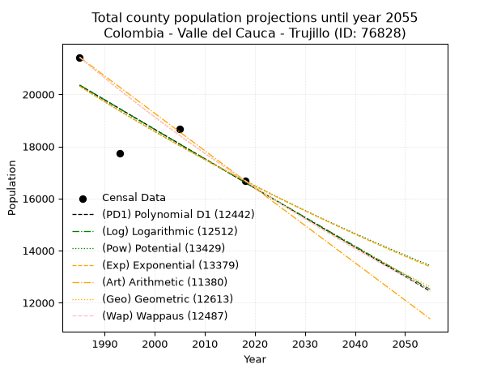
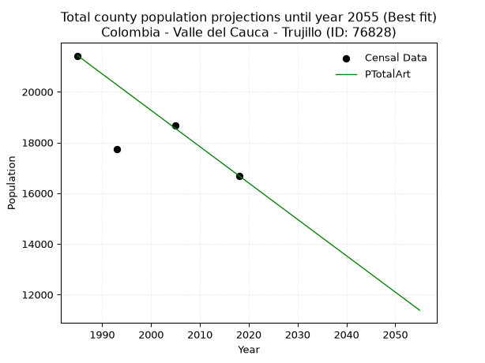
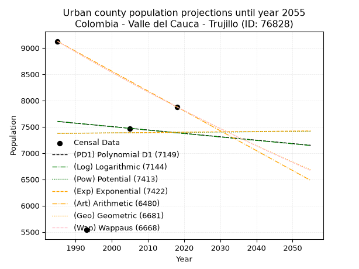
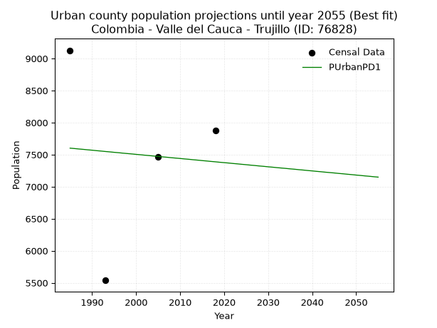
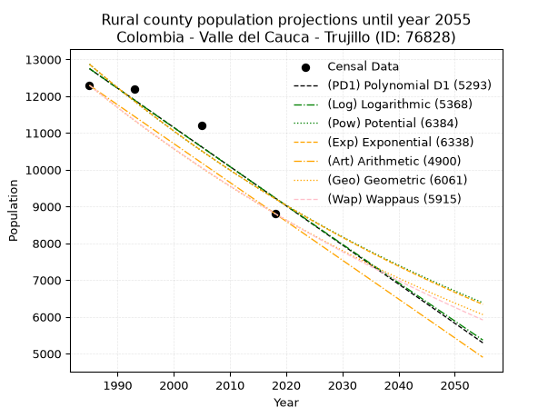
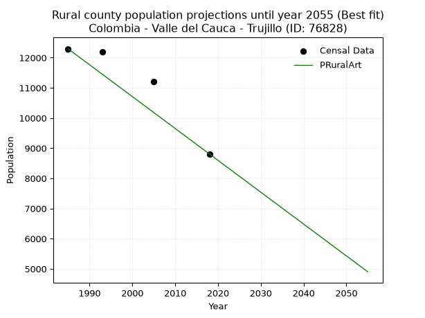

<div align="center">


</div>

# _“Population and Public Services Demand Projections (PPSD) until Year 2050 for Colombia - Valle del Cauca - Trujillo (ID: 76828)”_
Keywords: `population` `public-service` `projection` `lineal` `polynomial` `logarithmic` `potential` `exponential` `arithmetic` `geometric` `wappaus` `dane` `colombia` `south-america`

PPSD are analytical estimates used by governments and planners to anticipate future changes in population size, age distribution, and the resulting community needs for utilities, healthcare, education, and infrastructure as sizing future water treatment facilities, electrical grids, and road networks based on spatial growth.

> **General running parameters**: • app_version: _v20260806_. • Python version: _3.14.7_. • Pandas version: _3.0.5_. • NumPy version: _2.5.1_. • Creates, save and include plots into reports (create_plot): _False_. • Projection until year: _2050_. • Process polynomial degree 2 and up: _False_. • Process Wappaus: _True_. • Process Wappaus: _True_. • Set negative values to zero: _True_. • Set infinite values to zero: _True_. • Drop dataset notes: _True_. 
<div align="center">

Dynamic map: [:earth_americas:Google](http://maps.google.com/maps?q=4.212036912,-76.3188183) [:earth_americas:OSM](https://www.openstreetmap.org/#map=18/4.212036912/-76.3188183&layers=P) [:earth_americas:Bing](https://www.bing.com/maps?cp=4.212036912~-76.3188183&lvl=18) [:earth_americas:Apple](https://maps.apple.com/frame?center=4.212036912%2C-76.3188183&span=0.003%2C0.006)

</div>


<div align="center">

```geojson
{
  "type": "Feature",
  "geometry": {
    "type": "Point", 
    "coordinates": [-76.3188183, 4.212036912]
  }, 
  "properties": {
    "Name": "Colombia - Valle del Cauca - Trujillo (ID: 76828)"
  }
}
```

</div>


## 0. Census Data (4 records)

Census data are official statistics collected by a government about the people and housing in a country. They usually include counts of total population, age, sex, race, income, education, and jobs.

📅Global census file: [Population.xlsx](../data/Population.xlsx)

| Source   |   Year |   CountryID | CountryName   |   StateID | StateName       |   CountyID | CountyName   |   PTotal |   PUrban |   PRural |
|:---------|-------:|------------:|:--------------|----------:|:----------------|-----------:|:-------------|---------:|---------:|---------:|
| DANE     |   1985 |          57 | Colombia      |        76 | Valle del Cauca |      76828 | Trujillo     |    21422 |     9127 |    12295 |
| DANE     |   1993 |          57 | Colombia      |        76 | Valle del Cauca |      76828 | Trujillo     |    17730 |     5538 |    12192 |
| DANE     |   2005 |          57 | Colombia      |        76 | Valle Del Cauca |      76828 | Trujillo     |    18667 |     7466 |    11201 |
| DANE     |   2018 |          57 | Colombia      |        76 | Valle del Cauca |      76828 | Trujillo     |    16688 |     7879 |     8809 |

> 🔥Some records could had specific notes about the registered values or the corresponding urban or rural distribution.

## 1. Total

### 1.1. Coefficients and Parameters

* (PD1) Polynomial Deg 1: -112.96306704134751, 244581.12484945537 (lineal)
* (Log) Logarithmic: -226265.26764763516, 1738470.8625657365
* (Pow) Potential: -11.948091153960334, 43.709816900857
* (Exp) Exponential: -0.005965732274620564, 2822791676.662782
* (Art) Arithmetic: Year diff. 2018 - 1985 = 33, Population diff. 16688 - 21422 = -4734, Annual growth = -143.45454545454547
* (Geo) Geometric: Year diff. 2018 - 1985 = 33, Population diff. 16688 - 21422 = -4734, Annual growth % = -0.007538969633074877
* (Wap) Wappaus: i = -0.7528446363397819, Condition values only valid for < 200)

<sub>
Wappaus condition values: ['-0.00', '-0.75', '-1.51', '-2.26', '-3.01', '-3.76', '-4.52', '-5.27', '-6.02', '-6.78', '-7.53', '-8.28', '-9.03', '-9.79', '-10.54', '-11.29', '-12.05', '-12.80', '-13.55', '-14.30', '-15.06', '-15.81', '-16.56', '-17.32', '-18.07', '-18.82', '-19.57', '-20.33', '-21.08', '-21.83', '-22.59', '-23.34', '-24.09', '-24.84', '-25.60', '-26.35', '-27.10', '-27.86', '-28.61', '-29.36', '-30.11', '-30.87', '-31.62', '-32.37', '-33.13', '-33.88', '-34.63', '-35.38', '-36.14', '-36.89', '-37.64', '-38.40', '-39.15', '-39.90', '-40.65', '-41.41', '-42.16', '-42.91', '-43.66', '-44.42', '-45.17', '-45.92', '-46.68', '-47.43', '-48.18', '-48.93']
</sub>


### 1.2. Projected Dataset

|   Year |   CountyID |   PTotalPD1 |   PTotalLog |   PTotalPow |   PTotalExp |   PTotalArt |   PTotalGeo |   PTotalWap |
|-------:|-----------:|------------:|------------:|------------:|------------:|------------:|------------:|------------:|
|   1985 |      76828 |       20349 |       20354 |       20318 |       20313 |       21422 |       21422 |       21422 |
|   1986 |      76828 |       20236 |       20240 |       20196 |       20192 |       21279 |       21261 |       21261 |
|   1987 |      76828 |       20124 |       20126 |       20075 |       20072 |       21135 |       21100 |       21102 |
|   1988 |      76828 |       20011 |       20012 |       19954 |       19953 |       20992 |       20941 |       20944 |
|   1989 |      76828 |       19898 |       19899 |       19835 |       19834 |       20848 |       20783 |       20786 |
|   1990 |      76828 |       19785 |       19785 |       19716 |       19716 |       20705 |       20627 |       20631 |
|   1991 |      76828 |       19672 |       19671 |       19598 |       19599 |       20561 |       20471 |       20476 |
|   1992 |      76828 |       19559 |       19558 |       19481 |       19482 |       20418 |       20317 |       20322 |
|   1993 |      76828 |       19446 |       19444 |       19364 |       19366 |       20274 |       20164 |       20170 |
|   1994 |      76828 |       19333 |       19330 |       19249 |       19251 |       20131 |       20012 |       20018 |
|   1995 |      76828 |       19220 |       19217 |       19134 |       19137 |       19987 |       19861 |       19868 |
|   1996 |      76828 |       19107 |       19104 |       19019 |       19023 |       19844 |       19711 |       19719 |
|   1997 |      76828 |       18994 |       18990 |       18906 |       18910 |       19701 |       19562 |       19570 |
|   1998 |      76828 |       18881 |       18877 |       18793 |       18797 |       19557 |       19415 |       19423 |
|   1999 |      76828 |       18768 |       18764 |       18681 |       18685 |       19414 |       19269 |       19277 |
|   2000 |      76828 |       18655 |       18651 |       18570 |       18574 |       19270 |       19123 |       19132 |
|   2001 |      76828 |       18542 |       18538 |       18459 |       18464 |       19127 |       18979 |       18988 |
|   2002 |      76828 |       18429 |       18424 |       18349 |       18354 |       18983 |       18836 |       18845 |
|   2003 |      76828 |       18316 |       18311 |       18240 |       18245 |       18840 |       18694 |       18703 |
|   2004 |      76828 |       18203 |       18199 |       18132 |       18136 |       18696 |       18553 |       18562 |
|   2005 |      76828 |       18090 |       18086 |       18024 |       18028 |       18553 |       18413 |       18422 |
|   2006 |      76828 |       17977 |       17973 |       17917 |       17921 |       18409 |       18274 |       18283 |
|   2007 |      76828 |       17864 |       17860 |       17811 |       17814 |       18266 |       18137 |       18145 |
|   2008 |      76828 |       17751 |       17747 |       17705 |       17709 |       18123 |       18000 |       18008 |
|   2009 |      76828 |       17638 |       17635 |       17600 |       17603 |       17979 |       17864 |       17872 |
|   2010 |      76828 |       17525 |       17522 |       17496 |       17498 |       17836 |       17730 |       17737 |
|   2011 |      76828 |       17412 |       17410 |       17392 |       17394 |       17692 |       17596 |       17603 |
|   2012 |      76828 |       17299 |       17297 |       17289 |       17291 |       17549 |       17463 |       17469 |
|   2013 |      76828 |       17186 |       17185 |       17187 |       17188 |       17405 |       17332 |       17337 |
|   2014 |      76828 |       17074 |       17072 |       17085 |       17086 |       17262 |       17201 |       17205 |
|   2015 |      76828 |       16961 |       16960 |       16984 |       16984 |       17118 |       17071 |       17075 |
|   2016 |      76828 |       16848 |       16848 |       16884 |       16883 |       16975 |       16942 |       16945 |
|   2017 |      76828 |       16735 |       16736 |       16784 |       16783 |       16831 |       16815 |       16816 |
|   2018 |      76828 |       16622 |       16623 |       16685 |       16683 |       16688 |       16688 |       16688 |
|   2019 |      76828 |       16509 |       16511 |       16586 |       16584 |       16545 |       16562 |       16561 |
|   2020 |      76828 |       16396 |       16399 |       16488 |       16485 |       16401 |       16437 |       16434 |
|   2021 |      76828 |       16283 |       16287 |       16391 |       16387 |       16258 |       16313 |       16309 |
|   2022 |      76828 |       16170 |       16175 |       16295 |       16290 |       16114 |       16190 |       16184 |
|   2023 |      76828 |       16057 |       16063 |       16199 |       16193 |       15971 |       16068 |       16060 |
|   2024 |      76828 |       15944 |       15952 |       16103 |       16096 |       15827 |       15947 |       15937 |
|   2025 |      76828 |       15831 |       15840 |       16008 |       16001 |       15684 |       15827 |       15815 |
|   2026 |      76828 |       15718 |       15728 |       15914 |       15905 |       15540 |       15708 |       15694 |
|   2027 |      76828 |       15605 |       15616 |       15821 |       15811 |       15397 |       15589 |       15573 |
|   2028 |      76828 |       15492 |       15505 |       15728 |       15717 |       15253 |       15472 |       15453 |
|   2029 |      76828 |       15379 |       15393 |       15635 |       15623 |       15110 |       15355 |       15334 |
|   2030 |      76828 |       15266 |       15282 |       15544 |       15530 |       14967 |       15239 |       15216 |
|   2031 |      76828 |       15153 |       15170 |       15452 |       15438 |       14823 |       15124 |       15098 |
|   2032 |      76828 |       15040 |       15059 |       15362 |       15346 |       14680 |       15010 |       14982 |
|   2033 |      76828 |       14927 |       14948 |       15272 |       15255 |       14536 |       14897 |       14865 |
|   2034 |      76828 |       14814 |       14836 |       15182 |       15164 |       14393 |       14785 |       14750 |
|   2035 |      76828 |       14701 |       14725 |       15093 |       15074 |       14249 |       14673 |       14636 |
|   2036 |      76828 |       14588 |       14614 |       15005 |       14984 |       14106 |       14563 |       14522 |
|   2037 |      76828 |       14475 |       14503 |       14917 |       14895 |       13962 |       14453 |       14409 |
|   2038 |      76828 |       14362 |       14392 |       14830 |       14807 |       13819 |       14344 |       14296 |
|   2039 |      76828 |       14249 |       14281 |       14743 |       14719 |       13675 |       14236 |       14184 |
|   2040 |      76828 |       14136 |       14170 |       14657 |       14631 |       13532 |       14129 |       14073 |
|   2041 |      76828 |       14024 |       14059 |       14572 |       14544 |       13389 |       14022 |       13963 |
|   2042 |      76828 |       13911 |       13948 |       14487 |       14457 |       13245 |       13916 |       13853 |
|   2043 |      76828 |       13798 |       13837 |       14402 |       14371 |       13102 |       13812 |       13744 |
|   2044 |      76828 |       13685 |       13727 |       14318 |       14286 |       12958 |       13707 |       13636 |
|   2045 |      76828 |       13572 |       13616 |       14235 |       14201 |       12815 |       13604 |       13528 |
|   2046 |      76828 |       13459 |       13505 |       14152 |       14117 |       12671 |       13501 |       13421 |
|   2047 |      76828 |       13346 |       13395 |       14070 |       14033 |       12528 |       13400 |       13315 |
|   2048 |      76828 |       13233 |       13284 |       13988 |       13949 |       12384 |       13299 |       13209 |
|   2049 |      76828 |       13120 |       13174 |       13906 |       13866 |       12241 |       13198 |       13104 |
|   2050 |      76828 |       13007 |       13064 |       13825 |       13784 |       12097 |       13099 |       13000 |
<div align="center">

</img>

</div>


### 1.3. Best fit with absolute and relative error (%)

Relative error puts that difference into context by dividing the absolute error by the true value, creating a unitless ratio or percentage that shows the scale of the mistake.

Absolute and relative error

|   Year | Source   |   CountryID | CountryName   |   StateID | StateName       |   CountyID_x | CountyName   |   PTotal |   PUrban |   PRural |   CountyID_y |   PTotalPD1 |   PTotalLog |   PTotalPow |   PTotalExp |   PTotalArt |   PTotalGeo |   PTotalWap |   PTotalPD1AbsError |   PTotalLogAbsError |   PTotalPowAbsError |   PTotalExpAbsError |   PTotalArtAbsError |   PTotalGeoAbsError |   PTotalWapAbsError |   PTotalPD1RelError |   PTotalLogRelError |   PTotalPowRelError |   PTotalExpRelError |   PTotalArtRelError |   PTotalGeoRelError |   PTotalWapRelError |
|-------:|:---------|------------:|:--------------|----------:|:----------------|-------------:|:-------------|---------:|---------:|---------:|-------------:|------------:|------------:|------------:|------------:|------------:|------------:|------------:|--------------------:|--------------------:|--------------------:|--------------------:|--------------------:|--------------------:|--------------------:|--------------------:|--------------------:|--------------------:|--------------------:|--------------------:|--------------------:|--------------------:|
|   1985 | DANE     |          57 | Colombia      |        76 | Valle del Cauca |        76828 | Trujillo     |    21422 |     9127 |    12295 |        76828 |       20349 |       20354 |       20318 |       20313 |       21422 |       21422 |       21422 |                1073 |                1068 |                1104 |                1109 |                   0 |                   0 |                   0 |            5.00887  |            4.98553  |            5.15358  |           5.17692   |            0        |             0       |             0       |
|   1993 | DANE     |          57 | Colombia      |        76 | Valle del Cauca |        76828 | Trujillo     |    17730 |     5538 |    12192 |        76828 |       19446 |       19444 |       19364 |       19366 |       20274 |       20164 |       20170 |                1716 |                1714 |                1634 |                1636 |                2544 |                2434 |                2440 |            9.67851  |            9.66723  |            9.21602  |           9.2273    |           14.3486   |            13.7281  |            13.762   |
|   2005 | DANE     |          57 | Colombia      |        76 | Valle Del Cauca |        76828 | Trujillo     |    18667 |     7466 |    11201 |        76828 |       18090 |       18086 |       18024 |       18028 |       18553 |       18413 |       18422 |                 577 |                 581 |                 643 |                 639 |                 114 |                 254 |                 245 |            3.09102  |            3.11244  |            3.44458  |           3.42315   |            0.610703 |             1.36069 |             1.31248 |
|   2018 | DANE     |          57 | Colombia      |        76 | Valle del Cauca |        76828 | Trujillo     |    16688 |     7879 |     8809 |        76828 |       16622 |       16623 |       16685 |       16683 |       16688 |       16688 |       16688 |                  66 |                  65 |                   3 |                   5 |                   0 |                   0 |                   0 |            0.395494 |            0.389501 |            0.017977 |           0.0299616 |            0        |             0       |             0       |

Relative error mean

| Method    |   RelError | Best   |
|:----------|-----------:|:-------|
| PTotalPD1 |    4.54347 |        |
| PTotalLog |    4.53868 |        |
| PTotalPow |    4.45804 |        |
| PTotalExp |    4.46433 |        |
| PTotalArt |    3.73982 | True   |
| PTotalGeo |    3.77221 |        |
| PTotalWap |    3.76862 |        |

💙Best method: _**PTotalArt**_
<div align="center">

</img>

</div>


### 1.4. Fresh water supply demand in liters per capita per day (lpcd)

The fresh water supply demand typically ranges from 100 to 300 liters per capita per day (lpcd) for standard domestic and municipal planning, though absolute survival minimums set by the World Health Organization are as low as 7.5 to 20 liters per day, and total consumption in high-income nations can exceed 400 liters.

> `CZ`: Level in meters above the sea level (masl).<br> `WS`: Fresh water supply demand in liters per capita per day (lpcd or l/h/d).<br> `WSAll`: Zonal fresh water supply demand in liters per second (l/s).<br> `A`: Zonal area in square meters.

Reference values (RAS Colombia)

|    CZ |   WS |
|------:|-----:|
|  1000 |  120 |
|  2000 |  130 |
| 99999 |  140 |

County shapefile geometry properties and water supply values

|   CountyID |      ATotal |   CZTotal |   WSTotal |
|-----------:|------------:|----------:|----------:|
|      76828 | 3.07742e+08 |   1727.19 |       130 |

Projected values for best method: PTotalArt

|   CountyID |   Year |   PTotalArt |   WSTotal |   WSTotalAll |
|-----------:|-------:|------------:|----------:|-------------:|
|      76828 |   1985 |       21422 |       130 |      32.2322 |
|      76828 |   1986 |       21279 |       130 |      32.017  |
|      76828 |   1987 |       21135 |       130 |      31.8003 |
|      76828 |   1988 |       20992 |       130 |      31.5852 |
|      76828 |   1989 |       20848 |       130 |      31.3685 |
|      76828 |   1990 |       20705 |       130 |      31.1534 |
|      76828 |   1991 |       20561 |       130 |      30.9367 |
|      76828 |   1992 |       20418 |       130 |      30.7215 |
|      76828 |   1993 |       20274 |       130 |      30.5049 |
|      76828 |   1994 |       20131 |       130 |      30.2897 |
|      76828 |   1995 |       19987 |       130 |      30.073  |
|      76828 |   1996 |       19844 |       130 |      29.8579 |
|      76828 |   1997 |       19701 |       130 |      29.6427 |
|      76828 |   1998 |       19557 |       130 |      29.426  |
|      76828 |   1999 |       19414 |       130 |      29.2109 |
|      76828 |   2000 |       19270 |       130 |      28.9942 |
|      76828 |   2001 |       19127 |       130 |      28.7791 |
|      76828 |   2002 |       18983 |       130 |      28.5624 |
|      76828 |   2003 |       18840 |       130 |      28.3472 |
|      76828 |   2004 |       18696 |       130 |      28.1306 |
|      76828 |   2005 |       18553 |       130 |      27.9154 |
|      76828 |   2006 |       18409 |       130 |      27.6987 |
|      76828 |   2007 |       18266 |       130 |      27.4836 |
|      76828 |   2008 |       18123 |       130 |      27.2684 |
|      76828 |   2009 |       17979 |       130 |      27.0517 |
|      76828 |   2010 |       17836 |       130 |      26.8366 |
|      76828 |   2011 |       17692 |       130 |      26.6199 |
|      76828 |   2012 |       17549 |       130 |      26.4047 |
|      76828 |   2013 |       17405 |       130 |      26.1881 |
|      76828 |   2014 |       17262 |       130 |      25.9729 |
|      76828 |   2015 |       17118 |       130 |      25.7563 |
|      76828 |   2016 |       16975 |       130 |      25.5411 |
|      76828 |   2017 |       16831 |       130 |      25.3244 |
|      76828 |   2018 |       16688 |       130 |      25.1093 |
|      76828 |   2019 |       16545 |       130 |      24.8941 |
|      76828 |   2020 |       16401 |       130 |      24.6774 |
|      76828 |   2021 |       16258 |       130 |      24.4623 |
|      76828 |   2022 |       16114 |       130 |      24.2456 |
|      76828 |   2023 |       15971 |       130 |      24.0304 |
|      76828 |   2024 |       15827 |       130 |      23.8138 |
|      76828 |   2025 |       15684 |       130 |      23.5986 |
|      76828 |   2026 |       15540 |       130 |      23.3819 |
|      76828 |   2027 |       15397 |       130 |      23.1668 |
|      76828 |   2028 |       15253 |       130 |      22.9501 |
|      76828 |   2029 |       15110 |       130 |      22.735  |
|      76828 |   2030 |       14967 |       130 |      22.5198 |
|      76828 |   2031 |       14823 |       130 |      22.3031 |
|      76828 |   2032 |       14680 |       130 |      22.088  |
|      76828 |   2033 |       14536 |       130 |      21.8713 |
|      76828 |   2034 |       14393 |       130 |      21.6561 |
|      76828 |   2035 |       14249 |       130 |      21.4395 |
|      76828 |   2036 |       14106 |       130 |      21.2243 |
|      76828 |   2037 |       13962 |       130 |      21.0076 |
|      76828 |   2038 |       13819 |       130 |      20.7925 |
|      76828 |   2039 |       13675 |       130 |      20.5758 |
|      76828 |   2040 |       13532 |       130 |      20.3606 |
|      76828 |   2041 |       13389 |       130 |      20.1455 |
|      76828 |   2042 |       13245 |       130 |      19.9288 |
|      76828 |   2043 |       13102 |       130 |      19.7137 |
|      76828 |   2044 |       12958 |       130 |      19.497  |
|      76828 |   2045 |       12815 |       130 |      19.2818 |
|      76828 |   2046 |       12671 |       130 |      19.0652 |
|      76828 |   2047 |       12528 |       130 |      18.85   |
|      76828 |   2048 |       12384 |       130 |      18.6333 |
|      76828 |   2049 |       12241 |       130 |      18.4182 |
|      76828 |   2050 |       12097 |       130 |      18.2015 |

## 2. Urban

### 2.1. Coefficients and Parameters

* (PD1) Polynomial Deg 1: -6.457647531112376, 20419.40947410753 (lineal)
* (Log) Logarithmic: -13250.919368240751, 108222.8443042016
* (Pow) Potential: 0.14260771771900543, 3.3975511308469755
* (Exp) Exponential: 9.324331462619583e-05, 6127.87339830174
* (Art) Arithmetic: Year diff. 2018 - 1985 = 33, Population diff. 7879 - 9127 = -1248, Annual growth = -37.81818181818182
* (Geo) Geometric: Year diff. 2018 - 1985 = 33, Population diff. 7879 - 9127 = -1248, Annual growth % = -0.0044457265907066335
* (Wap) Wappaus: i = -0.4447628109864967, Condition values only valid for < 200)

<sub>
Wappaus condition values: ['-0.00', '-0.44', '-0.89', '-1.33', '-1.78', '-2.22', '-2.67', '-3.11', '-3.56', '-4.00', '-4.45', '-4.89', '-5.34', '-5.78', '-6.23', '-6.67', '-7.12', '-7.56', '-8.01', '-8.45', '-8.90', '-9.34', '-9.78', '-10.23', '-10.67', '-11.12', '-11.56', '-12.01', '-12.45', '-12.90', '-13.34', '-13.79', '-14.23', '-14.68', '-15.12', '-15.57', '-16.01', '-16.46', '-16.90', '-17.35', '-17.79', '-18.24', '-18.68', '-19.12', '-19.57', '-20.01', '-20.46', '-20.90', '-21.35', '-21.79', '-22.24', '-22.68', '-23.13', '-23.57', '-24.02', '-24.46', '-24.91', '-25.35', '-25.80', '-26.24', '-26.69', '-27.13', '-27.58', '-28.02', '-28.46', '-28.91']
</sub>


### 2.2. Projected Dataset

|   Year |   CountyID |   PUrbanPD1 |   PUrbanLog |   PUrbanPow |   PUrbanExp |   PUrbanArt |   PUrbanGeo |   PUrbanWap |
|-------:|-----------:|------------:|------------:|------------:|------------:|------------:|------------:|------------:|
|   1985 |      76828 |        7601 |        7604 |        7376 |        7374 |        9127 |        9127 |        9127 |
|   1986 |      76828 |        7595 |        7597 |        7377 |        7375 |        9089 |        9086 |        9086 |
|   1987 |      76828 |        7588 |        7590 |        7377 |        7375 |        9051 |        9046 |        9046 |
|   1988 |      76828 |        7582 |        7584 |        7378 |        7376 |        9014 |        9006 |        9006 |
|   1989 |      76828 |        7575 |        7577 |        7378 |        7377 |        8976 |        8966 |        8966 |
|   1990 |      76828 |        7569 |        7570 |        7379 |        7377 |        8938 |        8926 |        8926 |
|   1991 |      76828 |        7562 |        7564 |        7379 |        7378 |        8900 |        8886 |        8887 |
|   1992 |      76828 |        7556 |        7557 |        7380 |        7379 |        8862 |        8847 |        8847 |
|   1993 |      76828 |        7549 |        7550 |        7381 |        7379 |        8824 |        8807 |        8808 |
|   1994 |      76828 |        7543 |        7544 |        7381 |        7380 |        8787 |        8768 |        8769 |
|   1995 |      76828 |        7536 |        7537 |        7382 |        7381 |        8749 |        8729 |        8730 |
|   1996 |      76828 |        7530 |        7530 |        7382 |        7381 |        8711 |        8690 |        8691 |
|   1997 |      76828 |        7523 |        7524 |        7383 |        7382 |        8673 |        8652 |        8653 |
|   1998 |      76828 |        7517 |        7517 |        7383 |        7383 |        8635 |        8613 |        8614 |
|   1999 |      76828 |        7511 |        7511 |        7384 |        7383 |        8598 |        8575 |        8576 |
|   2000 |      76828 |        7504 |        7504 |        7384 |        7384 |        8560 |        8537 |        8538 |
|   2001 |      76828 |        7498 |        7497 |        7385 |        7385 |        8522 |        8499 |        8500 |
|   2002 |      76828 |        7491 |        7491 |        7385 |        7386 |        8484 |        8461 |        8462 |
|   2003 |      76828 |        7485 |        7484 |        7386 |        7386 |        8446 |        8424 |        8424 |
|   2004 |      76828 |        7478 |        7477 |        7386 |        7387 |        8408 |        8386 |        8387 |
|   2005 |      76828 |        7472 |        7471 |        7387 |        7388 |        8371 |        8349 |        8350 |
|   2006 |      76828 |        7465 |        7464 |        7387 |        7388 |        8333 |        8312 |        8313 |
|   2007 |      76828 |        7459 |        7458 |        7388 |        7389 |        8295 |        8275 |        8276 |
|   2008 |      76828 |        7452 |        7451 |        7388 |        7390 |        8257 |        8238 |        8239 |
|   2009 |      76828 |        7446 |        7444 |        7389 |        7390 |        8219 |        8201 |        8202 |
|   2010 |      76828 |        7440 |        7438 |        7389 |        7391 |        8182 |        8165 |        8166 |
|   2011 |      76828 |        7433 |        7431 |        7390 |        7392 |        8144 |        8129 |        8129 |
|   2012 |      76828 |        7427 |        7425 |        7391 |        7392 |        8106 |        8092 |        8093 |
|   2013 |      76828 |        7420 |        7418 |        7391 |        7393 |        8068 |        8056 |        8057 |
|   2014 |      76828 |        7414 |        7411 |        7392 |        7394 |        8030 |        8021 |        8021 |
|   2015 |      76828 |        7407 |        7405 |        7392 |        7394 |        7992 |        7985 |        7985 |
|   2016 |      76828 |        7401 |        7398 |        7393 |        7395 |        7955 |        7950 |        7950 |
|   2017 |      76828 |        7394 |        7392 |        7393 |        7396 |        7917 |        7914 |        7914 |
|   2018 |      76828 |        7388 |        7385 |        7394 |        7397 |        7879 |        7879 |        7879 |
|   2019 |      76828 |        7381 |        7379 |        7394 |        7397 |        7841 |        7844 |        7844 |
|   2020 |      76828 |        7375 |        7372 |        7395 |        7398 |        7803 |        7809 |        7809 |
|   2021 |      76828 |        7369 |        7365 |        7395 |        7399 |        7766 |        7774 |        7774 |
|   2022 |      76828 |        7362 |        7359 |        7396 |        7399 |        7728 |        7740 |        7739 |
|   2023 |      76828 |        7356 |        7352 |        7396 |        7400 |        7690 |        7705 |        7705 |
|   2024 |      76828 |        7349 |        7346 |        7397 |        7401 |        7652 |        7671 |        7670 |
|   2025 |      76828 |        7343 |        7339 |        7397 |        7401 |        7614 |        7637 |        7636 |
|   2026 |      76828 |        7336 |        7333 |        7398 |        7402 |        7576 |        7603 |        7602 |
|   2027 |      76828 |        7330 |        7326 |        7398 |        7403 |        7539 |        7569 |        7568 |
|   2028 |      76828 |        7323 |        7320 |        7399 |        7403 |        7501 |        7536 |        7534 |
|   2029 |      76828 |        7317 |        7313 |        7399 |        7404 |        7463 |        7502 |        7500 |
|   2030 |      76828 |        7310 |        7307 |        7400 |        7405 |        7425 |        7469 |        7466 |
|   2031 |      76828 |        7304 |        7300 |        7400 |        7406 |        7387 |        7436 |        7433 |
|   2032 |      76828 |        7297 |        7294 |        7401 |        7406 |        7350 |        7403 |        7400 |
|   2033 |      76828 |        7291 |        7287 |        7401 |        7407 |        7312 |        7370 |        7366 |
|   2034 |      76828 |        7285 |        7281 |        7402 |        7408 |        7274 |        7337 |        7333 |
|   2035 |      76828 |        7278 |        7274 |        7402 |        7408 |        7236 |        7304 |        7300 |
|   2036 |      76828 |        7272 |        7268 |        7403 |        7409 |        7198 |        7272 |        7268 |
|   2037 |      76828 |        7265 |        7261 |        7404 |        7410 |        7160 |        7239 |        7235 |
|   2038 |      76828 |        7259 |        7254 |        7404 |        7410 |        7123 |        7207 |        7202 |
|   2039 |      76828 |        7252 |        7248 |        7405 |        7411 |        7085 |        7175 |        7170 |
|   2040 |      76828 |        7246 |        7241 |        7405 |        7412 |        7047 |        7143 |        7138 |
|   2041 |      76828 |        7239 |        7235 |        7406 |        7412 |        7009 |        7112 |        7106 |
|   2042 |      76828 |        7233 |        7229 |        7406 |        7413 |        6971 |        7080 |        7073 |
|   2043 |      76828 |        7226 |        7222 |        7407 |        7414 |        6934 |        7048 |        7042 |
|   2044 |      76828 |        7220 |        7216 |        7407 |        7414 |        6896 |        7017 |        7010 |
|   2045 |      76828 |        7214 |        7209 |        7408 |        7415 |        6858 |        6986 |        6978 |
|   2046 |      76828 |        7207 |        7203 |        7408 |        7416 |        6820 |        6955 |        6947 |
|   2047 |      76828 |        7201 |        7196 |        7409 |        7417 |        6782 |        6924 |        6915 |
|   2048 |      76828 |        7194 |        7190 |        7409 |        7417 |        6744 |        6893 |        6884 |
|   2049 |      76828 |        7188 |        7183 |        7410 |        7418 |        6707 |        6863 |        6853 |
|   2050 |      76828 |        7181 |        7177 |        7410 |        7419 |        6669 |        6832 |        6822 |
<div align="center">

</img>

</div>


### 2.3. Best fit with absolute and relative error (%)

Relative error puts that difference into context by dividing the absolute error by the true value, creating a unitless ratio or percentage that shows the scale of the mistake.

Absolute and relative error

|   Year | Source   |   CountryID | CountryName   |   StateID | StateName       |   CountyID_x | CountyName   |   PTotal |   PUrban |   PRural |   CountyID_y |   PUrbanPD1 |   PUrbanLog |   PUrbanPow |   PUrbanExp |   PUrbanArt |   PUrbanGeo |   PUrbanWap |   PUrbanPD1AbsError |   PUrbanLogAbsError |   PUrbanPowAbsError |   PUrbanExpAbsError |   PUrbanArtAbsError |   PUrbanGeoAbsError |   PUrbanWapAbsError |   PUrbanPD1RelError |   PUrbanLogRelError |   PUrbanPowRelError |   PUrbanExpRelError |   PUrbanArtRelError |   PUrbanGeoRelError |   PUrbanWapRelError |
|-------:|:---------|------------:|:--------------|----------:|:----------------|-------------:|:-------------|---------:|---------:|---------:|-------------:|------------:|------------:|------------:|------------:|------------:|------------:|------------:|--------------------:|--------------------:|--------------------:|--------------------:|--------------------:|--------------------:|--------------------:|--------------------:|--------------------:|--------------------:|--------------------:|--------------------:|--------------------:|--------------------:|
|   1985 | DANE     |          57 | Colombia      |        76 | Valle del Cauca |        76828 | Trujillo     |    21422 |     9127 |    12295 |        76828 |        7601 |        7604 |        7376 |        7374 |        9127 |        9127 |        9127 |                1526 |                1523 |                1751 |                1753 |                   0 |                   0 |                   0 |          16.7196    |          16.6868    |            19.1848  |            19.2067  |              0      |              0      |              0      |
|   1993 | DANE     |          57 | Colombia      |        76 | Valle del Cauca |        76828 | Trujillo     |    17730 |     5538 |    12192 |        76828 |        7549 |        7550 |        7381 |        7379 |        8824 |        8807 |        8808 |                2011 |                2012 |                1843 |                1841 |                3286 |                3269 |                3270 |          36.3127    |          36.3308    |            33.2792  |            33.243   |             59.3355 |             59.0285 |             59.0466 |
|   2005 | DANE     |          57 | Colombia      |        76 | Valle Del Cauca |        76828 | Trujillo     |    18667 |     7466 |    11201 |        76828 |        7472 |        7471 |        7387 |        7388 |        8371 |        8349 |        8350 |                   6 |                   5 |                  79 |                  78 |                 905 |                 883 |                 884 |           0.0803643 |           0.0669703 |             1.05813 |             1.04474 |             12.1216 |             11.8269 |             11.8403 |
|   2018 | DANE     |          57 | Colombia      |        76 | Valle del Cauca |        76828 | Trujillo     |    16688 |     7879 |     8809 |        76828 |        7388 |        7385 |        7394 |        7397 |        7879 |        7879 |        7879 |                 491 |                 494 |                 485 |                 482 |                   0 |                   0 |                   0 |           6.23176   |           6.26983   |             6.1556  |             6.11753 |              0      |              0      |              0      |

Relative error mean

| Method    |   RelError | Best   |
|:----------|-----------:|:-------|
| PUrbanPD1 |    14.8361 | True   |
| PUrbanLog |    14.8386 |        |
| PUrbanPow |    14.9194 |        |
| PUrbanExp |    14.903  |        |
| PUrbanArt |    17.8643 |        |
| PUrbanGeo |    17.7139 |        |
| PUrbanWap |    17.7217 |        |

💙Best method: _**PUrbanPD1**_
<div align="center">

</img>

</div>


### 2.4. Fresh water supply demand in liters per capita per day (lpcd)

The fresh water supply demand typically ranges from 100 to 300 liters per capita per day (lpcd) for standard domestic and municipal planning, though absolute survival minimums set by the World Health Organization are as low as 7.5 to 20 liters per day, and total consumption in high-income nations can exceed 400 liters.

> `CZ`: Level in meters above the sea level (masl).<br> `WS`: Fresh water supply demand in liters per capita per day (lpcd or l/h/d).<br> `WSAll`: Zonal fresh water supply demand in liters per second (l/s).<br> `A`: Zonal area in square meters.

Reference values (RAS Colombia)

|    CZ |   WS |
|------:|-----:|
|  1000 |  120 |
|  2000 |  130 |
| 99999 |  140 |

County shapefile geometry properties and water supply values

|   CountyID |      AUrban |   CZUrban |   WSUrban |
|-----------:|------------:|----------:|----------:|
|      76828 | 1.03906e+06 |   1311.89 |       130 |

Projected values for best method: PUrbanPD1

|   CountyID |   Year |   PUrbanPD1 |   WSUrban |   WSUrbanAll |
|-----------:|-------:|------------:|----------:|-------------:|
|      76828 |   1985 |        7601 |       130 |      11.4367 |
|      76828 |   1986 |        7595 |       130 |      11.4277 |
|      76828 |   1987 |        7588 |       130 |      11.4171 |
|      76828 |   1988 |        7582 |       130 |      11.4081 |
|      76828 |   1989 |        7575 |       130 |      11.3976 |
|      76828 |   1990 |        7569 |       130 |      11.3885 |
|      76828 |   1991 |        7562 |       130 |      11.378  |
|      76828 |   1992 |        7556 |       130 |      11.369  |
|      76828 |   1993 |        7549 |       130 |      11.3584 |
|      76828 |   1994 |        7543 |       130 |      11.3494 |
|      76828 |   1995 |        7536 |       130 |      11.3389 |
|      76828 |   1996 |        7530 |       130 |      11.3299 |
|      76828 |   1997 |        7523 |       130 |      11.3193 |
|      76828 |   1998 |        7517 |       130 |      11.3103 |
|      76828 |   1999 |        7511 |       130 |      11.3013 |
|      76828 |   2000 |        7504 |       130 |      11.2907 |
|      76828 |   2001 |        7498 |       130 |      11.2817 |
|      76828 |   2002 |        7491 |       130 |      11.2712 |
|      76828 |   2003 |        7485 |       130 |      11.2622 |
|      76828 |   2004 |        7478 |       130 |      11.2516 |
|      76828 |   2005 |        7472 |       130 |      11.2426 |
|      76828 |   2006 |        7465 |       130 |      11.2321 |
|      76828 |   2007 |        7459 |       130 |      11.223  |
|      76828 |   2008 |        7452 |       130 |      11.2125 |
|      76828 |   2009 |        7446 |       130 |      11.2035 |
|      76828 |   2010 |        7440 |       130 |      11.1944 |
|      76828 |   2011 |        7433 |       130 |      11.1839 |
|      76828 |   2012 |        7427 |       130 |      11.1749 |
|      76828 |   2013 |        7420 |       130 |      11.1644 |
|      76828 |   2014 |        7414 |       130 |      11.1553 |
|      76828 |   2015 |        7407 |       130 |      11.1448 |
|      76828 |   2016 |        7401 |       130 |      11.1358 |
|      76828 |   2017 |        7394 |       130 |      11.1252 |
|      76828 |   2018 |        7388 |       130 |      11.1162 |
|      76828 |   2019 |        7381 |       130 |      11.1057 |
|      76828 |   2020 |        7375 |       130 |      11.0966 |
|      76828 |   2021 |        7369 |       130 |      11.0876 |
|      76828 |   2022 |        7362 |       130 |      11.0771 |
|      76828 |   2023 |        7356 |       130 |      11.0681 |
|      76828 |   2024 |        7349 |       130 |      11.0575 |
|      76828 |   2025 |        7343 |       130 |      11.0485 |
|      76828 |   2026 |        7336 |       130 |      11.038  |
|      76828 |   2027 |        7330 |       130 |      11.0289 |
|      76828 |   2028 |        7323 |       130 |      11.0184 |
|      76828 |   2029 |        7317 |       130 |      11.0094 |
|      76828 |   2030 |        7310 |       130 |      10.9988 |
|      76828 |   2031 |        7304 |       130 |      10.9898 |
|      76828 |   2032 |        7297 |       130 |      10.9793 |
|      76828 |   2033 |        7291 |       130 |      10.9703 |
|      76828 |   2034 |        7285 |       130 |      10.9612 |
|      76828 |   2035 |        7278 |       130 |      10.9507 |
|      76828 |   2036 |        7272 |       130 |      10.9417 |
|      76828 |   2037 |        7265 |       130 |      10.9311 |
|      76828 |   2038 |        7259 |       130 |      10.9221 |
|      76828 |   2039 |        7252 |       130 |      10.9116 |
|      76828 |   2040 |        7246 |       130 |      10.9025 |
|      76828 |   2041 |        7239 |       130 |      10.892  |
|      76828 |   2042 |        7233 |       130 |      10.883  |
|      76828 |   2043 |        7226 |       130 |      10.8725 |
|      76828 |   2044 |        7220 |       130 |      10.8634 |
|      76828 |   2045 |        7214 |       130 |      10.8544 |
|      76828 |   2046 |        7207 |       130 |      10.8439 |
|      76828 |   2047 |        7201 |       130 |      10.8348 |
|      76828 |   2048 |        7194 |       130 |      10.8243 |
|      76828 |   2049 |        7188 |       130 |      10.8153 |
|      76828 |   2050 |        7181 |       130 |      10.8047 |

## 3. Rural

### 3.1. Coefficients and Parameters

* (PD1) Polynomial Deg 1: -106.50541951023526, 224161.71537534808 (lineal)
* (Log) Logarithmic: -213014.34827939427, 1630248.0182615337
* (Pow) Potential: -20.231110058893464, 70.82692529799456
* (Exp) Exponential: -0.010116164708757694, 6766811742570.825
* (Art) Arithmetic: Year diff. 2018 - 1985 = 33, Population diff. 8809 - 12295 = -3486, Annual growth = -105.63636363636364
* (Geo) Geometric: Year diff. 2018 - 1985 = 33, Population diff. 8809 - 12295 = -3486, Annual growth % = -0.010052728587004789
* (Wap) Wappaus: i = -1.0011027638017782, Condition values only valid for < 200)

<sub>
Wappaus condition values: ['-0.00', '-1.00', '-2.00', '-3.00', '-4.00', '-5.01', '-6.01', '-7.01', '-8.01', '-9.01', '-10.01', '-11.01', '-12.01', '-13.01', '-14.02', '-15.02', '-16.02', '-17.02', '-18.02', '-19.02', '-20.02', '-21.02', '-22.02', '-23.03', '-24.03', '-25.03', '-26.03', '-27.03', '-28.03', '-29.03', '-30.03', '-31.03', '-32.04', '-33.04', '-34.04', '-35.04', '-36.04', '-37.04', '-38.04', '-39.04', '-40.04', '-41.05', '-42.05', '-43.05', '-44.05', '-45.05', '-46.05', '-47.05', '-48.05', '-49.05', '-50.06', '-51.06', '-52.06', '-53.06', '-54.06', '-55.06', '-56.06', '-57.06', '-58.06', '-59.07', '-60.07', '-61.07', '-62.07', '-63.07', '-64.07', '-65.07']
</sub>


### 3.2. Projected Dataset

|   Year |   CountyID |   PRuralPD1 |   PRuralLog |   PRuralPow |   PRuralExp |   PRuralArt |   PRuralGeo |   PRuralWap |
|-------:|-----------:|------------:|------------:|------------:|------------:|------------:|------------:|------------:|
|   1985 |      76828 |       12748 |       12750 |       12870 |       12868 |       12295 |       12295 |       12295 |
|   1986 |      76828 |       12642 |       12643 |       12739 |       12738 |       12189 |       12171 |       12173 |
|   1987 |      76828 |       12535 |       12536 |       12610 |       12610 |       12084 |       12049 |       12051 |
|   1988 |      76828 |       12429 |       12429 |       12482 |       12483 |       11978 |       11928 |       11931 |
|   1989 |      76828 |       12322 |       12322 |       12356 |       12357 |       11872 |       11808 |       11812 |
|   1990 |      76828 |       12216 |       12214 |       12231 |       12233 |       11767 |       11689 |       11695 |
|   1991 |      76828 |       12109 |       12107 |       12107 |       12110 |       11661 |       11572 |       11578 |
|   1992 |      76828 |       12003 |       12001 |       11985 |       11988 |       11556 |       11455 |       11463 |
|   1993 |      76828 |       11896 |       11894 |       11864 |       11867 |       11450 |       11340 |       11348 |
|   1994 |      76828 |       11790 |       11787 |       11744 |       11748 |       11344 |       11226 |       11235 |
|   1995 |      76828 |       11683 |       11680 |       11626 |       11630 |       11239 |       11113 |       11123 |
|   1996 |      76828 |       11577 |       11573 |       11508 |       11512 |       11133 |       11002 |       11012 |
|   1997 |      76828 |       11470 |       11466 |       11392 |       11397 |       11027 |       10891 |       10902 |
|   1998 |      76828 |       11364 |       11360 |       11278 |       11282 |       10922 |       10782 |       10793 |
|   1999 |      76828 |       11257 |       11253 |       11164 |       11168 |       10816 |       10673 |       10685 |
|   2000 |      76828 |       11151 |       11147 |       11052 |       11056 |       10710 |       10566 |       10578 |
|   2001 |      76828 |       11044 |       11040 |       10940 |       10945 |       10605 |       10460 |       10472 |
|   2002 |      76828 |       10938 |       10934 |       10830 |       10834 |       10499 |       10355 |       10367 |
|   2003 |      76828 |       10831 |       10827 |       10721 |       10725 |       10394 |       10251 |       10263 |
|   2004 |      76828 |       10725 |       10721 |       10614 |       10617 |       10288 |       10147 |       10159 |
|   2005 |      76828 |       10618 |       10615 |       10507 |       10511 |       10182 |       10045 |       10057 |
|   2006 |      76828 |       10512 |       10509 |       10402 |       10405 |       10077 |        9944 |        9956 |
|   2007 |      76828 |       10405 |       10402 |       10297 |       10300 |        9971 |        9845 |        9856 |
|   2008 |      76828 |       10299 |       10296 |       10194 |       10196 |        9865 |        9746 |        9756 |
|   2009 |      76828 |       10192 |       10190 |       10092 |       10094 |        9760 |        9648 |        9658 |
|   2010 |      76828 |       10086 |       10084 |        9991 |        9992 |        9654 |        9551 |        9560 |
|   2011 |      76828 |        9979 |        9978 |        9891 |        9892 |        9548 |        9455 |        9463 |
|   2012 |      76828 |        9873 |        9872 |        9792 |        9792 |        9443 |        9360 |        9367 |
|   2013 |      76828 |        9766 |        9767 |        9694 |        9694 |        9337 |        9265 |        9272 |
|   2014 |      76828 |        9660 |        9661 |        9597 |        9596 |        9232 |        9172 |        9178 |
|   2015 |      76828 |        9553 |        9555 |        9501 |        9499 |        9126 |        9080 |        9085 |
|   2016 |      76828 |        9447 |        9449 |        9406 |        9404 |        9020 |        8989 |        8992 |
|   2017 |      76828 |        9340 |        9344 |        9312 |        9309 |        8915 |        8898 |        8900 |
|   2018 |      76828 |        9234 |        9238 |        9219 |        9215 |        8809 |        8809 |        8809 |
|   2019 |      76828 |        9127 |        9133 |        9127 |        9123 |        8703 |        8720 |        8719 |
|   2020 |      76828 |        9021 |        9027 |        9036 |        9031 |        8598 |        8633 |        8629 |
|   2021 |      76828 |        8914 |        8922 |        8946 |        8940 |        8492 |        8546 |        8540 |
|   2022 |      76828 |        8808 |        8816 |        8857 |        8850 |        8386 |        8460 |        8452 |
|   2023 |      76828 |        8701 |        8711 |        8769 |        8761 |        8281 |        8375 |        8365 |
|   2024 |      76828 |        8595 |        8606 |        8682 |        8673 |        8175 |        8291 |        8279 |
|   2025 |      76828 |        8488 |        8501 |        8596 |        8585 |        8070 |        8208 |        8193 |
|   2026 |      76828 |        8382 |        8395 |        8510 |        8499 |        7964 |        8125 |        8108 |
|   2027 |      76828 |        8275 |        8290 |        8426 |        8413 |        7858 |        8043 |        8023 |
|   2028 |      76828 |        8169 |        8185 |        8342 |        8329 |        7753 |        7962 |        7940 |
|   2029 |      76828 |        8062 |        8080 |        8259 |        8245 |        7647 |        7882 |        7857 |
|   2030 |      76828 |        7956 |        7975 |        8177 |        8162 |        7541 |        7803 |        7774 |
|   2031 |      76828 |        7849 |        7870 |        8096 |        8080 |        7436 |        7725 |        7693 |
|   2032 |      76828 |        7743 |        7765 |        8016 |        7998 |        7330 |        7647 |        7612 |
|   2033 |      76828 |        7636 |        7661 |        7937 |        7918 |        7224 |        7570 |        7531 |
|   2034 |      76828 |        7530 |        7556 |        7858 |        7838 |        7119 |        7494 |        7452 |
|   2035 |      76828 |        7423 |        7451 |        7780 |        7759 |        7013 |        7419 |        7373 |
|   2036 |      76828 |        7317 |        7347 |        7703 |        7681 |        6908 |        7344 |        7294 |
|   2037 |      76828 |        7210 |        7242 |        7627 |        7604 |        6802 |        7270 |        7216 |
|   2038 |      76828 |        7104 |        7137 |        7552 |        7527 |        6696 |        7197 |        7139 |
|   2039 |      76828 |        6997 |        7033 |        7477 |        7452 |        6591 |        7125 |        7063 |
|   2040 |      76828 |        6891 |        6928 |        7403 |        7377 |        6485 |        7053 |        6987 |
|   2041 |      76828 |        6784 |        6824 |        7330 |        7302 |        6379 |        6982 |        6911 |
|   2042 |      76828 |        6678 |        6720 |        7258 |        7229 |        6274 |        6912 |        6837 |
|   2043 |      76828 |        6571 |        6615 |        7187 |        7156 |        6168 |        6843 |        6762 |
|   2044 |      76828 |        6465 |        6511 |        7116 |        7084 |        6062 |        6774 |        6689 |
|   2045 |      76828 |        6358 |        6407 |        7046 |        7013 |        5957 |        6706 |        6616 |
|   2046 |      76828 |        6252 |        6303 |        6976 |        6942 |        5851 |        6638 |        6543 |
|   2047 |      76828 |        6145 |        6199 |        6908 |        6872 |        5746 |        6572 |        6471 |
|   2048 |      76828 |        6039 |        6095 |        6840 |        6803 |        5640 |        6506 |        6400 |
|   2049 |      76828 |        5932 |        5991 |        6773 |        6735 |        5534 |        6440 |        6329 |
|   2050 |      76828 |        5826 |        5887 |        6706 |        6667 |        5429 |        6375 |        6258 |
<div align="center">

</img>

</div>


### 3.3. Best fit with absolute and relative error (%)

Relative error puts that difference into context by dividing the absolute error by the true value, creating a unitless ratio or percentage that shows the scale of the mistake.

Absolute and relative error

|   Year | Source   |   CountryID | CountryName   |   StateID | StateName       |   CountyID_x | CountyName   |   PTotal |   PUrban |   PRural |   CountyID_y |   PRuralPD1 |   PRuralLog |   PRuralPow |   PRuralExp |   PRuralArt |   PRuralGeo |   PRuralWap |   PRuralPD1AbsError |   PRuralLogAbsError |   PRuralPowAbsError |   PRuralExpAbsError |   PRuralArtAbsError |   PRuralGeoAbsError |   PRuralWapAbsError |   PRuralPD1RelError |   PRuralLogRelError |   PRuralPowRelError |   PRuralExpRelError |   PRuralArtRelError |   PRuralGeoRelError |   PRuralWapRelError |
|-------:|:---------|------------:|:--------------|----------:|:----------------|-------------:|:-------------|---------:|---------:|---------:|-------------:|------------:|------------:|------------:|------------:|------------:|------------:|------------:|--------------------:|--------------------:|--------------------:|--------------------:|--------------------:|--------------------:|--------------------:|--------------------:|--------------------:|--------------------:|--------------------:|--------------------:|--------------------:|--------------------:|
|   1985 | DANE     |          57 | Colombia      |        76 | Valle del Cauca |        76828 | Trujillo     |    21422 |     9127 |    12295 |        76828 |       12748 |       12750 |       12870 |       12868 |       12295 |       12295 |       12295 |                 453 |                 455 |                 575 |                 573 |                   0 |                   0 |                   0 |             3.68442 |             3.70069 |             4.6767  |             4.66043 |             0       |             0       |             0       |
|   1993 | DANE     |          57 | Colombia      |        76 | Valle del Cauca |        76828 | Trujillo     |    17730 |     5538 |    12192 |        76828 |       11896 |       11894 |       11864 |       11867 |       11450 |       11340 |       11348 |                 296 |                 298 |                 328 |                 325 |                 742 |                 852 |                 844 |             2.42782 |             2.44423 |             2.69029 |             2.66568 |             6.08596 |             6.98819 |             6.92257 |
|   2005 | DANE     |          57 | Colombia      |        76 | Valle Del Cauca |        76828 | Trujillo     |    18667 |     7466 |    11201 |        76828 |       10618 |       10615 |       10507 |       10511 |       10182 |       10045 |       10057 |                 583 |                 586 |                 694 |                 690 |                1019 |                1156 |                1144 |             5.20489 |             5.23168 |             6.19588 |             6.16016 |             9.0974  |            10.3205  |            10.2134  |
|   2018 | DANE     |          57 | Colombia      |        76 | Valle del Cauca |        76828 | Trujillo     |    16688 |     7879 |     8809 |        76828 |        9234 |        9238 |        9219 |        9215 |        8809 |        8809 |        8809 |                 425 |                 429 |                 410 |                 406 |                   0 |                   0 |                   0 |             4.82461 |             4.87002 |             4.65433 |             4.60892 |             0       |             0       |             0       |

Relative error mean

| Method    |   RelError | Best   |
|:----------|-----------:|:-------|
| PRuralPD1 |    4.03544 |        |
| PRuralLog |    4.06165 |        |
| PRuralPow |    4.5543  |        |
| PRuralExp |    4.5238  |        |
| PRuralArt |    3.79584 | True   |
| PRuralGeo |    4.32717 |        |
| PRuralWap |    4.28399 |        |

💙Best method: _**PRuralArt**_
<div align="center">

</img>

</div>


### 3.4. Fresh water supply demand in liters per capita per day (lpcd)

The fresh water supply demand typically ranges from 100 to 300 liters per capita per day (lpcd) for standard domestic and municipal planning, though absolute survival minimums set by the World Health Organization are as low as 7.5 to 20 liters per day, and total consumption in high-income nations can exceed 400 liters.

> `CZ`: Level in meters above the sea level (masl).<br> `WS`: Fresh water supply demand in liters per capita per day (lpcd or l/h/d).<br> `WSAll`: Zonal fresh water supply demand in liters per second (l/s).<br> `A`: Zonal area in square meters.

Reference values (RAS Colombia)

|    CZ |   WS |
|------:|-----:|
|  1000 |  120 |
|  2000 |  130 |
| 99999 |  140 |

County shapefile geometry properties and water supply values

|   CountyID |      ARural |   CZRural |   WSRural |
|-----------:|------------:|----------:|----------:|
|      76828 | 3.06703e+08 |   1728.55 |       130 |

Projected values for best method: PRuralArt

|   CountyID |   Year |   PRuralArt |   WSRural |   WSRuralAll |
|-----------:|-------:|------------:|----------:|-------------:|
|      76828 |   1985 |       12295 |       130 |     18.4994  |
|      76828 |   1986 |       12189 |       130 |     18.3399  |
|      76828 |   1987 |       12084 |       130 |     18.1819  |
|      76828 |   1988 |       11978 |       130 |     18.0225  |
|      76828 |   1989 |       11872 |       130 |     17.863   |
|      76828 |   1990 |       11767 |       130 |     17.705   |
|      76828 |   1991 |       11661 |       130 |     17.5455  |
|      76828 |   1992 |       11556 |       130 |     17.3875  |
|      76828 |   1993 |       11450 |       130 |     17.228   |
|      76828 |   1994 |       11344 |       130 |     17.0685  |
|      76828 |   1995 |       11239 |       130 |     16.9105  |
|      76828 |   1996 |       11133 |       130 |     16.751   |
|      76828 |   1997 |       11027 |       130 |     16.5916  |
|      76828 |   1998 |       10922 |       130 |     16.4336  |
|      76828 |   1999 |       10816 |       130 |     16.2741  |
|      76828 |   2000 |       10710 |       130 |     16.1146  |
|      76828 |   2001 |       10605 |       130 |     15.9566  |
|      76828 |   2002 |       10499 |       130 |     15.7971  |
|      76828 |   2003 |       10394 |       130 |     15.6391  |
|      76828 |   2004 |       10288 |       130 |     15.4796  |
|      76828 |   2005 |       10182 |       130 |     15.3201  |
|      76828 |   2006 |       10077 |       130 |     15.1622  |
|      76828 |   2007 |        9971 |       130 |     15.0027  |
|      76828 |   2008 |        9865 |       130 |     14.8432  |
|      76828 |   2009 |        9760 |       130 |     14.6852  |
|      76828 |   2010 |        9654 |       130 |     14.5257  |
|      76828 |   2011 |        9548 |       130 |     14.3662  |
|      76828 |   2012 |        9443 |       130 |     14.2082  |
|      76828 |   2013 |        9337 |       130 |     14.0487  |
|      76828 |   2014 |        9232 |       130 |     13.8907  |
|      76828 |   2015 |        9126 |       130 |     13.7312  |
|      76828 |   2016 |        9020 |       130 |     13.5718  |
|      76828 |   2017 |        8915 |       130 |     13.4138  |
|      76828 |   2018 |        8809 |       130 |     13.2543  |
|      76828 |   2019 |        8703 |       130 |     13.0948  |
|      76828 |   2020 |        8598 |       130 |     12.9368  |
|      76828 |   2021 |        8492 |       130 |     12.7773  |
|      76828 |   2022 |        8386 |       130 |     12.6178  |
|      76828 |   2023 |        8281 |       130 |     12.4598  |
|      76828 |   2024 |        8175 |       130 |     12.3003  |
|      76828 |   2025 |        8070 |       130 |     12.1424  |
|      76828 |   2026 |        7964 |       130 |     11.9829  |
|      76828 |   2027 |        7858 |       130 |     11.8234  |
|      76828 |   2028 |        7753 |       130 |     11.6654  |
|      76828 |   2029 |        7647 |       130 |     11.5059  |
|      76828 |   2030 |        7541 |       130 |     11.3464  |
|      76828 |   2031 |        7436 |       130 |     11.1884  |
|      76828 |   2032 |        7330 |       130 |     11.0289  |
|      76828 |   2033 |        7224 |       130 |     10.8694  |
|      76828 |   2034 |        7119 |       130 |     10.7115  |
|      76828 |   2035 |        7013 |       130 |     10.552   |
|      76828 |   2036 |        6908 |       130 |     10.394   |
|      76828 |   2037 |        6802 |       130 |     10.2345  |
|      76828 |   2038 |        6696 |       130 |     10.075   |
|      76828 |   2039 |        6591 |       130 |      9.91701 |
|      76828 |   2040 |        6485 |       130 |      9.75752 |
|      76828 |   2041 |        6379 |       130 |      9.59803 |
|      76828 |   2042 |        6274 |       130 |      9.44005 |
|      76828 |   2043 |        6168 |       130 |      9.28056 |
|      76828 |   2044 |        6062 |       130 |      9.12106 |
|      76828 |   2045 |        5957 |       130 |      8.96308 |
|      76828 |   2046 |        5851 |       130 |      8.80359 |
|      76828 |   2047 |        5746 |       130 |      8.6456  |
|      76828 |   2048 |        5640 |       130 |      8.48611 |
|      76828 |   2049 |        5534 |       130 |      8.32662 |
|      76828 |   2050 |        5429 |       130 |      8.16863 |

<div align="center"><br><sub>Share this research</sub></div><br>

<sub>**APPS & TOOLS & CONTENT DISCLAIMER**: • NO WARRANTY - This content and software is provided by <a href="https://github.com/rcfdtools" target="_blank">github.com/rcfdtools</a> "as is", without any express or implied warranty, including warranties of merchantability, fitness for a particular purpose, or non-infringement. There is no guarantee that the software will be error-free or operate without interruption. • LIMITATION OF LIABILITY - Neither the authors nor copyright holders will be liable for claims or damages arising from the software or its use. You are responsible for determining if the software is appropriate for your use and assume all associated risks, including errors, legal compliance, and data loss. • NO PROFESSIONAL ADVICE - The software provides general information and does not offer professional advice. It should not replace consultation with professional advisors. [Clauses and global license for rcfdtools use.](https://github.com/rcfdtools/rcfdtools/blob/main/LICENSE.md)</sub>