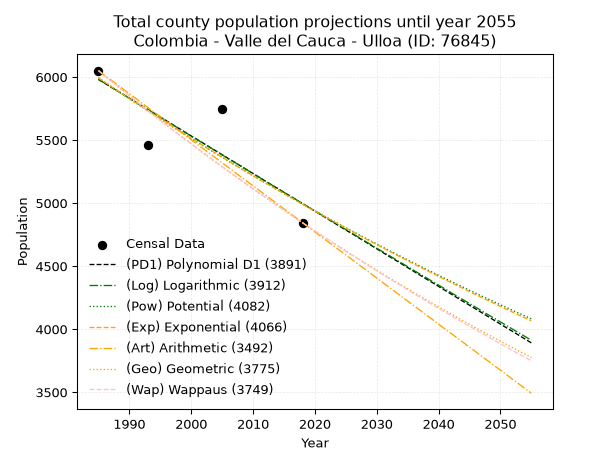
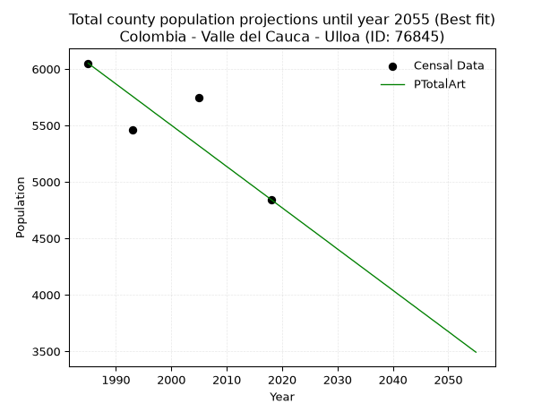
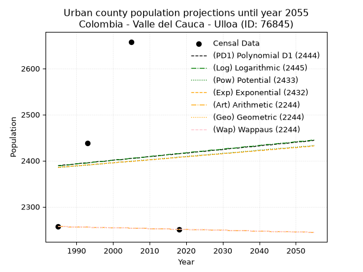
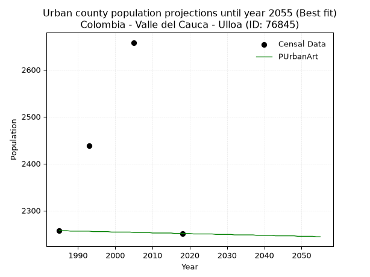
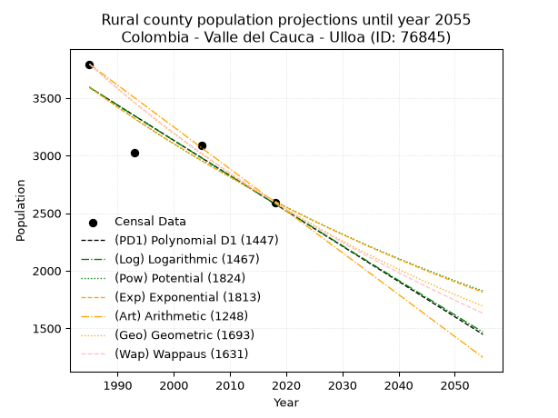
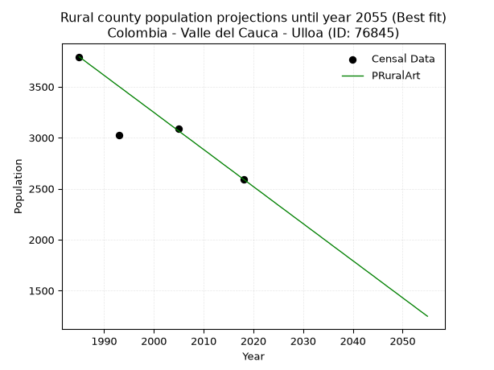

<div align="center">


</div>

# 📜 _“Population and Public Services Demand Projections (PPSD) until Year 2050 for Colombia - Valle del Cauca - Ulloa (ID: 76845)”_
Keywords: `population` `public-service` `projection` `lineal` `polynomial` `logarithmic` `potential` `exponential` `arithmetic` `geometric` `wappaus` `dane` `colombia` `south-america`

PPSD are analytical estimates used by governments and planners to anticipate future changes in population size, age distribution, and the resulting community needs for utilities, healthcare, education, and infrastructure as sizing future water treatment facilities, electrical grids, and road networks based on spatial growth.

<div align="center">

</img>

</div>


> **General running parameters**: • app_version: _v20260806_. • Python version: _3.14.7_. • Pandas version: _3.0.5_. • NumPy version: _2.5.1_. • Creates, save and include plots into reports (create_plot): _False_. • Projection until year: _2050_. • Process polynomial degree 2 and up: _False_. • Process Wappaus: _True_. • Process Wappaus: _True_. • Set negative values to zero: _True_. • Set infinite values to zero: _True_. • Drop dataset notes: _True_. 
<div align="center">

Dynamic map: [:earth_americas:Google](http://maps.google.com/maps?q=4.703623158,-75.737808) [:earth_americas:OSM](https://www.openstreetmap.org/#map=18/4.703623158/-75.737808&layers=P) [:earth_americas:Bing](https://www.bing.com/maps?cp=4.703623158~-75.737808&lvl=18) [:earth_americas:Apple](https://maps.apple.com/frame?center=4.703623158%2C-75.737808&span=0.003%2C0.006)

</div>


<div align="center">

```geojson
{
  "type": "Feature",
  "geometry": {
    "type": "Point", 
    "coordinates": [-75.737808, 4.703623158]
  }, 
  "properties": {
    "Name": "Colombia - Valle del Cauca - Ulloa (ID: 76845)"
  }
}
```

</div>


## 0. Census Data (4 records)

Census data are official statistics collected by a government about the people and housing in a country. They usually include counts of total population, age, sex, race, income, education, and jobs.

📅Global census file: [Population.xlsx](../data/Population.xlsx)

| Source   |   Year |   CountryID | CountryName   |   StateID | StateName       |   CountyID | CountyName   |   PTotal |   PUrban |   PRural |
|:---------|-------:|------------:|:--------------|----------:|:----------------|-----------:|:-------------|---------:|---------:|---------:|
| DANE     |   1985 |          57 | Colombia      |        76 | Valle del Cauca |      76845 | Ulloa        |     6050 |     2257 |     3793 |
| DANE     |   1993 |          57 | Colombia      |        76 | Valle del Cauca |      76845 | Ulloa        |     5461 |     2438 |     3023 |
| DANE     |   2005 |          57 | Colombia      |        76 | Valle del Cauca |      76845 | Ulloa        |     5745 |     2658 |     3087 |
| DANE     |   2018 |          57 | Colombia      |        76 | Valle del Cauca |      76845 | Ulloa        |     4844 |     2251 |     2593 |

> 🔥Some records could had specific notes about the registered values or the corresponding urban or rural distribution.

📅[SUI-RUPS](https://www.datos.gov.co/Hacienda-y-Cr-dito-P-blico/Registro-nico-de-Prestadores-de-Servicios-P-blicos/4qkq-csdn/about_data) - Local public utility companies: [RUPS.csv](../data/RUPS.csv)

 | SERVICIO       | ESTADO    | NOMBRE                                                                    | NIT         | DEPARTAMENTO_DOMICILIO   | MUNICIPIO_DOMICILIO   | DIRECCION                       |   TELEFONO | EMAIL                     | TIPO_PRESTADOR                             | CLASIFICACION                 |
|:---------------|:----------|:--------------------------------------------------------------------------|:------------|:-------------------------|:----------------------|:--------------------------------|-----------:|:--------------------------|:-------------------------------------------|:------------------------------|
| ACUEDUCTO      | OPERATIVA | SOCIEDAD DE ACUEDUCTOS Y ALCANTARILLADOS DEL VALLE DEL CAUCA S.A.  E.S.P. | 890399032-8 | VALLE DEL CAUCA          | CALI                  | AVENIDA 5 N # 23 AN 41          |    6203400 | rosemary@acuavalle.gov.co | SOCIEDADES (EMPRESA DE SERVICIOS PUBLICOS) | MAYOR O IGUAL A 5001 USUARIOS |
| ACUEDUCTO      | OPERATIVA | ADMINISTRACION COOPERATIVA ULLOA E.S.P.                                   | 821001138-0 | VALLE DEL CAUCA          | ULLOA                 | KR 2 N 4-71 PISO 2 EDF DEL CAFE |    2075431 | apcullooaesp@gmail.com    | ORGANIZACION AUTORIZADA                    | MENOR O IGUAL A 2500 USUARIOS |
| ALCANTARILLADO | OPERATIVA | Serviulloa SA ESP                                                         | 900235848-2 | VALLE DEL CAUCA          | ULLOA                 | Calle 5 No 2-07                 |    2075435 | comercial@sakuraacsp.co   | SOCIEDADES (EMPRESA DE SERVICIOS PUBLICOS) | MENOR O IGUAL A 2500 USUARIOS |

## 1. Total

### 1.1. Coefficients and Parameters

* (PD1) Polynomial Deg 1: -29.84343637093484, 65219.33360096242 (lineal)
* (Log) Logarithmic: -59704.9570319475, 459342.8568453317
* (Pow) Potential: -11.079945955630693, 40.316622300888284
* (Exp) Exponential: -0.005538744852579024, 356758593.88393885
* (Art) Arithmetic: Year diff. 2018 - 1985 = 33, Population diff. 4844 - 6050 = -1206, Annual growth = -36.54545454545455
* (Geo) Geometric: Year diff. 2018 - 1985 = 33, Population diff. 4844 - 6050 = -1206, Annual growth % = -0.006714250328741289
* (Wap) Wappaus: i = -0.6709281172288332, Condition values only valid for < 200)

<sub>
Wappaus condition values: ['-0.00', '-0.67', '-1.34', '-2.01', '-2.68', '-3.35', '-4.03', '-4.70', '-5.37', '-6.04', '-6.71', '-7.38', '-8.05', '-8.72', '-9.39', '-10.06', '-10.73', '-11.41', '-12.08', '-12.75', '-13.42', '-14.09', '-14.76', '-15.43', '-16.10', '-16.77', '-17.44', '-18.12', '-18.79', '-19.46', '-20.13', '-20.80', '-21.47', '-22.14', '-22.81', '-23.48', '-24.15', '-24.82', '-25.50', '-26.17', '-26.84', '-27.51', '-28.18', '-28.85', '-29.52', '-30.19', '-30.86', '-31.53', '-32.20', '-32.88', '-33.55', '-34.22', '-34.89', '-35.56', '-36.23', '-36.90', '-37.57', '-38.24', '-38.91', '-39.58', '-40.26', '-40.93', '-41.60', '-42.27', '-42.94', '-43.61']
</sub>


### 1.2. Projected Dataset

|   Year |   CountyID |   PTotalPD1 |   PTotalLog |   PTotalPow |   PTotalExp |   PTotalArt |   PTotalGeo |   PTotalWap |
|-------:|-----------:|------------:|------------:|------------:|------------:|------------:|------------:|------------:|
|   1985 |      76845 |        5980 |        5981 |        5993 |        5992 |        6050 |        6050 |        6050 |
|   1986 |      76845 |        5950 |        5951 |        5959 |        5959 |        6013 |        6009 |        6010 |
|   1987 |      76845 |        5920 |        5921 |        5926 |        5926 |        5977 |        5969 |        5969 |
|   1988 |      76845 |        5891 |        5891 |        5893 |        5893 |        5940 |        5929 |        5929 |
|   1989 |      76845 |        5861 |        5861 |        5860 |        5861 |        5904 |        5889 |        5890 |
|   1990 |      76845 |        5831 |        5831 |        5828 |        5828 |        5867 |        5850 |        5850 |
|   1991 |      76845 |        5801 |        5801 |        5796 |        5796 |        5831 |        5810 |        5811 |
|   1992 |      76845 |        5771 |        5771 |        5763 |        5764 |        5794 |        5771 |        5772 |
|   1993 |      76845 |        5741 |        5741 |        5731 |        5732 |        5758 |        5733 |        5734 |
|   1994 |      76845 |        5712 |        5711 |        5700 |        5701 |        5721 |        5694 |        5695 |
|   1995 |      76845 |        5682 |        5681 |        5668 |        5669 |        5685 |        5656 |        5657 |
|   1996 |      76845 |        5652 |        5651 |        5637 |        5638 |        5648 |        5618 |        5619 |
|   1997 |      76845 |        5622 |        5621 |        5605 |        5607 |        5611 |        5580 |        5582 |
|   1998 |      76845 |        5592 |        5591 |        5574 |        5576 |        5575 |        5543 |        5544 |
|   1999 |      76845 |        5562 |        5561 |        5544 |        5545 |        5538 |        5505 |        5507 |
|   2000 |      76845 |        5532 |        5531 |        5513 |        5514 |        5502 |        5469 |        5470 |
|   2001 |      76845 |        5503 |        5501 |        5483 |        5484 |        5465 |        5432 |        5434 |
|   2002 |      76845 |        5473 |        5472 |        5452 |        5453 |        5429 |        5395 |        5397 |
|   2003 |      76845 |        5443 |        5442 |        5422 |        5423 |        5392 |        5359 |        5361 |
|   2004 |      76845 |        5413 |        5412 |        5392 |        5393 |        5356 |        5323 |        5325 |
|   2005 |      76845 |        5383 |        5382 |        5363 |        5364 |        5319 |        5287 |        5289 |
|   2006 |      76845 |        5353 |        5352 |        5333 |        5334 |        5283 |        5252 |        5254 |
|   2007 |      76845 |        5324 |        5323 |        5304 |        5304 |        5246 |        5217 |        5218 |
|   2008 |      76845 |        5294 |        5293 |        5274 |        5275 |        5209 |        5182 |        5183 |
|   2009 |      76845 |        5264 |        5263 |        5245 |        5246 |        5173 |        5147 |        5148 |
|   2010 |      76845 |        5234 |        5234 |        5217 |        5217 |        5136 |        5112 |        5114 |
|   2011 |      76845 |        5204 |        5204 |        5188 |        5188 |        5100 |        5078 |        5079 |
|   2012 |      76845 |        5174 |        5174 |        5159 |        5160 |        5063 |        5044 |        5045 |
|   2013 |      76845 |        5144 |        5144 |        5131 |        5131 |        5027 |        5010 |        5011 |
|   2014 |      76845 |        5115 |        5115 |        5103 |        5103 |        4990 |        4976 |        4977 |
|   2015 |      76845 |        5085 |        5085 |        5075 |        5075 |        4954 |        4943 |        4944 |
|   2016 |      76845 |        5055 |        5056 |        5047 |        5047 |        4917 |        4910 |        4910 |
|   2017 |      76845 |        5025 |        5026 |        5019 |        5019 |        4881 |        4877 |        4877 |
|   2018 |      76845 |        4995 |        4996 |        4992 |        4991 |        4844 |        4844 |        4844 |
|   2019 |      76845 |        4965 |        4967 |        4965 |        4963 |        4807 |        4811 |        4811 |
|   2020 |      76845 |        4936 |        4937 |        4938 |        4936 |        4771 |        4779 |        4779 |
|   2021 |      76845 |        4906 |        4908 |        4911 |        4909 |        4734 |        4747 |        4746 |
|   2022 |      76845 |        4876 |        4878 |        4884 |        4882 |        4698 |        4715 |        4714 |
|   2023 |      76845 |        4846 |        4849 |        4857 |        4855 |        4661 |        4684 |        4682 |
|   2024 |      76845 |        4816 |        4819 |        4830 |        4828 |        4625 |        4652 |        4650 |
|   2025 |      76845 |        4786 |        4790 |        4804 |        4801 |        4588 |        4621 |        4618 |
|   2026 |      76845 |        4757 |        4760 |        4778 |        4775 |        4552 |        4590 |        4587 |
|   2027 |      76845 |        4727 |        4731 |        4752 |        4748 |        4515 |        4559 |        4556 |
|   2028 |      76845 |        4697 |        4701 |        4726 |        4722 |        4479 |        4528 |        4525 |
|   2029 |      76845 |        4667 |        4672 |        4700 |        4696 |        4442 |        4498 |        4494 |
|   2030 |      76845 |        4637 |        4642 |        4675 |        4670 |        4405 |        4468 |        4463 |
|   2031 |      76845 |        4607 |        4613 |        4649 |        4644 |        4369 |        4438 |        4432 |
|   2032 |      76845 |        4577 |        4584 |        4624 |        4619 |        4332 |        4408 |        4402 |
|   2033 |      76845 |        4548 |        4554 |        4599 |        4593 |        4296 |        4378 |        4372 |
|   2034 |      76845 |        4518 |        4525 |        4574 |        4568 |        4259 |        4349 |        4342 |
|   2035 |      76845 |        4488 |        4496 |        4549 |        4542 |        4223 |        4320 |        4312 |
|   2036 |      76845 |        4458 |        4466 |        4524 |        4517 |        4186 |        4291 |        4282 |
|   2037 |      76845 |        4428 |        4437 |        4500 |        4492 |        4150 |        4262 |        4253 |
|   2038 |      76845 |        4398 |        4408 |        4475 |        4468 |        4113 |        4233 |        4223 |
|   2039 |      76845 |        4369 |        4378 |        4451 |        4443 |        4077 |        4205 |        4194 |
|   2040 |      76845 |        4339 |        4349 |        4427 |        4418 |        4040 |        4177 |        4165 |
|   2041 |      76845 |        4309 |        4320 |        4403 |        4394 |        4003 |        4149 |        4136 |
|   2042 |      76845 |        4279 |        4290 |        4379 |        4370 |        3967 |        4121 |        4108 |
|   2043 |      76845 |        4249 |        4261 |        4355 |        4346 |        3930 |        4093 |        4079 |
|   2044 |      76845 |        4219 |        4232 |        4332 |        4322 |        3894 |        4066 |        4051 |
|   2045 |      76845 |        4190 |        4203 |        4308 |        4298 |        3857 |        4038 |        4023 |
|   2046 |      76845 |        4160 |        4174 |        4285 |        4274 |        3821 |        4011 |        3995 |
|   2047 |      76845 |        4130 |        4144 |        4262 |        4250 |        3784 |        3984 |        3967 |
|   2048 |      76845 |        4100 |        4115 |        4239 |        4227 |        3748 |        3958 |        3939 |
|   2049 |      76845 |        4070 |        4086 |        4216 |        4204 |        3711 |        3931 |        3911 |
|   2050 |      76845 |        4040 |        4057 |        4193 |        4180 |        3675 |        3905 |        3884 |
<div align="center">

</img>

</div>


### 1.3. Best fit with absolute and relative error (%)

Relative error puts that difference into context by dividing the absolute error by the true value, creating a unitless ratio or percentage that shows the scale of the mistake.

Absolute and relative error

|   Year | Source   |   CountryID | CountryName   |   StateID | StateName       |   CountyID_x | CountyName   |   PTotal |   PUrban |   PRural |   CountyID_y |   PTotalPD1 |   PTotalLog |   PTotalPow |   PTotalExp |   PTotalArt |   PTotalGeo |   PTotalWap |   PTotalPD1AbsError |   PTotalLogAbsError |   PTotalPowAbsError |   PTotalExpAbsError |   PTotalArtAbsError |   PTotalGeoAbsError |   PTotalWapAbsError |   PTotalPD1RelError |   PTotalLogRelError |   PTotalPowRelError |   PTotalExpRelError |   PTotalArtRelError |   PTotalGeoRelError |   PTotalWapRelError |
|-------:|:---------|------------:|:--------------|----------:|:----------------|-------------:|:-------------|---------:|---------:|---------:|-------------:|------------:|------------:|------------:|------------:|------------:|------------:|------------:|--------------------:|--------------------:|--------------------:|--------------------:|--------------------:|--------------------:|--------------------:|--------------------:|--------------------:|--------------------:|--------------------:|--------------------:|--------------------:|--------------------:|
|   1985 | DANE     |          57 | Colombia      |        76 | Valle del Cauca |        76845 | Ulloa        |     6050 |     2257 |     3793 |        76845 |        5980 |        5981 |        5993 |        5992 |        6050 |        6050 |        6050 |                  70 |                  69 |                  57 |                  58 |                   0 |                   0 |                   0 |             1.15702 |             1.1405  |            0.942149 |            0.958678 |             0       |             0       |             0       |
|   1993 | DANE     |          57 | Colombia      |        76 | Valle del Cauca |        76845 | Ulloa        |     5461 |     2438 |     3023 |        76845 |        5741 |        5741 |        5731 |        5732 |        5758 |        5733 |        5734 |                 280 |                 280 |                 270 |                 271 |                 297 |                 272 |                 273 |             5.12727 |             5.12727 |            4.94415  |            4.96246  |             5.43856 |             4.98077 |             4.99908 |
|   2005 | DANE     |          57 | Colombia      |        76 | Valle del Cauca |        76845 | Ulloa        |     5745 |     2658 |     3087 |        76845 |        5383 |        5382 |        5363 |        5364 |        5319 |        5287 |        5289 |                 362 |                 363 |                 382 |                 381 |                 426 |                 458 |                 456 |             6.30113 |             6.31854 |            6.64926  |            6.63185  |             7.41514 |             7.97215 |             7.93734 |
|   2018 | DANE     |          57 | Colombia      |        76 | Valle del Cauca |        76845 | Ulloa        |     4844 |     2251 |     2593 |        76845 |        4995 |        4996 |        4992 |        4991 |        4844 |        4844 |        4844 |                 151 |                 152 |                 148 |                 147 |                   0 |                   0 |                   0 |             3.11726 |             3.1379  |            3.05533  |            3.03468  |             0       |             0       |             0       |

Relative error mean

| Method    |   RelError | Best   |
|:----------|-----------:|:-------|
| PTotalPD1 |    3.92567 |        |
| PTotalLog |    3.93105 |        |
| PTotalPow |    3.89772 |        |
| PTotalExp |    3.89692 |        |
| PTotalArt |    3.21343 | True   |
| PTotalGeo |    3.23823 |        |
| PTotalWap |    3.23411 |        |

💙Best method: _**PTotalArt**_
<div align="center">

</img>

</div>


### 1.4. Fresh water supply demand in liters per capita per day (lpcd)

The fresh water supply demand typically ranges from 100 to 300 liters per capita per day (lpcd) for standard domestic and municipal planning, though absolute survival minimums set by the World Health Organization are as low as 7.5 to 20 liters per day, and total consumption in high-income nations can exceed 400 liters.

> `CZ`: Level in meters above the sea level (masl)<br> `WS`: Fresh water supply demand in liters per capita per day (lpcd or l/h/d)<br> `WSAll`: Zonal fresh water supply demand in liters per second (l/s)<br> `A`: Zonal area in square meters<br> `DP`: Population density (people/hectare or p/ha)

Reference values (RAS Colombia)

|    CZ |   WS |
|------:|-----:|
|  1000 |  120 |
|  2000 |  130 |
| 99999 |  140 |

County shapefile geometry properties and water supply values

|   CountyID |      ATotal |   CZTotal |   WSTotal |
|-----------:|------------:|----------:|----------:|
|      76845 | 4.18723e+07 |    1255.9 |       130 |

Projected values for best method: PTotalArt

|   CountyID |   Year |   PTotalArt |   DPTotal |   WSTotal |   WSTotalAll |
|-----------:|-------:|------------:|----------:|----------:|-------------:|
|      76845 |   1985 |        6050 |      1.44 |       130 |      9.10301 |
|      76845 |   1986 |        6013 |      1.44 |       130 |      9.04734 |
|      76845 |   1987 |        5977 |      1.43 |       130 |      8.99317 |
|      76845 |   1988 |        5940 |      1.42 |       130 |      8.9375  |
|      76845 |   1989 |        5904 |      1.41 |       130 |      8.88333 |
|      76845 |   1990 |        5867 |      1.4  |       130 |      8.82766 |
|      76845 |   1991 |        5831 |      1.39 |       130 |      8.7735  |
|      76845 |   1992 |        5794 |      1.38 |       130 |      8.71782 |
|      76845 |   1993 |        5758 |      1.38 |       130 |      8.66366 |
|      76845 |   1994 |        5721 |      1.37 |       130 |      8.60799 |
|      76845 |   1995 |        5685 |      1.36 |       130 |      8.55382 |
|      76845 |   1996 |        5648 |      1.35 |       130 |      8.49815 |
|      76845 |   1997 |        5611 |      1.34 |       130 |      8.44248 |
|      76845 |   1998 |        5575 |      1.33 |       130 |      8.38831 |
|      76845 |   1999 |        5538 |      1.32 |       130 |      8.33264 |
|      76845 |   2000 |        5502 |      1.31 |       130 |      8.27847 |
|      76845 |   2001 |        5465 |      1.31 |       130 |      8.2228  |
|      76845 |   2002 |        5429 |      1.3  |       130 |      8.16863 |
|      76845 |   2003 |        5392 |      1.29 |       130 |      8.11296 |
|      76845 |   2004 |        5356 |      1.28 |       130 |      8.0588  |
|      76845 |   2005 |        5319 |      1.27 |       130 |      8.00313 |
|      76845 |   2006 |        5283 |      1.26 |       130 |      7.94896 |
|      76845 |   2007 |        5246 |      1.25 |       130 |      7.89329 |
|      76845 |   2008 |        5209 |      1.24 |       130 |      7.83762 |
|      76845 |   2009 |        5173 |      1.24 |       130 |      7.78345 |
|      76845 |   2010 |        5136 |      1.23 |       130 |      7.72778 |
|      76845 |   2011 |        5100 |      1.22 |       130 |      7.67361 |
|      76845 |   2012 |        5063 |      1.21 |       130 |      7.61794 |
|      76845 |   2013 |        5027 |      1.2  |       130 |      7.56377 |
|      76845 |   2014 |        4990 |      1.19 |       130 |      7.5081  |
|      76845 |   2015 |        4954 |      1.18 |       130 |      7.45394 |
|      76845 |   2016 |        4917 |      1.17 |       130 |      7.39826 |
|      76845 |   2017 |        4881 |      1.17 |       130 |      7.3441  |
|      76845 |   2018 |        4844 |      1.16 |       130 |      7.28843 |
|      76845 |   2019 |        4807 |      1.15 |       130 |      7.23275 |
|      76845 |   2020 |        4771 |      1.14 |       130 |      7.17859 |
|      76845 |   2021 |        4734 |      1.13 |       130 |      7.12292 |
|      76845 |   2022 |        4698 |      1.12 |       130 |      7.06875 |
|      76845 |   2023 |        4661 |      1.11 |       130 |      7.01308 |
|      76845 |   2024 |        4625 |      1.1  |       130 |      6.95891 |
|      76845 |   2025 |        4588 |      1.1  |       130 |      6.90324 |
|      76845 |   2026 |        4552 |      1.09 |       130 |      6.84907 |
|      76845 |   2027 |        4515 |      1.08 |       130 |      6.7934  |
|      76845 |   2028 |        4479 |      1.07 |       130 |      6.73924 |
|      76845 |   2029 |        4442 |      1.06 |       130 |      6.68356 |
|      76845 |   2030 |        4405 |      1.05 |       130 |      6.62789 |
|      76845 |   2031 |        4369 |      1.04 |       130 |      6.57373 |
|      76845 |   2032 |        4332 |      1.03 |       130 |      6.51806 |
|      76845 |   2033 |        4296 |      1.03 |       130 |      6.46389 |
|      76845 |   2034 |        4259 |      1.02 |       130 |      6.40822 |
|      76845 |   2035 |        4223 |      1.01 |       130 |      6.35405 |
|      76845 |   2036 |        4186 |      1    |       130 |      6.29838 |
|      76845 |   2037 |        4150 |      0.99 |       130 |      6.24421 |
|      76845 |   2038 |        4113 |      0.98 |       130 |      6.18854 |
|      76845 |   2039 |        4077 |      0.97 |       130 |      6.13438 |
|      76845 |   2040 |        4040 |      0.96 |       130 |      6.0787  |
|      76845 |   2041 |        4003 |      0.96 |       130 |      6.02303 |
|      76845 |   2042 |        3967 |      0.95 |       130 |      5.96887 |
|      76845 |   2043 |        3930 |      0.94 |       130 |      5.91319 |
|      76845 |   2044 |        3894 |      0.93 |       130 |      5.85903 |
|      76845 |   2045 |        3857 |      0.92 |       130 |      5.80336 |
|      76845 |   2046 |        3821 |      0.91 |       130 |      5.74919 |
|      76845 |   2047 |        3784 |      0.9  |       130 |      5.69352 |
|      76845 |   2048 |        3748 |      0.9  |       130 |      5.63935 |
|      76845 |   2049 |        3711 |      0.89 |       130 |      5.58368 |
|      76845 |   2050 |        3675 |      0.88 |       130 |      5.52951 |

## 2. Urban

### 2.1. Coefficients and Parameters

* (PD1) Polynomial Deg 1: 0.7804094741070113, 839.9859494174503 (lineal)
* (Log) Logarithmic: 1621.7765263693889, -9926.136373035182
* (Pow) Potential: 0.5718841146377666, 1.4915411005030779
* (Exp) Exponential: 0.00027342829125009255, 1386.2688025600148
* (Art) Arithmetic: Year diff. 2018 - 1985 = 33, Population diff. 2251 - 2257 = -6, Annual growth = -0.18181818181818182
* (Geo) Geometric: Year diff. 2018 - 1985 = 33, Population diff. 2251 - 2257 = -6, Annual growth % = -8.066147125840306e-05
* (Wap) Wappaus: i = -0.008066467693796887, Condition values only valid for < 200)

<sub>
Wappaus condition values: ['-0.00', '-0.01', '-0.02', '-0.02', '-0.03', '-0.04', '-0.05', '-0.06', '-0.06', '-0.07', '-0.08', '-0.09', '-0.10', '-0.10', '-0.11', '-0.12', '-0.13', '-0.14', '-0.15', '-0.15', '-0.16', '-0.17', '-0.18', '-0.19', '-0.19', '-0.20', '-0.21', '-0.22', '-0.23', '-0.23', '-0.24', '-0.25', '-0.26', '-0.27', '-0.27', '-0.28', '-0.29', '-0.30', '-0.31', '-0.31', '-0.32', '-0.33', '-0.34', '-0.35', '-0.35', '-0.36', '-0.37', '-0.38', '-0.39', '-0.40', '-0.40', '-0.41', '-0.42', '-0.43', '-0.44', '-0.44', '-0.45', '-0.46', '-0.47', '-0.48', '-0.48', '-0.49', '-0.50', '-0.51', '-0.52', '-0.52']
</sub>


### 2.2. Projected Dataset

|   Year |   CountyID |   PUrbanPD1 |   PUrbanLog |   PUrbanPow |   PUrbanExp |   PUrbanArt |   PUrbanGeo |   PUrbanWap |
|-------:|-----------:|------------:|------------:|------------:|------------:|------------:|------------:|------------:|
|   1985 |      76845 |        2389 |        2389 |        2385 |        2385 |        2257 |        2257 |        2257 |
|   1986 |      76845 |        2390 |        2389 |        2386 |        2386 |        2257 |        2257 |        2257 |
|   1987 |      76845 |        2391 |        2390 |        2386 |        2387 |        2257 |        2257 |        2257 |
|   1988 |      76845 |        2391 |        2391 |        2387 |        2387 |        2256 |        2256 |        2256 |
|   1989 |      76845 |        2392 |        2392 |        2388 |        2388 |        2256 |        2256 |        2256 |
|   1990 |      76845 |        2393 |        2393 |        2388 |        2389 |        2256 |        2256 |        2256 |
|   1991 |      76845 |        2394 |        2394 |        2389 |        2389 |        2256 |        2256 |        2256 |
|   1992 |      76845 |        2395 |        2394 |        2390 |        2390 |        2256 |        2256 |        2256 |
|   1993 |      76845 |        2395 |        2395 |        2390 |        2391 |        2256 |        2256 |        2256 |
|   1994 |      76845 |        2396 |        2396 |        2391 |        2391 |        2255 |        2255 |        2255 |
|   1995 |      76845 |        2397 |        2397 |        2392 |        2392 |        2255 |        2255 |        2255 |
|   1996 |      76845 |        2398 |        2398 |        2392 |        2393 |        2255 |        2255 |        2255 |
|   1997 |      76845 |        2398 |        2398 |        2393 |        2393 |        2255 |        2255 |        2255 |
|   1998 |      76845 |        2399 |        2399 |        2394 |        2394 |        2255 |        2255 |        2255 |
|   1999 |      76845 |        2400 |        2400 |        2395 |        2395 |        2254 |        2254 |        2254 |
|   2000 |      76845 |        2401 |        2401 |        2395 |        2395 |        2254 |        2254 |        2254 |
|   2001 |      76845 |        2402 |        2402 |        2396 |        2396 |        2254 |        2254 |        2254 |
|   2002 |      76845 |        2402 |        2402 |        2397 |        2397 |        2254 |        2254 |        2254 |
|   2003 |      76845 |        2403 |        2403 |        2397 |        2397 |        2254 |        2254 |        2254 |
|   2004 |      76845 |        2404 |        2404 |        2398 |        2398 |        2254 |        2254 |        2254 |
|   2005 |      76845 |        2405 |        2405 |        2399 |        2398 |        2253 |        2253 |        2253 |
|   2006 |      76845 |        2405 |        2406 |        2399 |        2399 |        2253 |        2253 |        2253 |
|   2007 |      76845 |        2406 |        2406 |        2400 |        2400 |        2253 |        2253 |        2253 |
|   2008 |      76845 |        2407 |        2407 |        2401 |        2400 |        2253 |        2253 |        2253 |
|   2009 |      76845 |        2408 |        2408 |        2401 |        2401 |        2253 |        2253 |        2253 |
|   2010 |      76845 |        2409 |        2409 |        2402 |        2402 |        2252 |        2252 |        2252 |
|   2011 |      76845 |        2409 |        2410 |        2403 |        2402 |        2252 |        2252 |        2252 |
|   2012 |      76845 |        2410 |        2411 |        2403 |        2403 |        2252 |        2252 |        2252 |
|   2013 |      76845 |        2411 |        2411 |        2404 |        2404 |        2252 |        2252 |        2252 |
|   2014 |      76845 |        2412 |        2412 |        2405 |        2404 |        2252 |        2252 |        2252 |
|   2015 |      76845 |        2413 |        2413 |        2405 |        2405 |        2252 |        2252 |        2252 |
|   2016 |      76845 |        2413 |        2414 |        2406 |        2406 |        2251 |        2251 |        2251 |
|   2017 |      76845 |        2414 |        2415 |        2407 |        2406 |        2251 |        2251 |        2251 |
|   2018 |      76845 |        2415 |        2415 |        2408 |        2407 |        2251 |        2251 |        2251 |
|   2019 |      76845 |        2416 |        2416 |        2408 |        2408 |        2251 |        2251 |        2251 |
|   2020 |      76845 |        2416 |        2417 |        2409 |        2408 |        2251 |        2251 |        2251 |
|   2021 |      76845 |        2417 |        2418 |        2410 |        2409 |        2250 |        2250 |        2250 |
|   2022 |      76845 |        2418 |        2419 |        2410 |        2410 |        2250 |        2250 |        2250 |
|   2023 |      76845 |        2419 |        2419 |        2411 |        2410 |        2250 |        2250 |        2250 |
|   2024 |      76845 |        2420 |        2420 |        2412 |        2411 |        2250 |        2250 |        2250 |
|   2025 |      76845 |        2420 |        2421 |        2412 |        2412 |        2250 |        2250 |        2250 |
|   2026 |      76845 |        2421 |        2422 |        2413 |        2412 |        2250 |        2250 |        2250 |
|   2027 |      76845 |        2422 |        2423 |        2414 |        2413 |        2249 |        2249 |        2249 |
|   2028 |      76845 |        2423 |        2423 |        2414 |        2414 |        2249 |        2249 |        2249 |
|   2029 |      76845 |        2423 |        2424 |        2415 |        2414 |        2249 |        2249 |        2249 |
|   2030 |      76845 |        2424 |        2425 |        2416 |        2415 |        2249 |        2249 |        2249 |
|   2031 |      76845 |        2425 |        2426 |        2416 |        2416 |        2249 |        2249 |        2249 |
|   2032 |      76845 |        2426 |        2427 |        2417 |        2416 |        2248 |        2248 |        2248 |
|   2033 |      76845 |        2427 |        2427 |        2418 |        2417 |        2248 |        2248 |        2248 |
|   2034 |      76845 |        2427 |        2428 |        2418 |        2418 |        2248 |        2248 |        2248 |
|   2035 |      76845 |        2428 |        2429 |        2419 |        2418 |        2248 |        2248 |        2248 |
|   2036 |      76845 |        2429 |        2430 |        2420 |        2419 |        2248 |        2248 |        2248 |
|   2037 |      76845 |        2430 |        2431 |        2420 |        2420 |        2248 |        2248 |        2248 |
|   2038 |      76845 |        2430 |        2431 |        2421 |        2420 |        2247 |        2247 |        2247 |
|   2039 |      76845 |        2431 |        2432 |        2422 |        2421 |        2247 |        2247 |        2247 |
|   2040 |      76845 |        2432 |        2433 |        2423 |        2422 |        2247 |        2247 |        2247 |
|   2041 |      76845 |        2433 |        2434 |        2423 |        2422 |        2247 |        2247 |        2247 |
|   2042 |      76845 |        2434 |        2435 |        2424 |        2423 |        2247 |        2247 |        2247 |
|   2043 |      76845 |        2434 |        2435 |        2425 |        2424 |        2246 |        2246 |        2246 |
|   2044 |      76845 |        2435 |        2436 |        2425 |        2424 |        2246 |        2246 |        2246 |
|   2045 |      76845 |        2436 |        2437 |        2426 |        2425 |        2246 |        2246 |        2246 |
|   2046 |      76845 |        2437 |        2438 |        2427 |        2426 |        2246 |        2246 |        2246 |
|   2047 |      76845 |        2437 |        2438 |        2427 |        2426 |        2246 |        2246 |        2246 |
|   2048 |      76845 |        2438 |        2439 |        2428 |        2427 |        2246 |        2246 |        2246 |
|   2049 |      76845 |        2439 |        2440 |        2429 |        2428 |        2245 |        2245 |        2245 |
|   2050 |      76845 |        2440 |        2441 |        2429 |        2428 |        2245 |        2245 |        2245 |
<div align="center">

</img>

</div>


### 2.3. Best fit with absolute and relative error (%)

Relative error puts that difference into context by dividing the absolute error by the true value, creating a unitless ratio or percentage that shows the scale of the mistake.

Absolute and relative error

|   Year | Source   |   CountryID | CountryName   |   StateID | StateName       |   CountyID_x | CountyName   |   PTotal |   PUrban |   PRural |   CountyID_y |   PUrbanPD1 |   PUrbanLog |   PUrbanPow |   PUrbanExp |   PUrbanArt |   PUrbanGeo |   PUrbanWap |   PUrbanPD1AbsError |   PUrbanLogAbsError |   PUrbanPowAbsError |   PUrbanExpAbsError |   PUrbanArtAbsError |   PUrbanGeoAbsError |   PUrbanWapAbsError |   PUrbanPD1RelError |   PUrbanLogRelError |   PUrbanPowRelError |   PUrbanExpRelError |   PUrbanArtRelError |   PUrbanGeoRelError |   PUrbanWapRelError |
|-------:|:---------|------------:|:--------------|----------:|:----------------|-------------:|:-------------|---------:|---------:|---------:|-------------:|------------:|------------:|------------:|------------:|------------:|------------:|------------:|--------------------:|--------------------:|--------------------:|--------------------:|--------------------:|--------------------:|--------------------:|--------------------:|--------------------:|--------------------:|--------------------:|--------------------:|--------------------:|--------------------:|
|   1985 | DANE     |          57 | Colombia      |        76 | Valle del Cauca |        76845 | Ulloa        |     6050 |     2257 |     3793 |        76845 |        2389 |        2389 |        2385 |        2385 |        2257 |        2257 |        2257 |                 132 |                 132 |                 128 |                 128 |                   0 |                   0 |                   0 |             5.84847 |             5.84847 |             5.67125 |             5.67125 |             0       |             0       |             0       |
|   1993 | DANE     |          57 | Colombia      |        76 | Valle del Cauca |        76845 | Ulloa        |     5461 |     2438 |     3023 |        76845 |        2395 |        2395 |        2390 |        2391 |        2256 |        2256 |        2256 |                  43 |                  43 |                  48 |                  47 |                 182 |                 182 |                 182 |             1.76374 |             1.76374 |             1.96883 |             1.92781 |             7.46514 |             7.46514 |             7.46514 |
|   2005 | DANE     |          57 | Colombia      |        76 | Valle del Cauca |        76845 | Ulloa        |     5745 |     2658 |     3087 |        76845 |        2405 |        2405 |        2399 |        2398 |        2253 |        2253 |        2253 |                 253 |                 253 |                 259 |                 260 |                 405 |                 405 |                 405 |             9.51843 |             9.51843 |             9.74417 |             9.78179 |            15.237   |            15.237   |            15.237   |
|   2018 | DANE     |          57 | Colombia      |        76 | Valle del Cauca |        76845 | Ulloa        |     4844 |     2251 |     2593 |        76845 |        2415 |        2415 |        2408 |        2407 |        2251 |        2251 |        2251 |                 164 |                 164 |                 157 |                 156 |                   0 |                   0 |                   0 |             7.28565 |             7.28565 |             6.97468 |             6.93025 |             0       |             0       |             0       |

Relative error mean

| Method    |   RelError | Best   |
|:----------|-----------:|:-------|
| PUrbanPD1 |    6.10407 |        |
| PUrbanLog |    6.10407 |        |
| PUrbanPow |    6.08973 |        |
| PUrbanExp |    6.07777 |        |
| PUrbanArt |    5.67554 | True   |
| PUrbanGeo |    5.67554 | True   |
| PUrbanWap |    5.67554 | True   |

💙Best method: _**PUrbanArt**_
<div align="center">

</img>

</div>


### 2.4. Fresh water supply demand in liters per capita per day (lpcd)

The fresh water supply demand typically ranges from 100 to 300 liters per capita per day (lpcd) for standard domestic and municipal planning, though absolute survival minimums set by the World Health Organization are as low as 7.5 to 20 liters per day, and total consumption in high-income nations can exceed 400 liters.

> `CZ`: Level in meters above the sea level (masl)<br> `WS`: Fresh water supply demand in liters per capita per day (lpcd or l/h/d)<br> `WSAll`: Zonal fresh water supply demand in liters per second (l/s)<br> `A`: Zonal area in square meters<br> `DP`: Population density (people/hectare or p/ha)

Reference values (RAS Colombia)

|    CZ |   WS |
|------:|-----:|
|  1000 |  120 |
|  2000 |  130 |
| 99999 |  140 |

County shapefile geometry properties and water supply values

|   CountyID |   AUrban |   CZUrban |   WSUrban |
|-----------:|---------:|----------:|----------:|
|      76845 |   451015 |   1380.47 |       130 |

Projected values for best method: PUrbanArt

|   CountyID |   Year |   PUrbanArt |   DPUrban |   WSUrban |   WSUrbanAll |
|-----------:|-------:|------------:|----------:|----------:|-------------:|
|      76845 |   1985 |        2257 |     50.04 |       130 |      3.39595 |
|      76845 |   1986 |        2257 |     50.04 |       130 |      3.39595 |
|      76845 |   1987 |        2257 |     50.04 |       130 |      3.39595 |
|      76845 |   1988 |        2256 |     50.02 |       130 |      3.39444 |
|      76845 |   1989 |        2256 |     50.02 |       130 |      3.39444 |
|      76845 |   1990 |        2256 |     50.02 |       130 |      3.39444 |
|      76845 |   1991 |        2256 |     50.02 |       130 |      3.39444 |
|      76845 |   1992 |        2256 |     50.02 |       130 |      3.39444 |
|      76845 |   1993 |        2256 |     50.02 |       130 |      3.39444 |
|      76845 |   1994 |        2255 |     50    |       130 |      3.39294 |
|      76845 |   1995 |        2255 |     50    |       130 |      3.39294 |
|      76845 |   1996 |        2255 |     50    |       130 |      3.39294 |
|      76845 |   1997 |        2255 |     50    |       130 |      3.39294 |
|      76845 |   1998 |        2255 |     50    |       130 |      3.39294 |
|      76845 |   1999 |        2254 |     49.98 |       130 |      3.39144 |
|      76845 |   2000 |        2254 |     49.98 |       130 |      3.39144 |
|      76845 |   2001 |        2254 |     49.98 |       130 |      3.39144 |
|      76845 |   2002 |        2254 |     49.98 |       130 |      3.39144 |
|      76845 |   2003 |        2254 |     49.98 |       130 |      3.39144 |
|      76845 |   2004 |        2254 |     49.98 |       130 |      3.39144 |
|      76845 |   2005 |        2253 |     49.95 |       130 |      3.38993 |
|      76845 |   2006 |        2253 |     49.95 |       130 |      3.38993 |
|      76845 |   2007 |        2253 |     49.95 |       130 |      3.38993 |
|      76845 |   2008 |        2253 |     49.95 |       130 |      3.38993 |
|      76845 |   2009 |        2253 |     49.95 |       130 |      3.38993 |
|      76845 |   2010 |        2252 |     49.93 |       130 |      3.38843 |
|      76845 |   2011 |        2252 |     49.93 |       130 |      3.38843 |
|      76845 |   2012 |        2252 |     49.93 |       130 |      3.38843 |
|      76845 |   2013 |        2252 |     49.93 |       130 |      3.38843 |
|      76845 |   2014 |        2252 |     49.93 |       130 |      3.38843 |
|      76845 |   2015 |        2252 |     49.93 |       130 |      3.38843 |
|      76845 |   2016 |        2251 |     49.91 |       130 |      3.38692 |
|      76845 |   2017 |        2251 |     49.91 |       130 |      3.38692 |
|      76845 |   2018 |        2251 |     49.91 |       130 |      3.38692 |
|      76845 |   2019 |        2251 |     49.91 |       130 |      3.38692 |
|      76845 |   2020 |        2251 |     49.91 |       130 |      3.38692 |
|      76845 |   2021 |        2250 |     49.89 |       130 |      3.38542 |
|      76845 |   2022 |        2250 |     49.89 |       130 |      3.38542 |
|      76845 |   2023 |        2250 |     49.89 |       130 |      3.38542 |
|      76845 |   2024 |        2250 |     49.89 |       130 |      3.38542 |
|      76845 |   2025 |        2250 |     49.89 |       130 |      3.38542 |
|      76845 |   2026 |        2250 |     49.89 |       130 |      3.38542 |
|      76845 |   2027 |        2249 |     49.87 |       130 |      3.38391 |
|      76845 |   2028 |        2249 |     49.87 |       130 |      3.38391 |
|      76845 |   2029 |        2249 |     49.87 |       130 |      3.38391 |
|      76845 |   2030 |        2249 |     49.87 |       130 |      3.38391 |
|      76845 |   2031 |        2249 |     49.87 |       130 |      3.38391 |
|      76845 |   2032 |        2248 |     49.84 |       130 |      3.38241 |
|      76845 |   2033 |        2248 |     49.84 |       130 |      3.38241 |
|      76845 |   2034 |        2248 |     49.84 |       130 |      3.38241 |
|      76845 |   2035 |        2248 |     49.84 |       130 |      3.38241 |
|      76845 |   2036 |        2248 |     49.84 |       130 |      3.38241 |
|      76845 |   2037 |        2248 |     49.84 |       130 |      3.38241 |
|      76845 |   2038 |        2247 |     49.82 |       130 |      3.3809  |
|      76845 |   2039 |        2247 |     49.82 |       130 |      3.3809  |
|      76845 |   2040 |        2247 |     49.82 |       130 |      3.3809  |
|      76845 |   2041 |        2247 |     49.82 |       130 |      3.3809  |
|      76845 |   2042 |        2247 |     49.82 |       130 |      3.3809  |
|      76845 |   2043 |        2246 |     49.8  |       130 |      3.3794  |
|      76845 |   2044 |        2246 |     49.8  |       130 |      3.3794  |
|      76845 |   2045 |        2246 |     49.8  |       130 |      3.3794  |
|      76845 |   2046 |        2246 |     49.8  |       130 |      3.3794  |
|      76845 |   2047 |        2246 |     49.8  |       130 |      3.3794  |
|      76845 |   2048 |        2246 |     49.8  |       130 |      3.3794  |
|      76845 |   2049 |        2245 |     49.78 |       130 |      3.37789 |
|      76845 |   2050 |        2245 |     49.78 |       130 |      3.37789 |

## 3. Rural

### 3.1. Coefficients and Parameters

* (PD1) Polynomial Deg 1: -30.623845845041824, 64379.34765154491 (lineal)
* (Log) Logarithmic: -61326.73355831704, 469268.99321836815
* (Pow) Potential: -19.561976505391875, 68.06625800315548
* (Exp) Exponential: -0.009770027560353561, 950361679380.2734
* (Art) Arithmetic: Year diff. 2018 - 1985 = 33, Population diff. 2593 - 3793 = -1200, Annual growth = -36.36363636363637
* (Geo) Geometric: Year diff. 2018 - 1985 = 33, Population diff. 2593 - 3793 = -1200, Annual growth % = -0.011459343533604005
* (Wap) Wappaus: i = -1.1388548814167354, Condition values only valid for < 200)

<sub>
Wappaus condition values: ['-0.00', '-1.14', '-2.28', '-3.42', '-4.56', '-5.69', '-6.83', '-7.97', '-9.11', '-10.25', '-11.39', '-12.53', '-13.67', '-14.81', '-15.94', '-17.08', '-18.22', '-19.36', '-20.50', '-21.64', '-22.78', '-23.92', '-25.05', '-26.19', '-27.33', '-28.47', '-29.61', '-30.75', '-31.89', '-33.03', '-34.17', '-35.30', '-36.44', '-37.58', '-38.72', '-39.86', '-41.00', '-42.14', '-43.28', '-44.42', '-45.55', '-46.69', '-47.83', '-48.97', '-50.11', '-51.25', '-52.39', '-53.53', '-54.67', '-55.80', '-56.94', '-58.08', '-59.22', '-60.36', '-61.50', '-62.64', '-63.78', '-64.91', '-66.05', '-67.19', '-68.33', '-69.47', '-70.61', '-71.75', '-72.89', '-74.03']
</sub>


### 3.2. Projected Dataset

|   Year |   CountyID |   PRuralPD1 |   PRuralLog |   PRuralPow |   PRuralExp |   PRuralArt |   PRuralGeo |   PRuralWap |
|-------:|-----------:|------------:|------------:|------------:|------------:|------------:|------------:|------------:|
|   1985 |      76845 |        3591 |        3592 |        3594 |        3593 |        3793 |        3793 |        3793 |
|   1986 |      76845 |        3560 |        3561 |        3558 |        3558 |        3757 |        3750 |        3750 |
|   1987 |      76845 |        3530 |        3530 |        3524 |        3523 |        3720 |        3707 |        3708 |
|   1988 |      76845 |        3499 |        3500 |        3489 |        3489 |        3684 |        3664 |        3666 |
|   1989 |      76845 |        3469 |        3469 |        3455 |        3455 |        3648 |        3622 |        3624 |
|   1990 |      76845 |        3438 |        3438 |        3421 |        3421 |        3611 |        3581 |        3583 |
|   1991 |      76845 |        3407 |        3407 |        3388 |        3388 |        3575 |        3540 |        3542 |
|   1992 |      76845 |        3377 |        3376 |        3355 |        3355 |        3538 |        3499 |        3502 |
|   1993 |      76845 |        3346 |        3345 |        3322 |        3322 |        3502 |        3459 |        3462 |
|   1994 |      76845 |        3315 |        3315 |        3289 |        3290 |        3466 |        3419 |        3423 |
|   1995 |      76845 |        3285 |        3284 |        3257 |        3258 |        3429 |        3380 |        3384 |
|   1996 |      76845 |        3254 |        3253 |        3225 |        3226 |        3393 |        3341 |        3346 |
|   1997 |      76845 |        3224 |        3223 |        3194 |        3195 |        3357 |        3303 |        3308 |
|   1998 |      76845 |        3193 |        3192 |        3163 |        3164 |        3320 |        3265 |        3270 |
|   1999 |      76845 |        3162 |        3161 |        3132 |        3133 |        3284 |        3228 |        3233 |
|   2000 |      76845 |        3132 |        3130 |        3102 |        3103 |        3248 |        3191 |        3196 |
|   2001 |      76845 |        3101 |        3100 |        3071 |        3073 |        3211 |        3154 |        3160 |
|   2002 |      76845 |        3070 |        3069 |        3042 |        3043 |        3175 |        3118 |        3123 |
|   2003 |      76845 |        3040 |        3039 |        3012 |        3013 |        3138 |        3082 |        3088 |
|   2004 |      76845 |        3009 |        3008 |        2983 |        2984 |        3102 |        3047 |        3052 |
|   2005 |      76845 |        2979 |        2977 |        2954 |        2955 |        3066 |        3012 |        3017 |
|   2006 |      76845 |        2948 |        2947 |        2925 |        2926 |        3029 |        2978 |        2983 |
|   2007 |      76845 |        2917 |        2916 |        2897 |        2898 |        2993 |        2943 |        2948 |
|   2008 |      76845 |        2887 |        2886 |        2869 |        2870 |        2957 |        2910 |        2915 |
|   2009 |      76845 |        2856 |        2855 |        2841 |        2842 |        2920 |        2876 |        2881 |
|   2010 |      76845 |        2825 |        2825 |        2813 |        2814 |        2884 |        2843 |        2848 |
|   2011 |      76845 |        2795 |        2794 |        2786 |        2787 |        2848 |        2811 |        2815 |
|   2012 |      76845 |        2764 |        2764 |        2759 |        2760 |        2811 |        2779 |        2782 |
|   2013 |      76845 |        2734 |        2733 |        2732 |        2733 |        2775 |        2747 |        2750 |
|   2014 |      76845 |        2703 |        2703 |        2706 |        2706 |        2738 |        2715 |        2718 |
|   2015 |      76845 |        2672 |        2672 |        2680 |        2680 |        2702 |        2684 |        2686 |
|   2016 |      76845 |        2642 |        2642 |        2654 |        2654 |        2666 |        2653 |        2655 |
|   2017 |      76845 |        2611 |        2611 |        2628 |        2628 |        2629 |        2623 |        2624 |
|   2018 |      76845 |        2580 |        2581 |        2603 |        2602 |        2593 |        2593 |        2593 |
|   2019 |      76845 |        2550 |        2551 |        2578 |        2577 |        2557 |        2563 |        2563 |
|   2020 |      76845 |        2519 |        2520 |        2553 |        2552 |        2520 |        2534 |        2532 |
|   2021 |      76845 |        2489 |        2490 |        2528 |        2527 |        2484 |        2505 |        2502 |
|   2022 |      76845 |        2458 |        2460 |        2504 |        2503 |        2448 |        2476 |        2473 |
|   2023 |      76845 |        2427 |        2429 |        2480 |        2478 |        2411 |        2448 |        2444 |
|   2024 |      76845 |        2397 |        2399 |        2456 |        2454 |        2375 |        2420 |        2414 |
|   2025 |      76845 |        2366 |        2369 |        2432 |        2430 |        2338 |        2392 |        2386 |
|   2026 |      76845 |        2335 |        2338 |        2409 |        2407 |        2302 |        2365 |        2357 |
|   2027 |      76845 |        2305 |        2308 |        2386 |        2383 |        2266 |        2338 |        2329 |
|   2028 |      76845 |        2274 |        2278 |        2363 |        2360 |        2229 |        2311 |        2301 |
|   2029 |      76845 |        2244 |        2248 |        2340 |        2337 |        2193 |        2284 |        2273 |
|   2030 |      76845 |        2213 |        2217 |        2318 |        2315 |        2157 |        2258 |        2246 |
|   2031 |      76845 |        2182 |        2187 |        2296 |        2292 |        2120 |        2232 |        2218 |
|   2032 |      76845 |        2152 |        2157 |        2274 |        2270 |        2084 |        2207 |        2191 |
|   2033 |      76845 |        2121 |        2127 |        2252 |        2248 |        2048 |        2181 |        2165 |
|   2034 |      76845 |        2090 |        2097 |        2230 |        2226 |        2011 |        2156 |        2138 |
|   2035 |      76845 |        2060 |        2067 |        2209 |        2204 |        1975 |        2132 |        2112 |
|   2036 |      76845 |        2029 |        2036 |        2188 |        2183 |        1938 |        2107 |        2086 |
|   2037 |      76845 |        1999 |        2006 |        2167 |        2162 |        1902 |        2083 |        2060 |
|   2038 |      76845 |        1968 |        1976 |        2146 |        2140 |        1866 |        2059 |        2034 |
|   2039 |      76845 |        1937 |        1946 |        2126 |        2120 |        1829 |        2036 |        2009 |
|   2040 |      76845 |        1907 |        1916 |        2105 |        2099 |        1793 |        2012 |        1984 |
|   2041 |      76845 |        1876 |        1886 |        2085 |        2079 |        1757 |        1989 |        1959 |
|   2042 |      76845 |        1845 |        1856 |        2066 |        2058 |        1720 |        1966 |        1934 |
|   2043 |      76845 |        1815 |        1826 |        2046 |        2038 |        1684 |        1944 |        1910 |
|   2044 |      76845 |        1784 |        1796 |        2026 |        2019 |        1648 |        1922 |        1885 |
|   2045 |      76845 |        1754 |        1766 |        2007 |        1999 |        1611 |        1900 |        1861 |
|   2046 |      76845 |        1723 |        1736 |        1988 |        1980 |        1575 |        1878 |        1837 |
|   2047 |      76845 |        1692 |        1706 |        1969 |        1960 |        1538 |        1856 |        1814 |
|   2048 |      76845 |        1662 |        1676 |        1950 |        1941 |        1502 |        1835 |        1790 |
|   2049 |      76845 |        1631 |        1646 |        1932 |        1922 |        1466 |        1814 |        1767 |
|   2050 |      76845 |        1600 |        1616 |        1913 |        1904 |        1429 |        1793 |        1744 |
<div align="center">

</img>

</div>


### 3.3. Best fit with absolute and relative error (%)

Relative error puts that difference into context by dividing the absolute error by the true value, creating a unitless ratio or percentage that shows the scale of the mistake.

Absolute and relative error

|   Year | Source   |   CountryID | CountryName   |   StateID | StateName       |   CountyID_x | CountyName   |   PTotal |   PUrban |   PRural |   CountyID_y |   PRuralPD1 |   PRuralLog |   PRuralPow |   PRuralExp |   PRuralArt |   PRuralGeo |   PRuralWap |   PRuralPD1AbsError |   PRuralLogAbsError |   PRuralPowAbsError |   PRuralExpAbsError |   PRuralArtAbsError |   PRuralGeoAbsError |   PRuralWapAbsError |   PRuralPD1RelError |   PRuralLogRelError |   PRuralPowRelError |   PRuralExpRelError |   PRuralArtRelError |   PRuralGeoRelError |   PRuralWapRelError |
|-------:|:---------|------------:|:--------------|----------:|:----------------|-------------:|:-------------|---------:|---------:|---------:|-------------:|------------:|------------:|------------:|------------:|------------:|------------:|------------:|--------------------:|--------------------:|--------------------:|--------------------:|--------------------:|--------------------:|--------------------:|--------------------:|--------------------:|--------------------:|--------------------:|--------------------:|--------------------:|--------------------:|
|   1985 | DANE     |          57 | Colombia      |        76 | Valle del Cauca |        76845 | Ulloa        |     6050 |     2257 |     3793 |        76845 |        3591 |        3592 |        3594 |        3593 |        3793 |        3793 |        3793 |                 202 |                 201 |                 199 |                 200 |                   0 |                   0 |                   0 |             5.3256  |            5.29924  |            5.24651  |            5.27287  |            0        |             0       |             0       |
|   1993 | DANE     |          57 | Colombia      |        76 | Valle del Cauca |        76845 | Ulloa        |     5461 |     2438 |     3023 |        76845 |        3346 |        3345 |        3322 |        3322 |        3502 |        3459 |        3462 |                 323 |                 322 |                 299 |                 299 |                 479 |                 436 |                 439 |            10.6848  |           10.6517   |            9.89084  |            9.89084  |           15.8452   |            14.4228  |            14.522   |
|   2005 | DANE     |          57 | Colombia      |        76 | Valle del Cauca |        76845 | Ulloa        |     5745 |     2658 |     3087 |        76845 |        2979 |        2977 |        2954 |        2955 |        3066 |        3012 |        3017 |                 108 |                 110 |                 133 |                 132 |                  21 |                  75 |                  70 |             3.49854 |            3.56333  |            4.30839  |            4.276    |            0.680272 |             2.42954 |             2.26757 |
|   2018 | DANE     |          57 | Colombia      |        76 | Valle del Cauca |        76845 | Ulloa        |     4844 |     2251 |     2593 |        76845 |        2580 |        2581 |        2603 |        2602 |        2593 |        2593 |        2593 |                  13 |                  12 |                  10 |                   9 |                   0 |                   0 |                   0 |             0.50135 |            0.462784 |            0.385654 |            0.347088 |            0        |             0       |             0       |

Relative error mean

| Method    |   RelError | Best   |
|:----------|-----------:|:-------|
| PRuralPD1 |    5.00256 |        |
| PRuralLog |    4.99426 |        |
| PRuralPow |    4.95785 |        |
| PRuralExp |    4.9467  |        |
| PRuralArt |    4.13136 | True   |
| PRuralGeo |    4.21308 |        |
| PRuralWap |    4.19739 |        |

💙Best method: _**PRuralArt**_
<div align="center">

</img>

</div>


### 3.4. Fresh water supply demand in liters per capita per day (lpcd)

The fresh water supply demand typically ranges from 100 to 300 liters per capita per day (lpcd) for standard domestic and municipal planning, though absolute survival minimums set by the World Health Organization are as low as 7.5 to 20 liters per day, and total consumption in high-income nations can exceed 400 liters.

> `CZ`: Level in meters above the sea level (masl)<br> `WS`: Fresh water supply demand in liters per capita per day (lpcd or l/h/d)<br> `WSAll`: Zonal fresh water supply demand in liters per second (l/s)<br> `A`: Zonal area in square meters<br> `DP`: Population density (people/hectare or p/ha)

Reference values (RAS Colombia)

|    CZ |   WS |
|------:|-----:|
|  1000 |  120 |
|  2000 |  130 |
| 99999 |  140 |

County shapefile geometry properties and water supply values

|   CountyID |      ARural |   CZRural |   WSRural |
|-----------:|------------:|----------:|----------:|
|      76845 | 4.14212e+07 |   1254.49 |       130 |

Projected values for best method: PRuralArt

|   CountyID |   Year |   PRuralArt |   DPRural |   WSRural |   WSRuralAll |
|-----------:|-------:|------------:|----------:|----------:|-------------:|
|      76845 |   1985 |        3793 |      0.92 |       130 |      5.70706 |
|      76845 |   1986 |        3757 |      0.91 |       130 |      5.65289 |
|      76845 |   1987 |        3720 |      0.9  |       130 |      5.59722 |
|      76845 |   1988 |        3684 |      0.89 |       130 |      5.54306 |
|      76845 |   1989 |        3648 |      0.88 |       130 |      5.48889 |
|      76845 |   1990 |        3611 |      0.87 |       130 |      5.43322 |
|      76845 |   1991 |        3575 |      0.86 |       130 |      5.37905 |
|      76845 |   1992 |        3538 |      0.85 |       130 |      5.32338 |
|      76845 |   1993 |        3502 |      0.85 |       130 |      5.26921 |
|      76845 |   1994 |        3466 |      0.84 |       130 |      5.21505 |
|      76845 |   1995 |        3429 |      0.83 |       130 |      5.15937 |
|      76845 |   1996 |        3393 |      0.82 |       130 |      5.10521 |
|      76845 |   1997 |        3357 |      0.81 |       130 |      5.05104 |
|      76845 |   1998 |        3320 |      0.8  |       130 |      4.99537 |
|      76845 |   1999 |        3284 |      0.79 |       130 |      4.9412  |
|      76845 |   2000 |        3248 |      0.78 |       130 |      4.88704 |
|      76845 |   2001 |        3211 |      0.78 |       130 |      4.83137 |
|      76845 |   2002 |        3175 |      0.77 |       130 |      4.7772  |
|      76845 |   2003 |        3138 |      0.76 |       130 |      4.72153 |
|      76845 |   2004 |        3102 |      0.75 |       130 |      4.66736 |
|      76845 |   2005 |        3066 |      0.74 |       130 |      4.61319 |
|      76845 |   2006 |        3029 |      0.73 |       130 |      4.55752 |
|      76845 |   2007 |        2993 |      0.72 |       130 |      4.50336 |
|      76845 |   2008 |        2957 |      0.71 |       130 |      4.44919 |
|      76845 |   2009 |        2920 |      0.7  |       130 |      4.39352 |
|      76845 |   2010 |        2884 |      0.7  |       130 |      4.33935 |
|      76845 |   2011 |        2848 |      0.69 |       130 |      4.28519 |
|      76845 |   2012 |        2811 |      0.68 |       130 |      4.22951 |
|      76845 |   2013 |        2775 |      0.67 |       130 |      4.17535 |
|      76845 |   2014 |        2738 |      0.66 |       130 |      4.11968 |
|      76845 |   2015 |        2702 |      0.65 |       130 |      4.06551 |
|      76845 |   2016 |        2666 |      0.64 |       130 |      4.01134 |
|      76845 |   2017 |        2629 |      0.63 |       130 |      3.95567 |
|      76845 |   2018 |        2593 |      0.63 |       130 |      3.9015  |
|      76845 |   2019 |        2557 |      0.62 |       130 |      3.84734 |
|      76845 |   2020 |        2520 |      0.61 |       130 |      3.79167 |
|      76845 |   2021 |        2484 |      0.6  |       130 |      3.7375  |
|      76845 |   2022 |        2448 |      0.59 |       130 |      3.68333 |
|      76845 |   2023 |        2411 |      0.58 |       130 |      3.62766 |
|      76845 |   2024 |        2375 |      0.57 |       130 |      3.5735  |
|      76845 |   2025 |        2338 |      0.56 |       130 |      3.51782 |
|      76845 |   2026 |        2302 |      0.56 |       130 |      3.46366 |
|      76845 |   2027 |        2266 |      0.55 |       130 |      3.40949 |
|      76845 |   2028 |        2229 |      0.54 |       130 |      3.35382 |
|      76845 |   2029 |        2193 |      0.53 |       130 |      3.29965 |
|      76845 |   2030 |        2157 |      0.52 |       130 |      3.24549 |
|      76845 |   2031 |        2120 |      0.51 |       130 |      3.18981 |
|      76845 |   2032 |        2084 |      0.5  |       130 |      3.13565 |
|      76845 |   2033 |        2048 |      0.49 |       130 |      3.08148 |
|      76845 |   2034 |        2011 |      0.49 |       130 |      3.02581 |
|      76845 |   2035 |        1975 |      0.48 |       130 |      2.97164 |
|      76845 |   2036 |        1938 |      0.47 |       130 |      2.91597 |
|      76845 |   2037 |        1902 |      0.46 |       130 |      2.86181 |
|      76845 |   2038 |        1866 |      0.45 |       130 |      2.80764 |
|      76845 |   2039 |        1829 |      0.44 |       130 |      2.75197 |
|      76845 |   2040 |        1793 |      0.43 |       130 |      2.6978  |
|      76845 |   2041 |        1757 |      0.42 |       130 |      2.64363 |
|      76845 |   2042 |        1720 |      0.42 |       130 |      2.58796 |
|      76845 |   2043 |        1684 |      0.41 |       130 |      2.5338  |
|      76845 |   2044 |        1648 |      0.4  |       130 |      2.47963 |
|      76845 |   2045 |        1611 |      0.39 |       130 |      2.42396 |
|      76845 |   2046 |        1575 |      0.38 |       130 |      2.36979 |
|      76845 |   2047 |        1538 |      0.37 |       130 |      2.31412 |
|      76845 |   2048 |        1502 |      0.36 |       130 |      2.25995 |
|      76845 |   2049 |        1466 |      0.35 |       130 |      2.20579 |
|      76845 |   2050 |        1429 |      0.34 |       130 |      2.15012 |

#

<div align="center"><br><sub>Share this research</sub></div><br>

<sub>**APPS & TOOLS & CONTENT DISCLAIMER**: • NO WARRANTY - This content and software is provided by <a href="https://github.com/rcfdtools" target="_blank">github.com/rcfdtools</a> "as is", without any express or implied warranty, including warranties of merchantability, fitness for a particular purpose, or non-infringement. There is no guarantee that the software will be error-free or operate without interruption. • LIMITATION OF LIABILITY - Neither the authors nor copyright holders will be liable for claims or damages arising from the software or its use. You are responsible for determining if the software is appropriate for your use and assume all associated risks, including errors, legal compliance, and data loss. • NO PROFESSIONAL ADVICE - The software provides general information and does not offer professional advice. It should not replace consultation with professional advisors. [Clauses and global license for rcfdtools use.](https://github.com/rcfdtools/rcfdtools/blob/main/LICENSE.md)</sub>

| [:house: Home](Readme.md)  | [:beginner: Help / Collab](https://github.com/rcfdtools/R.HydroTools/discussions/31) |
|----------------------------|-------------------------------------------------------------------------------------------|