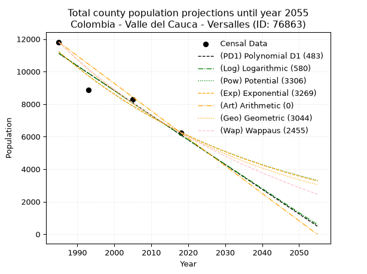
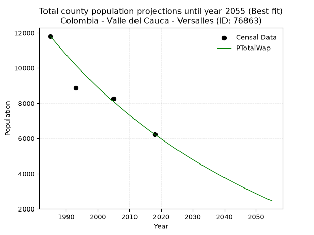
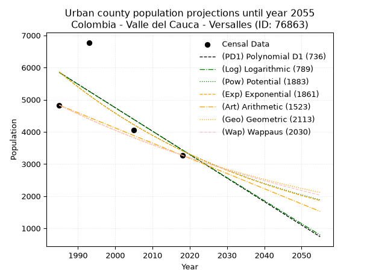
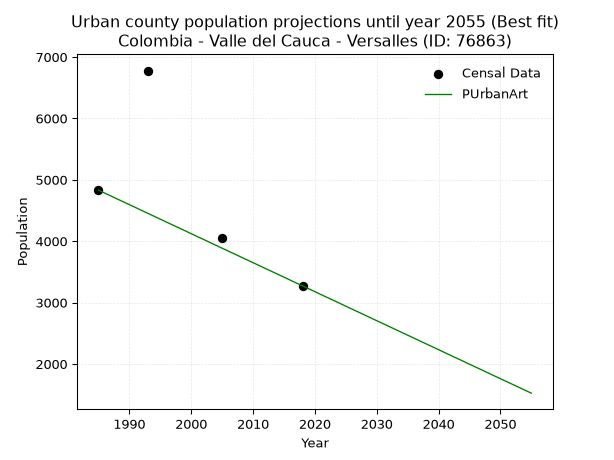
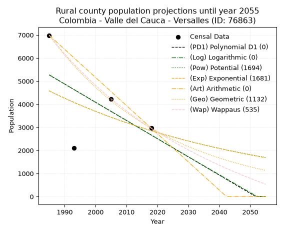
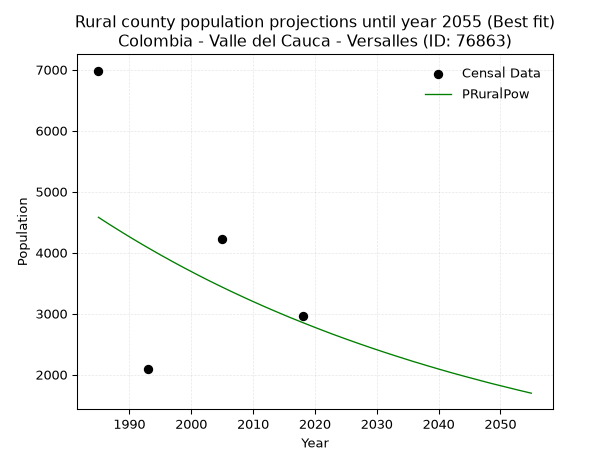

<div align="center">


</div>

# _“Population and Public Services Demand Projections (PPSD) until Year 2050 for Colombia - Valle del Cauca - Versalles (ID: 76863)”_
Keywords: `population` `public-service` `projection` `lineal` `polynomial` `logarithmic` `potential` `exponential` `arithmetic` `geometric` `wappaus` `dane` `colombia` `south-america`

PPSD are analytical estimates used by governments and planners to anticipate future changes in population size, age distribution, and the resulting community needs for utilities, healthcare, education, and infrastructure as sizing future water treatment facilities, electrical grids, and road networks based on spatial growth.

> **General running parameters**: • app_version: _v20260806_. • Python version: _3.14.7_. • Pandas version: _3.0.5_. • NumPy version: _2.5.1_. • Creates, save and include plots into reports (create_plot): _False_. • Projection until year: _2050_. • Process polynomial degree 2 and up: _False_. • Process Wappaus: _True_. • Process Wappaus: _True_. • Set negative values to zero: _True_. • Set infinite values to zero: _True_. • Drop dataset notes: _True_. 
<div align="center">

Dynamic map: [:earth_americas:Google](http://maps.google.com/maps?q=4.575018681,-76.1992031) [:earth_americas:OSM](https://www.openstreetmap.org/#map=18/4.575018681/-76.1992031&layers=P) [:earth_americas:Bing](https://www.bing.com/maps?cp=4.575018681~-76.1992031&lvl=18) [:earth_americas:Apple](https://maps.apple.com/frame?center=4.575018681%2C-76.1992031&span=0.003%2C0.006)

</div>


<div align="center">

```geojson
{
  "type": "Feature",
  "geometry": {
    "type": "Point", 
    "coordinates": [-76.1992031, 4.575018681]
  }, 
  "properties": {
    "Name": "Colombia - Valle del Cauca - Versalles (ID: 76863)"
  }
}
```

</div>


## 0. Census Data (4 records)

Census data are official statistics collected by a government about the people and housing in a country. They usually include counts of total population, age, sex, race, income, education, and jobs.

📅Global census file: [Population.xlsx](../data/Population.xlsx)

| Source   |   Year |   CountryID | CountryName   |   StateID | StateName       |   CountyID | CountyName   |   PTotal |   PUrban |   PRural |
|:---------|-------:|------------:|:--------------|----------:|:----------------|-----------:|:-------------|---------:|---------:|---------:|
| DANE     |   1985 |          57 | Colombia      |        76 | Valle del Cauca |      76863 | Versalles    |    11813 |     4830 |     6983 |
| DANE     |   1993 |          57 | Colombia      |        76 | Valle del Cauca |      76863 | Versalles    |     8875 |     6777 |     2098 |
| DANE     |   2005 |          57 | Colombia      |        76 | Valle Del Cauca |      76863 | Versalles    |     8270 |     4055 |     4215 |
| DANE     |   2018 |          57 | Colombia      |        76 | Valle del Cauca |      76863 | Versalles    |     6233 |     3271 |     2962 |

> 🔥Some records could had specific notes about the registered values or the corresponding urban or rural distribution.

## 1. Total

### 1.1. Coefficients and Parameters

* (PD1) Polynomial Deg 1: -151.86471296667864, 312565.142111599 (lineal)
* (Log) Logarithmic: -304100.080333655, 2320264.897521217
* (Pow) Potential: -35.26060946995684, 120.33112872549074
* (Exp) Exponential: -0.017613485775214262, 1.7138567487345893e+19
* (Art) Arithmetic: Year diff. 2018 - 1985 = 33, Population diff. 6233 - 11813 = -5580, Annual growth = -169.0909090909091
* (Geo) Geometric: Year diff. 2018 - 1985 = 33, Population diff. 6233 - 11813 = -5580, Annual growth % = -0.019187555849666027
* (Wap) Wappaus: i = -1.8739987708180106, Condition values only valid for < 200)

<sub>
Wappaus condition values: ['-0.00', '-1.87', '-3.75', '-5.62', '-7.50', '-9.37', '-11.24', '-13.12', '-14.99', '-16.87', '-18.74', '-20.61', '-22.49', '-24.36', '-26.24', '-28.11', '-29.98', '-31.86', '-33.73', '-35.61', '-37.48', '-39.35', '-41.23', '-43.10', '-44.98', '-46.85', '-48.72', '-50.60', '-52.47', '-54.35', '-56.22', '-58.09', '-59.97', '-61.84', '-63.72', '-65.59', '-67.46', '-69.34', '-71.21', '-73.09', '-74.96', '-76.83', '-78.71', '-80.58', '-82.46', '-84.33', '-86.20', '-88.08', '-89.95', '-91.83', '-93.70', '-95.57', '-97.45', '-99.32', '-101.20', '-103.07', '-104.94', '-106.82', '-108.69', '-110.57', '-112.44', '-114.31', '-116.19', '-118.06', '-119.94', '-121.81']
</sub>


### 1.2. Projected Dataset

|   Year |   CountyID |   PTotalPD1 |   PTotalLog |   PTotalPow |   PTotalExp |   PTotalArt |   PTotalGeo |   PTotalWap |
|-------:|-----------:|------------:|------------:|------------:|------------:|------------:|------------:|------------:|
|   1985 |      76863 |       11114 |       11119 |       11222 |       11216 |       11813 |       11813 |       11813 |
|   1986 |      76863 |       10962 |       10966 |       11025 |       11020 |       11644 |       11586 |       11594 |
|   1987 |      76863 |       10810 |       10813 |       10831 |       10828 |       11475 |       11364 |       11378 |
|   1988 |      76863 |       10658 |       10660 |       10640 |       10639 |       11306 |       11146 |       11167 |
|   1989 |      76863 |       10506 |       10507 |       10453 |       10453 |       11137 |       10932 |       10959 |
|   1990 |      76863 |       10354 |       10354 |       10270 |       10270 |       10968 |       10722 |       10756 |
|   1991 |      76863 |       10202 |       10201 |       10089 |       10091 |       10798 |       10517 |       10555 |
|   1992 |      76863 |       10051 |       10049 |        9912 |        9915 |       10629 |       10315 |       10359 |
|   1993 |      76863 |        9899 |        9896 |        9738 |        9742 |       10460 |       10117 |       10165 |
|   1994 |      76863 |        9747 |        9744 |        9568 |        9572 |       10291 |        9923 |        9976 |
|   1995 |      76863 |        9595 |        9591 |        9400 |        9405 |       10122 |        9732 |        9789 |
|   1996 |      76863 |        9443 |        9439 |        9235 |        9240 |        9953 |        9546 |        9605 |
|   1997 |      76863 |        9291 |        9286 |        9074 |        9079 |        9784 |        9362 |        9425 |
|   1998 |      76863 |        9139 |        9134 |        8915 |        8921 |        9615 |        9183 |        9248 |
|   1999 |      76863 |        8988 |        8982 |        8759 |        8765 |        9446 |        9007 |        9073 |
|   2000 |      76863 |        8836 |        8830 |        8606 |        8612 |        9277 |        8834 |        8902 |
|   2001 |      76863 |        8684 |        8678 |        8456 |        8461 |        9108 |        8664 |        8733 |
|   2002 |      76863 |        8532 |        8526 |        8308 |        8314 |        8938 |        8498 |        8567 |
|   2003 |      76863 |        8380 |        8374 |        8163 |        8169 |        8769 |        8335 |        8403 |
|   2004 |      76863 |        8228 |        8222 |        8021 |        8026 |        8600 |        8175 |        8243 |
|   2005 |      76863 |        8076 |        8071 |        7881 |        7886 |        8431 |        8018 |        8084 |
|   2006 |      76863 |        7925 |        7919 |        7743 |        7748 |        8262 |        7864 |        7928 |
|   2007 |      76863 |        7773 |        7767 |        7608 |        7613 |        8093 |        7714 |        7775 |
|   2008 |      76863 |        7621 |        7616 |        7476 |        7480 |        7924 |        7565 |        7624 |
|   2009 |      76863 |        7469 |        7464 |        7346 |        7349 |        7755 |        7420 |        7475 |
|   2010 |      76863 |        7317 |        7313 |        7218 |        7221 |        7586 |        7278 |        7329 |
|   2011 |      76863 |        7165 |        7162 |        7093 |        7095 |        7417 |        7138 |        7185 |
|   2012 |      76863 |        7013 |        7011 |        6969 |        6971 |        7248 |        7001 |        7043 |
|   2013 |      76863 |        6861 |        6860 |        6848 |        6849 |        7078 |        6867 |        6903 |
|   2014 |      76863 |        6710 |        6709 |        6729 |        6730 |        6909 |        6735 |        6765 |
|   2015 |      76863 |        6558 |        6558 |        6613 |        6612 |        6740 |        6606 |        6629 |
|   2016 |      76863 |        6406 |        6407 |        6498 |        6497 |        6571 |        6479 |        6495 |
|   2017 |      76863 |        6254 |        6256 |        6385 |        6383 |        6402 |        6355 |        6363 |
|   2018 |      76863 |        6102 |        6105 |        6275 |        6272 |        6233 |        6233 |        6233 |
|   2019 |      76863 |        5950 |        5955 |        6166 |        6162 |        6064 |        6113 |        6105 |
|   2020 |      76863 |        5798 |        5804 |        6059 |        6055 |        5895 |        5996 |        5978 |
|   2021 |      76863 |        5647 |        5653 |        5955 |        5949 |        5726 |        5881 |        5854 |
|   2022 |      76863 |        5495 |        5503 |        5852 |        5845 |        5557 |        5768 |        5731 |
|   2023 |      76863 |        5343 |        5353 |        5750 |        5743 |        5388 |        5658 |        5610 |
|   2024 |      76863 |        5191 |        5202 |        5651 |        5643 |        5218 |        5549 |        5490 |
|   2025 |      76863 |        5039 |        5052 |        5554 |        5544 |        5049 |        5443 |        5372 |
|   2026 |      76863 |        4887 |        4902 |        5458 |        5448 |        4880 |        5338 |        5256 |
|   2027 |      76863 |        4735 |        4752 |        5364 |        5353 |        4711 |        5236 |        5141 |
|   2028 |      76863 |        4584 |        4602 |        5271 |        5259 |        4542 |        5135 |        5028 |
|   2029 |      76863 |        4432 |        4452 |        5180 |        5167 |        4373 |        5037 |        4916 |
|   2030 |      76863 |        4280 |        4302 |        5091 |        5077 |        4204 |        4940 |        4806 |
|   2031 |      76863 |        4128 |        4152 |        5003 |        4988 |        4035 |        4845 |        4697 |
|   2032 |      76863 |        3976 |        4003 |        4917 |        4901 |        3866 |        4752 |        4590 |
|   2033 |      76863 |        3824 |        3853 |        4833 |        4816 |        3697 |        4661 |        4483 |
|   2034 |      76863 |        3672 |        3704 |        4750 |        4732 |        3528 |        4572 |        4379 |
|   2035 |      76863 |        3520 |        3554 |        4668 |        4649 |        3358 |        4484 |        4276 |
|   2036 |      76863 |        3369 |        3405 |        4588 |        4568 |        3189 |        4398 |        4174 |
|   2037 |      76863 |        3217 |        3255 |        4509 |        4488 |        3020 |        4314 |        4073 |
|   2038 |      76863 |        3065 |        3106 |        4432 |        4410 |        2851 |        4231 |        3973 |
|   2039 |      76863 |        2913 |        2957 |        4356 |        4333 |        2682 |        4150 |        3875 |
|   2040 |      76863 |        2761 |        2808 |        4281 |        4257 |        2513 |        4070 |        3778 |
|   2041 |      76863 |        2609 |        2659 |        4208 |        4183 |        2344 |        3992 |        3682 |
|   2042 |      76863 |        2457 |        2510 |        4136 |        4110 |        2175 |        3915 |        3588 |
|   2043 |      76863 |        2306 |        2361 |        4065 |        4038 |        2006 |        3840 |        3494 |
|   2044 |      76863 |        2154 |        2212 |        3995 |        3968 |        1837 |        3766 |        3402 |
|   2045 |      76863 |        2002 |        2063 |        3927 |        3898 |        1668 |        3694 |        3311 |
|   2046 |      76863 |        1850 |        1915 |        3860 |        3830 |        1498 |        3623 |        3220 |
|   2047 |      76863 |        1698 |        1766 |        3794 |        3763 |        1329 |        3554 |        3131 |
|   2048 |      76863 |        1546 |        1618 |        3729 |        3698 |        1160 |        3486 |        3043 |
|   2049 |      76863 |        1394 |        1469 |        3666 |        3633 |         991 |        3419 |        2956 |
|   2050 |      76863 |        1242 |        1321 |        3603 |        3570 |         822 |        3353 |        2870 |
<div align="center">

</img>

</div>


### 1.3. Best fit with absolute and relative error (%)

Relative error puts that difference into context by dividing the absolute error by the true value, creating a unitless ratio or percentage that shows the scale of the mistake.

Absolute and relative error

|   Year | Source   |   CountryID | CountryName   |   StateID | StateName       |   CountyID_x | CountyName   |   PTotal |   PUrban |   PRural |   CountyID_y |   PTotalPD1 |   PTotalLog |   PTotalPow |   PTotalExp |   PTotalArt |   PTotalGeo |   PTotalWap |   PTotalPD1AbsError |   PTotalLogAbsError |   PTotalPowAbsError |   PTotalExpAbsError |   PTotalArtAbsError |   PTotalGeoAbsError |   PTotalWapAbsError |   PTotalPD1RelError |   PTotalLogRelError |   PTotalPowRelError |   PTotalExpRelError |   PTotalArtRelError |   PTotalGeoRelError |   PTotalWapRelError |
|-------:|:---------|------------:|:--------------|----------:|:----------------|-------------:|:-------------|---------:|---------:|---------:|-------------:|------------:|------------:|------------:|------------:|------------:|------------:|------------:|--------------------:|--------------------:|--------------------:|--------------------:|--------------------:|--------------------:|--------------------:|--------------------:|--------------------:|--------------------:|--------------------:|--------------------:|--------------------:|--------------------:|
|   1985 | DANE     |          57 | Colombia      |        76 | Valle del Cauca |        76863 | Versalles    |    11813 |     4830 |     6983 |        76863 |       11114 |       11119 |       11222 |       11216 |       11813 |       11813 |       11813 |                 699 |                 694 |                 591 |                 597 |                   0 |                   0 |                   0 |             5.91721 |             5.87488 |            5.00296  |            5.05375  |              0      |             0       |             0       |
|   1993 | DANE     |          57 | Colombia      |        76 | Valle del Cauca |        76863 | Versalles    |     8875 |     6777 |     2098 |        76863 |        9899 |        9896 |        9738 |        9742 |       10460 |       10117 |       10165 |                1024 |                1021 |                 863 |                 867 |                1585 |                1242 |                1290 |            11.538   |            11.5042  |            9.72394  |            9.76901  |             17.8592 |            13.9944  |            14.5352  |
|   2005 | DANE     |          57 | Colombia      |        76 | Valle Del Cauca |        76863 | Versalles    |     8270 |     4055 |     4215 |        76863 |        8076 |        8071 |        7881 |        7886 |        8431 |        8018 |        8084 |                 194 |                 199 |                 389 |                 384 |                 161 |                 252 |                 186 |             2.34583 |             2.40629 |            4.70375  |            4.64329  |              1.9468 |             3.04716 |             2.24909 |
|   2018 | DANE     |          57 | Colombia      |        76 | Valle del Cauca |        76863 | Versalles    |     6233 |     3271 |     2962 |        76863 |        6102 |        6105 |        6275 |        6272 |        6233 |        6233 |        6233 |                 131 |                 128 |                  42 |                  39 |                   0 |                   0 |                   0 |             2.10172 |             2.05359 |            0.673833 |            0.625702 |              0      |             0       |             0       |

Relative error mean

| Method    |   RelError | Best   |
|:----------|-----------:|:-------|
| PTotalPD1 |    5.4757  |        |
| PTotalLog |    5.45975 |        |
| PTotalPow |    5.02612 |        |
| PTotalExp |    5.02294 |        |
| PTotalArt |    4.95149 |        |
| PTotalGeo |    4.26038 |        |
| PTotalWap |    4.19608 | True   |

💙Best method: _**PTotalWap**_
<div align="center">

</img>

</div>


### 1.4. Fresh water supply demand in liters per capita per day (lpcd)

The fresh water supply demand typically ranges from 100 to 300 liters per capita per day (lpcd) for standard domestic and municipal planning, though absolute survival minimums set by the World Health Organization are as low as 7.5 to 20 liters per day, and total consumption in high-income nations can exceed 400 liters.

> `CZ`: Level in meters above the sea level (masl).<br> `WS`: Fresh water supply demand in liters per capita per day (lpcd or l/h/d).<br> `WSAll`: Zonal fresh water supply demand in liters per second (l/s).<br> `A`: Zonal area in square meters.

Reference values (RAS Colombia)

|    CZ |   WS |
|------:|-----:|
|  1000 |  120 |
|  2000 |  130 |
| 99999 |  140 |

County shapefile geometry properties and water supply values

|   CountyID |      ATotal |   CZTotal |   WSTotal |
|-----------:|------------:|----------:|----------:|
|      76863 | 2.00638e+08 |   1641.86 |       130 |

Projected values for best method: PTotalWap

|   CountyID |   Year |   PTotalWap |   WSTotal |   WSTotalAll |
|-----------:|-------:|------------:|----------:|-------------:|
|      76863 |   1985 |       11813 |       130 |     17.7742  |
|      76863 |   1986 |       11594 |       130 |     17.4447  |
|      76863 |   1987 |       11378 |       130 |     17.1197  |
|      76863 |   1988 |       11167 |       130 |     16.8022  |
|      76863 |   1989 |       10959 |       130 |     16.4892  |
|      76863 |   1990 |       10756 |       130 |     16.1838  |
|      76863 |   1991 |       10555 |       130 |     15.8814  |
|      76863 |   1992 |       10359 |       130 |     15.5865  |
|      76863 |   1993 |       10165 |       130 |     15.2946  |
|      76863 |   1994 |        9976 |       130 |     15.0102  |
|      76863 |   1995 |        9789 |       130 |     14.7288  |
|      76863 |   1996 |        9605 |       130 |     14.452   |
|      76863 |   1997 |        9425 |       130 |     14.1811  |
|      76863 |   1998 |        9248 |       130 |     13.9148  |
|      76863 |   1999 |        9073 |       130 |     13.6515  |
|      76863 |   2000 |        8902 |       130 |     13.3942  |
|      76863 |   2001 |        8733 |       130 |     13.1399  |
|      76863 |   2002 |        8567 |       130 |     12.8902  |
|      76863 |   2003 |        8403 |       130 |     12.6434  |
|      76863 |   2004 |        8243 |       130 |     12.4027  |
|      76863 |   2005 |        8084 |       130 |     12.1634  |
|      76863 |   2006 |        7928 |       130 |     11.9287  |
|      76863 |   2007 |        7775 |       130 |     11.6985  |
|      76863 |   2008 |        7624 |       130 |     11.4713  |
|      76863 |   2009 |        7475 |       130 |     11.2471  |
|      76863 |   2010 |        7329 |       130 |     11.0274  |
|      76863 |   2011 |        7185 |       130 |     10.8108  |
|      76863 |   2012 |        7043 |       130 |     10.5971  |
|      76863 |   2013 |        6903 |       130 |     10.3865  |
|      76863 |   2014 |        6765 |       130 |     10.1788  |
|      76863 |   2015 |        6629 |       130 |      9.97419 |
|      76863 |   2016 |        6495 |       130 |      9.77257 |
|      76863 |   2017 |        6363 |       130 |      9.57396 |
|      76863 |   2018 |        6233 |       130 |      9.37836 |
|      76863 |   2019 |        6105 |       130 |      9.18576 |
|      76863 |   2020 |        5978 |       130 |      8.99468 |
|      76863 |   2021 |        5854 |       130 |      8.8081  |
|      76863 |   2022 |        5731 |       130 |      8.62303 |
|      76863 |   2023 |        5610 |       130 |      8.44097 |
|      76863 |   2024 |        5490 |       130 |      8.26042 |
|      76863 |   2025 |        5372 |       130 |      8.08287 |
|      76863 |   2026 |        5256 |       130 |      7.90833 |
|      76863 |   2027 |        5141 |       130 |      7.7353  |
|      76863 |   2028 |        5028 |       130 |      7.56528 |
|      76863 |   2029 |        4916 |       130 |      7.39676 |
|      76863 |   2030 |        4806 |       130 |      7.23125 |
|      76863 |   2031 |        4697 |       130 |      7.06725 |
|      76863 |   2032 |        4590 |       130 |      6.90625 |
|      76863 |   2033 |        4483 |       130 |      6.74525 |
|      76863 |   2034 |        4379 |       130 |      6.58877 |
|      76863 |   2035 |        4276 |       130 |      6.4338  |
|      76863 |   2036 |        4174 |       130 |      6.28032 |
|      76863 |   2037 |        4073 |       130 |      6.12836 |
|      76863 |   2038 |        3973 |       130 |      5.97789 |
|      76863 |   2039 |        3875 |       130 |      5.83044 |
|      76863 |   2040 |        3778 |       130 |      5.68449 |
|      76863 |   2041 |        3682 |       130 |      5.54005 |
|      76863 |   2042 |        3588 |       130 |      5.39861 |
|      76863 |   2043 |        3494 |       130 |      5.25718 |
|      76863 |   2044 |        3402 |       130 |      5.11875 |
|      76863 |   2045 |        3311 |       130 |      4.98183 |
|      76863 |   2046 |        3220 |       130 |      4.84491 |
|      76863 |   2047 |        3131 |       130 |      4.711   |
|      76863 |   2048 |        3043 |       130 |      4.57859 |
|      76863 |   2049 |        2956 |       130 |      4.44769 |
|      76863 |   2050 |        2870 |       130 |      4.31829 |

## 2. Urban

### 2.1. Coefficients and Parameters

* (PD1) Polynomial Deg 1: -73.01364913689214, 150778.80168606853 (lineal)
* (Log) Logarithmic: -145970.84709541066, 1114258.8285091731
* (Pow) Potential: -32.7623037649254, 111.81026333299415
* (Exp) Exponential: -0.0163858990665294, 7.830764663391593e+17
* (Art) Arithmetic: Year diff. 2018 - 1985 = 33, Population diff. 3271 - 4830 = -1559, Annual growth = -47.24242424242424
* (Geo) Geometric: Year diff. 2018 - 1985 = 33, Population diff. 3271 - 4830 = -1559, Annual growth % = -0.01174115615705551
* (Wap) Wappaus: i = -1.1663356188723428, Condition values only valid for < 200)

<sub>
Wappaus condition values: ['-0.00', '-1.17', '-2.33', '-3.50', '-4.67', '-5.83', '-7.00', '-8.16', '-9.33', '-10.50', '-11.66', '-12.83', '-14.00', '-15.16', '-16.33', '-17.50', '-18.66', '-19.83', '-20.99', '-22.16', '-23.33', '-24.49', '-25.66', '-26.83', '-27.99', '-29.16', '-30.32', '-31.49', '-32.66', '-33.82', '-34.99', '-36.16', '-37.32', '-38.49', '-39.66', '-40.82', '-41.99', '-43.15', '-44.32', '-45.49', '-46.65', '-47.82', '-48.99', '-50.15', '-51.32', '-52.49', '-53.65', '-54.82', '-55.98', '-57.15', '-58.32', '-59.48', '-60.65', '-61.82', '-62.98', '-64.15', '-65.31', '-66.48', '-67.65', '-68.81', '-69.98', '-71.15', '-72.31', '-73.48', '-74.65', '-75.81']
</sub>


### 2.2. Projected Dataset

|   Year |   CountyID |   PUrbanPD1 |   PUrbanLog |   PUrbanPow |   PUrbanExp |   PUrbanArt |   PUrbanGeo |   PUrbanWap |
|-------:|-----------:|------------:|------------:|------------:|------------:|------------:|------------:|------------:|
|   1985 |      76863 |        5847 |        5848 |        5862 |        5861 |        4830 |        4830 |        4830 |
|   1986 |      76863 |        5774 |        5774 |        5766 |        5765 |        4783 |        4773 |        4774 |
|   1987 |      76863 |        5701 |        5701 |        5672 |        5672 |        4736 |        4717 |        4719 |
|   1988 |      76863 |        5628 |        5627 |        5579 |        5579 |        4688 |        4662 |        4664 |
|   1989 |      76863 |        5555 |        5554 |        5488 |        5489 |        4641 |        4607 |        4610 |
|   1990 |      76863 |        5482 |        5480 |        5398 |        5400 |        4594 |        4553 |        4556 |
|   1991 |      76863 |        5409 |        5407 |        5310 |        5312 |        4547 |        4500 |        4503 |
|   1992 |      76863 |        5336 |        5334 |        5223 |        5225 |        4499 |        4447 |        4451 |
|   1993 |      76863 |        5263 |        5260 |        5138 |        5141 |        4452 |        4395 |        4399 |
|   1994 |      76863 |        5190 |        5187 |        5054 |        5057 |        4405 |        4343 |        4348 |
|   1995 |      76863 |        5117 |        5114 |        4972 |        4975 |        4358 |        4292 |        4298 |
|   1996 |      76863 |        5044 |        5041 |        4891 |        4894 |        4310 |        4242 |        4248 |
|   1997 |      76863 |        4971 |        4968 |        4811 |        4814 |        4263 |        4192 |        4198 |
|   1998 |      76863 |        4898 |        4895 |        4733 |        4736 |        4216 |        4143 |        4149 |
|   1999 |      76863 |        4825 |        4822 |        4656 |        4659 |        4169 |        4094 |        4101 |
|   2000 |      76863 |        4752 |        4749 |        4581 |        4583 |        4121 |        4046 |        4053 |
|   2001 |      76863 |        4678 |        4676 |        4506 |        4509 |        4074 |        3998 |        4006 |
|   2002 |      76863 |        4605 |        4603 |        4433 |        4436 |        4027 |        3951 |        3959 |
|   2003 |      76863 |        4532 |        4530 |        4361 |        4364 |        3980 |        3905 |        3912 |
|   2004 |      76863 |        4459 |        4457 |        4290 |        4293 |        3932 |        3859 |        3866 |
|   2005 |      76863 |        4386 |        4384 |        4221 |        4223 |        3885 |        3814 |        3821 |
|   2006 |      76863 |        4313 |        4311 |        4152 |        4154 |        3838 |        3769 |        3776 |
|   2007 |      76863 |        4240 |        4239 |        4085 |        4087 |        3791 |        3725 |        3732 |
|   2008 |      76863 |        4167 |        4166 |        4019 |        4020 |        3743 |        3681 |        3688 |
|   2009 |      76863 |        4094 |        4093 |        3954 |        3955 |        3696 |        3638 |        3644 |
|   2010 |      76863 |        4021 |        4021 |        3890 |        3891 |        3649 |        3595 |        3601 |
|   2011 |      76863 |        3948 |        3948 |        3827 |        3827 |        3602 |        3553 |        3558 |
|   2012 |      76863 |        3875 |        3875 |        3765 |        3765 |        3554 |        3511 |        3516 |
|   2013 |      76863 |        3802 |        3803 |        3705 |        3704 |        3507 |        3470 |        3474 |
|   2014 |      76863 |        3729 |        3730 |        3645 |        3644 |        3460 |        3429 |        3433 |
|   2015 |      76863 |        3656 |        3658 |        3586 |        3585 |        3413 |        3389 |        3392 |
|   2016 |      76863 |        3583 |        3586 |        3528 |        3526 |        3365 |        3349 |        3351 |
|   2017 |      76863 |        3510 |        3513 |        3471 |        3469 |        3318 |        3310 |        3311 |
|   2018 |      76863 |        3437 |        3441 |        3415 |        3413 |        3271 |        3271 |        3271 |
|   2019 |      76863 |        3364 |        3368 |        3360 |        3357 |        3224 |        3233 |        3232 |
|   2020 |      76863 |        3291 |        3296 |        3306 |        3303 |        3177 |        3195 |        3193 |
|   2021 |      76863 |        3218 |        3224 |        3253 |        3249 |        3129 |        3157 |        3154 |
|   2022 |      76863 |        3145 |        3152 |        3201 |        3196 |        3082 |        3120 |        3116 |
|   2023 |      76863 |        3072 |        3080 |        3149 |        3144 |        3035 |        3083 |        3078 |
|   2024 |      76863 |        2999 |        3007 |        3099 |        3093 |        2988 |        3047 |        3040 |
|   2025 |      76863 |        2926 |        2935 |        3049 |        3043 |        2940 |        3011 |        3003 |
|   2026 |      76863 |        2853 |        2863 |        3000 |        2993 |        2893 |        2976 |        2966 |
|   2027 |      76863 |        2780 |        2791 |        2952 |        2945 |        2846 |        2941 |        2929 |
|   2028 |      76863 |        2707 |        2719 |        2905 |        2897 |        2799 |        2907 |        2893 |
|   2029 |      76863 |        2634 |        2647 |        2858 |        2850 |        2751 |        2872 |        2857 |
|   2030 |      76863 |        2561 |        2575 |        2812 |        2804 |        2704 |        2839 |        2822 |
|   2031 |      76863 |        2488 |        2503 |        2767 |        2758 |        2657 |        2805 |        2787 |
|   2032 |      76863 |        2415 |        2432 |        2723 |        2713 |        2610 |        2772 |        2752 |
|   2033 |      76863 |        2342 |        2360 |        2680 |        2669 |        2562 |        2740 |        2717 |
|   2034 |      76863 |        2269 |        2288 |        2637 |        2626 |        2515 |        2708 |        2683 |
|   2035 |      76863 |        2196 |        2216 |        2595 |        2583 |        2468 |        2676 |        2649 |
|   2036 |      76863 |        2123 |        2145 |        2553 |        2541 |        2421 |        2645 |        2616 |
|   2037 |      76863 |        2050 |        2073 |        2512 |        2500 |        2373 |        2614 |        2582 |
|   2038 |      76863 |        1977 |        2001 |        2472 |        2459 |        2326 |        2583 |        2549 |
|   2039 |      76863 |        1904 |        1930 |        2433 |        2419 |        2279 |        2552 |        2517 |
|   2040 |      76863 |        1831 |        1858 |        2394 |        2380 |        2232 |        2523 |        2484 |
|   2041 |      76863 |        1758 |        1787 |        2356 |        2341 |        2184 |        2493 |        2452 |
|   2042 |      76863 |        1685 |        1715 |        2319 |        2303 |        2137 |        2464 |        2420 |
|   2043 |      76863 |        1612 |        1644 |        2282 |        2266 |        2090 |        2435 |        2388 |
|   2044 |      76863 |        1539 |        1572 |        2245 |        2229 |        2043 |        2406 |        2357 |
|   2045 |      76863 |        1466 |        1501 |        2210 |        2193 |        1995 |        2378 |        2326 |
|   2046 |      76863 |        1393 |        1429 |        2175 |        2157 |        1948 |        2350 |        2295 |
|   2047 |      76863 |        1320 |        1358 |        2140 |        2122 |        1901 |        2322 |        2265 |
|   2048 |      76863 |        1247 |        1287 |        2106 |        2087 |        1854 |        2295 |        2235 |
|   2049 |      76863 |        1174 |        1215 |        2073 |        2053 |        1806 |        2268 |        2205 |
|   2050 |      76863 |        1101 |        1144 |        2040 |        2020 |        1759 |        2242 |        2175 |
<div align="center">

</img>

</div>


### 2.3. Best fit with absolute and relative error (%)

Relative error puts that difference into context by dividing the absolute error by the true value, creating a unitless ratio or percentage that shows the scale of the mistake.

Absolute and relative error

|   Year | Source   |   CountryID | CountryName   |   StateID | StateName       |   CountyID_x | CountyName   |   PTotal |   PUrban |   PRural |   CountyID_y |   PUrbanPD1 |   PUrbanLog |   PUrbanPow |   PUrbanExp |   PUrbanArt |   PUrbanGeo |   PUrbanWap |   PUrbanPD1AbsError |   PUrbanLogAbsError |   PUrbanPowAbsError |   PUrbanExpAbsError |   PUrbanArtAbsError |   PUrbanGeoAbsError |   PUrbanWapAbsError |   PUrbanPD1RelError |   PUrbanLogRelError |   PUrbanPowRelError |   PUrbanExpRelError |   PUrbanArtRelError |   PUrbanGeoRelError |   PUrbanWapRelError |
|-------:|:---------|------------:|:--------------|----------:|:----------------|-------------:|:-------------|---------:|---------:|---------:|-------------:|------------:|------------:|------------:|------------:|------------:|------------:|------------:|--------------------:|--------------------:|--------------------:|--------------------:|--------------------:|--------------------:|--------------------:|--------------------:|--------------------:|--------------------:|--------------------:|--------------------:|--------------------:|--------------------:|
|   1985 | DANE     |          57 | Colombia      |        76 | Valle del Cauca |        76863 | Versalles    |    11813 |     4830 |     6983 |        76863 |        5847 |        5848 |        5862 |        5861 |        4830 |        4830 |        4830 |                1017 |                1018 |                1032 |                1031 |                   0 |                   0 |                   0 |            21.0559  |            21.0766  |            21.3665  |            21.3458  |             0       |             0       |             0       |
|   1993 | DANE     |          57 | Colombia      |        76 | Valle del Cauca |        76863 | Versalles    |     8875 |     6777 |     2098 |        76863 |        5263 |        5260 |        5138 |        5141 |        4452 |        4395 |        4399 |                1514 |                1517 |                1639 |                1636 |                2325 |                2382 |                2378 |            22.3403  |            22.3845  |            24.1847  |            24.1405  |            34.3072  |            35.1483  |            35.0893  |
|   2005 | DANE     |          57 | Colombia      |        76 | Valle Del Cauca |        76863 | Versalles    |     8270 |     4055 |     4215 |        76863 |        4386 |        4384 |        4221 |        4223 |        3885 |        3814 |        3821 |                 331 |                 329 |                 166 |                 168 |                 170 |                 241 |                 234 |             8.16276 |             8.11344 |             4.09371 |             4.14303 |             4.19236 |             5.94328 |             5.77065 |
|   2018 | DANE     |          57 | Colombia      |        76 | Valle del Cauca |        76863 | Versalles    |     6233 |     3271 |     2962 |        76863 |        3437 |        3441 |        3415 |        3413 |        3271 |        3271 |        3271 |                 166 |                 170 |                 144 |                 142 |                   0 |                   0 |                   0 |             5.0749  |             5.19719 |             4.40232 |             4.34118 |             0       |             0       |             0       |

Relative error mean

| Method    |   RelError | Best   |
|:----------|-----------:|:-------|
| PUrbanPD1 |   14.1585  |        |
| PUrbanLog |   14.1929  |        |
| PUrbanPow |   13.5118  |        |
| PUrbanExp |   13.4926  |        |
| PUrbanArt |    9.62489 | True   |
| PUrbanGeo |   10.2729  |        |
| PUrbanWap |   10.215   |        |

💙Best method: _**PUrbanArt**_
<div align="center">

</img>

</div>


### 2.4. Fresh water supply demand in liters per capita per day (lpcd)

The fresh water supply demand typically ranges from 100 to 300 liters per capita per day (lpcd) for standard domestic and municipal planning, though absolute survival minimums set by the World Health Organization are as low as 7.5 to 20 liters per day, and total consumption in high-income nations can exceed 400 liters.

> `CZ`: Level in meters above the sea level (masl).<br> `WS`: Fresh water supply demand in liters per capita per day (lpcd or l/h/d).<br> `WSAll`: Zonal fresh water supply demand in liters per second (l/s).<br> `A`: Zonal area in square meters.

Reference values (RAS Colombia)

|    CZ |   WS |
|------:|-----:|
|  1000 |  120 |
|  2000 |  130 |
| 99999 |  140 |

County shapefile geometry properties and water supply values

|   CountyID |   AUrban |   CZUrban |   WSUrban |
|-----------:|---------:|----------:|----------:|
|      76863 |   763125 |   1852.86 |       130 |

Projected values for best method: PUrbanArt

|   CountyID |   Year |   PUrbanArt |   WSUrban |   WSUrbanAll |
|-----------:|-------:|------------:|----------:|-------------:|
|      76863 |   1985 |        4830 |       130 |      7.26736 |
|      76863 |   1986 |        4783 |       130 |      7.19664 |
|      76863 |   1987 |        4736 |       130 |      7.12593 |
|      76863 |   1988 |        4688 |       130 |      7.0537  |
|      76863 |   1989 |        4641 |       130 |      6.98299 |
|      76863 |   1990 |        4594 |       130 |      6.91227 |
|      76863 |   1991 |        4547 |       130 |      6.84155 |
|      76863 |   1992 |        4499 |       130 |      6.76933 |
|      76863 |   1993 |        4452 |       130 |      6.69861 |
|      76863 |   1994 |        4405 |       130 |      6.62789 |
|      76863 |   1995 |        4358 |       130 |      6.55718 |
|      76863 |   1996 |        4310 |       130 |      6.48495 |
|      76863 |   1997 |        4263 |       130 |      6.41424 |
|      76863 |   1998 |        4216 |       130 |      6.34352 |
|      76863 |   1999 |        4169 |       130 |      6.2728  |
|      76863 |   2000 |        4121 |       130 |      6.20058 |
|      76863 |   2001 |        4074 |       130 |      6.12986 |
|      76863 |   2002 |        4027 |       130 |      6.05914 |
|      76863 |   2003 |        3980 |       130 |      5.98843 |
|      76863 |   2004 |        3932 |       130 |      5.9162  |
|      76863 |   2005 |        3885 |       130 |      5.84549 |
|      76863 |   2006 |        3838 |       130 |      5.77477 |
|      76863 |   2007 |        3791 |       130 |      5.70405 |
|      76863 |   2008 |        3743 |       130 |      5.63183 |
|      76863 |   2009 |        3696 |       130 |      5.56111 |
|      76863 |   2010 |        3649 |       130 |      5.49039 |
|      76863 |   2011 |        3602 |       130 |      5.41968 |
|      76863 |   2012 |        3554 |       130 |      5.34745 |
|      76863 |   2013 |        3507 |       130 |      5.27674 |
|      76863 |   2014 |        3460 |       130 |      5.20602 |
|      76863 |   2015 |        3413 |       130 |      5.1353  |
|      76863 |   2016 |        3365 |       130 |      5.06308 |
|      76863 |   2017 |        3318 |       130 |      4.99236 |
|      76863 |   2018 |        3271 |       130 |      4.92164 |
|      76863 |   2019 |        3224 |       130 |      4.85093 |
|      76863 |   2020 |        3177 |       130 |      4.78021 |
|      76863 |   2021 |        3129 |       130 |      4.70799 |
|      76863 |   2022 |        3082 |       130 |      4.63727 |
|      76863 |   2023 |        3035 |       130 |      4.56655 |
|      76863 |   2024 |        2988 |       130 |      4.49583 |
|      76863 |   2025 |        2940 |       130 |      4.42361 |
|      76863 |   2026 |        2893 |       130 |      4.35289 |
|      76863 |   2027 |        2846 |       130 |      4.28218 |
|      76863 |   2028 |        2799 |       130 |      4.21146 |
|      76863 |   2029 |        2751 |       130 |      4.13924 |
|      76863 |   2030 |        2704 |       130 |      4.06852 |
|      76863 |   2031 |        2657 |       130 |      3.9978  |
|      76863 |   2032 |        2610 |       130 |      3.92708 |
|      76863 |   2033 |        2562 |       130 |      3.85486 |
|      76863 |   2034 |        2515 |       130 |      3.78414 |
|      76863 |   2035 |        2468 |       130 |      3.71343 |
|      76863 |   2036 |        2421 |       130 |      3.64271 |
|      76863 |   2037 |        2373 |       130 |      3.57049 |
|      76863 |   2038 |        2326 |       130 |      3.49977 |
|      76863 |   2039 |        2279 |       130 |      3.42905 |
|      76863 |   2040 |        2232 |       130 |      3.35833 |
|      76863 |   2041 |        2184 |       130 |      3.28611 |
|      76863 |   2042 |        2137 |       130 |      3.21539 |
|      76863 |   2043 |        2090 |       130 |      3.14468 |
|      76863 |   2044 |        2043 |       130 |      3.07396 |
|      76863 |   2045 |        1995 |       130 |      3.00174 |
|      76863 |   2046 |        1948 |       130 |      2.93102 |
|      76863 |   2047 |        1901 |       130 |      2.8603  |
|      76863 |   2048 |        1854 |       130 |      2.78958 |
|      76863 |   2049 |        1806 |       130 |      2.71736 |
|      76863 |   2050 |        1759 |       130 |      2.64664 |

## 3. Rural

### 3.1. Coefficients and Parameters

* (PD1) Polynomial Deg 1: -78.85106382978653, 161786.3404255305 (lineal)
* (Log) Logarithmic: -158129.2332382443, 1206006.069012044
* (Pow) Potential: -28.678587372996365, 98.23574936076115
* (Exp) Exponential: -0.014295467596260825, 9638180093094316.0
* (Art) Arithmetic: Year diff. 2018 - 1985 = 33, Population diff. 2962 - 6983 = -4021, Annual growth = -121.84848484848484
* (Geo) Geometric: Year diff. 2018 - 1985 = 33, Population diff. 2962 - 6983 = -4021, Annual growth % = -0.025653510840758842
* (Wap) Wappaus: i = -2.4504471563295094, Condition values only valid for < 200)

<sub>
Wappaus condition values: ['-0.00', '-2.45', '-4.90', '-7.35', '-9.80', '-12.25', '-14.70', '-17.15', '-19.60', '-22.05', '-24.50', '-26.95', '-29.41', '-31.86', '-34.31', '-36.76', '-39.21', '-41.66', '-44.11', '-46.56', '-49.01', '-51.46', '-53.91', '-56.36', '-58.81', '-61.26', '-63.71', '-66.16', '-68.61', '-71.06', '-73.51', '-75.96', '-78.41', '-80.86', '-83.32', '-85.77', '-88.22', '-90.67', '-93.12', '-95.57', '-98.02', '-100.47', '-102.92', '-105.37', '-107.82', '-110.27', '-112.72', '-115.17', '-117.62', '-120.07', '-122.52', '-124.97', '-127.42', '-129.87', '-132.32', '-134.77', '-137.23', '-139.68', '-142.13', '-144.58', '-147.03', '-149.48', '-151.93', '-154.38', '-156.83', '-159.28']
</sub>


### 3.2. Projected Dataset

|   Year |   CountyID |   PRuralPD1 |   PRuralLog |   PRuralPow |   PRuralExp |   PRuralArt |   PRuralGeo |   PRuralWap |
|-------:|-----------:|------------:|------------:|------------:|------------:|------------:|------------:|------------:|
|   1985 |      76863 |        5267 |        5272 |        4578 |        4573 |        6983 |        6983 |        6983 |
|   1986 |      76863 |        5188 |        5192 |        4512 |        4508 |        6861 |        6804 |        6814 |
|   1987 |      76863 |        5109 |        5112 |        4447 |        4444 |        6739 |        6629 |        6649 |
|   1988 |      76863 |        5030 |        5033 |        4384 |        4381 |        6617 |        6459 |        6488 |
|   1989 |      76863 |        4952 |        4953 |        4321 |        4319 |        6496 |        6294 |        6331 |
|   1990 |      76863 |        4873 |        4874 |        4259 |        4258 |        6374 |        6132 |        6177 |
|   1991 |      76863 |        4794 |        4794 |        4198 |        4197 |        6252 |        5975 |        6027 |
|   1992 |      76863 |        4715 |        4715 |        4138 |        4138 |        6130 |        5822 |        5880 |
|   1993 |      76863 |        4636 |        4636 |        4079 |        4079 |        6008 |        5672 |        5736 |
|   1994 |      76863 |        4557 |        4556 |        4021 |        4021 |        5886 |        5527 |        5596 |
|   1995 |      76863 |        4478 |        4477 |        3963 |        3964 |        5765 |        5385 |        5459 |
|   1996 |      76863 |        4400 |        4398 |        3907 |        3908 |        5643 |        5247 |        5324 |
|   1997 |      76863 |        4321 |        4319 |        3851 |        3852 |        5521 |        5112 |        5193 |
|   1998 |      76863 |        4242 |        4239 |        3796 |        3798 |        5399 |        4981 |        5064 |
|   1999 |      76863 |        4163 |        4160 |        3742 |        3744 |        5277 |        4853 |        4938 |
|   2000 |      76863 |        4084 |        4081 |        3689 |        3691 |        5155 |        4729 |        4815 |
|   2001 |      76863 |        4005 |        4002 |        3636 |        3638 |        5033 |        4607 |        4694 |
|   2002 |      76863 |        3927 |        3923 |        3584 |        3587 |        4912 |        4489 |        4576 |
|   2003 |      76863 |        3848 |        3844 |        3533 |        3536 |        4790 |        4374 |        4459 |
|   2004 |      76863 |        3769 |        3765 |        3483 |        3486 |        4668 |        4262 |        4346 |
|   2005 |      76863 |        3690 |        3686 |        3434 |        3436 |        4546 |        4153 |        4234 |
|   2006 |      76863 |        3611 |        3608 |        3385 |        3387 |        4424 |        4046 |        4125 |
|   2007 |      76863 |        3532 |        3529 |        3337 |        3339 |        4302 |        3942 |        4018 |
|   2008 |      76863 |        3453 |        3450 |        3290 |        3292 |        4180 |        3841 |        3913 |
|   2009 |      76863 |        3375 |        3371 |        3243 |        3245 |        4059 |        3743 |        3809 |
|   2010 |      76863 |        3296 |        3293 |        3197 |        3199 |        3937 |        3647 |        3708 |
|   2011 |      76863 |        3217 |        3214 |        3152 |        3154 |        3815 |        3553 |        3609 |
|   2012 |      76863 |        3138 |        3135 |        3107 |        3109 |        3693 |        3462 |        3511 |
|   2013 |      76863 |        3059 |        3057 |        3063 |        3065 |        3571 |        3373 |        3416 |
|   2014 |      76863 |        2980 |        2978 |        3020 |        3021 |        3449 |        3286 |        3322 |
|   2015 |      76863 |        2901 |        2900 |        2977 |        2978 |        3328 |        3202 |        3229 |
|   2016 |      76863 |        2823 |        2821 |        2935 |        2936 |        3206 |        3120 |        3139 |
|   2017 |      76863 |        2744 |        2743 |        2894 |        2894 |        3084 |        3040 |        3050 |
|   2018 |      76863 |        2665 |        2664 |        2853 |        2853 |        2962 |        2962 |        2962 |
|   2019 |      76863 |        2586 |        2586 |        2813 |        2813 |        2840 |        2886 |        2876 |
|   2020 |      76863 |        2507 |        2508 |        2773 |        2773 |        2718 |        2812 |        2791 |
|   2021 |      76863 |        2428 |        2429 |        2734 |        2734 |        2596 |        2740 |        2708 |
|   2022 |      76863 |        2349 |        2351 |        2695 |        2695 |        2475 |        2670 |        2627 |
|   2023 |      76863 |        2271 |        2273 |        2657 |        2657 |        2353 |        2601 |        2546 |
|   2024 |      76863 |        2192 |        2195 |        2620 |        2619 |        2231 |        2534 |        2467 |
|   2025 |      76863 |        2113 |        2117 |        2583 |        2582 |        2109 |        2469 |        2390 |
|   2026 |      76863 |        2034 |        2039 |        2547 |        2545 |        1987 |        2406 |        2313 |
|   2027 |      76863 |        1955 |        1961 |        2511 |        2509 |        1865 |        2344 |        2238 |
|   2028 |      76863 |        1876 |        1883 |        2476 |        2473 |        1744 |        2284 |        2164 |
|   2029 |      76863 |        1798 |        1805 |        2441 |        2438 |        1622 |        2226 |        2091 |
|   2030 |      76863 |        1719 |        1727 |        2407 |        2404 |        1500 |        2168 |        2019 |
|   2031 |      76863 |        1640 |        1649 |        2373 |        2369 |        1378 |        2113 |        1949 |
|   2032 |      76863 |        1561 |        1571 |        2340 |        2336 |        1256 |        2059 |        1879 |
|   2033 |      76863 |        1482 |        1493 |        2307 |        2303 |        1134 |        2006 |        1811 |
|   2034 |      76863 |        1403 |        1416 |        2275 |        2270 |        1012 |        1954 |        1744 |
|   2035 |      76863 |        1324 |        1338 |        2243 |        2238 |         891 |        1904 |        1677 |
|   2036 |      76863 |        1246 |        1260 |        2211 |        2206 |         769 |        1855 |        1612 |
|   2037 |      76863 |        1167 |        1183 |        2181 |        2175 |         647 |        1808 |        1548 |
|   2038 |      76863 |        1088 |        1105 |        2150 |        2144 |         525 |        1761 |        1484 |
|   2039 |      76863 |        1009 |        1027 |        2120 |        2113 |         403 |        1716 |        1422 |
|   2040 |      76863 |         930 |         950 |        2090 |        2083 |         281 |        1672 |        1361 |
|   2041 |      76863 |         851 |         872 |        2061 |        2054 |         159 |        1629 |        1300 |
|   2042 |      76863 |         772 |         795 |        2032 |        2025 |          38 |        1587 |        1240 |
|   2043 |      76863 |         694 |         717 |        2004 |        1996 |           0 |        1547 |        1181 |
|   2044 |      76863 |         615 |         640 |        1976 |        1968 |           0 |        1507 |        1123 |
|   2045 |      76863 |         536 |         563 |        1949 |        1940 |           0 |        1468 |        1066 |
|   2046 |      76863 |         457 |         485 |        1922 |        1912 |           0 |        1431 |        1010 |
|   2047 |      76863 |         378 |         408 |        1895 |        1885 |           0 |        1394 |         954 |
|   2048 |      76863 |         299 |         331 |        1868 |        1858 |           0 |        1358 |         899 |
|   2049 |      76863 |         221 |         254 |        1842 |        1832 |           0 |        1323 |         845 |
|   2050 |      76863 |         142 |         177 |        1817 |        1806 |           0 |        1289 |         791 |
<div align="center">

</img>

</div>


### 3.3. Best fit with absolute and relative error (%)

Relative error puts that difference into context by dividing the absolute error by the true value, creating a unitless ratio or percentage that shows the scale of the mistake.

Absolute and relative error

|   Year | Source   |   CountryID | CountryName   |   StateID | StateName       |   CountyID_x | CountyName   |   PTotal |   PUrban |   PRural |   CountyID_y |   PRuralPD1 |   PRuralLog |   PRuralPow |   PRuralExp |   PRuralArt |   PRuralGeo |   PRuralWap |   PRuralPD1AbsError |   PRuralLogAbsError |   PRuralPowAbsError |   PRuralExpAbsError |   PRuralArtAbsError |   PRuralGeoAbsError |   PRuralWapAbsError |   PRuralPD1RelError |   PRuralLogRelError |   PRuralPowRelError |   PRuralExpRelError |   PRuralArtRelError |   PRuralGeoRelError |   PRuralWapRelError |
|-------:|:---------|------------:|:--------------|----------:|:----------------|-------------:|:-------------|---------:|---------:|---------:|-------------:|------------:|------------:|------------:|------------:|------------:|------------:|------------:|--------------------:|--------------------:|--------------------:|--------------------:|--------------------:|--------------------:|--------------------:|--------------------:|--------------------:|--------------------:|--------------------:|--------------------:|--------------------:|--------------------:|
|   1985 | DANE     |          57 | Colombia      |        76 | Valle del Cauca |        76863 | Versalles    |    11813 |     4830 |     6983 |        76863 |        5267 |        5272 |        4578 |        4573 |        6983 |        6983 |        6983 |                1716 |                1711 |                2405 |                2410 |                   0 |                   0 |                   0 |             24.574  |             24.5024 |            34.4408  |            34.5124  |             0       |             0       |            0        |
|   1993 | DANE     |          57 | Colombia      |        76 | Valle del Cauca |        76863 | Versalles    |     8875 |     6777 |     2098 |        76863 |        4636 |        4636 |        4079 |        4079 |        6008 |        5672 |        5736 |                2538 |                2538 |                1981 |                1981 |                3910 |                3574 |                3638 |            120.972  |            120.972  |            94.4233  |            94.4233  |           186.368   |           170.353   |          173.403    |
|   2005 | DANE     |          57 | Colombia      |        76 | Valle Del Cauca |        76863 | Versalles    |     8270 |     4055 |     4215 |        76863 |        3690 |        3686 |        3434 |        3436 |        4546 |        4153 |        4234 |                 525 |                 529 |                 781 |                 779 |                 331 |                  62 |                  19 |             12.4555 |             12.5504 |            18.5291  |            18.4816  |             7.85291 |             1.47094 |            0.450771 |
|   2018 | DANE     |          57 | Colombia      |        76 | Valle del Cauca |        76863 | Versalles    |     6233 |     3271 |     2962 |        76863 |        2665 |        2664 |        2853 |        2853 |        2962 |        2962 |        2962 |                 297 |                 298 |                 109 |                 109 |                   0 |                   0 |                   0 |             10.027  |             10.0608 |             3.67995 |             3.67995 |             0       |             0       |            0        |

Relative error mean

| Method    |   RelError | Best   |
|:----------|-----------:|:-------|
| PRuralPD1 |    42.0072 |        |
| PRuralLog |    42.0215 |        |
| PRuralPow |    37.7683 | True   |
| PRuralExp |    37.7743 |        |
| PRuralArt |    48.5552 |        |
| PRuralGeo |    42.9559 |        |
| PRuralWap |    43.4635 |        |

💙Best method: _**PRuralPow**_
<div align="center">

</img>

</div>


### 3.4. Fresh water supply demand in liters per capita per day (lpcd)

The fresh water supply demand typically ranges from 100 to 300 liters per capita per day (lpcd) for standard domestic and municipal planning, though absolute survival minimums set by the World Health Organization are as low as 7.5 to 20 liters per day, and total consumption in high-income nations can exceed 400 liters.

> `CZ`: Level in meters above the sea level (masl).<br> `WS`: Fresh water supply demand in liters per capita per day (lpcd or l/h/d).<br> `WSAll`: Zonal fresh water supply demand in liters per second (l/s).<br> `A`: Zonal area in square meters.

Reference values (RAS Colombia)

|    CZ |   WS |
|------:|-----:|
|  1000 |  120 |
|  2000 |  130 |
| 99999 |  140 |

County shapefile geometry properties and water supply values

|   CountyID |      ARural |   CZRural |   WSRural |
|-----------:|------------:|----------:|----------:|
|      76863 | 1.99875e+08 |   1641.06 |       130 |

Projected values for best method: PRuralPow

|   CountyID |   Year |   PRuralPow |   WSRural |   WSRuralAll |
|-----------:|-------:|------------:|----------:|-------------:|
|      76863 |   1985 |        4578 |       130 |      6.88819 |
|      76863 |   1986 |        4512 |       130 |      6.78889 |
|      76863 |   1987 |        4447 |       130 |      6.69109 |
|      76863 |   1988 |        4384 |       130 |      6.5963  |
|      76863 |   1989 |        4321 |       130 |      6.5015  |
|      76863 |   1990 |        4259 |       130 |      6.40822 |
|      76863 |   1991 |        4198 |       130 |      6.31644 |
|      76863 |   1992 |        4138 |       130 |      6.22616 |
|      76863 |   1993 |        4079 |       130 |      6.13738 |
|      76863 |   1994 |        4021 |       130 |      6.05012 |
|      76863 |   1995 |        3963 |       130 |      5.96285 |
|      76863 |   1996 |        3907 |       130 |      5.87859 |
|      76863 |   1997 |        3851 |       130 |      5.79433 |
|      76863 |   1998 |        3796 |       130 |      5.71157 |
|      76863 |   1999 |        3742 |       130 |      5.63032 |
|      76863 |   2000 |        3689 |       130 |      5.55058 |
|      76863 |   2001 |        3636 |       130 |      5.47083 |
|      76863 |   2002 |        3584 |       130 |      5.39259 |
|      76863 |   2003 |        3533 |       130 |      5.31586 |
|      76863 |   2004 |        3483 |       130 |      5.24062 |
|      76863 |   2005 |        3434 |       130 |      5.1669  |
|      76863 |   2006 |        3385 |       130 |      5.09317 |
|      76863 |   2007 |        3337 |       130 |      5.02095 |
|      76863 |   2008 |        3290 |       130 |      4.95023 |
|      76863 |   2009 |        3243 |       130 |      4.87951 |
|      76863 |   2010 |        3197 |       130 |      4.8103  |
|      76863 |   2011 |        3152 |       130 |      4.74259 |
|      76863 |   2012 |        3107 |       130 |      4.67488 |
|      76863 |   2013 |        3063 |       130 |      4.60868 |
|      76863 |   2014 |        3020 |       130 |      4.54398 |
|      76863 |   2015 |        2977 |       130 |      4.47928 |
|      76863 |   2016 |        2935 |       130 |      4.41609 |
|      76863 |   2017 |        2894 |       130 |      4.3544  |
|      76863 |   2018 |        2853 |       130 |      4.29271 |
|      76863 |   2019 |        2813 |       130 |      4.23252 |
|      76863 |   2020 |        2773 |       130 |      4.17234 |
|      76863 |   2021 |        2734 |       130 |      4.11366 |
|      76863 |   2022 |        2695 |       130 |      4.05498 |
|      76863 |   2023 |        2657 |       130 |      3.9978  |
|      76863 |   2024 |        2620 |       130 |      3.94213 |
|      76863 |   2025 |        2583 |       130 |      3.88646 |
|      76863 |   2026 |        2547 |       130 |      3.83229 |
|      76863 |   2027 |        2511 |       130 |      3.77813 |
|      76863 |   2028 |        2476 |       130 |      3.72546 |
|      76863 |   2029 |        2441 |       130 |      3.6728  |
|      76863 |   2030 |        2407 |       130 |      3.62164 |
|      76863 |   2031 |        2373 |       130 |      3.57049 |
|      76863 |   2032 |        2340 |       130 |      3.52083 |
|      76863 |   2033 |        2307 |       130 |      3.47118 |
|      76863 |   2034 |        2275 |       130 |      3.42303 |
|      76863 |   2035 |        2243 |       130 |      3.37488 |
|      76863 |   2036 |        2211 |       130 |      3.32674 |
|      76863 |   2037 |        2181 |       130 |      3.2816  |
|      76863 |   2038 |        2150 |       130 |      3.23495 |
|      76863 |   2039 |        2120 |       130 |      3.18981 |
|      76863 |   2040 |        2090 |       130 |      3.14468 |
|      76863 |   2041 |        2061 |       130 |      3.10104 |
|      76863 |   2042 |        2032 |       130 |      3.05741 |
|      76863 |   2043 |        2004 |       130 |      3.01528 |
|      76863 |   2044 |        1976 |       130 |      2.97315 |
|      76863 |   2045 |        1949 |       130 |      2.93252 |
|      76863 |   2046 |        1922 |       130 |      2.8919  |
|      76863 |   2047 |        1895 |       130 |      2.85127 |
|      76863 |   2048 |        1868 |       130 |      2.81065 |
|      76863 |   2049 |        1842 |       130 |      2.77153 |
|      76863 |   2050 |        1817 |       130 |      2.73391 |

<div align="center"><br><sub>Share this research</sub></div><br>

<sub>**APPS & TOOLS & CONTENT DISCLAIMER**: • NO WARRANTY - This content and software is provided by <a href="https://github.com/rcfdtools" target="_blank">github.com/rcfdtools</a> "as is", without any express or implied warranty, including warranties of merchantability, fitness for a particular purpose, or non-infringement. There is no guarantee that the software will be error-free or operate without interruption. • LIMITATION OF LIABILITY - Neither the authors nor copyright holders will be liable for claims or damages arising from the software or its use. You are responsible for determining if the software is appropriate for your use and assume all associated risks, including errors, legal compliance, and data loss. • NO PROFESSIONAL ADVICE - The software provides general information and does not offer professional advice. It should not replace consultation with professional advisors. [Clauses and global license for rcfdtools use.](https://github.com/rcfdtools/rcfdtools/blob/main/LICENSE.md)</sub>