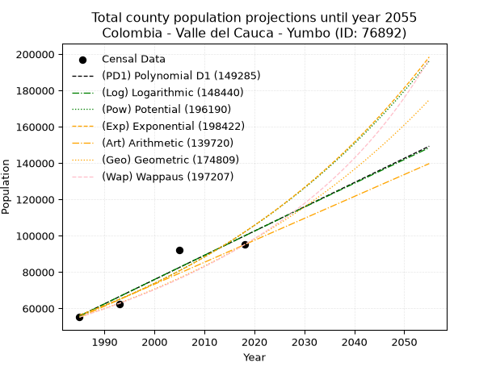
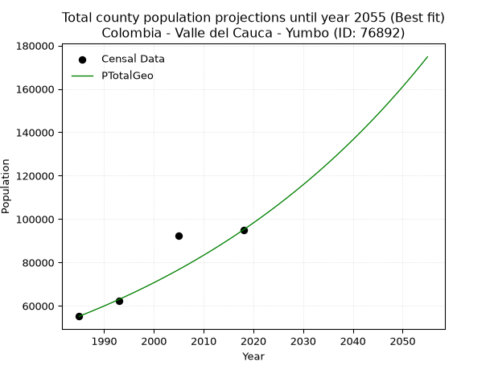
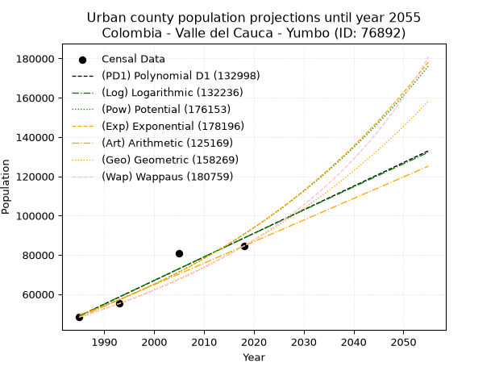
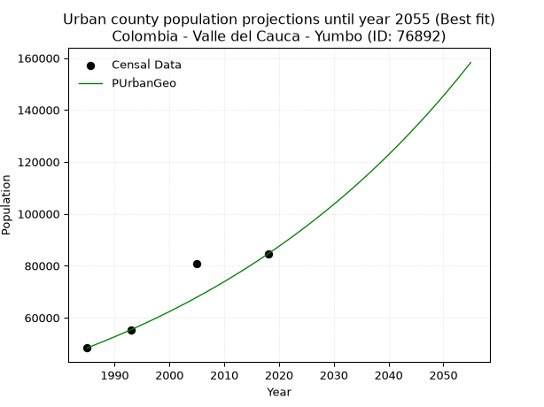
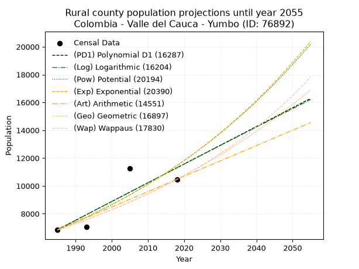
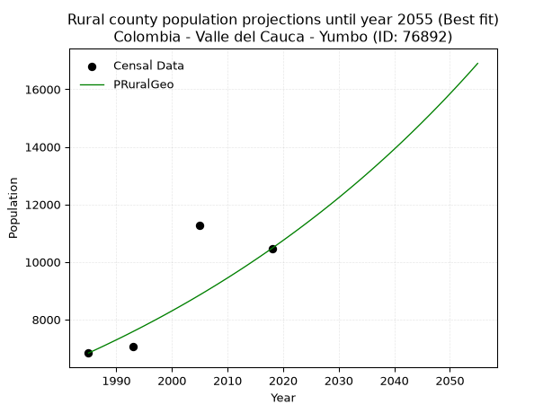

<div align="center">


</div>

# 📜 _“Population and Public Services Demand Projections (PPSD) until Year 2050 for Colombia - Valle del Cauca - Yumbo (ID: 76892)”_
Keywords: `population` `public-service` `projection` `lineal` `polynomial` `logarithmic` `potential` `exponential` `arithmetic` `geometric` `wappaus` `dane` `colombia` `south-america`

PPSD are analytical estimates used by governments and planners to anticipate future changes in population size, age distribution, and the resulting community needs for utilities, healthcare, education, and infrastructure as sizing future water treatment facilities, electrical grids, and road networks based on spatial growth.

<div align="center">

</img>

</div>


> **General running parameters**: • app_version: _v20260806_. • Python version: _3.14.7_. • Pandas version: _3.0.5_. • NumPy version: _2.5.1_. • Creates, save and include plots into reports (create_plot): _False_. • Projection until year: _2050_. • Process polynomial degree 2 and up: _False_. • Process Wappaus: _True_. • Process Wappaus: _True_. • Set negative values to zero: _True_. • Set infinite values to zero: _True_. • Drop dataset notes: _True_. 
<div align="center">

Dynamic map: [:earth_americas:Google](http://maps.google.com/maps?q=3.540096954,-76.4998929) [:earth_americas:OSM](https://www.openstreetmap.org/#map=18/3.540096954/-76.4998929&layers=P) [:earth_americas:Bing](https://www.bing.com/maps?cp=3.540096954~-76.4998929&lvl=18) [:earth_americas:Apple](https://maps.apple.com/frame?center=3.540096954%2C-76.4998929&span=0.003%2C0.006)

</div>


<div align="center">

```geojson
{
  "type": "Feature",
  "geometry": {
    "type": "Point", 
    "coordinates": [-76.4998929, 3.540096954]
  }, 
  "properties": {
    "Name": "Colombia - Valle del Cauca - Yumbo (ID: 76892)"
  }
}
```

</div>


## 0. Census Data (4 records)

Census data are official statistics collected by a government about the people and housing in a country. They usually include counts of total population, age, sex, race, income, education, and jobs.

📅Global census file: [Population.xlsx](../data/Population.xlsx)

| Source   |   Year |   CountryID | CountryName   |   StateID | StateName       |   CountyID | CountyName   |   PTotal |   PUrban |   PRural |
|:---------|-------:|------------:|:--------------|----------:|:----------------|-----------:|:-------------|---------:|---------:|---------:|
| DANE     |   1985 |          57 | Colombia      |        76 | Valle del Cauca |      76892 | Yumbo        |    55190 |    48354 |     6836 |
| DANE     |   1993 |          57 | Colombia      |        76 | Valle del Cauca |      76892 | Yumbo        |    62305 |    55236 |     7069 |
| DANE     |   2005 |          57 | Colombia      |        76 | Valle del Cauca |      76892 | Yumbo        |    92192 |    80927 |    11265 |
| DANE     |   2018 |          57 | Colombia      |        76 | Valle del Cauca |      76892 | Yumbo        |    95040 |    84567 |    10473 |

> 🔥Some records could had specific notes about the registered values or the corresponding urban or rural distribution.

📅[SUI-RUPS](https://www.datos.gov.co/Hacienda-y-Cr-dito-P-blico/Registro-nico-de-Prestadores-de-Servicios-P-blicos/4qkq-csdn/about_data) - Local public utility companies: [RUPS.csv](../data/RUPS.csv)

 | SERVICIO       | ESTADO    | NOMBRE                                                                                                                                                 | NIT         | DEPARTAMENTO_DOMICILIO   | MUNICIPIO_DOMICILIO   | DIRECCION                                                                                    |   TELEFONO | EMAIL                             | TIPO_PRESTADOR                             | CLASIFICACION                 |
|:---------------|:----------|:-------------------------------------------------------------------------------------------------------------------------------------------------------|:------------|:-------------------------|:----------------------|:---------------------------------------------------------------------------------------------|-----------:|:----------------------------------|:-------------------------------------------|:------------------------------|
| ACUEDUCTO      | OPERATIVA | EMPRESA OFICIAL DE SERVICIOS PÚBLICOS DE YUMBO S.A. E.S.P.                                                                                             | 900005956-3 | VALLE DEL CAUCA          | YUMBO                 | CALLE 16 # 2N-20 VIA PANORAMA                                                                |    6410526 | gerencia@espyumbo.com             | SOCIEDADES (EMPRESA DE SERVICIOS PUBLICOS) | MAYOR O IGUAL A 5001 USUARIOS |
| ALCANTARILLADO | OPERATIVA | EMPRESA OFICIAL DE SERVICIOS PÚBLICOS DE YUMBO S.A. E.S.P.                                                                                             | 900005956-3 | VALLE DEL CAUCA          | YUMBO                 | CALLE 16 # 2N-20 VIA PANORAMA                                                                |    6410526 | gerencia@espyumbo.com             | SOCIEDADES (EMPRESA DE SERVICIOS PUBLICOS) | MAYOR O IGUAL A 5001 USUARIOS |
| ACUEDUCTO      | OPERATIVA | JUNTA COMUNITARIA ADMINISTRADORA DE ACUEDUCTO PRO AGUA DE MULALO                                                                                       | 805010716-8 | VALLE DEL CAUCA          | YUMBO                 | Carrera 57N con calle 3ª. Esquina, sede comunitaria del corregimiento de Mulalò Yumbo Valle. |    6580107 | proaguamulalojunta@gmail.com      | ORGANIZACION AUTORIZADA                    | MENOR O IGUAL A 2500 USUARIOS |
| ACUEDUCTO      | OPERATIVA | EMPRESA ADMINISTRADORA DE SERVICIOS PUBLICOS ACUEDUCTO Y ALCANTARILLADO GOLONDRINAS                                                                    | 805009024-8 | VALLE DEL CAUCA          | CALI                  | CORREGIMIENTO GOLONDRINAS                                                                    |    8888499 | esaag_1997@yahoo.es               | ORGANIZACION AUTORIZADA                    | MENOR O IGUAL A 2500 USUARIOS |
| ALCANTARILLADO | OPERATIVA | EMPRESA ADMINISTRADORA DE SERVICIOS PUBLICOS ACUEDUCTO Y ALCANTARILLADO GOLONDRINAS                                                                    | 805009024-8 | VALLE DEL CAUCA          | CALI                  | CORREGIMIENTO GOLONDRINAS                                                                    |    8888499 | esaag_1997@yahoo.es               | ORGANIZACION AUTORIZADA                    | MENOR O IGUAL A 2500 USUARIOS |
| ACUEDUCTO      | OPERATIVA | EMPRESAS MUNICIPALES DE CALI   E.I.C.E  E.S.P                                                                                                          | 890399003-4 | VALLE DEL CAUCA          | CALI                  | Avenida 2 N  #10 - 65 Cam Torre Emcali                                                       |    8993095 | alpantoja@emcali.com.co           | EMPRESA INDUSTRIAL Y COMERCIAL DEL ESTADO  | MAYOR O IGUAL A 5001 USUARIOS |
| ALCANTARILLADO | OPERATIVA | EMPRESAS MUNICIPALES DE CALI   E.I.C.E  E.S.P                                                                                                          | 890399003-4 | VALLE DEL CAUCA          | CALI                  | Avenida 2 N  #10 - 65 Cam Torre Emcali                                                       |    8993095 | alpantoja@emcali.com.co           | EMPRESA INDUSTRIAL Y COMERCIAL DEL ESTADO  | MAYOR O IGUAL A 5001 USUARIOS |
| ACUEDUCTO      | OPERATIVA | ASOCIACION DE USUARIOS DEL SERVICIO DE AGUA POTABLEY ALCANTARILLADODEL CORREGIMIENTO LA OLGA                                                           | 805015426-1 | VALLE DEL CAUCA          | YUMBO                 | CASETA COMUNAL CORREGIMIENTO LA OLGA                                                         |    6693686 | algopa1957@hotmail.com            | ORGANIZACION AUTORIZADA                    | HASTA 2500 SUSCRIPTORES       |
| ACUEDUCTO      | OPERATIVA | JUNTA ADMINISTRADORA DE ACUEDUCTO Y ALCANTARILLADO DE LA VEREDA ALTO DAPA                                                                              | 805015648-8 | VALLE DEL CAUCA          | YUMBO                 | kilometro 10 via Dapa                                                                        |    6690149 | acualtodapa@gmail.com             | ORGANIZACION AUTORIZADA                    | MENOR O IGUAL A 2500 USUARIOS |
| ACUEDUCTO      | OPERATIVA | EMPRESA COMUNITARIA DE SERVICIOS PUBLICOS MIRAVALLE DAPA ECODAPA                                                                                       | 805010376-7 | VALLE DEL CAUCA          | YUMBO                 | Carretera a dapa km 12 Vereda  Miravalle Yumbo                                               |    5218207 | ecodapa@hotmail.com               | ORGANIZACION AUTORIZADA                    | MENOR O IGUAL A 2500 USUARIOS |
| ACUEDUCTO      | OPERATIVA | ASOCIACIÒN DE SUSCRIPTORES DEL ACUEDUCTO Y ALCANTARILLADO DEL BARRIO LA TRINIDAD                                                                       | 805017218-3 | VALLE DEL CAUCA          | YUMBO                 | Calle 18 Oeste No. 2-35                                                                      |    6694451 | acuatrinidad@hotmail.com          | ORGANIZACION AUTORIZADA                    | MENOR O IGUAL A 2500 USUARIOS |
| ACUEDUCTO      | OPERATIVA | JUNTA ADMINISTRADORA DE ACUEDUCTO Y ALCANTARRILLADO DEL CORREGIMIENTO DE SANTA INES                                                                    | 805011572-9 | VALLE DEL CAUCA          | YUMBO                 | SANTA INES CASA EL CHAMPU                                                                    |    6691439 | isanta473@gmail.com               | ORGANIZACION AUTORIZADA                    | MENOR O IGUAL A 2500 USUARIOS |
| ACUEDUCTO      | OPERATIVA | ASOCIACION JUNTA ADMINISTRADORA DE AGUAS DEL SECTOR LAS BRISAS                                                                                         | 830505348-7 | VALLE DEL CAUCA          | YUMBO                 | Calle 7 No 8 - 29 Barrio Uribe                                                               |    6691665 | juntalasbrisas@gmail.com          | ORGANIZACION AUTORIZADA                    | HASTA 2500 SUSCRIPTORES       |
| ACUEDUCTO      | OPERATIVA | Asociación Junta Administradora de Acueducto y Alcantarillado de la Vereda Peñas Negras Corregimiento Santa Inés del Municipio de Yumbo Departamento d | 805024830-0 | VALLE DEL CAUCA          | YUMBO                 | Sede Acueducto. Vereda Peñas Negras. Corregimiento Santa Inés Yumbo                          |    3154992 | asociacionpenasnegras@hotmail.com | ORGANIZACION AUTORIZADA                    | MENOR O IGUAL A 2500 USUARIOS |
| ACUEDUCTO      | OPERATIVA | JUNTA ADMINISTRADORA DE ACUEDUCTO Y ALCANTARILLADO DEL CORREGIMIENTO DE SAN MARCOS                                                                     | 900036709-3 | VALLE DEL CAUCA          | YUMBO                 | CRA 82 N # 18 A 12                                                                           |    4438100 | JAASANM2020SANMARCOS@GMAIL.COM    | ORGANIZACION AUTORIZADA                    | MENOR O IGUAL A 2500 USUARIOS |
| ALCANTARILLADO | OPERATIVA | JUNTA ADMINISTRADORA DE ACUEDUCTO Y ALCANTARILLADO DEL CORREGIMIENTO DE SAN MARCOS                                                                     | 900036709-3 | VALLE DEL CAUCA          | YUMBO                 | CRA 82 N # 18 A 12                                                                           |    4438100 | JAASANM2020SANMARCOS@GMAIL.COM    | ORGANIZACION AUTORIZADA                    | MENOR O IGUAL A 2500 USUARIOS |
| ACUEDUCTO      | OPERATIVA | JUNTA ADMINISTRADORA DE ACUEDUCTO Y ALCANTARILLADO DE CORREGIMIENTO DE MONTANITAS                                                                      | 805013493-4 | VALLE DEL CAUCA          | YUMBO                 | corregimiento montañitas                                                                     |    3218300 | ELIDEVEL50@GMAIL.COM              | ORGANIZACION AUTORIZADA                    | HASTA 2500 SUSCRIPTORES       |
| ACUEDUCTO      | OPERATIVA | AGUA RIVERAS DE YUMBO E.S.P SAS                                                                                                                        | 900357581-5 | VALLE DEL CAUCA          | YUMBO                 | CLL 20 OESTE 4-05                                                                            |    6693549 | carloscadavid81@hotmail.com       | SOCIEDADES (EMPRESA DE SERVICIOS PUBLICOS) | MENOR O IGUAL A 2500 USUARIOS |
| ALCANTARILLADO | OPERATIVA | EMPRESA PRESTADORA DE SERVICIOS PÚBLICOS DE OCCIDENTE SAS ESP AQUAMBIENTAL                                                                             | 900616388-1 | VALLE DEL CAUCA          | CALI                  | CRA 39 No 7-10 APTO 102F                                                                     |    3078196 | tonynge@gmail.com                 | SOCIEDADES (EMPRESA DE SERVICIOS PUBLICOS) | HASTA 2500 SUSCRIPTORES       |
| ACUEDUCTO      | OPERATIVA | ASOCIACION COMUNITARIA DE USUARIOS DEL SERVICIO DE AGUA POTABLE Y ALCANTARILLADO DE LA VEREDA EL CHOCHO                                                | 805026117-6 | VALLE DEL CAUCA          | YUMBO                 | vereda el chocho                                                                             |    3147009 | juan-carher@hotmail.com           | ORGANIZACION AUTORIZADA                    | MENOR O IGUAL A 2500 USUARIOS |

## 1. Total

### 1.1. Coefficients and Parameters

* (PD1) Polynomial Deg 1: 1335.2280208751465, -2594608.098755512 (lineal)
* (Log) Logarithmic: 2673960.473278977, -20248613.235167947
* (Pow) Potential: 36.03707517352009, -114.0913723577117
* (Exp) Exponential: 0.017993514428250493, 1.733101771534254e-11
* (Art) Arithmetic: Year diff. 2018 - 1985 = 33, Population diff. 95040 - 55190 = 39850, Annual growth = 1207.5757575757575
* (Geo) Geometric: Year diff. 2018 - 1985 = 33, Population diff. 95040 - 55190 = 39850, Annual growth % = 0.01660656538268146
* (Wap) Wappaus: i = 1.6076359682829762, Condition values only valid for < 200)

<sub>
Wappaus condition values: ['0.00', '1.61', '3.22', '4.82', '6.43', '8.04', '9.65', '11.25', '12.86', '14.47', '16.08', '17.68', '19.29', '20.90', '22.51', '24.11', '25.72', '27.33', '28.94', '30.55', '32.15', '33.76', '35.37', '36.98', '38.58', '40.19', '41.80', '43.41', '45.01', '46.62', '48.23', '49.84', '51.44', '53.05', '54.66', '56.27', '57.87', '59.48', '61.09', '62.70', '64.31', '65.91', '67.52', '69.13', '70.74', '72.34', '73.95', '75.56', '77.17', '78.77', '80.38', '81.99', '83.60', '85.20', '86.81', '88.42', '90.03', '91.64', '93.24', '94.85', '96.46', '98.07', '99.67', '101.28', '102.89', '104.50']
</sub>


### 1.2. Projected Dataset

|   Year |   CountyID |   PTotalPD1 |   PTotalLog |   PTotalPow |   PTotalExp |   PTotalArt |   PTotalGeo |   PTotalWap |
|-------:|-----------:|------------:|------------:|------------:|------------:|------------:|------------:|------------:|
|   1985 |      76892 |       55820 |       55769 |       56269 |       56309 |       55190 |       55190 |       55190 |
|   1986 |      76892 |       57155 |       57116 |       57300 |       57331 |       56398 |       56107 |       56084 |
|   1987 |      76892 |       58490 |       58462 |       58349 |       58372 |       57605 |       57038 |       56994 |
|   1988 |      76892 |       59825 |       59807 |       59416 |       59432 |       58813 |       57985 |       57918 |
|   1989 |      76892 |       61160 |       61152 |       60503 |       60511 |       60020 |       58948 |       58857 |
|   1990 |      76892 |       62496 |       62496 |       61609 |       61609 |       61228 |       59927 |       59812 |
|   1991 |      76892 |       63831 |       63840 |       62735 |       62728 |       62435 |       60923 |       60783 |
|   1992 |      76892 |       65166 |       65182 |       63880 |       63867 |       63643 |       61934 |       61771 |
|   1993 |      76892 |       66501 |       66524 |       65046 |       65027 |       64851 |       62963 |       62776 |
|   1994 |      76892 |       67837 |       67866 |       66232 |       66207 |       66058 |       64008 |       63798 |
|   1995 |      76892 |       69172 |       69206 |       67440 |       67409 |       67266 |       65071 |       64838 |
|   1996 |      76892 |       70507 |       70546 |       68669 |       68633 |       68473 |       66152 |       65896 |
|   1997 |      76892 |       71842 |       71886 |       69920 |       69879 |       69681 |       67250 |       66974 |
|   1998 |      76892 |       73177 |       73224 |       71193 |       71148 |       70888 |       68367 |       68070 |
|   1999 |      76892 |       74513 |       74562 |       72488 |       72440 |       72096 |       69503 |       69187 |
|   2000 |      76892 |       75848 |       75900 |       73806 |       73755 |       73304 |       70657 |       70324 |
|   2001 |      76892 |       77183 |       77236 |       75148 |       75094 |       74511 |       71830 |       71481 |
|   2002 |      76892 |       78518 |       78572 |       76513 |       76458 |       75719 |       73023 |       72661 |
|   2003 |      76892 |       79854 |       79907 |       77903 |       77846 |       76926 |       74236 |       73862 |
|   2004 |      76892 |       81189 |       81242 |       79317 |       79259 |       78134 |       75468 |       75087 |
|   2005 |      76892 |       82524 |       82576 |       80755 |       80698 |       79342 |       76722 |       76334 |
|   2006 |      76892 |       83859 |       83909 |       82220 |       82164 |       80549 |       77996 |       77606 |
|   2007 |      76892 |       85195 |       85242 |       83710 |       83655 |       81757 |       79291 |       78903 |
|   2008 |      76892 |       86530 |       86574 |       85226 |       85174 |       82964 |       80608 |       80225 |
|   2009 |      76892 |       87865 |       87905 |       86769 |       86721 |       84172 |       81946 |       81574 |
|   2010 |      76892 |       89200 |       89236 |       88339 |       88295 |       85379 |       83307 |       82950 |
|   2011 |      76892 |       90535 |       90566 |       89937 |       89898 |       86587 |       84691 |       84354 |
|   2012 |      76892 |       91871 |       91895 |       91562 |       91531 |       87795 |       86097 |       85786 |
|   2013 |      76892 |       93206 |       93224 |       93217 |       93192 |       89002 |       87527 |       87248 |
|   2014 |      76892 |       94541 |       94552 |       94900 |       94884 |       90210 |       88980 |       88741 |
|   2015 |      76892 |       95876 |       95879 |       96613 |       96607 |       91417 |       90458 |       90266 |
|   2016 |      76892 |       97212 |       97206 |       98356 |       98361 |       92625 |       91960 |       91823 |
|   2017 |      76892 |       98547 |       98532 |      100130 |      100147 |       93832 |       93487 |       93414 |
|   2018 |      76892 |       99882 |       99857 |      101934 |      101965 |       95040 |       95040 |       95040 |
|   2019 |      76892 |      101217 |      101182 |      103770 |      103817 |       96248 |       96618 |       96702 |
|   2020 |      76892 |      102553 |      102506 |      105639 |      105702 |       97455 |       98223 |       98401 |
|   2021 |      76892 |      103888 |      103830 |      107540 |      107621 |       98663 |       99854 |      100138 |
|   2022 |      76892 |      105223 |      105152 |      109474 |      109575 |       99870 |      101512 |      101915 |
|   2023 |      76892 |      106558 |      106475 |      111442 |      111564 |      101078 |      103198 |      103733 |
|   2024 |      76892 |      107893 |      107796 |      113445 |      113590 |      102285 |      104912 |      105594 |
|   2025 |      76892 |      109229 |      109117 |      115482 |      115652 |      103493 |      106654 |      107499 |
|   2026 |      76892 |      110564 |      110437 |      117555 |      117752 |      104701 |      108425 |      109449 |
|   2027 |      76892 |      111899 |      111756 |      119664 |      119890 |      105908 |      110226 |      111447 |
|   2028 |      76892 |      113234 |      113075 |      121810 |      122067 |      107116 |      112056 |      113494 |
|   2029 |      76892 |      114570 |      114394 |      123994 |      124283 |      108323 |      113917 |      115592 |
|   2030 |      76892 |      115905 |      115711 |      126215 |      126540 |      109531 |      115809 |      117743 |
|   2031 |      76892 |      117240 |      117028 |      128475 |      128837 |      110738 |      117732 |      119949 |
|   2032 |      76892 |      118575 |      118344 |      130774 |      131176 |      111946 |      119687 |      122211 |
|   2033 |      76892 |      119910 |      119660 |      133114 |      133558 |      113154 |      121675 |      124533 |
|   2034 |      76892 |      121246 |      120975 |      135494 |      135983 |      114361 |      123695 |      126916 |
|   2035 |      76892 |      122581 |      122289 |      137915 |      138452 |      115569 |      125749 |      129364 |
|   2036 |      76892 |      123916 |      123603 |      140379 |      140966 |      116776 |      127838 |      131878 |
|   2037 |      76892 |      125251 |      124916 |      142885 |      143525 |      117984 |      129961 |      134462 |
|   2038 |      76892 |      126587 |      126228 |      145434 |      146131 |      119192 |      132119 |      137118 |
|   2039 |      76892 |      127922 |      127540 |      148028 |      148784 |      120399 |      134313 |      139849 |
|   2040 |      76892 |      129257 |      128851 |      150667 |      151486 |      121607 |      136543 |      142659 |
|   2041 |      76892 |      130592 |      130161 |      153352 |      154236 |      122814 |      138811 |      145551 |
|   2042 |      76892 |      131928 |      131471 |      156083 |      157036 |      124022 |      141116 |      148529 |
|   2043 |      76892 |      133263 |      132780 |      158861 |      159888 |      125229 |      143459 |      151597 |
|   2044 |      76892 |      134598 |      134089 |      161687 |      162791 |      126437 |      145842 |      154759 |
|   2045 |      76892 |      135933 |      135397 |      164563 |      165746 |      127645 |      148264 |      158018 |
|   2046 |      76892 |      137268 |      136704 |      167488 |      168756 |      128852 |      150726 |      161381 |
|   2047 |      76892 |      138604 |      138011 |      170463 |      171820 |      130060 |      153229 |      164851 |
|   2048 |      76892 |      139939 |      139317 |      173490 |      174939 |      131267 |      155774 |      168435 |
|   2049 |      76892 |      141274 |      140622 |      176569 |      178116 |      132475 |      158360 |      172137 |
|   2050 |      76892 |      142609 |      141927 |      179701 |      181349 |      133682 |      160990 |      175963 |
<div align="center">

</img>

</div>


### 1.3. Best fit with absolute and relative error (%)

Relative error puts that difference into context by dividing the absolute error by the true value, creating a unitless ratio or percentage that shows the scale of the mistake.

Absolute and relative error

|   Year | Source   |   CountryID | CountryName   |   StateID | StateName       |   CountyID_x | CountyName   |   PTotal |   PUrban |   PRural |   CountyID_y |   PTotalPD1 |   PTotalLog |   PTotalPow |   PTotalExp |   PTotalArt |   PTotalGeo |   PTotalWap |   PTotalPD1AbsError |   PTotalLogAbsError |   PTotalPowAbsError |   PTotalExpAbsError |   PTotalArtAbsError |   PTotalGeoAbsError |   PTotalWapAbsError |   PTotalPD1RelError |   PTotalLogRelError |   PTotalPowRelError |   PTotalExpRelError |   PTotalArtRelError |   PTotalGeoRelError |   PTotalWapRelError |
|-------:|:---------|------------:|:--------------|----------:|:----------------|-------------:|:-------------|---------:|---------:|---------:|-------------:|------------:|------------:|------------:|------------:|------------:|------------:|------------:|--------------------:|--------------------:|--------------------:|--------------------:|--------------------:|--------------------:|--------------------:|--------------------:|--------------------:|--------------------:|--------------------:|--------------------:|--------------------:|--------------------:|
|   1985 | DANE     |          57 | Colombia      |        76 | Valle del Cauca |        76892 | Yumbo        |    55190 |    48354 |     6836 |        76892 |       55820 |       55769 |       56269 |       56309 |       55190 |       55190 |       55190 |                 630 |                 579 |                1079 |                1119 |                   0 |                   0 |                   0 |             1.14151 |             1.0491  |             1.95506 |             2.02754 |             0       |              0      |            0        |
|   1993 | DANE     |          57 | Colombia      |        76 | Valle del Cauca |        76892 | Yumbo        |    62305 |    55236 |     7069 |        76892 |       66501 |       66524 |       65046 |       65027 |       64851 |       62963 |       62776 |                4196 |                4219 |                2741 |                2722 |                2546 |                 658 |                 471 |             6.73461 |             6.77153 |             4.39933 |             4.36883 |             4.08635 |              1.0561 |            0.755959 |
|   2005 | DANE     |          57 | Colombia      |        76 | Valle del Cauca |        76892 | Yumbo        |    92192 |    80927 |    11265 |        76892 |       82524 |       82576 |       80755 |       80698 |       79342 |       76722 |       76334 |                9668 |                9616 |               11437 |               11494 |               12850 |               15470 |               15858 |            10.4868  |            10.4304  |            12.4056  |            12.4675  |            13.9383  |             16.7802 |           17.2011   |
|   2018 | DANE     |          57 | Colombia      |        76 | Valle del Cauca |        76892 | Yumbo        |    95040 |    84567 |    10473 |        76892 |       99882 |       99857 |      101934 |      101965 |       95040 |       95040 |       95040 |                4842 |                4817 |                6894 |                6925 |                   0 |                   0 |                   0 |             5.0947  |             5.06839 |             7.25379 |             7.28641 |             0       |              0      |            0        |

Relative error mean

| Method    |   RelError | Best   |
|:----------|-----------:|:-------|
| PTotalPD1 |    5.86441 |        |
| PTotalLog |    5.82986 |        |
| PTotalPow |    6.50345 |        |
| PTotalExp |    6.53756 |        |
| PTotalArt |    4.50616 |        |
| PTotalGeo |    4.45907 | True   |
| PTotalWap |    4.48925 |        |

💙Best method: _**PTotalGeo**_
<div align="center">

</img>

</div>


### 1.4. Fresh water supply demand in liters per capita per day (lpcd)

The fresh water supply demand typically ranges from 100 to 300 liters per capita per day (lpcd) for standard domestic and municipal planning, though absolute survival minimums set by the World Health Organization are as low as 7.5 to 20 liters per day, and total consumption in high-income nations can exceed 400 liters.

> `CZ`: Level in meters above the sea level (masl)<br> `WS`: Fresh water supply demand in liters per capita per day (lpcd or l/h/d)<br> `WSAll`: Zonal fresh water supply demand in liters per second (l/s)<br> `A`: Zonal area in square meters<br> `DP`: Population density (people/hectare or p/ha)

Reference values (RAS Colombia)

|    CZ |   WS |
|------:|-----:|
|  1000 |  120 |
|  2000 |  130 |
| 99999 |  140 |

County shapefile geometry properties and water supply values

|   CountyID |      ATotal |   CZTotal |   WSTotal |
|-----------:|------------:|----------:|----------:|
|      76892 | 2.30813e+08 |   1311.31 |       130 |

Projected values for best method: PTotalGeo

|   CountyID |   Year |   PTotalGeo |   DPTotal |   WSTotal |   WSTotalAll |
|-----------:|-------:|------------:|----------:|----------:|-------------:|
|      76892 |   1985 |       55190 |      2.39 |       130 |      83.0405 |
|      76892 |   1986 |       56107 |      2.43 |       130 |      84.4203 |
|      76892 |   1987 |       57038 |      2.47 |       130 |      85.8211 |
|      76892 |   1988 |       57985 |      2.51 |       130 |      87.2459 |
|      76892 |   1989 |       58948 |      2.55 |       130 |      88.6949 |
|      76892 |   1990 |       59927 |      2.6  |       130 |      90.1679 |
|      76892 |   1991 |       60923 |      2.64 |       130 |      91.6666 |
|      76892 |   1992 |       61934 |      2.68 |       130 |      93.1877 |
|      76892 |   1993 |       62963 |      2.73 |       130 |      94.736  |
|      76892 |   1994 |       64008 |      2.77 |       130 |      96.3083 |
|      76892 |   1995 |       65071 |      2.82 |       130 |      97.9078 |
|      76892 |   1996 |       66152 |      2.87 |       130 |      99.5343 |
|      76892 |   1997 |       67250 |      2.91 |       130 |     101.186  |
|      76892 |   1998 |       68367 |      2.96 |       130 |     102.867  |
|      76892 |   1999 |       69503 |      3.01 |       130 |     104.576  |
|      76892 |   2000 |       70657 |      3.06 |       130 |     106.313  |
|      76892 |   2001 |       71830 |      3.11 |       130 |     108.078  |
|      76892 |   2002 |       73023 |      3.16 |       130 |     109.873  |
|      76892 |   2003 |       74236 |      3.22 |       130 |     111.698  |
|      76892 |   2004 |       75468 |      3.27 |       130 |     113.551  |
|      76892 |   2005 |       76722 |      3.32 |       130 |     115.438  |
|      76892 |   2006 |       77996 |      3.38 |       130 |     117.355  |
|      76892 |   2007 |       79291 |      3.44 |       130 |     119.304  |
|      76892 |   2008 |       80608 |      3.49 |       130 |     121.285  |
|      76892 |   2009 |       81946 |      3.55 |       130 |     123.298  |
|      76892 |   2010 |       83307 |      3.61 |       130 |     125.346  |
|      76892 |   2011 |       84691 |      3.67 |       130 |     127.429  |
|      76892 |   2012 |       86097 |      3.73 |       130 |     129.544  |
|      76892 |   2013 |       87527 |      3.79 |       130 |     131.696  |
|      76892 |   2014 |       88980 |      3.86 |       130 |     133.882  |
|      76892 |   2015 |       90458 |      3.92 |       130 |     136.106  |
|      76892 |   2016 |       91960 |      3.98 |       130 |     138.366  |
|      76892 |   2017 |       93487 |      4.05 |       130 |     140.663  |
|      76892 |   2018 |       95040 |      4.12 |       130 |     143      |
|      76892 |   2019 |       96618 |      4.19 |       130 |     145.374  |
|      76892 |   2020 |       98223 |      4.26 |       130 |     147.789  |
|      76892 |   2021 |       99854 |      4.33 |       130 |     150.243  |
|      76892 |   2022 |      101512 |      4.4  |       130 |     152.738  |
|      76892 |   2023 |      103198 |      4.47 |       130 |     155.275  |
|      76892 |   2024 |      104912 |      4.55 |       130 |     157.854  |
|      76892 |   2025 |      106654 |      4.62 |       130 |     160.475  |
|      76892 |   2026 |      108425 |      4.7  |       130 |     163.139  |
|      76892 |   2027 |      110226 |      4.78 |       130 |     165.849  |
|      76892 |   2028 |      112056 |      4.85 |       130 |     168.603  |
|      76892 |   2029 |      113917 |      4.94 |       130 |     171.403  |
|      76892 |   2030 |      115809 |      5.02 |       130 |     174.25   |
|      76892 |   2031 |      117732 |      5.1  |       130 |     177.143  |
|      76892 |   2032 |      119687 |      5.19 |       130 |     180.085  |
|      76892 |   2033 |      121675 |      5.27 |       130 |     183.076  |
|      76892 |   2034 |      123695 |      5.36 |       130 |     186.115  |
|      76892 |   2035 |      125749 |      5.45 |       130 |     189.206  |
|      76892 |   2036 |      127838 |      5.54 |       130 |     192.349  |
|      76892 |   2037 |      129961 |      5.63 |       130 |     195.543  |
|      76892 |   2038 |      132119 |      5.72 |       130 |     198.79   |
|      76892 |   2039 |      134313 |      5.82 |       130 |     202.091  |
|      76892 |   2040 |      136543 |      5.92 |       130 |     205.447  |
|      76892 |   2041 |      138811 |      6.01 |       130 |     208.859  |
|      76892 |   2042 |      141116 |      6.11 |       130 |     212.327  |
|      76892 |   2043 |      143459 |      6.22 |       130 |     215.853  |
|      76892 |   2044 |      145842 |      6.32 |       130 |     219.438  |
|      76892 |   2045 |      148264 |      6.42 |       130 |     223.082  |
|      76892 |   2046 |      150726 |      6.53 |       130 |     226.787  |
|      76892 |   2047 |      153229 |      6.64 |       130 |     230.553  |
|      76892 |   2048 |      155774 |      6.75 |       130 |     234.382  |
|      76892 |   2049 |      158360 |      6.86 |       130 |     238.273  |
|      76892 |   2050 |      160990 |      6.97 |       130 |     242.23   |

## 2. Urban

### 2.1. Coefficients and Parameters

* (PD1) Polynomial Deg 1: 1200.4945804897593, -2334018.284624641 (lineal)
* (Log) Logarithmic: 2404057.0271029766, -18205985.72791369
* (Pow) Potential: 36.67383890296069, -116.24763621045531
* (Exp) Exponential: 0.0183118092595101, 8.092144673336817e-12
* (Art) Arithmetic: Year diff. 2018 - 1985 = 33, Population diff. 84567 - 48354 = 36213, Annual growth = 1097.3636363636363
* (Geo) Geometric: Year diff. 2018 - 1985 = 33, Population diff. 84567 - 48354 = 36213, Annual growth % = 0.017083530189641927
* (Wap) Wappaus: i = 1.6511516409952323, Condition values only valid for < 200)

<sub>
Wappaus condition values: ['0.00', '1.65', '3.30', '4.95', '6.60', '8.26', '9.91', '11.56', '13.21', '14.86', '16.51', '18.16', '19.81', '21.46', '23.12', '24.77', '26.42', '28.07', '29.72', '31.37', '33.02', '34.67', '36.33', '37.98', '39.63', '41.28', '42.93', '44.58', '46.23', '47.88', '49.53', '51.19', '52.84', '54.49', '56.14', '57.79', '59.44', '61.09', '62.74', '64.39', '66.05', '67.70', '69.35', '71.00', '72.65', '74.30', '75.95', '77.60', '79.26', '80.91', '82.56', '84.21', '85.86', '87.51', '89.16', '90.81', '92.46', '94.12', '95.77', '97.42', '99.07', '100.72', '102.37', '104.02', '105.67', '107.32']
</sub>


### 2.2. Projected Dataset

|   Year |   CountyID |   PUrbanPD1 |   PUrbanLog |   PUrbanPow |   PUrbanExp |   PUrbanArt |   PUrbanGeo |   PUrbanWap |
|-------:|-----------:|------------:|------------:|------------:|------------:|------------:|------------:|------------:|
|   1985 |      76892 |       48963 |       48919 |       49420 |       49455 |       48354 |       48354 |       48354 |
|   1986 |      76892 |       50164 |       50130 |       50341 |       50369 |       49451 |       49180 |       49159 |
|   1987 |      76892 |       51364 |       51340 |       51279 |       51300 |       50549 |       50020 |       49978 |
|   1988 |      76892 |       52565 |       52549 |       52234 |       52248 |       51646 |       50875 |       50810 |
|   1989 |      76892 |       53765 |       53758 |       53206 |       53213 |       52743 |       51744 |       51657 |
|   1990 |      76892 |       54966 |       54967 |       54196 |       54197 |       53841 |       52628 |       52518 |
|   1991 |      76892 |       56166 |       56175 |       55204 |       55198 |       54938 |       53527 |       53394 |
|   1992 |      76892 |       57367 |       57382 |       56230 |       56218 |       56036 |       54441 |       54286 |
|   1993 |      76892 |       58567 |       58588 |       57275 |       57257 |       57133 |       55371 |       55193 |
|   1994 |      76892 |       59768 |       59794 |       58338 |       58315 |       58230 |       56317 |       56116 |
|   1995 |      76892 |       60968 |       61000 |       59421 |       59393 |       59328 |       57279 |       57056 |
|   1996 |      76892 |       62169 |       62204 |       60523 |       60491 |       60425 |       58258 |       58014 |
|   1997 |      76892 |       63369 |       63408 |       61645 |       61609 |       61522 |       59253 |       58988 |
|   1998 |      76892 |       64570 |       64612 |       62787 |       62747 |       62620 |       60265 |       59981 |
|   1999 |      76892 |       65770 |       65815 |       63950 |       63907 |       63717 |       61295 |       60992 |
|   2000 |      76892 |       66971 |       67017 |       65134 |       65088 |       64814 |       62342 |       62023 |
|   2001 |      76892 |       68171 |       68219 |       66339 |       66291 |       65912 |       63407 |       63073 |
|   2002 |      76892 |       69372 |       69420 |       67566 |       67516 |       67009 |       64490 |       64143 |
|   2003 |      76892 |       70572 |       70621 |       68814 |       68763 |       68107 |       65592 |       65234 |
|   2004 |      76892 |       71773 |       71821 |       70086 |       70034 |       69204 |       66713 |       66346 |
|   2005 |      76892 |       72973 |       73020 |       71380 |       71328 |       70301 |       67852 |       67480 |
|   2006 |      76892 |       74174 |       74219 |       72697 |       72647 |       71399 |       69011 |       68637 |
|   2007 |      76892 |       75374 |       75417 |       74038 |       73989 |       72496 |       70190 |       69817 |
|   2008 |      76892 |       76575 |       76614 |       75403 |       75357 |       73593 |       71390 |       71021 |
|   2009 |      76892 |       77775 |       77811 |       76792 |       76749 |       74691 |       72609 |       72250 |
|   2010 |      76892 |       78976 |       79008 |       78207 |       78168 |       75788 |       73850 |       73505 |
|   2011 |      76892 |       80176 |       80203 |       79646 |       79612 |       76885 |       75111 |       74786 |
|   2012 |      76892 |       81377 |       81398 |       81112 |       81083 |       77983 |       76394 |       76094 |
|   2013 |      76892 |       82577 |       82593 |       82603 |       82582 |       79080 |       77699 |       77430 |
|   2014 |      76892 |       83778 |       83787 |       84122 |       84108 |       80178 |       79027 |       78796 |
|   2015 |      76892 |       84978 |       84980 |       85667 |       85662 |       81275 |       80377 |       80191 |
|   2016 |      76892 |       86179 |       86173 |       87240 |       87245 |       82372 |       81750 |       81617 |
|   2017 |      76892 |       87379 |       87365 |       88841 |       88858 |       83470 |       83147 |       83076 |
|   2018 |      76892 |       88580 |       88557 |       90471 |       90500 |       84567 |       84567 |       84567 |
|   2019 |      76892 |       89780 |       89748 |       92130 |       92172 |       85664 |       86012 |       86093 |
|   2020 |      76892 |       90981 |       90938 |       93818 |       93876 |       86762 |       87481 |       87654 |
|   2021 |      76892 |       92181 |       92128 |       95537 |       95611 |       87859 |       88976 |       89251 |
|   2022 |      76892 |       93382 |       93317 |       97286 |       97378 |       88956 |       90496 |       90887 |
|   2023 |      76892 |       94582 |       94506 |       99066 |       99177 |       90054 |       92042 |       92562 |
|   2024 |      76892 |       95783 |       95694 |      100878 |      101010 |       91151 |       93614 |       94278 |
|   2025 |      76892 |       96983 |       96882 |      102722 |      102877 |       92249 |       95213 |       96036 |
|   2026 |      76892 |       98184 |       98069 |      104599 |      104778 |       93346 |       96840 |       97838 |
|   2027 |      76892 |       99384 |       99255 |      106509 |      106714 |       94443 |       98494 |       99685 |
|   2028 |      76892 |      100585 |      100441 |      108453 |      108686 |       95541 |      100177 |      101580 |
|   2029 |      76892 |      101785 |      101626 |      110431 |      110695 |       96638 |      101888 |      103524 |
|   2030 |      76892 |      102986 |      102810 |      112445 |      112741 |       97735 |      103629 |      105519 |
|   2031 |      76892 |      104186 |      103994 |      114495 |      114824 |       98833 |      105399 |      107568 |
|   2032 |      76892 |      105387 |      105178 |      116580 |      116946 |       99930 |      107200 |      109671 |
|   2033 |      76892 |      106587 |      106360 |      118703 |      119107 |      101027 |      109031 |      111832 |
|   2034 |      76892 |      107788 |      107543 |      120863 |      121309 |      102125 |      110894 |      114053 |
|   2035 |      76892 |      108988 |      108724 |      123061 |      123550 |      103222 |      112788 |      116336 |
|   2036 |      76892 |      110189 |      109905 |      125299 |      125834 |      104320 |      114715 |      118685 |
|   2037 |      76892 |      111389 |      111086 |      127576 |      128159 |      105417 |      116675 |      121101 |
|   2038 |      76892 |      112590 |      112266 |      129893 |      130528 |      106514 |      118668 |      123588 |
|   2039 |      76892 |      113790 |      113445 |      132251 |      132940 |      107612 |      120695 |      126150 |
|   2040 |      76892 |      114991 |      114624 |      134650 |      135397 |      108709 |      122757 |      128789 |
|   2041 |      76892 |      116191 |      115802 |      137092 |      137899 |      109806 |      124854 |      131508 |
|   2042 |      76892 |      117392 |      116980 |      139577 |      140447 |      110904 |      126987 |      134313 |
|   2043 |      76892 |      118592 |      118157 |      142106 |      143043 |      112001 |      129157 |      137207 |
|   2044 |      76892 |      119793 |      119333 |      144679 |      145686 |      113098 |      131363 |      140194 |
|   2045 |      76892 |      120993 |      120509 |      147298 |      148379 |      114196 |      133607 |      143278 |
|   2046 |      76892 |      122194 |      121684 |      149963 |      151121 |      115293 |      135890 |      146465 |
|   2047 |      76892 |      123394 |      122859 |      152674 |      153914 |      116391 |      138211 |      149760 |
|   2048 |      76892 |      124595 |      124033 |      155434 |      156758 |      117488 |      140572 |      153168 |
|   2049 |      76892 |      125795 |      125207 |      158241 |      159655 |      118585 |      142974 |      156696 |
|   2050 |      76892 |      126996 |      126380 |      161098 |      162605 |      119683 |      145416 |      160349 |
<div align="center">

</img>

</div>


### 2.3. Best fit with absolute and relative error (%)

Relative error puts that difference into context by dividing the absolute error by the true value, creating a unitless ratio or percentage that shows the scale of the mistake.

Absolute and relative error

|   Year | Source   |   CountryID | CountryName   |   StateID | StateName       |   CountyID_x | CountyName   |   PTotal |   PUrban |   PRural |   CountyID_y |   PUrbanPD1 |   PUrbanLog |   PUrbanPow |   PUrbanExp |   PUrbanArt |   PUrbanGeo |   PUrbanWap |   PUrbanPD1AbsError |   PUrbanLogAbsError |   PUrbanPowAbsError |   PUrbanExpAbsError |   PUrbanArtAbsError |   PUrbanGeoAbsError |   PUrbanWapAbsError |   PUrbanPD1RelError |   PUrbanLogRelError |   PUrbanPowRelError |   PUrbanExpRelError |   PUrbanArtRelError |   PUrbanGeoRelError |   PUrbanWapRelError |
|-------:|:---------|------------:|:--------------|----------:|:----------------|-------------:|:-------------|---------:|---------:|---------:|-------------:|------------:|------------:|------------:|------------:|------------:|------------:|------------:|--------------------:|--------------------:|--------------------:|--------------------:|--------------------:|--------------------:|--------------------:|--------------------:|--------------------:|--------------------:|--------------------:|--------------------:|--------------------:|--------------------:|
|   1985 | DANE     |          57 | Colombia      |        76 | Valle del Cauca |        76892 | Yumbo        |    55190 |    48354 |     6836 |        76892 |       48963 |       48919 |       49420 |       49455 |       48354 |       48354 |       48354 |                 609 |                 565 |                1066 |                1101 |                   0 |                   0 |                   0 |             1.25946 |             1.16847 |             2.20457 |             2.27696 |             0       |            0        |           0         |
|   1993 | DANE     |          57 | Colombia      |        76 | Valle del Cauca |        76892 | Yumbo        |    62305 |    55236 |     7069 |        76892 |       58567 |       58588 |       57275 |       57257 |       57133 |       55371 |       55193 |                3331 |                3352 |                2039 |                2021 |                1897 |                 135 |                  43 |             6.03049 |             6.06851 |             3.69143 |             3.65885 |             3.43435 |            0.244406 |           0.0778478 |
|   2005 | DANE     |          57 | Colombia      |        76 | Valle del Cauca |        76892 | Yumbo        |    92192 |    80927 |    11265 |        76892 |       72973 |       73020 |       71380 |       71328 |       70301 |       67852 |       67480 |                7954 |                7907 |                9547 |                9599 |               10626 |               13075 |               13447 |             9.82861 |             9.77053 |            11.7971  |            11.8613  |            13.1304  |           16.1565   |          16.6162    |
|   2018 | DANE     |          57 | Colombia      |        76 | Valle del Cauca |        76892 | Yumbo        |    95040 |    84567 |    10473 |        76892 |       88580 |       88557 |       90471 |       90500 |       84567 |       84567 |       84567 |                4013 |                3990 |                5904 |                5933 |                   0 |                   0 |                   0 |             4.74535 |             4.71815 |             6.98145 |             7.01574 |             0       |            0        |           0         |

Relative error mean

| Method    |   RelError | Best   |
|:----------|-----------:|:-------|
| PUrbanPD1 |    5.46598 |        |
| PUrbanLog |    5.43141 |        |
| PUrbanPow |    6.16863 |        |
| PUrbanExp |    6.20321 |        |
| PUrbanArt |    4.14118 |        |
| PUrbanGeo |    4.10024 | True   |
| PUrbanWap |    4.17351 |        |

💙Best method: _**PUrbanGeo**_
<div align="center">

</img>

</div>


### 2.4. Fresh water supply demand in liters per capita per day (lpcd)

The fresh water supply demand typically ranges from 100 to 300 liters per capita per day (lpcd) for standard domestic and municipal planning, though absolute survival minimums set by the World Health Organization are as low as 7.5 to 20 liters per day, and total consumption in high-income nations can exceed 400 liters.

> `CZ`: Level in meters above the sea level (masl)<br> `WS`: Fresh water supply demand in liters per capita per day (lpcd or l/h/d)<br> `WSAll`: Zonal fresh water supply demand in liters per second (l/s)<br> `A`: Zonal area in square meters<br> `DP`: Population density (people/hectare or p/ha)

Reference values (RAS Colombia)

|    CZ |   WS |
|------:|-----:|
|  1000 |  120 |
|  2000 |  130 |
| 99999 |  140 |

County shapefile geometry properties and water supply values

|   CountyID |      AUrban |   CZUrban |   WSUrban |
|-----------:|------------:|----------:|----------:|
|      76892 | 3.36653e+07 |   977.071 |       120 |

Projected values for best method: PUrbanGeo

|   CountyID |   Year |   PUrbanGeo |   DPUrban |   WSUrban |   WSUrbanAll |
|-----------:|-------:|------------:|----------:|----------:|-------------:|
|      76892 |   1985 |       48354 |     14.36 |       120 |      67.1583 |
|      76892 |   1986 |       49180 |     14.61 |       120 |      68.3056 |
|      76892 |   1987 |       50020 |     14.86 |       120 |      69.4722 |
|      76892 |   1988 |       50875 |     15.11 |       120 |      70.6597 |
|      76892 |   1989 |       51744 |     15.37 |       120 |      71.8667 |
|      76892 |   1990 |       52628 |     15.63 |       120 |      73.0944 |
|      76892 |   1991 |       53527 |     15.9  |       120 |      74.3431 |
|      76892 |   1992 |       54441 |     16.17 |       120 |      75.6125 |
|      76892 |   1993 |       55371 |     16.45 |       120 |      76.9042 |
|      76892 |   1994 |       56317 |     16.73 |       120 |      78.2181 |
|      76892 |   1995 |       57279 |     17.01 |       120 |      79.5542 |
|      76892 |   1996 |       58258 |     17.31 |       120 |      80.9139 |
|      76892 |   1997 |       59253 |     17.6  |       120 |      82.2958 |
|      76892 |   1998 |       60265 |     17.9  |       120 |      83.7014 |
|      76892 |   1999 |       61295 |     18.21 |       120 |      85.1319 |
|      76892 |   2000 |       62342 |     18.52 |       120 |      86.5861 |
|      76892 |   2001 |       63407 |     18.83 |       120 |      88.0653 |
|      76892 |   2002 |       64490 |     19.16 |       120 |      89.5694 |
|      76892 |   2003 |       65592 |     19.48 |       120 |      91.1    |
|      76892 |   2004 |       66713 |     19.82 |       120 |      92.6569 |
|      76892 |   2005 |       67852 |     20.15 |       120 |      94.2389 |
|      76892 |   2006 |       69011 |     20.5  |       120 |      95.8486 |
|      76892 |   2007 |       70190 |     20.85 |       120 |      97.4861 |
|      76892 |   2008 |       71390 |     21.21 |       120 |      99.1528 |
|      76892 |   2009 |       72609 |     21.57 |       120 |     100.846  |
|      76892 |   2010 |       73850 |     21.94 |       120 |     102.569  |
|      76892 |   2011 |       75111 |     22.31 |       120 |     104.321  |
|      76892 |   2012 |       76394 |     22.69 |       120 |     106.103  |
|      76892 |   2013 |       77699 |     23.08 |       120 |     107.915  |
|      76892 |   2014 |       79027 |     23.47 |       120 |     109.76   |
|      76892 |   2015 |       80377 |     23.88 |       120 |     111.635  |
|      76892 |   2016 |       81750 |     24.28 |       120 |     113.542  |
|      76892 |   2017 |       83147 |     24.7  |       120 |     115.482  |
|      76892 |   2018 |       84567 |     25.12 |       120 |     117.454  |
|      76892 |   2019 |       86012 |     25.55 |       120 |     119.461  |
|      76892 |   2020 |       87481 |     25.99 |       120 |     121.501  |
|      76892 |   2021 |       88976 |     26.43 |       120 |     123.578  |
|      76892 |   2022 |       90496 |     26.88 |       120 |     125.689  |
|      76892 |   2023 |       92042 |     27.34 |       120 |     127.836  |
|      76892 |   2024 |       93614 |     27.81 |       120 |     130.019  |
|      76892 |   2025 |       95213 |     28.28 |       120 |     132.24   |
|      76892 |   2026 |       96840 |     28.77 |       120 |     134.5    |
|      76892 |   2027 |       98494 |     29.26 |       120 |     136.797  |
|      76892 |   2028 |      100177 |     29.76 |       120 |     139.135  |
|      76892 |   2029 |      101888 |     30.26 |       120 |     141.511  |
|      76892 |   2030 |      103629 |     30.78 |       120 |     143.929  |
|      76892 |   2031 |      105399 |     31.31 |       120 |     146.387  |
|      76892 |   2032 |      107200 |     31.84 |       120 |     148.889  |
|      76892 |   2033 |      109031 |     32.39 |       120 |     151.432  |
|      76892 |   2034 |      110894 |     32.94 |       120 |     154.019  |
|      76892 |   2035 |      112788 |     33.5  |       120 |     156.65   |
|      76892 |   2036 |      114715 |     34.08 |       120 |     159.326  |
|      76892 |   2037 |      116675 |     34.66 |       120 |     162.049  |
|      76892 |   2038 |      118668 |     35.25 |       120 |     164.817  |
|      76892 |   2039 |      120695 |     35.85 |       120 |     167.632  |
|      76892 |   2040 |      122757 |     36.46 |       120 |     170.496  |
|      76892 |   2041 |      124854 |     37.09 |       120 |     173.408  |
|      76892 |   2042 |      126987 |     37.72 |       120 |     176.371  |
|      76892 |   2043 |      129157 |     38.37 |       120 |     179.385  |
|      76892 |   2044 |      131363 |     39.02 |       120 |     182.449  |
|      76892 |   2045 |      133607 |     39.69 |       120 |     185.565  |
|      76892 |   2046 |      135890 |     40.36 |       120 |     188.736  |
|      76892 |   2047 |      138211 |     41.05 |       120 |     191.96   |
|      76892 |   2048 |      140572 |     41.76 |       120 |     195.239  |
|      76892 |   2049 |      142974 |     42.47 |       120 |     198.575  |
|      76892 |   2050 |      145416 |     43.19 |       120 |     201.967  |

## 3. Rural

### 3.1. Coefficients and Parameters

* (PD1) Polynomial Deg 1: 134.7334403853877, -260589.8141308718 (lineal)
* (Log) Logarithmic: 269903.44617599907, -2042627.5072542466
* (Pow) Potential: 31.20661451583733, -99.07641055410161
* (Exp) Exponential: 0.015578854727832884, 2.5449417465118554e-10
* (Art) Arithmetic: Year diff. 2018 - 1985 = 33, Population diff. 10473 - 6836 = 3637, Annual growth = 110.21212121212122
* (Geo) Geometric: Year diff. 2018 - 1985 = 33, Population diff. 10473 - 6836 = 3637, Annual growth % = 0.013011122117792207
* (Wap) Wappaus: i = 1.273466072125729, Condition values only valid for < 200)

<sub>
Wappaus condition values: ['0.00', '1.27', '2.55', '3.82', '5.09', '6.37', '7.64', '8.91', '10.19', '11.46', '12.73', '14.01', '15.28', '16.56', '17.83', '19.10', '20.38', '21.65', '22.92', '24.20', '25.47', '26.74', '28.02', '29.29', '30.56', '31.84', '33.11', '34.38', '35.66', '36.93', '38.20', '39.48', '40.75', '42.02', '43.30', '44.57', '45.84', '47.12', '48.39', '49.67', '50.94', '52.21', '53.49', '54.76', '56.03', '57.31', '58.58', '59.85', '61.13', '62.40', '63.67', '64.95', '66.22', '67.49', '68.77', '70.04', '71.31', '72.59', '73.86', '75.13', '76.41', '77.68', '78.95', '80.23', '81.50', '82.78']
</sub>


### 3.2. Projected Dataset

|   Year |   CountyID |   PRuralPD1 |   PRuralLog |   PRuralPow |   PRuralExp |   PRuralArt |   PRuralGeo |   PRuralWap |
|-------:|-----------:|------------:|------------:|------------:|------------:|------------:|------------:|------------:|
|   1985 |      76892 |        6856 |        6850 |        6847 |        6852 |        6836 |        6836 |        6836 |
|   1986 |      76892 |        6991 |        6986 |        6956 |        6959 |        6946 |        6925 |        6924 |
|   1987 |      76892 |        7126 |        7122 |        7066 |        7069 |        7056 |        7015 |        7012 |
|   1988 |      76892 |        7260 |        7258 |        7178 |        7180 |        7167 |        7106 |        7102 |
|   1989 |      76892 |        7395 |        7394 |        7291 |        7292 |        7277 |        7199 |        7193 |
|   1990 |      76892 |        7530 |        7529 |        7407 |        7407 |        7387 |        7292 |        7286 |
|   1991 |      76892 |        7664 |        7665 |        7524 |        7523 |        7497 |        7387 |        7379 |
|   1992 |      76892 |        7799 |        7800 |        7643 |        7641 |        7607 |        7483 |        7474 |
|   1993 |      76892 |        7934 |        7936 |        7763 |        7761 |        7718 |        7581 |        7570 |
|   1994 |      76892 |        8069 |        8071 |        7886 |        7883 |        7828 |        7679 |        7667 |
|   1995 |      76892 |        8203 |        8207 |        8010 |        8007 |        7938 |        7779 |        7766 |
|   1996 |      76892 |        8338 |        8342 |        8136 |        8133 |        8048 |        7881 |        7866 |
|   1997 |      76892 |        8473 |        8477 |        8264 |        8260 |        8159 |        7983 |        7967 |
|   1998 |      76892 |        8608 |        8612 |        8395 |        8390 |        8269 |        8087 |        8070 |
|   1999 |      76892 |        8742 |        8747 |        8527 |        8522 |        8379 |        8192 |        8174 |
|   2000 |      76892 |        8877 |        8882 |        8661 |        8656 |        8489 |        8299 |        8280 |
|   2001 |      76892 |        9012 |        9017 |        8797 |        8792 |        8599 |        8407 |        8387 |
|   2002 |      76892 |        9147 |        9152 |        8935 |        8930 |        8710 |        8516 |        8496 |
|   2003 |      76892 |        9281 |        9287 |        9076 |        9070 |        8820 |        8627 |        8606 |
|   2004 |      76892 |        9416 |        9422 |        9218 |        9212 |        8930 |        8739 |        8718 |
|   2005 |      76892 |        9551 |        9556 |        9363 |        9357 |        9040 |        8853 |        8831 |
|   2006 |      76892 |        9685 |        9691 |        9510 |        9504 |        9150 |        8968 |        8946 |
|   2007 |      76892 |        9820 |        9825 |        9659 |        9653 |        9261 |        9085 |        9063 |
|   2008 |      76892 |        9955 |        9960 |        9810 |        9805 |        9371 |        9203 |        9182 |
|   2009 |      76892 |       10090 |       10094 |        9963 |        9958 |        9481 |        9323 |        9302 |
|   2010 |      76892 |       10224 |       10228 |       10119 |       10115 |        9591 |        9444 |        9424 |
|   2011 |      76892 |       10359 |       10363 |       10278 |       10274 |        9702 |        9567 |        9548 |
|   2012 |      76892 |       10494 |       10497 |       10438 |       10435 |        9812 |        9691 |        9674 |
|   2013 |      76892 |       10629 |       10631 |       10602 |       10599 |        9922 |        9817 |        9802 |
|   2014 |      76892 |       10763 |       10765 |       10767 |       10765 |       10032 |        9945 |        9932 |
|   2015 |      76892 |       10898 |       10899 |       10935 |       10934 |       10142 |       10075 |       10064 |
|   2016 |      76892 |       11033 |       11033 |       11106 |       11106 |       10253 |       10206 |       10198 |
|   2017 |      76892 |       11168 |       11167 |       11279 |       11280 |       10363 |       10338 |       10335 |
|   2018 |      76892 |       11302 |       11301 |       11455 |       11457 |       10473 |       10473 |       10473 |
|   2019 |      76892 |       11437 |       11434 |       11633 |       11637 |       10583 |       10609 |       10614 |
|   2020 |      76892 |       11572 |       11568 |       11815 |       11820 |       10693 |       10747 |       10757 |
|   2021 |      76892 |       11706 |       11701 |       11998 |       12006 |       10804 |       10887 |       10902 |
|   2022 |      76892 |       11841 |       11835 |       12185 |       12194 |       10914 |       11029 |       11050 |
|   2023 |      76892 |       11976 |       11968 |       12375 |       12385 |       11024 |       11172 |       11200 |
|   2024 |      76892 |       12111 |       12102 |       12567 |       12580 |       11134 |       11318 |       11353 |
|   2025 |      76892 |       12245 |       12235 |       12762 |       12777 |       11244 |       11465 |       11508 |
|   2026 |      76892 |       12380 |       12368 |       12960 |       12978 |       11355 |       11614 |       11666 |
|   2027 |      76892 |       12515 |       12502 |       13161 |       13182 |       11465 |       11765 |       11827 |
|   2028 |      76892 |       12650 |       12635 |       13365 |       13389 |       11575 |       11918 |       11991 |
|   2029 |      76892 |       12784 |       12768 |       13573 |       13599 |       11685 |       12073 |       12157 |
|   2030 |      76892 |       12919 |       12901 |       13783 |       13813 |       11796 |       12230 |       12327 |
|   2031 |      76892 |       13054 |       13034 |       13996 |       14029 |       11906 |       12390 |       12499 |
|   2032 |      76892 |       13189 |       13167 |       14213 |       14250 |       12016 |       12551 |       12675 |
|   2033 |      76892 |       13323 |       13299 |       14433 |       14473 |       12126 |       12714 |       12854 |
|   2034 |      76892 |       13458 |       13432 |       14656 |       14701 |       12236 |       12879 |       13036 |
|   2035 |      76892 |       13593 |       13565 |       14883 |       14931 |       12347 |       13047 |       13222 |
|   2036 |      76892 |       13727 |       13697 |       15113 |       15166 |       12457 |       13217 |       13411 |
|   2037 |      76892 |       13862 |       13830 |       15346 |       15404 |       12567 |       13389 |       13604 |
|   2038 |      76892 |       13997 |       13962 |       15583 |       15646 |       12677 |       13563 |       13800 |
|   2039 |      76892 |       14132 |       14095 |       15823 |       15892 |       12787 |       13739 |       14000 |
|   2040 |      76892 |       14266 |       14227 |       16067 |       16141 |       12898 |       13918 |       14204 |
|   2041 |      76892 |       14401 |       14359 |       16315 |       16394 |       13008 |       14099 |       14413 |
|   2042 |      76892 |       14536 |       14492 |       16566 |       16652 |       13118 |       14283 |       14625 |
|   2043 |      76892 |       14671 |       14624 |       16821 |       16913 |       13228 |       14469 |       14842 |
|   2044 |      76892 |       14805 |       14756 |       17080 |       17179 |       13339 |       14657 |       15063 |
|   2045 |      76892 |       14940 |       14888 |       17343 |       17449 |       13449 |       14848 |       15288 |
|   2046 |      76892 |       15075 |       15020 |       17609 |       17723 |       13559 |       15041 |       15519 |
|   2047 |      76892 |       15210 |       15152 |       17880 |       18001 |       13669 |       15236 |       15754 |
|   2048 |      76892 |       15344 |       15283 |       18155 |       18283 |       13779 |       15435 |       15994 |
|   2049 |      76892 |       15479 |       15415 |       18433 |       18571 |       13890 |       15635 |       16239 |
|   2050 |      76892 |       15614 |       15547 |       18716 |       18862 |       14000 |       15839 |       16490 |
<div align="center">

</img>

</div>


### 3.3. Best fit with absolute and relative error (%)

Relative error puts that difference into context by dividing the absolute error by the true value, creating a unitless ratio or percentage that shows the scale of the mistake.

Absolute and relative error

|   Year | Source   |   CountryID | CountryName   |   StateID | StateName       |   CountyID_x | CountyName   |   PTotal |   PUrban |   PRural |   CountyID_y |   PRuralPD1 |   PRuralLog |   PRuralPow |   PRuralExp |   PRuralArt |   PRuralGeo |   PRuralWap |   PRuralPD1AbsError |   PRuralLogAbsError |   PRuralPowAbsError |   PRuralExpAbsError |   PRuralArtAbsError |   PRuralGeoAbsError |   PRuralWapAbsError |   PRuralPD1RelError |   PRuralLogRelError |   PRuralPowRelError |   PRuralExpRelError |   PRuralArtRelError |   PRuralGeoRelError |   PRuralWapRelError |
|-------:|:---------|------------:|:--------------|----------:|:----------------|-------------:|:-------------|---------:|---------:|---------:|-------------:|------------:|------------:|------------:|------------:|------------:|------------:|------------:|--------------------:|--------------------:|--------------------:|--------------------:|--------------------:|--------------------:|--------------------:|--------------------:|--------------------:|--------------------:|--------------------:|--------------------:|--------------------:|--------------------:|
|   1985 | DANE     |          57 | Colombia      |        76 | Valle del Cauca |        76892 | Yumbo        |    55190 |    48354 |     6836 |        76892 |        6856 |        6850 |        6847 |        6852 |        6836 |        6836 |        6836 |                  20 |                  14 |                  11 |                  16 |                   0 |                   0 |                   0 |            0.292569 |            0.204798 |            0.160913 |            0.234055 |             0       |             0       |             0       |
|   1993 | DANE     |          57 | Colombia      |        76 | Valle del Cauca |        76892 | Yumbo        |    62305 |    55236 |     7069 |        76892 |        7934 |        7936 |        7763 |        7761 |        7718 |        7581 |        7570 |                 865 |                 867 |                 694 |                 692 |                 649 |                 512 |                 501 |           12.2365   |           12.2648   |            9.81751  |            9.78922  |             9.18093 |             7.24289 |             7.08728 |
|   2005 | DANE     |          57 | Colombia      |        76 | Valle del Cauca |        76892 | Yumbo        |    92192 |    80927 |    11265 |        76892 |        9551 |        9556 |        9363 |        9357 |        9040 |        8853 |        8831 |                1714 |                1709 |                1902 |                1908 |                2225 |                2412 |                2434 |           15.2153   |           15.1709   |           16.8842   |           16.9374   |            19.7514  |            21.4115  |            21.6067  |
|   2018 | DANE     |          57 | Colombia      |        76 | Valle del Cauca |        76892 | Yumbo        |    95040 |    84567 |    10473 |        76892 |       11302 |       11301 |       11455 |       11457 |       10473 |       10473 |       10473 |                 829 |                 828 |                 982 |                 984 |                   0 |                   0 |                   0 |            7.91559  |            7.90604  |            9.37649  |            9.39559  |             0       |             0       |             0       |

Relative error mean

| Method    |   RelError | Best   |
|:----------|-----------:|:-------|
| PRuralPD1 |    8.91499 |        |
| PRuralLog |    8.88664 |        |
| PRuralPow |    9.05977 |        |
| PRuralExp |    9.08907 |        |
| PRuralArt |    7.23309 |        |
| PRuralGeo |    7.16359 | True   |
| PRuralWap |    7.17351 |        |

💙Best method: _**PRuralGeo**_
<div align="center">

</img>

</div>


### 3.4. Fresh water supply demand in liters per capita per day (lpcd)

The fresh water supply demand typically ranges from 100 to 300 liters per capita per day (lpcd) for standard domestic and municipal planning, though absolute survival minimums set by the World Health Organization are as low as 7.5 to 20 liters per day, and total consumption in high-income nations can exceed 400 liters.

> `CZ`: Level in meters above the sea level (masl)<br> `WS`: Fresh water supply demand in liters per capita per day (lpcd or l/h/d)<br> `WSAll`: Zonal fresh water supply demand in liters per second (l/s)<br> `A`: Zonal area in square meters<br> `DP`: Population density (people/hectare or p/ha)

Reference values (RAS Colombia)

|    CZ |   WS |
|------:|-----:|
|  1000 |  120 |
|  2000 |  130 |
| 99999 |  140 |

County shapefile geometry properties and water supply values

|   CountyID |      ARural |   CZRural |   WSRural |
|-----------:|------------:|----------:|----------:|
|      76892 | 1.97148e+08 |   1368.53 |       130 |

Projected values for best method: PRuralGeo

|   CountyID |   Year |   PRuralGeo |   DPRural |   WSRural |   WSRuralAll |
|-----------:|-------:|------------:|----------:|----------:|-------------:|
|      76892 |   1985 |        6836 |      0.35 |       130 |      10.2856 |
|      76892 |   1986 |        6925 |      0.35 |       130 |      10.4196 |
|      76892 |   1987 |        7015 |      0.36 |       130 |      10.555  |
|      76892 |   1988 |        7106 |      0.36 |       130 |      10.6919 |
|      76892 |   1989 |        7199 |      0.37 |       130 |      10.8318 |
|      76892 |   1990 |        7292 |      0.37 |       130 |      10.9718 |
|      76892 |   1991 |        7387 |      0.37 |       130 |      11.1147 |
|      76892 |   1992 |        7483 |      0.38 |       130 |      11.2591 |
|      76892 |   1993 |        7581 |      0.38 |       130 |      11.4066 |
|      76892 |   1994 |        7679 |      0.39 |       130 |      11.5541 |
|      76892 |   1995 |        7779 |      0.39 |       130 |      11.7045 |
|      76892 |   1996 |        7881 |      0.4  |       130 |      11.858  |
|      76892 |   1997 |        7983 |      0.4  |       130 |      12.0115 |
|      76892 |   1998 |        8087 |      0.41 |       130 |      12.1679 |
|      76892 |   1999 |        8192 |      0.42 |       130 |      12.3259 |
|      76892 |   2000 |        8299 |      0.42 |       130 |      12.4869 |
|      76892 |   2001 |        8407 |      0.43 |       130 |      12.6494 |
|      76892 |   2002 |        8516 |      0.43 |       130 |      12.8134 |
|      76892 |   2003 |        8627 |      0.44 |       130 |      12.9804 |
|      76892 |   2004 |        8739 |      0.44 |       130 |      13.149  |
|      76892 |   2005 |        8853 |      0.45 |       130 |      13.3205 |
|      76892 |   2006 |        8968 |      0.45 |       130 |      13.4935 |
|      76892 |   2007 |        9085 |      0.46 |       130 |      13.6696 |
|      76892 |   2008 |        9203 |      0.47 |       130 |      13.8471 |
|      76892 |   2009 |        9323 |      0.47 |       130 |      14.0277 |
|      76892 |   2010 |        9444 |      0.48 |       130 |      14.2097 |
|      76892 |   2011 |        9567 |      0.49 |       130 |      14.3948 |
|      76892 |   2012 |        9691 |      0.49 |       130 |      14.5814 |
|      76892 |   2013 |        9817 |      0.5  |       130 |      14.7709 |
|      76892 |   2014 |        9945 |      0.5  |       130 |      14.9635 |
|      76892 |   2015 |       10075 |      0.51 |       130 |      15.1591 |
|      76892 |   2016 |       10206 |      0.52 |       130 |      15.3562 |
|      76892 |   2017 |       10338 |      0.52 |       130 |      15.5549 |
|      76892 |   2018 |       10473 |      0.53 |       130 |      15.758  |
|      76892 |   2019 |       10609 |      0.54 |       130 |      15.9626 |
|      76892 |   2020 |       10747 |      0.55 |       130 |      16.1703 |
|      76892 |   2021 |       10887 |      0.55 |       130 |      16.3809 |
|      76892 |   2022 |       11029 |      0.56 |       130 |      16.5946 |
|      76892 |   2023 |       11172 |      0.57 |       130 |      16.8097 |
|      76892 |   2024 |       11318 |      0.57 |       130 |      17.0294 |
|      76892 |   2025 |       11465 |      0.58 |       130 |      17.2506 |
|      76892 |   2026 |       11614 |      0.59 |       130 |      17.4748 |
|      76892 |   2027 |       11765 |      0.6  |       130 |      17.702  |
|      76892 |   2028 |       11918 |      0.6  |       130 |      17.9322 |
|      76892 |   2029 |       12073 |      0.61 |       130 |      18.1654 |
|      76892 |   2030 |       12230 |      0.62 |       130 |      18.4016 |
|      76892 |   2031 |       12390 |      0.63 |       130 |      18.6424 |
|      76892 |   2032 |       12551 |      0.64 |       130 |      18.8846 |
|      76892 |   2033 |       12714 |      0.64 |       130 |      19.1299 |
|      76892 |   2034 |       12879 |      0.65 |       130 |      19.3781 |
|      76892 |   2035 |       13047 |      0.66 |       130 |      19.6309 |
|      76892 |   2036 |       13217 |      0.67 |       130 |      19.8867 |
|      76892 |   2037 |       13389 |      0.68 |       130 |      20.1455 |
|      76892 |   2038 |       13563 |      0.69 |       130 |      20.4073 |
|      76892 |   2039 |       13739 |      0.7  |       130 |      20.6721 |
|      76892 |   2040 |       13918 |      0.71 |       130 |      20.9414 |
|      76892 |   2041 |       14099 |      0.72 |       130 |      21.2138 |
|      76892 |   2042 |       14283 |      0.72 |       130 |      21.4906 |
|      76892 |   2043 |       14469 |      0.73 |       130 |      21.7705 |
|      76892 |   2044 |       14657 |      0.74 |       130 |      22.0534 |
|      76892 |   2045 |       14848 |      0.75 |       130 |      22.3407 |
|      76892 |   2046 |       15041 |      0.76 |       130 |      22.6311 |
|      76892 |   2047 |       15236 |      0.77 |       130 |      22.9245 |
|      76892 |   2048 |       15435 |      0.78 |       130 |      23.224  |
|      76892 |   2049 |       15635 |      0.79 |       130 |      23.5249 |
|      76892 |   2050 |       15839 |      0.8  |       130 |      23.8318 |

#

<div align="center"><br><sub>Share this research</sub></div><br>

<sub>**APPS & TOOLS & CONTENT DISCLAIMER**: • NO WARRANTY - This content and software is provided by <a href="https://github.com/rcfdtools" target="_blank">github.com/rcfdtools</a> "as is", without any express or implied warranty, including warranties of merchantability, fitness for a particular purpose, or non-infringement. There is no guarantee that the software will be error-free or operate without interruption. • LIMITATION OF LIABILITY - Neither the authors nor copyright holders will be liable for claims or damages arising from the software or its use. You are responsible for determining if the software is appropriate for your use and assume all associated risks, including errors, legal compliance, and data loss. • NO PROFESSIONAL ADVICE - The software provides general information and does not offer professional advice. It should not replace consultation with professional advisors. [Clauses and global license for rcfdtools use.](https://github.com/rcfdtools/rcfdtools/blob/main/LICENSE.md)</sub>

| [:house: Home](Readme.md)  | [:beginner: Help / Collab](https://github.com/rcfdtools/R.HydroTools/discussions/31) |
|----------------------------|-------------------------------------------------------------------------------------------|