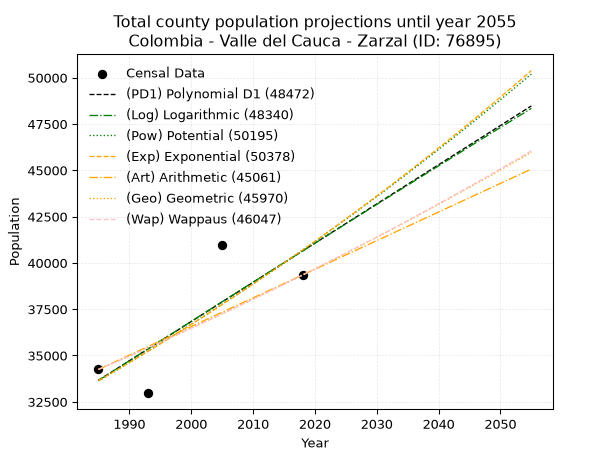
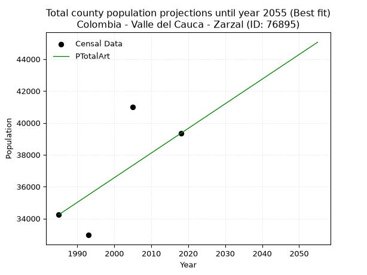
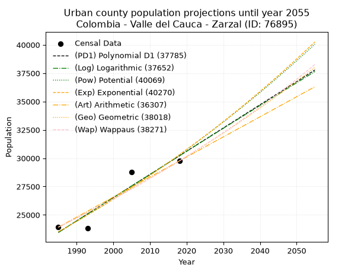
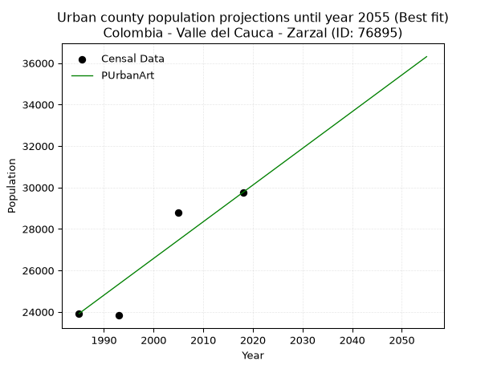
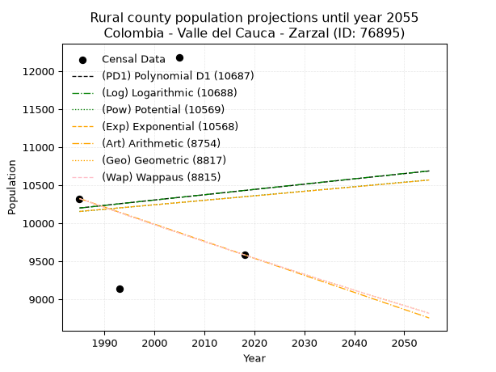
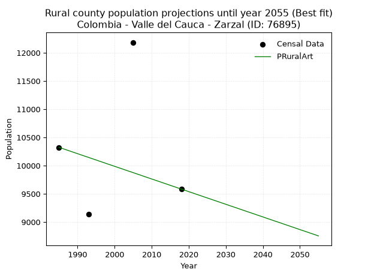

<div align="center">


</div>

# _“Population and Public Services Demand Projections (PPSD) until Year 2050 for Colombia - Valle del Cauca - Zarzal (ID: 76895)”_
Keywords: `population` `public-service` `projection` `lineal` `polynomial` `logarithmic` `potential` `exponential` `arithmetic` `geometric` `wappaus` `dane` `colombia` `south-america`

PPSD are analytical estimates used by governments and planners to anticipate future changes in population size, age distribution, and the resulting community needs for utilities, healthcare, education, and infrastructure as sizing future water treatment facilities, electrical grids, and road networks based on spatial growth.

> **General running parameters**: • app_version: _v20260806_. • Python version: _3.14.7_. • Pandas version: _3.0.5_. • NumPy version: _2.5.1_. • Creates, save and include plots into reports (create_plot): _False_. • Projection until year: _2050_. • Process polynomial degree 2 and up: _False_. • Process Wappaus: _True_. • Process Wappaus: _True_. • Set negative values to zero: _True_. • Set infinite values to zero: _True_. • Drop dataset notes: _True_. 
<div align="center">

Dynamic map: [:earth_americas:Google](http://maps.google.com/maps?q=4.39265848,-76.0707946) [:earth_americas:OSM](https://www.openstreetmap.org/#map=18/4.39265848/-76.0707946&layers=P) [:earth_americas:Bing](https://www.bing.com/maps?cp=4.39265848~-76.0707946&lvl=18) [:earth_americas:Apple](https://maps.apple.com/frame?center=4.39265848%2C-76.0707946&span=0.003%2C0.006)

</div>


<div align="center">

```geojson
{
  "type": "Feature",
  "geometry": {
    "type": "Point", 
    "coordinates": [-76.0707946, 4.39265848]
  }, 
  "properties": {
    "Name": "Colombia - Valle del Cauca - Zarzal (ID: 76895)"
  }
}
```

</div>


## 0. Census Data (4 records)

Census data are official statistics collected by a government about the people and housing in a country. They usually include counts of total population, age, sex, race, income, education, and jobs.

📅Global census file: [Population.xlsx](../data/Population.xlsx)

| Source   |   Year |   CountryID | CountryName   |   StateID | StateName       |   CountyID | CountyName   |   PTotal |   PUrban |   PRural |
|:---------|-------:|------------:|:--------------|----------:|:----------------|-----------:|:-------------|---------:|---------:|---------:|
| DANE     |   1985 |          57 | Colombia      |        76 | Valle del Cauca |      76895 | Zarzal       |    34243 |    23919 |    10324 |
| DANE     |   1993 |          57 | Colombia      |        76 | Valle del Cauca |      76895 | Zarzal       |    32963 |    23829 |     9134 |
| DANE     |   2005 |          57 | Colombia      |        76 | Valle Del Cauca |      76895 | Zarzal       |    40983 |    28799 |    12184 |
| DANE     |   2018 |          57 | Colombia      |        76 | Valle del Cauca |      76895 | Zarzal       |    39343 |    29759 |     9584 |

> 🔥Some records could had specific notes about the registered values or the corresponding urban or rural distribution.

## 1. Total

### 1.1. Coefficients and Parameters

* (PD1) Polynomial Deg 1: 211.67402649538374, -386517.97149739135 (lineal)
* (Log) Logarithmic: 423952.2893420852, -3185581.748629622
* (Pow) Potential: 11.5581315683725, -33.58925140431503
* (Exp) Exponential: 0.005771166008160025, 0.3561391677141517
* (Art) Arithmetic: Year diff. 2018 - 1985 = 33, Population diff. 39343 - 34243 = 5100, Annual growth = 154.54545454545453
* (Geo) Geometric: Year diff. 2018 - 1985 = 33, Population diff. 39343 - 34243 = 5100, Annual growth % = 0.00421601108171088
* (Wap) Wappaus: i = 0.42004037329235056, Condition values only valid for < 200)

<sub>
Wappaus condition values: ['0.00', '0.42', '0.84', '1.26', '1.68', '2.10', '2.52', '2.94', '3.36', '3.78', '4.20', '4.62', '5.04', '5.46', '5.88', '6.30', '6.72', '7.14', '7.56', '7.98', '8.40', '8.82', '9.24', '9.66', '10.08', '10.50', '10.92', '11.34', '11.76', '12.18', '12.60', '13.02', '13.44', '13.86', '14.28', '14.70', '15.12', '15.54', '15.96', '16.38', '16.80', '17.22', '17.64', '18.06', '18.48', '18.90', '19.32', '19.74', '20.16', '20.58', '21.00', '21.42', '21.84', '22.26', '22.68', '23.10', '23.52', '23.94', '24.36', '24.78', '25.20', '25.62', '26.04', '26.46', '26.88', '27.30']
</sub>


### 1.2. Projected Dataset

|   Year |   CountyID |   PTotalPD1 |   PTotalLog |   PTotalPow |   PTotalExp |   PTotalArt |   PTotalGeo |   PTotalWap |
|-------:|-----------:|------------:|------------:|------------:|------------:|------------:|------------:|------------:|
|   1985 |      76895 |       33655 |       33647 |       33628 |       33635 |       34243 |       34243 |       34243 |
|   1986 |      76895 |       33867 |       33860 |       33824 |       33830 |       34398 |       34387 |       34387 |
|   1987 |      76895 |       34078 |       34074 |       34022 |       34026 |       34552 |       34532 |       34532 |
|   1988 |      76895 |       34290 |       34287 |       34220 |       34223 |       34707 |       34678 |       34677 |
|   1989 |      76895 |       34502 |       34500 |       34419 |       34421 |       34861 |       34824 |       34823 |
|   1990 |      76895 |       34713 |       34713 |       34620 |       34620 |       35016 |       34971 |       34970 |
|   1991 |      76895 |       34925 |       34926 |       34822 |       34820 |       35170 |       35118 |       35117 |
|   1992 |      76895 |       35137 |       35139 |       35024 |       35022 |       35325 |       35266 |       35265 |
|   1993 |      76895 |       35348 |       35352 |       35228 |       35225 |       35479 |       35415 |       35413 |
|   1994 |      76895 |       35560 |       35564 |       35433 |       35428 |       35634 |       35564 |       35562 |
|   1995 |      76895 |       35772 |       35777 |       35639 |       35634 |       35788 |       35714 |       35712 |
|   1996 |      76895 |       35983 |       35989 |       35846 |       35840 |       35943 |       35865 |       35863 |
|   1997 |      76895 |       36195 |       36202 |       36054 |       36047 |       36098 |       36016 |       36014 |
|   1998 |      76895 |       36407 |       36414 |       36263 |       36256 |       36252 |       36168 |       36165 |
|   1999 |      76895 |       36618 |       36626 |       36473 |       36466 |       36407 |       36320 |       36318 |
|   2000 |      76895 |       36830 |       36838 |       36685 |       36677 |       36561 |       36474 |       36471 |
|   2001 |      76895 |       37042 |       37050 |       36897 |       36889 |       36716 |       36627 |       36624 |
|   2002 |      76895 |       37253 |       37262 |       37111 |       37103 |       36870 |       36782 |       36779 |
|   2003 |      76895 |       37465 |       37474 |       37326 |       37317 |       37025 |       36937 |       36934 |
|   2004 |      76895 |       37677 |       37685 |       37542 |       37533 |       37179 |       37093 |       37089 |
|   2005 |      76895 |       37888 |       37897 |       37759 |       37751 |       37334 |       37249 |       37246 |
|   2006 |      76895 |       38100 |       38108 |       37977 |       37969 |       37488 |       37406 |       37403 |
|   2007 |      76895 |       38312 |       38319 |       38197 |       38189 |       37643 |       37564 |       37561 |
|   2008 |      76895 |       38523 |       38531 |       38417 |       38410 |       37798 |       37722 |       37719 |
|   2009 |      76895 |       38735 |       38742 |       38639 |       38632 |       37952 |       37881 |       37878 |
|   2010 |      76895 |       38947 |       38953 |       38862 |       38856 |       38107 |       38041 |       38038 |
|   2011 |      76895 |       39158 |       39164 |       39086 |       39081 |       38261 |       38201 |       38199 |
|   2012 |      76895 |       39370 |       39374 |       39311 |       39307 |       38416 |       38362 |       38360 |
|   2013 |      76895 |       39582 |       39585 |       39538 |       39534 |       38570 |       38524 |       38522 |
|   2014 |      76895 |       39794 |       39796 |       39765 |       39763 |       38725 |       38686 |       38685 |
|   2015 |      76895 |       40005 |       40006 |       39994 |       39993 |       38879 |       38850 |       38848 |
|   2016 |      76895 |       40217 |       40216 |       40224 |       40225 |       39034 |       39013 |       39012 |
|   2017 |      76895 |       40429 |       40427 |       40455 |       40458 |       39188 |       39178 |       39177 |
|   2018 |      76895 |       40640 |       40637 |       40688 |       40692 |       39343 |       39343 |       39343 |
|   2019 |      76895 |       40852 |       40847 |       40921 |       40927 |       39498 |       39509 |       39509 |
|   2020 |      76895 |       41064 |       41057 |       41156 |       41164 |       39652 |       39675 |       39677 |
|   2021 |      76895 |       41275 |       41267 |       41392 |       41402 |       39807 |       39843 |       39845 |
|   2022 |      76895 |       41487 |       41476 |       41630 |       41642 |       39961 |       40011 |       40013 |
|   2023 |      76895 |       41699 |       41686 |       41868 |       41883 |       40116 |       40179 |       40183 |
|   2024 |      76895 |       41910 |       41895 |       42108 |       42125 |       40270 |       40349 |       40353 |
|   2025 |      76895 |       42122 |       42105 |       42349 |       42369 |       40425 |       40519 |       40524 |
|   2026 |      76895 |       42334 |       42314 |       42591 |       42614 |       40579 |       40690 |       40696 |
|   2027 |      76895 |       42545 |       42523 |       42835 |       42861 |       40734 |       40861 |       40868 |
|   2028 |      76895 |       42757 |       42732 |       43080 |       43109 |       40888 |       41034 |       41042 |
|   2029 |      76895 |       42969 |       42941 |       43326 |       43359 |       41043 |       41207 |       41216 |
|   2030 |      76895 |       43180 |       43150 |       43574 |       43610 |       41198 |       41380 |       41391 |
|   2031 |      76895 |       43392 |       43359 |       43822 |       43862 |       41352 |       41555 |       41567 |
|   2032 |      76895 |       43604 |       43568 |       44072 |       44116 |       41507 |       41730 |       41744 |
|   2033 |      76895 |       43815 |       43776 |       44324 |       44371 |       41661 |       41906 |       41921 |
|   2034 |      76895 |       44027 |       43985 |       44576 |       44628 |       41816 |       42083 |       42099 |
|   2035 |      76895 |       44239 |       44193 |       44830 |       44886 |       41970 |       42260 |       42279 |
|   2036 |      76895 |       44450 |       44402 |       45086 |       45146 |       42125 |       42438 |       42459 |
|   2037 |      76895 |       44662 |       44610 |       45342 |       45407 |       42279 |       42617 |       42639 |
|   2038 |      76895 |       44874 |       44818 |       45600 |       45670 |       42434 |       42797 |       42821 |
|   2039 |      76895 |       45085 |       45026 |       45859 |       45935 |       42588 |       42977 |       43004 |
|   2040 |      76895 |       45297 |       45234 |       46120 |       46200 |       42743 |       43158 |       43187 |
|   2041 |      76895 |       45509 |       45441 |       46382 |       46468 |       42898 |       43340 |       43371 |
|   2042 |      76895 |       45720 |       45649 |       46645 |       46737 |       43052 |       43523 |       43556 |
|   2043 |      76895 |       45932 |       45857 |       46910 |       47007 |       43207 |       43706 |       43743 |
|   2044 |      76895 |       46144 |       46064 |       47176 |       47279 |       43361 |       43891 |       43930 |
|   2045 |      76895 |       46355 |       46271 |       47444 |       47553 |       43516 |       44076 |       44117 |
|   2046 |      76895 |       46567 |       46479 |       47712 |       47828 |       43670 |       44262 |       44306 |
|   2047 |      76895 |       46779 |       46686 |       47983 |       48105 |       43825 |       44448 |       44496 |
|   2048 |      76895 |       46990 |       46893 |       48254 |       48384 |       43979 |       44636 |       44686 |
|   2049 |      76895 |       47202 |       47100 |       48527 |       48664 |       44134 |       44824 |       44878 |
|   2050 |      76895 |       47414 |       47307 |       48802 |       48945 |       44288 |       45013 |       45070 |
<div align="center">

</img>

</div>


### 1.3. Best fit with absolute and relative error (%)

Relative error puts that difference into context by dividing the absolute error by the true value, creating a unitless ratio or percentage that shows the scale of the mistake.

Absolute and relative error

|   Year | Source   |   CountryID | CountryName   |   StateID | StateName       |   CountyID_x | CountyName   |   PTotal |   PUrban |   PRural |   CountyID_y |   PTotalPD1 |   PTotalLog |   PTotalPow |   PTotalExp |   PTotalArt |   PTotalGeo |   PTotalWap |   PTotalPD1AbsError |   PTotalLogAbsError |   PTotalPowAbsError |   PTotalExpAbsError |   PTotalArtAbsError |   PTotalGeoAbsError |   PTotalWapAbsError |   PTotalPD1RelError |   PTotalLogRelError |   PTotalPowRelError |   PTotalExpRelError |   PTotalArtRelError |   PTotalGeoRelError |   PTotalWapRelError |
|-------:|:---------|------------:|:--------------|----------:|:----------------|-------------:|:-------------|---------:|---------:|---------:|-------------:|------------:|------------:|------------:|------------:|------------:|------------:|------------:|--------------------:|--------------------:|--------------------:|--------------------:|--------------------:|--------------------:|--------------------:|--------------------:|--------------------:|--------------------:|--------------------:|--------------------:|--------------------:|--------------------:|
|   1985 | DANE     |          57 | Colombia      |        76 | Valle del Cauca |        76895 | Zarzal       |    34243 |    23919 |    10324 |        76895 |       33655 |       33647 |       33628 |       33635 |       34243 |       34243 |       34243 |                 588 |                 596 |                 615 |                 608 |                   0 |                   0 |                   0 |             1.71714 |             1.7405  |             1.79599 |             1.77555 |             0       |             0       |             0       |
|   1993 | DANE     |          57 | Colombia      |        76 | Valle del Cauca |        76895 | Zarzal       |    32963 |    23829 |     9134 |        76895 |       35348 |       35352 |       35228 |       35225 |       35479 |       35415 |       35413 |                2385 |                2389 |                2265 |                2262 |                2516 |                2452 |                2450 |             7.23539 |             7.24752 |             6.87134 |             6.86224 |             7.6328  |             7.43864 |             7.43258 |
|   2005 | DANE     |          57 | Colombia      |        76 | Valle Del Cauca |        76895 | Zarzal       |    40983 |    28799 |    12184 |        76895 |       37888 |       37897 |       37759 |       37751 |       37334 |       37249 |       37246 |                3095 |                3086 |                3224 |                3232 |                3649 |                3734 |                3737 |             7.55191 |             7.52995 |             7.86668 |             7.8862  |             8.90369 |             9.11109 |             9.11841 |
|   2018 | DANE     |          57 | Colombia      |        76 | Valle del Cauca |        76895 | Zarzal       |    39343 |    29759 |     9584 |        76895 |       40640 |       40637 |       40688 |       40692 |       39343 |       39343 |       39343 |                1297 |                1294 |                1345 |                1349 |                   0 |                   0 |                   0 |             3.29665 |             3.28902 |             3.41865 |             3.42882 |             0       |             0       |             0       |

Relative error mean

| Method    |   RelError | Best   |
|:----------|-----------:|:-------|
| PTotalPD1 |    4.95027 |        |
| PTotalLog |    4.95175 |        |
| PTotalPow |    4.98816 |        |
| PTotalExp |    4.9882  |        |
| PTotalArt |    4.13412 | True   |
| PTotalGeo |    4.13743 |        |
| PTotalWap |    4.13775 |        |

💙Best method: _**PTotalArt**_
<div align="center">

</img>

</div>


### 1.4. Fresh water supply demand in liters per capita per day (lpcd)

The fresh water supply demand typically ranges from 100 to 300 liters per capita per day (lpcd) for standard domestic and municipal planning, though absolute survival minimums set by the World Health Organization are as low as 7.5 to 20 liters per day, and total consumption in high-income nations can exceed 400 liters.

> `CZ`: Level in meters above the sea level (masl).<br> `WS`: Fresh water supply demand in liters per capita per day (lpcd or l/h/d).<br> `WSAll`: Zonal fresh water supply demand in liters per second (l/s).<br> `A`: Zonal area in square meters.

Reference values (RAS Colombia)

|    CZ |   WS |
|------:|-----:|
|  1000 |  120 |
|  2000 |  130 |
| 99999 |  140 |

County shapefile geometry properties and water supply values

|   CountyID |      ATotal |   CZTotal |   WSTotal |
|-----------:|------------:|----------:|----------:|
|      76895 | 3.67953e+08 |   979.764 |       120 |

Projected values for best method: PTotalArt

|   CountyID |   Year |   PTotalArt |   WSTotal |   WSTotalAll |
|-----------:|-------:|------------:|----------:|-------------:|
|      76895 |   1985 |       34243 |       120 |      47.5597 |
|      76895 |   1986 |       34398 |       120 |      47.775  |
|      76895 |   1987 |       34552 |       120 |      47.9889 |
|      76895 |   1988 |       34707 |       120 |      48.2042 |
|      76895 |   1989 |       34861 |       120 |      48.4181 |
|      76895 |   1990 |       35016 |       120 |      48.6333 |
|      76895 |   1991 |       35170 |       120 |      48.8472 |
|      76895 |   1992 |       35325 |       120 |      49.0625 |
|      76895 |   1993 |       35479 |       120 |      49.2764 |
|      76895 |   1994 |       35634 |       120 |      49.4917 |
|      76895 |   1995 |       35788 |       120 |      49.7056 |
|      76895 |   1996 |       35943 |       120 |      49.9208 |
|      76895 |   1997 |       36098 |       120 |      50.1361 |
|      76895 |   1998 |       36252 |       120 |      50.35   |
|      76895 |   1999 |       36407 |       120 |      50.5653 |
|      76895 |   2000 |       36561 |       120 |      50.7792 |
|      76895 |   2001 |       36716 |       120 |      50.9944 |
|      76895 |   2002 |       36870 |       120 |      51.2083 |
|      76895 |   2003 |       37025 |       120 |      51.4236 |
|      76895 |   2004 |       37179 |       120 |      51.6375 |
|      76895 |   2005 |       37334 |       120 |      51.8528 |
|      76895 |   2006 |       37488 |       120 |      52.0667 |
|      76895 |   2007 |       37643 |       120 |      52.2819 |
|      76895 |   2008 |       37798 |       120 |      52.4972 |
|      76895 |   2009 |       37952 |       120 |      52.7111 |
|      76895 |   2010 |       38107 |       120 |      52.9264 |
|      76895 |   2011 |       38261 |       120 |      53.1403 |
|      76895 |   2012 |       38416 |       120 |      53.3556 |
|      76895 |   2013 |       38570 |       120 |      53.5694 |
|      76895 |   2014 |       38725 |       120 |      53.7847 |
|      76895 |   2015 |       38879 |       120 |      53.9986 |
|      76895 |   2016 |       39034 |       120 |      54.2139 |
|      76895 |   2017 |       39188 |       120 |      54.4278 |
|      76895 |   2018 |       39343 |       120 |      54.6431 |
|      76895 |   2019 |       39498 |       120 |      54.8583 |
|      76895 |   2020 |       39652 |       120 |      55.0722 |
|      76895 |   2021 |       39807 |       120 |      55.2875 |
|      76895 |   2022 |       39961 |       120 |      55.5014 |
|      76895 |   2023 |       40116 |       120 |      55.7167 |
|      76895 |   2024 |       40270 |       120 |      55.9306 |
|      76895 |   2025 |       40425 |       120 |      56.1458 |
|      76895 |   2026 |       40579 |       120 |      56.3597 |
|      76895 |   2027 |       40734 |       120 |      56.575  |
|      76895 |   2028 |       40888 |       120 |      56.7889 |
|      76895 |   2029 |       41043 |       120 |      57.0042 |
|      76895 |   2030 |       41198 |       120 |      57.2194 |
|      76895 |   2031 |       41352 |       120 |      57.4333 |
|      76895 |   2032 |       41507 |       120 |      57.6486 |
|      76895 |   2033 |       41661 |       120 |      57.8625 |
|      76895 |   2034 |       41816 |       120 |      58.0778 |
|      76895 |   2035 |       41970 |       120 |      58.2917 |
|      76895 |   2036 |       42125 |       120 |      58.5069 |
|      76895 |   2037 |       42279 |       120 |      58.7208 |
|      76895 |   2038 |       42434 |       120 |      58.9361 |
|      76895 |   2039 |       42588 |       120 |      59.15   |
|      76895 |   2040 |       42743 |       120 |      59.3653 |
|      76895 |   2041 |       42898 |       120 |      59.5806 |
|      76895 |   2042 |       43052 |       120 |      59.7944 |
|      76895 |   2043 |       43207 |       120 |      60.0097 |
|      76895 |   2044 |       43361 |       120 |      60.2236 |
|      76895 |   2045 |       43516 |       120 |      60.4389 |
|      76895 |   2046 |       43670 |       120 |      60.6528 |
|      76895 |   2047 |       43825 |       120 |      60.8681 |
|      76895 |   2048 |       43979 |       120 |      61.0819 |
|      76895 |   2049 |       44134 |       120 |      61.2972 |
|      76895 |   2050 |       44288 |       120 |      61.5111 |

## 2. Urban

### 2.1. Coefficients and Parameters

* (PD1) Polynomial Deg 1: 204.7250100361294, -382924.7013247678 (lineal)
* (Log) Logarithmic: 409839.06821698905, -3088613.5417615105
* (Pow) Potential: 15.388331209460672, -46.375837185502526
* (Exp) Exponential: 0.007686696033723115, 0.005556447674044681
* (Art) Arithmetic: Year diff. 2018 - 1985 = 33, Population diff. 29759 - 23919 = 5840, Annual growth = 176.96969696969697
* (Geo) Geometric: Year diff. 2018 - 1985 = 33, Population diff. 29759 - 23919 = 5840, Annual growth % = 0.006641914420905781
* (Wap) Wappaus: i = 0.6593751517183836, Condition values only valid for < 200)

<sub>
Wappaus condition values: ['0.00', '0.66', '1.32', '1.98', '2.64', '3.30', '3.96', '4.62', '5.28', '5.93', '6.59', '7.25', '7.91', '8.57', '9.23', '9.89', '10.55', '11.21', '11.87', '12.53', '13.19', '13.85', '14.51', '15.17', '15.83', '16.48', '17.14', '17.80', '18.46', '19.12', '19.78', '20.44', '21.10', '21.76', '22.42', '23.08', '23.74', '24.40', '25.06', '25.72', '26.38', '27.03', '27.69', '28.35', '29.01', '29.67', '30.33', '30.99', '31.65', '32.31', '32.97', '33.63', '34.29', '34.95', '35.61', '36.27', '36.93', '37.58', '38.24', '38.90', '39.56', '40.22', '40.88', '41.54', '42.20', '42.86']
</sub>


### 2.2. Projected Dataset

|   Year |   CountyID |   PUrbanPD1 |   PUrbanLog |   PUrbanPow |   PUrbanExp |   PUrbanArt |   PUrbanGeo |   PUrbanWap |
|-------:|-----------:|------------:|------------:|------------:|------------:|------------:|------------:|------------:|
|   1985 |      76895 |       23454 |       23448 |       23507 |       23513 |       23919 |       23919 |       23919 |
|   1986 |      76895 |       23659 |       23654 |       23690 |       23694 |       24096 |       24078 |       24077 |
|   1987 |      76895 |       23864 |       23861 |       23874 |       23877 |       24273 |       24238 |       24237 |
|   1988 |      76895 |       24069 |       24067 |       24059 |       24061 |       24450 |       24399 |       24397 |
|   1989 |      76895 |       24273 |       24273 |       24246 |       24247 |       24627 |       24561 |       24558 |
|   1990 |      76895 |       24478 |       24479 |       24435 |       24434 |       24804 |       24724 |       24721 |
|   1991 |      76895 |       24683 |       24685 |       24624 |       24622 |       24981 |       24888 |       24884 |
|   1992 |      76895 |       24888 |       24891 |       24815 |       24812 |       25158 |       25053 |       25049 |
|   1993 |      76895 |       25092 |       25096 |       25008 |       25004 |       25335 |       25220 |       25215 |
|   1994 |      76895 |       25297 |       25302 |       25201 |       25197 |       25512 |       25387 |       25382 |
|   1995 |      76895 |       25502 |       25507 |       25397 |       25391 |       25689 |       25556 |       25550 |
|   1996 |      76895 |       25706 |       25713 |       25593 |       25587 |       25866 |       25726 |       25719 |
|   1997 |      76895 |       25911 |       25918 |       25791 |       25785 |       26043 |       25897 |       25890 |
|   1998 |      76895 |       26116 |       26123 |       25991 |       25984 |       26220 |       26069 |       26061 |
|   1999 |      76895 |       26321 |       26328 |       26192 |       26184 |       26397 |       26242 |       26234 |
|   2000 |      76895 |       26525 |       26533 |       26394 |       26386 |       26574 |       26416 |       26408 |
|   2001 |      76895 |       26730 |       26738 |       26598 |       26590 |       26751 |       26592 |       26583 |
|   2002 |      76895 |       26935 |       26943 |       26803 |       26795 |       26927 |       26768 |       26759 |
|   2003 |      76895 |       27139 |       27148 |       27010 |       27002 |       27104 |       26946 |       26937 |
|   2004 |      76895 |       27344 |       27352 |       27218 |       27210 |       27281 |       27125 |       27116 |
|   2005 |      76895 |       27549 |       27557 |       27428 |       27420 |       27458 |       27305 |       27296 |
|   2006 |      76895 |       27754 |       27761 |       27639 |       27632 |       27635 |       27486 |       27477 |
|   2007 |      76895 |       27958 |       27965 |       27852 |       27845 |       27812 |       27669 |       27660 |
|   2008 |      76895 |       28163 |       28169 |       28066 |       28060 |       27989 |       27853 |       27844 |
|   2009 |      76895 |       28368 |       28373 |       28282 |       28276 |       28166 |       28038 |       28029 |
|   2010 |      76895 |       28573 |       28577 |       28500 |       28494 |       28343 |       28224 |       28216 |
|   2011 |      76895 |       28777 |       28781 |       28719 |       28714 |       28520 |       28411 |       28404 |
|   2012 |      76895 |       28982 |       28985 |       28939 |       28936 |       28697 |       28600 |       28593 |
|   2013 |      76895 |       29187 |       29189 |       29161 |       29159 |       28874 |       28790 |       28784 |
|   2014 |      76895 |       29391 |       29392 |       29385 |       29384 |       29051 |       28981 |       28976 |
|   2015 |      76895 |       29596 |       29596 |       29610 |       29611 |       29228 |       29174 |       29170 |
|   2016 |      76895 |       29801 |       29799 |       29837 |       29839 |       29405 |       29368 |       29365 |
|   2017 |      76895 |       30006 |       30002 |       30066 |       30070 |       29582 |       29563 |       29561 |
|   2018 |      76895 |       30210 |       30205 |       30296 |       30302 |       29759 |       29759 |       29759 |
|   2019 |      76895 |       30415 |       30408 |       30528 |       30535 |       29936 |       29957 |       29958 |
|   2020 |      76895 |       30620 |       30611 |       30761 |       30771 |       30113 |       30156 |       30159 |
|   2021 |      76895 |       30825 |       30814 |       30996 |       31008 |       30290 |       30356 |       30361 |
|   2022 |      76895 |       31029 |       31017 |       31233 |       31248 |       30467 |       30558 |       30565 |
|   2023 |      76895 |       31234 |       31219 |       31472 |       31489 |       30644 |       30760 |       30771 |
|   2024 |      76895 |       31439 |       31422 |       31712 |       31732 |       30821 |       30965 |       30977 |
|   2025 |      76895 |       31643 |       31624 |       31954 |       31977 |       30998 |       31170 |       31186 |
|   2026 |      76895 |       31848 |       31827 |       32198 |       32223 |       31175 |       31378 |       31396 |
|   2027 |      76895 |       32053 |       32029 |       32443 |       32472 |       31352 |       31586 |       31608 |
|   2028 |      76895 |       32258 |       32231 |       32690 |       32723 |       31529 |       31796 |       31821 |
|   2029 |      76895 |       32462 |       32433 |       32939 |       32975 |       31706 |       32007 |       32036 |
|   2030 |      76895 |       32667 |       32635 |       33190 |       33230 |       31883 |       32219 |       32253 |
|   2031 |      76895 |       32872 |       32837 |       33442 |       33486 |       32060 |       32433 |       32471 |
|   2032 |      76895 |       33077 |       33039 |       33697 |       33744 |       32237 |       32649 |       32691 |
|   2033 |      76895 |       33281 |       33240 |       33953 |       34005 |       32414 |       32866 |       32913 |
|   2034 |      76895 |       33486 |       33442 |       34211 |       34267 |       32591 |       33084 |       33136 |
|   2035 |      76895 |       33691 |       33643 |       34471 |       34532 |       32767 |       33304 |       33361 |
|   2036 |      76895 |       33895 |       33845 |       34732 |       34798 |       32944 |       33525 |       33588 |
|   2037 |      76895 |       34100 |       34046 |       34996 |       35067 |       33121 |       33748 |       33817 |
|   2038 |      76895 |       34305 |       34247 |       35261 |       35337 |       33298 |       33972 |       34048 |
|   2039 |      76895 |       34510 |       34448 |       35528 |       35610 |       33475 |       34197 |       34280 |
|   2040 |      76895 |       34714 |       34649 |       35797 |       35885 |       33652 |       34425 |       34515 |
|   2041 |      76895 |       34919 |       34850 |       36068 |       36162 |       33829 |       34653 |       34751 |
|   2042 |      76895 |       35124 |       35051 |       36341 |       36441 |       34006 |       34883 |       34989 |
|   2043 |      76895 |       35328 |       35251 |       36616 |       36722 |       34183 |       35115 |       35229 |
|   2044 |      76895 |       35533 |       35452 |       36893 |       37005 |       34360 |       35348 |       35471 |
|   2045 |      76895 |       35738 |       35652 |       37171 |       37291 |       34537 |       35583 |       35715 |
|   2046 |      76895 |       35943 |       35853 |       37452 |       37578 |       34714 |       35819 |       35962 |
|   2047 |      76895 |       36147 |       36053 |       37735 |       37868 |       34891 |       36057 |       36210 |
|   2048 |      76895 |       36352 |       36253 |       38019 |       38161 |       35068 |       36297 |       36460 |
|   2049 |      76895 |       36557 |       36453 |       38306 |       38455 |       35245 |       36538 |       36712 |
|   2050 |      76895 |       36762 |       36653 |       38595 |       38752 |       35422 |       36781 |       36967 |
<div align="center">

</img>

</div>


### 2.3. Best fit with absolute and relative error (%)

Relative error puts that difference into context by dividing the absolute error by the true value, creating a unitless ratio or percentage that shows the scale of the mistake.

Absolute and relative error

|   Year | Source   |   CountryID | CountryName   |   StateID | StateName       |   CountyID_x | CountyName   |   PTotal |   PUrban |   PRural |   CountyID_y |   PUrbanPD1 |   PUrbanLog |   PUrbanPow |   PUrbanExp |   PUrbanArt |   PUrbanGeo |   PUrbanWap |   PUrbanPD1AbsError |   PUrbanLogAbsError |   PUrbanPowAbsError |   PUrbanExpAbsError |   PUrbanArtAbsError |   PUrbanGeoAbsError |   PUrbanWapAbsError |   PUrbanPD1RelError |   PUrbanLogRelError |   PUrbanPowRelError |   PUrbanExpRelError |   PUrbanArtRelError |   PUrbanGeoRelError |   PUrbanWapRelError |
|-------:|:---------|------------:|:--------------|----------:|:----------------|-------------:|:-------------|---------:|---------:|---------:|-------------:|------------:|------------:|------------:|------------:|------------:|------------:|------------:|--------------------:|--------------------:|--------------------:|--------------------:|--------------------:|--------------------:|--------------------:|--------------------:|--------------------:|--------------------:|--------------------:|--------------------:|--------------------:|--------------------:|
|   1985 | DANE     |          57 | Colombia      |        76 | Valle del Cauca |        76895 | Zarzal       |    34243 |    23919 |    10324 |        76895 |       23454 |       23448 |       23507 |       23513 |       23919 |       23919 |       23919 |                 465 |                 471 |                 412 |                 406 |                   0 |                   0 |                   0 |             1.94406 |             1.96915 |             1.72248 |             1.6974  |             0       |             0       |             0       |
|   1993 | DANE     |          57 | Colombia      |        76 | Valle del Cauca |        76895 | Zarzal       |    32963 |    23829 |     9134 |        76895 |       25092 |       25096 |       25008 |       25004 |       25335 |       25220 |       25215 |                1263 |                1267 |                1179 |                1175 |                1506 |                1391 |                1386 |             5.30026 |             5.31705 |             4.94775 |             4.93097 |             6.32003 |             5.83742 |             5.81644 |
|   2005 | DANE     |          57 | Colombia      |        76 | Valle Del Cauca |        76895 | Zarzal       |    40983 |    28799 |    12184 |        76895 |       27549 |       27557 |       27428 |       27420 |       27458 |       27305 |       27296 |                1250 |                1242 |                1371 |                1379 |                1341 |                1494 |                1503 |             4.34043 |             4.31265 |             4.76058 |             4.78836 |             4.65641 |             5.18768 |             5.21893 |
|   2018 | DANE     |          57 | Colombia      |        76 | Valle del Cauca |        76895 | Zarzal       |    39343 |    29759 |     9584 |        76895 |       30210 |       30205 |       30296 |       30302 |       29759 |       29759 |       29759 |                 451 |                 446 |                 537 |                 543 |                   0 |                   0 |                   0 |             1.51551 |             1.49871 |             1.8045  |             1.82466 |             0       |             0       |             0       |

Relative error mean

| Method    |   RelError | Best   |
|:----------|-----------:|:-------|
| PUrbanPD1 |    3.27507 |        |
| PUrbanLog |    3.27439 |        |
| PUrbanPow |    3.30883 |        |
| PUrbanExp |    3.31035 |        |
| PUrbanArt |    2.74411 | True   |
| PUrbanGeo |    2.75628 |        |
| PUrbanWap |    2.75884 |        |

💙Best method: _**PUrbanArt**_
<div align="center">

</img>

</div>


### 2.4. Fresh water supply demand in liters per capita per day (lpcd)

The fresh water supply demand typically ranges from 100 to 300 liters per capita per day (lpcd) for standard domestic and municipal planning, though absolute survival minimums set by the World Health Organization are as low as 7.5 to 20 liters per day, and total consumption in high-income nations can exceed 400 liters.

> `CZ`: Level in meters above the sea level (masl).<br> `WS`: Fresh water supply demand in liters per capita per day (lpcd or l/h/d).<br> `WSAll`: Zonal fresh water supply demand in liters per second (l/s).<br> `A`: Zonal area in square meters.

Reference values (RAS Colombia)

|    CZ |   WS |
|------:|-----:|
|  1000 |  120 |
|  2000 |  130 |
| 99999 |  140 |

County shapefile geometry properties and water supply values

|   CountyID |      AUrban |   CZUrban |   WSUrban |
|-----------:|------------:|----------:|----------:|
|      76895 | 4.88141e+06 |   922.197 |       120 |

Projected values for best method: PUrbanArt

|   CountyID |   Year |   PUrbanArt |   WSUrban |   WSUrbanAll |
|-----------:|-------:|------------:|----------:|-------------:|
|      76895 |   1985 |       23919 |       120 |      33.2208 |
|      76895 |   1986 |       24096 |       120 |      33.4667 |
|      76895 |   1987 |       24273 |       120 |      33.7125 |
|      76895 |   1988 |       24450 |       120 |      33.9583 |
|      76895 |   1989 |       24627 |       120 |      34.2042 |
|      76895 |   1990 |       24804 |       120 |      34.45   |
|      76895 |   1991 |       24981 |       120 |      34.6958 |
|      76895 |   1992 |       25158 |       120 |      34.9417 |
|      76895 |   1993 |       25335 |       120 |      35.1875 |
|      76895 |   1994 |       25512 |       120 |      35.4333 |
|      76895 |   1995 |       25689 |       120 |      35.6792 |
|      76895 |   1996 |       25866 |       120 |      35.925  |
|      76895 |   1997 |       26043 |       120 |      36.1708 |
|      76895 |   1998 |       26220 |       120 |      36.4167 |
|      76895 |   1999 |       26397 |       120 |      36.6625 |
|      76895 |   2000 |       26574 |       120 |      36.9083 |
|      76895 |   2001 |       26751 |       120 |      37.1542 |
|      76895 |   2002 |       26927 |       120 |      37.3986 |
|      76895 |   2003 |       27104 |       120 |      37.6444 |
|      76895 |   2004 |       27281 |       120 |      37.8903 |
|      76895 |   2005 |       27458 |       120 |      38.1361 |
|      76895 |   2006 |       27635 |       120 |      38.3819 |
|      76895 |   2007 |       27812 |       120 |      38.6278 |
|      76895 |   2008 |       27989 |       120 |      38.8736 |
|      76895 |   2009 |       28166 |       120 |      39.1194 |
|      76895 |   2010 |       28343 |       120 |      39.3653 |
|      76895 |   2011 |       28520 |       120 |      39.6111 |
|      76895 |   2012 |       28697 |       120 |      39.8569 |
|      76895 |   2013 |       28874 |       120 |      40.1028 |
|      76895 |   2014 |       29051 |       120 |      40.3486 |
|      76895 |   2015 |       29228 |       120 |      40.5944 |
|      76895 |   2016 |       29405 |       120 |      40.8403 |
|      76895 |   2017 |       29582 |       120 |      41.0861 |
|      76895 |   2018 |       29759 |       120 |      41.3319 |
|      76895 |   2019 |       29936 |       120 |      41.5778 |
|      76895 |   2020 |       30113 |       120 |      41.8236 |
|      76895 |   2021 |       30290 |       120 |      42.0694 |
|      76895 |   2022 |       30467 |       120 |      42.3153 |
|      76895 |   2023 |       30644 |       120 |      42.5611 |
|      76895 |   2024 |       30821 |       120 |      42.8069 |
|      76895 |   2025 |       30998 |       120 |      43.0528 |
|      76895 |   2026 |       31175 |       120 |      43.2986 |
|      76895 |   2027 |       31352 |       120 |      43.5444 |
|      76895 |   2028 |       31529 |       120 |      43.7903 |
|      76895 |   2029 |       31706 |       120 |      44.0361 |
|      76895 |   2030 |       31883 |       120 |      44.2819 |
|      76895 |   2031 |       32060 |       120 |      44.5278 |
|      76895 |   2032 |       32237 |       120 |      44.7736 |
|      76895 |   2033 |       32414 |       120 |      45.0194 |
|      76895 |   2034 |       32591 |       120 |      45.2653 |
|      76895 |   2035 |       32767 |       120 |      45.5097 |
|      76895 |   2036 |       32944 |       120 |      45.7556 |
|      76895 |   2037 |       33121 |       120 |      46.0014 |
|      76895 |   2038 |       33298 |       120 |      46.2472 |
|      76895 |   2039 |       33475 |       120 |      46.4931 |
|      76895 |   2040 |       33652 |       120 |      46.7389 |
|      76895 |   2041 |       33829 |       120 |      46.9847 |
|      76895 |   2042 |       34006 |       120 |      47.2306 |
|      76895 |   2043 |       34183 |       120 |      47.4764 |
|      76895 |   2044 |       34360 |       120 |      47.7222 |
|      76895 |   2045 |       34537 |       120 |      47.9681 |
|      76895 |   2046 |       34714 |       120 |      48.2139 |
|      76895 |   2047 |       34891 |       120 |      48.4597 |
|      76895 |   2048 |       35068 |       120 |      48.7056 |
|      76895 |   2049 |       35245 |       120 |      48.9514 |
|      76895 |   2050 |       35422 |       120 |      49.1972 |

## 3. Rural

### 3.1. Coefficients and Parameters

* (PD1) Polynomial Deg 1: 6.949016459254777, -3593.270172624367 (lineal)
* (Log) Logarithmic: 14113.221125095832, -96968.2068681097
* (Pow) Potential: 1.1574184208612026, 0.18973544203537246
* (Exp) Exponential: 0.0005693459303068126, 3279.9862040342305
* (Art) Arithmetic: Year diff. 2018 - 1985 = 33, Population diff. 9584 - 10324 = -740, Annual growth = -22.424242424242426
* (Geo) Geometric: Year diff. 2018 - 1985 = 33, Population diff. 9584 - 10324 = -740, Annual growth % = -0.0022512875116298403
* (Wap) Wappaus: i = -0.2252787062913645, Condition values only valid for < 200)

<sub>
Wappaus condition values: ['-0.00', '-0.23', '-0.45', '-0.68', '-0.90', '-1.13', '-1.35', '-1.58', '-1.80', '-2.03', '-2.25', '-2.48', '-2.70', '-2.93', '-3.15', '-3.38', '-3.60', '-3.83', '-4.06', '-4.28', '-4.51', '-4.73', '-4.96', '-5.18', '-5.41', '-5.63', '-5.86', '-6.08', '-6.31', '-6.53', '-6.76', '-6.98', '-7.21', '-7.43', '-7.66', '-7.88', '-8.11', '-8.34', '-8.56', '-8.79', '-9.01', '-9.24', '-9.46', '-9.69', '-9.91', '-10.14', '-10.36', '-10.59', '-10.81', '-11.04', '-11.26', '-11.49', '-11.71', '-11.94', '-12.17', '-12.39', '-12.62', '-12.84', '-13.07', '-13.29', '-13.52', '-13.74', '-13.97', '-14.19', '-14.42', '-14.64']
</sub>


### 3.2. Projected Dataset

|   Year |   CountyID |   PRuralPD1 |   PRuralLog |   PRuralPow |   PRuralExp |   PRuralArt |   PRuralGeo |   PRuralWap |
|-------:|-----------:|------------:|------------:|------------:|------------:|------------:|------------:|------------:|
|   1985 |      76895 |       10201 |       10199 |       10154 |       10155 |       10324 |       10324 |       10324 |
|   1986 |      76895 |       10207 |       10206 |       10160 |       10161 |       10302 |       10301 |       10301 |
|   1987 |      76895 |       10214 |       10213 |       10166 |       10167 |       10279 |       10278 |       10278 |
|   1988 |      76895 |       10221 |       10220 |       10171 |       10173 |       10257 |       10254 |       10254 |
|   1989 |      76895 |       10228 |       10227 |       10177 |       10178 |       10234 |       10231 |       10231 |
|   1990 |      76895 |       10235 |       10234 |       10183 |       10184 |       10212 |       10208 |       10208 |
|   1991 |      76895 |       10242 |       10241 |       10189 |       10190 |       10189 |       10185 |       10185 |
|   1992 |      76895 |       10249 |       10248 |       10195 |       10196 |       10167 |       10162 |       10162 |
|   1993 |      76895 |       10256 |       10256 |       10201 |       10202 |       10145 |       10140 |       10140 |
|   1994 |      76895 |       10263 |       10263 |       10207 |       10207 |       10122 |       10117 |       10117 |
|   1995 |      76895 |       10270 |       10270 |       10213 |       10213 |       10100 |       10094 |       10094 |
|   1996 |      76895 |       10277 |       10277 |       10219 |       10219 |       10077 |       10071 |       10071 |
|   1997 |      76895 |       10284 |       10284 |       10225 |       10225 |       10055 |       10049 |       10049 |
|   1998 |      76895 |       10291 |       10291 |       10231 |       10231 |       10032 |       10026 |       10026 |
|   1999 |      76895 |       10298 |       10298 |       10237 |       10237 |       10010 |       10003 |       10003 |
|   2000 |      76895 |       10305 |       10305 |       10243 |       10242 |        9988 |        9981 |        9981 |
|   2001 |      76895 |       10312 |       10312 |       10248 |       10248 |        9965 |        9958 |        9958 |
|   2002 |      76895 |       10319 |       10319 |       10254 |       10254 |        9943 |        9936 |        9936 |
|   2003 |      76895 |       10326 |       10326 |       10260 |       10260 |        9920 |        9914 |        9914 |
|   2004 |      76895 |       10333 |       10333 |       10266 |       10266 |        9898 |        9891 |        9891 |
|   2005 |      76895 |       10340 |       10340 |       10272 |       10272 |        9876 |        9869 |        9869 |
|   2006 |      76895 |       10346 |       10347 |       10278 |       10277 |        9853 |        9847 |        9847 |
|   2007 |      76895 |       10353 |       10354 |       10284 |       10283 |        9831 |        9825 |        9825 |
|   2008 |      76895 |       10360 |       10361 |       10290 |       10289 |        9808 |        9802 |        9803 |
|   2009 |      76895 |       10367 |       10368 |       10296 |       10295 |        9786 |        9780 |        9781 |
|   2010 |      76895 |       10374 |       10375 |       10302 |       10301 |        9763 |        9758 |        9758 |
|   2011 |      76895 |       10381 |       10382 |       10308 |       10307 |        9741 |        9736 |        9737 |
|   2012 |      76895 |       10388 |       10389 |       10314 |       10313 |        9719 |        9714 |        9715 |
|   2013 |      76895 |       10395 |       10396 |       10320 |       10318 |        9696 |        9693 |        9693 |
|   2014 |      76895 |       10402 |       10403 |       10326 |       10324 |        9674 |        9671 |        9671 |
|   2015 |      76895 |       10409 |       10410 |       10332 |       10330 |        9651 |        9649 |        9649 |
|   2016 |      76895 |       10416 |       10417 |       10337 |       10336 |        9629 |        9627 |        9627 |
|   2017 |      76895 |       10423 |       10424 |       10343 |       10342 |        9606 |        9606 |        9606 |
|   2018 |      76895 |       10430 |       10431 |       10349 |       10348 |        9584 |        9584 |        9584 |
|   2019 |      76895 |       10437 |       10438 |       10355 |       10354 |        9562 |        9562 |        9562 |
|   2020 |      76895 |       10444 |       10445 |       10361 |       10360 |        9539 |        9541 |        9541 |
|   2021 |      76895 |       10451 |       10452 |       10367 |       10366 |        9517 |        9519 |        9519 |
|   2022 |      76895 |       10458 |       10459 |       10373 |       10371 |        9494 |        9498 |        9498 |
|   2023 |      76895 |       10465 |       10466 |       10379 |       10377 |        9472 |        9477 |        9476 |
|   2024 |      76895 |       10472 |       10473 |       10385 |       10383 |        9449 |        9455 |        9455 |
|   2025 |      76895 |       10478 |       10480 |       10391 |       10389 |        9427 |        9434 |        9434 |
|   2026 |      76895 |       10485 |       10487 |       10397 |       10395 |        9405 |        9413 |        9413 |
|   2027 |      76895 |       10492 |       10494 |       10403 |       10401 |        9382 |        9392 |        9391 |
|   2028 |      76895 |       10499 |       10501 |       10409 |       10407 |        9360 |        9370 |        9370 |
|   2029 |      76895 |       10506 |       10508 |       10415 |       10413 |        9337 |        9349 |        9349 |
|   2030 |      76895 |       10513 |       10515 |       10421 |       10419 |        9315 |        9328 |        9328 |
|   2031 |      76895 |       10520 |       10522 |       10427 |       10425 |        9292 |        9307 |        9307 |
|   2032 |      76895 |       10527 |       10529 |       10432 |       10431 |        9270 |        9286 |        9286 |
|   2033 |      76895 |       10534 |       10536 |       10438 |       10437 |        9248 |        9265 |        9265 |
|   2034 |      76895 |       10541 |       10543 |       10444 |       10443 |        9225 |        9245 |        9244 |
|   2035 |      76895 |       10548 |       10550 |       10450 |       10448 |        9203 |        9224 |        9223 |
|   2036 |      76895 |       10555 |       10557 |       10456 |       10454 |        9180 |        9203 |        9202 |
|   2037 |      76895 |       10562 |       10564 |       10462 |       10460 |        9158 |        9182 |        9182 |
|   2038 |      76895 |       10569 |       10571 |       10468 |       10466 |        9136 |        9162 |        9161 |
|   2039 |      76895 |       10576 |       10578 |       10474 |       10472 |        9113 |        9141 |        9140 |
|   2040 |      76895 |       10583 |       10584 |       10480 |       10478 |        9091 |        9120 |        9119 |
|   2041 |      76895 |       10590 |       10591 |       10486 |       10484 |        9068 |        9100 |        9099 |
|   2042 |      76895 |       10597 |       10598 |       10492 |       10490 |        9046 |        9079 |        9078 |
|   2043 |      76895 |       10604 |       10605 |       10498 |       10496 |        9023 |        9059 |        9058 |
|   2044 |      76895 |       10611 |       10612 |       10504 |       10502 |        9001 |        9039 |        9037 |
|   2045 |      76895 |       10617 |       10619 |       10510 |       10508 |        8979 |        9018 |        9017 |
|   2046 |      76895 |       10624 |       10626 |       10516 |       10514 |        8956 |        8998 |        8996 |
|   2047 |      76895 |       10631 |       10633 |       10522 |       10520 |        8934 |        8978 |        8976 |
|   2048 |      76895 |       10638 |       10640 |       10528 |       10526 |        8911 |        8957 |        8956 |
|   2049 |      76895 |       10645 |       10647 |       10534 |       10532 |        8889 |        8937 |        8936 |
|   2050 |      76895 |       10652 |       10654 |       10540 |       10538 |        8866 |        8917 |        8915 |
<div align="center">

</img>

</div>


### 3.3. Best fit with absolute and relative error (%)

Relative error puts that difference into context by dividing the absolute error by the true value, creating a unitless ratio or percentage that shows the scale of the mistake.

Absolute and relative error

|   Year | Source   |   CountryID | CountryName   |   StateID | StateName       |   CountyID_x | CountyName   |   PTotal |   PUrban |   PRural |   CountyID_y |   PRuralPD1 |   PRuralLog |   PRuralPow |   PRuralExp |   PRuralArt |   PRuralGeo |   PRuralWap |   PRuralPD1AbsError |   PRuralLogAbsError |   PRuralPowAbsError |   PRuralExpAbsError |   PRuralArtAbsError |   PRuralGeoAbsError |   PRuralWapAbsError |   PRuralPD1RelError |   PRuralLogRelError |   PRuralPowRelError |   PRuralExpRelError |   PRuralArtRelError |   PRuralGeoRelError |   PRuralWapRelError |
|-------:|:---------|------------:|:--------------|----------:|:----------------|-------------:|:-------------|---------:|---------:|---------:|-------------:|------------:|------------:|------------:|------------:|------------:|------------:|------------:|--------------------:|--------------------:|--------------------:|--------------------:|--------------------:|--------------------:|--------------------:|--------------------:|--------------------:|--------------------:|--------------------:|--------------------:|--------------------:|--------------------:|
|   1985 | DANE     |          57 | Colombia      |        76 | Valle del Cauca |        76895 | Zarzal       |    34243 |    23919 |    10324 |        76895 |       10201 |       10199 |       10154 |       10155 |       10324 |       10324 |       10324 |                 123 |                 125 |                 170 |                 169 |                   0 |                   0 |                   0 |             1.1914  |             1.21077 |             1.64665 |             1.63696 |              0      |              0      |              0      |
|   1993 | DANE     |          57 | Colombia      |        76 | Valle del Cauca |        76895 | Zarzal       |    32963 |    23829 |     9134 |        76895 |       10256 |       10256 |       10201 |       10202 |       10145 |       10140 |       10140 |                1122 |                1122 |                1067 |                1068 |                1011 |                1006 |                1006 |            12.2838  |            12.2838  |            11.6816  |            11.6926  |             11.0685 |             11.0138 |             11.0138 |
|   2005 | DANE     |          57 | Colombia      |        76 | Valle Del Cauca |        76895 | Zarzal       |    40983 |    28799 |    12184 |        76895 |       10340 |       10340 |       10272 |       10272 |        9876 |        9869 |        9869 |                1844 |                1844 |                1912 |                1912 |                2308 |                2315 |                2315 |            15.1346  |            15.1346  |            15.6927  |            15.6927  |             18.9429 |             19.0003 |             19.0003 |
|   2018 | DANE     |          57 | Colombia      |        76 | Valle del Cauca |        76895 | Zarzal       |    39343 |    29759 |     9584 |        76895 |       10430 |       10431 |       10349 |       10348 |        9584 |        9584 |        9584 |                 846 |                 847 |                 765 |                 764 |                   0 |                   0 |                   0 |             8.82721 |             8.83765 |             7.98205 |             7.97162 |              0      |              0      |              0      |

Relative error mean

| Method    |   RelError | Best   |
|:----------|-----------:|:-------|
| PRuralPD1 |    9.35925 |        |
| PRuralLog |    9.3667  |        |
| PRuralPow |    9.25076 |        |
| PRuralExp |    9.24847 |        |
| PRuralArt |    7.50285 | True   |
| PRuralGeo |    7.50353 |        |
| PRuralWap |    7.50353 |        |

💙Best method: _**PRuralArt**_
<div align="center">

</img>

</div>


### 3.4. Fresh water supply demand in liters per capita per day (lpcd)

The fresh water supply demand typically ranges from 100 to 300 liters per capita per day (lpcd) for standard domestic and municipal planning, though absolute survival minimums set by the World Health Organization are as low as 7.5 to 20 liters per day, and total consumption in high-income nations can exceed 400 liters.

> `CZ`: Level in meters above the sea level (masl).<br> `WS`: Fresh water supply demand in liters per capita per day (lpcd or l/h/d).<br> `WSAll`: Zonal fresh water supply demand in liters per second (l/s).<br> `A`: Zonal area in square meters.

Reference values (RAS Colombia)

|    CZ |   WS |
|------:|-----:|
|  1000 |  120 |
|  2000 |  130 |
| 99999 |  140 |

County shapefile geometry properties and water supply values

|   CountyID |      ARural |   CZRural |   WSRural |
|-----------:|------------:|----------:|----------:|
|      76895 | 3.63072e+08 |   980.531 |       120 |

Projected values for best method: PRuralArt

|   CountyID |   Year |   PRuralArt |   WSRural |   WSRuralAll |
|-----------:|-------:|------------:|----------:|-------------:|
|      76895 |   1985 |       10324 |       120 |      14.3389 |
|      76895 |   1986 |       10302 |       120 |      14.3083 |
|      76895 |   1987 |       10279 |       120 |      14.2764 |
|      76895 |   1988 |       10257 |       120 |      14.2458 |
|      76895 |   1989 |       10234 |       120 |      14.2139 |
|      76895 |   1990 |       10212 |       120 |      14.1833 |
|      76895 |   1991 |       10189 |       120 |      14.1514 |
|      76895 |   1992 |       10167 |       120 |      14.1208 |
|      76895 |   1993 |       10145 |       120 |      14.0903 |
|      76895 |   1994 |       10122 |       120 |      14.0583 |
|      76895 |   1995 |       10100 |       120 |      14.0278 |
|      76895 |   1996 |       10077 |       120 |      13.9958 |
|      76895 |   1997 |       10055 |       120 |      13.9653 |
|      76895 |   1998 |       10032 |       120 |      13.9333 |
|      76895 |   1999 |       10010 |       120 |      13.9028 |
|      76895 |   2000 |        9988 |       120 |      13.8722 |
|      76895 |   2001 |        9965 |       120 |      13.8403 |
|      76895 |   2002 |        9943 |       120 |      13.8097 |
|      76895 |   2003 |        9920 |       120 |      13.7778 |
|      76895 |   2004 |        9898 |       120 |      13.7472 |
|      76895 |   2005 |        9876 |       120 |      13.7167 |
|      76895 |   2006 |        9853 |       120 |      13.6847 |
|      76895 |   2007 |        9831 |       120 |      13.6542 |
|      76895 |   2008 |        9808 |       120 |      13.6222 |
|      76895 |   2009 |        9786 |       120 |      13.5917 |
|      76895 |   2010 |        9763 |       120 |      13.5597 |
|      76895 |   2011 |        9741 |       120 |      13.5292 |
|      76895 |   2012 |        9719 |       120 |      13.4986 |
|      76895 |   2013 |        9696 |       120 |      13.4667 |
|      76895 |   2014 |        9674 |       120 |      13.4361 |
|      76895 |   2015 |        9651 |       120 |      13.4042 |
|      76895 |   2016 |        9629 |       120 |      13.3736 |
|      76895 |   2017 |        9606 |       120 |      13.3417 |
|      76895 |   2018 |        9584 |       120 |      13.3111 |
|      76895 |   2019 |        9562 |       120 |      13.2806 |
|      76895 |   2020 |        9539 |       120 |      13.2486 |
|      76895 |   2021 |        9517 |       120 |      13.2181 |
|      76895 |   2022 |        9494 |       120 |      13.1861 |
|      76895 |   2023 |        9472 |       120 |      13.1556 |
|      76895 |   2024 |        9449 |       120 |      13.1236 |
|      76895 |   2025 |        9427 |       120 |      13.0931 |
|      76895 |   2026 |        9405 |       120 |      13.0625 |
|      76895 |   2027 |        9382 |       120 |      13.0306 |
|      76895 |   2028 |        9360 |       120 |      13      |
|      76895 |   2029 |        9337 |       120 |      12.9681 |
|      76895 |   2030 |        9315 |       120 |      12.9375 |
|      76895 |   2031 |        9292 |       120 |      12.9056 |
|      76895 |   2032 |        9270 |       120 |      12.875  |
|      76895 |   2033 |        9248 |       120 |      12.8444 |
|      76895 |   2034 |        9225 |       120 |      12.8125 |
|      76895 |   2035 |        9203 |       120 |      12.7819 |
|      76895 |   2036 |        9180 |       120 |      12.75   |
|      76895 |   2037 |        9158 |       120 |      12.7194 |
|      76895 |   2038 |        9136 |       120 |      12.6889 |
|      76895 |   2039 |        9113 |       120 |      12.6569 |
|      76895 |   2040 |        9091 |       120 |      12.6264 |
|      76895 |   2041 |        9068 |       120 |      12.5944 |
|      76895 |   2042 |        9046 |       120 |      12.5639 |
|      76895 |   2043 |        9023 |       120 |      12.5319 |
|      76895 |   2044 |        9001 |       120 |      12.5014 |
|      76895 |   2045 |        8979 |       120 |      12.4708 |
|      76895 |   2046 |        8956 |       120 |      12.4389 |
|      76895 |   2047 |        8934 |       120 |      12.4083 |
|      76895 |   2048 |        8911 |       120 |      12.3764 |
|      76895 |   2049 |        8889 |       120 |      12.3458 |
|      76895 |   2050 |        8866 |       120 |      12.3139 |

<div align="center"><br><sub>Share this research</sub></div><br>

<sub>**APPS & TOOLS & CONTENT DISCLAIMER**: • NO WARRANTY - This content and software is provided by <a href="https://github.com/rcfdtools" target="_blank">github.com/rcfdtools</a> "as is", without any express or implied warranty, including warranties of merchantability, fitness for a particular purpose, or non-infringement. There is no guarantee that the software will be error-free or operate without interruption. • LIMITATION OF LIABILITY - Neither the authors nor copyright holders will be liable for claims or damages arising from the software or its use. You are responsible for determining if the software is appropriate for your use and assume all associated risks, including errors, legal compliance, and data loss. • NO PROFESSIONAL ADVICE - The software provides general information and does not offer professional advice. It should not replace consultation with professional advisors. [Clauses and global license for rcfdtools use.](https://github.com/rcfdtools/rcfdtools/blob/main/LICENSE.md)</sub>