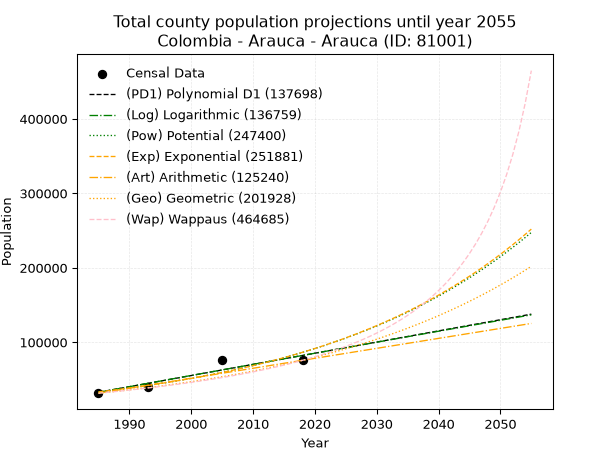
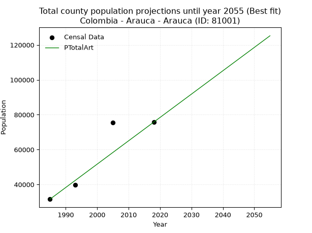
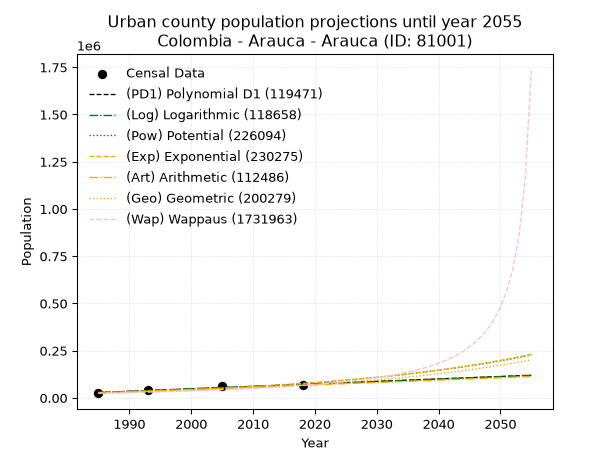
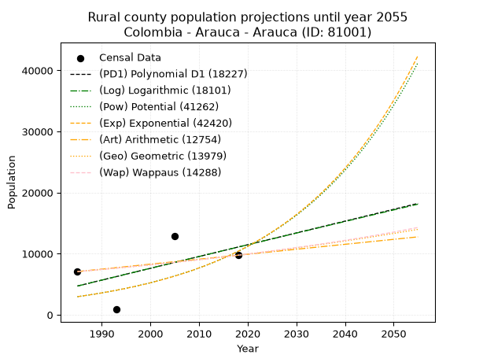
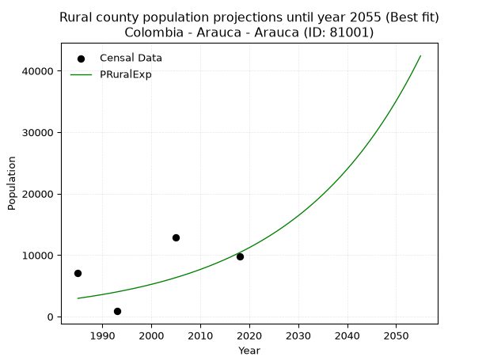

<div align="center">


</div>

# _“Population and Public Services Demand Projections (PPSD) until Year 2050 for Colombia - Arauca - Arauca (ID: 81001)”_
Keywords: `population` `public-service` `projection` `lineal` `polynomial` `logarithmic` `potential` `exponential` `arithmetic` `geometric` `wappaus` `dane` `colombia` `south-america`

PPSD are analytical estimates used by governments and planners to anticipate future changes in population size, age distribution, and the resulting community needs for utilities, healthcare, education, and infrastructure as sizing future water treatment facilities, electrical grids, and road networks based on spatial growth.

> **General running parameters**: • app_version: _v20260806_. • Python version: _3.14.7_. • Pandas version: _3.0.5_. • NumPy version: _2.5.1_. • Creates, save and include plots into reports (create_plot): _False_. • Projection until year: _2050_. • Process polynomial degree 2 and up: _False_. • Process Wappaus: _True_. • Process Wappaus: _True_. • Set negative values to zero: _True_. • Set infinite values to zero: _True_. • Drop dataset notes: _True_. 
<div align="center">

Dynamic map: [:earth_americas:Google](http://maps.google.com/maps?q=7.0727255,-70.7474081) [:earth_americas:OSM](https://www.openstreetmap.org/#map=18/7.0727255/-70.7474081&layers=P) [:earth_americas:Bing](https://www.bing.com/maps?cp=7.0727255~-70.7474081&lvl=18) [:earth_americas:Apple](https://maps.apple.com/frame?center=7.0727255%2C-70.7474081&span=0.003%2C0.006)

</div>


<div align="center">

```geojson
{
  "type": "Feature",
  "geometry": {
    "type": "Point", 
    "coordinates": [-70.7474081, 7.0727255]
  }, 
  "properties": {
    "Name": "Colombia - Arauca - Arauca (ID: 81001)"
  }
}
```

</div>


## 0. Census Data (4 records)

Census data are official statistics collected by a government about the people and housing in a country. They usually include counts of total population, age, sex, race, income, education, and jobs.

📅Global census file: [Population.xlsx](../data/Population.xlsx)

| Source   |   Year |   CountryID | CountryName   |   StateID | StateName   |   CountyID | CountyName   |   PTotal |   PUrban |   PRural |
|:---------|-------:|------------:|:--------------|----------:|:------------|-----------:|:-------------|---------:|---------:|---------:|
| DANE     |   1985 |          57 | Colombia      |        81 | Arauca      |      81001 | Arauca       |    31582 |    24513 |     7069 |
| DANE     |   1993 |          57 | Colombia      |        81 | Arauca      |      81001 | Arauca       |    39796 |    38916 |      880 |
| DANE     |   2005 |          57 | Colombia      |        81 | Arauca      |      81001 | Arauca       |    75557 |    62634 |    12923 |
| DANE     |   2018 |          57 | Colombia      |        81 | Arauca      |      81001 | Arauca       |    75735 |    65986 |     9749 |

> 🔥Some records could had specific notes about the registered values or the corresponding urban or rural distribution.

📅   [RUPS](https://www.datos.gov.co/Hacienda-y-Cr-dito-P-blico/Registro-nico-de-Prestadores-de-Servicios-P-blicos/4qkq-csdn/about_data) - Local public utility companies: [RUPS.csv](../data/RUPS.xlsx)

 | SERVICIO       | ESTADO    | NOMBRE                                                         | NIT         | DEPARTAMENTO_DOMICILIO   | MUNICIPIO_DOMICILIO   | DIRECCION                                         |   TELEFONO | EMAIL                     | TIPO_INSCRIPCION    | REPRESENTANTE_LEGAL     | TIPO_PRESTADOR                            | CLASIFICACION                 |
|:---------------|:----------|:---------------------------------------------------------------|:------------|:-------------------------|:----------------------|:--------------------------------------------------|-----------:|:--------------------------|:--------------------|:------------------------|:------------------------------------------|:------------------------------|
| ACUEDUCTO      | OPERATIVA | EMPRESA MUNICIPAL DE SERVICIOS PUBLICOS DE ARAUCA E.S.P.       | 800113549-9 | ARAUCA                   | ARAUCA                | CARRERA 24 ENTRE CALLES 18 Y 19 BLOQUE No. 03 CAM |    8852455 | gerencia@emserpa.gov.co   | Registro por la ESP | CIRO GERMAN  LOPEZ DIAZ | EMPRESA INDUSTRIAL Y COMERCIAL DEL ESTADO | MAYOR O IGUAL A 5001 USUARIOS |
| ALCANTARILLADO | OPERATIVA | EMPRESA MUNICIPAL DE SERVICIOS PUBLICOS DE ARAUCA E.S.P.       | 800113549-9 | ARAUCA                   | ARAUCA                | CARRERA 24 ENTRE CALLES 18 Y 19 BLOQUE No. 03 CAM |    8852455 | gerencia@emserpa.gov.co   | Registro por la ESP | CIRO GERMAN  LOPEZ DIAZ | EMPRESA INDUSTRIAL Y COMERCIAL DEL ESTADO | MAYOR O IGUAL A 5001 USUARIOS |
| ACUEDUCTO      | OPERATIVA | ASOCIACIÓN DE USUARIOS DE SERVICIOS PUBLICOS DE CARACOL ARAUCA | 900008797-2 | ARAUCA                   | ARAUCA                | MZ E CASA 16 URBANIZACIÓN VILLA MARIA             |    8855664 | asocaracolesp@hotmail.com | Registro por la ESP | CARMEN AIDEE RODRIGUEZ  | ORGANIZACION AUTORIZADA                   | HASTA 2500 SUSCRIPTORES       |

## 1. Total

### 1.1. Coefficients and Parameters

* (PD1) Polynomial Deg 1: 1498.26655961461, -2941240.1858691233 (lineal)
* (Log) Logarithmic: 3000818.390199074, -22753577.130952567
* (Pow) Potential: 57.872231422838574, -186.32641219595027
* (Exp) Exponential: 0.02889196098891083, 4.1289272823293106e-21
* (Art) Arithmetic: Year diff. 2018 - 1985 = 33, Population diff. 75735 - 31582 = 44153, Annual growth = 1337.969696969697
* (Geo) Geometric: Year diff. 2018 - 1985 = 33, Population diff. 75735 - 31582 = 44153, Annual growth % = 0.026859010225208646
* (Wap) Wappaus: i = 2.4934906808235358, Condition values only valid for < 200)

<sub>
Wappaus condition values: ['0.00', '2.49', '4.99', '7.48', '9.97', '12.47', '14.96', '17.45', '19.95', '22.44', '24.93', '27.43', '29.92', '32.42', '34.91', '37.40', '39.90', '42.39', '44.88', '47.38', '49.87', '52.36', '54.86', '57.35', '59.84', '62.34', '64.83', '67.32', '69.82', '72.31', '74.80', '77.30', '79.79', '82.29', '84.78', '87.27', '89.77', '92.26', '94.75', '97.25', '99.74', '102.23', '104.73', '107.22', '109.71', '112.21', '114.70', '117.19', '119.69', '122.18', '124.67', '127.17', '129.66', '132.16', '134.65', '137.14', '139.64', '142.13', '144.62', '147.12', '149.61', '152.10', '154.60', '157.09', '159.58', '162.08']
</sub>


### 1.2. Projected Dataset

|   Year |   CountyID |   PTotalPD1 |   PTotalLog |   PTotalPow |   PTotalExp |   PTotalArt |   PTotalGeo |   PTotalWap |
|-------:|-----------:|------------:|------------:|------------:|------------:|------------:|------------:|------------:|
|   1985 |      81001 |       32819 |       32760 |       33293 |       33332 |       31582 |       31582 |       31582 |
|   1986 |      81001 |       34317 |       34271 |       34277 |       34309 |       32920 |       32430 |       32379 |
|   1987 |      81001 |       35815 |       35782 |       35291 |       35315 |       34258 |       33301 |       33197 |
|   1988 |      81001 |       37314 |       37292 |       36333 |       36350 |       35596 |       34196 |       34036 |
|   1989 |      81001 |       38812 |       38801 |       37406 |       37416 |       36934 |       35114 |       34897 |
|   1990 |      81001 |       40310 |       40309 |       38510 |       38512 |       38272 |       36057 |       35781 |
|   1991 |      81001 |       41809 |       41817 |       39646 |       39641 |       39610 |       37026 |       36689 |
|   1992 |      81001 |       43307 |       43323 |       40815 |       40803 |       40948 |       38020 |       37622 |
|   1993 |      81001 |       44805 |       44829 |       42018 |       41999 |       42286 |       39041 |       38580 |
|   1994 |      81001 |       46303 |       46335 |       43256 |       43230 |       43624 |       40090 |       39565 |
|   1995 |      81001 |       47802 |       47839 |       44529 |       44498 |       44962 |       41167 |       40579 |
|   1996 |      81001 |       49300 |       49343 |       45840 |       45802 |       46300 |       42273 |       41621 |
|   1997 |      81001 |       50798 |       50846 |       47188 |       47145 |       47638 |       43408 |       42694 |
|   1998 |      81001 |       52296 |       52348 |       48575 |       48527 |       48976 |       44574 |       43800 |
|   1999 |      81001 |       53795 |       53850 |       50002 |       49949 |       50314 |       45771 |       44938 |
|   2000 |      81001 |       55293 |       55351 |       51471 |       51413 |       51652 |       47000 |       46112 |
|   2001 |      81001 |       56791 |       56851 |       52981 |       52920 |       52990 |       48263 |       47322 |
|   2002 |      81001 |       58289 |       58350 |       54536 |       54472 |       54327 |       49559 |       48570 |
|   2003 |      81001 |       59788 |       59849 |       56135 |       56068 |       55665 |       50890 |       49858 |
|   2004 |      81001 |       61286 |       61346 |       57780 |       57712 |       57003 |       52257 |       51189 |
|   2005 |      81001 |       62784 |       62843 |       59472 |       59404 |       58341 |       53661 |       52564 |
|   2006 |      81001 |       64283 |       64340 |       61214 |       61145 |       59679 |       55102 |       53985 |
|   2007 |      81001 |       65781 |       65835 |       63005 |       62937 |       61017 |       56582 |       55455 |
|   2008 |      81001 |       67279 |       67330 |       64848 |       64782 |       62355 |       58102 |       56976 |
|   2009 |      81001 |       68777 |       68824 |       66743 |       66681 |       63693 |       59662 |       58552 |
|   2010 |      81001 |       70276 |       70317 |       68693 |       68636 |       65031 |       61265 |       60184 |
|   2011 |      81001 |       71774 |       71810 |       70699 |       70648 |       66369 |       62910 |       61877 |
|   2012 |      81001 |       73272 |       73302 |       72763 |       72719 |       67707 |       64600 |       63634 |
|   2013 |      81001 |       74770 |       74793 |       74886 |       74851 |       69045 |       66335 |       65457 |
|   2014 |      81001 |       76269 |       76283 |       77069 |       77045 |       70383 |       68117 |       67352 |
|   2015 |      81001 |       77767 |       77773 |       79316 |       79303 |       71721 |       69946 |       69323 |
|   2016 |      81001 |       79265 |       79262 |       81626 |       81628 |       73059 |       71825 |       71373 |
|   2017 |      81001 |       80763 |       80750 |       84003 |       84020 |       74397 |       73754 |       73509 |
|   2018 |      81001 |       82262 |       82237 |       86447 |       86483 |       75735 |       75735 |       75735 |
|   2019 |      81001 |       83760 |       83724 |       88961 |       89019 |       77073 |       77769 |       78057 |
|   2020 |      81001 |       85258 |       85210 |       91548 |       91628 |       78411 |       79858 |       80483 |
|   2021 |      81001 |       86757 |       86695 |       94208 |       94314 |       79749 |       82003 |       83018 |
|   2022 |      81001 |       88255 |       88180 |       96944 |       97079 |       81087 |       84205 |       85670 |
|   2023 |      81001 |       89753 |       89663 |       99758 |       99924 |       82425 |       86467 |       88448 |
|   2024 |      81001 |       91251 |       91146 |      102652 |      102853 |       83763 |       88789 |       91360 |
|   2025 |      81001 |       92750 |       92628 |      105629 |      105868 |       85101 |       91174 |       94418 |
|   2026 |      81001 |       94248 |       94110 |      108690 |      108972 |       86439 |       93623 |       97631 |
|   2027 |      81001 |       95746 |       95591 |      111839 |      112166 |       87777 |       96138 |      101013 |
|   2028 |      81001 |       97244 |       97071 |      115077 |      115454 |       89115 |       98720 |      104577 |
|   2029 |      81001 |       98743 |       98550 |      118408 |      118838 |       90453 |      101371 |      108337 |
|   2030 |      81001 |      100241 |      100029 |      121833 |      122322 |       91791 |      104094 |      112311 |
|   2031 |      81001 |      101739 |      101507 |      125355 |      125908 |       93129 |      106890 |      116517 |
|   2032 |      81001 |      103237 |      102984 |      128977 |      129598 |       94467 |      109761 |      120977 |
|   2033 |      81001 |      104736 |      104460 |      132703 |      133397 |       95805 |      112709 |      125714 |
|   2034 |      81001 |      106234 |      105936 |      136534 |      137308 |       97143 |      115736 |      130754 |
|   2035 |      81001 |      107732 |      107411 |      140473 |      141333 |       98480 |      118845 |      136128 |
|   2036 |      81001 |      109231 |      108885 |      144524 |      145476 |       99818 |      122037 |      141869 |
|   2037 |      81001 |      110729 |      110359 |      148690 |      149740 |      101156 |      125315 |      148018 |
|   2038 |      81001 |      112227 |      111831 |      152974 |      154129 |      102494 |      128681 |      154619 |
|   2039 |      81001 |      113725 |      113303 |      157379 |      158647 |      103832 |      132137 |      161723 |
|   2040 |      81001 |      115224 |      114775 |      161909 |      163298 |      105170 |      135686 |      169392 |
|   2041 |      81001 |      116722 |      116245 |      166567 |      168085 |      106508 |      139330 |      177693 |
|   2042 |      81001 |      118220 |      117715 |      171356 |      173012 |      107846 |      143073 |      186710 |
|   2043 |      81001 |      119718 |      119185 |      176281 |      178083 |      109184 |      146915 |      196539 |
|   2044 |      81001 |      121217 |      120653 |      181344 |      183304 |      110522 |      150861 |      207295 |
|   2045 |      81001 |      122715 |      122121 |      186551 |      188677 |      111860 |      154913 |      219116 |
|   2046 |      81001 |      124213 |      123588 |      191904 |      194208 |      113198 |      159074 |      232167 |
|   2047 |      81001 |      125711 |      125054 |      197409 |      199900 |      114536 |      163347 |      246652 |
|   2048 |      81001 |      127210 |      126520 |      203068 |      205760 |      115874 |      167734 |      262820 |
|   2049 |      81001 |      128708 |      127985 |      208887 |      211792 |      117212 |      172239 |      280983 |
|   2050 |      81001 |      130206 |      129449 |      214869 |      218000 |      118550 |      176865 |      301534 |
<div align="center">

</img>

</div>


### 1.3. Best fit with absolute and relative error (%)

Relative error puts that difference into context by dividing the absolute error by the true value, creating a unitless ratio or percentage that shows the scale of the mistake.

Absolute and relative error

|   Year | Source   |   CountryID | CountryName   |   StateID | StateName   |   CountyID_x | CountyName   |   PTotal |   PUrban |   PRural |   CountyID_y |   PTotalPD1 |   PTotalLog |   PTotalPow |   PTotalExp |   PTotalArt |   PTotalGeo |   PTotalWap |   PTotalPD1AbsError |   PTotalLogAbsError |   PTotalPowAbsError |   PTotalExpAbsError |   PTotalArtAbsError |   PTotalGeoAbsError |   PTotalWapAbsError |   PTotalPD1RelError |   PTotalLogRelError |   PTotalPowRelError |   PTotalExpRelError |   PTotalArtRelError |   PTotalGeoRelError |   PTotalWapRelError |
|-------:|:---------|------------:|:--------------|----------:|:------------|-------------:|:-------------|---------:|---------:|---------:|-------------:|------------:|------------:|------------:|------------:|------------:|------------:|------------:|--------------------:|--------------------:|--------------------:|--------------------:|--------------------:|--------------------:|--------------------:|--------------------:|--------------------:|--------------------:|--------------------:|--------------------:|--------------------:|--------------------:|
|   1985 | DANE     |          57 | Colombia      |        81 | Arauca      |        81001 | Arauca       |    31582 |    24513 |     7069 |        81001 |       32819 |       32760 |       33293 |       33332 |       31582 |       31582 |       31582 |                1237 |                1178 |                1711 |                1750 |                   0 |                   0 |                   0 |             3.91679 |             3.72997 |             5.41764 |             5.54113 |             0       |             0       |             0       |
|   1993 | DANE     |          57 | Colombia      |        81 | Arauca      |        81001 | Arauca       |    39796 |    38916 |      880 |        81001 |       44805 |       44829 |       42018 |       41999 |       42286 |       39041 |       38580 |                5009 |                5033 |                2222 |                2203 |                2490 |                 755 |                1216 |            12.5867  |            12.647   |             5.58348 |             5.53573 |             6.25691 |             1.89718 |             3.05558 |
|   2005 | DANE     |          57 | Colombia      |        81 | Arauca      |        81001 | Arauca       |    75557 |    62634 |    12923 |        81001 |       62784 |       62843 |       59472 |       59404 |       58341 |       53661 |       52564 |               12773 |               12714 |               16085 |               16153 |               17216 |               21896 |               22993 |            16.9051  |            16.827   |            21.2886  |            21.3786  |            22.7854  |            28.9794  |            30.4313  |
|   2018 | DANE     |          57 | Colombia      |        81 | Arauca      |        81001 | Arauca       |    75735 |    65986 |     9749 |        81001 |       82262 |       82237 |       86447 |       86483 |       75735 |       75735 |       75735 |                6527 |                6502 |               10712 |               10748 |                   0 |                   0 |                   0 |             8.61821 |             8.5852  |            14.1441  |            14.1916  |             0       |             0       |             0       |

Relative error mean

| Method    |   RelError | Best   |
|:----------|-----------:|:-------|
| PTotalPD1 |   10.5067  |        |
| PTotalLog |   10.4473  |        |
| PTotalPow |   11.6084  |        |
| PTotalExp |   11.6618  |        |
| PTotalArt |    7.26059 | True   |
| PTotalGeo |    7.71916 |        |
| PTotalWap |    8.37173 |        |

💙Best method: _**PTotalArt**_
<div align="center">

</img>

</div>


### 1.4. Fresh water supply demand in liters per capita per day (lpcd)

The fresh water supply demand typically ranges from 100 to 300 liters per capita per day (lpcd) for standard domestic and municipal planning, though absolute survival minimums set by the World Health Organization are as low as 7.5 to 20 liters per day, and total consumption in high-income nations can exceed 400 liters.

> `CZ`: Level in meters above the sea level (masl)<br> `WS`: Fresh water supply demand in liters per capita per day (lpcd or l/h/d)<br> `WSAll`: Zonal fresh water supply demand in liters per second (l/s)<br> `A`: Zonal area in square meters<br> `DP`: Population density (people/hectare or p/ha)

Reference values (RAS Colombia)

|    CZ |   WS |
|------:|-----:|
|  1000 |  120 |
|  2000 |  130 |
| 99999 |  140 |

County shapefile geometry properties and water supply values

|   CountyID |      ATotal |   CZTotal |   WSTotal |
|-----------:|------------:|----------:|----------:|
|      81001 | 5.75598e+09 |   116.987 |       120 |

Projected values for best method: PTotalArt

|   CountyID |   Year |   PTotalArt |   DPTotal |   WSTotal |   WSTotalAll |
|-----------:|-------:|------------:|----------:|----------:|-------------:|
|      81001 |   1985 |       31582 |      0.05 |       120 |      43.8639 |
|      81001 |   1986 |       32920 |      0.06 |       120 |      45.7222 |
|      81001 |   1987 |       34258 |      0.06 |       120 |      47.5806 |
|      81001 |   1988 |       35596 |      0.06 |       120 |      49.4389 |
|      81001 |   1989 |       36934 |      0.06 |       120 |      51.2972 |
|      81001 |   1990 |       38272 |      0.07 |       120 |      53.1556 |
|      81001 |   1991 |       39610 |      0.07 |       120 |      55.0139 |
|      81001 |   1992 |       40948 |      0.07 |       120 |      56.8722 |
|      81001 |   1993 |       42286 |      0.07 |       120 |      58.7306 |
|      81001 |   1994 |       43624 |      0.08 |       120 |      60.5889 |
|      81001 |   1995 |       44962 |      0.08 |       120 |      62.4472 |
|      81001 |   1996 |       46300 |      0.08 |       120 |      64.3056 |
|      81001 |   1997 |       47638 |      0.08 |       120 |      66.1639 |
|      81001 |   1998 |       48976 |      0.09 |       120 |      68.0222 |
|      81001 |   1999 |       50314 |      0.09 |       120 |      69.8806 |
|      81001 |   2000 |       51652 |      0.09 |       120 |      71.7389 |
|      81001 |   2001 |       52990 |      0.09 |       120 |      73.5972 |
|      81001 |   2002 |       54327 |      0.09 |       120 |      75.4542 |
|      81001 |   2003 |       55665 |      0.1  |       120 |      77.3125 |
|      81001 |   2004 |       57003 |      0.1  |       120 |      79.1708 |
|      81001 |   2005 |       58341 |      0.1  |       120 |      81.0292 |
|      81001 |   2006 |       59679 |      0.1  |       120 |      82.8875 |
|      81001 |   2007 |       61017 |      0.11 |       120 |      84.7458 |
|      81001 |   2008 |       62355 |      0.11 |       120 |      86.6042 |
|      81001 |   2009 |       63693 |      0.11 |       120 |      88.4625 |
|      81001 |   2010 |       65031 |      0.11 |       120 |      90.3208 |
|      81001 |   2011 |       66369 |      0.12 |       120 |      92.1792 |
|      81001 |   2012 |       67707 |      0.12 |       120 |      94.0375 |
|      81001 |   2013 |       69045 |      0.12 |       120 |      95.8958 |
|      81001 |   2014 |       70383 |      0.12 |       120 |      97.7542 |
|      81001 |   2015 |       71721 |      0.12 |       120 |      99.6125 |
|      81001 |   2016 |       73059 |      0.13 |       120 |     101.471  |
|      81001 |   2017 |       74397 |      0.13 |       120 |     103.329  |
|      81001 |   2018 |       75735 |      0.13 |       120 |     105.188  |
|      81001 |   2019 |       77073 |      0.13 |       120 |     107.046  |
|      81001 |   2020 |       78411 |      0.14 |       120 |     108.904  |
|      81001 |   2021 |       79749 |      0.14 |       120 |     110.763  |
|      81001 |   2022 |       81087 |      0.14 |       120 |     112.621  |
|      81001 |   2023 |       82425 |      0.14 |       120 |     114.479  |
|      81001 |   2024 |       83763 |      0.15 |       120 |     116.338  |
|      81001 |   2025 |       85101 |      0.15 |       120 |     118.196  |
|      81001 |   2026 |       86439 |      0.15 |       120 |     120.054  |
|      81001 |   2027 |       87777 |      0.15 |       120 |     121.912  |
|      81001 |   2028 |       89115 |      0.15 |       120 |     123.771  |
|      81001 |   2029 |       90453 |      0.16 |       120 |     125.629  |
|      81001 |   2030 |       91791 |      0.16 |       120 |     127.487  |
|      81001 |   2031 |       93129 |      0.16 |       120 |     129.346  |
|      81001 |   2032 |       94467 |      0.16 |       120 |     131.204  |
|      81001 |   2033 |       95805 |      0.17 |       120 |     133.062  |
|      81001 |   2034 |       97143 |      0.17 |       120 |     134.921  |
|      81001 |   2035 |       98480 |      0.17 |       120 |     136.778  |
|      81001 |   2036 |       99818 |      0.17 |       120 |     138.636  |
|      81001 |   2037 |      101156 |      0.18 |       120 |     140.494  |
|      81001 |   2038 |      102494 |      0.18 |       120 |     142.353  |
|      81001 |   2039 |      103832 |      0.18 |       120 |     144.211  |
|      81001 |   2040 |      105170 |      0.18 |       120 |     146.069  |
|      81001 |   2041 |      106508 |      0.19 |       120 |     147.928  |
|      81001 |   2042 |      107846 |      0.19 |       120 |     149.786  |
|      81001 |   2043 |      109184 |      0.19 |       120 |     151.644  |
|      81001 |   2044 |      110522 |      0.19 |       120 |     153.503  |
|      81001 |   2045 |      111860 |      0.19 |       120 |     155.361  |
|      81001 |   2046 |      113198 |      0.2  |       120 |     157.219  |
|      81001 |   2047 |      114536 |      0.2  |       120 |     159.078  |
|      81001 |   2048 |      115874 |      0.2  |       120 |     160.936  |
|      81001 |   2049 |      117212 |      0.2  |       120 |     162.794  |
|      81001 |   2050 |      118550 |      0.21 |       120 |     164.653  |

## 2. Urban

### 2.1. Coefficients and Parameters

* (PD1) Polynomial Deg 1: 1305.1766358891975, -2562667.3159373677 (lineal)
* (Log) Logarithmic: 2614284.060543329, -19823181.843747526
* (Pow) Potential: 60.10079844359905, -193.74834688378775
* (Exp) Exponential: 0.029998837287068963, 3.8817769396332534e-22
* (Art) Arithmetic: Year diff. 2018 - 1985 = 33, Population diff. 65986 - 24513 = 41473, Annual growth = 1256.7575757575758
* (Geo) Geometric: Year diff. 2018 - 1985 = 33, Population diff. 65986 - 24513 = 41473, Annual growth % = 0.030461997258054208
* (Wap) Wappaus: i = 2.7773954977570487, Condition values only valid for < 200)

<sub>
Wappaus condition values: ['0.00', '2.78', '5.55', '8.33', '11.11', '13.89', '16.66', '19.44', '22.22', '25.00', '27.77', '30.55', '33.33', '36.11', '38.88', '41.66', '44.44', '47.22', '49.99', '52.77', '55.55', '58.33', '61.10', '63.88', '66.66', '69.43', '72.21', '74.99', '77.77', '80.54', '83.32', '86.10', '88.88', '91.65', '94.43', '97.21', '99.99', '102.76', '105.54', '108.32', '111.10', '113.87', '116.65', '119.43', '122.21', '124.98', '127.76', '130.54', '133.31', '136.09', '138.87', '141.65', '144.42', '147.20', '149.98', '152.76', '155.53', '158.31', '161.09', '163.87', '166.64', '169.42', '172.20', '174.98', '177.75', '180.53']
</sub>


### 2.2. Projected Dataset

|   Year |   CountyID |   PUrbanPD1 |   PUrbanLog |   PUrbanPow |   PUrbanExp |   PUrbanArt |   PUrbanGeo |   PUrbanWap |
|-------:|-----------:|------------:|------------:|------------:|------------:|------------:|------------:|------------:|
|   1985 |      81001 |       28108 |       28055 |       28164 |       28201 |       24513 |       24513 |       24513 |
|   1986 |      81001 |       29413 |       29372 |       29029 |       29060 |       25770 |       25260 |       25203 |
|   1987 |      81001 |       30719 |       30688 |       29921 |       29945 |       27027 |       26029 |       25914 |
|   1988 |      81001 |       32024 |       32003 |       30840 |       30857 |       28283 |       26822 |       26644 |
|   1989 |      81001 |       33329 |       33318 |       31786 |       31796 |       29540 |       27639 |       27396 |
|   1990 |      81001 |       34634 |       34632 |       32761 |       32765 |       30797 |       28481 |       28171 |
|   1991 |      81001 |       35939 |       35945 |       33765 |       33763 |       32054 |       29349 |       28969 |
|   1992 |      81001 |       37245 |       37258 |       34800 |       34791 |       33310 |       30243 |       29792 |
|   1993 |      81001 |       38550 |       38570 |       35865 |       35850 |       34567 |       31164 |       30640 |
|   1994 |      81001 |       39855 |       39882 |       36963 |       36942 |       35824 |       32113 |       31516 |
|   1995 |      81001 |       41160 |       41192 |       38094 |       38067 |       37081 |       33091 |       32419 |
|   1996 |      81001 |       42465 |       42502 |       39259 |       39226 |       38337 |       34100 |       33352 |
|   1997 |      81001 |       43770 |       43812 |       40459 |       40421 |       39594 |       35138 |       34317 |
|   1998 |      81001 |       45076 |       45121 |       41694 |       41652 |       40851 |       36209 |       35314 |
|   1999 |      81001 |       46381 |       46429 |       42967 |       42920 |       42108 |       37312 |       36345 |
|   2000 |      81001 |       47686 |       47736 |       44278 |       44227 |       43364 |       38448 |       37412 |
|   2001 |      81001 |       48991 |       49043 |       45629 |       45574 |       44621 |       39619 |       38518 |
|   2002 |      81001 |       50296 |       50349 |       47020 |       46962 |       45878 |       40826 |       39664 |
|   2003 |      81001 |       51601 |       51655 |       48452 |       48392 |       47135 |       42070 |       40852 |
|   2004 |      81001 |       52907 |       52960 |       49928 |       49866 |       48391 |       43351 |       42085 |
|   2005 |      81001 |       54212 |       54264 |       51447 |       51384 |       49648 |       44672 |       43366 |
|   2006 |      81001 |       55517 |       55567 |       53013 |       52949 |       50905 |       46033 |       44696 |
|   2007 |      81001 |       56822 |       56870 |       54624 |       54562 |       52162 |       47435 |       46080 |
|   2008 |      81001 |       58127 |       58173 |       56285 |       56223 |       53418 |       48880 |       47521 |
|   2009 |      81001 |       59433 |       59474 |       57994 |       57935 |       54675 |       50369 |       49021 |
|   2010 |      81001 |       60738 |       60775 |       59755 |       59700 |       55932 |       51903 |       50585 |
|   2011 |      81001 |       62043 |       62075 |       61568 |       61518 |       57189 |       53485 |       52217 |
|   2012 |      81001 |       63348 |       63375 |       63435 |       63391 |       58445 |       55114 |       53922 |
|   2013 |      81001 |       64653 |       64674 |       65358 |       65322 |       59702 |       56793 |       55704 |
|   2014 |      81001 |       65958 |       65973 |       67339 |       67311 |       60959 |       58523 |       57569 |
|   2015 |      81001 |       67264 |       67270 |       69378 |       69361 |       62216 |       60305 |       59523 |
|   2016 |      81001 |       68569 |       68567 |       71478 |       71473 |       63472 |       62142 |       61572 |
|   2017 |      81001 |       69874 |       69864 |       73640 |       73650 |       64729 |       64035 |       63724 |
|   2018 |      81001 |       71179 |       71160 |       75867 |       75893 |       65986 |       65986 |       65986 |
|   2019 |      81001 |       72484 |       72455 |       78160 |       78204 |       67243 |       67996 |       68367 |
|   2020 |      81001 |       73789 |       73749 |       80521 |       80585 |       68500 |       70067 |       70877 |
|   2021 |      81001 |       75095 |       75043 |       82952 |       83039 |       69756 |       72202 |       73526 |
|   2022 |      81001 |       76400 |       76336 |       85455 |       85568 |       71013 |       74401 |       76326 |
|   2023 |      81001 |       77705 |       77629 |       88033 |       88174 |       72270 |       76668 |       79291 |
|   2024 |      81001 |       79010 |       78921 |       90687 |       90859 |       73527 |       79003 |       82435 |
|   2025 |      81001 |       80315 |       80212 |       93419 |       93626 |       74783 |       81410 |       85777 |
|   2026 |      81001 |       81621 |       81503 |       96233 |       96478 |       76040 |       83890 |       89333 |
|   2027 |      81001 |       82926 |       82793 |       99130 |       99416 |       77297 |       86445 |       93127 |
|   2028 |      81001 |       84231 |       84082 |      102112 |      102443 |       78554 |       89078 |       97182 |
|   2029 |      81001 |       85536 |       85371 |      105183 |      105563 |       79810 |       91792 |      101527 |
|   2030 |      81001 |       86841 |       86659 |      108344 |      108778 |       81067 |       94588 |      106193 |
|   2031 |      81001 |       88146 |       87947 |      111599 |      112090 |       82324 |       97469 |      111218 |
|   2032 |      81001 |       89452 |       89234 |      114950 |      115504 |       83581 |      100438 |      116645 |
|   2033 |      81001 |       90757 |       90520 |      118400 |      119021 |       84837 |      103498 |      122525 |
|   2034 |      81001 |       92062 |       91806 |      121951 |      122646 |       86094 |      106651 |      128915 |
|   2035 |      81001 |       93367 |       93091 |      125608 |      126381 |       87351 |      109899 |      135886 |
|   2036 |      81001 |       94672 |       94375 |      129372 |      130230 |       88608 |      113247 |      143520 |
|   2037 |      81001 |       95977 |       95659 |      133247 |      134195 |       89864 |      116697 |      151917 |
|   2038 |      81001 |       97283 |       96942 |      137236 |      138282 |       91121 |      120252 |      161198 |
|   2039 |      81001 |       98588 |       98224 |      141342 |      142493 |       92378 |      123915 |      171510 |
|   2040 |      81001 |       99893 |       99506 |      145569 |      146833 |       93635 |      127690 |      183034 |
|   2041 |      81001 |      101198 |      100787 |      149920 |      151304 |       94891 |      131579 |      195998 |
|   2042 |      81001 |      102503 |      102068 |      154399 |      155912 |       96148 |      135587 |      210689 |
|   2043 |      81001 |      103809 |      103348 |      159010 |      160660 |       97405 |      139718 |      227477 |
|   2044 |      81001 |      105114 |      104627 |      163756 |      165553 |       98662 |      143974 |      246846 |
|   2045 |      81001 |      106419 |      105906 |      168642 |      170594 |       99918 |      148359 |      269441 |
|   2046 |      81001 |      107724 |      107184 |      173670 |      175789 |      101175 |      152879 |      296140 |
|   2047 |      81001 |      109029 |      108461 |      178846 |      181143 |      102432 |      157536 |      328173 |
|   2048 |      81001 |      110334 |      109738 |      184174 |      186659 |      103689 |      162335 |      367318 |
|   2049 |      81001 |      111640 |      111014 |      189657 |      192344 |      104945 |      167280 |      416236 |
|   2050 |      81001 |      112945 |      112290 |      195301 |      198201 |      106202 |      172375 |      479111 |
<div align="center">

</img>

</div>


### 2.3. Best fit with absolute and relative error (%)

Relative error puts that difference into context by dividing the absolute error by the true value, creating a unitless ratio or percentage that shows the scale of the mistake.

Absolute and relative error

|   Year | Source   |   CountryID | CountryName   |   StateID | StateName   |   CountyID_x | CountyName   |   PTotal |   PUrban |   PRural |   CountyID_y |   PUrbanPD1 |   PUrbanLog |   PUrbanPow |   PUrbanExp |   PUrbanArt |   PUrbanGeo |   PUrbanWap |   PUrbanPD1AbsError |   PUrbanLogAbsError |   PUrbanPowAbsError |   PUrbanExpAbsError |   PUrbanArtAbsError |   PUrbanGeoAbsError |   PUrbanWapAbsError |   PUrbanPD1RelError |   PUrbanLogRelError |   PUrbanPowRelError |   PUrbanExpRelError |   PUrbanArtRelError |   PUrbanGeoRelError |   PUrbanWapRelError |
|-------:|:---------|------------:|:--------------|----------:|:------------|-------------:|:-------------|---------:|---------:|---------:|-------------:|------------:|------------:|------------:|------------:|------------:|------------:|------------:|--------------------:|--------------------:|--------------------:|--------------------:|--------------------:|--------------------:|--------------------:|--------------------:|--------------------:|--------------------:|--------------------:|--------------------:|--------------------:|--------------------:|
|   1985 | DANE     |          57 | Colombia      |        81 | Arauca      |        81001 | Arauca       |    31582 |    24513 |     7069 |        81001 |       28108 |       28055 |       28164 |       28201 |       24513 |       24513 |       24513 |                3595 |                3542 |                3651 |                3688 |                   0 |                   0 |                   0 |           14.6657   |           14.4495   |            14.8941  |            15.0451  |              0      |              0      |              0      |
|   1993 | DANE     |          57 | Colombia      |        81 | Arauca      |        81001 | Arauca       |    39796 |    38916 |      880 |        81001 |       38550 |       38570 |       35865 |       35850 |       34567 |       31164 |       30640 |                 366 |                 346 |                3051 |                3066 |                4349 |                7752 |                8276 |            0.940487 |            0.889094 |             7.83996 |             7.87851 |             11.1754 |             19.9198 |             21.2663 |
|   2005 | DANE     |          57 | Colombia      |        81 | Arauca      |        81001 | Arauca       |    75557 |    62634 |    12923 |        81001 |       54212 |       54264 |       51447 |       51384 |       49648 |       44672 |       43366 |                8422 |                8370 |               11187 |               11250 |               12986 |               17962 |               19268 |           13.4464   |           13.3633   |            17.8609  |            17.9615  |             20.7331 |             28.6777 |             30.7628 |
|   2018 | DANE     |          57 | Colombia      |        81 | Arauca      |        81001 | Arauca       |    75735 |    65986 |     9749 |        81001 |       71179 |       71160 |       75867 |       75893 |       65986 |       65986 |       65986 |                5193 |                5174 |                9881 |                9907 |                   0 |                   0 |                   0 |            7.86985  |            7.84106  |            14.9744  |            15.0138  |              0      |              0      |              0      |

Relative error mean

| Method    |   RelError | Best   |
|:----------|-----------:|:-------|
| PUrbanPD1 |    9.2306  |        |
| PUrbanLog |    9.13574 |        |
| PUrbanPow |   13.8923  |        |
| PUrbanExp |   13.9747  |        |
| PUrbanArt |    7.97713 | True   |
| PUrbanGeo |   12.1494  |        |
| PUrbanWap |   13.0073  |        |

💙Best method: _**PUrbanArt**_
<div align="center">

</img>

</div>


### 2.4. Fresh water supply demand in liters per capita per day (lpcd)

The fresh water supply demand typically ranges from 100 to 300 liters per capita per day (lpcd) for standard domestic and municipal planning, though absolute survival minimums set by the World Health Organization are as low as 7.5 to 20 liters per day, and total consumption in high-income nations can exceed 400 liters.

> `CZ`: Level in meters above the sea level (masl)<br> `WS`: Fresh water supply demand in liters per capita per day (lpcd or l/h/d)<br> `WSAll`: Zonal fresh water supply demand in liters per second (l/s)<br> `A`: Zonal area in square meters<br> `DP`: Population density (people/hectare or p/ha)

Reference values (RAS Colombia)

|    CZ |   WS |
|------:|-----:|
|  1000 |  120 |
|  2000 |  130 |
| 99999 |  140 |

County shapefile geometry properties and water supply values

|   CountyID |      AUrban |   CZUrban |   WSUrban |
|-----------:|------------:|----------:|----------:|
|      81001 | 2.30252e+07 |   128.535 |       120 |

Projected values for best method: PUrbanArt

|   CountyID |   Year |   PUrbanArt |   DPUrban |   WSUrban |   WSUrbanAll |
|-----------:|-------:|------------:|----------:|----------:|-------------:|
|      81001 |   1985 |       24513 |     10.65 |       120 |      34.0458 |
|      81001 |   1986 |       25770 |     11.19 |       120 |      35.7917 |
|      81001 |   1987 |       27027 |     11.74 |       120 |      37.5375 |
|      81001 |   1988 |       28283 |     12.28 |       120 |      39.2819 |
|      81001 |   1989 |       29540 |     12.83 |       120 |      41.0278 |
|      81001 |   1990 |       30797 |     13.38 |       120 |      42.7736 |
|      81001 |   1991 |       32054 |     13.92 |       120 |      44.5194 |
|      81001 |   1992 |       33310 |     14.47 |       120 |      46.2639 |
|      81001 |   1993 |       34567 |     15.01 |       120 |      48.0097 |
|      81001 |   1994 |       35824 |     15.56 |       120 |      49.7556 |
|      81001 |   1995 |       37081 |     16.1  |       120 |      51.5014 |
|      81001 |   1996 |       38337 |     16.65 |       120 |      53.2458 |
|      81001 |   1997 |       39594 |     17.2  |       120 |      54.9917 |
|      81001 |   1998 |       40851 |     17.74 |       120 |      56.7375 |
|      81001 |   1999 |       42108 |     18.29 |       120 |      58.4833 |
|      81001 |   2000 |       43364 |     18.83 |       120 |      60.2278 |
|      81001 |   2001 |       44621 |     19.38 |       120 |      61.9736 |
|      81001 |   2002 |       45878 |     19.93 |       120 |      63.7194 |
|      81001 |   2003 |       47135 |     20.47 |       120 |      65.4653 |
|      81001 |   2004 |       48391 |     21.02 |       120 |      67.2097 |
|      81001 |   2005 |       49648 |     21.56 |       120 |      68.9556 |
|      81001 |   2006 |       50905 |     22.11 |       120 |      70.7014 |
|      81001 |   2007 |       52162 |     22.65 |       120 |      72.4472 |
|      81001 |   2008 |       53418 |     23.2  |       120 |      74.1917 |
|      81001 |   2009 |       54675 |     23.75 |       120 |      75.9375 |
|      81001 |   2010 |       55932 |     24.29 |       120 |      77.6833 |
|      81001 |   2011 |       57189 |     24.84 |       120 |      79.4292 |
|      81001 |   2012 |       58445 |     25.38 |       120 |      81.1736 |
|      81001 |   2013 |       59702 |     25.93 |       120 |      82.9194 |
|      81001 |   2014 |       60959 |     26.47 |       120 |      84.6653 |
|      81001 |   2015 |       62216 |     27.02 |       120 |      86.4111 |
|      81001 |   2016 |       63472 |     27.57 |       120 |      88.1556 |
|      81001 |   2017 |       64729 |     28.11 |       120 |      89.9014 |
|      81001 |   2018 |       65986 |     28.66 |       120 |      91.6472 |
|      81001 |   2019 |       67243 |     29.2  |       120 |      93.3931 |
|      81001 |   2020 |       68500 |     29.75 |       120 |      95.1389 |
|      81001 |   2021 |       69756 |     30.3  |       120 |      96.8833 |
|      81001 |   2022 |       71013 |     30.84 |       120 |      98.6292 |
|      81001 |   2023 |       72270 |     31.39 |       120 |     100.375  |
|      81001 |   2024 |       73527 |     31.93 |       120 |     102.121  |
|      81001 |   2025 |       74783 |     32.48 |       120 |     103.865  |
|      81001 |   2026 |       76040 |     33.02 |       120 |     105.611  |
|      81001 |   2027 |       77297 |     33.57 |       120 |     107.357  |
|      81001 |   2028 |       78554 |     34.12 |       120 |     109.103  |
|      81001 |   2029 |       79810 |     34.66 |       120 |     110.847  |
|      81001 |   2030 |       81067 |     35.21 |       120 |     112.593  |
|      81001 |   2031 |       82324 |     35.75 |       120 |     114.339  |
|      81001 |   2032 |       83581 |     36.3  |       120 |     116.085  |
|      81001 |   2033 |       84837 |     36.85 |       120 |     117.829  |
|      81001 |   2034 |       86094 |     37.39 |       120 |     119.575  |
|      81001 |   2035 |       87351 |     37.94 |       120 |     121.321  |
|      81001 |   2036 |       88608 |     38.48 |       120 |     123.067  |
|      81001 |   2037 |       89864 |     39.03 |       120 |     124.811  |
|      81001 |   2038 |       91121 |     39.57 |       120 |     126.557  |
|      81001 |   2039 |       92378 |     40.12 |       120 |     128.303  |
|      81001 |   2040 |       93635 |     40.67 |       120 |     130.049  |
|      81001 |   2041 |       94891 |     41.21 |       120 |     131.793  |
|      81001 |   2042 |       96148 |     41.76 |       120 |     133.539  |
|      81001 |   2043 |       97405 |     42.3  |       120 |     135.285  |
|      81001 |   2044 |       98662 |     42.85 |       120 |     137.031  |
|      81001 |   2045 |       99918 |     43.4  |       120 |     138.775  |
|      81001 |   2046 |      101175 |     43.94 |       120 |     140.521  |
|      81001 |   2047 |      102432 |     44.49 |       120 |     142.267  |
|      81001 |   2048 |      103689 |     45.03 |       120 |     144.012  |
|      81001 |   2049 |      104945 |     45.58 |       120 |     145.757  |
|      81001 |   2050 |      106202 |     46.12 |       120 |     147.503  |

## 3. Rural

### 3.1. Coefficients and Parameters

* (PD1) Polynomial Deg 1: 193.08992372541277, -378572.8699317569 (lineal)
* (Log) Logarithmic: 386534.32965574507, -2930395.2872050405
* (Pow) Potential: 76.00594441627804, -247.17784557628733
* (Exp) Exponential: 0.038020139159989384, 4.960663362591319e-30
* (Art) Arithmetic: Year diff. 2018 - 1985 = 33, Population diff. 9749 - 7069 = 2680, Annual growth = 81.21212121212122
* (Geo) Geometric: Year diff. 2018 - 1985 = 33, Population diff. 9749 - 7069 = 2680, Annual growth % = 0.00978837423493184
* (Wap) Wappaus: i = 0.9657762065896208, Condition values only valid for < 200)

<sub>
Wappaus condition values: ['0.00', '0.97', '1.93', '2.90', '3.86', '4.83', '5.79', '6.76', '7.73', '8.69', '9.66', '10.62', '11.59', '12.56', '13.52', '14.49', '15.45', '16.42', '17.38', '18.35', '19.32', '20.28', '21.25', '22.21', '23.18', '24.14', '25.11', '26.08', '27.04', '28.01', '28.97', '29.94', '30.90', '31.87', '32.84', '33.80', '34.77', '35.73', '36.70', '37.67', '38.63', '39.60', '40.56', '41.53', '42.49', '43.46', '44.43', '45.39', '46.36', '47.32', '48.29', '49.25', '50.22', '51.19', '52.15', '53.12', '54.08', '55.05', '56.02', '56.98', '57.95', '58.91', '59.88', '60.84', '61.81', '62.78']
</sub>


### 3.2. Projected Dataset

|   Year |   CountyID |   PRuralPD1 |   PRuralLog |   PRuralPow |   PRuralExp |   PRuralArt |   PRuralGeo |   PRuralWap |
|-------:|-----------:|------------:|------------:|------------:|------------:|------------:|------------:|------------:|
|   1985 |      81001 |        4711 |        4705 |        2962 |        2963 |        7069 |        7069 |        7069 |
|   1986 |      81001 |        4904 |        4899 |        3077 |        3078 |        7150 |        7138 |        7138 |
|   1987 |      81001 |        5097 |        5094 |        3197 |        3197 |        7231 |        7208 |        7207 |
|   1988 |      81001 |        5290 |        5288 |        3322 |        3321 |        7313 |        7279 |        7277 |
|   1989 |      81001 |        5483 |        5483 |        3451 |        3450 |        7394 |        7350 |        7347 |
|   1990 |      81001 |        5676 |        5677 |        3586 |        3583 |        7475 |        7422 |        7419 |
|   1991 |      81001 |        5869 |        5871 |        3725 |        3722 |        7556 |        7494 |        7491 |
|   1992 |      81001 |        6062 |        6065 |        3870 |        3866 |        7637 |        7568 |        7564 |
|   1993 |      81001 |        6255 |        6259 |        4021 |        4016 |        7719 |        7642 |        7637 |
|   1994 |      81001 |        6448 |        6453 |        4177 |        4172 |        7800 |        7717 |        7711 |
|   1995 |      81001 |        6642 |        6647 |        4339 |        4334 |        7881 |        7792 |        7786 |
|   1996 |      81001 |        6835 |        6841 |        4508 |        4502 |        7962 |        7869 |        7862 |
|   1997 |      81001 |        7028 |        7034 |        4683 |        4676 |        8044 |        7946 |        7939 |
|   1998 |      81001 |        7221 |        7228 |        4864 |        4857 |        8125 |        8023 |        8016 |
|   1999 |      81001 |        7414 |        7421 |        5053 |        5045 |        8206 |        8102 |        8094 |
|   2000 |      81001 |        7607 |        7614 |        5249 |        5241 |        8287 |        8181 |        8173 |
|   2001 |      81001 |        7800 |        7808 |        5452 |        5444 |        8368 |        8261 |        8253 |
|   2002 |      81001 |        7993 |        8001 |        5663 |        5655 |        8450 |        8342 |        8333 |
|   2003 |      81001 |        8186 |        8194 |        5882 |        5874 |        8531 |        8424 |        8415 |
|   2004 |      81001 |        8379 |        8387 |        6110 |        6102 |        8612 |        8506 |        8497 |
|   2005 |      81001 |        8572 |        8580 |        6346 |        6338 |        8693 |        8589 |        8580 |
|   2006 |      81001 |        8766 |        8772 |        6591 |        6584 |        8774 |        8674 |        8664 |
|   2007 |      81001 |        8959 |        8965 |        6845 |        6839 |        8856 |        8758 |        8749 |
|   2008 |      81001 |        9152 |        9158 |        7109 |        7104 |        8937 |        8844 |        8835 |
|   2009 |      81001 |        9345 |        9350 |        7384 |        7379 |        9018 |        8931 |        8922 |
|   2010 |      81001 |        9538 |        9542 |        7668 |        7665 |        9099 |        9018 |        9010 |
|   2011 |      81001 |        9731 |        9735 |        7964 |        7962 |        9181 |        9106 |        9099 |
|   2012 |      81001 |        9924 |        9927 |        8270 |        8271 |        9262 |        9196 |        9189 |
|   2013 |      81001 |       10117 |       10119 |        8589 |        8591 |        9343 |        9286 |        9279 |
|   2014 |      81001 |       10310 |       10311 |        8919 |        8924 |        9424 |        9376 |        9371 |
|   2015 |      81001 |       10503 |       10503 |        9262 |        9270 |        9505 |        9468 |        9464 |
|   2016 |      81001 |       10696 |       10694 |        9618 |        9630 |        9587 |        9561 |        9558 |
|   2017 |      81001 |       10890 |       10886 |        9987 |       10003 |        9668 |        9654 |        9653 |
|   2018 |      81001 |       11083 |       11078 |       10371 |       10390 |        9749 |        9749 |        9749 |
|   2019 |      81001 |       11276 |       11269 |       10769 |       10793 |        9830 |        9844 |        9846 |
|   2020 |      81001 |       11469 |       11461 |       11182 |       11211 |        9911 |        9941 |        9944 |
|   2021 |      81001 |       11662 |       11652 |       11610 |       11646 |        9993 |       10038 |       10044 |
|   2022 |      81001 |       11855 |       11843 |       12055 |       12097 |       10074 |       10136 |       10145 |
|   2023 |      81001 |       12048 |       12034 |       12517 |       12566 |       10155 |       10236 |       10246 |
|   2024 |      81001 |       12241 |       12225 |       12996 |       13053 |       10236 |       10336 |       10349 |
|   2025 |      81001 |       12434 |       12416 |       13493 |       13558 |       10317 |       10437 |       10454 |
|   2026 |      81001 |       12627 |       12607 |       14009 |       14084 |       10399 |       10539 |       10559 |
|   2027 |      81001 |       12820 |       12798 |       14544 |       14630 |       10480 |       10642 |       10666 |
|   2028 |      81001 |       13013 |       12988 |       15100 |       15197 |       10561 |       10746 |       10774 |
|   2029 |      81001 |       13207 |       13179 |       15677 |       15786 |       10642 |       10852 |       10883 |
|   2030 |      81001 |       13400 |       13369 |       16275 |       16397 |       10724 |       10958 |       10994 |
|   2031 |      81001 |       13593 |       13560 |       16895 |       17033 |       10805 |       11065 |       11106 |
|   2032 |      81001 |       13786 |       13750 |       17540 |       17693 |       10886 |       11173 |       11220 |
|   2033 |      81001 |       13979 |       13940 |       18208 |       18378 |       10967 |       11283 |       11335 |
|   2034 |      81001 |       14172 |       14130 |       18901 |       19091 |       11048 |       11393 |       11451 |
|   2035 |      81001 |       14365 |       14320 |       19621 |       19830 |       11130 |       11505 |       11569 |
|   2036 |      81001 |       14558 |       14510 |       20367 |       20599 |       11211 |       11617 |       11688 |
|   2037 |      81001 |       14751 |       14700 |       21142 |       21397 |       11292 |       11731 |       11809 |
|   2038 |      81001 |       14944 |       14890 |       21945 |       22226 |       11373 |       11846 |       11932 |
|   2039 |      81001 |       15137 |       15079 |       22779 |       23088 |       11454 |       11962 |       12056 |
|   2040 |      81001 |       15331 |       15269 |       23644 |       23982 |       11536 |       12079 |       12182 |
|   2041 |      81001 |       15524 |       15458 |       24541 |       24912 |       11617 |       12197 |       12309 |
|   2042 |      81001 |       15717 |       15648 |       25472 |       25877 |       11698 |       12317 |       12438 |
|   2043 |      81001 |       15910 |       15837 |       26438 |       26880 |       11779 |       12437 |       12569 |
|   2044 |      81001 |       16103 |       16026 |       27440 |       27921 |       11861 |       12559 |       12702 |
|   2045 |      81001 |       16296 |       16215 |       28479 |       29003 |       11942 |       12682 |       12836 |
|   2046 |      81001 |       16489 |       16404 |       29557 |       30127 |       12023 |       12806 |       12972 |
|   2047 |      81001 |       16682 |       16593 |       30676 |       31295 |       12104 |       12931 |       13111 |
|   2048 |      81001 |       16875 |       16782 |       31836 |       32508 |       12185 |       13058 |       13251 |
|   2049 |      81001 |       17068 |       16970 |       33039 |       33767 |       12267 |       13186 |       13393 |
|   2050 |      81001 |       17261 |       17159 |       34287 |       35076 |       12348 |       13315 |       13537 |
<div align="center">

</img>

</div>


### 3.3. Best fit with absolute and relative error (%)

Relative error puts that difference into context by dividing the absolute error by the true value, creating a unitless ratio or percentage that shows the scale of the mistake.

Absolute and relative error

|   Year | Source   |   CountryID | CountryName   |   StateID | StateName   |   CountyID_x | CountyName   |   PTotal |   PUrban |   PRural |   CountyID_y |   PRuralPD1 |   PRuralLog |   PRuralPow |   PRuralExp |   PRuralArt |   PRuralGeo |   PRuralWap |   PRuralPD1AbsError |   PRuralLogAbsError |   PRuralPowAbsError |   PRuralExpAbsError |   PRuralArtAbsError |   PRuralGeoAbsError |   PRuralWapAbsError |   PRuralPD1RelError |   PRuralLogRelError |   PRuralPowRelError |   PRuralExpRelError |   PRuralArtRelError |   PRuralGeoRelError |   PRuralWapRelError |
|-------:|:---------|------------:|:--------------|----------:|:------------|-------------:|:-------------|---------:|---------:|---------:|-------------:|------------:|------------:|------------:|------------:|------------:|------------:|------------:|--------------------:|--------------------:|--------------------:|--------------------:|--------------------:|--------------------:|--------------------:|--------------------:|--------------------:|--------------------:|--------------------:|--------------------:|--------------------:|--------------------:|
|   1985 | DANE     |          57 | Colombia      |        81 | Arauca      |        81001 | Arauca       |    31582 |    24513 |     7069 |        81001 |        4711 |        4705 |        2962 |        2963 |        7069 |        7069 |        7069 |                2358 |                2364 |                4107 |                4106 |                   0 |                   0 |                   0 |             33.3569 |             33.4418 |            58.0987  |            58.0846  |              0      |              0      |              0      |
|   1993 | DANE     |          57 | Colombia      |        81 | Arauca      |        81001 | Arauca       |    39796 |    38916 |      880 |        81001 |        6255 |        6259 |        4021 |        4016 |        7719 |        7642 |        7637 |                5375 |                5379 |                3141 |                3136 |                6839 |                6762 |                6757 |            610.795  |            611.25   |           356.932   |           356.364   |            777.159  |            768.409  |            767.841  |
|   2005 | DANE     |          57 | Colombia      |        81 | Arauca      |        81001 | Arauca       |    75557 |    62634 |    12923 |        81001 |        8572 |        8580 |        6346 |        6338 |        8693 |        8589 |        8580 |                4351 |                4343 |                6577 |                6585 |                4230 |                4334 |                4343 |             33.6687 |             33.6067 |            50.8938  |            50.9557  |             32.7323 |             33.5371 |             33.6067 |
|   2018 | DANE     |          57 | Colombia      |        81 | Arauca      |        81001 | Arauca       |    75735 |    65986 |     9749 |        81001 |       11083 |       11078 |       10371 |       10390 |        9749 |        9749 |        9749 |                1334 |                1329 |                 622 |                 641 |                   0 |                   0 |                   0 |             13.6835 |             13.6322 |             6.38014 |             6.57503 |              0      |              0      |              0      |

Relative error mean

| Method    |   RelError | Best   |
|:----------|-----------:|:-------|
| PRuralPD1 |    172.876 |        |
| PRuralLog |    172.983 |        |
| PRuralPow |    118.076 |        |
| PRuralExp |    117.995 | True   |
| PRuralArt |    202.473 |        |
| PRuralGeo |    200.487 |        |
| PRuralWap |    200.362 |        |

💙Best method: _**PRuralExp**_
<div align="center">

</img>

</div>


### 3.4. Fresh water supply demand in liters per capita per day (lpcd)

The fresh water supply demand typically ranges from 100 to 300 liters per capita per day (lpcd) for standard domestic and municipal planning, though absolute survival minimums set by the World Health Organization are as low as 7.5 to 20 liters per day, and total consumption in high-income nations can exceed 400 liters.

> `CZ`: Level in meters above the sea level (masl)<br> `WS`: Fresh water supply demand in liters per capita per day (lpcd or l/h/d)<br> `WSAll`: Zonal fresh water supply demand in liters per second (l/s)<br> `A`: Zonal area in square meters<br> `DP`: Population density (people/hectare or p/ha)

Reference values (RAS Colombia)

|    CZ |   WS |
|------:|-----:|
|  1000 |  120 |
|  2000 |  130 |
| 99999 |  140 |

County shapefile geometry properties and water supply values

|   CountyID |      ARural |   CZRural |   WSRural |
|-----------:|------------:|----------:|----------:|
|      81001 | 5.73295e+09 |   116.941 |       120 |

Projected values for best method: PRuralExp

|   CountyID |   Year |   PRuralExp |   DPRural |   WSRural |   WSRuralAll |
|-----------:|-------:|------------:|----------:|----------:|-------------:|
|      81001 |   1985 |        2963 |      0.01 |       120 |      4.11528 |
|      81001 |   1986 |        3078 |      0.01 |       120 |      4.275   |
|      81001 |   1987 |        3197 |      0.01 |       120 |      4.44028 |
|      81001 |   1988 |        3321 |      0.01 |       120 |      4.6125  |
|      81001 |   1989 |        3450 |      0.01 |       120 |      4.79167 |
|      81001 |   1990 |        3583 |      0.01 |       120 |      4.97639 |
|      81001 |   1991 |        3722 |      0.01 |       120 |      5.16944 |
|      81001 |   1992 |        3866 |      0.01 |       120 |      5.36944 |
|      81001 |   1993 |        4016 |      0.01 |       120 |      5.57778 |
|      81001 |   1994 |        4172 |      0.01 |       120 |      5.79444 |
|      81001 |   1995 |        4334 |      0.01 |       120 |      6.01944 |
|      81001 |   1996 |        4502 |      0.01 |       120 |      6.25278 |
|      81001 |   1997 |        4676 |      0.01 |       120 |      6.49444 |
|      81001 |   1998 |        4857 |      0.01 |       120 |      6.74583 |
|      81001 |   1999 |        5045 |      0.01 |       120 |      7.00694 |
|      81001 |   2000 |        5241 |      0.01 |       120 |      7.27917 |
|      81001 |   2001 |        5444 |      0.01 |       120 |      7.56111 |
|      81001 |   2002 |        5655 |      0.01 |       120 |      7.85417 |
|      81001 |   2003 |        5874 |      0.01 |       120 |      8.15833 |
|      81001 |   2004 |        6102 |      0.01 |       120 |      8.475   |
|      81001 |   2005 |        6338 |      0.01 |       120 |      8.80278 |
|      81001 |   2006 |        6584 |      0.01 |       120 |      9.14444 |
|      81001 |   2007 |        6839 |      0.01 |       120 |      9.49861 |
|      81001 |   2008 |        7104 |      0.01 |       120 |      9.86667 |
|      81001 |   2009 |        7379 |      0.01 |       120 |     10.2486  |
|      81001 |   2010 |        7665 |      0.01 |       120 |     10.6458  |
|      81001 |   2011 |        7962 |      0.01 |       120 |     11.0583  |
|      81001 |   2012 |        8271 |      0.01 |       120 |     11.4875  |
|      81001 |   2013 |        8591 |      0.01 |       120 |     11.9319  |
|      81001 |   2014 |        8924 |      0.02 |       120 |     12.3944  |
|      81001 |   2015 |        9270 |      0.02 |       120 |     12.875   |
|      81001 |   2016 |        9630 |      0.02 |       120 |     13.375   |
|      81001 |   2017 |       10003 |      0.02 |       120 |     13.8931  |
|      81001 |   2018 |       10390 |      0.02 |       120 |     14.4306  |
|      81001 |   2019 |       10793 |      0.02 |       120 |     14.9903  |
|      81001 |   2020 |       11211 |      0.02 |       120 |     15.5708  |
|      81001 |   2021 |       11646 |      0.02 |       120 |     16.175   |
|      81001 |   2022 |       12097 |      0.02 |       120 |     16.8014  |
|      81001 |   2023 |       12566 |      0.02 |       120 |     17.4528  |
|      81001 |   2024 |       13053 |      0.02 |       120 |     18.1292  |
|      81001 |   2025 |       13558 |      0.02 |       120 |     18.8306  |
|      81001 |   2026 |       14084 |      0.02 |       120 |     19.5611  |
|      81001 |   2027 |       14630 |      0.03 |       120 |     20.3194  |
|      81001 |   2028 |       15197 |      0.03 |       120 |     21.1069  |
|      81001 |   2029 |       15786 |      0.03 |       120 |     21.925   |
|      81001 |   2030 |       16397 |      0.03 |       120 |     22.7736  |
|      81001 |   2031 |       17033 |      0.03 |       120 |     23.6569  |
|      81001 |   2032 |       17693 |      0.03 |       120 |     24.5736  |
|      81001 |   2033 |       18378 |      0.03 |       120 |     25.525   |
|      81001 |   2034 |       19091 |      0.03 |       120 |     26.5153  |
|      81001 |   2035 |       19830 |      0.03 |       120 |     27.5417  |
|      81001 |   2036 |       20599 |      0.04 |       120 |     28.6097  |
|      81001 |   2037 |       21397 |      0.04 |       120 |     29.7181  |
|      81001 |   2038 |       22226 |      0.04 |       120 |     30.8694  |
|      81001 |   2039 |       23088 |      0.04 |       120 |     32.0667  |
|      81001 |   2040 |       23982 |      0.04 |       120 |     33.3083  |
|      81001 |   2041 |       24912 |      0.04 |       120 |     34.6     |
|      81001 |   2042 |       25877 |      0.05 |       120 |     35.9403  |
|      81001 |   2043 |       26880 |      0.05 |       120 |     37.3333  |
|      81001 |   2044 |       27921 |      0.05 |       120 |     38.7792  |
|      81001 |   2045 |       29003 |      0.05 |       120 |     40.2819  |
|      81001 |   2046 |       30127 |      0.05 |       120 |     41.8431  |
|      81001 |   2047 |       31295 |      0.05 |       120 |     43.4653  |
|      81001 |   2048 |       32508 |      0.06 |       120 |     45.15    |
|      81001 |   2049 |       33767 |      0.06 |       120 |     46.8986  |
|      81001 |   2050 |       35076 |      0.06 |       120 |     48.7167  |

<div align="center"><br><sub>Share this research</sub></div><br>

<sub>**APPS & TOOLS & CONTENT DISCLAIMER**: • NO WARRANTY - This content and software is provided by <a href="https://github.com/rcfdtools" target="_blank">github.com/rcfdtools</a> "as is", without any express or implied warranty, including warranties of merchantability, fitness for a particular purpose, or non-infringement. There is no guarantee that the software will be error-free or operate without interruption. • LIMITATION OF LIABILITY - Neither the authors nor copyright holders will be liable for claims or damages arising from the software or its use. You are responsible for determining if the software is appropriate for your use and assume all associated risks, including errors, legal compliance, and data loss. • NO PROFESSIONAL ADVICE - The software provides general information and does not offer professional advice. It should not replace consultation with professional advisors. [Clauses and global license for rcfdtools use.](https://github.com/rcfdtools/rcfdtools/blob/main/LICENSE.md)</sub>

| [:house: Home](Readme.md)  | [:beginner: Help / Collaborate](https://github.com/rcfdtools/R.HydroTools/discussions/31) |
|----------------------------|-------------------------------------------------------------------------------------------|