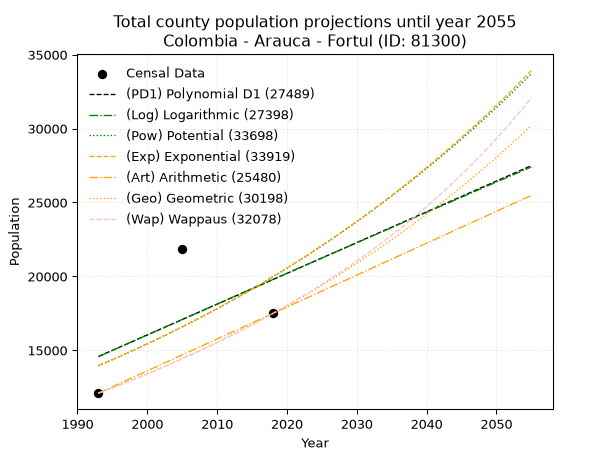
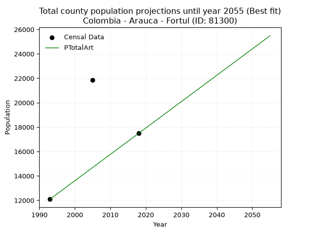
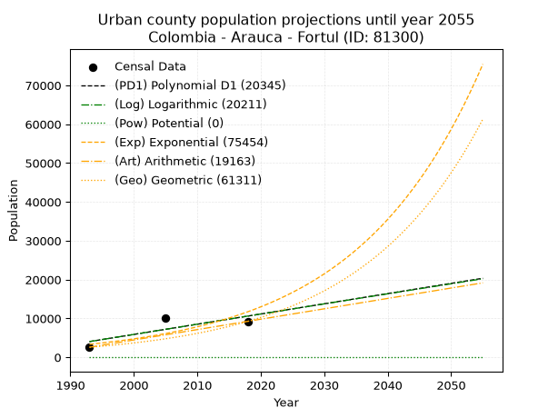
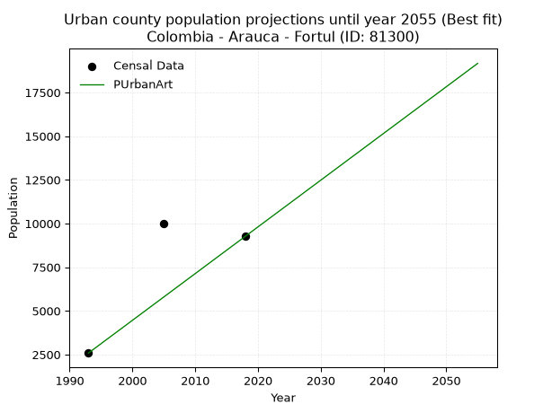
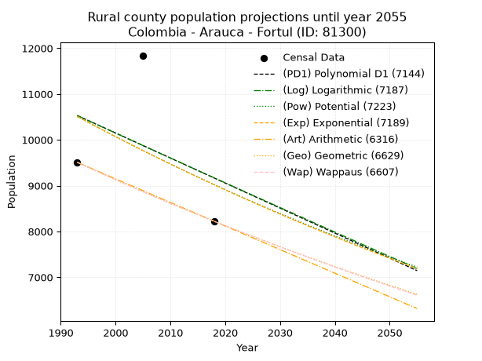
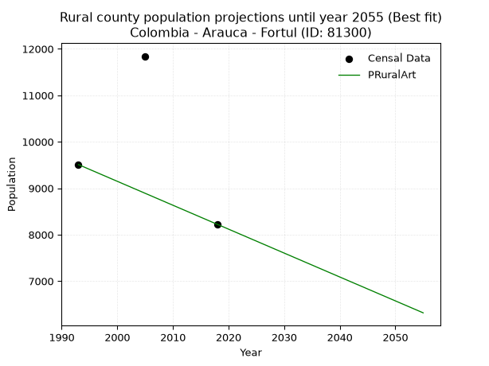

<div align="center">


</div>

# 📜 _“Population and Public Services Demand Projections (PPSD) until Year 2050 for Colombia - Arauca - Fortul (ID: 81300)”_
Keywords: `population` `public-service` `projection` `lineal` `polynomial` `logarithmic` `potential` `exponential` `arithmetic` `geometric` `wappaus` `dane` `colombia` `south-america`

PPSD are analytical estimates used by governments and planners to anticipate future changes in population size, age distribution, and the resulting community needs for utilities, healthcare, education, and infrastructure as sizing future water treatment facilities, electrical grids, and road networks based on spatial growth.

<div align="center">

</img>

</div>


> **General running parameters**: • app_version: _v20260806_. • Python version: _3.14.7_. • Pandas version: _3.0.5_. • NumPy version: _2.5.1_. • Creates, save and include plots into reports (create_plot): _False_. • Projection until year: _2050_. • Process polynomial degree 2 and up: _False_. • Process Wappaus: _True_. • Process Wappaus: _True_. • Set negative values to zero: _True_. • Set infinite values to zero: _True_. • Drop dataset notes: _True_. 
<div align="center">

Maps & GIS Layers: [:earth_americas:Google](http://maps.google.com/maps?q=6.796694894,-71.7687703) [:earth_americas:OSM](https://www.openstreetmap.org/#map=18/6.796694894/-71.7687703&layers=P) [:earth_americas:Bing](https://www.bing.com/maps?cp=6.796694894~-71.7687703&lvl=18) [:earth_americas:Apple](https://maps.apple.com/frame?center=6.796694894%2C-71.7687703&span=0.003%2C0.006) [:earth_americas:GISMobile](https://github.com/rcfdtools/R.GISMobile/blob/main/file/gis/CountyLayer_CO/Readme.md)

</div>


<div align="center">

```geojson
{
  "type": "Feature",
  "geometry": {
    "type": "Point", 
    "coordinates": [-71.7687703, 6.796694894]
  }, 
  "properties": {
    "Name": "Colombia - Arauca - Fortul (ID: 81300)"
  }
}
```

</div>


## 0. Census Data (3 records)

Census data are official statistics collected by a government about the people and housing in a country. They usually include counts of total population, age, sex, race, income, education, and jobs.

📅Global census file: [Population.xlsx](../data/Population.xlsx)

| Source   |   Year |   CountryID | CountryName   |   StateID | StateName   |   CountyID | CountyName   |   PTotal |   PUrban |   PRural |
|:---------|-------:|------------:|:--------------|----------:|:------------|-----------:|:-------------|---------:|---------:|---------:|
| DANE     |   1993 |          57 | Colombia      |        81 | Arauca      |      81300 | Fortul       |    12095 |     2587 |     9508 |
| DANE     |   2005 |          57 | Colombia      |        81 | Arauca      |      81300 | Fortul       |    21851 |    10009 |    11842 |
| DANE     |   2018 |          57 | Colombia      |        81 | Arauca      |      81300 | Fortul       |    17492 |     9271 |     8221 |

> 🔥Some records could had specific notes about the registered values or the corresponding urban or rural distribution.

📅[SUI-RUPS](https://www.datos.gov.co/Hacienda-y-Cr-dito-P-blico/Registro-nico-de-Prestadores-de-Servicios-P-blicos/4qkq-csdn/about_data) - Local public utility companies: [RUPS.csv](../data/RUPS.csv)

 | SERVICIO       | ESTADO    | NOMBRE                                                                                         | NIT         | DEPARTAMENTO_DOMICILIO   | MUNICIPIO_DOMICILIO   | DIRECCION    |   TELEFONO | EMAIL                    | TIPO_PRESTADOR          | CLASIFICACION                 |
|:---------------|:----------|:-----------------------------------------------------------------------------------------------|:------------|:-------------------------|:----------------------|:-------------|-----------:|:-------------------------|:------------------------|:------------------------------|
| ACUEDUCTO      | OPERATIVA | EMPRESA COMUNITARIA DE ACUEDUCTO, ALCANTARILLADO Y ASEO URBANO Y RURAL DEL MUNICIPIO DE FORTUL | 834000047-1 | ARAUCA                   | FORTUL                | CL 6 N 27 52 |    8899163 | emcoafor-esp@hotmail.com | ORGANIZACION AUTORIZADA | MENOR O IGUAL A 2500 USUARIOS |
| ALCANTARILLADO | OPERATIVA | EMPRESA COMUNITARIA DE ACUEDUCTO, ALCANTARILLADO Y ASEO URBANO Y RURAL DEL MUNICIPIO DE FORTUL | 834000047-1 | ARAUCA                   | FORTUL                | CL 6 N 27 52 |    8899163 | emcoafor-esp@hotmail.com | ORGANIZACION AUTORIZADA | MENOR O IGUAL A 2500 USUARIOS |

## 1. Total

### 1.1. Coefficients and Parameters

* (PD1) Polynomial Deg 1: 208.2409381663153, -400446.49466951744 (lineal)
* (Log) Logarithmic: 418829.1100677412, -3167443.177308886
* (Pow) Potential: 28.780985188209677, -90.81838200523642
* (Exp) Exponential: 0.014316313494187065, 5.668746082535631e-09
* (Art) Arithmetic: Year diff. 2018 - 1993 = 25, Population diff. 17492 - 12095 = 5397, Annual growth = 215.88
* (Geo) Geometric: Year diff. 2018 - 1993 = 25, Population diff. 17492 - 12095 = 5397, Annual growth % = 0.014867497441569455
* (Wap) Wappaus: i = 1.4592895528441545, Condition values only valid for < 200)

<sub>
Wappaus condition values: ['0.00', '1.46', '2.92', '4.38', '5.84', '7.30', '8.76', '10.22', '11.67', '13.13', '14.59', '16.05', '17.51', '18.97', '20.43', '21.89', '23.35', '24.81', '26.27', '27.73', '29.19', '30.65', '32.10', '33.56', '35.02', '36.48', '37.94', '39.40', '40.86', '42.32', '43.78', '45.24', '46.70', '48.16', '49.62', '51.08', '52.53', '53.99', '55.45', '56.91', '58.37', '59.83', '61.29', '62.75', '64.21', '65.67', '67.13', '68.59', '70.05', '71.51', '72.96', '74.42', '75.88', '77.34', '78.80', '80.26', '81.72', '83.18']
</sub>


### 1.2. Projected Dataset

|   Year |   CountyID |   PTotalPD1 |   PTotalLog |   PTotalPow |   PTotalExp |   PTotalArt |   PTotalGeo |   PTotalWap |
|-------:|-----------:|------------:|------------:|------------:|------------:|------------:|------------:|------------:|
|   1993 |      81300 |       14578 |       14568 |       13954 |       13962 |       12095 |       12095 |       12095 |
|   1994 |      81300 |       14786 |       14778 |       14157 |       14164 |       12311 |       12275 |       12273 |
|   1995 |      81300 |       14994 |       14988 |       14362 |       14368 |       12527 |       12457 |       12453 |
|   1996 |      81300 |       15202 |       15198 |       14571 |       14575 |       12743 |       12643 |       12636 |
|   1997 |      81300 |       15411 |       15407 |       14783 |       14785 |       12959 |       12830 |       12822 |
|   1998 |      81300 |       15619 |       15617 |       14997 |       14998 |       13174 |       13021 |       13011 |
|   1999 |      81300 |       15827 |       15827 |       15215 |       15215 |       13390 |       13215 |       13202 |
|   2000 |      81300 |       16035 |       16036 |       15435 |       15434 |       13606 |       13411 |       13397 |
|   2001 |      81300 |       16244 |       16245 |       15659 |       15657 |       13822 |       13611 |       13595 |
|   2002 |      81300 |       16452 |       16455 |       15886 |       15882 |       14038 |       13813 |       13795 |
|   2003 |      81300 |       16660 |       16664 |       16116 |       16111 |       14254 |       14018 |       13999 |
|   2004 |      81300 |       16868 |       16873 |       16349 |       16344 |       14470 |       14227 |       14206 |
|   2005 |      81300 |       17077 |       17082 |       16585 |       16579 |       14686 |       14438 |       14416 |
|   2006 |      81300 |       17285 |       17291 |       16825 |       16818 |       14901 |       14653 |       14630 |
|   2007 |      81300 |       17493 |       17499 |       17068 |       17061 |       15117 |       14871 |       14847 |
|   2008 |      81300 |       17701 |       17708 |       17315 |       17307 |       15333 |       15092 |       15068 |
|   2009 |      81300 |       17910 |       17917 |       17564 |       17556 |       15549 |       15316 |       15292 |
|   2010 |      81300 |       18118 |       18125 |       17818 |       17810 |       15765 |       15544 |       15520 |
|   2011 |      81300 |       18326 |       18333 |       18075 |       18066 |       15981 |       15775 |       15752 |
|   2012 |      81300 |       18534 |       18542 |       18335 |       18327 |       16197 |       16010 |       15988 |
|   2013 |      81300 |       18743 |       18750 |       18599 |       18591 |       16413 |       16248 |       16228 |
|   2014 |      81300 |       18951 |       18958 |       18867 |       18859 |       16628 |       16489 |       16472 |
|   2015 |      81300 |       19159 |       19166 |       19139 |       19131 |       16844 |       16734 |       16721 |
|   2016 |      81300 |       19367 |       19373 |       19414 |       19407 |       17060 |       16983 |       16973 |
|   2017 |      81300 |       19575 |       19581 |       19693 |       19687 |       17276 |       17236 |       17230 |
|   2018 |      81300 |       19784 |       19789 |       19976 |       19971 |       17492 |       17492 |       17492 |
|   2019 |      81300 |       19992 |       19996 |       20263 |       20259 |       17708 |       17752 |       17758 |
|   2020 |      81300 |       20200 |       20204 |       20554 |       20551 |       17924 |       18016 |       18030 |
|   2021 |      81300 |       20408 |       20411 |       20848 |       20847 |       18140 |       18284 |       18306 |
|   2022 |      81300 |       20617 |       20618 |       21147 |       21148 |       18356 |       18556 |       18587 |
|   2023 |      81300 |       20825 |       20825 |       21450 |       21453 |       18571 |       18832 |       18874 |
|   2024 |      81300 |       21033 |       21032 |       21758 |       21762 |       18787 |       19112 |       19166 |
|   2025 |      81300 |       21241 |       21239 |       22069 |       22076 |       19003 |       19396 |       19463 |
|   2026 |      81300 |       21450 |       21446 |       22385 |       22394 |       19219 |       19684 |       19767 |
|   2027 |      81300 |       21658 |       21652 |       22705 |       22717 |       19435 |       19977 |       20076 |
|   2028 |      81300 |       21866 |       21859 |       23030 |       23045 |       19651 |       20274 |       20391 |
|   2029 |      81300 |       22074 |       22065 |       23359 |       23377 |       19867 |       20575 |       20713 |
|   2030 |      81300 |       22283 |       22272 |       23693 |       23714 |       20083 |       20881 |       21041 |
|   2031 |      81300 |       22491 |       22478 |       24031 |       24056 |       20298 |       21191 |       21375 |
|   2032 |      81300 |       22699 |       22684 |       24374 |       24403 |       20514 |       21507 |       21716 |
|   2033 |      81300 |       22907 |       22890 |       24721 |       24755 |       20730 |       21826 |       22065 |
|   2034 |      81300 |       23116 |       23096 |       25074 |       25112 |       20946 |       22151 |       22420 |
|   2035 |      81300 |       23324 |       23302 |       25431 |       25474 |       21162 |       22480 |       22784 |
|   2036 |      81300 |       23532 |       23508 |       25793 |       25841 |       21378 |       22814 |       23154 |
|   2037 |      81300 |       23740 |       23714 |       26160 |       26214 |       21594 |       23154 |       23533 |
|   2038 |      81300 |       23949 |       23919 |       26532 |       26592 |       21810 |       23498 |       23920 |
|   2039 |      81300 |       24157 |       24125 |       26910 |       26975 |       22025 |       23847 |       24316 |
|   2040 |      81300 |       24365 |       24330 |       27292 |       27364 |       22241 |       24202 |       24720 |
|   2041 |      81300 |       24573 |       24535 |       27680 |       27759 |       22457 |       24561 |       25134 |
|   2042 |      81300 |       24782 |       24740 |       28073 |       28159 |       22673 |       24927 |       25556 |
|   2043 |      81300 |       24990 |       24945 |       28471 |       28565 |       22889 |       25297 |       25989 |
|   2044 |      81300 |       25198 |       25150 |       28875 |       28977 |       23105 |       25673 |       26431 |
|   2045 |      81300 |       25406 |       25355 |       29284 |       29395 |       23321 |       26055 |       26884 |
|   2046 |      81300 |       25614 |       25560 |       29699 |       29818 |       23537 |       26442 |       27348 |
|   2047 |      81300 |       25823 |       25765 |       30120 |       30248 |       23753 |       26836 |       27823 |
|   2048 |      81300 |       26031 |       25969 |       30546 |       30684 |       23968 |       27235 |       28310 |
|   2049 |      81300 |       26239 |       26174 |       30978 |       31127 |       24184 |       27639 |       28808 |
|   2050 |      81300 |       26447 |       26378 |       31416 |       31576 |       24400 |       28050 |       29319 |
<div align="center">

</img>

</div>


### 1.3. Best fit with absolute and relative error (%)

Relative error puts that difference into context by dividing the absolute error by the true value, creating a unitless ratio or percentage that shows the scale of the mistake.

Absolute and relative error

|   Year | Source   |   CountryID | CountryName   |   StateID | StateName   |   CountyID_x | CountyName   |   PTotal |   PUrban |   PRural |   CountyID_y |   PTotalPD1 |   PTotalLog |   PTotalPow |   PTotalExp |   PTotalArt |   PTotalGeo |   PTotalWap |   PTotalPD1AbsError |   PTotalLogAbsError |   PTotalPowAbsError |   PTotalExpAbsError |   PTotalArtAbsError |   PTotalGeoAbsError |   PTotalWapAbsError |   PTotalPD1RelError |   PTotalLogRelError |   PTotalPowRelError |   PTotalExpRelError |   PTotalArtRelError |   PTotalGeoRelError |   PTotalWapRelError |
|-------:|:---------|------------:|:--------------|----------:|:------------|-------------:|:-------------|---------:|---------:|---------:|-------------:|------------:|------------:|------------:|------------:|------------:|------------:|------------:|--------------------:|--------------------:|--------------------:|--------------------:|--------------------:|--------------------:|--------------------:|--------------------:|--------------------:|--------------------:|--------------------:|--------------------:|--------------------:|--------------------:|
|   1993 | DANE     |          57 | Colombia      |        81 | Arauca      |        81300 | Fortul       |    12095 |     2587 |     9508 |        81300 |       14578 |       14568 |       13954 |       13962 |       12095 |       12095 |       12095 |                2483 |                2473 |                1859 |                1867 |                   0 |                   0 |                   0 |             20.5291 |             20.4465 |             15.37   |             15.4361 |              0      |              0      |              0      |
|   2005 | DANE     |          57 | Colombia      |        81 | Arauca      |        81300 | Fortul       |    21851 |    10009 |    11842 |        81300 |       17077 |       17082 |       16585 |       16579 |       14686 |       14438 |       14416 |                4774 |                4769 |                5266 |                5272 |                7165 |                7413 |                7435 |             21.848  |             21.8251 |             24.0996 |             24.127  |             32.7903 |             33.9252 |             34.0259 |
|   2018 | DANE     |          57 | Colombia      |        81 | Arauca      |        81300 | Fortul       |    17492 |     9271 |     8221 |        81300 |       19784 |       19789 |       19976 |       19971 |       17492 |       17492 |       17492 |                2292 |                2297 |                2484 |                2479 |                   0 |                   0 |                   0 |             13.1031 |             13.1317 |             14.2008 |             14.1722 |              0      |              0      |              0      |

Relative error mean

| Method    |   RelError | Best   |
|:----------|-----------:|:-------|
| PTotalPD1 |    18.4934 |        |
| PTotalLog |    18.4678 |        |
| PTotalPow |    17.8901 |        |
| PTotalExp |    17.9118 |        |
| PTotalArt |    10.9301 | True   |
| PTotalGeo |    11.3084 |        |
| PTotalWap |    11.342  |        |

💙Best method: _**PTotalArt**_
<div align="center">

</img>

</div>


### 1.4. Fresh water supply demand in liters per capita per day (lpcd)

The fresh water supply demand typically ranges from 100 to 300 liters per capita per day (lpcd) for standard domestic and municipal planning, though absolute survival minimums set by the World Health Organization are as low as 7.5 to 20 liters per day, and total consumption in high-income nations can exceed 400 liters.

> `CZ`: Level in meters above the sea level (masl)<br> `WS`: Fresh water supply demand in liters per capita per day (lpcd or l/h/d)<br> `WSAll`: Zonal fresh water supply demand in liters per second (l/s)<br> `A`: Zonal area in square meters<br> `DP`: Population density (people/hectare or p/ha)

Reference values (RAS Colombia)

|    CZ |   WS |
|------:|-----:|
|  1000 |  120 |
|  2000 |  130 |
| 99999 |  140 |

County shapefile geometry properties and water supply values

|   CountyID |      ATotal |   CZTotal |   WSTotal |
|-----------:|------------:|----------:|----------:|
|      81300 | 1.15553e+09 |   1083.43 |       130 |

Projected values for best method: PTotalArt

|   CountyID |   Year |   PTotalArt |   DPTotal |   WSTotal |   WSTotalAll |
|-----------:|-------:|------------:|----------:|----------:|-------------:|
|      81300 |   1993 |       12095 |      0.1  |       130 |      18.1985 |
|      81300 |   1994 |       12311 |      0.11 |       130 |      18.5235 |
|      81300 |   1995 |       12527 |      0.11 |       130 |      18.8485 |
|      81300 |   1996 |       12743 |      0.11 |       130 |      19.1735 |
|      81300 |   1997 |       12959 |      0.11 |       130 |      19.4985 |
|      81300 |   1998 |       13174 |      0.11 |       130 |      19.822  |
|      81300 |   1999 |       13390 |      0.12 |       130 |      20.147  |
|      81300 |   2000 |       13606 |      0.12 |       130 |      20.472  |
|      81300 |   2001 |       13822 |      0.12 |       130 |      20.797  |
|      81300 |   2002 |       14038 |      0.12 |       130 |      21.122  |
|      81300 |   2003 |       14254 |      0.12 |       130 |      21.447  |
|      81300 |   2004 |       14470 |      0.13 |       130 |      21.772  |
|      81300 |   2005 |       14686 |      0.13 |       130 |      22.097  |
|      81300 |   2006 |       14901 |      0.13 |       130 |      22.4205 |
|      81300 |   2007 |       15117 |      0.13 |       130 |      22.7455 |
|      81300 |   2008 |       15333 |      0.13 |       130 |      23.0705 |
|      81300 |   2009 |       15549 |      0.13 |       130 |      23.3955 |
|      81300 |   2010 |       15765 |      0.14 |       130 |      23.7205 |
|      81300 |   2011 |       15981 |      0.14 |       130 |      24.0455 |
|      81300 |   2012 |       16197 |      0.14 |       130 |      24.3705 |
|      81300 |   2013 |       16413 |      0.14 |       130 |      24.6955 |
|      81300 |   2014 |       16628 |      0.14 |       130 |      25.019  |
|      81300 |   2015 |       16844 |      0.15 |       130 |      25.344  |
|      81300 |   2016 |       17060 |      0.15 |       130 |      25.669  |
|      81300 |   2017 |       17276 |      0.15 |       130 |      25.994  |
|      81300 |   2018 |       17492 |      0.15 |       130 |      26.319  |
|      81300 |   2019 |       17708 |      0.15 |       130 |      26.644  |
|      81300 |   2020 |       17924 |      0.16 |       130 |      26.969  |
|      81300 |   2021 |       18140 |      0.16 |       130 |      27.294  |
|      81300 |   2022 |       18356 |      0.16 |       130 |      27.619  |
|      81300 |   2023 |       18571 |      0.16 |       130 |      27.9425 |
|      81300 |   2024 |       18787 |      0.16 |       130 |      28.2675 |
|      81300 |   2025 |       19003 |      0.16 |       130 |      28.5925 |
|      81300 |   2026 |       19219 |      0.17 |       130 |      28.9175 |
|      81300 |   2027 |       19435 |      0.17 |       130 |      29.2425 |
|      81300 |   2028 |       19651 |      0.17 |       130 |      29.5675 |
|      81300 |   2029 |       19867 |      0.17 |       130 |      29.8925 |
|      81300 |   2030 |       20083 |      0.17 |       130 |      30.2175 |
|      81300 |   2031 |       20298 |      0.18 |       130 |      30.541  |
|      81300 |   2032 |       20514 |      0.18 |       130 |      30.866  |
|      81300 |   2033 |       20730 |      0.18 |       130 |      31.191  |
|      81300 |   2034 |       20946 |      0.18 |       130 |      31.516  |
|      81300 |   2035 |       21162 |      0.18 |       130 |      31.841  |
|      81300 |   2036 |       21378 |      0.19 |       130 |      32.166  |
|      81300 |   2037 |       21594 |      0.19 |       130 |      32.491  |
|      81300 |   2038 |       21810 |      0.19 |       130 |      32.816  |
|      81300 |   2039 |       22025 |      0.19 |       130 |      33.1395 |
|      81300 |   2040 |       22241 |      0.19 |       130 |      33.4645 |
|      81300 |   2041 |       22457 |      0.19 |       130 |      33.7895 |
|      81300 |   2042 |       22673 |      0.2  |       130 |      34.1145 |
|      81300 |   2043 |       22889 |      0.2  |       130 |      34.4395 |
|      81300 |   2044 |       23105 |      0.2  |       130 |      34.7645 |
|      81300 |   2045 |       23321 |      0.2  |       130 |      35.0895 |
|      81300 |   2046 |       23537 |      0.2  |       130 |      35.4145 |
|      81300 |   2047 |       23753 |      0.21 |       130 |      35.7395 |
|      81300 |   2048 |       23968 |      0.21 |       130 |      36.063  |
|      81300 |   2049 |       24184 |      0.21 |       130 |      36.388  |
|      81300 |   2050 |       24400 |      0.21 |       130 |      36.713  |

## 2. Urban

### 2.1. Coefficients and Parameters

* (PD1) Polynomial Deg 1: 262.867803837959, -519848.569296387 (lineal)
* (Log) Logarithmic: 527895.2937375063, -4006590.6439360497
* (Pow) Potential: 100.93498824407186, -329.5121570497418
* (Exp) Exponential: 0.050266442794204926, 1.0378424546740314e-40
* (Art) Arithmetic: Year diff. 2018 - 1993 = 25, Population diff. 9271 - 2587 = 6684, Annual growth = 267.36
* (Geo) Geometric: Year diff. 2018 - 1993 = 25, Population diff. 9271 - 2587 = 6684, Annual growth % = 0.05238150279375553
* (Wap) Wappaus: i = 4.509360769101029, Condition values only valid for < 200)

<sub>
Wappaus condition values: ['0.00', '4.51', '9.02', '13.53', '18.04', '22.55', '27.06', '31.57', '36.07', '40.58', '45.09', '49.60', '54.11', '58.62', '63.13', '67.64', '72.15', '76.66', '81.17', '85.68', '90.19', '94.70', '99.21', '103.72', '108.22', '112.73', '117.24', '121.75', '126.26', '130.77', '135.28', '139.79', '144.30', '148.81', '153.32', '157.83', '162.34', '166.85', '171.36', '175.87', '180.37', '184.88', '189.39', '193.90', '198.41', '202.92', '207.43', '211.94', '216.45', '220.96', '225.47', '229.98', '234.49', '239.00', '243.51', '248.01', '252.52', '257.03']
</sub>


### 2.2. Projected Dataset

|   Year |   CountyID |   PUrbanPD1 |   PUrbanLog |   PUrbanPow |   PUrbanExp |   PUrbanArt |   PUrbanGeo |
|-------:|-----------:|------------:|------------:|------------:|------------:|------------:|------------:|
|   1993 |      81300 |        4047 |        4039 |           0 |        3343 |        2587 |        2587 |
|   1994 |      81300 |        4310 |        4304 |           0 |        3516 |        2854 |        2723 |
|   1995 |      81300 |        4573 |        4569 |           0 |        3697 |        3122 |        2865 |
|   1996 |      81300 |        4836 |        4833 |           0 |        3888 |        3389 |        3015 |
|   1997 |      81300 |        5098 |        5098 |           0 |        4088 |        3656 |        3173 |
|   1998 |      81300 |        5361 |        5362 |           0 |        4299 |        3924 |        3339 |
|   1999 |      81300 |        5624 |        5626 |           0 |        4520 |        4191 |        3514 |
|   2000 |      81300 |        5887 |        5890 |           0 |        4753 |        4459 |        3698 |
|   2001 |      81300 |        6150 |        6154 |           0 |        4998 |        4726 |        3892 |
|   2002 |      81300 |        6413 |        6418 |           0 |        5256 |        4993 |        4096 |
|   2003 |      81300 |        6676 |        6681 |           0 |        5527 |        5261 |        4311 |
|   2004 |      81300 |        6939 |        6945 |           0 |        5812 |        5528 |        4536 |
|   2005 |      81300 |        7201 |        7208 |           0 |        6112 |        5795 |        4774 |
|   2006 |      81300 |        7464 |        7471 |           0 |        6427 |        6063 |        5024 |
|   2007 |      81300 |        7727 |        7734 |           0 |        6758 |        6330 |        5287 |
|   2008 |      81300 |        7990 |        7997 |           0 |        7106 |        6597 |        5564 |
|   2009 |      81300 |        8253 |        8260 |           0 |        7473 |        6865 |        5856 |
|   2010 |      81300 |        8516 |        8523 |           0 |        7858 |        7132 |        6162 |
|   2011 |      81300 |        8779 |        8785 |           0 |        8263 |        7399 |        6485 |
|   2012 |      81300 |        9041 |        9048 |           0 |        8689 |        7667 |        6825 |
|   2013 |      81300 |        9304 |        9310 |           0 |        9137 |        7934 |        7182 |
|   2014 |      81300 |        9567 |        9572 |           0 |        9608 |        8202 |        7558 |
|   2015 |      81300 |        9830 |        9834 |           0 |       10103 |        8469 |        7954 |
|   2016 |      81300 |       10093 |       10096 |           0 |       10624 |        8736 |        8371 |
|   2017 |      81300 |       10356 |       10358 |           0 |       11172 |        9004 |        8810 |
|   2018 |      81300 |       10619 |       10620 |           0 |       11748 |        9271 |        9271 |
|   2019 |      81300 |       10882 |       10881 |           0 |       12353 |        9538 |        9757 |
|   2020 |      81300 |       11144 |       11143 |           0 |       12990 |        9806 |       10268 |
|   2021 |      81300 |       11407 |       11404 |           0 |       13660 |       10073 |       10806 |
|   2022 |      81300 |       11670 |       11665 |           0 |       14364 |       10340 |       11372 |
|   2023 |      81300 |       11933 |       11926 |           0 |       15105 |       10608 |       11967 |
|   2024 |      81300 |       12196 |       12187 |           0 |       15883 |       10875 |       12594 |
|   2025 |      81300 |       12459 |       12448 |           0 |       16702 |       11143 |       13254 |
|   2026 |      81300 |       12722 |       12708 |           0 |       17563 |       11410 |       13948 |
|   2027 |      81300 |       12984 |       12969 |           0 |       18468 |       11677 |       14679 |
|   2028 |      81300 |       13247 |       13229 |           0 |       19421 |       11945 |       15448 |
|   2029 |      81300 |       13510 |       13490 |           0 |       20422 |       12212 |       16257 |
|   2030 |      81300 |       13773 |       13750 |           0 |       21474 |       12479 |       17108 |
|   2031 |      81300 |       14036 |       14010 |           0 |       22581 |       12747 |       18004 |
|   2032 |      81300 |       14299 |       14269 |           0 |       23746 |       13014 |       18947 |
|   2033 |      81300 |       14562 |       14529 |           0 |       24970 |       13281 |       19940 |
|   2034 |      81300 |       14825 |       14789 |           0 |       26257 |       13549 |       20984 |
|   2035 |      81300 |       15087 |       15048 |           0 |       27610 |       13816 |       22084 |
|   2036 |      81300 |       15350 |       15308 |           0 |       29034 |       14083 |       23240 |
|   2037 |      81300 |       15613 |       15567 |           0 |       30531 |       14351 |       24458 |
|   2038 |      81300 |       15876 |       15826 |           0 |       32104 |       14618 |       25739 |
|   2039 |      81300 |       16139 |       16085 |           0 |       33759 |       14886 |       27087 |
|   2040 |      81300 |       16402 |       16344 |           0 |       35500 |       15153 |       28506 |
|   2041 |      81300 |       16665 |       16602 |           0 |       37330 |       15420 |       29999 |
|   2042 |      81300 |       16927 |       16861 |           0 |       39254 |       15688 |       31571 |
|   2043 |      81300 |       17190 |       17119 |           0 |       41278 |       15955 |       33224 |
|   2044 |      81300 |       17453 |       17378 |           0 |       43406 |       16222 |       34965 |
|   2045 |      81300 |       17716 |       17636 |           0 |       45643 |       16490 |       36796 |
|   2046 |      81300 |       17979 |       17894 |           0 |       47996 |       16757 |       38724 |
|   2047 |      81300 |       18242 |       18152 |           0 |       50471 |       17024 |       40752 |
|   2048 |      81300 |       18505 |       18410 |           0 |       53073 |       17292 |       42887 |
|   2049 |      81300 |       18768 |       18668 |           0 |       55809 |       17559 |       45133 |
|   2050 |      81300 |       19030 |       18925 |           0 |       58686 |       17827 |       47497 |
<div align="center">

</img>

</div>


### 2.3. Best fit with absolute and relative error (%)

Relative error puts that difference into context by dividing the absolute error by the true value, creating a unitless ratio or percentage that shows the scale of the mistake.

Absolute and relative error

|   Year | Source   |   CountryID | CountryName   |   StateID | StateName   |   CountyID_x | CountyName   |   PTotal |   PUrban |   PRural |   CountyID_y |   PUrbanPD1 |   PUrbanLog |   PUrbanPow |   PUrbanExp |   PUrbanArt |   PUrbanGeo |   PUrbanPD1AbsError |   PUrbanLogAbsError |   PUrbanPowAbsError |   PUrbanExpAbsError |   PUrbanArtAbsError |   PUrbanGeoAbsError |   PUrbanPD1RelError |   PUrbanLogRelError |   PUrbanPowRelError |   PUrbanExpRelError |   PUrbanArtRelError |   PUrbanGeoRelError |
|-------:|:---------|------------:|:--------------|----------:|:------------|-------------:|:-------------|---------:|---------:|---------:|-------------:|------------:|------------:|------------:|------------:|------------:|------------:|--------------------:|--------------------:|--------------------:|--------------------:|--------------------:|--------------------:|--------------------:|--------------------:|--------------------:|--------------------:|--------------------:|--------------------:|
|   1993 | DANE     |          57 | Colombia      |        81 | Arauca      |        81300 | Fortul       |    12095 |     2587 |     9508 |        81300 |        4047 |        4039 |           0 |        3343 |        2587 |        2587 |                1460 |                1452 |                2587 |                 756 |                   0 |                   0 |             56.436  |             56.1268 |                 100 |             29.223  |              0      |              0      |
|   2005 | DANE     |          57 | Colombia      |        81 | Arauca      |        81300 | Fortul       |    21851 |    10009 |    11842 |        81300 |        7201 |        7208 |           0 |        6112 |        5795 |        4774 |                2808 |                2801 |               10009 |                3897 |                4214 |                5235 |             28.0548 |             27.9848 |                 100 |             38.935  |             42.1021 |             52.3029 |
|   2018 | DANE     |          57 | Colombia      |        81 | Arauca      |        81300 | Fortul       |    17492 |     9271 |     8221 |        81300 |       10619 |       10620 |           0 |       11748 |        9271 |        9271 |                1348 |                1349 |                9271 |                2477 |                   0 |                   0 |             14.54   |             14.5507 |                 100 |             26.7177 |              0      |              0      |

Relative error mean

| Method    |   RelError | Best   |
|:----------|-----------:|:-------|
| PUrbanPD1 |    33.0102 |        |
| PUrbanLog |    32.8875 |        |
| PUrbanPow |   100      |        |
| PUrbanExp |    31.6252 |        |
| PUrbanArt |    14.034  | True   |
| PUrbanGeo |    17.4343 |        |

💙Best method: _**PUrbanArt**_
<div align="center">

</img>

</div>


### 2.4. Fresh water supply demand in liters per capita per day (lpcd)

The fresh water supply demand typically ranges from 100 to 300 liters per capita per day (lpcd) for standard domestic and municipal planning, though absolute survival minimums set by the World Health Organization are as low as 7.5 to 20 liters per day, and total consumption in high-income nations can exceed 400 liters.

> `CZ`: Level in meters above the sea level (masl)<br> `WS`: Fresh water supply demand in liters per capita per day (lpcd or l/h/d)<br> `WSAll`: Zonal fresh water supply demand in liters per second (l/s)<br> `A`: Zonal area in square meters<br> `DP`: Population density (people/hectare or p/ha)

Reference values (RAS Colombia)

|    CZ |   WS |
|------:|-----:|
|  1000 |  120 |
|  2000 |  130 |
| 99999 |  140 |

County shapefile geometry properties and water supply values

|   CountyID |      AUrban |   CZUrban |   WSUrban |
|-----------:|------------:|----------:|----------:|
|      81300 | 2.68421e+06 |   237.093 |       120 |

Projected values for best method: PUrbanArt

|   CountyID |   Year |   PUrbanArt |   DPUrban |   WSUrban |   WSUrbanAll |
|-----------:|-------:|------------:|----------:|----------:|-------------:|
|      81300 |   1993 |        2587 |      9.64 |       120 |      3.59306 |
|      81300 |   1994 |        2854 |     10.63 |       120 |      3.96389 |
|      81300 |   1995 |        3122 |     11.63 |       120 |      4.33611 |
|      81300 |   1996 |        3389 |     12.63 |       120 |      4.70694 |
|      81300 |   1997 |        3656 |     13.62 |       120 |      5.07778 |
|      81300 |   1998 |        3924 |     14.62 |       120 |      5.45    |
|      81300 |   1999 |        4191 |     15.61 |       120 |      5.82083 |
|      81300 |   2000 |        4459 |     16.61 |       120 |      6.19306 |
|      81300 |   2001 |        4726 |     17.61 |       120 |      6.56389 |
|      81300 |   2002 |        4993 |     18.6  |       120 |      6.93472 |
|      81300 |   2003 |        5261 |     19.6  |       120 |      7.30694 |
|      81300 |   2004 |        5528 |     20.59 |       120 |      7.67778 |
|      81300 |   2005 |        5795 |     21.59 |       120 |      8.04861 |
|      81300 |   2006 |        6063 |     22.59 |       120 |      8.42083 |
|      81300 |   2007 |        6330 |     23.58 |       120 |      8.79167 |
|      81300 |   2008 |        6597 |     24.58 |       120 |      9.1625  |
|      81300 |   2009 |        6865 |     25.58 |       120 |      9.53472 |
|      81300 |   2010 |        7132 |     26.57 |       120 |      9.90556 |
|      81300 |   2011 |        7399 |     27.56 |       120 |     10.2764  |
|      81300 |   2012 |        7667 |     28.56 |       120 |     10.6486  |
|      81300 |   2013 |        7934 |     29.56 |       120 |     11.0194  |
|      81300 |   2014 |        8202 |     30.56 |       120 |     11.3917  |
|      81300 |   2015 |        8469 |     31.55 |       120 |     11.7625  |
|      81300 |   2016 |        8736 |     32.55 |       120 |     12.1333  |
|      81300 |   2017 |        9004 |     33.54 |       120 |     12.5056  |
|      81300 |   2018 |        9271 |     34.54 |       120 |     12.8764  |
|      81300 |   2019 |        9538 |     35.53 |       120 |     13.2472  |
|      81300 |   2020 |        9806 |     36.53 |       120 |     13.6194  |
|      81300 |   2021 |       10073 |     37.53 |       120 |     13.9903  |
|      81300 |   2022 |       10340 |     38.52 |       120 |     14.3611  |
|      81300 |   2023 |       10608 |     39.52 |       120 |     14.7333  |
|      81300 |   2024 |       10875 |     40.51 |       120 |     15.1042  |
|      81300 |   2025 |       11143 |     41.51 |       120 |     15.4764  |
|      81300 |   2026 |       11410 |     42.51 |       120 |     15.8472  |
|      81300 |   2027 |       11677 |     43.5  |       120 |     16.2181  |
|      81300 |   2028 |       11945 |     44.5  |       120 |     16.5903  |
|      81300 |   2029 |       12212 |     45.5  |       120 |     16.9611  |
|      81300 |   2030 |       12479 |     46.49 |       120 |     17.3319  |
|      81300 |   2031 |       12747 |     47.49 |       120 |     17.7042  |
|      81300 |   2032 |       13014 |     48.48 |       120 |     18.075   |
|      81300 |   2033 |       13281 |     49.48 |       120 |     18.4458  |
|      81300 |   2034 |       13549 |     50.48 |       120 |     18.8181  |
|      81300 |   2035 |       13816 |     51.47 |       120 |     19.1889  |
|      81300 |   2036 |       14083 |     52.47 |       120 |     19.5597  |
|      81300 |   2037 |       14351 |     53.46 |       120 |     19.9319  |
|      81300 |   2038 |       14618 |     54.46 |       120 |     20.3028  |
|      81300 |   2039 |       14886 |     55.46 |       120 |     20.675   |
|      81300 |   2040 |       15153 |     56.45 |       120 |     21.0458  |
|      81300 |   2041 |       15420 |     57.45 |       120 |     21.4167  |
|      81300 |   2042 |       15688 |     58.45 |       120 |     21.7889  |
|      81300 |   2043 |       15955 |     59.44 |       120 |     22.1597  |
|      81300 |   2044 |       16222 |     60.43 |       120 |     22.5306  |
|      81300 |   2045 |       16490 |     61.43 |       120 |     22.9028  |
|      81300 |   2046 |       16757 |     62.43 |       120 |     23.2736  |
|      81300 |   2047 |       17024 |     63.42 |       120 |     23.6444  |
|      81300 |   2048 |       17292 |     64.42 |       120 |     24.0167  |
|      81300 |   2049 |       17559 |     65.42 |       120 |     24.3875  |
|      81300 |   2050 |       17827 |     66.41 |       120 |     24.7597  |

## 3. Rural

### 3.1. Coefficients and Parameters

* (PD1) Polynomial Deg 1: -54.62686567164368, 119402.07462686943 (lineal)
* (Log) Logarithmic: -109066.18366976488, 839147.4666271625
* (Pow) Potential: -12.238145504559224, 44.40138385706198
* (Exp) Exponential: -0.006126122954236756, 2109042359.0458088
* (Art) Arithmetic: Year diff. 2018 - 1993 = 25, Population diff. 8221 - 9508 = -1287, Annual growth = -51.48
* (Geo) Geometric: Year diff. 2018 - 1993 = 25, Population diff. 8221 - 9508 = -1287, Annual growth % = -0.005800777873261942
* (Wap) Wappaus: i = -0.5807434147442044, Condition values only valid for < 200)

<sub>
Wappaus condition values: ['-0.00', '-0.58', '-1.16', '-1.74', '-2.32', '-2.90', '-3.48', '-4.07', '-4.65', '-5.23', '-5.81', '-6.39', '-6.97', '-7.55', '-8.13', '-8.71', '-9.29', '-9.87', '-10.45', '-11.03', '-11.61', '-12.20', '-12.78', '-13.36', '-13.94', '-14.52', '-15.10', '-15.68', '-16.26', '-16.84', '-17.42', '-18.00', '-18.58', '-19.16', '-19.75', '-20.33', '-20.91', '-21.49', '-22.07', '-22.65', '-23.23', '-23.81', '-24.39', '-24.97', '-25.55', '-26.13', '-26.71', '-27.29', '-27.88', '-28.46', '-29.04', '-29.62', '-30.20', '-30.78', '-31.36', '-31.94', '-32.52', '-33.10']
</sub>


### 3.2. Projected Dataset

|   Year |   CountyID |   PRuralPD1 |   PRuralLog |   PRuralPow |   PRuralExp |   PRuralArt |   PRuralGeo |   PRuralWap |
|-------:|-----------:|------------:|------------:|------------:|------------:|------------:|------------:|------------:|
|   1993 |      81300 |       10531 |       10528 |       10508 |       10511 |        9508 |        9508 |        9508 |
|   1994 |      81300 |       10476 |       10474 |       10444 |       10446 |        9457 |        9453 |        9453 |
|   1995 |      81300 |       10421 |       10419 |       10380 |       10383 |        9405 |        9398 |        9398 |
|   1996 |      81300 |       10367 |       10364 |       10317 |       10319 |        9354 |        9343 |        9344 |
|   1997 |      81300 |       10312 |       10310 |       10254 |       10256 |        9302 |        9289 |        9290 |
|   1998 |      81300 |       10258 |       10255 |       10191 |       10194 |        9251 |        9235 |        9236 |
|   1999 |      81300 |       10203 |       10201 |       10129 |       10131 |        9199 |        9182 |        9182 |
|   2000 |      81300 |       10148 |       10146 |       10067 |       10069 |        9148 |        9129 |        9129 |
|   2001 |      81300 |       10094 |       10092 |       10006 |       10008 |        9096 |        9076 |        9076 |
|   2002 |      81300 |       10039 |       10037 |        9945 |        9947 |        9045 |        9023 |        9024 |
|   2003 |      81300 |        9984 |        9983 |        9884 |        9886 |        8993 |        8971 |        8971 |
|   2004 |      81300 |        9930 |        9928 |        9824 |        9826 |        8942 |        8919 |        8919 |
|   2005 |      81300 |        9875 |        9874 |        9764 |        9766 |        8890 |        8867 |        8868 |
|   2006 |      81300 |        9821 |        9819 |        9705 |        9706 |        8839 |        8815 |        8816 |
|   2007 |      81300 |        9766 |        9765 |        9646 |        9647 |        8787 |        8764 |        8765 |
|   2008 |      81300 |        9711 |        9711 |        9587 |        9588 |        8736 |        8713 |        8714 |
|   2009 |      81300 |        9657 |        9656 |        9529 |        9529 |        8684 |        8663 |        8664 |
|   2010 |      81300 |        9602 |        9602 |        9471 |        9471 |        8633 |        8613 |        8613 |
|   2011 |      81300 |        9547 |        9548 |        9413 |        9413 |        8581 |        8563 |        8563 |
|   2012 |      81300 |        9493 |        9494 |        9356 |        9356 |        8530 |        8513 |        8514 |
|   2013 |      81300 |        9438 |        9439 |        9300 |        9299 |        8478 |        8464 |        8464 |
|   2014 |      81300 |        9384 |        9385 |        9243 |        9242 |        8427 |        8415 |        8415 |
|   2015 |      81300 |        9329 |        9331 |        9187 |        9185 |        8375 |        8366 |        8366 |
|   2016 |      81300 |        9274 |        9277 |        9132 |        9129 |        8324 |        8317 |        8318 |
|   2017 |      81300 |        9220 |        9223 |        9076 |        9073 |        8272 |        8269 |        8269 |
|   2018 |      81300 |        9165 |        9169 |        9021 |        9018 |        8221 |        8221 |        8221 |
|   2019 |      81300 |        9110 |        9115 |        8967 |        8963 |        8170 |        8173 |        8173 |
|   2020 |      81300 |        9056 |        9061 |        8913 |        8908 |        8118 |        8126 |        8126 |
|   2021 |      81300 |        9001 |        9007 |        8859 |        8854 |        8067 |        8079 |        8078 |
|   2022 |      81300 |        8947 |        8953 |        8805 |        8800 |        8015 |        8032 |        8031 |
|   2023 |      81300 |        8892 |        8899 |        8752 |        8746 |        7964 |        7985 |        7984 |
|   2024 |      81300 |        8837 |        8845 |        8700 |        8693 |        7912 |        7939 |        7938 |
|   2025 |      81300 |        8783 |        8791 |        8647 |        8640 |        7861 |        7893 |        7891 |
|   2026 |      81300 |        8728 |        8737 |        8595 |        8587 |        7809 |        7847 |        7845 |
|   2027 |      81300 |        8673 |        8683 |        8543 |        8534 |        7758 |        7802 |        7799 |
|   2028 |      81300 |        8619 |        8630 |        8492 |        8482 |        7706 |        7756 |        7754 |
|   2029 |      81300 |        8564 |        8576 |        8441 |        8430 |        7655 |        7711 |        7708 |
|   2030 |      81300 |        8510 |        8522 |        8390 |        8379 |        7603 |        7667 |        7663 |
|   2031 |      81300 |        8455 |        8468 |        8340 |        8328 |        7552 |        7622 |        7618 |
|   2032 |      81300 |        8400 |        8415 |        8290 |        8277 |        7500 |        7578 |        7574 |
|   2033 |      81300 |        8346 |        8361 |        8240 |        8226 |        7449 |        7534 |        7529 |
|   2034 |      81300 |        8291 |        8308 |        8190 |        8176 |        7397 |        7490 |        7485 |
|   2035 |      81300 |        8236 |        8254 |        8141 |        8126 |        7346 |        7447 |        7441 |
|   2036 |      81300 |        8182 |        8200 |        8092 |        8076 |        7294 |        7404 |        7397 |
|   2037 |      81300 |        8127 |        8147 |        8044 |        8027 |        7243 |        7361 |        7354 |
|   2038 |      81300 |        8073 |        8093 |        7996 |        7978 |        7191 |        7318 |        7310 |
|   2039 |      81300 |        8018 |        8040 |        7948 |        7929 |        7140 |        7276 |        7267 |
|   2040 |      81300 |        7963 |        7986 |        7900 |        7881 |        7088 |        7233 |        7224 |
|   2041 |      81300 |        7909 |        7933 |        7853 |        7833 |        7037 |        7191 |        7182 |
|   2042 |      81300 |        7854 |        7879 |        7806 |        7785 |        6985 |        7150 |        7139 |
|   2043 |      81300 |        7799 |        7826 |        7760 |        7737 |        6934 |        7108 |        7097 |
|   2044 |      81300 |        7745 |        7773 |        7713 |        7690 |        6883 |        7067 |        7055 |
|   2045 |      81300 |        7690 |        7719 |        7667 |        7643 |        6831 |        7026 |        7013 |
|   2046 |      81300 |        7636 |        7666 |        7621 |        7597 |        6780 |        6985 |        6972 |
|   2047 |      81300 |        7581 |        7613 |        7576 |        7550 |        6728 |        6945 |        6930 |
|   2048 |      81300 |        7526 |        7559 |        7531 |        7504 |        6677 |        6904 |        6889 |
|   2049 |      81300 |        7472 |        7506 |        7486 |        7458 |        6625 |        6864 |        6848 |
|   2050 |      81300 |        7417 |        7453 |        7441 |        7413 |        6574 |        6825 |        6808 |
<div align="center">

</img>

</div>


### 3.3. Best fit with absolute and relative error (%)

Relative error puts that difference into context by dividing the absolute error by the true value, creating a unitless ratio or percentage that shows the scale of the mistake.

Absolute and relative error

|   Year | Source   |   CountryID | CountryName   |   StateID | StateName   |   CountyID_x | CountyName   |   PTotal |   PUrban |   PRural |   CountyID_y |   PRuralPD1 |   PRuralLog |   PRuralPow |   PRuralExp |   PRuralArt |   PRuralGeo |   PRuralWap |   PRuralPD1AbsError |   PRuralLogAbsError |   PRuralPowAbsError |   PRuralExpAbsError |   PRuralArtAbsError |   PRuralGeoAbsError |   PRuralWapAbsError |   PRuralPD1RelError |   PRuralLogRelError |   PRuralPowRelError |   PRuralExpRelError |   PRuralArtRelError |   PRuralGeoRelError |   PRuralWapRelError |
|-------:|:---------|------------:|:--------------|----------:|:------------|-------------:|:-------------|---------:|---------:|---------:|-------------:|------------:|------------:|------------:|------------:|------------:|------------:|------------:|--------------------:|--------------------:|--------------------:|--------------------:|--------------------:|--------------------:|--------------------:|--------------------:|--------------------:|--------------------:|--------------------:|--------------------:|--------------------:|--------------------:|
|   1993 | DANE     |          57 | Colombia      |        81 | Arauca      |        81300 | Fortul       |    12095 |     2587 |     9508 |        81300 |       10531 |       10528 |       10508 |       10511 |        9508 |        9508 |        9508 |                1023 |                1020 |                1000 |                1003 |                   0 |                   0 |                   0 |             10.7594 |             10.7278 |            10.5175  |            10.549   |              0      |              0      |               0     |
|   2005 | DANE     |          57 | Colombia      |        81 | Arauca      |        81300 | Fortul       |    21851 |    10009 |    11842 |        81300 |        9875 |        9874 |        9764 |        9766 |        8890 |        8867 |        8868 |                1967 |                1968 |                2078 |                2076 |                2952 |                2975 |                2974 |             16.6104 |             16.6188 |            17.5477  |            17.5308  |             24.9282 |             25.1224 |              25.114 |
|   2018 | DANE     |          57 | Colombia      |        81 | Arauca      |        81300 | Fortul       |    17492 |     9271 |     8221 |        81300 |        9165 |        9169 |        9021 |        9018 |        8221 |        8221 |        8221 |                 944 |                 948 |                 800 |                 797 |                   0 |                   0 |                   0 |             11.4828 |             11.5314 |             9.73118 |             9.69468 |              0      |              0      |               0     |

Relative error mean

| Method    |   RelError | Best   |
|:----------|-----------:|:-------|
| PRuralPD1 |   12.9508  |        |
| PRuralLog |   12.9594  |        |
| PRuralPow |   12.5988  |        |
| PRuralExp |   12.5915  |        |
| PRuralArt |    8.30941 | True   |
| PRuralGeo |    8.37415 |        |
| PRuralWap |    8.37133 |        |

💙Best method: _**PRuralArt**_
<div align="center">

</img>

</div>


### 3.4. Fresh water supply demand in liters per capita per day (lpcd)

The fresh water supply demand typically ranges from 100 to 300 liters per capita per day (lpcd) for standard domestic and municipal planning, though absolute survival minimums set by the World Health Organization are as low as 7.5 to 20 liters per day, and total consumption in high-income nations can exceed 400 liters.

> `CZ`: Level in meters above the sea level (masl)<br> `WS`: Fresh water supply demand in liters per capita per day (lpcd or l/h/d)<br> `WSAll`: Zonal fresh water supply demand in liters per second (l/s)<br> `A`: Zonal area in square meters<br> `DP`: Population density (people/hectare or p/ha)

Reference values (RAS Colombia)

|    CZ |   WS |
|------:|-----:|
|  1000 |  120 |
|  2000 |  130 |
| 99999 |  140 |

County shapefile geometry properties and water supply values

|   CountyID |      ARural |   CZRural |   WSRural |
|-----------:|------------:|----------:|----------:|
|      81300 | 1.15284e+09 |   1085.44 |       130 |

Projected values for best method: PRuralArt

|   CountyID |   Year |   PRuralArt |   DPRural |   WSRural |   WSRuralAll |
|-----------:|-------:|------------:|----------:|----------:|-------------:|
|      81300 |   1993 |        9508 |      0.08 |       130 |     14.306   |
|      81300 |   1994 |        9457 |      0.08 |       130 |     14.2293  |
|      81300 |   1995 |        9405 |      0.08 |       130 |     14.151   |
|      81300 |   1996 |        9354 |      0.08 |       130 |     14.0743  |
|      81300 |   1997 |        9302 |      0.08 |       130 |     13.9961  |
|      81300 |   1998 |        9251 |      0.08 |       130 |     13.9193  |
|      81300 |   1999 |        9199 |      0.08 |       130 |     13.8411  |
|      81300 |   2000 |        9148 |      0.08 |       130 |     13.7644  |
|      81300 |   2001 |        9096 |      0.08 |       130 |     13.6861  |
|      81300 |   2002 |        9045 |      0.08 |       130 |     13.6094  |
|      81300 |   2003 |        8993 |      0.08 |       130 |     13.5311  |
|      81300 |   2004 |        8942 |      0.08 |       130 |     13.4544  |
|      81300 |   2005 |        8890 |      0.08 |       130 |     13.3762  |
|      81300 |   2006 |        8839 |      0.08 |       130 |     13.2994  |
|      81300 |   2007 |        8787 |      0.08 |       130 |     13.2212  |
|      81300 |   2008 |        8736 |      0.08 |       130 |     13.1444  |
|      81300 |   2009 |        8684 |      0.08 |       130 |     13.0662  |
|      81300 |   2010 |        8633 |      0.07 |       130 |     12.9895  |
|      81300 |   2011 |        8581 |      0.07 |       130 |     12.9112  |
|      81300 |   2012 |        8530 |      0.07 |       130 |     12.8345  |
|      81300 |   2013 |        8478 |      0.07 |       130 |     12.7562  |
|      81300 |   2014 |        8427 |      0.07 |       130 |     12.6795  |
|      81300 |   2015 |        8375 |      0.07 |       130 |     12.6013  |
|      81300 |   2016 |        8324 |      0.07 |       130 |     12.5245  |
|      81300 |   2017 |        8272 |      0.07 |       130 |     12.4463  |
|      81300 |   2018 |        8221 |      0.07 |       130 |     12.3696  |
|      81300 |   2019 |        8170 |      0.07 |       130 |     12.2928  |
|      81300 |   2020 |        8118 |      0.07 |       130 |     12.2146  |
|      81300 |   2021 |        8067 |      0.07 |       130 |     12.1378  |
|      81300 |   2022 |        8015 |      0.07 |       130 |     12.0596  |
|      81300 |   2023 |        7964 |      0.07 |       130 |     11.9829  |
|      81300 |   2024 |        7912 |      0.07 |       130 |     11.9046  |
|      81300 |   2025 |        7861 |      0.07 |       130 |     11.8279  |
|      81300 |   2026 |        7809 |      0.07 |       130 |     11.7497  |
|      81300 |   2027 |        7758 |      0.07 |       130 |     11.6729  |
|      81300 |   2028 |        7706 |      0.07 |       130 |     11.5947  |
|      81300 |   2029 |        7655 |      0.07 |       130 |     11.5179  |
|      81300 |   2030 |        7603 |      0.07 |       130 |     11.4397  |
|      81300 |   2031 |        7552 |      0.07 |       130 |     11.363   |
|      81300 |   2032 |        7500 |      0.07 |       130 |     11.2847  |
|      81300 |   2033 |        7449 |      0.06 |       130 |     11.208   |
|      81300 |   2034 |        7397 |      0.06 |       130 |     11.1297  |
|      81300 |   2035 |        7346 |      0.06 |       130 |     11.053   |
|      81300 |   2036 |        7294 |      0.06 |       130 |     10.9748  |
|      81300 |   2037 |        7243 |      0.06 |       130 |     10.898   |
|      81300 |   2038 |        7191 |      0.06 |       130 |     10.8198  |
|      81300 |   2039 |        7140 |      0.06 |       130 |     10.7431  |
|      81300 |   2040 |        7088 |      0.06 |       130 |     10.6648  |
|      81300 |   2041 |        7037 |      0.06 |       130 |     10.5881  |
|      81300 |   2042 |        6985 |      0.06 |       130 |     10.5098  |
|      81300 |   2043 |        6934 |      0.06 |       130 |     10.4331  |
|      81300 |   2044 |        6883 |      0.06 |       130 |     10.3564  |
|      81300 |   2045 |        6831 |      0.06 |       130 |     10.2781  |
|      81300 |   2046 |        6780 |      0.06 |       130 |     10.2014  |
|      81300 |   2047 |        6728 |      0.06 |       130 |     10.1231  |
|      81300 |   2048 |        6677 |      0.06 |       130 |     10.0464  |
|      81300 |   2049 |        6625 |      0.06 |       130 |      9.96817 |
|      81300 |   2050 |        6574 |      0.06 |       130 |      9.89144 |

#

<div align="center"><br><sub>Share this research</sub></div><br>

<sub>**APPS & TOOLS & CONTENT DISCLAIMER**: • NO WARRANTY - This content and software is provided by <a href="https://github.com/rcfdtools" target="_blank">github.com/rcfdtools</a> "as is", without any express or implied warranty, including warranties of merchantability, fitness for a particular purpose, or non-infringement. There is no guarantee that the software will be error-free or operate without interruption. • LIMITATION OF LIABILITY - Neither the authors nor copyright holders will be liable for claims or damages arising from the software or its use. You are responsible for determining if the software is appropriate for your use and assume all associated risks, including errors, legal compliance, and data loss. • NO PROFESSIONAL ADVICE - The software provides general information and does not offer professional advice. It should not replace consultation with professional advisors. [Clauses and global license for rcfdtools use.](https://github.com/rcfdtools/rcfdtools/blob/main/LICENSE.md)</sub>

| [:house: Home](Readme.md)  | [:beginner: Help / Collab](https://github.com/rcfdtools/R.HydroTools/discussions/31) |
|----------------------------|-------------------------------------------------------------------------------------------|