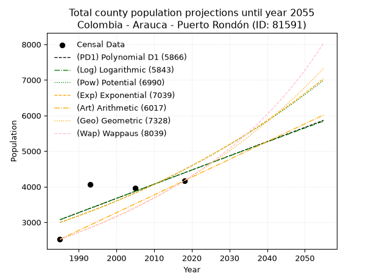
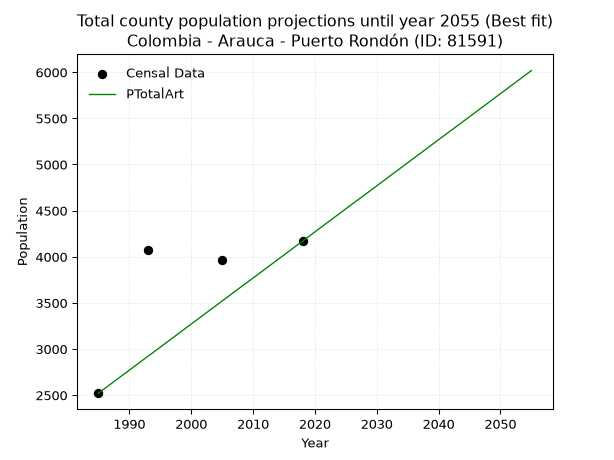
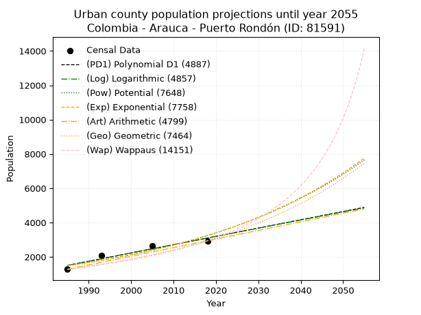
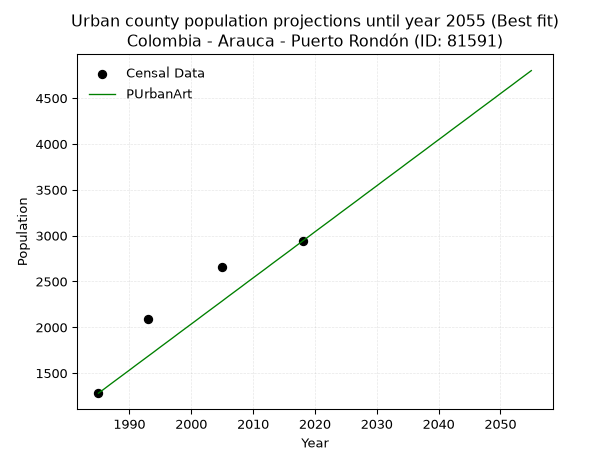
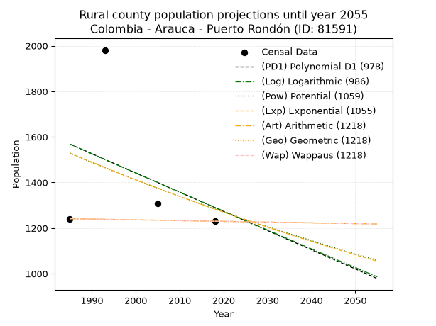
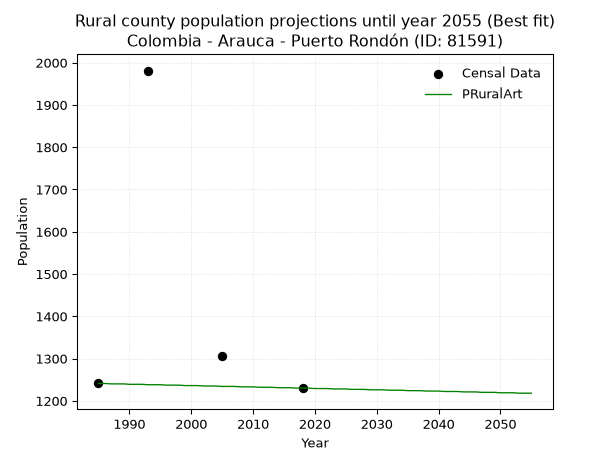

<div align="center">


</div>

# _“Population and Public Services Demand Projections (PPSD) until Year 2050 for Colombia - Arauca - Puerto Rondón (ID: 81591)”_
Keywords: `population` `public-service` `projection` `lineal` `polynomial` `logarithmic` `potential` `exponential` `arithmetic` `geometric` `wappaus` `dane` `colombia` `south-america`

PPSD are analytical estimates used by governments and planners to anticipate future changes in population size, age distribution, and the resulting community needs for utilities, healthcare, education, and infrastructure as sizing future water treatment facilities, electrical grids, and road networks based on spatial growth.

> **General running parameters**: • app_version: _v20260806_. • Python version: _3.14.7_. • Pandas version: _3.0.5_. • NumPy version: _2.5.1_. • Creates, save and include plots into reports (create_plot): _False_. • Projection until year: _2050_. • Process polynomial degree 2 and up: _False_. • Process Wappaus: _True_. • Process Wappaus: _True_. • Set negative values to zero: _True_. • Set infinite values to zero: _True_. • Drop dataset notes: _True_. 
<div align="center">

Dynamic map: [:earth_americas:Google](http://maps.google.com/maps?q=6.281460833,-71.1033902) [:earth_americas:OSM](https://www.openstreetmap.org/#map=18/6.281460833/-71.1033902&layers=P) [:earth_americas:Bing](https://www.bing.com/maps?cp=6.281460833~-71.1033902&lvl=18) [:earth_americas:Apple](https://maps.apple.com/frame?center=6.281460833%2C-71.1033902&span=0.003%2C0.006)

</div>


<div align="center">

```geojson
{
  "type": "Feature",
  "geometry": {
    "type": "Point", 
    "coordinates": [-71.1033902, 6.281460833]
  }, 
  "properties": {
    "Name": "Colombia - Arauca - Puerto Rondón (ID: 81591)"
  }
}
```

</div>


## 0. Census Data (4 records)

Census data are official statistics collected by a government about the people and housing in a country. They usually include counts of total population, age, sex, race, income, education, and jobs.

📅Global census file: [Population.xlsx](../data/Population.xlsx)

| Source   |   Year |   CountryID | CountryName   |   StateID | StateName   |   CountyID | CountyName    |   PTotal |   PUrban |   PRural |
|:---------|-------:|------------:|:--------------|----------:|:------------|-----------:|:--------------|---------:|---------:|---------:|
| DANE     |   1985 |          57 | Colombia      |        81 | Arauca      |      81591 | Puerto Rondón |     2521 |     1280 |     1241 |
| DANE     |   1993 |          57 | Colombia      |        81 | Arauca      |      81591 | Puerto Rondón |     4072 |     2091 |     1981 |
| DANE     |   2005 |          57 | Colombia      |        81 | Arauca      |      81591 | Puerto Rondón |     3962 |     2655 |     1307 |
| DANE     |   2018 |          57 | Colombia      |        81 | Arauca      |      81591 | Puerto Rondón |     4169 |     2939 |     1230 |

> 🔥Some records has specific notes about the registered values or the corresponding urban or rural distribution.

## 1. Total

### 1.1. Coefficients and Parameters

* (PD1) Polynomial Deg 1: 39.90686471296653, -76142.7061421113 (lineal)
* (Log) Logarithmic: 80007.05288146547, -604453.2500883036
* (Pow) Potential: 24.468236885792248, -77.21417381636459
* (Exp) Exponential: 0.012203673825894984, 9.03712616124587e-08
* (Art) Arithmetic: Year diff. 2018 - 1985 = 33, Population diff. 4169 - 2521 = 1648, Annual growth = 49.93939393939394
* (Geo) Geometric: Year diff. 2018 - 1985 = 33, Population diff. 4169 - 2521 = 1648, Annual growth % = 0.015359814776014558
* (Wap) Wappaus: i = 1.4929564705349458, Condition values only valid for < 200)

<sub>
Wappaus condition values: ['0.00', '1.49', '2.99', '4.48', '5.97', '7.46', '8.96', '10.45', '11.94', '13.44', '14.93', '16.42', '17.92', '19.41', '20.90', '22.39', '23.89', '25.38', '26.87', '28.37', '29.86', '31.35', '32.85', '34.34', '35.83', '37.32', '38.82', '40.31', '41.80', '43.30', '44.79', '46.28', '47.77', '49.27', '50.76', '52.25', '53.75', '55.24', '56.73', '58.23', '59.72', '61.21', '62.70', '64.20', '65.69', '67.18', '68.68', '70.17', '71.66', '73.15', '74.65', '76.14', '77.63', '79.13', '80.62', '82.11', '83.61', '85.10', '86.59', '88.08', '89.58', '91.07', '92.56', '94.06', '95.55', '97.04']
</sub>


### 1.2. Projected Dataset

|   Year |   CountyID |   PTotalPD1 |   PTotalLog |   PTotalPow |   PTotalExp |   PTotalArt |   PTotalGeo |   PTotalWap |
|-------:|-----------:|------------:|------------:|------------:|------------:|------------:|------------:|------------:|
|   1985 |      81591 |        3072 |        3070 |        2994 |        2996 |        2521 |        2521 |        2521 |
|   1986 |      81591 |        3112 |        3111 |        3031 |        3033 |        2571 |        2560 |        2559 |
|   1987 |      81591 |        3152 |        3151 |        3068 |        3070 |        2621 |        2599 |        2597 |
|   1988 |      81591 |        3192 |        3191 |        3106 |        3107 |        2671 |        2639 |        2636 |
|   1989 |      81591 |        3232 |        3231 |        3145 |        3146 |        2721 |        2679 |        2676 |
|   1990 |      81591 |        3272 |        3272 |        3184 |        3184 |        2771 |        2721 |        2716 |
|   1991 |      81591 |        3312 |        3312 |        3223 |        3223 |        2821 |        2762 |        2757 |
|   1992 |      81591 |        3352 |        3352 |        3263 |        3263 |        2871 |        2805 |        2799 |
|   1993 |      81591 |        3392 |        3392 |        3303 |        3303 |        2921 |        2848 |        2841 |
|   1994 |      81591 |        3432 |        3432 |        3344 |        3344 |        2970 |        2892 |        2884 |
|   1995 |      81591 |        3471 |        3472 |        3385 |        3385 |        3020 |        2936 |        2928 |
|   1996 |      81591 |        3511 |        3512 |        3427 |        3426 |        3070 |        2981 |        2972 |
|   1997 |      81591 |        3551 |        3552 |        3469 |        3468 |        3120 |        3027 |        3017 |
|   1998 |      81591 |        3591 |        3593 |        3512 |        3511 |        3170 |        3073 |        3063 |
|   1999 |      81591 |        3631 |        3633 |        3555 |        3554 |        3220 |        3121 |        3109 |
|   2000 |      81591 |        3671 |        3673 |        3599 |        3598 |        3270 |        3169 |        3157 |
|   2001 |      81591 |        3711 |        3713 |        3644 |        3642 |        3320 |        3217 |        3205 |
|   2002 |      81591 |        3751 |        3753 |        3688 |        3686 |        3370 |        3267 |        3254 |
|   2003 |      81591 |        3791 |        3792 |        3734 |        3732 |        3420 |        3317 |        3304 |
|   2004 |      81591 |        3831 |        3832 |        3780 |        3778 |        3470 |        3368 |        3354 |
|   2005 |      81591 |        3871 |        3872 |        3826 |        3824 |        3520 |        3420 |        3406 |
|   2006 |      81591 |        3910 |        3912 |        3873 |        3871 |        3570 |        3472 |        3458 |
|   2007 |      81591 |        3950 |        3952 |        3920 |        3918 |        3620 |        3525 |        3512 |
|   2008 |      81591 |        3990 |        3992 |        3969 |        3966 |        3670 |        3580 |        3566 |
|   2009 |      81591 |        4030 |        4032 |        4017 |        4015 |        3720 |        3635 |        3621 |
|   2010 |      81591 |        4070 |        4072 |        4066 |        4064 |        3769 |        3690 |        3678 |
|   2011 |      81591 |        4110 |        4111 |        4116 |        4114 |        3819 |        3747 |        3735 |
|   2012 |      81591 |        4150 |        4151 |        4167 |        4165 |        3869 |        3805 |        3794 |
|   2013 |      81591 |        4190 |        4191 |        4218 |        4216 |        3919 |        3863 |        3853 |
|   2014 |      81591 |        4230 |        4231 |        4269 |        4268 |        3969 |        3922 |        3914 |
|   2015 |      81591 |        4270 |        4270 |        4321 |        4320 |        4019 |        3983 |        3976 |
|   2016 |      81591 |        4310 |        4310 |        4374 |        4373 |        4069 |        4044 |        4039 |
|   2017 |      81591 |        4349 |        4350 |        4427 |        4427 |        4119 |        4106 |        4103 |
|   2018 |      81591 |        4389 |        4389 |        4481 |        4481 |        4169 |        4169 |        4169 |
|   2019 |      81591 |        4429 |        4429 |        4536 |        4536 |        4219 |        4233 |        4236 |
|   2020 |      81591 |        4469 |        4469 |        4591 |        4592 |        4269 |        4298 |        4304 |
|   2021 |      81591 |        4509 |        4508 |        4647 |        4648 |        4319 |        4364 |        4374 |
|   2022 |      81591 |        4549 |        4548 |        4704 |        4706 |        4369 |        4431 |        4445 |
|   2023 |      81591 |        4589 |        4587 |        4761 |        4763 |        4419 |        4499 |        4518 |
|   2024 |      81591 |        4629 |        4627 |        4819 |        4822 |        4469 |        4568 |        4592 |
|   2025 |      81591 |        4669 |        4666 |        4878 |        4881 |        4519 |        4638 |        4667 |
|   2026 |      81591 |        4709 |        4706 |        4937 |        4941 |        4569 |        4710 |        4745 |
|   2027 |      81591 |        4749 |        4745 |        4997 |        5002 |        4618 |        4782 |        4824 |
|   2028 |      81591 |        4788 |        4785 |        5058 |        5063 |        4668 |        4855 |        4904 |
|   2029 |      81591 |        4828 |        4824 |        5119 |        5125 |        4718 |        4930 |        4987 |
|   2030 |      81591 |        4868 |        4864 |        5181 |        5188 |        4768 |        5006 |        5071 |
|   2031 |      81591 |        4908 |        4903 |        5244 |        5252 |        4818 |        5083 |        5158 |
|   2032 |      81591 |        4948 |        4943 |        5307 |        5316 |        4868 |        5161 |        5246 |
|   2033 |      81591 |        4988 |        4982 |        5372 |        5382 |        4918 |        5240 |        5336 |
|   2034 |      81591 |        5028 |        5021 |        5437 |        5448 |        4968 |        5320 |        5429 |
|   2035 |      81591 |        5068 |        5061 |        5503 |        5515 |        5018 |        5402 |        5524 |
|   2036 |      81591 |        5108 |        5100 |        5569 |        5582 |        5068 |        5485 |        5621 |
|   2037 |      81591 |        5148 |        5139 |        5636 |        5651 |        5118 |        5569 |        5720 |
|   2038 |      81591 |        5187 |        5178 |        5705 |        5720 |        5168 |        5655 |        5822 |
|   2039 |      81591 |        5227 |        5218 |        5773 |        5790 |        5218 |        5742 |        5926 |
|   2040 |      81591 |        5267 |        5257 |        5843 |        5861 |        5268 |        5830 |        6033 |
|   2041 |      81591 |        5307 |        5296 |        5914 |        5933 |        5318 |        5920 |        6143 |
|   2042 |      81591 |        5347 |        5335 |        5985 |        6006 |        5368 |        6011 |        6255 |
|   2043 |      81591 |        5387 |        5374 |        6057 |        6080 |        5417 |        6103 |        6371 |
|   2044 |      81591 |        5427 |        5414 |        6130 |        6155 |        5467 |        6197 |        6489 |
|   2045 |      81591 |        5467 |        5453 |        6204 |        6230 |        5517 |        6292 |        6611 |
|   2046 |      81591 |        5507 |        5492 |        6278 |        6307 |        5567 |        6388 |        6736 |
|   2047 |      81591 |        5547 |        5531 |        6354 |        6384 |        5617 |        6487 |        6865 |
|   2048 |      81591 |        5587 |        5570 |        6430 |        6463 |        5667 |        6586 |        6997 |
|   2049 |      81591 |        5626 |        5609 |        6508 |        6542 |        5717 |        6687 |        7133 |
|   2050 |      81591 |        5666 |        5648 |        6586 |        6622 |        5767 |        6790 |        7273 |
<div align="center">

</img>

</div>


### 1.3. Best fit with absolute error and relative error (%)

Relative error puts that difference into context by dividing the absolute error by the true value, creating a unitless ratio or percentage that shows the scale of the mistake.

Absolute and relative error

|   Year | Source   |   CountryID | CountryName   |   StateID | StateName   |   CountyID_x | CountyName    |   PTotal |   PUrban |   PRural |   CountyID_y |   PTotalPD1 |   PTotalLog |   PTotalPow |   PTotalExp |   PTotalArt |   PTotalGeo |   PTotalWap |   PTotalPD1AbsError |   PTotalLogAbsError |   PTotalPowAbsError |   PTotalExpAbsError |   PTotalArtAbsError |   PTotalGeoAbsError |   PTotalWapAbsError |   PTotalPD1RelError |   PTotalLogRelError |   PTotalPowRelError |   PTotalExpRelError |   PTotalArtRelError |   PTotalGeoRelError |   PTotalWapRelError |
|-------:|:---------|------------:|:--------------|----------:|:------------|-------------:|:--------------|---------:|---------:|---------:|-------------:|------------:|------------:|------------:|------------:|------------:|------------:|------------:|--------------------:|--------------------:|--------------------:|--------------------:|--------------------:|--------------------:|--------------------:|--------------------:|--------------------:|--------------------:|--------------------:|--------------------:|--------------------:|--------------------:|
|   1985 | DANE     |          57 | Colombia      |        81 | Arauca      |        81591 | Puerto Rondón |     2521 |     1280 |     1241 |        81591 |        3072 |        3070 |        2994 |        2996 |        2521 |        2521 |        2521 |                 551 |                 549 |                 473 |                 475 |                   0 |                   0 |                   0 |            21.8564  |            21.7771  |            18.7624  |            18.8417  |              0      |              0      |              0      |
|   1993 | DANE     |          57 | Colombia      |        81 | Arauca      |        81591 | Puerto Rondón |     4072 |     2091 |     1981 |        81591 |        3392 |        3392 |        3303 |        3303 |        2921 |        2848 |        2841 |                 680 |                 680 |                 769 |                 769 |                1151 |                1224 |                1231 |            16.6994  |            16.6994  |            18.8851  |            18.8851  |             28.2662 |             30.0589 |             30.2308 |
|   2005 | DANE     |          57 | Colombia      |        81 | Arauca      |        81591 | Puerto Rondón |     3962 |     2655 |     1307 |        81591 |        3871 |        3872 |        3826 |        3824 |        3520 |        3420 |        3406 |                  91 |                  90 |                 136 |                 138 |                 442 |                 542 |                 556 |             2.29682 |             2.27158 |             3.43261 |             3.48309 |             11.156  |             13.68   |             14.0333 |
|   2018 | DANE     |          57 | Colombia      |        81 | Arauca      |        81591 | Puerto Rondón |     4169 |     2939 |     1230 |        81591 |        4389 |        4389 |        4481 |        4481 |        4169 |        4169 |        4169 |                 220 |                 220 |                 312 |                 312 |                   0 |                   0 |                   0 |             5.27704 |             5.27704 |             7.48381 |             7.48381 |              0      |              0      |              0      |

Relative error mean

| Method    |   RelError | Best   |
|:----------|-----------:|:-------|
| PTotalPD1 |   11.5324  |        |
| PTotalLog |   11.5063  |        |
| PTotalPow |   12.141   |        |
| PTotalExp |   12.1734  |        |
| PTotalArt |    9.85555 | True   |
| PTotalGeo |   10.9347  |        |
| PTotalWap |   11.066   |        |

💙Best method: _**PTotalArt**_
<div align="center">

</img>

</div>


### 1.4. Fresh water supply demand in liters per capita per day (lpcd)

The fresh water supply demand typically ranges from 100 to 300 liters per capita per day (lpcd) for standard domestic and municipal planning, though absolute survival minimums set by the World Health Organization are as low as 7.5 to 20 liters per day, and total consumption in high-income nations can exceed 400 liters.

> `CZ`: Level in meters above the sea level (masl).<br> `WS`: Fresh water supply demand in liters per capita per day (lpcd or l/h/d).<br> `WSAll`: Zonal fresh water supply demand in liters per second (l/s).<br> `A`: Zonal area in square meters.

Reference values (RAS Colombia)

|    CZ |   WS |
|------:|-----:|
|  1000 |  120 |
|  2000 |  130 |
| 99999 |  140 |

County shapefile geometry properties and water supply values

|   CountyID |      ATotal |   CZTotal |   WSTotal |
|-----------:|------------:|----------:|----------:|
|      81591 | 2.27396e+09 |   131.635 |       120 |

Projected values for best method: PTotalArt

|   CountyID |   Year |   PTotalArt |   WSTotal |   WSTotalAll |
|-----------:|-------:|------------:|----------:|-------------:|
|      81591 |   1985 |        2521 |       120 |      3.50139 |
|      81591 |   1986 |        2571 |       120 |      3.57083 |
|      81591 |   1987 |        2621 |       120 |      3.64028 |
|      81591 |   1988 |        2671 |       120 |      3.70972 |
|      81591 |   1989 |        2721 |       120 |      3.77917 |
|      81591 |   1990 |        2771 |       120 |      3.84861 |
|      81591 |   1991 |        2821 |       120 |      3.91806 |
|      81591 |   1992 |        2871 |       120 |      3.9875  |
|      81591 |   1993 |        2921 |       120 |      4.05694 |
|      81591 |   1994 |        2970 |       120 |      4.125   |
|      81591 |   1995 |        3020 |       120 |      4.19444 |
|      81591 |   1996 |        3070 |       120 |      4.26389 |
|      81591 |   1997 |        3120 |       120 |      4.33333 |
|      81591 |   1998 |        3170 |       120 |      4.40278 |
|      81591 |   1999 |        3220 |       120 |      4.47222 |
|      81591 |   2000 |        3270 |       120 |      4.54167 |
|      81591 |   2001 |        3320 |       120 |      4.61111 |
|      81591 |   2002 |        3370 |       120 |      4.68056 |
|      81591 |   2003 |        3420 |       120 |      4.75    |
|      81591 |   2004 |        3470 |       120 |      4.81944 |
|      81591 |   2005 |        3520 |       120 |      4.88889 |
|      81591 |   2006 |        3570 |       120 |      4.95833 |
|      81591 |   2007 |        3620 |       120 |      5.02778 |
|      81591 |   2008 |        3670 |       120 |      5.09722 |
|      81591 |   2009 |        3720 |       120 |      5.16667 |
|      81591 |   2010 |        3769 |       120 |      5.23472 |
|      81591 |   2011 |        3819 |       120 |      5.30417 |
|      81591 |   2012 |        3869 |       120 |      5.37361 |
|      81591 |   2013 |        3919 |       120 |      5.44306 |
|      81591 |   2014 |        3969 |       120 |      5.5125  |
|      81591 |   2015 |        4019 |       120 |      5.58194 |
|      81591 |   2016 |        4069 |       120 |      5.65139 |
|      81591 |   2017 |        4119 |       120 |      5.72083 |
|      81591 |   2018 |        4169 |       120 |      5.79028 |
|      81591 |   2019 |        4219 |       120 |      5.85972 |
|      81591 |   2020 |        4269 |       120 |      5.92917 |
|      81591 |   2021 |        4319 |       120 |      5.99861 |
|      81591 |   2022 |        4369 |       120 |      6.06806 |
|      81591 |   2023 |        4419 |       120 |      6.1375  |
|      81591 |   2024 |        4469 |       120 |      6.20694 |
|      81591 |   2025 |        4519 |       120 |      6.27639 |
|      81591 |   2026 |        4569 |       120 |      6.34583 |
|      81591 |   2027 |        4618 |       120 |      6.41389 |
|      81591 |   2028 |        4668 |       120 |      6.48333 |
|      81591 |   2029 |        4718 |       120 |      6.55278 |
|      81591 |   2030 |        4768 |       120 |      6.62222 |
|      81591 |   2031 |        4818 |       120 |      6.69167 |
|      81591 |   2032 |        4868 |       120 |      6.76111 |
|      81591 |   2033 |        4918 |       120 |      6.83056 |
|      81591 |   2034 |        4968 |       120 |      6.9     |
|      81591 |   2035 |        5018 |       120 |      6.96944 |
|      81591 |   2036 |        5068 |       120 |      7.03889 |
|      81591 |   2037 |        5118 |       120 |      7.10833 |
|      81591 |   2038 |        5168 |       120 |      7.17778 |
|      81591 |   2039 |        5218 |       120 |      7.24722 |
|      81591 |   2040 |        5268 |       120 |      7.31667 |
|      81591 |   2041 |        5318 |       120 |      7.38611 |
|      81591 |   2042 |        5368 |       120 |      7.45556 |
|      81591 |   2043 |        5417 |       120 |      7.52361 |
|      81591 |   2044 |        5467 |       120 |      7.59306 |
|      81591 |   2045 |        5517 |       120 |      7.6625  |
|      81591 |   2046 |        5567 |       120 |      7.73194 |
|      81591 |   2047 |        5617 |       120 |      7.80139 |
|      81591 |   2048 |        5667 |       120 |      7.87083 |
|      81591 |   2049 |        5717 |       120 |      7.94028 |
|      81591 |   2050 |        5767 |       120 |      8.00972 |

## 2. Urban

### 2.1. Coefficients and Parameters

* (PD1) Polynomial Deg 1: 48.33199518265733, -94434.82336411033 (lineal)
* (Log) Logarithmic: 96812.9716326992, -733634.9231906121
* (Pow) Potential: 47.16968820505474, -152.38076095178548
* (Exp) Exponential: 0.023542866318917686, 7.55661042816539e-18
* (Art) Arithmetic: Year diff. 2018 - 1985 = 33, Population diff. 2939 - 1280 = 1659, Annual growth = 50.27272727272727
* (Geo) Geometric: Year diff. 2018 - 1985 = 33, Population diff. 2939 - 1280 = 1659, Annual growth % = 0.025508062885774008
* (Wap) Wappaus: i = 2.383158439095865, Condition values only valid for < 200)

<sub>
Wappaus condition values: ['0.00', '2.38', '4.77', '7.15', '9.53', '11.92', '14.30', '16.68', '19.07', '21.45', '23.83', '26.21', '28.60', '30.98', '33.36', '35.75', '38.13', '40.51', '42.90', '45.28', '47.66', '50.05', '52.43', '54.81', '57.20', '59.58', '61.96', '64.35', '66.73', '69.11', '71.49', '73.88', '76.26', '78.64', '81.03', '83.41', '85.79', '88.18', '90.56', '92.94', '95.33', '97.71', '100.09', '102.48', '104.86', '107.24', '109.63', '112.01', '114.39', '116.77', '119.16', '121.54', '123.92', '126.31', '128.69', '131.07', '133.46', '135.84', '138.22', '140.61', '142.99', '145.37', '147.76', '150.14', '152.52', '154.91']
</sub>


### 2.2. Projected Dataset

|   Year |   CountyID |   PUrbanPD1 |   PUrbanLog |   PUrbanPow |   PUrbanExp |   PUrbanArt |   PUrbanGeo |   PUrbanWap |
|-------:|-----------:|------------:|------------:|------------:|------------:|------------:|------------:|------------:|
|   1985 |      81591 |        1504 |        1502 |        1491 |        1493 |        1280 |        1280 |        1280 |
|   1986 |      81591 |        1553 |        1551 |        1527 |        1528 |        1330 |        1313 |        1311 |
|   1987 |      81591 |        1601 |        1600 |        1564 |        1565 |        1381 |        1346 |        1342 |
|   1988 |      81591 |        1649 |        1648 |        1601 |        1602 |        1431 |        1380 |        1375 |
|   1989 |      81591 |        1698 |        1697 |        1640 |        1640 |        1481 |        1416 |        1408 |
|   1990 |      81591 |        1746 |        1746 |        1679 |        1679 |        1531 |        1452 |        1442 |
|   1991 |      81591 |        1794 |        1794 |        1719 |        1719 |        1582 |        1489 |        1477 |
|   1992 |      81591 |        1843 |        1843 |        1761 |        1760 |        1632 |        1527 |        1513 |
|   1993 |      81591 |        1891 |        1892 |        1803 |        1802 |        1682 |        1566 |        1550 |
|   1994 |      81591 |        1939 |        1940 |        1846 |        1845 |        1732 |        1606 |        1588 |
|   1995 |      81591 |        1988 |        1989 |        1890 |        1889 |        1783 |        1647 |        1626 |
|   1996 |      81591 |        2036 |        2037 |        1935 |        1934 |        1833 |        1689 |        1666 |
|   1997 |      81591 |        2084 |        2086 |        1982 |        1980 |        1883 |        1732 |        1707 |
|   1998 |      81591 |        2133 |        2134 |        2029 |        2027 |        1934 |        1776 |        1749 |
|   1999 |      81591 |        2181 |        2183 |        2078 |        2076 |        1984 |        1821 |        1793 |
|   2000 |      81591 |        2229 |        2231 |        2127 |        2125 |        2034 |        1868 |        1837 |
|   2001 |      81591 |        2277 |        2279 |        2178 |        2176 |        2084 |        1915 |        1883 |
|   2002 |      81591 |        2326 |        2328 |        2230 |        2228 |        2135 |        1964 |        1930 |
|   2003 |      81591 |        2374 |        2376 |        2283 |        2281 |        2185 |        2014 |        1979 |
|   2004 |      81591 |        2422 |        2424 |        2337 |        2335 |        2235 |        2066 |        2029 |
|   2005 |      81591 |        2471 |        2473 |        2393 |        2391 |        2285 |        2118 |        2081 |
|   2006 |      81591 |        2519 |        2521 |        2450 |        2448 |        2336 |        2172 |        2134 |
|   2007 |      81591 |        2567 |        2569 |        2508 |        2506 |        2386 |        2228 |        2190 |
|   2008 |      81591 |        2616 |        2618 |        2568 |        2566 |        2436 |        2285 |        2246 |
|   2009 |      81591 |        2664 |        2666 |        2629 |        2627 |        2487 |        2343 |        2305 |
|   2010 |      81591 |        2712 |        2714 |        2691 |        2689 |        2537 |        2403 |        2366 |
|   2011 |      81591 |        2761 |        2762 |        2755 |        2753 |        2587 |        2464 |        2429 |
|   2012 |      81591 |        2809 |        2810 |        2821 |        2819 |        2637 |        2527 |        2494 |
|   2013 |      81591 |        2857 |        2858 |        2887 |        2886 |        2688 |        2591 |        2562 |
|   2014 |      81591 |        2906 |        2906 |        2956 |        2955 |        2738 |        2657 |        2632 |
|   2015 |      81591 |        2954 |        2954 |        3026 |        3025 |        2788 |        2725 |        2704 |
|   2016 |      81591 |        3002 |        3002 |        3098 |        3097 |        2838 |        2795 |        2780 |
|   2017 |      81591 |        3051 |        3050 |        3171 |        3171 |        2889 |        2866 |        2858 |
|   2018 |      81591 |        3099 |        3098 |        3246 |        3247 |        2939 |        2939 |        2939 |
|   2019 |      81591 |        3147 |        3146 |        3323 |        3324 |        2989 |        3014 |        3024 |
|   2020 |      81591 |        3196 |        3194 |        3401 |        3403 |        3040 |        3091 |        3111 |
|   2021 |      81591 |        3244 |        3242 |        3482 |        3484 |        3090 |        3170 |        3203 |
|   2022 |      81591 |        3292 |        3290 |        3564 |        3567 |        3140 |        3251 |        3299 |
|   2023 |      81591 |        3341 |        3338 |        3648 |        3652 |        3190 |        3333 |        3398 |
|   2024 |      81591 |        3389 |        3386 |        3734 |        3739 |        3241 |        3418 |        3503 |
|   2025 |      81591 |        3437 |        3434 |        3822 |        3828 |        3291 |        3506 |        3611 |
|   2026 |      81591 |        3486 |        3481 |        3912 |        3920 |        3341 |        3595 |        3725 |
|   2027 |      81591 |        3534 |        3529 |        4004 |        4013 |        3391 |        3687 |        3845 |
|   2028 |      81591 |        3582 |        3577 |        4098 |        4109 |        3442 |        3781 |        3970 |
|   2029 |      81591 |        3631 |        3625 |        4195 |        4206 |        3492 |        3877 |        4101 |
|   2030 |      81591 |        3679 |        3672 |        4293 |        4307 |        3542 |        3976 |        4240 |
|   2031 |      81591 |        3727 |        3720 |        4394 |        4409 |        3593 |        4078 |        4385 |
|   2032 |      81591 |        3776 |        3768 |        4497 |        4514 |        3643 |        4182 |        4539 |
|   2033 |      81591 |        3824 |        3815 |        4603 |        4622 |        3693 |        4288 |        4701 |
|   2034 |      81591 |        3872 |        3863 |        4711 |        4732 |        3743 |        4398 |        4872 |
|   2035 |      81591 |        3921 |        3911 |        4822 |        4845 |        3794 |        4510 |        5053 |
|   2036 |      81591 |        3969 |        3958 |        4935 |        4960 |        3844 |        4625 |        5246 |
|   2037 |      81591 |        4017 |        4006 |        5050 |        5078 |        3894 |        4743 |        5450 |
|   2038 |      81591 |        4066 |        4053 |        5169 |        5199 |        3944 |        4864 |        5668 |
|   2039 |      81591 |        4114 |        4101 |        5290 |        5323 |        3995 |        4988 |        5900 |
|   2040 |      81591 |        4162 |        4148 |        5413 |        5450 |        4045 |        5115 |        6148 |
|   2041 |      81591 |        4211 |        4196 |        5540 |        5580 |        4095 |        5246 |        6414 |
|   2042 |      81591 |        4259 |        4243 |        5669 |        5713 |        4146 |        5379 |        6700 |
|   2043 |      81591 |        4307 |        4290 |        5802 |        5849 |        4196 |        5517 |        7008 |
|   2044 |      81591 |        4356 |        4338 |        5937 |        5988 |        4246 |        5657 |        7340 |
|   2045 |      81591 |        4404 |        4385 |        6076 |        6131 |        4296 |        5802 |        7701 |
|   2046 |      81591 |        4452 |        4433 |        6218 |        6277 |        4347 |        5950 |        8093 |
|   2047 |      81591 |        4501 |        4480 |        6363 |        6426 |        4397 |        6101 |        8520 |
|   2048 |      81591 |        4549 |        4527 |        6511 |        6579 |        4447 |        6257 |        8989 |
|   2049 |      81591 |        4597 |        4574 |        6663 |        6736 |        4497 |        6417 |        9504 |
|   2050 |      81591 |        4646 |        4622 |        6818 |        6896 |        4548 |        6580 |       10074 |
<div align="center">

</img>

</div>


### 2.3. Best fit with absolute error and relative error (%)

Relative error puts that difference into context by dividing the absolute error by the true value, creating a unitless ratio or percentage that shows the scale of the mistake.

Absolute and relative error

|   Year | Source   |   CountryID | CountryName   |   StateID | StateName   |   CountyID_x | CountyName    |   PTotal |   PUrban |   PRural |   CountyID_y |   PUrbanPD1 |   PUrbanLog |   PUrbanPow |   PUrbanExp |   PUrbanArt |   PUrbanGeo |   PUrbanWap |   PUrbanPD1AbsError |   PUrbanLogAbsError |   PUrbanPowAbsError |   PUrbanExpAbsError |   PUrbanArtAbsError |   PUrbanGeoAbsError |   PUrbanWapAbsError |   PUrbanPD1RelError |   PUrbanLogRelError |   PUrbanPowRelError |   PUrbanExpRelError |   PUrbanArtRelError |   PUrbanGeoRelError |   PUrbanWapRelError |
|-------:|:---------|------------:|:--------------|----------:|:------------|-------------:|:--------------|---------:|---------:|---------:|-------------:|------------:|------------:|------------:|------------:|------------:|------------:|------------:|--------------------:|--------------------:|--------------------:|--------------------:|--------------------:|--------------------:|--------------------:|--------------------:|--------------------:|--------------------:|--------------------:|--------------------:|--------------------:|--------------------:|
|   1985 | DANE     |          57 | Colombia      |        81 | Arauca      |        81591 | Puerto Rondón |     2521 |     1280 |     1241 |        81591 |        1504 |        1502 |        1491 |        1493 |        1280 |        1280 |        1280 |                 224 |                 222 |                 211 |                 213 |                   0 |                   0 |                   0 |            17.5     |            17.3438  |            16.4844  |             16.6406 |               0     |              0      |              0      |
|   1993 | DANE     |          57 | Colombia      |        81 | Arauca      |        81591 | Puerto Rondón |     4072 |     2091 |     1981 |        81591 |        1891 |        1892 |        1803 |        1802 |        1682 |        1566 |        1550 |                 200 |                 199 |                 288 |                 289 |                 409 |                 525 |                 541 |             9.5648  |             9.51698 |            13.7733  |             13.8211 |              19.56  |             25.1076 |             25.8728 |
|   2005 | DANE     |          57 | Colombia      |        81 | Arauca      |        81591 | Puerto Rondón |     3962 |     2655 |     1307 |        81591 |        2471 |        2473 |        2393 |        2391 |        2285 |        2118 |        2081 |                 184 |                 182 |                 262 |                 264 |                 370 |                 537 |                 574 |             6.93032 |             6.85499 |             9.86817 |              9.9435 |              13.936 |             20.226  |             21.6196 |
|   2018 | DANE     |          57 | Colombia      |        81 | Arauca      |        81591 | Puerto Rondón |     4169 |     2939 |     1230 |        81591 |        3099 |        3098 |        3246 |        3247 |        2939 |        2939 |        2939 |                 160 |                 159 |                 307 |                 308 |                   0 |                   0 |                   0 |             5.44403 |             5.41    |            10.4457  |             10.4798 |               0     |              0      |              0      |

Relative error mean

| Method    |   RelError | Best   |
|:----------|-----------:|:-------|
| PUrbanPD1 |    9.85979 |        |
| PUrbanLog |    9.78143 |        |
| PUrbanPow |   12.6429  |        |
| PUrbanExp |   12.7213  |        |
| PUrbanArt |    8.374   | True   |
| PUrbanGeo |   11.3334  |        |
| PUrbanWap |   11.8731  |        |

💙Best method: _**PUrbanArt**_
<div align="center">

</img>

</div>


### 2.4. Fresh water supply demand in liters per capita per day (lpcd)

The fresh water supply demand typically ranges from 100 to 300 liters per capita per day (lpcd) for standard domestic and municipal planning, though absolute survival minimums set by the World Health Organization are as low as 7.5 to 20 liters per day, and total consumption in high-income nations can exceed 400 liters.

> `CZ`: Level in meters above the sea level (masl).<br> `WS`: Fresh water supply demand in liters per capita per day (lpcd or l/h/d).<br> `WSAll`: Zonal fresh water supply demand in liters per second (l/s).<br> `A`: Zonal area in square meters.

Reference values (RAS Colombia)

|    CZ |   WS |
|------:|-----:|
|  1000 |  120 |
|  2000 |  130 |
| 99999 |  140 |

County shapefile geometry properties and water supply values

|   CountyID |      AUrban |   CZUrban |   WSUrban |
|-----------:|------------:|----------:|----------:|
|      81591 | 2.30795e+06 |   139.833 |       120 |

Projected values for best method: PUrbanArt

|   CountyID |   Year |   PUrbanArt |   WSUrban |   WSUrbanAll |
|-----------:|-------:|------------:|----------:|-------------:|
|      81591 |   1985 |        1280 |       120 |      1.77778 |
|      81591 |   1986 |        1330 |       120 |      1.84722 |
|      81591 |   1987 |        1381 |       120 |      1.91806 |
|      81591 |   1988 |        1431 |       120 |      1.9875  |
|      81591 |   1989 |        1481 |       120 |      2.05694 |
|      81591 |   1990 |        1531 |       120 |      2.12639 |
|      81591 |   1991 |        1582 |       120 |      2.19722 |
|      81591 |   1992 |        1632 |       120 |      2.26667 |
|      81591 |   1993 |        1682 |       120 |      2.33611 |
|      81591 |   1994 |        1732 |       120 |      2.40556 |
|      81591 |   1995 |        1783 |       120 |      2.47639 |
|      81591 |   1996 |        1833 |       120 |      2.54583 |
|      81591 |   1997 |        1883 |       120 |      2.61528 |
|      81591 |   1998 |        1934 |       120 |      2.68611 |
|      81591 |   1999 |        1984 |       120 |      2.75556 |
|      81591 |   2000 |        2034 |       120 |      2.825   |
|      81591 |   2001 |        2084 |       120 |      2.89444 |
|      81591 |   2002 |        2135 |       120 |      2.96528 |
|      81591 |   2003 |        2185 |       120 |      3.03472 |
|      81591 |   2004 |        2235 |       120 |      3.10417 |
|      81591 |   2005 |        2285 |       120 |      3.17361 |
|      81591 |   2006 |        2336 |       120 |      3.24444 |
|      81591 |   2007 |        2386 |       120 |      3.31389 |
|      81591 |   2008 |        2436 |       120 |      3.38333 |
|      81591 |   2009 |        2487 |       120 |      3.45417 |
|      81591 |   2010 |        2537 |       120 |      3.52361 |
|      81591 |   2011 |        2587 |       120 |      3.59306 |
|      81591 |   2012 |        2637 |       120 |      3.6625  |
|      81591 |   2013 |        2688 |       120 |      3.73333 |
|      81591 |   2014 |        2738 |       120 |      3.80278 |
|      81591 |   2015 |        2788 |       120 |      3.87222 |
|      81591 |   2016 |        2838 |       120 |      3.94167 |
|      81591 |   2017 |        2889 |       120 |      4.0125  |
|      81591 |   2018 |        2939 |       120 |      4.08194 |
|      81591 |   2019 |        2989 |       120 |      4.15139 |
|      81591 |   2020 |        3040 |       120 |      4.22222 |
|      81591 |   2021 |        3090 |       120 |      4.29167 |
|      81591 |   2022 |        3140 |       120 |      4.36111 |
|      81591 |   2023 |        3190 |       120 |      4.43056 |
|      81591 |   2024 |        3241 |       120 |      4.50139 |
|      81591 |   2025 |        3291 |       120 |      4.57083 |
|      81591 |   2026 |        3341 |       120 |      4.64028 |
|      81591 |   2027 |        3391 |       120 |      4.70972 |
|      81591 |   2028 |        3442 |       120 |      4.78056 |
|      81591 |   2029 |        3492 |       120 |      4.85    |
|      81591 |   2030 |        3542 |       120 |      4.91944 |
|      81591 |   2031 |        3593 |       120 |      4.99028 |
|      81591 |   2032 |        3643 |       120 |      5.05972 |
|      81591 |   2033 |        3693 |       120 |      5.12917 |
|      81591 |   2034 |        3743 |       120 |      5.19861 |
|      81591 |   2035 |        3794 |       120 |      5.26944 |
|      81591 |   2036 |        3844 |       120 |      5.33889 |
|      81591 |   2037 |        3894 |       120 |      5.40833 |
|      81591 |   2038 |        3944 |       120 |      5.47778 |
|      81591 |   2039 |        3995 |       120 |      5.54861 |
|      81591 |   2040 |        4045 |       120 |      5.61806 |
|      81591 |   2041 |        4095 |       120 |      5.6875  |
|      81591 |   2042 |        4146 |       120 |      5.75833 |
|      81591 |   2043 |        4196 |       120 |      5.82778 |
|      81591 |   2044 |        4246 |       120 |      5.89722 |
|      81591 |   2045 |        4296 |       120 |      5.96667 |
|      81591 |   2046 |        4347 |       120 |      6.0375  |
|      81591 |   2047 |        4397 |       120 |      6.10694 |
|      81591 |   2048 |        4447 |       120 |      6.17639 |
|      81591 |   2049 |        4497 |       120 |      6.24583 |
|      81591 |   2050 |        4548 |       120 |      6.31667 |

## 3. Rural

### 3.1. Coefficients and Parameters

* (PD1) Polynomial Deg 1: -8.425130469690806, 18292.117221999037 (lineal)
* (Log) Logarithmic: -16805.91875123373, 129181.67310230841
* (Pow) Potential: -10.577133721041735, 38.06512979199961
* (Exp) Exponential: -0.005303275334748992, 57036315.49099975
* (Art) Arithmetic: Year diff. 2018 - 1985 = 33, Population diff. 1230 - 1241 = -11, Annual growth = -0.3333333333333333
* (Geo) Geometric: Year diff. 2018 - 1985 = 33, Population diff. 1230 - 1241 = -11, Annual growth % = -0.00026976169377368464
* (Wap) Wappaus: i = -0.026979630379063806, Condition values only valid for < 200)

<sub>
Wappaus condition values: ['-0.00', '-0.03', '-0.05', '-0.08', '-0.11', '-0.13', '-0.16', '-0.19', '-0.22', '-0.24', '-0.27', '-0.30', '-0.32', '-0.35', '-0.38', '-0.40', '-0.43', '-0.46', '-0.49', '-0.51', '-0.54', '-0.57', '-0.59', '-0.62', '-0.65', '-0.67', '-0.70', '-0.73', '-0.76', '-0.78', '-0.81', '-0.84', '-0.86', '-0.89', '-0.92', '-0.94', '-0.97', '-1.00', '-1.03', '-1.05', '-1.08', '-1.11', '-1.13', '-1.16', '-1.19', '-1.21', '-1.24', '-1.27', '-1.30', '-1.32', '-1.35', '-1.38', '-1.40', '-1.43', '-1.46', '-1.48', '-1.51', '-1.54', '-1.56', '-1.59', '-1.62', '-1.65', '-1.67', '-1.70', '-1.73', '-1.75']
</sub>


### 3.2. Projected Dataset

|   Year |   CountyID |   PRuralPD1 |   PRuralLog |   PRuralPow |   PRuralExp |   PRuralArt |   PRuralGeo |   PRuralWap |
|-------:|-----------:|------------:|------------:|------------:|------------:|------------:|------------:|------------:|
|   1985 |      81591 |        1568 |        1568 |        1529 |        1529 |        1241 |        1241 |        1241 |
|   1986 |      81591 |        1560 |        1560 |        1520 |        1521 |        1241 |        1241 |        1241 |
|   1987 |      81591 |        1551 |        1551 |        1512 |        1513 |        1240 |        1240 |        1240 |
|   1988 |      81591 |        1543 |        1543 |        1504 |        1505 |        1240 |        1240 |        1240 |
|   1989 |      81591 |        1535 |        1534 |        1496 |        1497 |        1240 |        1240 |        1240 |
|   1990 |      81591 |        1526 |        1526 |        1488 |        1489 |        1239 |        1239 |        1239 |
|   1991 |      81591 |        1518 |        1517 |        1481 |        1481 |        1239 |        1239 |        1239 |
|   1992 |      81591 |        1509 |        1509 |        1473 |        1473 |        1239 |        1239 |        1239 |
|   1993 |      81591 |        1501 |        1500 |        1465 |        1465 |        1238 |        1238 |        1238 |
|   1994 |      81591 |        1492 |        1492 |        1457 |        1457 |        1238 |        1238 |        1238 |
|   1995 |      81591 |        1484 |        1484 |        1449 |        1450 |        1238 |        1238 |        1238 |
|   1996 |      81591 |        1476 |        1475 |        1442 |        1442 |        1237 |        1237 |        1237 |
|   1997 |      81591 |        1467 |        1467 |        1434 |        1434 |        1237 |        1237 |        1237 |
|   1998 |      81591 |        1459 |        1458 |        1427 |        1427 |        1237 |        1237 |        1237 |
|   1999 |      81591 |        1450 |        1450 |        1419 |        1419 |        1236 |        1236 |        1236 |
|   2000 |      81591 |        1442 |        1442 |        1412 |        1412 |        1236 |        1236 |        1236 |
|   2001 |      81591 |        1433 |        1433 |        1404 |        1404 |        1236 |        1236 |        1236 |
|   2002 |      81591 |        1425 |        1425 |        1397 |        1397 |        1235 |        1235 |        1235 |
|   2003 |      81591 |        1417 |        1416 |        1389 |        1390 |        1235 |        1235 |        1235 |
|   2004 |      81591 |        1408 |        1408 |        1382 |        1382 |        1235 |        1235 |        1235 |
|   2005 |      81591 |        1400 |        1400 |        1375 |        1375 |        1234 |        1234 |        1234 |
|   2006 |      81591 |        1391 |        1391 |        1368 |        1368 |        1234 |        1234 |        1234 |
|   2007 |      81591 |        1383 |        1383 |        1360 |        1360 |        1234 |        1234 |        1234 |
|   2008 |      81591 |        1374 |        1374 |        1353 |        1353 |        1233 |        1233 |        1233 |
|   2009 |      81591 |        1366 |        1366 |        1346 |        1346 |        1233 |        1233 |        1233 |
|   2010 |      81591 |        1358 |        1358 |        1339 |        1339 |        1233 |        1233 |        1233 |
|   2011 |      81591 |        1349 |        1349 |        1332 |        1332 |        1232 |        1232 |        1232 |
|   2012 |      81591 |        1341 |        1341 |        1325 |        1325 |        1232 |        1232 |        1232 |
|   2013 |      81591 |        1332 |        1333 |        1318 |        1318 |        1232 |        1232 |        1232 |
|   2014 |      81591 |        1324 |        1324 |        1311 |        1311 |        1231 |        1231 |        1231 |
|   2015 |      81591 |        1315 |        1316 |        1304 |        1304 |        1231 |        1231 |        1231 |
|   2016 |      81591 |        1307 |        1308 |        1297 |        1297 |        1231 |        1231 |        1231 |
|   2017 |      81591 |        1299 |        1299 |        1291 |        1290 |        1230 |        1230 |        1230 |
|   2018 |      81591 |        1290 |        1291 |        1284 |        1283 |        1230 |        1230 |        1230 |
|   2019 |      81591 |        1282 |        1283 |        1277 |        1277 |        1230 |        1230 |        1230 |
|   2020 |      81591 |        1273 |        1274 |        1271 |        1270 |        1229 |        1229 |        1229 |
|   2021 |      81591 |        1265 |        1266 |        1264 |        1263 |        1229 |        1229 |        1229 |
|   2022 |      81591 |        1257 |        1258 |        1257 |        1256 |        1229 |        1229 |        1229 |
|   2023 |      81591 |        1248 |        1249 |        1251 |        1250 |        1228 |        1228 |        1228 |
|   2024 |      81591 |        1240 |        1241 |        1244 |        1243 |        1228 |        1228 |        1228 |
|   2025 |      81591 |        1231 |        1233 |        1238 |        1237 |        1228 |        1228 |        1228 |
|   2026 |      81591 |        1223 |        1224 |        1231 |        1230 |        1227 |        1227 |        1227 |
|   2027 |      81591 |        1214 |        1216 |        1225 |        1223 |        1227 |        1227 |        1227 |
|   2028 |      81591 |        1206 |        1208 |        1219 |        1217 |        1227 |        1227 |        1227 |
|   2029 |      81591 |        1198 |        1200 |        1212 |        1211 |        1226 |        1226 |        1226 |
|   2030 |      81591 |        1189 |        1191 |        1206 |        1204 |        1226 |        1226 |        1226 |
|   2031 |      81591 |        1181 |        1183 |        1200 |        1198 |        1226 |        1226 |        1226 |
|   2032 |      81591 |        1172 |        1175 |        1193 |        1191 |        1225 |        1225 |        1225 |
|   2033 |      81591 |        1164 |        1166 |        1187 |        1185 |        1225 |        1225 |        1225 |
|   2034 |      81591 |        1155 |        1158 |        1181 |        1179 |        1225 |        1225 |        1225 |
|   2035 |      81591 |        1147 |        1150 |        1175 |        1173 |        1224 |        1224 |        1224 |
|   2036 |      81591 |        1139 |        1142 |        1169 |        1166 |        1224 |        1224 |        1224 |
|   2037 |      81591 |        1130 |        1133 |        1163 |        1160 |        1224 |        1224 |        1224 |
|   2038 |      81591 |        1122 |        1125 |        1157 |        1154 |        1223 |        1223 |        1223 |
|   2039 |      81591 |        1113 |        1117 |        1151 |        1148 |        1223 |        1223 |        1223 |
|   2040 |      81591 |        1105 |        1109 |        1145 |        1142 |        1223 |        1223 |        1223 |
|   2041 |      81591 |        1096 |        1100 |        1139 |        1136 |        1222 |        1222 |        1222 |
|   2042 |      81591 |        1088 |        1092 |        1133 |        1130 |        1222 |        1222 |        1222 |
|   2043 |      81591 |        1080 |        1084 |        1127 |        1124 |        1222 |        1222 |        1222 |
|   2044 |      81591 |        1071 |        1076 |        1121 |        1118 |        1221 |        1221 |        1221 |
|   2045 |      81591 |        1063 |        1068 |        1116 |        1112 |        1221 |        1221 |        1221 |
|   2046 |      81591 |        1054 |        1059 |        1110 |        1106 |        1221 |        1221 |        1221 |
|   2047 |      81591 |        1046 |        1051 |        1104 |        1100 |        1220 |        1220 |        1220 |
|   2048 |      81591 |        1037 |        1043 |        1098 |        1095 |        1220 |        1220 |        1220 |
|   2049 |      81591 |        1029 |        1035 |        1093 |        1089 |        1220 |        1220 |        1220 |
|   2050 |      81591 |        1021 |        1027 |        1087 |        1083 |        1219 |        1219 |        1219 |
<div align="center">

</img>

</div>


### 3.3. Best fit with absolute error and relative error (%)

Relative error puts that difference into context by dividing the absolute error by the true value, creating a unitless ratio or percentage that shows the scale of the mistake.

Absolute and relative error

|   Year | Source   |   CountryID | CountryName   |   StateID | StateName   |   CountyID_x | CountyName    |   PTotal |   PUrban |   PRural |   CountyID_y |   PRuralPD1 |   PRuralLog |   PRuralPow |   PRuralExp |   PRuralArt |   PRuralGeo |   PRuralWap |   PRuralPD1AbsError |   PRuralLogAbsError |   PRuralPowAbsError |   PRuralExpAbsError |   PRuralArtAbsError |   PRuralGeoAbsError |   PRuralWapAbsError |   PRuralPD1RelError |   PRuralLogRelError |   PRuralPowRelError |   PRuralExpRelError |   PRuralArtRelError |   PRuralGeoRelError |   PRuralWapRelError |
|-------:|:---------|------------:|:--------------|----------:|:------------|-------------:|:--------------|---------:|---------:|---------:|-------------:|------------:|------------:|------------:|------------:|------------:|------------:|------------:|--------------------:|--------------------:|--------------------:|--------------------:|--------------------:|--------------------:|--------------------:|--------------------:|--------------------:|--------------------:|--------------------:|--------------------:|--------------------:|--------------------:|
|   1985 | DANE     |          57 | Colombia      |        81 | Arauca      |        81591 | Puerto Rondón |     2521 |     1280 |     1241 |        81591 |        1568 |        1568 |        1529 |        1529 |        1241 |        1241 |        1241 |                 327 |                 327 |                 288 |                 288 |                   0 |                   0 |                   0 |            26.3497  |            26.3497  |            23.2071  |            23.2071  |             0       |             0       |             0       |
|   1993 | DANE     |          57 | Colombia      |        81 | Arauca      |        81591 | Puerto Rondón |     4072 |     2091 |     1981 |        81591 |        1501 |        1500 |        1465 |        1465 |        1238 |        1238 |        1238 |                 480 |                 481 |                 516 |                 516 |                 743 |                 743 |                 743 |            24.2302  |            24.2807  |            26.0475  |            26.0475  |            37.5063  |            37.5063  |            37.5063  |
|   2005 | DANE     |          57 | Colombia      |        81 | Arauca      |        81591 | Puerto Rondón |     3962 |     2655 |     1307 |        81591 |        1400 |        1400 |        1375 |        1375 |        1234 |        1234 |        1234 |                  93 |                  93 |                  68 |                  68 |                  73 |                  73 |                  73 |             7.11553 |             7.11553 |             5.20275 |             5.20275 |             5.58531 |             5.58531 |             5.58531 |
|   2018 | DANE     |          57 | Colombia      |        81 | Arauca      |        81591 | Puerto Rondón |     4169 |     2939 |     1230 |        81591 |        1290 |        1291 |        1284 |        1283 |        1230 |        1230 |        1230 |                  60 |                  61 |                  54 |                  53 |                   0 |                   0 |                   0 |             4.87805 |             4.95935 |             4.39024 |             4.30894 |             0       |             0       |             0       |

Relative error mean

| Method    |   RelError | Best   |
|:----------|-----------:|:-------|
| PRuralPD1 |    15.6434 |        |
| PRuralLog |    15.6763 |        |
| PRuralPow |    14.7119 |        |
| PRuralExp |    14.6916 |        |
| PRuralArt |    10.7729 | True   |
| PRuralGeo |    10.7729 | True   |
| PRuralWap |    10.7729 | True   |

💙Best method: _**PRuralArt**_
<div align="center">

</img>

</div>


### 3.4. Fresh water supply demand in liters per capita per day (lpcd)

The fresh water supply demand typically ranges from 100 to 300 liters per capita per day (lpcd) for standard domestic and municipal planning, though absolute survival minimums set by the World Health Organization are as low as 7.5 to 20 liters per day, and total consumption in high-income nations can exceed 400 liters.

> `CZ`: Level in meters above the sea level (masl).<br> `WS`: Fresh water supply demand in liters per capita per day (lpcd or l/h/d).<br> `WSAll`: Zonal fresh water supply demand in liters per second (l/s).<br> `A`: Zonal area in square meters.

Reference values (RAS Colombia)

|    CZ |   WS |
|------:|-----:|
|  1000 |  120 |
|  2000 |  130 |
| 99999 |  140 |

County shapefile geometry properties and water supply values

|   CountyID |      ARural |   CZRural |   WSRural |
|-----------:|------------:|----------:|----------:|
|      81591 | 2.27165e+09 |   131.626 |       120 |

Projected values for best method: PRuralArt

|   CountyID |   Year |   PRuralArt |   WSRural |   WSRuralAll |
|-----------:|-------:|------------:|----------:|-------------:|
|      81591 |   1985 |        1241 |       120 |      1.72361 |
|      81591 |   1986 |        1241 |       120 |      1.72361 |
|      81591 |   1987 |        1240 |       120 |      1.72222 |
|      81591 |   1988 |        1240 |       120 |      1.72222 |
|      81591 |   1989 |        1240 |       120 |      1.72222 |
|      81591 |   1990 |        1239 |       120 |      1.72083 |
|      81591 |   1991 |        1239 |       120 |      1.72083 |
|      81591 |   1992 |        1239 |       120 |      1.72083 |
|      81591 |   1993 |        1238 |       120 |      1.71944 |
|      81591 |   1994 |        1238 |       120 |      1.71944 |
|      81591 |   1995 |        1238 |       120 |      1.71944 |
|      81591 |   1996 |        1237 |       120 |      1.71806 |
|      81591 |   1997 |        1237 |       120 |      1.71806 |
|      81591 |   1998 |        1237 |       120 |      1.71806 |
|      81591 |   1999 |        1236 |       120 |      1.71667 |
|      81591 |   2000 |        1236 |       120 |      1.71667 |
|      81591 |   2001 |        1236 |       120 |      1.71667 |
|      81591 |   2002 |        1235 |       120 |      1.71528 |
|      81591 |   2003 |        1235 |       120 |      1.71528 |
|      81591 |   2004 |        1235 |       120 |      1.71528 |
|      81591 |   2005 |        1234 |       120 |      1.71389 |
|      81591 |   2006 |        1234 |       120 |      1.71389 |
|      81591 |   2007 |        1234 |       120 |      1.71389 |
|      81591 |   2008 |        1233 |       120 |      1.7125  |
|      81591 |   2009 |        1233 |       120 |      1.7125  |
|      81591 |   2010 |        1233 |       120 |      1.7125  |
|      81591 |   2011 |        1232 |       120 |      1.71111 |
|      81591 |   2012 |        1232 |       120 |      1.71111 |
|      81591 |   2013 |        1232 |       120 |      1.71111 |
|      81591 |   2014 |        1231 |       120 |      1.70972 |
|      81591 |   2015 |        1231 |       120 |      1.70972 |
|      81591 |   2016 |        1231 |       120 |      1.70972 |
|      81591 |   2017 |        1230 |       120 |      1.70833 |
|      81591 |   2018 |        1230 |       120 |      1.70833 |
|      81591 |   2019 |        1230 |       120 |      1.70833 |
|      81591 |   2020 |        1229 |       120 |      1.70694 |
|      81591 |   2021 |        1229 |       120 |      1.70694 |
|      81591 |   2022 |        1229 |       120 |      1.70694 |
|      81591 |   2023 |        1228 |       120 |      1.70556 |
|      81591 |   2024 |        1228 |       120 |      1.70556 |
|      81591 |   2025 |        1228 |       120 |      1.70556 |
|      81591 |   2026 |        1227 |       120 |      1.70417 |
|      81591 |   2027 |        1227 |       120 |      1.70417 |
|      81591 |   2028 |        1227 |       120 |      1.70417 |
|      81591 |   2029 |        1226 |       120 |      1.70278 |
|      81591 |   2030 |        1226 |       120 |      1.70278 |
|      81591 |   2031 |        1226 |       120 |      1.70278 |
|      81591 |   2032 |        1225 |       120 |      1.70139 |
|      81591 |   2033 |        1225 |       120 |      1.70139 |
|      81591 |   2034 |        1225 |       120 |      1.70139 |
|      81591 |   2035 |        1224 |       120 |      1.7     |
|      81591 |   2036 |        1224 |       120 |      1.7     |
|      81591 |   2037 |        1224 |       120 |      1.7     |
|      81591 |   2038 |        1223 |       120 |      1.69861 |
|      81591 |   2039 |        1223 |       120 |      1.69861 |
|      81591 |   2040 |        1223 |       120 |      1.69861 |
|      81591 |   2041 |        1222 |       120 |      1.69722 |
|      81591 |   2042 |        1222 |       120 |      1.69722 |
|      81591 |   2043 |        1222 |       120 |      1.69722 |
|      81591 |   2044 |        1221 |       120 |      1.69583 |
|      81591 |   2045 |        1221 |       120 |      1.69583 |
|      81591 |   2046 |        1221 |       120 |      1.69583 |
|      81591 |   2047 |        1220 |       120 |      1.69444 |
|      81591 |   2048 |        1220 |       120 |      1.69444 |
|      81591 |   2049 |        1220 |       120 |      1.69444 |
|      81591 |   2050 |        1219 |       120 |      1.69306 |

<div align="center"><br><sub>Share this research</sub></div><br>

<sub>**APPS & TOOLS & CONTENT DISCLAIMER**: • NO WARRANTY - This content and software is provided by <a href="https://github.com/rcfdtools" target="_blank">github.com/rcfdtools</a> "as is", without any express or implied warranty, including warranties of merchantability, fitness for a particular purpose, or non-infringement. There is no guarantee that the software will be error-free or operate without interruption. • LIMITATION OF LIABILITY - Neither the authors nor copyright holders will be liable for claims or damages arising from the software or its use. You are responsible for determining if the software is appropriate for your use and assume all associated risks, including errors, legal compliance, and data loss. • NO PROFESSIONAL ADVICE - The software provides general information and does not offer professional advice. It should not replace consultation with professional advisors. [Clauses and global license for rcfdtools use.](https://github.com/rcfdtools/rcfdtools/blob/main/LICENSE.md)</sub>