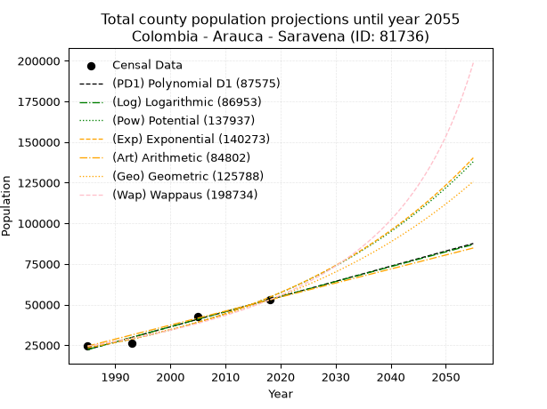
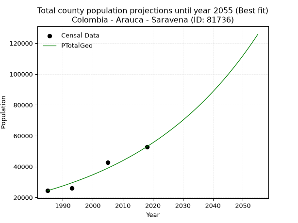
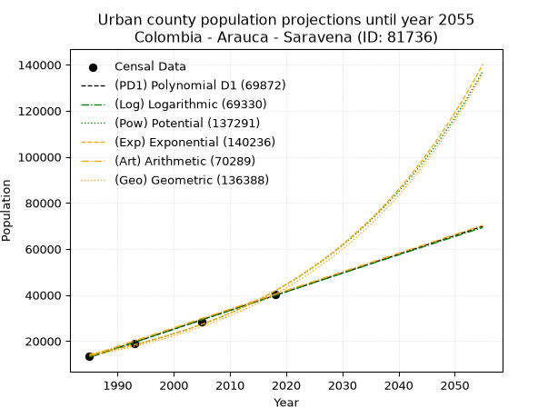
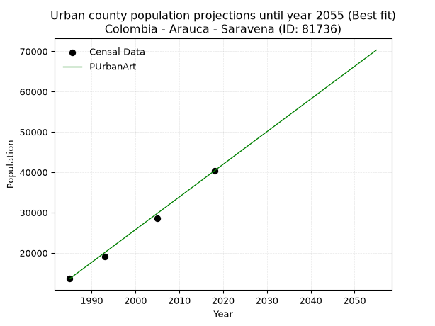
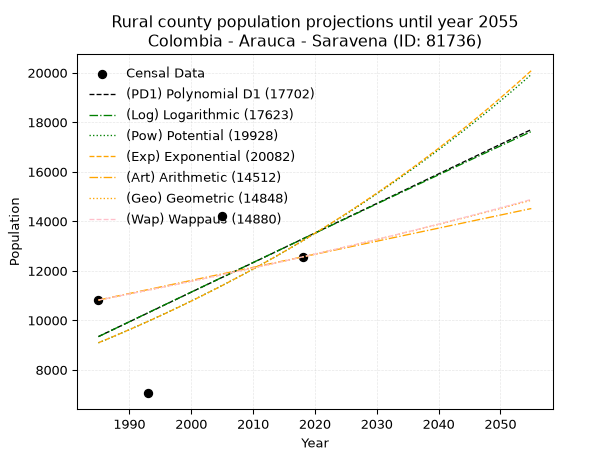
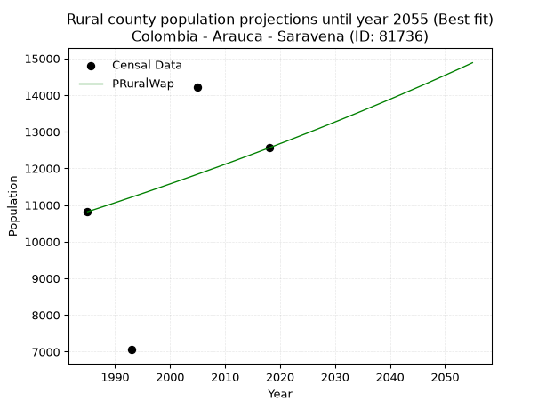

<div align="center">


</div>

# 📜 _“Population and Public Services Demand Projections (PPSD) until Year 2050 for Colombia - Arauca - Saravena (ID: 81736)”_
Keywords: `population` `public-service` `projection` `lineal` `polynomial` `logarithmic` `potential` `exponential` `arithmetic` `geometric` `wappaus` `dane` `colombia` `south-america`

PPSD are analytical estimates used by governments and planners to anticipate future changes in population size, age distribution, and the resulting community needs for utilities, healthcare, education, and infrastructure as sizing future water treatment facilities, electrical grids, and road networks based on spatial growth.

<div align="center">

</img>

</div>


> **General running parameters**: • app_version: _v20260806_. • Python version: _3.14.7_. • Pandas version: _3.0.5_. • NumPy version: _2.5.1_. • Creates, save and include plots into reports (create_plot): _False_. • Projection until year: _2050_. • Process polynomial degree 2 and up: _False_. • Process Wappaus: _True_. • Process Wappaus: _True_. • Set negative values to zero: _True_. • Set infinite values to zero: _True_. • Drop dataset notes: _True_. 
<div align="center">

Dynamic map: [:earth_americas:Google](http://maps.google.com/maps?q=6.953926394,-71.8728119) [:earth_americas:OSM](https://www.openstreetmap.org/#map=18/6.953926394/-71.8728119&layers=P) [:earth_americas:Bing](https://www.bing.com/maps?cp=6.953926394~-71.8728119&lvl=18) [:earth_americas:Apple](https://maps.apple.com/frame?center=6.953926394%2C-71.8728119&span=0.003%2C0.006)

</div>


<div align="center">

```geojson
{
  "type": "Feature",
  "geometry": {
    "type": "Point", 
    "coordinates": [-71.8728119, 6.953926394]
  }, 
  "properties": {
    "Name": "Colombia - Arauca - Saravena (ID: 81736)"
  }
}
```

</div>


## 0. Census Data (4 records)

Census data are official statistics collected by a government about the people and housing in a country. They usually include counts of total population, age, sex, race, income, education, and jobs.

📅Global census file: [Population.xlsx](../data/Population.xlsx)

| Source   |   Year |   CountryID | CountryName   |   StateID | StateName   |   CountyID | CountyName   |   PTotal |   PUrban |   PRural |
|:---------|-------:|------------:|:--------------|----------:|:------------|-----------:|:-------------|---------:|---------:|---------:|
| DANE     |   1985 |          57 | Colombia      |        81 | Arauca      |      81736 | Saravena     |    24417 |    13602 |    10815 |
| DANE     |   1993 |          57 | Colombia      |        81 | Arauca      |      81736 | Saravena     |    26049 |    18995 |     7054 |
| DANE     |   2005 |          57 | Colombia      |        81 | Arauca      |      81736 | Saravena     |    42766 |    28544 |    14222 |
| DANE     |   2018 |          57 | Colombia      |        81 | Arauca      |      81736 | Saravena     |    52884 |    40326 |    12558 |

> 🔥Some records could had specific notes about the registered values or the corresponding urban or rural distribution.

📅[SUI-RUPS](https://www.datos.gov.co/Hacienda-y-Cr-dito-P-blico/Registro-nico-de-Prestadores-de-Servicios-P-blicos/4qkq-csdn/about_data) - Local public utility companies: [RUPS.csv](../data/RUPS.csv)

 | SERVICIO       | ESTADO    | NOMBRE                                                              | NIT         | DEPARTAMENTO_DOMICILIO   | MUNICIPIO_DOMICILIO   | DIRECCION           |   TELEFONO | EMAIL                   | TIPO_PRESTADOR          | CLASIFICACION                 |
|:---------------|:----------|:--------------------------------------------------------------------|:------------|:-------------------------|:----------------------|:--------------------|-----------:|:------------------------|:------------------------|:------------------------------|
| ACUEDUCTO      | OPERATIVA | EMPRESA COMUNITARIA DE ACUEDUCTO, ALCANTARILLADO Y ASEO DE SARAVENA | 800163392-3 | ARAUCA                   | SARAVENA              | CALLE 30 15-30      |    8892028 | ezerojasvar@hotmail.com | ORGANIZACION AUTORIZADA | MAYOR O IGUAL A 5001 USUARIOS |
| ALCANTARILLADO | OPERATIVA | EMPRESA COMUNITARIA DE ACUEDUCTO, ALCANTARILLADO Y ASEO DE SARAVENA | 800163392-3 | ARAUCA                   | SARAVENA              | CALLE 30 15-30      |    8892028 | ezerojasvar@hotmail.com | ORGANIZACION AUTORIZADA | MAYOR O IGUAL A 5001 USUARIOS |
| ACUEDUCTO      | OPERATIVA | COOPERATIVA DEL ACUEDUCTO REGIONAL DE RIO CHIQUITO                  | 834000449-9 | ARAUCA                   | SARAVENA              | CARRERA 16 No 28-71 |    3204420 | COARCHIQLTDA@YAHOO.ES   | ORGANIZACION AUTORIZADA | MENOR O IGUAL A 2500 USUARIOS |
| ACUEDUCTO      | OPERATIVA | ASOCIACION COMUNITARIA DE SERVICIOS DE ACUEDUCTO Y ALCANTARILLADO   | 900209024-0 | ARAUCA                   | SARAVENA              | Calle 1 No 2 - 8    |    8898515 | ACPSAA@YAHOO.ES         | ORGANIZACION AUTORIZADA | MENOR O IGUAL A 2500 USUARIOS |

## 1. Total

### 1.1. Coefficients and Parameters

* (PD1) Polynomial Deg 1: 932.3404255319075, -1828384.936170198 (lineal)
* (Log) Logarithmic: 1865969.877700786, -14146722.99334784
* (Pow) Potential: 51.14227513966423, -164.28505214936806
* (Exp) Exponential: 0.025549107001016744, 2.2132487954964e-18
* (Art) Arithmetic: Year diff. 2018 - 1985 = 33, Population diff. 52884 - 24417 = 28467, Annual growth = 862.6363636363636
* (Geo) Geometric: Year diff. 2018 - 1985 = 33, Population diff. 52884 - 24417 = 28467, Annual growth % = 0.023695198904679637
* (Wap) Wappaus: i = 2.231889273454066, Condition values only valid for < 200)

<sub>
Wappaus condition values: ['0.00', '2.23', '4.46', '6.70', '8.93', '11.16', '13.39', '15.62', '17.86', '20.09', '22.32', '24.55', '26.78', '29.01', '31.25', '33.48', '35.71', '37.94', '40.17', '42.41', '44.64', '46.87', '49.10', '51.33', '53.57', '55.80', '58.03', '60.26', '62.49', '64.72', '66.96', '69.19', '71.42', '73.65', '75.88', '78.12', '80.35', '82.58', '84.81', '87.04', '89.28', '91.51', '93.74', '95.97', '98.20', '100.44', '102.67', '104.90', '107.13', '109.36', '111.59', '113.83', '116.06', '118.29', '120.52', '122.75', '124.99', '127.22', '129.45', '131.68', '133.91', '136.15', '138.38', '140.61', '142.84', '145.07']
</sub>


### 1.2. Projected Dataset

|   Year |   CountyID |   PTotalPD1 |   PTotalLog |   PTotalPow |   PTotalExp |   PTotalArt |   PTotalGeo |   PTotalWap |
|-------:|-----------:|------------:|------------:|------------:|------------:|------------:|------------:|------------:|
|   1985 |      81736 |       22311 |       22285 |       23438 |       23457 |       24417 |       24417 |       24417 |
|   1986 |      81736 |       23243 |       23224 |       24050 |       24064 |       25280 |       24996 |       24968 |
|   1987 |      81736 |       24175 |       24164 |       24677 |       24686 |       26142 |       25588 |       25532 |
|   1988 |      81736 |       25108 |       25102 |       25320 |       25325 |       27005 |       26194 |       26109 |
|   1989 |      81736 |       26040 |       26041 |       25980 |       25981 |       27868 |       26815 |       26699 |
|   1990 |      81736 |       26973 |       26979 |       26656 |       26653 |       28730 |       27450 |       27303 |
|   1991 |      81736 |       27905 |       27916 |       27350 |       27343 |       29593 |       28101 |       27921 |
|   1992 |      81736 |       28837 |       28853 |       28061 |       28050 |       30455 |       28766 |       28555 |
|   1993 |      81736 |       29770 |       29790 |       28791 |       28776 |       31318 |       29448 |       29204 |
|   1994 |      81736 |       30702 |       30726 |       29539 |       29521 |       32181 |       30146 |       29869 |
|   1995 |      81736 |       31634 |       31661 |       30306 |       30285 |       33043 |       30860 |       30551 |
|   1996 |      81736 |       32567 |       32596 |       31093 |       31068 |       33906 |       31591 |       31250 |
|   1997 |      81736 |       33499 |       33531 |       31900 |       31872 |       34769 |       32340 |       31968 |
|   1998 |      81736 |       34431 |       34465 |       32727 |       32697 |       35631 |       33106 |       32704 |
|   1999 |      81736 |       35364 |       35399 |       33576 |       33543 |       36494 |       33891 |       33459 |
|   2000 |      81736 |       36296 |       36332 |       34445 |       34411 |       37357 |       34694 |       34235 |
|   2001 |      81736 |       37228 |       37265 |       35337 |       35302 |       38219 |       35516 |       35032 |
|   2002 |      81736 |       38161 |       38197 |       36252 |       36215 |       39082 |       36357 |       35850 |
|   2003 |      81736 |       39093 |       39129 |       37190 |       37153 |       39944 |       37219 |       36692 |
|   2004 |      81736 |       40025 |       40060 |       38151 |       38114 |       40807 |       38101 |       37557 |
|   2005 |      81736 |       40958 |       40991 |       39137 |       39100 |       41670 |       39004 |       38448 |
|   2006 |      81736 |       41890 |       41922 |       40148 |       40112 |       42532 |       39928 |       39364 |
|   2007 |      81736 |       42822 |       42852 |       41185 |       41150 |       43395 |       40874 |       40307 |
|   2008 |      81736 |       43755 |       43781 |       42247 |       42215 |       44258 |       41843 |       41279 |
|   2009 |      81736 |       44687 |       44710 |       43337 |       43308 |       45120 |       42834 |       42280 |
|   2010 |      81736 |       45619 |       45639 |       44454 |       44428 |       45983 |       43849 |       43313 |
|   2011 |      81736 |       46552 |       46567 |       45599 |       45578 |       46846 |       44888 |       44377 |
|   2012 |      81736 |       47484 |       47494 |       46773 |       46758 |       47708 |       45952 |       45476 |
|   2013 |      81736 |       48416 |       48422 |       47977 |       47968 |       48571 |       47040 |       46611 |
|   2014 |      81736 |       49349 |       49348 |       49211 |       49209 |       49433 |       48155 |       47782 |
|   2015 |      81736 |       50281 |       50275 |       50477 |       50482 |       50296 |       49296 |       48994 |
|   2016 |      81736 |       51213 |       51200 |       51774 |       51789 |       51159 |       50464 |       50246 |
|   2017 |      81736 |       52146 |       52126 |       53104 |       53129 |       52021 |       51660 |       51542 |
|   2018 |      81736 |       53078 |       53051 |       54467 |       54504 |       52884 |       52884 |       52884 |
|   2019 |      81736 |       54010 |       53975 |       55865 |       55914 |       53747 |       54137 |       54274 |
|   2020 |      81736 |       54943 |       54899 |       57298 |       57361 |       54609 |       55420 |       55715 |
|   2021 |      81736 |       55875 |       55823 |       58766 |       58846 |       55472 |       56733 |       57210 |
|   2022 |      81736 |       56807 |       56746 |       60272 |       60369 |       56335 |       58077 |       58761 |
|   2023 |      81736 |       57740 |       57668 |       61816 |       61931 |       57197 |       59454 |       60373 |
|   2024 |      81736 |       58672 |       58590 |       63398 |       63533 |       58060 |       60862 |       62048 |
|   2025 |      81736 |       59604 |       59512 |       65020 |       65178 |       58922 |       62304 |       63791 |
|   2026 |      81736 |       60537 |       60433 |       66683 |       66864 |       59785 |       63781 |       65606 |
|   2027 |      81736 |       61469 |       61354 |       68387 |       68595 |       60648 |       65292 |       67497 |
|   2028 |      81736 |       62401 |       62274 |       70134 |       70370 |       61510 |       66839 |       69469 |
|   2029 |      81736 |       63334 |       63194 |       71924 |       72191 |       62373 |       68423 |       71527 |
|   2030 |      81736 |       64266 |       64114 |       73760 |       74059 |       63236 |       70044 |       73678 |
|   2031 |      81736 |       65198 |       65033 |       75641 |       75975 |       64098 |       71704 |       75927 |
|   2032 |      81736 |       66131 |       65951 |       77570 |       77942 |       64961 |       73403 |       78282 |
|   2033 |      81736 |       67063 |       66869 |       79546 |       79959 |       65824 |       75142 |       80750 |
|   2034 |      81736 |       67995 |       67787 |       81572 |       82028 |       66686 |       76923 |       83340 |
|   2035 |      81736 |       68928 |       68704 |       83649 |       84151 |       67549 |       78745 |       86060 |
|   2036 |      81736 |       69860 |       69621 |       85777 |       86328 |       68411 |       80611 |       88922 |
|   2037 |      81736 |       70793 |       70537 |       87958 |       88562 |       69274 |       82521 |       91935 |
|   2038 |      81736 |       71725 |       71453 |       90194 |       90854 |       70137 |       84477 |       95113 |
|   2039 |      81736 |       72657 |       72368 |       92486 |       93205 |       70999 |       86479 |       98470 |
|   2040 |      81736 |       73590 |       73283 |       94834 |       95617 |       71862 |       88528 |      102020 |
|   2041 |      81736 |       74522 |       74198 |       97241 |       98092 |       72725 |       90625 |      105782 |
|   2042 |      81736 |       75454 |       75112 |       99708 |      100630 |       73587 |       92773 |      109775 |
|   2043 |      81736 |       76387 |       76025 |      102236 |      103234 |       74450 |       94971 |      114020 |
|   2044 |      81736 |       77319 |       76938 |      104827 |      105906 |       75313 |       97221 |      118543 |
|   2045 |      81736 |       78251 |       77851 |      107482 |      108646 |       76175 |       99525 |      123371 |
|   2046 |      81736 |       79184 |       78763 |      110203 |      111458 |       77038 |      101883 |      128536 |
|   2047 |      81736 |       80116 |       79675 |      112992 |      114342 |       77900 |      104297 |      134076 |
|   2048 |      81736 |       81048 |       80586 |      115850 |      117301 |       78763 |      106769 |      140032 |
|   2049 |      81736 |       81981 |       81497 |      118778 |      120337 |       79626 |      109299 |      146453 |
|   2050 |      81736 |       82913 |       82408 |      121780 |      123451 |       80488 |      111889 |      153397 |
<div align="center">

</img>

</div>


### 1.3. Best fit with absolute and relative error (%)

Relative error puts that difference into context by dividing the absolute error by the true value, creating a unitless ratio or percentage that shows the scale of the mistake.

Absolute and relative error

|   Year | Source   |   CountryID | CountryName   |   StateID | StateName   |   CountyID_x | CountyName   |   PTotal |   PUrban |   PRural |   CountyID_y |   PTotalPD1 |   PTotalLog |   PTotalPow |   PTotalExp |   PTotalArt |   PTotalGeo |   PTotalWap |   PTotalPD1AbsError |   PTotalLogAbsError |   PTotalPowAbsError |   PTotalExpAbsError |   PTotalArtAbsError |   PTotalGeoAbsError |   PTotalWapAbsError |   PTotalPD1RelError |   PTotalLogRelError |   PTotalPowRelError |   PTotalExpRelError |   PTotalArtRelError |   PTotalGeoRelError |   PTotalWapRelError |
|-------:|:---------|------------:|:--------------|----------:|:------------|-------------:|:-------------|---------:|---------:|---------:|-------------:|------------:|------------:|------------:|------------:|------------:|------------:|------------:|--------------------:|--------------------:|--------------------:|--------------------:|--------------------:|--------------------:|--------------------:|--------------------:|--------------------:|--------------------:|--------------------:|--------------------:|--------------------:|--------------------:|
|   1985 | DANE     |          57 | Colombia      |        81 | Arauca      |        81736 | Saravena     |    24417 |    13602 |    10815 |        81736 |       22311 |       22285 |       23438 |       23457 |       24417 |       24417 |       24417 |                2106 |                2132 |                 979 |                 960 |                   0 |                   0 |                   0 |            8.62514  |            8.73162  |             4.0095  |             3.93169 |             0       |             0       |              0      |
|   1993 | DANE     |          57 | Colombia      |        81 | Arauca      |        81736 | Saravena     |    26049 |    18995 |     7054 |        81736 |       29770 |       29790 |       28791 |       28776 |       31318 |       29448 |       29204 |                3721 |                3741 |                2742 |                2727 |                5269 |                3399 |                3155 |           14.2846   |           14.3614   |            10.5263  |            10.4687  |            20.2273  |            13.0485  |             12.1118 |
|   2005 | DANE     |          57 | Colombia      |        81 | Arauca      |        81736 | Saravena     |    42766 |    28544 |    14222 |        81736 |       40958 |       40991 |       39137 |       39100 |       41670 |       39004 |       38448 |                1808 |                1775 |                3629 |                3666 |                1096 |                3762 |                4318 |            4.22766  |            4.15049  |             8.48571 |             8.57223 |             2.56278 |             8.79671 |             10.0968 |
|   2018 | DANE     |          57 | Colombia      |        81 | Arauca      |        81736 | Saravena     |    52884 |    40326 |    12558 |        81736 |       53078 |       53051 |       54467 |       54504 |       52884 |       52884 |       52884 |                 194 |                 167 |                1583 |                1620 |                   0 |                   0 |                   0 |            0.366841 |            0.315785 |             2.99334 |             3.06331 |             0       |             0       |              0      |

Relative error mean

| Method    |   RelError | Best   |
|:----------|-----------:|:-------|
| PTotalPD1 |    6.87606 |        |
| PTotalLog |    6.88982 |        |
| PTotalPow |    6.50372 |        |
| PTotalExp |    6.50899 |        |
| PTotalArt |    5.69751 |        |
| PTotalGeo |    5.4613  | True   |
| PTotalWap |    5.55215 |        |

💙Best method: _**PTotalGeo**_
<div align="center">

</img>

</div>


### 1.4. Fresh water supply demand in liters per capita per day (lpcd)

The fresh water supply demand typically ranges from 100 to 300 liters per capita per day (lpcd) for standard domestic and municipal planning, though absolute survival minimums set by the World Health Organization are as low as 7.5 to 20 liters per day, and total consumption in high-income nations can exceed 400 liters.

> `CZ`: Level in meters above the sea level (masl)<br> `WS`: Fresh water supply demand in liters per capita per day (lpcd or l/h/d)<br> `WSAll`: Zonal fresh water supply demand in liters per second (l/s)<br> `A`: Zonal area in square meters<br> `DP`: Population density (people/hectare or p/ha)

Reference values (RAS Colombia)

|    CZ |   WS |
|------:|-----:|
|  1000 |  120 |
|  2000 |  130 |
| 99999 |  140 |

County shapefile geometry properties and water supply values

|   CountyID |      ATotal |   CZTotal |   WSTotal |
|-----------:|------------:|----------:|----------:|
|      81736 | 9.23498e+08 |   351.504 |       120 |

Projected values for best method: PTotalGeo

|   CountyID |   Year |   PTotalGeo |   DPTotal |   WSTotal |   WSTotalAll |
|-----------:|-------:|------------:|----------:|----------:|-------------:|
|      81736 |   1985 |       24417 |      0.26 |       120 |      33.9125 |
|      81736 |   1986 |       24996 |      0.27 |       120 |      34.7167 |
|      81736 |   1987 |       25588 |      0.28 |       120 |      35.5389 |
|      81736 |   1988 |       26194 |      0.28 |       120 |      36.3806 |
|      81736 |   1989 |       26815 |      0.29 |       120 |      37.2431 |
|      81736 |   1990 |       27450 |      0.3  |       120 |      38.125  |
|      81736 |   1991 |       28101 |      0.3  |       120 |      39.0292 |
|      81736 |   1992 |       28766 |      0.31 |       120 |      39.9528 |
|      81736 |   1993 |       29448 |      0.32 |       120 |      40.9    |
|      81736 |   1994 |       30146 |      0.33 |       120 |      41.8694 |
|      81736 |   1995 |       30860 |      0.33 |       120 |      42.8611 |
|      81736 |   1996 |       31591 |      0.34 |       120 |      43.8764 |
|      81736 |   1997 |       32340 |      0.35 |       120 |      44.9167 |
|      81736 |   1998 |       33106 |      0.36 |       120 |      45.9806 |
|      81736 |   1999 |       33891 |      0.37 |       120 |      47.0708 |
|      81736 |   2000 |       34694 |      0.38 |       120 |      48.1861 |
|      81736 |   2001 |       35516 |      0.38 |       120 |      49.3278 |
|      81736 |   2002 |       36357 |      0.39 |       120 |      50.4958 |
|      81736 |   2003 |       37219 |      0.4  |       120 |      51.6931 |
|      81736 |   2004 |       38101 |      0.41 |       120 |      52.9181 |
|      81736 |   2005 |       39004 |      0.42 |       120 |      54.1722 |
|      81736 |   2006 |       39928 |      0.43 |       120 |      55.4556 |
|      81736 |   2007 |       40874 |      0.44 |       120 |      56.7694 |
|      81736 |   2008 |       41843 |      0.45 |       120 |      58.1153 |
|      81736 |   2009 |       42834 |      0.46 |       120 |      59.4917 |
|      81736 |   2010 |       43849 |      0.47 |       120 |      60.9014 |
|      81736 |   2011 |       44888 |      0.49 |       120 |      62.3444 |
|      81736 |   2012 |       45952 |      0.5  |       120 |      63.8222 |
|      81736 |   2013 |       47040 |      0.51 |       120 |      65.3333 |
|      81736 |   2014 |       48155 |      0.52 |       120 |      66.8819 |
|      81736 |   2015 |       49296 |      0.53 |       120 |      68.4667 |
|      81736 |   2016 |       50464 |      0.55 |       120 |      70.0889 |
|      81736 |   2017 |       51660 |      0.56 |       120 |      71.75   |
|      81736 |   2018 |       52884 |      0.57 |       120 |      73.45   |
|      81736 |   2019 |       54137 |      0.59 |       120 |      75.1903 |
|      81736 |   2020 |       55420 |      0.6  |       120 |      76.9722 |
|      81736 |   2021 |       56733 |      0.61 |       120 |      78.7958 |
|      81736 |   2022 |       58077 |      0.63 |       120 |      80.6625 |
|      81736 |   2023 |       59454 |      0.64 |       120 |      82.575  |
|      81736 |   2024 |       60862 |      0.66 |       120 |      84.5306 |
|      81736 |   2025 |       62304 |      0.67 |       120 |      86.5333 |
|      81736 |   2026 |       63781 |      0.69 |       120 |      88.5847 |
|      81736 |   2027 |       65292 |      0.71 |       120 |      90.6833 |
|      81736 |   2028 |       66839 |      0.72 |       120 |      92.8319 |
|      81736 |   2029 |       68423 |      0.74 |       120 |      95.0319 |
|      81736 |   2030 |       70044 |      0.76 |       120 |      97.2833 |
|      81736 |   2031 |       71704 |      0.78 |       120 |      99.5889 |
|      81736 |   2032 |       73403 |      0.79 |       120 |     101.949  |
|      81736 |   2033 |       75142 |      0.81 |       120 |     104.364  |
|      81736 |   2034 |       76923 |      0.83 |       120 |     106.838  |
|      81736 |   2035 |       78745 |      0.85 |       120 |     109.368  |
|      81736 |   2036 |       80611 |      0.87 |       120 |     111.96   |
|      81736 |   2037 |       82521 |      0.89 |       120 |     114.612  |
|      81736 |   2038 |       84477 |      0.91 |       120 |     117.329  |
|      81736 |   2039 |       86479 |      0.94 |       120 |     120.11   |
|      81736 |   2040 |       88528 |      0.96 |       120 |     122.956  |
|      81736 |   2041 |       90625 |      0.98 |       120 |     125.868  |
|      81736 |   2042 |       92773 |      1    |       120 |     128.851  |
|      81736 |   2043 |       94971 |      1.03 |       120 |     131.904  |
|      81736 |   2044 |       97221 |      1.05 |       120 |     135.029  |
|      81736 |   2045 |       99525 |      1.08 |       120 |     138.229  |
|      81736 |   2046 |      101883 |      1.1  |       120 |     141.504  |
|      81736 |   2047 |      104297 |      1.13 |       120 |     144.857  |
|      81736 |   2048 |      106769 |      1.16 |       120 |     148.29   |
|      81736 |   2049 |      109299 |      1.18 |       120 |     151.804  |
|      81736 |   2050 |      111889 |      1.21 |       120 |     155.401  |

## 2. Urban

### 2.1. Coefficients and Parameters

* (PD1) Polynomial Deg 1: 812.888398233633, -1600613.2685668243 (lineal)
* (Log) Logarithmic: 1626874.6483457666, -12340520.48903142
* (Pow) Potential: 65.55113332422324, -212.02092680360056
* (Exp) Exponential: 0.032741834303642296, 8.425286566386688e-25
* (Art) Arithmetic: Year diff. 2018 - 1985 = 33, Population diff. 40326 - 13602 = 26724, Annual growth = 809.8181818181819
* (Geo) Geometric: Year diff. 2018 - 1985 = 33, Population diff. 40326 - 13602 = 26724, Annual growth % = 0.033480998708837806
* (Wap) Wappaus: i = 3.0033310407142184, Condition values only valid for < 200)

<sub>
Wappaus condition values: ['0.00', '3.00', '6.01', '9.01', '12.01', '15.02', '18.02', '21.02', '24.03', '27.03', '30.03', '33.04', '36.04', '39.04', '42.05', '45.05', '48.05', '51.06', '54.06', '57.06', '60.07', '63.07', '66.07', '69.08', '72.08', '75.08', '78.09', '81.09', '84.09', '87.10', '90.10', '93.10', '96.11', '99.11', '102.11', '105.12', '108.12', '111.12', '114.13', '117.13', '120.13', '123.14', '126.14', '129.14', '132.15', '135.15', '138.15', '141.16', '144.16', '147.16', '150.17', '153.17', '156.17', '159.18', '162.18', '165.18', '168.19', '171.19', '174.19', '177.20', '180.20', '183.20', '186.21', '189.21', '192.21', '195.22']
</sub>


### 2.2. Projected Dataset

|   Year |   CountyID |   PUrbanPD1 |   PUrbanLog |   PUrbanPow |   PUrbanExp |   PUrbanArt |   PUrbanGeo |        PUrbanWap |
|-------:|-----------:|------------:|------------:|------------:|------------:|------------:|------------:|-----------------:|
|   1985 |      81736 |       12970 |       12947 |       14158 |       14174 |       13602 |       13602 |  13602           |
|   1986 |      81736 |       13783 |       13767 |       14634 |       14646 |       14412 |       14057 |  14017           |
|   1987 |      81736 |       14596 |       14586 |       15125 |       15133 |       15222 |       14528 |  14444           |
|   1988 |      81736 |       15409 |       15404 |       15632 |       15637 |       16031 |       15014 |  14885           |
|   1989 |      81736 |       16222 |       16223 |       16156 |       16157 |       16841 |       15517 |  15340           |
|   1990 |      81736 |       17035 |       17040 |       16697 |       16695 |       17651 |       16037 |  15810           |
|   1991 |      81736 |       17848 |       17858 |       17256 |       17251 |       18461 |       16574 |  16296           |
|   1992 |      81736 |       18660 |       18674 |       17833 |       17825 |       19271 |       17129 |  16797           |
|   1993 |      81736 |       19473 |       19491 |       18430 |       18418 |       20081 |       17702 |  17316           |
|   1994 |      81736 |       20286 |       20307 |       19046 |       19031 |       20890 |       18295 |  17853           |
|   1995 |      81736 |       21099 |       21123 |       19682 |       19664 |       21700 |       18907 |  18409           |
|   1996 |      81736 |       21912 |       21938 |       20339 |       20319 |       22510 |       19540 |  18985           |
|   1997 |      81736 |       22725 |       22753 |       21018 |       20995 |       23320 |       20194 |  19582           |
|   1998 |      81736 |       23538 |       23567 |       21719 |       21694 |       24130 |       20871 |  20201           |
|   1999 |      81736 |       24351 |       24381 |       22444 |       22416 |       24939 |       21569 |  20844           |
|   2000 |      81736 |       25164 |       25195 |       23192 |       23162 |       25749 |       22292 |  21511           |
|   2001 |      81736 |       25976 |       26008 |       23964 |       23933 |       26559 |       23038 |  22205           |
|   2002 |      81736 |       26789 |       26821 |       24762 |       24730 |       27369 |       23809 |  22927           |
|   2003 |      81736 |       27602 |       27634 |       25586 |       25553 |       28179 |       24606 |  23679           |
|   2004 |      81736 |       28415 |       28446 |       26437 |       26403 |       28989 |       25430 |  24462           |
|   2005 |      81736 |       29228 |       29257 |       27316 |       27282 |       29798 |       26282 |  25279           |
|   2006 |      81736 |       30041 |       30068 |       28223 |       28190 |       30608 |       27162 |  26132           |
|   2007 |      81736 |       30854 |       30879 |       29161 |       29128 |       31418 |       28071 |  27023           |
|   2008 |      81736 |       31667 |       31690 |       30128 |       30098 |       32228 |       29011 |  27955           |
|   2009 |      81736 |       32480 |       32500 |       31128 |       31100 |       33038 |       29982 |  28931           |
|   2010 |      81736 |       33292 |       33309 |       32160 |       32135 |       33847 |       30986 |  29953           |
|   2011 |      81736 |       34105 |       34118 |       33226 |       33204 |       34657 |       32023 |  31026           |
|   2012 |      81736 |       34918 |       34927 |       34327 |       34310 |       35467 |       33096 |  32154           |
|   2013 |      81736 |       35731 |       35735 |       35463 |       35452 |       36277 |       34204 |  33339           |
|   2014 |      81736 |       36544 |       36543 |       36637 |       36632 |       37087 |       35349 |  34588           |
|   2015 |      81736 |       37357 |       37351 |       37848 |       37851 |       37897 |       36532 |  35905           |
|   2016 |      81736 |       38170 |       38158 |       39100 |       39111 |       38706 |       37755 |  37296           |
|   2017 |      81736 |       38983 |       38965 |       40392 |       40412 |       39516 |       39020 |  38767           |
|   2018 |      81736 |       39796 |       39771 |       41725 |       41757 |       40326 |       40326 |  40326           |
|   2019 |      81736 |       40608 |       40577 |       43103 |       43147 |       41136 |       41676 |  41981           |
|   2020 |      81736 |       41421 |       41383 |       44525 |       44583 |       41946 |       43072 |  43740           |
|   2021 |      81736 |       42234 |       42188 |       45993 |       46067 |       42755 |       44514 |  45614           |
|   2022 |      81736 |       43047 |       42993 |       47509 |       47601 |       43565 |       46004 |  47615           |
|   2023 |      81736 |       43860 |       43797 |       49074 |       49185 |       44375 |       47544 |  49756           |
|   2024 |      81736 |       44673 |       44601 |       50690 |       50822 |       45185 |       49136 |  52053           |
|   2025 |      81736 |       45486 |       45405 |       52358 |       52513 |       45995 |       50781 |  54521           |
|   2026 |      81736 |       46299 |       46208 |       54080 |       54261 |       46805 |       52481 |  57183           |
|   2027 |      81736 |       47112 |       47011 |       55858 |       56067 |       47614 |       54238 |  60062           |
|   2028 |      81736 |       47924 |       47813 |       57693 |       57933 |       48424 |       56054 |  63184           |
|   2029 |      81736 |       48737 |       48615 |       59588 |       59862 |       49234 |       57931 |  66583           |
|   2030 |      81736 |       49550 |       49417 |       61544 |       61854 |       50044 |       59871 |  70296           |
|   2031 |      81736 |       50363 |       50218 |       63563 |       63913 |       50854 |       61875 |  74370           |
|   2032 |      81736 |       51176 |       51019 |       65648 |       66040 |       51663 |       63947 |  78860           |
|   2033 |      81736 |       51989 |       51819 |       67800 |       68238 |       52473 |       66088 |  83833           |
|   2034 |      81736 |       52802 |       52619 |       70021 |       70509 |       53283 |       68301 |  89372           |
|   2035 |      81736 |       53615 |       53419 |       72314 |       72856 |       54093 |       70587 |  95578           |
|   2036 |      81736 |       54428 |       54218 |       74680 |       75281 |       54903 |       72951 | 102580           |
|   2037 |      81736 |       55240 |       55017 |       77123 |       77787 |       55713 |       75393 | 110541           |
|   2038 |      81736 |       56053 |       55816 |       79645 |       80376 |       56522 |       77918 | 119674           |
|   2039 |      81736 |       56866 |       56614 |       82248 |       83051 |       57332 |       80526 | 130258           |
|   2040 |      81736 |       57679 |       57411 |       84934 |       85815 |       58142 |       83222 | 142667           |
|   2041 |      81736 |       58492 |       58209 |       87707 |       88672 |       58952 |       86009 | 157420           |
|   2042 |      81736 |       59305 |       59006 |       90569 |       91623 |       59762 |       88888 | 175248           |
|   2043 |      81736 |       60118 |       59802 |       93523 |       94672 |       60571 |       91864 | 197226           |
|   2044 |      81736 |       60931 |       60598 |       96571 |       97823 |       61381 |       94940 | 224993           |
|   2045 |      81736 |       61744 |       61394 |       99718 |      101079 |       62191 |       98119 | 261184           |
|   2046 |      81736 |       62556 |       62189 |      102965 |      104444 |       63001 |      101404 | 310317           |
|   2047 |      81736 |       63369 |       62984 |      106316 |      107920 |       63811 |      104799 | 380845           |
|   2048 |      81736 |       64182 |       63779 |      109775 |      111512 |       64621 |      108308 | 490636           |
|   2049 |      81736 |       64995 |       64573 |      113345 |      115223 |       65430 |      111934 | 685118           |
|   2050 |      81736 |       65808 |       65367 |      117029 |      119059 |       66240 |      115682 |      1.12381e+06 |
<div align="center">

</img>

</div>


### 2.3. Best fit with absolute and relative error (%)

Relative error puts that difference into context by dividing the absolute error by the true value, creating a unitless ratio or percentage that shows the scale of the mistake.

Absolute and relative error

|   Year | Source   |   CountryID | CountryName   |   StateID | StateName   |   CountyID_x | CountyName   |   PTotal |   PUrban |   PRural |   CountyID_y |   PUrbanPD1 |   PUrbanLog |   PUrbanPow |   PUrbanExp |   PUrbanArt |   PUrbanGeo |   PUrbanWap |   PUrbanPD1AbsError |   PUrbanLogAbsError |   PUrbanPowAbsError |   PUrbanExpAbsError |   PUrbanArtAbsError |   PUrbanGeoAbsError |   PUrbanWapAbsError |   PUrbanPD1RelError |   PUrbanLogRelError |   PUrbanPowRelError |   PUrbanExpRelError |   PUrbanArtRelError |   PUrbanGeoRelError |   PUrbanWapRelError |
|-------:|:---------|------------:|:--------------|----------:|:------------|-------------:|:-------------|---------:|---------:|---------:|-------------:|------------:|------------:|------------:|------------:|------------:|------------:|------------:|--------------------:|--------------------:|--------------------:|--------------------:|--------------------:|--------------------:|--------------------:|--------------------:|--------------------:|--------------------:|--------------------:|--------------------:|--------------------:|--------------------:|
|   1985 | DANE     |          57 | Colombia      |        81 | Arauca      |        81736 | Saravena     |    24417 |    13602 |    10815 |        81736 |       12970 |       12947 |       14158 |       14174 |       13602 |       13602 |       13602 |                 632 |                 655 |                 556 |                 572 |                   0 |                   0 |                   0 |             4.64638 |             4.81547 |             4.08763 |             4.20526 |             0       |             0       |             0       |
|   1993 | DANE     |          57 | Colombia      |        81 | Arauca      |        81736 | Saravena     |    26049 |    18995 |     7054 |        81736 |       19473 |       19491 |       18430 |       18418 |       20081 |       17702 |       17316 |                 478 |                 496 |                 565 |                 577 |                1086 |                1293 |                1679 |             2.51645 |             2.61121 |             2.97447 |             3.03764 |             5.71729 |             6.80705 |             8.83917 |
|   2005 | DANE     |          57 | Colombia      |        81 | Arauca      |        81736 | Saravena     |    42766 |    28544 |    14222 |        81736 |       29228 |       29257 |       27316 |       27282 |       29798 |       26282 |       25279 |                 684 |                 713 |                1228 |                1262 |                1254 |                2262 |                3265 |             2.3963  |             2.4979  |             4.30213 |             4.42124 |             4.39322 |             7.92461 |            11.4385  |
|   2018 | DANE     |          57 | Colombia      |        81 | Arauca      |        81736 | Saravena     |    52884 |    40326 |    12558 |        81736 |       39796 |       39771 |       41725 |       41757 |       40326 |       40326 |       40326 |                 530 |                 555 |                1399 |                1431 |                   0 |                   0 |                   0 |             1.31429 |             1.37628 |             3.46923 |             3.54858 |             0       |             0       |             0       |

Relative error mean

| Method    |   RelError | Best   |
|:----------|-----------:|:-------|
| PUrbanPD1 |    2.71835 |        |
| PUrbanLog |    2.82522 |        |
| PUrbanPow |    3.70836 |        |
| PUrbanExp |    3.80318 |        |
| PUrbanArt |    2.52763 | True   |
| PUrbanGeo |    3.68292 |        |
| PUrbanWap |    5.06941 |        |

💙Best method: _**PUrbanArt**_
<div align="center">

</img>

</div>


### 2.4. Fresh water supply demand in liters per capita per day (lpcd)

The fresh water supply demand typically ranges from 100 to 300 liters per capita per day (lpcd) for standard domestic and municipal planning, though absolute survival minimums set by the World Health Organization are as low as 7.5 to 20 liters per day, and total consumption in high-income nations can exceed 400 liters.

> `CZ`: Level in meters above the sea level (masl)<br> `WS`: Fresh water supply demand in liters per capita per day (lpcd or l/h/d)<br> `WSAll`: Zonal fresh water supply demand in liters per second (l/s)<br> `A`: Zonal area in square meters<br> `DP`: Population density (people/hectare or p/ha)

Reference values (RAS Colombia)

|    CZ |   WS |
|------:|-----:|
|  1000 |  120 |
|  2000 |  130 |
| 99999 |  140 |

County shapefile geometry properties and water supply values

|   CountyID |      AUrban |   CZUrban |   WSUrban |
|-----------:|------------:|----------:|----------:|
|      81736 | 1.02521e+07 |   224.061 |       120 |

Projected values for best method: PUrbanArt

|   CountyID |   Year |   PUrbanArt |   DPUrban |   WSUrban |   WSUrbanAll |
|-----------:|-------:|------------:|----------:|----------:|-------------:|
|      81736 |   1985 |       13602 |     13.27 |       120 |      18.8917 |
|      81736 |   1986 |       14412 |     14.06 |       120 |      20.0167 |
|      81736 |   1987 |       15222 |     14.85 |       120 |      21.1417 |
|      81736 |   1988 |       16031 |     15.64 |       120 |      22.2653 |
|      81736 |   1989 |       16841 |     16.43 |       120 |      23.3903 |
|      81736 |   1990 |       17651 |     17.22 |       120 |      24.5153 |
|      81736 |   1991 |       18461 |     18.01 |       120 |      25.6403 |
|      81736 |   1992 |       19271 |     18.8  |       120 |      26.7653 |
|      81736 |   1993 |       20081 |     19.59 |       120 |      27.8903 |
|      81736 |   1994 |       20890 |     20.38 |       120 |      29.0139 |
|      81736 |   1995 |       21700 |     21.17 |       120 |      30.1389 |
|      81736 |   1996 |       22510 |     21.96 |       120 |      31.2639 |
|      81736 |   1997 |       23320 |     22.75 |       120 |      32.3889 |
|      81736 |   1998 |       24130 |     23.54 |       120 |      33.5139 |
|      81736 |   1999 |       24939 |     24.33 |       120 |      34.6375 |
|      81736 |   2000 |       25749 |     25.12 |       120 |      35.7625 |
|      81736 |   2001 |       26559 |     25.91 |       120 |      36.8875 |
|      81736 |   2002 |       27369 |     26.7  |       120 |      38.0125 |
|      81736 |   2003 |       28179 |     27.49 |       120 |      39.1375 |
|      81736 |   2004 |       28989 |     28.28 |       120 |      40.2625 |
|      81736 |   2005 |       29798 |     29.07 |       120 |      41.3861 |
|      81736 |   2006 |       30608 |     29.86 |       120 |      42.5111 |
|      81736 |   2007 |       31418 |     30.65 |       120 |      43.6361 |
|      81736 |   2008 |       32228 |     31.44 |       120 |      44.7611 |
|      81736 |   2009 |       33038 |     32.23 |       120 |      45.8861 |
|      81736 |   2010 |       33847 |     33.01 |       120 |      47.0097 |
|      81736 |   2011 |       34657 |     33.8  |       120 |      48.1347 |
|      81736 |   2012 |       35467 |     34.59 |       120 |      49.2597 |
|      81736 |   2013 |       36277 |     35.38 |       120 |      50.3847 |
|      81736 |   2014 |       37087 |     36.18 |       120 |      51.5097 |
|      81736 |   2015 |       37897 |     36.97 |       120 |      52.6347 |
|      81736 |   2016 |       38706 |     37.75 |       120 |      53.7583 |
|      81736 |   2017 |       39516 |     38.54 |       120 |      54.8833 |
|      81736 |   2018 |       40326 |     39.33 |       120 |      56.0083 |
|      81736 |   2019 |       41136 |     40.12 |       120 |      57.1333 |
|      81736 |   2020 |       41946 |     40.91 |       120 |      58.2583 |
|      81736 |   2021 |       42755 |     41.7  |       120 |      59.3819 |
|      81736 |   2022 |       43565 |     42.49 |       120 |      60.5069 |
|      81736 |   2023 |       44375 |     43.28 |       120 |      61.6319 |
|      81736 |   2024 |       45185 |     44.07 |       120 |      62.7569 |
|      81736 |   2025 |       45995 |     44.86 |       120 |      63.8819 |
|      81736 |   2026 |       46805 |     45.65 |       120 |      65.0069 |
|      81736 |   2027 |       47614 |     46.44 |       120 |      66.1306 |
|      81736 |   2028 |       48424 |     47.23 |       120 |      67.2556 |
|      81736 |   2029 |       49234 |     48.02 |       120 |      68.3806 |
|      81736 |   2030 |       50044 |     48.81 |       120 |      69.5056 |
|      81736 |   2031 |       50854 |     49.6  |       120 |      70.6306 |
|      81736 |   2032 |       51663 |     50.39 |       120 |      71.7542 |
|      81736 |   2033 |       52473 |     51.18 |       120 |      72.8792 |
|      81736 |   2034 |       53283 |     51.97 |       120 |      74.0042 |
|      81736 |   2035 |       54093 |     52.76 |       120 |      75.1292 |
|      81736 |   2036 |       54903 |     53.55 |       120 |      76.2542 |
|      81736 |   2037 |       55713 |     54.34 |       120 |      77.3792 |
|      81736 |   2038 |       56522 |     55.13 |       120 |      78.5028 |
|      81736 |   2039 |       57332 |     55.92 |       120 |      79.6278 |
|      81736 |   2040 |       58142 |     56.71 |       120 |      80.7528 |
|      81736 |   2041 |       58952 |     57.5  |       120 |      81.8778 |
|      81736 |   2042 |       59762 |     58.29 |       120 |      83.0028 |
|      81736 |   2043 |       60571 |     59.08 |       120 |      84.1264 |
|      81736 |   2044 |       61381 |     59.87 |       120 |      85.2514 |
|      81736 |   2045 |       62191 |     60.66 |       120 |      86.3764 |
|      81736 |   2046 |       63001 |     61.45 |       120 |      87.5014 |
|      81736 |   2047 |       63811 |     62.24 |       120 |      88.6264 |
|      81736 |   2048 |       64621 |     63.03 |       120 |      89.7514 |
|      81736 |   2049 |       65430 |     63.82 |       120 |      90.875  |
|      81736 |   2050 |       66240 |     64.61 |       120 |      92      |

## 3. Rural

### 3.1. Coefficients and Parameters

* (PD1) Polynomial Deg 1: 119.45202729827432, -227771.6676033732 (lineal)
* (Log) Logarithmic: 239095.22935501928, -1806202.5043164243
* (Pow) Potential: 22.654696307201327, -70.75128479496156
* (Exp) Exponential: 0.011322840314164225, 1.5756591850085727e-06
* (Art) Arithmetic: Year diff. 2018 - 1985 = 33, Population diff. 12558 - 10815 = 1743, Annual growth = 52.81818181818182
* (Geo) Geometric: Year diff. 2018 - 1985 = 33, Population diff. 12558 - 10815 = 1743, Annual growth % = 0.004538262416270644
* (Wap) Wappaus: i = 0.45195894252498026, Condition values only valid for < 200)

<sub>
Wappaus condition values: ['0.00', '0.45', '0.90', '1.36', '1.81', '2.26', '2.71', '3.16', '3.62', '4.07', '4.52', '4.97', '5.42', '5.88', '6.33', '6.78', '7.23', '7.68', '8.14', '8.59', '9.04', '9.49', '9.94', '10.40', '10.85', '11.30', '11.75', '12.20', '12.65', '13.11', '13.56', '14.01', '14.46', '14.91', '15.37', '15.82', '16.27', '16.72', '17.17', '17.63', '18.08', '18.53', '18.98', '19.43', '19.89', '20.34', '20.79', '21.24', '21.69', '22.15', '22.60', '23.05', '23.50', '23.95', '24.41', '24.86', '25.31', '25.76', '26.21', '26.67', '27.12', '27.57', '28.02', '28.47', '28.93', '29.38']
</sub>


### 3.2. Projected Dataset

|   Year |   CountyID |   PRuralPD1 |   PRuralLog |   PRuralPow |   PRuralExp |   PRuralArt |   PRuralGeo |   PRuralWap |
|-------:|-----------:|------------:|------------:|------------:|------------:|------------:|------------:|------------:|
|   1985 |      81736 |        9341 |        9337 |        9088 |        9091 |       10815 |       10815 |       10815 |
|   1986 |      81736 |        9460 |        9457 |        9192 |        9194 |       10868 |       10864 |       10864 |
|   1987 |      81736 |        9580 |        9578 |        9298 |        9299 |       10921 |       10913 |       10913 |
|   1988 |      81736 |        9699 |        9698 |        9405 |        9405 |       10973 |       10963 |       10963 |
|   1989 |      81736 |        9818 |        9818 |        9512 |        9512 |       11026 |       11013 |       11012 |
|   1990 |      81736 |        9938 |        9939 |        9621 |        9620 |       11079 |       11063 |       11062 |
|   1991 |      81736 |       10057 |       10059 |        9731 |        9730 |       11132 |       11113 |       11112 |
|   1992 |      81736 |       10177 |       10179 |        9843 |        9840 |       11185 |       11163 |       11163 |
|   1993 |      81736 |       10296 |       10299 |        9955 |        9953 |       11238 |       11214 |       11213 |
|   1994 |      81736 |       10416 |       10419 |       10069 |       10066 |       11290 |       11265 |       11264 |
|   1995 |      81736 |       10535 |       10539 |       10184 |       10181 |       11343 |       11316 |       11315 |
|   1996 |      81736 |       10655 |       10658 |       10300 |       10296 |       11396 |       11367 |       11366 |
|   1997 |      81736 |       10774 |       10778 |       10418 |       10414 |       11449 |       11419 |       11418 |
|   1998 |      81736 |       10893 |       10898 |       10537 |       10532 |       11502 |       11471 |       11470 |
|   1999 |      81736 |       11013 |       11017 |       10657 |       10652 |       11554 |       11523 |       11522 |
|   2000 |      81736 |       11132 |       11137 |       10778 |       10773 |       11607 |       11575 |       11574 |
|   2001 |      81736 |       11252 |       11257 |       10901 |       10896 |       11660 |       11628 |       11626 |
|   2002 |      81736 |       11371 |       11376 |       11025 |       11020 |       11713 |       11680 |       11679 |
|   2003 |      81736 |       11491 |       11495 |       11151 |       11146 |       11766 |       11733 |       11732 |
|   2004 |      81736 |       11610 |       11615 |       11277 |       11273 |       11819 |       11787 |       11785 |
|   2005 |      81736 |       11730 |       11734 |       11405 |       11401 |       11871 |       11840 |       11839 |
|   2006 |      81736 |       11849 |       11853 |       11535 |       11531 |       11924 |       11894 |       11893 |
|   2007 |      81736 |       11969 |       11972 |       11666 |       11662 |       11977 |       11948 |       11947 |
|   2008 |      81736 |       12088 |       12091 |       11798 |       11795 |       12030 |       12002 |       12001 |
|   2009 |      81736 |       12207 |       12211 |       11932 |       11929 |       12083 |       12057 |       12055 |
|   2010 |      81736 |       12327 |       12330 |       12068 |       12065 |       12135 |       12111 |       12110 |
|   2011 |      81736 |       12446 |       12448 |       12204 |       12202 |       12188 |       12166 |       12165 |
|   2012 |      81736 |       12566 |       12567 |       12343 |       12341 |       12241 |       12221 |       12220 |
|   2013 |      81736 |       12685 |       12686 |       12482 |       12482 |       12294 |       12277 |       12276 |
|   2014 |      81736 |       12805 |       12805 |       12623 |       12624 |       12347 |       12333 |       12332 |
|   2015 |      81736 |       12924 |       12924 |       12766 |       12768 |       12400 |       12389 |       12388 |
|   2016 |      81736 |       13044 |       13042 |       12911 |       12913 |       12452 |       12445 |       12444 |
|   2017 |      81736 |       13163 |       13161 |       13056 |       13060 |       12505 |       12501 |       12501 |
|   2018 |      81736 |       13283 |       13279 |       13204 |       13209 |       12558 |       12558 |       12558 |
|   2019 |      81736 |       13402 |       13398 |       13353 |       13359 |       12611 |       12615 |       12615 |
|   2020 |      81736 |       13521 |       13516 |       13504 |       13512 |       12664 |       12672 |       12673 |
|   2021 |      81736 |       13641 |       13634 |       13656 |       13665 |       12716 |       12730 |       12730 |
|   2022 |      81736 |       13760 |       13753 |       13810 |       13821 |       12769 |       12788 |       12789 |
|   2023 |      81736 |       13880 |       13871 |       13965 |       13978 |       12822 |       12846 |       12847 |
|   2024 |      81736 |       13999 |       13989 |       14122 |       14138 |       12875 |       12904 |       12906 |
|   2025 |      81736 |       14119 |       14107 |       14281 |       14299 |       12928 |       12962 |       12964 |
|   2026 |      81736 |       14238 |       14225 |       14442 |       14461 |       12981 |       13021 |       13024 |
|   2027 |      81736 |       14358 |       14343 |       14604 |       14626 |       13033 |       13080 |       13083 |
|   2028 |      81736 |       14477 |       14461 |       14768 |       14793 |       13086 |       13140 |       13143 |
|   2029 |      81736 |       14596 |       14579 |       14934 |       14961 |       13139 |       13199 |       13203 |
|   2030 |      81736 |       14716 |       14697 |       15102 |       15131 |       13192 |       13259 |       13264 |
|   2031 |      81736 |       14835 |       14815 |       15271 |       15304 |       13245 |       13319 |       13324 |
|   2032 |      81736 |       14955 |       14932 |       15443 |       15478 |       13297 |       13380 |       13385 |
|   2033 |      81736 |       15074 |       15050 |       15616 |       15654 |       13350 |       13441 |       13447 |
|   2034 |      81736 |       15194 |       15167 |       15791 |       15833 |       13403 |       13502 |       13508 |
|   2035 |      81736 |       15313 |       15285 |       15968 |       16013 |       13456 |       13563 |       13570 |
|   2036 |      81736 |       15433 |       15402 |       16146 |       16195 |       13509 |       13624 |       13633 |
|   2037 |      81736 |       15552 |       15520 |       16327 |       16380 |       13562 |       13686 |       13695 |
|   2038 |      81736 |       15672 |       15637 |       16509 |       16566 |       13614 |       13748 |       13758 |
|   2039 |      81736 |       15791 |       15754 |       16694 |       16755 |       13667 |       13811 |       13821 |
|   2040 |      81736 |       15910 |       15872 |       16880 |       16945 |       13720 |       13873 |       13885 |
|   2041 |      81736 |       16030 |       15989 |       17069 |       17138 |       13773 |       13936 |       13949 |
|   2042 |      81736 |       16149 |       16106 |       17259 |       17334 |       13826 |       14000 |       14013 |
|   2043 |      81736 |       16269 |       16223 |       17452 |       17531 |       13878 |       14063 |       14078 |
|   2044 |      81736 |       16388 |       16340 |       17646 |       17731 |       13931 |       14127 |       14143 |
|   2045 |      81736 |       16508 |       16457 |       17843 |       17933 |       13984 |       14191 |       14208 |
|   2046 |      81736 |       16627 |       16574 |       18042 |       18137 |       14037 |       14255 |       14273 |
|   2047 |      81736 |       16747 |       16691 |       18243 |       18343 |       14090 |       14320 |       14339 |
|   2048 |      81736 |       16866 |       16808 |       18445 |       18552 |       14143 |       14385 |       14406 |
|   2049 |      81736 |       16986 |       16924 |       18651 |       18763 |       14195 |       14450 |       14472 |
|   2050 |      81736 |       17105 |       17041 |       18858 |       18977 |       14248 |       14516 |       14539 |
<div align="center">

</img>

</div>


### 3.3. Best fit with absolute and relative error (%)

Relative error puts that difference into context by dividing the absolute error by the true value, creating a unitless ratio or percentage that shows the scale of the mistake.

Absolute and relative error

|   Year | Source   |   CountryID | CountryName   |   StateID | StateName   |   CountyID_x | CountyName   |   PTotal |   PUrban |   PRural |   CountyID_y |   PRuralPD1 |   PRuralLog |   PRuralPow |   PRuralExp |   PRuralArt |   PRuralGeo |   PRuralWap |   PRuralPD1AbsError |   PRuralLogAbsError |   PRuralPowAbsError |   PRuralExpAbsError |   PRuralArtAbsError |   PRuralGeoAbsError |   PRuralWapAbsError |   PRuralPD1RelError |   PRuralLogRelError |   PRuralPowRelError |   PRuralExpRelError |   PRuralArtRelError |   PRuralGeoRelError |   PRuralWapRelError |
|-------:|:---------|------------:|:--------------|----------:|:------------|-------------:|:-------------|---------:|---------:|---------:|-------------:|------------:|------------:|------------:|------------:|------------:|------------:|------------:|--------------------:|--------------------:|--------------------:|--------------------:|--------------------:|--------------------:|--------------------:|--------------------:|--------------------:|--------------------:|--------------------:|--------------------:|--------------------:|--------------------:|
|   1985 | DANE     |          57 | Colombia      |        81 | Arauca      |        81736 | Saravena     |    24417 |    13602 |    10815 |        81736 |        9341 |        9337 |        9088 |        9091 |       10815 |       10815 |       10815 |                1474 |                1478 |                1727 |                1724 |                   0 |                   0 |                   0 |            13.6292  |            13.6662  |            15.9686  |            15.9408  |              0      |              0      |              0      |
|   1993 | DANE     |          57 | Colombia      |        81 | Arauca      |        81736 | Saravena     |    26049 |    18995 |     7054 |        81736 |       10296 |       10299 |        9955 |        9953 |       11238 |       11214 |       11213 |                3242 |                3245 |                2901 |                2899 |                4184 |                4160 |                4159 |            45.9597  |            46.0023  |            41.1256  |            41.0972  |             59.3139 |             58.9736 |             58.9595 |
|   2005 | DANE     |          57 | Colombia      |        81 | Arauca      |        81736 | Saravena     |    42766 |    28544 |    14222 |        81736 |       11730 |       11734 |       11405 |       11401 |       11871 |       11840 |       11839 |                2492 |                2488 |                2817 |                2821 |                2351 |                2382 |                2383 |            17.5221  |            17.494   |            19.8073  |            19.8355  |             16.5307 |             16.7487 |             16.7557 |
|   2018 | DANE     |          57 | Colombia      |        81 | Arauca      |        81736 | Saravena     |    52884 |    40326 |    12558 |        81736 |       13283 |       13279 |       13204 |       13209 |       12558 |       12558 |       12558 |                 725 |                 721 |                 646 |                 651 |                   0 |                   0 |                   0 |             5.77321 |             5.74136 |             5.14413 |             5.18395 |              0      |              0      |              0      |

Relative error mean

| Method    |   RelError | Best   |
|:----------|-----------:|:-------|
| PRuralPD1 |    20.7211 |        |
| PRuralLog |    20.726  |        |
| PRuralPow |    20.5114 |        |
| PRuralExp |    20.5144 |        |
| PRuralArt |    18.9611 |        |
| PRuralGeo |    18.9306 |        |
| PRuralWap |    18.9288 | True   |

💙Best method: _**PRuralWap**_
<div align="center">

</img>

</div>


### 3.4. Fresh water supply demand in liters per capita per day (lpcd)

The fresh water supply demand typically ranges from 100 to 300 liters per capita per day (lpcd) for standard domestic and municipal planning, though absolute survival minimums set by the World Health Organization are as low as 7.5 to 20 liters per day, and total consumption in high-income nations can exceed 400 liters.

> `CZ`: Level in meters above the sea level (masl)<br> `WS`: Fresh water supply demand in liters per capita per day (lpcd or l/h/d)<br> `WSAll`: Zonal fresh water supply demand in liters per second (l/s)<br> `A`: Zonal area in square meters<br> `DP`: Population density (people/hectare or p/ha)

Reference values (RAS Colombia)

|    CZ |   WS |
|------:|-----:|
|  1000 |  120 |
|  2000 |  130 |
| 99999 |  140 |

County shapefile geometry properties and water supply values

|   CountyID |      ARural |   CZRural |   WSRural |
|-----------:|------------:|----------:|----------:|
|      81736 | 9.13246e+08 |   352.935 |       120 |

Projected values for best method: PRuralWap

|   CountyID |   Year |   PRuralWap |   DPRural |   WSRural |   WSRuralAll |
|-----------:|-------:|------------:|----------:|----------:|-------------:|
|      81736 |   1985 |       10815 |      0.12 |       120 |      15.0208 |
|      81736 |   1986 |       10864 |      0.12 |       120 |      15.0889 |
|      81736 |   1987 |       10913 |      0.12 |       120 |      15.1569 |
|      81736 |   1988 |       10963 |      0.12 |       120 |      15.2264 |
|      81736 |   1989 |       11012 |      0.12 |       120 |      15.2944 |
|      81736 |   1990 |       11062 |      0.12 |       120 |      15.3639 |
|      81736 |   1991 |       11112 |      0.12 |       120 |      15.4333 |
|      81736 |   1992 |       11163 |      0.12 |       120 |      15.5042 |
|      81736 |   1993 |       11213 |      0.12 |       120 |      15.5736 |
|      81736 |   1994 |       11264 |      0.12 |       120 |      15.6444 |
|      81736 |   1995 |       11315 |      0.12 |       120 |      15.7153 |
|      81736 |   1996 |       11366 |      0.12 |       120 |      15.7861 |
|      81736 |   1997 |       11418 |      0.13 |       120 |      15.8583 |
|      81736 |   1998 |       11470 |      0.13 |       120 |      15.9306 |
|      81736 |   1999 |       11522 |      0.13 |       120 |      16.0028 |
|      81736 |   2000 |       11574 |      0.13 |       120 |      16.075  |
|      81736 |   2001 |       11626 |      0.13 |       120 |      16.1472 |
|      81736 |   2002 |       11679 |      0.13 |       120 |      16.2208 |
|      81736 |   2003 |       11732 |      0.13 |       120 |      16.2944 |
|      81736 |   2004 |       11785 |      0.13 |       120 |      16.3681 |
|      81736 |   2005 |       11839 |      0.13 |       120 |      16.4431 |
|      81736 |   2006 |       11893 |      0.13 |       120 |      16.5181 |
|      81736 |   2007 |       11947 |      0.13 |       120 |      16.5931 |
|      81736 |   2008 |       12001 |      0.13 |       120 |      16.6681 |
|      81736 |   2009 |       12055 |      0.13 |       120 |      16.7431 |
|      81736 |   2010 |       12110 |      0.13 |       120 |      16.8194 |
|      81736 |   2011 |       12165 |      0.13 |       120 |      16.8958 |
|      81736 |   2012 |       12220 |      0.13 |       120 |      16.9722 |
|      81736 |   2013 |       12276 |      0.13 |       120 |      17.05   |
|      81736 |   2014 |       12332 |      0.14 |       120 |      17.1278 |
|      81736 |   2015 |       12388 |      0.14 |       120 |      17.2056 |
|      81736 |   2016 |       12444 |      0.14 |       120 |      17.2833 |
|      81736 |   2017 |       12501 |      0.14 |       120 |      17.3625 |
|      81736 |   2018 |       12558 |      0.14 |       120 |      17.4417 |
|      81736 |   2019 |       12615 |      0.14 |       120 |      17.5208 |
|      81736 |   2020 |       12673 |      0.14 |       120 |      17.6014 |
|      81736 |   2021 |       12730 |      0.14 |       120 |      17.6806 |
|      81736 |   2022 |       12789 |      0.14 |       120 |      17.7625 |
|      81736 |   2023 |       12847 |      0.14 |       120 |      17.8431 |
|      81736 |   2024 |       12906 |      0.14 |       120 |      17.925  |
|      81736 |   2025 |       12964 |      0.14 |       120 |      18.0056 |
|      81736 |   2026 |       13024 |      0.14 |       120 |      18.0889 |
|      81736 |   2027 |       13083 |      0.14 |       120 |      18.1708 |
|      81736 |   2028 |       13143 |      0.14 |       120 |      18.2542 |
|      81736 |   2029 |       13203 |      0.14 |       120 |      18.3375 |
|      81736 |   2030 |       13264 |      0.15 |       120 |      18.4222 |
|      81736 |   2031 |       13324 |      0.15 |       120 |      18.5056 |
|      81736 |   2032 |       13385 |      0.15 |       120 |      18.5903 |
|      81736 |   2033 |       13447 |      0.15 |       120 |      18.6764 |
|      81736 |   2034 |       13508 |      0.15 |       120 |      18.7611 |
|      81736 |   2035 |       13570 |      0.15 |       120 |      18.8472 |
|      81736 |   2036 |       13633 |      0.15 |       120 |      18.9347 |
|      81736 |   2037 |       13695 |      0.15 |       120 |      19.0208 |
|      81736 |   2038 |       13758 |      0.15 |       120 |      19.1083 |
|      81736 |   2039 |       13821 |      0.15 |       120 |      19.1958 |
|      81736 |   2040 |       13885 |      0.15 |       120 |      19.2847 |
|      81736 |   2041 |       13949 |      0.15 |       120 |      19.3736 |
|      81736 |   2042 |       14013 |      0.15 |       120 |      19.4625 |
|      81736 |   2043 |       14078 |      0.15 |       120 |      19.5528 |
|      81736 |   2044 |       14143 |      0.15 |       120 |      19.6431 |
|      81736 |   2045 |       14208 |      0.16 |       120 |      19.7333 |
|      81736 |   2046 |       14273 |      0.16 |       120 |      19.8236 |
|      81736 |   2047 |       14339 |      0.16 |       120 |      19.9153 |
|      81736 |   2048 |       14406 |      0.16 |       120 |      20.0083 |
|      81736 |   2049 |       14472 |      0.16 |       120 |      20.1    |
|      81736 |   2050 |       14539 |      0.16 |       120 |      20.1931 |

#

<div align="center"><br><sub>Share this research</sub></div><br>

<sub>**APPS & TOOLS & CONTENT DISCLAIMER**: • NO WARRANTY - This content and software is provided by <a href="https://github.com/rcfdtools" target="_blank">github.com/rcfdtools</a> "as is", without any express or implied warranty, including warranties of merchantability, fitness for a particular purpose, or non-infringement. There is no guarantee that the software will be error-free or operate without interruption. • LIMITATION OF LIABILITY - Neither the authors nor copyright holders will be liable for claims or damages arising from the software or its use. You are responsible for determining if the software is appropriate for your use and assume all associated risks, including errors, legal compliance, and data loss. • NO PROFESSIONAL ADVICE - The software provides general information and does not offer professional advice. It should not replace consultation with professional advisors. [Clauses and global license for rcfdtools use.](https://github.com/rcfdtools/rcfdtools/blob/main/LICENSE.md)</sub>

| [:house: Home](Readme.md)  | [:beginner: Help / Collab](https://github.com/rcfdtools/R.HydroTools/discussions/31) |
|----------------------------|-------------------------------------------------------------------------------------------|