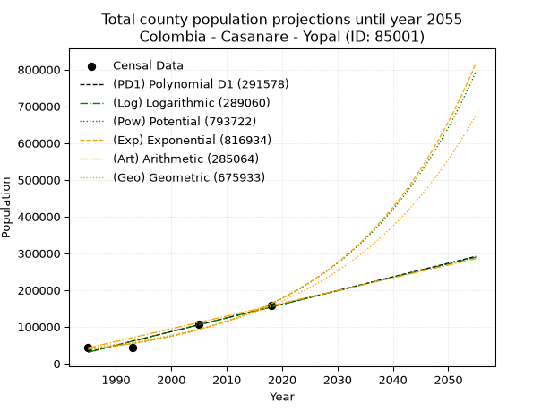
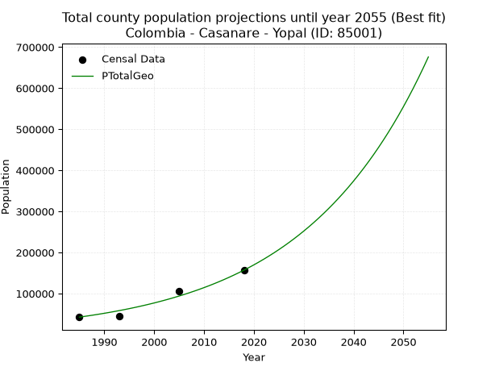
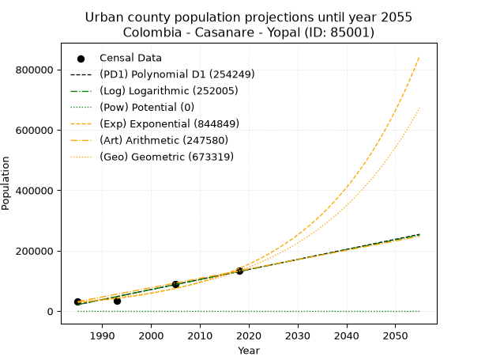
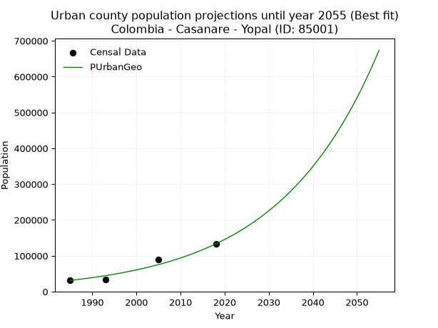
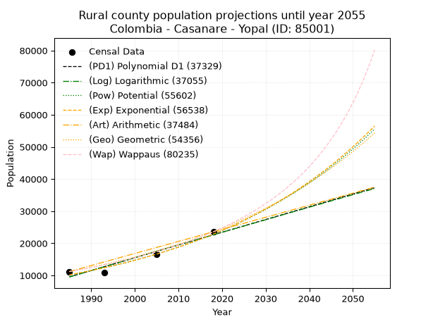
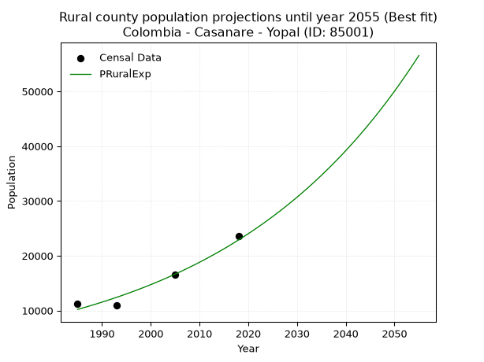

<div align="center">


</div>

# 📜 _“Population and Public Services Demand Projections (PPSD) until Year 2050 for Colombia - Casanare - Yopal (ID: 85001)”_
Keywords: `population` `public-service` `projection` `lineal` `polynomial` `logarithmic` `potential` `exponential` `arithmetic` `geometric` `wappaus` `dane` `colombia` `south-america`

PPSD are analytical estimates used by governments and planners to anticipate future changes in population size, age distribution, and the resulting community needs for utilities, healthcare, education, and infrastructure as sizing future water treatment facilities, electrical grids, and road networks based on spatial growth.

<div align="center">

</img>

</div>


> **General running parameters**: • app_version: _v20260806_. • Python version: _3.14.7_. • Pandas version: _3.0.5_. • NumPy version: _2.5.1_. • Creates, save and include plots into reports (create_plot): _False_. • Projection until year: _2050_. • Process polynomial degree 2 and up: _False_. • Process Wappaus: _True_. • Process Wappaus: _True_. • Set negative values to zero: _True_. • Set infinite values to zero: _True_. • Drop dataset notes: _True_. 
<div align="center">

Maps & GIS Layers: [:earth_americas:Google](http://maps.google.com/maps?q=5.327101721,-72.3961319) [:earth_americas:OSM](https://www.openstreetmap.org/#map=18/5.327101721/-72.3961319&layers=P) [:earth_americas:Bing](https://www.bing.com/maps?cp=5.327101721~-72.3961319&lvl=18) [:earth_americas:Apple](https://maps.apple.com/frame?center=5.327101721%2C-72.3961319&span=0.003%2C0.006) [:earth_americas:GISMobile](https://github.com/rcfdtools/R.GISMobile/blob/main/file/gis/CountyLayer_CO/Readme.md)

</div>


<div align="center">

```geojson
{
  "type": "Feature",
  "geometry": {
    "type": "Point", 
    "coordinates": [-72.3961319, 5.327101721]
  }, 
  "properties": {
    "Name": "Colombia - Casanare - Yopal (ID: 85001)"
  }
}
```

</div>


## 0. Census Data (4 records)

Census data are official statistics collected by a government about the people and housing in a country. They usually include counts of total population, age, sex, race, income, education, and jobs.

📅Global census file: [Population.xlsx](../data/Population.xlsx)

| Source   |   Year |   CountryID | CountryName   |   StateID | StateName   |   CountyID | CountyName   |   PTotal |   PUrban |   PRural |
|:---------|-------:|------------:|:--------------|----------:|:------------|-----------:|:-------------|---------:|---------:|---------:|
| DANE     |   1985 |          57 | Colombia      |        85 | Casanare    |      85001 | Yopal        |    42671 |    31460 |    11211 |
| DANE     |   1993 |          57 | Colombia      |        85 | Casanare    |      85001 | Yopal        |    44761 |    33790 |    10971 |
| DANE     |   2005 |          57 | Colombia      |        85 | Casanare    |      85001 | Yopal        |   106822 |    90218 |    16604 |
| DANE     |   2018 |          57 | Colombia      |        85 | Casanare    |      85001 | Yopal        |   156942 |   133345 |    23597 |

> 🔥Some records could had specific notes about the registered values or the corresponding urban or rural distribution.

📅[SUI-RUPS](https://www.datos.gov.co/Hacienda-y-Cr-dito-P-blico/Registro-nico-de-Prestadores-de-Servicios-P-blicos/4qkq-csdn/about_data) - Local public utility companies: [RUPS.csv](../data/RUPS.csv)

 | SERVICIO       | ESTADO    | NOMBRE                                                           | NIT         | DEPARTAMENTO_DOMICILIO   | MUNICIPIO_DOMICILIO   | DIRECCION              |   TELEFONO | EMAIL                       | TIPO_PRESTADOR                             | CLASIFICACION                 |
|:---------------|:----------|:-----------------------------------------------------------------|:------------|:-------------------------|:----------------------|:-----------------------|-----------:|:----------------------------|:-------------------------------------------|:------------------------------|
| ACUEDUCTO      | OPERATIVA | EMPRESA DE ACUEDUCTO, ALCANTARILLADO Y ASEO DE YOPAL  EICE - ESP | 844000755-4 | CASANARE                 | YOPAL                 | CARRERA 19 No. 21 - 34 |    6345001 | planeacion@eaaay.gov.co     | EMPRESA INDUSTRIAL Y COMERCIAL DEL ESTADO  | MAYOR O IGUAL A 5001 USUARIOS |
| ALCANTARILLADO | OPERATIVA | EMPRESA DE ACUEDUCTO, ALCANTARILLADO Y ASEO DE YOPAL  EICE - ESP | 844000755-4 | CASANARE                 | YOPAL                 | CARRERA 19 No. 21 - 34 |    6345001 | planeacion@eaaay.gov.co     | EMPRESA INDUSTRIAL Y COMERCIAL DEL ESTADO  | MAYOR O IGUAL A 5001 USUARIOS |
| ACUEDUCTO      | OPERATIVA | AGUAS DE MANARE S.A.S E.S.P                                      | 900547598-5 | CASANARE                 | YOPAL                 | CALLE 13 25-59         |    6328633 | aguasdemanare.esp@gmail.com | SOCIEDADES (EMPRESA DE SERVICIOS PUBLICOS) | MENOR O IGUAL A 2500 USUARIOS |

## 1. Total

### 1.1. Coefficients and Parameters

* (PD1) Polynomial Deg 1: 3721.9991971095606, -7357129.894018399 (lineal)
* (Log) Logarithmic: 7447725.588136932, -56522422.87775608
* (Pow) Potential: 87.19418743796439, -282.95826717041285
* (Exp) Exponential: 0.04356317185551495, 1.0792896412249245e-33
* (Art) Arithmetic: Year diff. 2018 - 1985 = 33, Population diff. 156942 - 42671 = 114271, Annual growth = 3462.757575757576
* (Geo) Geometric: Year diff. 2018 - 1985 = 33, Population diff. 156942 - 42671 = 114271, Annual growth % = 0.04025446062291427
* (Wap) Wappaus: i = 3.46947100214673, Condition values only valid for < 200)

<sub>
Wappaus condition values: ['0.00', '3.47', '6.94', '10.41', '13.88', '17.35', '20.82', '24.29', '27.76', '31.23', '34.69', '38.16', '41.63', '45.10', '48.57', '52.04', '55.51', '58.98', '62.45', '65.92', '69.39', '72.86', '76.33', '79.80', '83.27', '86.74', '90.21', '93.68', '97.15', '100.61', '104.08', '107.55', '111.02', '114.49', '117.96', '121.43', '124.90', '128.37', '131.84', '135.31', '138.78', '142.25', '145.72', '149.19', '152.66', '156.13', '159.60', '163.07', '166.53', '170.00', '173.47', '176.94', '180.41', '183.88', '187.35', '190.82', '194.29', '197.76', '201.23', '204.70', '208.17', '211.64', '215.11', '218.58', '222.05', '225.52']
</sub>


### 1.2. Projected Dataset

|   Year |   CountyID |   PTotalPD1 |   PTotalLog |   PTotalPow |   PTotalExp |   PTotalArt |   PTotalGeo |
|-------:|-----------:|------------:|------------:|------------:|------------:|------------:|------------:|
|   1985 |      85001 |       31039 |       30944 |       38662 |       38711 |       42671 |       42671 |
|   1986 |      85001 |       34761 |       34695 |       40397 |       40435 |       46134 |       44389 |
|   1987 |      85001 |       38483 |       38445 |       42210 |       42236 |       49597 |       46176 |
|   1988 |      85001 |       42205 |       42192 |       44103 |       44116 |       53059 |       48034 |
|   1989 |      85001 |       45927 |       45937 |       46080 |       46080 |       56522 |       49968 |
|   1990 |      85001 |       49649 |       49681 |       48144 |       48132 |       59985 |       51979 |
|   1991 |      85001 |       53371 |       53422 |       50300 |       50275 |       63448 |       54072 |
|   1992 |      85001 |       57093 |       57162 |       52552 |       52514 |       66910 |       56248 |
|   1993 |      85001 |       60815 |       60900 |       54902 |       54852 |       70373 |       58513 |
|   1994 |      85001 |       64537 |       64636 |       57357 |       57294 |       73836 |       60868 |
|   1995 |      85001 |       68259 |       68370 |       59920 |       59846 |       77299 |       63318 |
|   1996 |      85001 |       71981 |       72102 |       62596 |       62510 |       80761 |       65867 |
|   1997 |      85001 |       75703 |       75833 |       65391 |       65294 |       84224 |       68519 |
|   1998 |      85001 |       79425 |       79561 |       68308 |       68201 |       87687 |       71277 |
|   1999 |      85001 |       83147 |       83288 |       71355 |       71238 |       91150 |       74146 |
|   2000 |      85001 |       86869 |       87013 |       74535 |       74409 |       94612 |       77131 |
|   2001 |      85001 |       90590 |       90736 |       77856 |       77723 |       98075 |       80235 |
|   2002 |      85001 |       94312 |       94457 |       81322 |       81183 |      101538 |       83465 |
|   2003 |      85001 |       98034 |       98176 |       84942 |       84798 |      105001 |       86825 |
|   2004 |      85001 |      101756 |      101893 |       88720 |       88574 |      108463 |       90320 |
|   2005 |      85001 |      105478 |      105609 |       92664 |       92518 |      111926 |       93956 |
|   2006 |      85001 |      109200 |      109323 |       96782 |       96637 |      115389 |       97738 |
|   2007 |      85001 |      112922 |      113034 |      101081 |      100940 |      118852 |      101673 |
|   2008 |      85001 |      116644 |      116744 |      105568 |      105434 |      122314 |      105765 |
|   2009 |      85001 |      120366 |      120452 |      110252 |      110129 |      125777 |      110023 |
|   2010 |      85001 |      124088 |      124159 |      115141 |      115033 |      129240 |      114452 |
|   2011 |      85001 |      127810 |      127863 |      120244 |      120154 |      132703 |      119059 |
|   2012 |      85001 |      131532 |      131566 |      125571 |      125504 |      136165 |      123852 |
|   2013 |      85001 |      135254 |      135266 |      131131 |      131093 |      139628 |      128837 |
|   2014 |      85001 |      138976 |      138965 |      136935 |      136930 |      143091 |      134023 |
|   2015 |      85001 |      142698 |      142662 |      142992 |      143027 |      146554 |      139419 |
|   2016 |      85001 |      146420 |      146358 |      149314 |      149395 |      150016 |      145031 |
|   2017 |      85001 |      150142 |      150051 |      155912 |      156047 |      153479 |      150869 |
|   2018 |      85001 |      153864 |      153743 |      162798 |      162995 |      156942 |      156942 |
|   2019 |      85001 |      157586 |      157432 |      169984 |      170253 |      160405 |      163260 |
|   2020 |      85001 |      161308 |      161120 |      177484 |      177833 |      163868 |      169832 |
|   2021 |      85001 |      165030 |      164806 |      185311 |      185752 |      167330 |      176668 |
|   2022 |      85001 |      168752 |      168491 |      193479 |      194022 |      170793 |      183780 |
|   2023 |      85001 |      172474 |      172173 |      202003 |      202661 |      174256 |      191178 |
|   2024 |      85001 |      176196 |      175854 |      210898 |      211685 |      177719 |      198873 |
|   2025 |      85001 |      179918 |      179532 |      220179 |      221111 |      181181 |      206879 |
|   2026 |      85001 |      183640 |      183209 |      229865 |      230956 |      184644 |      215207 |
|   2027 |      85001 |      187362 |      186885 |      239971 |      241239 |      188107 |      223870 |
|   2028 |      85001 |      191084 |      190558 |      250516 |      251981 |      191570 |      232882 |
|   2029 |      85001 |      194806 |      194229 |      261519 |      263200 |      195032 |      242256 |
|   2030 |      85001 |      198528 |      197899 |      273000 |      274920 |      198495 |      252008 |
|   2031 |      85001 |      202250 |      201567 |      284978 |      287161 |      201958 |      262152 |
|   2032 |      85001 |      205972 |      205233 |      297476 |      299947 |      205421 |      272705 |
|   2033 |      85001 |      209694 |      208898 |      310516 |      313302 |      208883 |      283683 |
|   2034 |      85001 |      213416 |      212560 |      324120 |      327252 |      212346 |      295102 |
|   2035 |      85001 |      217138 |      216221 |      338313 |      341823 |      215809 |      306981 |
|   2036 |      85001 |      220860 |      219880 |      353120 |      357044 |      219272 |      319339 |
|   2037 |      85001 |      224582 |      223537 |      368567 |      372941 |      222734 |      332194 |
|   2038 |      85001 |      228304 |      227192 |      384682 |      389547 |      226197 |      345566 |
|   2039 |      85001 |      232026 |      230846 |      401494 |      406892 |      229660 |      359476 |
|   2040 |      85001 |      235748 |      234497 |      419031 |      425009 |      233123 |      373947 |
|   2041 |      85001 |      239470 |      238147 |      437325 |      443933 |      236585 |      389000 |
|   2042 |      85001 |      243192 |      241796 |      456408 |      463699 |      240048 |      404659 |
|   2043 |      85001 |      246914 |      245442 |      476314 |      484346 |      243511 |      420948 |
|   2044 |      85001 |      250636 |      249086 |      497078 |      505912 |      246974 |      437893 |
|   2045 |      85001 |      254358 |      252729 |      518736 |      528438 |      250436 |      455521 |
|   2046 |      85001 |      258080 |      256370 |      541326 |      551968 |      253899 |      473857 |
|   2047 |      85001 |      261802 |      260010 |      564888 |      576544 |      257362 |      492932 |
|   2048 |      85001 |      265524 |      263647 |      589464 |      602216 |      260825 |      512775 |
|   2049 |      85001 |      269246 |      267283 |      615096 |      629030 |      264287 |      533416 |
|   2050 |      85001 |      272968 |      270917 |      641830 |      657038 |      267750 |      554889 |
<div align="center">

</img>

</div>


### 1.3. Best fit with absolute and relative error (%)

Relative error puts that difference into context by dividing the absolute error by the true value, creating a unitless ratio or percentage that shows the scale of the mistake.

Absolute and relative error

|   Year | Source   |   CountryID | CountryName   |   StateID | StateName   |   CountyID_x | CountyName   |   PTotal |   PUrban |   PRural |   CountyID_y |   PTotalPD1 |   PTotalLog |   PTotalPow |   PTotalExp |   PTotalArt |   PTotalGeo |   PTotalPD1AbsError |   PTotalLogAbsError |   PTotalPowAbsError |   PTotalExpAbsError |   PTotalArtAbsError |   PTotalGeoAbsError |   PTotalPD1RelError |   PTotalLogRelError |   PTotalPowRelError |   PTotalExpRelError |   PTotalArtRelError |   PTotalGeoRelError |
|-------:|:---------|------------:|:--------------|----------:|:------------|-------------:|:-------------|---------:|---------:|---------:|-------------:|------------:|------------:|------------:|------------:|------------:|------------:|--------------------:|--------------------:|--------------------:|--------------------:|--------------------:|--------------------:|--------------------:|--------------------:|--------------------:|--------------------:|--------------------:|--------------------:|
|   1985 | DANE     |          57 | Colombia      |        85 | Casanare    |        85001 | Yopal        |    42671 |    31460 |    11211 |        85001 |       31039 |       30944 |       38662 |       38711 |       42671 |       42671 |               11632 |               11727 |                4009 |                3960 |                   0 |                   0 |            27.2597  |            27.4824  |             9.39514 |             9.28031 |             0       |              0      |
|   1993 | DANE     |          57 | Colombia      |        85 | Casanare    |        85001 | Yopal        |    44761 |    33790 |    10971 |        85001 |       60815 |       60900 |       54902 |       54852 |       70373 |       58513 |               16054 |               16139 |               10141 |               10091 |               25612 |               13752 |            35.866   |            36.0559  |            22.6559  |            22.5442  |            57.2195  |             30.7232 |
|   2005 | DANE     |          57 | Colombia      |        85 | Casanare    |        85001 | Yopal        |   106822 |    90218 |    16604 |        85001 |      105478 |      105609 |       92664 |       92518 |      111926 |       93956 |                1344 |                1213 |               14158 |               14304 |                5104 |               12866 |             1.25817 |             1.13553 |            13.2538  |            13.3905  |             4.77804 |             12.0443 |
|   2018 | DANE     |          57 | Colombia      |        85 | Casanare    |        85001 | Yopal        |   156942 |   133345 |    23597 |        85001 |      153864 |      153743 |      162798 |      162995 |      156942 |      156942 |                3078 |                3199 |                5856 |                6053 |                   0 |                   0 |             1.96123 |             2.03833 |             3.73131 |             3.85684 |             0       |              0      |

Relative error mean

| Method    |   RelError | Best   |
|:----------|-----------:|:-------|
| PTotalPD1 |    16.5863 |        |
| PTotalLog |    16.678  |        |
| PTotalPow |    12.259  |        |
| PTotalExp |    12.268  |        |
| PTotalArt |    15.4994 |        |
| PTotalGeo |    10.6919 | True   |

💙Best method: _**PTotalGeo**_
<div align="center">

</img>

</div>


### 1.4. Fresh water supply demand in liters per capita per day (lpcd)

The fresh water supply demand typically ranges from 100 to 300 liters per capita per day (lpcd) for standard domestic and municipal planning, though absolute survival minimums set by the World Health Organization are as low as 7.5 to 20 liters per day, and total consumption in high-income nations can exceed 400 liters.

> `CZ`: Level in meters above the sea level (masl)<br> `WS`: Fresh water supply demand in liters per capita per day (lpcd or l/h/d)<br> `WSAll`: Zonal fresh water supply demand in liters per second (l/s)<br> `A`: Zonal area in square meters<br> `DP`: Population density (people/hectare or p/ha)

Reference values (RAS Colombia)

|    CZ |   WS |
|------:|-----:|
|  1000 |  120 |
|  2000 |  130 |
| 99999 |  140 |

County shapefile geometry properties and water supply values

|   CountyID |      ATotal |   CZTotal |   WSTotal |
|-----------:|------------:|----------:|----------:|
|      85001 | 2.47685e+09 |   325.422 |       120 |

Projected values for best method: PTotalGeo

|   CountyID |   Year |   PTotalGeo |   DPTotal |   WSTotal |   WSTotalAll |
|-----------:|-------:|------------:|----------:|----------:|-------------:|
|      85001 |   1985 |       42671 |      0.17 |       120 |      59.2653 |
|      85001 |   1986 |       44389 |      0.18 |       120 |      61.6514 |
|      85001 |   1987 |       46176 |      0.19 |       120 |      64.1333 |
|      85001 |   1988 |       48034 |      0.19 |       120 |      66.7139 |
|      85001 |   1989 |       49968 |      0.2  |       120 |      69.4    |
|      85001 |   1990 |       51979 |      0.21 |       120 |      72.1931 |
|      85001 |   1991 |       54072 |      0.22 |       120 |      75.1    |
|      85001 |   1992 |       56248 |      0.23 |       120 |      78.1222 |
|      85001 |   1993 |       58513 |      0.24 |       120 |      81.2681 |
|      85001 |   1994 |       60868 |      0.25 |       120 |      84.5389 |
|      85001 |   1995 |       63318 |      0.26 |       120 |      87.9417 |
|      85001 |   1996 |       65867 |      0.27 |       120 |      91.4819 |
|      85001 |   1997 |       68519 |      0.28 |       120 |      95.1653 |
|      85001 |   1998 |       71277 |      0.29 |       120 |      98.9958 |
|      85001 |   1999 |       74146 |      0.3  |       120 |     102.981  |
|      85001 |   2000 |       77131 |      0.31 |       120 |     107.126  |
|      85001 |   2001 |       80235 |      0.32 |       120 |     111.438  |
|      85001 |   2002 |       83465 |      0.34 |       120 |     115.924  |
|      85001 |   2003 |       86825 |      0.35 |       120 |     120.59   |
|      85001 |   2004 |       90320 |      0.36 |       120 |     125.444  |
|      85001 |   2005 |       93956 |      0.38 |       120 |     130.494  |
|      85001 |   2006 |       97738 |      0.39 |       120 |     135.747  |
|      85001 |   2007 |      101673 |      0.41 |       120 |     141.213  |
|      85001 |   2008 |      105765 |      0.43 |       120 |     146.896  |
|      85001 |   2009 |      110023 |      0.44 |       120 |     152.81   |
|      85001 |   2010 |      114452 |      0.46 |       120 |     158.961  |
|      85001 |   2011 |      119059 |      0.48 |       120 |     165.36   |
|      85001 |   2012 |      123852 |      0.5  |       120 |     172.017  |
|      85001 |   2013 |      128837 |      0.52 |       120 |     178.94   |
|      85001 |   2014 |      134023 |      0.54 |       120 |     186.143  |
|      85001 |   2015 |      139419 |      0.56 |       120 |     193.637  |
|      85001 |   2016 |      145031 |      0.59 |       120 |     201.432  |
|      85001 |   2017 |      150869 |      0.61 |       120 |     209.54   |
|      85001 |   2018 |      156942 |      0.63 |       120 |     217.975  |
|      85001 |   2019 |      163260 |      0.66 |       120 |     226.75   |
|      85001 |   2020 |      169832 |      0.69 |       120 |     235.878  |
|      85001 |   2021 |      176668 |      0.71 |       120 |     245.372  |
|      85001 |   2022 |      183780 |      0.74 |       120 |     255.25   |
|      85001 |   2023 |      191178 |      0.77 |       120 |     265.525  |
|      85001 |   2024 |      198873 |      0.8  |       120 |     276.212  |
|      85001 |   2025 |      206879 |      0.84 |       120 |     287.332  |
|      85001 |   2026 |      215207 |      0.87 |       120 |     298.899  |
|      85001 |   2027 |      223870 |      0.9  |       120 |     310.931  |
|      85001 |   2028 |      232882 |      0.94 |       120 |     323.447  |
|      85001 |   2029 |      242256 |      0.98 |       120 |     336.467  |
|      85001 |   2030 |      252008 |      1.02 |       120 |     350.011  |
|      85001 |   2031 |      262152 |      1.06 |       120 |     364.1    |
|      85001 |   2032 |      272705 |      1.1  |       120 |     378.757  |
|      85001 |   2033 |      283683 |      1.15 |       120 |     394.004  |
|      85001 |   2034 |      295102 |      1.19 |       120 |     409.864  |
|      85001 |   2035 |      306981 |      1.24 |       120 |     426.363  |
|      85001 |   2036 |      319339 |      1.29 |       120 |     443.526  |
|      85001 |   2037 |      332194 |      1.34 |       120 |     461.381  |
|      85001 |   2038 |      345566 |      1.4  |       120 |     479.953  |
|      85001 |   2039 |      359476 |      1.45 |       120 |     499.272  |
|      85001 |   2040 |      373947 |      1.51 |       120 |     519.371  |
|      85001 |   2041 |      389000 |      1.57 |       120 |     540.278  |
|      85001 |   2042 |      404659 |      1.63 |       120 |     562.026  |
|      85001 |   2043 |      420948 |      1.7  |       120 |     584.65   |
|      85001 |   2044 |      437893 |      1.77 |       120 |     608.185  |
|      85001 |   2045 |      455521 |      1.84 |       120 |     632.668  |
|      85001 |   2046 |      473857 |      1.91 |       120 |     658.135  |
|      85001 |   2047 |      492932 |      1.99 |       120 |     684.628  |
|      85001 |   2048 |      512775 |      2.07 |       120 |     712.188  |
|      85001 |   2049 |      533416 |      2.15 |       120 |     740.856  |
|      85001 |   2050 |      554889 |      2.24 |       120 |     770.679  |

## 2. Urban

### 2.1. Coefficients and Parameters

* (PD1) Polynomial Deg 1: 3325.03693295862, -6578701.875150481 (lineal)
* (Log) Logarithmic: 6653621.959144717, -50502030.58023914
* (Pow) Potential: 96.81667331860275, -314.8224767164136
* (Exp) Exponential: 0.04836794861953724, 5.748921176303976e-38
* (Art) Arithmetic: Year diff. 2018 - 1985 = 33, Population diff. 133345 - 31460 = 101885, Annual growth = 3087.4242424242425
* (Geo) Geometric: Year diff. 2018 - 1985 = 33, Population diff. 133345 - 31460 = 101885, Annual growth % = 0.04473611186861892
* (Wap) Wappaus: i = 3.7467604046287946, Condition values only valid for < 200)

<sub>
Wappaus condition values: ['0.00', '3.75', '7.49', '11.24', '14.99', '18.73', '22.48', '26.23', '29.97', '33.72', '37.47', '41.21', '44.96', '48.71', '52.45', '56.20', '59.95', '63.69', '67.44', '71.19', '74.94', '78.68', '82.43', '86.18', '89.92', '93.67', '97.42', '101.16', '104.91', '108.66', '112.40', '116.15', '119.90', '123.64', '127.39', '131.14', '134.88', '138.63', '142.38', '146.12', '149.87', '153.62', '157.36', '161.11', '164.86', '168.60', '172.35', '176.10', '179.84', '183.59', '187.34', '191.08', '194.83', '198.58', '202.33', '206.07', '209.82', '213.57', '217.31', '221.06', '224.81', '228.55', '232.30', '236.05', '239.79', '243.54']
</sub>


### 2.2. Projected Dataset

|   Year |   CountyID |   PUrbanPD1 |   PUrbanLog |   PUrbanPow |   PUrbanExp |   PUrbanArt |   PUrbanGeo |
|-------:|-----------:|------------:|------------:|------------:|------------:|------------:|------------:|
|   1985 |      85001 |       21496 |       21411 |           0 |       28600 |       31460 |       31460 |
|   1986 |      85001 |       24821 |       24762 |           0 |       30017 |       34547 |       32867 |
|   1987 |      85001 |       28147 |       28111 |           0 |       31505 |       37635 |       34338 |
|   1988 |      85001 |       31472 |       31459 |           0 |       33066 |       40722 |       35874 |
|   1989 |      85001 |       34797 |       34805 |           0 |       34705 |       43810 |       37479 |
|   1990 |      85001 |       38122 |       38149 |           0 |       36424 |       46897 |       39155 |
|   1991 |      85001 |       41447 |       41492 |           0 |       38230 |       49985 |       40907 |
|   1992 |      85001 |       44772 |       44833 |           0 |       40124 |       53072 |       42737 |
|   1993 |      85001 |       48097 |       48172 |           0 |       42113 |       56159 |       44649 |
|   1994 |      85001 |       51422 |       51510 |           0 |       44199 |       59247 |       46646 |
|   1995 |      85001 |       54747 |       54846 |           0 |       46390 |       62334 |       48733 |
|   1996 |      85001 |       58072 |       58180 |           0 |       48689 |       65422 |       50913 |
|   1997 |      85001 |       61397 |       61513 |           0 |       51102 |       68509 |       53191 |
|   1998 |      85001 |       64722 |       64844 |           0 |       53634 |       71597 |       55571 |
|   1999 |      85001 |       68047 |       68173 |           0 |       56292 |       74684 |       58057 |
|   2000 |      85001 |       71372 |       71501 |           0 |       59082 |       77771 |       60654 |
|   2001 |      85001 |       74697 |       74827 |           0 |       62010 |       80859 |       63367 |
|   2002 |      85001 |       78022 |       78151 |           0 |       65083 |       83946 |       66202 |
|   2003 |      85001 |       81347 |       81474 |           0 |       68308 |       87034 |       69164 |
|   2004 |      85001 |       84672 |       84795 |           0 |       71693 |       90121 |       72258 |
|   2005 |      85001 |       87997 |       88114 |           0 |       75246 |       93208 |       75490 |
|   2006 |      85001 |       91322 |       91432 |           0 |       78975 |       96296 |       78867 |
|   2007 |      85001 |       94647 |       94748 |           0 |       82888 |       99383 |       82396 |
|   2008 |      85001 |       97972 |       98062 |           0 |       86996 |      102471 |       86082 |
|   2009 |      85001 |      101297 |      101375 |           0 |       91307 |      105558 |       89933 |
|   2010 |      85001 |      104622 |      104686 |           0 |       95832 |      108646 |       93956 |
|   2011 |      85001 |      107947 |      107996 |           0 |      100581 |      111733 |       98159 |
|   2012 |      85001 |      111272 |      111303 |           0 |      105566 |      114820 |      102550 |
|   2013 |      85001 |      114597 |      114610 |           0 |      110797 |      117908 |      107138 |
|   2014 |      85001 |      117923 |      117914 |           0 |      116288 |      120995 |      111931 |
|   2015 |      85001 |      121248 |      121217 |           0 |      122051 |      124083 |      116938 |
|   2016 |      85001 |      124573 |      124518 |           0 |      128100 |      127170 |      122170 |
|   2017 |      85001 |      127898 |      127818 |           0 |      134448 |      130258 |      127635 |
|   2018 |      85001 |      131223 |      131116 |           0 |      141111 |      133345 |      133345 |
|   2019 |      85001 |      134548 |      134412 |           0 |      148104 |      136432 |      139310 |
|   2020 |      85001 |      137873 |      137707 |           0 |      155443 |      139520 |      145543 |
|   2021 |      85001 |      141198 |      141000 |           0 |      163146 |      142607 |      152054 |
|   2022 |      85001 |      144523 |      144291 |           0 |      171231 |      145695 |      158856 |
|   2023 |      85001 |      147848 |      147581 |           0 |      179717 |      148782 |      165962 |
|   2024 |      85001 |      151173 |      150869 |           0 |      188623 |      151870 |      173387 |
|   2025 |      85001 |      154498 |      154156 |           0 |      197971 |      154957 |      181144 |
|   2026 |      85001 |      157823 |      157441 |           0 |      207782 |      158044 |      189247 |
|   2027 |      85001 |      161148 |      160724 |           0 |      218079 |      161132 |      197713 |
|   2028 |      85001 |      164473 |      164006 |           0 |      228886 |      164219 |      206558 |
|   2029 |      85001 |      167798 |      167286 |           0 |      240229 |      167307 |      215799 |
|   2030 |      85001 |      171123 |      170564 |           0 |      252134 |      170394 |      225453 |
|   2031 |      85001 |      174448 |      173841 |           0 |      264629 |      173482 |      235539 |
|   2032 |      85001 |      177773 |      177116 |           0 |      277743 |      176569 |      246076 |
|   2033 |      85001 |      181098 |      180390 |           0 |      291507 |      179656 |      257084 |
|   2034 |      85001 |      184423 |      183662 |           0 |      305953 |      182744 |      268585 |
|   2035 |      85001 |      187748 |      186932 |           0 |      321115 |      185831 |      280601 |
|   2036 |      85001 |      191073 |      190201 |           0 |      337028 |      188919 |      293154 |
|   2037 |      85001 |      194398 |      193468 |           0 |      353730 |      192006 |      306268 |
|   2038 |      85001 |      197723 |      196734 |           0 |      371260 |      195093 |      319970 |
|   2039 |      85001 |      201048 |      199998 |           0 |      389658 |      198181 |      334284 |
|   2040 |      85001 |      204373 |      203260 |           0 |      408969 |      201268 |      349238 |
|   2041 |      85001 |      207699 |      206521 |           0 |      429236 |      204356 |      364862 |
|   2042 |      85001 |      211024 |      209780 |           0 |      450507 |      207443 |      381185 |
|   2043 |      85001 |      214349 |      213038 |           0 |      472833 |      210531 |      398237 |
|   2044 |      85001 |      217674 |      216294 |           0 |      496265 |      213618 |      416053 |
|   2045 |      85001 |      220999 |      219548 |           0 |      520858 |      216705 |      434665 |
|   2046 |      85001 |      224324 |      222801 |           0 |      546671 |      219793 |      454111 |
|   2047 |      85001 |      227649 |      226052 |           0 |      573762 |      222880 |      474426 |
|   2048 |      85001 |      230974 |      229302 |           0 |      602196 |      225968 |      495650 |
|   2049 |      85001 |      234299 |      232550 |           0 |      632038 |      229055 |      517823 |
|   2050 |      85001 |      237624 |      235796 |           0 |      663360 |      232143 |      540989 |
<div align="center">

</img>

</div>


### 2.3. Best fit with absolute and relative error (%)

Relative error puts that difference into context by dividing the absolute error by the true value, creating a unitless ratio or percentage that shows the scale of the mistake.

Absolute and relative error

|   Year | Source   |   CountryID | CountryName   |   StateID | StateName   |   CountyID_x | CountyName   |   PTotal |   PUrban |   PRural |   CountyID_y |   PUrbanPD1 |   PUrbanLog |   PUrbanPow |   PUrbanExp |   PUrbanArt |   PUrbanGeo |   PUrbanPD1AbsError |   PUrbanLogAbsError |   PUrbanPowAbsError |   PUrbanExpAbsError |   PUrbanArtAbsError |   PUrbanGeoAbsError |   PUrbanPD1RelError |   PUrbanLogRelError |   PUrbanPowRelError |   PUrbanExpRelError |   PUrbanArtRelError |   PUrbanGeoRelError |
|-------:|:---------|------------:|:--------------|----------:|:------------|-------------:|:-------------|---------:|---------:|---------:|-------------:|------------:|------------:|------------:|------------:|------------:|------------:|--------------------:|--------------------:|--------------------:|--------------------:|--------------------:|--------------------:|--------------------:|--------------------:|--------------------:|--------------------:|--------------------:|--------------------:|
|   1985 | DANE     |          57 | Colombia      |        85 | Casanare    |        85001 | Yopal        |    42671 |    31460 |    11211 |        85001 |       21496 |       21411 |           0 |       28600 |       31460 |       31460 |                9964 |               10049 |               31460 |                2860 |                   0 |                   0 |            31.672   |            31.9421  |                 100 |             9.09091 |             0       |              0      |
|   1993 | DANE     |          57 | Colombia      |        85 | Casanare    |        85001 | Yopal        |    44761 |    33790 |    10971 |        85001 |       48097 |       48172 |           0 |       42113 |       56159 |       44649 |               14307 |               14382 |               33790 |                8323 |               22369 |               10859 |            42.3409  |            42.5629  |                 100 |            24.6315  |            66.2001  |             32.1367 |
|   2005 | DANE     |          57 | Colombia      |        85 | Casanare    |        85001 | Yopal        |   106822 |    90218 |    16604 |        85001 |       87997 |       88114 |           0 |       75246 |       93208 |       75490 |                2221 |                2104 |               90218 |               14972 |                2990 |               14728 |             2.46181 |             2.33213 |                 100 |            16.5954  |             3.31419 |             16.3249 |
|   2018 | DANE     |          57 | Colombia      |        85 | Casanare    |        85001 | Yopal        |   156942 |   133345 |    23597 |        85001 |      131223 |      131116 |           0 |      141111 |      133345 |      133345 |                2122 |                2229 |              133345 |                7766 |                   0 |                   0 |             1.59136 |             1.6716  |                 100 |             5.82399 |             0       |              0      |

Relative error mean

| Method    |   RelError | Best   |
|:----------|-----------:|:-------|
| PUrbanPD1 |    19.5165 |        |
| PUrbanLog |    19.6272 |        |
| PUrbanPow |   100      |        |
| PUrbanExp |    14.0355 |        |
| PUrbanArt |    17.3786 |        |
| PUrbanGeo |    12.1154 | True   |

💙Best method: _**PUrbanGeo**_
<div align="center">

</img>

</div>


### 2.4. Fresh water supply demand in liters per capita per day (lpcd)

The fresh water supply demand typically ranges from 100 to 300 liters per capita per day (lpcd) for standard domestic and municipal planning, though absolute survival minimums set by the World Health Organization are as low as 7.5 to 20 liters per day, and total consumption in high-income nations can exceed 400 liters.

> `CZ`: Level in meters above the sea level (masl)<br> `WS`: Fresh water supply demand in liters per capita per day (lpcd or l/h/d)<br> `WSAll`: Zonal fresh water supply demand in liters per second (l/s)<br> `A`: Zonal area in square meters<br> `DP`: Population density (people/hectare or p/ha)

Reference values (RAS Colombia)

|    CZ |   WS |
|------:|-----:|
|  1000 |  120 |
|  2000 |  130 |
| 99999 |  140 |

County shapefile geometry properties and water supply values

|   CountyID |      AUrban |   CZUrban |   WSUrban |
|-----------:|------------:|----------:|----------:|
|      85001 | 2.56407e+07 |   324.511 |       120 |

Projected values for best method: PUrbanGeo

|   CountyID |   Year |   PUrbanGeo |   DPUrban |   WSUrban |   WSUrbanAll |
|-----------:|-------:|------------:|----------:|----------:|-------------:|
|      85001 |   1985 |       31460 |     12.27 |       120 |      43.6944 |
|      85001 |   1986 |       32867 |     12.82 |       120 |      45.6486 |
|      85001 |   1987 |       34338 |     13.39 |       120 |      47.6917 |
|      85001 |   1988 |       35874 |     13.99 |       120 |      49.825  |
|      85001 |   1989 |       37479 |     14.62 |       120 |      52.0542 |
|      85001 |   1990 |       39155 |     15.27 |       120 |      54.3819 |
|      85001 |   1991 |       40907 |     15.95 |       120 |      56.8153 |
|      85001 |   1992 |       42737 |     16.67 |       120 |      59.3569 |
|      85001 |   1993 |       44649 |     17.41 |       120 |      62.0125 |
|      85001 |   1994 |       46646 |     18.19 |       120 |      64.7861 |
|      85001 |   1995 |       48733 |     19.01 |       120 |      67.6847 |
|      85001 |   1996 |       50913 |     19.86 |       120 |      70.7125 |
|      85001 |   1997 |       53191 |     20.74 |       120 |      73.8764 |
|      85001 |   1998 |       55571 |     21.67 |       120 |      77.1819 |
|      85001 |   1999 |       58057 |     22.64 |       120 |      80.6347 |
|      85001 |   2000 |       60654 |     23.66 |       120 |      84.2417 |
|      85001 |   2001 |       63367 |     24.71 |       120 |      88.0097 |
|      85001 |   2002 |       66202 |     25.82 |       120 |      91.9472 |
|      85001 |   2003 |       69164 |     26.97 |       120 |      96.0611 |
|      85001 |   2004 |       72258 |     28.18 |       120 |     100.358  |
|      85001 |   2005 |       75490 |     29.44 |       120 |     104.847  |
|      85001 |   2006 |       78867 |     30.76 |       120 |     109.537  |
|      85001 |   2007 |       82396 |     32.13 |       120 |     114.439  |
|      85001 |   2008 |       86082 |     33.57 |       120 |     119.558  |
|      85001 |   2009 |       89933 |     35.07 |       120 |     124.907  |
|      85001 |   2010 |       93956 |     36.64 |       120 |     130.494  |
|      85001 |   2011 |       98159 |     38.28 |       120 |     136.332  |
|      85001 |   2012 |      102550 |     40    |       120 |     142.431  |
|      85001 |   2013 |      107138 |     41.78 |       120 |     148.803  |
|      85001 |   2014 |      111931 |     43.65 |       120 |     155.46   |
|      85001 |   2015 |      116938 |     45.61 |       120 |     162.414  |
|      85001 |   2016 |      122170 |     47.65 |       120 |     169.681  |
|      85001 |   2017 |      127635 |     49.78 |       120 |     177.271  |
|      85001 |   2018 |      133345 |     52.01 |       120 |     185.201  |
|      85001 |   2019 |      139310 |     54.33 |       120 |     193.486  |
|      85001 |   2020 |      145543 |     56.76 |       120 |     202.143  |
|      85001 |   2021 |      152054 |     59.3  |       120 |     211.186  |
|      85001 |   2022 |      158856 |     61.95 |       120 |     220.633  |
|      85001 |   2023 |      165962 |     64.73 |       120 |     230.503  |
|      85001 |   2024 |      173387 |     67.62 |       120 |     240.815  |
|      85001 |   2025 |      181144 |     70.65 |       120 |     251.589  |
|      85001 |   2026 |      189247 |     73.81 |       120 |     262.843  |
|      85001 |   2027 |      197713 |     77.11 |       120 |     274.601  |
|      85001 |   2028 |      206558 |     80.56 |       120 |     286.886  |
|      85001 |   2029 |      215799 |     84.16 |       120 |     299.721  |
|      85001 |   2030 |      225453 |     87.93 |       120 |     313.129  |
|      85001 |   2031 |      235539 |     91.86 |       120 |     327.137  |
|      85001 |   2032 |      246076 |     95.97 |       120 |     341.772  |
|      85001 |   2033 |      257084 |    100.26 |       120 |     357.061  |
|      85001 |   2034 |      268585 |    104.75 |       120 |     373.035  |
|      85001 |   2035 |      280601 |    109.44 |       120 |     389.724  |
|      85001 |   2036 |      293154 |    114.33 |       120 |     407.158  |
|      85001 |   2037 |      306268 |    119.45 |       120 |     425.372  |
|      85001 |   2038 |      319970 |    124.79 |       120 |     444.403  |
|      85001 |   2039 |      334284 |    130.37 |       120 |     464.283  |
|      85001 |   2040 |      349238 |    136.2  |       120 |     485.053  |
|      85001 |   2041 |      364862 |    142.3  |       120 |     506.753  |
|      85001 |   2042 |      381185 |    148.66 |       120 |     529.424  |
|      85001 |   2043 |      398237 |    155.31 |       120 |     553.107  |
|      85001 |   2044 |      416053 |    162.26 |       120 |     577.851  |
|      85001 |   2045 |      434665 |    169.52 |       120 |     603.701  |
|      85001 |   2046 |      454111 |    177.11 |       120 |     630.71   |
|      85001 |   2047 |      474426 |    185.03 |       120 |     658.925  |
|      85001 |   2048 |      495650 |    193.31 |       120 |     688.403  |
|      85001 |   2049 |      517823 |    201.95 |       120 |     719.199  |
|      85001 |   2050 |      540989 |    210.99 |       120 |     751.374  |

## 3. Rural

### 3.1. Coefficients and Parameters

* (PD1) Polynomial Deg 1: 396.9622641509386, -778428.018867915 (lineal)
* (Log) Logarithmic: 794103.6289922167, -6020392.29751695
* (Pow) Potential: 48.939202293051586, -157.3812781584652
* (Exp) Exponential: 0.024459931888299615, 8.364835876053008e-18
* (Art) Arithmetic: Year diff. 2018 - 1985 = 33, Population diff. 23597 - 11211 = 12386, Annual growth = 375.3333333333333
* (Geo) Geometric: Year diff. 2018 - 1985 = 33, Population diff. 23597 - 11211 = 12386, Annual growth % = 0.022808471291909882
* (Wap) Wappaus: i = 2.1565923542480654, Condition values only valid for < 200)

<sub>
Wappaus condition values: ['0.00', '2.16', '4.31', '6.47', '8.63', '10.78', '12.94', '15.10', '17.25', '19.41', '21.57', '23.72', '25.88', '28.04', '30.19', '32.35', '34.51', '36.66', '38.82', '40.98', '43.13', '45.29', '47.45', '49.60', '51.76', '53.91', '56.07', '58.23', '60.38', '62.54', '64.70', '66.85', '69.01', '71.17', '73.32', '75.48', '77.64', '79.79', '81.95', '84.11', '86.26', '88.42', '90.58', '92.73', '94.89', '97.05', '99.20', '101.36', '103.52', '105.67', '107.83', '109.99', '112.14', '114.30', '116.46', '118.61', '120.77', '122.93', '125.08', '127.24', '129.40', '131.55', '133.71', '135.87', '138.02', '140.18']
</sub>


### 3.2. Projected Dataset

|   Year |   CountyID |   PRuralPD1 |   PRuralLog |   PRuralPow |   PRuralExp |   PRuralArt |   PRuralGeo |   PRuralWap |
|-------:|-----------:|------------:|------------:|------------:|------------:|------------:|------------:|------------:|
|   1985 |      85001 |        9542 |        9534 |       10197 |       10203 |       11211 |       11211 |       11211 |
|   1986 |      85001 |        9939 |        9934 |       10452 |       10456 |       11586 |       11467 |       11455 |
|   1987 |      85001 |       10336 |       10333 |       10713 |       10715 |       11962 |       11728 |       11705 |
|   1988 |      85001 |       10733 |       10733 |       10980 |       10980 |       12337 |       11996 |       11961 |
|   1989 |      85001 |       11130 |       11132 |       11253 |       11252 |       12712 |       12269 |       12222 |
|   1990 |      85001 |       11527 |       11531 |       11533 |       11531 |       13088 |       12549 |       12489 |
|   1991 |      85001 |       11924 |       11930 |       11821 |       11816 |       13463 |       12835 |       12762 |
|   1992 |      85001 |       12321 |       12329 |       12115 |       12109 |       13838 |       13128 |       13042 |
|   1993 |      85001 |       12718 |       12728 |       12416 |       12409 |       14214 |       13428 |       13328 |
|   1994 |      85001 |       13115 |       13126 |       12724 |       12716 |       14589 |       13734 |       13621 |
|   1995 |      85001 |       13512 |       13524 |       13041 |       13031 |       14964 |       14047 |       13921 |
|   1996 |      85001 |       13909 |       13922 |       13364 |       13353 |       15340 |       14368 |       14228 |
|   1997 |      85001 |       14306 |       14320 |       13696 |       13684 |       15715 |       14695 |       14544 |
|   1998 |      85001 |       14703 |       14717 |       14036 |       14023 |       16090 |       15030 |       14867 |
|   1999 |      85001 |       15100 |       15115 |       14384 |       14370 |       16466 |       15373 |       15198 |
|   2000 |      85001 |       15497 |       15512 |       14740 |       14726 |       16841 |       15724 |       15537 |
|   2001 |      85001 |       15893 |       15909 |       15105 |       15091 |       17216 |       16082 |       15886 |
|   2002 |      85001 |       16290 |       16306 |       15479 |       15464 |       17592 |       16449 |       16244 |
|   2003 |      85001 |       16687 |       16702 |       15862 |       15847 |       17967 |       16824 |       16611 |
|   2004 |      85001 |       17084 |       17099 |       16254 |       16240 |       18342 |       17208 |       16988 |
|   2005 |      85001 |       17481 |       17495 |       16656 |       16642 |       18718 |       17601 |       17376 |
|   2006 |      85001 |       17878 |       17891 |       17067 |       17054 |       19093 |       18002 |       17775 |
|   2007 |      85001 |       18275 |       18286 |       17489 |       17476 |       19468 |       18413 |       18184 |
|   2008 |      85001 |       18672 |       18682 |       17920 |       17909 |       19844 |       18833 |       18606 |
|   2009 |      85001 |       19069 |       19077 |       18362 |       18352 |       20219 |       19262 |       19040 |
|   2010 |      85001 |       19466 |       19473 |       18815 |       18807 |       20594 |       19702 |       19486 |
|   2011 |      85001 |       19863 |       19868 |       19279 |       19272 |       20970 |       20151 |       19946 |
|   2012 |      85001 |       20260 |       20262 |       19753 |       19750 |       21345 |       20611 |       20420 |
|   2013 |      85001 |       20657 |       20657 |       20240 |       20239 |       21720 |       21081 |       20909 |
|   2014 |      85001 |       21054 |       21051 |       20738 |       20740 |       22096 |       21562 |       21413 |
|   2015 |      85001 |       21451 |       21445 |       21247 |       21253 |       22471 |       22053 |       21933 |
|   2016 |      85001 |       21848 |       21839 |       21770 |       21780 |       22846 |       22556 |       22469 |
|   2017 |      85001 |       22245 |       22233 |       22304 |       22319 |       23222 |       23071 |       23024 |
|   2018 |      85001 |       22642 |       22627 |       22852 |       22872 |       23597 |       23597 |       23597 |
|   2019 |      85001 |       23039 |       23020 |       23413 |       23438 |       23972 |       24135 |       24190 |
|   2020 |      85001 |       23436 |       23414 |       23987 |       24018 |       24348 |       24686 |       24803 |
|   2021 |      85001 |       23833 |       23807 |       24575 |       24613 |       24723 |       25249 |       25437 |
|   2022 |      85001 |       24230 |       24199 |       25178 |       25222 |       25098 |       25825 |       26095 |
|   2023 |      85001 |       24627 |       24592 |       25794 |       25847 |       25474 |       26414 |       26776 |
|   2024 |      85001 |       25024 |       24984 |       26426 |       26487 |       25849 |       27016 |       27483 |
|   2025 |      85001 |       25421 |       25377 |       27072 |       27143 |       26224 |       27632 |       28217 |
|   2026 |      85001 |       25818 |       25769 |       27734 |       27815 |       26600 |       28263 |       28979 |
|   2027 |      85001 |       26214 |       26161 |       28412 |       28504 |       26975 |       28907 |       29771 |
|   2028 |      85001 |       26611 |       26552 |       29106 |       29209 |       27350 |       29567 |       30595 |
|   2029 |      85001 |       27008 |       26944 |       29817 |       29933 |       27726 |       30241 |       31453 |
|   2030 |      85001 |       27405 |       27335 |       30545 |       30674 |       28101 |       30931 |       32347 |
|   2031 |      85001 |       27802 |       27726 |       31290 |       31433 |       28476 |       31636 |       33279 |
|   2032 |      85001 |       28199 |       28117 |       32053 |       32212 |       28852 |       32358 |       34251 |
|   2033 |      85001 |       28596 |       28508 |       32834 |       33009 |       29227 |       33096 |       35267 |
|   2034 |      85001 |       28993 |       28898 |       33634 |       33827 |       29602 |       33851 |       36330 |
|   2035 |      85001 |       29390 |       29289 |       34453 |       34664 |       29978 |       34623 |       37442 |
|   2036 |      85001 |       29787 |       29679 |       35291 |       35523 |       30353 |       35412 |       38608 |
|   2037 |      85001 |       30184 |       30069 |       36150 |       36402 |       30728 |       36220 |       39831 |
|   2038 |      85001 |       30581 |       30458 |       37028 |       37304 |       31104 |       37046 |       41115 |
|   2039 |      85001 |       30978 |       30848 |       37928 |       38227 |       31479 |       37891 |       42466 |
|   2040 |      85001 |       31375 |       31237 |       38849 |       39174 |       31854 |       38755 |       43888 |
|   2041 |      85001 |       31772 |       31626 |       39792 |       40144 |       32230 |       39639 |       45388 |
|   2042 |      85001 |       32169 |       32015 |       40758 |       41138 |       32605 |       40543 |       46972 |
|   2043 |      85001 |       32566 |       32404 |       41746 |       42157 |       32980 |       41468 |       48647 |
|   2044 |      85001 |       32963 |       32793 |       42758 |       43200 |       33356 |       42414 |       50421 |
|   2045 |      85001 |       33360 |       33181 |       43794 |       44270 |       33731 |       43381 |       52303 |
|   2046 |      85001 |       33757 |       33569 |       44854 |       45366 |       34106 |       44371 |       54305 |
|   2047 |      85001 |       34154 |       33957 |       45940 |       46490 |       34482 |       45383 |       56436 |
|   2048 |      85001 |       34551 |       34345 |       47051 |       47641 |       34857 |       46418 |       58711 |
|   2049 |      85001 |       34948 |       34733 |       48189 |       48820 |       35232 |       47477 |       61144 |
|   2050 |      85001 |       35345 |       35120 |       49353 |       50029 |       35608 |       48560 |       63752 |
<div align="center">

</img>

</div>


### 3.3. Best fit with absolute and relative error (%)

Relative error puts that difference into context by dividing the absolute error by the true value, creating a unitless ratio or percentage that shows the scale of the mistake.

Absolute and relative error

|   Year | Source   |   CountryID | CountryName   |   StateID | StateName   |   CountyID_x | CountyName   |   PTotal |   PUrban |   PRural |   CountyID_y |   PRuralPD1 |   PRuralLog |   PRuralPow |   PRuralExp |   PRuralArt |   PRuralGeo |   PRuralWap |   PRuralPD1AbsError |   PRuralLogAbsError |   PRuralPowAbsError |   PRuralExpAbsError |   PRuralArtAbsError |   PRuralGeoAbsError |   PRuralWapAbsError |   PRuralPD1RelError |   PRuralLogRelError |   PRuralPowRelError |   PRuralExpRelError |   PRuralArtRelError |   PRuralGeoRelError |   PRuralWapRelError |
|-------:|:---------|------------:|:--------------|----------:|:------------|-------------:|:-------------|---------:|---------:|---------:|-------------:|------------:|------------:|------------:|------------:|------------:|------------:|------------:|--------------------:|--------------------:|--------------------:|--------------------:|--------------------:|--------------------:|--------------------:|--------------------:|--------------------:|--------------------:|--------------------:|--------------------:|--------------------:|--------------------:|
|   1985 | DANE     |          57 | Colombia      |        85 | Casanare    |        85001 | Yopal        |    42671 |    31460 |    11211 |        85001 |        9542 |        9534 |       10197 |       10203 |       11211 |       11211 |       11211 |                1669 |                1677 |                1014 |                1008 |                   0 |                   0 |                   0 |            14.8872  |            14.9585  |            9.04469  |            8.99117  |              0      |             0       |             0       |
|   1993 | DANE     |          57 | Colombia      |        85 | Casanare    |        85001 | Yopal        |    44761 |    33790 |    10971 |        85001 |       12718 |       12728 |       12416 |       12409 |       14214 |       13428 |       13328 |                1747 |                1757 |                1445 |                1438 |                3243 |                2457 |                2357 |            15.9238  |            16.0149  |           13.1711   |           13.1073   |             29.5597 |            22.3954  |            21.4839  |
|   2005 | DANE     |          57 | Colombia      |        85 | Casanare    |        85001 | Yopal        |   106822 |    90218 |    16604 |        85001 |       17481 |       17495 |       16656 |       16642 |       18718 |       17601 |       17376 |                 877 |                 891 |                  52 |                  38 |                2114 |                 997 |                 772 |             5.28186 |             5.36618 |            0.313178 |            0.228861 |             12.7319 |             6.00458 |             4.64948 |
|   2018 | DANE     |          57 | Colombia      |        85 | Casanare    |        85001 | Yopal        |   156942 |   133345 |    23597 |        85001 |       22642 |       22627 |       22852 |       22872 |       23597 |       23597 |       23597 |                 955 |                 970 |                 745 |                 725 |                   0 |                   0 |                   0 |             4.04712 |             4.11069 |            3.15718  |            3.07242  |              0      |             0       |             0       |

Relative error mean

| Method    |   RelError | Best   |
|:----------|-----------:|:-------|
| PRuralPD1 |   10.035   |        |
| PRuralLog |   10.1126  |        |
| PRuralPow |    6.42153 |        |
| PRuralExp |    6.34993 | True   |
| PRuralArt |   10.5729  |        |
| PRuralGeo |    7.1     |        |
| PRuralWap |    6.53335 |        |

💙Best method: _**PRuralExp**_
<div align="center">

</img>

</div>


### 3.4. Fresh water supply demand in liters per capita per day (lpcd)

The fresh water supply demand typically ranges from 100 to 300 liters per capita per day (lpcd) for standard domestic and municipal planning, though absolute survival minimums set by the World Health Organization are as low as 7.5 to 20 liters per day, and total consumption in high-income nations can exceed 400 liters.

> `CZ`: Level in meters above the sea level (masl)<br> `WS`: Fresh water supply demand in liters per capita per day (lpcd or l/h/d)<br> `WSAll`: Zonal fresh water supply demand in liters per second (l/s)<br> `A`: Zonal area in square meters<br> `DP`: Population density (people/hectare or p/ha)

Reference values (RAS Colombia)

|    CZ |   WS |
|------:|-----:|
|  1000 |  120 |
|  2000 |  130 |
| 99999 |  140 |

County shapefile geometry properties and water supply values

|   CountyID |      ARural |   CZRural |   WSRural |
|-----------:|------------:|----------:|----------:|
|      85001 | 2.45121e+09 |   325.432 |       120 |

Projected values for best method: PRuralExp

|   CountyID |   Year |   PRuralExp |   DPRural |   WSRural |   WSRuralAll |
|-----------:|-------:|------------:|----------:|----------:|-------------:|
|      85001 |   1985 |       10203 |      0.04 |       120 |      14.1708 |
|      85001 |   1986 |       10456 |      0.04 |       120 |      14.5222 |
|      85001 |   1987 |       10715 |      0.04 |       120 |      14.8819 |
|      85001 |   1988 |       10980 |      0.04 |       120 |      15.25   |
|      85001 |   1989 |       11252 |      0.05 |       120 |      15.6278 |
|      85001 |   1990 |       11531 |      0.05 |       120 |      16.0153 |
|      85001 |   1991 |       11816 |      0.05 |       120 |      16.4111 |
|      85001 |   1992 |       12109 |      0.05 |       120 |      16.8181 |
|      85001 |   1993 |       12409 |      0.05 |       120 |      17.2347 |
|      85001 |   1994 |       12716 |      0.05 |       120 |      17.6611 |
|      85001 |   1995 |       13031 |      0.05 |       120 |      18.0986 |
|      85001 |   1996 |       13353 |      0.05 |       120 |      18.5458 |
|      85001 |   1997 |       13684 |      0.06 |       120 |      19.0056 |
|      85001 |   1998 |       14023 |      0.06 |       120 |      19.4764 |
|      85001 |   1999 |       14370 |      0.06 |       120 |      19.9583 |
|      85001 |   2000 |       14726 |      0.06 |       120 |      20.4528 |
|      85001 |   2001 |       15091 |      0.06 |       120 |      20.9597 |
|      85001 |   2002 |       15464 |      0.06 |       120 |      21.4778 |
|      85001 |   2003 |       15847 |      0.06 |       120 |      22.0097 |
|      85001 |   2004 |       16240 |      0.07 |       120 |      22.5556 |
|      85001 |   2005 |       16642 |      0.07 |       120 |      23.1139 |
|      85001 |   2006 |       17054 |      0.07 |       120 |      23.6861 |
|      85001 |   2007 |       17476 |      0.07 |       120 |      24.2722 |
|      85001 |   2008 |       17909 |      0.07 |       120 |      24.8736 |
|      85001 |   2009 |       18352 |      0.07 |       120 |      25.4889 |
|      85001 |   2010 |       18807 |      0.08 |       120 |      26.1208 |
|      85001 |   2011 |       19272 |      0.08 |       120 |      26.7667 |
|      85001 |   2012 |       19750 |      0.08 |       120 |      27.4306 |
|      85001 |   2013 |       20239 |      0.08 |       120 |      28.1097 |
|      85001 |   2014 |       20740 |      0.08 |       120 |      28.8056 |
|      85001 |   2015 |       21253 |      0.09 |       120 |      29.5181 |
|      85001 |   2016 |       21780 |      0.09 |       120 |      30.25   |
|      85001 |   2017 |       22319 |      0.09 |       120 |      30.9986 |
|      85001 |   2018 |       22872 |      0.09 |       120 |      31.7667 |
|      85001 |   2019 |       23438 |      0.1  |       120 |      32.5528 |
|      85001 |   2020 |       24018 |      0.1  |       120 |      33.3583 |
|      85001 |   2021 |       24613 |      0.1  |       120 |      34.1847 |
|      85001 |   2022 |       25222 |      0.1  |       120 |      35.0306 |
|      85001 |   2023 |       25847 |      0.11 |       120 |      35.8986 |
|      85001 |   2024 |       26487 |      0.11 |       120 |      36.7875 |
|      85001 |   2025 |       27143 |      0.11 |       120 |      37.6986 |
|      85001 |   2026 |       27815 |      0.11 |       120 |      38.6319 |
|      85001 |   2027 |       28504 |      0.12 |       120 |      39.5889 |
|      85001 |   2028 |       29209 |      0.12 |       120 |      40.5681 |
|      85001 |   2029 |       29933 |      0.12 |       120 |      41.5736 |
|      85001 |   2030 |       30674 |      0.13 |       120 |      42.6028 |
|      85001 |   2031 |       31433 |      0.13 |       120 |      43.6569 |
|      85001 |   2032 |       32212 |      0.13 |       120 |      44.7389 |
|      85001 |   2033 |       33009 |      0.13 |       120 |      45.8458 |
|      85001 |   2034 |       33827 |      0.14 |       120 |      46.9819 |
|      85001 |   2035 |       34664 |      0.14 |       120 |      48.1444 |
|      85001 |   2036 |       35523 |      0.14 |       120 |      49.3375 |
|      85001 |   2037 |       36402 |      0.15 |       120 |      50.5583 |
|      85001 |   2038 |       37304 |      0.15 |       120 |      51.8111 |
|      85001 |   2039 |       38227 |      0.16 |       120 |      53.0931 |
|      85001 |   2040 |       39174 |      0.16 |       120 |      54.4083 |
|      85001 |   2041 |       40144 |      0.16 |       120 |      55.7556 |
|      85001 |   2042 |       41138 |      0.17 |       120 |      57.1361 |
|      85001 |   2043 |       42157 |      0.17 |       120 |      58.5514 |
|      85001 |   2044 |       43200 |      0.18 |       120 |      60      |
|      85001 |   2045 |       44270 |      0.18 |       120 |      61.4861 |
|      85001 |   2046 |       45366 |      0.19 |       120 |      63.0083 |
|      85001 |   2047 |       46490 |      0.19 |       120 |      64.5694 |
|      85001 |   2048 |       47641 |      0.19 |       120 |      66.1681 |
|      85001 |   2049 |       48820 |      0.2  |       120 |      67.8056 |
|      85001 |   2050 |       50029 |      0.2  |       120 |      69.4847 |

#

<div align="center"><br><sub>Share this research</sub></div><br>

<sub>**APPS & TOOLS & CONTENT DISCLAIMER**: • NO WARRANTY - This content and software is provided by <a href="https://github.com/rcfdtools" target="_blank">github.com/rcfdtools</a> "as is", without any express or implied warranty, including warranties of merchantability, fitness for a particular purpose, or non-infringement. There is no guarantee that the software will be error-free or operate without interruption. • LIMITATION OF LIABILITY - Neither the authors nor copyright holders will be liable for claims or damages arising from the software or its use. You are responsible for determining if the software is appropriate for your use and assume all associated risks, including errors, legal compliance, and data loss. • NO PROFESSIONAL ADVICE - The software provides general information and does not offer professional advice. It should not replace consultation with professional advisors. [Clauses and global license for rcfdtools use.](https://github.com/rcfdtools/rcfdtools/blob/main/LICENSE.md)</sub>

| [:house: Home](Readme.md)  | [:beginner: Help / Collab](https://github.com/rcfdtools/R.HydroTools/discussions/31) |
|----------------------------|-------------------------------------------------------------------------------------------|