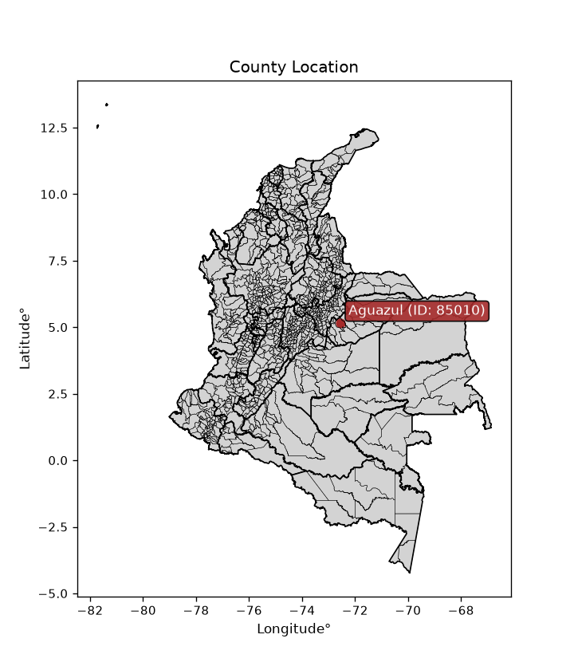
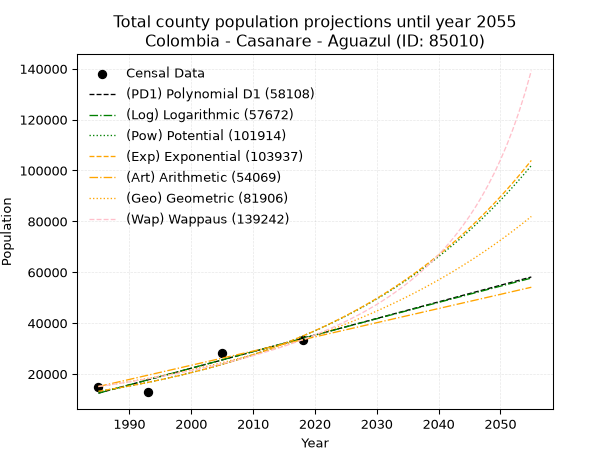
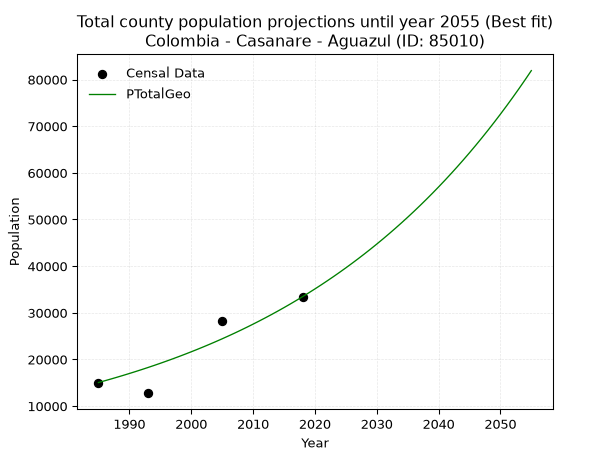
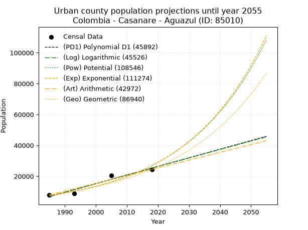
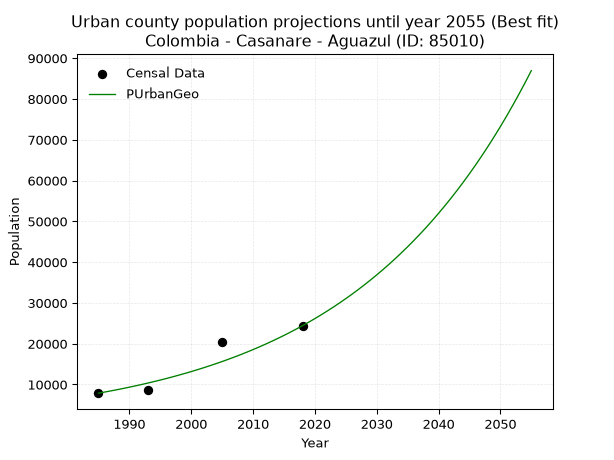
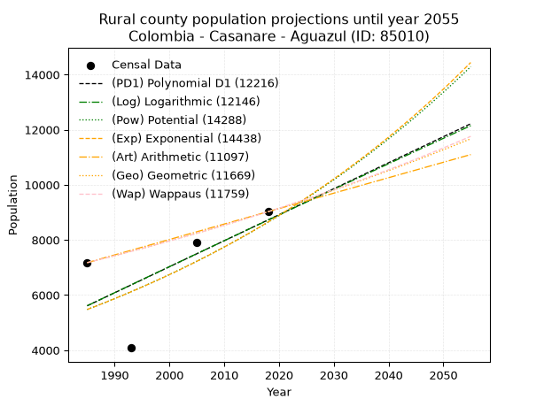
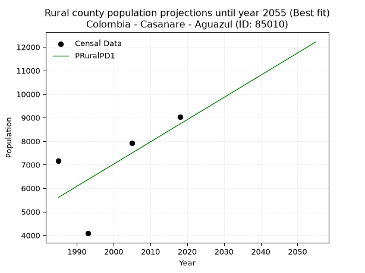

<div align="center">


</div>

# _“Population and Public Services Demand Projections (PPSD) until Year 2050 for Colombia - Casanare - Aguazul (ID: 85010)”_
Keywords: `population` `public-service` `projection` `lineal` `polynomial` `logarithmic` `potential` `exponential` `arithmetic` `geometric` `wappaus` `dane` `colombia` `south-america`

PPSD are analytical estimates used by governments and planners to anticipate future changes in population size, age distribution, and the resulting community needs for utilities, healthcare, education, and infrastructure as sizing future water treatment facilities, electrical grids, and road networks based on spatial growth.

<div align="center">

</img>

</div>


> **General running parameters**: • app_version: _v20260806_. • Python version: _3.14.7_. • Pandas version: _3.0.5_. • NumPy version: _2.5.1_. • Creates, save and include plots into reports (create_plot): _False_. • Projection until year: _2050_. • Process polynomial degree 2 and up: _False_. • Process Wappaus: _True_. • Process Wappaus: _True_. • Set negative values to zero: _True_. • Set infinite values to zero: _True_. • Drop dataset notes: _True_. 
<div align="center">

Dynamic map: [:earth_americas:Google](http://maps.google.com/maps?q=5.172641213,-72.5468377) [:earth_americas:OSM](https://www.openstreetmap.org/#map=18/5.172641213/-72.5468377&layers=P) [:earth_americas:Bing](https://www.bing.com/maps?cp=5.172641213~-72.5468377&lvl=18) [:earth_americas:Apple](https://maps.apple.com/frame?center=5.172641213%2C-72.5468377&span=0.003%2C0.006)

</div>


<div align="center">

```geojson
{
  "type": "Feature",
  "geometry": {
    "type": "Point", 
    "coordinates": [-72.5468377, 5.172641213]
  }, 
  "properties": {
    "Name": "Colombia - Casanare - Aguazul (ID: 85010)"
  }
}
```

</div>


## 0. Census Data (4 records)

Census data are official statistics collected by a government about the people and housing in a country. They usually include counts of total population, age, sex, race, income, education, and jobs.

📅Global census file: [Population.xlsx](../data/Population.xlsx)

| Source   |   Year |   CountryID | CountryName   |   StateID | StateName   |   CountyID | CountyName   |   PTotal |   PUrban |   PRural |
|:---------|-------:|------------:|:--------------|----------:|:------------|-----------:|:-------------|---------:|---------:|---------:|
| DANE     |   1985 |          57 | Colombia      |        85 | Casanare    |      85010 | Aguazul      |    15041 |     7866 |     7175 |
| DANE     |   1993 |          57 | Colombia      |        85 | Casanare    |      85010 | Aguazul      |    12756 |     8674 |     4082 |
| DANE     |   2005 |          57 | Colombia      |        85 | Casanare    |      85010 | Aguazul      |    28327 |    20411 |     7916 |
| DANE     |   2018 |          57 | Colombia      |        85 | Casanare    |      85010 | Aguazul      |    33440 |    24416 |     9024 |

> 🔥Some records could had specific notes about the registered values or the corresponding urban or rural distribution.

📅   [RUPS](https://www.datos.gov.co/Hacienda-y-Cr-dito-P-blico/Registro-nico-de-Prestadores-de-Servicios-P-blicos/4qkq-csdn/about_data) - Local public utility companies: [RUPS.csv](../data/RUPS.xlsx)

 | SERVICIO       | ESTADO    | NOMBRE                                               | NIT         |   DEPARTAMENTO_DOMICILIO |   MUNICIPIO_DOMICILIO |   DIRECCION |   TELEFONO |   EMAIL | TIPO_PRESTADOR                             | CLASIFICACION                 |
|:---------------|:----------|:-----------------------------------------------------|:------------|-------------------------:|----------------------:|------------:|-----------:|--------:|:-------------------------------------------|:------------------------------|
| ACUEDUCTO      | OPERATIVA | EMPRESA DE SERVICIOS PUBLICOS DE AGUAZUL S.A. E.S.P. | 844003247-8 |                      nan |                   nan |         nan |        nan |     nan | SOCIEDADES (EMPRESA DE SERVICIOS PUBLICOS) | MAYOR O IGUAL A 5001 USUARIOS |
| ALCANTARILLADO | OPERATIVA | EMPRESA DE SERVICIOS PUBLICOS DE AGUAZUL S.A. E.S.P. | 844003247-8 |                      nan |                   nan |         nan |        nan |     nan | SOCIEDADES (EMPRESA DE SERVICIOS PUBLICOS) | MAYOR O IGUAL A 5001 USUARIOS |

## 1. Total

### 1.1. Coefficients and Parameters

* (PD1) Polynomial Deg 1: 652.3596949016419, -1282491.479727009 (lineal)
* (Log) Logarithmic: 1305578.362270703, -9901320.593868006
* (Pow) Potential: 59.08065470348105, -190.7148571672141
* (Exp) Exponential: 0.029519599336444508, 4.690955022424657e-22
* (Art) Arithmetic: Year diff. 2018 - 1985 = 33, Population diff. 33440 - 15041 = 18399, Annual growth = 557.5454545454545
* (Geo) Geometric: Year diff. 2018 - 1985 = 33, Population diff. 33440 - 15041 = 18399, Annual growth % = 0.02450677586511585
* (Wap) Wappaus: i = 2.300057567069386, Condition values only valid for < 200)

<sub>
Wappaus condition values: ['0.00', '2.30', '4.60', '6.90', '9.20', '11.50', '13.80', '16.10', '18.40', '20.70', '23.00', '25.30', '27.60', '29.90', '32.20', '34.50', '36.80', '39.10', '41.40', '43.70', '46.00', '48.30', '50.60', '52.90', '55.20', '57.50', '59.80', '62.10', '64.40', '66.70', '69.00', '71.30', '73.60', '75.90', '78.20', '80.50', '82.80', '85.10', '87.40', '89.70', '92.00', '94.30', '96.60', '98.90', '101.20', '103.50', '105.80', '108.10', '110.40', '112.70', '115.00', '117.30', '119.60', '121.90', '124.20', '126.50', '128.80', '131.10', '133.40', '135.70', '138.00', '140.30', '142.60', '144.90', '147.20', '149.50']
</sub>


### 1.2. Projected Dataset

|   Year |   CountyID |   PTotalPD1 |   PTotalLog |   PTotalPow |   PTotalExp |   PTotalArt |   PTotalGeo |   PTotalWap |
|-------:|-----------:|------------:|------------:|------------:|------------:|------------:|------------:|------------:|
|   1985 |      85010 |       12443 |       12424 |       13152 |       13163 |       15041 |       15041 |       15041 |
|   1986 |      85010 |       13095 |       13082 |       13549 |       13557 |       15599 |       15410 |       15391 |
|   1987 |      85010 |       13747 |       13739 |       13958 |       13964 |       16156 |       15787 |       15749 |
|   1988 |      85010 |       14400 |       14396 |       14379 |       14382 |       16714 |       16174 |       16116 |
|   1989 |      85010 |       15052 |       15053 |       14813 |       14813 |       17271 |       16571 |       16492 |
|   1990 |      85010 |       15704 |       15709 |       15260 |       15257 |       17829 |       16977 |       16876 |
|   1991 |      85010 |       16357 |       16365 |       15719 |       15714 |       18386 |       17393 |       17271 |
|   1992 |      85010 |       17009 |       17020 |       16193 |       16184 |       18944 |       17819 |       17675 |
|   1993 |      85010 |       17661 |       17676 |       16680 |       16669 |       19501 |       18256 |       18089 |
|   1994 |      85010 |       18314 |       18331 |       17182 |       17169 |       20059 |       18703 |       18514 |
|   1995 |      85010 |       18966 |       18985 |       17698 |       17683 |       20616 |       19161 |       18950 |
|   1996 |      85010 |       19618 |       19639 |       18230 |       18213 |       21174 |       19631 |       19398 |
|   1997 |      85010 |       20271 |       20293 |       18778 |       18759 |       21732 |       20112 |       19857 |
|   1998 |      85010 |       20923 |       20947 |       19341 |       19321 |       22289 |       20605 |       20329 |
|   1999 |      85010 |       21576 |       21600 |       19922 |       19899 |       22847 |       21110 |       20814 |
|   2000 |      85010 |       22228 |       22253 |       20519 |       20496 |       23404 |       21627 |       21312 |
|   2001 |      85010 |       22880 |       22906 |       21134 |       21110 |       23962 |       22157 |       21824 |
|   2002 |      85010 |       23533 |       23558 |       21767 |       21742 |       24519 |       22700 |       22351 |
|   2003 |      85010 |       24185 |       24210 |       22419 |       22393 |       25077 |       23256 |       22894 |
|   2004 |      85010 |       24837 |       24862 |       23090 |       23064 |       25634 |       23826 |       23452 |
|   2005 |      85010 |       25490 |       25513 |       23781 |       23755 |       26192 |       24410 |       24027 |
|   2006 |      85010 |       26142 |       26164 |       24492 |       24467 |       26749 |       25009 |       24619 |
|   2007 |      85010 |       26794 |       26815 |       25223 |       25200 |       27307 |       25621 |       25230 |
|   2008 |      85010 |       27447 |       27465 |       25977 |       25955 |       27865 |       26249 |       25859 |
|   2009 |      85010 |       28099 |       28115 |       26752 |       26733 |       28422 |       26893 |       26509 |
|   2010 |      85010 |       28752 |       28765 |       27550 |       27534 |       28980 |       27552 |       27180 |
|   2011 |      85010 |       29404 |       29414 |       28372 |       28358 |       29537 |       28227 |       27872 |
|   2012 |      85010 |       30056 |       30063 |       29218 |       29208 |       30095 |       28919 |       28588 |
|   2013 |      85010 |       30709 |       30712 |       30088 |       30083 |       30652 |       29627 |       29328 |
|   2014 |      85010 |       31361 |       31360 |       30984 |       30984 |       31210 |       30353 |       30094 |
|   2015 |      85010 |       32013 |       32008 |       31906 |       31913 |       31767 |       31097 |       30886 |
|   2016 |      85010 |       32666 |       32656 |       32855 |       32869 |       32325 |       31859 |       31707 |
|   2017 |      85010 |       33318 |       33304 |       33832 |       33853 |       32882 |       32640 |       32558 |
|   2018 |      85010 |       33970 |       33951 |       34838 |       34868 |       33440 |       33440 |       33440 |
|   2019 |      85010 |       34623 |       34598 |       35872 |       35912 |       33998 |       34260 |       34356 |
|   2020 |      85010 |       35275 |       35244 |       36937 |       36988 |       34555 |       35099 |       35306 |
|   2021 |      85010 |       35927 |       35890 |       38033 |       38096 |       35113 |       35959 |       36294 |
|   2022 |      85010 |       36580 |       36536 |       39161 |       39238 |       35670 |       36841 |       37322 |
|   2023 |      85010 |       37232 |       37182 |       40322 |       40413 |       36228 |       37743 |       38392 |
|   2024 |      85010 |       37885 |       37827 |       41517 |       41624 |       36785 |       38668 |       39506 |
|   2025 |      85010 |       38537 |       38472 |       42746 |       42871 |       37343 |       39616 |       40668 |
|   2026 |      85010 |       39189 |       39116 |       44011 |       44155 |       37900 |       40587 |       41880 |
|   2027 |      85010 |       39842 |       39761 |       45313 |       45478 |       38458 |       41581 |       43146 |
|   2028 |      85010 |       40494 |       40405 |       46653 |       46841 |       39015 |       42600 |       44470 |
|   2029 |      85010 |       41146 |       41048 |       48032 |       48244 |       39573 |       43644 |       45855 |
|   2030 |      85010 |       41799 |       41691 |       49451 |       49690 |       40131 |       44714 |       47307 |
|   2031 |      85010 |       42451 |       42334 |       50911 |       51178 |       40688 |       45810 |       48829 |
|   2032 |      85010 |       43103 |       42977 |       52413 |       52712 |       41246 |       46933 |       50428 |
|   2033 |      85010 |       43756 |       43619 |       53959 |       54291 |       41803 |       48083 |       52108 |
|   2034 |      85010 |       44408 |       44261 |       55550 |       55917 |       42361 |       49261 |       53878 |
|   2035 |      85010 |       45060 |       44903 |       57187 |       57593 |       42918 |       50468 |       55743 |
|   2036 |      85010 |       45713 |       45545 |       58871 |       59318 |       43476 |       51705 |       57711 |
|   2037 |      85010 |       46365 |       46186 |       60604 |       61095 |       44033 |       52972 |       59793 |
|   2038 |      85010 |       47018 |       46826 |       62387 |       62926 |       44591 |       54270 |       61997 |
|   2039 |      85010 |       47670 |       47467 |       64221 |       64811 |       45148 |       55600 |       64334 |
|   2040 |      85010 |       48322 |       48107 |       66109 |       66752 |       45706 |       56963 |       66818 |
|   2041 |      85010 |       48975 |       48747 |       68051 |       68752 |       46264 |       58359 |       69463 |
|   2042 |      85010 |       49627 |       49386 |       70049 |       70812 |       46821 |       59789 |       72284 |
|   2043 |      85010 |       50279 |       50026 |       72105 |       72934 |       47379 |       61254 |       75300 |
|   2044 |      85010 |       50932 |       50665 |       74220 |       75119 |       47936 |       62756 |       78532 |
|   2045 |      85010 |       51584 |       51303 |       76396 |       77369 |       48494 |       64293 |       82003 |
|   2046 |      85010 |       52236 |       51941 |       78635 |       79687 |       49051 |       65869 |       85742 |
|   2047 |      85010 |       52889 |       52579 |       80938 |       82075 |       49609 |       67483 |       89781 |
|   2048 |      85010 |       53541 |       53217 |       83308 |       84534 |       50166 |       69137 |       94157 |
|   2049 |      85010 |       54194 |       53854 |       85745 |       87066 |       50724 |       70831 |       98914 |
|   2050 |      85010 |       54846 |       54491 |       88253 |       89675 |       51281 |       72567 |      104104 |
<div align="center">

</img>

</div>


### 1.3. Best fit with absolute and relative error (%)

Relative error puts that difference into context by dividing the absolute error by the true value, creating a unitless ratio or percentage that shows the scale of the mistake.

Absolute and relative error

|   Year | Source   |   CountryID | CountryName   |   StateID | StateName   |   CountyID_x | CountyName   |   PTotal |   PUrban |   PRural |   CountyID_y |   PTotalPD1 |   PTotalLog |   PTotalPow |   PTotalExp |   PTotalArt |   PTotalGeo |   PTotalWap |   PTotalPD1AbsError |   PTotalLogAbsError |   PTotalPowAbsError |   PTotalExpAbsError |   PTotalArtAbsError |   PTotalGeoAbsError |   PTotalWapAbsError |   PTotalPD1RelError |   PTotalLogRelError |   PTotalPowRelError |   PTotalExpRelError |   PTotalArtRelError |   PTotalGeoRelError |   PTotalWapRelError |
|-------:|:---------|------------:|:--------------|----------:|:------------|-------------:|:-------------|---------:|---------:|---------:|-------------:|------------:|------------:|------------:|------------:|------------:|------------:|------------:|--------------------:|--------------------:|--------------------:|--------------------:|--------------------:|--------------------:|--------------------:|--------------------:|--------------------:|--------------------:|--------------------:|--------------------:|--------------------:|--------------------:|
|   1985 | DANE     |          57 | Colombia      |        85 | Casanare    |        85010 | Aguazul      |    15041 |     7866 |     7175 |        85010 |       12443 |       12424 |       13152 |       13163 |       15041 |       15041 |       15041 |                2598 |                2617 |                1889 |                1878 |                   0 |                   0 |                   0 |            17.2728  |            17.3991  |            12.559   |            12.4859  |             0       |              0      |              0      |
|   1993 | DANE     |          57 | Colombia      |        85 | Casanare    |        85010 | Aguazul      |    12756 |     8674 |     4082 |        85010 |       17661 |       17676 |       16680 |       16669 |       19501 |       18256 |       18089 |                4905 |                4920 |                3924 |                3913 |                6745 |                5500 |                5333 |            38.4525  |            38.5701  |            30.762   |            30.6758  |            52.8771  |             43.117  |             41.8078 |
|   2005 | DANE     |          57 | Colombia      |        85 | Casanare    |        85010 | Aguazul      |    28327 |    20411 |     7916 |        85010 |       25490 |       25513 |       23781 |       23755 |       26192 |       24410 |       24027 |                2837 |                2814 |                4546 |                4572 |                2135 |                3917 |                4300 |            10.0152  |             9.93399 |            16.0483  |            16.1401  |             7.53698 |             13.8278 |             15.1799 |
|   2018 | DANE     |          57 | Colombia      |        85 | Casanare    |        85010 | Aguazul      |    33440 |    24416 |     9024 |        85010 |       33970 |       33951 |       34838 |       34868 |       33440 |       33440 |       33440 |                 530 |                 511 |                1398 |                1428 |                   0 |                   0 |                   0 |             1.58493 |             1.52811 |             4.18062 |             4.27033 |             0       |              0      |              0      |

Relative error mean

| Method    |   RelError | Best   |
|:----------|-----------:|:-------|
| PTotalPD1 |    16.8313 |        |
| PTotalLog |    16.8578 |        |
| PTotalPow |    15.8875 |        |
| PTotalExp |    15.893  |        |
| PTotalArt |    15.1035 |        |
| PTotalGeo |    14.2362 | True   |
| PTotalWap |    14.2469 |        |

💙Best method: _**PTotalGeo**_
<div align="center">

</img>

</div>


### 1.4. Fresh water supply demand in liters per capita per day (lpcd)

The fresh water supply demand typically ranges from 100 to 300 liters per capita per day (lpcd) for standard domestic and municipal planning, though absolute survival minimums set by the World Health Organization are as low as 7.5 to 20 liters per day, and total consumption in high-income nations can exceed 400 liters.

> `CZ`: Level in meters above the sea level (masl)<br> `WS`: Fresh water supply demand in liters per capita per day (lpcd or l/h/d)<br> `WSAll`: Zonal fresh water supply demand in liters per second (l/s)<br> `A`: Zonal area in square meters<br> `DP`: Population density (people/hectare or p/ha)

Reference values (RAS Colombia)

|    CZ |   WS |
|------:|-----:|
|  1000 |  120 |
|  2000 |  130 |
| 99999 |  140 |

County shapefile geometry properties and water supply values

|   CountyID |      ATotal |   CZTotal |   WSTotal |
|-----------:|------------:|----------:|----------:|
|      85010 | 1.43927e+09 |   427.418 |       120 |

Projected values for best method: PTotalGeo

|   CountyID |   Year |   PTotalGeo |   DPTotal |   WSTotal |   WSTotalAll |
|-----------:|-------:|------------:|----------:|----------:|-------------:|
|      85010 |   1985 |       15041 |      0.1  |       120 |      20.8903 |
|      85010 |   1986 |       15410 |      0.11 |       120 |      21.4028 |
|      85010 |   1987 |       15787 |      0.11 |       120 |      21.9264 |
|      85010 |   1988 |       16174 |      0.11 |       120 |      22.4639 |
|      85010 |   1989 |       16571 |      0.12 |       120 |      23.0153 |
|      85010 |   1990 |       16977 |      0.12 |       120 |      23.5792 |
|      85010 |   1991 |       17393 |      0.12 |       120 |      24.1569 |
|      85010 |   1992 |       17819 |      0.12 |       120 |      24.7486 |
|      85010 |   1993 |       18256 |      0.13 |       120 |      25.3556 |
|      85010 |   1994 |       18703 |      0.13 |       120 |      25.9764 |
|      85010 |   1995 |       19161 |      0.13 |       120 |      26.6125 |
|      85010 |   1996 |       19631 |      0.14 |       120 |      27.2653 |
|      85010 |   1997 |       20112 |      0.14 |       120 |      27.9333 |
|      85010 |   1998 |       20605 |      0.14 |       120 |      28.6181 |
|      85010 |   1999 |       21110 |      0.15 |       120 |      29.3194 |
|      85010 |   2000 |       21627 |      0.15 |       120 |      30.0375 |
|      85010 |   2001 |       22157 |      0.15 |       120 |      30.7736 |
|      85010 |   2002 |       22700 |      0.16 |       120 |      31.5278 |
|      85010 |   2003 |       23256 |      0.16 |       120 |      32.3    |
|      85010 |   2004 |       23826 |      0.17 |       120 |      33.0917 |
|      85010 |   2005 |       24410 |      0.17 |       120 |      33.9028 |
|      85010 |   2006 |       25009 |      0.17 |       120 |      34.7347 |
|      85010 |   2007 |       25621 |      0.18 |       120 |      35.5847 |
|      85010 |   2008 |       26249 |      0.18 |       120 |      36.4569 |
|      85010 |   2009 |       26893 |      0.19 |       120 |      37.3514 |
|      85010 |   2010 |       27552 |      0.19 |       120 |      38.2667 |
|      85010 |   2011 |       28227 |      0.2  |       120 |      39.2042 |
|      85010 |   2012 |       28919 |      0.2  |       120 |      40.1653 |
|      85010 |   2013 |       29627 |      0.21 |       120 |      41.1486 |
|      85010 |   2014 |       30353 |      0.21 |       120 |      42.1569 |
|      85010 |   2015 |       31097 |      0.22 |       120 |      43.1903 |
|      85010 |   2016 |       31859 |      0.22 |       120 |      44.2486 |
|      85010 |   2017 |       32640 |      0.23 |       120 |      45.3333 |
|      85010 |   2018 |       33440 |      0.23 |       120 |      46.4444 |
|      85010 |   2019 |       34260 |      0.24 |       120 |      47.5833 |
|      85010 |   2020 |       35099 |      0.24 |       120 |      48.7486 |
|      85010 |   2021 |       35959 |      0.25 |       120 |      49.9431 |
|      85010 |   2022 |       36841 |      0.26 |       120 |      51.1681 |
|      85010 |   2023 |       37743 |      0.26 |       120 |      52.4208 |
|      85010 |   2024 |       38668 |      0.27 |       120 |      53.7056 |
|      85010 |   2025 |       39616 |      0.28 |       120 |      55.0222 |
|      85010 |   2026 |       40587 |      0.28 |       120 |      56.3708 |
|      85010 |   2027 |       41581 |      0.29 |       120 |      57.7514 |
|      85010 |   2028 |       42600 |      0.3  |       120 |      59.1667 |
|      85010 |   2029 |       43644 |      0.3  |       120 |      60.6167 |
|      85010 |   2030 |       44714 |      0.31 |       120 |      62.1028 |
|      85010 |   2031 |       45810 |      0.32 |       120 |      63.625  |
|      85010 |   2032 |       46933 |      0.33 |       120 |      65.1847 |
|      85010 |   2033 |       48083 |      0.33 |       120 |      66.7819 |
|      85010 |   2034 |       49261 |      0.34 |       120 |      68.4181 |
|      85010 |   2035 |       50468 |      0.35 |       120 |      70.0944 |
|      85010 |   2036 |       51705 |      0.36 |       120 |      71.8125 |
|      85010 |   2037 |       52972 |      0.37 |       120 |      73.5722 |
|      85010 |   2038 |       54270 |      0.38 |       120 |      75.375  |
|      85010 |   2039 |       55600 |      0.39 |       120 |      77.2222 |
|      85010 |   2040 |       56963 |      0.4  |       120 |      79.1153 |
|      85010 |   2041 |       58359 |      0.41 |       120 |      81.0542 |
|      85010 |   2042 |       59789 |      0.42 |       120 |      83.0403 |
|      85010 |   2043 |       61254 |      0.43 |       120 |      85.075  |
|      85010 |   2044 |       62756 |      0.44 |       120 |      87.1611 |
|      85010 |   2045 |       64293 |      0.45 |       120 |      89.2958 |
|      85010 |   2046 |       65869 |      0.46 |       120 |      91.4847 |
|      85010 |   2047 |       67483 |      0.47 |       120 |      93.7264 |
|      85010 |   2048 |       69137 |      0.48 |       120 |      96.0236 |
|      85010 |   2049 |       70831 |      0.49 |       120 |      98.3764 |
|      85010 |   2050 |       72567 |      0.5  |       120 |     100.787  |

## 2. Urban

### 2.1. Coefficients and Parameters

* (PD1) Polynomial Deg 1: 557.997992773983, -1100793.7350461595 (lineal)
* (Log) Logarithmic: 1116982.4561569567, -8474850.850184679
* (Pow) Potential: 76.92028743866526, -249.78682421178348
* (Exp) Exponential: 0.03841920856431247, 5.730680155523263e-30
* (Art) Arithmetic: Year diff. 2018 - 1985 = 33, Population diff. 24416 - 7866 = 16550, Annual growth = 501.5151515151515
* (Geo) Geometric: Year diff. 2018 - 1985 = 33, Population diff. 24416 - 7866 = 16550, Annual growth % = 0.03491977177325567
* (Wap) Wappaus: i = 3.1070884797419707, Condition values only valid for < 200)

<sub>
Wappaus condition values: ['0.00', '3.11', '6.21', '9.32', '12.43', '15.54', '18.64', '21.75', '24.86', '27.96', '31.07', '34.18', '37.29', '40.39', '43.50', '46.61', '49.71', '52.82', '55.93', '59.03', '62.14', '65.25', '68.36', '71.46', '74.57', '77.68', '80.78', '83.89', '87.00', '90.11', '93.21', '96.32', '99.43', '102.53', '105.64', '108.75', '111.86', '114.96', '118.07', '121.18', '124.28', '127.39', '130.50', '133.60', '136.71', '139.82', '142.93', '146.03', '149.14', '152.25', '155.35', '158.46', '161.57', '164.68', '167.78', '170.89', '174.00', '177.10', '180.21', '183.32', '186.43', '189.53', '192.64', '195.75', '198.85', '201.96']
</sub>


### 2.2. Projected Dataset

|   Year |   CountyID |   PUrbanPD1 |   PUrbanLog |   PUrbanPow |   PUrbanExp |   PUrbanArt |   PUrbanGeo |
|-------:|-----------:|------------:|------------:|------------:|------------:|------------:|------------:|
|   1985 |      85010 |        6832 |        6815 |        7549 |        7558 |        7866 |        7866 |
|   1986 |      85010 |        7390 |        7377 |        7847 |        7854 |        8368 |        8141 |
|   1987 |      85010 |        7948 |        7940 |        8156 |        8162 |        8869 |        8425 |
|   1988 |      85010 |        8506 |        8502 |        8478 |        8482 |        9371 |        8719 |
|   1989 |      85010 |        9064 |        9063 |        8813 |        8814 |        9872 |        9024 |
|   1990 |      85010 |        9622 |        9625 |        9160 |        9159 |       10374 |        9339 |
|   1991 |      85010 |       10180 |       10186 |        9521 |        9518 |       10875 |        9665 |
|   1992 |      85010 |       10738 |       10747 |        9896 |        9891 |       11377 |       10002 |
|   1993 |      85010 |       11296 |       11308 |       10286 |       10278 |       11878 |       10352 |
|   1994 |      85010 |       11854 |       11868 |       10690 |       10681 |       12380 |       10713 |
|   1995 |      85010 |       12412 |       12428 |       11110 |       11099 |       12881 |       11087 |
|   1996 |      85010 |       12970 |       12988 |       11547 |       11534 |       13383 |       11474 |
|   1997 |      85010 |       13528 |       13547 |       12001 |       11985 |       13884 |       11875 |
|   1998 |      85010 |       14086 |       14106 |       12472 |       12455 |       14386 |       12290 |
|   1999 |      85010 |       14644 |       14665 |       12961 |       12943 |       14887 |       12719 |
|   2000 |      85010 |       15202 |       15224 |       13470 |       13450 |       15389 |       13163 |
|   2001 |      85010 |       15760 |       15782 |       13998 |       13976 |       15890 |       13623 |
|   2002 |      85010 |       16318 |       16340 |       14546 |       14524 |       16392 |       14098 |
|   2003 |      85010 |       16876 |       16898 |       15116 |       15093 |       16893 |       14591 |
|   2004 |      85010 |       17434 |       17456 |       15707 |       15684 |       17395 |       15100 |
|   2005 |      85010 |       17992 |       18013 |       16322 |       16298 |       17896 |       15627 |
|   2006 |      85010 |       18550 |       18570 |       16960 |       16936 |       18398 |       16173 |
|   2007 |      85010 |       19108 |       19126 |       17623 |       17600 |       18899 |       16738 |
|   2008 |      85010 |       19666 |       19683 |       18311 |       18289 |       19401 |       17322 |
|   2009 |      85010 |       20224 |       20239 |       19026 |       19005 |       19902 |       17927 |
|   2010 |      85010 |       20782 |       20795 |       19768 |       19750 |       20404 |       18553 |
|   2011 |      85010 |       21340 |       21350 |       20539 |       20523 |       20905 |       19201 |
|   2012 |      85010 |       21898 |       21906 |       21340 |       21327 |       21407 |       19872 |
|   2013 |      85010 |       22456 |       22461 |       22171 |       22162 |       21908 |       20566 |
|   2014 |      85010 |       23014 |       23015 |       23035 |       23030 |       22410 |       21284 |
|   2015 |      85010 |       23572 |       23570 |       23931 |       23932 |       22911 |       22027 |
|   2016 |      85010 |       24130 |       24124 |       24862 |       24870 |       23413 |       22796 |
|   2017 |      85010 |       24688 |       24678 |       25829 |       25844 |       23914 |       23592 |
|   2018 |      85010 |       25246 |       25232 |       26833 |       26856 |       24416 |       24416 |
|   2019 |      85010 |       25804 |       25785 |       27875 |       27908 |       24918 |       25269 |
|   2020 |      85010 |       26362 |       26338 |       28957 |       29001 |       25419 |       26151 |
|   2021 |      85010 |       26920 |       26891 |       30081 |       30137 |       25921 |       27064 |
|   2022 |      85010 |       27478 |       27444 |       31247 |       31317 |       26422 |       28009 |
|   2023 |      85010 |       28036 |       27996 |       32459 |       32544 |       26924 |       28987 |
|   2024 |      85010 |       28594 |       28548 |       33716 |       33818 |       27425 |       30000 |
|   2025 |      85010 |       29152 |       29100 |       35022 |       35143 |       27927 |       31047 |
|   2026 |      85010 |       29710 |       29651 |       36377 |       36519 |       28428 |       32131 |
|   2027 |      85010 |       30268 |       30202 |       37785 |       37950 |       28930 |       33253 |
|   2028 |      85010 |       30826 |       30753 |       39246 |       39436 |       29431 |       34414 |
|   2029 |      85010 |       31384 |       31304 |       40763 |       40981 |       29933 |       35616 |
|   2030 |      85010 |       31942 |       31854 |       42337 |       42586 |       30434 |       36860 |
|   2031 |      85010 |       32500 |       32404 |       43972 |       44254 |       30936 |       38147 |
|   2032 |      85010 |       33058 |       32954 |       45669 |       45987 |       31437 |       39479 |
|   2033 |      85010 |       33616 |       33504 |       47430 |       47788 |       31939 |       40858 |
|   2034 |      85010 |       34174 |       34053 |       49259 |       49660 |       32440 |       42285 |
|   2035 |      85010 |       34732 |       34602 |       51157 |       51605 |       32942 |       43761 |
|   2036 |      85010 |       35290 |       35151 |       53127 |       53626 |       33443 |       45289 |
|   2037 |      85010 |       35848 |       35699 |       55172 |       55726 |       33945 |       46871 |
|   2038 |      85010 |       36406 |       36247 |       57294 |       57909 |       34446 |       48507 |
|   2039 |      85010 |       36964 |       36795 |       59498 |       60177 |       34948 |       50201 |
|   2040 |      85010 |       37522 |       37343 |       61785 |       62534 |       35449 |       51954 |
|   2041 |      85010 |       38080 |       37890 |       64158 |       64983 |       35951 |       53769 |
|   2042 |      85010 |       38638 |       38438 |       66622 |       67529 |       36452 |       55646 |
|   2043 |      85010 |       39196 |       38984 |       69178 |       70173 |       36954 |       57589 |
|   2044 |      85010 |       39754 |       39531 |       71832 |       72922 |       37455 |       59600 |
|   2045 |      85010 |       40312 |       40077 |       74586 |       75778 |       37957 |       61682 |
|   2046 |      85010 |       40870 |       40623 |       77444 |       78746 |       38458 |       63835 |
|   2047 |      85010 |       41428 |       41169 |       80410 |       81830 |       38960 |       66065 |
|   2048 |      85010 |       41986 |       41715 |       83489 |       85035 |       39461 |       68371 |
|   2049 |      85010 |       42544 |       42260 |       86683 |       88366 |       39963 |       70759 |
|   2050 |      85010 |       43102 |       42805 |       89998 |       91827 |       40464 |       73230 |
<div align="center">

</img>

</div>


### 2.3. Best fit with absolute and relative error (%)

Relative error puts that difference into context by dividing the absolute error by the true value, creating a unitless ratio or percentage that shows the scale of the mistake.

Absolute and relative error

|   Year | Source   |   CountryID | CountryName   |   StateID | StateName   |   CountyID_x | CountyName   |   PTotal |   PUrban |   PRural |   CountyID_y |   PUrbanPD1 |   PUrbanLog |   PUrbanPow |   PUrbanExp |   PUrbanArt |   PUrbanGeo |   PUrbanPD1AbsError |   PUrbanLogAbsError |   PUrbanPowAbsError |   PUrbanExpAbsError |   PUrbanArtAbsError |   PUrbanGeoAbsError |   PUrbanPD1RelError |   PUrbanLogRelError |   PUrbanPowRelError |   PUrbanExpRelError |   PUrbanArtRelError |   PUrbanGeoRelError |
|-------:|:---------|------------:|:--------------|----------:|:------------|-------------:|:-------------|---------:|---------:|---------:|-------------:|------------:|------------:|------------:|------------:|------------:|------------:|--------------------:|--------------------:|--------------------:|--------------------:|--------------------:|--------------------:|--------------------:|--------------------:|--------------------:|--------------------:|--------------------:|--------------------:|
|   1985 | DANE     |          57 | Colombia      |        85 | Casanare    |        85010 | Aguazul      |    15041 |     7866 |     7175 |        85010 |        6832 |        6815 |        7549 |        7558 |        7866 |        7866 |                1034 |                1051 |                 317 |                 308 |                   0 |                   0 |            13.1452  |            13.3613  |             4.03    |             3.91559 |              0      |              0      |
|   1993 | DANE     |          57 | Colombia      |        85 | Casanare    |        85010 | Aguazul      |    12756 |     8674 |     4082 |        85010 |       11296 |       11308 |       10286 |       10278 |       11878 |       10352 |                2622 |                2634 |                1612 |                1604 |                3204 |                1678 |            30.2283  |            30.3666  |            18.5843  |            18.492   |             36.938  |             19.3452 |
|   2005 | DANE     |          57 | Colombia      |        85 | Casanare    |        85010 | Aguazul      |    28327 |    20411 |     7916 |        85010 |       17992 |       18013 |       16322 |       16298 |       17896 |       15627 |                2419 |                2398 |                4089 |                4113 |                2515 |                4784 |            11.8515  |            11.7486  |            20.0333  |            20.1509  |             12.3218 |             23.4383 |
|   2018 | DANE     |          57 | Colombia      |        85 | Casanare    |        85010 | Aguazul      |    33440 |    24416 |     9024 |        85010 |       25246 |       25232 |       26833 |       26856 |       24416 |       24416 |                 830 |                 816 |                2417 |                2440 |                   0 |                   0 |             3.39941 |             3.34207 |             9.89925 |             9.99345 |              0      |              0      |

Relative error mean

| Method    |   RelError | Best   |
|:----------|-----------:|:-------|
| PUrbanPD1 |    14.6561 |        |
| PUrbanLog |    14.7046 |        |
| PUrbanPow |    13.1367 |        |
| PUrbanExp |    13.138  |        |
| PUrbanArt |    12.3149 |        |
| PUrbanGeo |    10.6959 | True   |

💙Best method: _**PUrbanGeo**_
<div align="center">

</img>

</div>


### 2.4. Fresh water supply demand in liters per capita per day (lpcd)

The fresh water supply demand typically ranges from 100 to 300 liters per capita per day (lpcd) for standard domestic and municipal planning, though absolute survival minimums set by the World Health Organization are as low as 7.5 to 20 liters per day, and total consumption in high-income nations can exceed 400 liters.

> `CZ`: Level in meters above the sea level (masl)<br> `WS`: Fresh water supply demand in liters per capita per day (lpcd or l/h/d)<br> `WSAll`: Zonal fresh water supply demand in liters per second (l/s)<br> `A`: Zonal area in square meters<br> `DP`: Population density (people/hectare or p/ha)

Reference values (RAS Colombia)

|    CZ |   WS |
|------:|-----:|
|  1000 |  120 |
|  2000 |  130 |
| 99999 |  140 |

County shapefile geometry properties and water supply values

|   CountyID |      AUrban |   CZUrban |   WSUrban |
|-----------:|------------:|----------:|----------:|
|      85010 | 4.62062e+06 |   278.712 |       120 |

Projected values for best method: PUrbanGeo

|   CountyID |   Year |   PUrbanGeo |   DPUrban |   WSUrban |   WSUrbanAll |
|-----------:|-------:|------------:|----------:|----------:|-------------:|
|      85010 |   1985 |        7866 |     17.02 |       120 |      10.925  |
|      85010 |   1986 |        8141 |     17.62 |       120 |      11.3069 |
|      85010 |   1987 |        8425 |     18.23 |       120 |      11.7014 |
|      85010 |   1988 |        8719 |     18.87 |       120 |      12.1097 |
|      85010 |   1989 |        9024 |     19.53 |       120 |      12.5333 |
|      85010 |   1990 |        9339 |     20.21 |       120 |      12.9708 |
|      85010 |   1991 |        9665 |     20.92 |       120 |      13.4236 |
|      85010 |   1992 |       10002 |     21.65 |       120 |      13.8917 |
|      85010 |   1993 |       10352 |     22.4  |       120 |      14.3778 |
|      85010 |   1994 |       10713 |     23.19 |       120 |      14.8792 |
|      85010 |   1995 |       11087 |     23.99 |       120 |      15.3986 |
|      85010 |   1996 |       11474 |     24.83 |       120 |      15.9361 |
|      85010 |   1997 |       11875 |     25.7  |       120 |      16.4931 |
|      85010 |   1998 |       12290 |     26.6  |       120 |      17.0694 |
|      85010 |   1999 |       12719 |     27.53 |       120 |      17.6653 |
|      85010 |   2000 |       13163 |     28.49 |       120 |      18.2819 |
|      85010 |   2001 |       13623 |     29.48 |       120 |      18.9208 |
|      85010 |   2002 |       14098 |     30.51 |       120 |      19.5806 |
|      85010 |   2003 |       14591 |     31.58 |       120 |      20.2653 |
|      85010 |   2004 |       15100 |     32.68 |       120 |      20.9722 |
|      85010 |   2005 |       15627 |     33.82 |       120 |      21.7042 |
|      85010 |   2006 |       16173 |     35    |       120 |      22.4625 |
|      85010 |   2007 |       16738 |     36.22 |       120 |      23.2472 |
|      85010 |   2008 |       17322 |     37.49 |       120 |      24.0583 |
|      85010 |   2009 |       17927 |     38.8  |       120 |      24.8986 |
|      85010 |   2010 |       18553 |     40.15 |       120 |      25.7681 |
|      85010 |   2011 |       19201 |     41.56 |       120 |      26.6681 |
|      85010 |   2012 |       19872 |     43.01 |       120 |      27.6    |
|      85010 |   2013 |       20566 |     44.51 |       120 |      28.5639 |
|      85010 |   2014 |       21284 |     46.06 |       120 |      29.5611 |
|      85010 |   2015 |       22027 |     47.67 |       120 |      30.5931 |
|      85010 |   2016 |       22796 |     49.34 |       120 |      31.6611 |
|      85010 |   2017 |       23592 |     51.06 |       120 |      32.7667 |
|      85010 |   2018 |       24416 |     52.84 |       120 |      33.9111 |
|      85010 |   2019 |       25269 |     54.69 |       120 |      35.0958 |
|      85010 |   2020 |       26151 |     56.6  |       120 |      36.3208 |
|      85010 |   2021 |       27064 |     58.57 |       120 |      37.5889 |
|      85010 |   2022 |       28009 |     60.62 |       120 |      38.9014 |
|      85010 |   2023 |       28987 |     62.73 |       120 |      40.2597 |
|      85010 |   2024 |       30000 |     64.93 |       120 |      41.6667 |
|      85010 |   2025 |       31047 |     67.19 |       120 |      43.1208 |
|      85010 |   2026 |       32131 |     69.54 |       120 |      44.6264 |
|      85010 |   2027 |       33253 |     71.97 |       120 |      46.1847 |
|      85010 |   2028 |       34414 |     74.48 |       120 |      47.7972 |
|      85010 |   2029 |       35616 |     77.08 |       120 |      49.4667 |
|      85010 |   2030 |       36860 |     79.77 |       120 |      51.1944 |
|      85010 |   2031 |       38147 |     82.56 |       120 |      52.9819 |
|      85010 |   2032 |       39479 |     85.44 |       120 |      54.8319 |
|      85010 |   2033 |       40858 |     88.43 |       120 |      56.7472 |
|      85010 |   2034 |       42285 |     91.51 |       120 |      58.7292 |
|      85010 |   2035 |       43761 |     94.71 |       120 |      60.7792 |
|      85010 |   2036 |       45289 |     98.01 |       120 |      62.9014 |
|      85010 |   2037 |       46871 |    101.44 |       120 |      65.0986 |
|      85010 |   2038 |       48507 |    104.98 |       120 |      67.3708 |
|      85010 |   2039 |       50201 |    108.65 |       120 |      69.7236 |
|      85010 |   2040 |       51954 |    112.44 |       120 |      72.1583 |
|      85010 |   2041 |       53769 |    116.37 |       120 |      74.6792 |
|      85010 |   2042 |       55646 |    120.43 |       120 |      77.2861 |
|      85010 |   2043 |       57589 |    124.63 |       120 |      79.9847 |
|      85010 |   2044 |       59600 |    128.99 |       120 |      82.7778 |
|      85010 |   2045 |       61682 |    133.49 |       120 |      85.6694 |
|      85010 |   2046 |       63835 |    138.15 |       120 |      88.6597 |
|      85010 |   2047 |       66065 |    142.98 |       120 |      91.7569 |
|      85010 |   2048 |       68371 |    147.97 |       120 |      94.9597 |
|      85010 |   2049 |       70759 |    153.14 |       120 |      98.2764 |
|      85010 |   2050 |       73230 |    158.49 |       120 |     101.708  |

## 3. Rural

### 3.1. Coefficients and Parameters

* (PD1) Polynomial Deg 1: 94.36170212765867, -181697.74468084925 (lineal)
* (Log) Logarithmic: 188595.90611374652, -1426469.7436833302
* (Pow) Potential: 27.678588506649458, -87.53896978162074
* (Exp) Exponential: 0.013851090938214364, 6.276844298198162e-09
* (Art) Arithmetic: Year diff. 2018 - 1985 = 33, Population diff. 9024 - 7175 = 1849, Annual growth = 56.03030303030303
* (Geo) Geometric: Year diff. 2018 - 1985 = 33, Population diff. 9024 - 7175 = 1849, Annual growth % = 0.006972221824552038
* (Wap) Wappaus: i = 0.6917748383270946, Condition values only valid for < 200)

<sub>
Wappaus condition values: ['0.00', '0.69', '1.38', '2.08', '2.77', '3.46', '4.15', '4.84', '5.53', '6.23', '6.92', '7.61', '8.30', '8.99', '9.68', '10.38', '11.07', '11.76', '12.45', '13.14', '13.84', '14.53', '15.22', '15.91', '16.60', '17.29', '17.99', '18.68', '19.37', '20.06', '20.75', '21.45', '22.14', '22.83', '23.52', '24.21', '24.90', '25.60', '26.29', '26.98', '27.67', '28.36', '29.05', '29.75', '30.44', '31.13', '31.82', '32.51', '33.21', '33.90', '34.59', '35.28', '35.97', '36.66', '37.36', '38.05', '38.74', '39.43', '40.12', '40.81', '41.51', '42.20', '42.89', '43.58', '44.27', '44.97']
</sub>


### 3.2. Projected Dataset

|   Year |   CountyID |   PRuralPD1 |   PRuralLog |   PRuralPow |   PRuralExp |   PRuralArt |   PRuralGeo |   PRuralWap |
|-------:|-----------:|------------:|------------:|------------:|------------:|------------:|------------:|------------:|
|   1985 |      85010 |        5610 |        5610 |        5475 |        5475 |        7175 |        7175 |        7175 |
|   1986 |      85010 |        5705 |        5705 |        5552 |        5552 |        7231 |        7225 |        7225 |
|   1987 |      85010 |        5799 |        5799 |        5630 |        5629 |        7287 |        7275 |        7275 |
|   1988 |      85010 |        5893 |        5894 |        5709 |        5708 |        7343 |        7326 |        7325 |
|   1989 |      85010 |        5988 |        5989 |        5789 |        5787 |        7399 |        7377 |        7376 |
|   1990 |      85010 |        6082 |        6084 |        5870 |        5868 |        7455 |        7429 |        7428 |
|   1991 |      85010 |        6176 |        6179 |        5952 |        5950 |        7511 |        7480 |        7479 |
|   1992 |      85010 |        6271 |        6273 |        6035 |        6033 |        7567 |        7533 |        7531 |
|   1993 |      85010 |        6365 |        6368 |        6120 |        6117 |        7623 |        7585 |        7583 |
|   1994 |      85010 |        6459 |        6463 |        6205 |        6202 |        7679 |        7638 |        7636 |
|   1995 |      85010 |        6554 |        6557 |        6292 |        6289 |        7735 |        7691 |        7689 |
|   1996 |      85010 |        6648 |        6652 |        6380 |        6377 |        7791 |        7745 |        7743 |
|   1997 |      85010 |        6743 |        6746 |        6469 |        6465 |        7847 |        7799 |        7796 |
|   1998 |      85010 |        6837 |        6841 |        6559 |        6556 |        7903 |        7853 |        7851 |
|   1999 |      85010 |        6931 |        6935 |        6651 |        6647 |        7959 |        7908 |        7905 |
|   2000 |      85010 |        7026 |        7029 |        6743 |        6740 |        8015 |        7963 |        7960 |
|   2001 |      85010 |        7120 |        7124 |        6837 |        6834 |        8071 |        8019 |        8016 |
|   2002 |      85010 |        7214 |        7218 |        6933 |        6929 |        8128 |        8075 |        8072 |
|   2003 |      85010 |        7309 |        7312 |        7029 |        7026 |        8184 |        8131 |        8128 |
|   2004 |      85010 |        7403 |        7406 |        7127 |        7124 |        8240 |        8188 |        8184 |
|   2005 |      85010 |        7497 |        7500 |        7226 |        7223 |        8296 |        8245 |        8241 |
|   2006 |      85010 |        7592 |        7594 |        7326 |        7324 |        8352 |        8302 |        8299 |
|   2007 |      85010 |        7686 |        7688 |        7428 |        7426 |        8408 |        8360 |        8357 |
|   2008 |      85010 |        7781 |        7782 |        7531 |        7530 |        8464 |        8418 |        8415 |
|   2009 |      85010 |        7875 |        7876 |        7636 |        7635 |        8520 |        8477 |        8474 |
|   2010 |      85010 |        7969 |        7970 |        7742 |        7741 |        8576 |        8536 |        8533 |
|   2011 |      85010 |        8064 |        8064 |        7849 |        7849 |        8632 |        8596 |        8593 |
|   2012 |      85010 |        8158 |        8158 |        7958 |        7959 |        8688 |        8656 |        8653 |
|   2013 |      85010 |        8252 |        8251 |        8068 |        8070 |        8744 |        8716 |        8714 |
|   2014 |      85010 |        8347 |        8345 |        8180 |        8182 |        8800 |        8777 |        8775 |
|   2015 |      85010 |        8441 |        8439 |        8293 |        8296 |        8856 |        8838 |        8836 |
|   2016 |      85010 |        8535 |        8532 |        8407 |        8412 |        8912 |        8899 |        8898 |
|   2017 |      85010 |        8630 |        8626 |        8524 |        8529 |        8968 |        8962 |        8961 |
|   2018 |      85010 |        8724 |        8719 |        8641 |        8648 |        9024 |        9024 |        9024 |
|   2019 |      85010 |        8819 |        8813 |        8761 |        8769 |        9080 |        9087 |        9087 |
|   2020 |      85010 |        8913 |        8906 |        8882 |        8891 |        9136 |        9150 |        9151 |
|   2021 |      85010 |        9007 |        8999 |        9004 |        9015 |        9192 |        9214 |        9216 |
|   2022 |      85010 |        9102 |        9093 |        9128 |        9141 |        9248 |        9278 |        9281 |
|   2023 |      85010 |        9196 |        9186 |        9254 |        9268 |        9304 |        9343 |        9347 |
|   2024 |      85010 |        9290 |        9279 |        9381 |        9398 |        9360 |        9408 |        9413 |
|   2025 |      85010 |        9385 |        9372 |        9511 |        9529 |        9416 |        9474 |        9479 |
|   2026 |      85010 |        9479 |        9465 |        9641 |        9662 |        9472 |        9540 |        9546 |
|   2027 |      85010 |        9573 |        9558 |        9774 |        9796 |        9528 |        9606 |        9614 |
|   2028 |      85010 |        9668 |        9651 |        9908 |        9933 |        9584 |        9673 |        9682 |
|   2029 |      85010 |        9762 |        9744 |       10045 |       10072 |        9640 |        9741 |        9751 |
|   2030 |      85010 |        9857 |        9837 |       10182 |       10212 |        9696 |        9809 |        9820 |
|   2031 |      85010 |        9951 |        9930 |       10322 |       10354 |        9752 |        9877 |        9890 |
|   2032 |      85010 |       10045 |       10023 |       10464 |       10499 |        9808 |        9946 |        9961 |
|   2033 |      85010 |       10140 |       10116 |       10607 |       10645 |        9864 |       10015 |       10032 |
|   2034 |      85010 |       10234 |       10209 |       10753 |       10794 |        9920 |       10085 |       10103 |
|   2035 |      85010 |       10328 |       10301 |       10900 |       10944 |        9977 |       10155 |       10176 |
|   2036 |      85010 |       10423 |       10394 |       11049 |       11097 |       10033 |       10226 |       10249 |
|   2037 |      85010 |       10517 |       10486 |       11200 |       11252 |       10089 |       10297 |       10322 |
|   2038 |      85010 |       10611 |       10579 |       11354 |       11409 |       10145 |       10369 |       10396 |
|   2039 |      85010 |       10706 |       10672 |       11509 |       11568 |       10201 |       10442 |       10471 |
|   2040 |      85010 |       10800 |       10764 |       11666 |       11729 |       10257 |       10514 |       10546 |
|   2041 |      85010 |       10894 |       10856 |       11825 |       11893 |       10313 |       10588 |       10622 |
|   2042 |      85010 |       10989 |       10949 |       11987 |       12059 |       10369 |       10662 |       10699 |
|   2043 |      85010 |       11083 |       11041 |       12150 |       12227 |       10425 |       10736 |       10776 |
|   2044 |      85010 |       11178 |       11133 |       12316 |       12397 |       10481 |       10811 |       10854 |
|   2045 |      85010 |       11272 |       11226 |       12484 |       12570 |       10537 |       10886 |       10933 |
|   2046 |      85010 |       11366 |       11318 |       12654 |       12746 |       10593 |       10962 |       11012 |
|   2047 |      85010 |       11461 |       11410 |       12826 |       12923 |       10649 |       11038 |       11092 |
|   2048 |      85010 |       11555 |       11502 |       13001 |       13104 |       10705 |       11115 |       11173 |
|   2049 |      85010 |       11649 |       11594 |       13178 |       13286 |       10761 |       11193 |       11255 |
|   2050 |      85010 |       11744 |       11686 |       13357 |       13472 |       10817 |       11271 |       11337 |
<div align="center">

</img>

</div>


### 3.3. Best fit with absolute and relative error (%)

Relative error puts that difference into context by dividing the absolute error by the true value, creating a unitless ratio or percentage that shows the scale of the mistake.

Absolute and relative error

|   Year | Source   |   CountryID | CountryName   |   StateID | StateName   |   CountyID_x | CountyName   |   PTotal |   PUrban |   PRural |   CountyID_y |   PRuralPD1 |   PRuralLog |   PRuralPow |   PRuralExp |   PRuralArt |   PRuralGeo |   PRuralWap |   PRuralPD1AbsError |   PRuralLogAbsError |   PRuralPowAbsError |   PRuralExpAbsError |   PRuralArtAbsError |   PRuralGeoAbsError |   PRuralWapAbsError |   PRuralPD1RelError |   PRuralLogRelError |   PRuralPowRelError |   PRuralExpRelError |   PRuralArtRelError |   PRuralGeoRelError |   PRuralWapRelError |
|-------:|:---------|------------:|:--------------|----------:|:------------|-------------:|:-------------|---------:|---------:|---------:|-------------:|------------:|------------:|------------:|------------:|------------:|------------:|------------:|--------------------:|--------------------:|--------------------:|--------------------:|--------------------:|--------------------:|--------------------:|--------------------:|--------------------:|--------------------:|--------------------:|--------------------:|--------------------:|--------------------:|
|   1985 | DANE     |          57 | Colombia      |        85 | Casanare    |        85010 | Aguazul      |    15041 |     7866 |     7175 |        85010 |        5610 |        5610 |        5475 |        5475 |        7175 |        7175 |        7175 |                1565 |                1565 |                1700 |                1700 |                   0 |                   0 |                   0 |            21.8118  |            21.8118  |            23.6934  |            23.6934  |              0      |             0       |             0       |
|   1993 | DANE     |          57 | Colombia      |        85 | Casanare    |        85010 | Aguazul      |    12756 |     8674 |     4082 |        85010 |        6365 |        6368 |        6120 |        6117 |        7623 |        7585 |        7583 |                2283 |                2286 |                2038 |                2035 |                3541 |                3503 |                3501 |            55.9285  |            56.002   |            49.9265  |            49.853   |             86.7467 |            85.8158  |            85.7668  |
|   2005 | DANE     |          57 | Colombia      |        85 | Casanare    |        85010 | Aguazul      |    28327 |    20411 |     7916 |        85010 |        7497 |        7500 |        7226 |        7223 |        8296 |        8245 |        8241 |                 419 |                 416 |                 690 |                 693 |                 380 |                 329 |                 325 |             5.29308 |             5.25518 |             8.71652 |             8.75442 |              4.8004 |             4.15614 |             4.10561 |
|   2018 | DANE     |          57 | Colombia      |        85 | Casanare    |        85010 | Aguazul      |    33440 |    24416 |     9024 |        85010 |        8724 |        8719 |        8641 |        8648 |        9024 |        9024 |        9024 |                 300 |                 305 |                 383 |                 376 |                   0 |                   0 |                   0 |             3.32447 |             3.37988 |             4.24424 |             4.16667 |              0      |             0       |             0       |

Relative error mean

| Method    |   RelError | Best   |
|:----------|-----------:|:-------|
| PRuralPD1 |    21.5895 | True   |
| PRuralLog |    21.6122 |        |
| PRuralPow |    21.6452 |        |
| PRuralExp |    21.6169 |        |
| PRuralArt |    22.8868 |        |
| PRuralGeo |    22.493  |        |
| PRuralWap |    22.4681 |        |

💙Best method: _**PRuralPD1**_
<div align="center">

</img>

</div>


### 3.4. Fresh water supply demand in liters per capita per day (lpcd)

The fresh water supply demand typically ranges from 100 to 300 liters per capita per day (lpcd) for standard domestic and municipal planning, though absolute survival minimums set by the World Health Organization are as low as 7.5 to 20 liters per day, and total consumption in high-income nations can exceed 400 liters.

> `CZ`: Level in meters above the sea level (masl)<br> `WS`: Fresh water supply demand in liters per capita per day (lpcd or l/h/d)<br> `WSAll`: Zonal fresh water supply demand in liters per second (l/s)<br> `A`: Zonal area in square meters<br> `DP`: Population density (people/hectare or p/ha)

Reference values (RAS Colombia)

|    CZ |   WS |
|------:|-----:|
|  1000 |  120 |
|  2000 |  130 |
| 99999 |  140 |

County shapefile geometry properties and water supply values

|   CountyID |      ARural |   CZRural |   WSRural |
|-----------:|------------:|----------:|----------:|
|      85010 | 1.43464e+09 |   427.896 |       120 |

Projected values for best method: PRuralPD1

|   CountyID |   Year |   PRuralPD1 |   DPRural |   WSRural |   WSRuralAll |
|-----------:|-------:|------------:|----------:|----------:|-------------:|
|      85010 |   1985 |        5610 |      0.04 |       120 |      7.79167 |
|      85010 |   1986 |        5705 |      0.04 |       120 |      7.92361 |
|      85010 |   1987 |        5799 |      0.04 |       120 |      8.05417 |
|      85010 |   1988 |        5893 |      0.04 |       120 |      8.18472 |
|      85010 |   1989 |        5988 |      0.04 |       120 |      8.31667 |
|      85010 |   1990 |        6082 |      0.04 |       120 |      8.44722 |
|      85010 |   1991 |        6176 |      0.04 |       120 |      8.57778 |
|      85010 |   1992 |        6271 |      0.04 |       120 |      8.70972 |
|      85010 |   1993 |        6365 |      0.04 |       120 |      8.84028 |
|      85010 |   1994 |        6459 |      0.05 |       120 |      8.97083 |
|      85010 |   1995 |        6554 |      0.05 |       120 |      9.10278 |
|      85010 |   1996 |        6648 |      0.05 |       120 |      9.23333 |
|      85010 |   1997 |        6743 |      0.05 |       120 |      9.36528 |
|      85010 |   1998 |        6837 |      0.05 |       120 |      9.49583 |
|      85010 |   1999 |        6931 |      0.05 |       120 |      9.62639 |
|      85010 |   2000 |        7026 |      0.05 |       120 |      9.75833 |
|      85010 |   2001 |        7120 |      0.05 |       120 |      9.88889 |
|      85010 |   2002 |        7214 |      0.05 |       120 |     10.0194  |
|      85010 |   2003 |        7309 |      0.05 |       120 |     10.1514  |
|      85010 |   2004 |        7403 |      0.05 |       120 |     10.2819  |
|      85010 |   2005 |        7497 |      0.05 |       120 |     10.4125  |
|      85010 |   2006 |        7592 |      0.05 |       120 |     10.5444  |
|      85010 |   2007 |        7686 |      0.05 |       120 |     10.675   |
|      85010 |   2008 |        7781 |      0.05 |       120 |     10.8069  |
|      85010 |   2009 |        7875 |      0.05 |       120 |     10.9375  |
|      85010 |   2010 |        7969 |      0.06 |       120 |     11.0681  |
|      85010 |   2011 |        8064 |      0.06 |       120 |     11.2     |
|      85010 |   2012 |        8158 |      0.06 |       120 |     11.3306  |
|      85010 |   2013 |        8252 |      0.06 |       120 |     11.4611  |
|      85010 |   2014 |        8347 |      0.06 |       120 |     11.5931  |
|      85010 |   2015 |        8441 |      0.06 |       120 |     11.7236  |
|      85010 |   2016 |        8535 |      0.06 |       120 |     11.8542  |
|      85010 |   2017 |        8630 |      0.06 |       120 |     11.9861  |
|      85010 |   2018 |        8724 |      0.06 |       120 |     12.1167  |
|      85010 |   2019 |        8819 |      0.06 |       120 |     12.2486  |
|      85010 |   2020 |        8913 |      0.06 |       120 |     12.3792  |
|      85010 |   2021 |        9007 |      0.06 |       120 |     12.5097  |
|      85010 |   2022 |        9102 |      0.06 |       120 |     12.6417  |
|      85010 |   2023 |        9196 |      0.06 |       120 |     12.7722  |
|      85010 |   2024 |        9290 |      0.06 |       120 |     12.9028  |
|      85010 |   2025 |        9385 |      0.07 |       120 |     13.0347  |
|      85010 |   2026 |        9479 |      0.07 |       120 |     13.1653  |
|      85010 |   2027 |        9573 |      0.07 |       120 |     13.2958  |
|      85010 |   2028 |        9668 |      0.07 |       120 |     13.4278  |
|      85010 |   2029 |        9762 |      0.07 |       120 |     13.5583  |
|      85010 |   2030 |        9857 |      0.07 |       120 |     13.6903  |
|      85010 |   2031 |        9951 |      0.07 |       120 |     13.8208  |
|      85010 |   2032 |       10045 |      0.07 |       120 |     13.9514  |
|      85010 |   2033 |       10140 |      0.07 |       120 |     14.0833  |
|      85010 |   2034 |       10234 |      0.07 |       120 |     14.2139  |
|      85010 |   2035 |       10328 |      0.07 |       120 |     14.3444  |
|      85010 |   2036 |       10423 |      0.07 |       120 |     14.4764  |
|      85010 |   2037 |       10517 |      0.07 |       120 |     14.6069  |
|      85010 |   2038 |       10611 |      0.07 |       120 |     14.7375  |
|      85010 |   2039 |       10706 |      0.07 |       120 |     14.8694  |
|      85010 |   2040 |       10800 |      0.08 |       120 |     15       |
|      85010 |   2041 |       10894 |      0.08 |       120 |     15.1306  |
|      85010 |   2042 |       10989 |      0.08 |       120 |     15.2625  |
|      85010 |   2043 |       11083 |      0.08 |       120 |     15.3931  |
|      85010 |   2044 |       11178 |      0.08 |       120 |     15.525   |
|      85010 |   2045 |       11272 |      0.08 |       120 |     15.6556  |
|      85010 |   2046 |       11366 |      0.08 |       120 |     15.7861  |
|      85010 |   2047 |       11461 |      0.08 |       120 |     15.9181  |
|      85010 |   2048 |       11555 |      0.08 |       120 |     16.0486  |
|      85010 |   2049 |       11649 |      0.08 |       120 |     16.1792  |
|      85010 |   2050 |       11744 |      0.08 |       120 |     16.3111  |

<div align="center"><br><sub>Share this research</sub></div><br>

<sub>**APPS & TOOLS & CONTENT DISCLAIMER**: • NO WARRANTY - This content and software is provided by <a href="https://github.com/rcfdtools" target="_blank">github.com/rcfdtools</a> "as is", without any express or implied warranty, including warranties of merchantability, fitness for a particular purpose, or non-infringement. There is no guarantee that the software will be error-free or operate without interruption. • LIMITATION OF LIABILITY - Neither the authors nor copyright holders will be liable for claims or damages arising from the software or its use. You are responsible for determining if the software is appropriate for your use and assume all associated risks, including errors, legal compliance, and data loss. • NO PROFESSIONAL ADVICE - The software provides general information and does not offer professional advice. It should not replace consultation with professional advisors. [Clauses and global license for rcfdtools use.](https://github.com/rcfdtools/rcfdtools/blob/main/LICENSE.md)</sub>

| [:house: Home](Readme.md)  | [:beginner: Help / Collab](https://github.com/rcfdtools/R.HydroTools/discussions/31) |
|----------------------------|-------------------------------------------------------------------------------------------|