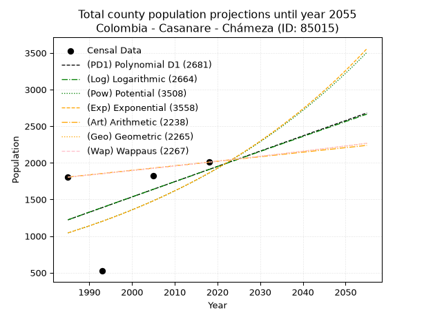
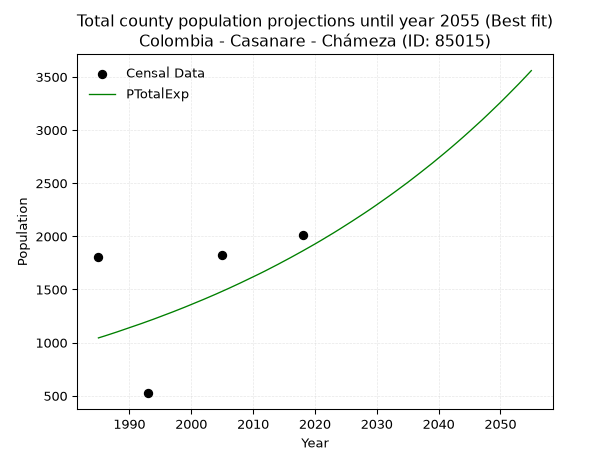
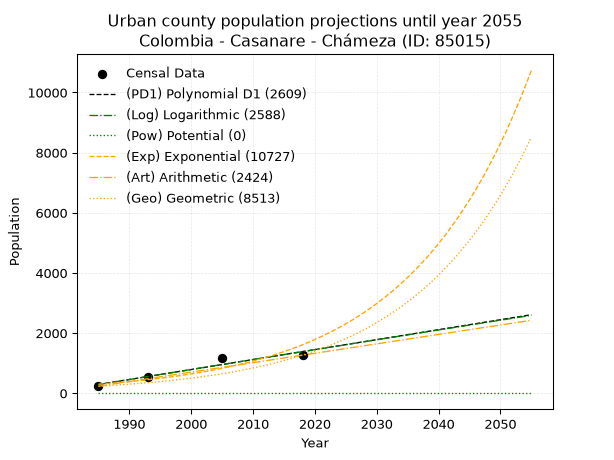
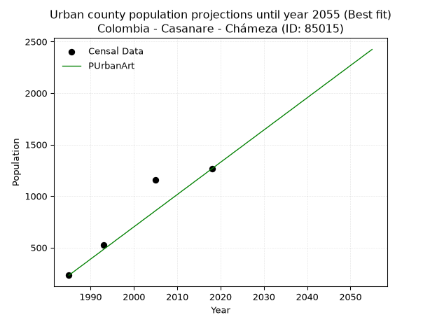
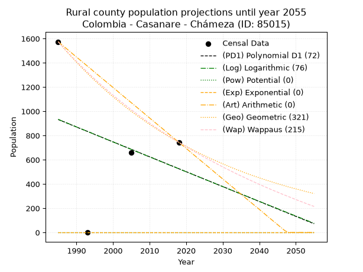
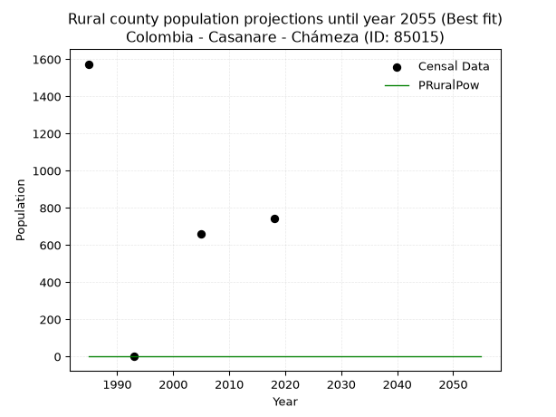

<div align="center">


</div>

# _“Population and Public Services Demand Projections (PPSD) until Year 2050 for Colombia - Casanare - Chameza (ID: 85015)”_
Keywords: `population` `public-service` `projection` `lineal` `polynomial` `logarithmic` `potential` `exponential` `arithmetic` `geometric` `wappaus` `dane` `colombia` `south-america`

PPSD are analytical estimates used by governments and planners to anticipate future changes in population size, age distribution, and the resulting community needs for utilities, healthcare, education, and infrastructure as sizing future water treatment facilities, electrical grids, and road networks based on spatial growth.

> **General running parameters**: • app_version: _v20260806_. • Python version: _3.14.7_. • Pandas version: _3.0.5_. • NumPy version: _2.5.1_. • Creates, save and include plots into reports (create_plot): _False_. • Projection until year: _2050_. • Process polynomial degree 2 and up: _False_. • Process Wappaus: _True_. • Process Wappaus: _True_. • Set negative values to zero: _True_. • Set infinite values to zero: _True_. • Drop dataset notes: _True_. 
<div align="center">

Dynamic map: [:earth_americas:Google](http://maps.google.com/maps?q=5.214526574,-72.8701598) [:earth_americas:OSM](https://www.openstreetmap.org/#map=18/5.214526574/-72.8701598&layers=P) [:earth_americas:Bing](https://www.bing.com/maps?cp=5.214526574~-72.8701598&lvl=18) [:earth_americas:Apple](https://maps.apple.com/frame?center=5.214526574%2C-72.8701598&span=0.003%2C0.006)

</div>


<div align="center">

```geojson
{
  "type": "Feature",
  "geometry": {
    "type": "Point", 
    "coordinates": [-72.8701598, 5.214526574]
  }, 
  "properties": {
    "Name": "Colombia - Casanare - Chameza (ID: 85015)"
  }
}
```

</div>


## 0. Census Data (4 records)

Census data are official statistics collected by a government about the people and housing in a country. They usually include counts of total population, age, sex, race, income, education, and jobs.

📅Global census file: [Population.xlsx](../data/Population.xlsx)

| Source   |   Year |   CountryID | CountryName   |   StateID | StateName   |   CountyID | CountyName   |   PTotal |   PUrban |   PRural |
|:---------|-------:|------------:|:--------------|----------:|:------------|-----------:|:-------------|---------:|---------:|---------:|
| DANE     |   1985 |          57 | Colombia      |        85 | Casanare    |      85015 | Chameza      |     1805 |      231 |     1574 |
| DANE     |   1993 |          57 | Colombia      |        85 | Casanare    |      85015 | Chámeza      |      524 |      524 |        0 |
| DANE     |   2005 |          57 | Colombia      |        85 | Casanare    |      85015 | Chameza      |     1820 |     1159 |      661 |
| DANE     |   2018 |          57 | Colombia      |        85 | Casanare    |      85015 | Chámeza      |     2009 |     1265 |      744 |

> 🔥Some records has specific notes about the registered values or the corresponding urban or rural distribution.

## 1. Total

### 1.1. Coefficients and Parameters

* (PD1) Polynomial Deg 1: 20.842232035326983, -40150.174628662804 (lineal)
* (Log) Logarithmic: 41616.876024090656, -314790.7081558276
* (Pow) Potential: 34.965797362907324, -112.29003384738263
* (Exp) Exponential: 0.017514080594584515, 8.322930568445404e-13
* (Art) Arithmetic: Year diff. 2018 - 1985 = 33, Population diff. 2009 - 1805 = 204, Annual growth = 6.181818181818182
* (Geo) Geometric: Year diff. 2018 - 1985 = 33, Population diff. 2009 - 1805 = 204, Annual growth % = 0.003250012118245049
* (Wap) Wappaus: i = 0.3241645611860609, Condition values only valid for < 200)

<sub>
Wappaus condition values: ['0.00', '0.32', '0.65', '0.97', '1.30', '1.62', '1.94', '2.27', '2.59', '2.92', '3.24', '3.57', '3.89', '4.21', '4.54', '4.86', '5.19', '5.51', '5.83', '6.16', '6.48', '6.81', '7.13', '7.46', '7.78', '8.10', '8.43', '8.75', '9.08', '9.40', '9.72', '10.05', '10.37', '10.70', '11.02', '11.35', '11.67', '11.99', '12.32', '12.64', '12.97', '13.29', '13.61', '13.94', '14.26', '14.59', '14.91', '15.24', '15.56', '15.88', '16.21', '16.53', '16.86', '17.18', '17.50', '17.83', '18.15', '18.48', '18.80', '19.13', '19.45', '19.77', '20.10', '20.42', '20.75', '21.07']
</sub>


### 1.2. Projected Dataset

|   Year |   CountyID |   PTotalPD1 |   PTotalLog |   PTotalPow |   PTotalExp |   PTotalArt |   PTotalGeo |   PTotalWap |
|-------:|-----------:|------------:|------------:|------------:|------------:|------------:|------------:|------------:|
|   1985 |      85015 |        1222 |        1222 |        1044 |        1044 |        1805 |        1805 |        1805 |
|   1986 |      85015 |        1242 |        1243 |        1063 |        1062 |        1811 |        1811 |        1811 |
|   1987 |      85015 |        1263 |        1264 |        1082 |        1081 |        1817 |        1817 |        1817 |
|   1988 |      85015 |        1284 |        1285 |        1101 |        1100 |        1824 |        1823 |        1823 |
|   1989 |      85015 |        1305 |        1306 |        1120 |        1120 |        1830 |        1829 |        1829 |
|   1990 |      85015 |        1326 |        1327 |        1140 |        1140 |        1836 |        1835 |        1834 |
|   1991 |      85015 |        1347 |        1347 |        1160 |        1160 |        1842 |        1840 |        1840 |
|   1992 |      85015 |        1368 |        1368 |        1181 |        1180 |        1848 |        1846 |        1846 |
|   1993 |      85015 |        1388 |        1389 |        1202 |        1201 |        1854 |        1852 |        1852 |
|   1994 |      85015 |        1409 |        1410 |        1223 |        1222 |        1861 |        1858 |        1858 |
|   1995 |      85015 |        1430 |        1431 |        1245 |        1244 |        1867 |        1865 |        1864 |
|   1996 |      85015 |        1451 |        1452 |        1267 |        1266 |        1873 |        1871 |        1871 |
|   1997 |      85015 |        1472 |        1473 |        1289 |        1288 |        1879 |        1877 |        1877 |
|   1998 |      85015 |        1493 |        1493 |        1312 |        1311 |        1885 |        1883 |        1883 |
|   1999 |      85015 |        1513 |        1514 |        1335 |        1334 |        1892 |        1889 |        1889 |
|   2000 |      85015 |        1534 |        1535 |        1359 |        1358 |        1898 |        1895 |        1895 |
|   2001 |      85015 |        1555 |        1556 |        1383 |        1382 |        1904 |        1901 |        1901 |
|   2002 |      85015 |        1576 |        1577 |        1407 |        1406 |        1910 |        1907 |        1907 |
|   2003 |      85015 |        1597 |        1597 |        1432 |        1431 |        1916 |        1914 |        1913 |
|   2004 |      85015 |        1618 |        1618 |        1457 |        1456 |        1922 |        1920 |        1920 |
|   2005 |      85015 |        1639 |        1639 |        1483 |        1482 |        1929 |        1926 |        1926 |
|   2006 |      85015 |        1659 |        1660 |        1509 |        1508 |        1935 |        1932 |        1932 |
|   2007 |      85015 |        1680 |        1681 |        1535 |        1535 |        1941 |        1939 |        1938 |
|   2008 |      85015 |        1701 |        1701 |        1562 |        1562 |        1947 |        1945 |        1945 |
|   2009 |      85015 |        1722 |        1722 |        1590 |        1590 |        1953 |        1951 |        1951 |
|   2010 |      85015 |        1743 |        1743 |        1618 |        1618 |        1960 |        1958 |        1957 |
|   2011 |      85015 |        1764 |        1763 |        1646 |        1646 |        1966 |        1964 |        1964 |
|   2012 |      85015 |        1784 |        1784 |        1675 |        1675 |        1972 |        1970 |        1970 |
|   2013 |      85015 |        1805 |        1805 |        1704 |        1705 |        1978 |        1977 |        1977 |
|   2014 |      85015 |        1826 |        1825 |        1734 |        1735 |        1984 |        1983 |        1983 |
|   2015 |      85015 |        1847 |        1846 |        1764 |        1766 |        1990 |        1990 |        1990 |
|   2016 |      85015 |        1868 |        1867 |        1795 |        1797 |        1997 |        1996 |        1996 |
|   2017 |      85015 |        1889 |        1887 |        1827 |        1829 |        2003 |        2002 |        2002 |
|   2018 |      85015 |        1909 |        1908 |        1859 |        1861 |        2009 |        2009 |        2009 |
|   2019 |      85015 |        1930 |        1929 |        1891 |        1894 |        2015 |        2016 |        2016 |
|   2020 |      85015 |        1951 |        1949 |        1924 |        1927 |        2021 |        2022 |        2022 |
|   2021 |      85015 |        1972 |        1970 |        1958 |        1961 |        2028 |        2029 |        2029 |
|   2022 |      85015 |        1993 |        1990 |        1992 |        1996 |        2034 |        2035 |        2035 |
|   2023 |      85015 |        2014 |        2011 |        2027 |        2031 |        2040 |        2042 |        2042 |
|   2024 |      85015 |        2035 |        2032 |        2062 |        2067 |        2046 |        2048 |        2049 |
|   2025 |      85015 |        2055 |        2052 |        2098 |        2104 |        2052 |        2055 |        2055 |
|   2026 |      85015 |        2076 |        2073 |        2134 |        2141 |        2058 |        2062 |        2062 |
|   2027 |      85015 |        2097 |        2093 |        2171 |        2179 |        2065 |        2069 |        2069 |
|   2028 |      85015 |        2118 |        2114 |        2209 |        2217 |        2071 |        2075 |        2075 |
|   2029 |      85015 |        2139 |        2134 |        2248 |        2256 |        2077 |        2082 |        2082 |
|   2030 |      85015 |        2160 |        2155 |        2287 |        2296 |        2083 |        2089 |        2089 |
|   2031 |      85015 |        2180 |        2175 |        2326 |        2337 |        2089 |        2096 |        2096 |
|   2032 |      85015 |        2201 |        2196 |        2367 |        2378 |        2096 |        2102 |        2103 |
|   2033 |      85015 |        2222 |        2216 |        2408 |        2420 |        2102 |        2109 |        2110 |
|   2034 |      85015 |        2243 |        2237 |        2450 |        2463 |        2108 |        2116 |        2116 |
|   2035 |      85015 |        2264 |        2257 |        2492 |        2506 |        2114 |        2123 |        2123 |
|   2036 |      85015 |        2285 |        2278 |        2535 |        2551 |        2120 |        2130 |        2130 |
|   2037 |      85015 |        2305 |        2298 |        2579 |        2596 |        2126 |        2137 |        2137 |
|   2038 |      85015 |        2326 |        2318 |        2624 |        2642 |        2133 |        2144 |        2144 |
|   2039 |      85015 |        2347 |        2339 |        2669 |        2688 |        2139 |        2151 |        2151 |
|   2040 |      85015 |        2368 |        2359 |        2715 |        2736 |        2145 |        2158 |        2158 |
|   2041 |      85015 |        2389 |        2380 |        2762 |        2784 |        2151 |        2165 |        2165 |
|   2042 |      85015 |        2410 |        2400 |        2810 |        2833 |        2157 |        2172 |        2172 |
|   2043 |      85015 |        2431 |        2420 |        2859 |        2883 |        2164 |        2179 |        2180 |
|   2044 |      85015 |        2451 |        2441 |        2908 |        2934 |        2170 |        2186 |        2187 |
|   2045 |      85015 |        2472 |        2461 |        2958 |        2986 |        2176 |        2193 |        2194 |
|   2046 |      85015 |        2493 |        2481 |        3009 |        3039 |        2182 |        2200 |        2201 |
|   2047 |      85015 |        2514 |        2502 |        3061 |        3092 |        2188 |        2207 |        2208 |
|   2048 |      85015 |        2535 |        2522 |        3114 |        3147 |        2194 |        2214 |        2216 |
|   2049 |      85015 |        2556 |        2542 |        3167 |        3203 |        2201 |        2222 |        2223 |
|   2050 |      85015 |        2576 |        2563 |        3222 |        3259 |        2207 |        2229 |        2230 |
<div align="center">

</img>

</div>


### 1.3. Best fit with absolute error and relative error (%)

Relative error puts that difference into context by dividing the absolute error by the true value, creating a unitless ratio or percentage that shows the scale of the mistake.

Absolute and relative error

|   Year | Source   |   CountryID | CountryName   |   StateID | StateName   |   CountyID_x | CountyName   |   PTotal |   PUrban |   PRural |   CountyID_y |   PTotalPD1 |   PTotalLog |   PTotalPow |   PTotalExp |   PTotalArt |   PTotalGeo |   PTotalWap |   PTotalPD1AbsError |   PTotalLogAbsError |   PTotalPowAbsError |   PTotalExpAbsError |   PTotalArtAbsError |   PTotalGeoAbsError |   PTotalWapAbsError |   PTotalPD1RelError |   PTotalLogRelError |   PTotalPowRelError |   PTotalExpRelError |   PTotalArtRelError |   PTotalGeoRelError |   PTotalWapRelError |
|-------:|:---------|------------:|:--------------|----------:|:------------|-------------:|:-------------|---------:|---------:|---------:|-------------:|------------:|------------:|------------:|------------:|------------:|------------:|------------:|--------------------:|--------------------:|--------------------:|--------------------:|--------------------:|--------------------:|--------------------:|--------------------:|--------------------:|--------------------:|--------------------:|--------------------:|--------------------:|--------------------:|
|   1985 | DANE     |          57 | Colombia      |        85 | Casanare    |        85015 | Chameza      |     1805 |      231 |     1574 |        85015 |        1222 |        1222 |        1044 |        1044 |        1805 |        1805 |        1805 |                 583 |                 583 |                 761 |                 761 |                   0 |                   0 |                   0 |            32.2992  |            32.2992  |             42.1607 |            42.1607  |             0       |             0       |             0       |
|   1993 | DANE     |          57 | Colombia      |        85 | Casanare    |        85015 | Chámeza      |      524 |      524 |        0 |        85015 |        1388 |        1389 |        1202 |        1201 |        1854 |        1852 |        1852 |                 864 |                 865 |                 678 |                 677 |                1330 |                1328 |                1328 |           164.885   |           165.076   |            129.389  |           129.198   |           253.817   |           253.435   |           253.435   |
|   2005 | DANE     |          57 | Colombia      |        85 | Casanare    |        85015 | Chameza      |     1820 |     1159 |      661 |        85015 |        1639 |        1639 |        1483 |        1482 |        1929 |        1926 |        1926 |                 181 |                 181 |                 337 |                 338 |                 109 |                 106 |                 106 |             9.94505 |             9.94505 |             18.5165 |            18.5714  |             5.98901 |             5.82418 |             5.82418 |
|   2018 | DANE     |          57 | Colombia      |        85 | Casanare    |        85015 | Chámeza      |     2009 |     1265 |      744 |        85015 |        1909 |        1908 |        1859 |        1861 |        2009 |        2009 |        2009 |                 100 |                 101 |                 150 |                 148 |                   0 |                   0 |                   0 |             4.9776  |             5.02738 |              7.4664 |             7.36685 |             0       |             0       |             0       |

Relative error mean

| Method    |   RelError | Best   |
|:----------|-----------:|:-------|
| PTotalPD1 |    53.0268 |        |
| PTotalLog |    53.087  |        |
| PTotalPow |    49.3832 |        |
| PTotalExp |    49.3244 | True   |
| PTotalArt |    64.9515 |        |
| PTotalGeo |    64.8148 |        |
| PTotalWap |    64.8148 |        |

💙Best method: _**PTotalExp**_
<div align="center">

</img>

</div>


### 1.4. Fresh water supply demand in liters per capita per day (lpcd)

The fresh water supply demand typically ranges from 100 to 300 liters per capita per day (lpcd) for standard domestic and municipal planning, though absolute survival minimums set by the World Health Organization are as low as 7.5 to 20 liters per day, and total consumption in high-income nations can exceed 400 liters.

> `CZ`: Level in meters above the sea level (masl).<br> `WS`: Fresh water supply demand in liters per capita per day (lpcd or l/h/d).<br> `WSAll`: Zonal fresh water supply demand in liters per second (l/s).<br> `A`: Zonal area in square meters.

Reference values (RAS Colombia)

|    CZ |   WS |
|------:|-----:|
|  1000 |  120 |
|  2000 |  130 |
| 99999 |  140 |

County shapefile geometry properties and water supply values

|   CountyID |      ATotal |   CZTotal |   WSTotal |
|-----------:|------------:|----------:|----------:|
|      85015 | 3.09163e+08 |   1775.76 |       130 |

Projected values for best method: PTotalExp

|   CountyID |   Year |   PTotalExp |   WSTotal |   WSTotalAll |
|-----------:|-------:|------------:|----------:|-------------:|
|      85015 |   1985 |        1044 |       130 |      1.57083 |
|      85015 |   1986 |        1062 |       130 |      1.59792 |
|      85015 |   1987 |        1081 |       130 |      1.6265  |
|      85015 |   1988 |        1100 |       130 |      1.65509 |
|      85015 |   1989 |        1120 |       130 |      1.68519 |
|      85015 |   1990 |        1140 |       130 |      1.71528 |
|      85015 |   1991 |        1160 |       130 |      1.74537 |
|      85015 |   1992 |        1180 |       130 |      1.77546 |
|      85015 |   1993 |        1201 |       130 |      1.80706 |
|      85015 |   1994 |        1222 |       130 |      1.83866 |
|      85015 |   1995 |        1244 |       130 |      1.87176 |
|      85015 |   1996 |        1266 |       130 |      1.90486 |
|      85015 |   1997 |        1288 |       130 |      1.93796 |
|      85015 |   1998 |        1311 |       130 |      1.97257 |
|      85015 |   1999 |        1334 |       130 |      2.00718 |
|      85015 |   2000 |        1358 |       130 |      2.04329 |
|      85015 |   2001 |        1382 |       130 |      2.0794  |
|      85015 |   2002 |        1406 |       130 |      2.11551 |
|      85015 |   2003 |        1431 |       130 |      2.15313 |
|      85015 |   2004 |        1456 |       130 |      2.19074 |
|      85015 |   2005 |        1482 |       130 |      2.22986 |
|      85015 |   2006 |        1508 |       130 |      2.26898 |
|      85015 |   2007 |        1535 |       130 |      2.30961 |
|      85015 |   2008 |        1562 |       130 |      2.35023 |
|      85015 |   2009 |        1590 |       130 |      2.39236 |
|      85015 |   2010 |        1618 |       130 |      2.43449 |
|      85015 |   2011 |        1646 |       130 |      2.47662 |
|      85015 |   2012 |        1675 |       130 |      2.52025 |
|      85015 |   2013 |        1705 |       130 |      2.56539 |
|      85015 |   2014 |        1735 |       130 |      2.61053 |
|      85015 |   2015 |        1766 |       130 |      2.65718 |
|      85015 |   2016 |        1797 |       130 |      2.70382 |
|      85015 |   2017 |        1829 |       130 |      2.75197 |
|      85015 |   2018 |        1861 |       130 |      2.80012 |
|      85015 |   2019 |        1894 |       130 |      2.84977 |
|      85015 |   2020 |        1927 |       130 |      2.89942 |
|      85015 |   2021 |        1961 |       130 |      2.95058 |
|      85015 |   2022 |        1996 |       130 |      3.00324 |
|      85015 |   2023 |        2031 |       130 |      3.0559  |
|      85015 |   2024 |        2067 |       130 |      3.11007 |
|      85015 |   2025 |        2104 |       130 |      3.16574 |
|      85015 |   2026 |        2141 |       130 |      3.22141 |
|      85015 |   2027 |        2179 |       130 |      3.27859 |
|      85015 |   2028 |        2217 |       130 |      3.33576 |
|      85015 |   2029 |        2256 |       130 |      3.39444 |
|      85015 |   2030 |        2296 |       130 |      3.45463 |
|      85015 |   2031 |        2337 |       130 |      3.51632 |
|      85015 |   2032 |        2378 |       130 |      3.57801 |
|      85015 |   2033 |        2420 |       130 |      3.6412  |
|      85015 |   2034 |        2463 |       130 |      3.7059  |
|      85015 |   2035 |        2506 |       130 |      3.7706  |
|      85015 |   2036 |        2551 |       130 |      3.83831 |
|      85015 |   2037 |        2596 |       130 |      3.90602 |
|      85015 |   2038 |        2642 |       130 |      3.97523 |
|      85015 |   2039 |        2688 |       130 |      4.04444 |
|      85015 |   2040 |        2736 |       130 |      4.11667 |
|      85015 |   2041 |        2784 |       130 |      4.18889 |
|      85015 |   2042 |        2833 |       130 |      4.26262 |
|      85015 |   2043 |        2883 |       130 |      4.33785 |
|      85015 |   2044 |        2934 |       130 |      4.41458 |
|      85015 |   2045 |        2986 |       130 |      4.49282 |
|      85015 |   2046 |        3039 |       130 |      4.57257 |
|      85015 |   2047 |        3092 |       130 |      4.65231 |
|      85015 |   2048 |        3147 |       130 |      4.73507 |
|      85015 |   2049 |        3203 |       130 |      4.81933 |
|      85015 |   2050 |        3259 |       130 |      4.90359 |

## 2. Urban

### 2.1. Coefficients and Parameters

* (PD1) Polynomial Deg 1: 33.1389000401444, -65491.334805298844 (lineal)
* (Log) Logarithmic: 66369.735059786, -503682.1380431115
* (Pow) Potential: 102.64419077358943, -336.02397868087854
* (Exp) Exponential: 0.051232818273300014, 2.0251455295438112e-42
* (Art) Arithmetic: Year diff. 2018 - 1985 = 33, Population diff. 1265 - 231 = 1034, Annual growth = 31.333333333333332
* (Geo) Geometric: Year diff. 2018 - 1985 = 33, Population diff. 1265 - 231 = 1034, Annual growth % = 0.052878209936106924
* (Wap) Wappaus: i = 4.188948306595365, Condition values only valid for < 200)

<sub>
Wappaus condition values: ['0.00', '4.19', '8.38', '12.57', '16.76', '20.94', '25.13', '29.32', '33.51', '37.70', '41.89', '46.08', '50.27', '54.46', '58.65', '62.83', '67.02', '71.21', '75.40', '79.59', '83.78', '87.97', '92.16', '96.35', '100.53', '104.72', '108.91', '113.10', '117.29', '121.48', '125.67', '129.86', '134.05', '138.24', '142.42', '146.61', '150.80', '154.99', '159.18', '163.37', '167.56', '171.75', '175.94', '180.12', '184.31', '188.50', '192.69', '196.88', '201.07', '205.26', '209.45', '213.64', '217.83', '222.01', '226.20', '230.39', '234.58', '238.77', '242.96', '247.15', '251.34', '255.53', '259.71', '263.90', '268.09', '272.28']
</sub>


### 2.2. Projected Dataset

|   Year |   CountyID |   PUrbanPD1 |   PUrbanLog |   PUrbanPow |   PUrbanExp |   PUrbanArt |   PUrbanGeo |
|-------:|-----------:|------------:|------------:|------------:|------------:|------------:|------------:|
|   1985 |      85015 |         289 |         288 |           0 |         297 |         231 |         231 |
|   1986 |      85015 |         323 |         322 |           0 |         313 |         262 |         243 |
|   1987 |      85015 |         356 |         355 |           0 |         329 |         294 |         256 |
|   1988 |      85015 |         389 |         388 |           0 |         347 |         325 |         270 |
|   1989 |      85015 |         422 |         422 |           0 |         365 |         356 |         284 |
|   1990 |      85015 |         455 |         455 |           0 |         384 |         388 |         299 |
|   1991 |      85015 |         488 |         488 |           0 |         404 |         419 |         315 |
|   1992 |      85015 |         521 |         522 |           0 |         425 |         450 |         331 |
|   1993 |      85015 |         554 |         555 |           0 |         448 |         482 |         349 |
|   1994 |      85015 |         588 |         588 |           0 |         471 |         513 |         367 |
|   1995 |      85015 |         621 |         622 |           0 |         496 |         544 |         387 |
|   1996 |      85015 |         654 |         655 |           0 |         522 |         576 |         407 |
|   1997 |      85015 |         687 |         688 |           0 |         549 |         607 |         429 |
|   1998 |      85015 |         720 |         721 |           0 |         578 |         638 |         451 |
|   1999 |      85015 |         753 |         755 |           0 |         609 |         670 |         475 |
|   2000 |      85015 |         786 |         788 |           0 |         641 |         701 |         500 |
|   2001 |      85015 |         820 |         821 |           0 |         674 |         732 |         527 |
|   2002 |      85015 |         853 |         854 |           0 |         710 |         764 |         555 |
|   2003 |      85015 |         886 |         887 |           0 |         747 |         795 |         584 |
|   2004 |      85015 |         919 |         920 |           0 |         787 |         826 |         615 |
|   2005 |      85015 |         952 |         953 |           0 |         828 |         858 |         647 |
|   2006 |      85015 |         985 |         987 |           0 |         871 |         889 |         682 |
|   2007 |      85015 |        1018 |        1020 |           0 |         917 |         920 |         718 |
|   2008 |      85015 |        1052 |        1053 |           0 |         965 |         952 |         756 |
|   2009 |      85015 |        1085 |        1086 |           0 |        1016 |         983 |         796 |
|   2010 |      85015 |        1118 |        1119 |           0 |        1070 |        1014 |         838 |
|   2011 |      85015 |        1151 |        1152 |           0 |        1126 |        1046 |         882 |
|   2012 |      85015 |        1184 |        1185 |           0 |        1185 |        1077 |         929 |
|   2013 |      85015 |        1217 |        1218 |           0 |        1247 |        1108 |         978 |
|   2014 |      85015 |        1250 |        1251 |           0 |        1313 |        1140 |        1029 |
|   2015 |      85015 |        1284 |        1284 |           0 |        1382 |        1171 |        1084 |
|   2016 |      85015 |        1317 |        1317 |           0 |        1455 |        1202 |        1141 |
|   2017 |      85015 |        1350 |        1350 |           0 |        1531 |        1234 |        1201 |
|   2018 |      85015 |        1383 |        1382 |           0 |        1611 |        1265 |        1265 |
|   2019 |      85015 |        1416 |        1415 |           0 |        1696 |        1296 |        1332 |
|   2020 |      85015 |        1449 |        1448 |           0 |        1785 |        1328 |        1402 |
|   2021 |      85015 |        1482 |        1481 |           0 |        1879 |        1359 |        1476 |
|   2022 |      85015 |        1516 |        1514 |           0 |        1978 |        1390 |        1555 |
|   2023 |      85015 |        1549 |        1547 |           0 |        2082 |        1422 |        1637 |
|   2024 |      85015 |        1582 |        1579 |           0 |        2191 |        1453 |        1723 |
|   2025 |      85015 |        1615 |        1612 |           0 |        2307 |        1484 |        1814 |
|   2026 |      85015 |        1648 |        1645 |           0 |        2428 |        1516 |        1910 |
|   2027 |      85015 |        1681 |        1678 |           0 |        2555 |        1547 |        2011 |
|   2028 |      85015 |        1714 |        1710 |           0 |        2690 |        1578 |        2118 |
|   2029 |      85015 |        1747 |        1743 |           0 |        2831 |        1610 |        2230 |
|   2030 |      85015 |        1781 |        1776 |           0 |        2980 |        1641 |        2348 |
|   2031 |      85015 |        1814 |        1809 |           0 |        3137 |        1672 |        2472 |
|   2032 |      85015 |        1847 |        1841 |           0 |        3302 |        1704 |        2602 |
|   2033 |      85015 |        1880 |        1874 |           0 |        3475 |        1735 |        2740 |
|   2034 |      85015 |        1913 |        1907 |           0 |        3658 |        1766 |        2885 |
|   2035 |      85015 |        1946 |        1939 |           0 |        3850 |        1798 |        3038 |
|   2036 |      85015 |        1979 |        1972 |           0 |        4052 |        1829 |        3198 |
|   2037 |      85015 |        2013 |        2004 |           0 |        4266 |        1860 |        3367 |
|   2038 |      85015 |        2046 |        2037 |           0 |        4490 |        1892 |        3545 |
|   2039 |      85015 |        2079 |        2069 |           0 |        4726 |        1923 |        3733 |
|   2040 |      85015 |        2112 |        2102 |           0 |        4974 |        1954 |        3930 |
|   2041 |      85015 |        2145 |        2135 |           0 |        5236 |        1986 |        4138 |
|   2042 |      85015 |        2178 |        2167 |           0 |        5511 |        2017 |        4357 |
|   2043 |      85015 |        2211 |        2200 |           0 |        5801 |        2048 |        4587 |
|   2044 |      85015 |        2245 |        2232 |           0 |        6106 |        2080 |        4830 |
|   2045 |      85015 |        2278 |        2265 |           0 |        6426 |        2111 |        5085 |
|   2046 |      85015 |        2311 |        2297 |           0 |        6764 |        2142 |        5354 |
|   2047 |      85015 |        2344 |        2329 |           0 |        7120 |        2174 |        5637 |
|   2048 |      85015 |        2377 |        2362 |           0 |        7494 |        2205 |        5935 |
|   2049 |      85015 |        2410 |        2394 |           0 |        7888 |        2236 |        6249 |
|   2050 |      85015 |        2443 |        2427 |           0 |        8303 |        2268 |        6579 |
<div align="center">

</img>

</div>


### 2.3. Best fit with absolute error and relative error (%)

Relative error puts that difference into context by dividing the absolute error by the true value, creating a unitless ratio or percentage that shows the scale of the mistake.

Absolute and relative error

|   Year | Source   |   CountryID | CountryName   |   StateID | StateName   |   CountyID_x | CountyName   |   PTotal |   PUrban |   PRural |   CountyID_y |   PUrbanPD1 |   PUrbanLog |   PUrbanPow |   PUrbanExp |   PUrbanArt |   PUrbanGeo |   PUrbanPD1AbsError |   PUrbanLogAbsError |   PUrbanPowAbsError |   PUrbanExpAbsError |   PUrbanArtAbsError |   PUrbanGeoAbsError |   PUrbanPD1RelError |   PUrbanLogRelError |   PUrbanPowRelError |   PUrbanExpRelError |   PUrbanArtRelError |   PUrbanGeoRelError |
|-------:|:---------|------------:|:--------------|----------:|:------------|-------------:|:-------------|---------:|---------:|---------:|-------------:|------------:|------------:|------------:|------------:|------------:|------------:|--------------------:|--------------------:|--------------------:|--------------------:|--------------------:|--------------------:|--------------------:|--------------------:|--------------------:|--------------------:|--------------------:|--------------------:|
|   1985 | DANE     |          57 | Colombia      |        85 | Casanare    |        85015 | Chameza      |     1805 |      231 |     1574 |        85015 |         289 |         288 |           0 |         297 |         231 |         231 |                  58 |                  57 |                 231 |                  66 |                   0 |                   0 |            25.1082  |            24.6753  |                 100 |             28.5714 |             0       |              0      |
|   1993 | DANE     |          57 | Colombia      |        85 | Casanare    |        85015 | Chámeza      |      524 |      524 |        0 |        85015 |         554 |         555 |           0 |         448 |         482 |         349 |                  30 |                  31 |                 524 |                  76 |                  42 |                 175 |             5.72519 |             5.91603 |                 100 |             14.5038 |             8.01527 |             33.3969 |
|   2005 | DANE     |          57 | Colombia      |        85 | Casanare    |        85015 | Chameza      |     1820 |     1159 |      661 |        85015 |         952 |         953 |           0 |         828 |         858 |         647 |                 207 |                 206 |                1159 |                 331 |                 301 |                 512 |            17.8602  |            17.7739  |                 100 |             28.5591 |            25.9707  |             44.176  |
|   2018 | DANE     |          57 | Colombia      |        85 | Casanare    |        85015 | Chámeza      |     2009 |     1265 |      744 |        85015 |        1383 |        1382 |           0 |        1611 |        1265 |        1265 |                 118 |                 117 |                1265 |                 346 |                   0 |                   0 |             9.32806 |             9.24901 |                 100 |             27.3518 |             0       |              0      |

Relative error mean

| Method    |   RelError | Best   |
|:----------|-----------:|:-------|
| PUrbanPD1 |   14.5054  |        |
| PUrbanLog |   14.4036  |        |
| PUrbanPow |  100       |        |
| PUrbanExp |   24.7465  |        |
| PUrbanArt |    8.49648 | True   |
| PUrbanGeo |   19.3932  |        |

💙Best method: _**PUrbanArt**_
<div align="center">

</img>

</div>


### 2.4. Fresh water supply demand in liters per capita per day (lpcd)

The fresh water supply demand typically ranges from 100 to 300 liters per capita per day (lpcd) for standard domestic and municipal planning, though absolute survival minimums set by the World Health Organization are as low as 7.5 to 20 liters per day, and total consumption in high-income nations can exceed 400 liters.

> `CZ`: Level in meters above the sea level (masl).<br> `WS`: Fresh water supply demand in liters per capita per day (lpcd or l/h/d).<br> `WSAll`: Zonal fresh water supply demand in liters per second (l/s).<br> `A`: Zonal area in square meters.

Reference values (RAS Colombia)

|    CZ |   WS |
|------:|-----:|
|  1000 |  120 |
|  2000 |  130 |
| 99999 |  140 |

County shapefile geometry properties and water supply values

|   CountyID |   AUrban |   CZUrban |   WSUrban |
|-----------:|---------:|----------:|----------:|
|      85015 |   324914 |   1128.44 |       130 |

Projected values for best method: PUrbanArt

|   CountyID |   Year |   PUrbanArt |   WSUrban |   WSUrbanAll |
|-----------:|-------:|------------:|----------:|-------------:|
|      85015 |   1985 |         231 |       130 |     0.347569 |
|      85015 |   1986 |         262 |       130 |     0.394213 |
|      85015 |   1987 |         294 |       130 |     0.442361 |
|      85015 |   1988 |         325 |       130 |     0.489005 |
|      85015 |   1989 |         356 |       130 |     0.535648 |
|      85015 |   1990 |         388 |       130 |     0.583796 |
|      85015 |   1991 |         419 |       130 |     0.63044  |
|      85015 |   1992 |         450 |       130 |     0.677083 |
|      85015 |   1993 |         482 |       130 |     0.725231 |
|      85015 |   1994 |         513 |       130 |     0.771875 |
|      85015 |   1995 |         544 |       130 |     0.818519 |
|      85015 |   1996 |         576 |       130 |     0.866667 |
|      85015 |   1997 |         607 |       130 |     0.91331  |
|      85015 |   1998 |         638 |       130 |     0.959954 |
|      85015 |   1999 |         670 |       130 |     1.0081   |
|      85015 |   2000 |         701 |       130 |     1.05475  |
|      85015 |   2001 |         732 |       130 |     1.10139  |
|      85015 |   2002 |         764 |       130 |     1.14954  |
|      85015 |   2003 |         795 |       130 |     1.19618  |
|      85015 |   2004 |         826 |       130 |     1.24282  |
|      85015 |   2005 |         858 |       130 |     1.29097  |
|      85015 |   2006 |         889 |       130 |     1.33762  |
|      85015 |   2007 |         920 |       130 |     1.38426  |
|      85015 |   2008 |         952 |       130 |     1.43241  |
|      85015 |   2009 |         983 |       130 |     1.47905  |
|      85015 |   2010 |        1014 |       130 |     1.52569  |
|      85015 |   2011 |        1046 |       130 |     1.57384  |
|      85015 |   2012 |        1077 |       130 |     1.62049  |
|      85015 |   2013 |        1108 |       130 |     1.66713  |
|      85015 |   2014 |        1140 |       130 |     1.71528  |
|      85015 |   2015 |        1171 |       130 |     1.76192  |
|      85015 |   2016 |        1202 |       130 |     1.80856  |
|      85015 |   2017 |        1234 |       130 |     1.85671  |
|      85015 |   2018 |        1265 |       130 |     1.90336  |
|      85015 |   2019 |        1296 |       130 |     1.95     |
|      85015 |   2020 |        1328 |       130 |     1.99815  |
|      85015 |   2021 |        1359 |       130 |     2.04479  |
|      85015 |   2022 |        1390 |       130 |     2.09144  |
|      85015 |   2023 |        1422 |       130 |     2.13958  |
|      85015 |   2024 |        1453 |       130 |     2.18623  |
|      85015 |   2025 |        1484 |       130 |     2.23287  |
|      85015 |   2026 |        1516 |       130 |     2.28102  |
|      85015 |   2027 |        1547 |       130 |     2.32766  |
|      85015 |   2028 |        1578 |       130 |     2.37431  |
|      85015 |   2029 |        1610 |       130 |     2.42245  |
|      85015 |   2030 |        1641 |       130 |     2.4691   |
|      85015 |   2031 |        1672 |       130 |     2.51574  |
|      85015 |   2032 |        1704 |       130 |     2.56389  |
|      85015 |   2033 |        1735 |       130 |     2.61053  |
|      85015 |   2034 |        1766 |       130 |     2.65718  |
|      85015 |   2035 |        1798 |       130 |     2.70532  |
|      85015 |   2036 |        1829 |       130 |     2.75197  |
|      85015 |   2037 |        1860 |       130 |     2.79861  |
|      85015 |   2038 |        1892 |       130 |     2.84676  |
|      85015 |   2039 |        1923 |       130 |     2.8934   |
|      85015 |   2040 |        1954 |       130 |     2.94005  |
|      85015 |   2041 |        1986 |       130 |     2.98819  |
|      85015 |   2042 |        2017 |       130 |     3.03484  |
|      85015 |   2043 |        2048 |       130 |     3.08148  |
|      85015 |   2044 |        2080 |       130 |     3.12963  |
|      85015 |   2045 |        2111 |       130 |     3.17627  |
|      85015 |   2046 |        2142 |       130 |     3.22292  |
|      85015 |   2047 |        2174 |       130 |     3.27106  |
|      85015 |   2048 |        2205 |       130 |     3.31771  |
|      85015 |   2049 |        2236 |       130 |     3.36435  |
|      85015 |   2050 |        2268 |       130 |     3.4125   |

## 3. Rural

### 3.1. Coefficients and Parameters

* (PD1) Polynomial Deg 1: -12.296668004817422, 25341.16017663605 (lineal)
* (Log) Logarithmic: -24752.859035695346, 188891.4298872839
* (Pow) Potential: nan, nan
* (Exp) Exponential: nan, nan
* (Art) Arithmetic: Year diff. 2018 - 1985 = 33, Population diff. 744 - 1574 = -830, Annual growth = -25.151515151515152
* (Geo) Geometric: Year diff. 2018 - 1985 = 33, Population diff. 744 - 1574 = -830, Annual growth % = -0.02245123691006423
* (Wap) Wappaus: i = -2.1701048448244307, Condition values only valid for < 200)

<sub>
Wappaus condition values: ['-0.00', '-2.17', '-4.34', '-6.51', '-8.68', '-10.85', '-13.02', '-15.19', '-17.36', '-19.53', '-21.70', '-23.87', '-26.04', '-28.21', '-30.38', '-32.55', '-34.72', '-36.89', '-39.06', '-41.23', '-43.40', '-45.57', '-47.74', '-49.91', '-52.08', '-54.25', '-56.42', '-58.59', '-60.76', '-62.93', '-65.10', '-67.27', '-69.44', '-71.61', '-73.78', '-75.95', '-78.12', '-80.29', '-82.46', '-84.63', '-86.80', '-88.97', '-91.14', '-93.31', '-95.48', '-97.65', '-99.82', '-101.99', '-104.17', '-106.34', '-108.51', '-110.68', '-112.85', '-115.02', '-117.19', '-119.36', '-121.53', '-123.70', '-125.87', '-128.04', '-130.21', '-132.38', '-134.55', '-136.72', '-138.89', '-141.06']
</sub>


### 3.2. Projected Dataset

|   Year |   CountyID |   PRuralPD1 |   PRuralLog |   PRuralPow |   PRuralExp |   PRuralArt |   PRuralGeo |   PRuralWap |
|-------:|-----------:|------------:|------------:|------------:|------------:|------------:|------------:|------------:|
|   1985 |      85015 |         932 |         934 |           0 |         nan |        1574 |        1574 |        1574 |
|   1986 |      85015 |         920 |         921 |           0 |         nan |        1549 |        1539 |        1540 |
|   1987 |      85015 |         908 |         909 |           0 |         nan |        1524 |        1504 |        1507 |
|   1988 |      85015 |         895 |         896 |           0 |         nan |        1499 |        1470 |        1475 |
|   1989 |      85015 |         883 |         884 |           0 |         nan |        1473 |        1437 |        1443 |
|   1990 |      85015 |         871 |         871 |           0 |         nan |        1448 |        1405 |        1412 |
|   1991 |      85015 |         858 |         859 |           0 |         nan |        1423 |        1374 |        1382 |
|   1992 |      85015 |         846 |         847 |           0 |         nan |        1398 |        1343 |        1352 |
|   1993 |      85015 |         834 |         834 |           0 |         nan |        1373 |        1313 |        1323 |
|   1994 |      85015 |         822 |         822 |           0 |         nan |        1348 |        1283 |        1294 |
|   1995 |      85015 |         809 |         809 |           0 |         nan |        1322 |        1254 |        1266 |
|   1996 |      85015 |         797 |         797 |           0 |         nan |        1297 |        1226 |        1238 |
|   1997 |      85015 |         785 |         785 |           0 |         nan |        1272 |        1199 |        1211 |
|   1998 |      85015 |         772 |         772 |           0 |         nan |        1247 |        1172 |        1185 |
|   1999 |      85015 |         760 |         760 |           0 |         nan |        1222 |        1145 |        1159 |
|   2000 |      85015 |         748 |         747 |           0 |         nan |        1197 |        1120 |        1133 |
|   2001 |      85015 |         736 |         735 |           0 |         nan |        1172 |        1095 |        1108 |
|   2002 |      85015 |         723 |         723 |           0 |         nan |        1146 |        1070 |        1084 |
|   2003 |      85015 |         711 |         710 |           0 |         nan |        1121 |        1046 |        1060 |
|   2004 |      85015 |         699 |         698 |           0 |         nan |        1096 |        1022 |        1036 |
|   2005 |      85015 |         686 |         686 |           0 |         nan |        1071 |         999 |        1013 |
|   2006 |      85015 |         674 |         673 |           0 |         nan |        1046 |         977 |         990 |
|   2007 |      85015 |         662 |         661 |           0 |         nan |        1021 |         955 |         967 |
|   2008 |      85015 |         649 |         649 |           0 |         nan |         996 |         934 |         945 |
|   2009 |      85015 |         637 |         636 |           0 |         nan |         970 |         913 |         924 |
|   2010 |      85015 |         625 |         624 |           0 |         nan |         945 |         892 |         902 |
|   2011 |      85015 |         613 |         612 |           0 |         nan |         920 |         872 |         881 |
|   2012 |      85015 |         600 |         599 |           0 |         nan |         895 |         853 |         861 |
|   2013 |      85015 |         588 |         587 |           0 |         nan |         870 |         833 |         840 |
|   2014 |      85015 |         576 |         575 |           0 |         nan |         845 |         815 |         821 |
|   2015 |      85015 |         563 |         562 |           0 |         nan |         819 |         796 |         801 |
|   2016 |      85015 |         551 |         550 |           0 |         nan |         794 |         779 |         782 |
|   2017 |      85015 |         539 |         538 |           0 |         nan |         769 |         761 |         763 |
|   2018 |      85015 |         526 |         526 |           0 |         nan |         744 |         744 |         744 |
|   2019 |      85015 |         514 |         513 |           0 |         nan |         719 |         727 |         726 |
|   2020 |      85015 |         502 |         501 |           0 |         nan |         694 |         711 |         708 |
|   2021 |      85015 |         490 |         489 |           0 |         nan |         669 |         695 |         690 |
|   2022 |      85015 |         477 |         477 |           0 |         nan |         643 |         679 |         672 |
|   2023 |      85015 |         465 |         464 |           0 |         nan |         618 |         664 |         655 |
|   2024 |      85015 |         453 |         452 |           0 |         nan |         593 |         649 |         638 |
|   2025 |      85015 |         440 |         440 |           0 |         nan |         568 |         635 |         621 |
|   2026 |      85015 |         428 |         428 |           0 |         nan |         543 |         620 |         605 |
|   2027 |      85015 |         416 |         415 |           0 |         nan |         518 |         606 |         589 |
|   2028 |      85015 |         404 |         403 |           0 |         nan |         492 |         593 |         573 |
|   2029 |      85015 |         391 |         391 |           0 |         nan |         467 |         580 |         557 |
|   2030 |      85015 |         379 |         379 |           0 |         nan |         442 |         567 |         541 |
|   2031 |      85015 |         367 |         367 |           0 |         nan |         417 |         554 |         526 |
|   2032 |      85015 |         354 |         354 |           0 |         nan |         392 |         541 |         511 |
|   2033 |      85015 |         342 |         342 |           0 |         nan |         367 |         529 |         496 |
|   2034 |      85015 |         330 |         330 |           0 |         nan |         342 |         517 |         481 |
|   2035 |      85015 |         317 |         318 |           0 |         nan |         316 |         506 |         467 |
|   2036 |      85015 |         305 |         306 |           0 |         nan |         291 |         494 |         453 |
|   2037 |      85015 |         293 |         294 |           0 |         nan |         266 |         483 |         438 |
|   2038 |      85015 |         281 |         281 |           0 |         nan |         241 |         472 |         425 |
|   2039 |      85015 |         268 |         269 |           0 |         nan |         216 |         462 |         411 |
|   2040 |      85015 |         256 |         257 |           0 |         nan |         191 |         451 |         397 |
|   2041 |      85015 |         244 |         245 |           0 |         nan |         166 |         441 |         384 |
|   2042 |      85015 |         231 |         233 |           0 |         nan |         140 |         431 |         371 |
|   2043 |      85015 |         219 |         221 |           0 |         nan |         115 |         422 |         358 |
|   2044 |      85015 |         207 |         209 |           0 |         nan |          90 |         412 |         345 |
|   2045 |      85015 |         194 |         197 |           0 |         nan |          65 |         403 |         333 |
|   2046 |      85015 |         182 |         184 |           0 |         nan |          40 |         394 |         320 |
|   2047 |      85015 |         170 |         172 |           0 |         nan |          15 |         385 |         308 |
|   2048 |      85015 |         158 |         160 |           0 |         nan |         -11 |         376 |         296 |
|   2049 |      85015 |         145 |         148 |           0 |         nan |         -36 |         368 |         284 |
|   2050 |      85015 |         133 |         136 |           0 |         nan |         -61 |         360 |         272 |
<div align="center">

</img>

</div>


### 3.3. Best fit with absolute error and relative error (%)

Relative error puts that difference into context by dividing the absolute error by the true value, creating a unitless ratio or percentage that shows the scale of the mistake.

Absolute and relative error

|   Year | Source   |   CountryID | CountryName   |   StateID | StateName   |   CountyID_x | CountyName   |   PTotal |   PUrban |   PRural |   CountyID_y |   PRuralPD1 |   PRuralLog |   PRuralPow |   PRuralExp |   PRuralArt |   PRuralGeo |   PRuralWap |   PRuralPD1AbsError |   PRuralLogAbsError |   PRuralPowAbsError |   PRuralExpAbsError |   PRuralArtAbsError |   PRuralGeoAbsError |   PRuralWapAbsError |   PRuralPD1RelError |   PRuralLogRelError |   PRuralPowRelError |   PRuralExpRelError |   PRuralArtRelError |   PRuralGeoRelError |   PRuralWapRelError |
|-------:|:---------|------------:|:--------------|----------:|:------------|-------------:|:-------------|---------:|---------:|---------:|-------------:|------------:|------------:|------------:|------------:|------------:|------------:|------------:|--------------------:|--------------------:|--------------------:|--------------------:|--------------------:|--------------------:|--------------------:|--------------------:|--------------------:|--------------------:|--------------------:|--------------------:|--------------------:|--------------------:|
|   1985 | DANE     |          57 | Colombia      |        85 | Casanare    |        85015 | Chameza      |     1805 |      231 |     1574 |        85015 |         932 |         934 |           0 |         nan |        1574 |        1574 |        1574 |                 642 |                 640 |                1574 |                 nan |                   0 |                   0 |                   0 |            40.7878  |            40.6607  |                 100 |                 nan |              0      |              0      |              0      |
|   1993 | DANE     |          57 | Colombia      |        85 | Casanare    |        85015 | Chámeza      |      524 |      524 |        0 |        85015 |         834 |         834 |           0 |         nan |        1373 |        1313 |        1323 |                 834 |                 834 |                   0 |                 nan |                1373 |                1313 |                1323 |           inf       |           inf       |                 nan |                 nan |            inf      |            inf      |            inf      |
|   2005 | DANE     |          57 | Colombia      |        85 | Casanare    |        85015 | Chameza      |     1820 |     1159 |      661 |        85015 |         686 |         686 |           0 |         nan |        1071 |         999 |        1013 |                  25 |                  25 |                 661 |                 nan |                 410 |                 338 |                 352 |             3.78215 |             3.78215 |                 100 |                 nan |             62.0272 |             51.1346 |             53.2526 |
|   2018 | DANE     |          57 | Colombia      |        85 | Casanare    |        85015 | Chámeza      |     2009 |     1265 |      744 |        85015 |         526 |         526 |           0 |         nan |         744 |         744 |         744 |                 218 |                 218 |                 744 |                 nan |                   0 |                   0 |                   0 |            29.3011  |            29.3011  |                 100 |                 nan |              0      |              0      |              0      |

Relative error mean

| Method    |   RelError | Best   |
|:----------|-----------:|:-------|
| PRuralPD1 |        inf |        |
| PRuralLog |        inf |        |
| PRuralPow |        100 | True   |
| PRuralExp |        nan |        |
| PRuralArt |        inf |        |
| PRuralGeo |        inf |        |
| PRuralWap |        inf |        |

💙Best method: _**PRuralPow**_
<div align="center">

</img>

</div>


### 3.4. Fresh water supply demand in liters per capita per day (lpcd)

The fresh water supply demand typically ranges from 100 to 300 liters per capita per day (lpcd) for standard domestic and municipal planning, though absolute survival minimums set by the World Health Organization are as low as 7.5 to 20 liters per day, and total consumption in high-income nations can exceed 400 liters.

> `CZ`: Level in meters above the sea level (masl).<br> `WS`: Fresh water supply demand in liters per capita per day (lpcd or l/h/d).<br> `WSAll`: Zonal fresh water supply demand in liters per second (l/s).<br> `A`: Zonal area in square meters.

Reference values (RAS Colombia)

|    CZ |   WS |
|------:|-----:|
|  1000 |  120 |
|  2000 |  130 |
| 99999 |  140 |

County shapefile geometry properties and water supply values

|   CountyID |      ARural |   CZRural |   WSRural |
|-----------:|------------:|----------:|----------:|
|      85015 | 3.08838e+08 |    1776.4 |       130 |

Projected values for best method: PRuralPow

|   CountyID |   Year |   PRuralPow |   WSRural |   WSRuralAll |
|-----------:|-------:|------------:|----------:|-------------:|
|      85015 |   1985 |           0 |       130 |            0 |
|      85015 |   1986 |           0 |       130 |            0 |
|      85015 |   1987 |           0 |       130 |            0 |
|      85015 |   1988 |           0 |       130 |            0 |
|      85015 |   1989 |           0 |       130 |            0 |
|      85015 |   1990 |           0 |       130 |            0 |
|      85015 |   1991 |           0 |       130 |            0 |
|      85015 |   1992 |           0 |       130 |            0 |
|      85015 |   1993 |           0 |       130 |            0 |
|      85015 |   1994 |           0 |       130 |            0 |
|      85015 |   1995 |           0 |       130 |            0 |
|      85015 |   1996 |           0 |       130 |            0 |
|      85015 |   1997 |           0 |       130 |            0 |
|      85015 |   1998 |           0 |       130 |            0 |
|      85015 |   1999 |           0 |       130 |            0 |
|      85015 |   2000 |           0 |       130 |            0 |
|      85015 |   2001 |           0 |       130 |            0 |
|      85015 |   2002 |           0 |       130 |            0 |
|      85015 |   2003 |           0 |       130 |            0 |
|      85015 |   2004 |           0 |       130 |            0 |
|      85015 |   2005 |           0 |       130 |            0 |
|      85015 |   2006 |           0 |       130 |            0 |
|      85015 |   2007 |           0 |       130 |            0 |
|      85015 |   2008 |           0 |       130 |            0 |
|      85015 |   2009 |           0 |       130 |            0 |
|      85015 |   2010 |           0 |       130 |            0 |
|      85015 |   2011 |           0 |       130 |            0 |
|      85015 |   2012 |           0 |       130 |            0 |
|      85015 |   2013 |           0 |       130 |            0 |
|      85015 |   2014 |           0 |       130 |            0 |
|      85015 |   2015 |           0 |       130 |            0 |
|      85015 |   2016 |           0 |       130 |            0 |
|      85015 |   2017 |           0 |       130 |            0 |
|      85015 |   2018 |           0 |       130 |            0 |
|      85015 |   2019 |           0 |       130 |            0 |
|      85015 |   2020 |           0 |       130 |            0 |
|      85015 |   2021 |           0 |       130 |            0 |
|      85015 |   2022 |           0 |       130 |            0 |
|      85015 |   2023 |           0 |       130 |            0 |
|      85015 |   2024 |           0 |       130 |            0 |
|      85015 |   2025 |           0 |       130 |            0 |
|      85015 |   2026 |           0 |       130 |            0 |
|      85015 |   2027 |           0 |       130 |            0 |
|      85015 |   2028 |           0 |       130 |            0 |
|      85015 |   2029 |           0 |       130 |            0 |
|      85015 |   2030 |           0 |       130 |            0 |
|      85015 |   2031 |           0 |       130 |            0 |
|      85015 |   2032 |           0 |       130 |            0 |
|      85015 |   2033 |           0 |       130 |            0 |
|      85015 |   2034 |           0 |       130 |            0 |
|      85015 |   2035 |           0 |       130 |            0 |
|      85015 |   2036 |           0 |       130 |            0 |
|      85015 |   2037 |           0 |       130 |            0 |
|      85015 |   2038 |           0 |       130 |            0 |
|      85015 |   2039 |           0 |       130 |            0 |
|      85015 |   2040 |           0 |       130 |            0 |
|      85015 |   2041 |           0 |       130 |            0 |
|      85015 |   2042 |           0 |       130 |            0 |
|      85015 |   2043 |           0 |       130 |            0 |
|      85015 |   2044 |           0 |       130 |            0 |
|      85015 |   2045 |           0 |       130 |            0 |
|      85015 |   2046 |           0 |       130 |            0 |
|      85015 |   2047 |           0 |       130 |            0 |
|      85015 |   2048 |           0 |       130 |            0 |
|      85015 |   2049 |           0 |       130 |            0 |
|      85015 |   2050 |           0 |       130 |            0 |

<div align="center"><br><sub>Share this research</sub></div><br>

<sub>**APPS & TOOLS & CONTENT DISCLAIMER**: • NO WARRANTY - This content and software is provided by <a href="https://github.com/rcfdtools" target="_blank">github.com/rcfdtools</a> "as is", without any express or implied warranty, including warranties of merchantability, fitness for a particular purpose, or non-infringement. There is no guarantee that the software will be error-free or operate without interruption. • LIMITATION OF LIABILITY - Neither the authors nor copyright holders will be liable for claims or damages arising from the software or its use. You are responsible for determining if the software is appropriate for your use and assume all associated risks, including errors, legal compliance, and data loss. • NO PROFESSIONAL ADVICE - The software provides general information and does not offer professional advice. It should not replace consultation with professional advisors. [Clauses and global license for rcfdtools use.](https://github.com/rcfdtools/rcfdtools/blob/main/LICENSE.md)</sub>