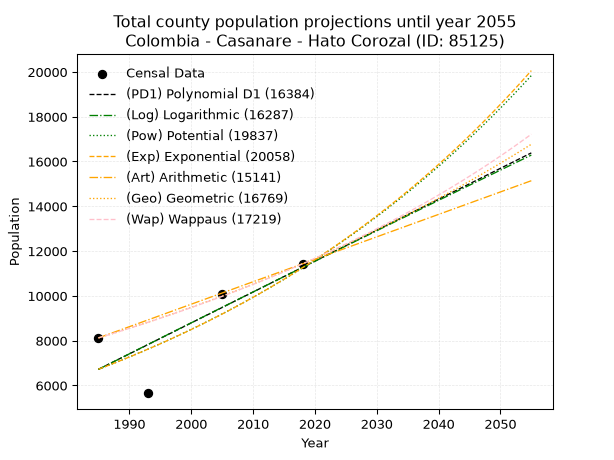
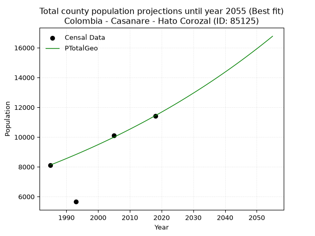
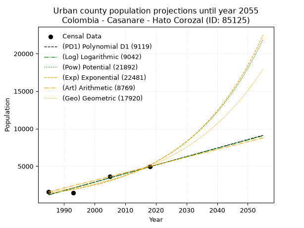
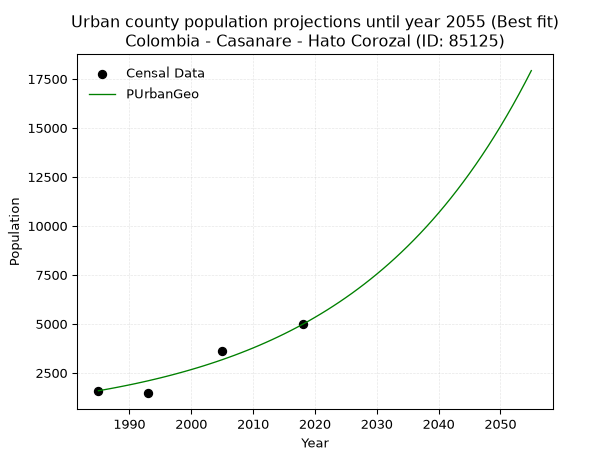
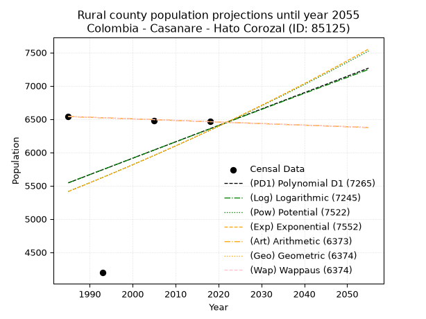
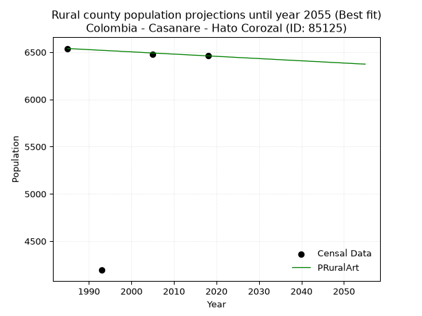

<div align="center">


</div>

# 📜 _“Population and Public Services Demand Projections (PPSD) until Year 2050 for Colombia - Casanare - Hato Corozal (ID: 85125)”_
Keywords: `population` `public-service` `projection` `lineal` `polynomial` `logarithmic` `potential` `exponential` `arithmetic` `geometric` `wappaus` `dane` `colombia` `south-america`

PPSD are analytical estimates used by governments and planners to anticipate future changes in population size, age distribution, and the resulting community needs for utilities, healthcare, education, and infrastructure as sizing future water treatment facilities, electrical grids, and road networks based on spatial growth.

<div align="center">

</img>

</div>


> **General running parameters**: • app_version: _v20260806_. • Python version: _3.14.7_. • Pandas version: _3.0.5_. • NumPy version: _2.5.1_. • Creates, save and include plots into reports (create_plot): _False_. • Projection until year: _2050_. • Process polynomial degree 2 and up: _False_. • Process Wappaus: _True_. • Process Wappaus: _True_. • Set negative values to zero: _True_. • Set infinite values to zero: _True_. • Drop dataset notes: _True_. 
<div align="center">

Dynamic map: [:earth_americas:Google](http://maps.google.com/maps?q=6.154098797,-71.7642128) [:earth_americas:OSM](https://www.openstreetmap.org/#map=18/6.154098797/-71.7642128&layers=P) [:earth_americas:Bing](https://www.bing.com/maps?cp=6.154098797~-71.7642128&lvl=18) [:earth_americas:Apple](https://maps.apple.com/frame?center=6.154098797%2C-71.7642128&span=0.003%2C0.006)

</div>


<div align="center">

```geojson
{
  "type": "Feature",
  "geometry": {
    "type": "Point", 
    "coordinates": [-71.7642128, 6.154098797]
  }, 
  "properties": {
    "Name": "Colombia - Casanare - Hato Corozal (ID: 85125)"
  }
}
```

</div>


## 0. Census Data (4 records)

Census data are official statistics collected by a government about the people and housing in a country. They usually include counts of total population, age, sex, race, income, education, and jobs.

📅Global census file: [Population.xlsx](../data/Population.xlsx)

| Source   |   Year |   CountryID | CountryName   |   StateID | StateName   |   CountyID | CountyName   |   PTotal |   PUrban |   PRural |
|:---------|-------:|------------:|:--------------|----------:|:------------|-----------:|:-------------|---------:|---------:|---------:|
| DANE     |   1985 |          57 | Colombia      |        85 | Casanare    |      85125 | Hato Corozal |     8122 |     1584 |     6538 |
| DANE     |   1993 |          57 | Colombia      |        85 | Casanare    |      85125 | Hato Corozal |     5653 |     1460 |     4193 |
| DANE     |   2005 |          57 | Colombia      |        85 | Casanare    |      85125 | Hato Corozal |    10091 |     3613 |     6478 |
| DANE     |   2018 |          57 | Colombia      |        85 | Casanare    |      85125 | Hato Corozal |    11431 |     4971 |     6460 |

> 🔥Some records could had specific notes about the registered values or the corresponding urban or rural distribution.

📅[SUI-RUPS](https://www.datos.gov.co/Hacienda-y-Cr-dito-P-blico/Registro-nico-de-Prestadores-de-Servicios-P-blicos/4qkq-csdn/about_data) - Local public utility companies: [RUPS.csv](../data/RUPS.csv)

 | SERVICIO       | ESTADO    | NOMBRE                                                                              | NIT         | DEPARTAMENTO_DOMICILIO   | MUNICIPIO_DOMICILIO   | DIRECCION        |   TELEFONO | EMAIL                       | TIPO_PRESTADOR                             | CLASIFICACION                 |
|:---------------|:----------|:------------------------------------------------------------------------------------|:------------|:-------------------------|:----------------------|:-----------------|-----------:|:----------------------------|:-------------------------------------------|:------------------------------|
| ACUEDUCTO      | OPERATIVA | EMPRESAS PUBLICAS DE HATO COROZAL, ACUEDUCTO, ALCANTARILLADO, GAS Y ASEO S.A  E.S.P | 900225245-9 | CASANARE                 | HATO COROZAL          | Carrera 9  12-09 |    6378059 | ephac.hatocorozal@gmail.com | SOCIEDADES (EMPRESA DE SERVICIOS PUBLICOS) | MENOR O IGUAL A 2500 USUARIOS |
| ALCANTARILLADO | OPERATIVA | EMPRESAS PUBLICAS DE HATO COROZAL, ACUEDUCTO, ALCANTARILLADO, GAS Y ASEO S.A  E.S.P | 900225245-9 | CASANARE                 | HATO COROZAL          | Carrera 9  12-09 |    6378059 | ephac.hatocorozal@gmail.com | SOCIEDADES (EMPRESA DE SERVICIOS PUBLICOS) | MENOR O IGUAL A 2500 USUARIOS |

## 1. Total

### 1.1. Coefficients and Parameters

* (PD1) Polynomial Deg 1: 138.0774789241258, -267365.22721798264 (lineal)
* (Log) Logarithmic: 276156.61702884623, -2090244.4090165047
* (Pow) Potential: 31.22767626485762, -99.15393746832211
* (Exp) Exponential: 0.015615425150562717, 2.322248688149378e-10
* (Art) Arithmetic: Year diff. 2018 - 1985 = 33, Population diff. 11431 - 8122 = 3309, Annual growth = 100.27272727272727
* (Geo) Geometric: Year diff. 2018 - 1985 = 33, Population diff. 11431 - 8122 = 3309, Annual growth % = 0.0104099477735482
* (Wap) Wappaus: i = 1.0256505628059864, Condition values only valid for < 200)

<sub>
Wappaus condition values: ['0.00', '1.03', '2.05', '3.08', '4.10', '5.13', '6.15', '7.18', '8.21', '9.23', '10.26', '11.28', '12.31', '13.33', '14.36', '15.38', '16.41', '17.44', '18.46', '19.49', '20.51', '21.54', '22.56', '23.59', '24.62', '25.64', '26.67', '27.69', '28.72', '29.74', '30.77', '31.80', '32.82', '33.85', '34.87', '35.90', '36.92', '37.95', '38.97', '40.00', '41.03', '42.05', '43.08', '44.10', '45.13', '46.15', '47.18', '48.21', '49.23', '50.26', '51.28', '52.31', '53.33', '54.36', '55.39', '56.41', '57.44', '58.46', '59.49', '60.51', '61.54', '62.56', '63.59', '64.62', '65.64', '66.67']
</sub>


### 1.2. Projected Dataset

|   Year |   CountyID |   PTotalPD1 |   PTotalLog |   PTotalPow |   PTotalExp |   PTotalArt |   PTotalGeo |   PTotalWap |
|-------:|-----------:|------------:|------------:|------------:|------------:|------------:|------------:|------------:|
|   1985 |      85125 |        6719 |        6716 |        6721 |        6723 |        8122 |        8122 |        8122 |
|   1986 |      85125 |        6857 |        6855 |        6828 |        6829 |        8222 |        8207 |        8206 |
|   1987 |      85125 |        6995 |        6994 |        6936 |        6936 |        8323 |        8292 |        8290 |
|   1988 |      85125 |        7133 |        7133 |        7046 |        7046 |        8423 |        8378 |        8376 |
|   1989 |      85125 |        7271 |        7272 |        7158 |        7156 |        8523 |        8466 |        8462 |
|   1990 |      85125 |        7409 |        7411 |        7271 |        7269 |        8623 |        8554 |        8549 |
|   1991 |      85125 |        7547 |        7550 |        7386 |        7383 |        8724 |        8643 |        8638 |
|   1992 |      85125 |        7685 |        7688 |        7502 |        7500 |        8824 |        8733 |        8727 |
|   1993 |      85125 |        7823 |        7827 |        7621 |        7618 |        8924 |        8824 |        8817 |
|   1994 |      85125 |        7961 |        7965 |        7741 |        7738 |        9024 |        8915 |        8908 |
|   1995 |      85125 |        8099 |        8104 |        7863 |        7859 |        9125 |        9008 |        9000 |
|   1996 |      85125 |        8237 |        8242 |        7987 |        7983 |        9225 |        9102 |        9093 |
|   1997 |      85125 |        8375 |        8381 |        8113 |        8109 |        9325 |        9197 |        9187 |
|   1998 |      85125 |        8514 |        8519 |        8241 |        8236 |        9426 |        9292 |        9282 |
|   1999 |      85125 |        8652 |        8657 |        8371 |        8366 |        9526 |        9389 |        9378 |
|   2000 |      85125 |        8790 |        8795 |        8503 |        8498 |        9626 |        9487 |        9476 |
|   2001 |      85125 |        8928 |        8933 |        8637 |        8631 |        9726 |        9586 |        9574 |
|   2002 |      85125 |        9066 |        9071 |        8772 |        8767 |        9827 |        9686 |        9673 |
|   2003 |      85125 |        9204 |        9209 |        8910 |        8905 |        9927 |        9786 |        9774 |
|   2004 |      85125 |        9342 |        9347 |        9050 |        9045 |       10027 |        9888 |        9876 |
|   2005 |      85125 |        9480 |        9485 |        9192 |        9188 |       10127 |        9991 |        9978 |
|   2006 |      85125 |        9618 |        9622 |        9336 |        9332 |       10228 |       10095 |       10083 |
|   2007 |      85125 |        9756 |        9760 |        9483 |        9479 |       10328 |       10200 |       10188 |
|   2008 |      85125 |        9894 |        9898 |        9632 |        9628 |       10428 |       10306 |       10294 |
|   2009 |      85125 |       10032 |       10035 |        9783 |        9780 |       10529 |       10414 |       10402 |
|   2010 |      85125 |       10171 |       10172 |        9936 |        9934 |       10629 |       10522 |       10511 |
|   2011 |      85125 |       10309 |       10310 |       10091 |       10090 |       10729 |       10632 |       10621 |
|   2012 |      85125 |       10447 |       10447 |       10249 |       10249 |       10829 |       10742 |       10733 |
|   2013 |      85125 |       10585 |       10584 |       10409 |       10410 |       10930 |       10854 |       10846 |
|   2014 |      85125 |       10723 |       10721 |       10572 |       10574 |       11030 |       10967 |       10960 |
|   2015 |      85125 |       10861 |       10859 |       10737 |       10740 |       11130 |       11081 |       11075 |
|   2016 |      85125 |       10999 |       10996 |       10905 |       10909 |       11230 |       11197 |       11193 |
|   2017 |      85125 |       11137 |       11133 |       11075 |       11081 |       11331 |       11313 |       11311 |
|   2018 |      85125 |       11275 |       11269 |       11248 |       11256 |       11431 |       11431 |       11431 |
|   2019 |      85125 |       11413 |       11406 |       11423 |       11433 |       11531 |       11550 |       11552 |
|   2020 |      85125 |       11551 |       11543 |       11601 |       11613 |       11632 |       11670 |       11675 |
|   2021 |      85125 |       11689 |       11680 |       11782 |       11795 |       11732 |       11792 |       11800 |
|   2022 |      85125 |       11827 |       11816 |       11965 |       11981 |       11832 |       11914 |       11926 |
|   2023 |      85125 |       11966 |       11953 |       12152 |       12170 |       11932 |       12038 |       12054 |
|   2024 |      85125 |       12104 |       12089 |       12341 |       12361 |       12033 |       12164 |       12183 |
|   2025 |      85125 |       12242 |       12226 |       12532 |       12556 |       12133 |       12290 |       12314 |
|   2026 |      85125 |       12380 |       12362 |       12727 |       12753 |       12233 |       12418 |       12447 |
|   2027 |      85125 |       12518 |       12498 |       12925 |       12954 |       12333 |       12548 |       12581 |
|   2028 |      85125 |       12656 |       12634 |       13125 |       13158 |       12434 |       12678 |       12717 |
|   2029 |      85125 |       12794 |       12771 |       13329 |       13365 |       12534 |       12810 |       12855 |
|   2030 |      85125 |       12932 |       12907 |       13536 |       13575 |       12634 |       12944 |       12995 |
|   2031 |      85125 |       13070 |       13043 |       13745 |       13789 |       12735 |       13078 |       13137 |
|   2032 |      85125 |       13208 |       13179 |       13958 |       14006 |       12835 |       13215 |       13281 |
|   2033 |      85125 |       13346 |       13315 |       14174 |       14226 |       12935 |       13352 |       13426 |
|   2034 |      85125 |       13484 |       13450 |       14394 |       14450 |       13035 |       13491 |       13574 |
|   2035 |      85125 |       13622 |       13586 |       14616 |       14678 |       13136 |       13632 |       13723 |
|   2036 |      85125 |       13761 |       13722 |       14842 |       14909 |       13236 |       13773 |       13875 |
|   2037 |      85125 |       13899 |       13857 |       15072 |       15143 |       13336 |       13917 |       14029 |
|   2038 |      85125 |       14037 |       13993 |       15305 |       15382 |       13436 |       14062 |       14185 |
|   2039 |      85125 |       14175 |       14128 |       15541 |       15624 |       13537 |       14208 |       14343 |
|   2040 |      85125 |       14313 |       14264 |       15781 |       15869 |       13637 |       14356 |       14504 |
|   2041 |      85125 |       14451 |       14399 |       16024 |       16119 |       13737 |       14505 |       14666 |
|   2042 |      85125 |       14589 |       14534 |       16271 |       16373 |       13838 |       14656 |       14832 |
|   2043 |      85125 |       14727 |       14670 |       16522 |       16631 |       13938 |       14809 |       14999 |
|   2044 |      85125 |       14865 |       14805 |       16776 |       16892 |       14038 |       14963 |       15169 |
|   2045 |      85125 |       15003 |       14940 |       17034 |       17158 |       14138 |       15119 |       15342 |
|   2046 |      85125 |       15141 |       15075 |       17296 |       17428 |       14239 |       15276 |       15517 |
|   2047 |      85125 |       15279 |       15210 |       17562 |       17702 |       14339 |       15435 |       15694 |
|   2048 |      85125 |       15417 |       15345 |       17832 |       17981 |       14439 |       15596 |       15875 |
|   2049 |      85125 |       15556 |       15479 |       18106 |       18264 |       14539 |       15758 |       16058 |
|   2050 |      85125 |       15694 |       15614 |       18384 |       18552 |       14640 |       15922 |       16244 |
<div align="center">

</img>

</div>


### 1.3. Best fit with absolute and relative error (%)

Relative error puts that difference into context by dividing the absolute error by the true value, creating a unitless ratio or percentage that shows the scale of the mistake.

Absolute and relative error

|   Year | Source   |   CountryID | CountryName   |   StateID | StateName   |   CountyID_x | CountyName   |   PTotal |   PUrban |   PRural |   CountyID_y |   PTotalPD1 |   PTotalLog |   PTotalPow |   PTotalExp |   PTotalArt |   PTotalGeo |   PTotalWap |   PTotalPD1AbsError |   PTotalLogAbsError |   PTotalPowAbsError |   PTotalExpAbsError |   PTotalArtAbsError |   PTotalGeoAbsError |   PTotalWapAbsError |   PTotalPD1RelError |   PTotalLogRelError |   PTotalPowRelError |   PTotalExpRelError |   PTotalArtRelError |   PTotalGeoRelError |   PTotalWapRelError |
|-------:|:---------|------------:|:--------------|----------:|:------------|-------------:|:-------------|---------:|---------:|---------:|-------------:|------------:|------------:|------------:|------------:|------------:|------------:|------------:|--------------------:|--------------------:|--------------------:|--------------------:|--------------------:|--------------------:|--------------------:|--------------------:|--------------------:|--------------------:|--------------------:|--------------------:|--------------------:|--------------------:|
|   1985 | DANE     |          57 | Colombia      |        85 | Casanare    |        85125 | Hato Corozal |     8122 |     1584 |     6538 |        85125 |        6719 |        6716 |        6721 |        6723 |        8122 |        8122 |        8122 |                1403 |                1406 |                1401 |                1399 |                   0 |                   0 |                   0 |            17.2741  |            17.311   |            17.2494  |            17.2248  |            0        |            0        |             0       |
|   1993 | DANE     |          57 | Colombia      |        85 | Casanare    |        85125 | Hato Corozal |     5653 |     1460 |     4193 |        85125 |        7823 |        7827 |        7621 |        7618 |        8924 |        8824 |        8817 |                2170 |                2174 |                1968 |                1965 |                3271 |                3171 |                3164 |            38.3867  |            38.4575  |            34.8134  |            34.7603  |           57.8631   |           56.0941   |            55.9703  |
|   2005 | DANE     |          57 | Colombia      |        85 | Casanare    |        85125 | Hato Corozal |    10091 |     3613 |     6478 |        85125 |        9480 |        9485 |        9192 |        9188 |       10127 |        9991 |        9978 |                 611 |                 606 |                 899 |                 903 |                  36 |                 100 |                 113 |             6.0549  |             6.00535 |             8.90893 |             8.94857 |            0.356754 |            0.990982 |             1.11981 |
|   2018 | DANE     |          57 | Colombia      |        85 | Casanare    |        85125 | Hato Corozal |    11431 |     4971 |     6460 |        85125 |       11275 |       11269 |       11248 |       11256 |       11431 |       11431 |       11431 |                 156 |                 162 |                 183 |                 175 |                   0 |                   0 |                   0 |             1.36471 |             1.4172  |             1.60091 |             1.53092 |            0        |            0        |             0       |

Relative error mean

| Method    |   RelError | Best   |
|:----------|-----------:|:-------|
| PTotalPD1 |    15.7701 |        |
| PTotalLog |    15.7978 |        |
| PTotalPow |    15.6432 |        |
| PTotalExp |    15.6162 |        |
| PTotalArt |    14.555  |        |
| PTotalGeo |    14.2713 | True   |
| PTotalWap |    14.2725 |        |

💙Best method: _**PTotalGeo**_
<div align="center">

</img>

</div>


### 1.4. Fresh water supply demand in liters per capita per day (lpcd)

The fresh water supply demand typically ranges from 100 to 300 liters per capita per day (lpcd) for standard domestic and municipal planning, though absolute survival minimums set by the World Health Organization are as low as 7.5 to 20 liters per day, and total consumption in high-income nations can exceed 400 liters.

> `CZ`: Level in meters above the sea level (masl)<br> `WS`: Fresh water supply demand in liters per capita per day (lpcd or l/h/d)<br> `WSAll`: Zonal fresh water supply demand in liters per second (l/s)<br> `A`: Zonal area in square meters<br> `DP`: Population density (people/hectare or p/ha)

Reference values (RAS Colombia)

|    CZ |   WS |
|------:|-----:|
|  1000 |  120 |
|  2000 |  130 |
| 99999 |  140 |

County shapefile geometry properties and water supply values

|   CountyID |      ATotal |   CZTotal |   WSTotal |
|-----------:|------------:|----------:|----------:|
|      85125 | 5.49226e+09 |   183.038 |       120 |

Projected values for best method: PTotalGeo

|   CountyID |   Year |   PTotalGeo |   DPTotal |   WSTotal |   WSTotalAll |
|-----------:|-------:|------------:|----------:|----------:|-------------:|
|      85125 |   1985 |        8122 |      0.01 |       120 |      11.2806 |
|      85125 |   1986 |        8207 |      0.01 |       120 |      11.3986 |
|      85125 |   1987 |        8292 |      0.02 |       120 |      11.5167 |
|      85125 |   1988 |        8378 |      0.02 |       120 |      11.6361 |
|      85125 |   1989 |        8466 |      0.02 |       120 |      11.7583 |
|      85125 |   1990 |        8554 |      0.02 |       120 |      11.8806 |
|      85125 |   1991 |        8643 |      0.02 |       120 |      12.0042 |
|      85125 |   1992 |        8733 |      0.02 |       120 |      12.1292 |
|      85125 |   1993 |        8824 |      0.02 |       120 |      12.2556 |
|      85125 |   1994 |        8915 |      0.02 |       120 |      12.3819 |
|      85125 |   1995 |        9008 |      0.02 |       120 |      12.5111 |
|      85125 |   1996 |        9102 |      0.02 |       120 |      12.6417 |
|      85125 |   1997 |        9197 |      0.02 |       120 |      12.7736 |
|      85125 |   1998 |        9292 |      0.02 |       120 |      12.9056 |
|      85125 |   1999 |        9389 |      0.02 |       120 |      13.0403 |
|      85125 |   2000 |        9487 |      0.02 |       120 |      13.1764 |
|      85125 |   2001 |        9586 |      0.02 |       120 |      13.3139 |
|      85125 |   2002 |        9686 |      0.02 |       120 |      13.4528 |
|      85125 |   2003 |        9786 |      0.02 |       120 |      13.5917 |
|      85125 |   2004 |        9888 |      0.02 |       120 |      13.7333 |
|      85125 |   2005 |        9991 |      0.02 |       120 |      13.8764 |
|      85125 |   2006 |       10095 |      0.02 |       120 |      14.0208 |
|      85125 |   2007 |       10200 |      0.02 |       120 |      14.1667 |
|      85125 |   2008 |       10306 |      0.02 |       120 |      14.3139 |
|      85125 |   2009 |       10414 |      0.02 |       120 |      14.4639 |
|      85125 |   2010 |       10522 |      0.02 |       120 |      14.6139 |
|      85125 |   2011 |       10632 |      0.02 |       120 |      14.7667 |
|      85125 |   2012 |       10742 |      0.02 |       120 |      14.9194 |
|      85125 |   2013 |       10854 |      0.02 |       120 |      15.075  |
|      85125 |   2014 |       10967 |      0.02 |       120 |      15.2319 |
|      85125 |   2015 |       11081 |      0.02 |       120 |      15.3903 |
|      85125 |   2016 |       11197 |      0.02 |       120 |      15.5514 |
|      85125 |   2017 |       11313 |      0.02 |       120 |      15.7125 |
|      85125 |   2018 |       11431 |      0.02 |       120 |      15.8764 |
|      85125 |   2019 |       11550 |      0.02 |       120 |      16.0417 |
|      85125 |   2020 |       11670 |      0.02 |       120 |      16.2083 |
|      85125 |   2021 |       11792 |      0.02 |       120 |      16.3778 |
|      85125 |   2022 |       11914 |      0.02 |       120 |      16.5472 |
|      85125 |   2023 |       12038 |      0.02 |       120 |      16.7194 |
|      85125 |   2024 |       12164 |      0.02 |       120 |      16.8944 |
|      85125 |   2025 |       12290 |      0.02 |       120 |      17.0694 |
|      85125 |   2026 |       12418 |      0.02 |       120 |      17.2472 |
|      85125 |   2027 |       12548 |      0.02 |       120 |      17.4278 |
|      85125 |   2028 |       12678 |      0.02 |       120 |      17.6083 |
|      85125 |   2029 |       12810 |      0.02 |       120 |      17.7917 |
|      85125 |   2030 |       12944 |      0.02 |       120 |      17.9778 |
|      85125 |   2031 |       13078 |      0.02 |       120 |      18.1639 |
|      85125 |   2032 |       13215 |      0.02 |       120 |      18.3542 |
|      85125 |   2033 |       13352 |      0.02 |       120 |      18.5444 |
|      85125 |   2034 |       13491 |      0.02 |       120 |      18.7375 |
|      85125 |   2035 |       13632 |      0.02 |       120 |      18.9333 |
|      85125 |   2036 |       13773 |      0.03 |       120 |      19.1292 |
|      85125 |   2037 |       13917 |      0.03 |       120 |      19.3292 |
|      85125 |   2038 |       14062 |      0.03 |       120 |      19.5306 |
|      85125 |   2039 |       14208 |      0.03 |       120 |      19.7333 |
|      85125 |   2040 |       14356 |      0.03 |       120 |      19.9389 |
|      85125 |   2041 |       14505 |      0.03 |       120 |      20.1458 |
|      85125 |   2042 |       14656 |      0.03 |       120 |      20.3556 |
|      85125 |   2043 |       14809 |      0.03 |       120 |      20.5681 |
|      85125 |   2044 |       14963 |      0.03 |       120 |      20.7819 |
|      85125 |   2045 |       15119 |      0.03 |       120 |      20.9986 |
|      85125 |   2046 |       15276 |      0.03 |       120 |      21.2167 |
|      85125 |   2047 |       15435 |      0.03 |       120 |      21.4375 |
|      85125 |   2048 |       15596 |      0.03 |       120 |      21.6611 |
|      85125 |   2049 |       15758 |      0.03 |       120 |      21.8861 |
|      85125 |   2050 |       15922 |      0.03 |       120 |      22.1139 |

## 2. Urban

### 2.1. Coefficients and Parameters

* (PD1) Polynomial Deg 1: 113.45804897631373, -224037.46246487158 (lineal)
* (Log) Logarithmic: 227034.26152803926, -1722782.2412130183
* (Pow) Potential: 79.72814962407088, -259.7840633263944
* (Exp) Exponential: 0.03983601605111219, 6.297321918081284e-32
* (Art) Arithmetic: Year diff. 2018 - 1985 = 33, Population diff. 4971 - 1584 = 3387, Annual growth = 102.63636363636364
* (Geo) Geometric: Year diff. 2018 - 1985 = 33, Population diff. 4971 - 1584 = 3387, Annual growth % = 0.03526413596731115
* (Wap) Wappaus: i = 3.1315442757090355, Condition values only valid for < 200)

<sub>
Wappaus condition values: ['0.00', '3.13', '6.26', '9.39', '12.53', '15.66', '18.79', '21.92', '25.05', '28.18', '31.32', '34.45', '37.58', '40.71', '43.84', '46.97', '50.10', '53.24', '56.37', '59.50', '62.63', '65.76', '68.89', '72.03', '75.16', '78.29', '81.42', '84.55', '87.68', '90.81', '93.95', '97.08', '100.21', '103.34', '106.47', '109.60', '112.74', '115.87', '119.00', '122.13', '125.26', '128.39', '131.52', '134.66', '137.79', '140.92', '144.05', '147.18', '150.31', '153.45', '156.58', '159.71', '162.84', '165.97', '169.10', '172.23', '175.37', '178.50', '181.63', '184.76', '187.89', '191.02', '194.16', '197.29', '200.42', '203.55']
</sub>


### 2.2. Projected Dataset

|   Year |   CountyID |   PUrbanPD1 |   PUrbanLog |   PUrbanPow |   PUrbanExp |   PUrbanArt |   PUrbanGeo |
|-------:|-----------:|------------:|------------:|------------:|------------:|------------:|------------:|
|   1985 |      85125 |        1177 |        1174 |        1381 |        1383 |        1584 |        1584 |
|   1986 |      85125 |        1290 |        1288 |        1438 |        1439 |        1687 |        1640 |
|   1987 |      85125 |        1404 |        1402 |        1497 |        1498 |        1789 |        1698 |
|   1988 |      85125 |        1517 |        1517 |        1558 |        1558 |        1892 |        1758 |
|   1989 |      85125 |        1631 |        1631 |        1622 |        1622 |        1995 |        1820 |
|   1990 |      85125 |        1744 |        1745 |        1688 |        1688 |        2097 |        1884 |
|   1991 |      85125 |        1858 |        1859 |        1757 |        1756 |        2200 |        1950 |
|   1992 |      85125 |        1971 |        1973 |        1829 |        1828 |        2302 |        2019 |
|   1993 |      85125 |        2084 |        2087 |        1903 |        1902 |        2405 |        2090 |
|   1994 |      85125 |        2198 |        2201 |        1981 |        1979 |        2508 |        2164 |
|   1995 |      85125 |        2311 |        2315 |        2062 |        2060 |        2610 |        2240 |
|   1996 |      85125 |        2425 |        2429 |        2146 |        2143 |        2713 |        2319 |
|   1997 |      85125 |        2538 |        2542 |        2233 |        2230 |        2816 |        2401 |
|   1998 |      85125 |        2652 |        2656 |        2324 |        2321 |        2918 |        2486 |
|   1999 |      85125 |        2765 |        2769 |        2419 |        2415 |        3021 |        2573 |
|   2000 |      85125 |        2879 |        2883 |        2517 |        2514 |        3124 |        2664 |
|   2001 |      85125 |        2992 |        2997 |        2620 |        2616 |        3226 |        2758 |
|   2002 |      85125 |        3106 |        3110 |        2726 |        2722 |        3329 |        2855 |
|   2003 |      85125 |        3219 |        3223 |        2837 |        2833 |        3431 |        2956 |
|   2004 |      85125 |        3332 |        3337 |        2952 |        2948 |        3534 |        3060 |
|   2005 |      85125 |        3446 |        3450 |        3072 |        3067 |        3637 |        3168 |
|   2006 |      85125 |        3559 |        3563 |        3196 |        3192 |        3739 |        3280 |
|   2007 |      85125 |        3673 |        3676 |        3326 |        3322 |        3842 |        3395 |
|   2008 |      85125 |        3786 |        3789 |        3461 |        3457 |        3945 |        3515 |
|   2009 |      85125 |        3900 |        3902 |        3601 |        3597 |        4047 |        3639 |
|   2010 |      85125 |        4013 |        4015 |        3747 |        3744 |        4150 |        3767 |
|   2011 |      85125 |        4127 |        4128 |        3898 |        3896 |        4253 |        3900 |
|   2012 |      85125 |        4240 |        4241 |        4056 |        4054 |        4355 |        4038 |
|   2013 |      85125 |        4354 |        4354 |        4220 |        4219 |        4458 |        4180 |
|   2014 |      85125 |        4467 |        4467 |        4390 |        4390 |        4560 |        4328 |
|   2015 |      85125 |        4581 |        4579 |        4567 |        4569 |        4663 |        4480 |
|   2016 |      85125 |        4694 |        4692 |        4752 |        4754 |        4766 |        4638 |
|   2017 |      85125 |        4807 |        4805 |        4943 |        4948 |        4868 |        4802 |
|   2018 |      85125 |        4921 |        4917 |        5143 |        5149 |        4971 |        4971 |
|   2019 |      85125 |        5034 |        5030 |        5350 |        5358 |        5074 |        5146 |
|   2020 |      85125 |        5148 |        5142 |        5565 |        5576 |        5176 |        5328 |
|   2021 |      85125 |        5261 |        5254 |        5789 |        5802 |        5279 |        5516 |
|   2022 |      85125 |        5375 |        5367 |        6022 |        6038 |        5382 |        5710 |
|   2023 |      85125 |        5488 |        5479 |        6264 |        6283 |        5484 |        5912 |
|   2024 |      85125 |        5602 |        5591 |        6516 |        6539 |        5587 |        6120 |
|   2025 |      85125 |        5715 |        5703 |        6778 |        6804 |        5689 |        6336 |
|   2026 |      85125 |        5829 |        5815 |        7050 |        7081 |        5792 |        6559 |
|   2027 |      85125 |        5942 |        5927 |        7333 |        7369 |        5895 |        6791 |
|   2028 |      85125 |        6055 |        6039 |        7627 |        7668 |        5997 |        7030 |
|   2029 |      85125 |        6169 |        6151 |        7933 |        7980 |        6100 |        7278 |
|   2030 |      85125 |        6282 |        6263 |        8250 |        8304 |        6203 |        7535 |
|   2031 |      85125 |        6396 |        6375 |        8581 |        8642 |        6305 |        7800 |
|   2032 |      85125 |        6509 |        6487 |        8924 |        8993 |        6408 |        8075 |
|   2033 |      85125 |        6623 |        6599 |        9281 |        9358 |        6511 |        8360 |
|   2034 |      85125 |        6736 |        6710 |        9652 |        9739 |        6613 |        8655 |
|   2035 |      85125 |        6850 |        6822 |       10038 |       10134 |        6716 |        8960 |
|   2036 |      85125 |        6963 |        6933 |       10439 |       10546 |        6818 |        9276 |
|   2037 |      85125 |        7077 |        7045 |       10856 |       10975 |        6921 |        9603 |
|   2038 |      85125 |        7190 |        7156 |       11289 |       11421 |        7024 |        9942 |
|   2039 |      85125 |        7303 |        7268 |       11739 |       11885 |        7126 |       10292 |
|   2040 |      85125 |        7417 |        7379 |       12207 |       12368 |        7229 |       10655 |
|   2041 |      85125 |        7530 |        7490 |       12694 |       12871 |        7332 |       11031 |
|   2042 |      85125 |        7644 |        7601 |       13199 |       13394 |        7434 |       11420 |
|   2043 |      85125 |        7757 |        7713 |       13725 |       13938 |        7537 |       11823 |
|   2044 |      85125 |        7871 |        7824 |       14271 |       14505 |        7640 |       12240 |
|   2045 |      85125 |        7984 |        7935 |       14838 |       15094 |        7742 |       12671 |
|   2046 |      85125 |        8098 |        8046 |       15428 |       15707 |        7845 |       13118 |
|   2047 |      85125 |        8211 |        8157 |       16041 |       16346 |        7947 |       13581 |
|   2048 |      85125 |        8325 |        8267 |       16678 |       17010 |        8050 |       14060 |
|   2049 |      85125 |        8438 |        8378 |       17340 |       17701 |        8153 |       14556 |
|   2050 |      85125 |        8552 |        8489 |       18028 |       18421 |        8255 |       15069 |
<div align="center">

</img>

</div>


### 2.3. Best fit with absolute and relative error (%)

Relative error puts that difference into context by dividing the absolute error by the true value, creating a unitless ratio or percentage that shows the scale of the mistake.

Absolute and relative error

|   Year | Source   |   CountryID | CountryName   |   StateID | StateName   |   CountyID_x | CountyName   |   PTotal |   PUrban |   PRural |   CountyID_y |   PUrbanPD1 |   PUrbanLog |   PUrbanPow |   PUrbanExp |   PUrbanArt |   PUrbanGeo |   PUrbanPD1AbsError |   PUrbanLogAbsError |   PUrbanPowAbsError |   PUrbanExpAbsError |   PUrbanArtAbsError |   PUrbanGeoAbsError |   PUrbanPD1RelError |   PUrbanLogRelError |   PUrbanPowRelError |   PUrbanExpRelError |   PUrbanArtRelError |   PUrbanGeoRelError |
|-------:|:---------|------------:|:--------------|----------:|:------------|-------------:|:-------------|---------:|---------:|---------:|-------------:|------------:|------------:|------------:|------------:|------------:|------------:|--------------------:|--------------------:|--------------------:|--------------------:|--------------------:|--------------------:|--------------------:|--------------------:|--------------------:|--------------------:|--------------------:|--------------------:|
|   1985 | DANE     |          57 | Colombia      |        85 | Casanare    |        85125 | Hato Corozal |     8122 |     1584 |     6538 |        85125 |        1177 |        1174 |        1381 |        1383 |        1584 |        1584 |                 407 |                 410 |                 203 |                 201 |                   0 |                   0 |            25.6944  |            25.8838  |            12.8157  |            12.6894  |            0        |              0      |
|   1993 | DANE     |          57 | Colombia      |        85 | Casanare    |        85125 | Hato Corozal |     5653 |     1460 |     4193 |        85125 |        2084 |        2087 |        1903 |        1902 |        2405 |        2090 |                 624 |                 627 |                 443 |                 442 |                 945 |                 630 |            42.7397  |            42.9452  |            30.3425  |            30.274   |           64.726    |             43.1507 |
|   2005 | DANE     |          57 | Colombia      |        85 | Casanare    |        85125 | Hato Corozal |    10091 |     3613 |     6478 |        85125 |        3446 |        3450 |        3072 |        3067 |        3637 |        3168 |                 167 |                 163 |                 541 |                 546 |                  24 |                 445 |             4.6222  |             4.51149 |            14.9737  |            15.1121  |            0.664268 |             12.3166 |
|   2018 | DANE     |          57 | Colombia      |        85 | Casanare    |        85125 | Hato Corozal |    11431 |     4971 |     6460 |        85125 |        4921 |        4917 |        5143 |        5149 |        4971 |        4971 |                  50 |                  54 |                 172 |                 178 |                   0 |                   0 |             1.00583 |             1.0863  |             3.46007 |             3.58077 |            0        |              0      |

Relative error mean

| Method    |   RelError | Best   |
|:----------|-----------:|:-------|
| PUrbanPD1 |    18.5156 |        |
| PUrbanLog |    18.6067 |        |
| PUrbanPow |    15.398  |        |
| PUrbanExp |    15.4141 |        |
| PUrbanArt |    16.3476 |        |
| PUrbanGeo |    13.8668 | True   |

💙Best method: _**PUrbanGeo**_
<div align="center">

</img>

</div>


### 2.4. Fresh water supply demand in liters per capita per day (lpcd)

The fresh water supply demand typically ranges from 100 to 300 liters per capita per day (lpcd) for standard domestic and municipal planning, though absolute survival minimums set by the World Health Organization are as low as 7.5 to 20 liters per day, and total consumption in high-income nations can exceed 400 liters.

> `CZ`: Level in meters above the sea level (masl)<br> `WS`: Fresh water supply demand in liters per capita per day (lpcd or l/h/d)<br> `WSAll`: Zonal fresh water supply demand in liters per second (l/s)<br> `A`: Zonal area in square meters<br> `DP`: Population density (people/hectare or p/ha)

Reference values (RAS Colombia)

|    CZ |   WS |
|------:|-----:|
|  1000 |  120 |
|  2000 |  130 |
| 99999 |  140 |

County shapefile geometry properties and water supply values

|   CountyID |      AUrban |   CZUrban |   WSUrban |
|-----------:|------------:|----------:|----------:|
|      85125 | 2.89689e+06 |   254.271 |       120 |

Projected values for best method: PUrbanGeo

|   CountyID |   Year |   PUrbanGeo |   DPUrban |   WSUrban |   WSUrbanAll |
|-----------:|-------:|------------:|----------:|----------:|-------------:|
|      85125 |   1985 |        1584 |      5.47 |       120 |      2.2     |
|      85125 |   1986 |        1640 |      5.66 |       120 |      2.27778 |
|      85125 |   1987 |        1698 |      5.86 |       120 |      2.35833 |
|      85125 |   1988 |        1758 |      6.07 |       120 |      2.44167 |
|      85125 |   1989 |        1820 |      6.28 |       120 |      2.52778 |
|      85125 |   1990 |        1884 |      6.5  |       120 |      2.61667 |
|      85125 |   1991 |        1950 |      6.73 |       120 |      2.70833 |
|      85125 |   1992 |        2019 |      6.97 |       120 |      2.80417 |
|      85125 |   1993 |        2090 |      7.21 |       120 |      2.90278 |
|      85125 |   1994 |        2164 |      7.47 |       120 |      3.00556 |
|      85125 |   1995 |        2240 |      7.73 |       120 |      3.11111 |
|      85125 |   1996 |        2319 |      8.01 |       120 |      3.22083 |
|      85125 |   1997 |        2401 |      8.29 |       120 |      3.33472 |
|      85125 |   1998 |        2486 |      8.58 |       120 |      3.45278 |
|      85125 |   1999 |        2573 |      8.88 |       120 |      3.57361 |
|      85125 |   2000 |        2664 |      9.2  |       120 |      3.7     |
|      85125 |   2001 |        2758 |      9.52 |       120 |      3.83056 |
|      85125 |   2002 |        2855 |      9.86 |       120 |      3.96528 |
|      85125 |   2003 |        2956 |     10.2  |       120 |      4.10556 |
|      85125 |   2004 |        3060 |     10.56 |       120 |      4.25    |
|      85125 |   2005 |        3168 |     10.94 |       120 |      4.4     |
|      85125 |   2006 |        3280 |     11.32 |       120 |      4.55556 |
|      85125 |   2007 |        3395 |     11.72 |       120 |      4.71528 |
|      85125 |   2008 |        3515 |     12.13 |       120 |      4.88194 |
|      85125 |   2009 |        3639 |     12.56 |       120 |      5.05417 |
|      85125 |   2010 |        3767 |     13    |       120 |      5.23194 |
|      85125 |   2011 |        3900 |     13.46 |       120 |      5.41667 |
|      85125 |   2012 |        4038 |     13.94 |       120 |      5.60833 |
|      85125 |   2013 |        4180 |     14.43 |       120 |      5.80556 |
|      85125 |   2014 |        4328 |     14.94 |       120 |      6.01111 |
|      85125 |   2015 |        4480 |     15.46 |       120 |      6.22222 |
|      85125 |   2016 |        4638 |     16.01 |       120 |      6.44167 |
|      85125 |   2017 |        4802 |     16.58 |       120 |      6.66944 |
|      85125 |   2018 |        4971 |     17.16 |       120 |      6.90417 |
|      85125 |   2019 |        5146 |     17.76 |       120 |      7.14722 |
|      85125 |   2020 |        5328 |     18.39 |       120 |      7.4     |
|      85125 |   2021 |        5516 |     19.04 |       120 |      7.66111 |
|      85125 |   2022 |        5710 |     19.71 |       120 |      7.93056 |
|      85125 |   2023 |        5912 |     20.41 |       120 |      8.21111 |
|      85125 |   2024 |        6120 |     21.13 |       120 |      8.5     |
|      85125 |   2025 |        6336 |     21.87 |       120 |      8.8     |
|      85125 |   2026 |        6559 |     22.64 |       120 |      9.10972 |
|      85125 |   2027 |        6791 |     23.44 |       120 |      9.43194 |
|      85125 |   2028 |        7030 |     24.27 |       120 |      9.76389 |
|      85125 |   2029 |        7278 |     25.12 |       120 |     10.1083  |
|      85125 |   2030 |        7535 |     26.01 |       120 |     10.4653  |
|      85125 |   2031 |        7800 |     26.93 |       120 |     10.8333  |
|      85125 |   2032 |        8075 |     27.87 |       120 |     11.2153  |
|      85125 |   2033 |        8360 |     28.86 |       120 |     11.6111  |
|      85125 |   2034 |        8655 |     29.88 |       120 |     12.0208  |
|      85125 |   2035 |        8960 |     30.93 |       120 |     12.4444  |
|      85125 |   2036 |        9276 |     32.02 |       120 |     12.8833  |
|      85125 |   2037 |        9603 |     33.15 |       120 |     13.3375  |
|      85125 |   2038 |        9942 |     34.32 |       120 |     13.8083  |
|      85125 |   2039 |       10292 |     35.53 |       120 |     14.2944  |
|      85125 |   2040 |       10655 |     36.78 |       120 |     14.7986  |
|      85125 |   2041 |       11031 |     38.08 |       120 |     15.3208  |
|      85125 |   2042 |       11420 |     39.42 |       120 |     15.8611  |
|      85125 |   2043 |       11823 |     40.81 |       120 |     16.4208  |
|      85125 |   2044 |       12240 |     42.25 |       120 |     17       |
|      85125 |   2045 |       12671 |     43.74 |       120 |     17.5986  |
|      85125 |   2046 |       13118 |     45.28 |       120 |     18.2194  |
|      85125 |   2047 |       13581 |     46.88 |       120 |     18.8625  |
|      85125 |   2048 |       14060 |     48.53 |       120 |     19.5278  |
|      85125 |   2049 |       14556 |     50.25 |       120 |     20.2167  |
|      85125 |   2050 |       15069 |     52.02 |       120 |     20.9292  |

## 3. Rural

### 3.1. Coefficients and Parameters

* (PD1) Polynomial Deg 1: 24.619429947811955, -43327.76475311087 (lineal)
* (Log) Logarithmic: 49122.35550080693, -367462.1678034858
* (Pow) Potential: 9.496295604654449, -27.583081153013907
* (Exp) Exponential: 0.004759100270473908, 0.42725989040155476
* (Art) Arithmetic: Year diff. 2018 - 1985 = 33, Population diff. 6460 - 6538 = -78, Annual growth = -2.3636363636363638
* (Geo) Geometric: Year diff. 2018 - 1985 = 33, Population diff. 6460 - 6538 = -78, Annual growth % = -0.00036363055242472075
* (Wap) Wappaus: i = -0.036369231630040987, Condition values only valid for < 200)

<sub>
Wappaus condition values: ['-0.00', '-0.04', '-0.07', '-0.11', '-0.15', '-0.18', '-0.22', '-0.25', '-0.29', '-0.33', '-0.36', '-0.40', '-0.44', '-0.47', '-0.51', '-0.55', '-0.58', '-0.62', '-0.65', '-0.69', '-0.73', '-0.76', '-0.80', '-0.84', '-0.87', '-0.91', '-0.95', '-0.98', '-1.02', '-1.05', '-1.09', '-1.13', '-1.16', '-1.20', '-1.24', '-1.27', '-1.31', '-1.35', '-1.38', '-1.42', '-1.45', '-1.49', '-1.53', '-1.56', '-1.60', '-1.64', '-1.67', '-1.71', '-1.75', '-1.78', '-1.82', '-1.85', '-1.89', '-1.93', '-1.96', '-2.00', '-2.04', '-2.07', '-2.11', '-2.15', '-2.18', '-2.22', '-2.25', '-2.29', '-2.33', '-2.36']
</sub>


### 3.2. Projected Dataset

|   Year |   CountyID |   PRuralPD1 |   PRuralLog |   PRuralPow |   PRuralExp |   PRuralArt |   PRuralGeo |   PRuralWap |
|-------:|-----------:|------------:|------------:|------------:|------------:|------------:|------------:|------------:|
|   1985 |      85125 |        5542 |        5542 |        5413 |        5412 |        6538 |        6538 |        6538 |
|   1986 |      85125 |        5566 |        5567 |        5439 |        5438 |        6536 |        6536 |        6536 |
|   1987 |      85125 |        5591 |        5592 |        5465 |        5464 |        6533 |        6533 |        6533 |
|   1988 |      85125 |        5616 |        5616 |        5491 |        5490 |        6531 |        6531 |        6531 |
|   1989 |      85125 |        5640 |        5641 |        5517 |        5516 |        6529 |        6528 |        6528 |
|   1990 |      85125 |        5665 |        5666 |        5544 |        5543 |        6526 |        6526 |        6526 |
|   1991 |      85125 |        5690 |        5691 |        5570 |        5569 |        6524 |        6524 |        6524 |
|   1992 |      85125 |        5714 |        5715 |        5597 |        5596 |        6521 |        6521 |        6521 |
|   1993 |      85125 |        5739 |        5740 |        5624 |        5622 |        6519 |        6519 |        6519 |
|   1994 |      85125 |        5763 |        5764 |        5650 |        5649 |        6517 |        6517 |        6517 |
|   1995 |      85125 |        5788 |        5789 |        5677 |        5676 |        6514 |        6514 |        6514 |
|   1996 |      85125 |        5813 |        5814 |        5705 |        5703 |        6512 |        6512 |        6512 |
|   1997 |      85125 |        5837 |        5838 |        5732 |        5731 |        6510 |        6510 |        6510 |
|   1998 |      85125 |        5862 |        5863 |        5759 |        5758 |        6507 |        6507 |        6507 |
|   1999 |      85125 |        5886 |        5887 |        5786 |        5785 |        6505 |        6505 |        6505 |
|   2000 |      85125 |        5911 |        5912 |        5814 |        5813 |        6503 |        6502 |        6502 |
|   2001 |      85125 |        5936 |        5937 |        5842 |        5841 |        6500 |        6500 |        6500 |
|   2002 |      85125 |        5960 |        5961 |        5869 |        5869 |        6498 |        6498 |        6498 |
|   2003 |      85125 |        5985 |        5986 |        5897 |        5897 |        6495 |        6495 |        6495 |
|   2004 |      85125 |        6010 |        6010 |        5925 |        5925 |        6493 |        6493 |        6493 |
|   2005 |      85125 |        6034 |        6035 |        5954 |        5953 |        6491 |        6491 |        6491 |
|   2006 |      85125 |        6059 |        6059 |        5982 |        5981 |        6488 |        6488 |        6488 |
|   2007 |      85125 |        6083 |        6084 |        6010 |        6010 |        6486 |        6486 |        6486 |
|   2008 |      85125 |        6108 |        6108 |        6039 |        6038 |        6484 |        6484 |        6484 |
|   2009 |      85125 |        6133 |        6133 |        6067 |        6067 |        6481 |        6481 |        6481 |
|   2010 |      85125 |        6157 |        6157 |        6096 |        6096 |        6479 |        6479 |        6479 |
|   2011 |      85125 |        6182 |        6181 |        6125 |        6125 |        6477 |        6476 |        6476 |
|   2012 |      85125 |        6207 |        6206 |        6154 |        6155 |        6474 |        6474 |        6474 |
|   2013 |      85125 |        6231 |        6230 |        6183 |        6184 |        6472 |        6472 |        6472 |
|   2014 |      85125 |        6256 |        6255 |        6212 |        6213 |        6469 |        6469 |        6469 |
|   2015 |      85125 |        6280 |        6279 |        6242 |        6243 |        6467 |        6467 |        6467 |
|   2016 |      85125 |        6305 |        6303 |        6271 |        6273 |        6465 |        6465 |        6465 |
|   2017 |      85125 |        6330 |        6328 |        6301 |        6303 |        6462 |        6462 |        6462 |
|   2018 |      85125 |        6354 |        6352 |        6330 |        6333 |        6460 |        6460 |        6460 |
|   2019 |      85125 |        6379 |        6377 |        6360 |        6363 |        6458 |        6458 |        6458 |
|   2020 |      85125 |        6403 |        6401 |        6390 |        6393 |        6455 |        6455 |        6455 |
|   2021 |      85125 |        6428 |        6425 |        6420 |        6424 |        6453 |        6453 |        6453 |
|   2022 |      85125 |        6453 |        6449 |        6451 |        6455 |        6451 |        6451 |        6451 |
|   2023 |      85125 |        6477 |        6474 |        6481 |        6485 |        6448 |        6448 |        6448 |
|   2024 |      85125 |        6502 |        6498 |        6511 |        6516 |        6446 |        6446 |        6446 |
|   2025 |      85125 |        6527 |        6522 |        6542 |        6547 |        6443 |        6444 |        6444 |
|   2026 |      85125 |        6551 |        6547 |        6573 |        6579 |        6441 |        6441 |        6441 |
|   2027 |      85125 |        6576 |        6571 |        6604 |        6610 |        6439 |        6439 |        6439 |
|   2028 |      85125 |        6600 |        6595 |        6635 |        6641 |        6436 |        6437 |        6437 |
|   2029 |      85125 |        6625 |        6619 |        6666 |        6673 |        6434 |        6434 |        6434 |
|   2030 |      85125 |        6650 |        6643 |        6697 |        6705 |        6432 |        6432 |        6432 |
|   2031 |      85125 |        6674 |        6668 |        6728 |        6737 |        6429 |        6430 |        6430 |
|   2032 |      85125 |        6699 |        6692 |        6760 |        6769 |        6427 |        6427 |        6427 |
|   2033 |      85125 |        6724 |        6716 |        6792 |        6801 |        6425 |        6425 |        6425 |
|   2034 |      85125 |        6748 |        6740 |        6823 |        6834 |        6422 |        6423 |        6423 |
|   2035 |      85125 |        6773 |        6764 |        6855 |        6866 |        6420 |        6420 |        6420 |
|   2036 |      85125 |        6797 |        6788 |        6887 |        6899 |        6417 |        6418 |        6418 |
|   2037 |      85125 |        6822 |        6813 |        6920 |        6932 |        6415 |        6416 |        6416 |
|   2038 |      85125 |        6847 |        6837 |        6952 |        6965 |        6413 |        6413 |        6413 |
|   2039 |      85125 |        6871 |        6861 |        6984 |        6998 |        6410 |        6411 |        6411 |
|   2040 |      85125 |        6896 |        6885 |        7017 |        7032 |        6408 |        6409 |        6409 |
|   2041 |      85125 |        6920 |        6909 |        7050 |        7065 |        6406 |        6406 |        6406 |
|   2042 |      85125 |        6945 |        6933 |        7083 |        7099 |        6403 |        6404 |        6404 |
|   2043 |      85125 |        6970 |        6957 |        7116 |        7133 |        6401 |        6402 |        6402 |
|   2044 |      85125 |        6994 |        6981 |        7149 |        7167 |        6399 |        6399 |        6399 |
|   2045 |      85125 |        7019 |        7005 |        7182 |        7201 |        6396 |        6397 |        6397 |
|   2046 |      85125 |        7044 |        7029 |        7215 |        7236 |        6394 |        6395 |        6395 |
|   2047 |      85125 |        7068 |        7053 |        7249 |        7270 |        6391 |        6392 |        6392 |
|   2048 |      85125 |        7093 |        7077 |        7283 |        7305 |        6389 |        6390 |        6390 |
|   2049 |      85125 |        7117 |        7101 |        7316 |        7340 |        6387 |        6388 |        6388 |
|   2050 |      85125 |        7142 |        7125 |        7350 |        7375 |        6384 |        6385 |        6385 |
<div align="center">

</img>

</div>


### 3.3. Best fit with absolute and relative error (%)

Relative error puts that difference into context by dividing the absolute error by the true value, creating a unitless ratio or percentage that shows the scale of the mistake.

Absolute and relative error

|   Year | Source   |   CountryID | CountryName   |   StateID | StateName   |   CountyID_x | CountyName   |   PTotal |   PUrban |   PRural |   CountyID_y |   PRuralPD1 |   PRuralLog |   PRuralPow |   PRuralExp |   PRuralArt |   PRuralGeo |   PRuralWap |   PRuralPD1AbsError |   PRuralLogAbsError |   PRuralPowAbsError |   PRuralExpAbsError |   PRuralArtAbsError |   PRuralGeoAbsError |   PRuralWapAbsError |   PRuralPD1RelError |   PRuralLogRelError |   PRuralPowRelError |   PRuralExpRelError |   PRuralArtRelError |   PRuralGeoRelError |   PRuralWapRelError |
|-------:|:---------|------------:|:--------------|----------:|:------------|-------------:|:-------------|---------:|---------:|---------:|-------------:|------------:|------------:|------------:|------------:|------------:|------------:|------------:|--------------------:|--------------------:|--------------------:|--------------------:|--------------------:|--------------------:|--------------------:|--------------------:|--------------------:|--------------------:|--------------------:|--------------------:|--------------------:|--------------------:|
|   1985 | DANE     |          57 | Colombia      |        85 | Casanare    |        85125 | Hato Corozal |     8122 |     1584 |     6538 |        85125 |        5542 |        5542 |        5413 |        5412 |        6538 |        6538 |        6538 |                 996 |                 996 |                1125 |                1126 |                   0 |                   0 |                   0 |            15.234   |            15.234   |            17.2071  |            17.2224  |            0        |            0        |            0        |
|   1993 | DANE     |          57 | Colombia      |        85 | Casanare    |        85125 | Hato Corozal |     5653 |     1460 |     4193 |        85125 |        5739 |        5740 |        5624 |        5622 |        6519 |        6519 |        6519 |                1546 |                1547 |                1431 |                1429 |                2326 |                2326 |                2326 |            36.871   |            36.8948  |            34.1283  |            34.0806  |           55.4734   |           55.4734   |           55.4734   |
|   2005 | DANE     |          57 | Colombia      |        85 | Casanare    |        85125 | Hato Corozal |    10091 |     3613 |     6478 |        85125 |        6034 |        6035 |        5954 |        5953 |        6491 |        6491 |        6491 |                 444 |                 443 |                 524 |                 525 |                  13 |                  13 |                  13 |             6.85397 |             6.83853 |             8.08892 |             8.10435 |            0.200679 |            0.200679 |            0.200679 |
|   2018 | DANE     |          57 | Colombia      |        85 | Casanare    |        85125 | Hato Corozal |    11431 |     4971 |     6460 |        85125 |        6354 |        6352 |        6330 |        6333 |        6460 |        6460 |        6460 |                 106 |                 108 |                 130 |                 127 |                   0 |                   0 |                   0 |             1.64087 |             1.67183 |             2.01238 |             1.96594 |            0        |            0        |            0        |

Relative error mean

| Method    |   RelError | Best   |
|:----------|-----------:|:-------|
| PRuralPD1 |    15.15   |        |
| PRuralLog |    15.1598 |        |
| PRuralPow |    15.3592 |        |
| PRuralExp |    15.3433 |        |
| PRuralArt |    13.9185 | True   |
| PRuralGeo |    13.9185 | True   |
| PRuralWap |    13.9185 | True   |

💙Best method: _**PRuralArt**_
<div align="center">

</img>

</div>


### 3.4. Fresh water supply demand in liters per capita per day (lpcd)

The fresh water supply demand typically ranges from 100 to 300 liters per capita per day (lpcd) for standard domestic and municipal planning, though absolute survival minimums set by the World Health Organization are as low as 7.5 to 20 liters per day, and total consumption in high-income nations can exceed 400 liters.

> `CZ`: Level in meters above the sea level (masl)<br> `WS`: Fresh water supply demand in liters per capita per day (lpcd or l/h/d)<br> `WSAll`: Zonal fresh water supply demand in liters per second (l/s)<br> `A`: Zonal area in square meters<br> `DP`: Population density (people/hectare or p/ha)

Reference values (RAS Colombia)

|    CZ |   WS |
|------:|-----:|
|  1000 |  120 |
|  2000 |  130 |
| 99999 |  140 |

County shapefile geometry properties and water supply values

|   CountyID |      ARural |   CZRural |   WSRural |
|-----------:|------------:|----------:|----------:|
|      85125 | 5.48936e+09 |       183 |       120 |

Projected values for best method: PRuralArt

|   CountyID |   Year |   PRuralArt |   DPRural |   WSRural |   WSRuralAll |
|-----------:|-------:|------------:|----------:|----------:|-------------:|
|      85125 |   1985 |        6538 |      0.01 |       120 |      9.08056 |
|      85125 |   1986 |        6536 |      0.01 |       120 |      9.07778 |
|      85125 |   1987 |        6533 |      0.01 |       120 |      9.07361 |
|      85125 |   1988 |        6531 |      0.01 |       120 |      9.07083 |
|      85125 |   1989 |        6529 |      0.01 |       120 |      9.06806 |
|      85125 |   1990 |        6526 |      0.01 |       120 |      9.06389 |
|      85125 |   1991 |        6524 |      0.01 |       120 |      9.06111 |
|      85125 |   1992 |        6521 |      0.01 |       120 |      9.05694 |
|      85125 |   1993 |        6519 |      0.01 |       120 |      9.05417 |
|      85125 |   1994 |        6517 |      0.01 |       120 |      9.05139 |
|      85125 |   1995 |        6514 |      0.01 |       120 |      9.04722 |
|      85125 |   1996 |        6512 |      0.01 |       120 |      9.04444 |
|      85125 |   1997 |        6510 |      0.01 |       120 |      9.04167 |
|      85125 |   1998 |        6507 |      0.01 |       120 |      9.0375  |
|      85125 |   1999 |        6505 |      0.01 |       120 |      9.03472 |
|      85125 |   2000 |        6503 |      0.01 |       120 |      9.03194 |
|      85125 |   2001 |        6500 |      0.01 |       120 |      9.02778 |
|      85125 |   2002 |        6498 |      0.01 |       120 |      9.025   |
|      85125 |   2003 |        6495 |      0.01 |       120 |      9.02083 |
|      85125 |   2004 |        6493 |      0.01 |       120 |      9.01806 |
|      85125 |   2005 |        6491 |      0.01 |       120 |      9.01528 |
|      85125 |   2006 |        6488 |      0.01 |       120 |      9.01111 |
|      85125 |   2007 |        6486 |      0.01 |       120 |      9.00833 |
|      85125 |   2008 |        6484 |      0.01 |       120 |      9.00556 |
|      85125 |   2009 |        6481 |      0.01 |       120 |      9.00139 |
|      85125 |   2010 |        6479 |      0.01 |       120 |      8.99861 |
|      85125 |   2011 |        6477 |      0.01 |       120 |      8.99583 |
|      85125 |   2012 |        6474 |      0.01 |       120 |      8.99167 |
|      85125 |   2013 |        6472 |      0.01 |       120 |      8.98889 |
|      85125 |   2014 |        6469 |      0.01 |       120 |      8.98472 |
|      85125 |   2015 |        6467 |      0.01 |       120 |      8.98194 |
|      85125 |   2016 |        6465 |      0.01 |       120 |      8.97917 |
|      85125 |   2017 |        6462 |      0.01 |       120 |      8.975   |
|      85125 |   2018 |        6460 |      0.01 |       120 |      8.97222 |
|      85125 |   2019 |        6458 |      0.01 |       120 |      8.96944 |
|      85125 |   2020 |        6455 |      0.01 |       120 |      8.96528 |
|      85125 |   2021 |        6453 |      0.01 |       120 |      8.9625  |
|      85125 |   2022 |        6451 |      0.01 |       120 |      8.95972 |
|      85125 |   2023 |        6448 |      0.01 |       120 |      8.95556 |
|      85125 |   2024 |        6446 |      0.01 |       120 |      8.95278 |
|      85125 |   2025 |        6443 |      0.01 |       120 |      8.94861 |
|      85125 |   2026 |        6441 |      0.01 |       120 |      8.94583 |
|      85125 |   2027 |        6439 |      0.01 |       120 |      8.94306 |
|      85125 |   2028 |        6436 |      0.01 |       120 |      8.93889 |
|      85125 |   2029 |        6434 |      0.01 |       120 |      8.93611 |
|      85125 |   2030 |        6432 |      0.01 |       120 |      8.93333 |
|      85125 |   2031 |        6429 |      0.01 |       120 |      8.92917 |
|      85125 |   2032 |        6427 |      0.01 |       120 |      8.92639 |
|      85125 |   2033 |        6425 |      0.01 |       120 |      8.92361 |
|      85125 |   2034 |        6422 |      0.01 |       120 |      8.91944 |
|      85125 |   2035 |        6420 |      0.01 |       120 |      8.91667 |
|      85125 |   2036 |        6417 |      0.01 |       120 |      8.9125  |
|      85125 |   2037 |        6415 |      0.01 |       120 |      8.90972 |
|      85125 |   2038 |        6413 |      0.01 |       120 |      8.90694 |
|      85125 |   2039 |        6410 |      0.01 |       120 |      8.90278 |
|      85125 |   2040 |        6408 |      0.01 |       120 |      8.9     |
|      85125 |   2041 |        6406 |      0.01 |       120 |      8.89722 |
|      85125 |   2042 |        6403 |      0.01 |       120 |      8.89306 |
|      85125 |   2043 |        6401 |      0.01 |       120 |      8.89028 |
|      85125 |   2044 |        6399 |      0.01 |       120 |      8.8875  |
|      85125 |   2045 |        6396 |      0.01 |       120 |      8.88333 |
|      85125 |   2046 |        6394 |      0.01 |       120 |      8.88056 |
|      85125 |   2047 |        6391 |      0.01 |       120 |      8.87639 |
|      85125 |   2048 |        6389 |      0.01 |       120 |      8.87361 |
|      85125 |   2049 |        6387 |      0.01 |       120 |      8.87083 |
|      85125 |   2050 |        6384 |      0.01 |       120 |      8.86667 |

#

<div align="center"><br><sub>Share this research</sub></div><br>

<sub>**APPS & TOOLS & CONTENT DISCLAIMER**: • NO WARRANTY - This content and software is provided by <a href="https://github.com/rcfdtools" target="_blank">github.com/rcfdtools</a> "as is", without any express or implied warranty, including warranties of merchantability, fitness for a particular purpose, or non-infringement. There is no guarantee that the software will be error-free or operate without interruption. • LIMITATION OF LIABILITY - Neither the authors nor copyright holders will be liable for claims or damages arising from the software or its use. You are responsible for determining if the software is appropriate for your use and assume all associated risks, including errors, legal compliance, and data loss. • NO PROFESSIONAL ADVICE - The software provides general information and does not offer professional advice. It should not replace consultation with professional advisors. [Clauses and global license for rcfdtools use.](https://github.com/rcfdtools/rcfdtools/blob/main/LICENSE.md)</sub>

| [:house: Home](Readme.md)  | [:beginner: Help / Collab](https://github.com/rcfdtools/R.HydroTools/discussions/31) |
|----------------------------|-------------------------------------------------------------------------------------------|