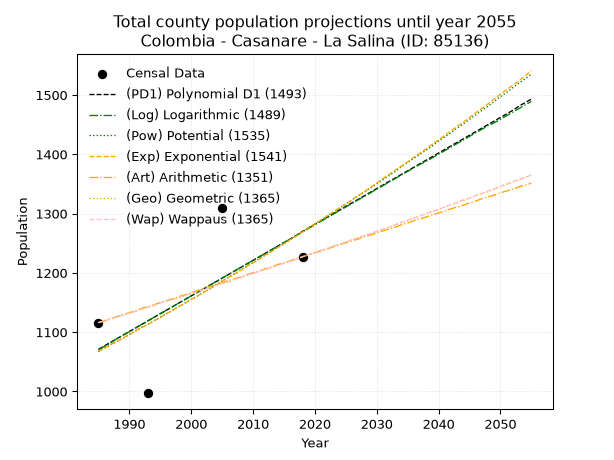
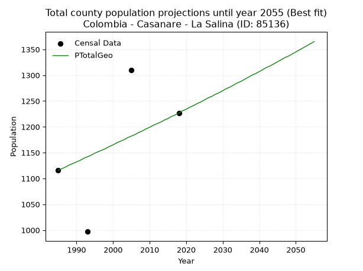
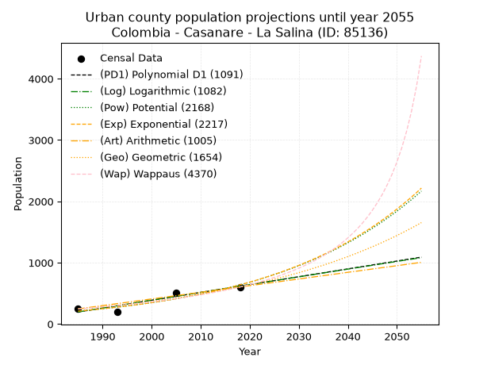
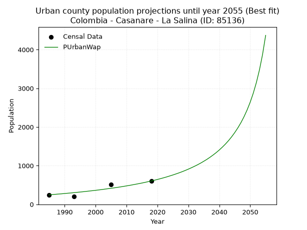
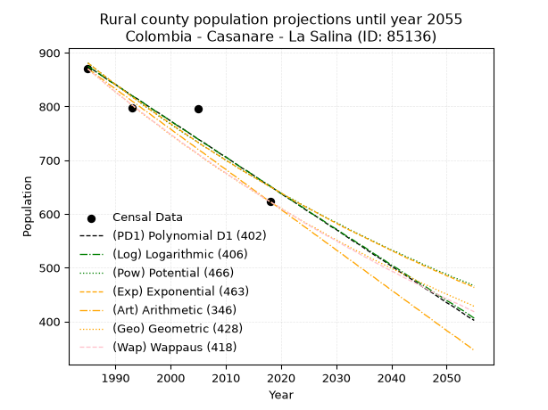
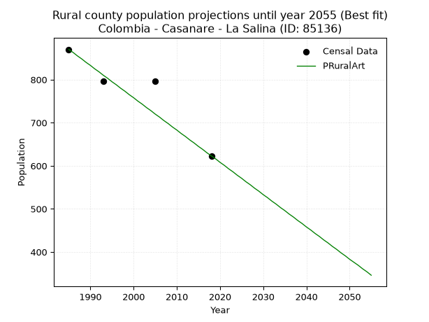

<div align="center">


</div>

# _“Population and Public Services Demand Projections (PPSD) until Year 2050 for Colombia - Casanare - La Salina (ID: 85136)”_
Keywords: `population` `public-service` `projection` `lineal` `polynomial` `logarithmic` `potential` `exponential` `arithmetic` `geometric` `wappaus` `dane` `colombia` `south-america`

PPSD are analytical estimates used by governments and planners to anticipate future changes in population size, age distribution, and the resulting community needs for utilities, healthcare, education, and infrastructure as sizing future water treatment facilities, electrical grids, and road networks based on spatial growth.

> **General running parameters**: • app_version: _v20260806_. • Python version: _3.14.7_. • Pandas version: _3.0.5_. • NumPy version: _2.5.1_. • Creates, save and include plots into reports (create_plot): _False_. • Projection until year: _2050_. • Process polynomial degree 2 and up: _False_. • Process Wappaus: _True_. • Process Wappaus: _True_. • Set negative values to zero: _True_. • Set infinite values to zero: _True_. • Drop dataset notes: _True_. 
<div align="center">

Dynamic map: [:earth_americas:Google](http://maps.google.com/maps?q=6.127761862,-72.3349779) [:earth_americas:OSM](https://www.openstreetmap.org/#map=18/6.127761862/-72.3349779&layers=P) [:earth_americas:Bing](https://www.bing.com/maps?cp=6.127761862~-72.3349779&lvl=18) [:earth_americas:Apple](https://maps.apple.com/frame?center=6.127761862%2C-72.3349779&span=0.003%2C0.006)

</div>


<div align="center">

```geojson
{
  "type": "Feature",
  "geometry": {
    "type": "Point", 
    "coordinates": [-72.3349779, 6.127761862]
  }, 
  "properties": {
    "Name": "Colombia - Casanare - La Salina (ID: 85136)"
  }
}
```

</div>


## 0. Census Data (4 records)

Census data are official statistics collected by a government about the people and housing in a country. They usually include counts of total population, age, sex, race, income, education, and jobs.

📅Global census file: [Population.xlsx](../data/Population.xlsx)

| Source   |   Year |   CountryID | CountryName   |   StateID | StateName   |   CountyID | CountyName   |   PTotal |   PUrban |   PRural |
|:---------|-------:|------------:|:--------------|----------:|:------------|-----------:|:-------------|---------:|---------:|---------:|
| DANE     |   1985 |          57 | Colombia      |        85 | Casanare    |      85136 | La Salina    |     1116 |      246 |      870 |
| DANE     |   1993 |          57 | Colombia      |        85 | Casanare    |      85136 | La Salina    |      997 |      200 |      797 |
| DANE     |   2005 |          57 | Colombia      |        85 | Casanare    |      85136 | La Salina    |     1310 |      514 |      796 |
| DANE     |   2018 |          57 | Colombia      |        85 | Casanare    |      85136 | La Salina    |     1227 |      604 |      623 |

> 🔥Some records could had specific notes about the registered values or the corresponding urban or rural distribution.

## 1. Total

### 1.1. Coefficients and Parameters

* (PD1) Polynomial Deg 1: 6.028904054596582, -10896.815335206815 (lineal)
* (Log) Logarithmic: 12072.752006214776, -90602.58474420148
* (Pow) Potential: 10.487215014143894, -31.555973279511804
* (Exp) Exponential: 0.005237843209102233, 0.032584968511283896
* (Art) Arithmetic: Year diff. 2018 - 1985 = 33, Population diff. 1227 - 1116 = 111, Annual growth = 3.3636363636363638
* (Geo) Geometric: Year diff. 2018 - 1985 = 33, Population diff. 1227 - 1116 = 111, Annual growth % = 0.002877504873200376
* (Wap) Wappaus: i = 0.2871221821285842, Condition values only valid for < 200)

<sub>
Wappaus condition values: ['0.00', '0.29', '0.57', '0.86', '1.15', '1.44', '1.72', '2.01', '2.30', '2.58', '2.87', '3.16', '3.45', '3.73', '4.02', '4.31', '4.59', '4.88', '5.17', '5.46', '5.74', '6.03', '6.32', '6.60', '6.89', '7.18', '7.47', '7.75', '8.04', '8.33', '8.61', '8.90', '9.19', '9.48', '9.76', '10.05', '10.34', '10.62', '10.91', '11.20', '11.48', '11.77', '12.06', '12.35', '12.63', '12.92', '13.21', '13.49', '13.78', '14.07', '14.36', '14.64', '14.93', '15.22', '15.50', '15.79', '16.08', '16.37', '16.65', '16.94', '17.23', '17.51', '17.80', '18.09', '18.38', '18.66']
</sub>


### 1.2. Projected Dataset

|   Year |   CountyID |   PTotalPD1 |   PTotalLog |   PTotalPow |   PTotalExp |   PTotalArt |   PTotalGeo |   PTotalWap |
|-------:|-----------:|------------:|------------:|------------:|------------:|------------:|------------:|------------:|
|   1985 |      85136 |        1071 |        1070 |        1067 |        1068 |        1116 |        1116 |        1116 |
|   1986 |      85136 |        1077 |        1076 |        1073 |        1073 |        1119 |        1119 |        1119 |
|   1987 |      85136 |        1083 |        1082 |        1079 |        1079 |        1123 |        1122 |        1122 |
|   1988 |      85136 |        1089 |        1089 |        1084 |        1085 |        1126 |        1126 |        1126 |
|   1989 |      85136 |        1095 |        1095 |        1090 |        1090 |        1129 |        1129 |        1129 |
|   1990 |      85136 |        1101 |        1101 |        1096 |        1096 |        1133 |        1132 |        1132 |
|   1991 |      85136 |        1107 |        1107 |        1102 |        1102 |        1136 |        1135 |        1135 |
|   1992 |      85136 |        1113 |        1113 |        1108 |        1108 |        1140 |        1139 |        1139 |
|   1993 |      85136 |        1119 |        1119 |        1113 |        1113 |        1143 |        1142 |        1142 |
|   1994 |      85136 |        1125 |        1125 |        1119 |        1119 |        1146 |        1145 |        1145 |
|   1995 |      85136 |        1131 |        1131 |        1125 |        1125 |        1150 |        1149 |        1149 |
|   1996 |      85136 |        1137 |        1137 |        1131 |        1131 |        1153 |        1152 |        1152 |
|   1997 |      85136 |        1143 |        1143 |        1137 |        1137 |        1156 |        1155 |        1155 |
|   1998 |      85136 |        1149 |        1149 |        1143 |        1143 |        1160 |        1158 |        1158 |
|   1999 |      85136 |        1155 |        1155 |        1149 |        1149 |        1163 |        1162 |        1162 |
|   2000 |      85136 |        1161 |        1161 |        1155 |        1155 |        1166 |        1165 |        1165 |
|   2001 |      85136 |        1167 |        1167 |        1161 |        1161 |        1170 |        1169 |        1168 |
|   2002 |      85136 |        1173 |        1173 |        1167 |        1167 |        1173 |        1172 |        1172 |
|   2003 |      85136 |        1179 |        1179 |        1173 |        1173 |        1177 |        1175 |        1175 |
|   2004 |      85136 |        1185 |        1185 |        1180 |        1179 |        1180 |        1179 |        1179 |
|   2005 |      85136 |        1191 |        1191 |        1186 |        1186 |        1183 |        1182 |        1182 |
|   2006 |      85136 |        1197 |        1197 |        1192 |        1192 |        1187 |        1185 |        1185 |
|   2007 |      85136 |        1203 |        1203 |        1198 |        1198 |        1190 |        1189 |        1189 |
|   2008 |      85136 |        1209 |        1209 |        1205 |        1204 |        1193 |        1192 |        1192 |
|   2009 |      85136 |        1215 |        1215 |        1211 |        1211 |        1197 |        1196 |        1196 |
|   2010 |      85136 |        1221 |        1221 |        1217 |        1217 |        1200 |        1199 |        1199 |
|   2011 |      85136 |        1227 |        1227 |        1224 |        1223 |        1203 |        1203 |        1203 |
|   2012 |      85136 |        1233 |        1233 |        1230 |        1230 |        1207 |        1206 |        1206 |
|   2013 |      85136 |        1239 |        1239 |        1236 |        1236 |        1210 |        1209 |        1209 |
|   2014 |      85136 |        1245 |        1245 |        1243 |        1243 |        1214 |        1213 |        1213 |
|   2015 |      85136 |        1251 |        1251 |        1249 |        1249 |        1217 |        1216 |        1216 |
|   2016 |      85136 |        1257 |        1257 |        1256 |        1256 |        1220 |        1220 |        1220 |
|   2017 |      85136 |        1263 |        1263 |        1262 |        1262 |        1224 |        1223 |        1223 |
|   2018 |      85136 |        1270 |        1269 |        1269 |        1269 |        1227 |        1227 |        1227 |
|   2019 |      85136 |        1276 |        1275 |        1276 |        1276 |        1230 |        1231 |        1231 |
|   2020 |      85136 |        1282 |        1281 |        1282 |        1282 |        1234 |        1234 |        1234 |
|   2021 |      85136 |        1288 |        1287 |        1289 |        1289 |        1237 |        1238 |        1238 |
|   2022 |      85136 |        1294 |        1293 |        1296 |        1296 |        1240 |        1241 |        1241 |
|   2023 |      85136 |        1300 |        1299 |        1302 |        1303 |        1244 |        1245 |        1245 |
|   2024 |      85136 |        1306 |        1305 |        1309 |        1310 |        1247 |        1248 |        1248 |
|   2025 |      85136 |        1312 |        1311 |        1316 |        1316 |        1251 |        1252 |        1252 |
|   2026 |      85136 |        1318 |        1317 |        1323 |        1323 |        1254 |        1256 |        1256 |
|   2027 |      85136 |        1324 |        1323 |        1330 |        1330 |        1257 |        1259 |        1259 |
|   2028 |      85136 |        1330 |        1329 |        1336 |        1337 |        1261 |        1263 |        1263 |
|   2029 |      85136 |        1336 |        1335 |        1343 |        1344 |        1264 |        1266 |        1266 |
|   2030 |      85136 |        1342 |        1341 |        1350 |        1351 |        1267 |        1270 |        1270 |
|   2031 |      85136 |        1348 |        1347 |        1357 |        1359 |        1271 |        1274 |        1274 |
|   2032 |      85136 |        1354 |        1353 |        1364 |        1366 |        1274 |        1277 |        1277 |
|   2033 |      85136 |        1360 |        1359 |        1371 |        1373 |        1277 |        1281 |        1281 |
|   2034 |      85136 |        1366 |        1365 |        1379 |        1380 |        1281 |        1285 |        1285 |
|   2035 |      85136 |        1372 |        1371 |        1386 |        1387 |        1284 |        1288 |        1289 |
|   2036 |      85136 |        1378 |        1377 |        1393 |        1395 |        1288 |        1292 |        1292 |
|   2037 |      85136 |        1384 |        1383 |        1400 |        1402 |        1291 |        1296 |        1296 |
|   2038 |      85136 |        1390 |        1388 |        1407 |        1409 |        1294 |        1300 |        1300 |
|   2039 |      85136 |        1396 |        1394 |        1414 |        1417 |        1298 |        1303 |        1304 |
|   2040 |      85136 |        1402 |        1400 |        1422 |        1424 |        1301 |        1307 |        1307 |
|   2041 |      85136 |        1408 |        1406 |        1429 |        1432 |        1304 |        1311 |        1311 |
|   2042 |      85136 |        1414 |        1412 |        1436 |        1439 |        1308 |        1315 |        1315 |
|   2043 |      85136 |        1420 |        1418 |        1444 |        1447 |        1311 |        1318 |        1319 |
|   2044 |      85136 |        1426 |        1424 |        1451 |        1454 |        1314 |        1322 |        1323 |
|   2045 |      85136 |        1432 |        1430 |        1459 |        1462 |        1318 |        1326 |        1326 |
|   2046 |      85136 |        1438 |        1436 |        1466 |        1470 |        1321 |        1330 |        1330 |
|   2047 |      85136 |        1444 |        1442 |        1474 |        1477 |        1325 |        1334 |        1334 |
|   2048 |      85136 |        1450 |        1448 |        1481 |        1485 |        1328 |        1337 |        1338 |
|   2049 |      85136 |        1456 |        1453 |        1489 |        1493 |        1331 |        1341 |        1342 |
|   2050 |      85136 |        1462 |        1459 |        1497 |        1501 |        1335 |        1345 |        1346 |
<div align="center">

</img>

</div>


### 1.3. Best fit with absolute and relative error (%)

Relative error puts that difference into context by dividing the absolute error by the true value, creating a unitless ratio or percentage that shows the scale of the mistake.

Absolute and relative error

|   Year | Source   |   CountryID | CountryName   |   StateID | StateName   |   CountyID_x | CountyName   |   PTotal |   PUrban |   PRural |   CountyID_y |   PTotalPD1 |   PTotalLog |   PTotalPow |   PTotalExp |   PTotalArt |   PTotalGeo |   PTotalWap |   PTotalPD1AbsError |   PTotalLogAbsError |   PTotalPowAbsError |   PTotalExpAbsError |   PTotalArtAbsError |   PTotalGeoAbsError |   PTotalWapAbsError |   PTotalPD1RelError |   PTotalLogRelError |   PTotalPowRelError |   PTotalExpRelError |   PTotalArtRelError |   PTotalGeoRelError |   PTotalWapRelError |
|-------:|:---------|------------:|:--------------|----------:|:------------|-------------:|:-------------|---------:|---------:|---------:|-------------:|------------:|------------:|------------:|------------:|------------:|------------:|------------:|--------------------:|--------------------:|--------------------:|--------------------:|--------------------:|--------------------:|--------------------:|--------------------:|--------------------:|--------------------:|--------------------:|--------------------:|--------------------:|--------------------:|
|   1985 | DANE     |          57 | Colombia      |        85 | Casanare    |        85136 | La Salina    |     1116 |      246 |      870 |        85136 |        1071 |        1070 |        1067 |        1068 |        1116 |        1116 |        1116 |                  45 |                  46 |                  49 |                  48 |                   0 |                   0 |                   0 |             4.03226 |             4.12186 |             4.39068 |             4.30108 |             0       |             0       |             0       |
|   1993 | DANE     |          57 | Colombia      |        85 | Casanare    |        85136 | La Salina    |      997 |      200 |      797 |        85136 |        1119 |        1119 |        1113 |        1113 |        1143 |        1142 |        1142 |                 122 |                 122 |                 116 |                 116 |                 146 |                 145 |                 145 |            12.2367  |            12.2367  |            11.6349  |            11.6349  |            14.6439  |            14.5436  |            14.5436  |
|   2005 | DANE     |          57 | Colombia      |        85 | Casanare    |        85136 | La Salina    |     1310 |      514 |      796 |        85136 |        1191 |        1191 |        1186 |        1186 |        1183 |        1182 |        1182 |                 119 |                 119 |                 124 |                 124 |                 127 |                 128 |                 128 |             9.08397 |             9.08397 |             9.46565 |             9.46565 |             9.69466 |             9.77099 |             9.77099 |
|   2018 | DANE     |          57 | Colombia      |        85 | Casanare    |        85136 | La Salina    |     1227 |      604 |      623 |        85136 |        1270 |        1269 |        1269 |        1269 |        1227 |        1227 |        1227 |                  43 |                  42 |                  42 |                  42 |                   0 |                   0 |                   0 |             3.50448 |             3.42298 |             3.42298 |             3.42298 |             0       |             0       |             0       |

Relative error mean

| Method    |   RelError | Best   |
|:----------|-----------:|:-------|
| PTotalPD1 |    7.21436 |        |
| PTotalLog |    7.21638 |        |
| PTotalPow |    7.22855 |        |
| PTotalExp |    7.20615 |        |
| PTotalArt |    6.08465 |        |
| PTotalGeo |    6.07866 | True   |
| PTotalWap |    6.07866 | True   |

💙Best method: _**PTotalGeo**_
<div align="center">

</img>

</div>


### 1.4. Fresh water supply demand in liters per capita per day (lpcd)

The fresh water supply demand typically ranges from 100 to 300 liters per capita per day (lpcd) for standard domestic and municipal planning, though absolute survival minimums set by the World Health Organization are as low as 7.5 to 20 liters per day, and total consumption in high-income nations can exceed 400 liters.

> `CZ`: Level in meters above the sea level (masl).<br> `WS`: Fresh water supply demand in liters per capita per day (lpcd or l/h/d).<br> `WSAll`: Zonal fresh water supply demand in liters per second (l/s).<br> `A`: Zonal area in square meters.

Reference values (RAS Colombia)

|    CZ |   WS |
|------:|-----:|
|  1000 |  120 |
|  2000 |  130 |
| 99999 |  140 |

County shapefile geometry properties and water supply values

|   CountyID |      ATotal |   CZTotal |   WSTotal |
|-----------:|------------:|----------:|----------:|
|      85136 | 1.99419e+08 |    2603.1 |       140 |

Projected values for best method: PTotalGeo

|   CountyID |   Year |   PTotalGeo |   WSTotal |   WSTotalAll |
|-----------:|-------:|------------:|----------:|-------------:|
|      85136 |   1985 |        1116 |       140 |      1.80833 |
|      85136 |   1986 |        1119 |       140 |      1.81319 |
|      85136 |   1987 |        1122 |       140 |      1.81806 |
|      85136 |   1988 |        1126 |       140 |      1.82454 |
|      85136 |   1989 |        1129 |       140 |      1.8294  |
|      85136 |   1990 |        1132 |       140 |      1.83426 |
|      85136 |   1991 |        1135 |       140 |      1.83912 |
|      85136 |   1992 |        1139 |       140 |      1.8456  |
|      85136 |   1993 |        1142 |       140 |      1.85046 |
|      85136 |   1994 |        1145 |       140 |      1.85532 |
|      85136 |   1995 |        1149 |       140 |      1.86181 |
|      85136 |   1996 |        1152 |       140 |      1.86667 |
|      85136 |   1997 |        1155 |       140 |      1.87153 |
|      85136 |   1998 |        1158 |       140 |      1.87639 |
|      85136 |   1999 |        1162 |       140 |      1.88287 |
|      85136 |   2000 |        1165 |       140 |      1.88773 |
|      85136 |   2001 |        1169 |       140 |      1.89421 |
|      85136 |   2002 |        1172 |       140 |      1.89907 |
|      85136 |   2003 |        1175 |       140 |      1.90394 |
|      85136 |   2004 |        1179 |       140 |      1.91042 |
|      85136 |   2005 |        1182 |       140 |      1.91528 |
|      85136 |   2006 |        1185 |       140 |      1.92014 |
|      85136 |   2007 |        1189 |       140 |      1.92662 |
|      85136 |   2008 |        1192 |       140 |      1.93148 |
|      85136 |   2009 |        1196 |       140 |      1.93796 |
|      85136 |   2010 |        1199 |       140 |      1.94282 |
|      85136 |   2011 |        1203 |       140 |      1.94931 |
|      85136 |   2012 |        1206 |       140 |      1.95417 |
|      85136 |   2013 |        1209 |       140 |      1.95903 |
|      85136 |   2014 |        1213 |       140 |      1.96551 |
|      85136 |   2015 |        1216 |       140 |      1.97037 |
|      85136 |   2016 |        1220 |       140 |      1.97685 |
|      85136 |   2017 |        1223 |       140 |      1.98171 |
|      85136 |   2018 |        1227 |       140 |      1.98819 |
|      85136 |   2019 |        1231 |       140 |      1.99468 |
|      85136 |   2020 |        1234 |       140 |      1.99954 |
|      85136 |   2021 |        1238 |       140 |      2.00602 |
|      85136 |   2022 |        1241 |       140 |      2.01088 |
|      85136 |   2023 |        1245 |       140 |      2.01736 |
|      85136 |   2024 |        1248 |       140 |      2.02222 |
|      85136 |   2025 |        1252 |       140 |      2.0287  |
|      85136 |   2026 |        1256 |       140 |      2.03519 |
|      85136 |   2027 |        1259 |       140 |      2.04005 |
|      85136 |   2028 |        1263 |       140 |      2.04653 |
|      85136 |   2029 |        1266 |       140 |      2.05139 |
|      85136 |   2030 |        1270 |       140 |      2.05787 |
|      85136 |   2031 |        1274 |       140 |      2.06435 |
|      85136 |   2032 |        1277 |       140 |      2.06921 |
|      85136 |   2033 |        1281 |       140 |      2.07569 |
|      85136 |   2034 |        1285 |       140 |      2.08218 |
|      85136 |   2035 |        1288 |       140 |      2.08704 |
|      85136 |   2036 |        1292 |       140 |      2.09352 |
|      85136 |   2037 |        1296 |       140 |      2.1     |
|      85136 |   2038 |        1300 |       140 |      2.10648 |
|      85136 |   2039 |        1303 |       140 |      2.11134 |
|      85136 |   2040 |        1307 |       140 |      2.11782 |
|      85136 |   2041 |        1311 |       140 |      2.12431 |
|      85136 |   2042 |        1315 |       140 |      2.13079 |
|      85136 |   2043 |        1318 |       140 |      2.13565 |
|      85136 |   2044 |        1322 |       140 |      2.14213 |
|      85136 |   2045 |        1326 |       140 |      2.14861 |
|      85136 |   2046 |        1330 |       140 |      2.15509 |
|      85136 |   2047 |        1334 |       140 |      2.16157 |
|      85136 |   2048 |        1337 |       140 |      2.16644 |
|      85136 |   2049 |        1341 |       140 |      2.17292 |
|      85136 |   2050 |        1345 |       140 |      2.1794  |

## 2. Urban

### 2.1. Coefficients and Parameters

* (PD1) Polynomial Deg 1: 12.783621035728547, -25179.437976716028 (lineal)
* (Log) Logarithmic: 25585.114002942202, -194081.65656260005
* (Pow) Potential: 67.31466408027049, -219.6648197921084
* (Exp) Exponential: 0.03363291159183157, 2.1338496391038174e-27
* (Art) Arithmetic: Year diff. 2018 - 1985 = 33, Population diff. 604 - 246 = 358, Annual growth = 10.848484848484848
* (Geo) Geometric: Year diff. 2018 - 1985 = 33, Population diff. 604 - 246 = 358, Annual growth % = 0.027593308652859472
* (Wap) Wappaus: i = 2.552584670231729, Condition values only valid for < 200)

<sub>
Wappaus condition values: ['0.00', '2.55', '5.11', '7.66', '10.21', '12.76', '15.32', '17.87', '20.42', '22.97', '25.53', '28.08', '30.63', '33.18', '35.74', '38.29', '40.84', '43.39', '45.95', '48.50', '51.05', '53.60', '56.16', '58.71', '61.26', '63.81', '66.37', '68.92', '71.47', '74.02', '76.58', '79.13', '81.68', '84.24', '86.79', '89.34', '91.89', '94.45', '97.00', '99.55', '102.10', '104.66', '107.21', '109.76', '112.31', '114.87', '117.42', '119.97', '122.52', '125.08', '127.63', '130.18', '132.73', '135.29', '137.84', '140.39', '142.94', '145.50', '148.05', '150.60', '153.16', '155.71', '158.26', '160.81', '163.37', '165.92']
</sub>


### 2.2. Projected Dataset

|   Year |   CountyID |   PUrbanPD1 |   PUrbanLog |   PUrbanPow |   PUrbanExp |   PUrbanArt |   PUrbanGeo |   PUrbanWap |
|-------:|-----------:|------------:|------------:|------------:|------------:|------------:|------------:|------------:|
|   1985 |      85136 |         196 |         196 |         210 |         210 |         246 |         246 |         246 |
|   1986 |      85136 |         209 |         209 |         218 |         218 |         257 |         253 |         252 |
|   1987 |      85136 |         222 |         221 |         225 |         225 |         268 |         260 |         259 |
|   1988 |      85136 |         234 |         234 |         233 |         233 |         279 |         267 |         266 |
|   1989 |      85136 |         247 |         247 |         241 |         241 |         289 |         274 |         272 |
|   1990 |      85136 |         260 |         260 |         249 |         249 |         300 |         282 |         280 |
|   1991 |      85136 |         273 |         273 |         258 |         258 |         311 |         290 |         287 |
|   1992 |      85136 |         286 |         286 |         267 |         266 |         322 |         298 |         294 |
|   1993 |      85136 |         298 |         299 |         276 |         275 |         333 |         306 |         302 |
|   1994 |      85136 |         311 |         311 |         285 |         285 |         344 |         314 |         310 |
|   1995 |      85136 |         324 |         324 |         295 |         295 |         354 |         323 |         318 |
|   1996 |      85136 |         337 |         337 |         305 |         305 |         365 |         332 |         326 |
|   1997 |      85136 |         349 |         350 |         316 |         315 |         376 |         341 |         335 |
|   1998 |      85136 |         362 |         363 |         326 |         326 |         387 |         350 |         344 |
|   1999 |      85136 |         375 |         376 |         338 |         337 |         398 |         360 |         353 |
|   2000 |      85136 |         388 |         388 |         349 |         349 |         409 |         370 |         362 |
|   2001 |      85136 |         401 |         401 |         361 |         361 |         420 |         380 |         372 |
|   2002 |      85136 |         413 |         414 |         373 |         373 |         430 |         391 |         382 |
|   2003 |      85136 |         426 |         427 |         386 |         386 |         441 |         402 |         393 |
|   2004 |      85136 |         439 |         439 |         399 |         399 |         452 |         413 |         404 |
|   2005 |      85136 |         452 |         452 |         413 |         412 |         463 |         424 |         415 |
|   2006 |      85136 |         465 |         465 |         427 |         427 |         474 |         436 |         426 |
|   2007 |      85136 |         477 |         478 |         442 |         441 |         485 |         448 |         438 |
|   2008 |      85136 |         490 |         490 |         457 |         456 |         496 |         460 |         450 |
|   2009 |      85136 |         503 |         503 |         472 |         472 |         506 |         473 |         463 |
|   2010 |      85136 |         516 |         516 |         488 |         488 |         517 |         486 |         477 |
|   2011 |      85136 |         528 |         529 |         505 |         505 |         528 |         499 |         490 |
|   2012 |      85136 |         541 |         541 |         522 |         522 |         539 |         513 |         505 |
|   2013 |      85136 |         554 |         554 |         540 |         540 |         550 |         527 |         520 |
|   2014 |      85136 |         567 |         567 |         558 |         558 |         561 |         542 |         535 |
|   2015 |      85136 |         580 |         579 |         577 |         577 |         571 |         557 |         551 |
|   2016 |      85136 |         592 |         592 |         597 |         597 |         582 |         572 |         568 |
|   2017 |      85136 |         605 |         605 |         617 |         618 |         593 |         588 |         586 |
|   2018 |      85136 |         618 |         618 |         638 |         639 |         604 |         604 |         604 |
|   2019 |      85136 |         631 |         630 |         660 |         660 |         615 |         621 |         623 |
|   2020 |      85136 |         643 |         643 |         682 |         683 |         626 |         638 |         643 |
|   2021 |      85136 |         656 |         656 |         705 |         706 |         637 |         655 |         664 |
|   2022 |      85136 |         669 |         668 |         729 |         731 |         647 |         673 |         686 |
|   2023 |      85136 |         682 |         681 |         754 |         756 |         658 |         692 |         709 |
|   2024 |      85136 |         695 |         693 |         779 |         781 |         669 |         711 |         734 |
|   2025 |      85136 |         707 |         706 |         806 |         808 |         680 |         731 |         759 |
|   2026 |      85136 |         720 |         719 |         833 |         836 |         691 |         751 |         786 |
|   2027 |      85136 |         733 |         731 |         861 |         864 |         702 |         772 |         814 |
|   2028 |      85136 |         746 |         744 |         890 |         894 |         712 |         793 |         844 |
|   2029 |      85136 |         759 |         757 |         920 |         925 |         723 |         815 |         876 |
|   2030 |      85136 |         771 |         769 |         951 |         956 |         734 |         837 |         910 |
|   2031 |      85136 |         784 |         782 |         983 |         989 |         745 |         860 |         946 |
|   2032 |      85136 |         797 |         794 |        1016 |        1023 |         756 |         884 |         984 |
|   2033 |      85136 |         810 |         807 |        1050 |        1058 |         767 |         909 |        1024 |
|   2034 |      85136 |         822 |         820 |        1086 |        1094 |         778 |         934 |        1067 |
|   2035 |      85136 |         835 |         832 |        1122 |        1131 |         788 |         959 |        1114 |
|   2036 |      85136 |         848 |         845 |        1160 |        1170 |         799 |         986 |        1163 |
|   2037 |      85136 |         861 |         857 |        1199 |        1210 |         810 |        1013 |        1217 |
|   2038 |      85136 |         874 |         870 |        1239 |        1251 |         821 |        1041 |        1275 |
|   2039 |      85136 |         886 |         882 |        1281 |        1294 |         832 |        1070 |        1337 |
|   2040 |      85136 |         899 |         895 |        1324 |        1338 |         843 |        1099 |        1405 |
|   2041 |      85136 |         912 |         907 |        1368 |        1384 |         854 |        1130 |        1479 |
|   2042 |      85136 |         925 |         920 |        1414 |        1432 |         864 |        1161 |        1559 |
|   2043 |      85136 |         937 |         933 |        1461 |        1481 |         875 |        1193 |        1648 |
|   2044 |      85136 |         950 |         945 |        1510 |        1531 |         886 |        1226 |        1746 |
|   2045 |      85136 |         963 |         958 |        1561 |        1584 |         897 |        1260 |        1855 |
|   2046 |      85136 |         976 |         970 |        1613 |        1638 |         908 |        1294 |        1976 |
|   2047 |      85136 |         989 |         983 |        1667 |        1694 |         919 |        1330 |        2111 |
|   2048 |      85136 |        1001 |         995 |        1723 |        1752 |         929 |        1367 |        2265 |
|   2049 |      85136 |        1014 |        1008 |        1780 |        1812 |         940 |        1404 |        2440 |
|   2050 |      85136 |        1027 |        1020 |        1840 |        1874 |         951 |        1443 |        2641 |
<div align="center">

</img>

</div>


### 2.3. Best fit with absolute and relative error (%)

Relative error puts that difference into context by dividing the absolute error by the true value, creating a unitless ratio or percentage that shows the scale of the mistake.

Absolute and relative error

|   Year | Source   |   CountryID | CountryName   |   StateID | StateName   |   CountyID_x | CountyName   |   PTotal |   PUrban |   PRural |   CountyID_y |   PUrbanPD1 |   PUrbanLog |   PUrbanPow |   PUrbanExp |   PUrbanArt |   PUrbanGeo |   PUrbanWap |   PUrbanPD1AbsError |   PUrbanLogAbsError |   PUrbanPowAbsError |   PUrbanExpAbsError |   PUrbanArtAbsError |   PUrbanGeoAbsError |   PUrbanWapAbsError |   PUrbanPD1RelError |   PUrbanLogRelError |   PUrbanPowRelError |   PUrbanExpRelError |   PUrbanArtRelError |   PUrbanGeoRelError |   PUrbanWapRelError |
|-------:|:---------|------------:|:--------------|----------:|:------------|-------------:|:-------------|---------:|---------:|---------:|-------------:|------------:|------------:|------------:|------------:|------------:|------------:|------------:|--------------------:|--------------------:|--------------------:|--------------------:|--------------------:|--------------------:|--------------------:|--------------------:|--------------------:|--------------------:|--------------------:|--------------------:|--------------------:|--------------------:|
|   1985 | DANE     |          57 | Colombia      |        85 | Casanare    |        85136 | La Salina    |     1116 |      246 |      870 |        85136 |         196 |         196 |         210 |         210 |         246 |         246 |         246 |                  50 |                  50 |                  36 |                  36 |                   0 |                   0 |                   0 |            20.3252  |            20.3252  |            14.6341  |             14.6341 |             0       |              0      |              0      |
|   1993 | DANE     |          57 | Colombia      |        85 | Casanare    |        85136 | La Salina    |      997 |      200 |      797 |        85136 |         298 |         299 |         276 |         275 |         333 |         306 |         302 |                  98 |                  99 |                  76 |                  75 |                 133 |                 106 |                 102 |            49       |            49.5     |            38       |             37.5    |            66.5     |             53      |             51      |
|   2005 | DANE     |          57 | Colombia      |        85 | Casanare    |        85136 | La Salina    |     1310 |      514 |      796 |        85136 |         452 |         452 |         413 |         412 |         463 |         424 |         415 |                  62 |                  62 |                 101 |                 102 |                  51 |                  90 |                  99 |            12.0623  |            12.0623  |            19.6498  |             19.8444 |             9.92218 |             17.5097 |             19.2607 |
|   2018 | DANE     |          57 | Colombia      |        85 | Casanare    |        85136 | La Salina    |     1227 |      604 |      623 |        85136 |         618 |         618 |         638 |         639 |         604 |         604 |         604 |                  14 |                  14 |                  34 |                  35 |                   0 |                   0 |                   0 |             2.31788 |             2.31788 |             5.62914 |              5.7947 |             0       |              0      |              0      |

Relative error mean

| Method    |   RelError | Best   |
|:----------|-----------:|:-------|
| PUrbanPD1 |    20.9263 |        |
| PUrbanLog |    21.0513 |        |
| PUrbanPow |    19.4783 |        |
| PUrbanExp |    19.4433 |        |
| PUrbanArt |    19.1055 |        |
| PUrbanGeo |    17.6274 |        |
| PUrbanWap |    17.5652 | True   |

💙Best method: _**PUrbanWap**_
<div align="center">

</img>

</div>


### 2.4. Fresh water supply demand in liters per capita per day (lpcd)

The fresh water supply demand typically ranges from 100 to 300 liters per capita per day (lpcd) for standard domestic and municipal planning, though absolute survival minimums set by the World Health Organization are as low as 7.5 to 20 liters per day, and total consumption in high-income nations can exceed 400 liters.

> `CZ`: Level in meters above the sea level (masl).<br> `WS`: Fresh water supply demand in liters per capita per day (lpcd or l/h/d).<br> `WSAll`: Zonal fresh water supply demand in liters per second (l/s).<br> `A`: Zonal area in square meters.

Reference values (RAS Colombia)

|    CZ |   WS |
|------:|-----:|
|  1000 |  120 |
|  2000 |  130 |
| 99999 |  140 |

County shapefile geometry properties and water supply values

|   CountyID |   AUrban |   CZUrban |   WSUrban |
|-----------:|---------:|----------:|----------:|
|      85136 |   130430 |   1507.79 |       130 |

Projected values for best method: PUrbanWap

|   CountyID |   Year |   PUrbanWap |   WSUrban |   WSUrbanAll |
|-----------:|-------:|------------:|----------:|-------------:|
|      85136 |   1985 |         246 |       130 |     0.370139 |
|      85136 |   1986 |         252 |       130 |     0.379167 |
|      85136 |   1987 |         259 |       130 |     0.389699 |
|      85136 |   1988 |         266 |       130 |     0.400231 |
|      85136 |   1989 |         272 |       130 |     0.409259 |
|      85136 |   1990 |         280 |       130 |     0.421296 |
|      85136 |   1991 |         287 |       130 |     0.431829 |
|      85136 |   1992 |         294 |       130 |     0.442361 |
|      85136 |   1993 |         302 |       130 |     0.454398 |
|      85136 |   1994 |         310 |       130 |     0.466435 |
|      85136 |   1995 |         318 |       130 |     0.478472 |
|      85136 |   1996 |         326 |       130 |     0.490509 |
|      85136 |   1997 |         335 |       130 |     0.504051 |
|      85136 |   1998 |         344 |       130 |     0.517593 |
|      85136 |   1999 |         353 |       130 |     0.531134 |
|      85136 |   2000 |         362 |       130 |     0.544676 |
|      85136 |   2001 |         372 |       130 |     0.559722 |
|      85136 |   2002 |         382 |       130 |     0.574769 |
|      85136 |   2003 |         393 |       130 |     0.591319 |
|      85136 |   2004 |         404 |       130 |     0.60787  |
|      85136 |   2005 |         415 |       130 |     0.624421 |
|      85136 |   2006 |         426 |       130 |     0.640972 |
|      85136 |   2007 |         438 |       130 |     0.659028 |
|      85136 |   2008 |         450 |       130 |     0.677083 |
|      85136 |   2009 |         463 |       130 |     0.696644 |
|      85136 |   2010 |         477 |       130 |     0.717708 |
|      85136 |   2011 |         490 |       130 |     0.737269 |
|      85136 |   2012 |         505 |       130 |     0.759838 |
|      85136 |   2013 |         520 |       130 |     0.782407 |
|      85136 |   2014 |         535 |       130 |     0.804977 |
|      85136 |   2015 |         551 |       130 |     0.829051 |
|      85136 |   2016 |         568 |       130 |     0.85463  |
|      85136 |   2017 |         586 |       130 |     0.881713 |
|      85136 |   2018 |         604 |       130 |     0.908796 |
|      85136 |   2019 |         623 |       130 |     0.937384 |
|      85136 |   2020 |         643 |       130 |     0.967477 |
|      85136 |   2021 |         664 |       130 |     0.999074 |
|      85136 |   2022 |         686 |       130 |     1.03218  |
|      85136 |   2023 |         709 |       130 |     1.06678  |
|      85136 |   2024 |         734 |       130 |     1.1044   |
|      85136 |   2025 |         759 |       130 |     1.14201  |
|      85136 |   2026 |         786 |       130 |     1.18264  |
|      85136 |   2027 |         814 |       130 |     1.22477  |
|      85136 |   2028 |         844 |       130 |     1.26991  |
|      85136 |   2029 |         876 |       130 |     1.31806  |
|      85136 |   2030 |         910 |       130 |     1.36921  |
|      85136 |   2031 |         946 |       130 |     1.42338  |
|      85136 |   2032 |         984 |       130 |     1.48056  |
|      85136 |   2033 |        1024 |       130 |     1.54074  |
|      85136 |   2034 |        1067 |       130 |     1.60544  |
|      85136 |   2035 |        1114 |       130 |     1.67616  |
|      85136 |   2036 |        1163 |       130 |     1.74988  |
|      85136 |   2037 |        1217 |       130 |     1.83113  |
|      85136 |   2038 |        1275 |       130 |     1.9184   |
|      85136 |   2039 |        1337 |       130 |     2.01169  |
|      85136 |   2040 |        1405 |       130 |     2.114    |
|      85136 |   2041 |        1479 |       130 |     2.22535  |
|      85136 |   2042 |        1559 |       130 |     2.34572  |
|      85136 |   2043 |        1648 |       130 |     2.47963  |
|      85136 |   2044 |        1746 |       130 |     2.62708  |
|      85136 |   2045 |        1855 |       130 |     2.79109  |
|      85136 |   2046 |        1976 |       130 |     2.97315  |
|      85136 |   2047 |        2111 |       130 |     3.17627  |
|      85136 |   2048 |        2265 |       130 |     3.40799  |
|      85136 |   2049 |        2440 |       130 |     3.6713   |
|      85136 |   2050 |        2641 |       130 |     3.97373  |

## 3. Rural

### 3.1. Coefficients and Parameters

* (PD1) Polynomial Deg 1: -6.7547169811319705, 14282.622641509224 (lineal)
* (Log) Logarithmic: -13512.361996727443, 103479.0718183987
* (Pow) Potential: -18.354197798004147, 63.47269353362636
* (Exp) Exponential: -0.009176107679859357, 71673203609.80348
* (Art) Arithmetic: Year diff. 2018 - 1985 = 33, Population diff. 623 - 870 = -247, Annual growth = -7.484848484848484
* (Geo) Geometric: Year diff. 2018 - 1985 = 33, Population diff. 623 - 870 = -247, Annual growth % = -0.010068565916372951
* (Wap) Wappaus: i = -1.002658872719154, Condition values only valid for < 200)

<sub>
Wappaus condition values: ['-0.00', '-1.00', '-2.01', '-3.01', '-4.01', '-5.01', '-6.02', '-7.02', '-8.02', '-9.02', '-10.03', '-11.03', '-12.03', '-13.03', '-14.04', '-15.04', '-16.04', '-17.05', '-18.05', '-19.05', '-20.05', '-21.06', '-22.06', '-23.06', '-24.06', '-25.07', '-26.07', '-27.07', '-28.07', '-29.08', '-30.08', '-31.08', '-32.09', '-33.09', '-34.09', '-35.09', '-36.10', '-37.10', '-38.10', '-39.10', '-40.11', '-41.11', '-42.11', '-43.11', '-44.12', '-45.12', '-46.12', '-47.12', '-48.13', '-49.13', '-50.13', '-51.14', '-52.14', '-53.14', '-54.14', '-55.15', '-56.15', '-57.15', '-58.15', '-59.16', '-60.16', '-61.16', '-62.16', '-63.17', '-64.17', '-65.17']
</sub>


### 3.2. Projected Dataset

|   Year |   CountyID |   PRuralPD1 |   PRuralLog |   PRuralPow |   PRuralExp |   PRuralArt |   PRuralGeo |   PRuralWap |
|-------:|-----------:|------------:|------------:|------------:|------------:|------------:|------------:|------------:|
|   1985 |      85136 |         875 |         875 |         881 |         881 |         870 |         870 |         870 |
|   1986 |      85136 |         868 |         868 |         873 |         873 |         863 |         861 |         861 |
|   1987 |      85136 |         861 |         861 |         865 |         865 |         855 |         853 |         853 |
|   1988 |      85136 |         854 |         854 |         857 |         857 |         848 |         844 |         844 |
|   1989 |      85136 |         847 |         847 |         849 |         849 |         840 |         835 |         836 |
|   1990 |      85136 |         841 |         841 |         841 |         841 |         833 |         827 |         827 |
|   1991 |      85136 |         834 |         834 |         833 |         834 |         825 |         819 |         819 |
|   1992 |      85136 |         827 |         827 |         826 |         826 |         818 |         811 |         811 |
|   1993 |      85136 |         820 |         820 |         818 |         818 |         810 |         802 |         803 |
|   1994 |      85136 |         814 |         814 |         811 |         811 |         803 |         794 |         795 |
|   1995 |      85136 |         807 |         807 |         803 |         804 |         795 |         786 |         787 |
|   1996 |      85136 |         800 |         800 |         796 |         796 |         788 |         778 |         779 |
|   1997 |      85136 |         793 |         793 |         789 |         789 |         780 |         771 |         771 |
|   1998 |      85136 |         787 |         786 |         781 |         782 |         773 |         763 |         764 |
|   1999 |      85136 |         780 |         780 |         774 |         775 |         765 |         755 |         756 |
|   2000 |      85136 |         773 |         773 |         767 |         768 |         758 |         747 |         748 |
|   2001 |      85136 |         766 |         766 |         760 |         761 |         750 |         740 |         741 |
|   2002 |      85136 |         760 |         759 |         753 |         754 |         743 |         732 |         733 |
|   2003 |      85136 |         753 |         753 |         746 |         747 |         735 |         725 |         726 |
|   2004 |      85136 |         746 |         746 |         740 |         740 |         728 |         718 |         719 |
|   2005 |      85136 |         739 |         739 |         733 |         733 |         720 |         711 |         711 |
|   2006 |      85136 |         733 |         732 |         726 |         726 |         713 |         703 |         704 |
|   2007 |      85136 |         726 |         726 |         720 |         720 |         705 |         696 |         697 |
|   2008 |      85136 |         719 |         719 |         713 |         713 |         698 |         689 |         690 |
|   2009 |      85136 |         712 |         712 |         707 |         707 |         690 |         682 |         683 |
|   2010 |      85136 |         706 |         706 |         700 |         700 |         683 |         676 |         676 |
|   2011 |      85136 |         699 |         699 |         694 |         694 |         675 |         669 |         669 |
|   2012 |      85136 |         692 |         692 |         687 |         687 |         668 |         662 |         663 |
|   2013 |      85136 |         685 |         685 |         681 |         681 |         660 |         655 |         656 |
|   2014 |      85136 |         679 |         679 |         675 |         675 |         653 |         649 |         649 |
|   2015 |      85136 |         672 |         672 |         669 |         669 |         645 |         642 |         643 |
|   2016 |      85136 |         665 |         665 |         663 |         663 |         638 |         636 |         636 |
|   2017 |      85136 |         658 |         659 |         657 |         657 |         630 |         629 |         629 |
|   2018 |      85136 |         652 |         652 |         651 |         651 |         623 |         623 |         623 |
|   2019 |      85136 |         645 |         645 |         645 |         645 |         616 |         617 |         617 |
|   2020 |      85136 |         638 |         638 |         639 |         639 |         608 |         611 |         610 |
|   2021 |      85136 |         631 |         632 |         633 |         633 |         601 |         604 |         604 |
|   2022 |      85136 |         625 |         625 |         628 |         627 |         593 |         598 |         598 |
|   2023 |      85136 |         618 |         618 |         622 |         621 |         586 |         592 |         592 |
|   2024 |      85136 |         611 |         612 |         616 |         616 |         578 |         586 |         585 |
|   2025 |      85136 |         604 |         605 |         611 |         610 |         571 |         580 |         579 |
|   2026 |      85136 |         598 |         598 |         605 |         605 |         563 |         575 |         573 |
|   2027 |      85136 |         591 |         592 |         600 |         599 |         556 |         569 |         567 |
|   2028 |      85136 |         584 |         585 |         594 |         594 |         548 |         563 |         561 |
|   2029 |      85136 |         577 |         578 |         589 |         588 |         541 |         557 |         556 |
|   2030 |      85136 |         571 |         572 |         584 |         583 |         533 |         552 |         550 |
|   2031 |      85136 |         564 |         565 |         579 |         577 |         526 |         546 |         544 |
|   2032 |      85136 |         557 |         558 |         573 |         572 |         518 |         541 |         538 |
|   2033 |      85136 |         550 |         552 |         568 |         567 |         511 |         535 |         533 |
|   2034 |      85136 |         544 |         545 |         563 |         562 |         503 |         530 |         527 |
|   2035 |      85136 |         537 |         539 |         558 |         557 |         496 |         525 |         521 |
|   2036 |      85136 |         530 |         532 |         553 |         552 |         488 |         519 |         516 |
|   2037 |      85136 |         523 |         525 |         548 |         547 |         481 |         514 |         510 |
|   2038 |      85136 |         517 |         519 |         543 |         542 |         473 |         509 |         505 |
|   2039 |      85136 |         510 |         512 |         538 |         537 |         466 |         504 |         499 |
|   2040 |      85136 |         503 |         505 |         533 |         532 |         458 |         499 |         494 |
|   2041 |      85136 |         496 |         499 |         529 |         527 |         451 |         494 |         489 |
|   2042 |      85136 |         489 |         492 |         524 |         522 |         443 |         489 |         483 |
|   2043 |      85136 |         483 |         485 |         519 |         517 |         436 |         484 |         478 |
|   2044 |      85136 |         476 |         479 |         515 |         513 |         428 |         479 |         473 |
|   2045 |      85136 |         469 |         472 |         510 |         508 |         421 |         474 |         468 |
|   2046 |      85136 |         462 |         466 |         505 |         503 |         413 |         469 |         463 |
|   2047 |      85136 |         456 |         459 |         501 |         499 |         406 |         465 |         457 |
|   2048 |      85136 |         449 |         452 |         496 |         494 |         398 |         460 |         452 |
|   2049 |      85136 |         442 |         446 |         492 |         490 |         391 |         455 |         447 |
|   2050 |      85136 |         435 |         439 |         488 |         485 |         383 |         451 |         442 |
<div align="center">

</img>

</div>


### 3.3. Best fit with absolute and relative error (%)

Relative error puts that difference into context by dividing the absolute error by the true value, creating a unitless ratio or percentage that shows the scale of the mistake.

Absolute and relative error

|   Year | Source   |   CountryID | CountryName   |   StateID | StateName   |   CountyID_x | CountyName   |   PTotal |   PUrban |   PRural |   CountyID_y |   PRuralPD1 |   PRuralLog |   PRuralPow |   PRuralExp |   PRuralArt |   PRuralGeo |   PRuralWap |   PRuralPD1AbsError |   PRuralLogAbsError |   PRuralPowAbsError |   PRuralExpAbsError |   PRuralArtAbsError |   PRuralGeoAbsError |   PRuralWapAbsError |   PRuralPD1RelError |   PRuralLogRelError |   PRuralPowRelError |   PRuralExpRelError |   PRuralArtRelError |   PRuralGeoRelError |   PRuralWapRelError |
|-------:|:---------|------------:|:--------------|----------:|:------------|-------------:|:-------------|---------:|---------:|---------:|-------------:|------------:|------------:|------------:|------------:|------------:|------------:|------------:|--------------------:|--------------------:|--------------------:|--------------------:|--------------------:|--------------------:|--------------------:|--------------------:|--------------------:|--------------------:|--------------------:|--------------------:|--------------------:|--------------------:|
|   1985 | DANE     |          57 | Colombia      |        85 | Casanare    |        85136 | La Salina    |     1116 |      246 |      870 |        85136 |         875 |         875 |         881 |         881 |         870 |         870 |         870 |                   5 |                   5 |                  11 |                  11 |                   0 |                   0 |                   0 |            0.574713 |            0.574713 |             1.26437 |             1.26437 |             0       |            0        |            0        |
|   1993 | DANE     |          57 | Colombia      |        85 | Casanare    |        85136 | La Salina    |      997 |      200 |      797 |        85136 |         820 |         820 |         818 |         818 |         810 |         802 |         803 |                  23 |                  23 |                  21 |                  21 |                  13 |                   5 |                   6 |            2.88582  |            2.88582  |             2.63488 |             2.63488 |             1.63112 |            0.627353 |            0.752823 |
|   2005 | DANE     |          57 | Colombia      |        85 | Casanare    |        85136 | La Salina    |     1310 |      514 |      796 |        85136 |         739 |         739 |         733 |         733 |         720 |         711 |         711 |                  57 |                  57 |                  63 |                  63 |                  76 |                  85 |                  85 |            7.1608   |            7.1608   |             7.91457 |             7.91457 |             9.54774 |           10.6784   |           10.6784   |
|   2018 | DANE     |          57 | Colombia      |        85 | Casanare    |        85136 | La Salina    |     1227 |      604 |      623 |        85136 |         652 |         652 |         651 |         651 |         623 |         623 |         623 |                  29 |                  29 |                  28 |                  28 |                   0 |                   0 |                   0 |            4.6549   |            4.6549   |             4.49438 |             4.49438 |             0       |            0        |            0        |

Relative error mean

| Method    |   RelError | Best   |
|:----------|-----------:|:-------|
| PRuralPD1 |    3.81906 |        |
| PRuralLog |    3.81906 |        |
| PRuralPow |    4.07705 |        |
| PRuralExp |    4.07705 |        |
| PRuralArt |    2.79471 | True   |
| PRuralGeo |    2.82644 |        |
| PRuralWap |    2.8578  |        |

💙Best method: _**PRuralArt**_
<div align="center">

</img>

</div>


### 3.4. Fresh water supply demand in liters per capita per day (lpcd)

The fresh water supply demand typically ranges from 100 to 300 liters per capita per day (lpcd) for standard domestic and municipal planning, though absolute survival minimums set by the World Health Organization are as low as 7.5 to 20 liters per day, and total consumption in high-income nations can exceed 400 liters.

> `CZ`: Level in meters above the sea level (masl).<br> `WS`: Fresh water supply demand in liters per capita per day (lpcd or l/h/d).<br> `WSAll`: Zonal fresh water supply demand in liters per second (l/s).<br> `A`: Zonal area in square meters.

Reference values (RAS Colombia)

|    CZ |   WS |
|------:|-----:|
|  1000 |  120 |
|  2000 |  130 |
| 99999 |  140 |

County shapefile geometry properties and water supply values

|   CountyID |      ARural |   CZRural |   WSRural |
|-----------:|------------:|----------:|----------:|
|      85136 | 1.99289e+08 |    2603.8 |       140 |

Projected values for best method: PRuralArt

|   CountyID |   Year |   PRuralArt |   WSRural |   WSRuralAll |
|-----------:|-------:|------------:|----------:|-------------:|
|      85136 |   1985 |         870 |       140 |     1.40972  |
|      85136 |   1986 |         863 |       140 |     1.39838  |
|      85136 |   1987 |         855 |       140 |     1.38542  |
|      85136 |   1988 |         848 |       140 |     1.37407  |
|      85136 |   1989 |         840 |       140 |     1.36111  |
|      85136 |   1990 |         833 |       140 |     1.34977  |
|      85136 |   1991 |         825 |       140 |     1.33681  |
|      85136 |   1992 |         818 |       140 |     1.32546  |
|      85136 |   1993 |         810 |       140 |     1.3125   |
|      85136 |   1994 |         803 |       140 |     1.30116  |
|      85136 |   1995 |         795 |       140 |     1.28819  |
|      85136 |   1996 |         788 |       140 |     1.27685  |
|      85136 |   1997 |         780 |       140 |     1.26389  |
|      85136 |   1998 |         773 |       140 |     1.25255  |
|      85136 |   1999 |         765 |       140 |     1.23958  |
|      85136 |   2000 |         758 |       140 |     1.22824  |
|      85136 |   2001 |         750 |       140 |     1.21528  |
|      85136 |   2002 |         743 |       140 |     1.20394  |
|      85136 |   2003 |         735 |       140 |     1.19097  |
|      85136 |   2004 |         728 |       140 |     1.17963  |
|      85136 |   2005 |         720 |       140 |     1.16667  |
|      85136 |   2006 |         713 |       140 |     1.15532  |
|      85136 |   2007 |         705 |       140 |     1.14236  |
|      85136 |   2008 |         698 |       140 |     1.13102  |
|      85136 |   2009 |         690 |       140 |     1.11806  |
|      85136 |   2010 |         683 |       140 |     1.10671  |
|      85136 |   2011 |         675 |       140 |     1.09375  |
|      85136 |   2012 |         668 |       140 |     1.08241  |
|      85136 |   2013 |         660 |       140 |     1.06944  |
|      85136 |   2014 |         653 |       140 |     1.0581   |
|      85136 |   2015 |         645 |       140 |     1.04514  |
|      85136 |   2016 |         638 |       140 |     1.0338   |
|      85136 |   2017 |         630 |       140 |     1.02083  |
|      85136 |   2018 |         623 |       140 |     1.00949  |
|      85136 |   2019 |         616 |       140 |     0.998148 |
|      85136 |   2020 |         608 |       140 |     0.985185 |
|      85136 |   2021 |         601 |       140 |     0.973843 |
|      85136 |   2022 |         593 |       140 |     0.96088  |
|      85136 |   2023 |         586 |       140 |     0.949537 |
|      85136 |   2024 |         578 |       140 |     0.936574 |
|      85136 |   2025 |         571 |       140 |     0.925231 |
|      85136 |   2026 |         563 |       140 |     0.912269 |
|      85136 |   2027 |         556 |       140 |     0.900926 |
|      85136 |   2028 |         548 |       140 |     0.887963 |
|      85136 |   2029 |         541 |       140 |     0.87662  |
|      85136 |   2030 |         533 |       140 |     0.863657 |
|      85136 |   2031 |         526 |       140 |     0.852315 |
|      85136 |   2032 |         518 |       140 |     0.839352 |
|      85136 |   2033 |         511 |       140 |     0.828009 |
|      85136 |   2034 |         503 |       140 |     0.815046 |
|      85136 |   2035 |         496 |       140 |     0.803704 |
|      85136 |   2036 |         488 |       140 |     0.790741 |
|      85136 |   2037 |         481 |       140 |     0.779398 |
|      85136 |   2038 |         473 |       140 |     0.766435 |
|      85136 |   2039 |         466 |       140 |     0.755093 |
|      85136 |   2040 |         458 |       140 |     0.74213  |
|      85136 |   2041 |         451 |       140 |     0.730787 |
|      85136 |   2042 |         443 |       140 |     0.717824 |
|      85136 |   2043 |         436 |       140 |     0.706481 |
|      85136 |   2044 |         428 |       140 |     0.693519 |
|      85136 |   2045 |         421 |       140 |     0.682176 |
|      85136 |   2046 |         413 |       140 |     0.669213 |
|      85136 |   2047 |         406 |       140 |     0.65787  |
|      85136 |   2048 |         398 |       140 |     0.644907 |
|      85136 |   2049 |         391 |       140 |     0.633565 |
|      85136 |   2050 |         383 |       140 |     0.620602 |

<div align="center"><br><sub>Share this research</sub></div><br>

<sub>**APPS & TOOLS & CONTENT DISCLAIMER**: • NO WARRANTY - This content and software is provided by <a href="https://github.com/rcfdtools" target="_blank">github.com/rcfdtools</a> "as is", without any express or implied warranty, including warranties of merchantability, fitness for a particular purpose, or non-infringement. There is no guarantee that the software will be error-free or operate without interruption. • LIMITATION OF LIABILITY - Neither the authors nor copyright holders will be liable for claims or damages arising from the software or its use. You are responsible for determining if the software is appropriate for your use and assume all associated risks, including errors, legal compliance, and data loss. • NO PROFESSIONAL ADVICE - The software provides general information and does not offer professional advice. It should not replace consultation with professional advisors. [Clauses and global license for rcfdtools use.](https://github.com/rcfdtools/rcfdtools/blob/main/LICENSE.md)</sub>

| [:house: Home](Readme.md)  | [:beginner: Help / Collaborate](https://github.com/rcfdtools/R.HydroTools/discussions/31) |
|----------------------------|-------------------------------------------------------------------------------------------|