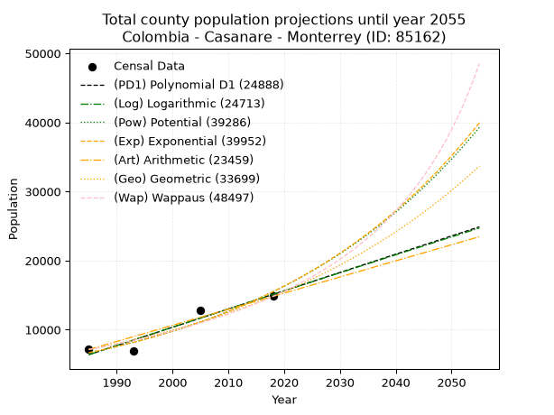
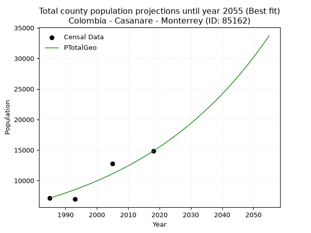
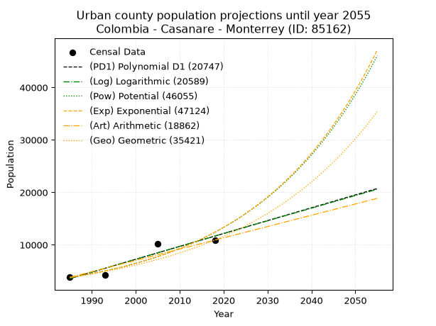
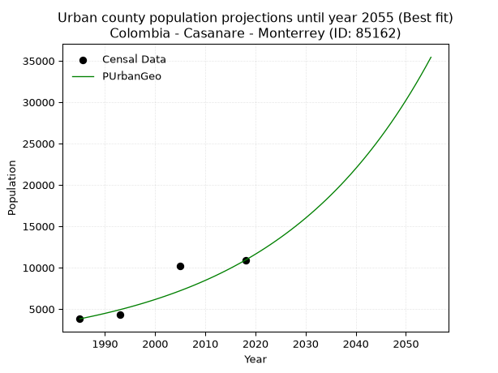
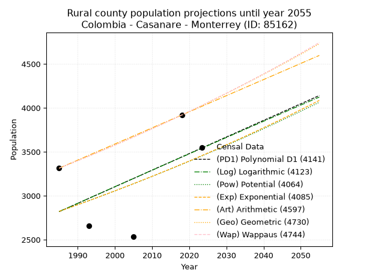
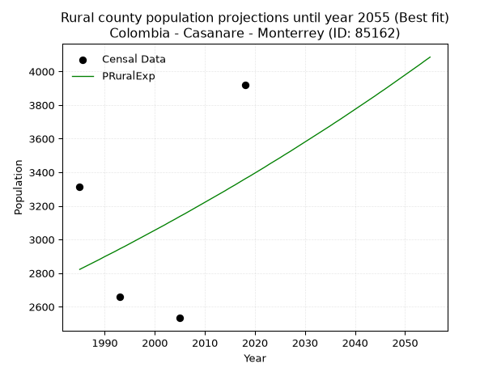

<div align="center">


</div>

# _“Population and Public Services Demand Projections (PPSD) until Year 2050 for Colombia - Casanare - Monterrey (ID: 85162)”_
Keywords: `population` `public-service` `projection` `lineal` `polynomial` `logarithmic` `potential` `exponential` `arithmetic` `geometric` `wappaus` `dane` `colombia` `south-america`

PPSD are analytical estimates used by governments and planners to anticipate future changes in population size, age distribution, and the resulting community needs for utilities, healthcare, education, and infrastructure as sizing future water treatment facilities, electrical grids, and road networks based on spatial growth.

> **General running parameters**: • app_version: _v20260806_. • Python version: _3.14.7_. • Pandas version: _3.0.5_. • NumPy version: _2.5.1_. • Creates, save and include plots into reports (create_plot): _False_. • Projection until year: _2050_. • Process polynomial degree 2 and up: _False_. • Process Wappaus: _True_. • Process Wappaus: _True_. • Set negative values to zero: _True_. • Set infinite values to zero: _True_. • Drop dataset notes: _True_. 
<div align="center">

Dynamic map: [:earth_americas:Google](http://maps.google.com/maps?q=4.87701703,-72.8940647) [:earth_americas:OSM](https://www.openstreetmap.org/#map=18/4.87701703/-72.8940647&layers=P) [:earth_americas:Bing](https://www.bing.com/maps?cp=4.87701703~-72.8940647&lvl=18) [:earth_americas:Apple](https://maps.apple.com/frame?center=4.87701703%2C-72.8940647&span=0.003%2C0.006)

</div>


<div align="center">

```geojson
{
  "type": "Feature",
  "geometry": {
    "type": "Point", 
    "coordinates": [-72.8940647, 4.87701703]
  }, 
  "properties": {
    "Name": "Colombia - Casanare - Monterrey (ID: 85162)"
  }
}
```

</div>


## 0. Census Data (4 records)

Census data are official statistics collected by a government about the people and housing in a country. They usually include counts of total population, age, sex, race, income, education, and jobs.

📅Global census file: [Population.xlsx](../data/Population.xlsx)

| Source   |   Year |   CountryID | CountryName   |   StateID | StateName   |   CountyID | CountyName   |   PTotal |   PUrban |   PRural |
|:---------|-------:|------------:|:--------------|----------:|:------------|-----------:|:-------------|---------:|---------:|---------:|
| DANE     |   1985 |          57 | Colombia      |        85 | Casanare    |      85162 | Monterrey    |     7130 |     3816 |     3314 |
| DANE     |   1993 |          57 | Colombia      |        85 | Casanare    |      85162 | Monterrey    |     6955 |     4294 |     2661 |
| DANE     |   2005 |          57 | Colombia      |        85 | Casanare    |      85162 | Monterrey    |    12751 |    10218 |     2533 |
| DANE     |   2018 |          57 | Colombia      |        85 | Casanare    |      85162 | Monterrey    |    14828 |    10909 |     3919 |

> 🔥Some records could had specific notes about the registered values or the corresponding urban or rural distribution.

📅   [RUPS](https://www.datos.gov.co/Hacienda-y-Cr-dito-P-blico/Registro-nico-de-Prestadores-de-Servicios-P-blicos/4qkq-csdn/about_data) - Local public utility companies: [RUPS.csv](../data/RUPS.xlsx)

 | SERVICIO       | ESTADO    | NOMBRE                                      | NIT         | DEPARTAMENTO_DOMICILIO   | MUNICIPIO_DOMICILIO   | DIRECCION       |   TELEFONO | EMAIL                   | TIPO_PRESTADOR                             | CLASIFICACION                  |
|:---------------|:----------|:--------------------------------------------|:------------|:-------------------------|:----------------------|:----------------|-----------:|:------------------------|:-------------------------------------------|:-------------------------------|
| ACUEDUCTO      | OPERATIVA | EMPRESAS PUBLICAS DE MONTERREY S.A.  E.S.P. | 900006734-1 | CASANARE                 | MONTERREY             | CALLE 15 N 6-05 |    6249127 | keimycantillo@gmail.com | SOCIEDADES (EMPRESA DE SERVICIOS PUBLICOS) | DESDE 2501 HASTA 5000 USUARIOS |
| ALCANTARILLADO | OPERATIVA | EMPRESAS PUBLICAS DE MONTERREY S.A.  E.S.P. | 900006734-1 | CASANARE                 | MONTERREY             | CALLE 15 N 6-05 |    6249127 | keimycantillo@gmail.com | SOCIEDADES (EMPRESA DE SERVICIOS PUBLICOS) | DESDE 2501 HASTA 5000 USUARIOS |

## 1. Total

### 1.1. Coefficients and Parameters

* (PD1) Polynomial Deg 1: 264.324367723804, -518298.816539539 (lineal)
* (Log) Logarithmic: 529053.4822489416, -4010923.7581427395
* (Pow) Potential: 51.23000294116792, -165.1211214751182
* (Exp) Exponential: 0.025592919437062846, 5.760992121156214e-19
* (Art) Arithmetic: Year diff. 2018 - 1985 = 33, Population diff. 14828 - 7130 = 7698, Annual growth = 233.27272727272728
* (Geo) Geometric: Year diff. 2018 - 1985 = 33, Population diff. 14828 - 7130 = 7698, Annual growth % = 0.022436047909823564
* (Wap) Wappaus: i = 2.1247174357658007, Condition values only valid for < 200)

<sub>
Wappaus condition values: ['0.00', '2.12', '4.25', '6.37', '8.50', '10.62', '12.75', '14.87', '17.00', '19.12', '21.25', '23.37', '25.50', '27.62', '29.75', '31.87', '34.00', '36.12', '38.24', '40.37', '42.49', '44.62', '46.74', '48.87', '50.99', '53.12', '55.24', '57.37', '59.49', '61.62', '63.74', '65.87', '67.99', '70.12', '72.24', '74.37', '76.49', '78.61', '80.74', '82.86', '84.99', '87.11', '89.24', '91.36', '93.49', '95.61', '97.74', '99.86', '101.99', '104.11', '106.24', '108.36', '110.49', '112.61', '114.73', '116.86', '118.98', '121.11', '123.23', '125.36', '127.48', '129.61', '131.73', '133.86', '135.98', '138.11']
</sub>


### 1.2. Projected Dataset

|   Year |   CountyID |   PTotalPD1 |   PTotalLog |   PTotalPow |   PTotalExp |   PTotalArt |   PTotalGeo |   PTotalWap |
|-------:|-----------:|------------:|------------:|------------:|------------:|------------:|------------:|------------:|
|   1985 |      85162 |        6385 |        6377 |        6655 |        6660 |        7130 |        7130 |        7130 |
|   1986 |      85162 |        6649 |        6644 |        6829 |        6833 |        7363 |        7290 |        7283 |
|   1987 |      85162 |        6914 |        6910 |        7008 |        7010 |        7597 |        7454 |        7440 |
|   1988 |      85162 |        7178 |        7176 |        7191 |        7192 |        7830 |        7621 |        7599 |
|   1989 |      85162 |        7442 |        7442 |        7378 |        7378 |        8063 |        7792 |        7763 |
|   1990 |      85162 |        7707 |        7708 |        7571 |        7570 |        8296 |        7967 |        7930 |
|   1991 |      85162 |        7971 |        7974 |        7768 |        7766 |        8530 |        8145 |        8101 |
|   1992 |      85162 |        8235 |        8240 |        7970 |        7967 |        8763 |        8328 |        8276 |
|   1993 |      85162 |        8500 |        8505 |        8178 |        8174 |        8996 |        8515 |        8455 |
|   1994 |      85162 |        8764 |        8771 |        8391 |        8386 |        9229 |        8706 |        8638 |
|   1995 |      85162 |        9028 |        9036 |        8609 |        8603 |        9463 |        8901 |        8825 |
|   1996 |      85162 |        9293 |        9301 |        8833 |        8826 |        9696 |        9101 |        9017 |
|   1997 |      85162 |        9557 |        9566 |        9063 |        9055 |        9929 |        9305 |        9214 |
|   1998 |      85162 |        9821 |        9831 |        9298 |        9290 |       10163 |        9514 |        9415 |
|   1999 |      85162 |       10086 |       10096 |        9540 |        9530 |       10396 |        9727 |        9621 |
|   2000 |      85162 |       10350 |       10360 |        9787 |        9777 |       10629 |        9946 |        9833 |
|   2001 |      85162 |       10614 |       10625 |       10041 |       10031 |       10862 |       10169 |       10050 |
|   2002 |      85162 |       10879 |       10889 |       10301 |       10291 |       11096 |       10397 |       10273 |
|   2003 |      85162 |       11143 |       11153 |       10568 |       10558 |       11329 |       10630 |       10502 |
|   2004 |      85162 |       11407 |       11417 |       10842 |       10831 |       11562 |       10869 |       10736 |
|   2005 |      85162 |       11672 |       11681 |       11123 |       11112 |       11795 |       11113 |       10977 |
|   2006 |      85162 |       11936 |       11945 |       11410 |       11400 |       12029 |       11362 |       11225 |
|   2007 |      85162 |       12200 |       12209 |       11706 |       11696 |       12262 |       11617 |       11479 |
|   2008 |      85162 |       12465 |       12472 |       12008 |       11999 |       12495 |       11877 |       11741 |
|   2009 |      85162 |       12729 |       12736 |       12318 |       12310 |       12729 |       12144 |       12010 |
|   2010 |      85162 |       12993 |       12999 |       12636 |       12629 |       12962 |       12416 |       12287 |
|   2011 |      85162 |       13257 |       13262 |       12962 |       12957 |       13195 |       12695 |       12572 |
|   2012 |      85162 |       13522 |       13525 |       13297 |       13292 |       13428 |       12980 |       12865 |
|   2013 |      85162 |       13786 |       13788 |       13640 |       13637 |       13662 |       13271 |       13168 |
|   2014 |      85162 |       14050 |       14051 |       13991 |       13990 |       13895 |       13569 |       13479 |
|   2015 |      85162 |       14315 |       14313 |       14352 |       14353 |       14128 |       13873 |       13801 |
|   2016 |      85162 |       14579 |       14576 |       14721 |       14725 |       14361 |       14184 |       14132 |
|   2017 |      85162 |       14843 |       14838 |       15100 |       15107 |       14595 |       14503 |       14475 |
|   2018 |      85162 |       15108 |       15100 |       15488 |       15499 |       14828 |       14828 |       14828 |
|   2019 |      85162 |       15372 |       15362 |       15886 |       15900 |       15061 |       15161 |       15193 |
|   2020 |      85162 |       15636 |       15624 |       16294 |       16313 |       15295 |       15501 |       15571 |
|   2021 |      85162 |       15901 |       15886 |       16713 |       16735 |       15528 |       15849 |       15961 |
|   2022 |      85162 |       16165 |       16148 |       17142 |       17169 |       15761 |       16204 |       16365 |
|   2023 |      85162 |       16429 |       16410 |       17582 |       17614 |       15994 |       16568 |       16784 |
|   2024 |      85162 |       16694 |       16671 |       18032 |       18071 |       16228 |       16939 |       17218 |
|   2025 |      85162 |       16958 |       16932 |       18494 |       18539 |       16461 |       17320 |       17668 |
|   2026 |      85162 |       17222 |       17194 |       18968 |       19020 |       16694 |       17708 |       18134 |
|   2027 |      85162 |       17487 |       17455 |       19454 |       19513 |       16927 |       18105 |       18619 |
|   2028 |      85162 |       17751 |       17716 |       19952 |       20019 |       17161 |       18512 |       19123 |
|   2029 |      85162 |       18015 |       17976 |       20462 |       20538 |       17394 |       18927 |       19646 |
|   2030 |      85162 |       18280 |       18237 |       20985 |       21070 |       17627 |       19352 |       20191 |
|   2031 |      85162 |       18544 |       18498 |       21521 |       21617 |       17861 |       19786 |       20759 |
|   2032 |      85162 |       18808 |       18758 |       22071 |       22177 |       18094 |       20230 |       21351 |
|   2033 |      85162 |       19073 |       19018 |       22634 |       22752 |       18327 |       20684 |       21968 |
|   2034 |      85162 |       19337 |       19278 |       23212 |       23342 |       18560 |       21148 |       22613 |
|   2035 |      85162 |       19601 |       19539 |       23804 |       23947 |       18794 |       21622 |       23287 |
|   2036 |      85162 |       19866 |       19798 |       24410 |       24567 |       19027 |       22107 |       23992 |
|   2037 |      85162 |       20130 |       20058 |       25032 |       25204 |       19260 |       22603 |       24731 |
|   2038 |      85162 |       20394 |       20318 |       25670 |       25858 |       19493 |       23110 |       25505 |
|   2039 |      85162 |       20659 |       20577 |       26323 |       26528 |       19727 |       23629 |       26319 |
|   2040 |      85162 |       20923 |       20837 |       26992 |       27216 |       19960 |       24159 |       27173 |
|   2041 |      85162 |       21187 |       21096 |       27679 |       27921 |       20193 |       24701 |       28073 |
|   2042 |      85162 |       21452 |       21355 |       28382 |       28645 |       20427 |       25255 |       29021 |
|   2043 |      85162 |       21716 |       21614 |       29103 |       29388 |       20660 |       25822 |       30022 |
|   2044 |      85162 |       21980 |       21873 |       29842 |       30149 |       20893 |       26401 |       31079 |
|   2045 |      85162 |       22245 |       22132 |       30599 |       30931 |       21126 |       26993 |       32199 |
|   2046 |      85162 |       22509 |       22391 |       31375 |       31733 |       21360 |       27599 |       33386 |
|   2047 |      85162 |       22773 |       22649 |       32170 |       32555 |       21593 |       28218 |       34647 |
|   2048 |      85162 |       23037 |       22907 |       32985 |       33399 |       21826 |       28851 |       35989 |
|   2049 |      85162 |       23302 |       23166 |       33821 |       34265 |       22059 |       29499 |       37420 |
|   2050 |      85162 |       23566 |       23424 |       34677 |       35153 |       22293 |       30161 |       38949 |
<div align="center">

</img>

</div>


### 1.3. Best fit with absolute and relative error (%)

Relative error puts that difference into context by dividing the absolute error by the true value, creating a unitless ratio or percentage that shows the scale of the mistake.

Absolute and relative error

|   Year | Source   |   CountryID | CountryName   |   StateID | StateName   |   CountyID_x | CountyName   |   PTotal |   PUrban |   PRural |   CountyID_y |   PTotalPD1 |   PTotalLog |   PTotalPow |   PTotalExp |   PTotalArt |   PTotalGeo |   PTotalWap |   PTotalPD1AbsError |   PTotalLogAbsError |   PTotalPowAbsError |   PTotalExpAbsError |   PTotalArtAbsError |   PTotalGeoAbsError |   PTotalWapAbsError |   PTotalPD1RelError |   PTotalLogRelError |   PTotalPowRelError |   PTotalExpRelError |   PTotalArtRelError |   PTotalGeoRelError |   PTotalWapRelError |
|-------:|:---------|------------:|:--------------|----------:|:------------|-------------:|:-------------|---------:|---------:|---------:|-------------:|------------:|------------:|------------:|------------:|------------:|------------:|------------:|--------------------:|--------------------:|--------------------:|--------------------:|--------------------:|--------------------:|--------------------:|--------------------:|--------------------:|--------------------:|--------------------:|--------------------:|--------------------:|--------------------:|
|   1985 | DANE     |          57 | Colombia      |        85 | Casanare    |        85162 | Monterrey    |     7130 |     3816 |     3314 |        85162 |        6385 |        6377 |        6655 |        6660 |        7130 |        7130 |        7130 |                 745 |                 753 |                 475 |                 470 |                   0 |                   0 |                   0 |            10.4488  |            10.561   |             6.66199 |             6.59187 |             0       |              0      |              0      |
|   1993 | DANE     |          57 | Colombia      |        85 | Casanare    |        85162 | Monterrey    |     6955 |     4294 |     2661 |        85162 |        8500 |        8505 |        8178 |        8174 |        8996 |        8515 |        8455 |                1545 |                1550 |                1223 |                1219 |                2041 |                1560 |                1500 |            22.2142  |            22.2861  |            17.5845  |            17.527   |            29.3458  |             22.4299 |             21.5672 |
|   2005 | DANE     |          57 | Colombia      |        85 | Casanare    |        85162 | Monterrey    |    12751 |    10218 |     2533 |        85162 |       11672 |       11681 |       11123 |       11112 |       11795 |       11113 |       10977 |                1079 |                1070 |                1628 |                1639 |                 956 |                1638 |                1774 |             8.46208 |             8.3915  |            12.7676  |            12.8539  |             7.49745 |             12.8461 |             13.9126 |
|   2018 | DANE     |          57 | Colombia      |        85 | Casanare    |        85162 | Monterrey    |    14828 |    10909 |     3919 |        85162 |       15108 |       15100 |       15488 |       15499 |       14828 |       14828 |       14828 |                 280 |                 272 |                 660 |                 671 |                   0 |                   0 |                   0 |             1.88832 |             1.83437 |             4.45104 |             4.52522 |             0       |              0      |              0      |

Relative error mean

| Method    |   RelError | Best   |
|:----------|-----------:|:-------|
| PTotalPD1 |   10.7534  |        |
| PTotalLog |   10.7683  |        |
| PTotalPow |   10.3663  |        |
| PTotalExp |   10.3745  |        |
| PTotalArt |    9.21081 |        |
| PTotalGeo |    8.81899 | True   |
| PTotalWap |    8.86996 |        |

💙Best method: _**PTotalGeo**_
<div align="center">

</img>

</div>


### 1.4. Fresh water supply demand in liters per capita per day (lpcd)

The fresh water supply demand typically ranges from 100 to 300 liters per capita per day (lpcd) for standard domestic and municipal planning, though absolute survival minimums set by the World Health Organization are as low as 7.5 to 20 liters per day, and total consumption in high-income nations can exceed 400 liters.

> `CZ`: Level in meters above the sea level (masl)<br> `WS`: Fresh water supply demand in liters per capita per day (lpcd or l/h/d)<br> `WSAll`: Zonal fresh water supply demand in liters per second (l/s)<br> `A`: Zonal area in square meters<br> `DP`: Population density (people/hectare or p/ha)

Reference values (RAS Colombia)

|    CZ |   WS |
|------:|-----:|
|  1000 |  120 |
|  2000 |  130 |
| 99999 |  140 |

County shapefile geometry properties and water supply values

|   CountyID |      ATotal |   CZTotal |   WSTotal |
|-----------:|------------:|----------:|----------:|
|      85162 | 7.77573e+08 |   501.789 |       120 |

Projected values for best method: PTotalGeo

|   CountyID |   Year |   PTotalGeo |   DPTotal |   WSTotal |   WSTotalAll |
|-----------:|-------:|------------:|----------:|----------:|-------------:|
|      85162 |   1985 |        7130 |      0.09 |       120 |      9.90278 |
|      85162 |   1986 |        7290 |      0.09 |       120 |     10.125   |
|      85162 |   1987 |        7454 |      0.1  |       120 |     10.3528  |
|      85162 |   1988 |        7621 |      0.1  |       120 |     10.5847  |
|      85162 |   1989 |        7792 |      0.1  |       120 |     10.8222  |
|      85162 |   1990 |        7967 |      0.1  |       120 |     11.0653  |
|      85162 |   1991 |        8145 |      0.1  |       120 |     11.3125  |
|      85162 |   1992 |        8328 |      0.11 |       120 |     11.5667  |
|      85162 |   1993 |        8515 |      0.11 |       120 |     11.8264  |
|      85162 |   1994 |        8706 |      0.11 |       120 |     12.0917  |
|      85162 |   1995 |        8901 |      0.11 |       120 |     12.3625  |
|      85162 |   1996 |        9101 |      0.12 |       120 |     12.6403  |
|      85162 |   1997 |        9305 |      0.12 |       120 |     12.9236  |
|      85162 |   1998 |        9514 |      0.12 |       120 |     13.2139  |
|      85162 |   1999 |        9727 |      0.13 |       120 |     13.5097  |
|      85162 |   2000 |        9946 |      0.13 |       120 |     13.8139  |
|      85162 |   2001 |       10169 |      0.13 |       120 |     14.1236  |
|      85162 |   2002 |       10397 |      0.13 |       120 |     14.4403  |
|      85162 |   2003 |       10630 |      0.14 |       120 |     14.7639  |
|      85162 |   2004 |       10869 |      0.14 |       120 |     15.0958  |
|      85162 |   2005 |       11113 |      0.14 |       120 |     15.4347  |
|      85162 |   2006 |       11362 |      0.15 |       120 |     15.7806  |
|      85162 |   2007 |       11617 |      0.15 |       120 |     16.1347  |
|      85162 |   2008 |       11877 |      0.15 |       120 |     16.4958  |
|      85162 |   2009 |       12144 |      0.16 |       120 |     16.8667  |
|      85162 |   2010 |       12416 |      0.16 |       120 |     17.2444  |
|      85162 |   2011 |       12695 |      0.16 |       120 |     17.6319  |
|      85162 |   2012 |       12980 |      0.17 |       120 |     18.0278  |
|      85162 |   2013 |       13271 |      0.17 |       120 |     18.4319  |
|      85162 |   2014 |       13569 |      0.17 |       120 |     18.8458  |
|      85162 |   2015 |       13873 |      0.18 |       120 |     19.2681  |
|      85162 |   2016 |       14184 |      0.18 |       120 |     19.7     |
|      85162 |   2017 |       14503 |      0.19 |       120 |     20.1431  |
|      85162 |   2018 |       14828 |      0.19 |       120 |     20.5944  |
|      85162 |   2019 |       15161 |      0.19 |       120 |     21.0569  |
|      85162 |   2020 |       15501 |      0.2  |       120 |     21.5292  |
|      85162 |   2021 |       15849 |      0.2  |       120 |     22.0125  |
|      85162 |   2022 |       16204 |      0.21 |       120 |     22.5056  |
|      85162 |   2023 |       16568 |      0.21 |       120 |     23.0111  |
|      85162 |   2024 |       16939 |      0.22 |       120 |     23.5264  |
|      85162 |   2025 |       17320 |      0.22 |       120 |     24.0556  |
|      85162 |   2026 |       17708 |      0.23 |       120 |     24.5944  |
|      85162 |   2027 |       18105 |      0.23 |       120 |     25.1458  |
|      85162 |   2028 |       18512 |      0.24 |       120 |     25.7111  |
|      85162 |   2029 |       18927 |      0.24 |       120 |     26.2875  |
|      85162 |   2030 |       19352 |      0.25 |       120 |     26.8778  |
|      85162 |   2031 |       19786 |      0.25 |       120 |     27.4806  |
|      85162 |   2032 |       20230 |      0.26 |       120 |     28.0972  |
|      85162 |   2033 |       20684 |      0.27 |       120 |     28.7278  |
|      85162 |   2034 |       21148 |      0.27 |       120 |     29.3722  |
|      85162 |   2035 |       21622 |      0.28 |       120 |     30.0306  |
|      85162 |   2036 |       22107 |      0.28 |       120 |     30.7042  |
|      85162 |   2037 |       22603 |      0.29 |       120 |     31.3931  |
|      85162 |   2038 |       23110 |      0.3  |       120 |     32.0972  |
|      85162 |   2039 |       23629 |      0.3  |       120 |     32.8181  |
|      85162 |   2040 |       24159 |      0.31 |       120 |     33.5542  |
|      85162 |   2041 |       24701 |      0.32 |       120 |     34.3069  |
|      85162 |   2042 |       25255 |      0.32 |       120 |     35.0764  |
|      85162 |   2043 |       25822 |      0.33 |       120 |     35.8639  |
|      85162 |   2044 |       26401 |      0.34 |       120 |     36.6681  |
|      85162 |   2045 |       26993 |      0.35 |       120 |     37.4903  |
|      85162 |   2046 |       27599 |      0.35 |       120 |     38.3319  |
|      85162 |   2047 |       28218 |      0.36 |       120 |     39.1917  |
|      85162 |   2048 |       28851 |      0.37 |       120 |     40.0708  |
|      85162 |   2049 |       29499 |      0.38 |       120 |     40.9708  |
|      85162 |   2050 |       30161 |      0.39 |       120 |     41.8903  |

## 2. Urban

### 2.1. Coefficients and Parameters

* (PD1) Polynomial Deg 1: 245.43516659975822, -483622.44199116644 (lineal)
* (Log) Logarithmic: 491432.5623814484, -3728073.5947547927
* (Pow) Potential: 72.24519269653705, -234.67145465025038
* (Exp) Exponential: 0.036077444397423934, 2.9855077772525358e-28
* (Art) Arithmetic: Year diff. 2018 - 1985 = 33, Population diff. 10909 - 3816 = 7093, Annual growth = 214.93939393939394
* (Geo) Geometric: Year diff. 2018 - 1985 = 33, Population diff. 10909 - 3816 = 7093, Annual growth % = 0.03234184781515492
* (Wap) Wappaus: i = 2.91938056284406, Condition values only valid for < 200)

<sub>
Wappaus condition values: ['0.00', '2.92', '5.84', '8.76', '11.68', '14.60', '17.52', '20.44', '23.36', '26.27', '29.19', '32.11', '35.03', '37.95', '40.87', '43.79', '46.71', '49.63', '52.55', '55.47', '58.39', '61.31', '64.23', '67.15', '70.07', '72.98', '75.90', '78.82', '81.74', '84.66', '87.58', '90.50', '93.42', '96.34', '99.26', '102.18', '105.10', '108.02', '110.94', '113.86', '116.78', '119.69', '122.61', '125.53', '128.45', '131.37', '134.29', '137.21', '140.13', '143.05', '145.97', '148.89', '151.81', '154.73', '157.65', '160.57', '163.49', '166.40', '169.32', '172.24', '175.16', '178.08', '181.00', '183.92', '186.84', '189.76']
</sub>


### 2.2. Projected Dataset

|   Year |   CountyID |   PUrbanPD1 |   PUrbanLog |   PUrbanPow |   PUrbanExp |   PUrbanArt |   PUrbanGeo |   PUrbanWap |
|-------:|-----------:|------------:|------------:|------------:|------------:|------------:|------------:|------------:|
|   1985 |      85162 |        3566 |        3558 |        3766 |        3771 |        3816 |        3816 |        3816 |
|   1986 |      85162 |        3812 |        3805 |        3906 |        3910 |        4031 |        3939 |        3929 |
|   1987 |      85162 |        4057 |        4053 |        4050 |        4053 |        4246 |        4067 |        4046 |
|   1988 |      85162 |        4303 |        4300 |        4200 |        4202 |        4461 |        4198 |        4166 |
|   1989 |      85162 |        4548 |        4547 |        4356 |        4356 |        4676 |        4334 |        4289 |
|   1990 |      85162 |        4794 |        4794 |        4517 |        4517 |        4891 |        4474 |        4417 |
|   1991 |      85162 |        5039 |        5041 |        4684 |        4682 |        5106 |        4619 |        4549 |
|   1992 |      85162 |        5284 |        5288 |        4857 |        4854 |        5321 |        4768 |        4685 |
|   1993 |      85162 |        5530 |        5534 |        5036 |        5033 |        5536 |        4923 |        4825 |
|   1994 |      85162 |        5775 |        5781 |        5222 |        5218 |        5750 |        5082 |        4970 |
|   1995 |      85162 |        6021 |        6027 |        5414 |        5409 |        5965 |        5246 |        5120 |
|   1996 |      85162 |        6266 |        6274 |        5614 |        5608 |        6180 |        5416 |        5276 |
|   1997 |      85162 |        6512 |        6520 |        5821 |        5814 |        6395 |        5591 |        5437 |
|   1998 |      85162 |        6757 |        6766 |        6035 |        6028 |        6610 |        5772 |        5603 |
|   1999 |      85162 |        7002 |        7012 |        6258 |        6249 |        6825 |        5959 |        5776 |
|   2000 |      85162 |        7248 |        7257 |        6488 |        6479 |        7040 |        6151 |        5956 |
|   2001 |      85162 |        7493 |        7503 |        6726 |        6717 |        7255 |        6350 |        6142 |
|   2002 |      85162 |        7739 |        7749 |        6974 |        6963 |        7470 |        6556 |        6335 |
|   2003 |      85162 |        7984 |        7994 |        7230 |        7219 |        7685 |        6768 |        6536 |
|   2004 |      85162 |        8230 |        8239 |        7495 |        7484 |        7900 |        6986 |        6745 |
|   2005 |      85162 |        8475 |        8484 |        7770 |        7759 |        8115 |        7212 |        6963 |
|   2006 |      85162 |        8721 |        8729 |        8055 |        8044 |        8330 |        7446 |        7190 |
|   2007 |      85162 |        8966 |        8974 |        8351 |        8340 |        8545 |        7686 |        7426 |
|   2008 |      85162 |        9211 |        9219 |        8657 |        8646 |        8760 |        7935 |        7673 |
|   2009 |      85162 |        9457 |        9464 |        8974 |        8964 |        8975 |        8192 |        7931 |
|   2010 |      85162 |        9702 |        9708 |        9302 |        9293 |        9189 |        8457 |        8201 |
|   2011 |      85162 |        9948 |        9953 |        9642 |        9635 |        9404 |        8730 |        8484 |
|   2012 |      85162 |       10193 |       10197 |        9995 |        9989 |        9619 |        9012 |        8780 |
|   2013 |      85162 |       10439 |       10441 |       10360 |       10356 |        9834 |        9304 |        9091 |
|   2014 |      85162 |       10684 |       10685 |       10739 |       10736 |       10049 |        9605 |        9418 |
|   2015 |      85162 |       10929 |       10929 |       11131 |       11130 |       10264 |        9915 |        9762 |
|   2016 |      85162 |       11175 |       11173 |       11537 |       11539 |       10479 |       10236 |       10124 |
|   2017 |      85162 |       11420 |       11417 |       11958 |       11963 |       10694 |       10567 |       10506 |
|   2018 |      85162 |       11666 |       11660 |       12394 |       12403 |       10909 |       10909 |       10909 |
|   2019 |      85162 |       11911 |       11904 |       12846 |       12858 |       11124 |       11262 |       11336 |
|   2020 |      85162 |       12157 |       12147 |       13313 |       13331 |       11339 |       11626 |       11788 |
|   2021 |      85162 |       12402 |       12391 |       13798 |       13820 |       11554 |       12002 |       12268 |
|   2022 |      85162 |       12647 |       12634 |       14300 |       14328 |       11769 |       12390 |       12778 |
|   2023 |      85162 |       12893 |       12877 |       14820 |       14854 |       11984 |       12791 |       13322 |
|   2024 |      85162 |       13138 |       13119 |       15359 |       15400 |       12199 |       13205 |       13903 |
|   2025 |      85162 |       13384 |       13362 |       15917 |       15966 |       12414 |       13632 |       14525 |
|   2026 |      85162 |       13629 |       13605 |       16495 |       16552 |       12629 |       14073 |       15191 |
|   2027 |      85162 |       13875 |       13847 |       17094 |       17161 |       12843 |       14528 |       15908 |
|   2028 |      85162 |       14120 |       14090 |       17714 |       17791 |       13058 |       14998 |       16682 |
|   2029 |      85162 |       14366 |       14332 |       18356 |       18445 |       13273 |       15483 |       17518 |
|   2030 |      85162 |       14611 |       14574 |       19021 |       19122 |       13488 |       15983 |       18426 |
|   2031 |      85162 |       14856 |       14816 |       19710 |       19825 |       13703 |       16500 |       19414 |
|   2032 |      85162 |       15102 |       15058 |       20424 |       20553 |       13918 |       17034 |       20494 |
|   2033 |      85162 |       15347 |       15300 |       21163 |       21308 |       14133 |       17585 |       21679 |
|   2034 |      85162 |       15593 |       15542 |       21928 |       22091 |       14348 |       18154 |       22986 |
|   2035 |      85162 |       15838 |       15783 |       22721 |       22902 |       14563 |       18741 |       24434 |
|   2036 |      85162 |       16084 |       16024 |       23541 |       23743 |       14778 |       19347 |       26048 |
|   2037 |      85162 |       16329 |       16266 |       24392 |       24616 |       14993 |       19972 |       27857 |
|   2038 |      85162 |       16574 |       16507 |       25272 |       25520 |       15208 |       20618 |       29900 |
|   2039 |      85162 |       16820 |       16748 |       26184 |       26458 |       15423 |       21285 |       32224 |
|   2040 |      85162 |       17065 |       16989 |       27128 |       27429 |       15638 |       21974 |       34892 |
|   2041 |      85162 |       17311 |       17230 |       28105 |       28437 |       15853 |       22684 |       37986 |
|   2042 |      85162 |       17556 |       17471 |       29118 |       29482 |       16068 |       23418 |       41619 |
|   2043 |      85162 |       17802 |       17711 |       30166 |       30565 |       16282 |       24175 |       45943 |
|   2044 |      85162 |       18047 |       17952 |       31252 |       31688 |       16497 |       24957 |       51176 |
|   2045 |      85162 |       18292 |       18192 |       32376 |       32852 |       16712 |       25764 |       57640 |
|   2046 |      85162 |       18538 |       18432 |       33540 |       34059 |       16927 |       26598 |       65826 |
|   2047 |      85162 |       18783 |       18672 |       34745 |       35310 |       17142 |       27458 |       76528 |
|   2048 |      85162 |       19029 |       18912 |       35993 |       36607 |       17357 |       28346 |       91115 |
|   2049 |      85162 |       19274 |       19152 |       37285 |       37952 |       17572 |       29263 |      112175 |
|   2050 |      85162 |       19520 |       19392 |       38623 |       39346 |       17787 |       30209 |      145243 |
<div align="center">

</img>

</div>


### 2.3. Best fit with absolute and relative error (%)

Relative error puts that difference into context by dividing the absolute error by the true value, creating a unitless ratio or percentage that shows the scale of the mistake.

Absolute and relative error

|   Year | Source   |   CountryID | CountryName   |   StateID | StateName   |   CountyID_x | CountyName   |   PTotal |   PUrban |   PRural |   CountyID_y |   PUrbanPD1 |   PUrbanLog |   PUrbanPow |   PUrbanExp |   PUrbanArt |   PUrbanGeo |   PUrbanWap |   PUrbanPD1AbsError |   PUrbanLogAbsError |   PUrbanPowAbsError |   PUrbanExpAbsError |   PUrbanArtAbsError |   PUrbanGeoAbsError |   PUrbanWapAbsError |   PUrbanPD1RelError |   PUrbanLogRelError |   PUrbanPowRelError |   PUrbanExpRelError |   PUrbanArtRelError |   PUrbanGeoRelError |   PUrbanWapRelError |
|-------:|:---------|------------:|:--------------|----------:|:------------|-------------:|:-------------|---------:|---------:|---------:|-------------:|------------:|------------:|------------:|------------:|------------:|------------:|------------:|--------------------:|--------------------:|--------------------:|--------------------:|--------------------:|--------------------:|--------------------:|--------------------:|--------------------:|--------------------:|--------------------:|--------------------:|--------------------:|--------------------:|
|   1985 | DANE     |          57 | Colombia      |        85 | Casanare    |        85162 | Monterrey    |     7130 |     3816 |     3314 |        85162 |        3566 |        3558 |        3766 |        3771 |        3816 |        3816 |        3816 |                 250 |                 258 |                  50 |                  45 |                   0 |                   0 |                   0 |             6.55136 |             6.76101 |             1.31027 |             1.17925 |              0      |              0      |              0      |
|   1993 | DANE     |          57 | Colombia      |        85 | Casanare    |        85162 | Monterrey    |     6955 |     4294 |     2661 |        85162 |        5530 |        5534 |        5036 |        5033 |        5536 |        4923 |        4825 |                1236 |                1240 |                 742 |                 739 |                1242 |                 629 |                 531 |            28.7844  |            28.8775  |            17.2799  |            17.2101  |             28.9241 |             14.6483 |             12.3661 |
|   2005 | DANE     |          57 | Colombia      |        85 | Casanare    |        85162 | Monterrey    |    12751 |    10218 |     2533 |        85162 |        8475 |        8484 |        7770 |        7759 |        8115 |        7212 |        6963 |                1743 |                1734 |                2448 |                2459 |                2103 |                3006 |                3255 |            17.0581  |            16.9701  |            23.9577  |            24.0654  |             20.5813 |             29.4187 |             31.8555 |
|   2018 | DANE     |          57 | Colombia      |        85 | Casanare    |        85162 | Monterrey    |    14828 |    10909 |     3919 |        85162 |       11666 |       11660 |       12394 |       12403 |       10909 |       10909 |       10909 |                 757 |                 751 |                1485 |                1494 |                   0 |                   0 |                   0 |             6.93922 |             6.88422 |            13.6126  |            13.6951  |              0      |              0      |              0      |

Relative error mean

| Method    |   RelError | Best   |
|:----------|-----------:|:-------|
| PUrbanPD1 |    14.8333 |        |
| PUrbanLog |    14.8732 |        |
| PUrbanPow |    14.0401 |        |
| PUrbanExp |    14.0374 |        |
| PUrbanArt |    12.3764 |        |
| PUrbanGeo |    11.0168 | True   |
| PUrbanWap |    11.0554 |        |

💙Best method: _**PUrbanGeo**_
<div align="center">

</img>

</div>


### 2.4. Fresh water supply demand in liters per capita per day (lpcd)

The fresh water supply demand typically ranges from 100 to 300 liters per capita per day (lpcd) for standard domestic and municipal planning, though absolute survival minimums set by the World Health Organization are as low as 7.5 to 20 liters per day, and total consumption in high-income nations can exceed 400 liters.

> `CZ`: Level in meters above the sea level (masl)<br> `WS`: Fresh water supply demand in liters per capita per day (lpcd or l/h/d)<br> `WSAll`: Zonal fresh water supply demand in liters per second (l/s)<br> `A`: Zonal area in square meters<br> `DP`: Population density (people/hectare or p/ha)

Reference values (RAS Colombia)

|    CZ |   WS |
|------:|-----:|
|  1000 |  120 |
|  2000 |  130 |
| 99999 |  140 |

County shapefile geometry properties and water supply values

|   CountyID |      AUrban |   CZUrban |   WSUrban |
|-----------:|------------:|----------:|----------:|
|      85162 | 3.08117e+06 |   445.152 |       120 |

Projected values for best method: PUrbanGeo

|   CountyID |   Year |   PUrbanGeo |   DPUrban |   WSUrban |   WSUrbanAll |
|-----------:|-------:|------------:|----------:|----------:|-------------:|
|      85162 |   1985 |        3816 |     12.38 |       120 |      5.3     |
|      85162 |   1986 |        3939 |     12.78 |       120 |      5.47083 |
|      85162 |   1987 |        4067 |     13.2  |       120 |      5.64861 |
|      85162 |   1988 |        4198 |     13.62 |       120 |      5.83056 |
|      85162 |   1989 |        4334 |     14.07 |       120 |      6.01944 |
|      85162 |   1990 |        4474 |     14.52 |       120 |      6.21389 |
|      85162 |   1991 |        4619 |     14.99 |       120 |      6.41528 |
|      85162 |   1992 |        4768 |     15.47 |       120 |      6.62222 |
|      85162 |   1993 |        4923 |     15.98 |       120 |      6.8375  |
|      85162 |   1994 |        5082 |     16.49 |       120 |      7.05833 |
|      85162 |   1995 |        5246 |     17.03 |       120 |      7.28611 |
|      85162 |   1996 |        5416 |     17.58 |       120 |      7.52222 |
|      85162 |   1997 |        5591 |     18.15 |       120 |      7.76528 |
|      85162 |   1998 |        5772 |     18.73 |       120 |      8.01667 |
|      85162 |   1999 |        5959 |     19.34 |       120 |      8.27639 |
|      85162 |   2000 |        6151 |     19.96 |       120 |      8.54306 |
|      85162 |   2001 |        6350 |     20.61 |       120 |      8.81944 |
|      85162 |   2002 |        6556 |     21.28 |       120 |      9.10556 |
|      85162 |   2003 |        6768 |     21.97 |       120 |      9.4     |
|      85162 |   2004 |        6986 |     22.67 |       120 |      9.70278 |
|      85162 |   2005 |        7212 |     23.41 |       120 |     10.0167  |
|      85162 |   2006 |        7446 |     24.17 |       120 |     10.3417  |
|      85162 |   2007 |        7686 |     24.95 |       120 |     10.675   |
|      85162 |   2008 |        7935 |     25.75 |       120 |     11.0208  |
|      85162 |   2009 |        8192 |     26.59 |       120 |     11.3778  |
|      85162 |   2010 |        8457 |     27.45 |       120 |     11.7458  |
|      85162 |   2011 |        8730 |     28.33 |       120 |     12.125   |
|      85162 |   2012 |        9012 |     29.25 |       120 |     12.5167  |
|      85162 |   2013 |        9304 |     30.2  |       120 |     12.9222  |
|      85162 |   2014 |        9605 |     31.17 |       120 |     13.3403  |
|      85162 |   2015 |        9915 |     32.18 |       120 |     13.7708  |
|      85162 |   2016 |       10236 |     33.22 |       120 |     14.2167  |
|      85162 |   2017 |       10567 |     34.3  |       120 |     14.6764  |
|      85162 |   2018 |       10909 |     35.41 |       120 |     15.1514  |
|      85162 |   2019 |       11262 |     36.55 |       120 |     15.6417  |
|      85162 |   2020 |       11626 |     37.73 |       120 |     16.1472  |
|      85162 |   2021 |       12002 |     38.95 |       120 |     16.6694  |
|      85162 |   2022 |       12390 |     40.21 |       120 |     17.2083  |
|      85162 |   2023 |       12791 |     41.51 |       120 |     17.7653  |
|      85162 |   2024 |       13205 |     42.86 |       120 |     18.3403  |
|      85162 |   2025 |       13632 |     44.24 |       120 |     18.9333  |
|      85162 |   2026 |       14073 |     45.67 |       120 |     19.5458  |
|      85162 |   2027 |       14528 |     47.15 |       120 |     20.1778  |
|      85162 |   2028 |       14998 |     48.68 |       120 |     20.8306  |
|      85162 |   2029 |       15483 |     50.25 |       120 |     21.5042  |
|      85162 |   2030 |       15983 |     51.87 |       120 |     22.1986  |
|      85162 |   2031 |       16500 |     53.55 |       120 |     22.9167  |
|      85162 |   2032 |       17034 |     55.28 |       120 |     23.6583  |
|      85162 |   2033 |       17585 |     57.07 |       120 |     24.4236  |
|      85162 |   2034 |       18154 |     58.92 |       120 |     25.2139  |
|      85162 |   2035 |       18741 |     60.82 |       120 |     26.0292  |
|      85162 |   2036 |       19347 |     62.79 |       120 |     26.8708  |
|      85162 |   2037 |       19972 |     64.82 |       120 |     27.7389  |
|      85162 |   2038 |       20618 |     66.92 |       120 |     28.6361  |
|      85162 |   2039 |       21285 |     69.08 |       120 |     29.5625  |
|      85162 |   2040 |       21974 |     71.32 |       120 |     30.5194  |
|      85162 |   2041 |       22684 |     73.62 |       120 |     31.5056  |
|      85162 |   2042 |       23418 |     76    |       120 |     32.525   |
|      85162 |   2043 |       24175 |     78.46 |       120 |     33.5764  |
|      85162 |   2044 |       24957 |     81    |       120 |     34.6625  |
|      85162 |   2045 |       25764 |     83.62 |       120 |     35.7833  |
|      85162 |   2046 |       26598 |     86.32 |       120 |     36.9417  |
|      85162 |   2047 |       27458 |     89.12 |       120 |     38.1361  |
|      85162 |   2048 |       28346 |     92    |       120 |     39.3694  |
|      85162 |   2049 |       29263 |     94.97 |       120 |     40.6431  |
|      85162 |   2050 |       30209 |     98.04 |       120 |     41.9569  |

## 3. Rural

### 3.1. Coefficients and Parameters

* (PD1) Polynomial Deg 1: 18.889201124045712, -34676.374548372434 (lineal)
* (Log) Logarithmic: 37620.919867493445, -282850.1633879492
* (Pow) Potential: 10.5163388115519, -31.229679988269996
* (Exp) Exponential: 0.005284306337485022, 0.07853948615916853
* (Art) Arithmetic: Year diff. 2018 - 1985 = 33, Population diff. 3919 - 3314 = 605, Annual growth = 18.333333333333332
* (Geo) Geometric: Year diff. 2018 - 1985 = 33, Population diff. 3919 - 3314 = 605, Annual growth % = 0.005094161653318885
* (Wap) Wappaus: i = 0.5069358034932485, Condition values only valid for < 200)

<sub>
Wappaus condition values: ['0.00', '0.51', '1.01', '1.52', '2.03', '2.53', '3.04', '3.55', '4.06', '4.56', '5.07', '5.58', '6.08', '6.59', '7.10', '7.60', '8.11', '8.62', '9.12', '9.63', '10.14', '10.65', '11.15', '11.66', '12.17', '12.67', '13.18', '13.69', '14.19', '14.70', '15.21', '15.72', '16.22', '16.73', '17.24', '17.74', '18.25', '18.76', '19.26', '19.77', '20.28', '20.78', '21.29', '21.80', '22.31', '22.81', '23.32', '23.83', '24.33', '24.84', '25.35', '25.85', '26.36', '26.87', '27.37', '27.88', '28.39', '28.90', '29.40', '29.91', '30.42', '30.92', '31.43', '31.94', '32.44', '32.95']
</sub>


### 3.2. Projected Dataset

|   Year |   CountyID |   PRuralPD1 |   PRuralLog |   PRuralPow |   PRuralExp |   PRuralArt |   PRuralGeo |   PRuralWap |
|-------:|-----------:|------------:|------------:|------------:|------------:|------------:|------------:|------------:|
|   1985 |      85162 |        2819 |        2820 |        2823 |        2822 |        3314 |        3314 |        3314 |
|   1986 |      85162 |        2838 |        2839 |        2838 |        2837 |        3332 |        3331 |        3331 |
|   1987 |      85162 |        2856 |        2857 |        2853 |        2852 |        3351 |        3348 |        3348 |
|   1988 |      85162 |        2875 |        2876 |        2868 |        2867 |        3369 |        3365 |        3365 |
|   1989 |      85162 |        2894 |        2895 |        2883 |        2882 |        3387 |        3382 |        3382 |
|   1990 |      85162 |        2913 |        2914 |        2899 |        2898 |        3406 |        3399 |        3399 |
|   1991 |      85162 |        2932 |        2933 |        2914 |        2913 |        3424 |        3417 |        3416 |
|   1992 |      85162 |        2951 |        2952 |        2929 |        2928 |        3442 |        3434 |        3434 |
|   1993 |      85162 |        2970 |        2971 |        2945 |        2944 |        3461 |        3451 |        3451 |
|   1994 |      85162 |        2989 |        2990 |        2960 |        2959 |        3479 |        3469 |        3469 |
|   1995 |      85162 |        3008 |        3009 |        2976 |        2975 |        3497 |        3487 |        3486 |
|   1996 |      85162 |        3026 |        3027 |        2992 |        2991 |        3516 |        3505 |        3504 |
|   1997 |      85162 |        3045 |        3046 |        3008 |        3007 |        3534 |        3522 |        3522 |
|   1998 |      85162 |        3064 |        3065 |        3023 |        3023 |        3552 |        3540 |        3540 |
|   1999 |      85162 |        3083 |        3084 |        3039 |        3039 |        3571 |        3558 |        3558 |
|   2000 |      85162 |        3102 |        3103 |        3055 |        3055 |        3589 |        3576 |        3576 |
|   2001 |      85162 |        3121 |        3122 |        3072 |        3071 |        3607 |        3595 |        3594 |
|   2002 |      85162 |        3140 |        3140 |        3088 |        3087 |        3626 |        3613 |        3612 |
|   2003 |      85162 |        3159 |        3159 |        3104 |        3104 |        3644 |        3631 |        3631 |
|   2004 |      85162 |        3178 |        3178 |        3120 |        3120 |        3662 |        3650 |        3649 |
|   2005 |      85162 |        3196 |        3197 |        3137 |        3137 |        3681 |        3668 |        3668 |
|   2006 |      85162 |        3215 |        3215 |        3153 |        3153 |        3699 |        3687 |        3687 |
|   2007 |      85162 |        3234 |        3234 |        3170 |        3170 |        3717 |        3706 |        3705 |
|   2008 |      85162 |        3253 |        3253 |        3186 |        3187 |        3736 |        3725 |        3724 |
|   2009 |      85162 |        3272 |        3272 |        3203 |        3204 |        3754 |        3744 |        3743 |
|   2010 |      85162 |        3291 |        3290 |        3220 |        3221 |        3772 |        3763 |        3762 |
|   2011 |      85162 |        3310 |        3309 |        3237 |        3238 |        3791 |        3782 |        3782 |
|   2012 |      85162 |        3329 |        3328 |        3254 |        3255 |        3809 |        3801 |        3801 |
|   2013 |      85162 |        3348 |        3347 |        3271 |        3272 |        3827 |        3821 |        3820 |
|   2014 |      85162 |        3366 |        3365 |        3288 |        3289 |        3846 |        3840 |        3840 |
|   2015 |      85162 |        3385 |        3384 |        3305 |        3307 |        3864 |        3860 |        3859 |
|   2016 |      85162 |        3404 |        3403 |        3322 |        3324 |        3882 |        3879 |        3879 |
|   2017 |      85162 |        3423 |        3421 |        3340 |        3342 |        3901 |        3899 |        3899 |
|   2018 |      85162 |        3442 |        3440 |        3357 |        3360 |        3919 |        3919 |        3919 |
|   2019 |      85162 |        3461 |        3458 |        3375 |        3377 |        3937 |        3939 |        3939 |
|   2020 |      85162 |        3480 |        3477 |        3392 |        3395 |        3956 |        3959 |        3959 |
|   2021 |      85162 |        3499 |        3496 |        3410 |        3413 |        3974 |        3979 |        3980 |
|   2022 |      85162 |        3518 |        3514 |        3428 |        3431 |        3992 |        3999 |        4000 |
|   2023 |      85162 |        3536 |        3533 |        3446 |        3450 |        4011 |        4020 |        4020 |
|   2024 |      85162 |        3555 |        3552 |        3464 |        3468 |        4029 |        4040 |        4041 |
|   2025 |      85162 |        3574 |        3570 |        3482 |        3486 |        4047 |        4061 |        4062 |
|   2026 |      85162 |        3593 |        3589 |        3500 |        3505 |        4066 |        4082 |        4083 |
|   2027 |      85162 |        3612 |        3607 |        3518 |        3523 |        4084 |        4102 |        4104 |
|   2028 |      85162 |        3631 |        3626 |        3536 |        3542 |        4102 |        4123 |        4125 |
|   2029 |      85162 |        3650 |        3644 |        3555 |        3561 |        4121 |        4144 |        4146 |
|   2030 |      85162 |        3669 |        3663 |        3573 |        3580 |        4139 |        4165 |        4167 |
|   2031 |      85162 |        3688 |        3681 |        3592 |        3599 |        4157 |        4187 |        4189 |
|   2032 |      85162 |        3706 |        3700 |        3610 |        3618 |        4176 |        4208 |        4210 |
|   2033 |      85162 |        3725 |        3718 |        3629 |        3637 |        4194 |        4229 |        4232 |
|   2034 |      85162 |        3744 |        3737 |        3648 |        3656 |        4212 |        4251 |        4254 |
|   2035 |      85162 |        3763 |        3755 |        3667 |        3675 |        4231 |        4273 |        4276 |
|   2036 |      85162 |        3782 |        3774 |        3686 |        3695 |        4249 |        4294 |        4298 |
|   2037 |      85162 |        3801 |        3792 |        3705 |        3714 |        4267 |        4316 |        4320 |
|   2038 |      85162 |        3820 |        3811 |        3724 |        3734 |        4286 |        4338 |        4343 |
|   2039 |      85162 |        3839 |        3829 |        3743 |        3754 |        4304 |        4360 |        4365 |
|   2040 |      85162 |        3858 |        3848 |        3763 |        3774 |        4322 |        4383 |        4388 |
|   2041 |      85162 |        3876 |        3866 |        3782 |        3794 |        4341 |        4405 |        4410 |
|   2042 |      85162 |        3895 |        3885 |        3802 |        3814 |        4359 |        4427 |        4433 |
|   2043 |      85162 |        3914 |        3903 |        3821 |        3834 |        4377 |        4450 |        4456 |
|   2044 |      85162 |        3933 |        3921 |        3841 |        3854 |        4396 |        4473 |        4479 |
|   2045 |      85162 |        3952 |        3940 |        3861 |        3875 |        4414 |        4495 |        4503 |
|   2046 |      85162 |        3971 |        3958 |        3881 |        3895 |        4432 |        4518 |        4526 |
|   2047 |      85162 |        3990 |        3977 |        3901 |        3916 |        4451 |        4541 |        4550 |
|   2048 |      85162 |        4009 |        3995 |        3921 |        3937 |        4469 |        4564 |        4574 |
|   2049 |      85162 |        4028 |        4013 |        3941 |        3958 |        4487 |        4588 |        4597 |
|   2050 |      85162 |        4046 |        4032 |        3961 |        3979 |        4506 |        4611 |        4621 |
<div align="center">

</img>

</div>


### 3.3. Best fit with absolute and relative error (%)

Relative error puts that difference into context by dividing the absolute error by the true value, creating a unitless ratio or percentage that shows the scale of the mistake.

Absolute and relative error

|   Year | Source   |   CountryID | CountryName   |   StateID | StateName   |   CountyID_x | CountyName   |   PTotal |   PUrban |   PRural |   CountyID_y |   PRuralPD1 |   PRuralLog |   PRuralPow |   PRuralExp |   PRuralArt |   PRuralGeo |   PRuralWap |   PRuralPD1AbsError |   PRuralLogAbsError |   PRuralPowAbsError |   PRuralExpAbsError |   PRuralArtAbsError |   PRuralGeoAbsError |   PRuralWapAbsError |   PRuralPD1RelError |   PRuralLogRelError |   PRuralPowRelError |   PRuralExpRelError |   PRuralArtRelError |   PRuralGeoRelError |   PRuralWapRelError |
|-------:|:---------|------------:|:--------------|----------:|:------------|-------------:|:-------------|---------:|---------:|---------:|-------------:|------------:|------------:|------------:|------------:|------------:|------------:|------------:|--------------------:|--------------------:|--------------------:|--------------------:|--------------------:|--------------------:|--------------------:|--------------------:|--------------------:|--------------------:|--------------------:|--------------------:|--------------------:|--------------------:|
|   1985 | DANE     |          57 | Colombia      |        85 | Casanare    |        85162 | Monterrey    |     7130 |     3816 |     3314 |        85162 |        2819 |        2820 |        2823 |        2822 |        3314 |        3314 |        3314 |                 495 |                 494 |                 491 |                 492 |                   0 |                   0 |                   0 |             14.9366 |             14.9065 |             14.8159 |             14.8461 |              0      |              0      |              0      |
|   1993 | DANE     |          57 | Colombia      |        85 | Casanare    |        85162 | Monterrey    |     6955 |     4294 |     2661 |        85162 |        2970 |        2971 |        2945 |        2944 |        3461 |        3451 |        3451 |                 309 |                 310 |                 284 |                 283 |                 800 |                 790 |                 790 |             11.6122 |             11.6498 |             10.6727 |             10.6351 |             30.0639 |             29.6881 |             29.6881 |
|   2005 | DANE     |          57 | Colombia      |        85 | Casanare    |        85162 | Monterrey    |    12751 |    10218 |     2533 |        85162 |        3196 |        3197 |        3137 |        3137 |        3681 |        3668 |        3668 |                 663 |                 664 |                 604 |                 604 |                1148 |                1135 |                1135 |             26.1745 |             26.214  |             23.8452 |             23.8452 |             45.3218 |             44.8085 |             44.8085 |
|   2018 | DANE     |          57 | Colombia      |        85 | Casanare    |        85162 | Monterrey    |    14828 |    10909 |     3919 |        85162 |        3442 |        3440 |        3357 |        3360 |        3919 |        3919 |        3919 |                 477 |                 479 |                 562 |                 559 |                   0 |                   0 |                   0 |             12.1715 |             12.2225 |             14.3404 |             14.2638 |              0      |              0      |              0      |

Relative error mean

| Method    |   RelError | Best   |
|:----------|-----------:|:-------|
| PRuralPD1 |    16.2237 |        |
| PRuralLog |    16.2482 |        |
| PRuralPow |    15.9186 |        |
| PRuralExp |    15.8976 | True   |
| PRuralArt |    18.8464 |        |
| PRuralGeo |    18.6242 |        |
| PRuralWap |    18.6242 |        |

💙Best method: _**PRuralExp**_
<div align="center">

</img>

</div>


### 3.4. Fresh water supply demand in liters per capita per day (lpcd)

The fresh water supply demand typically ranges from 100 to 300 liters per capita per day (lpcd) for standard domestic and municipal planning, though absolute survival minimums set by the World Health Organization are as low as 7.5 to 20 liters per day, and total consumption in high-income nations can exceed 400 liters.

> `CZ`: Level in meters above the sea level (masl)<br> `WS`: Fresh water supply demand in liters per capita per day (lpcd or l/h/d)<br> `WSAll`: Zonal fresh water supply demand in liters per second (l/s)<br> `A`: Zonal area in square meters<br> `DP`: Population density (people/hectare or p/ha)

Reference values (RAS Colombia)

|    CZ |   WS |
|------:|-----:|
|  1000 |  120 |
|  2000 |  130 |
| 99999 |  140 |

County shapefile geometry properties and water supply values

|   CountyID |      ARural |   CZRural |   WSRural |
|-----------:|------------:|----------:|----------:|
|      85162 | 7.74492e+08 |   502.016 |       120 |

Projected values for best method: PRuralExp

|   CountyID |   Year |   PRuralExp |   DPRural |   WSRural |   WSRuralAll |
|-----------:|-------:|------------:|----------:|----------:|-------------:|
|      85162 |   1985 |        2822 |      0.04 |       120 |      3.91944 |
|      85162 |   1986 |        2837 |      0.04 |       120 |      3.94028 |
|      85162 |   1987 |        2852 |      0.04 |       120 |      3.96111 |
|      85162 |   1988 |        2867 |      0.04 |       120 |      3.98194 |
|      85162 |   1989 |        2882 |      0.04 |       120 |      4.00278 |
|      85162 |   1990 |        2898 |      0.04 |       120 |      4.025   |
|      85162 |   1991 |        2913 |      0.04 |       120 |      4.04583 |
|      85162 |   1992 |        2928 |      0.04 |       120 |      4.06667 |
|      85162 |   1993 |        2944 |      0.04 |       120 |      4.08889 |
|      85162 |   1994 |        2959 |      0.04 |       120 |      4.10972 |
|      85162 |   1995 |        2975 |      0.04 |       120 |      4.13194 |
|      85162 |   1996 |        2991 |      0.04 |       120 |      4.15417 |
|      85162 |   1997 |        3007 |      0.04 |       120 |      4.17639 |
|      85162 |   1998 |        3023 |      0.04 |       120 |      4.19861 |
|      85162 |   1999 |        3039 |      0.04 |       120 |      4.22083 |
|      85162 |   2000 |        3055 |      0.04 |       120 |      4.24306 |
|      85162 |   2001 |        3071 |      0.04 |       120 |      4.26528 |
|      85162 |   2002 |        3087 |      0.04 |       120 |      4.2875  |
|      85162 |   2003 |        3104 |      0.04 |       120 |      4.31111 |
|      85162 |   2004 |        3120 |      0.04 |       120 |      4.33333 |
|      85162 |   2005 |        3137 |      0.04 |       120 |      4.35694 |
|      85162 |   2006 |        3153 |      0.04 |       120 |      4.37917 |
|      85162 |   2007 |        3170 |      0.04 |       120 |      4.40278 |
|      85162 |   2008 |        3187 |      0.04 |       120 |      4.42639 |
|      85162 |   2009 |        3204 |      0.04 |       120 |      4.45    |
|      85162 |   2010 |        3221 |      0.04 |       120 |      4.47361 |
|      85162 |   2011 |        3238 |      0.04 |       120 |      4.49722 |
|      85162 |   2012 |        3255 |      0.04 |       120 |      4.52083 |
|      85162 |   2013 |        3272 |      0.04 |       120 |      4.54444 |
|      85162 |   2014 |        3289 |      0.04 |       120 |      4.56806 |
|      85162 |   2015 |        3307 |      0.04 |       120 |      4.59306 |
|      85162 |   2016 |        3324 |      0.04 |       120 |      4.61667 |
|      85162 |   2017 |        3342 |      0.04 |       120 |      4.64167 |
|      85162 |   2018 |        3360 |      0.04 |       120 |      4.66667 |
|      85162 |   2019 |        3377 |      0.04 |       120 |      4.69028 |
|      85162 |   2020 |        3395 |      0.04 |       120 |      4.71528 |
|      85162 |   2021 |        3413 |      0.04 |       120 |      4.74028 |
|      85162 |   2022 |        3431 |      0.04 |       120 |      4.76528 |
|      85162 |   2023 |        3450 |      0.04 |       120 |      4.79167 |
|      85162 |   2024 |        3468 |      0.04 |       120 |      4.81667 |
|      85162 |   2025 |        3486 |      0.05 |       120 |      4.84167 |
|      85162 |   2026 |        3505 |      0.05 |       120 |      4.86806 |
|      85162 |   2027 |        3523 |      0.05 |       120 |      4.89306 |
|      85162 |   2028 |        3542 |      0.05 |       120 |      4.91944 |
|      85162 |   2029 |        3561 |      0.05 |       120 |      4.94583 |
|      85162 |   2030 |        3580 |      0.05 |       120 |      4.97222 |
|      85162 |   2031 |        3599 |      0.05 |       120 |      4.99861 |
|      85162 |   2032 |        3618 |      0.05 |       120 |      5.025   |
|      85162 |   2033 |        3637 |      0.05 |       120 |      5.05139 |
|      85162 |   2034 |        3656 |      0.05 |       120 |      5.07778 |
|      85162 |   2035 |        3675 |      0.05 |       120 |      5.10417 |
|      85162 |   2036 |        3695 |      0.05 |       120 |      5.13194 |
|      85162 |   2037 |        3714 |      0.05 |       120 |      5.15833 |
|      85162 |   2038 |        3734 |      0.05 |       120 |      5.18611 |
|      85162 |   2039 |        3754 |      0.05 |       120 |      5.21389 |
|      85162 |   2040 |        3774 |      0.05 |       120 |      5.24167 |
|      85162 |   2041 |        3794 |      0.05 |       120 |      5.26944 |
|      85162 |   2042 |        3814 |      0.05 |       120 |      5.29722 |
|      85162 |   2043 |        3834 |      0.05 |       120 |      5.325   |
|      85162 |   2044 |        3854 |      0.05 |       120 |      5.35278 |
|      85162 |   2045 |        3875 |      0.05 |       120 |      5.38194 |
|      85162 |   2046 |        3895 |      0.05 |       120 |      5.40972 |
|      85162 |   2047 |        3916 |      0.05 |       120 |      5.43889 |
|      85162 |   2048 |        3937 |      0.05 |       120 |      5.46806 |
|      85162 |   2049 |        3958 |      0.05 |       120 |      5.49722 |
|      85162 |   2050 |        3979 |      0.05 |       120 |      5.52639 |

<div align="center"><br><sub>Share this research</sub></div><br>

<sub>**APPS & TOOLS & CONTENT DISCLAIMER**: • NO WARRANTY - This content and software is provided by <a href="https://github.com/rcfdtools" target="_blank">github.com/rcfdtools</a> "as is", without any express or implied warranty, including warranties of merchantability, fitness for a particular purpose, or non-infringement. There is no guarantee that the software will be error-free or operate without interruption. • LIMITATION OF LIABILITY - Neither the authors nor copyright holders will be liable for claims or damages arising from the software or its use. You are responsible for determining if the software is appropriate for your use and assume all associated risks, including errors, legal compliance, and data loss. • NO PROFESSIONAL ADVICE - The software provides general information and does not offer professional advice. It should not replace consultation with professional advisors. [Clauses and global license for rcfdtools use.](https://github.com/rcfdtools/rcfdtools/blob/main/LICENSE.md)</sub>

| [:house: Home](Readme.md)  | [:beginner: Help / Collab](https://github.com/rcfdtools/R.HydroTools/discussions/31) |
|----------------------------|-------------------------------------------------------------------------------------------|