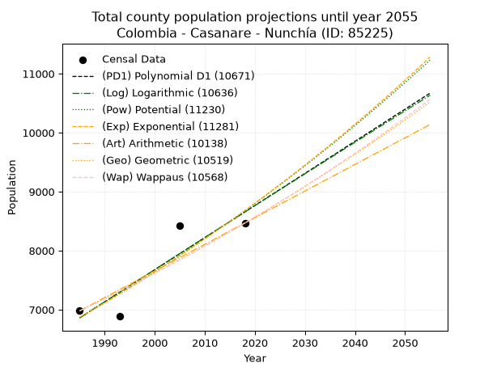
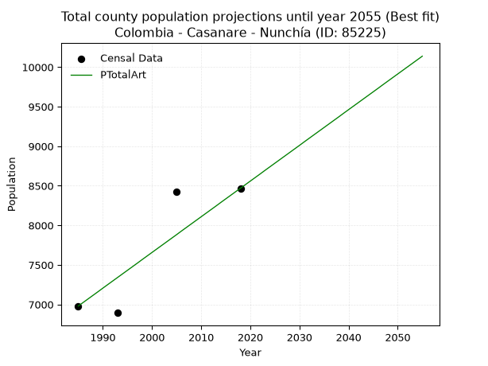
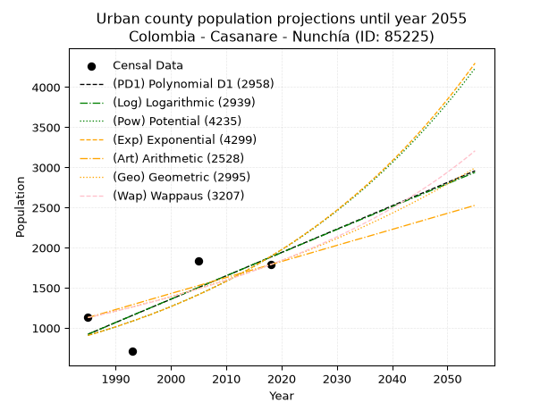
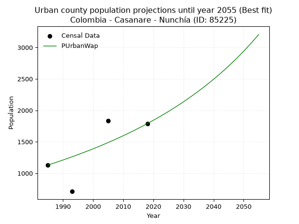
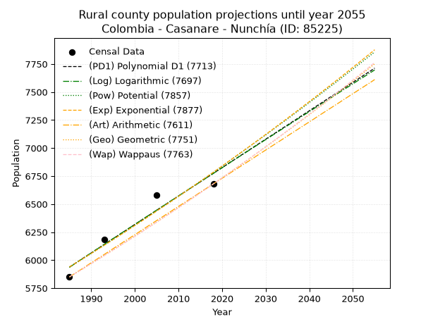
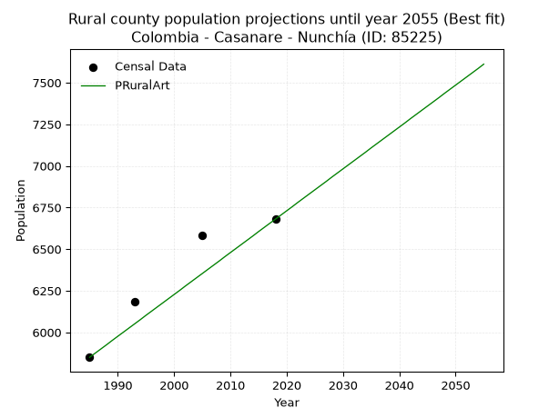

<div align="center">


</div>

# _“Population and Public Services Demand Projections (PPSD) until Year 2050 for Colombia - Casanare - Nunchía (ID: 85225)”_
Keywords: `population` `public-service` `projection` `lineal` `polynomial` `logarithmic` `potential` `exponential` `arithmetic` `geometric` `wappaus` `dane` `colombia` `south-america`

PPSD are analytical estimates used by governments and planners to anticipate future changes in population size, age distribution, and the resulting community needs for utilities, healthcare, education, and infrastructure as sizing future water treatment facilities, electrical grids, and road networks based on spatial growth.

> **General running parameters**: • app_version: _v20260806_. • Python version: _3.14.7_. • Pandas version: _3.0.5_. • NumPy version: _2.5.1_. • Creates, save and include plots into reports (create_plot): _False_. • Projection until year: _2050_. • Process polynomial degree 2 and up: _False_. • Process Wappaus: _True_. • Process Wappaus: _True_. • Set negative values to zero: _True_. • Set infinite values to zero: _True_. • Drop dataset notes: _True_. 
<div align="center">

Dynamic map: [:earth_americas:Google](http://maps.google.com/maps?q=5.63647354,-72.1953232) [:earth_americas:OSM](https://www.openstreetmap.org/#map=18/5.63647354/-72.1953232&layers=P) [:earth_americas:Bing](https://www.bing.com/maps?cp=5.63647354~-72.1953232&lvl=18) [:earth_americas:Apple](https://maps.apple.com/frame?center=5.63647354%2C-72.1953232&span=0.003%2C0.006)

</div>


<div align="center">

```geojson
{
  "type": "Feature",
  "geometry": {
    "type": "Point", 
    "coordinates": [-72.1953232, 5.63647354]
  }, 
  "properties": {
    "Name": "Colombia - Casanare - Nunchía (ID: 85225)"
  }
}
```

</div>


## 0. Census Data (4 records)

Census data are official statistics collected by a government about the people and housing in a country. They usually include counts of total population, age, sex, race, income, education, and jobs.

📅Global census file: [Population.xlsx](../data/Population.xlsx)

| Source   |   Year |   CountryID | CountryName   |   StateID | StateName   |   CountyID | CountyName   |   PTotal |   PUrban |   PRural |
|:---------|-------:|------------:|:--------------|----------:|:------------|-----------:|:-------------|---------:|---------:|---------:|
| DANE     |   1985 |          57 | Colombia      |        85 | Casanare    |      85225 | Nunchía      |     6980 |     1130 |     5850 |
| DANE     |   1993 |          57 | Colombia      |        85 | Casanare    |      85225 | Nunchía      |     6894 |      710 |     6184 |
| DANE     |   2005 |          57 | Colombia      |        85 | Casanare    |      85225 | Nunchía      |     8420 |     1837 |     6583 |
| DANE     |   2018 |          57 | Colombia      |        85 | Casanare    |      85225 | Nunchía      |     8469 |     1789 |     6680 |

> 🔥Some records could had specific notes about the registered values or the corresponding urban or rural distribution.

**Local public utility companies (RUPS)**

 | SERVICIO       | ESTADO      | NOMBRE                                                                        | NIT         | DEPARTAMENTO_DOMICILIO   | MUNICIPIO_DOMICILIO   | DIRECCION                      |   TELEFONO | EMAIL                           | TIPO_INSCRIPCION    | REPRESENTANTE_LEGAL         | TIPO_PRESTADOR                             | CLASIFICACION                 |
|:---------------|:------------|:------------------------------------------------------------------------------|:------------|:-------------------------|:----------------------|:-------------------------------|-----------:|:--------------------------------|:--------------------|:----------------------------|:-------------------------------------------|:------------------------------|
| ACUEDUCTO      | OPERATIVA   | UNIDAD ADMINISTRATIVA ESPECIAL DE SERVICIOS PUBLICOS DEL MUNICIPIO DE NUNCHIA | 800099425-4 | CASANARE                 | NUNCHIA               | CARRERA 5 No 7 - 44            |    6352010 | jorgelbertot@gmail.com          | Registro por la ESP | NORBERTO MARTINEZ           | MUNICIPIO (PRESTACIÓN DIRECTA)             | MENOR O IGUAL A 2500 USUARIOS |
| ALCANTARILLADO | OPERATIVA   | UNIDAD ADMINISTRATIVA ESPECIAL DE SERVICIOS PUBLICOS DEL MUNICIPIO DE NUNCHIA | 800099425-4 | CASANARE                 | NUNCHIA               | CARRERA 5 No 7 - 44            |    6352010 | jorgelbertot@gmail.com          | Registro por la ESP | NORBERTO MARTINEZ           | MUNICIPIO (PRESTACIÓN DIRECTA)             | MENOR O IGUAL A 2500 USUARIOS |
| ASEO           | OPERATIVA   | UNIDAD ADMINISTRATIVA ESPECIAL DE SERVICIOS PUBLICOS DEL MUNICIPIO DE NUNCHIA | 800099425-4 | CASANARE                 | NUNCHIA               | CARRERA 5 No 7 - 44            |    6352010 | jorgelbertot@gmail.com          | Registro por la ESP | NORBERTO MARTINEZ           | MUNICIPIO (PRESTACIÓN DIRECTA)             | MENOR O IGUAL A 2500 USUARIOS |
| ASEO           | OPERATIVA   | EMPRESA DE ACUEDUCTO, ALCANTARILLADO Y ASEO DE YOPAL  EICE - ESP              | 844000755-4 | CASANARE                 | YOPAL                 | CARRERA 19 No. 21 - 34         |    6345001 | planeacion@eaaay.gov.co         | Registro por la ESP | JAIRO BOSSUET PEREZ BARRERA | EMPRESA INDUSTRIAL Y COMERCIAL DEL ESTADO  | MAYOR O IGUAL A 5001 USUARIOS |
| ASEO           | OPERATIVA   | ASEO URBANO S.A.S. E.S.P.                                                     | 807005020-8 | NORTE DE SANTANDER       | CUCUTA                | Av 4ª N° 8N-57 Zona Industrial |    5784888 | silvia-paola.fuentes@veolia.com | Registro por la ESP | OSCAR GARCIA POVEDA         | SOCIEDADES (EMPRESA DE SERVICIOS PUBLICOS) | MAYOR O IGUAL A 5001 USUARIOS |
| ASEO           | CANCELACION | SOLUCIONES INTEGRALES ECOLOGICAS RECUPERAR SAS EMPRESA DE SERVICIOS PUBLICOS  | 900510768-0 | META                     | VILLAVICENCIO         | carrera 22 # 37B-39            |    6629602 | mcarrillo@somosrecuperar.com    | Registro por la ESP | DORELBA MORENO PARDO        | nan                                        | nan                           |

> [📅RUPS Database: Registro Único de Prestadores de Servicios Públicos de Colombia Suramérica - RUPS](https://www.datos.gov.co/Hacienda-y-Cr-dito-P-blico/Registro-nico-de-Prestadores-de-Servicios-P-blicos/4qkq-csdn/about_data)

## 1. Total

### 1.1. Coefficients and Parameters

* (PD1) Polynomial Deg 1: 54.42513046969072, -101173.11722199887 (lineal)
* (Log) Logarithmic: 108971.86677676978, -820605.2826159634
* (Pow) Potential: 14.188422099700187, -42.953189629291195
* (Exp) Exponential: 0.007086308041973355, 0.005345759125658109
* (Art) Arithmetic: Year diff. 2018 - 1985 = 33, Population diff. 8469 - 6980 = 1489, Annual growth = 45.121212121212125
* (Geo) Geometric: Year diff. 2018 - 1985 = 33, Population diff. 8469 - 6980 = 1489, Annual growth % = 0.005876701094196246
* (Wap) Wappaus: i = 0.58413116863502, Condition values only valid for < 200)

<sub>
Wappaus condition values: ['0.00', '0.58', '1.17', '1.75', '2.34', '2.92', '3.50', '4.09', '4.67', '5.26', '5.84', '6.43', '7.01', '7.59', '8.18', '8.76', '9.35', '9.93', '10.51', '11.10', '11.68', '12.27', '12.85', '13.44', '14.02', '14.60', '15.19', '15.77', '16.36', '16.94', '17.52', '18.11', '18.69', '19.28', '19.86', '20.44', '21.03', '21.61', '22.20', '22.78', '23.37', '23.95', '24.53', '25.12', '25.70', '26.29', '26.87', '27.45', '28.04', '28.62', '29.21', '29.79', '30.37', '30.96', '31.54', '32.13', '32.71', '33.30', '33.88', '34.46', '35.05', '35.63', '36.22', '36.80', '37.38', '37.97']
</sub>


### 1.2. Projected Dataset

|   Year |   CountyID |   PTotalPD1 |   PTotalLog |   PTotalPow |   PTotalExp |   PTotalArt |   PTotalGeo |   PTotalWap |
|-------:|-----------:|------------:|------------:|------------:|------------:|------------:|------------:|------------:|
|   1985 |      85225 |        6861 |        6859 |        6868 |        6870 |        6980 |        6980 |        6980 |
|   1986 |      85225 |        6915 |        6914 |        6917 |        6919 |        7025 |        7021 |        7021 |
|   1987 |      85225 |        6970 |        6969 |        6967 |        6968 |        7070 |        7062 |        7062 |
|   1988 |      85225 |        7024 |        7023 |        7017 |        7017 |        7115 |        7104 |        7103 |
|   1989 |      85225 |        7078 |        7078 |        7067 |        7067 |        7160 |        7146 |        7145 |
|   1990 |      85225 |        7133 |        7133 |        7118 |        7117 |        7206 |        7188 |        7187 |
|   1991 |      85225 |        7187 |        7188 |        7168 |        7168 |        7251 |        7230 |        7229 |
|   1992 |      85225 |        7242 |        7242 |        7220 |        7219 |        7296 |        7272 |        7271 |
|   1993 |      85225 |        7296 |        7297 |        7271 |        7270 |        7341 |        7315 |        7314 |
|   1994 |      85225 |        7351 |        7352 |        7323 |        7322 |        7386 |        7358 |        7357 |
|   1995 |      85225 |        7405 |        7406 |        7376 |        7374 |        7431 |        7401 |        7400 |
|   1996 |      85225 |        7459 |        7461 |        7428 |        7427 |        7476 |        7445 |        7443 |
|   1997 |      85225 |        7514 |        7516 |        7481 |        7479 |        7521 |        7488 |        7487 |
|   1998 |      85225 |        7568 |        7570 |        7534 |        7533 |        7567 |        7532 |        7531 |
|   1999 |      85225 |        7623 |        7625 |        7588 |        7586 |        7612 |        7577 |        7575 |
|   2000 |      85225 |        7677 |        7679 |        7642 |        7640 |        7657 |        7621 |        7620 |
|   2001 |      85225 |        7732 |        7734 |        7697 |        7694 |        7702 |        7666 |        7664 |
|   2002 |      85225 |        7786 |        7788 |        7751 |        7749 |        7747 |        7711 |        7709 |
|   2003 |      85225 |        7840 |        7843 |        7806 |        7804 |        7792 |        7756 |        7755 |
|   2004 |      85225 |        7895 |        7897 |        7862 |        7860 |        7837 |        7802 |        7800 |
|   2005 |      85225 |        7949 |        7951 |        7918 |        7916 |        7882 |        7848 |        7846 |
|   2006 |      85225 |        8004 |        8006 |        7974 |        7972 |        7928 |        7894 |        7892 |
|   2007 |      85225 |        8058 |        8060 |        8031 |        8029 |        7973 |        7940 |        7939 |
|   2008 |      85225 |        8113 |        8114 |        8088 |        8086 |        8018 |        7987 |        7985 |
|   2009 |      85225 |        8167 |        8169 |        8145 |        8143 |        8063 |        8034 |        8032 |
|   2010 |      85225 |        8221 |        8223 |        8203 |        8201 |        8108 |        8081 |        8080 |
|   2011 |      85225 |        8276 |        8277 |        8261 |        8259 |        8153 |        8129 |        8127 |
|   2012 |      85225 |        8330 |        8331 |        8319 |        8318 |        8198 |        8176 |        8175 |
|   2013 |      85225 |        8385 |        8385 |        8378 |        8377 |        8243 |        8224 |        8223 |
|   2014 |      85225 |        8439 |        8439 |        8437 |        8437 |        8289 |        8273 |        8272 |
|   2015 |      85225 |        8494 |        8493 |        8497 |        8497 |        8334 |        8321 |        8321 |
|   2016 |      85225 |        8548 |        8548 |        8557 |        8557 |        8379 |        8370 |        8370 |
|   2017 |      85225 |        8602 |        8602 |        8617 |        8618 |        8424 |        8420 |        8419 |
|   2018 |      85225 |        8657 |        8656 |        8678 |        8679 |        8469 |        8469 |        8469 |
|   2019 |      85225 |        8711 |        8710 |        8739 |        8741 |        8514 |        8519 |        8519 |
|   2020 |      85225 |        8766 |        8764 |        8801 |        8803 |        8559 |        8569 |        8570 |
|   2021 |      85225 |        8820 |        8817 |        8863 |        8866 |        8604 |        8619 |        8620 |
|   2022 |      85225 |        8874 |        8871 |        8925 |        8929 |        8649 |        8670 |        8671 |
|   2023 |      85225 |        8929 |        8925 |        8988 |        8993 |        8695 |        8721 |        8723 |
|   2024 |      85225 |        8983 |        8979 |        9052 |        9056 |        8740 |        8772 |        8775 |
|   2025 |      85225 |        9038 |        9033 |        9115 |        9121 |        8785 |        8824 |        8827 |
|   2026 |      85225 |        9092 |        9087 |        9179 |        9186 |        8830 |        8875 |        8879 |
|   2027 |      85225 |        9147 |        9141 |        9244 |        9251 |        8875 |        8928 |        8932 |
|   2028 |      85225 |        9201 |        9194 |        9309 |        9317 |        8920 |        8980 |        8985 |
|   2029 |      85225 |        9255 |        9248 |        9374 |        9383 |        8965 |        9033 |        9039 |
|   2030 |      85225 |        9310 |        9302 |        9440 |        9450 |        9010 |        9086 |        9092 |
|   2031 |      85225 |        9364 |        9355 |        9506 |        9517 |        9056 |        9139 |        9147 |
|   2032 |      85225 |        9419 |        9409 |        9573 |        9585 |        9101 |        9193 |        9201 |
|   2033 |      85225 |        9473 |        9463 |        9640 |        9653 |        9146 |        9247 |        9256 |
|   2034 |      85225 |        9528 |        9516 |        9707 |        9722 |        9191 |        9301 |        9312 |
|   2035 |      85225 |        9582 |        9570 |        9775 |        9791 |        9236 |        9356 |        9367 |
|   2036 |      85225 |        9636 |        9623 |        9843 |        9860 |        9281 |        9411 |        9423 |
|   2037 |      85225 |        9691 |        9677 |        9912 |        9930 |        9326 |        9466 |        9480 |
|   2038 |      85225 |        9745 |        9730 |        9982 |       10001 |        9371 |        9522 |        9537 |
|   2039 |      85225 |        9800 |        9784 |       10051 |       10072 |        9417 |        9578 |        9594 |
|   2040 |      85225 |        9854 |        9837 |       10121 |       10144 |        9462 |        9634 |        9652 |
|   2041 |      85225 |        9909 |        9891 |       10192 |       10216 |        9507 |        9691 |        9710 |
|   2042 |      85225 |        9963 |        9944 |       10263 |       10289 |        9552 |        9748 |        9768 |
|   2043 |      85225 |       10017 |        9997 |       10335 |       10362 |        9597 |        9805 |        9827 |
|   2044 |      85225 |       10072 |       10051 |       10407 |       10435 |        9642 |        9863 |        9886 |
|   2045 |      85225 |       10126 |       10104 |       10479 |       10510 |        9687 |        9921 |        9946 |
|   2046 |      85225 |       10181 |       10157 |       10552 |       10584 |        9732 |        9979 |       10006 |
|   2047 |      85225 |       10235 |       10210 |       10625 |       10660 |        9778 |       10038 |       10067 |
|   2048 |      85225 |       10290 |       10264 |       10699 |       10735 |        9823 |       10097 |       10128 |
|   2049 |      85225 |       10344 |       10317 |       10774 |       10812 |        9868 |       10156 |       10189 |
|   2050 |      85225 |       10398 |       10370 |       10849 |       10889 |        9913 |       10216 |       10251 |
<div align="center">

</img>

</div>


### 1.3. Best fit with absolute and relative error (%)

Relative error puts that difference into context by dividing the absolute error by the true value, creating a unitless ratio or percentage that shows the scale of the mistake.

Absolute and relative error

|   Year | Source   |   CountryID | CountryName   |   StateID | StateName   |   CountyID_x | CountyName   |   PTotal |   PUrban |   PRural |   CountyID_y |   PTotalPD1 |   PTotalLog |   PTotalPow |   PTotalExp |   PTotalArt |   PTotalGeo |   PTotalWap |   PTotalPD1AbsError |   PTotalLogAbsError |   PTotalPowAbsError |   PTotalExpAbsError |   PTotalArtAbsError |   PTotalGeoAbsError |   PTotalWapAbsError |   PTotalPD1RelError |   PTotalLogRelError |   PTotalPowRelError |   PTotalExpRelError |   PTotalArtRelError |   PTotalGeoRelError |   PTotalWapRelError |
|-------:|:---------|------------:|:--------------|----------:|:------------|-------------:|:-------------|---------:|---------:|---------:|-------------:|------------:|------------:|------------:|------------:|------------:|------------:|------------:|--------------------:|--------------------:|--------------------:|--------------------:|--------------------:|--------------------:|--------------------:|--------------------:|--------------------:|--------------------:|--------------------:|--------------------:|--------------------:|--------------------:|
|   1985 | DANE     |          57 | Colombia      |        85 | Casanare    |        85225 | Nunchía      |     6980 |     1130 |     5850 |        85225 |        6861 |        6859 |        6868 |        6870 |        6980 |        6980 |        6980 |                 119 |                 121 |                 112 |                 110 |                   0 |                   0 |                   0 |             1.70487 |             1.73352 |             1.60458 |             1.57593 |             0       |             0       |             0       |
|   1993 | DANE     |          57 | Colombia      |        85 | Casanare    |        85225 | Nunchía      |     6894 |      710 |     6184 |        85225 |        7296 |        7297 |        7271 |        7270 |        7341 |        7315 |        7314 |                 402 |                 403 |                 377 |                 376 |                 447 |                 421 |                 420 |             5.83116 |             5.84566 |             5.46852 |             5.45402 |             6.4839  |             6.10676 |             6.09225 |
|   2005 | DANE     |          57 | Colombia      |        85 | Casanare    |        85225 | Nunchía      |     8420 |     1837 |     6583 |        85225 |        7949 |        7951 |        7918 |        7916 |        7882 |        7848 |        7846 |                 471 |                 469 |                 502 |                 504 |                 538 |                 572 |                 574 |             5.59382 |             5.57007 |             5.962   |             5.98575 |             6.38955 |             6.79335 |             6.8171  |
|   2018 | DANE     |          57 | Colombia      |        85 | Casanare    |        85225 | Nunchía      |     8469 |     1789 |     6680 |        85225 |        8657 |        8656 |        8678 |        8679 |        8469 |        8469 |        8469 |                 188 |                 187 |                 209 |                 210 |                   0 |                   0 |                   0 |             2.21986 |             2.20805 |             2.46782 |             2.47963 |             0       |             0       |             0       |

Relative error mean

| Method    |   RelError | Best   |
|:----------|-----------:|:-------|
| PTotalPD1 |    3.83743 |        |
| PTotalLog |    3.83933 |        |
| PTotalPow |    3.87573 |        |
| PTotalExp |    3.87383 |        |
| PTotalArt |    3.21836 | True   |
| PTotalGeo |    3.22503 |        |
| PTotalWap |    3.22734 |        |

💙Best method: _**PTotalArt**_
<div align="center">

</img>

</div>


### 1.4. Fresh water supply demand in liters per capita per day (lpcd)

The fresh water supply demand typically ranges from 100 to 300 liters per capita per day (lpcd) for standard domestic and municipal planning, though absolute survival minimums set by the World Health Organization are as low as 7.5 to 20 liters per day, and total consumption in high-income nations can exceed 400 liters.

> `CZ`: Level in meters above the sea level (masl)<br> `WS`: Fresh water supply demand in liters per capita per day (lpcd or l/h/d)<br> `WSAll`: Zonal fresh water supply demand in liters per second (l/s)<br> `A`: Zonal area in square meters<br> `DP`: Population density (people/hectare or p/ha)

Reference values (RAS Colombia)

|    CZ |   WS |
|------:|-----:|
|  1000 |  120 |
|  2000 |  130 |
| 99999 |  140 |

County shapefile geometry properties and water supply values

|   CountyID |      ATotal |   CZTotal |   WSTotal |
|-----------:|------------:|----------:|----------:|
|      85225 | 1.09913e+09 |   290.543 |       120 |

Projected values for best method: PTotalArt

|   CountyID |   Year |   PTotalArt |   DPTotal |   WSTotal |   WSTotalAll |
|-----------:|-------:|------------:|----------:|----------:|-------------:|
|      85225 |   1985 |        6980 |      0.06 |       120 |      9.69444 |
|      85225 |   1986 |        7025 |      0.06 |       120 |      9.75694 |
|      85225 |   1987 |        7070 |      0.06 |       120 |      9.81944 |
|      85225 |   1988 |        7115 |      0.06 |       120 |      9.88194 |
|      85225 |   1989 |        7160 |      0.07 |       120 |      9.94444 |
|      85225 |   1990 |        7206 |      0.07 |       120 |     10.0083  |
|      85225 |   1991 |        7251 |      0.07 |       120 |     10.0708  |
|      85225 |   1992 |        7296 |      0.07 |       120 |     10.1333  |
|      85225 |   1993 |        7341 |      0.07 |       120 |     10.1958  |
|      85225 |   1994 |        7386 |      0.07 |       120 |     10.2583  |
|      85225 |   1995 |        7431 |      0.07 |       120 |     10.3208  |
|      85225 |   1996 |        7476 |      0.07 |       120 |     10.3833  |
|      85225 |   1997 |        7521 |      0.07 |       120 |     10.4458  |
|      85225 |   1998 |        7567 |      0.07 |       120 |     10.5097  |
|      85225 |   1999 |        7612 |      0.07 |       120 |     10.5722  |
|      85225 |   2000 |        7657 |      0.07 |       120 |     10.6347  |
|      85225 |   2001 |        7702 |      0.07 |       120 |     10.6972  |
|      85225 |   2002 |        7747 |      0.07 |       120 |     10.7597  |
|      85225 |   2003 |        7792 |      0.07 |       120 |     10.8222  |
|      85225 |   2004 |        7837 |      0.07 |       120 |     10.8847  |
|      85225 |   2005 |        7882 |      0.07 |       120 |     10.9472  |
|      85225 |   2006 |        7928 |      0.07 |       120 |     11.0111  |
|      85225 |   2007 |        7973 |      0.07 |       120 |     11.0736  |
|      85225 |   2008 |        8018 |      0.07 |       120 |     11.1361  |
|      85225 |   2009 |        8063 |      0.07 |       120 |     11.1986  |
|      85225 |   2010 |        8108 |      0.07 |       120 |     11.2611  |
|      85225 |   2011 |        8153 |      0.07 |       120 |     11.3236  |
|      85225 |   2012 |        8198 |      0.07 |       120 |     11.3861  |
|      85225 |   2013 |        8243 |      0.07 |       120 |     11.4486  |
|      85225 |   2014 |        8289 |      0.08 |       120 |     11.5125  |
|      85225 |   2015 |        8334 |      0.08 |       120 |     11.575   |
|      85225 |   2016 |        8379 |      0.08 |       120 |     11.6375  |
|      85225 |   2017 |        8424 |      0.08 |       120 |     11.7     |
|      85225 |   2018 |        8469 |      0.08 |       120 |     11.7625  |
|      85225 |   2019 |        8514 |      0.08 |       120 |     11.825   |
|      85225 |   2020 |        8559 |      0.08 |       120 |     11.8875  |
|      85225 |   2021 |        8604 |      0.08 |       120 |     11.95    |
|      85225 |   2022 |        8649 |      0.08 |       120 |     12.0125  |
|      85225 |   2023 |        8695 |      0.08 |       120 |     12.0764  |
|      85225 |   2024 |        8740 |      0.08 |       120 |     12.1389  |
|      85225 |   2025 |        8785 |      0.08 |       120 |     12.2014  |
|      85225 |   2026 |        8830 |      0.08 |       120 |     12.2639  |
|      85225 |   2027 |        8875 |      0.08 |       120 |     12.3264  |
|      85225 |   2028 |        8920 |      0.08 |       120 |     12.3889  |
|      85225 |   2029 |        8965 |      0.08 |       120 |     12.4514  |
|      85225 |   2030 |        9010 |      0.08 |       120 |     12.5139  |
|      85225 |   2031 |        9056 |      0.08 |       120 |     12.5778  |
|      85225 |   2032 |        9101 |      0.08 |       120 |     12.6403  |
|      85225 |   2033 |        9146 |      0.08 |       120 |     12.7028  |
|      85225 |   2034 |        9191 |      0.08 |       120 |     12.7653  |
|      85225 |   2035 |        9236 |      0.08 |       120 |     12.8278  |
|      85225 |   2036 |        9281 |      0.08 |       120 |     12.8903  |
|      85225 |   2037 |        9326 |      0.08 |       120 |     12.9528  |
|      85225 |   2038 |        9371 |      0.09 |       120 |     13.0153  |
|      85225 |   2039 |        9417 |      0.09 |       120 |     13.0792  |
|      85225 |   2040 |        9462 |      0.09 |       120 |     13.1417  |
|      85225 |   2041 |        9507 |      0.09 |       120 |     13.2042  |
|      85225 |   2042 |        9552 |      0.09 |       120 |     13.2667  |
|      85225 |   2043 |        9597 |      0.09 |       120 |     13.3292  |
|      85225 |   2044 |        9642 |      0.09 |       120 |     13.3917  |
|      85225 |   2045 |        9687 |      0.09 |       120 |     13.4542  |
|      85225 |   2046 |        9732 |      0.09 |       120 |     13.5167  |
|      85225 |   2047 |        9778 |      0.09 |       120 |     13.5806  |
|      85225 |   2048 |        9823 |      0.09 |       120 |     13.6431  |
|      85225 |   2049 |        9868 |      0.09 |       120 |     13.7056  |
|      85225 |   2050 |        9913 |      0.09 |       120 |     13.7681  |

## 2. Urban

### 2.1. Coefficients and Parameters

* (PD1) Polynomial Deg 1: 29.065435568044922, -56771.637494981864 (lineal)
* (Log) Logarithmic: 58175.511106513135, -440826.0261098947
* (Pow) Potential: 44.44522897207543, -143.61180736467855
* (Exp) Exponential: 0.022211609314769728, 6.457936319984054e-17
* (Art) Arithmetic: Year diff. 2018 - 1985 = 33, Population diff. 1789 - 1130 = 659, Annual growth = 19.96969696969697
* (Geo) Geometric: Year diff. 2018 - 1985 = 33, Population diff. 1789 - 1130 = 659, Annual growth % = 0.01401976708487429
* (Wap) Wappaus: i = 1.3682560445150374, Condition values only valid for < 200)

<sub>
Wappaus condition values: ['0.00', '1.37', '2.74', '4.10', '5.47', '6.84', '8.21', '9.58', '10.95', '12.31', '13.68', '15.05', '16.42', '17.79', '19.16', '20.52', '21.89', '23.26', '24.63', '26.00', '27.37', '28.73', '30.10', '31.47', '32.84', '34.21', '35.57', '36.94', '38.31', '39.68', '41.05', '42.42', '43.78', '45.15', '46.52', '47.89', '49.26', '50.63', '51.99', '53.36', '54.73', '56.10', '57.47', '58.84', '60.20', '61.57', '62.94', '64.31', '65.68', '67.04', '68.41', '69.78', '71.15', '72.52', '73.89', '75.25', '76.62', '77.99', '79.36', '80.73', '82.10', '83.46', '84.83', '86.20', '87.57', '88.94']
</sub>


### 2.2. Projected Dataset

|   Year |   CountyID |   PUrbanPD1 |   PUrbanLog |   PUrbanPow |   PUrbanExp |   PUrbanArt |   PUrbanGeo |   PUrbanWap |
|-------:|-----------:|------------:|------------:|------------:|------------:|------------:|------------:|------------:|
|   1985 |      85225 |         923 |         922 |         908 |         908 |        1130 |        1130 |        1130 |
|   1986 |      85225 |         952 |         952 |         928 |         929 |        1150 |        1146 |        1146 |
|   1987 |      85225 |         981 |         981 |         949 |         949 |        1170 |        1162 |        1161 |
|   1988 |      85225 |        1010 |        1010 |         971 |         971 |        1190 |        1178 |        1177 |
|   1989 |      85225 |        1040 |        1040 |         993 |         993 |        1210 |        1195 |        1194 |
|   1990 |      85225 |        1069 |        1069 |        1015 |        1015 |        1230 |        1211 |        1210 |
|   1991 |      85225 |        1098 |        1098 |        1038 |        1038 |        1250 |        1228 |        1227 |
|   1992 |      85225 |        1127 |        1127 |        1061 |        1061 |        1270 |        1246 |        1244 |
|   1993 |      85225 |        1156 |        1156 |        1085 |        1085 |        1290 |        1263 |        1261 |
|   1994 |      85225 |        1185 |        1186 |        1110 |        1109 |        1310 |        1281 |        1278 |
|   1995 |      85225 |        1214 |        1215 |        1135 |        1134 |        1330 |        1299 |        1296 |
|   1996 |      85225 |        1243 |        1244 |        1160 |        1159 |        1350 |        1317 |        1314 |
|   1997 |      85225 |        1272 |        1273 |        1186 |        1186 |        1370 |        1335 |        1332 |
|   1998 |      85225 |        1301 |        1302 |        1213 |        1212 |        1390 |        1354 |        1351 |
|   1999 |      85225 |        1330 |        1331 |        1240 |        1239 |        1410 |        1373 |        1369 |
|   2000 |      85225 |        1359 |        1360 |        1268 |        1267 |        1430 |        1392 |        1388 |
|   2001 |      85225 |        1388 |        1389 |        1297 |        1296 |        1450 |        1412 |        1408 |
|   2002 |      85225 |        1417 |        1419 |        1326 |        1325 |        1469 |        1432 |        1427 |
|   2003 |      85225 |        1446 |        1448 |        1356 |        1355 |        1489 |        1452 |        1447 |
|   2004 |      85225 |        1475 |        1477 |        1386 |        1385 |        1509 |        1472 |        1468 |
|   2005 |      85225 |        1505 |        1506 |        1417 |        1416 |        1529 |        1493 |        1488 |
|   2006 |      85225 |        1534 |        1535 |        1449 |        1448 |        1549 |        1514 |        1509 |
|   2007 |      85225 |        1563 |        1564 |        1481 |        1480 |        1569 |        1535 |        1530 |
|   2008 |      85225 |        1592 |        1593 |        1515 |        1514 |        1589 |        1556 |        1552 |
|   2009 |      85225 |        1621 |        1622 |        1548 |        1548 |        1609 |        1578 |        1574 |
|   2010 |      85225 |        1650 |        1651 |        1583 |        1582 |        1629 |        1600 |        1596 |
|   2011 |      85225 |        1679 |        1679 |        1618 |        1618 |        1649 |        1623 |        1619 |
|   2012 |      85225 |        1708 |        1708 |        1655 |        1654 |        1669 |        1646 |        1642 |
|   2013 |      85225 |        1737 |        1737 |        1692 |        1691 |        1689 |        1669 |        1665 |
|   2014 |      85225 |        1766 |        1766 |        1729 |        1729 |        1709 |        1692 |        1689 |
|   2015 |      85225 |        1795 |        1795 |        1768 |        1768 |        1729 |        1716 |        1714 |
|   2016 |      85225 |        1824 |        1824 |        1807 |        1808 |        1749 |        1740 |        1738 |
|   2017 |      85225 |        1853 |        1853 |        1848 |        1849 |        1769 |        1764 |        1763 |
|   2018 |      85225 |        1882 |        1882 |        1889 |        1890 |        1789 |        1789 |        1789 |
|   2019 |      85225 |        1911 |        1910 |        1931 |        1933 |        1809 |        1814 |        1815 |
|   2020 |      85225 |        1941 |        1939 |        1974 |        1976 |        1829 |        1840 |        1842 |
|   2021 |      85225 |        1970 |        1968 |        2018 |        2020 |        1849 |        1865 |        1868 |
|   2022 |      85225 |        1999 |        1997 |        2062 |        2066 |        1869 |        1891 |        1896 |
|   2023 |      85225 |        2028 |        2026 |        2108 |        2112 |        1889 |        1918 |        1924 |
|   2024 |      85225 |        2057 |        2054 |        2155 |        2160 |        1909 |        1945 |        1952 |
|   2025 |      85225 |        2086 |        2083 |        2203 |        2208 |        1929 |        1972 |        1981 |
|   2026 |      85225 |        2115 |        2112 |        2252 |        2258 |        1949 |        2000 |        2011 |
|   2027 |      85225 |        2144 |        2140 |        2302 |        2308 |        1969 |        2028 |        2041 |
|   2028 |      85225 |        2173 |        2169 |        2353 |        2360 |        1989 |        2056 |        2072 |
|   2029 |      85225 |        2202 |        2198 |        2405 |        2413 |        2009 |        2085 |        2103 |
|   2030 |      85225 |        2231 |        2227 |        2458 |        2467 |        2029 |        2114 |        2135 |
|   2031 |      85225 |        2260 |        2255 |        2513 |        2523 |        2049 |        2144 |        2168 |
|   2032 |      85225 |        2289 |        2284 |        2568 |        2580 |        2069 |        2174 |        2201 |
|   2033 |      85225 |        2318 |        2312 |        2625 |        2637 |        2089 |        2204 |        2235 |
|   2034 |      85225 |        2347 |        2341 |        2683 |        2697 |        2109 |        2235 |        2270 |
|   2035 |      85225 |        2377 |        2370 |        2742 |        2757 |        2128 |        2267 |        2305 |
|   2036 |      85225 |        2406 |        2398 |        2803 |        2819 |        2148 |        2299 |        2341 |
|   2037 |      85225 |        2435 |        2427 |        2865 |        2882 |        2168 |        2331 |        2378 |
|   2038 |      85225 |        2464 |        2455 |        2928 |        2947 |        2188 |        2363 |        2416 |
|   2039 |      85225 |        2493 |        2484 |        2992 |        3013 |        2208 |        2397 |        2454 |
|   2040 |      85225 |        2522 |        2512 |        3058 |        3081 |        2228 |        2430 |        2493 |
|   2041 |      85225 |        2551 |        2541 |        3126 |        3150 |        2248 |        2464 |        2534 |
|   2042 |      85225 |        2580 |        2569 |        3194 |        3221 |        2268 |        2499 |        2575 |
|   2043 |      85225 |        2609 |        2598 |        3265 |        3293 |        2288 |        2534 |        2617 |
|   2044 |      85225 |        2638 |        2626 |        3336 |        3367 |        2308 |        2569 |        2660 |
|   2045 |      85225 |        2667 |        2655 |        3410 |        3443 |        2328 |        2605 |        2704 |
|   2046 |      85225 |        2696 |        2683 |        3485 |        3520 |        2348 |        2642 |        2749 |
|   2047 |      85225 |        2725 |        2712 |        3561 |        3599 |        2368 |        2679 |        2795 |
|   2048 |      85225 |        2754 |        2740 |        3639 |        3680 |        2388 |        2716 |        2842 |
|   2049 |      85225 |        2783 |        2768 |        3719 |        3763 |        2408 |        2755 |        2890 |
|   2050 |      85225 |        2813 |        2797 |        3801 |        3847 |        2428 |        2793 |        2940 |
<div align="center">

</img>

</div>


### 2.3. Best fit with absolute and relative error (%)

Relative error puts that difference into context by dividing the absolute error by the true value, creating a unitless ratio or percentage that shows the scale of the mistake.

Absolute and relative error

|   Year | Source   |   CountryID | CountryName   |   StateID | StateName   |   CountyID_x | CountyName   |   PTotal |   PUrban |   PRural |   CountyID_y |   PUrbanPD1 |   PUrbanLog |   PUrbanPow |   PUrbanExp |   PUrbanArt |   PUrbanGeo |   PUrbanWap |   PUrbanPD1AbsError |   PUrbanLogAbsError |   PUrbanPowAbsError |   PUrbanExpAbsError |   PUrbanArtAbsError |   PUrbanGeoAbsError |   PUrbanWapAbsError |   PUrbanPD1RelError |   PUrbanLogRelError |   PUrbanPowRelError |   PUrbanExpRelError |   PUrbanArtRelError |   PUrbanGeoRelError |   PUrbanWapRelError |
|-------:|:---------|------------:|:--------------|----------:|:------------|-------------:|:-------------|---------:|---------:|---------:|-------------:|------------:|------------:|------------:|------------:|------------:|------------:|------------:|--------------------:|--------------------:|--------------------:|--------------------:|--------------------:|--------------------:|--------------------:|--------------------:|--------------------:|--------------------:|--------------------:|--------------------:|--------------------:|--------------------:|
|   1985 | DANE     |          57 | Colombia      |        85 | Casanare    |        85225 | Nunchía      |     6980 |     1130 |     5850 |        85225 |         923 |         922 |         908 |         908 |        1130 |        1130 |        1130 |                 207 |                 208 |                 222 |                 222 |                   0 |                   0 |                   0 |            18.3186  |            18.4071  |            19.646   |            19.646   |              0      |              0      |              0      |
|   1993 | DANE     |          57 | Colombia      |        85 | Casanare    |        85225 | Nunchía      |     6894 |      710 |     6184 |        85225 |        1156 |        1156 |        1085 |        1085 |        1290 |        1263 |        1261 |                 446 |                 446 |                 375 |                 375 |                 580 |                 553 |                 551 |            62.8169  |            62.8169  |            52.8169  |            52.8169  |             81.6901 |             77.8873 |             77.6056 |
|   2005 | DANE     |          57 | Colombia      |        85 | Casanare    |        85225 | Nunchía      |     8420 |     1837 |     6583 |        85225 |        1505 |        1506 |        1417 |        1416 |        1529 |        1493 |        1488 |                 332 |                 331 |                 420 |                 421 |                 308 |                 344 |                 349 |            18.0729  |            18.0185  |            22.8634  |            22.9178  |             16.7665 |             18.7262 |             18.9984 |
|   2018 | DANE     |          57 | Colombia      |        85 | Casanare    |        85225 | Nunchía      |     8469 |     1789 |     6680 |        85225 |        1882 |        1882 |        1889 |        1890 |        1789 |        1789 |        1789 |                  93 |                  93 |                 100 |                 101 |                   0 |                   0 |                   0 |             5.19843 |             5.19843 |             5.58971 |             5.64561 |              0      |              0      |              0      |

Relative error mean

| Method    |   RelError | Best   |
|:----------|-----------:|:-------|
| PUrbanPD1 |    26.1017 |        |
| PUrbanLog |    26.1102 |        |
| PUrbanPow |    25.229  |        |
| PUrbanExp |    25.2566 |        |
| PUrbanArt |    24.6142 |        |
| PUrbanGeo |    24.1534 |        |
| PUrbanWap |    24.151  | True   |

💙Best method: _**PUrbanWap**_
<div align="center">

</img>

</div>


### 2.4. Fresh water supply demand in liters per capita per day (lpcd)

The fresh water supply demand typically ranges from 100 to 300 liters per capita per day (lpcd) for standard domestic and municipal planning, though absolute survival minimums set by the World Health Organization are as low as 7.5 to 20 liters per day, and total consumption in high-income nations can exceed 400 liters.

> `CZ`: Level in meters above the sea level (masl)<br> `WS`: Fresh water supply demand in liters per capita per day (lpcd or l/h/d)<br> `WSAll`: Zonal fresh water supply demand in liters per second (l/s)<br> `A`: Zonal area in square meters<br> `DP`: Population density (people/hectare or p/ha)

Reference values (RAS Colombia)

|    CZ |   WS |
|------:|-----:|
|  1000 |  120 |
|  2000 |  130 |
| 99999 |  140 |

County shapefile geometry properties and water supply values

|   CountyID |   AUrban |   CZUrban |   WSUrban |
|-----------:|---------:|----------:|----------:|
|      85225 |   999294 |   388.786 |       120 |

Projected values for best method: PUrbanWap

|   CountyID |   Year |   PUrbanWap |   DPUrban |   WSUrban |   WSUrbanAll |
|-----------:|-------:|------------:|----------:|----------:|-------------:|
|      85225 |   1985 |        1130 |     11.31 |       120 |      1.56944 |
|      85225 |   1986 |        1146 |     11.47 |       120 |      1.59167 |
|      85225 |   1987 |        1161 |     11.62 |       120 |      1.6125  |
|      85225 |   1988 |        1177 |     11.78 |       120 |      1.63472 |
|      85225 |   1989 |        1194 |     11.95 |       120 |      1.65833 |
|      85225 |   1990 |        1210 |     12.11 |       120 |      1.68056 |
|      85225 |   1991 |        1227 |     12.28 |       120 |      1.70417 |
|      85225 |   1992 |        1244 |     12.45 |       120 |      1.72778 |
|      85225 |   1993 |        1261 |     12.62 |       120 |      1.75139 |
|      85225 |   1994 |        1278 |     12.79 |       120 |      1.775   |
|      85225 |   1995 |        1296 |     12.97 |       120 |      1.8     |
|      85225 |   1996 |        1314 |     13.15 |       120 |      1.825   |
|      85225 |   1997 |        1332 |     13.33 |       120 |      1.85    |
|      85225 |   1998 |        1351 |     13.52 |       120 |      1.87639 |
|      85225 |   1999 |        1369 |     13.7  |       120 |      1.90139 |
|      85225 |   2000 |        1388 |     13.89 |       120 |      1.92778 |
|      85225 |   2001 |        1408 |     14.09 |       120 |      1.95556 |
|      85225 |   2002 |        1427 |     14.28 |       120 |      1.98194 |
|      85225 |   2003 |        1447 |     14.48 |       120 |      2.00972 |
|      85225 |   2004 |        1468 |     14.69 |       120 |      2.03889 |
|      85225 |   2005 |        1488 |     14.89 |       120 |      2.06667 |
|      85225 |   2006 |        1509 |     15.1  |       120 |      2.09583 |
|      85225 |   2007 |        1530 |     15.31 |       120 |      2.125   |
|      85225 |   2008 |        1552 |     15.53 |       120 |      2.15556 |
|      85225 |   2009 |        1574 |     15.75 |       120 |      2.18611 |
|      85225 |   2010 |        1596 |     15.97 |       120 |      2.21667 |
|      85225 |   2011 |        1619 |     16.2  |       120 |      2.24861 |
|      85225 |   2012 |        1642 |     16.43 |       120 |      2.28056 |
|      85225 |   2013 |        1665 |     16.66 |       120 |      2.3125  |
|      85225 |   2014 |        1689 |     16.9  |       120 |      2.34583 |
|      85225 |   2015 |        1714 |     17.15 |       120 |      2.38056 |
|      85225 |   2016 |        1738 |     17.39 |       120 |      2.41389 |
|      85225 |   2017 |        1763 |     17.64 |       120 |      2.44861 |
|      85225 |   2018 |        1789 |     17.9  |       120 |      2.48472 |
|      85225 |   2019 |        1815 |     18.16 |       120 |      2.52083 |
|      85225 |   2020 |        1842 |     18.43 |       120 |      2.55833 |
|      85225 |   2021 |        1868 |     18.69 |       120 |      2.59444 |
|      85225 |   2022 |        1896 |     18.97 |       120 |      2.63333 |
|      85225 |   2023 |        1924 |     19.25 |       120 |      2.67222 |
|      85225 |   2024 |        1952 |     19.53 |       120 |      2.71111 |
|      85225 |   2025 |        1981 |     19.82 |       120 |      2.75139 |
|      85225 |   2026 |        2011 |     20.12 |       120 |      2.79306 |
|      85225 |   2027 |        2041 |     20.42 |       120 |      2.83472 |
|      85225 |   2028 |        2072 |     20.73 |       120 |      2.87778 |
|      85225 |   2029 |        2103 |     21.04 |       120 |      2.92083 |
|      85225 |   2030 |        2135 |     21.37 |       120 |      2.96528 |
|      85225 |   2031 |        2168 |     21.7  |       120 |      3.01111 |
|      85225 |   2032 |        2201 |     22.03 |       120 |      3.05694 |
|      85225 |   2033 |        2235 |     22.37 |       120 |      3.10417 |
|      85225 |   2034 |        2270 |     22.72 |       120 |      3.15278 |
|      85225 |   2035 |        2305 |     23.07 |       120 |      3.20139 |
|      85225 |   2036 |        2341 |     23.43 |       120 |      3.25139 |
|      85225 |   2037 |        2378 |     23.8  |       120 |      3.30278 |
|      85225 |   2038 |        2416 |     24.18 |       120 |      3.35556 |
|      85225 |   2039 |        2454 |     24.56 |       120 |      3.40833 |
|      85225 |   2040 |        2493 |     24.95 |       120 |      3.4625  |
|      85225 |   2041 |        2534 |     25.36 |       120 |      3.51944 |
|      85225 |   2042 |        2575 |     25.77 |       120 |      3.57639 |
|      85225 |   2043 |        2617 |     26.19 |       120 |      3.63472 |
|      85225 |   2044 |        2660 |     26.62 |       120 |      3.69444 |
|      85225 |   2045 |        2704 |     27.06 |       120 |      3.75556 |
|      85225 |   2046 |        2749 |     27.51 |       120 |      3.81806 |
|      85225 |   2047 |        2795 |     27.97 |       120 |      3.88194 |
|      85225 |   2048 |        2842 |     28.44 |       120 |      3.94722 |
|      85225 |   2049 |        2890 |     28.92 |       120 |      4.01389 |
|      85225 |   2050 |        2940 |     29.42 |       120 |      4.08333 |

## 3. Rural

### 3.1. Coefficients and Parameters

* (PD1) Polynomial Deg 1: 25.35969490164583, -44401.47972701707 (lineal)
* (Log) Logarithmic: 50796.355670256635, -379779.25650606846
* (Pow) Potential: 8.083785527299803, -22.88478266084685
* (Exp) Exponential: 0.004035633301500582, 1.9708869104689553
* (Art) Arithmetic: Year diff. 2018 - 1985 = 33, Population diff. 6680 - 5850 = 830, Annual growth = 25.151515151515152
* (Geo) Geometric: Year diff. 2018 - 1985 = 33, Population diff. 6680 - 5850 = 830, Annual growth % = 0.004028587767833658
* (Wap) Wappaus: i = 0.40146073665626736, Condition values only valid for < 200)

<sub>
Wappaus condition values: ['0.00', '0.40', '0.80', '1.20', '1.61', '2.01', '2.41', '2.81', '3.21', '3.61', '4.01', '4.42', '4.82', '5.22', '5.62', '6.02', '6.42', '6.82', '7.23', '7.63', '8.03', '8.43', '8.83', '9.23', '9.64', '10.04', '10.44', '10.84', '11.24', '11.64', '12.04', '12.45', '12.85', '13.25', '13.65', '14.05', '14.45', '14.85', '15.26', '15.66', '16.06', '16.46', '16.86', '17.26', '17.66', '18.07', '18.47', '18.87', '19.27', '19.67', '20.07', '20.47', '20.88', '21.28', '21.68', '22.08', '22.48', '22.88', '23.28', '23.69', '24.09', '24.49', '24.89', '25.29', '25.69', '26.09']
</sub>


### 3.2. Projected Dataset

|   Year |   CountyID |   PRuralPD1 |   PRuralLog |   PRuralPow |   PRuralExp |   PRuralArt |   PRuralGeo |   PRuralWap |
|-------:|-----------:|------------:|------------:|------------:|------------:|------------:|------------:|------------:|
|   1985 |      85225 |        5938 |        5936 |        5938 |        5939 |        5850 |        5850 |        5850 |
|   1986 |      85225 |        5963 |        5962 |        5962 |        5963 |        5875 |        5874 |        5874 |
|   1987 |      85225 |        5988 |        5988 |        5986 |        5987 |        5900 |        5897 |        5897 |
|   1988 |      85225 |        6014 |        6013 |        6010 |        6011 |        5925 |        5921 |        5921 |
|   1989 |      85225 |        6039 |        6039 |        6035 |        6035 |        5951 |        5945 |        5945 |
|   1990 |      85225 |        6064 |        6064 |        6060 |        6060 |        5976 |        5969 |        5969 |
|   1991 |      85225 |        6090 |        6090 |        6084 |        6084 |        6001 |        5993 |        5993 |
|   1992 |      85225 |        6115 |        6115 |        6109 |        6109 |        6026 |        6017 |        6017 |
|   1993 |      85225 |        6140 |        6141 |        6134 |        6133 |        6051 |        6041 |        6041 |
|   1994 |      85225 |        6166 |        6166 |        6159 |        6158 |        6076 |        6066 |        6065 |
|   1995 |      85225 |        6191 |        6192 |        6184 |        6183 |        6102 |        6090 |        6090 |
|   1996 |      85225 |        6216 |        6217 |        6209 |        6208 |        6127 |        6115 |        6114 |
|   1997 |      85225 |        6242 |        6243 |        6234 |        6233 |        6152 |        6139 |        6139 |
|   1998 |      85225 |        6267 |        6268 |        6259 |        6258 |        6177 |        6164 |        6163 |
|   1999 |      85225 |        6293 |        6293 |        6285 |        6284 |        6202 |        6189 |        6188 |
|   2000 |      85225 |        6318 |        6319 |        6310 |        6309 |        6227 |        6214 |        6213 |
|   2001 |      85225 |        6343 |        6344 |        6336 |        6335 |        6252 |        6239 |        6238 |
|   2002 |      85225 |        6369 |        6370 |        6361 |        6360 |        6278 |        6264 |        6263 |
|   2003 |      85225 |        6394 |        6395 |        6387 |        6386 |        6303 |        6289 |        6289 |
|   2004 |      85225 |        6419 |        6420 |        6413 |        6412 |        6328 |        6314 |        6314 |
|   2005 |      85225 |        6445 |        6446 |        6439 |        6438 |        6353 |        6340 |        6339 |
|   2006 |      85225 |        6470 |        6471 |        6465 |        6464 |        6378 |        6365 |        6365 |
|   2007 |      85225 |        6495 |        6496 |        6491 |        6490 |        6403 |        6391 |        6391 |
|   2008 |      85225 |        6521 |        6522 |        6517 |        6516 |        6428 |        6417 |        6416 |
|   2009 |      85225 |        6546 |        6547 |        6543 |        6542 |        6454 |        6443 |        6442 |
|   2010 |      85225 |        6572 |        6572 |        6570 |        6569 |        6479 |        6469 |        6468 |
|   2011 |      85225 |        6597 |        6598 |        6596 |        6595 |        6504 |        6495 |        6494 |
|   2012 |      85225 |        6622 |        6623 |        6623 |        6622 |        6529 |        6521 |        6520 |
|   2013 |      85225 |        6648 |        6648 |        6649 |        6649 |        6554 |        6547 |        6547 |
|   2014 |      85225 |        6673 |        6673 |        6676 |        6676 |        6579 |        6573 |        6573 |
|   2015 |      85225 |        6698 |        6698 |        6703 |        6703 |        6605 |        6600 |        6600 |
|   2016 |      85225 |        6724 |        6724 |        6730 |        6730 |        6630 |        6627 |        6626 |
|   2017 |      85225 |        6749 |        6749 |        6757 |        6757 |        6655 |        6653 |        6653 |
|   2018 |      85225 |        6774 |        6774 |        6784 |        6784 |        6680 |        6680 |        6680 |
|   2019 |      85225 |        6800 |        6799 |        6811 |        6812 |        6705 |        6707 |        6707 |
|   2020 |      85225 |        6825 |        6824 |        6839 |        6839 |        6730 |        6734 |        6734 |
|   2021 |      85225 |        6850 |        6849 |        6866 |        6867 |        6755 |        6761 |        6761 |
|   2022 |      85225 |        6876 |        6875 |        6894 |        6895 |        6781 |        6788 |        6789 |
|   2023 |      85225 |        6901 |        6900 |        6921 |        6923 |        6806 |        6816 |        6816 |
|   2024 |      85225 |        6927 |        6925 |        6949 |        6951 |        6831 |        6843 |        6844 |
|   2025 |      85225 |        6952 |        6950 |        6977 |        6979 |        6856 |        6871 |        6871 |
|   2026 |      85225 |        6977 |        6975 |        7005 |        7007 |        6881 |        6898 |        6899 |
|   2027 |      85225 |        7003 |        7000 |        7033 |        7035 |        6906 |        6926 |        6927 |
|   2028 |      85225 |        7028 |        7025 |        7061 |        7064 |        6932 |        6954 |        6955 |
|   2029 |      85225 |        7053 |        7050 |        7089 |        7092 |        6957 |        6982 |        6983 |
|   2030 |      85225 |        7079 |        7075 |        7117 |        7121 |        6982 |        7010 |        7012 |
|   2031 |      85225 |        7104 |        7100 |        7146 |        7150 |        7007 |        7038 |        7040 |
|   2032 |      85225 |        7129 |        7125 |        7174 |        7179 |        7032 |        7067 |        7069 |
|   2033 |      85225 |        7155 |        7150 |        7203 |        7208 |        7057 |        7095 |        7097 |
|   2034 |      85225 |        7180 |        7175 |        7231 |        7237 |        7082 |        7124 |        7126 |
|   2035 |      85225 |        7205 |        7200 |        7260 |        7266 |        7108 |        7153 |        7155 |
|   2036 |      85225 |        7231 |        7225 |        7289 |        7296 |        7133 |        7181 |        7184 |
|   2037 |      85225 |        7256 |        7250 |        7318 |        7325 |        7158 |        7210 |        7214 |
|   2038 |      85225 |        7282 |        7275 |        7347 |        7355 |        7183 |        7239 |        7243 |
|   2039 |      85225 |        7307 |        7300 |        7376 |        7385 |        7208 |        7268 |        7272 |
|   2040 |      85225 |        7332 |        7325 |        7406 |        7414 |        7233 |        7298 |        7302 |
|   2041 |      85225 |        7358 |        7350 |        7435 |        7444 |        7258 |        7327 |        7332 |
|   2042 |      85225 |        7383 |        7375 |        7464 |        7474 |        7284 |        7357 |        7362 |
|   2043 |      85225 |        7408 |        7399 |        7494 |        7505 |        7309 |        7386 |        7392 |
|   2044 |      85225 |        7434 |        7424 |        7524 |        7535 |        7334 |        7416 |        7422 |
|   2045 |      85225 |        7459 |        7449 |        7554 |        7566 |        7359 |        7446 |        7452 |
|   2046 |      85225 |        7484 |        7474 |        7583 |        7596 |        7384 |        7476 |        7483 |
|   2047 |      85225 |        7510 |        7499 |        7613 |        7627 |        7409 |        7506 |        7513 |
|   2048 |      85225 |        7535 |        7524 |        7644 |        7658 |        7435 |        7536 |        7544 |
|   2049 |      85225 |        7561 |        7548 |        7674 |        7689 |        7460 |        7567 |        7575 |
|   2050 |      85225 |        7586 |        7573 |        7704 |        7720 |        7485 |        7597 |        7606 |
<div align="center">

</img>

</div>


### 3.3. Best fit with absolute and relative error (%)

Relative error puts that difference into context by dividing the absolute error by the true value, creating a unitless ratio or percentage that shows the scale of the mistake.

Absolute and relative error

|   Year | Source   |   CountryID | CountryName   |   StateID | StateName   |   CountyID_x | CountyName   |   PTotal |   PUrban |   PRural |   CountyID_y |   PRuralPD1 |   PRuralLog |   PRuralPow |   PRuralExp |   PRuralArt |   PRuralGeo |   PRuralWap |   PRuralPD1AbsError |   PRuralLogAbsError |   PRuralPowAbsError |   PRuralExpAbsError |   PRuralArtAbsError |   PRuralGeoAbsError |   PRuralWapAbsError |   PRuralPD1RelError |   PRuralLogRelError |   PRuralPowRelError |   PRuralExpRelError |   PRuralArtRelError |   PRuralGeoRelError |   PRuralWapRelError |
|-------:|:---------|------------:|:--------------|----------:|:------------|-------------:|:-------------|---------:|---------:|---------:|-------------:|------------:|------------:|------------:|------------:|------------:|------------:|------------:|--------------------:|--------------------:|--------------------:|--------------------:|--------------------:|--------------------:|--------------------:|--------------------:|--------------------:|--------------------:|--------------------:|--------------------:|--------------------:|--------------------:|
|   1985 | DANE     |          57 | Colombia      |        85 | Casanare    |        85225 | Nunchía      |     6980 |     1130 |     5850 |        85225 |        5938 |        5936 |        5938 |        5939 |        5850 |        5850 |        5850 |                  88 |                  86 |                  88 |                  89 |                   0 |                   0 |                   0 |            1.50427  |            1.47009  |            1.50427  |            1.52137  |             0       |             0       |             0       |
|   1993 | DANE     |          57 | Colombia      |        85 | Casanare    |        85225 | Nunchía      |     6894 |      710 |     6184 |        85225 |        6140 |        6141 |        6134 |        6133 |        6051 |        6041 |        6041 |                  44 |                  43 |                  50 |                  51 |                 133 |                 143 |                 143 |            0.711514 |            0.695343 |            0.808538 |            0.824709 |             2.15071 |             2.31242 |             2.31242 |
|   2005 | DANE     |          57 | Colombia      |        85 | Casanare    |        85225 | Nunchía      |     8420 |     1837 |     6583 |        85225 |        6445 |        6446 |        6439 |        6438 |        6353 |        6340 |        6339 |                 138 |                 137 |                 144 |                 145 |                 230 |                 243 |                 244 |            2.09631  |            2.08112  |            2.18745  |            2.20264  |             3.49385 |             3.69133 |             3.70652 |
|   2018 | DANE     |          57 | Colombia      |        85 | Casanare    |        85225 | Nunchía      |     8469 |     1789 |     6680 |        85225 |        6774 |        6774 |        6784 |        6784 |        6680 |        6680 |        6680 |                  94 |                  94 |                 104 |                 104 |                   0 |                   0 |                   0 |            1.40719  |            1.40719  |            1.55689  |            1.55689  |             0       |             0       |             0       |

Relative error mean

| Method    |   RelError | Best   |
|:----------|-----------:|:-------|
| PRuralPD1 |    1.42982 |        |
| PRuralLog |    1.41343 |        |
| PRuralPow |    1.51429 |        |
| PRuralExp |    1.5264  |        |
| PRuralArt |    1.41114 | True   |
| PRuralGeo |    1.50094 |        |
| PRuralWap |    1.50473 |        |

💙Best method: _**PRuralArt**_
<div align="center">

</img>

</div>


### 3.4. Fresh water supply demand in liters per capita per day (lpcd)

The fresh water supply demand typically ranges from 100 to 300 liters per capita per day (lpcd) for standard domestic and municipal planning, though absolute survival minimums set by the World Health Organization are as low as 7.5 to 20 liters per day, and total consumption in high-income nations can exceed 400 liters.

> `CZ`: Level in meters above the sea level (masl)<br> `WS`: Fresh water supply demand in liters per capita per day (lpcd or l/h/d)<br> `WSAll`: Zonal fresh water supply demand in liters per second (l/s)<br> `A`: Zonal area in square meters<br> `DP`: Population density (people/hectare or p/ha)

Reference values (RAS Colombia)

|    CZ |   WS |
|------:|-----:|
|  1000 |  120 |
|  2000 |  130 |
| 99999 |  140 |

County shapefile geometry properties and water supply values

|   CountyID |      ARural |   CZRural |   WSRural |
|-----------:|------------:|----------:|----------:|
|      85225 | 1.09813e+09 |   290.456 |       120 |

Projected values for best method: PRuralArt

|   CountyID |   Year |   PRuralArt |   DPRural |   WSRural |   WSRuralAll |
|-----------:|-------:|------------:|----------:|----------:|-------------:|
|      85225 |   1985 |        5850 |      0.05 |       120 |      8.125   |
|      85225 |   1986 |        5875 |      0.05 |       120 |      8.15972 |
|      85225 |   1987 |        5900 |      0.05 |       120 |      8.19444 |
|      85225 |   1988 |        5925 |      0.05 |       120 |      8.22917 |
|      85225 |   1989 |        5951 |      0.05 |       120 |      8.26528 |
|      85225 |   1990 |        5976 |      0.05 |       120 |      8.3     |
|      85225 |   1991 |        6001 |      0.05 |       120 |      8.33472 |
|      85225 |   1992 |        6026 |      0.05 |       120 |      8.36944 |
|      85225 |   1993 |        6051 |      0.06 |       120 |      8.40417 |
|      85225 |   1994 |        6076 |      0.06 |       120 |      8.43889 |
|      85225 |   1995 |        6102 |      0.06 |       120 |      8.475   |
|      85225 |   1996 |        6127 |      0.06 |       120 |      8.50972 |
|      85225 |   1997 |        6152 |      0.06 |       120 |      8.54444 |
|      85225 |   1998 |        6177 |      0.06 |       120 |      8.57917 |
|      85225 |   1999 |        6202 |      0.06 |       120 |      8.61389 |
|      85225 |   2000 |        6227 |      0.06 |       120 |      8.64861 |
|      85225 |   2001 |        6252 |      0.06 |       120 |      8.68333 |
|      85225 |   2002 |        6278 |      0.06 |       120 |      8.71944 |
|      85225 |   2003 |        6303 |      0.06 |       120 |      8.75417 |
|      85225 |   2004 |        6328 |      0.06 |       120 |      8.78889 |
|      85225 |   2005 |        6353 |      0.06 |       120 |      8.82361 |
|      85225 |   2006 |        6378 |      0.06 |       120 |      8.85833 |
|      85225 |   2007 |        6403 |      0.06 |       120 |      8.89306 |
|      85225 |   2008 |        6428 |      0.06 |       120 |      8.92778 |
|      85225 |   2009 |        6454 |      0.06 |       120 |      8.96389 |
|      85225 |   2010 |        6479 |      0.06 |       120 |      8.99861 |
|      85225 |   2011 |        6504 |      0.06 |       120 |      9.03333 |
|      85225 |   2012 |        6529 |      0.06 |       120 |      9.06806 |
|      85225 |   2013 |        6554 |      0.06 |       120 |      9.10278 |
|      85225 |   2014 |        6579 |      0.06 |       120 |      9.1375  |
|      85225 |   2015 |        6605 |      0.06 |       120 |      9.17361 |
|      85225 |   2016 |        6630 |      0.06 |       120 |      9.20833 |
|      85225 |   2017 |        6655 |      0.06 |       120 |      9.24306 |
|      85225 |   2018 |        6680 |      0.06 |       120 |      9.27778 |
|      85225 |   2019 |        6705 |      0.06 |       120 |      9.3125  |
|      85225 |   2020 |        6730 |      0.06 |       120 |      9.34722 |
|      85225 |   2021 |        6755 |      0.06 |       120 |      9.38194 |
|      85225 |   2022 |        6781 |      0.06 |       120 |      9.41806 |
|      85225 |   2023 |        6806 |      0.06 |       120 |      9.45278 |
|      85225 |   2024 |        6831 |      0.06 |       120 |      9.4875  |
|      85225 |   2025 |        6856 |      0.06 |       120 |      9.52222 |
|      85225 |   2026 |        6881 |      0.06 |       120 |      9.55694 |
|      85225 |   2027 |        6906 |      0.06 |       120 |      9.59167 |
|      85225 |   2028 |        6932 |      0.06 |       120 |      9.62778 |
|      85225 |   2029 |        6957 |      0.06 |       120 |      9.6625  |
|      85225 |   2030 |        6982 |      0.06 |       120 |      9.69722 |
|      85225 |   2031 |        7007 |      0.06 |       120 |      9.73194 |
|      85225 |   2032 |        7032 |      0.06 |       120 |      9.76667 |
|      85225 |   2033 |        7057 |      0.06 |       120 |      9.80139 |
|      85225 |   2034 |        7082 |      0.06 |       120 |      9.83611 |
|      85225 |   2035 |        7108 |      0.06 |       120 |      9.87222 |
|      85225 |   2036 |        7133 |      0.06 |       120 |      9.90694 |
|      85225 |   2037 |        7158 |      0.07 |       120 |      9.94167 |
|      85225 |   2038 |        7183 |      0.07 |       120 |      9.97639 |
|      85225 |   2039 |        7208 |      0.07 |       120 |     10.0111  |
|      85225 |   2040 |        7233 |      0.07 |       120 |     10.0458  |
|      85225 |   2041 |        7258 |      0.07 |       120 |     10.0806  |
|      85225 |   2042 |        7284 |      0.07 |       120 |     10.1167  |
|      85225 |   2043 |        7309 |      0.07 |       120 |     10.1514  |
|      85225 |   2044 |        7334 |      0.07 |       120 |     10.1861  |
|      85225 |   2045 |        7359 |      0.07 |       120 |     10.2208  |
|      85225 |   2046 |        7384 |      0.07 |       120 |     10.2556  |
|      85225 |   2047 |        7409 |      0.07 |       120 |     10.2903  |
|      85225 |   2048 |        7435 |      0.07 |       120 |     10.3264  |
|      85225 |   2049 |        7460 |      0.07 |       120 |     10.3611  |
|      85225 |   2050 |        7485 |      0.07 |       120 |     10.3958  |

<div align="center"><br><sub>Share this research</sub></div><br>

<sub>**APPS & TOOLS & CONTENT DISCLAIMER**: • NO WARRANTY - This content and software is provided by <a href="https://github.com/rcfdtools" target="_blank">github.com/rcfdtools</a> "as is", without any express or implied warranty, including warranties of merchantability, fitness for a particular purpose, or non-infringement. There is no guarantee that the software will be error-free or operate without interruption. • LIMITATION OF LIABILITY - Neither the authors nor copyright holders will be liable for claims or damages arising from the software or its use. You are responsible for determining if the software is appropriate for your use and assume all associated risks, including errors, legal compliance, and data loss. • NO PROFESSIONAL ADVICE - The software provides general information and does not offer professional advice. It should not replace consultation with professional advisors. [Clauses and global license for rcfdtools use.](https://github.com/rcfdtools/rcfdtools/blob/main/LICENSE.md)</sub>

| [:house: Home](Readme.md)  | [:beginner: Help / Collaborate](https://github.com/rcfdtools/R.HydroTools/discussions/31) |
|----------------------------|-------------------------------------------------------------------------------------------|