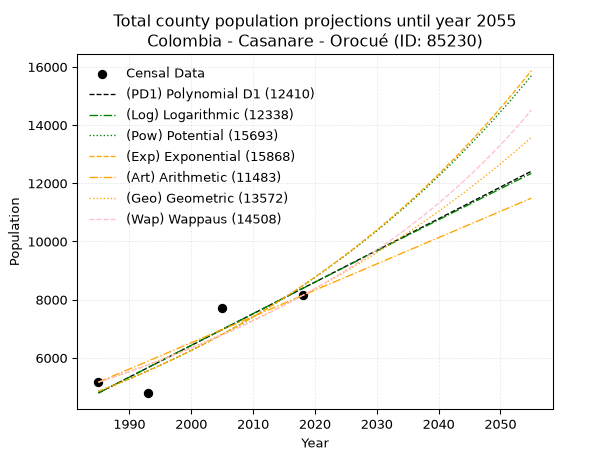
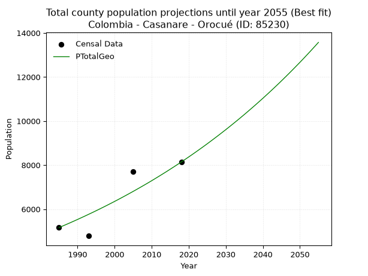
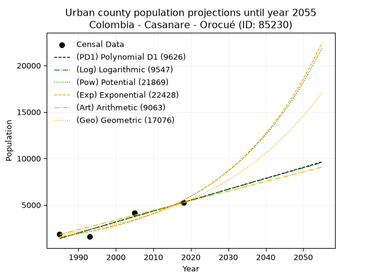
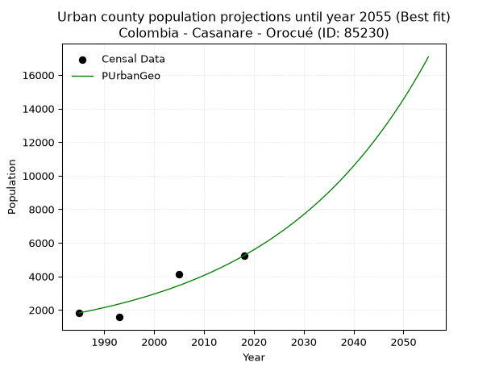
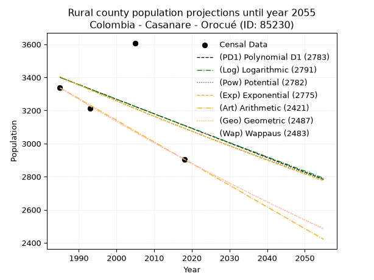
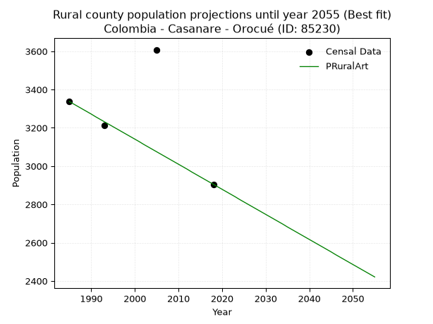

<div align="center">


</div>

# _“Population and Public Services Demand Projections (PPSD) until Year 2050 for Colombia - Casanare - Orocué (ID: 85230)”_
Keywords: `population` `public-service` `projection` `lineal` `polynomial` `logarithmic` `potential` `exponential` `arithmetic` `geometric` `wappaus` `dane` `colombia` `south-america`

PPSD are analytical estimates used by governments and planners to anticipate future changes in population size, age distribution, and the resulting community needs for utilities, healthcare, education, and infrastructure as sizing future water treatment facilities, electrical grids, and road networks based on spatial growth.

> **General running parameters**: • app_version: _v20260806_. • Python version: _3.14.7_. • Pandas version: _3.0.5_. • NumPy version: _2.5.1_. • Creates, save and include plots into reports (create_plot): _False_. • Projection until year: _2050_. • Process polynomial degree 2 and up: _False_. • Process Wappaus: _True_. • Process Wappaus: _True_. • Set negative values to zero: _True_. • Set infinite values to zero: _True_. • Drop dataset notes: _True_. 
<div align="center">

Dynamic map: [:earth_americas:Google](http://maps.google.com/maps?q=4.79025758,-71.3385329) [:earth_americas:OSM](https://www.openstreetmap.org/#map=18/4.79025758/-71.3385329&layers=P) [:earth_americas:Bing](https://www.bing.com/maps?cp=4.79025758~-71.3385329&lvl=18) [:earth_americas:Apple](https://maps.apple.com/frame?center=4.79025758%2C-71.3385329&span=0.003%2C0.006)

</div>


<div align="center">

```geojson
{
  "type": "Feature",
  "geometry": {
    "type": "Point", 
    "coordinates": [-71.3385329, 4.79025758]
  }, 
  "properties": {
    "Name": "Colombia - Casanare - Orocué (ID: 85230)"
  }
}
```

</div>


## 0. Census Data (4 records)

Census data are official statistics collected by a government about the people and housing in a country. They usually include counts of total population, age, sex, race, income, education, and jobs.

📅Global census file: [Population.xlsx](../data/Population.xlsx)

| Source   |   Year |   CountryID | CountryName   |   StateID | StateName   |   CountyID | CountyName   |   PTotal |   PUrban |   PRural |
|:---------|-------:|------------:|:--------------|----------:|:------------|-----------:|:-------------|---------:|---------:|---------:|
| DANE     |   1985 |          57 | Colombia      |        85 | Casanare    |      85230 | Orocué       |     5162 |     1825 |     3337 |
| DANE     |   1993 |          57 | Colombia      |        85 | Casanare    |      85230 | Orocué       |     4784 |     1570 |     3214 |
| DANE     |   2005 |          57 | Colombia      |        85 | Casanare    |      85230 | Orocué       |     7717 |     4109 |     3608 |
| DANE     |   2018 |          57 | Colombia      |        85 | Casanare    |      85230 | Orocué       |     8142 |     5237 |     2905 |

> 🔥Some records could had specific notes about the registered values or the corresponding urban or rural distribution.

## 1. Total

### 1.1. Coefficients and Parameters

* (PD1) Polynomial Deg 1: 108.82657567242026, -211229.10798875865 (lineal)
* (Log) Logarithmic: 217844.2458205046, -1649384.6081758833
* (Pow) Potential: 33.912471512044625, -108.14994309455871
* (Exp) Exponential: 0.016941320656718762, 1.2045190060968523e-11
* (Art) Arithmetic: Year diff. 2018 - 1985 = 33, Population diff. 8142 - 5162 = 2980, Annual growth = 90.3030303030303
* (Geo) Geometric: Year diff. 2018 - 1985 = 33, Population diff. 8142 - 5162 = 2980, Annual growth % = 0.013905237776786317
* (Wap) Wappaus: i = 1.3575320250004554, Condition values only valid for < 200)

<sub>
Wappaus condition values: ['0.00', '1.36', '2.72', '4.07', '5.43', '6.79', '8.15', '9.50', '10.86', '12.22', '13.58', '14.93', '16.29', '17.65', '19.01', '20.36', '21.72', '23.08', '24.44', '25.79', '27.15', '28.51', '29.87', '31.22', '32.58', '33.94', '35.30', '36.65', '38.01', '39.37', '40.73', '42.08', '43.44', '44.80', '46.16', '47.51', '48.87', '50.23', '51.59', '52.94', '54.30', '55.66', '57.02', '58.37', '59.73', '61.09', '62.45', '63.80', '65.16', '66.52', '67.88', '69.23', '70.59', '71.95', '73.31', '74.66', '76.02', '77.38', '78.74', '80.09', '81.45', '82.81', '84.17', '85.52', '86.88', '88.24']
</sub>


### 1.2. Projected Dataset

|   Year |   CountyID |   PTotalPD1 |   PTotalLog |   PTotalPow |   PTotalExp |   PTotalArt |   PTotalGeo |   PTotalWap |
|-------:|-----------:|------------:|------------:|------------:|------------:|------------:|------------:|------------:|
|   1985 |      85230 |        4792 |        4788 |        4845 |        4847 |        5162 |        5162 |        5162 |
|   1986 |      85230 |        4900 |        4898 |        4928 |        4930 |        5252 |        5234 |        5233 |
|   1987 |      85230 |        5009 |        5008 |        5013 |        5014 |        5343 |        5307 |        5304 |
|   1988 |      85230 |        5118 |        5117 |        5099 |        5100 |        5433 |        5380 |        5377 |
|   1989 |      85230 |        5227 |        5227 |        5187 |        5187 |        5523 |        5455 |        5450 |
|   1990 |      85230 |        5336 |        5336 |        5276 |        5276 |        5614 |        5531 |        5525 |
|   1991 |      85230 |        5445 |        5446 |        5367 |        5366 |        5704 |        5608 |        5600 |
|   1992 |      85230 |        5553 |        5555 |        5459 |        5458 |        5794 |        5686 |        5677 |
|   1993 |      85230 |        5662 |        5664 |        5553 |        5551 |        5884 |        5765 |        5755 |
|   1994 |      85230 |        5771 |        5774 |        5648 |        5646 |        5975 |        5845 |        5834 |
|   1995 |      85230 |        5880 |        5883 |        5745 |        5742 |        6065 |        5926 |        5914 |
|   1996 |      85230 |        5989 |        5992 |        5843 |        5840 |        6155 |        6009 |        5995 |
|   1997 |      85230 |        6098 |        6101 |        5943 |        5940 |        6246 |        6092 |        6077 |
|   1998 |      85230 |        6206 |        6210 |        6045 |        6041 |        6336 |        6177 |        6161 |
|   1999 |      85230 |        6315 |        6319 |        6149 |        6145 |        6426 |        6263 |        6246 |
|   2000 |      85230 |        6424 |        6428 |        6254 |        6250 |        6517 |        6350 |        6332 |
|   2001 |      85230 |        6533 |        6537 |        6361 |        6356 |        6607 |        6438 |        6420 |
|   2002 |      85230 |        6642 |        6646 |        6469 |        6465 |        6697 |        6528 |        6509 |
|   2003 |      85230 |        6751 |        6755 |        6580 |        6576 |        6787 |        6619 |        6599 |
|   2004 |      85230 |        6859 |        6864 |        6692 |        6688 |        6878 |        6711 |        6691 |
|   2005 |      85230 |        6968 |        6972 |        6806 |        6802 |        6968 |        6804 |        6784 |
|   2006 |      85230 |        7077 |        7081 |        6922 |        6918 |        7058 |        6899 |        6878 |
|   2007 |      85230 |        7186 |        7189 |        7040 |        7037 |        7149 |        6995 |        6974 |
|   2008 |      85230 |        7295 |        7298 |        7160 |        7157 |        7239 |        7092 |        7072 |
|   2009 |      85230 |        7403 |        7406 |        7282 |        7279 |        7329 |        7190 |        7171 |
|   2010 |      85230 |        7512 |        7515 |        7406 |        7403 |        7420 |        7290 |        7272 |
|   2011 |      85230 |        7621 |        7623 |        7532 |        7530 |        7510 |        7392 |        7374 |
|   2012 |      85230 |        7730 |        7731 |        7660 |        7659 |        7600 |        7495 |        7479 |
|   2013 |      85230 |        7839 |        7840 |        7790 |        7789 |        7690 |        7599 |        7585 |
|   2014 |      85230 |        7948 |        7948 |        7923 |        7923 |        7781 |        7704 |        7692 |
|   2015 |      85230 |        8056 |        8056 |        8057 |        8058 |        7871 |        7812 |        7802 |
|   2016 |      85230 |        8165 |        8164 |        8194 |        8196 |        7961 |        7920 |        7913 |
|   2017 |      85230 |        8274 |        8272 |        8333 |        8336 |        8052 |        8030 |        8027 |
|   2018 |      85230 |        8383 |        8380 |        8474 |        8478 |        8142 |        8142 |        8142 |
|   2019 |      85230 |        8492 |        8488 |        8618 |        8623 |        8232 |        8255 |        8259 |
|   2020 |      85230 |        8601 |        8596 |        8764 |        8770 |        8323 |        8370 |        8379 |
|   2021 |      85230 |        8709 |        8704 |        8912 |        8920 |        8413 |        8486 |        8501 |
|   2022 |      85230 |        8818 |        8811 |        9063 |        9072 |        8503 |        8604 |        8624 |
|   2023 |      85230 |        8927 |        8919 |        9216 |        9227 |        8594 |        8724 |        8750 |
|   2024 |      85230 |        9036 |        9027 |        9372 |        9385 |        8684 |        8845 |        8879 |
|   2025 |      85230 |        9145 |        9134 |        9530 |        9545 |        8774 |        8968 |        9010 |
|   2026 |      85230 |        9254 |        9242 |        9691 |        9709 |        8864 |        9093 |        9143 |
|   2027 |      85230 |        9362 |        9349 |        9855 |        9874 |        8955 |        9220 |        9279 |
|   2028 |      85230 |        9471 |        9457 |       10021 |       10043 |        9045 |        9348 |        9417 |
|   2029 |      85230 |        9580 |        9564 |       10190 |       10215 |        9135 |        9478 |        9558 |
|   2030 |      85230 |        9689 |        9672 |       10361 |       10389 |        9226 |        9609 |        9702 |
|   2031 |      85230 |        9798 |        9779 |       10536 |       10567 |        9316 |        9743 |        9849 |
|   2032 |      85230 |        9906 |        9886 |       10713 |       10747 |        9406 |        9879 |        9999 |
|   2033 |      85230 |       10015 |        9993 |       10894 |       10931 |        9497 |       10016 |       10151 |
|   2034 |      85230 |       10124 |       10100 |       11077 |       11118 |        9587 |       10155 |       10307 |
|   2035 |      85230 |       10233 |       10208 |       11263 |       11308 |        9677 |       10296 |       10466 |
|   2036 |      85230 |       10342 |       10315 |       11452 |       11501 |        9767 |       10440 |       10628 |
|   2037 |      85230 |       10451 |       10422 |       11645 |       11697 |        9858 |       10585 |       10794 |
|   2038 |      85230 |       10559 |       10528 |       11840 |       11897 |        9948 |       10732 |       10963 |
|   2039 |      85230 |       10668 |       10635 |       12039 |       12100 |       10038 |       10881 |       11136 |
|   2040 |      85230 |       10777 |       10742 |       12240 |       12307 |       10129 |       11032 |       11312 |
|   2041 |      85230 |       10886 |       10849 |       12446 |       12517 |       10219 |       11186 |       11493 |
|   2042 |      85230 |       10995 |       10956 |       12654 |       12731 |       10309 |       11341 |       11677 |
|   2043 |      85230 |       11104 |       11062 |       12866 |       12949 |       10400 |       11499 |       11865 |
|   2044 |      85230 |       11212 |       11169 |       13081 |       13170 |       10490 |       11659 |       12058 |
|   2045 |      85230 |       11321 |       11275 |       13300 |       13395 |       10580 |       11821 |       12255 |
|   2046 |      85230 |       11430 |       11382 |       13522 |       13624 |       10670 |       11986 |       12457 |
|   2047 |      85230 |       11539 |       11488 |       13748 |       13857 |       10761 |       12152 |       12664 |
|   2048 |      85230 |       11648 |       11595 |       13978 |       14094 |       10851 |       12321 |       12875 |
|   2049 |      85230 |       11757 |       11701 |       14211 |       14334 |       10941 |       12493 |       13092 |
|   2050 |      85230 |       11865 |       11807 |       14448 |       14579 |       11032 |       12666 |       13313 |
<div align="center">

</img>

</div>


### 1.3. Best fit with absolute and relative error (%)

Relative error puts that difference into context by dividing the absolute error by the true value, creating a unitless ratio or percentage that shows the scale of the mistake.

Absolute and relative error

|   Year | Source   |   CountryID | CountryName   |   StateID | StateName   |   CountyID_x | CountyName   |   PTotal |   PUrban |   PRural |   CountyID_y |   PTotalPD1 |   PTotalLog |   PTotalPow |   PTotalExp |   PTotalArt |   PTotalGeo |   PTotalWap |   PTotalPD1AbsError |   PTotalLogAbsError |   PTotalPowAbsError |   PTotalExpAbsError |   PTotalArtAbsError |   PTotalGeoAbsError |   PTotalWapAbsError |   PTotalPD1RelError |   PTotalLogRelError |   PTotalPowRelError |   PTotalExpRelError |   PTotalArtRelError |   PTotalGeoRelError |   PTotalWapRelError |
|-------:|:---------|------------:|:--------------|----------:|:------------|-------------:|:-------------|---------:|---------:|---------:|-------------:|------------:|------------:|------------:|------------:|------------:|------------:|------------:|--------------------:|--------------------:|--------------------:|--------------------:|--------------------:|--------------------:|--------------------:|--------------------:|--------------------:|--------------------:|--------------------:|--------------------:|--------------------:|--------------------:|
|   1985 | DANE     |          57 | Colombia      |        85 | Casanare    |        85230 | Orocué       |     5162 |     1825 |     3337 |        85230 |        4792 |        4788 |        4845 |        4847 |        5162 |        5162 |        5162 |                 370 |                 374 |                 317 |                 315 |                   0 |                   0 |                   0 |             7.16776 |             7.24525 |             6.14103 |             6.10229 |             0       |              0      |              0      |
|   1993 | DANE     |          57 | Colombia      |        85 | Casanare    |        85230 | Orocué       |     4784 |     1570 |     3214 |        85230 |        5662 |        5664 |        5553 |        5551 |        5884 |        5765 |        5755 |                 878 |                 880 |                 769 |                 767 |                1100 |                 981 |                 971 |            18.3528  |            18.3946  |            16.0744  |            16.0326  |            22.9933  |             20.5059 |             20.2968 |
|   2005 | DANE     |          57 | Colombia      |        85 | Casanare    |        85230 | Orocué       |     7717 |     4109 |     3608 |        85230 |        6968 |        6972 |        6806 |        6802 |        6968 |        6804 |        6784 |                 749 |                 745 |                 911 |                 915 |                 749 |                 913 |                 933 |             9.70584 |             9.65401 |            11.8051  |            11.8569  |             9.70584 |             11.831  |             12.0902 |
|   2018 | DANE     |          57 | Colombia      |        85 | Casanare    |        85230 | Orocué       |     8142 |     5237 |     2905 |        85230 |        8383 |        8380 |        8474 |        8478 |        8142 |        8142 |        8142 |                 241 |                 238 |                 332 |                 336 |                   0 |                   0 |                   0 |             2.95996 |             2.92311 |             4.07762 |             4.12675 |             0       |              0      |              0      |

Relative error mean

| Method    |   RelError | Best   |
|:----------|-----------:|:-------|
| PTotalPD1 |    9.5466  |        |
| PTotalLog |    9.55426 |        |
| PTotalPow |    9.52454 |        |
| PTotalExp |    9.52965 |        |
| PTotalArt |    8.17479 |        |
| PTotalGeo |    8.08422 | True   |
| PTotalWap |    8.09675 |        |

💙Best method: _**PTotalGeo**_
<div align="center">

</img>

</div>


### 1.4. Fresh water supply demand in liters per capita per day (lpcd)

The fresh water supply demand typically ranges from 100 to 300 liters per capita per day (lpcd) for standard domestic and municipal planning, though absolute survival minimums set by the World Health Organization are as low as 7.5 to 20 liters per day, and total consumption in high-income nations can exceed 400 liters.

> `CZ`: Level in meters above the sea level (masl).<br> `WS`: Fresh water supply demand in liters per capita per day (lpcd or l/h/d).<br> `WSAll`: Zonal fresh water supply demand in liters per second (l/s).<br> `A`: Zonal area in square meters.

Reference values (RAS Colombia)

|    CZ |   WS |
|------:|-----:|
|  1000 |  120 |
|  2000 |  130 |
| 99999 |  140 |

County shapefile geometry properties and water supply values

|   CountyID |      ATotal |   CZTotal |   WSTotal |
|-----------:|------------:|----------:|----------:|
|      85230 | 4.73988e+09 |    145.94 |       120 |

Projected values for best method: PTotalGeo

|   CountyID |   Year |   PTotalGeo |   WSTotal |   WSTotalAll |
|-----------:|-------:|------------:|----------:|-------------:|
|      85230 |   1985 |        5162 |       120 |      7.16944 |
|      85230 |   1986 |        5234 |       120 |      7.26944 |
|      85230 |   1987 |        5307 |       120 |      7.37083 |
|      85230 |   1988 |        5380 |       120 |      7.47222 |
|      85230 |   1989 |        5455 |       120 |      7.57639 |
|      85230 |   1990 |        5531 |       120 |      7.68194 |
|      85230 |   1991 |        5608 |       120 |      7.78889 |
|      85230 |   1992 |        5686 |       120 |      7.89722 |
|      85230 |   1993 |        5765 |       120 |      8.00694 |
|      85230 |   1994 |        5845 |       120 |      8.11806 |
|      85230 |   1995 |        5926 |       120 |      8.23056 |
|      85230 |   1996 |        6009 |       120 |      8.34583 |
|      85230 |   1997 |        6092 |       120 |      8.46111 |
|      85230 |   1998 |        6177 |       120 |      8.57917 |
|      85230 |   1999 |        6263 |       120 |      8.69861 |
|      85230 |   2000 |        6350 |       120 |      8.81944 |
|      85230 |   2001 |        6438 |       120 |      8.94167 |
|      85230 |   2002 |        6528 |       120 |      9.06667 |
|      85230 |   2003 |        6619 |       120 |      9.19306 |
|      85230 |   2004 |        6711 |       120 |      9.32083 |
|      85230 |   2005 |        6804 |       120 |      9.45    |
|      85230 |   2006 |        6899 |       120 |      9.58194 |
|      85230 |   2007 |        6995 |       120 |      9.71528 |
|      85230 |   2008 |        7092 |       120 |      9.85    |
|      85230 |   2009 |        7190 |       120 |      9.98611 |
|      85230 |   2010 |        7290 |       120 |     10.125   |
|      85230 |   2011 |        7392 |       120 |     10.2667  |
|      85230 |   2012 |        7495 |       120 |     10.4097  |
|      85230 |   2013 |        7599 |       120 |     10.5542  |
|      85230 |   2014 |        7704 |       120 |     10.7     |
|      85230 |   2015 |        7812 |       120 |     10.85    |
|      85230 |   2016 |        7920 |       120 |     11       |
|      85230 |   2017 |        8030 |       120 |     11.1528  |
|      85230 |   2018 |        8142 |       120 |     11.3083  |
|      85230 |   2019 |        8255 |       120 |     11.4653  |
|      85230 |   2020 |        8370 |       120 |     11.625   |
|      85230 |   2021 |        8486 |       120 |     11.7861  |
|      85230 |   2022 |        8604 |       120 |     11.95    |
|      85230 |   2023 |        8724 |       120 |     12.1167  |
|      85230 |   2024 |        8845 |       120 |     12.2847  |
|      85230 |   2025 |        8968 |       120 |     12.4556  |
|      85230 |   2026 |        9093 |       120 |     12.6292  |
|      85230 |   2027 |        9220 |       120 |     12.8056  |
|      85230 |   2028 |        9348 |       120 |     12.9833  |
|      85230 |   2029 |        9478 |       120 |     13.1639  |
|      85230 |   2030 |        9609 |       120 |     13.3458  |
|      85230 |   2031 |        9743 |       120 |     13.5319  |
|      85230 |   2032 |        9879 |       120 |     13.7208  |
|      85230 |   2033 |       10016 |       120 |     13.9111  |
|      85230 |   2034 |       10155 |       120 |     14.1042  |
|      85230 |   2035 |       10296 |       120 |     14.3     |
|      85230 |   2036 |       10440 |       120 |     14.5     |
|      85230 |   2037 |       10585 |       120 |     14.7014  |
|      85230 |   2038 |       10732 |       120 |     14.9056  |
|      85230 |   2039 |       10881 |       120 |     15.1125  |
|      85230 |   2040 |       11032 |       120 |     15.3222  |
|      85230 |   2041 |       11186 |       120 |     15.5361  |
|      85230 |   2042 |       11341 |       120 |     15.7514  |
|      85230 |   2043 |       11499 |       120 |     15.9708  |
|      85230 |   2044 |       11659 |       120 |     16.1931  |
|      85230 |   2045 |       11821 |       120 |     16.4181  |
|      85230 |   2046 |       11986 |       120 |     16.6472  |
|      85230 |   2047 |       12152 |       120 |     16.8778  |
|      85230 |   2048 |       12321 |       120 |     17.1125  |
|      85230 |   2049 |       12493 |       120 |     17.3514  |
|      85230 |   2050 |       12666 |       120 |     17.5917  |

## 2. Urban

### 2.1. Coefficients and Parameters

* (PD1) Polynomial Deg 1: 117.64070654355594, -232125.57326374776 (lineal)
* (Log) Logarithmic: 235425.4083345346, -1786285.1653316196
* (Pow) Potential: 76.0331502404158, -247.54369977301909
* (Exp) Exponential: 0.03798916412030813, 2.795129854379749e-30
* (Art) Arithmetic: Year diff. 2018 - 1985 = 33, Population diff. 5237 - 1825 = 3412, Annual growth = 103.39393939393939
* (Geo) Geometric: Year diff. 2018 - 1985 = 33, Population diff. 5237 - 1825 = 3412, Annual growth % = 0.032460212444004544
* (Wap) Wappaus: i = 2.928177269723574, Condition values only valid for < 200)

<sub>
Wappaus condition values: ['0.00', '2.93', '5.86', '8.78', '11.71', '14.64', '17.57', '20.50', '23.43', '26.35', '29.28', '32.21', '35.14', '38.07', '40.99', '43.92', '46.85', '49.78', '52.71', '55.64', '58.56', '61.49', '64.42', '67.35', '70.28', '73.20', '76.13', '79.06', '81.99', '84.92', '87.85', '90.77', '93.70', '96.63', '99.56', '102.49', '105.41', '108.34', '111.27', '114.20', '117.13', '120.06', '122.98', '125.91', '128.84', '131.77', '134.70', '137.62', '140.55', '143.48', '146.41', '149.34', '152.27', '155.19', '158.12', '161.05', '163.98', '166.91', '169.83', '172.76', '175.69', '178.62', '181.55', '184.48', '187.40', '190.33']
</sub>


### 2.2. Projected Dataset

|   Year |   CountyID |   PUrbanPD1 |   PUrbanLog |   PUrbanPow |   PUrbanExp |   PUrbanArt |   PUrbanGeo |   PUrbanWap |
|-------:|-----------:|------------:|------------:|------------:|------------:|------------:|------------:|------------:|
|   1985 |      85230 |        1391 |        1388 |        1568 |        1570 |        1825 |        1825 |        1825 |
|   1986 |      85230 |        1509 |        1507 |        1629 |        1631 |        1928 |        1884 |        1879 |
|   1987 |      85230 |        1627 |        1625 |        1693 |        1694 |        2032 |        1945 |        1935 |
|   1988 |      85230 |        1744 |        1744 |        1759 |        1759 |        2135 |        2009 |        1993 |
|   1989 |      85230 |        1862 |        1862 |        1828 |        1828 |        2239 |        2074 |        2052 |
|   1990 |      85230 |        1979 |        1980 |        1899 |        1898 |        2342 |        2141 |        2113 |
|   1991 |      85230 |        2097 |        2099 |        1973 |        1972 |        2445 |        2211 |        2177 |
|   1992 |      85230 |        2215 |        2217 |        2050 |        2048 |        2549 |        2282 |        2242 |
|   1993 |      85230 |        2332 |        2335 |        2129 |        2128 |        2652 |        2356 |        2309 |
|   1994 |      85230 |        2450 |        2453 |        2212 |        2210 |        2756 |        2433 |        2379 |
|   1995 |      85230 |        2568 |        2571 |        2298 |        2296 |        2859 |        2512 |        2451 |
|   1996 |      85230 |        2685 |        2689 |        2387 |        2384 |        2962 |        2593 |        2526 |
|   1997 |      85230 |        2803 |        2807 |        2480 |        2477 |        3066 |        2678 |        2603 |
|   1998 |      85230 |        2921 |        2925 |        2576 |        2573 |        3169 |        2764 |        2683 |
|   1999 |      85230 |        3038 |        3043 |        2676 |        2672 |        3273 |        2854 |        2766 |
|   2000 |      85230 |        3156 |        3160 |        2780 |        2776 |        3376 |        2947 |        2852 |
|   2001 |      85230 |        3273 |        3278 |        2887 |        2883 |        3479 |        3043 |        2942 |
|   2002 |      85230 |        3391 |        3396 |        2999 |        2995 |        3583 |        3141 |        3035 |
|   2003 |      85230 |        3509 |        3513 |        3115 |        3111 |        3686 |        3243 |        3131 |
|   2004 |      85230 |        3626 |        3631 |        3236 |        3231 |        3789 |        3349 |        3232 |
|   2005 |      85230 |        3744 |        3748 |        3361 |        3356 |        3893 |        3457 |        3336 |
|   2006 |      85230 |        3862 |        3866 |        3491 |        3486 |        3996 |        3569 |        3445 |
|   2007 |      85230 |        3979 |        3983 |        3626 |        3621 |        4100 |        3685 |        3559 |
|   2008 |      85230 |        4097 |        4100 |        3766 |        3761 |        4203 |        3805 |        3678 |
|   2009 |      85230 |        4215 |        4217 |        3911 |        3907 |        4306 |        3928 |        3802 |
|   2010 |      85230 |        4332 |        4335 |        4062 |        4058 |        4410 |        4056 |        3932 |
|   2011 |      85230 |        4450 |        4452 |        4218 |        4216 |        4513 |        4188 |        4068 |
|   2012 |      85230 |        4568 |        4569 |        4381 |        4379 |        4617 |        4324 |        4211 |
|   2013 |      85230 |        4685 |        4686 |        4549 |        4548 |        4720 |        4464 |        4361 |
|   2014 |      85230 |        4803 |        4803 |        4724 |        4724 |        4823 |        4609 |        4518 |
|   2015 |      85230 |        4920 |        4920 |        4906 |        4907 |        4927 |        4758 |        4684 |
|   2016 |      85230 |        5038 |        5036 |        5095 |        5097 |        5030 |        4913 |        4858 |
|   2017 |      85230 |        5156 |        5153 |        5291 |        5295 |        5134 |        5072 |        5042 |
|   2018 |      85230 |        5273 |        5270 |        5494 |        5500 |        5237 |        5237 |        5237 |
|   2019 |      85230 |        5391 |        5386 |        5705 |        5713 |        5340 |        5407 |        5443 |
|   2020 |      85230 |        5509 |        5503 |        5923 |        5934 |        5444 |        5583 |        5661 |
|   2021 |      85230 |        5626 |        5619 |        6151 |        6164 |        5547 |        5764 |        5893 |
|   2022 |      85230 |        5744 |        5736 |        6386 |        6402 |        5651 |        5951 |        6139 |
|   2023 |      85230 |        5862 |        5852 |        6631 |        6650 |        5754 |        6144 |        6402 |
|   2024 |      85230 |        5979 |        5969 |        6885 |        6908 |        5857 |        6343 |        6683 |
|   2025 |      85230 |        6097 |        6085 |        7148 |        7175 |        5961 |        6549 |        6984 |
|   2026 |      85230 |        6214 |        6201 |        7422 |        7453 |        6064 |        6762 |        7306 |
|   2027 |      85230 |        6332 |        6317 |        7706 |        7742 |        6168 |        6981 |        7653 |
|   2028 |      85230 |        6450 |        6433 |        8000 |        8041 |        6271 |        7208 |        8028 |
|   2029 |      85230 |        6567 |        6550 |        8306 |        8353 |        6374 |        7442 |        8434 |
|   2030 |      85230 |        6685 |        6666 |        8623 |        8676 |        6478 |        7684 |        8874 |
|   2031 |      85230 |        6803 |        6782 |        8952 |        9012 |        6581 |        7933 |        9354 |
|   2032 |      85230 |        6920 |        6897 |        9293 |        9361 |        6685 |        8190 |        9878 |
|   2033 |      85230 |        7038 |        7013 |        9647 |        9723 |        6788 |        8456 |       10455 |
|   2034 |      85230 |        7156 |        7129 |       10015 |       10100 |        6891 |        8731 |       11091 |
|   2035 |      85230 |        7273 |        7245 |       10396 |       10491 |        6995 |        9014 |       11797 |
|   2036 |      85230 |        7391 |        7360 |       10792 |       10897 |        7098 |        9307 |       12584 |
|   2037 |      85230 |        7509 |        7476 |       11202 |       11319 |        7201 |        9609 |       13468 |
|   2038 |      85230 |        7626 |        7592 |       11628 |       11757 |        7305 |        9921 |       14467 |
|   2039 |      85230 |        7744 |        7707 |       12070 |       12213 |        7408 |       10243 |       15606 |
|   2040 |      85230 |        7861 |        7822 |       12529 |       12686 |        7512 |       10575 |       16917 |
|   2041 |      85230 |        7979 |        7938 |       13004 |       13177 |        7615 |       10919 |       18440 |
|   2042 |      85230 |        8097 |        8053 |       13498 |       13687 |        7718 |       11273 |       20233 |
|   2043 |      85230 |        8214 |        8168 |       14010 |       14217 |        7822 |       11639 |       22375 |
|   2044 |      85230 |        8332 |        8284 |       14541 |       14767 |        7925 |       12017 |       24976 |
|   2045 |      85230 |        8450 |        8399 |       15092 |       15339 |        8029 |       12407 |       28205 |
|   2046 |      85230 |        8567 |        8514 |       15663 |       15933 |        8132 |       12810 |       32317 |
|   2047 |      85230 |        8685 |        8629 |       16256 |       16550 |        8235 |       13225 |       37735 |
|   2048 |      85230 |        8803 |        8744 |       16871 |       17191 |        8339 |       13655 |       45196 |
|   2049 |      85230 |        8920 |        8859 |       17509 |       17857 |        8442 |       14098 |       56127 |
|   2050 |      85230 |        9038 |        8974 |       18171 |       18548 |        8546 |       14556 |       73678 |
<div align="center">

</img>

</div>


### 2.3. Best fit with absolute and relative error (%)

Relative error puts that difference into context by dividing the absolute error by the true value, creating a unitless ratio or percentage that shows the scale of the mistake.

Absolute and relative error

|   Year | Source   |   CountryID | CountryName   |   StateID | StateName   |   CountyID_x | CountyName   |   PTotal |   PUrban |   PRural |   CountyID_y |   PUrbanPD1 |   PUrbanLog |   PUrbanPow |   PUrbanExp |   PUrbanArt |   PUrbanGeo |   PUrbanWap |   PUrbanPD1AbsError |   PUrbanLogAbsError |   PUrbanPowAbsError |   PUrbanExpAbsError |   PUrbanArtAbsError |   PUrbanGeoAbsError |   PUrbanWapAbsError |   PUrbanPD1RelError |   PUrbanLogRelError |   PUrbanPowRelError |   PUrbanExpRelError |   PUrbanArtRelError |   PUrbanGeoRelError |   PUrbanWapRelError |
|-------:|:---------|------------:|:--------------|----------:|:------------|-------------:|:-------------|---------:|---------:|---------:|-------------:|------------:|------------:|------------:|------------:|------------:|------------:|------------:|--------------------:|--------------------:|--------------------:|--------------------:|--------------------:|--------------------:|--------------------:|--------------------:|--------------------:|--------------------:|--------------------:|--------------------:|--------------------:|--------------------:|
|   1985 | DANE     |          57 | Colombia      |        85 | Casanare    |        85230 | Orocué       |     5162 |     1825 |     3337 |        85230 |        1391 |        1388 |        1568 |        1570 |        1825 |        1825 |        1825 |                 434 |                 437 |                 257 |                 255 |                   0 |                   0 |                   0 |           23.7808   |           23.9452   |            14.0822  |            13.9726  |             0       |              0      |              0      |
|   1993 | DANE     |          57 | Colombia      |        85 | Casanare    |        85230 | Orocué       |     4784 |     1570 |     3214 |        85230 |        2332 |        2335 |        2129 |        2128 |        2652 |        2356 |        2309 |                 762 |                 765 |                 559 |                 558 |                1082 |                 786 |                 739 |           48.535    |           48.7261   |            35.6051  |            35.5414  |            68.9172  |             50.0637 |             47.0701 |
|   2005 | DANE     |          57 | Colombia      |        85 | Casanare    |        85230 | Orocué       |     7717 |     4109 |     3608 |        85230 |        3744 |        3748 |        3361 |        3356 |        3893 |        3457 |        3336 |                 365 |                 361 |                 748 |                 753 |                 216 |                 652 |                 773 |            8.88294  |            8.78559  |            18.2039  |            18.3256  |             5.25675 |             15.8676 |             18.8124 |
|   2018 | DANE     |          57 | Colombia      |        85 | Casanare    |        85230 | Orocué       |     8142 |     5237 |     2905 |        85230 |        5273 |        5270 |        5494 |        5500 |        5237 |        5237 |        5237 |                  36 |                  33 |                 257 |                 263 |                   0 |                   0 |                   0 |            0.687416 |            0.630132 |             4.90739 |             5.02196 |             0       |              0      |              0      |

Relative error mean

| Method    |   RelError | Best   |
|:----------|-----------:|:-------|
| PUrbanPD1 |    20.4716 |        |
| PUrbanLog |    20.5218 |        |
| PUrbanPow |    18.1997 |        |
| PUrbanExp |    18.2154 |        |
| PUrbanArt |    18.5435 |        |
| PUrbanGeo |    16.4828 |        |
| PUrbanWap |    16.4706 | True   |

💙Best method: _**PUrbanWap**_
<div align="center">

</img>

</div>


### 2.4. Fresh water supply demand in liters per capita per day (lpcd)

The fresh water supply demand typically ranges from 100 to 300 liters per capita per day (lpcd) for standard domestic and municipal planning, though absolute survival minimums set by the World Health Organization are as low as 7.5 to 20 liters per day, and total consumption in high-income nations can exceed 400 liters.

> `CZ`: Level in meters above the sea level (masl).<br> `WS`: Fresh water supply demand in liters per capita per day (lpcd or l/h/d).<br> `WSAll`: Zonal fresh water supply demand in liters per second (l/s).<br> `A`: Zonal area in square meters.

Reference values (RAS Colombia)

|    CZ |   WS |
|------:|-----:|
|  1000 |  120 |
|  2000 |  130 |
| 99999 |  140 |

County shapefile geometry properties and water supply values

|   CountyID |      AUrban |   CZUrban |   WSUrban |
|-----------:|------------:|----------:|----------:|
|      85230 | 2.63194e+06 |   130.935 |       120 |

Projected values for best method: PUrbanWap

|   CountyID |   Year |   PUrbanWap |   WSUrban |   WSUrbanAll |
|-----------:|-------:|------------:|----------:|-------------:|
|      85230 |   1985 |        1825 |       120 |      2.53472 |
|      85230 |   1986 |        1879 |       120 |      2.60972 |
|      85230 |   1987 |        1935 |       120 |      2.6875  |
|      85230 |   1988 |        1993 |       120 |      2.76806 |
|      85230 |   1989 |        2052 |       120 |      2.85    |
|      85230 |   1990 |        2113 |       120 |      2.93472 |
|      85230 |   1991 |        2177 |       120 |      3.02361 |
|      85230 |   1992 |        2242 |       120 |      3.11389 |
|      85230 |   1993 |        2309 |       120 |      3.20694 |
|      85230 |   1994 |        2379 |       120 |      3.30417 |
|      85230 |   1995 |        2451 |       120 |      3.40417 |
|      85230 |   1996 |        2526 |       120 |      3.50833 |
|      85230 |   1997 |        2603 |       120 |      3.61528 |
|      85230 |   1998 |        2683 |       120 |      3.72639 |
|      85230 |   1999 |        2766 |       120 |      3.84167 |
|      85230 |   2000 |        2852 |       120 |      3.96111 |
|      85230 |   2001 |        2942 |       120 |      4.08611 |
|      85230 |   2002 |        3035 |       120 |      4.21528 |
|      85230 |   2003 |        3131 |       120 |      4.34861 |
|      85230 |   2004 |        3232 |       120 |      4.48889 |
|      85230 |   2005 |        3336 |       120 |      4.63333 |
|      85230 |   2006 |        3445 |       120 |      4.78472 |
|      85230 |   2007 |        3559 |       120 |      4.94306 |
|      85230 |   2008 |        3678 |       120 |      5.10833 |
|      85230 |   2009 |        3802 |       120 |      5.28056 |
|      85230 |   2010 |        3932 |       120 |      5.46111 |
|      85230 |   2011 |        4068 |       120 |      5.65    |
|      85230 |   2012 |        4211 |       120 |      5.84861 |
|      85230 |   2013 |        4361 |       120 |      6.05694 |
|      85230 |   2014 |        4518 |       120 |      6.275   |
|      85230 |   2015 |        4684 |       120 |      6.50556 |
|      85230 |   2016 |        4858 |       120 |      6.74722 |
|      85230 |   2017 |        5042 |       120 |      7.00278 |
|      85230 |   2018 |        5237 |       120 |      7.27361 |
|      85230 |   2019 |        5443 |       120 |      7.55972 |
|      85230 |   2020 |        5661 |       120 |      7.8625  |
|      85230 |   2021 |        5893 |       120 |      8.18472 |
|      85230 |   2022 |        6139 |       120 |      8.52639 |
|      85230 |   2023 |        6402 |       120 |      8.89167 |
|      85230 |   2024 |        6683 |       120 |      9.28194 |
|      85230 |   2025 |        6984 |       120 |      9.7     |
|      85230 |   2026 |        7306 |       120 |     10.1472  |
|      85230 |   2027 |        7653 |       120 |     10.6292  |
|      85230 |   2028 |        8028 |       120 |     11.15    |
|      85230 |   2029 |        8434 |       120 |     11.7139  |
|      85230 |   2030 |        8874 |       120 |     12.325   |
|      85230 |   2031 |        9354 |       120 |     12.9917  |
|      85230 |   2032 |        9878 |       120 |     13.7194  |
|      85230 |   2033 |       10455 |       120 |     14.5208  |
|      85230 |   2034 |       11091 |       120 |     15.4042  |
|      85230 |   2035 |       11797 |       120 |     16.3847  |
|      85230 |   2036 |       12584 |       120 |     17.4778  |
|      85230 |   2037 |       13468 |       120 |     18.7056  |
|      85230 |   2038 |       14467 |       120 |     20.0931  |
|      85230 |   2039 |       15606 |       120 |     21.675   |
|      85230 |   2040 |       16917 |       120 |     23.4958  |
|      85230 |   2041 |       18440 |       120 |     25.6111  |
|      85230 |   2042 |       20233 |       120 |     28.1014  |
|      85230 |   2043 |       22375 |       120 |     31.0764  |
|      85230 |   2044 |       24976 |       120 |     34.6889  |
|      85230 |   2045 |       28205 |       120 |     39.1736  |
|      85230 |   2046 |       32317 |       120 |     44.8847  |
|      85230 |   2047 |       37735 |       120 |     52.4097  |
|      85230 |   2048 |       45196 |       120 |     62.7722  |
|      85230 |   2049 |       56127 |       120 |     77.9542  |
|      85230 |   2050 |       73678 |       120 |    102.331   |

## 3. Rural

### 3.1. Coefficients and Parameters

* (PD1) Polynomial Deg 1: -8.814130871135665, 20896.465274989117 (lineal)
* (Log) Logarithmic: -17581.162514029984, 136900.5571557364
* (Pow) Potential: -5.823512152723568, 22.736558940957313
* (Exp) Exponential: -0.002918782330263, 1117487.5896928264
* (Art) Arithmetic: Year diff. 2018 - 1985 = 33, Population diff. 2905 - 3337 = -432, Annual growth = -13.090909090909092
* (Geo) Geometric: Year diff. 2018 - 1985 = 33, Population diff. 2905 - 3337 = -432, Annual growth % = -0.004192363449733505
* (Wap) Wappaus: i = -0.4194459817657511, Condition values only valid for < 200)

<sub>
Wappaus condition values: ['-0.00', '-0.42', '-0.84', '-1.26', '-1.68', '-2.10', '-2.52', '-2.94', '-3.36', '-3.78', '-4.19', '-4.61', '-5.03', '-5.45', '-5.87', '-6.29', '-6.71', '-7.13', '-7.55', '-7.97', '-8.39', '-8.81', '-9.23', '-9.65', '-10.07', '-10.49', '-10.91', '-11.33', '-11.74', '-12.16', '-12.58', '-13.00', '-13.42', '-13.84', '-14.26', '-14.68', '-15.10', '-15.52', '-15.94', '-16.36', '-16.78', '-17.20', '-17.62', '-18.04', '-18.46', '-18.88', '-19.29', '-19.71', '-20.13', '-20.55', '-20.97', '-21.39', '-21.81', '-22.23', '-22.65', '-23.07', '-23.49', '-23.91', '-24.33', '-24.75', '-25.17', '-25.59', '-26.01', '-26.43', '-26.84', '-27.26']
</sub>


### 3.2. Projected Dataset

|   Year |   CountyID |   PRuralPD1 |   PRuralLog |   PRuralPow |   PRuralExp |   PRuralArt |   PRuralGeo |   PRuralWap |
|-------:|-----------:|------------:|------------:|------------:|------------:|------------:|------------:|------------:|
|   1985 |      85230 |        3400 |        3400 |        3404 |        3404 |        3337 |        3337 |        3337 |
|   1986 |      85230 |        3392 |        3391 |        3394 |        3394 |        3324 |        3323 |        3323 |
|   1987 |      85230 |        3383 |        3383 |        3384 |        3385 |        3311 |        3309 |        3309 |
|   1988 |      85230 |        3374 |        3374 |        3374 |        3375 |        3298 |        3295 |        3295 |
|   1989 |      85230 |        3365 |        3365 |        3364 |        3365 |        3285 |        3281 |        3281 |
|   1990 |      85230 |        3356 |        3356 |        3355 |        3355 |        3272 |        3268 |        3268 |
|   1991 |      85230 |        3348 |        3347 |        3345 |        3345 |        3258 |        3254 |        3254 |
|   1992 |      85230 |        3339 |        3338 |        3335 |        3336 |        3245 |        3240 |        3240 |
|   1993 |      85230 |        3330 |        3329 |        3325 |        3326 |        3232 |        3227 |        3227 |
|   1994 |      85230 |        3321 |        3321 |        3316 |        3316 |        3219 |        3213 |        3213 |
|   1995 |      85230 |        3312 |        3312 |        3306 |        3306 |        3206 |        3200 |        3200 |
|   1996 |      85230 |        3303 |        3303 |        3296 |        3297 |        3193 |        3186 |        3187 |
|   1997 |      85230 |        3295 |        3294 |        3287 |        3287 |        3180 |        3173 |        3173 |
|   1998 |      85230 |        3286 |        3285 |        3277 |        3278 |        3167 |        3160 |        3160 |
|   1999 |      85230 |        3277 |        3277 |        3268 |        3268 |        3154 |        3146 |        3147 |
|   2000 |      85230 |        3268 |        3268 |        3258 |        3259 |        3141 |        3133 |        3133 |
|   2001 |      85230 |        3259 |        3259 |        3249 |        3249 |        3128 |        3120 |        3120 |
|   2002 |      85230 |        3251 |        3250 |        3239 |        3240 |        3114 |        3107 |        3107 |
|   2003 |      85230 |        3242 |        3242 |        3230 |        3230 |        3101 |        3094 |        3094 |
|   2004 |      85230 |        3233 |        3233 |        3220 |        3221 |        3088 |        3081 |        3081 |
|   2005 |      85230 |        3224 |        3224 |        3211 |        3211 |        3075 |        3068 |        3068 |
|   2006 |      85230 |        3215 |        3215 |        3202 |        3202 |        3062 |        3055 |        3055 |
|   2007 |      85230 |        3207 |        3206 |        3193 |        3193 |        3049 |        3042 |        3043 |
|   2008 |      85230 |        3198 |        3198 |        3183 |        3183 |        3036 |        3030 |        3030 |
|   2009 |      85230 |        3189 |        3189 |        3174 |        3174 |        3023 |        3017 |        3017 |
|   2010 |      85230 |        3180 |        3180 |        3165 |        3165 |        3010 |        3004 |        3005 |
|   2011 |      85230 |        3171 |        3171 |        3156 |        3156 |        2997 |        2992 |        2992 |
|   2012 |      85230 |        3162 |        3163 |        3147 |        3146 |        2984 |        2979 |        2979 |
|   2013 |      85230 |        3154 |        3154 |        3138 |        3137 |        2970 |        2967 |        2967 |
|   2014 |      85230 |        3145 |        3145 |        3128 |        3128 |        2957 |        2954 |        2954 |
|   2015 |      85230 |        3136 |        3136 |        3119 |        3119 |        2944 |        2942 |        2942 |
|   2016 |      85230 |        3127 |        3128 |        3110 |        3110 |        2931 |        2930 |        2930 |
|   2017 |      85230 |        3118 |        3119 |        3101 |        3101 |        2918 |        2917 |        2917 |
|   2018 |      85230 |        3110 |        3110 |        3093 |        3092 |        2905 |        2905 |        2905 |
|   2019 |      85230 |        3101 |        3102 |        3084 |        3083 |        2892 |        2893 |        2893 |
|   2020 |      85230 |        3092 |        3093 |        3075 |        3074 |        2879 |        2881 |        2881 |
|   2021 |      85230 |        3083 |        3084 |        3066 |        3065 |        2866 |        2869 |        2868 |
|   2022 |      85230 |        3074 |        3076 |        3057 |        3056 |        2853 |        2857 |        2856 |
|   2023 |      85230 |        3065 |        3067 |        3048 |        3047 |        2840 |        2845 |        2844 |
|   2024 |      85230 |        3057 |        3058 |        3039 |        3038 |        2826 |        2833 |        2832 |
|   2025 |      85230 |        3048 |        3049 |        3031 |        3029 |        2813 |        2821 |        2820 |
|   2026 |      85230 |        3039 |        3041 |        3022 |        3020 |        2800 |        2809 |        2809 |
|   2027 |      85230 |        3030 |        3032 |        3013 |        3012 |        2787 |        2797 |        2797 |
|   2028 |      85230 |        3021 |        3023 |        3005 |        3003 |        2774 |        2785 |        2785 |
|   2029 |      85230 |        3013 |        3015 |        2996 |        2994 |        2761 |        2774 |        2773 |
|   2030 |      85230 |        3004 |        3006 |        2988 |        2985 |        2748 |        2762 |        2761 |
|   2031 |      85230 |        2995 |        2997 |        2979 |        2977 |        2735 |        2751 |        2750 |
|   2032 |      85230 |        2986 |        2989 |        2970 |        2968 |        2722 |        2739 |        2738 |
|   2033 |      85230 |        2977 |        2980 |        2962 |        2959 |        2709 |        2728 |        2727 |
|   2034 |      85230 |        2969 |        2971 |        2954 |        2951 |        2696 |        2716 |        2715 |
|   2035 |      85230 |        2960 |        2963 |        2945 |        2942 |        2682 |        2705 |        2704 |
|   2036 |      85230 |        2951 |        2954 |        2937 |        2934 |        2669 |        2693 |        2692 |
|   2037 |      85230 |        2942 |        2946 |        2928 |        2925 |        2656 |        2682 |        2681 |
|   2038 |      85230 |        2933 |        2937 |        2920 |        2916 |        2643 |        2671 |        2669 |
|   2039 |      85230 |        2924 |        2928 |        2912 |        2908 |        2630 |        2660 |        2658 |
|   2040 |      85230 |        2916 |        2920 |        2903 |        2899 |        2617 |        2649 |        2647 |
|   2041 |      85230 |        2907 |        2911 |        2895 |        2891 |        2604 |        2637 |        2636 |
|   2042 |      85230 |        2898 |        2902 |        2887 |        2883 |        2591 |        2626 |        2624 |
|   2043 |      85230 |        2889 |        2894 |        2879 |        2874 |        2578 |        2615 |        2613 |
|   2044 |      85230 |        2880 |        2885 |        2870 |        2866 |        2565 |        2604 |        2602 |
|   2045 |      85230 |        2872 |        2877 |        2862 |        2857 |        2552 |        2593 |        2591 |
|   2046 |      85230 |        2863 |        2868 |        2854 |        2849 |        2538 |        2583 |        2580 |
|   2047 |      85230 |        2854 |        2859 |        2846 |        2841 |        2525 |        2572 |        2569 |
|   2048 |      85230 |        2845 |        2851 |        2838 |        2833 |        2512 |        2561 |        2558 |
|   2049 |      85230 |        2836 |        2842 |        2830 |        2824 |        2499 |        2550 |        2547 |
|   2050 |      85230 |        2827 |        2834 |        2822 |        2816 |        2486 |        2540 |        2536 |
<div align="center">

</img>

</div>


### 3.3. Best fit with absolute and relative error (%)

Relative error puts that difference into context by dividing the absolute error by the true value, creating a unitless ratio or percentage that shows the scale of the mistake.

Absolute and relative error

|   Year | Source   |   CountryID | CountryName   |   StateID | StateName   |   CountyID_x | CountyName   |   PTotal |   PUrban |   PRural |   CountyID_y |   PRuralPD1 |   PRuralLog |   PRuralPow |   PRuralExp |   PRuralArt |   PRuralGeo |   PRuralWap |   PRuralPD1AbsError |   PRuralLogAbsError |   PRuralPowAbsError |   PRuralExpAbsError |   PRuralArtAbsError |   PRuralGeoAbsError |   PRuralWapAbsError |   PRuralPD1RelError |   PRuralLogRelError |   PRuralPowRelError |   PRuralExpRelError |   PRuralArtRelError |   PRuralGeoRelError |   PRuralWapRelError |
|-------:|:---------|------------:|:--------------|----------:|:------------|-------------:|:-------------|---------:|---------:|---------:|-------------:|------------:|------------:|------------:|------------:|------------:|------------:|------------:|--------------------:|--------------------:|--------------------:|--------------------:|--------------------:|--------------------:|--------------------:|--------------------:|--------------------:|--------------------:|--------------------:|--------------------:|--------------------:|--------------------:|
|   1985 | DANE     |          57 | Colombia      |        85 | Casanare    |        85230 | Orocué       |     5162 |     1825 |     3337 |        85230 |        3400 |        3400 |        3404 |        3404 |        3337 |        3337 |        3337 |                  63 |                  63 |                  67 |                  67 |                   0 |                   0 |                   0 |             1.88792 |             1.88792 |             2.00779 |             2.00779 |             0       |             0       |             0       |
|   1993 | DANE     |          57 | Colombia      |        85 | Casanare    |        85230 | Orocué       |     4784 |     1570 |     3214 |        85230 |        3330 |        3329 |        3325 |        3326 |        3232 |        3227 |        3227 |                 116 |                 115 |                 111 |                 112 |                  18 |                  13 |                  13 |             3.60921 |             3.5781  |             3.45364 |             3.48475 |             0.56005 |             0.40448 |             0.40448 |
|   2005 | DANE     |          57 | Colombia      |        85 | Casanare    |        85230 | Orocué       |     7717 |     4109 |     3608 |        85230 |        3224 |        3224 |        3211 |        3211 |        3075 |        3068 |        3068 |                 384 |                 384 |                 397 |                 397 |                 533 |                 540 |                 540 |            10.643   |            10.643   |            11.0033  |            11.0033  |            14.7727  |            14.9667  |            14.9667  |
|   2018 | DANE     |          57 | Colombia      |        85 | Casanare    |        85230 | Orocué       |     8142 |     5237 |     2905 |        85230 |        3110 |        3110 |        3093 |        3092 |        2905 |        2905 |        2905 |                 205 |                 205 |                 188 |                 187 |                   0 |                   0 |                   0 |             7.0568  |             7.0568  |             6.4716  |             6.43718 |             0       |             0       |             0       |

Relative error mean

| Method    |   RelError | Best   |
|:----------|-----------:|:-------|
| PRuralPD1 |    5.79924 |        |
| PRuralLog |    5.79146 |        |
| PRuralPow |    5.73409 |        |
| PRuralExp |    5.73326 |        |
| PRuralArt |    3.83319 | True   |
| PRuralGeo |    3.84281 |        |
| PRuralWap |    3.84281 |        |

💙Best method: _**PRuralArt**_
<div align="center">

</img>

</div>


### 3.4. Fresh water supply demand in liters per capita per day (lpcd)

The fresh water supply demand typically ranges from 100 to 300 liters per capita per day (lpcd) for standard domestic and municipal planning, though absolute survival minimums set by the World Health Organization are as low as 7.5 to 20 liters per day, and total consumption in high-income nations can exceed 400 liters.

> `CZ`: Level in meters above the sea level (masl).<br> `WS`: Fresh water supply demand in liters per capita per day (lpcd or l/h/d).<br> `WSAll`: Zonal fresh water supply demand in liters per second (l/s).<br> `A`: Zonal area in square meters.

Reference values (RAS Colombia)

|    CZ |   WS |
|------:|-----:|
|  1000 |  120 |
|  2000 |  130 |
| 99999 |  140 |

County shapefile geometry properties and water supply values

|   CountyID |      ARural |   CZRural |   WSRural |
|-----------:|------------:|----------:|----------:|
|      85230 | 4.73725e+09 |   145.948 |       120 |

Projected values for best method: PRuralArt

|   CountyID |   Year |   PRuralArt |   WSRural |   WSRuralAll |
|-----------:|-------:|------------:|----------:|-------------:|
|      85230 |   1985 |        3337 |       120 |      4.63472 |
|      85230 |   1986 |        3324 |       120 |      4.61667 |
|      85230 |   1987 |        3311 |       120 |      4.59861 |
|      85230 |   1988 |        3298 |       120 |      4.58056 |
|      85230 |   1989 |        3285 |       120 |      4.5625  |
|      85230 |   1990 |        3272 |       120 |      4.54444 |
|      85230 |   1991 |        3258 |       120 |      4.525   |
|      85230 |   1992 |        3245 |       120 |      4.50694 |
|      85230 |   1993 |        3232 |       120 |      4.48889 |
|      85230 |   1994 |        3219 |       120 |      4.47083 |
|      85230 |   1995 |        3206 |       120 |      4.45278 |
|      85230 |   1996 |        3193 |       120 |      4.43472 |
|      85230 |   1997 |        3180 |       120 |      4.41667 |
|      85230 |   1998 |        3167 |       120 |      4.39861 |
|      85230 |   1999 |        3154 |       120 |      4.38056 |
|      85230 |   2000 |        3141 |       120 |      4.3625  |
|      85230 |   2001 |        3128 |       120 |      4.34444 |
|      85230 |   2002 |        3114 |       120 |      4.325   |
|      85230 |   2003 |        3101 |       120 |      4.30694 |
|      85230 |   2004 |        3088 |       120 |      4.28889 |
|      85230 |   2005 |        3075 |       120 |      4.27083 |
|      85230 |   2006 |        3062 |       120 |      4.25278 |
|      85230 |   2007 |        3049 |       120 |      4.23472 |
|      85230 |   2008 |        3036 |       120 |      4.21667 |
|      85230 |   2009 |        3023 |       120 |      4.19861 |
|      85230 |   2010 |        3010 |       120 |      4.18056 |
|      85230 |   2011 |        2997 |       120 |      4.1625  |
|      85230 |   2012 |        2984 |       120 |      4.14444 |
|      85230 |   2013 |        2970 |       120 |      4.125   |
|      85230 |   2014 |        2957 |       120 |      4.10694 |
|      85230 |   2015 |        2944 |       120 |      4.08889 |
|      85230 |   2016 |        2931 |       120 |      4.07083 |
|      85230 |   2017 |        2918 |       120 |      4.05278 |
|      85230 |   2018 |        2905 |       120 |      4.03472 |
|      85230 |   2019 |        2892 |       120 |      4.01667 |
|      85230 |   2020 |        2879 |       120 |      3.99861 |
|      85230 |   2021 |        2866 |       120 |      3.98056 |
|      85230 |   2022 |        2853 |       120 |      3.9625  |
|      85230 |   2023 |        2840 |       120 |      3.94444 |
|      85230 |   2024 |        2826 |       120 |      3.925   |
|      85230 |   2025 |        2813 |       120 |      3.90694 |
|      85230 |   2026 |        2800 |       120 |      3.88889 |
|      85230 |   2027 |        2787 |       120 |      3.87083 |
|      85230 |   2028 |        2774 |       120 |      3.85278 |
|      85230 |   2029 |        2761 |       120 |      3.83472 |
|      85230 |   2030 |        2748 |       120 |      3.81667 |
|      85230 |   2031 |        2735 |       120 |      3.79861 |
|      85230 |   2032 |        2722 |       120 |      3.78056 |
|      85230 |   2033 |        2709 |       120 |      3.7625  |
|      85230 |   2034 |        2696 |       120 |      3.74444 |
|      85230 |   2035 |        2682 |       120 |      3.725   |
|      85230 |   2036 |        2669 |       120 |      3.70694 |
|      85230 |   2037 |        2656 |       120 |      3.68889 |
|      85230 |   2038 |        2643 |       120 |      3.67083 |
|      85230 |   2039 |        2630 |       120 |      3.65278 |
|      85230 |   2040 |        2617 |       120 |      3.63472 |
|      85230 |   2041 |        2604 |       120 |      3.61667 |
|      85230 |   2042 |        2591 |       120 |      3.59861 |
|      85230 |   2043 |        2578 |       120 |      3.58056 |
|      85230 |   2044 |        2565 |       120 |      3.5625  |
|      85230 |   2045 |        2552 |       120 |      3.54444 |
|      85230 |   2046 |        2538 |       120 |      3.525   |
|      85230 |   2047 |        2525 |       120 |      3.50694 |
|      85230 |   2048 |        2512 |       120 |      3.48889 |
|      85230 |   2049 |        2499 |       120 |      3.47083 |
|      85230 |   2050 |        2486 |       120 |      3.45278 |

<div align="center"><br><sub>Share this research</sub></div><br>

<sub>**APPS & TOOLS & CONTENT DISCLAIMER**: • NO WARRANTY - This content and software is provided by <a href="https://github.com/rcfdtools" target="_blank">github.com/rcfdtools</a> "as is", without any express or implied warranty, including warranties of merchantability, fitness for a particular purpose, or non-infringement. There is no guarantee that the software will be error-free or operate without interruption. • LIMITATION OF LIABILITY - Neither the authors nor copyright holders will be liable for claims or damages arising from the software or its use. You are responsible for determining if the software is appropriate for your use and assume all associated risks, including errors, legal compliance, and data loss. • NO PROFESSIONAL ADVICE - The software provides general information and does not offer professional advice. It should not replace consultation with professional advisors. [Clauses and global license for rcfdtools use.](https://github.com/rcfdtools/rcfdtools/blob/main/LICENSE.md)</sub>