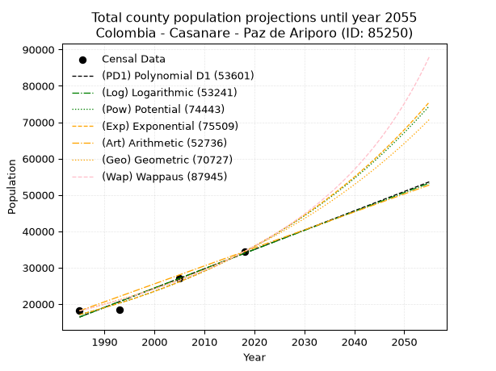
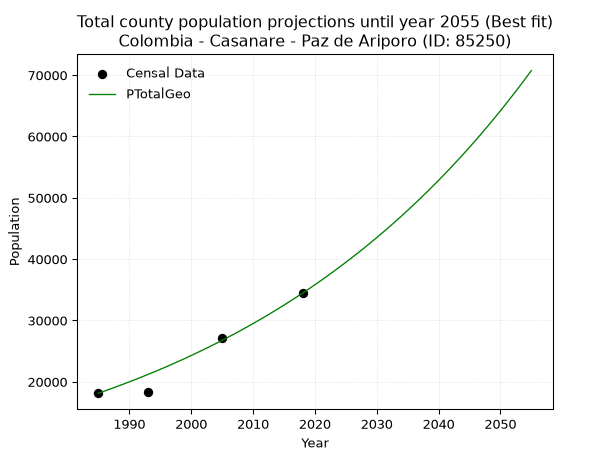
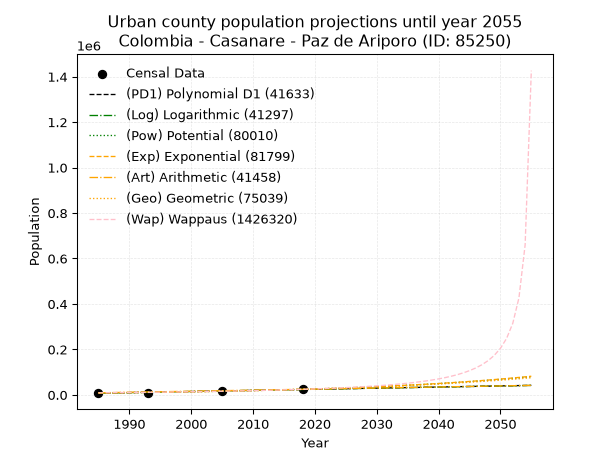
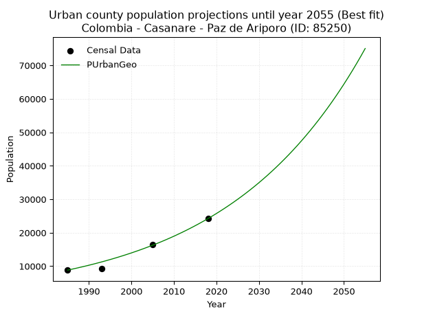
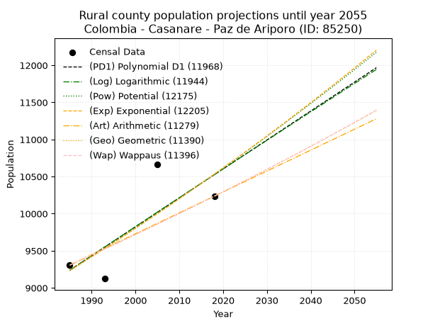
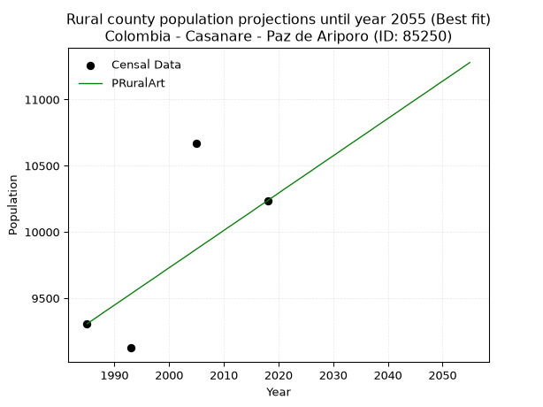

<div align="center">


</div>

# 📜 _“Population and Public Services Demand Projections (PPSD) until Year 2050 for Colombia - Casanare - Paz de Ariporo (ID: 85250)”_
Keywords: `population` `public-service` `projection` `lineal` `polynomial` `logarithmic` `potential` `exponential` `arithmetic` `geometric` `wappaus` `dane` `colombia` `south-america`

PPSD are analytical estimates used by governments and planners to anticipate future changes in population size, age distribution, and the resulting community needs for utilities, healthcare, education, and infrastructure as sizing future water treatment facilities, electrical grids, and road networks based on spatial growth.

<div align="center">

</img>

</div>


> **General running parameters**: • app_version: _v20260806_. • Python version: _3.14.7_. • Pandas version: _3.0.5_. • NumPy version: _2.5.1_. • Creates, save and include plots into reports (create_plot): _False_. • Projection until year: _2050_. • Process polynomial degree 2 and up: _False_. • Process Wappaus: _True_. • Process Wappaus: _True_. • Set negative values to zero: _True_. • Set infinite values to zero: _True_. • Drop dataset notes: _True_. 
<div align="center">

Maps & GIS Layers: [:earth_americas:Google](http://maps.google.com/maps?q=5.879826827,-71.8903482) [:earth_americas:OSM](https://www.openstreetmap.org/#map=18/5.879826827/-71.8903482&layers=P) [:earth_americas:Bing](https://www.bing.com/maps?cp=5.879826827~-71.8903482&lvl=18) [:earth_americas:Apple](https://maps.apple.com/frame?center=5.879826827%2C-71.8903482&span=0.003%2C0.006) [:earth_americas:GISMobile](https://github.com/rcfdtools/R.GISMobile/blob/main/file/gis/CountyLayer_CO/Readme.md)

</div>


<div align="center">

```geojson
{
  "type": "Feature",
  "geometry": {
    "type": "Point", 
    "coordinates": [-71.8903482, 5.879826827]
  }, 
  "properties": {
    "Name": "Colombia - Casanare - Paz de Ariporo (ID: 85250)"
  }
}
```

</div>


## 0. Census Data (4 records)

Census data are official statistics collected by a government about the people and housing in a country. They usually include counts of total population, age, sex, race, income, education, and jobs.

📅Global census file: [Population.xlsx](../data/Population.xlsx)

| Source   |   Year |   CountryID | CountryName   |   StateID | StateName   |   CountyID | CountyName     |   PTotal |   PUrban |   PRural |
|:---------|-------:|------------:|:--------------|----------:|:------------|-----------:|:---------------|---------:|---------:|---------:|
| DANE     |   1985 |          57 | Colombia      |        85 | Casanare    |      85250 | Paz de Ariporo |    18133 |     8827 |     9306 |
| DANE     |   1993 |          57 | Colombia      |        85 | Casanare    |      85250 | Paz de Ariporo |    18349 |     9225 |     9124 |
| DANE     |   2005 |          57 | Colombia      |        85 | Casanare    |      85250 | Paz de Ariporo |    27146 |    16480 |    10666 |
| DANE     |   2018 |          57 | Colombia      |        85 | Casanare    |      85250 | Paz de Ariporo |    34446 |    24210 |    10236 |

> 🔥Some records could had specific notes about the registered values or the corresponding urban or rural distribution.

📅[SUI-RUPS](https://www.datos.gov.co/Hacienda-y-Cr-dito-P-blico/Registro-nico-de-Prestadores-de-Servicios-P-blicos/4qkq-csdn/about_data) - Local public utility companies: [RUPS.csv](../data/RUPS.csv)

 | SERVICIO       | ESTADO    | NOMBRE                      | NIT         | DEPARTAMENTO_DOMICILIO   | MUNICIPIO_DOMICILIO   | DIRECCION                              |   TELEFONO | EMAIL                    | TIPO_PRESTADOR                             | CLASIFICACION                 |
|:---------------|:----------|:----------------------------|:------------|:-------------------------|:----------------------|:---------------------------------------|-----------:|:-------------------------|:-------------------------------------------|:------------------------------|
| ACUEDUCTO      | OPERATIVA | PAZ DE ARIPORO S.A.  E.S.P. | 844001357-0 | CASANARE                 | PAZ DE ARIPORO        | CARRERA 11 No.8 - 06 BARRIO LAS FERIAS |    6374703 | gerencia@pzasaesp.gov.co | SOCIEDADES (EMPRESA DE SERVICIOS PUBLICOS) | MAYOR O IGUAL A 5001 USUARIOS |
| ALCANTARILLADO | OPERATIVA | PAZ DE ARIPORO S.A.  E.S.P. | 844001357-0 | CASANARE                 | PAZ DE ARIPORO        | CARRERA 11 No.8 - 06 BARRIO LAS FERIAS |    6374703 | gerencia@pzasaesp.gov.co | SOCIEDADES (EMPRESA DE SERVICIOS PUBLICOS) | MAYOR O IGUAL A 5001 USUARIOS |

## 1. Total

### 1.1. Coefficients and Parameters

* (PD1) Polynomial Deg 1: 531.1947009233189, -1038003.7005218685 (lineal)
* (Log) Logarithmic: 1062898.7237276623, -8054583.2165897805
* (Pow) Potential: 42.48407178670125, -135.86991116337092
* (Exp) Exponential: 0.0212287592300421, 8.54792711202947e-15
* (Art) Arithmetic: Year diff. 2018 - 1985 = 33, Population diff. 34446 - 18133 = 16313, Annual growth = 494.3333333333333
* (Geo) Geometric: Year diff. 2018 - 1985 = 33, Population diff. 34446 - 18133 = 16313, Annual growth % = 0.019634494318467643
* (Wap) Wappaus: i = 1.8803451314529882, Condition values only valid for < 200)

<sub>
Wappaus condition values: ['0.00', '1.88', '3.76', '5.64', '7.52', '9.40', '11.28', '13.16', '15.04', '16.92', '18.80', '20.68', '22.56', '24.44', '26.32', '28.21', '30.09', '31.97', '33.85', '35.73', '37.61', '39.49', '41.37', '43.25', '45.13', '47.01', '48.89', '50.77', '52.65', '54.53', '56.41', '58.29', '60.17', '62.05', '63.93', '65.81', '67.69', '69.57', '71.45', '73.33', '75.21', '77.09', '78.97', '80.85', '82.74', '84.62', '86.50', '88.38', '90.26', '92.14', '94.02', '95.90', '97.78', '99.66', '101.54', '103.42', '105.30', '107.18', '109.06', '110.94', '112.82', '114.70', '116.58', '118.46', '120.34', '122.22']
</sub>


### 1.2. Projected Dataset

|   Year |   CountyID |   PTotalPD1 |   PTotalLog |   PTotalPow |   PTotalExp |   PTotalArt |   PTotalGeo |   PTotalWap |
|-------:|-----------:|------------:|------------:|------------:|------------:|------------:|------------:|------------:|
|   1985 |      85250 |       16418 |       16405 |       17076 |       17086 |       18133 |       18133 |       18133 |
|   1986 |      85250 |       16949 |       16940 |       17445 |       17452 |       18627 |       18489 |       18477 |
|   1987 |      85250 |       17480 |       17475 |       17822 |       17827 |       19122 |       18852 |       18828 |
|   1988 |      85250 |       18011 |       18010 |       18207 |       18209 |       19616 |       19222 |       19186 |
|   1989 |      85250 |       18543 |       18544 |       18601 |       18600 |       20110 |       19600 |       19550 |
|   1990 |      85250 |       19074 |       19078 |       19002 |       18999 |       20605 |       19984 |       19922 |
|   1991 |      85250 |       19605 |       19612 |       19412 |       19407 |       21099 |       20377 |       20301 |
|   1992 |      85250 |       20136 |       20146 |       19831 |       19823 |       21593 |       20777 |       20688 |
|   1993 |      85250 |       20667 |       20680 |       20258 |       20248 |       22088 |       21185 |       21083 |
|   1994 |      85250 |       21199 |       21213 |       20694 |       20683 |       22582 |       21601 |       21485 |
|   1995 |      85250 |       21730 |       21746 |       21140 |       21127 |       23076 |       22025 |       21896 |
|   1996 |      85250 |       22261 |       22278 |       21595 |       21580 |       23571 |       22457 |       22316 |
|   1997 |      85250 |       22792 |       22811 |       22059 |       22043 |       24065 |       22898 |       22745 |
|   1998 |      85250 |       23323 |       23343 |       22533 |       22516 |       24559 |       23348 |       23183 |
|   1999 |      85250 |       23855 |       23875 |       23017 |       22999 |       25054 |       23806 |       23630 |
|   2000 |      85250 |       24386 |       24406 |       23512 |       23492 |       25548 |       24274 |       24087 |
|   2001 |      85250 |       24917 |       24938 |       24016 |       23996 |       26042 |       24750 |       24554 |
|   2002 |      85250 |       25448 |       25469 |       24532 |       24511 |       26537 |       25236 |       25032 |
|   2003 |      85250 |       25979 |       25999 |       25058 |       25037 |       27031 |       25732 |       25521 |
|   2004 |      85250 |       26510 |       26530 |       25595 |       25574 |       27525 |       26237 |       26020 |
|   2005 |      85250 |       27042 |       27060 |       26143 |       26123 |       28020 |       26752 |       26531 |
|   2006 |      85250 |       27573 |       27590 |       26703 |       26684 |       28514 |       27278 |       27055 |
|   2007 |      85250 |       28104 |       28120 |       27274 |       27256 |       29008 |       27813 |       27590 |
|   2008 |      85250 |       28635 |       28649 |       27857 |       27841 |       29503 |       28359 |       28139 |
|   2009 |      85250 |       29166 |       29179 |       28453 |       28438 |       29997 |       28916 |       28701 |
|   2010 |      85250 |       29698 |       29708 |       29061 |       29048 |       30491 |       29484 |       29276 |
|   2011 |      85250 |       30229 |       30236 |       29681 |       29672 |       30986 |       30063 |       29866 |
|   2012 |      85250 |       30760 |       30765 |       30315 |       30308 |       31480 |       30653 |       30471 |
|   2013 |      85250 |       31291 |       31293 |       30962 |       30959 |       31974 |       31255 |       31091 |
|   2014 |      85250 |       31822 |       31821 |       31622 |       31623 |       32469 |       31868 |       31727 |
|   2015 |      85250 |       32354 |       32348 |       32296 |       32301 |       32963 |       32494 |       32380 |
|   2016 |      85250 |       32885 |       32876 |       32984 |       32994 |       33457 |       33132 |       33051 |
|   2017 |      85250 |       33416 |       33403 |       33686 |       33702 |       33952 |       33783 |       33739 |
|   2018 |      85250 |       33947 |       33930 |       34403 |       34425 |       34446 |       34446 |       34446 |
|   2019 |      85250 |       34478 |       34456 |       35135 |       35164 |       34940 |       35122 |       35173 |
|   2020 |      85250 |       35010 |       34983 |       35882 |       35918 |       35435 |       35812 |       35920 |
|   2021 |      85250 |       35541 |       35509 |       36644 |       36689 |       35929 |       36515 |       36688 |
|   2022 |      85250 |       36072 |       36034 |       37422 |       37476 |       36423 |       37232 |       37478 |
|   2023 |      85250 |       36603 |       36560 |       38217 |       38280 |       36918 |       37963 |       38292 |
|   2024 |      85250 |       37134 |       37085 |       39028 |       39102 |       37412 |       38708 |       39129 |
|   2025 |      85250 |       37666 |       37610 |       39855 |       39941 |       37906 |       39468 |       39992 |
|   2026 |      85250 |       38197 |       38135 |       40700 |       40798 |       38401 |       40243 |       40881 |
|   2027 |      85250 |       38728 |       38659 |       41562 |       41673 |       38895 |       41034 |       41798 |
|   2028 |      85250 |       39259 |       39184 |       42443 |       42567 |       39389 |       41839 |       42744 |
|   2029 |      85250 |       39790 |       39708 |       43341 |       43480 |       39884 |       42661 |       43720 |
|   2030 |      85250 |       40322 |       40231 |       44258 |       44413 |       40378 |       43498 |       44728 |
|   2031 |      85250 |       40853 |       40755 |       45193 |       45366 |       40872 |       44352 |       45770 |
|   2032 |      85250 |       41384 |       41278 |       46148 |       46340 |       41367 |       45223 |       46846 |
|   2033 |      85250 |       41915 |       41801 |       47123 |       47334 |       41861 |       46111 |       47959 |
|   2034 |      85250 |       42446 |       42324 |       48118 |       48349 |       42355 |       47017 |       49112 |
|   2035 |      85250 |       42978 |       42846 |       49133 |       49387 |       42850 |       47940 |       50305 |
|   2036 |      85250 |       43509 |       43368 |       50170 |       50446 |       43344 |       48881 |       51541 |
|   2037 |      85250 |       44040 |       43890 |       51227 |       51529 |       43838 |       49841 |       52822 |
|   2038 |      85250 |       44571 |       44412 |       52307 |       52634 |       44333 |       50819 |       54152 |
|   2039 |      85250 |       45102 |       44933 |       53408 |       53764 |       44827 |       51817 |       55532 |
|   2040 |      85250 |       45633 |       45454 |       54532 |       54917 |       45321 |       52835 |       56967 |
|   2041 |      85250 |       46165 |       45975 |       55680 |       56095 |       45816 |       53872 |       58458 |
|   2042 |      85250 |       46696 |       46496 |       56851 |       57299 |       46310 |       54930 |       60009 |
|   2043 |      85250 |       47227 |       47016 |       58045 |       58528 |       46804 |       56008 |       61625 |
|   2044 |      85250 |       47758 |       47537 |       59265 |       59784 |       47299 |       57108 |       63309 |
|   2045 |      85250 |       48289 |       48056 |       60509 |       61067 |       47793 |       58229 |       65066 |
|   2046 |      85250 |       48821 |       48576 |       61779 |       62377 |       48287 |       59373 |       66900 |
|   2047 |      85250 |       49352 |       49095 |       63075 |       63715 |       48782 |       60538 |       68816 |
|   2048 |      85250 |       49883 |       49615 |       64397 |       65083 |       49276 |       61727 |       70822 |
|   2049 |      85250 |       50414 |       50133 |       65747 |       66479 |       49770 |       62939 |       72921 |
|   2050 |      85250 |       50945 |       50652 |       67124 |       67905 |       50265 |       64175 |       75123 |
<div align="center">

</img>

</div>


### 1.3. Best fit with absolute and relative error (%)

Relative error puts that difference into context by dividing the absolute error by the true value, creating a unitless ratio or percentage that shows the scale of the mistake.

Absolute and relative error

|   Year | Source   |   CountryID | CountryName   |   StateID | StateName   |   CountyID_x | CountyName     |   PTotal |   PUrban |   PRural |   CountyID_y |   PTotalPD1 |   PTotalLog |   PTotalPow |   PTotalExp |   PTotalArt |   PTotalGeo |   PTotalWap |   PTotalPD1AbsError |   PTotalLogAbsError |   PTotalPowAbsError |   PTotalExpAbsError |   PTotalArtAbsError |   PTotalGeoAbsError |   PTotalWapAbsError |   PTotalPD1RelError |   PTotalLogRelError |   PTotalPowRelError |   PTotalExpRelError |   PTotalArtRelError |   PTotalGeoRelError |   PTotalWapRelError |
|-------:|:---------|------------:|:--------------|----------:|:------------|-------------:|:---------------|---------:|---------:|---------:|-------------:|------------:|------------:|------------:|------------:|------------:|------------:|------------:|--------------------:|--------------------:|--------------------:|--------------------:|--------------------:|--------------------:|--------------------:|--------------------:|--------------------:|--------------------:|--------------------:|--------------------:|--------------------:|--------------------:|
|   1985 | DANE     |          57 | Colombia      |        85 | Casanare    |        85250 | Paz de Ariporo |    18133 |     8827 |     9306 |        85250 |       16418 |       16405 |       17076 |       17086 |       18133 |       18133 |       18133 |                1715 |                1728 |                1057 |                1047 |                   0 |                   0 |                   0 |            9.45789  |            9.52959  |            5.82915  |            5.774    |             0       |             0       |             0       |
|   1993 | DANE     |          57 | Colombia      |        85 | Casanare    |        85250 | Paz de Ariporo |    18349 |     9225 |     9124 |        85250 |       20667 |       20680 |       20258 |       20248 |       22088 |       21185 |       21083 |                2318 |                2331 |                1909 |                1899 |                3739 |                2836 |                2734 |           12.6328   |           12.7037   |           10.4038   |           10.3493   |            20.3771  |            15.4559  |            14.9     |
|   2005 | DANE     |          57 | Colombia      |        85 | Casanare    |        85250 | Paz de Ariporo |    27146 |    16480 |    10666 |        85250 |       27042 |       27060 |       26143 |       26123 |       28020 |       26752 |       26531 |                 104 |                  86 |                1003 |                1023 |                 874 |                 394 |                 615 |            0.383114 |            0.316805 |            3.69484  |            3.76851  |             3.21963 |             1.45141 |             2.26553 |
|   2018 | DANE     |          57 | Colombia      |        85 | Casanare    |        85250 | Paz de Ariporo |    34446 |    24210 |    10236 |        85250 |       33947 |       33930 |       34403 |       34425 |       34446 |       34446 |       34446 |                 499 |                 516 |                  43 |                  21 |                   0 |                   0 |                   0 |            1.44864  |            1.498    |            0.124833 |            0.060965 |             0       |             0       |             0       |

Relative error mean

| Method    |   RelError | Best   |
|:----------|-----------:|:-------|
| PTotalPD1 |    5.98062 |        |
| PTotalLog |    6.01202 |        |
| PTotalPow |    5.01316 |        |
| PTotalExp |    4.9882  |        |
| PTotalArt |    5.89919 |        |
| PTotalGeo |    4.22682 | True   |
| PTotalWap |    4.29138 |        |

💙Best method: _**PTotalGeo**_
<div align="center">

</img>

</div>


### 1.4. Fresh water supply demand in liters per capita per day (lpcd)

The fresh water supply demand typically ranges from 100 to 300 liters per capita per day (lpcd) for standard domestic and municipal planning, though absolute survival minimums set by the World Health Organization are as low as 7.5 to 20 liters per day, and total consumption in high-income nations can exceed 400 liters.

> `CZ`: Level in meters above the sea level (masl)<br> `WS`: Fresh water supply demand in liters per capita per day (lpcd or l/h/d)<br> `WSAll`: Zonal fresh water supply demand in liters per second (l/s)<br> `A`: Zonal area in square meters<br> `DP`: Population density (people/hectare or p/ha)

Reference values (RAS Colombia)

|    CZ |   WS |
|------:|-----:|
|  1000 |  120 |
|  2000 |  130 |
| 99999 |  140 |

County shapefile geometry properties and water supply values

|   CountyID |      ATotal |   CZTotal |   WSTotal |
|-----------:|------------:|----------:|----------:|
|      85250 | 1.20746e+10 |   138.585 |       120 |

Projected values for best method: PTotalGeo

|   CountyID |   Year |   PTotalGeo |   DPTotal |   WSTotal |   WSTotalAll |
|-----------:|-------:|------------:|----------:|----------:|-------------:|
|      85250 |   1985 |       18133 |      0.02 |       120 |      25.1847 |
|      85250 |   1986 |       18489 |      0.02 |       120 |      25.6792 |
|      85250 |   1987 |       18852 |      0.02 |       120 |      26.1833 |
|      85250 |   1988 |       19222 |      0.02 |       120 |      26.6972 |
|      85250 |   1989 |       19600 |      0.02 |       120 |      27.2222 |
|      85250 |   1990 |       19984 |      0.02 |       120 |      27.7556 |
|      85250 |   1991 |       20377 |      0.02 |       120 |      28.3014 |
|      85250 |   1992 |       20777 |      0.02 |       120 |      28.8569 |
|      85250 |   1993 |       21185 |      0.02 |       120 |      29.4236 |
|      85250 |   1994 |       21601 |      0.02 |       120 |      30.0014 |
|      85250 |   1995 |       22025 |      0.02 |       120 |      30.5903 |
|      85250 |   1996 |       22457 |      0.02 |       120 |      31.1903 |
|      85250 |   1997 |       22898 |      0.02 |       120 |      31.8028 |
|      85250 |   1998 |       23348 |      0.02 |       120 |      32.4278 |
|      85250 |   1999 |       23806 |      0.02 |       120 |      33.0639 |
|      85250 |   2000 |       24274 |      0.02 |       120 |      33.7139 |
|      85250 |   2001 |       24750 |      0.02 |       120 |      34.375  |
|      85250 |   2002 |       25236 |      0.02 |       120 |      35.05   |
|      85250 |   2003 |       25732 |      0.02 |       120 |      35.7389 |
|      85250 |   2004 |       26237 |      0.02 |       120 |      36.4403 |
|      85250 |   2005 |       26752 |      0.02 |       120 |      37.1556 |
|      85250 |   2006 |       27278 |      0.02 |       120 |      37.8861 |
|      85250 |   2007 |       27813 |      0.02 |       120 |      38.6292 |
|      85250 |   2008 |       28359 |      0.02 |       120 |      39.3875 |
|      85250 |   2009 |       28916 |      0.02 |       120 |      40.1611 |
|      85250 |   2010 |       29484 |      0.02 |       120 |      40.95   |
|      85250 |   2011 |       30063 |      0.02 |       120 |      41.7542 |
|      85250 |   2012 |       30653 |      0.03 |       120 |      42.5736 |
|      85250 |   2013 |       31255 |      0.03 |       120 |      43.4097 |
|      85250 |   2014 |       31868 |      0.03 |       120 |      44.2611 |
|      85250 |   2015 |       32494 |      0.03 |       120 |      45.1306 |
|      85250 |   2016 |       33132 |      0.03 |       120 |      46.0167 |
|      85250 |   2017 |       33783 |      0.03 |       120 |      46.9208 |
|      85250 |   2018 |       34446 |      0.03 |       120 |      47.8417 |
|      85250 |   2019 |       35122 |      0.03 |       120 |      48.7806 |
|      85250 |   2020 |       35812 |      0.03 |       120 |      49.7389 |
|      85250 |   2021 |       36515 |      0.03 |       120 |      50.7153 |
|      85250 |   2022 |       37232 |      0.03 |       120 |      51.7111 |
|      85250 |   2023 |       37963 |      0.03 |       120 |      52.7264 |
|      85250 |   2024 |       38708 |      0.03 |       120 |      53.7611 |
|      85250 |   2025 |       39468 |      0.03 |       120 |      54.8167 |
|      85250 |   2026 |       40243 |      0.03 |       120 |      55.8931 |
|      85250 |   2027 |       41034 |      0.03 |       120 |      56.9917 |
|      85250 |   2028 |       41839 |      0.03 |       120 |      58.1097 |
|      85250 |   2029 |       42661 |      0.04 |       120 |      59.2514 |
|      85250 |   2030 |       43498 |      0.04 |       120 |      60.4139 |
|      85250 |   2031 |       44352 |      0.04 |       120 |      61.6    |
|      85250 |   2032 |       45223 |      0.04 |       120 |      62.8097 |
|      85250 |   2033 |       46111 |      0.04 |       120 |      64.0431 |
|      85250 |   2034 |       47017 |      0.04 |       120 |      65.3014 |
|      85250 |   2035 |       47940 |      0.04 |       120 |      66.5833 |
|      85250 |   2036 |       48881 |      0.04 |       120 |      67.8903 |
|      85250 |   2037 |       49841 |      0.04 |       120 |      69.2236 |
|      85250 |   2038 |       50819 |      0.04 |       120 |      70.5819 |
|      85250 |   2039 |       51817 |      0.04 |       120 |      71.9681 |
|      85250 |   2040 |       52835 |      0.04 |       120 |      73.3819 |
|      85250 |   2041 |       53872 |      0.04 |       120 |      74.8222 |
|      85250 |   2042 |       54930 |      0.05 |       120 |      76.2917 |
|      85250 |   2043 |       56008 |      0.05 |       120 |      77.7889 |
|      85250 |   2044 |       57108 |      0.05 |       120 |      79.3167 |
|      85250 |   2045 |       58229 |      0.05 |       120 |      80.8736 |
|      85250 |   2046 |       59373 |      0.05 |       120 |      82.4625 |
|      85250 |   2047 |       60538 |      0.05 |       120 |      84.0806 |
|      85250 |   2048 |       61727 |      0.05 |       120 |      85.7319 |
|      85250 |   2049 |       62939 |      0.05 |       120 |      87.4153 |
|      85250 |   2050 |       64175 |      0.05 |       120 |      89.1319 |

## 2. Urban

### 2.1. Coefficients and Parameters

* (PD1) Polynomial Deg 1: 492.1951023685215, -969827.753512635 (lineal)
* (Log) Logarithmic: 984769.885191286, -7470558.288789563
* (Pow) Potential: 66.05437676586139, -213.92257420616863
* (Exp) Exponential: 0.03300636155214664, 2.85356569119772e-25
* (Art) Arithmetic: Year diff. 2018 - 1985 = 33, Population diff. 24210 - 8827 = 15383, Annual growth = 466.1515151515151
* (Geo) Geometric: Year diff. 2018 - 1985 = 33, Population diff. 24210 - 8827 = 15383, Annual growth % = 0.031046452244141598
* (Wap) Wappaus: i = 2.8219966410480075, Condition values only valid for < 200)

<sub>
Wappaus condition values: ['0.00', '2.82', '5.64', '8.47', '11.29', '14.11', '16.93', '19.75', '22.58', '25.40', '28.22', '31.04', '33.86', '36.69', '39.51', '42.33', '45.15', '47.97', '50.80', '53.62', '56.44', '59.26', '62.08', '64.91', '67.73', '70.55', '73.37', '76.19', '79.02', '81.84', '84.66', '87.48', '90.30', '93.13', '95.95', '98.77', '101.59', '104.41', '107.24', '110.06', '112.88', '115.70', '118.52', '121.35', '124.17', '126.99', '129.81', '132.63', '135.46', '138.28', '141.10', '143.92', '146.74', '149.57', '152.39', '155.21', '158.03', '160.85', '163.68', '166.50', '169.32', '172.14', '174.96', '177.79', '180.61', '183.43']
</sub>


### 2.2. Projected Dataset

|   Year |   CountyID |   PUrbanPD1 |   PUrbanLog |   PUrbanPow |   PUrbanExp |   PUrbanArt |   PUrbanGeo |   PUrbanWap |
|-------:|-----------:|------------:|------------:|------------:|------------:|------------:|------------:|------------:|
|   1985 |      85250 |        7180 |        7168 |        8109 |        8116 |        8827 |        8827 |        8827 |
|   1986 |      85250 |        7672 |        7664 |        8383 |        8388 |        9293 |        9101 |        9080 |
|   1987 |      85250 |        8164 |        8160 |        8666 |        8670 |        9759 |        9384 |        9340 |
|   1988 |      85250 |        8656 |        8655 |        8959 |        8961 |       10225 |        9675 |        9607 |
|   1989 |      85250 |        9148 |        9150 |        9262 |        9261 |       10692 |        9975 |        9883 |
|   1990 |      85250 |        9641 |        9645 |        9574 |        9572 |       11158 |       10285 |       10167 |
|   1991 |      85250 |       10133 |       10140 |        9897 |        9893 |       11624 |       10604 |       10460 |
|   1992 |      85250 |       10625 |       10635 |       10231 |       10225 |       12090 |       10934 |       10762 |
|   1993 |      85250 |       11117 |       11129 |       10576 |       10568 |       12556 |       11273 |       11073 |
|   1994 |      85250 |       11609 |       11623 |       10932 |       10923 |       13022 |       11623 |       11395 |
|   1995 |      85250 |       12101 |       12117 |       11300 |       11290 |       13489 |       11984 |       11727 |
|   1996 |      85250 |       12594 |       12610 |       11681 |       11668 |       13955 |       12356 |       12070 |
|   1997 |      85250 |       13086 |       13103 |       12074 |       12060 |       14421 |       12739 |       12425 |
|   1998 |      85250 |       13578 |       13596 |       12480 |       12465 |       14887 |       13135 |       12793 |
|   1999 |      85250 |       14070 |       14089 |       12899 |       12883 |       15353 |       13543 |       13173 |
|   2000 |      85250 |       14562 |       14582 |       13332 |       13315 |       15819 |       13963 |       13567 |
|   2001 |      85250 |       15055 |       15074 |       13780 |       13762 |       16285 |       14397 |       13975 |
|   2002 |      85250 |       15547 |       15566 |       14242 |       14224 |       16752 |       14844 |       14398 |
|   2003 |      85250 |       16039 |       16058 |       14720 |       14701 |       17218 |       15305 |       14837 |
|   2004 |      85250 |       16531 |       16549 |       15213 |       15195 |       17684 |       15780 |       15293 |
|   2005 |      85250 |       17023 |       17040 |       15723 |       15704 |       18150 |       16270 |       15768 |
|   2006 |      85250 |       17516 |       17531 |       16249 |       16231 |       18616 |       16775 |       16261 |
|   2007 |      85250 |       18008 |       18022 |       16793 |       16776 |       19082 |       17296 |       16774 |
|   2008 |      85250 |       18500 |       18513 |       17355 |       17339 |       19548 |       17833 |       17309 |
|   2009 |      85250 |       18992 |       19003 |       17935 |       17921 |       20015 |       18386 |       17866 |
|   2010 |      85250 |       19484 |       19493 |       18535 |       18522 |       20481 |       18957 |       18448 |
|   2011 |      85250 |       19977 |       19983 |       19154 |       19144 |       20947 |       19546 |       19056 |
|   2012 |      85250 |       20469 |       20473 |       19793 |       19786 |       21413 |       20152 |       19692 |
|   2013 |      85250 |       20961 |       20962 |       20453 |       20450 |       21879 |       20778 |       20357 |
|   2014 |      85250 |       21453 |       21451 |       21136 |       21136 |       22345 |       21423 |       21054 |
|   2015 |      85250 |       21945 |       21940 |       21840 |       21846 |       22812 |       22088 |       21785 |
|   2016 |      85250 |       22438 |       22428 |       22568 |       22579 |       23278 |       22774 |       22553 |
|   2017 |      85250 |       22930 |       22917 |       23319 |       23336 |       23744 |       23481 |       23360 |
|   2018 |      85250 |       23422 |       23405 |       24095 |       24120 |       24210 |       24210 |       24210 |
|   2019 |      85250 |       23914 |       23893 |       24897 |       24929 |       24676 |       24962 |       25106 |
|   2020 |      85250 |       24406 |       24380 |       25725 |       25766 |       25142 |       25737 |       26052 |
|   2021 |      85250 |       24899 |       24868 |       26580 |       26630 |       25608 |       26536 |       27052 |
|   2022 |      85250 |       25391 |       25355 |       27462 |       27524 |       26075 |       27359 |       28111 |
|   2023 |      85250 |       25883 |       25842 |       28374 |       28447 |       26541 |       28209 |       29235 |
|   2024 |      85250 |       26375 |       26328 |       29316 |       29402 |       27007 |       29085 |       30429 |
|   2025 |      85250 |       26867 |       26815 |       30288 |       30389 |       27473 |       29988 |       31701 |
|   2026 |      85250 |       27360 |       27301 |       31292 |       31408 |       27939 |       30919 |       33058 |
|   2027 |      85250 |       27852 |       27787 |       32329 |       32462 |       28405 |       31879 |       34508 |
|   2028 |      85250 |       28344 |       28273 |       33399 |       33552 |       28872 |       32868 |       36063 |
|   2029 |      85250 |       28836 |       28758 |       34505 |       34678 |       29338 |       33889 |       37734 |
|   2030 |      85250 |       29328 |       29243 |       35646 |       35841 |       29804 |       34941 |       39533 |
|   2031 |      85250 |       29820 |       29728 |       36825 |       37044 |       30270 |       36026 |       41478 |
|   2032 |      85250 |       30313 |       30213 |       38042 |       38287 |       30736 |       37144 |       43585 |
|   2033 |      85250 |       30805 |       30698 |       39299 |       39572 |       31202 |       38297 |       45877 |
|   2034 |      85250 |       31297 |       31182 |       40596 |       40900 |       31668 |       39486 |       48378 |
|   2035 |      85250 |       31789 |       31666 |       41936 |       42272 |       32135 |       40712 |       51118 |
|   2036 |      85250 |       32281 |       32150 |       43319 |       43691 |       32601 |       41976 |       54135 |
|   2037 |      85250 |       32774 |       32633 |       44747 |       45157 |       33067 |       43279 |       57471 |
|   2038 |      85250 |       33266 |       33117 |       46222 |       46672 |       33533 |       44623 |       61181 |
|   2039 |      85250 |       33758 |       33600 |       47744 |       48239 |       33999 |       46008 |       65330 |
|   2040 |      85250 |       34250 |       34083 |       49316 |       49857 |       34465 |       47437 |       70003 |
|   2041 |      85250 |       34742 |       34565 |       50938 |       51530 |       34931 |       48910 |       75303 |
|   2042 |      85250 |       35235 |       35048 |       52613 |       53260 |       35398 |       50428 |       81368 |
|   2043 |      85250 |       35727 |       35530 |       54343 |       55047 |       35864 |       51994 |       88375 |
|   2044 |      85250 |       36219 |       36012 |       56128 |       56894 |       36330 |       53608 |       96563 |
|   2045 |      85250 |       36711 |       36493 |       57971 |       58803 |       36796 |       55272 |      106257 |
|   2046 |      85250 |       37203 |       36975 |       59873 |       60776 |       37262 |       56988 |      117915 |
|   2047 |      85250 |       37696 |       37456 |       61837 |       62816 |       37728 |       58758 |      132201 |
|   2048 |      85250 |       38188 |       37937 |       63865 |       64924 |       38195 |       60582 |      150116 |
|   2049 |      85250 |       38680 |       38418 |       65958 |       67103 |       38661 |       62463 |      173246 |
|   2050 |      85250 |       39172 |       38898 |       68118 |       69354 |       39127 |       64402 |      204254 |
<div align="center">

</img>

</div>


### 2.3. Best fit with absolute and relative error (%)

Relative error puts that difference into context by dividing the absolute error by the true value, creating a unitless ratio or percentage that shows the scale of the mistake.

Absolute and relative error

|   Year | Source   |   CountryID | CountryName   |   StateID | StateName   |   CountyID_x | CountyName     |   PTotal |   PUrban |   PRural |   CountyID_y |   PUrbanPD1 |   PUrbanLog |   PUrbanPow |   PUrbanExp |   PUrbanArt |   PUrbanGeo |   PUrbanWap |   PUrbanPD1AbsError |   PUrbanLogAbsError |   PUrbanPowAbsError |   PUrbanExpAbsError |   PUrbanArtAbsError |   PUrbanGeoAbsError |   PUrbanWapAbsError |   PUrbanPD1RelError |   PUrbanLogRelError |   PUrbanPowRelError |   PUrbanExpRelError |   PUrbanArtRelError |   PUrbanGeoRelError |   PUrbanWapRelError |
|-------:|:---------|------------:|:--------------|----------:|:------------|-------------:|:---------------|---------:|---------:|---------:|-------------:|------------:|------------:|------------:|------------:|------------:|------------:|------------:|--------------------:|--------------------:|--------------------:|--------------------:|--------------------:|--------------------:|--------------------:|--------------------:|--------------------:|--------------------:|--------------------:|--------------------:|--------------------:|--------------------:|
|   1985 | DANE     |          57 | Colombia      |        85 | Casanare    |        85250 | Paz de Ariporo |    18133 |     8827 |     9306 |        85250 |        7180 |        7168 |        8109 |        8116 |        8827 |        8827 |        8827 |                1647 |                1659 |                 718 |                 711 |                   0 |                   0 |                   0 |            18.6587  |            18.7946  |             8.13413 |            8.05483  |              0      |             0       |             0       |
|   1993 | DANE     |          57 | Colombia      |        85 | Casanare    |        85250 | Paz de Ariporo |    18349 |     9225 |     9124 |        85250 |       11117 |       11129 |       10576 |       10568 |       12556 |       11273 |       11073 |                1892 |                1904 |                1351 |                1343 |                3331 |                2048 |                1848 |            20.5095  |            20.6396  |            14.645   |           14.5583   |             36.1084 |            22.2005  |            20.0325  |
|   2005 | DANE     |          57 | Colombia      |        85 | Casanare    |        85250 | Paz de Ariporo |    27146 |    16480 |    10666 |        85250 |       17023 |       17040 |       15723 |       15704 |       18150 |       16270 |       15768 |                 543 |                 560 |                 757 |                 776 |                1670 |                 210 |                 712 |             3.2949  |             3.39806 |             4.59345 |            4.70874  |             10.1335 |             1.27427 |             4.32039 |
|   2018 | DANE     |          57 | Colombia      |        85 | Casanare    |        85250 | Paz de Ariporo |    34446 |    24210 |    10236 |        85250 |       23422 |       23405 |       24095 |       24120 |       24210 |       24210 |       24210 |                 788 |                 805 |                 115 |                  90 |                   0 |                   0 |                   0 |             3.25485 |             3.32507 |             0.47501 |            0.371747 |              0      |             0       |             0       |

Relative error mean

| Method    |   RelError | Best   |
|:----------|-----------:|:-------|
| PUrbanPD1 |   11.4295  |        |
| PUrbanLog |   11.5393  |        |
| PUrbanPow |    6.96189 |        |
| PUrbanExp |    6.9234  |        |
| PUrbanArt |   11.5605  |        |
| PUrbanGeo |    5.8687  | True   |
| PUrbanWap |    6.08823 |        |

💙Best method: _**PUrbanGeo**_
<div align="center">

</img>

</div>


### 2.4. Fresh water supply demand in liters per capita per day (lpcd)

The fresh water supply demand typically ranges from 100 to 300 liters per capita per day (lpcd) for standard domestic and municipal planning, though absolute survival minimums set by the World Health Organization are as low as 7.5 to 20 liters per day, and total consumption in high-income nations can exceed 400 liters.

> `CZ`: Level in meters above the sea level (masl)<br> `WS`: Fresh water supply demand in liters per capita per day (lpcd or l/h/d)<br> `WSAll`: Zonal fresh water supply demand in liters per second (l/s)<br> `A`: Zonal area in square meters<br> `DP`: Population density (people/hectare or p/ha)

Reference values (RAS Colombia)

|    CZ |   WS |
|------:|-----:|
|  1000 |  120 |
|  2000 |  130 |
| 99999 |  140 |

County shapefile geometry properties and water supply values

|   CountyID |      AUrban |   CZUrban |   WSUrban |
|-----------:|------------:|----------:|----------:|
|      85250 | 6.47425e+06 |   269.136 |       120 |

Projected values for best method: PUrbanGeo

|   CountyID |   Year |   PUrbanGeo |   DPUrban |   WSUrban |   WSUrbanAll |
|-----------:|-------:|------------:|----------:|----------:|-------------:|
|      85250 |   1985 |        8827 |     13.63 |       120 |      12.2597 |
|      85250 |   1986 |        9101 |     14.06 |       120 |      12.6403 |
|      85250 |   1987 |        9384 |     14.49 |       120 |      13.0333 |
|      85250 |   1988 |        9675 |     14.94 |       120 |      13.4375 |
|      85250 |   1989 |        9975 |     15.41 |       120 |      13.8542 |
|      85250 |   1990 |       10285 |     15.89 |       120 |      14.2847 |
|      85250 |   1991 |       10604 |     16.38 |       120 |      14.7278 |
|      85250 |   1992 |       10934 |     16.89 |       120 |      15.1861 |
|      85250 |   1993 |       11273 |     17.41 |       120 |      15.6569 |
|      85250 |   1994 |       11623 |     17.95 |       120 |      16.1431 |
|      85250 |   1995 |       11984 |     18.51 |       120 |      16.6444 |
|      85250 |   1996 |       12356 |     19.08 |       120 |      17.1611 |
|      85250 |   1997 |       12739 |     19.68 |       120 |      17.6931 |
|      85250 |   1998 |       13135 |     20.29 |       120 |      18.2431 |
|      85250 |   1999 |       13543 |     20.92 |       120 |      18.8097 |
|      85250 |   2000 |       13963 |     21.57 |       120 |      19.3931 |
|      85250 |   2001 |       14397 |     22.24 |       120 |      19.9958 |
|      85250 |   2002 |       14844 |     22.93 |       120 |      20.6167 |
|      85250 |   2003 |       15305 |     23.64 |       120 |      21.2569 |
|      85250 |   2004 |       15780 |     24.37 |       120 |      21.9167 |
|      85250 |   2005 |       16270 |     25.13 |       120 |      22.5972 |
|      85250 |   2006 |       16775 |     25.91 |       120 |      23.2986 |
|      85250 |   2007 |       17296 |     26.72 |       120 |      24.0222 |
|      85250 |   2008 |       17833 |     27.54 |       120 |      24.7681 |
|      85250 |   2009 |       18386 |     28.4  |       120 |      25.5361 |
|      85250 |   2010 |       18957 |     29.28 |       120 |      26.3292 |
|      85250 |   2011 |       19546 |     30.19 |       120 |      27.1472 |
|      85250 |   2012 |       20152 |     31.13 |       120 |      27.9889 |
|      85250 |   2013 |       20778 |     32.09 |       120 |      28.8583 |
|      85250 |   2014 |       21423 |     33.09 |       120 |      29.7542 |
|      85250 |   2015 |       22088 |     34.12 |       120 |      30.6778 |
|      85250 |   2016 |       22774 |     35.18 |       120 |      31.6306 |
|      85250 |   2017 |       23481 |     36.27 |       120 |      32.6125 |
|      85250 |   2018 |       24210 |     37.39 |       120 |      33.625  |
|      85250 |   2019 |       24962 |     38.56 |       120 |      34.6694 |
|      85250 |   2020 |       25737 |     39.75 |       120 |      35.7458 |
|      85250 |   2021 |       26536 |     40.99 |       120 |      36.8556 |
|      85250 |   2022 |       27359 |     42.26 |       120 |      37.9986 |
|      85250 |   2023 |       28209 |     43.57 |       120 |      39.1792 |
|      85250 |   2024 |       29085 |     44.92 |       120 |      40.3958 |
|      85250 |   2025 |       29988 |     46.32 |       120 |      41.65   |
|      85250 |   2026 |       30919 |     47.76 |       120 |      42.9431 |
|      85250 |   2027 |       31879 |     49.24 |       120 |      44.2764 |
|      85250 |   2028 |       32868 |     50.77 |       120 |      45.65   |
|      85250 |   2029 |       33889 |     52.34 |       120 |      47.0681 |
|      85250 |   2030 |       34941 |     53.97 |       120 |      48.5292 |
|      85250 |   2031 |       36026 |     55.65 |       120 |      50.0361 |
|      85250 |   2032 |       37144 |     57.37 |       120 |      51.5889 |
|      85250 |   2033 |       38297 |     59.15 |       120 |      53.1903 |
|      85250 |   2034 |       39486 |     60.99 |       120 |      54.8417 |
|      85250 |   2035 |       40712 |     62.88 |       120 |      56.5444 |
|      85250 |   2036 |       41976 |     64.84 |       120 |      58.3    |
|      85250 |   2037 |       43279 |     66.85 |       120 |      60.1097 |
|      85250 |   2038 |       44623 |     68.92 |       120 |      61.9764 |
|      85250 |   2039 |       46008 |     71.06 |       120 |      63.9    |
|      85250 |   2040 |       47437 |     73.27 |       120 |      65.8847 |
|      85250 |   2041 |       48910 |     75.55 |       120 |      67.9306 |
|      85250 |   2042 |       50428 |     77.89 |       120 |      70.0389 |
|      85250 |   2043 |       51994 |     80.31 |       120 |      72.2139 |
|      85250 |   2044 |       53608 |     82.8  |       120 |      74.4556 |
|      85250 |   2045 |       55272 |     85.37 |       120 |      76.7667 |
|      85250 |   2046 |       56988 |     88.02 |       120 |      79.15   |
|      85250 |   2047 |       58758 |     90.76 |       120 |      81.6083 |
|      85250 |   2048 |       60582 |     93.57 |       120 |      84.1417 |
|      85250 |   2049 |       62463 |     96.48 |       120 |      86.7542 |
|      85250 |   2050 |       64402 |     99.47 |       120 |      89.4472 |

## 3. Rural

### 3.1. Coefficients and Parameters

* (PD1) Polynomial Deg 1: 38.99959855479745, -68175.94700923361 (lineal)
* (Log) Logarithmic: 78128.83853637641, -584024.9278002166
* (Pow) Potential: 7.98336342410836, -22.361918053283418
* (Exp) Exponential: 0.003985256902249501, 3.3867815743398952
* (Art) Arithmetic: Year diff. 2018 - 1985 = 33, Population diff. 10236 - 9306 = 930, Annual growth = 28.181818181818183
* (Geo) Geometric: Year diff. 2018 - 1985 = 33, Population diff. 10236 - 9306 = 930, Annual growth % = 0.0028905807520682725
* (Wap) Wappaus: i = 0.2884230701240219, Condition values only valid for < 200)

<sub>
Wappaus condition values: ['0.00', '0.29', '0.58', '0.87', '1.15', '1.44', '1.73', '2.02', '2.31', '2.60', '2.88', '3.17', '3.46', '3.75', '4.04', '4.33', '4.61', '4.90', '5.19', '5.48', '5.77', '6.06', '6.35', '6.63', '6.92', '7.21', '7.50', '7.79', '8.08', '8.36', '8.65', '8.94', '9.23', '9.52', '9.81', '10.09', '10.38', '10.67', '10.96', '11.25', '11.54', '11.83', '12.11', '12.40', '12.69', '12.98', '13.27', '13.56', '13.84', '14.13', '14.42', '14.71', '15.00', '15.29', '15.57', '15.86', '16.15', '16.44', '16.73', '17.02', '17.31', '17.59', '17.88', '18.17', '18.46', '18.75']
</sub>


### 3.2. Projected Dataset

|   Year |   CountyID |   PRuralPD1 |   PRuralLog |   PRuralPow |   PRuralExp |   PRuralArt |   PRuralGeo |   PRuralWap |
|-------:|-----------:|------------:|------------:|------------:|------------:|------------:|------------:|------------:|
|   1985 |      85250 |        9238 |        9237 |        9232 |        9234 |        9306 |        9306 |        9306 |
|   1986 |      85250 |        9277 |        9276 |        9269 |        9271 |        9334 |        9333 |        9333 |
|   1987 |      85250 |        9316 |        9315 |        9307 |        9308 |        9362 |        9360 |        9360 |
|   1988 |      85250 |        9355 |        9355 |        9344 |        9345 |        9391 |        9387 |        9387 |
|   1989 |      85250 |        9394 |        9394 |        9382 |        9382 |        9419 |        9414 |        9414 |
|   1990 |      85250 |        9433 |        9433 |        9419 |        9420 |        9447 |        9441 |        9441 |
|   1991 |      85250 |        9472 |        9472 |        9457 |        9457 |        9475 |        9469 |        9468 |
|   1992 |      85250 |        9511 |        9512 |        9495 |        9495 |        9503 |        9496 |        9496 |
|   1993 |      85250 |        9550 |        9551 |        9533 |        9533 |        9531 |        9523 |        9523 |
|   1994 |      85250 |        9589 |        9590 |        9572 |        9571 |        9560 |        9551 |        9551 |
|   1995 |      85250 |        9628 |        9629 |        9610 |        9609 |        9588 |        9579 |        9578 |
|   1996 |      85250 |        9667 |        9668 |        9649 |        9647 |        9616 |        9606 |        9606 |
|   1997 |      85250 |        9706 |        9707 |        9687 |        9686 |        9644 |        9634 |        9634 |
|   1998 |      85250 |        9745 |        9747 |        9726 |        9725 |        9672 |        9662 |        9662 |
|   1999 |      85250 |        9784 |        9786 |        9765 |        9764 |        9701 |        9690 |        9690 |
|   2000 |      85250 |        9823 |        9825 |        9804 |        9803 |        9729 |        9718 |        9718 |
|   2001 |      85250 |        9862 |        9864 |        9843 |        9842 |        9757 |        9746 |        9746 |
|   2002 |      85250 |        9901 |        9903 |        9883 |        9881 |        9785 |        9774 |        9774 |
|   2003 |      85250 |        9940 |        9942 |        9922 |        9920 |        9813 |        9802 |        9802 |
|   2004 |      85250 |        9979 |        9981 |        9962 |        9960 |        9841 |        9831 |        9830 |
|   2005 |      85250 |       10018 |       10020 |       10001 |       10000 |        9870 |        9859 |        9859 |
|   2006 |      85250 |       10057 |       10059 |       10041 |       10040 |        9898 |        9888 |        9887 |
|   2007 |      85250 |       10096 |       10098 |       10081 |       10080 |        9926 |        9916 |        9916 |
|   2008 |      85250 |       10135 |       10137 |       10122 |       10120 |        9954 |        9945 |        9945 |
|   2009 |      85250 |       10174 |       10176 |       10162 |       10160 |        9982 |        9974 |        9973 |
|   2010 |      85250 |       10213 |       10214 |       10202 |       10201 |       10011 |       10002 |       10002 |
|   2011 |      85250 |       10252 |       10253 |       10243 |       10242 |       10039 |       10031 |       10031 |
|   2012 |      85250 |       10291 |       10292 |       10284 |       10283 |       10067 |       10060 |       10060 |
|   2013 |      85250 |       10330 |       10331 |       10324 |       10324 |       10095 |       10089 |       10089 |
|   2014 |      85250 |       10369 |       10370 |       10365 |       10365 |       10123 |       10118 |       10118 |
|   2015 |      85250 |       10408 |       10409 |       10407 |       10406 |       10151 |       10148 |       10148 |
|   2016 |      85250 |       10447 |       10447 |       10448 |       10448 |       10180 |       10177 |       10177 |
|   2017 |      85250 |       10486 |       10486 |       10489 |       10490 |       10208 |       10206 |       10206 |
|   2018 |      85250 |       10525 |       10525 |       10531 |       10532 |       10236 |       10236 |       10236 |
|   2019 |      85250 |       10564 |       10563 |       10573 |       10574 |       10264 |       10266 |       10266 |
|   2020 |      85250 |       10603 |       10602 |       10615 |       10616 |       10292 |       10295 |       10295 |
|   2021 |      85250 |       10642 |       10641 |       10657 |       10658 |       10321 |       10325 |       10325 |
|   2022 |      85250 |       10681 |       10679 |       10699 |       10701 |       10349 |       10355 |       10355 |
|   2023 |      85250 |       10720 |       10718 |       10741 |       10743 |       10377 |       10385 |       10385 |
|   2024 |      85250 |       10759 |       10757 |       10784 |       10786 |       10405 |       10415 |       10415 |
|   2025 |      85250 |       10798 |       10795 |       10826 |       10829 |       10433 |       10445 |       10445 |
|   2026 |      85250 |       10837 |       10834 |       10869 |       10873 |       10461 |       10475 |       10476 |
|   2027 |      85250 |       10876 |       10872 |       10912 |       10916 |       10490 |       10505 |       10506 |
|   2028 |      85250 |       10915 |       10911 |       10955 |       10960 |       10518 |       10536 |       10536 |
|   2029 |      85250 |       10954 |       10949 |       10998 |       11003 |       10546 |       10566 |       10567 |
|   2030 |      85250 |       10993 |       10988 |       11041 |       11047 |       10574 |       10597 |       10598 |
|   2031 |      85250 |       11032 |       11026 |       11085 |       11092 |       10602 |       10627 |       10628 |
|   2032 |      85250 |       11071 |       11065 |       11129 |       11136 |       10631 |       10658 |       10659 |
|   2033 |      85250 |       11110 |       11103 |       11172 |       11180 |       10659 |       10689 |       10690 |
|   2034 |      85250 |       11149 |       11142 |       11216 |       11225 |       10687 |       10720 |       10721 |
|   2035 |      85250 |       11188 |       11180 |       11260 |       11270 |       10715 |       10751 |       10752 |
|   2036 |      85250 |       11227 |       11219 |       11305 |       11315 |       10743 |       10782 |       10784 |
|   2037 |      85250 |       11266 |       11257 |       11349 |       11360 |       10771 |       10813 |       10815 |
|   2038 |      85250 |       11305 |       11295 |       11394 |       11405 |       10800 |       10844 |       10846 |
|   2039 |      85250 |       11344 |       11334 |       11438 |       11451 |       10828 |       10876 |       10878 |
|   2040 |      85250 |       11383 |       11372 |       11483 |       11497 |       10856 |       10907 |       10909 |
|   2041 |      85250 |       11422 |       11410 |       11528 |       11542 |       10884 |       10939 |       10941 |
|   2042 |      85250 |       11461 |       11448 |       11573 |       11589 |       10912 |       10970 |       10973 |
|   2043 |      85250 |       11500 |       11487 |       11619 |       11635 |       10941 |       11002 |       11005 |
|   2044 |      85250 |       11539 |       11525 |       11664 |       11681 |       10969 |       11034 |       11037 |
|   2045 |      85250 |       11578 |       11563 |       11710 |       11728 |       10997 |       11066 |       11069 |
|   2046 |      85250 |       11617 |       11601 |       11756 |       11775 |       11025 |       11098 |       11101 |
|   2047 |      85250 |       11656 |       11640 |       11802 |       11822 |       11053 |       11130 |       11134 |
|   2048 |      85250 |       11695 |       11678 |       11848 |       11869 |       11081 |       11162 |       11166 |
|   2049 |      85250 |       11734 |       11716 |       11894 |       11916 |       11110 |       11194 |       11198 |
|   2050 |      85250 |       11773 |       11754 |       11940 |       11964 |       11138 |       11226 |       11231 |
<div align="center">

</img>

</div>


### 3.3. Best fit with absolute and relative error (%)

Relative error puts that difference into context by dividing the absolute error by the true value, creating a unitless ratio or percentage that shows the scale of the mistake.

Absolute and relative error

|   Year | Source   |   CountryID | CountryName   |   StateID | StateName   |   CountyID_x | CountyName     |   PTotal |   PUrban |   PRural |   CountyID_y |   PRuralPD1 |   PRuralLog |   PRuralPow |   PRuralExp |   PRuralArt |   PRuralGeo |   PRuralWap |   PRuralPD1AbsError |   PRuralLogAbsError |   PRuralPowAbsError |   PRuralExpAbsError |   PRuralArtAbsError |   PRuralGeoAbsError |   PRuralWapAbsError |   PRuralPD1RelError |   PRuralLogRelError |   PRuralPowRelError |   PRuralExpRelError |   PRuralArtRelError |   PRuralGeoRelError |   PRuralWapRelError |
|-------:|:---------|------------:|:--------------|----------:|:------------|-------------:|:---------------|---------:|---------:|---------:|-------------:|------------:|------------:|------------:|------------:|------------:|------------:|------------:|--------------------:|--------------------:|--------------------:|--------------------:|--------------------:|--------------------:|--------------------:|--------------------:|--------------------:|--------------------:|--------------------:|--------------------:|--------------------:|--------------------:|
|   1985 | DANE     |          57 | Colombia      |        85 | Casanare    |        85250 | Paz de Ariporo |    18133 |     8827 |     9306 |        85250 |        9238 |        9237 |        9232 |        9234 |        9306 |        9306 |        9306 |                  68 |                  69 |                  74 |                  72 |                   0 |                   0 |                   0 |            0.730711 |            0.741457 |            0.795186 |            0.773694 |             0       |             0       |             0       |
|   1993 | DANE     |          57 | Colombia      |        85 | Casanare    |        85250 | Paz de Ariporo |    18349 |     9225 |     9124 |        85250 |        9550 |        9551 |        9533 |        9533 |        9531 |        9523 |        9523 |                 426 |                 427 |                 409 |                 409 |                 407 |                 399 |                 399 |            4.669    |            4.67996  |            4.48268  |            4.48268  |             4.46076 |             4.37308 |             4.37308 |
|   2005 | DANE     |          57 | Colombia      |        85 | Casanare    |        85250 | Paz de Ariporo |    27146 |    16480 |    10666 |        85250 |       10018 |       10020 |       10001 |       10000 |        9870 |        9859 |        9859 |                 648 |                 646 |                 665 |                 666 |                 796 |                 807 |                 807 |            6.07538  |            6.05663  |            6.23476  |            6.24414  |             7.46297 |             7.5661  |             7.5661  |
|   2018 | DANE     |          57 | Colombia      |        85 | Casanare    |        85250 | Paz de Ariporo |    34446 |    24210 |    10236 |        85250 |       10525 |       10525 |       10531 |       10532 |       10236 |       10236 |       10236 |                 289 |                 289 |                 295 |                 296 |                   0 |                   0 |                   0 |            2.82337  |            2.82337  |            2.88199  |            2.89175  |             0       |             0       |             0       |

Relative error mean

| Method    |   RelError | Best   |
|:----------|-----------:|:-------|
| PRuralPD1 |    3.57462 |        |
| PRuralLog |    3.57535 |        |
| PRuralPow |    3.59865 |        |
| PRuralExp |    3.59807 |        |
| PRuralArt |    2.98093 | True   |
| PRuralGeo |    2.98479 |        |
| PRuralWap |    2.98479 |        |

💙Best method: _**PRuralArt**_
<div align="center">

</img>

</div>


### 3.4. Fresh water supply demand in liters per capita per day (lpcd)

The fresh water supply demand typically ranges from 100 to 300 liters per capita per day (lpcd) for standard domestic and municipal planning, though absolute survival minimums set by the World Health Organization are as low as 7.5 to 20 liters per day, and total consumption in high-income nations can exceed 400 liters.

> `CZ`: Level in meters above the sea level (masl)<br> `WS`: Fresh water supply demand in liters per capita per day (lpcd or l/h/d)<br> `WSAll`: Zonal fresh water supply demand in liters per second (l/s)<br> `A`: Zonal area in square meters<br> `DP`: Population density (people/hectare or p/ha)

Reference values (RAS Colombia)

|    CZ |   WS |
|------:|-----:|
|  1000 |  120 |
|  2000 |  130 |
| 99999 |  140 |

County shapefile geometry properties and water supply values

|   CountyID |      ARural |   CZRural |   WSRural |
|-----------:|------------:|----------:|----------:|
|      85250 | 1.20681e+10 |   138.515 |       120 |

Projected values for best method: PRuralArt

|   CountyID |   Year |   PRuralArt |   DPRural |   WSRural |   WSRuralAll |
|-----------:|-------:|------------:|----------:|----------:|-------------:|
|      85250 |   1985 |        9306 |      0.01 |       120 |      12.925  |
|      85250 |   1986 |        9334 |      0.01 |       120 |      12.9639 |
|      85250 |   1987 |        9362 |      0.01 |       120 |      13.0028 |
|      85250 |   1988 |        9391 |      0.01 |       120 |      13.0431 |
|      85250 |   1989 |        9419 |      0.01 |       120 |      13.0819 |
|      85250 |   1990 |        9447 |      0.01 |       120 |      13.1208 |
|      85250 |   1991 |        9475 |      0.01 |       120 |      13.1597 |
|      85250 |   1992 |        9503 |      0.01 |       120 |      13.1986 |
|      85250 |   1993 |        9531 |      0.01 |       120 |      13.2375 |
|      85250 |   1994 |        9560 |      0.01 |       120 |      13.2778 |
|      85250 |   1995 |        9588 |      0.01 |       120 |      13.3167 |
|      85250 |   1996 |        9616 |      0.01 |       120 |      13.3556 |
|      85250 |   1997 |        9644 |      0.01 |       120 |      13.3944 |
|      85250 |   1998 |        9672 |      0.01 |       120 |      13.4333 |
|      85250 |   1999 |        9701 |      0.01 |       120 |      13.4736 |
|      85250 |   2000 |        9729 |      0.01 |       120 |      13.5125 |
|      85250 |   2001 |        9757 |      0.01 |       120 |      13.5514 |
|      85250 |   2002 |        9785 |      0.01 |       120 |      13.5903 |
|      85250 |   2003 |        9813 |      0.01 |       120 |      13.6292 |
|      85250 |   2004 |        9841 |      0.01 |       120 |      13.6681 |
|      85250 |   2005 |        9870 |      0.01 |       120 |      13.7083 |
|      85250 |   2006 |        9898 |      0.01 |       120 |      13.7472 |
|      85250 |   2007 |        9926 |      0.01 |       120 |      13.7861 |
|      85250 |   2008 |        9954 |      0.01 |       120 |      13.825  |
|      85250 |   2009 |        9982 |      0.01 |       120 |      13.8639 |
|      85250 |   2010 |       10011 |      0.01 |       120 |      13.9042 |
|      85250 |   2011 |       10039 |      0.01 |       120 |      13.9431 |
|      85250 |   2012 |       10067 |      0.01 |       120 |      13.9819 |
|      85250 |   2013 |       10095 |      0.01 |       120 |      14.0208 |
|      85250 |   2014 |       10123 |      0.01 |       120 |      14.0597 |
|      85250 |   2015 |       10151 |      0.01 |       120 |      14.0986 |
|      85250 |   2016 |       10180 |      0.01 |       120 |      14.1389 |
|      85250 |   2017 |       10208 |      0.01 |       120 |      14.1778 |
|      85250 |   2018 |       10236 |      0.01 |       120 |      14.2167 |
|      85250 |   2019 |       10264 |      0.01 |       120 |      14.2556 |
|      85250 |   2020 |       10292 |      0.01 |       120 |      14.2944 |
|      85250 |   2021 |       10321 |      0.01 |       120 |      14.3347 |
|      85250 |   2022 |       10349 |      0.01 |       120 |      14.3736 |
|      85250 |   2023 |       10377 |      0.01 |       120 |      14.4125 |
|      85250 |   2024 |       10405 |      0.01 |       120 |      14.4514 |
|      85250 |   2025 |       10433 |      0.01 |       120 |      14.4903 |
|      85250 |   2026 |       10461 |      0.01 |       120 |      14.5292 |
|      85250 |   2027 |       10490 |      0.01 |       120 |      14.5694 |
|      85250 |   2028 |       10518 |      0.01 |       120 |      14.6083 |
|      85250 |   2029 |       10546 |      0.01 |       120 |      14.6472 |
|      85250 |   2030 |       10574 |      0.01 |       120 |      14.6861 |
|      85250 |   2031 |       10602 |      0.01 |       120 |      14.725  |
|      85250 |   2032 |       10631 |      0.01 |       120 |      14.7653 |
|      85250 |   2033 |       10659 |      0.01 |       120 |      14.8042 |
|      85250 |   2034 |       10687 |      0.01 |       120 |      14.8431 |
|      85250 |   2035 |       10715 |      0.01 |       120 |      14.8819 |
|      85250 |   2036 |       10743 |      0.01 |       120 |      14.9208 |
|      85250 |   2037 |       10771 |      0.01 |       120 |      14.9597 |
|      85250 |   2038 |       10800 |      0.01 |       120 |      15      |
|      85250 |   2039 |       10828 |      0.01 |       120 |      15.0389 |
|      85250 |   2040 |       10856 |      0.01 |       120 |      15.0778 |
|      85250 |   2041 |       10884 |      0.01 |       120 |      15.1167 |
|      85250 |   2042 |       10912 |      0.01 |       120 |      15.1556 |
|      85250 |   2043 |       10941 |      0.01 |       120 |      15.1958 |
|      85250 |   2044 |       10969 |      0.01 |       120 |      15.2347 |
|      85250 |   2045 |       10997 |      0.01 |       120 |      15.2736 |
|      85250 |   2046 |       11025 |      0.01 |       120 |      15.3125 |
|      85250 |   2047 |       11053 |      0.01 |       120 |      15.3514 |
|      85250 |   2048 |       11081 |      0.01 |       120 |      15.3903 |
|      85250 |   2049 |       11110 |      0.01 |       120 |      15.4306 |
|      85250 |   2050 |       11138 |      0.01 |       120 |      15.4694 |

#

<div align="center"><br><sub>Share this research</sub></div><br>

<sub>**APPS & TOOLS & CONTENT DISCLAIMER**: • NO WARRANTY - This content and software is provided by <a href="https://github.com/rcfdtools" target="_blank">github.com/rcfdtools</a> "as is", without any express or implied warranty, including warranties of merchantability, fitness for a particular purpose, or non-infringement. There is no guarantee that the software will be error-free or operate without interruption. • LIMITATION OF LIABILITY - Neither the authors nor copyright holders will be liable for claims or damages arising from the software or its use. You are responsible for determining if the software is appropriate for your use and assume all associated risks, including errors, legal compliance, and data loss. • NO PROFESSIONAL ADVICE - The software provides general information and does not offer professional advice. It should not replace consultation with professional advisors. [Clauses and global license for rcfdtools use.](https://github.com/rcfdtools/rcfdtools/blob/main/LICENSE.md)</sub>

| [:house: Home](Readme.md)  | [:beginner: Help / Collab](https://github.com/rcfdtools/R.HydroTools/discussions/31) |
|----------------------------|-------------------------------------------------------------------------------------------|