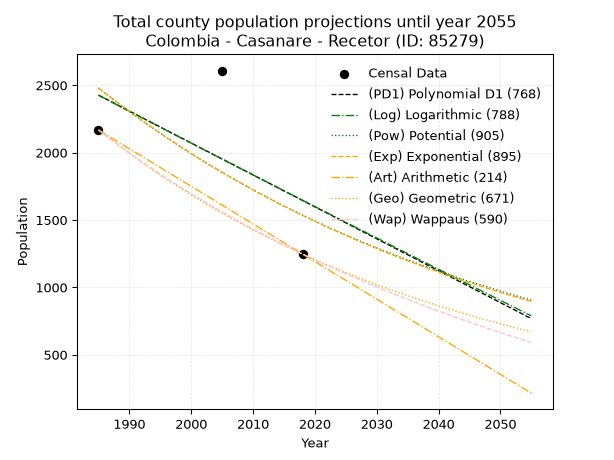
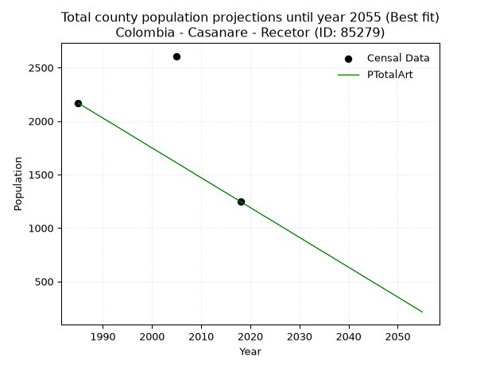
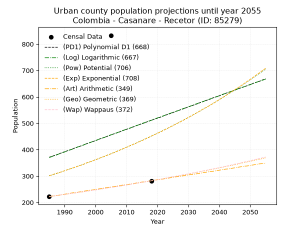
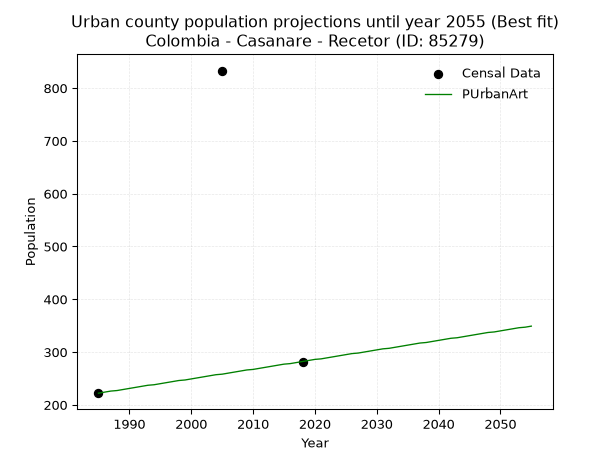
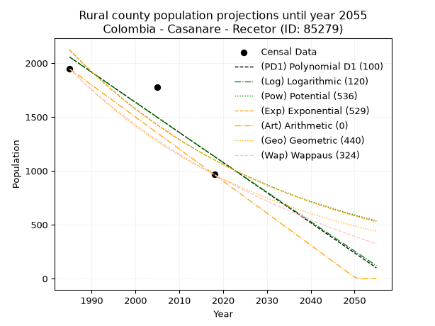
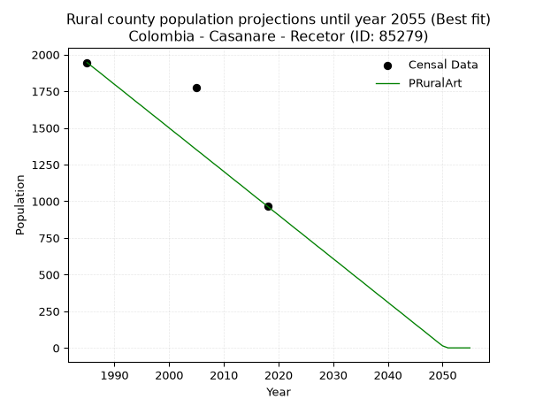

<div align="center">


</div>

# 📜 _“Population and Public Services Demand Projections (PPSD) until Year 2050 for Colombia - Casanare - Recetor (ID: 85279)”_
Keywords: `population` `public-service` `projection` `lineal` `polynomial` `logarithmic` `potential` `exponential` `arithmetic` `geometric` `wappaus` `dane` `colombia` `south-america`

PPSD are analytical estimates used by governments and planners to anticipate future changes in population size, age distribution, and the resulting community needs for utilities, healthcare, education, and infrastructure as sizing future water treatment facilities, electrical grids, and road networks based on spatial growth.

<div align="center">

</img>

</div>


> **General running parameters**: • app_version: _v20260806_. • Python version: _3.14.7_. • Pandas version: _3.0.5_. • NumPy version: _2.5.1_. • Creates, save and include plots into reports (create_plot): _False_. • Projection until year: _2050_. • Process polynomial degree 2 and up: _False_. • Process Wappaus: _True_. • Process Wappaus: _True_. • Set negative values to zero: _True_. • Set infinite values to zero: _True_. • Drop dataset notes: _True_. 
<div align="center">

Maps & GIS Layers: [:earth_americas:Google](http://maps.google.com/maps?q=5.229180734,-72.7609908) [:earth_americas:OSM](https://www.openstreetmap.org/#map=18/5.229180734/-72.7609908&layers=P) [:earth_americas:Bing](https://www.bing.com/maps?cp=5.229180734~-72.7609908&lvl=18) [:earth_americas:Apple](https://maps.apple.com/frame?center=5.229180734%2C-72.7609908&span=0.003%2C0.006) [:earth_americas:GISMobile](https://github.com/rcfdtools/R.GISMobile/blob/main/file/gis/CountyLayer_CO/Readme.md)

</div>


<div align="center">

```geojson
{
  "type": "Feature",
  "geometry": {
    "type": "Point", 
    "coordinates": [-72.7609908, 5.229180734]
  }, 
  "properties": {
    "Name": "Colombia - Casanare - Recetor (ID: 85279)"
  }
}
```

</div>


## 0. Census Data (3 records)

Census data are official statistics collected by a government about the people and housing in a country. They usually include counts of total population, age, sex, race, income, education, and jobs.

📅Global census file: [Population.xlsx](../data/Population.xlsx)

| Source   |   Year |   CountryID | CountryName   |   StateID | StateName   |   CountyID | CountyName   |   PTotal |   PUrban |   PRural |
|:---------|-------:|------------:|:--------------|----------:|:------------|-----------:|:-------------|---------:|---------:|---------:|
| DANE     |   1985 |          57 | Colombia      |        85 | Casanare    |      85279 | Recetor      |     2168 |      222 |     1946 |
| DANE     |   2005 |          57 | Colombia      |        85 | Casanare    |      85279 | Recetor      |     2608 |      833 |     1775 |
| DANE     |   2018 |          57 | Colombia      |        85 | Casanare    |      85279 | Recetor      |     1247 |      282 |      965 |

> 🔥Some records could had specific notes about the registered values or the corresponding urban or rural distribution.

📅[SUI-RUPS](https://www.datos.gov.co/Hacienda-y-Cr-dito-P-blico/Registro-nico-de-Prestadores-de-Servicios-P-blicos/4qkq-csdn/about_data) - Local public utility companies: [RUPS.csv](../data/RUPS.csv)

 | SERVICIO       | ESTADO    | NOMBRE                                                                                    | NIT         | DEPARTAMENTO_DOMICILIO   | MUNICIPIO_DOMICILIO   | DIRECCION            |   TELEFONO | EMAIL                              | TIPO_PRESTADOR                             | CLASIFICACION                 |
|:---------------|:----------|:------------------------------------------------------------------------------------------|:------------|:-------------------------|:----------------------|:---------------------|-----------:|:-----------------------------------|:-------------------------------------------|:------------------------------|
| ACUEDUCTO      | OPERATIVA | JUNTA DE SERVICIOS PUBLICOS DEL MUNCIPIO DE RECETOR PARA ACUEDUCTO, ALCANTARILLADO Y ASEO | 800103661-3 | CASANARE                 | RECETOR               | PALACIO MUNICIPAL    |    0000000 | contacteno@recetor-casanare.gov.co | MUNICIPIO (PRESTACIÓN DIRECTA)             | MENOR O IGUAL A 2500 USUARIOS |
| ALCANTARILLADO | OPERATIVA | JUNTA DE SERVICIOS PUBLICOS DEL MUNCIPIO DE RECETOR PARA ACUEDUCTO, ALCANTARILLADO Y ASEO | 800103661-3 | CASANARE                 | RECETOR               | PALACIO MUNICIPAL    |    0000000 | contacteno@recetor-casanare.gov.co | MUNICIPIO (PRESTACIÓN DIRECTA)             | MENOR O IGUAL A 2500 USUARIOS |
| ACUEDUCTO      | OPERATIVA | EMPRESAS PUBLICAS DE RECETOR S.A.S  ESP                                                   | 900307478-0 | CASANARE                 | RECETOR               | CARRERA 2  No. 2 -17 |    6351007 | marycruzmunozrangel@gmail.com      | SOCIEDADES (EMPRESA DE SERVICIOS PUBLICOS) | MENOR O IGUAL A 2500 USUARIOS |
| ALCANTARILLADO | OPERATIVA | EMPRESAS PUBLICAS DE RECETOR S.A.S  ESP                                                   | 900307478-0 | CASANARE                 | RECETOR               | CARRERA 2  No. 2 -17 |    6351007 | marycruzmunozrangel@gmail.com      | SOCIEDADES (EMPRESA DE SERVICIOS PUBLICOS) | MENOR O IGUAL A 2500 USUARIOS |

## 1. Total

### 1.1. Coefficients and Parameters

* (PD1) Polynomial Deg 1: -23.694813027745663, 49460.478890231985 (lineal)
* (Log) Logarithmic: -47256.919851589104, 361264.7856518057
* (Pow) Potential: -29.06134675003465, 99.23164860485208
* (Exp) Exponential: -0.014564242010283087, 8911512808477081.0
* (Art) Arithmetic: Year diff. 2018 - 1985 = 33, Population diff. 1247 - 2168 = -921, Annual growth = -27.90909090909091
* (Geo) Geometric: Year diff. 2018 - 1985 = 33, Population diff. 1247 - 2168 = -921, Annual growth % = -0.01661986819647543
* (Wap) Wappaus: i = -1.6345001996539332, Condition values only valid for < 200)

<sub>
Wappaus condition values: ['-0.00', '-1.63', '-3.27', '-4.90', '-6.54', '-8.17', '-9.81', '-11.44', '-13.08', '-14.71', '-16.35', '-17.98', '-19.61', '-21.25', '-22.88', '-24.52', '-26.15', '-27.79', '-29.42', '-31.06', '-32.69', '-34.32', '-35.96', '-37.59', '-39.23', '-40.86', '-42.50', '-44.13', '-45.77', '-47.40', '-49.04', '-50.67', '-52.30', '-53.94', '-55.57', '-57.21', '-58.84', '-60.48', '-62.11', '-63.75', '-65.38', '-67.01', '-68.65', '-70.28', '-71.92', '-73.55', '-75.19', '-76.82', '-78.46', '-80.09', '-81.73', '-83.36', '-84.99', '-86.63', '-88.26', '-89.90', '-91.53', '-93.17', '-94.80', '-96.44', '-98.07', '-99.70', '-101.34', '-102.97', '-104.61', '-106.24']
</sub>


### 1.2. Projected Dataset

|   Year |   CountyID |   PTotalPD1 |   PTotalLog |   PTotalPow |   PTotalExp |   PTotalArt |   PTotalGeo |   PTotalWap |
|-------:|-----------:|------------:|------------:|------------:|------------:|------------:|------------:|------------:|
|   1985 |      85279 |        2426 |        2425 |        2479 |        2480 |        2168 |        2168 |        2168 |
|   1986 |      85279 |        2403 |        2402 |        2443 |        2444 |        2140 |        2132 |        2133 |
|   1987 |      85279 |        2379 |        2378 |        2408 |        2409 |        2112 |        2097 |        2098 |
|   1988 |      85279 |        2355 |        2354 |        2373 |        2374 |        2084 |        2062 |        2064 |
|   1989 |      85279 |        2331 |        2330 |        2338 |        2340 |        2056 |        2027 |        2031 |
|   1990 |      85279 |        2308 |        2306 |        2304 |        2306 |        2028 |        1994 |        1998 |
|   1991 |      85279 |        2284 |        2283 |        2271 |        2273 |        2001 |        1961 |        1965 |
|   1992 |      85279 |        2260 |        2259 |        2238 |        2240 |        1973 |        1928 |        1933 |
|   1993 |      85279 |        2237 |        2235 |        2206 |        2207 |        1945 |        1896 |        1902 |
|   1994 |      85279 |        2213 |        2212 |        2174 |        2176 |        1917 |        1864 |        1871 |
|   1995 |      85279 |        2189 |        2188 |        2142 |        2144 |        1889 |        1833 |        1840 |
|   1996 |      85279 |        2166 |        2164 |        2111 |        2113 |        1861 |        1803 |        1810 |
|   1997 |      85279 |        2142 |        2140 |        2081 |        2083 |        1833 |        1773 |        1781 |
|   1998 |      85279 |        2118 |        2117 |        2051 |        2052 |        1805 |        1744 |        1752 |
|   1999 |      85279 |        2095 |        2093 |        2021 |        2023 |        1777 |        1715 |        1723 |
|   2000 |      85279 |        2071 |        2070 |        1992 |        1993 |        1749 |        1686 |        1695 |
|   2001 |      85279 |        2047 |        2046 |        1963 |        1965 |        1721 |        1658 |        1667 |
|   2002 |      85279 |        2023 |        2022 |        1935 |        1936 |        1694 |        1631 |        1639 |
|   2003 |      85279 |        2000 |        1999 |        1907 |        1908 |        1666 |        1603 |        1612 |
|   2004 |      85279 |        1976 |        1975 |        1880 |        1881 |        1638 |        1577 |        1585 |
|   2005 |      85279 |        1952 |        1952 |        1852 |        1853 |        1610 |        1551 |        1559 |
|   2006 |      85279 |        1929 |        1928 |        1826 |        1827 |        1582 |        1525 |        1533 |
|   2007 |      85279 |        1905 |        1904 |        1800 |        1800 |        1554 |        1499 |        1507 |
|   2008 |      85279 |        1881 |        1881 |        1774 |        1774 |        1526 |        1475 |        1482 |
|   2009 |      85279 |        1858 |        1857 |        1748 |        1749 |        1498 |        1450 |        1457 |
|   2010 |      85279 |        1834 |        1834 |        1723 |        1723 |        1470 |        1426 |        1432 |
|   2011 |      85279 |        1810 |        1810 |        1698 |        1698 |        1442 |        1402 |        1408 |
|   2012 |      85279 |        1787 |        1787 |        1674 |        1674 |        1414 |        1379 |        1384 |
|   2013 |      85279 |        1763 |        1763 |        1650 |        1650 |        1387 |        1356 |        1361 |
|   2014 |      85279 |        1739 |        1740 |        1626 |        1626 |        1359 |        1333 |        1337 |
|   2015 |      85279 |        1715 |        1716 |        1603 |        1602 |        1331 |        1311 |        1314 |
|   2016 |      85279 |        1692 |        1693 |        1580 |        1579 |        1303 |        1290 |        1292 |
|   2017 |      85279 |        1668 |        1670 |        1558 |        1556 |        1275 |        1268 |        1269 |
|   2018 |      85279 |        1644 |        1646 |        1535 |        1534 |        1247 |        1247 |        1247 |
|   2019 |      85279 |        1621 |        1623 |        1513 |        1512 |        1219 |        1226 |        1225 |
|   2020 |      85279 |        1597 |        1599 |        1492 |        1490 |        1191 |        1206 |        1204 |
|   2021 |      85279 |        1573 |        1576 |        1470 |        1468 |        1163 |        1186 |        1182 |
|   2022 |      85279 |        1550 |        1553 |        1449 |        1447 |        1135 |        1166 |        1161 |
|   2023 |      85279 |        1526 |        1529 |        1429 |        1426 |        1107 |        1147 |        1141 |
|   2024 |      85279 |        1502 |        1506 |        1408 |        1405 |        1080 |        1128 |        1120 |
|   2025 |      85279 |        1478 |        1482 |        1388 |        1385 |        1052 |        1109 |        1100 |
|   2026 |      85279 |        1455 |        1459 |        1369 |        1365 |        1024 |        1091 |        1080 |
|   2027 |      85279 |        1431 |        1436 |        1349 |        1345 |         996 |        1072 |        1060 |
|   2028 |      85279 |        1407 |        1413 |        1330 |        1326 |         968 |        1055 |        1040 |
|   2029 |      85279 |        1384 |        1389 |        1311 |        1307 |         940 |        1037 |        1021 |
|   2030 |      85279 |        1360 |        1366 |        1292 |        1288 |         912 |        1020 |        1002 |
|   2031 |      85279 |        1336 |        1343 |        1274 |        1269 |         884 |        1003 |         983 |
|   2032 |      85279 |        1313 |        1319 |        1256 |        1251 |         856 |         986 |         965 |
|   2033 |      85279 |        1289 |        1296 |        1238 |        1233 |         828 |         970 |         946 |
|   2034 |      85279 |        1265 |        1273 |        1220 |        1215 |         800 |         954 |         928 |
|   2035 |      85279 |        1242 |        1250 |        1203 |        1197 |         773 |         938 |         910 |
|   2036 |      85279 |        1218 |        1226 |        1186 |        1180 |         745 |         922 |         892 |
|   2037 |      85279 |        1194 |        1203 |        1169 |        1163 |         717 |         907 |         875 |
|   2038 |      85279 |        1170 |        1180 |        1153 |        1146 |         689 |         892 |         858 |
|   2039 |      85279 |        1147 |        1157 |        1136 |        1130 |         661 |         877 |         840 |
|   2040 |      85279 |        1123 |        1134 |        1120 |        1113 |         633 |         862 |         823 |
|   2041 |      85279 |        1099 |        1111 |        1104 |        1097 |         605 |         848 |         807 |
|   2042 |      85279 |        1076 |        1087 |        1089 |        1081 |         577 |         834 |         790 |
|   2043 |      85279 |        1052 |        1064 |        1073 |        1066 |         549 |         820 |         774 |
|   2044 |      85279 |        1028 |        1041 |        1058 |        1050 |         521 |         807 |         757 |
|   2045 |      85279 |        1005 |        1018 |        1043 |        1035 |         493 |         793 |         741 |
|   2046 |      85279 |         981 |         995 |        1029 |        1020 |         466 |         780 |         726 |
|   2047 |      85279 |         957 |         972 |        1014 |        1005 |         438 |         767 |         710 |
|   2048 |      85279 |         934 |         949 |        1000 |         991 |         410 |         754 |         694 |
|   2049 |      85279 |         910 |         926 |         986 |         977 |         382 |         742 |         679 |
|   2050 |      85279 |         886 |         903 |         972 |         962 |         354 |         729 |         664 |
<div align="center">

</img>

</div>


### 1.3. Best fit with absolute and relative error (%)

Relative error puts that difference into context by dividing the absolute error by the true value, creating a unitless ratio or percentage that shows the scale of the mistake.

Absolute and relative error

|   Year | Source   |   CountryID | CountryName   |   StateID | StateName   |   CountyID_x | CountyName   |   PTotal |   PUrban |   PRural |   CountyID_y |   PTotalPD1 |   PTotalLog |   PTotalPow |   PTotalExp |   PTotalArt |   PTotalGeo |   PTotalWap |   PTotalPD1AbsError |   PTotalLogAbsError |   PTotalPowAbsError |   PTotalExpAbsError |   PTotalArtAbsError |   PTotalGeoAbsError |   PTotalWapAbsError |   PTotalPD1RelError |   PTotalLogRelError |   PTotalPowRelError |   PTotalExpRelError |   PTotalArtRelError |   PTotalGeoRelError |   PTotalWapRelError |
|-------:|:---------|------------:|:--------------|----------:|:------------|-------------:|:-------------|---------:|---------:|---------:|-------------:|------------:|------------:|------------:|------------:|------------:|------------:|------------:|--------------------:|--------------------:|--------------------:|--------------------:|--------------------:|--------------------:|--------------------:|--------------------:|--------------------:|--------------------:|--------------------:|--------------------:|--------------------:|--------------------:|
|   1985 | DANE     |          57 | Colombia      |        85 | Casanare    |        85279 | Recetor      |     2168 |      222 |     1946 |        85279 |        2426 |        2425 |        2479 |        2480 |        2168 |        2168 |        2168 |                 258 |                 257 |                 311 |                 312 |                   0 |                   0 |                   0 |             11.9004 |             11.8542 |             14.345  |             14.3911 |              0      |              0      |              0      |
|   2005 | DANE     |          57 | Colombia      |        85 | Casanare    |        85279 | Recetor      |     2608 |      833 |     1775 |        85279 |        1952 |        1952 |        1852 |        1853 |        1610 |        1551 |        1559 |                 656 |                 656 |                 756 |                 755 |                 998 |                1057 |                1049 |             25.1534 |             25.1534 |             28.9877 |             28.9494 |             38.2669 |             40.5291 |             40.2224 |
|   2018 | DANE     |          57 | Colombia      |        85 | Casanare    |        85279 | Recetor      |     1247 |      282 |      965 |        85279 |        1644 |        1646 |        1535 |        1534 |        1247 |        1247 |        1247 |                 397 |                 399 |                 288 |                 287 |                   0 |                   0 |                   0 |             31.8364 |             31.9968 |             23.0954 |             23.0152 |              0      |              0      |              0      |

Relative error mean

| Method    |   RelError | Best   |
|:----------|-----------:|:-------|
| PTotalPD1 |    22.9634 |        |
| PTotalLog |    23.0015 |        |
| PTotalPow |    22.1427 |        |
| PTotalExp |    22.1186 |        |
| PTotalArt |    12.7556 | True   |
| PTotalGeo |    13.5097 |        |
| PTotalWap |    13.4075 |        |

💙Best method: _**PTotalArt**_
<div align="center">

</img>

</div>


### 1.4. Fresh water supply demand in liters per capita per day (lpcd)

The fresh water supply demand typically ranges from 100 to 300 liters per capita per day (lpcd) for standard domestic and municipal planning, though absolute survival minimums set by the World Health Organization are as low as 7.5 to 20 liters per day, and total consumption in high-income nations can exceed 400 liters.

> `CZ`: Level in meters above the sea level (masl)<br> `WS`: Fresh water supply demand in liters per capita per day (lpcd or l/h/d)<br> `WSAll`: Zonal fresh water supply demand in liters per second (l/s)<br> `A`: Zonal area in square meters<br> `DP`: Population density (people/hectare or p/ha)

Reference values (RAS Colombia)

|    CZ |   WS |
|------:|-----:|
|  1000 |  120 |
|  2000 |  130 |
| 99999 |  140 |

County shapefile geometry properties and water supply values

|   CountyID |      ATotal |   CZTotal |   WSTotal |
|-----------:|------------:|----------:|----------:|
|      85279 | 1.80846e+08 |   1397.52 |       130 |

Projected values for best method: PTotalArt

|   CountyID |   Year |   PTotalArt |   DPTotal |   WSTotal |   WSTotalAll |
|-----------:|-------:|------------:|----------:|----------:|-------------:|
|      85279 |   1985 |        2168 |      0.12 |       130 |     3.26204  |
|      85279 |   1986 |        2140 |      0.12 |       130 |     3.21991  |
|      85279 |   1987 |        2112 |      0.12 |       130 |     3.17778  |
|      85279 |   1988 |        2084 |      0.12 |       130 |     3.13565  |
|      85279 |   1989 |        2056 |      0.11 |       130 |     3.09352  |
|      85279 |   1990 |        2028 |      0.11 |       130 |     3.05139  |
|      85279 |   1991 |        2001 |      0.11 |       130 |     3.01076  |
|      85279 |   1992 |        1973 |      0.11 |       130 |     2.96863  |
|      85279 |   1993 |        1945 |      0.11 |       130 |     2.9265   |
|      85279 |   1994 |        1917 |      0.11 |       130 |     2.88437  |
|      85279 |   1995 |        1889 |      0.1  |       130 |     2.84225  |
|      85279 |   1996 |        1861 |      0.1  |       130 |     2.80012  |
|      85279 |   1997 |        1833 |      0.1  |       130 |     2.75799  |
|      85279 |   1998 |        1805 |      0.1  |       130 |     2.71586  |
|      85279 |   1999 |        1777 |      0.1  |       130 |     2.67373  |
|      85279 |   2000 |        1749 |      0.1  |       130 |     2.6316   |
|      85279 |   2001 |        1721 |      0.1  |       130 |     2.58947  |
|      85279 |   2002 |        1694 |      0.09 |       130 |     2.54884  |
|      85279 |   2003 |        1666 |      0.09 |       130 |     2.50671  |
|      85279 |   2004 |        1638 |      0.09 |       130 |     2.46458  |
|      85279 |   2005 |        1610 |      0.09 |       130 |     2.42245  |
|      85279 |   2006 |        1582 |      0.09 |       130 |     2.38032  |
|      85279 |   2007 |        1554 |      0.09 |       130 |     2.33819  |
|      85279 |   2008 |        1526 |      0.08 |       130 |     2.29606  |
|      85279 |   2009 |        1498 |      0.08 |       130 |     2.25394  |
|      85279 |   2010 |        1470 |      0.08 |       130 |     2.21181  |
|      85279 |   2011 |        1442 |      0.08 |       130 |     2.16968  |
|      85279 |   2012 |        1414 |      0.08 |       130 |     2.12755  |
|      85279 |   2013 |        1387 |      0.08 |       130 |     2.08692  |
|      85279 |   2014 |        1359 |      0.08 |       130 |     2.04479  |
|      85279 |   2015 |        1331 |      0.07 |       130 |     2.00266  |
|      85279 |   2016 |        1303 |      0.07 |       130 |     1.96053  |
|      85279 |   2017 |        1275 |      0.07 |       130 |     1.9184   |
|      85279 |   2018 |        1247 |      0.07 |       130 |     1.87627  |
|      85279 |   2019 |        1219 |      0.07 |       130 |     1.83414  |
|      85279 |   2020 |        1191 |      0.07 |       130 |     1.79201  |
|      85279 |   2021 |        1163 |      0.06 |       130 |     1.74988  |
|      85279 |   2022 |        1135 |      0.06 |       130 |     1.70775  |
|      85279 |   2023 |        1107 |      0.06 |       130 |     1.66562  |
|      85279 |   2024 |        1080 |      0.06 |       130 |     1.625    |
|      85279 |   2025 |        1052 |      0.06 |       130 |     1.58287  |
|      85279 |   2026 |        1024 |      0.06 |       130 |     1.54074  |
|      85279 |   2027 |         996 |      0.06 |       130 |     1.49861  |
|      85279 |   2028 |         968 |      0.05 |       130 |     1.45648  |
|      85279 |   2029 |         940 |      0.05 |       130 |     1.41435  |
|      85279 |   2030 |         912 |      0.05 |       130 |     1.37222  |
|      85279 |   2031 |         884 |      0.05 |       130 |     1.33009  |
|      85279 |   2032 |         856 |      0.05 |       130 |     1.28796  |
|      85279 |   2033 |         828 |      0.05 |       130 |     1.24583  |
|      85279 |   2034 |         800 |      0.04 |       130 |     1.2037   |
|      85279 |   2035 |         773 |      0.04 |       130 |     1.16308  |
|      85279 |   2036 |         745 |      0.04 |       130 |     1.12095  |
|      85279 |   2037 |         717 |      0.04 |       130 |     1.07882  |
|      85279 |   2038 |         689 |      0.04 |       130 |     1.03669  |
|      85279 |   2039 |         661 |      0.04 |       130 |     0.99456  |
|      85279 |   2040 |         633 |      0.04 |       130 |     0.952431 |
|      85279 |   2041 |         605 |      0.03 |       130 |     0.910301 |
|      85279 |   2042 |         577 |      0.03 |       130 |     0.868171 |
|      85279 |   2043 |         549 |      0.03 |       130 |     0.826042 |
|      85279 |   2044 |         521 |      0.03 |       130 |     0.783912 |
|      85279 |   2045 |         493 |      0.03 |       130 |     0.741782 |
|      85279 |   2046 |         466 |      0.03 |       130 |     0.701157 |
|      85279 |   2047 |         438 |      0.02 |       130 |     0.659028 |
|      85279 |   2048 |         410 |      0.02 |       130 |     0.616898 |
|      85279 |   2049 |         382 |      0.02 |       130 |     0.574769 |
|      85279 |   2050 |         354 |      0.02 |       130 |     0.532639 |

## 2. Urban

### 2.1. Coefficients and Parameters

* (PD1) Polynomial Deg 1: 4.244270205066153, -8054.191797345817 (lineal)
* (Log) Logarithmic: 8580.972723166253, -64788.70637957212
* (Pow) Potential: 24.632904960869723, -78.75555089039759
* (Exp) Exponential: 0.012220180650838233, 8.78919756966188e-09
* (Art) Arithmetic: Year diff. 2018 - 1985 = 33, Population diff. 282 - 222 = 60, Annual growth = 1.8181818181818181
* (Geo) Geometric: Year diff. 2018 - 1985 = 33, Population diff. 282 - 222 = 60, Annual growth % = 0.0072757249171770955
* (Wap) Wappaus: i = 0.7215007215007215, Condition values only valid for < 200)

<sub>
Wappaus condition values: ['0.00', '0.72', '1.44', '2.16', '2.89', '3.61', '4.33', '5.05', '5.77', '6.49', '7.22', '7.94', '8.66', '9.38', '10.10', '10.82', '11.54', '12.27', '12.99', '13.71', '14.43', '15.15', '15.87', '16.59', '17.32', '18.04', '18.76', '19.48', '20.20', '20.92', '21.65', '22.37', '23.09', '23.81', '24.53', '25.25', '25.97', '26.70', '27.42', '28.14', '28.86', '29.58', '30.30', '31.02', '31.75', '32.47', '33.19', '33.91', '34.63', '35.35', '36.08', '36.80', '37.52', '38.24', '38.96', '39.68', '40.40', '41.13', '41.85', '42.57', '43.29', '44.01', '44.73', '45.45', '46.18', '46.90']
</sub>


### 2.2. Projected Dataset

|   Year |   CountyID |   PUrbanPD1 |   PUrbanLog |   PUrbanPow |   PUrbanExp |   PUrbanArt |   PUrbanGeo |   PUrbanWap |
|-------:|-----------:|------------:|------------:|------------:|------------:|------------:|------------:|------------:|
|   1985 |      85279 |         371 |         370 |         301 |         301 |         222 |         222 |         222 |
|   1986 |      85279 |         375 |         374 |         304 |         305 |         224 |         224 |         224 |
|   1987 |      85279 |         379 |         378 |         308 |         309 |         226 |         225 |         225 |
|   1988 |      85279 |         383 |         383 |         312 |         312 |         227 |         227 |         227 |
|   1989 |      85279 |         388 |         387 |         316 |         316 |         229 |         229 |         229 |
|   1990 |      85279 |         392 |         391 |         320 |         320 |         231 |         230 |         230 |
|   1991 |      85279 |         396 |         396 |         324 |         324 |         233 |         232 |         232 |
|   1992 |      85279 |         400 |         400 |         328 |         328 |         235 |         234 |         234 |
|   1993 |      85279 |         405 |         404 |         332 |         332 |         237 |         235 |         235 |
|   1994 |      85279 |         409 |         409 |         336 |         336 |         238 |         237 |         237 |
|   1995 |      85279 |         413 |         413 |         340 |         340 |         240 |         239 |         239 |
|   1996 |      85279 |         417 |         417 |         344 |         344 |         242 |         240 |         240 |
|   1997 |      85279 |         422 |         422 |         349 |         349 |         244 |         242 |         242 |
|   1998 |      85279 |         426 |         426 |         353 |         353 |         246 |         244 |         244 |
|   1999 |      85279 |         430 |         430 |         357 |         357 |         247 |         246 |         246 |
|   2000 |      85279 |         434 |         434 |         362 |         362 |         249 |         248 |         247 |
|   2001 |      85279 |         439 |         439 |         366 |         366 |         251 |         249 |         249 |
|   2002 |      85279 |         443 |         443 |         371 |         371 |         253 |         251 |         251 |
|   2003 |      85279 |         447 |         447 |         375 |         375 |         255 |         253 |         253 |
|   2004 |      85279 |         451 |         452 |         380 |         380 |         257 |         255 |         255 |
|   2005 |      85279 |         456 |         456 |         385 |         384 |         258 |         257 |         257 |
|   2006 |      85279 |         460 |         460 |         389 |         389 |         260 |         259 |         258 |
|   2007 |      85279 |         464 |         464 |         394 |         394 |         262 |         260 |         260 |
|   2008 |      85279 |         468 |         469 |         399 |         399 |         264 |         262 |         262 |
|   2009 |      85279 |         473 |         473 |         404 |         404 |         266 |         264 |         264 |
|   2010 |      85279 |         477 |         477 |         409 |         409 |         267 |         266 |         266 |
|   2011 |      85279 |         481 |         481 |         414 |         414 |         269 |         268 |         268 |
|   2012 |      85279 |         485 |         486 |         419 |         419 |         271 |         270 |         270 |
|   2013 |      85279 |         490 |         490 |         424 |         424 |         273 |         272 |         272 |
|   2014 |      85279 |         494 |         494 |         430 |         429 |         275 |         274 |         274 |
|   2015 |      85279 |         498 |         499 |         435 |         434 |         277 |         276 |         276 |
|   2016 |      85279 |         502 |         503 |         440 |         440 |         278 |         278 |         278 |
|   2017 |      85279 |         507 |         507 |         446 |         445 |         280 |         280 |         280 |
|   2018 |      85279 |         511 |         511 |         451 |         451 |         282 |         282 |         282 |
|   2019 |      85279 |         515 |         516 |         457 |         456 |         284 |         284 |         284 |
|   2020 |      85279 |         519 |         520 |         462 |         462 |         286 |         286 |         286 |
|   2021 |      85279 |         523 |         524 |         468 |         467 |         287 |         288 |         288 |
|   2022 |      85279 |         528 |         528 |         474 |         473 |         289 |         290 |         290 |
|   2023 |      85279 |         532 |         533 |         479 |         479 |         291 |         292 |         293 |
|   2024 |      85279 |         536 |         537 |         485 |         485 |         293 |         295 |         295 |
|   2025 |      85279 |         540 |         541 |         491 |         491 |         295 |         297 |         297 |
|   2026 |      85279 |         545 |         545 |         497 |         497 |         297 |         299 |         299 |
|   2027 |      85279 |         549 |         549 |         503 |         503 |         298 |         301 |         301 |
|   2028 |      85279 |         553 |         554 |         509 |         509 |         300 |         303 |         304 |
|   2029 |      85279 |         557 |         558 |         516 |         515 |         302 |         305 |         306 |
|   2030 |      85279 |         562 |         562 |         522 |         522 |         304 |         308 |         308 |
|   2031 |      85279 |         566 |         566 |         528 |         528 |         306 |         310 |         310 |
|   2032 |      85279 |         570 |         571 |         535 |         535 |         307 |         312 |         313 |
|   2033 |      85279 |         574 |         575 |         541 |         541 |         309 |         314 |         315 |
|   2034 |      85279 |         579 |         579 |         548 |         548 |         311 |         317 |         317 |
|   2035 |      85279 |         583 |         583 |         555 |         555 |         313 |         319 |         320 |
|   2036 |      85279 |         587 |         588 |         561 |         561 |         315 |         321 |         322 |
|   2037 |      85279 |         591 |         592 |         568 |         568 |         317 |         324 |         325 |
|   2038 |      85279 |         596 |         596 |         575 |         575 |         318 |         326 |         327 |
|   2039 |      85279 |         600 |         600 |         582 |         582 |         320 |         328 |         329 |
|   2040 |      85279 |         604 |         604 |         589 |         590 |         322 |         331 |         332 |
|   2041 |      85279 |         608 |         609 |         596 |         597 |         324 |         333 |         334 |
|   2042 |      85279 |         613 |         613 |         604 |         604 |         326 |         336 |         337 |
|   2043 |      85279 |         617 |         617 |         611 |         612 |         327 |         338 |         339 |
|   2044 |      85279 |         621 |         621 |         618 |         619 |         329 |         340 |         342 |
|   2045 |      85279 |         625 |         625 |         626 |         627 |         331 |         343 |         345 |
|   2046 |      85279 |         630 |         630 |         633 |         634 |         333 |         345 |         347 |
|   2047 |      85279 |         634 |         634 |         641 |         642 |         335 |         348 |         350 |
|   2048 |      85279 |         638 |         638 |         649 |         650 |         337 |         351 |         353 |
|   2049 |      85279 |         642 |         642 |         657 |         658 |         338 |         353 |         355 |
|   2050 |      85279 |         647 |         646 |         665 |         666 |         340 |         356 |         358 |
<div align="center">

</img>

</div>


### 2.3. Best fit with absolute and relative error (%)

Relative error puts that difference into context by dividing the absolute error by the true value, creating a unitless ratio or percentage that shows the scale of the mistake.

Absolute and relative error

|   Year | Source   |   CountryID | CountryName   |   StateID | StateName   |   CountyID_x | CountyName   |   PTotal |   PUrban |   PRural |   CountyID_y |   PUrbanPD1 |   PUrbanLog |   PUrbanPow |   PUrbanExp |   PUrbanArt |   PUrbanGeo |   PUrbanWap |   PUrbanPD1AbsError |   PUrbanLogAbsError |   PUrbanPowAbsError |   PUrbanExpAbsError |   PUrbanArtAbsError |   PUrbanGeoAbsError |   PUrbanWapAbsError |   PUrbanPD1RelError |   PUrbanLogRelError |   PUrbanPowRelError |   PUrbanExpRelError |   PUrbanArtRelError |   PUrbanGeoRelError |   PUrbanWapRelError |
|-------:|:---------|------------:|:--------------|----------:|:------------|-------------:|:-------------|---------:|---------:|---------:|-------------:|------------:|------------:|------------:|------------:|------------:|------------:|------------:|--------------------:|--------------------:|--------------------:|--------------------:|--------------------:|--------------------:|--------------------:|--------------------:|--------------------:|--------------------:|--------------------:|--------------------:|--------------------:|--------------------:|
|   1985 | DANE     |          57 | Colombia      |        85 | Casanare    |        85279 | Recetor      |     2168 |      222 |     1946 |        85279 |         371 |         370 |         301 |         301 |         222 |         222 |         222 |                 149 |                 148 |                  79 |                  79 |                   0 |                   0 |                   0 |             67.1171 |             66.6667 |             35.5856 |             35.5856 |              0      |              0      |              0      |
|   2005 | DANE     |          57 | Colombia      |        85 | Casanare    |        85279 | Recetor      |     2608 |      833 |     1775 |        85279 |         456 |         456 |         385 |         384 |         258 |         257 |         257 |                 377 |                 377 |                 448 |                 449 |                 575 |                 576 |                 576 |             45.2581 |             45.2581 |             53.7815 |             53.9016 |             69.0276 |             69.1477 |             69.1477 |
|   2018 | DANE     |          57 | Colombia      |        85 | Casanare    |        85279 | Recetor      |     1247 |      282 |      965 |        85279 |         511 |         511 |         451 |         451 |         282 |         282 |         282 |                 229 |                 229 |                 169 |                 169 |                   0 |                   0 |                   0 |             81.2057 |             81.2057 |             59.9291 |             59.9291 |              0      |              0      |              0      |

Relative error mean

| Method    |   RelError | Best   |
|:----------|-----------:|:-------|
| PUrbanPD1 |    64.527  |        |
| PUrbanLog |    64.3768 |        |
| PUrbanPow |    49.7654 |        |
| PUrbanExp |    49.8054 |        |
| PUrbanArt |    23.0092 | True   |
| PUrbanGeo |    23.0492 |        |
| PUrbanWap |    23.0492 |        |

💙Best method: _**PUrbanArt**_
<div align="center">

</img>

</div>


### 2.4. Fresh water supply demand in liters per capita per day (lpcd)

The fresh water supply demand typically ranges from 100 to 300 liters per capita per day (lpcd) for standard domestic and municipal planning, though absolute survival minimums set by the World Health Organization are as low as 7.5 to 20 liters per day, and total consumption in high-income nations can exceed 400 liters.

> `CZ`: Level in meters above the sea level (masl)<br> `WS`: Fresh water supply demand in liters per capita per day (lpcd or l/h/d)<br> `WSAll`: Zonal fresh water supply demand in liters per second (l/s)<br> `A`: Zonal area in square meters<br> `DP`: Population density (people/hectare or p/ha)

Reference values (RAS Colombia)

|    CZ |   WS |
|------:|-----:|
|  1000 |  120 |
|  2000 |  130 |
| 99999 |  140 |

County shapefile geometry properties and water supply values

|   CountyID |   AUrban |   CZUrban |   WSUrban |
|-----------:|---------:|----------:|----------:|
|      85279 |   171165 |   777.457 |       120 |

Projected values for best method: PUrbanArt

|   CountyID |   Year |   PUrbanArt |   DPUrban |   WSUrban |   WSUrbanAll |
|-----------:|-------:|------------:|----------:|----------:|-------------:|
|      85279 |   1985 |         222 |     12.97 |       120 |     0.308333 |
|      85279 |   1986 |         224 |     13.09 |       120 |     0.311111 |
|      85279 |   1987 |         226 |     13.2  |       120 |     0.313889 |
|      85279 |   1988 |         227 |     13.26 |       120 |     0.315278 |
|      85279 |   1989 |         229 |     13.38 |       120 |     0.318056 |
|      85279 |   1990 |         231 |     13.5  |       120 |     0.320833 |
|      85279 |   1991 |         233 |     13.61 |       120 |     0.323611 |
|      85279 |   1992 |         235 |     13.73 |       120 |     0.326389 |
|      85279 |   1993 |         237 |     13.85 |       120 |     0.329167 |
|      85279 |   1994 |         238 |     13.9  |       120 |     0.330556 |
|      85279 |   1995 |         240 |     14.02 |       120 |     0.333333 |
|      85279 |   1996 |         242 |     14.14 |       120 |     0.336111 |
|      85279 |   1997 |         244 |     14.26 |       120 |     0.338889 |
|      85279 |   1998 |         246 |     14.37 |       120 |     0.341667 |
|      85279 |   1999 |         247 |     14.43 |       120 |     0.343056 |
|      85279 |   2000 |         249 |     14.55 |       120 |     0.345833 |
|      85279 |   2001 |         251 |     14.66 |       120 |     0.348611 |
|      85279 |   2002 |         253 |     14.78 |       120 |     0.351389 |
|      85279 |   2003 |         255 |     14.9  |       120 |     0.354167 |
|      85279 |   2004 |         257 |     15.01 |       120 |     0.356944 |
|      85279 |   2005 |         258 |     15.07 |       120 |     0.358333 |
|      85279 |   2006 |         260 |     15.19 |       120 |     0.361111 |
|      85279 |   2007 |         262 |     15.31 |       120 |     0.363889 |
|      85279 |   2008 |         264 |     15.42 |       120 |     0.366667 |
|      85279 |   2009 |         266 |     15.54 |       120 |     0.369444 |
|      85279 |   2010 |         267 |     15.6  |       120 |     0.370833 |
|      85279 |   2011 |         269 |     15.72 |       120 |     0.373611 |
|      85279 |   2012 |         271 |     15.83 |       120 |     0.376389 |
|      85279 |   2013 |         273 |     15.95 |       120 |     0.379167 |
|      85279 |   2014 |         275 |     16.07 |       120 |     0.381944 |
|      85279 |   2015 |         277 |     16.18 |       120 |     0.384722 |
|      85279 |   2016 |         278 |     16.24 |       120 |     0.386111 |
|      85279 |   2017 |         280 |     16.36 |       120 |     0.388889 |
|      85279 |   2018 |         282 |     16.48 |       120 |     0.391667 |
|      85279 |   2019 |         284 |     16.59 |       120 |     0.394444 |
|      85279 |   2020 |         286 |     16.71 |       120 |     0.397222 |
|      85279 |   2021 |         287 |     16.77 |       120 |     0.398611 |
|      85279 |   2022 |         289 |     16.88 |       120 |     0.401389 |
|      85279 |   2023 |         291 |     17    |       120 |     0.404167 |
|      85279 |   2024 |         293 |     17.12 |       120 |     0.406944 |
|      85279 |   2025 |         295 |     17.23 |       120 |     0.409722 |
|      85279 |   2026 |         297 |     17.35 |       120 |     0.4125   |
|      85279 |   2027 |         298 |     17.41 |       120 |     0.413889 |
|      85279 |   2028 |         300 |     17.53 |       120 |     0.416667 |
|      85279 |   2029 |         302 |     17.64 |       120 |     0.419444 |
|      85279 |   2030 |         304 |     17.76 |       120 |     0.422222 |
|      85279 |   2031 |         306 |     17.88 |       120 |     0.425    |
|      85279 |   2032 |         307 |     17.94 |       120 |     0.426389 |
|      85279 |   2033 |         309 |     18.05 |       120 |     0.429167 |
|      85279 |   2034 |         311 |     18.17 |       120 |     0.431944 |
|      85279 |   2035 |         313 |     18.29 |       120 |     0.434722 |
|      85279 |   2036 |         315 |     18.4  |       120 |     0.4375   |
|      85279 |   2037 |         317 |     18.52 |       120 |     0.440278 |
|      85279 |   2038 |         318 |     18.58 |       120 |     0.441667 |
|      85279 |   2039 |         320 |     18.7  |       120 |     0.444444 |
|      85279 |   2040 |         322 |     18.81 |       120 |     0.447222 |
|      85279 |   2041 |         324 |     18.93 |       120 |     0.45     |
|      85279 |   2042 |         326 |     19.05 |       120 |     0.452778 |
|      85279 |   2043 |         327 |     19.1  |       120 |     0.454167 |
|      85279 |   2044 |         329 |     19.22 |       120 |     0.456944 |
|      85279 |   2045 |         331 |     19.34 |       120 |     0.459722 |
|      85279 |   2046 |         333 |     19.45 |       120 |     0.4625   |
|      85279 |   2047 |         335 |     19.57 |       120 |     0.465278 |
|      85279 |   2048 |         337 |     19.69 |       120 |     0.468056 |
|      85279 |   2049 |         338 |     19.75 |       120 |     0.469444 |
|      85279 |   2050 |         340 |     19.86 |       120 |     0.472222 |

## 3. Rural

### 3.1. Coefficients and Parameters

* (PD1) Polynomial Deg 1: -27.93908323281184, 57514.670687577855 (lineal)
* (Log) Logarithmic: -55837.89257475532, 426053.49203137757
* (Pow) Potential: -39.66288961234855, 134.12523362296903
* (Exp) Exponential: -0.019848235434606048, 2.736745185565889e+20
* (Art) Arithmetic: Year diff. 2018 - 1985 = 33, Population diff. 965 - 1946 = -981, Annual growth = -29.727272727272727
* (Geo) Geometric: Year diff. 2018 - 1985 = 33, Population diff. 965 - 1946 = -981, Annual growth % = -0.02103035323171365
* (Wap) Wappaus: i = -2.0424096686549453, Condition values only valid for < 200)

<sub>
Wappaus condition values: ['-0.00', '-2.04', '-4.08', '-6.13', '-8.17', '-10.21', '-12.25', '-14.30', '-16.34', '-18.38', '-20.42', '-22.47', '-24.51', '-26.55', '-28.59', '-30.64', '-32.68', '-34.72', '-36.76', '-38.81', '-40.85', '-42.89', '-44.93', '-46.98', '-49.02', '-51.06', '-53.10', '-55.15', '-57.19', '-59.23', '-61.27', '-63.31', '-65.36', '-67.40', '-69.44', '-71.48', '-73.53', '-75.57', '-77.61', '-79.65', '-81.70', '-83.74', '-85.78', '-87.82', '-89.87', '-91.91', '-93.95', '-95.99', '-98.04', '-100.08', '-102.12', '-104.16', '-106.21', '-108.25', '-110.29', '-112.33', '-114.37', '-116.42', '-118.46', '-120.50', '-122.54', '-124.59', '-126.63', '-128.67', '-130.71', '-132.76']
</sub>


### 3.2. Projected Dataset

|   Year |   CountyID |   PRuralPD1 |   PRuralLog |   PRuralPow |   PRuralExp |   PRuralArt |   PRuralGeo |   PRuralWap |
|-------:|-----------:|------------:|------------:|------------:|------------:|------------:|------------:|------------:|
|   1985 |      85279 |        2056 |        2055 |        2121 |        2121 |        1946 |        1946 |        1946 |
|   1986 |      85279 |        2028 |        2027 |        2079 |        2079 |        1916 |        1905 |        1907 |
|   1987 |      85279 |        2000 |        1999 |        2038 |        2039 |        1887 |        1865 |        1868 |
|   1988 |      85279 |        1972 |        1971 |        1998 |        1999 |        1857 |        1826 |        1830 |
|   1989 |      85279 |        1944 |        1943 |        1958 |        1959 |        1827 |        1787 |        1793 |
|   1990 |      85279 |        1916 |        1915 |        1920 |        1921 |        1797 |        1750 |        1757 |
|   1991 |      85279 |        1888 |        1887 |        1882 |        1883 |        1768 |        1713 |        1721 |
|   1992 |      85279 |        1860 |        1859 |        1845 |        1846 |        1738 |        1677 |        1686 |
|   1993 |      85279 |        1832 |        1831 |        1808 |        1810 |        1708 |        1642 |        1652 |
|   1994 |      85279 |        1804 |        1803 |        1773 |        1774 |        1678 |        1607 |        1618 |
|   1995 |      85279 |        1776 |        1775 |        1738 |        1739 |        1649 |        1573 |        1585 |
|   1996 |      85279 |        1748 |        1747 |        1703 |        1705 |        1619 |        1540 |        1553 |
|   1997 |      85279 |        1720 |        1719 |        1670 |        1672 |        1589 |        1508 |        1521 |
|   1998 |      85279 |        1692 |        1691 |        1637 |        1639 |        1560 |        1476 |        1490 |
|   1999 |      85279 |        1664 |        1663 |        1605 |        1607 |        1530 |        1445 |        1459 |
|   2000 |      85279 |        1637 |        1635 |        1573 |        1575 |        1500 |        1415 |        1429 |
|   2001 |      85279 |        1609 |        1607 |        1543 |        1544 |        1470 |        1385 |        1399 |
|   2002 |      85279 |        1581 |        1579 |        1512 |        1514 |        1441 |        1356 |        1370 |
|   2003 |      85279 |        1553 |        1551 |        1483 |        1484 |        1411 |        1327 |        1342 |
|   2004 |      85279 |        1525 |        1524 |        1454 |        1455 |        1381 |        1299 |        1314 |
|   2005 |      85279 |        1497 |        1496 |        1425 |        1426 |        1351 |        1272 |        1286 |
|   2006 |      85279 |        1469 |        1468 |        1397 |        1398 |        1322 |        1245 |        1259 |
|   2007 |      85279 |        1441 |        1440 |        1370 |        1371 |        1292 |        1219 |        1232 |
|   2008 |      85279 |        1413 |        1412 |        1343 |        1344 |        1262 |        1194 |        1206 |
|   2009 |      85279 |        1385 |        1384 |        1317 |        1317 |        1233 |        1168 |        1180 |
|   2010 |      85279 |        1357 |        1357 |        1291 |        1291 |        1203 |        1144 |        1154 |
|   2011 |      85279 |        1329 |        1329 |        1266 |        1266 |        1173 |        1120 |        1129 |
|   2012 |      85279 |        1301 |        1301 |        1241 |        1241 |        1143 |        1096 |        1105 |
|   2013 |      85279 |        1273 |        1273 |        1217 |        1217 |        1114 |        1073 |        1081 |
|   2014 |      85279 |        1245 |        1246 |        1193 |        1193 |        1084 |        1051 |        1057 |
|   2015 |      85279 |        1217 |        1218 |        1170 |        1169 |        1054 |        1029 |        1033 |
|   2016 |      85279 |        1189 |        1190 |        1147 |        1146 |        1024 |        1007 |        1010 |
|   2017 |      85279 |        1162 |        1163 |        1125 |        1124 |         995 |         986 |         987 |
|   2018 |      85279 |        1134 |        1135 |        1103 |        1102 |         965 |         965 |         965 |
|   2019 |      85279 |        1106 |        1107 |        1081 |        1080 |         935 |         945 |         943 |
|   2020 |      85279 |        1078 |        1080 |        1060 |        1059 |         906 |         925 |         921 |
|   2021 |      85279 |        1050 |        1052 |        1040 |        1038 |         876 |         905 |         900 |
|   2022 |      85279 |        1022 |        1024 |        1020 |        1018 |         846 |         886 |         879 |
|   2023 |      85279 |         994 |         997 |        1000 |         998 |         816 |         868 |         858 |
|   2024 |      85279 |         966 |         969 |         980 |         978 |         787 |         849 |         837 |
|   2025 |      85279 |         938 |         941 |         961 |         959 |         757 |         832 |         817 |
|   2026 |      85279 |         910 |         914 |         943 |         940 |         727 |         814 |         797 |
|   2027 |      85279 |         882 |         886 |         924 |         922 |         697 |         797 |         778 |
|   2028 |      85279 |         854 |         859 |         906 |         903 |         668 |         780 |         758 |
|   2029 |      85279 |         826 |         831 |         889 |         886 |         638 |         764 |         739 |
|   2030 |      85279 |         798 |         804 |         872 |         868 |         608 |         748 |         721 |
|   2031 |      85279 |         770 |         776 |         855 |         851 |         579 |         732 |         702 |
|   2032 |      85279 |         742 |         749 |         838 |         835 |         549 |         717 |         684 |
|   2033 |      85279 |         715 |         721 |         822 |         818 |         519 |         702 |         666 |
|   2034 |      85279 |         687 |         694 |         806 |         802 |         489 |         687 |         648 |
|   2035 |      85279 |         659 |         666 |         791 |         786 |         460 |         672 |         630 |
|   2036 |      85279 |         631 |         639 |         775 |         771 |         430 |         658 |         613 |
|   2037 |      85279 |         603 |         612 |         760 |         756 |         400 |         644 |         596 |
|   2038 |      85279 |         575 |         584 |         746 |         741 |         370 |         631 |         579 |
|   2039 |      85279 |         547 |         557 |         731 |         726 |         341 |         618 |         563 |
|   2040 |      85279 |         519 |         529 |         717 |         712 |         311 |         605 |         546 |
|   2041 |      85279 |         491 |         502 |         704 |         698 |         281 |         592 |         530 |
|   2042 |      85279 |         463 |         475 |         690 |         684 |         252 |         579 |         514 |
|   2043 |      85279 |         435 |         447 |         677 |         671 |         222 |         567 |         498 |
|   2044 |      85279 |         407 |         420 |         664 |         658 |         192 |         555 |         483 |
|   2045 |      85279 |         379 |         393 |         651 |         645 |         162 |         544 |         467 |
|   2046 |      85279 |         351 |         365 |         638 |         632 |         133 |         532 |         452 |
|   2047 |      85279 |         323 |         338 |         626 |         620 |         103 |         521 |         437 |
|   2048 |      85279 |         295 |         311 |         614 |         607 |          73 |         510 |         422 |
|   2049 |      85279 |         267 |         284 |         602 |         596 |          43 |         499 |         408 |
|   2050 |      85279 |         240 |         256 |         591 |         584 |          14 |         489 |         393 |
<div align="center">

</img>

</div>


### 3.3. Best fit with absolute and relative error (%)

Relative error puts that difference into context by dividing the absolute error by the true value, creating a unitless ratio or percentage that shows the scale of the mistake.

Absolute and relative error

|   Year | Source   |   CountryID | CountryName   |   StateID | StateName   |   CountyID_x | CountyName   |   PTotal |   PUrban |   PRural |   CountyID_y |   PRuralPD1 |   PRuralLog |   PRuralPow |   PRuralExp |   PRuralArt |   PRuralGeo |   PRuralWap |   PRuralPD1AbsError |   PRuralLogAbsError |   PRuralPowAbsError |   PRuralExpAbsError |   PRuralArtAbsError |   PRuralGeoAbsError |   PRuralWapAbsError |   PRuralPD1RelError |   PRuralLogRelError |   PRuralPowRelError |   PRuralExpRelError |   PRuralArtRelError |   PRuralGeoRelError |   PRuralWapRelError |
|-------:|:---------|------------:|:--------------|----------:|:------------|-------------:|:-------------|---------:|---------:|---------:|-------------:|------------:|------------:|------------:|------------:|------------:|------------:|------------:|--------------------:|--------------------:|--------------------:|--------------------:|--------------------:|--------------------:|--------------------:|--------------------:|--------------------:|--------------------:|--------------------:|--------------------:|--------------------:|--------------------:|
|   1985 | DANE     |          57 | Colombia      |        85 | Casanare    |        85279 | Recetor      |     2168 |      222 |     1946 |        85279 |        2056 |        2055 |        2121 |        2121 |        1946 |        1946 |        1946 |                 110 |                 109 |                 175 |                 175 |                   0 |                   0 |                   0 |             5.65262 |             5.60123 |             8.99281 |             8.99281 |              0      |               0     |              0      |
|   2005 | DANE     |          57 | Colombia      |        85 | Casanare    |        85279 | Recetor      |     2608 |      833 |     1775 |        85279 |        1497 |        1496 |        1425 |        1426 |        1351 |        1272 |        1286 |                 278 |                 279 |                 350 |                 349 |                 424 |                 503 |                 489 |            15.662   |            15.7183  |            19.7183  |            19.662   |             23.8873 |              28.338 |             27.5493 |
|   2018 | DANE     |          57 | Colombia      |        85 | Casanare    |        85279 | Recetor      |     1247 |      282 |      965 |        85279 |        1134 |        1135 |        1103 |        1102 |         965 |         965 |         965 |                 169 |                 170 |                 138 |                 137 |                   0 |                   0 |                   0 |            17.513   |            17.6166  |            14.3005  |            14.1969  |              0      |               0     |              0      |

Relative error mean

| Method    |   RelError | Best   |
|:----------|-----------:|:-------|
| PRuralPD1 |   12.9425  |        |
| PRuralLog |   12.9787  |        |
| PRuralPow |   14.3372  |        |
| PRuralExp |   14.2839  |        |
| PRuralArt |    7.96244 | True   |
| PRuralGeo |    9.44601 |        |
| PRuralWap |    9.1831  |        |

💙Best method: _**PRuralArt**_
<div align="center">

</img>

</div>


### 3.4. Fresh water supply demand in liters per capita per day (lpcd)

The fresh water supply demand typically ranges from 100 to 300 liters per capita per day (lpcd) for standard domestic and municipal planning, though absolute survival minimums set by the World Health Organization are as low as 7.5 to 20 liters per day, and total consumption in high-income nations can exceed 400 liters.

> `CZ`: Level in meters above the sea level (masl)<br> `WS`: Fresh water supply demand in liters per capita per day (lpcd or l/h/d)<br> `WSAll`: Zonal fresh water supply demand in liters per second (l/s)<br> `A`: Zonal area in square meters<br> `DP`: Population density (people/hectare or p/ha)

Reference values (RAS Colombia)

|    CZ |   WS |
|------:|-----:|
|  1000 |  120 |
|  2000 |  130 |
| 99999 |  140 |

County shapefile geometry properties and water supply values

|   CountyID |      ARural |   CZRural |   WSRural |
|-----------:|------------:|----------:|----------:|
|      85279 | 1.80675e+08 |    1398.1 |       130 |

Projected values for best method: PRuralArt

|   CountyID |   Year |   PRuralArt |   DPRural |   WSRural |   WSRuralAll |
|-----------:|-------:|------------:|----------:|----------:|-------------:|
|      85279 |   1985 |        1946 |      0.11 |       130 |    2.92801   |
|      85279 |   1986 |        1916 |      0.11 |       130 |    2.88287   |
|      85279 |   1987 |        1887 |      0.1  |       130 |    2.83924   |
|      85279 |   1988 |        1857 |      0.1  |       130 |    2.7941    |
|      85279 |   1989 |        1827 |      0.1  |       130 |    2.74896   |
|      85279 |   1990 |        1797 |      0.1  |       130 |    2.70382   |
|      85279 |   1991 |        1768 |      0.1  |       130 |    2.66019   |
|      85279 |   1992 |        1738 |      0.1  |       130 |    2.61505   |
|      85279 |   1993 |        1708 |      0.09 |       130 |    2.56991   |
|      85279 |   1994 |        1678 |      0.09 |       130 |    2.52477   |
|      85279 |   1995 |        1649 |      0.09 |       130 |    2.48113   |
|      85279 |   1996 |        1619 |      0.09 |       130 |    2.436     |
|      85279 |   1997 |        1589 |      0.09 |       130 |    2.39086   |
|      85279 |   1998 |        1560 |      0.09 |       130 |    2.34722   |
|      85279 |   1999 |        1530 |      0.08 |       130 |    2.30208   |
|      85279 |   2000 |        1500 |      0.08 |       130 |    2.25694   |
|      85279 |   2001 |        1470 |      0.08 |       130 |    2.21181   |
|      85279 |   2002 |        1441 |      0.08 |       130 |    2.16817   |
|      85279 |   2003 |        1411 |      0.08 |       130 |    2.12303   |
|      85279 |   2004 |        1381 |      0.08 |       130 |    2.07789   |
|      85279 |   2005 |        1351 |      0.07 |       130 |    2.03275   |
|      85279 |   2006 |        1322 |      0.07 |       130 |    1.98912   |
|      85279 |   2007 |        1292 |      0.07 |       130 |    1.94398   |
|      85279 |   2008 |        1262 |      0.07 |       130 |    1.89884   |
|      85279 |   2009 |        1233 |      0.07 |       130 |    1.85521   |
|      85279 |   2010 |        1203 |      0.07 |       130 |    1.81007   |
|      85279 |   2011 |        1173 |      0.06 |       130 |    1.76493   |
|      85279 |   2012 |        1143 |      0.06 |       130 |    1.71979   |
|      85279 |   2013 |        1114 |      0.06 |       130 |    1.67616   |
|      85279 |   2014 |        1084 |      0.06 |       130 |    1.63102   |
|      85279 |   2015 |        1054 |      0.06 |       130 |    1.58588   |
|      85279 |   2016 |        1024 |      0.06 |       130 |    1.54074   |
|      85279 |   2017 |         995 |      0.06 |       130 |    1.49711   |
|      85279 |   2018 |         965 |      0.05 |       130 |    1.45197   |
|      85279 |   2019 |         935 |      0.05 |       130 |    1.40683   |
|      85279 |   2020 |         906 |      0.05 |       130 |    1.36319   |
|      85279 |   2021 |         876 |      0.05 |       130 |    1.31806   |
|      85279 |   2022 |         846 |      0.05 |       130 |    1.27292   |
|      85279 |   2023 |         816 |      0.05 |       130 |    1.22778   |
|      85279 |   2024 |         787 |      0.04 |       130 |    1.18414   |
|      85279 |   2025 |         757 |      0.04 |       130 |    1.139     |
|      85279 |   2026 |         727 |      0.04 |       130 |    1.09387   |
|      85279 |   2027 |         697 |      0.04 |       130 |    1.04873   |
|      85279 |   2028 |         668 |      0.04 |       130 |    1.00509   |
|      85279 |   2029 |         638 |      0.04 |       130 |    0.959954  |
|      85279 |   2030 |         608 |      0.03 |       130 |    0.914815  |
|      85279 |   2031 |         579 |      0.03 |       130 |    0.871181  |
|      85279 |   2032 |         549 |      0.03 |       130 |    0.826042  |
|      85279 |   2033 |         519 |      0.03 |       130 |    0.780903  |
|      85279 |   2034 |         489 |      0.03 |       130 |    0.735764  |
|      85279 |   2035 |         460 |      0.03 |       130 |    0.69213   |
|      85279 |   2036 |         430 |      0.02 |       130 |    0.646991  |
|      85279 |   2037 |         400 |      0.02 |       130 |    0.601852  |
|      85279 |   2038 |         370 |      0.02 |       130 |    0.556713  |
|      85279 |   2039 |         341 |      0.02 |       130 |    0.513079  |
|      85279 |   2040 |         311 |      0.02 |       130 |    0.46794   |
|      85279 |   2041 |         281 |      0.02 |       130 |    0.422801  |
|      85279 |   2042 |         252 |      0.01 |       130 |    0.379167  |
|      85279 |   2043 |         222 |      0.01 |       130 |    0.334028  |
|      85279 |   2044 |         192 |      0.01 |       130 |    0.288889  |
|      85279 |   2045 |         162 |      0.01 |       130 |    0.24375   |
|      85279 |   2046 |         133 |      0.01 |       130 |    0.200116  |
|      85279 |   2047 |         103 |      0.01 |       130 |    0.154977  |
|      85279 |   2048 |          73 |      0    |       130 |    0.109838  |
|      85279 |   2049 |          43 |      0    |       130 |    0.0646991 |
|      85279 |   2050 |          14 |      0    |       130 |    0.0210648 |

#

<div align="center"><br><sub>Share this research</sub></div><br>

<sub>**APPS & TOOLS & CONTENT DISCLAIMER**: • NO WARRANTY - This content and software is provided by <a href="https://github.com/rcfdtools" target="_blank">github.com/rcfdtools</a> "as is", without any express or implied warranty, including warranties of merchantability, fitness for a particular purpose, or non-infringement. There is no guarantee that the software will be error-free or operate without interruption. • LIMITATION OF LIABILITY - Neither the authors nor copyright holders will be liable for claims or damages arising from the software or its use. You are responsible for determining if the software is appropriate for your use and assume all associated risks, including errors, legal compliance, and data loss. • NO PROFESSIONAL ADVICE - The software provides general information and does not offer professional advice. It should not replace consultation with professional advisors. [Clauses and global license for rcfdtools use.](https://github.com/rcfdtools/rcfdtools/blob/main/LICENSE.md)</sub>

| [:house: Home](Readme.md)  | [:beginner: Help / Collab](https://github.com/rcfdtools/R.HydroTools/discussions/31) |
|----------------------------|-------------------------------------------------------------------------------------------|