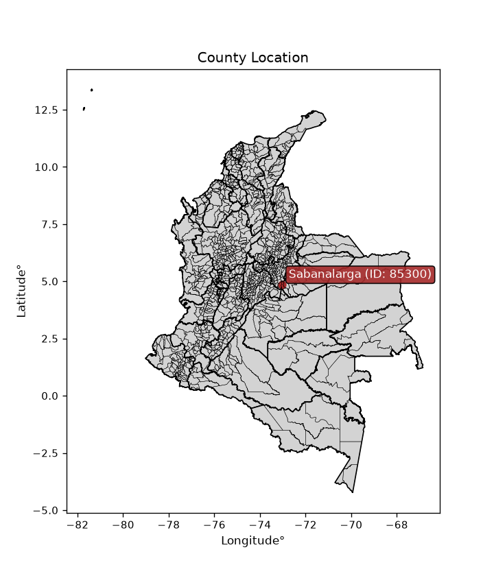
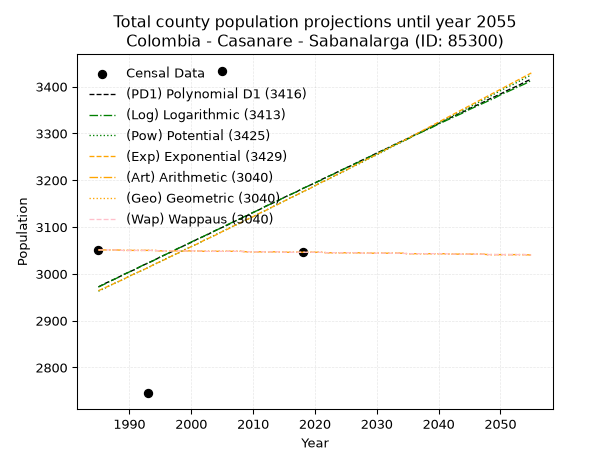
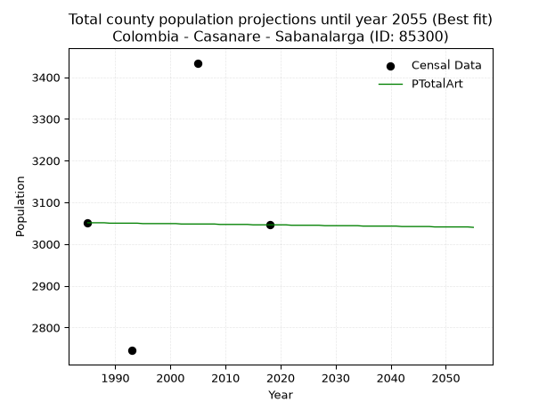
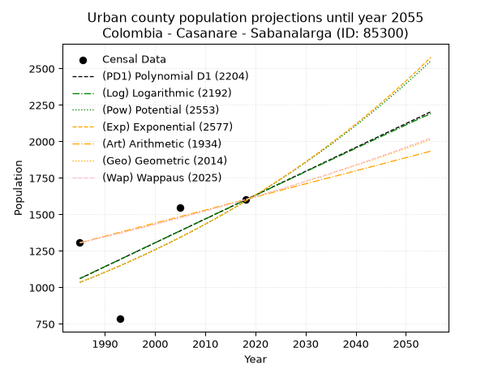
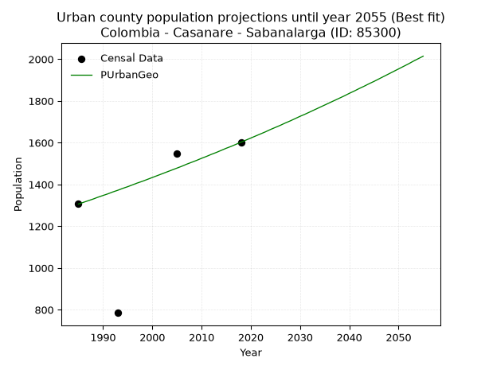
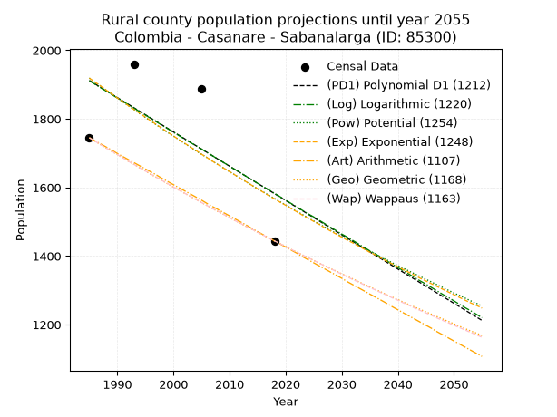
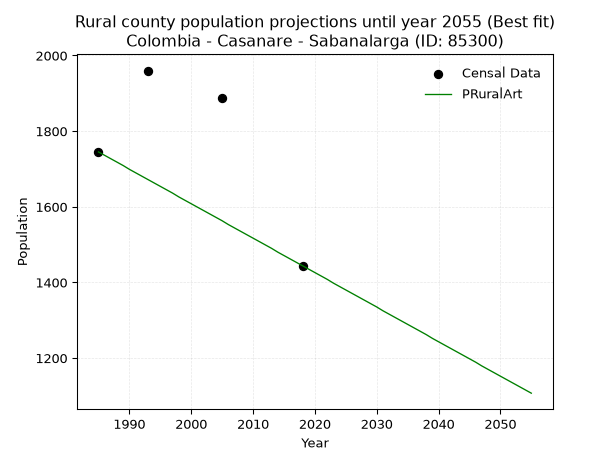

<div align="center">


</div>

# _“Population and Public Services Demand Projections (PPSD) until Year 2050 for Colombia - Casanare - Sabanalarga (ID: 85300)”_
Keywords: `population` `public-service` `projection` `lineal` `polynomial` `logarithmic` `potential` `exponential` `arithmetic` `geometric` `wappaus` `dane` `colombia` `south-america`

PPSD are analytical estimates used by governments and planners to anticipate future changes in population size, age distribution, and the resulting community needs for utilities, healthcare, education, and infrastructure as sizing future water treatment facilities, electrical grids, and road networks based on spatial growth.

<div align="center">

</img>

</div>


> **General running parameters**: • app_version: _v20260806_. • Python version: _3.14.7_. • Pandas version: _3.0.5_. • NumPy version: _2.5.1_. • Creates, save and include plots into reports (create_plot): _False_. • Projection until year: _2050_. • Process polynomial degree 2 and up: _False_. • Process Wappaus: _True_. • Process Wappaus: _True_. • Set negative values to zero: _True_. • Set infinite values to zero: _True_. • Drop dataset notes: _True_. 
<div align="center">

Dynamic map: [:earth_americas:Google](http://maps.google.com/maps?q=4.854786682,-73.0386964) [:earth_americas:OSM](https://www.openstreetmap.org/#map=18/4.854786682/-73.0386964&layers=P) [:earth_americas:Bing](https://www.bing.com/maps?cp=4.854786682~-73.0386964&lvl=18) [:earth_americas:Apple](https://maps.apple.com/frame?center=4.854786682%2C-73.0386964&span=0.003%2C0.006)

</div>


<div align="center">

```geojson
{
  "type": "Feature",
  "geometry": {
    "type": "Point", 
    "coordinates": [-73.0386964, 4.854786682]
  }, 
  "properties": {
    "Name": "Colombia - Casanare - Sabanalarga (ID: 85300)"
  }
}
```

</div>


## 0. Census Data (4 records)

Census data are official statistics collected by a government about the people and housing in a country. They usually include counts of total population, age, sex, race, income, education, and jobs.

📅Global census file: [Population.xlsx](../data/Population.xlsx)

| Source   |   Year |   CountryID | CountryName   |   StateID | StateName   |   CountyID | CountyName   |   PTotal |   PUrban |   PRural |
|:---------|-------:|------------:|:--------------|----------:|:------------|-----------:|:-------------|---------:|---------:|---------:|
| DANE     |   1985 |          57 | Colombia      |        85 | Casanare    |      85300 | Sabanalarga  |     3051 |     1306 |     1745 |
| DANE     |   1993 |          57 | Colombia      |        85 | Casanare    |      85300 | Sabanalarga  |     2745 |      785 |     1960 |
| DANE     |   2005 |          57 | Colombia      |        85 | Casanare    |      85300 | Sabanalarga  |     3434 |     1546 |     1888 |
| DANE     |   2018 |          57 | Colombia      |        85 | Casanare    |      85300 | Sabanalarga  |     3046 |     1602 |     1444 |

> 🔥Some records could had specific notes about the registered values or the corresponding urban or rural distribution.

📅[SUI-RUPS](https://www.datos.gov.co/Hacienda-y-Cr-dito-P-blico/Registro-nico-de-Prestadores-de-Servicios-P-blicos/4qkq-csdn/about_data) - Local public utility companies: [RUPS.csv](../data/RUPS.xlsx)

 | SERVICIO       | ESTADO    | NOMBRE                                                | NIT         | DEPARTAMENTO_DOMICILIO   | MUNICIPIO_DOMICILIO   | DIRECCION   |   TELEFONO | EMAIL                     | TIPO_PRESTADOR                             | CLASIFICACION                 |
|:---------------|:----------|:------------------------------------------------------|:------------|:-------------------------|:----------------------|:------------|-----------:|:--------------------------|:-------------------------------------------|:------------------------------|
| ACUEDUCTO      | OPERATIVA | SABANALARGA EMPRESA DE SERVICIOS PÚBLICOS E.S.P. S.A. | 900487655-9 | CASANARE                 | SABANALARGA           | Cr 7 # 8-27 |    6245179 | semsep.esp.sa@hotmail.com | SOCIEDADES (EMPRESA DE SERVICIOS PUBLICOS) | MENOR O IGUAL A 2500 USUARIOS |
| ALCANTARILLADO | OPERATIVA | SABANALARGA EMPRESA DE SERVICIOS PÚBLICOS E.S.P. S.A. | 900487655-9 | CASANARE                 | SABANALARGA           | Cr 7 # 8-27 |    6245179 | semsep.esp.sa@hotmail.com | SOCIEDADES (EMPRESA DE SERVICIOS PUBLICOS) | MENOR O IGUAL A 2500 USUARIOS |

## 1. Total

### 1.1. Coefficients and Parameters

* (PD1) Polynomial Deg 1: 6.341228422320567, -9615.042151746713 (lineal)
* (Log) Logarithmic: 12717.792121671659, -93599.03983081631
* (Pow) Potential: 4.181701385876377, -10.31848471658911
* (Exp) Exponential: 0.002085661032084124, 47.18675194049574
* (Art) Arithmetic: Year diff. 2018 - 1985 = 33, Population diff. 3046 - 3051 = -5, Annual growth = -0.15151515151515152
* (Geo) Geometric: Year diff. 2018 - 1985 = 33, Population diff. 3046 - 3051 = -5, Annual growth % = -4.97003182788891e-05
* (Wap) Wappaus: i = -0.004970154223885567, Condition values only valid for < 200)

<sub>
Wappaus condition values: ['-0.00', '-0.00', '-0.01', '-0.01', '-0.02', '-0.02', '-0.03', '-0.03', '-0.04', '-0.04', '-0.05', '-0.05', '-0.06', '-0.06', '-0.07', '-0.07', '-0.08', '-0.08', '-0.09', '-0.09', '-0.10', '-0.10', '-0.11', '-0.11', '-0.12', '-0.12', '-0.13', '-0.13', '-0.14', '-0.14', '-0.15', '-0.15', '-0.16', '-0.16', '-0.17', '-0.17', '-0.18', '-0.18', '-0.19', '-0.19', '-0.20', '-0.20', '-0.21', '-0.21', '-0.22', '-0.22', '-0.23', '-0.23', '-0.24', '-0.24', '-0.25', '-0.25', '-0.26', '-0.26', '-0.27', '-0.27', '-0.28', '-0.28', '-0.29', '-0.29', '-0.30', '-0.30', '-0.31', '-0.31', '-0.32', '-0.32']
</sub>


### 1.2. Projected Dataset

|   Year |   CountyID |   PTotalPD1 |   PTotalLog |   PTotalPow |   PTotalExp |   PTotalArt |   PTotalGeo |   PTotalWap |
|-------:|-----------:|------------:|------------:|------------:|------------:|------------:|------------:|------------:|
|   1985 |      85300 |        2972 |        2972 |        2963 |        2964 |        3051 |        3051 |        3051 |
|   1986 |      85300 |        2979 |        2978 |        2969 |        2970 |        3051 |        3051 |        3051 |
|   1987 |      85300 |        2985 |        2985 |        2976 |        2976 |        3051 |        3051 |        3051 |
|   1988 |      85300 |        2991 |        2991 |        2982 |        2982 |        3051 |        3051 |        3051 |
|   1989 |      85300 |        2998 |        2998 |        2988 |        2988 |        3050 |        3050 |        3050 |
|   1990 |      85300 |        3004 |        3004 |        2995 |        2995 |        3050 |        3050 |        3050 |
|   1991 |      85300 |        3010 |        3010 |        3001 |        3001 |        3050 |        3050 |        3050 |
|   1992 |      85300 |        3017 |        3017 |        3007 |        3007 |        3050 |        3050 |        3050 |
|   1993 |      85300 |        3023 |        3023 |        3013 |        3013 |        3050 |        3050 |        3050 |
|   1994 |      85300 |        3029 |        3029 |        3020 |        3020 |        3050 |        3050 |        3050 |
|   1995 |      85300 |        3036 |        3036 |        3026 |        3026 |        3049 |        3049 |        3049 |
|   1996 |      85300 |        3042 |        3042 |        3033 |        3032 |        3049 |        3049 |        3049 |
|   1997 |      85300 |        3048 |        3049 |        3039 |        3039 |        3049 |        3049 |        3049 |
|   1998 |      85300 |        3055 |        3055 |        3045 |        3045 |        3049 |        3049 |        3049 |
|   1999 |      85300 |        3061 |        3061 |        3052 |        3051 |        3049 |        3049 |        3049 |
|   2000 |      85300 |        3067 |        3068 |        3058 |        3058 |        3049 |        3049 |        3049 |
|   2001 |      85300 |        3074 |        3074 |        3064 |        3064 |        3049 |        3049 |        3049 |
|   2002 |      85300 |        3080 |        3080 |        3071 |        3071 |        3048 |        3048 |        3048 |
|   2003 |      85300 |        3086 |        3087 |        3077 |        3077 |        3048 |        3048 |        3048 |
|   2004 |      85300 |        3093 |        3093 |        3084 |        3083 |        3048 |        3048 |        3048 |
|   2005 |      85300 |        3099 |        3099 |        3090 |        3090 |        3048 |        3048 |        3048 |
|   2006 |      85300 |        3105 |        3106 |        3097 |        3096 |        3048 |        3048 |        3048 |
|   2007 |      85300 |        3112 |        3112 |        3103 |        3103 |        3048 |        3048 |        3048 |
|   2008 |      85300 |        3118 |        3118 |        3109 |        3109 |        3048 |        3048 |        3048 |
|   2009 |      85300 |        3124 |        3125 |        3116 |        3116 |        3047 |        3047 |        3047 |
|   2010 |      85300 |        3131 |        3131 |        3122 |        3122 |        3047 |        3047 |        3047 |
|   2011 |      85300 |        3137 |        3137 |        3129 |        3129 |        3047 |        3047 |        3047 |
|   2012 |      85300 |        3144 |        3144 |        3135 |        3135 |        3047 |        3047 |        3047 |
|   2013 |      85300 |        3150 |        3150 |        3142 |        3142 |        3047 |        3047 |        3047 |
|   2014 |      85300 |        3156 |        3156 |        3149 |        3148 |        3047 |        3047 |        3047 |
|   2015 |      85300 |        3163 |        3163 |        3155 |        3155 |        3046 |        3046 |        3046 |
|   2016 |      85300 |        3169 |        3169 |        3162 |        3162 |        3046 |        3046 |        3046 |
|   2017 |      85300 |        3175 |        3175 |        3168 |        3168 |        3046 |        3046 |        3046 |
|   2018 |      85300 |        3182 |        3182 |        3175 |        3175 |        3046 |        3046 |        3046 |
|   2019 |      85300 |        3188 |        3188 |        3181 |        3181 |        3046 |        3046 |        3046 |
|   2020 |      85300 |        3194 |        3194 |        3188 |        3188 |        3046 |        3046 |        3046 |
|   2021 |      85300 |        3201 |        3200 |        3195 |        3195 |        3046 |        3046 |        3046 |
|   2022 |      85300 |        3207 |        3207 |        3201 |        3201 |        3045 |        3045 |        3045 |
|   2023 |      85300 |        3213 |        3213 |        3208 |        3208 |        3045 |        3045 |        3045 |
|   2024 |      85300 |        3220 |        3219 |        3214 |        3215 |        3045 |        3045 |        3045 |
|   2025 |      85300 |        3226 |        3226 |        3221 |        3221 |        3045 |        3045 |        3045 |
|   2026 |      85300 |        3232 |        3232 |        3228 |        3228 |        3045 |        3045 |        3045 |
|   2027 |      85300 |        3239 |        3238 |        3234 |        3235 |        3045 |        3045 |        3045 |
|   2028 |      85300 |        3245 |        3244 |        3241 |        3242 |        3044 |        3044 |        3044 |
|   2029 |      85300 |        3251 |        3251 |        3248 |        3248 |        3044 |        3044 |        3044 |
|   2030 |      85300 |        3258 |        3257 |        3254 |        3255 |        3044 |        3044 |        3044 |
|   2031 |      85300 |        3264 |        3263 |        3261 |        3262 |        3044 |        3044 |        3044 |
|   2032 |      85300 |        3270 |        3270 |        3268 |        3269 |        3044 |        3044 |        3044 |
|   2033 |      85300 |        3277 |        3276 |        3275 |        3276 |        3044 |        3044 |        3044 |
|   2034 |      85300 |        3283 |        3282 |        3281 |        3282 |        3044 |        3044 |        3044 |
|   2035 |      85300 |        3289 |        3288 |        3288 |        3289 |        3043 |        3043 |        3043 |
|   2036 |      85300 |        3296 |        3295 |        3295 |        3296 |        3043 |        3043 |        3043 |
|   2037 |      85300 |        3302 |        3301 |        3302 |        3303 |        3043 |        3043 |        3043 |
|   2038 |      85300 |        3308 |        3307 |        3308 |        3310 |        3043 |        3043 |        3043 |
|   2039 |      85300 |        3315 |        3313 |        3315 |        3317 |        3043 |        3043 |        3043 |
|   2040 |      85300 |        3321 |        3320 |        3322 |        3324 |        3043 |        3043 |        3043 |
|   2041 |      85300 |        3327 |        3326 |        3329 |        3331 |        3043 |        3043 |        3043 |
|   2042 |      85300 |        3334 |        3332 |        3336 |        3338 |        3042 |        3042 |        3042 |
|   2043 |      85300 |        3340 |        3338 |        3342 |        3345 |        3042 |        3042 |        3042 |
|   2044 |      85300 |        3346 |        3344 |        3349 |        3352 |        3042 |        3042 |        3042 |
|   2045 |      85300 |        3353 |        3351 |        3356 |        3359 |        3042 |        3042 |        3042 |
|   2046 |      85300 |        3359 |        3357 |        3363 |        3366 |        3042 |        3042 |        3042 |
|   2047 |      85300 |        3365 |        3363 |        3370 |        3373 |        3042 |        3042 |        3042 |
|   2048 |      85300 |        3372 |        3369 |        3377 |        3380 |        3041 |        3041 |        3041 |
|   2049 |      85300 |        3378 |        3375 |        3384 |        3387 |        3041 |        3041 |        3041 |
|   2050 |      85300 |        3384 |        3382 |        3391 |        3394 |        3041 |        3041 |        3041 |
<div align="center">

</img>

</div>


### 1.3. Best fit with absolute and relative error (%)

Relative error puts that difference into context by dividing the absolute error by the true value, creating a unitless ratio or percentage that shows the scale of the mistake.

Absolute and relative error

|   Year | Source   |   CountryID | CountryName   |   StateID | StateName   |   CountyID_x | CountyName   |   PTotal |   PUrban |   PRural |   CountyID_y |   PTotalPD1 |   PTotalLog |   PTotalPow |   PTotalExp |   PTotalArt |   PTotalGeo |   PTotalWap |   PTotalPD1AbsError |   PTotalLogAbsError |   PTotalPowAbsError |   PTotalExpAbsError |   PTotalArtAbsError |   PTotalGeoAbsError |   PTotalWapAbsError |   PTotalPD1RelError |   PTotalLogRelError |   PTotalPowRelError |   PTotalExpRelError |   PTotalArtRelError |   PTotalGeoRelError |   PTotalWapRelError |
|-------:|:---------|------------:|:--------------|----------:|:------------|-------------:|:-------------|---------:|---------:|---------:|-------------:|------------:|------------:|------------:|------------:|------------:|------------:|------------:|--------------------:|--------------------:|--------------------:|--------------------:|--------------------:|--------------------:|--------------------:|--------------------:|--------------------:|--------------------:|--------------------:|--------------------:|--------------------:|--------------------:|
|   1985 | DANE     |          57 | Colombia      |        85 | Casanare    |        85300 | Sabanalarga  |     3051 |     1306 |     1745 |        85300 |        2972 |        2972 |        2963 |        2964 |        3051 |        3051 |        3051 |                  79 |                  79 |                  88 |                  87 |                   0 |                   0 |                   0 |             2.58931 |             2.58931 |             2.8843  |             2.85152 |              0      |              0      |              0      |
|   1993 | DANE     |          57 | Colombia      |        85 | Casanare    |        85300 | Sabanalarga  |     2745 |      785 |     1960 |        85300 |        3023 |        3023 |        3013 |        3013 |        3050 |        3050 |        3050 |                 278 |                 278 |                 268 |                 268 |                 305 |                 305 |                 305 |            10.1275  |            10.1275  |             9.76321 |             9.76321 |             11.1111 |             11.1111 |             11.1111 |
|   2005 | DANE     |          57 | Colombia      |        85 | Casanare    |        85300 | Sabanalarga  |     3434 |     1546 |     1888 |        85300 |        3099 |        3099 |        3090 |        3090 |        3048 |        3048 |        3048 |                 335 |                 335 |                 344 |                 344 |                 386 |                 386 |                 386 |             9.75539 |             9.75539 |            10.0175  |            10.0175  |             11.2405 |             11.2405 |             11.2405 |
|   2018 | DANE     |          57 | Colombia      |        85 | Casanare    |        85300 | Sabanalarga  |     3046 |     1602 |     1444 |        85300 |        3182 |        3182 |        3175 |        3175 |        3046 |        3046 |        3046 |                 136 |                 136 |                 129 |                 129 |                   0 |                   0 |                   0 |             4.46487 |             4.46487 |             4.23506 |             4.23506 |              0      |              0      |              0      |

Relative error mean

| Method    |   RelError | Best   |
|:----------|-----------:|:-------|
| PTotalPD1 |    6.73427 |        |
| PTotalLog |    6.73427 |        |
| PTotalPow |    6.72501 |        |
| PTotalExp |    6.71682 |        |
| PTotalArt |    5.58791 | True   |
| PTotalGeo |    5.58791 | True   |
| PTotalWap |    5.58791 | True   |

💙Best method: _**PTotalArt**_
<div align="center">

</img>

</div>


### 1.4. Fresh water supply demand in liters per capita per day (lpcd)

The fresh water supply demand typically ranges from 100 to 300 liters per capita per day (lpcd) for standard domestic and municipal planning, though absolute survival minimums set by the World Health Organization are as low as 7.5 to 20 liters per day, and total consumption in high-income nations can exceed 400 liters.

> `CZ`: Level in meters above the sea level (masl)<br> `WS`: Fresh water supply demand in liters per capita per day (lpcd or l/h/d)<br> `WSAll`: Zonal fresh water supply demand in liters per second (l/s)<br> `A`: Zonal area in square meters<br> `DP`: Population density (people/hectare or p/ha)

Reference values (RAS Colombia)

|    CZ |   WS |
|------:|-----:|
|  1000 |  120 |
|  2000 |  130 |
| 99999 |  140 |

County shapefile geometry properties and water supply values

|   CountyID |      ATotal |   CZTotal |   WSTotal |
|-----------:|------------:|----------:|----------:|
|      85300 | 4.00158e+08 |   579.786 |       120 |

Projected values for best method: PTotalArt

|   CountyID |   Year |   PTotalArt |   DPTotal |   WSTotal |   WSTotalAll |
|-----------:|-------:|------------:|----------:|----------:|-------------:|
|      85300 |   1985 |        3051 |      0.08 |       120 |      4.2375  |
|      85300 |   1986 |        3051 |      0.08 |       120 |      4.2375  |
|      85300 |   1987 |        3051 |      0.08 |       120 |      4.2375  |
|      85300 |   1988 |        3051 |      0.08 |       120 |      4.2375  |
|      85300 |   1989 |        3050 |      0.08 |       120 |      4.23611 |
|      85300 |   1990 |        3050 |      0.08 |       120 |      4.23611 |
|      85300 |   1991 |        3050 |      0.08 |       120 |      4.23611 |
|      85300 |   1992 |        3050 |      0.08 |       120 |      4.23611 |
|      85300 |   1993 |        3050 |      0.08 |       120 |      4.23611 |
|      85300 |   1994 |        3050 |      0.08 |       120 |      4.23611 |
|      85300 |   1995 |        3049 |      0.08 |       120 |      4.23472 |
|      85300 |   1996 |        3049 |      0.08 |       120 |      4.23472 |
|      85300 |   1997 |        3049 |      0.08 |       120 |      4.23472 |
|      85300 |   1998 |        3049 |      0.08 |       120 |      4.23472 |
|      85300 |   1999 |        3049 |      0.08 |       120 |      4.23472 |
|      85300 |   2000 |        3049 |      0.08 |       120 |      4.23472 |
|      85300 |   2001 |        3049 |      0.08 |       120 |      4.23472 |
|      85300 |   2002 |        3048 |      0.08 |       120 |      4.23333 |
|      85300 |   2003 |        3048 |      0.08 |       120 |      4.23333 |
|      85300 |   2004 |        3048 |      0.08 |       120 |      4.23333 |
|      85300 |   2005 |        3048 |      0.08 |       120 |      4.23333 |
|      85300 |   2006 |        3048 |      0.08 |       120 |      4.23333 |
|      85300 |   2007 |        3048 |      0.08 |       120 |      4.23333 |
|      85300 |   2008 |        3048 |      0.08 |       120 |      4.23333 |
|      85300 |   2009 |        3047 |      0.08 |       120 |      4.23194 |
|      85300 |   2010 |        3047 |      0.08 |       120 |      4.23194 |
|      85300 |   2011 |        3047 |      0.08 |       120 |      4.23194 |
|      85300 |   2012 |        3047 |      0.08 |       120 |      4.23194 |
|      85300 |   2013 |        3047 |      0.08 |       120 |      4.23194 |
|      85300 |   2014 |        3047 |      0.08 |       120 |      4.23194 |
|      85300 |   2015 |        3046 |      0.08 |       120 |      4.23056 |
|      85300 |   2016 |        3046 |      0.08 |       120 |      4.23056 |
|      85300 |   2017 |        3046 |      0.08 |       120 |      4.23056 |
|      85300 |   2018 |        3046 |      0.08 |       120 |      4.23056 |
|      85300 |   2019 |        3046 |      0.08 |       120 |      4.23056 |
|      85300 |   2020 |        3046 |      0.08 |       120 |      4.23056 |
|      85300 |   2021 |        3046 |      0.08 |       120 |      4.23056 |
|      85300 |   2022 |        3045 |      0.08 |       120 |      4.22917 |
|      85300 |   2023 |        3045 |      0.08 |       120 |      4.22917 |
|      85300 |   2024 |        3045 |      0.08 |       120 |      4.22917 |
|      85300 |   2025 |        3045 |      0.08 |       120 |      4.22917 |
|      85300 |   2026 |        3045 |      0.08 |       120 |      4.22917 |
|      85300 |   2027 |        3045 |      0.08 |       120 |      4.22917 |
|      85300 |   2028 |        3044 |      0.08 |       120 |      4.22778 |
|      85300 |   2029 |        3044 |      0.08 |       120 |      4.22778 |
|      85300 |   2030 |        3044 |      0.08 |       120 |      4.22778 |
|      85300 |   2031 |        3044 |      0.08 |       120 |      4.22778 |
|      85300 |   2032 |        3044 |      0.08 |       120 |      4.22778 |
|      85300 |   2033 |        3044 |      0.08 |       120 |      4.22778 |
|      85300 |   2034 |        3044 |      0.08 |       120 |      4.22778 |
|      85300 |   2035 |        3043 |      0.08 |       120 |      4.22639 |
|      85300 |   2036 |        3043 |      0.08 |       120 |      4.22639 |
|      85300 |   2037 |        3043 |      0.08 |       120 |      4.22639 |
|      85300 |   2038 |        3043 |      0.08 |       120 |      4.22639 |
|      85300 |   2039 |        3043 |      0.08 |       120 |      4.22639 |
|      85300 |   2040 |        3043 |      0.08 |       120 |      4.22639 |
|      85300 |   2041 |        3043 |      0.08 |       120 |      4.22639 |
|      85300 |   2042 |        3042 |      0.08 |       120 |      4.225   |
|      85300 |   2043 |        3042 |      0.08 |       120 |      4.225   |
|      85300 |   2044 |        3042 |      0.08 |       120 |      4.225   |
|      85300 |   2045 |        3042 |      0.08 |       120 |      4.225   |
|      85300 |   2046 |        3042 |      0.08 |       120 |      4.225   |
|      85300 |   2047 |        3042 |      0.08 |       120 |      4.225   |
|      85300 |   2048 |        3041 |      0.08 |       120 |      4.22361 |
|      85300 |   2049 |        3041 |      0.08 |       120 |      4.22361 |
|      85300 |   2050 |        3041 |      0.08 |       120 |      4.22361 |

## 2. Urban

### 2.1. Coefficients and Parameters

* (PD1) Polynomial Deg 1: 16.33279807306295, -31359.929345644166 (lineal)
* (Log) Logarithmic: 32659.712764244265, -246936.98843953348
* (Pow) Potential: 26.06039168017375, -82.92615807370224
* (Exp) Exponential: 0.013035594018346268, 5.986635078953191e-09
* (Art) Arithmetic: Year diff. 2018 - 1985 = 33, Population diff. 1602 - 1306 = 296, Annual growth = 8.969696969696969
* (Geo) Geometric: Year diff. 2018 - 1985 = 33, Population diff. 1602 - 1306 = 296, Annual growth % = 0.006209618961667829
* (Wap) Wappaus: i = 0.6168980034179484, Condition values only valid for < 200)

<sub>
Wappaus condition values: ['0.00', '0.62', '1.23', '1.85', '2.47', '3.08', '3.70', '4.32', '4.94', '5.55', '6.17', '6.79', '7.40', '8.02', '8.64', '9.25', '9.87', '10.49', '11.10', '11.72', '12.34', '12.95', '13.57', '14.19', '14.81', '15.42', '16.04', '16.66', '17.27', '17.89', '18.51', '19.12', '19.74', '20.36', '20.97', '21.59', '22.21', '22.83', '23.44', '24.06', '24.68', '25.29', '25.91', '26.53', '27.14', '27.76', '28.38', '28.99', '29.61', '30.23', '30.84', '31.46', '32.08', '32.70', '33.31', '33.93', '34.55', '35.16', '35.78', '36.40', '37.01', '37.63', '38.25', '38.86', '39.48', '40.10']
</sub>


### 2.2. Projected Dataset

|   Year |   CountyID |   PUrbanPD1 |   PUrbanLog |   PUrbanPow |   PUrbanExp |   PUrbanArt |   PUrbanGeo |   PUrbanWap |
|-------:|-----------:|------------:|------------:|------------:|------------:|------------:|------------:|------------:|
|   1985 |      85300 |        1061 |        1060 |        1035 |        1035 |        1306 |        1306 |        1306 |
|   1986 |      85300 |        1077 |        1077 |        1048 |        1048 |        1315 |        1314 |        1314 |
|   1987 |      85300 |        1093 |        1093 |        1062 |        1062 |        1324 |        1322 |        1322 |
|   1988 |      85300 |        1110 |        1110 |        1076 |        1076 |        1333 |        1330 |        1330 |
|   1989 |      85300 |        1126 |        1126 |        1090 |        1090 |        1342 |        1339 |        1339 |
|   1990 |      85300 |        1142 |        1143 |        1105 |        1104 |        1351 |        1347 |        1347 |
|   1991 |      85300 |        1159 |        1159 |        1119 |        1119 |        1360 |        1355 |        1355 |
|   1992 |      85300 |        1175 |        1175 |        1134 |        1134 |        1369 |        1364 |        1364 |
|   1993 |      85300 |        1191 |        1192 |        1149 |        1148 |        1378 |        1372 |        1372 |
|   1994 |      85300 |        1208 |        1208 |        1164 |        1164 |        1387 |        1381 |        1381 |
|   1995 |      85300 |        1224 |        1225 |        1179 |        1179 |        1396 |        1389 |        1389 |
|   1996 |      85300 |        1240 |        1241 |        1195 |        1194 |        1405 |        1398 |        1398 |
|   1997 |      85300 |        1257 |        1257 |        1211 |        1210 |        1414 |        1407 |        1406 |
|   1998 |      85300 |        1273 |        1274 |        1226 |        1226 |        1423 |        1415 |        1415 |
|   1999 |      85300 |        1289 |        1290 |        1243 |        1242 |        1432 |        1424 |        1424 |
|   2000 |      85300 |        1306 |        1306 |        1259 |        1258 |        1441 |        1433 |        1433 |
|   2001 |      85300 |        1322 |        1323 |        1275 |        1275 |        1450 |        1442 |        1442 |
|   2002 |      85300 |        1338 |        1339 |        1292 |        1291 |        1458 |        1451 |        1451 |
|   2003 |      85300 |        1355 |        1355 |        1309 |        1308 |        1467 |        1460 |        1460 |
|   2004 |      85300 |        1371 |        1372 |        1326 |        1326 |        1476 |        1469 |        1469 |
|   2005 |      85300 |        1387 |        1388 |        1343 |        1343 |        1485 |        1478 |        1478 |
|   2006 |      85300 |        1404 |        1404 |        1361 |        1361 |        1494 |        1487 |        1487 |
|   2007 |      85300 |        1420 |        1420 |        1379 |        1378 |        1503 |        1497 |        1496 |
|   2008 |      85300 |        1436 |        1437 |        1397 |        1397 |        1512 |        1506 |        1505 |
|   2009 |      85300 |        1453 |        1453 |        1415 |        1415 |        1521 |        1515 |        1515 |
|   2010 |      85300 |        1469 |        1469 |        1434 |        1433 |        1530 |        1525 |        1524 |
|   2011 |      85300 |        1485 |        1485 |        1452 |        1452 |        1539 |        1534 |        1534 |
|   2012 |      85300 |        1502 |        1502 |        1471 |        1471 |        1548 |        1544 |        1543 |
|   2013 |      85300 |        1518 |        1518 |        1490 |        1491 |        1557 |        1553 |        1553 |
|   2014 |      85300 |        1534 |        1534 |        1510 |        1510 |        1566 |        1563 |        1563 |
|   2015 |      85300 |        1551 |        1550 |        1529 |        1530 |        1575 |        1573 |        1572 |
|   2016 |      85300 |        1567 |        1567 |        1549 |        1550 |        1584 |        1582 |        1582 |
|   2017 |      85300 |        1583 |        1583 |        1570 |        1570 |        1593 |        1592 |        1592 |
|   2018 |      85300 |        1600 |        1599 |        1590 |        1591 |        1602 |        1602 |        1602 |
|   2019 |      85300 |        1616 |        1615 |        1611 |        1612 |        1611 |        1612 |        1612 |
|   2020 |      85300 |        1632 |        1631 |        1632 |        1633 |        1620 |        1622 |        1622 |
|   2021 |      85300 |        1649 |        1647 |        1653 |        1654 |        1629 |        1632 |        1632 |
|   2022 |      85300 |        1665 |        1664 |        1674 |        1676 |        1638 |        1642 |        1643 |
|   2023 |      85300 |        1681 |        1680 |        1696 |        1698 |        1647 |        1652 |        1653 |
|   2024 |      85300 |        1698 |        1696 |        1718 |        1720 |        1656 |        1663 |        1663 |
|   2025 |      85300 |        1714 |        1712 |        1740 |        1743 |        1665 |        1673 |        1674 |
|   2026 |      85300 |        1730 |        1728 |        1763 |        1766 |        1674 |        1683 |        1684 |
|   2027 |      85300 |        1747 |        1744 |        1785 |        1789 |        1683 |        1694 |        1695 |
|   2028 |      85300 |        1763 |        1760 |        1809 |        1812 |        1692 |        1704 |        1705 |
|   2029 |      85300 |        1779 |        1776 |        1832 |        1836 |        1701 |        1715 |        1716 |
|   2030 |      85300 |        1796 |        1793 |        1856 |        1860 |        1710 |        1726 |        1727 |
|   2031 |      85300 |        1812 |        1809 |        1880 |        1885 |        1719 |        1736 |        1738 |
|   2032 |      85300 |        1828 |        1825 |        1904 |        1909 |        1728 |        1747 |        1749 |
|   2033 |      85300 |        1845 |        1841 |        1928 |        1935 |        1737 |        1758 |        1760 |
|   2034 |      85300 |        1861 |        1857 |        1953 |        1960 |        1746 |        1769 |        1771 |
|   2035 |      85300 |        1877 |        1873 |        1978 |        1986 |        1754 |        1780 |        1782 |
|   2036 |      85300 |        1894 |        1889 |        2004 |        2012 |        1763 |        1791 |        1794 |
|   2037 |      85300 |        1910 |        1905 |        2030 |        2038 |        1772 |        1802 |        1805 |
|   2038 |      85300 |        1926 |        1921 |        2056 |        2065 |        1781 |        1813 |        1816 |
|   2039 |      85300 |        1943 |        1937 |        2082 |        2092 |        1790 |        1824 |        1828 |
|   2040 |      85300 |        1959 |        1953 |        2109 |        2119 |        1799 |        1836 |        1840 |
|   2041 |      85300 |        1975 |        1969 |        2136 |        2147 |        1808 |        1847 |        1851 |
|   2042 |      85300 |        1992 |        1985 |        2164 |        2175 |        1817 |        1859 |        1863 |
|   2043 |      85300 |        2008 |        2001 |        2191 |        2204 |        1826 |        1870 |        1875 |
|   2044 |      85300 |        2024 |        2017 |        2220 |        2233 |        1835 |        1882 |        1887 |
|   2045 |      85300 |        2041 |        2033 |        2248 |        2262 |        1844 |        1893 |        1899 |
|   2046 |      85300 |        2057 |        2049 |        2277 |        2292 |        1853 |        1905 |        1911 |
|   2047 |      85300 |        2073 |        2065 |        2306 |        2322 |        1862 |        1917 |        1924 |
|   2048 |      85300 |        2090 |        2081 |        2336 |        2352 |        1871 |        1929 |        1936 |
|   2049 |      85300 |        2106 |        2097 |        2365 |        2383 |        1880 |        1941 |        1948 |
|   2050 |      85300 |        2122 |        2113 |        2396 |        2414 |        1889 |        1953 |        1961 |
<div align="center">

</img>

</div>


### 2.3. Best fit with absolute and relative error (%)

Relative error puts that difference into context by dividing the absolute error by the true value, creating a unitless ratio or percentage that shows the scale of the mistake.

Absolute and relative error

|   Year | Source   |   CountryID | CountryName   |   StateID | StateName   |   CountyID_x | CountyName   |   PTotal |   PUrban |   PRural |   CountyID_y |   PUrbanPD1 |   PUrbanLog |   PUrbanPow |   PUrbanExp |   PUrbanArt |   PUrbanGeo |   PUrbanWap |   PUrbanPD1AbsError |   PUrbanLogAbsError |   PUrbanPowAbsError |   PUrbanExpAbsError |   PUrbanArtAbsError |   PUrbanGeoAbsError |   PUrbanWapAbsError |   PUrbanPD1RelError |   PUrbanLogRelError |   PUrbanPowRelError |   PUrbanExpRelError |   PUrbanArtRelError |   PUrbanGeoRelError |   PUrbanWapRelError |
|-------:|:---------|------------:|:--------------|----------:|:------------|-------------:|:-------------|---------:|---------:|---------:|-------------:|------------:|------------:|------------:|------------:|------------:|------------:|------------:|--------------------:|--------------------:|--------------------:|--------------------:|--------------------:|--------------------:|--------------------:|--------------------:|--------------------:|--------------------:|--------------------:|--------------------:|--------------------:|--------------------:|
|   1985 | DANE     |          57 | Colombia      |        85 | Casanare    |        85300 | Sabanalarga  |     3051 |     1306 |     1745 |        85300 |        1061 |        1060 |        1035 |        1035 |        1306 |        1306 |        1306 |                 245 |                 246 |                 271 |                 271 |                   0 |                   0 |                   0 |           18.7596   |           18.8361   |           20.7504   |           20.7504   |             0       |             0       |             0       |
|   1993 | DANE     |          57 | Colombia      |        85 | Casanare    |        85300 | Sabanalarga  |     2745 |      785 |     1960 |        85300 |        1191 |        1192 |        1149 |        1148 |        1378 |        1372 |        1372 |                 406 |                 407 |                 364 |                 363 |                 593 |                 587 |                 587 |           51.7197   |           51.8471   |           46.3694   |           46.242    |            75.5414  |            74.7771  |            74.7771  |
|   2005 | DANE     |          57 | Colombia      |        85 | Casanare    |        85300 | Sabanalarga  |     3434 |     1546 |     1888 |        85300 |        1387 |        1388 |        1343 |        1343 |        1485 |        1478 |        1478 |                 159 |                 158 |                 203 |                 203 |                  61 |                  68 |                  68 |           10.2846   |           10.2199   |           13.1307   |           13.1307   |             3.94567 |             4.39845 |             4.39845 |
|   2018 | DANE     |          57 | Colombia      |        85 | Casanare    |        85300 | Sabanalarga  |     3046 |     1602 |     1444 |        85300 |        1600 |        1599 |        1590 |        1591 |        1602 |        1602 |        1602 |                   2 |                   3 |                  12 |                  11 |                   0 |                   0 |                   0 |            0.124844 |            0.187266 |            0.749064 |            0.686642 |             0       |             0       |             0       |

Relative error mean

| Method    |   RelError | Best   |
|:----------|-----------:|:-------|
| PUrbanPD1 |    20.2222 |        |
| PUrbanLog |    20.2726 |        |
| PUrbanPow |    20.2499 |        |
| PUrbanExp |    20.2024 |        |
| PUrbanArt |    19.8718 |        |
| PUrbanGeo |    19.7939 | True   |
| PUrbanWap |    19.7939 | True   |

💙Best method: _**PUrbanGeo**_
<div align="center">

</img>

</div>


### 2.4. Fresh water supply demand in liters per capita per day (lpcd)

The fresh water supply demand typically ranges from 100 to 300 liters per capita per day (lpcd) for standard domestic and municipal planning, though absolute survival minimums set by the World Health Organization are as low as 7.5 to 20 liters per day, and total consumption in high-income nations can exceed 400 liters.

> `CZ`: Level in meters above the sea level (masl)<br> `WS`: Fresh water supply demand in liters per capita per day (lpcd or l/h/d)<br> `WSAll`: Zonal fresh water supply demand in liters per second (l/s)<br> `A`: Zonal area in square meters<br> `DP`: Population density (people/hectare or p/ha)

Reference values (RAS Colombia)

|    CZ |   WS |
|------:|-----:|
|  1000 |  120 |
|  2000 |  130 |
| 99999 |  140 |

County shapefile geometry properties and water supply values

|   CountyID |   AUrban |   CZUrban |   WSUrban |
|-----------:|---------:|----------:|----------:|
|      85300 |   863748 |   470.063 |       120 |

Projected values for best method: PUrbanGeo

|   CountyID |   Year |   PUrbanGeo |   DPUrban |   WSUrban |   WSUrbanAll |
|-----------:|-------:|------------:|----------:|----------:|-------------:|
|      85300 |   1985 |        1306 |     15.12 |       120 |      1.81389 |
|      85300 |   1986 |        1314 |     15.21 |       120 |      1.825   |
|      85300 |   1987 |        1322 |     15.31 |       120 |      1.83611 |
|      85300 |   1988 |        1330 |     15.4  |       120 |      1.84722 |
|      85300 |   1989 |        1339 |     15.5  |       120 |      1.85972 |
|      85300 |   1990 |        1347 |     15.59 |       120 |      1.87083 |
|      85300 |   1991 |        1355 |     15.69 |       120 |      1.88194 |
|      85300 |   1992 |        1364 |     15.79 |       120 |      1.89444 |
|      85300 |   1993 |        1372 |     15.88 |       120 |      1.90556 |
|      85300 |   1994 |        1381 |     15.99 |       120 |      1.91806 |
|      85300 |   1995 |        1389 |     16.08 |       120 |      1.92917 |
|      85300 |   1996 |        1398 |     16.19 |       120 |      1.94167 |
|      85300 |   1997 |        1407 |     16.29 |       120 |      1.95417 |
|      85300 |   1998 |        1415 |     16.38 |       120 |      1.96528 |
|      85300 |   1999 |        1424 |     16.49 |       120 |      1.97778 |
|      85300 |   2000 |        1433 |     16.59 |       120 |      1.99028 |
|      85300 |   2001 |        1442 |     16.69 |       120 |      2.00278 |
|      85300 |   2002 |        1451 |     16.8  |       120 |      2.01528 |
|      85300 |   2003 |        1460 |     16.9  |       120 |      2.02778 |
|      85300 |   2004 |        1469 |     17.01 |       120 |      2.04028 |
|      85300 |   2005 |        1478 |     17.11 |       120 |      2.05278 |
|      85300 |   2006 |        1487 |     17.22 |       120 |      2.06528 |
|      85300 |   2007 |        1497 |     17.33 |       120 |      2.07917 |
|      85300 |   2008 |        1506 |     17.44 |       120 |      2.09167 |
|      85300 |   2009 |        1515 |     17.54 |       120 |      2.10417 |
|      85300 |   2010 |        1525 |     17.66 |       120 |      2.11806 |
|      85300 |   2011 |        1534 |     17.76 |       120 |      2.13056 |
|      85300 |   2012 |        1544 |     17.88 |       120 |      2.14444 |
|      85300 |   2013 |        1553 |     17.98 |       120 |      2.15694 |
|      85300 |   2014 |        1563 |     18.1  |       120 |      2.17083 |
|      85300 |   2015 |        1573 |     18.21 |       120 |      2.18472 |
|      85300 |   2016 |        1582 |     18.32 |       120 |      2.19722 |
|      85300 |   2017 |        1592 |     18.43 |       120 |      2.21111 |
|      85300 |   2018 |        1602 |     18.55 |       120 |      2.225   |
|      85300 |   2019 |        1612 |     18.66 |       120 |      2.23889 |
|      85300 |   2020 |        1622 |     18.78 |       120 |      2.25278 |
|      85300 |   2021 |        1632 |     18.89 |       120 |      2.26667 |
|      85300 |   2022 |        1642 |     19.01 |       120 |      2.28056 |
|      85300 |   2023 |        1652 |     19.13 |       120 |      2.29444 |
|      85300 |   2024 |        1663 |     19.25 |       120 |      2.30972 |
|      85300 |   2025 |        1673 |     19.37 |       120 |      2.32361 |
|      85300 |   2026 |        1683 |     19.48 |       120 |      2.3375  |
|      85300 |   2027 |        1694 |     19.61 |       120 |      2.35278 |
|      85300 |   2028 |        1704 |     19.73 |       120 |      2.36667 |
|      85300 |   2029 |        1715 |     19.86 |       120 |      2.38194 |
|      85300 |   2030 |        1726 |     19.98 |       120 |      2.39722 |
|      85300 |   2031 |        1736 |     20.1  |       120 |      2.41111 |
|      85300 |   2032 |        1747 |     20.23 |       120 |      2.42639 |
|      85300 |   2033 |        1758 |     20.35 |       120 |      2.44167 |
|      85300 |   2034 |        1769 |     20.48 |       120 |      2.45694 |
|      85300 |   2035 |        1780 |     20.61 |       120 |      2.47222 |
|      85300 |   2036 |        1791 |     20.74 |       120 |      2.4875  |
|      85300 |   2037 |        1802 |     20.86 |       120 |      2.50278 |
|      85300 |   2038 |        1813 |     20.99 |       120 |      2.51806 |
|      85300 |   2039 |        1824 |     21.12 |       120 |      2.53333 |
|      85300 |   2040 |        1836 |     21.26 |       120 |      2.55    |
|      85300 |   2041 |        1847 |     21.38 |       120 |      2.56528 |
|      85300 |   2042 |        1859 |     21.52 |       120 |      2.58194 |
|      85300 |   2043 |        1870 |     21.65 |       120 |      2.59722 |
|      85300 |   2044 |        1882 |     21.79 |       120 |      2.61389 |
|      85300 |   2045 |        1893 |     21.92 |       120 |      2.62917 |
|      85300 |   2046 |        1905 |     22.06 |       120 |      2.64583 |
|      85300 |   2047 |        1917 |     22.19 |       120 |      2.6625  |
|      85300 |   2048 |        1929 |     22.33 |       120 |      2.67917 |
|      85300 |   2049 |        1941 |     22.47 |       120 |      2.69583 |
|      85300 |   2050 |        1953 |     22.61 |       120 |      2.7125  |

## 3. Rural

### 3.1. Coefficients and Parameters

* (PD1) Polynomial Deg 1: -9.991569650742388, 21744.887193897463 (lineal)
* (Log) Logarithmic: -19941.92064257263, 153337.94860871744
* (Pow) Potential: -12.273475249950936, 43.75807775710745
* (Exp) Exponential: -0.006148520457161781, 383362608.4828479
* (Art) Arithmetic: Year diff. 2018 - 1985 = 33, Population diff. 1444 - 1745 = -301, Annual growth = -9.121212121212121
* (Geo) Geometric: Year diff. 2018 - 1985 = 33, Population diff. 1444 - 1745 = -301, Annual growth % = -0.005721072437960051
* (Wap) Wappaus: i = -0.57204215247489, Condition values only valid for < 200)

<sub>
Wappaus condition values: ['-0.00', '-0.57', '-1.14', '-1.72', '-2.29', '-2.86', '-3.43', '-4.00', '-4.58', '-5.15', '-5.72', '-6.29', '-6.86', '-7.44', '-8.01', '-8.58', '-9.15', '-9.72', '-10.30', '-10.87', '-11.44', '-12.01', '-12.58', '-13.16', '-13.73', '-14.30', '-14.87', '-15.45', '-16.02', '-16.59', '-17.16', '-17.73', '-18.31', '-18.88', '-19.45', '-20.02', '-20.59', '-21.17', '-21.74', '-22.31', '-22.88', '-23.45', '-24.03', '-24.60', '-25.17', '-25.74', '-26.31', '-26.89', '-27.46', '-28.03', '-28.60', '-29.17', '-29.75', '-30.32', '-30.89', '-31.46', '-32.03', '-32.61', '-33.18', '-33.75', '-34.32', '-34.89', '-35.47', '-36.04', '-36.61', '-37.18']
</sub>


### 3.2. Projected Dataset

|   Year |   CountyID |   PRuralPD1 |   PRuralLog |   PRuralPow |   PRuralExp |   PRuralArt |   PRuralGeo |   PRuralWap |
|-------:|-----------:|------------:|------------:|------------:|------------:|------------:|------------:|------------:|
|   1985 |      85300 |        1912 |        1911 |        1919 |        1919 |        1745 |        1745 |        1745 |
|   1986 |      85300 |        1902 |        1901 |        1907 |        1907 |        1736 |        1735 |        1735 |
|   1987 |      85300 |        1892 |        1891 |        1896 |        1896 |        1727 |        1725 |        1725 |
|   1988 |      85300 |        1882 |        1881 |        1884 |        1884 |        1718 |        1715 |        1715 |
|   1989 |      85300 |        1872 |        1871 |        1872 |        1873 |        1709 |        1705 |        1706 |
|   1990 |      85300 |        1862 |        1861 |        1861 |        1861 |        1699 |        1696 |        1696 |
|   1991 |      85300 |        1852 |        1851 |        1849 |        1850 |        1690 |        1686 |        1686 |
|   1992 |      85300 |        1842 |        1841 |        1838 |        1838 |        1681 |        1676 |        1676 |
|   1993 |      85300 |        1832 |        1831 |        1827 |        1827 |        1672 |        1667 |        1667 |
|   1994 |      85300 |        1822 |        1821 |        1815 |        1816 |        1663 |        1657 |        1657 |
|   1995 |      85300 |        1812 |        1811 |        1804 |        1805 |        1654 |        1648 |        1648 |
|   1996 |      85300 |        1802 |        1801 |        1793 |        1794 |        1645 |        1638 |        1639 |
|   1997 |      85300 |        1792 |        1791 |        1782 |        1783 |        1636 |        1629 |        1629 |
|   1998 |      85300 |        1782 |        1781 |        1771 |        1772 |        1626 |        1620 |        1620 |
|   1999 |      85300 |        1772 |        1771 |        1760 |        1761 |        1617 |        1610 |        1611 |
|   2000 |      85300 |        1762 |        1761 |        1750 |        1750 |        1608 |        1601 |        1601 |
|   2001 |      85300 |        1752 |        1751 |        1739 |        1739 |        1599 |        1592 |        1592 |
|   2002 |      85300 |        1742 |        1741 |        1728 |        1729 |        1590 |        1583 |        1583 |
|   2003 |      85300 |        1732 |        1731 |        1718 |        1718 |        1581 |        1574 |        1574 |
|   2004 |      85300 |        1722 |        1722 |        1707 |        1708 |        1572 |        1565 |        1565 |
|   2005 |      85300 |        1712 |        1712 |        1697 |        1697 |        1563 |        1556 |        1556 |
|   2006 |      85300 |        1702 |        1702 |        1687 |        1687 |        1553 |        1547 |        1547 |
|   2007 |      85300 |        1692 |        1692 |        1676 |        1676 |        1544 |        1538 |        1538 |
|   2008 |      85300 |        1682 |        1682 |        1666 |        1666 |        1535 |        1529 |        1530 |
|   2009 |      85300 |        1672 |        1672 |        1656 |        1656 |        1526 |        1521 |        1521 |
|   2010 |      85300 |        1662 |        1662 |        1646 |        1646 |        1517 |        1512 |        1512 |
|   2011 |      85300 |        1652 |        1652 |        1636 |        1636 |        1508 |        1503 |        1503 |
|   2012 |      85300 |        1642 |        1642 |        1626 |        1626 |        1499 |        1495 |        1495 |
|   2013 |      85300 |        1632 |        1632 |        1616 |        1616 |        1490 |        1486 |        1486 |
|   2014 |      85300 |        1622 |        1622 |        1606 |        1606 |        1480 |        1478 |        1478 |
|   2015 |      85300 |        1612 |        1612 |        1596 |        1596 |        1471 |        1469 |        1469 |
|   2016 |      85300 |        1602 |        1602 |        1587 |        1586 |        1462 |        1461 |        1461 |
|   2017 |      85300 |        1592 |        1593 |        1577 |        1576 |        1453 |        1452 |        1452 |
|   2018 |      85300 |        1582 |        1583 |        1568 |        1567 |        1444 |        1444 |        1444 |
|   2019 |      85300 |        1572 |        1573 |        1558 |        1557 |        1435 |        1436 |        1436 |
|   2020 |      85300 |        1562 |        1563 |        1549 |        1548 |        1426 |        1428 |        1427 |
|   2021 |      85300 |        1552 |        1553 |        1539 |        1538 |        1417 |        1419 |        1419 |
|   2022 |      85300 |        1542 |        1543 |        1530 |        1529 |        1408 |        1411 |        1411 |
|   2023 |      85300 |        1532 |        1533 |        1521 |        1519 |        1398 |        1403 |        1403 |
|   2024 |      85300 |        1522 |        1523 |        1511 |        1510 |        1389 |        1395 |        1395 |
|   2025 |      85300 |        1512 |        1514 |        1502 |        1501 |        1380 |        1387 |        1387 |
|   2026 |      85300 |        1502 |        1504 |        1493 |        1492 |        1371 |        1379 |        1379 |
|   2027 |      85300 |        1492 |        1494 |        1484 |        1482 |        1362 |        1371 |        1371 |
|   2028 |      85300 |        1482 |        1484 |        1475 |        1473 |        1353 |        1363 |        1363 |
|   2029 |      85300 |        1472 |        1474 |        1466 |        1464 |        1344 |        1356 |        1355 |
|   2030 |      85300 |        1462 |        1464 |        1457 |        1455 |        1335 |        1348 |        1347 |
|   2031 |      85300 |        1452 |        1455 |        1449 |        1446 |        1325 |        1340 |        1339 |
|   2032 |      85300 |        1442 |        1445 |        1440 |        1438 |        1316 |        1333 |        1331 |
|   2033 |      85300 |        1432 |        1435 |        1431 |        1429 |        1307 |        1325 |        1324 |
|   2034 |      85300 |        1422 |        1425 |        1423 |        1420 |        1298 |        1317 |        1316 |
|   2035 |      85300 |        1412 |        1415 |        1414 |        1411 |        1289 |        1310 |        1308 |
|   2036 |      85300 |        1402 |        1406 |        1406 |        1403 |        1280 |        1302 |        1301 |
|   2037 |      85300 |        1392 |        1396 |        1397 |        1394 |        1271 |        1295 |        1293 |
|   2038 |      85300 |        1382 |        1386 |        1389 |        1385 |        1262 |        1287 |        1286 |
|   2039 |      85300 |        1372 |        1376 |        1380 |        1377 |        1252 |        1280 |        1278 |
|   2040 |      85300 |        1362 |        1366 |        1372 |        1369 |        1243 |        1273 |        1271 |
|   2041 |      85300 |        1352 |        1357 |        1364 |        1360 |        1234 |        1265 |        1263 |
|   2042 |      85300 |        1342 |        1347 |        1356 |        1352 |        1225 |        1258 |        1256 |
|   2043 |      85300 |        1332 |        1337 |        1348 |        1344 |        1216 |        1251 |        1248 |
|   2044 |      85300 |        1322 |        1327 |        1340 |        1335 |        1207 |        1244 |        1241 |
|   2045 |      85300 |        1312 |        1318 |        1332 |        1327 |        1198 |        1237 |        1234 |
|   2046 |      85300 |        1302 |        1308 |        1324 |        1319 |        1189 |        1230 |        1227 |
|   2047 |      85300 |        1292 |        1298 |        1316 |        1311 |        1179 |        1223 |        1219 |
|   2048 |      85300 |        1282 |        1288 |        1308 |        1303 |        1170 |        1216 |        1212 |
|   2049 |      85300 |        1272 |        1279 |        1300 |        1295 |        1161 |        1209 |        1205 |
|   2050 |      85300 |        1262 |        1269 |        1292 |        1287 |        1152 |        1202 |        1198 |
<div align="center">

</img>

</div>


### 3.3. Best fit with absolute and relative error (%)

Relative error puts that difference into context by dividing the absolute error by the true value, creating a unitless ratio or percentage that shows the scale of the mistake.

Absolute and relative error

|   Year | Source   |   CountryID | CountryName   |   StateID | StateName   |   CountyID_x | CountyName   |   PTotal |   PUrban |   PRural |   CountyID_y |   PRuralPD1 |   PRuralLog |   PRuralPow |   PRuralExp |   PRuralArt |   PRuralGeo |   PRuralWap |   PRuralPD1AbsError |   PRuralLogAbsError |   PRuralPowAbsError |   PRuralExpAbsError |   PRuralArtAbsError |   PRuralGeoAbsError |   PRuralWapAbsError |   PRuralPD1RelError |   PRuralLogRelError |   PRuralPowRelError |   PRuralExpRelError |   PRuralArtRelError |   PRuralGeoRelError |   PRuralWapRelError |
|-------:|:---------|------------:|:--------------|----------:|:------------|-------------:|:-------------|---------:|---------:|---------:|-------------:|------------:|------------:|------------:|------------:|------------:|------------:|------------:|--------------------:|--------------------:|--------------------:|--------------------:|--------------------:|--------------------:|--------------------:|--------------------:|--------------------:|--------------------:|--------------------:|--------------------:|--------------------:|--------------------:|
|   1985 | DANE     |          57 | Colombia      |        85 | Casanare    |        85300 | Sabanalarga  |     3051 |     1306 |     1745 |        85300 |        1912 |        1911 |        1919 |        1919 |        1745 |        1745 |        1745 |                 167 |                 166 |                 174 |                 174 |                   0 |                   0 |                   0 |             9.5702  |             9.51289 |             9.97135 |             9.97135 |              0      |              0      |              0      |
|   1993 | DANE     |          57 | Colombia      |        85 | Casanare    |        85300 | Sabanalarga  |     2745 |      785 |     1960 |        85300 |        1832 |        1831 |        1827 |        1827 |        1672 |        1667 |        1667 |                 128 |                 129 |                 133 |                 133 |                 288 |                 293 |                 293 |             6.53061 |             6.58163 |             6.78571 |             6.78571 |             14.6939 |             14.949  |             14.949  |
|   2005 | DANE     |          57 | Colombia      |        85 | Casanare    |        85300 | Sabanalarga  |     3434 |     1546 |     1888 |        85300 |        1712 |        1712 |        1697 |        1697 |        1563 |        1556 |        1556 |                 176 |                 176 |                 191 |                 191 |                 325 |                 332 |                 332 |             9.32203 |             9.32203 |            10.1165  |            10.1165  |             17.214  |             17.5847 |             17.5847 |
|   2018 | DANE     |          57 | Colombia      |        85 | Casanare    |        85300 | Sabanalarga  |     3046 |     1602 |     1444 |        85300 |        1582 |        1583 |        1568 |        1567 |        1444 |        1444 |        1444 |                 138 |                 139 |                 124 |                 123 |                   0 |                   0 |                   0 |             9.55679 |             9.62604 |             8.58726 |             8.51801 |              0      |              0      |              0      |

Relative error mean

| Method    |   RelError | Best   |
|:----------|-----------:|:-------|
| PRuralPD1 |    8.74491 |        |
| PRuralLog |    8.76065 |        |
| PRuralPow |    8.86521 |        |
| PRuralExp |    8.8479  |        |
| PRuralArt |    7.97697 | True   |
| PRuralGeo |    8.13343 |        |
| PRuralWap |    8.13343 |        |

💙Best method: _**PRuralArt**_
<div align="center">

</img>

</div>


### 3.4. Fresh water supply demand in liters per capita per day (lpcd)

The fresh water supply demand typically ranges from 100 to 300 liters per capita per day (lpcd) for standard domestic and municipal planning, though absolute survival minimums set by the World Health Organization are as low as 7.5 to 20 liters per day, and total consumption in high-income nations can exceed 400 liters.

> `CZ`: Level in meters above the sea level (masl)<br> `WS`: Fresh water supply demand in liters per capita per day (lpcd or l/h/d)<br> `WSAll`: Zonal fresh water supply demand in liters per second (l/s)<br> `A`: Zonal area in square meters<br> `DP`: Population density (people/hectare or p/ha)

Reference values (RAS Colombia)

|    CZ |   WS |
|------:|-----:|
|  1000 |  120 |
|  2000 |  130 |
| 99999 |  140 |

County shapefile geometry properties and water supply values

|   CountyID |      ARural |   CZRural |   WSRural |
|-----------:|------------:|----------:|----------:|
|      85300 | 3.99294e+08 |   580.023 |       120 |

Projected values for best method: PRuralArt

|   CountyID |   Year |   PRuralArt |   DPRural |   WSRural |   WSRuralAll |
|-----------:|-------:|------------:|----------:|----------:|-------------:|
|      85300 |   1985 |        1745 |      0.04 |       120 |      2.42361 |
|      85300 |   1986 |        1736 |      0.04 |       120 |      2.41111 |
|      85300 |   1987 |        1727 |      0.04 |       120 |      2.39861 |
|      85300 |   1988 |        1718 |      0.04 |       120 |      2.38611 |
|      85300 |   1989 |        1709 |      0.04 |       120 |      2.37361 |
|      85300 |   1990 |        1699 |      0.04 |       120 |      2.35972 |
|      85300 |   1991 |        1690 |      0.04 |       120 |      2.34722 |
|      85300 |   1992 |        1681 |      0.04 |       120 |      2.33472 |
|      85300 |   1993 |        1672 |      0.04 |       120 |      2.32222 |
|      85300 |   1994 |        1663 |      0.04 |       120 |      2.30972 |
|      85300 |   1995 |        1654 |      0.04 |       120 |      2.29722 |
|      85300 |   1996 |        1645 |      0.04 |       120 |      2.28472 |
|      85300 |   1997 |        1636 |      0.04 |       120 |      2.27222 |
|      85300 |   1998 |        1626 |      0.04 |       120 |      2.25833 |
|      85300 |   1999 |        1617 |      0.04 |       120 |      2.24583 |
|      85300 |   2000 |        1608 |      0.04 |       120 |      2.23333 |
|      85300 |   2001 |        1599 |      0.04 |       120 |      2.22083 |
|      85300 |   2002 |        1590 |      0.04 |       120 |      2.20833 |
|      85300 |   2003 |        1581 |      0.04 |       120 |      2.19583 |
|      85300 |   2004 |        1572 |      0.04 |       120 |      2.18333 |
|      85300 |   2005 |        1563 |      0.04 |       120 |      2.17083 |
|      85300 |   2006 |        1553 |      0.04 |       120 |      2.15694 |
|      85300 |   2007 |        1544 |      0.04 |       120 |      2.14444 |
|      85300 |   2008 |        1535 |      0.04 |       120 |      2.13194 |
|      85300 |   2009 |        1526 |      0.04 |       120 |      2.11944 |
|      85300 |   2010 |        1517 |      0.04 |       120 |      2.10694 |
|      85300 |   2011 |        1508 |      0.04 |       120 |      2.09444 |
|      85300 |   2012 |        1499 |      0.04 |       120 |      2.08194 |
|      85300 |   2013 |        1490 |      0.04 |       120 |      2.06944 |
|      85300 |   2014 |        1480 |      0.04 |       120 |      2.05556 |
|      85300 |   2015 |        1471 |      0.04 |       120 |      2.04306 |
|      85300 |   2016 |        1462 |      0.04 |       120 |      2.03056 |
|      85300 |   2017 |        1453 |      0.04 |       120 |      2.01806 |
|      85300 |   2018 |        1444 |      0.04 |       120 |      2.00556 |
|      85300 |   2019 |        1435 |      0.04 |       120 |      1.99306 |
|      85300 |   2020 |        1426 |      0.04 |       120 |      1.98056 |
|      85300 |   2021 |        1417 |      0.04 |       120 |      1.96806 |
|      85300 |   2022 |        1408 |      0.04 |       120 |      1.95556 |
|      85300 |   2023 |        1398 |      0.04 |       120 |      1.94167 |
|      85300 |   2024 |        1389 |      0.03 |       120 |      1.92917 |
|      85300 |   2025 |        1380 |      0.03 |       120 |      1.91667 |
|      85300 |   2026 |        1371 |      0.03 |       120 |      1.90417 |
|      85300 |   2027 |        1362 |      0.03 |       120 |      1.89167 |
|      85300 |   2028 |        1353 |      0.03 |       120 |      1.87917 |
|      85300 |   2029 |        1344 |      0.03 |       120 |      1.86667 |
|      85300 |   2030 |        1335 |      0.03 |       120 |      1.85417 |
|      85300 |   2031 |        1325 |      0.03 |       120 |      1.84028 |
|      85300 |   2032 |        1316 |      0.03 |       120 |      1.82778 |
|      85300 |   2033 |        1307 |      0.03 |       120 |      1.81528 |
|      85300 |   2034 |        1298 |      0.03 |       120 |      1.80278 |
|      85300 |   2035 |        1289 |      0.03 |       120 |      1.79028 |
|      85300 |   2036 |        1280 |      0.03 |       120 |      1.77778 |
|      85300 |   2037 |        1271 |      0.03 |       120 |      1.76528 |
|      85300 |   2038 |        1262 |      0.03 |       120 |      1.75278 |
|      85300 |   2039 |        1252 |      0.03 |       120 |      1.73889 |
|      85300 |   2040 |        1243 |      0.03 |       120 |      1.72639 |
|      85300 |   2041 |        1234 |      0.03 |       120 |      1.71389 |
|      85300 |   2042 |        1225 |      0.03 |       120 |      1.70139 |
|      85300 |   2043 |        1216 |      0.03 |       120 |      1.68889 |
|      85300 |   2044 |        1207 |      0.03 |       120 |      1.67639 |
|      85300 |   2045 |        1198 |      0.03 |       120 |      1.66389 |
|      85300 |   2046 |        1189 |      0.03 |       120 |      1.65139 |
|      85300 |   2047 |        1179 |      0.03 |       120 |      1.6375  |
|      85300 |   2048 |        1170 |      0.03 |       120 |      1.625   |
|      85300 |   2049 |        1161 |      0.03 |       120 |      1.6125  |
|      85300 |   2050 |        1152 |      0.03 |       120 |      1.6     |

<div align="center"><br><sub>Share this research</sub></div><br>

<sub>**APPS & TOOLS & CONTENT DISCLAIMER**: • NO WARRANTY - This content and software is provided by <a href="https://github.com/rcfdtools" target="_blank">github.com/rcfdtools</a> "as is", without any express or implied warranty, including warranties of merchantability, fitness for a particular purpose, or non-infringement. There is no guarantee that the software will be error-free or operate without interruption. • LIMITATION OF LIABILITY - Neither the authors nor copyright holders will be liable for claims or damages arising from the software or its use. You are responsible for determining if the software is appropriate for your use and assume all associated risks, including errors, legal compliance, and data loss. • NO PROFESSIONAL ADVICE - The software provides general information and does not offer professional advice. It should not replace consultation with professional advisors. [Clauses and global license for rcfdtools use.](https://github.com/rcfdtools/rcfdtools/blob/main/LICENSE.md)</sub>

| [:house: Home](Readme.md)  | [:beginner: Help / Collab](https://github.com/rcfdtools/R.HydroTools/discussions/31) |
|----------------------------|-------------------------------------------------------------------------------------------|