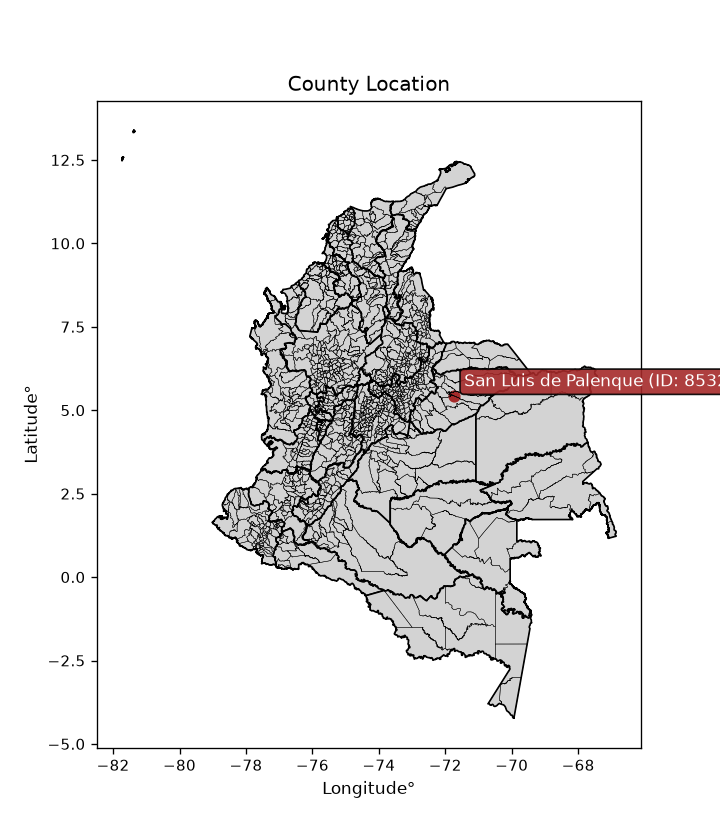
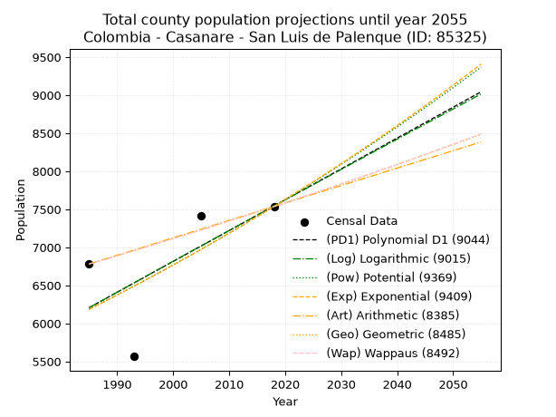
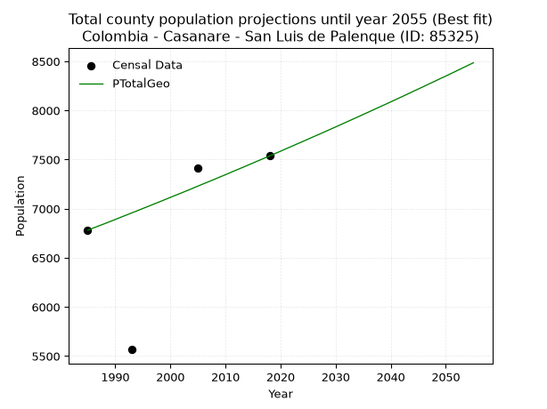
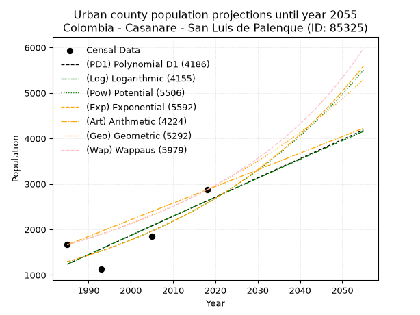
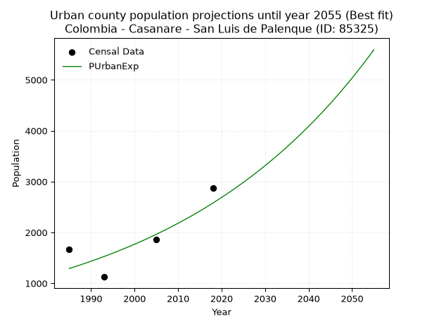
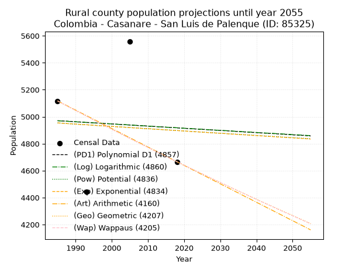
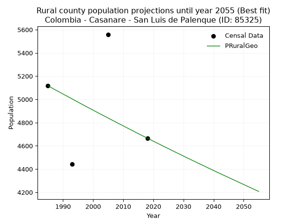

<div align="center">


</div>

# _“Population and Public Services Demand Projections (PPSD) until Year 2050 for Colombia - Casanare - San Luis de Palenque (ID: 85325)”_
Keywords: `population` `public-service` `projection` `lineal` `polynomial` `logarithmic` `potential` `exponential` `arithmetic` `geometric` `wappaus` `dane` `colombia` `south-america`

PPSD are analytical estimates used by governments and planners to anticipate future changes in population size, age distribution, and the resulting community needs for utilities, healthcare, education, and infrastructure as sizing future water treatment facilities, electrical grids, and road networks based on spatial growth.

<div align="center">

</img>

</div>


> **General running parameters**: • app_version: _v20260806_. • Python version: _3.14.7_. • Pandas version: _3.0.5_. • NumPy version: _2.5.1_. • Creates, save and include plots into reports (create_plot): _False_. • Projection until year: _2050_. • Process polynomial degree 2 and up: _False_. • Process Wappaus: _True_. • Process Wappaus: _True_. • Set negative values to zero: _True_. • Set infinite values to zero: _True_. • Drop dataset notes: _True_. 
<div align="center">

Dynamic map: [:earth_americas:Google](http://maps.google.com/maps?q=5.422396602,-71.732198) [:earth_americas:OSM](https://www.openstreetmap.org/#map=18/5.422396602/-71.732198&layers=P) [:earth_americas:Bing](https://www.bing.com/maps?cp=5.422396602~-71.732198&lvl=18) [:earth_americas:Apple](https://maps.apple.com/frame?center=5.422396602%2C-71.732198&span=0.003%2C0.006)

</div>


<div align="center">

```geojson
{
  "type": "Feature",
  "geometry": {
    "type": "Point", 
    "coordinates": [-71.732198, 5.422396602]
  }, 
  "properties": {
    "Name": "Colombia - Casanare - San Luis de Palenque (ID: 85325)"
  }
}
```

</div>


## 0. Census Data (4 records)

Census data are official statistics collected by a government about the people and housing in a country. They usually include counts of total population, age, sex, race, income, education, and jobs.

📅Global census file: [Population.xlsx](../data/Population.xlsx)

| Source   |   Year |   CountryID | CountryName   |   StateID | StateName   |   CountyID | CountyName           |   PTotal |   PUrban |   PRural |
|:---------|-------:|------------:|:--------------|----------:|:------------|-----------:|:---------------------|---------:|---------:|---------:|
| DANE     |   1985 |          57 | Colombia      |        85 | Casanare    |      85325 | San Luis de Palenque |     6781 |     1664 |     5117 |
| DANE     |   1993 |          57 | Colombia      |        85 | Casanare    |      85325 | San Luis de Palenque |     5566 |     1125 |     4441 |
| DANE     |   2005 |          57 | Colombia      |        85 | Casanare    |      85325 | San Luis de Palenque |     7415 |     1856 |     5559 |
| DANE     |   2018 |          57 | Colombia      |        85 | Casanare    |      85325 | San Luis de Palenque |     7537 |     2871 |     4666 |

> 🔥Some records could had specific notes about the registered values or the corresponding urban or rural distribution.

📅[SUI-RUPS](https://www.datos.gov.co/Hacienda-y-Cr-dito-P-blico/Registro-nico-de-Prestadores-de-Servicios-P-blicos/4qkq-csdn/about_data) - Local public utility companies: [RUPS.csv](../data/RUPS.xlsx)

 | SERVICIO       | ESTADO    | NOMBRE                                                                         | NIT         | DEPARTAMENTO_DOMICILIO   | MUNICIPIO_DOMICILIO   | DIRECCION         |   TELEFONO | EMAIL             | TIPO_PRESTADOR                             | CLASIFICACION                 |
|:---------------|:----------|:-------------------------------------------------------------------------------|:------------|:-------------------------|:----------------------|:------------------|-----------:|:------------------|:-------------------------------------------|:------------------------------|
| ACUEDUCTO      | OPERATIVA | EMPRESA DE ACUEDUCTO ALCANTARILLADO Y ASEO DE SAN LUIS DE PALENQUE S.A. E.S.P. | 900260682-2 | CASANARE                 | SAN LUIS DE PALENQUE  | calle 2 No 3 - 51 |    6370011 | easlp09@gmail.com | SOCIEDADES (EMPRESA DE SERVICIOS PUBLICOS) | MENOR O IGUAL A 2500 USUARIOS |
| ALCANTARILLADO | OPERATIVA | EMPRESA DE ACUEDUCTO ALCANTARILLADO Y ASEO DE SAN LUIS DE PALENQUE S.A. E.S.P. | 900260682-2 | CASANARE                 | SAN LUIS DE PALENQUE  | calle 2 No 3 - 51 |    6370011 | easlp09@gmail.com | SOCIEDADES (EMPRESA DE SERVICIOS PUBLICOS) | MENOR O IGUAL A 2500 USUARIOS |

## 1. Total

### 1.1. Coefficients and Parameters

* (PD1) Polynomial Deg 1: 40.52870333199498, -74242.78883982297 (lineal)
* (Log) Logarithmic: 81050.63102656112, -609241.745931886
* (Pow) Potential: 11.984096356564978, -35.72937425865111
* (Exp) Exponential: 0.005993131941208921, 0.04215195243015868
* (Art) Arithmetic: Year diff. 2018 - 1985 = 33, Population diff. 7537 - 6781 = 756, Annual growth = 22.90909090909091
* (Geo) Geometric: Year diff. 2018 - 1985 = 33, Population diff. 7537 - 6781 = 756, Annual growth % = 0.00320815457700685
* (Wap) Wappaus: i = 0.32000406354366406, Condition values only valid for < 200)

<sub>
Wappaus condition values: ['0.00', '0.32', '0.64', '0.96', '1.28', '1.60', '1.92', '2.24', '2.56', '2.88', '3.20', '3.52', '3.84', '4.16', '4.48', '4.80', '5.12', '5.44', '5.76', '6.08', '6.40', '6.72', '7.04', '7.36', '7.68', '8.00', '8.32', '8.64', '8.96', '9.28', '9.60', '9.92', '10.24', '10.56', '10.88', '11.20', '11.52', '11.84', '12.16', '12.48', '12.80', '13.12', '13.44', '13.76', '14.08', '14.40', '14.72', '15.04', '15.36', '15.68', '16.00', '16.32', '16.64', '16.96', '17.28', '17.60', '17.92', '18.24', '18.56', '18.88', '19.20', '19.52', '19.84', '20.16', '20.48', '20.80']
</sub>


### 1.2. Projected Dataset

|   Year |   CountyID |   PTotalPD1 |   PTotalLog |   PTotalPow |   PTotalExp |   PTotalArt |   PTotalGeo |   PTotalWap |
|-------:|-----------:|------------:|------------:|------------:|------------:|------------:|------------:|------------:|
|   1985 |      85325 |        6207 |        6206 |        6185 |        6185 |        6781 |        6781 |        6781 |
|   1986 |      85325 |        6247 |        6247 |        6222 |        6222 |        6804 |        6803 |        6803 |
|   1987 |      85325 |        6288 |        6288 |        6260 |        6260 |        6827 |        6825 |        6825 |
|   1988 |      85325 |        6328 |        6328 |        6297 |        6297 |        6850 |        6846 |        6846 |
|   1989 |      85325 |        6369 |        6369 |        6336 |        6335 |        6873 |        6868 |        6868 |
|   1990 |      85325 |        6409 |        6410 |        6374 |        6373 |        6896 |        6890 |        6890 |
|   1991 |      85325 |        6450 |        6451 |        6412 |        6412 |        6918 |        6913 |        6912 |
|   1992 |      85325 |        6490 |        6491 |        6451 |        6450 |        6941 |        6935 |        6935 |
|   1993 |      85325 |        6531 |        6532 |        6490 |        6489 |        6964 |        6957 |        6957 |
|   1994 |      85325 |        6571 |        6573 |        6529 |        6528 |        6987 |        6979 |        6979 |
|   1995 |      85325 |        6612 |        6613 |        6568 |        6567 |        7010 |        7002 |        7002 |
|   1996 |      85325 |        6653 |        6654 |        6608 |        6607 |        7033 |        7024 |        7024 |
|   1997 |      85325 |        6693 |        6695 |        6648 |        6646 |        7056 |        7047 |        7046 |
|   1998 |      85325 |        6734 |        6735 |        6688 |        6686 |        7079 |        7069 |        7069 |
|   1999 |      85325 |        6774 |        6776 |        6728 |        6726 |        7102 |        7092 |        7092 |
|   2000 |      85325 |        6815 |        6816 |        6768 |        6767 |        7125 |        7115 |        7114 |
|   2001 |      85325 |        6855 |        6857 |        6809 |        6808 |        7148 |        7138 |        7137 |
|   2002 |      85325 |        6896 |        6897 |        6850 |        6848 |        7170 |        7160 |        7160 |
|   2003 |      85325 |        6936 |        6938 |        6891 |        6890 |        7193 |        7183 |        7183 |
|   2004 |      85325 |        6977 |        6978 |        6932 |        6931 |        7216 |        7206 |        7206 |
|   2005 |      85325 |        7017 |        7019 |        6974 |        6973 |        7239 |        7230 |        7229 |
|   2006 |      85325 |        7058 |        7059 |        7016 |        7015 |        7262 |        7253 |        7253 |
|   2007 |      85325 |        7098 |        7099 |        7058 |        7057 |        7285 |        7276 |        7276 |
|   2008 |      85325 |        7139 |        7140 |        7100 |        7099 |        7308 |        7299 |        7299 |
|   2009 |      85325 |        7179 |        7180 |        7143 |        7142 |        7331 |        7323 |        7323 |
|   2010 |      85325 |        7220 |        7220 |        7185 |        7185 |        7354 |        7346 |        7346 |
|   2011 |      85325 |        7260 |        7261 |        7228 |        7228 |        7377 |        7370 |        7370 |
|   2012 |      85325 |        7301 |        7301 |        7271 |        7271 |        7400 |        7394 |        7393 |
|   2013 |      85325 |        7341 |        7341 |        7315 |        7315 |        7422 |        7417 |        7417 |
|   2014 |      85325 |        7382 |        7382 |        7359 |        7359 |        7445 |        7441 |        7441 |
|   2015 |      85325 |        7423 |        7422 |        7402 |        7403 |        7468 |        7465 |        7465 |
|   2016 |      85325 |        7463 |        7462 |        7447 |        7448 |        7491 |        7489 |        7489 |
|   2017 |      85325 |        7504 |        7502 |        7491 |        7493 |        7514 |        7513 |        7513 |
|   2018 |      85325 |        7544 |        7542 |        7536 |        7538 |        7537 |        7537 |        7537 |
|   2019 |      85325 |        7585 |        7583 |        7581 |        7583 |        7560 |        7561 |        7561 |
|   2020 |      85325 |        7625 |        7623 |        7626 |        7629 |        7583 |        7585 |        7586 |
|   2021 |      85325 |        7666 |        7663 |        7671 |        7674 |        7606 |        7610 |        7610 |
|   2022 |      85325 |        7706 |        7703 |        7717 |        7721 |        7629 |        7634 |        7634 |
|   2023 |      85325 |        7747 |        7743 |        7762 |        7767 |        7652 |        7659 |        7659 |
|   2024 |      85325 |        7787 |        7783 |        7809 |        7814 |        7674 |        7683 |        7684 |
|   2025 |      85325 |        7828 |        7823 |        7855 |        7861 |        7697 |        7708 |        7708 |
|   2026 |      85325 |        7868 |        7863 |        7902 |        7908 |        7720 |        7733 |        7733 |
|   2027 |      85325 |        7909 |        7903 |        7948 |        7955 |        7743 |        7757 |        7758 |
|   2028 |      85325 |        7949 |        7943 |        7996 |        8003 |        7766 |        7782 |        7783 |
|   2029 |      85325 |        7990 |        7983 |        8043 |        8051 |        7789 |        7807 |        7808 |
|   2030 |      85325 |        8030 |        8023 |        8091 |        8100 |        7812 |        7832 |        7833 |
|   2031 |      85325 |        8071 |        8063 |        8138 |        8148 |        7835 |        7857 |        7858 |
|   2032 |      85325 |        8112 |        8103 |        8187 |        8197 |        7858 |        7883 |        7884 |
|   2033 |      85325 |        8152 |        8143 |        8235 |        8247 |        7881 |        7908 |        7909 |
|   2034 |      85325 |        8193 |        8182 |        8284 |        8296 |        7904 |        7933 |        7935 |
|   2035 |      85325 |        8233 |        8222 |        8333 |        8346 |        7926 |        7959 |        7960 |
|   2036 |      85325 |        8274 |        8262 |        8382 |        8396 |        7949 |        7984 |        7986 |
|   2037 |      85325 |        8314 |        8302 |        8431 |        8447 |        7972 |        8010 |        8012 |
|   2038 |      85325 |        8355 |        8342 |        8481 |        8498 |        7995 |        8036 |        8038 |
|   2039 |      85325 |        8395 |        8381 |        8531 |        8549 |        8018 |        8061 |        8064 |
|   2040 |      85325 |        8436 |        8421 |        8581 |        8600 |        8041 |        8087 |        8090 |
|   2041 |      85325 |        8476 |        8461 |        8632 |        8652 |        8064 |        8113 |        8116 |
|   2042 |      85325 |        8517 |        8501 |        8683 |        8704 |        8087 |        8139 |        8142 |
|   2043 |      85325 |        8557 |        8540 |        8734 |        8756 |        8110 |        8165 |        8168 |
|   2044 |      85325 |        8598 |        8580 |        8785 |        8809 |        8133 |        8192 |        8195 |
|   2045 |      85325 |        8638 |        8620 |        8837 |        8862 |        8156 |        8218 |        8221 |
|   2046 |      85325 |        8679 |        8659 |        8889 |        8915 |        8178 |        8244 |        8248 |
|   2047 |      85325 |        8719 |        8699 |        8941 |        8968 |        8201 |        8271 |        8275 |
|   2048 |      85325 |        8760 |        8738 |        8993 |        9022 |        8224 |        8297 |        8301 |
|   2049 |      85325 |        8801 |        8778 |        9046 |        9077 |        8247 |        8324 |        8328 |
|   2050 |      85325 |        8841 |        8818 |        9099 |        9131 |        8270 |        8350 |        8355 |
<div align="center">

</img>

</div>


### 1.3. Best fit with absolute and relative error (%)

Relative error puts that difference into context by dividing the absolute error by the true value, creating a unitless ratio or percentage that shows the scale of the mistake.

Absolute and relative error

|   Year | Source   |   CountryID | CountryName   |   StateID | StateName   |   CountyID_x | CountyName           |   PTotal |   PUrban |   PRural |   CountyID_y |   PTotalPD1 |   PTotalLog |   PTotalPow |   PTotalExp |   PTotalArt |   PTotalGeo |   PTotalWap |   PTotalPD1AbsError |   PTotalLogAbsError |   PTotalPowAbsError |   PTotalExpAbsError |   PTotalArtAbsError |   PTotalGeoAbsError |   PTotalWapAbsError |   PTotalPD1RelError |   PTotalLogRelError |   PTotalPowRelError |   PTotalExpRelError |   PTotalArtRelError |   PTotalGeoRelError |   PTotalWapRelError |
|-------:|:---------|------------:|:--------------|----------:|:------------|-------------:|:---------------------|---------:|---------:|---------:|-------------:|------------:|------------:|------------:|------------:|------------:|------------:|------------:|--------------------:|--------------------:|--------------------:|--------------------:|--------------------:|--------------------:|--------------------:|--------------------:|--------------------:|--------------------:|--------------------:|--------------------:|--------------------:|--------------------:|
|   1985 | DANE     |          57 | Colombia      |        85 | Casanare    |        85325 | San Luis de Palenque |     6781 |     1664 |     5117 |        85325 |        6207 |        6206 |        6185 |        6185 |        6781 |        6781 |        6781 |                 574 |                 575 |                 596 |                 596 |                   0 |                   0 |                   0 |           8.46483   |           8.47958   |           8.78926   |           8.78926   |             0       |             0       |             0       |
|   1993 | DANE     |          57 | Colombia      |        85 | Casanare    |        85325 | San Luis de Palenque |     5566 |     1125 |     4441 |        85325 |        6531 |        6532 |        6490 |        6489 |        6964 |        6957 |        6957 |                 965 |                 966 |                 924 |                 923 |                1398 |                1391 |                1391 |          17.3374    |          17.3554    |          16.6008    |          16.5828    |            25.1168  |            24.991   |            24.991   |
|   2005 | DANE     |          57 | Colombia      |        85 | Casanare    |        85325 | San Luis de Palenque |     7415 |     1856 |     5559 |        85325 |        7017 |        7019 |        6974 |        6973 |        7239 |        7230 |        7229 |                 398 |                 396 |                 441 |                 442 |                 176 |                 185 |                 186 |           5.3675    |           5.34053   |           5.9474    |           5.96089   |             2.37357 |             2.49494 |             2.50843 |
|   2018 | DANE     |          57 | Colombia      |        85 | Casanare    |        85325 | San Luis de Palenque |     7537 |     2871 |     4666 |        85325 |        7544 |        7542 |        7536 |        7538 |        7537 |        7537 |        7537 |                   7 |                   5 |                   1 |                   1 |                   0 |                   0 |                   0 |           0.0928751 |           0.0663394 |           0.0132679 |           0.0132679 |             0       |             0       |             0       |

Relative error mean

| Method    |   RelError | Best   |
|:----------|-----------:|:-------|
| PTotalPD1 |    7.81565 |        |
| PTotalLog |    7.81045 |        |
| PTotalPow |    7.83768 |        |
| PTotalExp |    7.83656 |        |
| PTotalArt |    6.87259 |        |
| PTotalGeo |    6.87149 | True   |
| PTotalWap |    6.87486 |        |

💙Best method: _**PTotalGeo**_
<div align="center">

</img>

</div>


### 1.4. Fresh water supply demand in liters per capita per day (lpcd)

The fresh water supply demand typically ranges from 100 to 300 liters per capita per day (lpcd) for standard domestic and municipal planning, though absolute survival minimums set by the World Health Organization are as low as 7.5 to 20 liters per day, and total consumption in high-income nations can exceed 400 liters.

> `CZ`: Level in meters above the sea level (masl)<br> `WS`: Fresh water supply demand in liters per capita per day (lpcd or l/h/d)<br> `WSAll`: Zonal fresh water supply demand in liters per second (l/s)<br> `A`: Zonal area in square meters<br> `DP`: Population density (people/hectare or p/ha)

Reference values (RAS Colombia)

|    CZ |   WS |
|------:|-----:|
|  1000 |  120 |
|  2000 |  130 |
| 99999 |  140 |

County shapefile geometry properties and water supply values

|   CountyID |      ATotal |   CZTotal |   WSTotal |
|-----------:|------------:|----------:|----------:|
|      85325 | 2.98101e+09 |   157.252 |       120 |

Projected values for best method: PTotalGeo

|   CountyID |   Year |   PTotalGeo |   DPTotal |   WSTotal |   WSTotalAll |
|-----------:|-------:|------------:|----------:|----------:|-------------:|
|      85325 |   1985 |        6781 |      0.02 |       120 |      9.41806 |
|      85325 |   1986 |        6803 |      0.02 |       120 |      9.44861 |
|      85325 |   1987 |        6825 |      0.02 |       120 |      9.47917 |
|      85325 |   1988 |        6846 |      0.02 |       120 |      9.50833 |
|      85325 |   1989 |        6868 |      0.02 |       120 |      9.53889 |
|      85325 |   1990 |        6890 |      0.02 |       120 |      9.56944 |
|      85325 |   1991 |        6913 |      0.02 |       120 |      9.60139 |
|      85325 |   1992 |        6935 |      0.02 |       120 |      9.63194 |
|      85325 |   1993 |        6957 |      0.02 |       120 |      9.6625  |
|      85325 |   1994 |        6979 |      0.02 |       120 |      9.69306 |
|      85325 |   1995 |        7002 |      0.02 |       120 |      9.725   |
|      85325 |   1996 |        7024 |      0.02 |       120 |      9.75556 |
|      85325 |   1997 |        7047 |      0.02 |       120 |      9.7875  |
|      85325 |   1998 |        7069 |      0.02 |       120 |      9.81806 |
|      85325 |   1999 |        7092 |      0.02 |       120 |      9.85    |
|      85325 |   2000 |        7115 |      0.02 |       120 |      9.88194 |
|      85325 |   2001 |        7138 |      0.02 |       120 |      9.91389 |
|      85325 |   2002 |        7160 |      0.02 |       120 |      9.94444 |
|      85325 |   2003 |        7183 |      0.02 |       120 |      9.97639 |
|      85325 |   2004 |        7206 |      0.02 |       120 |     10.0083  |
|      85325 |   2005 |        7230 |      0.02 |       120 |     10.0417  |
|      85325 |   2006 |        7253 |      0.02 |       120 |     10.0736  |
|      85325 |   2007 |        7276 |      0.02 |       120 |     10.1056  |
|      85325 |   2008 |        7299 |      0.02 |       120 |     10.1375  |
|      85325 |   2009 |        7323 |      0.02 |       120 |     10.1708  |
|      85325 |   2010 |        7346 |      0.02 |       120 |     10.2028  |
|      85325 |   2011 |        7370 |      0.02 |       120 |     10.2361  |
|      85325 |   2012 |        7394 |      0.02 |       120 |     10.2694  |
|      85325 |   2013 |        7417 |      0.02 |       120 |     10.3014  |
|      85325 |   2014 |        7441 |      0.02 |       120 |     10.3347  |
|      85325 |   2015 |        7465 |      0.03 |       120 |     10.3681  |
|      85325 |   2016 |        7489 |      0.03 |       120 |     10.4014  |
|      85325 |   2017 |        7513 |      0.03 |       120 |     10.4347  |
|      85325 |   2018 |        7537 |      0.03 |       120 |     10.4681  |
|      85325 |   2019 |        7561 |      0.03 |       120 |     10.5014  |
|      85325 |   2020 |        7585 |      0.03 |       120 |     10.5347  |
|      85325 |   2021 |        7610 |      0.03 |       120 |     10.5694  |
|      85325 |   2022 |        7634 |      0.03 |       120 |     10.6028  |
|      85325 |   2023 |        7659 |      0.03 |       120 |     10.6375  |
|      85325 |   2024 |        7683 |      0.03 |       120 |     10.6708  |
|      85325 |   2025 |        7708 |      0.03 |       120 |     10.7056  |
|      85325 |   2026 |        7733 |      0.03 |       120 |     10.7403  |
|      85325 |   2027 |        7757 |      0.03 |       120 |     10.7736  |
|      85325 |   2028 |        7782 |      0.03 |       120 |     10.8083  |
|      85325 |   2029 |        7807 |      0.03 |       120 |     10.8431  |
|      85325 |   2030 |        7832 |      0.03 |       120 |     10.8778  |
|      85325 |   2031 |        7857 |      0.03 |       120 |     10.9125  |
|      85325 |   2032 |        7883 |      0.03 |       120 |     10.9486  |
|      85325 |   2033 |        7908 |      0.03 |       120 |     10.9833  |
|      85325 |   2034 |        7933 |      0.03 |       120 |     11.0181  |
|      85325 |   2035 |        7959 |      0.03 |       120 |     11.0542  |
|      85325 |   2036 |        7984 |      0.03 |       120 |     11.0889  |
|      85325 |   2037 |        8010 |      0.03 |       120 |     11.125   |
|      85325 |   2038 |        8036 |      0.03 |       120 |     11.1611  |
|      85325 |   2039 |        8061 |      0.03 |       120 |     11.1958  |
|      85325 |   2040 |        8087 |      0.03 |       120 |     11.2319  |
|      85325 |   2041 |        8113 |      0.03 |       120 |     11.2681  |
|      85325 |   2042 |        8139 |      0.03 |       120 |     11.3042  |
|      85325 |   2043 |        8165 |      0.03 |       120 |     11.3403  |
|      85325 |   2044 |        8192 |      0.03 |       120 |     11.3778  |
|      85325 |   2045 |        8218 |      0.03 |       120 |     11.4139  |
|      85325 |   2046 |        8244 |      0.03 |       120 |     11.45    |
|      85325 |   2047 |        8271 |      0.03 |       120 |     11.4875  |
|      85325 |   2048 |        8297 |      0.03 |       120 |     11.5236  |
|      85325 |   2049 |        8324 |      0.03 |       120 |     11.5611  |
|      85325 |   2050 |        8350 |      0.03 |       120 |     11.5972  |

## 2. Urban

### 2.1. Coefficients and Parameters

* (PD1) Polynomial Deg 1: 42.142111601765684, -82415.7587314318 (lineal)
* (Log) Logarithmic: 84233.75504110048, -638382.4470743546
* (Pow) Potential: 41.84582717983901, -134.88651973731928
* (Exp) Exponential: 0.02093638884520435, 1.1543561465448068e-15
* (Art) Arithmetic: Year diff. 2018 - 1985 = 33, Population diff. 2871 - 1664 = 1207, Annual growth = 36.57575757575758
* (Geo) Geometric: Year diff. 2018 - 1985 = 33, Population diff. 2871 - 1664 = 1207, Annual growth % = 0.01666571452334864
* (Wap) Wappaus: i = 1.6130433329992315, Condition values only valid for < 200)

<sub>
Wappaus condition values: ['0.00', '1.61', '3.23', '4.84', '6.45', '8.07', '9.68', '11.29', '12.90', '14.52', '16.13', '17.74', '19.36', '20.97', '22.58', '24.20', '25.81', '27.42', '29.03', '30.65', '32.26', '33.87', '35.49', '37.10', '38.71', '40.33', '41.94', '43.55', '45.17', '46.78', '48.39', '50.00', '51.62', '53.23', '54.84', '56.46', '58.07', '59.68', '61.30', '62.91', '64.52', '66.13', '67.75', '69.36', '70.97', '72.59', '74.20', '75.81', '77.43', '79.04', '80.65', '82.27', '83.88', '85.49', '87.10', '88.72', '90.33', '91.94', '93.56', '95.17', '96.78', '98.40', '100.01', '101.62', '103.23', '104.85']
</sub>


### 2.2. Projected Dataset

|   Year |   CountyID |   PUrbanPD1 |   PUrbanLog |   PUrbanPow |   PUrbanExp |   PUrbanArt |   PUrbanGeo |   PUrbanWap |
|-------:|-----------:|------------:|------------:|------------:|------------:|------------:|------------:|------------:|
|   1985 |      85325 |        1236 |        1236 |        1291 |        1291 |        1664 |        1664 |        1664 |
|   1986 |      85325 |        1278 |        1278 |        1319 |        1319 |        1701 |        1692 |        1691 |
|   1987 |      85325 |        1321 |        1321 |        1347 |        1347 |        1737 |        1720 |        1719 |
|   1988 |      85325 |        1363 |        1363 |        1375 |        1375 |        1774 |        1749 |        1747 |
|   1989 |      85325 |        1405 |        1406 |        1405 |        1404 |        1810 |        1778 |        1775 |
|   1990 |      85325 |        1447 |        1448 |        1435 |        1434 |        1847 |        1807 |        1804 |
|   1991 |      85325 |        1489 |        1490 |        1465 |        1464 |        1883 |        1837 |        1833 |
|   1992 |      85325 |        1531 |        1532 |        1496 |        1495 |        1920 |        1868 |        1863 |
|   1993 |      85325 |        1573 |        1575 |        1528 |        1527 |        1957 |        1899 |        1894 |
|   1994 |      85325 |        1616 |        1617 |        1560 |        1559 |        1993 |        1931 |        1924 |
|   1995 |      85325 |        1658 |        1659 |        1593 |        1592 |        2030 |        1963 |        1956 |
|   1996 |      85325 |        1700 |        1701 |        1627 |        1626 |        2066 |        1996 |        1988 |
|   1997 |      85325 |        1742 |        1744 |        1662 |        1660 |        2103 |        2029 |        2021 |
|   1998 |      85325 |        1784 |        1786 |        1697 |        1695 |        2139 |        2063 |        2054 |
|   1999 |      85325 |        1826 |        1828 |        1733 |        1731 |        2176 |        2097 |        2088 |
|   2000 |      85325 |        1868 |        1870 |        1769 |        1768 |        2213 |        2132 |        2122 |
|   2001 |      85325 |        1911 |        1912 |        1807 |        1805 |        2249 |        2168 |        2157 |
|   2002 |      85325 |        1953 |        1954 |        1845 |        1843 |        2286 |        2204 |        2193 |
|   2003 |      85325 |        1995 |        1996 |        1884 |        1882 |        2322 |        2241 |        2229 |
|   2004 |      85325 |        2037 |        2038 |        1924 |        1922 |        2359 |        2278 |        2266 |
|   2005 |      85325 |        2079 |        2080 |        1964 |        1963 |        2396 |        2316 |        2304 |
|   2006 |      85325 |        2121 |        2122 |        2006 |        2005 |        2432 |        2354 |        2343 |
|   2007 |      85325 |        2163 |        2164 |        2048 |        2047 |        2469 |        2394 |        2382 |
|   2008 |      85325 |        2206 |        2206 |        2091 |        2090 |        2505 |        2434 |        2422 |
|   2009 |      85325 |        2248 |        2248 |        2135 |        2134 |        2542 |        2474 |        2463 |
|   2010 |      85325 |        2290 |        2290 |        2180 |        2180 |        2578 |        2515 |        2504 |
|   2011 |      85325 |        2332 |        2332 |        2226 |        2226 |        2615 |        2557 |        2547 |
|   2012 |      85325 |        2374 |        2374 |        2273 |        2273 |        2652 |        2600 |        2590 |
|   2013 |      85325 |        2416 |        2416 |        2320 |        2321 |        2688 |        2643 |        2635 |
|   2014 |      85325 |        2458 |        2458 |        2369 |        2370 |        2725 |        2687 |        2680 |
|   2015 |      85325 |        2501 |        2500 |        2419 |        2420 |        2761 |        2732 |        2726 |
|   2016 |      85325 |        2543 |        2541 |        2470 |        2471 |        2798 |        2778 |        2773 |
|   2017 |      85325 |        2585 |        2583 |        2521 |        2524 |        2834 |        2824 |        2822 |
|   2018 |      85325 |        2627 |        2625 |        2574 |        2577 |        2871 |        2871 |        2871 |
|   2019 |      85325 |        2669 |        2667 |        2628 |        2632 |        2908 |        2919 |        2921 |
|   2020 |      85325 |        2711 |        2708 |        2683 |        2687 |        2944 |        2967 |        2973 |
|   2021 |      85325 |        2753 |        2750 |        2739 |        2744 |        2981 |        3017 |        3026 |
|   2022 |      85325 |        2796 |        2792 |        2797 |        2802 |        3017 |        3067 |        3080 |
|   2023 |      85325 |        2838 |        2833 |        2855 |        2861 |        3054 |        3118 |        3135 |
|   2024 |      85325 |        2880 |        2875 |        2915 |        2922 |        3090 |        3170 |        3191 |
|   2025 |      85325 |        2922 |        2917 |        2976 |        2984 |        3127 |        3223 |        3249 |
|   2026 |      85325 |        2964 |        2958 |        3038 |        3047 |        3164 |        3277 |        3308 |
|   2027 |      85325 |        3006 |        3000 |        3101 |        3111 |        3200 |        3331 |        3369 |
|   2028 |      85325 |        3048 |        3041 |        3166 |        3177 |        3237 |        3387 |        3431 |
|   2029 |      85325 |        3091 |        3083 |        3232 |        3244 |        3273 |        3443 |        3495 |
|   2030 |      85325 |        3133 |        3124 |        3299 |        3313 |        3310 |        3501 |        3560 |
|   2031 |      85325 |        3175 |        3166 |        3368 |        3383 |        3346 |        3559 |        3627 |
|   2032 |      85325 |        3217 |        3207 |        3438 |        3455 |        3383 |        3618 |        3696 |
|   2033 |      85325 |        3259 |        3249 |        3509 |        3528 |        3420 |        3679 |        3766 |
|   2034 |      85325 |        3301 |        3290 |        3582 |        3602 |        3456 |        3740 |        3839 |
|   2035 |      85325 |        3343 |        3331 |        3657 |        3679 |        3493 |        3802 |        3913 |
|   2036 |      85325 |        3386 |        3373 |        3733 |        3757 |        3529 |        3866 |        3989 |
|   2037 |      85325 |        3428 |        3414 |        3810 |        3836 |        3566 |        3930 |        4068 |
|   2038 |      85325 |        3470 |        3456 |        3889 |        3917 |        3603 |        3996 |        4149 |
|   2039 |      85325 |        3512 |        3497 |        3970 |        4000 |        3639 |        4062 |        4232 |
|   2040 |      85325 |        3554 |        3538 |        4052 |        4085 |        3676 |        4130 |        4317 |
|   2041 |      85325 |        3596 |        3579 |        4136 |        4171 |        3712 |        4199 |        4405 |
|   2042 |      85325 |        3638 |        3621 |        4222 |        4259 |        3749 |        4269 |        4496 |
|   2043 |      85325 |        3681 |        3662 |        4309 |        4349 |        3785 |        4340 |        4589 |
|   2044 |      85325 |        3723 |        3703 |        4398 |        4441 |        3822 |        4412 |        4685 |
|   2045 |      85325 |        3765 |        3744 |        4489 |        4535 |        3859 |        4486 |        4785 |
|   2046 |      85325 |        3807 |        3786 |        4582 |        4631 |        3895 |        4561 |        4887 |
|   2047 |      85325 |        3849 |        3827 |        4677 |        4729 |        3932 |        4637 |        4993 |
|   2048 |      85325 |        3891 |        3868 |        4773 |        4829 |        3968 |        4714 |        5102 |
|   2049 |      85325 |        3933 |        3909 |        4872 |        4932 |        4005 |        4792 |        5215 |
|   2050 |      85325 |        3976 |        3950 |        4972 |        5036 |        4041 |        4872 |        5331 |
<div align="center">

</img>

</div>


### 2.3. Best fit with absolute and relative error (%)

Relative error puts that difference into context by dividing the absolute error by the true value, creating a unitless ratio or percentage that shows the scale of the mistake.

Absolute and relative error

|   Year | Source   |   CountryID | CountryName   |   StateID | StateName   |   CountyID_x | CountyName           |   PTotal |   PUrban |   PRural |   CountyID_y |   PUrbanPD1 |   PUrbanLog |   PUrbanPow |   PUrbanExp |   PUrbanArt |   PUrbanGeo |   PUrbanWap |   PUrbanPD1AbsError |   PUrbanLogAbsError |   PUrbanPowAbsError |   PUrbanExpAbsError |   PUrbanArtAbsError |   PUrbanGeoAbsError |   PUrbanWapAbsError |   PUrbanPD1RelError |   PUrbanLogRelError |   PUrbanPowRelError |   PUrbanExpRelError |   PUrbanArtRelError |   PUrbanGeoRelError |   PUrbanWapRelError |
|-------:|:---------|------------:|:--------------|----------:|:------------|-------------:|:---------------------|---------:|---------:|---------:|-------------:|------------:|------------:|------------:|------------:|------------:|------------:|------------:|--------------------:|--------------------:|--------------------:|--------------------:|--------------------:|--------------------:|--------------------:|--------------------:|--------------------:|--------------------:|--------------------:|--------------------:|--------------------:|--------------------:|
|   1985 | DANE     |          57 | Colombia      |        85 | Casanare    |        85325 | San Luis de Palenque |     6781 |     1664 |     5117 |        85325 |        1236 |        1236 |        1291 |        1291 |        1664 |        1664 |        1664 |                 428 |                 428 |                 373 |                 373 |                   0 |                   0 |                   0 |            25.7212  |            25.7212  |            22.4159  |            22.4159  |              0      |              0      |              0      |
|   1993 | DANE     |          57 | Colombia      |        85 | Casanare    |        85325 | San Luis de Palenque |     5566 |     1125 |     4441 |        85325 |        1573 |        1575 |        1528 |        1527 |        1957 |        1899 |        1894 |                 448 |                 450 |                 403 |                 402 |                 832 |                 774 |                 769 |            39.8222  |            40       |            35.8222  |            35.7333  |             73.9556 |             68.8    |             68.3556 |
|   2005 | DANE     |          57 | Colombia      |        85 | Casanare    |        85325 | San Luis de Palenque |     7415 |     1856 |     5559 |        85325 |        2079 |        2080 |        1964 |        1963 |        2396 |        2316 |        2304 |                 223 |                 224 |                 108 |                 107 |                 540 |                 460 |                 448 |            12.0151  |            12.069   |             5.81897 |             5.76509 |             29.0948 |             24.7845 |             24.1379 |
|   2018 | DANE     |          57 | Colombia      |        85 | Casanare    |        85325 | San Luis de Palenque |     7537 |     2871 |     4666 |        85325 |        2627 |        2625 |        2574 |        2577 |        2871 |        2871 |        2871 |                 244 |                 246 |                 297 |                 294 |                   0 |                   0 |                   0 |             8.49878 |             8.56844 |            10.3448  |            10.2403  |              0      |              0      |              0      |

Relative error mean

| Method    |   RelError | Best   |
|:----------|-----------:|:-------|
| PUrbanPD1 |    21.5143 |        |
| PUrbanLog |    21.5896 |        |
| PUrbanPow |    18.6005 |        |
| PUrbanExp |    18.5387 | True   |
| PUrbanArt |    25.7626 |        |
| PUrbanGeo |    23.3961 |        |
| PUrbanWap |    23.1234 |        |

💙Best method: _**PUrbanExp**_
<div align="center">

</img>

</div>


### 2.4. Fresh water supply demand in liters per capita per day (lpcd)

The fresh water supply demand typically ranges from 100 to 300 liters per capita per day (lpcd) for standard domestic and municipal planning, though absolute survival minimums set by the World Health Organization are as low as 7.5 to 20 liters per day, and total consumption in high-income nations can exceed 400 liters.

> `CZ`: Level in meters above the sea level (masl)<br> `WS`: Fresh water supply demand in liters per capita per day (lpcd or l/h/d)<br> `WSAll`: Zonal fresh water supply demand in liters per second (l/s)<br> `A`: Zonal area in square meters<br> `DP`: Population density (people/hectare or p/ha)

Reference values (RAS Colombia)

|    CZ |   WS |
|------:|-----:|
|  1000 |  120 |
|  2000 |  130 |
| 99999 |  140 |

County shapefile geometry properties and water supply values

|   CountyID |   AUrban |   CZUrban |   WSUrban |
|-----------:|---------:|----------:|----------:|
|      85325 |   861244 |   171.383 |       120 |

Projected values for best method: PUrbanExp

|   CountyID |   Year |   PUrbanExp |   DPUrban |   WSUrban |   WSUrbanAll |
|-----------:|-------:|------------:|----------:|----------:|-------------:|
|      85325 |   1985 |        1291 |     14.99 |       120 |      1.79306 |
|      85325 |   1986 |        1319 |     15.32 |       120 |      1.83194 |
|      85325 |   1987 |        1347 |     15.64 |       120 |      1.87083 |
|      85325 |   1988 |        1375 |     15.97 |       120 |      1.90972 |
|      85325 |   1989 |        1404 |     16.3  |       120 |      1.95    |
|      85325 |   1990 |        1434 |     16.65 |       120 |      1.99167 |
|      85325 |   1991 |        1464 |     17    |       120 |      2.03333 |
|      85325 |   1992 |        1495 |     17.36 |       120 |      2.07639 |
|      85325 |   1993 |        1527 |     17.73 |       120 |      2.12083 |
|      85325 |   1994 |        1559 |     18.1  |       120 |      2.16528 |
|      85325 |   1995 |        1592 |     18.48 |       120 |      2.21111 |
|      85325 |   1996 |        1626 |     18.88 |       120 |      2.25833 |
|      85325 |   1997 |        1660 |     19.27 |       120 |      2.30556 |
|      85325 |   1998 |        1695 |     19.68 |       120 |      2.35417 |
|      85325 |   1999 |        1731 |     20.1  |       120 |      2.40417 |
|      85325 |   2000 |        1768 |     20.53 |       120 |      2.45556 |
|      85325 |   2001 |        1805 |     20.96 |       120 |      2.50694 |
|      85325 |   2002 |        1843 |     21.4  |       120 |      2.55972 |
|      85325 |   2003 |        1882 |     21.85 |       120 |      2.61389 |
|      85325 |   2004 |        1922 |     22.32 |       120 |      2.66944 |
|      85325 |   2005 |        1963 |     22.79 |       120 |      2.72639 |
|      85325 |   2006 |        2005 |     23.28 |       120 |      2.78472 |
|      85325 |   2007 |        2047 |     23.77 |       120 |      2.84306 |
|      85325 |   2008 |        2090 |     24.27 |       120 |      2.90278 |
|      85325 |   2009 |        2134 |     24.78 |       120 |      2.96389 |
|      85325 |   2010 |        2180 |     25.31 |       120 |      3.02778 |
|      85325 |   2011 |        2226 |     25.85 |       120 |      3.09167 |
|      85325 |   2012 |        2273 |     26.39 |       120 |      3.15694 |
|      85325 |   2013 |        2321 |     26.95 |       120 |      3.22361 |
|      85325 |   2014 |        2370 |     27.52 |       120 |      3.29167 |
|      85325 |   2015 |        2420 |     28.1  |       120 |      3.36111 |
|      85325 |   2016 |        2471 |     28.69 |       120 |      3.43194 |
|      85325 |   2017 |        2524 |     29.31 |       120 |      3.50556 |
|      85325 |   2018 |        2577 |     29.92 |       120 |      3.57917 |
|      85325 |   2019 |        2632 |     30.56 |       120 |      3.65556 |
|      85325 |   2020 |        2687 |     31.2  |       120 |      3.73194 |
|      85325 |   2021 |        2744 |     31.86 |       120 |      3.81111 |
|      85325 |   2022 |        2802 |     32.53 |       120 |      3.89167 |
|      85325 |   2023 |        2861 |     33.22 |       120 |      3.97361 |
|      85325 |   2024 |        2922 |     33.93 |       120 |      4.05833 |
|      85325 |   2025 |        2984 |     34.65 |       120 |      4.14444 |
|      85325 |   2026 |        3047 |     35.38 |       120 |      4.23194 |
|      85325 |   2027 |        3111 |     36.12 |       120 |      4.32083 |
|      85325 |   2028 |        3177 |     36.89 |       120 |      4.4125  |
|      85325 |   2029 |        3244 |     37.67 |       120 |      4.50556 |
|      85325 |   2030 |        3313 |     38.47 |       120 |      4.60139 |
|      85325 |   2031 |        3383 |     39.28 |       120 |      4.69861 |
|      85325 |   2032 |        3455 |     40.12 |       120 |      4.79861 |
|      85325 |   2033 |        3528 |     40.96 |       120 |      4.9     |
|      85325 |   2034 |        3602 |     41.82 |       120 |      5.00278 |
|      85325 |   2035 |        3679 |     42.72 |       120 |      5.10972 |
|      85325 |   2036 |        3757 |     43.62 |       120 |      5.21806 |
|      85325 |   2037 |        3836 |     44.54 |       120 |      5.32778 |
|      85325 |   2038 |        3917 |     45.48 |       120 |      5.44028 |
|      85325 |   2039 |        4000 |     46.44 |       120 |      5.55556 |
|      85325 |   2040 |        4085 |     47.43 |       120 |      5.67361 |
|      85325 |   2041 |        4171 |     48.43 |       120 |      5.79306 |
|      85325 |   2042 |        4259 |     49.45 |       120 |      5.91528 |
|      85325 |   2043 |        4349 |     50.5  |       120 |      6.04028 |
|      85325 |   2044 |        4441 |     51.56 |       120 |      6.16806 |
|      85325 |   2045 |        4535 |     52.66 |       120 |      6.29861 |
|      85325 |   2046 |        4631 |     53.77 |       120 |      6.43194 |
|      85325 |   2047 |        4729 |     54.91 |       120 |      6.56806 |
|      85325 |   2048 |        4829 |     56.07 |       120 |      6.70694 |
|      85325 |   2049 |        4932 |     57.27 |       120 |      6.85    |
|      85325 |   2050 |        5036 |     58.47 |       120 |      6.99444 |

## 3. Rural

### 3.1. Coefficients and Parameters

* (PD1) Polynomial Deg 1: -1.6134082697706655, 8172.969891608774 (lineal)
* (Log) Logarithmic: -3183.12401453931, 29140.70114246829
* (Pow) Potential: -0.6889351063706907, 5.966836432674941
* (Exp) Exponential: -0.00034836412010753025, 9890.823520548956
* (Art) Arithmetic: Year diff. 2018 - 1985 = 33, Population diff. 4666 - 5117 = -451, Annual growth = -13.666666666666666
* (Geo) Geometric: Year diff. 2018 - 1985 = 33, Population diff. 4666 - 5117 = -451, Annual growth % = -0.0027920391164538705
* (Wap) Wappaus: i = -0.2793962315581451, Condition values only valid for < 200)

<sub>
Wappaus condition values: ['-0.00', '-0.28', '-0.56', '-0.84', '-1.12', '-1.40', '-1.68', '-1.96', '-2.24', '-2.51', '-2.79', '-3.07', '-3.35', '-3.63', '-3.91', '-4.19', '-4.47', '-4.75', '-5.03', '-5.31', '-5.59', '-5.87', '-6.15', '-6.43', '-6.71', '-6.98', '-7.26', '-7.54', '-7.82', '-8.10', '-8.38', '-8.66', '-8.94', '-9.22', '-9.50', '-9.78', '-10.06', '-10.34', '-10.62', '-10.90', '-11.18', '-11.46', '-11.73', '-12.01', '-12.29', '-12.57', '-12.85', '-13.13', '-13.41', '-13.69', '-13.97', '-14.25', '-14.53', '-14.81', '-15.09', '-15.37', '-15.65', '-15.93', '-16.20', '-16.48', '-16.76', '-17.04', '-17.32', '-17.60', '-17.88', '-18.16']
</sub>


### 3.2. Projected Dataset

|   Year |   CountyID |   PRuralPD1 |   PRuralLog |   PRuralPow |   PRuralExp |   PRuralArt |   PRuralGeo |   PRuralWap |
|-------:|-----------:|------------:|------------:|------------:|------------:|------------:|------------:|------------:|
|   1985 |      85325 |        4970 |        4970 |        4953 |        4954 |        5117 |        5117 |        5117 |
|   1986 |      85325 |        4969 |        4968 |        4952 |        4952 |        5103 |        5103 |        5103 |
|   1987 |      85325 |        4967 |        4967 |        4950 |        4950 |        5090 |        5088 |        5088 |
|   1988 |      85325 |        4966 |        4965 |        4948 |        4948 |        5076 |        5074 |        5074 |
|   1989 |      85325 |        4964 |        4964 |        4946 |        4947 |        5062 |        5060 |        5060 |
|   1990 |      85325 |        4962 |        4962 |        4945 |        4945 |        5049 |        5046 |        5046 |
|   1991 |      85325 |        4961 |        4960 |        4943 |        4943 |        5035 |        5032 |        5032 |
|   1992 |      85325 |        4959 |        4959 |        4941 |        4941 |        5021 |        5018 |        5018 |
|   1993 |      85325 |        4957 |        4957 |        4940 |        4940 |        5008 |        5004 |        5004 |
|   1994 |      85325 |        4956 |        4956 |        4938 |        4938 |        4994 |        4990 |        4990 |
|   1995 |      85325 |        4954 |        4954 |        4936 |        4936 |        4980 |        4976 |        4976 |
|   1996 |      85325 |        4953 |        4952 |        4934 |        4935 |        4967 |        4962 |        4962 |
|   1997 |      85325 |        4951 |        4951 |        4933 |        4933 |        4953 |        4948 |        4948 |
|   1998 |      85325 |        4949 |        4949 |        4931 |        4931 |        4939 |        4934 |        4934 |
|   1999 |      85325 |        4948 |        4948 |        4929 |        4929 |        4926 |        4921 |        4921 |
|   2000 |      85325 |        4946 |        4946 |        4928 |        4928 |        4912 |        4907 |        4907 |
|   2001 |      85325 |        4945 |        4944 |        4926 |        4926 |        4898 |        4893 |        4893 |
|   2002 |      85325 |        4943 |        4943 |        4924 |        4924 |        4885 |        4879 |        4880 |
|   2003 |      85325 |        4941 |        4941 |        4923 |        4923 |        4871 |        4866 |        4866 |
|   2004 |      85325 |        4940 |        4940 |        4921 |        4921 |        4857 |        4852 |        4852 |
|   2005 |      85325 |        4938 |        4938 |        4919 |        4919 |        4844 |        4839 |        4839 |
|   2006 |      85325 |        4936 |        4937 |        4918 |        4917 |        4830 |        4825 |        4825 |
|   2007 |      85325 |        4935 |        4935 |        4916 |        4916 |        4816 |        4812 |        4812 |
|   2008 |      85325 |        4933 |        4933 |        4914 |        4914 |        4803 |        4798 |        4798 |
|   2009 |      85325 |        4932 |        4932 |        4912 |        4912 |        4789 |        4785 |        4785 |
|   2010 |      85325 |        4930 |        4930 |        4911 |        4911 |        4775 |        4772 |        4772 |
|   2011 |      85325 |        4928 |        4929 |        4909 |        4909 |        4762 |        4758 |        4758 |
|   2012 |      85325 |        4927 |        4927 |        4907 |        4907 |        4748 |        4745 |        4745 |
|   2013 |      85325 |        4925 |        4925 |        4906 |        4905 |        4734 |        4732 |        4732 |
|   2014 |      85325 |        4924 |        4924 |        4904 |        4904 |        4721 |        4718 |        4719 |
|   2015 |      85325 |        4922 |        4922 |        4902 |        4902 |        4707 |        4705 |        4705 |
|   2016 |      85325 |        4920 |        4921 |        4901 |        4900 |        4693 |        4692 |        4692 |
|   2017 |      85325 |        4919 |        4919 |        4899 |        4899 |        4680 |        4679 |        4679 |
|   2018 |      85325 |        4917 |        4918 |        4897 |        4897 |        4666 |        4666 |        4666 |
|   2019 |      85325 |        4915 |        4916 |        4896 |        4895 |        4652 |        4653 |        4653 |
|   2020 |      85325 |        4914 |        4914 |        4894 |        4894 |        4639 |        4640 |        4640 |
|   2021 |      85325 |        4912 |        4913 |        4892 |        4892 |        4625 |        4627 |        4627 |
|   2022 |      85325 |        4911 |        4911 |        4891 |        4890 |        4611 |        4614 |        4614 |
|   2023 |      85325 |        4909 |        4910 |        4889 |        4888 |        4598 |        4601 |        4601 |
|   2024 |      85325 |        4907 |        4908 |        4887 |        4887 |        4584 |        4588 |        4588 |
|   2025 |      85325 |        4906 |        4907 |        4886 |        4885 |        4570 |        4576 |        4575 |
|   2026 |      85325 |        4904 |        4905 |        4884 |        4883 |        4557 |        4563 |        4563 |
|   2027 |      85325 |        4903 |        4903 |        4882 |        4882 |        4543 |        4550 |        4550 |
|   2028 |      85325 |        4901 |        4902 |        4881 |        4880 |        4529 |        4537 |        4537 |
|   2029 |      85325 |        4899 |        4900 |        4879 |        4878 |        4516 |        4525 |        4524 |
|   2030 |      85325 |        4898 |        4899 |        4877 |        4877 |        4502 |        4512 |        4512 |
|   2031 |      85325 |        4896 |        4897 |        4876 |        4875 |        4488 |        4499 |        4499 |
|   2032 |      85325 |        4895 |        4896 |        4874 |        4873 |        4475 |        4487 |        4486 |
|   2033 |      85325 |        4893 |        4894 |        4872 |        4871 |        4461 |        4474 |        4474 |
|   2034 |      85325 |        4891 |        4892 |        4871 |        4870 |        4447 |        4462 |        4461 |
|   2035 |      85325 |        4890 |        4891 |        4869 |        4868 |        4434 |        4449 |        4449 |
|   2036 |      85325 |        4888 |        4889 |        4867 |        4866 |        4420 |        4437 |        4436 |
|   2037 |      85325 |        4886 |        4888 |        4866 |        4865 |        4406 |        4425 |        4424 |
|   2038 |      85325 |        4885 |        4886 |        4864 |        4863 |        4393 |        4412 |        4412 |
|   2039 |      85325 |        4883 |        4885 |        4863 |        4861 |        4379 |        4400 |        4399 |
|   2040 |      85325 |        4882 |        4883 |        4861 |        4860 |        4365 |        4388 |        4387 |
|   2041 |      85325 |        4880 |        4881 |        4859 |        4858 |        4352 |        4375 |        4374 |
|   2042 |      85325 |        4878 |        4880 |        4858 |        4856 |        4338 |        4363 |        4362 |
|   2043 |      85325 |        4877 |        4878 |        4856 |        4854 |        4324 |        4351 |        4350 |
|   2044 |      85325 |        4875 |        4877 |        4854 |        4853 |        4311 |        4339 |        4338 |
|   2045 |      85325 |        4874 |        4875 |        4853 |        4851 |        4297 |        4327 |        4326 |
|   2046 |      85325 |        4872 |        4874 |        4851 |        4849 |        4283 |        4315 |        4313 |
|   2047 |      85325 |        4870 |        4872 |        4849 |        4848 |        4270 |        4303 |        4301 |
|   2048 |      85325 |        4869 |        4871 |        4848 |        4846 |        4256 |        4291 |        4289 |
|   2049 |      85325 |        4867 |        4869 |        4846 |        4844 |        4242 |        4279 |        4277 |
|   2050 |      85325 |        4865 |        4867 |        4845 |        4843 |        4229 |        4267 |        4265 |
<div align="center">

</img>

</div>


### 3.3. Best fit with absolute and relative error (%)

Relative error puts that difference into context by dividing the absolute error by the true value, creating a unitless ratio or percentage that shows the scale of the mistake.

Absolute and relative error

|   Year | Source   |   CountryID | CountryName   |   StateID | StateName   |   CountyID_x | CountyName           |   PTotal |   PUrban |   PRural |   CountyID_y |   PRuralPD1 |   PRuralLog |   PRuralPow |   PRuralExp |   PRuralArt |   PRuralGeo |   PRuralWap |   PRuralPD1AbsError |   PRuralLogAbsError |   PRuralPowAbsError |   PRuralExpAbsError |   PRuralArtAbsError |   PRuralGeoAbsError |   PRuralWapAbsError |   PRuralPD1RelError |   PRuralLogRelError |   PRuralPowRelError |   PRuralExpRelError |   PRuralArtRelError |   PRuralGeoRelError |   PRuralWapRelError |
|-------:|:---------|------------:|:--------------|----------:|:------------|-------------:|:---------------------|---------:|---------:|---------:|-------------:|------------:|------------:|------------:|------------:|------------:|------------:|------------:|--------------------:|--------------------:|--------------------:|--------------------:|--------------------:|--------------------:|--------------------:|--------------------:|--------------------:|--------------------:|--------------------:|--------------------:|--------------------:|--------------------:|
|   1985 | DANE     |          57 | Colombia      |        85 | Casanare    |        85325 | San Luis de Palenque |     6781 |     1664 |     5117 |        85325 |        4970 |        4970 |        4953 |        4954 |        5117 |        5117 |        5117 |                 147 |                 147 |                 164 |                 163 |                   0 |                   0 |                   0 |             2.87278 |             2.87278 |             3.205   |             3.18546 |              0      |              0      |              0      |
|   1993 | DANE     |          57 | Colombia      |        85 | Casanare    |        85325 | San Luis de Palenque |     5566 |     1125 |     4441 |        85325 |        4957 |        4957 |        4940 |        4940 |        5008 |        5004 |        5004 |                 516 |                 516 |                 499 |                 499 |                 567 |                 563 |                 563 |            11.619   |            11.619   |            11.2362  |            11.2362  |             12.7674 |             12.6773 |             12.6773 |
|   2005 | DANE     |          57 | Colombia      |        85 | Casanare    |        85325 | San Luis de Palenque |     7415 |     1856 |     5559 |        85325 |        4938 |        4938 |        4919 |        4919 |        4844 |        4839 |        4839 |                 621 |                 621 |                 640 |                 640 |                 715 |                 720 |                 720 |            11.1711  |            11.1711  |            11.5129  |            11.5129  |             12.862  |             12.952  |             12.952  |
|   2018 | DANE     |          57 | Colombia      |        85 | Casanare    |        85325 | San Luis de Palenque |     7537 |     2871 |     4666 |        85325 |        4917 |        4918 |        4897 |        4897 |        4666 |        4666 |        4666 |                 251 |                 252 |                 231 |                 231 |                   0 |                   0 |                   0 |             5.37934 |             5.40077 |             4.95071 |             4.95071 |              0      |              0      |              0      |

Relative error mean

| Method    |   RelError | Best   |
|:----------|-----------:|:-------|
| PRuralPD1 |    7.76055 |        |
| PRuralLog |    7.76591 |        |
| PRuralPow |    7.7262  |        |
| PRuralExp |    7.72131 |        |
| PRuralArt |    6.40736 |        |
| PRuralGeo |    6.40732 | True   |
| PRuralWap |    6.40732 | True   |

💙Best method: _**PRuralGeo**_
<div align="center">

</img>

</div>


### 3.4. Fresh water supply demand in liters per capita per day (lpcd)

The fresh water supply demand typically ranges from 100 to 300 liters per capita per day (lpcd) for standard domestic and municipal planning, though absolute survival minimums set by the World Health Organization are as low as 7.5 to 20 liters per day, and total consumption in high-income nations can exceed 400 liters.

> `CZ`: Level in meters above the sea level (masl)<br> `WS`: Fresh water supply demand in liters per capita per day (lpcd or l/h/d)<br> `WSAll`: Zonal fresh water supply demand in liters per second (l/s)<br> `A`: Zonal area in square meters<br> `DP`: Population density (people/hectare or p/ha)

Reference values (RAS Colombia)

|    CZ |   WS |
|------:|-----:|
|  1000 |  120 |
|  2000 |  130 |
| 99999 |  140 |

County shapefile geometry properties and water supply values

|   CountyID |      ARural |   CZRural |   WSRural |
|-----------:|------------:|----------:|----------:|
|      85325 | 2.98015e+09 |   157.248 |       120 |

Projected values for best method: PRuralGeo

|   CountyID |   Year |   PRuralGeo |   DPRural |   WSRural |   WSRuralAll |
|-----------:|-------:|------------:|----------:|----------:|-------------:|
|      85325 |   1985 |        5117 |      0.02 |       120 |      7.10694 |
|      85325 |   1986 |        5103 |      0.02 |       120 |      7.0875  |
|      85325 |   1987 |        5088 |      0.02 |       120 |      7.06667 |
|      85325 |   1988 |        5074 |      0.02 |       120 |      7.04722 |
|      85325 |   1989 |        5060 |      0.02 |       120 |      7.02778 |
|      85325 |   1990 |        5046 |      0.02 |       120 |      7.00833 |
|      85325 |   1991 |        5032 |      0.02 |       120 |      6.98889 |
|      85325 |   1992 |        5018 |      0.02 |       120 |      6.96944 |
|      85325 |   1993 |        5004 |      0.02 |       120 |      6.95    |
|      85325 |   1994 |        4990 |      0.02 |       120 |      6.93056 |
|      85325 |   1995 |        4976 |      0.02 |       120 |      6.91111 |
|      85325 |   1996 |        4962 |      0.02 |       120 |      6.89167 |
|      85325 |   1997 |        4948 |      0.02 |       120 |      6.87222 |
|      85325 |   1998 |        4934 |      0.02 |       120 |      6.85278 |
|      85325 |   1999 |        4921 |      0.02 |       120 |      6.83472 |
|      85325 |   2000 |        4907 |      0.02 |       120 |      6.81528 |
|      85325 |   2001 |        4893 |      0.02 |       120 |      6.79583 |
|      85325 |   2002 |        4879 |      0.02 |       120 |      6.77639 |
|      85325 |   2003 |        4866 |      0.02 |       120 |      6.75833 |
|      85325 |   2004 |        4852 |      0.02 |       120 |      6.73889 |
|      85325 |   2005 |        4839 |      0.02 |       120 |      6.72083 |
|      85325 |   2006 |        4825 |      0.02 |       120 |      6.70139 |
|      85325 |   2007 |        4812 |      0.02 |       120 |      6.68333 |
|      85325 |   2008 |        4798 |      0.02 |       120 |      6.66389 |
|      85325 |   2009 |        4785 |      0.02 |       120 |      6.64583 |
|      85325 |   2010 |        4772 |      0.02 |       120 |      6.62778 |
|      85325 |   2011 |        4758 |      0.02 |       120 |      6.60833 |
|      85325 |   2012 |        4745 |      0.02 |       120 |      6.59028 |
|      85325 |   2013 |        4732 |      0.02 |       120 |      6.57222 |
|      85325 |   2014 |        4718 |      0.02 |       120 |      6.55278 |
|      85325 |   2015 |        4705 |      0.02 |       120 |      6.53472 |
|      85325 |   2016 |        4692 |      0.02 |       120 |      6.51667 |
|      85325 |   2017 |        4679 |      0.02 |       120 |      6.49861 |
|      85325 |   2018 |        4666 |      0.02 |       120 |      6.48056 |
|      85325 |   2019 |        4653 |      0.02 |       120 |      6.4625  |
|      85325 |   2020 |        4640 |      0.02 |       120 |      6.44444 |
|      85325 |   2021 |        4627 |      0.02 |       120 |      6.42639 |
|      85325 |   2022 |        4614 |      0.02 |       120 |      6.40833 |
|      85325 |   2023 |        4601 |      0.02 |       120 |      6.39028 |
|      85325 |   2024 |        4588 |      0.02 |       120 |      6.37222 |
|      85325 |   2025 |        4576 |      0.02 |       120 |      6.35556 |
|      85325 |   2026 |        4563 |      0.02 |       120 |      6.3375  |
|      85325 |   2027 |        4550 |      0.02 |       120 |      6.31944 |
|      85325 |   2028 |        4537 |      0.02 |       120 |      6.30139 |
|      85325 |   2029 |        4525 |      0.02 |       120 |      6.28472 |
|      85325 |   2030 |        4512 |      0.02 |       120 |      6.26667 |
|      85325 |   2031 |        4499 |      0.02 |       120 |      6.24861 |
|      85325 |   2032 |        4487 |      0.02 |       120 |      6.23194 |
|      85325 |   2033 |        4474 |      0.02 |       120 |      6.21389 |
|      85325 |   2034 |        4462 |      0.01 |       120 |      6.19722 |
|      85325 |   2035 |        4449 |      0.01 |       120 |      6.17917 |
|      85325 |   2036 |        4437 |      0.01 |       120 |      6.1625  |
|      85325 |   2037 |        4425 |      0.01 |       120 |      6.14583 |
|      85325 |   2038 |        4412 |      0.01 |       120 |      6.12778 |
|      85325 |   2039 |        4400 |      0.01 |       120 |      6.11111 |
|      85325 |   2040 |        4388 |      0.01 |       120 |      6.09444 |
|      85325 |   2041 |        4375 |      0.01 |       120 |      6.07639 |
|      85325 |   2042 |        4363 |      0.01 |       120 |      6.05972 |
|      85325 |   2043 |        4351 |      0.01 |       120 |      6.04306 |
|      85325 |   2044 |        4339 |      0.01 |       120 |      6.02639 |
|      85325 |   2045 |        4327 |      0.01 |       120 |      6.00972 |
|      85325 |   2046 |        4315 |      0.01 |       120 |      5.99306 |
|      85325 |   2047 |        4303 |      0.01 |       120 |      5.97639 |
|      85325 |   2048 |        4291 |      0.01 |       120 |      5.95972 |
|      85325 |   2049 |        4279 |      0.01 |       120 |      5.94306 |
|      85325 |   2050 |        4267 |      0.01 |       120 |      5.92639 |

<div align="center"><br><sub>Share this research</sub></div><br>

<sub>**APPS & TOOLS & CONTENT DISCLAIMER**: • NO WARRANTY - This content and software is provided by <a href="https://github.com/rcfdtools" target="_blank">github.com/rcfdtools</a> "as is", without any express or implied warranty, including warranties of merchantability, fitness for a particular purpose, or non-infringement. There is no guarantee that the software will be error-free or operate without interruption. • LIMITATION OF LIABILITY - Neither the authors nor copyright holders will be liable for claims or damages arising from the software or its use. You are responsible for determining if the software is appropriate for your use and assume all associated risks, including errors, legal compliance, and data loss. • NO PROFESSIONAL ADVICE - The software provides general information and does not offer professional advice. It should not replace consultation with professional advisors. [Clauses and global license for rcfdtools use.](https://github.com/rcfdtools/rcfdtools/blob/main/LICENSE.md)</sub>

| [:house: Home](Readme.md)  | [:beginner: Help / Collab](https://github.com/rcfdtools/R.HydroTools/discussions/31) |
|----------------------------|-------------------------------------------------------------------------------------------|