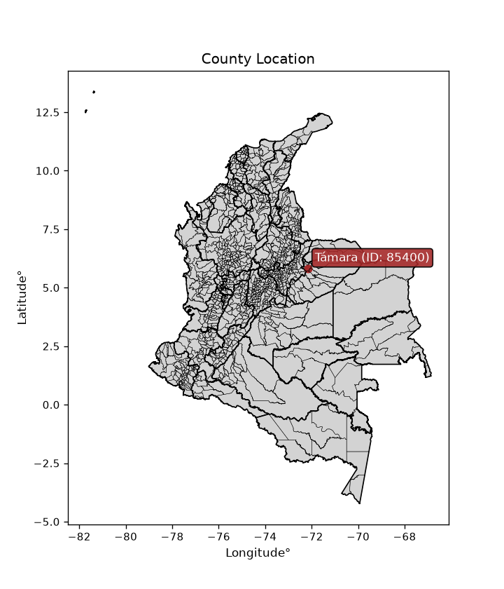
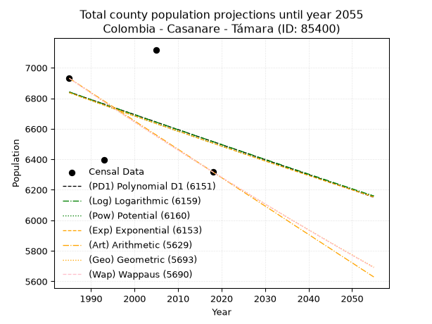
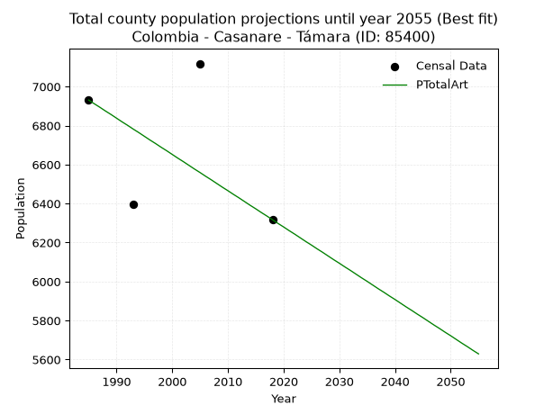
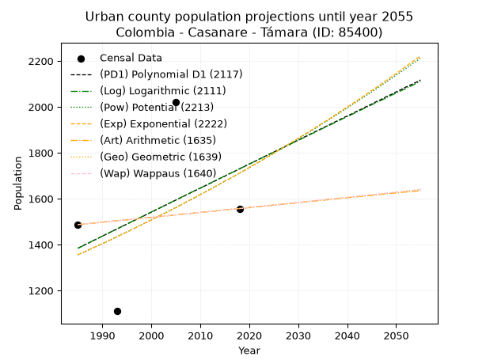
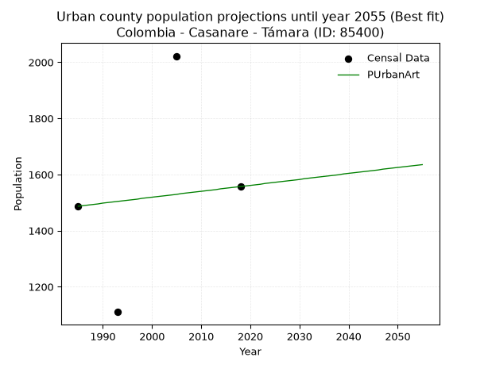
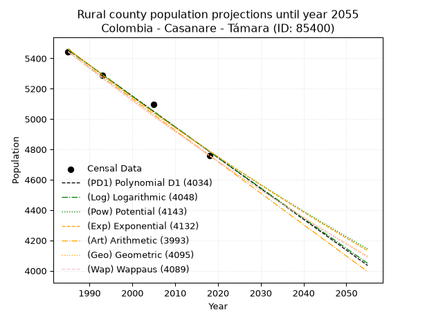
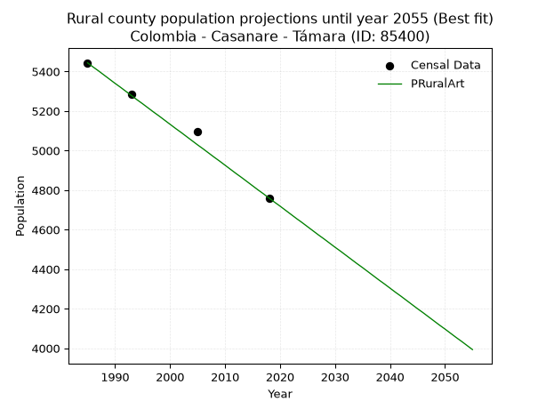

<div align="center">


</div>

# _“Population and Public Services Demand Projections (PPSD) until Year 2050 for Colombia - Casanare - Támara (ID: 85400)”_
Keywords: `population` `public-service` `projection` `lineal` `polynomial` `logarithmic` `potential` `exponential` `arithmetic` `geometric` `wappaus` `dane` `colombia` `south-america`

PPSD are analytical estimates used by governments and planners to anticipate future changes in population size, age distribution, and the resulting community needs for utilities, healthcare, education, and infrastructure as sizing future water treatment facilities, electrical grids, and road networks based on spatial growth.

> **General running parameters**: • app_version: _v20260806_. • Python version: _3.14.7_. • Pandas version: _3.0.5_. • NumPy version: _2.5.1_. • Creates, save and include plots into reports (create_plot): _False_. • Projection until year: _2050_. • Process polynomial degree 2 and up: _False_. • Process Wappaus: _True_. • Process Wappaus: _True_. • Set negative values to zero: _True_. • Set infinite values to zero: _True_. • Drop dataset notes: _True_. 
<div align="center">

Dynamic map: [:earth_americas:Google](http://maps.google.com/maps?q=5.829543014,-72.1616498) [:earth_americas:OSM](https://www.openstreetmap.org/#map=18/5.829543014/-72.1616498&layers=P) [:earth_americas:Bing](https://www.bing.com/maps?cp=5.829543014~-72.1616498&lvl=18) [:earth_americas:Apple](https://maps.apple.com/frame?center=5.829543014%2C-72.1616498&span=0.003%2C0.006)

</div>


<div align="center">

```geojson
{
  "type": "Feature",
  "geometry": {
    "type": "Point", 
    "coordinates": [-72.1616498, 5.829543014]
  }, 
  "properties": {
    "Name": "Colombia - Casanare - Támara (ID: 85400)"
  }
}
```

</div>


<div align="center">

</img>

</div>


## 0. Census Data (4 records)

Census data are official statistics collected by a government about the people and housing in a country. They usually include counts of total population, age, sex, race, income, education, and jobs.

📅Global census file: [Population.xlsx](../data/Population.xlsx)

| Source   |   Year |   CountryID | CountryName   |   StateID | StateName   |   CountyID | CountyName   |   PTotal |   PUrban |   PRural |
|:---------|-------:|------------:|:--------------|----------:|:------------|-----------:|:-------------|---------:|---------:|---------:|
| DANE     |   1985 |          57 | Colombia      |        85 | Casanare    |      85400 | Támara       |     6931 |     1487 |     5444 |
| DANE     |   1993 |          57 | Colombia      |        85 | Casanare    |      85400 | Támara       |     6396 |     1110 |     5286 |
| DANE     |   2005 |          57 | Colombia      |        85 | Casanare    |      85400 | Támara       |     7118 |     2022 |     5096 |
| DANE     |   2018 |          57 | Colombia      |        85 | Casanare    |      85400 | Támara       |     6317 |     1557 |     4760 |

> 🔥Some records could had specific notes about the registered values or the corresponding urban or rural distribution.

📅   [RUPS](https://www.datos.gov.co/Hacienda-y-Cr-dito-P-blico/Registro-nico-de-Prestadores-de-Servicios-P-blicos/4qkq-csdn/about_data) - Local public utility companies: [RUPS.csv](../data/RUPS.xlsx)

 | SERVICIO       | ESTADO    | NOMBRE                                    | NIT         | DEPARTAMENTO_DOMICILIO   | MUNICIPIO_DOMICILIO   | DIRECCION           |   TELEFONO | EMAIL                                    | TIPO_PRESTADOR                             | CLASIFICACION                 |
|:---------------|:----------|:------------------------------------------|:------------|:-------------------------|:----------------------|:--------------------|-----------:|:-----------------------------------------|:-------------------------------------------|:------------------------------|
| ACUEDUCTO      | OPERATIVA | EMPRESAS PUBLICAS DE TAMARA  S.A.S  E.S.P | 900297674-3 | CASANARE                 | TAMARA                | Carrera 6 N° 5 - 45 |    6361414 | serviciospublicos@tamara-casanare.gov.co | SOCIEDADES (EMPRESA DE SERVICIOS PUBLICOS) | MENOR O IGUAL A 2500 USUARIOS |
| ALCANTARILLADO | OPERATIVA | EMPRESAS PUBLICAS DE TAMARA  S.A.S  E.S.P | 900297674-3 | CASANARE                 | TAMARA                | Carrera 6 N° 5 - 45 |    6361414 | serviciospublicos@tamara-casanare.gov.co | SOCIEDADES (EMPRESA DE SERVICIOS PUBLICOS) | MENOR O IGUAL A 2500 USUARIOS |

## 1. Total

### 1.1. Coefficients and Parameters

* (PD1) Polynomial Deg 1: -9.845845042151288, 26384.651545563112 (lineal)
* (Log) Logarithmic: -19667.67249152473, 156184.63621491552
* (Pow) Potential: -3.0077992049590305, 13.753866582152753
* (Exp) Exponential: -0.0015056198845918103, 135775.55592670146
* (Art) Arithmetic: Year diff. 2018 - 1985 = 33, Population diff. 6317 - 6931 = -614, Annual growth = -18.606060606060606
* (Geo) Geometric: Year diff. 2018 - 1985 = 33, Population diff. 6317 - 6931 = -614, Annual growth % = -0.0028069528481774464
* (Wap) Wappaus: i = -0.28088859610598743, Condition values only valid for < 200)

<sub>
Wappaus condition values: ['-0.00', '-0.28', '-0.56', '-0.84', '-1.12', '-1.40', '-1.69', '-1.97', '-2.25', '-2.53', '-2.81', '-3.09', '-3.37', '-3.65', '-3.93', '-4.21', '-4.49', '-4.78', '-5.06', '-5.34', '-5.62', '-5.90', '-6.18', '-6.46', '-6.74', '-7.02', '-7.30', '-7.58', '-7.86', '-8.15', '-8.43', '-8.71', '-8.99', '-9.27', '-9.55', '-9.83', '-10.11', '-10.39', '-10.67', '-10.95', '-11.24', '-11.52', '-11.80', '-12.08', '-12.36', '-12.64', '-12.92', '-13.20', '-13.48', '-13.76', '-14.04', '-14.33', '-14.61', '-14.89', '-15.17', '-15.45', '-15.73', '-16.01', '-16.29', '-16.57', '-16.85', '-17.13', '-17.42', '-17.70', '-17.98', '-18.26']
</sub>


### 1.2. Projected Dataset

|   Year |   CountyID |   PTotalPD1 |   PTotalLog |   PTotalPow |   PTotalExp |   PTotalArt |   PTotalGeo |   PTotalWap |
|-------:|-----------:|------------:|------------:|------------:|------------:|------------:|------------:|------------:|
|   1985 |      85400 |        6841 |        6841 |        6837 |        6837 |        6931 |        6931 |        6931 |
|   1986 |      85400 |        6831 |        6831 |        6827 |        6827 |        6912 |        6912 |        6912 |
|   1987 |      85400 |        6821 |        6821 |        6816 |        6816 |        6894 |        6892 |        6892 |
|   1988 |      85400 |        6811 |        6811 |        6806 |        6806 |        6875 |        6873 |        6873 |
|   1989 |      85400 |        6801 |        6801 |        6796 |        6796 |        6857 |        6854 |        6854 |
|   1990 |      85400 |        6791 |        6791 |        6785 |        6786 |        6838 |        6834 |        6834 |
|   1991 |      85400 |        6782 |        6781 |        6775 |        6776 |        6819 |        6815 |        6815 |
|   1992 |      85400 |        6772 |        6771 |        6765 |        6765 |        6801 |        6796 |        6796 |
|   1993 |      85400 |        6762 |        6762 |        6755 |        6755 |        6782 |        6777 |        6777 |
|   1994 |      85400 |        6752 |        6752 |        6745 |        6745 |        6764 |        6758 |        6758 |
|   1995 |      85400 |        6742 |        6742 |        6734 |        6735 |        6745 |        6739 |        6739 |
|   1996 |      85400 |        6732 |        6732 |        6724 |        6725 |        6726 |        6720 |        6720 |
|   1997 |      85400 |        6722 |        6722 |        6714 |        6715 |        6708 |        6701 |        6701 |
|   1998 |      85400 |        6713 |        6712 |        6704 |        6704 |        6689 |        6682 |        6682 |
|   1999 |      85400 |        6703 |        6702 |        6694 |        6694 |        6671 |        6664 |        6664 |
|   2000 |      85400 |        6693 |        6693 |        6684 |        6684 |        6652 |        6645 |        6645 |
|   2001 |      85400 |        6683 |        6683 |        6674 |        6674 |        6633 |        6626 |        6626 |
|   2002 |      85400 |        6673 |        6673 |        6664 |        6664 |        6615 |        6608 |        6608 |
|   2003 |      85400 |        6663 |        6663 |        6654 |        6654 |        6596 |        6589 |        6589 |
|   2004 |      85400 |        6654 |        6653 |        6644 |        6644 |        6577 |        6571 |        6571 |
|   2005 |      85400 |        6644 |        6643 |        6634 |        6634 |        6559 |        6552 |        6552 |
|   2006 |      85400 |        6634 |        6634 |        6624 |        6624 |        6540 |        6534 |        6534 |
|   2007 |      85400 |        6624 |        6624 |        6614 |        6614 |        6522 |        6515 |        6516 |
|   2008 |      85400 |        6614 |        6614 |        6604 |        6604 |        6503 |        6497 |        6497 |
|   2009 |      85400 |        6604 |        6604 |        6594 |        6594 |        6484 |        6479 |        6479 |
|   2010 |      85400 |        6595 |        6594 |        6584 |        6584 |        6466 |        6461 |        6461 |
|   2011 |      85400 |        6585 |        6585 |        6575 |        6575 |        6447 |        6443 |        6443 |
|   2012 |      85400 |        6575 |        6575 |        6565 |        6565 |        6429 |        6424 |        6425 |
|   2013 |      85400 |        6565 |        6565 |        6555 |        6555 |        6410 |        6406 |        6407 |
|   2014 |      85400 |        6555 |        6555 |        6545 |        6545 |        6391 |        6388 |        6389 |
|   2015 |      85400 |        6545 |        6546 |        6535 |        6535 |        6373 |        6370 |        6371 |
|   2016 |      85400 |        6535 |        6536 |        6526 |        6525 |        6354 |        6353 |        6353 |
|   2017 |      85400 |        6526 |        6526 |        6516 |        6515 |        6336 |        6335 |        6335 |
|   2018 |      85400 |        6516 |        6516 |        6506 |        6506 |        6317 |        6317 |        6317 |
|   2019 |      85400 |        6506 |        6507 |        6497 |        6496 |        6298 |        6299 |        6299 |
|   2020 |      85400 |        6496 |        6497 |        6487 |        6486 |        6280 |        6282 |        6282 |
|   2021 |      85400 |        6486 |        6487 |        6477 |        6476 |        6261 |        6264 |        6264 |
|   2022 |      85400 |        6476 |        6477 |        6468 |        6467 |        6243 |        6246 |        6246 |
|   2023 |      85400 |        6467 |        6468 |        6458 |        6457 |        6224 |        6229 |        6229 |
|   2024 |      85400 |        6457 |        6458 |        6448 |        6447 |        6205 |        6211 |        6211 |
|   2025 |      85400 |        6447 |        6448 |        6439 |        6437 |        6187 |        6194 |        6194 |
|   2026 |      85400 |        6437 |        6439 |        6429 |        6428 |        6168 |        6177 |        6176 |
|   2027 |      85400 |        6427 |        6429 |        6420 |        6418 |        6150 |        6159 |        6159 |
|   2028 |      85400 |        6417 |        6419 |        6410 |        6408 |        6131 |        6142 |        6142 |
|   2029 |      85400 |        6407 |        6409 |        6401 |        6399 |        6112 |        6125 |        6124 |
|   2030 |      85400 |        6398 |        6400 |        6391 |        6389 |        6094 |        6107 |        6107 |
|   2031 |      85400 |        6388 |        6390 |        6382 |        6379 |        6075 |        6090 |        6090 |
|   2032 |      85400 |        6378 |        6380 |        6372 |        6370 |        6057 |        6073 |        6073 |
|   2033 |      85400 |        6368 |        6371 |        6363 |        6360 |        6038 |        6056 |        6056 |
|   2034 |      85400 |        6358 |        6361 |        6353 |        6351 |        6019 |        6039 |        6038 |
|   2035 |      85400 |        6348 |        6351 |        6344 |        6341 |        6001 |        6022 |        6021 |
|   2036 |      85400 |        6339 |        6342 |        6335 |        6332 |        5982 |        6005 |        6004 |
|   2037 |      85400 |        6329 |        6332 |        6325 |        6322 |        5963 |        5988 |        5988 |
|   2038 |      85400 |        6319 |        6322 |        6316 |        6313 |        5945 |        5972 |        5971 |
|   2039 |      85400 |        6309 |        6313 |        6307 |        6303 |        5926 |        5955 |        5954 |
|   2040 |      85400 |        6299 |        6303 |        6297 |        6294 |        5908 |        5938 |        5937 |
|   2041 |      85400 |        6289 |        6293 |        6288 |        6284 |        5889 |        5922 |        5920 |
|   2042 |      85400 |        6279 |        6284 |        6279 |        6275 |        5870 |        5905 |        5904 |
|   2043 |      85400 |        6270 |        6274 |        6270 |        6265 |        5852 |        5888 |        5887 |
|   2044 |      85400 |        6260 |        6265 |        6260 |        6256 |        5833 |        5872 |        5870 |
|   2045 |      85400 |        6250 |        6255 |        6251 |        6246 |        5815 |        5855 |        5854 |
|   2046 |      85400 |        6240 |        6245 |        6242 |        6237 |        5796 |        5839 |        5837 |
|   2047 |      85400 |        6230 |        6236 |        6233 |        6228 |        5777 |        5822 |        5821 |
|   2048 |      85400 |        6220 |        6226 |        6224 |        6218 |        5759 |        5806 |        5804 |
|   2049 |      85400 |        6211 |        6217 |        6215 |        6209 |        5740 |        5790 |        5788 |
|   2050 |      85400 |        6201 |        6207 |        6205 |        6200 |        5722 |        5774 |        5771 |
<div align="center">

</img>

</div>


### 1.3. Best fit with absolute and relative error (%)

Relative error puts that difference into context by dividing the absolute error by the true value, creating a unitless ratio or percentage that shows the scale of the mistake.

Absolute and relative error

|   Year | Source   |   CountryID | CountryName   |   StateID | StateName   |   CountyID_x | CountyName   |   PTotal |   PUrban |   PRural |   CountyID_y |   PTotalPD1 |   PTotalLog |   PTotalPow |   PTotalExp |   PTotalArt |   PTotalGeo |   PTotalWap |   PTotalPD1AbsError |   PTotalLogAbsError |   PTotalPowAbsError |   PTotalExpAbsError |   PTotalArtAbsError |   PTotalGeoAbsError |   PTotalWapAbsError |   PTotalPD1RelError |   PTotalLogRelError |   PTotalPowRelError |   PTotalExpRelError |   PTotalArtRelError |   PTotalGeoRelError |   PTotalWapRelError |
|-------:|:---------|------------:|:--------------|----------:|:------------|-------------:|:-------------|---------:|---------:|---------:|-------------:|------------:|------------:|------------:|------------:|------------:|------------:|------------:|--------------------:|--------------------:|--------------------:|--------------------:|--------------------:|--------------------:|--------------------:|--------------------:|--------------------:|--------------------:|--------------------:|--------------------:|--------------------:|--------------------:|
|   1985 | DANE     |          57 | Colombia      |        85 | Casanare    |        85400 | Támara       |     6931 |     1487 |     5444 |        85400 |        6841 |        6841 |        6837 |        6837 |        6931 |        6931 |        6931 |                  90 |                  90 |                  94 |                  94 |                   0 |                   0 |                   0 |             1.29851 |             1.29851 |             1.35623 |             1.35623 |             0       |             0       |             0       |
|   1993 | DANE     |          57 | Colombia      |        85 | Casanare    |        85400 | Támara       |     6396 |     1110 |     5286 |        85400 |        6762 |        6762 |        6755 |        6755 |        6782 |        6777 |        6777 |                 366 |                 366 |                 359 |                 359 |                 386 |                 381 |                 381 |             5.72233 |             5.72233 |             5.61288 |             5.61288 |             6.03502 |             5.95685 |             5.95685 |
|   2005 | DANE     |          57 | Colombia      |        85 | Casanare    |        85400 | Támara       |     7118 |     2022 |     5096 |        85400 |        6644 |        6643 |        6634 |        6634 |        6559 |        6552 |        6552 |                 474 |                 475 |                 484 |                 484 |                 559 |                 566 |                 566 |             6.65917 |             6.67322 |             6.79966 |             6.79966 |             7.85333 |             7.95167 |             7.95167 |
|   2018 | DANE     |          57 | Colombia      |        85 | Casanare    |        85400 | Támara       |     6317 |     1557 |     4760 |        85400 |        6516 |        6516 |        6506 |        6506 |        6317 |        6317 |        6317 |                 199 |                 199 |                 189 |                 189 |                   0 |                   0 |                   0 |             3.15023 |             3.15023 |             2.99193 |             2.99193 |             0       |             0       |             0       |

Relative error mean

| Method    |   RelError | Best   |
|:----------|-----------:|:-------|
| PTotalPD1 |    4.20756 |        |
| PTotalLog |    4.21107 |        |
| PTotalPow |    4.19017 |        |
| PTotalExp |    4.19017 |        |
| PTotalArt |    3.47209 | True   |
| PTotalGeo |    3.47713 |        |
| PTotalWap |    3.47713 |        |

💙Best method: _**PTotalArt**_
<div align="center">

</img>

</div>


### 1.4. Fresh water supply demand in liters per capita per day (lpcd)

The fresh water supply demand typically ranges from 100 to 300 liters per capita per day (lpcd) for standard domestic and municipal planning, though absolute survival minimums set by the World Health Organization are as low as 7.5 to 20 liters per day, and total consumption in high-income nations can exceed 400 liters.

> `CZ`: Level in meters above the sea level (masl)<br> `WS`: Fresh water supply demand in liters per capita per day (lpcd or l/h/d)<br> `WSAll`: Zonal fresh water supply demand in liters per second (l/s)<br> `A`: Zonal area in square meters<br> `DP`: Population density (people/hectare or p/ha)

Reference values (RAS Colombia)

|    CZ |   WS |
|------:|-----:|
|  1000 |  120 |
|  2000 |  130 |
| 99999 |  140 |

County shapefile geometry properties and water supply values

|   CountyID |      ATotal |   CZTotal |   WSTotal |
|-----------:|------------:|----------:|----------:|
|      85400 | 1.08845e+09 |   1198.96 |       130 |

Projected values for best method: PTotalArt

|   CountyID |   Year |   PTotalArt |   DPTotal |   WSTotal |   WSTotalAll |
|-----------:|-------:|------------:|----------:|----------:|-------------:|
|      85400 |   1985 |        6931 |      0.06 |       130 |     10.4286  |
|      85400 |   1986 |        6912 |      0.06 |       130 |     10.4     |
|      85400 |   1987 |        6894 |      0.06 |       130 |     10.3729  |
|      85400 |   1988 |        6875 |      0.06 |       130 |     10.3443  |
|      85400 |   1989 |        6857 |      0.06 |       130 |     10.3172  |
|      85400 |   1990 |        6838 |      0.06 |       130 |     10.2887  |
|      85400 |   1991 |        6819 |      0.06 |       130 |     10.2601  |
|      85400 |   1992 |        6801 |      0.06 |       130 |     10.233   |
|      85400 |   1993 |        6782 |      0.06 |       130 |     10.2044  |
|      85400 |   1994 |        6764 |      0.06 |       130 |     10.1773  |
|      85400 |   1995 |        6745 |      0.06 |       130 |     10.1487  |
|      85400 |   1996 |        6726 |      0.06 |       130 |     10.1201  |
|      85400 |   1997 |        6708 |      0.06 |       130 |     10.0931  |
|      85400 |   1998 |        6689 |      0.06 |       130 |     10.0645  |
|      85400 |   1999 |        6671 |      0.06 |       130 |     10.0374  |
|      85400 |   2000 |        6652 |      0.06 |       130 |     10.0088  |
|      85400 |   2001 |        6633 |      0.06 |       130 |      9.98021 |
|      85400 |   2002 |        6615 |      0.06 |       130 |      9.95312 |
|      85400 |   2003 |        6596 |      0.06 |       130 |      9.92454 |
|      85400 |   2004 |        6577 |      0.06 |       130 |      9.89595 |
|      85400 |   2005 |        6559 |      0.06 |       130 |      9.86887 |
|      85400 |   2006 |        6540 |      0.06 |       130 |      9.84028 |
|      85400 |   2007 |        6522 |      0.06 |       130 |      9.81319 |
|      85400 |   2008 |        6503 |      0.06 |       130 |      9.78461 |
|      85400 |   2009 |        6484 |      0.06 |       130 |      9.75602 |
|      85400 |   2010 |        6466 |      0.06 |       130 |      9.72894 |
|      85400 |   2011 |        6447 |      0.06 |       130 |      9.70035 |
|      85400 |   2012 |        6429 |      0.06 |       130 |      9.67326 |
|      85400 |   2013 |        6410 |      0.06 |       130 |      9.64468 |
|      85400 |   2014 |        6391 |      0.06 |       130 |      9.61609 |
|      85400 |   2015 |        6373 |      0.06 |       130 |      9.589   |
|      85400 |   2016 |        6354 |      0.06 |       130 |      9.56042 |
|      85400 |   2017 |        6336 |      0.06 |       130 |      9.53333 |
|      85400 |   2018 |        6317 |      0.06 |       130 |      9.50475 |
|      85400 |   2019 |        6298 |      0.06 |       130 |      9.47616 |
|      85400 |   2020 |        6280 |      0.06 |       130 |      9.44907 |
|      85400 |   2021 |        6261 |      0.06 |       130 |      9.42049 |
|      85400 |   2022 |        6243 |      0.06 |       130 |      9.3934  |
|      85400 |   2023 |        6224 |      0.06 |       130 |      9.36481 |
|      85400 |   2024 |        6205 |      0.06 |       130 |      9.33623 |
|      85400 |   2025 |        6187 |      0.06 |       130 |      9.30914 |
|      85400 |   2026 |        6168 |      0.06 |       130 |      9.28056 |
|      85400 |   2027 |        6150 |      0.06 |       130 |      9.25347 |
|      85400 |   2028 |        6131 |      0.06 |       130 |      9.22488 |
|      85400 |   2029 |        6112 |      0.06 |       130 |      9.1963  |
|      85400 |   2030 |        6094 |      0.06 |       130 |      9.16921 |
|      85400 |   2031 |        6075 |      0.06 |       130 |      9.14062 |
|      85400 |   2032 |        6057 |      0.06 |       130 |      9.11354 |
|      85400 |   2033 |        6038 |      0.06 |       130 |      9.08495 |
|      85400 |   2034 |        6019 |      0.06 |       130 |      9.05637 |
|      85400 |   2035 |        6001 |      0.06 |       130 |      9.02928 |
|      85400 |   2036 |        5982 |      0.05 |       130 |      9.00069 |
|      85400 |   2037 |        5963 |      0.05 |       130 |      8.97211 |
|      85400 |   2038 |        5945 |      0.05 |       130 |      8.94502 |
|      85400 |   2039 |        5926 |      0.05 |       130 |      8.91644 |
|      85400 |   2040 |        5908 |      0.05 |       130 |      8.88935 |
|      85400 |   2041 |        5889 |      0.05 |       130 |      8.86076 |
|      85400 |   2042 |        5870 |      0.05 |       130 |      8.83218 |
|      85400 |   2043 |        5852 |      0.05 |       130 |      8.80509 |
|      85400 |   2044 |        5833 |      0.05 |       130 |      8.7765  |
|      85400 |   2045 |        5815 |      0.05 |       130 |      8.74942 |
|      85400 |   2046 |        5796 |      0.05 |       130 |      8.72083 |
|      85400 |   2047 |        5777 |      0.05 |       130 |      8.69225 |
|      85400 |   2048 |        5759 |      0.05 |       130 |      8.66516 |
|      85400 |   2049 |        5740 |      0.05 |       130 |      8.63657 |
|      85400 |   2050 |        5722 |      0.05 |       130 |      8.60949 |

## 2. Urban

### 2.1. Coefficients and Parameters

* (PD1) Polynomial Deg 1: 10.464873544761359, -19388.363307908905 (lineal)
* (Log) Logarithmic: 20978.34492282353, -157912.5678682874
* (Pow) Potential: 14.14275616650354, -43.507384724366595
* (Exp) Exponential: 0.007059348664507269, 0.0011129794025154197
* (Art) Arithmetic: Year diff. 2018 - 1985 = 33, Population diff. 1557 - 1487 = 70, Annual growth = 2.121212121212121
* (Geo) Geometric: Year diff. 2018 - 1985 = 33, Population diff. 1557 - 1487 = 70, Annual growth % = 0.0013949182180703623
* (Wap) Wappaus: i = 0.1393700473858161, Condition values only valid for < 200)

<sub>
Wappaus condition values: ['0.00', '0.14', '0.28', '0.42', '0.56', '0.70', '0.84', '0.98', '1.11', '1.25', '1.39', '1.53', '1.67', '1.81', '1.95', '2.09', '2.23', '2.37', '2.51', '2.65', '2.79', '2.93', '3.07', '3.21', '3.34', '3.48', '3.62', '3.76', '3.90', '4.04', '4.18', '4.32', '4.46', '4.60', '4.74', '4.88', '5.02', '5.16', '5.30', '5.44', '5.57', '5.71', '5.85', '5.99', '6.13', '6.27', '6.41', '6.55', '6.69', '6.83', '6.97', '7.11', '7.25', '7.39', '7.53', '7.67', '7.80', '7.94', '8.08', '8.22', '8.36', '8.50', '8.64', '8.78', '8.92', '9.06']
</sub>


### 2.2. Projected Dataset

|   Year |   CountyID |   PUrbanPD1 |   PUrbanLog |   PUrbanPow |   PUrbanExp |   PUrbanArt |   PUrbanGeo |   PUrbanWap |
|-------:|-----------:|------------:|------------:|------------:|------------:|------------:|------------:|------------:|
|   1985 |      85400 |        1384 |        1384 |        1355 |        1356 |        1487 |        1487 |        1487 |
|   1986 |      85400 |        1395 |        1394 |        1365 |        1365 |        1489 |        1489 |        1489 |
|   1987 |      85400 |        1405 |        1405 |        1375 |        1375 |        1491 |        1491 |        1491 |
|   1988 |      85400 |        1416 |        1416 |        1385 |        1385 |        1493 |        1493 |        1493 |
|   1989 |      85400 |        1426 |        1426 |        1394 |        1395 |        1495 |        1495 |        1495 |
|   1990 |      85400 |        1437 |        1437 |        1404 |        1404 |        1498 |        1497 |        1497 |
|   1991 |      85400 |        1447 |        1447 |        1414 |        1414 |        1500 |        1499 |        1499 |
|   1992 |      85400 |        1458 |        1458 |        1424 |        1424 |        1502 |        1502 |        1502 |
|   1993 |      85400 |        1468 |        1468 |        1435 |        1434 |        1504 |        1504 |        1504 |
|   1994 |      85400 |        1479 |        1479 |        1445 |        1445 |        1506 |        1506 |        1506 |
|   1995 |      85400 |        1489 |        1489 |        1455 |        1455 |        1508 |        1508 |        1508 |
|   1996 |      85400 |        1500 |        1500 |        1465 |        1465 |        1510 |        1510 |        1510 |
|   1997 |      85400 |        1510 |        1510 |        1476 |        1476 |        1512 |        1512 |        1512 |
|   1998 |      85400 |        1520 |        1521 |        1486 |        1486 |        1515 |        1514 |        1514 |
|   1999 |      85400 |        1531 |        1531 |        1497 |        1497 |        1517 |        1516 |        1516 |
|   2000 |      85400 |        1541 |        1542 |        1508 |        1507 |        1519 |        1518 |        1518 |
|   2001 |      85400 |        1552 |        1552 |        1518 |        1518 |        1521 |        1521 |        1521 |
|   2002 |      85400 |        1562 |        1563 |        1529 |        1529 |        1523 |        1523 |        1523 |
|   2003 |      85400 |        1573 |        1573 |        1540 |        1539 |        1525 |        1525 |        1525 |
|   2004 |      85400 |        1583 |        1584 |        1551 |        1550 |        1527 |        1527 |        1527 |
|   2005 |      85400 |        1594 |        1594 |        1562 |        1561 |        1529 |        1529 |        1529 |
|   2006 |      85400 |        1604 |        1605 |        1573 |        1572 |        1532 |        1531 |        1531 |
|   2007 |      85400 |        1615 |        1615 |        1584 |        1584 |        1534 |        1533 |        1533 |
|   2008 |      85400 |        1625 |        1626 |        1595 |        1595 |        1536 |        1535 |        1535 |
|   2009 |      85400 |        1636 |        1636 |        1606 |        1606 |        1538 |        1538 |        1538 |
|   2010 |      85400 |        1646 |        1646 |        1618 |        1617 |        1540 |        1540 |        1540 |
|   2011 |      85400 |        1656 |        1657 |        1629 |        1629 |        1542 |        1542 |        1542 |
|   2012 |      85400 |        1667 |        1667 |        1641 |        1640 |        1544 |        1544 |        1544 |
|   2013 |      85400 |        1677 |        1678 |        1652 |        1652 |        1546 |        1546 |        1546 |
|   2014 |      85400 |        1688 |        1688 |        1664 |        1664 |        1549 |        1548 |        1548 |
|   2015 |      85400 |        1698 |        1699 |        1676 |        1676 |        1551 |        1551 |        1551 |
|   2016 |      85400 |        1709 |        1709 |        1687 |        1687 |        1553 |        1553 |        1553 |
|   2017 |      85400 |        1719 |        1719 |        1699 |        1699 |        1555 |        1555 |        1555 |
|   2018 |      85400 |        1730 |        1730 |        1711 |        1711 |        1557 |        1557 |        1557 |
|   2019 |      85400 |        1740 |        1740 |        1723 |        1723 |        1559 |        1559 |        1559 |
|   2020 |      85400 |        1751 |        1751 |        1735 |        1736 |        1561 |        1561 |        1561 |
|   2021 |      85400 |        1761 |        1761 |        1748 |        1748 |        1563 |        1564 |        1564 |
|   2022 |      85400 |        1772 |        1771 |        1760 |        1760 |        1565 |        1566 |        1566 |
|   2023 |      85400 |        1782 |        1782 |        1772 |        1773 |        1568 |        1568 |        1568 |
|   2024 |      85400 |        1793 |        1792 |        1785 |        1785 |        1570 |        1570 |        1570 |
|   2025 |      85400 |        1803 |        1802 |        1797 |        1798 |        1572 |        1572 |        1572 |
|   2026 |      85400 |        1813 |        1813 |        1810 |        1811 |        1574 |        1574 |        1574 |
|   2027 |      85400 |        1824 |        1823 |        1822 |        1824 |        1576 |        1577 |        1577 |
|   2028 |      85400 |        1834 |        1833 |        1835 |        1837 |        1578 |        1579 |        1579 |
|   2029 |      85400 |        1845 |        1844 |        1848 |        1850 |        1580 |        1581 |        1581 |
|   2030 |      85400 |        1855 |        1854 |        1861 |        1863 |        1582 |        1583 |        1583 |
|   2031 |      85400 |        1866 |        1864 |        1874 |        1876 |        1585 |        1585 |        1585 |
|   2032 |      85400 |        1876 |        1875 |        1887 |        1889 |        1587 |        1588 |        1588 |
|   2033 |      85400 |        1887 |        1885 |        1900 |        1903 |        1589 |        1590 |        1590 |
|   2034 |      85400 |        1897 |        1895 |        1913 |        1916 |        1591 |        1592 |        1592 |
|   2035 |      85400 |        1908 |        1906 |        1927 |        1930 |        1593 |        1594 |        1594 |
|   2036 |      85400 |        1918 |        1916 |        1940 |        1943 |        1595 |        1597 |        1597 |
|   2037 |      85400 |        1929 |        1926 |        1954 |        1957 |        1597 |        1599 |        1599 |
|   2038 |      85400 |        1939 |        1937 |        1967 |        1971 |        1599 |        1601 |        1601 |
|   2039 |      85400 |        1950 |        1947 |        1981 |        1985 |        1602 |        1603 |        1603 |
|   2040 |      85400 |        1960 |        1957 |        1995 |        1999 |        1604 |        1605 |        1606 |
|   2041 |      85400 |        1970 |        1967 |        2009 |        2013 |        1606 |        1608 |        1608 |
|   2042 |      85400 |        1981 |        1978 |        2023 |        2027 |        1608 |        1610 |        1610 |
|   2043 |      85400 |        1991 |        1988 |        2037 |        2042 |        1610 |        1612 |        1612 |
|   2044 |      85400 |        2002 |        1998 |        2051 |        2056 |        1612 |        1614 |        1615 |
|   2045 |      85400 |        2012 |        2009 |        2065 |        2071 |        1614 |        1617 |        1617 |
|   2046 |      85400 |        2023 |        2019 |        2079 |        2085 |        1616 |        1619 |        1619 |
|   2047 |      85400 |        2033 |        2029 |        2094 |        2100 |        1619 |        1621 |        1621 |
|   2048 |      85400 |        2044 |        2039 |        2108 |        2115 |        1621 |        1623 |        1624 |
|   2049 |      85400 |        2054 |        2050 |        2123 |        2130 |        1623 |        1626 |        1626 |
|   2050 |      85400 |        2065 |        2060 |        2138 |        2145 |        1625 |        1628 |        1628 |
<div align="center">

</img>

</div>


### 2.3. Best fit with absolute and relative error (%)

Relative error puts that difference into context by dividing the absolute error by the true value, creating a unitless ratio or percentage that shows the scale of the mistake.

Absolute and relative error

|   Year | Source   |   CountryID | CountryName   |   StateID | StateName   |   CountyID_x | CountyName   |   PTotal |   PUrban |   PRural |   CountyID_y |   PUrbanPD1 |   PUrbanLog |   PUrbanPow |   PUrbanExp |   PUrbanArt |   PUrbanGeo |   PUrbanWap |   PUrbanPD1AbsError |   PUrbanLogAbsError |   PUrbanPowAbsError |   PUrbanExpAbsError |   PUrbanArtAbsError |   PUrbanGeoAbsError |   PUrbanWapAbsError |   PUrbanPD1RelError |   PUrbanLogRelError |   PUrbanPowRelError |   PUrbanExpRelError |   PUrbanArtRelError |   PUrbanGeoRelError |   PUrbanWapRelError |
|-------:|:---------|------------:|:--------------|----------:|:------------|-------------:|:-------------|---------:|---------:|---------:|-------------:|------------:|------------:|------------:|------------:|------------:|------------:|------------:|--------------------:|--------------------:|--------------------:|--------------------:|--------------------:|--------------------:|--------------------:|--------------------:|--------------------:|--------------------:|--------------------:|--------------------:|--------------------:|--------------------:|
|   1985 | DANE     |          57 | Colombia      |        85 | Casanare    |        85400 | Támara       |     6931 |     1487 |     5444 |        85400 |        1384 |        1384 |        1355 |        1356 |        1487 |        1487 |        1487 |                 103 |                 103 |                 132 |                 131 |                   0 |                   0 |                   0 |              6.9267 |              6.9267 |             8.87693 |             8.80968 |              0      |              0      |              0      |
|   1993 | DANE     |          57 | Colombia      |        85 | Casanare    |        85400 | Támara       |     6396 |     1110 |     5286 |        85400 |        1468 |        1468 |        1435 |        1434 |        1504 |        1504 |        1504 |                 358 |                 358 |                 325 |                 324 |                 394 |                 394 |                 394 |             32.2523 |             32.2523 |            29.2793  |            29.1892  |             35.4955 |             35.4955 |             35.4955 |
|   2005 | DANE     |          57 | Colombia      |        85 | Casanare    |        85400 | Támara       |     7118 |     2022 |     5096 |        85400 |        1594 |        1594 |        1562 |        1561 |        1529 |        1529 |        1529 |                 428 |                 428 |                 460 |                 461 |                 493 |                 493 |                 493 |             21.1672 |             21.1672 |            22.7498  |            22.7992  |             24.3818 |             24.3818 |             24.3818 |
|   2018 | DANE     |          57 | Colombia      |        85 | Casanare    |        85400 | Támara       |     6317 |     1557 |     4760 |        85400 |        1730 |        1730 |        1711 |        1711 |        1557 |        1557 |        1557 |                 173 |                 173 |                 154 |                 154 |                   0 |                   0 |                   0 |             11.1111 |             11.1111 |             9.89082 |             9.89082 |              0      |              0      |              0      |

Relative error mean

| Method    |   RelError | Best   |
|:----------|-----------:|:-------|
| PUrbanPD1 |    17.8643 |        |
| PUrbanLog |    17.8643 |        |
| PUrbanPow |    17.6992 |        |
| PUrbanExp |    17.6722 |        |
| PUrbanArt |    14.9693 | True   |
| PUrbanGeo |    14.9693 | True   |
| PUrbanWap |    14.9693 | True   |

💙Best method: _**PUrbanArt**_
<div align="center">

</img>

</div>


### 2.4. Fresh water supply demand in liters per capita per day (lpcd)

The fresh water supply demand typically ranges from 100 to 300 liters per capita per day (lpcd) for standard domestic and municipal planning, though absolute survival minimums set by the World Health Organization are as low as 7.5 to 20 liters per day, and total consumption in high-income nations can exceed 400 liters.

> `CZ`: Level in meters above the sea level (masl)<br> `WS`: Fresh water supply demand in liters per capita per day (lpcd or l/h/d)<br> `WSAll`: Zonal fresh water supply demand in liters per second (l/s)<br> `A`: Zonal area in square meters<br> `DP`: Population density (people/hectare or p/ha)

Reference values (RAS Colombia)

|    CZ |   WS |
|------:|-----:|
|  1000 |  120 |
|  2000 |  130 |
| 99999 |  140 |

County shapefile geometry properties and water supply values

|   CountyID |   AUrban |   CZUrban |   WSUrban |
|-----------:|---------:|----------:|----------:|
|      85400 |   465271 |   1105.73 |       130 |

Projected values for best method: PUrbanArt

|   CountyID |   Year |   PUrbanArt |   DPUrban |   WSUrban |   WSUrbanAll |
|-----------:|-------:|------------:|----------:|----------:|-------------:|
|      85400 |   1985 |        1487 |     31.96 |       130 |      2.23738 |
|      85400 |   1986 |        1489 |     32    |       130 |      2.24039 |
|      85400 |   1987 |        1491 |     32.05 |       130 |      2.2434  |
|      85400 |   1988 |        1493 |     32.09 |       130 |      2.24641 |
|      85400 |   1989 |        1495 |     32.13 |       130 |      2.24942 |
|      85400 |   1990 |        1498 |     32.2  |       130 |      2.25394 |
|      85400 |   1991 |        1500 |     32.24 |       130 |      2.25694 |
|      85400 |   1992 |        1502 |     32.28 |       130 |      2.25995 |
|      85400 |   1993 |        1504 |     32.33 |       130 |      2.26296 |
|      85400 |   1994 |        1506 |     32.37 |       130 |      2.26597 |
|      85400 |   1995 |        1508 |     32.41 |       130 |      2.26898 |
|      85400 |   1996 |        1510 |     32.45 |       130 |      2.27199 |
|      85400 |   1997 |        1512 |     32.5  |       130 |      2.275   |
|      85400 |   1998 |        1515 |     32.56 |       130 |      2.27951 |
|      85400 |   1999 |        1517 |     32.6  |       130 |      2.28252 |
|      85400 |   2000 |        1519 |     32.65 |       130 |      2.28553 |
|      85400 |   2001 |        1521 |     32.69 |       130 |      2.28854 |
|      85400 |   2002 |        1523 |     32.73 |       130 |      2.29155 |
|      85400 |   2003 |        1525 |     32.78 |       130 |      2.29456 |
|      85400 |   2004 |        1527 |     32.82 |       130 |      2.29757 |
|      85400 |   2005 |        1529 |     32.86 |       130 |      2.30058 |
|      85400 |   2006 |        1532 |     32.93 |       130 |      2.30509 |
|      85400 |   2007 |        1534 |     32.97 |       130 |      2.3081  |
|      85400 |   2008 |        1536 |     33.01 |       130 |      2.31111 |
|      85400 |   2009 |        1538 |     33.06 |       130 |      2.31412 |
|      85400 |   2010 |        1540 |     33.1  |       130 |      2.31713 |
|      85400 |   2011 |        1542 |     33.14 |       130 |      2.32014 |
|      85400 |   2012 |        1544 |     33.18 |       130 |      2.32315 |
|      85400 |   2013 |        1546 |     33.23 |       130 |      2.32616 |
|      85400 |   2014 |        1549 |     33.29 |       130 |      2.33067 |
|      85400 |   2015 |        1551 |     33.34 |       130 |      2.33368 |
|      85400 |   2016 |        1553 |     33.38 |       130 |      2.33669 |
|      85400 |   2017 |        1555 |     33.42 |       130 |      2.3397  |
|      85400 |   2018 |        1557 |     33.46 |       130 |      2.34271 |
|      85400 |   2019 |        1559 |     33.51 |       130 |      2.34572 |
|      85400 |   2020 |        1561 |     33.55 |       130 |      2.34873 |
|      85400 |   2021 |        1563 |     33.59 |       130 |      2.35174 |
|      85400 |   2022 |        1565 |     33.64 |       130 |      2.35475 |
|      85400 |   2023 |        1568 |     33.7  |       130 |      2.35926 |
|      85400 |   2024 |        1570 |     33.74 |       130 |      2.36227 |
|      85400 |   2025 |        1572 |     33.79 |       130 |      2.36528 |
|      85400 |   2026 |        1574 |     33.83 |       130 |      2.36829 |
|      85400 |   2027 |        1576 |     33.87 |       130 |      2.3713  |
|      85400 |   2028 |        1578 |     33.92 |       130 |      2.37431 |
|      85400 |   2029 |        1580 |     33.96 |       130 |      2.37731 |
|      85400 |   2030 |        1582 |     34    |       130 |      2.38032 |
|      85400 |   2031 |        1585 |     34.07 |       130 |      2.38484 |
|      85400 |   2032 |        1587 |     34.11 |       130 |      2.38785 |
|      85400 |   2033 |        1589 |     34.15 |       130 |      2.39086 |
|      85400 |   2034 |        1591 |     34.2  |       130 |      2.39387 |
|      85400 |   2035 |        1593 |     34.24 |       130 |      2.39688 |
|      85400 |   2036 |        1595 |     34.28 |       130 |      2.39988 |
|      85400 |   2037 |        1597 |     34.32 |       130 |      2.40289 |
|      85400 |   2038 |        1599 |     34.37 |       130 |      2.4059  |
|      85400 |   2039 |        1602 |     34.43 |       130 |      2.41042 |
|      85400 |   2040 |        1604 |     34.47 |       130 |      2.41343 |
|      85400 |   2041 |        1606 |     34.52 |       130 |      2.41644 |
|      85400 |   2042 |        1608 |     34.56 |       130 |      2.41944 |
|      85400 |   2043 |        1610 |     34.6  |       130 |      2.42245 |
|      85400 |   2044 |        1612 |     34.65 |       130 |      2.42546 |
|      85400 |   2045 |        1614 |     34.69 |       130 |      2.42847 |
|      85400 |   2046 |        1616 |     34.73 |       130 |      2.43148 |
|      85400 |   2047 |        1619 |     34.8  |       130 |      2.436   |
|      85400 |   2048 |        1621 |     34.84 |       130 |      2.439   |
|      85400 |   2049 |        1623 |     34.88 |       130 |      2.44201 |
|      85400 |   2050 |        1625 |     34.93 |       130 |      2.44502 |

## 3. Rural

### 3.1. Coefficients and Parameters

* (PD1) Polynomial Deg 1: -20.310718586912685, 45773.0148534721 (lineal)
* (Log) Logarithmic: -40646.017414348375, 314097.20408320386
* (Pow) Potential: -7.980294859086137, 30.054528944618454
* (Exp) Exponential: -0.003987918486157853, 14971502.260900587
* (Art) Arithmetic: Year diff. 2018 - 1985 = 33, Population diff. 4760 - 5444 = -684, Annual growth = -20.727272727272727
* (Geo) Geometric: Year diff. 2018 - 1985 = 33, Population diff. 4760 - 5444 = -684, Annual growth % = -0.004060413427869558
* (Wap) Wappaus: i = -0.4062577955169096, Condition values only valid for < 200)

<sub>
Wappaus condition values: ['-0.00', '-0.41', '-0.81', '-1.22', '-1.63', '-2.03', '-2.44', '-2.84', '-3.25', '-3.66', '-4.06', '-4.47', '-4.88', '-5.28', '-5.69', '-6.09', '-6.50', '-6.91', '-7.31', '-7.72', '-8.13', '-8.53', '-8.94', '-9.34', '-9.75', '-10.16', '-10.56', '-10.97', '-11.38', '-11.78', '-12.19', '-12.59', '-13.00', '-13.41', '-13.81', '-14.22', '-14.63', '-15.03', '-15.44', '-15.84', '-16.25', '-16.66', '-17.06', '-17.47', '-17.88', '-18.28', '-18.69', '-19.09', '-19.50', '-19.91', '-20.31', '-20.72', '-21.13', '-21.53', '-21.94', '-22.34', '-22.75', '-23.16', '-23.56', '-23.97', '-24.38', '-24.78', '-25.19', '-25.59', '-26.00', '-26.41']
</sub>


### 3.2. Projected Dataset

|   Year |   CountyID |   PRuralPD1 |   PRuralLog |   PRuralPow |   PRuralExp |   PRuralArt |   PRuralGeo |   PRuralWap |
|-------:|-----------:|------------:|------------:|------------:|------------:|------------:|------------:|------------:|
|   1985 |      85400 |        5456 |        5457 |        5463 |        5462 |        5444 |        5444 |        5444 |
|   1986 |      85400 |        5436 |        5436 |        5441 |        5441 |        5423 |        5422 |        5422 |
|   1987 |      85400 |        5416 |        5416 |        5419 |        5419 |        5403 |        5400 |        5400 |
|   1988 |      85400 |        5395 |        5395 |        5398 |        5397 |        5382 |        5378 |        5378 |
|   1989 |      85400 |        5375 |        5375 |        5376 |        5376 |        5361 |        5356 |        5356 |
|   1990 |      85400 |        5355 |        5355 |        5354 |        5355 |        5340 |        5334 |        5335 |
|   1991 |      85400 |        5334 |        5334 |        5333 |        5333 |        5320 |        5313 |        5313 |
|   1992 |      85400 |        5314 |        5314 |        5312 |        5312 |        5299 |        5291 |        5291 |
|   1993 |      85400 |        5294 |        5293 |        5290 |        5291 |        5278 |        5270 |        5270 |
|   1994 |      85400 |        5273 |        5273 |        5269 |        5270 |        5257 |        5248 |        5249 |
|   1995 |      85400 |        5253 |        5253 |        5248 |        5249 |        5237 |        5227 |        5227 |
|   1996 |      85400 |        5233 |        5232 |        5227 |        5228 |        5216 |        5206 |        5206 |
|   1997 |      85400 |        5213 |        5212 |        5206 |        5207 |        5195 |        5185 |        5185 |
|   1998 |      85400 |        5192 |        5191 |        5186 |        5186 |        5175 |        5164 |        5164 |
|   1999 |      85400 |        5172 |        5171 |        5165 |        5166 |        5154 |        5143 |        5143 |
|   2000 |      85400 |        5152 |        5151 |        5144 |        5145 |        5133 |        5122 |        5122 |
|   2001 |      85400 |        5131 |        5130 |        5124 |        5125 |        5112 |        5101 |        5101 |
|   2002 |      85400 |        5111 |        5110 |        5104 |        5104 |        5092 |        5080 |        5081 |
|   2003 |      85400 |        5091 |        5090 |        5083 |        5084 |        5071 |        5060 |        5060 |
|   2004 |      85400 |        5070 |        5070 |        5063 |        5064 |        5050 |        5039 |        5039 |
|   2005 |      85400 |        5050 |        5049 |        5043 |        5044 |        5029 |        5019 |        5019 |
|   2006 |      85400 |        5030 |        5029 |        5023 |        5024 |        5009 |        4998 |        4999 |
|   2007 |      85400 |        5009 |        5009 |        5003 |        5004 |        4988 |        4978 |        4978 |
|   2008 |      85400 |        4989 |        4989 |        4983 |        4984 |        4967 |        4958 |        4958 |
|   2009 |      85400 |        4969 |        4968 |        4963 |        4964 |        4947 |        4938 |        4938 |
|   2010 |      85400 |        4948 |        4948 |        4944 |        4944 |        4926 |        4917 |        4918 |
|   2011 |      85400 |        4928 |        4928 |        4924 |        4924 |        4905 |        4898 |        4898 |
|   2012 |      85400 |        4908 |        4908 |        4905 |        4905 |        4884 |        4878 |        4878 |
|   2013 |      85400 |        4888 |        4887 |        4885 |        4885 |        4864 |        4858 |        4858 |
|   2014 |      85400 |        4867 |        4867 |        4866 |        4866 |        4843 |        4838 |        4838 |
|   2015 |      85400 |        4847 |        4847 |        4847 |        4846 |        4822 |        4818 |        4819 |
|   2016 |      85400 |        4827 |        4827 |        4827 |        4827 |        4801 |        4799 |        4799 |
|   2017 |      85400 |        4806 |        4807 |        4808 |        4808 |        4781 |        4779 |        4779 |
|   2018 |      85400 |        4786 |        4787 |        4789 |        4789 |        4760 |        4760 |        4760 |
|   2019 |      85400 |        4766 |        4766 |        4771 |        4770 |        4739 |        4741 |        4741 |
|   2020 |      85400 |        4745 |        4746 |        4752 |        4751 |        4719 |        4721 |        4721 |
|   2021 |      85400 |        4725 |        4726 |        4733 |        4732 |        4698 |        4702 |        4702 |
|   2022 |      85400 |        4705 |        4706 |        4714 |        4713 |        4677 |        4683 |        4683 |
|   2023 |      85400 |        4684 |        4686 |        4696 |        4694 |        4656 |        4664 |        4664 |
|   2024 |      85400 |        4664 |        4666 |        4677 |        4676 |        4636 |        4645 |        4645 |
|   2025 |      85400 |        4644 |        4646 |        4659 |        4657 |        4615 |        4626 |        4626 |
|   2026 |      85400 |        4623 |        4626 |        4641 |        4638 |        4594 |        4608 |        4607 |
|   2027 |      85400 |        4603 |        4606 |        4622 |        4620 |        4573 |        4589 |        4588 |
|   2028 |      85400 |        4583 |        4586 |        4604 |        4602 |        4553 |        4570 |        4569 |
|   2029 |      85400 |        4563 |        4566 |        4586 |        4583 |        4532 |        4552 |        4551 |
|   2030 |      85400 |        4542 |        4546 |        4568 |        4565 |        4511 |        4533 |        4532 |
|   2031 |      85400 |        4522 |        4526 |        4550 |        4547 |        4491 |        4515 |        4514 |
|   2032 |      85400 |        4502 |        4506 |        4532 |        4529 |        4470 |        4496 |        4495 |
|   2033 |      85400 |        4481 |        4486 |        4515 |        4511 |        4449 |        4478 |        4477 |
|   2034 |      85400 |        4461 |        4466 |        4497 |        4493 |        4428 |        4460 |        4458 |
|   2035 |      85400 |        4441 |        4446 |        4479 |        4475 |        4408 |        4442 |        4440 |
|   2036 |      85400 |        4420 |        4426 |        4462 |        4457 |        4387 |        4424 |        4422 |
|   2037 |      85400 |        4400 |        4406 |        4444 |        4439 |        4366 |        4406 |        4404 |
|   2038 |      85400 |        4380 |        4386 |        4427 |        4422 |        4345 |        4388 |        4386 |
|   2039 |      85400 |        4359 |        4366 |        4410 |        4404 |        4325 |        4370 |        4368 |
|   2040 |      85400 |        4339 |        4346 |        4392 |        4387 |        4304 |        4352 |        4350 |
|   2041 |      85400 |        4319 |        4326 |        4375 |        4369 |        4283 |        4335 |        4332 |
|   2042 |      85400 |        4299 |        4306 |        4358 |        4352 |        4263 |        4317 |        4314 |
|   2043 |      85400 |        4278 |        4286 |        4341 |        4334 |        4242 |        4300 |        4296 |
|   2044 |      85400 |        4258 |        4266 |        4324 |        4317 |        4221 |        4282 |        4279 |
|   2045 |      85400 |        4238 |        4246 |        4307 |        4300 |        4200 |        4265 |        4261 |
|   2046 |      85400 |        4217 |        4227 |        4291 |        4283 |        4180 |        4247 |        4244 |
|   2047 |      85400 |        4197 |        4207 |        4274 |        4266 |        4159 |        4230 |        4226 |
|   2048 |      85400 |        4177 |        4187 |        4257 |        4249 |        4138 |        4213 |        4209 |
|   2049 |      85400 |        4156 |        4167 |        4241 |        4232 |        4117 |        4196 |        4191 |
|   2050 |      85400 |        4136 |        4147 |        4224 |        4215 |        4097 |        4179 |        4174 |
<div align="center">

</img>

</div>


### 3.3. Best fit with absolute and relative error (%)

Relative error puts that difference into context by dividing the absolute error by the true value, creating a unitless ratio or percentage that shows the scale of the mistake.

Absolute and relative error

|   Year | Source   |   CountryID | CountryName   |   StateID | StateName   |   CountyID_x | CountyName   |   PTotal |   PUrban |   PRural |   CountyID_y |   PRuralPD1 |   PRuralLog |   PRuralPow |   PRuralExp |   PRuralArt |   PRuralGeo |   PRuralWap |   PRuralPD1AbsError |   PRuralLogAbsError |   PRuralPowAbsError |   PRuralExpAbsError |   PRuralArtAbsError |   PRuralGeoAbsError |   PRuralWapAbsError |   PRuralPD1RelError |   PRuralLogRelError |   PRuralPowRelError |   PRuralExpRelError |   PRuralArtRelError |   PRuralGeoRelError |   PRuralWapRelError |
|-------:|:---------|------------:|:--------------|----------:|:------------|-------------:|:-------------|---------:|---------:|---------:|-------------:|------------:|------------:|------------:|------------:|------------:|------------:|------------:|--------------------:|--------------------:|--------------------:|--------------------:|--------------------:|--------------------:|--------------------:|--------------------:|--------------------:|--------------------:|--------------------:|--------------------:|--------------------:|--------------------:|
|   1985 | DANE     |          57 | Colombia      |        85 | Casanare    |        85400 | Támara       |     6931 |     1487 |     5444 |        85400 |        5456 |        5457 |        5463 |        5462 |        5444 |        5444 |        5444 |                  12 |                  13 |                  19 |                  18 |                   0 |                   0 |                   0 |            0.220426 |            0.238795 |           0.349008  |           0.330639  |            0        |            0        |            0        |
|   1993 | DANE     |          57 | Colombia      |        85 | Casanare    |        85400 | Támara       |     6396 |     1110 |     5286 |        85400 |        5294 |        5293 |        5290 |        5291 |        5278 |        5270 |        5270 |                   8 |                   7 |                   4 |                   5 |                   8 |                  16 |                  16 |            0.151343 |            0.132425 |           0.0756716 |           0.0945895 |            0.151343 |            0.302686 |            0.302686 |
|   2005 | DANE     |          57 | Colombia      |        85 | Casanare    |        85400 | Támara       |     7118 |     2022 |     5096 |        85400 |        5050 |        5049 |        5043 |        5044 |        5029 |        5019 |        5019 |                  46 |                  47 |                  53 |                  52 |                  67 |                  77 |                  77 |            0.902669 |            0.922292 |           1.04003   |           1.02041   |            1.31476  |            1.51099  |            1.51099  |
|   2018 | DANE     |          57 | Colombia      |        85 | Casanare    |        85400 | Támara       |     6317 |     1557 |     4760 |        85400 |        4786 |        4787 |        4789 |        4789 |        4760 |        4760 |        4760 |                  26 |                  27 |                  29 |                  29 |                   0 |                   0 |                   0 |            0.546218 |            0.567227 |           0.609244  |           0.609244  |            0        |            0        |            0        |

Relative error mean

| Method    |   RelError | Best   |
|:----------|-----------:|:-------|
| PRuralPD1 |   0.455164 |        |
| PRuralLog |   0.465185 |        |
| PRuralPow |   0.518489 |        |
| PRuralExp |   0.51372  |        |
| PRuralArt |   0.366525 | True   |
| PRuralGeo |   0.453419 |        |
| PRuralWap |   0.453419 |        |

💙Best method: _**PRuralArt**_
<div align="center">

</img>

</div>


### 3.4. Fresh water supply demand in liters per capita per day (lpcd)

The fresh water supply demand typically ranges from 100 to 300 liters per capita per day (lpcd) for standard domestic and municipal planning, though absolute survival minimums set by the World Health Organization are as low as 7.5 to 20 liters per day, and total consumption in high-income nations can exceed 400 liters.

> `CZ`: Level in meters above the sea level (masl)<br> `WS`: Fresh water supply demand in liters per capita per day (lpcd or l/h/d)<br> `WSAll`: Zonal fresh water supply demand in liters per second (l/s)<br> `A`: Zonal area in square meters<br> `DP`: Population density (people/hectare or p/ha)

Reference values (RAS Colombia)

|    CZ |   WS |
|------:|-----:|
|  1000 |  120 |
|  2000 |  130 |
| 99999 |  140 |

County shapefile geometry properties and water supply values

|   CountyID |      ARural |   CZRural |   WSRural |
|-----------:|------------:|----------:|----------:|
|      85400 | 1.08798e+09 |      1199 |       130 |

Projected values for best method: PRuralArt

|   CountyID |   Year |   PRuralArt |   DPRural |   WSRural |   WSRuralAll |
|-----------:|-------:|------------:|----------:|----------:|-------------:|
|      85400 |   1985 |        5444 |      0.05 |       130 |      8.1912  |
|      85400 |   1986 |        5423 |      0.05 |       130 |      8.15961 |
|      85400 |   1987 |        5403 |      0.05 |       130 |      8.12951 |
|      85400 |   1988 |        5382 |      0.05 |       130 |      8.09792 |
|      85400 |   1989 |        5361 |      0.05 |       130 |      8.06632 |
|      85400 |   1990 |        5340 |      0.05 |       130 |      8.03472 |
|      85400 |   1991 |        5320 |      0.05 |       130 |      8.00463 |
|      85400 |   1992 |        5299 |      0.05 |       130 |      7.97303 |
|      85400 |   1993 |        5278 |      0.05 |       130 |      7.94144 |
|      85400 |   1994 |        5257 |      0.05 |       130 |      7.90984 |
|      85400 |   1995 |        5237 |      0.05 |       130 |      7.87975 |
|      85400 |   1996 |        5216 |      0.05 |       130 |      7.84815 |
|      85400 |   1997 |        5195 |      0.05 |       130 |      7.81655 |
|      85400 |   1998 |        5175 |      0.05 |       130 |      7.78646 |
|      85400 |   1999 |        5154 |      0.05 |       130 |      7.75486 |
|      85400 |   2000 |        5133 |      0.05 |       130 |      7.72326 |
|      85400 |   2001 |        5112 |      0.05 |       130 |      7.69167 |
|      85400 |   2002 |        5092 |      0.05 |       130 |      7.66157 |
|      85400 |   2003 |        5071 |      0.05 |       130 |      7.62998 |
|      85400 |   2004 |        5050 |      0.05 |       130 |      7.59838 |
|      85400 |   2005 |        5029 |      0.05 |       130 |      7.56678 |
|      85400 |   2006 |        5009 |      0.05 |       130 |      7.53669 |
|      85400 |   2007 |        4988 |      0.05 |       130 |      7.50509 |
|      85400 |   2008 |        4967 |      0.05 |       130 |      7.4735  |
|      85400 |   2009 |        4947 |      0.05 |       130 |      7.4434  |
|      85400 |   2010 |        4926 |      0.05 |       130 |      7.41181 |
|      85400 |   2011 |        4905 |      0.05 |       130 |      7.38021 |
|      85400 |   2012 |        4884 |      0.04 |       130 |      7.34861 |
|      85400 |   2013 |        4864 |      0.04 |       130 |      7.31852 |
|      85400 |   2014 |        4843 |      0.04 |       130 |      7.28692 |
|      85400 |   2015 |        4822 |      0.04 |       130 |      7.25532 |
|      85400 |   2016 |        4801 |      0.04 |       130 |      7.22373 |
|      85400 |   2017 |        4781 |      0.04 |       130 |      7.19363 |
|      85400 |   2018 |        4760 |      0.04 |       130 |      7.16204 |
|      85400 |   2019 |        4739 |      0.04 |       130 |      7.13044 |
|      85400 |   2020 |        4719 |      0.04 |       130 |      7.10035 |
|      85400 |   2021 |        4698 |      0.04 |       130 |      7.06875 |
|      85400 |   2022 |        4677 |      0.04 |       130 |      7.03715 |
|      85400 |   2023 |        4656 |      0.04 |       130 |      7.00556 |
|      85400 |   2024 |        4636 |      0.04 |       130 |      6.97546 |
|      85400 |   2025 |        4615 |      0.04 |       130 |      6.94387 |
|      85400 |   2026 |        4594 |      0.04 |       130 |      6.91227 |
|      85400 |   2027 |        4573 |      0.04 |       130 |      6.88067 |
|      85400 |   2028 |        4553 |      0.04 |       130 |      6.85058 |
|      85400 |   2029 |        4532 |      0.04 |       130 |      6.81898 |
|      85400 |   2030 |        4511 |      0.04 |       130 |      6.78738 |
|      85400 |   2031 |        4491 |      0.04 |       130 |      6.75729 |
|      85400 |   2032 |        4470 |      0.04 |       130 |      6.72569 |
|      85400 |   2033 |        4449 |      0.04 |       130 |      6.6941  |
|      85400 |   2034 |        4428 |      0.04 |       130 |      6.6625  |
|      85400 |   2035 |        4408 |      0.04 |       130 |      6.63241 |
|      85400 |   2036 |        4387 |      0.04 |       130 |      6.60081 |
|      85400 |   2037 |        4366 |      0.04 |       130 |      6.56921 |
|      85400 |   2038 |        4345 |      0.04 |       130 |      6.53762 |
|      85400 |   2039 |        4325 |      0.04 |       130 |      6.50752 |
|      85400 |   2040 |        4304 |      0.04 |       130 |      6.47593 |
|      85400 |   2041 |        4283 |      0.04 |       130 |      6.44433 |
|      85400 |   2042 |        4263 |      0.04 |       130 |      6.41424 |
|      85400 |   2043 |        4242 |      0.04 |       130 |      6.38264 |
|      85400 |   2044 |        4221 |      0.04 |       130 |      6.35104 |
|      85400 |   2045 |        4200 |      0.04 |       130 |      6.31944 |
|      85400 |   2046 |        4180 |      0.04 |       130 |      6.28935 |
|      85400 |   2047 |        4159 |      0.04 |       130 |      6.25775 |
|      85400 |   2048 |        4138 |      0.04 |       130 |      6.22616 |
|      85400 |   2049 |        4117 |      0.04 |       130 |      6.19456 |
|      85400 |   2050 |        4097 |      0.04 |       130 |      6.16447 |

<div align="center"><br><sub>Share this research</sub></div><br>

<sub>**APPS & TOOLS & CONTENT DISCLAIMER**: • NO WARRANTY - This content and software is provided by <a href="https://github.com/rcfdtools" target="_blank">github.com/rcfdtools</a> "as is", without any express or implied warranty, including warranties of merchantability, fitness for a particular purpose, or non-infringement. There is no guarantee that the software will be error-free or operate without interruption. • LIMITATION OF LIABILITY - Neither the authors nor copyright holders will be liable for claims or damages arising from the software or its use. You are responsible for determining if the software is appropriate for your use and assume all associated risks, including errors, legal compliance, and data loss. • NO PROFESSIONAL ADVICE - The software provides general information and does not offer professional advice. It should not replace consultation with professional advisors. [Clauses and global license for rcfdtools use.](https://github.com/rcfdtools/rcfdtools/blob/main/LICENSE.md)</sub>

| [:house: Home](Readme.md)  | [:beginner: Help / Collab](https://github.com/rcfdtools/R.HydroTools/discussions/31) |
|----------------------------|-------------------------------------------------------------------------------------------|