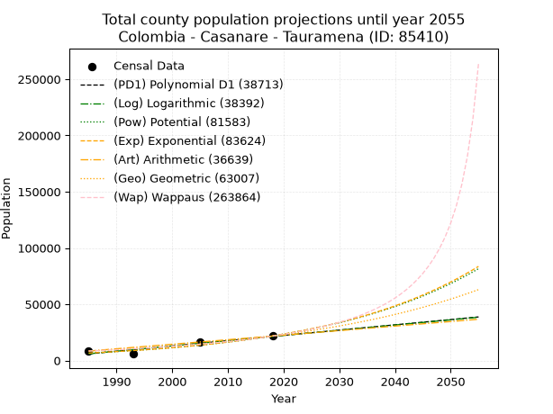
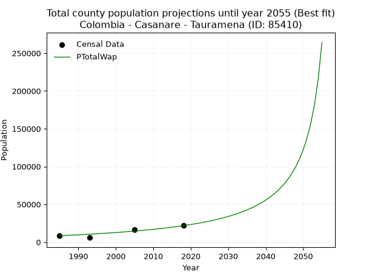
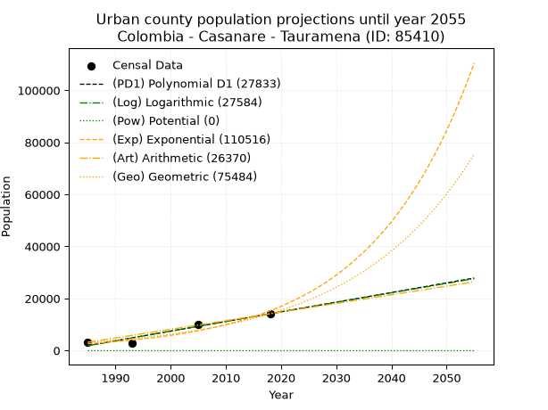
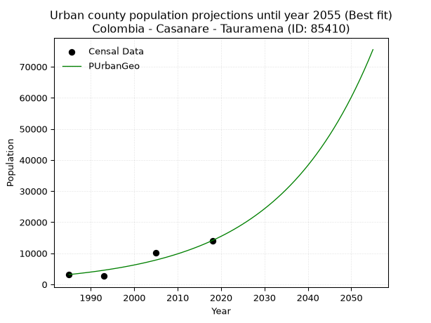
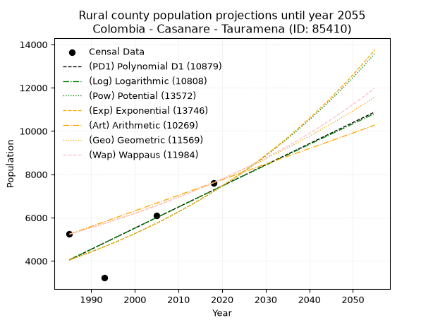
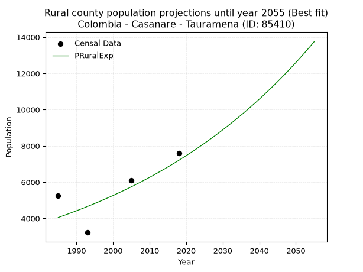

<div align="center">


</div>

# 📜 _“Population and Public Services Demand Projections (PPSD) until Year 2050 for Colombia - Casanare - Tauramena (ID: 85410)”_
Keywords: `population` `public-service` `projection` `lineal` `polynomial` `logarithmic` `potential` `exponential` `arithmetic` `geometric` `wappaus` `dane` `colombia` `south-america`

PPSD are analytical estimates used by governments and planners to anticipate future changes in population size, age distribution, and the resulting community needs for utilities, healthcare, education, and infrastructure as sizing future water treatment facilities, electrical grids, and road networks based on spatial growth.

<div align="center">

</img>

</div>


> **General running parameters**: • app_version: _v20260806_. • Python version: _3.14.7_. • Pandas version: _3.0.5_. • NumPy version: _2.5.1_. • Creates, save and include plots into reports (create_plot): _False_. • Projection until year: _2050_. • Process polynomial degree 2 and up: _False_. • Process Wappaus: _True_. • Process Wappaus: _True_. • Set negative values to zero: _True_. • Set infinite values to zero: _True_. • Drop dataset notes: _True_. 
<div align="center">

Maps & GIS Layers: [:earth_americas:Google](http://maps.google.com/maps?q=5.018976944,-72.7466201) [:earth_americas:OSM](https://www.openstreetmap.org/#map=18/5.018976944/-72.7466201&layers=P) [:earth_americas:Bing](https://www.bing.com/maps?cp=5.018976944~-72.7466201&lvl=18) [:earth_americas:Apple](https://maps.apple.com/frame?center=5.018976944%2C-72.7466201&span=0.003%2C0.006) [:earth_americas:GISMobile](https://github.com/rcfdtools/R.GISMobile/blob/main/file/gis/CountyLayer_CO/Readme.md)

</div>


<div align="center">

```geojson
{
  "type": "Feature",
  "geometry": {
    "type": "Point", 
    "coordinates": [-72.7466201, 5.018976944]
  }, 
  "properties": {
    "Name": "Colombia - Casanare - Tauramena (ID: 85410)"
  }
}
```

</div>


## 0. Census Data (4 records)

Census data are official statistics collected by a government about the people and housing in a country. They usually include counts of total population, age, sex, race, income, education, and jobs.

📅Global census file: [Population.xlsx](../data/Population.xlsx)

| Source   |   Year |   CountryID | CountryName   |   StateID | StateName   |   CountyID | CountyName   |   PTotal |   PUrban |   PRural |
|:---------|-------:|------------:|:--------------|----------:|:------------|-----------:|:-------------|---------:|---------:|---------:|
| DANE     |   1985 |          57 | Colombia      |        85 | Casanare    |      85410 | Tauramena    |     8393 |     3158 |     5235 |
| DANE     |   1993 |          57 | Colombia      |        85 | Casanare    |      85410 | Tauramena    |     5882 |     2660 |     3222 |
| DANE     |   2005 |          57 | Colombia      |        85 | Casanare    |      85410 | Tauramena    |    16239 |    10153 |     6086 |
| DANE     |   2018 |          57 | Colombia      |        85 | Casanare    |      85410 | Tauramena    |    21709 |    14101 |     7608 |

> 🔥Some records could had specific notes about the registered values or the corresponding urban or rural distribution.

📅[SUI-RUPS](https://www.datos.gov.co/Hacienda-y-Cr-dito-P-blico/Registro-nico-de-Prestadores-de-Servicios-P-blicos/4qkq-csdn/about_data) - Local public utility companies: [RUPS.csv](../data/RUPS.csv)

 | SERVICIO       | ESTADO    | NOMBRE                                                           | NIT         | DEPARTAMENTO_DOMICILIO   | MUNICIPIO_DOMICILIO   | DIRECCION           |   TELEFONO | EMAIL                 | TIPO_PRESTADOR                             | CLASIFICACION                  |
|:---------------|:----------|:-----------------------------------------------------------------|:------------|:-------------------------|:----------------------|:--------------------|-----------:|:----------------------|:-------------------------------------------|:-------------------------------|
| ACUEDUCTO      | OPERATIVA | EMPRESA MUNICIPAL DE SERVICIOS PÚBLICOS DE TAURAMENA S.A. E.S.P. | 844001456-1 | CASANARE                 | TAURAMENA             | CARRERA 12 No. 5-40 |    6247674 | jully.reyes@gmail.com | SOCIEDADES (EMPRESA DE SERVICIOS PUBLICOS) | DESDE 2501 HASTA 5000 USUARIOS |
| ALCANTARILLADO | OPERATIVA | EMPRESA MUNICIPAL DE SERVICIOS PÚBLICOS DE TAURAMENA S.A. E.S.P. | 844001456-1 | CASANARE                 | TAURAMENA             | CARRERA 12 No. 5-40 |    6247674 | jully.reyes@gmail.com | SOCIEDADES (EMPRESA DE SERVICIOS PUBLICOS) | DESDE 2501 HASTA 5000 USUARIOS |

## 1. Total

### 1.1. Coefficients and Parameters

* (PD1) Polynomial Deg 1: 468.6186270574027, -924298.6587715697 (lineal)
* (Log) Logarithmic: 937588.2228366839, -7113559.84514212
* (Pow) Potential: 72.54927678344816, -235.43050425764272
* (Exp) Exponential: 0.03625982451898076, 3.6420010675586887e-28
* (Art) Arithmetic: Year diff. 2018 - 1985 = 33, Population diff. 21709 - 8393 = 13316, Annual growth = 403.5151515151515
* (Geo) Geometric: Year diff. 2018 - 1985 = 33, Population diff. 21709 - 8393 = 13316, Annual growth % = 0.029216512522638682
* (Wap) Wappaus: i = 2.680985658860883, Condition values only valid for < 200)

<sub>
Wappaus condition values: ['0.00', '2.68', '5.36', '8.04', '10.72', '13.40', '16.09', '18.77', '21.45', '24.13', '26.81', '29.49', '32.17', '34.85', '37.53', '40.21', '42.90', '45.58', '48.26', '50.94', '53.62', '56.30', '58.98', '61.66', '64.34', '67.02', '69.71', '72.39', '75.07', '77.75', '80.43', '83.11', '85.79', '88.47', '91.15', '93.83', '96.52', '99.20', '101.88', '104.56', '107.24', '109.92', '112.60', '115.28', '117.96', '120.64', '123.33', '126.01', '128.69', '131.37', '134.05', '136.73', '139.41', '142.09', '144.77', '147.45', '150.14', '152.82', '155.50', '158.18', '160.86', '163.54', '166.22', '168.90', '171.58', '174.26']
</sub>


### 1.2. Projected Dataset

|   Year |   CountyID |   PTotalPD1 |   PTotalLog |   PTotalPow |   PTotalExp |   PTotalArt |   PTotalGeo |   PTotalWap |
|-------:|-----------:|------------:|------------:|------------:|------------:|------------:|------------:|------------:|
|   1985 |      85410 |        5909 |        5898 |        6601 |        6607 |        8393 |        8393 |        8393 |
|   1986 |      85410 |        6378 |        6371 |        6847 |        6851 |        8797 |        8638 |        8621 |
|   1987 |      85410 |        6847 |        6843 |        7102 |        7104 |        9200 |        8891 |        8855 |
|   1988 |      85410 |        7315 |        7314 |        7366 |        7366 |        9604 |        9150 |        9096 |
|   1989 |      85410 |        7784 |        7786 |        7639 |        7638 |       10007 |        9418 |        9344 |
|   1990 |      85410 |        8252 |        8257 |        7923 |        7920 |       10411 |        9693 |        9599 |
|   1991 |      85410 |        8721 |        8728 |        8217 |        8213 |       10814 |        9976 |        9861 |
|   1992 |      85410 |        9190 |        9199 |        8522 |        8516 |       11218 |       10267 |       10131 |
|   1993 |      85410 |        9658 |        9669 |        8838 |        8831 |       11621 |       10567 |       10409 |
|   1994 |      85410 |       10127 |       10140 |        9166 |        9157 |       12025 |       10876 |       10696 |
|   1995 |      85410 |       10596 |       10610 |        9505 |        9495 |       12428 |       11194 |       10991 |
|   1996 |      85410 |       11064 |       11080 |        9857 |        9845 |       12832 |       11521 |       11296 |
|   1997 |      85410 |       11533 |       11549 |       10222 |       10209 |       13235 |       11858 |       11611 |
|   1998 |      85410 |       12001 |       12019 |       10600 |       10586 |       13639 |       12204 |       11936 |
|   1999 |      85410 |       12470 |       12488 |       10992 |       10977 |       14042 |       12561 |       12271 |
|   2000 |      85410 |       12939 |       12957 |       11398 |       11382 |       14446 |       12928 |       12618 |
|   2001 |      85410 |       13407 |       13425 |       11819 |       11802 |       14849 |       13305 |       12976 |
|   2002 |      85410 |       13876 |       13894 |       12255 |       12238 |       15253 |       13694 |       13347 |
|   2003 |      85410 |       14344 |       14362 |       12708 |       12690 |       15656 |       14094 |       13731 |
|   2004 |      85410 |       14813 |       14830 |       13176 |       13159 |       16060 |       14506 |       14129 |
|   2005 |      85410 |       15282 |       15298 |       13662 |       13645 |       16463 |       14930 |       14542 |
|   2006 |      85410 |       15750 |       15765 |       14165 |       14148 |       16867 |       15366 |       14970 |
|   2007 |      85410 |       16219 |       16233 |       14687 |       14671 |       17270 |       15815 |       15414 |
|   2008 |      85410 |       16688 |       16700 |       15227 |       15213 |       17674 |       16277 |       15875 |
|   2009 |      85410 |       17156 |       17166 |       15787 |       15774 |       18077 |       16752 |       16355 |
|   2010 |      85410 |       17625 |       17633 |       16367 |       16357 |       18481 |       17242 |       16854 |
|   2011 |      85410 |       18093 |       18099 |       16969 |       16961 |       18884 |       17746 |       17373 |
|   2012 |      85410 |       18562 |       18566 |       17592 |       17587 |       19288 |       18264 |       17915 |
|   2013 |      85410 |       19031 |       19031 |       18238 |       18236 |       19691 |       18798 |       18479 |
|   2014 |      85410 |       19499 |       19497 |       18907 |       18910 |       20095 |       19347 |       19068 |
|   2015 |      85410 |       19968 |       19962 |       19600 |       19608 |       20498 |       19912 |       19684 |
|   2016 |      85410 |       20436 |       20428 |       20319 |       20332 |       20902 |       20494 |       20328 |
|   2017 |      85410 |       20905 |       20893 |       21063 |       21083 |       21305 |       21093 |       21002 |
|   2018 |      85410 |       21374 |       21357 |       21834 |       21861 |       21709 |       21709 |       21709 |
|   2019 |      85410 |       21842 |       21822 |       22633 |       22669 |       22113 |       22343 |       22450 |
|   2020 |      85410 |       22311 |       22286 |       23461 |       23506 |       22516 |       22996 |       23229 |
|   2021 |      85410 |       22780 |       22750 |       24319 |       24374 |       22920 |       23668 |       24049 |
|   2022 |      85410 |       23248 |       23214 |       25207 |       25274 |       23323 |       24359 |       24911 |
|   2023 |      85410 |       23717 |       23678 |       26128 |       26207 |       23727 |       25071 |       25821 |
|   2024 |      85410 |       24185 |       24141 |       27082 |       27175 |       24130 |       25804 |       26782 |
|   2025 |      85410 |       24654 |       24604 |       28070 |       28178 |       24534 |       26557 |       27799 |
|   2026 |      85410 |       25123 |       25067 |       29093 |       29218 |       24937 |       27333 |       28876 |
|   2027 |      85410 |       25591 |       25530 |       30154 |       30297 |       25341 |       28132 |       30020 |
|   2028 |      85410 |       26060 |       25992 |       31252 |       31416 |       25744 |       28954 |       31235 |
|   2029 |      85410 |       26529 |       26454 |       32390 |       32576 |       26148 |       29800 |       32530 |
|   2030 |      85410 |       26997 |       26916 |       33569 |       33779 |       26551 |       30670 |       33913 |
|   2031 |      85410 |       27466 |       27378 |       34790 |       35026 |       26955 |       31567 |       35392 |
|   2032 |      85410 |       27934 |       27839 |       36055 |       36320 |       27358 |       32489 |       36978 |
|   2033 |      85410 |       28403 |       28301 |       37365 |       37661 |       27762 |       33438 |       38684 |
|   2034 |      85410 |       28872 |       28762 |       38723 |       39051 |       28165 |       34415 |       40523 |
|   2035 |      85410 |       29340 |       29223 |       40128 |       40493 |       28569 |       35420 |       42512 |
|   2036 |      85410 |       29809 |       29683 |       41584 |       41989 |       28972 |       36455 |       44669 |
|   2037 |      85410 |       30277 |       30144 |       43093 |       43539 |       29376 |       37520 |       47017 |
|   2038 |      85410 |       30746 |       30604 |       44655 |       45147 |       29779 |       38617 |       49582 |
|   2039 |      85410 |       31215 |       31064 |       46272 |       46814 |       30183 |       39745 |       52396 |
|   2040 |      85410 |       31683 |       31523 |       47948 |       48542 |       30586 |       40906 |       55498 |
|   2041 |      85410 |       32152 |       31983 |       49683 |       50335 |       30990 |       42101 |       58933 |
|   2042 |      85410 |       32621 |       32442 |       51481 |       52193 |       31393 |       43331 |       62759 |
|   2043 |      85410 |       33089 |       32901 |       53342 |       54121 |       31797 |       44597 |       67045 |
|   2044 |      85410 |       33558 |       33360 |       55270 |       56119 |       32200 |       45900 |       71881 |
|   2045 |      85410 |       34026 |       33819 |       57267 |       58191 |       32604 |       47241 |       77379 |
|   2046 |      85410 |       34495 |       34277 |       59334 |       60340 |       33007 |       48622 |       83686 |
|   2047 |      85410 |       34964 |       34735 |       61475 |       62568 |       33411 |       50042 |       90995 |
|   2048 |      85410 |       35432 |       35193 |       63693 |       64878 |       33814 |       51504 |       99563 |
|   2049 |      85410 |       35901 |       35651 |       65989 |       67274 |       34218 |       53009 |      109748 |
|   2050 |      85410 |       36370 |       36108 |       68366 |       69758 |       34621 |       54558 |      122055 |
<div align="center">

</img>

</div>


### 1.3. Best fit with absolute and relative error (%)

Relative error puts that difference into context by dividing the absolute error by the true value, creating a unitless ratio or percentage that shows the scale of the mistake.

Absolute and relative error

|   Year | Source   |   CountryID | CountryName   |   StateID | StateName   |   CountyID_x | CountyName   |   PTotal |   PUrban |   PRural |   CountyID_y |   PTotalPD1 |   PTotalLog |   PTotalPow |   PTotalExp |   PTotalArt |   PTotalGeo |   PTotalWap |   PTotalPD1AbsError |   PTotalLogAbsError |   PTotalPowAbsError |   PTotalExpAbsError |   PTotalArtAbsError |   PTotalGeoAbsError |   PTotalWapAbsError |   PTotalPD1RelError |   PTotalLogRelError |   PTotalPowRelError |   PTotalExpRelError |   PTotalArtRelError |   PTotalGeoRelError |   PTotalWapRelError |
|-------:|:---------|------------:|:--------------|----------:|:------------|-------------:|:-------------|---------:|---------:|---------:|-------------:|------------:|------------:|------------:|------------:|------------:|------------:|------------:|--------------------:|--------------------:|--------------------:|--------------------:|--------------------:|--------------------:|--------------------:|--------------------:|--------------------:|--------------------:|--------------------:|--------------------:|--------------------:|--------------------:|
|   1985 | DANE     |          57 | Colombia      |        85 | Casanare    |        85410 | Tauramena    |     8393 |     3158 |     5235 |        85410 |        5909 |        5898 |        6601 |        6607 |        8393 |        8393 |        8393 |                2484 |                2495 |                1792 |                1786 |                   0 |                   0 |                   0 |            29.5961  |            29.7272  |           21.3511   |            21.2796  |              0      |             0       |              0      |
|   1993 | DANE     |          57 | Colombia      |        85 | Casanare    |        85410 | Tauramena    |     5882 |     2660 |     3222 |        85410 |        9658 |        9669 |        8838 |        8831 |       11621 |       10567 |       10409 |                3776 |                3787 |                2956 |                2949 |                5739 |                4685 |                4527 |            64.1959  |            64.3829  |           50.255    |            50.136   |             97.5689 |            79.6498  |             76.9636 |
|   2005 | DANE     |          57 | Colombia      |        85 | Casanare    |        85410 | Tauramena    |    16239 |    10153 |     6086 |        85410 |       15282 |       15298 |       13662 |       13645 |       16463 |       14930 |       14542 |                 957 |                 941 |                2577 |                2594 |                 224 |                1309 |                1697 |             5.89322 |             5.79469 |           15.8692   |            15.9739  |              1.3794 |             8.06084 |             10.4502 |
|   2018 | DANE     |          57 | Colombia      |        85 | Casanare    |        85410 | Tauramena    |    21709 |    14101 |     7608 |        85410 |       21374 |       21357 |       21834 |       21861 |       21709 |       21709 |       21709 |                 335 |                 352 |                 125 |                 152 |                   0 |                   0 |                   0 |             1.54314 |             1.62145 |            0.575798 |             0.70017 |              0      |             0       |              0      |

Relative error mean

| Method    |   RelError | Best   |
|:----------|-----------:|:-------|
| PTotalPD1 |    25.3071 |        |
| PTotalLog |    25.3815 |        |
| PTotalPow |    22.0128 |        |
| PTotalExp |    22.0224 |        |
| PTotalArt |    24.7371 |        |
| PTotalGeo |    21.9277 |        |
| PTotalWap |    21.8534 | True   |

💙Best method: _**PTotalWap**_
<div align="center">

</img>

</div>


### 1.4. Fresh water supply demand in liters per capita per day (lpcd)

The fresh water supply demand typically ranges from 100 to 300 liters per capita per day (lpcd) for standard domestic and municipal planning, though absolute survival minimums set by the World Health Organization are as low as 7.5 to 20 liters per day, and total consumption in high-income nations can exceed 400 liters.

> `CZ`: Level in meters above the sea level (masl)<br> `WS`: Fresh water supply demand in liters per capita per day (lpcd or l/h/d)<br> `WSAll`: Zonal fresh water supply demand in liters per second (l/s)<br> `A`: Zonal area in square meters<br> `DP`: Population density (people/hectare or p/ha)

Reference values (RAS Colombia)

|    CZ |   WS |
|------:|-----:|
|  1000 |  120 |
|  2000 |  130 |
| 99999 |  140 |

County shapefile geometry properties and water supply values

|   CountyID |      ATotal |   CZTotal |   WSTotal |
|-----------:|------------:|----------:|----------:|
|      85410 | 2.38017e+09 |   315.921 |       120 |

Projected values for best method: PTotalWap

|   CountyID |   Year |   PTotalWap |   DPTotal |   WSTotal |   WSTotalAll |
|-----------:|-------:|------------:|----------:|----------:|-------------:|
|      85410 |   1985 |        8393 |      0.04 |       120 |      11.6569 |
|      85410 |   1986 |        8621 |      0.04 |       120 |      11.9736 |
|      85410 |   1987 |        8855 |      0.04 |       120 |      12.2986 |
|      85410 |   1988 |        9096 |      0.04 |       120 |      12.6333 |
|      85410 |   1989 |        9344 |      0.04 |       120 |      12.9778 |
|      85410 |   1990 |        9599 |      0.04 |       120 |      13.3319 |
|      85410 |   1991 |        9861 |      0.04 |       120 |      13.6958 |
|      85410 |   1992 |       10131 |      0.04 |       120 |      14.0708 |
|      85410 |   1993 |       10409 |      0.04 |       120 |      14.4569 |
|      85410 |   1994 |       10696 |      0.04 |       120 |      14.8556 |
|      85410 |   1995 |       10991 |      0.05 |       120 |      15.2653 |
|      85410 |   1996 |       11296 |      0.05 |       120 |      15.6889 |
|      85410 |   1997 |       11611 |      0.05 |       120 |      16.1264 |
|      85410 |   1998 |       11936 |      0.05 |       120 |      16.5778 |
|      85410 |   1999 |       12271 |      0.05 |       120 |      17.0431 |
|      85410 |   2000 |       12618 |      0.05 |       120 |      17.525  |
|      85410 |   2001 |       12976 |      0.05 |       120 |      18.0222 |
|      85410 |   2002 |       13347 |      0.06 |       120 |      18.5375 |
|      85410 |   2003 |       13731 |      0.06 |       120 |      19.0708 |
|      85410 |   2004 |       14129 |      0.06 |       120 |      19.6236 |
|      85410 |   2005 |       14542 |      0.06 |       120 |      20.1972 |
|      85410 |   2006 |       14970 |      0.06 |       120 |      20.7917 |
|      85410 |   2007 |       15414 |      0.06 |       120 |      21.4083 |
|      85410 |   2008 |       15875 |      0.07 |       120 |      22.0486 |
|      85410 |   2009 |       16355 |      0.07 |       120 |      22.7153 |
|      85410 |   2010 |       16854 |      0.07 |       120 |      23.4083 |
|      85410 |   2011 |       17373 |      0.07 |       120 |      24.1292 |
|      85410 |   2012 |       17915 |      0.08 |       120 |      24.8819 |
|      85410 |   2013 |       18479 |      0.08 |       120 |      25.6653 |
|      85410 |   2014 |       19068 |      0.08 |       120 |      26.4833 |
|      85410 |   2015 |       19684 |      0.08 |       120 |      27.3389 |
|      85410 |   2016 |       20328 |      0.09 |       120 |      28.2333 |
|      85410 |   2017 |       21002 |      0.09 |       120 |      29.1694 |
|      85410 |   2018 |       21709 |      0.09 |       120 |      30.1514 |
|      85410 |   2019 |       22450 |      0.09 |       120 |      31.1806 |
|      85410 |   2020 |       23229 |      0.1  |       120 |      32.2625 |
|      85410 |   2021 |       24049 |      0.1  |       120 |      33.4014 |
|      85410 |   2022 |       24911 |      0.1  |       120 |      34.5986 |
|      85410 |   2023 |       25821 |      0.11 |       120 |      35.8625 |
|      85410 |   2024 |       26782 |      0.11 |       120 |      37.1972 |
|      85410 |   2025 |       27799 |      0.12 |       120 |      38.6097 |
|      85410 |   2026 |       28876 |      0.12 |       120 |      40.1056 |
|      85410 |   2027 |       30020 |      0.13 |       120 |      41.6944 |
|      85410 |   2028 |       31235 |      0.13 |       120 |      43.3819 |
|      85410 |   2029 |       32530 |      0.14 |       120 |      45.1806 |
|      85410 |   2030 |       33913 |      0.14 |       120 |      47.1014 |
|      85410 |   2031 |       35392 |      0.15 |       120 |      49.1556 |
|      85410 |   2032 |       36978 |      0.16 |       120 |      51.3583 |
|      85410 |   2033 |       38684 |      0.16 |       120 |      53.7278 |
|      85410 |   2034 |       40523 |      0.17 |       120 |      56.2819 |
|      85410 |   2035 |       42512 |      0.18 |       120 |      59.0444 |
|      85410 |   2036 |       44669 |      0.19 |       120 |      62.0403 |
|      85410 |   2037 |       47017 |      0.2  |       120 |      65.3014 |
|      85410 |   2038 |       49582 |      0.21 |       120 |      68.8639 |
|      85410 |   2039 |       52396 |      0.22 |       120 |      72.7722 |
|      85410 |   2040 |       55498 |      0.23 |       120 |      77.0806 |
|      85410 |   2041 |       58933 |      0.25 |       120 |      81.8514 |
|      85410 |   2042 |       62759 |      0.26 |       120 |      87.1653 |
|      85410 |   2043 |       67045 |      0.28 |       120 |      93.1181 |
|      85410 |   2044 |       71881 |      0.3  |       120 |      99.8347 |
|      85410 |   2045 |       77379 |      0.33 |       120 |     107.471  |
|      85410 |   2046 |       83686 |      0.35 |       120 |     116.231  |
|      85410 |   2047 |       90995 |      0.38 |       120 |     126.382  |
|      85410 |   2048 |       99563 |      0.42 |       120 |     138.282  |
|      85410 |   2049 |      109748 |      0.46 |       120 |     152.428  |
|      85410 |   2050 |      122055 |      0.51 |       120 |     169.521  |

## 2. Urban

### 2.1. Coefficients and Parameters

* (PD1) Polynomial Deg 1: 371.0558008831765, -734686.3657165739 (lineal)
* (Log) Logarithmic: 742545.8033308813, -5636578.601506655
* (Pow) Potential: 107.19012996137596, -350.0727134827168
* (Exp) Exponential: 0.05355412677957375, 1.7688722255988563e-43
* (Art) Arithmetic: Year diff. 2018 - 1985 = 33, Population diff. 14101 - 3158 = 10943, Annual growth = 331.6060606060606
* (Geo) Geometric: Year diff. 2018 - 1985 = 33, Population diff. 14101 - 3158 = 10943, Annual growth % = 0.046386322190238305
* (Wap) Wappaus: i = 3.8427030605024695, Condition values only valid for < 200)

<sub>
Wappaus condition values: ['0.00', '3.84', '7.69', '11.53', '15.37', '19.21', '23.06', '26.90', '30.74', '34.58', '38.43', '42.27', '46.11', '49.96', '53.80', '57.64', '61.48', '65.33', '69.17', '73.01', '76.85', '80.70', '84.54', '88.38', '92.22', '96.07', '99.91', '103.75', '107.60', '111.44', '115.28', '119.12', '122.97', '126.81', '130.65', '134.49', '138.34', '142.18', '146.02', '149.87', '153.71', '157.55', '161.39', '165.24', '169.08', '172.92', '176.76', '180.61', '184.45', '188.29', '192.14', '195.98', '199.82', '203.66', '207.51', '211.35', '215.19', '219.03', '222.88', '226.72', '230.56', '234.40', '238.25', '242.09', '245.93', '249.78']
</sub>


### 2.2. Projected Dataset

|   Year |   CountyID |   PUrbanPD1 |   PUrbanLog |   PUrbanPow |   PUrbanExp |   PUrbanArt |   PUrbanGeo |
|-------:|-----------:|------------:|------------:|------------:|------------:|------------:|------------:|
|   1985 |      85410 |        1859 |        1850 |           0 |        2602 |        3158 |        3158 |
|   1986 |      85410 |        2230 |        2224 |           0 |        2745 |        3490 |        3304 |
|   1987 |      85410 |        2602 |        2597 |           0 |        2896 |        3821 |        3458 |
|   1988 |      85410 |        2973 |        2971 |           0 |        3056 |        4153 |        3618 |
|   1989 |      85410 |        3344 |        3344 |           0 |        3224 |        4484 |        3786 |
|   1990 |      85410 |        3715 |        3718 |           0 |        3401 |        4816 |        3962 |
|   1991 |      85410 |        4086 |        4091 |           0 |        3588 |        5148 |        4145 |
|   1992 |      85410 |        4457 |        4463 |           0 |        3786 |        5479 |        4338 |
|   1993 |      85410 |        4828 |        4836 |           0 |        3994 |        5811 |        4539 |
|   1994 |      85410 |        5199 |        5209 |           0 |        4214 |        6142 |        4749 |
|   1995 |      85410 |        5570 |        5581 |           0 |        4446 |        6474 |        4970 |
|   1996 |      85410 |        5941 |        5953 |           0 |        4690 |        6806 |        5200 |
|   1997 |      85410 |        6312 |        6325 |           0 |        4948 |        7137 |        5441 |
|   1998 |      85410 |        6683 |        6697 |           0 |        5220 |        7469 |        5694 |
|   1999 |      85410 |        7054 |        7068 |           0 |        5508 |        7800 |        5958 |
|   2000 |      85410 |        7425 |        7440 |           0 |        5811 |        8132 |        6234 |
|   2001 |      85410 |        7796 |        7811 |           0 |        6130 |        8464 |        6524 |
|   2002 |      85410 |        8167 |        8182 |           0 |        6468 |        8795 |        6826 |
|   2003 |      85410 |        8538 |        8553 |           0 |        6823 |        9127 |        7143 |
|   2004 |      85410 |        8909 |        8923 |           0 |        7199 |        9459 |        7474 |
|   2005 |      85410 |        9281 |        9294 |           0 |        7595 |        9790 |        7821 |
|   2006 |      85410 |        9652 |        9664 |           0 |        8013 |       10122 |        8184 |
|   2007 |      85410 |       10023 |       10034 |           0 |        8453 |       10453 |        8563 |
|   2008 |      85410 |       10394 |       10404 |           0 |        8918 |       10785 |        8960 |
|   2009 |      85410 |       10765 |       10774 |           0 |        9409 |       11117 |        9376 |
|   2010 |      85410 |       11136 |       11143 |           0 |        9927 |       11448 |        9811 |
|   2011 |      85410 |       11507 |       11512 |           0 |       10473 |       11780 |       10266 |
|   2012 |      85410 |       11878 |       11882 |           0 |       11049 |       12111 |       10742 |
|   2013 |      85410 |       12249 |       12251 |           0 |       11657 |       12443 |       11241 |
|   2014 |      85410 |       12620 |       12619 |           0 |       12298 |       12775 |       11762 |
|   2015 |      85410 |       12991 |       12988 |           0 |       12975 |       13106 |       12308 |
|   2016 |      85410 |       13362 |       13356 |           0 |       13688 |       13438 |       12879 |
|   2017 |      85410 |       13733 |       13725 |           0 |       14441 |       13769 |       13476 |
|   2018 |      85410 |       14104 |       14093 |           0 |       15236 |       14101 |       14101 |
|   2019 |      85410 |       14475 |       14461 |           0 |       16074 |       14433 |       14755 |
|   2020 |      85410 |       14846 |       14828 |           0 |       16958 |       14764 |       15440 |
|   2021 |      85410 |       15217 |       15196 |           0 |       17891 |       15096 |       16156 |
|   2022 |      85410 |       15588 |       15563 |           0 |       18876 |       15427 |       16905 |
|   2023 |      85410 |       15960 |       15930 |           0 |       19914 |       15759 |       17689 |
|   2024 |      85410 |       16331 |       16297 |           0 |       21010 |       16091 |       18510 |
|   2025 |      85410 |       16702 |       16664 |           0 |       22165 |       16422 |       19368 |
|   2026 |      85410 |       17073 |       17031 |           0 |       23385 |       16754 |       20267 |
|   2027 |      85410 |       17444 |       17397 |           0 |       24671 |       17085 |       21207 |
|   2028 |      85410 |       17815 |       17763 |           0 |       26029 |       17417 |       22191 |
|   2029 |      85410 |       18186 |       18129 |           0 |       27461 |       17749 |       23220 |
|   2030 |      85410 |       18557 |       18495 |           0 |       28971 |       18080 |       24297 |
|   2031 |      85410 |       18928 |       18861 |           0 |       30565 |       18412 |       25424 |
|   2032 |      85410 |       19299 |       19226 |           0 |       32247 |       18743 |       26603 |
|   2033 |      85410 |       19670 |       19592 |           0 |       34021 |       19075 |       27838 |
|   2034 |      85410 |       20041 |       19957 |           0 |       35892 |       19407 |       29129 |
|   2035 |      85410 |       20412 |       20322 |           0 |       37867 |       19738 |       30480 |
|   2036 |      85410 |       20783 |       20687 |           0 |       39950 |       20070 |       31894 |
|   2037 |      85410 |       21154 |       21051 |           0 |       42148 |       20402 |       33373 |
|   2038 |      85410 |       21525 |       21416 |           0 |       44467 |       20733 |       34921 |
|   2039 |      85410 |       21896 |       21780 |           0 |       46913 |       21065 |       36541 |
|   2040 |      85410 |       22267 |       22144 |           0 |       49494 |       21396 |       38236 |
|   2041 |      85410 |       22639 |       22508 |           0 |       52217 |       21728 |       40010 |
|   2042 |      85410 |       23010 |       22872 |           0 |       55089 |       22060 |       41866 |
|   2043 |      85410 |       23381 |       23235 |           0 |       58120 |       22391 |       43808 |
|   2044 |      85410 |       23752 |       23599 |           0 |       61317 |       22723 |       45840 |
|   2045 |      85410 |       24123 |       23962 |           0 |       64691 |       23054 |       47966 |
|   2046 |      85410 |       24494 |       24325 |           0 |       68250 |       23386 |       50191 |
|   2047 |      85410 |       24865 |       24688 |           0 |       72004 |       23718 |       52519 |
|   2048 |      85410 |       25236 |       25050 |           0 |       75966 |       24049 |       54956 |
|   2049 |      85410 |       25607 |       25413 |           0 |       80145 |       24381 |       57505 |
|   2050 |      85410 |       25978 |       25775 |           0 |       84554 |       24712 |       60172 |
<div align="center">

</img>

</div>


### 2.3. Best fit with absolute and relative error (%)

Relative error puts that difference into context by dividing the absolute error by the true value, creating a unitless ratio or percentage that shows the scale of the mistake.

Absolute and relative error

|   Year | Source   |   CountryID | CountryName   |   StateID | StateName   |   CountyID_x | CountyName   |   PTotal |   PUrban |   PRural |   CountyID_y |   PUrbanPD1 |   PUrbanLog |   PUrbanPow |   PUrbanExp |   PUrbanArt |   PUrbanGeo |   PUrbanPD1AbsError |   PUrbanLogAbsError |   PUrbanPowAbsError |   PUrbanExpAbsError |   PUrbanArtAbsError |   PUrbanGeoAbsError |   PUrbanPD1RelError |   PUrbanLogRelError |   PUrbanPowRelError |   PUrbanExpRelError |   PUrbanArtRelError |   PUrbanGeoRelError |
|-------:|:---------|------------:|:--------------|----------:|:------------|-------------:|:-------------|---------:|---------:|---------:|-------------:|------------:|------------:|------------:|------------:|------------:|------------:|--------------------:|--------------------:|--------------------:|--------------------:|--------------------:|--------------------:|--------------------:|--------------------:|--------------------:|--------------------:|--------------------:|--------------------:|
|   1985 | DANE     |          57 | Colombia      |        85 | Casanare    |        85410 | Tauramena    |     8393 |     3158 |     5235 |        85410 |        1859 |        1850 |           0 |        2602 |        3158 |        3158 |                1299 |                1308 |                3158 |                 556 |                   0 |                   0 |          41.1336    |          41.4186    |                 100 |            17.6061  |              0      |              0      |
|   1993 | DANE     |          57 | Colombia      |        85 | Casanare    |        85410 | Tauramena    |     5882 |     2660 |     3222 |        85410 |        4828 |        4836 |           0 |        3994 |        5811 |        4539 |                2168 |                2176 |                2660 |                1334 |                3151 |                1879 |          81.5038    |          81.8045    |                 100 |            50.1504  |            118.459  |             70.6391 |
|   2005 | DANE     |          57 | Colombia      |        85 | Casanare    |        85410 | Tauramena    |    16239 |    10153 |     6086 |        85410 |        9281 |        9294 |           0 |        7595 |        9790 |        7821 |                 872 |                 859 |               10153 |                2558 |                 363 |                2332 |           8.58859   |           8.46055   |                 100 |            25.1945  |              3.5753 |             22.9686 |
|   2018 | DANE     |          57 | Colombia      |        85 | Casanare    |        85410 | Tauramena    |    21709 |    14101 |     7608 |        85410 |       14104 |       14093 |           0 |       15236 |       14101 |       14101 |                   3 |                   8 |               14101 |                1135 |                   0 |                   0 |           0.0212751 |           0.0567336 |                 100 |             8.04907 |              0      |              0      |

Relative error mean

| Method    |   RelError | Best   |
|:----------|-----------:|:-------|
| PUrbanPD1 |    32.8118 |        |
| PUrbanLog |    32.9351 |        |
| PUrbanPow |   100      |        |
| PUrbanExp |    25.25   |        |
| PUrbanArt |    30.5085 |        |
| PUrbanGeo |    23.4019 | True   |

💙Best method: _**PUrbanGeo**_
<div align="center">

</img>

</div>


### 2.4. Fresh water supply demand in liters per capita per day (lpcd)

The fresh water supply demand typically ranges from 100 to 300 liters per capita per day (lpcd) for standard domestic and municipal planning, though absolute survival minimums set by the World Health Organization are as low as 7.5 to 20 liters per day, and total consumption in high-income nations can exceed 400 liters.

> `CZ`: Level in meters above the sea level (masl)<br> `WS`: Fresh water supply demand in liters per capita per day (lpcd or l/h/d)<br> `WSAll`: Zonal fresh water supply demand in liters per second (l/s)<br> `A`: Zonal area in square meters<br> `DP`: Population density (people/hectare or p/ha)

Reference values (RAS Colombia)

|    CZ |   WS |
|------:|-----:|
|  1000 |  120 |
|  2000 |  130 |
| 99999 |  140 |

County shapefile geometry properties and water supply values

|   CountyID |      AUrban |   CZUrban |   WSUrban |
|-----------:|------------:|----------:|----------:|
|      85410 | 3.89518e+06 |   456.669 |       120 |

Projected values for best method: PUrbanGeo

|   CountyID |   Year |   PUrbanGeo |   DPUrban |   WSUrban |   WSUrbanAll |
|-----------:|-------:|------------:|----------:|----------:|-------------:|
|      85410 |   1985 |        3158 |      8.11 |       120 |      4.38611 |
|      85410 |   1986 |        3304 |      8.48 |       120 |      4.58889 |
|      85410 |   1987 |        3458 |      8.88 |       120 |      4.80278 |
|      85410 |   1988 |        3618 |      9.29 |       120 |      5.025   |
|      85410 |   1989 |        3786 |      9.72 |       120 |      5.25833 |
|      85410 |   1990 |        3962 |     10.17 |       120 |      5.50278 |
|      85410 |   1991 |        4145 |     10.64 |       120 |      5.75694 |
|      85410 |   1992 |        4338 |     11.14 |       120 |      6.025   |
|      85410 |   1993 |        4539 |     11.65 |       120 |      6.30417 |
|      85410 |   1994 |        4749 |     12.19 |       120 |      6.59583 |
|      85410 |   1995 |        4970 |     12.76 |       120 |      6.90278 |
|      85410 |   1996 |        5200 |     13.35 |       120 |      7.22222 |
|      85410 |   1997 |        5441 |     13.97 |       120 |      7.55694 |
|      85410 |   1998 |        5694 |     14.62 |       120 |      7.90833 |
|      85410 |   1999 |        5958 |     15.3  |       120 |      8.275   |
|      85410 |   2000 |        6234 |     16    |       120 |      8.65833 |
|      85410 |   2001 |        6524 |     16.75 |       120 |      9.06111 |
|      85410 |   2002 |        6826 |     17.52 |       120 |      9.48056 |
|      85410 |   2003 |        7143 |     18.34 |       120 |      9.92083 |
|      85410 |   2004 |        7474 |     19.19 |       120 |     10.3806  |
|      85410 |   2005 |        7821 |     20.08 |       120 |     10.8625  |
|      85410 |   2006 |        8184 |     21.01 |       120 |     11.3667  |
|      85410 |   2007 |        8563 |     21.98 |       120 |     11.8931  |
|      85410 |   2008 |        8960 |     23    |       120 |     12.4444  |
|      85410 |   2009 |        9376 |     24.07 |       120 |     13.0222  |
|      85410 |   2010 |        9811 |     25.19 |       120 |     13.6264  |
|      85410 |   2011 |       10266 |     26.36 |       120 |     14.2583  |
|      85410 |   2012 |       10742 |     27.58 |       120 |     14.9194  |
|      85410 |   2013 |       11241 |     28.86 |       120 |     15.6125  |
|      85410 |   2014 |       11762 |     30.2  |       120 |     16.3361  |
|      85410 |   2015 |       12308 |     31.6  |       120 |     17.0944  |
|      85410 |   2016 |       12879 |     33.06 |       120 |     17.8875  |
|      85410 |   2017 |       13476 |     34.6  |       120 |     18.7167  |
|      85410 |   2018 |       14101 |     36.2  |       120 |     19.5847  |
|      85410 |   2019 |       14755 |     37.88 |       120 |     20.4931  |
|      85410 |   2020 |       15440 |     39.64 |       120 |     21.4444  |
|      85410 |   2021 |       16156 |     41.48 |       120 |     22.4389  |
|      85410 |   2022 |       16905 |     43.4  |       120 |     23.4792  |
|      85410 |   2023 |       17689 |     45.41 |       120 |     24.5681  |
|      85410 |   2024 |       18510 |     47.52 |       120 |     25.7083  |
|      85410 |   2025 |       19368 |     49.72 |       120 |     26.9     |
|      85410 |   2026 |       20267 |     52.03 |       120 |     28.1486  |
|      85410 |   2027 |       21207 |     54.44 |       120 |     29.4542  |
|      85410 |   2028 |       22191 |     56.97 |       120 |     30.8208  |
|      85410 |   2029 |       23220 |     59.61 |       120 |     32.25    |
|      85410 |   2030 |       24297 |     62.38 |       120 |     33.7458  |
|      85410 |   2031 |       25424 |     65.27 |       120 |     35.3111  |
|      85410 |   2032 |       26603 |     68.3  |       120 |     36.9486  |
|      85410 |   2033 |       27838 |     71.47 |       120 |     38.6639  |
|      85410 |   2034 |       29129 |     74.78 |       120 |     40.4569  |
|      85410 |   2035 |       30480 |     78.25 |       120 |     42.3333  |
|      85410 |   2036 |       31894 |     81.88 |       120 |     44.2972  |
|      85410 |   2037 |       33373 |     85.68 |       120 |     46.3514  |
|      85410 |   2038 |       34921 |     89.65 |       120 |     48.5014  |
|      85410 |   2039 |       36541 |     93.81 |       120 |     50.7514  |
|      85410 |   2040 |       38236 |     98.16 |       120 |     53.1056  |
|      85410 |   2041 |       40010 |    102.72 |       120 |     55.5694  |
|      85410 |   2042 |       41866 |    107.48 |       120 |     58.1472  |
|      85410 |   2043 |       43808 |    112.47 |       120 |     60.8444  |
|      85410 |   2044 |       45840 |    117.68 |       120 |     63.6667  |
|      85410 |   2045 |       47966 |    123.14 |       120 |     66.6194  |
|      85410 |   2046 |       50191 |    128.85 |       120 |     69.7097  |
|      85410 |   2047 |       52519 |    134.83 |       120 |     72.9431  |
|      85410 |   2048 |       54956 |    141.09 |       120 |     76.3278  |
|      85410 |   2049 |       57505 |    147.63 |       120 |     79.8681  |
|      85410 |   2050 |       60172 |    154.48 |       120 |     83.5722  |

## 3. Rural

### 3.1. Coefficients and Parameters

* (PD1) Polynomial Deg 1: 97.56282617422609, -189612.29305499577 (lineal)
* (Log) Logarithmic: 195042.41950580274, -1476981.2436354659
* (Pow) Potential: 34.89036943596225, -111.45259432627417
* (Exp) Exponential: 0.017454680573552067, 3.633483042630957e-12
* (Art) Arithmetic: Year diff. 2018 - 1985 = 33, Population diff. 7608 - 5235 = 2373, Annual growth = 71.9090909090909
* (Geo) Geometric: Year diff. 2018 - 1985 = 33, Population diff. 7608 - 5235 = 2373, Annual growth % = 0.011392695328317215
* (Wap) Wappaus: i = 1.1198176580096693, Condition values only valid for < 200)

<sub>
Wappaus condition values: ['0.00', '1.12', '2.24', '3.36', '4.48', '5.60', '6.72', '7.84', '8.96', '10.08', '11.20', '12.32', '13.44', '14.56', '15.68', '16.80', '17.92', '19.04', '20.16', '21.28', '22.40', '23.52', '24.64', '25.76', '26.88', '28.00', '29.12', '30.24', '31.35', '32.47', '33.59', '34.71', '35.83', '36.95', '38.07', '39.19', '40.31', '41.43', '42.55', '43.67', '44.79', '45.91', '47.03', '48.15', '49.27', '50.39', '51.51', '52.63', '53.75', '54.87', '55.99', '57.11', '58.23', '59.35', '60.47', '61.59', '62.71', '63.83', '64.95', '66.07', '67.19', '68.31', '69.43', '70.55', '71.67', '72.79']
</sub>


### 3.2. Projected Dataset

|   Year |   CountyID |   PRuralPD1 |   PRuralLog |   PRuralPow |   PRuralExp |   PRuralArt |   PRuralGeo |   PRuralWap |
|-------:|-----------:|------------:|------------:|------------:|------------:|------------:|------------:|------------:|
|   1985 |      85410 |        4050 |        4049 |        4050 |        4051 |        5235 |        5235 |        5235 |
|   1986 |      85410 |        4147 |        4147 |        4122 |        4122 |        5307 |        5295 |        5294 |
|   1987 |      85410 |        4245 |        4245 |        4195 |        4195 |        5379 |        5355 |        5354 |
|   1988 |      85410 |        4343 |        4343 |        4269 |        4269 |        5451 |        5416 |        5414 |
|   1989 |      85410 |        4440 |        4441 |        4345 |        4344 |        5523 |        5478 |        5475 |
|   1990 |      85410 |        4538 |        4540 |        4422 |        4420 |        5595 |        5540 |        5537 |
|   1991 |      85410 |        4635 |        4637 |        4500 |        4498 |        5666 |        5603 |        5599 |
|   1992 |      85410 |        4733 |        4735 |        4580 |        4577 |        5738 |        5667 |        5662 |
|   1993 |      85410 |        4830 |        4833 |        4661 |        4658 |        5810 |        5732 |        5726 |
|   1994 |      85410 |        4928 |        4931 |        4743 |        4740 |        5882 |        5797 |        5791 |
|   1995 |      85410 |        5026 |        5029 |        4827 |        4824 |        5954 |        5863 |        5856 |
|   1996 |      85410 |        5123 |        5127 |        4912 |        4908 |        6026 |        5930 |        5922 |
|   1997 |      85410 |        5221 |        5224 |        4998 |        4995 |        6098 |        5997 |        5989 |
|   1998 |      85410 |        5318 |        5322 |        5086 |        5083 |        6170 |        6066 |        6057 |
|   1999 |      85410 |        5416 |        5420 |        5176 |        5172 |        6242 |        6135 |        6126 |
|   2000 |      85410 |        5513 |        5517 |        5267 |        5263 |        6314 |        6205 |        6195 |
|   2001 |      85410 |        5611 |        5615 |        5360 |        5356 |        6386 |        6275 |        6265 |
|   2002 |      85410 |        5708 |        5712 |        5454 |        5450 |        6457 |        6347 |        6336 |
|   2003 |      85410 |        5806 |        5810 |        5550 |        5546 |        6529 |        6419 |        6408 |
|   2004 |      85410 |        5904 |        5907 |        5647 |        5644 |        6601 |        6492 |        6481 |
|   2005 |      85410 |        6001 |        6004 |        5746 |        5743 |        6673 |        6566 |        6555 |
|   2006 |      85410 |        6099 |        6101 |        5847 |        5845 |        6745 |        6641 |        6630 |
|   2007 |      85410 |        6196 |        6199 |        5950 |        5947 |        6817 |        6717 |        6706 |
|   2008 |      85410 |        6294 |        6296 |        6054 |        6052 |        6889 |        6793 |        6783 |
|   2009 |      85410 |        6391 |        6393 |        6160 |        6159 |        6961 |        6871 |        6860 |
|   2010 |      85410 |        6489 |        6490 |        6268 |        6267 |        7033 |        6949 |        6939 |
|   2011 |      85410 |        6587 |        6587 |        6378 |        6378 |        7105 |        7028 |        7019 |
|   2012 |      85410 |        6684 |        6684 |        6489 |        6490 |        7177 |        7108 |        7100 |
|   2013 |      85410 |        6782 |        6781 |        6603 |        6604 |        7248 |        7189 |        7182 |
|   2014 |      85410 |        6879 |        6878 |        6718 |        6720 |        7320 |        7271 |        7265 |
|   2015 |      85410 |        6977 |        6975 |        6836 |        6839 |        7392 |        7354 |        7349 |
|   2016 |      85410 |        7074 |        7071 |        6955 |        6959 |        7464 |        7438 |        7434 |
|   2017 |      85410 |        7172 |        7168 |        7076 |        7082 |        7536 |        7522 |        7520 |
|   2018 |      85410 |        7269 |        7265 |        7200 |        7206 |        7608 |        7608 |        7608 |
|   2019 |      85410 |        7367 |        7361 |        7325 |        7333 |        7680 |        7695 |        7697 |
|   2020 |      85410 |        7465 |        7458 |        7453 |        7462 |        7752 |        7782 |        7787 |
|   2021 |      85410 |        7562 |        7554 |        7583 |        7594 |        7824 |        7871 |        7878 |
|   2022 |      85410 |        7660 |        7651 |        7715 |        7727 |        7896 |        7961 |        7971 |
|   2023 |      85410 |        7757 |        7747 |        7849 |        7864 |        7968 |        8051 |        8065 |
|   2024 |      85410 |        7855 |        7844 |        7986 |        8002 |        8039 |        8143 |        8160 |
|   2025 |      85410 |        7952 |        7940 |        8124 |        8143 |        8111 |        8236 |        8257 |
|   2026 |      85410 |        8050 |        8036 |        8266 |        8286 |        8183 |        8330 |        8355 |
|   2027 |      85410 |        8148 |        8133 |        8409 |        8432 |        8255 |        8425 |        8454 |
|   2028 |      85410 |        8245 |        8229 |        8555 |        8581 |        8327 |        8521 |        8555 |
|   2029 |      85410 |        8343 |        8325 |        8704 |        8732 |        8399 |        8618 |        8658 |
|   2030 |      85410 |        8440 |        8421 |        8855 |        8885 |        8471 |        8716 |        8762 |
|   2031 |      85410 |        8538 |        8517 |        9008 |        9042 |        8543 |        8815 |        8867 |
|   2032 |      85410 |        8635 |        8613 |        9164 |        9201 |        8615 |        8916 |        8974 |
|   2033 |      85410 |        8733 |        8709 |        9323 |        9363 |        8687 |        9017 |        9083 |
|   2034 |      85410 |        8830 |        8805 |        9484 |        9528 |        8759 |        9120 |        9194 |
|   2035 |      85410 |        8928 |        8901 |        9648 |        9696 |        8830 |        9224 |        9306 |
|   2036 |      85410 |        9026 |        8997 |        9815 |        9866 |        8902 |        9329 |        9420 |
|   2037 |      85410 |        9123 |        9092 |        9984 |       10040 |        8974 |        9435 |        9535 |
|   2038 |      85410 |        9221 |        9188 |       10157 |       10217 |        9046 |        9543 |        9653 |
|   2039 |      85410 |        9318 |        9284 |       10332 |       10397 |        9118 |        9651 |        9773 |
|   2040 |      85410 |        9416 |        9380 |       10511 |       10580 |        9190 |        9761 |        9894 |
|   2041 |      85410 |        9513 |        9475 |       10692 |       10766 |        9262 |        9872 |       10017 |
|   2042 |      85410 |        9611 |        9571 |       10876 |       10956 |        9334 |        9985 |       10143 |
|   2043 |      85410 |        9709 |        9666 |       11063 |       11149 |        9406 |       10099 |       10270 |
|   2044 |      85410 |        9806 |        9762 |       11254 |       11345 |        9478 |       10214 |       10400 |
|   2045 |      85410 |        9904 |        9857 |       11448 |       11545 |        9550 |       10330 |       10532 |
|   2046 |      85410 |       10001 |        9952 |       11645 |       11748 |        9621 |       10448 |       10666 |
|   2047 |      85410 |       10099 |       10048 |       11845 |       11955 |        9693 |       10567 |       10802 |
|   2048 |      85410 |       10196 |       10143 |       12048 |       12165 |        9765 |       10687 |       10941 |
|   2049 |      85410 |       10294 |       10238 |       12255 |       12380 |        9837 |       10809 |       11082 |
|   2050 |      85410 |       10392 |       10333 |       12466 |       12598 |        9909 |       10932 |       11226 |
<div align="center">

</img>

</div>


### 3.3. Best fit with absolute and relative error (%)

Relative error puts that difference into context by dividing the absolute error by the true value, creating a unitless ratio or percentage that shows the scale of the mistake.

Absolute and relative error

|   Year | Source   |   CountryID | CountryName   |   StateID | StateName   |   CountyID_x | CountyName   |   PTotal |   PUrban |   PRural |   CountyID_y |   PRuralPD1 |   PRuralLog |   PRuralPow |   PRuralExp |   PRuralArt |   PRuralGeo |   PRuralWap |   PRuralPD1AbsError |   PRuralLogAbsError |   PRuralPowAbsError |   PRuralExpAbsError |   PRuralArtAbsError |   PRuralGeoAbsError |   PRuralWapAbsError |   PRuralPD1RelError |   PRuralLogRelError |   PRuralPowRelError |   PRuralExpRelError |   PRuralArtRelError |   PRuralGeoRelError |   PRuralWapRelError |
|-------:|:---------|------------:|:--------------|----------:|:------------|-------------:|:-------------|---------:|---------:|---------:|-------------:|------------:|------------:|------------:|------------:|------------:|------------:|------------:|--------------------:|--------------------:|--------------------:|--------------------:|--------------------:|--------------------:|--------------------:|--------------------:|--------------------:|--------------------:|--------------------:|--------------------:|--------------------:|--------------------:|
|   1985 | DANE     |          57 | Colombia      |        85 | Casanare    |        85410 | Tauramena    |     8393 |     3158 |     5235 |        85410 |        4050 |        4049 |        4050 |        4051 |        5235 |        5235 |        5235 |                1185 |                1186 |                1185 |                1184 |                   0 |                   0 |                   0 |            22.6361  |            22.6552  |            22.6361  |            22.617   |             0       |             0       |             0       |
|   1993 | DANE     |          57 | Colombia      |        85 | Casanare    |        85410 | Tauramena    |     5882 |     2660 |     3222 |        85410 |        4830 |        4833 |        4661 |        4658 |        5810 |        5732 |        5726 |                1608 |                1611 |                1439 |                1436 |                2588 |                2510 |                2504 |            49.9069  |            50       |            44.6617  |            44.5686  |            80.3228  |            77.9019  |            77.7157  |
|   2005 | DANE     |          57 | Colombia      |        85 | Casanare    |        85410 | Tauramena    |    16239 |    10153 |     6086 |        85410 |        6001 |        6004 |        5746 |        5743 |        6673 |        6566 |        6555 |                  85 |                  82 |                 340 |                 343 |                 587 |                 480 |                 469 |             1.39665 |             1.34735 |             5.58659 |             5.63589 |             9.64509 |             7.88695 |             7.70621 |
|   2018 | DANE     |          57 | Colombia      |        85 | Casanare    |        85410 | Tauramena    |    21709 |    14101 |     7608 |        85410 |        7269 |        7265 |        7200 |        7206 |        7608 |        7608 |        7608 |                 339 |                 343 |                 408 |                 402 |                   0 |                   0 |                   0 |             4.45584 |             4.50841 |             5.36278 |             5.28391 |             0       |             0       |             0       |

Relative error mean

| Method    |   RelError | Best   |
|:----------|-----------:|:-------|
| PRuralPD1 |    19.5989 |        |
| PRuralLog |    19.6277 |        |
| PRuralPow |    19.5618 |        |
| PRuralExp |    19.5263 | True   |
| PRuralArt |    22.492  |        |
| PRuralGeo |    21.4472 |        |
| PRuralWap |    21.3555 |        |

💙Best method: _**PRuralExp**_
<div align="center">

</img>

</div>


### 3.4. Fresh water supply demand in liters per capita per day (lpcd)

The fresh water supply demand typically ranges from 100 to 300 liters per capita per day (lpcd) for standard domestic and municipal planning, though absolute survival minimums set by the World Health Organization are as low as 7.5 to 20 liters per day, and total consumption in high-income nations can exceed 400 liters.

> `CZ`: Level in meters above the sea level (masl)<br> `WS`: Fresh water supply demand in liters per capita per day (lpcd or l/h/d)<br> `WSAll`: Zonal fresh water supply demand in liters per second (l/s)<br> `A`: Zonal area in square meters<br> `DP`: Population density (people/hectare or p/ha)

Reference values (RAS Colombia)

|    CZ |   WS |
|------:|-----:|
|  1000 |  120 |
|  2000 |  130 |
| 99999 |  140 |

County shapefile geometry properties and water supply values

|   CountyID |      ARural |   CZRural |   WSRural |
|-----------:|------------:|----------:|----------:|
|      85410 | 2.37628e+09 |   315.691 |       120 |

Projected values for best method: PRuralExp

|   CountyID |   Year |   PRuralExp |   DPRural |   WSRural |   WSRuralAll |
|-----------:|-------:|------------:|----------:|----------:|-------------:|
|      85410 |   1985 |        4051 |      0.02 |       120 |      5.62639 |
|      85410 |   1986 |        4122 |      0.02 |       120 |      5.725   |
|      85410 |   1987 |        4195 |      0.02 |       120 |      5.82639 |
|      85410 |   1988 |        4269 |      0.02 |       120 |      5.92917 |
|      85410 |   1989 |        4344 |      0.02 |       120 |      6.03333 |
|      85410 |   1990 |        4420 |      0.02 |       120 |      6.13889 |
|      85410 |   1991 |        4498 |      0.02 |       120 |      6.24722 |
|      85410 |   1992 |        4577 |      0.02 |       120 |      6.35694 |
|      85410 |   1993 |        4658 |      0.02 |       120 |      6.46944 |
|      85410 |   1994 |        4740 |      0.02 |       120 |      6.58333 |
|      85410 |   1995 |        4824 |      0.02 |       120 |      6.7     |
|      85410 |   1996 |        4908 |      0.02 |       120 |      6.81667 |
|      85410 |   1997 |        4995 |      0.02 |       120 |      6.9375  |
|      85410 |   1998 |        5083 |      0.02 |       120 |      7.05972 |
|      85410 |   1999 |        5172 |      0.02 |       120 |      7.18333 |
|      85410 |   2000 |        5263 |      0.02 |       120 |      7.30972 |
|      85410 |   2001 |        5356 |      0.02 |       120 |      7.43889 |
|      85410 |   2002 |        5450 |      0.02 |       120 |      7.56944 |
|      85410 |   2003 |        5546 |      0.02 |       120 |      7.70278 |
|      85410 |   2004 |        5644 |      0.02 |       120 |      7.83889 |
|      85410 |   2005 |        5743 |      0.02 |       120 |      7.97639 |
|      85410 |   2006 |        5845 |      0.02 |       120 |      8.11806 |
|      85410 |   2007 |        5947 |      0.03 |       120 |      8.25972 |
|      85410 |   2008 |        6052 |      0.03 |       120 |      8.40556 |
|      85410 |   2009 |        6159 |      0.03 |       120 |      8.55417 |
|      85410 |   2010 |        6267 |      0.03 |       120 |      8.70417 |
|      85410 |   2011 |        6378 |      0.03 |       120 |      8.85833 |
|      85410 |   2012 |        6490 |      0.03 |       120 |      9.01389 |
|      85410 |   2013 |        6604 |      0.03 |       120 |      9.17222 |
|      85410 |   2014 |        6720 |      0.03 |       120 |      9.33333 |
|      85410 |   2015 |        6839 |      0.03 |       120 |      9.49861 |
|      85410 |   2016 |        6959 |      0.03 |       120 |      9.66528 |
|      85410 |   2017 |        7082 |      0.03 |       120 |      9.83611 |
|      85410 |   2018 |        7206 |      0.03 |       120 |     10.0083  |
|      85410 |   2019 |        7333 |      0.03 |       120 |     10.1847  |
|      85410 |   2020 |        7462 |      0.03 |       120 |     10.3639  |
|      85410 |   2021 |        7594 |      0.03 |       120 |     10.5472  |
|      85410 |   2022 |        7727 |      0.03 |       120 |     10.7319  |
|      85410 |   2023 |        7864 |      0.03 |       120 |     10.9222  |
|      85410 |   2024 |        8002 |      0.03 |       120 |     11.1139  |
|      85410 |   2025 |        8143 |      0.03 |       120 |     11.3097  |
|      85410 |   2026 |        8286 |      0.03 |       120 |     11.5083  |
|      85410 |   2027 |        8432 |      0.04 |       120 |     11.7111  |
|      85410 |   2028 |        8581 |      0.04 |       120 |     11.9181  |
|      85410 |   2029 |        8732 |      0.04 |       120 |     12.1278  |
|      85410 |   2030 |        8885 |      0.04 |       120 |     12.3403  |
|      85410 |   2031 |        9042 |      0.04 |       120 |     12.5583  |
|      85410 |   2032 |        9201 |      0.04 |       120 |     12.7792  |
|      85410 |   2033 |        9363 |      0.04 |       120 |     13.0042  |
|      85410 |   2034 |        9528 |      0.04 |       120 |     13.2333  |
|      85410 |   2035 |        9696 |      0.04 |       120 |     13.4667  |
|      85410 |   2036 |        9866 |      0.04 |       120 |     13.7028  |
|      85410 |   2037 |       10040 |      0.04 |       120 |     13.9444  |
|      85410 |   2038 |       10217 |      0.04 |       120 |     14.1903  |
|      85410 |   2039 |       10397 |      0.04 |       120 |     14.4403  |
|      85410 |   2040 |       10580 |      0.04 |       120 |     14.6944  |
|      85410 |   2041 |       10766 |      0.05 |       120 |     14.9528  |
|      85410 |   2042 |       10956 |      0.05 |       120 |     15.2167  |
|      85410 |   2043 |       11149 |      0.05 |       120 |     15.4847  |
|      85410 |   2044 |       11345 |      0.05 |       120 |     15.7569  |
|      85410 |   2045 |       11545 |      0.05 |       120 |     16.0347  |
|      85410 |   2046 |       11748 |      0.05 |       120 |     16.3167  |
|      85410 |   2047 |       11955 |      0.05 |       120 |     16.6042  |
|      85410 |   2048 |       12165 |      0.05 |       120 |     16.8958  |
|      85410 |   2049 |       12380 |      0.05 |       120 |     17.1944  |
|      85410 |   2050 |       12598 |      0.05 |       120 |     17.4972  |

#

<div align="center"><br><sub>Share this research</sub></div><br>

<sub>**APPS & TOOLS & CONTENT DISCLAIMER**: • NO WARRANTY - This content and software is provided by <a href="https://github.com/rcfdtools" target="_blank">github.com/rcfdtools</a> "as is", without any express or implied warranty, including warranties of merchantability, fitness for a particular purpose, or non-infringement. There is no guarantee that the software will be error-free or operate without interruption. • LIMITATION OF LIABILITY - Neither the authors nor copyright holders will be liable for claims or damages arising from the software or its use. You are responsible for determining if the software is appropriate for your use and assume all associated risks, including errors, legal compliance, and data loss. • NO PROFESSIONAL ADVICE - The software provides general information and does not offer professional advice. It should not replace consultation with professional advisors. [Clauses and global license for rcfdtools use.](https://github.com/rcfdtools/rcfdtools/blob/main/LICENSE.md)</sub>

| [:house: Home](Readme.md)  | [:beginner: Help / Collab](https://github.com/rcfdtools/R.HydroTools/discussions/31) |
|----------------------------|-------------------------------------------------------------------------------------------|