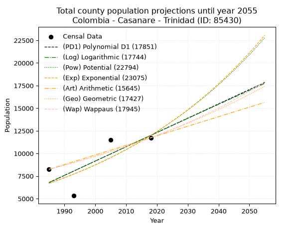
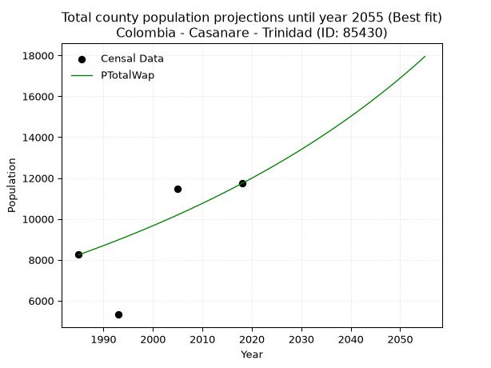
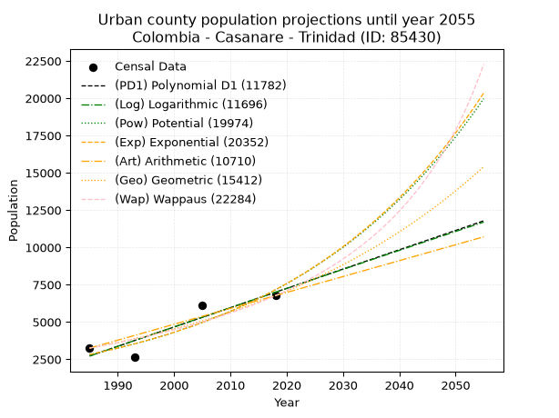
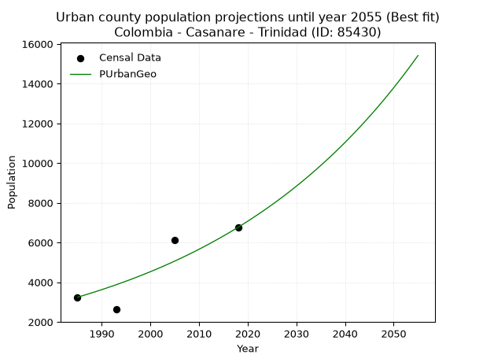
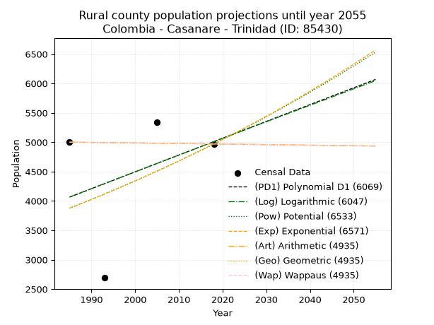
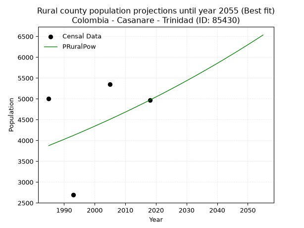

<div align="center">


</div>

# _“Population and Public Services Demand Projections (PPSD) until Year 2050 for Colombia - Casanare - Trinidad (ID: 85430)”_
Keywords: `population` `public-service` `projection` `lineal` `polynomial` `logarithmic` `potential` `exponential` `arithmetic` `geometric` `wappaus` `dane` `colombia` `south-america`

PPSD are analytical estimates used by governments and planners to anticipate future changes in population size, age distribution, and the resulting community needs for utilities, healthcare, education, and infrastructure as sizing future water treatment facilities, electrical grids, and road networks based on spatial growth.

> **General running parameters**: • app_version: _v20260806_. • Python version: _3.14.7_. • Pandas version: _3.0.5_. • NumPy version: _2.5.1_. • Creates, save and include plots into reports (create_plot): _False_. • Projection until year: _2050_. • Process polynomial degree 2 and up: _False_. • Process Wappaus: _True_. • Process Wappaus: _True_. • Set negative values to zero: _True_. • Set infinite values to zero: _True_. • Drop dataset notes: _True_. 
<div align="center">

Dynamic map: [:earth_americas:Google](http://maps.google.com/maps?q=5.412178437,-71.6628115) [:earth_americas:OSM](https://www.openstreetmap.org/#map=18/5.412178437/-71.6628115&layers=P) [:earth_americas:Bing](https://www.bing.com/maps?cp=5.412178437~-71.6628115&lvl=18) [:earth_americas:Apple](https://maps.apple.com/frame?center=5.412178437%2C-71.6628115&span=0.003%2C0.006)

</div>


<div align="center">

```geojson
{
  "type": "Feature",
  "geometry": {
    "type": "Point", 
    "coordinates": [-71.6628115, 5.412178437]
  }, 
  "properties": {
    "Name": "Colombia - Casanare - Trinidad (ID: 85430)"
  }
}
```

</div>


## 0. Census Data (4 records)

Census data are official statistics collected by a government about the people and housing in a country. They usually include counts of total population, age, sex, race, income, education, and jobs.

📅Global census file: [Population.xlsx](../data/Population.xlsx)

| Source   |   Year |   CountryID | CountryName   |   StateID | StateName   |   CountyID | CountyName   |   PTotal |   PUrban |   PRural |
|:---------|-------:|------------:|:--------------|----------:|:------------|-----------:|:-------------|---------:|---------:|---------:|
| DANE     |   1985 |          57 | Colombia      |        85 | Casanare    |      85430 | Trinidad     |     8246 |     3245 |     5001 |
| DANE     |   1993 |          57 | Colombia      |        85 | Casanare    |      85430 | Trinidad     |     5323 |     2631 |     2692 |
| DANE     |   2005 |          57 | Colombia      |        85 | Casanare    |      85430 | Trinidad     |    11478 |     6133 |     5345 |
| DANE     |   2018 |          57 | Colombia      |        85 | Casanare    |      85430 | Trinidad     |    11734 |     6764 |     4970 |

> 🔥Some records could had specific notes about the registered values or the corresponding urban or rural distribution.

## 1. Total

### 1.1. Coefficients and Parameters

* (PD1) Polynomial Deg 1: 158.09835407466826, -307040.98273785517 (lineal)
* (Log) Logarithmic: 316333.33845604485, -2395256.9905406814
* (Pow) Potential: 35.352816106890884, -112.75939900093373
* (Exp) Exponential: 0.017672640512606325, 3.897164448606479e-12
* (Art) Arithmetic: Year diff. 2018 - 1985 = 33, Population diff. 11734 - 8246 = 3488, Annual growth = 105.6969696969697
* (Geo) Geometric: Year diff. 2018 - 1985 = 33, Population diff. 11734 - 8246 = 3488, Annual growth % = 0.010747108690678298
* (Wap) Wappaus: i = 1.0580277246943914, Condition values only valid for < 200)

<sub>
Wappaus condition values: ['0.00', '1.06', '2.12', '3.17', '4.23', '5.29', '6.35', '7.41', '8.46', '9.52', '10.58', '11.64', '12.70', '13.75', '14.81', '15.87', '16.93', '17.99', '19.04', '20.10', '21.16', '22.22', '23.28', '24.33', '25.39', '26.45', '27.51', '28.57', '29.62', '30.68', '31.74', '32.80', '33.86', '34.91', '35.97', '37.03', '38.09', '39.15', '40.21', '41.26', '42.32', '43.38', '44.44', '45.50', '46.55', '47.61', '48.67', '49.73', '50.79', '51.84', '52.90', '53.96', '55.02', '56.08', '57.13', '58.19', '59.25', '60.31', '61.37', '62.42', '63.48', '64.54', '65.60', '66.66', '67.71', '68.77']
</sub>


### 1.2. Projected Dataset

|   Year |   CountyID |   PTotalPD1 |   PTotalLog |   PTotalPow |   PTotalExp |   PTotalArt |   PTotalGeo |   PTotalWap |
|-------:|-----------:|------------:|------------:|------------:|------------:|------------:|------------:|------------:|
|   1985 |      85430 |        6784 |        6780 |        6695 |        6697 |        8246 |        8246 |        8246 |
|   1986 |      85430 |        6942 |        6940 |        6815 |        6816 |        8352 |        8335 |        8334 |
|   1987 |      85430 |        7100 |        7099 |        6937 |        6938 |        8457 |        8424 |        8422 |
|   1988 |      85430 |        7259 |        7258 |        7062 |        7062 |        8563 |        8515 |        8512 |
|   1989 |      85430 |        7417 |        7417 |        7188 |        7188 |        8669 |        8606 |        8603 |
|   1990 |      85430 |        7575 |        7576 |        7317 |        7316 |        8774 |        8699 |        8694 |
|   1991 |      85430 |        7733 |        7735 |        7448 |        7446 |        8880 |        8792 |        8787 |
|   1992 |      85430 |        7891 |        7894 |        7582 |        7579 |        8986 |        8887 |        8880 |
|   1993 |      85430 |        8049 |        8053 |        7717 |        7714 |        9092 |        8982 |        8975 |
|   1994 |      85430 |        8207 |        8211 |        7856 |        7852 |        9197 |        9079 |        9070 |
|   1995 |      85430 |        8365 |        8370 |        7996 |        7992 |        9303 |        9176 |        9167 |
|   1996 |      85430 |        8523 |        8529 |        8139 |        8134 |        9409 |        9275 |        9265 |
|   1997 |      85430 |        8681 |        8687 |        8284 |        8279 |        9514 |        9375 |        9364 |
|   1998 |      85430 |        8840 |        8845 |        8432 |        8427 |        9620 |        9475 |        9464 |
|   1999 |      85430 |        8998 |        9004 |        8583 |        8577 |        9726 |        9577 |        9565 |
|   2000 |      85430 |        9156 |        9162 |        8736 |        8730 |        9831 |        9680 |        9667 |
|   2001 |      85430 |        9314 |        9320 |        8892 |        8886 |        9937 |        9784 |        9771 |
|   2002 |      85430 |        9472 |        9478 |        9050 |        9044 |       10043 |        9889 |        9876 |
|   2003 |      85430 |        9630 |        9636 |        9211 |        9205 |       10149 |        9996 |        9982 |
|   2004 |      85430 |        9788 |        9794 |        9375 |        9369 |       10254 |       10103 |       10089 |
|   2005 |      85430 |        9946 |        9952 |        9542 |        9536 |       10360 |       10212 |       10197 |
|   2006 |      85430 |       10104 |       10109 |        9712 |        9706 |       10466 |       10321 |       10307 |
|   2007 |      85430 |       10262 |       10267 |        9884 |        9880 |       10571 |       10432 |       10418 |
|   2008 |      85430 |       10421 |       10425 |       10060 |       10056 |       10677 |       10544 |       10531 |
|   2009 |      85430 |       10579 |       10582 |       10239 |       10235 |       10783 |       10658 |       10644 |
|   2010 |      85430 |       10737 |       10740 |       10420 |       10417 |       10888 |       10772 |       10760 |
|   2011 |      85430 |       10895 |       10897 |       10605 |       10603 |       10994 |       10888 |       10876 |
|   2012 |      85430 |       11053 |       11054 |       10793 |       10792 |       11100 |       11005 |       10994 |
|   2013 |      85430 |       11211 |       11211 |       10985 |       10985 |       11206 |       11123 |       11114 |
|   2014 |      85430 |       11369 |       11368 |       11179 |       11180 |       11311 |       11243 |       11235 |
|   2015 |      85430 |       11527 |       11526 |       11377 |       11380 |       11417 |       11364 |       11357 |
|   2016 |      85430 |       11685 |       11682 |       11578 |       11583 |       11523 |       11486 |       11481 |
|   2017 |      85430 |       11843 |       11839 |       11783 |       11789 |       11628 |       11609 |       11607 |
|   2018 |      85430 |       12001 |       11996 |       11991 |       11999 |       11734 |       11734 |       11734 |
|   2019 |      85430 |       12160 |       12153 |       12203 |       12213 |       11840 |       11860 |       11863 |
|   2020 |      85430 |       12318 |       12309 |       12419 |       12431 |       11945 |       11988 |       11993 |
|   2021 |      85430 |       12476 |       12466 |       12638 |       12653 |       12051 |       12116 |       12126 |
|   2022 |      85430 |       12634 |       12623 |       12861 |       12878 |       12157 |       12247 |       12260 |
|   2023 |      85430 |       12792 |       12779 |       13088 |       13108 |       12262 |       12378 |       12395 |
|   2024 |      85430 |       12950 |       12935 |       13318 |       13342 |       12368 |       12511 |       12533 |
|   2025 |      85430 |       13108 |       13092 |       13553 |       13580 |       12474 |       12646 |       12672 |
|   2026 |      85430 |       13266 |       13248 |       13792 |       13822 |       12580 |       12782 |       12814 |
|   2027 |      85430 |       13424 |       13404 |       14034 |       14068 |       12685 |       12919 |       12957 |
|   2028 |      85430 |       13582 |       13560 |       14281 |       14319 |       12791 |       13058 |       13102 |
|   2029 |      85430 |       13741 |       13716 |       14532 |       14574 |       12897 |       13198 |       13249 |
|   2030 |      85430 |       13899 |       13872 |       14788 |       14834 |       13002 |       13340 |       13399 |
|   2031 |      85430 |       14057 |       14027 |       15047 |       15099 |       13108 |       13483 |       13550 |
|   2032 |      85430 |       14215 |       14183 |       15312 |       15368 |       13214 |       13628 |       13703 |
|   2033 |      85430 |       14373 |       14339 |       15580 |       15642 |       13319 |       13775 |       13859 |
|   2034 |      85430 |       14531 |       14494 |       15853 |       15921 |       13425 |       13923 |       14017 |
|   2035 |      85430 |       14689 |       14650 |       16131 |       16205 |       13531 |       14072 |       14177 |
|   2036 |      85430 |       14847 |       14805 |       16414 |       16494 |       13637 |       14224 |       14340 |
|   2037 |      85430 |       15005 |       14961 |       16701 |       16788 |       13742 |       14377 |       14504 |
|   2038 |      85430 |       15163 |       15116 |       16994 |       17087 |       13848 |       14531 |       14672 |
|   2039 |      85430 |       15322 |       15271 |       17291 |       17392 |       13954 |       14687 |       14841 |
|   2040 |      85430 |       15480 |       15426 |       17593 |       17702 |       14059 |       14845 |       15014 |
|   2041 |      85430 |       15638 |       15581 |       17901 |       18017 |       14165 |       15005 |       15188 |
|   2042 |      85430 |       15796 |       15736 |       18213 |       18339 |       14271 |       15166 |       15366 |
|   2043 |      85430 |       15954 |       15891 |       18531 |       18666 |       14376 |       15329 |       15546 |
|   2044 |      85430 |       16112 |       16046 |       18855 |       18998 |       14482 |       15494 |       15729 |
|   2045 |      85430 |       16270 |       16200 |       19184 |       19337 |       14588 |       15660 |       15915 |
|   2046 |      85430 |       16428 |       16355 |       19518 |       19682 |       14694 |       15828 |       16104 |
|   2047 |      85430 |       16586 |       16510 |       19858 |       20033 |       14799 |       15998 |       16295 |
|   2048 |      85430 |       16744 |       16664 |       20204 |       20390 |       14905 |       16170 |       16490 |
|   2049 |      85430 |       16903 |       16819 |       20556 |       20753 |       15011 |       16344 |       16688 |
|   2050 |      85430 |       17061 |       16973 |       20913 |       21123 |       15116 |       16520 |       16889 |
<div align="center">

</img>

</div>


### 1.3. Best fit with absolute and relative error (%)

Relative error puts that difference into context by dividing the absolute error by the true value, creating a unitless ratio or percentage that shows the scale of the mistake.

Absolute and relative error

|   Year | Source   |   CountryID | CountryName   |   StateID | StateName   |   CountyID_x | CountyName   |   PTotal |   PUrban |   PRural |   CountyID_y |   PTotalPD1 |   PTotalLog |   PTotalPow |   PTotalExp |   PTotalArt |   PTotalGeo |   PTotalWap |   PTotalPD1AbsError |   PTotalLogAbsError |   PTotalPowAbsError |   PTotalExpAbsError |   PTotalArtAbsError |   PTotalGeoAbsError |   PTotalWapAbsError |   PTotalPD1RelError |   PTotalLogRelError |   PTotalPowRelError |   PTotalExpRelError |   PTotalArtRelError |   PTotalGeoRelError |   PTotalWapRelError |
|-------:|:---------|------------:|:--------------|----------:|:------------|-------------:|:-------------|---------:|---------:|---------:|-------------:|------------:|------------:|------------:|------------:|------------:|------------:|------------:|--------------------:|--------------------:|--------------------:|--------------------:|--------------------:|--------------------:|--------------------:|--------------------:|--------------------:|--------------------:|--------------------:|--------------------:|--------------------:|--------------------:|
|   1985 | DANE     |          57 | Colombia      |        85 | Casanare    |        85430 | Trinidad     |     8246 |     3245 |     5001 |        85430 |        6784 |        6780 |        6695 |        6697 |        8246 |        8246 |        8246 |                1462 |                1466 |                1551 |                1549 |                   0 |                   0 |                   0 |            17.7298  |            17.7783  |            18.8091  |            18.7849  |             0       |              0      |              0      |
|   1993 | DANE     |          57 | Colombia      |        85 | Casanare    |        85430 | Trinidad     |     5323 |     2631 |     2692 |        85430 |        8049 |        8053 |        7717 |        7714 |        9092 |        8982 |        8975 |                2726 |                2730 |                2394 |                2391 |                3769 |                3659 |                3652 |            51.2117  |            51.2869  |            44.9746  |            44.9183  |            70.8059  |             68.7394 |             68.6079 |
|   2005 | DANE     |          57 | Colombia      |        85 | Casanare    |        85430 | Trinidad     |    11478 |     6133 |     5345 |        85430 |        9946 |        9952 |        9542 |        9536 |       10360 |       10212 |       10197 |                1532 |                1526 |                1936 |                1942 |                1118 |                1266 |                1281 |            13.3473  |            13.295   |            16.8671  |            16.9193  |             9.74037 |             11.0298 |             11.1605 |
|   2018 | DANE     |          57 | Colombia      |        85 | Casanare    |        85430 | Trinidad     |    11734 |     6764 |     4970 |        85430 |       12001 |       11996 |       11991 |       11999 |       11734 |       11734 |       11734 |                 267 |                 262 |                 257 |                 265 |                   0 |                   0 |                   0 |             2.27544 |             2.23283 |             2.19022 |             2.25839 |             0       |              0      |              0      |

Relative error mean

| Method    |   RelError | Best   |
|:----------|-----------:|:-------|
| PTotalPD1 |    21.1411 |        |
| PTotalLog |    21.1483 |        |
| PTotalPow |    20.7103 |        |
| PTotalExp |    20.7202 |        |
| PTotalArt |    20.1366 |        |
| PTotalGeo |    19.9423 |        |
| PTotalWap |    19.9421 | True   |

💙Best method: _**PTotalWap**_
<div align="center">

</img>

</div>


### 1.4. Fresh water supply demand in liters per capita per day (lpcd)

The fresh water supply demand typically ranges from 100 to 300 liters per capita per day (lpcd) for standard domestic and municipal planning, though absolute survival minimums set by the World Health Organization are as low as 7.5 to 20 liters per day, and total consumption in high-income nations can exceed 400 liters.

> `CZ`: Level in meters above the sea level (masl).<br> `WS`: Fresh water supply demand in liters per capita per day (lpcd or l/h/d).<br> `WSAll`: Zonal fresh water supply demand in liters per second (l/s).<br> `A`: Zonal area in square meters.

Reference values (RAS Colombia)

|    CZ |   WS |
|------:|-----:|
|  1000 |  120 |
|  2000 |  130 |
| 99999 |  140 |

County shapefile geometry properties and water supply values

|   CountyID |      ATotal |   CZTotal |   WSTotal |
|-----------:|------------:|----------:|----------:|
|      85430 | 2.95993e+09 |   136.603 |       120 |

Projected values for best method: PTotalWap

|   CountyID |   Year |   PTotalWap |   WSTotal |   WSTotalAll |
|-----------:|-------:|------------:|----------:|-------------:|
|      85430 |   1985 |        8246 |       120 |      11.4528 |
|      85430 |   1986 |        8334 |       120 |      11.575  |
|      85430 |   1987 |        8422 |       120 |      11.6972 |
|      85430 |   1988 |        8512 |       120 |      11.8222 |
|      85430 |   1989 |        8603 |       120 |      11.9486 |
|      85430 |   1990 |        8694 |       120 |      12.075  |
|      85430 |   1991 |        8787 |       120 |      12.2042 |
|      85430 |   1992 |        8880 |       120 |      12.3333 |
|      85430 |   1993 |        8975 |       120 |      12.4653 |
|      85430 |   1994 |        9070 |       120 |      12.5972 |
|      85430 |   1995 |        9167 |       120 |      12.7319 |
|      85430 |   1996 |        9265 |       120 |      12.8681 |
|      85430 |   1997 |        9364 |       120 |      13.0056 |
|      85430 |   1998 |        9464 |       120 |      13.1444 |
|      85430 |   1999 |        9565 |       120 |      13.2847 |
|      85430 |   2000 |        9667 |       120 |      13.4264 |
|      85430 |   2001 |        9771 |       120 |      13.5708 |
|      85430 |   2002 |        9876 |       120 |      13.7167 |
|      85430 |   2003 |        9982 |       120 |      13.8639 |
|      85430 |   2004 |       10089 |       120 |      14.0125 |
|      85430 |   2005 |       10197 |       120 |      14.1625 |
|      85430 |   2006 |       10307 |       120 |      14.3153 |
|      85430 |   2007 |       10418 |       120 |      14.4694 |
|      85430 |   2008 |       10531 |       120 |      14.6264 |
|      85430 |   2009 |       10644 |       120 |      14.7833 |
|      85430 |   2010 |       10760 |       120 |      14.9444 |
|      85430 |   2011 |       10876 |       120 |      15.1056 |
|      85430 |   2012 |       10994 |       120 |      15.2694 |
|      85430 |   2013 |       11114 |       120 |      15.4361 |
|      85430 |   2014 |       11235 |       120 |      15.6042 |
|      85430 |   2015 |       11357 |       120 |      15.7736 |
|      85430 |   2016 |       11481 |       120 |      15.9458 |
|      85430 |   2017 |       11607 |       120 |      16.1208 |
|      85430 |   2018 |       11734 |       120 |      16.2972 |
|      85430 |   2019 |       11863 |       120 |      16.4764 |
|      85430 |   2020 |       11993 |       120 |      16.6569 |
|      85430 |   2021 |       12126 |       120 |      16.8417 |
|      85430 |   2022 |       12260 |       120 |      17.0278 |
|      85430 |   2023 |       12395 |       120 |      17.2153 |
|      85430 |   2024 |       12533 |       120 |      17.4069 |
|      85430 |   2025 |       12672 |       120 |      17.6    |
|      85430 |   2026 |       12814 |       120 |      17.7972 |
|      85430 |   2027 |       12957 |       120 |      17.9958 |
|      85430 |   2028 |       13102 |       120 |      18.1972 |
|      85430 |   2029 |       13249 |       120 |      18.4014 |
|      85430 |   2030 |       13399 |       120 |      18.6097 |
|      85430 |   2031 |       13550 |       120 |      18.8194 |
|      85430 |   2032 |       13703 |       120 |      19.0319 |
|      85430 |   2033 |       13859 |       120 |      19.2486 |
|      85430 |   2034 |       14017 |       120 |      19.4681 |
|      85430 |   2035 |       14177 |       120 |      19.6903 |
|      85430 |   2036 |       14340 |       120 |      19.9167 |
|      85430 |   2037 |       14504 |       120 |      20.1444 |
|      85430 |   2038 |       14672 |       120 |      20.3778 |
|      85430 |   2039 |       14841 |       120 |      20.6125 |
|      85430 |   2040 |       15014 |       120 |      20.8528 |
|      85430 |   2041 |       15188 |       120 |      21.0944 |
|      85430 |   2042 |       15366 |       120 |      21.3417 |
|      85430 |   2043 |       15546 |       120 |      21.5917 |
|      85430 |   2044 |       15729 |       120 |      21.8458 |
|      85430 |   2045 |       15915 |       120 |      22.1042 |
|      85430 |   2046 |       16104 |       120 |      22.3667 |
|      85430 |   2047 |       16295 |       120 |      22.6319 |
|      85430 |   2048 |       16490 |       120 |      22.9028 |
|      85430 |   2049 |       16688 |       120 |      23.1778 |
|      85430 |   2050 |       16889 |       120 |      23.4569 |

## 2. Urban

### 2.1. Coefficients and Parameters

* (PD1) Polynomial Deg 1: 129.4769169008424, -254292.95303091005 (lineal)
* (Log) Logarithmic: 259154.7232267604, -1965143.8779822236
* (Pow) Potential: 56.50731834497514, -182.89764018333275
* (Exp) Exponential: 0.028232448290086917, 1.2937331995399018e-21
* (Art) Arithmetic: Year diff. 2018 - 1985 = 33, Population diff. 6764 - 3245 = 3519, Annual growth = 106.63636363636364
* (Geo) Geometric: Year diff. 2018 - 1985 = 33, Population diff. 6764 - 3245 = 3519, Annual growth % = 0.02250709512209914
* (Wap) Wappaus: i = 2.130809544137549, Condition values only valid for < 200)

<sub>
Wappaus condition values: ['0.00', '2.13', '4.26', '6.39', '8.52', '10.65', '12.78', '14.92', '17.05', '19.18', '21.31', '23.44', '25.57', '27.70', '29.83', '31.96', '34.09', '36.22', '38.35', '40.49', '42.62', '44.75', '46.88', '49.01', '51.14', '53.27', '55.40', '57.53', '59.66', '61.79', '63.92', '66.06', '68.19', '70.32', '72.45', '74.58', '76.71', '78.84', '80.97', '83.10', '85.23', '87.36', '89.49', '91.62', '93.76', '95.89', '98.02', '100.15', '102.28', '104.41', '106.54', '108.67', '110.80', '112.93', '115.06', '117.19', '119.33', '121.46', '123.59', '125.72', '127.85', '129.98', '132.11', '134.24', '136.37', '138.50']
</sub>


### 2.2. Projected Dataset

|   Year |   CountyID |   PUrbanPD1 |   PUrbanLog |   PUrbanPow |   PUrbanExp |   PUrbanArt |   PUrbanGeo |   PUrbanWap |
|-------:|-----------:|------------:|------------:|------------:|------------:|------------:|------------:|------------:|
|   1985 |      85430 |        2719 |        2715 |        2818 |        2820 |        3245 |        3245 |        3245 |
|   1986 |      85430 |        2848 |        2845 |        2899 |        2901 |        3352 |        3318 |        3315 |
|   1987 |      85430 |        2978 |        2976 |        2983 |        2984 |        3458 |        3393 |        3386 |
|   1988 |      85430 |        3107 |        3106 |        3069 |        3070 |        3565 |        3469 |        3459 |
|   1989 |      85430 |        3237 |        3237 |        3158 |        3158 |        3672 |        3547 |        3534 |
|   1990 |      85430 |        3366 |        3367 |        3249 |        3248 |        3778 |        3627 |        3610 |
|   1991 |      85430 |        3496 |        3497 |        3342 |        3341 |        3885 |        3709 |        3688 |
|   1992 |      85430 |        3625 |        3627 |        3438 |        3437 |        3991 |        3792 |        3768 |
|   1993 |      85430 |        3755 |        3757 |        3537 |        3535 |        4098 |        3877 |        3850 |
|   1994 |      85430 |        3884 |        3887 |        3639 |        3636 |        4205 |        3965 |        3933 |
|   1995 |      85430 |        4013 |        4017 |        3744 |        3741 |        4311 |        4054 |        4019 |
|   1996 |      85430 |        4143 |        4147 |        3851 |        3848 |        4418 |        4145 |        4107 |
|   1997 |      85430 |        4272 |        4277 |        3962 |        3958 |        4525 |        4238 |        4196 |
|   1998 |      85430 |        4402 |        4407 |        4075 |        4071 |        4631 |        4334 |        4288 |
|   1999 |      85430 |        4531 |        4536 |        4192 |        4188 |        4738 |        4431 |        4383 |
|   2000 |      85430 |        4661 |        4666 |        4312 |        4308 |        4845 |        4531 |        4479 |
|   2001 |      85430 |        4790 |        4795 |        4436 |        4431 |        4951 |        4633 |        4579 |
|   2002 |      85430 |        4920 |        4925 |        4563 |        4558 |        5058 |        4737 |        4680 |
|   2003 |      85430 |        5049 |        5054 |        4693 |        4688 |        5164 |        4844 |        4785 |
|   2004 |      85430 |        5179 |        5184 |        4828 |        4823 |        5271 |        4953 |        4892 |
|   2005 |      85430 |        5308 |        5313 |        4966 |        4961 |        5378 |        5065 |        5002 |
|   2006 |      85430 |        5438 |        5442 |        5108 |        5103 |        5484 |        5179 |        5116 |
|   2007 |      85430 |        5567 |        5571 |        5254 |        5249 |        5591 |        5295 |        5232 |
|   2008 |      85430 |        5697 |        5700 |        5404 |        5399 |        5698 |        5414 |        5352 |
|   2009 |      85430 |        5826 |        5829 |        5558 |        5554 |        5804 |        5536 |        5475 |
|   2010 |      85430 |        5956 |        5958 |        5716 |        5713 |        5911 |        5661 |        5601 |
|   2011 |      85430 |        6085 |        6087 |        5879 |        5876 |        6018 |        5788 |        5732 |
|   2012 |      85430 |        6215 |        6216 |        6047 |        6045 |        6124 |        5918 |        5866 |
|   2013 |      85430 |        6344 |        6345 |        6219 |        6218 |        6231 |        6052 |        6004 |
|   2014 |      85430 |        6474 |        6474 |        6396 |        6396 |        6337 |        6188 |        6147 |
|   2015 |      85430 |        6603 |        6602 |        6578 |        6579 |        6444 |        6327 |        6294 |
|   2016 |      85430 |        6733 |        6731 |        6765 |        6767 |        6551 |        6470 |        6446 |
|   2017 |      85430 |        6862 |        6859 |        6957 |        6961 |        6657 |        6615 |        6602 |
|   2018 |      85430 |        6991 |        6988 |        7155 |        7160 |        6764 |        6764 |        6764 |
|   2019 |      85430 |        7121 |        7116 |        7358 |        7365 |        6871 |        6916 |        6931 |
|   2020 |      85430 |        7250 |        7245 |        7567 |        7576 |        6977 |        7072 |        7104 |
|   2021 |      85430 |        7380 |        7373 |        7781 |        7793 |        7084 |        7231 |        7283 |
|   2022 |      85430 |        7509 |        7501 |        8002 |        8016 |        7191 |        7394 |        7468 |
|   2023 |      85430 |        7639 |        7629 |        8229 |        8246 |        7297 |        7560 |        7660 |
|   2024 |      85430 |        7768 |        7757 |        8462 |        8482 |        7404 |        7730 |        7859 |
|   2025 |      85430 |        7898 |        7885 |        8701 |        8725 |        7510 |        7904 |        8065 |
|   2026 |      85430 |        8027 |        8013 |        8947 |        8975 |        7617 |        8082 |        8279 |
|   2027 |      85430 |        8157 |        8141 |        9200 |        9232 |        7724 |        8264 |        8501 |
|   2028 |      85430 |        8286 |        8269 |        9460 |        9496 |        7830 |        8450 |        8732 |
|   2029 |      85430 |        8416 |        8397 |        9727 |        9768 |        7937 |        8640 |        8972 |
|   2030 |      85430 |        8545 |        8524 |       10002 |       10048 |        8044 |        8835 |        9222 |
|   2031 |      85430 |        8675 |        8652 |       10284 |       10336 |        8150 |        9034 |        9483 |
|   2032 |      85430 |        8804 |        8780 |       10574 |       10632 |        8257 |        9237 |        9754 |
|   2033 |      85430 |        8934 |        8907 |       10873 |       10936 |        8364 |        9445 |       10038 |
|   2034 |      85430 |        9063 |        9034 |       11179 |       11249 |        8470 |        9658 |       10334 |
|   2035 |      85430 |        9193 |        9162 |       11494 |       11571 |        8577 |        9875 |       10643 |
|   2036 |      85430 |        9322 |        9289 |       11817 |       11903 |        8683 |       10097 |       10967 |
|   2037 |      85430 |        9452 |        9416 |       12150 |       12243 |        8790 |       10324 |       11307 |
|   2038 |      85430 |        9581 |        9544 |       12491 |       12594 |        8897 |       10557 |       11663 |
|   2039 |      85430 |        9710 |        9671 |       12843 |       12955 |        9003 |       10794 |       12037 |
|   2040 |      85430 |        9840 |        9798 |       13203 |       13326 |        9110 |       11037 |       12430 |
|   2041 |      85430 |        9969 |        9925 |       13574 |       13707 |        9217 |       11286 |       12844 |
|   2042 |      85430 |       10099 |       10052 |       13955 |       14100 |        9323 |       11540 |       13281 |
|   2043 |      85430 |       10228 |       10179 |       14347 |       14503 |        9430 |       11799 |       13742 |
|   2044 |      85430 |       10358 |       10305 |       14749 |       14919 |        9537 |       12065 |       14229 |
|   2045 |      85430 |       10487 |       10432 |       15162 |       15346 |        9643 |       12337 |       14745 |
|   2046 |      85430 |       10617 |       10559 |       15587 |       15785 |        9750 |       12614 |       15292 |
|   2047 |      85430 |       10746 |       10686 |       16023 |       16237 |        9856 |       12898 |       15874 |
|   2048 |      85430 |       10876 |       10812 |       16472 |       16702 |        9963 |       13188 |       16494 |
|   2049 |      85430 |       11005 |       10939 |       16932 |       17181 |       10070 |       13485 |       17155 |
|   2050 |      85430 |       11135 |       11065 |       17406 |       17672 |       10176 |       13789 |       17862 |
<div align="center">

</img>

</div>


### 2.3. Best fit with absolute and relative error (%)

Relative error puts that difference into context by dividing the absolute error by the true value, creating a unitless ratio or percentage that shows the scale of the mistake.

Absolute and relative error

|   Year | Source   |   CountryID | CountryName   |   StateID | StateName   |   CountyID_x | CountyName   |   PTotal |   PUrban |   PRural |   CountyID_y |   PUrbanPD1 |   PUrbanLog |   PUrbanPow |   PUrbanExp |   PUrbanArt |   PUrbanGeo |   PUrbanWap |   PUrbanPD1AbsError |   PUrbanLogAbsError |   PUrbanPowAbsError |   PUrbanExpAbsError |   PUrbanArtAbsError |   PUrbanGeoAbsError |   PUrbanWapAbsError |   PUrbanPD1RelError |   PUrbanLogRelError |   PUrbanPowRelError |   PUrbanExpRelError |   PUrbanArtRelError |   PUrbanGeoRelError |   PUrbanWapRelError |
|-------:|:---------|------------:|:--------------|----------:|:------------|-------------:|:-------------|---------:|---------:|---------:|-------------:|------------:|------------:|------------:|------------:|------------:|------------:|------------:|--------------------:|--------------------:|--------------------:|--------------------:|--------------------:|--------------------:|--------------------:|--------------------:|--------------------:|--------------------:|--------------------:|--------------------:|--------------------:|--------------------:|
|   1985 | DANE     |          57 | Colombia      |        85 | Casanare    |        85430 | Trinidad     |     8246 |     3245 |     5001 |        85430 |        2719 |        2715 |        2818 |        2820 |        3245 |        3245 |        3245 |                 526 |                 530 |                 427 |                 425 |                   0 |                   0 |                   0 |             16.2096 |            16.3328  |             13.1587 |            13.0971  |              0      |              0      |              0      |
|   1993 | DANE     |          57 | Colombia      |        85 | Casanare    |        85430 | Trinidad     |     5323 |     2631 |     2692 |        85430 |        3755 |        3757 |        3537 |        3535 |        4098 |        3877 |        3850 |                1124 |                1126 |                 906 |                 904 |                1467 |                1246 |                1219 |             42.7214 |            42.7974  |             34.4356 |            34.3596  |             55.7583 |             47.3584 |             46.3322 |
|   2005 | DANE     |          57 | Colombia      |        85 | Casanare    |        85430 | Trinidad     |    11478 |     6133 |     5345 |        85430 |        5308 |        5313 |        4966 |        4961 |        5378 |        5065 |        5002 |                 825 |                 820 |                1167 |                1172 |                 755 |                1068 |                1131 |             13.4518 |            13.3703  |             19.0282 |            19.1097  |             12.3105 |             17.414  |             18.4412 |
|   2018 | DANE     |          57 | Colombia      |        85 | Casanare    |        85430 | Trinidad     |    11734 |     6764 |     4970 |        85430 |        6991 |        6988 |        7155 |        7160 |        6764 |        6764 |        6764 |                 227 |                 224 |                 391 |                 396 |                   0 |                   0 |                   0 |              3.356  |             3.31165 |              5.7806 |             5.85452 |              0      |              0      |              0      |

Relative error mean

| Method    |   RelError | Best   |
|:----------|-----------:|:-------|
| PUrbanPD1 |    18.9347 |        |
| PUrbanLog |    18.953  |        |
| PUrbanPow |    18.1008 |        |
| PUrbanExp |    18.1052 |        |
| PUrbanArt |    17.0172 |        |
| PUrbanGeo |    16.1931 | True   |
| PUrbanWap |    16.1934 |        |

💙Best method: _**PUrbanGeo**_
<div align="center">

</img>

</div>


### 2.4. Fresh water supply demand in liters per capita per day (lpcd)

The fresh water supply demand typically ranges from 100 to 300 liters per capita per day (lpcd) for standard domestic and municipal planning, though absolute survival minimums set by the World Health Organization are as low as 7.5 to 20 liters per day, and total consumption in high-income nations can exceed 400 liters.

> `CZ`: Level in meters above the sea level (masl).<br> `WS`: Fresh water supply demand in liters per capita per day (lpcd or l/h/d).<br> `WSAll`: Zonal fresh water supply demand in liters per second (l/s).<br> `A`: Zonal area in square meters.

Reference values (RAS Colombia)

|    CZ |   WS |
|------:|-----:|
|  1000 |  120 |
|  2000 |  130 |
| 99999 |  140 |

County shapefile geometry properties and water supply values

|   CountyID |      AUrban |   CZUrban |   WSUrban |
|-----------:|------------:|----------:|----------:|
|      85430 | 1.85496e+06 |   166.329 |       120 |

Projected values for best method: PUrbanGeo

|   CountyID |   Year |   PUrbanGeo |   WSUrban |   WSUrbanAll |
|-----------:|-------:|------------:|----------:|-------------:|
|      85430 |   1985 |        3245 |       120 |      4.50694 |
|      85430 |   1986 |        3318 |       120 |      4.60833 |
|      85430 |   1987 |        3393 |       120 |      4.7125  |
|      85430 |   1988 |        3469 |       120 |      4.81806 |
|      85430 |   1989 |        3547 |       120 |      4.92639 |
|      85430 |   1990 |        3627 |       120 |      5.0375  |
|      85430 |   1991 |        3709 |       120 |      5.15139 |
|      85430 |   1992 |        3792 |       120 |      5.26667 |
|      85430 |   1993 |        3877 |       120 |      5.38472 |
|      85430 |   1994 |        3965 |       120 |      5.50694 |
|      85430 |   1995 |        4054 |       120 |      5.63056 |
|      85430 |   1996 |        4145 |       120 |      5.75694 |
|      85430 |   1997 |        4238 |       120 |      5.88611 |
|      85430 |   1998 |        4334 |       120 |      6.01944 |
|      85430 |   1999 |        4431 |       120 |      6.15417 |
|      85430 |   2000 |        4531 |       120 |      6.29306 |
|      85430 |   2001 |        4633 |       120 |      6.43472 |
|      85430 |   2002 |        4737 |       120 |      6.57917 |
|      85430 |   2003 |        4844 |       120 |      6.72778 |
|      85430 |   2004 |        4953 |       120 |      6.87917 |
|      85430 |   2005 |        5065 |       120 |      7.03472 |
|      85430 |   2006 |        5179 |       120 |      7.19306 |
|      85430 |   2007 |        5295 |       120 |      7.35417 |
|      85430 |   2008 |        5414 |       120 |      7.51944 |
|      85430 |   2009 |        5536 |       120 |      7.68889 |
|      85430 |   2010 |        5661 |       120 |      7.8625  |
|      85430 |   2011 |        5788 |       120 |      8.03889 |
|      85430 |   2012 |        5918 |       120 |      8.21944 |
|      85430 |   2013 |        6052 |       120 |      8.40556 |
|      85430 |   2014 |        6188 |       120 |      8.59444 |
|      85430 |   2015 |        6327 |       120 |      8.7875  |
|      85430 |   2016 |        6470 |       120 |      8.98611 |
|      85430 |   2017 |        6615 |       120 |      9.1875  |
|      85430 |   2018 |        6764 |       120 |      9.39444 |
|      85430 |   2019 |        6916 |       120 |      9.60556 |
|      85430 |   2020 |        7072 |       120 |      9.82222 |
|      85430 |   2021 |        7231 |       120 |     10.0431  |
|      85430 |   2022 |        7394 |       120 |     10.2694  |
|      85430 |   2023 |        7560 |       120 |     10.5     |
|      85430 |   2024 |        7730 |       120 |     10.7361  |
|      85430 |   2025 |        7904 |       120 |     10.9778  |
|      85430 |   2026 |        8082 |       120 |     11.225   |
|      85430 |   2027 |        8264 |       120 |     11.4778  |
|      85430 |   2028 |        8450 |       120 |     11.7361  |
|      85430 |   2029 |        8640 |       120 |     12       |
|      85430 |   2030 |        8835 |       120 |     12.2708  |
|      85430 |   2031 |        9034 |       120 |     12.5472  |
|      85430 |   2032 |        9237 |       120 |     12.8292  |
|      85430 |   2033 |        9445 |       120 |     13.1181  |
|      85430 |   2034 |        9658 |       120 |     13.4139  |
|      85430 |   2035 |        9875 |       120 |     13.7153  |
|      85430 |   2036 |       10097 |       120 |     14.0236  |
|      85430 |   2037 |       10324 |       120 |     14.3389  |
|      85430 |   2038 |       10557 |       120 |     14.6625  |
|      85430 |   2039 |       10794 |       120 |     14.9917  |
|      85430 |   2040 |       11037 |       120 |     15.3292  |
|      85430 |   2041 |       11286 |       120 |     15.675   |
|      85430 |   2042 |       11540 |       120 |     16.0278  |
|      85430 |   2043 |       11799 |       120 |     16.3875  |
|      85430 |   2044 |       12065 |       120 |     16.7569  |
|      85430 |   2045 |       12337 |       120 |     17.1347  |
|      85430 |   2046 |       12614 |       120 |     17.5194  |
|      85430 |   2047 |       12898 |       120 |     17.9139  |
|      85430 |   2048 |       13188 |       120 |     18.3167  |
|      85430 |   2049 |       13485 |       120 |     18.7292  |
|      85430 |   2050 |       13789 |       120 |     19.1514  |

## 3. Rural

### 3.1. Coefficients and Parameters

* (PD1) Polynomial Deg 1: 28.621437173825864, -52748.029706945184 (lineal)
* (Log) Logarithmic: 57178.61522928447, -430113.1125584575
* (Pow) Potential: 15.060600992769642, -46.07782702830827
* (Exp) Exponential: 0.007540633726388813, 0.001224134261639226
* (Art) Arithmetic: Year diff. 2018 - 1985 = 33, Population diff. 4970 - 5001 = -31, Annual growth = -0.9393939393939394
* (Geo) Geometric: Year diff. 2018 - 1985 = 33, Population diff. 4970 - 5001 = -31, Annual growth % = -0.00018840807709674667
* (Wap) Wappaus: i = -0.018842522101974513, Condition values only valid for < 200)

<sub>
Wappaus condition values: ['-0.00', '-0.02', '-0.04', '-0.06', '-0.08', '-0.09', '-0.11', '-0.13', '-0.15', '-0.17', '-0.19', '-0.21', '-0.23', '-0.24', '-0.26', '-0.28', '-0.30', '-0.32', '-0.34', '-0.36', '-0.38', '-0.40', '-0.41', '-0.43', '-0.45', '-0.47', '-0.49', '-0.51', '-0.53', '-0.55', '-0.57', '-0.58', '-0.60', '-0.62', '-0.64', '-0.66', '-0.68', '-0.70', '-0.72', '-0.73', '-0.75', '-0.77', '-0.79', '-0.81', '-0.83', '-0.85', '-0.87', '-0.89', '-0.90', '-0.92', '-0.94', '-0.96', '-0.98', '-1.00', '-1.02', '-1.04', '-1.06', '-1.07', '-1.09', '-1.11', '-1.13', '-1.15', '-1.17', '-1.19', '-1.21', '-1.22']
</sub>


### 3.2. Projected Dataset

|   Year |   CountyID |   PRuralPD1 |   PRuralLog |   PRuralPow |   PRuralExp |   PRuralArt |   PRuralGeo |   PRuralWap |
|-------:|-----------:|------------:|------------:|------------:|------------:|------------:|------------:|------------:|
|   1985 |      85430 |        4066 |        4066 |        3876 |        3876 |        5001 |        5001 |        5001 |
|   1986 |      85430 |        4094 |        4094 |        3906 |        3906 |        5000 |        5000 |        5000 |
|   1987 |      85430 |        4123 |        4123 |        3936 |        3935 |        4999 |        4999 |        4999 |
|   1988 |      85430 |        4151 |        4152 |        3966 |        3965 |        4998 |        4998 |        4998 |
|   1989 |      85430 |        4180 |        4181 |        3996 |        3995 |        4997 |        4997 |        4997 |
|   1990 |      85430 |        4209 |        4209 |        4026 |        4025 |        4996 |        4996 |        4996 |
|   1991 |      85430 |        4237 |        4238 |        4057 |        4056 |        4995 |        4995 |        4995 |
|   1992 |      85430 |        4266 |        4267 |        4087 |        4086 |        4994 |        4994 |        4994 |
|   1993 |      85430 |        4294 |        4295 |        4118 |        4117 |        4993 |        4993 |        4993 |
|   1994 |      85430 |        4323 |        4324 |        4150 |        4149 |        4993 |        4993 |        4993 |
|   1995 |      85430 |        4352 |        4353 |        4181 |        4180 |        4992 |        4992 |        4992 |
|   1996 |      85430 |        4380 |        4381 |        4213 |        4212 |        4991 |        4991 |        4991 |
|   1997 |      85430 |        4409 |        4410 |        4245 |        4243 |        4990 |        4990 |        4990 |
|   1998 |      85430 |        4438 |        4439 |        4277 |        4276 |        4989 |        4989 |        4989 |
|   1999 |      85430 |        4466 |        4467 |        4309 |        4308 |        4988 |        4988 |        4988 |
|   2000 |      85430 |        4495 |        4496 |        4342 |        4341 |        4987 |        4987 |        4987 |
|   2001 |      85430 |        4523 |        4525 |        4375 |        4373 |        4986 |        4986 |        4986 |
|   2002 |      85430 |        4552 |        4553 |        4408 |        4406 |        4985 |        4985 |        4985 |
|   2003 |      85430 |        4581 |        4582 |        4441 |        4440 |        4984 |        4984 |        4984 |
|   2004 |      85430 |        4609 |        4610 |        4474 |        4473 |        4983 |        4983 |        4983 |
|   2005 |      85430 |        4638 |        4639 |        4508 |        4507 |        4982 |        4982 |        4982 |
|   2006 |      85430 |        4667 |        4667 |        4542 |        4541 |        4981 |        4981 |        4981 |
|   2007 |      85430 |        4695 |        4696 |        4576 |        4576 |        4980 |        4980 |        4980 |
|   2008 |      85430 |        4724 |        4724 |        4611 |        4610 |        4979 |        4979 |        4979 |
|   2009 |      85430 |        4752 |        4753 |        4646 |        4645 |        4978 |        4978 |        4978 |
|   2010 |      85430 |        4781 |        4781 |        4680 |        4680 |        4978 |        4977 |        4977 |
|   2011 |      85430 |        4810 |        4810 |        4716 |        4716 |        4977 |        4977 |        4977 |
|   2012 |      85430 |        4838 |        4838 |        4751 |        4752 |        4976 |        4976 |        4976 |
|   2013 |      85430 |        4867 |        4866 |        4787 |        4788 |        4975 |        4975 |        4975 |
|   2014 |      85430 |        4896 |        4895 |        4823 |        4824 |        4974 |        4974 |        4974 |
|   2015 |      85430 |        4924 |        4923 |        4859 |        4860 |        4973 |        4973 |        4973 |
|   2016 |      85430 |        4953 |        4952 |        4895 |        4897 |        4972 |        4972 |        4972 |
|   2017 |      85430 |        4981 |        4980 |        4932 |        4934 |        4971 |        4971 |        4971 |
|   2018 |      85430 |        5010 |        5008 |        4969 |        4972 |        4970 |        4970 |        4970 |
|   2019 |      85430 |        5039 |        5037 |        5006 |        5009 |        4969 |        4969 |        4969 |
|   2020 |      85430 |        5067 |        5065 |        5044 |        5047 |        4968 |        4968 |        4968 |
|   2021 |      85430 |        5096 |        5093 |        5081 |        5085 |        4967 |        4967 |        4967 |
|   2022 |      85430 |        5125 |        5121 |        5119 |        5124 |        4966 |        4966 |        4966 |
|   2023 |      85430 |        5153 |        5150 |        5158 |        5163 |        4965 |        4965 |        4965 |
|   2024 |      85430 |        5182 |        5178 |        5196 |        5202 |        4964 |        4964 |        4964 |
|   2025 |      85430 |        5210 |        5206 |        5235 |        5241 |        4963 |        4963 |        4963 |
|   2026 |      85430 |        5239 |        5234 |        5274 |        5281 |        4962 |        4963 |        4963 |
|   2027 |      85430 |        5268 |        5263 |        5313 |        5321 |        4962 |        4962 |        4962 |
|   2028 |      85430 |        5296 |        5291 |        5353 |        5361 |        4961 |        4961 |        4961 |
|   2029 |      85430 |        5325 |        5319 |        5393 |        5401 |        4960 |        4960 |        4960 |
|   2030 |      85430 |        5353 |        5347 |        5433 |        5442 |        4959 |        4959 |        4959 |
|   2031 |      85430 |        5382 |        5375 |        5474 |        5484 |        4958 |        4958 |        4958 |
|   2032 |      85430 |        5411 |        5404 |        5514 |        5525 |        4957 |        4957 |        4957 |
|   2033 |      85430 |        5439 |        5432 |        5555 |        5567 |        4956 |        4956 |        4956 |
|   2034 |      85430 |        5468 |        5460 |        5597 |        5609 |        4955 |        4955 |        4955 |
|   2035 |      85430 |        5497 |        5488 |        5638 |        5651 |        4954 |        4954 |        4954 |
|   2036 |      85430 |        5525 |        5516 |        5680 |        5694 |        4953 |        4953 |        4953 |
|   2037 |      85430 |        5554 |        5544 |        5722 |        5737 |        4952 |        4952 |        4952 |
|   2038 |      85430 |        5582 |        5572 |        5765 |        5781 |        4951 |        4951 |        4951 |
|   2039 |      85430 |        5611 |        5600 |        5807 |        5825 |        4950 |        4950 |        4950 |
|   2040 |      85430 |        5640 |        5628 |        5850 |        5869 |        4949 |        4949 |        4949 |
|   2041 |      85430 |        5668 |        5656 |        5894 |        5913 |        4948 |        4949 |        4949 |
|   2042 |      85430 |        5697 |        5684 |        5937 |        5958 |        4947 |        4948 |        4948 |
|   2043 |      85430 |        5726 |        5712 |        5981 |        6003 |        4947 |        4947 |        4947 |
|   2044 |      85430 |        5754 |        5740 |        6026 |        6048 |        4946 |        4946 |        4946 |
|   2045 |      85430 |        5783 |        5768 |        6070 |        6094 |        4945 |        4945 |        4945 |
|   2046 |      85430 |        5811 |        5796 |        6115 |        6140 |        4944 |        4944 |        4944 |
|   2047 |      85430 |        5840 |        5824 |        6160 |        6187 |        4943 |        4943 |        4943 |
|   2048 |      85430 |        5869 |        5852 |        6206 |        6234 |        4942 |        4942 |        4942 |
|   2049 |      85430 |        5897 |        5880 |        6252 |        6281 |        4941 |        4941 |        4941 |
|   2050 |      85430 |        5926 |        5908 |        6298 |        6328 |        4940 |        4940 |        4940 |
<div align="center">

</img>

</div>


### 3.3. Best fit with absolute and relative error (%)

Relative error puts that difference into context by dividing the absolute error by the true value, creating a unitless ratio or percentage that shows the scale of the mistake.

Absolute and relative error

|   Year | Source   |   CountryID | CountryName   |   StateID | StateName   |   CountyID_x | CountyName   |   PTotal |   PUrban |   PRural |   CountyID_y |   PRuralPD1 |   PRuralLog |   PRuralPow |   PRuralExp |   PRuralArt |   PRuralGeo |   PRuralWap |   PRuralPD1AbsError |   PRuralLogAbsError |   PRuralPowAbsError |   PRuralExpAbsError |   PRuralArtAbsError |   PRuralGeoAbsError |   PRuralWapAbsError |   PRuralPD1RelError |   PRuralLogRelError |   PRuralPowRelError |   PRuralExpRelError |   PRuralArtRelError |   PRuralGeoRelError |   PRuralWapRelError |
|-------:|:---------|------------:|:--------------|----------:|:------------|-------------:|:-------------|---------:|---------:|---------:|-------------:|------------:|------------:|------------:|------------:|------------:|------------:|------------:|--------------------:|--------------------:|--------------------:|--------------------:|--------------------:|--------------------:|--------------------:|--------------------:|--------------------:|--------------------:|--------------------:|--------------------:|--------------------:|--------------------:|
|   1985 | DANE     |          57 | Colombia      |        85 | Casanare    |        85430 | Trinidad     |     8246 |     3245 |     5001 |        85430 |        4066 |        4066 |        3876 |        3876 |        5001 |        5001 |        5001 |                 935 |                 935 |                1125 |                1125 |                   0 |                   0 |                   0 |           18.6963   |           18.6963   |          22.4955    |          22.4955    |             0       |             0       |             0       |
|   1993 | DANE     |          57 | Colombia      |        85 | Casanare    |        85430 | Trinidad     |     5323 |     2631 |     2692 |        85430 |        4294 |        4295 |        4118 |        4117 |        4993 |        4993 |        4993 |                1602 |                1603 |                1426 |                1425 |                2301 |                2301 |                2301 |           59.5097   |           59.5468   |          52.9718    |          52.9346    |            85.4755  |            85.4755  |            85.4755  |
|   2005 | DANE     |          57 | Colombia      |        85 | Casanare    |        85430 | Trinidad     |    11478 |     6133 |     5345 |        85430 |        4638 |        4639 |        4508 |        4507 |        4982 |        4982 |        4982 |                 707 |                 706 |                 837 |                 838 |                 363 |                 363 |                 363 |           13.2273   |           13.2086   |          15.6595    |          15.6782    |             6.79139 |             6.79139 |             6.79139 |
|   2018 | DANE     |          57 | Colombia      |        85 | Casanare    |        85430 | Trinidad     |    11734 |     6764 |     4970 |        85430 |        5010 |        5008 |        4969 |        4972 |        4970 |        4970 |        4970 |                  40 |                  38 |                   1 |                   2 |                   0 |                   0 |                   0 |            0.804829 |            0.764588 |           0.0201207 |           0.0402414 |             0       |             0       |             0       |

Relative error mean

| Method    |   RelError | Best   |
|:----------|-----------:|:-------|
| PRuralPD1 |    23.0595 |        |
| PRuralLog |    23.0541 |        |
| PRuralPow |    22.7867 | True   |
| PRuralExp |    22.7871 |        |
| PRuralArt |    23.0667 |        |
| PRuralGeo |    23.0667 |        |
| PRuralWap |    23.0667 |        |

💙Best method: _**PRuralPow**_
<div align="center">

</img>

</div>


### 3.4. Fresh water supply demand in liters per capita per day (lpcd)

The fresh water supply demand typically ranges from 100 to 300 liters per capita per day (lpcd) for standard domestic and municipal planning, though absolute survival minimums set by the World Health Organization are as low as 7.5 to 20 liters per day, and total consumption in high-income nations can exceed 400 liters.

> `CZ`: Level in meters above the sea level (masl).<br> `WS`: Fresh water supply demand in liters per capita per day (lpcd or l/h/d).<br> `WSAll`: Zonal fresh water supply demand in liters per second (l/s).<br> `A`: Zonal area in square meters.

Reference values (RAS Colombia)

|    CZ |   WS |
|------:|-----:|
|  1000 |  120 |
|  2000 |  130 |
| 99999 |  140 |

County shapefile geometry properties and water supply values

|   CountyID |      ARural |   CZRural |   WSRural |
|-----------:|------------:|----------:|----------:|
|      85430 | 2.95808e+09 |   136.585 |       120 |

Projected values for best method: PRuralPow

|   CountyID |   Year |   PRuralPow |   WSRural |   WSRuralAll |
|-----------:|-------:|------------:|----------:|-------------:|
|      85430 |   1985 |        3876 |       120 |      5.38333 |
|      85430 |   1986 |        3906 |       120 |      5.425   |
|      85430 |   1987 |        3936 |       120 |      5.46667 |
|      85430 |   1988 |        3966 |       120 |      5.50833 |
|      85430 |   1989 |        3996 |       120 |      5.55    |
|      85430 |   1990 |        4026 |       120 |      5.59167 |
|      85430 |   1991 |        4057 |       120 |      5.63472 |
|      85430 |   1992 |        4087 |       120 |      5.67639 |
|      85430 |   1993 |        4118 |       120 |      5.71944 |
|      85430 |   1994 |        4150 |       120 |      5.76389 |
|      85430 |   1995 |        4181 |       120 |      5.80694 |
|      85430 |   1996 |        4213 |       120 |      5.85139 |
|      85430 |   1997 |        4245 |       120 |      5.89583 |
|      85430 |   1998 |        4277 |       120 |      5.94028 |
|      85430 |   1999 |        4309 |       120 |      5.98472 |
|      85430 |   2000 |        4342 |       120 |      6.03056 |
|      85430 |   2001 |        4375 |       120 |      6.07639 |
|      85430 |   2002 |        4408 |       120 |      6.12222 |
|      85430 |   2003 |        4441 |       120 |      6.16806 |
|      85430 |   2004 |        4474 |       120 |      6.21389 |
|      85430 |   2005 |        4508 |       120 |      6.26111 |
|      85430 |   2006 |        4542 |       120 |      6.30833 |
|      85430 |   2007 |        4576 |       120 |      6.35556 |
|      85430 |   2008 |        4611 |       120 |      6.40417 |
|      85430 |   2009 |        4646 |       120 |      6.45278 |
|      85430 |   2010 |        4680 |       120 |      6.5     |
|      85430 |   2011 |        4716 |       120 |      6.55    |
|      85430 |   2012 |        4751 |       120 |      6.59861 |
|      85430 |   2013 |        4787 |       120 |      6.64861 |
|      85430 |   2014 |        4823 |       120 |      6.69861 |
|      85430 |   2015 |        4859 |       120 |      6.74861 |
|      85430 |   2016 |        4895 |       120 |      6.79861 |
|      85430 |   2017 |        4932 |       120 |      6.85    |
|      85430 |   2018 |        4969 |       120 |      6.90139 |
|      85430 |   2019 |        5006 |       120 |      6.95278 |
|      85430 |   2020 |        5044 |       120 |      7.00556 |
|      85430 |   2021 |        5081 |       120 |      7.05694 |
|      85430 |   2022 |        5119 |       120 |      7.10972 |
|      85430 |   2023 |        5158 |       120 |      7.16389 |
|      85430 |   2024 |        5196 |       120 |      7.21667 |
|      85430 |   2025 |        5235 |       120 |      7.27083 |
|      85430 |   2026 |        5274 |       120 |      7.325   |
|      85430 |   2027 |        5313 |       120 |      7.37917 |
|      85430 |   2028 |        5353 |       120 |      7.43472 |
|      85430 |   2029 |        5393 |       120 |      7.49028 |
|      85430 |   2030 |        5433 |       120 |      7.54583 |
|      85430 |   2031 |        5474 |       120 |      7.60278 |
|      85430 |   2032 |        5514 |       120 |      7.65833 |
|      85430 |   2033 |        5555 |       120 |      7.71528 |
|      85430 |   2034 |        5597 |       120 |      7.77361 |
|      85430 |   2035 |        5638 |       120 |      7.83056 |
|      85430 |   2036 |        5680 |       120 |      7.88889 |
|      85430 |   2037 |        5722 |       120 |      7.94722 |
|      85430 |   2038 |        5765 |       120 |      8.00694 |
|      85430 |   2039 |        5807 |       120 |      8.06528 |
|      85430 |   2040 |        5850 |       120 |      8.125   |
|      85430 |   2041 |        5894 |       120 |      8.18611 |
|      85430 |   2042 |        5937 |       120 |      8.24583 |
|      85430 |   2043 |        5981 |       120 |      8.30694 |
|      85430 |   2044 |        6026 |       120 |      8.36944 |
|      85430 |   2045 |        6070 |       120 |      8.43056 |
|      85430 |   2046 |        6115 |       120 |      8.49306 |
|      85430 |   2047 |        6160 |       120 |      8.55556 |
|      85430 |   2048 |        6206 |       120 |      8.61944 |
|      85430 |   2049 |        6252 |       120 |      8.68333 |
|      85430 |   2050 |        6298 |       120 |      8.74722 |

<div align="center"><br><sub>Share this research</sub></div><br>

<sub>**APPS & TOOLS & CONTENT DISCLAIMER**: • NO WARRANTY - This content and software is provided by <a href="https://github.com/rcfdtools" target="_blank">github.com/rcfdtools</a> "as is", without any express or implied warranty, including warranties of merchantability, fitness for a particular purpose, or non-infringement. There is no guarantee that the software will be error-free or operate without interruption. • LIMITATION OF LIABILITY - Neither the authors nor copyright holders will be liable for claims or damages arising from the software or its use. You are responsible for determining if the software is appropriate for your use and assume all associated risks, including errors, legal compliance, and data loss. • NO PROFESSIONAL ADVICE - The software provides general information and does not offer professional advice. It should not replace consultation with professional advisors. [Clauses and global license for rcfdtools use.](https://github.com/rcfdtools/rcfdtools/blob/main/LICENSE.md)</sub>