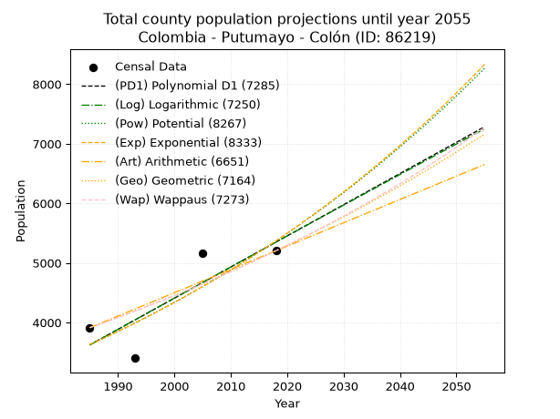
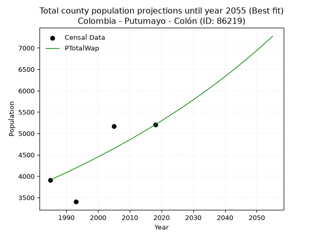
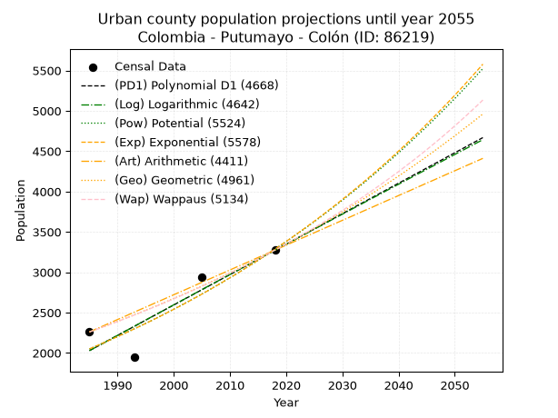
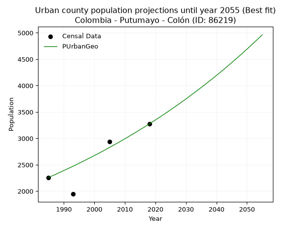
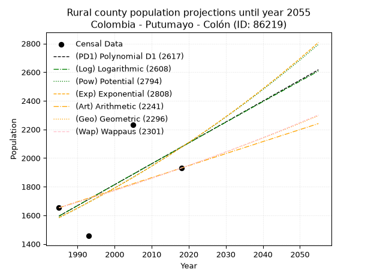
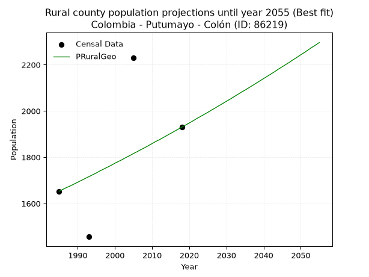

<div align="center">


</div>

# _“Population and Public Services Demand Projections (PPSD) until Year 2050 for Colombia - Putumayo - Colón (ID: 86219)”_
Keywords: `population` `public-service` `projection` `lineal` `polynomial` `logarithmic` `potential` `exponential` `arithmetic` `geometric` `wappaus` `dane` `colombia` `south-america`

PPSD are analytical estimates used by governments and planners to anticipate future changes in population size, age distribution, and the resulting community needs for utilities, healthcare, education, and infrastructure as sizing future water treatment facilities, electrical grids, and road networks based on spatial growth.

> **General running parameters**: • app_version: _v20260806_. • Python version: _3.14.7_. • Pandas version: _3.0.5_. • NumPy version: _2.5.1_. • Creates, save and include plots into reports (create_plot): _False_. • Projection until year: _2050_. • Process polynomial degree 2 and up: _False_. • Process Wappaus: _True_. • Process Wappaus: _True_. • Set negative values to zero: _True_. • Set infinite values to zero: _True_. • Drop dataset notes: _True_. 
<div align="center">

Dynamic map: [:earth_americas:Google](http://maps.google.com/maps?q=1.190132756,-76.972566) [:earth_americas:OSM](https://www.openstreetmap.org/#map=18/1.190132756/-76.972566&layers=P) [:earth_americas:Bing](https://www.bing.com/maps?cp=1.190132756~-76.972566&lvl=18) [:earth_americas:Apple](https://maps.apple.com/frame?center=1.190132756%2C-76.972566&span=0.003%2C0.006)

</div>


<div align="center">

```geojson
{
  "type": "Feature",
  "geometry": {
    "type": "Point", 
    "coordinates": [-76.972566, 1.190132756]
  }, 
  "properties": {
    "Name": "Colombia - Putumayo - Colón (ID: 86219)"
  }
}
```

</div>


## 0. Census Data (4 records)

Census data are official statistics collected by a government about the people and housing in a country. They usually include counts of total population, age, sex, race, income, education, and jobs.

📅Global census file: [Population.xlsx](../data/Population.xlsx)

| Source   |   Year |   CountryID | CountryName   |   StateID | StateName   |   CountyID | CountyName   |   PTotal |   PUrban |   PRural |
|:---------|-------:|------------:|:--------------|----------:|:------------|-----------:|:-------------|---------:|---------:|---------:|
| DANE     |   1985 |          57 | Colombia      |        86 | Putumayo    |      86219 | Colón        |     3913 |     2260 |     1653 |
| DANE     |   1993 |          57 | Colombia      |        86 | Putumayo    |      86219 | Colón        |     3402 |     1946 |     1456 |
| DANE     |   2005 |          57 | Colombia      |        86 | Putumayo    |      86219 | Colón        |     5166 |     2935 |     2231 |
| DANE     |   2018 |          57 | Colombia      |        86 | Putumayo    |      86219 | Colón        |     5204 |     3274 |     1930 |

> 🔥Some records could had specific notes about the registered values or the corresponding urban or rural distribution.

📅   [RUPS](https://www.datos.gov.co/Hacienda-y-Cr-dito-P-blico/Registro-nico-de-Prestadores-de-Servicios-P-blicos/4qkq-csdn/about_data) - Local public utility companies: [RUPS.csv](../data/RUPS.xlsx)

 | SERVICIO       | ESTADO    | NOMBRE                                                                | NIT         | DEPARTAMENTO_DOMICILIO   | MUNICIPIO_DOMICILIO   | DIRECCION                             |   TELEFONO | EMAIL                   | TIPO_INSCRIPCION    | REPRESENTANTE_LEGAL         | TIPO_PRESTADOR          | CLASIFICACION                 |
|:---------------|:----------|:----------------------------------------------------------------------|:------------|:-------------------------|:----------------------|:--------------------------------------|-----------:|:------------------------|:--------------------|:----------------------------|:------------------------|:------------------------------|
| ACUEDUCTO      | OPERATIVA | ASOCIACION JUNTA ADMINISTRADORA DE SERVICIOS PUBLICOS E.S.P. DE COLON | 900515257-1 | PUTUMAYO                 | COLON                 | Carrera 9 No. 2 - 75 Barrio El Centro |    4251825 | jascolon219@hotmail.com | Registro por la ESP | HENRY JAIRO GOYENECHE GOMEZ | ORGANIZACION AUTORIZADA | MENOR O IGUAL A 2500 USUARIOS |
| ALCANTARILLADO | OPERATIVA | ASOCIACION JUNTA ADMINISTRADORA DE SERVICIOS PUBLICOS E.S.P. DE COLON | 900515257-1 | PUTUMAYO                 | COLON                 | Carrera 9 No. 2 - 75 Barrio El Centro |    4251825 | jascolon219@hotmail.com | Registro por la ESP | HENRY JAIRO GOYENECHE GOMEZ | ORGANIZACION AUTORIZADA | MENOR O IGUAL A 2500 USUARIOS |

## 1. Total

### 1.1. Coefficients and Parameters

* (PD1) Polynomial Deg 1: 52.30309112806089, -100198.00802890382 (lineal)
* (Log) Logarithmic: 104691.36942616715, -791338.6879522797
* (Pow) Potential: 23.76725855339052, -74.81908896450507
* (Exp) Exponential: 0.011874799575594687, 2.1029299823444068e-07
* (Art) Arithmetic: Year diff. 2018 - 1985 = 33, Population diff. 5204 - 3913 = 1291, Annual growth = 39.121212121212125
* (Geo) Geometric: Year diff. 2018 - 1985 = 33, Population diff. 5204 - 3913 = 1291, Annual growth % = 0.008677530871685768
* (Wap) Wappaus: i = 0.8582036222707496, Condition values only valid for < 200)

<sub>
Wappaus condition values: ['0.00', '0.86', '1.72', '2.57', '3.43', '4.29', '5.15', '6.01', '6.87', '7.72', '8.58', '9.44', '10.30', '11.16', '12.01', '12.87', '13.73', '14.59', '15.45', '16.31', '17.16', '18.02', '18.88', '19.74', '20.60', '21.46', '22.31', '23.17', '24.03', '24.89', '25.75', '26.60', '27.46', '28.32', '29.18', '30.04', '30.90', '31.75', '32.61', '33.47', '34.33', '35.19', '36.04', '36.90', '37.76', '38.62', '39.48', '40.34', '41.19', '42.05', '42.91', '43.77', '44.63', '45.48', '46.34', '47.20', '48.06', '48.92', '49.78', '50.63', '51.49', '52.35', '53.21', '54.07', '54.93', '55.78']
</sub>


### 1.2. Projected Dataset

|   Year |   CountyID |   PTotalPD1 |   PTotalLog |   PTotalPow |   PTotalExp |   PTotalArt |   PTotalGeo |   PTotalWap |
|-------:|-----------:|------------:|------------:|------------:|------------:|------------:|------------:|------------:|
|   1985 |      86219 |        3624 |        3622 |        3628 |        3629 |        3913 |        3913 |        3913 |
|   1986 |      86219 |        3676 |        3675 |        3671 |        3672 |        3952 |        3947 |        3947 |
|   1987 |      86219 |        3728 |        3727 |        3716 |        3716 |        3991 |        3981 |        3981 |
|   1988 |      86219 |        3781 |        3780 |        3760 |        3761 |        4030 |        4016 |        4015 |
|   1989 |      86219 |        3833 |        3833 |        3806 |        3806 |        4069 |        4051 |        4050 |
|   1990 |      86219 |        3885 |        3885 |        3851 |        3851 |        4109 |        4086 |        4085 |
|   1991 |      86219 |        3937 |        3938 |        3898 |        3897 |        4148 |        4121 |        4120 |
|   1992 |      86219 |        3990 |        3991 |        3944 |        3944 |        4187 |        4157 |        4155 |
|   1993 |      86219 |        4042 |        4043 |        3992 |        3991 |        4226 |        4193 |        4191 |
|   1994 |      86219 |        4094 |        4096 |        4040 |        4038 |        4265 |        4229 |        4227 |
|   1995 |      86219 |        4147 |        4148 |        4088 |        4087 |        4304 |        4266 |        4264 |
|   1996 |      86219 |        4199 |        4201 |        4137 |        4135 |        4343 |        4303 |        4301 |
|   1997 |      86219 |        4251 |        4253 |        4186 |        4185 |        4382 |        4340 |        4338 |
|   1998 |      86219 |        4304 |        4305 |        4237 |        4235 |        4422 |        4378 |        4375 |
|   1999 |      86219 |        4356 |        4358 |        4287 |        4285 |        4461 |        4416 |        4413 |
|   2000 |      86219 |        4408 |        4410 |        4339 |        4337 |        4500 |        4454 |        4451 |
|   2001 |      86219 |        4460 |        4463 |        4390 |        4388 |        4539 |        4493 |        4490 |
|   2002 |      86219 |        4513 |        4515 |        4443 |        4441 |        4578 |        4532 |        4529 |
|   2003 |      86219 |        4565 |        4567 |        4496 |        4494 |        4617 |        4571 |        4568 |
|   2004 |      86219 |        4617 |        4619 |        4550 |        4548 |        4656 |        4611 |        4608 |
|   2005 |      86219 |        4670 |        4672 |        4604 |        4602 |        4695 |        4651 |        4648 |
|   2006 |      86219 |        4722 |        4724 |        4659 |        4657 |        4735 |        4691 |        4688 |
|   2007 |      86219 |        4774 |        4776 |        4714 |        4712 |        4774 |        4732 |        4729 |
|   2008 |      86219 |        4827 |        4828 |        4770 |        4769 |        4813 |        4773 |        4770 |
|   2009 |      86219 |        4879 |        4880 |        4827 |        4826 |        4852 |        4815 |        4811 |
|   2010 |      86219 |        4931 |        4932 |        4885 |        4883 |        4891 |        4856 |        4853 |
|   2011 |      86219 |        4984 |        4984 |        4943 |        4942 |        4930 |        4899 |        4896 |
|   2012 |      86219 |        5036 |        5036 |        5001 |        5001 |        4969 |        4941 |        4939 |
|   2013 |      86219 |        5088 |        5088 |        5061 |        5060 |        5008 |        4984 |        4982 |
|   2014 |      86219 |        5140 |        5140 |        5121 |        5121 |        5048 |        5027 |        5025 |
|   2015 |      86219 |        5193 |        5192 |        5182 |        5182 |        5087 |        5071 |        5069 |
|   2016 |      86219 |        5245 |        5244 |        5243 |        5244 |        5126 |        5115 |        5114 |
|   2017 |      86219 |        5297 |        5296 |        5305 |        5307 |        5165 |        5159 |        5159 |
|   2018 |      86219 |        5350 |        5348 |        5368 |        5370 |        5204 |        5204 |        5204 |
|   2019 |      86219 |        5402 |        5400 |        5432 |        5434 |        5243 |        5249 |        5250 |
|   2020 |      86219 |        5454 |        5452 |        5496 |        5499 |        5282 |        5295 |        5296 |
|   2021 |      86219 |        5507 |        5504 |        5561 |        5565 |        5321 |        5341 |        5343 |
|   2022 |      86219 |        5559 |        5556 |        5627 |        5631 |        5360 |        5387 |        5390 |
|   2023 |      86219 |        5611 |        5607 |        5693 |        5698 |        5400 |        5434 |        5438 |
|   2024 |      86219 |        5663 |        5659 |        5761 |        5767 |        5439 |        5481 |        5486 |
|   2025 |      86219 |        5716 |        5711 |        5829 |        5835 |        5478 |        5528 |        5535 |
|   2026 |      86219 |        5768 |        5762 |        5897 |        5905 |        5517 |        5576 |        5584 |
|   2027 |      86219 |        5820 |        5814 |        5967 |        5976 |        5556 |        5625 |        5633 |
|   2028 |      86219 |        5873 |        5866 |        6037 |        6047 |        5595 |        5674 |        5684 |
|   2029 |      86219 |        5925 |        5917 |        6109 |        6119 |        5634 |        5723 |        5734 |
|   2030 |      86219 |        5977 |        5969 |        6181 |        6192 |        5673 |        5773 |        5786 |
|   2031 |      86219 |        6030 |        6020 |        6253 |        6266 |        5713 |        5823 |        5838 |
|   2032 |      86219 |        6082 |        6072 |        6327 |        6341 |        5752 |        5873 |        5890 |
|   2033 |      86219 |        6134 |        6124 |        6401 |        6417 |        5791 |        5924 |        5943 |
|   2034 |      86219 |        6186 |        6175 |        6477 |        6494 |        5830 |        5976 |        5997 |
|   2035 |      86219 |        6239 |        6226 |        6553 |        6571 |        5869 |        6027 |        6051 |
|   2036 |      86219 |        6291 |        6278 |        6630 |        6650 |        5908 |        6080 |        6105 |
|   2037 |      86219 |        6343 |        6329 |        6707 |        6729 |        5947 |        6132 |        6161 |
|   2038 |      86219 |        6396 |        6381 |        6786 |        6810 |        5986 |        6186 |        6217 |
|   2039 |      86219 |        6448 |        6432 |        6866 |        6891 |        6026 |        6239 |        6273 |
|   2040 |      86219 |        6500 |        6483 |        6946 |        6973 |        6065 |        6293 |        6331 |
|   2041 |      86219 |        6553 |        6535 |        7028 |        7056 |        6104 |        6348 |        6388 |
|   2042 |      86219 |        6605 |        6586 |        7110 |        7141 |        6143 |        6403 |        6447 |
|   2043 |      86219 |        6657 |        6637 |        7193 |        7226 |        6182 |        6459 |        6506 |
|   2044 |      86219 |        6710 |        6688 |        7277 |        7312 |        6221 |        6515 |        6566 |
|   2045 |      86219 |        6762 |        6740 |        7362 |        7400 |        6260 |        6571 |        6627 |
|   2046 |      86219 |        6814 |        6791 |        7448 |        7488 |        6299 |        6628 |        6688 |
|   2047 |      86219 |        6866 |        6842 |        7535 |        7578 |        6339 |        6686 |        6750 |
|   2048 |      86219 |        6919 |        6893 |        7623 |        7668 |        6378 |        6744 |        6812 |
|   2049 |      86219 |        6971 |        6944 |        7712 |        7760 |        6417 |        6802 |        6876 |
|   2050 |      86219 |        7023 |        6995 |        7802 |        7852 |        6456 |        6861 |        6940 |
<div align="center">

</img>

</div>


### 1.3. Best fit with absolute and relative error (%)

Relative error puts that difference into context by dividing the absolute error by the true value, creating a unitless ratio or percentage that shows the scale of the mistake.

Absolute and relative error

|   Year | Source   |   CountryID | CountryName   |   StateID | StateName   |   CountyID_x | CountyName   |   PTotal |   PUrban |   PRural |   CountyID_y |   PTotalPD1 |   PTotalLog |   PTotalPow |   PTotalExp |   PTotalArt |   PTotalGeo |   PTotalWap |   PTotalPD1AbsError |   PTotalLogAbsError |   PTotalPowAbsError |   PTotalExpAbsError |   PTotalArtAbsError |   PTotalGeoAbsError |   PTotalWapAbsError |   PTotalPD1RelError |   PTotalLogRelError |   PTotalPowRelError |   PTotalExpRelError |   PTotalArtRelError |   PTotalGeoRelError |   PTotalWapRelError |
|-------:|:---------|------------:|:--------------|----------:|:------------|-------------:|:-------------|---------:|---------:|---------:|-------------:|------------:|------------:|------------:|------------:|------------:|------------:|------------:|--------------------:|--------------------:|--------------------:|--------------------:|--------------------:|--------------------:|--------------------:|--------------------:|--------------------:|--------------------:|--------------------:|--------------------:|--------------------:|--------------------:|
|   1985 | DANE     |          57 | Colombia      |        86 | Putumayo    |        86219 | Colón        |     3913 |     2260 |     1653 |        86219 |        3624 |        3622 |        3628 |        3629 |        3913 |        3913 |        3913 |                 289 |                 291 |                 285 |                 284 |                   0 |                   0 |                   0 |             7.38564 |             7.43675 |             7.28341 |             7.25786 |             0       |             0       |              0      |
|   1993 | DANE     |          57 | Colombia      |        86 | Putumayo    |        86219 | Colón        |     3402 |     1946 |     1456 |        86219 |        4042 |        4043 |        3992 |        3991 |        4226 |        4193 |        4191 |                 640 |                 641 |                 590 |                 589 |                 824 |                 791 |                 789 |            18.8125  |            18.8419  |            17.3427  |            17.3133  |            24.221   |            23.251   |             23.1922 |
|   2005 | DANE     |          57 | Colombia      |        86 | Putumayo    |        86219 | Colón        |     5166 |     2935 |     2231 |        86219 |        4670 |        4672 |        4604 |        4602 |        4695 |        4651 |        4648 |                 496 |                 494 |                 562 |                 564 |                 471 |                 515 |                 518 |             9.60124 |             9.56252 |            10.8788  |            10.9175  |             9.11731 |             9.96903 |             10.0271 |
|   2018 | DANE     |          57 | Colombia      |        86 | Putumayo    |        86219 | Colón        |     5204 |     3274 |     1930 |        86219 |        5350 |        5348 |        5368 |        5370 |        5204 |        5204 |        5204 |                 146 |                 144 |                 164 |                 166 |                   0 |                   0 |                   0 |             2.80553 |             2.7671  |             3.15142 |             3.18985 |             0       |             0       |              0      |

Relative error mean

| Method    |   RelError | Best   |
|:----------|-----------:|:-------|
| PTotalPD1 |    9.65122 |        |
| PTotalLog |    9.65206 |        |
| PTotalPow |    9.6641  |        |
| PTotalExp |    9.66965 |        |
| PTotalArt |    8.33459 |        |
| PTotalGeo |    8.30501 |        |
| PTotalWap |    8.30484 | True   |

💙Best method: _**PTotalWap**_
<div align="center">

</img>

</div>


### 1.4. Fresh water supply demand in liters per capita per day (lpcd)

The fresh water supply demand typically ranges from 100 to 300 liters per capita per day (lpcd) for standard domestic and municipal planning, though absolute survival minimums set by the World Health Organization are as low as 7.5 to 20 liters per day, and total consumption in high-income nations can exceed 400 liters.

> `CZ`: Level in meters above the sea level (masl)<br> `WS`: Fresh water supply demand in liters per capita per day (lpcd or l/h/d)<br> `WSAll`: Zonal fresh water supply demand in liters per second (l/s)<br> `A`: Zonal area in square meters<br> `DP`: Population density (people/hectare or p/ha)

Reference values (RAS Colombia)

|    CZ |   WS |
|------:|-----:|
|  1000 |  120 |
|  2000 |  130 |
| 99999 |  140 |

County shapefile geometry properties and water supply values

|   CountyID |      ATotal |   CZTotal |   WSTotal |
|-----------:|------------:|----------:|----------:|
|      86219 | 6.43229e+07 |   2492.23 |       140 |

Projected values for best method: PTotalWap

|   CountyID |   Year |   PTotalWap |   DPTotal |   WSTotal |   WSTotalAll |
|-----------:|-------:|------------:|----------:|----------:|-------------:|
|      86219 |   1985 |        3913 |      0.61 |       140 |      6.34051 |
|      86219 |   1986 |        3947 |      0.61 |       140 |      6.3956  |
|      86219 |   1987 |        3981 |      0.62 |       140 |      6.45069 |
|      86219 |   1988 |        4015 |      0.62 |       140 |      6.50579 |
|      86219 |   1989 |        4050 |      0.63 |       140 |      6.5625  |
|      86219 |   1990 |        4085 |      0.64 |       140 |      6.61921 |
|      86219 |   1991 |        4120 |      0.64 |       140 |      6.67593 |
|      86219 |   1992 |        4155 |      0.65 |       140 |      6.73264 |
|      86219 |   1993 |        4191 |      0.65 |       140 |      6.79097 |
|      86219 |   1994 |        4227 |      0.66 |       140 |      6.84931 |
|      86219 |   1995 |        4264 |      0.66 |       140 |      6.90926 |
|      86219 |   1996 |        4301 |      0.67 |       140 |      6.96921 |
|      86219 |   1997 |        4338 |      0.67 |       140 |      7.02917 |
|      86219 |   1998 |        4375 |      0.68 |       140 |      7.08912 |
|      86219 |   1999 |        4413 |      0.69 |       140 |      7.15069 |
|      86219 |   2000 |        4451 |      0.69 |       140 |      7.21227 |
|      86219 |   2001 |        4490 |      0.7  |       140 |      7.27546 |
|      86219 |   2002 |        4529 |      0.7  |       140 |      7.33866 |
|      86219 |   2003 |        4568 |      0.71 |       140 |      7.40185 |
|      86219 |   2004 |        4608 |      0.72 |       140 |      7.46667 |
|      86219 |   2005 |        4648 |      0.72 |       140 |      7.53148 |
|      86219 |   2006 |        4688 |      0.73 |       140 |      7.5963  |
|      86219 |   2007 |        4729 |      0.74 |       140 |      7.66273 |
|      86219 |   2008 |        4770 |      0.74 |       140 |      7.72917 |
|      86219 |   2009 |        4811 |      0.75 |       140 |      7.7956  |
|      86219 |   2010 |        4853 |      0.75 |       140 |      7.86366 |
|      86219 |   2011 |        4896 |      0.76 |       140 |      7.93333 |
|      86219 |   2012 |        4939 |      0.77 |       140 |      8.00301 |
|      86219 |   2013 |        4982 |      0.77 |       140 |      8.07269 |
|      86219 |   2014 |        5025 |      0.78 |       140 |      8.14236 |
|      86219 |   2015 |        5069 |      0.79 |       140 |      8.21366 |
|      86219 |   2016 |        5114 |      0.8  |       140 |      8.28657 |
|      86219 |   2017 |        5159 |      0.8  |       140 |      8.35949 |
|      86219 |   2018 |        5204 |      0.81 |       140 |      8.43241 |
|      86219 |   2019 |        5250 |      0.82 |       140 |      8.50694 |
|      86219 |   2020 |        5296 |      0.82 |       140 |      8.58148 |
|      86219 |   2021 |        5343 |      0.83 |       140 |      8.65764 |
|      86219 |   2022 |        5390 |      0.84 |       140 |      8.7338  |
|      86219 |   2023 |        5438 |      0.85 |       140 |      8.81157 |
|      86219 |   2024 |        5486 |      0.85 |       140 |      8.88935 |
|      86219 |   2025 |        5535 |      0.86 |       140 |      8.96875 |
|      86219 |   2026 |        5584 |      0.87 |       140 |      9.04815 |
|      86219 |   2027 |        5633 |      0.88 |       140 |      9.12755 |
|      86219 |   2028 |        5684 |      0.88 |       140 |      9.21019 |
|      86219 |   2029 |        5734 |      0.89 |       140 |      9.2912  |
|      86219 |   2030 |        5786 |      0.9  |       140 |      9.37546 |
|      86219 |   2031 |        5838 |      0.91 |       140 |      9.45972 |
|      86219 |   2032 |        5890 |      0.92 |       140 |      9.54398 |
|      86219 |   2033 |        5943 |      0.92 |       140 |      9.62986 |
|      86219 |   2034 |        5997 |      0.93 |       140 |      9.71736 |
|      86219 |   2035 |        6051 |      0.94 |       140 |      9.80486 |
|      86219 |   2036 |        6105 |      0.95 |       140 |      9.89236 |
|      86219 |   2037 |        6161 |      0.96 |       140 |      9.9831  |
|      86219 |   2038 |        6217 |      0.97 |       140 |     10.0738  |
|      86219 |   2039 |        6273 |      0.98 |       140 |     10.1646  |
|      86219 |   2040 |        6331 |      0.98 |       140 |     10.2586  |
|      86219 |   2041 |        6388 |      0.99 |       140 |     10.3509  |
|      86219 |   2042 |        6447 |      1    |       140 |     10.4465  |
|      86219 |   2043 |        6506 |      1.01 |       140 |     10.5421  |
|      86219 |   2044 |        6566 |      1.02 |       140 |     10.6394  |
|      86219 |   2045 |        6627 |      1.03 |       140 |     10.7382  |
|      86219 |   2046 |        6688 |      1.04 |       140 |     10.837   |
|      86219 |   2047 |        6750 |      1.05 |       140 |     10.9375  |
|      86219 |   2048 |        6812 |      1.06 |       140 |     11.038   |
|      86219 |   2049 |        6876 |      1.07 |       140 |     11.1417  |
|      86219 |   2050 |        6940 |      1.08 |       140 |     11.2454  |

## 2. Urban

### 2.1. Coefficients and Parameters

* (PD1) Polynomial Deg 1: 37.70574066639876, -72817.15776796412 (lineal)
* (Log) Logarithmic: 75442.41497165537, -570834.6507571246
* (Pow) Potential: 28.61015416893849, -91.03780411069
* (Exp) Exponential: 0.01429930569177417, 9.654123997083752e-10
* (Art) Arithmetic: Year diff. 2018 - 1985 = 33, Population diff. 3274 - 2260 = 1014, Annual growth = 30.727272727272727
* (Geo) Geometric: Year diff. 2018 - 1985 = 33, Population diff. 3274 - 2260 = 1014, Annual growth % = 0.011295060335820395
* (Wap) Wappaus: i = 1.110490521404869, Condition values only valid for < 200)

<sub>
Wappaus condition values: ['0.00', '1.11', '2.22', '3.33', '4.44', '5.55', '6.66', '7.77', '8.88', '9.99', '11.10', '12.22', '13.33', '14.44', '15.55', '16.66', '17.77', '18.88', '19.99', '21.10', '22.21', '23.32', '24.43', '25.54', '26.65', '27.76', '28.87', '29.98', '31.09', '32.20', '33.31', '34.43', '35.54', '36.65', '37.76', '38.87', '39.98', '41.09', '42.20', '43.31', '44.42', '45.53', '46.64', '47.75', '48.86', '49.97', '51.08', '52.19', '53.30', '54.41', '55.52', '56.64', '57.75', '58.86', '59.97', '61.08', '62.19', '63.30', '64.41', '65.52', '66.63', '67.74', '68.85', '69.96', '71.07', '72.18']
</sub>


### 2.2. Projected Dataset

|   Year |   CountyID |   PUrbanPD1 |   PUrbanLog |   PUrbanPow |   PUrbanExp |   PUrbanArt |   PUrbanGeo |   PUrbanWap |
|-------:|-----------:|------------:|------------:|------------:|------------:|------------:|------------:|------------:|
|   1985 |      86219 |        2029 |        2028 |        2049 |        2050 |        2260 |        2260 |        2260 |
|   1986 |      86219 |        2066 |        2066 |        2079 |        2080 |        2291 |        2286 |        2285 |
|   1987 |      86219 |        2104 |        2104 |        2109 |        2110 |        2321 |        2311 |        2311 |
|   1988 |      86219 |        2142 |        2142 |        2140 |        2140 |        2352 |        2337 |        2337 |
|   1989 |      86219 |        2180 |        2180 |        2171 |        2171 |        2383 |        2364 |        2363 |
|   1990 |      86219 |        2217 |        2218 |        2202 |        2202 |        2414 |        2391 |        2389 |
|   1991 |      86219 |        2255 |        2256 |        2234 |        2234 |        2444 |        2418 |        2416 |
|   1992 |      86219 |        2293 |        2293 |        2267 |        2266 |        2475 |        2445 |        2443 |
|   1993 |      86219 |        2330 |        2331 |        2299 |        2299 |        2506 |        2472 |        2470 |
|   1994 |      86219 |        2368 |        2369 |        2333 |        2332 |        2537 |        2500 |        2498 |
|   1995 |      86219 |        2406 |        2407 |        2366 |        2365 |        2567 |        2529 |        2526 |
|   1996 |      86219 |        2444 |        2445 |        2400 |        2399 |        2598 |        2557 |        2554 |
|   1997 |      86219 |        2481 |        2483 |        2435 |        2434 |        2629 |        2586 |        2583 |
|   1998 |      86219 |        2519 |        2520 |        2470 |        2469 |        2659 |        2615 |        2612 |
|   1999 |      86219 |        2557 |        2558 |        2506 |        2505 |        2690 |        2645 |        2641 |
|   2000 |      86219 |        2594 |        2596 |        2542 |        2541 |        2721 |        2675 |        2671 |
|   2001 |      86219 |        2632 |        2633 |        2579 |        2577 |        2752 |        2705 |        2701 |
|   2002 |      86219 |        2670 |        2671 |        2616 |        2614 |        2782 |        2735 |        2731 |
|   2003 |      86219 |        2707 |        2709 |        2653 |        2652 |        2813 |        2766 |        2762 |
|   2004 |      86219 |        2745 |        2747 |        2692 |        2690 |        2844 |        2798 |        2793 |
|   2005 |      86219 |        2783 |        2784 |        2730 |        2729 |        2875 |        2829 |        2825 |
|   2006 |      86219 |        2821 |        2822 |        2769 |        2768 |        2905 |        2861 |        2857 |
|   2007 |      86219 |        2858 |        2859 |        2809 |        2808 |        2936 |        2893 |        2889 |
|   2008 |      86219 |        2896 |        2897 |        2850 |        2848 |        2967 |        2926 |        2922 |
|   2009 |      86219 |        2934 |        2935 |        2890 |        2890 |        2997 |        2959 |        2955 |
|   2010 |      86219 |        2971 |        2972 |        2932 |        2931 |        3028 |        2993 |        2989 |
|   2011 |      86219 |        3009 |        3010 |        2974 |        2973 |        3059 |        3026 |        3023 |
|   2012 |      86219 |        3047 |        3047 |        3016 |        3016 |        3090 |        3061 |        3057 |
|   2013 |      86219 |        3084 |        3085 |        3060 |        3060 |        3120 |        3095 |        3092 |
|   2014 |      86219 |        3122 |        3122 |        3103 |        3104 |        3151 |        3130 |        3128 |
|   2015 |      86219 |        3160 |        3159 |        3148 |        3148 |        3182 |        3166 |        3163 |
|   2016 |      86219 |        3198 |        3197 |        3193 |        3194 |        3213 |        3201 |        3200 |
|   2017 |      86219 |        3235 |        3234 |        3238 |        3240 |        3243 |        3237 |        3237 |
|   2018 |      86219 |        3273 |        3272 |        3285 |        3286 |        3274 |        3274 |        3274 |
|   2019 |      86219 |        3311 |        3309 |        3332 |        3334 |        3305 |        3311 |        3312 |
|   2020 |      86219 |        3348 |        3346 |        3379 |        3382 |        3335 |        3348 |        3350 |
|   2021 |      86219 |        3386 |        3384 |        3427 |        3430 |        3366 |        3386 |        3389 |
|   2022 |      86219 |        3424 |        3421 |        3476 |        3480 |        3397 |        3424 |        3429 |
|   2023 |      86219 |        3462 |        3458 |        3526 |        3530 |        3428 |        3463 |        3469 |
|   2024 |      86219 |        3499 |        3496 |        3576 |        3581 |        3458 |        3502 |        3509 |
|   2025 |      86219 |        3537 |        3533 |        3627 |        3632 |        3489 |        3542 |        3551 |
|   2026 |      86219 |        3575 |        3570 |        3678 |        3685 |        3520 |        3582 |        3592 |
|   2027 |      86219 |        3612 |        3607 |        3731 |        3738 |        3551 |        3622 |        3635 |
|   2028 |      86219 |        3650 |        3645 |        3784 |        3792 |        3581 |        3663 |        3678 |
|   2029 |      86219 |        3688 |        3682 |        3837 |        3846 |        3612 |        3705 |        3721 |
|   2030 |      86219 |        3725 |        3719 |        3892 |        3902 |        3643 |        3746 |        3766 |
|   2031 |      86219 |        3763 |        3756 |        3947 |        3958 |        3673 |        3789 |        3810 |
|   2032 |      86219 |        3801 |        3793 |        4003 |        4015 |        3704 |        3832 |        3856 |
|   2033 |      86219 |        3839 |        3830 |        4060 |        4073 |        3735 |        3875 |        3902 |
|   2034 |      86219 |        3876 |        3868 |        4117 |        4131 |        3766 |        3919 |        3949 |
|   2035 |      86219 |        3914 |        3905 |        4176 |        4191 |        3796 |        3963 |        3997 |
|   2036 |      86219 |        3952 |        3942 |        4235 |        4251 |        3827 |        4008 |        4046 |
|   2037 |      86219 |        3989 |        3979 |        4295 |        4312 |        3858 |        4053 |        4095 |
|   2038 |      86219 |        4027 |        4016 |        4355 |        4374 |        3889 |        4099 |        4145 |
|   2039 |      86219 |        4065 |        4053 |        4417 |        4437 |        3919 |        4145 |        4196 |
|   2040 |      86219 |        4103 |        4090 |        4479 |        4501 |        3950 |        4192 |        4247 |
|   2041 |      86219 |        4140 |        4127 |        4543 |        4566 |        3981 |        4239 |        4300 |
|   2042 |      86219 |        4178 |        4164 |        4607 |        4632 |        4011 |        4287 |        4353 |
|   2043 |      86219 |        4216 |        4201 |        4672 |        4699 |        4042 |        4335 |        4407 |
|   2044 |      86219 |        4253 |        4238 |        4738 |        4766 |        4073 |        4384 |        4462 |
|   2045 |      86219 |        4291 |        4274 |        4804 |        4835 |        4104 |        4434 |        4518 |
|   2046 |      86219 |        4329 |        4311 |        4872 |        4905 |        4134 |        4484 |        4575 |
|   2047 |      86219 |        4366 |        4348 |        4941 |        4975 |        4165 |        4535 |        4633 |
|   2048 |      86219 |        4404 |        4385 |        5010 |        5047 |        4196 |        4586 |        4692 |
|   2049 |      86219 |        4442 |        4422 |        5081 |        5119 |        4227 |        4638 |        4752 |
|   2050 |      86219 |        4480 |        4459 |        5152 |        5193 |        4257 |        4690 |        4813 |
<div align="center">

</img>

</div>


### 2.3. Best fit with absolute and relative error (%)

Relative error puts that difference into context by dividing the absolute error by the true value, creating a unitless ratio or percentage that shows the scale of the mistake.

Absolute and relative error

|   Year | Source   |   CountryID | CountryName   |   StateID | StateName   |   CountyID_x | CountyName   |   PTotal |   PUrban |   PRural |   CountyID_y |   PUrbanPD1 |   PUrbanLog |   PUrbanPow |   PUrbanExp |   PUrbanArt |   PUrbanGeo |   PUrbanWap |   PUrbanPD1AbsError |   PUrbanLogAbsError |   PUrbanPowAbsError |   PUrbanExpAbsError |   PUrbanArtAbsError |   PUrbanGeoAbsError |   PUrbanWapAbsError |   PUrbanPD1RelError |   PUrbanLogRelError |   PUrbanPowRelError |   PUrbanExpRelError |   PUrbanArtRelError |   PUrbanGeoRelError |   PUrbanWapRelError |
|-------:|:---------|------------:|:--------------|----------:|:------------|-------------:|:-------------|---------:|---------:|---------:|-------------:|------------:|------------:|------------:|------------:|------------:|------------:|------------:|--------------------:|--------------------:|--------------------:|--------------------:|--------------------:|--------------------:|--------------------:|--------------------:|--------------------:|--------------------:|--------------------:|--------------------:|--------------------:|--------------------:|
|   1985 | DANE     |          57 | Colombia      |        86 | Putumayo    |        86219 | Colón        |     3913 |     2260 |     1653 |        86219 |        2029 |        2028 |        2049 |        2050 |        2260 |        2260 |        2260 |                 231 |                 232 |                 211 |                 210 |                   0 |                   0 |                   0 |          10.2212    |          10.2655    |             9.33628 |            9.29204  |             0       |             0       |             0       |
|   1993 | DANE     |          57 | Colombia      |        86 | Putumayo    |        86219 | Colón        |     3402 |     1946 |     1456 |        86219 |        2330 |        2331 |        2299 |        2299 |        2506 |        2472 |        2470 |                 384 |                 385 |                 353 |                 353 |                 560 |                 526 |                 524 |          19.7328    |          19.7842    |            18.1398  |           18.1398   |            28.777   |            27.0298  |            26.927   |
|   2005 | DANE     |          57 | Colombia      |        86 | Putumayo    |        86219 | Colón        |     5166 |     2935 |     2231 |        86219 |        2783 |        2784 |        2730 |        2729 |        2875 |        2829 |        2825 |                 152 |                 151 |                 205 |                 206 |                  60 |                 106 |                 110 |           5.17888   |           5.1448    |             6.98467 |            7.01874  |             2.04429 |             3.61158 |             3.74787 |
|   2018 | DANE     |          57 | Colombia      |        86 | Putumayo    |        86219 | Colón        |     5204 |     3274 |     1930 |        86219 |        3273 |        3272 |        3285 |        3286 |        3274 |        3274 |        3274 |                   1 |                   2 |                  11 |                  12 |                   0 |                   0 |                   0 |           0.0305437 |           0.0610874 |             0.33598 |            0.366524 |             0       |             0       |             0       |

Relative error mean

| Method    |   RelError | Best   |
|:----------|-----------:|:-------|
| PUrbanPD1 |    8.79086 |        |
| PUrbanLog |    8.81389 |        |
| PUrbanPow |    8.69918 |        |
| PUrbanExp |    8.70427 |        |
| PUrbanArt |    7.70532 |        |
| PUrbanGeo |    7.66035 | True   |
| PUrbanWap |    7.66873 |        |

💙Best method: _**PUrbanGeo**_
<div align="center">

</img>

</div>


### 2.4. Fresh water supply demand in liters per capita per day (lpcd)

The fresh water supply demand typically ranges from 100 to 300 liters per capita per day (lpcd) for standard domestic and municipal planning, though absolute survival minimums set by the World Health Organization are as low as 7.5 to 20 liters per day, and total consumption in high-income nations can exceed 400 liters.

> `CZ`: Level in meters above the sea level (masl)<br> `WS`: Fresh water supply demand in liters per capita per day (lpcd or l/h/d)<br> `WSAll`: Zonal fresh water supply demand in liters per second (l/s)<br> `A`: Zonal area in square meters<br> `DP`: Population density (people/hectare or p/ha)

Reference values (RAS Colombia)

|    CZ |   WS |
|------:|-----:|
|  1000 |  120 |
|  2000 |  130 |
| 99999 |  140 |

County shapefile geometry properties and water supply values

|   CountyID |      AUrban |   CZUrban |   WSUrban |
|-----------:|------------:|----------:|----------:|
|      86219 | 1.75758e+06 |   2094.49 |       140 |

Projected values for best method: PUrbanGeo

|   CountyID |   Year |   PUrbanGeo |   DPUrban |   WSUrban |   WSUrbanAll |
|-----------:|-------:|------------:|----------:|----------:|-------------:|
|      86219 |   1985 |        2260 |     12.86 |       140 |      3.66204 |
|      86219 |   1986 |        2286 |     13.01 |       140 |      3.70417 |
|      86219 |   1987 |        2311 |     13.15 |       140 |      3.74468 |
|      86219 |   1988 |        2337 |     13.3  |       140 |      3.78681 |
|      86219 |   1989 |        2364 |     13.45 |       140 |      3.83056 |
|      86219 |   1990 |        2391 |     13.6  |       140 |      3.87431 |
|      86219 |   1991 |        2418 |     13.76 |       140 |      3.91806 |
|      86219 |   1992 |        2445 |     13.91 |       140 |      3.96181 |
|      86219 |   1993 |        2472 |     14.06 |       140 |      4.00556 |
|      86219 |   1994 |        2500 |     14.22 |       140 |      4.05093 |
|      86219 |   1995 |        2529 |     14.39 |       140 |      4.09792 |
|      86219 |   1996 |        2557 |     14.55 |       140 |      4.14329 |
|      86219 |   1997 |        2586 |     14.71 |       140 |      4.19028 |
|      86219 |   1998 |        2615 |     14.88 |       140 |      4.23727 |
|      86219 |   1999 |        2645 |     15.05 |       140 |      4.28588 |
|      86219 |   2000 |        2675 |     15.22 |       140 |      4.33449 |
|      86219 |   2001 |        2705 |     15.39 |       140 |      4.3831  |
|      86219 |   2002 |        2735 |     15.56 |       140 |      4.43171 |
|      86219 |   2003 |        2766 |     15.74 |       140 |      4.48194 |
|      86219 |   2004 |        2798 |     15.92 |       140 |      4.5338  |
|      86219 |   2005 |        2829 |     16.1  |       140 |      4.58403 |
|      86219 |   2006 |        2861 |     16.28 |       140 |      4.63588 |
|      86219 |   2007 |        2893 |     16.46 |       140 |      4.68773 |
|      86219 |   2008 |        2926 |     16.65 |       140 |      4.7412  |
|      86219 |   2009 |        2959 |     16.84 |       140 |      4.79468 |
|      86219 |   2010 |        2993 |     17.03 |       140 |      4.84977 |
|      86219 |   2011 |        3026 |     17.22 |       140 |      4.90324 |
|      86219 |   2012 |        3061 |     17.42 |       140 |      4.95995 |
|      86219 |   2013 |        3095 |     17.61 |       140 |      5.01505 |
|      86219 |   2014 |        3130 |     17.81 |       140 |      5.07176 |
|      86219 |   2015 |        3166 |     18.01 |       140 |      5.13009 |
|      86219 |   2016 |        3201 |     18.21 |       140 |      5.18681 |
|      86219 |   2017 |        3237 |     18.42 |       140 |      5.24514 |
|      86219 |   2018 |        3274 |     18.63 |       140 |      5.30509 |
|      86219 |   2019 |        3311 |     18.84 |       140 |      5.36505 |
|      86219 |   2020 |        3348 |     19.05 |       140 |      5.425   |
|      86219 |   2021 |        3386 |     19.27 |       140 |      5.48657 |
|      86219 |   2022 |        3424 |     19.48 |       140 |      5.54815 |
|      86219 |   2023 |        3463 |     19.7  |       140 |      5.61134 |
|      86219 |   2024 |        3502 |     19.93 |       140 |      5.67454 |
|      86219 |   2025 |        3542 |     20.15 |       140 |      5.73935 |
|      86219 |   2026 |        3582 |     20.38 |       140 |      5.80417 |
|      86219 |   2027 |        3622 |     20.61 |       140 |      5.86898 |
|      86219 |   2028 |        3663 |     20.84 |       140 |      5.93542 |
|      86219 |   2029 |        3705 |     21.08 |       140 |      6.00347 |
|      86219 |   2030 |        3746 |     21.31 |       140 |      6.06991 |
|      86219 |   2031 |        3789 |     21.56 |       140 |      6.13958 |
|      86219 |   2032 |        3832 |     21.8  |       140 |      6.20926 |
|      86219 |   2033 |        3875 |     22.05 |       140 |      6.27894 |
|      86219 |   2034 |        3919 |     22.3  |       140 |      6.35023 |
|      86219 |   2035 |        3963 |     22.55 |       140 |      6.42153 |
|      86219 |   2036 |        4008 |     22.8  |       140 |      6.49444 |
|      86219 |   2037 |        4053 |     23.06 |       140 |      6.56736 |
|      86219 |   2038 |        4099 |     23.32 |       140 |      6.6419  |
|      86219 |   2039 |        4145 |     23.58 |       140 |      6.71644 |
|      86219 |   2040 |        4192 |     23.85 |       140 |      6.79259 |
|      86219 |   2041 |        4239 |     24.12 |       140 |      6.86875 |
|      86219 |   2042 |        4287 |     24.39 |       140 |      6.94653 |
|      86219 |   2043 |        4335 |     24.66 |       140 |      7.02431 |
|      86219 |   2044 |        4384 |     24.94 |       140 |      7.1037  |
|      86219 |   2045 |        4434 |     25.23 |       140 |      7.18472 |
|      86219 |   2046 |        4484 |     25.51 |       140 |      7.26574 |
|      86219 |   2047 |        4535 |     25.8  |       140 |      7.34838 |
|      86219 |   2048 |        4586 |     26.09 |       140 |      7.43102 |
|      86219 |   2049 |        4638 |     26.39 |       140 |      7.51528 |
|      86219 |   2050 |        4690 |     26.68 |       140 |      7.59954 |

## 3. Rural

### 3.1. Coefficients and Parameters

* (PD1) Polynomial Deg 1: 14.597350461662124, -27380.850260939664 (lineal)
* (Log) Logarithmic: 29248.954454511775, -220504.0371951551
* (Pow) Potential: 16.387221463194464, -50.84158803344944
* (Exp) Exponential: 0.008180358132484015, 0.00014048042485481134
* (Art) Arithmetic: Year diff. 2018 - 1985 = 33, Population diff. 1930 - 1653 = 277, Annual growth = 8.393939393939394
* (Geo) Geometric: Year diff. 2018 - 1985 = 33, Population diff. 1930 - 1653 = 277, Annual growth % = 0.004705831266359706
* (Wap) Wappaus: i = 0.46854252826901444, Condition values only valid for < 200)

<sub>
Wappaus condition values: ['0.00', '0.47', '0.94', '1.41', '1.87', '2.34', '2.81', '3.28', '3.75', '4.22', '4.69', '5.15', '5.62', '6.09', '6.56', '7.03', '7.50', '7.97', '8.43', '8.90', '9.37', '9.84', '10.31', '10.78', '11.25', '11.71', '12.18', '12.65', '13.12', '13.59', '14.06', '14.52', '14.99', '15.46', '15.93', '16.40', '16.87', '17.34', '17.80', '18.27', '18.74', '19.21', '19.68', '20.15', '20.62', '21.08', '21.55', '22.02', '22.49', '22.96', '23.43', '23.90', '24.36', '24.83', '25.30', '25.77', '26.24', '26.71', '27.18', '27.64', '28.11', '28.58', '29.05', '29.52', '29.99', '30.46']
</sub>


### 3.2. Projected Dataset

|   Year |   CountyID |   PRuralPD1 |   PRuralLog |   PRuralPow |   PRuralExp |   PRuralArt |   PRuralGeo |   PRuralWap |
|-------:|-----------:|------------:|------------:|------------:|------------:|------------:|------------:|------------:|
|   1985 |      86219 |        1595 |        1594 |        1583 |        1584 |        1653 |        1653 |        1653 |
|   1986 |      86219 |        1609 |        1609 |        1596 |        1597 |        1661 |        1661 |        1661 |
|   1987 |      86219 |        1624 |        1624 |        1610 |        1610 |        1670 |        1669 |        1669 |
|   1988 |      86219 |        1639 |        1638 |        1623 |        1623 |        1678 |        1676 |        1676 |
|   1989 |      86219 |        1653 |        1653 |        1636 |        1636 |        1687 |        1684 |        1684 |
|   1990 |      86219 |        1668 |        1668 |        1650 |        1650 |        1695 |        1692 |        1692 |
|   1991 |      86219 |        1682 |        1682 |        1664 |        1663 |        1703 |        1700 |        1700 |
|   1992 |      86219 |        1697 |        1697 |        1677 |        1677 |        1712 |        1708 |        1708 |
|   1993 |      86219 |        1712 |        1712 |        1691 |        1691 |        1720 |        1716 |        1716 |
|   1994 |      86219 |        1726 |        1727 |        1705 |        1705 |        1729 |        1724 |        1724 |
|   1995 |      86219 |        1741 |        1741 |        1719 |        1719 |        1737 |        1732 |        1732 |
|   1996 |      86219 |        1755 |        1756 |        1733 |        1733 |        1745 |        1741 |        1740 |
|   1997 |      86219 |        1770 |        1771 |        1748 |        1747 |        1754 |        1749 |        1749 |
|   1998 |      86219 |        1785 |        1785 |        1762 |        1761 |        1762 |        1757 |        1757 |
|   1999 |      86219 |        1799 |        1800 |        1776 |        1776 |        1771 |        1765 |        1765 |
|   2000 |      86219 |        1814 |        1814 |        1791 |        1791 |        1779 |        1774 |        1773 |
|   2001 |      86219 |        1828 |        1829 |        1806 |        1805 |        1787 |        1782 |        1782 |
|   2002 |      86219 |        1843 |        1844 |        1821 |        1820 |        1796 |        1790 |        1790 |
|   2003 |      86219 |        1858 |        1858 |        1836 |        1835 |        1804 |        1799 |        1799 |
|   2004 |      86219 |        1872 |        1873 |        1851 |        1850 |        1812 |        1807 |        1807 |
|   2005 |      86219 |        1887 |        1887 |        1866 |        1865 |        1821 |        1816 |        1816 |
|   2006 |      86219 |        1901 |        1902 |        1881 |        1881 |        1829 |        1824 |        1824 |
|   2007 |      86219 |        1916 |        1917 |        1897 |        1896 |        1838 |        1833 |        1833 |
|   2008 |      86219 |        1931 |        1931 |        1912 |        1912 |        1846 |        1841 |        1841 |
|   2009 |      86219 |        1945 |        1946 |        1928 |        1927 |        1854 |        1850 |        1850 |
|   2010 |      86219 |        1960 |        1960 |        1944 |        1943 |        1863 |        1859 |        1859 |
|   2011 |      86219 |        1974 |        1975 |        1960 |        1959 |        1871 |        1868 |        1867 |
|   2012 |      86219 |        1989 |        1989 |        1976 |        1975 |        1880 |        1876 |        1876 |
|   2013 |      86219 |        2004 |        2004 |        1992 |        1991 |        1888 |        1885 |        1885 |
|   2014 |      86219 |        2018 |        2018 |        2008 |        2008 |        1896 |        1894 |        1894 |
|   2015 |      86219 |        2033 |        2033 |        2024 |        2024 |        1905 |        1903 |        1903 |
|   2016 |      86219 |        2047 |        2047 |        2041 |        2041 |        1913 |        1912 |        1912 |
|   2017 |      86219 |        2062 |        2062 |        2058 |        2058 |        1922 |        1921 |        1921 |
|   2018 |      86219 |        2077 |        2076 |        2074 |        2075 |        1930 |        1930 |        1930 |
|   2019 |      86219 |        2091 |        2091 |        2091 |        2092 |        1938 |        1939 |        1939 |
|   2020 |      86219 |        2106 |        2105 |        2108 |        2109 |        1947 |        1948 |        1948 |
|   2021 |      86219 |        2120 |        2120 |        2125 |        2126 |        1955 |        1957 |        1958 |
|   2022 |      86219 |        2135 |        2134 |        2143 |        2144 |        1964 |        1967 |        1967 |
|   2023 |      86219 |        2150 |        2149 |        2160 |        2161 |        1972 |        1976 |        1976 |
|   2024 |      86219 |        2164 |        2163 |        2178 |        2179 |        1980 |        1985 |        1985 |
|   2025 |      86219 |        2179 |        2178 |        2195 |        2197 |        1989 |        1994 |        1995 |
|   2026 |      86219 |        2193 |        2192 |        2213 |        2215 |        1997 |        2004 |        2004 |
|   2027 |      86219 |        2208 |        2207 |        2231 |        2233 |        2006 |        2013 |        2014 |
|   2028 |      86219 |        2223 |        2221 |        2249 |        2251 |        2014 |        2023 |        2023 |
|   2029 |      86219 |        2237 |        2235 |        2268 |        2270 |        2022 |        2032 |        2033 |
|   2030 |      86219 |        2252 |        2250 |        2286 |        2289 |        2031 |        2042 |        2043 |
|   2031 |      86219 |        2266 |        2264 |        2305 |        2307 |        2039 |        2051 |        2052 |
|   2032 |      86219 |        2281 |        2279 |        2323 |        2326 |        2048 |        2061 |        2062 |
|   2033 |      86219 |        2296 |        2293 |        2342 |        2345 |        2056 |        2071 |        2072 |
|   2034 |      86219 |        2310 |        2307 |        2361 |        2365 |        2064 |        2081 |        2082 |
|   2035 |      86219 |        2325 |        2322 |        2380 |        2384 |        2073 |        2090 |        2092 |
|   2036 |      86219 |        2339 |        2336 |        2399 |        2404 |        2081 |        2100 |        2102 |
|   2037 |      86219 |        2354 |        2351 |        2419 |        2423 |        2089 |        2110 |        2112 |
|   2038 |      86219 |        2369 |        2365 |        2438 |        2443 |        2098 |        2120 |        2122 |
|   2039 |      86219 |        2383 |        2379 |        2458 |        2463 |        2106 |        2130 |        2132 |
|   2040 |      86219 |        2398 |        2394 |        2478 |        2484 |        2115 |        2140 |        2142 |
|   2041 |      86219 |        2412 |        2408 |        2498 |        2504 |        2123 |        2150 |        2152 |
|   2042 |      86219 |        2427 |        2422 |        2518 |        2525 |        2131 |        2160 |        2163 |
|   2043 |      86219 |        2442 |        2437 |        2538 |        2545 |        2140 |        2170 |        2173 |
|   2044 |      86219 |        2456 |        2451 |        2559 |        2566 |        2148 |        2181 |        2183 |
|   2045 |      86219 |        2471 |        2465 |        2579 |        2587 |        2157 |        2191 |        2194 |
|   2046 |      86219 |        2485 |        2480 |        2600 |        2609 |        2165 |        2201 |        2204 |
|   2047 |      86219 |        2500 |        2494 |        2621 |        2630 |        2173 |        2211 |        2215 |
|   2048 |      86219 |        2515 |        2508 |        2642 |        2652 |        2182 |        2222 |        2225 |
|   2049 |      86219 |        2529 |        2522 |        2663 |        2673 |        2190 |        2232 |        2236 |
|   2050 |      86219 |        2544 |        2537 |        2684 |        2695 |        2199 |        2243 |        2247 |
<div align="center">

</img>

</div>


### 3.3. Best fit with absolute and relative error (%)

Relative error puts that difference into context by dividing the absolute error by the true value, creating a unitless ratio or percentage that shows the scale of the mistake.

Absolute and relative error

|   Year | Source   |   CountryID | CountryName   |   StateID | StateName   |   CountyID_x | CountyName   |   PTotal |   PUrban |   PRural |   CountyID_y |   PRuralPD1 |   PRuralLog |   PRuralPow |   PRuralExp |   PRuralArt |   PRuralGeo |   PRuralWap |   PRuralPD1AbsError |   PRuralLogAbsError |   PRuralPowAbsError |   PRuralExpAbsError |   PRuralArtAbsError |   PRuralGeoAbsError |   PRuralWapAbsError |   PRuralPD1RelError |   PRuralLogRelError |   PRuralPowRelError |   PRuralExpRelError |   PRuralArtRelError |   PRuralGeoRelError |   PRuralWapRelError |
|-------:|:---------|------------:|:--------------|----------:|:------------|-------------:|:-------------|---------:|---------:|---------:|-------------:|------------:|------------:|------------:|------------:|------------:|------------:|------------:|--------------------:|--------------------:|--------------------:|--------------------:|--------------------:|--------------------:|--------------------:|--------------------:|--------------------:|--------------------:|--------------------:|--------------------:|--------------------:|--------------------:|
|   1985 | DANE     |          57 | Colombia      |        86 | Putumayo    |        86219 | Colón        |     3913 |     2260 |     1653 |        86219 |        1595 |        1594 |        1583 |        1584 |        1653 |        1653 |        1653 |                  58 |                  59 |                  70 |                  69 |                   0 |                   0 |                   0 |             3.50877 |             3.56927 |             4.23472 |             4.17423 |              0      |              0      |              0      |
|   1993 | DANE     |          57 | Colombia      |        86 | Putumayo    |        86219 | Colón        |     3402 |     1946 |     1456 |        86219 |        1712 |        1712 |        1691 |        1691 |        1720 |        1716 |        1716 |                 256 |                 256 |                 235 |                 235 |                 264 |                 260 |                 260 |            17.5824  |            17.5824  |            16.1401  |            16.1401  |             18.1319 |             17.8571 |             17.8571 |
|   2005 | DANE     |          57 | Colombia      |        86 | Putumayo    |        86219 | Colón        |     5166 |     2935 |     2231 |        86219 |        1887 |        1887 |        1866 |        1865 |        1821 |        1816 |        1816 |                 344 |                 344 |                 365 |                 366 |                 410 |                 415 |                 415 |            15.4191  |            15.4191  |            16.3604  |            16.4052  |             18.3774 |             18.6015 |             18.6015 |
|   2018 | DANE     |          57 | Colombia      |        86 | Putumayo    |        86219 | Colón        |     5204 |     3274 |     1930 |        86219 |        2077 |        2076 |        2074 |        2075 |        1930 |        1930 |        1930 |                 147 |                 146 |                 144 |                 145 |                   0 |                   0 |                   0 |             7.61658 |             7.56477 |             7.46114 |             7.51295 |              0      |              0      |              0      |

Relative error mean

| Method    |   RelError | Best   |
|:----------|-----------:|:-------|
| PRuralPD1 |   11.0317  |        |
| PRuralLog |   11.0339  |        |
| PRuralPow |   11.0491  |        |
| PRuralExp |   11.0581  |        |
| PRuralArt |    9.12732 |        |
| PRuralGeo |    9.11467 | True   |
| PRuralWap |    9.11467 | True   |

💙Best method: _**PRuralGeo**_
<div align="center">

</img>

</div>


### 3.4. Fresh water supply demand in liters per capita per day (lpcd)

The fresh water supply demand typically ranges from 100 to 300 liters per capita per day (lpcd) for standard domestic and municipal planning, though absolute survival minimums set by the World Health Organization are as low as 7.5 to 20 liters per day, and total consumption in high-income nations can exceed 400 liters.

> `CZ`: Level in meters above the sea level (masl)<br> `WS`: Fresh water supply demand in liters per capita per day (lpcd or l/h/d)<br> `WSAll`: Zonal fresh water supply demand in liters per second (l/s)<br> `A`: Zonal area in square meters<br> `DP`: Population density (people/hectare or p/ha)

Reference values (RAS Colombia)

|    CZ |   WS |
|------:|-----:|
|  1000 |  120 |
|  2000 |  130 |
| 99999 |  140 |

County shapefile geometry properties and water supply values

|   CountyID |      ARural |   CZRural |   WSRural |
|-----------:|------------:|----------:|----------:|
|      86219 | 6.25654e+07 |   2503.41 |       140 |

Projected values for best method: PRuralGeo

|   CountyID |   Year |   PRuralGeo |   DPRural |   WSRural |   WSRuralAll |
|-----------:|-------:|------------:|----------:|----------:|-------------:|
|      86219 |   1985 |        1653 |      0.26 |       140 |      2.67847 |
|      86219 |   1986 |        1661 |      0.27 |       140 |      2.69144 |
|      86219 |   1987 |        1669 |      0.27 |       140 |      2.7044  |
|      86219 |   1988 |        1676 |      0.27 |       140 |      2.71574 |
|      86219 |   1989 |        1684 |      0.27 |       140 |      2.7287  |
|      86219 |   1990 |        1692 |      0.27 |       140 |      2.74167 |
|      86219 |   1991 |        1700 |      0.27 |       140 |      2.75463 |
|      86219 |   1992 |        1708 |      0.27 |       140 |      2.76759 |
|      86219 |   1993 |        1716 |      0.27 |       140 |      2.78056 |
|      86219 |   1994 |        1724 |      0.28 |       140 |      2.79352 |
|      86219 |   1995 |        1732 |      0.28 |       140 |      2.80648 |
|      86219 |   1996 |        1741 |      0.28 |       140 |      2.82106 |
|      86219 |   1997 |        1749 |      0.28 |       140 |      2.83403 |
|      86219 |   1998 |        1757 |      0.28 |       140 |      2.84699 |
|      86219 |   1999 |        1765 |      0.28 |       140 |      2.85995 |
|      86219 |   2000 |        1774 |      0.28 |       140 |      2.87454 |
|      86219 |   2001 |        1782 |      0.28 |       140 |      2.8875  |
|      86219 |   2002 |        1790 |      0.29 |       140 |      2.90046 |
|      86219 |   2003 |        1799 |      0.29 |       140 |      2.91505 |
|      86219 |   2004 |        1807 |      0.29 |       140 |      2.92801 |
|      86219 |   2005 |        1816 |      0.29 |       140 |      2.94259 |
|      86219 |   2006 |        1824 |      0.29 |       140 |      2.95556 |
|      86219 |   2007 |        1833 |      0.29 |       140 |      2.97014 |
|      86219 |   2008 |        1841 |      0.29 |       140 |      2.9831  |
|      86219 |   2009 |        1850 |      0.3  |       140 |      2.99769 |
|      86219 |   2010 |        1859 |      0.3  |       140 |      3.01227 |
|      86219 |   2011 |        1868 |      0.3  |       140 |      3.02685 |
|      86219 |   2012 |        1876 |      0.3  |       140 |      3.03981 |
|      86219 |   2013 |        1885 |      0.3  |       140 |      3.0544  |
|      86219 |   2014 |        1894 |      0.3  |       140 |      3.06898 |
|      86219 |   2015 |        1903 |      0.3  |       140 |      3.08356 |
|      86219 |   2016 |        1912 |      0.31 |       140 |      3.09815 |
|      86219 |   2017 |        1921 |      0.31 |       140 |      3.11273 |
|      86219 |   2018 |        1930 |      0.31 |       140 |      3.12731 |
|      86219 |   2019 |        1939 |      0.31 |       140 |      3.1419  |
|      86219 |   2020 |        1948 |      0.31 |       140 |      3.15648 |
|      86219 |   2021 |        1957 |      0.31 |       140 |      3.17106 |
|      86219 |   2022 |        1967 |      0.31 |       140 |      3.18727 |
|      86219 |   2023 |        1976 |      0.32 |       140 |      3.20185 |
|      86219 |   2024 |        1985 |      0.32 |       140 |      3.21644 |
|      86219 |   2025 |        1994 |      0.32 |       140 |      3.23102 |
|      86219 |   2026 |        2004 |      0.32 |       140 |      3.24722 |
|      86219 |   2027 |        2013 |      0.32 |       140 |      3.26181 |
|      86219 |   2028 |        2023 |      0.32 |       140 |      3.27801 |
|      86219 |   2029 |        2032 |      0.32 |       140 |      3.29259 |
|      86219 |   2030 |        2042 |      0.33 |       140 |      3.3088  |
|      86219 |   2031 |        2051 |      0.33 |       140 |      3.32338 |
|      86219 |   2032 |        2061 |      0.33 |       140 |      3.33958 |
|      86219 |   2033 |        2071 |      0.33 |       140 |      3.35579 |
|      86219 |   2034 |        2081 |      0.33 |       140 |      3.37199 |
|      86219 |   2035 |        2090 |      0.33 |       140 |      3.38657 |
|      86219 |   2036 |        2100 |      0.34 |       140 |      3.40278 |
|      86219 |   2037 |        2110 |      0.34 |       140 |      3.41898 |
|      86219 |   2038 |        2120 |      0.34 |       140 |      3.43519 |
|      86219 |   2039 |        2130 |      0.34 |       140 |      3.45139 |
|      86219 |   2040 |        2140 |      0.34 |       140 |      3.46759 |
|      86219 |   2041 |        2150 |      0.34 |       140 |      3.4838  |
|      86219 |   2042 |        2160 |      0.35 |       140 |      3.5     |
|      86219 |   2043 |        2170 |      0.35 |       140 |      3.5162  |
|      86219 |   2044 |        2181 |      0.35 |       140 |      3.53403 |
|      86219 |   2045 |        2191 |      0.35 |       140 |      3.55023 |
|      86219 |   2046 |        2201 |      0.35 |       140 |      3.56644 |
|      86219 |   2047 |        2211 |      0.35 |       140 |      3.58264 |
|      86219 |   2048 |        2222 |      0.36 |       140 |      3.60046 |
|      86219 |   2049 |        2232 |      0.36 |       140 |      3.61667 |
|      86219 |   2050 |        2243 |      0.36 |       140 |      3.63449 |

<div align="center"><br><sub>Share this research</sub></div><br>

<sub>**APPS & TOOLS & CONTENT DISCLAIMER**: • NO WARRANTY - This content and software is provided by <a href="https://github.com/rcfdtools" target="_blank">github.com/rcfdtools</a> "as is", without any express or implied warranty, including warranties of merchantability, fitness for a particular purpose, or non-infringement. There is no guarantee that the software will be error-free or operate without interruption. • LIMITATION OF LIABILITY - Neither the authors nor copyright holders will be liable for claims or damages arising from the software or its use. You are responsible for determining if the software is appropriate for your use and assume all associated risks, including errors, legal compliance, and data loss. • NO PROFESSIONAL ADVICE - The software provides general information and does not offer professional advice. It should not replace consultation with professional advisors. [Clauses and global license for rcfdtools use.](https://github.com/rcfdtools/rcfdtools/blob/main/LICENSE.md)</sub>

| [:house: Home](Readme.md)  | [:beginner: Help / Collaborate](https://github.com/rcfdtools/R.HydroTools/discussions/31) |
|----------------------------|-------------------------------------------------------------------------------------------|