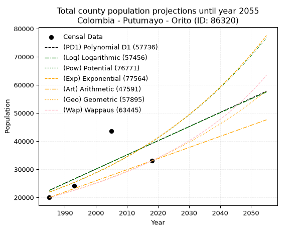
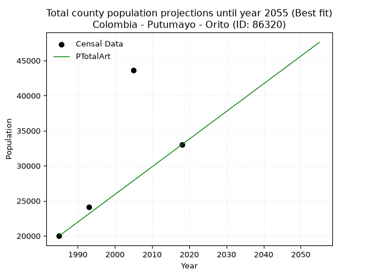
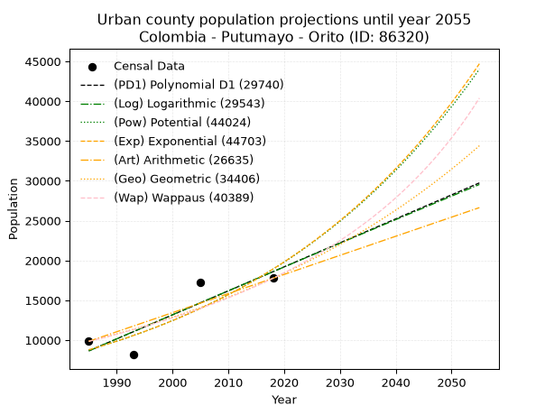
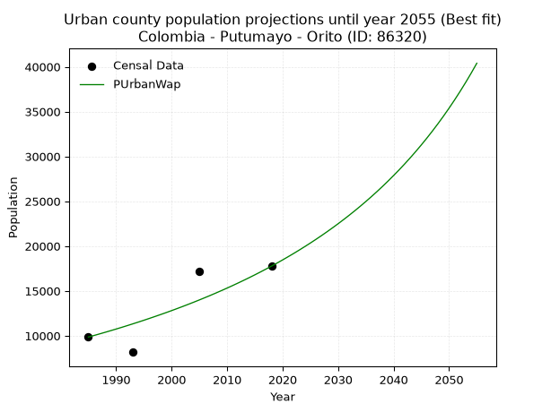
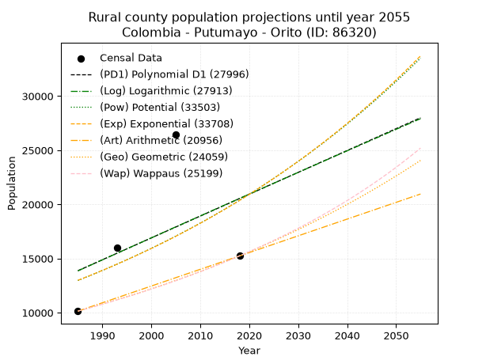
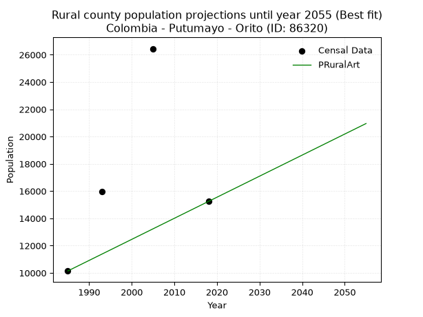

<div align="center">


</div>

# _“Population and Public Services Demand Projections (PPSD) until Year 2050 for Colombia - Putumayo - Orito (ID: 86320)”_
Keywords: `population` `public-service` `projection` `lineal` `polynomial` `logarithmic` `potential` `exponential` `arithmetic` `geometric` `wappaus` `dane` `colombia` `south-america`

PPSD are analytical estimates used by governments and planners to anticipate future changes in population size, age distribution, and the resulting community needs for utilities, healthcare, education, and infrastructure as sizing future water treatment facilities, electrical grids, and road networks based on spatial growth.

> **General running parameters**: • app_version: _v20260806_. • Python version: _3.14.7_. • Pandas version: _3.0.5_. • NumPy version: _2.5.1_. • Creates, save and include plots into reports (create_plot): _False_. • Projection until year: _2050_. • Process polynomial degree 2 and up: _False_. • Process Wappaus: _True_. • Process Wappaus: _True_. • Set negative values to zero: _True_. • Set infinite values to zero: _True_. • Drop dataset notes: _True_. 
<div align="center">

Dynamic map: [:earth_americas:Google](http://maps.google.com/maps?q=0.663592508,-76.8732756) [:earth_americas:OSM](https://www.openstreetmap.org/#map=18/0.663592508/-76.8732756&layers=P) [:earth_americas:Bing](https://www.bing.com/maps?cp=0.663592508~-76.8732756&lvl=18) [:earth_americas:Apple](https://maps.apple.com/frame?center=0.663592508%2C-76.8732756&span=0.003%2C0.006)

</div>


<div align="center">

```geojson
{
  "type": "Feature",
  "geometry": {
    "type": "Point", 
    "coordinates": [-76.8732756, 0.663592508]
  }, 
  "properties": {
    "Name": "Colombia - Putumayo - Orito (ID: 86320)"
  }
}
```

</div>


## 0. Census Data (4 records)

Census data are official statistics collected by a government about the people and housing in a country. They usually include counts of total population, age, sex, race, income, education, and jobs.

📅Global census file: [Population.xlsx](../data/Population.xlsx)

| Source   |   Year |   CountryID | CountryName   |   StateID | StateName   |   CountyID | CountyName   |   PTotal |   PUrban |   PRural |
|:---------|-------:|------------:|:--------------|----------:|:------------|-----------:|:-------------|---------:|---------:|---------:|
| DANE     |   1985 |          57 | Colombia      |        86 | Putumayo    |      86320 | Orito        |    19992 |     9850 |    10142 |
| DANE     |   1993 |          57 | Colombia      |        86 | Putumayo    |      86320 | Orito        |    24147 |     8167 |    15980 |
| DANE     |   2005 |          57 | Colombia      |        86 | Putumayo    |      86320 | Orito        |    43654 |    17207 |    26447 |
| DANE     |   2018 |          57 | Colombia      |        86 | Putumayo    |      86320 | Orito        |    33003 |    17763 |    15240 |

> 🔥Some records could had specific notes about the registered values or the corresponding urban or rural distribution.

## 1. Total

### 1.1. Coefficients and Parameters

* (PD1) Polynomial Deg 1: 502.95624247290795, -975839.2240064341 (lineal)
* (Log) Logarithmic: 1008647.9482792424, -7636542.13766791
* (Pow) Potential: 36.18147358021834, -114.97721396646826
* (Exp) Exponential: 0.018045839583429132, 6.084120616332424e-12
* (Art) Arithmetic: Year diff. 2018 - 1985 = 33, Population diff. 33003 - 19992 = 13011, Annual growth = 394.27272727272725
* (Geo) Geometric: Year diff. 2018 - 1985 = 33, Population diff. 33003 - 19992 = 13011, Annual growth % = 0.015305839750615169
* (Wap) Wappaus: i = 1.48796198612219, Condition values only valid for < 200)

<sub>
Wappaus condition values: ['0.00', '1.49', '2.98', '4.46', '5.95', '7.44', '8.93', '10.42', '11.90', '13.39', '14.88', '16.37', '17.86', '19.34', '20.83', '22.32', '23.81', '25.30', '26.78', '28.27', '29.76', '31.25', '32.74', '34.22', '35.71', '37.20', '38.69', '40.17', '41.66', '43.15', '44.64', '46.13', '47.61', '49.10', '50.59', '52.08', '53.57', '55.05', '56.54', '58.03', '59.52', '61.01', '62.49', '63.98', '65.47', '66.96', '68.45', '69.93', '71.42', '72.91', '74.40', '75.89', '77.37', '78.86', '80.35', '81.84', '83.33', '84.81', '86.30', '87.79', '89.28', '90.77', '92.25', '93.74', '95.23', '96.72']
</sub>


### 1.2. Projected Dataset

|   Year |   CountyID |   PTotalPD1 |   PTotalLog |   PTotalPow |   PTotalExp |   PTotalArt |   PTotalGeo |   PTotalWap |
|-------:|-----------:|------------:|------------:|------------:|------------:|------------:|------------:|------------:|
|   1985 |      86320 |       22529 |       22499 |       21909 |       21931 |       19992 |       19992 |       19992 |
|   1986 |      86320 |       23032 |       23007 |       22312 |       22330 |       20386 |       20298 |       20292 |
|   1987 |      86320 |       23535 |       23515 |       22722 |       22737 |       20781 |       20609 |       20596 |
|   1988 |      86320 |       24038 |       24022 |       23139 |       23151 |       21175 |       20924 |       20905 |
|   1989 |      86320 |       24541 |       24530 |       23564 |       23572 |       21569 |       21244 |       21218 |
|   1990 |      86320 |       25044 |       25037 |       23997 |       24002 |       21963 |       21570 |       21537 |
|   1991 |      86320 |       25547 |       25543 |       24437 |       24439 |       22358 |       21900 |       21860 |
|   1992 |      86320 |       26050 |       26050 |       24885 |       24884 |       22752 |       22235 |       22189 |
|   1993 |      86320 |       26553 |       26556 |       25341 |       25337 |       23146 |       22575 |       22522 |
|   1994 |      86320 |       27056 |       27062 |       25805 |       25798 |       23540 |       22921 |       22861 |
|   1995 |      86320 |       27558 |       27568 |       26277 |       26268 |       23935 |       23272 |       23206 |
|   1996 |      86320 |       28061 |       28073 |       26758 |       26746 |       24329 |       23628 |       23556 |
|   1997 |      86320 |       28564 |       28578 |       27248 |       27233 |       24723 |       23989 |       23912 |
|   1998 |      86320 |       29067 |       29083 |       27746 |       27729 |       25118 |       24357 |       24273 |
|   1999 |      86320 |       29570 |       29588 |       28253 |       28234 |       25512 |       24729 |       24641 |
|   2000 |      86320 |       30073 |       30093 |       28768 |       28748 |       25906 |       25108 |       25015 |
|   2001 |      86320 |       30576 |       30597 |       29293 |       29272 |       26300 |       25492 |       25395 |
|   2002 |      86320 |       31079 |       31101 |       29828 |       29805 |       26695 |       25882 |       25781 |
|   2003 |      86320 |       31582 |       31604 |       30372 |       30348 |       27089 |       26278 |       26174 |
|   2004 |      86320 |       32085 |       32108 |       30925 |       30900 |       27483 |       26681 |       26574 |
|   2005 |      86320 |       32588 |       32611 |       31488 |       31463 |       27877 |       27089 |       26981 |
|   2006 |      86320 |       33091 |       33114 |       32062 |       32036 |       28272 |       27504 |       27396 |
|   2007 |      86320 |       33594 |       33617 |       32645 |       32619 |       28666 |       27925 |       27817 |
|   2008 |      86320 |       34097 |       34119 |       33239 |       33213 |       29060 |       28352 |       28246 |
|   2009 |      86320 |       34600 |       34621 |       33843 |       33818 |       29455 |       28786 |       28683 |
|   2010 |      86320 |       35103 |       35123 |       34458 |       34434 |       29849 |       29227 |       29128 |
|   2011 |      86320 |       35606 |       35625 |       35083 |       35061 |       30243 |       29674 |       29581 |
|   2012 |      86320 |       36109 |       36126 |       35720 |       35699 |       30637 |       30128 |       30043 |
|   2013 |      86320 |       36612 |       36628 |       36368 |       36350 |       31032 |       30589 |       30513 |
|   2014 |      86320 |       37115 |       37128 |       37028 |       37011 |       31426 |       31057 |       30992 |
|   2015 |      86320 |       37618 |       37629 |       37699 |       37685 |       31820 |       31533 |       31480 |
|   2016 |      86320 |       38121 |       38130 |       38382 |       38372 |       32214 |       32015 |       31978 |
|   2017 |      86320 |       38624 |       38630 |       39076 |       39070 |       32609 |       32505 |       32486 |
|   2018 |      86320 |       39126 |       39130 |       39784 |       39782 |       33003 |       33003 |       33003 |
|   2019 |      86320 |       39629 |       39629 |       40503 |       40506 |       33397 |       33508 |       33531 |
|   2020 |      86320 |       40132 |       40129 |       41235 |       41244 |       33792 |       34021 |       34069 |
|   2021 |      86320 |       40635 |       40628 |       41980 |       41995 |       34186 |       34542 |       34619 |
|   2022 |      86320 |       41138 |       41127 |       42739 |       42760 |       34580 |       35070 |       35179 |
|   2023 |      86320 |       41641 |       41626 |       43510 |       43538 |       34974 |       35607 |       35751 |
|   2024 |      86320 |       42144 |       42124 |       44295 |       44331 |       35369 |       36152 |       36336 |
|   2025 |      86320 |       42647 |       42622 |       45094 |       45138 |       35763 |       36706 |       36932 |
|   2026 |      86320 |       43150 |       43120 |       45906 |       45960 |       36157 |       37267 |       37542 |
|   2027 |      86320 |       43653 |       43618 |       46733 |       46797 |       36551 |       37838 |       38164 |
|   2028 |      86320 |       44156 |       44116 |       47575 |       47649 |       36946 |       38417 |       38800 |
|   2029 |      86320 |       44659 |       44613 |       48431 |       48517 |       37340 |       39005 |       39451 |
|   2030 |      86320 |       45162 |       45110 |       49302 |       49400 |       37734 |       39602 |       40115 |
|   2031 |      86320 |       45665 |       45607 |       50189 |       50300 |       38129 |       40208 |       40795 |
|   2032 |      86320 |       46168 |       46103 |       51090 |       51216 |       38523 |       40823 |       41491 |
|   2033 |      86320 |       46671 |       46599 |       52008 |       52149 |       38917 |       41448 |       42202 |
|   2034 |      86320 |       47174 |       47095 |       52942 |       53098 |       39311 |       42083 |       42930 |
|   2035 |      86320 |       47677 |       47591 |       53892 |       54065 |       39706 |       42727 |       43676 |
|   2036 |      86320 |       48180 |       48087 |       54858 |       55050 |       40100 |       43381 |       44439 |
|   2037 |      86320 |       48683 |       48582 |       55842 |       56052 |       40494 |       44045 |       45221 |
|   2038 |      86320 |       49186 |       49077 |       56842 |       57073 |       40888 |       44719 |       46022 |
|   2039 |      86320 |       49689 |       49572 |       57860 |       58112 |       41283 |       45403 |       46843 |
|   2040 |      86320 |       50192 |       50066 |       58896 |       59170 |       41677 |       46098 |       47685 |
|   2041 |      86320 |       50694 |       50561 |       59949 |       60248 |       42071 |       46804 |       48548 |
|   2042 |      86320 |       51197 |       51055 |       61021 |       61345 |       42466 |       47520 |       49433 |
|   2043 |      86320 |       51700 |       51549 |       62112 |       62462 |       42860 |       48248 |       50342 |
|   2044 |      86320 |       52203 |       52042 |       63221 |       63599 |       43254 |       48986 |       51274 |
|   2045 |      86320 |       52706 |       52536 |       64350 |       64757 |       43648 |       49736 |       52232 |
|   2046 |      86320 |       53209 |       53029 |       65498 |       65937 |       44043 |       50497 |       53216 |
|   2047 |      86320 |       53712 |       53522 |       66667 |       67137 |       44437 |       51270 |       54227 |
|   2048 |      86320 |       54215 |       54014 |       67855 |       68360 |       44831 |       52055 |       55266 |
|   2049 |      86320 |       54718 |       54507 |       69064 |       69605 |       45225 |       52851 |       56335 |
|   2050 |      86320 |       55221 |       54999 |       70294 |       70872 |       45620 |       53660 |       57434 |
<div align="center">

</img>

</div>


### 1.3. Best fit with absolute and relative error (%)

Relative error puts that difference into context by dividing the absolute error by the true value, creating a unitless ratio or percentage that shows the scale of the mistake.

Absolute and relative error

|   Year | Source   |   CountryID | CountryName   |   StateID | StateName   |   CountyID_x | CountyName   |   PTotal |   PUrban |   PRural |   CountyID_y |   PTotalPD1 |   PTotalLog |   PTotalPow |   PTotalExp |   PTotalArt |   PTotalGeo |   PTotalWap |   PTotalPD1AbsError |   PTotalLogAbsError |   PTotalPowAbsError |   PTotalExpAbsError |   PTotalArtAbsError |   PTotalGeoAbsError |   PTotalWapAbsError |   PTotalPD1RelError |   PTotalLogRelError |   PTotalPowRelError |   PTotalExpRelError |   PTotalArtRelError |   PTotalGeoRelError |   PTotalWapRelError |
|-------:|:---------|------------:|:--------------|----------:|:------------|-------------:|:-------------|---------:|---------:|---------:|-------------:|------------:|------------:|------------:|------------:|------------:|------------:|------------:|--------------------:|--------------------:|--------------------:|--------------------:|--------------------:|--------------------:|--------------------:|--------------------:|--------------------:|--------------------:|--------------------:|--------------------:|--------------------:|--------------------:|
|   1985 | DANE     |          57 | Colombia      |        86 | Putumayo    |        86320 | Orito        |    19992 |     9850 |    10142 |        86320 |       22529 |       22499 |       21909 |       21931 |       19992 |       19992 |       19992 |                2537 |                2507 |                1917 |                1939 |                   0 |                   0 |                   0 |            12.6901  |            12.54    |             9.58884 |             9.69888 |             0       |             0       |             0       |
|   1993 | DANE     |          57 | Colombia      |        86 | Putumayo    |        86320 | Orito        |    24147 |     8167 |    15980 |        86320 |       26553 |       26556 |       25341 |       25337 |       23146 |       22575 |       22522 |                2406 |                2409 |                1194 |                1190 |                1001 |                1572 |                1625 |             9.96397 |             9.97639 |             4.94471 |             4.92815 |             4.14544 |             6.51013 |             6.72961 |
|   2005 | DANE     |          57 | Colombia      |        86 | Putumayo    |        86320 | Orito        |    43654 |    17207 |    26447 |        86320 |       32588 |       32611 |       31488 |       31463 |       27877 |       27089 |       26981 |               11066 |               11043 |               12166 |               12191 |               15777 |               16565 |               16673 |            25.3493  |            25.2967  |            27.8692  |            27.9264  |            36.141   |            37.9461  |            38.1935  |
|   2018 | DANE     |          57 | Colombia      |        86 | Putumayo    |        86320 | Orito        |    33003 |    17763 |    15240 |        86320 |       39126 |       39130 |       39784 |       39782 |       33003 |       33003 |       33003 |                6123 |                6127 |                6781 |                6779 |                   0 |                   0 |                   0 |            18.5529  |            18.565   |            20.5466  |            20.5406  |             0       |             0       |             0       |

Relative error mean

| Method    |   RelError | Best   |
|:----------|-----------:|:-------|
| PTotalPD1 |    16.6391 |        |
| PTotalLog |    16.5945 |        |
| PTotalPow |    15.7373 |        |
| PTotalExp |    15.7735 |        |
| PTotalArt |    10.0716 | True   |
| PTotalGeo |    11.1141 |        |
| PTotalWap |    11.2308 |        |

💙Best method: _**PTotalArt**_
<div align="center">

</img>

</div>


### 1.4. Fresh water supply demand in liters per capita per day (lpcd)

The fresh water supply demand typically ranges from 100 to 300 liters per capita per day (lpcd) for standard domestic and municipal planning, though absolute survival minimums set by the World Health Organization are as low as 7.5 to 20 liters per day, and total consumption in high-income nations can exceed 400 liters.

> `CZ`: Level in meters above the sea level (masl).<br> `WS`: Fresh water supply demand in liters per capita per day (lpcd or l/h/d).<br> `WSAll`: Zonal fresh water supply demand in liters per second (l/s).<br> `A`: Zonal area in square meters.

Reference values (RAS Colombia)

|    CZ |   WS |
|------:|-----:|
|  1000 |  120 |
|  2000 |  130 |
| 99999 |  140 |

County shapefile geometry properties and water supply values

|   CountyID |      ATotal |   CZTotal |   WSTotal |
|-----------:|------------:|----------:|----------:|
|      86320 | 1.94066e+09 |    757.28 |       120 |

Projected values for best method: PTotalArt

|   CountyID |   Year |   PTotalArt |   WSTotal |   WSTotalAll |
|-----------:|-------:|------------:|----------:|-------------:|
|      86320 |   1985 |       19992 |       120 |      27.7667 |
|      86320 |   1986 |       20386 |       120 |      28.3139 |
|      86320 |   1987 |       20781 |       120 |      28.8625 |
|      86320 |   1988 |       21175 |       120 |      29.4097 |
|      86320 |   1989 |       21569 |       120 |      29.9569 |
|      86320 |   1990 |       21963 |       120 |      30.5042 |
|      86320 |   1991 |       22358 |       120 |      31.0528 |
|      86320 |   1992 |       22752 |       120 |      31.6    |
|      86320 |   1993 |       23146 |       120 |      32.1472 |
|      86320 |   1994 |       23540 |       120 |      32.6944 |
|      86320 |   1995 |       23935 |       120 |      33.2431 |
|      86320 |   1996 |       24329 |       120 |      33.7903 |
|      86320 |   1997 |       24723 |       120 |      34.3375 |
|      86320 |   1998 |       25118 |       120 |      34.8861 |
|      86320 |   1999 |       25512 |       120 |      35.4333 |
|      86320 |   2000 |       25906 |       120 |      35.9806 |
|      86320 |   2001 |       26300 |       120 |      36.5278 |
|      86320 |   2002 |       26695 |       120 |      37.0764 |
|      86320 |   2003 |       27089 |       120 |      37.6236 |
|      86320 |   2004 |       27483 |       120 |      38.1708 |
|      86320 |   2005 |       27877 |       120 |      38.7181 |
|      86320 |   2006 |       28272 |       120 |      39.2667 |
|      86320 |   2007 |       28666 |       120 |      39.8139 |
|      86320 |   2008 |       29060 |       120 |      40.3611 |
|      86320 |   2009 |       29455 |       120 |      40.9097 |
|      86320 |   2010 |       29849 |       120 |      41.4569 |
|      86320 |   2011 |       30243 |       120 |      42.0042 |
|      86320 |   2012 |       30637 |       120 |      42.5514 |
|      86320 |   2013 |       31032 |       120 |      43.1    |
|      86320 |   2014 |       31426 |       120 |      43.6472 |
|      86320 |   2015 |       31820 |       120 |      44.1944 |
|      86320 |   2016 |       32214 |       120 |      44.7417 |
|      86320 |   2017 |       32609 |       120 |      45.2903 |
|      86320 |   2018 |       33003 |       120 |      45.8375 |
|      86320 |   2019 |       33397 |       120 |      46.3847 |
|      86320 |   2020 |       33792 |       120 |      46.9333 |
|      86320 |   2021 |       34186 |       120 |      47.4806 |
|      86320 |   2022 |       34580 |       120 |      48.0278 |
|      86320 |   2023 |       34974 |       120 |      48.575  |
|      86320 |   2024 |       35369 |       120 |      49.1236 |
|      86320 |   2025 |       35763 |       120 |      49.6708 |
|      86320 |   2026 |       36157 |       120 |      50.2181 |
|      86320 |   2027 |       36551 |       120 |      50.7653 |
|      86320 |   2028 |       36946 |       120 |      51.3139 |
|      86320 |   2029 |       37340 |       120 |      51.8611 |
|      86320 |   2030 |       37734 |       120 |      52.4083 |
|      86320 |   2031 |       38129 |       120 |      52.9569 |
|      86320 |   2032 |       38523 |       120 |      53.5042 |
|      86320 |   2033 |       38917 |       120 |      54.0514 |
|      86320 |   2034 |       39311 |       120 |      54.5986 |
|      86320 |   2035 |       39706 |       120 |      55.1472 |
|      86320 |   2036 |       40100 |       120 |      55.6944 |
|      86320 |   2037 |       40494 |       120 |      56.2417 |
|      86320 |   2038 |       40888 |       120 |      56.7889 |
|      86320 |   2039 |       41283 |       120 |      57.3375 |
|      86320 |   2040 |       41677 |       120 |      57.8847 |
|      86320 |   2041 |       42071 |       120 |      58.4319 |
|      86320 |   2042 |       42466 |       120 |      58.9806 |
|      86320 |   2043 |       42860 |       120 |      59.5278 |
|      86320 |   2044 |       43254 |       120 |      60.075  |
|      86320 |   2045 |       43648 |       120 |      60.6222 |
|      86320 |   2046 |       44043 |       120 |      61.1708 |
|      86320 |   2047 |       44437 |       120 |      61.7181 |
|      86320 |   2048 |       44831 |       120 |      62.2653 |
|      86320 |   2049 |       45225 |       120 |      62.8125 |
|      86320 |   2050 |       45620 |       120 |      63.3611 |

## 2. Urban

### 2.1. Coefficients and Parameters

* (PD1) Polynomial Deg 1: 301.2496989160971, -589327.9602569232 (lineal)
* (Log) Logarithmic: 603048.7497132253, -4570531.62909962
* (Pow) Potential: 46.52470085304801, -149.4838857521401
* (Exp) Exponential: 0.023242736018457496, 8.06812322960907e-17
* (Art) Arithmetic: Year diff. 2018 - 1985 = 33, Population diff. 17763 - 9850 = 7913, Annual growth = 239.78787878787878
* (Geo) Geometric: Year diff. 2018 - 1985 = 33, Population diff. 17763 - 9850 = 7913, Annual growth % = 0.01802865521533037
* (Wap) Wappaus: i = 1.736775278223147, Condition values only valid for < 200)

<sub>
Wappaus condition values: ['0.00', '1.74', '3.47', '5.21', '6.95', '8.68', '10.42', '12.16', '13.89', '15.63', '17.37', '19.10', '20.84', '22.58', '24.31', '26.05', '27.79', '29.53', '31.26', '33.00', '34.74', '36.47', '38.21', '39.95', '41.68', '43.42', '45.16', '46.89', '48.63', '50.37', '52.10', '53.84', '55.58', '57.31', '59.05', '60.79', '62.52', '64.26', '66.00', '67.73', '69.47', '71.21', '72.94', '74.68', '76.42', '78.15', '79.89', '81.63', '83.37', '85.10', '86.84', '88.58', '90.31', '92.05', '93.79', '95.52', '97.26', '99.00', '100.73', '102.47', '104.21', '105.94', '107.68', '109.42', '111.15', '112.89']
</sub>


### 2.2. Projected Dataset

|   Year |   CountyID |   PUrbanPD1 |   PUrbanLog |   PUrbanPow |   PUrbanExp |   PUrbanArt |   PUrbanGeo |   PUrbanWap |
|-------:|-----------:|------------:|------------:|------------:|------------:|------------:|------------:|------------:|
|   1985 |      86320 |        8653 |        8643 |        8779 |        8785 |        9850 |        9850 |        9850 |
|   1986 |      86320 |        8954 |        8947 |        8987 |        8992 |       10090 |       10028 |       10023 |
|   1987 |      86320 |        9255 |        9250 |        9200 |        9203 |       10330 |       10208 |       10198 |
|   1988 |      86320 |        9556 |        9554 |        9418 |        9419 |       10569 |       10392 |       10377 |
|   1989 |      86320 |        9858 |        9857 |        9641 |        9641 |       10809 |       10580 |       10559 |
|   1990 |      86320 |       10159 |       10160 |        9869 |        9868 |       11049 |       10771 |       10744 |
|   1991 |      86320 |       10460 |       10463 |       10102 |       10100 |       11289 |       10965 |       10933 |
|   1992 |      86320 |       10761 |       10766 |       10341 |       10337 |       11529 |       11162 |       11125 |
|   1993 |      86320 |       11063 |       11069 |       10585 |       10580 |       11768 |       11364 |       11321 |
|   1994 |      86320 |       11364 |       11371 |       10835 |       10829 |       12008 |       11568 |       11520 |
|   1995 |      86320 |       11665 |       11674 |       11091 |       11084 |       12248 |       11777 |       11723 |
|   1996 |      86320 |       11966 |       11976 |       11353 |       11344 |       12488 |       11989 |       11931 |
|   1997 |      86320 |       12268 |       12278 |       11620 |       11611 |       12727 |       12206 |       12142 |
|   1998 |      86320 |       12569 |       12580 |       11894 |       11884 |       12967 |       12426 |       12357 |
|   1999 |      86320 |       12870 |       12881 |       12174 |       12164 |       13207 |       12650 |       12576 |
|   2000 |      86320 |       13171 |       13183 |       12461 |       12450 |       13447 |       12878 |       12800 |
|   2001 |      86320 |       13473 |       13485 |       12754 |       12742 |       13687 |       13110 |       13029 |
|   2002 |      86320 |       13774 |       13786 |       13054 |       13042 |       13926 |       13346 |       13262 |
|   2003 |      86320 |       14075 |       14087 |       13361 |       13349 |       14166 |       13587 |       13500 |
|   2004 |      86320 |       14376 |       14388 |       13675 |       13663 |       14406 |       13832 |       13743 |
|   2005 |      86320 |       14678 |       14689 |       13996 |       13984 |       14646 |       14081 |       13991 |
|   2006 |      86320 |       14979 |       14990 |       14324 |       14313 |       14886 |       14335 |       14244 |
|   2007 |      86320 |       15280 |       15290 |       14660 |       14649 |       15125 |       14593 |       14502 |
|   2008 |      86320 |       15581 |       15590 |       15004 |       14994 |       15365 |       14856 |       14767 |
|   2009 |      86320 |       15883 |       15891 |       15356 |       15346 |       15605 |       15124 |       15037 |
|   2010 |      86320 |       16184 |       16191 |       15715 |       15707 |       15845 |       15397 |       15313 |
|   2011 |      86320 |       16485 |       16491 |       16083 |       16077 |       16084 |       15675 |       15595 |
|   2012 |      86320 |       16786 |       16791 |       16460 |       16455 |       16324 |       15957 |       15884 |
|   2013 |      86320 |       17088 |       17090 |       16844 |       16842 |       16564 |       16245 |       16179 |
|   2014 |      86320 |       17389 |       17390 |       17238 |       17238 |       16804 |       16538 |       16481 |
|   2015 |      86320 |       17690 |       17689 |       17641 |       17643 |       17044 |       16836 |       16790 |
|   2016 |      86320 |       17991 |       17988 |       18053 |       18058 |       17283 |       17139 |       17107 |
|   2017 |      86320 |       18293 |       18287 |       18474 |       18482 |       17523 |       17448 |       17431 |
|   2018 |      86320 |       18594 |       18586 |       18905 |       18917 |       17763 |       17763 |       17763 |
|   2019 |      86320 |       18895 |       18885 |       19346 |       19362 |       18003 |       18083 |       18103 |
|   2020 |      86320 |       19196 |       19184 |       19797 |       19817 |       18243 |       18409 |       18452 |
|   2021 |      86320 |       19498 |       19482 |       20258 |       20283 |       18482 |       18741 |       18810 |
|   2022 |      86320 |       19799 |       19780 |       20730 |       20760 |       18722 |       19079 |       19176 |
|   2023 |      86320 |       20100 |       20079 |       21212 |       21248 |       18962 |       19423 |       19552 |
|   2024 |      86320 |       20401 |       20377 |       21705 |       21748 |       19202 |       19773 |       19939 |
|   2025 |      86320 |       20703 |       20674 |       22210 |       22259 |       19442 |       20130 |       20335 |
|   2026 |      86320 |       21004 |       20972 |       22726 |       22783 |       19681 |       20493 |       20742 |
|   2027 |      86320 |       21305 |       21270 |       23254 |       23318 |       19921 |       20862 |       21160 |
|   2028 |      86320 |       21606 |       21567 |       23794 |       23867 |       20161 |       21238 |       21590 |
|   2029 |      86320 |       21908 |       21865 |       24346 |       24428 |       20401 |       21621 |       22032 |
|   2030 |      86320 |       22209 |       22162 |       24910 |       25002 |       20640 |       22011 |       22486 |
|   2031 |      86320 |       22510 |       22459 |       25488 |       25590 |       20880 |       22408 |       22954 |
|   2032 |      86320 |       22811 |       22755 |       26078 |       26192 |       21120 |       22812 |       23435 |
|   2033 |      86320 |       23113 |       23052 |       26682 |       26808 |       21360 |       23223 |       23931 |
|   2034 |      86320 |       23414 |       23349 |       27299 |       27438 |       21600 |       23642 |       24441 |
|   2035 |      86320 |       23715 |       23645 |       27931 |       28084 |       21839 |       24068 |       24968 |
|   2036 |      86320 |       24016 |       23941 |       28577 |       28744 |       22079 |       24502 |       25510 |
|   2037 |      86320 |       24318 |       24238 |       29237 |       29420 |       22319 |       24943 |       26070 |
|   2038 |      86320 |       24619 |       24534 |       29912 |       30112 |       22559 |       25393 |       26648 |
|   2039 |      86320 |       24920 |       24829 |       30603 |       30820 |       22799 |       25851 |       27245 |
|   2040 |      86320 |       25221 |       25125 |       31309 |       31545 |       23038 |       26317 |       27862 |
|   2041 |      86320 |       25523 |       25421 |       32031 |       32286 |       23278 |       26791 |       28499 |
|   2042 |      86320 |       25824 |       25716 |       32769 |       33046 |       23518 |       27274 |       29158 |
|   2043 |      86320 |       26125 |       26011 |       33524 |       33823 |       23758 |       27766 |       29841 |
|   2044 |      86320 |       26426 |       26306 |       34296 |       34618 |       23997 |       28267 |       30548 |
|   2045 |      86320 |       26728 |       26601 |       35086 |       35432 |       24237 |       28776 |       31280 |
|   2046 |      86320 |       27029 |       26896 |       35893 |       36265 |       24477 |       29295 |       32040 |
|   2047 |      86320 |       27330 |       27191 |       36718 |       37118 |       24717 |       29823 |       32828 |
|   2048 |      86320 |       27631 |       27485 |       37562 |       37991 |       24957 |       30361 |       33646 |
|   2049 |      86320 |       27933 |       27780 |       38425 |       38884 |       25196 |       30908 |       34496 |
|   2050 |      86320 |       28234 |       28074 |       39307 |       39798 |       25436 |       31466 |       35380 |
<div align="center">

</img>

</div>


### 2.3. Best fit with absolute and relative error (%)

Relative error puts that difference into context by dividing the absolute error by the true value, creating a unitless ratio or percentage that shows the scale of the mistake.

Absolute and relative error

|   Year | Source   |   CountryID | CountryName   |   StateID | StateName   |   CountyID_x | CountyName   |   PTotal |   PUrban |   PRural |   CountyID_y |   PUrbanPD1 |   PUrbanLog |   PUrbanPow |   PUrbanExp |   PUrbanArt |   PUrbanGeo |   PUrbanWap |   PUrbanPD1AbsError |   PUrbanLogAbsError |   PUrbanPowAbsError |   PUrbanExpAbsError |   PUrbanArtAbsError |   PUrbanGeoAbsError |   PUrbanWapAbsError |   PUrbanPD1RelError |   PUrbanLogRelError |   PUrbanPowRelError |   PUrbanExpRelError |   PUrbanArtRelError |   PUrbanGeoRelError |   PUrbanWapRelError |
|-------:|:---------|------------:|:--------------|----------:|:------------|-------------:|:-------------|---------:|---------:|---------:|-------------:|------------:|------------:|------------:|------------:|------------:|------------:|------------:|--------------------:|--------------------:|--------------------:|--------------------:|--------------------:|--------------------:|--------------------:|--------------------:|--------------------:|--------------------:|--------------------:|--------------------:|--------------------:|--------------------:|
|   1985 | DANE     |          57 | Colombia      |        86 | Putumayo    |        86320 | Orito        |    19992 |     9850 |    10142 |        86320 |        8653 |        8643 |        8779 |        8785 |        9850 |        9850 |        9850 |                1197 |                1207 |                1071 |                1065 |                   0 |                   0 |                   0 |            12.1523  |            12.2538  |            10.8731  |            10.8122  |              0      |              0      |              0      |
|   1993 | DANE     |          57 | Colombia      |        86 | Putumayo    |        86320 | Orito        |    24147 |     8167 |    15980 |        86320 |       11063 |       11069 |       10585 |       10580 |       11768 |       11364 |       11321 |                2896 |                2902 |                2418 |                2413 |                3601 |                3197 |                3154 |            35.4598  |            35.5332  |            29.607   |            29.5457  |             44.0921 |             39.1453 |             38.6188 |
|   2005 | DANE     |          57 | Colombia      |        86 | Putumayo    |        86320 | Orito        |    43654 |    17207 |    26447 |        86320 |       14678 |       14689 |       13996 |       13984 |       14646 |       14081 |       13991 |                2529 |                2518 |                3211 |                3223 |                2561 |                3126 |                3216 |            14.6975  |            14.6336  |            18.661   |            18.7307  |             14.8835 |             18.167  |             18.6901 |
|   2018 | DANE     |          57 | Colombia      |        86 | Putumayo    |        86320 | Orito        |    33003 |    17763 |    15240 |        86320 |       18594 |       18586 |       18905 |       18917 |       17763 |       17763 |       17763 |                 831 |                 823 |                1142 |                1154 |                   0 |                   0 |                   0 |             4.67826 |             4.63323 |             6.42909 |             6.49665 |              0      |              0      |              0      |

Relative error mean

| Method    |   RelError | Best   |
|:----------|-----------:|:-------|
| PUrbanPD1 |    16.747  |        |
| PUrbanLog |    16.7635 |        |
| PUrbanPow |    16.3925 |        |
| PUrbanExp |    16.3963 |        |
| PUrbanArt |    14.7439 |        |
| PUrbanGeo |    14.3281 |        |
| PUrbanWap |    14.3272 | True   |

💙Best method: _**PUrbanWap**_
<div align="center">

</img>

</div>


### 2.4. Fresh water supply demand in liters per capita per day (lpcd)

The fresh water supply demand typically ranges from 100 to 300 liters per capita per day (lpcd) for standard domestic and municipal planning, though absolute survival minimums set by the World Health Organization are as low as 7.5 to 20 liters per day, and total consumption in high-income nations can exceed 400 liters.

> `CZ`: Level in meters above the sea level (masl).<br> `WS`: Fresh water supply demand in liters per capita per day (lpcd or l/h/d).<br> `WSAll`: Zonal fresh water supply demand in liters per second (l/s).<br> `A`: Zonal area in square meters.

Reference values (RAS Colombia)

|    CZ |   WS |
|------:|-----:|
|  1000 |  120 |
|  2000 |  130 |
| 99999 |  140 |

County shapefile geometry properties and water supply values

|   CountyID |      AUrban |   CZUrban |   WSUrban |
|-----------:|------------:|----------:|----------:|
|      86320 | 7.04872e+06 |   338.916 |       120 |

Projected values for best method: PUrbanWap

|   CountyID |   Year |   PUrbanWap |   WSUrban |   WSUrbanAll |
|-----------:|-------:|------------:|----------:|-------------:|
|      86320 |   1985 |        9850 |       120 |      13.6806 |
|      86320 |   1986 |       10023 |       120 |      13.9208 |
|      86320 |   1987 |       10198 |       120 |      14.1639 |
|      86320 |   1988 |       10377 |       120 |      14.4125 |
|      86320 |   1989 |       10559 |       120 |      14.6653 |
|      86320 |   1990 |       10744 |       120 |      14.9222 |
|      86320 |   1991 |       10933 |       120 |      15.1847 |
|      86320 |   1992 |       11125 |       120 |      15.4514 |
|      86320 |   1993 |       11321 |       120 |      15.7236 |
|      86320 |   1994 |       11520 |       120 |      16      |
|      86320 |   1995 |       11723 |       120 |      16.2819 |
|      86320 |   1996 |       11931 |       120 |      16.5708 |
|      86320 |   1997 |       12142 |       120 |      16.8639 |
|      86320 |   1998 |       12357 |       120 |      17.1625 |
|      86320 |   1999 |       12576 |       120 |      17.4667 |
|      86320 |   2000 |       12800 |       120 |      17.7778 |
|      86320 |   2001 |       13029 |       120 |      18.0958 |
|      86320 |   2002 |       13262 |       120 |      18.4194 |
|      86320 |   2003 |       13500 |       120 |      18.75   |
|      86320 |   2004 |       13743 |       120 |      19.0875 |
|      86320 |   2005 |       13991 |       120 |      19.4319 |
|      86320 |   2006 |       14244 |       120 |      19.7833 |
|      86320 |   2007 |       14502 |       120 |      20.1417 |
|      86320 |   2008 |       14767 |       120 |      20.5097 |
|      86320 |   2009 |       15037 |       120 |      20.8847 |
|      86320 |   2010 |       15313 |       120 |      21.2681 |
|      86320 |   2011 |       15595 |       120 |      21.6597 |
|      86320 |   2012 |       15884 |       120 |      22.0611 |
|      86320 |   2013 |       16179 |       120 |      22.4708 |
|      86320 |   2014 |       16481 |       120 |      22.8903 |
|      86320 |   2015 |       16790 |       120 |      23.3194 |
|      86320 |   2016 |       17107 |       120 |      23.7597 |
|      86320 |   2017 |       17431 |       120 |      24.2097 |
|      86320 |   2018 |       17763 |       120 |      24.6708 |
|      86320 |   2019 |       18103 |       120 |      25.1431 |
|      86320 |   2020 |       18452 |       120 |      25.6278 |
|      86320 |   2021 |       18810 |       120 |      26.125  |
|      86320 |   2022 |       19176 |       120 |      26.6333 |
|      86320 |   2023 |       19552 |       120 |      27.1556 |
|      86320 |   2024 |       19939 |       120 |      27.6931 |
|      86320 |   2025 |       20335 |       120 |      28.2431 |
|      86320 |   2026 |       20742 |       120 |      28.8083 |
|      86320 |   2027 |       21160 |       120 |      29.3889 |
|      86320 |   2028 |       21590 |       120 |      29.9861 |
|      86320 |   2029 |       22032 |       120 |      30.6    |
|      86320 |   2030 |       22486 |       120 |      31.2306 |
|      86320 |   2031 |       22954 |       120 |      31.8806 |
|      86320 |   2032 |       23435 |       120 |      32.5486 |
|      86320 |   2033 |       23931 |       120 |      33.2375 |
|      86320 |   2034 |       24441 |       120 |      33.9458 |
|      86320 |   2035 |       24968 |       120 |      34.6778 |
|      86320 |   2036 |       25510 |       120 |      35.4306 |
|      86320 |   2037 |       26070 |       120 |      36.2083 |
|      86320 |   2038 |       26648 |       120 |      37.0111 |
|      86320 |   2039 |       27245 |       120 |      37.8403 |
|      86320 |   2040 |       27862 |       120 |      38.6972 |
|      86320 |   2041 |       28499 |       120 |      39.5819 |
|      86320 |   2042 |       29158 |       120 |      40.4972 |
|      86320 |   2043 |       29841 |       120 |      41.4458 |
|      86320 |   2044 |       30548 |       120 |      42.4278 |
|      86320 |   2045 |       31280 |       120 |      43.4444 |
|      86320 |   2046 |       32040 |       120 |      44.5    |
|      86320 |   2047 |       32828 |       120 |      45.5944 |
|      86320 |   2048 |       33646 |       120 |      46.7306 |
|      86320 |   2049 |       34496 |       120 |      47.9111 |
|      86320 |   2050 |       35380 |       120 |      49.1389 |

## 3. Rural

### 3.1. Coefficients and Parameters

* (PD1) Polynomial Deg 1: 201.7065435568108, -386511.2637495108 (lineal)
* (Log) Logarithmic: 405599.19856601686, -3066010.5085682874
* (Pow) Potential: 27.37924792681604, -86.17720833008545
* (Exp) Exponential: 0.013624923891976976, 2.3325319877533268e-08
* (Art) Arithmetic: Year diff. 2018 - 1985 = 33, Population diff. 15240 - 10142 = 5098, Annual growth = 154.4848484848485
* (Geo) Geometric: Year diff. 2018 - 1985 = 33, Population diff. 15240 - 10142 = 5098, Annual growth % = 0.012417014388707459
* (Wap) Wappaus: i = 1.2172787682991764, Condition values only valid for < 200)

<sub>
Wappaus condition values: ['0.00', '1.22', '2.43', '3.65', '4.87', '6.09', '7.30', '8.52', '9.74', '10.96', '12.17', '13.39', '14.61', '15.82', '17.04', '18.26', '19.48', '20.69', '21.91', '23.13', '24.35', '25.56', '26.78', '28.00', '29.21', '30.43', '31.65', '32.87', '34.08', '35.30', '36.52', '37.74', '38.95', '40.17', '41.39', '42.60', '43.82', '45.04', '46.26', '47.47', '48.69', '49.91', '51.13', '52.34', '53.56', '54.78', '55.99', '57.21', '58.43', '59.65', '60.86', '62.08', '63.30', '64.52', '65.73', '66.95', '68.17', '69.38', '70.60', '71.82', '73.04', '74.25', '75.47', '76.69', '77.91', '79.12']
</sub>


### 3.2. Projected Dataset

|   Year |   CountyID |   PRuralPD1 |   PRuralLog |   PRuralPow |   PRuralExp |   PRuralArt |   PRuralGeo |   PRuralWap |
|-------:|-----------:|------------:|------------:|------------:|------------:|------------:|------------:|------------:|
|   1985 |      86320 |       13876 |       13856 |       12972 |       12988 |       10142 |       10142 |       10142 |
|   1986 |      86320 |       14078 |       14060 |       13152 |       13166 |       10296 |       10268 |       10266 |
|   1987 |      86320 |       14280 |       14264 |       13334 |       13346 |       10451 |       10395 |       10392 |
|   1988 |      86320 |       14481 |       14469 |       13519 |       13529 |       10605 |       10525 |       10519 |
|   1989 |      86320 |       14683 |       14672 |       13707 |       13715 |       10760 |       10655 |       10648 |
|   1990 |      86320 |       14885 |       14876 |       13897 |       13903 |       10914 |       10787 |       10779 |
|   1991 |      86320 |       15086 |       15080 |       14089 |       14094 |       11069 |       10921 |       10911 |
|   1992 |      86320 |       15288 |       15284 |       14284 |       14287 |       11223 |       11057 |       11045 |
|   1993 |      86320 |       15490 |       15487 |       14482 |       14483 |       11378 |       11194 |       11180 |
|   1994 |      86320 |       15692 |       15691 |       14682 |       14682 |       11532 |       11333 |       11317 |
|   1995 |      86320 |       15893 |       15894 |       14885 |       14883 |       11687 |       11474 |       11457 |
|   1996 |      86320 |       16095 |       16097 |       15091 |       15087 |       11841 |       11617 |       11597 |
|   1997 |      86320 |       16297 |       16301 |       15299 |       15294 |       11996 |       11761 |       11740 |
|   1998 |      86320 |       16498 |       16504 |       15510 |       15504 |       12150 |       11907 |       11885 |
|   1999 |      86320 |       16700 |       16707 |       15724 |       15717 |       12305 |       12055 |       12031 |
|   2000 |      86320 |       16902 |       16909 |       15941 |       15933 |       12459 |       12204 |       12180 |
|   2001 |      86320 |       17104 |       17112 |       16160 |       16151 |       12614 |       12356 |       12330 |
|   2002 |      86320 |       17305 |       17315 |       16383 |       16373 |       12768 |       12509 |       12483 |
|   2003 |      86320 |       17507 |       17517 |       16609 |       16597 |       12923 |       12665 |       12638 |
|   2004 |      86320 |       17709 |       17720 |       16837 |       16825 |       13077 |       12822 |       12794 |
|   2005 |      86320 |       17910 |       17922 |       17069 |       17056 |       13232 |       12981 |       12953 |
|   2006 |      86320 |       18112 |       18124 |       17303 |       17290 |       13386 |       13142 |       13115 |
|   2007 |      86320 |       18314 |       18327 |       17541 |       17527 |       13541 |       13305 |       13278 |
|   2008 |      86320 |       18515 |       18529 |       17782 |       17767 |       13695 |       13471 |       13444 |
|   2009 |      86320 |       18717 |       18731 |       18026 |       18011 |       13850 |       13638 |       13612 |
|   2010 |      86320 |       18919 |       18932 |       18273 |       18258 |       14004 |       13807 |       13782 |
|   2011 |      86320 |       19121 |       19134 |       18524 |       18509 |       14159 |       13979 |       13955 |
|   2012 |      86320 |       19322 |       19336 |       18778 |       18763 |       14313 |       14152 |       14131 |
|   2013 |      86320 |       19524 |       19537 |       19035 |       19020 |       14468 |       14328 |       14309 |
|   2014 |      86320 |       19726 |       19739 |       19295 |       19281 |       14622 |       14506 |       14490 |
|   2015 |      86320 |       19927 |       19940 |       19559 |       19545 |       14777 |       14686 |       14673 |
|   2016 |      86320 |       20129 |       20141 |       19827 |       19814 |       14931 |       14868 |       14859 |
|   2017 |      86320 |       20331 |       20342 |       20098 |       20085 |       15086 |       15053 |       15048 |
|   2018 |      86320 |       20533 |       20544 |       20373 |       20361 |       15240 |       15240 |       15240 |
|   2019 |      86320 |       20734 |       20744 |       20651 |       20640 |       15394 |       15429 |       15435 |
|   2020 |      86320 |       20936 |       20945 |       20933 |       20923 |       15549 |       15621 |       15633 |
|   2021 |      86320 |       21138 |       21146 |       21218 |       21210 |       15703 |       15815 |       15833 |
|   2022 |      86320 |       21339 |       21347 |       21508 |       21501 |       15858 |       16011 |       16038 |
|   2023 |      86320 |       21541 |       21547 |       21801 |       21796 |       16012 |       16210 |       16245 |
|   2024 |      86320 |       21743 |       21748 |       22098 |       22095 |       16167 |       16411 |       16455 |
|   2025 |      86320 |       21944 |       21948 |       22399 |       22398 |       16321 |       16615 |       16669 |
|   2026 |      86320 |       22146 |       22148 |       22703 |       22706 |       16476 |       16821 |       16887 |
|   2027 |      86320 |       22348 |       22348 |       23012 |       23017 |       16630 |       17030 |       17108 |
|   2028 |      86320 |       22550 |       22548 |       23325 |       23333 |       16785 |       17242 |       17332 |
|   2029 |      86320 |       22751 |       22748 |       23642 |       23653 |       16939 |       17456 |       17561 |
|   2030 |      86320 |       22953 |       22948 |       23963 |       23977 |       17094 |       17673 |       17793 |
|   2031 |      86320 |       23155 |       23148 |       24289 |       24306 |       17248 |       17892 |       18029 |
|   2032 |      86320 |       23356 |       23348 |       24618 |       24640 |       17403 |       18114 |       18269 |
|   2033 |      86320 |       23558 |       23547 |       24952 |       24978 |       17557 |       18339 |       18514 |
|   2034 |      86320 |       23760 |       23747 |       25290 |       25320 |       17712 |       18567 |       18762 |
|   2035 |      86320 |       23962 |       23946 |       25633 |       25668 |       17866 |       18797 |       19015 |
|   2036 |      86320 |       24163 |       24145 |       25980 |       26020 |       18021 |       19031 |       19272 |
|   2037 |      86320 |       24365 |       24344 |       26332 |       26377 |       18175 |       19267 |       19534 |
|   2038 |      86320 |       24567 |       24544 |       26688 |       26739 |       18330 |       19506 |       19801 |
|   2039 |      86320 |       24768 |       24742 |       27049 |       27106 |       18484 |       19748 |       20072 |
|   2040 |      86320 |       24970 |       24941 |       27414 |       27477 |       18639 |       19994 |       20349 |
|   2041 |      86320 |       25172 |       25140 |       27785 |       27854 |       18793 |       20242 |       20630 |
|   2042 |      86320 |       25373 |       25339 |       28160 |       28236 |       18948 |       20493 |       20917 |
|   2043 |      86320 |       25575 |       25537 |       28540 |       28624 |       19102 |       20748 |       21209 |
|   2044 |      86320 |       25777 |       25736 |       28925 |       29016 |       19257 |       21005 |       21507 |
|   2045 |      86320 |       25979 |       25934 |       29315 |       29414 |       19411 |       21266 |       21811 |
|   2046 |      86320 |       26180 |       26133 |       29710 |       29818 |       19566 |       21530 |       22120 |
|   2047 |      86320 |       26382 |       26331 |       30110 |       30227 |       19720 |       21798 |       22435 |
|   2048 |      86320 |       26584 |       26529 |       30515 |       30642 |       19875 |       22068 |       22757 |
|   2049 |      86320 |       26785 |       26727 |       30926 |       31062 |       20029 |       22342 |       23085 |
|   2050 |      86320 |       26987 |       26925 |       31342 |       31488 |       20184 |       22620 |       23419 |
<div align="center">

</img>

</div>


### 3.3. Best fit with absolute and relative error (%)

Relative error puts that difference into context by dividing the absolute error by the true value, creating a unitless ratio or percentage that shows the scale of the mistake.

Absolute and relative error

|   Year | Source   |   CountryID | CountryName   |   StateID | StateName   |   CountyID_x | CountyName   |   PTotal |   PUrban |   PRural |   CountyID_y |   PRuralPD1 |   PRuralLog |   PRuralPow |   PRuralExp |   PRuralArt |   PRuralGeo |   PRuralWap |   PRuralPD1AbsError |   PRuralLogAbsError |   PRuralPowAbsError |   PRuralExpAbsError |   PRuralArtAbsError |   PRuralGeoAbsError |   PRuralWapAbsError |   PRuralPD1RelError |   PRuralLogRelError |   PRuralPowRelError |   PRuralExpRelError |   PRuralArtRelError |   PRuralGeoRelError |   PRuralWapRelError |
|-------:|:---------|------------:|:--------------|----------:|:------------|-------------:|:-------------|---------:|---------:|---------:|-------------:|------------:|------------:|------------:|------------:|------------:|------------:|------------:|--------------------:|--------------------:|--------------------:|--------------------:|--------------------:|--------------------:|--------------------:|--------------------:|--------------------:|--------------------:|--------------------:|--------------------:|--------------------:|--------------------:|
|   1985 | DANE     |          57 | Colombia      |        86 | Putumayo    |        86320 | Orito        |    19992 |     9850 |    10142 |        86320 |       13876 |       13856 |       12972 |       12988 |       10142 |       10142 |       10142 |                3734 |                3714 |                2830 |                2846 |                   0 |                   0 |                   0 |            36.8172  |            36.62    |            27.9038  |            28.0615  |              0      |              0      |              0      |
|   1993 | DANE     |          57 | Colombia      |        86 | Putumayo    |        86320 | Orito        |    24147 |     8167 |    15980 |        86320 |       15490 |       15487 |       14482 |       14483 |       11378 |       11194 |       11180 |                 490 |                 493 |                1498 |                1497 |                4602 |                4786 |                4800 |             3.06633 |             3.08511 |             9.37422 |             9.36796 |             28.7985 |             29.9499 |             30.0375 |
|   2005 | DANE     |          57 | Colombia      |        86 | Putumayo    |        86320 | Orito        |    43654 |    17207 |    26447 |        86320 |       17910 |       17922 |       17069 |       17056 |       13232 |       12981 |       12953 |                8537 |                8525 |                9378 |                9391 |               13215 |               13466 |               13494 |            32.2797  |            32.2343  |            35.4596  |            35.5088  |             49.9679 |             50.9169 |             51.0228 |
|   2018 | DANE     |          57 | Colombia      |        86 | Putumayo    |        86320 | Orito        |    33003 |    17763 |    15240 |        86320 |       20533 |       20544 |       20373 |       20361 |       15240 |       15240 |       15240 |                5293 |                5304 |                5133 |                5121 |                   0 |                   0 |                   0 |            34.731   |            34.8031  |            33.6811  |            33.6024  |              0      |              0      |              0      |

Relative error mean

| Method    |   RelError | Best   |
|:----------|-----------:|:-------|
| PRuralPD1 |    26.7235 |        |
| PRuralLog |    26.6856 |        |
| PRuralPow |    26.6047 |        |
| PRuralExp |    26.6352 |        |
| PRuralArt |    19.6916 | True   |
| PRuralGeo |    20.2167 |        |
| PRuralWap |    20.2651 |        |

💙Best method: _**PRuralArt**_
<div align="center">

</img>

</div>


### 3.4. Fresh water supply demand in liters per capita per day (lpcd)

The fresh water supply demand typically ranges from 100 to 300 liters per capita per day (lpcd) for standard domestic and municipal planning, though absolute survival minimums set by the World Health Organization are as low as 7.5 to 20 liters per day, and total consumption in high-income nations can exceed 400 liters.

> `CZ`: Level in meters above the sea level (masl).<br> `WS`: Fresh water supply demand in liters per capita per day (lpcd or l/h/d).<br> `WSAll`: Zonal fresh water supply demand in liters per second (l/s).<br> `A`: Zonal area in square meters.

Reference values (RAS Colombia)

|    CZ |   WS |
|------:|-----:|
|  1000 |  120 |
|  2000 |  130 |
| 99999 |  140 |

County shapefile geometry properties and water supply values

|   CountyID |      ARural |   CZRural |   WSRural |
|-----------:|------------:|----------:|----------:|
|      86320 | 1.93361e+09 |   758.797 |       120 |

Projected values for best method: PRuralArt

|   CountyID |   Year |   PRuralArt |   WSRural |   WSRuralAll |
|-----------:|-------:|------------:|----------:|-------------:|
|      86320 |   1985 |       10142 |       120 |      14.0861 |
|      86320 |   1986 |       10296 |       120 |      14.3    |
|      86320 |   1987 |       10451 |       120 |      14.5153 |
|      86320 |   1988 |       10605 |       120 |      14.7292 |
|      86320 |   1989 |       10760 |       120 |      14.9444 |
|      86320 |   1990 |       10914 |       120 |      15.1583 |
|      86320 |   1991 |       11069 |       120 |      15.3736 |
|      86320 |   1992 |       11223 |       120 |      15.5875 |
|      86320 |   1993 |       11378 |       120 |      15.8028 |
|      86320 |   1994 |       11532 |       120 |      16.0167 |
|      86320 |   1995 |       11687 |       120 |      16.2319 |
|      86320 |   1996 |       11841 |       120 |      16.4458 |
|      86320 |   1997 |       11996 |       120 |      16.6611 |
|      86320 |   1998 |       12150 |       120 |      16.875  |
|      86320 |   1999 |       12305 |       120 |      17.0903 |
|      86320 |   2000 |       12459 |       120 |      17.3042 |
|      86320 |   2001 |       12614 |       120 |      17.5194 |
|      86320 |   2002 |       12768 |       120 |      17.7333 |
|      86320 |   2003 |       12923 |       120 |      17.9486 |
|      86320 |   2004 |       13077 |       120 |      18.1625 |
|      86320 |   2005 |       13232 |       120 |      18.3778 |
|      86320 |   2006 |       13386 |       120 |      18.5917 |
|      86320 |   2007 |       13541 |       120 |      18.8069 |
|      86320 |   2008 |       13695 |       120 |      19.0208 |
|      86320 |   2009 |       13850 |       120 |      19.2361 |
|      86320 |   2010 |       14004 |       120 |      19.45   |
|      86320 |   2011 |       14159 |       120 |      19.6653 |
|      86320 |   2012 |       14313 |       120 |      19.8792 |
|      86320 |   2013 |       14468 |       120 |      20.0944 |
|      86320 |   2014 |       14622 |       120 |      20.3083 |
|      86320 |   2015 |       14777 |       120 |      20.5236 |
|      86320 |   2016 |       14931 |       120 |      20.7375 |
|      86320 |   2017 |       15086 |       120 |      20.9528 |
|      86320 |   2018 |       15240 |       120 |      21.1667 |
|      86320 |   2019 |       15394 |       120 |      21.3806 |
|      86320 |   2020 |       15549 |       120 |      21.5958 |
|      86320 |   2021 |       15703 |       120 |      21.8097 |
|      86320 |   2022 |       15858 |       120 |      22.025  |
|      86320 |   2023 |       16012 |       120 |      22.2389 |
|      86320 |   2024 |       16167 |       120 |      22.4542 |
|      86320 |   2025 |       16321 |       120 |      22.6681 |
|      86320 |   2026 |       16476 |       120 |      22.8833 |
|      86320 |   2027 |       16630 |       120 |      23.0972 |
|      86320 |   2028 |       16785 |       120 |      23.3125 |
|      86320 |   2029 |       16939 |       120 |      23.5264 |
|      86320 |   2030 |       17094 |       120 |      23.7417 |
|      86320 |   2031 |       17248 |       120 |      23.9556 |
|      86320 |   2032 |       17403 |       120 |      24.1708 |
|      86320 |   2033 |       17557 |       120 |      24.3847 |
|      86320 |   2034 |       17712 |       120 |      24.6    |
|      86320 |   2035 |       17866 |       120 |      24.8139 |
|      86320 |   2036 |       18021 |       120 |      25.0292 |
|      86320 |   2037 |       18175 |       120 |      25.2431 |
|      86320 |   2038 |       18330 |       120 |      25.4583 |
|      86320 |   2039 |       18484 |       120 |      25.6722 |
|      86320 |   2040 |       18639 |       120 |      25.8875 |
|      86320 |   2041 |       18793 |       120 |      26.1014 |
|      86320 |   2042 |       18948 |       120 |      26.3167 |
|      86320 |   2043 |       19102 |       120 |      26.5306 |
|      86320 |   2044 |       19257 |       120 |      26.7458 |
|      86320 |   2045 |       19411 |       120 |      26.9597 |
|      86320 |   2046 |       19566 |       120 |      27.175  |
|      86320 |   2047 |       19720 |       120 |      27.3889 |
|      86320 |   2048 |       19875 |       120 |      27.6042 |
|      86320 |   2049 |       20029 |       120 |      27.8181 |
|      86320 |   2050 |       20184 |       120 |      28.0333 |

<div align="center"><br><sub>Share this research</sub></div><br>

<sub>**APPS & TOOLS & CONTENT DISCLAIMER**: • NO WARRANTY - This content and software is provided by <a href="https://github.com/rcfdtools" target="_blank">github.com/rcfdtools</a> "as is", without any express or implied warranty, including warranties of merchantability, fitness for a particular purpose, or non-infringement. There is no guarantee that the software will be error-free or operate without interruption. • LIMITATION OF LIABILITY - Neither the authors nor copyright holders will be liable for claims or damages arising from the software or its use. You are responsible for determining if the software is appropriate for your use and assume all associated risks, including errors, legal compliance, and data loss. • NO PROFESSIONAL ADVICE - The software provides general information and does not offer professional advice. It should not replace consultation with professional advisors. [Clauses and global license for rcfdtools use.](https://github.com/rcfdtools/rcfdtools/blob/main/LICENSE.md)</sub>

| [:house: Home](Readme.md)  | [:beginner: Help / Collaborate](https://github.com/rcfdtools/R.HydroTools/discussions/31) |
|----------------------------|-------------------------------------------------------------------------------------------|