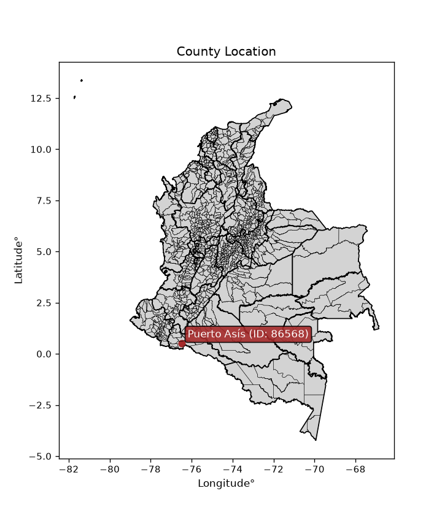
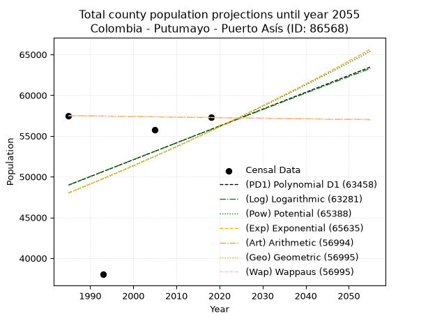
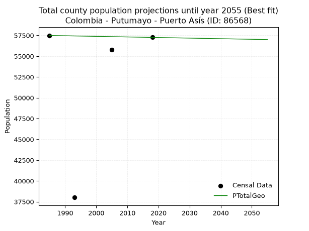
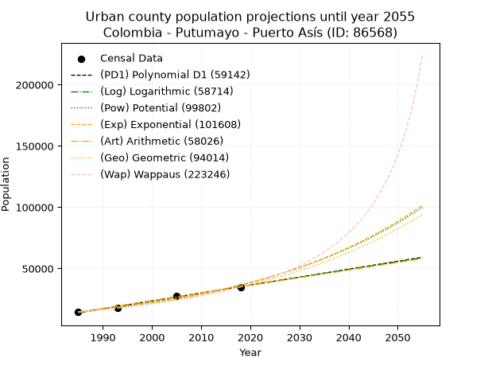
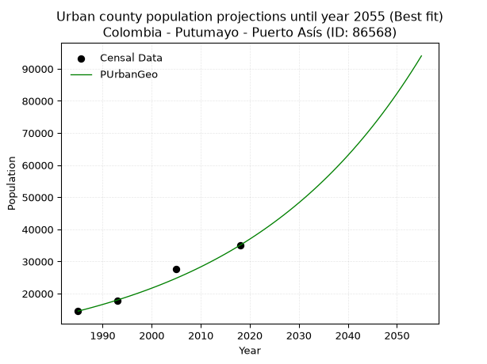
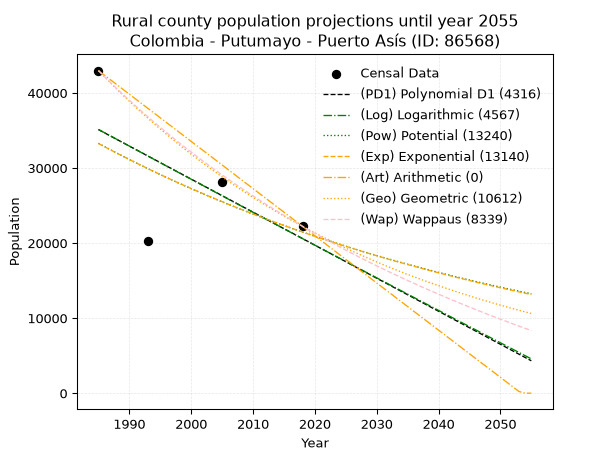
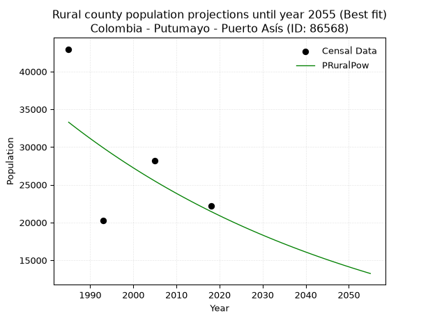

<div align="center">


</div>

# _“Population and Public Services Demand Projections (PPSD) until Year 2050 for Colombia - Putumayo - Puerto Asís (ID: 86568)”_
Keywords: `population` `public-service` `projection` `lineal` `polynomial` `logarithmic` `potential` `exponential` `arithmetic` `geometric` `wappaus` `dane` `colombia` `south-america`

PPSD are analytical estimates used by governments and planners to anticipate future changes in population size, age distribution, and the resulting community needs for utilities, healthcare, education, and infrastructure as sizing future water treatment facilities, electrical grids, and road networks based on spatial growth.

<div align="center">

</img>

</div>


> **General running parameters**: • app_version: _v20260806_. • Python version: _3.14.7_. • Pandas version: _3.0.5_. • NumPy version: _2.5.1_. • Creates, save and include plots into reports (create_plot): _False_. • Projection until year: _2050_. • Process polynomial degree 2 and up: _False_. • Process Wappaus: _True_. • Process Wappaus: _True_. • Set negative values to zero: _True_. • Set infinite values to zero: _True_. • Drop dataset notes: _True_. 
<div align="center">

Dynamic map: [:earth_americas:Google](http://maps.google.com/maps?q=0.505627082,-76.4968867) [:earth_americas:OSM](https://www.openstreetmap.org/#map=18/0.505627082/-76.4968867&layers=P) [:earth_americas:Bing](https://www.bing.com/maps?cp=0.505627082~-76.4968867&lvl=18) [:earth_americas:Apple](https://maps.apple.com/frame?center=0.505627082%2C-76.4968867&span=0.003%2C0.006)

</div>


<div align="center">

```geojson
{
  "type": "Feature",
  "geometry": {
    "type": "Point", 
    "coordinates": [-76.4968867, 0.505627082]
  }, 
  "properties": {
    "Name": "Colombia - Putumayo - Puerto Asís (ID: 86568)"
  }
}
```

</div>


## 0. Census Data (4 records)

Census data are official statistics collected by a government about the people and housing in a country. They usually include counts of total population, age, sex, race, income, education, and jobs.

📅Global census file: [Population.xlsx](../data/Population.xlsx)

| Source   |   Year |   CountryID | CountryName   |   StateID | StateName   |   CountyID | CountyName   |   PTotal |   PUrban |   PRural |
|:---------|-------:|------------:|:--------------|----------:|:------------|-----------:|:-------------|---------:|---------:|---------:|
| DANE     |   1985 |          57 | Colombia      |        86 | Putumayo    |      86568 | Puerto Asís  |    57488 |    14524 |    42964 |
| DANE     |   1993 |          57 | Colombia      |        86 | Putumayo    |      86568 | Puerto Asís  |    38010 |    17745 |    20265 |
| DANE     |   2005 |          57 | Colombia      |        86 | Putumayo    |      86568 | Puerto Asís  |    55759 |    27609 |    28150 |
| DANE     |   2018 |          57 | Colombia      |        86 | Putumayo    |      86568 | Puerto Asís  |    57255 |    35032 |    22223 |

> 🔥Some records could had specific notes about the registered values or the corresponding urban or rural distribution.

📅[SUI-RUPS](https://www.datos.gov.co/Hacienda-y-Cr-dito-P-blico/Registro-nico-de-Prestadores-de-Servicios-P-blicos/4qkq-csdn/about_data) - Local public utility companies: [RUPS.csv](../data/RUPS.xlsx)

 | SERVICIO       | ESTADO    | NOMBRE                                                           | NIT         | DEPARTAMENTO_DOMICILIO   | MUNICIPIO_DOMICILIO   | DIRECCION                              |   TELEFONO | EMAIL                                   | TIPO_PRESTADOR                            | CLASIFICACION                  |
|:---------------|:----------|:-----------------------------------------------------------------|:------------|:-------------------------|:----------------------|:---------------------------------------|-----------:|:----------------------------------------|:------------------------------------------|:-------------------------------|
| ACUEDUCTO      | OPERATIVA | EMPRESA DE ACUEDUCTO ALCANTARILLADO Y ASEO DE PUERTO ASIS E.S.P. | 800111304-2 | PUTUMAYO                 | PUERTO ASIS           | Calle 12 No. 17-38 Barrio Las Américas |    4227253 | gerenciaeaap@puertoasis-putumayo.gov.co | EMPRESA INDUSTRIAL Y COMERCIAL DEL ESTADO | DESDE 2501 HASTA 5000 USUARIOS |
| ALCANTARILLADO | OPERATIVA | EMPRESA DE ACUEDUCTO ALCANTARILLADO Y ASEO DE PUERTO ASIS E.S.P. | 800111304-2 | PUTUMAYO                 | PUERTO ASIS           | Calle 12 No. 17-38 Barrio Las Américas |    4227253 | gerenciaeaap@puertoasis-putumayo.gov.co | EMPRESA INDUSTRIAL Y COMERCIAL DEL ESTADO | MAYOR O IGUAL A 5001 USUARIOS  |

## 1. Total

### 1.1. Coefficients and Parameters

* (PD1) Polynomial Deg 1: 206.93215576073692, -361788.04456041404 (lineal)
* (Log) Logarithmic: 412719.7268342027, -3084957.9509951007
* (Pow) Potential: 8.91224141088603, -24.709083910237343
* (Exp) Exponential: 0.004467893122940513, 6.755431783535462
* (Art) Arithmetic: Year diff. 2018 - 1985 = 33, Population diff. 57255 - 57488 = -233, Annual growth = -7.0606060606060606
* (Geo) Geometric: Year diff. 2018 - 1985 = 33, Population diff. 57255 - 57488 = -233, Annual growth % = -0.00012306077606383248
* (Wap) Wappaus: i = -0.012306817950735226, Condition values only valid for < 200)

<sub>
Wappaus condition values: ['-0.00', '-0.01', '-0.02', '-0.04', '-0.05', '-0.06', '-0.07', '-0.09', '-0.10', '-0.11', '-0.12', '-0.14', '-0.15', '-0.16', '-0.17', '-0.18', '-0.20', '-0.21', '-0.22', '-0.23', '-0.25', '-0.26', '-0.27', '-0.28', '-0.30', '-0.31', '-0.32', '-0.33', '-0.34', '-0.36', '-0.37', '-0.38', '-0.39', '-0.41', '-0.42', '-0.43', '-0.44', '-0.46', '-0.47', '-0.48', '-0.49', '-0.50', '-0.52', '-0.53', '-0.54', '-0.55', '-0.57', '-0.58', '-0.59', '-0.60', '-0.62', '-0.63', '-0.64', '-0.65', '-0.66', '-0.68', '-0.69', '-0.70', '-0.71', '-0.73', '-0.74', '-0.75', '-0.76', '-0.78', '-0.79', '-0.80']
</sub>


### 1.2. Projected Dataset

|   Year |   CountyID |   PTotalPD1 |   PTotalLog |   PTotalPow |   PTotalExp |   PTotalArt |   PTotalGeo |   PTotalWap |
|-------:|-----------:|------------:|------------:|------------:|------------:|------------:|------------:|------------:|
|   1985 |      86568 |       48972 |       48977 |       48012 |       48008 |       57488 |       57488 |       57488 |
|   1986 |      86568 |       49179 |       49185 |       48228 |       48223 |       57481 |       57481 |       57481 |
|   1987 |      86568 |       49386 |       49393 |       48445 |       48439 |       57474 |       57474 |       57474 |
|   1988 |      86568 |       49593 |       49601 |       48663 |       48655 |       57467 |       57467 |       57467 |
|   1989 |      86568 |       49800 |       49808 |       48882 |       48873 |       57460 |       57460 |       57460 |
|   1990 |      86568 |       50007 |       50016 |       49101 |       49092 |       57453 |       57453 |       57453 |
|   1991 |      86568 |       50214 |       50223 |       49321 |       49312 |       57446 |       57446 |       57446 |
|   1992 |      86568 |       50421 |       50430 |       49543 |       49533 |       57439 |       57438 |       57438 |
|   1993 |      86568 |       50628 |       50637 |       49765 |       49755 |       57432 |       57431 |       57431 |
|   1994 |      86568 |       50835 |       50844 |       49988 |       49977 |       57424 |       57424 |       57424 |
|   1995 |      86568 |       51042 |       51051 |       50212 |       50201 |       57417 |       57417 |       57417 |
|   1996 |      86568 |       51249 |       51258 |       50436 |       50426 |       57410 |       57410 |       57410 |
|   1997 |      86568 |       51455 |       51465 |       50662 |       50652 |       57403 |       57403 |       57403 |
|   1998 |      86568 |       51662 |       51672 |       50889 |       50879 |       57396 |       57396 |       57396 |
|   1999 |      86568 |       51869 |       51878 |       51116 |       51106 |       57389 |       57389 |       57389 |
|   2000 |      86568 |       52076 |       52084 |       51344 |       51335 |       57382 |       57382 |       57382 |
|   2001 |      86568 |       52283 |       52291 |       51574 |       51565 |       57375 |       57375 |       57375 |
|   2002 |      86568 |       52490 |       52497 |       51804 |       51796 |       57368 |       57368 |       57368 |
|   2003 |      86568 |       52697 |       52703 |       52035 |       52028 |       57361 |       57361 |       57361 |
|   2004 |      86568 |       52904 |       52909 |       52267 |       52261 |       57354 |       57354 |       57354 |
|   2005 |      86568 |       53111 |       53115 |       52500 |       52495 |       57347 |       57347 |       57347 |
|   2006 |      86568 |       53318 |       53321 |       52733 |       52730 |       57340 |       57340 |       57340 |
|   2007 |      86568 |       53525 |       53526 |       52968 |       52966 |       57333 |       57333 |       57333 |
|   2008 |      86568 |       53732 |       53732 |       53204 |       53203 |       57326 |       57326 |       57326 |
|   2009 |      86568 |       53939 |       53938 |       53441 |       53442 |       57319 |       57318 |       57318 |
|   2010 |      86568 |       54146 |       54143 |       53678 |       53681 |       57311 |       57311 |       57311 |
|   2011 |      86568 |       54353 |       54348 |       53917 |       53921 |       57304 |       57304 |       57304 |
|   2012 |      86568 |       54559 |       54553 |       54156 |       54163 |       57297 |       57297 |       57297 |
|   2013 |      86568 |       54766 |       54758 |       54396 |       54405 |       57290 |       57290 |       57290 |
|   2014 |      86568 |       54973 |       54963 |       54638 |       54649 |       57283 |       57283 |       57283 |
|   2015 |      86568 |       55180 |       55168 |       54880 |       54894 |       57276 |       57276 |       57276 |
|   2016 |      86568 |       55387 |       55373 |       55123 |       55139 |       57269 |       57269 |       57269 |
|   2017 |      86568 |       55594 |       55578 |       55367 |       55386 |       57262 |       57262 |       57262 |
|   2018 |      86568 |       55801 |       55782 |       55612 |       55634 |       57255 |       57255 |       57255 |
|   2019 |      86568 |       56008 |       55987 |       55858 |       55883 |       57248 |       57248 |       57248 |
|   2020 |      86568 |       56215 |       56191 |       56106 |       56134 |       57241 |       57241 |       57241 |
|   2021 |      86568 |       56422 |       56395 |       56354 |       56385 |       57234 |       57234 |       57234 |
|   2022 |      86568 |       56629 |       56600 |       56603 |       56638 |       57227 |       57227 |       57227 |
|   2023 |      86568 |       56836 |       56804 |       56852 |       56891 |       57220 |       57220 |       57220 |
|   2024 |      86568 |       57043 |       57008 |       57103 |       57146 |       57213 |       57213 |       57213 |
|   2025 |      86568 |       57250 |       57211 |       57355 |       57402 |       57206 |       57206 |       57206 |
|   2026 |      86568 |       57457 |       57415 |       57608 |       57659 |       57199 |       57199 |       57199 |
|   2027 |      86568 |       57663 |       57619 |       57862 |       57917 |       57191 |       57192 |       57192 |
|   2028 |      86568 |       57870 |       57822 |       58117 |       58176 |       57184 |       57185 |       57185 |
|   2029 |      86568 |       58077 |       58026 |       58373 |       58437 |       57177 |       57178 |       57178 |
|   2030 |      86568 |       58284 |       58229 |       58630 |       58699 |       57170 |       57171 |       57171 |
|   2031 |      86568 |       58491 |       58433 |       58888 |       58961 |       57163 |       57163 |       57163 |
|   2032 |      86568 |       58698 |       58636 |       59147 |       59225 |       57156 |       57156 |       57156 |
|   2033 |      86568 |       58905 |       58839 |       59407 |       59491 |       57149 |       57149 |       57149 |
|   2034 |      86568 |       59112 |       59042 |       59668 |       59757 |       57142 |       57142 |       57142 |
|   2035 |      86568 |       59319 |       59245 |       59930 |       60025 |       57135 |       57135 |       57135 |
|   2036 |      86568 |       59526 |       59447 |       60193 |       60293 |       57128 |       57128 |       57128 |
|   2037 |      86568 |       59733 |       59650 |       60456 |       60563 |       57121 |       57121 |       57121 |
|   2038 |      86568 |       59940 |       59853 |       60722 |       60835 |       57114 |       57114 |       57114 |
|   2039 |      86568 |       60147 |       60055 |       60988 |       61107 |       57107 |       57107 |       57107 |
|   2040 |      86568 |       60354 |       60257 |       61255 |       61381 |       57100 |       57100 |       57100 |
|   2041 |      86568 |       60560 |       60460 |       61523 |       61655 |       57093 |       57093 |       57093 |
|   2042 |      86568 |       60767 |       60662 |       61792 |       61932 |       57086 |       57086 |       57086 |
|   2043 |      86568 |       60974 |       60864 |       62062 |       62209 |       57078 |       57079 |       57079 |
|   2044 |      86568 |       61181 |       61066 |       62333 |       62487 |       57071 |       57072 |       57072 |
|   2045 |      86568 |       61388 |       61268 |       62606 |       62767 |       57064 |       57065 |       57065 |
|   2046 |      86568 |       61595 |       61469 |       62879 |       63048 |       57057 |       57058 |       57058 |
|   2047 |      86568 |       61802 |       61671 |       63154 |       63331 |       57050 |       57051 |       57051 |
|   2048 |      86568 |       62009 |       61873 |       63429 |       63614 |       57043 |       57044 |       57044 |
|   2049 |      86568 |       62216 |       62074 |       63706 |       63899 |       57036 |       57037 |       57037 |
|   2050 |      86568 |       62423 |       62276 |       63983 |       64185 |       57029 |       57030 |       57030 |
<div align="center">

</img>

</div>


### 1.3. Best fit with absolute and relative error (%)

Relative error puts that difference into context by dividing the absolute error by the true value, creating a unitless ratio or percentage that shows the scale of the mistake.

Absolute and relative error

|   Year | Source   |   CountryID | CountryName   |   StateID | StateName   |   CountyID_x | CountyName   |   PTotal |   PUrban |   PRural |   CountyID_y |   PTotalPD1 |   PTotalLog |   PTotalPow |   PTotalExp |   PTotalArt |   PTotalGeo |   PTotalWap |   PTotalPD1AbsError |   PTotalLogAbsError |   PTotalPowAbsError |   PTotalExpAbsError |   PTotalArtAbsError |   PTotalGeoAbsError |   PTotalWapAbsError |   PTotalPD1RelError |   PTotalLogRelError |   PTotalPowRelError |   PTotalExpRelError |   PTotalArtRelError |   PTotalGeoRelError |   PTotalWapRelError |
|-------:|:---------|------------:|:--------------|----------:|:------------|-------------:|:-------------|---------:|---------:|---------:|-------------:|------------:|------------:|------------:|------------:|------------:|------------:|------------:|--------------------:|--------------------:|--------------------:|--------------------:|--------------------:|--------------------:|--------------------:|--------------------:|--------------------:|--------------------:|--------------------:|--------------------:|--------------------:|--------------------:|
|   1985 | DANE     |          57 | Colombia      |        86 | Putumayo    |        86568 | Puerto Asís  |    57488 |    14524 |    42964 |        86568 |       48972 |       48977 |       48012 |       48008 |       57488 |       57488 |       57488 |                8516 |                8511 |                9476 |                9480 |                   0 |                   0 |                   0 |            14.8135  |            14.8048  |            16.4834  |            16.4904  |             0       |             0       |             0       |
|   1993 | DANE     |          57 | Colombia      |        86 | Putumayo    |        86568 | Puerto Asís  |    38010 |    17745 |    20265 |        86568 |       50628 |       50637 |       49765 |       49755 |       57432 |       57431 |       57431 |               12618 |               12627 |               11755 |               11745 |               19422 |               19421 |               19421 |            33.1965  |            33.2202  |            30.9261  |            30.8998  |            51.0971  |            51.0944  |            51.0944  |
|   2005 | DANE     |          57 | Colombia      |        86 | Putumayo    |        86568 | Puerto Asís  |    55759 |    27609 |    28150 |        86568 |       53111 |       53115 |       52500 |       52495 |       57347 |       57347 |       57347 |                2648 |                2644 |                3259 |                3264 |                1588 |                1588 |                1588 |             4.74901 |             4.74184 |             5.8448  |             5.85376 |             2.84797 |             2.84797 |             2.84797 |
|   2018 | DANE     |          57 | Colombia      |        86 | Putumayo    |        86568 | Puerto Asís  |    57255 |    35032 |    22223 |        86568 |       55801 |       55782 |       55612 |       55634 |       57255 |       57255 |       57255 |                1454 |                1473 |                1643 |                1621 |                   0 |                   0 |                   0 |             2.53952 |             2.5727  |             2.86962 |             2.83119 |             0       |             0       |             0       |

Relative error mean

| Method    |   RelError | Best   |
|:----------|-----------:|:-------|
| PTotalPD1 |    13.8246 |        |
| PTotalLog |    13.8349 |        |
| PTotalPow |    14.031  |        |
| PTotalExp |    14.0188 |        |
| PTotalArt |    13.4863 |        |
| PTotalGeo |    13.4856 | True   |
| PTotalWap |    13.4856 | True   |

💙Best method: _**PTotalGeo**_
<div align="center">

</img>

</div>


### 1.4. Fresh water supply demand in liters per capita per day (lpcd)

The fresh water supply demand typically ranges from 100 to 300 liters per capita per day (lpcd) for standard domestic and municipal planning, though absolute survival minimums set by the World Health Organization are as low as 7.5 to 20 liters per day, and total consumption in high-income nations can exceed 400 liters.

> `CZ`: Level in meters above the sea level (masl)<br> `WS`: Fresh water supply demand in liters per capita per day (lpcd or l/h/d)<br> `WSAll`: Zonal fresh water supply demand in liters per second (l/s)<br> `A`: Zonal area in square meters<br> `DP`: Population density (people/hectare or p/ha)

Reference values (RAS Colombia)

|    CZ |   WS |
|------:|-----:|
|  1000 |  120 |
|  2000 |  130 |
| 99999 |  140 |

County shapefile geometry properties and water supply values

|   CountyID |      ATotal |   CZTotal |   WSTotal |
|-----------:|------------:|----------:|----------:|
|      86568 | 2.80239e+09 |   263.875 |       120 |

Projected values for best method: PTotalGeo

|   CountyID |   Year |   PTotalGeo |   DPTotal |   WSTotal |   WSTotalAll |
|-----------:|-------:|------------:|----------:|----------:|-------------:|
|      86568 |   1985 |       57488 |      0.21 |       120 |      79.8444 |
|      86568 |   1986 |       57481 |      0.21 |       120 |      79.8347 |
|      86568 |   1987 |       57474 |      0.21 |       120 |      79.825  |
|      86568 |   1988 |       57467 |      0.21 |       120 |      79.8153 |
|      86568 |   1989 |       57460 |      0.21 |       120 |      79.8056 |
|      86568 |   1990 |       57453 |      0.21 |       120 |      79.7958 |
|      86568 |   1991 |       57446 |      0.2  |       120 |      79.7861 |
|      86568 |   1992 |       57438 |      0.2  |       120 |      79.775  |
|      86568 |   1993 |       57431 |      0.2  |       120 |      79.7653 |
|      86568 |   1994 |       57424 |      0.2  |       120 |      79.7556 |
|      86568 |   1995 |       57417 |      0.2  |       120 |      79.7458 |
|      86568 |   1996 |       57410 |      0.2  |       120 |      79.7361 |
|      86568 |   1997 |       57403 |      0.2  |       120 |      79.7264 |
|      86568 |   1998 |       57396 |      0.2  |       120 |      79.7167 |
|      86568 |   1999 |       57389 |      0.2  |       120 |      79.7069 |
|      86568 |   2000 |       57382 |      0.2  |       120 |      79.6972 |
|      86568 |   2001 |       57375 |      0.2  |       120 |      79.6875 |
|      86568 |   2002 |       57368 |      0.2  |       120 |      79.6778 |
|      86568 |   2003 |       57361 |      0.2  |       120 |      79.6681 |
|      86568 |   2004 |       57354 |      0.2  |       120 |      79.6583 |
|      86568 |   2005 |       57347 |      0.2  |       120 |      79.6486 |
|      86568 |   2006 |       57340 |      0.2  |       120 |      79.6389 |
|      86568 |   2007 |       57333 |      0.2  |       120 |      79.6292 |
|      86568 |   2008 |       57326 |      0.2  |       120 |      79.6194 |
|      86568 |   2009 |       57318 |      0.2  |       120 |      79.6083 |
|      86568 |   2010 |       57311 |      0.2  |       120 |      79.5986 |
|      86568 |   2011 |       57304 |      0.2  |       120 |      79.5889 |
|      86568 |   2012 |       57297 |      0.2  |       120 |      79.5792 |
|      86568 |   2013 |       57290 |      0.2  |       120 |      79.5694 |
|      86568 |   2014 |       57283 |      0.2  |       120 |      79.5597 |
|      86568 |   2015 |       57276 |      0.2  |       120 |      79.55   |
|      86568 |   2016 |       57269 |      0.2  |       120 |      79.5403 |
|      86568 |   2017 |       57262 |      0.2  |       120 |      79.5306 |
|      86568 |   2018 |       57255 |      0.2  |       120 |      79.5208 |
|      86568 |   2019 |       57248 |      0.2  |       120 |      79.5111 |
|      86568 |   2020 |       57241 |      0.2  |       120 |      79.5014 |
|      86568 |   2021 |       57234 |      0.2  |       120 |      79.4917 |
|      86568 |   2022 |       57227 |      0.2  |       120 |      79.4819 |
|      86568 |   2023 |       57220 |      0.2  |       120 |      79.4722 |
|      86568 |   2024 |       57213 |      0.2  |       120 |      79.4625 |
|      86568 |   2025 |       57206 |      0.2  |       120 |      79.4528 |
|      86568 |   2026 |       57199 |      0.2  |       120 |      79.4431 |
|      86568 |   2027 |       57192 |      0.2  |       120 |      79.4333 |
|      86568 |   2028 |       57185 |      0.2  |       120 |      79.4236 |
|      86568 |   2029 |       57178 |      0.2  |       120 |      79.4139 |
|      86568 |   2030 |       57171 |      0.2  |       120 |      79.4042 |
|      86568 |   2031 |       57163 |      0.2  |       120 |      79.3931 |
|      86568 |   2032 |       57156 |      0.2  |       120 |      79.3833 |
|      86568 |   2033 |       57149 |      0.2  |       120 |      79.3736 |
|      86568 |   2034 |       57142 |      0.2  |       120 |      79.3639 |
|      86568 |   2035 |       57135 |      0.2  |       120 |      79.3542 |
|      86568 |   2036 |       57128 |      0.2  |       120 |      79.3444 |
|      86568 |   2037 |       57121 |      0.2  |       120 |      79.3347 |
|      86568 |   2038 |       57114 |      0.2  |       120 |      79.325  |
|      86568 |   2039 |       57107 |      0.2  |       120 |      79.3153 |
|      86568 |   2040 |       57100 |      0.2  |       120 |      79.3056 |
|      86568 |   2041 |       57093 |      0.2  |       120 |      79.2958 |
|      86568 |   2042 |       57086 |      0.2  |       120 |      79.2861 |
|      86568 |   2043 |       57079 |      0.2  |       120 |      79.2764 |
|      86568 |   2044 |       57072 |      0.2  |       120 |      79.2667 |
|      86568 |   2045 |       57065 |      0.2  |       120 |      79.2569 |
|      86568 |   2046 |       57058 |      0.2  |       120 |      79.2472 |
|      86568 |   2047 |       57051 |      0.2  |       120 |      79.2375 |
|      86568 |   2048 |       57044 |      0.2  |       120 |      79.2278 |
|      86568 |   2049 |       57037 |      0.2  |       120 |      79.2181 |
|      86568 |   2050 |       57030 |      0.2  |       120 |      79.2083 |

## 2. Urban

### 2.1. Coefficients and Parameters

* (PD1) Polynomial Deg 1: 646.8382175832946, -1270110.644720985 (lineal)
* (Log) Logarithmic: 1294685.3027994945, -9817185.861535853
* (Pow) Potential: 55.38257373016408, -178.4729064773946
* (Exp) Exponential: 0.02766291925125429, 2.0818988802726248e-20
* (Art) Arithmetic: Year diff. 2018 - 1985 = 33, Population diff. 35032 - 14524 = 20508, Annual growth = 621.4545454545455
* (Geo) Geometric: Year diff. 2018 - 1985 = 33, Population diff. 35032 - 14524 = 20508, Annual growth % = 0.027039703800557868
* (Wap) Wappaus: i = 2.5080900212064954, Condition values only valid for < 200)

<sub>
Wappaus condition values: ['0.00', '2.51', '5.02', '7.52', '10.03', '12.54', '15.05', '17.56', '20.06', '22.57', '25.08', '27.59', '30.10', '32.61', '35.11', '37.62', '40.13', '42.64', '45.15', '47.65', '50.16', '52.67', '55.18', '57.69', '60.19', '62.70', '65.21', '67.72', '70.23', '72.73', '75.24', '77.75', '80.26', '82.77', '85.28', '87.78', '90.29', '92.80', '95.31', '97.82', '100.32', '102.83', '105.34', '107.85', '110.36', '112.86', '115.37', '117.88', '120.39', '122.90', '125.40', '127.91', '130.42', '132.93', '135.44', '137.94', '140.45', '142.96', '145.47', '147.98', '150.49', '152.99', '155.50', '158.01', '160.52', '163.03']
</sub>


### 2.2. Projected Dataset

|   Year |   CountyID |   PUrbanPD1 |   PUrbanLog |   PUrbanPow |   PUrbanExp |   PUrbanArt |   PUrbanGeo |   PUrbanWap |
|-------:|-----------:|------------:|------------:|------------:|------------:|------------:|------------:|------------:|
|   1985 |      86568 |       13863 |       13844 |       14641 |       14654 |       14524 |       14524 |       14524 |
|   1986 |      86568 |       14510 |       14496 |       15055 |       15065 |       15145 |       14917 |       14893 |
|   1987 |      86568 |       15157 |       15148 |       15480 |       15488 |       15767 |       15320 |       15271 |
|   1988 |      86568 |       15804 |       15799 |       15918 |       15922 |       16388 |       15734 |       15660 |
|   1989 |      86568 |       16451 |       16450 |       16367 |       16369 |       17010 |       16160 |       16058 |
|   1990 |      86568 |       17097 |       17101 |       16829 |       16828 |       17631 |       16597 |       16467 |
|   1991 |      86568 |       17744 |       17752 |       17304 |       17300 |       18253 |       17045 |       16887 |
|   1992 |      86568 |       18391 |       18402 |       17792 |       17785 |       18874 |       17506 |       17319 |
|   1993 |      86568 |       19038 |       19051 |       18294 |       18284 |       19496 |       17980 |       17763 |
|   1994 |      86568 |       19685 |       19701 |       18809 |       18797 |       20117 |       18466 |       18220 |
|   1995 |      86568 |       20332 |       20350 |       19339 |       19324 |       20739 |       18965 |       18689 |
|   1996 |      86568 |       20978 |       20999 |       19883 |       19866 |       21360 |       19478 |       19172 |
|   1997 |      86568 |       21625 |       21647 |       20442 |       20423 |       21981 |       20005 |       19670 |
|   1998 |      86568 |       22272 |       22296 |       21017 |       20996 |       22603 |       20546 |       20182 |
|   1999 |      86568 |       22919 |       22943 |       21607 |       21585 |       23224 |       21101 |       20710 |
|   2000 |      86568 |       23566 |       23591 |       22214 |       22190 |       23846 |       21672 |       21254 |
|   2001 |      86568 |       24213 |       24238 |       22838 |       22813 |       24467 |       22258 |       21815 |
|   2002 |      86568 |       24859 |       24885 |       23479 |       23453 |       25089 |       22860 |       22395 |
|   2003 |      86568 |       25506 |       25531 |       24137 |       24111 |       25710 |       23478 |       22993 |
|   2004 |      86568 |       26153 |       26178 |       24813 |       24787 |       26332 |       24113 |       23610 |
|   2005 |      86568 |       26800 |       26824 |       25509 |       25482 |       26953 |       24765 |       24248 |
|   2006 |      86568 |       27447 |       27469 |       26223 |       26197 |       27575 |       25434 |       24909 |
|   2007 |      86568 |       28094 |       28114 |       26957 |       26932 |       28196 |       26122 |       25591 |
|   2008 |      86568 |       28740 |       28759 |       27711 |       27687 |       28817 |       26828 |       26298 |
|   2009 |      86568 |       29387 |       29404 |       28485 |       28464 |       29439 |       27554 |       27031 |
|   2010 |      86568 |       30034 |       30048 |       29281 |       29262 |       30060 |       28299 |       27790 |
|   2011 |      86568 |       30681 |       30692 |       30099 |       30083 |       30682 |       29064 |       28577 |
|   2012 |      86568 |       31328 |       31336 |       30940 |       30927 |       31303 |       29850 |       29394 |
|   2013 |      86568 |       31975 |       31979 |       31803 |       31794 |       31925 |       30657 |       30243 |
|   2014 |      86568 |       32622 |       32622 |       32690 |       32686 |       32546 |       31486 |       31125 |
|   2015 |      86568 |       33268 |       33265 |       33601 |       33603 |       33168 |       32337 |       32043 |
|   2016 |      86568 |       33915 |       33907 |       34537 |       34545 |       33789 |       33212 |       32999 |
|   2017 |      86568 |       34562 |       34549 |       35499 |       35514 |       34411 |       34110 |       33994 |
|   2018 |      86568 |       35209 |       35191 |       36487 |       36510 |       35032 |       35032 |       35032 |
|   2019 |      86568 |       35856 |       35832 |       37502 |       37534 |       35653 |       35979 |       36115 |
|   2020 |      86568 |       36503 |       36473 |       38544 |       38587 |       36275 |       36952 |       37247 |
|   2021 |      86568 |       37149 |       37114 |       39615 |       39670 |       36896 |       37951 |       38431 |
|   2022 |      86568 |       37796 |       37755 |       40716 |       40782 |       37518 |       38977 |       39670 |
|   2023 |      86568 |       38443 |       38395 |       41846 |       41926 |       38139 |       40031 |       40968 |
|   2024 |      86568 |       39090 |       39035 |       43007 |       43102 |       38761 |       41114 |       42330 |
|   2025 |      86568 |       39737 |       39674 |       44200 |       44311 |       39382 |       42226 |       43761 |
|   2026 |      86568 |       40384 |       40313 |       45425 |       45554 |       40004 |       43367 |       45265 |
|   2027 |      86568 |       41030 |       40952 |       46684 |       46832 |       40625 |       44540 |       46849 |
|   2028 |      86568 |       41677 |       41591 |       47976 |       48145 |       41247 |       45744 |       48520 |
|   2029 |      86568 |       42324 |       42229 |       49304 |       49496 |       41868 |       46981 |       50283 |
|   2030 |      86568 |       42971 |       42867 |       50668 |       50884 |       42489 |       48252 |       52149 |
|   2031 |      86568 |       43618 |       43505 |       52069 |       52311 |       43111 |       49556 |       54125 |
|   2032 |      86568 |       44265 |       44142 |       53508 |       53779 |       43732 |       50896 |       56221 |
|   2033 |      86568 |       44911 |       44779 |       54986 |       55287 |       44354 |       52273 |       58450 |
|   2034 |      86568 |       45558 |       45416 |       56505 |       56838 |       44975 |       53686 |       60824 |
|   2035 |      86568 |       46205 |       46052 |       58064 |       58432 |       45597 |       55138 |       63357 |
|   2036 |      86568 |       46852 |       46688 |       59665 |       60071 |       46218 |       56629 |       66067 |
|   2037 |      86568 |       47499 |       47324 |       61310 |       61756 |       46840 |       58160 |       68972 |
|   2038 |      86568 |       48146 |       47959 |       63000 |       63488 |       47461 |       59732 |       72094 |
|   2039 |      86568 |       48792 |       48594 |       64735 |       65269 |       48083 |       61347 |       75459 |
|   2040 |      86568 |       49439 |       49229 |       66517 |       67100 |       48704 |       63006 |       79096 |
|   2041 |      86568 |       50086 |       49864 |       68347 |       68982 |       49325 |       64710 |       83039 |
|   2042 |      86568 |       50733 |       50498 |       70226 |       70917 |       49947 |       66460 |       87329 |
|   2043 |      86568 |       51380 |       51132 |       72156 |       72906 |       50568 |       68257 |       92014 |
|   2044 |      86568 |       52027 |       51765 |       74139 |       74951 |       51190 |       70102 |       97150 |
|   2045 |      86568 |       52674 |       52398 |       76175 |       77053 |       51811 |       71998 |      102807 |
|   2046 |      86568 |       53320 |       53031 |       78265 |       79214 |       52433 |       73945 |      109067 |
|   2047 |      86568 |       53967 |       53664 |       80412 |       81436 |       53054 |       75944 |      116033 |
|   2048 |      86568 |       54614 |       54296 |       82617 |       83720 |       53676 |       77998 |      123832 |
|   2049 |      86568 |       55261 |       54928 |       84881 |       86069 |       54297 |       80107 |      132621 |
|   2050 |      86568 |       55908 |       55560 |       87206 |       88483 |       54919 |       82273 |      142602 |
<div align="center">

</img>

</div>


### 2.3. Best fit with absolute and relative error (%)

Relative error puts that difference into context by dividing the absolute error by the true value, creating a unitless ratio or percentage that shows the scale of the mistake.

Absolute and relative error

|   Year | Source   |   CountryID | CountryName   |   StateID | StateName   |   CountyID_x | CountyName   |   PTotal |   PUrban |   PRural |   CountyID_y |   PUrbanPD1 |   PUrbanLog |   PUrbanPow |   PUrbanExp |   PUrbanArt |   PUrbanGeo |   PUrbanWap |   PUrbanPD1AbsError |   PUrbanLogAbsError |   PUrbanPowAbsError |   PUrbanExpAbsError |   PUrbanArtAbsError |   PUrbanGeoAbsError |   PUrbanWapAbsError |   PUrbanPD1RelError |   PUrbanLogRelError |   PUrbanPowRelError |   PUrbanExpRelError |   PUrbanArtRelError |   PUrbanGeoRelError |   PUrbanWapRelError |
|-------:|:---------|------------:|:--------------|----------:|:------------|-------------:|:-------------|---------:|---------:|---------:|-------------:|------------:|------------:|------------:|------------:|------------:|------------:|------------:|--------------------:|--------------------:|--------------------:|--------------------:|--------------------:|--------------------:|--------------------:|--------------------:|--------------------:|--------------------:|--------------------:|--------------------:|--------------------:|--------------------:|
|   1985 | DANE     |          57 | Colombia      |        86 | Putumayo    |        86568 | Puerto Asís  |    57488 |    14524 |    42964 |        86568 |       13863 |       13844 |       14641 |       14654 |       14524 |       14524 |       14524 |                 661 |                 680 |                 117 |                 130 |                   0 |                   0 |                   0 |            4.55109  |            4.68191  |            0.805563 |             0.89507 |             0       |             0       |            0        |
|   1993 | DANE     |          57 | Colombia      |        86 | Putumayo    |        86568 | Puerto Asís  |    38010 |    17745 |    20265 |        86568 |       19038 |       19051 |       18294 |       18284 |       19496 |       17980 |       17763 |                1293 |                1306 |                 549 |                 539 |                1751 |                 235 |                  18 |            7.28656  |            7.35982  |            3.09383  |             3.03748 |             9.86757 |             1.32432 |            0.101437 |
|   2005 | DANE     |          57 | Colombia      |        86 | Putumayo    |        86568 | Puerto Asís  |    55759 |    27609 |    28150 |        86568 |       26800 |       26824 |       25509 |       25482 |       26953 |       24765 |       24248 |                 809 |                 785 |                2100 |                2127 |                 656 |                2844 |                3361 |            2.9302   |            2.84328  |            7.60622  |             7.70401 |             2.37604 |            10.301   |           12.1736   |
|   2018 | DANE     |          57 | Colombia      |        86 | Putumayo    |        86568 | Puerto Asís  |    57255 |    35032 |    22223 |        86568 |       35209 |       35191 |       36487 |       36510 |       35032 |       35032 |       35032 |                 177 |                 159 |                1455 |                1478 |                   0 |                   0 |                   0 |            0.505252 |            0.453871 |            4.15335  |             4.219   |             0       |             0       |            0        |

Relative error mean

| Method    |   RelError | Best   |
|:----------|-----------:|:-------|
| PUrbanPD1 |    3.81828 |        |
| PUrbanLog |    3.83472 |        |
| PUrbanPow |    3.91474 |        |
| PUrbanExp |    3.96389 |        |
| PUrbanArt |    3.0609  |        |
| PUrbanGeo |    2.90633 | True   |
| PUrbanWap |    3.06875 |        |

💙Best method: _**PUrbanGeo**_
<div align="center">

</img>

</div>


### 2.4. Fresh water supply demand in liters per capita per day (lpcd)

The fresh water supply demand typically ranges from 100 to 300 liters per capita per day (lpcd) for standard domestic and municipal planning, though absolute survival minimums set by the World Health Organization are as low as 7.5 to 20 liters per day, and total consumption in high-income nations can exceed 400 liters.

> `CZ`: Level in meters above the sea level (masl)<br> `WS`: Fresh water supply demand in liters per capita per day (lpcd or l/h/d)<br> `WSAll`: Zonal fresh water supply demand in liters per second (l/s)<br> `A`: Zonal area in square meters<br> `DP`: Population density (people/hectare or p/ha)

Reference values (RAS Colombia)

|    CZ |   WS |
|------:|-----:|
|  1000 |  120 |
|  2000 |  130 |
| 99999 |  140 |

County shapefile geometry properties and water supply values

|   CountyID |     AUrban |   CZUrban |   WSUrban |
|-----------:|-----------:|----------:|----------:|
|      86568 | 5.6409e+06 |   255.445 |       120 |

Projected values for best method: PUrbanGeo

|   CountyID |   Year |   PUrbanGeo |   DPUrban |   WSUrban |   WSUrbanAll |
|-----------:|-------:|------------:|----------:|----------:|-------------:|
|      86568 |   1985 |       14524 |     25.75 |       120 |      20.1722 |
|      86568 |   1986 |       14917 |     26.44 |       120 |      20.7181 |
|      86568 |   1987 |       15320 |     27.16 |       120 |      21.2778 |
|      86568 |   1988 |       15734 |     27.89 |       120 |      21.8528 |
|      86568 |   1989 |       16160 |     28.65 |       120 |      22.4444 |
|      86568 |   1990 |       16597 |     29.42 |       120 |      23.0514 |
|      86568 |   1991 |       17045 |     30.22 |       120 |      23.6736 |
|      86568 |   1992 |       17506 |     31.03 |       120 |      24.3139 |
|      86568 |   1993 |       17980 |     31.87 |       120 |      24.9722 |
|      86568 |   1994 |       18466 |     32.74 |       120 |      25.6472 |
|      86568 |   1995 |       18965 |     33.62 |       120 |      26.3403 |
|      86568 |   1996 |       19478 |     34.53 |       120 |      27.0528 |
|      86568 |   1997 |       20005 |     35.46 |       120 |      27.7847 |
|      86568 |   1998 |       20546 |     36.42 |       120 |      28.5361 |
|      86568 |   1999 |       21101 |     37.41 |       120 |      29.3069 |
|      86568 |   2000 |       21672 |     38.42 |       120 |      30.1    |
|      86568 |   2001 |       22258 |     39.46 |       120 |      30.9139 |
|      86568 |   2002 |       22860 |     40.53 |       120 |      31.75   |
|      86568 |   2003 |       23478 |     41.62 |       120 |      32.6083 |
|      86568 |   2004 |       24113 |     42.75 |       120 |      33.4903 |
|      86568 |   2005 |       24765 |     43.9  |       120 |      34.3958 |
|      86568 |   2006 |       25434 |     45.09 |       120 |      35.325  |
|      86568 |   2007 |       26122 |     46.31 |       120 |      36.2806 |
|      86568 |   2008 |       26828 |     47.56 |       120 |      37.2611 |
|      86568 |   2009 |       27554 |     48.85 |       120 |      38.2694 |
|      86568 |   2010 |       28299 |     50.17 |       120 |      39.3042 |
|      86568 |   2011 |       29064 |     51.52 |       120 |      40.3667 |
|      86568 |   2012 |       29850 |     52.92 |       120 |      41.4583 |
|      86568 |   2013 |       30657 |     54.35 |       120 |      42.5792 |
|      86568 |   2014 |       31486 |     55.82 |       120 |      43.7306 |
|      86568 |   2015 |       32337 |     57.33 |       120 |      44.9125 |
|      86568 |   2016 |       33212 |     58.88 |       120 |      46.1278 |
|      86568 |   2017 |       34110 |     60.47 |       120 |      47.375  |
|      86568 |   2018 |       35032 |     62.1  |       120 |      48.6556 |
|      86568 |   2019 |       35979 |     63.78 |       120 |      49.9708 |
|      86568 |   2020 |       36952 |     65.51 |       120 |      51.3222 |
|      86568 |   2021 |       37951 |     67.28 |       120 |      52.7097 |
|      86568 |   2022 |       38977 |     69.1  |       120 |      54.1347 |
|      86568 |   2023 |       40031 |     70.97 |       120 |      55.5986 |
|      86568 |   2024 |       41114 |     72.89 |       120 |      57.1028 |
|      86568 |   2025 |       42226 |     74.86 |       120 |      58.6472 |
|      86568 |   2026 |       43367 |     76.88 |       120 |      60.2319 |
|      86568 |   2027 |       44540 |     78.96 |       120 |      61.8611 |
|      86568 |   2028 |       45744 |     81.09 |       120 |      63.5333 |
|      86568 |   2029 |       46981 |     83.29 |       120 |      65.2514 |
|      86568 |   2030 |       48252 |     85.54 |       120 |      67.0167 |
|      86568 |   2031 |       49556 |     87.85 |       120 |      68.8278 |
|      86568 |   2032 |       50896 |     90.23 |       120 |      70.6889 |
|      86568 |   2033 |       52273 |     92.67 |       120 |      72.6014 |
|      86568 |   2034 |       53686 |     95.17 |       120 |      74.5639 |
|      86568 |   2035 |       55138 |     97.75 |       120 |      76.5806 |
|      86568 |   2036 |       56629 |    100.39 |       120 |      78.6514 |
|      86568 |   2037 |       58160 |    103.1  |       120 |      80.7778 |
|      86568 |   2038 |       59732 |    105.89 |       120 |      82.9611 |
|      86568 |   2039 |       61347 |    108.75 |       120 |      85.2042 |
|      86568 |   2040 |       63006 |    111.69 |       120 |      87.5083 |
|      86568 |   2041 |       64710 |    114.72 |       120 |      89.875  |
|      86568 |   2042 |       66460 |    117.82 |       120 |      92.3056 |
|      86568 |   2043 |       68257 |    121    |       120 |      94.8014 |
|      86568 |   2044 |       70102 |    124.27 |       120 |      97.3639 |
|      86568 |   2045 |       71998 |    127.64 |       120 |      99.9972 |
|      86568 |   2046 |       73945 |    131.09 |       120 |     102.701  |
|      86568 |   2047 |       75944 |    134.63 |       120 |     105.478  |
|      86568 |   2048 |       77998 |    138.27 |       120 |     108.331  |
|      86568 |   2049 |       80107 |    142.01 |       120 |     111.26   |
|      86568 |   2050 |       82273 |    145.85 |       120 |     114.268  |

## 3. Rural

### 3.1. Coefficients and Parameters

* (PD1) Polynomial Deg 1: -439.9060618225578, 908322.6001605713 (lineal)
* (Log) Logarithmic: -881965.5759652917, 6732227.91054075
* (Pow) Potential: -26.596442521341817, 92.23090686208798
* (Exp) Exponential: -0.013266401330602477, 9089149917226532.0
* (Art) Arithmetic: Year diff. 2018 - 1985 = 33, Population diff. 22223 - 42964 = -20741, Annual growth = -628.5151515151515
* (Geo) Geometric: Year diff. 2018 - 1985 = 33, Population diff. 22223 - 42964 = -20741, Annual growth % = -0.019778596725534725
* (Wap) Wappaus: i = -1.9283450734506926, Condition values only valid for < 200)

<sub>
Wappaus condition values: ['-0.00', '-1.93', '-3.86', '-5.79', '-7.71', '-9.64', '-11.57', '-13.50', '-15.43', '-17.36', '-19.28', '-21.21', '-23.14', '-25.07', '-27.00', '-28.93', '-30.85', '-32.78', '-34.71', '-36.64', '-38.57', '-40.50', '-42.42', '-44.35', '-46.28', '-48.21', '-50.14', '-52.07', '-53.99', '-55.92', '-57.85', '-59.78', '-61.71', '-63.64', '-65.56', '-67.49', '-69.42', '-71.35', '-73.28', '-75.21', '-77.13', '-79.06', '-80.99', '-82.92', '-84.85', '-86.78', '-88.70', '-90.63', '-92.56', '-94.49', '-96.42', '-98.35', '-100.27', '-102.20', '-104.13', '-106.06', '-107.99', '-109.92', '-111.84', '-113.77', '-115.70', '-117.63', '-119.56', '-121.49', '-123.41', '-125.34']
</sub>


### 3.2. Projected Dataset

|   Year |   CountyID |   PRuralPD1 |   PRuralLog |   PRuralPow |   PRuralExp |   PRuralArt |   PRuralGeo |   PRuralWap |
|-------:|-----------:|------------:|------------:|------------:|------------:|------------:|------------:|------------:|
|   1985 |      86568 |       35109 |       35133 |       33282 |       33258 |       42964 |       42964 |       42964 |
|   1986 |      86568 |       34669 |       34689 |       32839 |       32820 |       42335 |       42114 |       42143 |
|   1987 |      86568 |       34229 |       34245 |       32402 |       32387 |       41707 |       41281 |       41338 |
|   1988 |      86568 |       33789 |       33801 |       31972 |       31960 |       41078 |       40465 |       40548 |
|   1989 |      86568 |       33349 |       33358 |       31547 |       31539 |       40450 |       39664 |       39773 |
|   1990 |      86568 |       32910 |       32914 |       31128 |       31124 |       39821 |       38880 |       39012 |
|   1991 |      86568 |       32470 |       32471 |       30715 |       30713 |       39193 |       38111 |       38265 |
|   1992 |      86568 |       32030 |       32029 |       30307 |       30309 |       38564 |       37357 |       37531 |
|   1993 |      86568 |       31590 |       31586 |       29905 |       29909 |       37936 |       36618 |       36811 |
|   1994 |      86568 |       31150 |       31143 |       29509 |       29515 |       37307 |       35894 |       36103 |
|   1995 |      86568 |       30710 |       30701 |       29118 |       29126 |       36679 |       35184 |       35408 |
|   1996 |      86568 |       30270 |       30259 |       28733 |       28742 |       36050 |       34488 |       34724 |
|   1997 |      86568 |       29830 |       29818 |       28353 |       28363 |       35422 |       33806 |       34053 |
|   1998 |      86568 |       29390 |       29376 |       27977 |       27990 |       34793 |       33137 |       33393 |
|   1999 |      86568 |       28950 |       28935 |       27608 |       27621 |       34165 |       32482 |       32745 |
|   2000 |      86568 |       28510 |       28494 |       27243 |       27257 |       33536 |       31840 |       32107 |
|   2001 |      86568 |       28071 |       28053 |       26883 |       26898 |       32908 |       31210 |       31480 |
|   2002 |      86568 |       27631 |       27612 |       26528 |       26543 |       32279 |       30593 |       30863 |
|   2003 |      86568 |       27191 |       27172 |       26178 |       26193 |       31651 |       29987 |       30257 |
|   2004 |      86568 |       26751 |       26731 |       25833 |       25848 |       31022 |       29394 |       29660 |
|   2005 |      86568 |       26311 |       26291 |       25492 |       25507 |       30394 |       28813 |       29073 |
|   2006 |      86568 |       25871 |       25852 |       25157 |       25171 |       29765 |       28243 |       28495 |
|   2007 |      86568 |       25431 |       25412 |       24825 |       24839 |       29137 |       27685 |       27927 |
|   2008 |      86568 |       24991 |       24973 |       24499 |       24512 |       28508 |       27137 |       27367 |
|   2009 |      86568 |       24551 |       24534 |       24176 |       24189 |       27880 |       26600 |       26817 |
|   2010 |      86568 |       24111 |       24095 |       23858 |       23870 |       27251 |       26074 |       26275 |
|   2011 |      86568 |       23672 |       23656 |       23545 |       23556 |       26623 |       25558 |       25741 |
|   2012 |      86568 |       23232 |       23218 |       23236 |       23245 |       25994 |       25053 |       25215 |
|   2013 |      86568 |       22792 |       22779 |       22931 |       22939 |       25366 |       24557 |       24698 |
|   2014 |      86568 |       22352 |       22341 |       22630 |       22637 |       24737 |       24072 |       24188 |
|   2015 |      86568 |       21912 |       21904 |       22333 |       22338 |       24109 |       23596 |       23686 |
|   2016 |      86568 |       21472 |       21466 |       22040 |       22044 |       23480 |       23129 |       23191 |
|   2017 |      86568 |       21032 |       21029 |       21751 |       21753 |       22852 |       22671 |       22703 |
|   2018 |      86568 |       20592 |       20591 |       21466 |       21467 |       22223 |       22223 |       22223 |
|   2019 |      86568 |       20152 |       20154 |       21186 |       21184 |       21594 |       21783 |       21750 |
|   2020 |      86568 |       19712 |       19718 |       20908 |       20905 |       20966 |       21353 |       21283 |
|   2021 |      86568 |       19272 |       19281 |       20635 |       20629 |       20337 |       20930 |       20823 |
|   2022 |      86568 |       18833 |       18845 |       20365 |       20357 |       19709 |       20516 |       20370 |
|   2023 |      86568 |       18393 |       18409 |       20099 |       20089 |       19080 |       20111 |       19923 |
|   2024 |      86568 |       17953 |       17973 |       19837 |       19824 |       18452 |       19713 |       19482 |
|   2025 |      86568 |       17513 |       17537 |       19578 |       19563 |       17823 |       19323 |       19048 |
|   2026 |      86568 |       17073 |       17102 |       19322 |       19305 |       17195 |       18941 |       18619 |
|   2027 |      86568 |       16633 |       16667 |       19070 |       19051 |       16566 |       18566 |       18197 |
|   2028 |      86568 |       16193 |       16232 |       18822 |       18800 |       15938 |       18199 |       17780 |
|   2029 |      86568 |       15753 |       15797 |       18577 |       18552 |       15309 |       17839 |       17369 |
|   2030 |      86568 |       15313 |       15362 |       18335 |       18307 |       14681 |       17486 |       16963 |
|   2031 |      86568 |       14873 |       14928 |       18096 |       18066 |       14052 |       17140 |       16563 |
|   2032 |      86568 |       14433 |       14494 |       17861 |       17828 |       13424 |       16801 |       16168 |
|   2033 |      86568 |       13994 |       14060 |       17629 |       17593 |       12795 |       16469 |       15778 |
|   2034 |      86568 |       13554 |       13626 |       17400 |       17361 |       12167 |       16143 |       15393 |
|   2035 |      86568 |       13114 |       13193 |       17174 |       17132 |       11538 |       15824 |       15014 |
|   2036 |      86568 |       12674 |       12759 |       16951 |       16907 |       10910 |       15511 |       14639 |
|   2037 |      86568 |       12234 |       12326 |       16731 |       16684 |       10281 |       15204 |       14269 |
|   2038 |      86568 |       11794 |       11893 |       16514 |       16464 |        9653 |       14903 |       13904 |
|   2039 |      86568 |       11354 |       11461 |       16300 |       16247 |        9024 |       14609 |       13543 |
|   2040 |      86568 |       10914 |       11028 |       16089 |       16033 |        8396 |       14320 |       13187 |
|   2041 |      86568 |       10474 |       10596 |       15880 |       15822 |        7767 |       14037 |       12836 |
|   2042 |      86568 |       10034 |       10164 |       15675 |       15613 |        7139 |       13759 |       12489 |
|   2043 |      86568 |        9595 |        9732 |       15472 |       15407 |        6510 |       13487 |       12146 |
|   2044 |      86568 |        9155 |        9301 |       15272 |       15204 |        5882 |       13220 |       11807 |
|   2045 |      86568 |        8715 |        8869 |       15074 |       15004 |        5253 |       12959 |       11472 |
|   2046 |      86568 |        8275 |        8438 |       14880 |       14806 |        4625 |       12702 |       11142 |
|   2047 |      86568 |        7835 |        8007 |       14688 |       14611 |        3996 |       12451 |       10815 |
|   2048 |      86568 |        7395 |        7576 |       14498 |       14419 |        3368 |       12205 |       10493 |
|   2049 |      86568 |        6955 |        7146 |       14311 |       14228 |        2739 |       11963 |       10174 |
|   2050 |      86568 |        6515 |        6716 |       14127 |       14041 |        2111 |       11727 |        9859 |
<div align="center">

</img>

</div>


### 3.3. Best fit with absolute and relative error (%)

Relative error puts that difference into context by dividing the absolute error by the true value, creating a unitless ratio or percentage that shows the scale of the mistake.

Absolute and relative error

|   Year | Source   |   CountryID | CountryName   |   StateID | StateName   |   CountyID_x | CountyName   |   PTotal |   PUrban |   PRural |   CountyID_y |   PRuralPD1 |   PRuralLog |   PRuralPow |   PRuralExp |   PRuralArt |   PRuralGeo |   PRuralWap |   PRuralPD1AbsError |   PRuralLogAbsError |   PRuralPowAbsError |   PRuralExpAbsError |   PRuralArtAbsError |   PRuralGeoAbsError |   PRuralWapAbsError |   PRuralPD1RelError |   PRuralLogRelError |   PRuralPowRelError |   PRuralExpRelError |   PRuralArtRelError |   PRuralGeoRelError |   PRuralWapRelError |
|-------:|:---------|------------:|:--------------|----------:|:------------|-------------:|:-------------|---------:|---------:|---------:|-------------:|------------:|------------:|------------:|------------:|------------:|------------:|------------:|--------------------:|--------------------:|--------------------:|--------------------:|--------------------:|--------------------:|--------------------:|--------------------:|--------------------:|--------------------:|--------------------:|--------------------:|--------------------:|--------------------:|
|   1985 | DANE     |          57 | Colombia      |        86 | Putumayo    |        86568 | Puerto Asís  |    57488 |    14524 |    42964 |        86568 |       35109 |       35133 |       33282 |       33258 |       42964 |       42964 |       42964 |                7855 |                7831 |                9682 |                9706 |                   0 |                   0 |                   0 |            18.2827  |            18.2269  |            22.5351  |            22.591   |             0       |             0       |             0       |
|   1993 | DANE     |          57 | Colombia      |        86 | Putumayo    |        86568 | Puerto Asís  |    38010 |    17745 |    20265 |        86568 |       31590 |       31586 |       29905 |       29909 |       37936 |       36618 |       36811 |               11325 |               11321 |                9640 |                9644 |               17671 |               16353 |               16546 |            55.8845  |            55.8648  |            47.5697  |            47.5894  |            87.1996  |            80.6958  |            81.6482  |
|   2005 | DANE     |          57 | Colombia      |        86 | Putumayo    |        86568 | Puerto Asís  |    55759 |    27609 |    28150 |        86568 |       26311 |       26291 |       25492 |       25507 |       30394 |       28813 |       29073 |                1839 |                1859 |                2658 |                2643 |                2244 |                 663 |                 923 |             6.53286 |             6.60391 |             9.44227 |             9.38899 |             7.97158 |             2.35524 |             3.27886 |
|   2018 | DANE     |          57 | Colombia      |        86 | Putumayo    |        86568 | Puerto Asís  |    57255 |    35032 |    22223 |        86568 |       20592 |       20591 |       21466 |       21467 |       22223 |       22223 |       22223 |                1631 |                1632 |                 757 |                 756 |                   0 |                   0 |                   0 |             7.33924 |             7.34374 |             3.40638 |             3.40188 |             0       |             0       |             0       |

Relative error mean

| Method    |   RelError | Best   |
|:----------|-----------:|:-------|
| PRuralPD1 |    22.0098 |        |
| PRuralLog |    22.0098 |        |
| PRuralPow |    20.7384 | True   |
| PRuralExp |    20.7428 |        |
| PRuralArt |    23.7928 |        |
| PRuralGeo |    20.7628 |        |
| PRuralWap |    21.2318 |        |

💙Best method: _**PRuralPow**_
<div align="center">

</img>

</div>


### 3.4. Fresh water supply demand in liters per capita per day (lpcd)

The fresh water supply demand typically ranges from 100 to 300 liters per capita per day (lpcd) for standard domestic and municipal planning, though absolute survival minimums set by the World Health Organization are as low as 7.5 to 20 liters per day, and total consumption in high-income nations can exceed 400 liters.

> `CZ`: Level in meters above the sea level (masl)<br> `WS`: Fresh water supply demand in liters per capita per day (lpcd or l/h/d)<br> `WSAll`: Zonal fresh water supply demand in liters per second (l/s)<br> `A`: Zonal area in square meters<br> `DP`: Population density (people/hectare or p/ha)

Reference values (RAS Colombia)

|    CZ |   WS |
|------:|-----:|
|  1000 |  120 |
|  2000 |  130 |
| 99999 |  140 |

County shapefile geometry properties and water supply values

|   CountyID |      ARural |   CZRural |   WSRural |
|-----------:|------------:|----------:|----------:|
|      86568 | 2.79675e+09 |   263.892 |       120 |

Projected values for best method: PRuralPow

|   CountyID |   Year |   PRuralPow |   DPRural |   WSRural |   WSRuralAll |
|-----------:|-------:|------------:|----------:|----------:|-------------:|
|      86568 |   1985 |       33282 |      0.12 |       120 |      46.225  |
|      86568 |   1986 |       32839 |      0.12 |       120 |      45.6097 |
|      86568 |   1987 |       32402 |      0.12 |       120 |      45.0028 |
|      86568 |   1988 |       31972 |      0.11 |       120 |      44.4056 |
|      86568 |   1989 |       31547 |      0.11 |       120 |      43.8153 |
|      86568 |   1990 |       31128 |      0.11 |       120 |      43.2333 |
|      86568 |   1991 |       30715 |      0.11 |       120 |      42.6597 |
|      86568 |   1992 |       30307 |      0.11 |       120 |      42.0931 |
|      86568 |   1993 |       29905 |      0.11 |       120 |      41.5347 |
|      86568 |   1994 |       29509 |      0.11 |       120 |      40.9847 |
|      86568 |   1995 |       29118 |      0.1  |       120 |      40.4417 |
|      86568 |   1996 |       28733 |      0.1  |       120 |      39.9069 |
|      86568 |   1997 |       28353 |      0.1  |       120 |      39.3792 |
|      86568 |   1998 |       27977 |      0.1  |       120 |      38.8569 |
|      86568 |   1999 |       27608 |      0.1  |       120 |      38.3444 |
|      86568 |   2000 |       27243 |      0.1  |       120 |      37.8375 |
|      86568 |   2001 |       26883 |      0.1  |       120 |      37.3375 |
|      86568 |   2002 |       26528 |      0.09 |       120 |      36.8444 |
|      86568 |   2003 |       26178 |      0.09 |       120 |      36.3583 |
|      86568 |   2004 |       25833 |      0.09 |       120 |      35.8792 |
|      86568 |   2005 |       25492 |      0.09 |       120 |      35.4056 |
|      86568 |   2006 |       25157 |      0.09 |       120 |      34.9403 |
|      86568 |   2007 |       24825 |      0.09 |       120 |      34.4792 |
|      86568 |   2008 |       24499 |      0.09 |       120 |      34.0264 |
|      86568 |   2009 |       24176 |      0.09 |       120 |      33.5778 |
|      86568 |   2010 |       23858 |      0.09 |       120 |      33.1361 |
|      86568 |   2011 |       23545 |      0.08 |       120 |      32.7014 |
|      86568 |   2012 |       23236 |      0.08 |       120 |      32.2722 |
|      86568 |   2013 |       22931 |      0.08 |       120 |      31.8486 |
|      86568 |   2014 |       22630 |      0.08 |       120 |      31.4306 |
|      86568 |   2015 |       22333 |      0.08 |       120 |      31.0181 |
|      86568 |   2016 |       22040 |      0.08 |       120 |      30.6111 |
|      86568 |   2017 |       21751 |      0.08 |       120 |      30.2097 |
|      86568 |   2018 |       21466 |      0.08 |       120 |      29.8139 |
|      86568 |   2019 |       21186 |      0.08 |       120 |      29.425  |
|      86568 |   2020 |       20908 |      0.07 |       120 |      29.0389 |
|      86568 |   2021 |       20635 |      0.07 |       120 |      28.6597 |
|      86568 |   2022 |       20365 |      0.07 |       120 |      28.2847 |
|      86568 |   2023 |       20099 |      0.07 |       120 |      27.9153 |
|      86568 |   2024 |       19837 |      0.07 |       120 |      27.5514 |
|      86568 |   2025 |       19578 |      0.07 |       120 |      27.1917 |
|      86568 |   2026 |       19322 |      0.07 |       120 |      26.8361 |
|      86568 |   2027 |       19070 |      0.07 |       120 |      26.4861 |
|      86568 |   2028 |       18822 |      0.07 |       120 |      26.1417 |
|      86568 |   2029 |       18577 |      0.07 |       120 |      25.8014 |
|      86568 |   2030 |       18335 |      0.07 |       120 |      25.4653 |
|      86568 |   2031 |       18096 |      0.06 |       120 |      25.1333 |
|      86568 |   2032 |       17861 |      0.06 |       120 |      24.8069 |
|      86568 |   2033 |       17629 |      0.06 |       120 |      24.4847 |
|      86568 |   2034 |       17400 |      0.06 |       120 |      24.1667 |
|      86568 |   2035 |       17174 |      0.06 |       120 |      23.8528 |
|      86568 |   2036 |       16951 |      0.06 |       120 |      23.5431 |
|      86568 |   2037 |       16731 |      0.06 |       120 |      23.2375 |
|      86568 |   2038 |       16514 |      0.06 |       120 |      22.9361 |
|      86568 |   2039 |       16300 |      0.06 |       120 |      22.6389 |
|      86568 |   2040 |       16089 |      0.06 |       120 |      22.3458 |
|      86568 |   2041 |       15880 |      0.06 |       120 |      22.0556 |
|      86568 |   2042 |       15675 |      0.06 |       120 |      21.7708 |
|      86568 |   2043 |       15472 |      0.06 |       120 |      21.4889 |
|      86568 |   2044 |       15272 |      0.05 |       120 |      21.2111 |
|      86568 |   2045 |       15074 |      0.05 |       120 |      20.9361 |
|      86568 |   2046 |       14880 |      0.05 |       120 |      20.6667 |
|      86568 |   2047 |       14688 |      0.05 |       120 |      20.4    |
|      86568 |   2048 |       14498 |      0.05 |       120 |      20.1361 |
|      86568 |   2049 |       14311 |      0.05 |       120 |      19.8764 |
|      86568 |   2050 |       14127 |      0.05 |       120 |      19.6208 |

#

<div align="center"><br><sub>Share this research</sub></div><br>

<sub>**APPS & TOOLS & CONTENT DISCLAIMER**: • NO WARRANTY - This content and software is provided by <a href="https://github.com/rcfdtools" target="_blank">github.com/rcfdtools</a> "as is", without any express or implied warranty, including warranties of merchantability, fitness for a particular purpose, or non-infringement. There is no guarantee that the software will be error-free or operate without interruption. • LIMITATION OF LIABILITY - Neither the authors nor copyright holders will be liable for claims or damages arising from the software or its use. You are responsible for determining if the software is appropriate for your use and assume all associated risks, including errors, legal compliance, and data loss. • NO PROFESSIONAL ADVICE - The software provides general information and does not offer professional advice. It should not replace consultation with professional advisors. [Clauses and global license for rcfdtools use.](https://github.com/rcfdtools/rcfdtools/blob/main/LICENSE.md)</sub>

| [:house: Home](Readme.md)  | [:beginner: Help / Collab](https://github.com/rcfdtools/R.HydroTools/discussions/31) |
|----------------------------|-------------------------------------------------------------------------------------------|